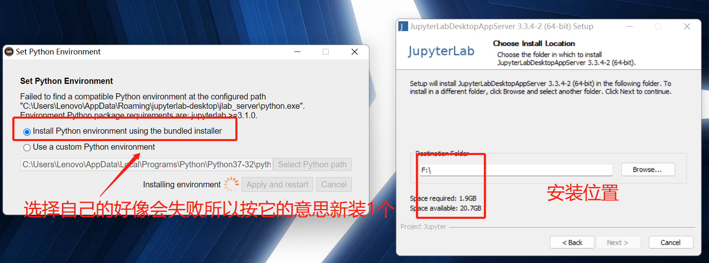
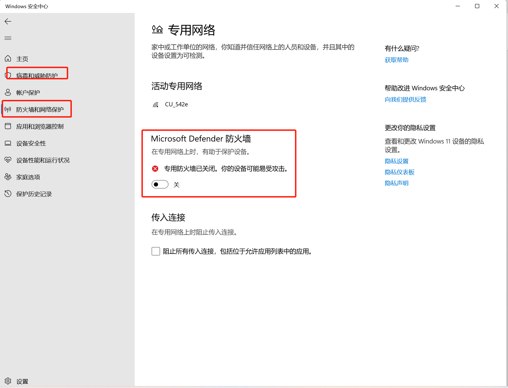
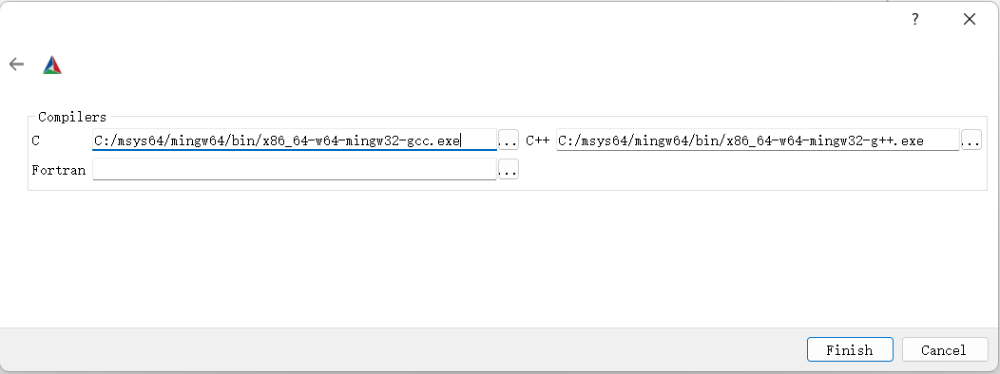
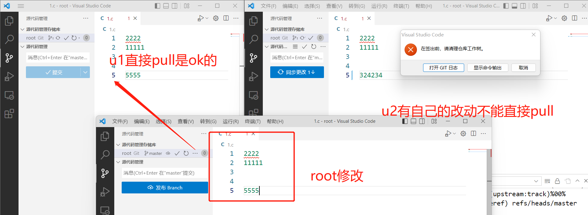

## 安装Python

下载地址：[Download Python | Python.org](https://www.python.org/downloads/)

注意安装的时候，勾选add_path即可，默认的python解释器地址在用户的Appdata\Local/Programs文件夹下，例如（但是如果你想安装tensorflow和pytorch，python版本过高可能无法下载，建议3.6-3.7版本）：

如果自己查找python包，注意寻找Windows x86-64 executable installer标识的下载包，这样可以一键安装。例如python3.6.5可在[Windows x86-64 executable installer](https://www.python.org/ftp/python/3.6.5/python-3.6.5-amd64.exe)下载，不过**3.6.5版本的pip最多支持到21.3.1版本**。

python<=>tensorflow版本对应关系可见：[在 Windows 环境中从源代码构建  |  TensorFlow (google.cn)](https://tensorflow.google.cn/install/source_windows#cpu)。

```powershell
C:\Users\Lenovo\AppData\Local\Programs\Python\Python36\python.exe
```

为了避免命名冲突（如果有多个python解释器），可以执行命令修改名称。

注：如果你只有1个解释器没必要修改！

```powershell
ren python.exe python36.exe
```

如果希望终端能够使用pip install xxx命令，要在环境变量添加pip的所在路径：

```powershell
C:\Users\Lenovo\AppData\Local\Programs\Python\Python37-32\Scripts\
```

这样就可以在终端使用pip命令安装python的依赖包。

参考图片：


### pip常见命令

```powershell
python -m pip install --upgrade pip 升级pip
C:\...\venv\Scripts\python.exe -m pip install --upgrade pip 这样也可以
pip list --outdated 列出过时包
pip install --upgrade numpy 升级
pip list -o 查看可升级的包
pip freeze 查看版本号
pip install pycaret --user 以管理员方式安装
pip install numpy==查看包有哪些版本 

pip install -i https://pypi.tuna.tsinghua.edu.cn/simple selenium # 清华源下载
其他镜像源：
[1] 阿里云 http://mirrors.aliyun.com/pypi/simple/
[2] 豆瓣http://pypi.douban.com/simple/
[3] 清华大学 https://pypi.tuna.tsinghua.edu.cn/simple/
[4] 中国科学技术大学 http://pypi.mirrors.ustc.edu.cn/simple/
[5] 华中科技大学http://pypi.hustunique.com/

pip3 install --index-url https://pypi.douban.com/simple pandas // 给定pypi链接下载
```

**官方下载包链接**：

[1. Python Extension Packages for Windows - Christoph Gohlke (uci.edu)](https://www.lfd.uci.edu/~gohlke/pythonlibs/)

[2. PyPI · The Python Package Index](https://pypi.org/)

### 安装autopep8

参考链接：[PyCharm配置autopep8](https://blog.csdn.net/lly1122334/article/details/111988359)

```powershell
pip install autopep8
```

pycharm外部工具设置参数。

```powershell
programs: autopep8(和名称相同)
Arguments:     --in-place --aggressive --aggressive $FilePath$
Working directory: $ProjectFileDir$
Output filters:  $FILE_PATH$\:$LINE$\:$COLUMN$\:.*
```


### 安装tensorflow

执行下方命令。

```powershell
pip install tensorflow-cpu==2.5.0 -i https://pypi.douban.com/simple/
```

如果提示下方错误，是因为python版本有点高，要求低于3.7.6版本，建议安装python3.6版本。

```powershell
No matching distribution found for tensorflow 
No matching distribution found for tensorflow-cpu==2.5.0
```

python<=>tensorflow版本对应关系可见：[在 Windows 环境中从源代码构建  |  TensorFlow (google.cn)](https://tensorflow.google.cn/install/source_windows#cpu)。

经过笔者实测，**python3.6.5版本最高可安装tensorflow-cpu-2.5.0版本**。为了防止安装位置错误，你可以**临时把其他解释器的路径从环境变量剔除**，终端python --version就是你刚安装的3.6.5版本了，记得先执行更新pip的命令，否则也无法下载tensorflow，此时再执行下载命令才会安装在python3.6.5版本的库目录。

```powershell
python -m pip install --upgrade pip
pip install tensorflow-cpu==2.5.0
```


下载好了以后，你可以把之前剔除的其他解释器如python37的路径再加回来环境变量，由于依赖都已经安装好了。你在pycharm或者vscode或者vs使用的时候切换到python36环境就可以使用tensorflow了。

例如，笔者在**python36安装了tensorflow、pytorch和opencv-python，tensorflow37安装了pyqt5和opencv-python，python39什么也没装，python310笔者没有安装已经卸载了**，这样各个环境互相不干扰，只需要IDE切换好解释器就可以。


对tensorflow进行测试，结果是ok的。


代码如下。

```python
'''
测试下tensorflow2.5.0-python3.6.5的环境
首次运行数据集会下载在C:\\Users\\Lenovo\\.keras\\datasets文件夹，也就是你的用户文件夹下。
'''
# main.py的代码
import tensorflow as tf
from tensorflow.keras import losses, optimizers
from tensorflow.keras import datasets
from tensorflow.keras import metrics
from HelloModel import HelloModel
import matplotlib.pyplot as plt
from tqdm import tqdm
def getDataGenerator():
    mnist = datasets.mnist
    (x_train, y_train), (x_test, y_test) = mnist.load_data()
    x_train, x_test = x_train / 255.0, x_test / 255.0

    # 添加新通道
    x_train = x_train[..., tf.newaxis]
    x_test = x_test[..., tf.newaxis]
    train_ds = tf.data.Dataset.from_tensor_slices(
        (x_train, y_train)).shuffle(10000).batch(32)
    test_ds = tf.data.Dataset.from_tensor_slices((x_test, y_test)).batch(32)
    return train_ds, test_ds


def train(train_ds, test_ds, epochs=5):
    model = HelloModel()
    lossFunction = losses.SparseCategoricalCrossentropy()  # (y_true,y_pred)
    optimizer = optimizers.Adam()

    train_loss = metrics.Mean(name='train_loss')
    train_acu = metrics.SparseCategoricalAccuracy(
        name='train_accuracy')  # update_state,reset_state
    test_loss = metrics.Mean(name='test_loss')
    test_acu = metrics.SparseCategoricalAccuracy(name='test_accuracy')

    @tf.function
    def train_step(images, labels):
        with tf.GradientTape() as tape:
            preditions = model(images)
            loss = lossFunction(labels, preditions)
        # 更新梯度
        gradients = tape.gradient(loss, model.trainable_variables)
        optimizer.apply_gradients(zip(gradients, model.trainable_variables))
        train_loss(loss)  # 计算损失和准确率
        train_acu(labels, preditions)

    @tf.function
    def test_step(images, labels):
        predictions = model(images)
        loss = lossFunction(labels, predictions)
        test_loss(loss)
        test_acu(labels, predictions)

    train_loss_list = []
    train_acu_list = []
    val_loss_list = []
    val_acu_list = []

    def mytrain():
        for epoch in tqdm(range(epochs)):
            train_loss.reset_states()
            train_acu.reset_states()
            test_loss.reset_states()
            test_acu.reset_states()

            for images, labels in train_ds:
                train_step(images, labels)
            for test_images, test_labels in test_ds:
                test_step(test_images, test_labels)

            train_acu_list.append(train_acu.result())
            train_loss_list.append(train_loss.result())
            val_acu_list.append(test_acu.result())
            val_loss_list.append(test_loss.result())

            printLog = 'epoch={}, train_loss = {}, train_acu = {}, test_loss = {}, test_acu = {}'
            print(printLog.format(epoch + 1,
                                  train_loss.result(),
                                  train_acu.result(),
                                  test_loss.result(),
                                  test_acu.result()))

    def plot_acu_loss():
        plt.subplot(2, 1, 1)
        plt.plot(range(epochs), train_acu_list, label='Training Accuracy')
        plt.plot(range(epochs), val_acu_list, label='Validation Accuracy')
        plt.legend(loc='lower right')
        plt.title('Training and Validation Accuracy')

        plt.subplot(2, 1, 2)
        plt.plot(range(epochs), train_loss_list, label='Training Loss')
        plt.plot(range(epochs), val_acu_list, label='Validation Loss')
        plt.legend(loc='upper right')
        plt.title('Training and Validation Loss')
        plt.show()

    mytrain()
    plot_acu_loss()


if __name__ == '__main__':
    train_ds, test_ds = getDataGenerator()
    train(train_ds, test_ds)
    
# 依赖中HelloWorld.py的代码
from typing import Any
from tensorflow.keras import Model
from tensorflow.keras.layers import Dense,Flatten,Conv2D
class HelloModel(Model):
    def __init__(self) -> Any:
        super(HelloModel,self).__init__()
        self.conv1 = Conv2D(32,3,activation='relu') # 32 kernels,kernel size=3
        self.flatten = Flatten()
        self.dense1 = Dense(128,activation='relu')
        self.dense2 = Dense(10,activation='softmax') # 10 classifications,[0,1]
    def call(self,x,**kwargs):
        # input=>[batch,28,28,1] output=>[batch,26,26,32]
        # N2=[(N1-k+2*p)/s]+1=[(28-3+2*0)/1]+1=26=>[batch,26,26,32]
        # flatten=>26*26*32=21632
        x = self.conv1(x) #[batch,26,26,32]
        x = self.flatten(x) # [batch,21632]
        x = self.dense1(x) # [batch,128]
        return self.dense2(x) # [batch,10]
if __name__ == '__main__':
    model = HelloModel()
    model.build(input_shape=(None,28,28,1))
    model.summary()
```

如果python的解释器有很多，建议[安装anaconda](#安装anaconda)去创建虚拟环境，然后切换环境，但是也是可能遭遇下载tensorflow之类的问题。

### 安装pytorch

```powershell
pip3 install torch torchvision torchaudio
pip install torchsummary // 必要的依赖
```

同理如果出现和安装tensorflow类似的错误信息，也是python版本过高，解决问题的方案相同。


同样对pytorch进行环境测试。

```python
'''
这里要注意2个问题，首次下载数据要指定下载的目标文件夹root，root我这里在用户文件夹下创建了.torch文件夹，就像.kera那样
首次下载时在torchvision.datasets.CIFAR10函数中要指定download=true，如果不是改为false
然后本程序运行的时候会把训练权重保存,所以也要指定路径，这里使用相对路径，也就是本文件所在的文件夹下，你可以默认不修改它
'''
# LeNetMain.py代码
import torch
import torchvision
import torch.nn as nn
from LeNetModel import LeNetModel
import torch.optim as optim
import torchvision.transforms as transforms
import matplotlib.pyplot as plt
root = r"C:\Users\Lenovo\.torch"
save_path = 'myLeNet.pt'
batch_size = 36
def getDataGenerator():
    transform = transforms.Compose( # 图片数据numpy->tensor并标准化
        [transforms.ToTensor(),
         transforms.Normalize((0.5, 0.5, 0.5), (0.5, 0.5, 0.5))])
    train_set = torchvision.datasets.CIFAR10(root=root, train=True, #这里download=True
                                             download=True, transform=transform)
    train_loader = torch.utils.data.DataLoader(train_set, batch_size=batch_size,
                                               shuffle=True, num_workers=0)
    val_set = torchvision.datasets.CIFAR10(root=root, train=False,
                                           download=True, transform=transform)
    val_loader = torch.utils.data.DataLoader(val_set, batch_size=5000, # 验证集多一些,1次验证5000张
                                             shuffle=False, num_workers=0)
    return train_loader,val_loader

def train(train_loader,val_loader,epochs=10):
    val_data_iter = iter(val_loader) # 将启动器转为可迭代的启动器
    val_image, val_label = val_data_iter.next() # 图像、标签成对迭代器next

    model = LeNetModel()
    loss_function = nn.CrossEntropyLoss()
    optimizer = optim.Adam(model.parameters(), lr=0.001)
    train_epoch_acu,train_epoch_loss = [],[]
    for epoch in range(epochs):
        running_loss = 0.0 # 每个周期的累积运行损失
        # step取决于样本数量和批次的商
        for step, data in enumerate(train_loader, start=0): # 从训练数据的启动器获取每步和数据,start为下标的起始位置,可指定遍历的起始位置
            inputs, labels = data # data是列表 [inputs, labels]
            # forward + backward + optimize
            optimizer.zero_grad()
            outputs = model(inputs)
            loss = loss_function(outputs, labels)
            loss.backward()
            optimizer.step()

            running_loss += loss.item() # 取出损失
            if step % 500 == 499:    # 每500步打印一次信息
                with torch.no_grad(): # 验证集不进行梯度计算
                    # 验证集是每次验证5000个
                    outputs = model(val_image)  # [batch, 5000],val_image自动可迭代,就无需自己写循环了
                    # print(outputs.size()) # 5000×10
                    # torch.max函数返回values,indices,即最大值所在索引,恰好就是预测的标签
                    predict_y = torch.max(outputs, dim=1)[1] # max在第2个维度比较,某行列元素之间,可用argmax代替
                    # print(predict_y.size()) # (5000,)
                    accuracy = torch.eq(predict_y, val_label).sum().item() / val_label.size(0) # 标签相等的数目之和除总的标签数
                    running_loss = running_loss / 500
                    print('[epoch=%d, step=%5d] loss: %.3f  test_acu: %.3f' %
                          (epoch + 1, step + 1, running_loss, accuracy)) # 准确来说是每每500步acu,loss的值,其中loss是平均值,acu是实时渐变值
                    train_epoch_acu.append(accuracy)
                    train_epoch_loss.append(running_loss)
                    running_loss = 0.0 # 每500步计算损失值然后清零
    torch.save(model.state_dict(), save_path) # 保存模型
    return train_epoch_acu,train_epoch_loss
def plot_acu_loss(acu,loss):
    plt.subplot(1, 2, 1)
    plt.plot(range(len(acu)), acu, label='acu')
    plt.legend(loc='lower right')
    plt.xlabel("global steps")
    plt.ylabel("acu")
    plt.title('Training  Accuracy')

    plt.subplot(1, 2, 2)
    plt.plot(range(len(acu)), loss, label='loss')
    plt.xlabel("global steps")
    plt.ylabel("acu")
    plt.legend(loc='upper right')
    plt.title('Training  Loss')
    plt.show()
if __name__ == '__main__':
    epochs = 20
    acu,loss = train(*(getDataGenerator()),epochs=epochs)
    plot_acu_loss(acu,loss)
    
# LeNetModel.py代码
import torch.nn as nn
from torch.nn import functional
from torchsummary import summary
class LeNetModel(nn.Module):
    def __init__(self):
        super(LeNetModel,self).__init__()
        self.conv1 = nn.Conv2d(3,16,5)
        self.pool1 = nn.MaxPool2d(2, 2)
        self.conv2 = nn.Conv2d(16, 32, 5)
        self.pool2 = nn.MaxPool2d(2, 2)
        self.fc1 = nn.Linear(32*5*5, 120)
        self.fc2 = nn.Linear(120, 84)
        self.fc3 = nn.Linear(84, 10)
    def forward(self, x):
        x = functional.relu(self.conv1(x))      # input(3, 32, 32) output(16, 28, 28)
        x = self.pool1(x)                       # output(16, 14, 14)
        x = functional.relu(self.conv2(x))      # output(32, 10, 10)
        x = self.pool2(x)                       # output(32, 5, 5)
        x = x.view(-1, 32*5*5)                  # output(32*5*5)
        x = functional.relu(self.fc1(x))        # output(120)
        x = functional.relu(self.fc2(x))        # output(84)
        x = self.fc3(x)                         # output(10)
        return x
if __name__ == '__main__':
    model = LeNetModel()
    summary(model, (3,32,32))
```


### 安装cv2

命令含义是，安装py3.7支持的win x64下的opencv-4.5.5版本，所以要与你的python版本一致。

包的查询可见：[Python Extension Packages for Windows - Christoph Gohlke (uci.edu)](https://www.lfd.uci.edu/~gohlke/pythonlibs/)

```powershell
pip install opencv_python‑4.5.5‑cp37‑cp37m‑win_amd64.whl
```

或者不指定版本，自适应安装。

```powershell
pip install opencv-python -i https://pypi.douban.com/simple
```


测试opencv。

```python
import cv2
img = cv2.imread("lena.jpg")
cv2.namedWindow("Image")
cv2.imshow("Image",img)
cv2.waitKey(0)
cv2.destroyAllWindows()
```


### 安装jupyterlab

注：**此应用安装问题没有解决，如果你想要尝试自己解决**，可以参考以下内容，但是可能会出现问题

可以终端使用命令安装，不过这是网页版，见[jupyterlab · PyPI](https://pypi.org/project/jupyterlab/#files)，或者[jupyterlab-github.com](https://github.com/jupyterlab/jupyterlab-desktop)。

```powershell
pip install jupyterlab-requirements //先安装依赖
pip install jupyterlab
```

可能会提示问题，从原因来看是pywinpty是rust编译的，然后在https://rustup.rs/可以安装，这里笔者不用rust，所以也就没去尝试解决这个问题。

```powershell
Collecting pywinpty
  Using cached pywinpty-2.0.5.tar.gz (23 kB)
  Installing build dependencies ... done
  Getting requirements to build wheel ... done
  Preparing metadata (pyproject.toml) ... error
  error: subprocess-exited-with-error

  × Preparing metadata (pyproject.toml) did not run successfully.
  │ exit code: 1
  ╰─> [6 lines of output]

      Cargo, the Rust package manager, is not installed or is not on PATH.
      This package requires Rust and Cargo to compile extensions. Install it through
      the system's package manager or via https://rustup.rs/

      Checking for Rust toolchain....
      [end of output]

  note: This error originates from a subprocess, and is likely not a problem with pip.
error: metadata-generation-failed

× Encountered error while generating package metadata.
╰─> See above for output.

note: This is an issue with the package mentioned above, not pip.
hint: See above for details.
```

笔者还尝试了下载桌面版，[JupyterLab-Setup-Windows.exe - 22 Apr 2022](https://github.com/jupyterlab/jupyterlab-desktop/releases)。

默认换装在C盘。

```powershell
C:\JupyterLab
```

安装过程，有个选项，安装新的解释器还是使用已存在的，这里我选择已存在的解释器python3.6.5或者python3.7.8均不通过，所以应该只能安装新的解释环境。



还有一些勾选，不过这里第二条可以注意，如果你主要依赖jupyter写代码，可以勾选。就像他说的，如果勾选了，在vscode、pycharm等可以自动检测到jupyter，不过设为默认的话其实在环境变量就是上下移动路径即可。排在第一的路径解释器自然是首先被搜索到，也是默认的解释器。

这里笔者不勾选，jupyterLab不必要设置为默认的，我用自己配置好的解释器就行，也就是python3.6.5和python3.7.8，它安装的是python3.8x，所以不勾选了。


不过从实际情况来看，不知为何总是提示错误，总之安装失败。

```powershell
Failed to find a compatible Python environment at the configured path "C:\Users\Lenovo\AppData\Roaming\jupyterlab-desktop\jlab_server\python.exe". Environment Python package requirements are: jupyterlab >=3.1.0.
```

后来笔者发现，**其实E:\anaconda\python.exe的库目录下已经安装过jupyterLab了，完全没必要再安装**，可以参考[安装anaconda](#安装anaconda)。


可以这样启动jupyterLab，**首先激活环境，然后输入命令jupyter lab**。

```powershell
conda activate base
jupyter lab
```


或者在anaconda 的navigator右键root-base以jupyter方式打开也是可以的。

用户文件夹会自动生成以下文件夹，保留jupyter格式文件的回调内容。

```powershell
C:\Users\Lenovo\.ipython
C:\Users\Lenovo\.jupyter
```

## 安装VS

可以去官网或者联想商店，安装下载器，下载器打开后，注意在可用中有3种版本。

即社区版、专业版和企业版，这里选择专业版，如果需要激活可以去淘宝买序列号。

下载地址：[VisualStudioSetup.exe](https://visualstudio.microsoft.com/zh-hans/downloads/)

如果勾选过Python，如果选择默认的安装地址，其Python解释器所在地址可能是这：

```powershell
C:\Program Files (x86)\Microsoft Visual Studio\Shared\Python39_64\python.exe
```

为了防止与全局Python的python.exe冲突，可以更名为python396.exe

```powershell
C:\Program Files (x86)\Microsoft Visual Studio\Shared\Python39_64\python396.exe
```

改名的话，可以cd到所在目录，执行命令（如果提示拒绝访问，则win+r输入cmd，以ctrl+shift+enter启动而不是直接敲回车，就可以以管理员权限打开cmd）。

```powershell
cd C:\Program Files (x86)\Microsoft Visual Studio\Shared\Python39_64
ren python.exe python396.exe
```

如果不更改名字，终端输入命令，就会出现多个python.exe，可能默认的版本不是自己想要的版本。

```powershell
where python
```

关于Python环境的测试，首先需要配置环境，会有自动检测的环境，这里笔者是python37，然后自己定义的环境是VS带的python396，如果没改过名字，VS的其实也可以检测出来，但是这不重要，自己添加也是ok的。

配置环境和管理依赖包参考：


自行配置环境可以参考下方图片，这里又将python310的环境引入：


使用之前，务必先激活环境，然后再使用。


然后就可以使用以下代码进行测试，任选一个环境激活即可，安装过以下3个依赖即可。

```python
import numpy as np
import matplotlib.pyplot as plt
import pandas as pd
x = np.linspace(0,2*np.pi,100)
y = np.sin(x)
plt.plot(x,y)
plt.show()
```

参考图片：


## 安装PyCharm

社区版下载地址：[下载 PyCharm：JetBrains 为专业开发者提供的 Python IDE](https://www.jetbrains.com/zh-cn/pycharm/download/#section=windows)

破解版下载地址：https://pan.baidu.com/s/1cCCjAlwUvycey3dVwV9pPQ 提取码：m677

破解版打开以后会出现试用30天的界面，选择**evaluate free**，然后把下载文件夹中的文件**jetbrains-agent-latest.zip直接拖到界面**上，就像把文件拖到Github上传文件那样，然后提示重启。重启之后，可以找到菜单栏的about可以看到激活年限，会显示2089年。然后汉化可以在文件->设置->plugins搜索chinese安装，或者右击应用图标打开文件所在位置，**进入bin文件夹**，将**下载文件夹的resources_cn.jar复制进来**，重启IDE即可。

新建Project的时候，会有2种方案配置解释器环境，或者自己先创建好工程，然后自行在**文件->设置->项目->Python解释器设置**。

图片参考：


第一、可以创建新的虚拟环境，这个环境可以勾选继承自全局Python主环境的安装包，也就是[安装Python](#安装Python)所提到的解释器地址。

第二、也可以使用现有的解释器，可以选择[安装Python](#安装Python)提到的解释器，也可以使用[安装VS](#安装VS)提到的解释器，还可以使用[msys配置](#msys配置)自带的解释器。

即以下路径都是可以的，如果提示找不到Python打包工具，就安装即可。

```powershell
C:\msys64\mingw64\bin\python39.exe
C:\msys64\mingw64\bin\python3.9.exe
C:\msys64\mingw64\bin\python390.exe
C:\Program Files (x86)\Microsoft Visual Studio\Shared\Python39_64\python396.exe
C:\Users\Lenovo\AppData\Local\Programs\Python\Python310\python310.exe
```

配置代码模板：

```python
#%%
# -*- coding UTF-8 -*-
'''
@Project : ${PROJECT_NAME}
@File : ${NAME}.py
@Software: ${PRODUCT_NAME}
@Author : chenbei
@Email : chenbei_electric@163.com
@Date : ${DATE} ${TIME}
'''
import matplotlib.pyplot as plt
import numpy as np
import pandas as pd
from matplotlib.pylab import mpl
from matplotlib.font_manager import FontProperties
mpl.rcParams['font.sans-serif'] = ['Times New Roman'] # 设置字体风格,必须在前然后设置显示中文
mpl.rcParams['font.size'] = 10.5 # 图片字体大小
mpl.rcParams['font.sans-serif'] = ['SimHei','SongTi'] # 显示中文的命令
mpl.rcParams['axes.unicode_minus'] = False  #  显示负号的命令
plt.rcParams['image.interpolation'] = 'nearest' # 设置 interpolation style
plt.rcParams['savefig.dpi'] = 600 # 图片像素
plt.rcParams['figure.dpi'] = 400 # 分辨率
font_set = FontProperties(fname=r"C:\Windows\Fonts\simsun.ttc", size=10.5) # matplotlib内无中文字节码，需要自行手动添加
```

其他不常用的模板变量：

```powershell
$ {USER} - 当前用户的登录名。
$ {YEAR} - 今年。
$ {MONTH} - 当月。
$ {DAY} - 当月的当天。
$ {HOUR} - 目前的小时。
```

还可以在市场安装插件，例如github copilot、chinese以及autopep8等。

## 安装anaconda

下载地址：https://www.anaconda.com/。

为了终端可以使用conda命令，将以下路径添加金环境变量，从安装目录寻找。

```powershell
E:\anaconda\Scripts
```

conda常见的命令：

```powershell
conda create -n xxx python=3.6.5 创建xxx环境
conda activate xxx 激活xxx环境
conda init 可以得到是否已更改的信息
conda deactivate 取消激活
conda env list 列出conda管理的所有环境
conda install tensorflow
conda list 列出当前环境的所有包
conda remove numpy 卸载包
conda remove -n xxx --all 删除xxx环境及下属所有包
conda update -n xxx numpy 更新xxx环境的numpy包
conda env export > environment.yaml 导出当前环境的包信息
conda env create -f environment.yaml 用配置文件创建新的虚拟环境

更多命令终端输入conda即可显示
```

安装过程**不要勾选把anaconda路径添加进环境变量，同时勾选python3.9版本**，如他所说可以支持VS、Python以及各类环境，从而可以检测到已存在的环境。

打开ANACONDA.NAVIGATOR，也可以手动创建环境，参考图片如下。


现在命令行创建1个虚拟环境：

```powershell
conda create -n forTF python=3.6.5
conda activate forTF 激活
conda init 首次激活需要执行此命令,然后重启终端
conda activate forTF 再次激活
conda remove -n forTF --all 移除该环境
```

你可以在以下目录查找你安装过的环境。

```powershell
E:\anaconda\envs
```

尝试安装tensorflow。

```powershell
conda install tensorflow 
```

如果提示如下错误信息，是通道不对，该通道目前没有这个包。

```powershell
Collecting package metadata (current_repodata.json): done
Solving environment: failed with initial frozen solve. Retrying with flexible solve.
Collecting package metadata (repodata.json): done
Solving environment: failed with initial frozen solve. Retrying with flexible solve.

PackagesNotFoundError: The following packages are not available from current channels:

  - tensorflow-cpu

Current channels:

  - https://repo.anaconda.com/pkgs/main/win-64
  - https://repo.anaconda.com/pkgs/main/noarch
  - https://repo.anaconda.com/pkgs/r/win-64
  - https://repo.anaconda.com/pkgs/r/noarch
  - https://repo.anaconda.com/pkgs/msys2/win-64
  - https://repo.anaconda.com/pkgs/msys2/noarch

To search for alternate channels that may provide the conda package you're
looking for, navigate to

    https://anaconda.org

and use the search bar at the top of the page.
```

可以参考解决方案：[PackagesNotFoundError: The following packages are not available from current channels的解决办法](https://blog.csdn.net/weixin_45552562/article/details/109668589)（不过笔者没成功，其他的也没尝试）

```powershell
// 后来笔者发现，不要激活环境，直接终端执行命令
conda install -c intel tensorflow // 可以安装成功，安装的是基于anaconda的而不是虚拟环境
```

但是笔者还发现，这样的话似乎安装的不在这个虚拟环境里边，packages in environment at E:\anaconda:，实际安装在了conda-meta(也就是base环境)，使用conda list可以查看已安装的包。

```powershell
E:\anaconda\conda-meta
conda list
conda activate base 激活base环境
```

不过这里安装的tensorflow是intel版本，可能不符合常规的cpu-2.5.0版本。

2022/6/14，安装tensorflow的问题已经解决，可见[安装tensorflow](#安装tensorflow)的说明。

## 安装Typora

Typora现在不免费，可以在微信公众号：软件智库找到下载。

土豪地址：[Typora - 轻量级跨平台 Markdown 编辑器 正版授权](https://store.lizhi.io/p/typora?cid=xztt6ynq)

公众号地址：[文本编辑器Typora软件下载和安装教程|兼容WIN10](https://mp.weixin.qq.com/s?__biz=MzIyNjk1MjA5MA==&mid=2247492495&idx=1&sn=5b722c8e5aadb65fc726d6e7e703b4c7&chksm=e86a357adf1dbc6c87fe507a3a95fbf6e5db0e0e0fee209a615581baa75ec0398e3410b67a56&scene=21#wechat_redirect).

下载链接：http://www.zhanshaoyi.com/11364.html

百度云64位：[下载密码:**hks9**](https://pan.baidu.com/share/init?surl=524uQlPYgfAwZ8x7R_cmZA)

百度云32位：[下载密码:**fr5d**](https://pan.baidu.com/share/init?surl=NorhEr_tOnB7FELeGzDbzQ)

百度云解压密码：**rjzkgzh**

## 安装Bandzip

下载地址：[BANDIZIP-SETUP-STD-X64.exe](http://www.bandisoft.com/)

无广告，无尿点的解压软件。

## 安装copytranslator

下载地址：[CopyTranslator](https://copytranslator.github.io/download/#在线交流与反馈)。

推荐下载v9.0.0版本，比较完整。

推荐的设置如下。


## 安装Graphviz

这个是tensorflow-board绘制图的时候可能需要用的插件，如果没有，就会提示错误。

下载地址：[graphviz-4.0.0 (64-bit) EXE installer [sha256]](http://graphviz.org/download/)。

安装过程记得勾选，添加路径到当前用户的环境变量，安装目录在

```powershell
E:\Graphviz
```

检查以下目录是否在环境变量中，没有就手动添加。

```powershell
E:\Graphviz\bin
```

## 安装Qt

下载地址：[qt-opensource-windows-x86-5.9.9.exe](https://download.qt.io/archive/qt/5.9/5.9.9/)

下载地址这里要在/archive下载5.9.9版本，这是最接近Qt6的而且带有exe安装程序的版本，无需自己编译。

以防万一，如果官网以后不提供免费的下载地址，则可以从百度云盘下载。另外安装之前，一定要注册Qt的账号，而且建议使用学校的邮箱或者公司的邮箱，否则很可能注册不下来。

百度云盘地址：

链接：https://pan.baidu.com/s/1nGYoJtY2aWrt8DG7zZA2Kw 
提取码：122l

安装勾选的配置，参考如下。


### vs配置qt

打开VS，继续无代码，菜单栏找到扩展->管理扩展，右侧搜索Qt，下载插件Qt Visual Studio Tools，下载完毕会让你关闭VS，然后重启即可。

参考图片：


再次打开VS，找到菜单栏的扩展，会发现多出Qt VS Tools选项，点击Option选项，弹出的界面，找到version设置之前安装过的2个Qt编译器，即mingwx32和msvc2017x64(默认)。两个路径，默认是安装目录下的Qt5.9.9下。

```powershell
E:\Qt5.9.9\5.9.9\msvc2017_64\qmake
E:\Qt5.9.9\5.9.9\mingw53_32\qmake
```

参考图片：


现在再重启，就可以创建Qt项目了。

参考图片：


然后新建1个项目之后，会生成4个文件，**ui文件需要右键选择打开方式**，然后选择合适的designer.exe，否则会闪退。步骤可以参考下方图片。因为默认使用的MSVC2017，所以可以添加以下路径作为打开方式。当然如果默认是mingw32也可以，对应另1个designer.exe。

```
E:\Qt5.9.9\5.9.9\msvc2017_64\bin\designer.exe
E:\Qt5.9.9\5.9.9\mingw53_32\bin\designer.exe
```


设置designer.exe路径的参考图片如下。


现在VS配置Qt的过程就完毕了。

**参考配置链接：**

[vs2019配置Qt5开发环境](https://www.jb51.net/article/231915.htm)

[VS打开Qt ui文件后弹出无法打开文件的问题](https://blog.csdn.net/oLuoJinFanHua12/article/details/121605625)

### qtcreator

如果不适用VS，直接使用自带的QtCreator也是可以的。

这里是一些自己喜欢的配置，工具栏->选项，在环境->用户界面的设置如下。


字体颜色设置。


行为设置换行，以及制表符等，这样每次换行是对齐上一行代码位置的。


其他的自行设置，已经可以开启你的Qt之旅了。

### pycharm配置qt

也就是说如果你希望使用PyQt5来构建项目，而不是使用C++可以考虑以下的配置。

首先在win+r+cmd打开终端，下载3个库，PyQt5不再提供Qt Designer等工具，所以需要再安装pyqt5-tools。

这里注意，如果安装过多个python.exe解释器，例如全局Python，mingw带的和VS带的，最好将其改名区分，否则笔者就出现了错误，**其实默认的是mingw带的而不是全局python，这样因为解释器是GCC版本，所以安装下属包的时候会提示错误"is not a supported wheel on this platform**"。

所以，例如VS的可以取名为python396，mingw取名为python390和python3.9或python39，全局python可以可以改为python310，但是最好有1个本来的名字是python.exe，**否则使用pip命令时会无法创建进程**。

如果直接进入文件夹，**右键改名可能会提示已经在资源管理器打开而无法重命名，那么就可以终端去改名**。

```powershell
C:\Users\Lenovo\AppData\Local\Programs\Python\Python310
ren python.exe python310.exe
```

然后，执行以下命令安装依赖。

```powershell
python -m pip install --upgrade pip // 首先更新pip
pip install sip // python和c++的接口库
pip install pyqt5
pip install pyqtchart // 使用PyQt5.QtChart需要
```

如果提示metadata-generation-failed，这可能是因为**使用了python310版本不支持**，所以可以使用python36或者python37版本。

图片显示：


这里笔者重新官网下载了python3.7.8版本，见[Python Releases for Windows Installer | Python.org](https://www.python.org/downloads/windows/)。

再次终端输入where python，输出信息如下，可以看到，现在默认的是python37-32版本了。

这里不改名，已改名的是python310，python396和python390这3个解释器。

```powershell
C:\Users\Lenovo\AppData\Local\Programs\Python\Python37-32\python.exe
C:\Users\Lenovo\AppData\Local\Microsoft\WindowsApps\python.exe
```

图片参考：


现在再下载就没有再出问题了。

好了，现在可以打开pycharm，打开设置->外部工具，设置Qt安装目录下的designer.exe，这个可以在安装的Qt查找，可见[安装Qt](#安装Qt)。

图片参考：


然后**配置PyUIC，用于把QtDesigner创建的UI文件转换成py文件**，以后使用的时候就可以直接右键ui文件使用外部工具直接编译了。

```powershell
程序：C:\Users\Lenovo\AppData\Local\Programs\Python\Python37-32\python.exe
实参：-m PyQt5.uic.pyuic  $FileName$ -o $FileNameWithoutExtension$.py
工作目录：$ProjectFileDir$
```


同理可以配置**Pyrcc.exe的外部工具，用于编译资源文件**。

```powershell
程序：C:\Users\Lenovo\AppData\Local\Programs\Python\Python37-32\Scripts\pyrcc5.exe
实参：$FileName$ -o $FileNameWithoutExtension$_rc.py
工作目录：$FileDir$
```

参考网址：

[1.PyCharm安装PyQt5及其工具(Qt Designer、PyUIC、PyRcc)](https://wuxian.blog.csdn.net/article/details/108867482?spm=1001.2101.3001.6650.2&utm_medium=distribute.pc_relevant.none-task-blog-2~default~CTRLIST~default-2-108867482-blog-104643487.pc_relevant_aa&depth_1-utm_source=distribute.pc_relevant.none-task-blog-2~default~CTRLIST~default-2-108867482-blog-104643487.pc_relevant_aa&utm_relevant_index=5)。

[2.PyCharm安装PyQt5及其工具(Qt Designer、PyUIC、PyRcc)](https://blog.csdn.net/qq_43950000/article/details/120596301?utm_medium=distribute.pc_relevant.none-task-blog-2~default~baidujs_baidulandingword~default-4-120596301-blog-81841050.pc_relevant_blogantidownloadv1&spm=1001.2101.3001.4242.3&utm_relevant_index=7)。

最后一步，设置**环境变量QT_PLUGIN_PATH**，地址是

```powershell
C:\Users\Lenovo\AppData\Local\Programs\Python\Python37-32\Lib\site-packages\PyQt5\Qt5\plugins
```

还要把这个**plugins文件夹复制到Qt的编译器mingw或者msvc(默认)下的bin文件夹下**也就是

```powershell
E:\Qt5.9.9\5.9.9\msvc2017_64\bin (默认)
or
E:\Qt5.9.9\5.9.9\mingw53_32\bin
```

现在重启pycharm，就可以使用外部工具designer启动UI设计界面，然后设计，再使用外部工具pyuic编译即可。

参考图片：


如果一定不需要自动编译，一定要手动编译的话也是可以的，只需要终端cd到ui文件所在的文件夹，把pyuic5当成g++那么用就行，命令如下。

注：pyuic之所以可以使用，是因为全局C:\Users\Lenovo\AppData\Local\Programs\Python\Python37-32\Scripts包含了这个.exe可执行文件。

```powershell
cd D:\PycharmProfessional // 如果cd不到其它磁盘,例如d盘,直接输入d:就可以切换磁盘
d: // 因为cd是用于磁盘文件的切换而不是磁盘
pyuic5 -o hello_pyqt5.py hello_pyqt5.ui // 编译会生成py文件
```

随便设计一个界面，在ui中拖动1个QLable文件，输入文字hello,pyqt5，其他默认就可以，编译ui文件生成py文件，然后在主程序按照下方方式编写运行代码，说明配置成功。

```python
// hello_pyqt5.ui文件自动编译生成的hello_pyqt5.py文件内容是
# -*- coding: utf-8 -*-

# Form implementation generated from reading ui file 'hello_pyqt5.ui'
#
# Created by: PyQt5 UI code generator 5.15.6
#
# WARNING: Any manual changes made to this file will be lost when pyuic5 is
# run again.  Do not edit this file unless you know what you are doing.
from PyQt5 import QtCore, QtGui, QtWidgets
class Ui_hello_pyqt5(object):
    def setupUi(self, hello_pyqt5):
        hello_pyqt5.setObjectName("hello_pyqt5")
        hello_pyqt5.resize(400, 300)
        self.label = QtWidgets.QLabel(hello_pyqt5)
        self.label.setGeometry(QtCore.QRect(150, 100, 131, 18))
        self.label.setObjectName("label")

        self.retranslateUi(hello_pyqt5)
        QtCore.QMetaObject.connectSlotsByName(hello_pyqt5)

    def retranslateUi(self, hello_pyqt5):
        _translate = QtCore.QCoreApplication.translate
        hello_pyqt5.setWindowTitle(_translate("hello_pyqt5", "Form"))
        self.label.setText(_translate("hello_pyqt5", "hello pyqt5"))
```

主代码文件main.py代码如下。

```python
# %%
# -*- coding UTF-8 -*-
'''
@Project : PycharmProfessional
@File : main.py
@Software: PyCharm
@Author : chenbei
@Email : chenbei_electric@163.com
@Date : 2022/6/11 21:27
'''
import sys
from hello_pyqt5 import Ui_hello_pyqt5
from PyQt5.QtWidgets import QApplication, QWidget
if __name__ == '__main__':
    app = QApplication(sys.argv)
    MainWidget = QWidget()
    ui = Ui_hello_pyqt5()
    ui.setupUi(MainWidget)//相当于该QWidget对象继承了这个ui
    MainWidget.show()
    sys.exit(app.exec_())
```

参考生成的图片：


此时，使用PyQt5也可以学习Qt了。

**参考配置链接**：

[1.ComputerVision/python配置环境.md at main · chenbei97/ComputerVision (github.com)](https://github.com/chenbei97/ComputerVision/blob/main/markdown/配置环境相关/python配置环境.md)

[2.pycharm+QT5+python3安装与环境配置](https://www.cnblogs.com/cthon/p/9379883.html)

### qt调用python内置库

新建好工程之后，添加外部库。注意一般python的路径是在用户的appdata/local/programs/python下。选择静态库，为debug版本添加d作为后缀，所以必须要在python的libs下复制一份静态库然后添加尾缀d。

第一步：复制静态库


第二步：把外部库添加进来


第三步，自动生成的代码会添加进pro文件。


```cmake
win32:CONFIG(release, debug|release): LIBS += -L$$PWD/../../AppData/Local/Programs/Python/Python37-32/libs/ -lpython3
else:win32:CONFIG(debug, debug|release): LIBS += -L$$PWD/../../AppData/Local/Programs/Python/Python37-32/libs/ -lpython3d

INCLUDEPATH += $$PWD/../../AppData/Local/Programs/Python/Python37-32/libs
DEPENDPATH += $$PWD/../../AppData/Local/Programs/Python/Python37-32/libs

win32-g++:CONFIG(release, debug|release): PRE_TARGETDEPS += $$PWD/../../AppData/Local/Programs/Python/Python37-32/libs/libpython3.a
else:win32-g++:CONFIG(debug, debug|release): PRE_TARGETDEPS += $$PWD/../../AppData/Local/Programs/Python/Python37-32/libs/libpython3d.a
else:win32:!win32-g++:CONFIG(release, debug|release): PRE_TARGETDEPS += $$PWD/../../AppData/Local/Programs/Python/Python37-32/libs/python3.lib
else:win32:!win32-g++:CONFIG(debug, debug|release): PRE_TARGETDEPS += $$PWD/../../AppData/Local/Programs/Python/Python37-32/libs/python3d.lib
```

这只是把libs文件夹添加进去，还有手动再添加2行代码，把python的include文件夹添加进去。

```cmake
INCLUDEPATH += $$PWD/../../AppData/Local/Programs/Python/Python37-32/include
DEPENDPATH += $$PWD/../../AppData/Local/Programs/Python/Python37-32/include
```

第四步，创建一个python文件，在main.cpp的同级目录下，名称为test_python.py，代码如下。

```python
def show():
    print("hello!")

def sum(a,b):
    ret = a + b
    print("sum(1,2)=",ret)
    return ret

def main():
    show()
    print("main: ",sum(1,2))

if __name__ == '__main__':
    main()
```

第五步：在main.cpp添加一个测试函数，无关的代码先注释掉，要包含Python.h文件，然后编译。

```c++
#include <Python.h>
/*
 * 要在object.h中添加2行代码,因为python定义的slots和qt定义的slots重合了
typedef struct{
    const char* name;
    int basicsize;
    int itemsize;
    unsigned int flags;
    #undef slots 添加
    PyType_Slot *slots;
    #define slots Q_SLOTS 添加
} PyType_Spec;
**/

int test_python()
{
    Py_Initialize();
    if(!Py_IsInitialized())
    {
        qDebug()<<"Python init fail!"; // python初始化失败
        return -1;
    }
    // PyRun_SimpleString("import os,sys,numpy");
    PyRun_SimpleString("import os,sys");
    // PyRun_SimpleString("import numpy as np");
	// PyRun_SimpleString("print(np.linspace(0,10,11))");
    PyRun_SimpleString("sys.argv = ['python.py']");
    PyRun_SimpleString("sys.path.append('../pytest')"); // 如果用./,python脚本要放在debug目录下,如果用../，那么脚本可以放在main.cpp同级 这里放在同级的文件夹下
    PyRun_SimpleString("print(os.getcwd())"); // 测试当前路径 C:\Users\Lenovo\Desktop\30kW-SourceLoad-abridged\build-30kW-SourceLoad-Debug
    PyObject* pModule = PyImport_ImportModule("test_python");//自定义的py文件名称
    if (!pModule)
     {
         qDebug()<<"Cant open python file!\n"; // 找不到自定义的python脚本
         return -1;
     }

    PyObject* pFunshow= PyObject_GetAttrString(pModule,"show"); // 调用脚本的show函数
    if(!pFunshow){
        qDebug()<<"Get show function hello failed";
        return -1;
    }
    PyObject_CallFunction(pFunshow,Q_NULLPTR);
    qDebug()<<"pFunshow is called";
    PyObject* pFunsum= PyObject_GetAttrString(pModule,"sum"); // 调用脚本的show函数
    if(!pFunsum){
        qDebug()<<"Get sum function hello failed";
        return -1;
    }
    PyObject_CallFunction(pFunsum,"ii",1,2); // 传参的规则可见 https://blog.csdn.net/Windgs_YF/article/details/91431282
    qDebug()<<"pFunsum is called";

    //结束，释放python
    Py_Finalize();

    return 0;
}
int main(int argc, char *argv[])
{
    return test_python();
    // 其他代码先注释掉
}
```

这里要说明的是"PyObject_CallFunction"，这个的用法可参考"Py_BuildValue"设定规则。每种数据类型的含义可见[Parsing arguments and building values — Python 3.7.15 documentation](https://docs.python.org/release/3.7.15/c-api/arg.html?highlight=py_buildvalue#c.Py_BuildValue)。


上述图片的文字版本如下所示，可见[1. 使用 C 或 C++ 扩展 Python — Python 3.7.13 文档](https://docs.python.org/zh-cn/3.7/extending/extending.html#a-simple-example)提供的例子。

```c++
Py_BuildValue("")                        None
Py_BuildValue("i", 123)                  123
Py_BuildValue("iii", 123, 456, 789)      (123, 456, 789)
Py_BuildValue("s", "hello")              'hello'
Py_BuildValue("y", "hello")              b'hello'
Py_BuildValue("ss", "hello", "world")    ('hello', 'world')
Py_BuildValue("s#", "hello", 4)          'hell'
Py_BuildValue("y#", "hello", 4)          b'hell'
Py_BuildValue("()")                      ()
Py_BuildValue("(i)", 123)                (123,)
Py_BuildValue("(ii)", 123, 456)          (123, 456)
Py_BuildValue("(i,i)", 123, 456)         (123, 456)
Py_BuildValue("[i,i]", 123, 456)         [123, 456]
Py_BuildValue("{s:i,s:i}",
              "abc", 123, "def", 456)    {'abc': 123, 'def': 456}
Py_BuildValue("((ii)(ii)) (ii)",
              1, 2, 3, 4, 5, 6)          (((1, 2), (3, 4)), (5, 6))
```

除了上述涉及的格式化参数，所有C/C++的各种类型转换成Python的类型，对照表如下。

```
(1) 整型
i (int) [int]
将C-int转换为Python整数对象
I (int) [unsigned int]
将C-unsigned int转换为Python整数对象

b (int) [char]
将C-char转换为Python整数对象
B (int) [unsigned char]
将C-unsigned char转换为Python整数对象

h (int) [short]
将C-short int转换为Python整数对象
H (int) [unsigned short]
将C-unsigned short int转换为Python整数对象

l (int) [long]
将C-long int转换为Python整数对象
L (int) [long long]
将C-long long转换为Python整数对象

k (int) [unsigned long]
将C-unsigned long转换为Python整数对象
K (int) [unsigned long long]
将C-unsigned long long转换为Python整数对象

n (int) [Py_ssize_t]
将C Py_ssize_t转换为Python-int

(2)浮点类型
d (float) [double]
将C-double转换为Python浮点数

f (float) [float]
将C-float转换为Python浮点数

D (complex) [Py_complex *]
将C Py_complex结构转换为Python复数

(3)字符、字符串类型
c (bytes of length 1) [char]
将表示字节的C-char转换为长度为1的Python字节对象
C (str of length 1) [int]
将表示字符的C-int转换为长度为1的Python str对象

s (str or None) [const char *]、
z (str or None) [const char *]、
U (str or None) [const char *]
使用“utf-8”编码将以空结尾的C字符串转换为Python str对象。如果C字符串指针为NULL，则使用None
s# (str or None) [const char *, int or Py_ssize_t]、
z# (str or None) [const char *, int or Py_ssize_t]、
U# (str or None) [const char *, int or Py_ssize_t]
使用“utf-8”编码将C字符串及其长度转换为Python str对象。如果C字符串指针为NULL，则忽略长度并返回None

y (bytes) [const char *]
这将C字符串转换为Python字节对象。如果C字符串指针为NULL，则返回None
y# (bytes) [const char *, int or Py_ssize_t]
这将C字符串及其长度转换为Python对象。如果C字符串指针为NULL，则返回None

u (str) [const wchar_t *]
将Unicode（UTF-16或UCS-4）数据的以空结尾的wchar_t缓冲区转换为Python Unicode对象。如果Unicode缓冲区指针为NULL，则返回None
u# (str) [const wchar_t *, int or Py_ssize_t]
将Unicode（UTF-16或UCS-4）数据缓冲区及其长度转换为Python Unicode对象。如果Unicode缓冲区指针为NULL，则忽略长度并返回None

(4)元组、列表和字典需要分别使用()、[]和{}括起来表示
(items) (tuple) [matching-items]
将C值序列转换为具有相同项数的Python元组

[items] (list) [matching-items]
将C值序列转换为具有相同项数的Python列表

{items} (dict) [matching-items]
将C值序列转换为Python字典。每对连续的C值都会向字典中添加一项，分别用作键和值。
如果格式字符串中有错误，将设置SystemError异常并返回NULL。

(5) 其它类型
O (object) [PyObject *]、
S (object) [PyObject *]
传递一个Python对象，该对象保持不变但引用计数递增1。如果传入的对象是NULL指针，则假定这是因为产生参数的调用发现错误并设置了异常。因此，Py_BuildValue()将返回NULL，但不会引发异常。如果尚未引发异常，则设置SystemError。

N (object) [PyObject *]
与O相同，只是它不会增加对象的引用计数。当通过调用参数列表中的对象构造函数创建对象时非常有用

O& (object) [converter, anything]
通过转换器函数将任何内容转换为Python对象。该函数以任何内容（应与void*兼容）作为参数调用，并应返回新Python对象，如果发生错误，则返回NULL。
```

除了C/C++转换为Python类型，Python到C/C++也要进行解析。解析的全部规则如下，基本上和C/C++到Python使用的字母含义相同。主要涉及的3个函数是**PyArg_ParseTuple(),PyArg_ParseTupleAndKeywords()以及 PyArg_Parse()**，参见https://docs.python.org/zh-cn/3.7/c-api/arg.html#c.PyArg_ParseTuple。

```
 数字类型：
 b (int) [unsigned char] 非负Python整型
 B (int) [unsigned char] Python整型
 h (int) [short] Python整型
 H (int) [unsigned short] Python整型
 i (int) [int] Python整型
 I (int) [unsigned int] Python整型
 l (int) [long] Python整型
 L (int) [long long] Python整型
 k (int) [unsigned long] Python整型
 K (int) [unsigned long long] Python整型
 n (int) [Py_ssize_t] Python整型转化成一个C Py_ssize_t Python元大小类型
 c (bytes 或者 bytearray 长度为1) [char] Python字节类型(一个长度为1的 bytes 或者 bytearray 对象)
 C (str 长度为1) [int] Python字符(一个长度为1的 str 字符串对象)
 f (float) [float] Python浮点数
 d (float) [double] Python浮点数
 D (complex) [Py_complex] Python复数类型转化成一个C Py_complex Python复数类型
 p (bool) [int] 测试传入的值是否为真(一个布尔判断)并且将结果转化为相对应的C true/false整型值
 (items) (tuple) [matching-items] 对象必须是Python序列,它的长度是items中格式单元的数量,C参数必须对应items中每一个独立的格式单元

字符串类型：
s (str) [const char *]   将一个Unicode对象转换成一个指向字符串的C指针
s* (str or bytes-like object) [Py_buffer] 接受Unicode对象也接受类字节类型对象，转换为调用者提供的 Py_buffer 结构
s# (str, 只读 bytes-like object) [const char *, int or Py_ssize_t] 存储在两个C 变量中，第一个是指向C字符串的指针，第二个是它的长度
S (bytes) [PyBytesObject *] 要求Python对象是一个 bytes 类型对象

z (str or None) [const char *] 和s相同,区别是如果Python传入None,则C返回NULL
z* (str, bytes-like object or None) [Py_buffer]
z# (str, 只读 bytes-like object 或 None) [const char *, int or Py_ssize_t]

y (read-only bytes-like object) [const char *] 区别是不接受Unicode对象
y* (bytes-like object) [Py_buffer]
y# (只读 bytes-like object) [const char *, int or Py_ssize_t]
Y (bytearray) [PyByteArrayObject *] 要求Python对象是一个 bytearray 类型对象

u (str) [const Py_UNICODE *] 将Unicode对象转化成指向一个以空终止的Unicode字符缓冲区的指针，必须传入 Py_UNICODE 指针变量地址
u# (str) [const Py_UNICODE *, int 或 Py_ssize_t] 存储两个C变量，第一个指针指向一个Unicode数据缓存区，第二个是它的长度
U (str) [PyObject *] 要求Python对象是一个Unicode对象 (不常用)

Z (str 或 None) [const Py_UNICODE *] 和u类似,区别是Python对象可能为 None，此时Py_UNICODE 指针设置为 NULL
Z# (str 或 None) [const Py_UNICODE *, int 或 Py_ssize_t]  (不常用)

w* (可读写 bytes-like object) [Py_buffer] (非常不常用)
es (str) [const char *encoding, char **buffer] (非常不常用)
et (str, bytes or bytearray) [const char *encoding, char **buffer] (非常不常用)
es# (str) [const char *encoding, char **buffer, int 或 Py_ssize_t *buffer_length] (非常不常用)
et# (str, bytes 或 bytearray) [const char *encoding, char **buffer, int 或 Py_ssize_t *buffer_length] (非常不常用)

其它类型:
O (object) [PyObject *] 将 Python 对象（不进行任何转换）存储在 C 对象指针中
O! (object) [typeobject, PyObject *] 将一个Python对象存入一个C指针。和 O 类似但需两个C参数：Python类型对象的地址和存储对象指针的C变量( PyObject* 变量)的地址
O& (object) [converter, anything] 通过converter 函数将Python对象转换成一个C变量。需两个参数：一个函数和一个C变量的地址(任意类型的)，转化为 void * 类型
例子: status = converter(object, address);
object*是待转化的Python对象并且 *address 是传入 PyArg_Parse*() 函数的 void* 类型参数。返回的 status 是1代表转换成功，0代表转换失败
             
特殊字符:格式化字符串中还有一些其他的字符具有特殊的涵义
'|' : 表明Python参数列表中剩下的参数都是可选的。C变量对应的可选参数需要初始化为默认值,当一个可选参数没有指定时, PyArg_ParseTuple() 不能访问相应的C变量(变量集)的内容
'$': 仅用于PyArg_ParseTupleAndKeywords(),表明Python参数列表中剩下的参数都是强制关键字参数。当前，所有强制关键字参数都必须也是可选参数，所以格式化字符串中 | 必须一直在 $ 前面
':' :格式单元的列表结束标志,冒号后的字符串被用来作为错误消息中的函数名(PyArg_ParseTuple() 函数引发的“关联值”异常)
';': 格式单元的列表结束标志,分号后的字符串被用来作为错误消息取代默认的错误消息,分号和冒号相互排斥

解析API函数说明：
int PyArg_ParseTuple(PyObject *args, const char *format, ...); 
解析一个函数的参数,表达式中的参数按参数位置顺序存入局部变量中,成功返回true
ok = PyArg_ParseTuple(args,"ddd",&d1,&d2,&d3);

int PyArg_ParseTupleAndKeywords(PyObject *args, PyObject *kw, const char *format, char *keywords[], ...);
将位置参数和关键字参数同时转换为局部变量的函数的参数. keywords 参数是关键字参数名称的 NULL 终止数组. 空名称表示 positional-only parameters,成功时返回 true

int PyArg_Parse(PyObject *args, const char *format, ...);
函数被用来解析旧类型函数的参数列表,不被推荐用于新代码的参数解析,只是兼容以前的代码
```

例子如下。

```c
int ok;
int i, j;
long k, l;
char *s;
int size;
ok = PyArg_ParseTuple(args, ""); /* No arguments f() */
ok = PyArg_ParseTuple(args, "s", &s); /* A string f('whoops!')  */
ok = PyArg_ParseTuple(args, "lls", &k, &l, &s); /* Two longs + str f(1, 2, 'three') */
ok = PyArg_ParseTuple(args, "(ii)s#", &i, &j, &s, &size);/*tuple+str，f((1, 2), 'three')*/

char *file;
char *mode = "r";
int bufsize = 0;
ok = PyArg_ParseTuple(args, "s|si", &file, &mode, &bufsize);
/* 一个字符串，可选另一个字符串和一个整数 f('spam'),f('spam', 'w'),f('spam', 'wb', 100000)*/

int left, top, right, bottom, h, v;
ok = PyArg_ParseTuple(args, "((ii)(ii))(ii)",&left, &top, &right, &bottom, &h, &v);
/* 一个矩形和一个点 f(((0, 0), (400, 300)), (10, 10))*/

Py_complex c;
ok = PyArg_ParseTuple(args, "D:myfunction", &c);/* 复数，也为错误提供函数名 f(1+2j)*/
```

第六步，编译提示error: error: expected unqualified-id before ';' token，这是在说和python的object.h文件中的slots冲突，因为qt已经定义了slots作为关键字，所以存在冲突。

解决方法是在obejct.h的以下代码添加2行新代码。

```c
typedef struct{
    const char* name;
    int basicsize;
    int itemsize;
    unsigned int flags;
    #undef slots // 添加第一行
    PyType_Slot *slots;
    #define slots Q_SLOTS //添加第二行
} PyType_Spec;
```

然后运行就可以出现结果，这说明实现了调用python脚本。

```powershell
pFunshow is called
pFunsum is called
hello!
sum(1,2)= 3
```

C的数据结构字面量的对应关系如下。


参考链接：

[（1）QT调用Python脚本（无参，有参，返回值）（很重要）](https://blog.csdn.net/weixin_48306625/article/details/114096230)

[（2）PyObject_CallObject, PyObject_Call, PyObject_CallFunction使用（查看含义）](https://blog.csdn.net/Windgs_YF/article/details/91431282)

[（3）c++调用python的代码、函数、类(普通重要)](https://blog.csdn.net/sihai12345/article/details/82745350)

[（4）解析python的列表给C++](https://www.coder.work/article/358631)

[（5）c++解析python返回的字典值，设置元组和字典参数](https://blog.csdn.net/weixin_39787628/article/details/111447295)

[（6）C调用Python（传递数字、字符串、list数组（一维、二维），结构体）](https://blog.csdn.net/qq_31342997/article/details/88368420)

[（7）Python C API 使用详解](https://cloud.tencent.com/developer/article/1568754)

### qt调用python第三方库

C++测试函数如下。

```c++
int test_plot()
{
    //Py_SetPythonHome((wchar_t *)(L"C:\\Users\\Lenovo\\AppData\\Local\\Programs\\Python\\Python37-32")); // 注释掉好像也没事
    Py_Initialize();
    wchar_t * str = Py_GetPythonHome();
    qDebug()<<QString::fromWCharArray(str);
    if ( !Py_IsInitialized() )
    {
        printf("Cant Py_IsInitialized !\n");return -1 ;
    }
    PyRun_SimpleString("import os,sys");
    PyRun_SimpleString("sys.path.append('../pytest')");
    PyRun_SimpleString("print(os.getcwd())");

    PyObject* pModule = PyImport_ImportModule("test_plot");
    if (!pModule)
     {
         qDebug()<<"Cant open python file!\n";
         return -1;
     }
    PyObject* pFunshow= PyObject_GetAttrString(pModule,"main"); // 调用函数
    if(!pFunshow){
        qDebug()<<"Get main function hello failed";
        return -1;
    }
    PyObject_CallFunction(pFunshow,Q_NULLPTR);
    Py_Finalize();
    return 0;
}
```

Python脚本测试函数。

```python
# This Python file uses the following encoding: utf-8
import numpy as np
import matplotlib.pyplot as plt

def main():
    x = np.linspace(-np.pi,np.pi,1000)
    y = np.cos(x)
    plt.plot(x,y,'b-*')
    plt.show()

if __name__ == '__main__':
    main()
```

### qt打包程序

（1）对于VS

首先安装拓展。


然后新建一个启动项目。


之后添加要打包的项目进来，在application folder添加主输出是30kW-SourceLoad，然后再添加生成的二进制目录下的obj文件。

**添加文件之前，**30kw-SourceLoad点击重新生成，debug/release都重新生成，这样项目不会生成exe和pdb文件了，而是转移到SetUp/x64下的debug和release文件夹下，这里可以看到exe。

然后再把Qt5的依赖以及qwindows.dll文件放在30kw-SourceLoad的二进制目录下，再把这些文件都添加进application folder。总之要注意检查依赖，不然打包程序会出现问题无法运行。


之后找到debug或者release均可，双击exe即可安装运行。


（2）对于QtCreator也是相同的，没有VS那么麻烦。

把输出的二进制目录单独拷贝到1个文件夹下，然后终端输入windeployqt xxx.exe即可，注意事先把Qt5的依赖放好，如果是mingw还需要额外的3个依赖，注意环境变量的bin移除后进行测试，双击exe能否运行。

## 安装Visio

下载地址：[Visio 2021中文版32/64位下载](http://www.zhanshaoyi.com/17197.html)。

注意：最好下载2021版本，因为2019版本该公众号说需要每半年重新破解一次比较麻烦，2021版本没有此问题。

安装教程可见：[Visio 2021中文版64位安装教程](http://www.zhanshaoyi.com/15427.html)。

笔者安装的是office365-2021-x64版本，win11系统，安装2019版本的会出错，可能自带的office是2021版本。

**建议office版本和visio版本一致**。

激活过程，注意**关闭Windows安全中心的病毒和威胁防护、防火墙和网络保护**。防火墙注意**专用网络、域网络和公用网络**都关掉。



如果顺利的话直接就激活成功，可以使用了。

如果激活过程提示你的**office不是VL版本无法使用KMS激活(win11可能出现的问题)**，请使用**win+r+ctrl+shift+enter(管理员权限打开不要直接enter)**打开PowerShell。

参考解决链接：[KMS一键激活Windows所有版本、office所有版本、一句命令激活WINDOWS](https://www.kms.pub/index.html)

执行以下命令会弹出窗口，提示激活成功。

```powershell
slmgr /skms win.kms.pub
slmgr /ato
```


再次激活，这个时间比较长，可能10分钟左右，结果显示激活成功。


2022/6/22

不过好像没激活成功。。。kms工具显示激活状态都是office2016的，明天试试visio2016版本？

2022/6/23

2016版本其实也是不行的，公司那台电脑安装成功是因为office没有安装，如果安装了office21全家桶，再装2016版本是不兼容的，所以我想到了一个办法。

。。。那就是去淘宝搜21版本的visio，RMB 8元解决，输入密匙就可以直接激活了。

```powershell
关于您购买的订单号：1597875709375873177 请接收
密钥：YVHJ9-NCWF3-79KYP-6RKP4-K4WQ2
visio2021安装包下载链接：
64位下载链接：https://officeall.lanzoui.com/igSLEwj03gf
32位下载链接：https://officeall.lanzoui.com/iUL58wj039i
安装激活步骤：https://mp.weixin.qq.com/s/cBNiKKFr_JLsMqzr_cYqwA
```

## 安装Matlab

下载地址：[MATLAB 2022a中文版64位下载|兼容WIN11|](http://www.zhanshaoyi.com/17900.html)。

安装指导：[MATLAB 2022a中文版安装教程](http://www.zhanshaoyi.com/17901.html)

核心就是**选择文件安装密匙**，密码是

```powershell
50874-33247-14209-37962-45495-25133-28159-33348-18070-60881-29843-35694-31780-18077-36759-35464-51270-19436-54668-35284-27811-01134-26918-26782-54088
```

然后找到R2022A_Crack文件夹，**找到license_standalone.lic文件**即可。

安装结束后要把**R2022A_Crack文件夹下的R2022a文件夹下的bin文件夹复制到安装路径文件夹**下，也就是替换。

安装建议不放在C盘，全部选择安装的话大约32个G，同时安装路径不要有中文。

这里我选择的安装路径是。

```powershell
E:\Matlab2022a
```


安装结束后可能会提示安装编译器，网址为：[Compilers for MATLAB](https://ww2.mathworks.cn/support/requirements/supported-compilers.html)。


在这个网址下直接下载，**打开以后就是附加功能管理器**，会显示已经按照的产品。


然后在命令行输入依次以下命令。

```matlab
mex -setup
mex -setup C++ 
%% 以下任选一个作为编译器即可
mex -setup:E:\Matlab2022a\bin\win64\mexopts\mingw64_g++.xml C++
mex -setup:E:\Matlab2022a\bin\win64\mexopts\mingw64_g++_sdk10+.xml C++
mex -setup:E:\Matlab2022a\bin\win64\mexopts\msvcpp2022.xml C++
```

从图片输出消息可以看出，**附加安装管理包实际安装在了用户文件夹下Appdata/Roaming下**。

```powershell
C:\Users\Lenovo\AppData\Roaming\MathWorks\MATLAB\R2022a
```


还可以在**预设-常规-初始工作文件夹**，设置自己喜欢的工作文件夹，否则默认在C盘的文档创建Matlab文件夹作为工作文件夹。**预设-工程**也可以更改**新建工程的默认路径**，这里我都设为D盘下。

```powershell
D:\MatlabProjects
```

## 安装setup-factory

这个工具用来打包生成安装文件exe的。

下载地址：[Setup Factory 下载并安装 | Windows (dailydownloaded.com)](http://windows.dailydownloaded.com/zh/developer-tools/software-installation-tools/52686-setup-factory-download-install)

使用教程：[(90条消息) 安装包制作工具 SetupFactory 详解_全程站着的攻城师的博客-CSDN博客_安装包制作工具](https://blog.csdn.net/it1988888/article/details/108859642)

## 安装Dependency Walker

用来查看可执行文件依赖关系的工具。

下载地址：[Dependency Walker (depends.exe) Home Page](http://www.dependencywalker.com/)

## 安装LAVFilters

这个是为了解决Qt使用视频播放组件时格式不兼容的问题。

下载地址：http://files.1f0.de/lavf/LAVFilters-0.65.exe

参考链接1：[Qt音乐播放器播放不了音乐并出现DirectShowPlayerService::doRender: Unresolved error code0x80040266](https://blog.csdn.net/mmmmmmyy/article/details/81877233?spm=1001.2101.3001.6650.1&utm_medium=distribute.pc_relevant.none-task-blog-2~default~BlogCommendFromBaidu~default-1-81877233-blog-105031139.pc_relevant_vip_default&depth_1-utm_source=distribute.pc_relevant.none-task-blog-2~default~BlogCommendFromBaidu~default-1-81877233-blog-105031139.pc_relevant_vip_default&utm_relevant_index=2)

参考链接2：[qt无法播放视频DirectShowPlayerService::doRender: Unresolved error code 0x80040266](https://blog.csdn.net/weixin_44228194/article/details/105031139)

## 安装MySql

社区版下载地址：[MySQL :: Download MySQL Installer](https://dev.mysql.com/downloads/installer/)


点击安装全部。


端口号3306自动分配的。

然后设置密码，这里是199791。


设置完密码下一步，要记得这个Windows Service Details的名称是**MySQL80**，以后命令行启动的时候需要使用。


然后下一步，点击配置然后完成即可。


输入密码，然后核对下一步。


输入密码，下一步，结束即可启动界面。

如果命令行启动数据库，可以使用cmd+ctrl+shift+enter，这样有权访问。

```powershell
net start mysql80
net stop mysql80
```

如下图所示。


## 安装DataGrip

下载地址：[Thank you for downloading DataGrip! (jetbrains.com)](https://www.jetbrains.com/datagrip/download/download-thanks.html?platform=windows)。

注册账户，然后开始，新建1个工程，并点击左上角的"+"配置。


数据源选择mysql，然后需要输入安装mysql时的用户和密码，点击下载必要的文件。


点击测试连接，成功的话应用设置即可。


然后在左上角的localhost这里，选择所有架构。


新建一个架构文件，其实就是新建一个数据库，但是没有任何表。


创建表。


也可以新建控制台输入命令来查询。


如果想要激活软件，可以参见下方zip文件的说明，自行下载跟随教程激活即可。

链接：https://pan.baidu.com/s/1bLYgRoAI5IFwnuosVzoXyQ 
提取码：47cw

## 安装WebStorm

下载地址：[WebStorm: The Smartest JavaScript IDE, by JetBrains](https://www.jetbrains.com/webstorm/)

激活软件同[安装DataGrip](#安装DataGrip)。

## 安装Clion

下载地址：[CLion: A Cross-Platform IDE for C and C++ by JetBrains](https://www.jetbrains.com/clion/)

激活软件同[安装DataGrip](#安装DataGrip)。

Clion配置Qt的第一步是，选择好前缀。


第二步，设置里配置工具栏和cmake。


注意，工具集是Qt安装目录Tools下，然后C和C++的编译器是Qt带的，而不是自己可能自带的mingw编译器。

至于cmake可以使用clion捆绑的也可以使用自己下载的。


之后就是配置外部工具的事。


```powershell
E:\Qt5.9.9\5.9.9\mingw53_32\bin\designer.exe
$FileName$
$FileDir$ 
```


```powershell
E:\Qt5.9.9\5.9.9\mingw53_32\bin\uic.exe
$FileName$ -o ui_$FileNameWithoutExtension$.h
$FileDir$
```

最后一步，记得把下方的路径添加到环境变量，否则编译成功但是运行不成功。

```powershell
E:\Qt5.9.9\5.9.9\mingw53_32\bin
```

参考配置链接：[CLion2021.2配置qt环境](https://blog.csdn.net/Dusk_Clouds/article/details/120791223)

## 安装snipaste

下载地址：[Snipaste](https://www.snipaste.com/)

无需安装，主要的使用方式：

fn+f1：截图

fn+f3：截图文件粘在屏幕上，或者ctrl+t，取决于电脑的注册快捷键是否被占用

esc：停止显示图片

## 安装向日葵

下载地址：[向日葵远程控制app官方下载 - 贝锐向日葵官网 (oray.com)](https://sunlogin.oray.com/download?categ=personal)

## VSCode配置

下载地址：[Visual Studio Code - Code Editing. Redefined](https://code.visualstudio.com/)

**第一步**、先配置Git，可见[Git配置](#Git配置)的步骤，VSCode可以自行检测出Git，当你登陆了Github账户以后就可以直接使用了，不需要自己配置。

**第二步**，VS Code的特色就在于可以装大量插件来提高生产力，打开拓展，或者使用快捷键搜索插件即可。

```powershell
ctrl + shift + x
```

如果是打开命令搜索框，执行命令。

```powershell
ctrl + shift + p
```

重要的插件配置可见下面小节。

### Python环境配置

ctrl + shift + x打开拓展，搜索python，然后安装即可。这个插件可以用于写python代码，重启IDE后它就会自动查找你的python.exe解释器路径，直接新建个.py文件即可，然后右键运行就会提示你选取一个解释器。或者你主动使用快捷键ctrl+shift+p输入python也可以选择。

```powershell
ctrl + shift + p
```

如果你有了多个解释器，例如VS安装过的解释器，你自己装的解释器，mingw64装的解释器，都是可以检测出来的，任何一个解释器都可以选择，你只需要右键文件选择终端运行就可以了。

图片参考：


如果已经改过名字，可能这些不会显示出来，例如笔者现在只会显示全局python37那个版本的python.exe。

### C++配置

**C++可以使用VSCode推荐的g++.exe配置也可以使用vs自带的cl.exe**。不过**g++.exe讲了如何配置.vscode**，cl.exe没有，所以只能在终端使用，不能用ctrl+shift+b快捷键，如果希望也可以快捷键，那么需要更改c_cpp_properties.json的compilerPath、intelliSenseMode字段，tasks.json的command和args字段，以及launch.json的miDebuggerPath字段，可能比较麻烦也不推荐，因为没有官方的指南会可能出现各种错误。

#### mingw64配置

同样，市场搜索C++，下载以后，就可以写C++代码了，使用的就是[msys配置](#msys配置)下载的mingw64/bin下的g++和gcc编译器。因为msys配置好后，其实终端就可以运行了，本不需要VSCode，但是为了方便，例如快捷键**ctrl+shift+b**就能运行，那么就需要在工作目录的**.vscode文件夹**配置**c_cpp_properties.json、tasks.json和launch.json三个文件**，**其实还有个额外的settings.json文件，注意这个不是全局的settings.json**，一般不需要配置，默认即可，定义了一些引入的头文件。

**c_cpp_properties.json**的内容可能是这样，比较简单，关注**includePath、compilerPath和cppStandard字段**就可以，intelliSenseMode字段其实是自动匹配compilerPath字段的。

```json
{
    "configurations": [
        {
            // 关注compilerPath是否正确,包含路径可以将mingw64的opencv2加上
            // 若boost编译过也可以加上
            // cppStandard和cStandard可以更改编译标准
            "name": "Win32",
            "includePath": [
                "${workspaceFolder}/**",
                "C:/msys64/mingw64/include",
                "C:/msys64/mingw64/include/opencv2", //配置过opencv可以添加上
                // "C:/msys64/mingw64/include/boost" // 配置过boost可以加上
            ],
            "defines": [
                "_DEBUG",
                "UNICODE",
                "_UNICODE"
            ],
            "windowsSdkVersion": "10.0.18362.0",
            "compilerPath": "C:/msys64/mingw64/bin/g++.exe",
            "intelliSenseMode": "windows-gcc-x64",
            "cppStandard": "c++20",
            "cStandard": "c17"
        }
    ],
    "version": 4
}
```

**tasks.json**的内容可能是这样，需要关注**"command"**和**"datail"**字段是否正确，这里选择的就是mingw64的g++.exe进行编译。然后是**"args"字段**，这个其实就是g++的命令，按照顺序的，即"g++ 参数 -g a.cpp -I "C:/xxx/include某包含目录", -l 动态库 -o a"。也就是g++跟上中间的一些参数例如"-fdiagnostics-color=always"，然后**-g 是指定编译的文件是谁**，这里是工作目录下STLTestCode文件夹下的所有cpp文件，然后**-o指定输出的地址**是"${workspaceFolder}\\STLTestCode\\main.exe",也就是同一文件夹下，**这和launch.json的"program"字段要保持一致**。如果是opencv的配置，可能还需要-I，这里是大写的ai，表示包含的目录是"C:/msys64/mingw64/include"，然后包含的是库目录"C:/msys64/mingw64/lib"，然后-l(L)列出附加依赖项，如果在[Mingw编译](#Mingw编译)选择的是non-world版本就会很麻烦，列出一大堆的.dll.a文件，所以推荐world版本，只需要列出2个即可。整个等价的命令其实就是：

```powershell
g++.exe -fdiagnostics-color=always -g ${workspaceFolder}\\myPleasure\\myOpencv\\*.cpp -std=c++20 -I C:/msys64/mingw64/include -I C:/msys64/mingw64/lib -l libopencv_calib3d452 -l libopencv_core452 -l libopencv_dnn452 -l libopencv_features2d452 -l libopencv_flann452 -l libopencv_gapi452 -l libopencv_highgui452 -l libopencv_imgcodecs452 -l libopencv_imgproc452 -l libopencv_ml452 -l libopencv_objdetect452 -l libopencv_photo452 -l libopencv_stitching452 -l libopencv_video452 -l libopencv_videoio452 -o ${workspaceFolder}\\myPleasure\\myOpencv\\main.exe

g++ -g ${workspaceFolder}\\STLTestCode\\*.cpp -std=c++20 -o {workspaceFolder}\\STLTestCode\\main.exe
```

```json
{
    "version": "2.0.0",
    "tasks": [
        {
            "type": "cppbuild",
            "label": "C/C++: g++.exe 生成活动文件",
            "command": "C:\\msys64\\mingw64\\bin\\g++.exe",
            "args": [
                // 关注command和detail字段是否正确
                // -g 字段要与launch.json的program字段一致
                "-g",
                //"${workspaceFolder}\\binaryTree\\*.cpp", 
                //"${workspaceFolder}\\linearArray\\*.cpp",
                //"${workspaceFolder}\\linkedList\\*.cpp",
                //"${workspaceFolder}\\characterString\\*.cpp",
                //"${workspaceFolder}\\coreAlgorithms\\*.cpp",
                "${workspaceFolder}\\STLTestCode\\*.cpp",
                
                // "${workspaceFolder}\\myPleasure\\myOpencv\\*.cpp",
                // "-std=c++20",
                // "-I","C:/msys64/mingw64/include",
                // "-I","C:/msys64/mingw64/lib",
                // "-l","libopencv_calib3d452",
                // "-l","libopencv_core452",
                // "-l","libopencv_dnn452",
                // "-l","libopencv_features2d452",
                // "-l","libopencv_flann452",
                // "-l","libopencv_gapi452",
                // "-l","libopencv_highgui452",
                // "-l","libopencv_imgcodecs452",
                // "-l","libopencv_imgproc452",
                // "-l","libopencv_ml452",
                // "-l","libopencv_objdetect452",
                // "-l","libopencv_photo452",
                // "-l","libopencv_stitching452",
                // "-l","libopencv_video452",
                // "-l","libopencv_videoio452",
                
                "-o",
                //"${workspaceFolder}\\binaryTree\\main.exe", 
                //"${workspaceFolder}\\linearArray\\main.exe",
                //"${workspaceFolder}\\linkedList\\main.exe",
                //"${workspaceFolder}\\characterString\\main.exe",
                //"${workspaceFolder}\\coreAlgorithms\\main.exe",
                "${workspaceFolder}\\STLTestCode\\main.exe",
                // "${workspaceFolder}\\myPleasure\\myOpencv\\main.exe",
            ],
            "options": {
                "cwd": "${fileDirname}"
            },
            "problemMatcher": [
                "$gcc"
            ],
            "group": {
                "kind": "build",
                "isDefault": true
            },
            "detail": "编译器: C:\\msys64\\mingw64\\bin\\g++.exe"
        }
    ]
}
```

**launch.json**的内容可能是这样，**需要关注的就是"program"和"miDebuggerPath"字段**，其他的默认即可。"program"字段就是说明，编译生成的exe目标路径和名称，例如这里是工作目录下的STLTestCode文件夹下，生成的main.exe可执行文件，**这个要与tasks.json要编译的目标路径的文件对应一致**，否则会提示找不到。

```json
{
    // 使用 IntelliSense 了解相关属性。 
    // 悬停以查看现有属性的描述。
    // 欲了解更多信息，请访问: https://go.microsoft.com/fwlink/?linkid=830387
    "version": "0.2.0",
    "configurations": [
        {
            "name": "C/C++: g++.exe Build and debug active file",
            "type": "cppdbg",
            "request": "launch",
            // 关注program字段和miDebuggerPath字段是否正确
            // 其中program字段要与tasks.json的args字段的-g参数一致
            //"program": "${workspaceFolder}\\binaryTree\\main.exe", 
            //"program": "${workspaceFolder}\\linearArray\\main.exe",
            //"program": "${workspaceFolder}\\linkedList\\main.exe",
            //"program": "${workspaceFolder}\\characterString\\main.exe",
            //"program": "${workspaceFolder}\\coreAlgorithms\\main.exe",
            "program": "${workspaceFolder}\\STLTestCode\\main.exe",
            //"program": "${workspaceFolder}\\myPleasure\\myOpencv\\main.exe",
            "args": [],
            "stopAtEntry": false,
            "cwd": "${fileDirname}",
            "environment": [],
            "externalConsole": true,
            "MIMode": "gdb",
            "miDebuggerPath": "C:\\msys64\\mingw64\\bin\\gdb.exe",
            "logging":{"engineLogging":true},
            "setupCommands": [
                {
                    "description": "为 gdb 启用整齐打印",
                    "text": "-enable-pretty-printing",
                    "ignoreFailures": true
                },
                {
                    "description": "将反汇编风格设置为 Intel",
                    "text": "-gdb-set disassembly-flavor intel",
                    "ignoreFailures": true
                }
            ],
            "preLaunchTask": "C/C++: g++.exe 生成活动文件"
        }
    ]
}
```

#### vs配置

除了可以使用mingw64的g++.exe，如果希望终端能够使用MSVC编译器的cl.exe.也是可以的。

不过这里不讲如何配置.vscode文件夹，所以其实是终端通用，而不限于vscode。

**第一步**，找到安装目录下，Tool/MSVC的文件夹，如果是默认路径可能是这样的。

```powershell
C:\Program Files (x86)\Microsoft Visual Studio\2019\Professional\VC\Tools\MSVC\14.29.30133\bin\Hostx64\x64
```

这里笔者将VS IDE安装在E盘，所以路径是

```powershell
E:\VisualStudio\VC\Tools\MSVC\14.32.31326\bin\Hostx64\x64
```

**把此路径添加到环境变量**。

**第二步**、**新建环境变量WINDOWS_SDK_VERSION**，其值遵循自己电脑的版本。可查看x86下的Windows Kits目录知道，笔者是10.0.19041.0的版本。

```powershell
C:\Program Files (x86)\Windows Kits\10\Include\10.0.19041.0
```

**第三步**、**新建环境变量INCLUDE**
默认目录下找到**VC\Tools\MSVC下的include文件夹路径**,然后**找到Windows Kits\Include下的3个文件夹ucrt,shared,um的路径**,以把路径添加到环境变量INCLUDE，一共4个路径，路径用分号隔开，路径可能是这样

```powershell
C:\Program Files (x86)\Microsoft Visual Studio\2019\Professional\VC\Tools\MSVC\14.29.30133\include;
C:\Program Files (x86)\Windows Kits\10\Include\10.0.19041.0\ucrt;
C:\Program Files (x86)\Windows Kits\10\Include\10.0.19041.0\shared;
C:\Program Files (x86)\Windows Kits\10\Include\10.0.19041.0\um;
```

笔者的路径是这样。

```powershell
E:\VisualStudio\VC\Tools\MSVC\14.32.31326\include;
C:\Program Files (x86)\Windows Kits\10\Include\10.0.19041.0\ucrt;
C:\Program Files (x86)\Windows Kits\10\Include\10.0.19041.0\shared;
C:\Program Files (x86)\Windows Kits\10\Include\10.0.19041.0\um;
```

**第四步、新建环境变量LIB**

返回到Windows Kits\Lib下,2个文件夹ucrt,um的地址添加进去,以及C\Tools\MSVC下的lib\x64文件夹也添加进去，一共3个地址，地址分号分隔。可能的默认目录是这样。

```powershell
C:\Program Files (x86)\Windows Kits\10\Lib\10.0.19041.0\ucrt\x64;
C:\Program Files (x86)\Windows Kits\10\Lib\10.0.19041.0\um\x64;
C:\Program Files (x86)\Microsoft Visual Studio\2019\Professional\VC\Tools\MSVC\14.29.30133\lib\x64;
```

笔者的目录是这样。

```powershell
C:\Program Files (x86)\Windows Kits\10\Lib\10.0.19041.0\ucrt\x64;
C:\Program Files (x86)\Windows Kits\10\Lib\10.0.19041.0\um\x64;
E:\VisualStudio\VC\Tools\MSVC\14.32.31326\lib\x64;
```

**重启VSCode或者终端就可以使用cl.exe命令了**。

**终端输入cl,出现cl [ 选项... ] 文件名... [ /link 链接选项... ]说明正确**

在当前文档(也就是你现在看的这个md文档所在的文件夹下打开终端，或者win+r+cmd打开终端cd到本文件夹也可以)，复制以下命令到终端执行，指定命名对象文件可用/Fo,可执行文件为/Fe,然后跟上被编译的文件,都用双引号指定好路径。

```powershell
cl /Fo"test_cl" /Fe"test_cl.exe" /std:c++20 ".\test_cl.cpp"
.\test_cl.exe
```

**可能会出现2个问题**。

**第1个问题**，**如果提示无法打开包括文件: “crtdbg.h”或者其他头文件**

**首先可能是SDK的版本问题**，笔者因为是Windows11，装的是Win10版本，所以出错，在Visual Studio Installer选择修复，然后单个组件中选择win11版本的SDK修改即可。然后把之前的所有环境变量替换好，即笔者新的win11-SDK版本变成10.0.22000.0，第一步的**WINDOWS_SDK_VERSION也更改**，其他的没有变化，记得**重启计算机**再执行上述命令就成功了。

参考图片：


```powershell
E:\VisualStudio\VC\Tools\MSVC\14.32.31326\include;
C:\Program Files (x86)\Windows Kits\10\Include\10.0.22000.0\ucrt;
C:\Program Files (x86)\Windows Kits\10\Include\10.0.22000.0\shared;
C:\Program Files (x86)\Windows Kits\10\Include\10.0.22000.0\um;

C:\Program Files (x86)\Windows Kits\10\Lib\10.0.22000.0\ucrt\x64;
C:\Program Files (x86)\Windows Kits\10\Lib\10.0.22000.0\um\x64;
E:\VisualStudio\VC\Tools\MSVC\14.32.31326\lib\x64;
```

参考图片：


如果还是不成功，**提示找不到"sys/stat.h"**，将\Windows Kits\10\Include\10.0.22000.0\ucrt下的所有文件直接复制到VC\Tools\MSVC\14.32.31326\include下即可。

参考图片：


如果是**第二个问题，能通过编译但连接时候提示LINK : fatal error LNK1104:无法打开文件“kernel32.lib”**
找到C:\Program Files (x86)\Windows Kits\10\Lib\xxx\um\x64下的**Uuid.Lib、kernel32.Lib** **2个lib文件**
以及C:\Program Files (x86)\Windows Kits\10\Lib\xxx\ucrt\x64下的**libucrt.lib、libucrtd.lib、ucrt.lib和ucrtd.lib** **4个lib文件**，将其复制到C:\Program Files (x86)\Microsoft Visual Studio\2019\Professional\VC\Tools\MSVC\xxx\lib\x64当中
注意：**6个lib文件都要复制**；其次根据自己的位数(x64)选择；是找到**Windows Kits下的lib复制到Visual Studio下MSVC的lib中**。

参考图片：


可能需要重启计算机才能解决。

**参考网址配置：**https://zhuanlan.zhihu.com/p/98384105


关于cl.exe的其他内容：cl /?可以查看命令参数列表，常见命令给定如下。

```powershell
cl /?
/Fa[file] 命名程序集列表文件            /FA[scu] 配置程序集列表
/Fd[file] 命名 .PDB 文件                /Fe<file> 命名可执行文件
/Fm[file] 命名映射文件                  /Fo<file> 命名对象文件
/Fp<file> 命名预编译头文件              /Fr[file] 命名源浏览器文件
/FR[file] 命名扩展 .SBR 文件            /Fi[file] 命名预处理的文件
/Fd: <file> 命名 .PDB 文件              /Fe: <file> 命名可执行文件
/Fm: <file> 命名映射文件                /Fo: <file> 命名对象文件
/Fp: <file> 命名 .PCH 文件              /FR: <file> 命名扩展 .SBR 文件
/Fi: <file> 命名预处理的文件            /Ft<dir> 为 #import 生成的头文件的地址
/doc[file] 处理 XML 文档注释，并可选择命名 .xdc 文件
/AI<dir> 添加到程序集搜索路径           /FU<file> 强制使用程序集/模块 
/C 不抽出注释                           /D<name>{=|#}<text> 定义宏
/E 预处理到 stdout                      /EP 预处理到 stdout，无行号
/P 预处理到文件                         /Fx 将插入的代码合并到文件中
/FI<file> 命名强制包含文件              /U<name> 移除预定义的宏
/u 移除所有预定义的宏                   /I<dir> 添加到包含搜索路径
/X 忽略“标准位置”                     /PH 在预处理时生成 #pragma file_hash
/PD 打印所有宏定义
/std:<c++14|c++17|c++latest> C++ 标准版
    c++14 - ISO/IEC 14882:2014 (默认值)
    c++17 - ISO/IEC 14882:2017
    c++latest - 最新草案标准(功能集可能会更改)
/permissive[-] 使某些非符合代码可编译(功能集可更改)(默认开启)
```

### 其它好用插件

**CodeSnap：**代码截图，ctrl+shift+p,输入codesnap点开**设置按钮**就可输入快捷键了，例如ctrl+alt+s。

然后在全局的settings.json进行设置，这个json并不是.vscode下的settings.json，一般在用户路径下。

```powershell
C:\Users\Lenovo\AppData\Roaming\Code\User
```

可以在这里进行一些配置，可以粘贴一下代码。

```json
//codesnap代码截图配置
"codesnap.backgroundColor": "#f2f2f2", //截图代码容器边缘颜色
"codesnap.boxShadow": "5px 5px 60px 0px #888888", //阴影设置
"codesnap.containerPadding": "3em",
"codesnap.roundedCorners": true,
"codesnap.showWindowControls": true,
"codesnap.showWindowTitle": false,
"codesnap.showLineNumbers": true,
"codesnap.realLineNumbers": false,
"codesnap.transparentBackground": false,
"codesnap.target": "container",
```

**koroFileHeader：**设置文件说明信息，例如作者，描述等。同理可以进行一些配置。

```json
    // koroFileHeader配置
    "fileheader.customMade": 
    {
        // 头部注释默认字段
        "Author": "chenbei",
        "fileheader.customMade": 
        {
            // 头部注释默认字段
            "Author": "chenbei",
            "Date": "Do not edit", // 设置后默认设置文件生成时间
            "LastEditTime": "Do not edit", // 设置后，保存文件更改默认更新最后编辑时间
            "Description": "",
            "FilePath": "Do not edit", // 设置后，默认生成文件相对于项目的路径
            "custom_string_obkoro1": "@Signature: A boy without dreams"
        },
        // 函数注释
        "fileheader.cursorMode": 
        {
            // 默认字段
            "description": "",
            "param": "",
            "return": ""
        },
        // 插件配置项
        "fileheader.configObj": 
        {
            "autoAdd": true, // 检测文件没有头部注释，自动添加文件头部注释
            "autoAddLine": 100, // 文件超过多少行数 不再自动添加头部注释
            "autoAlready": true, // 只添加插件支持的语言以及用户通过`language`选项自定义的注释
            "supportAutoLanguage": [], // 设置之后，在数组内的文件才支持自动添加
            // 自动添加头部注释黑名单
            "prohibitAutoAdd": 
            [
                "json"
            ],
            "prohibitItemAutoAdd": 
            [
                "项目的全称禁止项目自动添加头部注释, 使用快捷键自行添加"
            ],
            "folderBlacklist": 
            [
                "node_modules"
            ], // 文件夹或文件名禁止自动添加头部注释
            "wideSame": false, // 头部注释等宽设置
            "wideNum": 13, // 头部注释字段长度 默认为13
            "functionWideNum": 0, // 函数注释等宽设置 设为0 即为关闭
            // 头部注释第几行插入
            "headInsertLine": 
            {
                "php": 2 // php文件 插入到第二行
            },
            "beforeAnnotation": {}, // 头部注释之前插入内容
            "afterAnnotation": {}, // 头部注释之后插入内容
            "specialOptions": {}, // 特殊字段自定义
            "switch": 
            {
                "newlineAddAnnotation": true // 默认遇到换行符(\r\n \n \r)添加注释符号
            },
            "moveCursor": true, // 自动移动光标到Description所在行
            "dateFormat": "YYYY-MM-DD HH:mm:ss",
            "atSymbol": 
            [
                "@",
                "@"
            ], // 更改所有文件的自定义注释中的@符号
            "atSymbolObj": {}, //  更改单独语言/文件的@
            "colon": 
            [
                ": ",
                ": "
            ], // 更改所有文件的注释冒号
            "colonObj": {}, //  更改单独语言/文件的冒号
            "filePathColon": "路径分隔符替换", // 默认值： mac: / window是: \
            "showErrorMessage": false, // 是否显示插件错误通知 用于debugger
            "writeLog": false, // 错误日志生成
            "CheckFileChange": false, // 单个文件保存时进行diff检查
            "createHeader": true, // 新建文件自动添加头部注释
            "useWorker": false, // 是否使用工作区设置
            "designAddHead": false, // 添加注释图案时添加头部注释
            "headDesignName": "random", // 图案注释使用哪个图案 
            "headDesign": false, // 是否使用图案注释替换头部注释
            // 自定义配置是否在函数内生成注释 不同文件类型和语言类型
            "cursorModeInternalAll": {}, // 默认为false 在函数外生成函数注释
            "openFunctionParamsCheck": true, // 开启关闭自动提取添加函数参数
            "functionParamsShape": 
            [
                "{",
                "}"
            ], // 函数参数外形自定义 
            // "functionParamsShape": "no type" 函数参数不需要类型
            "functionBlankSpaceAll": {}, // 函数注释空格缩进 默认为空对象 默认值为0 不缩进
            "functionTypeSymbol": "*", // 参数没有类型时的默认值
            "typeParamOrder": "type param", // 参数类型 和 参数的位置自定义
            // 自定义语言注释，自定义取消 head、end 部分
            // 不设置自定义配置language无效 默认都有head、end
            "customHasHeadEnd": {}, // "cancel head and function" | "cancel head" | "cancel function" 
            "throttleTime": 60000, // 对同一个文件 需要过1分钟再次修改文件并保存才会更新注释
            // 自定义语言注释符号，覆盖插件的注释格式
            "language": 
            {
                // js后缀文件
                "js": 
                {
                    "head": "/$$",
                    "middle": " $ @",
                    "end": " $/",
                    // 函数自定义注释符号：如果有此配置 会默认使用
                    "functionSymbol": 
                    {
                        "head": "/******* ", // 统一增加几个*号
                        "middle": " * @",
                        "end": " */"
                    },
                    "functionParams": "typescript" // 函数注释使用ts语言的解析逻辑
                },
                // 一次匹配多种文件后缀文件 不用重复设置
                "h/hpp/cpp": 
                {
                    "head": "/*** ", // 统一增加几个*号
                    "middle": " * @",
                    "end": " */"
                },
                // 针对有特殊要求的文件如：test.blade.php
                "blade.php": 
                {
                    "head": "<!--",
                    "middle": " * @",
                    "end": "-->",
                }
            },
        },
    },
```

参考图片：


**Github Copilot：**代码智能补全，总之不仅仅语法补全那么简单，整个程序思路都给你补全出来。。。

**Settings Sync：**可以同步设置到云端，那么换台电脑不用重新配置VSCode插件了，不过目前本人没有进行配置，好像有些麻烦。

**draw.io：**画流程图很好用。

## Git配置

Git的安装会要求基于某个文本编辑器，如sublime、vscode、notepad++等，笔者选择了vscode。

推荐事先安装好vscode，可见[VSCode配置](#VSCode配置)。

下载地址：[Git-2.36.1-64-bit.exe](https://git-scm.com/download/win)

安装过程中，一般选默认即可，但是选择默认的编译器时要选择vscode。

图片参考：


后面的所有设置默认即可，如果希望Git的终端使用Windows风格，可以选择Windows' defalut consle window。

图片参考：


安装完毕，一定要先配置以下命令，否则后面无法识别ssh的命令。

```powershell
winget install --id Git.Git -e --source winget
```

安装完毕，打开Git Bash终端，输入以下命令配置自己的邮箱和Github账户名称。

```powershell
git config --global user.name "chenbei97"
git config --global user.email chenbei_electric@163.com
```

然后输入命令，先配置.ssh文件夹，这个文件是用于和Github账户通信的关键，默认会在用户文件夹创建.ssh文件夹，笔者是c/Users/Lenovo/.ssh，密码文件和.ssh是同级的，密匙的名称设置为199791.pub。

```powershell
ssh-keygen -t rsa -C chenbei_electric@163.com
```

参考图片：


然后右击199791.pub文件，以txt方式打开，复制里边的文本，文本格式就像这样。

```powershell
ssh-rsa AAAAB3NzaC1yc2EAAAADAQABAAABgQC++FdVZvhv5aDq21wB+cXmTsnrCwJ99Upm5pAjvAZU6PhLMh7GuEQ4t1XUkG3KmTPu259pd57/0ozylOCycqhS2vX0aAlicZ6CTO0l9TOdaob3UbGY7SmtLM7D5PzEDRaUgA13t2I4sQ7335u8GEyoN8P4XIDzaAgKBsWH8oIN4FUnVH53lpcUno7Dgo72/n00883quN9eDP9OiDk9w8bgBcJzY2+g/Mal06KFVFhitHjLJl7jfphuiE8i8A8JAkHbKJw/nHGyqtlUXZ4oVo4fXS2UZBHJxqUwP1novkVOpXNDNjzdwrQJelwvdb19gP+PmLZUP56azYsy8bA433kFlfabrGzhObUtHgTHIptYpp4XjccQp7S4mNQBwvIUG5HwAYPje9G4XYyE1zNUSti+NeJqAU5hCzZKOk5Xdiw1SxMgvuTFPXjZZkHCZpWN8PLyoPs25rTnzlM+0WF2lDtAc63WtroVNuGMEOWXIwCoaX6SsSsCuOG9clB76uWYwCs= chenbei_electric@163.com
```

图片参考：


上边的代码复制到Github网页你的账户，打开settings，找到左边的SSH and GPG keys，然后点击New SSH key，把复制的粘贴进去，取个名字即可。图中有多个密码，这是我在不同电脑配置Git设置的，如果公司电脑不再使用就可以删除那些密码，公司电脑就不能通过Git访问你的账户了，可以保留自己信任的密码。

参考图片：


接下来测试，密匙是否起作用的命令，会提示你是否连接，输入yes确定，然后输入刚才创建.ssh文件夹时你输入的密码，就可以显示通过连接了。

```powershell
ssh -T git@github.com
```

参考图片：


如果出现下方这样的消息。

```powershell
git@github.com: Permission denied (publickey)
```

输入以下命令解决，记得是反斜杠，如果是苹果电脑\斜杠可能识别不了。

```powershell
cd C:/Users/Lenovo/.ssh // cd到你的.ssh文件夹的上级或者.ssh内，取决于id_rsa放在了哪里
ssh-agent -s
ssh-add 199791 // 把密匙加入,这个密匙名称就是之前设置的
ssh -T git@github.com // 再次验证
```

如果之前设置密匙输入了密码，就会提示输入密码，输入cb199791。

再次使用ssh -T git@github.com命令，就会得到链接成功的消息。

```powershell
Hi chenbei97! You've successfully authenticated, but GitHub does not provide shell access.
```

如果出现的下方这样的消息（苹果电脑可能会出现）：

```powershell
Could not open a connection to your authentication agent
```

**可以输入下方命令解决**。

```powershell
ssh-agent bash
ssh-add 199791 // 再次输入,提示输入密码即可
ssh -T git@github.com // 再次测试
```

如果出现了以下问题，参考[解决：git SSL certificate problem: unable to get local issuer certificate](https://blog.csdn.net/weixin_44014995/article/details/109900149)

```
git SSL certificate problem: unable to get local issuer certificate
```

cmd输入以下命令即可。

```
git config --global http.sslVerify false
```

此时重启VSCode，如果你有Github账户登录后，就可以使用Git的推送、提交，克隆等功能了。

VSCode在菜单栏上新建1个终端，输入以下命令就可以下载1个项目了，然后文件-打开文件夹即可，这就是你的工作目录，其他具体的可见[VSCode配置](#VSCode配置)。

```powershell
cd C:\Users\Lenovo\Desktop
git clone https://github.com/chenbei97/myLeetCode.git
```

常见git命令，具体可见[GIT常用命令大全](https://blog.csdn.net/weixin_49851451/article/details/123944431)。

```powershell
git config --global user.name "Your Name" #配置邮箱和用户名
git config --global user.email "email@example.com"
git config --global alias.st status	# 配置别名
git config --global alias.unstage 'reset HEAD'  # 配置操作别名
git config --global alias.last 'log -1'	# 显示最后一次提交信息

git log	#查看提交历史记录，从最近到最远，可以看到3次
git log --pretty=oneline	#加参，简洁查看
git show # 查看是谁提交了什么信息
git reflog	#查看每一次修改历
git clone # 克隆项目
git init # 初始化仓库
git status	# 查看工作区中文件当前状态
git --bare init # 初始化裸仓库
git commit -m "remove test.txt" # 提交注释
git last	#显示最近一次的提交

git checkout -b dev	# 创建并切换到分支dev
git checkout branchname # 转换到新分支
git checkout -b dev origin/dev	# 拉取本地不存在的远程dev分支到本地
git switch -c dev	#创建并切换到分支dev
git switch master	# 切换到新分支

git branch branchname # 创建新分支
git branch -d dev	#删除dev分支 
git branch		# 查看当前分支
git branch --set-upstream-to=origin/master #指定本地与远程master的链接,这样pull默认拉取master

git merge dev #合并dev分支的工作成果合并到当前分支

git remote	#查看远程库的信息
git remote -v	#查看远程库的详细信息
ggit remote add origin //PHY-U/Project/HELLO/.git # 添加远程仓库
git remote rm origin	#删除远程仓库（解绑）

git push -u origin master	# 将本地内容推送到远程仓库（第一次），那么远程仓库会自动创建没有的分支
git push origin master	# 将本地内容推送到远程仓库（之后）
git push --set-upstream origin dev # 把当前分支关联到远程分支dev
git push --set-upstream origin master # 单独使用git push时会默认推送到master
```

## msys配置

下载地址：[msys2-x86_64-20220603.exe](https://www.msys2.org/)

安装位置：默认C盘，最好跟随默认，不要自定义新的文件目录，安装过程一路点击默认确定即可。

图片参考：


安装完毕后会默认Run MSYS2 64bit Now，勾选他，出现界面后，输入命令**pacman -Syu**更新组件。

```powershell
pacman -Syu
```

图片参考：


关掉这个终端，重新在程序菜单栏找到MSYS2 MSYS，**再次输入相同的命令pacman -Syu更新剩余的组件**。

然后继续输入构建GCC工具的命令。

```powershell
pacman -S --needed base-devel mingw-w64-x86_64-toolchain
```

图片参考：


查看下方路径，核心的g++.exe和gcc.exe都在此文件夹中，要将其加入环境变量，方便[VSCode配置](#VSCode配置)用。

```powershell
C:\msys64\mingw64\bin
```

bin还存在python.exe、python3.exe和python3.9.exe（已经分别更名为python390.exe和python39.exe防止和其他的解释器冲突），这些解释器也是可以用于PyCharm项目解释器的。可能用这些解释器的时候提示找不到Python打包工具，点击安装即可。

但是这里为了防止和全局Python在环境变量的冲突，将其分别改名为python390.exe、pythn3.9.exe

```powershell
C:\msys64\mingw64\bin\python390.exe
C:\msys64\mingw64\bin\python3.9.exe
C:\msys64\mingw64\bin\python39.exe
```

如果不更改名字，终端输入命令，就会出现多个python.exe，可能默认的版本不是自己想要的版本。

```powershell
where python
```

随便打开1个终端，输入命令，出现图片显示结果，说明配置成功。

```
g++ --version
gdb --version
```

参考图片：


## cppcheck配置

下载地址：[Cppcheck - A tool for static C/C++ code analysis](http://cppcheck.net/)

注意，选择Windows 64-bit (No XP support)-OpenSource版本或者Source code (.zip)-Archive版本。

如果是OpenSource版本，下载的是cppcheck-2.8-x64-Setup.exe，直接安装就可以；

记得要把安装目录添加进环境变量，输入cppcheck得到测试信息说明配置成功。

```powershell
C:\cppcheck-2.8
cppcheck

// 输出
Syntax:
    cppcheck [OPTIONS] [files or paths]

If a directory is given instead of a filename, *.cpp, *.cxx, *.cc, *.c++, *.c, *.ipp,
*.ixx, *.tpp, and *.txx files are checked recursively from the given directory.

Options:
    --addon=<addon>
                         Execute addon. i.e. --addon=cert. If options must be
                         provided a json configuration is needed.
    --addon-python=<python interpreter>
                         You can specify the python interpreter either in the
                         addon json files or through this command line option.
                         If not present, Cppcheck will try "python3" first and
                         then "python".
...//省略
```

如果是zip版本，需要自己编译，编译的前提是配置过cmake，即[cmake配置](#cmake配置)。

**可以命令行配置**：

进入cppcheck2.8当前文件夹，打开当前终端，执行以下命令编译会在build生成一堆文件。

```powershell
mkdir build
cd build
cmake ..
cmake --build . --target ALL_BUILD --config Release 
```

紧接着执行以下命令，测试编译是否成功。

```powershell
cd bin\Release
testrunner.exe

执行结果：
Testing Complete
Number of tests: 4178
Number of todos: 340
Tests failed: 0
```

如果没有testrunner.exe也没有关系，命令行可能不会生成这个二进制执行文件。

可以另一种方式测试是否编译成功，将bin的目录添加进环境变量。(当然你也可以将build文件夹整个单拿出来，其他的其实没用了，重新命名为build-command，构建此时bin所在文件夹的路径为环境变量)

```powershell
C:\cppcheck\build-command\bin
```

然后打开个终端，输入cppcheck得到信息说明配置成功。

```powershell
cppcheck
```

如果不会命令行也可以，打开[cmake配置](#cmake配置)bin目录下的**cmake-gui**，然后选择好编译路径和目标路径。

如果使用**选择默认的MSVC2022编译器 x64平台**。

```powershell
C:/cppcheck/src    // 把下载的cppcheck2.8.zip解压后的文件夹改名为src即可
C:/cppcheck/build-gui // 目标路径
```

然后编译选项上勾选BUILD-TEST即可，然后Configure和Generate即可。


在build-gui文件夹下会生成Cppcheck.sln文件，使用VS打开。

然后左侧对项目**右击属性生成解决方案**，完成之后在**左侧的INSTALL->仅用于项目->仅生成INSTALL文件夹**即可。

过这个方案貌似会出错，提示没有管理员权限无法创建目录什么的。

```powershell
file cannot create directory: C:/Program Files (x86)/Cppcheck/bin.  Maybe
  need administrative privileges.
```

解决方案是，把安装的目录更改，即**CMAKE_INSTALL_PREFIX、FILESDIR、CMAKE_LIB_DIRS_CONFIGCMAKE三个字段**，都要把默认的C:\Program Files (x86)替换成当前目录，也就是C:/cppcheck/build-gui，因为可能默认创建在C:\Program Files (x86)\Cppcheck中，这里直接避免就可以。


如果使**用mingw64配置**，在build-gui文件夹下win+r+cmd+enter打开终端，输入命令进行编译和安装

```powershell
mingw32-make -j16
mingw32-make install
```

也是提示这个错误，有个办法解决，那就是使用win+r+cmd+ctrl+shift+enter以管理员权限打开终端，再使用minw32-make install就可以安装成功了，这个版本是存在testrunner的。

```powershell
cd C:\cppcheck\build-gui
mingw32-make install
```

但是VS的话因为不是终端编译，而是直接操作生成，不能以这种方式解决问题，笔者没有再尝试。

如果不想编译也是可以，笔者已经提供了编译完成的版本下载，但是务必找到**cppcheck.exe所在的路径添加进环境变量，才能在全局中使用**。

链接：https://pan.baidu.com/s/1oanaEjsa8mh3a0aUzUIbfg 
提取码：pefy

## cmake配置

只需要到官网下载，之后将解压后的目录放在C盘，**将bin的地址添加到环境变量**。

```
C:\cmake-3.23.2-windows-x86_64\bin
```

下载地址：[Download | CMake](https://cmake.org/download/)

图片参考：

随便打开一个终端，win+R+cmd即可，输入命令cmake出现结果说明配置成功。

```
cmake
```

## opencv4.5.5配置

### 下载地址

注意opencv和opencv_contrib版本要对应一致，这里下载的是4.5.5版本。

opencv下载地址：[opencv/opencv at 4.5.5 (github.com)](https://github.com/opencv/opencv/tree/4.5.5)

opencv_contrib下载地址：[opencv/opencv_contrib at 4.5.5 (github.com)](https://github.com/opencv/opencv_contrib/tree/4.5.5)

解压完毕之后，可将opencv_contrib放在opencv-4.5.5目录下。

opencv-4.5.5的目录路径为：

```powershell
C:\opencv4.5.5\opencv-4.5.5
```

opencv_contrib-4.5.5的目录路径为：

```powershell
C:\opencv4.5.5\opencv-4.5.5\opencv_contrib-4.5.5
```

然后新建一个目标build文件夹，也是在opencv-4.5.5目录下，目录路径为：

```
C:\opencv4.5.5\build
```

### 编译准备工作

**A. 准备好cmake工具**，可见[cmake配置](#cmake配置)章节，注意要设置好全局bin环境变量，然后打开cmake_gui即可。

**B. 如果没有安装mingw**，可见如何安装msys章节，[msys配置](#msys配置)。

### 编译选项设定

编译选项设定是在[Mingw编译](#Mingw编译)指定好编译器后再做的。

**OPECV_EXTRA_MODULES_PATH** 设置地址为

```powershell
C:/opencv4.5.5/opencv-4.5.5/opencv_contrib-4.5.5/modules
```

**WITH_OPENGL** 勾选

**OPENCV_ENABLE_NONFREE 勾选**(包含SURF算法)

**BUILD_opencv_world 勾选**(可以不单独生成多个lib而是整体1个)

OPECV_ENABLE_ALLOCATOR_STATS 不勾选

ENABLE_PRECOMPILED_HEADERS 不勾选

WITH_OPENCL_D3D11_NV 不勾选

WITH_MSMF 不勾选

WITH_IPP 不勾选

BUILD_JAVA 不勾选

BUILD_TESTS 不勾选

BUILD_PERF_TESTS 不勾选

BUILD_opencv_python_tests 不勾选

图片参考：


### Mingw编译

使用Mingw方案编译，需要做好[编译准备工作](#编译准备工作)的A和B工作。

然后点击configure，会弹出选择何种编译器，**这里选择Mingw64-Makefile**，并指定本地编译器。要说明的是，mingw作为编译器生成的是dll.a而不是.lib文件，如果拿来配置VS工程时会提示无法链接，这是因为mingw64编译的只能通过g++.exe来识别，不能通过VS默认的cl.exe识别。

由于VSCode配置C++编译器时一般采用mingw64，所以Mingw编译的opencv版本是配合VSCode使用的，如果希望使用VS来配置opencv，考虑使用[VS编译](#VS编译)。这里[Mingw编译](#Mingw编译)总共编译了4个版本，在下方会进行说明。

```powershell
Specify native compilers
```

图片参考：




这里本地的编译器路径地址如下，在msys的mingw64\bin文件夹下，分别对应C和CPP的编译器，在[msys配置](#msys配置)中已经配置过，如果没有配置请先配置。

```
C:\msys64\mingw64\bin\x86_64-w64-mingw32-gcc
x86_64-w64-mingw32-g++
```

然后按照上一节[编译选项设定](#编译选项设定)说明的设定好编译选项，然后点击Generate生成make-install等文件。

然后进入之前的opencv-4.5.5目录下创建过的目标build文件夹。

```powershell
C:\opencv4.5.5\build
```

shift+右键打开powershell，输入命令，指定线程数16(取决于你的机器配置，笔者的电脑是8核16线程)加快编译速度，预计等待时间10分钟，如果机器不行可能30~60minutes。

```cmake
mingw32-make -j 16
```

图片参考：


然后执行安装命令。

```powershell
mingw32-make install
```


安装完成，会看到build文件夹下新生成了install文件夹。


在x64\mingw\lib生成了【libopencv_img_hash455.dll.a】和【libopencv_world455.dll.a】2个dll.a文件

在x64\mingw\bin生成了【libopencv_img_hash455.dll】、【libopencv_world455.dll】和【opencv_videoio_ffmpeg455_64.dll 】3个dll文件

#### install_world_e_ver版本

**mingw64会生成.a文件而不是.lib文件。以上生成的install文件夹，作为install_world_e_ver版本。**

其中版本名称的含义是：

e：表示复杂版，上述的编译选项全部设置；

s：表示简易版，编译选项只设置勾选了**OPENCV_ENABLE_NONFREE**和**WITH_OPENGL**；

non-world：表示没有勾选BUILD_opencv_world；
world：表示勾选了BUILD_opencv_world。

下方将会继续编译另外3个版本，也就是install_non_world_e_ver、install_world_s_ver、install_non_world_s_ver，最终的4个版本最好使用word-s版本，也就是编译选项只配置有限的2-3个，然后集成的world.lib文件方便后续设置g++的终端命令时，命令没有那么长。

#### install_non_world_e_ver版本

non_world版本，x64\mingw\bin会生成多个dll，x64\mingw\lib会生成多个dll.a，和bin对应，共计52个文件，所以从结果来看其实world版本更好，比较简单，调用库的时候不必全部列出。当然如果只需要某一部分dll，这样non-world版本更适合，比较灵活。

```powershell
libopencv_aruco455.dll.a
libopencv_barcode455.dll.a
libopencv_bgsegm455.dll.a
libopencv_bioinspired455.dll.a
libopencv_calib3d455.dll.a
libopencv_ccalib455.dll.a
libopencv_core455.dll.a
libopencv_datasets455.dll.a
libopencv_dnn_objdetect455.dll.a
libopencv_dnn_superres455.dll.a
libopencv_dnn455.dll.a
libopencv_dpm455.dll.a
libopencv_face455.dll.a
libopencv_features2d455.dll.a
libopencv_flann455.dll.a
libopencv_fuzzy455.dll.a
libopencv_gapi455.dll.a
libopencv_hfs455.dll.a
libopencv_highgui455.dll.a
libopencv_img_hash455.dll.a
libopencv_imgcodecs455.dll.a
libopencv_imgproc455.dll.a
libopencv_intensity_transform455.dll.a
libopencv_line_descriptor455.dll.a
libopencv_mcc455.dll.a
libopencv_ml455.dll.a
libopencv_objdetect455.dll.a
libopencv_optflow455.dll.a
libopencv_phase_unwrapping455.dll.a
libopencv_photo455.dll.a
libopencv_plot455.dll.a
libopencv_quality455.dll.a
libopencv_rapid455.dll.a
libopencv_reg455.dll.a
libopencv_rgbd455.dll.a
libopencv_saliency455.dll.a
libopencv_shape455.dll.a
libopencv_stereo455.dll.a
libopencv_stitching455.dll.a
libopencv_structured_light455.dll.a
libopencv_superres455.dll.a
libopencv_surface_matching455.dll.a
libopencv_text455.dll.a
libopencv_tracking455.dll.a
libopencv_video455.dll.a
libopencv_videoio455.dll.a
libopencv_videostab455.dll.a
libopencv_wechat_qrcode455.dll.a
libopencv_xfeatures2d455.dll.a
libopencv_ximgproc455.dll.a
libopencv_xobjdetect455.dll.a
libopencv_xphoto455.dll.a
```

#### install_world_s_ver版本

和install_world_e_ver版本基本没什么区别，不过编译的时候可能会弹出很多的警告，因为很多的编译选项在[参考链接](#参考链接)的第1条地址提到勾选的话会有一些错误。

#### install_non_world_s_ver版本

和install_non_world_e_ver版本基本没区别，也是独立的多个dll/dll.a文件，但是相比之下有些dll不存在，应该是因为编译选项取消的那些选项导致的，共计15个文件。

```powershell
libopencv_calib3d455.dll.a
libopencv_core455.dll.a
libopencv_dnn455.dll.a
libopencv_features2d455.dll.a
libopencv_flann455.dll.a
libopencv_gapi455.dll.a
libopencv_highgui455.dll.a
libopencv_imgcodecs455.dll.a
libopencv_imgproc455.dll.a
libopencv_ml455.dll.a
libopencv_objdetect455.dll.a
libopencv_photo455.dll.a
libopencv_stitching455.dll.a
libopencv_video455.dll.a
libopencv_videoio455.dll.a
```

以上4个版本可以在百度云链接进行下载，这4个版本都不能在VS进行配置使用，但可以在VSCode配置使用，即使不使用VSCode，终端直接使用是一样的，只要msys的mingw64的bin添加进全局环境变量即可。如果希望使用VS配置，请移步[VS编译](#VS编译)。

4个mingw64-install-4.5.5版本百度云盘链接：

链接：https://pan.baidu.com/s/1j9_h2wtNyUFgCqn85cpPyQ 
提取码：zh4y

**2022/6/6更新**：

虽然这个dll文件不能用于VS配置，但是却可以用于VSCode配置。

**2022/6/11**，上述这句话不完全准确，与VS还是VSCode无关，这是因为**mingw64编译出来的自然只能msys的编译器g++来识别，同样VS自带的MSVC2017编译出来的也只能是VS的编译器才能识别**。只不过VS可以直接在工程属性配置包含目录、库目录和附加依赖项，而且默认使用自家的编译器，没用到mingw64，一定要更换编译器好像是可以的，笔者没有去配置。VSCode比较灵活，它可以使用VS的编译器也可以使用mingw64的编译器，2种编译器的配置方法可见[VSCode配置](#VSCode配置)的[C++配置](#C++配置)查看。

因为笔者目前VSCode配置的C++编译器确实有msys的mingw64，只需要把之前4个mingw-64-install文件夹下的opencv2放到**mingw64/include**下即可，同时lib文件也相应的放到**mingw64/lib**中。这里笔者选择了4个mingw64-install版本的install_world_s_ver版本，将**2个lib文件libopencv_img_hash455.dll.a和libopencv_world455.dll.a**放到**C:\msys64\mingw64\lib**下即可，不适用non-world版本是因为文件太多容易遗漏出现问题。

```powershell
C:\msys64\mingw64\include\opencv2
C:\msys64\mingw64\lib
```

参考图片：


然后终端执行合适的命令就可以运行，这里使用了相对路径命令，在测试文件夹终端打开可以执行。

注意看：这里-l就是列出include包含目录下的dll库，如果是non-world版本的话，这条命令会非常的长，所以推荐world版本的配置。

```powershell
g++.exe -fdiagnostics-color=always -g *.cpp -std=c++20 -I C:/msys64/mingw64/include -I C:/msys64/mingw64/lib -l libopencv_world455 -l libopencv_img_hash455 -o test_opencv_for_vscode.exe
.\test_opencv_for_vscode.exe
```

测试VSCode配置Opencv是否成功的子文件夹可见[vscode_testFiles](vscode_testFiles)。如果确实[msys配置](#msys配置)配置好了，在这个文件夹直接打开终端，上述命令是可以直接执行的。

#### 参考链接

[1.编译opencv常见错误](https://blog.csdn.net/huihut/article/details/81317102?spm=1001.2101.3001.6650.4&utm_medium=distribute.pc_relevant.none-task-blog-2~default~CTRLIST~Rate-4-81317102-blog-108096608.pc_relevant_paycolumn_v3&depth_1-utm_source=distribute.pc_relevant.none-task-blog-2~default~CTRLIST~Rate-4-81317102-blog-108096608.pc_relevant_paycolumn_v3&utm_relevant_index=7)。

[2.编译opencv4.4.0+contrib+cmake+mingw64](https://blog.csdn.net/lightningqw/article/details/108096608?spm=1001.2101.3001.6650.15&utm_medium=distribute.pc_relevant.none-task-blog-2~default~BlogCommendFromBaidu~Rate-15-108096608-blog-81317102.pc_relevant_antiscanv2&depth_1-utm_source=distribute.pc_relevant.none-task-blog-2~default~BlogCommendFromBaidu~Rate-15-108096608-blog-81317102.pc_relevant_antiscanv2&utm_relevant_index=25)。

[3.dll文件放到system32文件夹尝试解决链接不成功的问题(未解决)](https://blog.csdn.net/mustard1020/article/details/82885350)。

### VS编译

使用VS编译需要准备好VS Studio，见[安装VS](#安装VS)，笔者是2022专业版。前边的工作和Mingw编译很像，先准备好cmake，然后设置好编译选项，这里参考的是**world-s版本**的编译选项。点击Generate，**就会生成OpenCV.sln文件，双击使用VS打开**。右击解决方案，生成解决方案，**记得要在debug x64模式进行编译**，如果可以也在release x64模式下生成，也就是说编译2个版本，这里安装debug版本说明。

参考图片：


然后继续找到左侧目录，**点开CMakeTarget->INSTALL->仅用于项目->仅生成INSTALL**

参考图像：


同样生成install文件夹，这个文件夹的目录是：

```powershell
C:\opencv4.5.5\build\install
```

**VC++目录的包含目录**应当添加的目录为：

```powershell
C:\opencv4.5.5\build\install\include
C:\opencv4.5.5\build\install\include\opencv2
```

参考图像：


库目录应当是：

```powershell
C:\opencv4.5.5\build\install\x64\vc17\lib
```

lib文件夹下包含了生成的静态库opencv_world455d.lib。

电脑的环境变量应当设置为(在[额外结论](#额外结论)中第四点提到覆盖了第二点不设置也是可以的)：

```powershell
C:\opencv4.5.5\build\install\x64\vc17\bin
```

链接器->输入->附加依赖项应当为：

```powershell
opencv_world455d.lib
```

#### 额外结论

注：经过测试得到了3个结论。

**第一、与C:/windows/system32无关，不需要把opencv_world455d.lib或者opencv_world455d.dll放进去；**换句话说，有些csdn的解决方案是错的，配置失败并不是这方面原因，不需要复制进去重启电脑。

**第二、环境变量只需要1个bin足以，不需要其他的bin设置，也不需要把include、lib啥的路径放到环境变量；**

这里的bin是指C:\opencv4.5.5\build\install\x64\vc17\bin。

**第三、install文件夹是独立的，可以单独拿出来，例如可以将其中etc,include和x64，复制一份放到路径中；**

也就是说编译后只有install文件夹有用(Mingw64编译也一样)，如果占内存可以把之前下载的那些opencv安装包都删除，不会影响配置，[独立设置install](#独立设置install)提到。

**第四、后知后觉，环境变量不设置bin似乎也没有问题。**

覆盖了第二点，也就是这个bin路径不妨到环境变量也没事，不影响配置。

2022/6/11，笔者的windows11系统，发现第二点是必须设置的，目前不知道什么原因，不设置就无法运行。

所以可能不同电脑或者系统可能有所区别，**建议第二点还是添加上**。

#### 独立设置install

可以单独新建1个opencv文件夹，然后把install文件夹的etc,include,x64以及4个文件一起复制进来(或者install文件夹直接改名为opencv)。这个独立设置对mingw64生成的install文件夹也是适用的，换句话说有了install文件夹其他都可以不要了。

```powershell
C:\opencv
```

图像参考：


那么相应的环境变量设置为(按照之前说的[额外结论](#额外结论)以及2022.6.11的说明，还是需要添加上此环境变量，笔者可以自行尝试不加入是否可以使用)：

```powershell
C:\opencv\x64\vc17\bin
```

包含目录设置为：

```powershell
C:\opencv\include
C:\opencv\include\opencv2
```

库目录为：

```powershell
C:\opencv\x64\vc17\lib
```

附加依赖项不变：

```powershell
opencv_world455d.lib
```

可以发现设置好后，opencv的测试代码都可以执行，也就是说可以install文件夹是否单独设置没有影响，2份测试代码执行的结果都一样。

区别只是设置的依赖路径不同(即分别依赖C:\opencv\x64\vc17\lib和C:\opencv4.5.5\build\install\x64\vc17\lib)。可见测试文件夹[VS_Opencv_Project1](VS_Opencv_Project1)和[VS_Opencv_Project2](VS_Opencv_Project2)，运行结果为：

```powershell
Times passed in seconds: 3.3271 ms
Times passed in seconds: 0.795 ms
Times passed in seconds: 24.9308 ms
Times passed in seconds: 48.9763 ms
Times passed in seconds: 0.7416 ms
```

#### 参考链接

[1.使用VS编译opencv](https://blog.csdn.net/qq_33389308/article/details/88063918)。

### Qt编译

使用Qt编译时需要先把qt的编译器所在bin文件夹路径添加到环境变量，否则会提示无法启动cmake。

例如作者的Qt编译器版本是5.9.9，安装在C盘文件下，考虑到平常Qt项目编译使用的是mingw比较多，所以使用Qt的mingw编译器去编译。

```powershell
C:\Qt\Qt5.9.9\Tools\mingw530_32\bin
```

之后的编译方法和前边说的[Mingw编译](#Mingw编译)一样。

不过目前不知道为什么总是有错误，暂时没解决。

## ubuntu配置


## 其它

### 更改WindowApps的访问权限

参考链接：[微软商店的App都装在哪？](https://www.pconline.com.cn/win11/1482/14828648.html)

### VS字符集问题

项目属性-C/C++-命令行，添加额外描述，**"%(AdditionalOptions)utf-8"**。

utf-8.jpg)

在高级中，输入4819忽略特定警告信息。


同时在**工具**菜单中找到**自定义**，然后出现下图，在**命令**页找到**添加命令**。


然后在文件中找到高级保存选项，点击添加，文件菜单栏就可以找到这条命令了。


所有的文件都保存为UTF8格式。


### 加速Github

第1个方法：[Watt Toolkit - 瓦特工具箱(Steam++官网) (steampp.net)](https://steampp.net/)在微软商店可下载此工具箱，选择GitHub加速，网页版Github就可以进去了，但是Vscode的Github同步还是不行。

第2个方法：[dotnetcore/FastGithub](https://github.com/dotnetcore/FastGithub)下载winx64版本的应用，按照作者说明的步骤安装执行，双击运行FastGithub.UI.exe即可。

### 如何查看cpu核数以及线程数

win+R输入cmd打开终端(win11可以右键直接打开终端)，输入指令：

```powershell
wmic
```

继续输入2条指令，分别查询cpu核数和线程数。

```powershell
cpu get NumberOfCores
cpu get NumberOfLogicalProcessors
```

查看系统信息输入指令：

```powershell
systeminfo
```

### cmd对文件改名

win+r+cmd+enter进入所在目录，使用命令ren即可，例如

```powershell
cd C:\Users\Lenovo\AppData\Local\Programs\Python\Python310
ren python.exe python310.exe
```

如果没有权限改名，可以以管理员打开cmd，即win+r+cmd+(ctrl+shift+enter)启动cmd，同样的命令执行。

如果想了解cmd其他的可用命令，输入help即可。

### cmd删除文件

例如可以对windowsAPP的那个python.exe和python3.exe进行删除，以免对其他解释器路径终端冲突造成干扰

```powershell
cd C:\Users\Lenovo\AppData\Local\Microsoft\WindowsApps
del python.exe
del python3.exe
```

### 切换磁盘

如果cd不到其它磁盘,例如d盘,直接输入d:就可以切换磁盘，因为cd是用于磁盘文件的切换而不是磁盘。

```powershell
d: 
```

### office0x426-0x0 错误代码

Microsoft Office无法启动， 出现 0x426 - 0x0 错误代码

原因是因为开机启动项禁用了微软office即点即用服务，启用即可。


### profile.ps1文件无法加载

无法加载文件 C:\Users\Lenovo\Documents\WindowsPowerShell\profile.ps1，因为在此系统上禁止运行脚本。


首先win+r打开，**输入PowerShell**，记得不要直接enter而是要**ctrl+shift+enter进入**，这样才能以管理员权限打开PowerShell终端。然后输入命令**get-ExecutionPolicy**，回复Restricted，表示状态是禁止的。

```powershell
get-ExecutionPolicy // 回复Restricted
```

此时输入命令，并再次获取状态，回复RemoteSigned，重启终端即可。

```powershell
set-ExecutionPolicy RemoteSigned
get-ExecutionPolicy // 回复RemoteSigned
```

```powershell
Set-ExecutionPolicy -Scope CurrentUser
A
Set-ExecutionPolicy -Scope LocalMachine
A
```

```powershell
Get-ExecutionPolicy -List // 查看所有状态
```

### win系统重装

参考链接：http://iknow.lenovo.com.cn/detail/dc_199249.html

具体的安装过程，只要下载好系统后，使用U盘启动。

对于联想电脑应该是按Fn+F10或者Fn+F11就可以选择启动模式，选择U盘启动即可。

如果电脑是可以开机的，重装可以选择**系统-恢复**进行重装。

### Git配置局域网服务器

#### 使用共享文件夹的方式

**第一步：**新建1个文件夹，例如在桌面新建1个Project文件夹。

**第二步：**右键文件夹属性，然后按照步骤设置共享属性。


**第三步：**设置Everyone的权限为读取/写入，这样同一局域网内其他电脑就可以操作你电脑的这个文件夹了。


**第四步：**点击共享以后，就会看到共享文件夹的路径，点击完成。

```powershell
\\PHY-U\Users\chenb\Desktop\Project
```


**第五步：**选择高级共享，按照步骤设置后确定。


这里设置后，共享路径发生了一些变化。注意这里**路径用反斜杠**，因为bash的终端是模拟Linux的，所以使用windows的斜杠可能会出现问题。

```powershell
//PHY-U/Users/chenb/Desktop/Project # 变为
//PHY-U/Project # 以后就用这个路径
```

**第六步：**选择网络和共享中心，分别在专用、来宾或公用、所有网络这里进行设置。


**第七步：**然后可以在Project内新建1个文件夹HELLO，模拟某个项目文件夹的远程仓库，然后进入此文件夹初始化仓库即可。

```powershell
mkdir HELLO
cd HELLO
git init
```

记住，这个仓库**模拟的是远程仓库**，它自身不执行任何操作，初始化完后就可以了，相当于把服务器放在了当前的电脑中。

**第八步：**在当前电脑的**另一个地方**新建1个文件夹HELLO，这个HELLO**模拟的是本地仓库**，然后同样在文件夹内初始化仓库。然后手动指定上边Project内的HELLO文件夹作为远程仓库。

方式1：

```powershell
git init
git remote # 测试远程仓库对象,不存在
git remote add origin //PHY-U/Project/HELLO/.git # 手动指定当前仓库的远程仓库,注意用反斜杠
git remote # 测试远程仓库对象有了origin
```

如果不使用先init再reomte add origin的方式，直接git clone也是可以的，克隆项目时自动绑定了远程仓库。

方式2：

```powershell
# 或
git clone //PHY-U/Project/HELLO/.git # 注意用反斜杠
git remote # 测试远程仓库对象,发现已经有了origin
```

**第九步：**可以在本地仓库的HELLO文件夹内创建1个文件，并添加、提交和推送，推送的代码有2种。

```c++
touch 1.c
git add .
git commit -m "1.c"
```

推送代码有2种：

```powershell
git push
# 或
git push origin master # 这个是指推送到origin的master分支(默认存在)
```

如果选择第1种，可能会提示以下信息，这个意思是git push没有指定默认推送分支对象，使用下方的命令可以指定git push默认推送到master分支，下次就可以直接使用git push了，这种情况是远程仓库没有其他分支。

```powershell
The current branch master has no upstream branch.
To push the current branch and set the remote as upstream, use
git push --set-upstream origin master
```

如果有其他分支例如dev，还是需要第2种代码，只不过变为

```powershell
git push origin dev
```


其实这时候已经推送成功了，但是可能在远程仓库没有显示，这个时候可以在远程仓库的bash界面使用切换分支的命令来刷新显示。（远程仓库其实已经就在默认主分支master，这个切换只是为了刷新一下显示结果）

```c++
git checkout master
```

**第十步：** 现在为止，当前电脑有个远程仓库也有个本地仓库，现在另一台电脑也想有个本地仓库。首先确保两台电脑处于同一局域网内。然后右击电脑选择映射驱动器（驱动器型号无所谓默认就可），或者图中的位置添加一个映射器。因为之前设置了无需密码共享，所以点击完成以后新电脑就可以操作本地电脑的文件了。


同样的方法，可以在新电脑的任何地方例如桌面新建自己的本地仓库。不过这里不使用先init再添加remote origin的方式，而是直接使用git clone，这是为了说明第八步另一种方式也是可以的。这里想克隆到桌面的HELLO文件夹内，故进入HELLO文件夹右击bash界面，然后输入以下命令生成本地仓库。

```powershell
git clone Z:/HELLO/.git # 注意使用反斜杠
cd HELLO
```


**第十一步：**此时新电脑的本地仓库肯定是和远程仓库一致的，因为是直接clone的，如果是先init然后再指定远程仓库的话还需要先拉取代码。

```powershell
# 如果是第1种方式初始化本地仓库的还要额外执行下方代码
git pull origin master # 方式1指定拉取的分支
# 或
git branch --set-upstream-to=origin/master # 方式2先指定默认拉取分支再拉取
git pull
```

然后开始进行测试，同样新建一个文件2.c然后提交推送。

```powershell
touch 2.c
git add .
git commit -m "2.c"
git push origin master # 或git push --set-upstream origin master + git push
```

之后在原来电脑使用git pull拉取就可以得到2.c这个文件。同理原来电脑新建3.c文件推送后，在新电脑的本地仓库拉取也可以得到3.c文件，这样实现了协作。

**第十二步：**第十一步有个现象，2个本地仓库之间互相推送，发现是可以同步的，但是远程仓库却看起来没有同步，并没有出现同步的文件。这就是本步要解决的问题，参见[Git建立本地远程仓库](https://blog.csdn.net/lusyoe/article/details/52876728)的说法，可以看到文件是有提交到远程仓库的，只是还没有**checkout** 出来而已。那如何每次提交到远程仓库都使其自动**checkout**出文件来呢？按照解决方案是找到远程仓库的hooks文件夹，找到post_update.sample文件，去除后缀后以文本方式打开，并注释掉原有的执行代码，添加以下三行代码。

```c++
unset GIT_DIR
cd ..
git checkout -f
```


这时候无论本地电脑还是新电脑的本地仓库提交并推送文件后都会立刻在远程仓库显示，可以使用git show显示是谁提交的。

**其它：**可以新建分支，使用git branch name来创建，一般是**本地仓库新建分支**，然后推送的时候如果远程仓库没有就会需要使用额外的参数来保证远程仓库自动创建同名分支。

```powershell
git branch qian
git checkout qian
touch qian.c
git add .
git commmit -m "qian"
git push -u origin qian # 远端仓库创建并更新
```

或者如果不使用-u参数，则需要事先把新建分支推送到远端仓库。

```powershell
git branch li
git checkout li
git push --set-upstream origin li # 推送到远端仓库先创建
touch li.c
git add .
git commmit -m "li"
git push origin li # 再更新
```

如果是服务器事先新建了分支，那么本地仓库必须先使用git pull拉取保持同步，就可以拿到远程仓库新分支的内容了。

#### 使用VSCODE的方式

可以不使用代码的方式，借助vscode的图形可视化来操作。

如果远程仓库依然选择本地仓库的话，那么还是需要使用共享文件夹的方式在其他电脑git clone远程仓库。

如果远程仓库选择的是Github网页创建的项目，那就无需共享文件夹，每台电脑只需要git clone Github网页上的根目录即可。

不过为了模拟，这里没有选择Github网页创建的项目，而是新建了3个文件夹，root文件夹只需要git init即可，其它2个文件夹使用git clone root文件夹的git根目录即可，模拟的是2个本地仓库。


然后用Vscode分别打开3个文件夹即可。


之后的事，就是在u1提交了1.c，然后推送，那么root就会和u1保持一致，u2可以拉取下来和root保持一致。

这是最简单的协作方式。

除此之外，可能存在提交冲突情况，根据[git冲突解决问题---多人修改同一文件](https://www.cnblogs.com/zhangshijiezsj/p/16198903.html)所说，冲突情况分为2种。

第一种是：两个人同时修改了一个文件，其中一个人先push上去，另外一人push的时候会出现冲突

第二种是：两个人修改了不同的文件，一个人push上去后，另外一个人push也会出现冲突

第二种情况先说明：这种情况是最简单处理的，不同的文件提交不上去，其实不存在冲突的问题，存在的是本地仓库和远程仓库不同步的问题，一般是远程仓库版本更新。

第一种情况复杂一些：另外一个人推送的时候如果也修改提交过自己的改动，就会出现下图情况。


在u2处理，例如选择Accept Both Changes，然后同步提交，就会更新root，此时u1只需要拉取下来即可。


如果是在root直接修改的，那么u1和u2直接拉取下来即可，版本又保持一致。

但是假定root修改了文件并提交，u1也修改了文件，此时拉取会提示先清理工作树。也就是u1要不放弃之前的修改，要么就提交，这里当然选择提交，提交上去以后，也会出现冲突，如下图所示。




之后的事就简单了，u2处理完冲突合并推送到root实现覆盖，u1直接pull即可实现同步。


### Git的main和master分支的问题

下载项目到本地以后，推送代码到远程仓库可能推送到项目的master分支而不是main分支。

这个历史原因是Github官方造成的，2020年之后默认的分支从master改成main了。

#### 使用命令行

但是用户习惯于还是推送到主分支，那么可以这样做：

首先在Github创建一个新项目，并添加一个1.c文件，然后复制code的根目录地址。

在桌面的git bash here，使用git clone克隆。

```powershell
git clone https://github.com/chenbei97/HELLO.git
```

这个下载的项目就是主分支main，推送代码也会推送到main分支，然后再用vscode打开下载的文件夹，之后任何代码的操作其实都是main分支下了。

**顺便演示一下冲突情况的一个处理**，假定Github修改了1.c文件添加了一串"1"，然后本地仓库也修改了1.c文件，添加了一串"2"。然后提交代码并推送，就会提示错误，这是因为远程版本和现在的版本不一致的原因，必须先拉取处理代码。


然后按照它的要求，执行git pull，显示有冲突需要解决，这是因为拉取的代码有1，而你修改的代码有2，假如你不修改代码，那么拉取就可以直接覆盖了你本地文件。由于你修改了，所以git无权替你决定，这个时候你只需要打开这个文件就可以解决，利用vscode的提示处理。


合并后需要add+commit，再次使用git push即可，这个时候去看Github官网的项目显示得到了更新。


#### 使用vscode

上边的创建方法不会看到关于master的任何东西，但是如果使用vscode创建，即新建1个文件夹，然后vscode打开以后初始化仓库，选择添加远程仓库，是可能看见这个问题的。

这时候默认创建的分支是master，先不管这个，把远程的仓库先添加进来。


添加进来以后会看到，有三个选项。第一个选项表示创建1个分支，例如你可以创建chen的分支，创建的时候是基于当前所在分支创建的，所以会继承当前分支的一切，然后推送后Github就会出现chen的分支；第二个选项是切换到main分支，那么修改的任何内容以及推送都是基于main的；第三个选项同理，是居于master的。


现在就涉及到合并分支的操作了，可以在vscode直接操作也可以在GitHub官网操作。

譬如现在的main版本是有1、2、3、5四个文件，但是master版本有1、2、3、4四个文件，所以就有区别了。

在Github的操作是这样的。


确定合并以后就完成了，那么现在main分支就有了master的4.c文件了。然后在本地仓库拉取，本地仓库的main分支也同步了。这是用Github的方式，可以添加评论，当然也可以直接在Vscode操作。

现在main分支有了1、2、3、4、5共5个文件，但是master只有1、2、3、4共4个文件，所以是可以合并的。合并方法可以还使用Github操作，就像这样，选好base和compare即可。


或者vscode直接选择合并某个分支。


选择合并的分支是main，之后同步更改即可。

