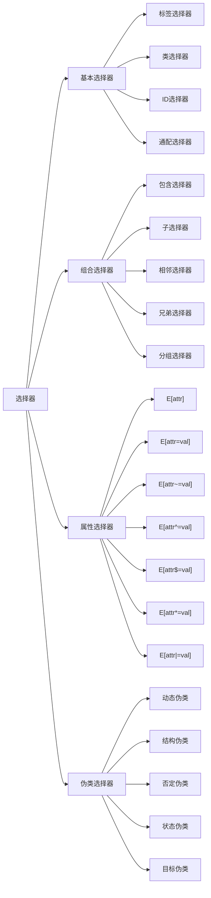
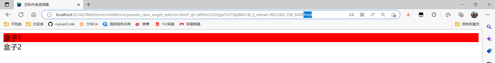
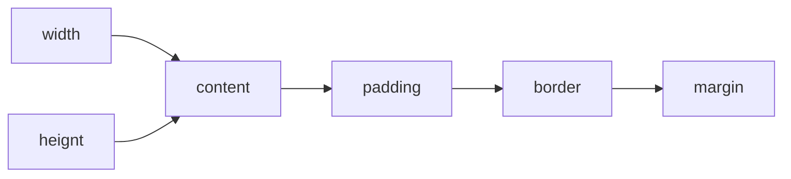

## 查漏补缺

针对B站学习视频内容后重新回顾HTML和CSS的基础部分并查漏补缺，对应书的1-10基础章节。

## chap1 -HTML基础

#### 标记的省略

元素的tag一般都是对仗整齐的。

```html
<tag></tag>
```

但是存在一些元素，元素的标记可以省略。元素的标记分为3种类型(P7)：

① 不允许写结束标记：area、base、br、col、input、link、meta等

```html
<br></br>;错误
<br\>; 正确
<br>; 正确,沿用以前的写法
```

② 可以省略结束标记：li、p、tbody、tr、td、th、dt、dd等

还有的标记即使不写也存在，例如body，省略了也可以通过document.body访问。

③ 可以省略全部标记的元素：html、head、body、colgroup、tbody

#### 布尔值属性的默认值

例如disabled、readonly等具有bool值的属性，常见4种写法，其中3种默认是true。

```html
<input type="checkbox" checked="checked">; 最常见写法,属性值=属性名,表示true
<input type="checkbox" checked>; 不写属性值也默认true
<input type="checkbox" checked="">;这个也属于不写属性值默认true
<input type="checkbox">; 不写属性默认false
```

#### 元素分类

HTML4有91个元素，主要分为结构元素(块元素)、内容元素(行内元素、行内块元素)以及修饰元素(P8)。

**常见的结构元素：**

div：包含框、容器，代表文档的一块区域

p：段落

h1-h6：标题行

------

ol：有序列表

ul：无序列表

li：有序和无序列表使用的列表项

dl：自定义列表

dt：自定义列表的词条

------

dd：对dt的解释文本

del：定义删除的文本

ins：定义插入的文本

hr：定义水平线

**常见的内容元素：**

span：行内定义的一块区域，包含框

a：超链接

strong：重要文本

**常见的修饰元素：**

b：加粗

i：斜体

u：下划线

br：换行

sup：上标

sub：下标

**HTML5新增的元素：**(P14)

**结构元素：**

header：页面标题

footer：页面注脚，包含作者姓名、创作日期和创作者联系信息

section：表示页面的一个内容区块，如章节、页眉、页脚或页面，一般和h1-h6进行结合使用。

article：表示界面一块和上下文不相关的独立内容，如博客中的一篇文章2

aside：一般用于侧边栏

nav：导航栏部分

main：网页的主要内容，指与网页标题或应用程序中本界面主要功能直接相关或进行扩展的内容

figure：表示一段独立的流内容，可以用figcaption元素添加标题

**功能元素：**

video：视频

```html
<video src="move.mp3" controls=controls""></video>
```

audio：音频

```html
<audio src="aud.wav"></audio>
```

embed：嵌入各种多媒体元素，支持Midi、Wav、AIFF、AU、MP3

```html
<embed src="horse.wav"></embed>
```

mark：用于需要高亮的元素

dialog：定义对话框、窗口

```html
<dialog open></dialog>
```

bdi：定义文本的文本方向

```html
<ul>
    <li>Username
        <bdi>Bill</bdi>:80 points
    </li>
    <li>Username
        <bdi>Steve</bdi>: 78 points
    </li>
</ul>
```

figcaption：定义figure元素的标题

```html
<figure>
    <figcaption>ABC</figcaption>
    </img>
</figure>
```

time：表示日期或时间，也可以同时表示两者

cancvs：表示画布，可以放置图标或者图像，但是这把一个绘图API展现给客户端JavaScript，脚本可以把想要绘制的东西绘制上去

```html
<canvas id="myCanvas" width="200" height="300"></canvas>
```

output：表示不同类型的输出，如脚本的输出

source：为媒介元素如video定义媒介资源

menu：菜单栏列表，希望列出表单控件时使用该标签

```html
<menu>
	<li input="checkbox" />Red</li>
	<li input="checkbox" />Blue</li>
</menu>
```

ruby：表示注释，如中文注音或字符

```html
<ruby>汉
    <rt>
        <rp>
            (<rp>han</rp>)
        </rp>
    </rt>
</ruby>
```

...其他元素还有summary、datalist、datagrid、keygen、progress、meter、track等。

**表单元素：**

tel：手机号；search：搜索框；url：网址文本框；email：邮箱；datetime：时间日期文本框；

date、month、date、week、time、datetime-local、number、range、color

#### 属性分类

可分为核心属性、语言属性、键盘属性、内容属性和其他属性。

**核心属性：**class、id和style，是几乎所有元素公有的属性，只有html、head、title、meta、param、script等不具备这个核心属性，因为它们用于定义网页的元信息，一般位于文档头部区域。

**语言属性：**

lang定义在body上，dir定义文本方向，ltr从左到右，rtl从右到左，在html定义。

```html
<html xlmns="url" dir="ltr" xml:lang="zh-CN"></html>;
<body id="myid" lang="en-us"></body>
```

**键盘属性：**

accesskey，一般和超链接a使用，定义快捷键访问链接。

```html
<a herf="#" accesskey="a">; alt快捷键
```

tabindex定义的数字大小可以决定使用Tab键浏览链接和表单元素时的顺序。

```html
<a href="#" tabindex="1">url 1</a>;
<a href="#" tabindex="3">url 2</a>;
<a href="#" tabindex="2">url 3</a>;
```

**内容属性：**用于定义包含内容的附加信息，是一种补充，常用的是5个属性：

alt：定义元素的替换文本

title：定义元素的提示文本

longdesc：定义元素包含内容的大段描述信息

cite：定义元素包含内容的引用信息

datetime：定义元素包含内容的日期和时间

一般用于图像不能显示的时候作为提示。

```html
<a herf="#" title="提示文本">超链接</a>
;
<input type="image" src="url" alt="替换文本">;
```

**其他属性：**常见的2个属性。

rel：定义当前页面和其它页面的关系

rev：定义其他页面和本界面的关系

```html
<a href="last.html" rel="prev">链接到上一个文档</a>
```

**HTML5新增的属性：**(P15)

**表单属性：**

autofocus：指定元素在画面打开时自动获得焦点

placeholder：对用户的输入进行提示，提示用户可以输入的内容

form：声明属于哪个表单，然后将其放置在页面任何位置，而不是表单之内

required：用户提交时进行检查，该属性必须设置内容

multiple：允许一次性上传多个文件

disabled：把子元素设为disabled状态

novalidate：取消提交时进行有关检查，表单可以无条件提交

链接属性和其他属性不赘述。

#### 全局属性

一共8个。

contentEditable：bool值，是否允许用户可以在线编辑元素中的内容，如果为true是允许编辑，为false不允许编辑。内部有个inherit属性，未指定contentEditable时，则取决于元素的父元素是否可编辑

contextmenu：定义div元素的上下文菜单，用户右键单击元素会出现，目前只有Firefox支持

data-*：自定义用户数据，存储的数据可以被JavaScript利用，data-后至少有一个字符

draggable：元素是否可以被拖动，true|false|auto，auto使用浏览器的默认行为

dropzone：定义元素拖动时是否复制、移动或链接被拖动数据，属性取值有copy|move|link。copy表示副本，move是移动原来数据到新位置，link是表示产生指向源数据的链接，目前主流浏览器都不支持

hidden：设置元素可见状态

spellcheck：是否对元素进行拼写和语法检查，如果元素的readonly和disabled设置为true则不执行检查

translate：是否翻译

#### 表格属性

table：表格

thead：表头

tbody：表格正式内容

tfoot：表尾

tr：一行结束，内部一般包含th、td

th：加粗单元格，一般用在第1列也就是序号列，或者在thead表头的列

td：普通单元格

### 自定义列表

dl：自定义列表

dt：自定义列表标题

dd：自定义列表项

## chap2 -CSS基础

### 导入CSS的方式

导入CSS的方式有4种，分别是行内式，内嵌式、链接式和导入式。

**行内式：**

```html
<!DOCTYPE html>
<html lang="en">
<head>
    <meta charset="UTF-8">
    <title>行内式CSS</title>
</head>
<body>
  <p style="background-color:#999900">行内元素-段落1</p>
  <h2 style="background-color:#FF6633">行内元素-h2标素</h2>
  <p style="background-color:#999900">行内元素-段落2</p>
  <strong style="font-size:30px;">行内元素-strong比em效果要强(重要文本)</strong>
  <div style="background-color:#66CC99; color:#993300;height:30px; line-height:30px;">行内元素-div块级元素</div>
  <em style="font-size:2em;">行内元素-em强调文本</em>
</body>
</html>
```

**内嵌式：**

```html
<!DOCTYPE html>
<html lang="en">
<head>
    <meta charset="UTF-8">
    <title>内嵌式CSS</title>
    <style title="字体14号"> /*可以使用title区分不同内嵌样式*/
        p {
            text-align: left;					/* 文本左对齐 */
            font-size: 14px;				/* 字体大小18像素 */
            line-height: 25px;				/* 行高25像素 */
            text-indent: 2em;				/* 首行缩进2个文字大小空间 */
            width: 500px;					/* 段落宽度500像素 */
            margin: 0 auto;					/* 浏览器下居中 */
            margin-bottom: 20px;			/* 段落下边距20像素 */
        }
    </style>
    <style title="字体18号">
        p {
            text-align: left;					/* 文本左对齐 */
            font-size: 18px;				/* 字体大小18像素 */
            line-height: 25px;				/* 行高25像素 */
            text-indent: 2em;				/* 首行缩进2个文字大小空间 */
            width: 500px;					/* 段落宽度500像素 */
            margin: 0 auto;					/* 浏览器下居中 */
            margin-bottom: 20px;			/* 段落下边距20像素 */
        }
    </style>
</head>
<body>
<p>“百度”这一公司名称便来自宋词“众里寻他千百度”。(百度公司会议室名为青玉案，即是这首词的词牌)。
    而“熊掌”图标的想法来源于“猎人巡迹熊爪”的刺激，与李博士的“分析搜索技术”非常相似，从而构成百度的搜索概念，也最终成为了百度的图标形象。
    在这之后，由于在搜索引擎中，大都有动物形象来形象，如SOHU的狐，如GOOGLE的狗，而百度也便顺理成章称作了熊。百度熊也便成了百度公司的形象物。 </p>
<p>在百度那次更换LOGO的计划中，百度给出的3个新LOGO设计方案在网民的投票下，全部被否决，更多的网民将选票投给了原有的熊掌标志。</p>
<p>此次更换LOGO的行动共进行了3轮投票，直到第2轮投票结束，新的笑脸LOGO都占据了绝对优势。
    但到最后一轮投票时，原有的熊掌标志却戏剧性地获得了最多的网民选票，从而把3个新LOGO方案彻底否决。</p>
</body>
</html>
```

**链接式：**

```css
/*link_1.css*/
h3 {
    font-weight:normal;
    background-color:#66CC99;
    height:50px;
    line-height:50px;
}
span {
    color:#FF0000;
    font-weight:bold;
}
/*link_2.css*/
p{
    color:#FF3333;
    font-weight:bold;
    border-bottom:3px dashed #009933;
    line-height:30px;
}
```

```html
<!DOCTYPE html>
<html lang="en">
<head>
    <meta charset="UTF-8">
    <title>链接式CSS</title> <!--rel指定关联的外部文件类型,type可能是text/javascript表示引入js-->
    <link href="link_css_1.css" type="text/css" rel="stylesheet" />
    <link href="link_css_2.css" type="text/css" rel="stylesheet" />
</head>
<body>
  <p>我的样式是link_css_1文件控制的，楼下的你呢？？</p>
  <h3>楼上的,<span>link_css_2.css</span>文件给我穿的花衣服。</h3>
</body>
</html>
```

**导入式：**

使用@import来导入外部样式表，有6种写法。

```css
@import import_style.css;
@import 'import_style.css';
@import "import_style.css";
@import url(import_style.css);
@import url('import_style.css');
@import url("import_style.css");
```

```html
<!DOCTYPE html>
<html lang="en">
<head>
    <meta charset="UTF-8">
    <title>导入式CSS</title>
    <style>
      @import url(link_css_1.css);
      @import url(import_css.css); /*导入必须在前否则不起作用*/

      body{
          background-color:#e4e929;
      }
    </style>
</head>
<body>
    <div>
        <p>我是被link_css_2.css文件控制的，楼下的你呢？？</p>
        <h3>楼上的,<span>link_css_1.css</span>文件给我穿的花衣服。</h3>
    </div>
</body>
</html>
```

要注意，link是html提供的，而@import是css提供的，区别在于页面加载时link就已经加载，而import引用的css得等页面加载完毕才能加载。同时@import存在兼容问题，只在IE5以上可以，另外link的样式权重高于@import引入的权重，所以一般还是推荐使用link的方式。

### CSS的层叠性

CSS定义的样式主要是4种：作者、用户、浏览器和HTML，一般来说优先级是依次递减的，也就是作者集网页设计人创造的样式拥有最高的优先级。

CSS样式的优先级：!important > 行内样式 > 内嵌样式 > 外部样式。要注意的是如果有2个外部样式导入，那么下方的更有优先权，因为靠近元素更近。

优先权的定义如下。

```css
/*
    标签选择器：加权值 1
    伪元素或伪对象选择器: 加权值 1
    类选择器: 加权值10
    属性选择器: 加权值10
    ID选择器: 加权值100
    通配选择器: 0
    继承值: 0
    !important: 最高优先级
 */
```

例子。

```html
<!DOCTYPE html>
<html lang="en">
<head>
    <meta charset="UTF-8">
    <title>CSS的层叠性</title>
    <link href="cascade.css" type="text/css" rel="stylesheet" />
</head>
<body>
  <div class="chen" id="bei">
      <p class="duan" id="luo">
          <span>this is a span</span>
          层叠样式表(英文全称：Cascading Style Sheets)是一种用来表现HTML（标准通用标记语言的一个应用）或XML（标准通用标记语言的一个子集）等文件样式的计算机语言。
          CSS不仅可以静态地修饰网页，还可以配合各种脚本语言动态地对网页各元素进行格式化。
      </p>
      <p>CSS 能够对网页中元素位置的排版进行像素级精确控制，支持几乎所有的字体字号样式，拥有对网页对象和模型样式编辑的能力。</p>
  </div>
</body>
</html>
```

CSS表的设置。

```css
/*cascade.css*/
div { /*优先级加权值1分*/
    margin: 0 auto; /*火狐浏览器居中*/
    text-align: center; /*ie浏览器居中*/
}

.chen { /*优先级加权值10分*/
    width: 400px;
    border: 1px dashed #CC0099; /*设置div宽度为400,居中能看见效果*/
    padding:10px 15px; /*设置div的间距*/
    font-size: 14px; /*设置字体大小14号*/
}

#bei { /*优先级加权值100分*/
    border: 1px dashed blue; /*所以id选择器设置的边框颜色显示为blue覆盖了.chen的#CC0099*/
}

.chen p { /*优先级加权值11分*/
    font-size: 16px; /*类别和标记选择器一起设置就是11分,所以段落按照16号加粗显示*/
    font-weight: bold;
}

.chen .duan { /*优先级加权值20分*/
    font-weight: normal; /*20分让段落1恢复正常不加粗1.5倍行距左对齐,段落2没有变化*/
    line-height: 1.5em;
    text-align: left;
}

.chen .duan span { /*优先级加权值21分*/
    color: green;/*颜色优先级高于.chen .duan默认的黑色*/
}

#bei span { /*优先级加权值101分*/
    color: red; /*所以颜色不仅高于黑色也高于绿色,红色优先级最高*/
    font-weight: bold;
    font-size: 22px;
}

span {
    font-size: 30px !important;/*变成了最高优先级,字体继续变成30号*/
}
```

另一个例子。

```html
<!DOCTYPE html>
<html lang="en">
<head>
    <meta charset="UTF-8">
    <title></title>
    <link href="cascade_exinternal.css" type="text/css" rel="stylesheet" />
    <style>
        #header {
            color: greenyellow; /*内部样式规定使用绿色*/
        }
        p {
            color: blue;
        }
    </style>
</head>
<body>
    <div id="header">
      外部样式使用了id选择器规定使用红色，内部样式使用id选择器规定绿色，最终显示绿色 <br>
      也就是如果内外都用id规定颜色，那么内部决定
    </div>
    <p id="next">
        如果外部样式使用id规定红色，内部样式不使用id而是使用tag规定为蓝色 <br>
        虽然内部样式优先级高于外部样式，但是外部的id还是比内部的tag优先级高，最终显示红色
    </p>
</body>
</html>
```

```css
/*cascade_exinternal.css*/
#header {
    color: red; /*外部样式规定红色*/
}

#next {
    color: red; /*外部样式规定红色*/
}
```

### CSS的继承性

继承性会导致父元素下的子元素特殊性为0，父元素无论优先级多大，都不会加给子元素，例子如下。

```html
<!DOCTYPE html>
<html lang="en">
<head>
    <meta charset="UTF-8">
    <title>继承在层叠起的作用</title>
    <style>
        span {
            color: blue;
        }
        #next {
            color: red;
        }
        .page {
            color: #0FFFF0; /*青色*/
        }
    </style>
</head>
<body>
    <div class="inherit" id="next">
       <span>
           style的css样式如下: <br>
            span {
                color: blue;
            }
            #next {
                color: red;
            }<br>
           无论父元素的优先级有多大,例如这里的父元素div的id选择器next优先级100 <br>
           子元素span的优先级是1,但是span在div内部不会继承父元素的优先级<br>
           所以对于span内部的内容依然是span{color:blue;}说了算 <br>
       </span>
        <p class="page" style="color: greenyellow">
            依然显示greenyellow,而非style内部规定的青色 <br>
            这是因为靠近元素的样式具有最大优先权
        </p>
    </div>
</body>
</html>
```

## chap3 -CSS选择器

选择器的分类如下。



### 基本选择器

标签选择器：就是使用HTML的标签名来限定。

类选择器：在元素的class属性定义名称，类选择器可以复合，也就是class可以使用多个名称，用空格隔开，使用.前缀，可以在标签名后使用，例如p.box表示段落中class="box"的元素。

id选择器：在元素的id属性定义名称，id使用#作为前缀，也可以使用标签先限定，例如div#box表示div内id="box"的元素。

通配选择器：常用 *{ margin:0; padding:0;}。

### 组合选择器

包含选择器：使用空格隔开，后面是被包含的选择器，对于页面比较复杂的结构常用。

子类选择器：使用>隔开，适合简单结构，好处在于不用额外定义class或者id属性。

相邻选择器：使用+隔开，在前的是兄在后的是弟。只要兄弟的关系没有调换，无论它们前边有没有元素，或者有没有父元素，样式均起作用。

兄弟选择器：相邻选择器不同在于，相邻只能选择前置元素后相邻的一个匹配元素，而兄弟可以指定其后同级的所有匹配元素。

分组选择器：使用逗号,分开，这样可以实现集体声明，减少代码的书写量。

### 属性选择器

一共7个属性选择器 。

E[attr]：指定属性名，不指定属性值

E[attr="val"]：指定属性名，且指定属性值

E[attr~="val"]：指定属性名，且包含属性值，属性值是个空格隔开的词列表，词列表包含了val词

E[attr^="val"]：指定属性名，且以该属性值开头

E[attr$="val"]：指定属性名，且以该属性值结尾

E[attr*="val"]：指定属性名，且包含该属性值

E[attr|="val"]：指定属性名，且指定属性值或者以"val-"开头的值

E是匹配元素的选择符，可以省略；

中括号是属性选择器标识符，不可省略；

attr是属性名，val是html的属性值或者包含html属性空格分开的字符串

### 伪类选择器

伪类选择器使用冒号隔开，有两种方式可以使用，直接使用或者配合类选择器使用。

```css
a:link {color:red;}
a .selected:hover {color:red;}
```

#### 动态伪类

有2种形式，锚点伪类和行为伪类。

锚点伪类：link、visited，表示链接没被访问和被访问的状态

行为伪类：hover、active、focus，表示鼠标悬浮或者点击链接时的状态，以及元素成为焦点时的效果(常用表单)

伪元素：before、after，伪元素的display默认为inline，可在元素前后添加字符串 、小图标，实现简单的css效果如三角形、箭头，还可以清除浮动，必须要和content属性结合使用，常见的使用方式可见[css中::before ::after的用法](https://blog.csdn.net/ladream/article/details/104828444)。

要注意的是按照**link-visited-hover-active**的顺序声明样式，否则不起作用，或者出现意想不到的错误。

#### 结构伪类

利用文档结构树实现元素过滤，从而减少文档内class和id属性的定义。常见的有以下11种。

:first-child：选择某个元素的第一个子元素

:last-child：选择某个元素的最后一个子元素

:nth-child()：从前选择某个元素的第n个子元素或者具备某种规律如等差、奇偶性的所有子元素，n从0计算

​	:nth-child(idx)：选择指定位置的元素

​	:nth-child(n*num)：选择指定位置的倍数处的元素

​	:nth-child(n+idx)：选择第idx个元素之后的元素

​	:nth-child(-n+idx)：选择第idx个元素之前的元素

​	:nth-child(n*num+1)：选择隔开num个元素处的元素

​	还可以是even、odd、n表示偶数行或者奇数行或者全部选中，不能是负数

:nth-last-child()：从后选择某个元素的第n个子元素或者具备某种规律如等差、奇偶性的所有子元素

:first-of-type：选择一个上级元素的第一个同类的子元素

:last-of-type：选择一个上级元素的最后一个同类的子元素

:nth-of-type()：从前选择指定的同类元素

:nth-last-of-type()：从后选择指定的同类元素

:only-child：选择的元素要求是它是父元素的唯一子元素

:only-of-type：选择的元素要求是它是父元素唯一类型的子元素

:empty：选择的元素里面没有任何内容(空格也没有)即空元素

#### 否定伪类

:not()表示否定选择器，表示过滤作用，而其他选择器都是匹配作用。例如表单元素希望除了submit以外的控件添加某种样式，就可以使用not，not内部使用属性选择器匹配，然后取相反操作。

```css
input: not([type="submit"]) {border: 1px solid red;}
```


#### 状态伪类

主要针对表单元素，常见表单元素有text、button、checkbox和radio等。

表单元素常见的状态是：可用与禁用，选中和未选中，获取和失去焦点，锁定、待机等

例如text有disabled和enabled状态，checkbox和radio有checked状态

#### 目标伪类

形式为E:target，表示选择匹配E的所有元素，且匹配元素被相关URL指向。

目标伪类选择器是动态选择器，只有存在URL指向该匹配元素时样式效果才能够有效。

```html
<!DOCTYPE html>
<html lang="en">
<head>
    <meta charset="UTF-8">
    <title>目标伪类选择器</title>
    <style>
        div:target { background:red; }
    </style>
</head>
<body>
    <div id="red">盒子1</div>
    <div id="blue">盒子2</div>
</body>
</html>
```



必须要在浏览器链接的后边加上#red才能起作用，如果是#blue则显示蓝色。

## chap4 -设计网页文本

### 文本标签

**标题文本：**h1-h6

**段落文本：**p

**引用文本：**blockquote、q、cite

blockquote适用于大段文本，在blockquote内嵌套p，具有一个cite属性，可以指定引用的网址。

q适用于行内式引用，例如对某句话的引用，也具备cite属性来指定引用的网址。

cite本身更多用于定义参考文献的引用，例如书籍或者杂志的标题，引用的文本一般显示为斜体，可以和a配合使用定义超链接引用

**强调文本：**em、strong

em：用于强调文本，一般显示为斜体

strong：强调重要文本，会显示为加粗

**格式文本：**i、b、big、small、sup、sub、mark

i是em的替代，b是strong的替代，mark表示标注、突出显示的文本，一般来说i和b尽量避免使用。

small和big内的文本会比周边的文本小或者大一号，可以嵌套使用，从而可以连续的缩小和放大文字，但是存在下限1号字和上限7号文本。

sup和sub是上标和下标。

**输出文本：**

code：表示代码字体

pre：表示预定义格式的源代码，保留源代码显示中的空格大小

tt：打印机字体

kbd：键盘字体

dfn：表示定义的术语

var：表示变量字体

samp：表示代码范例

**缩写文本：**

abbr：定义简称，例如kbd是KeyboardText的简称，有全局属性title，鼠标移动到abbr元素上时会显示完整版本。

acronym：定义首字母缩写，如HTML和CSS

html5不支持acronym，ie6以下不支持abbr。

**插入和删除文本：**

ins：插入到文档的文本

del：文档中被删除的文本

都具备2个属性，cite可以说明文本被插入和删除的原因，指向一个url，datetime说明修改的时间。

**文本方向：**

bdo：有属性dir，取值ltr和rtl表示文本从左到右或者从右到左。

### 新增文本标签

**标记文本：**

mark：带有记号的文本，表示页面需要突出显示或高亮显示的信息，一般的效果是产生文字阴影。

**进度信息：**

progress：具有2个属性，max和value，都是浮点数，要求max必须大于0，value不能超过max。

进度可以是不确定的，表示进度正在进行，但不清楚还有多少进度没有完成，也可以使用0到最大数字如100来表示进度，这个进度的单位是随意的无需指定，也就是没有度量衡，如果需要度量衡，应该使用meter元素。

**刻度信息：**

meter：定义已知范围或分数值内的标量、进度，例如磁盘用量、查询结果的相关性等。meter不要用于进度信息。

具备7个属性：

value：当前显示值，默认0，可以用浮点数如0.6表示百分比60%

min：最小值，默认0

max：最大值，默认1

low：范围下限值，要大于等于min

high：范围上限值，要小于等于max

optimum：最佳值

form：设置meter元素所属的一个或多个表单

**时间信息：**

time：定义公历的时间，24小时制或日期

具有datetime属性，日期和时间之间使用字母"T"文字分隔，"T"表示时间。

使用字母Z表示给机器编码时使用UTC标准时间，使用+表示向机器编码另一个地区的时间，如果是编码本地时间无需添加时差。

具有pubdate属性，定义time标签中的日期和时间是文档或article标签的发布日期，这属性就是为了显式告诉引擎文字哪个是真正的发布时间。

```html
  <time datetime="2017-11-13">2017年11月13日</time><br>
  <time datetime="2017-11-13">11月13日</time><br>
  <time datetime="2017-11-13">我的生日</time><br>
  <time datetime="2017-11-13T20:00">我生日的晚上8点</time><br>
  <time datetime="2017-11-13T20:00Z">我生日的晚上8点</time><br>
  <time datetime="2017-11-13T20:00+09:00">我生日的晚上8点的美国时间</time><br>
```

**联系文本：**

address：定义文档或文章的作者、拥有者的联系信息，文本一般显示为斜体，大部分浏览器会在address元素前后添加折行。

如果address位于body内则表示文档联系信息，如果在article/section内表示文章的联系信息。

**隔离文本：**bdi允许设置一段文本，使其脱离父元素的文本方向设置，在发布用户评论或其它无法完全控制的内容时很有用，用于内容方向未知时不必包含dir属性，因为默认已设为自动判断。

**换行断点：**wbr定义文本何处适合添加换行符，如果单词过长可能浏览器换行错误，wbr可以避免随意换行。

```html
<!--换行断点：本站旧地址为：https: //www.old_site.com/，新地址为：https: //www.new_site.com/。-->
<p>本站旧地址为：https:
    <wbr>//<wbr> <!--如果一定要换行，浏览器会在//这里来换行，如果在ww这换行就可能导致不好看-->
    www.old_site.com/，新地址为：https:
    <wbr>//<wbr>
    www.new_site.com/。
</p>
```

**文本注释：**ruby可以定义中文注音或者字符，需要和rt和rp标签结合，且作为2个标签的父元素。

rt定义字符(中文注音或字符)的解释和发音

rp定义浏览器不支持ruby元素时显示的内容

```html
<!--  文本注释:需要和rt和rp标签结合，且作为2个标签的父元素。
  rt定义字符(中文注音或字符)的解释和发音
  rp定义浏览器不支持ruby元素时显示的内容-->
  <ruby>
    少<rt>shào</rt>
    小<rt>xiǎo</rt>
    离<rt>lí</rt>
    家<rt>jiā</rt>
    老<rt>lǎo</rt>
    大<rt>dà</rt>
    回<rt>huí</rt>
  </ruby>，
  <ruby>
    乡<rt>xiāng</rt>
    音<rt>yīn</rt>
    无<rt>wú</rt>
    改<rt>gǎi</rt>
    鬓<rt>bìn</rt>
    毛<rt>máo</rt>
    衰<rt>shuāi</rt>
  </ruby>。
```

## chap05 -使用CSS美化网页文本

### 字体样式

**font-style：**normal | italic | oblique，斜体和倾斜的字体

**font-variant：**normal | small-caps，小型的大写字母字体

**font-weight：**normal=400|bold=700|bolder|lighter|100~900|

**font-size：**xx-small|x-small|small|medium|large|x-large|xx-large|larger|smaller|length

length可以是百分数，或者浮点数字和单位标识符组成的长度值，不可为负值，单位可取px、%、em、in(英寸)、cm、mm、pc(1pc=12pt)、ex。

%的取值是相对于父对象的尺寸计算；em也是，例如父对象是12px，那么2em就是24px；ex是相对于父辈字体的x高度来定义字体大小，因此ex单位大小取决于字体的大小和字体类型。

**line-height：**

**font-family：**使用family-name+generic-name构成，其中generic-name是备用字体，是family-name不可用时使用的字体，字体之间使用逗号隔开。generic-name都是关键字，可以不用引号；family-name如果不包含空格可以不用引号，如Arial，如果是新罗马需要"Times New Roman"。注意：generic-name对中文字体无效。

常见的generic-name：

emoji：表情符号字体

Times：罗马字体

cursive：草体

fantasy：艺术字体

serif：衬线字体

sans-serif：无衬线字体

monosapce：等宽字体

math：数学符号字体

system-ui：浏览器平台获取的默认用户界面字体

除了font-family专门针对字体类型，font也可以设置，不过font设置的类型更多一些。

font： font-style | font-variant | font-weight | font-size | line-height | font-family

依次定义是否加粗/斜体/倾斜，字体大小写，字体粗细，字号，字体行高和字体家族

font：caption | icon | menu | message-box | small-caption | status-bar

要求font至少设置font-size和font-family，且必须放在后面否则无效。

```css
.font {
    font: italic small-caps condensed 25px normal 黑体;
}
```

**color：**颜色，可以使用关键字、16进制代码、rgb和rgba值

```css
body { color:gray;}                                /* 使用颜色名 */
p { color:#666666;}                                /* 使用十六进制 */
div { color:rgb(120,120,120);}                      	/* 使用RGB */
span { color:rgb(50%,50%,50%);}                    /* 使用RGB */
```

**text-decoration：**下划线， none | underline | blink | overline | line-through，下划线、闪烁、上划线和贯穿线

**text-transform：**none | capitalize | uppercase | lowercase，首字母大写，和全部字母大小写

**line-height：**normal | <number> | <length> | <percentage>，1.2em、100px都可，50%，允许负值

**text-align：**center | left |right | justify 文本水平对齐方式

**vertical-align：**auto | baseline | sub | super | top | text-top | middle | bottom | text-bottom | length

垂直对齐方式，sub对齐上标，super对齐下标，top是对象的内容对象顶端对齐，text-top是内容的内容与对象顶端对齐，其他类似是中部和底部对齐，length可以是1.2em，%，可为负数

**letter-spacing：**1em，字距
**word-spacing：**normal，词距，对中文一般不起作用

**text-indent：**首行缩进，使用2em或者120%

### 新增文本样式

**text-shadow：**文本阴影，none | length,length,length,color

第1、2个length定义阴影的水平偏移值和垂直偏移值，可以为负值；第3个length定义阴影模糊值，不允许负值；color是阴影颜色。

**text-overflow：**定义溢出文本，clip | ellipsis | ellipsis-word，简单的裁切 | 溢出文本的最后1个字符开始出现省略号 | 溢出文本的最后1个词开始出现省略号

使用溢出文本用省略号显示，还必须定义white-space:nowrap和overflow=hidden，表示强制文本一行内显示不换行以及溢出文本隐藏。

**word-break：**定义文本自动换行，break-all | keep-all。取值break-all允许非亚洲语言文本行任意字内断开，keep-all表示不允许中日韩文字断开

**line-break：**专门控制日文换行

**word-wrap：**break-word | normal。取值break-word表示强制按词断开换行，对长串的英文不起作用，normal是默认控制连续文本换行

**white-space：**nowrap | pre。取值nowrap强制文本显示为1行内，还可以取值pre表示显示预定义文本格式

**content：**normal | string | attr() | uri() | counter() | none，添加动态内容，依次是默认值，添加文本内容，插入元素的属性值，插入一个外部资源(图像、音频和视频以及浏览器支持的各种资源)，计数器(可以用于给列表项添加序号)，无任何内容

**initial：**可以取消对某个元素的样式指定。

```html
<!DOCTYPE html>
<html lang="en">
<head>
    <meta charset="UTF-8">
    <title>恢复默认样式</title>
    <style>
      p {
        color: blue;
        font-family: 宋体, sans-serif;
      }
      p#text02 { /*可以让第2行文本恢复初始样式不再有p设置的样式*/
        color: initial;
      }
    </style>
</head>
<body>
    <p id="text01">ABC</p>
    <p id="text02">123</p>
    <p id="text03">abc</p>
</body>
</html>
```

## chap06 -使用CSS美化图像

### 图像的属性

**img：**src+alt表示插入图像的地址和替代文本，其余的还有height、width定义高度和宽度，ismap、usemap表示将图像定义为服务器端或客户器端图像映射，longdesc是指向包含长的图像描述文档的url。

### 图像的边框

**border：**none清除边框样式，或者按照样式、颜色和宽度依次设置，如solid red 12px。

**border-style：**none| solid| doube | groove | ridge | inset | outset |dotted | dashed

设置实线、双线、立体凹槽、立体突槽、立体凹边、立体凸边，点线和虚线

单独定义也是可以的，使用border-top-style、border-right-style、border-bottom-style、border-left-style。

**border-color：**设置颜色

**border-width：**设置宽度

style、color、width都按照上、右、下、左的顺时针顺序定义。

**opacity：**设置透明度，0~1之间，1表示完全不透明，兼容IE需要使用filter:alpha(opacity=30)，兼容FireBox使用-moz-opacity:0.3

**border-radius：**none | <length> 定义圆角，浮点数字和单位标识符组成，不可为负值，也可以单独设置

使用border-top-right-radius、border-bottom-right-radius、border-bottom-left-radius、border-top-left-radius

**box-shadow：**none | <shadow> inset内阴影，默认外阴影。依次需要定义阴影水平偏移、阴影垂直偏移、阴影大小(模糊度)和阴影扩展、阴影颜色。可以使用多组参数定义渐变阴影，最先写的在顶层，注意不要太大否则会遮盖底部的阴影。

```css
img {
    border: solid red 10px;
	border-style: solid dashed dotted double;
    border-width: 10px 20px 30px 40px;
    border-color: red blue green yellow;
    opacity: 0.3;
    border-radius:10px; /*50%*/
    box-shadow: 8px 8px 14px #06C;
    /*还可以使用多组参数值定义渐变阴影*/
    box-shadow: -10px 0 12px red,
        10px 0 12px blue,
        0 -10px 12px yellow,
        0 10px 12px green;
}
```

### 背景图像

**background-image：**none | url，设置背景图像

还可以设置渐变背景，linear-gradient线性渐变、radial-gradient径向渐变、repeat-linear-gradient重复的线性渐变、repeat-radial-gradient重复的径向渐变。

**linear-gradient：**(to right bottm color1 color2) 或(angle color1 color2)

**radiul-gradient：**(shape, color1 color2  color3) 或者(shape at position color transparent)

```css
background: #0095cd;
background: linear-gradient(to left bottom, #00adee, #0078a5); 
/*45deg,to left bottom, #00adee, #0078a5这样不允许*/
/* 渐变轴为45度，从蓝色渐变到红色 */
linear-gradient(45deg, blue, red); 
/* 从右下到左上、从蓝色渐变到红色  */
linear-gradient(to left top, blue, red);
/* 从下到上，从蓝色开始渐变、到高度 40% 位置是绿色渐变开始、最后以红色结束 */
linear-gradient(0deg, blue, green 40%, red);

background: radial-gradient(#e66465, #9198e5);
background: radial-gradient(closest-side, #3f87a6, #ebf8e1, #f69d3c);
background: radial-gradient(circle at 100%, #333, #333 50%, #eee 75%, #333 75%);
background: radial-gradient(ellipse at top, #e66465, transparent),
			radial-gradient(ellipse at bottom, #4d9f0c, transparent);
```

**background-color：**背景颜色

**background-origin：**更改背景的参考位置，默认总是左上角为坐标原点。 border-box | padding-box | content-box

border-box：从边框区域开始显示背景

padding-box：从补白区域开始显示背景，也是默认值

content-box：仅在内容区域显示背景

**background-size：**设置背景图片大小，图片可以保有其原有的尺寸，或者拉伸到新的尺寸，contain |cover

cover：拉伸

contain：保持

```css
background-size: cover;
background-size: 30%;
background-size: 200px 100px;
```

**background-position：**背景图像位置，默认是左上角，即0%,0%=left,top

常用的取值对：

top left、left top：左上角顶点 = 0% 0%

top right、right top：右上角顶点 = 100% 0%

bottom left、left bottom：左下角顶点 = 0% 100%

bottom right、right bottom：右下角顶点 = 100% 100%

top、top center 、center top：上边中点 = 50% 0%

left、left center 、center left：左边中点 = 0% 50%

right、right center 、center right：右边中点 = 100% 50%

bottom、bottom center 、center bottom：底边中点 = 50% 100%

```css
.box1 {background-position:top left;} /*top left*/
.box2 {background-position:100% 0;}
.box3 {background-position:0 100%;}
.box4 {background-position:100% 100%;}
.box5 {background-position:center center;}
.box6 {background-position:top center;}
.box7 {background-position:left center;}
.box8 {background-position:100% 50%;} /*right center*/
.box9 {background-position:50% 100%;} /*bottom center*/
```

**background-attachment：**背景图像显示方式 fixed | local | scroll

fixed：图像相对于浏览器固定

local：相对于元素内容固定，当元素内容滚动时图像跟随滚动，此时无论元素本身是否滚动，元素显示滚动条才会看到效果。

scroll：相对于元素固定，当元素内容滚动时图像不跟随滚动，因为图像跟随元素本身

**background-repeat：**背景图像是否重铺

repeat-x：横向平铺；repeat-y：纵向平铺；repeat：横向和纵向都平铺；np-repeat：不平铺

round：自动缩放到适应且填充整个容器；space：以相同间距平铺且填充整个容器或某个方向

**background-clip：**背景图像的裁剪区域。 border-box | padding-box | content-box | text

border-box：从边框区域向外裁剪背景

padding-box：从补白区域向外裁剪背景

content-box：从内容区域向外裁剪背景

text：从前景内容如文字区域向外裁剪背景

**background-break：**定义平铺内联元素背景图像时的循环方式。bounding-box、each-box、continuou。

分别表示在整个内联元素平铺、在每一行中平铺、下一行的图像紧接着上一行的图像继续平铺

目前只有FireFox浏览器支持，需要使用-moz-background-inline-policy来指定。

**background：**复合属性，不分先后顺序。这里要注意的是颜色，不要分开声明，否则背景图像可能覆盖颜色的声明，如果一起声明图像覆盖不到的会用颜色替代。

```css
background: url(1.jpg) no-repeat fixed left center red;

/*不要这样做*/
background: red; 
background: url(1.jpg) no-repeat fixed left center;
```

## chap07 -使用CSS美化超链接

超链接根据URL的不同可以分为内部、外部和锚点链接。

内部链接：可以使用绝对和相对路径，例如2个HTML文件都在同一文件或者不同文件夹，就可以使用。

外部链接：一般需要指定完整的网站地址。

锚点链接：在完整的网站地址后边还要加上#anchor，表示跳转到这个html标记为anchor的锚点位置。

URL的组成由三部分组成：

第一部分：协议方式，常见的是http:://：超文本传输协议，ftp//：文件传输协议，mailto：电子邮件(不需要2个斜杠)，file://：表示本地文件。

第二部分：存有该资源的主机IP地址(必要的话需要端口号)，例如www.china.com：port，port是服务器在该主机使用的端口号，一般不需要指定，只有服务器没有使用默认的端口号才指定。

第三部分：主机资源的具体地址，目录directory和文件名filename。

根据使用对象的不同，链接分为：文本超链接、图像超链接、E-mail链接、多媒体文件链接、空链接等。

**a：**href(acquired) | download | hreflang | media | rel | target | type

href：指定链接的界面URL，是必要的，不指定其它属性无法使用

download：指定被下载的超链接目标 | filename

hreflang：指定被链接文档的语言  | language_code

media：指定被链接文档被何种媒介/设备优化 | media_query

rel：规定当前链接文档和被链接文档的关系，| text

target：规定何处打开链接文档，_blank， _parent， _self， _top， framename。

​			_blank：浏览器会另开一个新窗口显示链接

​			_self：在同一框架或窗口中打开所链接的文档，默认值

​			_parent：将链接的文件载入含有该链接框架的父框架集或父窗口中，如果含有该链接的框架不是嵌套的，则在浏览器全屏窗口中载入链接的文件，就象 _self参数一样

​			_top：在当前的整个浏览器窗口中打开所链接的文档，因而会删除所有框架

type：规定被链接文档的MIME类型 | MIME type

### 锚点链接

创建锚点链接的2个步骤：

第一：指定需要创建锚点的元素的id值，注意id命名不能有空格，且该元素不能位于绝对定位元素内。

第二：创建好链接好，在href属性中使用#+锚点名称来指定，如"#p4"或者"test.html#p4"来指定。

### 其它链接

链接目标可以是图片、网页、文件、FTP服务器或者应用程序，如果是可识别的类型网页可以直接显示，不能的话会弹出下载框，如doc文件。

```html
<p><a href="demo.doc">链接到word文档</a></p>;
```

指向邮箱也可以，需要使用mailto:跟上邮箱地址，这样点击时会自动调用浏览器默认的电子邮件处理程序如outlook express，subject表示邮件主题为可选项目。

```html
<a href="mailto:chenbei_electric@163.com?subject=问候信">chenbei_electric@163.com</a>;
```

指向JavaScript脚本。

```html
<a href="javascript:alert(&quot;谢谢关注，投票已结束。&quot;);">我要投票</a>;
```

指向下载链接。

```html
<a href="img.jpg" download>下载图片</a>;
```

热点区域链接，点击图片的某一部分会进行链接。

需要map和area配合使用，map用于定义热点区域，定义热点区域的id，或者定义可选的name属性，也可以作为一个句柄和热点图像绑定。img中的usemap属性可以引用map定义过的id或name。

area定义图像映射中的区域，area元素必须嵌套在map标签内，且area必须定义alt作为热点区域的替换文本。

area的属性：

coords：坐标值，定义可单击区域的坐标

href：定义此区域的目标url

nohref：从图像映射排除某个区域

shape：default | rect | circ | poly 定义区域的形状

target：_blank， _parent， _self， _top 何处打开链接

```html
<!DOCTYPE html>
<html lang="en" xmlns="http://www.w3.org/1999/html">
<head>
    <meta charset="UTF-8">
    <title>热点区域的链接创建</title>
</head>
<body>
     <!--img属性指定映射的map-id-->

    <map name="Map"> <!--area要嵌套在map内-->
      <area shape="circle" coords="221,261,40" href="show.php?name=青海">
      <area shape="poly" coords="411,251,394,267,375,280,395,295,407,299,431,307,436,303,429,284,431,271,426,255" href="show.php?name=河南">
      <area shape="poly" coords="385,336,371,346,370,375,376,385,394,395,403,403,410,397,419,393,426,385,425,359,418,343,399,337" href="show.php?name=湖南">
    </map>
</body>
</html>
```

框架链接，目前html5已经不支持frameset框架，但是仍然支持iframe浮动框架的使用，src可以是绝对或者相对路径。关于iframe的属性还有：

height、width定义高度和宽度

marginheight、margineidth：定义顶部和底部、左侧和右侧的边距 单位px

name：框架的名称 

scrolling：yes、no、auto，是否显示滚动条

seamless：规定iframe看上去像是包含文档的一部分

srcdoc：规定iframe显示的界面的html内容

src：要显示的文档url

frameborder：是否显示框架周边的边框，取值0或1

longdesc：规定一个界面，包含了有关iframe的较长描述，url

sandbox：启用一系列对iframe内容的额外限制

```html
<iframe src="http://www.baidu.com"></iframe>
```

### 链接样式

超链接的样式设定主要关注5个伪类元素。

:link：设置链接未被访问前的样式，也就是用户默认看到的样式

:visited：被访问时的样式

:hover：鼠标悬浮链接的样式

:active：元素被用户激活(鼠标点击和释放之间的事件)的样式

:focus：元素成为输入焦点(元素的onfocus事件发生)的样式。

要注意的是设定顺序要按照link、visited、hover和active的顺序指定，否则可能出现错误。

```css
a:link {color: #FF0000;/* 红色 */} /* 超链接默认样式 */
a:visited {color: #0000FF; /* 蓝色 */} /* 超链接被访问后的样式 */
a:hover {color: #00FF00; /* 绿色 */}/* 鼠标经过超链接的样式 */
a:active {color: #FFFF00; /* 黄色 */}/* 超链接被激活时的样式 */
```

## chap08 -使用CSS美化列表

有序列表：ul

无序列表：ol

列表项：li

自定义列表：dl

dt：自定义列表的词条

dd：自定义列表的解释

```html
<dl>
    <dt>知无不言，言无不尽</dt>
    <dd>知道的就说，要说就毫无保留。</dd>
    <dt>智者千虑，必有一失</dt>
    <dd>不管多聪明的人，在很多次的考虑中，也一定会出现个别错误。</dd>
</dl>
```

### 列表序号自增

列表实现数字排序，使用content的counter和counter-increment来实现，而且是在伪状态before这里进行设定。

```css
ol {list-style:none;}  
li:before {color:#f00; font-family:Times New Roman;}  /*设定数字序号的格式*/

li{counter-increment:a 1;}  /*第一级的递增函数初始值1*/
li:before{content:counter(a)". ";}

li li{counter-increment:b 1;}  
li li:before{content:counter(a)"."counter(b)". ";}/*第二级的递增函数*/

li li li{counter-increment:c 1;}  
li li li:before{content:counter(a)"."counter(b)"."counter(c)". ";} /*第三级的递增函数*/
<ol>
    <li>一级列表项目1
        <ol>
            <li>二级列表项目1</li>
            <li>二级列表项目2
                <ol>
                    <li>三级列表项目1</li>
                    <li>三级列表项目2</li>
                </ol>
            </li>
        </ol>
    </li>
    <li>一级列表项目2</li>
</ol>
```

### 菜单列表

**menu：**菜单

label：定义菜单的可见标签

type：定义显示何种菜单类型， list | context | toolbar，定义列表菜单、上下文菜单和工具栏菜单

**command：**命令，可以定义单选、复选或普通按钮，只有command位于menu元素内才可见，目前Firefox支持，其他不支持，下方的代码不会在edge浏览器显示，可以用第二种代替，也就是直接使用button元素。

checked：是否被选中，仅用于radio和checkbox

disabled：command是否可用

icon：作为command来显示图像的url

label：定义可见的label

radiogroup：定义command属于的组名，仅类型radio可用

type：checkbox | command | radio

```html
<command icon="images/1.png" onclick="alert('男士')" type="radio" radiogroup="group1" label="男士">男士</command>
<command icon="images/2.png" onclick="alert('女士')" type="radio" radiogroup="group1" label="女士">女士</command>
<command icon="images/3.png" onclick="alert('未知')" type="radio" radiogroup="group1" label="未知">未知</command>
```

```html
<menu type="toolbar">
    <li>
        <menu label="File" type="toolbar">
            <button type="button" onclick="file_new()">新建...</button>
            <button type="button" onclick="file_open()">打开...</button>
            <button type="button" onclick="file_save()">保存</button>
        </menu>
    </li>
    <li>
        <menu label="Edit" type="toolbar">
            <button type="button" onclick="edit_cut()">剪切</button>
            <button type="button" onclick="edit_copy()">复制</button>
            <button type="button" onclick="edit_paste()">粘贴</button>
        </menu>
    </li>
</menu>
```

**menuitem：**菜单项，可用于定义弹出菜单调用的命令/菜单项目，仅firebox支持。

```html
<menu type="context" id="mymenu"> <!--总菜单-->
    <menuitem  <!--菜单项1-->
              label="Refresh" onclick="window.location.reload();" icon="1.png"> 			</menuitem>

    <menu label="Share on..."> 子菜单
        <menuitem 
                  label="Twitter" icon="2.png"  onclick="window.open('//twitter.com);"> 	   </menuitem>
        <menuitem 
                  label="Facebook" icon="3.png" onclick="window.open('//facebook.com);"> 	 	</menuitem>
    </menu> 
        <menuitem  <!--菜单项2-->
                  label="Email This Page" onclick="window.location='mailto:;">
        </menuitem>
</menu>
```

### 列表样式

**list-style-type：**设置列表项目符号的类型，常用的disc实心圆、circle空心圆、square实心方块、decimal阿拉伯数字、lower-roman小写罗马数字、lower-latin小写拉丁字母等

**list-style-image：**设置列表项目符号的符号图像

**list-style-position：**设置列表项目符号的显示位置，根据文本在内或在外排列，取值有 outside | inside

**list-style：**以上属性的复合属性

## chap09  -使用CSS美化表格

**table：**定义表格

border：定义表格边框

padding: 10px; 定义补白,设定表格外框和单元格之间的距离

border-spacing: 10px; border-collapse=seprate有效，定义单元格边框的行、列间距

caption-side: top | bottom | left | right定义标题位置

empty-cells: show | hide 单元格内容为空时是否还显示边框

table-layout: auto | fixed 布局根据文字的内容是保持固定还是自适应

**caption：**表格标题，必须紧随table标签之后，而且只能定义一个，标题会居中显示在表格之上

caption-side: top | bottom | left | right定义标题位置

vertical-align: middle | top | bottom 垂直居中方式

**tr：**表格行

**th：**定义表头单元格，内部文本会自动加粗居中显示

**td：**普通单元格，单元格可以包含文本、图片、列表、表单、水平线、表格

th、td的属性：

abbr：定义单元格内容的缩写版本

align：定义单元格水平对齐方式

axis：单元格分类，取值为类名

char：定义依据哪个字符进行内容对齐

charoff：定义对其字符的偏移量

colspan：跨列数

rowspan：跨行数

headers：与单元格关联的表头

scope：col | colgroup | row | rowgroup，定义将表头数据与单元格数据相关联的方法

valign：定义单元格的垂直排列方式， top | middle | bottom | baseline 

**thead：**定义表头结构

**tbody：**定义表格主体结构

**tfoot：**定义表格页脚结构，使用元素必须按照thead-tfoot-tbody的顺序,浏览器可以收到所有数据之前呈现页脚

**col：**定义针对一个或多个列的属性值，只能在table和colgroup中使用，col是单元素只有属性不接受任何信息。

**colgroup：**定义表格列的分组，可以对列组进行格式化，只能在colgroup中使用。定义的位置必须在caption之后，且在thead之前。

注：一般情况td元素具有最大优先权，table最弱，只有表格其他元素都透明时才能看到table的背景，即table < colgroup < col < (thead,tbody,tfoot) < tr < td。如果单元格是透明的，则tr递补具有最大优先权，依次类推。

## chap10 -使用CSS美化表单

**form：**是个包含框，里面包含所有表单对象以及各类属性。表单域有input、select等用于采集用户的输入或选择的数据。表单按钮input、button用于将数据发给服务器，还可以控制其他脚本的行为，如提交和复位。

所有的表单元素都包含2个基本属性，name和id来声明表单对象的名称以及编码。

当表单含有文件域flie时method必须设为post，enctype设为multipart/form-data。

常见的属性：

required：表明输入框填写的内容不能为空，否则不允许用户提交表单

accept-charset：设置服务器可处理的表单数据字符集

action：url 设置当提交表单时向何处发送表单数据

autocomplete：on | off 设置是否启用表单的自动完成功能，提供的效果例如用户输入首字母就会只出现那些具有该字母的项。支持的type有text、search、url、tel、email、password、range、color等。

autofocus：实现页面加载时，自动获得焦点，常见于text、checkbox、button、radio、submit等，但是要注意这个属性只能设置1次，一般常常用于submit上。

enctype：设置发送表单数据之前如何对其进行编码

​	application/x-www-form-urlencoded：默认值，将表单数据编码为名称/值对的形式发送到服务器

​	multipart/form-data：表单数据编码为一条信息，表单每个元素表示信息中的一个部分然后传给服务器，如果表单含有上传组件必须设置为该值。表单上传文件一般为非文本内容，例如压缩文件rar/jpg、图像流jpg或mp3等

​	text/plain：以纯文本形式发送数据到服务器，发送邮件时必须设置为该类型，否则会出现接收编码时混乱

method：get | post  设置用于发送form-data的http方法。get传输的数据量少执行效率高，post用于大量数据，适合传输重要信息

name：表单名称

placeholder：作为input输入框的提示

```html
<form action="/testform.asp" method="get">
    请输入邮政编码:
    <input type="text" name="zip_code" pattern="[0-9]{6}"
placeholder="请输入6位数的邮政编码" />
    <input type="submit" value="提交" />
</form>
```

novalidate：使用该属性意味着提交表单不需要验证，在form这里直接加上即可。form、input、select和textarea都提供了一个checkValidity()方法，可以显式的对表单元素内容进行有效性验证，例如下边例子对emial地址的格式检验。

```html
<!DOCTYPE html>
<html lang="en">
<head>
    <meta charset="UTF-8">
    <title>显示验证</title>
    <script>
        function check(){
            var email = document.getElementById("email");
            if(email.value==""){
                alert("请输入Email地址");
                return false;
            }
            else if(!email.checkValidity()){
                alert("请输入正确的Email地址");
                return false;
            }
            else
                alert("您输入的Email地址有效");
        }
    </script>
</head>
<body>
<form id=testform onsubmit="return check();" novalidate>
  <label for=email>Email</label>
  <input name=email id=email type=email />
  <br/>
  <input type=submit>
</form>
</body>
</html>
```

target： _blank、 _top、 _self、 _parent、 framename，何处打开action

checked：复选框、radio类型的可以设置已选中的状态

disabled：设置使能

alt：图像输入的替代文本

form：设置输入字段所属的一个或多个表单，允许这个元素在文档中任意处定义，但是必须引用所属表单的id

```html
<form action="" method="get" id="form1">
    请输入姓名：<input type="text" name="name1" autofocus/>
    <input type="submit"  value="提交"/>
</form>

<p>下面的输入框input在form元素之外，但因为指定的form属性，并且值为表单的id， 所以该输入框仍然是表单的一部分。</p>

请输入住址：<input type="text" name="address1" form="form1" /> <!--必须指定form告知表单元素属于form1-->
```

formaction：重写表单的action属性

formenctype：重新表单的enctype属性

formmethod：重新表单的method属性

formnovalidate：重新表单的novalidate属性

formtarget：重写表单的target属性

html5之前只能使用表单的action属性将表单内所有元素都提交到另一个界面，现在可以使用formaction将表单提交到不同界面

```html
<form action="1.asp" id="testform">
请输入电子邮件地址： <input type="email" name="userid" /><br />
     <input type="submit" value="提交到页面1" formaction="1.asp" />
     <input type="submit" value="提交到页面2" formaction="2.asp" />
     <input type="submit" value="提交到页面3" formaction="3.asp" />
</form>
```

max,min：输入字段的最小和最大值，适用于type="submit","image"

maxlength：输入字段的字符的最大长度

multiple：以前的file只支持单个文件来上传，使用multiple可以上传多个文件

pattern：验证input输入内容是否与自定义的正则表达式匹配

height,width：input字段的高度和宽度，适用image

name：元素名称

placeholder：设置用户填写输入字段的提示

readonly：设为只读

required：字段的输入是必须的

size：输入框的宽度，可用css的width设定

src：定义以提交按钮形式显示的图像url

value：设置元素的值

accesskey：快捷访问键

tabindex：tab键访问，根据设置值的大小来决定按几下tab到达该元素，注意取值-1表示禁用，默认0开始，如果disabled有效则tabindex无效

### 表单控件

（1）输入型控件：

**input：**type=""或type="text"，默认单行文本框，input的属性值很多，这里只列举常用类型，具体可见书P302页。

type：submit | reset | image | button | text | checkbox | radio | password | file | hidden 

除了type定义的类型，还有button元素可单独设置按钮，textarea设置多行文本输入区域。

**button：**具备disabled、form、formtarget、name、value、type等，type也可取submit、button、reset、menu等即几种按钮样式

**textarea：**具备属性readonly、name、cols、rows、disabled、placeholder、required等

（2）选择型控件

radio：可以指定几个radio的name相同，然后其中一个的checked="checked"就可以实现同组按钮互斥的效果。

```html
<form>
    <p>姓名：<input type="text" value="请输入姓名"></p>
	<p>性别：<label><input type="radio" name="sex" value="男">男</label>
    		<label><input type="radio" name="sex" value="女">女</label>
    <label><input type="radio" name="sex" value="保密" checked="checked">保密</label></p>
    <p><input type="submit" value="提交"> </p>
</form>
```

checkbox：复选框类型，同样具有属性checked、value

**select：**需要和option标签配合使用，设计下拉菜单或者列表框，select可以包含任意数量的option或optgroup标签，optgroup是对option的分组。但是optgroup的内容不能被选择，值也不会提交给服务器，一般用于一个层叠式选择菜单为选项分类的情况，label属性是必须的。

select的属性有2个，size定义下拉菜单显示的项目个数，multiple设置下拉菜单可以多选。

**datalist：**配合input的list属性来使用。datalist先定义id名，内部使用option添加项，然后input使用list引用这个id即可。属性值有id、style等。注意，option定义时必须指定value值。

```html
<form autocompelete="on">
    <input type="text" id="city" list="cityList">
    <datalist id="cityList" style="display:none;">
        <option value="BeiJing">BeiJing</option>
        <option value="QingDao">QingDao</option>
        <option value="QingZhou">QingZhou</option>
        <option value="QingHai">QingHai</option>
    </datalist>
</form>
```

（3）辅助控件

比较复杂的表单可以对输入信息进行分组，例如基本信息和详细信息。

**fieldset：**进行分组，form可以有多个本元素，默认表单区域分组的外面会显示一个包围框

**legend：**定义每组的标题，默认显示在fieldset包含框的左上角

```html
<form id="form1" name="form1" method="post" action="">
  <fieldset>
    <legend>高亮提示表单</legend> <!--定义组标题-->
    <label for="name" class="title">姓名：</label>
    <input size="40" name="name"><br>
    <label for="email" class="title">邮箱：</label>
    <input size="40" name="email"><br>
    <label for="url" class="title">网址：</label>
    <input size="40" name="url"><br>
    <label for="subject" class="title">主题：</label>
    <input size="40" name="subject"><br>
    <label for="message" class="title">内容：</label>
    <textarea name="message" cols="39" rows="5"></textarea>
  </fieldset>
</form>
```

（4）新增类型控件

input的type新增以下几种类型：

email：输入邮件地址，属性name用于填写邮箱

url：用于输入网站地址

number：只用于输入数值，此时input的min、max、step属性可以启用，step用于设置合法的数字间隔，例如4，则合法的数可以是"-4,0,4,8"等

range：输入一定范围数字的文本框，min、max、step同样启用

date：输入年月日

month：月、年

week：周、年

time：小时和分钟，min、max、step有效，可以限定时间的步进值和范围

datetime：年月日小时分钟（UTC时间）

datetime-local：年月日小时分钟（本地时间）

search：搜索框

tel：专门用于输入手机号

color：颜色选择对话框

（5）其它类型

**keygen：**密匙对生成器，用户提交表单时会生成2个键，一个私匙，一个公匙，私匙存储在客户端，公匙发送到服务器。目前edge不支持。

```html
<form action="/testform.asp" method="get">
    请输入用户名:
    <input type="text" name="usr_name" />
    <br>
    请选择加密强度:
    <keygen name="security" />
    <br>
    <input type="submit" value="提交" />
</form>
```

**output：**在浏览器显示计算结果或脚本输出，包含完整的开始和结束标签，需要指定属性name。

## chap11 -CSS3布局基础

### CSS盒模型基础

每个盒子都有内容content、边框border、填充padding以及边距margin共4个属性，每个属性都包含上下左右4个部分，可以分别设置也可以同时设置。



一个元素盒子的实际高度和宽度等于内容的宽度和高度+两倍的填充、边框和边距之和。定义距离使用px、em单位都是可以的，还可以使用关键字thin、medium和thick。

margin可以取负值实现相对定位功能，padding不可以。

**content：**内容

width、height、min-width、max-width、min-height、max-height。

**border：**边框

border-style：none | hidden | dotted | dashed | solid | double | groove | ridge | inset | outset

border-bottom-width、border-top-width、border-left-width、border-right-width

border-bottom-height、border-top-height、border-left-height、border-right-height

border-bottom-color、border-top-color、border-left-color、border-right-color

border-width、border-height、border-color(按上右下左的顺序)

border：1px solid red; 

**border-image:** 边框背景,适用于除border-collapse=collapse的table元素,none | <image> | <percent> | <number>

border-top-image、border-bottom-image、border-left-image、border-right-image

border-top-left-image、border-top-right-image、border-bottom-left-image、border-bottom-right-image

border-image-source：图像的url

border-image-slice：裁剪图像，如果是3个参数5,5,0,第1个参数是顶部裁切值,第2个参数是左右两侧,第3个参数是底部裁切值,也就是等价于5,5,0,5(top,right,bottom,left)

border-image-repeat：图像的重复性

border-image-width：图像显示大小,一般border-width替代

border-image-outset：图像的偏移位置

**margin：**边距,会出现重叠且只发生在块状元素,padding/border不会重叠

margin-top、margin-right、margin-left、margin-bottom

margin按上右下左的顺序)

**padding：**补白

padding-top、padding-right、padding-left、padding-bottom

**box-sizing：**定义显示方式,适用所有定义宽高的元素. content-box | border-box

content-box：默认，width/height = content + padding + border

border-box： width/height = content

**resize：**允许通过拖动改变元素尺寸,适用于可使用overflow的元素 none|both|horizontal|vertical|inherit

none：默认不提供调整

both：提供双向尺寸调整,允许调节元素的高度和宽度

horizontal：只允许调节宽度

vertical：只允许调节高度

inherit：默认继承

**overflow：**溢出处理

overflow-x、overflow-y：visible|hidden|auto|scroll|no-display|no-content

visible：不剪切内容也不添加滚动条,默认值,此时clip属性失效

auto：需要时剪切内容并添加滚动条,body和textarea的默认

hidden：不显示超出元素尺寸的内容

scroll：超出尺寸后显示横向或纵向滚动条

no-display：超出尺寸不显示**元素**,类似于display:none

no-content：超出尺寸不显示**内容**,类似于visibility:hidden

**outline：**轮廓线,可与边框线混用,不占据空间,可以是非矩形的

outline-color：color | invert | inherit

outline-style：auto | border-style | inherit

outline-width：thin|medium|inherit|px,em

outline-offset：px,em| inhert 设置轮廓线偏移位置

## chap12 -网页排版

**display**：定义元素的显示方式

none：不显示,不同于visibility:hidden,不会为元素保留位置

block：块状显示,占据一行,一般宽度是100%

inline：行内显示,定义height和width没有意义

inline-block：元素行内显示,但是内容是块状显示,行内元素显示在1行

list-item：具有块状特征的列表项目显示

compact：紧凑的块状显示,或基于内容之上的行内显示

marker：容器对象之前或之后显示,和:after或:before一起使用

run-in：块状显示或基于内容之上的行内显示

table：具有块状特征的表格显示

table-caption：表格标题显示

table-cell：表格单元格显示

table-column：表格列显示

table-column-group：表格列祖显示

table-header-group：表格标题组显示

table-footer-group：表格页脚组显示

table-row：表格行显示

table-row-group：表格行组显示

**article：**定义文章块，可以嵌套使用

**section：**定义内容块，一般由内容和标题组成，没有标题的内容区块不要使用section，且需要定义样式或者脚本定义行为时推荐使用div代替。section关注内容的独立性，div关注结构的独立性，section包含的东西可以直接存储到数据库或输出到word。

**nav：**定义导航块，draggable="true"

**aside：**定义侧边栏

**main：**定义主要区域

**header：**定义标题栏

**hgroup：**定义标题组

**footer：**定义脚注栏

**float：**none | left | right 浮动显示

1.浮动元素以块状显示，可以定义width和height属性；

2.浮动元素和流动元素可以混合使用不会重叠，都遵循先上后下显示规则，都受文档流影响。但浮动元素能够改变相邻元素的显示位置，可以向左向右并列显示；

3.浮动元素进能够改变水平显示方式，不能改变垂直显示方式，流动元素会以流动的形式环绕在浮动元素左右显示；

4.浮动元素可以并列显示，如果包含框宽度不够，则会错行显示；

clear：清除浮动 left | right | both | none

5.浮动嵌套浮动，会自动调整大小；流动嵌套浮动，则流动元素不能适应浮动元素的高度

**position：**定位 static | absolute | relative | fixed 

static：不定位

absolute：绝对定位，可以层叠，由z-index定义层叠顺序

fiexed：固定定位，不随浏览器滚动条变化

relative：相对定位

定位法是父相子绝，父元素相对定位，内部子元素绝对定位，这样父元素不会随子元素的高度而变化，父元素的高度固定才能不影响其他元素的布局

### 结构嵌套规则

1. body元素能够直接包含ins、del、script和block类型元素，ins和del表示插入和删除的文本属于行内元素，其它任何行内元素不允许直接嵌套在body内
2. ins和del元素能直接包含块状元素和行内元素等不同类型的元素，但是其它行内元素禁止包含块状元素
3. p,h1-h6可以直接包含行内元素和纯文本内容，但不能直接包含块状元素,可以间接包含块状元素。object、map和button可以直接包含块状元素
4. ul和ol元素只能包含li元素，li元素可以包含其它元素
5. dl元素只能包含dt和dd元素，不能包含其它元素。dt也只能包含行内元素不能包含块状元素，dd可以包含任何元素
6. form元素不能直接包含input，input是行内元素，form只能包含块状元素
7. table可以直接包含caption、colgroup、col、thead、tbody和tfoot，但不能包含tr以及其他元素。caption只能包含行内元素。tr只能包含th和td元素，th和td可以包含任何元素

## chap13 -CSS3新布局

### 多列布局

**columns：**column-width | column-count

**column-width：**length | auto 列宽

**column-count：**integer | auto 列数

**column-gap：**normal | length 列间距

**column-rule：**length | style | color | transparent 列边框宽度样式颜色

column-rule-color、column-rule-width、column-rule-style

**column-span：**none | all 跨列显示

**column-fill：**auto | balance 设置列高度,balance以内容最多的1列的高度进行统一

### 弹性盒布局

**display：**box|inline-box|flexbox|inline-flexbox|flex|inline-flex

box：对象作为弹性伸缩盒，最老版本

inline-box：作为内联块级弹性伸缩盒，最老版本

flexbox：作为弹性伸缩盒，过渡版本

inline-flexbox：内联块级弹性伸缩盒，过渡版本

flex：对象作为弹性伸缩盒，最新版本

inline-flex：内联块级弹性伸缩盒，最新版本

**flex-direction：**伸缩方向 row | row-reverse | column | column-reverse

row默认,从左到右排列;从右到左;从上到下;从下到上

**flex-wrap：**nowrap|wrap|wrap-reverse 定义伸缩容器单行或多行显示

nowrap：单行从左到右

wrap：多行从左到右

wrap-reverse：多行从右到左

**flex-flow：** flex-direction | flex-wrap 复合属性

**justify-content：**主轴对齐（P430）

flex-start：靠齐起始位置

flex-end：靠齐结束位置

center：靠齐中间位置

space-between：两端和中间有内容，其他地方空出

space-around：两端没有内容，均匀分布

**align-items：**侧轴对齐

flex-start：靠齐顶部

flex-end：靠齐底部

center：靠齐中间位置

baseline：靠齐基线

stretch：默认拉伸填充整个伸缩容器

**align-content：**伸缩行对齐

flex-start：靠近起点并堆叠

flex-end：靠近结束并堆叠

center：靠近中间并堆叠

space-between：两侧有内容，均匀堆叠

space-around：两侧无内容，均匀堆叠

stretch：伸展占用剩余空间并堆叠

**order：**<integer> 定义伸缩项目出现的顺序

**flex-grow：**<number> 扩展空间,决定剩余空间按比例应扩展多少空间,默认0,可以负值

**flex-shrink：**<number>  收缩空间,默认1,可以负值

**flex-basis：**auto | <length> 伸缩比率，剩余空间按比率进行伸缩,不接受负值

**align-self：**auto | flex-start | flex-end | center | baseline | stretch 默认对齐方式

## chap13 -使用CSS3动画

### 2D变换

**transform-origin**：<percentage>|<length>|left|center|right|top|middle|bottom，默认(50%,50%)即中心点为参考点

**transom：**none |  <transform-function> 

常见的transform-function：

**matrix：**6个<number>,矩阵变换,依次代表x轴的缩放、倾斜;y轴的缩放和倾斜;x和y轴的移动

**translate：**<translate-value>平移(4px,4px)表示远离x和y轴4px

**scale：**<number> 缩放

**rotate：**<angle > 旋转

**skew：**<angle> 倾斜

### 3D变换

translateZ(t)、translate3d(tx,ty,tz)：3D位移

rotateX(r)、rotateY(r)、rotateZ(r)、rotate3d(x,y,z,a)：3D旋转，其中x,y,z旋转矢量值(0-1之间),a是旋转角度

rotateX(a)=rotate3d(1,0,0,a),rotateY(a)=rotate3d(0,1,0,a),rotateY(a)=rotate3d(0,0,1,a)

scaleZ(s)、scale3d(sx,sy,sz)：3D缩放

### 过渡动画

**transition-property：**none | all | <IDENT> 过渡动画的名称

none：没有元素

all：默认值，表示针对所有元素，包括:before和:after

IDENT：指定CSS属性列表，几乎所有色彩、大小或位置有关的CSS属性，如放大缩小旋转斜切渐变等

**transition-duration：**<time> 过渡时间，默认0

**transition-delay：**<time> 延迟时间

**transition-timing-function：**ease | linear | ease-in | ease-out | ease-in-out| cubicbezier | cubic-bezier 过渡曲线

常见触发方式：

:link：未访问链接

:visited：访问过的链接

:hover：鼠标经过元素

:active：鼠标点击元素

:focus：元素被选中

:checked：复选框互斥按钮等被选择

还有JavaScript的click、foucs、mousemove、mouseover和mouseout等。

**设置关键帧：**设置动画名称和帧的时长百分比，以及一个或多个合法的css样式属性

```css
@keyframes animationname{
    keyframes-selector {
        css-styles;
    }
}
```

**animation-name：**none|IDENT 定义动画名称

**animation-duration：**<time> 动画时间

**animation-delay**：<time> 延迟时间

**animation-iteration-count：**播放次数  infinite | <number>

**animation-direction：**播放方向

**animation-play-state：**播放状态 paused|running

**animation-fill-mode：**动画外状态 none|forwards|backwards|both

none：不设置对象动画之外状态

forwards：设置对象状态为动画结束时的状态

backwards：设置对象状态为动画开始时的状态

both：设置对象状态为动画开始或结束的状态

## end