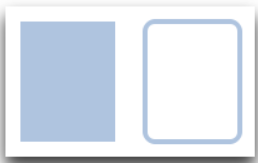
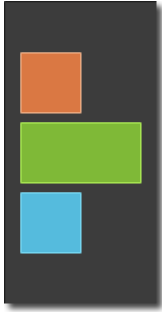
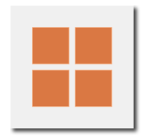
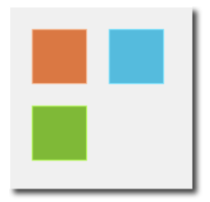
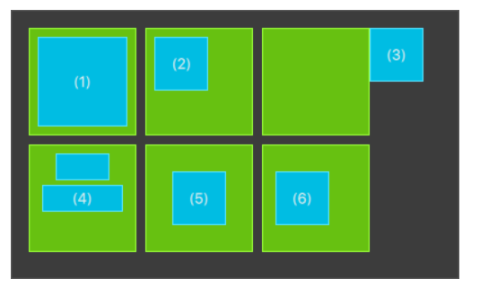

## 信号和槽

1. 预定义信号，如onClicked，信号signal对应的槽函数是on<Signal>

2. 属性变化的信号，如果事先声明了property属性，被修改时会自动触发<property>Changed，槽函数则是on<Property>Changed

3. 给Component对象附加一个onCompleted信号，在QML文件定义的顶层对象加载完成时触发

4. 自定义信号和信号的连接

   ```css
   signal mysignal(int x,int y)
   signal.connect(signal / function_name)
   ```

5. Connections，可以响应任意对象的信号，要知道指定信号所属对象的id

   ```css
   import QtQml
   Connections {
   	target: object_id
   	onSignal: {
   		// do something...
   	}
   }
   ```


## QML文档

### 文件创建

文件创建是指以<TypeName>大写的qml文档，或者C++中通过QQmlComponent进行创建。

qml文档内根元素的属性都可以被外部qml文档引用和访问，但是二级元素不可访问，需要借助别名或者property额外声明到根元素才能访问。例如下方定义了一个SquareButton组件，在SquareButton.qml内定义。

```css
/*SquareButton.qml*/
import QtQuick
Rectangle {
    id: root
    property bool pressed mouseArea.pressed
    signal buttonClicked(real posX,real posY)
    width: 100; height: 100; color: "red"
    function randomColor() {
            root.color = Qt.rgba(Math.random(),Math.random(),Math.random(),1)
    }
    MouseArea {
         	id: mouseArea
            anchors.fill : parent
            onClicked: (mouse)=> root.buttonClicked(mouse.x,mouse.y)
    }
}
```

然后其他文档可以访问的属性是pressed、buttonClicked和randomColor，但是不能通过mouseArea访问MouseArea对象，只能借助别名或者property去声明使用。

### Component创建

除了使用QML文档直接创建QML对象，也可以使用Component类型在qml文档内定义组件。

```css
Item {
	width:100; height: 100;
	Component {
		id : c
		Rectangle {
			color: "red"; width: 10; height: 10
		}
	}
	Loader {sourceComponent: c}
	Loader {sourceComponent: c; x: 20}
}
```

关于Loader可以看[QMLDoc.md](QMLDoc.md)的内容。这里Rectangle不能自己渲染和显示，因为定义在了Component的内部，同时Component不继承Item，所以不能对其进行布局和锚定其他对象。Component内部只能有一个根对象，也就是Rectangle。

### JasvaScript创建

有2种方法，第一种是调用Qt.createComponent()函数动态创建Component对象，适合已经有一个QML文档定义的组件；一种是使用Qt.createQmlObject()函数从一个Qml字符串创建一个对象，QML是运行时才产生的。

第一种方法的示例：

```javascript
// Button.qml
import QtQuick
Rectangle {width: 80; height: 50; color: "red"}

// App.qml
import QtQuick
import "createButton.js" as MyButton 
Rectangle {
 	id : app
 	width: 300; height: 300
 	
 	Component.onCompleted: MyButton.createButton(); // 调用js文件的函数创建函数
}

// createButton.js
var comp;
var button;

function createComp() {
	comp = Qt.createComponent("Button.qml");//动态创建组件对象
	if (comp.status === Component.Ready) // Button.qml如果不是本地的不会立即可用需要判断
	{
		createObject();
	}
	else 
		comp.statusChanged.connect(createObject);// 绑定好信号和槽函数
}

function createObject() {
	if (comp.status === Component.Ready) {
		button = comp.createObejct(app,{"x":100,"y":100}); // 指定父对象是App.qml的Rect并直接指定参数
        if (button == null)
        	console.log("error creating object button");
        else {
            button.x = 100;
            button.y = 100;
            //...
        }
	}
	else if (comp.status === Component.Error)
	{
		// 错误处理
		console.log("error loading component: ",component.errorString());
	}
}

// 如果可以确保Button.qml是本地加载的就无需借助槽函数直接执行即可
function createCompOther() {
	comp = Qt.createComponent("Button.qml");//动态创建组件对象
    button = comp.createObejct(app); // 创建组件实例
    if (button == null)
    	console.log("error creating object button");
    else {
        button.x = 100;
        button.y = 100;
        //...
    }
}
```


## 基本元素

元素可以分为视觉元素和非视觉元素。视觉元素（如矩形）具有几何图形，通常在屏幕上显示一个区域。非视觉元素（如计时器）提供一般功能，通常用于操作视觉元素。
目前，我们将重点关注基本的视觉元素，如项目、矩形、文本、图像和鼠标区域。但是，通过使用Qt Quick Controls 2模块，可以创建由按钮、标签和滑块等标准平台组件构建的用户界面。

### Item Element

Item是所有视觉元素的基本元素，因为所有其他视觉元素都继承自Item。它本身不绘制任何内容，但定义了所有视觉元素中常见的所有属性：

- 几何形状：x、y、z、width、height。x和y定义元素展开的左上位置、宽度和高度，以及从自然顺序向上或向下提升元素的z堆叠顺序

- 布局处理：anchors（left、right、top、bottom、vertical and horizontal center）。锚点提供了一种通过指定项目与其他项目的关系来定位项目的方法。页边距应用于顶部、底部、左侧、右侧和填充锚点。anchors.margins属性可用于将所有不同的页边距同时设置为相同的值。关于anchors可以设置的属性如下：

  anchors.top : AnchorLine
  anchors.bottom : AnchorLine
  anchors.left : AnchorLine
  anchors.right : AnchorLine
  anchors.horizontalCenter : AnchorLine
  anchors.verticalCenter : AnchorLine
  anchors.baseline : AnchorLine
  anchors.fill : Item // 可以让子控件与父控件具有相同的几何结构，高度宽度必须相同
  anchors.centerIn : Item // 子控件放在父控件的正中心，但是子控件的高度宽度自己可以设置
  anchors.margins : real
  anchors.topMargin : real
  anchors.bottomMargin : real
  anchors.leftMargin : real
  anchors.rightMargin : real
  anchors.horizontalCenterOffset : real
  anchors.verticalCenterOffset : real
  anchors.baselineOffset : real
  anchors.alignWhenCentered : bool

- 按键处理：Key、KeyNavigation、focus。附加的Key和KeyNavigation属性控制按键处理，并附加输入focus属性优先进行按键处理

- 变换：scale、rotate。旋转和缩放，可以使用transform属性列表设置x、y、z方向和它们的变换中心transformOrigin

- 视觉：opacity、visible、clip、smooth。clip用于限制对元素边界的绘制操作，并使用smooth平滑以增强渲染质量

- 状态定义：states、transitions。states list属性，其中包含支持的状态列表和当前状态属性，以及用于设置状态更改动画的transitions list属性。

为了更好地理解不同的属性，我们将尝试在本章中介绍这些属性。请记住，这些基本属性在每个视觉元素上都可用，并且在这些元素上的作用相同。

### Rectangle Element

矩形扩展了Item并添加了填充颜色。此外，它支持border.color和border.width定义的边框。要创建圆角矩形，可以使用radius属性，效果如图所示。颜色选项可参考[CSS Color Module Level 3 (w3.org)](https://www.w3.org/TR/css-color-3/#svg-color)，除此之外还支持自定义渐变gradient。

```css
Rectangle {
        id: rect1
        x: 12; y: 12
        width: 76; height: 96
        color: "lightsteelblue"
    }
Rectangle {
    id: rect2
    x: 112; y: 12
    width: 76; height: 96
    border.color: "lightsteelblue"
    border.width: 4
    radius: 8
    }
```



关于自定义渐变的例子。渐变是由一系列渐变停止GradientStop来定义的。每个站点都有一个位置和一种颜色。该位置标记y轴上的位置（0=顶部，1=底部）。GradientStop的颜色标记该位置的颜色。

```css
Rectangle {
    id: rect1
    x: 12; y: 12
	width: 176; height: 96
    gradient: Gradient { /* 设置渐变的2个点,默认线性渐变 */
    	GradientStop { position: 0.0; color: "lightsteelblue" }
    	GradientStop { position: 1.0; color: "slategray" }
    }
    border.color: "slategray"
}
```

注：① 没有设置宽度/高度的矩形将不可见。当你有几个宽度（高度）相互依赖的矩形，并且你的合成逻辑出现问题时，这种情况经常发生。所以要小心！

② 无法创建倾斜的渐变。为此，最好使用预定义的图像。一种可能性是只使用梯度旋转矩形，但要注意旋转矩形的几何形状不会改变，因此会导致混淆，因为元素的几何形状与可见区域不同。从作者的角度来看，在这种情况下使用设计好的梯度图像确实更好。

### Text Element

要显示文本，可以使用text元素。它最显著的特性是字符串类型的text特性。元素根据给定的文本和使用的字体计算其初始宽度和高度。字体可以使用字体属性组（例如font.family、font.pixelSize等）来影响。要更改文本的颜色，只需使用color属性。

```css
Text {
    text: "The quick brown fox"
	color: "#303030"
    font.family: "Ubuntu"
    font.pixelSize: 28
}
```

可以使用**horizontalAlignment和verticalAlignment**属性将文本对齐到每一侧和中心。要进一步增强文本渲染，可以使用style和styleColor属性，该属性允许以大纲(outline)、凸起(raised)和凹陷(sunken)模式渲染文本。对于较长的文本，您通常希望定义一个中断位置，如a very…long text，这可以使用elide属性来实现。elide属性允许您将elide位置设置在文本的左侧、右侧或中间。如果您不希望出现elide模式的“…”，但仍希望看到全文，您也可以使用wrapMode属性包装文本（仅在明确设置宽度时有效）：

```css
Text {
    width: 40; height: 120
    text: 'A very long text'
    elide: Text.ElideMiddle /*在中间位置出现...*/
    style: Text.Sunken /*红色,凹陷,顶部对齐*/
    styleColor: '#FF4444'
    verticalAlignment: Text.AlignTop
    // wrapMode: Text.WordWrap /*非elide模式才有效*/
}
```

请注意，**文本的初始宽度（高度）取决于文本字符串和字体集**。没有设置宽度且没有文本的Text元素将不可见，因为初始宽度将为0。通常，当您想要布局Text元素时，您需要区分**对齐Text元素边界框内的文本还是对齐元素边界框本身**。在前者中，使用horizontalAlignment和verticalAlignment属性；在后一种情况下，则需要操纵图元几何图形或使用anchors。

### Image Element

Image元素能够以各种格式（例如PNG、JPG、GIF、BMP、WEBP）显示图像。有关支持的图像格式的完整列表，请参阅Qt文档。除了提供图像URL的明显source属性外，它还包含一个控制大小调整行为的fillMode。

```css
Image {
    x: 12; y: 12
    source: "assets/triangle_red.png" /*图像的宽度和高度都是72*/
}
Image {
    x: 12+64+12; y: 12
    height: 72/2 /*设定高度只要1半,那么必须启用裁剪*/
    source: "assets/triangle_red.png"
    fillMode: Image.PreserveAspectCrop
    clip: true
}
```

使用PreserveAspectCrop的图像元素还应启用剪裁，以避免在图像边界之外渲染图像数据。默认情况下，剪辑处于禁用状态（clip:false）。您需要启用剪裁（clip:true）来将绘画约束到矩形边界元素。这可以用于任何视觉元素

使用C++，您可以使用QQuickImageProvider创建自己的图像提供程序。这允许您创建动态图像和线程图像加载。

### MouseArea Element

要与这些元素交互，您通常会使用鼠标区域。它是一个矩形的不可见项目，您可以在其中捕获鼠标事件。鼠标区域通常与可见项一起使用，以在用户与可视部分交互时执行命令。

```css
    Rectangle {
        id: rect1
        x: 12; y: 12
        width: 76; height: 96
        color: "lightsteelblue"
        MouseArea {
            id: area
            width: parent.width /*表示鼠标区域和父矩形区域完全相同*/
            height: parent.height
            onClicked: rect2.visible = !rect2.visible /*效果是矩形显示和隐藏*/
        }
    }

    Rectangle {
        id: rect2
        x: 112; y: 12
        width: 76; height: 96
        border.color: "lightsteelblue"
        border.width: 4
        radius: 8
    }
```

这是QtQuick的一个重要方面，输入处理与视觉呈现是分开的。通过这种方式，您可以向用户显示一个界面元素，但交互区域可以更大。对于更复杂的交互，Qt 5.12引入了Qt快速输入处理程序( Qt Quick Input Handlers)。它们旨在取代MouseArea和Flickable等元素，并提供更大的控制和灵活性。其想法是在每个处理程序实例中处理一个交互方面，而不是像以前那样，将来自给定源的所有事件的处理集中在一个元素中。

## 组件

组件是一个可重用的元素，QML提供了不同的方法来创建组件。目前，我们只关注最简单的形式——**基于文件的组件**。基于文件的组件是通过在文件中放置QML元素并为文件提供元素名称（例如Button.qml）来创建的。您可以像QtQuick模块中的其他元素一样使用该组件，在我们的情况下，您将在代码中使用该组件作为Button｛…｝。
例如，让我们创建一个包含文本组件和鼠标区域的矩形。鼠标区域和矩形区域完全相同，第一个文本区域处于矩形区域的中心，第二个文本区域没有矩形父区域。

```css
   Rectangle { // our inlined button ui
        id: button
        x: 12; y: 12
        width: 116; height: 26
        color: "lightsteelblue"
        border.color: "slategrey"
        Text {
            anchors.centerIn: parent
            text: "Start"
        }
        MouseArea {
            anchors.fill: parent
            onClicked: {
                status.text = "Button clicked!"
            }
        }
    }

    Text { // text changes when button was clicked
        id: status
        x: 12; y: 76
        width: 116; height: 26
        text: "waiting ..."
        horizontalAlignment: Text.AlignHCenter
    }
```

下方演示怎么定义一个按钮，按钮需要鼠标事件和文本组成并显示在矩形区域上，需要借助MouseArea和Text来实现，但是对外部对象而言只能访问按钮的根属性也就是矩形区域，所以需要作一个隔离和传递来把内部的性质传递给外部。2个手段，第一，定义别名把Text.text定义为text，这个对外就是矩形区域的性质了；第二，定义信号，鼠标区域的onClicked事件触发此信号，此信号绑定的槽函数由外部自行规定。

通过connect函数绑定信号和信号，信号和槽函数。

```css
signal.connect(signal / function_name)
```

定义按钮的代码。

```css
import QtQuick 2.5
// Button.qml
Rectangle {
    id: root
    // export button properties
    property alias text: label.text /*别名,文本区域的性质变为矩形区域自身的性质*/
    signal clicked /*自定义的信号*/

    width: 116; height: 26
    color: "lightsteelblue"
    border.color: "slategrey"

    Text {
        id: label
        anchors.centerIn: parent
        text: "Start"
    }
    MouseArea {
        anchors.fill: parent
        onClicked: {
            root.clicked() /*触发矩形区域的信号,该信号对应的槽函数由外部定义*/
        }
    }
}
```

现在这个Button就可以被外部使用，使用的例子如下。

```css
   Button { // 按钮组件
        id: button
        x: 12; y: 12
        text: "Start" /*对外可用的性质:text*/
        onClicked: {
            status.text = "Button clicked!" /*改变另一段文本*/
        }
    }

    Text { // text changes when button was clicked
        id: status
        x: 12; y: 76
        width: 116; height: 26
        text: "waiting ..."
        horizontalAlignment: Text.AlignHCenter
    }
```

如果您愿意，您甚至可以更进一步，使用一个项作为根元素。这可以防止用户更改我们设计的按钮的颜色（因为Item没有颜色属性设置），并为我们提供更多关于导出API的控制。目标应该是导出最小的API。实际上，这意味着我们需要将根矩形替换为Item，并使矩形成为根项中的嵌套元素。

```css
Item {
    id: root
    width: 116; height: 26

    property alias text: label.text
    signal clicked

    Rectangle {
        anchors.fill parent
        color: "lightsteelblue"
        border.color: "slategrey"
    }
    ...
}
```

使用这种技术，可以很容易地创建一系列可重用的组件。再如，将鼠标的按下位置作为参数传递出去。

```css
Rectangle {
    id: root

    signal mysignal(int x, int y)

    MouseArea {
        anchors.fill: parent
        onPressed: root.mysignal(mouse.x, mouse.y)
    }
}
```


## 简单变换

QML项目通常可以平移、旋转和缩放。
一个简单的平移是通过改变x，y的位置来完成的。旋转是使用rotation属性完成的。该值以度（0,360）为单位提供。缩放是使用scale属性完成的，值＜1表示元素按比例缩小，＞1表示元素按照比例放大。旋转和缩放不会更改几何体。项目x、y和width/height没有更改。只是绘画说明发生了变化。
在我们展示这个例子之前，我想介绍一个小组件：ClickableImage元素。ClickableImage只是一个带有鼠标区域的图像。这带来了一个有用的经验法则——如果您已经复制了三次代码块，请将其提取到组件中(重用)：

```css
// ClickableImage.qml

// Simple image which can be clicked

import QtQuick 2.5

Image {
    id: root
    signal clicked

    MouseArea {
        anchors.fill: parent
        onClicked: root.clicked()
    }
}
```

之后对3个图像点击实现不同的简单变换，代码如下。

```css
import QtQuick 2.5

Item {
    /*根据给定的图片大小设定项大小*/
    width: bg.width
    height: bg.height
    Image { 
        id: bg
        source: "assets/background.png"
    }

    MouseArea { /*矩形的鼠标区域的定义需要在图像之前,否则背景区域的点击不会触发*/
        id: backgroundClicker
        anchors.fill: parent
        onClicked: { /*用于重置3个图像*/
            circle.x = 84
            box.rotation = 0
            triangle.rotation = 0
            triangle.scale = 1.0
        }
    }

    ClickableImage {
        id: circle
        x: 84; y: 68
        source: "assets/circle_blue.png"
        antialiasing: true
        onClicked: {
            x += 20 /*水平平移的圆形*/
        }
    }

    ClickableImage {
        id: box
        x: 164; y: 68
        source: "assets/box_green.png"
        antialiasing: true
        onClicked: {
            rotation += 15 /*旋转的矩形*/
        }
    }

    ClickableImage {
        id: triangle
        x: 248; y: 68
        source: "assets/triangle_red.png"
        antialiasing: true
        onClicked: {
            rotation += 15 /*旋转且放大的三角形*/
            scale += 0.05
        }
    }

    function _test_transformed() {
        circle.x += 20
        box.rotation = 15
        triangle.scale = 1.2
        triangle.rotation = -15
    }

    function _test_overlap() {
        circle.x += 40
        box.rotation = 15
        triangle.scale = 2.0
        triangle.rotation = 45
    }

}
```

每次单击时，圆圈会增加x位置，每次单击时方框会旋转。三角形将在每次单击时旋转并放大图像，以演示组合变换。对于缩放和旋转操作，我们将抗锯齿设置为true以启用抗锯齿，出于性能原因，该选项将被关闭（与剪裁属性剪辑相同）。在你自己的工作中，当你在图形中看到一些光栅化的边时，你可能应该平稳地打开。

代码中较早出现的元素具有较低的堆叠顺序（称为z顺序）。若你们在圆圈上点击足够长的时间，你们会看到它在方框下面移动。z顺序也可以通过项的z属性进行操作。这是因为框出现在代码的后面。这同样适用于鼠标区域。代码中稍后的鼠标区域将与代码中较早的鼠标区域重叠（从而获取鼠标事件）。
请记住：文档中元素的顺序很重要。

## 定位元素

有许多QML元素用于定位项目。这些被称为定位器，QtQuick提供Row、Column、Grid和Flow。

例如Column元素，通过将子项堆叠在一起，将它们排列成一列。spacing属性可用于将每个子元素彼此隔开。

在我们进入细节之前，让我介绍一些辅助元素。红色、蓝色、绿色、浅色和深色的方块。每个组件都包含一个48x48像素的彩色矩形。作为参考，这里是RedSquare的源代码：

```css
// RedSquare.qml

import QtQuick 2.5

Rectangle {
    width: 48
    height: 48
    color: "#ea7025" /*其他方块只是颜色不同*/
    border.color: Qt.lighter(color)
}
```

请注意，使用Qt.lighter（颜色）可以在填充颜色的基础上生成较浅的边框颜色。我们将在接下来的示例中使用这些帮助程序，使源代码更加紧凑，并有望具有可读性。请记住，每个矩形的初始值为48x48像素。

### Column

```css
// column.qml

import QtQuick 2.5

DarkSquare {
    id: root
    width: 120
    height: 240

    Column { /*1列方块进行排列*/
        id: row
        anchors.centerIn: parent
        spacing: 8
        RedSquare { }
        GreenSquare { width: 96 }
        BlueSquare { }
    }
}
```



### Row

Row元素根据layoutDirection属性从左到右或从右到左将其子项放置在相邻的位置。同样，间距用于分隔子项。

```css
// row.qml

import QtQuick 2.5

BrightSquare {
    id: root
    width: 400; height: 120

    Row {
        id: row
        anchors.centerIn: parent
        spacing: 20
        BlueSquare { }
        GreenSquare { }
        RedSquare { }
    }
}
```


### Grid

Grid元素将其子元素排列在网格中，通过设置rows和columns属性，可以约束行或列的数量。通过不设置其中任何一个，另一个是根据子项目的数量计算的。例如，将行设置为3并添加6个子项将导致2列。属性flow和layoutDirection用于控制将项目添加到栅格的顺序，而间距控制分隔子项目的空间量。

```css
// grid.qml

import QtQuick 2.5

BrightSquare {
    id: root
    width: 160
    height: 160

    Grid {
        id: grid
        rows: 2
        columns: 2
        anchors.centerIn: parent
        spacing: 8
        RedSquare { }
        RedSquare { }
        RedSquare { }
        RedSquare { }
    }

}
```



### Flow

最终的定位器是Flow。它在流中添加其子项。使用流和布局方向控制流的方向。它可以侧向运行，也可以从顶部到底部运行。它也可以从左向右或以相反的方向运行。当项目被添加到流中时，它们被包装以根据需要形成新行或列。为了使流工作，它必须具有宽度或高度。这可以直接设置，也可以通过锚点布局设置。

```css
// flow.qml

import QtQuick 2.5

BrightSquare {
    id: root
    width: 160
    height: 160

    Flow {
        anchors.fill: parent /*这里注意使用fill表示宽度高度和父区域相同*/
        anchors.margins: 20 /*但是到边界的距离是20*/
        spacing: 20 /*方块之间的距离*/
        RedSquare { }
        BlueSquare { }
        GreenSquare { }
    }
}
```



### Transition

定位器添加和删除一个子项目时可以使用过渡动画效果，上边的定位器都具备3个属性，add、move和populate。他们需要一个额外的Transition对象，add应用于定位器添加1个项目，move用于删除1个子项目或者通过更换父对象的方式从定位器移除子项时，populate应用于定位器第1次被创建，只会执行1次。

```css
    Column {
        spacing: 2
        Rectangle {color:"red"; width: 50;height: 50}
        Rectangle {color:"green"; width: 50;height: 50; id:greenRect}
        Rectangle {color:"blue"; width: 50;height: 50}

        move: Transition {
            NumberAnimation {duration:1000;properties: "x,y"; to:100}
        }
        focus: true
        Keys.onSpacePressed: {greenRect.visible = !greenRect.visible;
            greenRect.x = greenRect.visible?50:100;
        }

    }
```

### Positioner

4个定位器会附加一个Positioner类型的对象作为顶层子项目，可以为子项目提供index等信息。

```css
    Grid {
        padding: 5
        spacing: 10
        y: 150
        Repeater {
            model:16
            Rectangle {
                id: rect
                width: 40; height: 40
                border.width: 1
                color: Positioner.isFirstItem? "yellow": "skyblue"
                Text {
                    text: rect.Positioner.index;//这里可以用到
                    anchors.centerIn: parent
                }
            }
        }
    }
```

### Repeator

一个经常与定位器一起使用的元件是中继器Repeator。它的工作方式类似于for循环，并在模型上进行迭代。在最简单的情况下，模型只是提供循环数量的值。另外，Repeator提供了索引 index 和 数据modelData可用于访问。

```css
// repeater.qml

import QtQuick 2.5

DarkSquare {
    id: root
    width: 252
    height: 252
    property variant colorArray: ["#00bde3", "#67c111", "#ea7025"]


    Grid{
        anchors.fill: parent
        anchors.margins: 8 /*到边界的距离*/
        spacing: 4 /*方块之间的距离*/
        Repeater {
            model: 16 /*重复16个模型,模型是下方定义的矩形*/
            Rectangle {
                width: 56; height: 56
                property int colorIndex: Math.floor(Math.random()*3) /*取值只有1,2,3*/
                color: root.colorArray[colorIndex]
                border.color: Qt.lighter(color)
                Text {
                    anchors.centerIn: parent /*文本是内置在小矩形的*/
                    color: "#f0f0f0"
                    text: "Cell " + index
                }
            }
        }
    }
}
```


## 布局

QML提供了一种灵活的方式来使用锚点来布置项目。锚定概念是Item基本属性的一部分，可用于所有可视化QML元素。锚的作用就像一个契约，并且比竞争的几何体变化更强大。锚是关系的表达，你总是需要一个相关的元素来锚定。一个图元有6条主要定位线（top, bottom, left, right, horizontalCenter, verticalCenter）。此外，还有text元素中文本的基线锚点。每条锚线都有一个偏移。在top, bottom left 和 right的情况下，它们被称为边距。对于horizontalCenter、verticalCenter和baseline，它们被称为偏移。

```css
GreenSquare { /*和父区域相同,留有一定间距*/
    BlueSquare {
        width: 12
        anchors.fill: parent
        anchors.margins: 8
        text: '(1)'
    }
}
GreenSquare { /*父区域左侧*/
    BlueSquare { 
        width: 48
        y: 8
        anchors.left: parent.left
        anchors.leftMargin: 8
        text: '(2)'
    }
}
GreenSquare { /*父区域右侧*/
    BlueSquare {
        width: 48
        anchors.left: parent.right
        text: '(3)'
    }
}
GreenSquare {
    BlueSquare {
        id: blue1
        width: 48; height: 24
        y: 8
        anchors.horizontalCenter: parent.horizontalCenter /*父区域水平居中*/
    }
    BlueSquare {
        id: blue2
        width: 72; height: 24
        anchors.top: blue1.bottom  /*和blue1矩形区域顶部锚定*/
        anchors.topMargin: 4
        anchors.horizontalCenter: blue1.horizontalCenter  /*和blue1矩形区域水平对齐*/
        text: '(4)'
    }
}
GreenSquare {
    BlueSquare {
        width: 48
        anchors.centerIn: parent /*相当于水平垂直居中,无需和父区域高宽一致*/
        text: '(5)'
    }
}
GreenSquare {
    BlueSquare {
        width: 48
        anchors.horizontalCenter: parent.horizontalCenter /*父区域的水平居中*/
        anchors.horizontalCenterOffset: -12 /*但是适当向左移动12的偏移*/
        anchors.verticalCenter: parent.verticalCenter /*父区域的垂直居中*/
        text: '(6)'
    }
}
```



我们的方块已经增强，可以拖动。试试这个例子，拖动一些方块。您将看到（1）无法拖动，因为它在所有方面都被锚定，请确保您可以拖动（1）的父对象，因为它根本没有被锚定。（2） 可以垂直拖动，因为只有左侧被锚定。类似情况适用于（3）。（4） 只能垂直拖动，因为两个正方形都是水平居中的。（5） 以父对象为中心，因此无法拖动，类似于（6）。拖动元素意味着更改它们的x，y位置。由于锚定比几何图形更改（如x、y）更强，因此拖动受到锚定线的限制。我们稍后讨论动画时会看到这种效果。

## 输入元素

我们已经将MouseArea用作鼠标输入元素。接下来，我们将关注键盘输入。我们从文本编辑元素开始：TextInput和TextEdit。

### TextInput

TextInput允许用户输入一行文本。该元素支持输入约束，如validator、inputMask和echoMode。用户可以在TextInput内部单击以更改焦点。为了支持通过键盘切换焦点，我们可以使用KeyNavigation附加的属性。

```css
// textinput.qml

import QtQuick 2.5

Rectangle {
    width: 200
    height: 80
    color: "linen"

    TextInput {
        id: input1
        x: 8; y: 8
        width: 96; height: 20
        focus: true
        text: "Text Input 1"
        KeyNavigation.tab: input2 /*焦点可以通过tab键切换*/
    }

    TextInput {
        id: input2
        x: 8; y: 36
        width: 96; height: 20
        text: "Text Input 2"
        KeyNavigation.tab: input1
    }
}
```

导出TextInput的例子。

```css
// TLineEditV1.qml

import QtQuick 2.5

Rectangle {
    width: 96; height: input.height + 8
    color: "lightsteelblue"
    border.color: "gray"

    property alias text: input.text /*这2句别名来导出*/
    property alias input: input

    TextInput {
        id: input
        anchors.fill: parent
        anchors.margins: 4
        focus: true
    }
}
```

如果使用这样的导出，使用Tab时焦点没有转移，这是因为顶级项是矩形接收了焦点，但没有转发给TextInput，应修改如下。

```css
// TLineEditV2.qml

import QtQuick 2.5

FocusScope {
    width: 96; height: input.height + 8
    Rectangle { /*多套一层,矩形作为内部*/
        anchors.fill: parent
        color: "lightsteelblue"
        border.color: "gray"
    }

    property alias text: input.text
    property alias input: input

    TextInput {
        id: input
        anchors.fill: parent
        anchors.margins: 4
        focus: true
    }
}
```

### TextEdit

TextEdit与TextInput非常相似，并且支持多行文本编辑字段。它没有文本约束属性，因为这取决于查询绘制的文本大小（paintedHeight、paintedWidth）。我们还创建了自己的名为TTextEdit的组件，以提供编辑背景，并使用焦点范围来更好地进行焦点转发。

```css
// TTextEdit.qml

import QtQuick 2.5

FocusScope {
    width: 96; height: 96
    Rectangle {
        anchors.fill: parent
        color: "lightsteelblue"
        border.color: "gray"

    }

    property alias text: input.text /*对外的属性*/
    property alias input: input

    TextEdit {
        id: input
        anchors.fill: parent
        anchors.margins: 4
        focus: true
    }
}
```

然后这样使用上面的组件。

```css
// textedit.qml

import QtQuick 2.5

Rectangle {
    width: 136
    height: 120
    color: "linen"

    TTextEdit {
        id: input
        x: 8; y: 8
        width: 120; height: 104
        focus: true
        text: "Text Edit"
    }
}
```

## 按键元素

附加的属性Keys允许基于某些按键执行代码。例如，要移动一个正方形并进行缩放，我们可以勾入向上、向下、向左和向右键来平移元素，并勾入加号、减号键来缩放元素。

```css
// keys.qml

import QtQuick 2.5

DarkSquare {
    width: 400; height: 200

    GreenSquare {
        id: square
        x: 8; y: 8
    }
    focus: true
    Keys.onLeftPressed: square.x -= 8 /*使用按键Keys*/
    Keys.onRightPressed: square.x += 8
    Keys.onUpPressed: square.y -= 8
    Keys.onDownPressed: square.y += 8
    Keys.onPressed: {
        switch(event.key) {
            case Qt.Key_Plus:
                square.scale += 0.2
                break;
            case Qt.Key_Minus:
                square.scale -= 0.2
                break;
        }

    }
}
```

## 视图

### Flickable

Flickable项目将其子项目放在可以拖动和轻弹的表面上，从而使子项目上的视图滚动。这种行为构成了用于显示大量子项的Items的基础，例如ListView和GridView。
在传统的用户界面中，可以使用滚动条和箭头按钮等标准控件滚动视图。在某些情况下，还可以通过在移动光标的同时按住鼠标按钮直接拖动视图。在基于触摸的用户界面中，这种拖动操作通常与轻弹操作相辅相成，在用户停止触摸视图后继续滚动。
Flickable不会自动剪辑其内容。如果它不作为全屏项目使用，则应考虑将clip属性设置为true

下面的示例显示了一个大图像上的小视图，用户可以在其中拖动或滑动图像以查看它的不同部分

```c++
  import QtQuick 2.0

  Flickable {
      width: 200; height: 200
      contentWidth: image.width; contentHeight: image.height

      Image { id: image; source: "bigImage.png" }
  }
```

声明为Flickable的子元素的项会自动成为Flickable的contentItem的父元素。在操作Flickable的子元素时，应该考虑到这一点;通常是contentItem的子元素是相关的。例如，添加到Flickable的Items的绑定将通过contentItem.childrenRect提供

注意：由于实现细节的原因，放置在Flickable中的项不能锚定到Flickable。相反，使用parent，它指的是Flickable的contentItem。内容项的大小由contentWidth和contentHeight决定。

### ListView

ListView显示从内置QML类型（如ListModel和XmlListModel）创建的模型中的数据，或在C++中定义的从**QAbstractItemModel或QAbstract ListModel**继承的自定义模型类中的数据。
ListView有一个模型和一个委托，前者定义要显示的数据，后者定义应如何显示数据。ListView中的项目是水平或垂直排列的。列表视图本质上是可弹的，因为ListView继承自flickable

```c++
  import QtQuick 2.0

  ListModel {
      ListElement {
          name: "Bill Smith"
          number: "555 3264"
      }
      ListElement {
          name: "John Brown"
          number: "555 8426"
      }
      ListElement {
          name: "Sam Wise"
          number: "555 0473"
      }
  }
  // 使用模型
    ListView {
      width: 180; height: 200

      model: ContactModel {}
      delegate: Text {
          text: name + ": " + number
      }
  }
```

在这里，ListView为其模型创建一个ContactModel组件，为其委托创建一个Text项。该视图将为模型中的每个项目创建一个新的“文本”组件。请注意，代理可以直接访问模型的名称和编号数据。
下面显示了一个改进的列表视图。该委派在视觉上得到了改进，并被移动到一个单独的contactDelegate组件中。

```c++
Rectangle {
      width: 180; height: 200

      Component {
          id: contactDelegate
          Item { // 用Text也可以，不能用Rectangle否则highlight这没效果
              width: 180; height: 40
              Column {
                  Text { text: '<b>Name:</b> ' + name }
                  Text { text: '<b>Number:</b> ' + number }
              }
          }
      }

      ListView {
          anchors.fill: parent
          model: ContactModel {}
          delegate: contactDelegate
          highlight: Rectangle { color: "lightsteelblue"; radius: 5 }
          focus: true
      }
  }
```

当前选定的项目使用高亮显示属性用蓝色矩形高亮显示，焦点设置为true以启用列表视图的键盘导航。列表视图本身就是一个焦点范围（有关更多详细信息，请参阅Qt Quick中的Keyboard focus）。
委托会根据需要实例化，并且可能随时被销毁。它们是ListView的contentItem的父级，而不是视图本身的父级。状态永远不应存储在委托中。
ListView将许多属性附加到委托的根项，例如ListView.isCurrentItem。在以下示例中，根委托项可以作为ListView.ieCurrentItem直接访问此附加的属性，而子contactInfo对象必须作为wrapper.ListView.itCurrentItem引用此属性。

```c++
  ListView {
      width: 180; height: 200

      Component {
          id: contactsDelegate
          Rectangle {
              id: wrapper
              width: 180
              height: contactInfo.height //矩形高度是文本高度
              color: ListView.isCurrentItem ? "black" : "red"
              Text {
                  id: contactInfo
                  text: name + ": " + number
                  color: wrapper.ListView.isCurrentItem ? "red" : "black"
                      // 文本颜色和矩形颜色反过来
              }
          }
      }

      model: ContactModel {}
      delegate: contactsDelegate
      focus: true
  }
```

ListView中项目的布局可以由以下属性控制：orientation-控制项目是水平流动还是垂直流动。该值可以是Qt.Horizontal或Qt.Vertical。
layoutDirection-控制水平方向视图的水平布局方向：即项目是从视图的左侧布置到右侧，还是从视图的右侧布置。该值可以是Q.LeftToRight或Q.RightToLeft。
verticalLayoutDirection-控制垂直方向视图的垂直布局方向：也就是说，项目是从视图顶部向下朝视图底部布局，还是从视图底部向下。此值可以是ListView.TopToBottom或ListView.BottomToTop。
默认情况下，ListView具有垂直方向，并且项目是从上到下排列的。下表显示了ListView可以具有的不同布局，具体取决于上面列出的属性值。

默认情况下，垂直ListView将flickableDirection设置为Flickable.Volutical，水平ListView将其设置为Flckable.Hhorizontal。此外，垂直ListView仅计算（估计）contentHeight，而水平ListView仅计算contentWidth。另一个尺寸设定为-1。
由于Qt 5.9（Qt Quick 2.9），因此可以制作一个可以向两个方向轻弹的ListView。为此，可以将flickableDirection设置为Flickable.AutoFlickDirection或Flickable_AutoFlickIfNeeded，并且必须提供所需的contentWidth或contentHeight。

### GridView

GridView显示从内置QML类型（如ListModel和XmlListModel）创建的模型中的数据，或在C++中定义的从QAbstractListModel继承的自定义模型类中的数据。
GridView有一个模型和一个委托，前者定义要显示的数据，后者定义应如何显示数据。GridView中的项目是水平或垂直排列的。网格视图本质上是可弹的，因为GridView继承自flickable。

ContactModel.qml

```c++
  import QtQuick 2.0

  ListModel {

      ListElement {
          name: "Jim Williams"
          portrait: "pics/portrait.png"
      }
      ListElement {
          name: "John Brown"
          portrait: "pics/portrait.png"
      }
      ListElement {
          name: "Bill Smyth"
          portrait: "pics/portrait.png"
      }
      ListElement {
          name: "Sam Wise"
          portrait: "pics/portrait.png"
      }
  }
```

该模型可以在其他QML文件中作为ContactModel引用。有关创建这样的可重用组件的更多信息，请参阅QML模块。另一个组件可以在GridView中显示此模型数据，如以下示例所示，该示例为其模型创建一个ContactModel组件，为其代理创建一个列（包含图像和文本项）。

```c++
  import QtQuick 2.0

  GridView {
      width: 300; height: 200

      model: ContactModel {}
      delegate: Column {
          Image { source: portrait; anchors.horizontalCenter: parent.horizontalCenter }
          Text { text: name; anchors.horizontalCenter: parent.horizontalCenter }
      }
  }
```

该视图将为模型中的每个项目创建一个新的委托。请注意，**代理可以直接访问模型的名称和肖像数据(Text.name,Image.portrait)**。
下面显示了一个改进的网格视图。该委派在视觉上得到了改进，并被移动到一个单独的contactDelegate组件中。

```c++
  Rectangle {
      width: 300; height: 200

      Component { // 代理组件
          id: contactDelegate
          Item {
              width: grid.cellWidth; height: grid.cellHeight // 代理项的宽度高度和视图一致
              Column {
                  anchors.fill: parent
                  Image { source: portrait; anchors.horizontalCenter: parent.horizontalCenter }
                  Text { text: name; anchors.horizontalCenter: parent.horizontalCenter }
              }
          }
      }

      GridView {
          id: grid
          anchors.fill: parent // 和矩形一致
          cellWidth: 80; cellHeight: 80

          model: ContactModel {}
          delegate: contactDelegate
          highlight: Rectangle { color: "lightsteelblue"; radius: 5 }
          focus: true
      }
  }

```

当前选定的项目使用**高亮显示属性用蓝色矩形高亮显示，focus设置为true以启用网格视图的键盘导航**。网格视图本身就是一个焦点范围（有关更多详细信息，请参阅Qt Quick中的Keyboard focus）。
委托会根据需要实例化，并且可能随时被销毁。状态永远不应存储在委托中。
GridView**将许多属性附加到委托的根项**，例如GridView.isCurrentItem。在以下示例中，根委托项可以直接作为GridView.ieCurrentItem访问此附加属性，而子contactInfo对象必须作为wrapper.GridView.itCurrentItem引用此属性。

```c++
  GridView {
      width: 300; height: 200
      cellWidth: 80; cellHeight: 80

      Component { // 代理组件在视图里,所以视图的一些属性可以在委托的根项也就是矩形这里访问
          id: contactsDelegate
          Rectangle { // 矩形又在代理里
              id: wrapper
              width: 80
              height: 80
              color: GridView.isCurrentItem ? "black" : "red" // 访问视图属性
              Text {
                  id: contactInfo
                  text: name + ": " + number
                  color: wrapper.GridView.isCurrentItem ? "red" : "black" // 委托的子项想访问视图必须借助父类也就是矩形来访问
              }
          }
      }

      model: ContactModel {}
      delegate: contactsDelegate
      focus: true
  }
```


### TableView

TableView具有一个定义要显示的数据的模型，以及一个定义应如何显示数据的委托。
TableView继承了Flickable。这意味着，**虽然模型可以有任意数量的行和列，但通常只有表的一个子部分在视口中可见**。轻弹后，新的行和列就会进入视口，而旧的行和列则会退出并从视口中删除。移出的行和列将重新用于构建移入视口的行和柱。因此，**TableView支持任何大小的模型，而不会影响性能**。
TableView显示根据内置QML类型（如ListModel和XmlListModel）创建的模型中的数据，后者仅填充TableView中的第一列。要创建具有多列的模型，请使用**TableModel或继承QAbstractItemModel的C++模型**。

以下示例显示了如何从C++创建具有多列的模型：

```c++

  #include <QGuiApplication>
  #include <QQmlApplicationEngine>
  #include <QAbstractTableModel>

  class TableModel : public QAbstractTableModel
  {
      Q_OBJECT

  public:

      int rowCount(const QModelIndex & = QModelIndex()) const override
      {
          return 200;
      }

      int columnCount(const QModelIndex & = QModelIndex()) const override
      {
          return 200;
      }

      QVariant data(const QModelIndex &index, int role) const override
      {
          switch (role) {
              case Qt::DisplayRole:
                  return QString("%1, %2").arg(index.column()).arg(index.row());
              default:
                  break;
          }

          return QVariant();
      }

      QHash<int, QByteArray> roleNames() const override
      {
          return { {Qt::DisplayRole, "display"} };
      }
  };

  int main(int argc, char *argv[])
  {
      QGuiApplication app(argc, argv);

      qmlRegisterType<TableModel>("TableModel", 0, 1, "TableModel");

      QQmlApplicationEngine engine;
      engine.load(QUrl(QStringLiteral("qrc:/main.qml")));

      return app.exec();
  }
```

之后在qml中使用方式如下。

```c++

  import QtQuick 2.12
  import TableModel 0.1

  TableView {
      anchors.fill: parent
      columnSpacing: 1
      rowSpacing: 1
      clip: true

      model: TableModel {}

      delegate: Rectangle {
          implicitWidth: 100
          implicitHeight: 50
          Text {
              text: display // 文本显示dispaly代表的内容
          }
      }
  }
```

对于原型制作和显示非常简单的数据（例如，来自web API），可以使用TableModel：

```c++
  import QtQuick 2.14
  import Qt.labs.qmlmodels 1.0

  TableView {
      anchors.fill: parent
      columnSpacing: 1
      rowSpacing: 1
      clip: true

      model: TableModel {
          TableModelColumn { display: "name" }
          TableModelColumn { display: "color" }

          rows: [
              {
                  "name": "cat",
                  "color": "black"
              },
              {
                  "name": "dog",
                  "color": "brown"
              },
              {
                  "name": "bird",
                  "color": "white"
              }
          ]
      }

      delegate: Rectangle {
          implicitWidth: 100
          implicitHeight: 50
          border.width: 1

          Text {
              text: display
              anchors.centerIn: parent
          }
      }
  }
```


## 视图项

### ListElement

列表元素在ListModel定义中定义，表示将使用ListView或Repeater项显示的列表中的项。
列表元素的定义与其他QML元素类似，只是它们包含角色定义的集合而不是属性。角色使用与属性定义相同的语法，既定义如何访问数据，又包括数据本身。
用于角色的名称必须以小写字母开头，并且对于给定模型中的所有元素都是通用的。值必须是简单的常量；字符串（带引号，可选地在对QT_TR_NOOP的调用中）、布尔值（true、false）、数字或枚举值（如AlignText.AligneHCenter）。

代理使用角色名称从列表元素中获取数据。每个角色名称都可以在委托的作用域中访问，并引用当前元素中的相应角色。如果角色名称使用起来不明确，则可以通过模型属性（例如，model.cost而不是cost）访问该名称。

以下模型定义了一系列列表元素，每个列表元素都包含“名称”和“成本”角色及其关联值。也就是名字和花费可以直接声明即可，被委托的ListView就可以直接引用。

```c++
 ListModel {
      id: fruitModel

      ListElement {
          name: "Apple"
          cost: 2.45
      }
      ListElement {
          name: "Orange"
          cost: 3.25
      }
      ListElement {
          name: "Banana"
          cost: 1.95
      }
  }
```

委托通过简单地引用名称和成本来获得每个元素的名称和成本：

```
 ListView {
      anchors.fill: parent
      model: fruitModel
      delegate: Row {
          Text { text: "Fruit: " + name }
          Text { text: "Cost: $" + cost }
      }
  }
```


