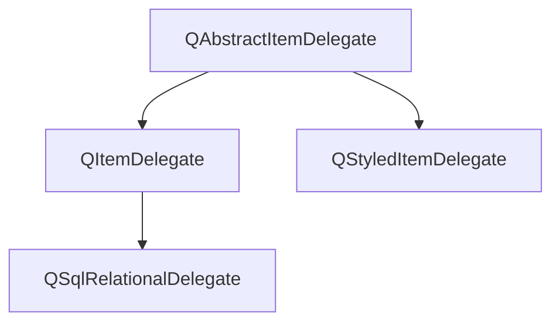

## 1. 认识Qt和GUI应用程序基础

1-2章关于Qt的安装和简单复习可见[01-hello_world](01-hello_world)的内容，其运行结果图片可见[](01-hello_world/app.png)。

主要的笔记如下。

一、槽函数命名规则是on开头，然后跟上的字符串要与控件名称一致，然后是槽信号的简称。

例如 on_btnclose_clicked，或者其他信号valueChanged、currentIndexChanged等等。这个控件可以是UI设计界面添加的也可以是动态添加的，如果是动态添加的，自定义变量名就是这个控件名称。

例如自定义的SpinBox控件，在private定义的,QSpinBox * fontSizeBox；那么槽函数一定要一致，命名为void on_fontSizeBox_valueChanged(int fontsize)。

二、整个工程结构其实就是1个.ui文件,它背后其实是"ui_helloworld.h"。
不过在QtCreator默认找不到这个文件，可以点击工程上方的工具栏点击过滤器树形视图,取消隐藏文件就可以看到了VS如果配置过Qt，就可以直接找到的,内部其实就定义了一个Ui_helloWorld类，设了一些Gui的控件参数。Ui_helloWorld类有2个函数setupUi和retranslateUi函数，这个类被命名空间下Ui的helloworld所继承。

```c++
namespace Ui {
    class helloWorld: public Ui_helloWorld {};
} // namespace Ui
```

同时1个同名的helloworld类的声明在helloworld.h中，但不属于Ui空间，它将Ui::helloworld作为私有属性组合
之所以这样做就是为了将Gui和业务分离开，符合严格封装的思想。

三、Q_OBEJECT需要在helloworld中声明，这是引入信号与槽机制需要声明的宏。
SIGNAL和SLOT也是Qt的宏，可以将信号和槽函数的参数转为字符串，主要用在connect函数。
例如：

```C++
QObject::connect(this->ui>rbt_red,&QRadioButton::clicked,this,&helloWorld::setTextColor);
```

如果是带参数的：

```C++
connect(this>fontSizeBox,SIGNAL(valueChanged(int)),
        this,SLOT(on_fontSizeBox_valueChanged(int)));
```

注意：带参数的因为可能出现函数重载的情况，第1种函数指针的写法不符合语法；但是不带参数的呢，用宏好像又不起作用，例如下方的写法不起作用。

```C++
QObject::connect(this->ui->rbt_blue,SIGNAL(clicked()),this,SLOT(setTextColor()));
```

四、关于connect其他的说明

connect是QObject的一个静态函数，常见的形式是: 

```c++
QObject::connect(发送对象,SIGNAL(signal())，接收对象，SLOT(slot()));
```

信号和槽函数的参数类型和个数必须一致，信号的参数不能少于槽函数，且不能有返回值。

一个信号也可以连接多个槽函数，也就是说可以同时做2件事以上，按照先func1，再func2的定义顺序执行。

```c++
connect(ui->combox,SIGBAL(valueChanged(int)),this,SLOT(func1(int)));
connect(ui->combox,SIGBAL(valueChanged(int)),this,SLOT(func2(int)));
```

多个信号可以链接到同1个槽函数，也就是多个事件导致的结果相同。

```c++
connect(this->ui->rbt_red,&QRadioButton::clicked,this,&helloWorld::setTextColor);
connect(this->ui->rbt_green,&QRadioButton::clicked,this,&helloWorld::setTextColor);
connect(this->ui->rbt_blue,&QRadioButton::clicked,this,&helloWorld::setTextColor);
```

1个信号连接到另1个信号也是可以的，也就是发射1个信号也会发送另1个信号。

```C++
connect(发送者,SIGNAL(valueChanged(int)),this,SIGNAL(refreshInfo(int)));
```

五、关于QColor,QBrush,QPen等

QColor可以设置颜色,可以作为画刷QBrush的构造函数参数；
QBrush是画刷，可以用于填充封闭图形；QPen是画笔，一般是描绘轮廓线；
两个都可以被QPainter画家使用，用于填充画布QPaintDevice；
可以充当画布类QPaintDevice的有**QWiget、QImage、QPixmap、QPicture**、QPaintDeviceWindow、QPagedPaintDevice、QOpenGLPaintDevice等
最常用的是前4个。

六、UI静态设计和代码动态设计结合

有时候不能直接借助可视化ui来设计，所以必须借助写代码的方式动态添加。
例如状态栏和工具栏不能直接拖动控件，需要借助写代码，如工具栏可以添加SpinBox来调整字体大小、
状态栏可以添加Label显示文字或者添加进度条显示进度，这些控件都是不能直接拖动的。菜单栏是可以直接添加选项和菜单的,需要设计动作，动作可以ui设计也可以写代码设计，但是纯写代码实现界面工作量较大，可以在创建项目时不勾选[generate forum],两者结合快速快发是最好的,可以提高工作效率。

七、关于QAction

QAction类在ui的Action Editor进行编辑，或者转到槽写代码实现分隔符也是QAction类。

八、关于QPalette

QPalette存在一些枚举值，ColorRole和ColorGroup。

```C++
enum ColorGroup { Active, Disabled, Inactive, NColorGroups, 
                 Current, All, Normal = Active };
enum ColorRole { WindowText, Button, Light, Midlight, Dark, Mid,
                Text, BrightText, ButtonText, Base, Window, Shadow,
                Highlight, HighlightedText,
                Link, LinkVisited,
                AlternateBase,
                NoRole,
                ToolTipBase, ToolTipText,
                NColorRoles = ToolTipText + 1,
                Foreground = WindowText, Background = Window
};
```

九、关于工具栏

工具栏事先需要使用QToolBar来构建，构建需要制定名称，然后通过addWidget来添加进各种动作或者控件
工具栏需要指定在什么位置构建，利用枚举值说明ToolBarArea。

```C++
enum ToolBarArea {
    LeftToolBarArea = 0x1,
    RightToolBarArea = 0x2,
    TopToolBarArea = 0x4,
    BottomToolBarArea = 0x8,

    ToolBarArea_Mask = 0xf,
    AllToolBarAreas = ToolBarArea_Mask,
    NoToolBarArea = 0
};
```

十、状态栏

```c++
this->statusBar()->addWidget(progressbar); // 添加进状态栏
this->ui->statusbar->showMessage("你终于承认我最帅了!"); // 打印消息
```

十一、菜单栏

addAction和addMenu是这样用的，他们会返回指向新建的项地址。

```C++
privare: QAction * startProgressbar; // helloWorld.h的一个私有属性声明
QMenu * qm = this->menuBar()->addMenu("执行");
QAction * qac = qm->addAction("进度条");
this->startProgressbar = qac; // 让这个私有属性等于qac
connect(this>startProgressbar,&QAction::triggered,this,&helloWorld::on_startProgressbar_triggered); // 再连接这个同名槽函数
```

十二、其他

线程阻塞问题可以添加这句代码解决。

```c++
QCoreApplication::processEvents(QEventLoop::AllEvents, 100);
```

以上各个Q类只是笼统的介绍，后边的每个章节都会具体介绍某一个类。

## 2. Qt类概述

### 2.1 Qt核心特点

涉及的头文件和宏定义主要是：

```c++
#include  <QObject>
#include    <QMetaProperty>
Q_OBJECT
Q_CLASSINFO
Q_PROPERT
Q_UNUSED
SIGNAL
SLOT
```

#### 2.1.1 元对象系统和编译器

##### 2.1.1.1 Q_OBJECT

Qt本身其实是用C++开发的库，但是它具备Qt自己的属性，也就是信号与槽机制、对象属性等，这些并不属于C++的范畴，所以需要一个预处理过程。**Qt元对象编译器也就是MOC是一个预处理器，在源程序编译前先转换为标准C++兼容的形式**，即对信号和槽的代码进行宏替换，这也是为何必须添加Q_OBJECT宏的原因。

##### 2.1.1.2 QObject

QtCore是Qt的核心，Qt为c++语言增加的特性就是在此模块实现，扩展特性主要有信号与槽机制、属性系统、动态类型转换等，它们共同作为Qt的**元对象系统**。

元对象系统的主要构成如下：

1、QObject类，是所有使用元对象系统的类的基类

2、类的private部分声明Q_OBJECT宏，使类可以使用元对象的特性，如动态属性、信号与槽

3、MOC元对象编译器，为每个QObject的子类提供必要代码实现元对象系统的特性

MOC工具读取C++源文件时发现类的定义有Q_OBJECT时就会为这个类生成另外1个包含元对象支持代码的C++源文件(其实就是那个UI_XXX.h文件)

4、OObject的一些成员函数功能

metaObject可以返回其控件的类型。

```c++
QObject * obj = new QPushButton;
obg->metaObject()->className(); // 返回"QPushButton"
```

inherits(const char*className)可以判断一个对象实例是否是名称为ClassName的类或者QObject的子类的实例。

```c++
std::cout<<std::boolalpha<<this->toolbar->inherits("QToolBar")<<std::endl; //true
std::cout<<std::boolalpha<<this->toolbar->inherits("QObject ")<<std::endl; // false
std::cout<<std::boolalpha<<this->toolbar->inherits("QRadioButton")<<std::endl; // false
```

QObejct指针可以指向任何子类对象，但是本质上还是QObject指针，可以通过qobejct_cast进行转换，就像static_cast和dynamic_cast那样做一样。

```c++
QObject * obj  = new QMyWidget; // 不区分Qt内建和自定义类型,QMyWidget继承于QWidget
QWidget * widget = qobject_cast<QMyWidget *>(obj); // ok
QLabel * label = qobject_cast<QLabel *>(obj); // error，因为QLabel不是QMyWidget子类
```

setProperty()函数可以设置属性的名称和数据，property()函数可以获取属性值。

这个函数主要是为了定义为类定义动态属性。

```c++
bool setProperty(const char *name, const QVariant &value);
QVariant property(const char *name) const;
```

关于属性，在下一小节说明，即[属性系统](#属性系统)。

#### 2.1.2 属性系统

##### 2.1.2.1 Q_PROPERTY

什么是属性？Qt提供了Q_PROPERTY()宏定义属性，基于元对象系统实现与C++编译器无关。

定义了一个返回值type，名称name的属性，它由于有一些关键字分别定义不同的机制。

```c++
Q_PROPERTY
(
	type // 返回类型
	name // 属性名称
	READ // 指定1个读取属性值的函数,没有MEMBER关键字时必须设置READ
	WRITE // 指定1个设定属性值的函数,,只读属性没有WRITE设置
	MEMBER // 指定1个成员变量与属性关联,成为可读可写的属性,无需再设置READ和WRITE
	RESET // 可选,指定1个设置属性缺省值的函数
	Notify // 可选,设置1个信号,属性值变化时发射此信号
	DESIGNABLE // 属性是否在Qt Designed可见,缺省为True
	CONSTANT  // 表示属性值是常数,但只是针对具体的1个实例而言,不同实例可以有不同的常数
	FINAL // 表示定义的属性不能被子类重载
)
```

这个属性和名称其实就是ui文件里右下角的那些可视化展示，例如QWidget有属性focus、enabled和cursor，分别表示焦点策略、启用或禁用widget、鼠标悬浮时的样式等等。

关于焦点策略有

```c++
NoFocus 无法通过点击和键盘获得焦点
TabFocus 鼠标无法获得焦点，Tab可以获得
ClickFocus 鼠标点击可以获得焦点，Tab不可
StrongFocus 鼠标和Tab都可以获得
WheelFocus 滚轮获得
Q_PROPERTY(bool focus READ hasFocus);// 定义了名称为focus的只读属性返回值bool,读取联系的函数是hasFocus
```

enabled设置只有2种，开启或者未开启状态，读写联系2个函数。

```c++
Q_PROPERTY(bool enabled READ isEnabled WRITE setEnabled);
```

鼠标设置的样式有很多，这里不列举，也有2个函数去读取和设置样式，还可以RESET设置默认参数

```c++
Q_PROPERTY(QCursor cursor READ cursor WRITE setCursor RESET unsetCursor)
```

只要知道属性的名称，无论是否使用READ和WRITE定义了接口函数，就可以通过QObject::property获取属性值，例如

```c++
QObject * obj  = new QPushButton;
obj->setProperty("flat",QVariant(false)); // 设置属性名称为flat,值为true
obj->setProperty("age",QVariant(18.5));
QVariant isFlat = obj->property("flat");
float age = obj->property("age").value<double>();
std::cout<<std::boolalpha<<isFlat.value<bool>()<<"\n"; // false
std::cout<<age<<"\n"; // 18.5
```

总之，属性是动态的被添加进类，更多的用法在以后会讲解。

##### 2.1.2.2 Q_CLASSINFO

属性信息还包括类的信息，级通过宏Q_CLASSINFO()来为类的元对象定义"名称--值"信息，例如

```c++
class QMyClass : public QObject
{
    Q_OBJECT
    Q_CLASSINFO("author","wang")
    Q_CLASSINFO("comapny","huawei")
    Q_CLASSINFO("Version","3.0.1")
    public:
    ...
};
```

#### 2.1.3 信号与槽

信号与槽是对象进行通信的机制，也需要由Qt的元对象系统支持才能实现。

##### 2.1.3.1 connect

connect函数是其中的关键，它最常见的几个定义如下。

```c++
// 借助宏指定自定义的信号和槽
static QMetaObject::Connection connect(const QObject *sender, const char *signal,const QObject *receiver, const char *member, Qt::ConnectionType = Qt::AutoConnection); 
connect(sender,SIGNAL(signal()),receiver,SLOT(slot()));//可以这样使用
connect(spinNum,SIGNAL(valueChanged(int)),this,SLOT(updateState(int))); // 带参数时这样使用

// 借助元方法,也就是Qt内建的那些信号和UI控件转到的槽函数
static QMetaObject::Connection connect(const QObject *sender, const QMetaMethod &signal,const QObject *receiver, const QMetaMethod &method,
Qt::ConnectionType type = Qt::AutoConnection); 

// 这种形式只有发送者和信号以及成员,没有接受者,用的比较少
inline QMetaObject::Connection connect(const QObject *sender, const char *signal,const char *member, Qt::ConnectionType type = Qt::AutoConnection) const;

// 借助函数指针,也就是具有默认参数的信号与槽且唯一的槽函数,槽函数重载时此形式不能使用
template <typename Func1, typename Func2>
static inline QMetaObject::Connection connect(
    const typename QtPrivate::FunctionPointer<Func1>::Object *sender, Func1 signal,
    const typename QtPrivate::FunctionPointer<Func2>::Object *receiver, Func2 slot,
    Qt::ConnectionType type = Qt::AutoConnection)
typedef QtPrivate::FunctionPointer<Func1> SignalType;
typedef QtPrivate::FunctionPointer<Func2> SlotType;

connect(lineEdit,&QLineEdit::textChanged,ths,&widget::on_textChanged); // 可以这样用,因为lineEdit只有1个信号textChanged(QString)
// 对于QSpinBox的valueChanged就有2种版本,所以不能使用函数指针的方式
void QSpinBox::valueChanged(int i);
void QSpinBox::valueChanged(const QString &text);
// 此时定义自己的槽函数
void onValueChanged(int i);
connect(spinNum,&QSpinBox::valueChanged,this,&widget::onValueChanged);//会报错
```

以上无论哪种形式，最后1个参数都是默认的Qt::AutoConnection，Qt::ConnectionType表示了信号与槽的关联方式，由枚举值定义。

```C++
enum ConnectionType {
    AutoConnection, // 信号接收和发射都是同一线程需要使用Qt::DirectConnection方式;否则使用Qt::QueuedConnection方式,信号发射时自动确定关联方式
    DirectConnection, // 同一线程使用
    QueuedConnection, // 多线程使用,槽函数在事件回到接收者线程后执行
    BlockingQueuedConnection, // 和QueuedConnection类似,但是信号线程会阻塞直到槽函数执行完毕,但是信号和槽函数同一线程时不能使用此方式会造成死锁
    UniqueConnection =  0x80 // 独占连接,其他信号不能连接槽函数
};
```

##### 2.1.3.2 sender

还可以使用QObject::sender()获得信号发射者。例如槽函数里得到指向发射者的指针后，如果已知类型，再用之前提到的qobject_cast投射为确定的类型，就可以使用这个类的接口函数了。

```c++
void on_valueChanged(int) // QSpinBox的某个槽函数
{
    QSpinBox * spinbox = qobject_cast<QSpinBox *>(sender()); // 获取发射信号的指针对象
    spinbox->func();// ...可以使用spinbox操作信号发射者,访问它的一些属性等
}
```

##### 2.1.3.2 signals&slots

自定义信号类，需要3个部分组成。第一个是声明Q_OBJECT具备信号与槽的机制；其次使用signals声明为信号函数，信号函数可以带参数，但是不能有返回值；然后其他函数可以依据条件emit信号函数。至于信号是否绑定了槽函数与信号类无关。

```c++
class QPerson: public QObject
{
    Q_OBJECT
    private:
    	int q_age = 10;
    public:
    	void increaseAge();
    signals:
    	void ageChanged(int value);
};
void QPerson::increaseAge()
{
    ++q_age; // 年龄发生变化就发射信号
    emit ageChanged(q_age); // 发射信号
}
```

完整的QPerson头文件声明如下。

其实就是继承了QObject引入信号槽函数机制，这个类还定义了自己的元类信息，之后声明了3个私有属性作为元类属性进行绑定。定义了3个私有函数，1个公有信号函数(只有定义，没有实现，因为仅仅是个信号用于传递)。

```c++
#ifndef Q_PERSON_H
#define Q_PERSON_H
#include  <QObject>
#include  <QString>
class QPerson :  public QObject
{
  Q_OBJECT // 宏声明
  Q_CLASSINFO("author","chenbei")
  Q_CLASSINFO("Email","chenbei_electric@163.com")
  Q_CLASSINFO("version","1.0.0")
  // 定义属性age,返回类型int,声明读写函数getAge和setAge,定义了关联信号ageChanged
  Q_PROPERTY(int  age READ getAge WRITE setAge NOTIFY ageChanged)
  // 定义属性name,返回类型QString,绑定成员myname
  Q_PROPERTY(QString name MEMBER myname)
  // 定义属性score,返回类型int,绑定成员 myscore
  Q_PROPERTY(int score MEMBER myscore)
private: // 3个私有属性,年龄、名字和分数
  int myage = 18;
  QString myname;
  int myscore = 79;
public:
  explicit QPerson(QString Name,QObject* parent = nullptr); // 禁止隐式转换
  int getAge();
  void setAge(int age_value);
  void  increaseAge();
signals:
   void ageChanged(int age_value);// 不需要给出定义,因为只是1个信号,它会绑定到槽函数QMetaObjectTest::on_ageChanged上
   // QPerson的ageChanged信号会绑定到QMetaObjectTest定义的on_ageChanged槽函数
   // 这里无需自定义实现，只是传递1个类似Flag的提示,实现不重要
   // 另一个类需要包含此类的头文件,并使用connect把信号绑定到该槽函数
 public slots: // 此类无与该信号绑定的槽函数
};
#endif // Q_PERSON_H

```

而QPerson的实现，主要关注的就是2个设定函数，**设定年龄或者增加年龄的时候同时发出信号**。

QPerson的完整头文件定义如下。

```c++
#include "q_person.h"

QPerson::QPerson(QString Name,QObject *parent) : QObject(parent) // 用QObject初始化parent
{ //构造函数
    myname=Name;
}

int QPerson::getAge() // 可以被QMetaObjectTest::on_ageChanged槽函数调用反馈给QPlainTextEdit组件
{ //返回age
    return  myage;
}

void QPerson::setAge(int age_value) // 被界面的SpinBox组件调用,spinBoy和spinGril
{//设置age
    myage=age_value;
    emit ageChanged(myage); //发射信号
}

void QPerson::increaseAge() // 被界面的QPushButton组件调用,btnGirlInc和btnboyInc
{
    myage++;
    emit ageChanged(myage);//发射信号
}
```

setAge和increaseAge这2个函数会被一些界面组件的槽函数进行调用(**调用的时候就自动发射信号又会反过来影响一些东西**)，也就是一些组件(如spinbox,pushbutton)感知到了某种变化，也就是组件自身具备的一些信号，例如下拉索引的变化、spinbox值(valueChanged(int))的变化或者clicked，将这些变化通过**connect联系到槽函数**，这些槽函数**可以是依据on命名规则自动索引到组件**，**也可以内部直接编程做出一些行为**。

完整的UI头文件声明如下。

```c++
#ifndef QMETAOBJECTTEST_H
#define QMETAOBJECTTEST_H

#include <QWidget>
#include <QSpinBox>
#include  <q_person.h>

QT_BEGIN_NAMESPACE
namespace Ui { class QMetaObjectTest; }
QT_END_NAMESPACE

class QMetaObjectTest : public QWidget
{
  Q_OBJECT

public:
  explicit QMetaObjectTest(QWidget *parent = nullptr);
  ~QMetaObjectTest();

private:
  Ui::QMetaObjectTest *ui;

private:
    QPerson * boy , * girl; // 定义男孩和女孩

    // 2个初始化函数在构造函数中被调用
    void initProperty(); // 初始化一些属性
    void initConnect();// 初始化信号连接
    void printClassInfo(const QMetaObject *,const QString& sex);

private slots: // 自定义私有槽函数
    // 自定义信号要连接的自定义槽函数,需要手动connect
    void ageChanged(int age_value);
    void ageChanged_girl(int age_value);  // 此槽函数内部反馈给QPlainTextEdit组件
     void ageChanged_boy(int age_value);

    QSpinBox * spin_valueChanged(int arg); // 内部会会获取发射者是哪个QSpinBox组件
    void spinBoy_valueChanged(int arg);
    void spinGirl_valueChanged(int arg);

     // 界面4个QPushButton组件对应的槽函数,因为命名规则对应所以组件点击时会自动找到这4个函数
    void on_btnClear_clicked();
    void on_btnBoyInc_clicked();
    void on_btnGirlInc_clicked();
    void on_btnClassInfo_clicked();

    //
};
#endif // QMETAOBJECTTEST_H
```

完整的UI头文件定义如下。

```c++
#include "qmetaobjecttest.h"
#include "ui_qmetaobjecttest.h"
#include <iostream>
#include  <string>
#include    <QMetaProperty>
QMetaObjectTest::QMetaObjectTest(QWidget *parent)// 构造函数
  : QWidget(parent)
  , ui(new Ui::QMetaObjectTest)
{
    ui->setupUi(this);
    this->initProperty();
    this->initConnect();
}
QMetaObjectTest::~QMetaObjectTest()
{
  delete ui;
}
void QMetaObjectTest :: initProperty() // 初始化一些属性
{
  this->boy = new QPerson("chenbei");
  this->boy->setAge(20); // 方式1使用成员函数设置属性
  this->boy->setProperty("age",10);// 方式2使用Qt函数设置属性,因为age声明为READ和WRITE兼具
  this->boy->setProperty("score",95);// score同理
  this->boy->setProperty("sex","Boy"); // 设置宏定义没出现过的是动态属性
  this->boy->setProperty("isBoy",true);
  this->girl = new QPerson("baby");
  this->girl->setProperty("score",81);
  this->girl->setProperty("age",20);
  this->girl->setProperty("sex","Girl");
  this->girl->setProperty("isBoy",false);
}
void QMetaObjectTest:: initConnect()// 初始化信号连接
{
  // 1.连接boy,girl自定义过的信号和this的自定义槽函数,也就是信号和槽函数可以不在一起定义
   connect(this->boy,&QPerson::ageChanged,this,&QMetaObjectTest::ageChanged_boy);
   connect(this->girl,&QPerson::ageChanged,this,&QMetaObjectTest::ageChanged_girl);
    // 2. 连接spinbox组件的自带信号和自定义的槽函数
       connect(this->ui->spinGirl,SIGNAL(valueChanged(int)),
               this,SLOT(spinGirl_valueChanged(int)));
       connect(this->ui->spinBoy,SIGNAL(valueChanged(int)),
               this,SLOT(spinBoy_valueChanged(int)));
    // 3. 4个QPushButton组件的信号和槽函数都是原生的所以无需手动connect
}


// 自定义槽函数,接收来自QPerson类定义的信号,用于反馈影响QPlainTextEdit组件
// 内部使用sender()技术和qobejct_cast<T>类型投射,就可以获取发射信号指针对象的信息了
void QMetaObjectTest::ageChanged(int age_value)
{
    Q_UNUSED(age_value); // 声明此变量不被使用
    QPerson *aPerson = qobject_cast<QPerson *>(sender()); //获取指向发射信号的指针
    QString hisName=aPerson->property("name").toString(); // 获取姓名
    QString hisSex=aPerson->property("sex").toString(); //动态属性获取
    // int hisAge=aPerson->getAge();//通过接口函数也可以获取年龄
    int hisAge=aPerson->property("age").toInt();//通过属性获得年龄
    int hisScore = aPerson->property("score").toInt();
    bool isBoy = aPerson->property("isBoy").toBool();
    this->ui->textEdit->appendPlainText
        ("姓名="+hisName+","+"性别="+hisSex
         +QString::asprintf(",年龄=%d,分数=%d,isBoy=%d",hisAge,hisScore,isBoy));
}
void QMetaObjectTest::ageChanged_girl( int age_value) // 用于girl和boy调用,减少重复代码
{
   this->ageChanged(age_value);
}
void QMetaObjectTest::ageChanged_boy( int age_value)
{
   this->ageChanged(age_value);
}

// 连接spinbox组件的自带信号和自定义的槽函数
// 减少重复代码的函数,被下边2个实际的槽函数调用
QSpinBox * QMetaObjectTest::spin_valueChanged(int arg)
{
    Q_UNUSED(arg);
    QSpinBox *spinBox = qobject_cast<QSpinBox *>(sender()); // 获取发射的对象,girl或boy
    return spinBox;
}
void QMetaObjectTest::spinBoy_valueChanged(int arg) 
{
   // spinbox的value改变后被读取,然后影响this->boy和this->girl
   QSpinBox * spinBox = spin_valueChanged(arg);
   this->boy->setAge(spinBox->value());
}
void QMetaObjectTest::spinGirl_valueChanged(int arg)
{
   QSpinBox * spinBox = spin_valueChanged(arg);
   this->girl->setAge(spinBox->value());
}

// 4个QPushButton的槽函数
void QMetaObjectTest::on_btnClear_clicked()//"清空文本框"按钮
{
    this->ui->textEdit->clear();
}
void QMetaObjectTest::on_btnBoyInc_clicked()//"boy长大一岁"按钮
{
    this->boy->increaseAge(); // 调用成员函数
}
void QMetaObjectTest::on_btnGirlInc_clicked()//"girl长大一岁"按钮
{
    this->girl->increaseAge(); /// 调用成员函数
}
void QMetaObjectTest::on_btnClassInfo_clicked()
{//"类的元对象信息"按钮
      const QMetaObject *meta1=boy->metaObject();
      const QMetaObject *meta2=girl->metaObject();
      ui->textEdit->clear();
      this->printClassInfo(meta1,"Boy");
      this->printClassInfo(meta2,"Girl");
}
void QMetaObjectTest::printClassInfo(const QMetaObject * meta,const QString&  sex)
{ // "显示元对象信息"按钮槽函数去调用的,节省重复代码
  ui->textEdit->appendPlainText("=="+sex+"元对象信息==");
  for (int i=meta->classInfoOffset();i<meta->classInfoCount();++i)
  {
     QMetaClassInfo classInfo=meta->classInfo(i);
      ui->textEdit->appendPlainText(
         QString("classInfo=%1 <=> value=%2").arg(classInfo.name()).arg(classInfo.value()));
  }
  ui->textEdit->appendPlainText(QString("className <=> %1").arg(meta->className())); // 打印元类
  ui->textEdit->appendPlainText(sex+" classProperty =>");// 打印属性
    // 1.propertyOffset()返回类的第1个属性的序号,不一定是0;
  //  2.propertyCount();属性的个数,这里是age,name,score 3个
  for (int i=meta->propertyOffset();i<meta->propertyCount();i++) //
  {
      const char* propName=meta->property(i).name(); // 获取姓名
      ui->textEdit->appendPlainText(
      QString("propertyName=%1，value=%2").arg(propName).arg(boy->property(propName).toString()));
  }
}
```

### 2.2 Qt全局定义

#### 2.2.1 QtGlobal

涉及的头文件和宏定义主要是：

```c++
#include <QtGlobal>
#include <QFloat16>
#include <QtMath>
QT_VERSION、QT_VERSION_CHECK、QT_VERSION_STR // 版本号
Q_BYTE_ORDER、Q_BIG_ENDIAN、Q_LITTLE_ENDIAN // 字节序
Q_DECL_IMPORT、Q_DECL_EXPORT // 导入导出
Q_DECL_OVERRIDE // 重载虚函数使用
Q_DECL_OVERRIDE、Q_DECL_FINAL   // override,final
Q_UNUSED(name) // 定义不在函数体使用的参数
foreach(variable,containter) // 容器遍历
forever // 构造无限循环
qDebug // 在debugger窗体显示信息
qWaring,qCritical,qFatal,qInfo // 其他debugger窗体显示信息
```

<QtGlobal>定义了许多的数据类型，为了确保各个平台的数据长度相同，例如qint8。

qfloat16是Qt5.9以后新增的类，表示16位的浮点数。

```c++
typedef signed char qint8;
typedef signed short qint16;
typedef signed int qint32;
typedef signed long long int qint64;
typedef signed long long int qlonglong;

typedef unsigned char quint8;
typedef unsigned char uchar;

typedef unsigned short quint16;
typedef unsigned short ushort;

typedef unsigned int quint32;
typedef unsigned int uint;

typedef unsigned long ulong;

typedef unsigned long long int quint64;
typedef unsigned long long int qulonglong;

typedef double ureal;
qfloat16; // 需要包含<QFloat16>头文件
```

<QtGlobal>还定义了常用的全局函数，有些函数是模板参数，参数同时支持float或者double。

```c++
T qAbs(const T&value); // 绝对值
const T& qBound(const T&min,const T&value,const T&max);//裁剪数值在[min,max]
bool qFuzzyCompare(double p1,double p2);// p1约等于p2时返回true
bool qFuzzyIsNULL(double d); // 参数约等于0返回true
double qInf(); // 返回inf
bool qIsFinite(double d);// d是有限数返回true
bool qIsInf(double d); // 是无限大数返回true
bool qIsNaN(double d); // 不是1个数返回true
const T& qMax(const T&value1,const T&value2); // max
const T& qMin(const T&value1,const T&value2); // min
qint64 qRound64(double value); //取整最接近的qint64整数
int qRound(double value);// 取整int
int qrand();//标准C++的rand()线程安全型版本,[0,RAND_MAX]
void qsrand(uint seed);//随机种子
```

#### 2.2.2 QtMath

其他的就是在<QtMath>定义的基础数学运算函数，如三角运算、弧度与角度转换等。

宏定义，如Qt版本是Qt5.9.1，则QT_VERSION=0x050901，这个宏就是用于控制条件编译使用的，根据版本的不同编译不同的代码段，例如

```c++
#if QT_VERSION >= 0x040100
	QIcon icon = style()->standardIcon(QStyle::SP_TrashIcon);
#else
	QPixmap pixmap = style()->standardPixmap(QStyle::SP_TrashIcon);
	QIcon icon(pixmap);
#endif
```

QT_VERSION_CHECK则是展开为版本号的整数表示。

```c++
#if (QT_VERSION >=QT_VERSION_CHECK(5,0,0))
#include <QtWidgets>
#else
#include <QtGui>
#endif
```

QT_VERSION_STR则是版本号的字符串表示，如"5.9.0"。

Q_BYTE_ORDER、Q_BIG_ENDIAN、Q_LITTLE_ENDIAN分别表述内存中数据的字节序、大端字节序和小端字节序，在判断系统字节序时可以到。例如

```c++
#if Q_BYTE_ORDER == Q_LITTLE_ENDIAN
...
#endif
```

Q_DECL_IMPORT和Q_DECL_EXPORT用于使用和设计共享库时用于导入或导出库的内容。

Q_DECL_OVERRIDE可以重载虚函数使用，如果没有被重载就会报错。Q_DECL_FINAL将1个虚函数定义为最终级别不能再被重载，或者1个类不可再被继承。例如

```c++
void paintEvent(QPaintEvent*) Q_DECL_OVERRIDE;
class QRect Q_DECL_FINAL{ // QRect不可再被继承
    ...
}
void paintEvent(QPaintEvent*) override final;// 使用override&final技术也可以
```

Q_UNUSED(name) 用于定义不在函数体使用的参数，例如：

```c++
void mainWindow::on_imagedSaved(int id, const QString &filenname)
{
    Q_UNUSED(id);
    LabInfo->setText("file is saved in "+filename);
}
```

#### 2.2.3 foreach&forever

foreach(variable,containter) 用于容器遍历。

```c++
foreach(const QString& codeName,recorder->supportedAudioCodes())
    ui->comboCode->addItem(codeName);
```

forever 用于构造无限循环。

```c++
forever{
    ...
}
```

#### 2.2.4 qDebug

qDebug 用于在debugger窗体显示信息，其他的类似的还有qWaring,qCritical,qFatal,qInfo。

但是如果编译器设置了Qt_NO_DEBUG_OUTPUT，则不作任何输出。

```c++
qDebug("item is in list: %d",mylist.size());
```

### 2.3 Qt容器类

Qt提供了多个基于模板的容器类，比STL的容器类更加轻巧、安全，这些容器类是隐式共享和可重入的，进行了速度和存储优化，可减少可执行文件的大小。此外它是线程安全的，即作为只读容器时可被多个线程访问。

Qt容器类分为顺序容器类和关联容器类，包含了Java类型和STL类型的迭代类，Java类型易于使用，提供高级功能，STL则是迭代效率高。

Qt还提供了foreach宏用于遍历容器内的所有数据项。

#### 2.3.1 顺序容器类

主要包括QList、QLinkedList、QVector、QStack和QQueue。

##### 2.3.1.1 QList

**QList：**最常用的容器类，但是以数组列表实现的线性列表，而不是链表，可以使用下标索引访问数据项，但是头插和尾插数据非常快。

常用函数。

```c++
insert(); // 插入
replace(); // 替换
removeAt(); // 移除
move(); // 移动
swap(); // 交换
append(); // 尾插
prepend(); // 头插
removeFirst(); // 头删
removeLast(); // 尾删
isEmpty(); // 是否为空
```

##### 2.3.1.2 QLinkedList

**QLinkedList：**是链表，基于迭代器访问数据项，不能使用下标索引，插入和删除数据项的操作时间相同。

其它的接口函数和QList很像，基本一致。

##### 2.3.1.3 QVector

**QVector：**提供动态数组的功能，可以以下标索引访问数据，函数接口也与QList基本相同。区别是QVector效率更高，因为数据项是连续存储的，其风格就是STL的vector，QList则更像Java。

##### 2.3.1.4 QStack

**QStack：**堆栈的后入先出LIFO数据类型，push()和pop()是主要的接口函数。

```c++
QStack<int> stack;
stack.push(10);
stack.push(20);
stack.push(30);
while(!stack.isEmpty())
	cout<<stack.pop()<<endl;
```

##### 2.3.1.5 QQueue

**QQueue：**先入先出FIFO的数据类型，enqueue()和dequeue()是主要的接口函数，用于入列和出列。

```c++
QQueue<int> q;
q.enqueue(10);
q.enqueue(20);
q.enqueue(30);
while (!q.isEmpty())
    cout<<q.dequeue()<<endl;
```

#### 2.3.2 关联容器类

Qt提供QMap、QMultiMap、QHash、QMultiHash和QSet。

QMultiMap和QMultiHash支持1个键关联多个值。

QSet、QHash、QMultiHash底层是哈希散列函数进行查找，速度比较快，类似于STL的unordered_map和unordered_set。

##### 2.3.2.1 QSet

**QSet：**基于散列表的集合模板类，存储数据顺序不固定查找值的速度很快，内部使用QHash实现。

具备Java的风格，例如contains函数，其实STL的set不包含。

```C++
QSet<QString> set;
set<<"dog"<<"cat"<<"tiger"; // 通过<<重载可以自动插入值
if (!set.contains("cat")){
    ... // do something
}
```

##### 2.3.2.2 QMap

QMap：**<Key，T>，提供关联数组(字典)，一个键映射到一个值，**内部是有序的按照键的顺序**，如果不在乎存储顺序，使用QHash更快。如果查找没找到指定的键会返回一个缺省构造值，例如键是字符串类型，就会返回空字符串。所以可以用**value()函数查找键值时可以指定1个缺省的返回值**。

```c++
QMap<QString,int> map;
map["one"] = 1;
map["two"] = 2;
map["three"] = 3;
map.insert("four",4);
map.remove("two");
int num1 = map["one"];
int num2 = map.value("two");
int timeout = map.value("TIMEOUT",-1); // 表示如果找到TIMEOUT就返回关联的值否则返回-1
```

##### 2.3.2.3 QMultiMap

QMultiMap：**多值映射，是QMap的子类，继承了QMap的大部分函数接口，有些函数略有区别，例如**QMultiMap::insert()等价于QMap::insertMulti()，QMultiMap::replace()等价于QMap::insert()**。QMap一般不允许多值映射，除非使用了函数QMap::insertMulti()添加键值对。

另外QMultiMap不像QMap提供[]操作符，只能使用value()函数来获取值，如果希望获取1个键对应的所有值可以使用values()函数，返回值是QList<T>类型。

```c++
QList<int> values = map.values("plenty");
for (int i = 0; i < values.size(); ++i)
    cout << values.at(i) << endl;
```

##### 2.3.2.4 QHash

**QHash：**基于散列表实现字典功能的模板类<Key，T>，和QMap用法类似。

区别是QHash的查找速度更快，数据项是无序的，不像QMap数据项安装键排序。QMap的键必须提供"<"运算符，QHash则是提供"=="运算符和一个名称为qHash()的全局散列函数。

##### 2.3.2.5 QMultiHash

**QMultiHash**：是QHash的子类，支持多值映射，用法类似于QMultiMap。

#### 2.3.3 容器类的迭代

分为Java类型的迭代器和STL类型的迭代器。**Java类型迭代器的指针不是指向一个数据项，而是数据项之间**，例如，起始时刻指针不指向第1个数据项，而是在它之前，需要使用next()获取第1个数据项。

另外**Java类型的迭代器并不是嵌套类，而是独立类，而且具备模板参数，实例化需要相同类型的容器对象作为构造参数**。

**Java类型的迭代器汇总如下。**

|             容器类              |       只读迭代器       |         读写迭代器          |
| :-----------------------------: | :--------------------: | :-------------------------: |
|       QList<T>,QQueue<T>        |   QListIterator<<T>    |   QMutableListIterator<T>   |
|         QLinkedList<T>          | QLinkedListIterator<T> |   QMutableListIterator<T>   |
|      QVector<T>,QStack<T>       |   QVectorIterator<T>   |  QMutableVectorIterator<T>  |
|             QSet<T>             |    QSetIterator<T>     |   QMutableSetIterator<T>    |
|  QMap<Key,T>,QMultiMap<Key,T>   |  QMapIterator<Key,T>   | QMutableMapIterator<Key,T>  |
| QHash<Key,T>,,QMultiHash<Key,T> |  QHashIterator<Key,T>  | QMutableHashIterator<Key,T> |

QList、QLinkedList和QSet的迭代器用法相同，QMap和QHash用法相同，这里以QList和QMap进行说明。

##### 2.3.3.1 Java型迭代器

QList的Java型迭代器：**

```c++
// 只读迭代器QListIterator<<T>
QList<QString> list; // 容器
list << "A" << "B" << "C" << "D" ;// 容器构造
QListIterator<QString> iter(list); // 容器迭代器构造,以容器作为参数
while (iter.hasNext())
    qDebug() << iter.next(); // iter总是指向实际数据项的前边,初始iter指向第1个元素的前边
// 反向遍历也可以
iter.toBack(); // 指向尾部元素的后面
while (iter.hasPrevious())
    qDebug() << i.previous();
// 读写迭代器QMutableListIterator<T>
QList<int> ql;
ql << 1 << 2 << 3 << 4 << 5;
QMutableListIterator<int> miter(ql);
while (miter.hasNext()){
    if (miter.next() % 2 != 0) // 如果不是偶数
        miter.remove();  // 移除这个刚next()跳过的数据项不影响迭代器
        // miter.setValue(0); 设置刚跳过数据项的值为0
}
```

只读迭代器QListIterator<<T>常用的函数如下。

```c++
void toFront(); void toBack(); // 迭代器移动到首元素前边或尾元素后面
bool hasPrevious(); bool hasNext(); // 如果迭代器不是处于开头/最后位置返回true
const T& previous(); const T& next(); // 获取前/后一个数据项,迭代器也前/后移
const T& peekPrevious(); const T& peekNext(); // 获取前/后一个数据项,迭代器不移动
```

**QMap的Java型迭代器：**

迭代器具备了QListIterator<<T>所有的常用函数，并新增key()和value()获取刚跳过的数据项的键值。

```c++
QMap<QString,QString> map;
map.insert("one","1");
map.insert("two","2");
map.insert("two1","2");
map.insert("three","3");
QMutableMapIterator<QString,QString> iter(map);
while (iter.hasNext())
    if (iter.next().key().endsWith("o")) // 删除以字母"o"结尾的键的数据项，即"two"
        iter.remove();

// 如果是多值容器可以这样遍历
QMutableMapIterator<QString,QString> iter(map);
while (iter.findNext("2")) // 还有findPrevious,查找下1个或上1个值,删除值为2的所有数据项
    iter.remove(); // "two"和"two1"2个会被删除
```

##### 2.3.3.2 c++型迭代器

**STL类型的迭代器汇总如下。**

cionst_iterator定义只读迭代器，iterator读写迭代器，还有反向的只读和读写迭代器，const_reverse_iterator和reverse_iterator。

|        容器类        |           只读迭代器           |        读写迭代器        |
| :------------------: | :----------------------------: | :----------------------: |
|  QList<T>,QQueue<T>  |    QList<T>::const_iterator    |    QList<T>::iterator    |
|    QLinkedList<T>    | QLinkedList<T>::const_iterator | QLinkedList<T>::iterator |
| QVector<T>,QStack<T> |   QVector<T>::const_iterator   |   QVector<T>::iterator   |
|       QSet<T>        |    QSet<T>::const_iterator     |    QSet<T>::iterator     |
|     QMap<Key,T>      |    QMap<T>::const_iterator     |    QMap<T>::iterator     |
|   QMultiMap<Key,T>   |    QMap<T>::const_iterator     |    QMap<T>::iterator     |
|     QHash<Key,T>     |    QHash<T>::const_iterator    |    QHash<T>::iterator    |
|  QMultiHash<Key,T>   |    QHash<T>::const_iterator    |    QHash<T>::iterator    |

类似的QList和QMap的示例用法如下。

```c++
 // QList只读迭代器
QList<QString> ql;
ql << "A" << "B" << "C";
QList<QString>::const_iterator i;
for (i = ql.constBegin(); i!= ql.constEnd(); ++i)
    qDebug << *i;
// QList反向迭代器
QList<QString>::reverse_iterator r;
for (r = ql.rbegin(); r != ql.rend();++r)
    *r = r->toLower();// 改为小写
// QMap只读迭代器
QMap<int,int> m;
QMap<int,int> ::const_iterator mi;
for(mi = m.constBegin(); mi != m.constEnd(); ++mi)
    qDebug() << mi.key() <<","<< mi.value(); // 输出key,value,使用*mi也可以得到value
```

**隐式共享的概念。**

很多返回值是QList或者QStringList，遍历返回的这些容器，必须先复制，但是Qt使用了隐式共享，这样的复制没有多大开销，猜测内部是使用了移动语义避免拷贝构造，或者只是传递了1个指针，只有发生数据修改时才会复制数据。

```c++
// 这样的写法正确
const QList<int> sizes = splitter->sizes(); // 隐式共享
QList<int> :: const_iterator i;
for (i = sizes.begin(); i != sizes.end(); ++i)
    ...

// 这样的写法错误
QList<int> :: const_iterator i;
for (i = splitter->sizes().begin(); i != splitter->sizes().end(); ++i)
    ...
```

**foreach宏的使用。**

定义于<QtGlobal>，其语法如下。

```c++
foreach(variable,containter);
```

示例如下。

```c++
QLinkedList<int> list;
int val;//定义用于迭代的变量
for each(list,val)
    qDebug()<<val;

// 或者这样也可以
foreach(const int &val,list){ // 迭代变量定义在foreach语句内
    if (val == 0) break;
    qDebug() << val;
}

// 如果是QMap和QHash,foreach会自动访问键值对的值,无需调用values(),键可以用keys()
QMap<QString,int> m;
foreach(const QString&str,m.keys())
    qDebug()<< str<<" = "<< m.value(str);
// 多值映射可以这样
QMultiMap<QString,int> m;
foreach(const QString&str,m.uniqueKeys())
    foreach(int i ,m.values(str)) 
    	qDebug()<< str<<" = "<< i ;
```

### 2.4 Qt模块

Qt模块分为几大类。

Qt基本模块提供了Qt在所有平台的基本功能；

Qt附加模块：实现特定功能的提供附加价值的模块；

Qt增值模块：单独发布的提供额外价值的模块或工具；

Qt技术预览模块：处于开发阶段尚未发布的模块；

Qt工具：帮助应用程序开发的一些工具。

#### 2.4.1 Qt基本模块

QtCore是Qt类库的核心，其他模块都依赖次模块，如果使用qmake构建项目，QtCore会自动加入项目；

QtGui提供了用于开发GUI应用程序必要的类，如果使用qmake构建项目，QtGui会自动加入项目。如果不使用，可以在.pro文件加入命令。

```c++
QT -= gui
```

其他模块一般不会自动加入到项目，可以自己加入，例如加入2个media模块和sql模块。

```c++
QT += multimedia multimediawidgets
QT += sql
```

Qt基本模块的表一览。

|         模块          |                       描述                       |
| :-------------------: | :----------------------------------------------: |
|        Qt Core        |                   核心非图形类                   |
|        Qt GUI         |          设计GUI界面基础类，包括OpenGL           |
|     Qt Multimedia     |           音频、视频、摄像头和广播功能           |
| Qt Multimedia Widgets |               多媒体功能的界面组件               |
|      Qt Network       |                     网络编程                     |
|        Qt QML         |              用于QML和JavaScipt语言              |
|       Qt Quick        |     创建定制用户界面的动态应用程序的声明框架     |
|   Qt Quick Controls   | 创建桌面样式用户界面，基于Qt Quick的用户界面控件 |
|   Qt Quick Dialogs    |           用于Qt Quick的系统对话框类型           |
|   Qt Quick Layouts    |          用于Qt Quick界面元素的布局项目          |
|        Qt SQL         |                    数据库操作                    |
|        Qt Test        |              应用程序和库的单元测试              |
|      Qt Widgets       |            构建GUI界面的C++图形组件类            |

#### 2.4.2 Qt其他模块

Qt的附加、增值、技术预览模块这些模块不再单独列出，可见Qt官网的"All Modules"界面查看这些模块的信息。Qt的工具可以说明一下，即Qt Designer用于设计UI界面，Qt Help用于在线文档查找、Qt UI Tools用于操作Qt Designer生成的窗体类。

特别的，如果你用的是Python开发，还会有pyuic和pyrcc等编译工具。

## 3. 常用界面设计组件

### 3.1 常见数据类型

#### 3.1.1 QString

输入输出的一些组件都有读取文本的函数，例如QLabel和QLineEdit有以下2个函数，它们涉及的都是QString。

```c++
QString text() const;
void setText(const QString&);
```

##### 3.1.1.1 字符串转换为其他类型

QString可以从**字符串转换为其它数据类型**，常用的转换函数如下。

```c++
// 默认10进制把字符串转换为整数
int toInt(bool * ok = Q_NULLPTR, int base = 10) const;
long toLong(bool * ok = Q_NULLPTR, int base = 10) const;
short toShort(bool * ok = Q_NULLPTR, int base = 10) const;
uint toUInt(bool * ok = Q_NULLPTR, int base = 10) const;
ulong toULong(bool * ok = Q_NULLPTR, int base = 10) const;
// 转为浮点数
double ToDouble(bool * ok = Q_NULLPTR) const;
float ToFloat(bool * ok = Q_NULLPTR) const;
```

##### 3.1.1.2 其他类型转换为字符串

如果是**其他数据类型转为字符串，可以使用4个方法**，其中2个是静态函数，2个是公共成员函数。

静态函数：QString::number()、QString::asprintf()

公共成员函数：QString.sprintf()、QString.setNum()

```c++
// 指定float的数字n,格式f,精度prec
static QString number(double, char f='g', int prec=6);
inline QString &QString::setNum(float n, char f, int prec);
// 同C语言的sprintf()格式,只是跟随了声明宏
QString &sprintf(const char *format, ...) Q_ATTRIBUTE_FORMAT_PRINTF(2, 3);
static QString asprintf(const char *format, ...) Q_ATTRIBUTE_FORMAT_PRINTF(1, 2);

// 其他的setNum重载版本
inline QString &QString::setNum(short n, int base);
inline QString &QString::setNum(ushort n, int base);
inline QString &QString::setNum(int n, int base);
inline QString &QString::setNum(uint n, int base);
inline QString &QString::setNum(long n, int base);
inline QString &QString::setNum(ulong n, int base);
QString &setNum(short, int base=10);
QString &setNum(ushort, int base=10);
QString &setNum(int, int base=10);
QString &setNum(uint, int base=10);
QString &setNum(long, int base=10);
QString &setNum(ulong, int base=10);
QString &setNum(qlonglong, int base=10);
QString &setNum(qulonglong, int base=10);
QString &setNum(float, char f='g', int prec=6);
QString &setNum(double, char f='g', int prec=6);
static QString number(int, int base=10);
static QString number(uint, int base=10);
static QString number(long, int base=10);
static QString number(ulong, int base=10);
static QString number(qlonglong, int base=10);
static QString number(qulonglong, int base=10);
static QString number(double, char f='g', int prec=6);
```

示例代码：

```c++
QString str1("120.1456");
float r = str1.toFloat(); // string->float
qDebug()<<"r = "<<r;
// float -> string 的 4种方法
QString s1 = str1.sprintf("%.2f",r); // inline QString &QString::setNum(float n, char f, int prec)
QString s2 = str1.setNum(r,'f',2);
QString s3 = QString::number(r,'f',2); // static QString number(double, char f='g', int prec=6);
QString s4 = QString::asprintf("%.2f",r);
qDebug()<<"s1 = "<<s1<<" s2 = "<<s2<<" s3 = "<<s3<<" s4 = "<<s4;
QString str2("120");
int i = str2.toInt();
qDebug()<<"i = "<<i;
// int -> string 的 4种方法
QString i1 = str2.sprintf("%d",i);
QString i2 = str2.setNum(i,10); // inline QString &QString::setNum(int n, int base)
QString i3 = QString::number(i,10); //  static QString number(int, int base=10);
QString i4 = QString::asprintf("%d",i);
qDebug()<<"i1 = "<<i1<<" i2 = "<<i2<<" i3 = "<<i3<<" i4 = "<<i4;

// 输出结果
r =  120.146
s1 =  "120.15"  s2 =  "120.15"  s3 =  "120.15"  s4 =  "120.15"
i =  120
i1 =  "120"  i2 =  "120"  i3 =  "120"  i4 =  "120"
```

##### 3.1.1.3 进制转换

还有**进制转换**，进制转换也是通过number和setNum函数实现。例如下方3个都是进制转换函数。

```c++
int i = str.toInt(); // 缺省转换为10进制
str1 = QString::number(i,16); // 转为16进制的字符串
str2 = str.setNum(i,2); // 转为2进制的字符串

// 其实用到的函数原型就是
int toInt(bool *ok=Q_NULLPTR, int base=10) const;
static QString number(int, int base=10);
QString &setNum(int, int base=10);
```

##### 3.1.1.4 常见成员函数

QString存储字符串使用Unicode，每个字符是16位的QChar，所以可以春初中文字符，且1个汉字算作1个字符

**追加字符串的append和prepend方法**。

```c++
QString s1 = "a", s2 = "b";
QString s3 = s1.append(s2); // "ab"
QString s4 = s2.append(s1); // "ba"
```

**大小写转换toUpper和toLower方法。**

```c++
QString s1 = "a", s2 = "B";
QString s3 = s1.toUpper; // "A"
QString s4 = s2.toLower(); // "b"
```

**返回字符串字符个数，count、size和length**，要注意一个汉字算1个字符。

```c++
QString s = "NI 好";
int n1 = s.count(); // 3
int n2 = s.size(); // 3
int n3 = s.length(); // 3
```

**去除空格trimmed、simplified方法**。

```c++
QString s = "   Are   you    Ok?   ", r1, r2;
r1 = s.trimmed(); // "Are   you    Ok?" 只去除首尾的空格
r2 = s.simplified(); // "Are you Ok?" 中间空格也去除,保留单空格
```

**indexOf查找字符串内参数字符串str首次出现的位置**，可以指定起始查找位置from。

**lastIndexOf()则是查找字符串最后出现的位置**。

```c++
// 函数原型
int indexOf(const QString&str,int from=0,Qt::CaseSensitivity cs = Qt::CaseSensitive) const;
QString s = "G:\Qt5Book\QT5.9Study\qw.cpp";
int n1 = s.indexOf("5.9"); // n1=13
int n2 = s.lastIndexOf("\\"); // n2=21,"\"是转义字符,如果查找"\"要输入"\\"
```

**字符串是否为空isNull和isEmpty**，区别是isNULL会考虑"\0"结束符。

```c++
QString s1,s2="";
bool n1 = s1.isNull(); // true
bool n2 = s2.isNull(); // false "\0"不为空
bool n3 = s1.isEmpty(); // true
bool n4 = s2.isEmpty(); // true
```

**是否包含某个字符串contains。**

```c++
QString s = "   Are   You    Ok?   ";
bool n1 = s.contains("you",Qt::CaseInsensitive); // true,不区分大小写
bool n2 = s.contains("you",Qt::CaseSensitive); // false,区分大小写
```

**是否以某个字符开始或者结束endsWith和startsWith。**

```c++
QString s = "Are   You    OK?  Baby";
bool n1 = s.endsWith("baby",Qt::CaseInsensitive); // true,不区分大小写
bool n2 = s.startsWith("Are",Qt::CaseSensitive); // true,区分大小写
```

**取字符串left和right。**

```c++
QString s = "Are   You    OK?  Baby";
QString s1 = s.left(3);
QString s2 = s.right(4);
```

提取以sep作为分隔符的，从start到end端到端的字符串。

```c++
// 函数原型
QString section(const QString& sep,int start,int end=-1,
                SectionFlags flags = SectionDefault) const;
QString s1,s2 = "学生姓名，男，1984-3-4，汉族，山东";
s1 = s2.section("，",0,0); // "学生姓名",第1段编号为0 [0,0]
s1 = s2.section("，",1,1); // "男",第2段编号为1 [1,1]
s1 = s2.section("，",0,1); // "学生姓名，男",第1-2段编号为0，1 [0,1]
s1 = s2.section("，",4,4); // "山东",第5段编号为4，[4,4]
```

#### 3.1.2 QVariant

QVariant类就像最常见的Qt数据类型的Union。**QVariant对象一次保存一个单一类型的单一值**，允许某些类型的多值，例如字符串列表。可以找出变量的类型T，**使用convert()函数将其转换为其他类型**，使用其中一个toT()函数例如toSize()获取其值，并**检查是否可以使用canConvert()将该类型转换为特定类型**。

头文件需要包含<QVariant>。

```c++
#include <QVariant>
```

qmake的包含，在.pro文件加上QT += core即可。

```c++
QT += core
```

##### 3.1.2.1 常见成员函数

它可以转换为任意数据类型，常见的公共成员和静态函数有。

```c++
void clear();// 转换为QMetaType::UnknownType,释放已使用的资源
bool isNull() const; // 如果是空的varinat返回true
bool isValid() const;// 不是QMetaType::UnknownType类型就返回true
bool canConvert(int targetTypeId) const; // 是否可以转换为QMetaType的枚举值类型
bool convert(int targetTypeId); // 进行转换
void setValue(const T &value); // 可以设定QMetaType支持的类型
T value() const;   
bool toBool() const;
int toInt(bool *ok = Q_NULLPTR) const;
double toDouble(bool *ok = Q_NULLPTR) const;
float toFloat(bool *ok = Q_NULLPTR) const;
QString toString() const;
Type type() const;
const char *typeName() const;
// 返回包含值副本的QVariant。否则，其行为与setValue()完全相同
static QVariant fromValue(const T &value); 

// setValue、value和fromValue例子
QVariant v;
struct MyCustomStruct{
    int id;
    char * name;
};
```

##### 3.1.2.2 2个示例

这里给出2个例子，说明如何使用QVariant。

第1个例子。

```c++
// 使用setValue设定值
v.setValue(5);
int i1 = v.toInt();         // i1 is now 5
QString s1 = v.toString()；   // s1 is now "5"
MyCustomStruct c11; // 自定义类型的对象
v.setValue(c11);// 设定为该自定义类型对象
MyCustomStruct c12 = v.value<MyCustomStruct>();// converson successful 可以转换
//使用value<T>()来获取值
MyCustomStruct c21;
if (v.canConvert<MyCustomStruct>()) // 如果可以转换该自定义类型
	c21 = v.value<MyCustomStruct>();
v = 7;
int i2 = v.value<int>();                        // same as v.toInt(), i2 is now 7
QString s2 = v.value<QString>();                // same as v.toString(), s2 is now "7"
MyCustomStruct c22 = v.value<MyCustomStruct>(); // conversion failed,v=7不是自定义类型
// 使用fromValue()获取值
MyCustomStruct c31;
QVariant c32 = QVariant::fromValue(吃1);  // 无需setValue,直接从自定义类型创建1个variant类型
```

第2个例子。

```c++
QVariant v(123);                // 以int构造的QVariant
int x = v.toInt();              // 可通过toInt()获取其值
qDebug() << v;                       // QVariant(int, 123)
v = QVariant("hello");          // 可以以字符数组构造赋值
v = QVariant(tr("hello"));      // 以QString构造也是ok的,tr()是翻译的意思
int y = v.toInt();              // y = 0 因为v不能转换为int
QString s = v.toString();       // s = tr("hello")  (see QObject::tr())
qDebug() << v;                       // QVariant(QString, "hello")
qDebug("Type is %s", v.typeName()); // Type is QString
qDebug()<<v.canConvert(QMetaType::QChar); // false
qDebug()<<v.canConvert(QMetaType::Int); // true
x = v.convert(QMetaType::Int);
QChar y1 = v.convert(QMetaType::QChar);
qDebug()<<"x = "<<x<<" y1 = "<<y1; // x = 0 y1 =  '\x0'
```

甚至可以在变量中存储QList<QVariant>和QMap<QString，QVariant>值，因此可以轻松构建任意类型的任意复杂数据结构。这是非常强大和通用的，但与在标准数据结构中存储特定类型相比，内存和速度效率可能会更低。QVariant还支持空值的概念，在空值中可以定义一个没有值集的类型。但是，请注意，QVariant类型只有在具有值集时才能强制转换。例如

```c++
QVariant x, y(QString()), z(QString("")); // x,y是空集,z不是
x.convert(QVariant::Int);
// x.isNull() == true y.isNull() == true, z.isNull() == false
```

#### 3.1.3 QColor

常见的公共成员函数如下。

```c++
QColor(Qt::GlobalColor color);
QColor(int r, int g, int b, int a = 255);
QColor(QRgb color);
QColor(const QColor &color);
QString QColor::name() const;//返回形如"#RRGGBB"格式的颜色表示
int QColor::value() const; // 返回颜色的组成部分
QColor convertTo(Spec colorSpec) const; // 详见枚举值QColor:Spec
QColor toHsv() const;
QColor toRgb() const;
// 获取和设置RGB值和透明度
int saturation() const;
int hue() const;
int lightness() const;
void setHsv(int h, int s, int v, int a = 255);
QRgb rgb() const;
void setRgb(int r, int g, int b, int a = 255);
void setRgb(QRgb rgb);
QRgb rgba() const;
void setRgba(QRgb rgba);
int alpha() const;
void setAlpha(int alpha);
int red() const;
void setRed(int red);
int blue() const;
void setBlue(int blue);
int green() const;
void setGreen(int green);
int black() const;
int cyan() const;
int yellow() const;
...
```

其他的不怎么常用的静态成员函数和关联函数可以了解一下。

```c++
static QStringList colorNames();
static QColor fromCmyk(int c, int m, int y, int k, int a = 255);
static QColor fromCmykF(qreal c, qreal m, qreal y, qreal k, qreal a = 1.0);
static QColor fromHsl(int h, int s, int l, int a = 255);
static QColor fromHslF(qreal h, qreal s, qreal l, qreal a = 1.0);
static QColor fromHsv(int h, int s, int v, int a = 255);
static QColor fromHsvF(qreal h, qreal s, qreal v, qreal a = 1.0);
static QColor fromRgb(QRgb rgb);
static QColor fromRgb(int r, int g, int b, int a = 255);
static QColor fromRgba64(ushort r, ushort g, ushort b, ushort a = USHRT_MAX);
static QColor fromRgba64(QRgba64 rgba64);
static QColor fromRgbF(qreal r, qreal g, qreal b, qreal a = 1.0);
static QColor fromRgba(QRgb rgba);
static bool isValidColor(const QString &name);
static bool isValidColor(QLatin1String name);

typedef QRgb;
int qAlpha(QRgb rgba);
uint qAlpha(QRgba64 rgba64);
int qBlue(QRgb rgb);
uint qBlue(QRgba64 rgba64);
int qGray(int r, int g, int b);
int qGray(QRgb rgb);
int qGreen(QRgb rgb);
uint qGreen(QRgba64 rgba64);
QRgb qPremultiply(QRgb rgb);
QRgba64 qPremultiply(QRgba64 rgba64);
int qRed(QRgb rgb);
uint qRed(QRgba64 rgba64);
QRgb qRgb(int r, int g, int b);
QRgba64 qRgba64(quint16 r, quint16 g, quint16 b, quint16 a);
QRgba64 qRgba64(quint64 c);
QRgb qRgba(int r, int g, int b, int a);
QRgb qUnpremultiply(QRgb rgb);
QRgba64 qUnpremultiply(QRgba64 rgba64);
```

需要知道的枚举值定义如下。

```c++
enum QColor::NameFormatQColor={QColor:HexRgb=0,QColor:HexArgb=1};
enum QColor::Spec = {QColor::Rgb=1,QColor::Hsv=2,QColor::Cmyk=3,
                     QColor::Hsl=4,QColor::Invalid=0};
```

#### 3.1.4 QTime

QTime类提供时钟时间函数。
QTime对象包含时钟时间，即从午夜开始的小时、分钟、秒和毫秒数。它可以从系统时钟读取当前时间，并测量经过的时间范围。它提供了用于比较时间和通过添加毫秒数来操纵时间的函数。
QTime使用24小时时钟格式；它没有上午/下午的概念。与QDateTime不同，QTime对时区或夏令时（DST）一无所知。
QTime对象通常是通过明确给出小时、分钟、秒和毫秒数来创建的，或者通过使用静态函数currentTime()来创建包含系统本地时间的QTime对象。请注意，精度取决于底层操作系统的精度；并非所有系统都提供1毫秒的精度。
hour()、minute()、second()和msec()函数提供对时间的小时数、分钟数、秒数和毫秒数的访问。toString()函数以文本格式提供相同的信息。
QTime提供了一整套操作符来比较两个QTime对象。如果A早于B，则认为QTime A小于QTime B。
addSecs()和addMSecs()函数提供比给定时间晚于给定秒数或毫秒数的时间。相应地，可以使用secsTo()或msecsTo()找到两次之间的秒数或毫秒数。
QTime可以使用start()、restart()和appeased()函数来测量经过的时间跨度。

常见的成员函数。

```c++
QTime();
QTime(int h, int m, int s = 0, int ms = 0);
QTime addMSecs(int ms) const; // 返回从当前时间延迟后的1个时间点
QTime addSecs(int s) const;
// 例子
QTime n(14, 0, 0);                // n == 14:00:00
QTime t;
t = n.addSecs(70);                // t == 14:01:10 70s
t = n.addSecs(-70);               // t == 13:58:50 -70s
t = n.addSecs(10 * 60 * 60 + 5);  // t == 00:00:05 
t = n.addSecs(-15 * 60 * 60);     // t == 23:00:00

int elapsed() const; // 流逝时间,返回上次调用start()或restart()以来经过的毫秒数
int hour() const; // 返回时分秒毫秒
int minute() const;
int msec() const;
int second() const;
bool isNull() const; // QTimer()默认构造时为NULL
bool isValid() const; // 是否有效
QTime::isValid(21, 10, 30); // returns true
QTime::isValid(22, 5,  62); // returns false

int msecsSinceStartOfDay() const; // 返回从00:00:00开始的毫秒数
int msecsTo(const QTime &t) const; // 将从当前时间到t的毫秒数返回,如果t早于该时间，则返回的毫秒数为负
int secsTo(const QTime &t) const; // 将从该时间到t的秒数返回。如果t早于该时间，则返回的秒数为负
bool setHMS(int h, int m, int s, int ms = 0); // 设置时间格式hms-ms
void start(); // 设置该时间为当前时间
int restart(); // 将此时间设置为当前时间，并返回自上次调用start()或restart()以来经过的毫秒
// 例子
QTime t;
t.start(); // 开始
some_lengthy_task(); // 做一些事情
qDebug("Time elapsed: %d ms", t.elapsed()); // 返回流逝的时间

QString toString(const QString &format) const;
QString toString(Qt::DateFormat format = Qt::TextDate) const;
// Qt::TextDate,表示设置格式为HH:mm:ss,例如"23:59:59"
// Qt::ISODate,设置格式为HH:mm:ss,ISO 8601规范
// Qt::ISODateWithMs,HH:mm:ss.zzz
// Qt::SystemLocaleShortDate或Qt::SystemLocaleLongDate,取决于系统,会调用QLocale::system().toString(time, QLocale::ShortFormat)函数或者QLocale::system().toString(time, QLocale::LongFormat).函数
// 其他更多的参数可见枚举值enum Qt::DateFormat
enum Qt::DateFormat = {
Qt::TextDate=0,
Qt::ISODate=1,
Qt::ISODateWithMs=?,
Qt::SystemLocaleShortDate=?,
Qt::SystemLocaleLongDate=?,
Qt::DefaultLocaleShortDate=?,
Qt::DefaultLocaleLongDate=?,
Qt::SystemLocaleDate=2,  
Qt::LocaleDate=?,
Qt::LocalDate=SystemLocaleDate,
Qt::RFC2822Date=?
}
```

静态成员函数。

```c++
QTime currentTime(); // 返回系统时间
bool isValid(int h, int m, int s, int ms = 0); // 判断时间是否有效
QTime fromMSecsSinceStartOfDay(int msecs);// 返回一个新的QTime实例，时间设置为从一天开始（即从00:00:00开始）起的毫秒数。如果毫秒超出有效范围，将返回无效的QTime。
QTime fromString(const QString &string, Qt::DateFormat format = Qt::TextDate);
// 使用给定的格式返回字符串中表示为QTime的时间，如果不可能，则返回无效时间。
QTime fromString(const QString &string, const QString &format);
// 格式控制符主要有以下
h; // 小时0-23
hh; // 小时00-23
m; // 分钟0-59
mm; // 分钟00-59
s; // 秒0-59
ss; // 秒00-59
z; // 秒的小数部分,在小数点后,不带尾随的零(0到999)也就是毫秒精度
zzz; // 带尾随0,更高的精度
AP; // 告知上午或下午时间,AP则是AM或者PM
ap; // am或pm
hh:mm:ss.zzz; // 14:13:09.042
H:m:s a; // 14:13:9 pm
h:m:s ap; // 2:13:9 pm
// 例子
QTime time=QTime::fromString("1mm12car00", "m'mm'hcarss");// time is 12:01.00
QTime time = QTime::fromString("00:710", "hh:ms"); // invalid
QTime time = QTime::fromString("1.30", "m.s");// time is 00:01:30.000
```

#### 3.1.5 QTimer

QTimer是从QObject继承而来的，不是界面组件，是一个定时器类。例如，可以设置定时器对象周期为1000ms，那么每1000ms这个对象就会自动发射定时器的timeout()信号，然后这个信号可以关联槽函数，进行响应的处理。

常见的性质如下。

```c++
active: const bool; // 定时器是否已启动,是返回true
bool is Active() const;//关联函数
interval : int ; // 定时器的周期
void setInterval(int mesec); // ms
void setInterval(std::chrono::milliseconds value);
remaining Time:const int; // 超时剩余时间
int remainingTime() const; // 超时返回0,非激活状态返回-1
singleShot : bool ; // 是否为单次触发计时器，单次触发计时器仅触发一次，非单次触发计时器每隔毫秒触发一次，此属性的默认值为false
bool isSingleShot() const ;
void setSingleShot(bool singleShot);
timerType : Qt::TimerType ; // 控制定时器的精度,默认类型是Qt::CoarseTimer
Qt::TimerType timerType() const;
void setTimerType(Qt::TimerType atype);
```

需要了解的枚举值类型如下。

```c++
enum Qt::TimerType = {Qt::PreciseTimer=0,Qt::CoarseTimer=1,
                      Qt::VeryCoarseTimer=2};//毫秒精度、精度为间隔的5%以内、秒精度
```

常见的公共成员函数如下，很多已经介绍过。

```c++
int interval() const;
std::chrono::milliseconds intervalAsDuration() const;
bool isActive() const;
bool isSingleShot() const;
int remainingTime() const;
std::chrono::milliseconds remainingTimeAsDuration() const;
void setInterval(int msec);
void setInterval(std::chrono::milliseconds value);
void setSingleShot(bool singleShot);
void setTimerType(Qt::TimerType atype);
void start(std::chrono::milliseconds msec);
int timerId() const;
Qt::TimerType timerType() const;
```

公共的槽函数如下。

```c++
void start(int msec); // 以毫秒的超时间隔启动或重新启动计时器.如果计时器已经在运行，它将停止并重新启动。如果singleShot为true，则计时器将仅激活一次。
void start(); // 以间隔中指定的超时值启动或重新启动计时器。如果计时器已经在运行，它将停止并重新启动。如果singleShot为true，则计时器将仅激活一次。
void QTimer::start(std::chrono::milliseconds msec);
void stop(); // 停止定时器
```

唯一的信号。

```c++
void QTimer::timeout();// 私有信号
2 signals inherited from QObject 
```

静态成员函数都是关于singleShot的，有些比较少用，不再列举。

```c++
static void QTimer::singleShot(int msec, const QObject *receiver, const char *member);
static void singleShot(int msec, Qt::TimerType timerType, const QObject *receiver, const char *member);
static void singleShot(int msec, const QObject *receiver, PointerToMemberFunction method);
static void singleShot(int msec, Qt::TimerType timerType, const QObject *receiver, PointerToMemberFunction method);
static void singleShot(int msec, Functor functor);
```

典型的例子。

```c++
QTimer *timer = new QTimer(this);
connect(timer, SIGNAL(timeout()), this, SLOT(update()));
timer->start(1000); // 每1s都会调用update函数
// 通过调用setSingleShot（true），可以将计时器设置为仅超时一次。还可以使用静态QTimer：：singleShot()函数在指定的间隔后调用槽函数：
QTimer::singleShot(200, this, SLOT(updateCaption())); // 静态成员函数200ms触发1次

#include <QApplication>
#include <QTimer>
int main(int argc, char *argv[])
{
    QApplication app(argc, argv);
    QTimer::singleShot(600000, &app, SLOT(quit())); // 600后停止程序
    ...
    return app.exec();
}
```

```c++
class Dialog: public QDialog
{
	private:
		QTimer * fTimer; // 定时器
		QTime fTimeCounter; // 计时器
	private solots:
		void on_timer_timeout(); // 超时响应槽函数
};
Dialog::Dialog(QWidget * parent) : QDialog(parent),ui(new Ui::Dialog)
{
    ui->setupUi(this);
    fTimer = new QTimer(this);
    fTimer->stop();
    fTimer->setInterval(1000);// 设置周期为1000ms
    connect(fTimer,SIGNAL(timeout()),this,SLOT(on_timer_timeout())); // 连接
}
void Dialog::on_timer_timeout()
{
    // 定时器中断响应槽函数
    QTime curTime = QTime::currentTime();//调用静态函数获取当前时间
    ui->LCDHour->display(curTime.hour()); // ui界面的LCD组件显示小时
    ui->LCDMin->display(curTime.minute()); // ui界面的LCD组件显示分钟
    ui->LCDSec->display(curTime.second()); // ui界面的LCD组件显示秒
    int val = ui->progressBar->value() ;; // 获取进度条值
    val++; // 进度+1
    if (val > 100)
        val = 0;
    ui->progressBar->setValue(val); // 更新进度条
}
void Dialog:: on_btnStart_clicked() // 是QPushButton按钮的槽函数
{
    fTimer->start();//定时器开始工作
    fTimerCounter->start();//计时器开始工作
    ui->btnStart->setEnabled(false);// 开始按钮的点击使能失效
    ui->btnSetInv->setEnabled(false);// 初始化按钮的点击使能失效
    ui->btnStop->setEnabled(true);// 结束按钮的点击使能有效
}
void Dialog:: on_btnStop_clicked() // 是QPushButton按钮的槽函数
{
    fTimer->stop();//定时器停止工作
    int msecs = fTimeCounter.elapsed();// 计时器获取上次start()以来流逝的时间,毫秒数
    int sec = msecs / 1000; // 整数秒
    int msec = msecs % 1000 ; // 取余,即不到1s的毫秒数
    QString str = QString::asprintf("elapsed time = %d s, %d ms",sec,msec);
    ui->LabElapsTime->setText(str);// 1个输出组件显示流过的时间
    ui->btnStart->setEnabled(true);// 开始按钮的点击使能有效
    ui->btnSetInv->setEnabled(true);// 初始化按钮的点击使能有效
    ui->btnStop->setEnabled(false);// 结束按钮的点击使能失效
}
```

#### 3.1.6 QDate

QDate类提供日期函数。
QDate对象包含公历中的日历日期，即年、月和日数。它可以从系统时钟读取当前日期。它提供了比较日期和操纵日期的功能。例如，可以对日期的天数、月份和年份进行加减。
QDate对象通常是通过明确给出年、月和日的数字来创建的。请注意，QDate按原样解释两位数年份，即0-99年。还可以使用静态函数currentDate()构造QDate，该函数创建一个包含系统时钟日期的QDate对象。还可以使用setDate()设置显式日期。函数的作用是：返回给定字符串的QDate和用于解释字符串中日期的日期格式。
year()、month()和day()函数提供对年、月和日数字的访问。此外，还提供了dayOfWeek()和dayOfYear()函数。toString()、shortDayName()、longDayName()、shortMonthName()和longMonthName()函数以文本格式提供相同的信息。
QDate提供了一整套操作符来比较两个QDate对象，其中较小的表示较早，较大的表示较晚。
您可以使用addDays()将日期增加（或减少）给定的天数。类似地，您可以使用addMonths()和addYears()。daysTo()函数的作用是：返回两个日期之间的天数。
daysInMonth()和daysInYear()函数分别返回该日期的月份和年份中有多少天。isLeapYear()函数的作用是：指示日期是否在闰年。

常见的成员函数。

```c++
QDate::QDate(int y, int m, int d);
bool isNull() const;
bool isValid() const;
QDate addDays(qint64 ndays) const; // 增加年月日
QDate addMonths(int nmonths) const;
QDate addYears(int nyears) const;
int day() const; // 返回日期参数
int month() const;
int year() const;
void getDate(int *year, int *month, int *day) const;
bool setDate(int year, int month, int day);
int dayOfWeek() const; // 返回星期几,1 = Monday to 7 = Sunday
int dayOfYear() const; // 返回一年的第几天 1-365 || 1-366
int daysInMonth() const; // 每月多少天
int daysInYear() const; // 每年多少天

qint64 daysTo(const QDate &d) const; // 返回指定时间点到现在的天数之差
// 例子
QDate d1(1995, 5, 17);  // May 17, 1995
QDate d2(1995, 5, 20);  // May 20, 1995
d1.daysTo(d2);          // returns 3
d2.daysTo(d1);          // returns -3

// 返回字符串表示的日期，可参考枚举值Qt::DateFormat
QString toString(const QString &format) const;
QString toString(Qt::DateFormat format = Qt::TextDate) const;
d; // 1-31
dd; // 01-31
ddd; // Mon to Sun 用字符串表示
dddd; // Monday to Sunday
M; // 1-12
MM; // 01-12
MMM; // Jan to Dec 用字符串表示
MMMM; // January to December
yy; // 00-99
yyyy; // 年份为四位数。如果年份为负数，则在前面加上负号
QDate date = QDate::fromString("1MM12car2003", "d'MM'MMcaryyyy");// date is 1 December 2003
QDate date = QDate::fromString("130", "Md"); // invalid
QDate::fromString("1.30", "M.d");           // January 30 1900
QDate::fromString("20000110", "yyyyMMdd");  // January 10, 2000
QDate::fromString("20000110", "yyyyMd");    // January 10, 2000
int weekNumber(int *yearNumber = Q_NULLPTR) const;
```

静态成员函数。

```c++
QDate currentDate();
bool isValid(int year, int month, int day);
QDate fromJulianDay(qint64 jd);
QDate fromString(const QString &string, Qt::DateFormat format = Qt::TextDate);
QDate fromString(const QString &string, const QString &format);
// 例子
dd.MM.yyyy; // 20.07.1969
ddd MMMM d yy; // Sun July 20 69
'The day is' dddd; // The day is Sunday
curDateTime.toString("yyyy年MM月dd日");

bool isLeapYear(int year);
QString longDayName(int weekday, MonthNameType type = DateFormat); 
1 = "Monday"
2 = "Tuesday"
3 = "Wednesday"
4 = "Thursday"
5 = "Friday"
6 = "Saturday"
7 = "Sunday"
QString longMonthName(int month, MonthNameType type = DateFormat);
1 = "January"
2 = "February"
3 = "March"
4 = "April"
5 = "May"
6 = "June"
7 = "July"
8 = "August"
9 = "September"
10 = "October"
11 = "November"
12 = "December"
QString shortDayName(int weekday, MonthNameType type = DateFormat);
1 = "Mon"
2 = "Tue"
3 = "Wed"
4 = "Thu"
5 = "Fri"
6 = "Sat"
7 = "Sun"
QString shortMonthName(int month, MonthNameType type = DateFormat);
1 = "Jan"
2 = "Feb"
3 = "Mar"
4 = "Apr"
5 = "May"
6 = "Jun"
7 = "Jul"
8 = "Aug"
9 = "Sep"
10 = "Oct"
11 = "Nov"
12 = "Dec"
```

枚举值对象，此枚举描述用于**月份名称的字符串表示形式**的类型。

```c++
enum QDate::MonthNameType = {   
QDate::DateFormat = 0, // 此类型的名称可用于日期到字符串格式
QDate::StandaloneFormat = 1 // 需要枚举月份或工作日时，使用此类型。通常独立名称以单数形式表示，首字母大写
}
```

#### 3.1.7 QDateTime

是QDate和QTime的组合类，常见的构造函数如下。

```c++
QDateTime();
QDateTime(const QDate &date);
QDateTime(const QDate &date, const QTime &time, Qt::TimeSpec spec = Qt::LocalTime);
QDateTime(const QDate &date, const QTime &time, Qt::TimeSpec spec, int offsetSeconds);
QDateTime(const QDate &date, const QTime &time, const QTimeZone &timeZone);
QDateTime(const QDateTime &other);
QDateTime(QDateTime &&other);
```

常见的成员函数如下，很多和QTime、QDate的含义类似。

```c++
 // 类似的函数
QDateTime addDays(qint64 ndays) const;
QDateTime addMSecs(qint64 msecs) const;
QDateTime addMonths(int nmonths) const;
QDateTime addSecs(qint64 s) const;
QDateTime addYears(int nyears) const;
QDate date() const;
QTime time() const;
void setTime(const QTime &time);
void setDate(const QDate &date);
qint64 daysTo(const QDateTime &other) const;
qint64 msecsTo(const QDateTime &other) const;
qint64 secsTo(const QDateTime &other) const;
bool isNull() const;
bool isValid() const;
// 其他函数
Qt::TimeSpec timeSpec() const;
QTimeZone timeZone() const;
int offsetFromUtc() const;
void setTimeSpec(Qt::TimeSpec spec);
void setTimeZone(const QTimeZone &toZone);
QString toString(const QString &format) const;
QString toString(Qt::DateFormat format = Qt::TextDate) const;
QDateTime toTimeSpec(Qt::TimeSpec spec) const;
QDateTime toTimeZone(const QTimeZone &timeZone) const;
...
```

常用的静态成员函数。

```c++
QDateTime currentDateTime();
QDateTime fromString(const QString &string, Qt::DateFormat format = Qt::TextDate);
QDateTime fromString(const QString &string, const QString &format);
```

#### 3.1.7 QIcon

这是一个图标设置的数据类型，它总是和QPixmap打交道，具体可见[3.1.10 QPixmap](#3.1.10 QPixmap)。

QPixmap是屏幕的图像表示类，它可以是任何图像格式，png、jpg或者ico等，但是不同于QPicture和QImage。

有关他们的区别可以查看[3.1.10 QPixmap](#3.1.10 QPixmap)。

QIcon需要了解的枚举类型如下。

```c++
// 此枚举类型描述要如何使用pixmap
enum Mode { Normal, Disabled, Active, Selected };
// 当用户未与图标交互，但图标所代表的功能可用时，显示pixmap
// 当图标表示的功能不可用时，显示pixmap。
// 当图标所代表的功能可用且用户正在与图标交互时（例如，将鼠标移到图标上或单击图标），显示pixmap。
// 选择图标表示的项目时，显示pixmap

// 此枚举描述打算使用pixmap的状态
enum State { Off, On };
// 当小部件处于“关闭”状态时显示pixmap
// 当小部件处于“打开”状态时显示pixmap
```

关于这2组枚举类型的组合，图标状态如下所示。


​																		图1 QIcon各枚举类型和状态的组合

常见的成员函数如下，静态成员函数不太常用不再列举。

```c++
QIcon(const QPixmap &pixmap);// 以图像构造
QIcon(const QIcon &other); // 以图标构造
QIcon(const QString &fileName); // 从文件来源构造
QIcon(QIconEngine *engine); // 图标引擎构造(少见)
// 返回在指定的模式和状态的图标时请求的实际大小。结果可能比要求的小，但永远不会大
QSize actualSize(const QSize &size, Mode mode = Normal, State state = Off) const;
QSize actualSize(QWindow *window, const QSize &size, Mode mode = Normal, State state = Off) const;
// 将具有给定文件名的文件中的图像添加到图标，作为大小、模式和状态的专用化。文件将按需加载
void addFile(const QString &fileName, const QSize &size = QSize(), Mode mode = Normal, State state = Off);
// 将pixmap添加到图标，作为模式和状态的专用化
void addPixmap(const QPixmap &pixmap, Mode mode = Normal, State state = Off);
bool isMask() const;// 是否为掩码图像
bool isNull() const;// 是否为空
QString name() const;// 返回用于创建图标的名称
// 使用画师将具有指定对齐方式、所需模式和状态的图标绘制到矩形矩形中
void paint(QPainter *painter, const QRect &rect, Qt::Alignment alignment = Qt::AlignCenter, Mode mode = Normal, State state = Off) const;
void paint(QPainter *painter, int x, int y, int w, int h, Qt::Alignment alignment = Qt::AlignCenter, Mode mode = Normal, State state = Off) const;
// 返回具有请求的大小、模式和状态的pixmap，必要时生成一个。pixmap可能比请求的要小，但永远不会大
QPixmap pixmap(const QSize &size, Mode mode = Normal, State state = Off) const;
QPixmap pixmap(int w, int h, Mode mode = Normal, State state = Off) const;
QPixmap pixmap(int extent, Mode mode = Normal, State state = Off) const;
QPixmap pixmap(QWindow *window, const QSize &size, Mode mode = Normal, State state = Off) const;
```

示例代码。

```c++
QToolButton *button = new QToolButton;
button->setIcon(QIcon("open.xpm"));

void MyWidget::drawIcon(QPainter *painter, QPoint pos)
{
    QPixmap pixmap = icon.pixmap(QSize(22, 22),
                                 isEnabled() ? QIcon::Normal
                                 : QIcon::Disabled,
                                 isChecked() ? QIcon::On
                                 : QIcon::Off);
    painter->drawPixmap(pos, pixmap);
}
```

#### 3.1.8 QStringList

QStringList类提供字符串列表。
QStringList继承自QList。与QList一样，QStringList也是隐式共享的。它提供了基于索引的快速访问以及快速插入和删除。将字符串列表作为值参数传递既快速又安全。QList的所有功能也适用于QStringList。例如，可以使用isEmpty()测试列表是否为空，还可以调用append()、prepend()、insert()、replace()、removeAll()、removeAt()、removeFirst()、removeast()和removeOne()等函数来修改QStringList。此外，QStringList还提供了一些方便的函数，使字符串列表的处理更加容易。

split函数可以指定按照指定分隔符将QString分割成QStringList

```c++
QString str = "a,,b,c";
QStringList list1 = str.split(',');
// list1: [ "a", "", "b", "c" ]
QStringList list2 = str.split(',', QString::SkipEmptyParts);
// list2: [ "a", "b", "c" ]
```

常见的成员函数如下。

```c++
// 构造函数
QStringList(const QString &str);
QStringList(const QList<QString> &other);
QStringList(QList<QString> &&other);
QStringList(std::initializer_list<QString> args); // QStringList list = {"123","456","readme.txt"}
bool contains(const QString &str, Qt::CaseSensitivity cs = Qt::CaseSensitive) const;//lst.contains("str",Qt::CaseInsensitive);设置大小写不敏感
QStringList filter(const QString &str, Qt::CaseSensitivity cs = Qt::CaseSensitive) const;
QStringListfilter(const QRegExp &rx) const;
QStringList filter(const QRegularExpression &re) const; // 找到含有指定的字符串的字符串
int indexOf(const QRegExp &rx, int from = 0) const; // 
int indexOf(QRegExp &rx, int from = 0) const; // 找到第1个满足条件的字符串
int indexOf(const QRegularExpression &re, int from = 0) const;
QString join(const QString &separator) const;
//QStringList lst = {"python","C++"} ;QString h = lst.join(",");
QString join(QLatin1String separator) const;
QString join(QChar separator) const;
int lastIndexOf(const QRegExp &rx, int from = -1) const;
int lastIndexOf(QRegExp &rx, int from = -1) const;//找到最后1个满足条件的字符串
int lastIndexOf(const QRegularExpression &re, int from = -1) cons
int removeDuplicates(); // 移除重复项
QStringList &replaceInStrings(const QString &before, const QString &after, Qt::CaseSensitivity cs = Qt::CaseSensitive);
QStringList &replaceInStrings(const QRegExp &rx, const QString &after); // 用字符替换指定字符
QStringList &replaceInStrings(const QRegularExpression &re, const QString &after
void sort(Qt::CaseSensitivity cs = Qt::CaseSensitive);
                              
QStringList &operator<<(const QString &str); // 注意这个重载版本,使得可以直接用<<拼接字符串
QStringList &operator<<(const QStringList &other);
QStringList &operator<<(const QList<QString> &other);
// 例子
QStringList fonts;
fonts << "Arial" << "Helvetica" << "Times" << "Courier";
// 使用索引
for (int i = 0; i < fonts.size(); ++i) // 迭代字符串
     cout << fonts.at(i).toLocal8Bit().constData() << endl;
// 使用Java风格
QStringListIterator javaStyleIterator(fonts);
while (javaStyleIterator.hasNext())
     cout << javaStyleIterator.next().toLocal8Bit().constData() << endl;
// 使用STL风格
QStringList::const_iterator constIterator;
for (constIterator = fonts.constBegin(); constIterator != fonts.constEnd();
             ++constIterator)
    cout << (*constIterator).toLocal8Bit().constData() << endl;
```

#### 3.1.9 QSize

**QSize类使用整数点精度定义二维对象的大小**。
大小由**width()和height()指定**。它可以在构造函数中设置，并使用setWidth()、setHeight()或scale()函数或使用算术运算符进行更改。通过使用rwidth()和rheight()函数检索对宽度和高度的引用，也可以直接操纵大小。最后，可以使用transpose()函数交换宽度和高度。
isValid()函数的作用是：确定大小是否有效（有效大小的宽度和高度均大于或等于零）。如果宽度和高度都小于或等于零，isEmpty()函数将返回true，而isNull()函数仅当宽度和高度都为零时才返回true。
使用expandedTo()函数检索一个大小，该大小包含此大小和给定大小的最大高度和宽度。类似地，boundedTo()函数返回一个大小，该大小保持此大小和给定大小的最小高度和宽度。

常见的成员函数如下。

```c++
QSize();
QSize(int width, int height);
QSize boundedTo(const QSize &otherSize) const;
QSize expandedTo(const QSize &otherSize) const;
int height() const;
bool isEmpty() const;
bool isNull() const;
bool isValid() const;
int &rheight();
int &rwidth();
void scale(int width, int height, Qt::AspectRatioMode mode);
void scale(const QSize &size, Qt::AspectRatioMode mode);
QSize scaled(int width, int height, Qt::AspectRatioMode mode) const;
QSize scaled(const QSize &s, Qt::AspectRatioMode mode) const;
void setHeight(int height);
void setWidth(int width);
CGSize toCGSize() const;
void transpose();
QSize transposed() const;
int width() const;
```

#### 3.1.10 QPixmap

QPixmap类是一种屏幕外图像表示，可以用作绘制设备。
Qt提供了四个用于处理图像数据的类：**QImage、QPixmap、QBitmap和QPicture**。QImage针对I/O、直接像素访问和操作进行了设计和优化，而QPixmap针对在屏幕上显示图像进行了设计和优化。QBitmap只是一个继承QPixmap的方便类，确保深度为1。如果QPixmap对象实际上是位图，则isQBitmap()函数返回true，否则返回false。最后，QPicture类是一个绘制设备，用于记录和重放QPaint命令。
使用**QLabel或QAbstractButton的子类之一（如QPushButton和QToolButton）**，可以很容易地在屏幕上显示QPixmap。QLabel有一个pixmap属性，而QAbstractButton有一个icon属性。**因为QPixmap是QPaintDevice子类，所以QPainter可以用于直接绘制到Pixmap上**。只**能通过QPaint功能或通过将QPixmap转换为QImage来访问像素**。但是，fill()函数可用于初始化具有给定颜色的整个pixmap。
有一些函数可以在QImage和QPixmap之间进行转换。通常，在将QImage对象转换为要在屏幕上显示的QPixmap之前，**QImage类用于加载图像文件，可以选择操作图像数据**。或者，如果不需要操作，则可以将图像文件直接加载到QPixmap中。

可以使用**toImage()函数将QPixmap对象转换为QImage**。同样，可以使用**fromImage()将QImage转换为QPixmap**。如果这是一个过于昂贵的操作，那么可以使用QBitmap::fromImage()。

QPixmap支持的加载文件格式以及支持的操作类型如下。

```c++
BMP Read/write
GIF Read
JPG Joint Photographic Experts Group Read/write
JPEG Read/write
PNG Read/write
PBM Read
PGM Read
PPM Read/write
XBM Read/write
XPM Read/write
```

常见的公共成员函数如下。

```c++
QPixmap(int width, int height);
QPixmap(const QSize &size);
QPixmap(const QString &fileName, const char *format = Q_NULLPTR,
        Qt::ImageConversionFlags flags = Qt::AutoColor);
QPixmap(const char * const[] xpm);
QPixmap(const QPixmap &pixmap);

bool convertFromImage(const QImage &image, 
                      Qt::ImageConversionFlags flags = Qt::AutoColor);
QPixmap copy(const QRect &rectangle = QRect()) const;
QPixmap copy(int x, int y, int width, int height) const;
int depth() const;
void fill(const QColor &color = Qt::white);
bool hasAlpha() const;
bool hasAlphaChannel() const;
int width() const;
int height() const;
bool isNull() const;
bool isQBitmap() const;
bool load(const QString &fileName, const char *format = Q_NULLPTR,
          Qt::ImageConversionFlags flags = Qt::AutoColor);
QRect rect() const;
bool save(const QString &fileName, const char *format = Q_NULLPTR, int quality = -1) const;
bool save(QIODevice *device, const char *format = Q_NULLPTR, int quality = -1) const;
QPixmap scaled(const QSize &size, 
               Qt::AspectRatioMode aspectRatioMode = Qt::IgnoreAspectRatio, 
               Qt::TransformationMode transformMode = Qt::FastTransformation) const;
QPixmap scaled(int width, int height, 
               Qt::AspectRatioMode aspectRatioMode = Qt::IgnoreAspectRatio, 
               Qt::TransformationMode transformMode = Qt::FastTransformation) const;
QPixmap scaledToHeight(int height, 
                       Qt::TransformationMode mode = Qt::FastTransformation) const;
QPixmap scaledToWidth(int width, 
                      Qt::TransformationMode mode = Qt::FastTransformation) const;
QSize size() const;
void swap(QPixmap &other);
QImage toImage() const;
```

常用的静态成员函数如下，涉及了2个数据类型QMatrix和QTransform，可见[3.1.14 QMatrix](#3.1.14 QMatrix)和[3.1.15 QTransform](#3.1.15 QTransform)。

```c++
static int defaultDepth();
static QPixmap fromImage(const QImage &image,
                         Qt::ImageConversionFlags flags = Qt::AutoColor);
static QPixmap fromImage(QImage &&image, 
                         Qt::ImageConversionFlags flags = Qt::AutoColor);
static QPixmap fromImageReader(QImageReader *imageReader, 
                               Qt::ImageConversionFlags flags = Qt::AutoColor);
static QTransform trueMatrix(const QTransform &matrix, int width, int height);
static QMatrix trueMatrix(const QMatrix &m, int w, int h);
```

#### 3.1.11 QImage

处理图像的数据类型。

需要了解的枚举类型如下。

```c++
// 定义了一些图像格式
enum Format { Format_Invalid, Format_Mono, Format_MonoLSB, Format_Indexed8, ..., Format_Grayscale8 };
// 此枚举类型用于描述在invertPixels()函数中应如何反转像素值
enum InvertMode { InvertRgb, InvertRgba };
```

常见的构造函数如下。

```c++
QImage(const QSize &size, Format format);
QImage(int width, int height, Format format);
QImage(uchar *data, int width, int height, Format format, 
       QImageCleanupFunction cleanupFunction = Q_NULLPTR, void *cleanupInfo = Q_NULLPTR);
QImage(const uchar *data, int width, int height, Format format, 
       QImageCleanupFunction cleanupFunction = Q_NULLPTR, void *cleanupInfo = Q_NULLPTR);
QImage(uchar *data, int width, int height, int bytesPerLine, Format format,
       QImageCleanupFunction cleanupFunction = Q_NULLPTR, void *cleanupInfo = Q_NULLPTR);
QImage(const uchar *data, int width, int height, int bytesPerLine, Format format,
       QImageCleanupFunction cleanupFunction = Q_NULLPTR, void *cleanupInfo = Q_NULLPTR);
QImage(const char * const[] xpm);
QImage(const QString &fileName, const char *format = Q_NULLPTR);
QImage(const QImage &image);
```

常见的公共成员函数如下。

```c++
QImage convertToFormat(Format format, 
                       Qt::ImageConversionFlags flags = Qt::AutoColor) const;
QImage convertToFormat(Format format, const QVector<QRgb> &colorTable, 
                       Qt::ImageConversionFlags flags = Qt::AutoColor) const;
int depth() const;
void fill(uint pixelValue);
void fill(const QColor &color);
void fill(Qt::GlobalColor color);
Format format() const;
bool hasAlphaChannel() const;
int height() const;
void invertPixels(InvertMode mode = InvertRgb);
bool isGrayscale() const;
bool isNull() const;
bool load(const QString &fileName, const char *format = Q_NULLPTR);
bool load(QIODevice *device, const char *format);
bool loadFromData(const uchar *data, int len, const char *format = Q_NULLPTR);
bool loadFromData(const QByteArray &data, const char *format = Q_NULLPTR);
QImage mirrored(bool horizontal = false, bool vertical = true) const;
QRgb pixel(const QPoint &position) const;
QRgb pixel(int x, int y) const;
QColor pixelColor(const QPoint &position) const;
QColor pixelColor(int x, int y) const;
QPixelFormat pixelFormat() const;
QRect rect() const;
bool save(const QString &fileName, 
          const char *format = Q_NULLPTR, int quality = -1) const;
bool save(QIODevice *device, const char *format = Q_NULLPTR, int quality = -1) const;
QImage scaled(const QSize &size, 
              Qt::AspectRatioMode aspectRatioMode = Qt::IgnoreAspectRatio, 
              Qt::TransformationMode transformMode = Qt::FastTransformation) const;
QImage scaled(int width, int height, 
       Qt::AspectRatioMode aspectRatioMode = Qt::IgnoreAspectRatio,
       Qt::TransformationMode transformMode = Qt::FastTransformation) const;
QImage scaledToHeight(int height, 
               Qt::TransformationMode mode = Qt::FastTransformation) const;
QImage scaledToWidth(int width, 
                     Qt::TransformationMode mode = Qt::FastTransformation) const;
void setColor(int index, QRgb colorValue);
setOffset(const QPoint &offset)
void setPixel(const QPoint &position, uint index_or_rgb);
void setPixel(int x, int y, uint index_or_rgb);
void setPixelColor(const QPoint &position, const QColor &color);
void setPixelColor(int x, int y, const QColor &color);
void setText(const QString &key, const QString &text);
QSize size() const;
QString text(const QString &key = QString()) const;
bool valid(const QPoint &pos) const;
bool valid(int x, int y) const;
int width() const;
```

静态成员函数如下。

```c++
QImage fromData(const uchar *data, int size, const char *format = Q_NULLPTR);
QImage fromData(const QByteArray &data, const char *format = Q_NULLPTR);
QImage::Format toImageFormat(QPixelFormat format);
QPixelFormat toPixelFormat(QImage::Format format);
QMatrix trueMatrix(const QMatrix &matrix, int width, int height);
QTransform trueMatrix(const QTransform &matrix, int width, int height);
```

示例代码。

```c++
QImage image(3, 3, QImage::Format_Indexed8);
QRgb value;
value = qRgb(122, 163, 39); // 0xff7aa327
image.setColor(0, value);
value = qRgb(237, 187, 51); // 0xffedba31
image.setColor(1, value);
value = qRgb(189, 149, 39); // 0xffbd9527
image.setColor(2, value);
image.setPixel(0, 1, 0);
image.setPixel(1, 0, 0);
image.setPixel(1, 1, 2);
image.setPixel(2, 1, 1);

QImage image(3, 3, QImage::Format_RGB32);
QRgb value;
value = qRgb(189, 149, 39); // 0xffbd9527
image.setPixel(1, 1, value);
value = qRgb(122, 163, 39); // 0xff7aa327
image.setPixel(0, 1, value);
image.setPixel(1, 0, value);
value = qRgb(237, 187, 51); // 0xffedba31
image.setPixel(2, 1, value);
```

#### 3.1.12 QBitmap

QBitmap类提供单色（1位深度）像素贴图。
QBitmap类是一种单色屏幕外绘制设备，主要用于创建自定义QCursor和QBrush对象，构建QRegion对象，以及设置pixmap和widget的掩码。**QBitmap是一个QPixmap子类**，确保深度为1，但深度为0的空对象除外。如果为位图指定了深度大于1的像素贴图，则位图将自动抖动。
在QBitmap对象（或深度为1的QPixmap对象）上绘制时，请使用QColor对象Qt::color0和Qt::color1。
使用Qt::color0绘制将位图位设置为0，使用Qt::color1绘制将位设置为1。对于位图，0位表示背景（或透明像素），1位表示前景（或不透明像素）。使用clear()函数将所有位设置为Qt::color0。请注意，使用Qt::black和Qt::white没有任何意义，因为QColor::pixel()值对于黑色不一定是0，对于白色不一定是1。
QBitmap类提供transformed()函数，返回位图的转换副本；使用QTransform参数可以平移、缩放、剪切和旋转位图。此外，QBitmap还提供了静态fromData()函数，该函数返回由给定uchar数据构造的位图，以及静态fromdimage()函数，该函数返回QImage对象的转换副本。

常见的成员函数和静态成员函数如下。

```c++
QBitmap(const QPixmap &pixmap);
QBitmap(int width, int height);
QBitmap(const QSize &size);
QBitmap(const QString &fileName, const char *format = Q_NULLPTR);
QBitmap(const QBitmap &other);
void clear();
void swap(QBitmap &other);
QBitmap transformed(const QTransform &matrix) const;

static QBitmap fromData(const QSize &size, const uchar *bits, QImage::Format monoFormat = QImage::Format_MonoLSB);
static QBitmap fromImage(const QImage &image, Qt::ImageConversionFlags flags = Qt::AutoColor);
```

#### 3.1.13 QPicture

QPicture类是记录和重放**QPaint命令**的绘制设备，总是与QPainter结合使用，可见[3.1.16 QPainter](#3.1.16 QPainter)。
图片以独立于平台的格式将painter命令序列化到IO设备。它们有时被称为元文件。
Qt图片使用专有的二进制格式。与许多窗口系统上的本机图片（元文件）格式不同，Qt图片对其内容没有限制。可以在小部件或pixmap上绘制的所有内容（例如字体、pixmap、区域、转换的图形等）也可以存储在图片中。
QPicture与分辨率无关，即QPicture可以显示在外观相同的不同设备（例如svg、pdf、ps、打印机和屏幕）上。例如，这是所见即所得打印预览所必需的。QPicture在默认系统dpi中运行，并根据窗口系统缩放画师以匹配分辨率差异。

常见成员函数如下。

```c++
QPicture(int formatVersion = -1);
QPicture(const QPicture &pic);
QRect boundingRect() const;
const char *data() const;
bool isNull() const;
bool load(const QString &fileName, const char *format = Q_NULLPTR);
bool load(QIODevice *dev, const char *format = Q_NULLPTR);
bool play(QPainter *painter);
bool save(const QString &fileName, const char *format = Q_NULLPTR);
bool save(QIODevice *dev, const char *format = Q_NULLPTR);
void setBoundingRect(const QRect &r);
virtual void setData(const char *data, uint size);
uint size() const;
void swap(QPicture &other);
```

可能的示例代码。

```c++
QPicture picture;
QPainter painter;
painter.begin(&picture);           // paint in picture
painter.drawEllipse(10,20, 80,70); // draw an ellipse
painter.end();                     // painting done
picture.save("drawing.pic");       // save picture

QPicture picture;
picture.load("drawing.pic");           // load picture
QPainter painter;
painter.begin(&myImage);               // paint in myImage
painter.drawPicture(0, 0, picture);    // draw the picture at (0,0)
painter.end();                         // painting done
```

#### 3.1.14 QMatrix

QMatrix类指定坐标系的二维变换。
矩阵指定如何平移、缩放、剪切或旋转坐标系，通常在渲染图形时使用。QMatrix与QTransform不同，它不允许透视变换。QTransform是Qt中推荐的转换类。
可以使用**setMatrix()、scale()、rotate()、translate()和shear()函数构建QMatrix对象**。或者，可以通过应用基本矩阵运算来构建它。矩阵也可以在构造时定义，并且可以使用**reset()函数将其重置为单位矩阵**（默认值）。
QMatrix类支持图形原语的映射：可以使用**map()函数将给定的点、线、多边形、区域或绘制路径映射到此矩阵定义的坐标系**。对于矩形，可以使用mapRect()函数转换其坐标。还可以使用mapToPolygon（）函数将矩形转换为多边形（映射到此矩阵定义的坐标系）。
QMatrix提供**isIdentity()函数，如果矩阵是单位矩阵，则返回true**；如果矩阵是**非奇异矩阵（即AB=BA=i），则提供isInvertible()**，则返回true。inverted()函数的作用是：如果该矩阵是可逆的，则返回该矩阵的反向副本（否则返回单位矩阵）。此外，QMatrix提供了返**回矩阵行列式的determinate()函数**。
最后，QMatrix类支持矩阵乘法，该类的对象可以进行流式处理和比较。

常见的成员函数如下。

```c++
qreal m11() const; // 返回水平比例因子
qreal m12() const; // 返回垂直剪切因子
qreal m21() const; // 返回水平剪切因子
qreal m22() const; // 返回垂直比例因子
qreal QMatrix::determinant() const ;// 返回矩阵的行列式
qreal dx() const; // 返回水平平移因子返回垂直平移因子。
qreal dy() const; // 返回垂直平移因子
QMatrix inverted(bool *invertible = Q_NULLPTR) const; // 返回此矩阵的反转副本
bool isIdentity() const; // 如果矩阵是单位矩阵，则返回 true，否则返回 false
bool isInvertible() const;// 如果矩阵可逆则返回真，否则返回假
void map(qreal x, qreal y, qreal *tx, qreal *ty) const; // 将给定的坐标 x 和 y 映射到此矩阵定义的坐标系中。结果值分别放在 *tx 和 *ty 中将给定的坐标 x 和 y 映射到此矩阵定义的坐标系中
void map(int x, int y, int *tx, int *ty) const;// 将给定的坐标 x 和 y 映射到此矩阵定义的坐标系中。结果值分别放在 *tx 和 *ty 中。请注意，转换后的坐标四舍五入到最接近的整数。
QPoint map(const QPoint &point) const;// 创建并返回一个 QPoint 对象，该对象是给定点的副本，映射到此矩阵定义的坐标系中。请注意，转换后的坐标四舍五入到最接近的整数
QPointF map(const QPointF &point) const;// 创建并返回一个 QPointF 对象，该对象是给定点的副本，映射到此矩阵定义的坐标系中
QLine map(const QLine &line) const;// 创建并返回一个 QLine 对象，该对象是给定线的副本，映射到此矩阵定义的坐标系中。请注意，转换后的坐标四舍五入到最接近的整数
QLineF map(const QLineF &line) const;// 创建并返回一个 QLineF 对象，它是给定线的副本，映射到此矩阵定义的坐标系中
QPolygonF map(const QPolygonF &polygon) const;// 创建并返回一个 QPolygonF 对象，该对象是给定多边形的副本，映射到此矩阵定义的坐标系中
QPolygon map(const QPolygon &polygon) const;// 创建并返回一个 QPolygon 对象，该对象是给定多边形的副本，映射到此矩阵定义的坐标系中。请注意，转换后的坐标四舍五入到最接近的整数
QRegion map(const QRegion &region) const;// 创建并返回一个 QRegion 对象，该对象是给定区域的副本，映射到此矩阵定义的坐标系中。如果使用旋转或剪切，调用此方法可能会相当昂贵
QPainterPath map(const QPainterPath &path) const;// 创建并返回一个 QPainterPath 对象，它是给定路径的副本，映射到此矩阵定义的坐标系中
QRectF mapRect(const QRectF &rectangle) const;// 创建并返回一个 QRectF 对象，该对象是给定矩形的副本，映射到此矩阵定义的坐标系中
QRect mapRect(const QRect &rectangle) const; // 创建并返回一个 QRect 对象，该对象是给定矩形的副本，映射到此矩阵定义的坐标系中。请注意，转换后的坐标四舍五入到最接近的整数
QPolygon mapToPolygon(const QRect &rectangle) const;// 创建并返回给定矩形的 QPolygon 表示，映射到此矩阵定义的坐标系
void reset();// 将矩阵重置为单位矩阵，即所有元素都设置为零，除了设置为 1 的 m11 和 m22（指定比例）
QMatrix &rotate(qreal degrees);// 将坐标系逆时针旋转给定度数。返回对矩阵的引用
QMatrix &scale(qreal sx, qreal sy);// 通过 sx 水平和 sy 垂直缩放坐标系，并返回对矩阵的引用
void setMatrix(qreal m11, qreal m12, qreal m21, qreal m22, qreal dx, qreal dy);// 请注意，此函数将替换以前的值。 QMatrix 提供 translate()、rotate()、scale() 和shear() 方便的函数来根据当前定义的坐标系来操作各种矩阵元素
QMatrix &shear(qreal sh, qreal sv);// 通过 sh 水平和 sv 垂直剪切坐标系，并返回对矩阵的引用
QMatrix &translate(qreal dx, qreal dy);// 沿 x 轴移动坐标系 dx，沿 y 轴移动 dy，并返回对矩阵的引用
```

可能的示例代码。

```c++
void SimpleTransformation::paintEvent(QPaintEvent *)
{
    QPainter painter(this);
    painter.setPen(QPen(Qt::blue, 1, Qt::DashLine));
    painter.drawRect(0, 0, 100, 100);

    painter.rotate(45);

    painter.setFont(QFont("Helvetica", 24));
    painter.setPen(QPen(Qt::black, 1));
    painter.drawText(20, 10, "QMatrix");
}

void CombinedTransformation::paintEvent(QPaintEvent *)
{
    QPainter painter(this);
    painter.setPen(QPen(Qt::blue, 1, Qt::DashLine));
    painter.drawRect(0, 0, 100, 100);

    QMatrix matrix;
    matrix.translate(50, 50);
    matrix.rotate(45);
    matrix.scale(0.5, 1.0);
    painter.setMatrix(matrix); // 利用QPainter具有的QMatrix属性

    painter.setFont(QFont("Helvetica", 24));
    painter.setPen(QPen(Qt::black, 1));
    painter.drawText(20, 10, "QMatrix");
}

void BasicOperations::paintEvent(QPaintEvent *)
{
    double pi = 3.14;

    double a    = pi/180 * 45.0;
    double sina = sin(a);
    double cosa = cos(a);
 
    QMatrix translationMatrix(1, 0, 0, 1, 50.0, 50.0);
    QMatrix rotationMatrix(cosa, sina, -sina, cosa, 0, 0);
    QMatrix scalingMatrix(0.5, 0, 0, 1.0, 0, 0);

    QMatrix matrix; // 矩阵变换
    matrix =  scalingMatrix * rotationMatrix * translationMatrix;

    QPainter painter(this);
    painter.setPen(QPen(Qt::blue, 1, Qt::DashLine));
    painter.drawRect(0, 0, 100, 100);

    painter.setMatrix(matrix);

    painter.setFont(QFont("Helvetica", 24));
    painter.setPen(QPen(Qt::black, 1));
    painter.drawText(20, 10, "QMatrix");
}
```

#### 3.1.15 QTransform

QTransform 类指定坐标系的二维变换。转换指定如何平移、缩放、剪切、旋转或投影坐标系，通常在渲染图形时使用。**QTransform 与 QMatrix 的不同之处在于它是一个真正的 3x3 矩阵，允许透视变换。** QTransform 的 **toAffine() 方法允许将 QTransform 转换为 QMatrix**。如果在矩阵上指定了透视变换，则该变换将导致数据丢失。QTransform 是 Qt 中推荐的转换类。可以使用 setMatrix()、scale()、rotate()、translate() 和 Shear() 函数**构建 QTransform 对象**。或者，它可以通过应用基本的矩阵运算来构建。

矩阵也可以在构造时定义，并且可以使用 reset() 函数将其重置为单位矩阵（默认）。QTransform 类支持图形基元的映射：给定的点、线、多边形、区域或画家路径可以使用 map() 函数映射到此矩阵定义的坐标系。如果是矩形，可以使用 mapRect() 函数转换其坐标。也可以使用 mapToPolygon() 函数将矩形转换为多边形（映射到此矩阵定义的坐标系）。QTransform 提供了 isIdentity() 函数，如果矩阵是单位矩阵，则返回 true；如果矩阵是非奇异矩阵（即 AB = BA = I），则返回 true 的 isInvertible() 函数。如果它是可逆的，则inverted() 函数返回该矩阵的反转副本（否则它返回单位矩阵），并且 adjoint() 返回矩阵的经典伴随矩阵。此外，QTransform 提供了返回矩阵行列式的determinant()函数。最后，QTransform 类支持矩阵乘法、加法和减法，并且该类的对象可以流式传输和比较。

需要知道的枚举类型如下。

```c++
enum TransformationType { TxNone，TxTranslate，TxScale，TxRotate，TxShear，TxProject };
```

```c++
QTransform(); // 构造函数系列
QTransform(qreal m11, qreal m12, qreal m13, qreal m21, qreal m22, qreal m23, qreal m31, qreal m32, qreal m33 = 1.0);
QTransform(qreal m11, qreal m12, qreal m21, qreal m22, qreal dx, qreal dy);
QTransform(const QMatrix &matrix);
QTransform(QTransform &&other);
QTransform(const QTransform &other);

qreal m11() const
qreal m12() const
qreal m13() const
qreal m21() const
qreal m22() const
qreal m23() const
qreal m31() const
qreal m32() const
qreal m33() const
QTransform adjoint() const
qreal determinant() const
qreal dx() const
qreal dy() const
QTransform inverted(bool *invertible = Q_NULLPTR) const
bool isAffine() const
bool isIdentity() const
bool isInvertible() const
bool isRotating() const
bool isScaling() const
bool isTranslating() const
void map(qreal x, qreal y, qreal *tx, qreal *ty) const
QPointF map(const QPointF &p) const
QLine map(const QLine &l) const
QLineF map(const QLineF &line) const
QPolygonF map(const QPolygonF &polygon) const
QPolygon map(const QPolygon &polygon) const
QRegion map(const QRegion &region) const
QPainterPath map(const QPainterPath &path) const
void map(int x, int y, int *tx, int *ty) const
QPoint map(const QPoint &point) const
QRectF mapRect(const QRectF &rectangle) const
QRect mapRect(const QRect &rectangle) const
QPolygon mapToPolygon(const QRect &rectangle) const
void reset()
QTransform &rotate(qreal angle, Qt::Axis axis = Qt::ZAxis)
QTransform &rotateRadians(qreal angle, Qt::Axis axis = Qt::ZAxis)
QTransform &scale(qreal sx, qreal sy)
void setMatrix(qreal m11, qreal m12, qreal m13, qreal m21, qreal m22, qreal m23, qreal m31, qreal m32, qreal m33)QTransform &shear(qreal sh, qreal sv)
const QMatrix &toAffine() const
QTransform &translate(qreal dx, qreal dy)
QTransform transposed() const
TransformationType type() constoperator QVariant() const
bool operator!=(const QTransform &matrix) const
QTransform operator*(const QTransform &matrix) const
QTransform &operator*=(const QTransform &matrix)
QTransform &operator*=(qreal scalar)
QTransform &operator+=(qreal scalar)
QTransform &operator-=(qreal scalar)
QTransform &operator/=(qreal scalar)
QTransform &operator=(QTransform &&other)
QTransform &operator=(const QTransform &matrix)
bool operator==(const QTransform &matrix) const
```

5个静态函数如下。

```c++
QTransform fromScale(qreal sx, qreal sy);
QTransform fromTranslate(qreal dx, qreal dy);
bool quadToQuad(const QPolygonF &one, const QPolygonF &two, QTransform &trans);
bool quadToSquare(const QPolygonF &quad, QTransform &trans);
bool squareToQuad(const QPolygonF &quad, QTransform &trans);
```

示例代码。

```c++
void SimpleTransformation::paintEvent(QPaintEvent *)
{
    QPainter painter(this);
    painter.setPen(QPen(Qt::blue, 1, Qt::DashLine));
    painter.drawRect(0, 0, 100, 100);

    painter.rotate(45);

    painter.setFont(QFont("Helvetica", 24));
    painter.setPen(QPen(Qt::black, 1));
    painter.drawText(20, 10, "QTransform");
}

void CombinedTransformation::paintEvent(QPaintEvent *)
{
    QPainter painter(this);
    painter.setPen(QPen(Qt::blue, 1, Qt::DashLine));
    painter.drawRect(0, 0, 100, 100);

    QTransform transform;
    transform.translate(50, 50);
    transform.rotate(45);
    transform.scale(0.5, 1.0);
    painter.setTransform(transform);

    painter.setFont(QFont("Helvetica", 24));
    painter.setPen(QPen(Qt::black, 1));
    painter.drawText(20, 10, "QTransform");
}

void BasicOperations::paintEvent(QPaintEvent *)
{
    double pi = 3.14;

    double a    = pi/180 * 45.0;
    double sina = sin(a);
    double cosa = cos(a);

    QTransform translationTransform(1, 0, 0, 1, 50.0, 50.0);
    QTransform rotationTransform(cosa, sina, -sina, cosa, 0, 0);
    QTransform scalingTransform(0.5, 0, 0, 1.0, 0, 0);

    QTransform transform;
    transform = scalingTransform * rotationTransform * translationTransform;

    QPainter painter(this);
    painter.setPen(QPen(Qt::blue, 1, Qt::DashLine));
    painter.drawRect(0, 0, 100, 100);

    painter.setTransform(transform);

    painter.setFont(QFont("Helvetica", 24));
    painter.setPen(QPen(Qt::black, 1));
    painter.drawText(20, 10, "QTransform");
}
```

#### 3.1.16 QPainter

QPainter 类在小部件和其他绘画设备上执行低级绘画。
QPainter 提供了高度优化的功能来完成大多数绘图 GUI 程序所需的工作。它可以绘制从简单的线条到复杂的形状（如馅饼和弦）的所有内容。它还可以绘制对齐的文本和像素图。通常，它在“自然”坐标系中绘制，但它也可以进行视图和世界变换。 QPainter 可以对任何继承 QPaintDevice 类的对象进行操作。
QPainter 的常见用途是在小部件的绘制事件中：构造和自定义（例如设置钢笔或画笔）画家。然后画。记得在绘制后销毁 QPainter 对象。例如：

```c++
void SimpleExampleWidget::paintEvent(QPaintEvent *)
{
    QPainter painter(this);
    painter.setPen(Qt::blue);
    painter.setFont(QFont("Arial", 30));
    painter.drawText(rect(), Qt::AlignCenter, "Qt");
}
```

QPainter 的核心功能是绘图，但该类还提供了一些功能，允许您自定义 QPainter 的设置及其渲染质量，以及启用剪辑的其他功能。此外，您可以通过指定画家的合成模式来控制不同形状的合并方式。
isActive() 函数指示画家是否处于活动状态。画家由 begin() 函数和接受 QPaintDevice 参数的构造函数激活。 end() 函数和析构函数将其停用。与 QPaintDevice 和 QPaintEngine 类一起，QPainter 构成了 Qt 绘画系统的基础。 QPainter 是用于执行绘图操作的类。 QPaintDevice 表示可以使用 QPainter 绘制的设备。 QPaintEngine 提供了画家用来在不同类型的设备上绘制的接口。如果painter 处于活动状态，device() 返回painter 在其上绘制的绘制设备，paintEngine() 返回painter 当前正在操作的绘制引擎。有关详细信息，请参阅绘制系统。有时需要让其他人在不寻常的 QPaintDevice 上绘画。 QPainter 支持一个静态函数来执行此操作，setRedirected()。警告：当paintdevice 是一个widget 时，QPainter 只能在paintEvent() 函数内部或由paintEvent() 调用的函数中使用。

枚举类型还挺多的，不过这个用于绘画时可以仔细研究一番。

```c++
class PixmapFragment;
enum CompositionMode { CompositionMode_SourceOver, CompositionMode_DestinationOver, CompositionMode_Clear, CompositionMode_Source, ..., RasterOp_SourceOrNotDestination };
enum PixmapFragmentHint { OpaqueHint };
flags PixmapFragmentHints;
enum RenderHint { Antialiasing, TextAntialiasing, SmoothPixmapTransform, HighQualityAntialiasing, NonCosmeticDefaultPen, Qt4CompatiblePainting };
flags RenderHints;
```

成员函数也非常多，这里只列出最常见的画图函数，重载版本不提供，只提供1个。

```c++
const QBrush &background() const;
Qt::BGMode backgroundMode() const;
const QBrush &brush() const;
void drawArc(const QRectF &rectangle, int startAngle, int spanAngle);
void drawChord(const QRectF &rectangle, int startAngle, int spanAngle);
void drawConvexPolygon(const QPointF *points, int pointCount);
void drawEllipse(const QRectF &rectangle);
void drawGlyphRun(const QPointF &position, const QGlyphRun &glyphs);
void drawImage(const QRectF &target, const QImage &image, const QRectF &source, Qt::ImageConversionFlags flags = Qt::AutoColor);
void drawLine(const QLineF &line);
void drawLines(const QLineF *lines, int lineCount);
void drawPath(const QPainterPath &path);
void drawPicture(const QPointF &point, const QPicture &picture);
drawPicture(const QPoint &point, const QPicture &picture)
void drawPie(const QRectF &rectangle, int startAngle, int spanAngle);
void drawPixmap(const QRectF &target, const QPixmap &pixmap, const QRectF &source);
void drawPoints(const QPointF *points, int pointCount)
void drawPolygon(const QPointF *points, int pointCount, Qt::FillRule fillRule = Qt::OddEvenFill);
void drawPolyline(const QPointF *points, int pointCount);
void drawRect(const QRectF &rectangle);
void drawStaticText(const QPointF &topLeftPosition, const QStaticText &staticText);
void drawText(const QPointF &position, const QString &text);
void eraseRect(const QRectF &rectangle);
void fillRect(const QRectF &rectangle, const QBrush &brush);
const QFont &font() const;
QFontInfo fontInfo() const;
const QPen &pen() const;
void resetTransform();
void restore();
void rotate(qreal angle);
void save();
void scale(qreal sx, qreal sy);
void setBackground(const QBrush &brush);
void setBackgroundMode(Qt::BGMode mode);
void setBrush(const QBrush &brush)
void setPen(const QPen &pen);
void setWindow(const QRect &rectangle);
const QTransform &transform() const;
```

#### 3.1.17 QCoreApplication

成员函数3个。

```c++
void installNativeEventFilter(QAbstractNativeEventFilter *filterObj);//为应用程序在主线程中接收到的所有本机事件安装事件过滤器 filterObj
virtual bool notify(QObject *receiver, QEvent *event);//向接收者发送事件：receiver-&gt;event(event)。返回从接收者的事件处理程序返回的值。请注意，对于发送到任何线程中的任何对象的所有事件，都会调用此函数。
void removeNativeEventFilter(QAbstractNativeEventFilter *filterObject);//从此对象中移除事件 filterObject。如果尚未安装此类事件过滤器，则忽略该请求
```

一对信号和槽函数。

```c++
static slot void QCoreApplication::quit();//告诉应用程序退出并返回代码0(成功)。相当于调用 QCoreApplication::exit(0)
void aboutToQuit();//当应用程序即将退出主事件循环时发出此信号，例如当事件循环级别降至零时。这可能发生在从应用程序内部调用 quit()之后或当用户关闭整个桌面会话时
```

常用的静态函数。

```c++
QString applicationDirPath();//返回包含应用程序可执行文件的目录
QString applicationFilePath();//返回应用程序可执行文件的文件路径
QString applicationName();//此属性包含此应用程序的名称
qint64 applicationPid();//返回应用程序的当前进程 ID
QString applicationVersion();//此属性保存此应用程序的版本
```


### 3.2 常见输入组件类

#### 3.2.1 QSpinBox

一般用于整数的显示和输入，一般显示十进制数，也可以显示二、十六进制数，类似的类是QDoubleSpinBox，用于显示浮点数，也就是说有小数位数。使用QSpinBox和QDoubleSpinBox的优点是，**读取和设置数值时无需做字符串和数值的转换**，也无需作进制的转换，**其显示效果（前缀、后缀、进制和小数位数）已经在spin组件属性就设置好了**，所以十分方便。

常见的属性表如下，可以设置数字显示前缀和后缀，数值范围，数值调整的步长、当前显示的值。

以及QSpinBox特有的属性，即显示整数使用的进制，例如2表示二进制；QDoubleSpinBox的特有属性，显示数值的小数位数。

|        属性        |                 描述                 |
| :----------------: | :----------------------------------: |
|       prefix       |          数字前缀，例如"$"           |
|       suffix       |          数字后缀，例如"kg"          |
|      minimum       |          数值范围下限，如0           |
|      maximum       |         数值范围上限，如255          |
|     singlestep     |        数值调整步长，如1，0.1        |
|       value        |              当前显示值              |
| displayIntegerBase |      QSpinBox特有属性，设置进制      |
|      decimals      | QDoubleSpinBox特有属性，设置小数位数 |

另外，要说明的每个属性都一般会有2个函数，即只读函数和设置函数。例如decimals属性的2个函数为

```c++
int decimals();
void setDecimals(int prec);
```

常见的公共成员函数如下。

```c++
QString cleanText() const;
int displayIntegerBase() const; // 设置获取进制
void setDisplayIntegerBase(int base);
int maximum() const;// 设置获取范围
int minimum() const; 
void setMaximum(int max);
void setMinimum(int min);
void setRange(int minimum, int maximum);
QString prefix() const; // 设置获取前后缀
QString suffix() const;
void setPrefix(const QString &prefix);
void setSuffix(const QString &suffix);
void setSingleStep(int val);//设置获取调整步长
void setButtonSymbols(QAbstractSpinBox::NoButtons);//设置倒立三角的风格为没有
int singleStep() const
int value() const;// 获取当前值
// 其他的函数还有继承而来的
30 public functions inherited from QAbstractSpinBox;
214 public functions inherited from QWidget;
32 public functions inherited from QObject;
14 public functions inherited from QPaintDevice ;
```

公共的槽函数主要是

```c++
void setValue(int val); // 设定当前值
4 public slots inherited from QAbstractSpinBox;
19 public slots inherited from QWidget;
1 public slot inherited from QObject ;
```

常用的发射信号为

```c++
void valueChanged(int i);
void valueChanged(const QString &text);
1 signal inherited from QAbstractSpinBox;
3 signals inherited from QWidget;
2 signals inherited from QObject;
```

可能的示例代码。

```c++
void Widget::on_btnCal_clicked() // 一个QPushButton的槽函数
{
    ui->spinNum->setSuffix(" kg");
	int num = ui->spinNum->value();//获取spinNum当前显示的数量
    float price = ui->spinPrice->value();//获取spinPrice当前显示的价格
    ui->spinPrice->setPrefix("$");
    float total = num * price;
    ui->spinTotal->setValue(total); // 显示到总价spinTotal上
}
```

#### 3.2.3 QLineEdit

这是1个可以进行文本编辑的输入组件。

常见的属性。

```c++
acceptableInput : const bool
alignment : Qt::Alignment
clearButtonEnabled : bool
cursorMoveStyle : Qt::CursorMoveStyle
cursorPosition : int
displayText : const QString
dragEnabled : bool
echoMode : EchoMode
frame : bool
hasSelectedText : const bool
inputMask : QString
maxLength : int
modified : bool
placeholderText : QString
readOnly : bool
redoAvailable : const bool
selectedText : const QString
text : QString
undoAvailable : const bool
```

常见的成员函数。

```c++
QLineEdit(QWidget *parent = Q_NULLPTR);
QLineEdit(const QString &contents, QWidget *parent = Q_NULLPTR);
void addAction(QAction *action, ActionPosition position);
QAction *addAction(const QIcon &icon, ActionPosition position);
Qt::Alignment alignment() const;
void backspace();
void del();
QString displayText() const;
EchoMode echoMode() const;
void insert(const QString &newText);
bool isClearButtonEnabled() const;
bool isModified() const;
bool isReadOnly() const;
bool isRedoAvailable() const;
bool isUndoAvailable() const;
int maxLength() const;
void setAlignment(Qt::Alignment flag);
void setEchoMode(EchoMode);
void setReadOnly(bool);
QString text() const;
```

常用的公共槽函数。

```c++
void clear();
void copy() const;
void cut();
void paste();
void redo();
void selectAll();
void setText(const QString &);
void undo();
```

主要的信号如下。

```c++
void cursorPositionChanged(int old, int new);
void editingFinished();
void returnPressed();
void selectionChanged();
void textChanged(const QString &text); // 常用
void textEdited(const QString &text); // 常用
3 signals inherited from QWidget
2 signals inherited from QObject 
```

定义了2个枚举类型。

```c++
enum ActionPosition { QLineEdit::LeadingPosition, QLineEdit::TrailingPosition }; 
// LeadingPosition：Qt::LeftToRight时,部件在左侧;Qt::RightToLeft时在右侧
// TrailingPosition：正好反过来,Qt::LeftToRight时,部件在右侧
enum EchoMode { QLineEdit::Normal, QLineEdit::NoEcho, QLineEdit::Password, QLineEdit::PasswordEchoOnEdit };
// 输入时显示字符、不要显示任何内容、显示与平台相关的密码掩码字符、编辑时按输入显示字符，否则按密码显示字符，就是文本可以直接显示、不显示或者*****这样显示或者输入时***但是不输入时显示
```

#### 3.2.4 QCombobox

QComboBox是下拉列表框组件，提供1个下拉列表供用户选择，也可以直接当成一个QLineEdit用作输入。

QComboBox的每个列表项还可以关联一个QVariant类型的变量，用于存储一些不可见数据，这些项也可以各自设置一些属性，例如图标、文字等。例如，下方程序就显示UI上的QCombobox组件添加20个项，可以带图标也可以不带。如果只是添加字符串列表项，还可以使用QStringList数据结构，它具备<<的重载函数。也可以借助宏foreach来初始化。

关于QIcon和QStringList数据类型可见[3.1.7 QIcon](#3.1.7 QIcon)和[3.1.8 QStringList](#3.1.8 QStringList)。

```c++
void Widget::on_btnIniItems_clicked()
{
    QIcon icon;
    icon.addFile(":/images/icons/aim.ico"); // 资源文件
    ui->comboBox->clear();
    for(int i = 0; i < 20 ; i++)
    {
        ui->comboBox->addItem(icon,QString::asprintf("Item %d",i)); // 带图标
        // ui->comboBox->addItem(QString::asprintf("Item %d",i)); // 不带图标
    }
    
    // QStringList
    QStringList strList;
    strList<<"beijing"<<"shanghai"<<"tianjin"<<"hebei"<<"shandong";
    ui->comboBox->addItems(strList);
    
    // foreach
    QMap(QString,int)citys;
    citys.insert("北京",10);
    citys.insert("上海",21);
    citys.insert("添加",22);
    foreach(const QString&key,citys.keys())
        ui->comboBox->addItem(key,citys.value(key));
}
```

需要了解的2个枚举类型如下。

```c++
 // 下拉项插入新字符串的方式
enum InsertPolicy { 
    NoInsert, 
    InsertAtTop, // 总是从顶部插入
    InsertAtCurrent,   //当前位置插入
    InsertAtBottom, // 底部
    ..., 
    InsertAlphabetically };
// 指定在添加新内容或内容更改时QComboBox的大小提示应如何调整
enum SizeAdjustPolicy { 
    AdjustToContents,  // 适应文本
    AdjustToContentsOnFirstShow, // 第一次显示时根据内容调整
    AdjustToMinimumContentsLength, // 改用AdjustToContents或AdjustToContentsOnFirstShow
    AdjustToMinimumContentsLengthWithIcon // 调整为图标的最小内容长度加上空间
};
```

下拉列表框具备的属性。

```c++
count : const int // 项个数
currentData : const QVariant // 当前项数据
currentIndex : int // 当前项索引
currentText : QString // 当前项文本
duplicatesEnabled : bool // 是否可复制
editable : bool // 可编辑
frame : bool // 有框架
iconSize : QSize // 图标大小
insertPolicy : InsertPolicy // 项插入策略
maxCount : int // 最大项数
maxVisibleItems : int // 最大可见项数
minimumContentsLength : int // 最小文本长度
modelColumn : int // 项列数
sizeAdjustPolicy : SizeAdjustPolicy // 调整策略
59 properties inherited from QWidget
1 property inherited from QObject 
```

常见的成员函数，这里主要分为两类，一类是项处理，一类是其他属性。

```c++
void addItem(const QString &text, const QVariant &userData = QVariant());// 添加项
void addItem(const QIcon &icon, const QString &text, 
             const QVariant &userData = QVariant());
void addItems(const QStringList &texts); 
void insertItem(int index, const QString &text, const QVariant &userData = QVariant());
void insertItem(int index, const QIcon &icon, const QString &text, // 插入项
                const QVariant ;&userData = QVariant());
void insertItems(int index, const QStringList &list);
void removeItem(int index);// 移除项
// 查找文本和数据
int findData(const QVariant &data, int role = Qt::UserRole, Qt::MatchFlags flags = static_cast<Qt::MatchFlags> ( Qt::MatchExactly | Qt::MatchCaseSensitive )) const；
int findText(const QString &text, Qt::MatchFlags flags = static_cast<Qt::MatchFlags> ( Qt::MatchExactly | Qt::MatchCaseSensitive )) const；

// 其他属性
QCompleter *completer() const;
int count() const；
QVariant currentData(int role = Qt::UserRole) const；
int currentIndex() const；
QString currentText() const；
bool duplicatesEnabled() const；
bool hasFrame() const;
QSize iconSize() const;
InsertPolicy insertPolicy() const;
bool isEditable() const;
QVariant itemData(int index, int role = Qt::UserRole) const;
QIcon itemIcon(int index) const;
QString itemText(int index) const;
QLineEdit *lineEdit() const;
SizeAdjustPolicy sizeAdjustPolicy() const;
int maxCount() const;
int maxVisibleItems() const;
int minimumContentsLength() const;
void setDuplicatesEnabled(bool enable);
void setEditable(bool editable);
void setFrame(bool);
void setIconSize(const QSize &size);
void setInsertPolicy(InsertPolicy policy);
void setItemData(int index, const QVariant &value, int role = Qt::UserRole);
void setItemDelegate(QAbstractItemDelegate *delegate);
void setItemIcon(int index, const QIcon &icon);
void setItemText(int index, const QString &text);
void setLineEdit(QLineEdit *edit);
void setMaxCount(int max);
void setMaxVisibleItems(int maxItems);
void setMinimumContentsLength(int characters);
void setSizeAdjustPolicy(SizeAdjustPolicy policy);
```

公共槽函数如下。

```c++
void clear();
void clearEditText();
void setCurrentIndex(int index);
void setCurrentText(const QString &text);
void setEditText(const QString &text);
19 public slots inherited from QWidget
1 public slot inherited from QObject 
```

主要的信号函数如下。

```c++
void activated(int index);
void activated(const QString &text)
void currentIndexChanged(int index); // 常用
void currentIndexChanged(const QString &text); // 常用
void currentTextChanged(const QString &text); // 常用
void editTextChanged(const QString &text);
void highlighted(int index);
void highlighted(const QString &text);
3 signals inherited from QWidget
2 signals inherited from QObject 
```

#### 3.4.5 QPlainTextEdit

QPlainTextEdit是一个多行文本编辑器，相比于QLineEdit可以编辑和显示多行文本。

涉及的枚举类型。

```c++
enum LineWrapMode { NoWrap, WidgetWidth };
// NoWrap,不做任何处理，此时每加入一行就按一行显示，超出窗口边界会自动显示水平滑条
// WidgetWidth,默认设置，一行超出窗口时会自动换行显示，不显示水平滑条
```

具备的主要性质如下。

```c++
backgroundVisible : bool
blockCount : const int
centerOnScroll : bool
cursorWidth : int
documentTitle : QString
lineWrapMode : LineWrapMode
maximumBlockCount : int
overwriteMode : bool
placeholderText : QString
plainText : QString
readOnly : bool
tabChangesFocus : bool
tabStopWidth : int
textInteractionFlags : Qt::TextInteractionFlags
undoRedoEnabled : bool
wordWrapMode : QTextOption::WrapMode
```

常见的成员函数，不常见的已忽略显示。

```c++
QPlainTextEdit(const QString &text, QWidget *parent = Q_NULLPTR);
bool backgroundVisible() const;
QTextCharFormat currentCharFormat() const;
QTextDocument *document() const; // QPlainTextEdit存储的文本以QTextDocument指向
QString documentTitle() const;
bool isReadOnly() const;
bool isUndoRedoEnabled() const;
LineWrapMode lineWrapMode() const;
void setBackgroundVisible(bool visible);
void setCenterOnScroll(bool enabled);
void setCurrentCharFormat(const QTextCharFormat &format);
void setCursorWidth(int width);
void setDocument(QTextDocument *document);
void setDocumentTitle(const QString &title);
void setLineWrapMode(LineWrapMode mode);
void setReadOnly(bool ro);
setTextCursor(const QTextCursor &cursor);
void setUndoRedoEnabled(bool enable);
void setWordWrapMode(QTextOption::WrapMode policy);
...
```

可能的示例代码。

```c++
void Widget::on_btnToCombobox_clicked()
{
    QTextDocument* doc = ui->plainTextEdit->document(); // 文本对象
    int cnt = doc->blockCount();//内部是按块存储文本的,块的数量
    QIcon icon(":/images/aim.ico");
    ui->combobox->clear();
    for(int i = 0; i < vny ; i++)
    {
        QTextBlock text = doc->findBlockByNumber(i);//获取某块文字对象
        QString str = text.text(); // 转为string对象
        ui->combobox->addItem(icon,str); // 添加项
    }
}
```

常见的槽函数如下。

```c++
void appendHtml(const QString &html);
void appendPlainText(const QString &text);
void centerCursor();
void clear();
void copy();
void cut();
void insertPlainText(const QString &text);
void paste();
void redo();
void selectAll();
void setPlainText(const QString &text);
void undo();
void zoomIn(int range = 1);
void zoomOut(int range = 1);
```

自带的主要信号函数如下。

```c++
void blockCountChanged(int newBlockCount);
void copyAvailable(bool yes);
void cursorPositionChanged();
void modificationChanged(bool changed);
void redoAvailable(bool available);
void selectionChanged();
void textChanged();
void undoAvailable(bool available);
void updateRequest(const QRect &rect, int dy);
```

QPlainTextEdit还自带右键快捷菜单，可以实现常见的编辑功能。

如果是以只读方式使用QPlainTextEdit时，以下的操作是可行的。

```c++
Qt::UpArrow // Moves one line up.
Qt::DownArrow // Moves one line down.
Qt::LeftArrow // Moves one character to the left.
Qt::RightArrow // Moves one character to the right.
PageUp // Moves one (viewport) page up.
PageDown // Moves one (viewport) page down.
Home // Moves to the beginning of the text.
End // Moves to the end of the text.
Alt+Wheel // Scrolls the page horizontally (the Wheel is the mouse wheel).
Ctrl+Wheel // Zooms the text.
Ctrl+A // Selects all text.
```

如果是可写的方式，那么以下绑定的键盘和鼠标快捷键有效。

```c++
Backspace // Deletes the character to the left of the cursor.
Delete // Deletes the character to the right of the cursor.
Ctrl+C // Copy the selected text to the clipboard.
Ctrl+Insert // Copy the selected text to the clipboard.
Ctrl+K // Deletes to the end of the line.
Ctrl+V // Pastes the clipboard text into text edit.
Shift+Insert // Pastes the clipboard text into text edit.
Ctrl+X // Deletes the selected text and copies it to the clipboard.
Shift+Delete // Deletes the selected text and copies it to the clipboard.
Ctrl+Z // Undoes the last operation.
Ctrl+Y // Redoes the last operation.
LeftArrow // Moves the cursor one character to the left.
Ctrl+LeftArrow // Moves the cursor one word to the left.
RightArrow // Moves the cursor one character to the right.
Ctrl+RightArrow // Moves the cursor one word to the right.
UpArrow // Moves the cursor one line up.
Ctrl+UpArrow // Moves the cursor one word up.
DownArrow // Moves the cursor one line down.
Ctrl+Down Arrow // Moves the cursor one word down.
PageUp // Moves the cursor one page up.
PageDown // Moves the cursor one page down.
Home // Moves the cursor to the beginning of the line.
Ctrl+Home // Moves the cursor to the beginning of the text.
End // Moves the cursor to the end of the line.
Ctrl+End // Moves the cursor to the end of the text.
Alt+Wheel // Scrolls the page horizontally (the Wheel is the mouse wheel).
Ctrl+Wheel // Zooms the text.
```

### 3.3 常见输出组件类

#### 3.3.1 QLabel

QLabel用于显示文本或图像，未提供用户交互功能。

它可以展示的类型主要是以下几类。

```c++
void setText(const QString &); // 纯文本 或 富文本
void setPixmap(const QPixmap &);// 传递QPixmap
void setMovie(QMovie *movie);// 传递 QMovie
void setNum(int num);// 传递数字int或double可转为文本
void setNum(double num); 
```

主要的性质如下。

```c++
pixmap : QPixmap;
alignment : Qt::Alignment;
text : QString;
textFormat : Qt::TextFormat;
```

常见的公共成员函数如下。

```c++
Qt::Alignment alignment() const;
void setAlignment(Qt::Alignment);
QString text() const;
Qt::TextFormat textFormat() const;
void setTextFormat(Qt::TextFormat);
const QPicture *picture() const;  
const QPixmap *pixmap() const;
```

常见的公共槽函数如下。

```c++
void clear();
void setMovie(QMovie *movie);
void setNum(int num);
void setNum(double num);
void setPicture(const QPicture &picture);
void setPixmap(const QPixmap &);
void setText(const QString &);
19 public slots inherited from QWidget
1 public slot inherited from QObject 
```

QLabel的信号不常见，但是可以提一句。

```c++
void linkActivated(const QString &link);
void linkHovered(const QString &link);
3 signals inherited from QWidget
2 signals inherited from QObject 
```

#### 3.3.2 QProgressBar

 QProgressBar的父类是QWidget，一般用于进度显示。

常见的属性值如下。

```c++
alignment : Qt::Alignment
format : QString // 文字格式,"%p%"显示百分比(默认),"%v"显示当前值,"%m"显示总步数
invertedAppearance : bool // 是否反转
maximum : int // 进度条最小值
minimum : int // 进度条最大值
orientation : Qt::Orientation // 水平垂直方向
text : const QString // 文字
textDirection : Direction  // 文字方向
textVisible : bool // 是否显示文字,一般是百分比进度
value : int // 当前显示值
59 properties inherited from QWidget
1 property inherited from QObject 
```

常见的公共成员函数如下。

```c++
Qt::Alignment alignment() const; // 对齐方式
void setAlignment(Qt::Alignment alignment);
QString format() const;// 格式
void resetFormat();
void setFormat(const QString &format);
bool invertedAppearance() const;// 反相器,也就是从大到小
void setInvertedAppearance(bool invert);
bool isTextVisible() const;// 文本可见性
void setTextVisible(bool visible);
int maximum() const; // 进度条范围
int minimum() const;
Qt::Orientation orientation() const; // 方向
void setTextDirection(QProgressBar::Direction textDirection);
QProgressBar::Direction textDirection() const;
virtual QString text() const; // 文本
int value() const;//当前值
```

常见的公有槽函数。

```c++
void reset(); // 重置
void setMaximum(int maximum); // 设置范围
void setMinimum(int minimum);
void setRange(int minimum, int maximum);
void setOrientation(Qt::Orientation); // 设置方向
void setValue(int value); // 设置当前值
19 public slots inherited from QWidget;
1 public slot inherited from QObject ;
```

最常用的信号。

```c++
void valueChanged(int value);
3 signals inherited from QWidget
2 signals inherited from QObject 
```

这里可以提一下对齐方式的枚举值Qt::Alignment。

```c++
// 水平枚举值
Qt::AlignLeft 0x0001; // Aligns with the left edge.
Qt::AlignRight0x0002; // Aligns with the right edge.
Qt::AlignHCenter0x0004; // Centers horizontally in the available space.
Qt::AlignJustify0x0008; // Justifies the text in the available space.
// 垂直枚举值
Qt::AlignTop 0x0020; // Aligns with the top.
Qt::AlignBottom 0x0040; // Aligns with the bottom.
Qt::AlignVCenter 0x0080; // Centers vertically in the available space.
Qt::AlignBaseline 0x0100; // Aligns with the baseline.
Qt::AlignCenter AlignVCenter | AlignHCenter; // Centers in both dimensions.
```

### 3.4 常见时间日期类

#### 3.4.1 QTimeEdit

对应的时间数据类型是QTime，仅表示时间，如15:23:13。

关于QTime的内容可见[3.1.4 QTime](#3.1.4 QTime)。

专门用于处理时间的一个类是定时器，即QTimer，可见[3.1.5 QTimer](#3.1.5 QTimer)。

QTimeEdit本身没有太多东西，大多数都是继承性质，主要来源于QWidget和QDateTimeEdit。

```c++
QTimeEdit(QWidget *parent = Q_NULLPTR);
QTimeEdit(const QTime &time, QWidget *parent = Q_NULLPTR);
45 public functions inherited from QDateTimeEdit
30 public functions inherited from QAbstractSpinBox
214 public functions inherited from QWidget
32 public functions inherited from QObject
14 public functions inherited from QPaintDevice
```

#### 3.4.2 QDateEdit

对应的日期数据类型是QDate，仅表示日期，如2017-03-24。

关于QDate的内容可见[3.1.6 QDate](#3.1.6 QDate)。

类似的，日期类组件也是继承性质为主。

```c++
QDateEdit(QWidget *parent = Q_NULLPTR);
QDateEdit(const QDate &date, QWidget *parent = Q_NULLPTR);
45 public functions inherited from QDateTimeEdit
30 public functions inherited from QAbstractSpinBox
214 public functions inherited from QWidget
32 public functions inherited from QObject
14 public functions inherited from QPaintDevice
```

#### 3.4.3 QDateTimeEdit

对应的数据类型是QDateTime，可以表示日期时间，如2017-4-5 08:12:44等。

关于QDateTime的内容可见[3.1.7 QDateTime](#3.1.7 QDateTime)。

常见的性质如下。

```c++
calendarPopup : bool // 是否允许弹出1个日历选择框,对QTimeEdit无效
currentSection : Section // 当前的输入光标所在日期时间段,参考枚举类型QDateTimeEdit::Section
currentSectionIndex : int // 序号表示的输入光标所在的段
sectionCount : const int // 段的数量
displayedSections : const Sections // 显示的段
date : QDate // 日期
time : QTime // 时间
dateTime : QDateTime  // 日期时间
maximumDate : QDate // 设置范围
minimumDate : QDate
maximumTime : QTime
minimumTime : QTime
maximumDateTime : QDateTime
minimumDateTime : QDateTime
displayFormat : QString // 显示格式,例如"yyyy-MM-dd HH:mm:ss"
timeSpec : Qt::TimeSpec // 时间规范
12 properties inherited from QAbstractSpinBox
59 properties inherited from QWidget
1 property inherited from QObject 
```

常见的成员函数如下。

```c++
QDateTimeEdit(QWidget *parent = Q_NULLPTR);
QDateTimeEdit(const QDateTime &datetime, QWidget *parent = Q_NULLPTR);
QDateTimeEdit(const QDate &date, QWidget *parent = Q_NULLPTR);
QDateTimeEdit(const QTime &time, QWidget *parent = Q_NULLPTR);
QTime time() const;
Qt::TimeSpec timeSpec() const;
QCalendarWidget *calendarWidget() const;
bool calendarPopup() const;
int currentSectionIndex() const;
QDate date() const;
QDateTime dateTime() const;
QString displayFormat() const;
QString sectionText(Section section) const;
Sections displayedSections() const;
QDate maximumDate() const;
QDateTime maximumDateTime() const;
QTime maximumTime() const;
QDate minimumDate() const;
QDateTime minimumDateTime() const;
QTime minimumTime() const;
Section sectionAt(int index) const;
Section currentSection() const;
int sectionCount() const;

void clearMaximumDate();
void clearMaximumDateTime();
void clearMaximumTime();
void clearMinimumDate();
void clearMinimumDateTime();
void clearMinimumTime();
void setCalendarPopup(bool enable)
void setCalendarWidget(QCalendarWidget *calendarWidget)
void setCurrentSection(Section section)
void setCurrentSectionIndex(int index)
void setDateRange(const QDate &min, const QDate &max)
void setDateTimeRange(const QDateTime &min, const QDateTime &max)
void setDisplayFormat(const QString &format)
void setMaximumDate(const QDate &max)
void setMaximumDateTime(const QDateTime &dt)
void setMaximumTime(const QTime &max)
void setMinimumDate(const QDate &min)
void setMinimumDateTime(const QDateTime &dt)
void setMinimumTime(const QTime &min)
void setSelectedSection(Section section)
void setTimeRange(const QTime &min, const QTime &max)
void setTimeSpec(Qt::TimeSpec spec)
```

常用的公共槽函数如下。

```c++
void setDate(const QDate &date);
void setDateTime(const QDateTime &dateTime);
void setTime(const QTime &time);
4 public slots inherited from QAbstractSpinBox
19 public slots inherited from QWidget
1 public slot inherited from QObject
```

常见的信号如下。

```c++
void dateChanged(const QDate &date);
void dateTimeChanged(const QDateTime &datetime);
void timeChanged(const QTime &time);
1 signal inherited from QAbstractSpinBox
3 signals inherited from QWidget
2 signals inherited from QObject 
```

一个可能的示例。

```c++
QDateTimeEdit *dateEdit = new QDateTimeEdit(QDate::currentDate()); // 以当前时间日期创建
dateEdit->setMinimumDate(QDate::currentDate().addDays(-365)); // 设置最小日期为去年同天
dateEdit->setMaximumDate(QDate::currentDate().addDays(365)); // 最大明年同年
dateEdit->setDisplayFormat("yyyy.MM.dd"); // 应用格式20220501
```

需要知道的枚举类型。

```c++
// 时间段部分
enum QDateTimeEdit::Section = {
    QDateTimeEdit::NoSection 0x0000
    QDateTimeEdit::AmPmSection 0x0001
    QDateTimeEdit::MSecSection 0x0002
    QDateTimeEdit::SecondSection 0x0004
    QDateTimeEdit::MinuteSection 0x0008
    QDateTimeEdit::HourSection 0x0010
    QDateTimeEdit::DaySection 0x0100
    QDateTimeEdit::MonthSectio 0x0200
    QDateTimeEdit::YearSection 0x0400
}
// 时间规范
enum Qt::TimeSpec{
    Qt::LocalTime = 0,// 取决于语言环境的时间（时区和夏令时）
    Qt::UTC = 1, // 格林威治标准时间
    Qt::OffsetFromUTC = 2,//以秒为单位的与协调世界时的偏移量。
	Qt::TimeZone = 3 // 使用一组特定的夏令时规则的指定时区
}；
```

### 3.5 常见表格文字类

#### 3.5.1 QListWidget

QListWidget 是一个方便的类，它提供类似于 QListView 提供的列表视图，但具有用于添加和删除项目的经典基于项目的界面。 QListWidget 使用内部模型来管理列表中的每个 QListWidgetItem。
要获得更灵活的列表视图小部件，请将 QListView 类与标准模型一起使用。

需要知道的属性值有3个。

```c++
count : const int // 此属性表示列表中的项目数，包括任何隐藏项目。
currentRow : int // 此属性表示当前项目的所在行。根据当前的选择模式，也可以选择行。
sortingEnabled : bool // 该属性表示是否启用排序。如果该属性为true，则为列表启用排序；如果该属性为 false，则不启用排序。默认值为假。
```

常见的公共成员函数如下，也就是对项的处理函数。

```c++
void addItem(const QString &label);
void addItem(QListWidgetItem *item);
void addItems(const QStringList &labels);
int count() const;
QListWidgetItem *currentItem() const;
int currentRow() const;
void editItem(QListWidgetItem *item);
QList<QListWidgetItem *> findItems(const QString &text, Qt::MatchFlags flags) const;
void insertItem(int row, QListWidgetItem *item);
void insertItem(int row, const QString &label);
void insertItems(int row, const QStringList &labels);
bool isSortingEnabled() const;
QListWidgetItem *item(int row) const;
QListWidgetItem *itemAt(const QPoint &p) const;
QListWidgetItem *itemAt(int x, int y) const;
QWidget *itemWidget(QListWidgetItem *item) const;
void openPersistentEditor(QListWidgetItem *item);
void removeItemWidget(QListWidgetItem *item);
int row(const QListWidgetItem *item) const;
QList<QListWidgetItem *> selectedItems() const;
void setCurrentItem(QListWidgetItem *item);
void setCurrentItem(QListWidgetItem *item,
                    QItemSelectionModel::SelectionFlags command);
void setCurrentRow(int row);
void setCurrentRow(int row, QItemSelectionModel::SelectionFlags command);
void setItemWidget(QListWidgetItem *item, QWidget *widget);
void setSortingEnabled(bool enable);
void sortItems(Qt::SortOrder order = Qt::AscendingOrder);
QListWidgetItem *takeItem(int row);
QRect visualItemRect(const QListWidgetItem *item) const;
```

主要的槽函数有2个。

```c++
void clear();
void scrollToItem(const QListWidgetItem *item, QAbstractItemView::ScrollHint hint = EnsureVisible);// 必要时滚动视图以确保项目可见,提示指定操作后项目应位于的位置。
```

主要的信号如下。

```c++
void currentItemChanged(QListWidgetItem *current, QListWidgetItem *previous);// 常用
void currentRowChanged(int currentRow);// 常用
void currentTextChanged(const QString &currentText);// 常用
void itemActivated(QListWidgetItem *item);
void itemChanged(QListWidgetItem *item);// 常用
void itemClicked(QListWidgetItem *item);// 常用
void itemDoubleClicked(QListWidgetItem *item); // 常用
void itemEntered(QListWidgetItem *item);
void itemPressed(QListWidgetItem *item);
void itemSelectionChanged();// 常用
```

示例代码。

```c++
QListWidgetItem *newItem = new QListWidgetItem;
newItem->setText(itemText);
listWidget->insertItem(row, newItem);
```

#### 3.5.2 QTreeWidget

QTreeWidget 类是一个方便的类，它提供了一个标准的树小部件，它具有类似于 Qt 3 中 QListView 类所使用的基于项目的经典界面。这个类基于 Qt 的模型/视图架构，并使用默认模型来保存项目，每一个都是一个QTreeWidgetItem。不需要模型/视图框架的灵活性的开发人员可以使用这个类非常容易地创建简单的分层列表。一种更灵活的方法是将 QTreeView 与标准项目模型结合起来。这允许数据的存储与其表示分离。

示例代码。

```c++
QTreeWidget *treeWidget = new QTreeWidget();
treeWidget->setColumnCount(1);
QList<QTreeWidgetItem *> items;
for (int i = 0; i < 10; ++i)
    items.append(new QTreeWidgetItem((QTreeWidget*)0, QStringList(QString("item: %1").arg(i))));
treeWidget->insertTopLevelItems(0, items);
```

2个主要性质。

```c++
columnCount : int // 此属性保存树小部件中显示的列数,默认情况下，此属性的值为1
topLevelItemCount : const int // 此属性保存顶级项目的数量,默认情况下，此属性的值为0
```

常见的成员函数如下。

```c++
void addTopLevelItem(QTreeWidgetItem *item);
void addTopLevelItems(const QList<QTreeWidgetItem *> &items);
void closePersistentEditor(QTreeWidgetItem *item, int column = 0);
int columnCount() const;
int currentColumn() const;
QTreeWidgetItem *currentItem() const;
void editItem(QTreeWidgetItem *item, int column = 0);
QList<QTreeWidgetItem *> findItems(const QString &text, Qt::MatchFlags flags, int column = 0) const;
QTreeWidgetItem *headerItem() const;
int indexOfTopLevelItem(QTreeWidgetItem *item) const;
void insertTopLevelItem(int index, QTreeWidgetItem *item);
void insertTopLevelItems(int index, const QList<QTreeWidgetItem *> &items);
QTreeWidgetItem *invisibleRootItem() const;
bool isFirstItemColumnSpanned(const QTreeWidgetItem *item) const;
QTreeWidgetItem *itemAbove(const QTreeWidgetItem *item) const;
QTreeWidgetItem *itemAt(const QPoint &p) const;
QTreeWidgetItem *itemAt(int x, int y) const;
QTreeWidgetItem *itemBelow(const QTreeWidgetItem *item) const;
QWidget *itemWidget(QTreeWidgetItem *item, int column) const;
void openPersistentEditor(QTreeWidgetItem *item, int column = 0);
void removeItemWidget(QTreeWidgetItem *item, int column);
QList<QTreeWidgetItem *> selectedItems() const;
void setColumnCount(int columns);
void setCurrentItem(QTreeWidgetItem *item);
void setCurrentItem(QTreeWidgetItem *item, int column);
void setCurrentItem(QTreeWidgetItem *item, int column, QItemSelectionModel::SelectionFlags command);
void setFirstItemColumnSpanned(const QTreeWidgetItem *item, bool span;)
void setHeaderItem(QTreeWidgetItem *item);
void setHeaderLabel(const QString &label);
void setHeaderLabels(const QStringList &labels);
void setItemWidget(QTreeWidgetItem *item, int column, QWidget *widget);
int sortColumn() const;
void sortItems(int column, Qt::SortOrder order);
QTreeWidgetItem *takeTopLevelItem(int index);
QTreeWidgetItem *topLevelItem(int index) const;
int topLevelItemCount() const;
QRect visualItemRect(const QTreeWidgetItem *item) const;
```

主要的槽函数。

```c++
void clear(); // 清除项目
void collapseItem(const QTreeWidgetItem *item);// 关闭项目,该项目的子项的树被折叠
void expandItem(const QTreeWidgetItem *item); // 展开项目,项目的子项的树被扩展。
void scrollToItem(const QTreeWidgetItem *item, QAbstractItemView::ScrollHint hint = EnsureVisible); // 确保项目可见，必要时使用指定的提示滚动视图
```

主要的信号如下。

```c++
void currentItemChanged(QTreeWidgetItem *current, QTreeWidgetItem *previous); // 常用
void itemActivated(QTreeWidgetItem *item, int column);
void itemChanged(QTreeWidgetItem *item, int column);// 常用
void itemClicked(QTreeWidgetItem *item, int column);// 常用
void itemCollapsed(QTreeWidgetItem *item);
void itemDoubleClicked(QTreeWidgetItem *item, int column);// 常用
void itemEntered(QTreeWidgetItem *item, int column);
void itemExpanded(QTreeWidgetItem *item);
void itemPressed(QTreeWidgetItem *item, int column);
void itemSelectionChanged();// 常用
```

#### 3.5.3 QTableWidget

表格小部件为应用程序提供标准表格显示设施。 QTableWidget 中的项目由 QTableWidgetItem 提供。
如果你想要一个使用你自己的数据模型的表，你应该使用 QTableView 而不是这个类。
可以使用所需的行数和列数构建表格小部件。

```c++
tableWidget = new QTableWidget(12, 3, this);

tableWidget = new QTableWidget(this);
tableWidget->setRowCount(10);
tableWidget->setColumnCount(5);

QTableWidgetItem *newItem = new QTableWidgetItem(tr("%1").arg(
    (row+1)*(column+1)));
tableWidget->setItem(row, column, newItem);

QTableWidgetItem *cubesHeaderItem = new QTableWidgetItem(tr("Cubes"));
cubesHeaderItem->setIcon(QIcon(QPixmap(":/Images/cubed.png")));
cubesHeaderItem->setTextAlignment(Qt::AlignVCenter);
```

2个性质。

```c++
columnCount : int
rowCount : int
```

常见的成员函数。

```c++
int column(const QTableWidgetItem *item) const;
int columnCount() const;
int currentColumn() const;
QTableWidgetItem *currentItem() cons
int currentRow() const;
void editItem(QTableWidgetItem *item);
QList<QTableWidgetItem *> findItems(const QString &text, Qt::MatchFlags flags) const;
QTableWidgetItem *item(int row, int column) const;
QTableWidgetItem *itemAt(const QPoint &point) const;
QTableWidgetItem *itemAt(int ax, int ay) const;
int row(const QTableWidgetItem *item) const;
int rowCount() const;
void setColumnCount(int columns);
void setCurrentItem(QTableWidgetItem *item);
void setItem(int row, int column, QTableWidgetItem *item);
void setRowCount(int rows);
void sortItems(int column, Qt::SortOrder order = Qt::AscendingOrder);
QTableWidgetItem *takeItem(int row, int column);
```

常见的槽函数。

```c++
void clear();
void clearContents();
void insertColumn(int column);
void insertRow(int row);
void removeColumn(int column);
void removeRow(int row);
void scrollToItem(const QTableWidgetItem *item, QAbstractItemView::ScrollHint hint = EnsureVisible);
```

常见的信号。

```c++

void cellActivated(int row, int column); // 常用
void cellChanged(int row, int column); // 常用 
void cellClicked(int row, int column); // 常用
void cellDoubleClicked(int row, int column); // 常用
void cellEntered(int row, int column);
void cellPressed(int row, int column);
void currentCellChanged(int currentRow, int currentColumn, int previousRow, int previousColumn); // 常用
void currentItemChanged(QTableWidgetItem *current, QTableWidgetItem *previous);// 常用
void itemActivated(QTableWidgetItem *item);// 常用
void itemChanged(QTableWidgetItem *item);// 常用
void itemClicked(QTableWidgetItem *item);// 常用
void itemDoubleClicked(QTableWidgetItem *item);// 常用
void itemEntered(QTableWidgetItem *item);
void itemPressed(QTableWidgetItem *item);
void itemSelectionChanged();// 常用
```

### 3.6 常见按钮类

#### 3.6.1 QPushButton

QPushButton 小部件提供了一个命令按钮。按钮或命令按钮可能是任何图形用户界面中最常用的小部件。按下（单击）按钮以命令计算机执行某些操作或回答问题。典型的按钮是确定、应用、取消、关闭、是、否和帮助。命令按钮是矩形的，通常显示一个描述其操作的文本标签。

常见的性质如下。

```c++
autoDefault : bool // 此属性保存按钮是否为自动默认按钮。如果此属性设置为 true，则按钮为自动默认按钮。在某些 GUI 样式中，默认按钮的绘制周围有一个额外的框架，最多 3 个像素或更多。 Qt 会自动在自动默认按钮周围保留此空间，即自动默认按钮可能有稍大的尺寸提示。
default : bool // 此属性保存按钮是否为默认按钮 默认和自动默认按钮决定当用户在对话框中按下回车时会发生什么。将此属性设置为 true 的按钮（即对话框的默认按钮）将在用户按下 Enter 时自动按下，但有一个例外：如果 autoDefault 按钮当前具有焦点，则按下 autoDefault 按钮。当对话框有 autoDefault 按钮但没有默认按钮时，按 enter 将按下当前具有焦点的 autoDefault 按钮，或者如果没有按钮具有焦点，则按下焦点链中的下一个 autoDefault 按钮。
flat : bool // 此属性保存按钮边框是否凸起此属性的默认值为 false。如果设置了这个属性，大多数样式不会绘制按钮背景，除非按钮被按下。 setAutoFillBackground() 可用于确保使用 QPalette::Button 画笔填充背景。
```

常见的公共成员函数如下。

```c++
QPushButton(QWidget *parent = Q_NULLPTR);
QPushButton(const QString &text, QWidget *parent = Q_NULLPTR);
QPushButton(const QIcon &icon, const QString &text, QWidget *parent = Q_NULLPTR);
bool autoDefault() const;
boolisDefault() const;
bool isFlat() const;
QMenu *menu() const;
void setAutoDefault(bool);
void setDefault(bool);
void setFlat(bool);
void setMenu(QMenu *menu);
```

常见的槽函数如下。

```c++
void showMenu();
```

示例代码。

```c++
QPushButton *button = new QPushButton("&Download", this);
```

#### 3.6.2 QRadioButton

QRadioButton 小部件提供带有文本标签的单选按钮。
 QRadioButton 是一个选项按钮，可以打开（选中）或关闭（未选中）。单选按钮通常为用户提供“多选一”的选择。在一组单选按钮中，一次只能选中一个单选按钮；如果用户选择另一个按钮，则先前选择的按钮将关闭。
默认情况下，单选按钮是自动排他的。如果启用了自动排他，则属于同一父窗口小部件的单选按钮的行为就像它们是同一排他按钮组的一部分一样。如果您需要属于同一个父窗口小部件的单选按钮的多个独占按钮组，请将它们放入 QButtonGroup。
每当打开或关闭按钮时，它都会发出 toggled() 信号。如果您想在每次按钮更改状态时触发操作，请连接到此信号。使用 isChecked() 查看是否选择了特定按钮。

常见的公共成员函数如下。

```c++
QRadioButton(QWidget *parent = Q_NULLPTR);
QRadioButton(const QString &text, QWidget *parent = Q_NULLPTR);
```

就像 QPushButton 一样，单选按钮显示文本，以及可选的小图标。使用 setIcon() 设置图标。文本可以在构造函数中设置，也可以使用 setText() 设置。可以通过在文本中在首选字符前加上 &amp; 符号来指定快捷键。例如。

```c++
QRadioButton *button = new QRadioButton("Search from the &cursor", this);
```

#### 3.6.3 QToolButton

QToolButton 类为命令或选项提供了一个快速访问按钮，通常在 QToolBar 中使用。
工具按钮是一种特殊按钮，可提供对特定命令或选项的快速访问。与普通命令按钮不同，工具按钮通常不显示文本标签，而是显示图标。
当使用 QToolBar::addAction() 创建新的 QAction 实例或使用 QToolBar::addAction() 将现有操作添加到工具栏时，通常会创建工具按钮。也可以以与任何其他小部件相同的方式构建工具按钮，并将它们与布局中的其他小部件一起排列。
工具按钮的一个经典用途是选择工具。例如，绘图程序中的“钢笔”工具。这将通过使用 QToolButton 作为切换按钮来实现（参见 setCheckable()）。
QToolButton 支持自动升起。在自动升起模式下，仅当鼠标指向按钮时，按钮才会绘制 3D 帧。当在 QToolBar 中使用按钮时，该功能会自动打开。用 setAutoRaise() 改变它。
工具按钮的图标设置为 QIcon。这使得为禁用和活动状态指定不同的像素图成为可能。当按钮的功能不可用时，使用禁用的像素图。当鼠标指针悬停在按钮上时，将显示活动像素图。
按钮的外观和尺寸可通过 setToolButtonStyle() 和 setIconSize() 进行调整。当在 QMainWindow 的 QToolBar 中使用时，按钮会自动调整为 QMainWindow 的设置（参见 QMainWindow::setToolButtonStyle() 和 QMainWindow::setIconSize()）。除了图标，工具按钮还可以显示箭头符号，由 arrowType 指定。
工具按钮可以在弹出菜单中提供额外的选择。可以使用 setMenu() 设置弹出菜单。使用 setPopupMode() 为带有菜单集的工具按钮配置可用的不同模式。默认模式是 DelayedPopupMode，有时与 Web 浏览器中的“返回”按钮一起使用。按住按钮一会儿后，会弹出一个菜单，显示可能跳转到的页面列表。超时取决于样式，请参阅 QStyle::SH_ToolButton_PopupDelay。

需要了解的枚举类型如下。

```c++
enum ToolButtonPopupMode { 
    DelayedPopup, // 按住工具按钮一段时间后将显示菜单
    MenuButtonPopup, // 在这种模式下，工具按钮会显示一个特殊的箭头，表示存在菜单
    InstantPopup // 当按下工具按钮时，菜单会立即显示。在这种模式下，按钮自身的动作不会被触发
};
```

常见的性质如下。

```c++
arrowType : Qt::ArrowType // 这个属性保存按钮是否显示一个箭头而不是一个普通的图标 这显示一个箭头作为 QToolButton 的图标。默认情况下，此属性设置为 Qt::NoArrow。
autoRaise : bool // 此属性保存是否启用自动提升。默认为禁用（即 false）。使用 QMacStyle 时，当前在 macOS 上忽略此属性。
popupMode : ToolButtonPopupMode // 描述弹出菜单与工具按钮一起使用的方式 默认情况下，此属性设置为 DelayedPopup。
toolButtonStyle : Qt::ToolButtonStyle // 描述弹出菜单与工具按钮一起使用的方式 默认情况下，此属性设置为 DelayedPopup。
```

常见的公共成员函数如下。

```c++
Qt::ArrowType arrowType() const;
bool autoRaise() const;
QAction *defaultAction() const;
QMenu *menu() const;
ToolButtonPopupMode popupMode() const;
void setArrowType(Qt::ArrowType type);
void setAutoRaise(bool enable);
void setMenu(QMenu *menu);
void setPopupMode(ToolButtonPopupMode mode);
Qt::ToolButtonStyle toolButtonStyle() const;
```

常见的槽函数如下。

```c++
void setDefaultAction(QAction *action);
void setToolButtonStyle(Qt::ToolButtonStyle style);
void showMenu();
```

常见的信号如下。

```c++
void triggered(QAction *action);
```

#### 3.6.4 QCheckBox

QCheckBox 小部件提供了一个带有文本标签的复选框。
QCheckBox 是一个选项按钮，可以打开（选中）或关闭（未选中）。复选框通常用于表示应用程序中可以启用或禁用而不影响其他功能的功能。可以实现不同类型的行为。例如，QButtonGroup 可用于对复选按钮进行逻辑分组，允许独占复选框。但是，QButtonGroup 不提供任何可视化表示。
每当检查或清除复选框时，它都会发出信号statechanged()。如果您想在每次复选框更改状态时触发操作，请连接到此信号。您可以使用 isChecked() 来查询是否选中了复选框。
除了通常的选中和未选中状态之外，QCheckBox 还可以选择提供第三种状态来指示“没有变化”。当您需要为用户提供既不选中也不取消选中复选框的选项时，这很有用。如果您需要这第三种状态，请使用 setTristate() 启用它，并使用 checkState() 查询当前切换状态。

常见的性质如下。

```c++
tristate : bool // 该属性保存复选框是否为三态复选框，默认为 false，即复选框只有两种状态。
```

常见的公共成员函数如下。

```c++
QCheckBox(const QString &text, QWidget *parent = Q_NULLPTR)；
Qt::CheckState checkState() const；
bool isTristate() const；
void setCheckState(Qt::CheckState state)；
void setTristate(bool y = true)；
```

常见的槽函数如下。

```c++
void stateChanged(int state)；
```

就像 QPushButton 一样，复选框显示文本，以及可选的小图标。使用 setIcon() 设置图标。文本可以在构造函数中设置，也可以使用 setText() 设置。可以通过在首选字符前加上 &amp; 符号来指定快捷键。例如。

```c++
QCheckBox *checkbox = new QCheckBox("C&ase sensitive", this);
```

### 3.7 其他类

需要了解的枚举类型如下。

```c++

```

常见的性质如下。

```c++

```

常见的公共成员函数如下。

```c++

```

常见的槽函数如下。

```c++

```

常见的信号如下。

```c++

```

示例代码。

```c++

```


这些类不再赘述，自行查看Qt文档。

**Layouts类：**Vertical Layout、Horizontal Layout、Grid Layout和Form Layout，布局方向；

**Spacers类：**Horizontal Spacer、Vetiacal Spacer，空格间距；

**Buttons类：**Command Link Button、Dialog Button box，按钮;

**ItemViews类：**List View、Tree View、Table View、Column View、Undo View，**第4章会详细介绍**；

**Containers类：**Group Box、Scroll Area、Tool Box、Stacked Widget、 Tab Widget、Frame、Widget、MDI Area、DockWidget和QAxWidget，容器类；

**InputWidgets类：**Font Combo Box、Text Edit、Double Spin Box、Dial、Horizontal Scroll Bar、Verical  Scroll Bar、Horizontal Silder、Vertical Silider、QDial以及Key Sequence Edit，输入组件类；

**以前的版本是QSlider**，现在拆成了Horizontal Silder和Vertical Silider；同理以前的**QScrollBar**拆成了Horizontal Scroll Bar和Verical  Scroll Bar，**QDial没有变化**。

这些类都从**基类QAbstractSlider继承而来**，有一些共有的属性。**QSlider是滑动的标尺型组件**，滑动标尺的一个滑块可以改变值；**QScrollBar是滚动条；QDial是仪表盘式的组件**，通过旋转表盘获得输入值。

**Display Widgets类：**QLCDNumber、Text Browser、Graphics View、Horizontal Line、Vertical Line、OpenGL Widget和QQuickWidget。

**QLCDNumber是模拟LCD显示数字的组件**，可以显示整数或小数。

**Times类：**QCalendarWidget，一个用日历形式选择日期的组件，关联的数据类型是QTime、QDate和QDateTime，关联的组件类型是QTimeEdit、QDateEdit和QDateTimeEdit。

## 4. Model/View结构

View是视图，视图组件有QListView、QTreeView和QTableView，而之前的QListWidget、QTreeWidget和QTableWidget是这3个类的遍历类，它们**不使用数据模型**，而是直接**把数据存储到组件的每个项中**。而View只是借助模型类关联数据，能够将**界面组件和编辑的数据隔离开**。

Model是模型，它是**视图与原始数据之间的接口**，常用的模型类有QStringListModel、QStandardItemModel，QSqlTableModel等，后边会分别介绍。

数据是实际的数据，例如数据库的数据表或者SQL查询结果，内存中的一个StringList、磁盘文件结构等。视图组件可以从数据模型获取每个数据项的索引，数据项的索引可以找到数据。数据模型可以在不同的视图中展示，也可以不修改数据模型下设计特殊的视图组件。

Model/View还提供了代理功能，可以让用户定制数据的界面显示和编辑方式。代理功能可以显示一个数据，数据被编辑时，代理通过模型索引与数据模型通信，并为编辑数据提供一个编辑器，一般是个QLineEdit。QAbstractItemDelegate是所有代理类的基类，它的一个子类是**QStyledItemDelegate，是Qt的视图组件缺省使用的代理类**。对于特殊的数据编辑要求，例如只允许输入整数，可能使用QSpinBox而不是QLineEdit更合适，如果是下拉选择则是使用QComboBox，这时可以继承QStyledItemDelegate创建自定义代理类。

模型、视图、代理之间使用信号和槽通信。源数据发生变化时，数据模型发射信号通知视图组件；用户界面在视图上操作数据时，视图组件会发送信号显示操作信息，数据模型的槽函数进行响应。编辑数据时，代理发射信号告知数据模型和视图组件编辑器的状态。


常见的数据模型表现形式如下，它们都会一个顶层项，List只有1列，Table有多列且对齐，Tree则是自由定义。


​																		图2 常见数据模型的表现形式

数据模型虽然基本形式是用行和列定义的表格数据，但**不意味着底层是用二维数据存储的**，使用行列只是一种为了交互方便的规定，使用模型索引的行号和列号就可以获取数据。

提到了数据模型，就必须提到模型索引，这是访问数据的媒介，**模型索引专门定义了一个类QModelIndex**，模型索引可以提供给数据存储的一个临时指针，用于通过数据模型修改和提取数据，由于模型内部组织数据的结构随时可能更改，所以模型索引是临时的。**如果需要持久性的模型索引，需要使用QPersistentModelIndex类**。

**数据模型的每个项也是一个对应的类**，例如标准项模型**QStandardItemModel的数据类是QStandardItem**，它有个静态函数setdata可以设置数据，对应的获取数据也要先指定角色role。value可以是任何数据类型的数据，一个项可以存在不同角色的数据用于不同场合。

```c++
void QStandardItem::setData(const QVariant &value, int role = Qt::UserRole+1);
Qvariant QStandardItem::data(int role = Qt::UserRole+1) const;
```

role使用枚举值Qt::ItemDataRole来定义。

```c++
Qt::UserRole = 0x0100 // 第一个可用于特定于应用程序的角色
enum Qt::ItemDataRole {
    // 通用型角色
    Qt::DisplayRole = 0, // 以文本形式呈现的关键数据(默认),QString
    Qt::DecorationRole = 1, // 以图标形式呈现的数据,QColor,QIcon,QPixmap
    Qt::EditRolec = 2, // 以适合在编辑器中编辑的形式显示的数据,QString
    Qt::ToolTipRole = 3, // 项目工具提示中显示的数据,QString
    Qt::StatusTipRole = 4, // 状态栏中显示的数据,QString
    Qt::WhatsThisRole = 5, // "What's This?"中显示的项目数据模式,QString
    Qt::SizeHintRole = 13, // 将提供给视图的项目的大小提示,QSize
    // 描述外观和元数据的角色(具有关联类型)
    Qt::FontRole = 6, // 使用默认委托呈现的项目的字体,QFont
	Qt::TextAlignmentRole = 7, // 使用默认委托呈现的项目的文本对齐方式,Qt::Alignment
	Qt::BackgroundRole = 8, // 使用默认代理渲染的项目的背景笔刷QBrush
	Qt::BackgroundColorRole = 8, // 此角色已过时,改用BackgroundRole
	Qt::ForegroundRole = 9, //使用默认代理渲染的项目的前景笔刷(文本颜色),QBrush
	Qt::TextColorRole = 9,// 此角色已过时,改用ForegroundRol。
	Qt::CheckStateRole = 10,//此角色用于获取项目的已检查状态,Qt::CheckState
	Qt::InitialSortOrderRole = 14, // 此角色用于获取标题视图节的初始排序顺序,Qt::SortOrder,Qt4.8中引入
    // 辅助功能角色(具有关联类型)
    Qt::AccessibleTextRole = 11,// 可访问性扩展和插件(如屏幕阅读器)使用的文本,QString
    Qt::AccessibleDescriptionRole = 12 // 用于辅助功能的项目描述,QString
}
```

### 4.1 基础类

#### 4.1.1 QModelIndex

要获得一个模型索引，必须提供3个参数：行号、列号和顶层项的模型索引。例如针对图2中Table Model的3个数据A、B、C，获取它们的索引代码如下。对于**List和Table模式的数据模型顶层节点总是用QModelIndex()表示**。

```c++
QModelIndex idxA = model->index(0,0,QModelIndex());
QModelIndex idxB = model->index(1,1,QModelIndex());
QModelIndex idxC = model->index(2,1,QModelIndex());
```

如果是在Tree模式的顶层节点可能就比较复杂，因为这个顶层节点也可以是其它节点的子节点。

对于A、C的父节点都是顶层节点QModelIndex()，而B的顶层节点是idxA，故代码如下所示。

```c++
QModelIndex idxA = model->index(0,0,QModelIndex());
QModelIndex idxA = model->index(1,0,idxA);
QModelIndex idxC = model->index(2,1,QModelIndex());
```

对于QModelIndex的公共成员函数有以下几个。

```c++
// 返回索引的行、列、顶层节点、数据、标志位
int column() const;
int row() const;
QModelIndex parent() const;
QVariant data(int role = Qt::DisplayRole) const;
Qt::ItemFlags flags() const;
quintptr internalId() const; // 返回模型用于将索引与内部数据结构关联的quintptr
void *internalPointer() const; // 返回模型用于将索引与内部数据结构关联的void*指针
bool isValid() const; // 如果此模型索引有效，则返回true；否则返回false
const QAbstractItemModel *model() const; // 返回指向包含此索引引用的项的模型的指针
```

#### 4.1.2 QPersistentModelIndex

QPersistentModelIndex 类用于定位数据模型中的数据。QPersistentModelIndex 是一个模型索引，可以由应用程序存储，然后用于访问模型中的信息。**与 QModelIndex 类不同，存储 QPersistentModelIndex 是安全的**，因为模型将确保对项目的引用将继续有效，只要它们可以被模型访问。在使用持久模型索引之前检查它们是否有效是一种很好的做法。

主要的成员函数如下。

```c++
int column() const; // 行号
int row() const; // 列号
QModelIndex parent() const; // 父索引
bool isValid() const;// 索引是否有效
QVariant data(int role = Qt::DisplayRole) const;// 返回索引引用的项目的给定角色的数据

Qt::ItemFlags flags() const;// 返回索引引用的项目的标志
const QAbstractItemModel *model() const; // 返回该索引指向的底层模型
QModelIndex sibling(int row, int column) const;// 如果此位置没有相邻位置，则返回行和列的兄弟或无效的 QModelIndex
void swap(QPersistentModelIndex &other); // 交换2个索引
```

#### 4.1.3 QItemSelectionModel 

**用于监控鼠标是否指向表格项或者改变指向。**

##### 枚举类型

1个枚举类型需要知道，这个枚举描述了**选择模型的更新方式**。

```c++
enum QItemSelectionModel::SelectionFlag = {  
    QItemSelectionModel::NoUpdate,//不会进行任何选择
    QItemSelectionModel::Clear,// 完整的选择将被清除
    QItemSelectionModel::Select,// 将选择所有指定的索引
    QItemSelectionModel::Deselect,// 所有指定的索引将被取消选择
    QItemSelectionModel::Toggle,// 将根据当前状态选择或取消选择所有指定的索引
    QItemSelectionModel::Current,// 当前选择将被更新
    QItemSelectionModel::Rows,// 所有索引都将扩展为跨行
    QItemSelectionModel::Columns,// 所有索引都将扩展为跨列
    QItemSelectionModel::SelectCurrent,// 为方便起见，结合了 Select 和 Current
    QItemSelectionModel::ToggleCurrent,// 为方便起见，结合了 Toggle 和 Current
    QItemSelectionModel::ClearAndSelect// 为方便起见，结合了清除和选择
}
```

##### 子类函数

主要的成员函数如下，其它继承自QObject。

```c++
// 1.设置模型,从抽象项模型派生的各类Model都可以设置
void setModel(QAbstractItemModel *model);
// 2.获取当前鼠标指向的单元格索引
QModelIndex currentIndex() const;

// 3.如果在具有给定父项的列中选择了任何项目，则返回 true
bool columnIntersectsSelection(int column, const QModelIndex &parent) const;
// 4.如果选择模型包含任何选择范围，则返回 true；否则返回 false
bool hasSelection() const;
// 5.如果在具有给定父项的列中选择了所有项目，则返回 true
bool isColumnSelected(int column, const QModelIndex &parent) const;
// 6.如果在具有给定父项的行中选择了所有项目，则返回 true
bool isRowSelected(int row, const QModelIndex &parent) const;
// 7.如果选择了给定的模型项索引，则返回 true
bool isSelected(const QModelIndex &index) const;
// 8.如果在具有给定父项的行中选择了任何项目，则返回 true
bool rowIntersectsSelection(int row, const QModelIndex &parent) const;

// 9.返回存储在选择模型中的选择范围
const QItemSelection selection() const;

// 10.返回选择模型所操作的项目模型
const QAbstractItemModel *model() const;
QAbstractItemModel *model();

// 11.返回给定行中所有行都被选中的列的索引
QModelIndexList selectedColumns(int row = 0) const;
// 12.返回给定列中所有列都被选中的行的索引
QModelIndexList selectedRows(int column = 0) const;
// 13.返回所有选定模型项索引的列表。该列表不包含重复项，并且未排序
QModelIndexList selectedIndexes() const;
```

##### 槽函数

具备的槽函数如下。

```c++
// 1.清除选择模型,发出 selectionChanged() 和 currentChanged()
virtual void clear();
// 2.清除当前索引,发出 currentChanged()
virtual void clearCurrentIndex();
// 3.清除选择模型中的选择,发出 selectionChanged()
void clearSelection();
// 4.清除选择模型,不发出任何信号
virtual void reset();
// 5.使用指定的命令选择模型项索引,并发出 selectionChanged()
virtual void select(const QModelIndex &index, QItemSelectionModel::SelectionFlags command);
// 6.使用指定的命令选择项目选择,并发出 selectionChanged()
virtual void select(const QItemSelection &selection, QItemSelectionModel::SelectionFlags command);
// 7.将模型项索引设置为当前项，并发出 currentChanged()
virtual void setCurrentIndex(const QModelIndex &index, QItemSelectionModel::SelectionFlags command);
```

##### 信号函数

具备的信号函数如下。

```c++
// 1.每当当前项目更改时，都会发出此信号。之前的模型项索引被当前索引替换为选择的当前项
void currentChanged(const QModelIndex &current, const QModelIndex &previous);
// 2.如果当前项目发生变化并且其列与前一个当前项目的列不同，则发出此信号
void currentColumnChanged(const QModelIndex &current, const QModelIndex &previous);
// 3.如果当前项目发生变化并且其行与前一个当前项目的行不同，则发出此信号
void currentRowChanged(const QModelIndex &current, const QModelIndex &previous);
// 4.使用 setModel() 成功设置模型时发出此信号
void modelChanged(QAbstractItemModel *model);
// 5.每当选择改变时，就会发出该信号,选择的变化表示为取消选择的项目的项目选择和选定项目的项目选择
void selectionChanged(const QItemSelection &selected, const QItemSelection &deselected);
```

##### QItemSelection

QItemSelection 类管理QItemSelectionModel模型中**选定项目的信息**。
下面的示例可以选择一个区域以包含选择的项，从 topLeft 开始，到 bottomRight 结束。

```c++
QItemSelection *selection = new QItemSelection(topLeft, bottomRight);
// 等价于
QItemSelection *selection = new QItemSelection();
selection->select(topLeft, bottomRight);

const QItemSelection selection() const; //与QItemSelectionModel关联的函数
```

成员函数主要有5个，其他全部继承自QList。

```c++
QItemSelection::QItemSelection(const QModelIndex &topLeft, const QModelIndex &bottomRight);//构造一个从左上角模型项（由 topLeft 索引指定）延伸到右下角项（由 bottomRight 指定）的项选择
bool contains(const QModelIndex &index) const;//是否包含指定索引
QModelIndexList indexes() const;//返回区域包含的所有项索引
void merge(const QItemSelection &other, QItemSelectionModel::SelectionFlags command);//使用给定的命令将其他选择与此 QItemSelection 合并，此方法保证没有范围重叠
void select(const QModelIndex &topLeft, const QModelIndex &bottomRight);//将范围内的项目添加到列表中，该范围从由 topLeft 索引指定的左上角模型项到由 bottomRight 指定的右下角项
```


### 4.2 Model类

所有基于项的数据模型都是基于共同抽象类**QAbstractItemModel**衍生，主要的类层次结构如下所示。注意：带有Abstract的类都是抽象类不能直接使用，所以实际能够使用的只有**7个**，在流程图中已经加粗显示。如果已定义的无法满足需求，可以自行继承3个子抽象类定义自己的数据模型类。


#### 4.2.1 QAbstractItemModel

QAbstractItemModel 类为项目模型类提供抽象接口。
QAbstractItemModel 类定义了项目模型必须使用的标准接口，以便能够与模型/视图架构中的其他组件进行互操作。它不应该被直接实例化。相反，您应该将其子类化以创建新模型。
QAbstractItemModel 类是模型/视图类之一，是 Qt 模型/视图框架的一部分。它可以用作 QML 中的项目视图元素或 Qt Widgets 模块中的项目视图类的底层数据模型。
如果您需要一个模型与项目视图一起使用，例如 QML 的 List View 元素或 C++ 小部件 QListView 或 QTableView，您应该考虑将 QAbstractListModel 或 QAbstractTableModel 子类化而不是此类。
底层数据模型作为表的层次结构暴露给视图和委托。如果不使用层次结构，则模型是一个简单的行和列表。每个项目都有一个由 QModelIndex 指定的唯一索引。可以通过模型访问的每一项数据都有一个关联的模型索引。您可以使用 index() 函数获取此模型索引。每个索引可能有一个兄弟（）索引；子项有一个 parent() 索引。

每个项目都有与之关联的数据元素，可以通过为模型的 data() 函数指定一个角色（参见 Qt::ItemDataRole）来检索它们。可以使用 itemData() 函数同时获取所有可用角色的数据。每个角色的数据使用特定的 Qt::ItemDataRole 设置。单个角色的数据使用 setData() 单独设置，或者可以使用 setItemData() 为所有角色设置。
可以使用 flags() 查询项目（参见 Qt::ItemFlag）以查看它们是否可以被选择、拖动或以其他方式操作。
如果一个项目有子对象，hasChildren() 为相应的索引返回 true。
该模型对于层次结构的每个级别都有一个 rowCount() 和一个 columnCount()。可以使用 insertRows()、insertColumns()、removeRows() 和 removeColumns() 插入和删除行和列。
该模型发出信号以指示变化。例如，只要模型提供的数据项发生更改，就会发出 dataChanged() 。更改模型提供的标头会导致发出 headerDataChanged()。如果底层数据的结构发生变化，模型可以发出 layoutChanged() 以向任何附加视图指示它们应该重新显示显示的任何项目，同时考虑到新结构。可以使用 match() 函数搜索模型中可用的项目以查找特定数据。
要对模型进行排序，可以使用 sort()。

这个抽象类定义的信号函数可以了解一下。

```c++
void columnsAboutToBeInserted(const QModelIndex &parent, int first, int last);
void columnsAboutToBeMoved(const QModelIndex &sourceParent, int sourceStart, int sourceEnd, const QModelIndex &destinationParent, int destinationColumn);
void columnsAboutToBeRemoved(const QModelIndex &parent, int first, int last);
void columnsInserted(const QModelIndex &parent, int first, int last);
void columnsMoved(const QModelIndex &parent, int start, int end, const QModelIndex &destination, int column);
void columnsRemoved(const QModelIndex &parent, int first, int last);
void dataChanged(const QModelIndex &topLeft, const QModelIndex &bottomRight, const QVector<int> &roles = QVector<int> ());
void headerDataChanged(Qt::Orientation orientation, int first, int last);
void layoutAboutToBeChanged(const QList<QPersistentModelIndex> &parents = QList<QPersistentModelIndex> (), QAbstractItemModel::LayoutChangeHint hint = QAbstractItemModel::NoLayoutChangeHint);
void layoutChanged(const QList<QPersistentModelIndex> &parents = QList<QPersistentModelIndex> (), QAbstractItemModel::LayoutChangeHint hint = QAbstractItemModel::NoLayoutChangeHint);
void modelAboutToBeReset();
void modelReset();
void rowsAboutToBeInserted(const QModelIndex &parent, int start, int end);
void rowsAboutToBeMoved(const QModelIndex &sourceParent, int sourceStart, int sourceEnd, const QModelIndex &destinationParent, int destinationRow);
void rowsAboutToBeRemoved(const QModelIndex &parent, int first, int last);
void rowsInserted(const QModelIndex &parent, int first, int last);
void rowsMoved(const QModelIndex &parent, int start, int end, const QModelIndex &destination, int row);
void rowsRemoved(const QModelIndex &parent, int first, int last);
```

#### 4.2.2 QFileSystemModel

计算机上文件系统的数据模型类，是个可以访问本机文件系统的数据模型。

QFileSystemModel和**QTreeView结合使用**就可以使用目录树的形式显示本机上的文件系统，如同Windows的资源管理器一样。

获取本机文件系统需要使用setRootPath()函数设置根目录；

可以使用静态函数QDir::currentPath()获取应用程序的当前路径；

用于获取磁盘文件目录的数据模型类还有QDirModel，功能和QFileSystemModel类似，但是QFileSystemModel采用单独的线程获取，不会阻碍主线程，所以推荐使用QFileSystemModel。

一个简单的例子。

```c++
QFileSystemModel *model = new QFileSystemModel;
model->setRootPath(QDir::currentPath()); // 文件系统模型的根目录
QTreeView *tree = new QTreeView(splitter);
tree->setModel(model); // 树状展示
tree->setRootIndex(model->index(QDir::currentPath()));// 用返回的给定路径和列的模型项索引去设置树结构的根目录索引
```

##### 枚举类型

此类需要了解的枚举值类型如下。

```c++
enum Roles { 
    FileIconRole, // Qt::DecorationRole
    FilePathRole, // Qt::UserRole + 1
    FileNameRole, // Qt::UserRole + 2
    FilePermissions // Qt::UserRole + 3
}
```

主要具备3个属性。

```c++
nameFilterDisables : bool // 此属性用于保存是否隐藏或禁用未通过名称筛选器的文件,默认情况下，此属性为true
readOnly : bool // 此属性保存目录模型是否允许写入文件系统,如果此属性设置为false，则目录模型将允许重命名、复制和删除文件和目录。默认情况下，此属性为true
resolveSymlinks : bool // 此属性保存目录模型是否应解析符号链接,这仅与Windows相关,默认情况下，此属性为true
```

##### 子类函数

常见的公共成员函数如下。

```c++
// 获取模型索引指向文件的图标、信息、名称、路径
QIcon fileIcon(const QModelIndex &index) const;
QFileInfo fileInfo(const QModelIndex &index) const;
QString fileName(const QModelIndex &index) const;
QString filePath(const QModelIndex &index) const;
QDir rootDirectory() const; // 当前设置的目录
QString rootPath() const; // 当前设置的路径

QDir::Filters filter() const; // 返回为目录模型指定的筛选器。
QFileIconProvider *iconProvider() const; // 返回此目录模型的文件图标提供程序
QStringList nameFilters() const; // 返回应用于模型中名称的筛选器列表
// 这是一个重载函数，返回给定路径和列的模型项索引
QModelIndex index(const QString &path, int column = 0) const;
// 返回上次修改索引的日期和时间
QDateTime lastModified(const QModelIndex &index) const;
// 使用父模型索引中的名称创建目录
QModelIndex mkdir(const QModelIndex &parent, const QString &name);
// 返回项目“我的电脑”在给定角色下存储的数据
QVariant myComputer(int role = Qt::DisplayRole) const;
//返回 QFile::Permission的组合
QFile::Permissions permissions(const QModelIndex &index) const;

bool isDir(const QModelIndex &index) const;// 判断模型索引指向的文件是否为目录
bool isReadOnly() const; // 此属性保存目录模型是否允许写入文件系统
bool resolveSymlinks() const; // 此属性保存目录模型是否应解析符号链接，仅与Windows相关
bool nameFilterDisables() const;// 此属性用于保存是否隐藏或禁用未通过名称筛选器的文件
// 删除与文件系统模型中的模型项索引相对应的目录，并从文件系统中删除相应的目录，如果成功，则返回true。如果无法删除目录，则返回false
bool remove(const QModelIndex &index);
bool rmdir(const QModelIndex &index); 

void setFilter(QDir::Filters filters);// 将目录模型的筛选器设置为筛选器指定的筛选器
void setIconProvider(QFileIconProvider *provider);// 设置文件图标的提供程序
void setNameFilterDisables(bool enable);
void setNameFilters(const QStringList &filters);// 设置要对现有文件应用的名称过滤器
void setReadOnly(bool enable); // 设置只读
void setResolveSymlinks(bool enable);// 此属性保存目录模型是否应解析符号链接
qint64 size(const QModelIndex &index) const; // 如果节点是文件，返回文件大小(字节)，文件不存在返回0
QString type(const QModelIndex &index) const;// 返回文件索引的类型，目录"Directory"、硬盘符"Drive"，文件夹"File Folder"，文件"txt File"、"exe File"、"pdf File"、"JPEG file"等
// 通过在模型上安装文件系统监视程序，将其监视的目录设置为newPath。对此目录中的文件和目录所做的任何更改都将反映在模型中
QModelIndex setRootPath(const QString &newPath);
```

##### 信号函数

信号函数。

```c++
// gatherer线程完成加载路径时，会发出此信号
void directoryLoaded(const QString &path);
// 每当使用旧名称的文件成功重命名为新名称时，就会发出此信号  
static void QFileSystemModel::fileRenamed(const QString &path, 
                                   const QString &oldName, 
                                   const QString &newName);
// 只要根路径更改为新路径，就会发出此信号
void rootPathChanged(const QString &newPath);
```

#### 4.2.3 QStandardItemModel

标准的基于项数据的数据模型类，每个项可以是任何数据类型。

这个模型**一般是和QTableView结合的，适合处理二维数组**。
QStandardItemModel 实现了 QAbstractItemModel 接口，这意味着该模型可用于在任何支持该接口的视图中提供数据（例如 QListView、QTableView 和 QTreeView，以及您自己的自定义视图）。为了性能和灵活性，您可能希望继承 QAbstractItemModel 以支持不同类型的数据存储库。例如，QDirModel 为底层文件系统提供模型接口。当您想要一个列表或树时，通常创建一个空的 QStandardItemModel 并使用 appendRow() 将项目添加到模型中，并使用 item() 访问项目。如果您的模型表示一个表格，您通常会将表格的维度传递给 QStandardItemModel 构造函数并使用 setItem() 将项目定位到表格中。您还可以使用 setRowCount() 和 setColumnCount() 来更改模型的尺寸。要插入项目，请使用 insertRow() 或 insertColumn()，要删除项目，请使用 removeRow() 或 removeColumn()。
您可以使用 setHorizontalHeaderLabels() 和 setVerticalHeaderLabels() 设置模型的标题标签。
您可以使用 findItems() 在模型中搜索项目，并通过调用 sort() 对模型进行排序。
调用 clear() 从模型中删除所有项目。
使用 QStandardItemModel 创建表的示例：

```c++
QStandardItemModel model(4, 4);
for (int row = 0; row < 4; ++row) {
    for (int column = 0; column < 4; ++column) {
        QStandardItem *item = new QStandardItem(QString("row %0, column %1").arg(row).arg(column));
        model.setItem(row, column, item);
    }
}

QStandardItemModel model;
QStandardItem *parentItem = model.invisibleRootItem();
for (int i = 0; i < 4; ++i) {
    QStandardItem *item = new QStandardItem(QString("item %0").arg(i));
    parentItem->appendRow(item);
    parentItem = item;
}
```

##### 子类函数

```c++
// 单元格的属性设置操作
void appendColumn(const QList<QStandardItem *> &items);
void appendRow(const QList<QStandardItem *> &items);
void appendRow(QStandardItem *item);
void clear();
void insertColumn(int column, const QList<QStandardItem *> &items);
bool insertColumn(int column, const QModelIndex &parent = QModelIndex());
void insertRow(int row, const QList<QStandardItem *> &items);
void insertRow(int row, QStandardItem *item);
bool insertRow(int row, const QModelIndex &parent = QModelIndex());
void setColumnCount(int columns);
void setHorizontalHeaderItem(int column, QStandardItem *item);
void setHorizontalHeaderLabels(const QStringList &labels);
void setItem(int row, int column, QStandardItem *item);
void setItem(int row, QStandardItem *item);
void setItemPrototype(const QStandardItem *item);
void setItemRoleNames(const QHash<int, QByteArray> &roleNames);
void setRowCount(int rows);
void setSortRole(int role);
void setVerticalHeaderItem(int row, QStandardItem *item);
void setVerticalHeaderLabels(const QStringList &labels);
int sortRole() const;

// 单元格的访问操作
QModelIndex indexFromItem(const QStandardItem *item) const;
QList<QStandardItem *> findItems(const QString &text, Qt::MatchFlags flags = Qt::MatchExactly, int column = 0) const;
QList<QStandardItem *> takeColumn(int column);
QList<QStandardItem *> takeRow(int row);
QStandardItem *horizontalHeaderItem(int column) const;
QStandardItem *invisibleRootItem() const;
QStandardItem *item(int row, int column = 0) const;
QStandardItem *itemFromIndex(const QModelIndex &index) const;
const QStandardItem *itemPrototype() const;
QStandardItem *takeHorizontalHeaderItem(int column)
QStandardItem *takeItem(int row, int column = 0)
QStandardItem *takeVerticalHeaderItem(int row)
QStandardItem *verticalHeaderItem(int row) const
```

自定义的信号函数如下，其它从抽象模型继承而来。

```c++
void itemChanged(QStandardItem *item);
```

其它继承的函数不再赘述。

#### 4.2.4 QStringListModel

用于处理字符串列表数据的数据模型类，它可以作为**QListView的数据模型**，在界面上显示和编辑字符串列表。它关联的数据结构是[3.1.8 QStringList](#3.1.8 QStringList)。

QListView的任何操作都会反馈至QStringListModel，前提是后台程序中，这个视图组件使用setModel设定为该模型。

```c++
Widget :: Widget(QWidget * parent): QWidget(parent),ui(new Ui::Widget)
{
    ui->setupUi(this);
    QStringList strlist;//数据模型
    strlist<<"北京"<<"上海"<<"河北";
    this->model = new QStringListModel(this);
    this->model->setStringList(strlist);//字符串模型把字符串加进来
    ui->listview->setModel(this->model);//设置模型
    ui->listview->setEditTriggers(QAbstractItemView::DoubleClicked |QAbstractItemView::SelectedClicked );
    //视图组件通过双击或者选中单击进行触发,可以把数据传递给this->model
}
```

自定义的成员函数只有2个，也就是设置字符串列表和读取字符串列表。

```c++
QStringListModel(const QStringList &strings, QObject *parent = Q_NULLPTR);
void setStringList(const QStringList &strings);
QStringList stringList() const;
```

继承而来的有6个函数是需要关注的，其它函数不需要再单独列出。

```c++
// 将计数行插入模型,从给定行开始
virtual bool insertRows(int row, int count, const QModelIndex &parent = QModelIndex());
// 移除给定行,从给定行开始
virtual bool removeRows(int row, int count, const QModelIndex &parent = QModelIndex());
// 返回模型中的行数,此值对应于模型内部字符串列表中的项目数
virtual int rowCount(const QModelIndex &parent = QModelIndex()) const;
// 将模型中具有给定索引的项目中指定角色的数据设置为提供的值
virtual bool setData(const QModelIndex &index, const QVariant &value, int role = Qt::EditRole);
// 继承自QAbstractItemModel::sort(),按给定顺序按列对模型进行排序
virtual void sort(int column, Qt::SortOrder order = Qt::AscendingOrder);
// 返回由给定行、列和父索引指定的模型中项目的索引
virtual QModelIndex index(int row, int column = 0, const QModelIndex &parent = QModelIndex()) const;
```

#### 4.2.5 QSortFilterProxyModel

与其他数据模型结合，提供排序和过滤功能的数据模型类。

#### 4.2.6 QSqlQuieryModel

用于数据库SQL查询结果的数据模型类。

#### 4.2.7 QSqlTableModel

用于数据库的一个数据表的数据模型类。

#### 4.2.8 QSqlRelationalTableModel

用于关系型数据表的数据模型类。

### 4.3 View类

QColumnView、QHeaderView、QListView、QTableView和QTreeView的共同基类是**QAbstractItemView**。

视图组件统一存在一个函数setModel()，即可设置一个数据模型，视图组件上的修改将自动保存到关联的数据模型，一个数据模型可以同时在多个视图组件显示数据。

视图组件类的关联关系表示如下，可以看出之前提到的3种类只是个派生类，它们的项可以用来存储部分小型数据。


#### 4.3.1 QAbstractItemView

QAbstractItemView 类为项目视图类提供了基本功能。
QAbstractItemView 类是每个使用 QAbstractItemModel 的标准视图的基类，**是QColumnView、QHeaderView、QListView、QTableView和QTreeView的共同基类**。 QAbstractItemView 是一个抽象类，本身不能被实例化。它提供了一个标准接口，用于通过信号和槽机制与模型进行互操作，使子类能够随着模型的更改而保持最新。

##### 枚举类型

**描述视图可以操作的各种拖放事件**。默认情况下视图不支持拖放NoDragDrop。

```c++
enum QAbstractItemView::DragDropMode = { 
    QAbstractItemView::NoDragDrop,//不支持拖拽
    QAbstractItemView::DragOnly,//视图支持拖动自己的项目
    QAbstractItemView::DropOnly,//视图接受drop
    QAbstractItemView::DragDrop//视图支持拖放
    QAbstractItemView::InternalMove//视图仅接受来自其自身的移动而非复制操作
}
```

**此枚举描述将启动项目编辑的操作**。

```c++
enum QAbstractItemView::EditTrigger = {
    QAbstractItemView::NoEditTriggers,//无法编辑
    QAbstractItemView::CurrentChanged,//当前项目更改时开始编辑
    QAbstractItemView::DoubleClicked,//双击项目时开始编辑
    QAbstractItemView::SelectedClicked,//单击已选择的项目时开始编辑
    QAbstractItemView::EditKeyPressed,//在项目上按下平台编辑键时开始编辑
    QAbstractItemView::AnyKeyPressed,//在项目上按下任意键时开始编辑
    QAbstractItemView::AllEditTriggers//以上所有操作都可以开启
}
```

**滚动提示的枚举值**。

```c++
enum QAbstractItemView::ScrollHint{   
    QAbstractItemView::EnsureVisible,//滚动以确保项目可见
    QAbstractItemView::PositionAtTop,//滚动以将项目定位在视口的顶部
    QAbstractItemView::PositionAtBottom,//滚动以将项目定位在视口的底部
    QAbstractItemView::PositionAtCenter//滚动以将项目定位在视口的中心
}
```

**描述滚动条的行为方式**。将滚动模式设置为 ScrollPerPixel 时，单步大小将自动调整，除非使用 setSingleStep() 显式设置，可以通过将单步长设置为-1来恢复自动调整。

```c++
enum QAbstractItemView::ScrollMode = {  
    QAbstractItemView::ScrollPerItem,//视图将一次滚动一项内容
    QAbstractItemView::ScrollPerPixel//视图将一次滚动一个像素的内容
}
```

这个枚举类型决定了**鼠标点击单元格时是只选中单元格，还是这一行单元格还是这一列**。

```c++
enum QAbstractItemView::SelectionBehavior{ 
    QAbstractItemView::SelectItems,//选择单个项目
    QAbstractItemView::SelectRows,//仅选择行
    QAbstractItemView::SelectColumns//仅选择列
}
```

此枚举**指示视图如何响应用户选择**，最常用的模式是 SingleSelection 和 ExtendedSelection。

```c++
enum QAbstractItemView::SelectionMode = {
QAbstractItemView::SingleSelection,//只能选中1个项,单击别的就会取消选择
QAbstractItemView::ContiguousSelection,//可以使用shift选择连续区域
QAbstractItemView::ExtendedSelection,//可以使用ctrl选中多个分开的项,使用shift的区别是不能选择非连续的项,会自动包含
QAbstractItemView::MultiSelection,// 不用使用ctrl或者shift才能选择多个区域,鼠标点击别的区域不会取消已有的区域,只能通过鼠标移动取消
QAbstractItemView::NoSelection // 无法选择项目
}
```

##### 子类函数

给出常见的成员函数。

```c++
QModelIndex currentIndex() const; //获取选中项的索引
void setDragDropMode(DragDropMode behavior);//设置拖放模式
void setEditTriggers(EditTriggers triggers);//设置启动编辑的触发模式
virtual void setModel(QAbstractItemModel *model); // 设置模型
void setSelectionBehavior(QAbstractItemView::
SelectionBehavior behavior);// 设置选中单元格的行为
void setSelectionMode(QAbstractItemView::SelectionMode mode);//设置选中模式
virtual void setSelectionModel(QItemSelectionModel *selectionModel);// 将当前选择模型设置为给定的 selectionModel
```

##### 槽函数

给出常见槽函数。

```c++
void clearSelection();//取消选择所有选定的项目。当前索引不会改变
void edit(const QModelIndex &index);//如果它是可编辑的，则开始编辑与给定索引对应的项目
virtual void reset();//重置视图的内部状态
void scrollToBottom();//将视图滚动到底部
void scrollToTop();//将视图滚动到顶部
virtual void selectAll();//选择视图中的所有项目。此功能将在选择时使用视图上设置的选择行为
void setCurrentIndex(const QModelIndex &index);//将当前项目设置为索引处的项目
virtual void setRootIndex(const QModelIndex &index);//将根项设置为给定索引处的项
void update(const QModelIndex &index);//更新给定索引占用的区域

// 继承的槽函数
// 当新项目成为当前项目时，将调用此插槽。上一个当前项由上一个索引指定，新项由当前索引指定
virtual void currentChanged(const QModelIndex &current, const QModelIndex &previous);
//插入行时调用此插槽。新行是从头到尾包含在给定父级下的行。基类实现在模型上调用 fetchMore() 以检查更多数据
virtual void rowsInserted(const QModelIndex &parent, int start, int end);
// 更改选择时调用此插槽。先前的选择（可能为空）由取消选择指定，新选择由选择指定
virtual void selectionChanged(const QItemSelection &selected, const QItemSelection &deselected;
```

##### 信号函数

```c++
void activated(const QModelIndex &index);//当用户激活 index 指定的项目时，会发出此信号。如何激活取决于平台,例通过单击或双击项目，或在项目为当前时按 Return 或 Enter 键。
void clicked(const QModelIndex &index);//当鼠标左键单击时发出此信号。鼠标点击的项目由索引指定。该信号仅在索引有效时发出
void doubleClicked(const QModelIndex &index);//双击鼠标按钮时会发出此信号。鼠标双击的项目由索引指定。仅在索引有效时发出信号
void entered(const QModelIndex &index);//当鼠标光标进入 index 指定的项目时发出此信号。需要启用鼠标跟踪才能使用此功能
void iconSizeChanged(const QSize &size);//此属性保存项目图标的大小,当视图可见时设置此属性将导致项目重新布局
void pressed(const QModelIndex &index);//按下鼠标按钮时会发出此信号。鼠标按下的项目由索引指定。仅在索引有效时发出信号
void viewportEntered();//当鼠标光标进入视口时发出此信号。需要启用鼠标跟踪才能使用此功能
```

#### 4.3.2 QListView

用于显示单列的列表数据，适用于一维数据的操作。参见Qt文档，不赘述。

#### 4.3.3 QTreeView

用于显示树状结构数据，适用于树状结构数据的操作。参见Qt文档，不赘述。

#### 4.3.4 QTableView

用于显示表格状数据，适用于二维表格型数据的操作。参见Qt文档，不赘述。

#### 4.3.5 QColumnView

用多个QListView显示树状层次结构，树状结构的一层用一个QListView显示。参见Qt文档，不赘述。

#### 4.3.6 QHeaderView

提供行表头或列表头的视图组件，如QTable的行表头和列表头。参见Qt文档，不赘述。

### 4.4 Delegate类

代理的功能是在视图组件上为编辑数据提供编辑器，例如在单元格项编辑的时候默认使用的是QLineEdit进行编辑。不过有的单元格数据比较特殊，例如它是个浮点数，可能使用QDoubleSpinBox更好；如果是整数，使用QSpinBox；单元格内容只能是枚举值之一，就可以使用QComboBox。

一个子类是QStyledItemDelegate，是Qt的视图组件缺省使用的代理类。QStyledItemDelegate相比于QItemDelegate可以使用当前的样式表设置来绘制组件，因此建议使用QStyledItemDelegate来作为自定义代理组件的基类。

无论怎么定义设计代理组件，都需要实现以下4个功能函数的重载。

```C++
createEditor(); // 创建用于编辑模型数据的widget组件，如1个spinbox组件或者combobox组件
setEditorData();// 从数据模型获取数据,供widget组件进行编辑
setModelData(); // 将widget的数据更新到数据模型
updateEditorGeometry(); // 给widget组件设置一个合适的大小
```

例如，spinbox的自定义代理类。这些代理类可以用于**view模型的setItemDelegateForColumn函数**去给每列设置代理，使用**setItemDelegateForRow**给每行设置代理，**setItemDelegate**整体设置代理。

```c++
// .h
#include    <QStyledItemDelegate>
class spinBoxDelegate: public QStyledItemDelegate
{
Q_OBJECT
public:
  spinBoxDelegate(QObject *parent=0);

    //自定义代理组件必须继承以下4个函数
    //创建编辑组件
    QWidget *createEditor(QWidget *parent, const QStyleOptionViewItem &option,
                          const QModelIndex &index) const Q_DECL_OVERRIDE;

    void setEditorData(QWidget *editor, const QModelIndex &index) const Q_DECL_OVERRIDE;
    void setModelData(QWidget *editor, QAbstractItemModel *model,
                      const QModelIndex &index) const Q_DECL_OVERRIDE;
    void updateEditorGeometry(QWidget *editor, const QStyleOptionViewItem &option,
                              const QModelIndex &index) const Q_DECL_OVERRIDE;
};
// .cpp
#include "spinBoxDelegate.h"
#include <QSpinBox>
spinBoxDelegate::spinBoxDelegate(QObject *parent):QStyledItemDelegate(parent)
{

}
QWidget *spinBoxDelegate::createEditor(QWidget *parent,
   const QStyleOptionViewItem &option, const QModelIndex &index) const
{ //创建代理编辑组件
    Q_UNUSED(option);
    Q_UNUSED(index);

    QSpinBox *editor = new QSpinBox(parent); //创建一个QSpinBox
    editor->setFrame(false); //设置为无边框
    editor->setMinimum(0);
    editor->setMaximum(10000);

    return editor;  //返回此编辑器
}
//从数据模型获取数据，显示到代理组件中
void spinBoxDelegate::setEditorData(QWidget *editor,
                      const QModelIndex &index) const
{
	//获取数据模型的模型索引指向的单元的数据
    int value = index.model()->data(index, Qt::EditRole).toInt();

    QSpinBox *spinBox = static_cast<QSpinBox*>(editor);  //强制类型转换
    spinBox->setValue(value); //设置编辑器的数值
}
//将代理组件的数据，保存到数据模型中
void spinBoxDelegate::setModelData(QWidget *editor, QAbstractItemModel *model, const QModelIndex &index) const
{ 
    QSpinBox *spinBox = static_cast<QSpinBox*>(editor); //强制类型转换
    spinBox->interpretText(); //解释数据，如果数据被修改后，就触发信号
    
    int value = spinBox->value(); //获取spinBox的值
    model->setData(index, value, Qt::EditRole); //更新到数据模型
}
// 设置代理组件大小
void spinBoxDelegate::updateEditorGeometry(QWidget *editor, const QStyleOptionViewItem &option, const QModelIndex &index) const
{
    Q_UNUSED(index);
    editor->setGeometry(option.rect);
}
```

其它的子类继承结构如下。



#### 4.4.1 QAbstractItemDelegate

QAbstractItemDelegate 类用于显示和编辑模型中的数据项。
QAbstractItemDelegate 为模型/视图架构中的委托提供接口和通用功能。代表在视图中显示单个项目，并处理模型数据的编辑。QAbstractItemDelegate 类是模型/视图类之一，是 Qt 模型/视图框架的一部分。
要以自定义方式呈现项目，您必须实现 paint() 和 sizeHint()。 QItemDelegate 类为这些函数提供了默认实现；如果您不需要自定义渲染，请改为子类化该类。
我们举一个在items中绘制进度条的例子；在我们的例子中是一个包管理程序。

我们创建了继承自 QStyledItemDelegate 的 WidgetDelegate 类。我们在 paint() 函数中进行绘图：

```c++
void WidgetDelegate::paint(QPainter *painter, const QStyleOptionViewItem &option,
                             const QModelIndex &index) const
{
    if (index.column() == 1) {
        int progress = index.data().toInt();

        QStyleOptionProgressBar progressBarOption;
        progressBarOption.rect = option.rect;
        progressBarOption.minimum = 0;
        progressBarOption.maximum = 100;
        progressBarOption.progress = progress;
        progressBarOption.text = QString::number(progress) + "%";
        progressBarOption.textVisible = true;

        QApplication::style()->drawControl(QStyle::CE_ProgressBar,
                                           &progressBarOption, painter);
    } 
    else
        QStyledItemDelegate::paint(painter, option, index);
```

请注意，我们使用 QStyleOptionProgressBar 并初始化其成员。然后我们可以使用当前的 QStyle 来绘制它。
要提供自定义编辑，可以使用两种方法。第一种方法是创建一个编辑器小部件并将其直接显示在项目的顶部。为此，您必须重新实现 createEditor() 以提供编辑器小部件， setEditorData() 以使用模型中的数据填充编辑器，以及 setModelData() 以便委托可以使用来自编辑器的数据更新模型。
第二种方法是通过重新实现 editorEvent() 直接处理用户事件。

##### 枚举类型

这个枚举描述了委托可以给模型和视图组件的不同提示，以使在模型中编辑数据对用户来说是一种舒适的体验。请注意，自定义视图可能会以不同的方式解释下一个和上一个的概念。以下提示在使用缓存数据的模型时最有用，例如那些在本地操作数据以提高性能或节省网络带宽的模型。尽管模型和视图应该以适当的方式响应这些提示，但如果它们不相关，自定义组件可能会忽略它们中的任何一个或全部。

```c++
enum QAbstractItemDelegate::EndEditHint = {
    QAbstractItemDelegate::NoHint,//没有建议执行的操作
    QAbstractItemDelegate::EditNextItem,//视图应使用委托打开视图中下一项的编辑器
    QAbstractItemDelegate::EditPreviousItem,//视图应使用委托打开视图中上一项的编辑器
    QAbstractItemDelegate::SubmitModelCache,//如果模型缓存数据，它应该将缓存数据写入底层数据存储
    QAbstractItemDelegate::RevertModelCache//如果模型缓存了数据，它应该丢弃缓存的数据，并将其替换为来自底层数据存储的数据
}
```

##### 子类函数

```c++
QAbstractItemDelegate(QObject *parent = Q_NULLPTR);
virtual ~QAbstractItemDelegate();
virtual void destroyEditor(QWidget *editor, const QModelIndex &index) const;
virtual bool editorEvent(QEvent *event, QAbstractItemModel *model, const QStyleOptionViewItem &option, const QModelIndex &index);
virtual QSize sizeHint(const QStyleOptionViewItem &option, const QModelIndex &index) const = 0;
virtual bool helpEvent(QHelpEvent *event, QAbstractItemView *view, const QStyleOptionViewItem &option, const QModelIndex &index);
virtual void paint(QPainter *painter, const QStyleOptionViewItem &option, const QModelIndex &index) const = 0;
// 自定义代理类必须重定义的4个函数
virtual QWidget *createEditor(QWidget *parent, const QStyleOptionViewItem &option, const QModelIndex &index) const;
virtual void setEditorData(QWidget *editor, const QModelIndex &index) const;
virtual void setModelData(QWidget *editor, QAbstractItemModel *model, const QModelIndex &index) const;
virtual void updateEditorGeometry(QWidget *editor, const QStyleOptionViewItem &option, const QModelIndex &index) const;
```

##### 信号函数

```c++
void closeEditor(QWidget *editor, QAbstractItemDelegate::EndEditHint hint = NoHint);
void commitData(QWidget *editor);
void sizeHintChanged(const QModelIndex &index);
```

#### 4.4.2 QStyledItemDelegate

QStyledItemDelegate 类为**模型中的数据项提供显示和编辑工具**。
模型中项目的数据被分配一个ItemDataRole；每个项目都可以为每个角色存储一个 QVariant。 QStyledItemDelegate 实现了用户期望的最常见数据类型的显示和编辑，包括布尔值、整数和字符串。
数据的绘制方式将根据它们在模型中的角色而有所不同。

编辑器是使用 QItemEditorFactory 创建的； QItemEditorFactory 提供的默认静态实例安装在所有项目委托上。您可以使用 setItemEditorFactory() 设置自定义工厂或使用 QItemEditorFactory::setDefaultFactory() 设置新的默认工厂。编辑的是带有 EditRole 的项目模型中存储的数据。有关项目编辑器工厂的更高级介绍，请参阅 QItemEditorFactory 类。颜色编辑器工厂示例展示了如何使用工厂创建自定义编辑器。

其它的函数主要是继承为主，详见Qt文档。

#### 4.4.3 QItemDelegate

QItemDelegate 类为模型中的数据项提供显示和编辑工具。
QItemDelegate 可用于为基于 QAbstractItemView 子类的项目视图提供自定义显示功能和编辑器小部件。为此目的使用委托允许独立于模型和视图自定义和开发显示和编辑机制。
QItemDelegate 类是模型/视图类之一，是 Qt 模型/视图框架的一部分。请注意，QStyledItemDelegate 已经接管了绘制 Qt 项目视图的工作。我们建议在创建新委托时使用 QStyledItemDelegate。
在标准视图中显示来自自定义模型的项目时，通常只需确保模型为确定项目在视图中的外观的每个角色返回适当的数据就足够了。 Qt 标准视图使用的默认委托使用此角色信息以用户期望的大多数常见形式显示项目。但是，有时需要对项目的外观进行比默认委托所能提供的更多的控制。
此类提供用于在视图中绘制项目数据和从项目模型编辑数据的函数的默认实现。提供了在 QAbstractItemDelegate 中定义的 paint() 和 sizeHint() 虚函数的默认实现，以确保委托实现视图期望的正确基本行为。您可以在子类中重新实现这些函数以自定义项目的外观。
在项目视图中编辑数据时，QItemDelegate 提供了一个编辑器小部件，这是一个在进行编辑时放置在视图顶部的小部件。编辑器是使用 QItemEditorFactory 创建的； QItemEditorFactory 提供的默认静态实例安装在所有项目委托上。您可以使用 setItemEditorFactory() 设置自定义工厂或使用 QItemEditorFactory::setDefaultFactory() 设置新的默认工厂。被编辑的是存储在带有 Qt::EditRole 的项目模型中的数据。

其它的函数主要是继承为主，详见Qt文档。

#### 4.4.4 QSqlRelationalDelegate

详见Qt文档。

## 文件操作

### QFileDialog

QFileDialog 类提供了一个允许用户选择文件或目录的对话框。
QFileDialog 类使用户能够遍历文件系统以选择一个或多个文件或目录。
创建 QFileDialog 最简单的方法是使用静态函数。

```c++
fileName = QFileDialog::getOpenFileName(this,
      tr("Open Image"), "/home/jana", tr("Image Files (*.png *.jpg *.bmp)"));
```

在上面的示例中，模态 QFileDialog 是使用静态函数创建的。该对话框最初显示"/home/jana"目录的内容，并显示与字符串"Image Files (*.png *.jpg *.bmp)"中给出的模式匹配的文件。文件对话框的父级设置为此，窗口标题设置为"打开图像"。
如果要使用多个过滤器，请用两个分号分隔每个过滤器。例如：

```c++
 "Images (*.png *.xpm *.jpg);;Text files (*.txt);;XML files (*.xml)"
```

您可以在不使用静态函数的情况下创建自己的 QFileDialog。通过调用 setFileMode()，您可以指定用户必须在对话框中选择的内容：

```c++
QFileDialog dialog(this);
```

在上面的例子中，文件对话框的模式设置为 AnyFile，这意味着用户可以选择任何文件，甚至可以指定一个不存在的文件。此模式对于创建"另存为"文件对话框很有用。如果用户必须选择现有文件，请使用 ExistingFile；如果只能选择目录，请使用 Directory。有关模式的完整列表，请参阅 QFileDialog::FileMode 枚举。fileMode 属性包含对话框的操作模式；这表明用户应该选择什么类型的对象。使用 setNameFilter() 设置对话框的文件过滤器。例如

```c++
dialog.setFileMode(QFileDialog::AnyFile); 
dialog.setNameFilter(tr("Images (*.png *.xpm *.jpg)"));
```

在上面的示例中，过滤器设置为"Images (*.png *.xpm *.jpg)"，这意味着只有扩展名为 png、xpm 或 jpg 的文件才会显示在 QFileDialog 中。您可以使用 setNameFilters() 应用多个过滤器。使用 selectNameFilter() 选择您提供的过滤器之一作为文件对话框的默认过滤器。

fileMode 属性包含对话框的操作模式；这表明用户应该选择什么类型的对象。使用 setNameFilter() 设置对话框的文件过滤器。例如：

```c++
dialog.setViewMode(QFileDialog::Detail);
```

文件对话框有两种查看模式：列表和详细信息。 List 将当前目录的内容显示为文件和目录名称的列表。详细信息还显示文件和目录名称列表，但在每个名称旁边提供附加信息，例如文件大小和修改日期。使用 setViewMode() 设置模式：

创建自己的文件对话框时需要使用的最后一个重要函数是 selectedFiles()。

```c++
QStringList fileNames;
if (dialog.exec())
    fileNames = dialog.selectedFiles();
```

在上面的示例中，创建并显示了一个模态文件对话框。如果用户单击确定，他们选择的文件将放入 fileName。可以使用 setDirectory() 设置对话框的工作目录。可以使用 selectFile() 函数选择当前目录中的每个文件。标准对话框示例展示了如何使用 QFileDialog 以及其他内置 Qt 对话框。默认情况下，如果平台有一个平台原生文件对话框，则将使用它。在这种情况下，用于构造对话框的小部件将不会被实例化，因此相关的访问器（例如 layout() 和 itemDelegate() 将返回 null。您可以设置 DontUseNativeDialog 选项以确保将使用基于小部件的实现而不是本机对话框。

常见的枚举类型。

```c++
enum QFileDialog::AcceptMode = { 
    QFileDialog::AcceptOpen,//接受打开
    QFileDialog::AcceptSave//接受保存
}
```

```c++
enum QFileDialog::DialogLabel = {
    QFileDialog::LookIn，//查看
    QFileDialog::FileName，//文件名
    QFileDialog::FileType，//文件类型
    QFileDialog::Accept，//接受
    QFileDialog::Reject//拒绝
}
```

此枚举用于指示用户可以在文件对话框中选择什么；即如果用户单击确定，对话框将返回什么。

```c++
enum QFileDialog::FileMode = {  
    QFileDialog::AnyFile,//文件的名称，无论它是否存在
    QFileDialog::ExistingFile,//单个现有文件的名称
    QFileDialog::Directory,//目录的名称。显示文件和目录。但是，本机 Windows 文件对话框不支持在目录选择器中显示文件
    QFileDialog::ExistingFiles,//零个或多个现有文件的名称
	QFileDialog::DirectoryOnly//改用 Directory 和 setOption(ShowDirsOnly, true)
}
```

```c++
enum QFileDialog::Option = {   
    QFileDialog::ShowDirsOnly,//仅在文件对话框中显示目录。默认情况下，文件和目录都会显示。（仅在目录文件模式下有效）
    QFileDialog::DontResolveSymlinks,//不要在文件对话框中解析符号链接。默认情况下，符号链接已解析
    QFileDialog::DontConfirmOverwrite,//如果选择了现有文件，请不要要求确认。默认情况下要求确认
    QFileDialog::DontUseNativeDialog,//不要使用本机文件对话框。默认情况下，使用本地文件对话框，除非您使用包含 Q_OBJECT 宏的 QFileDialog 的子类，或者平台没有您需要的类型的本地对话框。
    QFileDialog::ReadOnly,//表示模型是只读的
    QFileDialog::HideNameFilterDetails,//指示文件名过滤器详细信息是否隐藏。
    QFileDialog::DontUseSheet,//在以前的 Qt 版本中，如果静态函数被赋予父级，则静态函数将默认创建一个工作表。这在 Qt 4.5 中不再受支持并且不执行任何操作，静态函数将始终是应用程序模式对话框。如果要使用工作表，请改用 QFileDialog::open() 
    QFileDialog::DontUseCustomDirectoryIcons//始终使用默认目录图标。一些平台允许用户设置不同的图标。自定义图标查找会对网络或可移动驱动器造成很大的性能影响。设置此项将启用
}
```

这个枚举描述了文件对话框的视图模式；即将显示有关每个文件的哪些信息。

```c++
enum QFileDialog::ViewMode = {
    QFileDialog::Detail，//显示目录中每个项目的图标、名称和详细信息
    QFileDialog::List//仅显示目录中每个项目的图标和名称
}
```

常见的成员函数。

```c++
void setAcceptMode(AcceptMode mode);
void setDefaultSuffix(const QString &suffix);
void setDirectory(const QString &directory);
void setDirectory(const QDir &directory);
void setDirectoryUrl(const QUrl &directory);
void setFileMode(FileMode mode);;
void setFilter(QDir::Filters filters);
void open(QObject *receiver, const char *member);
AcceptMode acceptMode() const;
QString defaultSuffix() const;
QDir directory() const;
```

信号函数。

```c++
void currentChanged(const QString &path);
void currentUrlChanged(const QUrl &url);
void directoryEntered(const QString &directory);
void directoryUrlEntered(const QUrl &directory);
void fileSelected(const QString &file)
void filesSelected(const QStringList &selected);
void filterSelected(const QString &filter);
void urlSelected(const QUrl &url);
void urlsSelected(const QList<QUrl> &urls);
```

静态成员函数。

```c++
// 这是一个方便的静态函数，它将返回用户选择的现有目录。此函数使用给定的父窗口小部件创建一个模式文件对话框。如果 parent 不为 0，则对话框将显示在父小部件的中心。对话框的工作目录设置为 dir，标题设置为标题。其中任何一个都可能是空字符串，在这种情况下，将分别使用当前目录和默认标题。options 参数包含有关如何运行对话框的各种选项，请参阅 QFileDialog::Option 枚举以获取有关您可以传递的标志的更多信息。为确保原生文件对话框，必须设置 ShowDirsOnly。
QString getExistingDirectory(QWidget *parent = Q_NULLPTR, const QString &caption = QString(), const QString &dir = QString(), Options options = ShowDirsOnly);
// 这是一个方便的静态函数，它将返回用户选择的现有目录。如果用户按下取消，它会返回一个空的 url。该函数的使用与QFileDialog::getExistingDirectory() 类似。特别是 parent、caption、dir 和 options 的使用方式完全相同。
QUrl getExistingDirectoryUrl(QWidget *parent = Q_NULLPTR, const QString &caption = QString(), const QUrl &dir = QUrl(), Options options = ShowDirsOnly, const QStringList &supportedSchemes = QStringList());
// 这是一个方便的静态函数，它返回用户选择的现有文件。如果用户按下取消，它会返回一个空字符串
QString getOpenFileName(QWidget *parent = Q_NULLPTR, const QString &caption = QString(), const QString &dir = QString(), const QString &filter = QString(), QString *selectedFilter = Q_NULLPTR, Options options = Options());
//这是一个方便的静态函数，它将返回用户选择的一个或多个现有文件。
QStringList getOpenFileNames(QWidget *parent = Q_NULLPTR, const QString &caption = QString(), const QString &dir = QString(), const QString &filter = QString(), QString *selectedFilter = Q_NULLPTR, Options options = Options());
//这是一个方便的静态函数，它返回用户选择的现有文件。如果用户按下取消，它会返回一个空的 url。
QUrl getOpenFileUrl(QWidget *parent = Q_NULLPTR, const QString &caption = QString(), const QUrl &dir = QUrl(), const QString &filter = QString(), QString *selectedFilter = Q_NULLPTR, Options options = Options(), const QStringList &supportedSchemes = QStringList());
//这是一个方便的静态函数，它将返回用户选择的一个或多个现有文件。如果用户按下取消，它会返回一个空列表
QList<QUrl> getOpenFileUrls(QWidget *parent = Q_NULLPTR, const QString &caption = QString(), const QUrl &dir = QUrl(), const QString &filter = QString(), QString *selectedFilter = Q_NULLPTR, Options options = Options(), const QStringList &supportedSchemes = QStringList());
//这是一个方便的静态函数，它将返回用户选择的文件名。该文件不必存在。
QString getSaveFileName(QWidget *parent = Q_NULLPTR, const QString &caption = QString(), const QString &dir = QString(), const QString &filter = QString(), QString *selectedFilter = Q_NULLPTR, Options options = Options());
//这是一个方便的静态函数，它返回用户选择的文件。该文件不必存在。如果用户按下取消，它会返回一个空的 url。
QUrl getSaveFileUrl(QWidget *parent = Q_NULLPTR, const QString &caption = QString(), const QUrl &dir = QUrl(), const QString &filter = QString(), QString *selectedFilter = Q_NULLPTR, Options options = Options(), const QStringList &supportedSchemes = QStringList());
```


### QTextStream

QTextStream 类为读写文本提供了一个方便的接口。
QTextStream 可以对 QIODevice、QByteArray 或 QString 进行操作。使用 QTextStream 的流式操作符，您可以方便地读写单词、行和数字。对于生成文本，QTextStream 支持字段填充和对齐的格式选项，以及数字的格式。例子：

```c++
QFile data("output.txt");
if (data.open(QFile::WriteOnly | QFile::Truncate)) {
    QTextStream out(&data);
    out << "Result: " << qSetFieldWidth(10) << left << 3.14 << 2.7;
    // writes "Result: 3.14      2.7       "
}
```

使用 QTextStream 读取控制台输入和写入控制台输出也很常见。 QTextStream 是区域感知的，并且会使用正确的编解码器自动解码标准输入。例子：

```c++
QTextStream stream(stdin);
QString line;
while (stream.readLineInto(&line)) {
    ...
}
```

除了使用 QTextStream 的构造函数外，您还可以通过调用 setDevice() 或 setString() 来设置 QTextStream 操作的设备或字符串。你可以通过调用 seek() 来寻找一个位置，当没有数据要读取时，atEnd() 将返回 true。如果调用flush()，QTextStream 会将其写入缓冲区中的所有数据清空到设备中，并在设备上调用flush()。在内部，QTextStream 使用基于 Unicode 的缓冲区，QTextStream 使用 QTextCodec 来自动支持不同的字符集。默认情况下，QTextCodec::codecForLocale() 用于读写，但您也可以通过调用 setCodec() 来设置编解码器。还支持自动 Unicode 检测。启用此功能时（默认行为），QTextStream 将检测 UTF-16 或 UTF-32 BOM（字节顺序标记）并在读取时切换到适当的 UTF 编解码器。 QTextStream 默认不写入 BOM，但您可以通过调用 setGenerateByteOrderMark(true) 来启用它。当 QTextStream 直接对 QString 进行操作时，编解码器被禁用。

读取文本文件时使用 QTextStream 的一般方法有 3 种：**逐块**，调用 readLine() 或 readAll()；**逐词地**， QTextStream 支持流式传输到 QStrings、QByteArrays 和 char* 缓冲区。单词由空格分隔，并且自动跳过前导空格。
逐个字符，通过流式传输到 QChar 或 char 类型。这种方法通常用于在解析文件时方便的输入处理，独立于字符编码和行尾语义。要跳过空白，请调用 skipWhiteSpace()。由于文本流使用缓冲区，因此不应使用超类的实现从流中读取。

例如，如果您有一个 QFile 并直接使用 QFile::readLine() 从它读取而不是使用流，则文本流的内部位置将与文件的位置不同步。默认情况下，当从文本流中读取数字时，QTextStream 会自动检测数字的基本表示。例如，如果数字以"Ox"开头，则假定为十六进制形式。如果它以数字 1-9 开头，则假定为十进制形式，依此类推。您可以通过调用 setIntegerBase() 设置整数基数，从而禁用自动检测。例子：

```c++
QTextStream in("0x50 0x20");
int firstNumber, secondNumber;

in >> firstNumber;             // firstNumber == 80
in >> dec >> secondNumber;     // secondNumber == 0

char ch;
in >> ch;                      // ch == 'x'
```

QTextStream 支持许多用于生成文本的格式化选项。您可以通过调用 setFieldWidth() 和 setPadChar() 来设置字段宽度和填充字符。使用 setFieldAlignment() 设置每个字段内的对齐方式。对于实数，调用 setRealNumberNotation() 和 setRealNumberPrecision() 来设置生成数字的表示法（SmartNotation、ScientificNotation、FixedNotation）和精度。一些额外的数字格式选项也可以通过 setNumberFlags() 获得。

此外，Qt 提供了三个带参数的全局操纵器：qSetFieldWidth()、qSetPadChar() 和 qSetRealNumberPrecision()。

常用的枚举类型。

此枚举指定当字段比占据它的文本更宽时如何对齐字段中的文本。

```c++
enum QTextStream::FieldAlignment = { 
    QTextStream::AlignLeft,
    QTextStream::AlignRight,
    QTextStream::AlignCenter,
    QTextStream::AlignAccountingStyle//与 AlignRight 相同，只是数字的符号向左对齐
}
```

此枚举指定可以设置以影响整数、浮点数和双精度数的输出的各种标志。

```c++
// enum QTextStream::NumberFlag = {
    QTextStream::ShowBase，// 此枚举指定可以设置以影响整数、浮点数和双精度数的输出的各种标志
    QTextStream::ForcePoint，//始终将小数分隔符放在数字中，即使没有小数
    QTextStream::ForceSign，//始终将符号输入数字，即使是正数
    QTextStream::UppercaseBase，//使用大写版本的基本前缀（“0X”、“0B”）。
    QTextStream::UppercaseDigits//使用大写字母代替小写字母来表示 10 到 35 的数字
}
```

此枚举指定用于将浮点数和双精度数表示为字符串的符号。

```c++
enum QTextStream::RealNumberNotation = { 
    QTextStream::ScientificNotation,//科学记数法（printf() 的 %e 标志）
    QTextStream::FixedNotation,//定点表示法（printf() 的 %f 标志
    QTextStream::SmartNotation// 科学或定点表示法，取决于哪个最有意义（printf() 的 %g 标志）
}
```

这个枚举描述了文本流的当前状态。

```c++
enum QTextStream::Status = {   
    QTextStream::Ok,//文本流运行正常
    QTextStream::ReadPastEnd,//文本流已读取到底层设备中数据的末尾
    QTextStream::ReadCorruptData,//文本流已读取损坏的数据
    QTextStream::WriteFailed//文本流无法写入底层设备
}
```

常用的成员函数如下。

```c++
bool atEnd() const;
void flush();

qint64 pos() const;//返回与流的当前位置对应的设备位置，如果发生错误，则返回 -1（例如，如果没有设备或字符串，或者如果存在设备错误）
QString read(qint64 maxlen);
QString readAll();
QString readLine(qint64 maxlen = 0);

void reset();// 重置 QTextStream 的格式化选项，使其恢复到原来的构造状态。设备、字符串和任何缓冲数据保持不变。
void resetStatus();//重置状态

void setStatus(Status status);//将文本流的状态设置为给定的状态
void setString(QString *string, QIODevice::OpenMode openMode = QIODevice::ReadWrite);// 使用给定的 openMode 将当前字符串设置为字符串。如果一个设备已经被分配，QTextStream 将在替换它之前调用flush()
void skipWhiteSpace();// 从流中读取并丢弃空格，直到检测到非空格字符，或者直到 atEnd() 返回 true。此函数在逐字符读取流时很有用。
Status status() const;// 返回文本流的状态
QString *string() const;//返回分配给 QTextStream 的当前字符串，如果没有分配字符串，则返回 0
```


### QDir

QDir 类提供对目录结构及其内容的访问。
QDir 用于操作路径名、访问有关路径和文件的信息以及操作底层文件系统。它也可以用来访问Qt的资源系统。
Qt 使用"/"作为通用目录分隔符，就像在 URL 中使用"/"作为路径分隔符一样。如果您总是使用"/"作为目录分隔符，Qt 将转换您的路径以符合底层操作系统。
QDir 可以使用相对路径或绝对路径指向文件。绝对路径以目录分隔符开头（在 Windows 下可选地以驱动器规范开头）。相对文件名以目录名或文件名开头，并指定相对于当前目录的路径。

绝对和相对路径的用法。

```c++
QDir("/home/user/Documents");
QDir("C:/Documents and Settings");
QDir("images/landscape.png");
```

可以使用 path() 函数获取目录的路径，并使用 setPath() 函数设置新路径。通过调用 absolutePath() 可以找到目录的绝对路径。使用 dirName() 函数可以找到目录的名称。这通常返回指定目录位置的绝对路径中的最后一个元素。但是，它也可以返回"."。

```c++
QDir("Documents/Letters/Applications").dirName(); // "Applications"
QDir().dirName();
```

也可以使用 cd() 和 cdUp() 函数更改目录的路径，这两个函数都像熟悉的 shell 命令一样运行。当使用现有目录的名称调用 cd() 时，QDir 对象会更改目录，以便它表示该目录。 cdUp() 函数改变 QDir 对象的目录，使其引用其父目录；即 cd(&quot;..&quot;) 等价于 cdUp()。
目录可以用 mkdir() 创建，用 rename() 重命名，用 rmdir() 删除。
您可以使用exists() 测试具有给定名称的目录是否存在，并且可以使用isReadable()、isAbsolute()、isRelative() 和isRoot() 测试目录的属性。
refresh() 函数从磁盘重新读取目录的数据。

常用的成员函数。

```c++
QString QDir::absoluteFilePath(const QString &fileName) const;// 返回目录中文件的绝对路径名
QString QDir::absolutePath() const;//返回绝对路径（以“/”或驱动器规范开头的路径），它可能包含符号链接，但绝不包含多余的“.”、“..”或多个分隔符
uint QDir::count() const;//返回目录中目录和文件的总数
QString QDir::dirName() const;//返回目录的名称；这与路径不同，例如名称为“mail”的目录可能具有路径“/var/spool/mail”。如果目录没有名称（例如它是根目录），则返回一个空字符串

bool exists(const QString &name) const;//如果名为 name 的文件存在，则返回 true；否则返回 false
bool exists() const;//如果目录存在则返回真；否则返回假。 （如果找到同名文件，此函数将返回 false）
QString QDir::filePath(const QString &fileName) const;//返回目录中文件的路径名。不检查文件是否确实存在于目录中

bool mkdir(const QString &dirName) const;//创建一个名为 dirName 的子目录

QString path() const;//返回路径。这可能包含符号链接，但绝不包含多余的“.”、“..”或多个分隔符

bool QDir::cdUp(); //返回到上一级目录
bool QDir::cd(const QString &dirName);//下级目录
bool rename(const QString &oldName, const QString &newName);//重命名
```

常用的静态函数。

```c++
void addSearchPath(const QString &prefix, const QString &path);// 将路径添加到前缀的搜索路径
void setSearchPaths(const QString &prefix, const QStringList &searchPaths);//设置前缀搜索路径
QStringList searchPaths(const QString &prefix);//返回前缀的搜索路径

QString cleanPath(const QString &path);//返回目录分隔符归一化（转换为“/”）并删除冗余的路径，并解析“.”和“..”（尽可能）

QDir root(); // 返回根目录
QString rootPath(); // 返回根目录的绝对路径
QDir home();//返回用户的主目录
QString homePath();//返回用户主目录的绝对路径
QDir current();//返回应用程序的当前目录
bool setCurrent(const QString &path);//将应用程序的当前工作目录设置为路径。如果目录更改成功，则返回 true；否则返回假。
QString currentPath();//返回应用程序当前目录的绝对路径。当前目录是使用 QDir::setCurrent() 设置的最后一个目录，或者，如果从未调用过，则为父进程启动此应用程序的目录

QFileInfoList drives();//返回此系统上的根目录列表

bool isAbsolutePath(const QString &path);//是绝对路径？
bool isRelativePath(const QString &path);//是相对路径？

// 如果文件名与通配符（glob）模式过滤器匹配，则返回 true；否则返回 false
bool match(const QString &filter, const QString &fileName);
bool match(const QStringList &filters, const QString &fileName)
    
QDir temp();//返回系统的临时目录
QString tempPath();// 返回系统临时目录的绝对路径
```

关于各种路径的对比如下。

```c++
QCoreApplication::applicationDirPath(); //返回包含应用程序可执行文件的目录
QCoreApplication::applicationFilePath();返回应用程序可执行文件的文件路径
QCoreApplication::applicationName();、、此属性包含此应用程序的名称
QDir::home();//返回用户的主目录
QDir::homePath();//返回用户主目录的绝对路径
QDir:::current();//返回应用程序的当前目录
QDir::currentPath();//返回应用程序当前目录的绝对路径
QDir::root();//返回根目录 
QDir::rootPath();//返回根目录的绝对路径
QDir::temp();//返回系统的临时目录
QDir::tempPath();//返回系统临时目录的绝对路径

qDebug()<<QCoreApplication::applicationDirPath();
 "C:/Users/chenbei/Documents/build-TestQStandardItemModel-Desktop_Qt_5_9_9_MSVC2017_64bit-Debug/debug"
qDebug()<<QCoreApplication::applicationFilePath();
"C:/Users/chenbei/Documents/build-TestQStandardItemModel-Desktop_Qt_5_9_9_MSVC2017_64bit-Debug/debug/TestQStandardItemModel.exe"
qDebug()<<QCoreApplication::applicationName();
"TestQStandardItemModel"
qDebug()<<QDir::currentPath();
"C:/Users/chenbei/Documents/build-TestQStandardItemModel-Desktop_Qt_5_9_9_MSVC2017_64bit-Debug"
qDebug()<<QDir::homePath();
"C:/Users/chenbei"
qDebug()<<QDir::rootPath();
"C:/"
qDebug()<<QDir::tempPath();
"C:/Users/chenbei/AppData/Local/Temp" 
```

## 13. 多线程

### QThread

QThread 类提供了一种独立于平台的方式来管理线程。
QThread 对象管理程序中的一个控制线程。 QThreads 在 run() 中开始执行。默认情况下，run() 通过调用 exec() 启动事件循环，并在线程内运行 Qt 事件循环。
您可以通过使用 QObject::moveToThread() 将工作对象移动到线程来使用它们。

一个使用的例子如下。Worker 插槽内的代码将在单独的线程中执行。但是，您可以自由地将 Worker 的插槽连接到来自任何对象、任何线程中的任何信号。由于一种称为队列连接的机制，跨不同线程连接信号和槽是安全的。

```c++
 class Worker : public QObject
  {
      Q_OBJECT

  public slots:
      void doWork(const QString &parameter) {
          QString result;
          /* ... here is the expensive or blocking operation ... */
          emit resultReady(result);
      }

  signals:
      void resultReady(const QString &result);
  };

  class Controller : public QObject
  {
      Q_OBJECT
      QThread workerThread;// 1个线程
  public:
      Controller() {
          Worker *worker = new Worker; // new1个worker实例
          worker->moveToThread(&workerThread);//实例调用移动至线程去执行
          // 连接线程的结束和worker实例的析构
          connect(&workerThread, &QThread::finished, worker, &QObject::deleteLater);
          // 连接this的operate信号和worker实例的doWork函数
          connect(this, &Controller::operate, worker, &Worker::doWork);
          // 连接work的信号等待结果和this的处理结果函数
          connect(worker, &Worker::resultReady, this, &Controller::handleResults);
          workerThread.start();
      }
      ~Controller() {
          workerThread.quit(); // 停止线程
          workerThread.wait(); // 等待开启
      }
  public slots:
      void handleResults(const QString &); // 和resultReady信号连接
  signals:
      void operate(const QString &); // 信号连接doWork
  };
```

使代码在单独的线程中运行的另一种方法是继承 QThread 并重新实现 run()。在该示例中，线程将在 run 函数返回后退出。除非您调用 exec()，否则线程中不会运行任何事件循环。重要的是要记住 QThread 实例存在于实例化它的旧线程中，而不是调用 run() 的新线程中。这意味着 QThread 的所有排队槽都将在旧线程中执行。因此，希望在新线程中调用槽的开发人员必须使用工作对象方法；不应将新插槽直接实现到子类 QThread 中。
子类化 QThread 时，请记住构造函数在旧线程中执行，而 run() 在新线程中执行。如果两个函数都访问一个成员变量，则该变量是从两个不同的线程访问的。检查这样做是否安全。

```c++
class WorkerThread : public QThread
  {
      Q_OBJECT
      void run() override {
          QString result;
          /* ... here is the expensive or blocking operation ... */
          emit resultReady(result);
      }
  signals:
      void resultReady(const QString &s);
  };

  void MyObject::startWorkInAThread()
  {
      WorkerThread *workerThread = new WorkerThread(this);
      // 检测到resultReady信号后MyObject就会调用handleResults处理
      connect(workerThread, &WorkerThread::resultReady, this, &MyObject::handleResults);
      // 检测到线程结束后,就析构线程
      connect(workerThread, &WorkerThread::finished, workerThread, &QObject::deleteLater);
      workerThread->start(); // 线程开始
  }
```

注意：跨不同线程与对象交互时必须小心。有关详细信息，请参阅同步线程。

QThread 会在线程started() 和finished() 时通过信号通知你，或者你可以使用isFinished() 和isRunning() 来查询线程的状态。
您可以通过调用exit() 或quit() 来停止线程。在极端情况下，您可能希望强制terminate（）正在执行的线程。然而，这样做是危险的和不鼓励的。有关详细信息，请阅读 terminate() 和 setTerminationEnabled() 的文档。
从 Qt 4.8 开始，可以通过将 finished() 信号连接到 QObject::deleteLater() 来释放刚刚结束的线程中的对象。
使用 wait() 阻塞调用线程，直到另一个线程完成执行（或直到经过指定的时间）。

QThread 还提供静态的、平台独立的睡眠函数：sleep()、msleep() 和 usleep() 分别允许整秒、毫秒和微秒分辨率。这些函数在 Qt 5.0 中公开。
注意：通常不需要 wait() 和 sleep() 函数，因为 Qt 是一个事件驱动的框架。考虑监听finished() 信号，而不是wait()。考虑使用 QTimer，而不是 sleep() 函数。

静态函数 currentThreadId() 和 currentThread() 返回当前执行线程的标识符。前者返回线程的平台特定 ID；后者返回一个 QThread 指针。要选择线程的名称（例如，在 Linux 上由命令 ps -L 标识），您可以在启动线程之前调用 setObjectName()。如果您不调用 setObjectName()，则为线程指定的名称将是线程对象的运行时类型的类名（例如，在 Mandelbrot 示例中为“RenderThread”，因为这是QThread 子类）。请注意，这目前不适用于 Windows 上的发布版本。

#### 枚举类型

此枚举类型指示操作系统应如何调度新创建的线程。

```c++
enum QThread::Priority = {
    QThread::IdlePriority,// 仅在没有其他线程运行时调度
    QThread::LowestPriority,// 安排的频率低于 LowPriority
    QThread::LowPriority,//安排的频率低于 NormalPriority
    QThread::NormalPriority,//操作系统的默认优先级
    QThread::HighPriority,//比 NormalPriority 更频繁地安排
    QThread::HighestPriority,//比 HighPriority 更频繁地安排
    QThread::TimeCriticalPriority,//尽可能经常安排
    QThread::InheritPriority//使用与创建线程相同的优先级。这是默认设置
}
```

#### 子类函数

```c++
QAbstractEventDispatcher *eventDispatcher() const;//返回指向线程的事件分派器对象的指针。如果线程不存在事件分派器，则此函数返回 0
void setEventDispatcher(QAbstractEventDispatcher *eventDispatcher);

void exit(int returnCode = 0);// 退出事件循环,0表示成功退出,exit(0)等价于quit()

bool isFinished() const; // 如果线程完成则返回真；否则返回 false
bool isRunning() const;//如果线程正在运行，则返回 true；否则返回 false

bool isInterruptionRequested() const;//如果应该停止在此线程上运行的任务，则返回 true。 requestInterruption() 可以请求中断。此功能可用于使长时间运行的任务完全可中断。永远不要检查或操作此函数返回的值是安全的，但是建议在长时间运行的函数中定期这样做。注意不要经常调用它，以保持低开销。
void requestInterruption();//请求中断线程。该请求是建议性的，由线程上运行的代码决定是否以及如何根据此类请求采取行动。此函数不会停止线程上运行的任何事件循环，也不会以任何方式终止它。

int loopLevel() const;//返回线程的当前事件循环级别。注意：这只能在线程本身内调用，即当它是当前线程时
Priority priority() const;//返回正在运行的线程的优先级。如果线程没有运行，这个函数返回 InheritPriority
void setPriority(Priority priority);

void setStackSize(uint stackSize);//将线程的最大堆栈大小设置为 stackSize。如果 stackSize 大于零，则将最大堆栈大小设置为 stackSize 字节，否则最大堆栈大小由操作系统自动确定
uint stackSize() const;//

bool wait(unsigned long time = ULONG_MAX);//阻塞线程，直到满足以下任一条件： 与此 QThread 对象关联的线程已完成执行（即，当它从 run() 返回时）。如果线程已完成，此函数将返回 true。如果线程尚未启动，它也会返回 true。time 毫秒已经过去。如果时间为 ULONG_MAX（默认值），则等待永远不会超时（线程必须从 run() 返回）。如果等待超时，此函数将返回 false。这提供了与 POSIX pthread_join() 函数类似的功能。
```

#### 信号和槽函数

```c++
void quit();// 公共槽函数,相当于调用 QThread::exit(0)
void start(Priority priority = InheritPriority);// 公共槽函数,内部调用run()执行线程。操作系统会根据优先级参数调度线程。如果线程已经在运行，这个函数什么也不做
void terminate();//公共槽函数,终止线程的执行。线程可能会或可能不会立即终止，具体取决于操作系统的调度策略。在 terminate()之后应使用wait()

void finished();// 该信号在完成执行之前从关联线程发出。该信号可以连接到QObject::deleteLater()，以释放该线程中的对象。注意：这是一个私人信号。它可以用于信号连接，但不能由用户发出。
void started();// 在调用 run()函数之前，该信号从关联线程开始执行时发出。注意：这是一个私人信号。它可以用于信号连接，但不能由用户发出
```

#### 静态函数

```c++
QThread *currentThread();//返回一个指向管理当前执行线程的 QThread 的指针
Qt::HANDLE currentThreadId();//返回当前执行线程的线程句柄
int idealThreadCount();//返回可以在系统上运行的理想线程数。这是通过查询系统中实际和逻辑处理器核心的数量来完成的。如果无法检测到处理器内核数，此函数返回 -1
void msleep(unsigned long msecs);//强制当前线程休眠 msecs 毫秒
void sleep(unsigned long secs);//强制当前线程休眠 secs 秒
void usleep(unsigned long usecs);//强制当前线程休眠 usecs 微秒
void yieldCurrentThread();//将当前线程的执行交给另一个可运行线程（如果有）。请注意，操作系统决定切换到哪个线程
```

#### 继承函数

```c++
int exec();//进入事件循环并等待直到exit()被调用

virtual void run();// start()调用此函数执行线程任务,线程离开事件循环调用QEventLoop::exec()返回。

[static protected] void QThread::setTerminationEnabled(bool enabled = true);//根据 enabled 参数启用或禁用当前线程的终止
```


### QMutex


## 串口通信

### QIODevice

它继承自QObject。

QIODevice 类是 Qt 中所有 I/O 设备的基接口类。
QIODevice 为支持读写数据块的设备提供通用实现和抽象接口，例如 **QFile、QBuffer 和 QTcpSocket**。 QIODevice 是抽象的，**不能被实例化**，但是通常使用它定义的接口来提供与设备无关的 I/O 特性。例如，Qt 的 XML 类对 QIODevice 指针进行操作，允许它们与各种设备（如文件和缓冲区）一起使用。

在访问设备之前，**必须调用 open() 来设置正确的 OpenMode（例如 ReadOnly 或 ReadWrite）**。然后，您可以使用 **write() 或 putChar() 写入设备，并通过调用 read()、readLine() 或 readAll() 进行读取**。完成设备后调用 close()。
QIODevice 区分两种类型的设备：随机访问设备和顺序设备。
随机访问设备支持使用 seek() 搜索任意位置。文件中的当前位置可通过调用 pos() 获得。 **QFile 和 QBuffer 是随机访问设备的示例**。顺序设备不支持寻找任意位置。必须一次性读取数据。函数 pos() 和 size() 不适用于顺序设备。 您可以使用 isSequential() 来确定设备的类型。

**当有新数据可供读取时，QIODevice 会发出 readyRead()**；例如，如果新数据已到达网络，或者是否将其他数据附加到您正在读取的文件中。**您可以调用 bytesAvailable() 来确定当前可供读取的字节数**。在使用诸如 QTcpSocket 之类的异步设备进行编程时，通常将 bytesAvailable() 与 readyRead() 信号一起使用，其中数据片段可以到达任意时间点。**每次将数据的有效负载写入设备时，QIODevice 都会发出 bytesWritten() 信号**。使用 **bytesToWrite() 确定当前等待写入的数据量**。

QIODevice 的某些子类，例如 QTcpSocket 和 QProcess，是异步的。这意味着诸如 write() 或 read() 之类的 I/O 函数总是立即返回，而当控制返回事件循环时，可能会发生与设备本身的通信。 QIODevice 提供的功能允许您强制立即执行这些操作，同时阻塞调用线程并且不进入事件循环。**这允许在没有事件循环的情况下使用 QIODevice 子类，或者在单独的线程中使用**：

**waitForReadyRead() - 此函数暂停调用线程中的操作，直到有新数据可供读取**。
**waitForBytesWritten() - 此函数暂停调用线程中的操作，直到一个有效负载数据已写入设备**。
waitFor....() - QIODevice 的子类为特定于设备的操作**实现阻塞功能**。例如，QProcess 有一个名为 waitForStarted() 的函数，它暂停调用线程中的操作，直到进程启动。

从主 GUI 线程调用这些函数可能会导致您的用户界面冻结。例子：

```c++
QProcess gzip;
gzip.start("gzip", QStringList() << "-c");
if (!gzip.waitForStarted())
    return false;

gzip.write("uncompressed data");

QByteArray compressed;
while (gzip.waitForReadyRead())
    compressed += gzip.readAll();
```

通过继承 QIODevice，您可以为您自己的 I/O 设备提供相同的接口。 **QIODevice 的子类只需要实现受保护的 readData() 和 writeData() 函数**。 QIODevice 使用这些函数来实现它所有的便利函数，**例如 getChar()、readLine() 和 write()**。 QIODevice 还为您处理访问控制，因此如果**调用 writeData()，您可以放心地假设设备以写入模式打开**。

一些子类，例如 QFile 和 QTcpSocket，是使用内存缓冲区实现的，用于中间存储数据。这减少了所需的设备访问调用的数量，这些调用通常非常慢。缓冲使 getChar() 和 putChar() 之类的函数变得更快，因为它们可以在内存缓冲区上操作，而不是直接在设备本身上操作。但是，某些 I/O 操作不适用于缓冲区。例如，如果几个用户打开同一个设备并逐个字符地读取它，当他们打算分别读取一个单独的块时，他们最终可能会读取相同的数据。因此，QIODevice 允许您通过将 Unbuffered 标志传递给 open() 来绕过任何缓冲。子类化 QIODevice 时，请记住绕过设备在无缓冲模式下打开时可能使用的任何缓冲区。

通常，来自异步设备的传入数据流是分段的，并且数据块可以到达任意时间点。要处理数据结构的不完整读取，请使用 QIODevice 实现的事务机制。有关详细信息，请参阅 startTransaction() 和相关函数。
一些顺序设备支持通过多个通道进行通信。这些通道代表具有独立排序传递特性的独立数据流。打开设备后，您可以通过调用 readChannelCount() 和 writeChannelCount() 函数来确定通道数。要在频道之间切换，请分别调用 setCurrentReadChannel() 和 setCurrentWriteChannel()。 QIODevice 还提供额外的信号来处理基于每个通道的异步通信。

目前为止2022/6/30，对于串口通信需要了解的东西。

#### 枚举类型

**定义的唯一枚举类型。**

```c++
flags QIODevice::OpenMode;
enum QIODevice::OpenModeFlag{
    QIODevice::NotOpen = 0x0000, // 设备没打开
    QIODevice::ReadOnly = 0x0001, // 只读
    QIODevice::WriteOnly = 0x0002，// 只写
    QIODevice::ReadWrite = ReadOnly | WriteOnly， // 可读可写
    QIODevice::Append = 0x0004，// 设备以追加模式打开，以便将所有数据写入文件末尾
    QIODevice::Truncate = 0x0008，// 如果可能，设备会在打开之前被截断。设备的所有早期内容都将丢失
    QIODevice::Text = 0x0010，// 读取时，行尾终止符被转换为'\n'。写入时，行尾终止符被转换为本地编码，例如Win32的'\r\n';
    QIODevice::Unbuffered = 0x0020 // 绕过设备中的任何缓冲区
};
```

#### 继承函数

**成员函数，被串口通信类继承使用的一些函数。**

```c++
virtual bool atEnd() const; // 是否为数据的结尾
virtual qint64 bytesAvailable() const; // 返回等待读取的传入字节数
virtual qint64 bytesToWrite() const; // 返回等待写入的字节数
virtual bool canReadLine() const; // 能否读取一行
virtual void close();// 关闭设备
virtual bool open(OpenMode mode);//打开设备
virtual bool isSequential() const;// 是否顺序设备

qint64 read(char *data, qint64 maxSize); // 读取指定字节数据并依据情况返回整数
QByteArray read(qint64 maxSize); // 读取指定字节数据返回字节数组,无法报错
QByteArray readAll(); //读取全部数据,无法报错
qint64 write(const char *data, qint64 maxSize);// 最多将数据中的 maxSize 字节数据写入设备。返回实际写入的字节数，如果发生错误，则返回 -1
qint64 write(const char *data); // 这是一个过载功能,将数据从 8 位字符的零终止字符串写入设备。返回实际写入的字节数，如果发生错误，则返回 -1。这相当于QIODevice::write(data, qstrlen(data));
qint64 write(const QByteArray &byteArray);// 这是一个过载功能,将 byteArray 的内容写入设备。返回实际写入的字节数，如果发生错误，则返回 -1
pure virtual protected qint64 QIODevice::writeData(const char *data, qint64 maxSize);//内部调用,最多将数据中的 maxSize 字节写入设备。返回写入的字节数，如果发生错误，则返回 -1。

qint64 readLine(char *data, qint64 maxSize); // 读取一行数据返回整数
QByteArray readLine(qint64 maxSize = 0); // 读取一行数据返回字节数组,无法报错
virtual protected qint64 QIODevice::readLineData(char *data, qint64 maxSize);//内部调用的

virtual bool reset();
virtual bool seek(qint64 pos);
virtual qint64 size() const;
virtual qint64 pos() const;

virtual bool waitForBytesWritten(int msecs); // 
virtual bool waitForReadyRead(int msecs);
```

**readLine函数**；从设备中读取一行 ASCII 字符，**最大为 maxSize - 1 个字节**，将字符存储在数据中，并返回读取的字节数。**如果无法读取一行但没有发生错误，则此函数返回 0**。如果发生错误，**此函数返回可读取内容的长度**，如果**未读取任何内容，则返回 -1**。**终止的 &#39;\0&#39; 字节总是附加到数据中，因此 maxSize 必须大于 1**。读取数据直到满足以下任一条件： 读取第一个 &#39;\n&#39; 字符。maxSize - 读取 1 个字节。检测到设备数据的结束。

换行符 (&#39;\n&#39;) 包含在缓冲区中。如果在读取 maxSize - 1 个字节之前没有遇到换行符，则不会将换行符插入缓冲区。在 Windows 上，换行符被替换为 &#39;\n&#39;。此函数调用 readLineData()，它是通过重复调用 getChar() 来实现的。您可以通过在自己的子类中重新实现 readLineData() 来提供更有效的实现。

重载版本也是从设备读取一行，但不超过 maxSize 个字符，并将结果作为字节数组返回。该功能无法报错；返回一个空的 QByteArray 可能意味着当前没有数据可供读取，或者发生了错误。

一个使用的案例代码。

```c++
QFile file("box.txt");
if (file.open(QFile::ReadOnly)) {
    char buf[1024];
    qint64 lineLength = file.readLine(buf, sizeof(buf));
    if (lineLength != -1) {
        // the line is available in buf
    }
}
```

**reset函数**：寻找随机存取设备的输入开始。成功返回true；否则返回 false（例如，如果设备未打开）。请注意，当在 QFile 上使用 QTextStream 时，在 QFile 上调用 reset() 不会得到预期的结果，因为 QTextStream 会缓冲文件。请改用 QTextStream::seek() 函数。

**seek函数**：对于随机访问设备，此函数将当前位置设置为 pos，成功时返回 true，如果发生错误则返回 false。对于顺序设备，默认行为是产生警告并返回 false。当子类化 QIODevice 时，您必须在函数开始时调用QIODevice::seek() 以确保与 QIODevice 的内置缓冲区的完整性。

**size函数**：对于开放式随机访问设备，此函数返回设备的大小。对于打开的顺序设备，返回 bytesAvailable()。
如果设备关闭，返回的尺寸将不会反映设备的实际尺寸。

**pos函数：**对于随机访问设备，此函数返回数据写入或读取的位置。对于没有“当前位置”概念的顺序设备或封闭设备，返回 0。

**waitForBytesWritten函数：**对于缓冲设备，此函数会等待，直到缓冲写入数据的有效负载已写入设备并且已发出 **bytesWritten()** 信号，或者直到 msecs 毫秒过去。如果 msecs 为 -1，则此函数不会超时。对于无缓冲的设备，它会立即返回。如果数据的有效负载已写入设备，则返回 true；否则返回 false（即，如果操作超时，或者如果发生错误）。此函数可以在没有事件循环的情况下运行。它在编写非 GUI 应用程序和在非 GUI 线程中执行 I/O 操作时很有用。如果从连接到 bytesWritten() 信号的槽中调用，则不会重新发送 bytesWritten()。重新实现此函数以为自定义设备提供阻塞 API。默认实现什么都不做，并返回 false。警告：从主 (GUI) 线程调用此函数可能会导致您的用户界面冻结。

**waitForReadyRead函数**：阻塞，直到有新数据可供读取并且发出了 **readyRead()** 信号，或者直到 msecs 毫秒过去。如果 msecs 为 -1，则此函数不会超时。如果有新数据可供读取，则返回 true；否则返回 false（如果操作超时或发生错误）。此函数可以在没有事件循环的情况下运行。它在编写非 GUI 应用程序和在非 GUI 线程中执行 I/O 操作时很有用。如果从连接到 readyRead() 信号的插槽中调用，则不会重新发送 readyRead()。重新实现此函数以为自定义设备提供阻塞 API。默认实现什么都不做，并返回 false。警告：从主 (GUI) 线程调用此函数可能会导致您的用户界面冻结。

#### 子类函数

**成员函数，可能暂时不怎么使用的函数。**

```c++
int currentReadChannel() const;
int currentWriteChannel() const;
int readChannelCount() const;
int writeChannelCount() const;
void setCurrentReadChannel(int channel);
void setCurrentWriteChannel(int channel);

QString errorString() const;

bool getChar(char *c);
void ungetChar(char c);
bool putChar(char c);

bool isTextModeEnabled() const;
void setTextModeEnabled(bool enabled);

bool isTransactionStarted() const;
void commitTransaction();
void rollbackTransaction();
void startTransaction();

qint64 peek(char *data, qint64 maxSize);
QByteArray peek(qint64 maxSize);

OpenMode openMode() const;//打开模式
bool isOpen() const;//是打开状态
bool isReadable() const;//可读？
bool isWritable() const;//可写？
```

#### 信号函数

最常用的是**bytesWritten和readyRead**信号，也是串口通信类继承的信号。

```c++
// 当设备即将关闭时发出此信号。如果您有需要在设备关闭之前执行的操作（例如，如果您在单独的缓冲区中有数据需要写入设备），请连接此信号
void aboutToClose();

// 每次将数据的有效负载写入设备的当前写入通道时，都会发出此信号。 bytes 参数设置为写入此有效负载的字节数。bytesWritten() 不是递归发出的；如果您重新进入事件循环或在连接到 bytesWritten() 信号的插槽内调用 waitForBytesWritten()，则不会重新发送该信号（尽管 waitForBytesWritten() 仍可能返回 true）。
void bytesWritten(qint64 bytes);

// 每次将数据的有效负载写入设备时都会发出此信号。 bytes 参数设置为此有效负载中写入的字节数，而 channel 是它们写入的通道。与 bytesWritten() 不同，无论当前写入通道如何，都会发出它。channelBytesWritten() 可以递归地发出 - 即使对于同一个通道。
void channelBytesWritten(int channel, qint64 bytes);

// 当新数据可用于从设备读取时，会发出此信号。通道参数设置为数据到达的读取通道的索引。与 readyRead() 不同的是，无论当前读取通道如何，都会发出它。channelReadyRead() 可以递归地发出 - 即使对于同一个通道。
void channelReadyRead(int channel);

// 此信号在此设备中关闭输入（读取）流时发出。一旦检测到关闭就会发出它，这意味着可能仍有数据可用于使用 read() 读取。
void readChannelFinished();

// 每次有新数据可用于从设备的当前读取通道读取时，都会发出一次此信号。它只会在新数据可用时再次发出，例如当新的网络数据有效负载到达您的网络套接字时，或者当新的数据块已附加到您的设备时。readyRead() 不会递归发出；如果您重新进入事件循环或在连接到 readyRead() 信号的插槽内调用 waitForReadyRead()，则不会重新发送该信号（尽管 waitForReadyRead() 仍可能返回 true）。实现从 QIODevice 派生的类的开发人员注意：当新数据到达时，您应该始终发出 readyRead() （不要仅仅因为缓冲区中还有数据要读取而发出它）。不要在其他条件下发出 readyRead()。
void readyRead();
```

### QtSerialPort/QSerialPort

需要包含2个头文件，并在.pro工程文件配置。

```c++
QT       += serialport
#include  <QtSerialPort/QSerialPort>
#include  <QtSerialPort/QSerialPortInfo>
```

QtSerialPort/QSerialPort类提供访问串行端口的功能，QtSerialPort/QSerialPortInfo可以获取有关可用串行端口的信息，该类允许枚举系统中的所有串行端口，你可以通过获取串口的名称来使用这个串口。

将QSerialPortInfo类的对象作为参数传递给setPort()或setPortName()方法，以分配所需的串行设备。设置端口后，可以使用**open()方法以只读（r/o）、只读（w/o）或读写（r/w）模式打开端口**。注意：串行端口始终以独占访问方式打开（即，其他进程或线程都无法访问已打开的串行端口）。然后可以使用close()方法关闭端口并取消I/O操作。成功打开后，QSerialPort尝试确定端口的当前配置并初始化自身。可以使用**setBaudRate()、setDataBits()、setParity()、SetTopBits()和setFlowControl()方法将端口重新配置为所需的设置**。
有两个属性可用于引脚输出信号，即：QSerialPort::dataTerminalReady、QSerialPort::requestToSend。也可以使用pinoutSignals()方法查询当前的pinout信号集。
一旦知道端口已准备好读或写，就可以**使用read()或write()方法。或者，也可以调用readLine()和readAll()**便利方法。如果不是一次读取所有数据，那么当新的传入数据附加到QSerialPort的内部读取缓冲区时，剩余的数据将可供以后使用。您可以使用setReadBufferSize()限制读取缓冲区的大小。QSerialPort提供了一组函数，这些函数在发出特定信号之前挂起调用线程。

这些功能可用于实现阻塞串行端口：

waitForReadyRead()会阻止调用，直到有新数据可读取为止。
waitForBytesWrite()会阻止调用，直到一个有效负载的数据写入串行端口。

如果waitForReadyRead()返回false，则表示连接已关闭或发生错误。在任何时间点发生错误，QSerialPort将发出errorOccurred()信号。您还可以调用**error()来查找上次发生的错误类型**。使用**阻塞串行端口编程与使用非阻塞串行端口编程完全不同**。**阻塞串行端口不需要事件循环**，通常会导致代码更简单。然而，在GUI应用程序中，阻塞串行端口只能在非GUI线程中使用，以避免冻结用户界面。

一个例子如下。

```c++
int numRead = 0, numReadTotal = 0;
char buffer[50];

for (;;) {
    numRead  = serial.read(buffer, 50);

    // Do whatever with the array

    numReadTotal += numRead;
    if (numRead == 0 && !serial.waitForReadyRead())
        break; // 如果读取的数据为0或者串口没有准备好读取
}
```

有关这些方法的更多详细信息，请参阅示例应用程序。QSerialPort类还可以与QTextStream和QDataStream的流操作符（操作符<<（）和操作符>>（））一起使用。不过，有一个问题需要注意：在尝试使用操作符>>（）重载操作符读取之前，请确保有足够的数据可用。

#### 枚举类型

需要了解的枚举类型有8个。

**第一个是波特率**，波特率关联一个性质QSerialPort::baudRate。

要设置波特率，请使用枚举QSerialPort::BaudRate或任何正qint32值。

如果设置成功或在打开端口之前设置，则返回true；否则，返回false并设置一个错误代码，该错误代码可以通过访问QSerialPort::error属性的值获得。注意：如果在打开端口之前设置了该设置，则在成功打开端口之后，实际的串行端口设置将在QSerialPort::open()方法中自动完成。
警告：所有平台都支持设置AllDirections标志，Windows仅支持此模式。
警告：在Windows上，在任何方向返回相等的波特率。
默认值为Baud9600，即每秒9600位。

```c++
// 波特率枚举值
enum QSerialPort::BaudRate {
    QSerialPort::Baud1200 = 1200,
    QSerialPort::Baud2400 = 2400,
    QSerialPort::Baud4800 = 4800,
    QSerialPort::Baud9600 = 9600,
    QSerialPort::Baud19200 = 19200,
    QSerialPort::Baud38400 = 38400,
    QSerialPort::Baud57600 = 57600,
    QSerialPort::Baud115200 = 115200,
    QSerialPort::UnknownBaud = -1,
};
// 关联的性质是
QSerialPort::baudRate;
// 关联的2个函数为获取和设置波特率
qint32 baudRate(QSerialPort::Directions directions = AllDirections) const;
bool setBaudRate(qint32 baudRate, QSerialPort::Directions directions = AllDirections);
// 信号函数,波特率改变时自动发射
void baudRateChanged(qint32 baudRate, QSerialPort::Directions directions);
```

**第2个是使用方向枚举值**，表明串口是输入和输出还是连个都存在，因为有组合值还涉及flags。

```c++
enum QSerialPort::Direction{
    QSerialPort::Input = 1,
    QSerialPort::Output = 2,
    QSerialPort::AllDirections = Input | Output
};
flags QSerialPort::Directions{
    QSerialPort::Input = 1,
    QSerialPort::Output = 2,
    QSerialPort::AllDirections = Input | Output
};
```

**第3个是数据位**，此枚举值描述使用的数据位数。

```c++
enum QSerialPort::DataBits {
    QSerialPort::Data5 = 5, // 每个字符中的数据位数为5,用于Baudot代码,通常只用于旧设备如打字机
    QSerialPort::Data6 = 6, // 每个字符中的数据位数为6,它很少使用
    QSerialPort::Data7 = 7, // 每个字符中的数据位数为7,用于真正的ASCII,通常只用于旧设备如打字机
    QSerialPort::Data8 = 8, // 每个字符中的数据位数为8,它用于大多数类型的数据，因为此大小与字节大小匹配。它几乎普遍用于较新的应用程序中
    QSerialPort::UnknownDataBits = -1 // 位数未知,此值已过时。提供它是为了保持旧的源代码正常工作,强烈建议不要在新代码中使用它
};
```

**第4个是停止位**，此枚举描述使用的停止位数。

```c++
enum QSerialPort::StopBits{
    QSerialPort::OneStop=1, // 1个停止位
    QSerialPort::OneAndHalfStop=3, // 1.5个停止位,只支持windows
    QSerialPort::TwoStop=2, // 2个停止位
    QSerialPort::UnknownStopBits=-1 // 未知数量的停止位,同样已经过时不要在新代码中使用
};
```

**第5个是流控制**，这个枚举描述了使用的流控制。

```c++
enum QSerialPort::FlowControl {	
    QSerialPort::NoFlowControl = 0,// 没有流控制
    QSerialPort::HardwareControl = 1,// 硬件流控制 (RTS/CTS)
    QSerialPort::SoftwareControl = 2,// 软件流控制 (XON/XOFF)
    QSerialPort::UnknownFlowControl=-1// 不知道的流控制,已过时尽量不要使用
}
// 关联的函数是
FlowControl flowControl() const;
bool setFlowControl(FlowControl flowControl);
// 信号函数
void flowControlChanged(QSerialPort::FlowControl flow);
```

**第6个是奇偶性校验**，这个枚举描述了使用的奇偶校验方案。

```c++
enum QSerialPort::Parity {
    QSerialPort::NoParity = 0, //没有发送奇偶校验位,是最常见的奇偶校验设置,错误检测由通信协议处理
    QSerialPort::EvenParity = 2,//每个字符中1的位数(包括奇偶校验位)始终为偶数
    QSerialPort::OddParity = 3,//每个字符中1的位数,包括奇偶校验位,总是奇数.它确保在每个字符中至少发生一个状态转换
    QSerialPort::SpaceParity = 4,//空间平价,奇偶校验位在空间信号条件下发送,它不提供错误检测信息
    QSerialPort::MarkParity = 5,//标记平价,奇偶校验位始终设置为标记信号条件(逻辑1),它不提供错误检测信息。
    QSerialPort::UnknownParity = -1// 不知道的奇偶性验证,已过时尽量不要使用
}
```

**第7个是引脚信号**，此枚举值描述了可能的 RS-232 引脚分配信号。

```c++
flags QSerialPort::PinoutSignals;
enum QSerialPort::PinoutSignal {
    QSerialPort::NoSignal = 0x00,//没有线路活动
    QSerialPort::TransmittedDataSignal = 0x01,//TxD（传输数据),此值已过时
    QSerialPort::ReceivedDataSignal = 0x02,//RxD(接收数据),此值已过时
    QSerialPort::DataTerminalReadySignal = 0x04,//DTR(数据终端就绪)
    QSerialPort::DataCarrierDetectSignal = 0x08,//DCD(数据载波检测）
    QSerialPort::DataSetReadySignal = 0x10,//DSR(数据集就绪)
    QSerialPort::RingIndicatorSignal = 0x20,//RNG(环形指示器)
    QSerialPort::RequestToSendSignal = 0x40,//RTS(请求发送)
    QSerialPort::ClearToSendSignal = 0x80,//CTS(清除发送)
    QSerialPort::SecondaryTransmittedDataSignal = 0x100,//STD(二次传输数据)
    QSerialPort::SecondaryReceivedDataSignal = 0x200//SRD(二次接收数据)
}
// 涉及的关联函数和属性如下
PinoutSignals pinoutSignals(); // 以位图格式返回线路信号的状态
QSerialPort::dataTerminalReady;
bool isDataTerminalReady();
bool setDataTerminalReady(bool set);
void dataTerminalReadyChanged(bool set);//信号函数
QSerialPort::requestToSend;
```

**第8个是串口错误类型**，此枚举描述了 QSerialPort::error 属性可能包含的错误。

```c++
enum QSerialPort::SerialPortErro{  
    QSerialPort::NoError = 0,//没有发生错误
    QSerialPort::DeviceNotFoundError = 1，// 尝试打开不存在的设备时出错
    QSerialPort::PermissionError = 2，//用户尝试通过另一个进程或没有权限打开已打开的设备时发生错误
    QSerialPort::OpenError = 3,//尝试打开此对象中已打开的设备时出错
    QSerialPort::NotOpenError = 13,//只有设备打开的情况下才能成功执行的操作会出现此错误
    QSerialPort::ParityError = 4,//硬件在读取数据时检测到奇偶校验错误,此值已过时
    QSerialPort::FramingError = 5,//读取数据时硬件检测到帧错误,此值已过时。
    QSerialPort::BreakConditionError = 6,//输入线上的硬件检测到的中断条件,此值已过时
    QSerialPort::WriteError = 7,//写入数据时发生 I/O 错误
    QSerialPort::ReadError = 8,//读取数据时发生 I/O 错误
    QSerialPort::ResourceError = 9,//当资源不可用时发生 I/O 错误，例如当设备意外从系统中移除时
    QSerialPort::UnsupportedOperationError = 10,//正在运行的操作系统不支持或禁止请求的设备操作
    QSerialPort::TimeoutError = 12,//发生超时错误
    QSerialPort::UnknownError = 11 //发生不明错误
}；
// 关联的属性和函数
QSerialPort::error;
SerialPortError error() const;
void clearError();
```

根据枚举类型，串口类还定义了需要属性。

一共9个属性，其中8个属性在枚举类型已经提到过，不再赘述。

breakEnabled属性值，返回传输线在 break 时的状态 成功时返回 true，否则返回 false。

如果标志为真，**则传输线处于中断状态；否则处于非中断状态**。
注意：在尝试设置或获取此属性之前，必须打开串口；否则返回 false 并设置 **NotOpenError 错误代码**。

与类的常规 Qt 属性设置相比，这有点不寻常。但是，这是一个特殊的用例，因为该属性是通过与内核和硬件的交互来设置的。因此，这两种情况不能完全相互比较。这个属性是在 Qt 5.5 中引入的。

```c++
baudRate : qint32
dataBits : DataBits
dataTerminalReady : bool
error : SerialPortError
flowControl : FlowControl
parity : Parity
requestToSend : bool
stopBits : StopBits

breakEnabled : bool
```

#### 子类函数

基本的成员函数，不赘述其含义。

```c++
QSerialPort(QObject *parent = nullptr);
QSerialPort(const QString &name, QObject *parent = nullptr);
QSerialPort(const QSerialPortInfo &serialPortInfo, QObject *parent = nullptr);
virtual ~QSerialPort();
```

属性值相关的成员函数，这一类函数不再赘述其含义。

```c++
qint32 baudRate(Directions directions = AllDirections) const;
bool setBaudRate(qint32 baudRate, Directions directions = AllDirections);

void clearError()DataBits ;
SerialPortError error() const;

dataBits() const;
bool setDataBits(DataBits dataBits);
FlowControl flowControl() const;

bool setFlowControl(FlowControl flowControl);

bool isDataTerminalReady();
bool setDataTerminalReady(bool set);

bool isRequestToSend();
bool setRequestToSend(bool set);

Parity parity() const;
bool setParity(Parity parity);

bool setStopBits(StopBits stopBits);
StopBits stopBits() const;

bool isBreakEnabled() const;
bool setBreakEnabled(bool set = true);

PinoutSignals pinoutSignals();
```

类其它自定义的函数，需要说明其含义。

**clear**函数：**根据给定的方向，丢弃输出或输入缓冲区中的所有字符**。这包括清除内部类缓冲区和 UART（驱动程序）缓冲区。同时终止挂起的读取或写入操作。**如果成功，则返回 true；否则返回false**。在尝试清除任何缓冲数据之前，**必须打开串行端口**；**否则返回 false 并设置 NotOpenError 错误代码**。

**flush**函数：该函数**尽可能多地从内部写缓冲区写入底层串口而不阻塞**。如果**写入了任何数据，则此函数返回 true；否则返回false**。**调用此函数将缓冲的数据立即发送到串口**。成功写入的字节数取决于操作系统。在大多数情况下，不需要调用此函数，因为一旦控制权返回到事件循环，QSerialPort 类将自动开始发送数据。在没有事件循环的情况下，请改为调用 **waitForBytesWritten()**。注意：在尝试刷新任何缓冲数据之前，**必须打开串口**；否则**返回 false 并设置 NotOpenError 错误代码**。

**setReadBufferSize**和**readBufferSize**函数：**setReadBufferSize函数将QSerialPort 的内部读取缓冲区的大小设置为 size 字节**。如果缓冲区大小被限制在某个大小，QSerialPort 将不会缓冲超过这个大小的数据。缓冲区大小为 0 的特殊情况意味着读取缓冲区是无限的，并且所有传入的数据都被缓冲。这是默认设置。如果仅在特定时间点读取数据（例如在实时流应用程序中），或者如果串行端口应防止接收过多数据，则此选项很有用，这可能最终导致应用程序用尽内存。**readBufferSize返回内部读取缓冲区的大小**。这限制了客户端在调用 **read()或readAll()**方法之前可以接收的数据量。读取缓冲区大小为 0（默认值）意味着缓冲区没有大小限制，确保不会丢失数据。

**handle**函数：如果平台支持且串口打开，则返回本机串口句柄，否则返回 -1。警告：此功能仅供专家使用；需要您自担风险使用它。此外，此函数在次要 Qt 版本之间没有兼容性承诺。

**sendBreak**函数：**此功能已弃用**。如果终端正在使用异步串行数据，则在以毫秒为单位的指定时间段内发送连续的零位流。如果成功，则返回 true；否则返回假。如果持续时间为零，则传输零位至少 0.25 秒，但不超过 0.5 秒。如果持续时间不为零，则根据实现在特定时间段内传输零位。注意：在尝试发送中断持续时间之前，必须打开串口；否则返回 false 并设置 NotOpenError 错误代码。另请参见 setBreakEnabled()。

```c++
bool clear(Directions directions = AllDirections);
bool flush();
void setReadBufferSize(qint64 size);
qint64 readBufferSize() const;

QString portName() const; // 获取串口名
void setPort(const QSerialPortInfo &serialPortInfo);//通过串口信息对象设置串口
void setPortName(const QString &name);//通过名称设置串口

// 不常用的函数
(deprecated) bool sendBreak(int duration = 0);
Handle handle() const;
```

#### 继承函数

**atEnd函数**：如果当前没有更多数据可读取，则返回true,否则返回假。该函数在循环从串口读取数据时最常用。

```c++
// This slot is connected to QSerialPort::readyRead()
void QSerialPortClass::readyReadSlot()
{
    while (!port.atEnd()) { // 如果还有可以读的即继续读
        QByteArray data = port.read(100);
        ....
    }
}
```

**waitForBytesWritten**函数：此**函数会一直阻塞，直到至少一个字节已写入串行端口**并且已发出 **bytesWritten() 信号**。该函数将在 msecs 毫秒后超时；默认超时为 30000 毫秒。如果 msecs 为 -1，则此函数不会超时。
**如果发出 bytesWritten() 信号，则该函数返回 true；否则返回 false**(如果发生错误或操作超时)。

**waitForReadyRead**函数：此函数会阻塞，直到有新数据可供读取并且已发出 **readyRead()** 信号。该函数将在 msecs 毫秒后超时；默认超时为 30000 毫秒。如果 msecs 为 -1，则此函数不会超时。**如果发出了 readyRead() 信号并且有新数据可供读取，则该函数返回 true；否则返回 false**（如果发生错误或操作超时）。

```c++
// 3个最常用的函数
virtual void close(); // 串行端口必须在尝试关闭之前打开；否则设置 NotOpenError 错误代码
virtual bool open(OpenMode mode);
virtual bool atEnd() const;


virtual qint64 bytesAvailable() const; // 返回等待读取的传入字节数
virtual qint64 bytesToWrite() const; // 返回等待写入的字节数。当控制返回事件循环或调用 flush()时写入字节
virtual bool canReadLine() const; // 如果可以从串口读取一行数据，则返回 true；否则返回 false
virtual bool isSequential() const;// 总是返回true，串口是顺序设备

virtual bool waitForBytesWritten(int msecs = 30000);
signal void QIODevice::bytesWritten(qint64 bytes); // 信号函数
virtual bool waitForReadyRead(int msecs = 30000);
signal void QIODevice::readyRead();// 信号函数
```

继承自QIODevice可以直接使用的函数。

**read**函数：从设备读取最多 maxSize 个字节，并将读取的数据作为 QByteArray 返回。该功能无法报错；返回一个空的 QByteArray 可能意味着当前没有数据可供读取，或者发生了错误。

重载版本，最多从设备读取 maxSize 个字节到数据中，并返回读取的字节数。如果发生错误，例如尝试从以 WriteOnly 模式打开的设备进行读取时，此函数将返回 -1。当没有更多数据可供读取时，返回 0。但是，超过流末尾的读取被认为是错误的，因此在这些情况下（即在关闭的套接字上读取或在进程终止后读取）此函数返回 -1。

**readAll**函数：从设备中读取所有剩余数据，并将其作为字节数组返回。该功能无法报错；返回一个空的 QByteArray 可能意味着当前没有数据可供读取，或者发生了错误。

```c++
QByteArray QIODevice::read(qint64 maxSize);
qint64 QIODevice::read(char *data, qint64 maxSize);
QByteArray QIODevice::readAll();
```

还有一些是继承**QIODevice**的保护虚函数，用户不能使用。

```c++
virtual protected qint64 QSerialPort::readData(char *data, qint64 maxSize);
virtual protected qint64 QSerialPort::readLineData(char *data, qint64 maxSize);
virtual protected qint64 QSerialPort::writeData(const char *data, qint64 maxSize);
```

#### 信号函数

分为自定义的信号和继承而来的信号。

```c++
void baudRateChanged(qint32 baudRate, QSerialPort::Directions directions);
void breakEnabledChanged(bool set);
void dataBitsChanged(QSerialPort::DataBits dataBits);
void dataTerminalReadyChanged(bool set);
void errorOccurred(QSerialPort::SerialPortError error);
void flowControlChanged(QSerialPort::FlowControl flow);
void parityChanged(QSerialPort::Parity parity);
void requestToSendChanged(bool set);
void stopBitsChanged(QSerialPort::StopBits stopBits);

// 还有2个主要用到的继承自QIODevice信号
void bytesWritten(qint64 bytes);
void readyRead();
```

使用信号的例子。

```c++
// https://www.bbsmax.com/A/B0zqvnmQJv/
QSerialPort *serial = new QSerialPort();
QObject::connect(serial, SIGNAL(readyRead()), this, SLOT(recSerialData())); // 连接串口收到数据事件与读取数据函数
// 串口的初始化
serial->setPortName("COM3");
serial->setBaudRate(QSerialPort::Baud9600);
serial->setParity(QSerialPort::NoParity);
serial->setDataBits(QSerialPort::Data8);
serial->setStopBits(QSerialPort::OneStop);
serial->setFlowControl(QSerialPort::NoFlowControl);
if (serial->open(QIODevice::ReadWrite)) {
    qDebug()<<"open success";
} else {
    qDebug()<<"open failed";
}
// 写入数据
serial->write("test");
// 接收数据
void MySerial::recSerialData()
{
    QByteArray ba;
    ba = serial->readAll();
    display(ba);
}
```

### QtSerialPort/QSerialPortInfo

此类提供有关现有串行端口的信息。可以使用静态函数生成QSerialPortInfo对象的列表。列表中的每个QSerialPortInfo对象表示一个串行端口，可以查询端口名称、系统位置、描述和制造商。QSerialPortInfo类还可以用作QSerialPort类的setPort()方法的输入参数。

常见的成员函数和静态函数如下。

```c++
// 构造函数和析构函数
QSerialPortInfo()
QSerialPortInfo(const QSerialPort &port);
QSerialPortInfo(const QString &name);
QSerialPortInfo(const QSerialPortInfo &other);
QSerialPortInfo &operator=(const QSerialPortInfo &other);
void swap(QSerialPortInfo &other);
~QSerialPortInfo();
QString description() const; // 串口描述信息
QString systemLocation() const; // 返回串行端口的系统位置
bool hasProductIdentifier() const; // 如果存在有效的16位产品编号，则返回true；否则返回false。
bool hasVendorIdentifier() const;// 如果存在有效的16位供应商编号，则返回true；否则返回false。
quint16 productIdentifier() const; // 返回16位产品编号
quint16 vendorIdentifier() const; // 返回16位供应商编号
bool isBusy() const; // 如果串行端口忙，则返回true；否则返回false。
bool isNull() const; // 此QSerialPortInfo对象是否保存串行端口定义
QString manufacturer() const;// 返回串行端口的制造商字符串（如果可用）；否则返回空字符串

QString portName() const; // 返回串口名称
QString serialNumber() const; // 返回串口编号
static QList<qint32> QSerialPortInfo::standardBaudRates();// 返回平台支持的可用标准波特率列表
static QList<QSerialPortInfo> QSerialPortInfo::availablePorts();// 返回系统可用串行端口列表
```


