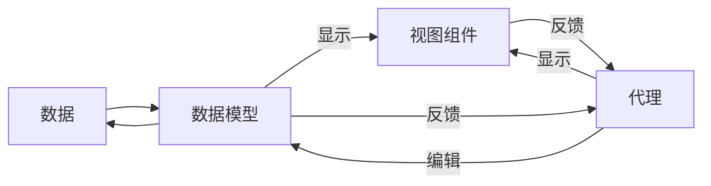
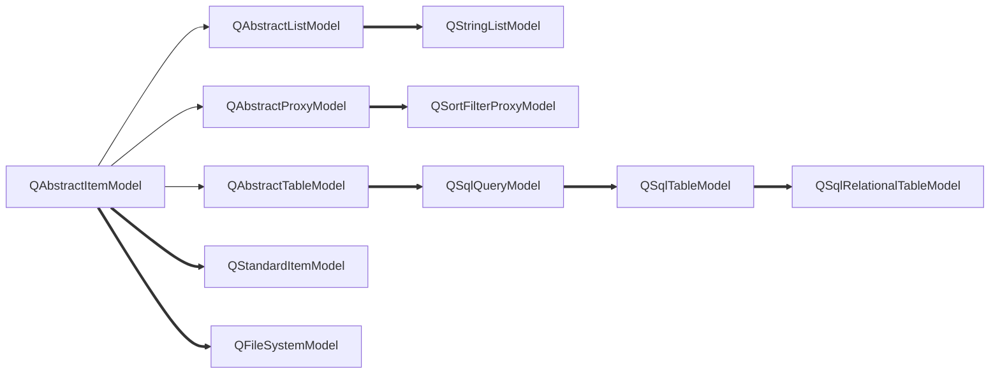
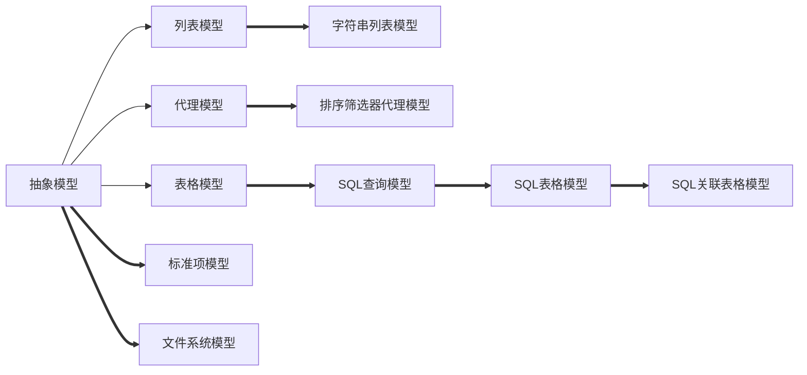
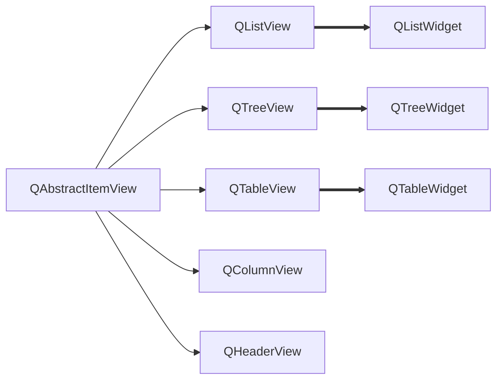
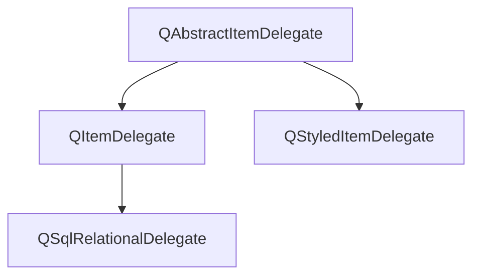
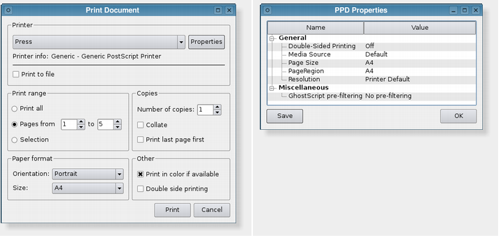
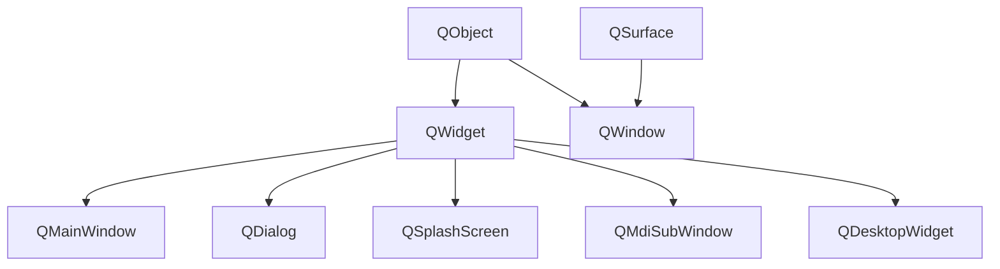

## 1. 应用程序基础

1-2章关于Qt的安装和简单复习可见[01-hello_world](01-hello_world)的内容，其运行结果图片可见[01-hello_world/app.png](01-hello_world/app.png)。

主要的笔记如下。

一、槽函数命名规则是on开头，然后跟上的字符串要与控件名称一致，然后是槽信号的简称。

例如 on_btnclose_clicked，或者其他信号valueChanged、currentIndexChanged等等。这个控件可以是UI设计界面添加的也可以是动态添加的，如果是动态添加的，自定义变量名就是这个控件名称。

例如自定义的SpinBox控件，在private定义的,QSpinBox * fontSizeBox；那么槽函数一定要一致，命名为void on_fontSizeBox_valueChanged(int fontsize)。

二、整个工程结构其实就是1个.ui文件,它背后其实是"ui_helloworld.h"。
不过在QtCreator默认找不到这个文件，可以点击工程上方的工具栏点击过滤器树形视图,取消隐藏文件就可以看到了VS如果配置过Qt，就可以直接找到的,内部其实就定义了一个Ui_helloWorld类，设了一些Gui的控件参数。Ui_helloWorld类有2个函数setupUi和retranslateUi函数，这个类被命名空间下Ui的helloworld所继承。

```c++
namespace Ui {
    class helloWorld: public Ui_helloWorld {};
} // namespace Ui
```

同时1个同名的helloworld类的声明在helloworld.h中，但不属于Ui空间，它将Ui::helloworld作为私有属性组合
之所以这样做就是为了将Gui和业务分离开，符合严格封装的思想。

三、Q_OBEJECT需要在helloworld中声明，这是引入信号与槽机制需要声明的宏。
SIGNAL和SLOT也是Qt的宏，可以将信号和槽函数的参数转为字符串，主要用在connect函数。
例如：

```C++
QObject::connect(this->ui>rbt_red,&QRadioButton::clicked,this,&helloWorld::setTextColor);
```

如果是带参数的：

```C++
connect(this>fontSizeBox,SIGNAL(valueChanged(int)),
        this,SLOT(on_fontSizeBox_valueChanged(int)));
```

注意：带参数的因为可能出现函数重载的情况，第1种函数指针的写法不符合语法；但是不带参数的呢，用宏好像又不起作用，例如下方的写法不起作用。

```C++
QObject::connect(this->ui->rbt_blue,SIGNAL(clicked()),this,SLOT(setTextColor()));
```

四、关于connect其他的说明

connect是QObject的一个静态函数，常见的形式是: 

```c++
QObject::connect(发送对象,SIGNAL(signal())，接收对象，SLOT(slot()));
```

信号和槽函数的参数类型和个数必须一致，信号的参数不能少于槽函数，且不能有返回值。

一个信号也可以连接多个槽函数，也就是说可以同时做2件事以上，按照先func1，再func2的定义顺序执行。

```c++
connect(ui->combox,SIGBAL(valueChanged(int)),this,SLOT(func1(int)));
connect(ui->combox,SIGBAL(valueChanged(int)),this,SLOT(func2(int)));
```

多个信号可以链接到同1个槽函数，也就是多个事件导致的结果相同。

```c++
connect(this->ui->rbt_red,&QRadioButton::clicked,this,&helloWorld::setTextColor);
connect(this->ui->rbt_green,&QRadioButton::clicked,this,&helloWorld::setTextColor);
connect(this->ui->rbt_blue,&QRadioButton::clicked,this,&helloWorld::setTextColor);
```

1个信号连接到另1个信号也是可以的，也就是发射1个信号也会发送另1个信号。

```C++
connect(发送者,SIGNAL(valueChanged(int)),this,SIGNAL(refreshInfo(int)));
```

五、关于QColor,QBrush,QPen等

QColor可以设置颜色,可以作为画刷QBrush的构造函数参数；
QBrush是画刷，可以用于填充封闭图形；QPen是画笔，一般是描绘轮廓线；
两个都可以被QPainter画家使用，用于填充画布QPaintDevice；
可以充当画布类QPaintDevice的有**QWiget、QImage、QPixmap、QPicture**、QPaintDeviceWindow、QPagedPaintDevice、QOpenGLPaintDevice等
最常用的是前4个。

六、UI静态设计和代码动态设计结合

有时候不能直接借助可视化ui来设计，所以必须借助写代码的方式动态添加。
例如状态栏和工具栏不能直接拖动控件，需要借助写代码，如工具栏可以添加SpinBox来调整字体大小、
状态栏可以添加Label显示文字或者添加进度条显示进度，这些控件都是不能直接拖动的。菜单栏是可以直接添加选项和菜单的,需要设计动作，动作可以ui设计也可以写代码设计，但是纯写代码实现界面工作量较大，可以在创建项目时不勾选[generate forum],两者结合快速快发是最好的,可以提高工作效率。

七、关于QAction

QAction类在ui的Action Editor进行编辑，或者转到槽写代码实现分隔符也是QAction类。

八、关于QPalette

QPalette存在一些枚举值，ColorRole和ColorGroup。

```C++
enum ColorGroup { Active, Disabled, Inactive, NColorGroups, 
                 Current, All, Normal = Active };
enum ColorRole { WindowText, Button, Light, Midlight, Dark, Mid,
                Text, BrightText, ButtonText, Base, Window, Shadow,
                Highlight, HighlightedText,
                Link, LinkVisited,
                AlternateBase,
                NoRole,
                ToolTipBase, ToolTipText,
                NColorRoles = ToolTipText + 1,
                Foreground = WindowText, Background = Window
};
```

九、关于工具栏

工具栏事先需要使用QToolBar来构建，构建需要制定名称，然后通过addWidget来添加进各种动作或者控件
工具栏需要指定在什么位置构建，利用枚举值说明ToolBarArea。

```C++
enum ToolBarArea {
    LeftToolBarArea = 0x1,
    RightToolBarArea = 0x2,
    TopToolBarArea = 0x4,
    BottomToolBarArea = 0x8,

    ToolBarArea_Mask = 0xf,
    AllToolBarAreas = ToolBarArea_Mask,
    NoToolBarArea = 0
};
```

十、状态栏

```c++
this->statusBar()->addWidget(progressbar); // 添加进状态栏
this->ui->statusbar->showMessage("你终于承认我最帅了!"); // 打印消息
```

十一、菜单栏

addAction和addMenu是这样用的，他们会返回指向新建的项地址。

```C++
privare: QAction * startProgressbar; // helloWorld.h的一个私有属性声明
QMenu * qm = this->menuBar()->addMenu("执行");
QAction * qac = qm->addAction("进度条");
this->startProgressbar = qac; // 让这个私有属性等于qac
connect(this>startProgressbar,&QAction::triggered,this,&helloWorld::on_startProgressbar_triggered); // 再连接这个同名槽函数
```

十二、其他

线程阻塞问题可以添加这句代码解决。

```c++
QCoreApplication::processEvents(QEventLoop::AllEvents, 100);
```

以上各个Q类只是笼统的介绍，后边的每个章节都会具体介绍某一个类。

## 2. Qt类概述

### 2.1 Qt核心特点

涉及的头文件和宏定义主要是：

```c++
#include  <QObject>
#include    <QMetaProperty>
Q_OBJECT
Q_CLASSINFO
Q_PROPERT
Q_UNUSED
SIGNAL
SLOT
```

#### 2.1.1 元对象系统和编译器

##### 2.1.1.1 Q_OBJECT

Qt本身其实是用C++开发的库，但是它具备Qt自己的属性，也就是信号与槽机制、对象属性等，这些并不属于C++的范畴，所以需要一个预处理过程。**Qt元对象编译器也就是MOC是一个预处理器，在源程序编译前先转换为标准C++兼容的形式**，即对信号和槽的代码进行宏替换，这也是为何必须添加Q_OBJECT宏的原因。

##### 2.1.1.2 QObject

QtCore是Qt的核心，Qt为c++语言增加的特性就是在此模块实现，扩展特性主要有信号与槽机制、属性系统、动态类型转换等，它们共同作为Qt的**元对象系统**。

元对象系统的主要构成如下：

1、QObject类，是所有使用元对象系统的类的基类

2、类的private部分声明Q_OBJECT宏，使类可以使用元对象的特性，如动态属性、信号与槽

3、MOC元对象编译器，为每个QObject的子类提供必要代码实现元对象系统的特性

MOC工具读取C++源文件时发现类的定义有Q_OBJECT时就会为这个类生成另外1个包含元对象支持代码的C++源文件(其实就是那个UI_XXX.h文件)

4、OObject的一些成员函数功能

metaObject可以返回其控件的类型。

```c++
QObject * obj = new QPushButton;
obg->metaObject()->className(); // 返回"QPushButton"
```

inherits(const char*className)可以判断一个对象实例是否是名称为ClassName的类或者QObject的子类的实例。

```c++
std::cout<<std::boolalpha<<this->toolbar->inherits("QToolBar")<<std::endl; //true
std::cout<<std::boolalpha<<this->toolbar->inherits("QObject ")<<std::endl; // false
std::cout<<std::boolalpha<<this->toolbar->inherits("QRadioButton")<<std::endl; // false
```

QObejct指针可以指向任何子类对象，但是本质上还是QObject指针，可以通过qobejct_cast进行转换，就像static_cast和dynamic_cast那样做一样。

```c++
QObject * obj  = new QMyWidget; // 不区分Qt内建和自定义类型,QMyWidget继承于QWidget
QWidget * widget = qobject_cast<QMyWidget *>(obj); // ok
QLabel * label = qobject_cast<QLabel *>(obj); // error，因为QLabel不是QMyWidget子类
```

setProperty()函数可以设置属性的名称和数据，property()函数可以获取属性值。

这个函数主要是为了定义为类定义动态属性。

```c++
bool setProperty(const char *name, const QVariant &value);
QVariant property(const char *name) const;
```

关于属性，在下一小节说明，即[属性系统](#属性系统)。

#### 2.1.2 属性系统

##### 2.1.2.1 Q_PROPERTY

什么是属性？Qt提供了Q_PROPERTY()宏定义属性，基于元对象系统实现与C++编译器无关。

定义了一个返回值type，名称name的属性，它由于有一些关键字分别定义不同的机制。

```c++
Q_PROPERTY
(
	type // 返回类型
	name // 属性名称
	READ // 指定1个读取属性值的函数,没有MEMBER关键字时必须设置READ
	WRITE // 指定1个设定属性值的函数,,只读属性没有WRITE设置
	MEMBER // 指定1个成员变量与属性关联,成为可读可写的属性,无需再设置READ和WRITE
	RESET // 可选,指定1个设置属性缺省值的函数
	Notify // 可选,设置1个信号,属性值变化时发射此信号
	DESIGNABLE // 属性是否在Qt Designed可见,缺省为True
	CONSTANT  // 表示属性值是常数,但只是针对具体的1个实例而言,不同实例可以有不同的常数
	FINAL // 表示定义的属性不能被子类重载
)
```

这个属性和名称其实就是ui文件里右下角的那些可视化展示，例如QWidget有属性focus、enabled和cursor，分别表示焦点策略、启用或禁用widget、鼠标悬浮时的样式等等。

关于焦点策略有

```c++
NoFocus 无法通过点击和键盘获得焦点
TabFocus 鼠标无法获得焦点，Tab可以获得
ClickFocus 鼠标点击可以获得焦点，Tab不可
StrongFocus 鼠标和Tab都可以获得
WheelFocus 滚轮获得
Q_PROPERTY(bool focus READ hasFocus);// 定义了名称为focus的只读属性返回值bool,读取联系的函数是hasFocus
```

enabled设置只有2种，开启或者未开启状态，读写联系2个函数。

```c++
Q_PROPERTY(bool enabled READ isEnabled WRITE setEnabled);
```

鼠标设置的样式有很多，这里不列举，也有2个函数去读取和设置样式，还可以RESET设置默认参数

```c++
Q_PROPERTY(QCursor cursor READ cursor WRITE setCursor RESET unsetCursor)
```

只要知道属性的名称，无论是否使用READ和WRITE定义了接口函数，就可以通过QObject::property获取属性值，例如

```c++
QObject * obj  = new QPushButton;
obj->setProperty("flat",QVariant(false)); // 设置属性名称为flat,值为true
obj->setProperty("age",QVariant(18.5));
QVariant isFlat = obj->property("flat");
float age = obj->property("age").value<double>();
std::cout<<std::boolalpha<<isFlat.value<bool>()<<"\n"; // false
std::cout<<age<<"\n"; // 18.5
```

总之，属性是动态的被添加进类，更多的用法在以后会讲解。

##### 2.1.2.2 Q_CLASSINFO

属性信息还包括类的信息，级通过宏Q_CLASSINFO()来为类的元对象定义"名称--值"信息，例如

```c++
class QMyClass : public QObject
{
    Q_OBJECT
    Q_CLASSINFO("author","wang")
    Q_CLASSINFO("comapny","huawei")
    Q_CLASSINFO("Version","3.0.1")
    public:
    ...
};
```

#### 2.1.3 信号与槽

信号与槽是对象进行通信的机制，也需要由Qt的元对象系统支持才能实现。

##### 2.1.3.1 connect

connect函数是其中的关键，它最常见的几个定义如下。

```c++
// 借助宏指定自定义的信号和槽
static QMetaObject::Connection connect(const QObject *sender, const char *signal,const QObject *receiver, const char *member, Qt::ConnectionType = Qt::AutoConnection); 
connect(sender,SIGNAL(signal()),receiver,SLOT(slot()));//可以这样使用
connect(spinNum,SIGNAL(valueChanged(int)),this,SLOT(updateState(int))); // 带参数时这样使用

// 借助元方法,也就是Qt内建的那些信号和UI控件转到的槽函数
static QMetaObject::Connection connect(const QObject *sender, const QMetaMethod &signal,const QObject *receiver, const QMetaMethod &method,
Qt::ConnectionType type = Qt::AutoConnection); 

// 这种形式只有发送者和信号以及成员,没有接受者,用的比较少
inline QMetaObject::Connection connect(const QObject *sender, const char *signal,const char *member, Qt::ConnectionType type = Qt::AutoConnection) const;

// 借助函数指针,也就是具有默认参数的信号与槽且唯一的槽函数,槽函数重载时此形式不能使用
template <typename Func1, typename Func2>
static inline QMetaObject::Connection connect(
    const typename QtPrivate::FunctionPointer<Func1>::Object *sender, Func1 signal,
    const typename QtPrivate::FunctionPointer<Func2>::Object *receiver, Func2 slot,
    Qt::ConnectionType type = Qt::AutoConnection)
typedef QtPrivate::FunctionPointer<Func1> SignalType;
typedef QtPrivate::FunctionPointer<Func2> SlotType;

connect(lineEdit,&QLineEdit::textChanged,ths,&widget::on_textChanged); // 可以这样用,因为lineEdit只有1个信号textChanged(QString)
// 对于QSpinBox的valueChanged就有2种版本,所以不能使用函数指针的方式
void QSpinBox::valueChanged(int i);
void QSpinBox::valueChanged(const QString &text);
// 此时定义自己的槽函数
void onValueChanged(int i);
connect(spinNum,&QSpinBox::valueChanged,this,&widget::onValueChanged);//会报错
```

以上无论哪种形式，最后1个参数都是默认的Qt::AutoConnection，Qt::ConnectionType表示了信号与槽的关联方式，由枚举值定义。

```C++
enum ConnectionType {
    AutoConnection, // 信号接收和发射都是同一线程需要使用Qt::DirectConnection方式;否则使用Qt::QueuedConnection方式,信号发射时自动确定关联方式
    DirectConnection, // 同一线程使用
    QueuedConnection, // 多线程使用,槽函数在事件回到接收者线程后执行
    BlockingQueuedConnection, // 和QueuedConnection类似,但是信号线程会阻塞直到槽函数执行完毕,但是信号和槽函数同一线程时不能使用此方式会造成死锁
    UniqueConnection =  0x80 // 独占连接,其他信号不能连接槽函数
};
```

##### 2.1.3.2 sender

还可以使用QObject::sender()获得信号发射者。例如槽函数里得到指向发射者的指针后，如果已知类型，再用之前提到的qobject_cast投射为确定的类型，就可以使用这个类的接口函数了。

```c++
void on_valueChanged(int) // QSpinBox的某个槽函数
{
    QSpinBox * spinbox = qobject_cast<QSpinBox *>(sender()); // 获取发射信号的指针对象
    spinbox->func();// ...可以使用spinbox操作信号发射者,访问它的一些属性等
}
```

##### 2.1.3.3 signals&slots

自定义信号类，需要3个部分组成。第一个是声明Q_OBJECT具备信号与槽的机制；其次使用signals声明为信号函数，信号函数可以带参数，但是不能有返回值；然后其他函数可以依据条件emit信号函数。至于信号是否绑定了槽函数与信号类无关。

```c++
class QPerson: public QObject
{
    Q_OBJECT
    private:
    	int q_age = 10;
    public:
    	void increaseAge();
    signals:
    	void ageChanged(int value);
};
void QPerson::increaseAge()
{
    ++q_age; // 年龄发生变化就发射信号
    emit ageChanged(q_age); // 发射信号
}
```

完整的QPerson头文件声明如下。

其实就是继承了QObject引入信号槽函数机制，这个类还定义了自己的元类信息，之后声明了3个私有属性作为元类属性进行绑定。定义了3个私有函数，1个公有信号函数(只有定义，没有实现，因为仅仅是个信号用于传递)。

```c++
#ifndef Q_PERSON_H
#define Q_PERSON_H
#include  <QObject>
#include  <QString>
class QPerson :  public QObject
{
  Q_OBJECT // 宏声明
  Q_CLASSINFO("author","chenbei")
  Q_CLASSINFO("Email","chenbei_electric@163.com")
  Q_CLASSINFO("version","1.0.0")
  // 定义属性age,返回类型int,声明读写函数getAge和setAge,定义了关联信号ageChanged
  Q_PROPERTY(int  age READ getAge WRITE setAge NOTIFY ageChanged)
  // 定义属性name,返回类型QString,绑定成员myname
  Q_PROPERTY(QString name MEMBER myname)
  // 定义属性score,返回类型int,绑定成员 myscore
  Q_PROPERTY(int score MEMBER myscore)
private: // 3个私有属性,年龄、名字和分数
  int myage = 18;
  QString myname;
  int myscore = 79;
public:
  explicit QPerson(QString Name,QObject* parent = nullptr); // 禁止隐式转换
  int getAge();
  void setAge(int age_value);
  void  increaseAge();
signals:
   void ageChanged(int age_value);// 不需要给出定义,因为只是1个信号,它会绑定到槽函数QMetaObjectTest::on_ageChanged上
   // QPerson的ageChanged信号会绑定到QMetaObjectTest定义的on_ageChanged槽函数
   // 这里无需自定义实现，只是传递1个类似Flag的提示,实现不重要
   // 另一个类需要包含此类的头文件,并使用connect把信号绑定到该槽函数
 public slots: // 此类无与该信号绑定的槽函数
};
#endif // Q_PERSON_H
```

而QPerson的实现，主要关注的就是2个设定函数，**设定年龄或者增加年龄的时候同时发出信号**。

QPerson的完整头文件定义如下。

```c++
#include "q_person.h"

QPerson::QPerson(QString Name,QObject *parent) : QObject(parent) // 用QObject初始化parent
{ //构造函数
    myname=Name;
}

int QPerson::getAge() // 可以被QMetaObjectTest::on_ageChanged槽函数调用反馈给QPlainTextEdit组件
{ //返回age
    return  myage;
}

void QPerson::setAge(int age_value) // 被界面的SpinBox组件调用,spinBoy和spinGril
{//设置age
    myage=age_value;
    emit ageChanged(myage); //发射信号
}

void QPerson::increaseAge() // 被界面的QPushButton组件调用,btnGirlInc和btnboyInc
{
    myage++;
    emit ageChanged(myage);//发射信号
}
```

setAge和increaseAge这2个函数会被一些界面组件的槽函数进行调用(**调用的时候就自动发射信号又会反过来影响一些东西**)，也就是一些组件(如spinbox,pushbutton)感知到了某种变化，也就是组件自身具备的一些信号，例如下拉索引的变化、spinbox值(valueChanged(int))的变化或者clicked，将这些变化通过**connect联系到槽函数**，这些槽函数**可以是依据on命名规则自动索引到组件**，**也可以内部直接编程做出一些行为**。

完整的UI头文件声明如下。

```c++
#ifndef QMETAOBJECTTEST_H
#define QMETAOBJECTTEST_H

#include <QWidget>
#include <QSpinBox>
#include  <q_person.h>

QT_BEGIN_NAMESPACE
namespace Ui { class QMetaObjectTest; }
QT_END_NAMESPACE

class QMetaObjectTest : public QWidget
{
  Q_OBJECT

public:
  explicit QMetaObjectTest(QWidget *parent = nullptr);
  ~QMetaObjectTest();

private:
  Ui::QMetaObjectTest *ui;

private:
    QPerson * boy , * girl; // 定义男孩和女孩

    // 2个初始化函数在构造函数中被调用
    void initProperty(); // 初始化一些属性
    void initConnect();// 初始化信号连接
    void printClassInfo(const QMetaObject *,const QString& sex);

private slots: // 自定义私有槽函数
    // 自定义信号要连接的自定义槽函数,需要手动connect
    void ageChanged(int age_value);
    void ageChanged_girl(int age_value);  // 此槽函数内部反馈给QPlainTextEdit组件
     void ageChanged_boy(int age_value);

    QSpinBox * spin_valueChanged(int arg); // 内部会会获取发射者是哪个QSpinBox组件
    void spinBoy_valueChanged(int arg);
    void spinGirl_valueChanged(int arg);

     // 界面4个QPushButton组件对应的槽函数,因为命名规则对应所以组件点击时会自动找到这4个函数
    void on_btnClear_clicked();
    void on_btnBoyInc_clicked();
    void on_btnGirlInc_clicked();
    void on_btnClassInfo_clicked();

    //
};
#endif // QMETAOBJECTTEST_H
```

完整的UI头文件定义如下。

```c++
#include "qmetaobjecttest.h"
#include "ui_qmetaobjecttest.h"
#include <iostream>
#include  <string>
#include    <QMetaProperty>
QMetaObjectTest::QMetaObjectTest(QWidget *parent)// 构造函数
  : QWidget(parent)
  , ui(new Ui::QMetaObjectTest)
{
    ui->setupUi(this);
    this->initProperty();
    this->initConnect();
}
QMetaObjectTest::~QMetaObjectTest()
{
  delete ui;
}
void QMetaObjectTest :: initProperty() // 初始化一些属性
{
  this->boy = new QPerson("chenbei");
  this->boy->setAge(20); // 方式1使用成员函数设置属性
  this->boy->setProperty("age",10);// 方式2使用Qt函数设置属性,因为age声明为READ和WRITE兼具
  this->boy->setProperty("score",95);// score同理
  this->boy->setProperty("sex","Boy"); // 设置宏定义没出现过的是动态属性
  this->boy->setProperty("isBoy",true);
  this->girl = new QPerson("baby");
  this->girl->setProperty("score",81);
  this->girl->setProperty("age",20);
  this->girl->setProperty("sex","Girl");
  this->girl->setProperty("isBoy",false);
}
void QMetaObjectTest:: initConnect()// 初始化信号连接
{
  // 1.连接boy,girl自定义过的信号和this的自定义槽函数,也就是信号和槽函数可以不在一起定义
   connect(this->boy,&QPerson::ageChanged,this,&QMetaObjectTest::ageChanged_boy);
   connect(this->girl,&QPerson::ageChanged,this,&QMetaObjectTest::ageChanged_girl);
    // 2. 连接spinbox组件的自带信号和自定义的槽函数
       connect(this->ui->spinGirl,SIGNAL(valueChanged(int)),
               this,SLOT(spinGirl_valueChanged(int)));
       connect(this->ui->spinBoy,SIGNAL(valueChanged(int)),
               this,SLOT(spinBoy_valueChanged(int)));
    // 3. 4个QPushButton组件的信号和槽函数都是原生的所以无需手动connect
}


// 自定义槽函数,接收来自QPerson类定义的信号,用于反馈影响QPlainTextEdit组件
// 内部使用sender()技术和qobejct_cast<T>类型投射,就可以获取发射信号指针对象的信息了
void QMetaObjectTest::ageChanged(int age_value)
{
    Q_UNUSED(age_value); // 声明此变量不被使用
    QPerson *aPerson = qobject_cast<QPerson *>(sender()); //获取指向发射信号的指针
    QString hisName=aPerson->property("name").toString(); // 获取姓名
    QString hisSex=aPerson->property("sex").toString(); //动态属性获取
    // int hisAge=aPerson->getAge();//通过接口函数也可以获取年龄
    int hisAge=aPerson->property("age").toInt();//通过属性获得年龄
    int hisScore = aPerson->property("score").toInt();
    bool isBoy = aPerson->property("isBoy").toBool();
    this->ui->textEdit->appendPlainText
        ("姓名="+hisName+","+"性别="+hisSex
         +QString::asprintf(",年龄=%d,分数=%d,isBoy=%d",hisAge,hisScore,isBoy));
}
void QMetaObjectTest::ageChanged_girl( int age_value) // 用于girl和boy调用,减少重复代码
{
   this->ageChanged(age_value);
}
void QMetaObjectTest::ageChanged_boy( int age_value)
{
   this->ageChanged(age_value);
}

// 连接spinbox组件的自带信号和自定义的槽函数
// 减少重复代码的函数,被下边2个实际的槽函数调用
QSpinBox * QMetaObjectTest::spin_valueChanged(int arg)
{
    Q_UNUSED(arg);
    QSpinBox *spinBox = qobject_cast<QSpinBox *>(sender()); // 获取发射的对象,girl或boy
    return spinBox;
}
void QMetaObjectTest::spinBoy_valueChanged(int arg) 
{
   // spinbox的value改变后被读取,然后影响this->boy和this->girl
   QSpinBox * spinBox = spin_valueChanged(arg);
   this->boy->setAge(spinBox->value());
}
void QMetaObjectTest::spinGirl_valueChanged(int arg)
{
   QSpinBox * spinBox = spin_valueChanged(arg);
   this->girl->setAge(spinBox->value());
}

// 4个QPushButton的槽函数
void QMetaObjectTest::on_btnClear_clicked()//"清空文本框"按钮
{
    this->ui->textEdit->clear();
}
void QMetaObjectTest::on_btnBoyInc_clicked()//"boy长大一岁"按钮
{
    this->boy->increaseAge(); // 调用成员函数
}
void QMetaObjectTest::on_btnGirlInc_clicked()//"girl长大一岁"按钮
{
    this->girl->increaseAge(); /// 调用成员函数
}
void QMetaObjectTest::on_btnClassInfo_clicked()
{//"类的元对象信息"按钮
      const QMetaObject *meta1=boy->metaObject();
      const QMetaObject *meta2=girl->metaObject();
      ui->textEdit->clear();
      this->printClassInfo(meta1,"Boy");
      this->printClassInfo(meta2,"Girl");
}
void QMetaObjectTest::printClassInfo(const QMetaObject * meta,const QString&  sex)
{ // "显示元对象信息"按钮槽函数去调用的,节省重复代码
  ui->textEdit->appendPlainText("=="+sex+"元对象信息==");
  for (int i=meta->classInfoOffset();i<meta->classInfoCount();++i)
  {
     QMetaClassInfo classInfo=meta->classInfo(i);
      ui->textEdit->appendPlainText(
         QString("classInfo=%1 <=> value=%2").arg(classInfo.name()).arg(classInfo.value()));
  }
  ui->textEdit->appendPlainText(QString("className <=> %1").arg(meta->className())); // 打印元类
  ui->textEdit->appendPlainText(sex+" classProperty =>");// 打印属性
    // 1.propertyOffset()返回类的第1个属性的序号,不一定是0;
  //  2.propertyCount();属性的个数,这里是age,name,score 3个
  for (int i=meta->propertyOffset();i<meta->propertyCount();i++) //
  {
      const char* propName=meta->property(i).name(); // 获取姓名
      ui->textEdit->appendPlainText(
      QString("propertyName=%1，value=%2").arg(propName).arg(boy->property(propName).toString()));
  }
}
```

##### 2.1.3.4 QSignalMapper

QSignalMapper 类捆绑来自可识别发送者的信号。
**此类收集一组无参数信号**，并**使用与发送信号的对象相对应的整数、字符串或小部件参数重新发出它们**。
该类支持使用 setMapping() 将特定字符串或整数与特定对象进行映射。然后可以将对象的信号连接到 map() 插槽，该插槽将使用与原始信号对象关联的字符串或整数发出 mapped() 信号。稍后可以使用 removeMappings() 删除映射。

示例：假设我们要创建一个包含**一组按钮**的自定义小部件（如工具面板）。**一种方法是将每个按钮的 clicked() 信号连接到其自己的自定义插槽**；但在本例中，我们**希望将所有按钮连接到单个插槽**，**并通过单击的按钮对插槽进行参数化**。这是一个简单的自定义小部件的定义，它有一个信号 clicked()，它与被点击的按钮的文本一起发出：

```c++
 class ButtonWidget : public QWidget
  {
      Q_OBJECT
  public:
      ButtonWidget(const QStringList &texts, QWidget *parent = 0);
  signals:
      void clicked(const QString &text);
  private:
      QSignalMapper *signalMapper;
  };
// 我们需要实现的唯一函数是构造函数：
ButtonWidget::ButtonWidget(const QStringList &texts, QWidget *parent)
    : QWidget(parent)
{
    signalMapper = new QSignalMapper(this);
    QGridLayout *gridLayout = new QGridLayout;
        
    for (int i = 0; i < texts.size(); ++i) 
    {
        QPushButton *button = new QPushButton(texts[i]);
        //只需把按钮的信号先映射到信号映射器的map槽函数,内部会发射mapped()信号实现1个带参数的转发
        connect(button, SIGNAL(clicked()), signalMapper, SLOT(map()));
        // 每个按钮设置它的独有名称,可以使用int也可以使用string,这里用string文本表示按钮的名称
        signalMapper->setMapping(button, texts[i]);
        gridLayout->addWidget(button, i / 3, i % 3);
    }
	// 按钮信号到信号映射器槽函数连接完成,还要连接映射器的信号和要执行的槽函数
    // 因为之前绑定的是文本映射关系,故这里连接的信号也是文本参数信号
    connect(signalMapper, SIGNAL(mapped(QString)),this, SIGNAL(clicked(QString)));
    setLayout(gridLayout);
}
```

公共函数。

```c++
void removeMappings(QObject *sender);//删除发件人的所有映射

QObject *mapping(int id) const;//返回与id关联的发送者QObject
void setMapping(QObject *sender, int id);//当发送者发出map信号时，发出信号mapped(id)

QObject *mapping(const QString &id) const; //返回与id关联的发送者QObject
void setMapping(QObject *sender, const QString &text);//发送者发出map信号时发出信号 mapped(text)，每个发件人最多可以有一个文本

QObject *mapping(QWidget *widget) const;//返回与小部件关联的发送方 QObject
void setMapping(QObject *sender, QWidget *widget);//发送者发出map信号时发出信号mapped(widget )，每个发件人最多可以有一个小部件

QObject *mapping(QObject *object) const;//返回与对象关联的发送方 QObject
void setMapping(QObject *sender, QObject *object);//发送者发出map()信号时发出信号 mapped(object)，每个发送者最多可以有一个对象
```

公共槽函数。

```c++
void map();
void map(QObject *sender);
```

公共信号函数。

```c++
void mapped(int i);
void mapped(const QString &text);
void mapped(QWidget *widget);
void mapped(QObject *object);
```


#### 2.1.4 QMetaType

QMetaType 类管理元对象系统中的命名类型。
该类用作编组 QVariant 和排队信号和插槽连接中的类型的帮助器。它将类型名称与类型相关联，以便可以在运行时动态创建和销毁它。**使用 Q_DECLARE_METATYPE() 声明新类型**，使它们可用于 QVariant 和其他基于模板的函数。**调用 qRegisterMetaType() 使类型可用于非基于模板的函数**，例如排队的信号和槽连接。任何具有公共默认构造函数、公共复制构造函数和公共析构函数的类或结构都可以注册。
如果我们希望流运算符 operator&lt;&lt;() 和 operator&gt;&gt;() 对存储自定义类型的 QVariant 对象起作用，自定义类型必须提供 operator&lt;&lt;() 和 operator&gt;&gt;() 运算符。以下代码分配和销毁 MyClass 的实例：

```c++
int id = QMetaType::type("MyClass");
if (id != QMetaType::UnknownType) {
    void *myClassPtr = QMetaType::create(id);
    ...
    QMetaType::destroy(id, myClassPtr);
    myClassPtr = 0;
}
```

这些是 QMetaType 支持的内置类型：

```c++
enum QMetaType::Type{
    QMetaType::Void
    QMetaType::Bool
    QMetaType::Int
    QMetaType::UInt
    QMetaType::Double
    QMetaType::QChar
    QMetaType::QString
    QMetaType::QByteArray
    QMetaType::VoidStar
    QMetaType::Long
    QMetaType::LongLong
    QMetaType::Short
    QMetaType::Char
    QMetaType::ULong
    QMetaType::ULongLong
    QMetaType::UShort
    QMetaType::SChar
    QMetaType::UChar
    QMetaType::Float
    QMetaType::QObjectStar
    QMetaType::QVariant
    QMetaType::QCursor
    QMetaType::QDate
    QMetaType::QSize
    QMetaType::QTime
    QMetaType::QVariantList
    QMetaType::QPolygon
    QMetaType::QPolygonF
    QMetaType::QColor
    QMetaType::QSizeF
    QMetaType::QRectF
    QMetaType::QLine
    QMetaType::QTextLength
    QMetaType::QStringList
    QMetaType::QVariantMap
    QMetaType::QVariantHash
    QMetaType::QIcon
    QMetaType::QPen
    QMetaType::QLineF
    QMetaType::QTextFormat
    QMetaType::QRect
    QMetaType::QPoint
    QMetaType::QUrl
    QMetaType::QRegExp
    QMetaType::QRegularExpression
    QMetaType::QDateTime
    QMetaType::QPointF
    QMetaType::QPalette
    QMetaType::QFont
    QMetaType::QBrush
    QMetaType::QRegion
    QMetaType::QBitArray
    QMetaType::QImage
    QMetaType::QKeySequence
    QMetaType::QSizePolicy
    QMetaType::QPixmap
    QMetaType::QLocale
    QMetaType::QBitmap
    QMetaType::QMatrix
    QMetaType::QTransform
    QMetaType::QMatrix4x4
    QMetaType::QVector2D
    QMetaType::QVector3D
    QMetaType::QVector4D
    QMetaType::QQuaternion
    QMetaType::QEasingCurve
    QMetaType::QJsonValue
    QMetaType::QJsonObject
    QMetaType::QJsonArray
    QMetaType::QJsonDocument
    QMetaType::QModelIndex
    QMetaType::QPersistentModelIndex
    QMetaType::QUuid
    QMetaType::QByteArrayList
    QMetaType::User
    QMetaType::UnknownType
}
```

枚举描述了 QMetaType 支持的类型的属性。

```c++
enum QMetaType::TypeFlag{ 
    QMetaType::NeedsConstruction//这种类型有非平凡的构造函数。如果未设置标志，则可以使用 memset 将实例安全地初始化为 0
    QMetaType::NeedsDestruction//这种类型有一个重要的析构函数。如果未设置标志，则在丢弃对象之前不需要调用析构函数
    QMetaType::MovableType//memcpy 可以安全地移动具有此属性的类型的实例
    QMetaType::IsEnumeration//这种类型是枚举
    QMetaType::PointerToQObject//这个类型是一个指向 QObject 派生的指针。这个类型是一个 Q_GADGET，它对应的 QMetaObject 可以用 QMetaType::metaObject 从 5.5 开始访问
}
```

成员函数。

```c++
QMetaType(const int typeId);
~QMetaType();
void *construct(void *where, const void *copy = Q_NULLPTR) const;//在 where 寻址的现有内存中构造此 QMetaType 实例所针对的类型的值，即副本的副本，并返回 where。如果 copy 为零，则默认构造该值
void *create(const void *copy = Q_NULLPTR) const;//返回副本的副本，假设它是创建此 QMetaType 实例的类型。如果 copy 为 null，则创建一个默认构造实例
void destroy(void *data) const;//销毁数据，假设它是创建此 QMetaType 实例的类型
void destruct(void *data) const;//破坏位于 data 的值，假设它是构造此 QMetaType 实例的类型。与destroy() 不同，这个函数只调用类型的析构函数，它不调用delete 操作符
TypeFlags flags() const;//返回构造此 QMetaType 实例的类型的标志
bool isRegistered() const;//如果此 QMetaType 对象包含有关类型的有效信息，则返回 true
bool isValid() const;//如果此 QMetaType 对象包含有关类型的有效信息，则返回 true
const QMetaObject *metaObject() const;//返回与此类型相关的 QMetaObject。如果类型是指向 QObject 子类的指针类型，flags() 包含 QMetaType::PointerToQObject 并且该函数返回相应的 QMetaObject。这可以与 QMetaObject::construct 结合使用来创建这种类型的 QObject。如果类型是 Q_GADGET，flags() 包含 QMetaType::IsGadget，并且此函数返回其 QMetaObject。这可用于检索 QMetaMethod 和 QMetaProperty 并在此类型的指针上使用它们。 （例如由 QVariant::data 给出）如果类型是枚举，flags() 包含 QMetaType::IsEnumeration，如果枚举注册为 Q_ENUM，则此函数返回封闭对象的 QMetaObject，否则返回 0
int sizeOf() const;//返回类型的大小，以字节为单位（即 sizeof(T)，其中 T 是构造此 QMetaType 实例的实际类型）。此函数通常与construct() 一起使用，以对类型使用的内存执行低级管理
```

静态成员函数。

```c++
//比较 lhs 和 rhs 处的对象。两个对象都必须是 typeId 类型。如果 lhs 小于、等于或大于 rhs，则 result 设置为小于、等于或大于零。如果比较成功，则返回 true，否则返回 false。]
bool compare(const void *lhs, const void *rhs, int typeId, int *result);
// 在由where寻址的现有内存中构造给定类型的值，即副本的副本，并返回 where。如果copy为零，则默认构造该值
void *construct(int type, void *where, const void *copy);
//将对象从 fromTypeId 转换为预先分配的空间at以键入toTypeId。如果转换成功，则返回 true
bool convert(const void *from, int fromTypeId, void *to, int toTypeId);
//返回副本的副本，假设它是 type 类型。如果 copy 为零，则创建一个默认构造实例
void *create(int type, const void *copy = Q_NULLPTR);
//将 rhs 中 typeId 类型的对象流式传输到调试流 dbg。成功返回真，否则返回false
bool debugStream(QDebug &dbg, const void *rhs, int typeId);
//销毁数据，假设它是给定的类型
void destroy(int type, void *data);
// 破坏给定类型的值，位于 where
void destruct(int type, void *where);
// 比较 lhs 和 rhs 处的对象。两个对象都必须是 typeId 类型。如果 lhs 等于 rhs，则结果设置为零。如果比较成功，则返回 true，否则返回 false
bool equals(const void *lhs, const void *rhs, int typeId, int *result);
//如果元类型系统已注册类型 T 的比较器，则返回 true
bool hasRegisteredComparators();
//如果元类型系统为类型 id typeId 注册了比较器，则返回 true
bool hasRegisteredComparators(int typeId);
// 如果元类型系统具有从元类型 id fromTypeId 到 toTypeId 的注册转换，则返回 true
bool hasRegisteredConverterFunction(int fromTypeId, int toTypeId);
//如果元类型系统具有从类型 From 到类型 To 的注册转换，则返回 true
bool hasRegisteredConverterFunction();
//如果元类型系统具有类型 T 的已注册调试流运算符，则返回 true
bool hasRegisteredDebugStreamOperator();
// 如果元类型系统具有类型 id typeId 的已注册调试流运算符，则返回 true
bool hasRegisteredDebugStreamOperator(int typeId);
// 如果注册了 ID 类型的数据类型，则返回 true；否则返回假
bool isRegistered(int type);
// 将给定流中指定类型的对象读入数据。如果对象加载成功，则返回 true；否则返回假
bool load(QDataStream &stream, int type, void *data);
// 为类型返回 QMetaType::metaObject
const QMetaObject *metaObjectForType(int type);
// 为用户注册的类型T注册比较运算符。这要求T同时具有 operator==和operator<;。注册成功返回真
bool registerComparators();
//在元类型系统中注册从类型 From 到类型 To 的隐式转换的可能性。注册成功返回真，否则返回假
bool registerConverter();
// 元类型系统中注册方法函数，如To From::function() const作为从类型From到To的转换器。注册成功返回真
bool registerConverter(MemberFunction function);
//元类型系统中注册方法函数，如To From::function(bool *ok) const,注册成功返回真，否则返回假
bool registerConverter(MemberFunctionOk function);
// 在元类型系统中将一元函数对象函数注册为从类型 From 到类型 To 的转换器。注册成功返回真，否则返回假
bool registerConverter(UnaryFunction function);
// 为用户注册的类 T注册调试流运算符。要求T具有operator<<t;(QDebug dbg, T)。注册成功返回真
bool registerDebugStreamOperator();
// 为用户注册的类型 T 注册等于运算符。这要求 T 有一个 operator==。注册成功返回真，否则返回假。
bool registerEqualsComparator();
//将 ID 类型的数据指向的对象写入给定的流。如果对象保存成功，则返回 true；否则返回假。该类型必须事先在 qRegisterMetaType() 和 qRegisterMetaTypeStreamOperators() 中注册
bool save(QDataStream &stream, int type, const void *data);
//返回以字节为单位的给定类型的大小（即 sizeof(T)，其中 T 是由 type 参数标识的实际类型）。此函数通常与construct() 一起使用，以对类型使用的内存执行低级管理
int sizeOf(int type);
//返回类型名称的句柄，如果没有这种类型，则返回 QMetaType::UnknownType
int type(const char *typeName);
// 返回名为 typeName 的类型的句柄，如果没有此类类型，则返回 0
int type(const QByteArray &typeName);
// 返回给定类型的标志
TypeFlags typeFlags(int type);
// 返回与给定 typeId 关联的类型名称，如果未找到匹配类型，则返回空指针。返回的指针不能被删除
const char *typeName(int typeId);
```

关联的非成员函数。

（1）int qMetaTypeId();

在编译时返回类型T的元类型 id。如果没有使用 Q_DECLARE_METATYPE() 声明类型，编译将失败。QMetaType::type() 返回与 qMetaTypeId() 相同的 ID，但在运行时根据类型名称进行查找。 QMetaType::type() 有点慢，但如果没有注册类型，编译会成功。用法如下：

```c++
int id = qMetaTypeId<QString>();// id就是QMetaType::QString
id = qMetaTypeId<MyStruct>(); // 如果 MyStruct 未声明，则编译错误
```

（2）int qRegisterMetaType(const char *typeName);

为类型 T 注册类型名称 typeName。返回 QMetaType 使用的内部 ID。任何具有公共默认构造函数、公共复制构造函数和公共析构函数的类或结构都可以注册。
此函数要求 T 在调用函数时是完全定义的类型。对于指针类型，它还要求完全定义指向的类型。使用 Q_DECLARE_OPAQUE_POINTER() 能够注册指针以转发声明的类型。注册类型后，您可以在运行时动态创建和销毁该类型的对象。

这个例子注册了 MyClass 类：

```c++
qRegisterMetaType<MyClass>("MyClass");
```

此函数用于注册TypeDef，以便QMetaProperty或QueuedConnections可以使用它们。警告：**此函数仅用于为每个其他用例注册别名 (typedef)**，应使用 Q_DECLARE_METATYPE 和 qMetaTypeId()。

```c++
typedef QString CustomString;
qRegisterMetaType<CustomString>("CustomString");
```

（3）int qRegisterMetaType();

调用此函数来注册类型 T。T 必须使用 Q_DECLARE_METATYPE() 声明。返回元类型 ID。例子：

```c++
int id = qRegisterMetaType<MyStruct>();
```

此函数要求 T 在调用函数时是完全定义的类型。对于指针类型，它还要求完全定义指向的类型。使用 Q_DECLARE_OPAQUE_POINTER() 能够注册指针以转发声明的类型。注册类型后，您可以在运行时动态创建和销毁该类型的对象。
要在 QVariant 中使用类型 T，使用 Q_DECLARE_METATYPE() 就足够了。要在排队的信号和槽连接中使用类型 T，必须在建立第一个连接之前调用 qRegisterMetaType&lt;T&gt;()。
此外，要将类型 T 与 QObject::property() API 一起使用，必须在使用之前调用 qRegisterMetaType&lt;T&gt;()，通常在使用 T 的类的构造函数中或在 main() 函数中。

（4）void qRegisterMetaTypeStreamOperators(const char *typeName);

为名为 typeName 的类型 T 注册流运算符。之后，可以使用 QMetaType::load() 和 QMetaType::save() 流式传输类型。这些函数在流式传输 QVariant 时使用。

```c++
 qRegisterMetaTypeStreamOperators<MyClass>("MyClass");
```

流运算符应具有以下签名：

```c++
QDataStream &operator<<(QDataStream &out, const MyClass &myObj);
QDataStream &operator>>(QDataStream &in, MyClass &myObj);
```

宏定义。

（1）Q_DECLARE_ASSOCIATIVE_CONTAINER_METATYPE(Container)

该宏使容器 Container 被 QMetaType 称为关联容器。如果 QMetaType 知道 T 和 U 本身，这使得将 Container&lt;T, U&gt; 的实例放入 QVariant 成为可能。请注意，所有 Qt 关联容器都已内置支持，因此不必对它们使用此宏。 std::map 容器也有内置支持。
此示例显示了 Q_DECLARE_ASSOCIATIVE_CONTAINER_METATYPE() 的典型用法：

```c++
#include <unordered_list>
Q_DECLARE_ASSOCIATIVE_CONTAINER_METATYPE(std::unordered_map)
void someFunc()
{
    std::unordered_map<int, bool> container;
    QVariant var = QVariant::fromValue(container);
	// ...
}
```

（2）Q_DECLARE_METATYPE(Type)

只要这个**宏提供了一个公共的默认构造函数、一个公共的拷贝构造函数和一个公共的析构函数，这个宏就可以让 QMetaType 知道类型 Type，Type必须是enum QMetaType::Type支持的类型，如果是新的类型且打算在信号和槽连接使用该类型，则除了使用该宏声明以外还要在main.cpp使用qRegisterMetaType<>("")注册该类型**。在 QVariant 中需要使用类型 Type 作为自定义类型。理想情况下，**这个宏应该放在类或结构的声明之下**。如果这是不可能的，它可以放在一个私有头文件中，每次在 QVariant 中使用该类型时都必须包含该头文件。
此示例显示了 Q_DECLARE_METATYPE() 的典型用例：

```c++
struct MyStruct
{
    int i;
    ...
};
Q_DECLARE_METATYPE(MyStruct)
```

如果 MyStruct 在命名空间中，则 Q_DECLARE_METATYPE() 宏必须在命名空间之外：

```c++
namespace MyNamespace
{
    ...
}

Q_DECLARE_METATYPE(MyNamespace::MyStruct)
```

由于 MyStruct 现在为 QMetaType 所知，它可以在 QVariant 中使用：

```c++
 MyStruct s;
QVariant var;
var.setValue(s); // copy s into the variant

...

// 再拿到这个值
MyStruct s2 = var.value<MyStruct>();
```

有些类型是自动注册的，不需要这个宏，例如：

① 指向从QObject派生的类的指针；

② QList&lt;T&gt;、QVector&lt;T&gt;、QQueue&lt;T&gt;、QStack&lt;T&gt;、QSet&lt;T&gt; 或 QLinkedList&lt;T&gt; 其中 T 是已注册的元类型 

③ QHash&lt;T1, T2&gt;、QMap&lt;T1, T2&gt; 或 QPair&lt;T1, T2&gt;，其中 T1 和 T2 是已注册的元类型 ；

④ QPointer&lt;T&gt;、QSharedPointer&lt;T&gt;、QWeakPointer&lt;T&gt;，其中 T 是派生自QObject

⑤ 使用 Q_ENUM 或 Q_FLAG 注册的枚举

⑥ 具有 Q_GADGET 宏的类

（3）Q_DECLARE_OPAQUE_POINTER(PointerType)

该宏允许使用 Q_DECLARE_METATYPE() 或 qRegisterMetaType() 将指向前向声明类型 (PointerType) 的指针注册到 QMetaType。

（4）Q_DECLARE_SEQUENTIAL_CONTAINER_METATYPE(Container)

这个宏使得容器 Container 被 QMetaType 识别为一个顺序容器。如果 QMetaType 知道 T 本身，这使得将 Container&lt;T&gt; 的实例放入 QVariant 成为可能。
请注意，所有 Qt 顺序容器都已内置支持，因此不必对它们使用此宏。 std::vector 和 std::list 容器也有内置支持。
此示例显示了 Q_DECLARE_SEQUENTIAL_CONTAINER_METATYPE() 的典型用法：

```c++
#include <deque>
Q_DECLARE_SEQUENTIAL_CONTAINER_METATYPE(std::deque)
void someFunc()
{
    std::deque<QFile*> container;
    QVariant var = QVariant::fromValue(container);
    // ...
}
```

（5）Q_DECLARE_SMART_POINTER_METATYPE(SmartPointer)

该宏使 QMetaType 将智能指针 SmartPointer 称为智能指针。如果 T 是继承 QObject 的类型，这使得将 SmartPointer&lt;T&gt; 的实例放入 QVariant 成为可能。
请注意，QWeakPointer、QSharedPointer 和 QPointer 已经内置了支持，没有必要与它们一起使用这个宏。
此示例显示了 Q_DECLARE_SMART_POINTER_METATYPE() 的典型用法：

```c++
 #include <memory>
Q_DECLARE_SMART_POINTER_METATYPE(std::shared_ptr)
void someFunc()
{
    auto smart_ptr = std::make_shared<QFile>();
    QVariant var = QVariant::fromValue(smart_ptr);
    // ...
    if (var.canConvert<QObject*>()) {
        QObject *sp = var.value<QObject*>();
        qDebug() << sp->metaObject()->className(); // Prints 'QFile'.
    }
}
```

#### 2.1.5 QObject

QObject 类是所有 Qt 对象的基类。
QObject 是 Qt 对象模型的核心。该模型的核心特征是一种非常强大的无缝对象通信机制，称为信号和槽。您可以使用 connect() 将信号连接到插槽，并使用 disconnect() 破坏连接。为避免永无止境的通知循环，您可以使用 blockSignals() 临时阻止信号。受保护的函数 connectNotify() 和 disconnectNotify() 可以跟踪连接。
QObjects 在对象树中组织自己。当您以另一个对象作为父对象创建 QObject 时，该对象将自动将自身添加到父对象的 children() 列表中。父级获得对象的所有权；即，它将自动删除其析构函数中的子级。您可以按名称查找对象，也可以选择使用 findChild() 或 findChildren() 键入。
每个对象都有一个 objectName()，它的类名可以通过相应的 metaObject() 找到（参见 QMetaObject::className()）。您可以通过使用inherits() 函数来确定对象的类是否继承了QObject 继承层次结构中的另一个类。
当一个对象被删除时，它会发出一个destroy() 信号。您可以捕获此信号以避免对 QObjects 的悬空引用。
QObjects可以通过event()接收事件，过滤其他对象的事件。有关详细信息，请参阅 installEventFilter() 和 eventFilter()。可以重新实现便利处理程序 childEvent() 以捕获子事件。
最后但同样重要的是，QObject 在 Qt 中提供了基本的计时器支持；请参阅 QTimer 以获得对计时器的高级支持。
请注意，对于任何实现信号、槽或属性的对象，Q_OBJECT 宏都是必需的。您还需要在源文件上运行 Meta Object Compiler。我们强烈建议在 QObject 的所有子类中使用此宏，无论它们是否实际使用信号、槽和属性，因为不这样做可能会导致某些函数表现出奇怪的行为。
所有 Qt 小部件都继承 QObject。便利函数 isWidgetType() 返回一个对象是否真的是一个小部件。它比 qobject_cast&lt;QWidget *&gt;(obj) 或 obj-&gt;inherits(&quot;QWidget&quot;) 快得多。


（1）线程亲和性

QObject 实例被称为具有线程亲和性，或者说它存在于某个线程中。当 QObject 接收到排队的信号或发布的事件时，插槽或事件处理程序将在对象所在的线程中运行。
注意：如果 QObject 没有线程关联（即，如果 thread() 返回零），或者如果它存在于没有运行事件循环的线程中，则它无法接收排队信号或发布的事件。
默认情况下，QObject 存在于创建它的线程中。可以使用 thread() 查询对象的线程亲和性，并使用 moveToThread() 更改对象的线程亲和性。
所有 QObject 必须与其父对象存在于同一线程中。因此：如果涉及的两个 QObject 存在于不同的线程中，setParent() 将失败。
当一个 QObject 被移动到另一个线程时，它的所有子对象也将被自动移动。
如果 QObject 有父对象，则 moveToThread() 将失败。
如果 QObjects 在 QThread::run() 中创建，它们不能成为 QThread 对象的子对象，因为 QThread 并不存在于调用 QThread::run() 的线程中。

（2）没有复制构造函数或赋值运算符

QObject 既没有复制构造函数也没有赋值运算符。这是设计使然。实际上，它们是被声明的，但是在一个带有宏 Q_DISABLE_COPY() 的私有部分中。事实上，所有从 QObject 派生的 Qt 类（直接或间接）都使用这个宏来声明它们的复制构造函数和赋值运算符是私有的。推理可以在 Qt 对象模型页面上关于 Identity vs Value 的讨论中找到。
主要结果是您应该使用指向 QObject（或指向您的 QObject 子类）的指针，否则您可能会试图将 QObject 子类用作值。例如，如果没有复制构造函数，就不能使用 QObject 的子类作为要存储在容器类之一中的值。您必须存储指针。

（3）自动连接

Qt 的元对象系统提供了一种在 QObject 子类及其子类之间自动连接信号和槽的机制。只要用合适的对象名称定义对象，并且槽遵循简单的命名约定，这种连接就可以在运行时由 QMetaObject::connectSlotsByName() 函数执行。
uic 生成调用此函数的代码，以便在使用 Qt Designer 创建的表单上的小部件之间执行自动连接。 Qt Designer 手册的 Using a Designer UI File in Your Application 部分提供了有关使用 Qt Designer 自动连接的更多信息。

（4）动态属性

从 Qt 4.2 开始，可以在运行时向 QObject 实例添加和删除动态属性。动态属性不需要在编译时声明，但它们提供与静态属性相同的优势，并且使用相同的 API 进行操作 - 使用 property() 读取它们并使用 setProperty() 写入它们。从 Qt 4.3 开始，Qt Designer 支持动态属性，标准 Qt 小部件和用户创建的表单都可以被赋予动态属性。

（5）国际化 (I18n) 

所有 QObject 子类都支持 Qt 的翻译功能，从而可以将应用程序的用户界面翻译成不同的语言。为了使用户可见的文本可翻译，它必须包含在对 tr() 函数的调用中。这在为翻译文档编写源代码中有详细说明。

成员函数。

```c++
virtual const QMetaObject *metaObject() const;//返回指向此对象的元对象的指针

QMetaObject::Connection connect(const QObject *sender, const char *signal, const char *method, Qt::ConnectionType type = Qt::AutoConnection) const;
bool disconnect(const char *signal = Q_NULLPTR, const QObject *receiver = Q_NULLPTR, const char *method = Q_NULLPTR) const;
bool disconnect(const QObject *receiver, const char *method = Q_NULLPTR) const;
connect(const QObject *sender, const char *signal, const QObject *receiver, const char *method, Qt::ConnectionType type);

void dumpObjectInfo() const;//将此对象的有关信号连接等的信息转储到调试输出
void dumpObjectTree() const;//将子树转储到调试输出
QList<QByteArray> dynamicPropertyNames() const;//返回使用 setProperty() 动态添加到对象的所有属性的名称

const QObjectList &children() const;//返回子对象的列表
T findChild(const QString &name = QString(), Qt::FindChildOptions options = Qt::FindChildrenRecursively) const;//返回此对象的子对象，该子对象可以转换为类型 T 并称为名称，如果没有此类对象，则返回 0。省略 name 参数会导致匹配所有对象名称。搜索以递归方式执行，除非选项指定选项 FindDirectChildrenOnly
QList<T> findChildren(const QString &name = QString(), Qt::FindChildOptions options = Qt::FindChildrenRecursively) const;
QList<T> findChildren(const QRegExp &regExp, Qt::FindChildOptions options = Qt::FindChildrenRecursively) const;
QList<T> findChildren(const QRegularExpression &re, Qt::FindChildOptions options = Qt::FindChildrenRecursively) const;

bool inherits(const char *className) const;//如果此对象是继承 className 的类或继承 className 的 QObject 子类的实例，则返回 true

virtual bool event(QEvent *e);//这个虚函数接收一个对象的事件，如果事件 e 被识别和处理，应该返回 true
virtual bool eventFilter(QObject *watched, QEvent *event);//如果此对象已安装为被监视对象的事件过滤器，则过滤事件
void installEventFilter(QObject *filterObj);
void removeEventFilter(QObject *obj);

bool isWidgetType() const;
bool isWindowType() const;

//更改此对象及其子对象的线程亲和性。如果对象有父对象，则不能移动它。事件处理将在 targetThread 中继续进行。要将对象移动到主线程，请使用 QApplication::instance() 检索指向当前应用程序的指针，然后使用 QApplication::thread() 检索应用程序所在的线程。例如：
// Obj->moveToThread(QApplication::instance()->thread());
void moveToThread(QThread *targetThread);
QThread *thread() const;

QString objectName() const;
void setObjectName(const QString &name);

void setParent(QObject *parent);//返回一个指向父对象的指针
QObject *parent() const;

bool setProperty(const char *name, const QVariant &value);
QVariant property(const char *name) const;//将对象的 name 属性的值设置为 value

bool signalsBlocked() const;//如果 block 为真，则此对象发出的信号将被阻塞（即，发出信号不会调用任何与之连接的东西）。如果 block 为 false，则不会发生这样的阻塞
bool blockSignals(bool block);

//启动计时器并返回计时器标识符，如果无法启动计时器，则返回零
int startTimer(int interval, Qt::TimerType timerType = Qt::CoarseTimer);
int startTimer(std::chrono::milliseconds time, Qt::TimerType timerType = Qt::CoarseTimer);
void killTimer(int id);//使用计时器标识符 id 终止计时器
```

信号和槽函数。

```c++
//计划删除此对象。当控制返回事件循环时，该对象将被删除。如果调用此函数时事件循环未运行（例如，在 QCoreApplication::exec() 之前对对象调用 deleteLater()），则一旦启动事件循环，该对象将被删除。如果在主事件循环停止后调用 deleteLater()，则不会删除对象。从 Qt 4.8 开始，如果在没有运行事件循环的线程中调用 deleteLater() 对象，则该对象将在线程完成时被销毁。请注意，进入和离开新的事件循环（例如，通过打开模式对话框）不会执行延迟删除；对于要删除的对象，控件必须返回到调用 deleteLater() 的事件循环。
slot void deleteLater();
// 该信号在对象 obj 被销毁之前立即发出，并且不能被阻塞。发出此信号后，立即销毁所有对象的子对象。
signal void destroyed(QObject *obj = Q_NULLPTR);
// 此信号在对象名称更改后发出。新对象名称作为 objectName 传递
signal void objectNameChanged(const QString &objectName);
```

静态成员函数。

```c++
QMetaObject::Connection connect(const QObject *sender, const char *signal, const QObject *receiver, const char *method, Qt::ConnectionType type = Qt::AutoConnection);
QMetaObject::Connection connect(const QObject *sender, const QMetaMethod &signal, const QObject *receiver, const QMetaMethod &method, Qt::ConnectionType type = Qt::AutoConnection);
QMetaObject::Connection connect(const QObject *sender, PointerToMemberFunction signal, const QObject *receiver, PointerToMemberFunction method, Qt::ConnectionType type = Qt::AutoConnection);
QMetaObject::Connection connect(const QObject *sender, PointerToMemberFunction signal, Functor functor);
QMetaObject::Connection connect(const QObject *sender, PointerToMemberFunction signal, const QObject *context, Functor functor, Qt::ConnectionType type = Qt::AutoConnection)
bool disconnect(const QObject *sender, const char *signal, const QObject *receiver, const char *method);
bool disconnect(const QObject *sender, const QMetaMethod &signal, const QObject *receiver, const QMetaMethod &method);
bool disconnect(const QMetaObject::Connection &connection);
bool disconnect(const QObject *sender, PointerToMemberFunction signal, const QObject *receiver, PointerToMemberFunction method);

//此变量存储类的元对象。元对象包含有关继承 QObject 的类的信息，例如类名、超类名、属性、信号和槽。每个包含 Q_OBJECT 宏的类也会有一个元对象。信号/槽连接机制和属性系统需要元对象信息。 inherits() 函数也使用元对象。如果您有指向对象的指针，则可以使用 metaObject() 检索与该对象关联的元对象。
/*
QPushButton::staticMetaObject.className();  // returns "QPushButton"
QObject *obj = new QPushButton;
obj->metaObject()->className();             // returns "QPushButton"
*/
const QMetaObject staticMetaObject;
//返回 sourceText 的翻译版本，可选地基于消歧字符串和包含复数的字符串的 n 值；如果没有合适的翻译字符串可用，则返回 QString::fromUtf8(sourceText)。如果相同的 sourceText 在相同的上下文中用于不同的角色，则可以在消歧中传递一个附加的标识字符串（默认为 0）
QString tr(const char *sourceText, const char *disambiguation = Q_NULLPTR, int n = -1);
```

保护成员函数。

```c++
//此事件处理程序可以在子类中重新实现以接收子事件。事件在 event 参数中传递
virtual void childEvent(QChildEvent *event);

//当有东西连接到这个对象中的信号时，这个虚函数被调用。如果要将信号与特定信号进行比较，可以使用 QMetaMethod::fromSignal()
/*
  if (signal == QMetaMethod::fromSignal(&MyObject::valueChanged)) {
      // signal is valueChanged
  }
*/
virtual void connectNotify(const QMetaMethod &signal);
virtual void disconnectNotify(const QMetaMethod &signal);
bool isSignalConnected(const QMetaMethod &signal) const;

// 此事件处理程序可以在子类中重新实现以接收自定义事件。自定义事件是用户定义的事件，其类型值至少与 QEvent::Type 枚举的 QEvent::User 项一样大，并且通常是 QEvent 子类。事件在 event 参数中传递。
virtual void customEvent(QEvent *event);

//返回连接到信号的接收器数量。由于时隙和信号都可以用作信号的接收器，并且可以多次建立相同的连接，因此接收器的数量与从此信号建立的连接数相同。调用此函数时，您可以使用 SIGNAL() 宏来传递特定信号：
/*
 if (receivers(SIGNAL(valueChanged(QByteArray))) > 0) {
      QByteArray data;
      get_the_value(&data);       // expensive operation
      emit valueChanged(data);
  }
*/
int receivers(const char *signal) const;

// 如果在由信号激活的槽中调用，则返回指向发送信号的对象的指针；否则返回 0。该指针仅在从该对象的线程上下文调用该函数的槽执行期间有效。如果发送方被销毁，或者槽与发送方的信号断开连接，则此函数返回的指针无效。
QObject *sender() const;

// 返回调用当前执行槽的信号的元方法索引，它是sender()返回的类的成员。如在信号激活的槽之外调用，则返回 -1
int senderSignalIndex() const;

// 此事件处理程序可以在子类中重新实现，以接收对象的计时器事件。QTimer 为定时器功能提供了一个更高级别的接口，以及关于定时器的更一般的信息。定时器事件在 event 参数中传递
virtual void timerEvent(QTimerEvent *event);


T qobject_cast(QObject *object); // 强制转换
```

宏定义。

//当信号和槽使用基于PMF的语法连接时，此宏将禁用信号携带的参数和槽接受的参数之间的缩小和浮点到整数的转换。
QT_NO_NARROWING_CONVERSIONS_IN_CONNECT

// 这个宏将额外的信息与类相关联，可以使用 QObject::metaObject()。额外信息采用名称字符串和值文字字符串的形式。Q_CLASSINFO("Author", "Pierre Gendron")

Q_CLASSINFO(Name, Value)
Q_DISABLE_COPY(Class)//禁用给定类的复制构造函数和赋值运算符
Q_EMIT//使用此宏替换用于发出信号的emit关键字
Q_ENUM(...)//该宏向元对象系统注册一个枚举类型。它必须放在具有 Q_OBJECT 或 Q_GADGET 宏的类中的枚举声明之后。对于命名空间，请改用 Q_ENUM_NS()
Q_ENUM_NS(...)//该宏向元对象系统注册一个枚举类型。它必须放在具有 Q_NAMESPACE 宏的命名空间中的枚举声明之后。它与 Q_ENUM 相同，但在命名空间中
Q_FLAG(...)//该宏向元对象系统注册一个标志类型。它通常用于类定义中，以声明给定枚举的值可以用作标志并使用按位 OR 运算符进行组合。对于命名空间，请改用 Q_FLAG_NS()
Q_FLAG_NS(...)//该宏向元对象系统注册一个标志类型。它在具有 Q_NAMESPACE 宏的命名空间中使用，以声明给定枚举的值可以用作标志并使用按位 OR 运算符组合。它与 Q_FLAG 相同，但在名称空间中
Q_GADGET//Q_GADGET 宏是 Q_OBJECT 宏的轻量级版本，适用于不从 QObject 继承但仍希望使用 QMetaObject 提供的某些反射功能的类。就像 Q_OBJECT 宏一样，它必须出现在类定义的私有部分中
Q_INTERFACES(...)//这个宏告诉 Qt 类实现了哪些接口。这在实现插件时使用
Q_INVOKABLE//将此宏应用于成员函数的声明，以允许通过元对象系统调用它们。宏写在返回类型之前,例如Q_INVOKABLE void invokableMethod();
Q_OBJECT//Q_OBJECT 宏必须出现在声明自己的信号和槽或使用 Qt 元对象系统提供的其他服务的类定义的私有部分中
Q_PROPERTY(...)//该宏用于在继承 QObject 的类中声明属性。属性的行为类似于类数据成员，但它们具有可通过元对象系统访问的附加功能
/*

  Q_PROPERTY(type name
             (READ getFunction [WRITE setFunction] |
              MEMBER memberName [(READ getFunction | WRITE setFunction)])
             [RESET resetFunction]
             [NOTIFY notifySignal]
             [REVISION int]
             [DESIGNABLE bool]
             [SCRIPTABLE bool]
             [STORED bool]
             [USER bool]
             [CONSTANT]
             [FINAL])
  Q_PROPERTY(QString title READ title WRITE setTitle USER true)         
*/

Q_REVISION//将此宏应用于成员函数的声明，以在元对象系统中用修订号标记它们。宏写在返回类型之前，如Q_REVISION(1) void newMethod();
Q_SET_OBJECT_NAME(Object)//此宏为 Object 分配 objectName“Object”。Object 是否是指针并不重要，宏会自己计算出来
Q_SIGNAL//这是一个附加宏，允许您将单个函数标记为信号
Q_SIGNALS//当您想将 Qt 信号和插槽与 3rd 方信号/插槽机制一起使用时，使用此宏替换类声明中的信号关键字
Q_SLOT//这是一个附加宏，允许您将单个函数标记为插槽
Q_SLOTS//当您想将 Qt 信号和插槽与第 3 方信号/插槽机制一起使用时，使用此宏替换类声明中的插槽关键字

### 2.2 Qt全局定义

#### 2.2.1 QtGlobal

涉及的头文件和宏定义主要是：

```c++
#include <QtGlobal>
#include <QFloat16>
#include <QtMath>
QT_VERSION、QT_VERSION_CHECK、QT_VERSION_STR // 版本号
Q_BYTE_ORDER、Q_BIG_ENDIAN、Q_LITTLE_ENDIAN // 字节序
Q_DECL_IMPORT、Q_DECL_EXPORT // 导入导出
Q_DECL_OVERRIDE // 重载虚函数使用
Q_DECL_OVERRIDE、Q_DECL_FINAL   // override,final
Q_UNUSED(name) // 定义不在函数体使用的参数
foreach(variable,containter) // 容器遍历
forever // 构造无限循环
qDebug // 在debugger窗体显示信息
qWaring,qCritical,qFatal,qInfo // 其他debugger窗体显示信息
```

<QtGlobal>定义了许多的数据类型，为了确保各个平台的数据长度相同，例如qint8。

qfloat16是Qt5.9以后新增的类，表示16位的浮点数。

```c++
typedef signed char qint8;
typedef signed short qint16;
typedef signed int qint32;
typedef signed long long int qint64;
typedef signed long long int qlonglong;

typedef unsigned char quint8;
typedef unsigned char uchar;

typedef unsigned short quint16;
typedef unsigned short ushort;

typedef unsigned int quint32;
typedef unsigned int uint;

typedef unsigned long ulong;

typedef unsigned long long int quint64;
typedef unsigned long long int qulonglong;

typedef double ureal;
qfloat16; // 需要包含<QFloat16>头文件
```

<QtGlobal>还定义了常用的全局函数，有些函数是模板参数，参数同时支持float或者double。

```c++
T qAbs(const T&value); // 绝对值
const T& qBound(const T&min,const T&value,const T&max);//裁剪数值在[min,max]
bool qFuzzyCompare(double p1,double p2);// p1约等于p2时返回true
bool qFuzzyIsNULL(double d); // 参数约等于0返回true
double qInf(); // 返回inf
bool qIsFinite(double d);// d是有限数返回true
bool qIsInf(double d); // 是无限大数返回true
bool qIsNaN(double d); // 不是1个数返回true
const T& qMax(const T&value1,const T&value2); // max
const T& qMin(const T&value1,const T&value2); // min
qint64 qRound64(double value); //取整最接近的qint64整数
int qRound(double value);// 取整int
int qrand();//标准C++的rand()线程安全型版本,[0,RAND_MAX]
void qsrand(uint seed);//随机种子
```

到目前为止，涉及的宏定义如下。

##### 2.2.1.1 Q_OBJECT

Q_OBJECT 宏必须出现在声明自己的信号和槽或使用 Qt 元对象系统提供的其他服务的类定义的私有部分中。

```c++
#include <QObject>
class Counter : public QObject
{
      Q_OBJECT
  public:
      Counter() { m_value = 0; }
      int value() const { return m_value; }
  public slots:
      void setValue(int value);
  signals:
      void valueChanged(int newValue);
  private:
      int m_value;
};
```

##### 2.2.1.2 Q_DECL_OVERRIDE

这个宏可以用来声明一个覆盖的虚函数。如果覆盖的虚函数实际上没有覆盖任何东西，则使用此标记将允许编译器生成错误。如果您的编译器支持该 C++11 上下文关键字，则它扩展为“覆盖”，否则不支持。
宏出现在函数的末尾，通常在 const 之后，如果有的话：

```c++
virtual void MyWidget::paintEvent(QPaintEvent*) Q_DECL_OVERRIDE;
```

##### 2.2.1.3 QT_TRANSLATE_NOOP(*context*, *sourceText*)

QT_TRANSLATE_NOOP(*context*, *sourceText*)，**标记字符串字面量 sourceText 以在给定上下文中进行动态翻译**；即，存储的 sourceText 不会被更改。上下文通常是一个类，也需要指定为字符串文字。
宏扩展为 sourceText。

```c++
static const char *greeting_strings[] = {
      QT_TRANSLATE_NOOP("FriendlyConversation", "Hello"), // 上下文是FriendlyConversation
      QT_TRANSLATE_NOOP("FriendlyConversation", "Goodbye")
  };

QString FriendlyConversation::greeting(int type)
{
    return tr(greeting_strings[type]);//此上下文环境可以根据type取值翻译
}

QString global_greeting(int type)
{
    return qApp->translate("FriendlyConversation", //没有上下文环境必须使用translate显示指定了
                           greeting_strings[type]);
}
```

##### 2.2.1.4 Q_UNUSED(*name*)

向编译器指示具有指定名称的参数未在函数体中使用。这可用于抑制编译器警告，同时允许在其签名中使用有意义的参数名称定义函数。

```c++
void mainWindow::on_imagedSaved(int id, const QString &filenname)
{
    Q_UNUSED(id);
    LabInfo->setText("file is saved in "+filename);
}
```


##### 2.2.1.5 foreach(*variable*, *container*)

该宏用于实现 Qt 的 foreach 循环。变量参数是变量名或变量定义； container 参数是一个 Qt 容器，其值类型对应于变量的类型。有关详细信息，请参阅 foreach 关键字。
如果您担心命名空间污染，可以通过在 .pro 文件中添加以下行来禁用此宏：

```c++
CONFIG += no_keywords
```

```c++
QLinkedList<QString> list;
QString str;
foreach (str, list)
    qDebug() << str;

QMap<QString, int> map;
foreach (const QString &str, map.keys())
    qDebug() << str << ':' << map.value(str);


QMultiMap<QString, int> map;
foreach (const QString &str, map.uniqueKeys()) {
    foreach (int i, map.values(str))
        qDebug() << str << ':' << i;
}
```

##### 2.2.1.6 forever

提供此宏是为了方便编写无限循环。它等价于 for (;;)。
如果您担心命名空间污染，可以通过在 .pro 文件中添加以下行来禁用此宏：

```c++
CONFIG += no_keywords
```

```
forever{
    ...
}
```

##### 2.2.1.7 qDebug

qDebug 用于在debugger窗体显示信息，其他的类似的还有qWaring,qCritical,qFatal,qInfo。

但是如果编译器设置了Qt_NO_DEBUG_OUTPUT，则不作任何输出。

```c++
qDebug("item is in list: %d",mylist.size());
```

##### 2.2.1.8 Q_OS_WIN

在所有受支持的 Windows 版本上定义。

也就是如果宏Q_OS_WIN32, Q_OS_WIN64, or Q_OS_WINRT被定义过。

#### 2.2.2 QtMath

其他的就是在<QtMath>定义的基础数学运算函数，如三角运算、弧度与角度转换等。

宏定义，如Qt版本是Qt5.9.1，则QT_VERSION=0x050901，这个宏就是用于控制条件编译使用的，根据版本的不同编译不同的代码段，例如

```c++
#if QT_VERSION >= 0x040100
	QIcon icon = style()->standardIcon(QStyle::SP_TrashIcon);
#else
	QPixmap pixmap = style()->standardPixmap(QStyle::SP_TrashIcon);
	QIcon icon(pixmap);
#endif
```

QT_VERSION_CHECK则是展开为版本号的整数表示。

```c++
#if (QT_VERSION >=QT_VERSION_CHECK(5,0,0))
#include <QtWidgets>
#else
#include <QtGui>
#endif
```

QT_VERSION_STR则是版本号的字符串表示，如"5.9.0"。

Q_BYTE_ORDER、Q_BIG_ENDIAN、Q_LITTLE_ENDIAN分别表述内存中数据的字节序、大端字节序和小端字节序，在判断系统字节序时可以到。例如

```c++
#if Q_BYTE_ORDER == Q_LITTLE_ENDIAN
...
#endif
```

Q_DECL_IMPORT和Q_DECL_EXPORT用于使用和设计共享库时用于导入或导出库的内容。

#### 2.2.3 foreach&forever

foreach(variable,containter) 用于容器遍历。

```c++
foreach(const QString& codeName,recorder->supportedAudioCodes())
    ui->comboCode->addItem(codeName);
```

forever 用于构造无限循环。

```c++

```


### 2.3 Qt容器类

Qt提供了多个基于模板的容器类，比STL的容器类更加轻巧、安全，这些容器类是隐式共享和可重入的，进行了速度和存储优化，可减少可执行文件的大小。此外它是线程安全的，即作为只读容器时可被多个线程访问。

Qt容器类分为顺序容器类和关联容器类，包含了Java类型和STL类型的迭代类，Java类型易于使用，提供高级功能，STL则是迭代效率高。foreach宏也可以用于遍历容器内的所有数据项。

#### 2.3.1 顺序容器类

主要包括QList、QLinkedList、QVector、QStack和QQueue。

##### 2.3.1.1 QList

**QList：**最常用的容器类，但是以数组列表实现的线性列表，而不是链表，**常作为指针数组使用**，可以使用下标索引访问数据项，但是头插和尾插数据非常快。此类被QItemSelection、QQueue、QSignalSpy、QStringList和QTestEventList继承。

常用函数。

```c++
insert(); // 插入
replace(); // 替换
removeAt(); // 移除
removeAll();
removeFirst();
removeLast();
reomveOne();
erase();// 删除
move(); // 移动
swap(); // 交换
append(); // 尾插
prepend(); // 头插
removeFirst(); // 头删
removeLast(); // 尾删
isEmpty(); // 是否为空
clear();// 清空
count();// 元素个数
length();// 长度
size(); // 容量
pop_front();// 头删
pop_back();// 尾删
replace();//替换
takeAt();//取出指定位置元素
takeFirst();//取出首元素
takeLast();//取出尾元素

// 访问元素
at();
value(); 
front();
first();constFirst();
last();constLast();
begin();cbegin();constBegin();crbegin();rbegin();
end();cend();rend();constEnd();crend;rend();

startsWith();//是否以xx开始
endsWith();//是否以xx结束
indexOf();//某个值首次出现的位置
lastIndexOf();//某个值最后出现的位置

// 一些转换函数
QSet<T> toSet() const;
std::list<T> toStdList() const;
QVector<T> toVector() const;
static QList<T> fromSet(const QSet<T> &set);
static QList<T> fromStdList(const std::list<T> &list);
static QList<T> fromVector(const QVector<T> &vector);
```

##### 2.3.1.2 QLinkedList

**QLinkedList：**是链表，**基于迭代器访问数据项，不能使用下标索引**，插入和删除数据项的操作时间相同。

其它的接口函数和QList很像，基本一致。

##### 2.3.1.3 QVector

**QVector：**提供动态数组的功能，可以以下标索引访问数据，函数接口也与QList基本相同。区别是QVector访问效率更高，因为数据项是连续存储的，所以前插和中间插入的效率很低，因为所有元素都要被移动。风格就是STL的vector，QList则更像Java。

| 容器类      | 查找 | 插入 | 头插  | 尾插  |
| ----------- | ---- | ---- | ----- | ----- |
| QList       | O(1) | O(n) | ≈O(1) | ≈O(1) |
| QLinkedList | O(n) | O(1) | O(1)  | O(1)  |
| QVector     | O(1) | O(n) | O(n)  | ≈O(1) |


##### 2.3.1.4 QStack

**QStack：**堆栈的后入先出LIFO数据类型，push()和pop()是主要的接口函数。

```c++
QStack<int> stack;
stack.push(10);
stack.push(20);
stack.push(30);
while(!stack.isEmpty())
	cout<<stack.pop()<<endl;
```

##### 2.3.1.5 QQueue

**QQueue：**先入先出FIFO的数据类型，enqueue()和dequeue()是主要的接口函数，用于入列和出列。

```c++
QQueue<int> q;
q.enqueue(10);
q.enqueue(20);
q.enqueue(30);
while (!q.isEmpty())
    cout<<q.dequeue()<<endl;
```

#### 2.3.2 关联容器类

Qt提供QMap、QMultiMap、QHash、QMultiHash和QSet。

QMultiMap和QMultiHash支持1个键关联多个值。

QSet、QHash、QMultiHash底层是哈希散列函数进行查找，速度比较快，类似于STL的unordered_map和unordered_set。

##### 2.3.2.1 QSet

**QSet：**基于散列表的集合模板类，存储数据顺序不固定查找值的速度很快，内部使用QHash实现。

具备Java的风格，例如contains函数，其实STL的set不包含。

```C++
QSet<QString> set;
set<<"dog"<<"cat"<<"tiger"; // 通过<<重载可以自动插入值
if (!set.contains("cat")){
    ... // do something
}
```

##### 2.3.2.2 QMap

QMap：**<Key，T>，提供关联数组(字典)，一个键映射到一个值，**内部是有序的按照键的顺序**，如果不在乎存储顺序，使用QHash更快。如果查找没找到指定的键会返回一个缺省构造值，例如键是字符串类型，就会返回空字符串。所以可以用**value()函数查找键值时可以指定1个缺省的返回值**。

```c++
QMap<QString,int> map;
map["one"] = 1;
map["two"] = 2;
map["three"] = 3;
map.insert("four",4);
map.remove("two");
int num1 = map["one"];
int num2 = map.value("two");
int timeout = map.value("TIMEOUT",-1); // 表示如果找到TIMEOUT就返回关联的值否则返回-1
```

##### 2.3.2.3 QMultiMap

QMultiMap：**多值映射，是QMap的子类，继承了QMap的大部分函数接口，有些函数略有区别，例如**QMultiMap::insert()等价于QMap::insertMulti()，QMultiMap::replace()等价于QMap::insert()**。QMap一般不允许多值映射，除非使用了函数QMap::insertMulti()添加键值对。

另外QMultiMap不像QMap提供[]操作符，只能使用value()函数来获取值，如果希望获取1个键对应的所有值可以使用values()函数，返回值是QList<T>类型。

```c++
QList<int> values = map.values("plenty");
for (int i = 0; i < values.size(); ++i)
    cout << values.at(i) << endl;
```

##### 2.3.2.4 QHash

**QHash：**基于散列表实现字典功能的模板类<Key，T>，和QMap用法类似。

区别是QHash的查找速度更快，数据项是无序的，不像QMap数据项安装键排序。QMap的键必须提供"<"运算符，QHash则是提供"=="运算符和一个名称为qHash()的全局散列函数。

##### 2.3.2.5 QMultiHash

**QMultiHash**：是QHash的子类，支持多值映射，用法类似于QMultiMap。

##### 2.3.2.6 QPair

成员函数。

```c++
QPair();
QPair(const T1 &value1, const T2 &value2);
QPair(const QPair<TT1, TT2> &p);
QPair(QPair<TT1, TT2> &&p);
void swap(QPair &other);
// 2个模板公共变量
T1 first;
T2 second;
```

关联的函数。

```c++
QPair<T1, T2> qMakePair(const T1 &value1, const T2 &value2);
//可以用于直接构造成对的pair
QList<QPair<int, double> > list;
list.append(qMakePair(66, 3.14159));
```

#### 2.3.3 容器类的迭代

分为Java类型的迭代器和STL类型的迭代器。**Java类型迭代器的指针不是指向一个数据项，而是数据项之间**，例如，起始时刻指针不指向第1个数据项，而是在它之前，需要使用next()获取第1个数据项。

另外**Java类型的迭代器并不是嵌套类，而是独立类，而且具备模板参数，实例化需要相同类型的容器对象作为构造参数**。

**Java类型的迭代器汇总如下。**

|             容器类              |       只读迭代器       |         读写迭代器          |
| :-----------------------------: | :--------------------: | :-------------------------: |
|       QList<T>,QQueue<T>        |   QListIterator<<T>    |   QMutableListIterator<T>   |
|         QLinkedList<T>          | QLinkedListIterator<T> |   QMutableListIterator<T>   |
|      QVector<T>,QStack<T>       |   QVectorIterator<T>   |  QMutableVectorIterator<T>  |
|             QSet<T>             |    QSetIterator<T>     |   QMutableSetIterator<T>    |
|  QMap<Key,T>,QMultiMap<Key,T>   |  QMapIterator<Key,T>   | QMutableMapIterator<Key,T>  |
| QHash<Key,T>,,QMultiHash<Key,T> |  QHashIterator<Key,T>  | QMutableHashIterator<Key,T> |

QList、QLinkedList和QSet的迭代器用法相同，QMap和QHash用法相同，这里以QList和QMap进行说明。

##### 2.3.3.1 Java型迭代器

QList的Java型迭代器：**

```c++
// 只读迭代器QListIterator<<T>
QList<QString> list; // 容器
list << "A" << "B" << "C" << "D" ;// 容器构造
QListIterator<QString> iter(list); // 容器迭代器构造,以容器作为参数
while (iter.hasNext())
    qDebug() << iter.next(); // iter总是指向实际数据项的前边,初始iter指向第1个元素的前边
// 反向遍历也可以
iter.toBack(); // 指向尾部元素的后面
while (iter.hasPrevious())
    qDebug() << i.previous();
// 读写迭代器QMutableListIterator<T>
QList<int> ql;
ql << 1 << 2 << 3 << 4 << 5;
QMutableListIterator<int> miter(ql);
while (miter.hasNext()){
    if (miter.next() % 2 != 0) // 如果不是偶数
        miter.remove();  // 移除这个刚next()跳过的数据项不影响迭代器
        // miter.setValue(0); 设置刚跳过数据项的值为0
}
```

只读迭代器QListIterator<<T>常用的函数如下。

```c++
void toFront(); void toBack(); // 迭代器移动到首元素前边或尾元素后面
bool hasPrevious(); bool hasNext(); // 如果迭代器不是处于开头/最后位置返回true
const T& previous(); const T& next(); // 获取前/后一个数据项,迭代器也前/后移
const T& peekPrevious(); const T& peekNext(); // 获取前/后一个数据项,迭代器不移动
```

**QMap的Java型迭代器：**

迭代器具备了QListIterator<<T>所有的常用函数，并新增key()和value()获取刚跳过的数据项的键值。

```c++
QMap<QString,QString> map;
map.insert("one","1");
map.insert("two","2");
map.insert("two1","2");
map.insert("three","3");
QMutableMapIterator<QString,QString> iter(map);
while (iter.hasNext())
    if (iter.next().key().endsWith("o")) // 删除以字母"o"结尾的键的数据项，即"two"
        iter.remove();

// 如果是多值容器可以这样遍历
QMutableMapIterator<QString,QString> iter(map);
while (iter.findNext("2")) // 还有findPrevious,查找下1个或上1个值,删除值为2的所有数据项
    iter.remove(); // "two"和"two1"2个会被删除
```

##### 2.3.3.2 c++型迭代器

**STL类型的迭代器汇总如下。**

cionst_iterator定义只读迭代器，iterator读写迭代器，还有反向的只读和读写迭代器，const_reverse_iterator和reverse_iterator。

|        容器类        |           只读迭代器           |        读写迭代器        |
| :------------------: | :----------------------------: | :----------------------: |
|  QList<T>,QQueue<T>  |    QList<T>::const_iterator    |    QList<T>::iterator    |
|    QLinkedList<T>    | QLinkedList<T>::const_iterator | QLinkedList<T>::iterator |
| QVector<T>,QStack<T> |   QVector<T>::const_iterator   |   QVector<T>::iterator   |
|       QSet<T>        |    QSet<T>::const_iterator     |    QSet<T>::iterator     |
|     QMap<Key,T>      |    QMap<T>::const_iterator     |    QMap<T>::iterator     |
|   QMultiMap<Key,T>   |    QMap<T>::const_iterator     |    QMap<T>::iterator     |
|     QHash<Key,T>     |    QHash<T>::const_iterator    |    QHash<T>::iterator    |
|  QMultiHash<Key,T>   |    QHash<T>::const_iterator    |    QHash<T>::iterator    |

类似的QList和QMap的示例用法如下。

```c++
 // QList只读迭代器
QList<QString> ql;
ql << "A" << "B" << "C";
QList<QString>::const_iterator i;
for (i = ql.constBegin(); i!= ql.constEnd(); ++i)
    qDebug << *i;
// QList反向迭代器
QList<QString>::reverse_iterator r;
for (r = ql.rbegin(); r != ql.rend();++r)
    *r = r->toLower();// 改为小写
// QMap只读迭代器
QMap<int,int> m;
QMap<int,int> ::const_iterator mi;
for(mi = m.constBegin(); mi != m.constEnd(); ++mi)
    qDebug() << mi.key() <<","<< mi.value(); // 输出key,value,使用*mi也可以得到value
```

**隐式共享的概念。**

很多返回值是QList或者QStringList，遍历返回的这些容器，必须先复制，但是Qt使用了隐式共享，这样的复制没有多大开销，猜测内部是使用了移动语义避免拷贝构造，或者只是传递了1个指针，只有发生数据修改时才会复制数据。

```c++
// 这样的写法正确
const QList<int> sizes = splitter->sizes(); // 隐式共享
QList<int> :: const_iterator i;
for (i = sizes.begin(); i != sizes.end(); ++i)
    ...

// 这样的写法错误
QList<int> :: const_iterator i;
for (i = splitter->sizes().begin(); i != splitter->sizes().end(); ++i)
    ...
```

**foreach宏的使用。**

定义于<QtGlobal>，其语法如下。

```c++
foreach(variable,containter);
```

示例如下。

```c++
QLinkedList<int> list;
int val;//定义用于迭代的变量
for each(list,val)
    qDebug()<<val;

// 或者这样也可以
foreach(const int &val,list){ // 迭代变量定义在foreach语句内
    if (val == 0) break;
    qDebug() << val;
}

// 如果是QMap和QHash,foreach会自动访问键值对的值,无需调用values(),键可以用keys()
QMap<QString,int> m;
foreach(const QString&str,m.keys())
    qDebug()<< str<<" = "<< m.value(str);
// 多值映射可以这样
QMultiMap<QString,int> m;
foreach(const QString&str,m.uniqueKeys())
    foreach(int i ,m.values(str)) 
    	qDebug()<< str<<" = "<< i ;
```

### 2.4 Qt模块

Qt模块分为几大类。

Qt基本模块提供了Qt在所有平台的基本功能；

Qt附加模块：实现特定功能的提供附加价值的模块；

Qt增值模块：单独发布的提供额外价值的模块或工具；

Qt技术预览模块：处于开发阶段尚未发布的模块；

Qt工具：帮助应用程序开发的一些工具。

#### 2.4.1 Qt基本模块

QtCore是Qt类库的核心，其他模块都依赖次模块，如果使用qmake构建项目，QtCore会自动加入项目；

QtGui提供了用于开发GUI应用程序必要的类，如果使用qmake构建项目，QtGui会自动加入项目。如果不使用，可以在.pro文件加入命令。

```c++
QT -= gui
```

其他模块一般不会自动加入到项目，可以自己加入，例如加入2个media模块和sql模块。

```c++
QT += multimedia multimediawidgets
QT += sql
```

Qt基本模块的表一览。

|         模块          |                       描述                       |
| :-------------------: | :----------------------------------------------: |
|        Qt Core        |                   核心非图形类                   |
|        Qt GUI         |          设计GUI界面基础类，包括OpenGL           |
|     Qt Multimedia     |           音频、视频、摄像头和广播功能           |
| Qt Multimedia Widgets |               多媒体功能的界面组件               |
|      Qt Network       |                     网络编程                     |
|        Qt QML         |              用于QML和JavaScipt语言              |
|       Qt Quick        |     创建定制用户界面的动态应用程序的声明框架     |
|   Qt Quick Controls   | 创建桌面样式用户界面，基于Qt Quick的用户界面控件 |
|   Qt Quick Dialogs    |           用于Qt Quick的系统对话框类型           |
|   Qt Quick Layouts    |          用于Qt Quick界面元素的布局项目          |
|        Qt SQL         |                    数据库操作                    |
|        Qt Test        |              应用程序和库的单元测试              |
|      Qt Widgets       |            构建GUI界面的C++图形组件类            |

#### 2.4.2 Qt其他模块

Qt的附加、增值、技术预览模块这些模块不再单独列出，可见Qt官网的"All Modules"界面查看这些模块的信息。Qt的工具可以说明一下，即Qt Designer用于设计UI界面，Qt Help用于在线文档查找、Qt UI Tools用于操作Qt Designer生成的窗体类。

特别的，如果你用的是Python开发，还会有pyuic和pyrcc等编译工具。

## 3. 常用界面设计组件

### 3.1 常见数据类型

#### 3.1.1 QString

输入输出的一些组件都有读取文本的函数，例如QLabel和QLineEdit有以下2个函数，它们涉及的都是QString。

```c++
QString text() const;
void setText(const QString&);
```

##### 3.1.1.1 字符串转换为数据类型

QString可以从**字符串转换为其它数据类型**，常用的转换函数如下。

```c++
// 默认10进制把字符串转换为整数
int toInt(bool * ok = Q_NULLPTR, int base = 10) const;
long toLong(bool * ok = Q_NULLPTR, int base = 10) const;
short toShort(bool * ok = Q_NULLPTR, int base = 10) const;
uint toUInt(bool * ok = Q_NULLPTR, int base = 10) const;
ulong toULong(bool * ok = Q_NULLPTR, int base = 10) const;
// 转为浮点数
double ToDouble(bool * ok = Q_NULLPTR) const;
float ToFloat(bool * ok = Q_NULLPTR) const;
```

##### 3.1.1.2 数据类型转换为字符串

如果是**其他数据类型转为字符串，可以使用4个方法**，其中2个是静态函数，2个是公共成员函数。

静态函数：**QString::number()、QString::asprintf()**

公共成员函数：QString.sprintf()、QString.setNum()

```c++
// 指定float的数字n,格式f,精度prec
static QString number(double, char f='g', int prec=6);
inline QString &QString::setNum(float n, char f, int prec);
// 同C语言的sprintf()格式,只是跟随了声明宏
QString &sprintf(const char *format, ...) Q_ATTRIBUTE_FORMAT_PRINTF(2, 3);
static QString asprintf(const char *format, ...) Q_ATTRIBUTE_FORMAT_PRINTF(1, 2);

// 其他的setNum重载版本
inline QString &QString::setNum(short n, int base);
inline QString &QString::setNum(ushort n, int base);
inline QString &QString::setNum(int n, int base);
inline QString &QString::setNum(uint n, int base);
inline QString &QString::setNum(long n, int base);
inline QString &QString::setNum(ulong n, int base);
QString &setNum(short, int base=10);
QString &setNum(ushort, int base=10);
QString &setNum(int, int base=10);
QString &setNum(uint, int base=10);
QString &setNum(long, int base=10);
QString &setNum(ulong, int base=10);
QString &setNum(qlonglong, int base=10);
QString &setNum(qulonglong, int base=10);
QString &setNum(float, char f='g', int prec=6);
QString &setNum(double, char f='g', int prec=6);
static QString number(int, int base=10);
static QString number(uint, int base=10);
static QString number(long, int base=10);
static QString number(ulong, int base=10);
static QString number(qlonglong, int base=10);
static QString number(qulonglong, int base=10);
static QString number(double, char f='g', int prec=6);
```

示例代码：

```c++
QString str1("120.1456");
float r = str1.toFloat(); // string->float
qDebug()<<"r = "<<r;
// float -> string 的 4种方法
QString s1 = str1.sprintf("%.2f",r); // inline QString &QString::setNum(float n, char f, int prec)
QString s2 = str1.setNum(r,'f',2);
QString s3 = QString::number(r,'f',2); // static QString number(double, char f='g', int prec=6);
QString s4 = QString::asprintf("%.2f",r);
qDebug()<<"s1 = "<<s1<<" s2 = "<<s2<<" s3 = "<<s3<<" s4 = "<<s4;
QString str2("120");
int i = str2.toInt();
qDebug()<<"i = "<<i;
// int -> string 的 4种方法
QString i1 = str2.sprintf("%d",i);
QString i2 = str2.setNum(i,10); // inline QString &QString::setNum(int n, int base)
QString i3 = QString::number(i,10); //  static QString number(int, int base=10);
QString i4 = QString::asprintf("%d",i);
qDebug()<<"i1 = "<<i1<<" i2 = "<<i2<<" i3 = "<<i3<<" i4 = "<<i4;

// 输出结果
r =  120.146
s1 =  "120.15"  s2 =  "120.15"  s3 =  "120.15"  s4 =  "120.15"
i =  120
i1 =  "120"  i2 =  "120"  i3 =  "120"  i4 =  "120"
```

##### 3.1.1.3 字符串到字符串

这里涉及常用Local8Bit、Latin1、StdString、Utf8等。

```c++
//将字符串的 Latin-1 表示形式返回为 QByteArray,如果字符串包含非拉丁语字符，则返回的字节数组未定义。这些字符可能会被隐藏或替换为问号
QByteArray QString::toLatin1() const;

// 将字符串的本地8位表示形式返回为 QByteArray。如果字符串包含本地8位编码不支持的字符，则返回的字节数组未定义。QTextCodec::codecForLocale() 用于执行从Unicode的转换。如果无法确定语言环境编码，则此函数的作用与 toLatin1() 相同。如果此字符串包含任何无法在语言环境中编码的字符，则返回的字节数组是未定义的。这些字符可能会被其他字符隐藏或替换
QByteArray QString::toLocal8Bit() const;

// 返回包含在此QString中的数据的std::string 对象。使用toUtf8()函数将Unicode数据转换为8位字符
std::string QString::toStdString() const;

// 将字符串的UTF-8表示形式返回为QByteArray,UTF-8是一种Unicod 编解码器，可以表示Unicode字符串（如 QString）中的所有字符
QByteArray QString::toUtf8() const;
```

一些静态函数。

例如，返回使用 Latin-1 字符串 str 的第一个大小字符初始化的 QString。如果 size 为 -1（默认值），则采用 strlen(str)，其它含义类似。

```c++
QString fromLatin1(const char *str, int size = -1);
QString fromLatin1(const QByteArray &str);
QString fromLocal8Bit(const char *str, int size = -1);
QString fromLocal8Bit(const QByteArray &str);
QString fromStdString(const std::string &str);
QString fromUtf8(const char *str, int size = -1);
QString fromUtf8(const QByteArray &str);
```

##### 3.1.1.5 arg占位符函数

返回此字符串的副本，其中编号最小的位置标记替换为字符串 a，即 %1、%2、...、%99。示例用法如下。

```c++
QString i;           // current file's number
QString total;       // number of files to process
QString fileName;    // current file's name
QString status = QString("Processing file %1 of %2: %3")
    .arg(i).arg(total).arg(fileName);
```

```c++
QString arg(const QString &a, int fieldWidth = 0, QChar fillChar = QLatin1Char( ' ' )) const;
QString arg(qulonglong a, int fieldWidth = 0, int base = 10, QChar fillChar = QLatin1Char( ' ' )) const;
QString arg(long a, int fieldWidth = 0, int base = 10, QChar fillChar = QLatin1Char( ' ' )) const;
QString arg(ulong a, int fieldWidth = 0, int base = 10, QChar fillChar = QLatin1Char( ' ' )) const;
QString arg(int a, int fieldWidth = 0, int base = 10, QChar fillChar = QLatin1Char( ' ' )) const;
QString arg(uint a, int fieldWidth = 0, int base = 10, QChar fillChar = QLatin1Char( ' ' )) const;
QString arg(short a, int fieldWidth = 0, int base = 10, QChar fillChar = QLatin1Char( ' ' )) const;
QString arg(ushort a, int fieldWidth = 0, int base = 10, QChar fillChar = QLatin1Char( ' ' )) const;
QString arg(double a, int fieldWidth = 0, char format = 'g', int precision = -1, QChar fillChar = QLatin1Char( ' ' )) const;
QString arg(char a, int fieldWidth = 0, QChar fillChar = QLatin1Char( ' ' )) const;
QString arg(QChar a, int fieldWidth = 0, QChar fillChar = QLatin1Char( ' ' )) const;
QString arg(qlonglong a, int fieldWidth = 0, int base = 10, QChar fillChar = QLatin1Char( ' ' )) const;

QString arg(const QString &a1, const QString &a2) const
QString arg(const QString &a1, const QString &a2, const QString &a3) const
QString arg(const QString &a1, const QString &a2, const QString &a3, const QString &a4) const;
QString arg(const QString &a1, const QString &a2, const QString &a3, const QString &a4, const QString &a5) const;
QString arg(const QString &a1, const QString &a2, const QString &a3, const QString &a4, const QString &a5, const QString &a6) const;
QString arg(const QString &a1, const QString &a2, const QString &a3, const QString &a4, const QString &a5, const QString &a6, const QString &a7) const;
QString arg(const QString &a1, const QString &a2, const QString &a3, const QString &a4, const QString &a5, const QString &a6, const QString &a7, const QString &a8) const;
QString arg(const QString &a1, const QString &a2, const QString &a3, const QString &a4, const QString &a5, const QString &a6, const QString &a7, const QString &a8, const QString &a9) const;
```

##### 3.1.1.6 进制转换

还有**进制转换**，进制转换也是通过number和setNum函数实现。例如下方3个都是进制转换函数。

```c++
int i = str.toInt(); // 缺省转换为10进制
str1 = QString::number(i,16); // 转为16进制的字符串
str2 = str.setNum(i,2); // 转为2进制的字符串

// 其实用到的函数原型就是
int toInt(bool *ok=Q_NULLPTR, int base=10) const;
static QString number(int, int base=10);
QString &setNum(int, int base=10);
```

##### 3.1.1.7 常用成员函数

QString存储字符串使用Unicode，每个字符是16位的QChar，所以可以春初中文字符，且1个汉字算作1个字符

**追加字符串的append和prepend方法**。

```c++
QString s1 = "a", s2 = "b";
QString s3 = s1.append(s2); // "ab"
QString s4 = s2.append(s1); // "ba"
```

**大小写转换toUpper和toLower方法。**

```c++
QString s1 = "a", s2 = "B";
QString s3 = s1.toUpper; // "A"
QString s4 = s2.toLower(); // "b"
```

**返回字符串字符个数，count、size和length**，要注意一个汉字算1个字符。

```c++
QString s = "NI 好";
int n1 = s.count(); // 3
int n2 = s.size(); // 3
int n3 = s.length(); // 3
```

**去除空格trimmed、simplified方法**。

```c++
QString s = "   Are   you    Ok?   ", r1, r2;
r1 = s.trimmed(); // "Are   you    Ok?" 只去除首尾的空格
r2 = s.simplified(); // "Are you Ok?" 中间空格也去除,保留单空格
```

**indexOf查找字符串内参数字符串str首次出现的位置**，可以指定起始查找位置from。

**lastIndexOf()则是查找字符串最后出现的位置**。

```c++
// 函数原型
int indexOf(const QString&str,int from=0,Qt::CaseSensitivity cs = Qt::CaseSensitive) const;
QString s = "G:\Qt5Book\QT5.9Study\qw.cpp";
int n1 = s.indexOf("5.9"); // n1=13
int n2 = s.lastIndexOf("\\"); // n2=21,"\"是转义字符,如果查找"\"要输入"\\"
```

**字符串是否为空isNull和isEmpty**，区别是isNULL会考虑"\0"结束符。

```c++
QString s1,s2="";
bool n1 = s1.isNull(); // true
bool n2 = s2.isNull(); // false "\0"不为空
bool n3 = s1.isEmpty(); // true
bool n4 = s2.isEmpty(); // true
```

**是否包含某个字符串contains。**

```c++
QString s = "   Are   You    Ok?   ";
bool n1 = s.contains("you",Qt::CaseInsensitive); // true,不区分大小写
bool n2 = s.contains("you",Qt::CaseSensitive); // false,区分大小写
```

**是否以某个字符开始或者结束endsWith和startsWith。**

```c++
QString s = "Are   You    OK?  Baby";
bool n1 = s.endsWith("baby",Qt::CaseInsensitive); // true,不区分大小写
bool n2 = s.startsWith("Are",Qt::CaseSensitive); // true,区分大小写
```

**取字符串left和right。**

```c++
QString s = "Are   You    OK?  Baby";
QString s1 = s.left(3);
QString s2 = s.right(4);
```

**提取以sep作为分隔符的，从start到end端到端的字符串**。

```c++
// 函数原型
QString section(const QString& sep,int start,int end=-1,
                SectionFlags flags = SectionDefault) const;
QString s1,s2 = "学生姓名，男，1984-3-4，汉族，山东";
s1 = s2.section("，",0,0); // "学生姓名",第1段编号为0 [0,0]
s1 = s2.section("，",1,1); // "男",第2段编号为1 [1,1]
s1 = s2.section("，",0,1); // "学生姓名，男",第1-2段编号为0，1 [0,1]
s1 = s2.section("，",4,4); // "山东",第5段编号为4，[4,4]
```

**以某种分隔符对字符串进行分割**。

```c++
QStringList split(const QString &sep, SplitBehavior behavior = KeepEmptyParts, Qt::CaseSensitivity cs = Qt::CaseSensitive) const;
QStringList split(QChar sep, SplitBehavior behavior = KeepEmptyParts, Qt::CaseSensitivity cs = Qt::CaseSensitive) const;
QStringList split(const QRegExp &rx, SplitBehavior behavior = KeepEmptyParts) const;
QStringList split(const QRegularExpression &re, SplitBehavior behavior = KeepEmptyParts) const;
```

##### 3.1.8 宏定义

**（1）QStringLiteral**

该宏在编译时从字符串文字 str 生成 QString 的数据。在这种情况下，从中创建一个 QString 是免费的，并且生成的字符串数据存储在已编译目标文件的只读段中。

如果您的代码如下所示：

```c++
if (node.hasAttribute("http-contents-length"))
```

然后将创建一个**临时 QString 以作为 hasAttribute 函数参数传递**。这可能非常昂贵，因为它涉及内存分配和将数据复制/转换为 QString 的内部编码。这个成本可以通过使用 QStringLiteral 来避免：

```c++
if (node.hasAttribute(QStringLiteral(u"http-contents-length"))) 
```

这种情况下，QString的内部数据会在编译时生成；运行时不会发生转换或分配。**使用 QStringLiteral 代替双引号的纯 C++ 字符串文字可以显着加快从编译时已知的数据创建 QString 实例的速度**。

**（2）QT_NO_CAST_FROM_ASCII**

可以使用此宏**禁止const char * 到QString的隐式构造函数**。

如果需要多语言界面也就是使用QObejct::tr()函数处理的字符串，就可以定义此宏。

被传递的const char * 字符串会被QString:fromAscii函数转换为Unicode编码，也就是自动将超过128的字符作为Latin-1进行处理（可以通过QTextCodec::setCodecForCString()函数来改变默认设置）。

**（3）QT_NO_CAST_TO_ASCII**

正好相反，禁止从QString转换为const char * 。

**（4）QT_RESTRICTED_CAST_FROM_ASCII**

定义此宏会禁用从const char *  到QStrings 的大多数自动转换，但允许使用 QChar(char) 和 QString(const char (&amp;ch)[N] 构造函数，以及 QString::operator=( const char (&amp;ch)[N]) 赋值运算符提供了 QT_NO_CAST_FROM_ASCII 的大部分类型安全优势，但不需要用户代码用 QLatin1Char、QLatin1String 或类似内容包装字符和字符串文字。

#### 3.1.2 QVariant

QVariant类就像最常见的Qt数据类型的Union。**QVariant对象一次保存一个单一类型的单一值**，允许某些类型的多值，例如字符串列表。可以找出变量的类型T，**使用convert()函数将其转换为其他类型**，使用其中一个toT()函数例如toSize()获取其值，并**检查是否可以使用canConvert()将该类型转换为特定类型**。

头文件需要包含<QVariant>。

```c++
#include <QVariant>
```

qmake的包含，在.pro文件加上QT += core即可。

```c++
QT += core
```

##### 3.1.2.1 常见成员函数

它可以转换为任意数据类型，常见的公共成员和静态函数有。

```c++
void clear();// 转换为QMetaType::UnknownType,释放已使用的资源
bool isNull() const; // 如果是空的varinat返回true
bool isValid() const;// 不是QMetaType::UnknownType类型就返回true
bool canConvert(int targetTypeId) const; // 是否可以转换为QMetaType的枚举值类型
bool convert(int targetTypeId); // 进行转换
void setValue(const T &value); // 可以设定QMetaType支持的类型
T value() const;   
bool toBool() const;
int toInt(bool *ok = Q_NULLPTR) const;
double toDouble(bool *ok = Q_NULLPTR) const;
float toFloat(bool *ok = Q_NULLPTR) const;
QString toString() const;
Type type() const;
const char *typeName() const;
// 返回包含值副本的QVariant。否则，其行为与setValue()完全相同
static QVariant fromValue(const T &value); 

// setValue、value和fromValue例子
QVariant v;
struct MyCustomStruct{
    int id;
    char * name;
};
```

##### 3.1.2.2 枚举类型

这个枚举类型定义了 QVariant 可以包含的变量类型。

```c++
Constant	Value	Description
QVariant::Invalid	QMetaType::UnknownType	no type
QVariant::BitArray	QMetaType::QBitArray	a QBitArray
QVariant::Bitmap	QMetaType::QBitmap	a QBitmap
QVariant::Bool	QMetaType::Bool	a bool
QVariant::Brush	QMetaType::QBrush	a QBrush
QVariant::ByteArray	QMetaType::QByteArray	a QByteArray
QVariant::Char	QMetaType::QChar	a QChar
QVariant::Color	QMetaType::QColor	a QColor
QVariant::Cursor	QMetaType::QCursor	a QCursor
QVariant::Date	QMetaType::QDate	a QDate
QVariant::DateTime	QMetaType::QDateTime	a QDateTime
QVariant::Double	QMetaType::Double	a double
QVariant::EasingCurve	QMetaType::QEasingCurve	a QEasingCurve
QVariant::Uuid	QMetaType::QUuid	a QUuid
QVariant::ModelIndex	QMetaType::QModelIndex	a QModelIndex
QVariant::PersistentModelIndex	QMetaType::QPersistentModelIndex	a QPersistentModelIndex (since 5.5)
QVariant::Font	QMetaType::QFont	a QFont
QVariant::Hash	QMetaType::QVariantHash	a QVariantHash
QVariant::Icon	QMetaType::QIcon	a QIcon
QVariant::Image	QMetaType::QImage	a QImage
QVariant::Int	QMetaType::Int	an int
QVariant::KeySequence	QMetaType::QKeySequence	a QKeySequence
QVariant::Line	QMetaType::QLine	a QLine
QVariant::LineF	QMetaType::QLineF	a QLineF
QVariant::List	QMetaType::QVariantList	a QVariantList
QVariant::Locale	QMetaType::QLocale	a QLocale
QVariant::LongLong	QMetaType::LongLong	a qlonglong
QVariant::Map	QMetaType::QVariantMap	a QVariantMap
QVariant::Matrix	QMetaType::QMatrix	a QMatrix
QVariant::Transform	QMetaType::QTransform	a QTransform
QVariant::Matrix4x4	QMetaType::QMatrix4x4	a QMatrix4x4
QVariant::Palette	QMetaType::QPalette	a QPalette
QVariant::Pen	QMetaType::QPen	a QPen
QVariant::Pixmap	QMetaType::QPixmap	a QPixmap
QVariant::Point	QMetaType::QPoint	a QPoint
QVariant::PointF	QMetaType::QPointF	a QPointF
QVariant::Polygon	QMetaType::QPolygon	a QPolygon
QVariant::PolygonF	QMetaType::QPolygonF	a QPolygonF
QVariant::Quaternion	QMetaType::QQuaternion	a QQuaternion
QVariant::Rect	QMetaType::QRect	a QRect
QVariant::RectF	QMetaType::QRectF	a QRectF
QVariant::RegExp	QMetaType::QRegExp	a QRegExp
QVariant::RegularExpression	QMetaType::QRegularExpression	a QRegularExpression
QVariant::Region	QMetaType::QRegion	a QRegion
QVariant::Size	QMetaType::QSize	a QSize
QVariant::SizeF	QMetaType::QSizeF	a QSizeF
QVariant::SizePolicy	QMetaType::QSizePolicy	a QSizePolicy
QVariant::String	QMetaType::QString	a QString
QVariant::StringList	QMetaType::QStringList	a QStringList
QVariant::TextFormat	QMetaType::QTextFormat	a QTextFormat
QVariant::TextLength	QMetaType::QTextLength	a QTextLength
QVariant::Time	QMetaType::QTime	a QTime
QVariant::UInt	QMetaType::UInt	a uint
QVariant::ULongLong	QMetaType::ULongLong	a qulonglong
QVariant::Url	QMetaType::QUrl	a QUrl
QVariant::Vector2D	QMetaType::QVector2D	a QVector2D
QVariant::Vector3D	QMetaType::QVector3D	a QVector3D
QVariant::Vector4D	QMetaType::QVector4D	a QVector4D
QVariant::UserType	QMetaType::User	Base value for user-defined types.
```

##### 3.1.2.3 2个示例

这里给出2个例子，说明如何使用QVariant。

第1个例子。

```c++
// 使用setValue设定值
v.setValue(5);
int i1 = v.toInt();         // i1 is now 5
QString s1 = v.toString()；   // s1 is now "5"
MyCustomStruct c11; // 自定义类型的对象
v.setValue(c11);// 设定为该自定义类型对象
MyCustomStruct c12 = v.value<MyCustomStruct>();// converson successful 可以转换
//使用value<T>()来获取值
MyCustomStruct c21;
if (v.canConvert<MyCustomStruct>()) // 如果可以转换该自定义类型
	c21 = v.value<MyCustomStruct>();
v = 7;
int i2 = v.value<int>();                        // same as v.toInt(), i2 is now 7
QString s2 = v.value<QString>();                // same as v.toString(), s2 is now "7"
MyCustomStruct c22 = v.value<MyCustomStruct>(); // conversion failed,v=7不是自定义类型
// 使用fromValue()获取值
MyCustomStruct c31;
QVariant c32 = QVariant::fromValue(吃1);  // 无需setValue,直接从自定义类型创建1个variant类型
```

第2个例子。

```c++
QVariant v(123);                // 以int构造的QVariant
int x = v.toInt();              // 可通过toInt()获取其值
qDebug() << v;                       // QVariant(int, 123)
v = QVariant("hello");          // 可以以字符数组构造赋值
v = QVariant(tr("hello"));      // 以QString构造也是ok的,tr()是翻译的意思
int y = v.toInt();              // y = 0 因为v不能转换为int
QString s = v.toString();       // s = tr("hello")  (see QObject::tr())
qDebug() << v;                       // QVariant(QString, "hello")
qDebug("Type is %s", v.typeName()); // Type is QString
qDebug()<<v.canConvert(QMetaType::QChar); // false
qDebug()<<v.canConvert(QMetaType::Int); // true
x = v.convert(QMetaType::Int);
QChar y1 = v.convert(QMetaType::QChar);
qDebug()<<"x = "<<x<<" y1 = "<<y1; // x = 0 y1 =  '\x0'
```

甚至可以在变量中存储QList<QVariant>和QMap<QString，QVariant>值，因此可以轻松构建任意类型的任意复杂数据结构。这是非常强大和通用的，但与在标准数据结构中存储特定类型相比，内存和速度效率可能会更低。QVariant还支持空值的概念，在空值中可以定义一个没有值集的类型。但是，请注意，QVariant类型只有在具有值集时才能强制转换。例如

```c++
QVariant x, y(QString()), z(QString("")); // x,y是空集,z不是
x.convert(QVariant::Int);
// x.isNull() == true y.isNull() == true, z.isNull() == false
```

#### 3.1.3 QTime

QTime类提供时钟时间函数。
QTime对象包含时钟时间，即从午夜开始的小时、分钟、秒和毫秒数。它可以从系统时钟读取当前时间，并测量经过的时间范围。它提供了用于比较时间和通过添加毫秒数来操纵时间的函数。
QTime使用24小时时钟格式；它没有上午/下午的概念。与QDateTime不同，QTime对时区或夏令时（DST）一无所知。
QTime对象通常是通过明确给出小时、分钟、秒和毫秒数来创建的，或者通过使用静态函数currentTime()来创建包含系统本地时间的QTime对象。请注意，精度取决于底层操作系统的精度；并非所有系统都提供1毫秒的精度。
hour()、minute()、second()和msec()函数提供对时间的小时数、分钟数、秒数和毫秒数的访问。toString()函数以文本格式提供相同的信息。
QTime提供了一整套操作符来比较两个QTime对象。如果A早于B，则认为QTime A小于QTime B。
addSecs()和addMSecs()函数提供比给定时间晚于给定秒数或毫秒数的时间。相应地，可以使用secsTo()或msecsTo()找到两次之间的秒数或毫秒数。
QTime可以使用start()、restart()和appeased()函数来测量经过的时间跨度。

常见的成员函数。

```c++
QTime();
QTime(int h, int m, int s = 0, int ms = 0);
QTime addMSecs(int ms) const; // 返回从当前时间延迟后的1个时间点
QTime addSecs(int s) const;
// 例子
QTime n(14, 0, 0);                // n == 14:00:00
QTime t;
t = n.addSecs(70);                // t == 14:01:10 70s
t = n.addSecs(-70);               // t == 13:58:50 -70s
t = n.addSecs(10 * 60 * 60 + 5);  // t == 00:00:05 
t = n.addSecs(-15 * 60 * 60);     // t == 23:00:00

int elapsed() const; // 流逝时间,返回上次调用start()或restart()以来经过的毫秒数
int hour() const; // 返回时分秒毫秒
int minute() const;
int msec() const;
int second() const;
bool isNull() const; // QTimer()默认构造时为NULL
bool isValid() const; // 是否有效
QTime::isValid(21, 10, 30); // returns true
QTime::isValid(22, 5,  62); // returns false

int msecsSinceStartOfDay() const; // 返回从00:00:00开始的毫秒数
int msecsTo(const QTime &t) const; // 将从当前时间到t的毫秒数返回,如果t早于该时间，则返回的毫秒数为负
int secsTo(const QTime &t) const; // 将从该时间到t的秒数返回。如果t早于该时间，则返回的秒数为负
bool setHMS(int h, int m, int s, int ms = 0); // 设置时间格式hms-ms
void start(); // 设置该时间为当前时间
int restart(); // 将此时间设置为当前时间，并返回自上次调用start()或restart()以来经过的毫秒
// 例子
QTime t;
t.start(); // 开始
some_lengthy_task(); // 做一些事情
qDebug("Time elapsed: %d ms", t.elapsed()); // 返回流逝的时间

QString toString(const QString &format) const;
QString toString(Qt::DateFormat format = Qt::TextDate) const;
// Qt::TextDate,表示设置格式为HH:mm:ss,例如"23:59:59"
// Qt::ISODate,设置格式为HH:mm:ss,ISO 8601规范
// Qt::ISODateWithMs,HH:mm:ss.zzz
// Qt::SystemLocaleShortDate或Qt::SystemLocaleLongDate,取决于系统,会调用QLocale::system().toString(time, QLocale::ShortFormat)函数或者QLocale::system().toString(time, QLocale::LongFormat).函数
// 其他更多的参数可见枚举值enum Qt::DateFormat
enum Qt::DateFormat = {
Qt::TextDate=0,
Qt::ISODate=1,
Qt::ISODateWithMs=?,
Qt::SystemLocaleShortDate=?,
Qt::SystemLocaleLongDate=?,
Qt::DefaultLocaleShortDate=?,
Qt::DefaultLocaleLongDate=?,
Qt::SystemLocaleDate=2,  
Qt::LocaleDate=?,
Qt::LocalDate=SystemLocaleDate,
Qt::RFC2822Date=?
}
```

静态成员函数。

```c++
QTime currentTime(); // 返回系统时间
bool isValid(int h, int m, int s, int ms = 0); // 判断时间是否有效
QTime fromMSecsSinceStartOfDay(int msecs);// 返回一个新的QTime实例，时间设置为从一天开始（即从00:00:00开始）起的毫秒数。如果毫秒超出有效范围，将返回无效的QTime。
QTime fromString(const QString &string, Qt::DateFormat format = Qt::TextDate);
// 使用给定的格式返回字符串中表示为QTime的时间，如果不可能，则返回无效时间。
QTime fromString(const QString &string, const QString &format);
// 格式控制符主要有以下
h; // 小时0-23
hh; // 小时00-23
m; // 分钟0-59
mm; // 分钟00-59
s; // 秒0-59
ss; // 秒00-59
z; // 秒的小数部分,在小数点后,不带尾随的零(0到999)也就是毫秒精度
zzz; // 带尾随0,更高的精度
AP; // 告知上午或下午时间,AP则是AM或者PM
ap; // am或pm
hh:mm:ss.zzz; // 14:13:09.042
H:m:s a; // 14:13:9 pm
h:m:s ap; // 2:13:9 pm
// 例子
QTime time=QTime::fromString("1mm12car00", "m'mm'hcarss");// time is 12:01.00
QTime time = QTime::fromString("00:710", "hh:ms"); // invalid
QTime time = QTime::fromString("1.30", "m.s");// time is 00:01:30.000
```

#### 3.1.5 QTimer

QTimer是从QObject继承而来的，不是界面组件，是一个定时器类。例如，可以设置定时器对象周期为1000ms，那么每1000ms这个对象就会自动发射定时器的timeout()信号，然后这个信号可以关联槽函数，进行响应的处理。

常见的性质如下。

```c++
active: const bool; // 定时器是否已启动,是返回true
bool is Active() const;//关联函数
interval : int ; // 定时器的周期
void setInterval(int mesec); // ms
void setInterval(std::chrono::milliseconds value);
remaining Time:const int; // 超时剩余时间
int remainingTime() const; // 超时返回0,非激活状态返回-1
singleShot : bool ; // 是否为单次触发计时器，单次触发计时器仅触发一次，非单次触发计时器每隔毫秒触发一次，此属性的默认值为false
bool isSingleShot() const ;
void setSingleShot(bool singleShot);
timerType : Qt::TimerType ; // 控制定时器的精度,默认类型是Qt::CoarseTimer
Qt::TimerType timerType() const;
void setTimerType(Qt::TimerType atype);
```

需要了解的枚举值类型如下。

```c++
enum Qt::TimerType = {Qt::PreciseTimer=0,Qt::CoarseTimer=1,
                      Qt::VeryCoarseTimer=2};//毫秒精度、精度为间隔的5%以内、秒精度
```

常见的公共成员函数如下，很多已经介绍过。

```c++
int interval() const;
std::chrono::milliseconds intervalAsDuration() const;
bool isActive() const;
bool isSingleShot() const;
int remainingTime() const;
std::chrono::milliseconds remainingTimeAsDuration() const;
void setInterval(int msec);
void setInterval(std::chrono::milliseconds value);
void setSingleShot(bool singleShot);
void setTimerType(Qt::TimerType atype);
void start(std::chrono::milliseconds msec);
int timerId() const;
Qt::TimerType timerType() const;
```

公共的槽函数如下。

```c++
void start(int msec); // 以毫秒的超时间隔启动或重新启动计时器.如果计时器已经在运行，它将停止并重新启动。如果singleShot为true，则计时器将仅激活一次。
void start(); // 以间隔中指定的超时值启动或重新启动计时器。如果计时器已经在运行，它将停止并重新启动。如果singleShot为true，则计时器将仅激活一次。
void QTimer::start(std::chrono::milliseconds msec);
void stop(); // 停止定时器
```

唯一的信号。

```c++
void QTimer::timeout();// 私有信号
2 signals inherited from QObject 
```

静态成员函数都是关于singleShot的，有些比较少用，不再列举。

```c++
static void QTimer::singleShot(int msec, const QObject *receiver, const char *member);
static void singleShot(int msec, Qt::TimerType timerType, const QObject *receiver, const char *member);
static void singleShot(int msec, const QObject *receiver, PointerToMemberFunction method);
static void singleShot(int msec, Qt::TimerType timerType, const QObject *receiver, PointerToMemberFunction method);
static void singleShot(int msec, Functor functor);
```

典型的例子。

```c++
QTimer *timer = new QTimer(this);
connect(timer, SIGNAL(timeout()), this, SLOT(update()));
timer->start(1000); // 每1s都会调用update函数
// 通过调用setSingleShot（true），可以将计时器设置为仅超时一次。还可以使用静态QTimer：：singleShot()函数在指定的间隔后调用槽函数：
QTimer::singleShot(200, this, SLOT(updateCaption())); // 静态成员函数200ms触发1次

#include <QApplication>
#include <QTimer>
int main(int argc, char *argv[])
{
    QApplication app(argc, argv);
    QTimer::singleShot(600000, &app, SLOT(quit())); // 600后停止程序
    ...
    return app.exec();
}
```

```c++
class Dialog: public QDialog
{
	private:
		QTimer * fTimer; // 定时器
		QTime fTimeCounter; // 计时器
	private solots:
		void on_timer_timeout(); // 超时响应槽函数
};
Dialog::Dialog(QWidget * parent) : QDialog(parent),ui(new Ui::Dialog)
{
    ui->setupUi(this);
    fTimer = new QTimer(this);
    fTimer->stop();
    fTimer->setInterval(1000);// 设置周期为1000ms
    connect(fTimer,SIGNAL(timeout()),this,SLOT(on_timer_timeout())); // 连接
}
void Dialog::on_timer_timeout()
{
    // 定时器中断响应槽函数
    QTime curTime = QTime::currentTime();//调用静态函数获取当前时间
    ui->LCDHour->display(curTime.hour()); // ui界面的LCD组件显示小时
    ui->LCDMin->display(curTime.minute()); // ui界面的LCD组件显示分钟
    ui->LCDSec->display(curTime.second()); // ui界面的LCD组件显示秒
    int val = ui->progressBar->value() ;; // 获取进度条值
    val++; // 进度+1
    if (val > 100)
        val = 0;
    ui->progressBar->setValue(val); // 更新进度条
}
void Dialog:: on_btnStart_clicked() // 是QPushButton按钮的槽函数
{
    fTimer->start();//定时器开始工作
    fTimerCounter->start();//计时器开始工作
    ui->btnStart->setEnabled(false);// 开始按钮的点击使能失效
    ui->btnSetInv->setEnabled(false);// 初始化按钮的点击使能失效
    ui->btnStop->setEnabled(true);// 结束按钮的点击使能有效
}
void Dialog:: on_btnStop_clicked() // 是QPushButton按钮的槽函数
{
    fTimer->stop();//定时器停止工作
    int msecs = fTimeCounter.elapsed();// 计时器获取上次start()以来流逝的时间,毫秒数
    int sec = msecs / 1000; // 整数秒
    int msec = msecs % 1000 ; // 取余,即不到1s的毫秒数
    QString str = QString::asprintf("elapsed time = %d s, %d ms",sec,msec);
    ui->LabElapsTime->setText(str);// 1个输出组件显示流过的时间
    ui->btnStart->setEnabled(true);// 开始按钮的点击使能有效
    ui->btnSetInv->setEnabled(true);// 初始化按钮的点击使能有效
    ui->btnStop->setEnabled(false);// 结束按钮的点击使能失效
}
```

#### 3.1.6 QDate

QDate类提供日期函数。
QDate对象包含公历中的日历日期，即年、月和日数。它可以从系统时钟读取当前日期。它提供了比较日期和操纵日期的功能。例如，可以对日期的天数、月份和年份进行加减。
QDate对象通常是通过明确给出年、月和日的数字来创建的。请注意，QDate按原样解释两位数年份，即0-99年。还可以使用静态函数currentDate()构造QDate，该函数创建一个包含系统时钟日期的QDate对象。还可以使用setDate()设置显式日期。函数的作用是：返回给定字符串的QDate和用于解释字符串中日期的日期格式。
year()、month()和day()函数提供对年、月和日数字的访问。此外，还提供了dayOfWeek()和dayOfYear()函数。toString()、shortDayName()、longDayName()、shortMonthName()和longMonthName()函数以文本格式提供相同的信息。
QDate提供了一整套操作符来比较两个QDate对象，其中较小的表示较早，较大的表示较晚。
您可以使用addDays()将日期增加（或减少）给定的天数。类似地，您可以使用addMonths()和addYears()。daysTo()函数的作用是：返回两个日期之间的天数。
daysInMonth()和daysInYear()函数分别返回该日期的月份和年份中有多少天。isLeapYear()函数的作用是：指示日期是否在闰年。

常见的成员函数。

```c++
QDate::QDate(int y, int m, int d);
bool isNull() const;
bool isValid() const;
QDate addDays(qint64 ndays) const; // 增加年月日
QDate addMonths(int nmonths) const;
QDate addYears(int nyears) const;
int day() const; // 返回日期参数
int month() const;
int year() const;
void getDate(int *year, int *month, int *day) const;
bool setDate(int year, int month, int day);
int dayOfWeek() const; // 返回星期几,1 = Monday to 7 = Sunday
int dayOfYear() const; // 返回一年的第几天 1-365 || 1-366
int daysInMonth() const; // 每月多少天
int daysInYear() const; // 每年多少天

qint64 daysTo(const QDate &d) const; // 返回指定时间点到现在的天数之差
// 例子
QDate d1(1995, 5, 17);  // May 17, 1995
QDate d2(1995, 5, 20);  // May 20, 1995
d1.daysTo(d2);          // returns 3
d2.daysTo(d1);          // returns -3

// 返回字符串表示的日期，可参考枚举值Qt::DateFormat
QString toString(const QString &format) const;
QString toString(Qt::DateFormat format = Qt::TextDate) const;
d; // 1-31
dd; // 01-31
ddd; // Mon to Sun 用字符串表示
dddd; // Monday to Sunday
M; // 1-12
MM; // 01-12
MMM; // Jan to Dec 用字符串表示
MMMM; // January to December
yy; // 00-99
yyyy; // 年份为四位数。如果年份为负数，则在前面加上负号
QDate date = QDate::fromString("1MM12car2003", "d'MM'MMcaryyyy");// date is 1 December 2003
QDate date = QDate::fromString("130", "Md"); // invalid
QDate::fromString("1.30", "M.d");           // January 30 1900
QDate::fromString("20000110", "yyyyMMdd");  // January 10, 2000
QDate::fromString("20000110", "yyyyMd");    // January 10, 2000
int weekNumber(int *yearNumber = Q_NULLPTR) const;
```

静态成员函数。

```c++
QDate currentDate();
bool isValid(int year, int month, int day);
QDate fromJulianDay(qint64 jd);
QDate fromString(const QString &string, Qt::DateFormat format = Qt::TextDate);
QDate fromString(const QString &string, const QString &format);
// 例子
dd.MM.yyyy; // 20.07.1969
ddd MMMM d yy; // Sun July 20 69
'The day is' dddd; // The day is Sunday
curDateTime.toString("yyyy年MM月dd日");

bool isLeapYear(int year);
QString longDayName(int weekday, MonthNameType type = DateFormat); 
1 = "Monday"
2 = "Tuesday"
3 = "Wednesday"
4 = "Thursday"
5 = "Friday"
6 = "Saturday"
7 = "Sunday"
QString longMonthName(int month, MonthNameType type = DateFormat);
1 = "January"
2 = "February"
3 = "March"
4 = "April"
5 = "May"
6 = "June"
7 = "July"
8 = "August"
9 = "September"
10 = "October"
11 = "November"
12 = "December"
QString shortDayName(int weekday, MonthNameType type = DateFormat);
1 = "Mon"
2 = "Tue"
3 = "Wed"
4 = "Thu"
5 = "Fri"
6 = "Sat"
7 = "Sun"
QString shortMonthName(int month, MonthNameType type = DateFormat);
1 = "Jan"
2 = "Feb"
3 = "Mar"
4 = "Apr"
5 = "May"
6 = "Jun"
7 = "Jul"
8 = "Aug"
9 = "Sep"
10 = "Oct"
11 = "Nov"
12 = "Dec"
```

枚举值对象，此枚举描述用于**月份名称的字符串表示形式**的类型。

```c++
enum QDate::MonthNameType = {   
QDate::DateFormat = 0, // 此类型的名称可用于日期到字符串格式
QDate::StandaloneFormat = 1 // 需要枚举月份或工作日时，使用此类型。通常独立名称以单数形式表示，首字母大写
}
```

#### 3.1.7 QDateTime

是QDate和QTime的组合类，常见的构造函数如下。

```c++
QDateTime();
QDateTime(const QDate &date);
QDateTime(const QDate &date, const QTime &time, Qt::TimeSpec spec = Qt::LocalTime);
QDateTime(const QDate &date, const QTime &time, Qt::TimeSpec spec, int offsetSeconds);
QDateTime(const QDate &date, const QTime &time, const QTimeZone &timeZone);
QDateTime(const QDateTime &other);
QDateTime(QDateTime &&other);
```

常见的成员函数如下，很多和QTime、QDate的含义类似。

```c++
 // 类似的函数
QDateTime addDays(qint64 ndays) const;
QDateTime addMSecs(qint64 msecs) const;
QDateTime addMonths(int nmonths) const;
QDateTime addSecs(qint64 s) const;
QDateTime addYears(int nyears) const;
QDate date() const;
QTime time() const;
void setTime(const QTime &time);
void setDate(const QDate &date);
qint64 daysTo(const QDateTime &other) const;
qint64 msecsTo(const QDateTime &other) const;
qint64 secsTo(const QDateTime &other) const;
bool isNull() const;
bool isValid() const;
// 其他函数
Qt::TimeSpec timeSpec() const;
QTimeZone timeZone() const;
int offsetFromUtc() const;
void setTimeSpec(Qt::TimeSpec spec);
void setTimeZone(const QTimeZone &toZone);
QString toString(const QString &format) const;
QString toString(Qt::DateFormat format = Qt::TextDate) const;
QDateTime toTimeSpec(Qt::TimeSpec spec) const;
QDateTime toTimeZone(const QTimeZone &timeZone) const;
...
```

常用的静态成员函数。

```c++
QDateTime currentDateTime();
QDateTime fromString(const QString &string, Qt::DateFormat format = Qt::TextDate);
QDateTime fromString(const QString &string, const QString &format);
```

#### 3.1.7 QIcon

这是一个图标设置的数据类型，它总是和QPixmap打交道，具体可见[3.1.10 QPixmap](#3.1.10 QPixmap)。

QPixmap是屏幕的图像表示类，它可以是任何图像格式，png、jpg或者ico等，但是不同于QPicture和QImage。

有关他们的区别可以查看[3.1.10 QPixmap](#3.1.10 QPixmap)。

QIcon需要了解的枚举类型如下。

```c++
// 此枚举类型描述要如何使用pixmap
enum Mode { Normal, Disabled, Active, Selected };
// 当用户未与图标交互，但图标所代表的功能可用时，显示pixmap
// 当图标表示的功能不可用时，显示pixmap。
// 当图标所代表的功能可用且用户正在与图标交互时（例如，将鼠标移到图标上或单击图标），显示pixmap。
// 选择图标表示的项目时，显示pixmap

// 此枚举描述打算使用pixmap的状态
enum State { Off, On };
// 当小部件处于“关闭”状态时显示pixmap
// 当小部件处于“打开”状态时显示pixmap
```

关于这2组枚举类型的组合，图标状态如下所示。


​																		图1 QIcon各枚举类型和状态的组合

常见的成员函数如下，静态成员函数不太常用不再列举。

```c++
QIcon(const QPixmap &pixmap);// 以图像构造
QIcon(const QIcon &other); // 以图标构造
QIcon(const QString &fileName); // 从文件来源构造
QIcon(QIconEngine *engine); // 图标引擎构造(少见)
// 返回在指定的模式和状态的图标时请求的实际大小。结果可能比要求的小，但永远不会大
QSize actualSize(const QSize &size, Mode mode = Normal, State state = Off) const;
QSize actualSize(QWindow *window, const QSize &size, Mode mode = Normal, State state = Off) const;
// 将具有给定文件名的文件中的图像添加到图标，作为大小、模式和状态的专用化。文件将按需加载
void addFile(const QString &fileName, const QSize &size = QSize(), Mode mode = Normal, State state = Off);
// 将pixmap添加到图标，作为模式和状态的专用化
void addPixmap(const QPixmap &pixmap, Mode mode = Normal, State state = Off);
bool isMask() const;// 是否为掩码图像
bool isNull() const;// 是否为空
QString name() const;// 返回用于创建图标的名称
// 使用画师将具有指定对齐方式、所需模式和状态的图标绘制到矩形矩形中
void paint(QPainter *painter, const QRect &rect, Qt::Alignment alignment = Qt::AlignCenter, Mode mode = Normal, State state = Off) const;
void paint(QPainter *painter, int x, int y, int w, int h, Qt::Alignment alignment = Qt::AlignCenter, Mode mode = Normal, State state = Off) const;
// 返回具有请求的大小、模式和状态的pixmap，必要时生成一个。pixmap可能比请求的要小，但永远不会大
QPixmap pixmap(const QSize &size, Mode mode = Normal, State state = Off) const;
QPixmap pixmap(int w, int h, Mode mode = Normal, State state = Off) const;
QPixmap pixmap(int extent, Mode mode = Normal, State state = Off) const;
QPixmap pixmap(QWindow *window, const QSize &size, Mode mode = Normal, State state = Off) const;
```

示例代码。

```c++
QToolButton *button = new QToolButton;
button->setIcon(QIcon("open.xpm"));

void MyWidget::drawIcon(QPainter *painter, QPoint pos)
{
    QPixmap pixmap = icon.pixmap(QSize(22, 22),
                                 isEnabled() ? QIcon::Normal
                                 : QIcon::Disabled,
                                 isChecked() ? QIcon::On
                                 : QIcon::Off);
    painter->drawPixmap(pos, pixmap);
}
```

#### 3.1.8 QStringList

QStringList类提供字符串列表。
QStringList继承自QList。与QList一样，QStringList也是隐式共享的。它提供了基于索引的快速访问以及快速插入和删除。将字符串列表作为值参数传递既快速又安全。QList的所有功能也适用于QStringList。例如，可以使用isEmpty()测试列表是否为空，还可以调用append()、prepend()、insert()、replace()、removeAll()、removeAt()、removeFirst()、removeast()和removeOne()等函数来修改QStringList。此外，QStringList还提供了一些方便的函数，使字符串列表的处理更加容易。

split函数可以指定按照指定分隔符将QString分割成QStringList

```c++
QString str = "a,,b,c";
QStringList list1 = str.split(',');
// list1: [ "a", "", "b", "c" ]
QStringList list2 = str.split(',', QString::SkipEmptyParts);
// list2: [ "a", "b", "c" ]
```

常见的成员函数如下。

```c++
// 构造函数
QStringList(const QString &str);
QStringList(const QList<QString> &other);
QStringList(QList<QString> &&other);
QStringList(std::initializer_list<QString> args); // QStringList list = {"123","456","readme.txt"}
bool contains(const QString &str, Qt::CaseSensitivity cs = Qt::CaseSensitive) const;//lst.contains("str",Qt::CaseInsensitive);设置大小写不敏感
QStringList filter(const QString &str, Qt::CaseSensitivity cs = Qt::CaseSensitive) const;
QStringListfilter(const QRegExp &rx) const;
QStringList filter(const QRegularExpression &re) const; // 找到含有指定的字符串的字符串
int indexOf(const QRegExp &rx, int from = 0) const; // 
int indexOf(QRegExp &rx, int from = 0) const; // 找到第1个满足条件的字符串
int indexOf(const QRegularExpression &re, int from = 0) const;
QString join(const QString &separator) const;
//QStringList lst = {"python","C++"} ;QString h = lst.join(",");
QString join(QLatin1String separator) const;
QString join(QChar separator) const;
int lastIndexOf(const QRegExp &rx, int from = -1) const;
int lastIndexOf(QRegExp &rx, int from = -1) const;//找到最后1个满足条件的字符串
int lastIndexOf(const QRegularExpression &re, int from = -1) cons
int removeDuplicates(); // 移除重复项
QStringList &replaceInStrings(const QString &before, const QString &after, Qt::CaseSensitivity cs = Qt::CaseSensitive);
QStringList &replaceInStrings(const QRegExp &rx, const QString &after); // 用字符替换指定字符
QStringList &replaceInStrings(const QRegularExpression &re, const QString &after
void sort(Qt::CaseSensitivity cs = Qt::CaseSensitive);
                              
QStringList &operator<<(const QString &str); // 注意这个重载版本,使得可以直接用<<拼接字符串
QStringList &operator<<(const QStringList &other);
QStringList &operator<<(const QList<QString> &other);
// 例子
QStringList fonts;
fonts << "Arial" << "Helvetica" << "Times" << "Courier";
// 使用索引
for (int i = 0; i < fonts.size(); ++i) // 迭代字符串
     cout << fonts.at(i).toLocal8Bit().constData() << endl;
// 使用Java风格
QStringListIterator javaStyleIterator(fonts);
while (javaStyleIterator.hasNext())
     cout << javaStyleIterator.next().toLocal8Bit().constData() << endl;
// 使用STL风格
QStringList::const_iterator constIterator;
for (constIterator = fonts.constBegin(); constIterator != fonts.constEnd();
             ++constIterator)
    cout << (*constIterator).toLocal8Bit().constData() << endl;
```

### 3.2 常见输入组件类

#### 3.2.1 QSpinBox

一般用于整数的显示和输入，一般显示十进制数，也可以显示二、十六进制数，类似的类是QDoubleSpinBox，用于显示浮点数，也就是说有小数位数。使用QSpinBox和QDoubleSpinBox的优点是，**读取和设置数值时无需做字符串和数值的转换**，也无需作进制的转换，**其显示效果（前缀、后缀、进制和小数位数）已经在spin组件属性就设置好了**，所以十分方便。

常见的属性表如下，可以设置数字显示前缀和后缀，数值范围，数值调整的步长、当前显示的值。

以及QSpinBox特有的属性，即显示整数使用的进制，例如2表示二进制；QDoubleSpinBox的特有属性，显示数值的小数位数。

|        属性        |                 描述                 |
| :----------------: | :----------------------------------: |
|       prefix       |          数字前缀，例如"$"           |
|       suffix       |          数字后缀，例如"kg"          |
|      minimum       |          数值范围下限，如0           |
|      maximum       |         数值范围上限，如255          |
|     singlestep     |        数值调整步长，如1，0.1        |
|       value        |              当前显示值              |
| displayIntegerBase |      QSpinBox特有属性，设置进制      |
|      decimals      | QDoubleSpinBox特有属性，设置小数位数 |

另外，要说明的每个属性都一般会有2个函数，即只读函数和设置函数。例如decimals属性的2个函数为

```c++
int decimals();
void setDecimals(int prec);
```

常见的公共成员函数如下。

```c++
QString cleanText() const;
int displayIntegerBase() const; // 设置获取进制
void setDisplayIntegerBase(int base);
int maximum() const;// 设置获取范围
int minimum() const; 
void setMaximum(int max);
void setMinimum(int min);
void setRange(int minimum, int maximum);
QString prefix() const; // 设置获取前后缀
QString suffix() const;
void setPrefix(const QString &prefix);
void setSuffix(const QString &suffix);
void setSingleStep(int val);//设置获取调整步长
void setButtonSymbols(QAbstractSpinBox::NoButtons);//设置倒立三角的风格为没有
int singleStep() const
int value() const;// 获取当前值
// 其他的函数还有继承而来的
30 public functions inherited from QAbstractSpinBox;
214 public functions inherited from QWidget;
32 public functions inherited from QObject;
14 public functions inherited from QPaintDevice ;
```

公共的槽函数主要是

```c++
void setValue(int val); // 设定当前值
4 public slots inherited from QAbstractSpinBox;
19 public slots inherited from QWidget;
1 public slot inherited from QObject ;
```

常用的发射信号为

```c++
void valueChanged(int i);
void valueChanged(const QString &text);
1 signal inherited from QAbstractSpinBox;
3 signals inherited from QWidget;
2 signals inherited from QObject;
```

可能的示例代码。

```c++
void Widget::on_btnCal_clicked() // 一个QPushButton的槽函数
{
    ui->spinNum->setSuffix(" kg");
	int num = ui->spinNum->value();//获取spinNum当前显示的数量
    float price = ui->spinPrice->value();//获取spinPrice当前显示的价格
    ui->spinPrice->setPrefix("$");
    float total = num * price;
    ui->spinTotal->setValue(total); // 显示到总价spinTotal上
}
```

#### 3.2.3 QLineEdit

这是1个可以进行文本编辑的输入组件。

常见的属性。

```c++
acceptableInput : const bool
alignment : Qt::Alignment
clearButtonEnabled : bool
cursorMoveStyle : Qt::CursorMoveStyle
cursorPosition : int
displayText : const QString
dragEnabled : bool
echoMode : EchoMode
frame : bool
hasSelectedText : const bool
inputMask : QString
maxLength : int
modified : bool
placeholderText : QString
readOnly : bool
redoAvailable : const bool
selectedText : const QString
text : QString
undoAvailable : const bool
```

常见的成员函数。

```c++
QLineEdit(QWidget *parent = Q_NULLPTR);
QLineEdit(const QString &contents, QWidget *parent = Q_NULLPTR);
void addAction(QAction *action, ActionPosition position);
QAction *addAction(const QIcon &icon, ActionPosition position);
Qt::Alignment alignment() const;
void backspace();
void del();
QString displayText() const;
EchoMode echoMode() const;
void insert(const QString &newText);
bool isClearButtonEnabled() const;
bool isModified() const;
bool isReadOnly() const;
bool isRedoAvailable() const;
bool isUndoAvailable() const;
int maxLength() const;
void setAlignment(Qt::Alignment flag);
void setEchoMode(EchoMode);
void setReadOnly(bool);
QString text() const;
```

常用的公共槽函数。

```c++
void clear();
void copy() const;
void cut();
void paste();
void redo();
void selectAll();
void setText(const QString &);
void undo();
```

主要的信号如下。

```c++
void cursorPositionChanged(int old, int new);
void editingFinished();
void returnPressed();
void selectionChanged();
void textChanged(const QString &text); // 常用
void textEdited(const QString &text); // 常用
3 signals inherited from QWidget
2 signals inherited from QObject 
```

定义了2个枚举类型。

```c++
enum ActionPosition { QLineEdit::LeadingPosition, QLineEdit::TrailingPosition }; 
// LeadingPosition：Qt::LeftToRight时,部件在左侧;Qt::RightToLeft时在右侧
// TrailingPosition：正好反过来,Qt::LeftToRight时,部件在右侧
enum EchoMode { QLineEdit::Normal, QLineEdit::NoEcho, QLineEdit::Password, QLineEdit::PasswordEchoOnEdit };
// 输入时显示字符、不要显示任何内容、显示与平台相关的密码掩码字符、编辑时按输入显示字符，否则按密码显示字符，就是文本可以直接显示、不显示或者*****这样显示或者输入时***但是不输入时显示
```

#### 3.2.4 QComboBox

QComboBox是下拉列表框组件，提供1个下拉列表供用户选择，也可以直接当成一个QLineEdit用作输入。

QComboBox的每个列表项还可以关联一个QVariant类型的变量，用于存储一些不可见数据，这些项也可以各自设置一些属性，例如图标、文字等。例如，下方程序就显示UI上的QCombobox组件添加20个项，可以带图标也可以不带。如果只是添加字符串列表项，还可以使用QStringList数据结构，它具备<<的重载函数。也可以借助宏foreach来初始化。

关于QIcon和QStringList数据类型可见[3.1.7 QIcon](#3.1.7 QIcon)和[3.1.8 QStringList](#3.1.8 QStringList)。

```c++
void Widget::on_btnIniItems_clicked()
{
    QIcon icon;
    icon.addFile(":/images/icons/aim.ico"); // 资源文件
    ui->comboBox->clear();
    for(int i = 0; i < 20 ; i++)
    {
        ui->comboBox->addItem(icon,QString::asprintf("Item %d",i)); // 带图标
        // ui->comboBox->addItem(QString::asprintf("Item %d",i)); // 不带图标
    }
    
    // QStringList
    QStringList strList;
    strList<<"beijing"<<"shanghai"<<"tianjin"<<"hebei"<<"shandong";
    ui->comboBox->addItems(strList);
    
    // foreach
    QMap(QString,int)citys;
    citys.insert("北京",10);
    citys.insert("上海",21);
    citys.insert("添加",22);
    foreach(const QString&key,citys.keys())
        ui->comboBox->addItem(key,citys.value(key));
}
```

需要了解的2个枚举类型如下。

```c++
 // 下拉项插入新字符串的方式
enum InsertPolicy { 
    NoInsert, 
    InsertAtTop, // 总是从顶部插入
    InsertAtCurrent,   //当前位置插入
    InsertAtBottom, // 底部
    ..., 
    InsertAlphabetically };
// 指定在添加新内容或内容更改时QComboBox的大小提示应如何调整
enum SizeAdjustPolicy { 
    AdjustToContents,  // 适应文本
    AdjustToContentsOnFirstShow, // 第一次显示时根据内容调整
    AdjustToMinimumContentsLength, // 改用AdjustToContents或AdjustToContentsOnFirstShow
    AdjustToMinimumContentsLengthWithIcon // 调整为图标的最小内容长度加上空间
};
```

下拉列表框具备的属性。

```c++
count : const int // 项个数
currentData : const QVariant // 当前项数据
currentIndex : int // 当前项索引
currentText : QString // 当前项文本
duplicatesEnabled : bool // 是否可复制
editable : bool // 可编辑
frame : bool // 有框架
iconSize : QSize // 图标大小
insertPolicy : InsertPolicy // 项插入策略
maxCount : int // 最大项数
maxVisibleItems : int // 最大可见项数
minimumContentsLength : int // 最小文本长度
modelColumn : int // 项列数
sizeAdjustPolicy : SizeAdjustPolicy // 调整策略
59 properties inherited from QWidget
1 property inherited from QObject 
```

常见的成员函数，这里主要分为两类，一类是项处理，一类是其他属性。

```c++
void addItem(const QString &text, const QVariant &userData = QVariant());// 添加项
void addItem(const QIcon &icon, const QString &text, 
             const QVariant &userData = QVariant());
void addItems(const QStringList &texts); 
void insertItem(int index, const QString &text, const QVariant &userData = QVariant());
void insertItem(int index, const QIcon &icon, const QString &text, // 插入项
                const QVariant ;&userData = QVariant());
void insertItems(int index, const QStringList &list);
void removeItem(int index);// 移除项
// 查找文本和数据
int findData(const QVariant &data, int role = Qt::UserRole, Qt::MatchFlags flags = static_cast<Qt::MatchFlags> ( Qt::MatchExactly | Qt::MatchCaseSensitive )) const；
int findText(const QString &text, Qt::MatchFlags flags = static_cast<Qt::MatchFlags> ( Qt::MatchExactly | Qt::MatchCaseSensitive )) const；

// 其他属性
slot void clear();
slot void clearEditText();
slot void setEditText(const QString &text);
QCompleter *completer() const;
int count() const；
QVariant currentData(int role = Qt::UserRole) const；
void setItemDelegate(QAbstractItemDelegate *delegate);

slot void setCurrentIndex(int index);
int currentIndex() const；

slot void setCurrentText(const QString &text);
QString currentText() const；

void setDuplicatesEnabled(bool enable);
bool duplicatesEnabled() const；

void setEditable(bool editable);
bool isEditable() const;

void setFrame(bool);
bool hasFrame() const;

void setIconSize(const QSize &size);
QSize iconSize() const;

void setInsertPolicy(InsertPolicy policy);
InsertPolicy insertPolicy() const;

void setItemData(int index, const QVariant &value, int role = Qt::UserRole);
QVariant itemData(int index, int role = Qt::UserRole) const;

void setItemIcon(int index, const QIcon &icon);
QIcon itemIcon(int index) const;

void setItemText(int index, const QString &text);
QString itemText(int index) const;

void setLineEdit(QLineEdit *edit);
QLineEdit *lineEdit() const;

void setMaxCount(int max);
int maxCount() const;

void setMaxVisibleItems(int maxItems);
int maxVisibleItems() const;

void setMinimumContentsLength(int characters);
int minimumContentsLength() const;

void setSizeAdjustPolicy(SizeAdjustPolicy policy);
SizeAdjustPolicy sizeAdjustPolicy() const;
```

主要的信号函数如下。

```c++
void activated(int index);
void activated(const QString &text)
void currentIndexChanged(int index); // 常用
void currentIndexChanged(const QString &text); // 常用
void currentTextChanged(const QString &text); // 常用
void editTextChanged(const QString &text);
void highlighted(int index);
void highlighted(const QString &text);
```

#### 3.4.5 QDoubleSpinBox

成员函数。

```c++
QString cleanText() const;

slot void setValue(double val);
double value() const;

int decimals() const;
void setDecimals(int prec);

void setRange(double minimum, double maximum);
void setMaximum(double max);
void setMinimum(double min);
double maximum() const;
double minimum() const;

QString prefix() const;
QString suffix() const;
void setSuffix(const QString &suffix);
void setPrefix(const QString &prefix);

void setSingleStep(double val);
double singleStep() const;

virtual QString textFromValue(double value) const;
virtual double valueFromText(const QString &text) const;
```

信号函数。

```c++
void valueChanged(double d);
void valueChanged(const QString &text);
```

#### 3.4.6 QPlainTextEdit

QPlainTextEdit是一个多行文本编辑器，相比于QLineEdit可以编辑和显示多行文本。
**QPlainTextEdit 上鼠标光标形状默认为Qt::IBeamCursor(I)。可以通过 viewport()的cursor 属性进行更改**。

涉及的枚举类型。

```c++
enum LineWrapMode { NoWrap, WidgetWidth };
// NoWrap,不做任何处理，此时每加入一行就按一行显示，超出窗口边界会自动显示水平滑条
// WidgetWidth,默认设置，一行超出窗口时会自动换行显示，不显示水平滑条
```

具备的主要性质如下。

```c++
backgroundVisible : bool; //设置调色板背景在文档区域之外是否可见,默认false
void setBackgroundVisible(bool visible);
bool backgroundVisible() const;

blockCount : const int; // 设置文档中文本块的数量。默认情况下在空文档中此值为1
int blockCount() const;

centerOnScroll : bool;//设置光标是否在屏幕上居中,默认false
bool centerOnScroll() const;
void setCenterOnScroll(bool enabled);

cursorWidth : int;//设置光标宽度(以像素为单位)默认值1
void setCursorWidth(int width);
int cursorWidth() const;

documentTitle : QString;//设置文档标题默认是空字符串
QString documentTitle() const;
void setDocumentTitle(const QString &title);
void setDocument(QTextDocument *document);
QTextDocument *document() const; // QPlainTextEdit存储的文本以QTextDocument指向

maximumBlockCount : int;//设置文档可能具有的最大块数;若文档中块数超过限制,则从文档的开头删除块;负值或零值指定文档可能包含无限数量的块;默认值为0
void setMaximumBlockCount(int maximum);
int maximumBlockCount() const;

overwriteMode : bool;//是否覆盖,默认false(追加文本而不是覆盖)
bool overwriteMode() const;
void setOverwriteMode(bool overwrite);

placeholderText : QString;//如果document()为空,设置此属性会显示灰色的占位符文本,默认是空字符串
void setPlaceholderText(const QString &placeholderText);
QString placeholderText() const;

plainText : QString;//获取文本内容,默认对于没有内容的返回空字符串
void setPlainText(const QString &text);
QString toPlainText() const;

readOnly : bool;//设置是否为只读默认false
bool isReadOnly() const;
void setReadOnly(bool ro);

tabChangesFocus : bool;//设置Tab键是否更改焦点或被接受为输入。某些情况下不允许用户输入\t或用Tab键更改缩进,因为这会破坏焦点链。默认false
bool tabChangesFocus() const;
void setTabChangesFocus(bool b);

tabStopWidth : int; //设置像素为单位的制表位宽度,默认值80
void setTabStopWidth(int width);
int tabStopWidth() const;

textInteractionFlags : Qt::TextInteractionFlags;//设置显示文本时如何与用户输入交互。默认值取决于 QPlainTextEdit是只读还是可编辑的
void setTextInteractionFlags(Qt::TextInteractionFlags flags);
Qt::TextInteractionFlags textInteractionFlags() const;

undoRedoEnabled : bool; //是否启用撤消和重做,默认true
bool isUndoRedoEnabled() const;
void setUndoRedoEnabled(bool enable);

lineWrapMode : LineWrapMode;//设置换行模式,默认模式是WidgetWidth,在文本右边缘换行.换行发生在空白处,保持整个单词完整,若希望在单词中进行换行使用setWordWrapMode()
LineWrapMode lineWrapMode() const;
void setLineWrapMode(LineWrapMode mode);

wordWrapMode : QTextOption::WrapMode; //设置单词换行时使用的模式
void setWordWrapMode(QTextOption::WrapMode policy);
QTextOption::WrapMode wordWrapMode() const;
```

其它成员函数。

```c++
QPlainTextEdit(const QString &text, QWidget *parent = Q_NULLPTR);//构造一个带有 parent parent 的 QPlainTextEdit。文本编辑将显示纯文本文本

// 返回插入新文本时使用的字符格式
QTextCharFormat currentCharFormat() const;
void setCurrentCharFormat(const QTextCharFormat &format);

QString anchorAt(const QPoint &pos) const;//返回位置pos的锚点引用,如该点不存在锚点则返回空字符串
bool canPaste() const; //返回文本是否可以从剪贴板粘贴到文本编辑中

// 创建标准上下文菜单,当用户用鼠标右键单击文本编辑时显示该菜单
QMenu *createStandardContextMenu();
QMenu *createStandardContextMenu(const QPoint &position);

//通过执行给定的操作移动光标。如果 mode 是 QTextCursor::KeepAnchor，光标选择它移动的文本。这与用户在按住 Shift 键并使用光标键移动光标时达到的效果相同
void moveCursor(QTextCursor::MoveOperation operation, QTextCursor::MoveMode mode = QTextCursor::MoveAnchor)；
QTextCursor textCursor() const;//设置可见光标
void setTextCursor(const QTextCursor &cursor);
QTextCursor cursorForPosition(const QPoint &pos) const;//在位置pos返回一个QTextCursor
QRect cursorRect(const QTextCursor &cursor) const;//返回一个包含光标的矩形（在视口坐标中）
QRect cursorRect() const;//返回一个包含文本编辑光标的矩形（在视口坐标中）
void ensureCursorVisible();//如有必要，通过滚动文本编辑确保光标可见

//此功能允许用给定的颜色临时标记文档中的某些区域，指定为选择。例如，这在编程编辑器中很有用，可以用给定的背景颜色标记整行文本以指示断点的存在
void setExtraSelections(const QList<QTextEdit::ExtraSelection> &selections;
QList<QTextEdit::ExtraSelection> extraSelections() const;//返回先前设置的额外选择
// 使用给定选项查找字符串exp的下一个匹配项。如果找到返回 true
bool find(const QString &exp, QTextDocument::FindFlags options = QTextDocument::FindFlags());
bool find(const QRegExp &exp, QTextDocument::FindFlags options = QTextDocument::FindFlags());
//加载由给定类型和名称指定的资源
virtual QVariant loadResource(int type, const QUrl &name)
//通过在编辑器光标上调用 QTextCursor::mergeCharFormat 将修饰符中指定的属性合并为当前字符格式。如果编辑器有选择，那么修饰符的属性将直接应用于选择。
void mergeCurrentCharFormat(const QTextCharFormat &modifier)
//将文本编辑的文档打印到给定打印机的便捷功能。这相当于直接在文档上调用 print 方法，只是该函数还支持 QPrinter::Selection 作为打印范围
void print(QPagedPaintDevice *printer) const;
```

可能的示例代码。

```c++
void Widget::on_btnToCombobox_clicked()
{
    QTextDocument* doc = ui->plainTextEdit->document(); // 文本对象
    int cnt = doc->blockCount();//内部是按块存储文本的,块的数量
    QIcon icon(":/images/aim.ico");
    ui->combobox->clear();
    for(int i = 0; i < vny ; i++)
    {
        QTextBlock text = doc->findBlockByNumber(i);//获取某块文字对象
        QString str = text.text(); // 转为string对象
        ui->combobox->addItem(icon,str); // 添加项
    }
}
```

常见的槽函数如下。

```c++
void appendHtml(const QString &html);
void appendPlainText(const QString &text);
void centerCursor();
void clear();
void copy();
void cut();
void insertPlainText(const QString &text);
void paste();
void redo();
void selectAll();
void setPlainText(const QString &text);
void undo();
void zoomIn(int range = 1);
void zoomOut(int range = 1);
```

自带的主要信号函数如下。

```c++
void blockCountChanged(int newBlockCount);
void copyAvailable(bool yes);
void cursorPositionChanged();
void modificationChanged(bool changed);
void redoAvailable(bool available);
void selectionChanged();
void textChanged();
void undoAvailable(bool available);
void updateRequest(const QRect &rect, int dy);
```

QPlainTextEdit还自带右键快捷菜单，可以实现常见的编辑功能。

如果是以只读方式使用QPlainTextEdit时，以下的操作是可行的。

```c++
Qt::UpArrow // Moves one line up.
Qt::DownArrow // Moves one line down.
Qt::LeftArrow // Moves one character to the left.
Qt::RightArrow // Moves one character to the right.
PageUp // Moves one (viewport) page up.
PageDown // Moves one (viewport) page down.
Home // Moves to the beginning of the text.
End // Moves to the end of the text.
Alt+Wheel // Scrolls the page horizontally (the Wheel is the mouse wheel).
Ctrl+Wheel // Zooms the text.
Ctrl+A // Selects all text.
```

如果是可写的方式，那么以下绑定的键盘和鼠标快捷键有效。

```c++
Backspace // Deletes the character to the left of the cursor.
Delete // Deletes the character to the right of the cursor.
Ctrl+C // Copy the selected text to the clipboard.
Ctrl+Insert // Copy the selected text to the clipboard.
Ctrl+K // Deletes to the end of the line.
Ctrl+V // Pastes the clipboard text into text edit.
Shift+Insert // Pastes the clipboard text into text edit.
Ctrl+X // Deletes the selected text and copies it to the clipboard.
Shift+Delete // Deletes the selected text and copies it to the clipboard.
Ctrl+Z // Undoes the last operation.
Ctrl+Y // Redoes the last operation.
LeftArrow // Moves the cursor one character to the left.
Ctrl+LeftArrow // Moves the cursor one word to the left.
RightArrow // Moves the cursor one character to the right.
Ctrl+RightArrow // Moves the cursor one word to the right.
UpArrow // Moves the cursor one line up.
Ctrl+UpArrow // Moves the cursor one word up.
DownArrow // Moves the cursor one line down.
Ctrl+Down Arrow // Moves the cursor one word down.
PageUp // Moves the cursor one page up.
PageDown // Moves the cursor one page down.
Home // Moves the cursor to the beginning of the line.
Ctrl+Home // Moves the cursor to the beginning of the text.
End // Moves the cursor to the end of the line.
Ctrl+End // Moves the cursor to the end of the text.
Alt+Wheel // Scrolls the page horizontally (the Wheel is the mouse wheel).
Ctrl+Wheel // Zooms the text.
```

#### 3.4.7 QTextEdit

枚举类型。

```c++
enum QTextEdit::AutoFormattingFlag{
    QTextEdit::AutoNone//不要进行任何自动格式化
    QTextEdit::AutoBulletList//自动创建项目符号列表（例如，当用户在最左侧的列中输入星号'*'或在现有列表项中按Enter时
    QTextEdit::AutoAll//应用所有自动格式。目前仅支持自动项目符号列表
}
```

```c++
enum QTextEdit::LineWrapMode{
    QTextEdit::NoWrap
    QTextEdit::WidgetWidth
    QTextEdit::FixedPixelWidth
    QTextEdit::FixedColumnWidth
}
```

成员函数。

```c++
QTextEdit(const QString &text, QWidget *parent = Q_NULLPTR);

Qt::Alignment alignment() const;
slot void setAlignment(Qt::Alignment a);

QString anchorAt(const QPoint &pos) const;

QMenu *createStandardContextMenu();
QMenu *createStandardContextMenu(const QPoint &position);

QRect cursorRect(const QTextCursor &cursor) const;
QRect cursorRect() const;
void moveCursor(QTextCursor::MoveOperation operation, QTextCursor::MoveMode mode = QTextCursor::MoveAnchor);
QTextCursor cursorForPosition(const QPoint &pos) const;
void ensureCursorVisible();

bool find(const QString &exp, QTextDocument::FindFlags options = QTextDocument::FindFlags());
bool find(const QRegExp &exp, QTextDocument::FindFlags options = QTextDocument::FindFlags());

QFont currentFont() const;
slot void setFontFamily(const QString &fontFamily);
QString fontFamily() const;
slot void setFontItalic(bool italic);
bool fontItalic() const;
slot void setFontPointSize(qreal s);
qreal fontPointSize() const;
slot void setFontUnderline(bool underline);
bool fontUnderline() const;
slot void setFontWeight(int weight);
int fontWeight() const;
slot void setCurrentFont(const QFont &f);

bool canPaste() const;
slot void paste();

void print(QPagedPaintDevice *printer) const;

virtual QVariant loadResource(int type, const QUrl &name);

void setCurrentCharFormat(const QTextCharFormat &format);
QTextCharFormat currentCharFormat() const;
void mergeCurrentCharFormat(const QTextCharFormat &modifier);

void setAcceptRichText(bool accept);
bool acceptRichText() const;

void setAutoFormatting(AutoFormatting features);
AutoFormatting autoFormatting() const;

void setCursorWidth(int width);
int cursorWidth() const;

void setDocument(QTextDocument *document);
QTextDocument *document() const;
void setDocumentTitle(const QString &title);
QString documentTitle() const;

void setExtraSelections(const QList<ExtraSelection> &selections);
QList<ExtraSelection> extraSelections() const;

void setLineWrapColumnOrWidth(int w);
int lineWrapColumnOrWidth() const;

void setLineWrapMode(LineWrapMode mode);
LineWrapMode lineWrapMode() const;

void setOverwriteMode(bool overwrite);
bool overwriteMode() const;

void setPlaceholderText(const QString &placeholderText);
QString placeholderText() const;

void setReadOnly(bool ro);
bool isReadOnly() const;

void setTabChangesFocus(bool b);
bool tabChangesFocus() const;

void setTabStopWidth(int width);
int tabStopWidth() const;

void setTextCursor(const QTextCursor &cursor);
QTextCursor textCursor() const;

void setTextInteractionFlags(Qt::TextInteractionFlags flags);
Qt::TextInteractionFlags textInteractionFlags() const;

void setUndoRedoEnabled(bool enable);
bool isUndoRedoEnabled() const;

void setWordWrapMode(QTextOption::WrapMode policy);
QTextOption::WrapMode wordWrapMode() const;

QColor textBackgroundColor() const;
slot void setTextBackgroundColor(const QColor &c);

slot void setTextColor(const QColor &c);
QColor textColor() const;

slot void setHtml(const QString &text);
slot void insertHtml(const QString &text);
QString toHtml() const;

QString toPlainText() const;
void insertPlainText(const QString &text);
void setPlainText(const QString &text);
```

其它槽函数。

```c++
void append(const QString &text);
void clear();
void copy();
void cut();
void redo();
void undo();
void selectAll();
void paset();
void scrollToAnchor(const QString &name);
void setText(const QString &text);
void zoomIn(int range = 1);
void zoomOut(int range = 1);
```

信号函数。

```c++
void copyAvailable(bool yes);
void currentCharFormatChanged(const QTextCharFormat &f);
void cursorPositionChanged();
void redoAvailable(bool available);
void selectionChanged();
void textChanged();
void undoAvailable(bool available);
```

### 3.3 常见输出组件类

#### 3.3.1 QLabel

QLabel用于显示文本或图像，未提供用户交互功能。

常见的公共成员函数如下。

```c++
slot void clear(); // 清除文本

// 设置动画
slot void setMovie(QMovie *movie);
QMovie *movie() const;

// 设置图片
slot void setPicture(const QPicture &picture);
const QPicture *picture() const;

// 设置像素图,如果没有返回0
slot void setPixmap(const QPixmap &);
const QPixmap *pixmap() const;

// 设置文本,默认返回空字符串,注意QLabel非常适合显示小型富文本文档,对于大型文档请改为在只读模式下使用 QTextEdit,因为QTextEdit可以在必要时提供滚动条
slot setText(const QString& text);
QString text() const;

// 将标签内容设置为包含整数num的纯文本
slot void setNum(int num);
slot void setNum(double num);

// 设置选定的文本,默认空字符串
QString selectedText() const;
bool hasSelectedText() const;

// 设置对齐方式
void setAlignment(Qt::Alignment);
Qt::Alignment alignment() const;

QWidget *buddy() const;
void setBuddy(QWidget *buddy);

// 以像素为单位保存文本缩进,缩进为-1
void setIndent(int);
int indent() const;

// 设置边距的宽度,默认边距为0
void setMargin(int);
int margin() const;

// 指定是否使用QDesktopServices::openUrl()自动打开链接，而不是发出linkActivated()信号,默认为false
void setOpenExternalLinks(bool open);
bool openExternalLinks() const;

// 设置是否将缩放其内容以填充所有可用空间,默认为false
void setScaledContents(bool);
bool hasScaledContents() const;

// 从位置开始和长度字符选择文本
void setSelection(int start, int length);
// selectionStart() 返回标签中第一个选定字符的索引，如果没有选择文本，则返回-1
int selectionStart() const;

// 设置文本格式,默认格式是Qt::AutoText
void setTextFormat(Qt::TextFormat);
Qt::TextFormat textFormat() const;

// 设定如何与用户输入交互,默认值为Qt::LinksAccessibleByMouse
void setTextInteractionFlags(Qt::TextInteractionFlags flags);
Qt::TextInteractionFlags textInteractionFlags() const;

// 设置自动换行策略,如果此属性为真则标签文本在必要时在断词处换行,默认自动换行被禁用
void setWordWrap(bool on);
bool wordWrap() const;
```

对于QLabel特别说明的函数是setBuddy，只有QLabel对象才有这个功能，定义的时候可以在文字前边加上符号"&"，UI界面直接输入或者动态创建如下。

```c++
QLineEdit*nameEdit  = new QLineEdit(this);
QLabel*nameLabel = new QLabel("&Name:", this); // Alt+N是快捷键会将鼠标或键盘的焦点聚焦在伙伴窗口部件上
nameLabel->setBuddy(nameEdit);

QLineEdit *phoneEdit  = new QLineEdit(this);
QLabel    *phoneLabel = new QLabel("&Phone:", this); // Alt+P
phoneLabel->setBuddy(phoneEdit);
```

QLabel的信号不常见，但是可以提一句。

```c++
void linkActivated(const QString &link);//当用户单击链接时会发出此信号
void linkHovered(const QString &link);//当用户将鼠标悬停在链接上时会发出此信号
```

#### 3.3.2 QProgressBar

 QProgressBar的父类是QWidget，一般用于进度显示。有2种方式使用，模态和非模态。如果以模态方式使用，必须调用**QApplication::processEvents()**使事件循环保持正常进行状态而不会导致应用被阻塞。非模态方式一般通过**QTime实现定时设置进度条**的值。除了可以使用QProgressBar还可以使用进度对话框的方式，这种方式针对慢速过程，对话框会包含一个进度条，一个取消按钮和一个消息标签，具体可见[5.1.6 QProgressDialog](#5.1.6 QProgressDialog)。

一个例子如下。

```c++
if (comboBox->currentIndex == 0 )//进度条方式
{
    progressBar->setRange(0,10000);
    for(int i = 1; i < 10001; ++i)
        progressBar->setValue(i);
}
else{ // 进度对话框方式
    QProgressDialog * dlg = new QProgressDialog(this);
    QFont font("Times New Roman",12);
    dlg->setFont(font);
    dlg->setWindowModality(Qt::WindowModal);//模态方式运行
    dlg->setMinimumDuration(5);//进度对话框出现之前等待的时间,默认4s,系统根据完成的工作量估算预计花费的时间
    dlg->setWindowTitle("进度");
    dlg->setLabelText("正在复制...");
    dlg->setCancelButtonText("Cancel");
    dlg->setRange(0,10000);
    for(int i = 1; i < 10001; ++i)
        dlg->setValue(i);
    if (dlg->wasCanceled())
        return;
}
```

常见的属性值如下。

```c++
alignment : Qt::Alignment
format : QString // 文字格式,"%p%"显示百分比(默认),"%v"显示当前值,"%m"显示总步数
invertedAppearance : bool // 是否反转
maximum : int // 进度条最小值
minimum : int // 进度条最大值
orientation : Qt::Orientation // 水平垂直方向
text : const QString // 文字
textDirection : Direction  // 文字方向
textVisible : bool // 是否显示文字,一般是百分比进度
value : int // 当前显示值
```

常见的公共成员函数如下。

```c++
Qt::Alignment alignment() const; // 对齐方式
void setAlignment(Qt::Alignment alignment);

QString format() const;// 格式
void resetFormat();
void setFormat(const QString &format);

bool invertedAppearance() const;// 反相器,也就是从大到小
void setInvertedAppearance(bool invert);

bool isTextVisible() const;// 文本可见性
void setTextVisible(bool visible);

int maximum() const; // 进度条范围
int minimum() const;

Qt::Orientation orientation() const; // 方向
void setTextDirection(QProgressBar::Direction textDirection);
QProgressBar::Direction textDirection() const;

virtual QString text() const; // 文本
int value() const;//当前值
```

常见的公有槽函数。

```c++
void reset(); // 重置
void setMaximum(int maximum); // 设置范围
void setMinimum(int minimum);
void setRange(int minimum, int maximum);
void setOrientation(Qt::Orientation); // 设置方向
void setValue(int value); // 设置当前值
```

最常用的信号。

```c++
void valueChanged(int value);
```


### 3.4 常见时间日期类

#### 3.4.1 QTimeEdit

对应的时间数据类型是QTime，仅表示时间，如15:23:13。

关于QTime的内容可见[3.1.4 QTime](#3.1.4 QTime)。

专门用于处理时间的一个类是定时器，即QTimer，可见[3.1.5 QTimer](#3.1.5 QTimer)。

QTimeEdit本身没有太多东西，大多数都是继承性质，主要来源于QWidget和QDateTimeEdit。

```c++
QTimeEdit(QWidget *parent = Q_NULLPTR);
QTimeEdit(const QTime &time, QWidget *parent = Q_NULLPTR);
45 public functions inherited from QDateTimeEdit
30 public functions inherited from QAbstractSpinBox
214 public functions inherited from QWidget
32 public functions inherited from QObject
14 public functions inherited from QPaintDevice
```

#### 3.4.2 QDateEdit

对应的日期数据类型是QDate，仅表示日期，如2017-03-24。

关于QDate的内容可见[3.1.6 QDate](#3.1.6 QDate)。

类似的，日期类组件也是继承性质为主。

```c++
QDateEdit(QWidget *parent = Q_NULLPTR);
QDateEdit(const QDate &date, QWidget *parent = Q_NULLPTR);
45 public functions inherited from QDateTimeEdit
30 public functions inherited from QAbstractSpinBox
214 public functions inherited from QWidget
32 public functions inherited from QObject
14 public functions inherited from QPaintDevice
```

#### 3.4.3 QDateTimeEdit

对应的数据类型是QDateTime，可以表示日期时间，如2017-4-5 08:12:44等。

关于QDateTime的内容可见[3.1.7 QDateTime](#3.1.7 QDateTime)。

常见的性质如下。

```c++
calendarPopup : bool // 是否允许弹出1个日历选择框,对QTimeEdit无效
currentSection : Section // 当前的输入光标所在日期时间段,参考枚举类型QDateTimeEdit::Section
currentSectionIndex : int // 序号表示的输入光标所在的段
sectionCount : const int // 段的数量
displayedSections : const Sections // 显示的段
date : QDate // 日期
time : QTime // 时间
dateTime : QDateTime  // 日期时间
maximumDate : QDate // 设置范围
minimumDate : QDate
maximumTime : QTime
minimumTime : QTime
maximumDateTime : QDateTime
minimumDateTime : QDateTime
displayFormat : QString // 显示格式,例如"yyyy-MM-dd HH:mm:ss"
timeSpec : Qt::TimeSpec // 时间规范
12 properties inherited from QAbstractSpinBox
59 properties inherited from QWidget
1 property inherited from QObject 
```

常见的成员函数如下。

```c++
QDateTimeEdit(QWidget *parent = Q_NULLPTR);
QDateTimeEdit(const QDateTime &datetime, QWidget *parent = Q_NULLPTR);
QDateTimeEdit(const QDate &date, QWidget *parent = Q_NULLPTR);
QDateTimeEdit(const QTime &time, QWidget *parent = Q_NULLPTR);
QTime time() const;
Qt::TimeSpec timeSpec() const;
QCalendarWidget *calendarWidget() const;
bool calendarPopup() const;
int currentSectionIndex() const;
QDate date() const;
QDateTime dateTime() const;
QString displayFormat() const;
QString sectionText(Section section) const;
Sections displayedSections() const;
QDate maximumDate() const;
QDateTime maximumDateTime() const;
QTime maximumTime() const;
QDate minimumDate() const;
QDateTime minimumDateTime() const;
QTime minimumTime() const;
Section sectionAt(int index) const;
Section currentSection() const;
int sectionCount() const;

void clearMaximumDate();
void clearMaximumDateTime();
void clearMaximumTime();
void clearMinimumDate();
void clearMinimumDateTime();
void clearMinimumTime();
void setCalendarPopup(bool enable)
void setCalendarWidget(QCalendarWidget *calendarWidget)
void setCurrentSection(Section section)
void setCurrentSectionIndex(int index)
void setDateRange(const QDate &min, const QDate &max)
void setDateTimeRange(const QDateTime &min, const QDateTime &max)
void setDisplayFormat(const QString &format)
void setMaximumDate(const QDate &max)
void setMaximumDateTime(const QDateTime &dt)
void setMaximumTime(const QTime &max)
void setMinimumDate(const QDate &min)
void setMinimumDateTime(const QDateTime &dt)
void setMinimumTime(const QTime &min)
void setSelectedSection(Section section)
void setTimeRange(const QTime &min, const QTime &max)
void setTimeSpec(Qt::TimeSpec spec)
```

常用的公共槽函数如下。

```c++
void setDate(const QDate &date);
void setDateTime(const QDateTime &dateTime);
void setTime(const QTime &time);
4 public slots inherited from QAbstractSpinBox
19 public slots inherited from QWidget
1 public slot inherited from QObject
```

常见的信号如下。

```c++
void dateChanged(const QDate &date);
void dateTimeChanged(const QDateTime &datetime);
void timeChanged(const QTime &time);
1 signal inherited from QAbstractSpinBox
3 signals inherited from QWidget
2 signals inherited from QObject 
```

一个可能的示例。

```c++
QDateTimeEdit *dateEdit = new QDateTimeEdit(QDate::currentDate()); // 以当前时间日期创建
dateEdit->setMinimumDate(QDate::currentDate().addDays(-365)); // 设置最小日期为去年同天
dateEdit->setMaximumDate(QDate::currentDate().addDays(365)); // 最大明年同年
dateEdit->setDisplayFormat("yyyy.MM.dd"); // 应用格式20220501
```

需要知道的枚举类型。

```c++
// 时间段部分
enum QDateTimeEdit::Section = {
    QDateTimeEdit::NoSection 0x0000
    QDateTimeEdit::AmPmSection 0x0001
    QDateTimeEdit::MSecSection 0x0002
    QDateTimeEdit::SecondSection 0x0004
    QDateTimeEdit::MinuteSection 0x0008
    QDateTimeEdit::HourSection 0x0010
    QDateTimeEdit::DaySection 0x0100
    QDateTimeEdit::MonthSectio 0x0200
    QDateTimeEdit::YearSection 0x0400
}
// 时间规范
enum Qt::TimeSpec{
    Qt::LocalTime = 0,// 取决于语言环境的时间（时区和夏令时）
    Qt::UTC = 1, // 格林威治标准时间
    Qt::OffsetFromUTC = 2,//以秒为单位的与协调世界时的偏移量。
	Qt::TimeZone = 3 // 使用一组特定的夏令时规则的指定时区
}；
```

#### 3.4.4 QLCDNumber

数码管显示。它可以显示几乎任何大小的数字。它可以显示十进制、十六进制、八进制或二进制数。使用 display() 插槽很容易连接到数据源，该插槽被重载以采用五种参数类型中的任何一种。
还有一些槽可以用 setMode() 改变基数，用 setSmallDecimalPoint() 改变小数点。
当 QLCDNumber 被要求显示超出其范围的内容时，它会发出 overflow() 信号。范围由 setDigitCount() 设置，但 setSmallDecimalPoint() 也会影响它。如果显示设置为十六进制、八进制或二进制，则显示与该值等效的整数。
可以显示这些数字和其他符号：0/O、1、2、3、4、5/S、6、7、8、9/g、减号、小数点、A、B、C、D、E、 F、h、H、L、o、P、r、u、U、Y、冒号、度数符号（在字符串中指定为单引号）和空格。 QLCDNumber 用空格代替非法字符。尽管可以使用 value() 检索数值，但无法检索 QLCDNumber 对象的内容。如果您确实需要文本，我们建议您将 display() 插槽的信号也连接到另一个插槽并将值存储在那里。

枚举类型。

此类型确定数字的显示方式。如果显示设置为十六进制、八进制或二进制，则显示与该值等效的整数。

```c++
enum QLCDNumber::Mode{
    QLCDNumber::Hex
    QLCDNumber::Dec
    QLCDNumber::Oct
    QLCDNumber::Bin
}
```

此类型确定 QLCDNumber 小部件的视觉外观。

```c++
enum QLCDNumber::SegmentStyle{
    QLCDNumber::Outline//给出用背景颜色填充的凸起段
    QLCDNumber::Filled//给出用 windowText 颜色填充的凸起段
    QLCDNumber::Flat//给出用 windowText 颜色填充的平面段
}
```

成员函数。

```c++
QLCDNumber(QWidget *parent = Q_NULLPTR);
QLCDNumber(uint numDigits, QWidget *parent = Q_NULLPTR);

signal void overflow();
bool checkOverflow(double num) const;//如果 num 太大而无法完整显示，则返回 true；否则返回false
bool checkOverflow(int num) const;//如果 num 太大而无法完整显示，则返回 true；否则返回false

int intValue() const;//对应LCDNumber显示的当前值,如果显示的值不是数字，则该属性的值为0
double value() const;

void setDigitCount(int numDigits);//返回当前位数
int digitCount() const;

void setMode(Mode);//设置LCDNumber的样式
Mode mode() const;

void setSegmentStyle(SegmentStyle);
SegmentStyle segmentStyle() const;

slot void setSmallDecimalPoint(bool);
bool smallDecimalPoint() const;//小数点的样式如果为 true，则在两位数位置之间绘制小数点。否则，它会占据自己的一个数字位置，即绘制在一个数字位置。默认值为false

slot void display(const QString &s);
slot void display(int num);
slot void display(double num);
slot void setBinMode();
slot void setDecMode();
slot void setHexMode();
slot void setOctMode();
```

### 3.5 常见表格文字类

#### 3.5.1 QListWidget

QListWidget 是一个方便的类，它提供类似于 QListView 提供的列表视图，但具有用于添加和删除项目的经典基于项目的界面。 QListWidget 使用内部模型来管理列表中的每个 QListWidgetItem。
要获得更灵活的列表视图小部件，请将 QListView 类与标准模型一起使用。

```c++
QListWidget *listWidget = new QListWidget(this);
new QListWidgetItem(tr("Oak"), listWidget);
new QListWidgetItem(tr("Fir"), listWidget);
new QListWidgetItem(tr("Pine"), listWidget);
```

如果您需要在列表的特定位置插入一个新项，那么应该在没有父控件的情况下构建它。然后应该使用insertItem()函数将其放置在列表中。列表小部件将获得项目的所有权。

```c++
QListWidgetItem *newItem = new QListWidgetItem;
newItem->setText(itemText);
listWidget->insertItem(row, newItem);
```

对于多个项目，可以使用insertItems()。使用count()函数可以找到列表中的项数。要从列表中删除项目，请使用takeItem()。列表中的当前项可以用currentItem()找到，也可以用setCurrentItem()。用户还可以通过使用键盘导航或单击其他项目来更改当前项目。当当前项更改时，currentItemChanged()信号将与新的当前项和先前为当前的项一起发出。

公共成员函数。

```c++
int count() const;
void setCurrentRow(int row);
void setCurrentRow(int row, QItemSelectionModel::SelectionFlags command);
int currentRow() const;
int row(const QListWidgetItem *item) const;

void editItem(QListWidgetItem *item);
void sortItems(Qt::SortOrder order = Qt::AscendingOrder);
void addItem(const QString &label);
void addItem(QListWidgetItem *item);
void addItems(const QStringList &labels);
void insertItem(int row, QListWidgetItem *item);
void insertItem(int row, const QString &label);
void insertItems(int row, const QStringList &labels);
void setCurrentItem(QListWidgetItem *item);
void setCurrentItem(QListWidgetItem *item,QItemSelectionModel::SelectionFlags command);
QListWidgetItem *currentItem() const;
QListWidgetItem *item(int row) const;
QListWidgetItem *itemAt(const QPoint &p) const;
QListWidgetItem *itemAt(int x, int y) const;
QListWidgetItem *takeItem(int row);
QList<QListWidgetItem *> findItems(const QString &text, Qt::MatchFlags flags) const;
QList<QListWidgetItem *> selectedItems() const;

void setSortingEnabled(bool enable);//如果此属性为true，则为列表启用排序
bool isSortingEnabled() const;

void setItemWidget(QListWidgetItem *item, QWidget *widget);
void removeItemWidget(QListWidgetItem *item);
QWidget *itemWidget(QListWidgetItem *item) const;

void openPersistentEditor(QListWidgetItem *item);
void closePersistentEditor(QListWidgetItem *item);
QRect visualItemRect(const QListWidgetItem *item) const;
```

主要的槽函数有2个。

```c++
void clear();
void scrollToItem(const QListWidgetItem *item, QAbstractItemView::ScrollHint hint = EnsureVisible);// 必要时滚动视图以确保项目可见,提示指定操作后项目应位于的位置。
```

主要的信号如下。

```c++
void currentItemChanged(QListWidgetItem *current, QListWidgetItem *previous);// 常用
void currentRowChanged(int currentRow);// 常用
void currentTextChanged(const QString &currentText);// 常用
void itemActivated(QListWidgetItem *item);
void itemChanged(QListWidgetItem *item);// 常用
void itemClicked(QListWidgetItem *item);// 常用
void itemDoubleClicked(QListWidgetItem *item); // 常用
void itemEntered(QListWidgetItem *item);
void itemPressed(QListWidgetItem *item);
void itemSelectionChanged();// 常用
```

#### 3.5.2 QListWidgetItem

QListWidgetItem类提供了一个与QLlistWidget项视图类一起使用的项。
QListWidgetItem表示QListWicket中的单个项。每个项目可以容纳多条信息，并将适当地显示它们。
项目视图便利类使用经典的基于项目的接口，而不是纯粹的模型/视图方法。对于更灵活的列表视图小部件，请考虑将QListView类与标准模型一起使用。
通过指定列表小部件，可以在构建列表项时将其自动插入到列表中：

```c++
new QListWidgetItem(tr("Hazel"), listWidget);
```

或者，也可以在没有父控件的情况下创建列表项，然后使用QListWidget:：insertItem()将其插入到列表中。
列表项通常用于显示文本text()和icon()。这些是用setText()和setIcon()函数设置的。文本的外观可以使用setFont()、setForeground()和setBackground()。可以使用setTextAlignment()函数对齐列表项中的文本。工具提示、状态提示和“这是什么？”可以使用setToolTip()、setStatusTip()和setWhatsThis()将帮助添加到列表项中。
默认情况下，项目是启用的、可选择的、可选中的，并且可以作为拖放操作的源。可以通过使用适当的值调用setFlags()来更改每个项的标志（请参阅Qt:：ItemFlags）。可以使用setCheckState()函数检查、取消检查和部分检查可检查项。相应的checkState()函数指示项目的当前检查状态。isHidden()函数可用于确定项目是否被隐藏。要隐藏项目，请使用setHidden()。

枚举值。

```c++
enum QListWidgetItem::ItemType{
    QListWidgetItem::Type
    QListWidgetItem::UserType
}
```

成员函数。

```c++
QListWidgetItem(QListWidget *parent = Q_NULLPTR, int type = Type);
QListWidgetItem(const QString &text, QListWidget *parent = Q_NULLPTR, int type = Type);
QListWidgetItem(const QIcon &icon, const QString &text, QListWidget *parent = Q_NULLPTR, int type = Type);

QListWidget *listWidget() const;
int type() const;

virtual QListWidgetItem *clone() const;

void setBackground(const QBrush &brush);
QBrush background() const;
void setCheckState(Qt::CheckState state);
Qt::CheckState checkState() const;
virtual void setData(int role, const QVariant &value);
virtual QVariant data(int role) const;
void setFlags(Qt::ItemFlags flags);
Qt::ItemFlags flags() const;
void setFont(const QFont &font);
QFont font() const;
void setForeground(const QBrush &brush);
QBrush foreground() const;
void setHidden(bool hide);
bool isHidden() const;
void setIcon(const QIcon &icon);
QIcon icon() const;
void setSelected(bool select);
bool isSelected() const;
void setSizeHint(const QSize &size);
QSize sizeHint() const;
void setStatusTip(const QString &statusTip);
QString statusTip() const;
void setText(const QString &text);
QString text() const;
void setTextAlignment(int alignment);
int textAlignment() const;
void setToolTip(const QString &toolTip);
QString toolTip() const;
void setWhatsThis(const QString &whatsThis);
QString whatsThis() const;
```

#### 3.5.3 QTreeWidget

QTreeWidget 类是一个方便的类，它提供了一个标准的树小部件，它具有类似于 Qt 3 中 QListView 类所使用的基于项目的经典界面。这个类基于 Qt 的模型/视图架构，并使用默认模型来保存项目，每一个都是一个QTreeWidgetItem。不需要模型/视图框架的灵活性的开发人员可以使用这个类非常容易地创建简单的分层列表。一种更灵活的方法是将 QTreeView 与标准项目模型结合起来。这允许数据的存储与其表示分离。

示例代码。

```c++
QTreeWidget *treeWidget = new QTreeWidget();
treeWidget->setColumnCount(1);
QList<QTreeWidgetItem *> items;
for (int i = 0; i < 10; ++i)
    items.append(new QTreeWidgetItem((QTreeWidget*)0, QStringList(QString("item: %1").arg(i))));
treeWidget->insertTopLevelItems(0, items);
```

常见的成员函数如下。

```c++
int columnCount() const;
int currentColumn() const;
void setColumnCount(int columns);

void setCurrentItem(QTreeWidgetItem *item);
void setCurrentItem(QTreeWidgetItem *item, int column);
void setCurrentItem(QTreeWidgetItem *item, int column, QItemSelectionModel::SelectionFlags command);
QTreeWidgetItem *currentItem() const;

QTreeWidgetItem *invisibleRootItem() const;//返回树小部件的不可见根项
void editItem(QTreeWidgetItem *item, int column = 0);//开始编辑给定列中可编辑的项目
QList<QTreeWidgetItem *> findItems(const QString &text, Qt::MatchFlags flags, int column = 0) const;//在给定列中使用给定标志返回与给定文本匹配的项列表
QList<QTreeWidgetItem *> selectedItems() const;

void addTopLevelItem(QTreeWidgetItem *item);
void addTopLevelItems(const QList<QTreeWidgetItem *> &items);
void insertTopLevelItem(int index, QTreeWidgetItem *item);
void insertTopLevelItems(int index, const QList<QTreeWidgetItem *> &items);
QTreeWidgetItem *takeTopLevelItem(int index);//移除树中给定索引处的顶级项并返回，否则返回0
QTreeWidgetItem *topLevelItem(int index) const;//返回给定索引处的顶级项，如果该项不存在，则返回0
int indexOfTopLevelItem(QTreeWidgetItem *item) const;//返回给定顶级项的索引，如果找不到则返回-1
int topLevelItemCount() const;//此属性保存顶级项的数量,默认0

QTreeWidgetItem *itemAbove(const QTreeWidgetItem *item) const;//返回给定项上方的项
QTreeWidgetItem *itemAt(const QPoint &p) const;
QTreeWidgetItem *itemAt(int x, int y) const;
QTreeWidgetItem *itemBelow(const QTreeWidgetItem *item) const;//返回给定项下方的可视项

QWidget *itemWidget(QTreeWidgetItem *item, int column) const;
void setItemWidget(QTreeWidgetItem *item, int column, QWidget *widget);//设置要在给定项和列指定的单元格中显示的给定小部件
void removeItemWidget(QTreeWidgetItem *item, int column);

//如果span为true，则将给定项设置为仅显示所有列的一个部分；否则，该项将显示每列一节
void setFirstItemColumnSpanned(const QTreeWidgetItem *item, bool span);
bool isFirstItemColumnSpanned(const QTreeWidgetItem *item) const;

void closePersistentEditor(QTreeWidgetItem *item, int column = 0);
void openPersistentEditor(QTreeWidgetItem *item, int column = 0);//为给定列的项打开持久编辑器

void setHeaderItem(QTreeWidgetItem *item);//设置树小部件的标题项
QTreeWidgetItem *headerItem() const;

void setHeaderLabel(const QString &label);//与setHeaderLabels(QStringList(label))相同
void setHeaderLabels(const QStringList &labels);//为标签列表中的每个项目添加一列，并设置标签

int sortColumn() const;//返回用于对小部件内容进行排序的列
void sortItems(int column, Qt::SortOrder order);//根据给定列中的值按顺序对小部件中的项进行排序

QRect visualItemRect(const QTreeWidgetItem *item) const;//返回项目所在的视口上的矩形
```

主要的槽函数。

```c++
void clear(); // 清除项目
void collapseItem(const QTreeWidgetItem *item);// 关闭项目,该项目的子项的树被折叠
void expandItem(const QTreeWidgetItem *item); // 展开项目,项目的子项的树被扩展。
void scrollToItem(const QTreeWidgetItem *item, QAbstractItemView::ScrollHint hint = EnsureVisible); // 确保项目可见，必要时使用指定的提示滚动视图
```

主要的信号如下。

```c++
void currentItemChanged(QTreeWidgetItem *current, QTreeWidgetItem *previous); // 常用
void itemActivated(QTreeWidgetItem *item, int column);
void itemChanged(QTreeWidgetItem *item, int column);// 常用
void itemClicked(QTreeWidgetItem *item, int column);// 常用
void itemCollapsed(QTreeWidgetItem *item);
void itemDoubleClicked(QTreeWidgetItem *item, int column);// 常用
void itemEntered(QTreeWidgetItem *item, int column);
void itemExpanded(QTreeWidgetItem *item);
void itemPressed(QTreeWidgetItem *item, int column);
void itemSelectionChanged();// 常用
```

#### 3.5.4 QTreeWidgetItem

QTreeWidgetItem类提供了一个与QTreeWidget便利类一起使用的项。树小部件项用于保存树小部件的信息行。**行通常包含几列数据，每列数据可以包含一个文本标签和一个图标。**
QTreeWidgetItem类是一个方便类，它取代了Qt3中的QListViewItem类。它提供了一个与QTreeWidget类一起使用的项。项通常由父项构成，父项是QTreeWidget（用于顶级项）或QTreeWidgetItem（用于树的较低级别项）。例如，下面的代码构造一个顶级项来表示世界上的城市，并将奥斯陆的条目作为子项添加

```c++
QTreeWidgetItem *cities = new QTreeWidgetItem(treeWidget);
cities->setText(0, tr("Cities"));
QTreeWidgetItem *osloItem = new QTreeWidgetItem(cities);
osloItem->setText(0, tr("Oslo"));
osloItem->setText(1, tr("Yes"));
/*
cities
	oslo
	yes
*/
```

可以通过指定构建项目时遵循的项目，以特定顺序添加项目：

```c++
QTreeWidgetItem *planets = new QTreeWidgetItem(treeWidget, cities);
planets->setText(0, tr("Planets"));
```

项目中的每一列都可以有自己的背景画笔，该画笔是用setBackground()函数设置的。可以使用background()找到当前背景画笔。每个列的文本标签可以用其自己的字体和笔刷呈现。这些是用setFont()和setForeground()函数指定的，并用font()和foreground()函数读取。
顶级项与树的较低级别项之间的主要区别是顶级项没有parent()。此信息可用于区分项目之间的差异，并且在从树中插入和删除项目时知道这些信息非常有用。可以使用takeChild()移除项的子项，并使用insertChild函数在子项列表中的给定索引处插入。
默认情况下，项目是启用的、可选择的、可选中的，并且可以作为拖放操作的源。可以通过使用适当的值调用setFlags()来更改每个项的标志（请参阅Qt:：ItemFlags）。可以使用setCheckState()函数检查和取消检查可检查项。相应的checkState()函数指示当前是否选中该项。

枚举类型。

```c++
enum QTreeWidgetItem::ChildIndicatorPolicy{
    QTreeWidgetItem::ShowIndicator//即使没有子项，也会显示此项的展开和折叠控件
    QTreeWidgetItem::DontShowIndicator//即使有子控件，也不会显示展开和折叠控件。如果节点被强制打开，用户将无法展开或折叠项目
    QTreeWidgetItem::DontShowIndicatorWhenChildless//如果项包含子项，则将显示用于展开和折叠的控件
}
enum QTreeWidgetItem::ItemType{
    QTreeWidgetItem::Type// 默认
    QTreeWidgetItem::UserType//自定义类型的最小值。UserType以下的值由Qt保留
}
```

成员函数。

```c++
QTreeWidgetItem(int type = Type);
QTreeWidgetItem(const QStringList &strings, int type = Type);
QTreeWidgetItem(QTreeWidget *parent, int type = Type);
QTreeWidgetItem(QTreeWidget *parent, const QStringList &strings, int type = Type);
QTreeWidgetItem(QTreeWidget *parent, QTreeWidgetItem *preceding, int type = Type);
QTreeWidgetItem(QTreeWidgetItem *parent, int type = Type);
QTreeWidgetItem(QTreeWidgetItem *parent, const QStringList &strings, int type = Type);
QTreeWidgetItem(QTreeWidgetItem *parent, QTreeWidgetItem *preceding, int type = Type);
int type() const;
int childCount() const;
int columnCount() const;
virtual QTreeWidgetItem *clone() const;
QTreeWidget *treeWidget() const;
QTreeWidgetItem *parent() const;

int indexOfChild(QTreeWidgetItem *child) const;
void addChild(QTreeWidgetItem *child);
void addChildren(const QList<QTreeWidgetItem *> &children);
void insertChild(int index, QTreeWidgetItem *child);
void insertChildren(int index, const QList<QTreeWidgetItem *> &children);
void sortChildren(int column, Qt::SortOrder order);//根据给定列中的值，使用给定顺序对子项进行排序
void removeChild(QTreeWidgetItem *child);
QTreeWidgetItem *takeChild(int index);
QTreeWidgetItem *child(int index) const;
QList<QTreeWidgetItem *> takeChildren();

void setFirstColumnSpanned(bool span);//如果为true则将第一节设置为跨越所有列；否则显示所有项目部分
bool isFirstColumnSpanned() const;
void setChildIndicatorPolicy(QTreeWidgetItem::ChildIndicatorPolicy policy);//设置项目指示器策略。此策略决定何时显示树枝展开/折叠指示器。默认值为ShowForChildren
QTreeWidgetItem::ChildIndicatorPolicy childIndicatorPolicy() const;
void setDisabled(bool disabled);//如果禁用为true，则禁用该项；否则启用该项
bool isDisabled() const;
void setExpanded(bool expand);//如果expand为true，则展开项，否则折叠项
bool isExpanded() const;
void setBackground(int column, const QBrush &brush);
QBrush background(int column) const;
virtual void setData(int column, int role, const QVariant &value);
virtual QVariant data(int column, int role) const;
void setHidden(bool hide);
bool isHidden() const;
void setFlags(Qt::ItemFlags flags);
Qt::ItemFlags flags() const;
void setFont(int column, const QFont &font);
QFont font(int column) const;
void setForeground(int column, const QBrush &brush);
QBrush foreground(int column) const;
void setIcon(int column, const QIcon &icon);
QIcon icon(int column) const;
void setSelected(bool select);
bool isSelected() const;
void setCheckState(int column, Qt::CheckState state);
Qt::CheckState checkState(int column) const;
void setSizeHint(int column, const QSize &size);
QSize sizeHint(int column) const;
void setStatusTip(int column, const QString &statusTip);
QString statusTip(int column) const;
void setText(int column, const QString &text);
QString text(int column) const;
void setTextAlignment(int column, int alignment);
int textAlignment(int column) const;
void setToolTip(int column, const QString &toolTip);
QString toolTip(int column) const;
void setWhatsThis(int column, const QString &whatsThis);
QString whatsThis(int column) const;
```

#### 3.5.5 QTableWidget

表格小部件为应用程序提供标准表格显示设施。 QTableWidget 中的项目由 QTableWidgetItem 提供。
如果你想要一个使用你自己的数据模型的表，你应该使用 QTableView 而不是这个类。
可以使用所需的行数和列数构建表格小部件。

```c++
// 创建表的2种方式
tableWidget = new QTableWidget(12, 3, this);

tableWidget = new QTableWidget(this);
tableWidget->setRowCount(10);
tableWidget->setColumnCount(5);

// 设置指定位置的单元格的项
QTableWidgetItem *newItem = new QTableWidgetItem(tr("%1").arg(
    (row+1)*(column+1)));
tableWidget->setItem(row, column, newItem);

// 项可以指定对齐方式、文本和文本对齐方式
QTableWidgetItem *cubesHeaderItem = new QTableWidgetItem(tr("Cubes"));
cubesHeaderItem->setIcon(QIcon(QPixmap(":/Images/cubed.png")));
cubesHeaderItem->setTextAlignment(Qt::AlignVCenter);
```

常见的成员函数。

```c++
QTableWidget(int rows, int columns, QWidget *parent = Q_NULLPTR);

int column(const QTableWidgetItem *item) const;
int columnCount() const;
void setColumnCount(int columns);
int currentColumn() const;
int row(const QTableWidgetItem *item) const;
int rowCount() const;
void setRowCount(int rows);
int currentRow() const;

void editItem(QTableWidgetItem *item);//开始编辑可编辑的项目
void setItem(int row, int column, QTableWidgetItem *item);//将给定行和列的项设置为item
void sortItems(int column, Qt::SortOrder order = Qt::AscendingOrder);//根据列和顺序对表小部件中的所有行进行排序
QTableWidgetItem *takeItem(int row, int column);//从表中删除行和列处的项，而不删除它
// 使用给定标志查找与文本匹配的项
QList<QTableWidgetItem *> findItems(const QString &text, Qt::MatchFlags flags) const;
QList<QTableWidgetItem *> selectedItems() const;//返回所有选定项的列表

QTableWidgetItem *item(int row, int column) const;//返回给定行和列的项指针
QTableWidgetItem *itemAt(const QPoint &point) const;//返回指向给定点的项的指针
QTableWidgetItem *itemAt(int ax, int ay) const;//返回表小部件坐标系中与(ax，ay)相等的位置处的项

void setHorizontalHeaderItem(int column, QTableWidgetItem *item);//将列的水平标题项设置为item
void setHorizontalHeaderLabels(const QStringList &labels);//使用labels设置水平标题标签
QTableWidgetItem *takeHorizontalHeaderItem(int column);//从标题中删除列处的水平标题项而不删除它
QTableWidgetItem *horizontalHeaderItem(int column) const;//返回列的水平标题项
void setVerticalHeaderItem(int row, QTableWidgetItem *item);//将行的垂直标题项设置为item
void setVerticalHeaderLabels(const QStringList &labels);//使用labels设置垂直标题标签
QTableWidgetItem *takeVerticalHeaderItem(int row);//从标题中删除row处的垂直标题项，而不删除它
QTableWidgetItem *verticalHeaderItem(int row) const;//返回row的垂直标题项

void setCurrentItem(QTableWidgetItem *item);//使用给定command将当前项设置为item
void setCurrentItem(QTableWidgetItem *item, QItemSelectionModel::SelectionFlags command);
QTableWidgetItem *currentItem() const;
void setCurrentCell(int row, int column);//使用给定命令将当前单元格设置为位置（行、列）处的单元格
void setCurrentCell(int row, int column, QItemSelectionModel::SelectionFlags command);

void setItemPrototype(const QTableWidgetItem *item);//将表的项原型设置为指定项
const QTableWidgetItem *itemPrototype() const;

void openPersistentEditor(QTableWidgetItem *item);
void closePersistentEditor(QTableWidgetItem *item);//关闭项的持久编辑器

QWidget *cellWidget(int row, int column) const;
void setCellWidget(int row, int column, QWidget *widget);//设置要在给定行和列的单元格中显示的给定小部件，将小部件的所有权传递给表,setCellWidget(row, column, new QLineEdit);
void removeCellWidget(int row, int column);//移除由行和列指示的单元格上的小部件集

void setRangeSelected(const QTableWidgetSelectionRange &range, bool select);//根据select选择或取消选择范围
QList<QTableWidgetSelectionRange> selectedRanges() const;

QRect visualItemRect(const QTableWidgetItem *item) const;//返回项目所在的视口上的矩形
int visualColumn(int logicalColumn) const;//返回给定logicalColumn的可视列
int visualRow(int logicalRow) const;//返回给定logicalRow的可视行
```

常见的槽函数。

```c++
void clear();//删除视图中的所有项。这也将删除所有选择和标题。如果不想删除标题，请使用QTableWidget::clearContents()表格尺寸保持不变
void clearContents();//从视图中删除不在标题中的所有项。这也将删除所有选择。表格尺寸保持不变
void insertColumn(int column);
void insertRow(int row);
void removeColumn(int column);
void removeRow(int row);
void scrollToItem(const QTableWidgetItem *item, QAbstractItemView::ScrollHint hint = EnsureVisible);//如有必要，滚动视图以确保项目可见。hint参数更精确地指定了操作后项应位于的位置。
```

常见的信号。

```c++
void cellActivated(int row, int column); // 当行和列指定的单元格被激活时，发出此信号
void cellChanged(int row, int column); // 当行和列指定的单元格中的项的数据发生更改时发出此信号
void cellClicked(int row, int column); // 每当单击表格中的单元格时，都会发出此信号
void cellDoubleClicked(int row, int column); // 每当双击表格中的单元格时，就会发出此信号
void cellEntered(int row, int column);//当鼠标光标进入单元格时，会发出此信号
void cellPressed(int row, int column);//每当按下表格中的单元格时，就会发出此信号
void currentCellChanged(int currentRow, int currentColumn, int previousRow, int previousColumn); // 每当当前单元格发生变化时，就会发出此信号。previousRow和previousColumn指定的单元格是先前具有焦点的单元格，currentRow和currentColumn所指定的单元格则是新的当前单元格
void currentItemChanged(QTableWidgetItem *current, QTableWidgetItem *previous);
void itemActivated(QTableWidgetItem *item);// 当指定项目被激活时发出此信号
void itemChanged(QTableWidgetItem *item);// 每当项目数据发生变化时，就会发出此信号
void itemClicked(QTableWidgetItem *item);// 每当单击表中的项目时，都会发出此信号
void itemDoubleClicked(QTableWidgetItem *item);// 每当双击表中的项目时，就会发出此信号
void itemEntered(QTableWidgetItem *item);//当鼠标光标输入项目时，会发出此信号
void itemPressed(QTableWidgetItem *item);//每当按下表格中的项目时，就会发出此信号
void itemSelectionChanged();// 每当选择发生变化时，就会发出此信号
```

#### 3.5.6 QTableWidgetItem

QTableWidgetItem类提供了一个与QTableWidget类一起使用的项。表项用于保存表小部件的信息。项目通常包含文本、图标或复选框QTableWidgetItem类是一个方便类，它取代了Qt3中的QTableItem类。
顶层项是在没有父项的情况下构造的，然后插入到由一对行号和列号指定的位置：

```c++
QTableWidgetItem *newItem = new QTableWidgetItem(tr("%1").arg(pow(row, column+1)));
tableWidget->setItem(row, column, newItem);
```

每个项目都可以有自己的背景画笔，这是用setBackground()函数设置的。可以使用background()找到当前背景画笔。每个项目的文本标签可以用自己的字体和笔刷呈现。这些是用setFont()和setForeground()函数指定的，并用font()和foreground()函数读取。
默认情况下，**项是启用的、可编辑的、可选择的、可选中的，并且可以用作拖放操作的源和拖放目标。**可以通过使用适当的值调用setFlags()来更改每个项的标志（请参阅Qt:：ItemFlags）。可以使用setCheckState()函数检查和取消检查可检查项。相应的checkState()函数指示当前是否选中该项。

枚举类型。

```c++
enum QTableWidgetItem::ItemType{
    QTableWidgetItem::Type//表小部件项的默认类型
    QTableWidgetItem::UserType//自定义类型的最小值。UserType以下的值由Qt保留
}
```

成员函数。

```c++
QTableWidgetItem(int type = Type);
QTableWidgetItem(const QString &text, int type = Type);
QTableWidgetItem(const QIcon &icon, const QString &text, int type = Type);
int row() const;
int column() const;
int type() const;
QTableWidget *tableWidget() const;//返回包含该项的表

void setBackground(const QBrush &brush);
QBrush background() const;
void setForeground(const QBrush &brush);
QBrush foreground() const;
void setIcon(const QIcon &icon);
QIcon icon() const;
void setFont(const QFont &font);
QFont font() const;
void setStatusTip(const QString &statusTip);
QString statusTip() const;
void setToolTip(const QString &toolTip);
QString toolTip() const;
void setWhatsThis(const QString &whatsThis);
QString whatsThis() const;
void setText(const QString &text);
QString text() const;
void setTextAlignment(int alignment);
int textAlignment() const;

void setCheckState(Qt::CheckState state);//将表项的检查状态设置为state
Qt::CheckState checkState() const;

void setSizeHint(const QSize &size);//返回为表项设置的大小提示
QSize sizeHint() const;

void setSelected(bool select);
bool isSelected() const;//如果选择了项，则返回true，否则返回false

void setFlags(Qt::ItemFlags flags);//将项的标志设置为给定标志。这些决定了是否可以选择或修改项目
Qt::ItemFlags flags() const;

virtual QTableWidgetItem *clone() const;//克隆当前项

virtual void setData(int role, const QVariant &value);//将给定角色的项数据设置为指定值
virtual QVariant data(int role) const;
```


### 3.6 常见按钮类

#### 3.6.1 QPushButton

QPushButton 小部件提供了一个命令按钮。按钮或命令按钮可能是任何图形用户界面中最常用的小部件。按下（单击）按钮以命令计算机执行某些操作或回答问题。典型的按钮是确定、应用、取消、关闭、是、否和帮助。命令按钮是矩形的，通常显示一个描述其操作的文本标签。

常见的性质如下。

```c++
autoDefault : bool // 此属性保存按钮是否为自动默认按钮。如果此属性设置为 true，则按钮为自动默认按钮。在某些 GUI 样式中，默认按钮的绘制周围有一个额外的框架，最多 3 个像素或更多。 Qt 会自动在自动默认按钮周围保留此空间，即自动默认按钮可能有稍大的尺寸提示。
default : bool // 此属性保存按钮是否为默认按钮 默认和自动默认按钮决定当用户在对话框中按下回车时会发生什么。将此属性设置为 true 的按钮（即对话框的默认按钮）将在用户按下 Enter 时自动按下，但有一个例外：如果 autoDefault 按钮当前具有焦点，则按下 autoDefault 按钮。当对话框有 autoDefault 按钮但没有默认按钮时，按 enter 将按下当前具有焦点的 autoDefault 按钮，或者如果没有按钮具有焦点，则按下焦点链中的下一个 autoDefault 按钮。
flat : bool // 此属性保存按钮边框是否凸起此属性的默认值为 false。如果设置了这个属性，大多数样式不会绘制按钮背景，除非按钮被按下。 setAutoFillBackground() 可用于确保使用 QPalette::Button 画笔填充背景。
```

常见的公共成员函数如下。

```c++
QPushButton(QWidget *parent = Q_NULLPTR);
QPushButton(const QString &text, QWidget *parent = Q_NULLPTR);
QPushButton(const QIcon &icon, const QString &text, QWidget *parent = Q_NULLPTR);
bool autoDefault() const;
boolisDefault() const;
bool isFlat() const;
QMenu *menu() const;
void setAutoDefault(bool);
void setDefault(bool);
void setFlat(bool);
void setMenu(QMenu *menu);
```

常见的槽函数如下。

```c++
void showMenu();
```

示例代码。

```c++
QPushButton *button = new QPushButton("&Download", this);
```

#### 3.6.2 QRadioButton

QRadioButton 小部件提供带有文本标签的单选按钮。
 QRadioButton 是一个选项按钮，可以打开（选中）或关闭（未选中）。单选按钮通常为用户提供“多选一”的选择。在一组单选按钮中，一次只能选中一个单选按钮；如果用户选择另一个按钮，则先前选择的按钮将关闭。
默认情况下，单选按钮是自动排他的。如果启用了自动排他，则属于同一父窗口小部件的单选按钮的行为就像它们是同一排他按钮组的一部分一样。如果您需要属于同一个父窗口小部件的单选按钮的多个独占按钮组，请将它们放入 QButtonGroup。
每当打开或关闭按钮时，它都会发出 toggled() 信号。如果您想在每次按钮更改状态时触发操作，请连接到此信号。使用 isChecked() 查看是否选择了特定按钮。

常见的公共成员函数如下。

```c++
QRadioButton(QWidget *parent = Q_NULLPTR);
QRadioButton(const QString &text, QWidget *parent = Q_NULLPTR);
```

就像 QPushButton 一样，单选按钮显示文本，以及可选的小图标。使用 setIcon() 设置图标。文本可以在构造函数中设置，也可以使用 setText() 设置。可以通过在文本中在首选字符前加上 &amp; 符号来指定快捷键。例如。

```c++
QRadioButton *button = new QRadioButton("Search from the &cursor", this);
```

#### 3.6.3 QToolButton

QToolButton 类为命令或选项提供了一个快速访问按钮，**通常在 QToolBar 中使用**。
工具按钮是一种特殊按钮，可提供对特定命令或选项的快速访问。与普通命令按钮不同，**工具按钮通常不显示文本标签，而是显示图标**。
当使用 QToolBar::addAction() 创建新的 QAction 实例或使用 QToolBar::addAction() 将现有操作添加到工具栏时，通常会创建工具按钮。也可以以与任何其他小部件相同的方式构建工具按钮，并将它们与布局中的其他小部件一起排列。
工具按钮的一个经典用途是选择工具。例如，绘图程序中的“钢笔”工具。这将通过使用 QToolButton 作为切换按钮来实现（参见 setCheckable()）。
QToolButton 支持自动升起。在自动升起模式下，仅当鼠标指向按钮时，按钮才会绘制 3D 帧。当在 QToolBar 中使用按钮时，该功能会自动打开。用 setAutoRaise() 改变它。
工具按钮的图标设置为 QIcon。这使得为禁用和活动状态指定不同的像素图成为可能。当按钮的功能不可用时，使用禁用的像素图。当鼠标指针悬停在按钮上时，将显示活动像素图。
**按钮的外观和尺寸可通过 setToolButtonStyle() 和 setIconSize() 进行调整**。当在 QMainWindow 的 QToolBar 中使用时，按钮会自动调整为 QMainWindow 的设置（参见 QMainWindow::setToolButtonStyle() 和 QMainWindow::setIconSize()）。除了图标，**工具按钮还可以显示箭头符号，由 arrowType 指定**。
工具按钮可以在弹出菜单中提供额外的选择。可以使用 setMenu() 设置弹出菜单。**使用 setPopupMode() 为带有菜单集的工具按钮配置可用的不同模式。默认模式是 DelayedPopupMode**，有时与 Web 浏览器中的“返回”按钮一起使用。按住按钮一会儿后，会弹出一个菜单，显示可能跳转到的页面列表。超时取决于样式，请参阅 QStyle::SH_ToolButton_PopupDelay。此类型常与[16.5.3 QToolBox](#16.5.3 QToolBox)配合使用。

一个例子。

```c++
QToolButton * btn1 = new QToolButton;
QToolButton * btn2 = new QToolButton;
QToolButton * btn3 = new QToolButton;
QGroupBox * groupBox = new QGroupBox;
QVBoxLayout * layout = new QVBoxLayout(groupBox);//父对象是容器
layout->addWidget(btn1);
layout->addWidget(btn2);
layout->addWidget(btn3);

QToolBox * toolBox = new QToolBox(this);
toolBox->addItem((QWidget*)groupBox,"工具箱");
```

需要了解的枚举类型如下。

```c++
enum ToolButtonPopupMode { 
    DelayedPopup, // 按住工具按钮一段时间后将显示菜单
    MenuButtonPopup, // 在这种模式下，工具按钮会显示一个特殊的箭头，表示存在菜单
    InstantPopup // 当按下工具按钮时，菜单会立即显示。在这种模式下，按钮自身的动作不会被触发
};
```

公共成员函数如下。

```c++
Qt::ArrowType arrowType() const; //箭头类型,莫热门Qt::NoArrow
void setArrowType(Qt::ArrowType type);

void setMenu(QMenu *menu);
QMenu *menu() const;
slot void showMenu();

void setAutoRaise(bool enable);//鼠标离开按时恢复为弹起状态
bool autoRaise() const;

void setPopupMode(ToolButtonPopupMode mode);//菜单与按钮一起使用的方式,默认DelayedPopup
ToolButtonPopupMode popupMode() const;

slot void setDefaultAction(QAction *action);
QAction *defaultAction() const;

slot void setToolButtonStyle(Qt::ToolButtonStyle style);//只显示图标,只显示文字,图标在旁边或下方以及遵循Style标准
Qt::ToolButtonStyle toolButtonStyle() const;
```

常见的信号如下。

```c++
void triggered(QAction *action);
```

#### 3.6.4 QCheckBox

QCheckBox 小部件提供了一个带有文本标签的复选框。
QCheckBox 是一个选项按钮，可以打开（选中）或关闭（未选中）。复选框通常用于表示应用程序中可以启用或禁用而不影响其他功能的功能。可以实现不同类型的行为。例如，QButtonGroup 可用于对复选按钮进行逻辑分组，允许独占复选框。但是，QButtonGroup 不提供任何可视化表示。
每当检查或清除复选框时，它都会发出信号statechanged()。如果您想在每次复选框更改状态时触发操作，请连接到此信号。您可以使用 isChecked() 来查询是否选中了复选框。
除了通常的选中和未选中状态之外，QCheckBox 还可以选择提供第三种状态来指示“没有变化”。当您需要为用户提供既不选中也不取消选中复选框的选项时，这很有用。如果您需要这第三种状态，请使用 setTristate() 启用它，并使用 checkState() 查询当前切换状态。

常见的性质如下。

```c++
tristate : bool // 该属性保存复选框是否为三态复选框，默认为 false，即复选框只有两种状态。
```

常见的公共成员函数如下。

```c++
QCheckBox(const QString &text, QWidget *parent = Q_NULLPTR)；
Qt::CheckState checkState() const；
bool isTristate() const；
void setCheckState(Qt::CheckState state)；
void setTristate(bool y = true)；
```

常见的槽函数如下。

```c++
void stateChanged(int state)；
```

就像 QPushButton 一样，复选框显示文本，以及可选的小图标。使用 setIcon() 设置图标。文本可以在构造函数中设置，也可以使用 setText() 设置。可以通过在首选字符前加上 &amp; 符号来指定快捷键。例如。

```c++
QCheckBox *checkbox = new QCheckBox("C&ase sensitive", this);
```

### 3.7 其他类

这些类可在第16章查看。部分类型不再赘述，自行查看Qt文档。

**Layouts类：**布局管理；

**Spacers类：**空格间距；

**Buttons类：**Command Link Button、Dialog Button box，按钮;

**ItemViews类：**：Column View、Undo View；

**Containers类：**容器类；

**InputWidgets类：**Font Combo Box、Key Sequence Edit，输入组件类；

**Display Widgets类：**QLCDNumber、Text Browser、OpenGL Widget和QQuickWidget。

**QLCDNumber是模拟LCD显示数字的组件**，可以显示整数或小数。

**Times类：**QCalendarWidget，一个用日历形式选择日期的组件。

## 4. 模型视图结构

View是视图，视图组件有QListView、QTreeView和QTableView，而之前的QListWidget、QTreeWidget和QTableWidget是这3个类的遍历类，它们**不使用数据模型**，而是直接**把数据存储到组件的每个项中**。而View只是借助模型类关联数据，能够将**界面组件和编辑的数据隔离开**。

Model是模型，它是**视图与原始数据之间的接口**，常用的模型类有QStringListModel、QStandardItemModel，QSqlTableModel等，后边会分别介绍。

数据是实际的数据，例如数据库的数据表或者SQL查询结果，内存中的一个StringList、磁盘文件结构等。视图组件可以从数据模型获取每个数据项的索引，数据项的索引可以找到数据。数据模型可以在不同的视图中展示，也可以不修改数据模型下设计特殊的视图组件。

Model/View还提供了代理功能，可以让用户定制数据的界面显示和编辑方式。代理功能可以显示一个数据，数据被编辑时，代理通过模型索引与数据模型通信，并为编辑数据提供一个编辑器，一般是个QLineEdit。QAbstractItemDelegate是所有代理类的基类，它的一个子类是**QStyledItemDelegate，是Qt的视图组件缺省使用的代理类**。对于特殊的数据编辑要求，例如只允许输入整数，可能使用QSpinBox而不是QLineEdit更合适，如果是下拉选择则是使用QComboBox，这时可以继承QStyledItemDelegate创建自定义代理类。

模型、视图、代理之间使用信号和槽通信。源数据发生变化时，数据模型发射信号通知视图组件；用户界面在视图上操作数据时，视图组件会发送信号显示操作信息，数据模型的槽函数进行响应。编辑数据时，代理发射信号告知数据模型和视图组件编辑器的状态。




常见的数据模型表现形式如下，它们都会一个顶层项，List只有1列，Table有多列且对齐，Tree则是自由定义。


​																		图2 常见数据模型的表现形式

数据模型虽然基本形式是用行和列定义的表格数据，但**不意味着底层是用二维数据存储的**，使用行列只是一种为了交互方便的规定，使用模型索引的行号和列号就可以获取数据。

提到了数据模型，就必须提到模型索引，这是访问数据的媒介，**模型索引专门定义了一个类QModelIndex**，模型索引可以提供给数据存储的一个临时指针，用于通过数据模型修改和提取数据，由于模型内部组织数据的结构随时可能更改，所以模型索引是临时的。**如果需要持久性的模型索引，需要使用QPersistentModelIndex类**。

**数据模型的每个项也是一个对应的类**，例如标准项模型**QStandardItemModel的数据类是QStandardItem**，它有个静态函数setdata可以设置数据，对应的获取数据也要先指定角色role。value可以是任何数据类型的数据，一个项可以存在不同角色的数据用于不同场合。

```c++
void QStandardItem::setData(const QVariant &value, int role = Qt::UserRole+1);
Qvariant QStandardItem::data(int role = Qt::UserRole+1) const;
```

role使用枚举值Qt::ItemDataRole来定义。

```c++
Qt::UserRole = 0x0100 // 第一个可用于特定于应用程序的角色
enum Qt::ItemDataRole {
    // 通用型角色
    Qt::DisplayRole = 0, // 以文本形式呈现的关键数据(默认),QString
    Qt::DecorationRole = 1, // 以图标形式呈现的数据,QColor,QIcon,QPixmap
    Qt::EditRolec = 2, // 以适合在编辑器中编辑的形式显示的数据,QString
    Qt::ToolTipRole = 3, // 项目工具提示中显示的数据,QString
    Qt::StatusTipRole = 4, // 状态栏中显示的数据,QString
    Qt::WhatsThisRole = 5, // "What's This?"中显示的项目数据模式,QString
    Qt::SizeHintRole = 13, // 将提供给视图的项目的大小提示,QSize
    // 描述外观和元数据的角色(具有关联类型)
    Qt::FontRole = 6, // 使用默认委托呈现的项目的字体,QFont
	Qt::TextAlignmentRole = 7, // 使用默认委托呈现的项目的文本对齐方式,Qt::Alignment
	Qt::BackgroundRole = 8, // 使用默认代理渲染的项目的背景笔刷QBrush
	Qt::BackgroundColorRole = 8, // 此角色已过时,改用BackgroundRole
	Qt::ForegroundRole = 9, //使用默认代理渲染的项目的前景笔刷(文本颜色),QBrush
	Qt::TextColorRole = 9,// 此角色已过时,改用ForegroundRol。
	Qt::CheckStateRole = 10,//此角色用于获取项目的已检查状态,Qt::CheckState
	Qt::InitialSortOrderRole = 14, // 此角色用于获取标题视图节的初始排序顺序,Qt::SortOrder,Qt4.8中引入
    // 辅助功能角色(具有关联类型)
    Qt::AccessibleTextRole = 11,// 可访问性扩展和插件(如屏幕阅读器)使用的文本,QString
    Qt::AccessibleDescriptionRole = 12 // 用于辅助功能的项目描述,QString
}
```

### 4.1 基础类

#### 4.1.1 QModelIndex

要获得一个模型索引，必须提供3个参数：行号、列号和顶层项的模型索引。例如针对图2中Table Model的3个数据A、B、C，获取它们的索引代码如下。对于**List和Table模式的数据模型顶层节点总是用QModelIndex()表示**。

```c++
QModelIndex idxA = model->index(0,0,QModelIndex());
QModelIndex idxB = model->index(1,1,QModelIndex());
QModelIndex idxC = model->index(2,1,QModelIndex());
```

如果是在Tree模式的顶层节点可能就比较复杂，因为这个顶层节点也可以是其它节点的子节点。

对于A、C的父节点都是顶层节点QModelIndex()，而B的顶层节点是idxA，故代码如下所示。

```c++
QModelIndex idxA = model->index(0,0,QModelIndex());
QModelIndex idxA = model->index(1,0,idxA);
QModelIndex idxC = model->index(2,1,QModelIndex());
```

对于QModelIndex的公共成员函数有以下几个。

```c++
// 返回索引的行、列、顶层节点、数据、标志位
int column() const;
int row() const;
QModelIndex parent() const;
QVariant data(int role = Qt::DisplayRole) const;
Qt::ItemFlags flags() const;
quintptr internalId() const; // 返回模型用于将索引与内部数据结构关联的quintptr
void *internalPointer() const; // 返回模型用于将索引与内部数据结构关联的void*指针
bool isValid() const; // 如果此模型索引有效，则返回true；否则返回false
const QAbstractItemModel *model() const; // 返回指向包含此索引引用的项的模型的指针
```

#### 4.1.2 QPersistentModelIndex

QPersistentModelIndex 类用于定位数据模型中的数据。QPersistentModelIndex 是一个模型索引，可以由应用程序存储，然后用于访问模型中的信息。**与 QModelIndex 类不同，存储 QPersistentModelIndex 是安全的**，因为模型将确保对项目的引用将继续有效，只要它们可以被模型访问。在使用持久模型索引之前检查它们是否有效是一种很好的做法。

主要的成员函数如下。

```c++
int column() const; // 行号
int row() const; // 列号
QModelIndex parent() const; // 父索引
bool isValid() const;// 索引是否有效
QVariant data(int role = Qt::DisplayRole) const;// 返回索引引用的项目的给定角色的数据

Qt::ItemFlags flags() const;// 返回索引引用的项目的标志
const QAbstractItemModel *model() const; // 返回该索引指向的底层模型
QModelIndex sibling(int row, int column) const;// 如果此位置没有相邻位置，则返回行和列的兄弟或无效的 QModelIndex
void swap(QPersistentModelIndex &other); // 交换2个索引
```

#### 4.1.3 QStandardItem

QStandardItem类提供用于QStandardItemModel类的项。
项目通常包含文本、图标或复选框。
每个项目都可以有自己的背景笔刷，通过setBackground()函数设置。当前背景笔刷可以使用background()找到。每个项目的文本标签可以用自己的字体和画笔呈现。它们是用setFont()和setForeground()函数指定的，并用font()和foreground()函数读取。
默认情况下，项目是启用的、可编辑的、可选择的、可检查的，并且可以用作拖放操作的源和拖放目标。通过调用setFlags()可以更改每个项的标志。可以使用setCheckState()函数检查和取消检查可检查项。相应的checkState()函数指示该项当前是否已检查。
您可以通过调用setData()将特定于应用程序的数据存储在项中。
每个项目可以有一个二维子项目表。这使得构建项的层次结构成为可能。典型的层次结构是树，在这种情况下，子表是具有单个列(列表)的表。
可以使用setRowCount()和setColumnCount()设置子表的维度。可以使用setChild()在子表中定位项。使用child()获取指向子项的指针。子级的新行和列也可以使用insertRow()和insertColumn()插入，或使用appendRow()和appendColumn()。当使用append和insert函数时，子表的维度将根据需要增长。
可以使用removeRow()或takeRow()删除现有的子行；相应地，可以使用removeColumn()或takeColumn()删除列。
可以通过调用sortChildren()对项的子项进行排序。

当子类化QStandardItem以提供自定义项时，可以为其定义新类型，以便将其与基类区分开来。应重新实现type()函数，以返回等于或大于UserType的新类型值。
如果要执行数据查询的自定义处理和/或控制项数据的表示方式，请重新实现data()和setData()。
如果您希望QStandardItemModel能够按需创建自定义项类的实例，请重新实现clone()(请参见QStandardItemsModel:：setItemPrototype())。
如果要控制项如何以序列化形式表示，请重新实现read()和write()。
如果要控制项比较的语义，请使用重实现运算符<()。运算符<()确定使用sortChildren()或QStandardItemModel::sort()排序项目时的排序顺序。

枚举类型。此枚举描述用于描述标准项的类型。

```c++
enum ItemType { Type, UserType };
```

成员函数。

```c++
QStandardItem();
QStandardItem(const QString &text);
QStandardItem(const QIcon &icon, const QString &text);
QStandardItem(int rows, int columns = 1);
QStandardItemModel *model() const;//返回此项所属的QStandardItemModel
QStandardItem *parent() const;//返回项的父项，如果项没有父项，则返回0
QString text() const;//返回项的文本。这是在视图中显示给用户的文本
QModelIndex index() const;//返回与此项关联的QModelIndex
virtual int type() const;//返回此项的类型。该类型用于区分自定义项和基类。在子类化QStandardItem时，应重新实现此函数并返回一个大于或等于UserType的新值
virtual QStandardItem *clone() const;//返回此项的副本。不会复制项目的子项

void appendColumn(const QList<QStandardItem *> &items);
void appendRow(const QList<QStandardItem *> &items);
void appendRow(QStandardItem *item);
void appendRows(const QList<QStandardItem *> &items);
void insertColumn(int column, const QList<QStandardItem *> &items);
void insertColumns(int column, int count);
void insertRow(int row, const QList<QStandardItem *> &items);
void insertRow(int row, QStandardItem *item);
void insertRows(int row, const QList<QStandardItem *> &items);
void insertRows(int row, int count);
void removeColumn(int column);
void removeColumns(int column, int count);
void removeRow(int row);
void removeRows(int row, int count);
void setColumnCount(int columns);
void setRowCount(int rows);
int column() const;
int columnCount() const;
int row() const;
int rowCount() const;
QList<QStandardItem *> takeColumn(int column);
QList<QStandardItem *> takeRow(int row);

void setBackground(const QBrush &brush);
QBrush background() const;
void setFont(const QFont &font);
QFont font() const;
void setForeground(const QBrush &brush);
QBrush foreground() const;
void setIcon(const QIcon &icon);
QIcon icon() const;
void setFlags(Qt::ItemFlags flags);
Qt::ItemFlags flags() const;
void setCheckable(bool checkable);
bool isCheckable() const;
void setDragEnabled(bool dragEnabled);
bool isDragEnabled() const;
void setDropEnabled(bool dropEnabled);
bool isDropEnabled() const;
void setEditable(bool editable);
bool isEditable() const;
void setEnabled(bool enabled);
bool isEnabled() const;
void setSelectable(bool selectable);
bool isSelectable() const;
void setAutoTristate(bool tristate);//确定该项为三态，如果三态为真，则由QTreeWidget控制。这可以自动管理QTreeWidget中父项的状态（如果选中了所有子项，则选中该项，如果未选中所有子项则取消选中该项；如果仅选中了某些子项，那么部分选中该项）
bool isAutoTristate() const;
void setUserTristate(bool tristate);//设置项目是否为三态并由用户控制。如果三态为真，用户可以循环通过三个不同的状态；否则，该项可通过两种状态进行检查
bool isUserTristate() const;
void setCheckState(Qt::CheckState state);
Qt::CheckState checkState() const;
void setAccessibleDescription(const QString &accessibleDescription);//将项的可访问描述设置为accessibleDescription指定的字符串
QString accessibleDescription() const;
void setAccessibleText(const QString &accessibleText);//将项目的可访问文本设置为accessibleText指定的字符串
QString accessibleText() const;
void setSizeHint(const QSize &size);
QSize sizeHint() const;
void setStatusTip(const QString &statusTip);
QString statusTip() const;
void setText(const QString &text);
void setTextAlignment(Qt::Alignment alignment);
Qt::Alignment textAlignment() const;
void setToolTip(const QString &toolTip);
QString toolTip() const;
void setWhatsThis(const QString &whatsThis);
QString whatsThis() const;

void setChild(int row, int column, QStandardItem *item);
void setChild(int row, QStandardItem *item);
QStandardItem *child(int row, int column = 0) const;
QStandardItem *takeChild(int row, int column = 0);
void sortChildren(int column, Qt::SortOrder order = Qt::AscendingOrder);
bool hasChildren() const;

virtual void setData(const QVariant &value, int role = Qt::UserRole + 1);
virtual QVariant data(int role = Qt::UserRole + 1) const;
virtual void read(QDataStream &in);
virtual void write(QDataStream &out) const;
```

#### 4.1.4 QItemSelectionModel 

**用于监控鼠标是否指向表格项或者改变指向。**

1个枚举类型需要知道，这个枚举描述了**选择模型的更新方式**。

```c++
enum QItemSelectionModel::SelectionFlag = {  
    QItemSelectionModel::NoUpdate,//不会进行任何选择
    QItemSelectionModel::Clear,// 完整的选择将被清除
    QItemSelectionModel::Select,// 将选择所有指定的索引
    QItemSelectionModel::Deselect,// 所有指定的索引将被取消选择
    QItemSelectionModel::Toggle,// 将根据当前状态选择或取消选择所有指定的索引
    QItemSelectionModel::Current,// 当前选择将被更新
    QItemSelectionModel::Rows,// 所有索引都将扩展为跨行
    QItemSelectionModel::Columns,// 所有索引都将扩展为跨列
    QItemSelectionModel::SelectCurrent,// 为方便起见，结合了 Select 和 Current
    QItemSelectionModel::ToggleCurrent,// 为方便起见，结合了 Toggle 和 Current
    QItemSelectionModel::ClearAndSelect// 为方便起见，结合了清除和选择
}
```

主要的成员函数如下，其它继承自QObject。

```c++
// 1.设置模型,从抽象项模型派生的各类Model都可以设置
void setModel(QAbstractItemModel *model);
// 2.获取当前鼠标指向的单元格索引
QModelIndex currentIndex() const;

// 3.如果在具有给定父项的列中选择了任何项目，则返回 true
bool columnIntersectsSelection(int column, const QModelIndex &parent) const;
// 4.如果选择模型包含任何选择范围，则返回 true；否则返回 false
bool hasSelection() const;
// 5.如果在具有给定父项的列中选择了所有项目，则返回 true
bool isColumnSelected(int column, const QModelIndex &parent) const;
// 6.如果在具有给定父项的行中选择了所有项目，则返回 true
bool isRowSelected(int row, const QModelIndex &parent) const;
// 7.如果选择了给定的模型项索引，则返回 true
bool isSelected(const QModelIndex &index) const;
// 8.如果在具有给定父项的行中选择了任何项目，则返回 true
bool rowIntersectsSelection(int row, const QModelIndex &parent) const;

// 9.返回存储在选择模型中的选择范围
const QItemSelection selection() const;

// 10.返回选择模型所操作的项目模型
const QAbstractItemModel *model() const;
QAbstractItemModel *model();

// 11.返回给定行中所有行都被选中的列的索引
QModelIndexList selectedColumns(int row = 0) const;
// 12.返回给定列中所有列都被选中的行的索引
QModelIndexList selectedRows(int column = 0) const;
// 13.返回所有选定模型项索引的列表。该列表不包含重复项，并且未排序
QModelIndexList selectedIndexes() const;
```

具备的槽函数如下。

```c++
// 1.清除选择模型,发出 selectionChanged() 和 currentChanged()
virtual void clear();
// 2.清除当前索引,发出 currentChanged()
virtual void clearCurrentIndex();
// 3.清除选择模型中的选择,发出 selectionChanged()
void clearSelection();
// 4.清除选择模型,不发出任何信号
virtual void reset();
// 5.使用指定的命令选择模型项索引,并发出 selectionChanged()
virtual void select(const QModelIndex &index, QItemSelectionModel::SelectionFlags command);
// 6.使用指定的命令选择项目选择,并发出 selectionChanged()
virtual void select(const QItemSelection &selection, QItemSelectionModel::SelectionFlags command);
// 7.将模型项索引设置为当前项，并发出 currentChanged()
virtual void setCurrentIndex(const QModelIndex &index, QItemSelectionModel::SelectionFlags command);
```

具备的信号函数如下。

```c++
// 1.每当当前项目更改时，都会发出此信号。之前的模型项索引被当前索引替换为选择的当前项
void currentChanged(const QModelIndex &current, const QModelIndex &previous);
// 2.如果当前项目发生变化并且其列与前一个当前项目的列不同，则发出此信号
void currentColumnChanged(const QModelIndex &current, const QModelIndex &previous);
// 3.如果当前项目发生变化并且其行与前一个当前项目的行不同，则发出此信号
void currentRowChanged(const QModelIndex &current, const QModelIndex &previous);
// 4.使用 setModel() 成功设置模型时发出此信号
void modelChanged(QAbstractItemModel *model);
// 5.每当选择改变时，就会发出该信号,选择的变化表示为取消选择的项目的项目选择和选定项目的项目选择
void selectionChanged(const QItemSelection &selected, const QItemSelection &deselected);
```

QItemSelection是子类。

QItemSelection 类管理QItemSelectionModel模型中**选定项目的信息**。
下面的示例可以选择一个区域以包含选择的项，从 topLeft 开始，到 bottomRight 结束。

```c++
QItemSelection *selection = new QItemSelection(topLeft, bottomRight);
// 等价于
QItemSelection *selection = new QItemSelection();
selection->select(topLeft, bottomRight);

const QItemSelection selection() const; //与QItemSelectionModel关联的函数
```

成员函数主要有5个，其他全部继承自QList。

```c++
QItemSelection::QItemSelection(const QModelIndex &topLeft, const QModelIndex &bottomRight);//构造一个从左上角模型项topLeft延伸到右下角项bottomRight的项选择
bool contains(const QModelIndex &index) const;//是否包含指定索引
QModelIndexList indexes() const;//返回区域包含的所有项索引
void merge(const QItemSelection &other, QItemSelectionModel::SelectionFlags command);//使用给定的命令将其他选择与此 QItemSelection 合并，此方法保证没有范围重叠
void select(const QModelIndex &topLeft, const QModelIndex &bottomRight);//将范围内的项目添加到列表中，该范围从由 topLeft 索引指定的左上角模型项到由 bottomRight 指定的右下角项
```

### 4.2 Model类

所有基于项的数据模型都是基于共同抽象类**QAbstractItemModel**衍生，主要的类层次结构如下所示。注意：带有Abstract的类都是抽象类不能直接使用，所以实际能够使用的只有**7个**，在流程图中已经加粗显示。如果已定义的无法满足需求，可以自行继承3个子抽象类定义自己的数据模型类。





#### 4.2.1 QAbstractItemModel

QAbstractItemModel 类为项目模型类提供抽象接口。
QAbstractItemModel 类定义了项目模型必须使用的标准接口，以便能够与模型/视图架构中的其他组件进行互操作。它不应该被直接实例化。相反，您应该将其子类化以创建新模型。
QAbstractItemModel 类是模型/视图类之一，是 Qt 模型/视图框架的一部分。它可以用作 QML 中的项目视图元素或 Qt Widgets 模块中的项目视图类的底层数据模型。
如果您需要一个模型与项目视图一起使用，例如 QML 的 List View 元素或 C++ 小部件 QListView 或 QTableView，您应该考虑将 QAbstractListModel 或 QAbstractTableModel 子类化而不是此类。
底层数据模型作为表的层次结构暴露给视图和委托。如果不使用层次结构，则模型是一个简单的行和列表。每个项目都有一个由 QModelIndex 指定的唯一索引。可以通过模型访问的每一项数据都有一个关联的模型索引。您可以使用 index() 函数获取此模型索引。每个索引可能有一个兄弟（）索引；子项有一个 parent() 索引。

每个项目都有与之关联的数据元素，可以通过为模型的 data() 函数指定一个角色（参见 Qt::ItemDataRole）来检索它们。可以使用 itemData() 函数同时获取所有可用角色的数据。每个角色的数据使用特定的 Qt::ItemDataRole 设置。单个角色的数据使用 setData() 单独设置，或者可以使用 setItemData() 为所有角色设置。
可以使用 flags() 查询项目（参见 Qt::ItemFlag）以查看它们是否可以被选择、拖动或以其他方式操作。
如果一个项目有子对象，hasChildren() 为相应的索引返回 true。
该模型对于层次结构的每个级别都有一个 rowCount() 和一个 columnCount()。可以使用 insertRows()、insertColumns()、removeRows() 和 removeColumns() 插入和删除行和列。
该模型发出信号以指示变化。例如，只要模型提供的数据项发生更改，就会发出 dataChanged() 。更改模型提供的标头会导致发出 headerDataChanged()。如果底层数据的结构发生变化，模型可以发出 layoutChanged() 以向任何附加视图指示它们应该重新显示显示的任何项目，同时考虑到新结构。可以使用 match() 函数搜索模型中可用的项目以查找特定数据。
要对模型进行排序，可以使用 sort()。

这个抽象类定义的信号函数可以了解一下。

```c++
void columnsAboutToBeInserted(const QModelIndex &parent, int first, int last);
void columnsAboutToBeMoved(const QModelIndex &sourceParent, int sourceStart, int sourceEnd, const QModelIndex &destinationParent, int destinationColumn);
void columnsAboutToBeRemoved(const QModelIndex &parent, int first, int last);
void columnsInserted(const QModelIndex &parent, int first, int last);
void columnsMoved(const QModelIndex &parent, int start, int end, const QModelIndex &destination, int column);
void columnsRemoved(const QModelIndex &parent, int first, int last);
void dataChanged(const QModelIndex &topLeft, const QModelIndex &bottomRight, const QVector<int> &roles = QVector<int> ());
void headerDataChanged(Qt::Orientation orientation, int first, int last);
void layoutAboutToBeChanged(const QList<QPersistentModelIndex> &parents = QList<QPersistentModelIndex> (), QAbstractItemModel::LayoutChangeHint hint = QAbstractItemModel::NoLayoutChangeHint);
void layoutChanged(const QList<QPersistentModelIndex> &parents = QList<QPersistentModelIndex> (), QAbstractItemModel::LayoutChangeHint hint = QAbstractItemModel::NoLayoutChangeHint);
void modelAboutToBeReset();
void modelReset();
void rowsAboutToBeInserted(const QModelIndex &parent, int start, int end);
void rowsAboutToBeMoved(const QModelIndex &sourceParent, int sourceStart, int sourceEnd, const QModelIndex &destinationParent, int destinationRow);
void rowsAboutToBeRemoved(const QModelIndex &parent, int first, int last);
void rowsInserted(const QModelIndex &parent, int first, int last);
void rowsMoved(const QModelIndex &parent, int start, int end, const QModelIndex &destination, int row);
void rowsRemoved(const QModelIndex &parent, int first, int last);
```

#### 4.2.2 QFileSystemModel

计算机上文件系统的数据模型类，是个可以访问本机文件系统的数据模型。

QFileSystemModel和**QTreeView结合使用**就可以使用目录树的形式显示本机上的文件系统，如同Windows的资源管理器一样。

获取本机文件系统需要使用setRootPath()函数设置根目录；

可以使用静态函数QDir::currentPath()获取应用程序的当前路径；

用于获取磁盘文件目录的数据模型类还有QDirModel，功能和QFileSystemModel类似，但是QFileSystemModel采用单独的线程获取，不会阻碍主线程，所以推荐使用QFileSystemModel。

一个简单的例子。

```c++
QFileSystemModel *model = new QFileSystemModel;
model->setRootPath(QDir::currentPath()); // 文件系统模型的根目录
QTreeView *tree = new QTreeView(splitter);
tree->setModel(model); // 树状展示
tree->setRootIndex(model->index(QDir::currentPath()));// 用返回的给定路径和列的模型项索引去设置树结构的根目录索引
```

此类需要了解的枚举值类型如下。

```c++
enum Roles { 
    FileIconRole, // Qt::DecorationRole
    FilePathRole, // Qt::UserRole + 1
    FileNameRole, // Qt::UserRole + 2
    FilePermissions // Qt::UserRole + 3
}
```

主要具备3个属性。

```c++
nameFilterDisables : bool // 是否隐藏或禁用未通过名称筛选器的文件,默认为true
readOnly : bool // 目录模型是否允许写入文件系统,默认为true
resolveSymlinks : bool // 此属性保存目录模型是否应解析符号链接,这仅与Windows相关,默认为true
```

常见的公共成员函数如下。

```c++
// 获取模型索引指向文件的图标、信息、名称、路径
QIcon fileIcon(const QModelIndex &index) const;
QFileInfo fileInfo(const QModelIndex &index) const;
QString fileName(const QModelIndex &index) const;
QString filePath(const QModelIndex &index) const;
QDir rootDirectory() const; // 当前设置的目录
QString rootPath() const; // 当前设置的路径

QDir::Filters filter() const; // 返回为目录模型指定的筛选器。
QFileIconProvider *iconProvider() const; // 返回此目录模型的文件图标提供程序
QStringList nameFilters() const; // 返回应用于模型中名称的筛选器列表
// 这是一个重载函数，返回给定路径和列的模型项索引
QModelIndex index(const QString &path, int column = 0) const;
// 返回上次修改索引的日期和时间
QDateTime lastModified(const QModelIndex &index) const;
// 使用父模型索引中的名称创建目录
QModelIndex mkdir(const QModelIndex &parent, const QString &name);
// 返回项目“我的电脑”在给定角色下存储的数据
QVariant myComputer(int role = Qt::DisplayRole) const;
//返回 QFile::Permission的组合
QFile::Permissions permissions(const QModelIndex &index) const;

bool isDir(const QModelIndex &index) const;// 判断模型索引指向的文件是否为目录
bool isReadOnly() const; // 此属性保存目录模型是否允许写入文件系统
bool resolveSymlinks() const; // 此属性保存目录模型是否应解析符号链接，仅与Windows相关
bool nameFilterDisables() const;// 此属性用于保存是否隐藏或禁用未通过名称筛选器的文件
// 删除与文件系统模型中的模型项索引相对应的目录，并从文件系统中删除相应的目录，如果成功，则返回true。如果无法删除目录，则返回false
bool remove(const QModelIndex &index);
bool rmdir(const QModelIndex &index); 

void setFilter(QDir::Filters filters);// 将目录模型的筛选器设置为筛选器指定的筛选器
void setIconProvider(QFileIconProvider *provider);// 设置文件图标的提供程序
void setNameFilterDisables(bool enable);
void setNameFilters(const QStringList &filters);// 设置要对现有文件应用的名称过滤器
void setReadOnly(bool enable); // 设置只读
void setResolveSymlinks(bool enable);// 此属性保存目录模型是否应解析符号链接
qint64 size(const QModelIndex &index) const; // 如果节点是文件，返回文件大小(字节)，文件不存在返回0
QString type(const QModelIndex &index) const;// 返回文件索引的类型，目录"Directory"、硬盘符"Drive"，文件夹"File Folder"，文件"txt File"、"exe File"、"pdf File"、"JPEG file"等
// 通过在模型上安装文件系统监视程序，将其监视的目录设置为newPath。对此目录中的文件和目录所做的任何更改都将反映在模型中
QModelIndex setRootPath(const QString &newPath);
```

信号函数。

```c++
// gatherer线程完成加载路径时，会发出此信号
void directoryLoaded(const QString &path);
// 每当使用旧名称的文件成功重命名为新名称时，就会发出此信号  
static void QFileSystemModel::fileRenamed(const QString &path, 
                                   const QString &oldName, 
                                   const QString &newName);
// 只要根路径更改为新路径，就会发出此信号
void rootPathChanged(const QString &newPath);
```

#### 4.2.3 QDirModel

这个模型和QFileSystemModel功能类似，也可以获取目录和文件。区别在于，这个类不是单线程进行获取，可能会阻碍主线程，所以一般情况更推荐使用QFileSystemModel。
QDirModel保存一个包含文件信息的缓存。需要使用refresh()更新缓存。
QDirModel可以使用QAbstractItemModel提供的标准接口访问，但它也提供了一些特定于目录模型的便利函数。fileInfo()和isDir()函数提供与模型中的项相关的底层文件和目录的信息。
可以使用mkdir()、rmdir()创建和删除目录，模型将自动更新以考虑更改。
注意：QDirModel需要QApplication的实例。

```c++
enum QDirModel::Roles{
    QDirModel::FileIconRole:Qt::DecorationRole
    QDirModel::FilePathRole:Qt::UserRole + 1
    QDirModel::FileNameRole:?
}
```

```c++
//用给定的父级构造一个新的目录模型。模型中仅包含与名称filters和过滤器匹配的文件。排序顺序由排序标志给出。
QDirModel(const QStringList &nameFilters, QDir::Filters filters, QDir::SortFlags sort, QObject *parent = Q_NULLPTR);
void setNameFilters(const QStringList &filters);//设置目录模型的名称过滤器
QStringList nameFilters() const;
void setFilter(QDir::Filters filters);//将目录模型的筛选器设置为筛选器指定的筛选器,请注意，过滤器应始终包含QDir:：AllDirs枚举值，否则QDirModel将无法读取目录结构
QDir::Filters filter() const;
void setSorting(QDir::SortFlags sort);//将目录模型的排序顺序设置为sort指定的排序顺序
QDir::SortFlags sorting() const;

// 给出文件的相关信息
QIcon fileIcon(const QModelIndex &index) const;
QFileInfo fileInfo(const QModelIndex &index) const;
QString fileName(const QModelIndex &index) const;
QString filePath(const QModelIndex &index) const;

void setIconProvider(QFileIconProvider *provider);//设置目录模型的文件图标提供程序
QFileIconProvider *iconProvider() const;

void setReadOnly(bool enable);//目录模型是否允许写入文件系统,默认true
bool isReadOnly() const;

void setLazyChildCount(bool enable);//目录模型是否优化hasChildren函数以仅检查该项是否为目录
bool lazyChildCount() const;

void setResolveSymlinks(bool enable);//目录模型是否应解析符号链接
bool resolveSymlinks() const;

bool isDir(const QModelIndex &index) const;//如果模型项索引表示目录，则返回true
QModelIndex index(const QString &path, int column = 0) const;//返回给定路径的模型项索引
bool remove(const QModelIndex &index);//从目录模型中删除模型项索引，并从文件系统中删除相应的文件，如果成功，则返回true
bool rmdir(const QModelIndex &index);//删除目录模型中与模型项索引相对应的目录，并从文件系统中删除相应的目录，如果成功，则返回true
QModelIndex mkdir(const QModelIndex &parent, const QString &name);//使用父模型项中名称创建目录

//QDirModel缓存文件信息。此函数用于更新缓存。父参数是更新模型的目录；默认值将从文件系统的根目录（整个模型）更新模型
slot void refresh(const QModelIndex &parent = QModelIndex());
```

#### 4.2.4 QStandardItemModel

标准的基于项数据的数据模型类，每个项可以是任何数据类型。

这个模型**一般是和QTableView结合的，适合处理二维数组**。
QStandardItemModel 实现了 QAbstractItemModel 接口，这意味着该模型可用于在任何支持该接口的视图中提供数据（例如 QListView、QTableView 和 QTreeView，以及您自己的自定义视图）。为了性能和灵活性，您可能希望继承 QAbstractItemModel 以支持不同类型的数据存储库。例如，QDirModel 为底层文件系统提供模型接口。当您想要一个列表或树时，通常创建一个空的 QStandardItemModel 并使用 appendRow() 将项目添加到模型中，并使用 item() 访问项目。如果您的模型表示一个表格，您通常会将表格的维度传递给 QStandardItemModel 构造函数并使用 setItem() 将项目定位到表格中。您还可以使用 setRowCount() 和 setColumnCount() 来更改模型的尺寸。要插入项目，请使用 insertRow() 或 insertColumn()，要删除项目，请使用 removeRow() 或 removeColumn()。
您可以使用 setHorizontalHeaderLabels() 和 setVerticalHeaderLabels() 设置模型的标题标签。
您可以使用 findItems() 在模型中搜索项目，并通过调用 sort() 对模型进行排序。
调用 clear() 从模型中删除所有项目。
使用 QStandardItemModel 创建表的示例：

```c++
QStandardItemModel model(4, 4);
for (int row = 0; row < 4; ++row) {
    for (int column = 0; column < 4; ++column) {
        QStandardItem *item = new QStandardItem(QString("row %0, column %1").arg(row).arg(column));
        model.setItem(row, column, item);
    }
}

QStandardItemModel model;
QStandardItem *parentItem = model.invisibleRootItem();
for (int i = 0; i < 4; ++i) {
    QStandardItem *item = new QStandardItem(QString("item %0").arg(i));
    parentItem->appendRow(item);
    parentItem = item;
}
```

成员函数。

```c++
// 单元格的属性设置操作
void appendColumn(const QList<QStandardItem *> &items);
void appendRow(const QList<QStandardItem *> &items);
void appendRow(QStandardItem *item);
void clear();
void insertColumn(int column, const QList<QStandardItem *> &items);
bool insertColumn(int column, const QModelIndex &parent = QModelIndex());
void insertRow(int row, const QList<QStandardItem *> &items);
void insertRow(int row, QStandardItem *item);
bool insertRow(int row, const QModelIndex &parent = QModelIndex());
void setColumnCount(int columns);
void setHorizontalHeaderItem(int column, QStandardItem *item);
void setHorizontalHeaderLabels(const QStringList &labels);
void setItem(int row, int column, QStandardItem *item);
void setItem(int row, QStandardItem *item);
void setItemPrototype(const QStandardItem *item);
void setItemRoleNames(const QHash<int, QByteArray> &roleNames);
void setRowCount(int rows);
void setSortRole(int role);
void setVerticalHeaderItem(int row, QStandardItem *item);
void setVerticalHeaderLabels(const QStringList &labels);
int sortRole() const;

// 单元格的访问操作
QModelIndex indexFromItem(const QStandardItem *item) const;
QList<QStandardItem *> findItems(const QString &text, Qt::MatchFlags flags = Qt::MatchExactly, int column = 0) const;
QList<QStandardItem *> takeColumn(int column);
QList<QStandardItem *> takeRow(int row);
QStandardItem *horizontalHeaderItem(int column) const;
QStandardItem *invisibleRootItem() const;
QStandardItem *item(int row, int column = 0) const;
QStandardItem *itemFromIndex(const QModelIndex &index) const;
const QStandardItem *itemPrototype() const;
QStandardItem *takeHorizontalHeaderItem(int column)
QStandardItem *takeItem(int row, int column = 0)
QStandardItem *takeVerticalHeaderItem(int row)
QStandardItem *verticalHeaderItem(int row) const
```

自定义的信号函数如下，其它从抽象模型继承而来。

```c++
void itemChanged(QStandardItem *item);
```

其它继承的函数不再赘述。

#### 4.2.5 QStringListModel

用于处理字符串列表数据的数据模型类，它可以作为**QListView的数据模型**，在界面上显示和编辑字符串列表。它关联的数据结构是[3.1.8 QStringList](#3.1.8 QStringList)。

QListView的任何操作都会反馈至QStringListModel，前提是后台程序中，这个视图组件使用setModel设定为该模型。

```c++
Widget :: Widget(QWidget * parent): QWidget(parent),ui(new Ui::Widget)
{
    ui->setupUi(this);
    QStringList strlist;//数据模型
    strlist<<"北京"<<"上海"<<"河北";
    this->model = new QStringListModel(this);
    this->model->setStringList(strlist);//字符串模型把字符串加进来
    ui->listview->setModel(this->model);//设置模型
    ui->listview->setEditTriggers(QAbstractItemView::DoubleClicked |QAbstractItemView::SelectedClicked );
    //视图组件通过双击或者选中单击进行触发,可以把数据传递给this->model
}
```

自定义的成员函数只有2个，也就是设置字符串列表和读取字符串列表。

```c++
QStringListModel(const QStringList &strings, QObject *parent = Q_NULLPTR);
void setStringList(const QStringList &strings);
QStringList stringList() const;
```

继承而来的有6个函数是需要关注的，其它函数不需要再单独列出。

```c++
// 将计数行插入模型,从给定行开始
virtual bool insertRows(int row, int count, const QModelIndex &parent = QModelIndex());
// 移除给定行,从给定行开始
virtual bool removeRows(int row, int count, const QModelIndex &parent = QModelIndex());
// 返回模型中的行数,此值对应于模型内部字符串列表中的项目数
virtual int rowCount(const QModelIndex &parent = QModelIndex()) const;
// 将模型中具有给定索引的项目中指定角色的数据设置为提供的值
virtual bool setData(const QModelIndex &index, const QVariant &value, int role = Qt::EditRole);
// 继承自QAbstractItemModel::sort(),按给定顺序按列对模型进行排序
virtual void sort(int column, Qt::SortOrder order = Qt::AscendingOrder);
// 返回由给定行、列和父索引指定的模型中项目的索引
virtual QModelIndex index(int row, int column = 0, const QModelIndex &parent = QModelIndex()) const;
```

#### 4.2.6 QSortFilterProxyModel

与其他数据模型结合，提供排序和过滤功能的数据模型类。

#### 4.2.7 QSqlQuieryModel

用于数据库SQL查询结果的数据模型类。

#### 4.2.8 QSqlTableModel

用于数据库的一个数据表的数据模型类。

#### 4.2.9 QSqlRelationalTableModel

用于关系型数据表的数据模型类。

### 4.3 View类

QColumnView、QHeaderView、QListView、QTableView和QTreeView的共同基类是**QAbstractItemView**。

视图组件统一存在一个函数setModel()，即可设置一个数据模型，视图组件上的修改将自动保存到关联的数据模型，一个数据模型可以同时在多个视图组件显示数据。

视图组件类的关联关系表示如下，可以看出之前提到的3种类只是个派生类，它们的项可以用来存储部分小型数据。



#### 4.3.1 QAbstractItemView

QAbstractItemView 类为项目视图类提供了基本功能。
QAbstractItemView 类是每个使用 QAbstractItemModel 的标准视图的基类，**是QColumnView、QHeaderView、QListView、QTableView和QTreeView的共同基类**。 QAbstractItemView 是一个抽象类，本身不能被实例化。它提供了一个标准接口，用于通过信号和槽机制与模型进行互操作，使子类能够随着模型的更改而保持最新。

枚举类型。

**描述视图可以操作的各种拖放事件**。默认情况下视图不支持拖放NoDragDrop。

```c++
enum QAbstractItemView::DragDropMode = { 
    QAbstractItemView::NoDragDrop,//不支持拖拽
    QAbstractItemView::DragOnly,//视图支持拖动自己的项目
    QAbstractItemView::DropOnly,//视图接受drop
    QAbstractItemView::DragDrop//视图支持拖放
    QAbstractItemView::InternalMove//视图仅接受来自其自身的移动而非复制操作
}
```

**此枚举描述将启动项目编辑的操作**。

```c++
enum QAbstractItemView::EditTrigger = {
    QAbstractItemView::NoEditTriggers,//无法编辑
    QAbstractItemView::CurrentChanged,//当前项目更改时开始编辑
    QAbstractItemView::DoubleClicked,//双击项目时开始编辑
    QAbstractItemView::SelectedClicked,//单击已选择的项目时开始编辑
    QAbstractItemView::EditKeyPressed,//在项目上按下平台编辑键时开始编辑
    QAbstractItemView::AnyKeyPressed,//在项目上按下任意键时开始编辑
    QAbstractItemView::AllEditTriggers//以上所有操作都可以开启
}
```

**滚动提示的枚举值**。

```c++
enum QAbstractItemView::ScrollHint{   
    QAbstractItemView::EnsureVisible,//滚动以确保项目可见
    QAbstractItemView::PositionAtTop,//滚动以将项目定位在视口的顶部
    QAbstractItemView::PositionAtBottom,//滚动以将项目定位在视口的底部
    QAbstractItemView::PositionAtCenter//滚动以将项目定位在视口的中心
}
```

**描述滚动条的行为方式**。将滚动模式设置为 ScrollPerPixel 时，单步大小将自动调整，除非使用 setSingleStep() 显式设置，可以通过将单步长设置为-1来恢复自动调整。

```c++
enum QAbstractItemView::ScrollMode = {  
    QAbstractItemView::ScrollPerItem,//视图将一次滚动一项内容
    QAbstractItemView::ScrollPerPixel//视图将一次滚动一个像素的内容
}
```

这个枚举类型决定了**鼠标点击单元格时是只选中单元格，还是这一行单元格还是这一列**。

```c++
enum QAbstractItemView::SelectionBehavior{ 
    QAbstractItemView::SelectItems,//选择单个项目
    QAbstractItemView::SelectRows,//仅选择行
    QAbstractItemView::SelectColumns//仅选择列
}
```

此枚举**指示视图如何响应用户选择**，最常用的模式是 SingleSelection 和 ExtendedSelection。

```c++
enum QAbstractItemView::SelectionMode = {
QAbstractItemView::SingleSelection,//只能选中1个项,单击别的就会取消选择
QAbstractItemView::ContiguousSelection,//可以使用shift选择连续区域
QAbstractItemView::ExtendedSelection,//可以使用ctrl选中多个分开的项,使用shift的区别是不能选择非连续的项,会自动包含
QAbstractItemView::MultiSelection,// 不用使用ctrl或者shift才能选择多个区域,鼠标点击别的区域不会取消已有的区域,只能通过鼠标移动取消
QAbstractItemView::NoSelection // 无法选择项目
}
```

给出常见的成员函数。

```c++
QModelIndex currentIndex() const; //获取选中项的索引
QModelIndex rootIndex() const;//返回模型根项的模型索引。根项是视图顶层项的父项。根目录可能无效

void setDragEnabled(bool enable);// 是否可以拖放
bool dragEnabled() const;

void setDragDropMode(DragDropMode behavior);//设置拖放模式
DragDropMode dragDropMode() const;

void setDragDropOverwriteMode(bool overwrite);//此属性保持视图的拖放行为。如果其值为true，则在拖放时，所选数据将覆盖现有项数据，而移动数据将清除该项。如果其值为false，则在删除数据时，所选数据将作为新项插入。移动数据时，该项也会被删除
bool dragDropOverwriteMode() const;

bool showDropIndicator() const;//此属性保存在拖放项目时是否显示放置指示符
void setDropIndicatorShown(bool enable);

Qt::DropAction defaultDropAction() const;//默认将在QAbstractItemView::drag()中使用的放置操作。如果未设置该属性，则当支持的操作支持CopyAction时，放置操作为CopyAction
void setDefaultDropAction(Qt::DropAction dropAction);

void setEditTriggers(EditTriggers triggers);//设置启动编辑的触发模式
EditTriggers editTriggers() const;

virtual void setModel(QAbstractItemModel *model); // 设置模型
QAbstractItemModel *model() const;

void setSelectionBehavior(QAbstractItemView::SelectionBehavior behavior);//设置单元格行为
QAbstractItemView::SelectionBehavior selectionBehavior() const;

void setSelectionMode(QAbstractItemView::SelectionMode mode);//设置选中模式
QAbstractItemView::SelectionMode selectionMode() const;

virtual void setSelectionModel(QItemSelectionModel *selectionModel);// 设置选择模型
QItemSelectionModel *selectionModel() const;

void setIconSize(const QSize &size);//项目图标的大小在视图可见时设置此属性将导致项目重新布局
QSize iconSize() const;

void openPersistentEditor(const QModelIndex &index);//在给定索引处打开项目的持久编辑器。如果不存在编辑器，代理将创建一个新的编辑器
void closePersistentEditor(const QModelIndex &index);

void setAlternatingRowColors(bool enable);//是否使用交替颜色绘制背景。如果为true，则将使用QPalette::Base和QPalette::AlternateBase绘制项目背景；否则将使用QPalette::base绘制。默认false
bool alternatingRowColors() const;

void setAutoScroll(bool enable);//此属性保持是否在拖动移动事件中启用自动滚动。如果此属性设置为true（默认值），则如果用户在视口边缘的16个像素内拖动，QAbstractItemView将自动滚动视图的内容。如果当前项目发生更改，则视图将自动滚动以确保当前项目完全可见
bool hasAutoScroll() const;

void setAutoScrollMargin(int margin);//当触发自动滚动时，此属性保持区域的大小。此属性控制触发自动滚动的视口边缘区域的尺寸。默认值为16像素
int autoScrollMargin() const;

void resetHorizontalScrollMode();
void setHorizontalScrollMode(ScrollMode mode);
ScrollMode horizontalScrollMode() const;//视图如何在水平方向上滚动其内容

void resetVerticalScrollMode();
void setVerticalScrollMode(ScrollMode mode);
ScrollMode verticalScrollMode() const;//视图如何在垂直方向上滚动其内容

void setIndexWidget(const QModelIndex &index, QWidget *widget);
QWidget *indexWidget(const QModelIndex &index) const;

void setTabKeyNavigation(bool enable);//带有tab和backtab的项目导航,可以使用鼠标和tab浏览单元格
bool tabKeyNavigation() const;

void setTextElideMode(Qt::TextElideMode mode);//默认值为Qt:：ElideRight
Qt::TextElideMode textElideMode() const;
```

给出常见槽函数。

```c++
void clearSelection();//取消选择所有选定的项目。当前索引不会改变
void edit(const QModelIndex &index);//如果它是可编辑的，则开始编辑与给定索引对应的项目
virtual void reset();//重置视图的内部状态
void scrollToBottom();//将视图滚动到底部
void scrollToTop();//将视图滚动到顶部
virtual void selectAll();//选择视图中的所有项目。此功能将在选择时使用视图上设置的选择行为
void setCurrentIndex(const QModelIndex &index);//将当前项目设置为索引处的项目
virtual void setRootIndex(const QModelIndex &index);//将根项设置为给定索引处的项
void update(const QModelIndex &index);//更新给定索引占用的区域

// 保护的不可继承槽函数
// 当前单元格变化时将调用此插槽
virtual void currentChanged(const QModelIndex &current, const QModelIndex &previous);
//插入行时调用此插槽
virtual void rowsInserted(const QModelIndex &parent, int start, int end);
// 更改选择时调用此插槽
virtual void selectionChanged(const QItemSelection &selected, const QItemSelection &deselected;
```

信号函数

```c++
void activated(const QModelIndex &index);//当用户激活 index 指定的项目时会发出此信号
void clicked(const QModelIndex &index);//当鼠标左键单击时发出此信号。该信号仅在索引有效时发出
void doubleClicked(const QModelIndex &index);//双击鼠标按钮时会发出此信号
void entered(const QModelIndex &index);//当鼠标光标进入index指定的项目时发出此信号，需要启用鼠标跟踪才能使用此功能
void iconSizeChanged(const QSize &size);//此属性保存项目图标的大小
void pressed(const QModelIndex &index);//按下鼠标按钮时会发出此信号
void viewportEntered();//当鼠标光标进入视口时发出此信号。需要启用鼠标跟踪才能使用此功能
```

一些有用的保护函数。

```c++
virtual QModelIndexList selectedIndexes() const;//返回选择所有单元格的索引
virtual void setSelection(const QRect &rect, QItemSelectionModel::SelectionFlags flags) = 0;
```

#### 4.3.2 QListView

用于显示单列的列表数据，适用于一维数据的操作。

QListView将存储在模型中的项目显示为一个简单的非分层列表或一组图标。该类用于提供以前由QListBox和QIconView类提供的列表和图标视图，但使用Qt的模型/视图体系结构提供的更灵活的方法。
此视图不显示水平或垂直标题；要显示带有水平标题的项目列表，请改用QTreeView。
列表视图中的项目可以使用两种视图模式之一显示：在ListMode中，项目以简单列表的形式显示；在IconMode中，列表视图采用图标视图的形式，其中项目用图标显示，如文件管理器中的文件。默认情况下，列表视图处于ListMode。若要更改视图模式，请使用setViewMode()函数，若要确定当前视图模式，则使用viewMode()。
这些视图中的项目按列表视图的flow()指定的方向排列。根据视图的movement()状态，项目可以固定在适当位置，也可以移动。
如果模型中的项目不能完全按照流的方向布置，则可以在视图小部件的边界处包装它们；这取决于isWrapping()。当项目由图标视图表示时，此属性非常有用。
resizeMode()和layoutMode()控制项目的布局方式和时间。项目根据其spacing()进行间隔，并且可以存在于由gridSize()指定的大小的概念网格内。根据iconSize()，项目可以呈现为大图标或小图标。

枚举类型。

```c++
enum Flow { LeftToRight, TopToBottom }//项目在视图中从左到右|从上到下排列
enum LayoutMode { SinglePass, Batched }//这些项目一下子就布置好了|项目按批次大小项目进行布局
enum Movement { Static, Free, Snap }//无法移动项目|自由移动项目|移动时项目将捕捉到指定的网格
enum ResizeMode { Fixed, Adjust }//只在第一次显示视图时才进行布局|每次调整视图大小时，项目都会被布局
enum ViewMode { ListMode, IconMode }//项目使用TopToBottom流程进行布局，具有小尺寸和静态移动|项目使用LeftToRight流进行布局，具有大尺寸和自由移动
```

成员函数。

```c++
void clearPropertyFlags();//清除QListView特定的属性标志。请参见视图模式

void setBatchSize(int batchSize);//如果布局模式设置为Batched则保存每个批次中布置的项目数。默认100
int batchSize() const;

void setFlow(Flow flow);//此属性保存项布局应流向的方向
Flow flow() const;

void setGridSize(const QSize &size);//此属性保存布局网格的大小
QSize gridSize() const;

void setLayoutMode(LayoutMode mode);//确定项目的布局应该立即发生还是延迟
LayoutMode layoutMode() const;

void setModelColumn(int column);//此属性保存模型中可见的列
int modelColumn() const;

void setMovement(Movement movement);//用于确定项目是否可以自由移动、是否捕捉到网格或是否完全不能移动
Movement movement() const;

void setResizeMode(ResizeMode mode);//此属性保存在调整视图大小时是否重新布局项目
ResizeMode resizeMode() const;

void setRowHidden(int row, bool hide);
bool isRowHidden(int row) const;//如果行被隐藏，则返回true

void setSelectionRectVisible(bool show);//如果选择矩形应可见。如果此属性为true，则选择矩形可见
bool isSelectionRectVisible() const;

void setSpacing(int space);//此属性保留布局中项目周围的空间
int spacing() const;

void setUniformItemSizes(bool enable);//此属性保存列表视图中的所有项目是否具有相同的大小
bool uniformItemSizes() const;

void setViewMode(ViewMode mode);//此属性保存QListView的视图模式
ViewMode viewMode() const;

void setWordWrap(bool on);//此属性保存项文本换行策略
bool wordWrap() const;

void setWrapping(bool enable);//此属性保存项布局是否应换行
bool isWrapping() const;
```

信号函数。

```c++
void indexesMoved(const QModelIndexList &indexes);//当在视图中移动指定的索引时，会发出此信号
```

#### 4.3.3 QTreeView

用于显示树状结构数据，适用于树状结构数据的操作。
QTreeView实现了QAbstractItemView类定义的接口，以允许它显示从QAbstract ItemModel类派生的模型提供的数据。构建一个显示模型数据的树视图很简单。在以下示例中，目录的内容由QFileSystemModel提供，并显示为树：

```c++
QFileSystemModel *model = new QFileSystemModel;
model->setRootPath(QDir::currentPath());
QTreeView *tree = new QTreeView(splitter);
tree->setModel(model);
```

模型/视图体系结构可确保在模型更改时更新树视图的内容。
具有子项的项目可以处于展开（子项可见）或折叠（子项隐藏）状态。当该状态发生变化时，将发出collapsed()或expanded()信号，并带有相关项的模型索引。
用于指示层次结构级别的缩进量由缩进属性控制。
树视图中的头是使用QHeaderView类构造的，可以使用header()->hide()隐藏。请注意，每个标头的stretchLastSection属性都设置为true，以确保视图不会浪费为其标头分配的任何空间。如果此值设置为true，则此属性将覆盖在页眉最后一节上设置的调整大小模式。
默认情况下，树视图中的所有列都可以移动，第一列除外。要禁用这些列的移动，请使用QHeaderView的setSectionsMovable()函数。

成员函数。

```c++
int columnAt(int x) const;//返回树视图中标题覆盖给定x坐标的列
int columnViewportPosition(int column) const;//返回列在视口中的水平位置
void sortByColumn(int column, Qt::SortOrder order);//设置模型，以便根据给定列和顺序中的值进行排序

QModelIndex indexAbove(const QModelIndex &index) const;//返回索引上方项的模型索引
QModelIndex indexBelow(const QModelIndex &index) const;//返回索引下项的模型索引

void setHeader(QHeaderView *header);//将树视图的标题设置为给定的标题
QHeaderView *header() const;

void setHeaderHidden(bool hide);//此属性保存是否显示标头
bool isHeaderHidden() const;

void setAllColumnsShowFocus(bool enable);//此属性保存项目是否应使用所有列显示键盘焦点
bool allColumnsShowFocus() const;

void setAnimated(bool enable);//此属性保存是否启用动画
bool isAnimated() const;

void setAutoExpandDelay(int delay);//此属性保存在拖放操作期间打开树中项目之前的延迟时间
int autoExpandDelay() const;

void setColumnHidden(int column, bool hide);//如果hide为true，则隐藏该列，否则显示该列
bool isColumnHidden(int column) const;

void setColumnWidth(int column, int width);//将给定列的宽度设置为指定的宽度
int columnWidth(int column) const;

void setExpanded(const QModelIndex &index, bool expanded);//将索引引用的项设置为折叠或展开
bool isExpanded(const QModelIndex &index) const;

void setExpandsOnDoubleClick(bool enable);//此属性保存是否可以通过双击展开项目
bool expandsOnDoubleClick() const;

//如果父级给定行的第一列中的项跨越所有列，则返回true；否则返回false
void setFirstColumnSpanned(int row, const QModelIndex &parent, bool span);
bool isFirstColumnSpanned(int row, const QModelIndex &parent) const;

void setIndentation(int i);//树视图中项目的缩进
int indentation() const;
void resetIndentation();

void setItemsExpandable(bool enable);//此属性保存用户是否可以展开项目
bool itemsExpandable() const;

void setRootIsDecorated(bool show);//此属性保存是否显示用于展开和折叠顶级项的控件
bool rootIsDecorated() const;

void setRowHidden(int row, const QModelIndex &parent, bool hide);//如果hide为true，则隐藏具有给定父级的行，否则显示该行
bool isRowHidden(int row, const QModelIndex &parent) const;

void setSortingEnabled(bool enable);//此属性保存是否启用排序
bool isSortingEnabled() const;

void setTreePosition(int index);
int treePosition() const;//返回树设置的逻辑索引。如果返回值为-1，则将树放置在可视索引0上

void setUniformRowHeights(bool uniform);//此属性保存树视图中的所有项目是否具有相同的高度
bool uniformRowHeights() const;

void setWordWrap(bool on);//此属性保存项文本换行策略
bool wordWrap() const;
```

槽函数。

```c++
void collapse(const QModelIndex &index);//折叠索引指定的模型项
void collapseAll();//折叠所有展开的项目
void expand(const QModelIndex &index);//展开索引指定的模型项
void expandAll();//展开所有可展开的项目
void expandToDepth(int depth);//将所有可展开项目展开到给定深度
void hideColumn(int column);//隐藏和显示给定的列
void showColumn(int column);
void resizeColumnToContents(int column);//根据内容的大小调整列的大小
```

信号函数。

```c++
void collapsed(const QModelIndex &index);//当索引指定的项折叠时，会发出此信号
void expanded(const QModelIndex &index);//当索引指定的项展开时，会发出此信号
```

#### 4.3.4 QTableView

用于显示表格状数据，适用于二维表格型数据的操作，常与QStandardItemModel搭配，继承于QAbstractItemView，被QTableWidget继承。

成员函数。

```c++
void clearSpans();//删除表视图中的所有行和列跨度
int columnSpan(int row, int column) const;
int rowSpan(int row, int column) const;
//将表元素在(row,col)处的跨度设置为(rowSpanCount，columnSpanCount)
void setSpan(int row, int column, int rowSpanCount, int columnSpanCount);

int columnAt(int x) const;
int rowAt(int y) const;//返回内容坐标中给定y坐标所在的行

int columnViewportPosition(int column) const;//返回给定列的内容坐标中的x坐标
int rowViewportPosition(int row) const;

oid setColumnWidth(int column, int width);
int columnWidth(int column) const;
void setRowHeight(int row, int height);
int rowHeight(int row) const;//返回给定行的高度

void setGridStyle(Qt::PenStyle style);//网格风格
Qt::PenStyle gridStyle() const;
bool showGrid() const;

void setHorizontalHeader(QHeaderView *header);//设置垂直水平表头
QHeaderView *horizontalHeader() const;
void setVerticalHeader(QHeaderView *header);
QHeaderView *verticalHeader() const;

void setColumnHidden(int column, bool hide);//设置隐藏
bool isColumnHidden(int column) const;
void setRowHidden(int row, bool hide);
bool isRowHidden(int row) const;

void setSortingEnabled(bool enable);//是否启用排序。如果为true，则为表启用排序
bool isSortingEnabled() const;

void setCornerButtonEnabled(bool enable);//左上角的按钮是否已启用。如果为true，单击此按钮将选择表视图中的所有单元格
bool isCornerButtonEnabled() const;

void setWordWrap(bool on);//文本换行策略。如果为true则必要时换行。默认为true
bool wordWrap() const;

void sortByColumn(int column, Qt::SortOrder order);//按给定顺序按给定列中的值对模型进行排序

virtual QModelIndex indexAt(const QPoint &pos) const;//返回与目录坐标中位置pos处的表项相对应的模型项的索引位置
virtual void setModel(QAbstractItemModel *model);//QAbstractItemView:：setModel()
virtual void setRootIndex(const QModelIndex &index);//QAbstractItemView:：setRootIndex()
virtual void setSelectionModel(QItemSelectionModel *selectionModel);//QAbstractItemView:：setSelectionModel()
```

槽函数。

```c++
void hideColumn(int column);//隐藏和显示给定的行列
void showColumn(int column);
void hideRow(int row);
void showRow(int row);

void setShowGrid(bool show);// 显示网格

void resizeColumnToContents(int column);//根据用于呈现列中每个项的委托的大小提示调整给定列的大小
void resizeRowToContents(int row);

void resizeRowsToContents();
void resizeColumnsToContents();//根据用于呈现列中每个项的代理的大小提示调整所有列的大小

void selectColumn(int column);
void selectRow(int row);//如果当前SelectionMode和SelectionBehavior允许选择行则选择给定行
```

#### 4.3.5 QColumnView

用多个QListView显示树状层次结构，树状结构的一层用一个QListView显示。

成员函数。

```c++
//将列宽设置为列表中给定的值。创建列时将保留并使用列表中的额外值。若列表包含的值太少则只修改其余列的宽度
QList<int> columnWidths() const;
void setColumnWidths(const QList<int> &list);

//设置预览小部件。小部件成为列视图的子部件，当删除列区域或设置新的小部件时将被销毁
QWidget *previewWidget() const;
void setPreviewWidget(QWidget *widget);

//此属性用于指定列表视图是否获得调整夹点。默认情况下，visible设置为true
void setResizeGripsVisible(bool visible);
bool resizeGripsVisible() const;

//当应该更新预览小部件以提供有关索引的丰富信息时，会发出此信号
signal void updatePreviewWidget(const QModelIndex &index);
```

#### 4.3.6 QHeaderView

提供行表头或列表头的视图组件，如QTable的行表头和列表头。

枚举类型。

调整大小模式指定标题部分的行为。可以使用setSectionResizeMode()在整个页眉视图或单个节上设置该值

```c++
enum QHeaderView::ResizeMode{
    QHeaderView::Interactive//用户可以调整节的大小。也可以使用resizeSection()以编程方式调整节的大小。默认为defaultSectionSize
    QHeaderView::Fixed//用户无法调整节的大小。只能使用resizeSection()以编程方式调整节的大小。默认为defaultSectionSize
    QHeaderView::Stretch//将自动调整节的大小以填充可用空间。大小不能由用户或以编程方式更改
    QHeaderView::ResizeToContents//将根据整个列或行的内容自动将节调整为最佳大小。大小不能由用户或以编程方式更改
}
```

成员函数。

```c++
QHeaderView(Qt::Orientation orientation, QWidget *parent = Q_NULLPTR);
Qt::Orientation orientation() const;//返回标头的方向

int count() const;//返回标头中的节数
int length() const;//返回沿标头方向的长度
int hiddenSectionCount() const;//返回页眉中已隐藏的节数
int stretchSectionCount() const;//返回设置为调整模式拉伸大小的节数。在视图中，这可用于查看当视图的几何图形发生更改时，headerview是否需要调整截面的大小
int sectionPosition(int logicalIndex) const;//返回给定logicalIndex的节位置，如果隐藏，则返回-1
int sectionSize(int logicalIndex) const;//返回给定logicalIndex的宽度（或垂直标头的高度）
int sectionSizeHint(int logicalIndex) const;//为logicalIndex指定的节返回合适的大小提示
int sectionViewportPosition(int logicalIndex) const;//返回给定logicalIndex的分区视口位置
int sortIndicatorSection() const;//返回具有排序指示符的节的逻辑索引。默认情况下，这是第0节
void swapSections(int first, int second);//将第一个视觉索引处的节与第二个视觉索引的节互换
void hideSection(int logicalIndex);//隐藏和显示logicalIndex指定的节
void showSection(int logicalIndex);

void setOffset(int offset);//将标头的偏移设置为offset
int offset() const;//返回标题的偏移量：这是标题的最左侧（或垂直标题的最顶部）可见像素

int logicalIndex(int visualIndex) const;//返回给定visualIndex位置的节的logicalIndex，如果visualIndex＜0或visualIndex＞=QHeaderView:：count（），则返回-1
int logicalIndexAt(int position) const;//返回覆盖视口中给定位置的部分
int logicalIndexAt(int x, int y) const;
int logicalIndexAt(const QPoint &pos) const;

//此属性保留标头节的最大和最小大小
void setMaximumSectionSize(int size);
void setMinimumSectionSize(int size);
int maximumSectionSize() const;
int minimumSectionSize() const;

void moveSection(int from, int to);//将视觉索引处的节从移动到占据视觉索引的位置
bool sectionsMovable() const;

void setSectionsMovable(bool movable);//如果用户可以移动标头，则返回true
bool sectionsMoved() const;

bool sectionsHidden() const;//如果标题中的节已隐藏，则返回true
void setSectionHidden(int logicalIndex, bool hide);
bool isSectionHidden(int logicalIndex) const;//如果指定的节对用户显式隐藏，则返回true

void resizeSection(int logicalIndex, int size);//将logicalIndex指定的部分调整为以像素为单位的大小。size参数必须是大于或等于零的值。但是，不建议大小等于零。在这种情况下，应改用hideSection
void resizeSections(QHeaderView::ResizeMode mode);//根据给定模式调整节的大小

//此属性保留每个标题部分中文本的默认对齐方式
void setDefaultAlignment(Qt::Alignment alignment);
Qt::Alignment defaultAlignment() const;

//此属性在调整大小之前保留标题部分的默认大小
void setDefaultSectionSize(int size);
int defaultSectionSize() const;
void resetDefaultSectionSize();

//此属性保存是否突出显示包含选定项的节
void setHighlightSections(bool highlight);
bool highlightSections() const;

//此属性保存标头中最后一个可见部分是否占用所有可用空间。默认值为false
void setStretchLastSection(bool stretch);
bool stretchLastSection() const;

void setSectionResizeMode(ResizeMode mode);
void setSectionResizeMode(int logicalIndex, ResizeMode mode);
ResizeMode sectionResizeMode(int logicalIndex) const;//返回应用于指定的节的大小调整模式

void setSectionsClickable(bool clickable);
bool sectionsClickable() const;//如果标题可单击，则返回true

void setResizeContentsPrecision(int precision);//返回QHeaderView对ResizeToContents的计算精度
int resizeContentsPrecision() const;

//此属性保持是否显示排序指示符。默认情况下，此属性为false
void setSortIndicator(int logicalIndex, Qt::SortOrder order);
Qt::SortOrder sortIndicatorOrder() const;

bool isSortIndicatorShown() const;
void setSortIndicatorShown(bool show);

//用户调整大小达到其最小大小后是否将级联到以下节。此属性仅影响“交互式”调整大小模式的节。默认false
void setCascadingSectionResizes(bool enable);
bool cascadingSectionResizes() const;

bool restoreState(const QByteArray &state);//恢复此标头视图的状态。如果已恢复，则此函数返回true
QByteArray saveState() const;//保存此标题视图的当前状态

int visualIndex(int logicalIndex) const;//返回给定logicalIndex指定的节的可视索引位置，否则返回-1
int visualIndexAt(int position) const;//返回覆盖视口中给定位置的部分的视觉索引
```

槽函数。

```c++
void headerDataChanged(Qt::Orientation orientation, int logicalFirst, int logicalLast);
void setOffset(int offset);//将标头的偏移设置为offset
void setOffsetToLastSection();//设置偏移以使最后一个截面可见
void setOffsetToSectionPosition(int visualSectionNumber);//将偏移设置为给定处的节起点
```

信号函数。

```c++
void sectionClicked(int logicalIndex);//单击某个部分时会发出此信号
void sectionDoubleClicked(int logicalIndex);// 双击
void sectionEntered(int logicalIndex);//当光标移动到截面上并按下鼠标左键时，会发出此信号
void sectionPressed(int logicalIndex);// 按压
void sectionMoved(int logicalIndex, int oldVisualIndex, int newVisualIndex);//当部分移动时
void sectionResized(int logicalIndex, int oldSize, int newSize);//调整节的大小时会发出此信号

void sectionCountChanged(int oldCount, int newCount);//当区段数量改变时，即当区段被添加或删除时，发出该信号。原始计数由oldCount指定，新计数由newCount指定
void sortIndicatorChanged(int logicalIndex, Qt::SortOrder order);//当包含排序指示符的部分或指示的顺序改变时，发出该信号。该节的逻辑索引由logicalIndex指定，排序顺序由order指定
void sectionHandleDoubleClicked(int logicalIndex);//双击某个部分时会发出此信号
void geometriesChanged();//当收割台的几何结构发生变化时，会发出此信号
```

### 4.4 Delegate类

代理的功能是在视图组件上为编辑数据提供编辑器，例如在单元格项编辑的时候默认使用的是QLineEdit进行编辑。不过有的单元格数据比较特殊，例如它是个浮点数，可能使用QDoubleSpinBox更好；如果是整数，使用QSpinBox；单元格内容只能是枚举值之一，就可以使用QComboBox。

一个子类是QStyledItemDelegate，是Qt的视图组件缺省使用的代理类。QStyledItemDelegate相比于QItemDelegate可以使用当前的样式表设置来绘制组件，因此建议使用QStyledItemDelegate来作为自定义代理组件的基类。

无论怎么定义设计代理组件，都需要实现以下4个功能函数的重载。

```C++
createEditor(); // 创建用于编辑模型数据的widget组件，如1个spinbox组件或者combobox组件
setEditorData();// 从数据模型获取数据,供widget组件进行编辑
setModelData(); // 将widget的数据更新到数据模型
updateEditorGeometry(); // 给widget组件设置一个合适的大小
```

例如，spinbox的自定义代理类。这些代理类可以用于**view模型的setItemDelegateForColumn函数**去给每列设置代理，使用**setItemDelegateForRow**给每行设置代理，**setItemDelegate**整体设置代理。

```c++
// .h
#include    <QStyledItemDelegate>
class spinBoxDelegate: public QStyledItemDelegate
{
Q_OBJECT
public:
  spinBoxDelegate(QObject *parent=0);

    //自定义代理组件必须继承以下4个函数
    //创建编辑组件
    QWidget *createEditor(QWidget *parent, const QStyleOptionViewItem &option,
                          const QModelIndex &index) const Q_DECL_OVERRIDE;

    void setEditorData(QWidget *editor, const QModelIndex &index) const Q_DECL_OVERRIDE;
    void setModelData(QWidget *editor, QAbstractItemModel *model,
                      const QModelIndex &index) const Q_DECL_OVERRIDE;
    void updateEditorGeometry(QWidget *editor, const QStyleOptionViewItem &option,
                              const QModelIndex &index) const Q_DECL_OVERRIDE;
};
// .cpp
#include "spinBoxDelegate.h"
#include <QSpinBox>
spinBoxDelegate::spinBoxDelegate(QObject *parent):QStyledItemDelegate(parent)
{

}
QWidget *spinBoxDelegate::createEditor(QWidget *parent,
   const QStyleOptionViewItem &option, const QModelIndex &index) const
{ //创建代理编辑组件
    Q_UNUSED(option);
    Q_UNUSED(index);

    QSpinBox *editor = new QSpinBox(parent); //创建一个QSpinBox
    editor->setFrame(false); //设置为无边框
    editor->setMinimum(0);
    editor->setMaximum(10000);

    return editor;  //返回此编辑器
}
//从数据模型获取数据，显示到代理组件中
void spinBoxDelegate::setEditorData(QWidget *editor,
                      const QModelIndex &index) const
{
	//获取数据模型的模型索引指向的单元的数据
    int value = index.model()->data(index, Qt::EditRole).toInt();

    QSpinBox *spinBox = static_cast<QSpinBox*>(editor);  //强制类型转换
    spinBox->setValue(value); //设置编辑器的数值
}
//将代理组件的数据，保存到数据模型中
void spinBoxDelegate::setModelData(QWidget *editor, QAbstractItemModel *model, const QModelIndex &index) const
{ 
    QSpinBox *spinBox = static_cast<QSpinBox*>(editor); //强制类型转换
    spinBox->interpretText(); //解释数据，如果数据被修改后，就触发信号
    
    int value = spinBox->value(); //获取spinBox的值
    model->setData(index, value, Qt::EditRole); //更新到数据模型
}
// 设置代理组件大小
void spinBoxDelegate::updateEditorGeometry(QWidget *editor, const QStyleOptionViewItem &option, const QModelIndex &index) const
{
    Q_UNUSED(index);
    editor->setGeometry(option.rect);
}
```

其它的子类继承结构如下。



#### 4.4.1 QAbstractItemDelegate

QAbstractItemDelegate 类用于显示和编辑模型中的数据项。
QAbstractItemDelegate 为模型/视图架构中的委托提供接口和通用功能。代表在视图中显示单个项目，并处理模型数据的编辑。QAbstractItemDelegate 类是模型/视图类之一，是 Qt 模型/视图框架的一部分。
要以自定义方式呈现项目，您必须实现 paint() 和 sizeHint()。 QItemDelegate 类为这些函数提供了默认实现；如果您不需要自定义渲染，请改为子类化该类。
我们举一个在items中绘制进度条的例子；在我们的例子中是一个包管理程序。

我们创建了继承自 QStyledItemDelegate 的 WidgetDelegate 类。我们在 paint() 函数中进行绘图：

```c++
void WidgetDelegate::paint(QPainter *painter, const QStyleOptionViewItem &option,
                             const QModelIndex &index) const
{
    if (index.column() == 1) {
        int progress = index.data().toInt();

        QStyleOptionProgressBar progressBarOption;
        progressBarOption.rect = option.rect;
        progressBarOption.minimum = 0;
        progressBarOption.maximum = 100;
        progressBarOption.progress = progress;
        progressBarOption.text = QString::number(progress) + "%";
        progressBarOption.textVisible = true;

        QApplication::style()->drawControl(QStyle::CE_ProgressBar,
                                           &progressBarOption, painter);
    } 
    else
        QStyledItemDelegate::paint(painter, option, index);
```

请注意，我们使用 QStyleOptionProgressBar 并初始化其成员。然后我们可以使用当前的 QStyle 来绘制它。
要提供自定义编辑，可以使用两种方法。第一种方法是创建一个编辑器小部件并将其直接显示在项目的顶部。为此，您必须重新实现 createEditor() 以提供编辑器小部件， setEditorData() 以使用模型中的数据填充编辑器，以及 setModelData() 以便委托可以使用来自编辑器的数据更新模型。
第二种方法是通过重新实现 editorEvent() 直接处理用户事件。

枚举类型。

这个枚举描述了委托可以给模型和视图组件的不同提示，以使在模型中编辑数据对用户来说是一种舒适的体验。请注意，自定义视图可能会以不同的方式解释下一个和上一个的概念。以下提示在使用缓存数据的模型时最有用，例如那些在本地操作数据以提高性能或节省网络带宽的模型。尽管模型和视图应该以适当的方式响应这些提示，但如果它们不相关，自定义组件可能会忽略它们中的任何一个或全部。

```c++
enum QAbstractItemDelegate::EndEditHint = {
    QAbstractItemDelegate::NoHint,//没有建议执行的操作
    QAbstractItemDelegate::EditNextItem,//视图应使用委托打开视图中下一项的编辑器
    QAbstractItemDelegate::EditPreviousItem,//视图应使用委托打开视图中上一项的编辑器
    QAbstractItemDelegate::SubmitModelCache,//如果模型缓存数据，它应该将缓存数据写入底层数据存储
    QAbstractItemDelegate::RevertModelCache//如果模型缓存了数据，它应该丢弃缓存的数据，并将其替换为来自底层数据存储的数据
}
```

成员函数。

```c++
QAbstractItemDelegate(QObject *parent = Q_NULLPTR);
virtual ~QAbstractItemDelegate();
virtual void destroyEditor(QWidget *editor, const QModelIndex &index) const;
virtual bool editorEvent(QEvent *event, QAbstractItemModel *model, const QStyleOptionViewItem &option, const QModelIndex &index);
virtual QSize sizeHint(const QStyleOptionViewItem &option, const QModelIndex &index) const = 0;
virtual bool helpEvent(QHelpEvent *event, QAbstractItemView *view, const QStyleOptionViewItem &option, const QModelIndex &index);
virtual void paint(QPainter *painter, const QStyleOptionViewItem &option, const QModelIndex &index) const = 0;
// 自定义代理类必须重定义的4个函数
virtual QWidget *createEditor(QWidget *parent, const QStyleOptionViewItem &option, const QModelIndex &index) const;
virtual void setEditorData(QWidget *editor, const QModelIndex &index) const;
virtual void setModelData(QWidget *editor, QAbstractItemModel *model, const QModelIndex &index) const;
virtual void updateEditorGeometry(QWidget *editor, const QStyleOptionViewItem &option, const QModelIndex &index) const;
```

信号函数。

```c++
void closeEditor(QWidget *editor, QAbstractItemDelegate::EndEditHint hint = NoHint);
void commitData(QWidget *editor);
void sizeHintChanged(const QModelIndex &index);
```

#### 4.4.2 QStyledItemDelegate

QStyledItemDelegate 类为**模型中的数据项提供显示和编辑工具**。
模型中项目的数据被分配一个ItemDataRole；每个项目都可以为每个角色存储一个 QVariant。 QStyledItemDelegate 实现了用户期望的最常见数据类型的显示和编辑，包括布尔值、整数和字符串。
数据的绘制方式将根据它们在模型中的角色而有所不同。

编辑器是使用 QItemEditorFactory 创建的； QItemEditorFactory 提供的默认静态实例安装在所有项目委托上。您可以使用 setItemEditorFactory() 设置自定义工厂或使用 QItemEditorFactory::setDefaultFactory() 设置新的默认工厂。编辑的是带有 EditRole 的项目模型中存储的数据。有关项目编辑器工厂的更高级介绍，请参阅 QItemEditorFactory 类。颜色编辑器工厂示例展示了如何使用工厂创建自定义编辑器。

其它的函数主要是继承为主，详见Qt文档。

#### 4.4.3 QItemDelegate

QItemDelegate 类为模型中的数据项提供显示和编辑工具。
QItemDelegate 可用于为基于 QAbstractItemView 子类的项目视图提供自定义显示功能和编辑器小部件。为此目的使用委托允许独立于模型和视图自定义和开发显示和编辑机制。
QItemDelegate 类是模型/视图类之一，是 Qt 模型/视图框架的一部分。请注意，QStyledItemDelegate 已经接管了绘制 Qt 项目视图的工作。我们建议在创建新委托时使用 QStyledItemDelegate。
在标准视图中显示来自自定义模型的项目时，通常只需确保模型为确定项目在视图中的外观的每个角色返回适当的数据就足够了。 Qt 标准视图使用的默认委托使用此角色信息以用户期望的大多数常见形式显示项目。但是，有时需要对项目的外观进行比默认委托所能提供的更多的控制。
此类提供用于在视图中绘制项目数据和从项目模型编辑数据的函数的默认实现。提供了在 QAbstractItemDelegate 中定义的 paint() 和 sizeHint() 虚函数的默认实现，以确保委托实现视图期望的正确基本行为。您可以在子类中重新实现这些函数以自定义项目的外观。
在项目视图中编辑数据时，QItemDelegate 提供了一个编辑器小部件，这是一个在进行编辑时放置在视图顶部的小部件。编辑器是使用 QItemEditorFactory 创建的； QItemEditorFactory 提供的默认静态实例安装在所有项目委托上。您可以使用 setItemEditorFactory() 设置自定义工厂或使用 QItemEditorFactory::setDefaultFactory() 设置新的默认工厂。被编辑的是存储在带有 Qt::EditRole 的项目模型中的数据。

其它的函数主要是继承为主，详见Qt文档。

#### 4.4.4 QSqlRelationalDelegate

详见Qt文档。

## 5. 对话框与多窗体设计

### 5.1 常见的对话框

#### 5.1.1 QFileDialog

QFileDialog 类是一个文件对话框。
QFileDialog 类使用户能够遍历文件系统以选择一个或多个文件或目录。
创建 QFileDialog 最简单的方法是使用静态函数。

```c++
fileName = QFileDialog::getOpenFileName(this,
      tr("Open Image"), "/home/jana", tr("Image Files (*.png *.jpg *.bmp)"));
QString curPath=QDir::currentPath();//获取系统当前目录
QString dlgTitle="选择一个文件"; //对话框标题
QString filter="文本文件(*.txt);;图片文件(*.jpg *.gif *.png);;所有文件(*.*)"; //文件过滤器

QString aFileName=QFileDialog::getOpenFileName(this,dlgTitle,curPath,filter);

void CSVExport::writeTable(const QString & text) // 私有函数,给文本流写入数据
{
    QString fileName = QFileDialog::getSaveFileName(Q_NULLPTR, tr("CSV文件"), mWorkDir,tr("(*.csv)"));
    if (fileName.isEmpty()) return;
    QFile outFile(fileName);
    outFile.open(QIODevice::Truncate | QIODevice::WriteOnly | QIODevice::Append | QIODevice::Text);
    QTextStream ts(&outFile);
    ts.setAutoDetectUnicode(true);
    ts << text;
    outFile.close();
}
```

在上面的示例中，模态 QFileDialog 是使用静态函数创建的。**该对话框最初显示"/home/jana"目录的内容**，并显示与字符串"Image Files (*.png *.jpg *.bmp)"中给出的模式匹配的文件。文件对话框的父级设置为此，窗口标题设置为"打开图像"。
如果要使用多个过滤器，请用两个分号分隔每个过滤器。例如：

```c++
 "Images (*.png *.xpm *.jpg);;Text files (*.txt);;XML files (*.xml)"
```

您可以在不使用静态函数的情况下创建自己的 QFileDialog。通过调用 setFileMode()，您可以指定用户必须在对话框中选择的内容：

```c++
QFileDialog dialog(this);
```

文件对话框的模式可以设置为 **AnyFile**，这意味着用户可以选择任何文件，甚至可以指定一个不存在的文件。此模式对于创建"另存为"文件对话框很有用。如果用户必须选择现有文件，请使用 **ExistingFile**；如果只能选择目录，请使用 **Directory**。有关模式的完整列表，请参阅 **QFileDialog::FileMode 枚举**。fileMode 属性包含对话框的操作模式；这表明用户应该选择什么类型的对象。使用 setNameFilter() 设置对话框的文件过滤器。例如

```c++
dialog.setFileMode(QFileDialog::AnyFile); 
dialog.setNameFilter(tr("Images (*.png *.xpm *.jpg)"));
```

在上面的示例中，过滤器设置为"Images (*.png *.xpm *.jpg)"，这意味着只有扩展名为 png、xpm 或 jpg 的文件才会显示在 QFileDialog 中。您可以使用 setNameFilters() 应用多个过滤器。使用 selectNameFilter() 选择您提供的过滤器之一作为文件对话框的默认过滤器。

文件对话框有两种查看模式：列表和详细信息。 List 将当前目录的内容显示为**文件和目录名称的列表**。详细信息还显示文件和目录名称列表，但在每个名称旁边**提供附加信息**，例如文件大小和修改日期。

```c++
dialog.setViewMode(QFileDialog::Detail);
```

创建自己的文件对话框时需要使用的最后一个重要函数是 selectedFiles()。

```c++
QStringList fileNames;
if (dialog.exec())
    fileNames = dialog.selectedFiles();
```

在上面的示例中，创建并显示了一个模态文件对话框。如果用户单击确定，他们选择的文件将放入 fileName。可以使用 setDirectory() 设置对话框的工作目录。可以使用 selectFile() 函数选择当前目录中的每个文件。标准对话框示例展示了如何使用 QFileDialog 以及其他内置 Qt 对话框。默认情况下，如果平台有一个平台原生文件对话框，则将使用它。在这种情况下，用于构造对话框的小部件将不会被实例化，因此相关的访问器（例如 layout() 和 itemDelegate() 将返回 null。您可以设置 DontUseNativeDialog 选项以确保将使用基于小部件的实现而不是本机对话框。

常见的枚举类型如下。

```c++
enum QFileDialog::AcceptMode = { 
    QFileDialog::AcceptOpen,//接受打开
    QFileDialog::AcceptSave//接受保存
}
```

```c++
enum QFileDialog::DialogLabel = {
    QFileDialog::LookIn，//查看
    QFileDialog::FileName，//文件名
    QFileDialog::FileType，//文件类型
    QFileDialog::Accept，//接受
    QFileDialog::Reject//拒绝
}
```

此枚举用于指示用户可以在文件对话框中选择什么；即如果用户单击确定，对话框将返回什么。

```c++
enum QFileDialog::FileMode = {  
    QFileDialog::AnyFile,//文件的名称，无论它是否存在
    QFileDialog::ExistingFile,//单个现有文件的名称
    QFileDialog::Directory,//目录的名称。显示文件和目录
    QFileDialog::ExistingFiles,//零个或多个现有文件的名称
	QFileDialog::DirectoryOnly//改用 Directory 和 setOption(ShowDirsOnly, true)
}
```

文件对话框展示的一些属性设置。

```c++
enum QFileDialog::Option = {   
    QFileDialog::ShowDirsOnly,//仅在文件对话框中显示目录。默认情况下，文件和目录都会显示
    QFileDialog::DontResolveSymlinks,//不要在文件对话框中解析符号链接。默认情况下，符号链接已解析
    QFileDialog::DontConfirmOverwrite,//如果选择了现有文件，请不要要求确认。默认情况下要求确认
    QFileDialog::DontUseNativeDialog,//不要使用本机文件对话框。默认情况下，使用本地文件对话框
    QFileDialog::ReadOnly,//表示模型是只读的
    QFileDialog::HideNameFilterDetails,//指示文件名过滤器详细信息是否隐藏。
    QFileDialog::DontUseSheet,//如果要使用工作表，请改用 QFileDialog::open() 
    QFileDialog::DontUseCustomDirectoryIcons//始终使用默认目录图标
}
```

这个枚举描述了文件对话框的视图模式；即将显示有关每个文件的哪些信息。

```c++
enum QFileDialog::ViewMode = {
    QFileDialog::Detail，//显示目录中每个项目的图标、名称和详细信息
    QFileDialog::List//仅显示目录中每个项目的图标和名称
}
```

常见的成员函数。

```c++
void setAcceptMode(AcceptMode mode);
void setDefaultSuffix(const QString &suffix);
void setDirectory(const QString &directory);
void setDirectory(const QDir &directory);
void setDirectoryUrl(const QUrl &directory);
void setFileMode(FileMode mode);;
void setFilter(QDir::Filters filters);
void open(QObject *receiver, const char *member);
AcceptMode acceptMode() const;
QString defaultSuffix() const;
QDir directory() const;
```

信号函数。

```c++
void currentChanged(const QString &path);
void currentUrlChanged(const QUrl &url);
void directoryEntered(const QString &directory);
void directoryUrlEntered(const QUrl &directory);
void fileSelected(const QString &file)
void filesSelected(const QStringList &selected);
void filterSelected(const QString &filter);
void urlSelected(const QUrl &url);
void urlsSelected(const QList<QUrl> &urls);
```

静态成员函数。

```c++
QString getExistingDirectory();// 选择1个已有的目录
QUrl getExistingDirectoryUrl();// 选择1个已有的目录,用户按下取消会返回一个空的url
QString getOpenFileName();// 选择打开1个文件，用户按下取消会返回一个空字符串
QStringList getOpenFileNames();// 选择打开多个文件
QUrl getOpenFileUrl();// 选择打开1个文件,可选择远程网络文件,用户按下取消会返回一个空的url
QList<QUrl> getOpenFileUrls();//  选择打开多个文件,可选择远程网络文件,用户按下取消会返回一个空列表
QString getSaveFileName();// 选择保存1个文件,它将返回用户选择的文件名,该文件不必存在
QUrl getSaveFileUrl();// 选择保存1个文件,如果用户按下取消，它会返回一个空的url
```

#### 5.1.2 QColorDialog

颜色对话框。

例子如下。

```c++
QPalette pal=ui->plainTextEdit->palette(); //获取现有 palette
QColor  iniColor=pal.color(QPalette::Text); //现有的文字颜色

// 以现有的颜色打开颜色对话框
QColor color=QColorDialog::getColor(iniColor,this,"选择颜色");
if (color.isValid()) //选择有效
{
    pal.setColor(QPalette::Text,color); //palette 设置选择的颜色
    ui->plainTextEdit->setPalette(pal); //设置 palette
}
```

枚举类型。

```c++
enum ColorDialogOption { 
    ShowAlphaChannel, //允许用户选择颜色的 alpha 分量
    NoButtons, //不要显示确定和取消按钮（对于“实时对话”很有用）
    DontUseNativeDialog //使用 Qt 的标准颜色对话框代替操作系统原生颜色对话框
};
```

成员函数。

```c++
QColor currentColor() const;
void open(QObject *receiver, const char *member);
ColorDialogOptions options() const;
QColor selectedColor() const;
void setCurrentColor(const QColor &color);
void setOption(ColorDialogOption option, bool on = true);
void setOptions(ColorDialogOptions options);
bool testOption(ColorDialogOption option) const;
```

信号函数。

```c++
void colorSelected(const QColor &color);
void currentColorChanged(const QColor &color);
```

静态函数。

```c++
QColor customColor(int index);
int customCount();
void setCustomColor(int index, QColor color);
void setStandardColor(int index, QColor color);
QColor standardColor(int index);

// 最常用
QColor getColor(const QColor &initial = Qt::white, QWidget *parent = Q_NULLPTR, const QString &title = QString(), ColorDialogOptions options = ColorDialogOptions());
```

#### 5.1.3 QFontDialog

字体对话框。

例子如下。

```c++
QFont iniFont=ui->plainTextEdit->font(); //获取文本框的字体
bool   ok = false;
QFont font=QFontDialog::getFont(&ok,iniFont); //选择字体
if (ok) //选择有效
    ui->plainTextEdit->setFont(font);
else
    ui->plainTextEdit->appendPlainText("设置字体失败!");
```

枚举类型如下。此枚举指定影响字体对话框外观的各种选项。

```c++
enum FontDialogOption { 
    NoButtons, //不要显示确定和取消按钮（对于“实时对话”很有用）
    DontUseNativeDialog, //在 Mac 上使用 Qt 的标准字体对话框而不是 Apple 的原生字体面板
    ScalableFonts, //显示可缩放字体
    NonScalableFonts, //显示不可缩放的字体
    MonospacedFonts, //显示等宽字体
    ProportionalFonts //显示比例字体
};
```

成员函数。

```c++
QFont currentFont() const;
void open(QObject *receiver, const char *member);
FontDialogOptions options() const;
QFont selectedFont() const;
void setCurrentFont(const QFont &font);
void setOption(FontDialogOption option, bool on = true);
void setOptions(FontDialogOptions options);
bool testOption(FontDialogOption option) const;
```

信号函数。

```c++
void currentFontChanged(const QFont &font);
void fontSelected(const QFont &font);
```

静态函数。

```c++
QFont getFont(bool *ok, const QFont &initial, QWidget *parent = Q_NULLPTR, const QString &title = QString(), FontDialogOptions options = FontDialogOptions());
QFont getFont(bool *ok, QWidget *parent = Q_NULLPTR);
```

#### 5.1.4 QInputDialog

输入对话框。

枚举类型，此枚举指定影响输入对话框外观的各种选项。

```c++
enum InputDialogOption { 
    NoButtons, //不显示确定和取消按钮（对“实时对话框”有用）
    UseListViewForComboBoxItems, //使用 QListView 而不是不可编辑的 QComboBox 来显示使用 setComboBoxItems() 设置的项目
    UsePlainTextEditForTextInput //使用 QPlainTextEdit 进行多行文本输入
};
```

这个枚举描述了可以为对话框选择的不同输入模式。

```c++
enum QInputDialog::InputMode = {
    QInputDialog::TextInput, // 用于输入文本字符串
    QInputDialog::IntInput, // 用于输入整数
    QInputDialog::DoubleInput //用于输入具有双精度精度的浮点数
}
```

成员函数。

```c++
// 获取属性值
QString cancelButtonText() const;
QStringList comboBoxItems() const;
int doubleDecimals() const;
double doubleMaximum() const;
double doubleMinimum() const;
double doubleValue() const;
InputMode inputMode() const;
int intMaximum() const;
int intMinimum() const;
int intStep() const;
int intValue() const;
bool isComboBoxEditable() const;
QString labelText() const;
QString okButtonText() const;
bool testOption(InputDialogOption option) const;
QLineEdit::EchoMode textEchoMode() const;
QString textValue() const;
// 设置属性值
void open(QObject *receiver, const char *member);
InputDialogOptions options() const;
void setCancelButtonText(const QString &text);
void setComboBoxEditable(bool editable);
void setComboBoxItems(const QStringList &items);
void setDoubleDecimals(int decimals);
void setDoubleMaximum(double max);
void setDoubleMinimum(double min);
void setDoubleRange(double min, double max);
void setDoubleValue(double value);
void setInputMode(InputMode mode);
void setIntMaximum(int max);
void setIntMinimum(int min);
void setIntRange(int min, int max);
void setIntStep(int step);
void setIntValue(int value);
void setLabelText(const QString &text);
void setOkButtonText(const QString &text);
void setOption(InputDialogOption option, bool on = true)
void setOptions(InputDialogOptions options);
void setTextEchoMode(QLineEdit::EchoMode mode);
void setTextValue(const QString &text);
```

信号函数。

```c++
void doubleValueChanged(double value);
void doubleValueSelected(double value);
void intValueChanged(int value);
void intValueSelected(int value);
void textValueChanged(const QString &text);
void textValueSelected(const QString &text);
```

静态函数需要关注，支持5种输入对话框。

```c++
double getDouble();
int getInt();
QString getItem();
QString getMultiLineText();
QString getText();
```

例子如下。

```c++
QString dlgTitle="输入文字对话框";
QString txtLabel="请输入文件名";
QString defaultInput="hello qt!"; // 弹出窗口默认显示的文字
QLineEdit::EchoMode echoMode=QLineEdit::Normal;//正常文字输入
//    QLineEdit::EchoMode echoMode=QLineEdit::Password;//密码输入

bool ok=false;
QString text = QInputDialog::getText(this, dlgTitle,txtLabel, echoMode,defaultInput, &ok);
if (ok && !text.isEmpty())
ui->plainTextEdit->appendPlainText(text);
else
ui->plainTextEdit->appendPlainText("输入字符串失败!");
/**************************************************************************/
QString dlgTitle="输入整数对话框";
QString txtLabel="设置字体大小";
int defaultValue=ui->plainTextEdit->font().pointSize(); //现有字体大小
int minValue=6, maxValue=50,stepValue=1; //规定可以输入的范围，步长
bool ok=false;
int inputValue = QInputDialog::getInt(this, dlgTitle,txtLabel,
                                      defaultValue, minValue,maxValue,stepValue,&ok);
if (ok) //是否确认输入
{
    QFont   font=ui->plainTextEdit->font();
    font.setPointSize(inputValue);
    ui->plainTextEdit->setFont(font);
}
else
    ui->plainTextEdit->appendPlainText("输入整型数字失败!");
/**************************************************************************/
QString dlgTitle="输入浮点数对话框";
QString txtLabel="输入一个浮点数";
float defaultValue=3.13;

float minValue=0, maxValue=10000;  //范围
int decimals=2;//小数点位数

bool ok=false;
float inputValue = QInputDialog::getDouble(this, dlgTitle,txtLabel,
                                           defaultValue, minValue,maxValue,decimals,&ok);
if (ok) //确认选择
{
    QString str=QString::asprintf("输入了一个浮点数:%.2f",inputValue);
    ui->plainTextEdit->appendPlainText(str);
}
else
    ui->plainTextEdit->appendPlainText("输入浮点数字失败!");
/**************************************************************************/
QStringList items; //ComboBox 列表的内容
items <<"优秀"<<"良好"<<"合格"<<"不合格";

QString dlgTitle="条目选择对话框";
QString txtLabel="请选择级别";
int     curIndex=0; //初始选择项
bool    editable=false; //ComboBox是否可编辑
bool    ok=false;
QString text = QInputDialog::getItem(this, dlgTitle,txtLabel,items,curIndex,editable,&ok);

if (ok && !text.isEmpty())
    ui->plainTextEdit->appendPlainText(text);
else
    ui->plainTextEdit->appendPlainText("选择下拉条目失败!");
```

#### 5.1.5 QMessageBox

消息对话框，有6种类型：question、information、warning、critical、about、aboutQt对话框。

例子如下。

```c++
QString dlgTitle="Question消息框";
QString strInfo="文件已被修改，是否保存修改?";

QMessageBox::StandardButton  defaultBtn=QMessageBox::NoButton; //缺省按钮

QMessageBox::StandardButton result;//返回选择的按钮
result=QMessageBox::question(this, dlgTitle, strInfo,
                             QMessageBox::Yes|QMessageBox::No |QMessageBox::Cancel,
                             defaultBtn);

if (result==QMessageBox::Yes)
    ui->plainTextEdit->appendPlainText("Question消息框: Yes 被选择");
else if(result==QMessageBox::No)
    ui->plainTextEdit->appendPlainText("Question消息框: No 被选择");
else if(result==QMessageBox::Cancel)
    ui->plainTextEdit->appendPlainText("Question消息框: Cancel 被选择");
else
    ui->plainTextEdit->appendPlainText("Question消息框: 无选择");
```

枚举类型。

该枚举描述了可用于描述按钮框中的按钮的角色。这些角色的组合作为用于描述其行为的不同方面的标志。

```c++
enum QMessageBox::ButtonRole {
    QMessageBox::InvalidRole,//按钮无效
    QMessageBox::AcceptRole,//单击按钮会导致对话框被接受（例如确定）
    QMessageBox::RejectRole,//单击按钮会导致对话框被拒绝（例如取消）
    QMessageBox::DestructiveRole,//单击按钮会导致破坏性更改（例如丢弃更改）并关闭对话框
    QMessageBox::ActionRole,//单击按钮会导致对话框中的元素发生变化
    QMessageBox::HelpRole,//可以单击该按钮以请求帮助
    QMessageBox::YesRole,//该按钮是一个类似“是”的按钮
    QMessageBox::NoRole,//该按钮是一个类似“否”的按钮
    QMessageBox::ApplyRole,//该按钮应用当前更改
    QMessageBox::ResetRole//该按钮将对话框的字段重置为默认值
}
```

此枚举具有以下值。

```c++
enum QMessageBox::Icon = {
    QMessageBox::NoIcon,//消息框没有任何图标
    QMessageBox::Question,//指示消息正在提问的图标
    QMessageBox::Information,//一个图标，表示该消息没有异常
    QMessageBox::Warning,//一个图标，表示消息是警告，但可以处理
    QMessageBox::Critical//指示消息代表严重问题的图标
}
```

这些枚举描述标准按钮的标志。每个按钮都有一个已定义的 ButtonRole。

```c++
enum QMessageBox::StandardButton = {
    QMessageBox::Ok,//使用 AcceptRole 定义的“确定”按钮
    QMessageBox::Open,//使用 AcceptRole 定义的“打开”按钮
    QMessageBox::Save,//使用 AcceptRole 定义的“保存”按钮
    QMessageBox::Cancel,//使用 RejectRole 定义的“取消”按钮
    QMessageBox::Close,//使用 RejectRole 定义的“关闭”按钮
    QMessageBox::Discard,//一个“放弃”或“不保存”按钮，取决于平台，使用 DestructiveRole 定义
    QMessageBox::Apply,//使用 ApplyRole 定义的“应用”按钮
    QMessageBox::Reset,//使用 ResetRole 定义的“重置”按钮
    QMessageBox::RestoreDefaults,//使用 ResetRole 定义的“恢复默认值”按钮
    QMessageBox::Help,//使用 HelpRole 定义的“帮助”按钮
    QMessageBox::SaveAll,//使用 AcceptRole 定义的“全部保存”按钮
    QMessageBox::Yes,//使用 YesRole 定义的“是”按钮
    QMessageBox: :YesToAll,//使用 YesRole 定义的“全部同意”按钮
    QMessageBox::No,//使用 NoRole 定义的“否”按钮
    QMessageBox::NoToAll,//使用 NoRole 定义的“拒绝所有人”按钮
    QMessageBox::Abort,//使用 RejectRole 定义的“中止”按钮
    QMessageBox::Retry,//使用 AcceptRole 定义的“重试”按钮
    QMessageBox::Ignore,//使用 AcceptRole 定义的“忽略”按钮
    QMessageBox::NoButton//无效的按钮
}
```

成员函数，这些函数一般是自定义消息框的时候可用。

```c++
void addButton(QAbstractButton *button, ButtonRole role);
void open(QObject *receiver, const char *member);
void removeButton(QAbstractButton *button);
void setCheckBox(QCheckBox *cb);
void setDefaultButton(QPushButton *button);
void setDefaultButton(StandardButton button);
void setDetailedText(const QString &text);
void setEscapeButton(QAbstractButton *button);
void setEscapeButton(StandardButton button);
void setIcon(Icon);
void setIconPixmap(const QPixmap &pixmap);//设置图标位图

void setInformativeText(const QString &text);
void setStandardButtons(StandardButtons buttons);
void setText(const QString &text);
void setTextFormat(Qt::TextFormat format);
void setTextInteractionFlags(Qt::TextInteractionFlags flags);
void setWindowModality(Qt::WindowModality windowModality);
void setWindowTitle(const QString &title);//对话框标题

QPushButton *addButton(const QString &text, ButtonRole role);
QPushButton *addButton(StandardButton button);
QAbstractButton *button(StandardButton which) const;
ButtonRole buttonRole(QAbstractButton *button) const;
QList<QAbstractButton *> buttons() const;
QCheckBox *checkBox() const;
QAbstractButton *clickedButton() const; // 返回用户点击的按钮
QPushButton *defaultButton() const;
QString detailedText() const;
QAbstractButton *escapeButton() const;
Icon icon() const;
QPixmap iconPixmap() const;
QString informativeText() const;
StandardButton standardButton(QAbstractButton *button) const;
StandardButtons standardButtons() const;
QString text() const;
Qt::TextFormat textFormat() const;
Qt::TextInteractionFlags textInteractionFlags() const;
```

静态函数，最常用的函数。

```c++
void about();
void aboutQt();
StandardButton critical();
StandardButton information();
StandardButton question();
StandardButton warning();
```

如果希望自定义消息框也是可以的，一个例子如下。

```c++
QLabel * label = new QLabel;
QMessageBox customMsgBox;
customMsgBox.setWindowTitle("用户自定义消息框");//标题
QPushButton * yesBtn = customMsgBox.addButton("Yes",QMessageBox::ActionRole);
QPushButton * noBtn = customMsgBox.addButton("No",QMessageBox::ActionRole);
QPushButton * cancelBtn = customMsgBox.addButton(QMessageBox::Cancel);
customMsgBox.setText("这是一个自定义的消息框");//消息
customMsgBox.setIconPixmap(QPixmap("Qt.png"));//图标
customMsgBox.exec();//进入事件循环
if (customMsgBox..clickedButton() == yesBtn)
    label->setText("yes");
if (customMsgBox..clickedButton() == noBtn)
    label->setText("no");
if (customMsgBox..clickedButton() == cancelBtn)
    label->setText("cancel");
```

#### 5.1.6 QProgressDialog

进度对话框，包含一个进度条，消息标签和取消按钮。

例子如下。

```c++
mTcpSocket->connectToHost(ip,port);
QProgressDialog * dlg = new QProgressDialog(tr("正在尝试连接"),tr("取消连接"),0,400000);
dlg->setWindowTitle(tr("TCP连接"));
dlg->setFont(QFont("Times New Roman",12));
dlg->setFixedSize(400,150);
dlg->setModal(true);
dlg->setAutoClose(true);
dlg->show();

int i = 1;
while (mTcpSocket->state() != QAbstractSocket::ConnectedState &&(i<=400000))
{
    dlg->setValue(i); // 35-45万之间的循环模拟一个进度条,数字太小看不到进度条,太大等待时间有点久
    ++i;
    if (dlg->wasCanceled())
        break;
}

if (mTcpSocket->state() != QAbstractSocket::ConnectedState) // 如果还没连上就报错
{
    QMessageBox::critical(Q_NULLPTR,tr("错误"),mTcpSocket->errorString());
    emit disconnected();
    emit errorCode(TCPERRORSTATE::UnconnectedState);
    return;
}
emit errorCode(TCPERRORSTATE::ConnectedState);
dlg->deleteLater();
```

成员函数。

```c++
QProgressDialog(QWidget *parent = Q_NULLPTR, Qt::WindowFlags f = Qt::WindowFlags());
QProgressDialog(const QString &labelText, const QString &cancelButtonText, int minimum, int maximum, QWidget *parent = Q_NULLPTR, Qt::WindowFlags f = Qt::WindowFlags());
void setAutoClose(bool close);
void setAutoReset(bool reset);
bool autoClose() const;//是否被 reset() 隐藏。默认值为 true。
bool autoReset() const;//是否在value()等于 maximum()时立即调用reset() 默认为 true

QString labelText() const;
int maximum() const;
int minimum() const;
int minimumDuration() const;
int value() const;
bool wasCanceled() const;

// 打开对话框并将其cancelled()信号连接到接收者和成员指定的插槽。当对话框关闭时，信号将与插槽断开连接。
void open(QObject *receiver, const char *member);
void setBar(QProgressBar *bar);
void setCancelButton(QPushButton *cancelButton);
void setLabel(QLabel *label);
```

槽函数。

```c++
void cancel();
void reset();
void setCancelButtonText(const QString &cancelButtonText);
void setLabelText(const QString &text);
void setMaximum(int maximum);
void setMinimum(int minimum);
void setMinimumDuration(int ms);
void setRange(int minimum, int maximum);
void setValue(int progress);
```

信号。

```c++
void canceled();
```

一个例子如下。

```c++
Operation::Operation(QObject *parent)
    : QObject(parent), steps(0)
    {
        pd = new QProgressDialog("Operation in progress.", "Cancel", 0, 100);
        connect(pd, SIGNAL(canceled()), this, SLOT(cancel()));//点击取消时的操作
        t = new QTimer(this);
        connect(t, SIGNAL(timeout()), this, SLOT(perform()));
        t->start(0);
    }

void Operation::perform()
{
    pd->setValue(steps);//定时设置进度
    steps++;
    if (steps > pd->maximum())
        t->stop();
}

void Operation::cancel()
{
    t->stop(); // 定时取消
    //... 其它清理操作
}
```

#### 5.1.7 QAbstractPrintDialog

QAbstractPrintDialog 类为用于配置打印机的打印对话框提供了一个基本实现。
此类实现用于自定义打印对话框中显示的设置的 getter 和 setter 函数，但不直接使用。使用 QPrintDialog 在您的应用程序中显示打印对话框。

枚举值。

用于指定打印对话框的哪些部分应该可见。

```c++
enum QAbstractPrintDialog::PrintDialogOption{
    QAbstractPrintDialog::None
    QAbstractPrintDialog::PrintToFile
    QAbstractPrintDialog::PrintSelection
    QAbstractPrintDialog::PrintPageRange
    QAbstractPrintDialog::PrintShowPageSize
    QAbstractPrintDialog::PrintCollateCopies
    QAbstractPrintDialog::PrintCurrentPage
    QAbstractPrintDialog::DontUseSheet
}
```

用于指定打印范围选择选项。

```c++
enum QAbstractPrintDialog::PrintRange{  
    QAbstractPrintDialog::AllPages
    QAbstractPrintDialog::Selection
    QAbstractPrintDialog::PageRange
    QAbstractPrintDialog::CurrentPage
}
```

公共函数。

```c++
QAbstractPrintDialog(QPrinter *printer, QWidget *parent = Q_NULLPTR);
QPrinter *printer() const;

void setFromTo(int from, int to);
int fromPage() const;//返回要打印的第一页 默认情况下，此值设置为 0
int toPage() const;//返回要打印的最后一页。默认情况下，此值设置为 0

int maxPage() const;//返回页面范围内的最大页面和最小页面
int minPage() const;
void setMinMax(int min, int max);

void setOptionTabs(const QList<QWidget *> &tabs);//如果支持，将小部件列表设置为要在打印对话框上显示的选项卡

void setPrintRange(PrintRange range);
PrintRange printRange() const;//返回打印范围
```

信号函数。

```c++
void paintRequested(QPrinter *printer);//当需要生成一组预览页面时，会发出此信号。提供的打印机实例是绘制设备，您应该在其上绘制每个页面的内容，使用 QPrinter 实例的方式与直接打印时相同。
```

#### 5.1.8 QPrintDialog

QPrintDialog 类提供了一个用于指定打印机配置的对话框，使用的话需要在pro文件添加QT += printsupport。
该对话框允许用户更改与文档相关的设置，例如纸张尺寸和方向、打印类型（彩色或灰度）、页面范围和要打印的份数。还提供了控件以使用户能够从可用的打印机中进行选择，包括任何已配置的网络打印机。
通常，QPrintDialog 对象是用 QPrinter 对象构造的，并使用 exec() 函数执行。

```c++
void MainWindow::on_actPrint_triggered()
{
    QPrinter pter(QPrinter::HighResolution);
    QPrintDialog *dlg = new QPrintDialog(&pter, this);
    if (textEdit->textCursor().hasSelection())
        pdlg->addEnabledOption(QAbstractPrintDialog::PrintSelection);
    pdlg->setWindowTitle(tr("打印文档"));
    if (dlg->exec() == QDialog::Accepted)
        textEdit->print(&pter);
    delete pdlg;
}
```

如果用户接受该对话框，则 QPrinter 对象已正确配置用于打印。



打印机对话框（如上图所示的 Plastique 样式）可以访问常用的打印属性。在使用 CUPS 打印系统的 X11 平台上，可以通过对话框的“属性”按钮修改每个可用打印机的设置。
在 Windows 和 macOS 上，使用本机打印对话框，这意味着对话框上设置的某些 QWidget 和 QDialog 属性将不被尊重。 macOS 上的原生打印对话框不支持设置打印机选项，即 setOptions() 和 setOption() 无效。
在 Qt 4.4 中，可以使用静态函数在 macOS 上显示工作表。 Qt 4.5 不再支持此功能。如果你想要这个功能，使用 QPrintDialog::open()。

成员函数。

```c++
QPrintDialog(QPrinter *printer, QWidget *parent = Q_NULLPTR)
QPrintDialog(QWidget *parent = Q_NULLPTR);
//返回此打印机对话框操作的打印机。这在使用 QPrintDialog::open() 方法时很有用
QPrinter *printer();
//打开对话框将accepted()信号连接到接收者和成员指定的插槽
void open(QObject *receiver, const char *member);
//如果on为true，则将给定选项设置为启用；否则清除给定的选项
PrintDialogOptions options() const;
void setOption(PrintDialogOption option, bool on = true);
void setOptions(PrintDialogOptions options);
// 如果启用给定选项，则返回 true；否则，返回 false
bool testOption(PrintDialogOption option) const;
```

信号函数。

```c++
void accepted(QPrinter *printer);
```

#### 5.1.9 QPrintPreviewDialog

QPrintPreviewDialog 类提供了一个对话框，用于预览和配置打印机输出的页面布局。
您可以使用现有的 QPrinter 对象构造一个 QPrintPreviewDialog，或者您可以让 QPrintPreviewDialog 为您创建一个，这将是系统默认打印机。将paintRequested() 信号连接到插槽。
当对话框需要生成一组预览页面时，将发出paintRequested() 信号。您可以使用与生成预览完全相同的代码进行实际打印，包括调用 QPrinter::newPage() 在预览中开始新页面。将一个插槽连接到paintRequested() 信号，您可以在其中绘制到传递到插槽中的 QPrinter 对象。
最后调用 QPrintPreviewDialog::exec() 来显示预览对话框。

```c++
void MainWindow::on_actPrintPreview_triggered()
{
    QPrinter pter(QPrinter::HighResolution);
    QPrintPreviewDialog pview(&pter, this);
    //connect(&pview, SIGNAL(paintRequested(QPrinter*)), SLOT(printPreview(QPrinter*)));
    connect(&pview,static_cast<void (QPrintPreviewDialog::*)(QPrinter*)>				 			(&QPrintPreviewDialog::paintRequested),this,
          [=](QPrinter * printer)
            {
            	textEdit->print(printer);
    		}
    );
    pview.exec();
}
```

公共函数。

```c++
void open(QObject *receiver, const char *member);//打开对话框并将其finished(int) 信号连接到receiver 和member 指定的槽。当对话框关闭时，信号将与插槽断开连接
QPrinter *printer();
```

信号函数。

```c++
void paintRequested(QPrinter *printer);//当需要生成一组预览页面时，会发出此信号。提供的打印机实例是绘制设备，您应该在其上绘制每个页面的内容，使用 QPrinter 实例的方式与直接打印时相同。
```

### 5.2 自定义对话框

对话框分为模态和非模态对话框，模态对话框是必须执行完当前操作关闭后才能操作主窗口，非模态对话框则是可以同时操作，常用于需要交互的情况。

对话框可以关闭后删除释放内存，也可以只是隐藏不释放内存。前者需要每次初始化调用速度慢但是不占据内存，后者调用速度快，但是占用内存。

QWidget有4个函数，**setVisible、show、hide和setHidden()**。show会调用closeEvent事件函数，如果关闭实际上调用的是hide函数不会删除，如果不关闭则返回什么也不做。如果为closeEvent设置标志位Qt::WA_DeleteOnClose，就会关闭时删除，除了调用hide以外还会调用deleteLater，设置这个标志位可以借助setAttribute函数设定。
show = setVisible(true)、hide = setVisible(false)、setHidden = setVisible(false)
**也就是说只有setVisible函数是独立的,其它只是一层封装**。

QDialog相比QWidget多了5个函数： **exec()、open()、done()、reject ()和 accept ()**。
QDialog::show()：非模态窗口显示，但如果在窗口中设置为模态对话框setModal (true)，则显示半模态对话框。
QDailog::open()：模态(窗口级)窗口显示
QDialog::exec()：模态(应用程序级)窗口显示，exec() 先设置modal属性，而后调用 show() 显示对话框，最后启用事件循环等待响应结果，在用户关闭这个对话框之前，不能和同一应用程序中的其它窗口交互。
QDialog::done(int)：和close比较类似，因为它调用了close所调用的 close_helper 函数。只不过不同于close函数，它始终会先让Widget不可见，然后close操作，最后根据参数发射信号
QDialog::reject()：调用done()函数，源码为done(Rejected)，隐藏模式对话框并将结果代码设置为 Rejected
QDialog::accept()：调用done()函数，源码为done(Accepted)，隐藏模式对话框并将结果代码设置为 Accepted

**主窗口的对话框进行交互的方法有2种：**
**第一种是对话框可以实现定义一些公共函数提供给主窗口操作对话框时使用。**
**第二种是借助信号与槽机制，对话框可以进行一些操作时发射出信号传出信息，主窗口定义和此信号连接的槽函数获取信息，然后执行一些操作。**

**对话框操作主窗口也是可以的，也是2种方法：**
**第一种，对话框类需要具备主窗口的指针，所以需要引入主窗口的头文件**
**然后主窗口需要提供一些公共函数能够设置UI或者一些私有属性，因为对话框无法直接访问**
**第二种，主窗口可以定义信号，传递出信息被对话框使用，同样借助信号槽机制。**

连接信号必须至少有一方的指针，才能连接2个窗口，在哪里连接都是ok的。

关于自定义对话框的例子，这里不赘述，可以参见[TestMultiDialog](11-TestMultiDialog)。

### 5.3 多窗体

窗体的继承关系如下，QWidget直接继承于QObject，是QDialog和QMainWindow的父类，其它的还有一些类也继承于QWidget。QWindow也直接继承于QObejct，同时继承于QSurface。

QWidget：没有指定父容器时可作为独立窗口，指定后可以作为父容器的内部组件；

QDialog：用于设计对话框，以独立窗口显示；

QMainWindow：用于设计带有菜单栏、工具栏和状态栏的主窗口，一般以独立窗口显示；

QSplashScreen：用作应用程序启动的窗口，没有边框；

QMdiSubWindow：用于为QMdiArea提供子窗体，用于MDI多文档应用程序的设计；

QDesktopWidget：具有多显卡和多显示器的系统具有多个界面，这个类可以提供用户信息如屏幕个数和大小等；

QWindow：通过底层窗口系统表示1个窗口的类，一般作为父容器的嵌入式窗体，不作为独立窗体。



#### 5.3.1 窗体特性设置

窗体的显示特性可以由setAttribute设置，窗体的运行特性由setWindowFlags设置，窗体状态由setWindowState控制，它们也分别关联了一个枚举类型。

##### 5.3.1.1 setAttribute

这个函数隶属于QWidget类，其函数原型为：

```c++
void QWidget::setAttribute(Qt::WidgetAttribute attribute, bool on = true);
```

如果 on 为真，则设置此小部件的属性，否则清除属性。

此函数关联的枚举类型是Qt::WidgetAttribute，此枚举类型用于指定各种小部件属性。属性使用 QWidget::setAttribute() 设置和清除，使用 QWidget::testAttribute() 进行查询，尽管有些具有下面提到的特殊便利功能，定义如下所示。

```c++
enum Qt::WidgetAttribute {  
    Qt::WA_AcceptDrops,//允许将来自拖放操作的数据拖放到小部件上
    Qt::WA_AlwaysShowToolTips,//为非活动窗口启用工具提示
    Qt::WA_ContentsPropagated,//此枚举值过时,它不再有任何效果
    Qt::WA_CustomWhatsThis,//在“这是什么？”中表示小部件想要继续正常运行
    Qt::WA_DeleteOnClose,//当小部件接受关闭事件时，使 Qt 删除此小部件 √
    Qt::WA_Disabled,//表示小部件已禁用，即它不接收任何鼠标或键盘事件
    Qt::WA_DontShowOnScreen,//表示小部件已隐藏或不是可视桌面的一部分
    Qt::WA_ForceDisabled,//表示小部件已显式禁用，即即使其所有祖先都设置为启用状态，它仍将保持禁用状态
    Qt::WA_ForceUpdatesDisabled,//表示小部件显式禁用更新；即使它的所有祖先设置更新启用，它也保持禁用
    Qt::WA_GroupLeader,//这个属性已被弃用
    Qt::WA_Hover,//当鼠标进入或离开小部件时，强制 Qt 生成绘制事件。此功能通常在实现自定义样式时使用
    Qt::WA_InputMethodEnabled,//启用亚洲语言的输入法。创建自定义文本编辑小部件时必须设置
    Qt::WA_KeyboardFocusChange,//当用户使用（tab,backyap,shortcut）更改焦点时，在顶层窗口上设置
    Qt::WA_KeyCompression,//如果设置则启用键事件压缩，如果未设置则禁用它。默认情况下，按键压缩是关闭的，因此小部件每次按键都会收到一个按键事件（或更多，因为自动重复通常是打开的）
    Qt::WA_LayoutOnEntireRect,//表示widget希望QLayout对整个QWidget::rect()进行操作，而不仅仅是QWidget::contentsRect()
    Qt::WA_LayoutUsesWidgetRect,//使用 QLayout 布局此小部件时，忽略样式中的布局项 rect
    Qt::WA_MacNoClickThrough,//当单击具有此属性集的小部件并且其窗口处于非活动状态时，单击将使窗口处于活动状态但小部件不会看到
    Qt::WA_MacOpaqueSizeGrip,//表示原生 Carbon 大小的夹点应该是不透明的而不是透明的（默认）
    Qt::WA_MacShowFocusRect,//表示这个小部件应该有一个 QFocusFrame 围绕它。一些小部件绘制自己的焦点晕圈，而不管此属性如何
    Qt::WA_MacNormalSize,//指示小部件应具有 macOS 中小部件的正常大小
    Qt::WA_MacSmallSize,//指示小部件应具有 macOS 中小部件的小尺寸
    Qt::WA_MacMiniSize,//指示小部件应具有 macOS 中小部件的迷你尺寸
    Qt::WA_MacVariableSize,//指示小部件可以在小部件的替代尺寸之间进行选择以避免剪裁
    Qt::WA_MacBrushedMetal,//指示小部件应以窗口系统支持的拉丝金属样式绘制
    Qt::WA_Mapped,//表示小部件已映射到屏幕上。这是由 Qt 内核设置/清除的
    Qt::WA_MouseNoMask,//使小部件接收整个小部件的鼠标事件，而不管当前设置的掩码如何
    Qt::WA_MouseTracking,//表示小部件启用了鼠标跟踪
    Qt::WA_Moved,//指示小部件具有明确的位置
    Qt::WA_MSWindowsUseDirect3D,//此值已过时且无效
    Qt::WA_NoBackground,//此值已过时且无效
    Qt::WA_NoChildEventsForParent,//指示小部件不希望将 ChildAdded 或 ChildRemoved 事件发送到其父级
    Qt::WA_NoChildEventsFromChildren,//指示小部件不想接收从其子级发送的 ChildAdded 或 ChildRemoved 事件
    Qt::WA_NoMouseReplay,//用于弹出小部件。指示在弹出窗口小部件关闭时不应重播最近的鼠标按下事件
    Qt::WA_NoMousePropagation,//禁止将鼠标事件传播到小部件的父级。该属性默认禁用
    Qt::WA_TransparentForMouseEvents,//启用后，此属性会禁用将鼠标事件传递给小部件及其子级
    Qt::WA_NoSystemBackground,//表示widget没有背景，即widget收到paint事件时，背景不会自动重绘
    Qt::WA_OpaquePaintEvent,//指示小部件在接收到绘制事件时绘制其所有像素
    Qt::WA_OutsideWSRange,//表示小部件超出了窗口系统坐标系的有效范围
    Qt::WA_PaintOnScreen,//表示小部件想要直接在屏幕上绘制
    Qt::WA_PaintUnclipped,//使在此小部件上操作的所有画家都未剪辑。此小部件或它前面的其他小部件的子级不会剪切画家可以在其上绘制的区域
    Qt::WA_PendingMoveEvent,//表示移动事件处于待处理状态，例如，当隐藏的小部件被移动时
    Qt::WA_PendingResizeEvent,//表示调整大小事件未决，例如，当隐藏小部件调整大小时
    Qt::WA_QuitOnClose,//当具有属性集的最后一个小部件接受 closeEvent() 时，使 Qt 退出应用程序
    Qt::WA_Resized,//指示小部件具有明确的大小
    Qt::WA_RightToLeft,//表示小部件的布局方向是从右到左
    Qt::WA_SetCursor,//表示小部件有自己的光标
    Qt::WA_SetFont,//表示小部件有自己的字体
    Qt::WA_SetPalette,//表示小部件有自己的调色板
    Qt::WA_SetStyle,//表示小部件有自己的样式
    Qt::WA_ShowModal,//该属性已被弃用
    Qt::WA_StaticContents,//表示小部件内容是西北对齐且静态的
    Qt::WA_StyleSheet,//指示小部件使用样式表设置样式
    Qt::WA_TabletTracking,//表示小部件已启用平板电脑跟踪
    Qt::WA_TranslucentBackground,//指示小部件应具有半透明背景
    Qt::WA_UnderMouse,//表示小部件在鼠标光标下
    Qt::WA_UpdatesDisabled,//表示更新被阻止，包括系统后台
    Qt::WA_WindowModified,//表示窗口被标记为已修改
    Qt::WA_WindowPropagation,//使顶层窗口从其父窗口继承字体、调色板和语言环境
    Qt::WA_MacAlwaysShowToolWindow,//在 macOS 上，即使应用程序未处于活动状态，也显示工具窗口
    Qt::WA_SetLocale,//指示应在小部件中考虑区域设置
    Qt::WA_StyledBackground,//指示应使用样式背景绘制小部件
    Qt::WA_ShowWithoutActivating,//显示小部件而不使其处于活动状态
    Qt::WA_NativeWindow,//表示为小部件创建了本机窗口。除非设置了 Qt::WA_DontCreateNativeAncestors ，否则启用此标志还将强制小部件的祖先使用本机窗口
    Qt::WA_DontCreateNativeAncestors,//表示即使小部件本身是原生的，小部件的祖先也会保持非原生
    Qt::WA_X11NetWmWindowTypeDesktop,//win11特性
    Qt::WA_X11NetWmWindowTypeDock,//
    Qt::WA_X11NetWmWindowTypeToolBar,//
    Qt::WA_X11NetWmWindowTypeMenu,//
    Qt::WA_X11NetWmWindowTypeUtility,//
    Qt::WA_X11NetWmWindowTypeSplash,//
    Qt::WA_X11NetWmWindowTypeDialog,//
    Qt::WA_X11NetWmWindowTypeDropDownMenu,//
    Qt::WA_X11NetWmWindowTypePopupMenu,//
    Qt::WA_X11NetWmWindowTypeToolTip,//
    Qt::WA_X11NetWmWindowTypeNotification,//
    Qt::WA_X11NetWmWindowTypeCombo,//
    Qt::WA_X11NetWmWindowTypeDND,//
    Qt::WA_MacFrameworkScaled,//使用 Carbon 时在 Mac 上启用分辨率独立感知模式
    Qt::WA_AcceptTouchEvents,//允许将触摸事件（参见 QTouchEvent）发送到小部件
    Qt::WA_TouchPadAcceptSingleTouchEvents,//允许将触摸板单点触摸事件发送到小部件
    Qt::WA_X11DoNotAcceptFocus,//要求窗口管理器不要将焦点放在这个顶级窗口上
    Qt::WA_AlwaysStackOnTop//此值强制 QOpenGLWidget 和 QQuickWidget 最后绘制，在其他小部件之上
};
```

testAttribute() 函数原型如下，如果在此小部件上设置了属性属性，则返回 true；否则返回 false。

```c++
bool QWidget::testAttribute(Qt::WidgetAttribute attribute) const;
```

##### 5.3.1.2 setWindowFlag

窗口标志是一个类型（例如 Qt::Dialog）和零个或多个窗口系统提示（例如 Qt::FramelessWindowHint）的组合。如果小部件具有 Qt::Widget 或 Qt::SubWindow 类型并成为一个窗口（Qt::Window、Qt::Dialog 等），则它被放置在桌面上的位置 (0, 0)。如果窗口小部件是一个窗口并且变成一个 Qt::Widget 或 Qt::SubWindow，它被放置在相对于它的父窗口小部件的位置 (0, 0)。注意：此函数在更改窗口的标志时调用 setParent()，导致窗口小部件被隐藏。您必须调用 show() 使小部件再次可见。

函数原型如下。

```c++
void QWidget::setWindowFlag(Qt::WindowType flag, bool on = true);
```

与之关联的枚举类型和标记如下。

```c++
enum Qt::WindowType
flags Qt::WindowFlags = {
    Qt::Widget,//这是 QWidget 的默认类型。这种类型的小部件如果有父小部件则为子小部件，如果它们没有父小部件则为独立窗口。另见 Qt::Window 和 Qt::SubWindow
    Qt::Window,//表示该小部件是一个窗口，通常带有一个窗口系统框架和一个标题栏，而不管该小部件是否有父级。请注意，如果小部件没有父级，则无法取消设置此标志
    Qt::Dialog,//指示该小部件是一个应装饰为对话框的窗口（即，通常在标题栏中没有最大化或最小化按钮）。这是 QDialog 的默认类型
    Qt::Sheet,//表示窗口是 macOS 上的工作表。由于使用工作表意味着窗口模式，因此推荐的方法是使用 QWidget::setWindowModality() 或 QDialog::open()
    Qt::Drawer,//表示小部件是 macOS 上的抽屉
    Qt::Popup,//表示该小部件是一个弹出式顶级窗口，即它是模态的，但具有适合弹出式菜单的窗口系统框架
    Qt::Tool,//表示小部件是一个工具窗口。工具窗口通常是一个小窗口，具有比通常小的标题栏和装饰，通常用于工具按钮的集合
    Qt::ToolTip,//指示小部件是工具提示。这在内部用于实现工具提示
    Qt::SplashScreen,//指示窗口是闪屏。这是 QSplashScreen 的默认类型
    Qt::Desktop,//表示此小部件是桌面。这是 QDesktopWidget 的类型
    Qt::SubWindow,//指示此小部件是子窗口，例如 QMdiSubWindow 小部件
    Qt::ForeignWindow,//指示此窗口对象是一个句柄，表示由另一个进程或手动使用本机代码创建的本机平台窗口
    Qt::CoverWindow,//表示该窗口代表一个覆盖窗口，在某些平台上最小化应用程序时显示

    // 还有许多标志可用于自定义顶级窗口的外观,这些对其他窗口没有影响
    Qt::MSWindowsFixedSizeDialogHint,//在 Windows 上为窗口提供一个细对话框边框。这种风格传统上用于固定大小的对话框
    Qt::MSWindowsOwnDC,//在 Windows 上为窗口提供自己的显示上下文
    Qt::BypassWindowManagerHint,//此标志可用于向平台插件指示应禁用“所有”窗口管理器协议。根据应用程序运行的操作系统和窗口管理器运行的情况，该标志的行为会有所不同。该标志可用于获取未设置配置的本机窗口
    Qt::X11BypassWindowManagerHint,//完全绕过窗口管理器。这会导致一个完全不受管理的无边框窗口（即，除非您手动调用 QWidget::activateWindow()，否则没有键盘输入）
    Qt::FramelessWindowHint,//生成无边框窗口。用户不能通过窗口系统移动或调整无边框窗口的大小。在 X11 上，标志的结果取决于窗口管理器及其理解 Motif 和/或 NETWM 提示的能力。大多数现有的现代窗口管理器都可以处理这个问题
    Qt::NoDropShadowWindowHint//禁用支持平台上的窗口投影
}
```

##### 5.3.1.3 setWindowState

函数原型如下。

```c++
void QWidget::setWindowState(Qt::WindowStates windowState);
```

将窗口状态设置为 windowState。窗口状态是 Qt::WindowState 的 OR&#39;ed 组合：Qt::WindowMinimized、Qt::WindowMaximized、Qt::WindowFullScreen 和 Qt::WindowActive。
如果窗口不可见（即 isVisible() 返回 false），则窗口状态将在调用 show() 时生效。对于可见窗口，变化是立竿见影的。例如，要在全屏模式和普通模式之间切换，请使用以下代码：

```c++
w->setWindowState(w->windowState() ^ Qt::WindowFullScreen);
```

为了恢复和激活最小化窗口（同时保留其最大化和/或全屏状态），请使用以下命令：

```c++
w-&gt;setWindowState((w-&gt;windowState() &amp; ~Qt::WindowMinimized) | Qt::WindowActive);
```

调用此函数将隐藏小部件。您必须调用 show() 使小部件再次可见。
注意：在某些窗口系统上，Qt::WindowActive 不是立即的，在某些情况下可能会被忽略。
当窗口状态改变时，小部件会收到一个 QEvent::WindowStateChange 类型的 changeEvent()。

关联的枚举类型如下，WindowStates 类型是 QFlags&lt;WindowState&gt; 的 typedef。它存储 WindowState 值的 OR 组合。

```c++
enum Qt::WindowState
flags Qt::WindowStates = {
    Qt::WindowNoState,//窗口没有设置状态（正常状态）
    Qt::WindowMinimized,//窗口最小化（即图标化）
    Qt::WindowMaximized,//窗口最大化，周围有一个框架
    Qt::WindowFullScreen,//窗口填满整个屏幕，周围没有任何框架
    Qt::WindowActive,//该窗口是活动窗口，即它具有键盘焦点
}
```

##### 5.1.4 setWindowModality

设置窗口的模态，只对窗口类型有用。此属性保存模态小部件阻止哪些窗口此属性仅对窗口有意义。模态小部件可防止其他窗口中的小部件获得输入。此属性的值控制在小部件可见时阻止哪些窗口。在窗口可见时更改此属性无效；您必须先隐藏小部件，然后再显示。默认情况下，该属性是 Qt::NonModal。

函数原型如下。

```c++
void setWindowModality(Qt::WindowModality windowModality);
```

关联的枚举类型，此枚举指定模式窗口的行为。模态窗口是阻止输入到其他窗口的窗口。请注意，模式窗口的子窗口不会被阻止。

```c++
enum Qt::WindowModality {
    Qt::NonModal,//该窗口不是模态的，不会阻止对其他窗口的输入
    Qt::WindowModal,//该窗口对单个窗口层次结构是模态的，并阻止对其父窗口、所有祖父窗口及其父窗口和祖父窗口的所有兄弟窗口的输入
    Qt::ApplicationModal//该窗口对应用程序是模态的，并阻止对所有窗口的输入
}
```

##### 5.1.5 setWindowOpacity

用于设置窗口的透明度，函数原型如下。

```c++
void setWindowOpacity(qreal level);
```

此属性保存窗口的不透明度级别。不透明度的有效范围是从 1.0（完全不透明）到 0.0（完全透明）。
默认情况下，此属性的值为 1.0。此功能在支持 Composite 扩展的嵌入式 Linux、macOS、Windows 和 X11 平台上可用。

注意：在 X11 上，您需要运行复合管理器，并且您正在使用的窗口管理器需要支持 X11 特定的 _NET_WM_WINDOW_OPACITY 原子。

警告：将此属性从不透明更改为透明可能会发出一个绘制事件，该事件需要在窗口正确显示之前进行处理。这主要影响 QPixmap::grabWindow() 的使用。另请注意，半透明窗口的更新和调整大小明显慢于不透明窗口。

#### 5.3.2 多窗口设计

多窗口和多对话框的设计是类似的，只是继承自QWidget和QMainWindow而不是QDialog，例子可见[12-TestMultiWindow](12-TestMultiWindow)。

这里只介绍多窗口设计用到的一个组件类型QTabWidget。

##### 5.3.2.1 QTabWidget

选项卡小部件提供了一个选项卡栏（参见 QTabBar）和一个"页面区域"，用于显示与每个选项卡相关的页面。

默认情况下，标签栏显示在页面区域上方，但可以使用不同的配置（请参阅 TabPosition）。
调用 addTab() 或 insertTab() 将页面小部件放入选项卡小部件中，选项卡的位置由 tabPosition 定义，它们的形状由 tabShape 定义。当用户选择页面时，会发出信号 currentChanged()。当前页面索引可用作 currentIndex()，当前页面小部件与 currentWidget()。可以使用 widget() 检索具有给定索引的页面小部件的指针，并且可以使用 indexOf() 找到小部件的索引位置。使用 setCurrentWidget() 或 setCurrentIndex() 显示特定页面。
可以使用 setTabText() 或 setTabIcon() 更改选项卡的文本和图标。可以使用 removeTab() 删除选项卡及其关联的页面。每个选项卡都在任何给定时间启用或禁用（请参阅 setTabEnabled()）。如果启用了选项卡，则会正常绘制选项卡文本，并且用户可以选择该选项卡。如果它被禁用，选项卡将以不同的方式绘制，用户无法选择该选项卡。请注意，即使某个选项卡被禁用，该页面仍然可见，例如，如果所有选项卡碰巧都被禁用。
选项卡小部件是拆分复杂对话框的好方法。另一种方法是使用 QStackedWidget，您可以为它提供一些在页面之间导航的方法，例如 QToolBar 或 QListWidget。
QTabWidget 中的大部分功能由 QTabBar（在顶部，提供选项卡）和 QStackedWidget（大部分区域，组织各个页面）提供。

涉及的枚举类型如下。

这个枚举类型定义了 QTabWidget 在哪里绘制标签行。

```c++
enum QTabWidget::TabPosition {
    QTabWidget::North,//选项卡绘制在页面上方
    QTabWidget::South,//选项卡绘制在页面下方
    QTabWidget::West,//选项卡绘制在页面的左侧
    QTabWidget::East//选项卡绘制在页面的右侧
}
```

此枚举类型定义选项卡的形状。

```c++
enum QTabWidget::TabShape {  
    QTabWidget::Rounded,//选项卡以圆形外观绘制。这是默认形状
    QTabWidget::Triangular//选项卡以三角形外观绘制
}
```

主要的公共成员函数如下。

```c++
int addTab(QWidget *page, const QString &label);
int addTab(QWidget *page, const QIcon &icon, const QString &label);
void clear();
QWidget *cornerWidget(Qt::Corner corner = Qt::TopRightCorner) const;
int count() const;
int currentIndex() const;
QWidget *currentWidget() const;
bool documentMode() const; // 设置为文档模式
Qt::TextElideMode elideMode() const;
QSize iconSize() const;
int indexOf(QWidget *w) const;
int insertTab(int index, QWidget *page, const QString &label);
int insertTab(int index, QWidget *page, const QIcon &icon, const QString &label);
bool isMovable() const;
bool isTabEnabled(int index) const;
void removeTab(int index);
void setCornerWidget(QWidget *widget, Qt::Corner corner = Qt::TopRightCorner);
void setDocumentMode(bool set);
void setElideMode(Qt::TextElideMode);
void setIconSize(const QSize &size);
void setMovable(bool movable);
void setTabBarAutoHide(bool enabled);
void setTabEnabled(int index, bool enable);
void setTabIcon(int index, const QIcon &icon);
void setTabPosition(TabPosition);
void setTabShape(TabShape s);
void setTabText(int index, const QString &label);
void setTabToolTip(int index, const QString &tip);
void setTabWhatsThis(int index, const QString &text);
void setTabsClosable(bool closeable);// 设置单页可关闭
void setUsesScrollButtons(bool useButtons);
QTabBar *tabBar() const;
bool tabBarAutoHide() const;
QIcon tabIcon(int index) const;
TabPosition tabPosition() const;
TabShape tabShape() const;
QString tabText(int index) const;
QString tabToolTip(int index) const;
QString tabWhatsThis(int index) const;
bool tabsClosable() const;
bool usesScrollButtons() const;
QWidget *widget(int index) const;
```

公共槽函数。

```c++
void setCurrentIndex(int index);
void setCurrentWidget(QWidget *widget);
```

公共信号函数。

```c++
void currentChanged(int index);
void tabBarClicked(int index);
void tabBarDoubleClicked(int index);
void tabClos​​eRequested(int index);
```

涉及的事件函数如下。

```c++
virtual void changeEvent(QEvent *ev);
virtual bool event(QEvent *ev);
virtual void keyPressEvent(QKeyEvent *e);
virtual void paintEvent(QPaintEvent *event);
virtual void resizeEvent(QResizeEvent *e);
virtual void showEvent(QShowEvent *);
```

### 5.4 MDI多文档

多文档界面在多窗口设计中利用了tabWidget，就可以实现窗口嵌入式的效果，每个窗口都是一页，而且窗口只有一个QPlainText和一些工具栏。

MDI的区别在于不需要在子窗口定义工具栏，主窗口定义工具栏即可，然后可以对子窗口进行操作（内部应当是自动绑定了信号与槽的机制，所以主窗口可以和子窗口交互）。另外设计MDI要求在主窗口放置一个QMdiArea作为子窗体的容器，也就是代替了tabWidget的效果，只是提供了更加完备的效果，更改MDI的显示模式就可以得到类似的多页组件管理的MDI界面效果。

例子实例可见。

涉及的QMdiArea组件类型和QMdiSubWindow数据类型如下所示。

#### 5.4.1 QMdiArea

QMdiArea 小部件提供了一个显示 MDI 窗口的区域。
QMdiArea 的功能本质上类似于 MDI 窗口的窗口管理器。例如，它绘制自己管理的窗口，并以层叠或平铺的方式排列它们。 QMdiArea 通常用作 QMainWindow 中的中心小部件来创建 MDI 应用程序，但也可以放置在任何布局中。以下代码将一个区域添加到主窗口：

```c++
QMainWindow *mainWindow = new QMainWindow;
mainWindow->setCentralWidget(mdiArea);
```

与顶级窗口的窗口管理器不同，QMdiArea 支持所有窗口标志（Qt::WindowFlags），只要当前窗口小部件样式支持这些标志。如果样式不支持特定标志（例如，WindowShadeButtonHint），您仍然可以使用 showShaded() 为窗口着色。QMdiArea 中的子窗口是 QMdiSubWindow 的实例。使用 addSubWindow() 将它们添加到 MDI 区域。给这个函数传递一个设置为内部小部件的QWidget是很常见的，但也可以直接传递一个QMdiSubWindow。该类继承了QWidget，您可以使用与普通顶级相同的API编程时的窗口。子窗口在获得键盘焦点或调用 setFocus() 时变为活动状态。用户通过以通常方式移动焦点来激活窗口。当活动窗口发生变化时，MDI 区域发出 subWindowActivated() 信号，activeSubWindow() 函数返回活动子窗口。函数 subWindowList() 返回所有子窗口的列表。例如，此信息可用于包含窗口列表的弹出菜单中。子窗口按当前 WindowOrder 排序。这用于 subWindowList() 以及 activateNextSubWindow() 和 activatePreviousSubWindow()。此外，它在使用 cascadeSubWindows() 和 tileSubWindows() 层叠或平铺窗口时使用。

QMdiArea 为子窗口提供了两种内置的布局策略：cascadeSubWindows() 和 tileSubWindows()。两者都是插槽，很容易连接到菜单条目。

需要了解的枚举类型如下。

此枚举描述了自定义 QMdiArea 行为的选项。

```c++
enum QMdiArea::AreaOption{
    QMdiArea::DontMaximizeSubWindowOnActivation//当活动子窗口最大化时，默认行为是最大化下一个激活的子窗口。如果您不希望出现这种行为，请设置此选项
}
```

这个枚举描述了区域的视图模式；即如何显示子窗口。

```c++
enum QMdiArea::ViewMode{
    QMdiArea::SubWindowView,//显示带有窗口框架的子窗口（默认）
    QMdiArea::TabbedView//在标签栏中显示带有标签的子窗口
}
```

指定用于对 subWindowList() 返回的子窗口列表进行排序的条件。函数 cascadeSubWindows() 和 tileSubWindows() 在排列窗口时遵循此顺序。

```c++
enum QMdiArea::WindowOrder {
    QMdiArea::CreationOrder,//窗口按其创建顺序返回
    QMdiArea::StackingOrder,//窗口按照它们的堆叠顺序返回，最顶部的窗口在列表中的最后一个
    QMdiArea::ActivationHistoryOrder//窗口按照它们被激活的顺序返回
}
```

常见的成员函数如下。

```c++
WindowOrder activationOrder() const;//此属性保存子窗口列表的排序标准
void setActivationOrder(WindowOrder order);

void setBackground(const QBrush &background);//此属性保存工作区的背景画笔
QBrush background() const;

void setDocumentMode(bool enabled);//此属性保存选项卡栏是否在选项卡视图模式下设置为文档模式
bool documentMode() const;

void setOption(AreaOption option, bool on = true);//设置选项
bool testOption(AreaOption option) const;

void setTabPosition(QTabWidget::TabPosition position);//此属性保存选项卡在选项卡视图模式下的位置
QTabWidget::TabPosition tabPosition() const;

void setTabShape(QTabWidget::TabShape shape);//此属性在选项卡视图模式下保存选项卡的形状
QTabWidget::TabShape tabShape() const;

void setTabsClosable(bool closable);//此属性保存选项卡栏是否应在选项卡视图模式下的每个选项卡上放置关闭按钮
bool tabsClosable() const;

void setTabsMovable(bool movable);//此属性保存用户是否可以在选项卡视图模式下在选项卡区域内移动选项卡
bool tabsMovable() const;

void setViewMode(ViewMode mode);//该属性保存子窗口在 QMdiArea 中的显示方式
ViewMode viewMode() const;

void removeSubWindow(QWidget *widget);//从 MDI 区域中删除小部件。小部件必须是 QMdiSubWindow 或作为子窗口内部小部件的小部件
QMdiSubWindow *activeSubWindow() const;//返回指向当前活动子窗口的指针。如果当前没有活动窗口返回0
QMdiSubWindow *addSubWindow(QWidget *widget, Qt::WindowFlags windowFlags = Qt::WindowFlags());//将小部件作为新的子窗口添加到 MDI 区域。如果 windowFlags 不为零，它们将覆盖小部件上设置的标志
QMdiSubWindow *currentSubWindow() const;//返回指向当前子窗口的指针，如果没有当前子窗口，则返回 0
QList<QMdiSubWindow *> subWindowList(WindowOrder order = CreationOrder) const;//返回 MDI 区域中所有子窗口的列表
```

公共信号和槽函数如下。

```c++
// 槽函数
void activateNextSubWindow();//将键盘焦点赋予子窗口列表中的另一个窗口。激活的窗口将是当前激活顺序确定的下一个窗口
void activatePreviousSubWindow();//将键盘焦点赋予子窗口列表中的另一个窗口。激活的窗口将是由当前激活顺序确定的前一个窗口
void cascadeSubWindows();//以级联模式排列所有子窗口
void closeActiveSubWindow();//通过向每个窗口发送 QCloseEvent 来关闭所有子窗口
void closeAllSubWindows();
void setActiveSubWindow(QMdiSubWindow *window);//激活子窗口窗口。如果 window 为 0，则任何当前活动窗口都将被停用
void tileSubWindows();//以平铺模式排列所有子窗口
// 信号
void subWindowActivated(QMdiSubWindow *window);//有窗口处于激活时发出,如果window=0说明没有激活
```

#### 5.4.2 QMdiSubWindow

QMdiSubWindow 类为 QMdiArea 提供了一个子窗口类。
QMdiSubWindow 表示 QMdiArea 中的顶级窗口，由带有窗口装饰的标题栏、内部小部件和（取决于当前样式）窗口框架和大小夹点组成。 QMdiSubWindow 有自己的布局，它由标题栏和内部小部件的中心区域组成。

构造 QMdiSubWindow 的最常见方法是调用 QMdiArea::addSubWindow() 并使用内部小部件作为参数。您也可以自己创建一个子窗口，并通过调用 setWidget() 设置一个内部小部件。在子窗口编程时，您使用与常规顶级窗口相同的 API（例如，您可以调用诸如 show()、hide()、showMaximized() 和 setWindowTitle() 等函数）。

QMdiSubWindow 还支持特定于 MDI 区域中子窗口的行为。
默认情况下，每个 QMdiSubWindow 在移动时在 MDI 区域视口内可见，但也可以指定透明窗口移动和调整大小行为，在这些操作期间仅更新子窗口的轮廓。 setOption() 函数用于启用此行为。
isShaded() 函数检测子窗口当前是否被着色（即，窗口被折叠以便只有标题栏可见）。要进入着色模式，请调用 showShaded()。只要窗口状态发生变化（例如，当窗口最小化或恢复时），QMdiSubWindow 就会发出 windowStateChanged() 信号。它还在激活之前发出 aboutToActivate()。
在键盘交互模式下，窗口通过键盘移动和调整大小。您可以通过窗口的系统菜单进入该模式。 keyboardSingleStep 和keyboardPageStep 属性控制小部件为每个按键事件移动或调整大小的距离。当按下 shift 时，使用 page step；否则使用单步。
您还可以使用键盘更改活动窗口。通过同时按下 control 和 tab 键，下一个（使用当前的 WindowOrder）子窗口将被激活。通过按 control、shift 和 tab，您将激活上一个窗口。这相当于调用 activateNextSubWindow() 和 activatePreviousSubWindow()。请注意，这些快捷方式会覆盖全局快捷方式，但不会覆盖 QMdiAreas 快捷方式。

需要知道的枚举类型。

```c++
enum QMdiSubWindow::SubWindowOption{
    QMdiSubWindow::RubberBandResize,//如果启用此选项，则使用橡皮筋控件来表示子窗口的轮廓，并且用户调整其大小而不是子窗口本身。结果，子窗口保持其原始位置和大小，直到调整大小操作完成，此时它将接收单个 QResizeEvent。默认情况下，此选项被禁用。
	QMdiSubWindow::RubberBandMove//如果启用此选项，则使用橡皮筋控件表示子窗口的轮廓，并且用户移动它而不是子窗口本身。结果，子窗口保持在其原始位置，直到移动操作完成，此时 QMoveEvent 被发送到窗口。默认情况下，此选项被禁用。
}
```

主要的成员函数类型。

```c++
bool isShaded() const;//如果此窗口被遮蔽，则返回 true；否则返回假
QMdiArea *mdiArea() const;

void setKeyboardPageStep(int step);//设置使用键盘页面键时小部件应移动多远或调整大小
int keyboardSingleStep() const;

void setKeyboardSingleStep(int step);//设置使用键盘箭头键时小部件应移动多远或调整大小
int keyboardPageStep() const;

void setOption(SubWindowOption option, bool on = true);//如果启用选项，则返回 true
bool testOption(SubWindowOption option) const;

void setSystemMenu(QMenu *systemMenu);
QMenu *systemMenu() const;//返回指向当前系统菜单的指针，如果没有设置系统菜单，则返回零。 QMdiSubWindow 提供了默认的系统菜单，但您也可以使用 setSystemMenu() 设置菜单

void setWidget(QWidget *widget);//返回当前的内部小部件
QWidget *widget() const;
```

公共槽函数。

```c++
void showShaded();//调用此函数使子窗口进入阴影模式。当子窗口带有阴影时，只有标题栏可见。
void showSystemMenu();//在标题栏中的系统菜单图标下方显示系统菜单
```

公共信号。

```c++
void aboutToActivate(); // 窗口处于激活
void windowStateChanged(Qt::WindowStates oldState, Qt::WindowStates newState);//窗口状态改变
```

### 5.5 Splash与登录窗口

如果需要设置SPlash类型，借助枚举值Qt::SplashScreen和setWindowFlags函数即可设置。

```c++
this->setWindowFlags(Qt::SplashScreen); 
```

SPlash没有窗口不能像普通窗口那样拖动标题栏实现拖动，所以必须定义自己的鼠标拖动事件。

```c++
void mousePressEvent(QMouseEvent *event);
void mouseMoveEvent(QMouseEvent *event);
void mouseReleaseEvent(QMouseEvent *event);
```

使用的时候，在主程序中使用。详情可见[14-TestQSplash](14-TestQSplash)。

```c++
#include "TestQSplash.h"
#include "LoginDialog.h"
#include <QApplication>

int main(int argc, char *argv[])
{
    QApplication a(argc, argv);
    LoginDialog * login = new LoginDialog;
    if (login->exec() == QDialog::Accepted) // 模态方式运行对话框,如果返回了Accepted说明用户名和密码均正确
    {
        TestQSplash w;
        w.show();
        return a.exec();
    }
    else return 0;
}
```

### 5.6 本章其它数据类型

涉及到的数据类型和组件类型下方说明。

#### 5.6.1 QPrint

使用的话需要在pro文件添加QT += printsupport。

QPrinter 类是在打印机上绘制的绘制设备。
请注意，在无效打印机上设置参数（如纸张尺寸和分辨率）是未定义的。您可以在更改任何参数之前使用 QPrinter::isValid() 来验证这一点。
QPrinter 支持许多参数，最终用户可以通过打印对话框更改大部分参数。通常，QPrinter 将这些函数传递给底层的 QPrintEngine。
最重要的参数是：

setOrientation() 告诉 QPrinter 使用哪个页面方向。
setPaperSize() 告诉 QPrinter 打印机期望的纸张尺寸。
setResolution() 告诉 QPrinter 您希望打印机提供什么分辨率，以每英寸点数 (DPI) 为单位。
setFullPage() 告诉 QPrinter 你是想处理整页还是只处理打印机可以绘制的部分。
setCopyCount() 告诉 QPrinter 它应该打印多少份文档。

其中许多函数只能在实际打印开始之前调用（即，在调用 QPainter::begin() 之前）。这通常是有道理的，因为例如，当您打印到一半时，无法更改份数。还有一些用户设置（通过打印机对话框）并且应用程序应该遵守的设置。有关详细信息，请参阅 **QAbstractPrintDialog** 的文档。
当 QPainter::begin() 被调用时，它所操作的 QPrinter 为新页面做好准备，使 QPainter 可以立即用于绘制文档的第一页。绘制完第一页后，可以调用 newPage() 来请求绘制新的空白页，或者可以调用 QPainter::end() 来完成打印。第二页和所有后续页面在绘制之前使用对 newPage() 的调用进行准备。
文档的第一页不需要在调用 newPage() 之前。如果需要在打印文档的开头插入空白页，则只需在 QPainter::begin() 之后调用 newPage()。同样，在绘制文档的最后一页之后调用 newPage() 将导致在打印文档的末尾附加一个尾随空白页。
如果要中止打印作业，abort() 将尽力停止打印。它可能会取消整个工作或只是其中的一部分。
由于 QPrinter 可以打印到任何 QPrintEngine 子类，因此可以通过继承 QPrintEngine 并重新实现其接口来扩展打印支持以涵盖新类型的打印子系统。

##### 枚举类型

此枚举类型用于指示 QPrinter 是否应进行彩色打印。

```c++
enum QPrinter::ColorMode{
    QPrinter::Color
    QPrinter::GrayScale
}
```

此枚举用于指示是在每张纸的一侧还是两侧进行打印（单面或双面打印）。

```c++
enum QPrinter::DuplexMode{
    QPrinter::DuplexNone//仅单面打印
    QPrinter::DuplexAuto//打印机的默认设置用于确定是否使用双面打印
    QPrinter::DuplexLongSide//每张纸的两面都用于打印。在打印第二面之前将纸张翻转其最长边
    QPrinter::DuplexShortSide//每张纸的两面都用于打印。在打印第二面之前将纸张翻转其最短边
}
```

此枚举类型（不要与方向混淆）用于指定每个页面的方向。

```c++
enum QPrinter::Orientation{
    QPrinter::Portrait//页面的高度大于其宽度
    QPrinter::Landscape//页面的宽度大于其高度
}
```

OutputFormat 枚举用于描述 QPrinter 应该用于打印的格式。

```c++
OutputFormat 枚举用于描述 QPrinter 应该用于打印的格式。enum QPrinter::OutputFormat{
    QPrinter::NativeFormat//QPrinter 将使用它所运行的平台定义的方法打印输出。此模式是直接打印到打印机时的默认模式
    QPrinter::PdfFormat//QPrinter 将其输出生成为可搜索的 PDF 文件。此模式是打印到文件时的默认模式
}
```

QPrinter 使用此枚举类型来告诉应用程序如何打印。

```c++
enum QPrinter::PageOrder{
    QPrinter::FirstPageFirst//应首先打印编号最小的页面
    QPrinter::LastPageFirst//应首先打印编号最高的页面
}
```

此枚举类型指定 QPrinter 要使用的纸张来源。 QPrinter 不检查纸张来源是否可用；它只是使用这些信息来尝试设置纸张来源。是否设置纸张来源取决于打印机是否具有该特定来源。

```c++
enum QPrinter::PaperSource{
    QPrinter::Auto
    QPrinter::Cassette
    QPrinter::Envelope
    QPrinter::EnvelopeManual
    QPrinter::FormSource
    QPrinter::LargeCapacity
    QPrinter::LargeFormat
    QPrinter::Lower
    QPrinter::MaxPageSource//已弃用，请改用 LastPaperSource
    QPrinter::Middle
    QPrinter::Manual
    QPrinter::OnlyOne
    QPrinter::Tractor
    QPrinter::SmallFormat
    QPrinter::Upper
    QPrinter::CustomSource//由 Qt 未知的打印机定义的 PaperSource
    QPrinter::LastPaperSource//最高有效 PaperSource 值，当前为 CustomSource
}
```

用于指定打印范围选择选项。

```c++
enum QPrinter::PrintRange{
    QPrinter::AllPages//应打印所有页面
    QPrinter::Selection//只应打印选择
    QPrinter::PageRange//应打印指定的页面范围
    QPrinter::CurrentPage//只应打印当前页面
}
```

这个枚举描述了打印机应该工作的模式。它基本上预设了一定的分辨率和工作模式。

```c++
enum QPrinter::PrinterMode{
    QPrinter::ScreenResolution//将打印设备的分辨率设置为屏幕分辨率。这具有很大的优势，即在打印机上绘制时获得的结果将或多或少与屏幕上的可见输出完全匹配。这是最容易使用的，因为屏幕和打印机上的字体规格是相同的。这是默认值。 ScreenResolution 将产生比 HighResolution 更低质量的输出，并且应该只用于草稿
    QPrinter::PrinterResolution//此值已弃用。它相当于 Unix 上的 ScreenResolution 和 Windows 和 Mac 上的 HighResolution。由于 ScreenResolution 和 HighResolution 之间的差异，使用此值可能会导致非便携式打印机代码
    QPrinter::HighResolution//在 Windows 上，将打印机分辨率设置为为正在使用的打印机定义的分辨率。对于 PDF 打印，将 PDF 驱动程序的分辨率设置为 1200 dpi
}
```

```c++
enum QPrinter::PrinterState{
    QPrinter::Idle
    QPrinter::Active
    QPrinter::Aborted
    QPrinter::Error
}
```

此枚举类型用于指定页面和纸张尺寸的测量单位。请注意 Point 和 DevicePixel 之间的区别。 Point 单位定义为 1/72 英寸，而 DevicePixel 单位取决于分辨率，并基于打印机上的实际像素或点。

```c++
enum QPrinter::Unit{   
    QPrinter::Millimeter
    QPrinter::Point
    QPrinter::Inch
    QPrinter::Pica
    QPrinter::Didot
    QPrinter::Cicero
    QPrinter::DevicePixel
}
```

##### 成员函数

```c++
QPrinter(PrinterMode mode = ScreenResolution);
QPrinter(const QPrinterInfo &printer, PrinterMode mode = ScreenResolution);
bool abort();//中止当前的打印运行。如果打印运行成功中止，则返回 true，并且 printerState() 将返回 QPrinter::Aborted；否则返回false
bool isValid() const;//如果当前选择的打印机是系统中的有效打印机，或者是纯 PDF 打印机，则返回 true；否则返回假
QPrintEngine *printEngine() const;//返回打印机使用的打印引擎
bool supportsMultipleCopies() const;

void setCollateCopies(bool collate);//设置打印对话框出现时排序规则复选框的默认值。如果 collate 为 true，它将启用 setCollateCopiesEnabled()。默认值为假。该值将由用户在打印对话框中按下的内容更改
bool collateCopies() const;

void setCopyCount(int count);//将要打印的份数设置为count
int copyCount() const;

void setCreator(const QString &creator);//将创建文档的应用程序的名称设置为 creator
QString creator() const;

void setDocName(const QString &name);//将文档名称设置为 name
QString docName() const;

void setFontEmbeddingEnabled(bool enable);//根据启用启用或禁用字体嵌入
bool fontEmbeddingEnabled() const;

void setFromTo(int from, int to);//设置要打印的页面范围以覆盖由 from 和 to 指定的编号的页面，其中 from 对应于范围中的第一页，to 对应于最后一页
int fromPage() const;//返回要打印的页面范围内第一页的编号（“从页面”设置）。文档中的页面按照第一页为第 1 页的约定进行编号
int toPage() const;//返回要打印的页面范围中最后一页的编号（“到页面”设置）。文档中的页面按照第一页为第 1 页的约定进行编号

void setFullPage(bool fp);//如果fp为真，则支持在整个页面上绘制；否则将绘画限制在设备报告的可打印区域
bool fullPage() const;

void setOutputFileName(const QString &fileName);//将输出文件的名称设置为 fileName
QString outputFileName() const;

bool setPageMargins(const QMarginsF &margins);//使用当前单位将页边距设置为边距。如果页边距设置成功，则返回 true
bool setPageMargins(const QMarginsF &margins, QPageLayout::Unit units);
QRectF pageRect(Unit unit) const;
QRectF paperRect(Unit unit) const;

bool setPageSize(const QPageSize &pageSize);//将页面大小设置为 pageSize
bool setPageOrientation(QPageLayout::Orientation orientation);//将页面方向设置为 QPageLayout::Portrait 或 QPageLayout::Landscape

void setPrintProgram(const QString &printProg);//将应该执行打印作业的程序的名称设置为 printProg
QString printProgram() const;

void setPrinterName(const QString &name);//将打印机名称设置为 name
QString printerName() const;

void setPrinterSelectionOption(const QString &option);//设置要使用的打印机选项以选择打印机。 option 默认为 null（这意味着 Qt 应该足够聪明，可以正确猜测），但可以将其设置为其他值以使用特定的打印机选择选项
QString printerSelectionOption() const;

void setResolution(int dpi);//要求打印机以 dpi 或尽可能接近 dpi 进行打印
int resolution() const;
QList<int> supportedResolutions() const;//返回打印机表示支持的分辨率列表（每英寸点数整数列表）

void setColorMode(ColorMode newColorMode);
void setDuplex(DuplexMode duplex);
void setOutputFormat(OutputFormat format);
bool setPageLayout(const QPageLayout &newLayout);
void setPageOrder(PageOrder pageOrder);
void setPaperSource(PaperSource source);
void setPrintRange(PrintRange range);
ColorMode colorMode() const;
DuplexMode duplex() const;
OutputFormat outputFormat() const;
QPageLayout pageLayout() const;
PageOrder pageOrder() const;
PaperSource paperSource() const;
PrintRange printRange() const;
PrinterState printerState() const;
QList<PaperSource> supportedPaperSources() const;//返回此打印机支持的纸张尺寸
```

#### 5.6.2 QSettings

QSettings 类提供与平台无关的持久应用程序设置。
用户通常希望应用程序在会话中记住其设置（窗口大小和位置、选项等）。此信息通常存储在 Windows 的系统注册表中，以及 macOS 和 iOS 的属性列表文件中。在 Unix 系统上，在没有标准的情况下，许多应用程序（包括 KDE 应用程序）使用 INI 文本文件。
QSettings 是围绕这些技术的抽象，使您能够以可移植的方式保存和恢复应用程序设置。它还支持自定义存储格式。QSettings 的 API 基于 QVariant，允许您以最少的工作量保存大多数基于值的类型，例如 QString、QRect 和 QImage。如果您只需要一个基于内存的非持久结构，请考虑改用 QMap&lt;QString, QVariant&gt;。

创建 QSettings 对象时，您必须传递公司或组织的名称以及应用程序的名称。例如，如果您的产品名为 Star Runner，而您的公司名为 MySoft，您将按如下方式构造 QSettings 对象：

```c++
QSettings settings("MySoft", "Star Runner");
```

QSettings 对象可以在堆栈或堆上创建（即使用 new）。构造和销毁 QSettings 对象非常快。
如果您在应用程序的许多地方使用 QSettings，您可能希望使用 QCoreApplication::setOrganizationName() 和 QCoreApplication::setApplicationName() 指定组织名称和应用程序名称，然后使用默认的 QSettings 构造函数：

```c++
QCoreApplication::setOrganizationName("MySoft");
QCoreApplication::setOrganizationDomain("mysoft.com");
QCoreApplication::setApplicationName("Star Runner");
...
QSettings settings;
```

（这里，我们还指定了组织的 Internet 域。设置 Internet 域时，在 macOS 和 iOS 上使用它而不是组织名称，因为 macOS 和 iOS 应用程序通常使用 Internet 域来标识自己。如果没有设置域，一个假域是从组织名称派生的。有关详细信息，请参阅下面的平台特定说明。） QSettings 存储设置。每个设置都由一个指定设置名称（键）的 QString 和一个存储与键关联的数据的 QVariant 组成。要编写设置，请使用 setValue()。例如：

```c++
settings.setValue("editor/wrapMargin", 68);
```

如果已经存在具有相同键的设置，则现有值将被新值覆盖。为了提高效率，更改可能不会立即保存到永久存储中。 （您可以随时调用 sync() 来提交您的更改。）您可以使用 value() 取回设置的值：

```c++
int margin = settings.value(&quot;editor/wrapMargin&quot;).toInt();
```

如果没有指定名称的设置，QSettings 返回一个空的 QVariant（可以转换为整数 0）。您可以通过将第二个参数传递给 value() 来指定另一个默认值：

```c++
int margin = settings.value("editor/wrapMargin", 80).toInt();
```

要测试给定键是否存在，请调用 contains()。要删除与键关联的设置，请调用 remove()。要获取所有键的列表，请调用 allKeys()。要删除所有键，请调用 clear()。

因为 QVariant 是 Qt Core 模块的一部分，所以它不能提供对 QColor、QImage 和 QPixmap 等数据类型的转换功能，这些数据类型是 Qt GUI 的一部分。换句话说，QVariant 中没有 toColor()、toImage() 或 toPixmap() 函数。
相反，您可以使用 QVariant::value() 或 qVariantValue() 模板函数。例如：

```c++
QSettings settings("MySoft", "Star Runner");
QColor color = settings.value("DataPump/bgcolor").value<QColor>();
```

对于 QVariant 支持的所有数据类型，包括 GUI 相关的类型，反向转换（例如从 QColor 到 QVariant是自动的：

```c++
QSettings settings("MySoft", "Star Runner");
QColor color = palette().background().color();
settings.setValue("DataPump/bgcolor", color);
```

使用 qRegisterMetaType() 和 qRegisterMetaTypeStreamOperators() 注册的自定义类型可使用QSettings 存储。

设置键可以包含任何 Unicode 字符。 Windows 注册表和 INI 文件使用不区分大小写的键，而 macOS 和 iOS 上的 CFPreferences API 使用区分大小写的键。为避免可移植性问题，请遵循以下简单规则： 始终使用相同的大小写引用相同的密钥。例如，如果您在代码中的某个地方将某个键称为“文本字体”，则不要在其他地方将其称为“文本字体”。除了大小写外，避免使用相同的键名。例如，如果您有一个名为“MainWindow”的键，请不要尝试将另一个键保存为“mainwindow”。不要在节或键名中使用斜杠（&#39;/&#39; 和 &#39;\&#39;）；反斜杠字符用于分隔子键（见下文）。在 Windows 上，&#39;\&#39; 由 QSettings 转换为 &#39;/&#39;，这使得它们相同。
您可以使用“/”字符作为分隔符来形成分层键，类似于 Unix 文件路径。例如：

```c++
settings.setValue("mainwindow/size", win->size());
settings.setValue("mainwindow/fullScreen", win->isFullScreen());
settings.setValue("outputpanel/visible", panel->isVisible());
```

如果要保存或恢复许多具有相同前缀的设置，可以使用 beginGroup() 指定前缀并在末尾调用 endGroup()。这里还是同样的例子，但这次使用了组机制：

```c++
settings.beginGroup("mainwindow");
settings.setValue("size", win->size());
settings.setValue("fullScreen", win->isFullScreen());
settings.endGroup();

settings.beginGroup("outputpanel");
settings.setValue("visible", panel->isVisible());
settings.endGroup();
```

如果使用 beginGroup() 设置组，则大多数函数的行为都会随之改变。组可以递归设置。
除了组，QSettings 还支持“数组”概念。有关详细信息，请参阅 beginReadArray() 和 beginWriteArray()。

其他更多描述信息参见Qt文档。

##### 枚举类型

此枚举类型指定 QSettings 使用的存储格式。

```c++
enum QSettings::Format {   
    QSettings::NativeFormat,
    QSettings::Registry32Format,
    QSettings::Registry64Format,
    QSettings::IniFormat,
    QSettings::InvalidFormat
}
```

此枚举指定设置是特定于用户还是由同一系统的所有用户共享。

```c++
enum QSettings::Scope { 
    QSettings::UserScope,
    QSettings::SystemScope
}
```

以下状态值是可能的：

```c++
enum QSettings::Status  {
    QSettings::NoError,
    QSettings::AccessError,
    QSettings::FormatError
}
```

##### 成员函数

```c++
QStringList allKeys() const;
QString applicationName() const;
void beginGroup(const QString &prefix);
int beginReadArray(const QString &prefix);
void beginWriteArray(const QString &prefix, int size = -1);
QStringList childGroups() const;
QStringList childKeys() const;
void clear();
bool contains(const QString &key) const;
void endArray();
void endGroup();
bool fallbacksEnabled() const;
QString fileName() const;
Format format() const;
QString group() const;
QTextCodec *iniCodec() const;
bool isWritable() const;
QString organizationName() const;
void remove(const QString &key);
Scope scope() const;
void setArrayIndex(int i);
void setFallbacksEnabled(bool b);
void setIniCodec(QTextCodec *codec);
void setIniCodec(const char *codecName);
void setValue(const QString &key, const QVariant &value);
Status status() const;
void sync();
QVariant value(const QString &key, const QVariant &defaultValue = QVariant()) const;

static Format defaultFormat();
static Format registerFormat(const QString &extension, ReadFunc readFunc, WriteFunc writeFunc, Qt::CaseSensitivity caseSensitivity = Qt::CaseSensitive);
static void setDefaultFormat(Format format);
static void setPath(Format format, Scope scope, const QString &path);
```

#### 5.6.3 QCryptographicHash

QCryptographicHash 类提供了一种生成加密哈希的方法。
QCryptographicHash 可用于生成二进制或文本数据的加密哈希。
请参阅 QCryptographicHash::Algorithm 枚举的文档以获取支持的算法列表。

算法枚举值定义如下。

```c++
enum QCryptographicHash::Algorithm {
    QCryptographicHash::Md4,
    QCryptographicHash::Md5,
    QCryptographicHash::Sha1,
    QCryptographicHash::Sha224,
    QCryptographicHash::Sha256,
    QCryptographicHash::Sha384,
    QCryptographicHash::Sha512,
    QCryptographicHash::Sha3_224,
    QCryptographicHash::Sha3_256,
    QCryptographicHash::Sha3_384,
    QCryptographicHash::Sha3_512,
    QCryptographicHash::Keccak_224,
    QCryptographicHash::Keccak_256,
    QCryptographicHash::Keccak_384,
    QCryptographicHash::Keccak_512,
}
```

基本的成员函数。

```c++
void addData(const char *data, int length);
void addData(const QByteArray &data);
bool addData(QIODevice *device);
void reset();
QByteArray result() const;
static QByteArray hash(const QByteArray &data, Algorithm method);
```

## 6. 文件系统和文件读写

文本文件的读取方法有2种，一种是借助QFile的QIODevice功能直接进行读取，一种是和QTextStream配合使用用流的方法进行读取。

二进制文件的读取方法是QFile+QDataStream，但是这里QFile只是提供和IO设备交互的接口，本身不能直接读取二进制文件，只能借助QDataStream来读取。按照保存的文件类型可以分为stm文件和dat文件。stm文件是Qt预定义的编码类型，不仅可以使用qint16、qreal还可以使用QBrush、QColor等，流写入这些数据时用户不知道文件的每个字节怎么存储的，但是知道写入的顺序，就可以按照顺序读取文本，缺点是其它软件例如Matlab不能读取。dat格式是标准编码文件，知道每个字节的含义，通用型格式，别的软件读取也可以使用。

### 6.1 文本文件读取

#### 6.1.1 QIODevice

QIODevice 类是 Qt 中所有 I/O 设备的基接口类。
QIODevice 为支持读写数据块的设备提供通用实现和抽象接口，例如 **QFile、QBuffer 和 QTcpSocket**。 QIODevice 是抽象的，**不能被实例化**，但是通常使用它定义的接口来提供与设备无关的 I/O 特性。例如，Qt 的 XML 类对 QIODevice 指针进行操作，允许它们与各种设备（如文件和缓冲区）一起使用。

在访问设备之前，**必须调用 open() 来设置正确的 OpenMode（例如 ReadOnly 或 ReadWrite）**。然后，您可以使用 **write() 或 putChar() 写入设备，并通过调用 read()、readLine() 或 readAll() 进行读取**。完成设备后调用 close()。
QIODevice 区分两种类型的设备：随机访问设备和顺序设备。
随机访问设备支持使用 seek() 搜索任意位置。文件中的当前位置可通过调用 pos() 获得。 **QFile 和 QBuffer 是随机访问设备的示例**。顺序设备不支持寻找任意位置。必须一次性读取数据。函数 pos() 和 size() 不适用于顺序设备。 您可以使用 isSequential() 来确定设备的类型。

**当有新数据可供读取时，QIODevice 会发出 readyRead()**；例如，如果新数据已到达网络，或者是否将其他数据附加到您正在读取的文件中。**您可以调用 bytesAvailable() 来确定当前可供读取的字节数**。在使用诸如 QTcpSocket 之类的异步设备进行编程时，通常将 bytesAvailable() 与 readyRead() 信号一起使用，其中数据片段可以到达任意时间点。**每次将数据的有效负载写入设备时，QIODevice 都会发出 bytesWritten() 信号**。使用 **bytesToWrite() 确定当前等待写入的数据量**。

QIODevice 的某些子类，例如 QTcpSocket 和 QProcess，是异步的。这意味着诸如 write() 或 read() 之类的 I/O 函数总是立即返回，而当控制返回事件循环时，可能会发生与设备本身的通信。 QIODevice 提供的功能允许您强制立即执行这些操作，同时阻塞调用线程并且不进入事件循环。**这允许在没有事件循环的情况下使用 QIODevice 子类，或者在单独的线程中使用**：

**waitForReadyRead() - 此函数暂停调用线程中的操作，直到有新数据可供读取**。
**waitForBytesWritten() - 此函数暂停调用线程中的操作，直到一个有效负载数据已写入设备**。
waitFor....() - QIODevice 的子类为特定于设备的操作**实现阻塞功能**。例如，QProcess 有一个名为 waitForStarted() 的函数，它暂停调用线程中的操作，直到进程启动。

从主 GUI 线程调用这些函数可能会导致您的用户界面冻结。例子：

```c++
QProcess gzip;
gzip.start("gzip", QStringList() << "-c");
if (!gzip.waitForStarted())
    return false;

gzip.write("uncompressed data");

QByteArray compressed;
while (gzip.waitForReadyRead())
    compressed += gzip.readAll();
```

通过继承 QIODevice，您可以为您自己的 I/O 设备提供相同的接口。 **QIODevice 的子类只需要实现受保护的 readData() 和 writeData() 函数**。 QIODevice 使用这些函数来实现它所有的便利函数，**例如 getChar()、readLine() 和 write()**。 QIODevice 还为您处理访问控制，因此如果**调用 writeData()，您可以放心地假设设备以写入模式打开**。

一些子类，例如 QFile 和 QTcpSocket，是使用内存缓冲区实现的，用于中间存储数据。这减少了所需的设备访问调用的数量，这些调用通常非常慢。缓冲使 getChar() 和 putChar() 之类的函数变得更快，因为它们可以在内存缓冲区上操作，而不是直接在设备本身上操作。但是，某些 I/O 操作不适用于缓冲区。例如，如果几个用户打开同一个设备并逐个字符地读取它，当他们打算分别读取一个单独的块时，他们最终可能会读取相同的数据。因此，QIODevice 允许您通过将 Unbuffered 标志传递给 open() 来绕过任何缓冲。子类化 QIODevice 时，请记住绕过设备在无缓冲模式下打开时可能使用的任何缓冲区。

通常，来自异步设备的传入数据流是分段的，并且数据块可以到达任意时间点。要处理数据结构的不完整读取，请使用 QIODevice 实现的事务机制。有关详细信息，请参阅 startTransaction() 和相关函数。
一些顺序设备支持通过多个通道进行通信。这些通道代表具有独立排序传递特性的独立数据流。打开设备后，您可以通过调用 readChannelCount() 和 writeChannelCount() 函数来确定通道数。要在频道之间切换，请分别调用 setCurrentReadChannel() 和 setCurrentWriteChannel()。 QIODevice 还提供额外的信号来处理基于每个通道的异步通信。

目前为止2022/6/30，对于串口通信需要了解的东西。

##### 枚举类型

**定义的唯一枚举类型。**

```c++
flags QIODevice::OpenMode;
enum QIODevice::OpenModeFlag{
    QIODevice::NotOpen = 0x0000, // 设备没打开
    QIODevice::ReadOnly = 0x0001, // 只读
    QIODevice::WriteOnly = 0x0002，// 只写
    QIODevice::ReadWrite = ReadOnly | WriteOnly， // 可读可写
    QIODevice::Append = 0x0004，// 设备以追加模式打开，以便将所有数据写入文件末尾
    QIODevice::Truncate = 0x0008，// 如果可能，设备会在打开之前被截断。设备的所有早期内容都将丢失
    QIODevice::Text = 0x0010，// 读取时，行尾终止符被转换为'\n'。写入时，行尾终止符被转换为本地编码，例如Win32的'\r\n';
    QIODevice::Unbuffered = 0x0020 // 绕过设备中的任何缓冲区
};
```

##### 继承函数

**成员函数，被串口通信类继承使用的一些函数。**

```c++
virtual bool atEnd() const; // 是否为数据的结尾
virtual qint64 bytesAvailable() const; // 返回等待读取的传入字节数
virtual qint64 bytesToWrite() const; // 返回等待写入的字节数
virtual bool canReadLine() const; // 能否读取一行
virtual void close();// 关闭设备
virtual bool open(OpenMode mode);//打开设备
virtual bool isSequential() const;// 是否顺序设备

qint64 read(char *data, qint64 maxSize); // 读取指定字节数据并依据情况返回整数
QByteArray read(qint64 maxSize); // 读取指定字节数据返回字节数组,无法报错
QByteArray readAll(); //读取全部数据,无法报错
qint64 write(const char *data, qint64 maxSize);// 最多将数据中的 maxSize 字节数据写入设备。返回实际写入的字节数，如果发生错误，则返回 -1
qint64 write(const char *data); // 这是一个过载功能,将数据从 8 位字符的零终止字符串写入设备。返回实际写入的字节数，如果发生错误，则返回 -1。这相当于QIODevice::write(data, qstrlen(data));
qint64 write(const QByteArray &byteArray);// 这是一个过载功能,将 byteArray 的内容写入设备。返回实际写入的字节数，如果发生错误，则返回 -1
pure virtual protected qint64 QIODevice::writeData(const char *data, qint64 maxSize);//内部调用,最多将数据中的 maxSize 字节写入设备。返回写入的字节数，如果发生错误，则返回 -1。

qint64 readLine(char *data, qint64 maxSize); // 读取一行数据返回整数
QByteArray readLine(qint64 maxSize = 0); // 读取一行数据返回字节数组,无法报错
virtual protected qint64 QIODevice::readLineData(char *data, qint64 maxSize);//内部调用的

virtual bool reset();
virtual bool seek(qint64 pos);
virtual qint64 size() const;
virtual qint64 pos() const;

virtual bool waitForBytesWritten(int msecs); // 
virtual bool waitForReadyRead(int msecs);
```

**readLine函数**；从设备中读取一行 ASCII 字符，**最大为 maxSize - 1 个字节**，将字符存储在数据中，并返回读取的字节数。**如果无法读取一行但没有发生错误，则此函数返回 0**。如果发生错误，**此函数返回可读取内容的长度**，如果**未读取任何内容，则返回 -1**。**终止的 &#39;\0&#39; 字节总是附加到数据中，因此 maxSize 必须大于 1**。读取数据直到满足以下任一条件： 读取第一个 &#39;\n&#39; 字符。maxSize - 读取 1 个字节。检测到设备数据的结束。

换行符 (&#39;\n&#39;) 包含在缓冲区中。如果在读取 maxSize - 1 个字节之前没有遇到换行符，则不会将换行符插入缓冲区。在 Windows 上，换行符被替换为 &#39;\n&#39;。此函数调用 readLineData()，它是通过重复调用 getChar() 来实现的。您可以通过在自己的子类中重新实现 readLineData() 来提供更有效的实现。

重载版本也是从设备读取一行，但不超过 maxSize 个字符，并将结果作为字节数组返回。该功能无法报错；返回一个空的 QByteArray 可能意味着当前没有数据可供读取，或者发生了错误。

一个使用的案例代码。

```c++
QFile file("box.txt");
if (file.open(QFile::ReadOnly)) {
    char buf[1024];
    qint64 lineLength = file.readLine(buf, sizeof(buf));
    if (lineLength != -1) {
        // the line is available in buf
    }
}
```

**reset函数**：寻找随机存取设备的输入开始。成功返回true；否则返回 false（例如，如果设备未打开）。请注意，当在 QFile 上使用 QTextStream 时，在 QFile 上调用 reset() 不会得到预期的结果，因为 QTextStream 会缓冲文件。请改用 QTextStream::seek() 函数。

**seek函数**：对于随机访问设备，此函数将当前位置设置为 pos，成功时返回 true，如果发生错误则返回 false。对于顺序设备，默认行为是产生警告并返回 false。当子类化 QIODevice 时，您必须在函数开始时调用QIODevice::seek() 以确保与 QIODevice 的内置缓冲区的完整性。

**size函数**：对于开放式随机访问设备，此函数返回设备的大小。对于打开的顺序设备，返回 bytesAvailable()。
如果设备关闭，返回的尺寸将不会反映设备的实际尺寸。

**pos函数：**对于随机访问设备，此函数返回数据写入或读取的位置。对于没有“当前位置”概念的顺序设备或封闭设备，返回 0。

**waitForBytesWritten函数：**对于缓冲设备，此函数会等待，直到缓冲写入数据的有效负载已写入设备并且已发出 **bytesWritten()** 信号，或者直到 msecs 毫秒过去。如果 msecs 为 -1，则此函数不会超时。对于无缓冲的设备，它会立即返回。如果数据的有效负载已写入设备，则返回 true；否则返回 false（即，如果操作超时，或者如果发生错误）。此函数可以在没有事件循环的情况下运行。它在编写非 GUI 应用程序和在非 GUI 线程中执行 I/O 操作时很有用。如果从连接到 bytesWritten() 信号的槽中调用，则不会重新发送 bytesWritten()。重新实现此函数以为自定义设备提供阻塞 API。默认实现什么都不做，并返回 false。警告：从主 (GUI) 线程调用此函数可能会导致您的用户界面冻结。

**waitForReadyRead函数**：阻塞，直到有新数据可供读取并且发出了 **readyRead()** 信号，或者直到 msecs 毫秒过去。如果 msecs 为 -1，则此函数不会超时。如果有新数据可供读取，则返回 true；否则返回 false（如果操作超时或发生错误）。此函数可以在没有事件循环的情况下运行。它在编写非 GUI 应用程序和在非 GUI 线程中执行 I/O 操作时很有用。如果从连接到 readyRead() 信号的插槽中调用，则不会重新发送 readyRead()。重新实现此函数以为自定义设备提供阻塞 API。默认实现什么都不做，并返回 false。警告：从主 (GUI) 线程调用此函数可能会导致您的用户界面冻结。

##### 子类函数

**成员函数，可能暂时不怎么使用的函数。**

```c++
int currentReadChannel() const;
int currentWriteChannel() const;
int readChannelCount() const;
int writeChannelCount() const;
void setCurrentReadChannel(int channel);
void setCurrentWriteChannel(int channel);

QString errorString() const;

bool getChar(char *c);
void ungetChar(char c);
bool putChar(char c);

bool isTextModeEnabled() const;
void setTextModeEnabled(bool enabled);

bool isTransactionStarted() const;
void commitTransaction();
void rollbackTransaction();
void startTransaction();

qint64 peek(char *data, qint64 maxSize);
QByteArray peek(qint64 maxSize);

OpenMode openMode() const;//打开模式
bool isOpen() const;//是打开状态
bool isReadable() const;//可读？
bool isWritable() const;//可写？
```

##### 信号函数

最常用的是**bytesWritten和readyRead**信号，也是串口通信类继承的信号。

```c++
// 当设备即将关闭时发出此信号。如果您有需要在设备关闭之前执行的操作（例如，如果您在单独的缓冲区中有数据需要写入设备），请连接此信号
void aboutToClose();

// 每次将数据的有效负载写入设备的当前写入通道时，都会发出此信号。 bytes 参数设置为写入此有效负载的字节数。bytesWritten() 不是递归发出的；如果您重新进入事件循环或在连接到 bytesWritten() 信号的插槽内调用 waitForBytesWritten()，则不会重新发送该信号（尽管 waitForBytesWritten() 仍可能返回 true）。
void bytesWritten(qint64 bytes);

// 每次将数据的有效负载写入设备时都会发出此信号。 bytes 参数设置为此有效负载中写入的字节数，而 channel 是它们写入的通道。与 bytesWritten() 不同，无论当前写入通道如何，都会发出它。channelBytesWritten() 可以递归地发出 - 即使对于同一个通道。
void channelBytesWritten(int channel, qint64 bytes);

// 当新数据可用于从设备读取时，会发出此信号。通道参数设置为数据到达的读取通道的索引。与 readyRead() 不同的是，无论当前读取通道如何，都会发出它。channelReadyRead() 可以递归地发出 - 即使对于同一个通道。
void channelReadyRead(int channel);

// 此信号在此设备中关闭输入（读取）流时发出。一旦检测到关闭就会发出它，这意味着可能仍有数据可用于使用 read() 读取。
void readChannelFinished();

// 每次有新数据可用于从设备的当前读取通道读取时，都会发出一次此信号。它只会在新数据可用时再次发出，例如当新的网络数据有效负载到达您的网络套接字时，或者当新的数据块已附加到您的设备时。readyRead() 不会递归发出；如果您重新进入事件循环或在连接到 readyRead() 信号的插槽内调用 waitForReadyRead()，则不会重新发送该信号（尽管 waitForReadyRead() 仍可能返回 true）。实现从 QIODevice 派生的类的开发人员注意：当新数据到达时，您应该始终发出 readyRead() （不要仅仅因为缓冲区中还有数据要读取而发出它）。不要在其他条件下发出 readyRead()。
void readyRead();
```

#### 6.1.2 QFile

QFile 类提供了一个读取和写入文件的接口。
QFile 是一种用于读写文本和二进制文件和资源的 I/O 设备。 QFile 可以单独使用，或者更方便地与 QTextStream 或 QDataStream 一起使用。
文件名通常在构造函数中传递，但可以随时使用 setFileName() 设置。无论操作系统如何，QFile 都希望文件分隔符为“/”。不支持使用其他分隔符（例如，' \ '）。
您可以使用exists() 检查文件是否存在，并使用remove() 删除文件。 （更高级的文件系统相关操作由 QFileInfo 和 QDir 提供。）文件用 open() 打开，用 close() 关闭，用 flush() 刷新。通常使用 QDataStream 或 QTextStream 读取和写入数据，但您也可以调用 QIODevice 继承的函数 read()、readLine()、readAll()、write()。 QFile 还继承了 getChar()、putChar() 和 ungetChar()，它们一次只处理一个字符。
文件的大小由 size() 返回。您可以使用 pos() 获取当前文件位置，或使用 seek() 移动到新文件位置。如果您已到达文件末尾，atEnd() 将返回 true。

成员函数如下。

```c++
// 将当前文件复制到名为newName的文件中。成功则返回真，否则返回假。
bool copy(const QString &newName);
// 如果指定的文件存在，则返回 true，否则返回假。
bool exists() const;
// 创建一个名为 linkName 的链接，该链接指向当前由 fileName() 指定的文件。链接是什么取决于底层文件系统（无论是 Windows 上的快捷方式还是 Unix 上的符号链接）。成功则返回真，否则返回假。
bool link(const QString &linkName);
// 以给定模式打开现有文件句柄 fh。 handleFlags可用于指定其他选项。成功则返回真；否则返回假。
bool open(FILE *fh, OpenMode mode, FileHandleFlags handleFlags = DontCloseHandle);
// 以给定模式打开现有文件描述符fd。 handleFlags 可用于指定其他选项。成功则返回真；否则返回假。
bool open(int fd, OpenMode mode, FileHandleFlags handleFlags = DontCloseHandle);
// 删除由 fileName() 指定的文件。成功则返回真，否则返回假。
bool remove();
// 将当前由 fileName() 指定的文件重命名为 newName。成功则返回真，否则返回假。
bool rename(const QString &newName);
// 将文件 oldName 重命名为 newName。成功则返回真，否则返回假。
void setFileName(const QString &name);
// 返回由 fileName 指定的符号链接（或 Windows 上的快捷方式）引用的文件或目录的绝对路径，如果 fileName 不对应于符号链接，则返回空字符串。
QString symLinkTarget() const;
```

静态函数。

```c++
// 复制文件
bool copy(const QString &fileName, const QString &newName);
// 这与使用 localFileName 的 QFile::encodeName() 相反
QString decodeName(const QByteArray &localFileName);
// 返回给定 localFileName 的 Unicode 版本。有关详细信息，请参见 encodeName()
QString decodeName(const char *localFileName);
// 将 fileName 转换为由用户区域设置确定的本地 8 位编码。这对于用户选择的文件名来说已经足够了。硬编码到应用程序中的文件名只能使用 7 位 ASCII 文件名字符。
QByteArray encodeName(const QString &fileName);
// 指定文件是否存在
bool exists(const QString &fileName);
// 返回文件名的 QFile::Permission 的完整 OR-ed 组合
Permissions permissions(const QString &fileName);
// 将文件的权限设置为指定的权限。如果成功，则返回 true，如果无法修改权限，则返回 false
bool setPermissions(const QString &fileName, Permissions permissions);
// 移除文件
bool remove(const QString &fileName);
// 重命名文件
bool rename(const QString &oldName, const QString &newName);
// 将文件名设置为大小（以字节为单位）sz。如果调整大小成功，则返回 true；否则为假。如果 sz 大于 fileName 当前是新的字节将被设置为 0，如果 sz 更小文件被简单地截断。
bool resize(const QString &fileName, qint64 sz);
// 创建一个名为 linkName 的链接，该链接指向文件 fileName。链接是什么取决于底层文件系统（无论是 Windows 上的快捷方式还是 Unix 上的符号链接）。成功则返回真；否则返回假。
bool link(const QString &amp;fileName, const QString &amp;linkName);
// 返回由 fileName 指定的符号链接（或 Windows 上的快捷方式）引用的文件或目录的绝对路径，如果 fileName 不对应于符号链接，则返回空字符串。
QString symLinkTarget(const QString &fileName);
```

使用的例子参考如下。

使用流读取。

```c++
QFile aFile("file.txt");  //以文件方式读出
if (aFile.open(QIODevice::ReadOnly | QIODevice::Text)) //以只读文本方式打开文件
{
    QTextStream aStream(&aFile); //用文本流读取文件
    auto text = aStream.readAll(); // 使用readAll读取文本文件,这里还可以使用readLine等
    aFile.close();//关闭文件

    QFileInfo   fileInfo(aFileName); //文件信息
    QString str=fileInfo.fileName(); //去除路径后的文件名
    // ...dosomething
}

// 或
QTextStream in(&aFile);
QString line = in.readLine(); // 也可以先读取1行
while (!line.isNull()) { // 不为空就继续处理
    process_line(line);
    line = in.readLine();// 使用readLine函数
}
```

直接使用IO方式读取。

```c++
QFile file("in.txt");
if (!file.open(QIODevice::ReadOnly | QIODevice::Text))
    return;
while (!file.atEnd()) { // 使用继承的atEnd函数
    QByteArray line = file.readLine(); // 使用继承的readLine函数
    process_line(line);
}

// 或
QFile file("box.txt");
if (file.open(QFile::ReadOnly)) {
    char buf[1024];
    qint64 lineLength = file.readLine(buf, sizeof(buf));
    if (lineLength != -1) {
        // the line is available in buf
    }
}
```

#### 6.1.3 QTextStream

用于文本文件读取。

QTextStream 类为读写文本提供了一个方便的接口。
QTextStream 可以对 QIODevice、QByteArray 或 QString 进行操作。使用 QTextStream 的流式操作符，您可以方便地读写单词、行和数字。对于生成文本，QTextStream 支持字段填充和对齐的格式选项，以及数字的格式。例子：

```c++
QFile data("output.txt");
if (data.open(QFile::WriteOnly | QFile::Truncate)) {
    QTextStream out(&data);
    out << "Result: " << qSetFieldWidth(10) << left << 3.14 << 2.7;
    // writes "Result: 3.14      2.7       "
}
```

使用 QTextStream 读取控制台输入和写入控制台输出也很常见。 QTextStream 是区域感知的，并且会使用正确的编解码器自动解码标准输入。例子：

```c++
QTextStream stream(stdin);
QString line;
while (stream.readLineInto(&line)) {
    ...
}
```

除了使用 QTextStream 的构造函数外，您还可以通过调用 setDevice() 或 setString() 来设置 QTextStream 操作的设备或字符串。你可以通过调用 seek() 来寻找一个位置，当没有数据要读取时，atEnd() 将返回 true。如果调用flush()，QTextStream 会将其写入缓冲区中的所有数据清空到设备中，并在设备上调用flush()。在内部，QTextStream 使用基于 Unicode 的缓冲区，QTextStream 使用 QTextCodec 来自动支持不同的字符集。默认情况下，QTextCodec::codecForLocale() 用于读写，但您也可以通过调用 setCodec() 来设置编解码器。还支持自动 Unicode 检测。启用此功能时（默认行为），QTextStream 将检测 UTF-16 或 UTF-32 BOM（字节顺序标记）并在读取时切换到适当的 UTF 编解码器。 QTextStream 默认不写入 BOM，但您可以通过调用 setGenerateByteOrderMark(true) 来启用它。当 QTextStream 直接对 QString 进行操作时，编解码器被禁用。

读取文本文件时使用 QTextStream 的一般方法有 3 种：**逐块**，调用 readLine() 或 readAll()；**逐词地**， QTextStream 支持流式传输到 QStrings、QByteArrays 和 char* 缓冲区。单词由空格分隔，并且自动跳过前导空格。
逐个字符，通过流式传输到 QChar 或 char 类型。这种方法通常用于在解析文件时方便的输入处理，独立于字符编码和行尾语义。要跳过空白，请调用 skipWhiteSpace()。由于文本流使用缓冲区，因此不应使用超类的实现从流中读取。

例如，如果您有一个 QFile 并直接使用 QFile::readLine() 从它读取而不是使用流，则文本流的内部位置将与文件的位置不同步。默认情况下，当从文本流中读取数字时，QTextStream 会自动检测数字的基本表示。例如，如果数字以"Ox"开头，则假定为十六进制形式。如果它以数字 1-9 开头，则假定为十进制形式，依此类推。您可以通过调用 setIntegerBase() 设置整数基数，从而禁用自动检测。例子：

```c++
QTextStream in("0x50 0x20");
int firstNumber, secondNumber;

in >> firstNumber;             // firstNumber == 80
in >> dec >> secondNumber;     // secondNumber == 0

char ch;
in >> ch;                      // ch == 'x'
```

QTextStream 支持许多用于生成文本的格式化选项。您可以通过调用 setFieldWidth() 和 setPadChar() 来设置字段宽度和填充字符。使用 setFieldAlignment() 设置每个字段内的对齐方式。对于实数，调用 setRealNumberNotation() 和 setRealNumberPrecision() 来设置生成数字的表示法（SmartNotation、ScientificNotation、FixedNotation）和精度。一些额外的数字格式选项也可以通过 setNumberFlags() 获得。

此外，Qt 提供了三个带参数的全局操纵器：qSetFieldWidth()、qSetPadChar() 和 qSetRealNumberPrecision()。

##### 枚举类型

常用的枚举类型。

此枚举指定当字段比占据它的文本更宽时如何对齐字段中的文本。

```c++
enum QTextStream::FieldAlignment = { 
    QTextStream::AlignLeft,
    QTextStream::AlignRight,
    QTextStream::AlignCenter,
    QTextStream::AlignAccountingStyle//与 AlignRight 相同，只是数字的符号向左对齐
}
```

此枚举指定可以设置以影响整数、浮点数和双精度数的输出的各种标志。

```c++
// enum QTextStream::NumberFlag = {
    QTextStream::ShowBase，// 此枚举指定可以设置以影响整数、浮点数和双精度数的输出的各种标志
    QTextStream::ForcePoint，//始终将小数分隔符放在数字中，即使没有小数
    QTextStream::ForceSign，//始终将符号输入数字，即使是正数
    QTextStream::UppercaseBase，//使用大写版本的基本前缀（“0X”、“0B”）。
    QTextStream::UppercaseDigits//使用大写字母代替小写字母来表示 10 到 35 的数字
}
```

此枚举指定用于将浮点数和双精度数表示为字符串的符号。

```c++
enum QTextStream::RealNumberNotation = { 
    QTextStream::ScientificNotation,//科学记数法（printf() 的 %e 标志）
    QTextStream::FixedNotation,//定点表示法（printf() 的 %f 标志
    QTextStream::SmartNotation// 科学或定点表示法，取决于哪个最有意义（printf() 的 %g 标志）
}
```

这个枚举描述了文本流的当前状态。

```c++
enum QTextStream::Status = {   
    QTextStream::Ok,//文本流运行正常
    QTextStream::ReadPastEnd,//文本流已读取到底层设备中数据的末尾
    QTextStream::ReadCorruptData,//文本流已读取损坏的数据
    QTextStream::WriteFailed//文本流无法写入底层设备
}
```

##### 子类函数

常用的成员函数如下。

```c++
bool atEnd() const;
void flush();

qint64 pos() const;//返回与流的当前位置对应的设备位置，如果发生错误，则返回 -1（例如，如果没有设备或字符串，或者如果存在设备错误）
QString read(qint64 maxlen);
QString readAll();
QString readLine(qint64 maxlen = 0);

void reset();// 重置 QTextStream 的格式化选项，使其恢复到原来的构造状态。设备、字符串和任何缓冲数据保持不变。
void resetStatus();//重置状态

void setStatus(Status status);//将文本流的状态设置为给定的状态
void setString(QString *string, QIODevice::OpenMode openMode = QIODevice::ReadWrite);// 使用给定的 openMode 将当前字符串设置为字符串。如果一个设备已经被分配，QTextStream 将在替换它之前调用flush()
void skipWhiteSpace();// 从流中读取并丢弃空格，直到检测到非空格字符，或者直到 atEnd() 返回 true。此函数在逐字符读取流时很有用。
Status status() const;// 返回文本流的状态
QString *string() const;//返回分配给 QTextStream 的当前字符串，如果没有分配字符串，则返回 0

// 如果启用了自动 Unicode 检测，则返回 true，否则返回 false。默认情况下启用自动 Unicode 检测
// 如果文本有汉字必须要启用
bool QTextStream::autoDetectUnicode() const;
```

### 6.2 二进制文件读取

#### 6.2.1 QDataStream

QDataStream 类为 QIODevice 提供二进制数据的序列化，可以用于二进制文本读取。
数据流是编码信息的二进制流，它 100% 独立于主机的操作系统、CPU 或字节顺序。例如，在 Windows 下由 PC 写入的数据流可以由运行 Solaris 的 Sun SPARC 读取。
您还可以使用数据流来读取/写入原始未编码的二进制数据。如果您想要“解析”输入流，请参阅 QTextStream。
QDataStream 类实现了 C++ 基本数据类型的序列化，如 char、short、int、char * 等。更复杂数据的序列化是通过将数据分解为原始单元来完成的。数据流与 QIODevice 密切合作。 QIODevice 代表一种可以读取数据和写入数据的输入/输出介质。 QFile 类是 I/O 设备的一个示例。
写入流的每个项目都以预定义的二进制格式写入，该格式因项目的类型而异。支持的 Qt 类型包括 QBrush、QColor、QDateTime、QFont、QPixmap、QString、QVariant 等等。有关支持数据流的所有 Qt 类型的完整列表，请参阅序列化 Qt 数据类型。
对于整数，最好始终转换为 Qt 整数类型以进行写入，并读回相同的 Qt 整数类型。这可确保您获得所需大小的整数，并使您免受编译器和平台差异的影响。
举个例子，一个 char * 字符串被写成一个 32 位整数，等于字符串的长度，包括 &#39;\0&#39; 字节，后跟字符串的所有字符，包括 &#39;\0&#39; 字节。读取 char * 字符串时，读取 4 个字节以创建 32 位长度值，然后读取 char * 字符串的许多字符，包括 &#39;\0&#39; 终止符。
初始 I/O 设备通常在构造函数中设置，但可以使用 setDevice() 更改。如果您已经到达数据的末尾（或者如果没有设置 I/O 设备） atEnd() 将返回 true。

您可能希望直接从数据流中读取/写入您自己的原始二进制数据。可以使用 readRawData() 将数据从流中读取到预先分配的 char * 中。类似地，可以使用 writeRawData() 将数据写入流。请注意，数据的任何编码/解码都必须由您完成。一对类似的函数是 readBytes() 和 writeBytes()。它们与原始对应物的不同之处如下：readBytes() 读取一个 quint32，它被视为要读取的数据的长度，然后将该字节数读入预分配的 char *； writeBytes() 写入一个包含数据长度的 quint32，后跟数据。请注意，数据的任何编码/解码（除了长度 quint32）都必须由您完成。

2个写入文本的例子如下。

使用writeRawData函数写入非字符串类型数据。

```c++
// 将 s 中的 len 个字节写入流。返回实际写入的字节数，错误时返回 -1
int QDataStream::writeRawData(const char *s, int len);

QFile aFile(aFileName);
QDataStream aStream(&aFile);
aStream.setByteOrder(QDataStream::LittleEndian);// 设置字节序为最低有效字节优先(windows平台)
aStream.writeRawData((char *)&rowCount,sizeof(qint16)); //写入文件流
```

writeBytes函数，写入字符串必须要使用这个函数。会先写入长度值，然后再写入字符串，也就是保存2个数。

```c++
// 将长度len的字符串s写入流并返回对流的引用。len被序列化为quint32，后跟来自s的len个字节
QDataStream &QDataStream::writeBytes(const char *s, uint len);

QByteArray  btArray;
QStandardItem   *aItem;
for (int i=0;i<theModel->columnCount();i++) // 遍历表头标题(列数)
{
    aItem=theModel->horizontalHeaderItem(i); //获取表头的每个列item
    QString str=aItem->text(); //获取表头文字
    btArray=str.toUtf8(); //转换为UTF-8的字符数组
    // btArray = str.toLocal8Bit(); // 转换为字符串的本地 8 位表示形式
    aStream.writeBytes(btArray,btArray.length()); //写入文件流,长度quint32型,然后是字符串内容
    // aStream.writeRawData(btArray,btArray.length());//对于字符串,应使用writeBytes()函数
}
```

具体的例子可见[15-TestQDataStream](15-TestQDataStream)。

##### 枚举类型

用于读取/写入数据的字节顺序。

```c++
enum QDataStream::ByteOrder {
    QDataStream::BigEndian，//最高有效字节在前（默认）
    QDataStream::LittleEndian//最低有效字节优先
}
```

用于读取/写入数据的浮点数的精度。这只有在数据流的版本是 Qt_4_6 或更高版本时才会生效。警告：在写入数据流的对象和读取数据流的对象上，浮点精度必须设置为相同的值。

```c++
enum QDataStream::FloatingPointPrecision {
    QDataStream::SinglePrecision,//数据流中的所有浮点数都具有 32 位精度
    QDataStream::DoublePrecision//数据流中的所有浮点数都具有 64 位精度
}
```

这个枚举描述了数据流的当前状态。

```c++
enum QDataStream::Status {
    QDataStream::Ok,//数据流运行正常
    QDataStream::ReadPastEnd,//数据流已读取超过底层设备中数据的末尾
    QDataStream::ReadCorruptData,//数据流已读取损坏数据
    QDataStream::WriteFailed// 数据流无法写入底层设备
}
```

此枚举为数据序列化格式版本号提供符号同义词，预定义的Qt写入stm格式支持的版本。

```c++
enum QDataStream::Version { 
    QDataStream::Qt_1_0,
    QDataStream::Qt_2_0,
    QDataStream::Qt_2_1,
    QDataStream::Qt_3_0,
    QDataStream::Qt_3_1,
    QDataStream::Qt_3_3,
    QDataStream::Qt_4_0,
    QDataStream::Qt_4_1,
    QDataStream::Qt_4_2,
    QDataStream::Qt_4_3,
    QDataStream::Qt_4_4,
    QDataStream::Qt_4_5,
    QDataStream::Qt_4_6,
    QDataStream::Qt_4_7,
    QDataStream::Qt_4_8,
    QDataStream::Qt_4_9,
    QDataStream::Qt_5_0,
    QDataStream::Qt_5_1,
    QDataStream::Qt_5_2,
    QDataStream::Qt_5_3,
    QDataStream::Qt_5_4,
    QDataStream::Qt_5_5,
    QDataStream::Qt_5_6,
    QDataStream::Qt_5_7,
    QDataStream::Qt_5_8,
    QDataStream::Qt_5_9
}
```

##### 成员函数

```c++
void abortTransaction();//中止读取事务，此函数通常用于在更高级别的协议错误或流同步丢失后丢弃事务
bool commitTransaction();//完成一个读事务，如果在事务期间没有发生读取错误，则返回 true，否则返回假
void rollbackTransaction();//恢复读取事务，此函数通常用于在提交事务之前检测到不完整读取时回滚事务
void startTransaction();//在流上启动新的读取事务

bool atEnd() const;//如果I/O设备已到达结束位置或没有设置I/O设备，则返回true，否则返回假

QDataStream &readBytes(char *&s, uint &l);//从流中读取缓冲区s并返回对流的引用。缓冲区s是使用new[] 分配的。使用delete[]操作符将其销毁。l参数设置为缓冲区的长度。如果读取的字符串为空，则将l设置为0，并将s设置为空指针。序列化格式首先是一个quint32长度说明符，然后是l个字节的数据，如果读取的是字符串必须使用此函数
QDataStream &writeBytes(const char *s, uint len);//同理,写入缓冲区返回流的引用

int readRawData(char *s, int len);//从流中最多读取len个字节到s中，并返回读取的字节数。如果发生错误，此函数返回-1。缓冲区s必须预先分配，数据未编码，读取非字符串的普通类型qint8,qint16等使用
int skipRawData(int len);//从设备跳过len个字节。返回实际跳过的字节数或-1错误。这相当于在长度为len的缓冲区上调用readRawData()并忽略缓冲区
int writeRawData(const char *s, int len);//写入len个字节的s到流中

void resetStatus();// 重置数据流的状态
void setStatus(Status status);//设置数据流状态
Status status() const;//返回数据量状态
void setDevice(QIODevice *d);//设置I/O设备
ByteOrder byteOrder() const;//返回当前字节顺序设置——BigEndian 或 LittleEndian
void setByteOrder(ByteOrder bo);//设置字节序
QIODevice *device() const;//返回当前设置的 I/O 设备，如果当前未设置任何设备，则返回0
void setDevice(QIODevice *d);//设置I/O设备
void setFloatingPointPrecision(FloatingPointPrecision precision);//设置浮点精度
FloatingPointPrecision QDataStream::floatingPointPrecision() const;//返回浮点精度
int version() const;// 返回数据序列化的版本号
void QDataStream::setVersion(int v);// 将数据序列化格式的版本号设置为 v，Version 枚举的值

QDataStream &operator<<(qint8 i); // 读入,其它还支持quint8,qint16,...double
QDataStream &operator>>(qint8 i); // 读出,其它还支持quint8,qint16,...double
```

### 6.3 文件和目录操作

#### 6.3.1 QCoreApplication

成员函数3个。

```c++
void installNativeEventFilter(QAbstractNativeEventFilter *filterObj);//为应用程序在主线程中接收到的所有本机事件安装事件过滤器 filterObj
virtual bool notify(QObject *receiver, QEvent *event);//向接收者发送事件：receiver-&gt;event(event)。返回从接收者的事件处理程序返回的值。请注意，对于发送到任何线程中的任何对象的所有事件，都会调用此函数。
void removeNativeEventFilter(QAbstractNativeEventFilter *filterObject);//从此对象中移除事件 filterObject。如果尚未安装此类事件过滤器，则忽略该请求
```

一对信号和槽函数。

```c++
static slot void QCoreApplication::quit();//告诉应用程序退出并返回代码0(成功)。相当于调用 QCoreApplication::exit(0)
void aboutToQuit();//当应用程序即将退出主事件循环时发出此信号，例如当事件循环级别降至零时。这可能发生在从应用程序内部调用 quit()之后或当用户关闭整个桌面会话时
```

常用的静态函数。

```c++
static QString applicationDirPath();//返回包含应用程序可执行文件的目录
static QString applicationFilePath();//返回应用程序可执行文件的文件路径
static QString applicationName();//此属性包含此应用程序的名称
static qint64 applicationPid();//返回应用程序的当前进程 ID
static QString applicationVersion();//此属性保存此应用程序的版本
static StringList libraryPaths();//返回应用程序在动态加载库时将搜索的路径列表
static QString organizationName();// 此属性包含编写此应用程序的组织的名称
static void exit(int returnCode = 0);// 告诉应用程序退出并返回代码
static int exec();//进入主事件循环并等待直到调用exit()
void setApplicationName(const QString &application);//此属性包含编写此应用程序的组织的名称
void setApplicationVersion(const QString &version);//此属性保存此应用程序的版本
void addLibraryPath(const QString &path);//将路径添加到库路径列表的开头，确保首先搜索库。如果 path 为空或已在路径列表中，则路径列表不会更改
void setLibraryPaths(const QStringList &paths);//设置将库加载到路径时要搜索的目录列表。所有现有路径都将被删除，路径列表将包含路径中给出的路径
void removeLibraryPath(const QString &path);//从库路径列表中删除路径。如果 path 为空或不在路径列表中，则列表不会更改
void setOrganizationName(const QString &orgName);//此属性包含编写此应用程序的组织的名称
```

其它静态成员函数。

```c++
bool startingUp();//如果尚未创建应用程序对象，则返回 true；否则返回假
static QStringList arguments(); // 返回命令行参数列表
static bool closingDown();//如果应用程序对象正在被销毁，则返回 true；否则返回假
QCoreApplication *instance();//返回指向应用程序的 QCoreApplication实例的指针

bool installTranslator(QTranslator *translationFile);//将翻译文件 translationFile 添加到要用于翻译的翻译文件列表中
bool removeTranslator(QTranslator *translationFile);//从该应用程序使用的翻译文件列表中删除翻译文件 translationFile,但它不会从文件系统中删除翻译文件
QString translate(const char *context, const char *sourceText, const char *disambiguation = Q_NULLPTR, int n = -1);//通过查询已安装的翻译文件，返回 sourceText 的翻译文本。翻译文件从最近安装的文件搜索回第一个安装的文件

bool isQuitLockEnabled();//此属性保存使用 QEventLoopLocker 功能是否会导致应用程序退出
void setQuitLockEnabled(bool enabled);

void setSetuidAllowed(bool allow);//如果 allow 为真，则允许应用程序在 UNIX 平台上运行 setuid
bool isSetuidAllowed();//如果允许应用程序在 UNIX 平台上运行 setuid，则返回 true

QString organizationDomain();//此属性包含编写此应用程序的组织的 Internet域
void setOrganizationDomain(const QString &orgDomain);

bool sendEvent(QObject *receiver, QEvent *event);//使用 notify() 函数将事件事件直接发送到接收者接收者。返回从事件处理程序返回的值
//将事件事件以对象接收者作为事件的接收者，添加到事件队列并立即返回
void postEvent(QObject *receiver, QEvent *event, int priority = Qt::NormalEventPriority);
// 根据指定的标志处理调用线程的所有挂起事件，直到没有更多事件要处理
void processEvents(QEventLoop::ProcessEventsFlags flags = QEventLoop::AllEvents);
void processEvents(QEventLoop::ProcessEventsFlags flags, int maxtime);

void removePostedEvents(QObject *receiver, int eventType = 0);//删除使用postEvent()作为接收者发布的给定eventType的所有事件
void sendPostedEvents(QObject *receiver = Q_NULLPTR, int event_type = 0);//立即分派先前已使用 QCoreApplication::postEvent() 排队的所有事件，这些事件用于对象接收器并具有事件类型 event_type

void setAttribute(Qt::ApplicationAttribute attribute, bool on = true);//如果 on 为真，则设置属性属性；否则清除该属性
bool testAttribute(Qt::ApplicationAttribute attribute);//如果设置了属性属性，则返回 true；否则返回假

// 将主线程的事件分派器设置为 eventDispatcher。这只有在尚未安装事件分派器的情况下才有可能。也就是说，在 QCoreApplication 被实例化之前。此方法获取对象的所有权
void setEventDispatcher(QAbstractEventDispatcher *eventDispatcher);
// 返回指向主线程的事件分派器对象的指针。如果线程不存在事件分派器，则此函数返回 0
QAbstractEventDispatcher *eventDispatcher();
```

#### 6.3.2 QDir

QDir 类提供对目录结构及其内容的访问。
QDir 用于操作路径名、访问有关路径和文件的信息以及操作底层文件系统。它也可以用来访问Qt的资源系统。
Qt 使用"/"作为通用目录分隔符，就像在 URL 中使用"/"作为路径分隔符一样。如果您总是使用"/"作为目录分隔符，Qt 将转换您的路径以符合底层操作系统。
QDir 可以使用相对路径或绝对路径指向文件。绝对路径以目录分隔符开头（在 Windows 下可选地以驱动器规范开头）。相对文件名以目录名或文件名开头，并指定相对于当前目录的路径。

绝对和相对路径的用法。

```c++
QDir("/home/user/Documents");
QDir("C:/Documents and Settings");
QDir("images/landscape.png");
```

可以使用 path() 函数获取目录的路径，并使用 setPath() 函数设置新路径。通过调用 absolutePath() 可以找到目录的绝对路径。使用 dirName() 函数可以找到目录的名称。这通常返回指定目录位置的绝对路径中的最后一个元素。但是，它也可以返回"."。

```c++
QDir("Documents/Letters/Applications").dirName(); // "Applications"
QDir().dirName();
```

也可以使用 cd() 和 cdUp() 函数更改目录的路径，这两个函数都像熟悉的 shell 命令一样运行。当使用现有目录的名称调用 cd() 时，QDir 对象会更改目录，以便它表示该目录。 cdUp() 函数改变 QDir 对象的目录，使其引用其父目录；即 cd(&quot;..&quot;) 等价于 cdUp()。
目录可以用 mkdir() 创建，用 rename() 重命名，用 rmdir() 删除。
您可以使用exists() 测试具有给定名称的目录是否存在，并且可以使用isReadable()、isAbsolute()、isRelative() 和isRoot() 测试目录的属性。
refresh() 函数从磁盘重新读取目录的数据。

需要了解的枚举类型如下。

这个枚举描述了 QDir 可用的过滤选项；例如用于 entryList() 和 entryInfoList()。过滤器值是通过使用按位 OR 运算符组合以下列表中的值来指定的：

```c++
enum QDir::Filter {
    	QDir::Dirs,//列出与过滤器匹配的目录
        QDir::AllDirs,//列出所有目录；即不要将过滤器应用于目录名称。
        QDir::Files,//列出文件
        QDir::Drives,//列出磁盘
        QDir::NoSymLinks,//不要列出符号链接（被不支持符号链接的操作系统忽略）
        QDir::NoDotAndDotDot,//不要列出特殊符号 "."和 ".."
        QDir::NoDot,// 不要列出"."
        QDir::NoDotDot,//不要列出".."
        QDir::AllEntries,//列出目录、文件、驱动器和符号链接
        QDir::Readable,//列出应用程序对其具有读取权限的文件。 Readable 值需要与 Dirs 或 Files 结合
        QDir::Writable,//列出应用程序对其具有写入权限的文件。 Writable 值需要与 Dirs 或 Files 结合
        QDir::Executable,//列出应用程序对其具有执行权限的文件。 Executable 值需要与 Dirs 或 Files 
        QDir::Modified,//仅列出已修改的文件（在 Unix 上忽略）
        QDir::Hidden,//列出隐藏文件（在 Unix 上，文件以“.”开头）
        QDir::System,//列出系统文件（在Unix上包括FIFO、套接字和设备文件；在Windows包括.lnk文件）
        QDir::CaseSensitive//过滤器应该区分大小写
}
```

这个枚举描述了 QDir 可用的排序选项，例如用于 entryList() 和 entryInfoList()。排序值通过对以下列表中的值进行 OR 运算来指定：

```c++
enum QDir::SortFlag {
    QDir::Name,//按名称
    QDir::Time,//按事件
    QDir::Size,//按大小
    QDir::Type,//按类型
    QDir::Unsorted,//默认不排序
    QDir::NoSort,//默认不排序
    QDir::DirsFirst,//先放目录，再放文件
    QDir::DirsLast,//先放文件，再放目录
    QDir::Reversed,//反转排序顺序
    QDir::IgnoreCase,//不区分大小写排序
    QDir::LocaleAware,//使用当前区域设置对项目进行适当排序
}
```

常用的成员函数。

```c++
QString QDir::absoluteFilePath(const QString &fileName) const;// 返回目录中文件的绝对路径名
QString QDir::absolutePath() const;//返回绝对路径（以“/”或驱动器规范开头的路径），它可能包含符号链接，但绝不包含多余的“.”、“..”或多个分隔符
uint QDir::count() const;//返回目录中目录和文件的总数
QString QDir::dirName() const;//返回目录的名称；这与路径不同，例如名称为“mail”的目录可能具有路径“/var/spool/mail”。如果目录没有名称（例如它是根目录），则返回一个空字符串

bool exists(const QString &name) const;//如果名为 name 的文件存在，则返回 true；否则返回 false
bool exists() const;//如果目录存在则返回真；否则返回假。 （如果找到同名文件，此函数将返回 false）
QString QDir::filePath(const QString &fileName) const;//返回目录中文件的路径名。不检查文件是否确实存在于目录中

bool mkdir(const QString &dirName) const;//创建一个名为 dirName 的子目录

QString path() const;//返回路径。这可能包含符号链接，但绝不包含多余的“.”、“..”或多个分隔符

bool QDir::cdUp(); //返回到上一级目录
bool QDir::cd(const QString &dirName);//下级目录
bool rename(const QString &oldName, const QString &newName);//重命名
```

常用的静态函数。

```c++
void addSearchPath(const QString &prefix, const QString &path);// 将路径添加到前缀的搜索路径
void setSearchPaths(const QString &prefix, const QStringList &searchPaths);//设置前缀搜索路径
QStringList searchPaths(const QString &prefix);//返回前缀的搜索路径

QString cleanPath(const QString &path);//返回目录分隔符归一化（转换为“/”）并删除冗余的路径，并解析“.”和“..”（尽可能）

QDir root(); // 返回根目录
QString rootPath(); // 返回根目录的绝对路径
QDir home();//返回用户的主目录
QString homePath();//返回用户主目录的绝对路径
QDir current();//返回应用程序的当前目录
bool setCurrent(const QString &path);//将应用程序的当前工作目录设置为路径。如果目录更改成功，则返回 true；否则返回假。
QString currentPath();//返回应用程序当前目录的绝对路径。当前目录是使用 QDir::setCurrent() 设置的最后一个目录，或者，如果从未调用过，则为父进程启动此应用程序的目录

QFileInfoList drives();//返回此系统上的根目录列表

bool isAbsolutePath(const QString &path);//是绝对路径？
bool isRelativePath(const QString &path);//是相对路径？

// 如果文件名与通配符（glob）模式过滤器匹配，则返回 true；否则返回 false
bool match(const QString &filter, const QString &fileName);
bool match(const QStringList &filters, const QString &fileName)
    
QDir temp();//返回系统的临时目录
QString tempPath();// 返回系统临时目录的绝对路径
```

关于各种路径的对比如下。

```c++
QCoreApplication::applicationDirPath(); //返回包含应用程序可执行文件的目录
QCoreApplication::applicationFilePath();返回应用程序可执行文件的文件路径
QCoreApplication::applicationName();、、此属性包含此应用程序的名称
QDir::home();//返回用户的主目录
QDir::homePath();//返回用户主目录的绝对路径
QDir:::current();//返回应用程序的当前目录
QDir::currentPath();//返回应用程序当前目录的绝对路径
QDir::root();//返回根目录 
QDir::rootPath();//返回根目录的绝对路径
QDir::temp();//返回系统的临时目录
QDir::tempPath();//返回系统临时目录的绝对路径

qDebug()<<QCoreApplication::applicationDirPath();
 "C:/Users/chenbei/Documents/build-TestQStandardItemModel-Desktop_Qt_5_9_9_MSVC2017_64bit-Debug/debug"
qDebug()<<QCoreApplication::applicationFilePath();
"C:/Users/chenbei/Documents/build-TestQStandardItemModel-Desktop_Qt_5_9_9_MSVC2017_64bit-Debug/debug/TestQStandardItemModel.exe"
qDebug()<<QCoreApplication::applicationName();
"TestQStandardItemModel"
qDebug()<<QDir::currentPath();
"C:/Users/chenbei/Documents/build-TestQStandardItemModel-Desktop_Qt_5_9_9_MSVC2017_64bit-Debug"
qDebug()<<QDir::homePath();
"C:/Users/chenbei"
qDebug()<<QDir::rootPath();
"C:/"
qDebug()<<QDir::tempPath();
"C:/Users/chenbei/AppData/Local/Temp" 
```

#### 6.3.3 QFileInfo  

QFileInfo 类提供与系统无关的文件信息。
QFileInfo 提供有关文件名和文件系统中的位置（路径）、其访问权限以及它是目录还是符号链接等信息。文件的大小和最后修改/读取时间也可用。 QFileInfo 也可用于获取有关 Qt 资源的信息。
QFileInfo 可以指向具有相对或绝对文件路径的文件。绝对文件路径以目录分隔符“/”开头（或在 Windows 上以驱动器规范开头）。相对文件名以目录名或文件名开头，并指定相对于当前工作目录的路径。绝对路径的一个示例是字符串“/tmp/quartz”。相对路径可能看起来像“src/fatlib”。您可以使用函数 isRelative() 来检查 QFileInfo 是使用相对文件路径还是绝对文件路径。您可以调用函数 makeAbsolute() 将 QFileInfo 的相对路径转换为绝对路径。
QFileInfo 处理的文件在构造函数中设置或稍后使用 setFile() 设置。使用 exists() 查看文件是否存在，使用 size() 获取其大小。
文件的类型通过 isFile()、isDir() 和 isSymLink() 获得。 symLinkTarget() 函数提供符号链接指向的文件的名称。
在 Unix（包括 macOS 和 iOS）上，符号链接与它指向的文件具有相同的 size()，因为 Unix 透明地处理符号链接；同样，使用 QFile 打开符号链接可以有效地打开链接的目标。例如：  

```c++
// unix
QFileInfo info1("/home/bob/bin/untabify");
info1.isSymLink();          // returns true
info1.absoluteFilePath();   // returns "/home/bob/bin/untabify"
info1.size();               // returns 56201
info1.symLinkTarget();      // returns "/opt/pretty++/bin/untabify"

QFileInfo info2(info1.symLinkTarget());
info2.isSymLink();          // returns false
info2.absoluteFilePath();   // returns "/opt/pretty++/bin/untabify"
info2.size();               // returns 56201

// win
QFileInfo info1("C:\\Documents and Settings\\Bob\\untabify.lnk");
info1.isSymLink();          // returns true
info1.absoluteFilePath();   // returns "C:/Documents and Settings/Bob/untabify.lnk"
info1.size();               // returns 743
info1.symLinkTarget();      // returns "C:/Pretty++/untabify"

QFileInfo info2(info1.symLinkTarget());
info2.isSymLink();          // returns false
info2.absoluteFilePath();   // returns "C:/Pretty++/untabify"
info2.size();               // returns 63942
```

可以使用 path() 和 fileName() 提取文件名的元素。 fileName() 的部分可以用 baseName()、suffix() 或 completeSuffix() 提取。由 Qt 类创建的目录的 QFileInfo 对象将没有尾随文件分隔符。如果您希望在自己的文件信息对象中使用尾随分隔符，只需将一个附加到给构造函数或 setFile() 的文件名。
文件的日期由 created()、lastModified() 和 lastRead() 返回。有关文件访问权限的信息是通过 isReadable()、isWritable() 和 isExecutable() 获得的。文件的所有权可从 owner()、ownerId()、group() 和 groupId() 获得。您可以使用 permission() 函数在单个语句中检查文件的权限和所有权。

QFileInfo 的一些函数查询文件系统，但出于性能原因，一些函数只对文件名本身进行操作。例如：要返回相对文件名的绝对路径，absolutePath() 必须查询文件系统。但是 path() 函数可以直接处理文件名，因此速度更快。注意：为了提高性能，QFileInfo 缓存有关文件的信息。
因为文件可以被其他用户或程序更改，甚至可以被同一程序的其他部分更改，所以有一个刷新文件信息的函数：refresh()。如果您想关闭 QFileInfo 的缓存并在每次向它请求信息时强制它访问文件系统，请调用 setCaching(false)。另见 QDir 和 QFile。

一些常用的成员函数。

```c++
QString QFileInfo::absoluteFilePath() const;//返回包含文件名的绝对路径
QString QFileInfo::absolutePath() const;//返回文件的路径绝对路径。这不包括文件名
bool QFileInfo::exists() const;// 如果文件存在则返回真；否则返回假
static bool QFileInfo::exists(const QString &file); // 如果文件存在则返回真；否则返回假
QDateTime QFileInfo::lastRead() const;
QDateTime QFileInfo::lastModified() const;
QDateTime QFileInfo::created() const;
bool QFileInfo::isExecutable() const;
bool QFileInfo::isFile() const;
bool QFileInfo::isDir() const;
QString QFileInfo::completeSuffix() const;//完整后缀
QString QFileInfo::suffix() const；
QString QFileInfo::completeBaseName() const；//返回不带路径的文件的完整基本名称
QString QFileInfo::baseName() const；//返回不带路径的文件的基本名称
QString QFileInfo::path() const；//返回文件的路径。这不包括文件名
qint64 QFileInfo::size() const；
QString QFileInfo::filePath() const；//返回文件名，包括路径
QString QFileInfo::fileName() const；//返回文件名，不包括路径
QString QFileInfo::absolutePath() const；//返回文件的路径绝对路径
QString QFileInfo::absoluteFilePath() const；//返回包含文件名的绝对路径
QStringList QDir::entryList(const QStringList &nameFilters, Filters filters = NoFilter, SortFlags sort = NoSort) const;//列出所有子文件或者子目录
```

QFileInfoList是QList< QFileInfo >的别名，如果遇到了不要不认识。

#### 6.3.4 QTemporaryDir

QTemporaryDir 类创建一个唯一的目录供临时使用。
QTemporaryDir 用于安全地创建唯一的临时目录。目录本身是由构造函数创建的。临时目录的名称保证是唯一的（即，您保证不会覆盖现有目录），并且该目录随后将在 QTemporaryDir 对象销毁时被删除。目录名称要么是自动生成的，要么是基于模板创建的，模板被传递给 QTemporaryDir 的构造函数。
例子：

```c++
QTemporaryDir dir;
if (dir.isValid()) {
    // dir.path() returns the unique directory path
}

// The QTemporaryDir destructor removes the temporary directory
// as it goes out of scope.
```

使用 isValid() 测试是否可以创建临时目录非常重要。不要使用 exists()，因为默认构造的 QDir 代表当前目录，它存在。可以通过调用 path() 找到临时目录的路径。临时目录将具有名称的某些静态部分和计算为唯一的某些部分。默认路径将由 QCoreApplication::applicationName() 确定（否则为 qt_temp），并将放置在 QDir::tempPath() 返回的临时路径中。如果您指定自己的路径，则默认情况下不会将相对路径放置在临时目录中，而是相对于当前工作目录。在所有情况下，都会将随机字符串附加到路径以使其唯一。

主要的成员函数如下。

```c++
bool autoRemove() const;//如果 QTemporaryDir 处于自动删除模式，则返回 true。自动删除模式将在销毁时自动从磁盘中删除目录。
QString errorString() const;//如果 isValid() 返回 false，则此函数返回解释临时目录创建失败原因的错误字符串。否则，此函数返回一个空字符串
QString filePath(const QString &fileName) const;//
bool isValid() const;//返回临时目录中文件的路径名。不检查文件是否实际存在于目录中。冗余的多个分隔符或“.”文件名中的“..”和“..”目录不会被删除（参见 QDir::cleanPath()）。不允许使用绝对路径
QString path() const;//如果成功创建 QTemporaryDir，则返回 true
bool remove();//删除临时目录，包括其所有内容。如果删除成功，则返回 true。
void setAutoRemove(bool b); // 设置是否自动删除
```


#### 6.3.5 QTemporaryFile

QTemporaryFile 类是对临时文件进行操作的 I/O 设备。
QTemporaryFile 用于安全地创建唯一的临时文件。文件本身是通过调用 open() 创建的。临时文件的名称保证是唯一的（即，您保证不会覆盖现有文件），并且该文件随后将在 QTemporaryFile 对象销毁时被删除。这是一项重要的技术，可以避免将数据存储在临时文件中的应用程序的数据损坏。文件名要么是自动生成的，要么是基于模板创建的，模板被传递给 QTemporaryFile 的构造函数。
例子：

```c++
QTemporaryFile file;
if (file.open()) {
    // file.fileName() returns the unique file name
}

// The QTemporaryFile destructor removes the temporary file
// as it goes out of scope.
```

调用 close() 后重新打开 QTemporaryFile 是安全的。只要 QTemporaryFile 对象本身没有被破坏，唯一的临时文件就会存在并在 QTemporaryFile 内部保持打开状态。
通过调用fileName()可以找到临时文件的文件名。请注意，这仅在文件首次打开后定义；该函数在此之前返回一个空字符串。临时文件将具有名称的某些静态部分和计算为唯一的某些部分。默认文件名将由 QCoreApplication::applicationName() 确定（否则为 qt_temp），并将放置在 QDir::tempPath() 返回的临时路径中。如果您指定自己的文件名，则默认情况下不会将相对文件路径放置在临时目录中，而是相对于当前工作目录。指定的文件名可以包含以下模板 XXXXXX（六个大写“X”字符），它将被文件名的自动生成部分替换。请注意，模板区分大小写。如果文件名中不存在模板，QTemporaryFile 将生成的部分附加到给定的文件名中。

主要的成员函数如下。

```c++
void setAutoRemove(bool b);//设置是否自动删除
bool autoRemove() const;
QString fileTemplate() const;
void setFileTemplate(const QString &name);//将文件名的静态部分设置为 name。如果文件模板包含将自动替换为文件名的唯一部分的 XXXXXX，否则将根据指定的静态部分自动确定文件名。如果 name 包含相对文件路径，则该路径将相对于当前工作目录。如果要使用系统的临时目录，可以使用 QDir::tempPath() 来构造名称。
bool open();//QTemporaryFile 将始终以 QIODevice::ReadWrite 模式打开，这允许轻松访问文件中的数据。此函数将在成功时返回 true，并将 fileName() 设置为使用的唯一文件名
```

2个静态成员函数。

```c++
QTemporaryFile *createNativeFile(QFile &file);//如果 file 还不是本地文件，则在 QDir::tempPath() 中创建一个 QTemporaryFile，将 file 的内容复制到其中，并返回指向临时文件的指针。如果文件已经是本机文件，则不执行任何操作并返回 0。

QFile f(":/resources/file.txt");
QTemporaryFile::createNativeFile(f); // Returns a pointer to a temporary file
QFile f("/users/qt/file.txt");
QTemporaryFile::createNativeFile(f); // Returns 0

QTemporaryFile *createNativeFile(const QString &fileName);//适用于给定的文件名而不是现有的 QFile 对象
```

#### 6.3.6 QFileSystemWatcher

QFileSystemWatcher 类为监视文件和目录的修改提供了一个接口。
QFileSystemWatcher 通过监视指定路径的列表来监视文件系统对文件和目录的更改。
调用 addPath() 来查看特定的文件或目录。可以使用 addPaths() 函数添加多个路径。可以使用 removePath() 和 removePaths() 函数删除现有路径。
QFileSystemWatcher 检查添加到它的每个路径。可以使用 files() 函数访问已添加到 QFileSystemWatcher 的文件，并使用目录() 函数访问目录。
当文件被修改、重命名或从磁盘中删除时，会发出 fileChanged() 信号。类似地，当目录或其内容被修改或删除时，会发出 directoryChanged() 信号。请注意，一旦文件被重命名或从磁盘中删除，QFileSystemWatcher 将停止监视文件，一旦从磁盘中删除目录，它们就会停止监视。
注意：在运行不支持 inotify 的 Linux 内核的系统上，无法卸载包含监视路径的文件系统。
监视文件和目录以进行修改的行为会消耗系统资源。这意味着您的进程可以同时监控的文件和目录的数量是有限的。例如，在所有 BSD 变体上，每个受监视文件都需要一个打开的文件描述符。某些系统默认将打开文件描述符的数量限制为 256。这意味着如果您的进程尝试向文件系统监视器添加超过 256 个文件或目录，则 addPath() 和 addPaths() 将失败。另请注意，除了被监视文件的文件描述符之外，您的进程可能还打开了其他文件描述符，并且这些其他打开的描述符也计入总数。 macOS 使用不同的后端，不会遇到此问题。

主要的成员函数如下。

```c++
bool addPath(const QString &path);//添加监听路径
QStringList addPaths(const QStringList &paths);
QStringList directories() const; // 返回监听目录
QStringList files() const;// 返回监听文件
bool removePath(const QString &path); // 移除监听路径
QStringList removePaths(const QStringList &paths);
```

拥有2个信号函数，在监听的文件和目录变化时发射。

```c++
void directoryChanged(const QString &path);
void fileChanged(const QString &path);
```


### 6.4 本章其它数据类型

#### 6.4.1 QByteArray

QByteArray 类提供了一个字节数组。
QByteArray 可用于存储原始字节（包括“\0”）和传统的 8 位“\0”结尾的字符串。使用 QByteArray 比使用 const char * 方便得多。在幕后，**它始终确保数据后跟一个 &#39;\0&#39; 终止符，并使用隐式共享（写时复制）来减少内存使用并避免不必要的数据复制**。
除了 QByteArray，Qt 还提供了 QString 类来存储字符串数据。对于大多数用途，**QString 是您要使用的类，它存储 16 位 Unicode 字符**，从而可以轻松地在您的应用程序中存储非 ASCII/非拉丁 1 字符。此外，QString 贯穿于 Qt API 中。 

QByteArray 适用的两种主要情况是，当您**需要存储原始二进制数据**时，以及当内存保护至关重要时（例如，使用 Qt for Embedded Linux）。初始化 QByteArray 的一种方法是简单地将 const char * 传递给它的构造函数。例如，以下代码创建一个大小为 5 的字节数组，其中包含数据“Hello”：

```c++
QByteArray ba("Hello");
```

尽管 size() 为 5，但字节数组还在末尾保留了一个额外的 &#39;\0&#39; 字符，因此如果使用请求指向基础数据的指针的函数（例如对 data() 的调用），则指向的数据保证以&#39;\0&#39;结尾。QByteArray 对 const char * 数据进行了深层复制，因此您可以稍后对其进行修改而不会遇到副作用。 （如果出于性能原因您不想获取字符数据的深层副本，请**改用 QByteArray::fromRawData()**）另一种方法是使用 resize() 设置数组的大小并初始化数据字节每个字节。 QByteArray 使用从 0 开始的索引，就像 C++ 数组一样。要访问特定索引位置的字节，可以使用 operator[]()。在非常量字节数组上，operator[]() 返回对可以在赋值左侧使用的字节的引用。at() 可以比 operator[]() 更快，因为它永远不会导致发生深拷贝。要一次提取多个字节，请使用 left()、right() 或 mid()。例如：

```c++
QByteArray ba;
ba.resize(5);
ba[0] = 0x3c;
ba[1] = 0xb8;
ba[2] = 0x64;
ba[3] = 0x18;
ba[4] = 0xca;

for (int i = 0; i < ba.size(); ++i) {
    if (ba.at(i) >= 'a' && ba.at(i) <= 'f')
        cout << "Found character in range [a-f]" << endl;
}
```

需要了解的枚举类型如下。

此枚举包含可用于编码和解码 Base64 的选项。 Base64 由 RFC 4648 定义，具有以下选项。

```c++
enum QByteArray::Base64Option {
    QByteArray::Base64Encoding,//（默认）常规 Base64 字母表，简称为“base64”
    QByteArray::Base64UrlEncoding,//一种替代字母表，称为“base64url”，它替换字母表中的两个字符以对 URL 更友好
    QByteArray::KeepTrailingEquals,//（默认）在编码数据的末尾保留尾随填充等号，因此数据的大小始终是四的倍数
    QByteArray::OmitTrailingEquals//省略在编码数据末尾添加填充等号
}
```

成员函数，这里剔除掉过载版本，具备类似于STL容器的方法。

```c++
QByteArray &append(const QByteArray &ba);
char at(int i) const;
iterator begin();
iterator end();
int capacity() const;
void chop(int n);// 从字节数组的末尾删除 n 个字节
void clear();
bool contains(const QByteArray &ba) const;
int count(const char *str) const;
char *data();
bool endsWith(const QByteArray &ba) const;
QByteArray &fill(char ch, int size = -1);
int indexOf(char ch, int from = 0) const;
QByteArray &insert(int i, const QByteArray &ba);
bool isEmpty() const;
bool isNull() const;
int lastIndexOf(char ch, int from = -1) const;
QByteArray left(int len) const;
int length() const;
QByteArray mid(int pos, int len = -1) const;
QByteArray &prepend(const QByteArray &ba);
void push_back(const QByteArray &other);
void push_front(const QByteArray &other);
QByteArray &remove(int pos, int len);
QByteArray repeated(int times) const;
QByteArray &replace(int pos, int len, const QByteArray &after);//将索引位置 pos 的 len 个字节替换为之后的字节数组，并返回对该字节数组的引用
void reserve(int size);// 尝试为至少 size 个字节分配内存
void resize(int size);//将字节数组的大小设置为 size 个字节
QByteArray right(int len) const;
QByteArray &setNum(int n, int base = 10)
QByteArray &setNum(double n, char f = 'g', int prec = 6);
QByteArray &setRawData(const char *data, uint size);//重置 QByteArray 以使用数据数组的第一个 size 字节,不复制字节, QByteArray 将包含数据指针
QByteArray simplified() const;// 返回一个字节数组，该数组的开头和结尾都删除了空格，并且每个内部空格序列都替换为单个空格
int size() const;
QList<QByteArray> split(char sep) const;
void squeeze();//释放存储阵列数据不需要的任何内存
bool startsWith(const QByteArray &ba) const;
void swap(QByteArray &other);
double toDouble(bool *ok = Q_NULLPTR) const;
float toFloat(bool *ok = Q_NULLPTR) const;
QByteArray toHex() const;
int toInt(bool *ok = Q_NULLPTR, int base = 10) const;
QByteArray toLower() const;
std::string toStdString() const;
QByteArray trimmed() const;// 返回从开头和结尾删除空格的字节数组
void truncate(int pos);//截断索引位置 pos 处的字节数组
QByteArray &operator+=(const QString &str);
QByteRef operator[](int i);

static QByteArray fromStdString(const std::string &str);
static QByteArray number(int n, int base = 10);
static QByteArray number(double n, char f = 'g', int prec = 6);
```

一些关联的非成员函数很有用，可以关注一下。

```c++
int qsnprintf(char *str, size_t n, const char *fmt, ...);//一个可移植的 snprintf() 函数，调用 qvsnprintf。fmt 是 printf() 格式字符串。结果被放入 str，它是一个至少 n 字节的缓冲区。
int qstrcmp(const char *str1, const char *str2);//一个安全的 strcmp() 函数。比较 str1 和 str2。如果 str1 小于 str2，则返回负值；如果 str1 等于 str2，则返回 0；如果 str1 大于 str2，则返回正值。特殊情况 1：如果 str1 和 str2 都为 0，则返回 0。特殊情况 2：如果 str1 为 0 或 str2 为 0（但不是两者），则返回任意非零值。
char *qstrcpy(char *dst, const char *src);//将 src 中直到 &#39;\0&#39; 的所有字符复制到 dst 中，并返回一个指向 dst 的指针。如果 src 为 0，则立即返回 0。此函数假定 dst 足够大以容纳 src 的内容。
char *qstrdup(const char *src);//返回一个重复的字符串。为 src 的副本分配空间，复制它，并返回指向该副本的指针。如果 src 为 0，则立即返回 0。所有权传递给调用者，因此必须使用 delete[] 删除返回的字符串
int qstricmp(const char *str1, const char *str2);//一个安全的 stricmp() 函数。比较 str1 和 str2 忽略字符的大小写。字符串的编码假定为 Latin-1。如果 str1 小于 str2，则返回负值；如果 str1 等于 str2，则返回 0；如果 str1 大于 str2，则返回正值。特殊情况 1：如果 str1 和 str2 都为 0，则返回 0。特殊情况 2：如果 str1 为 0 或 str2 为 0（但不是两者），则返回一个随机的非零值。
uint qstrlen(const char *str);//一个安全的 strlen() 函数。返回终止'\0'之前的字符数，如果 str 为 0，则返回 0
int qstrncmp(const char *str1, const char *str2, uint len);//一个安全的 strncmp() 函数。最多比较 str1 和 str2 的 len 个字节。如果 str1 小于 str2，则返回负值；如果 str1 等于 str2，则返回 0；如果 str1 大于 str2，则返回正值。特殊情况 1：如果 str1 和 str2 都为 0，则返回 0。特殊情况 2：如果 str1 为 0 或 str2 为 0（但不是两者），则返回一个随机的非零值。
char *qstrncpy(char *dst, const char *src, uint len);//一个安全的 strncpy() 函数。最多从 src 复制 len 个字节（停止在 len 或终止的 &#39;\0&#39; 以先到者为准）到 dst 并返回指向 dst 的指针。保证 dst 以'\0'; 结尾。如果 src 或 dst 为 0，则立即返回 0。此函数假定 dst 至少有 len 个字符长。
int qstrnicmp(const char *str1, const char *str2, uint len);//一个安全的 strnicmp() 函数。最多比较 str1 和 str2 的 len 个字节，忽略字符的大小写。字符串的编码假定为 Latin-1。如果 str1 小于 str2，则返回负值；如果 str1 等于 str2，则返回 0；如果 str1 大于 str2，则返回正值。特殊情况 1：如果 str1 和 str2 都为 0，则返回 0。特殊情况 2：如果 str1 为 0 或 str2 为 0（但不是两者），则返回一个随机的非零值
uint qstrnlen(const char *str, uint maxlen);//一个安全的 strnlen() 函数。返回'\0'之前的字符数，但最多为 maxlen。如果 str 为 0，则返回 0
int qvsnprintf(char *str, size_t n, const char *fmt, va_list ap);//一个可移植的 vsnprintf() 函数。将根据系统调用 ::vsnprintf()、::_vsnprintf() 或 ::vsnprintf_s，或者回退到内部版本。fmt 是 printf() 格式字符串。结果被放入 str，它是一个至少 n 字节的缓冲区。调用者负责在 ap 上调用 va_end()。警告：由于 vsnprintf() 在某些平台上表现出不同的行为，你不应该依赖返回值或者你总是会得到一个以 0 结尾的字符串的事实。理想情况下，你不应该调用这个函数，而是使用 QString::asprintf() 
```

#### 6.4.2 QTextCodec

QTextCodec 类提供文本编码之间的转换。
Qt 使用 Unicode 来存储、绘制和操作字符串。在许多情况下，您可能希望处理使用不同编码的数据。例如，大多数日语文档仍然存储在 Shift-JIS 或 ISO 2022-JP 中，而俄罗斯用户通常将其文档存储在 KOI8-R 或 Windows-1251 中。Qt 提供了一组 QTextCodec 类来帮助将非 Unicode 格式转换为 Unicode。您还可以创建自己的编解码器类。

支持的编码类型如下。

```c++
Big5
Big5-HKSCS
CP949
EUC-JP
EUC-KR
GB18030
HP-ROMAN8
IBM 850
IBM 866
IBM 874
ISO 2022-JP
ISO 8859-1 to 10
ISO 8859-13 to 16
Iscii-Bng, Dev, Gjr, Knd, Mlm, Ori, Pnj, Tlg, and Tml
KOI8-R
KOI8-U
Macintosh
Shift-JIS
TIS-620
TSCII
UTF-8
UTF-16
UTF-16BE
UTF-16LE
UTF-32
UTF-32BE
UTF-32LE
Windows-1250 to 1258
```

这个类可以解决中文乱码的问题，一种方式是使用QTextStream的时候设置流自动检测UniCode。

```c++
QTextStream stream(file); 
stream.setAutoDetectUnicode(true); // 但是这种方法不是全局的
```

全局解决中文乱码的方法是。

```c++
int main()
{
    QTextCodec * code = QTextCodec::codecForName("UTF-8");
    QTextCodec::setCodecForLocale(code);

    QApplication a(argc,argv);
    MainWindow w;
    w.show();
    return a.exec();
}
```

QTextCodecs 可用于将一些本地编码的字符串转换为 Unicode。假设您有一些以俄语 KOI8-R 编码的字符串，并且想要将其转换为 Unicode。简单的方法是这样的：

```c++
QByteArray encodedString = "...";
QTextCodec *codec = QTextCodec::codecForName("KOI8-R");
QString string = codec->toUnicode(encodedString);
```

在此之后，字符串保存转换为 Unicode 的文本。将字符串从 Unicode 转换为本地编码同样简单。

```c++
QString string = "...";
QTextCodec *codec = QTextCodec::codecForName("KOI8-R");
QByteArray encodedString = codec->fromUnicode(string);
```

还可以创建一个解码器，逐块的进行解码而不是一整个，这样更安全。

```c++
QTextCodec *codec = QTextCodec::codecForName("Shift-JIS");
QTextDecoder *decoder = codec->makeDecoder(); // 获取解码器

QString string;
while (new_data_available()) {
    QByteArray chunk = get_new_data();
    string += decoder->toUnicode(chunk); // 逐个解码为unicode传递给string
}
delete decoder;
```

需要了解的枚举类型如下。

```c++
enum QTextCodec::ConversionFlag {
    QTextCodec::DefaultConversion,//没有设置标志
    QTextCodec::ConvertInvalidToNull,//如果设置了此标志，则每个无效输入字符都将作为空字符输出
    QTextCodec::IgnoreHeader//忽略任何 Unicode 字节顺序标记并且不生成任何
}
```

成员函数如下。

```c++
bool canEncode(QChar ch) const;// 字符ch可以使用此编解码器完全编码，则返回 true；否则返回 false
bool canEncode(const QString &s) const; // 字符串是否可以编码
QByteArray fromUnicode(const QString &str) const;// 从编码字符串解码
QByteArray fromUnicode(const QChar *input, int number, ConverterState *state = Q_NULLPTR) const;// 将输入数组中的第一个字符数从 Unicode 转换为此编解码器的编码，并在 QByteArray 中返回结果
QTextDecoder *makeDecoder(ConversionFlags flags = DefaultConversion) const;// 解码器
QTextEncoder *makeEncoder(ConversionFlags flags = DefaultConversion) const;// 编码器
QString toUnicode(const QByteArray &a) const;//转换为 Unicode，并以 QString 形式返回结果
QString toUnicode(const char *chars) const; // 转换为 Unicode，并以 QString 形式返回结果
// 将输入中的第一个size大小字符编码转换为 Unicode，返回QString，使用的转换器的状态被更新
QString toUnicode(const char *input, int size, ConverterState *state = Q_NULLPTR) const;
```

静态函数。

```c++
// 按名称返回所有可用编解码器的列表
QList<QByteArray> availableCodecs();
// 返回所有可用编解码器的 MIB 列表
QList<int> availableMibs();
// 尝试通过检查 BOM（字节顺序标记）和内容类型元标头来检测给定字节数组 ba 中提供的 HTML 片段的编码，并返回能够将 html 解码为 unicode 的 QTextCodec 实例。如果无法从提供的内容中检测到编解码器，则返回 defaultCodec。
QTextCodec *codecForHtml(const QByteArray &ba, QTextCodec *defaultCodec);
QTextCodec *codecForHtml(const QByteArray &ba);
// 返回指向最适合此语言环境的编解码器的指针。在 Windows 上，编解码器将基于系统区域设置。在 Unix 系统上，如果找不到该语言环境的内置编解码器，编解码器可能会回退到使用 iconv 库。
QTextCodec *codecForLocale();
// 返回与 MIBenum mib 匹配的 QTextCodec
QTextCodec *codecForMib(int mib);
// 搜索所有已安装的 QTextCodec 对象并返回与名称最匹配的对象；匹配不区分大小写。如果找不到与名称 name 匹配的编解码器，则返回 0
QTextCodec *codecForName(const QByteArray &name);
QTextCodec *codecForName(const char *name);
// 尝试使用 BOM（字节顺序标记）检测提供的片段 ba 的编码，并返回能够将文本解码为 unicode 的 QTextCodec 实例。如果无法从提供的内容中检测到编解码器，则返回 defaultCodec。
QTextCodec *codecForUtfText(const QByteArray &ba, QTextCodec *defaultCodec);
QTextCodec *codecForUtfText(const QByteArray &ba);
// 将编解码器设置为c；这将由 codecForLocale() 返回。如果 c 是空指针，则编解码器重置为默认值。对于一些想要使用自己的机制来设置语言环境的应用程序，这可能是必需的。
void setCodecForLocale(QTextCodec *c);
```

## end