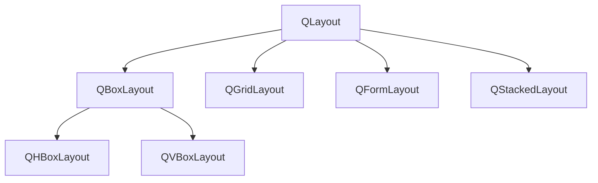
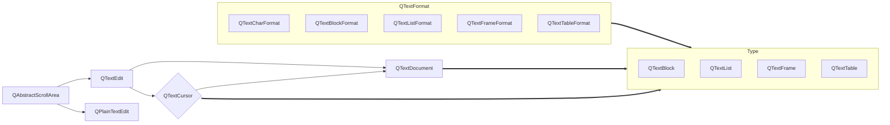
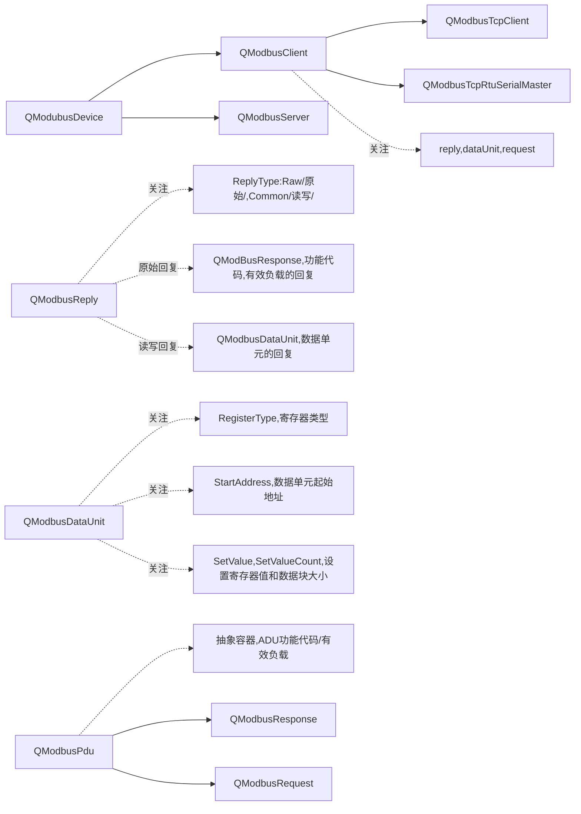

## 16. 布局管理

### 16.1 QWidget

这个枚举描述了在调用 QWidget::render() 时如何渲染小部件。

```c++
enum QWidget::RenderFlag{
    QWidget::DrawWindowBackground//如果启用此选项，即使未设置 autoFillBackground，窗口小部件的背景也会呈现到目标中,默认启用
    QWidget::DrawChildren//如果启用，小部件的子级将递归呈现到目标中,默认启用
    QWidget::IgnoreMask//如果启用则渲染目标时忽略QWidget::mask(),默认禁用
}
```

只提供常用写入函数的解释，只读函数只是返回值不提供注释，同时不常用的单独放置也不提供解释，具体见Qt文档。常用成员函数。

```c++
void activateWindow();//设置为活动窗口
void adjustSize();//调整小部件的大小以适合其内容
void setAcceptDrops(bool on);//是否启用删除事件,默认false
void setAutoFillBackground(bool enabled);//该属性保存小部件背景是否自动填充
void addAction(QAction *action);//将操作操作附加到此小部件的操作列表
void addActions(QList<QAction *> actions);//将操作附加到此小部件的操作列表
void insertAction(QAction *before, QAction *action);//将动作动作插入到此小部件的动作列表中，在动作之前。 如果 before 为 0 或 before 不是此小部件的有效操作，它会附加操作
void insertActions(QAction *before, QList<QAction *> actions);//将动作动作插入到此小部件的动作列表中，在之前的动作之前。 如果 before 为 0 或 before 不是此小部件的有效操作，它会附加操作
void removeAction(QAction *action);//从此小部件的操作列表中删除操作动作
void move(const QPoint &);//此属性保存小部件在其父小部件中的位置
void move(int x, int y);//这对应于 move(QPoint(x, y))。
void resize(const QSize &);//设置小部件的大小，不包括任何窗口框架
void resize(int w, int h);
void repaint(int x, int y, int w, int h);//此版本在小部件内重新绘制了一个矩形 (x, y, w, h)
void repaint(const QRect &rect);//这个版本在小部件内重新绘制了一个矩形
void repaint(const QRegion &rgn);//这个版本在小部件内重新绘制了一个区域 rgn
void setAttribute(Qt::WidgetAttribute attribute, bool on = true);//如果 on 为真，则设置此小部件的属性属性； 否则清除该属性
void setBackgroundRole(QPalette::ColorRole role);//将小部件的背景角色设置为指定角色
void setContentsMargins(int left, int top, int right, int bottom);//将小部件内容周围的边距设置为左、上、右和下的大小。 边距由布局系统使用，子类可以使用边距来指定要绘制的区域（例如，不包括框架）
void setContentsMargins(const QMargins &margins);
void setFixedHeight(int h);//将小部件的最小和最大高度都设置为 h 而不更改宽度。 提供方便
void setFixedSize(const QSize &s);//将小部件的最小和最大尺寸都设置为 s，从而防止它不断增长或缩小
void setFixedSize(int w, int h);//将小部件的宽度设置为 w，将高度设置为 h
void setFixedWidth(int w);//在不更改高度的情况下将小部件的最小和最大宽度设置为 w。 提供方便
void setFont(const QFont &);//设置格式
void setLayout(QLayout *layout);//设置布局
void setLayoutDirection(Qt::LayoutDirection direction);//设置布局方向
void setLocale(const QLocale &locale);//此属性保存小部件的语言环境
void clearMask();//从小部件获取键盘输入焦点
void setMask(const QBitmap &bitmap);//仅导致位图具有相应 1 位的窗口小部件的像素可见。 如果该区域包括小部件的 rect() 之外的像素，则该区域中的窗口系统控件可能可见也可能不可见，具体取决于平台
void setMask(const QRegion &region);
void setMaximumHeight(int maxh);//对应于setMaximumSize,将最大宽度设置为maxw，将最大高度设置为maxh
void setMaximumSize(const QSize &);
void setMaximumSize(int maxw, int maxh);
void setMaximumWidth(int maxw);
void setMinimumHeight(int minh);
void setMinimumSize(const QSize &);//同理
void setMinimumSize(int minw, int minh);
void setMinimumWidth(int minw);
void setMouseTracking(bool enable);//此属性保存是否为小部件启用鼠标跟踪
void setTabletTracking(bool enable);//
void setPalette(const QPalette &);//
void setParent(QWidget *parent);//设置小部件的父级并重设标志
void setParent(QWidget *parent, Qt::WindowFlags f);
void setWindowFlag(Qt::WindowType flag, bool on = true);//如果 on 为真，则在此小部件上设置窗口标志标志； 否则清除标志
void setWindowFlags(Qt::WindowFlags type);//窗口标志是一个类型（例如 Qt::Dialog）和零个或多个窗口系统提示（例如 Qt::FramelessWindowHint）的组合
void setWindowIcon(const QIcon &icon);//此属性保存小部件的图标
void setWindowOpacity(qreal level);//此属性保存模态小部件阻止的窗口
void setWindowRole(const QString &role);//将窗口的角色设置为角色。 这仅对 X11 上的 Windows 有意义
void setWindowState(Qt::WindowStates windowState);//将窗口状态设置为 windowState。 窗口状态是 Qt::WindowState 的 OR'ed 组合：Qt::WindowMinimized、Qt::WindowMaximized、Qt::WindowFullScreen 和 Qt::WindowActive
void setSizePolicy(QSizePolicy);//将小部件的大小策略设置为水平和垂直，具有标准拉伸且没有宽度换高
void setSizePolicy(QSizePolicy::Policy horizontal, QSizePolicy::Policy vertical);//
```

不常用成员函数。

```c++
void ensurePolished() const;//确保小部件及其子项已被 QStyle 修饰（即，具有适当的字体和调色板）
void getContentsMargins(int *left, int *top, int *right, int *bottom) const;//返回小部件内容的左、上、右和下边距
void grabGesture(Qt::GestureType gesture, Qt::GestureFlags flags = Qt::GestureFlags());//为小部件订阅具有特定标志的给定手势
void grabKeyboard();//此小部件接收所有键盘事件，直到调用 releaseKeyboard()； 其他小部件根本没有键盘事件。 鼠标事件不受影响。 如果你想抓住它，请使用 grabMouse()
void grabMouse();//此小部件接收所有鼠标事件，直到调用 releaseMouse()； 其他小部件根本没有鼠标事件。 键盘事件不受影响。 如果你想抓住它，请使用 grabKeyboard()
void grabMouse(const QCursor &cursor);//抓取鼠标输入并更改光标形状
void overrideWindowFlags(Qt::WindowFlags flags);//将小部件的窗口标志设置为标志，而不告诉窗口系统
void releaseKeyboard();//释放键盘抓取
void releaseMouse();//释放鼠标抓取
void releaseShortcut(int id);//从 Qt 的快捷方式系统中删除具有给定 id 的快捷方式。 小部件将不再接收快捷键的键序列的 QEvent::Shortcut 事件（除非它具有具有相同键序列的其他快捷键）
void render(QPaintDevice *target, const QPoint &targetOffset = QPoint(), const QRegion &sourceRegion = QRegion(), RenderFlags renderFlags = RenderFlags( DrawWindowBackground | DrawChildren ));//使用 renderFlags 将此小部件的 sourceRegion 渲染到目标中以确定如何渲染。 渲染从目标中的 targetOffset 开始
void render(QPainter *painter, const QPoint &targetOffset = QPoint(), const QRegion &sourceRegion = QRegion(), RenderFlags renderFlags = RenderFlags( DrawWindowBackground | DrawChildren ));//将小部件渲染到画家的 QPainter::device() 中。渲染时将使用应用于画家的转换和设置
void scroll(int dx, int dy);//向右滚动小部件，包括其子 dx 像素并向下滚动 dy。  dx 和 dy 都可能是负数
void scroll(int dx, int dy, const QRect &r);//此版本仅滚动 r 并且不移动小部件的子项
void setAccessibleDescription(const QString &description);//此属性包含辅助技术所看到的小部件的描述
void setAccessibleName(const QString &name);//此属性包含辅助技术所见的小部件名称
void setBaseSize(const QSize &);//此属性保存小部件的基本大小
void setBaseSize(int basew, int baseh);
void setContextMenuPolicy(Qt::ContextMenuPolicy policy);//小部件如何显示上下文菜单
void setCursor(const QCursor &);//此属性保存此小部件的光标形状
void setEditFocus(bool enable);//如果 enable 为真，则使该控件具有编辑焦点，此时 Qt::Key_Up 和 Qt::Key_Down 将正常传递给该控件； 否则，使用 Qt::Key_Up 和 Qt::Key_Down 来改变焦点
void setFocus(Qt::FocusReason reason);//如果此小部件或其父项之一是活动窗口，则将键盘输入焦点赋予此小部件（或其焦点代理）。 原因参数将被传递到从该函数发送的任何焦点事件中，它用于解释导致小部件获得焦点的原因。 如果窗口不活动，则窗口变为活动时，小部件将获得焦点
void setFocusPolicy(Qt::FocusPolicy policy);//此属性保存小部件接受键盘焦点的方式
void setFocusProxy(QWidget *w);//将小部件的焦点代理设置为小部件 w。 如果 w 为 0，则该函数将此小部件重置为没有焦点代理
void setGeometry(const QRect &);//这对应于 setGeometry(QRect(x, y, w, h))
void setGeometry(int x, int y, int w, int h);
void setGraphicsEffect(QGraphicsEffect *effect);//setGraphicsEffect 函数用于设置小部件的图形效果
void setInputMethodHints(Qt::InputMethodHints hints);//小部件具有哪些输入法特定提示
void setShortcutAutoRepeat(int id, bool enable = true);//如果 enable 为 true，则启用具有给定 id 的快捷方式的自动重复； 否则它被禁用
void setShortcutEnabled(int id, bool enable = true);//如果 enable 为 true，则启用具有给定 id 的快捷方式； 否则快捷方式被禁用
void setSizeIncrement(const QSize &);//此属性保存小部件的大小增量
void setSizeIncrement(int w, int h);//
void setStatusTip(const QString &);//默认情况下，此属性包含一个空字符串
void setStyle(QStyle *style);//将小部件的 GUI 样式设置为样式。 样式对象的所有权不会转移
void setToolTip(const QString &);//此属性保存小部件的工具提示
void setToolTipDuration(int msec);//此属性保存小部件的工具提示持续时间
void setUpdatesEnabled(bool enable);//此属性保存是否启用更新
void setWhatsThis(const QString &);//此属性保存小部件的 What's This 帮助文本
void setWindowFilePath(const QString &filePath);//此属性保存与小部件关联的文件路径
void setupUi(QWidget *widget);//为指定的小部件设置用户界面
void stackUnder(QWidget *w);//将小部件放在父小部件堆栈中的 w 下
void ungrabGesture(Qt::GestureType gesture);//取消订阅给定手势类型的小部件
void unsetCursor();//此属性保存此小部件的光标形状
void unsetLayoutDirection();//此属性保存此小部件的布局方向
void unsetLocale();//此属性保存小部件的语言环境
void updateGeometry();//如果 sizeHint() 或 sizePolicy() 已更改，请调用此函数
```

信号与槽函数。

```c++
slot bool close();//关闭
slot void hide();//隐藏
slot void setHidden(bool hidden);//便利函数，相当于 setVisible(!hidden)
bool isHidden() const;
slot void lower();//将小部件降低到父小部件堆栈的底部
slot void raise();//将此小部件提升到父小部件堆栈的顶部
slot void repaint();//通过立即调用paintEvent() 直接重绘小部件，除非更新被禁用或小部件被隐藏
slot void setDisabled(bool disable);//如果 disable 为 true，则禁用小部件输入事件； 否则启用输入事件
slot void setEnabled(bool);//此属性保存小部件是否启用
bool isEnabled() const;
bool isEnabledTo(const QWidget *ancestor) const;

slot void setFocus();
bool hasFocus() const;
bool hasEditFocus() const;
void clearFocus();//从小部件获取键盘输入焦点

slot void setStyleSheet(const QString &styleSheet);

slot virtual void setVisible(bool visible);
bool isVisible() const;
bool isVisibleTo(const QWidget *ancestor) const;

slot void setWindowModified(bool);
bool isWindowModified() const;
bool isModal() const;

slot void setWindowTitle(const QString &);

slot void show();
slot void showNormal();
slot void showFullScreen();
bool isFullScreen() const;

slot void showMaximized();
bool isMaximized() const;

slot void showMinimized();
bool isMinimized() const;

slot void update();//更新小部件，除非更新被禁用或小部件被隐藏
void update(int x, int y, int w, int h);
void update(const QRect &rect);
void update(const QRegion &rgn);
```

信号函数。

```c++
void customContextMenuRequested(const QPoint &pos);//当小部件的 contextMenuPolicy 为 Qt::CustomContextMenu 并且用户已请求小部件上的上下文菜单时，将发出此信号。 位置 pos 是小部件接收的上下文菜单事件的位置。 通常这是在小部件坐标中。 此规则的例外是 QAbstractScrollArea 及其将上下文菜单事件映射到 viewport() 坐标的子类
void windowIconChanged(const QIcon &icon);//当窗口的图标发生变化时会发出此信号，并将新图标作为参数
void windowTitleChanged(const QString &title);//当窗口的标题发生变化时会发出此信号，并以新标题作为参数
```

#### QGroupBox

QGroupBox 小部件提供了一个带有标题的组框框架。组框提供框架、顶部的标题、键盘快捷键，并在其内部显示各种其他小部件。键盘快捷键将键盘焦点移动到组框的子小部件之一。
QGroupBox 还允许您设置标题（通常在构造函数中设置）和标题的对齐方式。可以选中组框。可检查组框中的子小部件根据是否选中组框而启用或禁用。
您可以通过启用 flat 属性来最小化组合框的空间消耗。在大多数样式中，启用此属性会导致移除框架的左、右和下边缘。
QGroupBox 不会自动布置子小部件（通常是 QCheckBoxes 或 QRadioButtons，但可以是任何小部件）。下面的例子展示了我们如何设置一个带有布局的 QGroupBox：

```c++
QGroupBox *groupBox = new QGroupBox(tr("Exclusive Radio Buttons"));

QRadioButton *radio1 = new QRadioButton(tr("&Radio button 1"));
QRadioButton *radio2 = new QRadioButton(tr("R&adio button 2"));
QRadioButton *radio3 = new QRadioButton(tr("Ra&dio button 3"));

radio1->setChecked(true);

QVBoxLayout *vbox = new QVBoxLayout;
vbox->addWidget(radio1);
vbox->addWidget(radio2);
vbox->addWidget(radio3);
vbox->addStretch(1);
groupBox->setLayout(vbox);
```

成员函数。

```c++
QGroupBox(QWidget *parent = Q_NULLPTR);
QGroupBox(const QString &title, QWidget *parent = Q_NULLPTR);

void setAlignment(int alignment);
Qt::Alignment alignment() const;

void setCheckable(bool checkable);//分组框的标题中是否有复选框。如果此属性为真，则分组框使用复选框代替普通标签显示其标题。如果选中该复选框，则启用组框的子项；否则，它们将被禁用且无法访问
bool isCheckable() const;
bool isChecked() const;//是否选中了分组框，如果分组框是可选中的，它会显示一个复选框。如果选中该复选框，则启用组框的子项；否则，子项将被禁用并且用户无法访问

void setFlat(bool flat);//组框是平坦还是有框架,默认被禁用
bool isFlat() const;

void setTitle(const QString &title);
QString title() const;
```

信号和槽函数。

```c++
signal void clicked(bool checked = false);//该信号在复选框被激活时发出
signal void toggled(bool on);//如果组框是可选中的，则在切换复选框时发出此信号。如果选中该复选框，则 on 为真；否则为假
slot void setChecked(bool checked);
```

#### QAxWidget

QAxWidget 类是包装 ActiveX 控件的 QWidget。可以将 QAxWidget 实例化为空对象，使用它应该包装的 ActiveX 控件的名称，或者使用指向 ActiveX 控件的现有接口指针。 仅使用 QAxBase 支持的数据类型的 ActiveX 控件的属性、方法和事件可用作 Qt 属性、槽和信号。 基类 QAxBase 提供了一个 API，可以通过 IUnknown 指针直接访问 ActiveX。
QAxWidget 是一个 QWidget 并且主要可以这样使用，例如 它可以组织在小部件层次结构和布局中，也可以用作事件过滤器。 标准小部件属性，例如 支持启用，但它依赖于 ActiveX 控件来实现对环境属性的支持，例如 调色板或字体。  QAxWidget 尝试提供必要的提示。但是，您不能重新实现特定于 Qt 的事件处理程序，如 mousePressEvent 或 keyPressEvent 并期望它们被可靠地调用。 嵌入式控件完全覆盖了 QAxWidget，并且通常处理用户界面本身。 使用特定于控件的 API（即监听控件的信号），或使用标准 COM 技术，如窗口过程子类。QAxWidget 还从 QAxBase 继承了大部分与 ActiveX 相关的功能，特别是 dynamicCall() 和 querySubObject()。
 警告：你可以继承 QAxWidget，但是你不能在子类中使用 Q_OBJECT 宏（生成的 moc 文件不会编译），所以你不能添加更多的信号、槽或属性。 此限制是由于运行时生成的元对象信息造成的。 要解决此问题，请将 QAxWidget 聚合为 QObject 子类的成员。

成员函数。

```c++
QAxWidget(QWidget *parent = Q_NULLPTR, Qt::WindowFlags f = Qt::WindowFlags());//创建一个空的QAxWidget小部件，并将parent和f传播到QWidget构造函数。要初始化控件，请调用setControl（）
QAxWidget(const QString &c, QWidget *parent = Q_NULLPTR, Qt::WindowFlags f = Qt::WindowFlags());//创建QAxWidget小部件并初始化ActiveX控件c。父控件和f将传播到QWidget构造函数
QAxWidget(IUnknown *iface, QWidget *parent = Q_NULLPTR, Qt::WindowFlags f = Qt::WindowFlags());//创建一个QAxWidget，包装iface引用的COM对象。parent和f被传播到QWidget构造函数
virtual QAxAggregated *createAggregate();//当您希望为ActiveX控件的客户端站点实现其他COM接口时，或者当您希望提供COM接口的替代实现时，请重新实现此函数。返回QAxAggregated子类的新对象
bool doVerb(const QString &verb);//请求 ActiveX 控件执行动作动词。 可能的动词由verbs() 返回
```

#### QDialogButtonBox

对话框和消息框通常以符合该平台的界面指南的布局显示按钮。不同的平台总是有不同的对话框布局。QDialogButtonBox允许开发人员向其添加按钮，并将自动为用户的桌面环境使用适当的布局。
对话框的大多数按钮都具有特定的角色。这些角色包括：接受或拒绝对话。
寻求帮助。
对对话框本身执行操作（例如重置字段或应用更改）。
也可以有其他方式来取消对话框，这可能会导致破坏性的结果。
大多数对话框都有几乎可以被视为标准的按钮（例如“确定”和“取消”按钮）。以标准方式创建这些按钮有时很方便。
有几种方法可以使用QDialogButtonBox。一种方法是自己创建按钮（或按钮文本），并将它们添加到按钮框中，指定它们的角色。

```c++
    downloadButton->setDefault(true);
	quitButton->setAutoDefault(false);

    connect(downloadButton, &QAbstractButton::clicked, this, &HttpWindow::downloadFile);
    connect(quitButton, &QAbstractButton::clicked, this, &QWidget::close);

    QDialogButtonBox *buttonBox = new QDialogButtonBox;
    buttonBox->addButton(downloadButton, QDialogButtonBox::ActionRole);
    buttonBox->addButton(quitButton, QDialogButtonBox::RejectRole);
    mainLayout->addWidget(buttonBox);
```


```c++
      buttonBox = new QDialogButtonBox(QDialogButtonBox::Ok
                                       | QDialogButtonBox::Cancel);

      connect(buttonBox, &QDialogButtonBox::accepted, this, &QDialog::accept);
      connect(buttonBox, &QDialogButtonBox::rejected, this, &QDialog::reject);
```


```c++
enum QDialogButtonBox::ButtonLayout {

QDialogButtonBox::WinLayout
QDialogButtonBox::MacLayout
QDialogButtonBox::KdeLayout
QDialogButtonBox::GnomeLayout
QDialogButtonBox::AndroidLayout
}
enum QDialogButtonBox::ButtonRole {

QDialogButtonBox::InvalidRole
QDialogButtonBox::AcceptRole
QDialogButtonBox::RejectRole
QDialogButtonBox::DestructiveRole
QDialogButtonBox::ActionRole
QDialogButtonBox::HelpRole
QDialogButtonBox::YesRole
QDialogButtonBox::NoRole
QDialogButtonBox::ApplyRole
QDialogButtonBox::ResetRole
}
enum QDialogButtonBox::StandardButton {
    
QDialogButtonBox::Ok
QDialogButtonBox::Open
QDialogButtonBox::Save
QDialogButtonBox::Cancel
QDialogButtonBox::Close
QDialogButtonBox::Discard
QDialogButtonBox::Apply
QDialogButtonBox::Reset
QDialogButtonBox::RestoreDefaults
QDialogButtonBox::Help
QDialogButtonBox::SaveAll
QDialogButtonBox::Yes
QDialogButtonBox::YesToAll
QDialogButtonBox::No
QDialogButtonBox::NoToAll
QDialogButtonBox::Abort
QDialogButtonBox::Retry
QDialogButtonBox::Ignore
QDialogButtonBox::NoButton

}


QDialogButtonBox(QDialogButtonBox::StandardButtons buttons, Qt::Orientation orientation, QWidget *parent = nullptr);
QDialogButtonBox(QDialogButtonBox::StandardButtons buttons, QWidget *parent = nullptr);
QDialogButtonBox(Qt::Orientation orientation, QWidget *parent = nullptr);
QDialogButtonBox(QWidget *parent = nullptr);

void addButton(QAbstractButton *button, QDialogButtonBox::ButtonRole role);
QPushButton *addButton(const QString &text, QDialogButtonBox::ButtonRole role);
QPushButton *addButton(QDialogButtonBox::StandardButton button);
QPushButton *button(QDialogButtonBox::StandardButton which) const;
void removeButton(QAbstractButton *button);

QList<QAbstractButton *> buttons() const;
QDialogButtonBox::ButtonRole buttonRole(QAbstractButton *button) const;;

void setCenterButtons(bool center);
bool centerButtons() const;
void clear();

void setOrientation(Qt::Orientation orientation);
Qt::Orientation orientation() const;

void setStandardButtons(QDialogButtonBox::StandardButtons buttons);
QDialogButtonBox::StandardButton standardButton(QAbstractButton *button) const;
QDialogButtonBox::StandardButtons standardButtons() const;
```


### 16.2. QLayoutItem

#### QLayout

#### QSpacerItem

QSpacerItem 类在布局中提供空白空间。
通常，您不需要直接使用此类。 Qt 的内置布局管理器提供以下功能来操作布局中的空白空间：

QHBoxLayout：addSpacing(), addStretch(), insertSpacing(), insertStretch()
QGridLayout：setRowMinimumHeight(), setRowStretch(), setColumnMinimumWidth(), setColumnStretch()

成员函数。

```c++
//构造一个具有首选宽度 w、首选高度 h、水平尺寸策略 hPolicy 和垂直尺寸策略 vPolicy 的间隔项。默认值提供了一个可以拉伸的间隙，如果没有其他需要空间。
QSpacerItem(int w, int h, QSizePolicy::Policy hPolicy = QSizePolicy::Minimum, QSizePolicy::Policy vPolicy = QSizePolicy::Minimum);
//请注意，如果在将分隔项添加到布局后调用 changeSize()，则必须使布局无效才能使分隔项的新大小生效
void changeSize(int w, int h, QSizePolicy::Policy hPolicy = QSizePolicy::Minimum, QSizePolicy::Policy vPolicy = QSizePolicy::Minimum);
//返回此项的尺寸政策
QSizePolicy sizePolicy() const;
```

涉及的枚举类型。该枚举描述了在构造 QSizePolicy 时使用的各种每个维度的大小调整类型。

```c++
enum QSizePolicy::Policy{
    QSizePolicy::Fixed//QWidget::sizeHint() 是唯一可接受的替代方法，因此小部件永远不会增长或缩小
    QSizePolicy::Minimum//sizeHint() 最小且足够
    QSizePolicy::Maximum
    QSizePolicy::Preferred//sizeHint() 是最好的，但小部件可以缩小并且仍然有用
    QSizePolicy::Expanding//sizeHint() 是一个合理的大小，但小部件可以缩小并且仍然有用
    QSizePolicy::MinimumExpanding//sizeHint() 最小且足够。小部件可以利用额外的空间
    QSizePolicy::Ignored//sizeHint() 被忽略。小部件将获得尽可能多的空间
}
```

#### QWidgetItem


### 16.3. QLayout

QLayout 类是几何管理器的基类。继承了QLayoutItem和QObject。
这是由具体类 **QBoxLayout、QGridLayout、QFormLayout 和 QStackedLayout 继承**的抽象基类。
对于 QLayout 子类或 QMainWindow 的用户，很少需要使用 QLayout 提供的基本函数，例如 setSizeConstraint() 或 setMenuBar()。有关详细信息，请参阅布局管理。要制作自己的布局管理器，请实现函数 addItem()、sizeHint()、setGeometry()、itemAt() 和 takeAt()。您还应该实现 minimumSize() 以确保如果空间太少，您的布局不会调整为零大小。要支持高度取决于宽度的孩子，请实现 hasHeightForWidth() 和 heightForWidth()。



枚举类型。

这个枚举类型说明了范围如何限制。

```c++
enum QLayout::SizeConstraint{
    QLayout::SetDefaultConstraint//最小尺寸默认设置为minimumSize()，除非小部件已经具有最小尺寸
    QLayout::SetFixedSize//尺寸设置为sizeHint();它根本无法调整大小。
    QLayout::SetMinimumSize//最小尺寸设置为 minimumSize();它不能更小
    QLayout::SetMaximumSize//最大尺寸设置为maximumSize();它不能更大
    QLayout::SetMinAndMaxSize//最小尺寸设置为minimumSize()，最大尺寸设置为maximumSize()
    QLayout::SetNoConstraint//尺寸不受约束
}
```

成员函数。

```c++
QLayout(QWidget *parent);
QLayout();

bool activate();//如有必要，重做 parentWidget() 的布局
void update();//更新 parentWidget() 的布局
virtual int count() const = 0;//必须在子类中实现以返回布局中的项目数
virtual int indexOf(QWidget *widget) const;//在此布局中搜索小部件小部件（不包括子布局）
QRect contentsRect() const;//返回布局周围使用的边距

// 以特定于布局的方式将小部件 w 添加到此布局。此函数使用 addItem()
void addWidget(QWidget *w);
// 从布局中删除小部件小部件
void removeWidget(QWidget *widget);
// 搜索小部件 from 并将其替换为小部件 to 如果找到。从成功返回包含小部件的布局项。否则返回 0
QLayoutItem *replaceWidget(QWidget *from, QWidget *to, Qt::FindChildOptions options = Qt::FindChildrenRecursively);
// 返回此布局的父小部件，如果此布局未安装在任何小部件上，则返回 0
QWidget *parentWidget() const;

// 在子类中实现以添加项目。如何添加它是特定于每个子类的
virtual void addItem(QLayoutItem *item) = 0;
// 从布局中移除布局项目项。调用者有责任删除该项目
void removeItem(QLayoutItem *item);
// 必须在子类中实现以从布局中删除索引处的布局项目，并返回该项目。如果没有这样的项目，该函数必须什么都不做并返回0。项目从0开始连续编号。如果一个项目被删除，其他项目将重新编号
virtual QLayoutItem *takeAt(int index) = 0;
// 必须在子类中实现以返回索引处的布局项。如果没有这个项目，该函数必须返回0。项目从0开始连续编号。如果一个项目被删除，其他项目将重新编号
virtual QLayoutItem *itemAt(int index) const = 0;

// 设置对齐方式
bool setAlignment(QWidget *w, Qt::Alignment alignment);
bool setAlignment(QLayout *l, Qt::Alignment alignment);

// 设置要在布局周围使用的边距
void setContentsMargins(int left, int top, int right, int bottom);
void setContentsMargins(const QMargins &margins);
QMargins contentsMargins() const;
void getContentsMargins(int *left, int *top, int *right, int *bottom) const;

// 如果 enable 为 true，则启用此布局，否则将其禁用
void setEnabled(bool enable);
bool isEnabled() const;

//告诉几何管理器将菜单栏小部件放置在 parentWidget() 的顶部，在 QWidget::contentsMargins() 之外。所有子小部件都放置在菜单栏的底部边缘下方
void setMenuBar(QWidget *widget);
QWidget *menuBar() const;

void setSizeConstraint(SizeConstraint);
SizeConstraint sizeConstraint() const;

void setSpacing(int);
int spacing() const;
```

静态成员函数：返回满足小部件所有尺寸约束的尺寸，包括 heightForWidth() 并且尽可能接近尺寸。

```c++
static QSize QLayout::closestAcceptableSize(const QWidget *widget, const QSize &size);
```

#### QGridLayout

QGridLayout 是个网格布局管理器对象，它的使用方式非常简单，例子如下。

```c++
QGridLayout * layout = new QGridLayout(this);
layout->addWidget(label1,0,0);//添加1个标签到0行0列
layout->addWidget(lineEdit,0,1);//添加1个文本编辑器到0行1列
layout->addWidget(label2,1,0);//添加1个标签到1行0列
layout->addWidget(button,1,1);//添加1个按钮到1行1列
this->setLayout(layout); // 添加进主界面
```

列和行的行为相同，这里以列为例说明属性。
每列都有一个**最小宽度和一个拉伸因子**。最小宽度是使用 setColumnMinimumWidth() 设置，拉伸因子是使用 setColumnStretch() 设置，确定列宽度最多可超过最小值多少倍。

使用addWidget() 将部件放入单元格中，removeWidget()移除部件，或者小部件调用 QWidget::hide() 也可以删除直到调用QWidget::show()。使用 addItem() 
下图显示了一个带有五列三行网格的对话框片段（网格以洋红色显示）：


添加布局的常规方法是在父布局上调用 addLayout()。添加布局后，您可以开始使用 addWidget()、addItem() 和 addLayout() 将小部件和其他布局放入网格布局的单元格中。

成员函数。

```c++
// 在位置row、column、spanning rowSpan rows和columnSpan列处添加item，并根据alignment对齐。如果 rowSpan 和/或 columnSpan 为 -1，则项目将分别延伸到底部和/或右侧边缘。布局获取项目的所有权
void addItem(QLayoutItem *item, int row, int column, int rowSpan = 1, int columnSpan = 1, Qt::Alignment alignment = Qt::Alignment());
// 将布局放置在网格中的位置（行、列）左上角的位置是 (0, 0)
void addLayout(QLayout *layout, int row, int column, Qt::Alignment alignment = Qt::Alignment());
// 此版本将布局布局添加到单元格网格，跨越多行/列。单元格将从行开始，列跨越 rowSpan行和columnSpan列
void addLayout(QLayout *layout, int row, int column, int rowSpan, int columnSpan, Qt::Alignment alignment = Qt::Alignment());
// 将给定的小部件添加到行、列的单元格网格中。默认情况下，左上角的位置是 (0, 0)
void addWidget(QWidget *widget, int row, int column, Qt::Alignment alignment = Qt::Alignment());
// 此版本将给定的小部件添加到单元格网格中，跨越多行/列。单元格将从 fromRow 开始，fromColumn 跨越 rowSpan 行和 columnSpan 列。小部件将具有给定的对齐方式
void addWidget(QWidget *widget, int fromRow, int fromColumn, int rowSpan, int columnSpan, Qt::Alignment alignment = Qt::Alignment());

// 返回网格中具有行行和列的单元格的几何形状。如果行或列在网格之外，则返回无效矩形
QRect cellRect(int row, int column) const;

// 返回具有给定索引的项目的位置信息
void getItemPosition(int index, int *row, int *column, int *rowSpan, int *columnSpan) const;
// 返回占据单元格（行、列）的布局项，如果单元格为空，则返回 0
QLayoutItem *itemAtPosition(int row, int column) const;

// 返回此网格中的行列数
int columnCount() const;
int rowCount() const;

// 设置和返回行列的拉伸因子
void setColumnStretch(int column, int stretch);
void setRowStretch(int row, int stretch);
int rowStretch(int row) const;
int columnStretch(int column) const;

// 设置和返回最小行列间距
void setRowMinimumHeight(int row, int minSize);
int rowMinimumHeight(int row) const;
void setColumnMinimumWidth(int column, int minSize);
int columnMinimumWidth(int column) const;

// 此属性保存并排布局的小部件之间的间距
void setHorizontalSpacing(int spacing);
int horizontalSpacing() const;
// 此属性保存在彼此顶部布局的小部件之间的间距
void setVerticalSpacing(int spacing);
int verticalSpacing() const;

// 设置和返回用于网格原点的角，即位置 (0, 0)
void setOriginCorner(Qt::Corner corner);
Qt::Corner originCorner() const;

// 设置垂直和水平间距都为spacing
void setSpacing(int spacing);
int spacing() const;
```

#### QFormLayout

QFormLayout 类管理输入小部件的形式及其相关标签。
QFormLayout 是一个方便的布局类，它以两列形式布置其子项。左列由标签组成，右列由“字段”小部件（行编辑器、旋转框等）组成。传统上，这种两列表单布局是使用 QGridLayout 实现的。 QFormLayout 是一种更高级别的替代方案，
采用 QString 和 QWidget * 的 addRow() 重载在幕后创建一个 QLabel 并自动设置它的伙伴。然后我们可以这样写代码：

```c++
QFormLayout *formLayout = new QFormLayout;
formLayout->addRow(tr("&Name:"), nameLineEdit);
formLayout->addRow(tr("&Email:"), emailLineEdit);
formLayout->addRow(tr("&Age:"), ageSpinBox);
setLayout(formLayout);
```

将此与使用 QGridLayout 编写的以下代码进行比较：

```c++
nameLabel = new QLabel(tr("&Name:"));
nameLabel->setBuddy(nameLineEdit);//需要设置伙伴关系

emailLabel = new QLabel(tr("&Name:"));
emailLabel->setBuddy(emailLineEdit);

ageLabel = new QLabel(tr("&Name:"));
ageLabel->setBuddy(ageSpinBox);

QGridLayout *gridLayout = new QGridLayout;
gridLayout->addWidget(nameLabel, 0, 0);
gridLayout->addWidget(nameLineEdit, 0, 1);
gridLayout->addWidget(emailLabel, 1, 0);
gridLayout->addWidget(emailLineEdit, 1, 1);
gridLayout->addWidget(ageLabel, 2, 0);
gridLayout->addWidget(ageSpinBox, 2, 1);
setLayout(gridLayout);
```

下图显示了不同样式的默认外观。


也可以通过调用 setLabelAlignment()、setFormAlignment()、setFieldGrowthPolicy() 和 setRowWrapPolicy() 单独覆盖表单样式。例如，要在所有平台上模拟 QMacStyle 的表单布局外观，但带有左对齐标签，您可以编写：

```c++
formLayout->setRowWrapPolicy(QFormLayout::DontWrapRows);
formLayout->setFieldGrowthPolicy(QFormLayout::FieldsStayAtSizeHint);
formLayout->setFormAlignment(Qt::AlignHCenter | Qt::AlignTop);
formLayout->setLabelAlignment(Qt::AlignLeft);
```

此枚举指定可用于控制表单字段增长方式的不同策略。

```c++
enum QFormLayout::FieldGrowthPolicy{
    QFormLayout::FieldsStayAtSizeHint//这些字段永远不会超出其有效大小提示。这是QMacStyle默认设置
    QFormLayout::ExpandingFieldsGrow//水平大小策略为 Expanding 或 MinimumExpanding 的字段将增长以填满可用空间。其他字段不会超出其有效大小提示。这是 Plastique 的默认策略
    QFormLayout::AllNonFixedFieldsGrow//具有允许它们增长的大小策略的所有字段都将增长以填充可用空间。这是大多数样式的默认策略
}
```

此枚举指定可能连续出现的小部件（或其他布局项）的类型。

```c++
enum QFormLayout::ItemRole{ 
    QFormLayout::LabelRole//标签小部件
    QFormLayout::FieldRole//字段小部件
    QFormLayout::SpanningRole//跨越标签和字段列的小部件
}
```

此枚举指定可用于控制表单行换行方式的不同策略。

```c++
enum QFormLayout::RowWrapPolicy{
    QFormLayout::DontWrapRows//字段总是布置在其标签旁边。这是除QtExtended样式之外的默认策略
    QFormLayout::WrapLongRows//标签有足够的水平空间来容纳最宽的标签，其余的空间给字段。如果字段对的最小大小大于可用空间，则该字段将换行到下一行。这是 Qt 扩展样式的默认策略
    QFormLayout::WrapAllRows//字段始终位于其标签下方
}
```

成员函数。

```c++
QFormLayout(QWidget *parent = Q_NULLPTR);
void addRow(QWidget *label, QWidget *field);//使用给定的标签和字段在此表单布局的底部添加一个新行
void addRow(QWidget *label, QLayout *field);
void addRow(const QString &labelText, QWidget *field);
void addRow(const QString &labelText, QLayout *field);
void addRow(QWidget *widget);
void addRow(QLayout *layout);
void insertRow(int row, QWidget *label, QWidget *field);
void insertRow(int row, QWidget *label, QLayout *field);
void insertRow(int row, const QString &labelText, QWidget *field);
void insertRow(int row, const QString &labelText, QLayout *field);
void insertRow(int row, QWidget *widget);
void insertRow(int row, QLayout *layout);
void removeRow(int row);
void removeRow(QWidget *widget);
void removeRow(QLayout *layout);
TakeRowResult takeRow(int row);
TakeRowResult takeRow(QWidget *widget);
TakeRowResult takeRow(QLayout *layout);
int rowCount() const;
// 此属性保存表单行换行的方式
void setRowWrapPolicy(RowWrapPolicy policy);
RowWrapPolicy rowWrapPolicy() const;

void setItem(int row, ItemRole role, QLayoutItem *item);
void setLabelAlignment(Qt::Alignment alignment);
void setLayout(int row, ItemRole role, QLayout *layout);
void setWidget(int row, ItemRole role, QWidget *widget);
// 在指定索引处检索项目的行和角色（列）。如果索引超出范围，*rowPtr 设置为 -1；否则，该行存储在 *rowPtr 中，而角色存储在 *rolePtr 中
void getItemPosition(int index, int *rowPtr, ItemRole *rolePtr) const;
// 检索指定子布局的行和角色（列）。如果布局不在表单布局中，*rowPtr 设置为 -1；否则，该行存储在 *rowPtr 中，而角色存储在 *rolePtr 中
void getLayoutPosition(QLayout *layout, int *rowPtr, ItemRole *rolePtr) const;
// 检索布局中指定小部件的行和角色（列）。如果小部件不在布局中，*rowPtr 设置为 -1；否则，该行存储在 *rowPtr 中，而角色存储在 *rolePtr 中
void getWidgetPosition(QWidget *widget, int *rowPtr, ItemRole *rolePtr) const;
// 此属性保存标签的水平对齐方式
Qt::Alignment labelAlignment() const;
// 返回给定行中具有指定角色（列）的布局项。如果没有这样的项目，则返回 0
QLayoutItem *itemAt(int row, ItemRole role) const;
// 返回与给定字段关联的标签
QWidget *labelForField(QWidget *field) const;
QWidget *labelForField(QLayout *field) const;

// 此属性保存表单字段增长的方式
void setFieldGrowthPolicy(FieldGrowthPolicy policy);
FieldGrowthPolicy fieldGrowthPolicy() const;
// 此属性保存表单布局内容在布局几何中的对齐方式
void setFormAlignment(Qt::Alignment alignment);
Qt::Alignment formAlignment() const;
// 设置垂直水平间距
void setSpacing(int spacing);
int spacing() const;
void setVerticalSpacing(int spacing);
int verticalSpacing() const;
void setHorizontalSpacing(int spacing);
int horizontalSpacing() const;
```

#### QStackedLayout

QStackedLayout 类提供了一堆小部件，其中一次只有一个小部件可见。
QStackedLayout 可用于创建类似于 QTabWidget 提供的用户界面。还有一个方便的 QStackedWidget 类构建在 QStackedLayout 之上。
一个 QStackedLayout 可以填充许多子小部件（“页面”）。例如：

```c++
QWidget *firstPageWidget = new QWidget;
QWidget *secondPageWidget = new QWidget;
QWidget *thirdPageWidget = new QWidget;

QStackedLayout *stackedLayout = new QStackedLayout;
stackedLayout->addWidget(firstPageWidget);
stackedLayout->addWidget(secondPageWidget);
stackedLayout->addWidget(thirdPageWidget);

QVBoxLayout *mainLayout = new QVBoxLayout;
mainLayout->addLayout(stackedLayout);
setLayout(mainLayout);
```

QStackedLayout 没有为用户提供切换页面的内在方法。这通常通过存储 QStackedLayout 页面标题的 QComboBox 或 QListWidget 来完成。例如：

```c++
QComboBox *pageComboBox = new QComboBox;
pageComboBox->addItem(tr("Page 1"));
pageComboBox->addItem(tr("Page 2"));
pageComboBox->addItem(tr("Page 3"));
connect(pageComboBox, SIGNAL(activated(int)),
        stackedLayout, SLOT(setCurrentIndex(int)));
```

填充布局时，小部件被添加到内部列表中。 indexOf() 函数返回该列表中小部件的索引。小部件可以使用 addWidget() 函数添加到列表的末尾，也可以使用 insertWidget() 函数插入到给定索引处。 removeWidget() 函数从布局中删除给定索引处的小部件。布局中包含的小部件数量，可以使用 count() 函数获得。
widget() 函数返回给定索引位置的小部件。屏幕上显示的小部件的索引由 currentIndex() 给出，并且可以使用 setCurrentIndex() 进行更改。以类似的方式，可以使用 currentWidget() 函数检索当前显示的小部件，并使用 setCurrentWidget() 函数进行更改。每当布局中的当前小部件更改或从布局中删除小部件时，都会分别发出 currentChanged() 和 widgetRemoved() 信号。

成员函数。

```c++
QStackedLayout();
QStackedLayout(QWidget *parent);
QStackedLayout(QLayout *parentLayout);
int currentIndex() const;//此属性保存可见的小部件的索引位置
QWidget *currentWidget() const;//返回当前小部件，如果此布局中没有小部件，则返回 0
QWidget *widget(int index) const;//返回给定索引处的小部件，如果给定位置没有小部件，则返回 0
int addWidget(QWidget *widget);//将给定的小部件添加到此布局的末尾并返回小部件的索引位置
int insertWidget(int index, QWidget *widget);//在此 QStackedLayout 中的给定索引处插入给定的小部件。如果 index 超出范围，则附加小部件（在这种情况下，它是返回的小部件的实际索引）
void setStackingMode(StackingMode stackingMode);//确定处理子小部件的可见性的方式
StackingMode stackingMode() const;
```

信号和槽函数。

```c++
slot void setCurrentIndex(int index);
slot void setCurrentWidget(QWidget *widget);

signal void currentChanged(int index);
signal void widgetRemoved(int index);
```

#### QBoxLayout

QBoxLayout 类水平或垂直排列子小部件。QBoxLayout 占用它获得的空间（来自其父布局或来自 parentWidget()），将其分成一排框，并使每个托管小部件填充一个框。

如果 QBoxLayout 的方向是 Qt::Horizontal，那么这些框将被放置在一行中，并具有合适的大小。每个小部件（或其他框）将至少获得其最小尺寸，至多获得其最大尺寸。如果 QBoxLayout 的方向是 Qt::Vertical，那么这些框被放置在一列中，同样大小合适。创建 QBoxLayout 的最简单方法是使用便利类之一，例如QHBoxLayout（用于 Qt::Horizontal 框）或 QVBoxLayout（用于 Qt::Vertical 框）。您也可以直接使用 QBoxLayout 构造函数，将其方向指定为 LeftToRight、RightToLeft、TopToBottom 或 BottomToTop。
如果 QBoxLayout 不是顶级布局（即它没有管理所有小部件的区域和子项），则必须先将其添加到其父布局中，然后才能对其进行任何操作。添加布局的常规方法是调用 parentLayout-&gt;addLayout()。

完成此操作后，您可以使用以下四个函数之一将框添加到 QBoxLayout： addWidget() 将小部件添加到 QBoxLayout 并设置小部件的拉伸因子。 （拉伸因子沿着盒子行。） addSpacing() 创建一个空盒子；这是您用来创建漂亮而宽敞的对话框的功能之一。有关设置边距的方法，请参见下文。addStretch() 创建一个空的、可拉伸的盒子。
addLayout() 将包含另一个 QLayout 的框添加到行并设置该布局的拉伸因子。
使用 insertWidget()、insertSpacing()、insertStretch() 或 insertLayout() 在布局中的指定位置插入一个框。
QBoxLayout 还包括两个边距宽度： setContentsMargins() 设置小部件每一侧的外边框的宽度。这是沿 QBoxLayout 的四个边的每个保留空间的宽度。setSpacing() 设置相邻框之间的宽度。 （您可以使用 addSpacing() 在特定位置获得更多空间。）边距默认值由样式提供。大多数 Qt 样式指定的默认边距是 9 用于子窗口小部件和 11 用于窗口。间距默认与顶级布局的边距宽度相同，或与父布局相同。
要从布局中删除小部件，请调用 removeWidget()。在小部件上调用 QWidget::hide() 也有效地从布局中删除小部件，直到调用 QWidget::show()。
但是最常用的是 QVBoxLayout 和 QHBoxLayout 而不是 QBoxLayout ，因为它们方便的构造函数。

此枚举类型用于确定框布局的方向。

```c++
enum QBoxLayout::Direction{
    QBoxLayout::LeftToRight //从左到右水平
    QBoxLayout::RightToLeft //从右到左水平
    QBoxLayout::TopToBottom //从上到下垂直
    QBoxLayout::BottomToTop//从下到上垂直
}
```

成员函数。

```c++
QBoxLayout(Direction dir, QWidget *parent = Q_NULLPTR);
//将布局添加到框的末尾，并带有串行拉伸因子拉伸
void addLayout(QLayout *layout, int stretch = 0);
void insertLayout(int index, QLayout *layout, int stretch = 0);
//将 spacerItem 添加到此框布局的末尾
void addSpacerItem(QSpacerItem *spacerItem);
void insertSpacerItem(int index, QSpacerItem *spacerItem);
void insertItem(int index, QLayoutItem *item);
// 在此框布局的末尾添加一个大小为 size 的不可拉伸空间（QSpacerItem）。 QBoxLayout 提供默认的边距和间距。此功能增加了额外的空间
void addSpacing(int size);
void setSpacing(int spacing);
void insertSpacing(int index, int size);
int spacing() const;
// 将最小尺寸为零且拉伸因子拉伸的可拉伸空间（QSpacerItem）添加到此框布局的末尾
void addStretch(int stretch = 0);
void setStretch(int index, int stretch);
void insertStretch(int index, int stretch = 0);
int stretch(int index) const;
bool setStretchFactor(QWidget *widget, int stretch);
bool setStretchFactor(QLayout *layout, int stretch);
// 将框的垂直尺寸（例如，如果框是 LeftToRight，则将高度）限制为最小尺寸。其他约束可能会增加限制
void addStrut(int size);
// 将小部件添加到此框布局的末尾，具有拉伸和对齐对齐的拉伸因子
void addWidget(QWidget *widget, int stretch = 0, Qt::Alignment alignment = Qt::Alignment());
void insertWidget(int index, QWidget *widget, int stretch = 0, Qt::Alignment alignment = Qt::Alignment());
// 将此布局的方向设置为方向
void setDirection(Direction direction);
Direction direction() const;
```

##### QVBoxLayout

QVBoxLayout 类垂直排列小部件。
此类用于构造垂直框布局对象。有关详细信息，请参阅 QBoxLayout。
该类的最简单用法是这样的：首先，我们在布局中创建我们想要的小部件。然后，我们创建 QVBoxLayout 对象并将小部件添加到布局中。最后，我们调用 QWidget::setLayout() 将 QVBoxLayout 对象安装到小部件上。此时，布局中的小部件被重新设置为将窗口作为其父级。

```c++
QWidget *window = new QWidget;
QPushButton *button1 = new QPushButton("One");
QPushButton *button2 = new QPushButton("Two");
QPushButton *button3 = new QPushButton("Three");
QPushButton *button4 = new QPushButton("Four");
QPushButton *button5 = new QPushButton("Five");

QVBoxLayout *layout = new QVBoxLayout;
layout->addWidget(button1);
layout->addWidget(button2);
layout->addWidget(button3);
layout->addWidget(button4);
layout->addWidget(button5);

window->setLayout(layout);
window->show();
```

##### QHBoxLayout

QHBoxLayout 类水平排列小部件。
此类用于构造水平框布局对象。有关详细信息，请参阅 QBoxLayout。
该类的最简单用法是这样，首先，我们在布局中创建我们想要的小部件。然后，我们创建 QHBoxLayout 对象并将小部件添加到布局中。最后，我们调用 QWidget::setLayout() 将 QHBoxLayout 对象安装到小部件上。此时，布局中的小部件被重新设置为将窗口作为其父级。

```c++
QWidget *window = new QWidget;
QPushButton *button1 = new QPushButton("One");
QPushButton *button2 = new QPushButton("Two");
QPushButton *button3 = new QPushButton("Three");
QPushButton *button4 = new QPushButton("Four");
QPushButton *button5 = new QPushButton("Five");

QHBoxLayout *layout = new QHBoxLayout;
layout->addWidget(button1);
layout->addWidget(button2);
layout->addWidget(button3);
layout->addWidget(button4);
layout->addWidget(button5);

window->setLayout(layout);
window->show();
```

### 16.4 QDockWidget

停靠窗口类，常与QTextEdit配合使用，继承自QWidget。例子可见[42-TestLayOut/TestDockWidget](42-TestLayOut/TestDockWidget)。

第一个枚举类型：设置停靠窗体的特性，这个枚举类型属于QDockWidget作用域下。

```c++
enum DockWidgetFeature { 
    DockWidgetClosable, // 可关闭
    DockWidgetMovable, // 可移动
    DockWidgetFloatable, // 可漂浮
    DockWidgetVerticalTitleBar, //标题栏显示在左侧而不是顶部
    AllDockWidgetFeatures,// 拥有所有特点
    NoDockWidgetFeatures // 不可移动.关闭和浮动
}
```

第二个枚举类型：设置窗体可停靠的区域，作用域在Qt下，需要了解。

```c++
enum Qt::DockWidgetArea
{
    Qt::LeftDockWidgetArea,
    Qt::RightDockWidgetArea,
    Qt::TopDockWidgetArea,
    Qt::BottomDockWidgetArea,
    Qt::AllDockWidgetAreas,
    Qt::NoDockWidgetArea,//只可停靠在插入处
}
```

成员函数。

```c++
QDockWidget(const QString &title, QWidget *parent = Q_NULLPTR, Qt::WindowFlags flags = Qt::WindowFlags());
QDockWidget(QWidget *parent = Q_NULLPTR, Qt::WindowFlags flags = Qt::WindowFlags());

void setAllowedAreas(Qt::DockWidgetAreas areas);
bool isAreaAllowed(Qt::DockWidgetArea area) const;
Qt::DockWidgetAreas allowedAreas() const;

void setFeatures(DockWidgetFeatures features);
DockWidgetFeatures features() const;

void setFloating(bool floating);
bool isFloating() const;

void setTitleBarWidget(QWidget *widget); // 这个是用于设置自定义标题栏的,标题栏部件必须有一个有效的 QWidget::sizeHint() 和 QWidget::minimumSizeHint()。这些功能应该考虑到标题栏的当前方向。
QWidget *titleBarWidget() const;

void setWidget(QWidget *widget);
QWidget *widget() const;

QAction *toggleViewAction() const;//返回可用于显示或关闭此停靠小部件的可检查操作。操作的文本设置为停靠小部件的窗口标题
```

信号函数。

```c++
void allowedAreasChanged(Qt::DockWidgetAreas allowedAreas);
void dockLocationChanged(Qt::DockWidgetArea area);
void featuresChanged(QDockWidget::DockWidgetFeatures features);
void topLevelChanged(bool topLevel);//当浮动属性发生变化时会发出此信号
void visibilityChanged(bool visible);
```

一个例子如下。

```c++
// (1) 主窗口
QTextEdit * textedit = new QTextEdit(this); // this为父窗口
textedit->setText("main window");
textedit->setAlignment(Qt::AlignCenter);
this->setCentralWidget(textedit);
// (2) 停靠窗口1
QDockWidget * dock1 = new QDockWidget(tr("DockWindow1"),this);
dock1->setFeatures(QDockWidget::DockWidgetMovable); // 可移动
dock1->setAllowedAreas(Qt::LeftDockWidgetArea| Qt::RightDockWidgetArea);// 可停靠区域左边和右边
dock1->setFloating(false);
QTextEdit * edit1 = new QTextEdit();
edit1->setText(tr("可被移动的停靠窗口,但不可以悬浮和关闭"));
dock1->setWidget(edit1);
this->addDockWidget(Qt::LeftDockWidgetArea,dock1);
// (3) 停靠窗口2
QDockWidget * dock2  = new QDockWidget("DockWindow2",this);
dock2->setFeatures(QDockWidget::DockWidgetClosable | QDockWidget::DockWidgetFloatable);
QTextEdit * edit2 = new QTextEdit();
edit2->setText(tr("可悬浮和关闭的窗口,但不可以移动只能双击来实现悬浮"));
dock2->setWidget(edit2);
this->addDockWidget(Qt::RightDockWidgetArea,dock2);
// (4) 停靠窗口3
QDockWidget * dock3 = new QDockWidget("DockWindow3",this);
dock3->setFeatures(QDockWidget::AllDockWidgetFeatures);
QTextEdit * edit3 = new QTextEdit();
edit3->setText(tr("具有所有特点的窗口"));
dock3->setWidget(edit3);
this->addDockWidget(Qt::BottomDockWidgetArea,dock3);

this->resize(800,600);
this->setWindowTitle(tr("DockWindow"));
```

### 16.5 QFrame

QFrame 类是可以具有框架的小部件的基类，继承自QWidget。
QMenu 使用它来“提升”周围屏幕上方的菜单。 QProgressBar 有一个“下沉”的外观。 QLabel 外观扁平。像这样的小部件的框架可以更改。

```c++
QLabel label(...);
label.setFrameStyle(QFrame::Panel | QFrame::Raised);
label.setLineWidth(2);

QProgressBar pbar(...);
label.setFrameStyle(QFrame::NoFrame);
```

QFrame 类也可以**直接用于创建没有任何内容的简单占位符框架**。
框架样式由框架形状和阴影样式指定，用于在视觉上将框架与周围的小部件分开。这些属性可以使用 setFrameStyle() 函数一起设置，并使用 frameStyle() 读取。
**框架形状有 NoFrame、Box、Panel、StyledPanel、HLine 和 VLine**；**阴影样式是平原，凸起和沉没**。
框架部件具有描述边框粗细的三个属性：lineWidth、midLineWidth 和 frameWidth。**线宽**是框架边框的宽度。可以对其进行修改以自定义框架的外观。**中线宽度**指定框架中间多出一条线的宽度，它使用第三种颜色来获得特殊的 3D 效果。请注意，仅针对凸起或凹陷的 Box、HLine 和 VLine 框架绘制中线。**框架宽度**由框架样式确定，frameWidth() 函数用于获取为使用的样式定义的值。
可以使用 QWidget::setContentsMargins() 函数自定义框架和框架内容之间的边距。
下图显示了一些样式和线宽的组合效果：


枚举类型。

此枚举类型定义了用于为帧提供 3D 效果的阴影类型。

```c++
enum QFrame::Shadow{
    QFrame::Plain//框架和内容与周围环境；保持水平没有任何3D效果
    QFrame::Raised//框架和内容出现凸起；使用当前颜色组的浅色和深色绘制3D凸起线
    QFrame::Sunken//框架和内容出现凹陷；使用当前颜色组的明暗颜色绘制3D凹陷线
}
```

此枚举类型定义了可用框架的形状。

```c++
enum QFrame::Shape{
    QFrame::NoFrame//QFrame什么都不画
    QFrame::Box//QFrame在其内容周围绘制一个框
    QFrame::Panel//QFrame绘制一个面板使内容看起来凸起或凹陷
    QFrame::StyledPanel//绘制一个矩形面板，其外观取决于当前的 GUI 样式。它可以升起或下沉
    QFrame::HLine//QFrame 绘制一条不包含任何内容的水平线（用作分隔符）
    QFrame::VLine//QFrame 绘制一条不包含任何内容的垂直线（用作分隔符）
    QFrame::WinPanel//绘制一个可以像 Windows 2000 中那样凸起或凹陷的矩形面板。指定此形状会将线宽设置为 2 像素。提供 WinPanel 是为了兼容。对于 GUI 样式独立性，我们建议改用 StyledPanel
}
```

此枚举定义了两个常量，可用于提取 frameStyle() 的两个组件。

```c++
enum QFrame::StyleMask{
    QFrame::Shadow_Mask//frameStyle()的阴影部分
    QFrame::Shape_Mask//frameStyle()的形状部分
}
```

成员函数。

```c++
int frameWidth() const;

void setFrameRect(const QRect &);
QRect frameRect() const;

void setFrameShadow(Shadow);
Shadow frameShadow() const;

void setFrameShape(Shape);
Shape frameShape() const;

void setFrameStyle(int style);
int frameStyle() const;

void setLineWidth(int);
int lineWidth() const;

void setMidLineWidth(int);
int midLineWidth() const;
```

#### QSplitter

分裂器，可以动态的调整小组件的大小，一个例子如下，具体可见[42-TestLayOut/TestSplitter](42-TestLayOut/TestSplitter)。

```c++
QSplitter *splitter = new QSplitter(Qt::Horizontal,this);
QListView *listview = new QListView;
QTreeView *treeview = new QTreeView;
splitter->addWidget(listview);
splitter->addWidget(treeview);
splitter->setChildrenCollapsible(false); // 禁止小部件被压缩到0
splitter->setOpaqueResize(false);

QSplitter * rightSplitter = new QSplitter(Qt::Horizontal,splitter);
rightSplitter->setOrientation(Qt::Vertical);
QTextEdit * textdedit1= new QTextEdit("top text",rightSplitter);
textdedit1->setAlignment(Qt::AlignCenter);
QTextEdit * textdedit2= new QTextEdit("bottom text",rightSplitter);
textdedit2->setAlignment(Qt::AlignCenter);
this->setCentralWidget(splitter);

qDebug()<<splitter->count(); // 3
qDebug()<<splitter->indexOf(listview); // 0
qDebug()<<splitter->indexOf(treeview); // 1
qDebug()<<splitter->handleWidth(); // 6
int max  = 0 ,min = 0;
splitter->getRange(0,&min,&max);
qDebug()<<min<<"  "<<max;// 0,0
splitter->getRange(1,&min,&max);
qDebug()<<min<<"  "<<max;// 89,-86
```

效果如下。


默认的 QSplitter **水平**布置其子级，可以使用 setOrientation(Qt::Vertical) 将其子项垂直放置。
默认情况下，所有小部件都可以根据用户的意愿介于小部件的 minimumSizeHint()或 minimumSize()和 maximumSize() 之间。默认情况下，QSplitter 会动态调整其子项的大小。如果您希望QSplitter**仅在调整大小操作结束时调整子项的大小，请调用 setOpaqueResize(false)**。
小部件之间的初始大小分布是通过将初始大小乘以拉伸因子来确定的。您还可以使用 setSizes() 设置所有小部件的大小。函数sizes() 返回用户设置的尺寸。或者分别使用 saveState() 和 restoreState() 从 QByteArray 保存和恢复小部件的大小。当 hide() 一个小部件时，它的空间将分配给其他小部件，调用show()时自动恢复。
注意：**不支持将 QLayout 添加到 QSplitter**(通过 setLayout() 或使 QSplitter 成为 QLayout 的父级)，使用 addWidget() 代替（见上面的例子）。

成员函数。

```c++
void addWidget(QWidget *widget);
void insertWidget(int index, QWidget *widget);
QWidget *replaceWidget(int index, QWidget *widget);
QWidget *widget(int index) const;
int count() const;//返回拆分器布局中包含的小部件数量
int indexOf(QWidget *widget) const;// 返回位置

void getRange(int index, int *min, int *max) const;//如果min和max不为0，则返回 *min 和 *max 索引处的拆分器的有效范围
QSplitterHandle *handle(int index) const;//返回给定索引处拆分器布局中项目左侧（或上方）的句柄。索引 0 处的句柄始终隐藏
void refresh();//更新拆分器的状态。您不需要调用此函数
//更新位置索引处小部件的大小策略以具有拉伸因子。拉伸不是有效的拉伸因子；有效拉伸因子是通过获取小部件的初始大小并将其与拉伸相乘来计算的
void setStretchFactor(int index, int stretch);

// 将拆分器的布局恢复到指定的状态。如果状态恢复，则返回 true；否则返回假
bool restoreState(const QByteArray &state);
QByteArray saveState() const;//保存拆分器布局的状态

// 设置是否可以将子小部件的大小调整为0,默认情况下子小部件是可折叠的
void setChildrenCollapsible(bool);
bool childrenCollapsible() const;

// 如果 index 处的小部件是可折叠的，则返回 true，否则返回 false
bool isCollapsible(int index) const;
void setCollapsible(int index, bool collapse);

// 设置拆分器宽度,默认情况下取决于用户平台和样式偏好的值,如果设置为1或0，实际抓取区域将增长到与其各自小部件的几个像素重叠
void setHandleWidth(int);
int handleWidth() const;

// 会出现一个阴影框显示拆分器的位置,结束拖动后才移动到新位置
void setOpaqueResize(bool opaque = true);
bool opaqueResize() const;

// 设置方向
void setOrientation(Qt::Orientation);
Qt::Orientation orientation() const;

// 将子小部件的各自大小设置为列表中给定的值。如果拆分器是水平的，则这些值设置每个小部件的宽度（以像素为单位），从左到右。如果拆分器是垂直的，则设置每个小部件的高度，从上到下。
void setSizes(const QList<int> &list);
QList<int> sizes() const;
```

信号函数。

```c++
void splitterMoved(int pos, int index);
```

#### QStackedWidget

堆栈窗体类，常与QListWidget、QComboBox配合使用。例子可见[42-TestLayOut/TestStackedWidget](42-TestLayOut/TestStackedWidget)。

成员函数。

```c++
int addWidget(QWidget *widget);
QWidget *currentWidget() const;
int insertWidget(int index, QWidget *widget);
void removeWidget(QWidget *widget);
QWidget *widget(int index) const;
int count() const;
int currentIndex() const;
int indexOf(QWidget *widget) const;
```

信号和槽函数。

```c++
slot void setCurrentIndex(int index);
slot void setCurrentWidget(QWidget *widget);
signal void currentChanged(int index);
signal void widgetRemoved(int index);
```

#### QToolBox

工具箱，常与工具按钮[3.6.3 QToolButton](#3.6.3 QToolButton)配合使用。工具箱可以看成类似堆叠窗口或者分页效果的窗口，可以使用addItem添加部件。

成员函数。

```c++
QToolBox(QWidget *parent = Q_NULLPTR, Qt::WindowFlags f = Qt::WindowFlags());
int addItem(QWidget *widget, const QIcon &iconSet, const QString &text);
int addItem(QWidget *w, const QString &text);
int insertItem(int index, QWidget *widget, const QIcon &icon, const QString &text);
int insertItem(int index, QWidget *widget, const QString &text);
void removeItem(int index);

int count() const;
int currentIndex() const;
int indexOf(QWidget *widget) const;
QWidget *currentWidget() const;
QWidget *widget(int index) const;

bool isItemEnabled(int index) const;
QIcon itemIcon(int index) const;
QString itemText(int index) const;
QString itemToolTip(int index) const;
void setItemEnabled(int index, bool enabled);
void setItemIcon(int index, const QIcon &icon);
void setItemText(int index, const QString &text);
void setItemToolTip(int index, const QString &toolTip);
```

信号和槽函数。

```c++
slot void setCurrentIndex(int index);
slot void setCurrentWidget(QWidget *widget);
signal void currentChanged(int index);
```

#### QAbstractScrollArea

#### QLabel

#### QLCDNumber

### 16.6 QAbstractScrollArea

QAbstractScrollArea 小部件提供了一个带有按需滚动条的滚动区域。
QAbstractScrollArea 是滚动区域的低级抽象。该区域提供了一个称为视口的中央小部件，该区域的内容将在其中滚动（即，内容的可见部分在视口中呈现）。
视口旁边是一个垂直滚动条，下面是一个水平滚动条。当所有区域内容都适合视口时，每个滚动条可以是可见的或隐藏的，具体取决于滚动条的 Qt::ScrollBarPolicy。当滚动条被隐藏时，视口会扩大以覆盖所有可用空间。当滚动条再次可见时，视口会缩小以便为滚动条腾出空间。可以在视口周围保留一个边距区域，请参阅 setViewportMargins()。该功能主要用于在滚动区域上方或旁边放置 QHeaderView 小部件。 QAbstractScrollArea 的子类应该实现边距。
在继承 QAbstractScrollArea 时，您需要做以下事情： 通过设置滚动条的范围、值、页面步长和跟踪滚动条的移动来控制滚动条；根据滚动条的值在视口中绘制区域的内容；在 viewportEvent() 中处理视口接收到的事件 - 特别是调整事件大小；使用 viewport-&gt;update() 来更新视口的内容，而不是 update()，因为所有的绘画操作都发生在视口上；使用 Qt::ScrollBarAsNeeded（默认）的滚动条策略，QAbstractScrollArea 在滚动条提供非零滚动范围时显示滚动条，否则隐藏滚动条。
每当视口接收到调整大小事件或内容的大小发生更改时，都应更新滚动条和视口。当滚动条值改变时，视口也需要更新。滚动条的初始值通常在区域接收到新内容时设置。我们举一个简单的例子，其中我们实现了一个可以滚动任何QWidget的滚动区域。我们使小部件成为视口的子项；这样，我们不必计算要绘制小部件的哪一部分，而是可以简单地使用 QWidget::move() 移动小部件。当区域内容或视口大小发生变化时，我们执行以下操作：

```c++
QSize areaSize = viewport()->size();
QSize  widgetSize = widget->size();

verticalScrollBar()->setPageStep(areaSize.height());
horizontalScrollBar()->setPageStep(areaSize.width());
verticalScrollBar()->setRange(0, widgetSize.height() - areaSize.height());
horizontalScrollBar()->setRange(0, widgetSize.width() - areaSize.width());
updateWidgetPosition();
```

当滚动条改变值时，我们需要更新小部件位置，即在视口中找到要绘制的小部件部分：

```c++
int hvalue = horizontalScrollBar()->value();
int vvalue = verticalScrollBar()->value();
QPoint topLeft = viewport()->rect().topLeft();

widget->move(topLeft.x() - hvalue, topLeft.y() - vvalue);
```

为了跟踪滚动条的移动，重新实现虚函数 scrollContentsBy()。为了微调滚动行为，连接到滚动条的 QAbstractSlider::actionTriggered() 信号并根据需要调整 QAbstractSlider::sliderPosition。
重新映射的专用处理程序是：paintEvent()、mousePressEvent()、mouseReleaseEvent()、mouseDoubleClickEvent()、mouseMoveEvent()、wheelEvent()、dragEnterEvent()、dragMoveEvent()、dragLeaveEvent()、dropEvent()、contextMenuEvent()、和resizeEvent()。
QScrollArea 继承了 QAbstractScrollArea，为任何 QWidget 提供平滑滚动（即，小部件逐像素滚动）。如果您需要更专业的行为，您只需要子类化 QAbstractScrollArea。例如，如果该区域的全部内容不适合在 QWidget 上绘制或者如果您不希望平滑滚动，则这是正确的。

这个枚举指定当视口大小改变时 QAbstractScrollArea 的大小提示应该如何调整。

```c++
enum QAbstractScrollArea::SizeAdjustPolicy{
	QAbstractScrollArea::AdjustIgnored //滚动区域将像以前一样运行 - 并且不进行任何调整
    QAbstractScrollArea::AdjustToContents//滚动区域将始终调整到视口
    QAbstractScrollArea::AdjustToContentsOnFirstShow//滚动区域将在第一次显示时调整到其视口
}
```

成员函数，

```c++
QWidget *cornerWidget() const;
void setCornerWidget(QWidget *widget);

QWidgetList scrollBarWidgets(Qt::Alignment alignment);
void addScrollBarWidget(QWidget *widget, Qt::Alignment alignment);

void setHorizontalScrollBar(QScrollBar *scrollBar);
QScrollBar *horizontalScrollBar() const;

void setHorizontalScrollBarPolicy(Qt::ScrollBarPolicy);
Qt::ScrollBarPolicy horizontalScrollBarPolicy() const;

void setSizeAdjustPolicy(SizeAdjustPolicy policy);
SizeAdjustPolicy sizeAdjustPolicy() const;

void setVerticalScrollBar(QScrollBar *scrollBar);
QScrollBar *verticalScrollBar() const;

void setVerticalScrollBarPolicy(Qt::ScrollBarPolicy);
Qt::ScrollBarPolicy verticalScrollBarPolicy() const;

void setViewport(QWidget *widget);
QWidget *viewport() const;
virtual void setupViewport(QWidget *viewport);
QSize maximumViewportSize() const;
```

#### QScrollArea

QScrollArea类提供了另一个小部件的滚动视图。
滚动区域用于显示框架内子控件的内容。如果小部件超过了框架的大小，视图可以提供滚动条，以便可以查看子小部件的整个区域。必须使用setWidget（）指定子小部件。例如：

```c++
QLabel *imageLabel = new QLabel;
QImage image("happyguy.png");
imageLabel->setPixmap(QPixmap::fromImage(image));

scrollArea = new QScrollArea;
scrollArea->setBackgroundRole(QPalette::Dark);
scrollArea->setWidget(imageLabel);
```

上面的代码创建了一个包含图像标签的滚动区域（如下图所示）。缩放图像时，滚动区域可以提供必要的滚动条：


滚动条的外观取决于当前设置的滚动条策略。 您可以使用从 QAbstractScrollArea 继承的功能来控制滚动条的外观。
例如，您可以设置 horizontalScrollBarPolicy 和 verticalScrollBarPolicy 属性。 或者如果您希望滚动条在滚动区域的内容发生变化时动态调整，您可以使用 HorizontalScrollBar() 和 VerticalScrollBar() 函数（使您可以访问滚动条）并在 滚动区域的内容改变，使用 QScrollBar::setValue() 函数。
您可以使用 widget() 函数检索子小部件。 可以使用 **setWidgetResizable() 函数调整视图的大小**。 可以使用 setAlignment() 指定小部件的对齐方式。两个便利函数 ensureVisible() 和 ensureWidgetVisible() 确保内容的某个区域在视口内可见，必要时通过滚动内容。

成员函数。

```c++
QScrollArea(QWidget *parent = Q_NULLPTR);
Qt::Alignment alignment() const;
void setAlignment(Qt::Alignment);
void ensureVisible(int x, int y, int xmargin = 50, int ymargin = 50);//滚动滚动区域的内容，使点（x，y）在视口区域内可见，边距由xmargin和ymargin以像素为单位指定。如果无法到达指定点，则内容将滚动到最近的有效位置。两个边距的默认值均为50像素
void ensureWidgetVisible(QWidget *childWidget, int xmargin = 50, int ymargin = 50);//滚动滚动区域的内容，以便 QScrollArea::widget() 的 childWidget 在视口内可见，其边距由 xmargin 和 ymargin 以像素为单位指定。 如果无法到达指定点，则将内容滚动到最近的有效位置。 两个边距的默认值为 50 像素
void setWidget(QWidget *widget);//设置滚动区域的小部件
QWidget *widget() const;
void setWidgetResizable(bool resizable);//此属性保存滚动区域是否应调整视图小部件的大小
QWidget *takeWidget();//删除滚动区域的小部件，并将小部件的所有权传递给调用者
bool widgetResizable() const;//此属性保存滚动区域是否应调整视图小部件的大小
```

#### QTextEdit

#### QPlainTextEdit

#### QMdiArea

#### QGraphicsView

#### QAbstractItemView

## 17. 事件管理

### 17.1 QEvent

QEvent 类是所有事件类的基类。事件对象包含事件参数。
**Qt 的主事件循环 (QCoreApplication::exec()) 从事件队列中获取本地窗口系统事件，将它们转换为 QEvents，并将转换后的事件发送给 QObjects**。
通常，事件来自底层窗口系统（spontaneous() 返回 true），但也**可以使用 QCoreApplication::sendEvent() 和 QCoreApplication::postEvent() 手动发送事件（spontaneous() 返回 false）**。QObjects 通过**调用它们的 QObject::event() 函数来接收事件**。该功能可以在子类中重新实现，以自定义事件处理并添加额外的事件类型； QWidget::event() 是一个值得注意的例子。**默认情况下，事件被分派给像 QObject::timerEvent() 和 QWidget::mouseMoveEvent() 这样的事件处理程序**。 QObject::installEventFilter() 允许一个对象拦截发往另一个对象的事件。基本的 QEvent 只包含一个事件类型参数和一个“接受”标志。**接受标志用accept()设置，用ignore()清除**。它是默认设置的，但不要依赖它，因为子类可能会选择在其构造函数中清除它。
QEvent 的子类包含描述特定事件的附加参数。

事件过滤器的一个用法，基于公共槽函数的实现。

```c++
bool Monitor:: eventFilter(QObject* watchedObj, QEvent * event)
{
      if (watchedObj == ShowPower)
      {
          if (event->type() == QEvent::HoverEnter )
          {
               ShowPower->setStyleSheet("QLabel{font:bold 128px;background-color: red;color: blue;}");

          }
          if (event->type() == QEvent::HoverLeave)
          {
                ShowPower->setStyleSheet("QLabel{font:bold 64px;background-color: red;color: blue;}");
          }
      }
      else if (watchedObj == ShowResistance)
      {
           if (event->type() == QEvent::HoverEnter )
          {
               ShowResistance->setStyleSheet("QLabel{font:bold 128px;background-color: red;color: blue;}");

          }
          if (event->type() == QEvent::HoverLeave)
          {
                ShowResistance->setStyleSheet("QLabel{font:bold 64px;background-color: red;color: blue;}");
          }
      }
      else if (watchedObj == ShowCurrent)
      {
           if (event->type() == QEvent::HoverEnter )
          {
               ShowCurrent->setStyleSheet("QLabel{font:bold 128px;background-color: red;color: blue;}");

          }
          if (event->type() == QEvent::HoverLeave)
          {
                ShowCurrent->setStyleSheet("QLabel{font:bold 64px;background-color: red;color: blue;}");
          }
      }
      else if (watchedObj == ShowVoltage)
      {
           if (event->type() == QEvent::HoverEnter )
          {
               ShowVoltage->setStyleSheet("QLabel{font:bold 128px;background-color: red;color: blue;}");

          }
          if (event->type() == QEvent::HoverLeave)
          {
                ShowVoltage->setStyleSheet("QLabel{font:bold 64px;background-color: red;color: blue;}");
          }
      }
      return QMainWindow::eventFilter(watchedObj,event);
}
```

这个枚举类型定义了 Qt 中的有效事件类型。常用的事件类型和对应的类如下。

```c++
enum QEvent::Type{
    QEvent::WindowActivate,//窗口被激活
    QEvent::WindowBlocked,//该窗口被模式对话框阻止
    QEvent::WindowDeactivate,//窗口已停用
    QEvent::WindowIconChange,//窗口的图标已更改
    QEvent::WindowStateChange,//窗口的状态（最小化、最大化或全屏）已经改变（QWindowStateChangeEvent）
    QEvent::WindowTitleChange,//窗口标题已更改
    QEvent::WindowUnblocked,//模态对话框退出后，窗口被解除阻塞
    QEvent::WinIdChange //此本机小部件的窗口系统标识符已更改
}
```

```c++
enum QEvent::Type{
    // 动作的新增、改变和移除
    QEvent::ActionAdded, //QActionEvent
    QEvent::ActionChanged,//QActionEvent
    QEvent::ActionRemoved,//QActionEvent
}
```

```c++
enum QEvent::Type{
    // 光标进入/离开/移动一个部件   
    QEvent::DragEnter,//QDragEnterEvent
    QEvent::DragLeave,//QDragLeaveEvent
    QEvent::DragMove,//QDragMoveEvent
	QEvent::Drop//一个拖放操作QDropEvent
}
```

```c++
enum QEvent::Type{
    // 鼠标光标进入/离开/移动一个悬停小部件QHoverEvent
    QEvent::HoverEnter,
    QEvent::HoverLeave,
    QEvent::HoverMove,
}
```

```c++
enum QEvent::Type{
    // 键盘按下和释放 QKeyEvent
    QEvent::KeyPress,
    QEvent::KeyRelease
}
```

```c++
enum QEvent::Type{
    //客户端外鼠标双击、按下、释放和移动 QMouseEvent
    QEvent::NonClientAreaMouseButtonDblClick,
    QEvent::NonClientAreaMouseButtonPress,
    QEvent::NonClientAreaMouseButtonRelease,
    QEvent::NonClientAreaMouseMove,
    // 客户端内发生
    QEvent::MouseButtonDblClick,
    QEvent::MouseButtonPress,
    QEvent::MouseButtonRelease,
    QEvent::MouseMove,
    QEvent::MouseTrackingChange//鼠标跟踪状态已更改
}
```

比较常用的单列事件。

```c++
enum QEvent::Type{
    QEvent::ActivationChange,//小部件的顶级窗口激活状态已更改
    QEvent::Clipboard,//剪贴板内容已更改
    QEvent::Close,//小部件已关闭QCloseEvent
    QEvent::DynamicPropertyChange,// 从对象中添加、更改或删除了动态属性
    QEvent::EnabledChange,//小部件的启用状态已更改
    QEvent::Hide,//小部件被隐藏（QHideEvent）
    QEvent::HideToParent,//一个子小部件已被隐藏
    QEvent::Move,//小部件的位置已更改（QMoveEvent）
    QEvent::Paint,//绘图事件（QPaintEvent）
    QEvent::ReadOnlyChange,//Widget 的只读状态已经改变
    QEvent::Resize,//小部件的大小已更改 (QResizeEvent)
    QEvent::Show,//小部件显示在屏幕上（QShowEvent）
    QEvent::StyleChange,//小部件的样式已更改
    QEvent::ThreadChange,//对象被移动到另一个线程。这是在前一个线程中发送给该对象的最后一个事件。参见 QObject::moveToThread()
    QEvent::Timer//常规定时器事件（QTimerEvent）
}
```

不常用的事件。

```c++
enum QEvent::Type{
    // QTabletEvent
    QEvent::TabletMove,
    QEvent::TabletPress,
    QEvent::TabletRelease,
    QEvent::TabletEnterProximity,
    QEvent::TabletLeaveProximity,
    QEvent::TabletTrackingChange
}
```

```c++
enum QEvent::Type{
    // 关于视图场景的事件
    QEvent::GraphicsSceneContextMenu,
    QEvent::GraphicsSceneDragEnter,
    QEvent::GraphicsSceneDragLeave,
    QEvent::GraphicsSceneDragMove,
    QEvent::GraphicsSceneDrop,
    QEvent::GraphicsSceneHelp,
    QEvent::GraphicsSceneHoverEnter,
    QEvent::GraphicsSceneHoverLeave,
    QEvent::GraphicsSceneHoverMove,
    QEvent::GraphicsSceneMouseDoubleClick,
    QEvent::GraphicsSceneMouseMove,
    QEvent::GraphicsSceneMousePress,
    QEvent::GraphicsSceneMouseRelease,
    QEvent::GraphicsSceneMove,
    QEvent::GraphicsSceneResize,
    QEvent::GraphicsSceneWheel
}
```

```c++
enum QEvent::Type{
    // 对象获得/更新/移除了子部件
    QEvent::ChildAdded, //QChildEvent（不算常用）
    QEvent::ChildPolished,
    QEvent::ChildRemoved,
}
```

```c++
enum QEvent::Type{
    // 应用程序的字体、布局方向、调色板、状态和图标改变（不算常用）
    QEvent::ApplicationFontChange,
    QEvent::ApplicationLayoutDirectionChange,
    QEvent::ApplicationPaletteChange,
    QEvent::ApplicationStateChange,
    QEvent::ApplicationWindowIconChange,
}
```

```c++
enum QEvent::Type{
 	QEvent::Enter,//鼠标进入小部件的边界（QEnterEvent）
    QEvent::EnterEditFocus,//编辑器小部件获得编辑焦点。必须定义 QT_KEYPAD_NAVIGATION
    QEvent::EnterWhatsThisMode//当应用程序输入“这是什么？”时发送到顶层小部件模式
}
```

不常用的杂类事件。

```c++
enum QEvent::Type{
    QEvent::None,
    QEvent::CloseSoftwareInputPanel,
    QEvent::ContentsRectChange,
    QEvent::ContextMenu,
    QEvent::CursorChange,
    QEvent::DeferredDelete,
    QEvent::Expose,
    QEvent::FileOpen,
    QEvent::Gesture,
    QEvent::GestureOverride,
    QEvent::GrabKeyboard,
    QEvent::GrabMouse,
    QEvent::FocusIn,
    QEvent::FocusOut,
    QEvent::FocusAboutToChange,
    QEvent::FontChange,
    QEvent::IconDrag,
    QEvent::IconTextChange,
    QEvent::InputMethod,
    QEvent::InputMethodQuery,
    QEvent::KeyboardLayoutChange,
    QEvent::LanguageChange,
    QEvent::LayoutDirectionChange,
    QEvent::LayoutRequest,
    QEvent::Leave,
    QEvent::LeaveEditFocus,
    QEvent::LeaveWhatsThisMode,
    QEvent::LocaleChange,
    QEvent::MacSizeChange,
    QEvent::MetaCall,
    QEvent::ModifiedChange,
    QEvent::NativeGesture,
    QEvent::OrientationChange,
    QEvent::PaletteChange,
    QEvent::ParentAboutToChange,
    QEvent::ParentChange,
    QEvent::PlatformPanel,
    QEvent::PlatformSurface,
    QEvent::Polish,
    QEvent::PolishRequest,
    QEvent::QueryWhatsThis,
    QEvent::ScrollPrepare,
    QEvent::Scroll,
    QEvent::Shortcut,
    QEvent::RequestSoftwareInputPanel,
    QEvent::ShortcutOverride,
    QEvent::ShowToParent,
    QEvent::SockAct,
    QEvent::StateMachineSignal,
    QEvent::StateMachineWrapped,
    QEvent::StatusTip,
    QEvent::ToolBarChange,
    QEvent::ToolTip,
    QEvent::ToolTipChange,
    QEvent::TouchBegin,
    QEvent::TouchCancel,
    QEvent::TouchEnd,
    QEvent::TouchUpdate,
    QEvent::UngrabKeyboard,
    QEvent::UngrabMouse,
    QEvent::UpdateLater,
    QEvent::UpdateRequest,
    QEvent::WhatsThis,
    QEvent::WhatsThisClicked,
    QEvent::Wheel,
    QEvent::WinEventAct,
    QEvent::ZOrderChange
}
```

```c++
QEvent(Type type);
void accept();//设置事件对象的接受标志，相当于调用 setAccepted(true)
void ignore();//清除事件对象的接受标志参数，相当于调用 setAccepted(false)
bool isAccepted() const;//事件对象的接受标志
void setAccepted(bool accepted);
bool spontaneous() const;//如果事件源自应用程序外部（系统事件），则返回 true；否则返回false
Type type() const;//返回事件类型
static int registerEventType(int hint = -1);//注册并返回自定义事件类型
```

### 17.2 QEventLoop

QEventLoop 类提供了进入和离开事件循环的方法。
在任何时候，您都可以创建一个 QEventLoop 对象并在其上调用 exec() 以启动本地事件循环。在事件循环中，调用 exit() 将强制 exec() 返回。

此枚举控制由 processEvents() 函数处理的事件类型。

```c++
enum QEventLoop::ProcessEventsFlag{ 
    QEventLoop::AllEvents//所有事件。请注意，DeferredDelete事件是经过特殊处理的
    QEventLoop::ExcludeUserInputEvents//不要处理用户输入事件，例如 ButtonPress 和 KeyPress。请注意，事件不会被丢弃；它们将在下一次没有ExcludeUserInputEvents标志的情况下调用processEvents()时传递
    QEventLoop::ExcludeSocketNotifiers//不要处理套接字通知事件。请注意，事件不会被丢弃；它们将在下一次没有 ExcludeSocketNotifiers 标志的情况下调用 processEvents() 时传递
    QEventLoop::WaitForMoreEvents//如果没有待处理的事件可用，则等待事件
}
```

成员函数。

```c++
QEventLoop(QObject *parent = Q_NULLPTR);
~QEventLoop();
// 进入主事件循环并等待直到 exit() 被调用。返回传递给 exit() 的值
int exec(ProcessEventsFlags flags = AllEvents);
// 告诉事件循环以返回码退出。调用此函数后，事件循环从对 exec() 的调用返回。 exec() 函数返回 returnCode。按照惯例，returnCode 为 0 表示成功，任何非零值都表示错误。
void exit(int returnCode = 0);
//如果事件循环正在运行，则返回 true。事件循环被认为是从调用 exec() 到调用 exit() 的时间开始运行的
bool isRunning() const;
// 处理与标志匹配的挂起事件，直到没有更多事件要处理。如果处理了挂起的事件，则返回 true；如果您有长时间运行的操作并希望在不允许用户输入的情况下显示其进度，则此功能特别有用
bool processEvents(ProcessEventsFlags flags = AllEvents);
//处理与标志匹配的未决事件最多maxTime毫秒，或者直到没有更多事件要处理，以较短者为准。
void processEvents(ProcessEventsFlags flags, int maxTime);
void wakeUp();//唤醒事件循环
slot void quit(); // <=> exit(0)
```

#### QEventLoopLocker

QEventLoopLocker 类提供了一种在不再需要时退出事件循环的方法。
QEventLoopLocker 对特定对象进行操作——QCoreApplication 实例、QEventLoop 实例或 QThread 实例。
例如，这使得可以使用事件循环运行一批作业并在最后一个作业完成后退出该事件循环。这是通过为每个作业实例保留一个 QEventLoopLocker 来实现的。
在 QCoreApplication 上运行的变体可以在最后一个 gui 窗口关闭后完成异步运行的作业。例如，这对于运行将数据上传到网络的作业很有用。

成员函数。

```c++
QEventLoopLocker();//创建一个在 QCoreApplication 上运行的事件锁。当没有更多的 QEventLoopLocker 在运行时，应用程序将退出
QEventLoopLocker(QEventLoop *loop);//创建一个在循环上运行的事件锁
QEventLoopLocker(QThread *thread);//创建一个在线程上操作的事件锁
~QEventLoopLocker();
```

### 17.3 QCloseEvent

QCloseEvent 类包含描述关闭事件的参数。
关闭事件被发送到用户想要关闭的小部件，通常通过从窗口菜单中选择“关闭”，或者通过单击 X 标题栏按钮。当您调用 QWidget::close() 以编程方式关闭小部件时，它们也会发送。
关闭事件包含一个标志，指示接收者是否希望小部件关闭。当一个小部件接受关闭事件时，它会被隐藏（如果它是使用 Qt::WA_DeleteOnClose 标志创建的，则会被销毁）。如果它拒绝接受关闭事件，则不会发生任何事情。 （在 X11 下，窗口管理器可能会强制关闭窗口；但在撰写本文时，我们还不知道有任何窗口管理器会这样做。）事件处理程序 **QWidget::closeEvent() 接收关闭事件**。此事件处理程序的默认实现接受关闭事件。如果您不希望您的小部件被隐藏，或者想要一些特殊处理，您应该重新实现事件处理程序并忽略（）事件。
Application 示例中的 closeEvent() 显示了一个关闭事件处理程序，该处理程序询问是否在关闭之前保存文档。
如果您**希望在关闭时删除小部件，请使用 Qt::WA_DeleteOnClose 标志创建它**。这对于多窗口应用程序中的独立顶级窗口非常有用。**当 QObjects 被删除时，它们会发出 destroy() 信号**。**如果最后一个顶级窗口关闭，则发出 QGuiApplication::lastWindowClosed() 信号**。如果事件的接收者同意关闭小部件，isAccepted() 函数将返回 true；调用accept() 同意关闭小部件，如果此事件的接收者不希望小部件关闭，则调用ignore()。
另见 QWidget::close()、QWidget::hide()、QObject::destroyed()、QCoreApplication::exec()、QCoreApplication::quit() 和 QGuiApplication::lastWindowClosed()。

##### closeEvent

### 17.4 QHideEvent

QHideEvent 类提供了一个在隐藏小部件后发送的事件。
**此事件在 QWidget::hide() 返回之前发送**，并且在用户隐藏（图标化）顶级窗口时发送。
如果自发() 为真，则事件源自应用程序外部。在这种情况下，用户使用窗口管理器控件隐藏窗口，方法是图标化窗口或切换到窗口不可见的另一个虚拟桌面。窗口将被隐藏但不会被撤回。如果窗口被图标化，QWidget::isMinimized() 返回真。

##### hideEvent

### 17.5 QShowEvent

QShowEvent 类提供了一个在显示小部件时发送的事件。
有两种显示事件：由窗口系统引起的显示事件（自发）和内部显示事件。 Spontaneous (QEvent::spontaneous()) 显示事件在窗口系统显示窗口之后发送；当顶层窗口在被图标化后重新显示时，它们也会被发送。内部显示事件在小部件变得可见之前交付。

##### showEvent

### 17.6 QMouseEvent

QMouseEvent 类包含描述鼠标事件的参数。
当在**小部件内按下或释放鼠标按钮或移动鼠标光标时，会发生鼠标事件**。
**鼠标移动事件只会在按下鼠标按钮时发生，除非使用 QWidget::setMouseTracking() 启用了鼠标跟踪**。
当在小部件内按下鼠标按钮时，Qt 会自动抓取鼠标；小部件将继续接收鼠标事件，直到最后一个鼠标按钮被释放。如果小部件未处理鼠标事件应该调用 ignore()。**函数 pos()、x() 和 y() 给出了相对于接收鼠标事件的小部件的光标位置**。如果您因鼠标事件而移动小部件，请使用 globalPos() 返回的全局位置来避免晃动。**QWidget::setEnabled() 函数可用于启用或禁用小部件的鼠标和键盘事件**。重新实现 QWidget 事件处理程序，**QWidget::mousePressEvent()、QWidget::mouseReleaseEvent()、QWidget::mouseDoubleClickEvent() 和 QWidget::mouseMoveEvent()** 以在您自己的小部件中接收鼠标事件。

成员函数。

```c++
Qt::MouseButton button() const;//返回导致事件的按钮,请注意鼠标移动事件的返回值始终是 Qt::NoButton
Qt::MouseButtons buttons() const;//返回事件生成时的按钮状态。按钮状态是使用 OR 运算符的 Qt::LeftButton、Qt::RightButton、Qt::MidButton 的组合。对于鼠标移动事件，这是所有按下的按钮。对于鼠标按下和双击事件，这包括导致事件的按钮。对于鼠标释放事件，这不包括导致事件的按钮
Qt::MouseEventFlags flags() const;//返回鼠标事件标志。鼠标事件标志提供有关鼠标事件的附加信息。
QPoint globalPos() const;//返回事件发生时鼠标光标的全局位置
int globalX() const;//返回事件发生时鼠标光标的全局 x 位置
int globalY() const;//返回事件发生时鼠标光标的全局 y 位置
const QPointF &localPos() const;//以 QPointF 形式返回鼠标光标的位置，相对于接收事件的小部件或项目。如果您因鼠标事件而移动小部件，请使用 screenPos() 返回的屏幕位置来避免晃动
QPoint pos() const;;//返回鼠标光标的位置，相对于接收事件的小部件。如果您因鼠标事件而移动小部件，请使用 globalPos() 返回的全局位置来避免晃动。
const QPointF &screenPos() const;//以 PointF 形式返回鼠标光标相对于接收事件的屏幕的位置
Qt::MouseEventSource source() const;//返回有关鼠标事件源的信息。鼠标事件源可用于区分真实鼠标事件和人工鼠标事件。后者是由操作系统或 Qt 本身从触摸事件合成的事件
const QPointF &windowPos() const;//以 QPointF 形式返回鼠标光标相对于接收事件的窗口的位置
int x() const;// 返回鼠标光标的 x 位置，相对于接收事件的小部件
int y() const;// 返回鼠标光标的 y 位置，相对于接收事件的小部件
```

4个鼠标的主要事件函数如下，很多组件都有这样的函数可以重载使用，不一一列举，见Qt文档。

##### mouseDoubleClickEvent

##### mouseMoveEvent

##### mouseReleaseEvent

##### mousePressEvent

### 17.7 QKeyEvent

QKeyEvent 类描述了一个按键事件。
当按键被按下或释放时，按键事件被发送到具有键盘输入焦点的小部件。按键事件包含一个特殊的接受标志，指示接收器是否将处理按键事件。该标志默认为 QEvent::KeyPress 和 QEvent::KeyRelease 设置，因此在对按键事件进行操作时无需调用 accept()。对于 QEvent::ShortcutOverride，接收者需要明确接受事件以触发覆盖。在关键事件上调用 ignore() 会将其传播到父小部件。事件沿父窗口小部件链向上传播，直到窗口小部件接受它或事件过滤器使用它。QWidget::setEnabled() 函数可用于启用或禁用小部件的鼠标和键盘事件。
事件处理程序 **QWidget::keyPressEvent()、QWidget::keyReleaseEvent()、QGraphicsItem::keyPressEvent() 和 QGraphicsItem::keyReleaseEvent()** 接收键事件。

成员函数。

```c++
int count() const;//返回此事件中涉及的键数。如果 text() 不为空，则这只是字符串的长度
bool isAutoRepeat() const;//如果此事件来自自动重复键，则返回 true；如果它来自初始按键，则返回 false
int key() const;//返回被按下或释放的键的代码,键盘代码列表见 Qt::Key，注意不区分大小写
bool matches(QKeySequence::StandardKey key) const;//如果键事件与给定的标准键匹配，则返回 true
Qt::KeyboardModifiers modifiers() const;//返回事件发生后立即存在的键盘修饰符标志
quint32 nativeModifiers() const;//返回键事件的本机修饰符。如果键事件不包含此数据，则返回 0
quint32 nativeScanCode() const;//返回按键事件的原生扫描码。如果键事件不包含此数据，则返回 0
quint32 nativeVirtualKey() const;//返回键事件的本机虚拟键或键符号。如果键事件不包含此数据，则返回 0
QString text() const;//返回此键生成的 Unicode 文本
```

2个键盘的主要事件函数如下，很多组件都有这样的函数可以重载使用，不一一列举，见Qt文档。

##### keyPressEvent

##### keyReleaseEvent

### 17.8 QPaintEvent

QPaintEvent 类包含绘制事件的事件参数。
绘制事件被发送到需要自我更新的小部件，例如当一个小部件的一部分因为覆盖小部件被移动而暴露时。
**该事件包含一个需要更新的 region() 和一个 rect()**，它是该区域的边界矩形。**两者都提供是因为许多小部件无法充分利用 region()**，而 rect() 可以比 region().boundingRect() 快得多。

在处理绘制事件期间，绘制被剪辑到 region()。这种剪裁由 Qt 的绘图系统执行，并且独立于任何可能应用于用于在绘图设备上绘图的 QPainter 的剪裁。因此，QPainter::clipRegion() 在新构造的 QPainter 上返回的值不会反映绘图系统使用的剪辑区域。

成员函数。

```c++
QPaintEvent(const QRegion &paintRegion);//使用需要更新的区域构造一个绘制事件对象。该区域由paintRegion 指定
QPaintEvent(const QRect &paintRect);//用需要更新的矩形构造一个绘制事件对象。该区域由paintRect 指定
const QRect &rect() const;//返回需要更新的矩形
const QRegion &region() const;//返回需要更新的区域
```

涉及的相关函数：QWidget::update、QWidget::repaint

例子，设置背景图片。

```c++
void TestMultiWindow::paintEvent(QPaintEvent *event)
{
    Q_UNUSED(event);
    QPainter painter(this);
    // void QPainter::drawPixmap(int x, int y, int width, int height, const QPixmap &pixmap);
    // 使用给定的宽度width和高度height将像素图绘制到位置 (x, y) 的矩形中
    int x  = 0, y = ui->toolBar->height(), width = this->width(); // 位置在工具栏下方,左上角是(0,0),所以y是工具栏高度,x就是0
    int height = this->height()-ui->toolBar->height()-ui->statusbar->height(); // 图片的高度就是主窗口高度减去状态栏和工具栏的高度
    painter.drawPixmap(x,y,width,height, QPixmap(":/images/back2.jpg"));
}
// 或使用begin,end
void TestMultiWindow::paintEvent(QPaintEvent *event)
{
    QPainter p;
    p.begin(this);
    p.drawPixmap(QPoint(0,0),*pix);
    p.end();
}
```

例子，绘制电池外观。

```c++
void QBattery::paintEvent(QPaintEvent *event)
{
    Q_UNUSED(event);

    QPainter    painter(this);
    QRect rect(0,0,this->width(),this->height()); //viewport矩形区
    painter.setViewport(rect);//设置Viewport
    painter.setWindow(0,0,120,50); // 设置窗口大小，逻辑坐标
    painter.setRenderHint(QPainter::Antialiasing); // 设置渲染提示
    painter.setRenderHint(QPainter::TextAntialiasing);

    // 绘制电池边框
    QPen pen;//设置画笔
    pen.setWidth(2); //线宽
    pen.setColor(this->mColorBorder); //用于绘制边界的颜色
    pen.setStyle(Qt::SolidLine);//线的类型，实线、虚线等
    pen.setCapStyle(Qt::FlatCap);//线端点样式
    pen.setJoinStyle(Qt::BevelJoin);//线的连接点样式
    painter.setPen(pen);

    QBrush  brush;//设置画刷
    brush.setColor(this->mColorBack); // 背景的画刷颜色
    brush.setStyle(Qt::SolidPattern); // 画刷填充样式
    painter.setBrush(brush);

    // 绘制1个矩形作为背景,到上下左边界距离1,到右边界距离0
    // 背景颜色就是mColorBack,边框颜色mColorBorder
    rect.setRect(1,1,109,48);// 所以起点变成(1,1),宽度是109,高度48
    painter.drawRect(rect);//绘制电池边框

    // 现在是绘制电池的正极头,背景和边框都是相同颜色均为mColorBorder
    rect.setRect(110,15,10,20); // 这个位置和宽度长度需要事先自己设计好
    brush.setColor(this->mColorBorder); // 重设画刷颜色
    painter.setBrush(brush);
    painter.drawRect(rect); //画电池正极头

    //画电池柱
    if (this->mPowerLevel>this->mWarnLevel)
    {  //正常颜色电量柱
        brush.setColor(this->mColorPower); //画刷颜色设为绿色
        pen.setColor(this->mColorPower); //划线颜色设为绿色
    }
    else
    { //电量低电量柱
        brush.setColor(this->mColorWarning); //画刷颜色设为红色
        pen.setColor(this->mColorWarning); //划线颜色设为红色
    }
    painter.setBrush(brush);
    painter.setPen(pen);

    if (this->mPowerLevel>0)
    {
        rect.setRect(5,5,this->mPowerLevel,40);
        painter.drawRect(rect);//画电池柱
    }

    // 绘制电量百分比文字
    QFontMetrics textSize(this->font()); // 这个类可以将字符串的字体格式进行像素级量化
    QString powStr=QString::asprintf("%d%%",this->mPowerLevel);
    QRect textRect=textSize.boundingRect(powStr);//得到字符串的rect范围

    painter.setFont(this->font());
    pen.setColor(this->mColorBorder); //划线颜色
    painter.setPen(pen);

    painter.drawText(55-textRect.width()/2, // 把字体格式占据的像素宽度和长度考虑进去
               23+textRect.height()/2,
               powStr);
}
```


##### paintEvent

### 17.9 QResizeEvent

QResizeEvent 类包含调整大小事件的事件参数。
调整大小事件被发送到已调整大小的小部件。
事件处理程序 QWidget::resizeEvent() 接收调整大小事件。相关函数：QWidget::resize() 和 QWidget::setGeometry()。

成员函数。

```c++
QResizeEvent(const QSize &size, const QSize &oldSize);
const QSize &oldSize() const;
const QSize &size() const;
```

例如一个对话框窗口的菜单栏想要跟随窗口长度的变化，可以这样做。

```c++
void Dialog::resizeEvent(QResizeEvent *e)
{
    MenuBar->setGeometry(0,0,e->size().width(),30);//让菜单栏长度跟随
}
```

##### resizeEvent

### 17.10 QHoverEvent

QHoverEvent 类包含描述鼠标事件的参数。
**当鼠标光标移入、移出或移入小部件时，如果小部件具有 Qt::WA_Hover 属性，则会发生鼠标事件**。
**函数 pos() 给出当前光标位置，而 oldPos() 给出旧鼠标位置**。
事件 QEvent::HoverEnter 和 QEvent::HoverLeave 与事件 QEvent::Enter 和 QEvent::Leave 之间有一些相似之处。但是，它们略有不同，因为我们在 **HoverEnter 和 HoverLeave 的事件处理程序中执行了 update()**。
QEvent::HoverMove 也与 QEvent::MouseMove 略有不同。

悬停事件只用在图形项上和QQuick项。

```c++
bool QGraphicsItem::acceptHoverEvents() const;
bool QQuickItem::acceptHoverEvents() const;
```

成员函数。

```c++
QHoverEvent(Type type, const QPointF &pos, const QPointF &oldPos, Qt::KeyboardModifiers modifiers = Qt::NoModifier);
// 返回鼠标光标相对于接收事件的小部件的先前位置。如果没有oldPos()将返回与pos()相同的位置
QPoint oldPos() const;
const QPointF &oldPosF() const;
QPoint pos() const;
const QPointF &posF() const;
```

##### acceptHoverEvents

### 17.10 QTimerEvent

QTimerEvent 类包含描述定时器事件的参数。
定时器事件会定期发送到已启动一个或多个定时器的对象。**每个计时器都有一个唯一的标识符**。定时器由 **QObject::startTimer()** 启动，**QObject::killTimer()**关闭。
QTimer 类提供了一个使用信号而不是事件的高级编程接口。它还提供单次计时器。
事件处理程序 QObject::timerEvent() 接收定时器事件。

```c++
int timerId() const; // 计时器标识符
```

##### timerEvent

### 17.11 QActionEvent

QActionEvent 类提供了在添加、删除或更改 QAction 时生成的事件。
可以使用 QWidget::addAction() 将操作添加到小部件。这会生成一个 ActionAdded 事件，您可以处理该事件以提供自定义行为。例如，QToolBar 重新实现 QWidget::actionEvent() 来为动作创建 QToolButtons。另见 QAction、QWidget::addAction()、QWidget::removeAction() 和 QWidget::actions()。

```c++
QActionEvent(int type, QAction *action, QAction *before = Q_NULLPTR)
QAction *action() const
QAction *before() const;
```

##### actionEvent

### 17.12 QWheelEvent

QWheelEvent 类包含描述滚轮事件的参数。
滚轮事件被发送到鼠标光标下的小部件，但如果该小部件不处理事件，它们将被发送到焦点小部件。为鼠标滚轮和触控板滚动手势生成滚轮事件。有两种方法可以读取车轮事件增量：**angleDelta() 返回以车轮度数为单位的增量**。始终提供此值。 **pixelDelta() 以屏幕像素为单位返回增量**，可用于具有高分辨率触控板的平台，例如 macOS。如果是这样，**source() 将返回 Qt::MouseEventSynthesizedBySystem**。**函数 pos() 和 globalPos() 返回事件发生时鼠标光标的位置**。轮子事件包含一个特殊的接受标志，指示接收者是否想要该事件。如果您**不处理车轮事件，则应调用 ignore()**；这确保它将被发送到父窗口小部件。QWidget::setEnabled() 函数可用于启用或禁用小部件的鼠标和键盘事件。事件处理程序 QWidget::wheelEvent() 接收车轮事件。

```c++
 void MyWidget::wheelEvent(QWheelEvent *event)
  {
     //返回车轮旋转的距离，以八分之一度为单位。正值表示滚轮向前旋转远离用户；负值表示滚轮朝用户向后旋转。大多数鼠标类型以 15 度为步长工作，在这种情况下，增量值是 120 的倍数；即 120 个单位 * 1/8 = 15 度。但是，有些鼠标的轮子分辨率更高，发送的增量值小于 120 个单位（小于 15 度）。为了支持这种可能性，您可以累积添加事件中的增量值，直到达到 120 的值，然后滚动小部件，或者您可以部分滚动小部件以响应每个滚轮事件
      QPoint numPixels = event->pixelDelta();
      QPoint numDegrees = event->angleDelta() / 8;

      if (!numPixels.isNull()) {
          scrollWithPixels(numPixels);
      } else if (!numDegrees.isNull()) {
          QPoint numSteps = numDegrees / 15;
          scrollWithDegrees(numSteps);
      }

      event->accept();
  }
```

成员函数。

```c++
// 构造一个车轮事件对象。
// pos 提供了鼠标光标在窗口内的位置。全局坐标中的位置由 globalPos 指定。
// pixelDelta 包含屏幕上以像素为单位的滚动距离，而 angleDelta 包含滚轮旋转距离。 pixelDelta 是可选的，可以为空。该事件还可以保存单向车轮事件数据：qt4Delta 指定旋转，qt4Orientation 指定方向
QWheelEvent(const QPointF &pos, const QPointF &globalPos, QPoint pixelDelta, QPoint angleDelta, int qt4Delta, Qt::Orientation qt4Orientation, Qt::MouseButtons buttons, Qt::KeyboardModifiers modifiers)
// 事件的滚动阶段由phase指定。
QWheelEvent(const QPointF &pos, const QPointF &globalPos, QPoint pixelDelta, QPoint angleDelta, int qt4Delta, Qt::Orientation qt4Orientation, Qt::MouseButtons buttons, Qt::KeyboardModifiers modifiers, Qt::ScrollPhase phase)
// 如滚轮事件来自物理鼠标滚轮，则source设置为Qt::MouseEventNotSynthesized。如它来自操作系统检测到的手势，或者来自非鼠标硬件设备，则source设置为Qt::MouseEventSynthesizedBySystem。果它来自Qt，source 将被设置为Qt::MouseEventSynthesizedByQt
QWheelEvent(const QPointF &pos, const QPointF &globalPos, QPoint pixelDelta, QPoint angleDelta, int qt4Delta, Qt::Orientation qt4Orientation, Qt::MouseButtons buttons, Qt::KeyboardModifiers modifiers, Qt::ScrollPhase phase, Qt::MouseEventSource source)
// 如果系统配置为反转事件传递的增量值（例如 OS X 上触摸板的自然滚动），则反转应该为真。否则，倒置为假
QWheelEvent(const QPointF &pos, const QPointF &globalPos, QPoint pixelDelta, QPoint angleDelta, int qt4Delta, Qt::Orientation qt4Orientation, Qt::MouseButtons buttons, Qt::KeyboardModifiers modifiers, Qt::ScrollPhase phase, Qt::MouseEventSource source, bool inverted);

// 鼠标在电脑屏幕的位置
QPoint globalPos() const;
const QPointF &globalPosF() const;
int globalX() const;
int globalY() const;
// 鼠标在窗口的位置
QPoint pos() const;
const QPointF &posF() const;
int x() const;
int y() const;

Qt::ScrollPhase phase() const;//返回此滚轮事件的滚动阶段
QPoint pixelDelta() const;//返回屏幕上的滚动距离（以像素为单位）。此值在支持高分辨率基于像素的增量值的平台上提供，例如 macOS。该值应直接用于滚动屏幕上的内容
QPoint angleDelta() const;//返回车轮旋转的距离，以八分之一度为单位。正值表示滚轮向前旋转远离用户；负值表示滚轮朝用户向后旋转
Qt::MouseButtons buttons() const;//返回事件发生时的鼠标状态
Qt::MouseEventSource source() const;//返回有关车轮事件源的信息
bool inverted() const;//返回随事件传递的增量值是否反转
```

##### weelEvent

### 17.13 QContextMenuEvent

**QContextMenuEvent 类包含描述上下文菜单事件的参数**。在QPlainText组件中常用,自动创建了该事件。关联的函数void contextMenuEvent(QContextMenuEvent *event);

枚举值。这个枚举描述了发送事件的原因。

```c++
enum QContextMenuEvent::Reason{
    QContextMenuEvent::Mouse//鼠标导致事件被发送。通常这意味着单击了鼠标右键，但这取决于平台
    QContextMenuEvent::Keyboard//键盘导致发送此事件。在 Windows 上，这意味着按下了菜单按钮
    QContextMenuEvent::Other//该事件是通过其他方式发送的（即不是通过鼠标或键盘）
}
```

成员函数。

```c++
// 构造一个上下文菜单事件对象，其中接受参数标志设置为 false,原因参数必须是QContextMenuEvent::Mouse 或QContextMenuEvent::Keyboard。pos参数指定相对位置,globalPos是全局位置

// 需要指定2个鼠标位置和修饰符参数
QContextMenuEvent(Reason reason, const QPoint &pos, const QPoint &globalPos, Qt::KeyboardModifiers modifiers);
// 需要指定2个鼠标位置
QContextMenuEvent(Reason reason, const QPoint &pos, const QPoint &globalPos);
// globalPos被初始化为pos
QContextMenuEvent(Reason reason, const QPoint &pos);

// 返回此上下文事件的原因
Reason reason() const;
const QPoint &globalPos() const;//返回事件发生时鼠标指针的全局位置
int globalX() const;//返回事件发生时鼠标指针的全局 x 位置
int globalY() const;//返回事件发生时鼠标指针的全局 y 位置
const QPoint &pos() const;//返回鼠标指针相对于接收事件的小部件的位置
int x() const;
int y() const;
```

##### contextMenuEvent

### 17.14 QMoveEvent

QMoveEvent 类包含移动事件的事件参数。移动事件被发送到已移动到相对于其父级的新位置的小部件。
事件处理程序 QWidget::moveEvent() 接收移动事件。关联的函数有move() 和 setGeometry()。

成员函数。

```c++
QMoveEvent(const QPoint &pos, const QPoint &oldPos);
const QPoint &oldPos() const;//返回小部件的旧位置
const QPoint &pos() const;//返回小部件的新位置
```

##### moveEvent

## 18. 文本验证器

### 18.1 QValidator

QValidator 类提供输入文本的验证。类本身是抽象的。**两个子类 QIntValidator 和 QDoubleValidator 提供基本的数值范围检查**，QRegExpValidator 使用自定义正则表达式提供一般检查。
如果内置验证器不够用，您可以继承 QValidator。**该类有两个虚函数：validate() 和 fixup()。**
**validate() 必须由每个子类实现。它返回 Invalid、Intermediate 或 Acceptable**，具体取决于其参数是否有效（对于子类的有效定义）。
这三种状态需要一些解释。 Invalid 字符串显然是无效的。中间不太明显：当字符串不完整（仍在编辑）时，有效性的概念很难应用。 **QValidator 将 Intermediate 定义为既不明显无效也不可接受作为最终结果的字符串的属性**。可接受意味着该字符串作为最终结果是可接受的。有人可能会说，在输入可接受字符串期间任何可能的中间状态的字符串都是中间状态。

以下是一些示例：

对于接受[10,1000]整数的**LineEdit**，42 和 123 是可接受的，空字符串 5是中间值，asdf和1114是无效的；
对于接受 URL 的可编辑**comboBox**，任何格式正确的 URL 都是可接受的；“http://example.com/,”是中间的(它可能是一个剪切和粘贴操作,意外地在末尾使用了逗号)；空字符串是中级；(用户可能会选择并删除所有文本以准备输入新 URL)，但是“http:///./”是无效的；
对于接受长度的**SpinBox**，"11cm"和"1in"是可接受的,"11"和空字符是中间状态,“http://example.com”和“hour”是无效的。

**fixup() 是为可以修复一些用户错误的验证器提供的。默认实现什么都不做**。例如，如果用户按下 Enter（或 Return）并且内容当前无效，QLineEdit 将调用 fixup()。这使 fixup() 函数有机会执行一些魔术来使无效字符串可接受。**验证器具有使用 setLocale() 设置的语言环境**。它通常用于解析本地化数据。例如，QIntValidator 和 QDoubleValidator 使用它来解析整数和双精度的本地化表示。
QValidator 通常与 QLineEdit、QSpinBox 和 QComboBox 一起使用。

枚举类型，表示验证状态。

```c++
enum State { Invalid, Intermediate, Acceptable }
```

```c++
virtual void fixup(QString &input) const;//可以继承缺省实现
QLocale locale() const;//返回验证器的语言环境。语言环境默认初始化为与 QLocale() 相同
void setLocale(const QLocale &locale);
virtual State validate(QString &input, int &pos) const = 0;//必须重实现
```

信号函数。

```c++
void QValidator::changed();
```

### 18.2 QDoubleValidator

QDoubleValidator 类提供浮点数的范围检查。**QDoubleValidator 提供了上界、下界和小数点后位数的限制**。它不提供 fixup() 函数。您可以**使用 setRange() 或 setBottom() 和 setTop() 在一次调用中设置可接受的范围**。使用 **setDecimals() 设置小数位数**。 validate() 函数返回验证状态。
QDoubleValidator使用它的 locale() 来解释数字。例如，在德语语言环境中，“1,234”将被接受为小数 1.234。在阿拉伯语语言环境中，QDoubleValidator 将接受阿拉伯数字。
注意：在 locale() 上设置的 QLocale::NumberOptions也会影响数字的解释方式。

例如，默认情况下未设置 QLocale::RejectGroupSeparator，因此验证器将接受组分隔符。**因此建议使用 QLocale::toDouble() 来获取数值**。

枚举类型。这个枚举定义了允许输入双精度的符号。

```c++
enum Notation { StandardNotation,// 该字符串被写为标准数字（即 0.015）
               ScientificNotation //该字符串以科学形式编写。它可能有一个指数部分（即 1.5E-2）
};
```

成员函数。

```c++
QDoubleValidator(QObject *parent = Q_NULLPTR);
QDoubleValidator(double bottom, double top, int decimals, QObject *parent = Q_NULLPTR);
double bottom() const;
double top() const;
int decimals() const;
Notation notation() const;
void setBottom(double); // 设置接收的浮点数范围
void setTop(double);
void setDecimals(int);// 精度
virtual void setRange(double minimum, double maximum, int decimals = 0);
void setNotation(Notation);// 计数模式,默认科学计数法
```

### 18.3 QIntValidator

QIntValidator 类提供了一个验证器，可确保字符串包含指定范围内的有效整数。
使用示例：

```c++
QValidator *validator = new QIntValidator(100, 999, this);
QLineEdit *edit = new QLineEdit(this);
edit->setValidator(validator);

QString str;
int pos = 0;
QIntValidator v(100, 900, this);

str = "1";
v.validate(str, pos);     // returns Intermediate
str = "012";
v.validate(str, pos);     // returns Intermediate
str = "999";
v.validate(str, pos);    // returns Intermediate

str = "123";
v.validate(str, pos);     // returns Acceptable
str = "678";
v.validate(str, pos);     // returns Acceptable

str = "1234";
v.validate(str, pos);     // returns Invalid
str = "-123";
v.validate(str, pos);     // returns Invalid
str = "abc";
v.validate(str, pos);     // returns Invalid
str = "12cm";
v.validate(str, pos);     // returns Invalid
```

成员函数。

```c++
QIntValidator(int minimum, int maximum, QObject *parent = Q_NULLPTR);
int bottom() const;
void setBottom(int);
virtual void setRange(int bottom, int top);
void setTop(int);
int top() const;
```

### 18.5 QRegExpValidator

**QRegExpValidator 类用于根据正则表达式检查字符串**。
QRegExpValidator 使用正则表达式 (regexp) 来确定输入字符串是 Acceptable、Intermediate 还是 Invalid。正则表达式可以在构造 QRegExpValidator 时提供，也可以在以后提供。当 QRegExpValidator 确定一个字符串是否可接受时，正则表达式被视为以字符串断言的开头 (^) 开始并以字符串断言的结尾 ($) 结束；匹配是针对整个输入字符串的，或者如果给出大于零的起始位置，则从给定位置开始。
如果字符串是可接受字符串的前缀，则认为它是中间字符串。例如，“”和“A”是正则表达式 [A-Z][0-9] 的中间值（而“_”是无效的）。有关 Qt 的正则表达式引擎的简要介绍，请参阅 QRegExp。

成员函数。

```c++
QRegExpValidator(QObject *parent = Q_NULLPTR);
QRegExpValidator(const QRegExp &rx, QObject *parent = Q_NULLPTR);
const QRegExp &regExp() const;
void setRegExp(const QRegExp &rx);
```

### 18.6 QRegularExpressionValidator

QRegularExpressionValidator 类用于根据正则表达式检查字符串。
QRegularExpressionValidator 使用正则表达式 (regexp) 来确定输入字符串是 Acceptable、Intermediate 还是 Invalid。正则表达式可以在构造 QRegularExpressionValidator 时提供，也可以在稍后提供。
如果正则表达式与字符串部分匹配，则结果被认为是中间的。例如，“”和“A”是正则表达式 [A-Z][0-9] 的中间值（而“_”是无效的）。QRegularExpressionValidator 自动将正则表达式包装在 \\A 和 \\z 锚点中；换句话说，它总是尝试进行完全匹配。

成员函数。

```c++
QRegularExpressionValidator(QObject *parent = Q_NULLPTR);
QRegularExpressionValidator(const QRegularExpression &re, QObject *parent = Q_NULLPTR);
~QRegularExpressionValidator();
QRegularExpression ;
regularExpression() const;
```

信号与槽函数。

```c++
slot void setRegularExpression(const QRegularExpression &re);
signal void regularExpressionChanged(const QRegularExpression &re);
```

## 19. 滑动条

### 19.1 QAbstractSlider

QAbstractSlider 类提供一个范围内的整数值。
该类被设计为 QScrollBar、QSlider 和 QDial 等小部件的通用超类。
以下是该类的主要属性：

1. value：QAbstractSlider 维护的有界整数。
2.  最小值：可能的最低值。
3. 最大值：可能的最大值。
4. singleStep：抽象滑块提供的两个自然步骤中较小的一个，通常对应于用户按下箭头键。
5. pageStep：抽象滑块提供的两个自然步骤中较大的一个，通常对应于用户按下 PageUp 或 PageDown
6. tracking：是否启用滑块跟踪。
7. sliderPosition：滑块的当前位置。如果启用了跟踪（默认），这与 value 相同。

信号。

```c++
void actionTriggered(int action);//触发了滑块动作
void rangeChanged(int min, int max);//滑块范围已更改
void sliderMoved(int value);//用户拖动滑块
void sliderPressed();//用户开始拖动滑块
void sliderReleased();//用户释放滑块
void valueChanged(int value);//值已更改。跟踪确定在用户交互期间是否发出此信号
```

QAbstractSlider 提供了**一个虚拟的 sliderChange() 函数，非常适合更新滑块的屏幕表示**。通过调用 triggerAction()，子类触发滑块动作。两个辅助函数 QStyle::sliderPositionFromValue() 和 QStyle::sliderValueFromPosition() 帮助子类和样式将屏幕坐标映射到逻辑范围值。

枚举类型。

```c++
enum QAbstractSlider::SliderAction{
    QAbstractSlider::SliderNoAction
    QAbstractSlider::SliderSingleStepAdd
    QAbstractSlider::SliderSingleStepSub
    QAbstractSlider::SliderPageStepAdd
    QAbstractSlider::SliderPageStepSub
    QAbstractSlider::SliderToMinimum
    QAbstractSlider::SliderToMaximum
    QAbstractSlider::SliderMove
}
enum QAbstractSlider::SliderChange{ 
    QAbstractSlider::SliderRangeChange
    QAbstractSlider::SliderOrientationChange
    QAbstractSlider::SliderStepsChange
    QAbstractSlider::SliderValueChange
}
```

成员函数。

```c++
Qt::Orientation orientation() const;//此属性保存滑块的方向
void setOrientation(Qt::Orientation);//槽函数

void triggerAction(SliderAction action);

int sliderPosition() const;
void setSliderPosition(int);//此属性保存当前滑块位置

void setValue(int value); // 槽函数
int value() const;//此属性保存滑块的当前值

bool hasTracking() const;//此属性保存是否启用滑块跟踪
void setTracking(bool enable);

void setInvertedAppearance(bool);//此属性保存滑块是否显示其值倒置
bool invertedAppearance() const;

bool invertedControls() const;//此属性保存滑块是否反转其滚轮和按键事件
void setInvertedControls(bool);

void setSliderDown(bool);//该属性保存滑块是否被按下
bool isSliderDown() const;


void setRange(int min, int max);// 槽函数
void setMaximum(int);
void setMinimum(int);
int maximum() const;
int minimum() const;

int pageStep() const;//此属性保存页面步骤
void setPageStep(int);

void setSingleStep(int);//此属性包含单步
int singleStep() const;
```

### 19.2 QScrollBar

**QScrollBar 小部件提供垂直或水平滚动条**。
滚动条是一种控件，它使用户能够访问大于用于显示它的小部件的文档部分。它提供了用户在文档中的当前位置和可见文档数量的视觉指示。滚动条通常配备其他控件，可以实现更准确的导航。 Qt 以适合每个平台的方式显示滚动条。如果**您需要在另一个小部件上提供滚动视图，使用 QScrollArea 类可能更方便，因为它提供了视口小部件和滚动条**。如果您需要使用 QAbstractScrollArea 为专门的小部件实现类似的功能，QScrollBar 很有用；例如，如果您决定继承 QAbstractItemView。对于使用滑块控件获取给定范围内的值的大多数其他情况，QSlider 类可能更适合您的需要。

```c++
QScrollBar(QWidget *parent = Q_NULLPTR);
QScrollBar(Qt::Orientation orientation, QWidget *parent = Q_NULLPTR);
~QScrollBar();
```

### 19.3 QSlider

QSlider 小部件提供垂直或水平滑块。
 滑块是控制有界值的经典小部件。它允许用户沿水平或垂直凹槽移动滑块手柄，并将手柄的位置转换为合法范围内的整数值。QSlider 自己的功能很少；大多数功能都在 QAbstractSlider 中。最有用的函数是 setValue() 直接将滑块设置为某个值； triggerAction() 模拟点击的效果（对快捷键有用）； setSingleStep(), setPageStep() 设置步数；和 setMinimum() 和 setMaximum() 来定义滚动条的范围。
QSlider 提供了控制刻度线的方法。您可以使用 **setTickPosition() 来指示您想要刻度线的位置**，使用 setTickInterval() 来指示您想要多少个刻度线。**当前设置的刻度位置和间隔可以分别使用tickPosition() 和tickInterval() 函数进行查询**。

成员函数。

```c++
QSlider(QWidget *parent = Q_NULLPTR);
QSlider(Qt::Orientation orientation, QWidget *parent = Q_NULLPTR);
~QSlider();
void setTickInterval(int ti);
void setTickPosition(TickPosition position);
int tickInterval() const;
TickPosition tickPosition() const;
```

### 19.4 QDial

**QDial 类提供了一个圆形范围控制（如速度计或电位计）**。
 QDial 用于当用户需要控制一个程序可定义范围内的值时，该范围要么环绕（例如，测量角度从 0 到 359 度），要么对话框布局需要一个方形小部件。
由于 QDial 继承自 QAbstractSlider，所以表盘的行为类似于滑块。当 wrapping() 为 false（默认设置）时，滑块和表盘之间没有真正的区别。它们都共享相同的信号、槽和成员函数。您使用哪一种取决于您的用户的期望和应用程序的类型。当滑块移动时，表盘最初会连续发出 valueChanged() 信号；您可以通过禁用跟踪属性来减少它发出信号的频率。即使禁用跟踪，sliderMoved() 信号也会连续发出。
当鼠标按钮被按下和释放时，表盘还会发出sliderPressed() 和sliderReleased() 信号。请注意，表盘的值可以在不发出这些信号的情况下更改，因为键盘和滚轮也可用于更改值。
与滑块不同的是，QDial 尝试绘制“不错”数量的凹口，而不是每行一步一个。如果可能，每行一步绘制一个槽口，但如果没有足够的像素来绘制每一个槽口，QDial 将跳过槽口来尝试绘制一个统一集（例如，每隔第二个或第三个槽口绘制一次）。

与滑块一样，表盘使 QAbstractSlider 函数 setValue() 可用作插槽。
表盘的键盘界面相当简单：左/上和右/下箭头键通过定义的singleStep调整表盘的值，Page Up和Page Down通过定义的pageStep调整值，Home和End键将值设置为定义的最小值和最大值。
如果您使用鼠标滚轮调整表盘，则增量值由 wheelScrollLines 乘以 singleStep 和 pageStep 的较小值确定。

成员函数。

```c++
QDial(QWidget *parent = Q_NULLPTR);
~QDial();
int notchSize() const;
qreal notchTarget() const;
bool notchesVisible() const;
void setNotchTarget(double target);
bool wrapping() const;

slot void setNotchesVisible(bool visible);
slot void setWrapping(bool on);
```

## 20. 容器

### 20.1 QButtonGroup

对QRadioButton能够实现自动互斥的容器。但是要注意它不提供此容器的可视化表示，而是管理组中每个按钮的状态。独占按钮组关闭除已单击的按钮之外的所有可检查（切换）按钮。默认情况下，按钮组是独占的。按钮组中的按钮通常是可检查的QPushButtons、QCheckBox（通常用于非独占按钮组）或QRadioButtons。如果创建独占按钮组，则应确保最初选中组中的一个按钮；否则，该组最初将处于未选中按钮的状态。可以使用addButton()将按钮添加到组中，并使用removeButton()删除按钮。如果该组是独占的，则当前选中的按钮可用于checkedButton()。如果单击按钮，则会发出buttonClicked()信号；对于独占组中的可检查按钮，这意味着该按钮已被检查。组中的按钮列表由buttons()返回。
此外，QButtonGroup可以在整数和按钮之间进行映射。您可以使用setId()为按钮分配一个整数id，并使用id()检索它。当前选中的按钮的id可用于checkedId()，并且有一个重载信号buttonClicked()，它发出按钮的id。id-1由QButtonGroup保留，表示“没有这样的按钮”。映射机制的目的是简化用户界面中枚举值的表示。

公共函数。

```c++
QButtonGroup(QObject *parent = Q_NULLPTR);
~QButtonGroup();
void addButton(QAbstractButton *button, int id = -1);
void removeButton(QAbstractButton *button);
QAbstractButton *checkedButton() const;
QAbstractButton *button(int id) const;
QList<QAbstractButton *> buttons() const;

void setExclusive(bool);
bool exclusive() const;

void setId(QAbstractButton *button, int id);
int id(QAbstractButton *button) const;
int checkedId() const;

// 信号函数
void buttonClicked(QAbstractButton *button);
void buttonClicked(int id);
void buttonPressed(QAbstractButton *button);
void buttonPressed(int id);
void buttonReleased(QAbstractButton *button);
void buttonReleased(int id);
void buttonToggled(QAbstractButton *button, bool checked);
void buttonToggled(int id, bool checked);
```

## 21. 文本编辑

编写包含文本编辑程序时，常常用到以下类，分为文档格式类、文档元素类、文本块类以及最关键的鼠标类。



### 21.1 QPlainTextEdit

具体可见[3.4.6 QPlainTextEdit](#3.4.6 QPlainTextEdit)。

### 21.2 QTextEdit

具体可见[3.4.7 QTextEdit](#3.4.7 QTextEdit)。

### 21.3 QTextDocument

QTextDocument 类保存格式化的文本，是结构化富文本文档的容器，支持样式化文本和各种类型的文档元素，例如**列表、表格、框架和图像**。它们**可以创建用于 QTextEdit，或独立使用**。
可以**使用 QTextCursor 以编程方式编辑 QTextDocument，并且可以通过遍历文档结构来检查其内容**。整个文档结构存储为根框架下的文档元素层次结构，可通过 rootFrame() 函数找到。或者，如果您只想迭代文档的文本内容，您可以使用 begin()、end() 和 findBlock() 来检索可以检查和迭代的文本块。
文档的**布局由 documentLayout() 决定**，可以创建自己的 QAbstractTextDocumentLayout 子类并使用 setDocumentLayout() 进行设置。可以通过调用 **metaInformation() 函数获取文档的标题和其他元信息**。对于通过 QTextEdit 类向用户公开的文档，文档标题也可以通过 QTextEdit::documentTitle() 函数获得。
toPlainText() 和 toHtml() 便利函数允许您以纯文本和 HTML 格式检索文档的内容。可以使用 find() 函数搜索文档的文本。可以使用 **setUndoRedoEnabled() 函数控制对文档执行的操作的撤消/重做**。撤消/重做系统可以由编辑器小部件通过 undo() 和 redo() 插槽控制；该文档还提供了 contentsChanged()、undoAvailable() 和 redoAvailable() 信号，它们通知连接的编辑器小部件有关撤消/重做系统的状态。

常用成员函数。

```c++
QVector<QTextFormat> allFormats() const;//返回文档中使用的所有格式的文本格式向量
QTextBlock begin() const;//返回文档的第一个文本块
QTextBlock end() const;//返回文档的最好一个文本块
int blockCount() const;//返回文档中文本块的数量
int lineCount() const;//返回此文档的行数（如果布局支持）。否则，这与块的数量相同
int pageCount() const;//返回此文档的页数
int maximumBlockCount() const;
virtual void clear();
bool isEmpty() const;
QTextBlock firstBlock() const;
QTextBlock lastBlock() const;

void print(QPagedPaintDevice *printer) const;//将文档打印到给定的打印机。 QPageablePaintDevice 必须在与此函数一起使用之前进行设置
void setBaseUrl(const QUrl &url);//此属性保存用于解析文档中的相对资源 URL 的基本 URL
void setDefaultCursorMoveStyle(Qt::CursorMoveStyle style);//将默认光标移动样式设置为给定样式
void setDefaultFont(const QFont &font);//设置在文档布局中使用的默认字体
void setDefaultStyleSheet(const QString &sheet);//默认样式表应用于插入到文档中的所有新的 HTML 格式文本，例如使用 setHtml() 或 QTextCursor::insertHtml()
void setDefaultTextOption(const QTextOption &option);//将默认文本选项设置为选项
void setDocumentLayout(QAbstractTextDocumentLayout *layout);//将文档设置为使用给定的布局。先前的布局被删除
void setDocumentMargin(qreal margin);//文档周围的边距。默认值为 4
void setHtml(const QString &html);//用 html 字符串中给定的 HTML 格式文本替换文档的全部内容。调用此函数时，将重置撤消/重做历史记录
void setIndentWidth(qreal width);//设置用于文本列表和文本块缩进的宽度
void setMaximumBlockCount(int maximum);//指定文档中块的限制
void setMetaInformation(MetaInformation info, const QString &string);//将 info 指定类型的文档元信息设置为给定的字符串
void setPageSize(const QSizeF &size);//此属性保存应该用于布局文档的页面大小
void setPlainText(const QString &text);//用给定的纯文本替换文档的全部内容。调用此函数时，将重置撤消/重做历史记录
void setTextWidth(qreal width);//文本宽度指定文档中文本的首选宽度。如果文本（或一般内容）比指定的宽，则将其分成多行并垂直增长。如果文本不能分成多行以适应指定的文本宽度，它将更大，并且 size() 和 IdealWidth() 属性将反映这一点
void setUndoRedoEnabled(bool enable);//此属性保存是否为此文档启用撤消/重做

QString toHtml(const QByteArray &encoding = QByteArray()) const;
QString toPlainText() const;
QString toRawText() const;
```

信号和槽函数。

```c++
slot void redo();
slot void setModified(bool m = true);
slot void undo();

// signals
void baseUrlChanged(const QUrl &url);
void blockCountChanged(int newBlockCount);
void contentsChange(int position, int charsRemoved, int charsAdded);
void contentsChanged();
void cursorPositionChanged(const QTextCursor &cursor);
void documentLayoutChanged();
void modificationChanged(bool changed);
void redoAvailable(bool available);
void undoAvailable(bool available);
void undoCommandAdded();
```

### 21.4 QTextBlock

QTextBlock 类为 QTextDocument 中的**文本片段提供了一个容器**。
QTextBlock 提供对 QTextDocuments **块/段落结构的只读访问**。
**每个文本块都位于 document() 中的特定位置position()**。可以使用 text() 函数获取块的内容。 length() 函数确定文档中块的大小（包括格式化字符）。块的视觉属性由其文本 layout()、charFormat() 和 blockFormat() 确定。next() 和previous() 函数可以在文档在迭代过程中不被其他方式修改的情况下对文档中的连续有效块进行迭代。请注意，**虽然块是按顺序返回的，但相邻的块可能来自文档结构中的不同位置**。块的有效性可以通过调用 isValid() 来确定。
 成员函数。

```c++
iterator begin() const;
iterator end() const;
QTextBlock next() const;
QTextBlock previous() const;

QTextBlockFormat blockFormat() const;//返回描述块特定属性的 QTextBlockFormat
int blockFormatIndex() const;//返回文本块格式的文档内部块格式列表的索引
int blockNumber() const;//返回此块的编号，如果块无效，则返回 -1

QTextCharFormat charFormat() const;//返回描述块字符格式的 QTextCharFormat
int charFormatIndex() const;//为文本块的字符格式返回文档内部字符格式列表的索引

void clearLayout();//清除用于布局和显示块内容的 QTextLayout
QTextLayout *layout() const;//返回用于布局和显示块内容的 QTextLayout

bool contains(int position) const;//如果给定位置位于文本块内，则返回 true；否则返回false
bool isValid() const;//如果此文本块有效，则返回 true；否则返回false

void setVisible(bool visible);
bool isVisible() const;//如果块可见，则返回 true；否则返回false

int firstLineNumber() const;//返回此块的第一行号，如果块无效则返回 -1。除非布局支持否则行号与块号相同
int length() const;//返回块的长度（以字符为单位）
int position() const;//返回文档中块的第一个字符的索引

void setLineCount(int count);//将行数设置为count
int lineCount() const;

void setRevision(int rev);
int revision() const;//返回块修订

void setUserData(QTextBlockUserData *data);//将给定的数据对象附加到文本块
void setUserState(int state);//将指定的状态整数值存储在文本块中

Qt::LayoutDirection textDirection() const;//返回解析的文本方向
const QTextDocument *document() const;//返回此文本块所属的文本文档，如果不属于任何文档，则返回 0
QVector<QTextLayout::FormatRange> textFormats() const;//将块的文本格式选项作为 QTextCharFormat 的连续范围列表返回。在范围边界内插入文本时使用范围的字符格式
QTextList *textList() const;//如果block代表一个列表项，则返回该项所属的列表；否则返回 0
QString text() const;//以纯文本形式返回块的内容
```

### 21.5 QTextList

QTextList 类在 QTextDocument 中提供了一个**修饰的项目列表**。
列表包含一系列文本块，每个文本块都标有项目符号或其他符号。可以使用多级列表，并且自动编号功能提供对有序数字和字母列表的支持。
列表是通过使用文本光标在当前位置插入一个空列表或通过将现有文本移动到新列表中来创建的。 **QTextCursor::insertList() 函数在光标位置插入一个空块到文档中，并使其成为列表中的第一项**。

```c++
QTextListFormat listFormat;
if (list) {
    listFormat = list->format();//获取列表的格式
    listFormat.setIndent(listFormat.indent() + 1);
}
listFormat.setStyle(QTextListFormat::ListDisc);
cursor.insertList(listFormat);//光标处插入列表格式
```

**QTextCursor::createList() 函数获取光标当前块的内容并将其转换为新列表的第一项**。
使用 QTextCursor::currentList() 可以找到光标的当前列表。列表中的项目数由 count() 给出。可以使用 item() 函数通过其在列表中的索引来获取每个项目。类似地，可以使用 itemNumber() 找到给定项目的索引。可以使用 itemText() 函数找到每个项目的文本。请注意，**列表中的项目可能不是文档中的相邻元素**。可以使用 removeItem() 函数按索引删除列表项。 remove() 删除列表中的指定项。列表的格式用 setFormat() 设置，用 format() 读取。

成员函数。

```c++
void add(const QTextBlock &block);//使给定块成为列表的一部分
int count() const;//返回列表中的项目数
QTextListFormat format() const;//返回列表的格式
QTextBlock item(int i) const;//返回列表中的第 i 个文本块
int itemNumber(const QTextBlock &block) const;//返回给定块对应的列表项的索引。如果不存在则返回 -1
QString itemText(const QTextBlock &block) const;//返回与给定块对应的列表项的文本
void remove(const QTextBlock &block);//从列表中删除给定的块
void removeItem(int i);//从列表中删除项目位置 i 处的项目
void setFormat(const QTextListFormat &format);//将列表的格式设置为 format
```

### 21.6 QTextFrame

QTextFrame 类表示 QTextDocument 中的框架。
**文本框架为文档中的文本提供结构**。它们用作其他文档元素的通用容器。框架通常使用 QTextCursor::insertFrame() 创建。框架可用于在富文本文档中创建层次结构。**每个文档都有一个根框架（QTextDocument::rootFrame()），根框架下的每个框架都有一个父框架和一个（可能为空的）子框架列表**。可以使用 parentFrame() 找到父框架，而 childFrames() 函数提供子框架列表。
**每个框架至少包含一个文本块**，以使文本光标能够在其中插入新的文档元素。因此，QTextFrame::iterator 类用于遍历给定帧内的块和子帧。可以使用 begin() 和 end() 找到框架中的第一个和最后一个子元素。
框架也有一个格式（使用 QTextFrameFormat 指定），可以用 setFormat() 设置并用 format() 读取。
**可以获得指向帧内第一个和最后一个有效光标位置的文本光标**；为此使用 firstCursorPosition() 和 lastCursorPosition() 函数。可以使用 **firstPosition() 和 lastPosition() 找到文档中框架的范围**。
您可以使用 QTextFrame::iterator 类迭代框架的内容：这提供了对其内部文本块和子框架列表的只读访问。

成员函数。

```c++
iterator begin() const;
iterator end() const;
int firstPosition() const;
int lastPosition() const;
QTextCursor firstCursorPosition() const;
QTextCursor lastCursorPosition() const;
QTextFrame *parentFrame() const;
QList<QTextFrame *> childFrames() const;
void setFrameFormat(const QTextFrameFormat &format);
QTextFrameFormat frameFormat() const;
```

### 21.7 QTextTable

**QTextTable 类表示 QTextDocument 中的一个表**。
例如，我们可以使用以下代码行在编辑器的当前光标位置插入一个三行两列的表格：

```c++
QTextCursor cursor(editor->textCursor());
cursor.movePosition(QTextCursor::Start);
QTextTable *table = cursor.insertTable(rows, columns, tableFormat);
```

**表格格式要么在创建表格时定义，要么稍后使用 setFormat() 更改**。光标当前正在编辑的表格可以通过 QTextCursor::currentTable() 找到。可以使用 resize() 或使用 insertRows()、insertColumns()、removeRows() 或 removeColumns() 更改表的大小。使用 cellAt() 检索表格单元格。通过在表格内移动光标，使用rowStart()和rowEnd()函数获取每行开始和结束的光标，可以找到**表格行的开始和结束位置**。
QTextTable 中的行和列可以使用 mergeCells() 和 splitCell() 函数进行合并和拆分。但是，**只能拆分跨多行或多列的单元格**。请注意，如果您已将多列和多行合并到一个单元格中，您将无法将合并后的单元格拆分为跨越多行的新单元格或列。为了能够拆分跨越多行和多列的单元格，您需要在多次迭代中执行此操作。

假设我们有一个 2x3 的名称和地址表。要合并第一行中的两列，我们调用 mergeCells()，其中 row = 0、column = 0、numRows = 1 和 numColumns = 2。从第1个单元格开始横跨2列，横跨1行就是不合并多行。

```c++
 table->mergeCells(0, 0, 1, 2);
```

要将表格的第一行拆分回两个单元格，我们调用 splitCell() 函数，其中 numRows 和 numCols = 1。也就是设置为行列不横跨，就拆分回去了。

```c++
table->splitCell(0, 0, 1, 1);
```

成员函数。

```c++
void appendColumns(int count);
void appendRows(int count);
void insertColumns(int index, int columns);
void insertRows(int index, int rows);
void removeColumns(int index, int columns);
void removeRows(int index, int rows);
void resize(int rows, int columns);

int columns() const;
int rows() const;

QTextTableCell cellAt(int row, int column) const;
QTextTableCell cellAt(int position) const;
QTextTableCell cellAt(const QTextCursor &cursor) const;
QTextCursor rowEnd(const QTextCursor &cursor) const;
QTextCursor rowStart(const QTextCursor &cursor) const;

void setFormat(const QTextTableFormat &format);
QTextTableFormat format() const;

void mergeCells(int row, int column, int numRows, int numCols);
void mergeCells(const QTextCursor &cursor);
void splitCell(int row, int column, int numRows, int numCols);
```

### 21.8 QTextFormat

**QTextFormat 类为 QTextDocument 提供格式信息**。
QTextFormat 是一个**通用类**，用于描述 QTextDocument 各部分的格式。**派生类 QTextCharFormat、QTextBlockFormat、QTextListFormat 和 QTextTableFormat 通常更有用**，它们描述了应用于文档特定部分的格式。格式有一个 FormatType ，它指定它可以格式化的文本项的种类；例如**文本块、列表、表格**等。格式还具有各种属性（某些特定于特定格式类型），如 Property 枚举所述。每个属性都有一个对应的属性。
**格式类型由type()给出**，格式可以用isCharFormat()、isBlockFormat()、isListFormat()、isTableFormat()、isFrameFormat()、isImageFormat()测试。如果确定了类型，则可以使用 toCharFormat()、toBlockFormat()、toListFormat()、toTableFormat()、toFrameFormat() 和 toImageFormat() 进行检索。
可以使**用 setProperty() 函数设置格式的属性**，并根据需要使用 boolProperty()、intProperty()、doubleProperty() 和 stringProperty() 检索格式的属性。格式中使用的所有属性 ID 都可以使用 allPropertyIds() 检索。可以使用 merge() 将一种格式合并到另一种格式中。
可以使用 **setObjectIndex() 设置格式的对象索引，并使用 objectIndex() 检索**。这些方法可用于将格式与 QTextObject 相关联。它用于表示文档中的列表、框架和表格。

枚举类型。

这个枚举描述了 QTextFormat 对象正在格式化的文本项。

```c++
enum QTextFormat::FormatType{
    QTextFormat::InvalidFormat
    QTextFormat::BlockFormat
    QTextFormat::CharFormat
    QTextFormat::ListFormat
    QTextFormat::FrameFormat
    QTextFormat::UserFormat
}
```

这个枚举描述了这种格式与什么样的 QTextObject 相关联。

```c++
enum QTextFormat::ObjectTypes{ 
    QTextFormat::NoObject
    QTextFormat::ImageObject
    QTextFormat::TableObject
    QTextFormat::TableCellObject
    QTextFormat::UserObject//第一个可用于特定应用目的的对象
}
```

此枚举描述了打印时如何执行分页。它映射到相应的 css 属性。

```c++
enum QTextFormat::PageBreakFlag{
    QTextFormat::PageBreak_Auto//分页符是根据当前页面上的可用空间自动确定的
    QTextFormat::PageBreak_AlwaysBefore//页面总是在段落/表格之前被打破
    QTextFormat::PageBreak_AlwaysAfter//在段落/表格之后总是开始一个新页面
}
```

此枚举描述了格式可以具有的不同属性。

```c++
enum QTextFormat::Property{
    QTextFormat::ObjectIndex,//格式化对象的索引。请参见 objectIndex()
    //段落和字符属性
    QTextFormat::CssFloat,//框架相对于周围文本的位置
    QTextFormat::LayoutDirection,//文档中文本的布局方向（Qt::LayoutDirection）
    QTextFormat::OutlinePen,
    QTextFormat::ForegroundBrush,
    QTextFormat::BackgroundBrush,
    QTextFormat::BackgroundImageUrl,
    //段落属性
    QTextFormat::BlockAlignment,
    QTextFormat::BlockTopMargin,
    QTextFormat::BlockBottomMargin,
    QTextFormat::BlockLeftMargin,
    QTextFormat::BlockRightMargin,
    QTextFormat::TextIndent,
    QTextFormat::TabPositions,//指定制表符位置。选项卡位置是 QTextOption::Tab
    QTextFormat::BlockIndent,
    QTextFormat::LineHeight,
    QTextFormat::LineHeightType,
    QTextFormat::BlockNonBreakableLines,
    QTextFormat::BlockTrailingHorizontalRulerWidth,
    // 字符属性
    QTextFormat::FontFamily,
    QTextFormat::FontPointSize,
    QTextFormat::FontPixelSize,
    QTextFormat::FontSizeAdjustment,//指定已设置的字体大小的大小变化
    QTextFormat::FontFixedPitch,
    QTextFormat::FontWeight,
    QTextFormat::FontItalic,
    QTextFormat::FontUnderline,//此属性已被弃用。请改用 QTextFormat::TextUnderlineStyle
    QTextFormat::FontOverline,
    QTextFormat::FontStrikeOut,
    QTextFormat::FontCapitalization,//指定要应用于文本的大写类型
    QTextFormat::FontLetterSpacingType,//默认值为 QFont::PercentageSpacing
    QTextFormat::FontLetterSpacing,//更改字体中各字母之间默认间距。指定为百分比或绝对值。默认100%
    QTextFormat::FontWordSpacing,//更改单个单词之间默认间距。正值增加相应像素的字间距负值减小间距
    QTextFormat::FontStretch,//对应于 QFont::Stretch 属性
    QTextFormat::FontStyleHint,//对应于 QFont::StyleHint 属性
    QTextFormat::FontStyleStrategy,//对应于 QFont::StyleStrategy 属性
    QTextFormat::FontKerning,//指定字体是否打开了字距调整
    QTextFormat::FontHintingPreference,//根据 QFont::HintingPreference 枚举的值控制提示的使用
    QTextFormat::TextUnderlineColor,
    QTextFormat::TextVerticalAlignment,
    QTextFormat::TextOutline,
    QTextFormat::TextUnderlineStyle,
    QTextFormat::TextToolTip,//指定为文本片段显示的（可选）工具提示
    QTextFormat::IsAnchor,
    QTextFormat::AnchorHref,
    QTextFormat::AnchorName,
    QTextFormat::ObjectType,
	//列表属性
    QTextFormat::ListStyle,//指定用于列表中项目的样式，由 QTextListFormat::Style 枚举的值描述
    QTextFormat::ListIndent,//指定用于列表的缩进量
    QTextFormat::ListNumberPrefix,//定义附加到数字列表中项目编号的文本
    QTextFormat::ListNumberSuffix,//定义附加到数字列表中项目编号的文本
    // 表格和框架属性
    QTextFormat::FrameBorder,
    QTextFormat::FrameBorderBrush,
    QTextFormat::FrameBorderStyle,
    QTextFormat::FrameBottomMargin,
    QTextFormat::FrameHeight,
    QTextFormat::FrameLeftMargin,
    QTextFormat::FrameMargin,
    QTextFormat::FramePadding,
    QTextFormat::FrameRightMargin,
    QTextFormat::FrameTopMargin,
    QTextFormat::FrameWidth,
    QTextFormat::TableCellSpacing,
    QTextFormat::TableCellPadding,
    QTextFormat::TableColumns,
    QTextFormat::TableColumnWidthConstraints,
    QTextFormat::TableHeaderRowCount,
    // 表格单元格属性
    QTextFormat::TableCellRowSpan,
    QTextFormat::TableCellColumnSpan,
    QTextFormat::TableCellLeftPadding,
    QTextFormat::TableCellRightPadding,
    QTextFormat::TableCellTopPadding,
    QTextFormat::TableCellBottomPadding,
    // 图像属性  
    QTextFormat::ImageName,
    QTextFormat::ImageWidth,
    QTextFormat::ImageHeight,
    // 选择属性
    QTextFormat::FullWidthSelection,//在选择的characterFormat上设置时文本整个宽度将显示为选中状态
	// 分页符属性 
    QTextFormat::PageBreakPolicy,//指定如何破坏页面。请参阅 PageBreakFlag 枚举
    QTextFormat::UserProperty 
}
```

成员函数。

```c++
QTextFormat(int type);
int type() const;//返回此格式的类型

bool isValid() const;//如果格式有效（即不是 InvalidFormat），则返回 true；否则返回false
void merge(const QTextFormat &other);//将其他格式与此格式合并；在有冲突的地方，其他格式优先

void setBackground(const QBrush &brush);
void setForeground(const QBrush &brush);
QBrush background() const;
QBrush foreground() const;
void clearBackground();
void clearForeground();

bool isBlockFormat() const;
bool isCharFormat() const;
bool isEmpty() const;
bool isFrameFormat() const;
bool isImageFormat() const
bool isListFormat() const;
bool isTableCellFormat() const;
bool isTableFormat() const;
QTextBlockFormat toBlockFormat() const;
QTextCharFormat toCharFormat() const;
QTextFrameFormat toFrameFormat() const;
QTextImageFormat toImageFormat() const;
QTextListFormat toListFormat() const;
QTextTableCellFormat toTableCellFormat() const;
QTextTableFormat toTableFormat() const;

void setLayoutDirection(Qt::LayoutDirection direction);
Qt::LayoutDirection layoutDirection() const;

QTextLength lengthProperty(int propertyId) const;
QVector<QTextLength> lengthVectorProperty(int propertyId) const;

void setObjectIndex(int index);//设置格式对象的对象索引
void setObjectType(int type);//将文本格式的对象类型设置为 type
int objectIndex() const;
int objectType() const;

QPen penProperty(int propertyId) const;
bool boolProperty(int propertyId) const;
QBrush brushProperty(int propertyId) const;
QString stringProperty(int propertyId) const;
QColor colorProperty(int propertyId) const;
qreal doubleProperty(int propertyId) const;
QMap<int, QVariant> properties() const;
QVariant property(int propertyId) const;
void setProperty(int propertyId, const QVariant &value);
void setProperty(int propertyId, const QVector<QTextLength> &value);
void clearProperty(int propertyId);
bool hasProperty(int propertyId) const;
int propertyCount() const;
int intProperty(int propertyId) const;
```

### 21.9 QTextCharFormat

QTextCharFormat 类为 QTextDocument 中的**字符提供格式信息**。
可以通过向 **setFont()** 函数提供字体来设置使用的字体，并且可以调整其外观的各个方面以提供所需的效果。 **setFontFamily() 和 setFontPointSize()** 定义字体的系列和打印大小； setFontWeight() 和 setFontItalic() 提供对字体样式的控制。 setFontUnderline()、setFontOverline()、setFontStrikeOut() 和 setFontFixedPitch() 为文本提供附加效果。
**颜色是用 setForeground() 设置的**。如果文本打算用作锚点（**用于超链接**），则可以使用 setAnchor() 启用。 **setAnchorHref() 和 setAnchorNames() 函数用于指定有关超链接目标和锚点名称的信息**。

此枚举指定 setFont() 函数应如何处理未设置的字体属性。

```c++
enum QTextCharFormat::FontPropertiesInheritanceBehavior{    
	QTextCharFormat::FontPropertiesSpecifiedOnly//如果未显式设置属性，请不要更改文本格式的属性值
	QTextCharFormat::FontPropertiesAll
}
```

这个枚举描述了绘制带下划线文本的不同方式。

```c++
enum QTextCharFormat::UnderlineStyle{
    QTextCharFormat::NoUnderline//字符的基线对齐
    QTextCharFormat::SingleUnderline//使用 Qt::SolidLine 绘制一条线
    QTextCharFormat::DashUnderline//破折号是使用 Qt::DashLine 绘制的
    QTextCharFormat::DotLine//使用 Qt::DotLine 绘制点
    QTextCharFormat::DashDotLine//虚线和点是使用 Qt::DashDotLine 绘制的
    QTextCharFormat::DashDotDotLine//虚线和点是使用 Qt::DashDotLine 绘制的
    QTextCharFormat::WaveUnderline//文本使用波浪形线加下划线
    QTextCharFormat::SpellCheckUnderline//根据 QApplication 样式的 QStyle::SH_SpellCeckUnderlineStyle 样式提示绘制下划线。默认情况下，它映射到 WaveUnderline，在 macOS 上，它映射到 DashDotLine
}
```

这个枚举描述了相邻字符可以垂直对齐的方式。

```c++
enum QTextCharFormat::VerticalAlignment{ 
    QTextCharFormat::AlignNormal//相邻字符在使用的书写系统中以文本的标准方式定位
    QTextCharFormat::AlignSuperScript//字符放置在普通文本的基线上方
    QTextCharFormat::AlignSubScript//字符放置在普通文本的基线下方
    QTextCharFormat::AlignMiddle//对象的中心与基线垂直对齐。目前，这仅适用于内联对象
    QTextCharFormat::AlignBottom//对象的底部边缘与基线垂直对齐
    QTextCharFormat::AlignTop//对象的上边缘与基线垂直对齐
    QTextCharFormat::AlignBaseline//对象的上边缘与基线垂直对齐
}
```

成员函数。

```c++
QString anchorHref() const;//超链接使用
QStringList anchorNames() const;//超链接使用
// 读函数
QFont font() const;
QFont::Capitalization fontCapitalization() const;
QString fontFamily() const;
bool fontFixedPitch() const;
QFont::HintingPreference fontHintingPreference() const;
bool fontItalic() const;
bool fontKerning() const;
qreal fontLetterSpacing() const;
QFont::SpacingType fontLetterSpacingType() const;
bool fontOverline() const;
qreal fontPointSize() const;
int fontStretch() const;
bool fontStrikeOut() const;
QFont::StyleHint fontStyleHint() const;
QFont::StyleStrategy fontStyleStrategy() const;
bool fontUnderline() const;
int fontWeight() constqreal;
fontWordSpacing() const;
bool isAnchor() const;
bool isValid() const;
QPen textOutline() const;
QString toolTip() const;
QColor underlineColor() const;
UnderlineStyle underlineStyle() const;
VerticalAlignment verticalAlignment() const;
// 写函数
void setAnchor(bool anchor);
void setAnchorHref(const QString &value);
void setAnchorNames(const QStringList &names);
void setFont(const QFont &font, FontPropertiesInheritanceBehavior behavior);
void setFont(const QFont &font);
void setFontCapitalization(QFont::Capitalization capitalization);
void setFontFamily(const QString &family);
void setFontFixedPitch(bool fixedPitch);
void setFontHintingPreference(QFont::HintingPreference hintingPreference);
void setFontItalic(bool italic);
void setFontKerning(bool enable);
void setFontLetterSpacing(qreal spacing);
void setFontLetterSpacingType(QFont::SpacingType letterSpacingType);
void setFontOverline(bool overline);
void setFontPointSize(qreal size);
void setFontStretch(int factor);
void setFontStrikeOut(bool strikeOut);
void setFontStyleHint(QFont::StyleHint hint, QFont::StyleStrategy strategy = QFont::PreferDefault);
void setFontStyleStrategy(QFont::StyleStrategy strategy);
void setFontUnderline(bool underline);
void setFontWeight(int weight);
void setFontWordSpacing(qreal spacing);
void setTextOutline(const QPen &pen);
void setToolTip(const QString &text);
void setUnderlineColor(const QColor &color);
void setUnderlineStyle(UnderlineStyle style);
void setVerticalAlignment(VerticalAlignment alignment);
```

### 21.10 QTextBlockFormat

QTextBlockFormat 类为 **QTextDocument 中的文本块提供格式信息**。
文档由块列表组成，由 QTextBlock 对象表示。每**个块可以包含某种类型的项目，例如一段文本、表格、列表或图像。每个块都有一个关联的 QTextBlockFormat 来指定它的特性**。
为了满足从左到右和从右到左的语言，您可以使用 setDirection() 设置块的方向。段落对齐使用 setAlignment() 设置。边距由 setTopMargin()、setBottomMargin()、setLeftMargin()、setRightMargin() 控制。整体缩进用 setIndent() 设置，第一行的缩进用 setTextIndent() 设置。**行间距由 setLineHeight() 设置，并通过 lineHeight() 和 lineHeightType() 检索。可用的行距类型在 LineHeightTypes 枚举中**。
可以使用 setNonBreakableLines() 启用和禁用换行。
用于绘制段落背景的画笔由 setBackground() 设置，文本外观的其他方面可以通过使用带有 OutlinePen、ForegroundBrush 和 BackgroundBrush QTextFormat::Property 值的 setProperty() 函数来自定义。
如果文本块是列表的一部分，它还可以具有可通过 listFormat() 函数访问的列表格式。

这个枚举描述了支持段落可以有的各种类型的行距。

```c++
enum QTextBlockFormat::LineHeightTypes{
    QTextBlockFormat::SingleHeight
    QTextBlockFormat::ProportionalHeight
    QTextBlockFormat::FixedHeight
    QTextBlockFormat::MinimumHeight
    QTextBlockFormat::LineDistanceHeight
}
```

成员函数。

```c++
// 读函数
Qt::Alignment alignment() const;
qreal bottomMargin() const;
int indent() const;
bool isValid() const;
qreal leftMargin() const;
qreal lineHeight(qreal scriptLineHeight, qreal scaling) const;
qreal lineHeight() const;
int lineHeightType() const;
bool nonBreakableLines() ;
PageBreakFlags pageBreakPolicy() const;
qreal rightMargin() const;
QList<QTextOption::Tab> tabPositions() const;
qreal textIndent() const;
qreal topMargin() const;
// 写函数
void setAlignment(Qt::Alignment alignment);
void setBottomMargin(qreal margin);
void setIndent(int indentation);
void setLeftMargin(qreal margin);
void setLineHeight(qreal height, int heightType);
void setNonBreakableLines(bool b);
void setPageBreakPolicy(PageBreakFlags policy);
void setRightMargin(qreal margin);
void setTabPositions(const QList<QTextOption::Tab> &tabs);
void setTextIndent(qreal indent);
void setTopMargin(qreal margin);
```

### 21.11 QTextListFormat

QTextListFormat 类为 QTextDocument 中的**列表提供格式信息**。
列表由一个或多个项目组成，表示为文本块。列表的格式指定列表中项目的外观。特别是，它决定了**每个项目的缩进和样式**。**项目的缩进是一个整数值**，它使每个项目从左边距偏移一定量。该值**使用 indent() 读取并使用 setIndent() 设置**。用于装饰每个项目的样式使用 setStyle() 设置，并且可以使用 style() 函数读取。样式控制用于列表中项目的项目符号点和编号方案的类型。**请注意，使用十进制编号方案的列表从 1 而不是 0 开始计数**。
可以设置样式属性来进一步配置列表项的外观；例如，ListNumberPrefix 和 ListNumberSuffix 属性可用于自定义有序列表中使用的数字，以便它们显示为 (1)、(2)、(3) 等：

```c++
QTextListFormat listFormat;

listFormat.setStyle(QTextListFormat::ListDecimal);
listFormat.setNumberPrefix("(");
listFormat.setNumberSuffix(")");

cursor.insertList(listFormat);
```

这个枚举描述了用于装饰列表项的符号：

```c++
enum QTextListFormat::Style{   
    QTextListFormat::ListDisc//一个实心圆圈
    QTextListFormat::ListCircle//一个空的圆圈
    QTextListFormat::ListSquare//一个实心正方形
    QTextListFormat::ListDecimal//按升序排列的十进制值
    QTextListFormat::ListLowerAlpha//按字母顺序排列的小写拉丁字符
    QTextListFormat::ListUpperAlpha//按字母顺序排列的大写拉丁字符
    QTextListFormat::ListLowerRoman//小写罗马数字（仅支持最多 4999 个项目）
    QTextListFormat::ListUpperRoman//大写罗马数字（仅支持最多 4999 个项目）
}
```

成员函数。

```c++
bool isValid() const;//如果此列表格式有效，则返回 true；否则返回false

void setIndent(int indentation);//设置列表格式的缩进。缩进乘以 QTextDocument::indentWidth 属性得到有效缩进（以像素为单位）
int indent() const;

void setNumberPrefix(const QString &numberPrefix);//将列表格式的数字前缀设置为numberPrefix指定的字符串,默认空字符串
void setNumberSuffix(const QString &numberSuffix);//将列表格式的数字后缀设置为 numberSuffix 指定的字符串，默认"."
QString numberPrefix() const;
QString numberSuffix() const;

void setStyle(Style style);//设置列表格式的样式
Style style() const;
```

### 21.12 QTextFrameFormat

QTextFrameFormat 类为 **QTextDocument 中的框架提供格式信息**。
框架格式定义了屏幕上框架的width()和height()。每个框架都可以有一个border()，它用一个矩形框包围它的内容。边框由框架周围的 margin() 包围，框架的内容通过框架的 padding() 与边框分开。这个方案类似于 HTML 页面的层叠样式表使用的盒子模型。

框架的 position() 使用 setPosition() 设置，并确定它相对于周围文本的位置。
QTextFrameFormat 对象的有效性可以通过 isValid() 函数确定。

此枚举描述了文本框架的不同边框样式。

```c++
enum QTextFrameFormat::BorderStyle{
    QTextFrameFormat::BorderStyle_None
    QTextFrameFormat::BorderStyle_Dotted
    QTextFrameFormat::BorderStyle_Dashed
    QTextFrameFormat::BorderStyle_Solid
    QTextFrameFormat::BorderStyle_Double
    QTextFrameFormat::BorderStyle_DotDash
    QTextFrameFormat::BorderStyle_DotDotDash
    QTextFrameFormat::BorderStyle_Groove
    QTextFrameFormat::BorderStyle_Ridge
    QTextFrameFormat::BorderStyle_Inset
    QTextFrameFormat::BorderStyle_Outset
}
```

此枚举描述了框架相对于周围文本的位置。

```c++
enum QTextFrameFormat::Position{
    QTextFrameFormat::InFlow
    QTextFrameFormat::FloatLeft
    QTextFrameFormat::FloatRight
}
```

成员函数。

```c++
qreal border() const;
QBrush borderBrush() const;
BorderStyle borderStyle() const;
qreal bottomMargin() const;
QTextLength height() const;
bool isValid() const;
qreal leftMargin() const;
qreal margin() const;
qreal padding() const;
PageBreakFlags pageBreakPolicy() const;
Position position() const
qreal rightMargin() const;
qreal topMargin() const;
QTextLength width() const;
// 写函数
void setBorder(qreal width);
void setBorderBrush(const QBrush &brush);
void setBorderStyle(BorderStyle style);
void setBottomMargin(qreal margin);
void setHeight(const QTextLength &height);
void setHeight(qreal height);
void setLeftMargin(qreal margin);
void setMargin(qreal margin);
void setPadding(qreal width);
void setPageBreakPolicy(PageBreakFlags policy);
void setPosition(Position policy);
void setRightMargin(qreal margin);
void setTopMargin(qreal margin);
void setWidth(const QTextLength &width);
void setWidth(qreal width);
```

### 21.13 QTextTableFormat

QTextTableFormat 类为 QTextDocument 中的表格提供格式信息。
根据表格的对齐方式，表格在其父框架内水平对齐。这可以使用alignment() 函数读取并使用setAlignment() 设置。表格中的单元格由单元格间距分隔。单元格之间的像素数使用 setCellSpacing() 设置并使用 cellSpacing() 读取。每个单元格的内容都被单元格填充包围。每个单元格边缘与其内容之间的像素数使用 setCellPadding() 设置，并使用 cellPadding() 读取。表格的背景颜色可以用 background() 函数读取，也可以用 setBackground() 指定。每个单元格的背景颜色可以独立设置，并将控制填充区域内单元格的颜色。
表格格式还提供了一种限制表格中列宽的方法。可以为列分配固定宽度、可变宽度或可用宽度的百分比（参见 QTextLength）。 columns() 函数返回具有约束的列数，columnWidthConstraints() 函数返回为表定义的约束。这些数量也可以通过使用包含新约束的向量调用 setColumnWidthConstraints() 来设置。如果不需要约束，可以使用 clearColumnWidthConstraints() 删除它们。

成员函数。

```c++
Qt::Alignment alignment() const;
qreal cellPadding() const;
qreal cellSpacing() const;
void clearColumnWidthConstraints();
QVector<QTextLength> columnWidthConstraints() const;
int columns() const;
int headerRowCount() const;
bool isValid() const;
void setAlignment(Qt::Alignment alignment);
void setCellPadding(qreal padding);
void setCellSpacing(qreal spacing);
void setColumnWidthConstraints(const QVector<QTextLength> &constraints);
void setHeaderRowCount(int count);
```

### 21.14 QCursor

**QCursor 类提供具有任意形状的鼠标光标**。
该类主要用于创建与特定小部件关联的鼠标光标，以及获取和设置鼠标光标的位置。
Qt 有许多标准光标形状，但您也可以根据 QBitmap、蒙版和热点制作自定义光标形状。
要将光标与小部件关联，请使用 QWidget::setCursor()。要将光标与所有小部件关联（通常在短时间内），请使用 QGuiApplication::setOverrideCursor()。
要设置光标形状，请使用 QCursor::setShape() 或使用将形状作为参数的 QCursor 构造函数，或者您可以使用 Qt::CursorShape 枚举中定义的预定义光标之一。详见[#16.10.9 Qt::CursorShape](#16.10.9 Qt::CursorShape)。
如果要使用自己的位图创建光标，请使用 QCursor 构造函数，该构造函数采用位图和掩码，或者使用像素图作为参数的构造函数。
要**设置或获取鼠标光标的位置，请使用静态方法 QCursor::pos() 和 QCursor::setPos()**。

成员函数。

```c++
QCursor(Qt::CursorShape shape);
//构造一个自定义位图光标
QCursor(const QBitmap &bitmap, const QBitmap &mask, int hotX = -1, int hotY = -1);
//构造一个自定义像素图光标
QCursor(const QPixmap &pixmap, int hotX = -1, int hotY = -1);
const QBitmap *bitmap() const;
QPixmap pixmap() const;
QPoint hotSpot() const;//返回光标热点，如果是标准光标之一，则返回 (0, 0)
const QBitmap *mask() const;//返回光标位图掩码，如果它是标准光标之一，则返回0
void setShape(Qt::CursorShape shape);
Qt::CursorShape shape() const;//将光标设置为由 shape 标识的形状
```

静态成员函数。

```c++
QPoint pos();
QPoint pos(const QScreen *screen;
void setPos(int x, int y);
void setPos(QScreen *screen, int x, int y);
void setPos(const QPoint &p);
void setPos(QScreen *screen, const QPoint &p);
```

### 21.15 QTextCursor

**QTextCursor 类提供了访问和修改 QTextDocuments 的 API**。
可以使用 setPosition() 和 movePosition() 以编程方式更改光标位置；后者也可用于选择文本。对于选择，请参见 selectionStart()、selectionEnd()、hasSelection()、clearSelection() 和 removeSelectedText()。
如果 position() 位于块的开头， atBlockStart() 返回 true；如果它位于块的末尾，则 atBlockEnd() 返回 true。当前字符的格式由charFormat()返回，当前块的格式由blockFormat()返回。
可以使用 setCharFormat()、mergeCharFormat()、setBlockFormat() 和 mergeBlockFormat() 函数将格式应用于当前文本文档。 **&#39;set&#39; 函数将替换光标的当前字符或块格式，而 &#39;merge&#39; 函数将给定的格式属性添加到光标的当前格式**。如果光标有选择，则给定格式将应用于当前选择。请注意，当仅选择块的一部分时，块格式将应用于整个块。可以使用 createList() 将当前字符位置的文本变成一个列表。
可以使用 deleteChar()、deletePreviousChar() 和 removeSelectedText() 来实现删除。
文本字符串可以使用 **insertText()** 函数插入到文档中，块（代表新段落）可以使用 **insertBlock()** 插入。
可以使用 **insertFragment() 插入现有的文本片段**，但是，如果要插入各种格式的文本片段，通常使用 insertText() 并提供字符格式更容易。

各种类型的高级结构也可以用光标插入到文档中：列表是块元素的有序序列，用项目符号或符号装饰。这些通过 **insertList() 以指定的格式插入**。表格是使用 **insertTable()** 函数插入的，并且可以给定一种可选格式。这些包含可以使用光标遍历的单元格数组。内联图像使用 **insertImage()** 插入。要使用的图像可以以图像格式或名称指定。通过调用具有指定格式的 **insertFrame()** 来插入帧。
可以使用 beginEditBlock() 和 endEditBlock() 对操作进行分组（即视为撤消/重做的单个操作）。
光标移动仅限于有效的光标位置。在拉丁文写作中，这是在文本中任意两个连续字符之间、第一个字符之前或最后一个字符之后。在其他一些书写系统中，光标移动仅限于“簇”（例如梵文中的音节，或基本字母加变音符号）。 movePosition() 和 deleteChar() 等函数将光标移动限制在这些有效位置。

```c++
enum QTextCursor::MoveMode{
    QTextCursor::MoveAnchor//将锚点移动到与光标本身相同的位置
    QTextCursor::KeepAnchor//将锚保持在原位
}
```

```c++
enum QTextCursor::MoveOperation{
    QTextCursor::NoMove//将光标保持在原处
    QTextCursor::Start//移动到文档的开头
    QTextCursor::StartOfLine
    QTextCursor::StartOfBlock
    QTextCursor::StartOfWord
    QTextCursor::PreviousBlock
    QTextCursor::PreviousCharacter
    QTextCursor::PreviousWord
    QTextCursor::Up
    QTextCursor::Left
    QTextCursor::WordLeft
    QTextCursor::End
    QTextCursor::EndOfLine
    QTextCursor::EndOfWord
    QTextCursor::EndOfBlock
    QTextCursor::NextBlock
    QTextCursor::NextCharacter
    QTextCursor::NextWord
    QTextCursor::Down
    QTextCursor::Right
    QTextCursor::WordRight
    QTextCursor::NextCell
    QTextCursor::PreviousCell
    QTextCursor::NextRow
    QTextCursor::PreviousRow
}
```

```c++
enum QTextCursor::SelectionType{//此枚举描述了可以使用 select() 函数应用的选择类型
    QTextCursor::Document//选择整个文档
    QTextCursor::BlockUnderCursor//选择光标下的文本块
    QTextCursor::LineUnderCursor//选择光标下的文本行
    QTextCursor::WordUnderCursor//选择光标下的单词。如果光标不在可选字符的字符串中，则不选择文本
}
```

成员函数。

```c++
QTextCursor(QTextDocument *document);
QTextCursor(QTextFrame *frame);
QTextCursor(const QTextBlock &block);
QTextCursor(const QTextCursor &cursor);
// 读函数
int anchor() const;
bool atBlockEnd() const;
bool atBlockStart() const;
bool atEnd() const;
bool atStart() const;
QTextBlock block() const;
QTextCharFormat blockCharFormat() const;
QTextBlockFormat blockFormat() const;
int blockNumber() const;
QTextCharFormat charFormat() const;
int columnNumber() const;
QTextList *createList(const QTextListFormat &format);
QTextList *createList(QTextListFormat::Style style);
QTextFrame *currentFrame() const;
QTextList *currentList() const;//如果光标位置在作为列表一部分的块内，则返回当前列表；否则返回 0
QTextTable *currentTable() const;
QTextDocument *document() const;
bool hasComplexSelection() const;
bool hasSelection() const;
QTextFrame *insertFrame(const QTextFrameFormat &format);
QTextList *insertList(const QTextListFormat &format);
QTextList *insertList(QTextListFormat::Style style);
QTextTable *insertTable(int rows, int columns, const QTextTableFormat &format);
QTextTable *insertTable(int rows, int columns);
bool isCopyOf(const QTextCursor &other) const;
bool isNull() const;
bool keepPositionOnInsert() const;
int position() const;
int positionInBlock() const;
bool movePosition(MoveOperation operation, MoveMode mode = MoveAnchor, int n = 1);
QString selectedText() const;
QTextDocumentFragment selection() const;
int selectionEnd() const;
int selectionStart() const;
// 写函数
void beginEditBlock();//指示文档上的一组编辑操作的开始，从撤消/重做的角度来看，该操作应显示为单个操作
void clearSelection();
void deleteChar();
void deletePreviousChar();
void endEditBlock();
void insertBlock();
void insertBlock(const QTextBlockFormat &format);
void insertBlock(const QTextBlockFormat &format, const QTextCharFormat &charFormat);
void insertFragment(const QTextDocumentFragment &fragment);
void insertHtml(const QString &html);
void insertImage(const QTextImageFormat &format);
void insertImage(const QTextImageFormat &format, QTextFrameFormat::Position alignment);
void insertImage(const QString &name);
void insertImage(const QImage &image, const QString &name = QString());
void insertText(const QString &text);
void insertText(const QString &text, const QTextCharFormat &format);
void joinPreviousEditBlock();
void mergeBlockCharFormat(const QTextCharFormat &modifier);//将光标的当前字符格式与格式修饰符描述的属性合并
void mergeBlockFormat(const QTextBlockFormat &modifier);
void mergeCharFormat(const QTextCharFormat &modifier);
void removeSelectedText();
void select(SelectionType selection);//根据给定的selection选择文档中的文本
void selectedTableCells(int *firstRow, int *numRows, int *firstColumn, int *numColumns) const;
void setBlockCharFormat(const QTextCharFormat &format);
void setBlockFormat(const QTextBlockFormat &format);
void setCharFormat(const QTextCharFormat &format);
void setKeepPositionOnInsert(bool b);
void setPosition(int pos, MoveMode m = MoveAnchor);
void setVerticalMovementX(int x);
void setVisualNavigation(bool b);
```

### 21.16 QFontComboBox

**QFontComboBox 小部件是一个允许用户选择字体系列的组合框**。
组合框填充了按字母顺序排列的字体系列名称列表，例如 Arial、Helvetica 和 Times New Roman。尽可能使用实际字体显示姓氏。对于 Symbol 等字体，其名称不能在字体本身中表示，字体示例会显示在系列名称旁边。
QFontComboBox 常用于工具栏，与用于控制字体大小的 QComboBox 和用于粗体和斜体的两个 QToolButtons 一起使用。当用户选择新字体时，除了 currentIndexChanged() 之外，还会发出 currentFontChanged() 信号。
调用 setWritingSystem() 告诉 QFontComboBox 只显示支持给定书写系统的字体，调用 setFontFilters() 过滤掉某些类型的字体，例如不可缩放字体或等宽字体。

此枚举可用于仅在字体组合框中显示某些类型的字体。

```c++
enum QFontComboBox::FontFilter{   
    QFontComboBox::AllFonts//显示所有字体
    QFontComboBox::ScalableFonts//显示可缩放字体
    QFontComboBox::NonScalableFonts//显示不可缩放的字体
    QFontComboBox::MonospacedFonts//显示等宽字体
    QFontComboBox::ProportionalFonts//显示比例字体
}
```

成员函数。

```c++
QFontComboBox(QWidget *parent = Q_NULLPTR);
QFont currentFont() const;
FontFilters fontFilters() const;
void setFontFilters(FontFilters filters);
void setWritingSystem(QFontDatabase::WritingSystem);
QFontDatabase::WritingSystem writingSystem() const;
```

信号和槽函数。

```c++
slot void setCurrentFont(const QFont &f);
signal void currentFontChanged(const QFont &font);
```

### 21.17 QFont

QFont 类指定用于绘制文本的字体。
当您创建 QFont 对象时，您指定了您希望字体具有的各种属性。 Qt 将使用具有指定属性的字体，或者如果不存在匹配的字体，Qt 将使用最匹配的已安装字体。实际使用的字体属性可以从 **QFontInfo 对象**中获取。
请注意，在使用 **QFont 之前，必须存在 QGuiApplication 实例**。您可以使用 **QGuiApplication::setFont()** 设置应用程序的默认字体。
如果选择的字体没有包含所有需要显示的字符，QFont 将尝试查找最接近的等效字体中的字符。当 QPainter 从字体中绘制一个字符时，QFont 将报告它是否具有该字符；如果没有，QPainter 将绘制一个未填充的正方形。
像这样创建 QFonts：

```c++
QFont serifFont("Times", 10, QFont::Bold);
QFont sansFont("Helvetica [Cronyx]", 12);
```

构造函数中设置的属性也可以稍后设置，例如setFamily()、setPointSize()、setPointSizeF()、setWeight() 和 setItalic()。其余属性必须在构造后设置，例如setBold()、setUnderline()、setOverline()、setStrikeOut() 和 setFixedPitch()。 QFontInfo 对象应在设置字体属性后创建。一个 QFontInfo 对象不会改变，即使你改变了字体的属性。相应的“get”函数，例如family()、pointSize() 等返回设置的值，即使使用的值可能不同。实际值可从 QFontInfo 对象获得。
如果请求的字体系列不可用，您可以通过使用 setStyleHint() 选择特定的 QFont::StyleHint 和 QFont::StyleStrategy 来影响字体匹配算法。默认系列（对应于当前样式提示）由 defaultFamily() 返回。
在找不到合适匹配的情况下，字体匹配算法具有 lastResortFamily() 和 lastResortFont()。您可以使用 insertSubstitution() 和 insertSubstitutions() 为字体系列名称提供替换。可以使用 removeSubstitutions() 删除替换。使用substitute() 检索家庭的第一个替代品，如果没有替代品，则检索家庭名称本身。使用替代品() 检索家庭替代品的列表（可能为空）。
每个 QFont 都有一个 key()，您可以使用它，例如，作为缓存或字典中的键。如果你想存储用户的字体偏好，你可以使用 QSettings，使用 toString() 写入字体信息并使用 fromString() 读取它。 operator&lt;&lt;() 和 operator&gt;&gt;() 函数也可用，但它们适用于数据流。
可以使用 setPixelSize() 将屏幕上显示的字符高度设置为指定的像素数；但是使用 setPointSize() 具有类似的效果并提供设备独立性。
加载字体可能很昂贵，尤其是在 X11 上。 QFont 包含大量优化以使 QFont 对象的复制速度更快，并缓存它所依赖的慢速窗口系统函数的结果。

```c++
enum QFont::Capitalization{//此字体适用的文本的渲染选项
    QFont::MixedCase
    QFont::AllUppercase
    QFont::AllLowercase
    QFont::SmallCaps
    QFont::Capitalize
}
```

```c++
enum QFont::HintingPreference{//此枚举描述了可应用于字形的不同级别的提示，以提高可能由像素密度保证的显示器的易读性
    QFont::PreferDefaultHinting
    QFont::PreferNoHinting
    QFont::PreferVerticalHinting
    QFont::PreferFullHinting
}
```

```c++
enum QFont::SpacingType{
    QFont::PercentageSpacing//值 100 将保持间距不变；值 200 会将字符后的间距扩大字符本身的宽度
    QFont::AbsoluteSpacing//正值会增加相应像素的字母间距；负值减小间距
}
```

```c++
enum QFont::Stretch{//遵循 CSS 命名约定的预定义拉伸值。值越高，文本越拉伸
    QFont::AnyStretch//0 接受使用其他 QFont 属性匹配的任何拉伸（在 Qt 5.8 中添加）
    QFont::UltraCondensed
    QFont::ExtraCondensed
    QFont::Condensed
    QFont::SemiCondensed
    QFont::Unstretched
    QFont::SemiExpanded
    QFont::Expanded
    QFont::ExtraExpanded
    QFont::UltraExpanded
}
```

```c++
enum QFont::Style{//这个枚举描述了用于显示文本的不同样式的字形
    QFont::StyleNormal
    QFont::StyleItalic
    QFont::StyleOblique
}

```

```c++
enum QFont::StyleHint{//如果所选字体系列不可用，字体匹配算法使用样式提示来查找适当的默认系列
    QFont::AnyStyle
    QFont::SansSerif
    QFont::Helvetica
    QFont::Serif
    QFont::Times
    QFont::TypeWriter
    QFont::Courier
    QFont::OldEnglish
    QFont::Decorative
    QFont::Monospace
    QFont::Fantasy
    QFont::Cursive
    QFont::System
}
```

```c++
enum QFont::StyleStrategy{//样式策略告诉字体匹配算法应该使用什么类型的字体来找到合适的默认系列
    QFont::PreferDefault
    QFont::PreferBitmap
    QFont::PreferDevice
    QFont::PreferOutline
    QFont::ForceOutline
    QFont::NoAntialias
    QFont::NoSubpixelAntialias
    QFont::PreferAntialias
    QFont::OpenGLCompatible
    QFont::NoFontMerging
    QFont::PreferMatch
    QFont::PreferQuality
    QFont::ForceIntegerMetrics
}
```

```c++
enum QFont::Weight{//Qt 使用从 0 到 99 的权重标度，与 Windows 或 CSS 中使用的标度相似但不相同。 0 的重量会很薄，而 99 的重量会非常黑
    QFont::Thin // 0
    QFont::ExtraLight // 12
    QFont::Light // 25
    QFont::Normal // 50
    QFont::Medium // 57
    QFont::DemiBold // 63
    QFont::Bold // 75
    QFont::ExtraBold // 81
    QFont::Black    // 87
}
```

成员函数。

```c++
QFont(const QString &family, int pointSize = -1, int weight = -1, bool italic = false);
// 读函数
bool bold() const;
Capitalization capitalization() const;
QString defaultFamily() const;
bool exactMatch() const;
QString family() const;
bool fixedPitch() const;
bool fromString(const QString &descrip);
HintingPreference hintingPreference() const;
bool isCopyOf(const QFont &f) const;
bool italic() const;
bool kerning() const;
QString key() const;
QString lastResortFamily() const;
QString lastResortFont() const;
qreal letterSpacing() const;
SpacingType letterSpacingType() const;
bool overline() const;
int pixelSize() const;
int pointSize() const;
qreal pointSizeF() const;
QFont resolve(const QFont &other) const;
int stretch() const;
bool strikeOut() const;
Style style() const;
StyleHint styleHint() const;
QString styleName() const;
StyleStrategy styleStrategy() const;
void swap(QFont &other);
QString toString() const;
bool underline() const;
int weight() const;
qreal wordSpacing() const;
// 写函数
void setBold(bool enable);//如果 enable 为 true，则将字体的粗细设置为 QFont::Bold；否则将权重设置为 QFont::Normal
void setCapitalization(Capitalization caps);//将此字体中文本的大写设置为大写
void setFamily(const QString &family);//设置字体的系列名称。名称不区分大小写
void setFixedPitch(bool enable);//如果启用为真，则设置固定间距；否则设置固定间距关闭
void setHintingPreference(HintingPreference hintingPreference);//将字形提示级别的首选项设置为hintingPreference。这是对底层字体渲染系统使用一定程度的提示的提示，并且跨平台具有不同的支持。有关更多详细信息，请参阅 QFont::HintingPreference 文档中的表格
void setItalic(bool enable);//如果为true，则字体style()设置为StyleItalic否则设置为StyleNormal
void setKerning(bool enable);//如果 enable 为 true，则启用此字体的字距调整；否则禁用它。默认启用
void setLetterSpacing(SpacingType type, qreal spacing);//字母间距设置spacing，间距类型设置type
void setOverline(bool enable);//如果启用为真，则设置上划线；否则设置上划线关闭
void setPixelSize(int pixelSize);//将字体大小设置为 pixelSize 像素
void setPointSize(int pointSize);//将点大小设置为 pointSize。点大小必须大于零
void setPointSizeF(qreal pointSize);//将点大小设置为 pointSize。点大小必须大于零。可能无法在所有平台上达到要求的精度
void setStretch(int factor);//设置字体的拉伸因子
void setStrikeOut(bool enable);//如果启用为真，则设置删除线；否则设置三振出局
void setStyle(Style style);//将字体的样式设置为样式
void setStyleHint(StyleHint hint, StyleStrategy strategy = PreferDefault);//将样式提示和策略分别设置为提示和策略
void setStyleName(const QString &styleName);//将字体的样式名称设置为 styleName。设置后，其他样式属性（如 style() 和 weight() 将被忽略以进行字体匹配，但如果平台的字体引擎支持，之后可能会模拟它们
void setStyleStrategy(StyleStrategy s);//将字体的样式策略设置为 s
void setUnderline(bool enable);//如果 enable 为 true，则设置下划线；否则设置下划线
void setWeight(int weight);//使用 QFont::Weight 枚举定义的比例将字体的粗细设置为weight
void setWordSpacing(qreal spacing);//将字体的字间距设置为spacing
```

静态成员函数。

```c++
//将substituteName 插入到族familyName 的替换表中
void insertSubstitution(const QString &familyName, const QString &substituteName);
//将族替代名称列表插入到 familyName 的替代列表中
void insertSubstitutions(const QString &familyName, const QStringList &substituteNames);
//删除 familyName 的所有替换
void removeSubstitutions(const QString &familyName);
//返回指定 familyName 时要使用的第一个姓氏。查找不区分大小写
QString substitute(const QString &familyName);
// 返回指定 familyName 时要使用的姓氏列表。查找不区分大小写
QStringList substitutes(const QString &familyName);
// 返回替代姓氏的排序列表
QStringList substitutions();
```

### 21.18 QFontInfo

QFontInfo 类提供有关字体的一般信息。
QFontInfo 类提供与 **QFont 相同的访问功能，例如family()、pointSize()、italic()、weight()、fixedPitch()、styleHint() 等**。但是，当 QFont 访问函数返回设置的值时，QFontInfo 对象返回适用于字体的值实际上将用于绘制文本。
例如，当程序在具有不可缩放的 24pt Courier 字体的机器上请求 25pt Courier 字体时，QFont 将（通常）使用 24pt Courier 进行渲染。在这种情况下，QFont::pointSize() 返回 25，QFontInfo::pointSize() 返回 24。
有三种方法可以创建 QFontInfo 对象。
使用 QFont 调用 QFontInfo 构造函数会为屏幕兼容字体创建一个字体信息对象，即该字体不能是打印机字体。如果稍后更改字体，则不会更新字体信息对象。（注意：如果您使用打印机字体，则返回的值可能不准确。打印机字体并不总是可访问的，因此如果提供了打印机字体，则使用最近的屏幕字体。） QWidget::fontInfo() 返回小部件的字体信息字体。这相当于调用 QFontInfo(widget-&gt;font())。如果稍后更改小部件的字体，则不会更新字体信息对象。
QPainter::fontInfo() 返回画家当前字体的字体信息。如果后来更改了画家的字体，则不会更新字体信息对象。

成员函数。

```c++
QFontInfo(const QFont &font);
bool bold() const;
bool exactMatch() const;
QString family() const;
bool fixedPitch() const;
bool italic() const;
int pixelSize() const;
int pointSize() const;
qreal pointSizeF() const;
QFont::Style style() const;
QFont::StyleHint styleHint() const;
QString styleName() const;
int weight() const;
```

### 21.19 QFontDatabase

QFontDatabase 类提供有关底层窗口系统中可用字体的信息。
此类最常见的用途是查询数据库以获取字体系列（）的列表以及每个系列可用的 pointSizes（）和样式（）。 pointSizes() 的替代方法是 smoothSizes()，它返回给定系列和样式看起来有吸引力的尺寸。
如果字体系列可从两个或多个铸造厂获得，则铸造厂名称包含在系列名称中；例如：“Helvetica [Adobe]”和“Helvetica [Cronyx]”。当您指定一个族时，您可以使用旧的带连字符的“foundry-family”格式或带括号的“family [foundry]”格式；例如：“Cronyx-Helvetica”或“Helvetica [Cronyx]”。如果族有代工厂，则始终使用括号格式返回，与family() 返回的值一样。
font() 函数返回一个给定系列、样式和磅值的 QFont。
可以检查系列和样式组合以查看它是斜体（）还是粗体（），并检索其权重（）。类似地，我们可以调用 isBitmapScalable()、isSmoothlyScalable()、isScalable() 和 isFixedPitch()。
使用 styleString() 获取样式的文本版本。
QFontDatabase 类还支持一些静态函数，例如standardSizes()。您可以使用 writingSystemName() 检索书写系统的描述，并使用 writingSystemSample() 检索书写系统中的字符样本。

例如下方示例获取字体系列列表、每个系列的样式列表以及可用于每个系列和样式组合的磅值，并在树视图中显示此信息。

```c++
QFontDatabase database;
QTreeWidget fontTree;
fontTree.setColumnCount(2);
fontTree.setHeaderLabels(QStringList() << "Font" << "Smooth Sizes");

foreach (const QString &family, database.families()) 
{
    QTreeWidgetItem *familyItem = new QTreeWidgetItem(&fontTree);
    familyItem->setText(0, family);

    foreach (const QString &style, database.styles(family)) 
    {
        QTreeWidgetItem *styleItem = new QTreeWidgetItem(familyItem);
        styleItem->setText(0, style);

        QString sizes;
        foreach (int points, database.smoothSizes(family, style))
        sizes += QString::number(points) + ' ';

        styleItem->setText(1, sizes.trimmed());
	}
}
```

枚举值

```c++
enum QFontDatabase::SystemFont{
    QFontDatabase::GeneralFont//默认系统字体
    QFontDatabase::FixedFont//系统推荐的固定字体
    QFontDatabase::TitleFont//标题的系统标准字体
    QFontDatabase::SmallestReadableFont//最小的可读系统字体
}
```

```c++
enum QFontDatabase::WritingSystem{
    QFontDatabase::Any
    QFontDatabase::Latin
    QFontDatabase::Greek
    QFontDatabase::Cyrillic
    QFontDatabase::Armenian
    QFontDatabase::Hebrew
    QFontDatabase::Arabic
    QFontDatabase::Syriac
    QFontDatabase::Thaana
    QFontDatabase::Devanagari
    QFontDatabase::Bengali
    QFontDatabase::Gurmukhi
    QFontDatabase::Gujarati
    QFontDatabase::Oriya
    QFontDatabase::Tamil
    QFontDatabase::Telugu
    QFontDatabase::Kannada
    QFontDatabase::Malayalam
    QFontDatabase::Sinhala
    QFontDatabase::Thai
    QFontDatabase::Lao
    QFontDatabase::Tibetan
    QFontDatabase::Myanmar
    QFontDatabase::Georgian
    QFontDatabase::Khmer
    QFontDatabase::SimplifiedChinese
    QFontDatabase::TraditionalChinese
    QFontDatabase::Japanese
    QFontDatabase::Korean
    QFontDatabase::Vietnamese
    QFontDatabase::Symbol
    QFontDatabase::Other
    QFontDatabase::Ogham
    QFontDatabase::Runic
    QFontDatabase::Nko
}
```

成员函数。

```c++
bool bold(const QString &family, const QString &style) const;
bool isBitmapScalable(const QString &family, const QString &style = QString()) const;
bool isFixedPitch(const QString &family, const QString &style = QString()) const;
bool isPrivateFamily(const QString &family) const;
bool isScalable(const QString &family, const QString &style = QString()) const;
bool isSmoothlyScalable(const QString &family, const QString &style = QString()) const;
bool italic(const QString &family, const QString &style) const;
QStringList families(WritingSystem writingSystem = Any) const;//返回支持 writingSystem 的可用字体系列的排序列表
QFont font(const QString &family, const QString &style, int pointSize) const;//返回一个 QFont 对象，该对象具有家族、样式样式和磅值 pointSize。如果无法创建匹配的字体，则返回使用应用程序默认字体的 QFont 对象
QList<int> pointSizes(const QString &family, const QString &styleName = QString());//返回具有家族家族和样式 styleName 的字体可用的磅值列表。该列表可能为空
QList<int> smoothSizes(const QString &family, const QString &styleName);//返回具有看起来很吸引人的家庭系列和样式 styleName 的字体的磅值。该列表可能为空。对于不可缩放字体和位图可缩放字体，该函数等价于pointSizes()
QString styleString(const QFont &font);//返回描述字体样式的字符串。例如，“粗斜体”、“粗体”、“斜体”或“正常”。可能会返回一个空字符串
QString styleString(const QFontInfo &fontInfo);//返回描述 fontInfo 样式的字符串。例如，“粗斜体”、“粗体”、“斜体”或“正常”。可能会返回一个空字符串
QStringList styles(const QString &family) const;//返回可用于字体系列的样式列表。一些示例样式：“Light”、“Light Italic”、“Bold”、“Oblique”、“Demi”。该列表可能为空
int weight(const QString &family, const QString &style) const;//返回具有家族家族和样式样式的字体的权重。如果没有这样的系列和风格组合，则返回 -1
QList<WritingSystem> writingSystems() const;//返回带有来自 writingSystem 的示例字符的字符串
QList<WritingSystem> writingSystems(const QString &family) const;
```

 静态成员函数。

```c++
int addApplicationFont(const QString &fileName);
int addApplicationFontFromData(const QByteArray &fontData);
QStringList applicationFontFamilies(int id);
bool removeAllApplicationFonts();
bool removeApplicationFont(int id);
QList<int> standardSizes();
QFont systemFont(SystemFont type);
QString writingSystemName(WritingSystem writingSystem);
QString writingSystemSample(WritingSystem writingSystem);
```

## 22. XML

QtXML下的类如下。

| 类                        | 用途                                        |
| ------------------------- | ------------------------------------------- |
| QDomAttr                  | 表示 QDomElement 的一个属性                 |
| QDomCDATASection          | 表示 XML CDATA 部分                         |
| QDomCharacterData         | 表示 DOM 中的通用字符串                     |
| QDomComment               | 表示 XML 注释                               |
| QDomDocument              | 表示一个 XML 文档                           |
| QDomDocumentFragment      | QDomNodes 树，通常不是完整的 QDomDocument   |
| QDomDocumentType          | DTD 在文档树中的表示                        |
| QDomElement               | 表示 DOM 树中的一个元素                     |
| QDomEntity                | 表示一个 XML 实体                           |
| QDomEntityReference       | 表示一个 XML 实体引用                       |
| QDomImplementation        | 有关 DOM 实现的功能的信息                   |
| QDomNamedNodeMap          | 包含可以按名称访问的节点集合                |
| QDomNode                  | DOM 树中所有节点的基类                      |
| QDomNodeList              | QDomNode 对象列表                           |
| QDomNotation              | 表示 XML 表示法                             |
| QDomProcessingInstruction | 表示 XML 处理指令                           |
| QDomText                  | 表示解析的 XML 文档中的文本数据             |
| QXmlAttributes            | XML 属性                                    |
| QXmlContentHandler        | 用于报告 XML 数据的逻辑内容的接口           |
| QXmlDTDHandler            | 用于报告 XML 数据的 DTD 内容的接口          |
| QXmlDeclHandler           | 上报 XML 数据声明内容的接口                 |
| QXmlDefaultHandler        | 所有 XML 处理程序类的默认实现               |
| QXmlEntityResolver        | 解析 XML 数据中包含的外部实体的接口         |
| QXmlErrorHandler          | 用于报告 XML 数据中的错误的接口             |
| QXmlInputSource           | QXmlReader 子类的输入数据                   |
| QXmlLexicalHandler        | 用于报告 XML 数据的词法内容的接口           |
| QXmlLocator               | 具有文件中解析位置信息的 XML 处理程序类     |
| QXmlNamespaceSupport      | 想要包含命名空间支持的 XML 阅读器的帮助器类 |
| QXmlParseException        | 用于使用 QXmlErrorHandler 接口报告错误      |
| QXmlReader                | XML 阅读器（即解析器）的接口                |
| QXmlSimpleReader          | 一个简单的 XML 解析器的实现                 |

### 22.1 QDomDocument*

**QDomDocument 类表示一个 XML 文档**。文档类包含创建这些各种节点类型所需的**工厂函数**。创建的节点对象有一个 ownerDocument() 函数，该函数将它们与在其上下文中创建它们的文档相关联。**最常使用的 DOM 类是 QDomNode、QDomDocument、QDomElement 和 QDomText**。QDomDocument 类具有多个用于创建文档数据的函数，例如 createElement()、createTextNode()、createComment()、createCDATASection()、createProcessingInstruction()、createAttribute() 和 createEntityReference()。其中一些函数具有支持命名空间的版本，即 createElementNS() 和 createAttributeNS()。 createDocumentFragment() 函数用于保存部分文档；这对于处理复杂的文档很有用。
**文档的全部内容由 setContent() 设置**。此函数解析它作为 XML 文档传递的字符串，并创建表示该文档的 DOM 树。**根元素可使用 documentElement() 获得**。可以使用 toString() 获得文档的文本表示。
注意：如果 XML 文档很大，DOM 树最终可能会保留大量内存。对于此类文档，QXmlStreamReader 或 QXmlQuery 类可能是更好的解决方案。
QDom 类通常按如下方式使用：

```c++
QDomDocument doc("mydocument");
QFile file("mydocument.xml");
if (!file.open(QIODevice::ReadOnly))
    return;
if (!doc.setContent(&file)) {
    file.close();
    return;
}
file.close();

// 获取根元素
QDomElement docElem = doc.documentElement();
QDomNode n = docElem.firstChild();// 根元素的第1个节点
while(!n.isNull()) {
    QDomElement e = n.toElement(); // 尝试将节点转换为元素
    if(!e.isNull()) { // 节点是元素,就可以打印出元素所属类别
        cout << qPrintable(e.tagName()) << endl; // the node really is an element.
    }
    n = n.nextSibling();
}

// 这里我们在文档末尾追加一个新元素(图形)
QDomElement elem = doc.createElement("img");
elem.setAttribute("src", "myimage.png");//设置属性
docElem.appendChild(elem);//添加
```

一旦 doc 和 elem 超出范围，代表 XML 文档的整个内部树会被删除。要使用 DOM 创建文档，请使用如下代码

```c++
QDomDocument doc("MyML");
QDomElement root = doc.createElement("MyML");//创建根元素
doc.appendChild(root);

QDomElement tag = doc.createElement("Greeting");//创建tag元素
root.appendChild(tag);

QDomText t = doc.createTextNode("Hello World");//创建文本节点添加进tag元素
tag.appendChild(t);

QString xml = doc.toString();//转为字符串
```

成员函数。

```c++
// 创建各种不同类型的节点
QDomAttr createAttribute(const QString &name);//创建属性
QDomAttr createAttributeNS(const QString &nsURI, const QString &qName);
QDomCDATASection createCDATASection(const QString &value);//创建CDATA部分
QDomComment createComment(const QString &value);//创建注释
QDomDocumentFragment createDocumentFragment();//创建文档片段
QDomElement createElement(const QString &tagName);//创建类别tagName的新元素
QDomElement createElementNS(const QString &nsURI, const QString &qName);
QDomEntityReference createEntityReference(const QString &name);//创建一个实体引用
QDomProcessingInstruction createProcessingInstruction(const QString &target, const QString &data);//创建处理指令
QDomText createTextNode(const QString &value);//创建文本节点

QDomDocumentType doctype() const;//返回文档类型
QDomElement documentElement() const;//返回文档的根元素
QDomElement elementById(const QString &elementId);//返回指定名称的元素
QDomNodeList elementsByTagName(const QString &tagname) const;//返回属于tag的节点列表
QDomNodeList elementsByTagNameNS(const QString &nsURI, const QString &localName);
QDomImplementation implementation() const;//返回一个 QDomImplementation 对象
QDomNode importNode(const QDomNode &importedNode, bool deep);//从另一个文档导入节点到此文档
QDomNode::NodeType nodeType() const;//返回节点类型

// 此函数从字节数组数据中解析 XML 文档并将其设置为文档的内容。它尝试按照 XML 规范的要求检测文档的编码
bool setContent(const QByteArray &data, bool namespaceProcessing, QString *errorMsg = Q_NULLPTR, int *errorLine = Q_NULLPTR, int *errorColumn = Q_NULLPTR);
bool setContent(const QString &text, bool namespaceProcessing, QString *errorMsg = Q_NULLPTR, int *errorLine = Q_NULLPTR, int *errorColumn = Q_NULLPTR);
bool setContent(QIODevice *dev, bool namespaceProcessing, QString *errorMsg = Q_NULLPTR, int *errorLine = Q_NULLPTR, int *errorColumn = Q_NULLPTR);
bool setContent(QXmlInputSource *source, bool namespaceProcessing, QString *errorMsg = Q_NULLPTR, int *errorLine = Q_NULLPTR, int *errorColumn = Q_NULLPTR);
bool setContent(const QByteArray &buffer, QString *errorMsg = Q_NULLPTR, int *errorLine = Q_NULLPTR, int *errorColumn = Q_NULLPTR);
bool setContent(const QString &text, QString *errorMsg = Q_NULLPTR, int *errorLine = Q_NULLPTR, int *errorColumn = Q_NULLPTR);
bool setContent(QIODevice *dev, QString *errorMsg = Q_NULLPTR, int *errorLine = Q_NULLPTR, int *errorColumn = Q_NULLPTR);
bool setContent(QXmlInputSource *source, QXmlReader *reader, QString *errorMsg = Q_NULLPTR, int *errorLine = Q_NULLPTR, int *errorColumn = Q_NULLPTR);

QByteArray toByteArray(int indent = 1) const;//将已解析的文档转换回编码为UTF-8的 QByteArray
QString toString(int indent = 1) const;//将已解析的文档转换回其文本表示
```

#### QDomDocumentFragment*

QDomDocumentFragment 类是**QDomDocument的一部分文档片段**。
QDomDocumentFragment 最重要的特点是它被 QDomNode::insertAfter()、QDomNode::insertBefore()、QDomNode::replaceChild() 和 QDomNode::appendChild() 以特殊方式处理：不是插入片段本身，而是所有片段的孩子都被插入。

```c++
QDomNode::NodeType nodeType() const;
```

#### QDomDocumentType*

QDomDocumentType 类是**文档树中 DTD 的表示**。
QDomDocumentType 类允许对 DTD 中的某些数据结构进行只读访问：它可以返回所有entities() 和 notations() 的映射。此外，函数 name() 返回在 &lt;!DOCTYPE name&gt; 中指定的文档类型的名称。标签。该类还提供了 publicId()、systemId() 和 internalSubset() 函数。

```c++
QDomNode::NodeType nodeType() const;
QDomNamedNodeMap entities() const;//返回 DTD 中描述的所有实体的映射
QString internalSubset() const;//如果没有内部子集，则返回文档类型的内部子集或空字符串
QString name() const;//返回在 &amp;lt;!DOCTYPE name&amp;gt; 中指定的文档类型的名称。标签
QDomNamedNodeMap notations() const;//返回 DTD 中描述的所有符号的映射
QString publicId() const;//如果没有公共标识符，则返回外部 DTD 子集的公共标识符或空字符串
QString systemId() const;//如果没有系统标识符，则返回外部 DTD 子集的系统标识符或空字符串
```

#### QDomImplementation

**QDomImplementation 类提供有关 DOM 实现特性的信息**。
通常使用函数 QDomDocument::implementation() 来获取实现对象。
可以使用 createDocumentType() 创建新文档类型，使用 createDocument() 创建新文档。

一个例子。

```c++
QDomDocument doc;
QDomImplementation impl;

// 这将创建元素，但生成的 XML 文档将无效，因为'~'不是标记名称中的有效字符
impl.setInvalidDataPolicy(QDomImplementation::AcceptInvalidData);
QDomElement elt1 = doc.createElement("foo~bar");

//这将创建一个标签名为“foobar”的元素
impl.setInvalidDataPolicy(QDomImplementation::DropInvalidData);
QDomElement elt2 = doc.createElement("foo~bar");

// 这将创建一个空元素
impl.setInvalidDataPolicy(QDomImplementation::ReturnNullNode);
QDomElement elt3 = doc.createElement("foo~bar");
```

此枚举指定当使用无效数据调用 QDomDocument 中的工厂函数时应执行的操作。

```c++
enum QDomImplementation::InvalidDataPolicy{
    QDomImplementation::AcceptInvalidChars//无论如何，数据都应该存储在 DOM 对象中
    QDomImplementation::DropInvalidChars//应从数据中删除无效字符
    QDomImplementation::ReturnNullNode//工厂函数应该返回一个空节点
}
```

```c++
QDomDocument createDocument(const QString &nsURI, const QString &qName, const QDomDocumentType &doctype);//创建一个文档类型为 doctype 的 DOM 文档。此函数还添加一个具有限定名称 qName 和命名空间 URI nsURI 的根元素节点
QDomDocumentType createDocumentType(const QString &qName, const QString &publicId, const QString &systemId);//为名称 qName 创建一个文档类型节点
bool hasFeature(const QString &feature, const QString &version) const;//如果 QDom 实现了所请求的功能版本，则该函数返回 true
bool isNull();//如果对象是由 QDomDocument::implementation() 创建的，则返回 false

// 返回无效数据策略，该策略指定当 QDomDocument 中的工厂函数传递无效数据时应执行的操作
static InvalidDataPolicy invalidDataPolicy();
// 设置无效数据策略，指定当 QDomDocument 中的工厂函数传递无效数据时应执行的操作
static void setInvalidDataPolicy(InvalidDataPolicy policy);
```

### 22.2 QDomNode*

此类的子类有QDomAttr, QDomCharacterData, QDomDocument, QDomDocumentFragment, QDomDocumentType, QDomElement, QDomEntity, QDomEntityReference, QDomNotation, and QDomProcessingInstruction。

**QDomNode 类是 DOM 树中所有节点的基类**。
DOM 中的许多函数都返回一个 QDomNode。可以使用 isAttr()、isCDATASection()、isDocumentFragment()、isDocument()、isDocumentType()、isElement()、isEntityReference()、isText()、isEntity()、isNotation() **来找出节点的类型**。isProcessingInstruction()、isCharacterData() 和 isComment()。
可以使用 toAttr()、toCDATASection()、toDocumentFragment()、toDocument()、toDocumentType()、toElement()、toEntityReference()、toText()、toEntity()、toNotation()、toProcessingInstruction()、toCharacterData() 或 toComment()**将QDomNode 转换为子类之一**。您可以使用 clear() 将节点转换为空节点。
QDomNode 类的副本使用显式共享来共享它们的数据。这意味着修改一个节点将更改所有副本。这在与返回 QDomNode 的函数结合使用时特别有用，例如fisrChild()。您可以使用 cloneNode() 制作节点的深层副本。
QDomNode 可以为空，很像空指针。创建空节点的副本会产生另一个空节点。无法修改空节点，但可以为其分配另一个可能非空的节点。在这种情况下，空节点的副本将保持为空。您可以通过调用 isNull() 检查 QDomNode 是否为空。 QDomNode（或任何派生类）的空构造函数创建一个空节点。
使用 insertBefore()、insertAfter() 或 appendChild() 插入节点。您可以使用 replaceChild() 将一个节点替换为另一个节点，并使用 removeChild() 删除一个节点。

要遍历节点，请使用 **firstChild() 获取节点的第一个子节点**（如果有），然后使用 **nextSibling() 进行遍历**。 QDomNode 还提供 lastChild()、previousSibling() 和 parentNode()。**要查找具有特定节点名称的第一个子节点，请使用 namedItem()**。
要确定一个节点是否有子节点，请使用 hasChildNodes() 并获取节点所有子节点的列表，请使用 childNodes()。
节点的名称和值（其含义取决于其类型）分别由 nodeName() 和 nodeValue() 返回。**节点的类型由 nodeType() 返回**。可以使用 setNodeValue() 设置节点的值。**节点所属的文档由 ownerDocument() 返回**。可以使用 normalize() 将相邻的 QDomText 节点合并为单个节点。
QDomElement 节点具有可以使用 attributes() 检索的属性。
QDomElement 和 QDomAttr 节点可以具有可以使用 namespaceURI() 检索的命名空间。使用 localName() 检索它们的本地名称，使用 prefix() 检索它们的前缀。可以使用 setPrefix() 设置前缀。
您可以使用 save() 将节点的 XML 表示形式写入文本流。

下面的示例查找 XML 文档中的第一个元素并打印作为其直接子元素的所有元素的名称。

```c++
QDomDocument d;
d.setContent(someXML);
QDomNode n = d.firstChild();//获取首个节点
while (!n.isNull()) {
    if (n.isElement()) {
        QDomElement e = n.toElement();
        cout << "Element name: " << e.tagName() << endl;
        break;
    }
    n = n.nextSibling();
}
```

枚举值。

此枚举指定 QDomNode::save() 如何确定序列化时使用的编码。

```c++
enum QDomNode::EncodingPolicy{
    QDomNode::EncodingFromDocument//编码是从文档中获取的
    QDomNode::EncodingFromTextStream//编码是从 QTextStream 中获取的
}
```

这个枚举定义了节点的类型。

```c++
enum QDomNode::NodeType{ 
    QDomNode::ElementNode
    QDomNode::AttributeNode
    QDomNode::TextNode
    QDomNode::CDATASectionNode
    QDomNode::EntityReferenceNode
    QDomNode::EntityNode
    QDomNode::ProcessingInstructionNode
    QDomNode::CommentNode
    QDomNode::DocumentNode
    QDomNode::DocumentTypeNode
    QDomNode::DocumentFragmentNode
    QDomNode::NotationNode
    QDomNode::BaseNode
    QDomNode::CharacterDataNode
}
```

成员函数。

```c++
void clear();//将节点转换为空节点；如果之前不是空节点，则删除其类型和内容
void normalize();//对元素调用 normalize() 会将其所有子元素转换为标准形式
void save(QTextStream &amp;stream, int indent, EncodingPolicy encodingPolicy = QDomNode::EncodingFromDocument) const;//将节点及其所有子节点的 XML 表示形式写入流
void setNodeValue(const QString &v);//将节点的值设置为 v
void setPrefix(const QString &pre);//如果节点没有命名空间前缀，则返回节点的命名空间前缀或空字符串
          
QDomNode appendChild(const QDomNode &newChild);//追加 newChild 作为节点的最后一个子节点
QDomNode cloneNode(bool deep = true) const;//创建 QDomNode 的深（非浅）副本
QDomNode firstChild() const;//返回节点的第一个子节点。如果没有子节点，则返回空节点
QDomNode lastChild() const;//返回节点的最后一个子节点。如果没有子节点，则返回空节点
//在子节点 refChild 之后插入节点 newChild
QDomNode insertAfter(const QDomNode &newChild, const QDomNode &refChild);
//在子节点 refChild 之前插入节点 newChild
QDomNode insertBefore(const QDomNode &newChild, const QDomNode &refChild);
QDomNode namedItem(const QString &name) const;//返回 nodeName() 等于 name 的第一个直接子节点
QDomNode parentNode() const;//返回父节点。如果此节点没有父节点，则返回空节点（即 isNull() 返回 true 的节点）
QDomNode nextSibling() const;//返回文档树中的下一个兄弟。更改返回的节点也会更改文档树中的节点
QDomNode previousSibling() const;//返回文档树中的前一个兄弟。更改返回的节点也会更改文档树中的节点
QDomNode removeChild(const QDomNode &oldChild);//从子列表中删除
QDomNode replaceChild(const QDomNode &newChild, const QDomNode &oldChild);//替换
QDomNode::EncodingFromDocument) const;

// 如tagName不为空则返回第一个标签名为tagName的子元素；否则返回第一个子元素。如果不存在这样返回null
QDomElement firstChildElement(const QString &tagName = QString()) const;
// 如果 tagName 非空，则返回最后一个带有标签名称 tagName 的子元素；否则返回最后一个子元素
QDomElement lastChildElement(const QString &tagName = QString()) const;
// 如果 tagName 不为空，则返回下一个标签名为 tagName 的兄弟元素；否则返回任何下一个兄弟元素。如果不存在这样的兄弟元素，则返回 null 元素
QDomElement nextSiblingElement(const QString &tagName = QString()) const;
//如果 tagName 为非空，则返回前一个带有标签名称 tagName 的兄弟元素；否则返回任何先前的兄弟元素。如果不存在这样的兄弟元素，则返回 null 元素
QDomElement previousSiblingElement(const QString &tagName = QString()) const;
QDomElement toElement() const;//将 QDomNode 转换为 QDomElement

QDomDocument ownerDocument() const;//返回此节点所属的文档
QDomComment toComment() const;//将 QDomNode 转换为 QDomComment
QDomDocument toDocument() const;//将 QDomNode 转换为 QDomDocument

bool hasChildNodes() const;//如果节点有一个或多个子节点，则返回 true；否则返回假
bool hasAttributes() const;//如果节点有属性，则返回 true；否则返回假
bool isAttr() const;//如果节点是属性，则返回 true；否则返回假
bool isCDATASection() const;//如果节点是 CDATA 部分，则返回 true；否则返回假
bool isCharacterData() const;//如果节点是字符数据节点，则返回 true；否则返回假
bool isComment() const;//如果节点是评论，则返回 true；否则返回假
bool isDocument() const;//如果节点是文档，则返回 true；否则返回假
bool isDocumentFragment() const;//如果节点是文档片段，则返回 true；否则返回假
bool isDocumentType() const;//如果节点是文档类型，则返回 true；否则返回假
bool isElement() const;//如果节点是元素，则返回 true；否则返回假
bool isEntity() const;//如果节点是实体，则返回 true；否则返回假
bool isEntityReference() const;//如果节点是实体引用，则返回 true；否则返回假
bool isNotation() const;//如果节点是符号，则返回 true；否则返回假
bool isNull() const;//如果此节点为空（即，如果它没有类型或内容），则返回 true；否则返回假
bool isProcessingInstruction() const;//如果节点是处理指令，则返回 true；否则返回假
bool isSupported(const QString &feature, const QString &version) const;//如果 DOM 实现实现了 feature 特性并且该特性在 version 版本中受此节点支持，则返回 true；否则返回假
bool isText() const;//如果节点是文本节点，则返回 true；否则返回假

int columnNumber() const;//对于由 QDomDocument::setContent() 创建的节点，此函数返回 XML 文档中解析该节点的列号。否则，返回 -1
int lineNumber() const;//对于由 QDomDocument::setContent() 创建的节点，此函数返回 XML 文档中解析该节点的行号。否则，返回 -1
QString localName() const;//如果节点使用命名空间，该函数返回节点的本地名称；否则返回一个空字符串
QString namespaceURI() const;//如果节点没有命名空间 URI，则返回此节点的命名空间 URI 或空字符串
QString nodeName() const;//返回节点的名称
QString nodeValue() const;//返回节点的值
QString prefix() const;

NodeType nodeType() const;//返回节点的类型
QDomNamedNodeMap attributes() const;//返回所有属性的命名节点映射。仅为 QDomElements 提供属性
QDomNodeList childNodes() const;//返回所有直接子节点的列表
QDomAttr toAttr() const;//将 QDomNode 转换为 QDomAttr。如果节点不是属性，则返回的对象将为空
QDomCDATASection toCDATASection() const;//将 QDomNode 转换为 QDomCDATASection
QDomCharacterData toCharacterData() const;//将 QDomNode 转换为 QDomCharacterData
QDomDocumentFragment toDocumentFragment() const;//将 QDomNode 转换为 QDomDocumentFragment
QDomDocumentType toDocumentType() const;//将 QDomNode 转换为 QDomDocumentType
QDomEntity toEntity() const;//将 QDomNode 转换为 QDomEntity。如果节点不是实体，则返回的对象将为空
QDomEntityReference toEntityReference() const;//将 QDomNode 转换为 QDomEntityReference
QDomNotation toNotation() const;//将 QDomNode 转换为 QDomNotation
QDomProcessingInstruction toProcessingInstruction() const;//To QDomProcessingInstruction
QDomText toText() const;//将 QDomNode 转换为 QDomText。如果节点不是文本，则返回的对象将为空
```

#### QDomNodeList

QDomNodeList 类是 QDomNode 对象的列表。
您可以使用 item() 从列表中获取特定节点。列表中的项目数由 length() 返回。

成员函数。

```c++
QDomNode at(int index) const;
int count() const;
bool isEmpty() const;
QDomNode item(int index) const;
int length() const;
int size() const;
```

#### QDomNamedNodeMap

QDomNamedNodeMap 类**包含可以按名称访问的节点集合**。
请注意，**QDomNamedNodeMap 不继承自 QDomNodeList**。 QDomNamedNodeMaps 不提供任何特定的节点排序。尽管 QDomNamedNodeMap 中的节点可以通过序号索引访问，但这只是为了方便枚举 QDomNamedNodeMap 的内容，并不意味着 DOM 指定了节点的顺序。
QDomNamedNodeMap 用在三个地方： 

**1) QDomDocumentType::entities() 返回 DTD 中描述的所有实体的映射**。
**2) QDomDocumentType::notations() 返回 DTD 中描述的所有符号的映射。**
**3) QDomNode::attributes() 返回一个元素所有属性的映射。**

项目由 QDomNode::name() 返回的名称标识。使用 namedItem()、namedItemNS() 或 item() 检索节点。使用 setNamedItem() 或 setNamedItemNS() 插入新节点，并使用 removeNamedItem() 或 removeNamedItemNS() 删除。使用 contains() 查看具有给定名称的项目是否在命名节点映射中。项目数由 length() 返回。

```c++
bool contains(const QString &name) const;//如果地图包含一个名为 name 的节点，则返回 true
int count() const;//这个函数是为了 Qt API 的一致性而提供的。它相当于length()
int length() const;//返回节点数
int size() const;
bool isEmpty() const;//如果map为空，则返回 true
QDomNode item(int index) const;
QDomNode namedItem(const QString &name) const;//返回名为 name 的节点
QDomNode namedItemNS(const QString &nsURI, const QString &localName) const;
QDomNode removeNamedItem(const QString &name);
QDomNode removeNamedItemNS(const QString &nsURI, const QString &localName);
QDomNode setNamedItem(const QDomNode &newNode);
QDomNode setNamedItemNS(const QDomNode &newNode);
```

### 22.3 QDomElement*

QDomElement 类**代表 DOM 树中的一个元素**。**基类是QDomNode**。
**元素有一个 tagName() 和零个或多个与之关联的属性**。可以使用 setTagName() 更改标签名称。
**元素属性由 QDomAttr 对象表示**，可以使用 attribute() 和 attributeNode() 函数进行查询。您可以使用 setAttribute() 和 setAttributeNode() 函数设置属性。可以使用 removeAttribute() 删除属性。还有一些函数有**命名空间感知等价物**，即 setAttributeNS()、setAttributeNodeNS() 和 removeAttributeNS()。
如果要**访问节点的文本，请使用 text()**。text() 函数递归操作以查找文本（因为并非所有元素都包含文本）。如果要查找节点的所有子节点中的所有文本，请遍历子节点以查找 QDomText 节点，例如

```c++
QString text;
QDomElement element = doc.documentElement();
for(QDomNode n = element.firstChild(); !n.isNull(); n = n.nextSibling())
{
    QDomText t = n.toText();//文本数据对象
    if (!t.isNull())//请注意，我们尝试将每个节点转换为文本节点并使用 text() 而不是直接在节点上使用 firstChild().toText().data() 或 n.toText().data()，因为节点可能不是文本元素
        text += t.data();
}
```

可以使用 elementsByTagName() 或 elementsByTagNameNS() 获取具有指定标签名称的元素的所有后代的列表。要浏览 dom 文档的元素，使用 firstChildElement()、lastChildElement()、nextSiblingElement() 和 previousSiblingElement()。例如，要在**名为“database”的根元素中遍历所有名为“entry”的子元素：**

```c++
QDomDocument doc = // ...
QDomElement root = doc.firstChildElement("database");
QDomElement elt = root.firstChildElement("entry");
for (; !elt.isNull(); elt = elt.nextSiblingElement("entry")) {
    // ...
}
```

成员函数。

```c++
//返回一个 QDomNodeList，其中包含在以该元素为根的元素子树的前序遍历期间遇到的名为 tagname 的该元素的所有后代。返回列表中元素的顺序是它们在前序遍历过程中遇到的顺序
QDomNodeList elementsByTagName(const QString &tagname) const;
// 返回一个 QDomNodeList ，其中包含该元素的所有后代，其本地名称为 localName 和命名空间 URI nsURI 在以该元素为根的元素子树的前序遍历期间遇到。返回列表中元素的顺序是它们在前序遍历过程中遇到的顺序
QDomNodeList elementsByTagNameNS(const QString &nsURI, const QString &localName) const;

QDomNode::NodeType nodeType() const;
void setTagName(const QString &name);//将此元素的标签名称设置为 name
QString tagName() const;//例如会返回img
QString text() const;//例如<h1>Hello <b>Qt</b> <![CDATA[<xml is cool>]]></h1>会返回Hello Qt <xml is cool>

// 从元素中移除属性 oldAttr 并返回它
void removeAttribute(const QString &name);
QDomAttr removeAttributeNode(const QDomAttr &oldAttr);
void removeAttributeNS(const QString &nsURI, const QString &localName);
//将属性 newAttr 添加到此元素
QDomAttr setAttributeNode(const QDomAttr &newAttr);
QDomAttr attributeNode(const QString &name);
QDomAttr setAttributeNodeNS(const QDomAttr &newAttr);
QDomAttr attributeNodeNS(const QString &nsURI, const QString &localName);

//添加一个名为 name 的属性，其值为 value。如果存在同名属性，则将其值替换为值
void setAttribute(const QString &name, const QString &value);
void setAttribute(const QString &name, qlonglong value);
void setAttribute(const QString &name, qulonglong value);
void setAttribute(const QString &name, int value);
void setAttribute(const QString &name, uint value);
void setAttribute(const QString &name, float value);
void setAttribute(const QString &name, double value);
QString attribute(const QString &name, const QString &defValue = QString()) const;
bool hasAttribute(const QString &name) const;
QDomNamedNodeMap attributes() const;

// 添加具有限定名称 qName 的属性和具有值 value 的命名空间 URI nsURI。如果存在具有相同本地名称和命名空间 URI 的属性，则将其前缀替换为 qName 的前缀，并将其值替换为 value
void setAttributeNS(const QString nsURI, const QString &qName, const QString &value);
void setAttributeNS(const QString nsURI, const QString &qName, int value);
void setAttributeNS(const QString nsURI, const QString &qName, uint value);
void setAttributeNS(const QString nsURI, const QString &qName, qlonglong value);
void setAttributeNS(const QString nsURI, const QString &qName, qulonglong value);
void setAttributeNS(const QString nsURI, const QString &qName, double value);
QString attributeNS(const QString nsURI, const QString &localName, const QString &defValue = QString()) const;
bool hasAttributeNS(const QString &nsURI, const QString &localName) const;
```

#### QDomAttr*

QDomAttr 类**表示 QDomElement 的一个属性**。**基类是QDomNode**。

例如，以下 XML 生成一个没有子元素但有两个属性href和color的元素：

```xml
 <link href="http://qt-project.org" color="red" />
```

您可以使用如下代码访问元素的属性：

```c++
QDomElement e = //... 元素节点
QDomAttr a = e.attributeNode("href"); // 通过名称获取对应的属性节点
cout << a.value() << endl;                // 属性值 prints "http://qt-project.org"
a.setValue("http://qt-project.org/doc"); // change the node's attribute
QDomAttr a2 = e.attributeNode("href");
cout << a2.value() << endl;               // prints "http://qt-project.org/doc"
```

QDomAttr 可以返回属性的 name() 和 value()。使用 setValue() 设置属性的值。如果 specified() 返回 true，则使用 setValue() 设置值。 ownerElement() 返回此属性附加到的节点（如果有）。

成员函数。

```c++
QString name() const;//属性名称
QDomNode::NodeType nodeType() const;//节点类型
QDomElement ownerElement() const;//此属性附加到的节点,如果未附加到任何元素则返回空节点
void setValue(const QString &v);// 设置属性值
bool specified() const;//用户使用setValue()设置了属性则返回true
QString value() const;//返回属性值
```

#### QDomCharacterData*

QDomCharacterData 类表示 **DOM 中的通用字符串**。
此类更专业的版本是 QDomText、QDomComment 和 QDomCDATASection。**其中QDomText和QDomComment是本类的子类，QDomCDATASection又是QDomText的子类**。

数据字符串使用 setData() 设置并使用 data() 检索。您可以使用 substringData() 检索数据字符串的一部分。额外的数据可以用 appendData() 追加，或者用 insertData() 插入。数据字符串的部分可以用 deleteData() 删除或用 replaceData() 替换。数据字符串的长度由length() 返回。
包含此字符数据的节点的节点类型由 nodeType() 返回。

成员函数。

```c++
void appendData(const QString &arg);
void deleteData(unsigned long offset, unsigned long count);//从offset中删除count的子字符串
void insertData(unsigned long offset, const QString &arg);
void replaceData(unsigned long offset, unsigned long count, const QString &arg);
void setData(const QString &v);
QString data() const;
QString substringData(unsigned long offset, unsigned long count);//从offset返回count子字符串
int length() const;
QDomNode::NodeType nodeType() const;
```

### 22.4 QDomComment*

QDomComment 类**表示一个 XML 注释**。由解析后的 Dom 树中的 QDomComment 对象表示。
解析后的 XML 中的注释如下：

```xml
<!-- this is a comment -->
```

```c++
QDomNode::NodeType nodeType() const;
```

#### QDomText*

**QDomText 类表示已解析 XML 文档中的文本数据**。
您可以使用 splitText() 将 QDomText 对象中的文本拆分为两个 QDomText 对象。

```c++
QDomNode::NodeType nodeType() const;
QDomText splitText(int offset);//拆分为两个QDomText。保留其第一个偏移字符，第二个（新创建的）对象与剩余字符一起插入到该对象之后的文档树中
```

##### QDomCDATASection*

QDomCDATASection 类表示一个 XML的CDATA 部分。**基类是QDomText**。
CDATA在XML的用法是这样的，首先是尖括号内有个!，然后1对[]，然后是CDATA再跟上一对[]。"a < b"如果不放在CDATA中会被转义为"a  "&lt; b"。

```xml
<kk><![CDATA[a < b 则说明a小于b]]></kk>
```

QDomNode::normalize() 函数不会合并相邻的 QDomCDATASection 节点。

```c++
QDomNode::NodeType nodeType() const;//节点类型
```

### 22.5 QDomEntity*

QDomEntity 类**表示一个 XML 实体**。
此类表示 XML 文档中的已解析或未解析实体。请注意，这对实体本身而不是实体声明进行建模。
DOM 不支持编辑实体节点；如果用户想要更改实体的内容，则**必须在 DOM 树中将每个相关的 QDomEntityReference 节点替换为实体内容的克隆**，然后必须对每个克隆进行所需的更改。实**体节点的所有后代都是只读的**。实体节点没有任何父节点。
您可以在可用时访问实体的 publicId()、systemId() 和 notationName()。

```c++
QDomNode::NodeType nodeType() const;
QString notationName() const;//对于未解析的实体，此函数返回实体的符号名称。对于已解析的实体，此函数返回一个空字符串
QString publicId() const;//返回与此实体关联的公共标识符。如果未指定公共标识符，则返回空字符串
QString systemId() const;//返回与此实体关联的系统标识符。如果未指定系统标识符，则返回空字符串
```

### 22.6 QDomEntityReference*

QDomEntityReference 类**表示一个 XML 实体引用**。
当实体引用在源文档中时，或者当用户希望插入实体引用时，可以将 QDomEntityReference 对象插入到 DOM 树中。与实体节点一样，实体引用的所有后代都是只读的。

```c++
QDomNode::NodeType nodeType() const;
```

### 22.7 QDomNotation*

QDomNotation 类**表示 XML 表示法**。
DOM 不支持编辑符号节点；因此它们是只读的。符号节点没有任何父节点。
您可以从符号节点检索 publicId() 和 systemId()。

```c++
QDomNode::NodeType nodeType() const;
QString publicId() const;
QString systemId() const;

```

### 22.8 QDomProcessingInstruction*

QDomProcessingInstruction 类表示**一个 XML 处理指令**。
XML 中使用处理指令来将特定于处理器的信息保存在文档的文本中。
**出现在 XML 文档顶部的 XML 声明，通常是 &lt;?xml version=&#39;1.0&#39; encoding=&#39;UTF-8&#39;?&gt;，被 QDom 视为处理指令。**这是不幸的，因为 XML 声明不是处理指令；除其他差异外，它不能插入到文档中的任何位置，只能在第一行。不要使用此函数来创建 xml 声明，因为尽管它具有与处理指令相同的语法，但它不是，并且可能不会被 QDom 视为这样。
处理指令的内容用 data() 检索并用 setData() 设置。使用 target() 检索处理指令的目标

```c++
QString data() const;//返回此处理指令的内容
void setData(const QString &d);
QDomNode::NodeType nodeType() const;
QString target() const;//返回此处理指令的目标
```

### 22.9 QXmlStreamReader

注意，这个类属于QtCore不是QtXml下的，下节的QXmlStreamWriter也是如此。

QXmlStreamReader 类提供了一个快速解析器，用于通过简单的流 API 读取格式良好的 XML。
QXmlStreamReader 是 Qt 自己的 SAX 解析器的更快、更方便的替代品（请参阅 QXmlSimpleReader）。在某些情况下，它也可能是一种更快、更方便的替代方案，可用于原本使用 DOM 树的应用程序（请参阅 QDomDocument）。 QXmlStreamReader 从 QIODevice（参见 setDevice()）或原始 QByteArray（参见 addData()）中读取数据。
Qt 提供 QXmlStreamWriter 用于编写 XML。
流阅读器的基本概念是将 XML 文档报告为令牌流，类似于 SAX。 QXmlStreamReader 和 SAX 之间的主要区别在于这些 XML 令牌的报告方式。对于 SAX，应用程序必须提供处理程序（回调函数），以便在解析器方便时从解析器接收所谓的 XML 事件。使用 QXmlStreamReader，应用程序代码本身驱动循环并根据需要从阅读器中一个接一个地提取令牌。这是通过调用 readNext() 来完成的，读取器从输入流中读取，直到完成下一个标记，此时它返回 tokenType()。然后可以使用一组方便的函数，包括 isStartElement() 和 text() 来检查令牌以获取有关已读取内容的信息。这种拉取方法的最大优势是可以使用它构建递归下降解析器，这意味着您可以轻松地将 XML 解析代码拆分为不同的方法或类。这使得在解析 XML 时跟踪应用程序自身的状态变得很容易。
使用 QXmlStreamReader 的典型循环如下所示：

```c++
QXmlStreamReader xml;
...
while (!xml.atEnd()) 
{
    xml.readNext();
    ... // do processing
}
if (xml.hasError()) {
    ... // do error handling
}
```

QXmlStreamReader是一个格式良好的XML 1.0解析器，它不包括外部解析的实体。只要没有出现错误，应用程序代码就可以确保流读取器提供的数据满足W3C的格式良好的XML标准。例如，您可以确定所有标记都已正确嵌套和关闭，对内部实体的引用已替换为正确的替换文本，属性已根据DTD的内部子集进行规范化或添加。
如果解析时发生错误，atEnd()和hasError()将返回true，error()则返回发生的错误。函数errorString()、lineNumber()、columnNumber()和characterOffset()用于构造适当的错误或警告消息。为了简化应用程序代码，QXmlStreamReader包含一个raiseError()机制，允许您引发触发所述相同错误处理的自定义错误。

QXmlStream理解并解析XML名称空间。对于StartElement，**namespaceUri()返回元素所在的名称空间**，name()返回该元素的本地名称。namespaceUri和name的组合唯一标识元素。如果读取器分析的XML实体中未声明命名空间前缀，则namespaceUri为空。
如果根据XML规范解析不使用名称空间的XML数据，或者根本没有使用名称空间，则可以改用元素的qualifiedName()。限定名是元素的prefix()，后跟冒号，后跟元素的本地name()，与原始XML数据中的元素完全相同。由于namespaceUri到前缀的映射既不是唯一的，也不是通用的，因此对于符合命名空间的XML数据，应避免使用qualifiedName()。
为了分析使用未声明名称空间前缀的独立文档，可以使用namespaceProcessing属性完全关闭名称空间处理。

QXmlStreamReader 是一个增量解析器。它可以处理文档无法一次全部解析的情况，因为它以块的形式到达（例如，来自多个文件，或通过网络连接）。当阅读器在完整文档被解析之前用完数据时，它会报告 PrematureEndOfDocumentError。当更多数据到达时，无论是因为调用 addData() 还是因为更多数据可通过网络 device() 获得，阅读器将从 PrematureEndOfDocumentError 错误中恢复，并在下一次调用 readNext() 时继续解析新数据。
例如，如果应用程序使用网络访问管理器从网络读取数据，将向管理器发出网络请求并收到网络回复作为回报。由于 QNetworkReply 是 QIODevice，可将readyRead() 信号连接到自定义插槽，然后使用 readAll() 读取所有可用数据，并使用 addData() 将其传递给 XML 流读取器。然后调用从阅读器读取 XML 事件的自定义解析函数。

枚举值。

```c++
// 错误类型
enum QXmlStreamReader::Error{
    QXmlStreamReader::NoError
    QXmlStreamReader::CustomError//raiseError() 引发了一个自定义错误
    QXmlStreamReader::NotWellFormedError//由于读取的 XML 格式不正确，解析器在内部引发了错误
    QXmlStreamReader::PrematureEndOfDocumentError//在分析格式良好的XML文档之前，输入流结束。如果流中有更多XML到达，则可以通过调用addData()或等待它到达device()来恢复此错误
    QXmlStreamReader::UnexpectedElementError//解析器遇到了与预期不同的元素
}
// 此枚举指定readElementText()的不同行为
enum QXmlStreamReader::ReadElementTextBehaviour{
    QXmlStreamReader::ErrorOnUnexpectedElement//引发UnexpectedElementError并返回到目前为止遇到子元素时读取的内容
    QXmlStreamReader::IncludeChildElements//递归地包含来自子元素的文本
    QXmlStreamReader::SkipChildElements//跳过子元素
}
// 此枚举指定读取器刚刚读取的标记的类型
enum QXmlStreamReader::TokenType{
    QXmlStreamReader::NoToken//读者还没有读到任何东西
    QXmlStreamReader::Invalid//发生错误，在error() 和errorString() 中报告
    QXmlStreamReader::StartDocument//isStandaloneDocument()
    QXmlStreamReader::EndDocument// isEndDocument()
    QXmlStreamReader::StartElement//具有namespaceUri()和name()的元素的开头,isStartElement()
    QXmlStreamReader::EndElement//isEndElement()
    QXmlStreamReader::Characters// isCharacters() 
    QXmlStreamReader::Comment//isComment()
    QXmlStreamReader::DTD// isDTD()
    QXmlStreamReader::EntityReference//isEntityReference()
    QXmlStreamReader::ProcessingInstruction//isProcessingInstruction()
}
```

成员函数。

```c++
QXmlStreamReader(QIODevice *device);
QXmlStreamReader(const QByteArray &data);
QXmlStreamReader(const QString &data);
QXmlStreamReader(const char *data);

void clear();//从读取器中删除任何设备或数据，并将其内部状态重置为初始状态
void setDevice(QIODevice *device);//将当前设备设置为设备。设置设备会将流重置为其初始状态
QIODevice *device() const;
void setEntityResolver(QXmlStreamEntityResolver *resolver);
QXmlStreamEntityResolver *entityResolver() const;//设置新的实体解析器
void setNamespaceProcessing(bool);
bool namespaceProcessing() const;//
void raiseError(const QString &message = QString());//使用可选的错误消息引发自定义错误
Error error() const;//返回当前错误的类型，如果没有发生错误，则返回NoError
QString errorString() const;//返回使用 raiseError() 设置的错误消息
bool hasError() const;

//添加更多数据供读卡器读取。如果读取器有device()，则此函数不执行任何操作
void addData(const QByteArray &data);
void addData(const QString &data);
void addData(const char *data);
void addExtraNamespaceDeclaration(const QXmlStreamNamespaceDeclaration &extraNamespaceDeclaration);//添加额外的NamespaceDeclaration
void addExtraNamespaceDeclarations(const QXmlStreamNamespaceDeclarations &extraNamespaceDeclarations);//添加extraNamespaceDeclarations指定的声明向量

QStringRef documentEncoding() const;//tokenType是StartDocument，则返回XML声明中指定的编码
QStringRef documentVersion() const;//tokenType()为StartDocument，则返回XML声明指定的版本
QStringRef dtdName() const;//如果tokenType()是DTD，则此函数返回DTD的名称
QStringRef dtdPublicId() const;//如果tokenType()为DTD，则此函数返回DTD的公共标识符
QStringRef dtdSystemId() const;//如果tokenType()为DTD，则此函数返回DTD的系统标识符
QStringRef namespaceUri() const;//返回 StartElement 或 EndElement 的 namespaceUri
QStringRef name() const;//返回StartElement、EndElement或EntityReference的本地名称
QStringRef text() const;//返回字符、注释、DTD或EntityReference的文本
QStringRef prefix() const;//返回StartElement或EndElement的前缀
QStringRef processingInstructionData() const;//返回ProcessingInstruction的数据
QStringRef processingInstructionTarget() const;//返回ProcessingInstruction的目标
QStringRef qualifiedName() const;//返回 StartElement 或 EndElement 的限定名称

QString tokenString() const;//以字符串形式返回阅读器的当前标记
TokenType tokenType() const;//返回当前标记的类型
TokenType readNext();//读取下一个标记并返回其类型
bool atEnd() const;//如果已经读取到 XML 文档的结尾，或者发生了 error() 并且读取已中止，则返回 true
bool isCDATA() const; //如果阅读器报告来自 CDATA 部分的字符，则返回 true
bool isCharacters() const;//tokenType==Characters?
bool isComment() const;//tokenType==Comment?
bool isDTD() const;//tokenType==DTD?
bool isEndDocument() const;//tokenType==EndDocument?
bool isEndElement() const;// tokenType == EndElement?
bool isEntityReference() const;// tokenType == EntityReference?
bool isProcessingInstruction() const; // tokenType == ProcessingInstruction?
bool isStandaloneDocument() const; // tokenType == StartDocument?
bool isStartDocument() const; // tokenType == StartDocument?
bool isStartElement() const;// tokenType == StartElement?
bool isWhitespace() const;//如果阅读器报告的字符仅包含空格，则返回 true
bool readNextStartElement();//读取直到当前元素中的下一个起始元素。到达起始元素时返回 true

void skipCurrentElement();//读取到当前元素的末尾，跳过任何子节点。此功能对于跳过未知元素很有用

qint64 characterOffset() const;//返回当前字符偏移量，从0开始
qint64 columnNumber() const;//返回当前列号，从0开始
qint64 lineNumber() const;//返回当前行号，从1开始

//如果 tokenType() 是 DTD，则此函数返回 DTD 的未解析（外部）实体声明。否则返回一个空向量
QXmlStreamEntityDeclarations entityDeclarations() const;
//如果 tokenType() 是 StartElement，则此函数返回元素的命名空间声明。否则返回一个空向量
QXmlStreamNamespaceDeclarations namespaceDeclarations() const;
//如果 tokenType() 是 DTD，则此函数返回 DTD 的符号声明。否则返回一个空向量
QXmlStreamNotationDeclarations notationDeclarations() const;
QXmlStreamAttributes attributes() const;//返回StartElement的属性

//在读取 StartElement 时调用的便利函数。读取到对应的 EndElement 并返回其间的所有文本。在没有错误的情况下，调用此函数后的当前标记（参见 tokenType()）为 EndElement
QString readElementText(ReadElementTextBehaviour behaviour = ErrorOnUnexpectedElement);
```

### 22.10 QXmlStreamWriter

QXmlStreamWriter 类为 XML 编写器提供了一个简单的流 API。
用 **writeStartDocument() 开始一个文档，用 writeEndDocument() 结束它**。这将隐式关闭所有剩余的打开标签。**元素标签使用 writeStartElement() 打开，然后是 writeAttribute() 或 writeAttributes()**，元素内容，然后是 **writeEndElement()**。更短的形式 writeEmptyElement() 可用于写入空元素，然后是 writeAttributes()。
**元素内容由字符、实体引用或嵌套元素组成。它是用 writeCharacters() 编写的**，它还负责转义所有禁止的字符和字符序列、writeEntityReference() 或对 writeStartElement() 的后续调用。方便的方法 **writeTextElement() 可用于编写仅包含文本的终端元素**。
下面的代码片段显示了类的基本用法来编写带有缩进的格式化 XML：

```c++
QXmlStreamWriter stream(&output);
stream.setAutoFormatting(true);
stream.writeStartDocument(); // 文档开始
...
stream.writeStartElement("bookmark"); // 元素开始
stream.writeAttribute("href", "http://qt-project.org/");//元素属性
stream.writeTextElement("title", "Qt Project"); // 嵌套的最后一级元素
stream.writeEndElement(); // 元素结束
...
stream.writeEndDocument();//文档结束
```

成员函数。

```c++
QXmlStreamWriter(QIODevice *device);
QXmlStreamWriter(QByteArray *array);
QXmlStreamWriter(QString *string);

void setAutoFormatting(bool enable);
bool autoFormatting() const;//启用自动格式化，默认false

void setAutoFormattingIndent(int spacesOrTabs);//此属性保存启用自动格式化时用于缩进的空格或制表符的数量。正数表示空格，负数表示制表符
int autoFormattingIndent() const;//默认值4

void setCodec(QTextCodec *codec);//设置编码格式
void setCodec(const char *codecName);
QTextCodec *codec() const;

QIODevice *device() const;
void setDevice(QIODevice *device);

bool hasError() const;

// 写入属性可以直接使用属性类，也可以用字符串依次指定命名空间、属性名称和属性值
void writeAttribute(const QString &namespaceUri, const QString &name, const QString &value);
void writeAttribute(const QString &qualifiedName, const QString &value);
void writeAttribute(const QXmlStreamAttribute &attribute);
void writeAttributes(const QXmlStreamAttributes &attributes);

// 写入各种类型的节点
void writeCDATA(const QString &text);
void writeCharacters(const QString &text);
void writeComment(const QString &text);
void writeCurrentToken(const QXmlStreamReader &reader);
void writeDTD(const QString &dtd);
void writeDefaultNamespace(const QString &namespaceUri);
void writeEmptyElement(const QString &namespaceUri, const QString &name);
void writeEmptyElement(const QString &qualifiedName);
void writeEntityReference(const QString &name);
void writeNamespace(const QString &namespaceUri, const QString &prefix = QString());
void writeProcessingInstruction(const QString &target, const QString &data = QString());

// 文档开始时可以指定版本、编码,要与文档结束成对使用
void writeStartDocument(const QString &version);
void writeStartDocument();
void writeStartDocument(const QString &version, bool standalone);
void writeEndDocument();
// 元素节点同理成对使用,命令空间+元素名称+值
void writeStartElement(const QString &namespaceUri, const QString &name);
void writeStartElement(const QString &qualifiedName);
void writeEndElement();

// 等价于writeStartElement(namespaceUri, name)+writeCharacters(text)+writeEndElement();
void writeTextElement(const QString &namespaceUri, const QString &name, const QString &text);
// 等价于writeStartElement(qualifiedName)+writeCharacters(text)+writeEndElement()
void writeTextElement(const QString &qualifiedName, const QString &text);
```

### 案例

```c++
// xml文档检测用户名是否存在的代码
bool Login::usernameIsExist()
{
      QDir currentDir = QDir::current();
      currentDir.cdUp();
      QFile file(currentDir.path()+"/config.xml");
      //qDebug()<<QFileInfo("config.xml").absoluteFilePath();
      QXmlStreamReader stream(&file);
      file.open(QIODevice::ReadOnly);
      while (!stream.atEnd())
      {
          if (!file.isOpen()) file.open(QIODevice::ReadOnly);
          if (stream.qualifiedName() == "username")
          {
              if (stream.readElementText() == mUserName)
              {
                  file.close();
                  return true;
              }
          }
          stream.readNext();
      }
      file.close();
      return false;
}
// xml文档找到用户名对应的密码，检测是否正确
bool Login::passwordIsCorrect()
{
      QDir currentDir = QDir::current();
      currentDir.cdUp();
      QFile file(currentDir.path()+"/config.xml");
      QXmlStreamReader stream(&file);
      file.open(QIODevice::ReadOnly);
      while (!stream.atEnd())
      {
          if (stream.qualifiedName() == "username")
          {
              QString username = stream.readElementText();
              if (username == mUserName) // 用户名正确
              {
                  stream.readNext(); // 下一行不是密码,而是换行符
                  stream.readNext();// 再下一行就是密码了
                  QString pwd = stream.readElementText();
                  if (pwd == mPassWord) // 且密码正确
                  {
                          file.close();
                          return true;
                  }
              }
          }
          stream.readNext();
      }
      file.close();
      return false;
}
// 注册用户，给xml文档写入信息
void CreateAccount::createAccount()
{
      QString username = UserNameEdit->text().trimmed();
      QString pwd = PassWordEdit->text().trimmed();
      if (username.isEmpty() || pwd.isEmpty())
      {
          QMessageBox::critical(this,tr("错误"),tr("用户名或密码不允许为空!"));
          return;
      }

      if (usernameIsExist(username))
      {
          QMessageBox::warning(this,tr("警告"),tr("用户名已存在!"));
          UserNameEdit->clear();
          PassWordEdit->clear();
          return;
      }

      QDir currentDir = QDir::current();
      currentDir.cdUp();
      QFile file(currentDir.path()+"/config.xml");

      // 有2种类可以用于写xml文档,这里分别展示,如果比较复杂的需要使用QDomDocument
      if (!file.exists()) // 如果是首次写入需要写入版本信息
      {
          QXmlStreamWriter wstream(&file);
          wstream.setAutoFormatting(true);
          wstream.setCodec("UTF-8");
          file.open(QIODevice::WriteOnly|QIODevice::Text);
          wstream.writeStartDocument("1.0"); // 文档的开始
          wstream.writeStartElement("user"); // 根元素的开始

          wstream.writeStartElement("username"); // 用户名元素
          wstream.writeAttribute("id", "1");//元素属性
          wstream.writeCharacters(username);
          wstream.writeEndElement();

          wstream.writeStartElement("password"); // 密码元素
          wstream.writeAttribute("id", "1");//元素属性
          wstream.writeCharacters(pwd);
          wstream.writeEndElement();

          //wstream.writeTextElement("username",username);
          //wstream.writeTextElement("password",pwd);
          wstream.writeEndElement(); // 根元素的结束
          wstream.writeEndDocument(); // 文档的结束
          file.close();
      }
      else{
                QDir currentDir = QDir::current();
                currentDir.cdUp();
                QDomDocument doc("config");
                doc.setContent(&file); // 获取了文件的内容
                QDomElement root = doc.documentElement(); // root.tagName()==user 根元素
                if(root.isNull()) // 有可能文件已存在但是为空,为了那么必须事先创建声明和根元素
                {
                    QDomProcessingInstruction p = doc.createProcessingInstruction
                        ("xml version=\"1.0\"","encoding=\"UTF-8\"");
                    QDomElement r =  doc.createElement("user");
                    doc.appendChild(p);
                    doc.appendChild(r);
                    root = doc.documentElement(); // 重新获取根元素
                }

                QDomNode node = root.firstChild();
                int n = 0; // 遍历获取子节点的个数=用户名+密码: 为了得到用户数n/2
                while (!node.isNull())
                {
                      node = node.nextSibling();
                      ++n;
                }

                QDomElement usernElemnode = doc.createElement("username"); // 新的用户名节点
                usernElemnode.setAttribute("id",n/2+1); // 用户数+1
                QDomText usernTextnode = doc.createTextNode(username); //新用户名的文本
                usernElemnode.appendChild(usernTextnode);

                QDomElement pwdElemnode = doc.createElement("password");// 新的密码节点
                pwdElemnode.setAttribute("id",n/2+1);
                QDomText pwdTextnode = doc.createTextNode(pwd); // 新密码的文本
                pwdElemnode.appendChild(pwdTextnode);

                root.appendChild(usernElemnode); // user根依次添加username和password节点
                root.appendChild(pwdElemnode);

                QString xml = doc.toString(4); // 缩进4字符, qDebug()<<"xml = "<<xml;
                QTextStream stream(&file);
                file.close(); // setContent已经打开了所以要先关闭
                while (!file.isOpen())
                   file.open(QIODevice::Truncate|QIODevice::WriteOnly|QIODevice::Text);
                stream<<xml;
                file.close();
      }

      accept();
}
// 重置密码，需要找到用户名和密码，然后修改节点
connect(OkBtn,&QPushButton::clicked,this,[=]{
     if (NewPwdEdit->text().isEmpty())
     {
         QMessageBox::warning(this,tr("警告"),tr("新密码不允许为空!"));
         return;
     }

     QDir currentDir = QDir::current();
     currentDir.cdUp();
     QFile file(currentDir.path()+"/config.xml");
     QDomDocument doc;
     doc.setContent(&file);
     QDomElement root = doc.documentElement();
     QDomNode node = root.firstChild();

     while (!node.isNull())
     {
         QDomElement UserNameNode = node.toElement();
         if (UserNameNode.text() == mUserName) //找到这个用户名
         {
             node = node.nextSibling(); // 下一个节点是旧密码
             QDomNode oldPwdNode = node.firstChild(); // 拿到旧密码的文本节点(firstChild)
             node.firstChild().setNodeValue(NewPwdEdit->text());//文本节点更新文字
             QDomNode newPwdNode = node.firstChild();// 还要取出新密码节点
             // qDebug()<<newPwdNode.toText().data(); // 可以打印出新密码的文本节点的文本
             // 替换2个元素节点,因为是替换孩子,所以父节点必须是node(元素节点)
             node.replaceChild(newPwdNode,oldPwdNode); 
         }
         node = node.nextSibling();
     }
     QString xml = doc.toString(4);
     QTextStream stream(&file);
     file.close(); // setContent已经打开了所以要先关闭
     file.open(QIODevice::Truncate|QIODevice::WriteOnly|QIODevice::Text);// 覆盖
     stream<<xml;
     file.close();

     accept();
});
```

## 23. 串口通信

### 23.1 数据类型

#### QSerialPort

需要包含2个头文件，并在.pro工程文件配置。

```c++
QT       += serialport
#include  <QtSerialPort/QSerialPort>
#include  <QtSerialPort/QSerialPortInfo>
```

QtSerialPort/QSerialPort类提供访问串行端口的功能，QtSerialPort/QSerialPortInfo可以获取有关可用串行端口的信息，该类允许枚举系统中的所有串行端口，你可以通过获取串口的名称来使用这个串口。

将QSerialPortInfo类的对象作为参数传递给setPort()或setPortName()方法，以分配所需的串行设备。设置端口后，可以使用**open()方法以只读（r/o）、只读（w/o）或读写（r/w）模式打开端口**。注意：串行端口始终以独占访问方式打开（即，其他进程或线程都无法访问已打开的串行端口）。然后可以使用close()方法关闭端口并取消I/O操作。成功打开后，QSerialPort尝试确定端口的当前配置并初始化自身。可以使用**setBaudRate()、setDataBits()、setParity()、SetTopBits()和setFlowControl()方法将端口重新配置为所需的设置**。
有两个属性可用于引脚输出信号，即：QSerialPort::dataTerminalReady、QSerialPort::requestToSend。也可以使用pinoutSignals()方法查询当前的pinout信号集。
一旦知道端口已准备好读或写，就可以**使用read()或write()方法。或者，也可以调用readLine()和readAll()**便利方法。如果不是一次读取所有数据，那么当新的传入数据附加到QSerialPort的内部读取缓冲区时，剩余的数据将可供以后使用。您可以使用setReadBufferSize()限制读取缓冲区的大小。QSerialPort提供了一组函数，这些函数在发出特定信号之前挂起调用线程。

这些功能可用于实现阻塞串行端口：

waitForReadyRead()会阻止调用，直到有新数据可读取为止。
waitForBytesWrite()会阻止调用，直到一个有效负载的数据写入串行端口。

如果waitForReadyRead()返回false，则表示连接已关闭或发生错误。在任何时间点发生错误，QSerialPort将发出errorOccurred()信号。您还可以调用**error()来查找上次发生的错误类型**。使用**阻塞串行端口编程与使用非阻塞串行端口编程完全不同**。**阻塞串行端口不需要事件循环**，通常会导致代码更简单。然而，在GUI应用程序中，阻塞串行端口只能在非GUI线程中使用，以避免冻结用户界面。

一个例子如下。

```c++
int numRead = 0, numReadTotal = 0;
char buffer[50];

for (;;) {
    numRead  = serial.read(buffer, 50);

    // Do whatever with the array

    numReadTotal += numRead;
    if (numRead == 0 && !serial.waitForReadyRead())
        break; // 如果读取的数据为0或者串口没有准备好读取
}
```

有关这些方法的更多详细信息，请参阅示例应用程序。QSerialPort类还可以与QTextStream和QDataStream的流操作符（操作符<<（）和操作符>>（））一起使用。不过，有一个问题需要注意：在尝试使用操作符>>（）重载操作符读取之前，请确保有足够的数据可用。

枚举类型。

需要了解的枚举类型有8个。

**第一个是波特率**，波特率关联一个性质QSerialPort::baudRate。

要设置波特率，请使用枚举QSerialPort::BaudRate或任何正qint32值。

如果设置成功或在打开端口之前设置，则返回true；否则，返回false并设置一个错误代码，该错误代码可以通过访问QSerialPort::error属性的值获得。注意：如果在打开端口之前设置了该设置，则在成功打开端口之后，实际的串行端口设置将在QSerialPort::open()方法中自动完成。
警告：所有平台都支持设置AllDirections标志，Windows仅支持此模式。
警告：在Windows上，在任何方向返回相等的波特率。
默认值为Baud9600，即每秒9600位。

```c++
// 波特率枚举值
enum QSerialPort::BaudRate {
    QSerialPort::Baud1200 = 1200,
    QSerialPort::Baud2400 = 2400,
    QSerialPort::Baud4800 = 4800,
    QSerialPort::Baud9600 = 9600,
    QSerialPort::Baud19200 = 19200,
    QSerialPort::Baud38400 = 38400,
    QSerialPort::Baud57600 = 57600,
    QSerialPort::Baud115200 = 115200,
    QSerialPort::UnknownBaud = -1,
};
// 关联的性质是
QSerialPort::baudRate;
// 关联的2个函数为获取和设置波特率
qint32 baudRate(QSerialPort::Directions directions = AllDirections) const;
bool setBaudRate(qint32 baudRate, QSerialPort::Directions directions = AllDirections);
// 信号函数,波特率改变时自动发射
void baudRateChanged(qint32 baudRate, QSerialPort::Directions directions);
```

**第2个是使用方向枚举值**，表明串口是输入和输出还是连个都存在，因为有组合值还涉及flags。

```c++
enum QSerialPort::Direction{
    QSerialPort::Input = 1,
    QSerialPort::Output = 2,
    QSerialPort::AllDirections = Input | Output
};
flags QSerialPort::Directions{
    QSerialPort::Input = 1,
    QSerialPort::Output = 2,
    QSerialPort::AllDirections = Input | Output
};
```

**第3个是数据位**，此枚举值描述使用的数据位数。

```c++
enum QSerialPort::DataBits {
    QSerialPort::Data5 = 5, // 每个字符中的数据位数为5,用于Baudot代码,通常只用于旧设备如打字机
    QSerialPort::Data6 = 6, // 每个字符中的数据位数为6,它很少使用
    QSerialPort::Data7 = 7, // 每个字符中的数据位数为7,用于真正的ASCII,通常只用于旧设备如打字机
    QSerialPort::Data8 = 8, // 每个字符中的数据位数为8,它用于大多数类型的数据，因为此大小与字节大小匹配。它几乎普遍用于较新的应用程序中
    QSerialPort::UnknownDataBits = -1 // 位数未知,此值已过时。提供它是为了保持旧的源代码正常工作,强烈建议不要在新代码中使用它
};
```

**第4个是停止位**，此枚举描述使用的停止位数。

```c++
enum QSerialPort::StopBits{
    QSerialPort::OneStop=1, // 1个停止位
    QSerialPort::OneAndHalfStop=3, // 1.5个停止位,只支持windows
    QSerialPort::TwoStop=2, // 2个停止位
    QSerialPort::UnknownStopBits=-1 // 未知数量的停止位,同样已经过时不要在新代码中使用
};
```

**第5个是流控制**，这个枚举描述了使用的流控制。

```c++
enum QSerialPort::FlowControl {	
    QSerialPort::NoFlowControl = 0,// 没有流控制
    QSerialPort::HardwareControl = 1,// 硬件流控制 (RTS/CTS)
    QSerialPort::SoftwareControl = 2,// 软件流控制 (XON/XOFF)
    QSerialPort::UnknownFlowControl=-1// 不知道的流控制,已过时尽量不要使用
}
// 关联的函数是
FlowControl flowControl() const;
bool setFlowControl(FlowControl flowControl);
// 信号函数
void flowControlChanged(QSerialPort::FlowControl flow);
```

**第6个是奇偶性校验**，这个枚举描述了使用的奇偶校验方案。

```c++
enum QSerialPort::Parity {
    QSerialPort::NoParity = 0, //没有发送奇偶校验位,是最常见的奇偶校验设置,错误检测由通信协议处理
    QSerialPort::EvenParity = 2,//每个字符中1的位数(包括奇偶校验位)始终为偶数
    QSerialPort::OddParity = 3,//每个字符中1的位数,包括奇偶校验位,总是奇数.它确保在每个字符中至少发生一个状态转换
    QSerialPort::SpaceParity = 4,//空间平价,奇偶校验位在空间信号条件下发送,它不提供错误检测信息
    QSerialPort::MarkParity = 5,//标记平价,奇偶校验位始终设置为标记信号条件(逻辑1),它不提供错误检测信息。
    QSerialPort::UnknownParity = -1// 不知道的奇偶性验证,已过时尽量不要使用
}
```

**第7个是引脚信号**，此枚举值描述了可能的 RS-232 引脚分配信号。

```c++
flags QSerialPort::PinoutSignals;
enum QSerialPort::PinoutSignal {
    QSerialPort::NoSignal = 0x00,//没有线路活动
    QSerialPort::TransmittedDataSignal = 0x01,//TxD（传输数据),此值已过时
    QSerialPort::ReceivedDataSignal = 0x02,//RxD(接收数据),此值已过时
    QSerialPort::DataTerminalReadySignal = 0x04,//DTR(数据终端就绪)
    QSerialPort::DataCarrierDetectSignal = 0x08,//DCD(数据载波检测）
    QSerialPort::DataSetReadySignal = 0x10,//DSR(数据集就绪)
    QSerialPort::RingIndicatorSignal = 0x20,//RNG(环形指示器)
    QSerialPort::RequestToSendSignal = 0x40,//RTS(请求发送)
    QSerialPort::ClearToSendSignal = 0x80,//CTS(清除发送)
    QSerialPort::SecondaryTransmittedDataSignal = 0x100,//STD(二次传输数据)
    QSerialPort::SecondaryReceivedDataSignal = 0x200//SRD(二次接收数据)
}
// 涉及的关联函数和属性如下
PinoutSignals pinoutSignals(); // 以位图格式返回线路信号的状态
QSerialPort::dataTerminalReady;
bool isDataTerminalReady();
bool setDataTerminalReady(bool set);
void dataTerminalReadyChanged(bool set);//信号函数
QSerialPort::requestToSend;
```

**第8个是串口错误类型**，此枚举描述了 QSerialPort::error 属性可能包含的错误。

```c++
enum QSerialPort::SerialPortErro{  
    QSerialPort::NoError = 0,//没有发生错误
    QSerialPort::DeviceNotFoundError = 1，// 尝试打开不存在的设备时出错
    QSerialPort::PermissionError = 2，//用户尝试通过另一个进程或没有权限打开已打开的设备时发生错误
    QSerialPort::OpenError = 3,//尝试打开此对象中已打开的设备时出错
    QSerialPort::NotOpenError = 13,//只有设备打开的情况下才能成功执行的操作会出现此错误
    QSerialPort::ParityError = 4,//硬件在读取数据时检测到奇偶校验错误,此值已过时
    QSerialPort::FramingError = 5,//读取数据时硬件检测到帧错误,此值已过时。
    QSerialPort::BreakConditionError = 6,//输入线上的硬件检测到的中断条件,此值已过时
    QSerialPort::WriteError = 7,//写入数据时发生 I/O 错误
    QSerialPort::ReadError = 8,//读取数据时发生 I/O 错误
    QSerialPort::ResourceError = 9,//当资源不可用时发生 I/O 错误，例如当设备意外从系统中移除时
    QSerialPort::UnsupportedOperationError = 10,//正在运行的操作系统不支持或禁止请求的设备操作
    QSerialPort::TimeoutError = 12,//发生超时错误
    QSerialPort::UnknownError = 11 //发生不明错误
}；
// 关联的属性和函数
QSerialPort::error;
SerialPortError error() const;
void clearError();
```

根据枚举类型，串口类还定义了需要属性。

一共9个属性，其中8个属性在枚举类型已经提到过，不再赘述。

breakEnabled属性值，返回传输线在 break 时的状态 成功时返回 true，否则返回 false。

如果标志为真，**则传输线处于中断状态；否则处于非中断状态**。
注意：在尝试设置或获取此属性之前，必须打开串口；否则返回 false 并设置 **NotOpenError 错误代码**。

与类的常规 Qt 属性设置相比，这有点不寻常。但是，这是一个特殊的用例，因为该属性是通过与内核和硬件的交互来设置的。因此，这两种情况不能完全相互比较。这个属性是在 Qt 5.5 中引入的。

```c++
baudRate : qint32
dataBits : DataBits
dataTerminalReady : bool
error : SerialPortError
flowControl : FlowControl
parity : Parity
requestToSend : bool
stopBits : StopBits

breakEnabled : bool
```

基本的成员函数，不赘述其含义。

```c++
QSerialPort(QObject *parent = nullptr);
QSerialPort(const QString &name, QObject *parent = nullptr);
QSerialPort(const QSerialPortInfo &serialPortInfo, QObject *parent = nullptr);
virtual ~QSerialPort();
```

属性值相关的成员函数，这一类函数不再赘述其含义。

```c++
qint32 baudRate(Directions directions = AllDirections) const;
bool setBaudRate(qint32 baudRate, Directions directions = AllDirections);

void clearError()DataBits ;
SerialPortError error() const;

dataBits() const;
bool setDataBits(DataBits dataBits);
FlowControl flowControl() const;

bool setFlowControl(FlowControl flowControl);

bool isDataTerminalReady();
bool setDataTerminalReady(bool set);

bool isRequestToSend();
bool setRequestToSend(bool set);

Parity parity() const;
bool setParity(Parity parity);

bool setStopBits(StopBits stopBits);
StopBits stopBits() const;

bool isBreakEnabled() const;
bool setBreakEnabled(bool set = true);

PinoutSignals pinoutSignals();
```

类其它自定义的函数，需要说明其含义。

**clear**函数：**根据给定的方向，丢弃输出或输入缓冲区中的所有字符**。这包括清除内部类缓冲区和 UART（驱动程序）缓冲区。同时终止挂起的读取或写入操作。**如果成功，则返回 true；否则返回false**。在尝试清除任何缓冲数据之前，**必须打开串行端口**；**否则返回 false 并设置 NotOpenError 错误代码**。

**flush**函数：该函数**尽可能多地从内部写缓冲区写入底层串口而不阻塞**。如果**写入了任何数据，则此函数返回 true；否则返回false**。**调用此函数将缓冲的数据立即发送到串口**。成功写入的字节数取决于操作系统。在大多数情况下，不需要调用此函数，因为一旦控制权返回到事件循环，QSerialPort 类将自动开始发送数据。在没有事件循环的情况下，请改为调用 **waitForBytesWritten()**。注意：在尝试刷新任何缓冲数据之前，**必须打开串口**；否则**返回 false 并设置 NotOpenError 错误代码**。

**setReadBufferSize**和**readBufferSize**函数：**setReadBufferSize函数将QSerialPort 的内部读取缓冲区的大小设置为 size 字节**。如果缓冲区大小被限制在某个大小，QSerialPort 将不会缓冲超过这个大小的数据。缓冲区大小为 0 的特殊情况意味着读取缓冲区是无限的，并且所有传入的数据都被缓冲。这是默认设置。如果仅在特定时间点读取数据（例如在实时流应用程序中），或者如果串行端口应防止接收过多数据，则此选项很有用，这可能最终导致应用程序用尽内存。**readBufferSize返回内部读取缓冲区的大小**。这限制了客户端在调用 **read()或readAll()**方法之前可以接收的数据量。读取缓冲区大小为 0（默认值）意味着缓冲区没有大小限制，确保不会丢失数据。

**handle**函数：如果平台支持且串口打开，则返回本机串口句柄，否则返回 -1。警告：此功能仅供专家使用；需要您自担风险使用它。此外，此函数在次要 Qt 版本之间没有兼容性承诺。

**sendBreak**函数：**此功能已弃用**。如果终端正在使用异步串行数据，则在以毫秒为单位的指定时间段内发送连续的零位流。如果成功，则返回 true；否则返回假。如果持续时间为零，则传输零位至少 0.25 秒，但不超过 0.5 秒。如果持续时间不为零，则根据实现在特定时间段内传输零位。注意：在尝试发送中断持续时间之前，必须打开串口；否则返回 false 并设置 NotOpenError 错误代码。另请参见 setBreakEnabled()。

```c++
bool clear(Directions directions = AllDirections);
bool flush();
void setReadBufferSize(qint64 size);
qint64 readBufferSize() const;

QString portName() const; // 获取串口名
void setPort(const QSerialPortInfo &serialPortInfo);//通过串口信息对象设置串口
void setPortName(const QString &name);//通过名称设置串口

// 不常用的函数
(deprecated) bool sendBreak(int duration = 0);
Handle handle() const;
```

**atEnd函数**：如果当前没有更多数据可读取，则返回true,否则返回假。该函数在循环从串口读取数据时最常用。

```c++
// This slot is connected to QSerialPort::readyRead()
void QSerialPortClass::readyReadSlot()
{
    while (!port.atEnd()) { // 如果还有可以读的即继续读
        QByteArray data = port.read(100);
        ....
    }
}
```

**waitForBytesWritten**函数：此**函数会一直阻塞，直到至少一个字节已写入串行端口**并且已发出 **bytesWritten() 信号**。该函数将在 msecs 毫秒后超时；默认超时为 30000 毫秒。如果 msecs 为 -1，则此函数不会超时。
**如果发出 bytesWritten() 信号，则该函数返回 true；否则返回 false**(如果发生错误或操作超时)。

**waitForReadyRead**函数：此函数会阻塞，直到有新数据可供读取并且已发出 **readyRead()** 信号。该函数将在 msecs 毫秒后超时；默认超时为 30000 毫秒。如果 msecs 为 -1，则此函数不会超时。**如果发出了 readyRead() 信号并且有新数据可供读取，则该函数返回 true；否则返回 false**（如果发生错误或操作超时）。

```c++
// 3个最常用的函数
virtual void close(); // 串行端口必须在尝试关闭之前打开；否则设置 NotOpenError 错误代码
virtual bool open(OpenMode mode);
virtual bool atEnd() const;


virtual qint64 bytesAvailable() const; // 返回等待读取的传入字节数
virtual qint64 bytesToWrite() const; // 返回等待写入的字节数。当控制返回事件循环或调用 flush()时写入字节
virtual bool canReadLine() const; // 如果可以从串口读取一行数据，则返回 true；否则返回 false
virtual bool isSequential() const;// 总是返回true，串口是顺序设备

virtual bool waitForBytesWritten(int msecs = 30000);
signal void QIODevice::bytesWritten(qint64 bytes); // 信号函数
virtual bool waitForReadyRead(int msecs = 30000);
signal void QIODevice::readyRead();// 信号函数
```

继承自QIODevice可以直接使用的函数。

**read**函数：从设备读取最多 maxSize 个字节，并将读取的数据作为 QByteArray 返回。该功能无法报错；返回一个空的 QByteArray 可能意味着当前没有数据可供读取，或者发生了错误。

重载版本，最多从设备读取 maxSize 个字节到数据中，并返回读取的字节数。如果发生错误，例如尝试从以 WriteOnly 模式打开的设备进行读取时，此函数将返回 -1。当没有更多数据可供读取时，返回 0。但是，超过流末尾的读取被认为是错误的，因此在这些情况下（即在关闭的套接字上读取或在进程终止后读取）此函数返回 -1。

**readAll**函数：从设备中读取所有剩余数据，并将其作为字节数组返回。该功能无法报错；返回一个空的 QByteArray 可能意味着当前没有数据可供读取，或者发生了错误。

```c++
QByteArray QIODevice::read(qint64 maxSize);
qint64 QIODevice::read(char *data, qint64 maxSize);
QByteArray QIODevice::readAll();
```

还有一些是继承**QIODevice**的保护虚函数，用户不能使用。

```c++
virtual protected qint64 QSerialPort::readData(char *data, qint64 maxSize);
virtual protected qint64 QSerialPort::readLineData(char *data, qint64 maxSize);
virtual protected qint64 QSerialPort::writeData(const char *data, qint64 maxSize);
```

分为自定义的信号和继承而来的信号。

```c++
void baudRateChanged(qint32 baudRate, QSerialPort::Directions directions);
void breakEnabledChanged(bool set);
void dataBitsChanged(QSerialPort::DataBits dataBits);
void dataTerminalReadyChanged(bool set);
void errorOccurred(QSerialPort::SerialPortError error);
void flowControlChanged(QSerialPort::FlowControl flow);
void parityChanged(QSerialPort::Parity parity);
void requestToSendChanged(bool set);
void stopBitsChanged(QSerialPort::StopBits stopBits);

// 还有2个主要用到的继承自QIODevice信号
void bytesWritten(qint64 bytes);
void readyRead();
```

使用信号的例子。

```c++
// https://www.bbsmax.com/A/B0zqvnmQJv/
QSerialPort *serial = new QSerialPort();
QObject::connect(serial, SIGNAL(readyRead()), this, SLOT(recSerialData())); // 连接串口收到数据事件与读取数据函数
// 串口的初始化
serial->setPortName("COM3");
serial->setBaudRate(QSerialPort::Baud9600);
serial->setParity(QSerialPort::NoParity);
serial->setDataBits(QSerialPort::Data8);
serial->setStopBits(QSerialPort::OneStop);
serial->setFlowControl(QSerialPort::NoFlowControl);
if (serial->open(QIODevice::ReadWrite)) {
    qDebug()<<"open success";
} else {
    qDebug()<<"open failed";
}
// 写入数据
serial->write("test");
// 接收数据
void MySerial::recSerialData()
{
    QByteArray ba;
    ba = serial->readAll();
    display(ba);
}

```

#### QSerialPortInfo

此类提供有关现有串行端口的信息。可以使用静态函数生成QSerialPortInfo对象的列表。列表中的每个QSerialPortInfo对象表示一个串行端口，可以查询端口名称、系统位置、描述和制造商。QSerialPortInfo类还可以用作QSerialPort类的setPort()方法的输入参数。

常见的成员函数和静态函数如下。

```c++
// 构造函数和析构函数
QSerialPortInfo()
QSerialPortInfo(const QSerialPort &port);
QSerialPortInfo(const QString &name);
QSerialPortInfo(const QSerialPortInfo &other);
QSerialPortInfo &operator=(const QSerialPortInfo &other);
void swap(QSerialPortInfo &other);
~QSerialPortInfo();
QString description() const; // 串口描述信息
QString systemLocation() const; // 返回串行端口的系统位置
bool hasProductIdentifier() const; // 如果存在有效的16位产品编号，则返回true；否则返回false。
bool hasVendorIdentifier() const;// 如果存在有效的16位供应商编号，则返回true；否则返回false。
quint16 productIdentifier() const; // 返回16位产品编号
quint16 vendorIdentifier() const; // 返回16位供应商编号
bool isBusy() const; // 如果串行端口忙，则返回true；否则返回false。
bool isNull() const; // 此QSerialPortInfo对象是否保存串行端口定义
QString manufacturer() const;// 返回串行端口的制造商字符串（如果可用）；否则返回空字符串

QString portName() const; // 返回串口名称
QString serialNumber() const; // 返回串口编号
static QList<qint32> QSerialPortInfo::standardBaudRates();// 返回平台支持的可用标准波特率列表
static QList<QSerialPortInfo> QSerialPortInfo::availablePorts();// 返回系统可用串行端口列表
```

### 23.2 案例

#### 案例1

使用阻塞型代码编写，展示如何在工作线程和非GUI线程中使用同步型API，2个案例正好可以作为串口的客户端和服务端，分别用于发起请求并读取回复以及处理请求并回复，涉及的API就是waitForBytesWritten和waitForReadyRead，不涉及readyRead和bytesWritten(异步API)。要注意的是，调用write写数据后要立刻调用waitForBytesWritten。如果没有写入没有超时意味着可以读取数据，此时可以调用read/readLine/readAll等函数，同样调用读取的函数之前必须先调用waitForReadyRead。

具体可见[41-SerialPortExamples/BlockingSynchronousSerialCommunication](41-SerialPortExamples/BlockingSynchronousSerialCommunication)。

客户端核心代码如下，

```c++
void clientThread::startClientThread(const QString &portName, int waitTimeout, const QString &request)
{
    QMutexLocker locker(&mutex);
    this->portName = portName; // 把UI传过来的串口名、超时时间和要发送的消息保存
    this->waitTimeout = waitTimeout;
    this->request = request;

    if (!isRunning())
        {start();qDebug()<<QTime::currentTime().toString()+" [1] 客户端线程首次开启";}
    else // 线程启动过就唤醒这个线程,这个线程应该在上次的while循环内cond.wait(&mutex)阻塞
        {cond.wakeOne();qDebug()<<QTime::currentTime().toString()+" [2] 客户端线程已连接,唤醒线程并更新服务端信息";} // 唤醒之后立刻会继续上次冻结的状态向下执行
}

void clientThread::run()
{
     qDebug()<<QTime::currentTime().toString()+" [3] 进入客户端线程";
    // （1）UI传递进来的3个信息来初始化局部变量,因为这3个值是随时可能被修改的,而本函数又在使用这3个变量
    // 所以下边这段对临时数据的改变代码段需要使用mutex保护起来
    bool currentPortNameChanged = false;
    bool currentWaitTimeoutChanged= false;
    bool currentRequestChanged  = false;
    qDebug()<<QTime::currentTime().toString()+" [4] 检查客户端的串口信息";

    mutex.lock();
    QString currentPortName;
    if (currentPortName != this->portName) {
        currentPortName = this->portName;
        currentPortNameChanged = true;
        qDebug()<<QTime::currentTime().toString()+" [4.1.1] 连接串口发生更改,更新设置";
    }
    else {qDebug()<<QTime::currentTime().toString()+" [4.1.2] 连接串口未发生更改";}

     if (currentPortName.isEmpty()) {
          qDebug()<<QTime::currentTime().toString()+" [4.1.3] 没有可用串口";
          emit error(tr("没有可用串口"));
          return;
    }

    int currentWaitTimeout = -1;
    if (currentWaitTimeout != this->waitTimeout)
    {
        currentWaitTimeout = this->waitTimeout;
        currentWaitTimeoutChanged = true;
        qDebug()<<QTime::currentTime().toString()+" [4.2.1] 允许等待超时时间发生更改,更新设置";
    }
    else {qDebug()<<QTime::currentTime().toString()+" [4.2.2] 允许等待超时时间未发生更改";}

    QString currentRequest;
    currentRequest= this->request;
    if (currentRequest != this->request)
    {
        currentRequest = this->request;
        currentRequestChanged  = true;
        qDebug()<<QTime::currentTime().toString()+" [4.3.1] 发送服务端的请求发生更改,更新设置";
    }
    else {qDebug()<<QTime::currentTime().toString()+" [4.3.2] 发送服务端的请求未发生更改";}

    mutex.unlock();
    QSerialPort serial;

    // （2）对于阻塞型代码需要自行构建事件循环
    qDebug()<<QTime::currentTime().toString()+" [5] 准备首次进入while循环";
    while (!this->quit) // quit在构造函数初始化为false,故这是1个死循环
    {
        qDebug()<<QTime::currentTime().toString()+" [6] 再次进入while循环";
        if (currentPortNameChanged) // 检查是否更改了串口,因为可能上次while线程冻结时外部可能通过clicked把3个私有信息已经改变
        {
            qDebug()<<QTime::currentTime().toString()+" [7] 之前的连接串口发生更改,更新设置";
            serial.close();
            serial.setPortName(currentPortName);
            if (!serial.open(QIODevice::ReadWrite)) // 把打开串口的错误发送出去
            {
                qDebug()<<QTime::currentTime().toString()+" [8] 新的串口打开失败";
                emit error(tr("不能打开串口%1, 错误码为%2").arg(portName).arg(serial.error()));
                return;
            }
        }

        qDebug()<<QTime::currentTime().toString()+" [9] 准备向串口写入发给服务端的请求";
        // 客户端先写入数据发送请求,如果发送请求成功,服务端会收到之后回复,此时客户端就能够读取服务的回复
        // 如果客户端发送请求超时.或者服务端的原因回复超时亦或者客户端读取数据超时,都会发送超时错误
        // 无论客户端有没有发送请求成功,有没有读取回复成功处理完一次事件后都会阻塞
        QByteArray requestData = currentRequest.toLocal8Bit();// 将发送的请求转为当前语言环境下的本地8bit字符形式的QByteArray
        serial.write(requestData);

        // （3）【注意阻塞型方式每次调用write都要紧跟着waitForBytesWritten确保是否写入成功】
        if (serial.waitForBytesWritten(this->waitTimeout)) // 写入没有超时再读取回复
        {
            qDebug()<<QTime::currentTime().toString()+" [10.1] 请求未超时,客户端正在向服务端发送请求";
            if (serial.waitForReadyRead(currentWaitTimeout))   // 每次调用read/readLine/readAll之前必须调用waitForReadyRead
            {
                qDebug()<<QTime::currentTime().toString()+" [11] 客户端正在读取来自服务端的回复";
                QByteArray responseData = serial.readAll(); // 读取回复的数据
                while (serial.waitForReadyRead(10))// 继续读取剩下的可能没读取完的数据,10s是自定义的安全阈值
                    responseData += serial.readAll(); // 如果之前读取的比较慢没读完,可以把10s适当延长
                    // 注意如果延长至超过回复消息的速度,例如回复消息固定300ms1次,而这里设置等待>300ms
                    // 那么waitForReadyRead状态永远是true,因为等待期间内总是有新数据进来,总是处于准备读取的状态
                    // 那么永远不会退出这个while循环直到外部不再发送消息,responseData就会累计成很大的字符串
                    // 如果设置的是10s,这么短的时间内不会有新数据进来,那么就不处于准备读取的状态,while退出循环
                QString info = QString::fromLocal8Bit(responseData);
                qDebug()<<QTime::currentTime().toString()+" [12.1 ] 客户端收到服务端的回复成功,回复的信息为<"+info+">";
                emit response(info); // 把收到的回复发出去
            }
            else // 读取超时
            {
                qDebug()<<QTime::currentTime().toString()+" [12.2] 客户端读取来自服务端的回复失败";
                emit timeout(tr("客户端读取来自服务端的回复超时 %1").arg(QTime::currentTime().toString()));
            }
        }
        else  // 写入超时
        {
            qDebug()<<QTime::currentTime().toString()+" [10.2] 发送超时,客户端不能向服务端发送请求";
            emit timeout(tr("客户端发送给服务端的请求超时 %1").arg(QTime::currentTime().toString()));
        }

        // （4）无论有没有新数据,读取有没有超时,在这之后线程都会进入阻塞直到出现下一个事件
        mutex.lock(); // 使用条件变量的wait之前mutex必须处于lock状态,因为wait内部会对mutex解锁
        cond.wait(&mutex);//这里开始阻塞下一个事件,死循环并不是真正的死循环是通过阻塞可以控制的

        // （5）下一个事件就是clicked的触发,重新调用startClientThread函数,使用wakeOne唤醒了当前线程,同时把最新的3个变量信息更新
        // 并直接跳转至这里继续执行,然后又回到while循环的开头处理下一次事件(因为这是个循环),然后再到这里等待,如此往复
        // 注意（4）处冻结的时候在等待下一次clicked,也就是说用户需要手动点击按钮接收服务端的回复
        // 如果数据一直在发送,但是用户迟迟不点击接收,就会导致一次性接收的回复巨大
        // 可能的做法是在UI界面的设计中不需要人去点击,定时器的timeout信号绑定到按钮的clicked信号,clicked信号绑定好槽函数
        // 就可以实现定时的读取数据了,不过这个会造成一些其它问题需要完善,考虑到会比较复杂所以把关于定时器的代码已经注释掉

        // 冻结的时候外部UI的信息可能通过clicked信号传递给了this,局部变量需要进行一个判断来更新
        qDebug()<<QTime::currentTime().toString()+" [13] 监测是否有来自用户界面的信息更新：";
        if (currentPortName != this->portName)
        {
            currentPortName = this->portName;
            currentPortNameChanged = true;
            qDebug()<<QTime::currentTime().toString()+" [14.1.1] 反馈：连接串口发生更改,更新设置";
        }
        else{ currentPortNameChanged = false; qDebug()<<QTime::currentTime().toString()+" [14.1.2] 反馈：连接串口未发生更改";}

        if (currentRequest != this->request)
        {
            currentRequest = this->request;
            currentRequestChanged = true;
             qDebug()<<QTime::currentTime().toString()+" [14.2.1]反馈：发送服务端的请求发生更改,更新设置";
        }
        else{currentRequestChanged = false; qDebug()<<QTime::currentTime().toString()+" [14.2.2] 反馈：回复服务端的请求未发生更改";}

        if (currentWaitTimeout != this->waitTimeout)
        {
              currentWaitTimeout = this->waitTimeout;
              currentWaitTimeoutChanged = true;
              qDebug()<<QTime::currentTime().toString()+" [14.3.1]反馈：允许等待超时时间发生更改,更新设置";
        }
        else{currentWaitTimeoutChanged = false; qDebug()<<QTime::currentTime().toString()+" [14.3.2] 反馈：允许等待超时时间未发生更改";}
        mutex.unlock();
        qDebug()<<QTime::currentTime().toString()+" [15] 客户端处理完本次服务端的回复";
    }
}
```

服务端核心代码如下。

```c++
void serverThread::startServerThread(const QString &portName, int waitTimeout, const QString &response)
{
    QMutexLocker locker(&mutex);
    this->portName = portName;
    this->waitTimeout = waitTimeout;
    this->response = response;
    if (!isRunning())
        {this->start(); qDebug()<<QTime::currentTime().toString()+" [1] 服务端线程首次开启";}
    else {qDebug()<<QTime::currentTime().toString()+" [2] 服务端线程已连接,更新服务端信息";}
    // 没有了条件变量的wakeOne()调用,其它和客户端的代码完全一样
}

void serverThread::run()
{
    qDebug()<<QTime::currentTime().toString()+" [3] 进入服务端线程";
    bool currentPortNameChanged = false;
    bool currentWaitTimeoutChanged= false;
    bool currentResponeChanged  = false;
    qDebug()<<QTime::currentTime().toString()+" [4] 检查服务端的串口信息";
    mutex.lock();
    QString currentPortName;
    if (currentPortName != this->portName) {
        currentPortName = this->portName;
        currentPortNameChanged = true;
        qDebug()<<QTime::currentTime().toString()+" [4.1.1] 连接串口发生更改,更新设置";
    }
    else {qDebug()<<QTime::currentTime().toString()+" [4.1.2] 连接串口未发生更改";}

    int currentWaitTimeout = -1;
    if (currentWaitTimeout != this->waitTimeout)
    {
        currentWaitTimeout = this->waitTimeout;
        currentWaitTimeoutChanged = true;
        qDebug()<<QTime::currentTime().toString()+" [4.2.1] 允许等待超时时间发生更改,更新设置";
    }
    else {qDebug()<<QTime::currentTime().toString()+" [4.2.2] 允许等待超时时间未发生更改";}

    QString currentRespone;
    currentRespone= this->response;
    if (currentRespone != this->response)
    {
        currentRespone = this->response;
        currentResponeChanged  = true;
        qDebug()<<QTime::currentTime().toString()+" [4.3.1] 回复客户端的消息发生更改,更新设置";
    }
    else {qDebug()<<QTime::currentTime().toString()+" [4.3.2] 回复客户端的消息未发生更改";}

    mutex.unlock();
    QSerialPort serial;

    qDebug()<<QTime::currentTime().toString()+" [5] 准备首次进入while循环";
    while (!quit)
    {
         qDebug()<<QTime::currentTime().toString()+" [6] 再次进入while循环";
        if (currentPortNameChanged)
        {
             qDebug()<<QTime::currentTime().toString()+" [7] 之前的连接串口发生更改,更新设置";
            serial.close();
            serial.setPortName(currentPortName);
            if (!serial.open(QIODevice::ReadWrite))
            {
                qDebug()<<QTime::currentTime().toString()+" [8] 新的串口打开失败";
                emit error(tr("不能打开串口%1, 错误码为%2").arg(portName).arg(serial.error()));
                return;
            }
        }
        // while内部在这之前的代码和客户端的代码也完全一样,下方的代码开始不同

        // 客户端是先写入数据发送请求,然后判断写入有没有超时,没有超时再判断是否可以读取,读取没有超时再读取数据
        // 读到了回复的数据会把数据发送出去,写入或者读取超时没有读到数据则都会发送超时错误,处理完一次事件后都会阻塞
        // 这里作为服务器的角色被动接收来自客户端的请求,只要客户端发送过请求,这里waitForReadyRead就会准备好开始读取
         qDebug()<<QTime::currentTime().toString()+" [9] 准备读取来自客户端写入串口的请求";
        if (serial.waitForReadyRead(currentWaitTimeout)) // 每次调用read/readLine/readAll之前必须调用waitForReadyRead
        {
            // 读取请求
             qDebug()<<QTime::currentTime().toString()+" [10.1] 读取未超时,服务端正在读取来自客户端的请求";
            QByteArray requestData = serial.readAll();
            while (serial.waitForReadyRead(10)) // 同样的手法,如果此时还有新数据进来就读取它
                requestData += serial.readAll();

            // 回复请求
            QByteArray responseData = currentRespone.toLocal8Bit();
            serial.write(responseData);
             qDebug()<<QTime::currentTime().toString()+" [11] 服务端正在回复来自客户端的请求,回复的信息为<"+currentRespone+">";
            if (serial.waitForBytesWritten(waitTimeout)) // 调用write后要立即调用waitForBytesWritten
            {
                qDebug()<<QTime::currentTime().toString()+" [12.1 ] 服务端回复客户端的请求成功";
                emit request(QString::fromLocal8Bit(requestData)); // 把收到的请求发出去
            }
            else
            {
                qDebug()<<QTime::currentTime().toString()+" [12.2] 服务器端回复客户端的请求失败";
                emit timeout(tr("服务端回复客户端的请求超时 %1").arg(QTime::currentTime().toString()));
            }
        }
        else
        {
            qDebug()<<QTime::currentTime().toString()+" [10.2] 读取超时,服务端不能读取来自客户端的请求";
            emit timeout(tr("服务端等待客户端的请求超时 %1").arg(QTime::currentTime().toString()));
        }

        mutex.lock(); // 唯一的区别是这里没有条件变量的wait,不会在这里阻塞,下方的客户端代码完全一样
        qDebug()<<QTime::currentTime().toString()+" [13] 监测是否有来自用户界面的信息更新：";
        if (currentPortName != this->portName)
        {
            currentPortName = this->portName;
            currentPortNameChanged = true;
            qDebug()<<QTime::currentTime().toString()+" [14.1.1] 反馈：连接串口发生更改,更新设置";
        }
        else{ currentPortNameChanged = false; qDebug()<<QTime::currentTime().toString()+" [14.1.2] 反馈：连接串口未发生更改";}
        if (currentRespone != this->response)
        {
            currentRespone = this->response;
            currentResponeChanged = true;
             qDebug()<<QTime::currentTime().toString()+" [14.2.1]反馈：回复客户端的消息发生更改,更新设置";
        }
        else{currentResponeChanged = false; qDebug()<<QTime::currentTime().toString()+" [14.2.2] 反馈：回复客户端的消息未发生更改";}
        if (currentWaitTimeout != this->waitTimeout)
        {
              currentWaitTimeout = this->waitTimeout;
              currentWaitTimeoutChanged = true;
              qDebug()<<QTime::currentTime().toString()+" [14.3.1]反馈：允许等待超时时间发生更改,更新设置";
        }
        else{currentWaitTimeoutChanged = false; qDebug()<<QTime::currentTime().toString()+" [14.3.2] 反馈：允许等待超时时间未发生更改";}
        mutex.unlock();
        qDebug()<<QTime::currentTime().toString()+" [15] 服务端处理完本次客户端的请求";
    }
}
```

#### 案例2

案例为[41-SerialPortExamples\AsynchronousSerialCommunication](41-SerialPortExamples\AsynchronousSerialCommunication)。

这个案例展示了如何使用异步方式也就是readyRead信号来读取串口数据，不过这个案例在readyRead的使用上意义不大，比较简单，只是简单的使用readAll来读取数据，如果读的速度比发的速度慢就会读出来以前的数据需要做一定处理。不过这个案例在UI界面的设计上很有参考意义，portConfig.h和portConfig.cpp以及portConfig.ui以后可以拿来使用做一个参考。

关于串口参数配置的核心代码可以参考思路。**尤其头文件使用结构体的这个思路是很好的**。

```c++
class portConfig : public QDialog
{
    Q_OBJECT
public:
        struct Configs //串口配置参数
        {
            QString name;
            qint32 baudRate;
            QString stringBaudRate;
            QSerialPort::DataBits dataBits;
            QString stringDataBits;
            QSerialPort::Parity parity;
            QString stringParity;
            QSerialPort::StopBits stopBits;
            QString stringStopBits;
            QSerialPort::FlowControl flowControl;
            QString stringFlowControl;
        };
        Configs configs() const; // 返回设置的串口参数
        explicit portConfig(QWidget *parent = nullptr);
        ~portConfig();
private slots:
        void on_btnConfigSure_clicked();// 应用配置,点击确定
        void on_availPortsComboBox_currentIndexChanged(int index);
        void on_portBaudRateCombo_currentIndexChanged(int index);
private:
        void initAvailPorts();
        void showPortInfo(int idx);
        void initConfigs();
        void updateConfigs(); // 用户点击确定后会更新设置
private:
        Ui::portConfig *ui;
        Configs currentConfigs; // 当前的串口配置参数
        QIntValidator * intValidator; // 用于限制lineEdit(comboBox)的输入必须是指定的整数
};
```

源文件，核心是3个函数。

```c++
// 初始化可用串口并存储它们的信息到对应下拉项
void portConfig::initAvailPorts()
{
        ui->availPortsComboBox->clear();
        QString name; // 串口名称
        QString serialNumber; // 串口编号
        QString location; // 串口位置
        QString description; // 描述信息
        QString manufacturer; // 制造商
        quint16 vendor; // 供应商编号
        quint16 productIdentifier; // 产品编号
        const auto infos = QSerialPortInfo::availablePorts(); // 可用串口

        for (const QSerialPortInfo &info : infos)
        {
                QStringList list;
                name = info.portName();
                serialNumber = info.serialNumber();
                location = info.systemLocation();
                description = info.description();
                manufacturer = info.manufacturer();
                vendor = info.vendorIdentifier();
                productIdentifier = info.productIdentifier();

                // 信息为空时就打印N/A表示空白
                list << name
                     << location
                     << (!serialNumber.isEmpty() ? serialNumber : blankString)
                     << (!description.isEmpty() ? description : blankString)
                     << (!manufacturer.isEmpty() ? manufacturer : blankString)
                     << (vendor ? QString::number(info.vendorIdentifier(), 16) : blankString)
                     << (productIdentifier ? QString::number(info.productIdentifier(), 16) : blankString);
                ui->availPortsComboBox->addItem(info.portName(),list); // 注意这里,list也存进去了,每个项存储对应的信息
        }
}

void portConfig::initConfigs()
{
    // 波特率
    QList<qint32> baudrates = QSerialPortInfo::standardBaudRates();
    QStringList stringBaudrates;
    foreach (const quint32& rate, baudrates)
                stringBaudrates << QString::number(rate,10);
    ui->portBaudRateCombo->addItems(stringBaudrates);
    ui->portBaudRateCombo->addItem(tr("Custom"));
    ui->portBaudRateCombo->setEditable(false);
    ui->portBaudRateCombo->setCurrentIndex(12); // 对应115200的位置

    // 数据位,QStringLiteral可以避免QString临时变量的复制
    ui->portDataBitsCombo->addItem(QStringLiteral("5"), QSerialPort::Data5); // 存储到指定userData下
    ui->portDataBitsCombo->addItem(QStringLiteral("6"), QSerialPort::Data6);
    ui->portDataBitsCombo->addItem(QStringLiteral("7"), QSerialPort::Data7);
    ui->portDataBitsCombo->addItem(QStringLiteral("8"), QSerialPort::Data8);
    ui->portDataBitsCombo->setCurrentIndex(3); // 默认是Data8

    // 校验位
    ui->portParityCombo->addItem(tr("None"), QSerialPort::NoParity);// 存储到指定userData下
    ui->portParityCombo->addItem(tr("Even"), QSerialPort::EvenParity);
    ui->portParityCombo->addItem(tr("Odd"), QSerialPort::OddParity);
    ui->portParityCombo->addItem(tr("Mark"), QSerialPort::MarkParity);
    ui->portParityCombo->addItem(tr("Space"), QSerialPort::SpaceParity);

    // 停止位
    ui->portStopBitCombo->addItem(QStringLiteral("1"), QSerialPort::OneStop);// // 存储到指定userData下
    #ifdef Q_OS_WIN // 此类型的停止位只支持window平台
    ui->portStopBitCombo->addItem(tr("1.5"), QSerialPort::OneAndHalfStop);
    #endif
    ui->portStopBitCombo->addItem(QStringLiteral("2"), QSerialPort::TwoStop);

    // 流控制
    ui->portFlowControlCombo->addItem(tr("None"), QSerialPort::NoFlowControl);
    ui->portFlowControlCombo->addItem(tr("RTS/CTS"), QSerialPort::HardwareControl);
    ui->portFlowControlCombo->addItem(tr("XON/XOFF"), QSerialPort::SoftwareControl);
}

void portConfig::updateConfigs()
{
        // 串口名
        this->currentConfigs.name = ui->availPortsComboBox->currentText();

        // 波特率
         // 这里在initConfig.cpp中没有给波特率的每个项加用户数据,所以这里是不能使用itemData获取对应的波特率的
        // this->currentConfigs.baudRate = static_cast<qint32>( ui->portBaudRateCombo->itemData( // 传入索引参数,返回值是QVariant,所以必须强制转换为qint32类型
        //        ui->portBaudRateCombo->currentIndex()).toInt());  // 因为currentIndex()是字符串,需要转为int传入
        this->currentConfigs.baudRate = ui->portBaudRateCombo->currentText().toInt(); // 直接获取当前的索引即可
        this->currentConfigs.stringBaudRate = QString::number(this->currentConfigs.baudRate); // 字符串表示

        // 数据位
        this->currentConfigs.dataBits = static_cast<QSerialPort::DataBits>(
                    ui->portDataBitsCombo->itemData(ui->portDataBitsCombo->currentIndex()).toInt());
        this->currentConfigs.stringDataBits = ui->portDataBitsCombo->currentText();// 字符串表示

        // 校验位
        this->currentConfigs.parity = static_cast<QSerialPort::Parity>(
                    ui->portParityCombo->itemData(ui->portParityCombo->currentIndex()).toInt());
        this->currentConfigs.stringParity = ui->portParityCombo->currentText();// 字符串表示

        // 停止位
        this->currentConfigs.stopBits = static_cast<QSerialPort::StopBits>(
                    ui->portStopBitCombo->itemData(ui->portStopBitCombo->currentIndex()).toInt());
        this->currentConfigs.stringStopBits = ui->portStopBitCombo->currentText();// 字符串表示

        // 流控制
        this->currentConfigs.flowControl = static_cast<QSerialPort::FlowControl>(
                    ui->portFlowControlCombo->itemData(ui->portFlowControlCombo->currentIndex()).toInt());
        this->currentConfigs.stringFlowControl = ui->portFlowControlCombo->currentText();// 字符串表示
}
```

## 24. CAN通信

控制器局域网 (CAN) 是一种车辆总线标准，旨在允许微控制器和设备在没有主机的应用程序中相互通信。

它是一种基于消息的协议，最初设计用于汽车内的多路电线，但也用于许多其他环境。
CAN Bus API 提供了一些通用的 API 来访问 CAN 设备： QCanBus 提供了一个 API 来从选定的插件创建 QCanBusDevice。
QCanBusDevice 提供了一个用于直接访问 CAN 设备的 API。
QCanBusFrame 定义了一个可以从 QCanBusDevice 读写的 CAN 帧

多家供应商提供具有不同API的CAN设备以供访问。QtSerialBus模块支持以下CAN总线插件：

1) CAN over Linux 套接字 SocketCAN (**socketcan**) CAN 总线插件，使用 Linux 套接字和开源驱动程序。
2) SYS TEC 电子 SystecCAN (**systeccan**) CAN 总线后端使用 SYS TEC CAN 适配器。
3) 使用 PEAK CAN 适配器的 PEAK-System PeakCAN (**peakcan**) CAN 总线插件。
4) MHS Elektronik TinyCAN (**tinycan**) CAN 总线插件，使用 MHS CAN 适配器。
5) Vector Informatik VectorCAN (**vectorcan**) CAN 总线插件，使用 Vector CAN 适配器。

如果 Qt 提供的插件不适合所需的目标平台，可以实现自定义 CAN 总线插件。该实现遵循实现 Qt 插件的标准方式。**自定义插件必须部署到 $QTDIR/plugins/canbus**。
**每个插件都必须定义一个键，用于加载插件**。这是通过一个小的 json 文件完成的。例如，socketcan 插件使用以下 plugin.json：

```json
{"key"："socketcan"};
```

此密钥必须与CAN总线适配器的接口名称一起传递给QCanBus:：createDevice()。QCanBus使用QCanBusFactoryV2接口加载并实例化插件，每个插件必须实现该接口作为中心入口点。该接口充当工厂，其唯一目的是返回QCanBusDevice实例。上述接口名称通过工厂的QCanBusFactory:：createDevice()方法传递。以下是socketcan插件的工厂实现：

```c++
class SocketCanBusPlugin : public QObject, public QCanBusFactoryV2//继承此类
  {
      Q_OBJECT
          //宏声明为插件元对象,指定ID和json文件
      Q_PLUGIN_METADATA(IID "org.qt-project.Qt.QCanBusFactory" FILE "plugin.json")
      Q_INTERFACES(QCanBusFactoryV2)//指定接口

  public:
      QList<QCanBusDeviceInfo> availableDevices(QString *errorMessage) const override
      {
          Q_UNUSED(errorMessage);
          return SocketCanBackend::interfaces();//后端接口
      }

      QCanBusDevice *createDevice(const QString &interfaceName, QString *errorMessage) const override//这是必须实现的重载接口
      {
          Q_UNUSED(errorMessage);
          auto device = new SocketCanBackend(interfaceName);
          return device;
      }
  };
```

下一步是提供QCanBusDevice的实现。至少，必须实现以下4个函数的纯虚拟功能：
QCanBusDevice::open()
QCanBusDevice::close()
QCanBusDevice::writeFrame()
QCanBusDevice::interpreteErrorFrame()
open()和close()方法分别与QCanBusDevice::connectDevice()和QCanBusDevice::disconnectDevice()结合使用。
QCanBusDevice::writeFrame()负责进行健全性检查，例如QCanBusFrame的有效性以及设备是否仍处于连接状态。如果检查通过，它会将帧写入CAN总线。成功后，它会发出QCanBusDevice::framesWritten()信号；否则，将调用QCanBusDevice::setError()并显示相应的错误消息。此函数还可用于实现异步写入操作。插件实现者负责在适当的时间发出适当的信号。
最后但并非最不重要的是，QCanBusDevice::interpreteErrorFrame提供了一种将CAN总线错误帧的内容转换为可读错误字符串的便捷方法。

### 24.1 数据类型

#### 24.1.1 QCanBus

QCanBus 类处理总线插件的注册和创建。
QCanBus 在运行时加载 Qt CAN Bus 插件。串行总线插件的所有权转移给加载程序。

例如，以下调用返回所有可用 SocketCAN 接口的列表（可用于 createDevice()）：

```c++
QString errorString;
const QList<QCanBusDeviceInfo> devices = QCanBus::instance()->availableDevices(
    QStringLiteral("socketcan"), &errorString);
if (!errorString.isEmpty())
    qDebug() << errorString;
```

例如，以下调用将连接到 SocketCAN 接口 vcan0：

```c++
QString errorString;
QCanBusDevice *device = QCanBus::instance()->createDevice(
    QStringLiteral("socketcan"), QStringLiteral("vcan0"), &errorString);
if (!device)
    qDebug() << errorString;
else
    device->connectDevice();
```

成员函数。

```c++
QList<QCanBusDeviceInfo> availableDevices(const QString &plugin, QString *errorMessage = nullptr) const;//返回插件的可用接口。如果失败，可选参数 errorMessage 返回文本错误描述

QCanBusDevice *createDevice(const QString &plugin, const QString &interfaceName, QString *errorMessage = nullptr) const;//创建一个 CAN 总线设备。 plugin 是 plugins() 方法返回的插件名称。 interfaceName 是 CAN 总线接口名称。如果失败，可选参数 errorMessage 返回文本错误描述。返回插件的所有权转移给调用者。如果找不到合适的设备，则返回 nullptr。

QStringList plugins() const;//返回所有已加载插件的标识符列表

static QCanBus *QCanBus::instance();//返回指向QCanBus类的指针。如有必要将加载对象。QCanBus使用单例设计模式
```

#### 24.1.2 QCanBusDevice

QCanBusDevice 类是 CAN 总线的接口类。
QCanBusDevice 与 CAN 插件通信，为用户提供方便的 API。 CAN 插件必须在对象创建期间指定。

枚举值。

```c++
enum QCanBusDevice::CanBusDeviceState{
    QCanBusDevice::UnconnectedState
    QCanBusDevice::ConnectingState
    QCanBusDevice::ConnectedState
    QCanBusDevice::ClosingState
}
enum QCanBusDevice::CanBusError{   
    QCanBusDevice::NoError
    QCanBusDevice::ReadError
    QCanBusDevice::WriteError
    QCanBusDevice::ConnectionError
    QCanBusDevice::ConfigurationError
    QCanBusDevice::UnknownError
}
// 该枚举描述了 CAN 总线连接的可能配置选项
enum QCanBusDevice::ConfigurationKey{
    QCanBusDevice::RawFilterKey
    QCanBusDevice::ErrorFilterKey
    QCanBusDevice::LoopbackKey
    QCanBusDevice::ReceiveOwnKey
    QCanBusDevice::BitRateKey
    QCanBusDevice::CanFdKey
    QCanBusDevice::DataBitRateKey
    QCanBusDevice::UserKey
}
```

成员函数。

```c++
QVector<int> configurationKeys() const;//返回 CAN 总线连接使用的键列表
QVariant configurationParameter(int key) const;//返回分配给 ConfigurationKey 键的当前值；否则为无效的 QVariant
bool connectDevice();
void disconnectDevice();
CanBusError error() const;//返回发生的最后一个错误。错误值始终设置为发生的最后一个错误，并永远不会重置
QString errorString() const;
qint64 framesAvailable() const;//返回可用帧的数量。如果没有可用的帧，则此函数返回 0
qint64 framesToWrite() const;//对于缓冲设备此函数返回等待写入的帧数。对于无缓冲设备，此函数始终返回0
CanBusDeviceState state() const;//返回设备的当前状态
QCanBusFrame readFrame();//从队列中返回下一个 QCanBusFrame；否则返回一个空的 QCanBusFrame。返回的帧从队列中移除

virtual QString interpretErrorFrame(const QCanBusFrame &frame) = 0;//将帧解释为错误帧并返回人类可读的错误描述。如果 frame 不是错误帧，则返回的字符串为空
virtual void setConfigurationParameter(int key, const QVariant &value);//将 CAN 总线连接的配置参数键设置为值。潜在的密钥由 ConfigurationKey 表示
virtual bool waitForFramesReceived(int msecs);//阻塞，直到有新的帧可供读取并且发出了 framesReceived() 信号，或者直到 msecs 毫秒过去。如果 msecs 为 -1，则此函数不会超时
virtual bool waitForFramesWritten(int msecs);//对于缓冲设备，此函数会一直等待，直到所有缓冲帧都已写入设备并发出 framesWritten() 信号，或者直到 msecs 毫秒过去。如果 msecs 为 -1，则此函数不会超时。对于无缓冲设备，它会立即返回 false，因为 writeFrame() 不需要写入缓冲区
virtual bool writeFrame(const QCanBusFrame &frame) = 0;//将帧写入CAN总线，并在成功时返回true；否则为false
```

信号函数。

```c++
void errorOccurred(QCanBusDevice::CanBusError error);
void framesReceived();
void framesWritten(qint64 framesCount);
void stateChanged(QCanBusDevice::CanBusDeviceState state);
```

保护函数。

```c++
virtual void close() = 0;//该函数负责关闭 CAN 总线连接。实现必须确保实例的 state() 设置为 QCanBusDevice::UnconnectedState
virtual bool open() = 0;//此函数由 connectDevice() 调用。如果可以建立 CAN 总线连接，子类必须提供返回 true 的实现；否则为假。 QCanBusDevice 实现确保在进入此函数时设备的 state() 已设置为 QCanBusDevice::ConnectingState
// 将最后一个设备错误的可读描述设置为 errorText。 errorId 对错误类型进行分类。CAN 总线实现必须使用此函数来更新设备的错误状态
void setError(const QString &errorText, QCanBusDevice::CanBusError errorId);
// 将设备的状态设置为 newState。 CAN 总线实现必须使用此函数来更新设备状态
void setState(QCanBusDevice::CanBusDeviceState newState);

QCanBusFrame dequeueOutgoingFrame();//从传出帧的内部列表中返回下一个 QCanBusFrame；否则返回无效的 QCanBusFrame。返回的帧从内部列表中删除
void enqueueOutgoingFrame(const QCanBusFrame &newFrame);//将 newFrame 附加到可通过 writeFrame() 访问的传出帧的内部列表。子类在编写新框架时必须调用此函数
void enqueueReceivedFrames(const QVector<QCanBusFrame> &newFrames);
bool hasOutgoingFrames() const;//如果传出帧的内部列表不为空，则返回true；否则返回false
```

#### 24.1.3 QCanBusDeviceInfo

QCanBusDeviceInfo **提供有关 CAN 总线接口的信息**。
每个插件可能支持一个或多个具有不同功能的接口。此类提供有关可用功能的信息

成员函数。

```c++
QCanBusDeviceInfo() = delete
QCanBusDeviceInfo(const QCanBusDeviceInfo &other);
void swap(QCanBusDeviceInfo &other);
bool hasFlexibleDataRate() const;//如果 CAN 总线接口支持 CAN FD（灵活数据速率），则返回真
bool isVirtual() const;//如果 CAN 总线接口是虚拟的（即未连接到真实的 CAN 硬件），则返回 true
QString name() const;//返回此 CAN 总线接口的接口名称，例如可以0
```

#### 24.1.4 QCanBusFactoryV2

QCanBusFactoryV2 类是一个工厂类，**用作 CAN 总线插件的插件接口**。
所有插件都必须实现这个工厂类提供的功能。

```c++
virtual QList<QCanBusDeviceInfo> availableDevices(QString *errorMessage) const = 0;
// 返回 QCanBusDevice 的可用设备列表及其功能。errorMessage 包含失败时的错误描述

virtual QCanBusDevice *createDevice(const QString &interfaceName, QString *errorMessage) const = 0;//需要从 QCanBusFactory::createDevice() 重新实现。创建一个新的 QCanBusDevice。调用者必须拥有返回的指针的所有权。interfaceName 是 CAN 接口名称，errorMessage 包含失败时的错误描述。如果工厂无法创建插件，则返回 nullptr
```

#### 24.1.5 QCanBusFrame

QCanBusFrame 是**代表单个 CAN 帧的容器类**。
QCanBusDevice 可以使用 QCanBusFrame 进行读写操作。它包含帧标识符和数据有效载荷。 QCanBusFrame 包含读取时的时间戳。

嵌套时间戳类TimeStamp。TimeStamp 类提供具有微秒精度的时间戳信息。

```c++
TimeStamp(qint64 s = 0, qint64 usec = 0);//以秒、秒和微秒为单位构造TimeStamp，usec
qint64 microSeconds() const;//返回时间戳的微秒
qint64 seconds() const;//返回时间戳的秒数
static TimeStamp fromMicroSeconds(qint64 usec);//从微秒 usec 构造一个标准化的 TimeStamp。创建的时间戳是标准化的，即大于 1000000 的微秒转换为秒
```

枚举值。

```c++
// 这个枚举描述了可能的错误类型
enum QCanBusFrame::FrameError{   
    QCanBusFrame::NoError
    QCanBusFrame::TransmissionTimeoutError
    QCanBusFrame::LostArbitrationError
    QCanBusFrame::ControllerError
    QCanBusFrame::ProtocolViolationError
    QCanBusFrame::TransceiverError
    QCanBusFrame::MissingAcknowledgmentError
    QCanBusFrame::BusOffError
    QCanBusFrame::BusError
    QCanBusFrame::ControllerRestartError
    QCanBusFrame::UnknownError
    QCanBusFrame::AnyError
}
// 此枚举描述CAN帧的类型
enum QCanBusFrame::FrameType{
    QCanBusFrame::UnknownFrame
    QCanBusFrame::DataFrame
    QCanBusFrame::ErrorFrame
    QCanBusFrame::RemoteRequestFrame
    QCanBusFrame::InvalidFrame
}
```

成员函数。

```c++
QCanBusFrame(FrameType type = DataFrame);//构造指定类型的 CAN 帧
QCanBusFrame(quint32 identifier, const QByteArray &data);//使用标识符作为帧标识符和数据作为有效载荷构造一个 CAN 帧

bool isValid() const;
// 如果 frameType() 为 InvalidFrame，则返回 false，尽管 frameId() 长于 11 位，或者如果启用了灵活数据速率模式或 8 有效负载长于最大允许有效负载长度 64 字节，但未设置 hasExtendedFrameFormat()字节，如果它被禁用。如果 frameType() 是 RemoteRequestFrame 并且同时启用了灵活数据速率模式，也会返回 false
QString toString() const;
// 将 CAN 帧作为格式化字符串返回。输出包含十六进制格式的 CAN 标识符，右调整为 32 位，后跟方括号中的数据长度和十六进制格式的有效负载。标准标识符用空格填充，而扩展标识符用零填充。典型的输出是：
/*
(Error)                                  - error frame
       7FF   [1]  01                       - data frame with standard identifier
  1FFFFFFF   [8]  01 23 45 67 89 AB CD EF  - data frame with extended identifier
       400  [10]  01 23 45 67 ... EF 01 23 - CAN FD frame
       123   [5]  Remote Request           - remote frame with standard identifier
  00000234   [0]  Remote Request           - remote frame with extended identifier

*/

void setError(FrameErrors error);
FrameErrors error() const;

void setFrameId(quint32 newFrameId);//返回 CAN 帧标识符。如果 CAN 帧使用扩展帧格式，则标识符最大为 29 位；否则为 11 位
quint32 frameId() const;

void setFrameType(FrameType newType);//返回帧的类型
FrameType frameType() const;

void setBitrateSwitch(bool bitrateSwitch);//如果CAN使用具有比特率开关的灵活数据速率以更高的数据比特率传输有效负载数据，则返回true
bool hasBitrateSwitch() const;

void setErrorStateIndicator(bool errorStateIndicator);//如果CAN使用设置了错误状态指示器的灵活数据速率，则返回true
bool hasErrorStateIndicator() const;

void setExtendedFrameFormat(bool isExtended);//如果CAN帧使用29位标识符，则返回true；否则为false，表示11位标识符
bool hasExtendedFrameFormat() const;

void setFlexibleDataRateFormat(bool isFlexibleData);//如果 CAN 帧使用允许最多 64 个数据字节的灵活数据速率，则返回真，否则返回假，意味着最多 8 个字节的有效负载
bool hasFlexibleDataRateFormat() const;

void setPayload(const QByteArray &data);//返回帧的数据有效载荷
QByteArray payload() const;

void setTimeStamp(TimeStamp ts);//将 ts 设置为 CAN 帧的时间戳。通常不需要这个函数，因为时间戳是在读操作期间创建的，而在写操作期间不需要
TimeStamp timeStamp() const;
```

### 24.2 案例

暂时不涉及。

## 25. Modbus通信

Modbus是一种请求/应答协议，在其网络中有一个Modbus客户端，并且可能有多个Modbus服务器。服务器只能控制自己的内部状态，客户端可以在其中读取和写入数据。Modbus不受网络类型的限制，理论上它可以使用任何QIODevice。然而，并非每个插件都支持从QIODevice派生的所有类。

每个Modbus服务器有四个表，可以在其中存储数据。

| 姓名                          | 数据范围         | 权限 |
| ----------------------------- | ---------------- | ---- |
| Discrete Inputs(离散输入)     | 0-1              | 只读 |
| Coils(线圈)                   | 0-1              | 读写 |
| Input Registers(输入寄存器)   | 0-65535 (0xffff) | 只读 |
| Holding Registers(保持寄存器) | 0-65535 (0xffff) | 读写 |

Modbus API提供了一些用于访问Modbus设备的通用API：QModbusDevice提供了一个用于客户端和服务器的通用功能的API。
QModbusClient提供了一个API，用于直接访问Modbus客户端。
QModbusServer提供了一个API，用于直接访问Modbus服务器。
QModbusDataUnit表示数据值。
QModbusReply由QModbusClient创建，作为写入/读取操作的句柄。




### 25.1 数据类型

#### 25.1.1 QModbusDevice

QModbusDevice类是QModbusServer和QModbusClient的基类。

枚举类型。

此枚举描述了可为 Modbus 设备连接设置的可能值。通用值（和相关类型）是：

```c++
enum QModbusDevice::ConnectionParameter{
    QModbusDevice::SerialPortNameParameter//此参数保存用于设备通信的串行端口，例如COM1。字符串
    QModbusDevice::SerialParityParameter//该参数保存奇偶校验模式。 QSerialPort::Parity
    QModbusDevice::SerialBaudRateParameter//此参数保存通信的数据波特率。 QSerialPort::BaudRate
    QModbusDevice::SerialDataBitsParameter//该参数保存帧中的数据位。 QSerialPort::DataBits
    QModbusDevice::SerialStopBitsParameter//该参数保存帧中停止位的数量。 QSerialPort::StopBits
    QModbusDevice::NetworkPortParameter//该参数保存网络端口。整数
    QModbusDevice::NetworkAddressParameter//此参数保存网络通信的主机地址。字符串
	QModbusDevice::UserParameter//第一个可用于用户特定目的的参数。 QVariant
}
```

这个枚举描述了所有可能的错误情况。

```c++
enum QModbusDevice::Error{ 
    QModbusDevice::NoError
    QModbusDevice::ReadError
    QModbusDevice::WriteError
    QModbusDevice::ConnectionError
    QModbusDevice::ConfigurationError
    QModbusDevice::TimeoutError
    QModbusDevice::ProtocolError
    QModbusDevice::ReplyAbortedError
    QModbusDevice::UnknownError
}
```

```c++
enum QModbusDevice::State{
    QModbusDevice::UnconnectedState
    QModbusDevice::ConnectingState
    QModbusDevice::ConnectedState
    QModbusDevice::ClosingState
}
```

成员函数。

```c++
bool connectDevice();
void disconnectDevice();
Error error() const;
QString errorString() const;
State state() const;

// 将参数的值设置为值。如果参数已经存在，则覆盖之前的值。活动或正在运行的连接不受此类参数更改的影响
// 返回与给定连接参数关联的值。返回值可以为空。默认情况下，QModbusDevice 使用一些常用值进行初始化。串行端口设置为偶校验、每秒 19200 位的波特率、8 个数据位和 1 个停止位。主机地址的网络设置设置为本地主机，端口设置为 502。注意：要使串行连接成功，需要将 SerialPortNameParameter 设置为有效的通信端口。有效串口信息可以从 QSerialPortInfo 中获取。注意：如果设备已连接，则重新连接设备后会考虑设置。
QVariant connectionParameter(int parameter) const;
void setConnectionParameter(int parameter, const QVariant &value);
```

信号函数。

```c++
void errorOccurred(QModbusDevice::Error error);
void stateChanged(QModbusDevice::State state);
```

##### QModbusClient

QModbusClient 类是**发送 Modbus 请求的接口**。
QModbusClient API 是围绕一个 QModbusClient 对象构建的，该对象包含它发送的请求的通用配置和设置。一个 QModbusClient 应该足以满足整个 Qt 应用程序的需求。一旦创建了 QModbusClient 对象，应用程序就可以使用它来发送请求。返回的对象用于获取响应相应请求而返回的任何数据。
QModbusClient 有一个异步 API。当调用完成的槽时，它采用的参数是包含 PDU 以及元数据（寻址等）的 **QModbusReply 对象**。
注意：QModbusClient 将它收到的请求排队。并行执行的请求数取决于协议。例如，桌面平台上的 HTTP 协议为一个主机/端口组合并行发出 6 个请求。

成员函数。从成员函数来看，需要关注的类是QModbusRequest、QModbusReply和QModbusDataUnit，表示请求、回复和操作数据

```c++
//发送原始Modbus请求。原始请求可以包含Modbus PDU数据段内的任何内容，并具有有效的功能代码
QModbusReply *sendRawRequest(const QModbusRequest &request, int serverAddress);
// 发送请求读取read指向的数据内容。如没有发生错误则返回一个新的有效QModbusReply对象，否则返回 nullptr
QModbusReply *sendReadRequest(const QModbusDataUnit &read, int serverAddress);
// 使用 Modbus函数代码 QModbusPdu::ReadWriteMultipleRegisters 发送读取 read 指向的数据内容并修改 write 指向的数据内容的请求。如果没有发生错误，则返回一个新的有效 QModbusReply 对象，否则返回 nullptr
QModbusReply *sendReadWriteRequest(const QModbusDataUnit &read, const QModbusDataUnit &write, int serverAddress);
// 发送修改write指向的数据内容的请求。没有发生错误则返回一个新的有效QModbusReply对象，否则返回nullptr
QModbusReply *sendWriteRequest(const QModbusDataUnit &write, int serverAddress);
void setNumberOfRetries(int number);//设置客户端在请求失败之前将执行的重试次数。默认值设置为 3
void setTimeout(int newTimeout);//设置此 QModbusClient 实例的 newTimeout。最小超时为 50 毫秒
int numberOfRetries() const;//返回请求失败前客户端将执行的重试次数。默认值设置为 3
int timeout() const;//返回此QModbusClient实例使用的超时值ms。超时由TimeoutError指示。默认1000ms
```

信号函数。

```c++
void timeoutChanged(int newTimeout);
```

###### QModbusTcpClient

QModbusTcpClient 类是 Modbus TCP 客户端设备的接口类。
QModbusTcpClient 与 Modbus 后端通信，为用户提供方便的 API。

###### QModbusRtuSerialMaster

QModbusRtuSerialMaster 类**代表一个 Modbus 客户端，它使用串行总线与 Modbus 服务器进行通信**。
通过 Modbus 进行通信需要单个 Modbus 客户端实例和多个 Modbus 服务器之间的交互。此类通过串行端口提供客户端实现。

```c++
int interFrameDelay() const;//返回两个连续 Modbus 消息之间的静默间隔的微秒数
void setInterFrameDelay(int microseconds);
```

##### QModbusServer

QModbusServer 类是**接收和处理 Modbus 请求的接口**。
Modbus 网络可以有多个 Modbus 服务器。 Modbus 服务器由 QModbusClient 代表的 Modbus 客户端读取/写入。 QModbusServer 与 Modbus 后端通信，为用户提供方便的 API。

枚举值。

每个 Modbus 服务器都有一组与之关联的值，每个值都有自己的选项。通用选项（和相关类型）是：

```c++
enum QModbusServer::Option{
    QModbusServer::DiagnosticRegister//服务器的诊断寄存器 quint16
    QModbusServer::ExceptionStatusOffset//服务器的异常状态字节偏移量 quint16
    QModbusServer::DeviceBusy//表示服务器正在处理长时间程序命令的标志 quint16
    QModbusServer::AsciiInputDelimiter//Modbus ASCII消息结束分隔符 char
    QModbusServer::ListenOnlyMode//用于设置服务器的仅侦听模式的标志,仅由Modbus串行设备支持 bool
    QModbusServer::ServerIdentifier//服务器的标识符，而不是服务器地址 quint8
    QModbusServer::RunIndicatorStatus//服务器的运行指示器 quint8
    QModbusServer::AdditionalData//服务器的附加数据 QByteArray
    QModbusServer::DeviceIdentification//服务器的物理和功能描述 QModbusDeviceIdentification
    QModbusServer::UserOption//可用于用户特定目的的第一个选项
}
```

成员函数。

```c++
bool data(QModbusDataUnit *newData) const
bool data(QModbusDataUnit::RegisterType table, quint16 address, quint16 *data) const
bool setData(const QModbusDataUnit &newData);//将 newData 写入 Modbus 服务器映射。如果 newData 范围超出地图范围，则返回 false
// 将数据写入Modbus服务器。Modbus服务器有四个表（表），每个表都有一个唯一的地址字段，用于将数据写入所需字段。如果地址超出映射范围，则返回false
bool setData(QModbusDataUnit::RegisterType table, quint16 address, quint16 data);

// 如果传输层要处理广播，子类应该实现这个功能。如果当前处理的请求是广播请求，则true,默认false
virtual bool processesBroadcast() const;
// 设置来自其他ModBus客户端的请求的注册映射结构以进行映射。寄存器值初始化为零。成功后返回true
virtual bool setMap(const QModbusDataUnitMap &map);

void setServerAddress(int serverAddress);//将此 Modbus 服务器实例的地址设置为 serverAddress
int serverAddress() const;

virtual bool setValue(int option, const QVariant &newValue);//为选项设置 newValue 并在成功时返回 true
virtual QVariant value(int option) const;
```

信号函数。

```c++
// 当 Modbus 客户端已将一个或多个数据字段写入 Modbus 服务器时，会发出此信号。该信号包含有关已写入字段的信息：已写入的寄存器类型、已写入的第一个字段的地址以及从地址开始写入的连续字段的大小。当要写入的字段由于值没有变化而没有变化时，不发出信号。
void dataWritten(QModbusDataUnit::RegisterType register, int address, int size);
```

###### QModbusTcpServer

QModbusTcpServer 类表示一个 Modbus 服务器，**它使用 TCP 服务器与 Modbus 客户端进行通信**。
通过 Modbus 进行通信需要单个 Modbus 客户端实例和单个 Modbus 服务器之间的交互。此类通过 TCP 服务器提供 Modbus 服务器实现。Modbus TCP 网络可以有多个服务器。服务器由 QModbusTcpClient 代表的客户端设备读取/写入。

###### QModbusRtuSerialSlave

QModbusRtuSerialSlave 类表示使用**串行端口与 Modbus 客户端通信的 Modbus 服务器**。
通过 Modbus 进行通信需要单个 Modbus 客户端实例和多个 Modbus 服务器之间的交互。此类通过串行端口提供 Modbus 服务器实现。由于多个 Modbus 服务器实例可以同时与 Modbus 客户端交互（使用串行总线），因此服务器由它们的 serverAddress() 标识。

#### 25.1.2 QModbusReply

QModbusReply 类包含使用 QModbusClient **派生类发送的请求的数据**。

这个枚举描述了可能的回复类型。

```c++
enum QModbusReply::ReplyType{
    QModbusReply::Raw//原始Modbus请求=>QModbusClient::sendRawRequest
    QModbusReply::Common//普通的读、写或读/写请求=>sendReadRequest、sendWriteRequest和sendReadWriteRequest
}
```

```c++
QModbusDevice::Error error() const;
QString errorString() const;
bool isFinished() const;//当回复完成或中止时返回真
QModbusResponse rawResult() const;//返回Modbus请求的原始响应
QModbusDataUnit result() const;//返回Modbus请求的预处理结果。对于通过 QModbusClient::sendReadWriteRequest()发送的读请求和组合读/写请求，它包含从服务器实例读取的值
int serverAddress() const;//返回此回复对象所针对的服务器地址
ReplyType type() const;//返回回复的类型
```

#### 25.1.3 QModbusDeviceIdentification

QModbusDeviceIdentification **是一个容器类，表示 Modbus 服务器的物理和功能描述**。
设备标识接口被建模为由一组可寻址数据元素组成的地址空间。数据元素称为对象，ObjectId 标识它们。

```c++
// 定义设备的识别一致性级别和支持的访问类型
enum QModbusDeviceIdentification::ConformityLevel{
    BasicConformityLevel//基本标识（流访问）
    RegularConformityLevel//定期识别（流访问）
    ExtendedConformityLevel//扩展标识（流访问）
    BasicIndividualConformityLevel//基本标识（流访问和个人访问）
    RegularIndividualConformityLevel//定期识别（流访问和个人访问）
    ExtendedIndividualConformityLevel//扩展标识（流访问和个人访问）
}
// 这个枚举描述了可能的服务器对象。该接口由三类对象组成： 基本设备标识。此类别的所有对象都是强制性的
enum QModbusDeviceIdentification::ObjectId{
    VendorNameObjectId//设备的供应商名称
    ProductCodeObjectId //设备的产品代码
    MajorMinorRevisionObjectId//产品版本编号
	VendorUrlObjectId//设备的供应商 URL
	ProductNameObjectId//设备的产品名称
    ModelNameObjectId//设备的型号名称
	UserApplicationNameObjectId//设备的用户应用程序名称
	ReservedObjectId//保留对象 ID 的第一个值
	ProductDependentObjectId//产品相关标识符的第一个可能值
    UndefinedObjectId//不使用
}
//定义读取识别请求的访问类型
enum QModbusDeviceIdentification::ReadDeviceIdCode{
    BasicReadDeviceIdCode//请求获取基本设备标识
    RegularReadDeviceIdCode//请求获取常规设备标识
    ExtendedReadDeviceIdCode//请求获取扩展设备标识
	IndividualReadDeviceIdCode//请求获取一个特定的标识对象
}
```

```c++
ConformityLevel conformityLevel() const;//返回设备的标识一致性级别和支持的访问类型
bool contains(uint objectId) const;//如果给定 objectId 有项目，则返回 true；否则为假
bool insert(uint objectId, const QByteArray &value);//插入一个带有 objectId 和 value 值的新项目。如果已经存在具有 objectId 的项目，则该项目的值将替换为值。如果 value 的大小小于 245 字节并且 objectId 小于 QModbusDeviceIdentification::UndefinedObjectId，则返回 true
bool isValid() const;//如果设备标识对象有效，则返回 true；否则为假
QList<int> objectIds() const;//以升序返回包含QModbusDeviceIdentification对象中所有对象ID的列表
void remove(uint objectId);//删除给定 objectId 的项目
void setConformityLevel(ConformityLe;vel level);//设置设备的标识一致性级别和支持的访问类型
QByteArray value(uint objectId) const;//返回与 objectId 关联的值。如果没有具有 objectId 的项目，则该函数返回一个默认构造的值

// 将字节数组ba转换为QModbusDeviceIdentification对象
static QModbusDeviceIdentification fromByteArray(const QByteArray &ba);
```

#### 25.1.4 QModbusDataUnit

QModbusDataUnit 是**一个容器类，表示 Modbus 寄存器中的单个位和 16 位字条目**。
QModbusDataUnit 可用于读写操作。条目通过 startAddress() 和 valueCount() 连续条目数寻址。 registerType() 确定哪个寄存器用于操作。请注意，某些寄存器是只读寄存器。
实际values()是基于单个位或 16 位的。 QModbusDataUnit::DiscreteInputs 和 QModbusDataUnit::Coils 只接受单个位。因此 0 被解释为 0 而其他任何东西都被解释为 1。

```c++
//这个枚举描述了所有支持的寄存器类型
enum QModbusDataUnit::RegisterType{ 
    QModbusDataUnit::Invalid//由默认构造函数设置，请勿使用
    QModbusDataUnit::DiscreteInputs//这种类型的数据可以由 I/O 系统提供
    QModbusDataUnit::Coils//这种类型的数据可以由应用程序更改
    QModbusDataUnit::InputRegisters//这种类型的数据可以由 I/O 系统提供
    QModbusDataUnit::HoldingRegisters//这种类型的数据可以由应用程序更改
}

QModbusDataUnit(RegisterType type);
QModbusDataUnit(RegisterType type, int address, quint16 size);
QModbusDataUnit(RegisterType type, int address, const QVector<quint16> &data);
bool isValid() const;//如果registerType()不是Invalid且startAddress()≥0，则认为有效

RegisterType registerType() const;//返回寄存器的类型
void setRegisterType(RegisterType type);

void setStartAddress(int address);//设置数据单元的起始地址
int startAddress() const;

void setValue(int index, quint16 value);//将位置索引处的寄存器设置为value
quint16 value(int index) const;

void setValueCount(uint newCount);//将请求的寄存器数据块的大小设置为 newCount
uint valueCount() const;

void setValues(const QVector<quint16> &values);//设置数据单元的值
QVector<quint16> values() const;

// 别名
typedef QModbusDataUnitMap = QMap<QModbusDataUnit::RegisterType, QModbusDataUnit>;
```

#### 25.1.5 QModbusPdu

QModbusPdu 是一个**抽象容器类，包含存储在 Modbus ADU 内的功能代码和有效负载**。
该类提供对 Modbus 应用协议规范 1.1b 定义的原始 Modbus 协议数据包的访问。

```c++
//该枚举描述了 Modbus 异常代码定义的所有可能的错误情况。它们由服务器在检查响应请求中的适当错误条件后设置，并且必须由客户端解码以对异常代码进行操作
enum QModbusPdu::ExceptionCode{
    QModbusPdu::IllegalFunction
    QModbusPdu::IllegalDataAddress
    QModbusPdu::IllegalDataValue
    QModbusPdu::ServerDeviceFaiure
    QModbusPdu::Acknowledge
    QModbusPdu::ServerDeviceBusy
    QModbusPdu::NegativeAcknowledge
    QModbusPdu::MemoryParityError
    QModbusPdu::GatewayPathUnavailable
    QModbusPdu::GatewayTargetDeviceFailedToRespond
    QModbusPdu::ExtendedException
}
// 定义服务器所需的功能代码和隐式操作类型。并非所有 Modbus 设备都可以处理同一组功能代码
enum QModbusPdu::FunctionCode{  
    QModbusPdu::Invalid
    QModbusPdu::ReadCoils
    QModbusPdu::ReadDiscreteInputs
    QModbusPdu::ReadHoldingRegisters
    QModbusPdu::ReadInputRegisters
    QModbusPdu::WriteSingleCoil
    QModbusPdu::WriteSingleRegister
    QModbusPdu::ReadExceptionStatus
    QModbusPdu::Diagnostics
    QModbusPdu::GetCommEventCounter
    QModbusPdu::GetCommEventLog
    QModbusPdu::WriteMultipleCoils
    QModbusPdu::WriteMultipleRegisters
    QModbusPdu::ReportServerId
    QModbusPdu::ReadFileRecord
    QModbusPdu::WriteFileRecord
    QModbusPdu::MaskWriteRegister
    QModbusPdu::ReadWriteMultipleRegisters
    QModbusPdu::ReadFifoQueue
    QModbusPdu::EncapsulatedInterfaceTransport
    QModbusPdu::UndefinedFunctionCode
}
```

```c++
void decodeData(Args &&... data) const;//将有效负载转换为主机字节序并读入数据
void encodeData(Args... data);//将有效负载设置为数据。数据以大端字节顺序转换和存储

virtual void setFunctionCode(FunctionCode code);
FunctionCode functionCode() const;//返回 PDU 的功能代码

bool isException() const;//如果 PDU 包含异常代码，则返回 true
ExceptionCode exceptionCode() const;//返回响应的异常代码

bool isValid() const;//如果 PDU 有效，则返回 true
void setData(const QByteArray &data);//将 PDU 的功能负载设置为数据。预计数据已经以大端字节顺序存储
QByteArray data() const;
qint16 dataSize() const;//返回 PDU 的数据大小，不包括功能代码
qint16 size() const;//返回 PDU 的完整大小，包括功能代码和数据大小

static const quint8 ExceptionByte = 0x80;
```

##### QModbusResponse

QModbusResponse 是一个容器类，**包含存储在 Modbus ADU 中的功能代码和有效负载**。
典型的 Modbus 响应如下所示：

```c++
QModbusResponse response(QModbusResponse::ReadCoils, QByteArray::fromHex("02cd01"));
```

使用带 QByteArray 的构造函数时，请确保在创建请求之前将包含的数据转换为大端字节序。如果在编译时知道值，则可以像这样创建相同的响应：

```c++
quint8 payloadInBytes = 2, outputHigh = 0xcd, outputLow = 0x01;
QModbusResponse response(QModbusResponse::ReadCoils, payloadInBytes, outputHigh, outputLow);

```

成员函数。

```c++
QModbusResponse() = default;
QModbusResponse(const QModbusPdu &pdu);
QModbusResponse(FunctionCode code, const QByteArray &data = QByteArray());
QModbusResponse(FunctionCode code, Args... data);

//根据响应的功能代码和数据计算响应的预期数据大小。返回响应数据部分的完整大小； -1 如果无法正确计算大小
static int calculateDataSize(const QModbusResponse &response);
// 根据响应的功能代码返回响应的预期最小数据大小； -1 如果功能代码未知
static int minimumDataSize(const QModbusResponse &response);
// 该函数注册一个用户定义的实现来计算函数代码 fc 的响应数据大小。它可用于扩展或覆盖 QModbusResponse::calculateDataSize() 内部的实现
static void registerDataSizeCalculator(FunctionCode fc, CalcFuncPtr calculator);
```

###### QModbusExceptionResponse

QModbusExceptionResponse 是一个容器类，**包含 Modbus ADU 中的函数和错误代码**。
典型的 QModbusExceptionResponse 响应可能如下所示：

```c++
QModbusExceptionResponse exception（QModbusExceptionResponse::ReportServerId, 	QModbusExceptionResponse::ServerDeviceFailure）；
```

成员函数。

```c++
QModbusExceptionResponse() = default;
QModbusExceptionResponse(const QModbusPdu &pdu);
QModbusExceptionResponse(FunctionCode code, ExceptionCode ec);
void setExceptionCode(ExceptionCode ec);
```

##### QModbusRequest

QModbusRequest 是一个容器类，包含**存储在 Modbus ADU 内的功能代码和有效负载**。
Modbus 请求通常由描述 FunctionCode 的单个字节和 N 字节的有效负载组成。典型的 Modbus 请求可能如下所示：

```c++
QModbusRequest request(QModbusRequest::WriteMultipleCoils,
      QByteArray::fromHex("0013000a02cd01"));
```

使用带 QByteArray 的构造函数时，请确保在创建请求之前将包含的数据转换为大端字节序。
如果在编译时知道值，则可以像这样创建相同的请求：

```c++
quint16 startAddress = 19, numberOfCoils = 10;
quint8 payloadInBytes = 2, outputHigh = 0xcd, outputLow = 0x01;
QModbusRequest request(QModbusRequest::WriteMultipleCoils, startAddress, numberOfCoils,
                       payloadInBytes, outputHigh, outputLow);
```

成员函数。

```c++
QModbusRequest() = default;
QModbusRequest(const QModbusPdu &pdu);
QModbusRequest(FunctionCode code, const QByteArray &data = QByteArray());
QModbusRequest(FunctionCode code, Args... data);

static int calculateDataSize(const QModbusRequest &request);
static int minimumDataSize(const QModbusRequest &request);
static void registerDataSizeCalculator(FunctionCode fc, CalcFuncPtr calculator);
```

### 25.2 案例

暂时不涉及。

## end