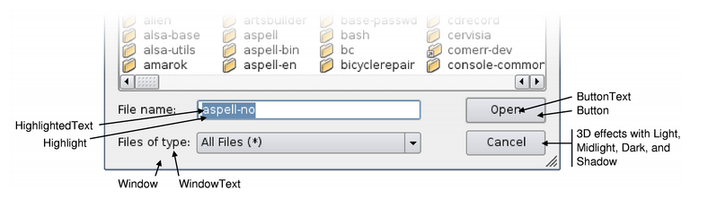
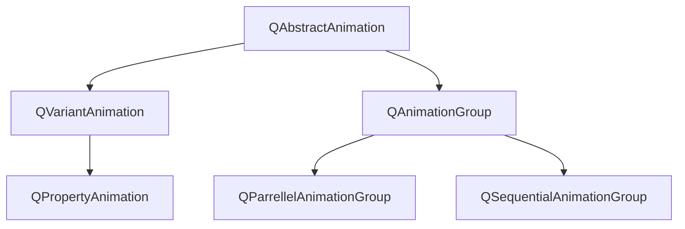
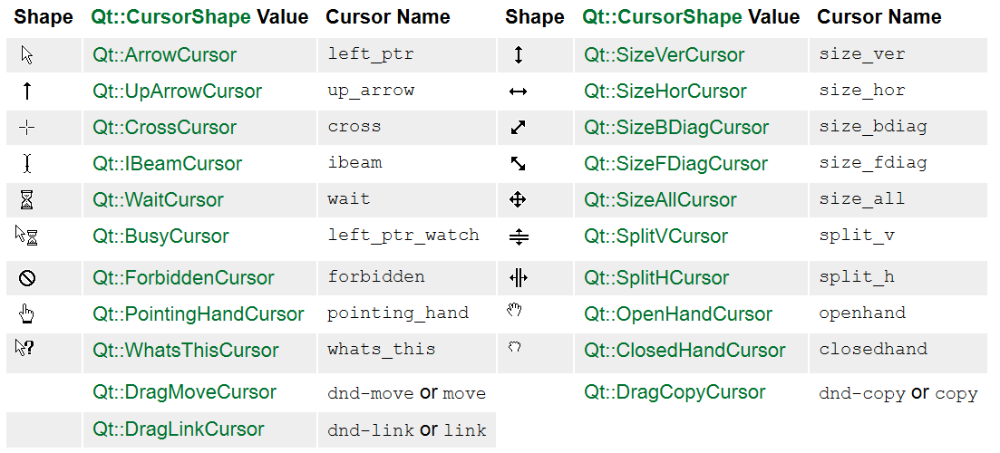

## 26. 颜色

### 26.1 QColor

见[7.1.8 QColor](#7.1.8 QColor)。

### 26.2 QPalette

改变某个控件的颜色外观，如背景、文字颜色等，这个类专门用于管理这些颜色信息，因为每个窗口或者控件都会有这个对象。这个类有2个概念，一个是ColorRole，一个是ColorGroup，故用的最多的函数是setColor。

其中ColorRole是颜色主题，对窗体不同角色的组件进行分类，例如QPalette::Window表示背景色，而QPalette::WindowText是前景色等等。

ColorGroup表示3种状态，QPalette::Active获得焦点激活状态，QPalette::Inactive未激活状态，QPalette::Disable不可用状态。

最重要的3个函数如下。

setColor表示对某个状态的某个角色进行设置，或者不区分状态。

setColorGroup原型对指定的状态一次性设置前景色、按钮、高亮、黑暗等一系列的brush。

setBrush设置指定状态下组件的brush。

 setColor() 和 setBrush()的区别具体取决于**想要纯色还是像素图图案**。

```c++
void setColor(ColorGroup group, ColorRole role, const QColor &color);
void setColor(ColorRole role, const QColor &color);
const QColor &color(ColorGroup group, ColorRole role) const;
const QColor &color(ColorRole role) const;

void setColorGroup(ColorGroup cg, const QBrush &windowText, const QBrush &button, const QBrush &light, const QBrush &dark, const QBrush &mid, const QBrush &text, const QBrush &bright_text, const QBrush &base, const QBrush &window);
void setCurrentColorGroup(ColorGroup cg);
ColorGroup currentColorGroup() const;

void setBrush(ColorRole role, const QBrush &brush);
void setBrush(ColorGroup group, ColorRole role, const QBrush &brush);
```

最好使用当前样式的默认调色板（由 **QGuiApplication::palette()** 返回）并根据需要进行修改。

枚举类型。

```c++
enum QPalette::ColorGroup{
    QPalette::Disabled
    QPalette::Active
    QPalette::Inactive
    QPalette::Normal // Active同义词
}
```

```c++
enum QPalette::ColorRole{
    QPalette::Window // 背景颜色
    QPalette::Background // Window同义词
    QPalette::WindowText // 前景色
    QPalette::Foreground// WindowText同义词
    QPalette::Base//文本框背景色,通常是白色或其他浅色
    QPalette::AlternateBase//在具有交替行颜色的视图中用作备用背景颜色
    QPalette::ToolTipBase//用作 QToolTip 和 QWhatsThis 的背景颜色
    QPalette::ToolTipText//用作 QToolTip 和 QWhatsThis 的前景色
    QPalette::Text//Base 使用的前景色
    QPalette::Button//常规按钮背景颜色
    QPalette::ButtonText//与 Button 颜色一起使用的前景色
    QPalette::BrightText//一种与WindowText非常不同的文本颜色，并形成鲜明对比
    
    // 还有一些3D效果的角色
    QPalette::Light//比Button颜色浅
    QPalette::Midlight//在Button和Light之间
    QPalette::Dark//比Button暗
    QPalette::Mid//在Button和Dark之间
    QPalette::Shadow//很深的颜色,默认是 Qt::black
    
    QPalette::Highlight//用于指示选定项或当前项。默认情况下高亮颜色是Qt::darkBlue
    QPalette::HighlightedText//与突出显示形成对比的文本颜色。默认情况Qt::white
    QPalette::Link//用于未访问的超链接的文本颜色。默认情况下，链接颜色是 Qt::blue
    QPalette::LinkVisited//用于已访问超链接的文本颜色。默认情况下，链接访问的颜色是 Qt::magenta
	QPalette::NoRole//没有角色；此特殊角色通常用于指示尚未分配角色
}
```

```c++
// 注意在Qt中呈现富文本时不使用Link和LinkVisited 角色，并建议使用CSS和QTextDocument::setDefaultStyleSheet()函数来改变链接的外观。例如：
QTextBrowser browser;
QColor linkColor(Qt::red);
QString sheet = QString::fromLatin1("a { text-decoration: underline; color: %1 }").arg(linkColor.name());
browser.document()->setDefaultStyleSheet(sheet);
```

关于颜色角色下图展示了区别。



成员函数。

```c++
//从按钮颜色构造一个调色板。其他颜色会根据此颜色自动计算。窗口也将是按钮颜色
QPalette(const QColor &button);
//从按钮颜色构造一个调色板。其他颜色会根据此颜色自动计算。窗口也将是按钮颜色
QPalette(Qt::GlobalColor button);
// 从按钮颜色和窗口构造调色板。根据这些颜色自动计算其他颜色
QPalette(const QColor &button, const QColor &window);
//构造一个调色板。您可以为 windowText、button、light、dark、mid、text、bright_text、base 和 window 传递画笔、像素图或纯色
QPalette(const QBrush &windowText, const QBrush &button, const QBrush &light, const QBrush &dark, const QBrush &mid, const QBrush &text, const QBrush &bright_text, const QBrush &base, const QBrush &window);

const QBrush &alternateBase() const;//返回当前颜色组的备用基础笔刷
const QBrush &base() const;//返回当前颜色组的基础画笔
const QBrush &brightText() const;//返回当前颜色组的明亮文本前景画笔
const QBrush &brush(ColorGroup group, ColorRole role) const;//返回指定颜色组中的画笔
const QBrush &brush(ColorRole role) const;//返回为当前 ColorGroup 中的给定颜色角色设置的画笔
const QBrush &button() const;//返回当前颜色组的按钮画笔
const QBrush &buttonText() const;//返回当前颜色组的按钮文本前景画笔
const QBrush &light() const;//返回当前颜色组的光刷
const QBrush &link() const;//返回当前颜色组的未访问链接文本画笔
const QBrush &linkVisited() const;//返回当前颜色组的已访问链接文本画笔
const QBrush &mid() const;//返回当前颜色组的中间画笔
const QBrush &midlight() const;//返回当前颜色组的中光笔刷
const QBrush &dark() const;//返回当前颜色组的深色画笔
const QBrush &highlight() const;//返回当前颜色组的高光画笔
const QBrush &highlightedText() const;//返回当前颜色组的高亮文本画笔
const QBrush &shadow() const;//返回当前颜色组的阴影画笔
const QBrush &text() const;//返回当前颜色组的文本前景画笔
const QBrush &toolTipBase() const;//返回当前颜色组的工具提示基础画笔
const QBrush &toolTipText() const;//返回当前颜色组的工具提示文本画笔
const QBrush &window() const;//返回当前颜色组的窗口（一般背景）画笔
const QBrush &windowText() const;//返回当前颜色组的窗口文本（一般前景）画笔

qint64 cacheKey() const;//返回一个数字，该数字标识此 QPalette 对象的内容。如果不同的 QPalette 对象引用相同的内容，则它们可以具有相同的键
bool isBrushSet(ColorGroup cg, ColorRole cr) const;//先前已设置了cg和则返回true
bool isCopyOf(const QPalette &p) const;//使用复制构造函数复制调色板可以测试两个调色板是否相同
bool isEqual(ColorGroup cg1, ColorGroup cg2) const;//cg1等于cg2则返回 true
QPalette resolve(const QPalette &other) const;//返回具有从其他复制的属性的新 QPalette
```

## 27. 菜单和动作

### 27.1 QMenuBar

成员函数。

```c++
QAction *actionAt(const QPoint &pt) const;//如果pt处没有动作或者是分隔符则返回0
QRect actionGeometry(QAction *act) const;//返回作为 QRect 的动作的几何形状

QAction *addAction(const QString &text);
QAction *addAction(const QString &text, const QObject *receiver, const char *member);
QAction *addMenu(QMenu *menu);
QMenu *addMenu(const QString &title);
QMenu *addMenu(const QIcon &icon, const QString &title);
QAction *insertMenu(QAction *before, QMenu *menu);
QAction *addSeparator();
QAction *insertSeparator(QAction *before);
void clear();

void setActiveAction(QAction *act);//将当前活动的动作设置为act
QAction *activeAction() const;

// 将给定小部件设置为直接显示在第一个菜单项的左侧或最后一个菜单项的右侧，具体取决于cornor
void setCornerWidget(QWidget *widget, Qt::Corner corner = Qt::TopRightCorner);
QWidget *cornerWidget(Qt::Corner corner = Qt::TopRightCorner) const;

void setDefaultUp(bool);//设置弹出方向
bool isDefaultUp() const;

void setNativeMenuBar(bool nativeMenuBar);//菜单栏是否将在支持它的平台上用作本机菜单栏
bool isNativeMenuBar() const;
```

信号与槽函数。

```c++
slot virtual void setVisible(bool visible) override;
signal void hovered(QAction *action);//当一个菜单动作被高亮时，这个信号被发出
signal triggered(QAction *action);//当鼠标单击触发属于该菜单栏的菜单中的动作时，会发出此信号
```

### 27.2 QMenu

成员函数。

```c++
QMenu(QWidget *parent = Q_NULLPTR);
QMenu(const QString &title, QWidget *parent = Q_NULLPTR);

QAction *actionAt(const QPoint &pt) const;
QRect actionGeometry(QAction *act) const;
QAction *addAction(const QString &text);
QAction *addAction(const QIcon &icon, const QString &text);
QAction *addAction(const QString &text, const QObject *receiver, const char *member, const QKeySequence &shortcut = 0);//Ctrl+X
QAction *addAction(const QIcon &icon, const QString &text, const QObject *receiver, const char *member, const QKeySequence &shortcut = 0);
QAction *addAction(const QString &text, const QObject *receiver, PointerToMemberFunction method, const QKeySequence &shortcut = 0);
QAction *addAction(const QString &text, Functor functor, const QKeySequence &shortcut = 0);
QAction *addAction(const QString &text, const QObject *context, Functor functor, const QKeySequence &shortcut = 0);
QAction *addAction(const QIcon &icon, const QString &text, const QObject *receiver, PointerToMemberFunction method, const QKeySequence &shortcut = 0);
QAction *addAction(const QIcon &icon, const QString &text, Functor functor, const QKeySequence &shortcut = 0);
QAction *addAction(const QIcon &icon, const QString &text, const QObject *context, Functor functor, const QKeySequence &shortcut = 0);

void setActiveAction(QAction *act);//将当前突出显示的动作设置act
QAction *activeAction() const;

void setDefaultAction(QAction *act);//这将默认操作设置为采取行动
QAction *defaultAction() const;
QAction *menuAction() const;//返回与此菜单关联的操作

QAction *addMenu(QMenu *menu);
QMenu *addMenu(const QString &title);
QMenu *addMenu(const QIcon &icon, const QString &title);
QAction *insertMenu(QAction *before, QMenu *menu);

QAction *addSection(const QString &text);//创建一个带有isSeparator()返回true且有文本提示的动作
QAction *addSection(const QIcon &icon, const QString &text);
QAction *insertSection(QAction *before, const QString &text);
QAction *insertSection(QAction *before, const QIcon &icon, const QString &text);

QAction *insertSeparator(QAction *before);
QAction *addSeparator();

void clear();
bool isEmpty() const;.//如果菜单中没有插入可见操作，则返回 true，否则返回 false
void setAsDockMenu();//通过选项单击应用程序停靠图标，将此菜单设置为可用的停靠菜单。仅在 macOS 上可用
void popup(const QPoint &p, QAction *atAction = Q_NULLPTR);//显示菜单，要将小部件的本地坐标转换为全局坐标，请使用 QWidget::mapToGlobal()

QAction *exec();//等效于 exec(pos())
// 常见用法是将菜单定位在当前鼠标位置：exec(QCursor::pos());或者exec(somewidget.mapToGlobal(QPoint(0, 0)));或者在QMouseEvent事件中使用exec(e->globalPos());
QAction *exec(const QPoint &p, QAction *action = Q_NULLPTR);
// 将弹出菜单，以便指定的动作 at 出现在全局位置 pos。如果未指定 at，则菜单出现在位置 pos
static QAction *QMenu::exec(QList<QAction *> actions, const QPoint &pos, QAction *at = Q_NULLPTR, QWidget *parent = Q_NULLPTR)
/*
QMenu menu;
QAction *at = actions[0]; // 假定不为空
foreach (QAction *a, actions)
    menu.addAction(a);
menu.exec(pos, at);
*/

void setIcon(const QIcon &icon);
QIcon icon() const;

void setSeparatorsCollapsible(bool collapse);//此属性保存是否应折叠连续的分隔符
bool separatorsCollapsible() const;

void setTearOffEnabled(bool);//该属性保存菜单是否支持被撕掉
bool isTearOffEnabled() const;

void showTearOffMenu(const QPoint &pos);//强制显示撕下的菜单，使其出现在用户桌面上指定的全局位置
void showTearOffMenu();//此功能将强制显示撕下的菜单，使其出现在鼠标光标下的用户桌面上

void hideTearOffMenu();//此功能将强制隐藏撕下的菜单，使其从用户桌面上消失
bool isTearOffMenuVisible() const;

void setTitle(const QString &title);
QString title() const;

void setToolTipsVisible(bool visible);//此属性保存菜单操作的工具提示是否应该可见,默认false
bool toolTipsVisible() const;
```

信号函数。

```c++
void aboutToHide();
void aboutToShow();
void hovered(QAction *action)
void triggered(QAction *action);
```

### 27.3 QActionGroup

QActionGroup 类将动作组合在一起。在某些情况下，将 QAction 对象组合在一起很有用。例如，如果您有一个左对齐动作、一个右对齐动作、一个对齐动作和一个居中动作，那么**任何时候都应该只有其中一个动作处于活动状态。实现此目的的一种简单方法是将动作分组到一个动作组中**。
这是一个示例（来自菜单示例）：

```c++
alignmentGroup = new QActionGroup(this);
alignmentGroup->addAction(leftAlignAct);
alignmentGroup->addAction(rightAlignAct);
alignmentGroup->addAction(justifyAct);
alignmentGroup->addAction(centerAct);
leftAlignAct->setChecked(true);
```

在这里，我们创建一个新的操作组。由于动作组默认是独占的，所以任何时候只检查组中的一个动作。

当选择QActionGroup的某个动作时，它会发出triggered（）信号。动作组中的每个动作都像往常一样发出其trigger() 信号。如上所述，**一个动作组默认是独占的**；它确保在任何时候只有一个可检查的操作处于活动状态。如果您想对可检查的操作进行分组而不使它们排他性，**您可以通过调用 setExclusive(false) 来关闭排他性**。
可以使用 addAction() 将动作添加到动作组中，但通常在创建动作时指定组更方便；这确保了动作是由父级自动创建的。通过在组中添加分隔符动作，可以在视觉上将动作彼此分开；创建一个动作并使用 QAction 的 setSeparator() 函数将其视为分隔符。使用 QWidget::addActions() 函数将操作组添加到小部件。

公共函数。

```c++
QList<QAction *> actions() const
QAction *addAction(QAction *action);
QAction *addAction(const QString &text);
QAction *addAction(const QIcon &icon, const QString &text);
QAction *checkedAction() const; // 返回组中当前检查的操作，如果没有检查，则返回 0
bool isEnabled() const;//操作组是否启用,除非已明确禁用，否则组中的每个操作都将启用或禁用
bool isExclusive() const;//动作组是否进行独占检查 如果独占为真，则动作组中只有一个可检查的动作可以在任何时候处于活动状态
bool isVisible() const; //操作组是否可见,操作组中的每个操作都将匹配该组的可见状态，除非它已被显式隐藏
void removeAction(QAction *action);//从此组中删除操作。结果，该操作将没有父级
```

槽函数。

```c++
void setDisabled(bool b);
void setEnabled(bool);
void setExclusive(bool);
void setVisible(bool);
```

信号函数。

```c++
void hovered(QAction *action);//当用户突出显示操作组中的给定操作时，会发出此信号；例如，当用户将光标悬停在菜单选项、工具栏按钮上或按下操作的快捷键组合时
void triggered(QAction *action);
```

### 27.4 QAction

枚举值。

调用 QAction::activate() 时使用此枚举类型。

```c++
enum QAction::ActionEvent{
    QAction::Trigger //触发trigger信号
    QAction::Hover // 触发hover信号
}
```

此枚举描述了如何将操作移动到 macOS 上的应用程序菜单中。

```c++
enum QAction::MenuRole{
    QAction::NoRole//此操作不应放入应用程序菜单
    QAction::TextHeuristicRole//此操作应根据 QMenuBar 文档中描述的操作文本放置在应用程序菜单中
    QAction::ApplicationSpecificRole//此操作应放在具有应用程序特定角色的应用程序菜单中
    QAction::AboutQtRole//此操作处理“关于 Qt”菜单项
    QAction::AboutRole//此操作应放置在应用程序菜单中“关于”菜单项的位置。菜单项的文本将设置为“关于<应用程序名称>”
    QAction::PreferencesRole//此操作应放置在应用程序菜单中“首选项...”菜单项的位置
    QAction::QuitRole//此操应放置在应用程序菜单中退出菜单项的位置
}
```

此枚举定义用户界面中操作的优先级。

```c++
enum QAction::Priority{   
    QAction::LowPriority
    QAction::NormalPriority
    QAction::HighPriority
}
```

成员函数。

```c++
QAction(const QString &text, QObject *parent = nullptr);
QAction(const QIcon &icon, const QString &text, QObject *parent = nullptr);

QWidget *parentWidget() const;//返回父小部件
QList<QGraphicsWidget *> associatedGraphicsWidgets() const;//返回已添加此操作的小部件列表
QList<QWidget *> associatedWidgets() const;//返回已添加此操作的小部件列表

slot void hover();//等价于activate(Hover)的便利槽
slot void toggle();//这是检查属性的便利功能。连接到它以将选中状态更改为相反的状态
slot void trigger();//等价于activate(Trigger)的便利槽
void activate(ActionEvent event);//发送triggered或hovered信号
bool showStatusText(QWidget *widget = Q_NULLPTR);

slot void setEnabled(bool);
slot void setDisabled(bool b);
bool isEnabled() const;

slot void setVisible(bool);
bool isVisible() const;

// 设置动作组之前必须设置setCheckable(true),默认是独占式动作,组内动作互斥
// 另外如果动作是有图标的,那么可能无法显示独占的视觉效果
void setActionGroup(QActionGroup *group);
QActionGroup *actionGroup() const;

// 动作是否可以自动重复
void setAutoRepeat(bool);
bool autoRepeat() const;

// 设置动作是具有开/关状态的动作
void setCheckable(bool);
bool isCheckable() const;

// 在isCheckable()=true时可用,是否选中该操作,默认false
slot void setChecked(bool);
bool isChecked() const;

void setData(const QVariant &userData);
QVariant data() const;

void setFont(const QFont &font);
QFont font() const;

void setIcon(const QIcon &icon);
QIcon icon() const;

void setIconText(const QString &text);
QString iconText() const;

// 是否在菜单中显示图标
void setIconVisibleInMenu(bool visible);
bool isIconVisibleInMenu() const;

void setMenu(QMenu *menu);
QMenu *menu() const;

// 设置动作的菜单角色,默认所有动作都具有 TextHeuristicRole
void setMenuRole(MenuRole menuRole);
MenuRole menuRole() const;

// 设置动作在用户界面中的优先级。例如，当工具栏设置了 Qt::ToolButtonTextBesideIcon 模式时，具有 LowPriority 的操作将不会显示文本标签
void setPriority(Priority priority);
Priority priority() const;

void setSeparator(bool b);
bool isSeparator() const;

void setShortcut(const QKeySequence &shortcut);
QKeySequence shortcut() const;

// 设置动作快捷方式的上下文。此属性的有效值可在Qt::ShortcutContext中找到。默认 Qt::WindowShortcut
void setShortcutContext(Qt::ShortcutContext context);
Qt::ShortcutContext shortcutContext() const;

void setShortcuts(const QList<QKeySequence> &shortcuts);
void setShortcuts(QKeySequence::StandardKey key);
QList<QKeySequence> shortcuts() const;

// 设置动作的状态提示,状态提示显示在操作的顶级父窗口小部件提供的所有状态栏上,默认空字符串
void setStatusTip(const QString &statusTip);
QString statusTip() const;

void setText(const QString &text);
QString text() const;

// 设置动作的工具提示,如果未指定工具提示,则使用动作的名称。默认情况下，工具提示是动作名称
void setToolTip(const QString &tip);
QString toolTip() const;

// 设置动作的帮助文本,提供操作的简要说明
void setWhatsThis(const QString &what);
QString whatsThis() const;
```

信号函数。

```c++
void changed();//当动作发生变化时，会发出此信号
void hovered();//当用户突出显示一个动作时发出此信号；例如，当用户将光标悬停在菜单选项、工具栏按钮上或按下操作的快捷键组合时
void toggled(bool checked);//isChecked()状态改变时发出此信号。如果选中了该操作，则checked为true，如未选中该操作则为 false
void triggered(bool checked = false);//用户激活操作时发出此信号；例如用户单击菜单选项、工具栏按钮或调用trigger()。注意调用setChecked()或 toggle()时不会发出它
```

## 28. 单元测试

Qt Test 是一个用于对基于 Qt 的应用程序和库进行单元测试的框架。 Qt Test 提供了单元测试框架中常见的所有功能以及用于测试图形用户界面的扩展。
Qt Test 旨在简化基于 Qt 的应用程序和库的单元测试的编写。要创建测试，请将 QObject 子类化并为其添加一个或多个私有插槽。每个私有插槽都是您测试中的一个测试函数。 QTest::qExec() 可用于执行测试对象中的所有测试函数。此外，还有四个私有槽不被视为测试功能。它们将由测试框架执行，可用于初始化和清理整个测试或当前测试功能。一个例子可见[46-AutoTestFramework\AreaTest](46-AutoTestFramework\AreaTest)。

initTestCase() 将在第一个测试函数执行之前被调用。
cleanupTestCase() 将在最后一个测试函数执行后被调用。
init() 将在每个测试函数执行之前被调用。
cleanup() 将在每个测试函数之后调用。

如果 initTestCase() 失败，则不会执行任何测试函数。如果 init() 失败，则不会执行下面的测试函数，测试将继续下一个测试函数。

例子。

```c++
class MyFirstTest: public QObject
{
      Q_OBJECT
  private slots:
      void initTestCase()
      { qDebug("called before everything else"); }
      void myFirstTest()
      { QVERIFY(1 == 1); }
      void mySecondTest()
      { QVERIFY(1 != 2); }
      void cleanupTestCase()
      { qDebug("called after myFirstTest and mySecondTest"); }
};
```

如果您使用 qmake 作为构建工具，只需将以下内容添加到您的项目文件中：

```c++
QT += testlib
```

如果使用cmake，则需要

```c++
CONFIG += testcase
```

在QTest Namespace命名空间下。

枚举类型。这个枚举对不同的测试进行编号。

```c++
enum QTest::AttributeIndex{
    QTest::AI_Undefined
    QTest::AI_Name
    QTest::AI_Result
    QTest::AI_Tests
    QTest::AI_Failures
    QTest::AI_Errors
    QTest::AI_Type
    QTest::AI_Description
    QTest::AI_PropertyValue
    QTest::AI_QTestVersion
    QTest::AI_QtVersion
    QTest::AI_File
    QTest::AI_Line
    QTest::AI_Metric
    QTest::AI_Tag
    QTest::AI_Value
    QTest::AI_Iterations
}
```

此枚举描述了密钥处理的可能操作。

```c++
enum QTest::KeyAction{
    QTest::Press
    QTest::Release
    QTest::Click
    QTest::Shortcut
}
```

枚举指定测试日志消息的种类。

```c++
enum QTest::LogElementType{  
    QTest::LET_Undefined
    QTest::LET_Property
    QTest::LET_Properties
    QTest::LET_Failure
    QTest::LET_Error
    QTest::LET_TestCase
    QTest::LET_TestSuite
    QTest::LET_Benchmark
    QTest::LET_SystemError
}
```

此枚举描述了鼠标处理的可能操作。

```c++
enum QTest::MouseAction{
    QTest::MousePress
    QTest::MouseRelease
    QTest::MouseClick
    QTest::MouseDClick
    QTest::MouseMove
}
```

这个枚举列出了所有可以进行基准测试的东西。

```c++
enum QTest::QBenchmarkMetric{
    QTest::FramesPerSecond
    QTest::BitsPerSecond
    QTest::BytesPerSecond
    QTest::WalltimeMilliseconds
    QTest::WalltimeNanoseconds
    QTest::BytesAllocated
    QTest::Events
    QTest::CPUTicks
    QTest::CPUMigrations
    QTest::CPUCycles
    QTest::RefCPUCycles
    QTest::BusCycles
    QTest::StalledCycles
    QTest::InstructionReads
    QTest::Instructions
    QTest::BranchInstructions
    QTest::BranchMisses
    QTest::CacheReferences
    QTest::CacheMisses
    QTest::CacheReads
    QTest::CacheReadMisses
    QTest::CacheWrites
    QTest::CacheWriteMisses
    QTest::CachePrefetches
    QTest::CachePrefetchMisses
    QTest::ContextSwitches
    QTest::PageFaults
    QTest::MinorPageFaults
    QTest::MajorPageFaults
    QTest::AlignmentFaults
    QTest::EmulationFaults
}
```

此枚举描述了用于处理 QVERIFY() 或 QCOMPARE() 宏的预期失败的模式。

```c++
enum QTest::TestFailMode{  
    QTest::Abort
    QTest::Continue
}
```

成员函数。

```c++
int qExec(QObject *testObject, int argc = 0, char **argv = Q_NULLPTR);//执行在 testObject 中声明的测试
int qExec(QObject *testObject, const QStringList &arguments);
void qSleep(int ms);//休眠 ms 毫秒，阻止执行测试。 qSleep() 不会做任何事件处理并且让你的测试没有响应。睡眠时网络通信可能会超时。使用 qWait() 进行非阻塞睡眠
static void qWait(int ms);//等待 ms 毫秒。在等待期间，将处理事件，并且您的测试将保持对用户界面事件或网络通信的响应
const char *currentAppName();//返回当前执行的二进制文件的名称
const char *currentDataTag();//返回当前测试数据的名称。如果测试没有任何分配的测试数据，则函数返回 0
bool currentTestFailed();//如果当前测试函数失败，则返回 true，否则返回 false
const char *currentTestFunction();//返回当前执行的测试函数的名称

void addColumn(const char *name, T *dummy = nullptr);//将类型为T的列添加到当前测试数据。name 是列的名称。dummy 是错误编译器的一种解决方法，可以忽略
QTestData &addRow(const char *format, ...);//将新行追加到当前测试数据。函数的参数被传递给 qsnprintf() 以根据格式进行格式化
QTestData &newRow(const char *dataTag);

void setBenchmarkResult(qreal result, QBenchmarkMetric metric);//将此测试功能的基准测试结果设置为结果。如果您想在不使用 QBENCHMARK 宏的情况下报告基准测试结果，请使用此功能
const char *benchmarkMetricName(QBenchmarkMetric metric);//将枚举值度量作为字符串返回
const char *benchmarkMetricUnit(QBenchmarkMetric metric);//重新调整指定度量的度量单位。

QTouchDevice *createTouchDevice(QTouchDevice::DeviceType devType = QTouchDevice::TouchScreen);//创建一个 devType 类型的虚拟触摸设备，用于模拟触摸事件
QSharedPointer<QTemporaryDir> qExtractTestData(const QString &dirName);

void ignoreMessage(QtMsgType type, const char *message);//忽略由 qDebug()、qInfo() 或 qWarning() 创建的消息。如果输出了对应类型的消息，则会从测试日志中删除。如果测试完成并且没有输出消息，则测试失败将附加到测试日志中
void ignoreMessage(QtMsgType type, const QRegularExpression &messagePattern);//忽略由 qDebug()、qInfo() 或 qWarning() 创建的消息。如果输出了与相应类型的messagePattern匹配的消息，则将其从测试日志中删除。如果测试完成并且没有输出消息，则测试失败将附加到测试日志中

//等待超时毫秒或直到窗口处于活动状态
static bool qWaitForWindowActive(QWindow *window, int timeout = 5000);
static bool qWaitForWindowActive(QWidget *widget, int timeout = 5000);
// 等待超时毫秒或直到窗口暴露。如果窗口在 timeout 毫秒内暴露，则返回 true，否则返回 false
static bool qWaitForWindowExposed(QWindow *window, int timeout = 5000);
static bool qWaitForWindowExposed(QWidget *widget, int timeout = 5000);

//返回指向字符串的指针，该字符串表示为以空格分隔的十六进制字符序列。如果输入被认为太长，则将其截断。在返回的字符串中将 trucation 指示为末尾的省略号
char *toHexRepresentation(const char *ba, int length);
char *toPrettyCString(const char *unicode, int length);
char *toPrettyUnicode(const ushort *unicode, int length);
```

不常用函数。

```c++
bool compare_ptr_helper(const volatile void *t1, const volatile void *t2, const char *actual, const char *expected, const char *file, int line)
bool compare_ptr_helper(const volatile void *t1, std::nullptr_t, const char *actual, const char *expected, const char *file, int line);
bool compare_ptr_helper(std::nullptr_t, const volatile void *t2, const char *actual, const char *expected, const char *file, int line);

void keyClick(QWidget *widget, Qt::Key key, Qt::KeyboardModifiers modifier = Qt::NoModifier, int delay = -1);
void keyClick(QWindow *window, char key, Qt::KeyboardModifiers modifier = Qt::NoModifier, int delay = -1);
void keyClick(QWidget *widget, char key, Qt::KeyboardModifiers modifier = Qt::NoModifier, int delay = -1);
void keyClick(QWindow *window, Qt::Key key, Qt::KeyboardModifiers modifier = Qt::NoModifier, int delay = -1);
void keyClicks(QWidget *widget, const QString &sequence, Qt::KeyboardModifiers modifier = Qt::NoModifier, int delay = -1);
void keyEvent(KeyAction action, QWidget *widget, Qt::Key key, Qt::KeyboardModifiers modifier = Qt::NoModifier, int delay = -1);
void keyEvent(KeyAction action, QWindow *window, Qt::Key key, Qt::KeyboardModifiers modifier = Qt::NoModifier, int delay = -1);
void keyEvent(KeyAction action, QWidget *widget, char ascii, Qt::KeyboardModifiers modifier = Qt::NoModifier, int delay = -1);
void keyEvent(KeyAction action, QWindow *window, char ascii, Qt::KeyboardModifiers modifier = Qt::NoModifier, int delay = -1);
void keyPress(QWidget *widget, Qt::Key key, Qt::KeyboardModifiers modifier = Qt::NoModifier, int delay = -1);
void keyPress(QWindow *window, Qt::Key key, Qt::KeyboardModifiers modifier = Qt::NoModifier, int delay = -1);
void keyPress(QWidget *widget, char key, Qt::KeyboardModifiers modifier = Qt::NoModifier, int delay = -1);
void keyPress(QWindow *window, char key, Qt::KeyboardModifiers modifier = Qt::NoModifier, int delay = -1);
void keyRelease(QWidget *widget, Qt::Key key, Qt::KeyboardModifiers modifier = Qt::NoModifier, int delay = -1);
void keyRelease(QWindow *window, Qt::Key key, Qt::KeyboardModifiers modifier = Qt::NoModifier, int delay = -1);
void keyRelease(QWidget *widget, char key, Qt::KeyboardModifiers modifier = Qt::NoModifier, int delay = -1)void keyRelease(QWindow *window, char key, Qt::KeyboardModifiers modifier = Qt::NoModifier, int delay = -1);
void mouseClick(QWidget *widget, Qt::MouseButton button, Qt::KeyboardModifiers modifier = Qt::KeyboardModifiers(), QPoint pos = QPoint(), int delay = -1);
void mouseClick(QWindow *window, Qt::MouseButton button, Qt::KeyboardModifiers stateKey = Qt::KeyboardModifiers(), QPoint pos = QPoint(), int delay = -1);
void mouseDClick(QWidget *widget, Qt::MouseButton button, Qt::KeyboardModifiers modifier = Qt::KeyboardModifiers(), QPoint pos = QPoint(), int delay = -1);
void mouseDClick(QWindow *window, Qt::MouseButton button, Qt::KeyboardModifiers stateKey = Qt::KeyboardModifiers(), QPoint pos = QPoint(), int delay = -1);
void mouseMove(QWidget *widget, QPoint pos = QPoint(), int delay = -1);
void mouseMove(QWindow *window, QPoint pos = QPoint(), int delay = -1);
void mousePress(QWidget *widget, Qt::MouseButton button, Qt::KeyboardModifiers modifier = Qt::KeyboardModifiers(), QPoint pos = QPoint(), int delay = -1);
void mousePress(QWindow *window, Qt::MouseButton button, Qt::KeyboardModifiers stateKey = Qt::KeyboardModifiers(), QPoint pos = QPoint(), int delay = -1);
void mouseRelease(QWidget *widget, Qt::MouseButton button, Qt::KeyboardModifiers modifier = Qt::KeyboardModifiers(), QPoint pos = QPoint(), int delay = -1);
void mouseRelease(QWindow *window, Qt::MouseButton button, Qt::KeyboardModifiers stateKey = Qt::KeyboardModifiers(), QPoint pos = QPoint(), int delay = -1);
QTouchEventSequence touchEvent(QWidget *widget, QTouchDevice *device, bool autoCommit = true);
QTouchEventSequence touchEvent(QWindow *window, QTouchDevice *device, bool autoCommit = true);
char *toString(const QUuid &uuid);
char *toString(const QLatin1String &string);
char *toString(const QByteArray &ba);
char *toString(const QTime &time);
char *toString(const QDate &date);
char *toString(const QDateTime &dateTime);
char *toString(const QChar &character);
char *toString(const QPoint &point);
char *toString(const QSize &size);
char *toString(const QRect &rectangle);
char *toString(const QPointF &point);
char *toString(const QSizeF &size);
char *toString(const QRectF &rectangle);
char *toString(const QUrl &url);
char *toString(const QString &string);
char *toString(const QVariant &variant);
char *toString(std::nullptr_t);;
char *toString(QSizePolicy::Policy p)
char *toString(QSizePolicy::ControlTypes cts);
char *toString(QSizePolicy::ControlType ct);
char *toString(QSizePolicy sp);
char *toString(const T &value);
```

宏定义。

```c++
QBENCHMARK//此宏用于测量测试中代码的性能。要进行基准测试的代码包含在此宏之后的代码块中

QBENCHMARK_ONCE//QBENCHMARK_ONCE 宏用于通过运行一次来测量代码块的性能

QCOMPARE(actual, expected)//QCOMPARE 宏使用等号运算符将实际值与预期值进行比较。如果实际和预期相同，则继续执行。如果不是，则在测试日志中记录失败，并且不会进一步执行测试

QEXPECT_FAIL(dataIndex, comment, mode)//QEXPECT_FAIL() 宏将下一个 QCOMPARE() 或 QVERIFY() 标记为预期失败。将报告预期的失败，而不是向测试日志添加失败

QFAIL(message)//此宏可用于强制测试失败。测试停止执行，失败消息将附加到测试日志中

QFETCH(type, name)//fetch 宏在堆栈上创建一个名为 name 的局部变量，其类型为 type。 name 必须与测试数据中的元素名称匹配。如果不存在这样的元素，则测试将断言

QFINDTESTDATA(filename)//为文件名引用的 testdata 文件返回一个 QString，如果找不到 testdata 文件，则返回一个空的 QString

QSKIP(description)//如果从测试函数调用，QSKIP() 宏会停止执行测试，而不会将失败添加到测试日志。您可以使用它来跳过在当前配置中没有意义的测试。文本描述附加到测试日志中，并应包含对无法执行测试的原因的解释

QTEST(actual, testElement)//QTEST() 是 QCOMPARE() 的一个便利宏，它将实际值与测试数据中的元素 testElement 进行比较。如果没有这样的元素，则测试断言

QTEST_APPLESS_MAIN(TestClass)//实现一个执行 TestClass 中所有测试的 main() 函数

QTEST_GUILESS_MAIN(TestClass)//实现一个 main() 函数，该函数实例化一个 QCoreApplication 对象和 TestClass，并按照定义的顺序执行所有测试。使用此宏构建独立的可执行文件

QTEST_MAIN(TestClass)//实现一个 main() 函数，该函数实例化一个应用程序对象和 TestClass，并按照定义的顺序执行所有测试。使用此宏构建独立的可执行文件

QTRY_COMPARE(actual, expected)//通过调用 QTRY_COMPARE_WITH_TIMEOUT() 执行实际值和预期值的比较，超时为 5 秒

QTRY_COMPARE_WITH_TIMEOUT(actual, expected, timeout)//QTRY_COMPARE_WITH_TIMEOUT() 宏与 QCOMPARE() 类似，但重复执行实际值和预期值的比较，直到两个值相等或达到超时（以毫秒为单位）。在每次比较之间，将处理事件。如果达到超时，则在测试日志中记录失败，并且不会进一步执行测试

QTRY_VERIFY2(condition, message)//通过调用 QTRY_VERIFY2_WITH_TIMEOUT() 检查条件，超时为 5 秒。如果条件仍然为假，则输出消息。该消息是一个纯 C 字符串

QTRY_VERIFY(condition)//通过调用 QTRY_VERIFY_WITH_TIMEOUT() 来检查条件，超时为 5 秒

QTRY_VERIFY2_WITH_TIMEOUT(condition, message, timeout)//QTRY_VERIFY2_WITH_TIMEOUT 宏与 QTRY_VERIFY_WITH_TIMEOUT() 类似，只是它在指定超时（以毫秒为单位）后条件仍然为假时输出详细消息。该消息是一个纯 C 字符串

QTRY_VERIFY_WITH_TIMEOUT(condition, timeout)//QTRY_VERIFY_WITH_TIMEOUT() 宏类似于 QVERIFY()，但会反复检查条件，直到条件变为真或达到超时（以毫秒为单位）。在每次评估之间，将处理事件。如果达到超时，则在测试日志中记录失败，并且不会进一步执行测试

QVERIFY2(condition, message)//QVERIFY2() 宏的行为与 QVERIFY() 完全相同，只是它在条件为假时输出详细消息。该消息是一个纯 C 字符串

QVERIFY(condition)//QVERIFY() 宏检查条件是否为真。如果为真，则继续执行。如果不是，则在测试日志中记录失败，并且不会进一步执行测试

QVERIFY_EXCEPTION_THROWN(expression, exceptiontype)//QVERIFY_EXCEPTION_THROWN 宏执行一个表达式并尝试捕获从该表达式抛出的异常。如果表达式抛出异常并且其类型与 exceptiontype 相同或 exceptiontype 可以替换为抛出异常的类型（即通常抛出异常的类型是从 exceptiontype 公开派生的），则将继续执行。如果抛出了不可替代类型的异常，或者表达式根本没有抛出异常，那么将在测试日志中记录失败，并且不会进一步执行测试

QWARN(message)//将消息作为警告附加到测试日志。这个宏可以在你的测试中的任何地方使用
```

## 29. 插件拓展

Qt 提供了两个用于创建插件的 API： 一个用于编写 Qt 本身扩展的高级 API：自定义数据库驱动程序、图像格式、文本编解码器、自定义样式等；二是用于扩展 Qt 应用程序的低级 API。
例如，如果您想编写自定义 QStyle 子类并让 Qt 应用程序动态加载它，您将使用更高级别的 API。
由于较高级别的 API 是在较低级别的 API 之上构建的，因此两者都存在一些共同问题。
如果您想提供用于 Qt Designer 的插件，请参阅 Qt Designer 模块文档。

高级API插件：

编写扩展 Qt 本身的插件是通过继承适当的插件基类、实现一些功能并添加宏来实现的。
有几个插件基类。派生插件默认存储在标准插件目录的子目录中。如果插件没有存储在适当的目录中，Qt 将找不到插件。下表总结了插件基类。有些类是私有的，因此没有记录。您可以使用它们，但没有与更高 Qt 版本的兼容性承诺。


如果有一个名为MyStyle的新样式类要作为插件提供，则需要按如下方式定义该类（mystyleplugin.h）：

```c++
class MyStylePlugin : public QStylePlugin
  {
      Q_OBJECT
      Q_PLUGIN_METADATA(IID "org.qt-project.Qt.QStyleFactoryInterface" FILE "mystyleplugin.json")
  public:
      QStyle *create(const QString &key);
  };
```

确保类实现位于 .cpp 文件中：

```c++
#include "mystyleplugin.h"

QStyle *MyStylePlugin::create(const QString &key)
{
    if (key.toLower() == "mystyle")
    	return new MyStyle;
    return 0;
}
```

（请注意，QStylePlugin 不区分大小写，我们的 create() 实现中使用了小写版本的密钥；大多数其他插件都区分大小写。）此外，包含描述插件的元数据的 json 文件（mystyleplugin.json）大多数插件都需要。对于样式插件，它只包含可由插件创建的样式列表：

```json
{ "Keys": [ "mystyleplugin" ] }
```

json 文件中需要提供的信息类型取决于插件，有关文件中需要包含的信息的详细信息，请参阅类文档。
对于数据库驱动程序、图像格式、文本编解码器和大多数其他插件类型，不需要显式创建对象。 Qt 会根据需要找到并创建它们。样式是一个例外，因为您可能希望在代码中显式设置样式。要应用样式，请使用如下代码：

```c++
 QApplication::setStyle(QStyleFactory::create("MyStyle"));
```

一些插件类需要实现额外的功能。有关必须为每种类型的插件重新实现的虚函数的详细信息，请参阅类文档。

**低级API插件。**

不仅 Qt 本身，Qt 应用程序也可以通过插件进行扩展。这需要应用程序使用 QPluginLoader 检测和加载插件。在这种情况下，插件可以提供任意功能，并且不限于数据库驱动程序、图像格式、文本编解码器、样式以及扩展 Qt 功能的其他类型的插件。通过插件使应用程序可扩展涉及以下步骤： 定义一组用于与插件通信的接口（仅具有纯虚函数的类）。
使用 **Q_DECLARE_INTERFACE() 宏**告诉 Qt 的元对象系统有关接口的信息。
在应用程序中使用 QPluginLoader 来加载插件。
使用 qobject_cast() 来测试插件是否实现了给定的接口。
编写插件涉及以下步骤： 声明一个从 QObject 和插件想要提供的接口继承的插件类。
使用 **Q_INTERFACES() 宏告诉 Qt 的元对象系统有关接口的信息**。
使用 **Q_PLUGIN_METADATA() 宏导出插件**。
使用合适的 .pro 文件构建插件。
例如，这是一个接口类的定义：

```c++
class FilterInterface
  {
  public:
      virtual ~FilterInterface() {}

      virtual QStringList filters() const = 0;
      virtual QImage filterImage(const QString &filter, const QImage &image,
                                 QWidget *parent) = 0;
  };
```

这是实现该接口的插件类的定义：

```c++
#include <QObject>
#include <QtPlugin>
#include <QStringList>
#include <QImage>

#include <plugandpaint/interfaces.h>

class ExtraFiltersPlugin : public QObject, public FilterInterface
{
      Q_OBJECT
      Q_PLUGIN_METADATA(IID "org.qt-project.Qt.Examples.PlugAndPaint.FilterInterface" FILE "extrafilters.json")
      Q_INTERFACES(FilterInterface)

  public:
      QStringList filters() const;
      QImage filterImage(const QString &filter, const QImage &image,
                         QWidget *parent);
};
```

Plug &amp; Paint 示例文档详细解释了这个过程。有关特定于 Qt Designer 的问题的信息，另请参阅为 Qt Designer 创建自定义小部件。您还可以查看 Echo 插件示例，这是一个关于如何实现扩展 Qt 应用程序的插件的更简单的示例。请注意，必须先初始化 QCoreApplication，然后才能加载插件。

**定位插件。**

Qt 应用程序自动知道哪些插件可用，因为插件存储在标准插件子目录中。因为这个应用程序不需要任何代码来查找和加载插件，因为 Qt 会自动处理它们。
在开发过程中，插件的目录是 QTDIR/plugins（其中 QTDIR 是安装 Qt 的目录），每种类型的插件都在该类型的子目录中，例如，styles。如果您希望您的应用程序使用插件并且您不想使用标准插件路径，请让您的安装过程确定您要用于插件的路径，并保存路径，例如，通过使用 QSettings，为应用程序在运行时读取。然后应用程序可以使用此路径调用 QCoreApplication::addLibraryPath() 并且您的插件将可供应用程序使用。请注意，路径的最后部分（例如样式）不能更改。
如果您希望插件可加载，那么一种方法是在应用程序下创建一个子目录，并将插件放在该目录中。如果您分发 Qt 附带的任何插件（位于 plugins 目录中的插件），您必须将插件所在的 plugins 下的子目录复制到您的应用程序根文件夹（即，不包括 plugins 目录）。

**静态插件。**

将插件包含在应用程序中的正常且最灵活的方法是将其编译为单独提供的动态库，并在运行时检测和加载。
插件可以静态链接到您的应用程序中。如果您构建 Qt 的静态版本，这是包含 Qt 预定义插件的唯一选项。使用静态插件可以减少部署出错的可能性，但缺点是如果不完全重建和重新分发应用程序，就无法添加插件的功能。
要静态链接插件，您需要使用 QTPLUGIN 将所需的插件添加到您的构建中。
在您的应用程序的 .pro 文件中，您需要以下条目：

```c++
QTPLUGIN     += qjpeg \
                  qgif \
                  qkrcodecs
```

qmake 会自动将插件添加到 QTPLUGIN 中，这些插件通常是使用的 Qt 模块所需的（参见 QT），而更专业的插件需要手动添加。可以根据类型覆盖自动添加的插件的默认列表。例如，要链接最小插件而不是默认的 Qt 平台适配插件，请使用：

```c++
QTPLUGIN.platforms = qminimal
```

如果您既不想自动链接默认插件，也不想自动链接最小 QPA 插件，请使用：

```c++
QTPLUGIN.platforms = -
```

默认值已针对开箱即用的最佳体验进行了调整，但可能会不必要地使应用程序膨胀。建议检查 qmake 构建的链接器命令行并消除不必要的插件。

为了实际链接和实例化静态插件，应用程序代码中还需要Q_IMPORT_PLUGIN（）宏，但这些宏是由qmake自动生成并添加到应用程序项目中的。
如果不希望自动链接添加到QTPLUGIN的所有插件，请从CONFIG变量中删除import_plugins：

```c++
CONFIG -= import_plugins
```

也可以按照以下步骤创建自己的静态插件： 将 CONFIG += static 添加到插件的 .pro 文件中。
在您的应用程序中使用 Q_IMPORT_PLUGIN() 宏。
如果插件附带 qrc 文件，请在您的应用程序中使用 Q_INIT_RESOURCE() 宏。
使用 .pro 文件中的 LIBS 将您的应用程序与插件库链接。
有关如何执行此操作的详细信息，请参阅 Plug &amp; Paint 示例和相关的基本工具插件。
注意：如果您不使用 qmake 来构建您的插件，您需要确保定义了 QT_STATICPLUGIN 预处理器宏。

部署插件文档涵盖了使用应用程序部署插件并在出现问题时对其进行调试的过程。

**Q_DECLARE_INTERFACE(*ClassName*, *Identifier*)**

此宏将给定的标识符（字符串文字）与名为ClassName的接口类相关联。标识符必须唯一。例如：

```c++
#define BrushInterface_iid "org.qt-project.Qt.Examples.PlugAndPaint.BrushInterface/1.0"

Q_DECLARE_INTERFACE(BrushInterface, BrushInterface_iid)
```

此宏通常在头文件中ClassName的类定义之后使用。有关详细信息，请参见Plug&Paint示例。
如果要将Q_DECLARE_INTERFACE与命名空间中声明的接口类一起使用，则必须确保Q_DECLARE_INTERFACE不在命名空间中。例如：

```c++
namespace Foo
{
    struct MyInterface { ... };
}

Q_DECLARE_INTERFACE(Foo::MyInterface, "org.examples.MyInterface")
```

**Q_IMPORT_PLUGIN(*PluginName*)**

此宏导入名为 PluginName 的插件，该插件与使用 Q_PLUGIN_METADATA() 为插件声明元数据的类的名称相对应。将此宏插入应用程序的源代码将允许您使用静态插件。

```c++
Q_IMPORT_PLUGIN(qjpeg)
```

构建应用程序时，链接器还必须包含静态插件。对于 Qt 的预定义插件，您可以使用 QTPLUGIN 将所需的插件添加到您的构建中。例如：

```c++
TEMPLATE      = app
QTPLUGIN     += qjpeg qgif    # image formats
```

**Q_PLUGIN_METADATA(*...*)**

此宏用于声明元数据，该元数据是实例化此对象的插件的一部分。
宏需要声明通过对象实现的接口的IID，并引用一个包含插件元数据的文件。
Qt 插件的源代码中应该恰好出现一次此宏。
例子：

```c++
class MyInstance : public QObject
{
      Q_PLUGIN_METADATA(IID "org.qt-project.Qt.QDummyPlugin" FILE "mymetadata.json")
};
```

有关详细信息，请参见Plug&Paint示例。
请注意，出现此宏的类必须是默认可构造的。FILE是可选的，它指向一个json文件。
json文件必须位于构建系统指定的一个include目录中。moc在找不到指定的文件时退出并返回错误。

## 30. 屏幕

### 30.1 QDesktopWidget

QDesktopWidget 类提供对多头系统的屏幕信息的访问。
此类提供有关用户桌面的信息，例如其总大小、屏幕数量、每个屏幕的几何形状，以及它们是配置为单独的桌面还是单个虚拟桌面。Qt 提供的小部件使用此类将工具提示、菜单和对话框放置在其父或应用小部件的正确屏幕上。应用程序可以使用此类来获取可用于保存窗口位置的信息，或将子窗口小部件和对话框放置在一个特定的屏幕上。QApplication::desktop() 函数用于获取 QDesktopWidget 的实例。小部件的 screenGeometry() 函数提供有关可用屏幕的几何形状的信息。 screenCount 返回可用的屏幕数量，添加或删除屏幕时会发出 screenCountChanged() 信号。特定点或小部件所在的屏幕编号由 screenNumber() 返回。

要获取特定屏幕的尺寸，请调用 screenGeometry() 函数。在某些桌面环境中，并非所有屏幕都可供应用程序使用；例如，应用程序停靠栏或菜单栏可能会占用一些空间。使用 availableGeometry() 函数获取应用程序的可用区域。QDesktopWidget 还继承了 QWidget 属性 width() 和 height()，它们指定了桌面的大小。但是，对于具有多个屏幕的桌面，桌面的大小是所有屏幕大小的并集，因此不应使用 width() 和 height() 来计算要放置在其中一个屏幕上的小部件的大小。在配置为将可用屏幕用作单个大型虚拟桌面的系统上，virtualDesktop 属性将设置为 true。在这种情况下，小部件的大小通常是所有屏幕的边界矩形的大小。

对于应用程序，主窗口小部件所在的屏幕是主屏幕。这存储在 primaryScreen 属性中。在应用程序上下文中打开的所有窗口都应限制在主屏幕的边界内；例如，如果一个对话框在不同的屏幕上弹出，或者分成两个屏幕，会很不方便。下图中，应用一的主屏是屏幕 0，应用二的主屏是屏幕 1。


常用公共函数。

```c++
// 返回带有索引屏幕的屏幕的可用几何图形。可用的内容将是 screenGeometry() 的子区域，具体取决于平台决定可用的内容（例如，不包括 macOS 上的停靠栏和菜单栏，或 Windows 上的任务栏）。如果屏幕为-1，则使用默认屏幕
const QRect availableGeometry(int screen = -1) const;
// 返回包含小部件的屏幕的可用几何图形
const QRect availableGeometry(const QWidget *widget) const;
// 返回包含 p 的屏幕的可用几何图形
const QRect availableGeometry(const QPoint &p) const;

const QRect screenGeometry(int screen = -1) const;
const QRect screenGeometry(const QWidget *widget) const;
const QRect screenGeometry(const QPoint &p) const;

// 对于虚拟桌面，screen() 将始终返回相同的小部件。虚拟桌面的大小就是这个桌面小部件的大小。
bool isVirtualDesktop() const;
// 此属性保存配置为系统主屏幕的屏幕的索引
int primaryScreen() const;
// 返回一个小部件，它表示具有索引屏幕的屏幕（值 -1 表示默认屏幕）
QWidget *screen(int screen = -1);
// 此属性保存系统上当前可用的屏幕数
int screenCount() const;
// 返回包含小部件最大部分的屏幕的索引，如果小部件不在屏幕上，则返回 -1
int screenNumber(const QWidget *widget = Q_NULLPTR) const;
// 返回包含该点的屏幕的索引，或距该点最短距离的屏幕
int screenNumber(const QPoint &point) const;
```

信号函数。

```c++
void primaryScreenChanged();//每当主屏幕发生变化时，都会发出此信号
void resized(int screen);//当屏幕尺寸发生变化时发出此信号
void screenCountChanged(int newCount);//当屏幕数量更改为 newCount 时发出此信号
void workAreaResized(int screen);//当屏幕上可用的工作区域发生变化时，会发出此信号
```

### 30.2 QScreen

QScreen 类用于查询屏幕属性。
关于每英寸逻辑点数与物理点数的说明：物理 DPI 基于可用的实际物理像素大小，对于打印预览和其他需要了解屏幕显示内容的确切物理尺寸的情况很有用。
每英寸逻辑点数用于将字体和用户界面元素从点大小转换为像素大小，并且可能与每英寸物理点数不同。每英寸的逻辑点数有时可由用户在桌面环境的设置面板中设置，以让用户在不同的应用程序中全局控制 UI 和字体大小。

公共函数。

```c++
// 计算从旋转 a 到旋转 b 的旋转角度的便利函数
int angleBetween(Qt::ScreenOrientation a, Qt::ScreenOrientation b) const;

QRect geometry() const;//此属性以像素为单位保存屏幕的几何图形
QRect availableGeometry() const;//此属性以像素为单位保存屏幕的可用几何图形
QRect virtualGeometry() const;//此属性保存此屏幕所属的虚拟桌面的像素几何形状
QRect availableVirtualGeometry() const;//此属性保存此屏幕所属的虚拟桌面的可用几何图形

QSize availableSize() const;//此属性保存屏幕的可用大小（以像素为单位）
QSize virtualSize() const;//此属性保存此屏幕所属的虚拟桌面的像素大小
QSize availableVirtualSize() const;//此属性保存此屏幕所属虚拟桌面的可用大小
QSizeF physicalSize() const;//此属性保存屏幕的物理尺寸（以毫米为单位）

qreal logicalDotsPerInch() const;// 不分方向
qreal logicalDotsPerInchX() const;// 水平方向
qreal logicalDotsPerInchY() const;//此属性保存垂直方向上每英寸的逻辑点数或像素数
qreal physicalDotsPerInch() const;//此属性保存每英寸的物理点数或像素数
qreal physicalDotsPerInchX() const;// 此属性保存水平方向每英寸的物理点数或像素数
qreal physicalDotsPerInchY() const;// 垂直方向

QString manufacturer() const;//该属性持有屏幕的制造商
QString model() const;//该属性保存屏幕的模型
QString name() const;//此属性包含一个用户可呈现的字符串，表示屏幕
QString serialNumber() const;//该属性保存屏幕的序列号
QSize size() const;//该属性保存屏幕的像素分辨率
qreal refreshRate() const;//此属性以 Hz 为单位保存屏幕的近似垂直刷新率
int depth() const;//此属性保存屏幕的颜色深度
qreal devicePixelRatio() const;//此属性保存屏幕的物理像素和设备无关像素之间的比率
bool isLandscape(Qt::ScreenOrientation o) const;//如果是横向或倒置横向，则返回 true
bool isPortrait(Qt::ScreenOrientation o) const;//如果 o 是纵向或倒置纵向，则返回true

Qt::ScreenOrientation nativeOrientation() const;//此属性保存本机屏幕方向
Qt::ScreenOrientation orientation() const;//该属性保存屏幕方向
void setOrientationUpdateMask(Qt::ScreenOrientations mask);//设置应用程序有兴趣与此屏幕一起接收更新的方向
Qt::ScreenOrientations orientationUpdateMask() const;//返回当前设置的方向更新掩码
Qt::ScreenOrientation primaryOrientation() const;//此属性保存主屏幕方向
```

信号函数。

```c++
void availableGeometryChanged(const QRect &geometry);
void geometryChanged(const QRect &geometry);
void logicalDotsPerInchChanged(qreal dpi);
void orientationChanged(Qt::ScreenOrientation orientation);//当屏幕的方向以方向作为参数而改变时，会发出此信号
void physicalDotsPerInchChanged(qreal dpi);
void physicalSizeChanged(const QSizeF &size);
void primaryOrientationChanged(Qt::ScreenOrientation orientation);//当屏幕的主要方向以方向作为参数改变时，会发出此信号
void refreshRateChanged(qreal refreshRate);
void virtualGeometryChanged(const QRect &rect);
```

## 31. 并行计算

QtConcurrent是一个命名空间，提供了高级API，可以在不使用诸如互斥锁、读写锁、等待条件或信号量等低级线程原语的情况下编写多线程程序。使用QtConcurrent编写的程序会根据可用的处理器内核数自动调整使用的线程数。这意味着今天编写的应用程序在未来部署在多核系统上时将继续扩展。Pro文件需要添加Qt += concurrent
QtConcurrent包括用于并行列表处理的功能编程风格API，包括用于共享内存（非分布式）系统的MapReduce和FilterReduce实现，以及用于管理GUI应用程序中异步计算的类和函数：

(1) Concurrent Map and Map-Reduce

QtConcurrent:：map()将一个函数应用于容器中的每个项，在适当位置修改项。
QtConcurrent:：mapped()与map()类似，只是它返回一个带有修改的新容器。
QtConcurrent:：mappedReduced()类似于mapped()，只是修改后的结果被缩减或折叠为单个结果。

(2) Concurrent Filter and Filter-Reduce

QtConcurrent:：filter()根据筛选函数的结果从容器中删除所有项。
QtConcurrent:：filtered()与filter()类似，只是它返回一个包含过滤结果的新容器。
QtConcurrent:：filteredReduced()与filtered()类似，只是过滤后的结果被缩减或折叠为单个结果。

(3) Concurrent Run

QtCurrent:：run()在另一个线程中运行函数。

(4) QFuture表示异步计算的结果。
(5) QFutureIterator允许迭代通过QFuture获得的结果。
(6) QFutureWatcher允许使用信号和时隙监视QFuture。
(7) QFutureSynchronizer是一个方便的类，可以自动同步多个QFuture。

QtCurrent支持几种STL兼容的容器和迭代器类型，但最适合具有随机访问迭代器的Qt容器，如QList或QVector。map和filter函数同时接受容器和开始/结束迭代器。

|     Iterator Type      |       Example classes       |      Support status       |
| :--------------------: | :-------------------------: | :-----------------------: |
|     Input Iterator     |                             |       Not Supported       |
|    Output Iterator     |                             |       Not Supported       |
|    Forward Iterator    |         std::slist          |         Supported         |
| Bidirectional Iterator |   QLinkedList, std::list    |         Supported         |
| Random Access Iterator | QList, QVector, std::vector | Supported and Recommended |

在迭代大量轻量级项目的情况下，随机访问迭代器可以更快，因为它们允许跳转到容器中的任何点。此外，使用随机访问迭代器允许通过QFuture::progressValue()和QFutureWatcher::progress ValueChanged()提供进度信息。

非就地修改函数(如mapped()和filtered())在调用时生成容器的副本。如果您正在使用STL容器，则此复制操作可能需要一些时间，在这种情况下，我们建议为容器指定开始迭代器和结束迭代器。

命名空间下的所有API如下。

```c++
// 阻塞型API,计算完成才能获取结果
void blockingFilter(Sequence &sequence, FilterFunction filterFunction);//原地过滤
Sequence blockingFiltered(const Sequence &sequence, FilterFunction filterFunction);//副本
Sequence blockingFiltered(ConstIterator begin, ConstIterator end, FilterFunction filterFunction);//支持常量迭代器
T blockingFilteredReduced(const Sequence &sequence, FilterFunction filterFunction, ReduceFunction reduceFunction, QtConcurrent::ReduceOptions reduceOptions = UnorderedReduce | SequentialReduce); // 返回1个结果
T blockingFilteredReduced(ConstIterator begin, ConstIterator end, FilterFunction filterFunction, ReduceFunction reduceFunction, QtConcurrent::ReduceOptions reduceOptions = UnorderedReduce | SequentialReduce);// 支持常量迭代器
void blockingMap(Sequence &sequence, MapFunction function);// 原地映射
void blockingMap(Iterator begin, Iterator end, MapFunction function);//支持非常量迭代器
T blockingMapped(const Sequence &sequence, MapFunction function); // 副本
T blockingMapped(ConstIterator begin, ConstIterator end, MapFunction function);//常量迭代器
T blockingMappedReduced(const Sequence &sequence, MapFunction mapFunction, ReduceFunction reduceFunction, QtConcurrent::ReduceOptions reduceOptions = UnorderedReduce | SequentialReduce);// 返回1个结果
T blockingMappedReduced(ConstIterator begin, ConstIterator end, MapFunction mapFunction, ReduceFunction reduceFunction, QtConcurrent::ReduceOptions reduceOptions = UnorderedReduce | SequentialReduce); // 常量迭代器

// 非阻塞型API,可以使用waitForFinished阻塞等待计算完成
QFuture<void> filter(Sequence &sequence, FilterFunction filterFunction);//原地过滤
QFuture<T> filtered(const Sequence &sequence, FilterFunction filterFunction);//副本
QFuture<T> filtered(ConstIterator begin, ConstIterator end, FilterFunction filterFunction);
QFuture<T> filteredReduced(const Sequence &sequence, FilterFunction filterFunction, ReduceFunction reduceFunction, QtConcurrent::ReduceOptions reduceOptions = UnorderedReduce | SequentialReduce);// 返回1个结果
QFuture<T> filteredReduced(ConstIterator begin, ConstIterator end, FilterFunction filterFunction, ReduceFunction reduceFunction, QtConcurrent::ReduceOptions reduceOptions = UnorderedReduce | SequentialReduce); // 支持常量迭代器
QFuture<void> map(Sequence &sequence, MapFunction function); // 原地映射
QFuture<void> map(Iterator begin, Iterator end, MapFunction function);//支持非常量迭代器
QFuture<T> mapped(const Sequence &sequence, MapFunction function);//支持常量迭代器
QFuture<T> mapped(ConstIterator begin, ConstIterator end, MapFunction function);//副本
QFuture<T> mappedReduced(const Sequence &sequence, MapFunction mapFunction, ReduceFunction reduceFunction, QtConcurrent::ReduceOptions reduceOptions = UnorderedReduce | SequentialReduce); // 返回1个结果
QFuture<T> mappedReduced(ConstIterator begin, ConstIterator end, MapFunction mapFunction, ReduceFunction reduceFunction, QtConcurrent::ReduceOptions reduceOptions = UnorderedReduce | SequentialReduce); // 支持迭代器

// 开辟新线程执行任务函数,首参数可以是线程池的参数,...是要执行的任务函数的参数
QFuture<T> run(Function function, ...);
QFuture<T> run(QThreadPool *pool, Function function, ...);
```

一个枚举类型要知道，此枚举指定映射或筛选函数的结果传递给reduce函数的顺序。

```c++
enum QtConcurrent::ReduceOption {
    QtConcurrent::UnorderedReduce//无序
    QtConcurrent::OrderedReduce // 按原始顺序缩减
    QtConcurrent::SequentialReduce //减少是按顺序进行的：一次只有一个线程进入减少功能。（未来版本的Qt Concurrent可能支持并行缩减。）

}
```


### 31.1 Concurrent Filter and Filter-Reduce 

并发过滤器。

QtConcurrent::filter()、QtCncurrent::filtered()和QtCnccurrent::filtredReduced()函数**并行过滤序列中的项目**，如QList或QVector。QtConcurrent::filter()就地修改序列，QtCncurrent::filtered()返回包含已过滤内容的新序列，而QtCnccurrent::filtredReduced()返回单个结果。

**filtered和filter函数的使用：**

QtConcurrent::filtered()接受一个输入序列和一个过滤函数。然后为序列中的每个项调用此筛选函数，并返回包含筛选值的新序列。筛选器函数的格式必须为(其实就是STL中那些函数对象的格式例如less_than,great_than返回都是bool值)。T必须与序列中存储的类型匹配。如果应保留项，则函数返回true；如果应丢弃项，则返回false。

```c++
bool function(const T &t);
```

此示例显示如何在QStringList中保留所有小写的字符串：

```c++
bool allLowerCase(const QString &string)
{
    return string.lowered() == string;
}

QStringList strings = ...;
QFuture<QString> lowerCaseStrings = QtConcurrent::filtered(strings, allLowerCase);
```

过滤器的结果通过QFuture提供。有关如何在应用程序中使用QFuture的更多信息，请参阅QFuture和QFutureWatcher文档。如果要就地修改序列，请使用QtConcurrent::filter()，注意QFuture是void类型：

```c++
QStringList strings = ...;
QFuture<void> future = QtConcurrent::filter(strings, allLowerCase);
```

**filter-reduce函数的使用：**

QtConcurrent::filteredReduced()类似于QtCncurrent::filtered()，但不是使用过滤后的结果重新生成序列，而是使用reduce函数将结果合并为单个值。
reduce函数的形式必须如下，T是最终结果的类型，U是要过滤的项目的类型。请注意，未使用reduce函数的返回值和返回类型。

```c++
 V function(T &result, const U &intermediate);
```

一个示例如下，reduce函数返回的最终结果是QSet<QString>类型，要过滤的是项目类型QString(不是QStringList)。然后filteredReduced依次调用要过滤的项列表、过滤函数和reduce函数即可，就可将过滤后的项作为一个无重复字典返回了。

```c++
void addToDictionary(QSet<QString> &dictionary, const QString &string)
{
    dictionary.insert(string);
}

QStringList strings = ...;
QFuture<QSet<QString> > dictionary = QtConcurrent::filteredReduced(strings, allLowerCase, addToDictionary);
```

对于过滤器函数保存的每个结果，将调用一次reduce函数，并将中间结果合并到结果变量中。QtConcurrent::filtedReduced()保证一次只有一个线程调用reduce，因此不需要使用互斥锁来锁定结果变量。QtConcurrent::ReduceOptions枚举提供了一种控制缩减顺序的方法。

```c++
QList<quint32> LessThanData = {2,12,9,20,33,8,16,3,15,7};
bool lessThan10(quint32 val){   return val < 10;  }
class Reduce {public: static void  reduce(QSet<quint32>& result_set, quint32 val){result_set.insert(val);}};

QFuture<QSet<quint32>> future = QtConcurrent::filteredReduced(LessThanData.constBegin(),LessThanData.constEnd(),
                                                       lessThan10,Reduce::reduce,ReduceOption::SequentialReduce);
qDebug()<< "filter_reduce lessThan 10："<<future.results(); 
// 按顺序返回(QSet(2, 3, 7, 8, 9))
```

**使用迭代器而不是直接传递序列是允许的：**

```c++
QStringList strings = ...;
QFuture<QString> lowerCaseStrings = QtConcurrent::filtered(strings.constBegin(), strings.constEnd(), allLowerCase);

// 就地过滤器仅适用于非常量迭代器
QFuture<void> future = QtConcurrent::filter(strings.begin(), strings.end(), allLowerCase);//注意:现在filter不支持带迭代器,这个重载版本的没有了

QFuture<QSet<QString> > dictionary = QtConcurrent::filteredReduced(strings.constBegin(), strings.constEnd(), allLowerCase, addToDictionary);
```

**使用成员函数也是允许的：**

一定要注意，普通成员函数的第1个参数是this指针，所以不能直接传递使用，应当借助匿名函数实现，std::bind也不能用，因为this指针无法占位。

```c++
// 就地过滤
QList<QImage> images = ...;
QFuture<void> alphaImages = QtConcurrent::filter(images, &QImage::hasAlphaChannel);

// 过滤副本
QList<QImage> images = ...;
QFuture<QImage> grayscaleImages = QtConcurrent::filtered(images, &QImage::isGrayscale);

// filter和reduce函数都可用成员函数
QList<QChar> characters = ...;
QFuture<QSet<QChar> > set = QtConcurrent::filteredReduced(characters, &QChar::isPrint, &QSet<QChar>::insert);
```

```c++
// filter是自定义函数，reduce是成员函数
extern bool allLowerCase(const QString &string);
QStringList strings = ...;
QFuture<QSet<int> > averageWordLength = QtConcurrent::filteredReduced(strings, allLowerCase, QSet<QString>::insert);

// filter是成员函数，reduce是自定义函数
extern void addToCollage(QImage &collage, const QImage &grayscaleImage);
QList<QImage> images = ...;
QFuture<QImage> collage = QtConcurrent::filteredReduced(images, &QImage::isGrayscale, addToCollage);
```

**使用函数对象也是允许的：**

```c++
struct StartsWith
{
    StartsWith(const QString &string)
        : m_string(string) { }

    typedef bool result_type;

    bool operator()(const QString &testString)
    {
        return testString.startsWith(m_string);
    }

    QString m_string;
};

QList<QString> strings = ...;
QFuture<QString> fooString = QtConcurrent::filtered(images, StartsWith(QLatin1String("Foo")));//StartWith(QString)函数对象作为过滤函数是允许的
```

**过滤函数可以多参数：**

如果要使用带多个参数的过滤器函数，可以使用lambda函数或std::bind()将其转换为带一个参数的函数。这种做法就像排序，需要函数对象具有2个参数，或者小于某个值，也需要1个列表参数和一个阈值参数。

第一个例子：

```c++
QList<quint32> LessThanData = {2,12,9,20,33,8,16,3,15,7};
bool lessThanThreshold(quint32 val, quint32 threshold) {return val < threshold;};
auto func = std::bind(ConCurrentTest::lessThanThreshold,std::placeholders::_1,15);
QFuture<quint32> futureLessThanThre = QtConcurrent::filtered(ConCurrentTest::LessThanData,func);//普通双参函数可以使用std::bind
// output: (2, 12, 9, 8, 3, 7)

futureLessThanThre = QtConcurrent::filtered(ConCurrentTest::LessThanData,[](quint32 val){
    return ConCurrentTest::lessThanThreshold(val,22);});
// output :  (2, 12, 9, 20, 8, 16, 3, 15, 7)
```

第2个例子

```c++
QStringList LowerData = {"A","b","C","d","E","f","G","h","I","j"};
QFuture<QString> futureLower = QtConcurrent::filtered(ConCurrentTest::LowerData,
                                                      ConCurrentTest::isLower);
futureLower = QtConcurrent::filtered(ConCurrentTest::LowerData,[](const QString& s){
    return s == s.toLower(); // 这里toLower就是QString的成员函数但因为有this指针也就是双参所以不能直接调用,但是可以借助匿名函数间接使用,但不能使用std::bind
});
```

**可以使用3个阻塞型函数：**

```c++
QStringList strings = ...;
// 每次调用都会阻塞，直到整个操作完成
QStringList lowerCaseStrings = QtConcurrent::blockingFiltered(strings, allLowerCase);
QtConcurrent::blockingFilter(strings, allLowerCase);
QSet<QString> dictionary = QtConcurrent::blockingFilteredReduced(strings, allLowerCase, addToDictionary);
```

### 31.2 Concurrent Map and Map-Reduce

并发映射器。

QtConcurrent::map()、QtCncurrent::mapped()和QtCnccurrent::mapbedReduced()函数对序列中的项(如QList或QVector)并行运行计算。QtConcurrent::map()就地修改一个序列，QtCncurrent::mapped()返回一个包含修改内容的新序列，而QtCnccurrent::mapbedReduced()则返回一个结果。

**mapped的使用：**

QtConcurrent::mapped()接受一个输入序列和一个map函数。然后为序列中的每个项调用该映射函数，并返回包含映射函数返回值的新序列。
映射函数的格式必须为：

```c++
U function(const T &t);
```

**T和U可以是任何类型（甚至可以是相同的类型）**，但**T必须与序列中存储的类型匹配**。（这也是和filter的核心区别，filter要求过滤函数必须返回bool类型，map的映射函数则可以是任何类型）该函数返回修改或映射的内容。此示例显示如何将缩放函数应用于序列中的所有项目：

```c++
QImage scaled(const QImage &image)
{
    return image.scaled(100, 100);
}

QList<QImage> images = ...;
QFuture<QImage> thumbnails = QtConcurrent::mapped(images, scaled);
```

**map的使用：**

如果要就地修改序列，请使用QtConcurrent::map()。映射函数的形式必须为：

```c++
 U function(T &t);
```

注意，没有使用map函数的返回值和返回类型。使用QtConcurrent::map()与使用mapped()类似：

```c++
void scale(QImage &image)
{
    image = image.scaled(100, 100);
}

QList<QImage> images = ...;
QFuture<void> future = QtConcurrent::map(images, scale);
```

由于序列被修改到位，QtConcurrent::map()不会通过QFuture返回任何结果。

 **使用mappedReduced：**

QtConcurrent::mappedReduced()与QtCncurrent::mapped()类似，但不是返回包含新结果的序列，而是使用reduce函数将结果合并为单个值。
reduce函数的形式必须为（这一点和filter保持一致）：

```c++
V function(T &result, const U &intermediate)
```

T是最终结果的类型，U是映射函数的返回类型。请注意，未使用reduce函数的返回值和返回类型。

```c++
void addToCollage(QImage &collage, const QImage &thumbnail)
  {
      QPainter p(&collage);
      static QPoint offset = QPoint(0, 0);
      p.drawImage(offset, thumbnail);
      offset += ...;
  }

  QList<QImage> images = ...;
  QFuture<QImage> collage = QtConcurrent::mappedReduced(images, scaled, addToCollage);
```

**支持使用迭代器：**

```c++
QList<QImage> images = ...;
QFuture<QImage> thumbnails = QtConcurrent::mapped(images.constBegin(), images.constEnd(), scaled);

QFuture<void> future = QtConcurrent::map(images.begin(), images.end(), scale);

QFuture<QImage> collage = QtConcurrent::mappedReduced(images.constBegin(), images.constEnd(), scaled, addToCollage);
```

**支持成员函数：**

```c++
QStringList strings = ...;
QFuture<void> squeezedStrings = QtConcurrent::map(strings, &QString::squeeze);

QList<QImage> images = ...;
QFuture<QImage> bgrImages = QtConcurrent::mapped(images, &QImage::rgbSwapped);

QStringList strings = ...;
QFuture<QSet<int> > wordLengths = QtConcurrent::mappedReduced(string, &QString::length, &QSet<int>::insert);
```

```c++
extern void computeAverage(int &average, int length);
QStringList strings = ...;
QFuture<int> averageWordLength = QtConcurrent::mappedReduced(strings, &QString::length, computeAverage);

extern int colorDistribution(const QImage &string);
QList<QImage> images = ...;
QFuture<QSet<int> > totalColorDistribution = QtConcurrent::mappedReduced(images, colorDistribution, QSet<int>::insert);
```

**支持函数对象：**

```c++
struct Scaled
{
    Scaled(int size)
        : m_size(size) { }

    typedef QImage result_type;

    QImage operator()(const QImage &image)
    {
        return image.scaled(m_size, m_size);
    }

    int m_size;
};

QList<QImage> images = ...;
QFuture<QImage> thumbnails = QtConcurrent::mapped(images, Scaled(100));
```

**支持多参数：**

```c++
QList<QImage> images = ...;
QFuture<QImage> thumbnails = QtConcurrent::mapped(images, [](const QImage &img) {
    return img.scaledToWidth(100, Qt::SmoothTransformation);
});
```

**可以使用3个阻塞型函数：**

```c++
QList<QImage> images = ...;
QList<QImage> future = QtConcurrent::blockingMapped(images, scaled);
QtConcurrent::blockingMap(images, scale);
QImage collage = QtConcurrent::blockingMappedReduced(images, scaled, addToCollage);
```

### 31.3 Concurrent Run 

QtConcurrent::run()函数在单独的线程中运行函数。函数的返回值通过QFuture API提供。
该函数是Qt并发框架的一部分。

**在单独的线程中运行函数：**

```c++
extern void aFunction();
QFuture<void> future = QtConcurrent::run(aFunction);
```

这将在从默认QThreadPool获得的单独线程中运行aFunction。您可以使用QFuture和QFutureWatcher类来监视函数的状态。要使用专用线程池，可以传递QThreadPool作为第一个参数：

```c++
extern void aFunction();
QThreadPool pool;
QFuture<void> future = QtConcurrent::run(&pool, aFunction);
```

**向函数传递参数：**

通过将参数添加到函数名后面的QtConcurrent::run()调用中，可以将参数传递给函数。例如：

```c++
extern void aFunctionWithArguments(int arg1, double arg2, const QString &string);

int integer = ...;
double floatingPoint = ...;
QString string = ...;

QFuture<void> future = QtConcurrent::run(aFunctionWithArguments, integer, floatingPoint, string);
```

在调用QtConcurrent::run()时，会**复制每个参数**，当线程开始执行函数时，会将这些值传递给线程。调用QtCurrent::run()后**对参数所做的更改对线程不可见**。

**从函数返回值：**

函数的任何返回值都可以通过QFuture获得：

```c++
extern QString functionReturningAString();
QFuture<QString> future = QtConcurrent::run(functionReturningAString);
...
QString result = future.result();
```

如上所述，传递参数的方式如下：

```c++
extern QString someFunction(const QByteArray &input);
QByteArray bytearray = ...;
QFuture<QString> future = QtConcurrent::run(someFunction, bytearray);
...
QString result = future.result();
```

请注意，**QFuture::result()函数会阻塞并等待结果可用**。当函数执行完毕且结果可用时，使用QFutureWatcher获取通知。

**还支持使用成员函数：**

QtConcurrent:：run()也接受指向成员函数的指针。第一个参数**必须是常量引用或指向类实例的指针**。在调用常量成员函数时，传递常量引用非常有用；指针传递对于调用修改实例的非常量成员函数非常有用。
例如，在单独的线程中调用QByteArray::split(),(一个常量成员函数)的过程如下：

```c++
QByteArray byte = "hello world";
QFuture<QList<QByteArray> > future = QtConcurrent::run(byte, &QByteArray::split, ',');
...
QList<QByteArray> result = future.result();
```

调用非常量成员函数的过程如下：

```c++
QImage image = ...;
QFuture<void> future = QtConcurrent::run(&image, &QImage::invertPixels, QImage::InvertRgba);
...
future.waitForFinished();
// 此时，image中的像素已反转
```

 使用匿名函数也可以：

```c++
QFuture<void> future = QtConcurrent::run([=]() {
      // Code in this block will run in another thread
  });
```

### 31.4 QFuture

QFuture类表示异步计算的结果。
要开始计算，请使用QtCurrent框架中的一个API。
QFuture允许线程根据一个或多个结果进行同步，这些结果将在稍后的时间点准备就绪。结果可以是具有默认构造函数和复制构造函数的任何类型。如果在调用result()、resultAt()或results()函数时结果不可用，QFuture将等待结果可用。您可以使用isResultReadyAt()函数来确定结果是否就绪。对于报告多个结果的QFuture对象，resultCount()函数返回连续结果的数量。这意味着从0到resultCount()迭代结果总是安全的。
QFuture提供了一个Java风格迭代器(QFutureIterator)和一个STL风格迭代程序(QFuture::const_iterator)。使用这些迭代器是将来访问结果的另一种方式。
QFuture还提供了与正在运行的计算交互的方法。例如，可以使用cancel()函数取消计算。要暂停计算，请使用setPaused()函数或pause()、resume()或togglePaused()便利函数之一。请注意，并非所有异步计算都可以取消或暂停。例如，不能取消QtConcurrent::run()返回的future；但QtConcurrent::mappedReduced()返回的未来可以。进度信息由progressValue()、progressMinimum()、progressMaximum()和progressText()函数提供。waitForFinished()函数导致调用线程阻塞并等待计算完成，确保所有结果都可用。
可以使用isCanceled()、isStarted()和isFinished()函数、isRunning()或isPaused()函数查询QFuture表示的计算状态。
QFuture是一个可按值传递的轻量级引用计数类。
QFuture＜void＞专门用于不包含任何结果获取函数。任何QFuture＜T＞也可以分配或复制到QFuture＞void＞中。如果只需要状态或进度信息，而不需要实际结果数据，这很有用。
要使用信号和插槽与正在运行的任务交互，请使用QFutureWatcher。
另请参见QFutureWatcher和Qt Concurrent。

```c++
QFuture();
const_iterator begin() const;
const_iterator constBegin(); 
constconst_iterator constEnd() const;
const_iterator end() const;

bool isCanceled() const;
bool isFinished() const;
bool isPaused() const;
bool isResultReadyAt(int index) const;
bool isRunning() const;
bool isStarted() const;

void pause();
void cancel();
void resume();
void setPaused(bool paused);
void togglePaused();
void waitForFinished();

int progressMaximum() const;
int progressMinimum() const;
int progressValue() const;
QString progressText() const;

T result() const;
T resultAt(int index) const;
int resultCount() const;
QList<T> results() const;
```

### 31.5 QFutureWatcher

QFutureWatcher类允许使用信号和时隙监视QFuture。
QFutureWatcher提供有关QFuture的信息和通知。使用setFuture()函数开始监视特定的QFuture。future()函数使用setFuture()返回未来集。
为了方便起见，QFutureWatcher中还提供了几个QFuture的函数：progressValue()、progressMinimum()、progressMaximum()、progressText()、isStarted()、isFinished()、isRunning()、is Canceled()，isPaused()、waitForFinished()、result()和resultAt()。**另外cancel()、setPaused()、pause()、resume()和togglePaused()函数是QFutureWatcher中的插槽**。
状态更改通过started()、finished()和canceled()，paused()，resumed()、resultReadyAt()和resultsReadyAt()信号报告。进度信息由progressRangeChanged()、void progressValueChanged()和progressTextChanged()信号提供。
节流控制由setPendingResultsLimit()函数提供。当挂起的resultReadyAt()或resultsReadyAt()信号的数量超过限制时，未来表示的计算将被自动限制。一旦待处理信号的数量降至极限以下，计算将恢复。

```c++
MyClass myObject;
QFutureWatcher<int> watcher;
connect(&watcher, SIGNAL(finished()), &myObject, SLOT(handleFinished()));

// Start the computation.
QFuture<int> future = QtConcurrent::run(...);
watcher.setFuture(future);
```

请注意，并非所有异步计算都可以取消或暂停。例如，**不能取消QtConcurrent::run()返回的future**；但QtConcurrent::mappedReduced()返回的future可以。QFutureWatcher＜void＞专门用于不包含任何结果获取函数。任何QFuture＜T＞也可以由QFutureWatcher＜void＞监视。如果只需要状态或进度信息，这很有用；而不是实际结果数据。

成员函数。

```c++
QFutureWatcher(QObject *parent = nullptr);
~QFutureWatcher();
QFuture<T> future() const;
bool isCanceled() const;
bool isFinished() const;
bool isPaused() const;
bool isRunning() const;
bool isStarted() const;
int progressMaximum() const
int progressMinimum() const
QString progressText() const;
int progressValue() const;
T result() const;
T resultAt(int index) const;
void setFuture(const QFuture<T> &future);
//setPendingResultsLimit()提供节流控制。当挂起的resultReadyAt()或resultsReadyAt()信号的数量超过限制时，未来表示的计算将被自动限制。一旦待处理信号的数量降至极限以下，计算将恢复
void setPendingResultsLimit(int limit);
void waitForFinished();
```

槽函数。

```c++
void cancel();
void pause();
void resume();
void setPaused(bool paused);
void togglePaused();
```

信号函数。

```c++
void canceled();
void finished();
void paused();
void progressRangeChanged(int minimum, int maximum);
void progressTextChanged(const QString &progressText);
void progressValueChanged(int progressValue);
void resultReadyAt(int index);
void resultsReadyAt(int beginIndex, int endIndex);
void resumed();
void started();
```

和并行计算结合使用进度对话框的例子。

```c++
const int iterations = 100;
QVector<int> vector;
for (int i = 0; i < iterations; ++i)
    vector.append(i);
//qDebug()<<"vector = "<<vector;

QProgressDialog dialog;

dialog.setLabelText(QString("Progressing using %1 thread(s)...").arg(QThread::idealThreadCount())); // 返回可以在系统上运行的理想线程数(16个线程)

dialog.resize(500,180);
dialog.setFont(QFont("Times New Roman",12));

QFutureWatcher<void> futureWatcher;//监视器完成=>进度条的完成,如果autoClose=true(默认)就会隐藏
QObject::connect(&futureWatcher, &QFutureWatcher<void>::finished, &dialog, &QProgressDialog::reset);
QObject::connect(&futureWatcher,  &QFutureWatcher<void>::progressRangeChanged, &dialog, &QProgressDialog::setRange);// 监视器范围改变也会调整进度条的范围
QObject::connect(&futureWatcher, &QFutureWatcher<void>::progressValueChanged,  &dialog, &QProgressDialog::setValue);// 更新进度条的值
QObject::connect(&dialog, &QProgressDialog::canceled, &futureWatcher, &QFutureWatcher<void>::cancel);// 如果进度条人为点击取消那么结束任务,不过是异步的可以使用waitForFinshed同步

std::function<void(int&)> spin = [](int &iteration) { // 一个匿名函数,参数int&,返回void被std::function打包成1个函数
    const int work = 100000 * 100000 * 400; // spin作为map的映射函数,因为是原地映射,所以输入参数必须是引用且返回void
    volatile int v = 0;//内存可见性是指当一个线程修改了某个变量的值，其它线程总是能知道这个变量变化，可以使用加锁或者volatile关键字
    for (int j = 0; j < work; ++j) // iteration就是vector的每个值(不一定按照顺序)
        ++v;

    qDebug() << "iteration" << iteration << "in thread" << QThread::currentThreadId();
};

futureWatcher.setFuture(QtConcurrent::map(vector, spin));

dialog.exec();

futureWatcher.waitForFinished(); // 同步

while (!futureWatcher.isFinished()) QApplication::processEvents(QEventLoop::AllEvents, 5);

qDebug() << "Canceled?" << futureWatcher.future().isCanceled(); // 收到点击取消了才会true
```

## 32. 动画框架

该框架的类结构如图。



**Animating Qt Properties：**

QPropertyAnimation类可以在Qt属性上进行插值，通常应该将此类用于值的动画。事实上，它的超类QVariantAnimation具有updateCurrentValue()的空实现，除非我们自己在valueChanged信号上更改它，否则不会更改任何值。我们选择动画化Qt属性的一个主要原因是，它为我们提供了在QtAPI中动画化现有类的自由。值得注意的是，QWidget类（我们也可将其嵌入QGraphicsView中）具有边界、颜色等属性，一个例子如下。

```c++
QPushButton button("Animated Button");
button.setMinimumSize(800,200);
button.show();

QPropertyAnimation animation(&button, "geometry");
animation.setDuration(10000);
animation.setStartValue(QRect(0, 0, 100, 30));
animation.setEndValue(QRect(250, 250, 100, 30));

animation.start();
```

此代码将在10秒内将按钮从屏幕左上角移动到位置(250,250)。上面的示例将在开始值和结束值之间进行线性插值。也可以设置位于起始值和结束值之间的值，然后插值将经过这些点。

```c++
QPushButton button("Animated Button");
button.setMinimumSize(800,200);
button.show();

QPropertyAnimation animation(&button, "geometry");
animation.setDuration(10000);

animation.setKeyValueAt(0, QRect(0, 0, 800, 200));
animation.setKeyValueAt(0.5, QRect(1000, 1000, 1600, 400));
animation.setKeyValueAt(1, QRect(100, 100, 800, 200));

animation.start();
```

含义是，起点从(0,0)开始，控件尺寸是(800,200)，中点要到达位置(1000,1000)，尺寸扩大一倍，之后返回位置(100,100)，尺寸变回原来大小。

您还可以为未声明为**Qt属性的QObject的值设置动画**。唯一的要求是该值具有setter。然后，可以对包含该值的类进行子类化，并声明使用该setter的属性。注意，每个Qt属性都需要一个getter，因此如果没有定义，您需要自己提供getter。对类的属性进行动画播放，**例如大小这个属性就很典型可以用于动画效果**，但必须具备setter和getter函数。

```c++
 class MyGraphicsRectItem : public QObject, public QGraphicsRectItem
  {
      Q_OBJECT
      Q_PROPERTY(QRectF geometry READ geometry WRITE setGeometry)
  };
```

**Animations and the Graphics View Framework：**

当您想要设置**QGraphicsItems**的动画时，还可以使用QPropertyAnimation。但是，QGraphicsItem不继承QObject。一个好的解决方案是将要设置动画的图形项进行子类化。然后，该类也将继承QObject。这样，QPropertyAnimation可以用于QGraphicsItems。下面的示例显示了如何做到这一点。另一种可能是继承QGraphicsWidget，它已经是一个QObject。

```c++
class Pixmap : public QObject, public QGraphicsPixmapItem
  {
      Q_OBJECT
      Q_PROPERTY(QPointF pos READ pos WRITE setPos)
      ...
```

**Easing Curves：**

QPropertyAnimation在开始和结束属性值之间执行插值。除了向动画中添加更多关键点值之外，还可以使用缓和曲线。缓和曲线描述了一个控制0和1之间的插值速度的函数，如果希望在不更改插值路径的情况下控制动画的速度，该函数非常有用。

```c++
QPushButton button("Animated Button");
button.show();

QPropertyAnimation animation(&button, "geometry");
animation.setDuration(3000);
animation.setStartValue(QRect(0, 0, 100, 30));
animation.setEndValue(QRect(250, 250, 100, 30));

animation.setEasingCurve(QEasingCurve::OutBounce);

animation.start();
```

Putting Animations Together：

一个应用程序通常包含多个动画。例如，您可能希望同时移动多个图形项，或者依次移动它们。
QAnimationGroup的子类（QSequentialAnimationGroup和QParallelAnimationGroup）是其他动画的容器，因此这些动画可以按顺序或并行设置动画。QAnimationGroup是一个不设置属性动画的动画示例，但它会定期收到时间更改的通知。这使其能够将这些时间更改转发到其包含的动画，从而控制何时播放其动画。
让我们看看同时使用QSequentialAnimationGroup和QParallelAnimationGroup的代码示例。

并行执行动画的例子。

```c++
QPushButton *bonnie = new QPushButton("Bonnie");
bonnie->show();

QPushButton *clyde = new QPushButton("Clyde");
clyde->show();

QPropertyAnimation *anim1 = new QPropertyAnimation(bonnie, "geometry");
// Set up anim1

QPropertyAnimation *anim2 = new QPropertyAnimation(clyde, "geometry");
// Set up anim2

QParallelAnimationGroup *group = new QParallelAnimationGroup;
group->addAnimation(anim1);
group->addAnimation(anim2);

group->start();
```

顺序执行动画的例子。

```c++
QPushButton button("Animated Button");
button.show();

QPropertyAnimation anim1(&button, "geometry");
anim1.setDuration(3000);
anim1.setStartValue(QRect(0, 0, 100, 30));
anim1.setEndValue(QRect(500, 500, 100, 30));

QPropertyAnimation anim2(&button, "geometry");
anim2.setDuration(3000);
anim2.setStartValue(QRect(500, 500, 100, 30));
anim2.setEndValue(QRect(1000, 500, 100, 30));

QSequentialAnimationGroup group;

group.addAnimation(&anim1);
group.addAnimation(&anim2);

group.start();
```

**Animations and States：**

当使用状态机时，我们可以使用QSignalTransition或QEventTransition类将一个或多个动画与状态之间的转换相关联。这些类都是从QAbstractTransition派生的，QAbstract transition定义了方便函数addAnimation()，该函数允许在转换发生时附加一个或多个动画。
我们还可以将属性与状态相关联，而不是自己设置开始值和结束值。下面是一个完整的代码示例，用于为QPushButton的几何体设置动画。有关如何将状态机框架用于动画的更全面的示例，请参阅状态示例（它位于examples/animation/status目录中）。

```c++
QPushButton *button = new QPushButton("Animated Button");
button->resize(800,200);
button->show();
QStateMachine *machine = new QStateMachine;

QState *state1 = new QState(machine); // 状态1 设置随geometry变化,
state1->assignProperty(button, "geometry", QRect(100, 100, 800, 200)); // 状态1位置和大小
machine->setInitialState(state1);

QState *state2 = new QState(machine);
state2->assignProperty(button, "geometry", QRect(500, 500, 200, 800));// 状态2位置和大小

QSignalTransition *transition1 = state1->addTransition(button,SIGNAL(clicked()), state2); //状态1点击进入状态2
transition1->addAnimation(new QPropertyAnimation(button, "geometry"));
QSignalTransition *transition2 = state2->addTransition(button,SIGNAL(clicked()), state1);//状态2点击进入状态1
transition2->addAnimation(new QPropertyAnimation(button, "geometry"));
machine->start();
```

### 32.1 QAbstractAnimation

QAbstractAnimation类是所有动画的基础。
该类为所有动画共享的功能定义函数。通过继承该类，可以**创建插入到动画框架其余部分的自定义动画**。
动画的进度由其当前时间currentLoopTime()表示，该时间以毫秒为单位从动画开始0到结束duration。该值在动画运行时自动更新。它也可以直接使用setCurrentTime()设置。
在任何时候，动画都处于三种状态之一：正在运行、已停止或已暂停，由状态枚举定义。可以通过调用start()、stop()、pause()或resume()来更改当前状态。动画启动时将始终重置其当前时间。如果暂停，恢复时将以相同的当前时间继续。当动画停止时，它将无法恢复，但将保持其当前时间直到再次开始。QAbstractAnimation将在其状态更改时发出stateChanged()。
通过设置loopCount属性，动画可以循环任意次数。当动画的当前时间达到其duration()时，它将重置当前时间并继续运行。循环计数为1(默认值)表示动画将运行一次。请注意，持续时间为-1表示动画将一直运行到停止；当前时间将无限期增加。当当前时间等于duration()且动画处于其最终循环时，将进入stop状态，并发出finished()信号。
QAbstractAnimation提供了子类用来跟踪动画进度的纯虚拟函数：duration()和updateCurrentTime()。duration()函数用于报告动画的持续时间。当当前时间更改时，动画框架调用updateCurrentTime()。通过重新实现此函数，可以跟踪动画进度。请注意，没有定义调用之间的间隔或调用此函数的次数；不过，它通常是每秒60次更新。通过重新实现updateState()，可以跟踪动画的状态变化，这对于不受时间驱动的动画特别有用。

3个枚举值。

```c++
enum QAbstractAnimation::DeletionPolicy{//动画停止时其指针是否销毁
    QAbstractAnimation::KeepWhenStopped
    QAbstractAnimation::DeleteWhenStopped
}
enum QAbstractAnimation::Direction{//动画方向,也就是正序还是倒序播放
    QAbstractAnimation::Forward
    QAbstractAnimation::Backward
}
enum QAbstractAnimation::State{ // 动画状态 
    QAbstractAnimation::Stopped // stop()
    QAbstractAnimation::Paused // resume(),pause()
    QAbstractAnimation::Running // start()
}
```

公共函数。

```c++
QAbstractAnimation(QObject *parent = Q_NULLPTR);
virtual ~QAbstractAnimation();
int currentLoop() const;//当前第几循环,如果循环3次可返回0,1,2
int currentLoopTime() const;//返回当前循环内的当前时间。它可以从0到duration()

void setCurrentTime(int msecs);//当前动画的进度
int currentTime() const;

int totalDuration() const;// 总进度=duration*loopcount
virtual int duration() const = 0;//动画的持续时间。如果为-1，则表示未定义，此时loopCount被忽略

QAnimationGroup *group() const;

void setLoopCount(int loopCount);// 动画播放次数
int loopCount() const;

void setDirection(Direction direction);
Direction direction() const;

State state() const;

void pause();
void resume();
void setPaused(bool paused);
void start(QAbstractAnimation::DeletionPolicy policy = KeepWhenStopped);
void stop();
```

信号函数。

```c++
void currentLoopChanged(int currentLoop);//循环次数改变时发出
void directionChanged(QAbstractAnimation::Direction newDirection);
void finished();
void stateChanged(QAbstractAnimation::State newState, QAbstractAnimation::State oldState);
```

3 个保护函数，需要定义自己的进度更新、播放顺序和状态更新方式时重载。

```c++
virtual void updateCurrentTime(int currentTime) = 0;//每次动画的currentTime更改时都会调用
virtual void updateDirection(QAbstractAnimation::Direction direction);//更改动画方向时将调用
virtual void updateState(QAbstractAnimation::State newState, QAbstractAnimation::State oldState);//当动画的状态从oldState更改为newState时，QAbstractAnimation调用此虚拟函数
```

#### QPauseAnimation

QPauseAnimation类为QSequentialAnimationGroup提供暂停。
如果希望在QSequentialAnimationGroup中的动画之间引入延迟，可以插入QPauseAnimation。此类不会设置任何动画，但在启动后经过指定的毫秒数之前不会完成。您可以在构造函数中指定暂停的持续时间，也可以直接使用setDuration()设置。
无需自己构建QPauseAnimation。QSequentialAnimationGroup提供了方便的函数addPause()和insertPause()，insertPause()可以指定插入的动画位置。

```c++
QPauseAnimation(QObject *parent = Q_NULLPTR);
QPauseAnimation(int msecs, QObject *parent = Q_NULLPTR);
~QPauseAnimation();

void setDuration(int msecs);//设置和返回暂停时间
virtual int duration() const;
```

### 32.2 QVariantAnimation

QVariantAnimation类为动画提供了一个基类。
此类是动画框架的一部分。它作为属性和项目动画的基类，具有共享功能的函数。
该类在QVariants上执行插值，但将插值值留给其子类。目前，Qt提供了QPropertyAnimation，它为Qt属性设置动画。如果希望设置此类属性的动画，请参见QPropertyAnimation类描述。
然后，可以通过调用**setStartValue()和setEndValue()来设置属性的开始值和结束值**，最后调用start()来启动动画。QVariantAnimation将插入目标对象的属性并发出valueChanged()。要对当前值的变化做出反应，必须重新实现updateCurrentValue()虚拟函数或连接到所述信号。
也可以在起始值和结束值之间的指定步骤设置值。然后，插值将以指定的步骤接触这些点。请注意，开始值和结束值定义为0.0和1.0的关键值。
有两种方法可以影响QVariantAnimation如何插值。您可以通过调用setEasingCurve()来设置缓和曲线，并通过调用setDuration()来配置持续时间。您可以通过创建QVariantAnimation的子类并重新实现虚拟interpolated()函数来更改QVariants的插值方式。

如果您有不希望声明为Qt属性的QVariants，则可以使用子类QVariantAnimation。然而，请注意，在大多数情况下，最好将QVariant声明为属性。并非所有QVariant类型都受支持。以下是当前支持的QVariant类型列表：

**Int、UInt、Double、Float、QLine、QLineF、QPoint、QPointF、QSize、QSizeF、QRect、QRectF、QColor**。

如果需要插入其他变量类型，包括自定义类型，则必须自己实现这些变量类型的插入。为此，可**以为给定类型注册一个插值函数**。此函数采用3个参数：开始值、结束值和当前进度。另一个选项是重新实现interpolated()，它为要插值的值返回插值。

```c++
QVariant myColorInterpolator(const QColor &start, const QColor &end, qreal progress)
{
    ...
    return QColor(...);
}
...
qRegisterAnimationInterpolator<QColor>(myColorInterpolator);
```

2个别名，含义是<step,value>一帧。以及注册函数,返回QVariant,2个T参数和进度的模板函数

```c++
typedef QPair<qreal, QVariant> QVariantAnimation::KeyValue;
typedef  QVector<QVariantAnimation::KeyValue> QVariantAnimation::KeyValues;

void qRegisterAnimationInterpolator(QVariant(*)(constT& from, constT&to, qreal progress)func);
```

公共函数。

```c++
QVariantAnimation(QObject *parent = Q_NULLPTR);
~QVariantAnimation();

void setStartValue(const QVariant &value);
QVariant startValue() const;
QVariant currentValue() const;
QVariant endValue() const;
void setEndValue(const QVariant &value);

void setEasingCurve(const QEasingCurve &easing);
QEasingCurve easingCurve() const;

void setKeyValueAt(qreal step, const QVariant &value);
QVariant keyValueAt(qreal step) const;
void setKeyValues(const KeyValues &keyValues);
KeyValues keyValues() const;

void setDuration(int msecs);
```

信号函数。

```c++
void valueChanged(const QVariant &value);//步进值传出
```

 保护函数。

```c++
virtual QVariant interpolated(const QVariant &from, const QVariant &to, qreal progress) const;// 返回from到to在进度progress的线性插值,通常是0-1之间
virtual void updateCurrentValue(const QVariant &value);
```

#### QPropertyAnimation

QPropertyAnimation类为Qt属性设置动画QPropertyActivation在Qt属性上进行插值。由于属性值存储在QVariants中，该类继承QVariantAnimation，并支持与其超级类相同的元类型的动画。
声明属性的类必须是QObject。要使属性动画化成为可能，它必须提供一个setter（以便QPropertyAnimation可以设置属性的值）。注意，这使得Qt的许多小部件可以动画化。我们来看一个示例：

```c++
QPropertyAnimation *animation = new QPropertyAnimation(myWidget, "geometry");
animation->setDuration(10000);
animation->setStartValue(QRect(0, 0, 100, 30));
animation->setEndValue(QRect(250, 250, 100, 30));
animation->start();
```

**属性名和应该为其设置动画的QObject实例将传递给构造函数**。然后可以指定属性的开始值和结束值。该过程对于您自己实现的类中的属性是相同的—**只需与QVariantAnimation检查您的QVariant类型是否受支持**。
QVariantAnimation类描述详细说明了如何设置动画。但是，请注意，**如果未设置开始值，则属性将以创建QPropertyAnimation实例时的值开始**。
公共函数。

```c++
QPropertyAnimation(QObject *parent = Q_NULLPTR);
QPropertyAnimation(QObject *target, const QByteArray &propertyName, QObject *parent = Q_NULLPTR);
~QPropertyAnimation();
QByteArray propertyName() const;
void setPropertyName(const QByteArray &propertyName);
void setTargetObject(QObject *target)
QObject *targetObject() const;
```

### 32.3 QAnimationGroup

QAnimationGroup类是动画组的抽象基类。
动画组是QAbstractAnimation的子类的容器。组通常负责管理其动画的状态，即决定何时开始、停止、恢复和暂停动画。目前，Qt提供了两个这样的组：QParallelAnimationGroup和QSequentialAnimationGroup。查看他们的类描述以了解详细信息。由于QAnimationGroup继承自QAbstractAnimation，因此可以组合组，并轻松构建复杂的动画图。可以查询QAbstractAnimation所属的组（使用group()函数）。
要启动顶级动画组，只需使用QAbstractAnimation中的start()函数。通过顶级动画组，我们认为一个组本身不包含在另一个组中。不支持直接启动子组，这可能会导致意外行为。
QAnimationGroup提供了添加和检索动画的方法。此外，您可以通过调用removeAnimation()删除动画，并通过调用clear()清除动画组。您可以通过收听QEvent::ChildAdded和QEvent::ChildRemoved事件来跟踪组动画中的更改。QAnimationGroup拥有其管理的动画的所有权，并确保在删除动画组时删除这些动画。

公共函数。

```c++
QAnimationGroup(QObject *parent = Q_NULLPTR)
~QAnimationGroup()
int animationCount() const;
void clear();
QAbstractAnimation *animationAt(int index) const;
int indexOfAnimation(QAbstractAnimation *animation) const;
void addAnimation(QAbstractAnimation *animation);
void insertAnimation(int index, QAbstractAnimation *animation);
void removeAnimation(QAbstractAnimation *animation);
QAbstractAnimation *takeAnimation(int index);
```

#### 21.3.1 QParllelAnimationGroup

QParallelAnimationGroup类提供了一组并行动画。
QParallelAnimationGroup（一个动画容器）在自己启动时启动所有动画，即并行运行所有动画。当持续时间最长的动画完成时，动画组结束。可以将QParallelAnimationGroup视为任何其他QAbstractAnimation，例如暂停、恢复或将其添加到其他动画组。

```c++
  QParallelAnimationGroup *group = new QParallelAnimationGroup;
  group->addAnimation(anim1);
  group->addAnimation(anim2);
  group->start();
```

#### 21.3.2 QSequentialAnimationGroup

QSequentialAnimationGroup类提供一组连续的动画。
QSequentialAnimationGroup是一个QAnimationGroup，它按顺序运行其动画，也就是说，它在一个动画播放完毕后开始另一个动画。动画按照添加到组中的顺序播放(使用addAnimation()或insertAnimation())。动画组在其最后一个动画完成时结束。在每个时刻，组中最多有一个动画处于活动状态；它由currentAnimation()返回。空组没有当前动画。顺序动画组可以被视为任何其他动画，即可以启动、停止和添加到其他组。您还可以调用addPause()或insertPause()来为顺序动画组添加暂停。

```c++
QSequentialAnimationGroup *group = new QSequentialAnimationGroup;
group->addAnimation(anim1);
group->addAnimation(anim2);
group->start();
```

公共函数。

```c++
QPauseAnimation *addPause(int msecs);
QAbstractAnimation *currentAnimation() const;
QPauseAnimation *insertPause(int index, int msecs);
```


### 32.4 QEasingCurve

QEasingCurve 类提供用于控制动画的缓动曲线。
缓动曲线描述了一个函数，该函数控制 0 和 1 之间的插值速度应该如何。缓动曲线允许从一个值到另一个值的过渡看起来比简单的恒定速度所允许的更自然。 QEasingCurve 类通常与 QVariantAnimation 和 QPropertyAnimation 类一起使用，但也可以单独使用。它通常用于将插值从零速度加速（缓入）或减速到零速度（缓出）。缓入和缓出也可以组合在同一个缓动曲线中。
为了计算插值的速度，缓动曲线提供了函数 valueForProgress()，其中的 progress 参数指定了插值的进度：0 是插值的开始值，1 是插值的结束值。返回值为插值的有效进度。如果返回值与所有输入值的输入值相同，则缓动曲线为线性曲线。这是默认行为。

```c++
QEasingCurve easing(QEasingCurve::InOutQuad);
for(qreal t = 0.0; t < 1.0; t+=0.1)
    qWarning() << "Effective progress" << t << " is "<< easing.valueForProgress(t);
```

将打印 0 到 1 之间插值的有效进度。
当使用 QPropertyAnimation 时，关联的缓动曲线将用于控制 startValue 和 endValue 之间插值的进度：

```c++
QPropertyAnimation animation;
animation.setStartValue(0);
animation.setEndValue(1000);
animation.setDuration(1000);
animation.setEasingCurve(QEasingCurve::InOutQuad);
```

设置幅度、过冲或周期的能力取决于 QEasingCurve 类型。振幅访问可用于作为弹簧的曲线，例如弹性曲线和反弹曲线。改变幅度会改变曲线的高度。周期访问仅适用于弹性曲线，设置更高的周期会减慢反弹速度。只有具有“回旋镖”行为的曲线（例如 InBack、OutBack、InOutBack 和 OutInBack）才具有过冲设置。这些曲线将插值超出端点并返回到端点，其作用类似于回旋镖。

```c++
enum QEasingCurve::Type{ 
    Linear,//线性 (t) 函数的缓动曲线：速度是恒定的
    InQuad,//二次 (t^2) 函数的缓动曲线：从零速度加速
    OutQuad,//二次 (t^2) 函数的缓动曲线：减速到零速度
    InOutQuad,//二次 (t^2) 函数的缓动曲线：加速到一半，然后减速
    OutInOuad,//二次 (t^2) 函数的缓动曲线：减速到一半，然后加速
    InCubic,//三次 (t^3) 函数的缓动曲线：从零速度加速
    OutCubic,//三次 (t^3) 函数的缓动曲线：减速到零速度
    InOutCubic,//三次 (t^3) 函数的缓动曲线：加速到一半，然后减速
    OutInCubic,//三次 (t^3) 函数的缓动曲线：减速到一半，然后加速
    InQuart,//四次 (t^4) 函数的缓动曲线：从零速度加速
    OutQuart,//四次 (t^4) 函数的缓动曲线：从零速度加速
    InOutQuart,//四次 (t^4) 函数的缓动曲线：加速到一半，然后减速
    OutInQuart,//四次 (t^4) 函数的缓动曲线：减速到一半，然后加速
    InQuint,//五次 (t^5) 缓动的缓动曲线：从零速度加速
    OutQuint,//五次 (t^5) 函数的缓动曲线：减速到零速度
    InOutQuint,//五次 (t^5) 函数的缓动曲线：加速到一半，然后减速
    OutInQuint,//五次 (t^5) 函数的缓动曲线：减速到一半，然后加速
    InSine,//正弦 (sin(t)) 函数的缓动曲线：从零速度加速
    OutSine,//正弦 (sin(t)) 函数的缓动曲线：减速到零速度
    InOutSine,//正弦 (sin(t)) 函数的缓动曲线：加速到一半，然后减速
    OutInSine,//正弦 (sin(t)) 函数的缓动曲线：减速到一半，然后加速
    InExpo,//指数 (2^t) 函数的缓动曲线：从零速度加速
    OutExpo,//指数 (2^t) 函数的缓动曲线：减速到零速度
    InOutExpo,//指数 (2^t) 函数的缓动曲线：加速到一半，然后减速
    OutInExpo,//指数 (2^t) 函数的缓动曲线：减速到一半，然后加速
    InCirc,//圆形 (sqrt(1-t^2)) 函数的缓动曲线：从零速度加速。
    OutCirc,//圆形 (sqrt(1-t^2)) 函数的缓动曲线：减速到零速度。
    InOutCirc,//圆形 (sqrt(1-t^2)) 函数的缓动曲线：加速到一半，然后减速。
    OutInCirc,//圆形 (sqrt(1-t^2)) 函数的缓动曲线：减速到一半，然后加速。
    InElastic,//弹性（指数衰减正弦波）函数的缓动曲线：从零速度加速。峰值幅度可以通过幅度参数设置，衰减周期可以通过周期参数设置
    OutElastic,//弹性（指数衰减正弦波）函数的缓动曲线：减速到零速度。峰值幅度可以通过幅度参数设置，衰减周期可以通过周期参数设置
    InOutElastic,//弹性（指数衰减正弦波）函数的缓动曲线：加速到一半，然后减速
    OutInElastic,//弹性（指数衰减正弦波）函数的缓动曲线：减速到一半，然后加速
    InBack,//背部缓动曲线（超调三次函数：(s+1)*t^3 - s*t^2）缓动：从零速度加速
    OutBack,//背部缓动曲线（超调三次函数：(s+1)*t^3 - s*t^2）缓动：减速到零速度
    InOutBack,//背部缓动曲线（超调三次函数：(s+1)*t^3 - s*t^2）缓入/缓出：加速到中途，然后减速
    OutInBack,//背部缓动曲线（超过三次缓动：(s+1)*t^3 - s*t^2）缓出/入：减速到一半，然后加速
    InBounce,//反弹（指数衰减抛物线反弹）函数的缓动曲线：从零速度加速
    OutBounce,//反弹（指数衰减抛物线反弹）函数的缓动曲线：从零速度减速
    InOutBounce,//反弹的缓动曲线（指数衰减抛物线反弹）函数缓入/缓出：加速到一半，然后减速
    OutInBounce,//弹跳缓动曲线（指数衰减抛物线弹跳）函数缓动/缓动：减速到一半，然后加速
    BezierSpline,//允许使用三次贝塞尔样条定义自定义缓动曲线
    TCBSpline,//允许使用TCB 样条定义自定义缓动曲线
    Custom//使用setCustomType()指定自定义曲线
}
```

成员函数。

```c++
QEasingCurve(Type type = Linear);

QVector<QPointF> toCubicSpline() const;//返回定义自定义缓动曲线的cubicBezierSpline
qreal valueForProgress(qreal progress) const;//返回进度处缓动曲线的有效进度

//添加三次贝塞尔样条曲线定义自定义缓动曲线,仅BezierSpline适用
void addCubicBezierSegment(const QPointF &c1, const QPointF &c2, const QPointF &endPoint);
//添加TCB贝塞尔样条曲线定义自定义缓动曲线,仅当TCBSpline时才适用
void addTCBSegment(const QPointF &nextPoint, qreal t, qreal c, qreal b);

void setAmplitude(qreal amplitude);//设置幅度
qreal amplitude() const;

void setCustomType(EasingFunction func);//设置用户在函数 func 中定义的自定义缓动曲线
EasingFunction customType() const;

void setOvershoot(qreal overshoot);//设置过冲,0不会产生过冲，默认1.70158产生10%过冲
qreal overshoot() const；

void setPeriod(qreal period);//设置周期
qreal period() const;

void setType(Type type);//将缓动曲线的类型设置为 type
Type type() const;
```

### 32.5 QTimeLine

QTimeLine类提供了控制动画的时间线。
它最常用于通过周期性调用槽来动画化GUI控件。您可以通过将时间线的持续时间（以毫秒为单位）传递给QTimeLine的构造函数来构造时间线。时间线的持续时间描述动画将运行多长时间。然后通过调用setFrameRange()设置合适的帧范围。最后，将frameChanged()信号连接到要设置动画的小部件中的适当插槽(例如，QProgressBar中的setValue())。当您继续调用start()时，QTimeLine将进入运行状态，并开始定期发出frameChange()，从而使小部件的连接属性值以稳定的速度从下端增长到帧范围的上端。您可以通过调用setUpdateInterval()来指定更新间隔。完成后，QTimeLine进入NotRunning状态，并发出finished()。

```c++
progressBar = new QProgressBar(this);
progressBar->setRange(0, 100);

// 1s有100帧,每帧占据0.01s,线性的话;如果是非线性的每帧不一定占据0.01s,按照函数来划分每帧时间
QTimeLine *timeLine = new QTimeLine(1000, this);
timeLine->setFrameRange(0, 100);
connect(timeLine, SIGNAL(frameChanged(int)), progressBar, SLOT(setValue(int)));

// Clicking the push button will start the progress bar animation
pushButton = new QPushButton(tr("Start animation"), this);
connect(pushButton, SIGNAL(clicked()), timeLine, SLOT(start()));
```

默认情况下，时间线从开始到结束运行一次，在此基础上，必须再次调用start()才能从头开始。要使时间线循环，可以调用setLoopCount()，传递完成前时间线应运行的次数。也可以通过调用setDirection()更改方向，使时间线向后运行。您还可以通过调用setPaused()在时间线运行时暂停和取消暂停时间线。对于交互式控制，提供了setCurrentTime()函数，它直接设置时间线的时间位置。虽然在NotRunning状态下最有用（例如，连接到QSlider中的valueChanged()信号），但可以随时调用此函数。
框架界面对于标准小部件很有用，但QTimeLine可用于控制任何类型的动画。QTimeLine的核心在于valueForTime()函数，该函数在给定时间内生成一个介于0和1之间的值。该值通常用于描述动画的步骤，其中0是动画的第一步，1是最后一步。运行时，QTimeLine通过调用valueForTime()并发出valueChanged()生成介于0和1之间的值。默认情况下，valueForTime()应用插值算法来生成这些值。您可以通过调用setCurveShape()从一组预定义的时间线算法中进行选择。
请注意，默认情况下，QTimeLine使用EaseInOut曲线形状，该形状提供一个缓慢增长，然后稳定增长，最后缓慢增长的值。对于自定义时间线，可以重新实现valueForTime()，在这种情况下，QTimeLine的curveShape属性将被忽略。

枚举值。

```c++
enum CurveShape { EaseInCurve, EaseOutCurve, EaseInOutCurve, LinearCurve, SineCurve, CosineCurve }
enum Direction { Forward, Backward }
enum State { NotRunning, Paused, Running }
```

公共函数。

```c++
QTimeLine(int duration = 1000, QObject *parent = Q_NULLPTR);
virtual ~QTimeLine();

void setCurrentTime(int msec);
int currentTime() const;

void setCurveShape(CurveShape shape);
CurveShape curveShape() const;

void setDirection(Direction direction);
Direction direction() const;

void setDuration(int duration);
int duration() const;

void setEasingCurve(const QEasingCurve &curve);
QEasingCurve easingCurve() const;

void setLoopCount(int count);
int loopCount() const;

void setFrameRange(int startFrame, int endFrame);
void setEndFrame(int frame);
int endFrame() const;//值1的帧
void setStartFrame(int frame);
int startFrame() const;//值0的帧

void setUpdateInterval(int interval);//隔1隔周期将发出valueChanged;如果同时帧发生变化,则发出frameChanged.默认周期40ms,1个时间单位是40ms,但是不同的帧可能占不同大小的时间单位,所以帧可能变化也可能不变化
int updateInterval() const;

State state() const;
virtual qreal valueForTime(int msec) const;//返回msec对应的时间线值。返回的值取决于曲线形状始终介于0和1之间。如果msec为0，则默认实现始终返回0
qreal currentValue() const;//返回与当前msec相对应的值
int currentFrame() const;//返回与当前msec相对应的帧
int frameForTime(int msec) const;//返回与指定msec相对应的帧。根据valueForTime()返回的时间线值，使用开始帧和结束帧的线性插值计算该值

void resume();
void setPaused(bool paused);
void start();
void stop();
void toggleDirection();//切换时间线的方向。如果方向是向前，则变为向后，反之亦然
```

信号函数。

```c++
void finished();
void frameChanged(int frame);//在运行状态下以规则间隔发出此信号，frame是当前帧号
void stateChanged(QTimeLine::State newState);
void valueChanged(qreal value);//value是当前时间的百分比值,介于0.0和1.0
```

### 32.6 QAbstractTransition

QAbstractTransition类是QAbstract State对象之间转换的基类。
QAbstractTransition类是QStateMachine的状态(QAbstract State对象)之间转换的抽象基类。QAbstractTransition是状态机框架的一部分。sourceState()函数的作用是返回转换的源，targetStates()是返回转换的目标。machine()函数返回转换所属的状态机。
触发转换后，会发出triggered()信号，转换可以导致播放动画，使用addAnimation()函数向过渡添加动画。

子类中状态机调用eventTest()函数以确定事件是否应触发转换。在重新实现中，您通常检查事件类型并将事件对象转换为正确的类型，并检查事件的一个或多个属性是否符合您的标准。触发转换时调用onTransition()函数；重新实现此函数以执行转换的自定义处理。

此枚举指定转换的类型。默认情况下，类型为外部转换。

```c++
enum TransitionType { ExternalTransition, InternalTransition }
```

公共函数。

```c++
QAbstractTransition(QState *sourceState = Q_NULLPTR)
virtual ~QAbstractTransition()
void addAnimation(QAbstractAnimation *animation);
void removeAnimation(QAbstractAnimation *animation);
QList<QAbstractAnimation *> animations() const;
void setTransitionType(TransitionType type);
TransitionType transitionType() const;
void setTargetState(QAbstractState *target);
QAbstractState *targetState() const;
void setTargetStates(const QList<QAbstractState *> &targets);
QList<QAbstractState *> targetStates() const;
QState *sourceState() const;
QStateMachine *machine() const;

virtual bool eventTest(QEvent *event) = 0;
virtual void onTransition(QEvent *event) = 0;
```

信号函数。

```c++
void targetStateChanged();
void targetStatesChanged();
void triggered();
```

#### QEventTransition

QEventTransition类为Qt事件提供特定于QObject的转换。
QEventTransition对象将事件绑定到特定的QObject。QEventTransition是状态机框架的一部分。

```c++
QPushButton *button = ...;
QState *s1 = ...;
QState *s2 = ...;
// 如果在s1中，按钮接收到Enter事件，则转换到s2
QEventTransition *enterTransition = new QEventTransition(button, QEvent::Enter);
enterTransition->setTargetState(s2);//Enter事件目标s2
s1->addTransition(enterTransition);// s1添加Enter事件
// 如果在s2中，按钮接收到Leave事件，则转换回s1
QEventTransition *leaveTransition = new QEventTransition(button, QEvent::Leave);
leaveTransition->setTargetState(s1); // Leave事件目标s1
s2->addTransition(leaveTransition);// s2添加Leave事件
```

子类在重新实现eventTest()函数时，应首先调用基本实现，以验证该事件是否是用于正确对象和事件类型的QStateMachine::WrappedEvent。然后可以将事件强制转换为QStateMachine::WrappedEvent，并通过调用QStateMachine::Wrapped event::event()获取原始事件，然后对该对象执行其他检查。

```c++
QEventTransition(QState *sourceState = Q_NULLPTR);
QEventTransition(QObject *object, QEvent::Type type, QState *sourceState = Q_NULLPTR);
~QEventTransition();
void setEventSource(QObject *object);
QObject *eventSource() const;
void setEventType(QEvent::Type type);
QEvent::Type eventType() const;
```

#### QSignalTransition

QSignalTransition类提供基于Qt信号的转换。
通常，您将使用QState::addTransition()的重载，该重载将发送方和信号作为参数，而不是直接创建QSignalTransition对象。QSignalTransition是状态机框架的一部分。
您可以子类QSignalTransition和重新实现eventTest()以使信号转换有条件；传递给eventTest()的事件对象将是QStateMachine::SignalEvent对象。

```c++
class CheckedTransition : public QSignalTransition
  {
  public:
      CheckedTransition(QCheckBox *check)
          : QSignalTransition(check, SIGNAL(stateChanged(int))) {}
  protected:
      bool eventTest(QEvent *e) {
          if (!QSignalTransition::eventTest(e))
              return false;
          QStateMachine::SignalEvent *se = static_cast<QStateMachine::SignalEvent*>(e);
          return (se->arguments().at(0).toInt() == Qt::Checked);
      }
  };

...

QCheckBox *check = new QCheckBox();
check->setTristate(true);

QState *s1 = new QState();
QState *s2 = new QState();
CheckedTransition *t1 = new CheckedTransition(check);
t1->setTargetState(s2);
s1->addTransition(t1);
```

```c++
// 公共函数
QSignalTransition(QState *sourceState = Q_NULLPTR);
QSignalTransition(const QObject *sender, const char *signal, QState *sourceState = Q_NULLPTR);
QSignalTransition(const QObject *sender, PointerToMemberFunction signal, QState *sourceState = Q_NULLPTR);
~QSignalTransition();
void setSenderObject(const QObject *sender);
QObject *senderObject() const;
void setSignal(const QByteArray &signal);
QByteArray signal() const;
```

```c++
// 信号函数
void senderObjectChanged();
void signalChanged();
```

### 32.7 QAbstractState

QAbstractState类是QStateMachine的状态基类。
QAbstractState类是QStateMachine的一部分状态的抽象基类。它定义了所有状态对象的公共接口。QAbstractState是状态机框架的一部分。进入状态后，将发出entered()信号。退出状态后，将发出exited()信号。函数的作用是返回状态的父状态。machine()函数返回状态所属的状态机。

继承子类，进入状态时调用onEntry()函数；重新实现此函数以在进入状态时执行自定义处理。
当状态退出时调用onExit()函数；重新实现此函数以在退出状态时执行自定义处理。

```c++
~QAbstractState();
bool active() const;//返回此状态是否处于活动状态
QStateMachine *machine() const;//返回此状态所属的状态机，如果状态不是状态机的一部分，则返回0
QState *parentState() const;//返回此状态的父状态，如果该状态没有父状态，则返回0

//保护函数
QAbstractState(QState *parent = Q_NULLPTR);
virtual void onEntry(QEvent *event) = 0;
virtual void onExit(QEvent *event) = 0;

// 信号函数
void activeChanged(bool active);
void entered();
void exited();
```

#### QState

QState类为QStateMachine提供通用状态。
QState对象可以有子状态，也可以有到其他状态的转换。QState是状态机框架的一部分。
addTransition()函数用于添加转换。函数的作用是删除转换。transitions()函数返回状态的传出转换。
assignProperty()函数用于定义在进入状态时应执行的属性赋值。顶级状态必须作为其父状态传递给QStateMachine对象，或使用QStateMachine:：addState()添加到状态机。

childMode属性确定如何处理子状态。对于非并行状态组，必须调用setInitialState()函数来设置初始状态。子状态是互斥状态，当父状态是转换的目标时，状态机需要知道要进入哪个子状态。当进入最终子状态（QFinalState）时，该状态发出QState::finished()信号。setErrorState()设置状态的错误状态。错误状态是当试图进入状态时（例如，因为没有设置初始状态），如果检测到错误，状态机将转换到的状态。

```c++
enum ChildMode { ExclusiveStates, ParallelStates }//此枚举指定如何处理状态的子状态(互斥,并行)
enum RestorePolicy { DontRestoreProperties, RestoreProperties }//指定是否储存属性值
```

```c++
QState(QState *parent = Q_NULLPTR);
QState(ChildMode childMode, QState *parent = Q_NULLPTR);
~QState();

void removeTransition(QAbstractTransition *transition);
void addTransition(QAbstractTransition *transition);
QSignalTransition *addTransition(const QObject *sender, const char *signal, QAbstractState *target);
QSignalTransition *addTransition(const QObject *sender, PointerToMemberFunction signal, QAbstractState *target);
QAbstractTransition *addTransition(QAbstractState *target);
QList<QAbstractTransition *> transitions() const;

//指示此状态在输入状态时将具有给定对象的给定名称的属性设置为给定值
void assignProperty(QObject *object, const char *name, const QVariant &value);

ChildMode childMode() const;
QAbstractState *errorState() const;
QAbstractState *initialState() const;
void setChildMode(ChildMode mode);
void setErrorState(QAbstractState *state);
void setInitialState(QAbstractState *state);

// 保护函数
virtual bool event(QEvent *e);
virtual void onEntry(QEvent *event);
virtual void onExit(QEvent *event);

// 信号函数
void childModeChanged();
void errorStateChanged();
void finished();
void initialStateChanged();
void propertiesAssigned();
```

##### QStateMachine

QStateMachine类提供了一个分层的有限状态机。
QStateMachine基于Statecharts的概念和符号。QStateMachine是状态机框架的一部分。
状态机管理一组状态（继承自QAbstractState的类）和这些状态之间的转换（QAbstract Transition的后代）；这些状态和转换定义了状态图。一旦建立了状态图，状态机就可以执行它。QStateMachine的执行算法基于状态图XML（SCXML）算法。框架的概述给出了几个状态图以及构建它们的代码。
使用addState()函数向状态机添加顶级状态。使用removeState()函数删除状态。不鼓励在机器运行时删除状态。机器启动前，必须设置初始状态。初始状态是机器启动时进入的状态。然后可以statrt()状态机。当进入初始状态时，会发出started()信号。机器是事件驱动的，并保持自己的事件循环。事件通过postEvent()发布到计算机。请注意，这意味着它异步执行，如果没有运行的事件循环，它将无法继续。当Qt的转换（例如QEventTransition及其子类）处理这一点时，您通常不必将事件直接发布到计算机。但对于由事件触发的自定义转换，postEvent()非常有用。状态机处理事件并进行转换，直到进入顶级最终状态；然后状态机发出finished()信号。您还可以显式stop()状态机。在这种情况下会发出stopped()信号。
以下代码段显示了单击按钮时将完成的状态机：

```c++
QPushButton button;

QStateMachine machine;
QState *s1 = new QState();
s1->assignProperty(&button, "text", "Click me");

QFinalState *s2 = new QFinalState();
s1->addTransition(&button, SIGNAL(clicked()), s2);

machine.addState(s1);
machine.addState(s2);
machine.setInitialState(s1);
machine.start();
```

此代码示例使用QState，它继承了QAbstractState。QState类提供了一种状态，当进入或退出状态时，可以使用该状态来设置QObjects的属性和调用方法。它还包含用于添加转换的便利函数，例如本例中的QSignalTransitions。有关详细信息，请参阅QState类描述。
如果遇到错误，计算机将查找错误状态，如果有可用状态，则将进入此状态。错误枚举描述了可能的错误类型。进入错误状态后，可以使用error()检索错误类型。进入错误状态时，状态图的执行不会停止。如果没有错误状态适用于错误状态，机器将停止执行，并将错误消息打印到控制台。

```c++
class SignalEvent;//SignalEvent类表示Qt信号事件。QStateMachine响应于Qt信号生成信号事件。QSignalTransition类提供与信号事件相关的转换。QStateMachine:：SignalEvent是状态机框架的一部分。sender（）函数返回生成信号的对象。函数的作用是返回信号的索引。arguments（）函数返回信号的参数。
class WrappedEvent;//WrappedEvent类继承QEvent并保存与QObject关联的事件的克隆。QStateMachine响应Qt事件生成包装事件。QEventTransition类提供与此类事件关联的转换。QStateMachine:：WrappedEvent是状态机框架的一部分。函数的作用是返回生成事件的对象。event（）函数返回原始事件的克隆
enum Error { NoError, NoInitialStateError, NoDefaultStateInHistoryStateError, NoCommonAncestorForTransitionError }
enum EventPriority { NormalPriority, HighPriority }
```

```c++
QStateMachine(QObject *parent = Q_NULLPTR);
QStateMachine(QState::ChildMode childMode, QObject *parent = Q_NULLPTR);
~QStateMachine();

void addDefaultAnimation(QAbstractAnimation *animation);
void removeDefaultAnimation(QAbstractAnimation *animation);
QList<QAbstractAnimation *> defaultAnimations() const;//返回任何转换都将考虑的默认动画列表

void addState(QAbstractState *state);
void removeState(QAbstractState *state);

void clearError();
Error error() const;
QString errorString() const;

QSet<QAbstractState *> configuration() const;//返回此状态机当前所处的最大一致状态集（包括并行状态和最终状态）。如果状态s在配置中，则始终是s的父级也在c中

void start();
void stop();
void setRunning(bool running);
bool isRunning() const;

bool cancelDelayedEvent(int id);//取消由给定id标识的延迟事件。id应该是调用postDelayedEvent（）返回的值。如果事件成功取消，则返回true，否则返回false
int postDelayedEvent(QEvent *event, int delay);//发布此状态机处理的给定事件，以毫秒为单位的给定延迟。如果无法发布事件，则返回-1。此函数立即返回。延迟到期后，事件将被添加到状态机的事件队列中进行处理。状态机获取事件的所有权，并在事件处理完毕后将其删除。只能在状态机运行时发布事件。
void postEvent(QEvent *event, EventPriority priority = NormalPriority);//发布此状态机处理的给定优先级的给定事件。此函数立即返回。该事件将添加到状态机的事件队列中。事件按照发布的订单进行处理。状态机获取事件的所有权，并在事件处理完毕后将其删除。只能在状态机正在运行或正在启动时发布事件。

void setAnimated(bool enabled);//设置是否为此状态机启用动画
bool isAnimated() const;

void setGlobalRestorePolicy(QState::RestorePolicy restorePolicy);
QState::RestorePolicy globalRestorePolicy() const;

// 信号函数
void runningChanged(bool running);
void started();
void stopped();
```

#### QFinalState

QFinalState类提供最终状态。
最终状态用于通知QStateMachine（的一部分）已完成其工作。当进入最终的顶级状态时，将发出状态机的finished()信号。通常，当进入最终子状态（QState的子状态）时，会发出父状态的finished()信号。QFinalState是状态机框架的一部分。要使用最终状态，请创建一个QFinalState对象，并从另一个状态向其添加转换。

```c++
// 状态机开始s1,结束s2,点击按钮转换成s2并发送finished信号就会关闭应用
QPushButton button4("Final State");
button4.resize(800,200);
button4.show();
QStateMachine machine4;
QState *s1 = new QState();
QFinalState *s2 = new QFinalState();
s1->addTransition(&button4, SIGNAL(clicked()), s2);
machine4.addState(s1);
machine4.addState(s2);
QObject::connect(&machine4, SIGNAL(finished()), QApplication::instance(), SLOT(quit()));
machine4.setInitialState(s1);
machine4.start();
```

#### QHistoryState

QHistoryState类提供了一种返回到先前活动子状态的方法。
历史状态是一种伪状态，表示上次退出父状态时父状态所处的子状态。以历史状态为目标的转换实际上是向父状态的一个或多个其他子状态的转换。QHistoryState是状态机框架的一部分。使用setDefaultState()函数设置在从未输入父状态时应输入的状态。

```c++
QStateMachine machine;

QState *s1 = new QState();
QState *s11 = new QState(s1);
QState *s12 = new QState(s1);

QHistoryState *s1h = new QHistoryState(s1);
s1h->setDefaultState(s11);//以s1构建但是默认s11

machine.addState(s1);

QState *s2 = new QState();
machine.addState(s2);

QPushButton *button = new QPushButton();
s1->addTransition(button, SIGNAL(clicked()), s1h);//单击按钮将进入s1上次退出之前的状态,如果从未进入s1则默认s11
```

此枚举指定QHistoryState记录的历史类型。

```c++
enum HistoryType { ShallowHistory, DeepHistory }//默认仅记录父状态的直接子状态,记录嵌套状态
```

公共函数。

```c++
QHistoryState(QState *parent = Q_NULLPTR);
QHistoryState(HistoryType type, QState *parent = Q_NULLPTR);
~QHistoryState();
QAbstractState *defaultState() const;//返回此历史状态的默认状态。默认状态表示如果以前从未进入父状态，则要转换到的状态。
QAbstractTransition *defaultTransition() const;//返回此历史状态的默认转换。当以前从未进入过历史状态时，将进行默认转换。因此，默认转换的目标状态构成默认状态
HistoryType historyType() const;
void setDefaultState(QAbstractState *state);
void setDefaultTransition(QAbstractTransition *transition);
void setHistoryType(HistoryType type);

// 信号函数
void defaultStateChanged();
void defaultTransitionChanged();
void historyTypeChanged();
```

## 32. 渐变填充

### 32.1 QGradient

QGradient类与QBrush结合使用以指定渐变填充。
Qt目前支持三种类型的渐变填充：

线性渐变在起点和终点之间插入颜色；
简单的径向渐变在围绕它的圆上的焦点和端点之间插入颜色;扩展的径向渐变在中心和焦点圆之间插入颜色；
锥形渐变围绕中心点插入颜色。

使用setColorAt()函数定义单个停止点。或者，使用setStops()函数一次性定义多个停止点。请注意，**后一个函数将替换当前的一组停止点**。这是渐变的一组完整的停止点（可通过stops()函数访问），用于描述渐变区域的填充方式。如果未指定停止点，则使用**0处的黑色到1处的白色渐变**。
从(100，100)的黑色到(200，200)处的白色的对角线线性梯度可以如下指定：

```c++
QLinearGradient linearGrad(QPointF(100, 100), QPointF(200, 200));
linearGrad.setColorAt(0, Qt::black);
linearGrad.setColorAt(1, Qt::white);
```

渐变可以具有任意数量停止点。以下操作将创建一个径向渐变,从中心的红色开始,边缘的蓝色和绿色开始：

```c++
QRadialGradient radialGrad(QPointF(100, 100), 100);
radialGrad.setColorAt(0, Qt::red);
radialGrad.setColorAt(0.5, Qt::blue);
radialGrad.setColorAt(1, Qt::green);
```

通过使用setSpread()函数指定扩散方法，可以重复或反映其区域以外的梯度。默认情况下，使用最近停止点处的颜色填充外部区域。可以使用spread()函数检索当前设置的排列方法。

注意，**setSpread()函数仅对线性和径向渐变有效**。原因是锥形梯度是封闭的，即锥形梯度从0到360度填充整个圆，而径向或线性梯度的边界可以分别通过其半径或最终停止点指定。
梯度坐标可以以逻辑坐标、相对于设备坐标或相对于对象边界框坐标来指定。可以使用setCoordinateMode()函数设置坐标模式。默认值为LogicalMode，其中渐变坐标的指定方式与对象坐标相同。要检索当前设置的坐标模式，请使用coordinateMode()。

4个枚举类型。

```c++
enum InterpolationMode {ColorInterpolation,ComponentInterpolation};
enum CoordinateMode { LogicalMode, StretchToDeviceMode, ObjectBoundingMode }
enum Spread { PadSpread, RepeatSpread, ReflectSpread }
enum Type { LinearGradient, RadialGradient, ConicalGradient, NoGradient }
```

成员函数。

```c++
void setCoordinateMode(CoordinateMode mode);
CoordinateMode coordinateMode() const;

void setSpread(Spread method);
Spread spread() const;

void setColorAt(qreal position, const QColor &color);
void setStops(const QGradientStops &stopPoints);
QGradientStops stops() const;

Type type() const;

typedef QPair<qreal, QColor> QGradientStop;
typedef QVector<QGradientStop> QGradientStops;
```

#### QLinearGradient

线性渐变在起点和终点之间插入颜色。可以设置起点和终点，也可以设定一串点。

```c++
QLinearGradient();
QLinearGradient(const QPointF &start, const QPointF &finalStop);
QLinearGradient(qreal x1, qreal y1, qreal x2, qreal y2);

QPointF finalStop() const;
void setFinalStop(const QPointF &stop);
void setFinalStop(qreal x, qreal y);

void setStart(const QPointF &start);
void setStart(qreal x, qreal y);
QPointF start() const;
```

#### QRadialGradient

径向渐变在焦点和围绕焦点的圆上的点之间插入颜色。

```c++
QRadialGradient();//中心和焦点位于（0，0）且半径为1的径向梯度
// 简单径向渐变
QRadialGradient(const QPointF &center, qreal radius, const QPointF &focalPoint);
QRadialGradient(qreal cx, qreal cy, qreal radius, qreal fx, qreal fy);
QRadialGradient(const QPointF &center, qreal radius);
QRadialGradient(qreal cx, qreal cy, qreal radius);
// 拓展的径向渐变
QRadialGradient(const QPointF &center, qreal centerRadius, const QPointF &focalPoint, qreal focalRadius);
QRadialGradient(qreal cx, qreal cy, qreal centerRadius, qreal fx, qreal fy, qreal focalRadius);

void setCenter(const QPointF &center);//将此径向渐变在逻辑坐标中的中心设置为radius
void setCenter(qreal x, qreal y);
QPointF center() const;

void setCenterRadius(qreal radius);//在逻辑坐标中将此径向渐变的中心半径设置为radius
qreal centerRadius() const;

void setRadius(qreal radius);//在逻辑坐标中将此径向渐变的半径设置为radius
qreal radius() const;

void setFocalPoint(const QPointF &focalPoint);//在逻辑坐标中将此径向渐变的焦点设置为focalPoint
void setFocalPoint(qreal x, qreal y);
QPointF focalPoint() const;

void setFocalRadius(qreal radius);//在逻辑坐标中将此径向渐变的焦点半径设置为radius
qreal focalRadius() const;
```

#### QConcialGradient

锥形渐变围绕中心点插入颜色。

```c++
QConicalGradient();
QConicalGradient(const QPointF &center, qreal angle);
//构建具有给定中心（cx，cy）的锥形渐变，以给定角度开始插值。角度必须以0到360之间的度为单位指定
QConicalGradient(qreal cx, qreal cy, qreal angle);
void setAngle(qreal angle);//将角度设置为逻辑坐标中此锥形渐变的起始角度
qreal angle() const;
void setCenter(const QPointF &center);
void setCenter(qreal x, qreal y);
QPointF center() const;
```

注意，setSpread()函数对锥形渐变没有影响。原因是锥形梯度是封闭的，即锥形梯度从0到360度填充整个圆，而径向或线性梯度的边界可以分别通过其半径或最终停止点指定。

## 33. 图表映射

### QVXYModelMapper

QVXYModelMapper类是用于直线、样条线和散点序列的垂直模型映射器。
模型映射器允许使用从QAbstractItemModel类派生的数据模型作为图表的数据源。垂直模型映射器用于在直线、样条线或散点序列与数据模型之间创建连接，该数据模型**在列中**保存连续数据点坐标。
模型和系列财产都可以用于操作数据。模型映射器使系列和数据模型保持同步。

用于表格的列和曲线同步。

公共函数。

```c++
QVXYModelMapper(QObject *parent = Q_NULLPTR);

int firstRow() const;
void setFirstRow(int firstRow);

int rowCount() const;
void setRowCount(int rowCount);

void setModel(QAbstractItemModel *model);
QAbstractItemModel *model() const;

void setSeries(QXYSeries *series);
QXYSeries *series() const;

void setXColumn(int xColumn);
void setYColumn(int yColumn);
int xColumn() const;
int yColumn() const;
```

信号函数。

```c++
void firstRowChanged();
void modelReplaced();
void rowCountChanged();
void seriesReplaced();
void xColumnChanged();
void yColumnChanged();
```

例子，mapper需要设置关联model的哪2列，以及要绘制到哪个曲线上，涉及的函数主要就4个。setXColumn(0)、setYColumn(1)、setSeries(series1)、setModel(model)。

颜色方面跟随series，需要定义自己的addMapping函数，所以model是继承QAbstractTableModel重载的。

```c++
auto model = static_cast<TableViewModel*>(mTableView->model());

QLineSeries * series1 = new QLineSeries;
series1->setPen(QPen(QBrush(Qt::red,Qt::SolidPattern),2));
series1->setName("line1");
QLineSeries * series2 = new QLineSeries;
series2->setPen(QPen(QBrush(Qt::green,Qt::SolidPattern),2));
series2->setName("line2");
QLineSeries * series3 = new QLineSeries;
series3->setPen(QPen(QBrush(Qt::yellow,Qt::SolidPattern),2));
series3->setName("line3");

QVXYModelMapper *mapper = new QVXYModelMapper(this);
mapper->setXColumn(0);
mapper->setYColumn(1);
mapper->setSeries(series1);
mapper->setModel(model);
QString seriesColorHex = "#" + QString::number(series1->pen().color().rgb(), 16).right(6).toUpper();
model->addMapping(seriesColorHex, QRect(0, 0, 2, model->rowCount())); //前2列
mChart->addSeries(series1);

mapper = new QVXYModelMapper(this);
mapper->setXColumn(2);
mapper->setYColumn(3);
mapper->setSeries(series2);
mapper->setModel(model);
seriesColorHex = "#" + QString::number(series2->pen().color().rgb(), 16).right(6).toUpper();
model->addMapping(seriesColorHex, QRect(2, 0, 2, model->rowCount())); //中间2列
mChart->addSeries(series2);

mapper = new QVXYModelMapper(this);
mapper->setXColumn(4);
mapper->setYColumn(5);
mapper->setSeries(series3);
mapper->setModel(model);
seriesColorHex = "#" + QString::number(series3->pen().color().rgb(), 16).right(6).toUpper();
model->addMapping(seriesColorHex, QRect(4, 0, 2, model->rowCount())); //后2列
mChart->addSeries(series3);

mChart->createDefaultAxes();
```

### QHXYModelMapper

QHXYModelMapper类是用于直线、样条线和散点序列的水平模型映射器。
模型映射器允许使用从QAbstractItemModel类派生的数据模型作为图表的数据源。水平模型映射器用于在直线、样条线或散点序列与**保存行**上连续数据点坐标的数据模型之间创建连接。
模型和系列财产都可以用于操作数据。模型映射器使系列和数据模型保持同步。

用于表格的行和曲线同步。

成员函数。

```c++
QHXYModelMapper(QObject *parent = Q_NULLPTR);

void setColumnCount(int columnCount);
int columnCount() const;
void setFirstColumn(int firstColumn);
int firstColumn() const;

void setModel(QAbstractItemModel *model);
QAbstractItemModel *model() const;
void setSeries(QXYSeries *series);
QXYSeries *series() const;

void setXRow(int xRow);
void setYRow(int yRow);
int xRow() const;
int yRow() const;
```

信号函数。

```c++
void columnCountChanged();
void firstColumnChanged();
void modelReplaced();
void seriesReplaced();
void xRowChanged();
void yRowChanged();
```

### QVBarModelMapper

QVBarModelMapper类是条形系列的垂直模型映射器。
模型映射器允许使用从QAbstractItemModel类派生的数据模型作为图表的数据源。垂直模型映射器用于在数据模型和QAbstractBarSeries之间创建连接，以便数据模型中的每一列定义一个条形集合，每一行映射到条形系列中的一个类别。
模型和杆系财产都可以用于操作数据。模型映射器使条形图系列和数据模型保持同步。
模型映射器确保条形图系列中的所有条形图集具有相同的大小。因此，从条形图集中添加或删除值会导致在条形图系列中的所有条形图集中进行相同的更改。

成员函数。

```c++
QVBarModelMapper(QObject *parent = Q_NULLPTR);

void setFirstBarSetColumn(int firstBarSetColumn);
int firstBarSetColumn() const;//用作第一个条形图集数据源的模型列,默认-1

void setLastBarSetColumn(int lastBarSetColumn);
int lastBarSetColumn() const;//用作最后一个条形图集数据源的模型列,默认-1

void setFirstRow(int firstRow);//模型中包含条形图系列中条形图集的第一个值的行,默认0
int firstRow() const;

void setRowCount(int rowCount);//映射为条形图系列数据的模型行数,最小值和默认值为-1
int rowCount() const;

void setModel(QAbstractItemModel *model);
QAbstractItemModel *model() const;

void setSeries(QAbstractBarSeries *series);
QAbstractBarSeries *series() const;
```

信号函数。

```c++
void firstBarSetColumnChanged();
void lastBarSetColumnChanged();
void modelReplaced();
void firstRowChanged();
void rowCountChanged();
void seriesReplaced();
```

### QHBarModelMapper

同理，区别是需要给的起始行和终止行，起始列和映射的列数。

成员函数。

```c++
QHBarModelMapper(QObject *parent = Q_NULLPTR);
int columnCount() const;
int firstBarSetRow() const;
int firstColumn() const;
int lastBarSetRow() const;
QAbstractItemModel *model() const;
QAbstractBarSeries *series() const;
void setColumnCount(int columnCount);
void setFirstBarSetRow(int firstBarSetRow);
void setFirstColumn(int firstColumn);
void setLastBarSetRow(int lastBarSetRow);
void setModel(QAbstractItemModel *model);
void setSeries(QAbstractBarSeries *series);
```

信号函数。

```c++
void columnCountChanged();
void firstBarSetRowChanged();
void firstColumnChanged();
void lastBarSetRowChanged();
void modelReplaced();
void seriesReplaced();
```

## 全局枚举类型

### Qt::WindowFlags

此枚举类型用于为**小部件指定各种窗口系统属性**。

低位的11个字节定义窗口部件的窗口类型，范围是0x00000000~0x00000012一共定义了13个窗口类型。

高位字节定义了窗口外观，可以进行位或操作使得只具有某个标志。

```c++
enum Qt::WindowType
flags Qt::WindowFlags
{
    Qt::Widget,//QWidget的默认类型。这种类型的小部件如果有父小部件则为子小部件，如果它们没有父小部件则为独立窗口。参见 Qt::Window 和 Qt::SubWindow
    Qt::Window,//表示该小部件是一个窗口，通常带有一个窗口系统框架和一个标题栏
    Qt::Dialog,//指示该小部件是一个为对话框窗口（在标题栏中没有最大化或最小化按钮）。这是QDialog的默认类型。如果你想将它用作模式对话框，它应该从另一个窗口启动，或者有一个父窗口并与 QWidget::windowModality 属性一起使用。如果将其设为模态，对话框将阻止应用程序中的其他顶级窗口获得任何输入。
    Qt::Sheet,//表示窗口是 macOS 上的工作表
    Qt::Drawer,//指示小部件是 macOS 上的抽屉
    Qt::Popup,//表示该小部件是一个弹出式顶级窗口，即它是模态的，但具有适合弹出式菜单的窗口系统框架
    Qt::Tool,//表示小部件是一个工具窗口。工具窗口通常是一个小窗口，具有比通常的标题栏和装饰更小的窗口，通常用于工具按钮的集合
    Qt::ToolTip,//指示小部件是工具提示。这在内部用于实现工具提示
    Qt::SplashScreen,//指示窗口是闪屏。这是QSplashScreen的默认类型
    Qt::Desktop,//表示此小部件是桌面。这是QDesktopWidget的类型
    Qt::SubWindow,//指示此小部件是子窗口，例如 QMdiSubWindow小部件
    Qt::ForeignWindow,//指示此窗口对象是一个句柄，表示由另一个进程或手动使用本机代码创建的本机平台窗口
    Qt::CoverWindow,//表示该窗口代表一个覆盖窗口，在某些平台上最小化应用程序时显示
    
    // 高位字节定义窗口外观,可以进行位或操作来启用对应的标志
    Qt::MSWindowsFixedSizeDialogHint,//在Windows上为窗口提供一个细对话框边框
    Qt::MSWindowsOwnDC,//在Windows上为窗口提供自己的显示上下文
    Qt::BypassWindowManagerHint,//此标志可用于向平台插件指示应禁用“所有”窗口管理器协议
    Qt::X11BypassWindowManagerHint,//完全绕过窗口管理器。这会导致一个完全不受管理的无边框窗口
    Qt::FramelessWindowHint/,//生成无边框窗口。用户不能通过窗口系统移动或调整无边框窗口的大小
    Qt::NoDropShadowWindowHint,//禁用支持平台上的窗口投影
    Qt::CustomizeWindowHint,//关闭默认窗口标题提示
    Qt::WindowTitleHint,//给窗口一个标题栏
    Qt::WindowSystemMenuHint,//添加一个窗口系统菜单，可能还有一个关闭按钮（例如在Mac上）
    Qt::WindowMinimizeButtonHint,//添加一个最小化按钮
    Qt::WindowMaximizeButtonHint,//添加最大化按钮
    Qt::WindowMinMaxButtonsHint,//添加最小化和最大化按钮
    Qt::WindowCloseButtonHint,//添加关闭按钮
    Qt::WindowContextHelpButtonHint,//向对话框添加上下文帮助按钮
    Qt::MacWindowToolBarButtonHint,//在macOS上添加了一个工具栏按钮
    Qt::WindowFullscreenButtonHint,//在macOS上添加了一个全屏按钮
    Qt::BypassGraphicsProxyWidget,//如果希望小部件始终是桌面上顶级小部件，则可以设置此标志
    Qt::WindowShadeButtonHint,//如果底层窗口管理器支持，则添加一个阴影按钮来代替最小化按钮
    Qt: :WindowStaysOnTopHint,//通知窗口位于所有其他窗口的顶部。请注意在X11上的某些窗口管理器上，还必须传递Qt::X11BypassWindowManagerHint才能使此标志正常工作
    Qt::WindowStaysOnBottomHint,//通知窗口系统该窗口应位于所有其他窗口的底部。请注意在X11上此提示仅适用于支持_NET_WM_STATE_BELOW atom的窗口管理器
    Qt::WindowTransparentForInput,//通知窗口系统该窗口仅用于输出（显示某些内容），不接受输入
    Qt::WindowOverridesSystemGestures,//窗口实现了自己的一组系统级手势，例如三指桌面切换
    Qt::WindowDoesNotAcceptFocus,//通知窗口系统该窗口不应接收输入焦点
    Qt::MaximizeUsingFullscreenGeometryHint,//窗口在最大化时尽可能多使用可用的屏幕几何图形
    Qt::WindowType_Mask//用于提取窗口标志的窗口类型部分的掩码
}
```

### Qt::Orientation

此类型用于表示对象的方向。

```c++
enum Qt::Orientation
flags Qt::Orientations
{
    Qt::Horizontal
    Qt::Vertical
}
```

#### 16.10.3 Qt::Alignment

此枚举类型用于描述对齐方式。它包含可以组合以产生所需效果的水平和垂直标志。

```c++
enum Qt::AlignmentFlag
flags Qt::Alignment
{
	// 水平方向对齐
    Qt::AlignLeft,
    Qt::AlignRight,
    Qt::AlignHCenter,
    Qt::AlignJustify, // 在可用空间中使用文本
	// 垂直方向对齐  
	Qt::AlignTop,
    Qt::AlignBottom,
    Qt::AlignVCenter,
    Qt::AlignBaseline,// 在可用空间中垂直居中
    Qt::AlignCenter, // 中心对齐
    Qt::AlignAbsolute,//如果小部件的布局方向是Qt::RightToLeft（而不是 Qt::LeftToRight，默认），Qt::AlignLeft 指的是右边缘，Qt::AlignRight 指的是左边缘。这通常是所需的行为。如果您希望 Qt::AlignLeft 始终表示“左”而 Qt::AlignRight 始终表示“右”，请将标志与 Qt::AlignAbsolute 结合起来。
    Qt::AlignLeading,//Qt::AlignLeft 的同义词
    Qt::AlignTrailing,//Qt::AlignRight 的同义词
    Qt::AlignHorizontal_Mask,//AlignLeft | AlignRight | AlignHCenter | AlignJustify | AlignAbsolute
    Qt::AlignVertical_Mask,//AlignTop | AlignBottom | AlignVCenter | AlignBaseline
}
```

### Qt::DockWidgetArea

停靠窗口的可停靠区域，可以使用组合。

```c++
enum Qt::DockWidgetArea
{
    Qt::LeftDockWidgetArea,
    Qt::RightDockWidgetArea,
    Qt::TopDockWidgetArea,
    Qt::BottomDockWidgetArea,
    Qt::AllDockWidgetAreas,
    Qt::NoDockWidgetArea,//只可停靠在插入处
}
```

### Qt::ToolButtonStyle

工具按钮的风格。

```c++
enum Qt::ToolButtonStyle{  
    Qt::ToolButtonIconOnly,
    Qt::ToolButtonTextOnly,
    Qt::ToolButtonTextBesideIcon,
    Qt::ToolButtonTextUnderIcon,
    Qt::ToolButtonFollowStyle
}
```

### Qt::Cornor

此枚举类型指定矩形中的一个角。

```c++
enum Qt::Cornor{ 
    Qt::TopLeftCorner//矩形的左上角
    Qt::TopRightCorner//右上角
    Qt::BottomLeftCorner//左下角
    Qt::BottomRightCorner//右下角
}
```

### Qt::ToolButtonStyle

工具按钮的样式，描述按钮的文本和图标应如何显示。

```c++
enum Qt::ToolButtonStyle{
    Qt::ToolButtonIconOnly
    Qt::ToolButtonTextOnly
    Qt::ToolButtonTextBesideIcon
    Qt::ToolButtonTextUnderIcon
    Qt::ToolButtonFollowStyle
}
```

### Qt::PenStyle

这个枚举类型定义了可以使用 QPainter 绘制的画笔样式。样式是：

```c++
enum Qt::PenStyle{  
    Qt::NoPen
    Qt::SolidLine
    Qt::DashLine
    Qt::DotLine
    Qt::DashDotLine
    Qt::DashDotDotLine
    Qt::CustomDashLine
}
```

### Qt::CursorShape

此枚举类型定义了可以使用的各种游标。标准箭头光标是正常状态下小部件的默认设置。

```c++
enum Qt::CursorShape{
    Qt::ArrowCursor
    Qt::UpArrowCursor
    Qt::CrossCursor
    Qt::WaitCursor
    Qt::IBeamCursor
    Qt::SizeVerCursor
    Qt::SizeHorCursor
    Qt::SizeBDiagCursor
    Qt::SizeFDiagCursor
    Qt::SizeAllCursor
    Qt::BankCursor
    Qt::SplitVCursor
    Qt::SplitHCursor
    Qt::PointingHandCursor
    Qt::ForbiddenCursor
    Qt::OpenHandCursor
    Qt::ClosedHandCursor
    Qt::WhatsThisCursor
    Qt::BusyCursor
    Qt::DragMoveCursor
    Qt::DragCopyCursor
    Qt::DragLinkCursor
    Qt::BitmapCursor
}
```



### Qt::Key

非常的多，这里不一一列举，详见Qt文档。

### Qt::KeyboardModifier

键盘修饰符，常用的就是ctrl+shift+alt。

```c++
enum Qt::KeyboardModifier{
    Qt::NoModifier
    Qt::ShiftModifier
    Qt::ControlModifier
    Qt::AltModifier
    Qt::MetaModifier // meta key
    Qt::KeypadModifier // 小键盘被按下
    Qt::GroupSwitchModifier // only win11
}
```

### Qt::CheckState

此枚举描述可检查项、控件和小部件的状态。

```c++
enum Qt::CheckState{  
    Qt::Unchecked
    Qt::PartiallyChecked//如果选中了层次模型中的某些项，但不是全部子项，则可能会部分选中这些项
    Qt::Checked
}
```


## end