## 7. 绘图

### 7.1 QPainter绘图系统

常见的绘图设备有QWidget、QPixmap、QImage等。

对于QWidget，绘图依赖于绘图事件paintEvent，只要是继承了QWidget的都可以重载此函数定义自己的绘图，例如设置背景。

```c++
void TestQSplash::paintEvent(QPaintEvent *event)
{
    Q_UNUSED(event);
    QPainter painter(this);
    int x = 0, y = ui->toolBar->height();
    int width = this->width(), height = this->height()-ui->toolBar->height()-ui->statusbar->height();
    // 坐标系统从左上角作为(0,0)开始,向下Y轴,向右X轴
    // 故图片的位置x是从0开始的,而y因为图片是在工具栏下方绘制的所以y就是工具栏的高度
    // 图片的宽度width就是窗口的宽度,高度的话因为图片绘制在工具栏和状态栏之间,所以主窗口高度减去工具栏和状态栏宽度是实际高度
    painter.drawPixmap(x,y,width,height,QPixmap(":/images/back.jpg"));
}
```

QPainter可以看成是一个画家，他拿着画笔QPen控制线条属性（例如线条颜色、宽度和线型），拿着颜料桶QBrush控制填充属性（填充颜色、填充方式和渐变特性），辅助工具QFont控制文字格式，QColor控制颜色。

#### 7.1.1 QPainter

**QPainter 可以对任何继承 QPaintDevice 类的对象进行操作**。
QPainter 的常见用途是在小部件的绘制事件中：构造和自定义（例如设置钢笔或画笔）画家。然后画。记得在绘制后销毁 QPainter 对象。例如：

```c++
void SimpleExampleWidget::paintEvent(QPaintEvent *)
{
    QPainter painter(this);
    painter.setPen(Qt::blue);
    painter.setFont(QFont("Arial", 30));
    painter.drawText(rect(), Qt::AlignCenter, "Qt");
}
```

isActive() 函数指示Painter是否处于活动状态。画家由 begin() 函数和接受 QPaintDevice 参数的构造函数激活。 end() 函数和析构函数将其停用。与 QPaintDevice 和 QPaintEngine 类一起，QPainter 构成了 Qt 绘画系统的基础。 **QPainter 是用于执行绘图操作的类**， **QPaintDevice 表示可以使用 QPainter 绘制的设备**，**QPaintEngine 提供了画家用来在不同类型的设备上绘制的接口**。如果painter 处于活动状态，device() 返回painter 在其上绘制的绘制设备，paintEngine() 返回painter 当前正在操作的绘制引擎。

##### 枚举类型

这个枚举类型定义数字图像合成支持的模式。

```c++
enum QPainter::CompositionMode {
    QPainter::CompositionMode_SourceOver,//这是默认模式。源的 alpha 用于混合目标顶部的像素。
    QPainter::CompositionMode_DestinationOver,//目标的 alpha 用于将其混合到源像素的顶部。此模式是 CompositionMode_SourceOver 的逆模式
    QPainter::CompositionMode_Clear,//目标中的像素被清除（设置为完全透明），与源无关
    QPainter::CompositionMode_Source,//输出是源像素（这意味着基本的复制操作，当源像素不透明时与 SourceOver 相同）
    QPainter::CompositionMode_Destination,//输出是目标像素。这意味着混合没有效果。此模式是 CompositionMode_Source 的逆模式
    QPainter::CompositionMode_SourceIn,//输出是源，其中 alpha 通过目标的 alpha 减少
    QPainter::CompositionMode_DestinationIn,//输出是目标，其中 alpha 会被源的 alpha 减少。此模式是 CompositionMode_SourceIn 的逆模式
    QPainter::CompositionMode_SourceOut,//输出是源，其中 alpha 通过目标的倒数减少
    QPainter::CompositionMode_DestinationOut,//输出是目标，其中 alpha 通过源的倒数减少。此模式是 CompositionMode_SourceOut 的逆模式
    QPainter::CompositionMode_SourceAtop,//源像素混合在目标之上，源像素的 alpha 减少了目标像素的 alpha
    QPainter::CompositionMode_DestinationAtop,//目标像素混合在源的顶部，目标像素的 alpha 减少了目标像素的 alpha。此模式是 CompositionMode_SourceAtop 的逆模式
    QPainter::CompositionMode_Xor,//源，其 alpha 与目标 alpha 的倒数减少，与目标合并，其 alpha 与源 alpha 的倒数减少。 CompositionMode_Xor 与按位 Xor 不同
    QPainter::CompositionMode_Plus,//源像素和目标像素的 alpha 和颜色都加在一起
    QPainter::CompositionMode_Multiply,//输出是源颜色乘以目标颜色。将一种颜色与白色相乘，颜色不变，而将一种颜色与黑色相乘，则为黑色
    QPainter::CompositionMode_Screen,//源颜色和目标颜色被反转然后相乘。用白色筛选颜色会产生白色，而用黑色筛选颜色会保持颜色不变
    QPainter::CompositionMode_Overlay,//根据目标颜色对颜色进行倍增或筛选。目标颜色与源颜色混合以反映目标的明暗
    QPainter::CompositionMode_Darken,//选择源颜色和目标颜色中较深的颜色
    QPainter::CompositionMode_Lighten,//选择源颜色和目标颜色中较浅的颜色
    QPainter::CompositionMode_ColorDodge,//目标颜色变亮以反映源颜色。黑色源颜色使目标颜色保持不变
    QPainter::CompositionMode_ColorBurn,//目标颜色变暗以反映源颜色。白色源颜色使目标颜色保持不变
    QPainter::CompositionMode_HardLight,//根据源颜色对颜色进行倍增或筛选。光源颜色会使目标颜色变亮，而深色源颜色会使目标颜色变暗
    QPainter::CompositionMode_SoftLight,//根据源颜色使颜色变暗或变亮。类似于 CompositionMode_HardLight
    QPainter::CompositionMode_Difference,//从较浅的颜色中减去较深的颜色。用白色绘画会反转目标颜色，而用黑色绘画会保持目标颜色不变
    QPainter::CompositionMode_Exclusion,//类似于 CompositionMode_Difference，但对比度较低。用白色绘画会反转目标颜色，而用黑色绘画会保持目标颜色不变
    QPainter::RasterOp_SourceOrDestination,//对源像素和目标像素进行按位或运算（src OR dst）
    QPainter::RasterOp_SourceAndDestination,//对源像素和目标像素进行按位与运算（src AND dst）
    QPainter::RasterOp_SourceXorDestination,//对源像素和目标像素进行按位异或运算 (src XOR dst)
    QPainter::RasterOp_NotSourceAndNotDestination,//对源像素和目标像素（（NOT src）AND（NOT dst））进行按位或非运算
    QPainter::RasterOp_NotSourceOrNotDestination,//对源像素和目标像素（（NOT src）OR（NOT dst））进行按位与非操作
    QPainter::RasterOp_NotSourceXorDestination,//执行按位运算，其中源像素被反转，然后与目标进行异或（（NOT src）XOR dst）
    QPainter::RasterOp_NotSource,//在源像素被反转的情况下进行按位运算（NOT src）
    QPainter::RasterOp_NotSourceAndDestination,//执行按位运算，其中源被反转，然后与目标（（NOT src）AND dst）
    QPainter::RasterOp_SourceAndNotDestination,//执行按位运算，其中源与反转的目标像素（src AND (NOT dst)）进行与运算
    QPainter::RasterOp_NotSourceOrDestination,//执行按位运算，其中源被反转，然后与目标进行 OR&#39;ed ((NOT src) OR dst)
    QPainter::RasterOp_ClearDestination,//目标中的像素被清除（设置为 0），与源无关
    QPainter::RasterOp_SetDestination,//目标中的像素被设置（设置为 1）独立于源
    QPainter::RasterOp_NotDestination,//执行目标像素反转的按位运算（不是 dst）
    QPainter::RasterOp_SourceOrNotDestinatio算，将源与反转的目标像素进行或运算（src OR (NOT dst)）
}
```

QPainter 提供了 CompositionMode 枚举，它定义了数字图像合成的 Porter-Duff 规则；它描述了一个模型，用于将一个图像（源）中的像素与另一图像（目标）中的像素组合起来。两种最常见的合成形式是 Source 和 SourceOver。源用于将不透明对象绘制到绘图设备上。在这种模式下，源中的每个像素都会替换目标中的相应像素。在 SourceOver 合成模式下，源对象是透明的并绘制在目标之上。
请注意，合成变换是按像素进行的。出于这个原因，使用图形基元本身及其边界矩形之间存在差异：边界矩形包含 alpha == 0 的像素（即基元周围的像素）。这些像素将覆盖其他图像的像素，有效地清除这些像素，而图元仅覆盖其自己的区域。

```c++
enum QPainter::PixmapFragmentHint {
	QPainter::OpaqueHint// 表示要绘制的像素图片段是不透明的。不透明片段的绘制速度可能更快
}
```

这个枚举类型用于QPainter 指定控制渲染的质量。

```c++
enum QPainter::RenderHint {
    QPainter::Antialiasing,//指示引擎应尽可能消除图元边缘的锯齿
    QPainter::TextAntialiasing,//指示引擎应尽可能消除文本锯齿。要强制禁用文本的抗锯齿，请不要使用此提示。相反，在字体的样式策略上设置 QFont::NoAntialias
    QPainter::SmoothPixmapTransform,//表示引擎应该使用平滑的像素图变换算法（例如双线性）而不是最近邻
    QPainter::HighQualityAntialiasing,//此值已过时并将被忽略，请改用抗锯齿渲染提示
    QPainter::NonCosmeticDefaultPen,//此值已过时，QPen 的默认值现在是非修饰的
    QPainter::Qt4CompatiblePainting//兼容性提示告诉引擎使用与 Qt 4 中相同的基于 X11 的填充规则，其中锯齿渲染的偏移量略小于半个像素。还将默认构造的笔视为化妆品。在将 Qt 4 应用程序移植到 Qt 5 时可能很有用
}
```

使用 QPainter 获得最佳渲染效果，应使用平台无关的 QImage 作为绘图设备；即使用 QImage 将确保结果在任何平台上都具有相同的像素表示。 RenderHint 枚举和对浮点精度的支持提供了一种控制渲染质量的方法：所有用于绘制图元的函数都有一个浮点版本。这些通常与 QPainter::Antialiasing 渲染提示结合使用。

QPainter::Antialiasing 表明引擎应该尽可能对图元边缘进行抗锯齿，QPainter::TextAntialiasing 表明引擎应该尽可能对文本进行抗锯齿，QPainter::SmoothPixmapTransform 表明引擎应该使用平滑像素图变换算法。
renderHints() 函数返回一个标志，该标志指定为此画家设置的呈现提示。使用 setRenderHint() 函数设置或清除当前设置的 RenderHints。

##### 绘图函数

因为成员函数非常的多，这里只列举至今接触过的函数，后边遇到新的就会补充进去。

```c++
QPaintDevice * device() const; // 返回绘图设备

//指定区域绘图
void drawPixmap(int x, int y, const QPixmap &pixmap);
void drawPixmap(const QRect &rectangle, const QPixmap &pixmap);
void drawPixmap(int x, int y, int width, int height, const QPixmap &pixmap);

```

列出最常见的画图函数。

```c++
// 画弧线
void drawArc(const QRectF &rectangle, int startAngle, int spanAngle);
// 画一段弦
void drawChord(const QRectF &rectangle, int startAngle, int spanAngle);
// 画凸多边形
void drawConvexPolygon(const QPointF *points, int pointCount);
// 画椭圆
void drawEllipse(const QRectF &rectangle);
// 画由字形表示的字形
void drawGlyphRun(const QPointF &position, const QGlyphRun &glyphs);
// 指定矩形区域绘制图片
void drawImage(const QRectF &target, const QImage &image, const QRectF &source, Qt::ImageConversionFlags flags = Qt::AutoColor);
// 画直线
void drawLine(const QLineF &line);
// 画一批直线
void drawLines(const QLineF *lines, int lineCount);
// 画QPainterPath定义的路线
void drawPath(const QPainterPath &path);
// 绘制给定的图片
void drawPicture(const QPointF &point, const QPicture &picture);
// 画扇形
void drawPie(const QRectF &rectangle, int startAngle, int spanAngle);
// 画Pixmap图片
void drawPixmap(const QRectF &target, const QPixmap &pixmap, const QRectF &source);
// 画点
void drawPoint(const QPointF &position);
// 画一批点
void drawPoints(const QPointF *points, int pointCount);
// 画闭合多边形
void drawPolygon(const QPointF *points, int pointCount, Qt::FillRule fillRule = Qt::OddEvenFill);
// 画非闭合多线
void drawPolyline(const QPointF *points, int pointCount);
// 画矩形
void drawRect(const QRectF &rectangle);
// 绘制staticText
void drawStaticText(const QPointF &topLeftPosition, const QStaticText &staticText);
// 绘制单行文本
void drawText(const QPointF &position, const QString &text);
// 擦除矩形区域
void eraseRect(const QRectF &rectangle);
// 填充矩形区域
void fillRect(const QRectF &rectangle, const QBrush &brush);
// 填充QPainterPath定义的路径
void QPainter::fillPath(const QPainterPath &path, const QBrush &brush)；
```

关于drawPicture、drawPixmap和drawImage的不同要说明一下。

绘制像素图/图像的函数，即drawPixmap()、drawImage()和drawTiledPixmap()。 **drawPixmap() 和 drawImage() 产生相同的结果，区别是drawPixmap() 在屏幕上更快，而 drawImage() 在 QPrinter 或其他设备上可能更快**。**drawPicture() 函数则可以绘制整个 QPicture 的内容。 drawPicture() 函数是唯一一个忽略所有画家设置的函数，因为 QPicture 有自己的设置**。

##### 变换函数

除了绘图成员函数，还有一些变换函数。

最常用的变换是缩放、旋转、平移和剪切。使用 scale() 函数将坐标系缩放给定的偏移量，使用 rotate() 函数顺时针旋转它，并使用 translate() 平移它（即向点添加给定的偏移量）。可以使用shear() 函数围绕原点扭转坐标系。

还有仿射变换，所有的转换操作都在转换 worldTransform() 上进行。矩阵将平面中的一个点转换为另一个点。
setWorldTransform() 函数可以替换或添加到当前设置的 worldTransform()。 resetTransform() 函数重置使用 translate()、scale()、shear()、rotate()、setWorldTransform()、setViewport() 和 setWindow() 函数进行的任何转换。 deviceTransform() 返回从逻辑坐标转换为平台相关绘图设备的设备坐标的矩阵。仅当在依赖平台的句柄上使用平台绘制命令时才需要后一个功能，并且平台本身不会进行转换。
使用 QPainter 绘图时，我们使用逻辑坐标指定点，然后将其转换为绘图设备的物理坐标。逻辑坐标到物理坐标的映射由 QPainter 的 combineTransform() 处理，它是 viewport() 和 window() 以及 worldTransform() 的组合。 viewport() 表示指定任意矩形的物理坐标，window() 在逻辑坐标中描述相同的矩形，worldTransform() 与变换矩阵相同。

```c++
void QPainter::rotate(qreal angle);// 坐标系统顺时针旋转
void QPainter::translate(qreal dx,qreal dy);//坐标系统水平、垂直移动dx和dy个单位
void QPainter::translate(const QPointF &offset);
void QPainter::scale(qreal sx, qreal sy);// 坐标系统缩放，大于1是放大,小于1是缩小
void QPainter::shear(qreal sh, qreal sv);// 坐标系统扭转变换
void QPainter::save();//保存painter当前的状态,压入堆栈
void QPainter::restore();//恢复上一次状态,弹出堆栈,必须和save配对使用
void resetTransform();//复位所有坐标变化

const QTransform &QPainter::worldTransform() const;
void QPainter::setWorldTransform(const QTransform &matrix, bool combine = false);
void QPainter::resetTransform();
void QPainter::setViewport(const QRect &rectangle);
void QPainter::setWindow(const QRect &rectangle);
const QTransform &QPainter::deviceTransform() const;
bool QPainter::viewTransformEnabled() const;
QRect QPainter::viewport() const;
void QPainter::setViewTransformEnabled(bool enable);
```


#### 7.1.2 QPaintDevice

常见的绘图设备有QWidget、QPixmap、QImage等。

#### 7.1.3 QPaintEngine 

此类一般是QPainter和QPainterDevice内部使用的，应用程序不需要和此类打交道，除非要创建自己的设备类型。这个类的有关信息参见文档，这里不赘述。

#### 7.1.4 QPainterPath

QPainterPath 类为绘画操作提供了一个容器，使图形形状能够被构造和重用。
画家路径是由许多图形构建块组成的对象，例如矩形、椭圆、直线和曲线。构建块可以连接到封闭的子路径中，例如矩形或椭圆形。封闭路径具有重合的起点和终点。或者它们可以作为未闭合的子路径独立存在，例如直线和曲线。QPainterPath 对象可用于填充、勾画和裁剪。要为给定的画家路径生成可填充的轮廓，请使用 QPainterPathStroker 类。与普通绘图操作相比，painter path 的主要优点是复杂的形状只需要创建一次；那么它们可以通过调用 QPainter::drawPath() 函数多次绘制。
QPainterPath 提供了一组函数，可用于获取有关路径及其元素的信息。此外，可以使用 toReversed() 函数反转元素的顺序。还有几个函数可以将此画家路径对象转换为多边形表示。


QPainterPath 对象可以构造为空路径，具有给定的起点，或作为另一个 QPainterPath 对象的副本。创建后，可以使用 lineTo()、arcTo()、cubicTo() 和 quadTo() 函数将直线和曲线添加到路径中。直线和曲线从 currentPosition() 延伸到作为参数传递的位置。
QPainterPath 对象的 currentPosition() 始终是添加的最后一个子路径的结束位置（或初始起点）。使用 moveTo() 函数移动 currentPosition() 而不添加组件。 moveTo() 函数隐式启动一个新的子路径，并关闭前一个。启动新子路径的另一种方法是调用 closeSubpath() 函数，该函数通过将 currentPosition() 中的一条线添加回路径的起始位置来关闭当前路径。请注意，新路径将 (0, 0) 作为其初始 currentPosition()。
QPainterPath 类还提供了几个方便的函数来将封闭的子路径添加到画家路径：addEllipse()、addPath()、addRect()、addRegion() 和 addText()。 addPolygon() 函数添加一个未闭合的子路径。实际上，这些函数都是moveTo()、lineTo()和cubicTo()操作的集合。
此外，可以使用 connectPath() 函数将路径添加到当前路径。但请注意，此函数将通过添加一条线将当前路径的最后一个元素连接到给定路径的第一个元素。

一个示例如下。

```c++
QPainterPath path;
path.addRect(20, 20, 60, 60);

path.moveTo(0, 0);
path.cubicTo(99, 0,  50, 50,  99, 99);
path.cubicTo(0, 99,  50, 50,  0, 0);

QPainter painter(this);
painter.fillRect(0, 0, 100, 100, Qt::white);
painter.setPen(QPen(QColor(79, 106, 25), 1, Qt::SolidLine,
                    Qt::FlatCap, Qt::MiterJoin));
painter.setBrush(QColor(122, 163, 39));

painter.drawPath(path);
```

绘制结果如图所示。


需要了解的枚举类型如下。

此枚举描述了用于连接子路径中的顶点的元素类型。请注意，使用 addEllipse()、addPath()、addPolygon()、addRect()、addRegion() 和 addText() 便利函数作为封闭子路径添加的元素实际上是使用 moveTo 作为单独元素的集合添加到路径中的()、lineTo() 和cubicTo() 函数。

```c++
enum QPainterPath::ElementType {
    QPainterPath::MoveToElement,//一个新的子路径。另请参阅 moveTo()
    QPainterPath::LineToElement,//一条线。另请参阅 lineTo()
    QPainterPath::CurveToElement,//一条曲线。另请参见cubicTo() 和 quadTo()
    QPainterPath::CurveToDataElement//在 CurveToElement 元素中描述曲线所需的额外数据
}
```

此枚举类型指定应该使用哪种方法来填充路径和多边形。

```c++
enum Qt::FillRule{
    Qt::OddEvenFill,//指定使用奇偶填充规则填充区域。有了这个规则，我们通过下面的方法来判断一个点是否在形状内。从该点到形状外的位置画一条水平线，并计算交叉点的数量。如果交叉点的数量为奇数，则该点位于形状内部。此模式为默认模式
    Qt::WindingFill//指定使用非零缠绕规则填充区域。有了这个规则，我们通过下面的方法来判断一个点是否在形状内。从该点到形状外部的位置绘制一条水平线。确定每个交点处的线的方向是向上还是向下。绕组数是通过对每个交叉点的方向求和来确定的。如果数字不为零，则该点位于形状内部。这种填充模式在大多数情况下也可以被认为是闭合形状的交集。
}
```

#### 7.1.5 QPen

主要的成员函数如下。

```c++
// 从构造函数来看可以设置画笔风格、颜色、画刷、画笔宽度
QPen(Qt::PenStyle style);
QPen(const QColor &color);
QPen(const QBrush &brush, qreal width, Qt::PenStyle style = Qt::SolidLine, Qt::PenCapStyle cap = Qt::SquareCap, Qt::PenJoinStyle join = Qt::BevelJoin);
QPen(const QPen &pen);

Qt::PenCapStyle capStyle() const; // 返回笔的笔帽样式
void setCapStyle(Qt::PenCapStyle style);

Qt::PenJoinStyle joinStyle() const; // 返回画笔的连接样式
void setJoinStyle(Qt::PenJoinStyle style);

Qt::PenStyle style() const;// 返回画笔样式
void setStyle(Qt::PenStyle style);

QColor color() const; // 返回此笔刷的颜色
void setColor(const QColor &color);

qreal dashOffset() const; // 返回画笔的虚线偏移量,自定义线条样式用
void setDashOffset(qreal offset);

QVector<qreal> dashPattern() const;// 返回此笔的虚线图案,自定义线条样式用
void setDashPattern(const QVector<qreal> &pattern);

qreal miterLimit() const;// 返回画笔的斜接限制。斜接限制仅在连接样式设置为 Qt::MiterJoin 时才相关
void setMiterLimit(qreal limit);

bool isCosmetic() const;// 如果笔是装饰性的，则返回 true；否则返回 false
void setCosmetic(bool cosmetic);
bool isSolid() const; // 如果笔具有实心填充，则返回 true，否则返回 false

int width() const;// 以整数精度返回画笔宽度
qreal widthF() const;// 以浮点数返回画笔精度
void setWidth(int width);
void setWidthF(qreal width);

void setBrush(const QBrush &brush);// 设置画刷
```

关于miterLimit和width的定义如图所示。


从成员函数的参数来看，显然需要了解三个枚举类型，不过这三个枚举类型不是在QPen定义的，而是在Qt头文件定义的。

**第一个是画笔的线型。**

```c++
Qt::PenStyle {
    Qt::NoPen,//根本没有线。例如，QPainter::drawRect() 填充但不绘制任何边界线
    Qt::SolidLine,//一条普通的线
    Qt::DashLine,//由几个像素分隔的破折号
    Qt::DotLine,//由几个像素分隔的点
    Qt::DashDotLine,//交替的点和破折号
    Qt::DashDotDotLine,//一个破折号，两个点，一个破折号，两个点
    Qt::CustomDashLine,//使用 QPainterPathStroker::setDashPattern() 定义的自定义模式
}
```

直观的图如下。


如果想要自定义线可以这样做，使用 setDashPattern() 函数指定自定义破折号图案，该函数将笔的样式隐式转换为 Qt::CustomDashLine。模式参数 QVector 必须指定为偶数个 qreal 条目，其中条目 1、3、5... 是破折号，而 2、4、6... 是空格。例如，上面显示的自定义模式是使用以下代码创建的：

请注意，虚线图案以笔宽为单位指定，例如一条长 5 宽 10 的破折号是 50 像素长。可以使用 dashPattern() 函数检索当前设置的破折号模式。使用 isSolid() 函数来确定笔是否有实心填充。

```c++
QPen pen;
QVector<qreal> dashes;
qreal space = 4;
dashes << 1 << space << 3 << space << 9 << space
       << 27 << space << 9 << space; // 偶数个,破折号长度1,空格4,破折号长度3,空格4,以此类推
pen.setDashPattern(dashes); // 隐式转换为Qt::CustomDashLine
```

**第二个是画笔端点样式**。cap 样式定义了如何使用 QPainter 绘制线条的端点。 cap 样式仅适用于宽线，即当宽度为 1 或更大时。 Qt::PenCapStyle 枚举提供以下样式

```c++
enum PenCupStyle{
    Qt::FlatCap,//不覆盖线端点的方形线端
    Qt::SquareCap,//覆盖端点并超出端点线宽一半的方形线端
    Qt::RoundCap//圆形线端
}
```

如图所示。


**第三个定义了画笔的连接样式**。

此枚举类型定义了 Qt 支持的笔连接样式，即可以使用 QPainte 绘制两条连接线之间的连接。

```c++
enum Qt::PenJoinStyle{
    Qt::MiterJoin,//线条的外边缘延伸成一个角度相交，并填充该区域
    Qt::BevelJoin,//填充两条线之间的三角形缺口
    Qt::RoundJoin,//填充两条线之间的圆弧
    Qt::SvgMiterJoin//与 SVG 1.2 Tiny 规范中的斜接定义相对应的斜接
}
```


#### 7.1.6 QBrush

画刷最主要的功能是设置**画刷颜色和画刷样式**，下方构造函数的QPixmap、QImage和QGradient都是一类样式，可以隐式转换为Qt::BrushStyle的风格。如果是QPixmap、QImage，就默认指定为Qt::BrushStyle::TexturePattern的风格，即使用材质填充。而QGradien可以是线性渐变、辐射渐变或圆锥形渐变的一种。

成员函数如下。

```c++
// 构造函数
QBrush(const QColor &color, Qt::BrushStyle style = Qt::SolidPattern);
QBrush(Qt::GlobalColor color, Qt::BrushStyle style = Qt::SolidPattern);
QBrush(const QColor &color, const QPixmap &pixmap);
QBrush(Qt::GlobalColor color, const QPixmap &pixmap);
QBrush(const QPixmap &pixmap);
QBrush(const QImage &image);
QBrush(const QGradient &gradient)
    
// 返回和设置颜色
const QColor &color() const;
void setColor(const QColor &color);
void setColor(Qt::GlobalColor color);

// 返回渐变风格
const QGradient *gradient() const;

// 返回和设置填充样式
Qt::BrushStyle style() const;
void setStyle(Qt::BrushStyle style);

// 设置和返回当前画笔上的显式变换矩阵
const QMatrix &matrix() const;
void setMatrix(const QMatrix &matrix);

// 返回自定义画笔图案，如果没有设置自定义画笔图案，则返回空像素图
QPixmap texture() const;
void setTexture(const QPixmap &pixmap);
QImage textureImage() const;
void setTextureImage(const QImage &image);

void swap(QBrush &other); // 互换

// 如果画笔完全不透明，则返回true，否则返回false。在以下情况下，画笔被认为是不透明的：color()的alpha 分量是255。texture()没有alpha通道，也不是QBitmap。gradient()中的颜色都有一个255的alpha分量，它是一个扩展的径向梯度。
bool isOpaque() const;

// 返回和设置当前画笔上的显式变换矩阵。画笔变换矩阵与 QPainter 变换矩阵合并产生最终结果
void setTransform(const QTransform &matrix);
QTransform transform() const;
```

**第一个要关注的枚举类型是画刷风格**，此枚举类型定义了 Qt 支持的画笔样式，即使用 QPainter 绘制的形状的填充模式。

```c++
enum Qt::BrushStyle { 
    Qt::NoBrush,//没有画笔图案
    Qt::SolidPattern,//统一的颜色
    Qt::Dense1Pattern,//极其密集的画笔图案
    Qt::Dense2Pattern,//非常密集的画笔图案
    Qt::Dense3Pattern,//有点密集的画笔图案
    Qt::Dense4Pattern,//半密刷纹
    Qt::Dense5Pattern,//有点稀疏的画笔图案
    Qt::Dense6Pattern,//非常稀疏的画笔图案
    Qt::Dense7Pattern,//极稀疏的画笔图案
    Qt::HorPattern,//水平线
    Qt::VerPattern,//垂直线
    Qt::CrossPattern,//跨越水平线和垂直线
    Qt::BDiagPattern,//后向对角线
    Qt::FDiagPattern,//前向对角线
    Qt::DiagCrossPattern,//穿过对角线
    Qt::LinearGradientPattern,//线性渐变，使用QLinearGradient设置
    Qt::ConicalGradientPattern,//圆锥形渐变，使用QConicalGradient设置
    Qt::RadialGradientPattern,//辐射渐变，使用QRadialGradent设置
    Qt::TexturePattern//自定义图案，材质填充
}
```

**第二个是设置画刷颜色**，画笔color()定义填充图案的颜色。颜色可以是 Qt 的预定义颜色之一，Qt::GlobalColor 或任何其他自定义 QColor。可以分别使用 color() 和 setColor() 函数检索和更改当前设置的颜色。关于QColor的内容可见后续小节[7.1.8 QColor](#7.1.8 QColor)。

**第三个是渐变风格。**gradient() 定义当当前样式为 Qt::LinearGradientPattern、Qt::RadialGradientPattern 或 Qt::ConicalGradientPattern 时使用的渐变填充。在创建 QBrush 时，通过将 QGradient 作为构造函数参数来创建渐变画笔。 Qt 提供了三种不同的渐变：QLinearGradient、QConicalGradient 和 QRadialGradient——它们都继承了 QGradient，可见下一小节[7.1.7 QGradient](#7.1.7 QGradient)。

```c++
QRadialGradient gradient(50, 50, 50, 50, 50);
gradient.setColorAt(0, QColor::fromRgbF(0, 1, 0, 1));
gradient.setColorAt(1, QColor::fromRgbF(0, 0, 0, 0));
QBrush brush(gradient);
```

渐变风格还可以使用自己的图片定义，texture() 定义了当前样式为 Qt::TexturePattern 时使用的像素图。您可以通过在创建画笔时提供像素图或使用 setTexture() 来创建具有纹理的画笔。请注意，无论以前的样式设置如何，应用 setTexture() 都会使 style() == Qt::TexturePattern。此外，如果样式是渐变，调用 setColor() 也不会产生影响。如果样式是 Qt::TexturePattern 样式，情况也是如此，除非当前纹理是 QBitmap。

#### 7.1.7 QGradient

QConicalGradient、QLinearGradient、和QRadialGradient都是它的子类。

需要了解的枚举类型如下。

此枚举类型指定渐变坐标如何映射到使用渐变的绘制设备。

```c++
enum QGradient::CoordinateMode{
    QGradient::LogicalMode,//这是默认模式。梯度坐标是指定的逻辑空间，就像对象坐标一样
    QGradient::StretchToDeviceMode,//在这种模式下，渐变坐标是相对于绘图设备的边界矩形，（0,0）在左上角，（1,1）在绘图设备的右下角
    QGradient::ObjectBoundingMode//在此模式下，渐变坐标相对于正在绘制的对象的边界矩形，(0,0) 在左上角，(1,1) 在对象边界矩形的右下角
}
```

此枚举类型指定应如何填充渐变区域之外的区域。辐射填充和线性填充有展布模式，圆锥形没有展布模式。

```c++
enum QGradient::Spread {
    QGradient::PadSpread,//该区域用最接近的停止颜色填充。这是默认设置
    QGradient::RepeatSpread,//在渐变区域外重复渐变
    QGradient::ReflectSpread//渐变在渐变区域外反射,展布模式
}
```


此枚举类型指定渐变的类型。

```c++
enum QGradient::Type {
    QGradient::LinearGradient,
    QGradient::RadialGradient,
    QGradient::ConicalGradient,
    QGradient::NoGradient
}

QLinearGradient linearGrad(QPointF(100, 100), QPointF(200, 200));
linearGrad.setColorAt(0, Qt::black);
linearGrad.setColorAt(1, Qt::white);

QRadialGradient radialGrad(QPointF(100, 100), 100);
radialGrad.setColorAt(0, Qt::red);
radialGrad.setColorAt(0.5, Qt::blue);
radialGrad.setColorAt(1, Qt::green);
```


公共成员函数。

```c++
CoordinateMode coordinateMode() const;//返回此渐变的坐标模式。默认模式是逻辑模式
void setCoordinateMode(CoordinateMode mode);

void setColorAt(qreal position, const QColor &color);//使用给定颜色在给定位置创建一个停止点。给定的位置必须在 0 到 1 的范围内

void setSpread(Spread method);//指定应用于此渐变的扩展方法
SPread spread() const;

void setStops(const QGradientStops &stopPoints);// 用给定的 stopPoints 替换当前的停止点集。点的位置必须在 0 到 1 的范围内，并且必须从最低点优先排序
QGradientStops stops() const;

Type type() const;// 返回渐变的类型
```

#### 7.1.8 QColor

常见的公共成员函数如下。

```c++
QColor(Qt::GlobalColor color);
QColor(int r, int g, int b, int a = 255);
QColor(QRgb color);
QColor(const QColor &color);
QString QColor::name() const;//返回形如"#RRGGBB"格式的颜色表示
int QColor::value() const; // 返回颜色的组成部分
QColor convertTo(Spec colorSpec) const; // 详见枚举值QColor:Spec
QColor toHsv() const;
QColor toRgb() const;
// 获取和设置RGB值和透明度
int saturation() const;
int hue() const;
int lightness() const;
void setHsv(int h, int s, int v, int a = 255);
QRgb rgb() const;
void setRgb(int r, int g, int b, int a = 255);
void setRgb(QRgb rgb);
QRgb rgba() const;
void setRgba(QRgb rgba);
int alpha() const;
void setAlpha(int alpha);
int red() const;
void setRed(int red);
int blue() const;
void setBlue(int blue);
int green() const;
void setGreen(int green);
int black() const;
int cyan() const;
int yellow() const;
...
```

其他的不怎么常用的静态成员函数和关联函数可以了解一下。

```c++
static QStringList colorNames();//可以获取所有有效的颜色
static QColor fromCmyk(int c, int m, int y, int k, int a = 255);
static QColor fromCmykF(qreal c, qreal m, qreal y, qreal k, qreal a = 1.0);
static QColor fromHsl(int h, int s, int l, int a = 255);
static QColor fromHslF(qreal h, qreal s, qreal l, qreal a = 1.0);
static QColor fromHsv(int h, int s, int v, int a = 255);
static QColor fromHsvF(qreal h, qreal s, qreal v, qreal a = 1.0);
static QColor fromRgb(QRgb rgb);
static QColor fromRgb(int r, int g, int b, int a = 255);
static QColor fromRgba64(ushort r, ushort g, ushort b, ushort a = USHRT_MAX);
static QColor fromRgba64(QRgba64 rgba64);
static QColor fromRgbF(qreal r, qreal g, qreal b, qreal a = 1.0);
static QColor fromRgba(QRgb rgba);
static bool isValidColor(const QString &name);
static bool isValidColor(QLatin1String name);

typedef QRgb;
int qAlpha(QRgb rgba);
uint qAlpha(QRgba64 rgba64);
int qBlue(QRgb rgb);
uint qBlue(QRgba64 rgba64);
int qGray(int r, int g, int b);
int qGray(QRgb rgb);
int qGreen(QRgb rgb);
uint qGreen(QRgba64 rgba64);
QRgb qPremultiply(QRgb rgb);
QRgba64 qPremultiply(QRgba64 rgba64);
int qRed(QRgb rgb);
uint qRed(QRgba64 rgba64);
QRgb qRgb(int r, int g, int b);
QRgba64 qRgba64(quint16 r, quint16 g, quint16 b, quint16 a);
QRgba64 qRgba64(quint64 c);
QRgb qRgba(int r, int g, int b, int a);
QRgb qUnpremultiply(QRgb rgb);
QRgba64 qUnpremultiply(QRgba64 rgba64);
```

需要知道的枚举值定义如下。

```c++
enum QColor::NameFormatQColor={QColor:HexRgb=0,QColor:HexArgb=1};
enum QColor::Spec = {QColor::Rgb=1,QColor::Hsv=2,QColor::Cmyk=3,
                     QColor::Hsl=4,QColor::Invalid=0};
```

#### 7.1.9 QPicture

QPicture类是记录和重放**QPaint命令**的绘制设备，总是与QPainter结合使用。
图片以独立于平台的格式将painter命令序列化到IO设备。它们有时被称为元文件。
Qt图片使用专有的二进制格式。与许多窗口系统上的本机图片（元文件）格式不同，Qt图片对其内容没有限制。可以在小部件或pixmap上绘制的所有内容（例如字体、pixmap、区域、转换的图形等）也可以存储在图片中。
QPicture与分辨率无关，即QPicture可以显示在外观相同的不同设备（例如svg、pdf、ps、打印机和屏幕）上。例如，这是所见即所得打印预览所必需的。QPicture在默认系统dpi中运行，并根据窗口系统缩放画师以匹配分辨率差异。

常见成员函数如下。

```c++
QPicture(int formatVersion = -1);
QPicture(const QPicture &pic);
QRect boundingRect() const;
const char *data() const;
bool isNull() const;
bool load(const QString &fileName, const char *format = Q_NULLPTR);
bool load(QIODevice *dev, const char *format = Q_NULLPTR);
bool play(QPainter *painter);
bool save(const QString &fileName, const char *format = Q_NULLPTR);
bool save(QIODevice *dev, const char *format = Q_NULLPTR);
void setBoundingRect(const QRect &r);
virtual void setData(const char *data, uint size);
uint size() const;
void swap(QPicture &other);
```

可能的示例代码。

```c++
QPicture picture;
QPainter painter;
painter.begin(&picture);           // paint in picture
painter.drawEllipse(10,20, 80,70); // draw an ellipse
painter.end();                     // painting done
picture.save("drawing.pic");       // save picture

QPicture picture;
picture.load("drawing.pic");           // load picture
QPainter painter;
painter.begin(&myImage);               // paint in myImage
painter.drawPicture(0, 0, picture);    // draw the picture at (0,0)
painter.end();                         // painting done
```

#### 7.1.10 QPixmap

QPixmap类是一种屏幕外图像表示，可以用作绘制设备。
Qt提供了四个用于处理图像数据的类：**QImage、QPixmap、QBitmap和QPicture**。QImage针对I/O、直接像素访问和操作进行了设计和优化，而QPixmap针对在屏幕上显示图像进行了设计和优化。QBitmap只是一个继承QPixmap的方便类，确保深度为1。如果QPixmap对象实际上是位图，则isQBitmap()函数返回true，否则返回false。最后，QPicture类是一个绘制设备，用于记录和重放QPaint命令。
使用**QLabel或QAbstractButton的子类之一（如QPushButton和QToolButton）**，可以很容易地在屏幕上显示QPixmap。QLabel有一个pixmap属性，而QAbstractButton有一个icon属性。**因为QPixmap是QPaintDevice子类，所以QPainter可以用于直接绘制到Pixmap上**。只**能通过QPaint功能或通过将QPixmap转换为QImage来访问像素**。但是，fill()函数可用于初始化具有给定颜色的整个pixmap。
有一些函数可以在QImage和QPixmap之间进行转换。通常，在将QImage对象转换为要在屏幕上显示的QPixmap之前，**QImage类用于加载图像文件，可以选择操作图像数据**。或者，如果不需要操作，则可以将图像文件直接加载到QPixmap中。

可以使用**toImage()函数将QPixmap对象转换为QImage**。同样，可以使用**fromImage()将QImage转换为QPixmap**。如果这是一个过于昂贵的操作，那么可以使用QBitmap::fromImage()。

QPixmap支持的加载文件格式以及支持的操作类型如下。

```c++
BMP Read/write
GIF Read
JPG Joint Photographic Experts Group Read/write
JPEG Read/write
PNG Read/write
PBM Read
PGM Read
PPM Read/write
XBM Read/write
XPM Read/write
```

常见的公共成员函数如下。

```c++
QPixmap(int width, int height);
QPixmap(const QSize &size);
QPixmap(const QString &fileName, const char *format = Q_NULLPTR,
        Qt::ImageConversionFlags flags = Qt::AutoColor);
QPixmap(const char * const[] xpm);
QPixmap(const QPixmap &pixmap);

bool convertFromImage(const QImage &image, 
                      Qt::ImageConversionFlags flags = Qt::AutoColor);
QPixmap copy(const QRect &rectangle = QRect()) const;
QPixmap copy(int x, int y, int width, int height) const;
int depth() const;
void fill(const QColor &color = Qt::white);
bool hasAlpha() const;
bool hasAlphaChannel() const;
int width() const;
int height() const;
bool isNull() const;
bool isQBitmap() const;
bool load(const QString &fileName, const char *format = Q_NULLPTR,
          Qt::ImageConversionFlags flags = Qt::AutoColor);
QRect rect() const;
bool save(const QString &fileName, const char *format = Q_NULLPTR, int quality = -1) const;
bool save(QIODevice *device, const char *format = Q_NULLPTR, int quality = -1) const;
QPixmap scaled(const QSize &size, 
               Qt::AspectRatioMode aspectRatioMode = Qt::IgnoreAspectRatio, 
               Qt::TransformationMode transformMode = Qt::FastTransformation) const;
QPixmap scaled(int width, int height, 
               Qt::AspectRatioMode aspectRatioMode = Qt::IgnoreAspectRatio, 
               Qt::TransformationMode transformMode = Qt::FastTransformation) const;
QPixmap scaledToHeight(int height, 
                       Qt::TransformationMode mode = Qt::FastTransformation) const;
QPixmap scaledToWidth(int width, 
                      Qt::TransformationMode mode = Qt::FastTransformation) const;
QSize size() const;
void swap(QPixmap &other);
QImage toImage() const;
```

常用的静态成员函数如下，涉及了2个数据类型QMatrix和QTransform，可见[3.1.14 QMatrix](#3.1.14 QMatrix)和[3.1.15 QTransform](#3.1.15 QTransform)。

```c++
static int defaultDepth();
static QPixmap fromImage(const QImage &image,
                         Qt::ImageConversionFlags flags = Qt::AutoColor);
static QPixmap fromImage(QImage &&image, 
                         Qt::ImageConversionFlags flags = Qt::AutoColor);
static QPixmap fromImageReader(QImageReader *imageReader, 
                               Qt::ImageConversionFlags flags = Qt::AutoColor);
static QTransform trueMatrix(const QTransform &matrix, int width, int height);
static QMatrix trueMatrix(const QMatrix &m, int w, int h);
```

#### 7.1.11 QImage

处理图像的数据类型。

需要了解的枚举类型如下。

```c++
// 定义了一些图像格式
enum Format { Format_Invalid, Format_Mono, Format_MonoLSB, Format_Indexed8, ..., Format_Grayscale8 };
// 此枚举类型用于描述在invertPixels()函数中应如何反转像素值
enum InvertMode { InvertRgb, InvertRgba };
```

常见的构造函数如下。

```c++
QImage(const QSize &size, Format format);
QImage(int width, int height, Format format);
QImage(uchar *data, int width, int height, Format format, 
       QImageCleanupFunction cleanupFunction = Q_NULLPTR, void *cleanupInfo = Q_NULLPTR);
QImage(const uchar *data, int width, int height, Format format, 
       QImageCleanupFunction cleanupFunction = Q_NULLPTR, void *cleanupInfo = Q_NULLPTR);
QImage(uchar *data, int width, int height, int bytesPerLine, Format format,
       QImageCleanupFunction cleanupFunction = Q_NULLPTR, void *cleanupInfo = Q_NULLPTR);
QImage(const uchar *data, int width, int height, int bytesPerLine, Format format,
       QImageCleanupFunction cleanupFunction = Q_NULLPTR, void *cleanupInfo = Q_NULLPTR);
QImage(const char * const[] xpm);
QImage(const QString &fileName, const char *format = Q_NULLPTR);
QImage(const QImage &image);
```

常见的公共成员函数如下。

```c++
QImage convertToFormat(Format format, 
                       Qt::ImageConversionFlags flags = Qt::AutoColor) const;
QImage convertToFormat(Format format, const QVector<QRgb> &colorTable, 
                       Qt::ImageConversionFlags flags = Qt::AutoColor) const;
int depth() const;
void fill(uint pixelValue);
void fill(const QColor &color);
void fill(Qt::GlobalColor color);
Format format() const;
bool hasAlphaChannel() const;
int height() const;
void invertPixels(InvertMode mode = InvertRgb);
bool isGrayscale() const;
bool isNull() const;
bool load(const QString &fileName, const char *format = Q_NULLPTR);
bool load(QIODevice *device, const char *format);
bool loadFromData(const uchar *data, int len, const char *format = Q_NULLPTR);
bool loadFromData(const QByteArray &data, const char *format = Q_NULLPTR);
QImage mirrored(bool horizontal = false, bool vertical = true) const;
QRgb pixel(const QPoint &position) const;
QRgb pixel(int x, int y) const;
QColor pixelColor(const QPoint &position) const;
QColor pixelColor(int x, int y) const;
QPixelFormat pixelFormat() const;
QRect rect() const;
bool save(const QString &fileName, 
          const char *format = Q_NULLPTR, int quality = -1) const;
bool save(QIODevice *device, const char *format = Q_NULLPTR, int quality = -1) const;
QImage scaled(const QSize &size, 
              Qt::AspectRatioMode aspectRatioMode = Qt::IgnoreAspectRatio, 
              Qt::TransformationMode transformMode = Qt::FastTransformation) const;
QImage scaled(int width, int height, 
       Qt::AspectRatioMode aspectRatioMode = Qt::IgnoreAspectRatio,
       Qt::TransformationMode transformMode = Qt::FastTransformation) const;
QImage scaledToHeight(int height, 
               Qt::TransformationMode mode = Qt::FastTransformation) const;
QImage scaledToWidth(int width, 
                     Qt::TransformationMode mode = Qt::FastTransformation) const;
void setColor(int index, QRgb colorValue);
setOffset(const QPoint &offset)
void setPixel(const QPoint &position, uint index_or_rgb);
void setPixel(int x, int y, uint index_or_rgb);
void setPixelColor(const QPoint &position, const QColor &color);
void setPixelColor(int x, int y, const QColor &color);
void setText(const QString &key, const QString &text);
QSize size() const;
QString text(const QString &key = QString()) const;
bool valid(const QPoint &pos) const;
bool valid(int x, int y) const;
int width() const;
```

静态成员函数如下。

```c++
QImage fromData(const uchar *data, int size, const char *format = Q_NULLPTR);
QImage fromData(const QByteArray &data, const char *format = Q_NULLPTR);
QImage::Format toImageFormat(QPixelFormat format);
QPixelFormat toPixelFormat(QImage::Format format);
QMatrix trueMatrix(const QMatrix &matrix, int width, int height);
QTransform trueMatrix(const QTransform &matrix, int width, int height);
```

示例代码。

```c++
QImage image(3, 3, QImage::Format_Indexed8);
QRgb value;
value = qRgb(122, 163, 39); // 0xff7aa327
image.setColor(0, value);
value = qRgb(237, 187, 51); // 0xffedba31
image.setColor(1, value);
value = qRgb(189, 149, 39); // 0xffbd9527
image.setColor(2, value);
image.setPixel(0, 1, 0);
image.setPixel(1, 0, 0);
image.setPixel(1, 1, 2);
image.setPixel(2, 1, 1);

QImage image(3, 3, QImage::Format_RGB32);
QRgb value;
value = qRgb(189, 149, 39); // 0xffbd9527
image.setPixel(1, 1, value);
value = qRgb(122, 163, 39); // 0xff7aa327
image.setPixel(0, 1, value);
image.setPixel(1, 0, value);
value = qRgb(237, 187, 51); // 0xffedba31
image.setPixel(2, 1, value);
```

#### 7.1.12 QBitmap

QBitmap类提供单色（1位深度）像素贴图。
QBitmap类是一种单色屏幕外绘制设备，主要用于创建自定义QCursor和QBrush对象，构建QRegion对象，以及设置pixmap和widget的掩码。**QBitmap是一个QPixmap子类**，确保深度为1，但深度为0的空对象除外。如果为位图指定了深度大于1的像素贴图，则位图将自动抖动。
在QBitmap对象（或深度为1的QPixmap对象）上绘制时，请使用QColor对象Qt::color0和Qt::color1。
使用Qt::color0绘制将位图位设置为0，使用Qt::color1绘制将位设置为1。对于位图，0位表示背景（或透明像素），1位表示前景（或不透明像素）。使用clear()函数将所有位设置为Qt::color0。请注意，使用Qt::black和Qt::white没有任何意义，因为QColor::pixel()值对于黑色不一定是0，对于白色不一定是1。
QBitmap类提供transformed()函数，返回位图的转换副本；使用QTransform参数可以平移、缩放、剪切和旋转位图。此外，QBitmap还提供了静态fromData()函数，该函数返回由给定uchar数据构造的位图，以及静态fromdimage()函数，该函数返回QImage对象的转换副本。

常见的成员函数和静态成员函数如下。

```c++
QBitmap(const QPixmap &pixmap);
QBitmap(int width, int height);
QBitmap(const QSize &size);
QBitmap(const QString &fileName, const char *format = Q_NULLPTR);
QBitmap(const QBitmap &other);
void clear();
void swap(QBitmap &other);
QBitmap transformed(const QTransform &matrix) const;

static QBitmap fromData(const QSize &size, const uchar *bits, QImage::Format monoFormat = QImage::Format_MonoLSB);
static QBitmap fromImage(const QImage &image, Qt::ImageConversionFlags flags = Qt::AutoColor);
```

### 7.2 坐标系统与坐标变换

关于坐标变换的一些函数其实在QPainter的变换函数提到过，常用的就是平移、旋转和缩放，使用世界坐标变换矩阵也可以实现这些功能，但是需要定义自己的QTransform类，可见[7.2.1 QTransform](#7.2.1 QTransform)。坐标矩阵的定义一般和QMatrix也离不开，可见[7.2.2 QMatrix](#7.2.2 QMatrix)。


#### 7.2.1 QTransform

QTransform 类指定坐标系的二维变换。转换指定如何平移、缩放、剪切、旋转或投影坐标系，通常在渲染图形时使用。**QTransform 与 QMatrix 的不同之处在于它是一个真正的 3x3 矩阵，允许透视变换。** QTransform 的 **toAffine() 方法允许将 QTransform 转换为 QMatrix**。如果在矩阵上指定了透视变换，则该变换将导致数据丢失。QTransform 是 Qt 中推荐的转换类。可以使用 setMatrix()、scale()、rotate()、translate() 和 Shear() 函数**构建 QTransform 对象**。或者，它可以通过应用基本的矩阵运算来构建。

矩阵也可以在构造时定义，并且可以使用 reset() 函数将其重置为单位矩阵（默认）。QTransform 类支持图形基元的映射：给定的点、线、多边形、区域或画家路径可以使用 map() 函数映射到此矩阵定义的坐标系。如果是矩形，可以使用 mapRect() 函数转换其坐标。也可以使用 mapToPolygon() 函数将矩形转换为多边形（映射到此矩阵定义的坐标系）。QTransform 提供了 isIdentity() 函数，如果矩阵是单位矩阵，则返回 true；如果矩阵是非奇异矩阵（即 AB = BA = I），则返回 true 的 isInvertible() 函数。如果它是可逆的，则inverted() 函数返回该矩阵的反转副本（否则它返回单位矩阵），并且 adjoint() 返回矩阵的经典伴随矩阵。此外，QTransform 提供了返回矩阵行列式的determinant()函数。最后，QTransform 类支持矩阵乘法、加法和减法，并且该类的对象可以流式传输和比较。

需要知道的枚举类型如下。

```c++
enum TransformationType { TxNone，TxTranslate，TxScale，TxRotate，TxShear，TxProject };
```

```c++
QTransform(); // 构造函数系列
QTransform(qreal m11, qreal m12, qreal m13, qreal m21, qreal m22, qreal m23, qreal m31, qreal m32, qreal m33 = 1.0);
QTransform(qreal m11, qreal m12, qreal m21, qreal m22, qreal dx, qreal dy);
QTransform(const QMatrix &matrix);
QTransform(QTransform &&other);
QTransform(const QTransform &other);

qreal m11() const
qreal m12() const
qreal m13() const
qreal m21() const
qreal m22() const
qreal m23() const
qreal m31() const
qreal m32() const
qreal m33() const
QTransform adjoint() const
qreal determinant() const
qreal dx() const
qreal dy() const
QTransform inverted(bool *invertible = Q_NULLPTR) const
bool isAffine() const
bool isIdentity() const
bool isInvertible() const
bool isRotating() const
bool isScaling() const
bool isTranslating() const
void map(qreal x, qreal y, qreal *tx, qreal *ty) const
QPointF map(const QPointF &p) const
QLine map(const QLine &l) const
QLineF map(const QLineF &line) const
QPolygonF map(const QPolygonF &polygon) const
QPolygon map(const QPolygon &polygon) const
QRegion map(const QRegion &region) const
QPainterPath map(const QPainterPath &path) const
void map(int x, int y, int *tx, int *ty) const
QPoint map(const QPoint &point) const
QRectF mapRect(const QRectF &rectangle) const
QRect mapRect(const QRect &rectangle) const
QPolygon mapToPolygon(const QRect &rectangle) const
void reset()
QTransform &rotate(qreal angle, Qt::Axis axis = Qt::ZAxis)
QTransform &rotateRadians(qreal angle, Qt::Axis axis = Qt::ZAxis)
QTransform &scale(qreal sx, qreal sy)
void setMatrix(qreal m11, qreal m12, qreal m13, qreal m21, qreal m22, qreal m23, qreal m31, qreal m32, qreal m33)QTransform &shear(qreal sh, qreal sv)
const QMatrix &toAffine() const
QTransform &translate(qreal dx, qreal dy)
QTransform transposed() const
TransformationType type() constoperator QVariant() const
bool operator!=(const QTransform &matrix) const
QTransform operator*(const QTransform &matrix) const
QTransform &operator*=(const QTransform &matrix)
QTransform &operator*=(qreal scalar)
QTransform &operator+=(qreal scalar)
QTransform &operator-=(qreal scalar)
QTransform &operator/=(qreal scalar)
QTransform &operator=(QTransform &&other)
QTransform &operator=(const QTransform &matrix)
bool operator==(const QTransform &matrix) const
```

5个静态函数如下。

```c++
QTransform fromScale(qreal sx, qreal sy);
QTransform fromTranslate(qreal dx, qreal dy);
bool quadToQuad(const QPolygonF &one, const QPolygonF &two, QTransform &trans);
bool quadToSquare(const QPolygonF &quad, QTransform &trans);
bool squareToQuad(const QPolygonF &quad, QTransform &trans);
```

示例代码。

```c++
void SimpleTransformation::paintEvent(QPaintEvent *)
{
    QPainter painter(this);
    painter.setPen(QPen(Qt::blue, 1, Qt::DashLine));
    painter.drawRect(0, 0, 100, 100);

    painter.rotate(45);

    painter.setFont(QFont("Helvetica", 24));
    painter.setPen(QPen(Qt::black, 1));
    painter.drawText(20, 10, "QTransform");
}

void CombinedTransformation::paintEvent(QPaintEvent *)
{
    QPainter painter(this);
    painter.setPen(QPen(Qt::blue, 1, Qt::DashLine));
    painter.drawRect(0, 0, 100, 100);

    QTransform transform;
    transform.translate(50, 50);
    transform.rotate(45);
    transform.scale(0.5, 1.0);
    painter.setTransform(transform);

    painter.setFont(QFont("Helvetica", 24));
    painter.setPen(QPen(Qt::black, 1));
    painter.drawText(20, 10, "QTransform");
}

void BasicOperations::paintEvent(QPaintEvent *)
{
    double pi = 3.14;

    double a    = pi/180 * 45.0;
    double sina = sin(a);
    double cosa = cos(a);

    QTransform translationTransform(1, 0, 0, 1, 50.0, 50.0);
    QTransform rotationTransform(cosa, sina, -sina, cosa, 0, 0);
    QTransform scalingTransform(0.5, 0, 0, 1.0, 0, 0);

    QTransform transform;
    transform = scalingTransform * rotationTransform * translationTransform;

    QPainter painter(this);
    painter.setPen(QPen(Qt::blue, 1, Qt::DashLine));
    painter.drawRect(0, 0, 100, 100);

    painter.setTransform(transform);

    painter.setFont(QFont("Helvetica", 24));
    painter.setPen(QPen(Qt::black, 1));
    painter.drawText(20, 10, "QTransform");
}
```

#### 7.2.2 QMatrix

QMatrix类指定坐标系的二维变换。
矩阵指定如何平移、缩放、剪切或旋转坐标系，通常在渲染图形时使用。QMatrix与QTransform不同，它不允许透视变换。QTransform是Qt中推荐的转换类。
可以使用**setMatrix()、scale()、rotate()、translate()和shear()函数构建QMatrix对象**。或者，可以通过应用基本矩阵运算来构建它。矩阵也可以在构造时定义，并且可以使用**reset()函数将其重置为单位矩阵**（默认值）。
QMatrix类支持图形原语的映射：可以使用**map()函数将给定的点、线、多边形、区域或绘制路径映射到此矩阵定义的坐标系**。对于矩形，可以使用mapRect()函数转换其坐标。还可以使用mapToPolygon（）函数将矩形转换为多边形（映射到此矩阵定义的坐标系）。
QMatrix提供**isIdentity()函数，如果矩阵是单位矩阵，则返回true**；如果矩阵是**非奇异矩阵（即AB=BA=i），则提供isInvertible()**，则返回true。inverted()函数的作用是：如果该矩阵是可逆的，则返回该矩阵的反向副本（否则返回单位矩阵）。此外，QMatrix提供了返**回矩阵行列式的determinate()函数**。
最后，QMatrix类支持矩阵乘法，该类的对象可以进行流式处理和比较。

常见的成员函数如下。

```c++
qreal m11() const; // 返回水平比例因子
qreal m12() const; // 返回垂直剪切因子
qreal m21() const; // 返回水平剪切因子
qreal m22() const; // 返回垂直比例因子
qreal QMatrix::determinant() const ;// 返回矩阵的行列式
qreal dx() const; // 返回水平平移因子返回垂直平移因子。
qreal dy() const; // 返回垂直平移因子
QMatrix inverted(bool *invertible = Q_NULLPTR) const; // 返回此矩阵的反转副本
bool isIdentity() const; // 如果矩阵是单位矩阵，则返回 true，否则返回 false
bool isInvertible() const;// 如果矩阵可逆则返回真，否则返回假
void map(qreal x, qreal y, qreal *tx, qreal *ty) const; // 将给定的坐标 x 和 y 映射到此矩阵定义的坐标系中。结果值分别放在 *tx 和 *ty 中将给定的坐标 x 和 y 映射到此矩阵定义的坐标系中
void map(int x, int y, int *tx, int *ty) const;// 将给定的坐标 x 和 y 映射到此矩阵定义的坐标系中。结果值分别放在 *tx 和 *ty 中。请注意，转换后的坐标四舍五入到最接近的整数。
QPoint map(const QPoint &point) const;// 创建并返回一个 QPoint 对象，该对象是给定点的副本，映射到此矩阵定义的坐标系中。请注意，转换后的坐标四舍五入到最接近的整数
QPointF map(const QPointF &point) const;// 创建并返回一个 QPointF 对象，该对象是给定点的副本，映射到此矩阵定义的坐标系中
QLine map(const QLine &line) const;// 创建并返回一个 QLine 对象，该对象是给定线的副本，映射到此矩阵定义的坐标系中。请注意，转换后的坐标四舍五入到最接近的整数
QLineF map(const QLineF &line) const;// 创建并返回一个 QLineF 对象，它是给定线的副本，映射到此矩阵定义的坐标系中
QPolygonF map(const QPolygonF &polygon) const;// 创建并返回一个 QPolygonF 对象，该对象是给定多边形的副本，映射到此矩阵定义的坐标系中
QPolygon map(const QPolygon &polygon) const;// 创建并返回一个 QPolygon 对象，该对象是给定多边形的副本，映射到此矩阵定义的坐标系中。请注意，转换后的坐标四舍五入到最接近的整数
QRegion map(const QRegion &region) const;// 创建并返回一个 QRegion 对象，该对象是给定区域的副本，映射到此矩阵定义的坐标系中。如果使用旋转或剪切，调用此方法可能会相当昂贵
QPainterPath map(const QPainterPath &path) const;// 创建并返回一个 QPainterPath 对象，它是给定路径的副本，映射到此矩阵定义的坐标系中
QRectF mapRect(const QRectF &rectangle) const;// 创建并返回一个 QRectF 对象，该对象是给定矩形的副本，映射到此矩阵定义的坐标系中
QRect mapRect(const QRect &rectangle) const; // 创建并返回一个 QRect 对象，该对象是给定矩形的副本，映射到此矩阵定义的坐标系中。请注意，转换后的坐标四舍五入到最接近的整数
QPolygon mapToPolygon(const QRect &rectangle) const;// 创建并返回给定矩形的 QPolygon 表示，映射到此矩阵定义的坐标系
void reset();// 将矩阵重置为单位矩阵，即所有元素都设置为零，除了设置为 1 的 m11 和 m22（指定比例）
QMatrix &rotate(qreal degrees);// 将坐标系逆时针旋转给定度数。返回对矩阵的引用
QMatrix &scale(qreal sx, qreal sy);// 通过 sx 水平和 sy 垂直缩放坐标系，并返回对矩阵的引用
void setMatrix(qreal m11, qreal m12, qreal m21, qreal m22, qreal dx, qreal dy);// 请注意，此函数将替换以前的值。 QMatrix 提供 translate()、rotate()、scale() 和shear() 方便的函数来根据当前定义的坐标系来操作各种矩阵元素
QMatrix &shear(qreal sh, qreal sv);// 通过 sh 水平和 sv 垂直剪切坐标系，并返回对矩阵的引用
QMatrix &translate(qreal dx, qreal dy);// 沿 x 轴移动坐标系 dx，沿 y 轴移动 dy，并返回对矩阵的引用
```

可能的示例代码。

```c++
void SimpleTransformation::paintEvent(QPaintEvent *)
{
    QPainter painter(this);
    painter.setPen(QPen(Qt::blue, 1, Qt::DashLine));
    painter.drawRect(0, 0, 100, 100);

    painter.rotate(45);

    painter.setFont(QFont("Helvetica", 24));
    painter.setPen(QPen(Qt::black, 1));
    painter.drawText(20, 10, "QMatrix");
}

void CombinedTransformation::paintEvent(QPaintEvent *)
{
    QPainter painter(this);
    painter.setPen(QPen(Qt::blue, 1, Qt::DashLine));
    painter.drawRect(0, 0, 100, 100);

    QMatrix matrix;
    matrix.translate(50, 50);
    matrix.rotate(45);
    matrix.scale(0.5, 1.0);
    painter.setMatrix(matrix); // 利用QPainter具有的QMatrix属性

    painter.setFont(QFont("Helvetica", 24));
    painter.setPen(QPen(Qt::black, 1));
    painter.drawText(20, 10, "QMatrix");
}

void BasicOperations::paintEvent(QPaintEvent *)
{
    double pi = 3.14;

    double a    = pi/180 * 45.0;
    double sina = sin(a);
    double cosa = cos(a);
 
    QMatrix translationMatrix(1, 0, 0, 1, 50.0, 50.0);
    QMatrix rotationMatrix(cosa, sina, -sina, cosa, 0, 0);
    QMatrix scalingMatrix(0.5, 0, 0, 1.0, 0, 0);

    QMatrix matrix; // 矩阵变换
    matrix =  scalingMatrix * rotationMatrix * translationMatrix;

    QPainter painter(this);
    painter.setPen(QPen(Qt::blue, 1, Qt::DashLine));
    painter.drawRect(0, 0, 100, 100);

    painter.setMatrix(matrix);

    painter.setFont(QFont("Helvetica", 24));
    painter.setPen(QPen(Qt::black, 1));
    painter.drawText(20, 10, "QMatrix");
}
```

#### 7.3.3 QRect

构造函数可以以QPoint和QSize构造，也可以直接使用整型数。

```c++
QRect(const QPoint &topLeft, const QPoint &bottomRight);
QRect(const QPoint &topLeft, const QSize &size);
QRect(int x, int y, int width, int height);
```

获取4个顶点的坐标，或者矩形的长度宽度，或者设置它们的一些函数。

```c++
QPoint bottomLeft() const;
QPoint bottomRight() const;
QPoint topLeft() const;
QPoint topRight() const;
QPoint center() const;
QSize size() const;
int top() const
int height() const;
int bottom() const;
int width() const;
int x() const;
int y() const;
void getCoords(int *x1, int *y1, int *x2, int *y2) const;//将矩形左上角的位置提取到 *x1 和 *y1，将右下角的位置提取到 *x2 和 *y2
void getRect(int *x, int *y, int *width, int *height) const;//将矩形左上角的位置提取到 *x 和 *y，并将其尺寸提取到 *width 和 *height

void setBottom(int y);
void setCoords(int x1, int y1, int x2, int y2);//将矩形左上角的坐标设置为 (x1, y1)，将其右下角的坐标设置为 (x2, y2)
void setHeight(int height);
void setLeft(int x);
void setRect(int x, int y, int width, int height);
void setRight(int x);
void setSize(const QSize &size);;
void setTop(int y);
int left() const;
int right() const;
void setTopLeft(const QPoint &position);
void setTopRight(const QPoint &position);
void setBottomLeft(const QPoint &position);
void setBottomRight(const QPoint &position);
void setWidth(int width);
void setX(int x);
void setY(int y);
```

移动到某个位置的相关函数。

```c++
void moveBottom(int y);//垂直移动矩形，将矩形的底边留在给定的 y 坐标处。矩形的大小不变
void moveBottomLeft(const QPoint &position);
void moveBottomRight(const QPoint &position);
void moveCenter(const QPoint &position);
void moveLeft(int x);
void moveRight(int x);
void moveTo(int x, int y);
void moveTo(const QPoint &position);
void moveTop(int y);
void moveTopLeft(const QPoint &position);
void moveTopRight(const QPoint &position);
```

是否包含某个区域、点

```c++
bool contains(const QPoint &point, bool proper = false) const;
bool contains(const QRect &rectangle, bool proper = false) const;
bool contains(int x, int y) const;
bool contains(int x, int y, bool proper) const;
```

调整区域。

```c++
void adjust(int dx1, int dy1, int dx2, int dy2);
QRect adjusted(int dx1, int dy1, int dx2, int dy2) const;
```

其他函数。

```c++
QRect intersected(const QRect &rectangle) const;//返回此矩形与给定矩形的交集。请注意，r.intersected(s) 等价于 r&s
bool intersects(const QRect &rectangle) const;//如果此矩形与给定矩形相交（即两个矩形内至少有一个像素），则返回 true，否则返回 false
bool isEmpty() const;//如果矩形为空，则返回 true，否则返回 false
bool isNull() const;//如果矩形是空矩形，则返回 true，否则返回 false
bool isValid() const;//如果矩形有效，则返回 true，否则返回 false
QRect marginsAdded(const QMargins &margins) const;//返回由边距增长的矩形
QRect marginsRemoved(const QMargins &margins) const;//从矩形中删除边距，将其缩小
QRect normalized() const;//返回一个标准化的矩形；即，具有非负宽度和高度的矩形
CGRect toCGRect() const;//从 QRect 创建一个 CGRect
void translate(int dx, int dy); // 平移
void translate(const QPoint &offset);//平移
QRect translated(int dx, int dy) const;// 返回相对于当前位置沿 x 轴平移 dx 和沿 y 轴平移 dy 的矩形副本。正值将矩形向右和向下移动
QRect translated(const QPoint &offset) const;
QRect transposed() const;// 返回交换了宽度和高度的矩形的副本
QRect united(const QRect &rectangle) const;//返回此矩形和给定矩形的边界矩形
```

#### 7.3.4 QLine

成员函数如下。只要知道P1对应(x1,y1)第一个点，P2是第2个点对应(x2,y2)就可以。

```c++
QLine(const QPoint &p1, const QPoint &p2);
QLine(int x1, int y1, int x2, int y2);
QPoint p1() const;
QPoint p2() const;
int x1() const;
int x2() const;
int y1() const;
int y2() const;
QPoint center() const;
int dx() const; // 两点之间的水平平移量
int dy() const; // 垂直平移量
bool isNull() const;
void setP1(const QPoint &p1);
void setP2(const QPoint &p2);
void setLine(int x1, int y1, int x2, int y2);
void setPoints(const QPoint &p1, const QPoint &p2);
void translate(const QPoint &offset);
void translate(int dx, int dy);
QLine translated(const QPoint &offset) const; //返回平移后的直线
QLine translated(int dx, int dy) const;
```

#### 7.3.5 QPoint

成员函数如下。

```c++
QPoint(int xpos, int ypos);
bool isNull() const;
int manhattanLength() const;//返回 x() 和 y() 的绝对值之和，传统上称为从原点到该点的向量的“曼哈顿长度”。
int &rx();// 返回对该点 x 坐标的引用
int &ry();
void setX(int x);
void setY(int y);
CGPoint toCGPoint() const;// 从 QPoint 生成 CGPoint
int x() const;//返回此点的 x 坐标
int y() const;
```

#### 7.3.6 QSize

**QSize类使用整数点精度定义二维对象的大小**。
大小由**width()和height()指定**。它可以在构造函数中设置，并使用setWidth()、setHeight()或scale()函数或使用算术运算符进行更改。通过使用rwidth()和rheight()函数检索对宽度和高度的引用，也可以直接操纵大小。最后，可以使用transpose()函数交换宽度和高度。
isValid()函数的作用是：确定大小是否有效（有效大小的宽度和高度均大于或等于零）。如果宽度和高度都小于或等于零，isEmpty()函数将返回true，而isNull()函数仅当宽度和高度都为零时才返回true。
使用expandedTo()函数检索一个大小，该大小包含此大小和给定大小的最大高度和宽度。类似地，boundedTo()函数返回一个大小，该大小保持此大小和给定大小的最小高度和宽度。

常见的成员函数如下。

```c++
QSize(int width, int height);
QSize boundedTo(const QSize &otherSize) const;//返回一个包含此尺寸的最小宽度和高度以及给定的 otherSize 的尺寸
QSize expandedTo(const QSize &otherSize) const;//返回一个包含此尺寸的最大宽度和高度以及给定的 otherSize 的尺寸
int height() const;
bool isEmpty() const;
bool isNull() const;
bool isValid() const;
int &rheight();
int &rwidth();
void scale(int width, int height, Qt::AspectRatioMode mode);//根据指定的模式将大小缩放为具有给定宽度和高度的矩形
void scale(const QSize &size, Qt::AspectRatioMode mode);
QSize scaled(int width, int height, Qt::AspectRatioMode mode) const;//根据指定的模式，返回缩放为具有给定宽度和高度的矩形的大小
QSize scaled(const QSize &s, Qt::AspectRatioMode mode) const;
void setHeight(int height);
void setWidth(int width);
CGSize toCGSize() const;// 从 QSize 创建 CGSize
void transpose();//交换宽度和高度值
QSize transposed() const;//返回宽度和高度交换的 QSize
int width() const;
```

对于缩放需要了解的枚举类型如下。此枚举类型定义了缩放矩形时长宽比发生的变化。

```c++
enum Qt::AspectRatioMode {
    Qt::IgnoreAspectRatio,//大小可自由缩放。不保留纵横比
    Qt::KeepAspectRatio,//大小在给定矩形内缩放为尽可能大的矩形，保持纵横比
    Qt::KeepAspectRatioByExpanding//大小在给定矩形之外缩放到尽可能小的矩形，保持纵横比
}
```


### 7.3 GraphicsView绘图架构

paintEvent事件进行的绘图是位图，只适合绘制复杂度不高的固定图形，不能实现图件的选择、编辑、拖放和修改功能，而GraphicsView绘图架构可以提供可交互的绘图方式。GraphicsView绘图架构也是一种model/view架构，每个图形元件都是可选择拖放和修改的。

GraphicsView绘图架构由3个部分组成，**场景、视图和图形项**。

**场景**，关联的类是QGraphicsScene，场景是不可见的，是一个抽象的管理图形项的容器，可以往场景添加图形项，获取场景的某个图形项等。除了图形项之外，场景还有背景层和前景层，通常由QBrush指定，也可以重新实现drawBackground()和drawForeground()函数来实现自定义的前景和背景，实现特殊效果。

**视图**，关联的类是QGraphicsView，提供绘图的视图组件，用于显示场景的内容，可以为一个场景设置多个视图。视图可以比场景大，这样场景默认会在视图的中间部分显示，也可以设置视图的Alignment属性来控制场景在视图中的位置；视图也可以比场景小，这样视图只显示一部分内容，但是会提供卷滚条在整个场景内移动。视图接受键盘和鼠标输入并转换为场景事件，进行坐标转换后可以传送给可视场景。

**图形项**，一些基本的图形原件，图形项基类是QGraphicsItem，Qt提供了一些基本图形项，例如绘制椭圆的QGraphicsEllipseItem、绘制矩形的QGraphicsRectItem、绘制文字的QGraphicsTextItem。图形项可以包含子图形项，支持碰撞检测，即是否和其他图形项碰撞。

坐标系统有3个。场**景坐标默认是逻辑坐标，以场景的中心为原点；图形项也是逻辑坐标，不过是局部的，它以自己的中心作为原点；视图是物理坐标，缺省为左上角为原点**。

**关于图形项坐标要进行强调：**

如果图形项没有父图形项，它的父容器就是场景，图形项的位置是图形项中心在场景的位置。

如果图形项有父图形项，那么父图形项坐标变换时它也会同步变换。

大多数图形项的函数都是在局部坐标完成的，返回的也是局部坐标，也就是图形项自己作为原点的坐标。个别的函数例如QGraphicsItem::pos()，就会返回它在父图形项中（有的话）的坐标或者场景中的坐标。

**关于视图坐标要进行强调：**

它是物理坐标，单位是像素。视图坐标只与widget或者视口有关，视口就是物理坐标，而与观察的场景（窗口）无关，QGraphicsView视口的左上角坐标总是(0,0)。

 **关于场景坐标要进行强调：**

场景坐标是所有图形项的基础坐标，描述了每个顶层图形项的位置，创建场景时可以定义场景矩形区的坐标范围。例如scene  = new QGraphicsScene(-400,-300,800,600)。告知左上角坐标为(-400,-300)，宽度800高度600，这样原点就在场景的中心位置了。这样每个图形项的坐标都可以给出，由函数QGraphicsItem::scenePos()给出或者图形项边界矩形QGraphicsItem::ssceneBoundingRect()函数给出。场景发生变化时会发射changed信号，参数时一个场景的矩形列表，表示哪些矩形区域发生了变化。

最后要说明的是坐标映射问题，例如在QGraphicsView的视口上单击鼠标会通过函数QGraphicsView::mapToScene()将视图坐标转为场景坐标，然后用QGraphicsScene::itemAt()获取场景中鼠标光标处的图形项。

#### 7.3.1 QGraphicsScene

场景具备的主要功能如下。

1.提供管理大量图形项的快速接口；

2.将事件传播给每个图形项；

3.管理每个图形项的状态，如选择状态、焦点状态等；

4.管理未经变换的渲染功能，主要用于打印。

要将项目添加到场景中，首先要构造一个 QGraphicsScene 对象。然后，您有两个选择：通过调用 addItem() 添加现有的 QGraphicsItem 对象，或者您可以调用便利函数之一 addEllipse()、addLine()、addPath()、addPixmap()、addPolygon()、addRect( ) 或 addText()，它们都返回一个指向新添加项的指针。使用这些函数添加的项目的尺寸是相对于项目的坐标系的，项目的位置在场景中被初始化为 (0, 0)。
然后，您可以使用 QGraphicsView 可视化场景。当场景改变时（例如，当一个项目移动或变形时）QGraphicsScene 发出 changed() 信号。要删除项目，请调用 removeItem()。
QGraphicsScene 使用索引算法来有效地管理项目的位置。默认情况下，使用 BSP（Binary Space Partitioning）树；适用于大多数项目保持静态（即不移动）的大型场景的算法。您可以通过调用 setItemIndexMethod() 来选择禁用此索引。有关可用索引算法的更多信息，请参阅 itemIndexMethod 属性。
通过调用 setSceneRect() 设置场景的边界矩形。物品可以放置在场景的任意位置，场景的大小默认无限制。场景矩形仅用于内部簿记，维护场景的项目索引。如果未设置场景矩形，QGraphicsScene 将使用由 itemsBoundingRect() 返回的所有项目的边界区域作为场景矩形。但是，itemsBoundingRect() 是一个相对耗时的函数，因为它通过收集场景中每个项目的位置信息来进行操作。因此，在大型场景上操作时，您应该始终设置场景矩形。
QGraphicsScene 的最大优势之一是它能够有效地确定项目的位置。即使场景中有数百万个项目，items() 函数也可以在几毫秒内确定项目的位置。 items() 有几个重载：一个在特定位置查找项目，一个在多边形或矩形内部或与多边形或矩形相交中查找项目，等等。返回的项目列表按堆叠顺序排序，最上面的项目是列表中的第一项。为方便起见，还有一个 itemAt() 函数返回给定位置的最上面的项目。
QGraphicsScene 维护场景的选择信息。要选择项目，请调用 setSelectionArea()，要清除当前选择，请调用 clearSelection()。调用 selectedItems() 以获取所有选定项目的列表。

QGraphicsScene 的另一个职责是从 QGraphicsView 传播事件。要将事件发送到场景，请构造一个继承 QEvent 的事件，然后使用例如 QApplication::sendEvent() 发送它。 event() 负责将事件分派给各个项目。一些常见事件由便利事件处理程序处理。例如按键事件由 keyPressEvent() 处理，鼠标按下事件由 mousePressEvent() 处理。
关键事件被传递到焦点项目。要设置焦点项目，您可以调用 setFocusItem()，传递一个接受焦点的项目，或者项目本身可以调用 QGraphicsItem::setFocus()。调用 focusItem() 获取当前焦点项。为了与小部件兼容，场景还维护自己的焦点信息。默认情况下，场景没有焦点，所有关键事件都被丢弃。如果调用 setFocus()，或者如果场景中的某个项目获得焦点，则场景会自动获得焦点。如果场景有焦点，hasFocus() 将返回 true，并且键事件将被转发到焦点项（如果有）。如果场景失去焦点（即有人调用 clearFocus()），而某个项目有焦点，场景将保持其项目焦点信息，一旦场景重新获得焦点，它将确保最后一个焦点项目重新获得焦点。
对于鼠标悬停效果，QGraphicsScene 调度悬停事件。如果一个项目接受悬停事件（见 QGraphicsItem::acceptHoverEvents()），当鼠标进入它的区域时它会收到一个 GraphicsSceneHoverEnter 事件。随着鼠标在项目区域内继续移动，QGraphicsScene 将向它发送 GraphicsSceneHoverMove 事件。当鼠标离开项目的区域时，项目将收到一个 GraphicsSceneHoverLeave 事件。
所有鼠标事件都传递给当前的鼠标抓取器项。如果一个项目接受鼠标事件（参见 QGraphicsItem::acceptedMouseButtons()）并且它接收到鼠标按下，它就会成为场景的鼠标抓取器。在没有按下其他鼠标按钮时，它会一直保持鼠标抓取器的状态，直到它接收到鼠标释放。您可以调用 mouseGrabberItem() 来确定当前正在抓取鼠标的项目。

##### 枚举类型

这个枚举描述了 QGraphicsScene 提供的用于管理场景中项目的位置信息的索引算法。

```c++
enum QGraphicsScene::ItemIndexMethod{
    QGraphicsScene::BspTreeIndex,//应用二进制空间分区树。通过使用二分搜索，QGraphicsScene 的所有项目定位算法的顺序都接近对数复杂度。添加、移动和删除项目是对数的。这种方法最适合静态场景（即大多数项目不移动的场景）
    QGraphicsScene::NoIndex//没有应用索引。项目位置具有线性复杂性，因为搜索了场景中的所有项目。然而，添加、移动和删除项目是在恒定时间内完成的。这种方法非常适合动态场景，其中许多项目被连续添加、移动或删除
}
```

这个枚举描述了 QGraphicsScene 中的渲染层。当 QGraphicsScene 绘制场景内容时，它会按顺序分别渲染每一层。每个层代表一个标志，当调用诸如 invalidate() 或 QGraphicsView::invalidateScene() 之类的函数时，可以将其 OR&#39;ed 在一起。

```c++
enum QGraphicsScene::SceneLayer{
    QGraphicsScene::ItemLayer,//项目层。 QGraphicsScene 通过调用虚函数drawItems() 来渲染该层中的所有项目。项目层绘制在背景层之后，前景层之前
    QGraphicsScene::BackgroundLayer,//背景层。 QGraphicsScene 通过调用虚函数drawBackground() 在这一层渲染场景的背景。在所有图层中首先绘制背景图层
    QGraphicsScene::ForegroundLayer,//前景层。 QGraphicsScene 通过调用虚函数drawForeground() 在这一层渲染场景的前景。前景层在所有层中最后绘制
    QGraphicsScene::AllLayers//所有层；该值表示所有三层的组合
}
```

##### 成员函数

构造函数。

```c++
QGraphicsScene(QObject *parent = Q_NULLPTR);
QGraphicsScene(const QRectF &sceneRect, QObject *parent = Q_NULLPTR);
QGraphicsScene(qreal x, qreal y, qreal width, qreal height, QObject *parent = Q_NULLPTR);
```

和场景属性、性质有关的函数。

```c++
QGraphicsItem *activePanel() const;//返回当前活动面板，如果当前没有活动面板，则返回 0
void setActivePanel(QGraphicsItem *item);

QGraphicsWidget *activeWindow() const;//返回当前活动窗口，如果当前没有活动窗口，则返回 0
void setActiveWindow(QGraphicsWidget *widget);

QFont font() const;//该属性保存场景的默认字体
void setFont(const QFont &font);

QBrush foregroundBrush() const;//该属性持有场景的前景画笔
void setForegroundBrush(const QBrush &brush);
QBrush backgroundBrush() const;//该属性持有场景的背景画笔
void setBackgroundBrush(const QBrush &brush);

void setFocus(Qt::FocusReason focusReason = Qt::OtherFocusReason);
bool hasFocus() const;//如果场景有焦点，则返回 true；否则返回 false
void clearFocus();//从场景中清除焦点,并在场景重新获得焦点后重新获得焦点

QGraphicsItem *focusItem() const;//当场景处于活动状态时，此函数返回场景的当前焦点项目，如果当前没有项目具有焦点，则返回 0
void setFocusItem(QGraphicsItem *item, Qt::FocusReason focusReason = Qt::OtherFocusReason);

bool isActive() const;//如果场景处于活动状态（例如，它被至少一个处于活动状态的 QGraphicsView 查看），则返回 true；否则返回 false

qreal height() const;//这个便利函数相当于调用sceneRect().height()
qreal width() const;

QRectF itemsBoundingRect() const;//计算并返回场景中所有项目的边界矩形
qreal minimumRenderSize() const;//此属性保存必须绘制的项目的最小视图转换大小
QGraphicsItem *mouseGrabberItem() const;//返回当前鼠标抓取项，如当前没有任何项正在抓取鼠标则返回0

int bspTreeDepth() const;//这个属性保存了 QGraphicsScene 的 BSP 索引树的深度
void setBspTreeDepth(int depth);

ItemIndexMethod itemIndexMethod() const;//此属性保存项目索引方法
void setItemIndexMethod(ItemIndexMethod method);

QPalette palette() const;//该属性保存场景的默认调色板
void setPalette(const QPalette &palette);

QRectF sceneRect() const;//该属性保存场景矩形；场景的边界矩形
void setSceneRect(const QRectF &rect);
void setSceneRect(qreal x, qreal y, qreal w, qreal h);

void QGraphicsScene::clearSelection();//清除当前选择的项目
QList<QGraphicsItem *> selectedItems() const;//返回所有当前选定项目的列表。物品按无特定顺序退回

QPainterPath selectionArea() const;//返回之前使用 setSelectionArea() 设置的选择区域，如果没有设置选择区域，则返回一个空的 QPainterPath
void setSelectionArea(const QPainterPath &path, const QTransform &deviceTransform);
void setSelectionArea(const QPainterPath &path, Qt::ItemSelectionMode mode = Qt::IntersectsItemShape, const QTransform &deviceTransform = QTransform());
void setSelectionArea(const QPainterPath &path, Qt::ItemSelectionOperation selectionOperation, Qt::ItemSelectionMode mode = Qt::IntersectsItemShape, const QTransform &deviceTransform = QTransform());

qreal minimumRenderSize() const;//此属性保存必须绘制的项目的最小视图转换大小
void setMinimumRenderSize(qreal minSize);

bool stickyFocus() const;//该属性保存点击进入场景背景是否会清除焦点
void setStickyFocus(bool enabled);

void setStyle(QStyle *style);//将场景的样式设置或替换为样式，并将样式重新设置为该场景
QStyle *style() const;
```

和图形项有关的函数如下。

```c++
QList<QGraphicsItem *> collidingItems(const QGraphicsItem *item, Qt::ItemSelectionMode mode = Qt::IntersectsItemShape) const;//返回与项目冲突的所有项目的列表
QGraphicsItemGroup *createItemGroup(const QList<QGraphicsItem *> &items);//将 items 中的所有项目分组到一个新的 QGraphicsItemGroup 中，并返回一个指向该组的指针
void destroyItemGroup(QGraphicsItemGroup *group);//将 group 中的所有 item 重新设置为 group 的 parent item，然后从场景中删除 group，最后将其删除
void removeItem(QGraphicsItem *item);//从场景中移除项目项及其所有子项。项目的所有权被传递给调用者（即，QGraphicsScene 在销毁时将不再删除项目）

// 返回指定位置的最顶部可见项，如果此位置没有项，则返回 0
QGraphicsItem *itemAt(const QPointF &position, const QTransform &deviceTransform) const;
QGraphicsItem *itemAt(qreal x, qreal y, const QTransform &deviceTransform) const;
// 返回场景中所有项目的有序列表。 order 决定堆叠顺序
QList<QGraphicsItem *> items(Qt::SortOrder order = Qt::DescendingOrder) const;
// 根据模式返回所有可见项目，这些项目位于使用 order 排序的列表中的指定位置
QList<QGraphicsItem *> items(const QPointF &pos, Qt::ItemSelectionMode mode = Qt::IntersectsItemShape, Qt::SortOrder order = Qt::DescendingOrder, const QTransform &deviceTransform = QTransform()) const;
QList<QGraphicsItem *> items(const QRectF &rect, Qt::ItemSelectionMode mode = Qt::IntersectsItemShape, Qt::SortOrder order = Qt::DescendingOrder, const QTransform &deviceTransform = QTransform()) const;
QList<QGraphicsItem *> items(const QPolygonF &polygon, Qt::ItemSelectionMode mode = Qt::IntersectsItemShape, Qt::SortOrder order = Qt::DescendingOrder, const QTransform &deviceTransform = QTransform()) const;
QList<QGraphicsItem *> items(const QPainterPath &path, Qt::ItemSelectionMode mode = Qt::IntersectsItemShape, Qt::SortOrder order = Qt::DescendingOrder, const QTransform &deviceTransform = QTransform()) const;
QList<QGraphicsItem *> items(qreal x, qreal y, qreal w, qreal h, Qt::ItemSelectionMode mode, Qt::SortOrder order, const QTransform &deviceTransform = QTransform()) const;
```

用于添加图形项的便利函数如下，它们的返回值都是QGraphicsItem的派生类。

```c++
QGraphicsEllipseItem *addEllipse(const QRectF &rect, const QPen &pen = QPen(), const QBrush &brush = QBrush());
QGraphicsEllipseItem *addEllipse(qreal x, qreal y, qreal w, qreal h, const QPen &pen = QPen(), const QBrush &brush = QBrush());
void addItem(QGraphicsItem *item);
QGraphicsLineItem *addLine(const QLineF &line, const QPen &pen = QPen());
QGraphicsLineItem *addLine(qreal x1, qreal y1, qreal x2, qreal y2, const QPen &pen = QPen());
QGraphicsPathItem *addPath(const QPainterPath &path, const QPen &pen = QPen(), const QBrush &brush = QBrush());
QGraphicsPixmapItem *addPixmap(const QPixmap &pixmap);
QGraphicsPolygonItem *addPolygon(const QPolygonF &polygon, const QPen &pen = QPen(), const QBrush &brush = QBrush());
QGraphicsRectItem *addRect(const QRectF &rect, const QPen &pen = QPen(), const QBrush &brush = QBrush());
QGraphicsRectItem *addRect(qreal x, qreal y, qreal w, qreal h, const QPen &pen = QPen(), const QBrush &brush = QBrush());
QGraphicsSimpleTextItem *addSimpleText(const QString &text, const QFont &font = QFont())
QGraphicsTextItem *addText(const QString &text, const QFont &font = QFont());
QGraphicsProxyWidget *addWidget(QWidget *widget, Qt::WindowFlags wFlags = Qt::WindowFlags());
```

其它函数。

```c++
QRectF itemsBoundingRect() const;//计算并返回场景中所有项目的边界矩形
QGraphicsItem *mouseGrabberItem() const;//返回当前的鼠标抓取项，如果当前没有任何项正在抓取鼠标，则返回 0
virtual QVariant inputMethodQuery(Qt::InputMethodQuery query) const;//该方法用于输入法查询场景的一组属性，以支持复杂的输入法操作作为对周围文本和重新转换的支持
void invalidate(qreal x, qreal y, qreal w, qreal h, SceneLayers layers = AllLayers);//使场景中的矩形图层无效并安排重绘。图层中的任何缓存内容都会无条件失效并重绘
void render(QPainter *painter, const QRectF &target = QRectF(), const QRectF &source = QRectF(), Qt::AspectRatioMode aspectRatioMode = Qt::KeepAspectRatio);//使用painter将源矩形从场景渲染到目标
bool sendEvent(QGraphicsItem *item, QEvent *event);//通过可能的事件过滤器将事件事件发送到项目项
void update(qreal x, qreal y, qreal w, qreal h);//安排在场景中重绘区域矩形
QList<QGraphicsView *> views() const;//返回显示此场景的所有视图的列表
```

##### 信号与槽函数

```c++
// 槽函数
void advance();//此插槽通过为场景中的所有项目调用 QGraphicsItem::advance() 将场景推进一步
void clear();//Removes and deletes all items from the scene, but otherwise leaves the state of the scene unchanged
void clearSelection();//清除当前选择
void invalidate(const QRectF &rect = QRectF(), SceneLayers layers = AllLayers);//使场景中的矩形图层无效并安排重绘。图层中的任何缓存内容都会无条件失效并重绘
void update(const QRectF &rect = QRectF());//安排在场景中重绘区域矩形

// 信号函数
void changed(const QList<QRectF> &region);//此信号由 QGraphicsScene 在控制到达事件循环时发出，如果场景内容发生变化
void focusItemChanged(QGraphicsItem *newFocusItem, QGraphicsItem *oldFocusItem, Qt::FocusReason reason);//每当场景中的焦点发生变化时，此信号由 QGraphicsScene 发出
void sceneRectChanged(const QRectF &rect);//每当场景矩形发生变化时此信号由QGraphicsScene发出
void selectionChanged();//每当选择改变时，QGraphicscene就会发出该信号。您可以调用selectedItems（）来获取所选项目的新列表。
```

#### 7.3.2 QGraphicsView

QGraphicsView 类提供了一个用于显示 QGraphicsScene 内容的小部件。
要可视化场景，首先要构造一个 QGraphicsView 对象，将要可视化的场景的地址传递给 QGraphicsView 的构造函数。或者，您可以稍后调用 setScene() 来设置场景。调用 show() 后，默认情况下视图将滚动到场景中心并显示此时可见的所有项目。例如：

```c++
QGraphicsScene scene;
scene.addText("Hello, world!");

QGraphicsView view(&scene);
view.show();
```

您可以使用滚动条或调用 centerOn() 显式滚动到场景中的任何位置。通过将一个点传递给 centerOn()，QGraphicsView 将滚动其视口以确保该点在视图中居中。为滚动到 QGraphicsItem 提供了重载，在这种情况下，QGraphicsView 将看到项目的中心位于视图的中心。如果您只想确保某个区域可见（但不一定居中），您可以调用 ensureVisible()。

QGraphicsView 可用于可视化整个场景或仅部分场景。默认情况下，第一次显示视图时会自动检测到可视化区域（通过调用 QGraphicsScene::itemsBoundingRect()）。要自己设置可视化区域矩形，可以调用 setSceneRect()。这将适当地调整滚动条的范围。请注意，尽管场景支持几乎无限大小，但滚动条的范围永远不会超过整数（INT_MIN，INT_MAX）的范围。

QGraphicsView 通过调用 render() 来可视化场景。默认情况下，通过使用常规 QPainter 并使用默认渲染提示将项目绘制到视口上。要更改 QGraphicsView 在绘制项目时传递给 QPainter 的默认渲染提示，您可以调用 setRenderHints()。

默认情况下，QGraphicsView 为视口小部件提供了一个常规的 QWidget。您可以通过调用 viewport() 访问此小部件，也可以通过调用 setViewport() 来替换它。要使用 OpenGL 进行渲染，只需调用 setViewport(new QGLWidget)。 QGraphicsView 拥有视口小部件的所有权。

QGraphicsView 支持仿射变换，使用 QTransform。您可以将矩阵传递给 setTransform()，也可以调用便利函数之一 rotate()、scale()、translate() 或 slice()。最常见的两种转换是用于实现缩放的缩放和旋转。 QGraphicsView 在转换过程中保持视图的中心固定。由于场景对齐 (setAligment())，平移视图不会产生视觉影响。

您可以使用鼠标和键盘与场景中的项目进行交互。 QGraphicsView 将鼠标和按键事件转化为场景事件，（继承QGraphicsSceneEvent的事件），并转发到可视化场景。最后，处理事件并对其做出反应的是单个项目。例如，如果您单击一个可选项目，该项目通常会让场景知道它已被选中，并且它还会重新绘制自身以显示一个选择矩形。类似地，如果您单击并拖动鼠标来移动一个可移动的项目，它是处理鼠标移动和自身移动的项目。默认情况下启用项目交互，您可以通过调用 setInteractive() 来切换它。

您还可以通过创建 QGraphicsView 的子类并重新实现鼠标和按键事件处理程序来提供您自己的自定义场景交互。为了简化您以编程方式与视图中的项目交互的方式，QGraphicsView 提供了映射函数 mapToScene() 和 mapFromScene()，以及项目访问器 items() 和 itemAt()。这些函数允许您在视图坐标和场景坐标之间映射点、矩形、多边形和路径，并使用视图坐标在场景中查找项目。

##### 枚举类型

这个枚举描述了你可以为 QGraphicsView 的缓存模式设置的标志。

```c++
enum QGraphicsView::CacheModeFlag{
    QGraphicsView::CacheNone,//所有绘画都直接在视口上完成
    QGraphicsView::CacheBackground//背景被缓存。这会影响自定义背景和基于 backgroundBrush 属性的背景。启用此标志后，QGraphicsView 将分配一个具有视口全尺寸的像素图
}
```

此枚举描述了在视口上按下并拖动鼠标时视图的默认操作。

```c++
enum QGraphicsView::DragMode{
    QGraphicsView::NoDrag,//什么都没发生;鼠标事件被忽略
    QGraphicsView::ScrollHandDrag,//光标变为指向手，拖动鼠标将滚动滚动条。此模式适用于交互式和非交互式模式
    QGraphicsView::RubberBandDrag//将出现一条橡皮筋。拖动鼠标将设置橡皮筋几何图形，并选中所有被橡皮筋覆盖的项目。非交互式视图禁用此模式
}
```

此枚举描述了您可以启用以提高 QGraphicsView 中的呈现性能的标志。默认情况下，没有设置这些标志。请注意，设置标志通常会产生副作用，并且此效果可能因绘图设备和平台而异。

```c++
enum QGraphicsView::OptimizationFlag{
    QGraphicsView::DontClipPainter,//此值已过时且无效
    QGraphicsView::DontSavePainterState,//渲染时，QGraphicsView 在渲染背景或前景以及渲染每个项目时保护画家状态（参见 QPainter::save()）。这允许您让画家处于改变状态（即，您可以调用 QPainter::setPen() 或 QPainter::setBrush() 而不在绘画后恢复状态）。但是，如果项目始终恢复状态，则应启用此标志以防止 QGraphicsView 执行相同操作
    QGraphicsView::DontAdjustForAntialiasing,//禁用 QGraphicsView 对暴露区域的抗锯齿自动调整。在其 QGraphicsItem::boundingRect() 边界上呈现抗锯齿线的项目最终可能会在外部呈现线的一部分。为了防止渲染伪影，QGraphicsView 在所有方向上将所有暴露区域扩展 2 个像素。如果启用此标志，QGraphicsView 将不再执行这些调整，从而最大限度地减少需要重绘的区域，从而提高性能。一个常见的副作用是使用抗锯齿绘制的项目在移动时会在场景中留下绘画痕迹
    QGraphicsView::IndirectPainting//自 Qt 4.6 起，恢复调用 QGraphicsView::drawItems() 和 QGraphicsScene::drawItems() 的旧绘画算法。仅用于与旧代码兼容
}
```

此枚举描述了当用户调整视图大小或转换视图时 QGraphicsView 可以使用的可能锚点。

```c++
enum QGraphicsView::ViewportAnchor{
    QGraphicsView::NoAnchor,//无锚点，即视图保持场景位置不变
    QGraphicsView::AnchorViewCenter,//视图中心的场景点用作锚点
    QGraphicsView::AnchorUnderMouse//鼠标下方的点用作锚点
}
```

这个枚举描述了当场景内容改变或暴露时 QGraphicsView 如何更新它的视口。

```c++
enum QGraphicsView::ViewportUpdateMode{
    QGraphicsView::FullViewportUpdate,//当场景的任何可见部分发生变化或重新曝光时，QGraphicsView 将更新整个视口。当 QGraphicsView 花费更多时间来确定要绘制的内容而不是绘制时（例如，当重复更新非常多的小项目时），这种方法是最快的。这是不支持部分更新的视口（例如 QGLWidget）和需要禁用滚动优化的视口的首选更新模式
    QGraphicsView::MinimalViewportUpdate,//QGraphicsView 将确定需要重绘的最小视口区域，通过避免重绘未更改的区域来最大限度地减少绘制时间。这是 QGraphicsView 的默认模式。虽然这种方法总体上提供了最佳性能，但如果场景中有许多可见的小变化，QGraphicsView 最终可能会花费更多时间来寻找最小方法，而不是花费在绘图上
    QGraphicsView::SmartViewportUpdate,//QGraphicsView 将尝试通过分析需要重绘的区域来找到最佳更新模式
    QGraphicsView::BoundingRectViewportUpdate,//将重绘视口中所有更改的边界矩形。这种模式的优点是 QGraphicsView 只搜索一个区域的变化，最大限度地减少确定需要重绘的时间。缺点是没有改变的区域也需要重新绘制
    QGraphicsView::NoViewportUpdate//当场景改变时，QGraphicsView 永远不会更新它的视口；用户应控制所有更新。此模式禁用 QGraphicsView 中的所有（可能很慢）项目可见性测试，适用于需要固定帧速率或视口在外部更新的场景
}
```

##### 成员函数

```c++
QGraphicsView(QGraphicsScene *scene, QWidget *parent = Q_NULLPTR);
void scale(qreal sx, qreal sy);//缩放、旋转、扭曲、平移
void rotate(qreal angle);
void shear(qreal sh, qreal sv);
void translate(qreal dx, qreal dy);

Qt::Alignment alignment() const;//整个场景可见时，此属性保存视图中场景的对齐方式
void setAlignment(Qt::Alignment alignment);

QBrush backgroundBrush() const;//该属性保存场景的背景画笔
void setBackgroundBrush(const QBrush &brush);

CacheMode cacheMode() const;//此属性保存视图的哪些部分被缓存
void setCacheMode(CacheMode mode);

DragMode dragMode() const;//此属性保存按下鼠标左键时在场景上拖动鼠标的行为
void setDragMode(DragMode mode);

QBrush foregroundBrush() const;//该属性持有场景的前景画笔
void setForegroundBrush(const QBrush &brush);

void setViewportUpdateMode(ViewportUpdateMode mode);//视口应如何更新其内容
ViewportUpdateMode viewportUpdateMode() const;

bool isInteractive() const;//该属性保存视图是否允许场景交互
void setInteractive(bool allowed);

bool isTransformed() const;//如果视图被转换（即，已分配非身份转换或调整滚动条），则返回 true
void setTransform(const QTransform &matrix, bool combine = false);
void resetTransform();
QTransform transform() const;

QMatrix matrix() const;//返回视图的当前变换矩阵。如果没有设置当前变换，则返回单位矩阵
void setMatrix(const QMatrix &matrix, bool combine = false);
void resetMatrix();

OptimizationFlags optimizationFlags() const;//可用于调整 QGraphicsView 性能的标志。QGraphicsView 使用裁剪、额外的边界矩形调整和某些其他辅助工具来提高常见情况图形场景的渲染质量和性能。但是，根据目标平台、场景和使用的视口，其中一些操作可能会降低性能。
void setOptimizationFlag(OptimizationFlag flag, bool enabled = true);
void setOptimizationFlags(OptimizationFlags flags);

void setScene(QGraphicsScene *scene);//返回指向当前在视图中可视化的场景的指针。如果当前没有可视化场景，则返回 0
QGraphicsScene *scene() const;

QRectF sceneRect() const;//此属性保存此视图可视化的场景区域
void setSceneRect(const QRectF &rect);
void setSceneRect(qreal x, qreal y, qreal w, qreal h);

ViewportAnchor transformationAnchor() const;//视图在变换期间应如何定位场景
void setTransformationAnchor(ViewportAnchor anchor);

QPainter::RenderHints renderHints() const;//该属性保存视图的默认渲染提示
void setRenderHint(QPainter::RenderHint hint, bool enabled = true);
void setRenderHints(QPainter::RenderHints hints);

QRect rubberBandRect() const;//选择模式，返回选择矩形框
Qt::ItemSelectionMode rubberBandSelectionMode() const;
void setRubberBandSelectionMode(Qt::ItemSelectionMode mode);

ViewportAnchor resizeAnchor() const;//调整视图大小时视图应如何定位场景
void setResizeAnchor(ViewportAnchor anchor);

void render(QPainter *painter, const QRectF &target = QRectF(), const QRect &source = QRect(), Qt::AspectRatioMode aspectRatioMode = Qt::KeepAspectRatio);//使用painter将位于视图坐标中的源矩形从场景渲染到位于绘制设备坐标中的目标中。此函数对于将视图的内容捕获到绘图设备（例如 QImage）（例如，截取屏幕截图）或打印到 QPrinter 很有用
void resetCachedContent();//重置任何缓存的内容。调用此函数将清除 QGraphicsView 的缓存。如果当前缓存模式为 CacheNone，则此函数不执行任何操作
QTransform viewportTransform() const;//返回将场景坐标映射到视口坐标的矩阵。

void centerOn(const QPointF &pos);//滚动视口的内容以确保场景坐标 pos, 在视图中居中。因为 pos 是一个浮点坐标，并且滚动条在整数坐标上运行，所以居中只是一个近似值
void centerOn(qreal x, qreal y);
void centerOn(const QGraphicsItem *item);

void ensureVisible(const QRectF &rect, int xmargin = 50, int ymargin = 50);//滚动视口的内容，使场景矩形矩形可见，其边距由 xmargin 和 ymargin 以像素为单位指定。如果无法到达指定的矩形，则将内容滚动到最近的有效位置。两个边距的默认值为 50 像素
void ensureVisible(qreal x, qreal y, qreal w, qreal h, int xmargin = 50, int ymargin = 50);
void ensureVisible(const QGraphicsItem *item, int xmargin = 50, int ymargin = 50);

void fitInView(const QRectF &rect, Qt::AspectRatioMode aspectRatioMode = Qt::IgnoreAspectRatio);//缩放视图矩阵并滚动滚动条以确保场景矩形矩形适合视口。 rect 必须在场景 rect 内；否则， fitInView() 不能保证整个矩形都是可见的
void fitInView(qreal x, qreal y, qreal w, qreal h, Qt::AspectRatioMode aspectRatioMode = Qt::IgnoreAspectRatio);
void fitInView(const QGraphicsItem *item, Qt::AspectRatioMode aspectRatioMode = Qt::IgnoreAspectRatio);

QGraphicsItem *itemAt(const QPoint &pos) const;//返回位置 pos 处的项目，该位置位于视口坐标中。如果此位置有多个项目，则此函数返回最顶部的项目
QGraphicsItem *itemAt(int x, int y) const;

QList<QGraphicsItem *> items() const;//返回关联场景中所有项目的列表，以降序堆叠顺序（即，返回列表中的第一项是最上面的项目）。
QList<QGraphicsItem *> items(const QPoint &pos) const;
QList<QGraphicsItem *> items(int x, int y) const;
QList<QGraphicsItem *> items(const QRect &rect, Qt::ItemSelectionMode mode = Qt::IntersectsItemShape) const;
QList<QGraphicsItem *> items(int x, int y, int w, int h, Qt::ItemSelectionMode mode = Qt::IntersectsItemShape) const;
QList<QGraphicsItem *> items(const QPolygon &polygon, Qt::ItemSelectionMode mode = Qt::IntersectsItemShape) const;
QList<QGraphicsItem *> items(const QPainterPath &path, Qt::ItemSelectionMode mode = Qt::IntersectsItemShape) const;

QPoint mapFromScene(const QPointF &point) const;//将场景坐标点返回到视口坐标
QPolygon mapFromScene(const QRectF &rect) const;
QPolygon mapFromScene(const QPolygonF &polygon) const;
QPainterPath mapFromScene(const QPainterPath &path) const;
QPoint mapFromScene(qreal x, qreal y) const;
QPolygon mapFromScene(qreal x, qreal y, qreal w, qreal h) const;

QPointF mapToScene(const QPoint &point) const;//返回映射到场景坐标的视口坐标点
QPolygonF mapToScene(const QRect &rect) const;
QPolygonF mapToScene(const QPolygon &polygon) const;
QPainterPath mapToScene(const QPainterPath &path) const;
QPointF mapToScene(int x, int y) const;
QPolygonF mapToScene(int x, int y, int w, int h) const;
```

##### 信号和槽函数

```c++
slots void invalidateScene(const QRectF &rect = QRectF(), QGraphicsScene::SceneLayers layers = QGraphicsScene::AllLayers);// 使矩形内的图层无效并安排重绘。 rect 在场景坐标中。矩形内层的任何缓存内容都将无条件失效并重绘
slots void updateScene(const QList<QRectF> &rects);//安排场景矩形矩形的更新
slots void updateSceneRect(const QRectF &rect);//通知 QGraphicsView 场景的场景矩形已更改。 rect 是新的场景矩形。如果视图已经有一个明确设置的场景矩形，这个函数什么都不做

signals void rubberBandChanged(QRect rubberBandRect, QPointF fromScenePoint, QPointF toScenePoint);//该信号在橡皮筋矩形改变时发出。视口 Rect 由 RubberBandRect 指定。使用 fromScenePoint 和 toScenePoint 在场景点中提供拖动开始位置和拖动结束位置
```

#### 7.3.3 QGraphicsItem

图形项基类。

支持如下操作：

支持鼠标响应事件，包括鼠标按下、移动、释放、双击，还包括鼠标停留、滚轮、快捷菜单等事件；

支持键盘输入，按键事件；

支持拖放操作；

支持组合，可以是父子项关系组合，也可以通过QGraphicsItemGroup类进行组合。

它和派生类的继承关系如下所示。

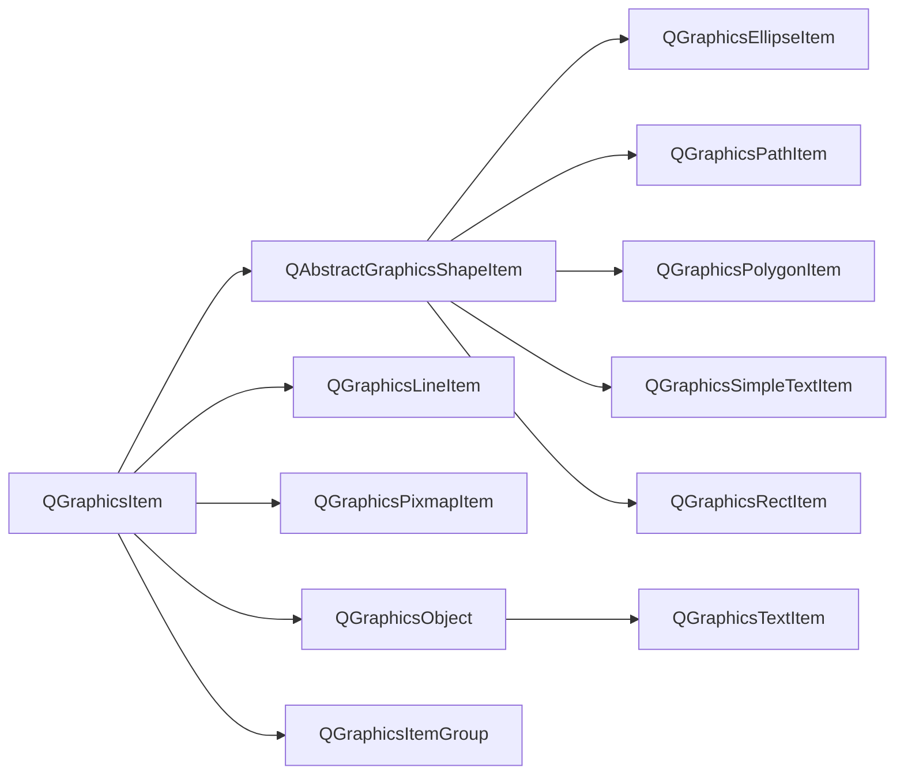

要强调的是，如果自定义图形项，必须重载type()函数并给出Type信息，且Type必须比UserType大。

```c++
class customItem: public QGraphicsItem
{
	public:
		enum {Type = UserType + 1};
		int type() const{ 
			return Type; // 使qgraphicsitem_cast函数可以强转为此类型
		}
}
```

##### 枚举类型

这个枚举描述了 QGraphicsItem 的缓存模式。缓存用于通过分配和渲染到屏幕外像素缓冲区来加速渲染，当项目需要重绘时可以重用该缓冲区。对于某些绘图设备，缓存直接存储在图形内存中，这使得渲染非常快速。

```c++
enum QGraphicsItem::CacheMode {
    QGraphicsItem::NoCache，//
    QGraphicsItem::ItemCoordinateCache，//
    QGraphicsItem::DeviceCoordinateCache//
}
```

这个枚举描述了由 QGraphicsItem::itemChange() 通知的状态变化。通知在状态更改时发送，在某些情况下，可以进行调整（有关详细信息，请参阅每个更改的文档）。
注意：在 itemChange() 中调用 QGraphicsItem 本身的函数时要小心，因为某些函数调用会导致不必要的递归。例如，您不能在 ItemPositionChange 通知上调用 itemChange() 中的 setPos()，因为 setPos() 函数将再次调用 itemChange(ItemPositionChange)。相反，您可以从 itemChange() 返回调整后的新位置。

```c++
enum QGraphicsItem::GraphicsItemChange{
    QGraphicsItem::ItemEnabledChange,//项目的启用状态更改。如果该项目当前已启用，它将被禁用，反之亦然。 value 参数是新的启用状态（即，真或假）。不要在 itemChange() 中调用 setEnabled()，因为此通知已传递。相反，您可以从 itemChange() 返回新状态
    QGraphicsItem::ItemEnabledHasChanged,//该项目的启用状态已更改。 value 参数是新的启用状态（即，真或假）。不要在 itemChange() 中调用 setEnabled()，因为此通知已传递。返回值被忽略
    QGraphicsItem::ItemMatrixChange,//项目的仿射变换矩阵正在发生变化。该值已过时；您可以改用 ItemTransformChange
    QGraphicsItem::ItemPositionChange,//项目的位置发生变化。如果启用了 ItemSendsGeometryChanges 标志，并且项目的本地位置相对于其父项发生更改（即，作为调用 setPos() 或 moveBy() 的结果），则会发送此通知。 value 参数是新位置（即 QPointF）。您可以调用 pos() 来获取原始位置。在传递此通知时，请勿在 itemChange() 中调用 setPos() 或 moveBy()；相反，您可以从 itemChange() 返回调整后的新位置。在这个通知之后，如果位置发生变化，QGraphicsItem 会立即发送 ItemPositionHasChanged 通知
    QGraphicsItem::ItemPositionHasChanged,//项目的位置已更改。如果启用了 ItemSendsGeometryChanges 标志，并且在项目的本地位置（相对于其父项）发生更改后，则会发送此通知。 value 参数是新位置（与 pos() 相同），QGraphicsItem 忽略此通知的返回值（即只读通知）
    QGraphicsItem::ItemTransformChange,//项目的变换矩阵发生变化。如果启用了 ItemSendsGeometryChanges 标志，并且当项目的本地变换矩阵发生更改（即，作为调用 setTransform() 的结果）时发送此通知。值参数是新矩阵（即 QTransform）；获取旧矩阵, 调用 transform()。不要调用 setTransform() 或在 itemChange() 中设置任何转换属性，因为此通知已传递；相反，您可以从 itemChange() 返回新矩阵。如果您更改，则不会发送此通知变换属性
    QGraphicsItem::ItemTransformHasChanged,//由于调用了 setTransform，或者更改了其中一个转换属性，因此项的转换矩阵已更改。如果启用了 ItemSendsGeometryChanges 标志，并且在项目的本地转换矩阵发生更改后，将发送此通知。 value 参数是新矩阵（与 transform() 相同），QGraphicsItem 忽略此通知的返回值（即只读通知）
    QGraphicsItem::ItemRotationChange,//项目的旋转属性发生变化。如果启用了 ItemSendsGeometryChanges 标志，并且项目的旋转属性发生更改（即，作为调用 setRotation() 的结果），则会发送此通知。 value 参数是新的旋转（即双精度）；要获得旧的旋转，请调用 rotation()。不要在 itemChange() 中调用 setRotation()，因为此通知已传递；相反，您可以从 itemChange() 返回新的旋转
    QGraphicsItem::ItemRotationHasChanged,//项目的旋转属性已更改。如果启用了 ItemSendsGeometryChanges 标志，并且项目的旋转属性已更改，则会发送此通知。 value 参数是新的旋转（即双精度），QGraphicsItem 忽略此通知的返回值（即只读通知）。不要在 itemChange() 中调用 setRotation()，因为此通知已传递
    QGraphicsItem::ItemScaleChange,//项目的比例属性发生变化。如果启用了 ItemSendsGeometryChanges 标志，并且项目的 scale 属性发生更改（即，作为调用 setScale() 的结果），则会发送此通知。 value 参数是新的比例（即双精度）；要获得旧比例，请调用 scale()。在传递此通知时不要在 itemChange() 中调用 setScale()；相反，您可以从 itemChange() 返回新的比例
    QGraphicsItem::ItemScaleHasChanged,//项目的比例属性已更改。如果启用了 ItemSendsGeometryChanges 标志，并且在项目的 scale 属性发生更改后，将发送此通知。 value 参数是新的比例（即双精度），QGraphicsItem 忽略此通知的返回值（即只读通知）。不要在 itemChange() 中调用 setScale()，因为此通知已传递
    QGraphicsItem::ItemTransformOriginPointChange,//项目的变换原点属性发生变化。如果启用了 ItemSendsGeometryChanges 标志，并且项目的变换原点属性发生更改（即，作为调用 setTransformOriginPoint() 的结果），则会发送此通知。 value 参数是新的原点（即 QPointF）；要获取旧的原点，请调用 transformOriginPoint()。不要在 itemChange() 中调用 setTransformOriginPoint()，因为此通知已传递；相反，您可以从 itemChange() 返回新的变换原点
    QGraphicsItem::ItemTransformOriginPointHasChanged,//项目的变换原点属性已更改。如果启用了 ItemSendsGeometryChanges 标志，并且在项目的变换原点属性发生更改后，将发送此通知。 value 参数是新的原点（即 QPointF），QGraphicsItem 忽略此通知的返回值（即只读通知）。不要在 itemChange() 中调用 setTransformOriginPoint()，因为此通知已传递
    QGraphicsItem::ItemSelectedChange,//项目的选定状态发生变化。如果该项目当前被选中，它将变为未选中，反之亦然。 value 参数是新的选定状态（即，真或假）。在传递此通知时不要在 itemChange() 中调用 setSelected()；相反，您可以从 itemChange() 返回新的选定状态
    QGraphicsItem::ItemSelectedHasChanged,//项目的选定状态已更改。 value 参数是新的选定状态（即，真或假）。在传递此通知时，请勿在 itemChange() 中调用 setSelected()。返回值被忽略
    QGraphicsItem::ItemVisibleChange,//项目的可见状态发生变化。如果该项目当前可见，它将变为不可见，反之亦然。 value 参数是新的可见状态（即，真或假）。不要在 itemChange() 中调用 setVisible()，因为此通知已传递；相反，您可以从 itemChange() 返回新的可见状态
    QGraphicsItem::ItemVisibleHasChanged,//该项目的可见状态已更改。 value 参数是新的可见状态（即，真或假）。不要在 itemChange() 中调用 setVisible()，因为此通知已传递。返回值被忽略
    QGraphicsItem::ItemParentChange,//项目的父项更改。 value 参数是新的父项（即 QGraphicsItem 指针）。不要在 itemChange() 中调用 setParentItem()，因为此通知已发送；相反，您可以从 itemChange() 返回新的父级
    QGraphicsItem::ItemParentHasChanged,//项目的父项已更改。 value 参数是新的父级（即，指向 QGraphicsItem 的指针）。不要在 itemChange() 中调用 setParentItem()，因为此通知已传递。返回值被忽略
    QGraphicsItem::ItemChildAddedChange,//一个孩子被添加到这个项目。 value 参数是新的子项（即 QGraphicsItem 指针）。在传递此通知时，请勿将此项目传递给任何项目的 setParentItem() 函数。返回值未使用；您无法调整此通知中的任何内容。请注意，发送此通知时，新子代可能未完全构建；在子节点上调用纯虚函数可能会导致崩溃
    QGraphicsItem::ItemChildRemovedChange,//从该项目中删除了一个孩子。 value 参数是即将被删除的子项（即 QGraphicsItem 指针）。返回值未使用；您无法调整此通知中的任何内容
    QGraphicsItem::ItemSceneChange,//该项目被移动到一个新场景。当项目被添加到其初始场景以及被移除时，也会发送此通知。项目的 scene() 是旧场景（如果项目尚未添加到场景中，则为 0）。 value 参数是新场景（即 QGraphicsScene 指针），如果项目从场景中移除，则为空指针。在传递此通知时，不要通过将此项目传递给 QGraphicsScene::addItem() 来覆盖此更改；相反，您可以从 itemChange() 返回新场景。谨慎使用此功能；反对场景变化会很快导致不必要的递归
    QGraphicsItem::ItemSceneHasChanged,//物品的场景发生了变化。该项目的场景（）是新场景。当项目被添加到其初始场景以及被移除时，也会发送此通知。值参数是新场景（即，指向 QGraphicsScene 的指针）。不要在 itemChange() 中调用 setScene()，因为此通知已传递。返回值被忽略
    QGraphicsItem::ItemCursorChange,//项目的光标发生变化。 value 参数是新的游标（即 QCursor）。不要在 itemChange() 中调用 setCursor()，因为此通知已传递。相反，您可以从 itemChange() 返回一个新光标
    QGraphicsItem::ItemCursorHasChanged,//该项目的光标已更改。 value 参数是新的游标（即 QCursor）。不要在传递此通知时调用 setCursor()。返回值被忽略
    QGraphicsItem::ItemToolTipChange,//该项目的工具提示更改。 value 参数是新的工具提示（即 QToolTip）。不要在 itemChange() 中调用 setToolTip()，因为此通知已发送。相反，您可以从 itemChange() 返回一个新的工具提示
    QGraphicsItem::ItemToolTipHasChanged,//该项目的工具提示已更改。 value 参数是新的工具提示（即 QToolTip）。不要调用 setToolTip()，因为此通知已传递。返回值被忽略
    QGraphicsItem::ItemFlagsChange,//该项目的标志改变。 value 参数是新标志（即 quint32）。不要在 itemChange() 中调用 setFlags()，因为此通知已传递。相反，您可以从 itemChange() 返回新标志
    QGraphicsItem::ItemFlagsHaveChanged,//该项目的标志已更改。 value 参数是新标志（即 quint32）。不要在 itemChange() 中调用 setFlags()，因为此通知已传递。返回值被忽略
    QGraphicsItem::ItemZValueChange,//项目的 Z 值发生变化。 value 参数是新的 Z 值（即双精度值）。不要在 itemChange() 中调用 setZValue()，因为此通知已传递。相反，您可以从 itemChange() 返回一个新的 Z 值
    QGraphicsItem::ItemZValueHasChanged,//项目的 Z 值已更改。 value 参数是新的 Z 值（即双精度值）。不要调用 setZValue()，因为此通知已传递。返回值被忽略
    QGraphicsItem::ItemOpacityChange,//项目的不透明度发生变化。 value 参数是新的不透明度（即双精度）。不要在 itemChange() 中调用 setOpacity()，因为此通知已传递。相反，您可以从 itemChange() 返回一个新的不透明度
    QGraphicsItem::ItemOpacityHasChanged,//项目的不透明度已更改。 value 参数是新的不透明度（即双精度）。不要调用 setOpacity() ，因为此通知已传递。返回值被忽略
    QGraphicsItem::ItemScenePositionHasChanged//项目的场景位置已更改。如果启用了 ItemSendsScenePositionChanges 标志，并且在项目的场景位置已更改（即项目本身的位置或变换或任何祖先的位置或变换已更改），则会发送此通知。 value 参数是新的场景位置（与 scenePos() 相同），QGraphicsItem 忽略此通知的返回值（即只读通知）
}
```

此枚举描述了您可以在项目上设置的不同标志，以切换项目行为中的不同功能。
默认情况下禁用所有标志。

```c++
enum QGraphicsItem::GraphicsItemFlag{
    QGraphicsItem::ItemIsMovable,//该项目支持使用鼠标进行交互式移动。通过单击该项目然后拖动，该项目将与鼠标光标一起移动。如果项目有子项，则所有子项也会被移动。如果该项目是选择的一部分，则所有选定的项目也会被移动。通过 QGraphicsItem 的鼠标事件处理程序的基本实现提供此功能是为了方便
    QGraphicsItem::ItemIsSelectable,//该项目支持选择。启用此功能将启用 setSelected() 来切换项目的选择。它还会通过调用 QGraphicsScene::setSelectionArea()、单击一个项目或在 QGraphicsView 中使用橡皮筋选择来自动选择项目
    QGraphicsItem::ItemIsFocusable,//该项目支持键盘输入焦点（即，它是一个输入项目）。启用此标志将允许项目接受焦点，这再次允许将关键事件传递给 QGraphicsItem::keyPressEvent() 和 QGraphicsItem::keyReleaseEvent()
    QGraphicsItem::ItemClipsToShape,//项目剪辑成自己的形状。该项目无法在其形状之外绘制或接收鼠标、平板电脑、拖放或悬停事件。默认情况下禁用。此行为由 QGraphicsView::drawItems() 或 QGraphicsScene::drawItems() 强制执行
    QGraphicsItem::ItemClipsChildrenToShape,//该项目将其所有后代的绘画剪辑成自己的形状。作为该项的直接或间接子项的项不能在该项的形状之外绘制。默认情况下，此标志是禁用的；孩子们可以在任何地方画画。此行为由 QGraphicsView::drawItems() 或 QGraphicsScene::drawItems() 强制执行
    QGraphicsItem::ItemIgnoresTransformations,//该项目忽略继承的转换（即，它的位置仍然锚定到其父级，但忽略父级或视图旋转、缩放或剪切转换）。这个标志对于保持文本标签项水平和未缩放很有用，因此如果视图被转换，它们仍然是可读的。设置后，项目的视图几何和场景几何将分别维护。您必须调用 deviceTransform() 来映射坐标并检测视图中的碰撞。默认情况下，此标志被禁用
    QGraphicsItem::ItemIgnoresParentOpacity,//该项目忽略其父项的不透明度。该项目的有效不透明度与它自己的相同；它不与父母的不透明度结合。即使父项是半透明的，此标志也允许您的项目保持其绝对不透明度
    QGraphicsItem::ItemDoesntPropagateOpacityToChildren,//该项目不会将其不透明度传播给其子项。此标志允许您创建不影响其子项不透明度的半透明项
    QGraphicsItem::ItemStacksBehindParent,//该项目堆叠在其父项后面。默认情况下，子项堆叠在父项之上。但是设置这个标志，孩子将被堆叠在它后面。此标志对于投影效果和遵循父项的几何形状而不在其上绘制的装饰对象很有用
    QGraphicsItem::ItemUsesExtendedStyleOption,//该项目使用 QStyleOptionGraphicsItem 中的暴露矩形或矩阵。默认情况下，exposedRect 被初始化为项目的 boundingRect() 并且矩阵是未转换的。您可以启用此标志，以便使用更细粒度的值设置样式选项。请注意，QStyleOptionGraphicsItem::levelOfDetail 不受此标志的影响，并且始终初始化为 1。如果您需要更高的值，请使用 QStyleOptionGraphicsItem::levelOfDetailFromTransform()
    QGraphicsItem::ItemHasNoContents,//该项目不绘制任何东西（即，在该项目上调用 paint() 无效）。您应该在不需要绘制的项目上设置此标志，以确保 Graphics View 避免不必要的绘制准备
    QGraphicsItem::ItemSendsGeometryChanges,//该项为ItemPositionChange、ItemPositionHasChanged、ItemMatrixChange、ItemTransformChange、ItemTransformHasChanged、ItemRotationChange、ItemRotationHasChanged、ItemScaleChange、ItemScaleHasChanged、ItemTransformOriginPointChange和ItemTransformOriginPointHasChanged启用itemChange（）通知。出于性能原因，默认情况下禁用这些通知。必须启用此标志才能接收位置和变换更改的通知
    QGraphicsItem::ItemAcceptsInputMethod,//该项目支持通常用于亚洲语言的输入法
    QGraphicsItem::ItemNegativeZStacksBehindParent,//如果项目的 z 值为负数，项目会自动堆叠在其父项目后面。此标志使 setZValue() 能够切换 ItemStacksBehindParent
    QGraphicsItem::ItemIsPanel,//该项目是一个面板。面板提供激活和包含的焦点处理。一次只能激活一个面板（参见 QGraphicsItem::isActive()）。当没有面板处于活动状态时，QGraphicsScene 会激活所有非面板项。窗口项（即 QGraphicsItem::isWindow() 返回 true）是面板
    QGraphicsItem::ItemSendsScenePositionChanges,//该项目为 ItemScenePositionHasChanged 启用 itemChange() 通知
    QGraphicsItem::ItemContainsChildrenInShape//此标志表示项目的所有直接或间接子项仅在项目的形状内绘制。与 ItemClipsChildrenToShape 不同，不强制执行此限制。当您手动确保绘图绑定到项目的形状并希望避免与强制执行剪辑相关的成本时，请设置 ItemContainsChildrenInShape。设置此标志可实现更有效的绘图和碰撞检测。默认情况下禁用该标志
}
```

此枚举指定模式面板的行为。模态面板是阻止输入到其他面板的面板。请注意，模式面板的子项不会被阻止。

```c++
enum QGraphicsItem::PanelModality{
    QGraphicsItem::NonModal,//该面板不是模态的，不会阻止对其他面板的输入。这是面板的默认值
    QGraphicsItem::PanelModal,//该面板对于单个项目层次结构是模态的，并阻止对其父面板、所有祖父面板以及其父面板和祖父面板的所有兄弟姐妹的输入
    QGraphicsItem::SceneModal//该窗口对整个场景是模态的，并阻止对所有面板的输入
}
```

##### 成员函数

需要关注的常用的函数。

```c++
QPainterPath clipPath() const;
QTransform itemTransform(const QGraphicsItem *other, bool *ok = Q_NULLPTR) const;
GraphicsItemFlagsflags() const;
QGraphicsScene *scene() const;
QRectF sceneBoundingRect() const;
QPointF scenePos() const;
QTransform sceneTransform() const;
QGraphicsItem *focusItem() const;
QGraphicsItem *focusProxy() const;
QGraphicsItemGroup *group() const;
QPointF pos() const;
qreal rotation() const;
qreal scale() const;
qreal x() const;
qreal y() const;
qreal zValue() const;
qreal opacity() const;
virtual QPainterPath opaqueArea() const;
QGraphicsItem *panel() const;
PanelModality panelModality() const;

bool hasCursor() const;
bool hasFocus() const;
bool isActive() const;
bool isClipped() const;
bool isEnabled() const;
bool isObscured(const QRectF &rect = QRectF()) const;
bool isObscured(qreal x, qreal y, qreal w, qreal h) const;
bool isPanel() const;
bool isSelected() const;
bool isUnderMouse() const;
bool isVisible() const;
bool isVisibleTo(const QGraphicsItem *parent) const;
bool isWidget() const;
bool isWindow() const;
bool isAncestorOf(const QGraphicsItem *child) const;
bool isBlockedByModalPanel(QGraphicsItem **blockingPanel = Q_NULLPTR) const;
bool acceptDrops() const;
bool acceptHoverEvents() const;
bool acceptTouchEvents() const;

void setAcceptHoverEvents(bool enabled);//如果 enabled 为 true，则此项将接受悬停事件；否则，它将忽略它们。默认情况下，项目不接受悬停事件
void setAcceptTouchEvents(bool enabled);//如果 enabled 为 true，则此项将接受触摸事件；否则，它将忽略它们。默认情况下，项目不接受触摸事件
void setFiltersChildEvents(bool enabled);//如果 enabled 为 true，则此项设置为过滤其所有子项的所有事件

void moveBy(qreal dx, qreal dy);//将项目水平移动 dx 点，垂直移动 dy 点
void setPos(const QPointF &pos);//设置位置
void setPos(qreal x, qreal y);
void setX(qreal x); // 图形的x坐标
void setY(qreal y);//图形的y坐标
void setZValue(qreal z);//Z值越大叠放越靠前
void hide();//隐藏图形
void show();//显示图形
void clearFocus();//清除焦点
void resetTransform();//将此项的变换矩阵重置为单位矩阵或将所有变换属性重置为其默认值
void scroll(qreal dx, qreal dy, const QRectF &rect = QRectF());//将 rect 的内容滚动 dx, dy。如果 rect 是空矩形（默认值），则滚动项目的边界矩形
void setAcceptDrops(bool on);//接受拖动
void setAcceptedMouseButtons(Qt::MouseButtons buttons);
void setActive(bool active);//设置为活动
void setBoundingRegionGranularity(qreal granularity);//将边界区域粒度设置为粒度；介于 0 和 1 之间的值。默认值为 0
void setCacheMode(CacheMode mode, const QSize &logicalCacheSize = QSize());//将项目的缓存模式设置为模式
void setCursor(const QCursor &cursor);//设置鼠标
void setData(int key, const QVariant &value);//设置数据
void setEnabled(bool enabled);//设置使能
void setFlag(GraphicsItemFlag flag, bool enabled = true);//设置图形操作属性，如可选择和可移动
void setFlags(GraphicsItemFlags flags);
void setFocus(Qt::FocusReason focusReason = Qt::OtherFocusReason);//设置焦点
void setFocusProxy(QGraphicsItem *item);//设置焦点代理
void setGraphicsEffect(QGraphicsEffect *effect);
void setGroup(QGraphicsItemGroup *group);//设置容器
void setInputMethodHints(Qt::InputMethodHints hints);//设置此项的当前输入法提示为提示
void setOpacity(qreal opacity);//设置透明度
void setPanelModality(PanelModality panelModality);//将此项目的模态设置为 panelModality
void setParentItem(QGraphicsItem *newParent);//设置父项
void setRotation(qreal angle);//设置绕 Z 轴的顺时针旋转角度，以度为单位
void setScale(qreal factor);//设置项目的比例因子
void setSelected(bool selected);//如果 selected 为 true 且该项可选，则该项被选中；否则，它被取消选中
void setToolTip(const QString &toolTip);//将项目的工具提示设置为 toolTip。如果 toolTip 为空，则该项目的工具提示被清除
void setTransform(const QTransform &matrix, bool combine = false);//将项目的当前变换矩阵设置为矩阵
void setTransformOriginPoint(const QPointF &origin);//在项目坐标中设置转换的原点
void setTransformOriginPoint(qreal x, qreal y);
void setTransformations(const QList<QGraphicsTransform *> &transformations);//设置当前应用到此项的图形变换列表（QGraphicsTransform）
void setVisible(bool visible);//设置可见
```

 映射系列函数。

```c++
// 将另一个图形项的一个点映射到本图形项的坐标系
QPointF mapFromItem(const QGraphicsItem *item, const QPointF &point) const;
QPolygonF mapFromItem(const QGraphicsItem *item, const QRectF &rect) const;
QPolygonF mapFromItem(const QGraphicsItem *item, const QPolygonF &polygon) const;
QPainterPath mapFromItem(const QGraphicsItem *item, const QPainterPath &path) const;
QPointF mapFromItem(const QGraphicsItem *item, qreal x, qreal y) const;
QPolygonF mapFromItem(const QGraphicsItem *item, qreal x, qreal y, qreal w, qreal h) const;
// 将父项的一个点映射到本图形项的坐标系
QPointF mapFromParent(const QPointF &point) const;
QPolygonF mapFromParent(const QRectF &rect) const;
QPolygonF mapFromParent(const QPolygonF &polygon) const;
QPainterPath mapFromParent(const QPainterPath &path) const;
QPointF mapFromParent(qreal x, qreal y) const;
QPolygonF mapFromParent(qreal x, qreal y, qreal w, qreal h) const;
// 将场景中的一个点映射到本图形项的坐标系
QPointF mapFromScene(const QPointF &point) const;
QPolygonF mapFromScene(const QRectF &rect) const;
QPolygonF mapFromScene(const QPolygonF &polygon) const;
QPainterPath mapFromScene(const QPainterPath &path) const;
QPointF mapFromScene(qreal x, qreal y) const;
QPolygonF mapFromScene(qreal x, qreal y, qreal w, qreal h) const;
// 将 item 坐标系中的矩形 rect 映射到 item 的坐标系，并将映射的矩形作为新矩形（即生成的多边形的边界矩形）返回
QRectF mapRectFromItem(const QGraphicsItem *item, const QRectF &rect) const;
QRectF mapRectFromItem(const QGraphicsItem *item, qreal x, qreal y, qreal w, qreal h) const;
// 将位于此项的父坐标系中的矩形 rect 映射到此项的坐标系，并将映射的矩形作为新矩形（即生成的多边形的边界矩形）返回
QRectF mapRectFromParent(const QRectF &rect) const;
QRectF mapRectFromParent(qreal x, qreal y, qreal w, qreal h) const;
// 将场景坐标中的矩形 rect 映射到此项的坐标系，并将映射的矩形作为新矩形（即生成的多边形的边界矩形）返回
QRectF mapRectFromScene(const QRectF &rect) const;
QRectF mapRectFromScene(qreal x, qreal y, qreal w, qreal h) const;
// 将位于此项坐标系中的矩形 rect 映射到项的坐标系，并将映射的矩形作为新矩形（即生成的多边形的边界矩形）返回。
QRectF mapRectToItem(const QGraphicsItem *item, const QRectF &rect) const;
QRectF mapRectToItem(const QGraphicsItem *item, qreal x, qreal y, qreal w, qreal h) const;
// 将位于此项坐标系中的矩形 rect 映射到其父坐标系，并将映射的矩形作为新矩形返回（即，生成的多边形的边界矩形）
QRectF mapRectToParent(const QRectF &rect) const;
QRectF mapRectToParent(qreal x, qreal y, qreal w, qreal h) const;
//将该项坐标系中的矩形rect映射到场景坐标系，并将映射的矩形作为新矩形返回
QRectF mapRectToScene(const QRectF &rect) const;
QRectF mapRectToScene(qreal x, qreal y, qreal w, qreal h) const;
// 将本图形项内的一个点映射到另一个图形项的坐标系
QPointF mapToItem(const QGraphicsItem *item, const QPointF &point) const;
QPolygonF mapToItem(const QGraphicsItem *item, const QRectF &rect) const;
QPolygonF mapToItem(const QGraphicsItem *item, const QPolygonF &polygon) const;
QPainterPath mapToItem(const QGraphicsItem *item, const QPainterPath &path) const;
QPointF mapToItem(const QGraphicsItem *item, qreal x, qreal y) const;
QPolygonF mapToItem(const QGraphicsItem *item, qreal x, qreal y, qreal w, qreal h) const;
// 将本图形项内的一个点映射到父项坐标系
QPointF mapToParent(const QPointF &point) const;
QPolygonF mapToParent(const QRectF &rect) const;
QPolygonF mapToParent(const QPolygonF &polygon) const;
QPainterPath mapToParent(const QPainterPath &path) const;
QPointF mapToParent(qreal x, qreal y) const;
QPolygonF mapToParent(qreal x, qreal y, qreal w, qreal h) const;
// 将本图形项内的一个点映射到场景坐标系
QPointF mapToScene(const QPointF &point) const;
QPolygonF mapToScene(const QRectF &rect) const;
QPolygonF mapToScene(const QPolygonF &polygon) const;
QPainterPath mapToScene(const QPainterPath &path) const;
QPointF mapToScene(qreal x, qreal y) const;
QPolygonF mapToScene(qreal x, qreal y, qreal w, qreal h) const;
```

其它不常用的函数。

```c++
Qt::MouseButtons acceptedMouseButtons() const;
void grabKeyboard();
void grabMouse();
QGraphicsEffect *graphicsEffect() const;
Qt::InputMethodHints inputMethodHints() const;
void installSceneEventFilter(QGraphicsItem *filterItem);
QRegion boundingRegion(const QTransform &itemToDeviceTransform) const;
qreal boundingRegionGranularity() const;
CacheMode cacheMode() const;
QList<QGraphicsItem *> childItems() const;
QRectF childrenBoundingRect() const;
QGraphicsItem *parentItem() const;
QGraphicsObject *parentObject() const;
QGraphicsWidget *parentWidget() const;
void removeSceneEventFilter(QGraphicsItem *filterItem);
virtual bool collidesWithItem(const QGraphicsItem *other, Qt::ItemSelectionMode mode = Qt::IntersectsItemShape) const;
virtual bool collidesWithPath(const QPainterPath &path, Qt::ItemSelectionMode mode = Qt::IntersectsItemShape) const;
QList<QGraphicsItem *> collidingItems(Qt::ItemSelectionMode mode = Qt::IntersectsItemShape) const;
QGraphicsItem *commonAncestorItem(const QGraphicsItem *other) const
virtual bool contains(const QPointF &point) const;
QCursor cursor() const;
QVariant data(int key) const;
QTransform deviceTransform(const QTransform &viewportTransform) const;
qreal effectiveOpacity() const;
void ensureVisible(const QRectF &rect = QRectF(), int xmargin = 50, int ymargin = 50);
void ensureVisible(qreal x, qreal y, qreal w, qreal h, int xmargin = 50, int ymargin = 50);
bool filtersChildEvents() const;
virtual QPainterPath shape() const;
void stackBefore(const QGraphicsItem *sibling);
QGraphicsObject *toGraphicsObject();
const QGraphicsObject *toGraphicsObject() const;
QString toolTip() const;
QGraphicsItem *topLevelItem() const;
QGraphicsWidget *topLevelWidget() const;
QTransform transform() const;
QPointF transformOriginPoint() const;
QList<QGraphicsTransform *> transformations() const;
virtual int type() const;
void ungrabKeyboard();
void ungrabMouse();
void unsetCursor();
void update(const QRectF &rect = QRectF());
void update(qreal x, qreal y, qreal width, qreal height);
QGraphicsWidget *window() const;
```

#### 7.3.4 QGraphicsEllipseItem

椭圆图形项。

成员函数如下。

```c++
QGraphicsEllipseItem(const QRectF &rect, QGraphicsItem *parent = Q_NULLPTR);
QGraphicsEllipseItem(qreal x, qreal y, qreal width, qreal height, QGraphicsItem *parent = Q_NULLPTR);
QRectF rect() const;
void setRect(const QRectF &rect);//将项目的椭圆几何设置为矩形。矩形的左边缘定义椭圆的左边缘，矩形的上边缘描述椭圆的顶部。矩形的高度和宽度描述了椭圆的高度和宽度
void setRect(qreal x, qreal y, qreal width, qreal height);
void setSpanAngle(int angle);
void setStartAngle(int angle);
int spanAngle() const;//返回椭圆段的跨度角，以 16 度为单位。该角度与 startAngle() 一起用于表示椭圆段（饼图）。默认情况下，此函数返回 5760（360 * 16，一个完整的椭圆）。
int startAngle() const;//返回以 16 度为单位的椭圆段的起始角度。该角度与 spanAngle() 一起用于表示椭圆段（饼图）。默认情况下，起始角度为 0
```

#### 7.3.5 QGraphicsRectItem

矩形图形项。

成员函数如下。

```c++
QGraphicsRectItem(QGraphicsItem *parent = Q_NULLPTR);
QGraphicsRectItem(const QRectF &rect, QGraphicsItem *parent = Q_NULLPTR);
QGraphicsRectItem(qreal x, qreal y, qreal width, qreal height, QGraphicsItem *parent = Q_NULLPTR);
QRectF rect() const; // 返回项目的矩形位置
void setRect(const QRectF &rectangle);
void setRect(qreal x, qreal y, qreal width, qreal height);
```

#### 7.3.6 QGraphicsTextItem

文字图形项。

成员函数如下。

```c++
QGraphicsTextItem(QGraphicsItem *parent = Q_NULLPTR);
QGraphicsTextItem(const QString &text, QGraphicsItem *parent = Q_NULLPTR);
void adjustSize();//将文本项调整到合理的大小
void setDefaultTextColor(const QColor &col);
QColor defaultTextColor() const;//返回用于无格式文本的默认文本颜色
QTextDocument *document() const;//返回项目的文本文档
void setDocument(QTextDocument *document);
QFont font() const;//f返回字体格式
void setFont(const QFont &font);
bool openExternalLinks() const;//指定 QGraphicsTextItem 是否应该使用 QDesktopServices::openUrl() 自动打开链接，而不是发出 linkActivated 信号。默认值为假。
void setOpenExternalLinks(bool open);
void setHtml(const QString &text);//设置Html
QString toHtml() const;
void setPlainText(const QString &text);//设置多行文本
QString toPlainText() const;
void setTabChangesFocus(bool b);//如果 b 为真，Tab 键将导致小部件改变焦点；否则，tab 键将在文档中插入一个选项卡。在某些情况下，文本编辑不应允许用户输入制表符或使用 Tab 键更改缩进，因为这会破坏焦点链。默认值为假
bool tabChangesFocus() const;
void setTextCursor(const QTextCursor &cursor);//此属性表示可编辑文本项中的可见文本光标。默认情况下，如果未设置项目的文本，则该属性包含空文本光标；否则它包含放置在项目文档开头的文本光标。
QTextCursor textCursor() const;
void setTextInteractionFlags(Qt::TextInteractionFlags flags);//设置 flags 标志以指定文本项应如何响应用户输入
Qt::TextInteractionFlags textInteractionFlags() const;
void setTextWidth(qreal width); // 设置文本宽度
qreal textWidth() const;
```

#### 7.3.7 QGraphicsSimpleTextItem

简单文字图形项。

成员函数如下。

```c++
QGraphicsSimpleTextItem(QGraphicsItem *parent = Q_NULLPTR);
QGraphicsSimpleTextItem(const QString &text, QGraphicsItem *parent = Q_NULLPTR);
QFont font() const;
void setFont(const QFont &font);
void setText(const QString &text);
QString text() const;
```

#### 7.3.8 QGraphicsPathItem

路径图形项。

成员函数如下。

```c++
QGraphicsPathItem(QGraphicsItem *parent = Q_NULLPTR);
QGraphicsPathItem(const QPainterPath &path, QGraphicsItem *parent = Q_NULLPTR);
QPainterPath path() const;
void setPath(const QPainterPath &path);
```

#### 7.3.9 QGraphicsPolygonItem

多边形图形项。

成员函数如下。

```c++
QGraphicsPolygonItem(QGraphicsItem *parent = Q_NULLPTR);
QGraphicsPolygonItem(const QPolygonF &polygon, QGraphicsItem *parent = Q_NULLPTR);
Qt::FillRule fillRule() const;
QPolygonF polygon() const;
void setFillRule(Qt::FillRule rule);
void setPolygon(const QPolygonF &polygon);
```

#### 7.3.10 QGraphicsLineItem

直线图形项。

成员函数如下。

```c++
QGraphicsLineItem(QGraphicsItem *parent = Q_NULLPTR);
QGraphicsLineItem(const QLineF &line, QGraphicsItem *parent = Q_NULLPTR);
QGraphicsLineItem(qreal x1, qreal y1, qreal x2, qreal y2, QGraphicsItem *parent = Q_NULLPTR);
QLineF line() const;
QPen pen() const;
void setLine(const QLineF &line);
void setLine(qreal x1, qreal y1, qreal x2, qreal y2);
void setPen(const QPen &pen);
```

#### 7.3.11 QGraphicsPixmapItem

图像图形项。

这个枚举描述了 QGraphicsPixmapItem 如何计算它的形状和不透明区域。
默认值为 MaskShape。

```c++
enum QGraphicsPixmapItem::ShapeMode{
    QGraphicsPixmapItem::MaskShape,//形状是通过调用 QPixmap::mask() 来确定的。此形状仅包括像素图的不透明像素。然而，由于形状更复杂，它可能比其他模式更慢，并且使用更多内存
    QGraphicsPixmapItem::BoundingRectShape,//形状是通过跟踪像素图的轮廓来确定的。这是最快的形状模式，但它不考虑像素图上的任何透明区域
    QGraphicsPixmapItem::HeuristicMaskShape//形状是通过调用 QPixmap::createHeuristicMask() 来确定的。性能和内存消耗与 MaskShape 类似
}
```

成员函数如下。

```c++
QGraphicsPixmapItem(QGraphicsItem *parent = Q_NULLPTR);
QGraphicsPixmapItem(const QPixmap &pixmap, QGraphicsItem *parent = Q_NULLPTR);
QPointF offset() const;//返回像素图项的偏移量，它定义了像素图左上角的点，以本地坐标表示
QPixmap pixmap() const;//返回项目的像素图，如果没有设置像素图，则返回无效的 QPixmap
void setOffset(const QPointF &offset);
void setOffset(qreal x, qreal y);
void setPixmap(const QPixmap &pixmap);
void setShapeMode(ShapeMode mode);//将项目的形状模式设置为模式。形状模式描述了 QGraphicsPixmapItem 如何计算其形状。默认模式是 MaskShape
void setTransformationMode(Qt::TransformationMode mode);//将像素图项目的转换模式设置为模式，并切换项目的更新。默认模式是 Qt::FastTransformation，它提供了没有平滑的快速转换
ShapeMode shapeMode() const;//返回项目的形状模式。形状模式描述了 QGraphicsPixmapItem 如何计算其形状。默认模式是 MaskShape
Qt::TransformationMode transformationMode() const;//返回像素图的转换模式。默认模式是 Qt::FastTransformation，它提供了没有平滑的快速转换
```

#### 7.3.12 QGraphicsItemGroup

管理项的容器，例如组合各种图形项时就是放在一个Group里。

成员函数如下。

```c++
QGraphicsItemGroup(QGraphicsItem *parent = Q_NULLPTR);
void addToGroup(QGraphicsItem *item);
void removeFromGroup(QGraphicsItem *item);
```

## 8. 二维图表

QtCharts就是基于QGraphicsView开发的，核心组件是QChartView和QChart。

使用QChart必须使用命名空间或者宏定义，且在pro文件加上Qt += charts。

```c++
#include <QtCharts>
using namespace QtCharts;
// 
Qt_CHARTS_USE_NAMESPACE
```

继承关系如图。

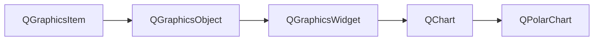

可以看到，QChart继承自QGraphicsItem，所以它也是图形项的一种。而ChartView则是继承自QGraphicsView，所以是一种视图组件，用于存放QChart类型的图形项罢了。

### 8.1 图表与视图类

#### 8.1.1 QChartView

图表视图类。

枚举类型一个，用于设置选择框的类型。

```c++
enum QChartView::RubberBand{
    QChartView::NoRubberBand,//无选择框
    QChartView::VerticalRubberBand,//垂直选择
    QChartView::HorizontalRubberBand,//水平选择
    QChartView::RectangleRubberBand//矩形框选择
}
```

成员函数，最最核心的函数就是setChart，一般来讲，使用的方式是这样的。

```c++
QChartView * chartView = new QChartView(this);
QChart * chart = new QChart();
chartView->setChart(chart);
this->setCentralWidget(chartView);
// 对chart进行一些设置...

QChartView(QChart *chart, QWidget *parent = Q_NULLPTR);
QChart *chart() const;
void setChart(QChart *chart); 
RubberBands rubberBand() const;
void setRubberBand(const RubberBands &rubberBand);
```

#### 8.1.2 QChart

图表类。

##### 枚举类型

此枚举描述图表中启用的动画。

```c++
enum QChart::AnimationOption {
    QChart::NoAnimation,//动画在图表中被禁用。这是默认值
    QChart::GridAxisAnimations,//图表中启用了网格轴动画
    QChart::SeriesAnimations,//图表中启用了系列动画
    QChart::AllAnimations//图表中启用了所有动画类型
}
```

此枚举描述图表使用的主题。
主题是应用于图表所有视觉元素的 UI 样式相关设置的内置集合，例如颜色、钢笔、画笔和系列字体，以及轴、标题和图例。图表主题示例说明了如何使用主题。
注意：更改主题将覆盖以前应用于该系列的所有自定义。

```c++
enum QChart::ChartTheme{
    QChart::ChartThemeLight,//浅色主题，这是默认主题
    QChart::ChartThemeBlueCerulean,//天蓝色主题
    QChart::ChartThemeDark,//黑暗的主题
    QChart::ChartThemeBrownSand,//沙褐色主题
    QChart::ChartThemeBlueNcs,//自然色系 (NCS) 蓝色主题
    QChart::ChartThemeHighContrast,//高对比度主题
    QChart::ChartThemeBlueIcy,//冰蓝色主题
    QChart::ChartThemeQt//Qt 主题
}
```

此枚举描述图表类型。

```c++
enum QChart::ChartType{
    QChart::ChartTypeUndefined,//图表类型未定义
    QChart::ChartTypeCartesian,//笛卡尔图
    QChart::ChartTypePolar//极坐标图
}
```

##### 成员函数

从成员函数可以看到，与图表相关的类有QAbstractAxis(常用的是QValueAxis)、QAbstractSeries（QLineSeries）、QEasingCurve、QLegend、QLocale、AnimationOptions。关于这些抽象类和具体类的介绍后边会继续给出

```c++
void addSeries(QAbstractSeries *series);//添加序列
void removeAllSeries();//移除序列
void removeSeries(QAbstractSeries *series);//从图表中删除系列系列。图表释放指定系列对象的所有权
QList<QAbstractSeries *> series() const;//返回添加到图表的所有系列

int animationDuration() const;//此属性保存图表动画的持续时间
void setAnimationDuration(int msecs);
QEasingCurve animationEasingCurve() const;//此属性保存图表动画的缓动曲线
void setAnimationEasingCurve(const QEasingCurve &curve);
AnimationOptions animationOptions() const;//此属性保存图表的动画选项
void setAnimationOptions(AnimationOptions options);

void addAxis(QAbstractAxis *axis, Qt::Alignment alignment);//添加轴
QList<QAbstractAxis *> axes(Qt::Orientations orientation = Qt::Horizontal | Qt::Vertical, QAbstractSeries *series = Q_NULLPTR) const;// 默认返回所有轴
QAbstractAxis *axisX(QAbstractSeries *series = Q_NULLPTR) const;//返回X轴
QAbstractAxis *axisY(QAbstractSeries *series = Q_NULLPTR) const;//返回Y轴
void removeAxis(QAbstractAxis *axis);// 移除所有坐标轴
void setAxisX(QAbstractAxis *axis, QAbstractSeries *series = Q_NULLPTR);
void setAxisY(QAbstractAxis *axis, QAbstractSeries *series = Q_NULLPTR);
void createDefaultAxes();//根据已添加到图表的系列为图表创建轴。之前添加到图表中的任何轴都将被删除

ChartType chartType() const；//此属性保存图表是笛卡尔图还是极坐标图
QLegend *legend() const;//返回图表的图例对象。所有权保留在图表中
void scroll(qreal dx, qreal dy);//按 dx 和 dy 指定的距离滚动图表的可见区域。对于极坐标图，dx 表示沿角轴的角度，而不是距离。

QLocale locale() const;//此属性保存用于格式化各种图表标签的语言环境
void setLocale(const QLocale &locale);
bool localizeNumbers() const;//此属性保存数字是否已本地化
void setLocalizeNumbers(bool localize);

QPointF mapToPosition(const QPointF &value, QAbstractSeries *series = Q_NULLPTR);//返回与 series 指定的系列中的值对应的图表上的位置
QPointF mapToValue(const QPointF &position, QAbstractSeries *series = Q_NULLPTR);//在图表中位置指定的位置处返回由系列指定的系列中的值

QMargins margins() const;//此属性保存图表矩形边缘和绘图区域之间允许的最小边距
void setMargins(const QMargins &margins);

void setBackgroundRoundness(qreal diameter);//此属性保存图表背景角处圆角的直径
qreal backgroundRoundness() const;
void setBackgroundVisible(bool visible = true);//此属性保存图表背景是否可见
bool isBackgroundVisible() const;
void setDropShadowEnabled(bool enabled = true);//该属性保存是否启用背景阴影效果
bool isDropShadowEnabled() const;

QRectF plotArea() const;//此属性保存绘制图表的矩形
void setPlotAreaBackgroundBrush(const QBrush &brush);//将用于填充图表绘图区域背景的画笔设置为画笔
QBrush plotAreaBackgroundBrush() const;
void setPlotAreaBackgroundPen(const QPen &pen);//将用于绘制图表绘图区域背景的笔设置为笔
QPen plotAreaBackgroundPen() const;
void setPlotAreaBackgroundVisible(bool visible = true);
bool isPlotAreaBackgroundVisible() const;
void setBackgroundBrush(const QBrush &brush);//将用于绘制图表区域背景的画笔设置为画笔
QBrush backgroundBrush() const;
void setBackgroundPen(const QPen &pen);//将用于绘制图表区域背景的笔设置为笔
QPen backgroundPen() const;

void setTheme(QChart::ChartTheme theme);//设置图表主题
QChart::ChartTheme theme() const;

void setTitle(const QString &title);//设置图标标题及其颜色与字体
void setTitleBrush(const QBrush &brush);
void setTitleFont(const QFont &font);
QString title() const;
QBrush titleBrush() const;
QFont titleFont() const;

void zoom(qreal factor);//按自定义因子放大视图
void zoomIn();//将视图放大两倍
void zoomIn(const QRectF &rect);//将视图放大到矩形矩形仍然完全可见的最大级别
void zoomOut();//将视图缩小两倍
void zoomReset();//将系列域重置为调用任何缩放方法之前的值
bool isZoomed();//是否处于缩放状态

signal void plotAreaChanged(const QRectF &plotArea); //信号,绘图区域改变时发射
```

#### 8.1.3 QPolarChart

QPolarChart 以极坐标图显示数据。极坐标图以圆形图表的形式显示数据，其中数据的放置基于与图表中心（极点）的角度和距离。

极坐标图是 QChart 的一种特殊形式，它支持线、样条、面积和散点系列，以及它们支持的所有轴类型。每个轴都可以用作径向轴或角轴。
角度 QValueAxis 上的第一个和最后一个刻度线位于 0/360 度角处。
如果一个序列中两个连续点之间的角距离超过 180 度，那么任何连接这两个点的直线都变得毫无意义，并且不会被绘制。相反，将在图表中心之间绘制一条线。因此，在显示线、样条或面积系列时，必须相应地选择轴范围。
极坐标图在同一位置绘制相同方向的所有轴，因此使用多个相同方向的轴可能会造成混淆，除非额外的轴仅用于自定义网格。例如，您可以使用辅助阴影 QCategoryAxis 显示突出显示的范围，或提供具有隐藏标签的辅助 QValueAxis 的未标记子标记。

此枚举类型指定轴的极轴方向。

```c++
enum QPolarChart::PolarOrientation{
    QPolarChart::PolarOrientationRadial,//径向轴，其中值沿图表的半径放置，从极点开始
    QPolarChart::PolarOrientationAngular//一个角轴，其中值放置在图表周围
}
```

成员函数。

```c++
QPolarChart(QGraphicsItem *parent = Q_NULLPTR, Qt::WindowFlags wFlags = Qt::WindowFlags());//构造一个极坐标图作为父级的子级。 wFlags 指定的属性被传递给 QChart 构造函数
void addAxis(QAbstractAxis *axis, PolarOrientation polarOrientation);//这种方便的方法将轴轴添加到具有极坐标polarOrientation 的极坐标图中。图表拥有轴的所有权。
QList<QAbstractAxis *> axes(PolarOrientations polarOrientation = PolarOrientations( PolarOrientationRadial | PolarOrientationAngular ), QAbstractSeries *series = Q_NULLPTR) const;//返回为具有极轴方向polarOrientation 的系列系列添加的轴。如果未提供系列，则返回具有指定极轴方向的任何轴

static PolarOrientation axisPolarOrientation(QAbstractAxis *axis);//极坐标图的角轴报告水平方向，径向轴报告垂直方向。该函数是一个方便的函数，用于将轴轴的方向转换为对应的极轴方向。如果轴为空或未添加到极坐标图，则返回值无意义
```

### 8.2 基础类

#### 8.2.1 QAbstactSeries

抽象序列类。其继承关系如下所示。

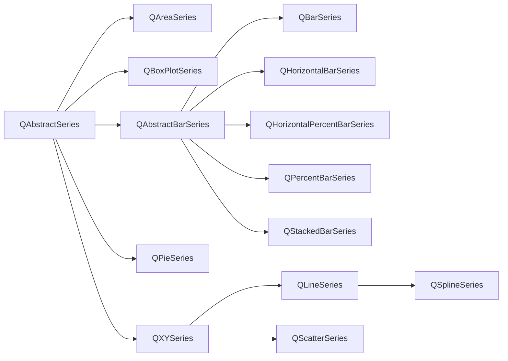

中文对照含义如下。

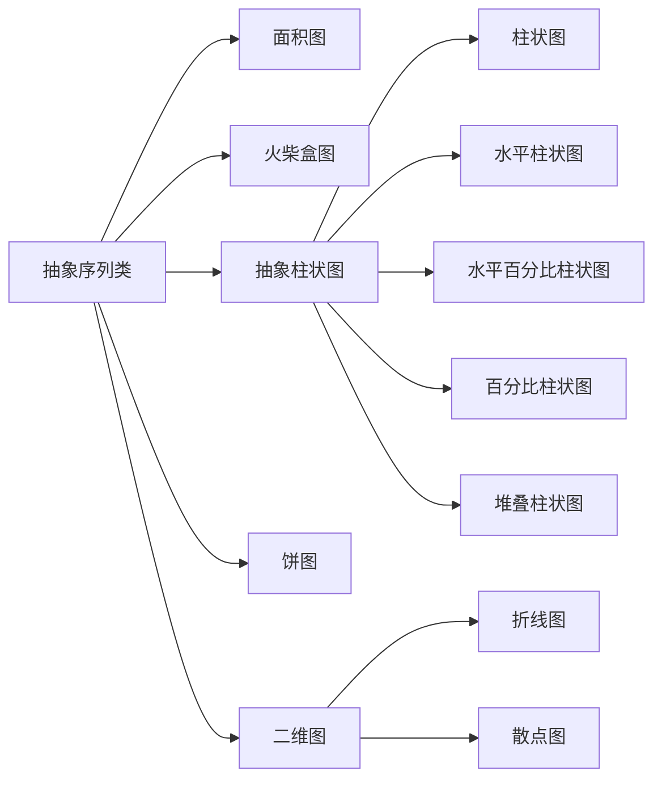

这个枚举描述了系列的类型。

```c++
enum QAbstractSeries::SeriesType{  
    QAbstractSeries::SeriesTypeLine,
    QAbstractSeries::SeriesTypeArea,
    QAbstractSeries::SeriesTypeBar,
    QAbstractSeries::SeriesTypeStackedBar,
    QAbstractSeries::SeriesTypePercentBar,
    QAbstractSeries::SeriesTypePie,
    QAbstractSeries::SeriesTypeScatter,
    QAbstractSeries::SeriesTypeSpline,
    QAbstractSeries::SeriesTypeHorizontalBar,
    QAbstractSeries::SeriesTypeHorizontalStackedBar,
    QAbstractSeries::SeriesTypeHorizontalPercentBar,
    QAbstractSeries::SeriesTypeBoxPlot,
    QAbstractSeries::SeriesTypeCandlestick
}
```

成员函数如下。

```c++
bool attachAxis(QAbstractAxis *axis);//将由axis指定的轴附加到序列。如果轴连接成功，则返回 true，否则返回 false。
bool detachAxis(QAbstractAxis *axis);//从序列中分离由轴指定的轴。如果轴分离成功，则返回 true，否则返回 false
QList<QAbstractAxis *> attachedAxes();//返回附加到系列的轴列表。通常，一个 x 轴和一个 y 轴附加到一个系列，除了 QPieSeries，它没有附加任何轴。
QChart *chart() const;//获取序列依附的图表
void hide();//隐藏
void show();//显示
void setName(const QString &name);//序列名称
QString name() const;
void setOpacity(qreal opacity);//透明度
qreal opacity() const;
void setUseOpenGL(bool enable = true);//指定是否使用 OpenGL 加速绘制系列，仅 QLineSeries 和 QScatterSeries 支持使用 OpenGL 进行加速
bool useOpenGL() const;
void setVisible(bool visible = true);//可见性
bool isVisible() const;
virtual SeriesType type() const = 0;//自定义新序列必须重载此函数
```

信号函数。

```c++
void nameChanged();
void opacityChanged();
void useOpenGLChanged();
void visibleChanged();
```

#### 8.2.2 QXYSeries

##### 成员函数

成员函数如下。

```c++
void append(qreal x, qreal y);//给序列添加点
void append(const QPointF &point);
void append(const QList<QPointF> &points);
QXYSeries &operator<<(const QPointF &point);
QXYSeries &operator<<(const QList<QPointF> &points);

void clear();//清空所有点
int count() const;//返回系列中的数据点数
void insert(int index, const QPointF &point);//插入点

const QPointF &at(int index) const;//访问点
QList<QPointF> points() const;//返回所有点
QVector<QPointF> pointsVector() const;//以Vector形式返回所有点

void remove(qreal x, qreal y);// 移除点
void remove(const QPointF &point);
void remove(int index);
void removePoints(int index, int count);

void replace(qreal oldX, qreal oldY, qreal newX, qreal newY);//替换点
void replace(const QPointF &oldPoint, const QPointF &newPoint);
void replace(int index, qreal newX, qreal newY);
void replace(int index, const QPointF &newPoint);
void replace(QList<QPointF> points);
void replace(QVector<QPointF> points);

virtual void setBrush(const QBrush &brush);//设置画刷
QBrush brush() const;
virtual void setColor(const QColor &color);//设置颜色
virtual QColor color() const;
virtual void setPen(const QPen &pen);//设置画笔(width+brush+color)
QPen pen() const;

void setPointLabelsClipping(bool enabled = true);//此属性保存数据点标签的剪辑。此属性默认为 true。启用剪切时，绘图区域边缘的标签会被剪切。
bool pointLabelsClipping() const;
void setPointLabelsColor(const QColor &color);//此属性保存用于数据点标签的颜色。默认情况下，颜色是标签主题中定义的画笔颜色。
QColor pointLabelsColor() const;
void setPointLabelsFont(const QFont &font);//此属性保存用于数据点标签的字体。
QFont pointLabelsFont() const;
void setPointLabelsFormat(const QString &format);//此属性保存用于显示带有数据点的标签的格式。（@xPoint，@yPoint）或（@yPoint）
QString pointLabelsFormat() const;
void setPointLabelsVisible(bool visible = true);//此属性保存数据点标签的可见性。
bool pointLabelsVisible() const;
void setPointsVisible(bool visible = true);//该属性保存数据点是否可见并且应该被绘制。
bool pointsVisible() const;
```

##### 信号函数

```c++
// 某个序列点被鼠标单击、双击、按压和释放时的信号
void clicked(const QPointF &point);
void doubleClicked(const QPointF &point);
void pressed(const QPointF &point);
void released(const QPointF &point);
void colorChanged(QColor color);//序列颜色改变发射信号
void penChanged(const QPen &pen);// 序列画笔画笔改变发射信号
void hovered(const QPointF &point, bool state);//当鼠标悬停在图表中的点上时会发出此信号。当鼠标移到该点上时，状态变为真，当鼠标再次移开时，变为假（常用于饼图的分块爆炸效果）
// 数据点和数据点标签的一些信号
void pointLabelsClippingChanged(bool clipping);
void pointLabelsColorChanged(const QColor &color);
void pointLabelsFontChanged(const QFont &font);
void pointLabelsFormatChanged(const QString &format);
void pointLabelsVisibilityChanged(bool visible);
void pointAdded(int index);
void pointRemoved(int index);
void pointReplaced(int index);
void pointsRemoved(int index, int count);
void pointsReplaced();
```

#### 8.2.3 QAbstractBarSeries

QAbstractBarSeries 类是所有条形系列类的抽象父类。
在条形图中，条形定义为包含每个类别的一个数据值的条形集。条形的位置由类别指定，其高度由数据值指定。包含多个条形集的条形系列将属于同一类别的条形组合在一起。条形图的显示方式由选择用于创建条形图的此类的子类确定。
如果使用 QValueAxis 而不是 QBarCategoryAxis 作为主条轴，则条将围绕类别的索引值进行分组。

这个枚举值描述了数据值标签的位置：

```c++
enum QAbstractBarSeries::LabelsPosition{
    QAbstractBarSeries::LabelsCenter,//标签位于栏的中心
    QAbstractBarSeries::LabelsInsideEnd,//标签位于顶部的栏内
    QAbstractBarSeries::LabelsInsideBase,//标签位于底部的栏内
    QAbstractBarSeries::LabelsOutsideEnd//标签位于顶部栏外
}
```

成员函数，含义类似，不再赘述。

```c++
bool append(QBarSet *set);
bool append(QList<QBarSet *> sets);
bool insert(int index, QBarSet *set);
bool remove(QBarSet *set);
bool take(QBarSet *set);
QList<QBarSet *> barSets() const;

void clear();
int count() const;

void setBarWidth(qreal width);
qreal barWidth() const;
void setLabelsAngle(qreal angle);
qreal labelsAngle() const;
void setLabelsFormat(const QString &format);
QString labelsFormat() const;
void setLabelsPosition(QAbstractBarSeries::LabelsPosition position);
QAbstractBarSeries::LabelsPosition labelsPosition() const;
void setLabelsVisible(bool visible = true);
bool isLabelsVisible() const;
```

信号函数。

```c++
void barsetsAdded(QList<QBarSet *> sets);
void barsetsRemoved(QList<QBarSet *> sets);
void countChanged();
void hovered(bool status, int index, QBarSet *barset);
void labelsAngleChanged(qreal angle);
void labelsFormatChanged(const QString &format);
void labelsPositionChanged(QAbstractBarSeries::LabelsPosition position);
void labelsVisibleChanged();
void clicked(int index, QBarSet *barset);
void doubleClicked(int index, QBarSet *barset);
void pressed(int index, QBarSet *barset);
void released(int index, QBarSet *barset);
```

#### 8.2.4 QAbstractAxis

QAbstractAxis 类是用于专用轴类的基类。
每个系列可以绑定一个或多个水平和垂直轴，但不支持混合轴类型会导致不同的域，例如在同一方向上指定 QValueAxis 和 QLogValueAxis。
可以单独控制各种轴元素的属性和可见性，例如轴线、标题、标签、网格线和阴影。

坐标轴分为数值、对数、类别、时间日期坐标轴，也有分组数值最标轴。

一般来讲，常规的二维平面图或者柱状图都使用数值或者对数坐标，部分柱状图以及饼图使用类别、时间日期坐标轴。

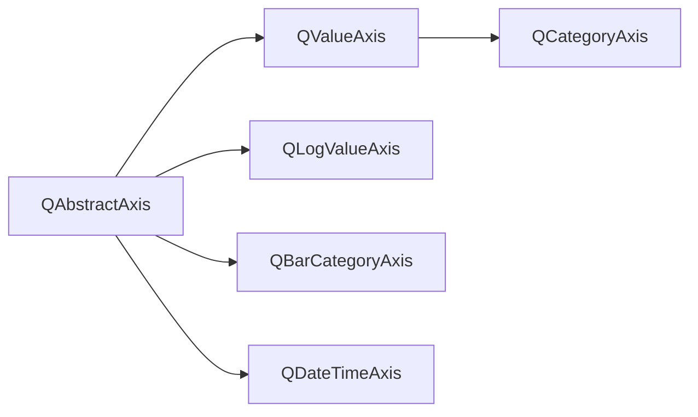

中文对照。

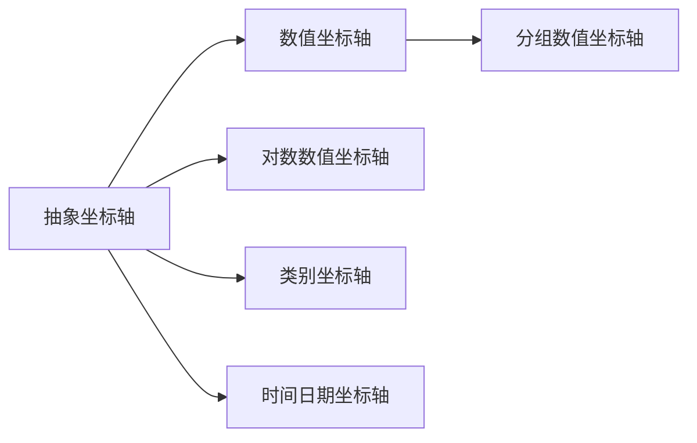

此枚举类型指定轴对象的类型。

```c++
enum QAbstractAxis::AxisType}
    QAbstractAxis::AxisTypeNoAxis,
    QAbstractAxis::AxisTypeValue,
    QAbstractAxis::AxisTypeBarCategory,
    QAbstractAxis::AxisTypeCategory,
    QAbstractAxis::AxisTypeDateTime,
    QAbstractAxis::AxisTypeLogValue
}
```

成员函数。

```c++
Qt::Alignment alignment() const;//此属性保存轴的对齐方式
Qt::Orientation orientation() const;//返回轴的方向（垂直或水平）
//坐标轴隐藏、显示、是否反转、范围
void hide();
void show();
void setVisible(bool visible = true);
bool isVisible() const;
void setMax(const QVariant &max);
void setMin(const QVariant &min);
void setRange(const QVariant &min, const QVariant &max);
void setReverse(bool reverse = true);
bool isReverse() const;
// 设置轴线画笔、颜色、可见性
void setLinePen(const QPen &pen);
void setLinePenColor(QColor color);
void setLineVisible(bool visible = true);
QPen linePen() const;
QColor linePenColor() const;
bool isLineVisible() const;
// 设置次网格线颜色、画笔和可见性
void setMinorGridLineColor(const QColor &color);
void setMinorGridLinePen(const QPen &pen);
void setMinorGridLineVisible(bool visible = true);
QColor minorGridLineColor();
QPen minorGridLinePen() const;
bool isMinorGridLineVisible() const;
// 设置主网格线颜色、画笔、可见性
void setGridLineColor(const QColor &color);
void setGridLinePen(const QPen &pen);
void setGridLineVisible(bool visible = true);
QColor gridLineColor();
QPen gridLinePen() const;
bool isGridLineVisible() const;
// 设置标签角度、颜色、画刷、字体、可见性
void setLabelsAngle(int angle);
void setLabelsBrush(const QBrush &brush);
void setLabelsColor(QColor color);
void setLabelsFont(const QFont &font);
void setLabelsVisible(bool visible = true);
int labelsAngle() const;
QBrush labelsBrush() const;
QColor labelsColor() const;
QFont labelsFont() const;
bool labelsVisible() const;
// 设置阴影画刷、画笔、颜色、可见性
void setShadesBorderColor(QColor color);
void setShadesBrush(const QBrush &brush);
void setShadesColor(QColor color);
void setShadesPen(const QPen &pen);
void setShadesVisible(bool visible = true);
QColor shadesBorderColor() const;
QBrush shadesBrush() const;
QColor shadesColor() const;
QPen shadesPen() const;
bool shadesVisible() const;
// 设置轴标题颜色、字体、文字和可见性
void setTitleBrush(const QBrush &brush);
void setTitleFont(const QFont &font);
void setTitleText(const QString &title);
void setTitleVisible(bool visible = true);
QBrush titleBrush() const;
QFont titleFont() const;
QString titleText() const;
bool isTitleVisible() const;
// 轴类型
virtual AxisType type() const = 0;
```

信号函数。

```c++
void reverseChanged(bool reverse);
void colorChanged(QColor color);
void visibleChanged(bool visible);
void gridLineColorChanged(const QColor &color);
void gridLinePenChanged(const QPen &pen);
void gridVisibleChanged(bool visible);
void labelsAngleChanged(int angle);
void labelsBrushChanged(const QBrush &brush);
void labelsColorChanged(QColor color);
void labelsFontChanged(const QFont &font);
void labelsVisibleChanged(bool visible);
void linePenChanged(const QPen &pen);
void lineVisibleChanged(bool visible);
void minorGridLineColorChanged(const QColor &color);
void minorGridLinePenChanged(const QPen &pen);
void minorGridVisibleChanged(bool visible);
void shadesBorderColorChanged(QColor color);
void shadesBrushChanged(const QBrush &brush);
void shadesColorChanged(QColor color);
void shadesPenChanged(const QPen &pen);
void shadesVisibleChanged(bool visible);
void titleBrushChanged(const QBrush &brush);
void titleFontChanged(const QFont &font);
void titleTextChanged(const QString &text);
void titleVisibleChanged(bool visible);
```

#### 8.2.5 QLegend

图例类。

QLegend 类显示图表的图例。
图例是显示图表图例的图形对象。当系列更改时，图例状态由 QChart 更新。默认情况下，图例附加到图表，但可以将其分离以使其独立于图表布局。图例对象无法创建或删除，但可以通过 QChart 类引用。

此枚举描述了渲染图例标记项时使用的形状。

```c++
enum QLegend::MarkerShape{
    QLegend::MarkerShapeDefault,//由 QLegend 确定的默认形状用于标记。仅单个 QLegendMarker 项目支持此值
    QLegend::MarkerShapeRectangle,//使用矩形标记。标记大小由字体大小决定
    QLegend::MarkerShapeCircle,//使用圆形标记。标记大小由字体大小决定
    QLegend::MarkerShapeFromSeries//标记形状由系列决定。在散点系列的情况下，图例标记看起来像一个散点，并且与该点的大小相同。对于直线或样条系列，图例标记看起来像直线的一小段。对于其他系列类型，显示矩形标记
}
```

成员函数。

```c++
void setAlignment(Qt::Alignment alignment);//图例如何与图表对齐，Qt::AlignTop, Qt::AlignBottom, Qt::AlignLeft, Qt::AlignRight
Qt::Alignment alignment() const;
void attachToChart();//将图例附加到图表。图表可能会调整图例的布局。
void detachFromChart();//从图表中分离图例。图表将不再调整图例的布局
bool isAttachedToChart();// 如果图例附加到图表，则返回 true
// 返回图例中的标记列表，可以通过指定为其返回标记的系列来过滤列表
QList<QLegendMarker *> markers(QAbstractSeries *series = Q_NULLPTR) const;
// 设置背景是否可见、边界颜色、画刷、字体、画笔、颜色
void setBackgroundVisible(bool visible = true);
void setBorderColor(QColor color);
void setBrush(const QBrush &brush);
void setColor(QColor color);
void setFont(const QFont &font);
void setPen(const QPen &pen);
bool isBackgroundVisible() const;
QColor borderColor();
QBrush brush() const;
QColor color();
QFont font() const;
QPen pen() const;
// 设置标签的画刷、颜色、形状、标志位、提示，标志是否反转
void setLabelBrush(const QBrush &brush);
void setLabelColor(QColor color);
void setMarkerShape(MarkerShape shape);
void setReverseMarkers(bool reverseMarkers = true);
void setShowToolTips(bool show);
QBrush labelBrush() const;
QColor labelColor() const;
MarkerShape markerShape() const;
bool reverseMarkers();
bool showToolTips() const;
```

信号函数。

```c++
void backgroundVisibleChanged(bool visible);
void borderColorChanged(QColor color);
void colorChanged(QColor color);
void fontChanged(QFont font);
void labelColorChanged(QColor color);
void markerShapeChanged(MarkerShape shape);
void reverseMarkersChanged(bool reverseMarkers);
void showToolTipsChanged(bool showToolTips);
```

#### 8.2.6 QLegendMarker

可生成类似于QCheckBox的组件，在图例上点击序列标记就可以控制序列是否显示。

QLegendMarker 类是一个抽象对象，可用于访问图例中的标记。**图例标记由图标和标签组成**。图标颜色对应于用于绘制系列的颜色，标签显示系列的名称（或饼系列的切片标签或条形系列的条形集的标签）。图例标记始终与一个系列、切片或条形集相关。

图例标记对象的类型。

```c++
enum QLegendMarker::LegendMarkerType{
    QLegendMarker::LegendMarkerTypeArea,//区域系列的图例标记
    QLegendMarker::LegendMarkerTypeBar,//条形集的图例标记
    QLegendMarker::LegendMarkerTypePie,//饼图的图例标记
    QLegendMarker::LegendMarkerTypeXY,//线、样条线或散点系列的图例标记
    QLegendMarker::LegendMarkerTypeBoxPlot,//箱线图系列的图例标记
    QLegendMarker::LegendMarkerTypeCandlestick//烛台系列的图例标记
}
```

成员函数。

```c++
virtual QAbstractSeries *series() = 0;//返回指向与此图例标记相关的曲线指针。图例标记始终与系列相关
virtual LegendMarkerType type() = 0;

void setBrush(const QBrush &brush);
void setFont(const QFont &font);
void setLabel(const QString &label);
void setLabelBrush(const QBrush &brush);
void setPen(const QPen &pen);
void setShape(QLegend::MarkerShape shape);
void setVisible(bool visible);
QBrush brush() const;
QFont font() const;
bool isVisible() const;
QString label() const;
QBrush labelBrush() const;
QPen pen() const;
QLegend::MarkerShape shape() const;
```

### 8.3 序列类

#### 8.3.1 QLineSeries

折线图类。

```c++
QLineSeries(QObject *parent = Q_NULLPTR);
```

如果定义自己的折线图类，就必须重定义type()函数。

```c++
QAbstractSeries::SeriesType QLineSeries::type() const;
```

QLineSeries 类以折线图的形式呈现数据。
折线图用于将信息显示为由直线连接的一系列数据点。一个使用的例子如下。

```c++
QLineSeries* series = new QLineSeries();
series->append(0, 6);
series->append(2, 4);
...
chart->addSeries(series);
```

#### 8.3.2 QScatterSeries

散点图类。

此枚举值描述了渲染标记项时使用的形状。（就是散点的样式）

```c++
enum QScatterSeries::MarkerShape{
    QScatterSeries::MarkerShapeCircle,//圆形
    QScatterSeries::MarkerShapeRectangle//矩形
}
```

成员函数。

```c++
QScatterSeries(QObject *parent = Q_NULLPTR);
QBrush brush() const;
// 设置边界颜色、标记形状和大小
void setBorderColor(const QColor &color);
QColor borderColor() const;
void setMarkerShape(MarkerShape shape);
MarkerShape markerShape() const;
void setMarkerSize(qreal size);
qreal markerSize() const;
```

自定义类需要重定义的函数。

```c++
virtual QColor color() const;
virtual void setBrush(const QBrush &brush);
virtual void setColor(const QColor &color);
virtual void setPen(const QPen &pen);
virtual QAbstractSeries::SeriesType type() const;
```

#### 8.3.3 QSplineSeries

光滑曲线图类。

```c++
QSplineSeries(QObject *parent = Q_NULLPTR);
virtual QAbstractSeries::SeriesType type() const;
```

QSplineSeries 类将数据显示为样条图。
样条系列存储 QPainterPath 绘制样条所需的数据点和线段控制点。数据变化时会自动计算控制点。该算法计算点，以便可以绘制法线样条。

使用例子。

```c++
QSplineSeries* series = new QSplineSeries();
series->append(0, 6);
series->append(2, 4);
...
chart->addSeries(series);
```

#### 8.3.4 QBoxPlotSeries

火柴盒图。

QBoxPlotSeries 类以盒须图的形式呈现数据。
箱线图系列充当盒须项目的容器。来自多个系列的项目根据其索引值分组。
QBarCategoryAxis 类用于将类别添加到图表的轴。类别标签必须是唯一的。如果为多个盒须项定义了相同的类别标签，则仅绘制第一个。

成员函数。

```c++
bool append(QBoxSet *set);
bool append(QList<QBoxSet *> sets);
bool insert(int index, QBoxSet *set);
bool take(QBoxSet *set);//从系列中获取由 set 指定的盒须项目。不删除项目
bool remove(QBoxSet *set);
QList<QBoxSet *> boxSets() const;

void setBoxOutlineVisible(bool visible);//此属性保存框轮廓的可见性
bool boxOutlineVisible();
void setBoxWidth(qreal width);
qreal boxWidth();
void setBrush(const QBrush &brush);
QBrush brush() const;
void setPen(const QPen &pen);
QPen pen() const;
void clear();
int count() const;//返回箱线图系列中盒须项的数量
```

信号函数。

```c++
void clicked(QBoxSet *boxset);
void pressed(QBoxSet *boxset);
void released(QBoxSet *boxset);
void doubleClicked(QBoxSet *boxset);

void boxOutlineVisibilityChanged();
void boxWidthChanged();
void boxsetsAdded(QList<QBoxSet *> sets);
void boxsetsRemoved(QList<QBoxSet *> sets);

void brushChanged();
void countChanged();
void penChanged();

void hovered(bool status, QBoxSet *boxset);
```

#### 8.3.5 QBarSeries

柱状图类。

QBarSeries 类将一系列数据显示为按类别分组的垂直条。
此类将数据绘制为一系列按类别分组的垂直条，每个类别中每个类别都有一个条来自添加到该系列的每个条集。

成员函数和信号函数基本都继承自QAbstractBarSeries。

#### 8.3.6 QHorizontalBarSeries

水平柱状图类。

QHorizontalBarSeries 类将一系列数据显示为按类别分组的水平条。
此类将数据绘制为一系列按类别分组的水平条，每个类别中每个类别一个条来自添加到该系列的每个条集。

成员函数和信号函数基本都继承自QAbstractBarSeries。

#### 8.3.7 QHorizontalPercentBarSeries

水平百分比柱状图类。

QHorizontalPercentBarSeries 类将一系列分类数据显示为每个类别的百分比。
此类将数据绘制为一系列大小均匀的水平堆叠条，每个类别一个条。添加到系列中的每个条形集都会为每个堆叠条形贡献一个段。段大小对应于段值与堆栈中所有段的总值相比的百分比。不绘制零值条。

成员函数和信号函数基本都继承自QAbstractBarSeries。

#### 8.3.8 QHorizontalStackedBarSeries

水平堆叠柱状图类。

QHorizontalStackedBarSeries 类将一系列数据显示为水平堆叠的条形，每个类别一个条形。添加到系列中的每个条形集都会为每个堆叠条形贡献一个段。

成员函数和信号函数基本都继承自QAbstractBarSeries。

#### 8.3.9 QPercentBarSeries

百分比柱状图。

QPercentBarSeries 类将一系列分类数据表示为每个类别的百分比。
此类将数据绘制为一系列大小一致的垂直堆叠条形图，每个类别一个条形图。添加到系列中的每个条形集都会为每个堆叠条形贡献一个段。段大小对应于段值与堆栈中所有段的总值相比的百分比。不绘制零值条。

成员函数和信号函数基本都继承自QAbstractBarSeries。

#### 8.3.10 QStackedBarSeries

堆叠柱状图。

QStackedBarSeries 类将一系列数据显示为垂直堆叠的条形，每个类别一个条形。
添加到系列中的每个条形集都会为每个堆叠条形贡献一个段。

成员函数和信号函数基本都继承自QAbstractBarSeries。

#### 8.3.11 QPieSeries

饼图类。

QPieSeries 类以饼图的形式呈现数据。
饼系列由定义为 QPieSlice 对象的切片组成。切片可以具有任何值，因为 QPieSeries 对象计算切片与系列中所有切片的总和的百分比，以确定图表中切片的实际大小。
图表上的饼图大小和位置通过使用范围从 0.0 到 1.0 的相对值来控制。这些与实际的图表矩形有关。默认情况下，饼图被定义为一个完整的饼图。可以通过为系列设置起始角度和角度跨度来创建部分饼图。一个完整的派是 360 度，其中 0 是在 12 点。

成员函数。

```c++
bool append(QPieSlice *slice);
bool append(QList<QPieSlice *> slices);
QPieSlice *append(QString label, qreal value);
QPieSeries &operator<<(QPieSlice *slice);
bool remove(QPieSlice *slice);
bool insert(int index, QPieSlice *slice);
bool take(QPieSlice *slice);
QList<QPieSlice *> slices() const;

void clear();
int count() const;//返回此系列中的切片数
bool isEmpty() const;
qreal sum() const;//该属性保存所有切片的总和

void setHoleSize(qreal holeSize);//此属性保存甜甜圈孔的大小
qreal holeSize() const;

void setHorizontalPosition(qreal relativePosition);//此属性保存饼图水平位置
qreal horizontalPosition() const;

void setLabelsPosition(QPieSlice::LabelPosition position);//将所有切片标签的位置设置为位置
void setLabelsVisible(bool visible = true);//将所有切片标签的可见性设置为可见

void setPieEndAngle(qreal angle);//此属性保存饼图的起始和终止角度
qreal pieEndAngle() const;
void setPieStartAngle(qreal startAngle);
qreal pieStartAngle() const;

void setPieSize(qreal relativeSize);//此属性保存饼图大小
qreal pieSize() const;

void setVerticalPosition(qreal relativePosition);//此属性保存饼图的垂直位置
qreal verticalPosition() const;
```

信号函数。

```c++
void hovered(QPieSlice *slice, bool state);
void clicked(QPieSlice *slice);
void doubleClicked(QPieSlice *slice);
void pressed(QPieSlice *slice);
void released(QPieSlice *slice);
void removed(QList<QPieSlice *> slices);
void added(QList<QPieSlice *> slices);
void countChanged();
void sumChanged();
```

#### 8.3.12 QAreaSeries

面积图类。

成员函数。

```c++
QAreaSeries(QLineSeries *upperSeries, QLineSeries *lowerSeries = Q_NULLPTR);

void setBorderColor(const QColor &color);
QColor borderColor() const;
void setPen(const QPen &pen);
void setBrush(const QBrush &brush);
void setColor(const QColor &color);
QBrush brush() const;
QColor color() const;
QPen pen() const;

void setLowerSeries(QLineSeries *series);//设置要用作面积图下/上序列。如果上系列为空，则不绘制面积图，即使它有下系列
QLineSeries *lowerSeries() const;
void setUpperSeries(QLineSeries *series)
QLineSeries *upperSeries() const;

void setPointLabelsClipping(bool enabled = true);
bool pointLabelsClipping() const;
void setPointLabelsColor(const QColor &color);
QColor pointLabelsColor() const;
void setPointLabelsFont(const QFont &font);
QFont pointLabelsFont() const;
void setPointLabelsFormat(const QString &format);
QString pointLabelsFormat() const;
void setPointLabelsVisible(bool visible = true);
bool pointLabelsVisible() const;
void setPointsVisible(bool visible = true);
bool pointsVisible() const;
```

信号函数。

```c++
void clicked(const QPointF &point);
void doubleClicked(const QPointF &point);
void pressed(const QPointF &point);
void released(const QPointF &point);
void hovered(const QPointF &point, bool state);
void colorChanged(QColor color);
void borderColorChanged(QColor color);
void pointLabelsClippingChanged(bool clipping);
void pointLabelsColorChanged(const QColor &color);
void pointLabelsFontChanged(const QFont &font);
void pointLabelsFormatChanged(const QString &format);
void pointLabelsVisibilityChanged(bool visible);
```

### 8.4 坐标轴类

#### 8.4.1 QValueAxis

数值坐标轴类。

QValueAxis 类将值添加到图表的轴。
可以设置值轴以显示带有刻度线、网格线和阴影的轴线。轴上的值绘制在刻度线的位置。
以下示例代码说明了如何使用 QValueAxis 类：

```c++
QChartView *chartView = new QChartView;
QLineSeries *series = new QLineSeries;
// ...
chartView->chart()->addSeries(series);

QValueAxis *axisX = new QValueAxis;
axisX->setRange(10, 20.5);
axisX->setTickCount(10);
axisX->setLabelFormat("%.2f");
chartView->chart()->setAxisX(axisX, series);
```

成员函数。

```c++
void setMax(qreal max);
void setMin(qreal min);
void setRange(qreal min, qreal max);
qreal max() const;
qreal min() const;
void setLabelFormat(const QString &format);
QString labelFormat() const;
void setMinorTickCount(int count);
int minorTickCount() const;
void setTickCount(int count);
int tickCount() const;
```

槽函数。

```c++
void QValueAxis::applyNiceNumbers();//修改轴上刻度线的当前范围和数量，使其看起来不错。该算法认为可以表示为 1*10^n、2*10^n 或 5*10^n 形式的数字是不错的数字。这些数字用于设置刻度线的间距。
```

信号函数。

```c++
void labelFormatChanged(const QString &format);
void maxChanged(qreal max);
void minChanged(qreal min);
void minorTickCountChanged(int minorTickCount);
void rangeChanged(qreal min, qreal max);
void tickCountChanged(int tickCount);
```

#### 8.4.2 QCategoryAxis

分组数值坐标轴类。

QCategoryAxis 类将命名范围放在轴上。
此类可用于通过添加标记类别来解释基础数据。与 QBarCategoryAxis 不同，QCategoryAxis 允许自由指定类别范围的宽度。
关于如何使用 QCategoryAxis 的示例代码：

```c++
QChartView *chartView = new QChartView;
QLineSeries *series = new QLineSeries;
// ...
chartView->chart()->addSeries(series);

QCategoryAxis *axisY = new QCategoryAxis;
axisY->setMin(0);
axisY->setMax(52);
axisY->setStartValue(15);
axisY->append("First", 20);
axisY->append("Second", 37);
axisY->append("Third", 52);
chartView->chart()->setAxisY(axisY, series);
```

这个枚举描述了类别标签的位置。

```c++
enum QCategoryAxis::AxisLabelsPosition{
    QCategoryAxis::AxisLabelsPositionCenter,//标签以类别为中心
    QCategoryAxis::AxisLabelsPositionOnValue//标签位于类别的上限
}
```

成员函数。

```c++
int count() const;//返回类别数
void append(const QString &categoryLabel, qreal categoryEndValue);//使用标签 categoryLabel 将新类别附加到轴。类别标签必须是唯一的。 categoryEndValue 指定类别的上限。它必须大于上一个类别的高端限制。否则，该方法返回而不添加新类别。
void remove(const QString &categoryLabel);//从轴中删除由标签 categoryLabel 指定的类别
void replaceLabel(const QString &oldLabel, const QString &newLabel);//将 oldLabel 指定的现有类别标签替换为 newLabel。如果旧标签不存在，则该方法返回而不进行任何更改
QStringList categoriesLabels();//返回类别标签的列表

void setLabelsPosition(QCategoryAxis::AxisLabelsPosition position);//此属性保存类别标签的位置。当定位在值上时，轴开头和结尾的标签可能会与其他轴的标签重叠
QCategoryAxis::AxisLabelsPosition labelsPosition() const;

void setStartValue(qreal min);
qreal startValue(const QString &categoryLabel = QString()) const;//返回由 categoryLabel 指定的类别的下限
qreal endValue(const QString &categoryLabel) const;//返回由 categoryLabel 指定的类别的上限
```

信号函数。

```c++
void categoriesChanged();
void labelsPositionChanged(QCategoryAxis::AxisLabelsPosition position);
```

#### 8.4.3 QLogValueAxis

对数坐标轴类。

QLogValueAxis 类向图表的轴添加对数刻度。
对数刻度是基于数量级的非线性刻度，因此轴上的每个刻度线都是前一个刻度线乘以一个值。
注意：如果 QLogValueAxis 附加到具有一个或多个在相关维度上具有负值或零值的点的系列，则根本不会绘制该系列。这在使用 XYModelMappers 时尤其重要，因为模型中的空单元格通常包含零值。

成员函数。

```c++
void setBase(qreal base);//此属性保存对数的底。该值必须大于 0 且不能等于 1。
qreal base() const;

void setRange(qreal min, qreal max);
void setMax(qreal max);
void setMin(qreal min);
qreal max() const;
qreal min() const;

void setLabelFormat(const QString &format);
QString labelFormat() const;
void setMinorTickCount(int minorTickCount);
int minorTickCount() const;
int tickCount() const;
```

信号函数。

```c++
void baseChanged(qreal base);
void labelFormatChanged(const QString &format);
void maxChanged(qreal max);
void minChanged(qreal min);
void minorTickCountChanged(int minorTickCount);
void rangeChanged(qreal min, qreal max);
void tickCountChanged(int tickCount);
```

#### 8.4.4 QBarCategoryAxis

类别坐标轴类。

QBarCategoryAxis 类将类别添加到图表的轴。
QBarCategoryAxis 可以设置为显示带有刻度线、网格线和阴影的轴线。类别在刻度之间绘制。它也可以与线条系列一起使用，如线条和条形图示例所示。
以下代码说明了如何使用 QBarCategoryAxis：

```c++
QChartView *chartView = new QChartView;
QBarSeries *series = new QBarSeries;
// ...
chartView->chart()->addSeries(series);
chartView->chart()->createDefaultAxes();

QBarCategoryAxis *axisX = new QBarCategoryAxis;
QStringList categories;
categories << "Jan" << "Feb" << "Mar" << "Apr" << "May" << "Jun";
axisX->append(categories);
axisX->setRange("Feb", "May");
chartView->chart()->setAxisX(axisX, series);
```

成员函数。

```c++
void append(const QStringList &categories);
void append(const QString &category);
void insert(int index, const QString &category);
void remove(const QString &category);
void replace(const QString &oldCategory, const QString &newCategory);
QString at(int index) const;
void setCategories(const QStringList &categories);
QStringList categories();
void clear();
int count() const;
void setMax(const QString &max);
void setMin(const QString &min);
void setRange(const QString &minCategory, const QString &maxCategory);
QString max() const;
QString min() const;
```

信号函数。

```c++
void categoriesChanged();
void countChanged();
void maxChanged(const QString &max);
void minChanged(const QString &min);
void rangeChanged(const QString &min, const QString &max);
```

#### 8.4.5 QDateTimeAxis

时间日期轴类。

QDateTimeAxis 类将日期和时间添加到图表的轴。
QDateTimeAxis 可以设置为显示带有刻度线、网格线和阴影的轴线。可以通过设置适当的 DateTime 格式来配置标签。 QDateTimeAxis 适用于从公元前 4714 年到公元 287396 年的日期。有关与 QDateTime 相关的其他限制，请参阅 QDateTime 文档。
注意：QDateTimeAxis 在将 qreal 定义为浮点数的平台上被禁用。

QDateTimeAxis 可以与任何 QXYSeries 一起使用。要将数据点添加到系列中，请使用 QDateTime::toMSecsSinceEpoch()：

```c++
QLineSeries *series = new QLineSeries;

QDateTime xValue;
xValue.setDate(QDate(2012, 1 , 18));
xValue.setTime(QTime(9, 34));
qreal yValue = 12;
series->append(xValue.toMSecsSinceEpoch(), yValue);

xValue.setDate(QDate(2013, 5 , 11));
xValue.setTime(QTime(11, 14));
qreal yValue = 22;
series->append(xValue.toMSecsSinceEpoch(), yValue);
```

以下代码片段说明了将系列添加到图表并设置 QDateTimeAxis：

```c++
QChartView *chartView = new QChartView;
chartView->chart()->addSeries(series);

// ...
QDateTimeAxis *axisX = new QDateTimeAxis;
axisX->setFormat("dd-MM-yyyy h:mm");
chartView->chart()->setAxisX(axisX, series);
```

成员函数。

```c++
QDateTime max() const;
QDateTime min() const;
void setMax(QDateTime max);
void setMin(QDateTime min);
void setRange(QDateTime min, QDateTime max);
void setTickCount(int count);
int tickCount() const;
void setFormat(QString format);
QString format() const;
```

信号函数。

```c++
void formatChanged(QString format);
void maxChanged(QDateTime max);
void minChanged(QDateTime min);
void rangeChanged(QDateTime min, QDateTime max);
void tickCountChanged(int tickCount);
```

### 8.5 本章其它数据类型

#### 8.5.1 QMargins

常用于设置图表的边距。

QMargins 类定义了一个矩形的四个边距。
QMargin 定义了一组四个边距； left、top、right 和 bottom，它们描述了矩形周围边框的大小。
仅当所有边距都设置为零时，isNull() 函数才返回 true。
QMargin 对象可以进行流式传输和比较。

成员函数。

```c++
QMargins(int left, int top, int right, int bottom);
bool isNull() const;
int bottom() const;
int left() const;
int right() const;
int top() const;
void setBottom(int bottom);
void setLeft(int left);
void setRight(int right);
void setTop(int Top);
```

#### 8.5.2 QBoxSet

QBoxSet 类表示盒须图中的一项。
盒须项是由**五个不同值构成的范围和三个中值的图形表示**。有两种方法可以指定值。第一个是使用构造函数或流运算符 (&lt;&lt;)。这些值必须按以下顺序指定：**下限、下四分位数、中位数、上四分位数和上限。**第二种方法是创建一个空的 QBoxSet 实例并使用 setValue() 方法指定值。

此枚举类型定义盒须项的值。

```c++
enum QBoxSet::ValuePositions{
    QBoxSet::LowerExtreme,//下限
    QBoxSet::LowerQuartile,//下四分位数
    QBoxSet::Median,//中位数
    QBoxSet::UpperQuartile,//上四分位数
    QBoxSet::UpperExtreme//上限
}
```

成员函数。

```c++
QBoxSet(const QString label = QString(), QObject *parent = Q_NULLPTR);
QBoxSet(const qreal le, const qreal lq, const qreal m, const qreal uq, const qreal ue, const QString label = QString(), QObject *parent = Q_NULLPTR);
void append(const qreal value);
void append(const QList<qreal> &values);
QBoxSet &operator<<(const qreal &value);
void setValue(const int index, const qreal value);
qreal operator[](const int index) const;
qreal at(const int index) const;

void clear();
int count() const;
void setBrush(const QBrush &brush);
void setLabel(const QString label);
void setPen(const QPen &pen);
QBrush brush() const;
QString label() const;
QPen pen() const;
```

#### 8.5.3 QBarSet

QBarSet 类表示条形图中的一组条形。
**条形集包含每个类别的一个数据值**。假设集合的第一个值属于第一个类别，第二个属于第二个类别，依此类推。如果**集合中的值少于类别，则假定缺失值位于集合的末尾**。对于集合中间的缺失值，使用零的数值。不显示零值集的标签。

成员函数。

```c++
QBarSet(const QString label, QObject *parent = Q_NULLPTR);
void append(const qreal value);
void append(const QList<qreal> &values);
QBarSet &operator<<(const qreal &value);
qreal operator[](const int index) const;
void insert(const int index, const qreal value);
void remove(const int index, const int count = 1);
void replace(const int index, const qreal value);
qreal at(const int index) const;
qreal sum() const;
int count() const;

void setBorderColor(QColor color);
void setBrush(const QBrush &brush);
void setColor(QColor color);
void setPen(const QPen &pen);
QColor borderColor();
QBrush brush() const;
QColor color();
QPen pen() const;
void setLabel(const QString label);
void setLabelBrush(const QBrush &brush);
void setLabelColor(QColor color);
void setLabelFont(const QFont &font);
QString label() const;
QBrush labelBrush() const;
QColor labelColor();
QFont labelFont() const;
```

信号函数。

```c++
void clicked(int index);
void doubleClicked(int index);
void pressed(int index);
void released(int index);
void penChanged();
void borderColorChanged(QColor color)
void brushChanged();
void colorChanged(QColor color);
void hovered(bool status, int index);
void labelBrushChanged();
void labelChanged();
void labelColorChanged(QColor color);
void labelFontChanged();
void valueChanged(int index);
void valuesAdded(int index, int count);
void valuesRemoved(int index, int count);
```

#### 8.5.4 QPieSlice

QPieSlice 类表示饼系列中的单个切片。
**饼图有一个值和一个标签**。当切片添加到饼图系列时，QPieSeries 对象计算切片与该系列中所有切片之和的百分比，以确定图表中切片的实际大小。
**默认情况下，标签是隐藏的**。如果它是可见的，它可以位于切片外部并通过臂连接到切片或水平或平行于切片弧的切线或法线在切片内居中。
**默认情况下，切片的视觉外观由主题设置，但可以通过指定切片属性来覆盖主题**。但是，如果在**自定义切片后更改主题，则所有自定义都将丢失**。
为了使用户能够与饼图交互，当用户单击饼图或将鼠标悬停在饼图上时会发出一些基本信号。

这个枚举描述了切片标签的位置。

```c++
enum QPieSlice::LabelPosition{
    QPieSlice::LabelOutside,//标签位于用臂连接到它的切片之外。这是默认值
    QPieSlice::LabelInsideHorizontal,//标签在切片中居中并水平布局
    QPieSlice::LabelInsideTangential,//标签在切片内居中并旋转为与切片弧的切线平行
    QPieSlice::LabelInsideNormal//标签在切片中居中并旋转为与切片弧的法线平行
}
```

成员函数。

```c++
QPieSlice(QObject *parent = Q_NULLPTR);
QPieSlice(QString label, qreal value, QObject *parent = Q_NULLPTR);
QPieSeries *series() const;//返回所有切片
qreal percentage() const;//百分比
// 开始角度和横跨角度
qreal startAngle() const;
qreal angleSpan() const;
// 设置边界颜色、宽度、画刷、颜色、画笔
void setBorderColor(QColor color);
void setBorderWidth(int width);
void setBrush(const QBrush &brush);
void setColor(QColor color);
void setPen(const QPen &pen);
QColor borderColor();
int borderWidth();
QBrush brush() const;
QColor color();
QPen pen() const;
// 分开弹出爆照效果因子
void setExplodeDistanceFactor(qreal factor);
void setExploded(bool exploded = true);
qreal explodeDistanceFactor() const;
bool isExploded() const;
// 设置标签，标签值，及其颜色、画刷、字体、位置、颜色和可见性
void setLabel(QString label);
void setValue(qreal value);
void setLabelArmLengthFactor(qreal factor);
void setLabelBrush(const QBrush &brush);
void setLabelColor(QColor color);
void setLabelFont(const QFont &font);
void setLabelPosition(LabelPosition position);
void setLabelVisible(bool visible = true);
QString label() const;
qreal value() const;
qreal labelArmLengthFactor() const;
QBrush labelBrush() const;
QColor labelColor();
QFont labelFont() const;
LabelPosition labelPosition();
bool isLabelVisible() const;
```

信号函数。

```c++
void clicked();
void doubleClicked();
void pressed();
void released();
void hovered(bool state);
void penChanged();
void valueChanged();
void percentageChanged();
void startAngleChanged();
void angleSpanChanged();
void borderColorChanged();
void borderWidthChanged();
void brushChanged();
void colorChanged();
void labelBrushChanged();
void labelChanged();
void labelColorChanged();
void labelFontChanged();
void labelVisibleChanged();
```

## 9. 三维图表

本章只介绍三维图表，需要有相应的三维视图类、三维图表类和三维坐标轴类，最后还有三维代理类。

三维视图类等价于二维的QChartView，三维柱状图、三维散点图和三维曲面图都各自有自己的视图类。

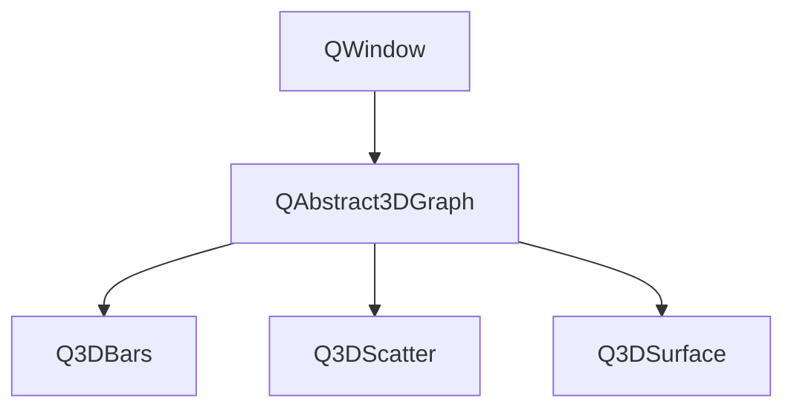

每个视图类都对应一个三维序列类，不能交叉使用，例如QBar3DSeries只能用作Q3DBars的序列，而不能作为Q3DScatter的序列。不过同一个视图类可以加多个序列类，例如一个Q3DSurface可以有多个QSurface3DSeries。

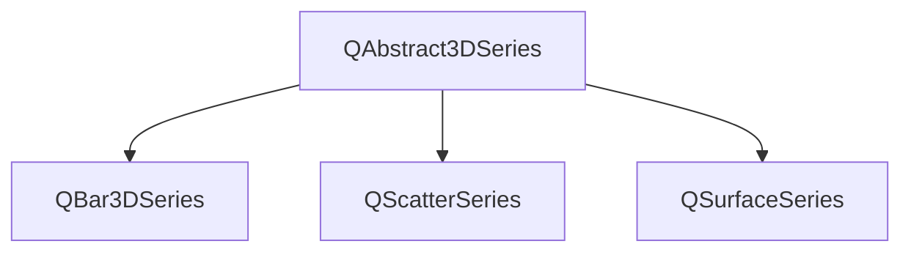

三维坐标轴只分为数值和文字型坐标轴。

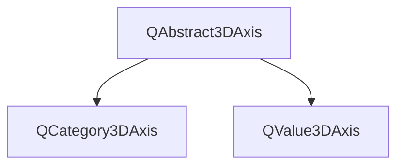

数据代理类也有，也要和序列对应，用于存储序列数据的类。例如三维散点序列QScatterSeries存储的是一些三维数据点的坐标；QSurface3DSeries存储的数据点是在水平面上均匀网格分布的，就需要二维数组才能存储。这些三维代理类还有基于项数据模型的数据代理子类。特别的QHeightMapSurfaceDataProxy是专门用于显示地图高程数据的数据代理类，可以将一个图片表示的高程数据显示为三维曲面。

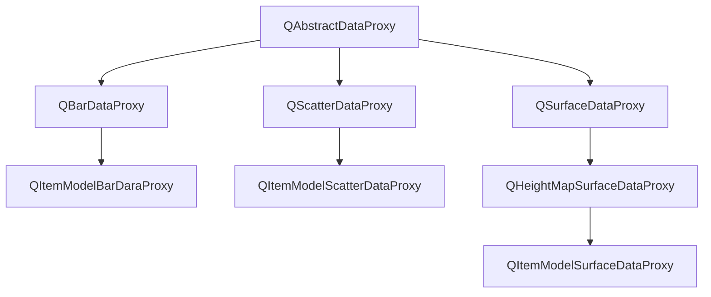

如果要在项目中使用三维图表模块，必须在pro文件加上

```c++
Qt += datavisualization
```

同样也有自己的命名空间。

```c++
#include <QtDataVisualization>
using namespace QtDataVisualization;
```

因为三维图形类都是从QWindow继承而来不能简单使用QWidget部件作为Q3DBars组件的容器，也就是不能主窗口放置一个QWidget组件然后作为Q3DBars组件的容器，必须使用QWidget::createWindowContainer动态创建QWidget作为容器。

```c++
this->graph3D = new Q3DBars();
this->graphContainer = QWidget::createWindowContainer(this->graph3D); 
this->graph3D->scene()->activeCamera()>setCameraPreset(Q3DCamera::CameraPresetFrontHigh);
```

无需任何编程设置，程序运行时就可以在图表中单击左键选择图表中的某个项，按住鼠标右键就可以对观察图表的视角进行调整。关于视角的关联数据类型是Q3DCamera和CameraPreset。

### 9.1 三维视图类

#### 9.1.1 QAbstract3DGraph

QAbstract3DGraph 类为图形提供了一个窗口和渲染循环。
此类继承 QWindow 并为继承它的图形提供渲染循环。
您不需要直接使用此类，而是使用其子类之一。
抗锯齿在 C++ 上默认打开，除了在 OpenGL ES2 环境中，Qt 数据可视化不支持抗锯齿。要为图形指定非默认抗锯齿，请提供自定义表面格式作为构造函数参数。您可以使用便捷函数 QtDataVisualization::qDefaultSurfaceFormat() 来创建表面格式对象。注意：QAbstract3DGraph 默认设置窗口标志 Qt::FramelessWindowHint。如果要将**图形窗口显示为具有常规窗口框架的独立窗口**，请在构建图形后清除此标志。例如：

```c++
 Q3DBars *graphWindow = new Q3DBars;
 graphWindow->setFlags(graphWindow->flags() ^ Qt::FramelessWindowHint);
```

##### 枚举类型

图表中元素的类型。

```c++
enum QAbstract3DGraph::ElementType{
    QAbstract3DGraph::ElementNone,//没有定义的元素
    QAbstract3DGraph::ElementSeries,//一个系列（即系列中的一个项目）
    QAbstract3DGraph::ElementAxisXLabel,//x轴标签
    QAbstract3DGraph::ElementAxisYLabel,//Y轴标签
    QAbstract3DGraph::ElementAxisZLabel,//Z轴标签
    QAbstract3DGraph::ElementCustomItem//自定义项目
}
```

渲染的优化提示。

```c++
enum QAbstract3DGraph::OptimizationHint{
    QAbstract3DGraph::OptimizationDefault,//以合理的性能提供完整的功能集
    QAbstract3DGraph::OptimizationStatic//以牺牲某些功能为代价优化静态数据集的渲染
}
```

项目选择模式。此枚举的值可以与 OR 运算符组合。

```c++
enum QAbstract3DGraph::SelectionFlag{
    QAbstract3DGraph::SelectionNone,//选择模式已禁用
    QAbstract3DGraph::SelectionItem,//选择突出显示单个项目
    QAbstract3DGraph::SelectionRow,//选择突出显示单行
    QAbstract3DGraph::SelectionItemAndRow,//用不同颜色突出显示项目和行的组合标志
    QAbstract3DGraph::SelectionColumn,//选择突出显示单个列
    QAbstract3DGraph::SelectionItemAndColumn,//用不同颜色突出显示项目和列的组合标志
    QAbstract3DGraph::SelectionRowAndColumn,//用于突出显示行和列的组合标志
    QAbstract3DGraph::SelectionItemRowAndColumn,//用于突出显示项目、行和列的组合标志
    QAbstract3DGraph::SelectionSlice,//设置此模式标志表示图形应该自动处理切片视图处理。如果您希望通过 Q3DScene 自己控制切片视图，请不要设置此标志。设置此模式标志时，必须同时设置 SelectionRow 或 SelectionColumn，但不能同时设置。只有 Q3DBars 和 Q3DSurface 支持切片。1.当选择通过系列API显式更改为可见项时；2.当选择模式更改且选定项可见时；3.通过单击图形更改选择时
    QAbstract3DGraph::SelectionMultiSeries//设置此模式意味着突出显示同一位置的所有系列的项目，而不仅仅是选定的项目。其他系列中的实际选择没有改变。 Q3DScatter 不支持多系列选择
}
```

阴影质量。

```c++
enum QAbstract3DGraph::ShadowQuality{
    QAbstract3DGraph::ShadowQualityNone,//阴影被禁用
    QAbstract3DGraph::ShadowQualityLow,//阴影以低质量渲染
    QAbstract3DGraph::ShadowQualityMedium,//阴影以中等质量渲染
    QAbstract3DGraph::ShadowQualityHigh,///阴影以高质量渲染
    QAbstract3DGraph::ShadowQualitySoftLow,//阴影以低质量渲染，边缘柔和
    QAbstract3DGraph::ShadowQualitySoftMedium,//阴影以中等质量渲染，边缘柔和
    QAbstract3DGraph::ShadowQualitySoftHigh//阴影以高质量渲染，边缘柔和
}
```

##### 成员函数

```c++
virtual bool shadowsSupported() const;//如果当前配置支持阴影，则返回 true。 OpenGL ES2 配置不支持阴影
Q3DScene *scene() const;//此属性保存 Q3DScene 指针，可用于操作场景和访问场景元素，例如活动摄像机
QAbstract3DAxis *selectedAxis() const;//可用于在接收到任意标签类型的 selectedElementChanged 信号后获取选中的轴。选择在下一个 selectedElementChanged 信号之前有效
ElementType selectedElement() const;//此属性保存图表中选定的元素
QImage renderToImage(int msaaSamples = 0, const QSize &imageSize = QSize());//将当前帧渲染为 imageSize 的图像。默认大小是窗口大小。使用 msaaSamples 中给出的抗锯齿级别渲染图像。默认级别为 0
QVector3D queriedGraphPosition() const;//此属性保存沿每个轴的最新查询的图形位置值
void clearSelection();//清除所有附加系列的选择
qreal currentFps() const;
bool hasContext() const;//如果图形的 OpenGL 上下文已成功初始化，则返回 true。在上下文初始化失败时尝试使用图表通常会导致崩溃。上下文初始化失败的一个常见原因是缺乏对 OpenGL 的足够平台支持

void setActiveInputHandler(QAbstract3DInputHandler *inputHandler);//此属性保存图表中使用的活动输入处理程序
QAbstract3DInputHandler *activeInputHandler() const;
void addInputHandler(QAbstract3DInputHandler *inputHandler);//将给定的 inputHandler 添加到图中。通过 addInputHandler 添加的输入处理程序不会直接使用。仅将 inputHandler 的所有权赋予图。 inputHandler 不得为 null 或已添加到另一个图中。
void releaseInputHandler(QAbstract3DInputHandler *inputHandler);//如果 inputHandler 已添加到此图中，则将其所有权释放回调用者。如果释放的 inputHandler 正在使用中，则在此调用之后将没有活动的输入处理程序
QList<QAbstract3DInputHandler *> inputHandlers() const;//返回所有添加的输入处理程序的列表

QCustom3DItem *selectedCustomItem() const;//可用于在接收到 QAbstract3DGraph::ElementCustomItem 类型的 selectedElementChanged 信号后获取选中的自定义项。项目的所有权保留在图表中。选择在下一个 selectedElementChanged 信号之前有效
int addCustomItem(QCustom3DItem *item);//将 QCustom3DItem 项添加到图形中。 Graph 拥有所添加项目的所有权。如果添加操作成功，则返回添加项的索引，如果尝试添加空项，则返回 -1，如果尝试添加已添加的项，则返回该项的索引。
void releaseCustomItem(QCustom3DItem *item);//获取给定项目的所有权并从图表中删除该项目
void removeCustomItem(QCustom3DItem *item);//删除自定义项。删除分配给它的资源
void removeCustomItemAt(const QVector3D &position);//删除位置的所有自定义项目。删除分配给它们的资源
void removeCustomItems(); //删除所有自定义项目。删除分配给它们的资源
QList<QCustom3DItem *> customItems() const;//返回所有添加的自定义项的列表

int selectedCustomItemIndex() const;//可用于在接收到 QAbstract3DGraph::ElementCustomItem 类型的 selectedElementChanged 信号后查询所选自定义项的索引。选择在下一个 selectedElementChanged 信号之前有效
int selectedLabelIndex() const;//可用于在接收到任意标签类型的 selectedElementChanged 信号后查询选中标签的索引。选择在下一个 selectedElementChanged 信号之前有效

void setActiveTheme(Q3DTheme *theme);//此属性包含图形的活动主题
Q3DTheme *activeTheme() const;
void addTheme(Q3DTheme *theme);//将给定的主题添加到图表中。通过 addTheme 添加的主题不直接使用。只有主题的所有权被赋予图表。主题不得为空或已添加到另一个图表
QList<Q3DTheme *> themes() const;//返回所有添加主题的列表
void releaseTheme(Q3DTheme *theme);//如果主题已添加到此图中，则将主题的所有权释放回调用者。如果发布的主题正在使用中，将创建一个新的默认主题并将其设置为活动的

void setAspectRatio(qreal ratio);//此属性保存水平面上最长轴与 y 轴之间的图形缩放比例
qreal aspectRatio() const;

void setHorizontalAspectRatio(qreal ratio);//此属性保存 x 轴和 z 轴之间的图形缩放比例
qreal horizontalAspectRatio() const;

void setLocale(const QLocale &locale);//此属性保存用于格式化各种数字标签的语言环境。默认“C”语言环境
QLocale locale() const;

void setMargin(qreal margin);//此属性保存用于可绘制图形区域边缘和图形背景边缘之间的空间的绝对值
qreal margin() const；

void setMeasureFps(bool enable);//该属性决定渲染是否连续进行而不是按需进行
bool measureFps() const;

void setOptimizationHints(OptimizationHints hints);//该属性保存默认或静态模式是否用于渲染优化
OptimizationHints optimizationHints() const;

void setOrthoProjection(bool enable);//此属性保存是否使用正交投影来显示图形
bool isOrthoProjection() const;

void setPolar(bool enable);//此属性保存水平轴是否更改为极轴
bool isPolar() const;

void setRadialLabelOffset(float offset);//此属性保存径向极轴的轴标签的标准化水平偏移
float radialLabelOffset() const;

void setReflection(bool enable);//这个属性决定了地板反射是打开还是关闭
bool isReflection() const;

void setReflectivity(qreal reflectivity);//较大的数字使地板更具反射性。有效范围是 [0...1]。默认为 0.5
qreal reflectivity() const;

void setSelectionMode(SelectionFlags mode);//项目选择模式
SelectionFlags selectionMode() const;

void setShadowQuality(ShadowQuality quality);//这个属性保存了阴影的质量
ShadowQuality shadowQuality() const;
```

##### 信号函数

```c++
void activeInputHandlerChanged(QAbstract3DInputHandler *inputHandler);
void activeThemeChanged(Q3DTheme *theme);
void aspectRatioChanged(qreal ratio);
void currentFpsChanged(qreal fps);
void horizontalAspectRatioChanged(qreal ratio);
void localeChanged(const QLocale &locale);
void marginChanged(qreal margin);
void measureFpsChanged(bool enabled);
void optimizationHintsChanged(QAbstract3DGraph::OptimizationHints hints);
void orthoProjectionChanged(bool enabled);
void polarChanged(bool enabled);
void queriedGraphPositionChanged(const QVector3D &data);
void radialLabelOffsetChanged(float offset);
void reflectionChanged(bool enabled);
void reflectivityChanged(qreal reflectivity);
void selectedElementChanged(QAbstract3DGraph::ElementType type);
void selectionModeChanged(QAbstract3DGraph::SelectionFlags mode);
void shadowQualityChanged(QAbstract3DGraph::ShadowQuality quality);
```

#### 9.1.2 Q3DBars

Q3DBars 类提供了用于渲染 3D 条形图的方法。
此类使开发人员能够以 3D 形式呈现条形图并通过自由旋转场景来查看它们。旋转是通过按住鼠标右键并移动鼠标来完成的。缩放是通过鼠标滚轮完成的。选择（如果启用）是通过鼠标左键完成的。可以通过单击鼠标滚轮将场景重置为默认摄像机视图。在触摸设备中，旋转是通过点击和移动来完成的，通过点击和按住进行选择并通过捏合进行缩放。
如果没有明确地将轴设置为 Q3DBars，则会创建没有标签的临时默认轴。这些默认轴可以通过轴访问器进行修改，但是一旦为方向明确设置了任何轴，该方向的默认轴就会被破坏。
Q3DBars 支持同时显示多个系列。并非所有系列都必须具有相同数量的行和列。行和列标签取自第一个添加的系列，除非明确定义为行和列轴。

如何构造一个最小的 Q3DBars 图首先，构造一个 Q3DBars 的实例。由于我们在本例中将图形作为顶级窗口运行，我们需要清除默认设置的 Qt::FramelessWindowHint 标志：

```c++
Q3DBars bars;
bars.setFlags(bars.flags() ^ Qt::FramelessWindowHint);
```

构建 Q3DBars 后，您可以通过更改行轴和列轴上的范围来设置数据窗口。这不是强制性的，因为数据窗口将默认显示系列中的所有数据。如果数据量很大，通常最好只显示其中的一部分。例如，让我们将数据窗口设置为显示前五行和前五列：

```c++
bars.rowAxis()->setRange(0, 4);
bars.columnAxis()->setRange(0, 4);
```

现在 Q3DBars 已准备好接收要渲染的数据。创建一个包含一行 5 个值的系列：

```c++
QBar3DSeries *series = new QBar3DSeries;
QBarDataRow *data = new QBarDataRow;
*data << 1.0f << 3.0f << 7.5f << 5.0f << 2.2f;
series->dataProxy()->addRow(data);
bars.addSeries(series);
```

注意：我们将数据窗口设置为 5 x 5，但我们只添加了一行数据。没关系，其余的行将是空白的。
最后，您需要将其设置为可见

```c++
bars.show();
```

创建和显示此图所需的完整代码是：

```c++
#include <QtDataVisualization>

using namespace QtDataVisualization;

int main(int argc, char **argv)
{
    QGuiApplication app(argc, argv);

    Q3DBars bars;
    bars.setFlags(bars.flags() ^ Qt::FramelessWindowHint);
    bars.rowAxis()->setRange(0, 4);
    bars.columnAxis()->setRange(0, 4);
    QBar3DSeries *series = new QBar3DSeries;
    QBarDataRow *data = new QBarDataRow;
    *data << 1.0f << 3.0f << 7.5f << 5.0f << 2.2f;
    series->dataProxy()->addRow(data);
    bars.addSeries(series);
    bars.show();

    return app.exec();
}
```

场景可以旋转、放大，并且可以选择一个条形来查看其值，但是这个最小的代码示例中不包含其他交互。

成员函数。

```c++
Q3DBars(const QSurfaceFormat *format = Q_NULLPTR, QWindow *parent = Q_NULLPTR);
void addAxis(QAbstract3DAxis *axis);//将轴添加到图表。通过 addAxis 添加的轴尚未使用，addAxis 仅用于将轴的所有权授予图形。轴不得为空或添加到另一个图表。
QList<QAbstract3DAxis *> axes() const;//返回所有添加轴的列表
void releaseAxis(QAbstract3DAxis *axis);//如果将轴添加到此图中，则将轴的所有权释放回调用者。如果释放的轴正在使用中，将创建一个新的默认轴并将其设置为活动轴

void addSeries(QBar3DSeries *series);//将系列添加到图表中。一个图表可以包含多个系列，但只有一组轴，因此所有系列的行和列必须匹配，可视化数据才有意义
void insertSeries(int index, QBar3DSeries *series);//将系列插入系列列表中的位置索引。如果该系列已添加到列表中，则将其移至新索引
void removeSeries(QBar3DSeries *series);//从图中删除系列。
QBar3DSeries *selectedSeries() const;//此属性保存选定的系列或空值
QList<QBar3DSeries *> seriesList() const;//返回添加到此图表的系列列表

QSizeF barSpacing() const;//X 和 Z 尺寸中的条间距
void setBarSpacing(const QSizeF &spacing);

bool isBarSpacingRelative() const;//这个属性决定了间距是绝对的还是相对于钢筋厚度的
void setBarSpacingRelative(bool relative);

void setBarThickness(float thicknessRatio);
float barThickness() const;//此属性保存 X 和 Z 尺寸之间的钢筋厚度比

QCategory3DAxis *columnAxis() const;//此属性保存附加到活动列的轴
void setColumnAxis(QCategory3DAxis *axis);

float floorLevel() const;//此属性在 Y 轴数据坐标中保存条形图的楼层
void setFloorLevel(float level);

bool isMultiSeriesUniform() const;//即使显示了多个系列，此属性也保存是否要使用设置为单个系列栏的比例来缩放条
void setMultiSeriesUniform(bool uniform);

QBar3DSeries *primarySeries() const;//此属性保存图形的主要系列
void setPrimarySeries(QBar3DSeries *series);

QCategory3DAxis *rowAxis() const;//此属性保存附加到活动行的轴
void setRowAxis(QCategory3DAxis *axis);

QValue3DAxis *valueAxis() const；//将活动值轴（Y 轴）设置为轴。隐式调用 addAxis() 将轴的所有权转移到此图
void setValueAxis(QValue3DAxis *axis);
```

信号函数。

```c++
void barSpacingChanged(const QSizeF &spacing);
void barSpacingRelativeChanged(bool relative);
void barThicknessChanged(float thicknessRatio);
void columnAxisChanged(QCategory3DAxis *axis);
void floorLevelChanged(float level);
void multiSeriesUniformChanged(bool uniform);
void primarySeriesChanged(QBar3DSeries *series);
void rowAxisChanged(QCategory3DAxis *axis);
void selectedSeriesChanged(QBar3DSeries *series);
void valueAxisChanged(QValue3DAxis *axis);
```

从上述成员函数来看，一些需要关注的关联数据模型有2个。

第一个是QBarDataArray，它用来保存bar类型的数据，它可以按行添加QBarDataRow这样的数据，并被QBar3DSeries添加，而QBar3DSeries又被Q3DBars添加。

第二个就是QBarDataRow，用于添加列数据，可以被QBarDataArray添加。

```c++
QBarDataArray *dataSet = new QBarDataArray; //数据代理
dataSet->reserve(3);// 预留指定的行数
QBarDataRow *dataRow = new QBarDataRow;
*dataRow << 1 << 2<< 3<< 4<<5; //第1行数据，有5列
dataSet->append(dataRow);
QBarDataRow *dataRow2 = new QBarDataRow;
*dataRow2 << 5<< 5<< 5<< 5<<5; //第2行数据，有5列
dataSet->append(dataRow2);
QBarDataRow *dataRow3 = new QBarDataRow;
*dataRow3 << 1<< 5<< 9<< 5<<1; //第3行数据，有5列
dataSet->append(dataRow3);
this->series->dataProxy()->resetArray(dataSet);
this->graph3D->addSeries(series);
```

#### 9.1.3 Q3DScatter

Q3DScatter 类提供了渲染 3D 散点图的方法。
此类使开发人员能够在 3D 中渲染散点图并通过自由旋转场景来查看它们。旋转是通过按住鼠标右键并移动鼠标来完成的。缩放是通过鼠标滚轮完成的。选择（如果启用）是通过鼠标左键完成的。可以通过单击鼠标滚轮将场景重置为默认摄像机视图。在触摸设备中，旋转是通过点击和移动来完成的，通过点击和按住进行选择并通过捏合进行缩放。
如果没有明确地将轴设置为 Q3DScatter，则会创建没有标签的临时默认轴。这些默认轴可以通过轴访问器进行修改，但是一旦为方向明确设置了任何轴，该方向的默认轴就会被破坏。
Q3DScatter 支持同时显示多个系列。

如何构造一个最小的 Q3DScatter 图首先，构造 Q3DScatter。由于我们在本例中将图形作为顶级窗口运行，我们需要清除默认设置的 Qt::FramelessWindowHint 标志：

```c++
Q3DScatter scatter;
scatter.setFlags(scatter.flags() ^ Qt::FramelessWindowHint);
QScatter3DSeries *series = new QScatter3DSeries;
QScatterDataArray data;
data << QVector3D(0.5f, 0.5f, 0.5f) << QVector3D(-0.3f, -0.5f, -0.4f) << QVector3D(0.0f, -0.3f, 0.2f);
series->dataProxy()->addItems(data);
scatter.addSeries(series);
scatter.show();
```

成员函数。

```c++
Q3DScatter(const QSurfaceFormat *format = Q_NULLPTR, QWindow *parent = Q_NULLPTR);
void addAxis(QValue3DAxis *axis)
void addSeries(QScatter3DSeries *series)
QList<QValue3DAxis *> axes() const
QValue3DAxis *axisX() const
QValue3DAxis *axisY() const
QValue3DAxis *axisZ() const
void releaseAxis(QValue3DAxis *axis)
void removeSeries(QScatter3DSeries *series)
QScatter3DSeries *selectedSeries() const
QList<QScatter3DSeries *> seriesList() const
void setAxisX(QValue3DAxis *axis)
void setAxisY(QValue3DAxis *axis)
void setAxisZ(QValue3DAxis *axis);
```

信号函数。

```c++
void axisXChanged(QValue3DAxis *axis);
void axisYChanged(QValue3DAxis *axis);
void axisZChanged(QValue3DAxis *axis);
void selectedSeriesChanged(QScatter3DSeries *series);
```

#### 9.1.4 Q3DSurface

Q3DSurface 类提供了渲染 3D 曲面图的方法。
此类使开发人员能够渲染 3D 曲面图并通过自由旋转场景来查看它们。可以通过 QSurface3DSeries 控制表面的视觉属性，例如绘制模式和阴影。
Q3DSurface 通过在数据点上显示一个突出显示的球来支持选择，在该数据点上用户使用鼠标左键单击（使用默认输入处理程序时）或通过 QSurface3DSeries 选择。选择指针带有一个标签，默认情况下显示数据点的值和点的坐标。
轴上显示的数值范围和标签格式可以通过QValue3DAxis来控制。要旋转图形，请按住鼠标右键并移动鼠标。缩放是使用鼠标滚轮完成的。两者都假定默认输入处理程序正在使用中。
如果没有明确地将轴设置为 Q3DSurface，则会创建没有标签的临时默认轴。这些默认轴可以通过轴访问器进行修改，但是一旦为方向明确设置了任何轴，该方向的默认轴就会被破坏。

一个例子如下。

```c++
#include <QtDataVisualization>
using namespace QtDataVisualization;
int main(int argc, char **argv)
{
    QGuiApplication app(argc, argv);

    Q3DSurface surface;
    surface.setFlags(surface.flags() ^ Qt::FramelessWindowHint);
    QSurfaceDataArray *data = new QSurfaceDataArray;
    QSurfaceDataRow *dataRow1 = new QSurfaceDataRow;
    QSurfaceDataRow *dataRow2 = new QSurfaceDataRow;

    *dataRow1 << QVector3D(0.0f, 0.1f, 0.5f) << QVector3D(1.0f, 0.5f, 0.5f);
    *dataRow2 << QVector3D(0.0f, 1.8f, 1.0f) << QVector3D(1.0f, 1.2f, 1.0f);
    *data << dataRow1 << dataRow2;

    QSurface3DSeries *series = new QSurface3DSeries;
    series->dataProxy()->resetArray(data);
    surface.addSeries(series);
    surface.show();

    return app.exec();
}
```

成员函数。

```c++
Q3DSurface(const QSurfaceFormat *format = Q_NULLPTR, QWindow *parent = Q_NULLPTR);
void addAxis(QValue3DAxis *axis);//将轴添加到图表。通过 addAxis 添加的轴尚未使用，addAxis 仅用于将轴的所有权授予图形。轴不得为空或添加到另一个图表
void addSeries(QSurface3DSeries *series);//将系列添加到图表中。一个图可以包含多个系列，但只有一组轴。如果新添加的系列指定了一个选定的项目，它将被突出显示并且任何现有的选择都将被清除。只有一个添加的系列可以具有活动选择
QList<QValue3DAxis *> axes() const;//返回所有添加轴的列表
QValue3DAxis *axisX() const;
QValue3DAxis *axisY() const;
QValue3DAxis *axisZ() const;
void releaseAxis(QValue3DAxis *axis);//如果将轴添加到此图中，则将轴的所有权释放回调用者。如果释放的轴正在使用中，将创建一个新的默认轴并将其设置为活动轴
void removeSeries(QSurface3DSeries *series);//从图中删除系列
QSurface3DSeries *selectedSeries() const;
QList<QSurface3DSeries *> seriesList() const;//返回添加到此图表的系列列表
void setAxisX(QValue3DAxis *axis);
void setAxisY(QValue3DAxis *axis);
void setAxisZ(QValue3DAxis *axis);
void setFlipHorizontalGrid(bool flip);
bool flipHorizontalGrid() const;//此属性保存水平轴网格是否显示在图形顶部而不是底部
```

信号函数。

```c++
void axisXChanged(QValue3DAxis *axis);
void axisYChanged(QValue3DAxis *axis);
void axisZChanged(QValue3DAxis *axis);
void flipHorizontalGridChanged(bool flip);
void selectedSeriesChanged(QSurface3DSeries *series);
```

### 9.2 三维图表类

#### 9.2.1 QAbstract3DSeries

预定义的网格类型。并非所有样式都可用于所有可视化类型。

```c++
enum QAbstract3DSeries::Mesh{
    QAbstract3DSeries::MeshUserDefined,//用户定义的网格，通过 QAbstract3DSeries::userDefinedMesh 属性设置
    QAbstract3DSeries::MeshBar,//基本矩形条
    QAbstract3DSeries::MeshCube,//基本立方体
    QAbstract3DSeries::MeshPyramid,//四面金字塔
    QAbstract3DSeries::MeshCone,//基本锥
    QAbstract3DSeries::MeshCylinder,//基本气缸
    QAbstract3DSeries::MeshBevelBar,//略微斜切（圆形）的矩形条
    QAbstract3DSeries::MeshBevelCube,//略微倾斜（圆形）的立方体
    QAbstract3DSeries::MeshSphere,//领域
    QAbstract3DSeries::MeshMinimal,//最小的 3D 网格：三角锥。仅可用于 Q3DScatter
    QAbstract3DSeries::MeshArrow,//向上的箭头
    QAbstract3DSeries::MeshPoint//二维点。仅可用于 Q3DScatter。阴影不影响这种风格。此样式不支持颜色样式 Q3DTheme::ColorStyleObjectGradient
}
```

系列的类型。

```c++
enum QAbstract3DSeries::SeriesType{
    QAbstract3DSeries::SeriesTypeNone,//无系列类型
    QAbstract3DSeries::SeriesTypeBar,//Q3DBars 的系列类型
    QAbstract3DSeries::SeriesTypeScatter,//Q3DScatter 的系列类型
    QAbstract3DSeries::SeriesTypeSurface//Q3DSurface 的系列类型
}
```

成员函数。

```c++
SeriesType type() const;//该属性保存系列的类型
QString itemLabel() const;//

void setBaseColor(const QColor &color);//此属性保存系列的基色
QColor baseColor() const;

void setBaseGradient(const QLinearGradient &gradient);//此属性保存系列的基本渐变
QLinearGradient baseGradient() const;

void setColorStyle(Q3DTheme::ColorStyle style);//此属性保存系列的颜色样式
Q3DTheme::ColorStyle colorStyle() const;

void setItemLabelFormat(const QString &format);//此属性保存此系列中数据项的标签格式
QString itemLabelFormat() const;// @rowTitle,@colTitle,@valueTitle,@rowIdx,@colIdx,@rowLabel,@colLabel,@valueLabel,@seriesName,%<format spec>

void setItemLabelVisible(bool visible);//此属性保存图表中项目标签的可见性
bool isItemLabelVisible() const;

void setMesh(Mesh mesh);//此属性保存系列中项目的网格
Mesh mesh() const;

void setMeshAxisAndAngle(const QVector3D &axis, float angle);//从轴和角度构造网格旋转四元数的便捷函数

void setMeshRotation(const QQuaternion &rotation);//此属性保存应用于该系列的所有项目的网格旋转
QQuaternion meshRotation() const;

void setMeshSmooth(bool enable);//该属性决定是否使用预定义网格的平滑版本。
bool isMeshSmooth() const;

void setMultiHighlightColor(const QColor &color);//此属性保存系列的多项目突出显示颜色
QColor multiHighlightColor() const;

void setMultiHighlightGradient(const QLinearGradient &gradient);//此属性保存系列的多项高亮渐变
QLinearGradient multiHighlightGradient() const;

void setName(const QString &name);//此属性保存系列名称
QString name() const;

void setSingleHighlightColor(const QColor &color);//此属性保存系列的单个项目突出显示颜色
QColor singleHighlightColor() const;

void setUserDefinedMesh(const QString &fileName);//此属性保存用户定义的对象自定义网格的文件名
QString userDefinedMesh() const;

void setVisible(bool visible);//此属性保存系列的可见性
bool isVisible() const;

void setSingleHighlightGradient(const QLinearGradient &gradient);//此属性保存系列的单项高亮渐变
QLinearGradient singleHighlightGradient() const;
```


#### 9.2.2 QBar3DSeries

QBar3DSeries 类表示 3D 条形图中的数据系列。
此类管理特定于系列的视觉元素以及系列数据（通过数据代理）。
如果没有为该系列明确设置数据代理，则该系列会创建一个默认代理。设置另一个代理将破坏现有代理以及添加到其中的所有数据。
QBar3DSeries 支持 QAbstract3DSeries::setItemLabelFormat() 的以下格式标记：

```c++
@rowTitle 行轴的标题
@colTitle 列轴的标题
@valueTitle 值轴的标题
@rowIdx 可见行索引。使用图形语言环境进行本地化。
@colIdx 可见列索引。使用图形语言环境进行本地化。
@rowLabel 行轴标签
@colLabel 列轴的标签
@valueLabel 使用附加到图表的值轴的格式格式化的项目值。有关详细信息，请参阅 QValue3DAxis::labelFormat
@seriesName 系列名称
%<format spec> 指定格式的项目值。使用与 QValue3DAxis::labelFormat 相同的规则进行格式化。

pxy->setItemLabelFormat(QStringLiteral("@valueTitle for (@rowLabel, @colLabel): %.1f"))；
```

成员函数。

```c++
QBar3DSeries(QObject *parent = Q_NULLPTR);
QBar3DSeries(QBarDataProxy *dataProxy, QObject *parent = Q_NULLPTR);
QBarDataProxy *dataProxy() const;//此属性保存活动数据代理
void setDataProxy(QBarDataProxy *proxy);
float meshAngle() const;//此属性以度为单位保存系列旋转角度
void setMeshAngle(float angle);
QPoint selectedBar() const;//此属性保存所选系列中的栏
void setSelectedBar(const QPoint &position);
```

信号函数。

```c++
void dataProxyChanged(QBarDataProxy *proxy);
void meshAngleChanged(float angle);
void selectedBarChanged(const QPoint &position);
```

静态函数。

```c++
QPoint invalidSelectionPosition();//返回一个无效的选择位置。此位置设置为 selectedBar 属性以清除此系列中的选择
```

#### 9.2.3 QScatter3DSeries

成员函数。

```c++
QScatter3DSeries(QObject *parent = Q_NULLPTR);
QScatter3DSeries(QScatterDataProxy *dataProxy, QObject *parent = Q_NULLPTR);
QScatterDataProxy *dataProxy() const;//此属性保存活动数据代理
void setDataProxy(QScatterDataProxy *proxy);
int selectedItem() const;//此属性保存在系列中选择的项目
void setSelectedItem(int index);
float itemSize() const;//该系列的项目大小
void setItemSize(float size);
```

信号函数。

```c++
void dataProxyChanged(QScatterDataProxy *proxy);
void itemSizeChanged(float size);
void selectedItemChanged(int index);
```

静态函数。

```c++
int invalidSelectionIndex();//返回用于选择的无效索引。此索引设置为 selectedItem 属性以清除该系列的选择
```

#### 9.2.4 QSurface3DSeries

QSurface3DSeries 类表示 3D 曲面图中的数据系列。
此类管理特定于系列的视觉元素以及系列数据（通过数据代理）。
如果没有为该系列明确设置数据代理，则该系列会创建一个默认代理。设置另一个代理将破坏现有代理以及添加到其中的所有数据。
通过 QAbstract3DSeries::mesh 属性设置的对象网格定义了表面系列中的选择指针形状。
QSurface3DSeries 支持 QAbstract3DSeries::setItemLabelFormat() 的以下格式标记：

```c++
@xTitle 来自 x 轴的标题 
@yTitle 来自 y 轴的标题 
@zTitle 来自 z 轴的标题 
@xLabel 使用 x 轴格式格式化的项目值。有关详细信息，请参阅 QValue3DAxis::setLabelFormat()。
@yLabel 使用 y 轴格式格式化的项目值。有关详细信息，请参阅 QValue3DAxis::setLabelFormat()。
@zLabel 使用 z 轴格式格式化的项目值。有关详细信息，请参阅 QValue3DAxis::setLabelFormat()。
@seriesName 系列名称
proxy->setItemLabelFormat(QStringLiteral("@valueTitle for (@rowLabel, @colLabel): %.1f"));
```

曲面的绘制模式。此枚举的值可以与 OR 运算符组合。

```c++
enum QSurface3DSeries::DrawFlag{   
    QSurface3DSeries::DrawWireframe,//只绘制线网
    QSurface3DSeries::DrawSurface,//只绘制曲面
    QSurface3DSeries::DrawSurfaceAndWireframe//都绘制
}
```

成员函数。

```c++
QSurface3DSeries(QObject *parent = Q_NULLPTR);
QSurface3DSeries(QSurfaceDataProxy *dataProxy, QObject *parent = Q_NULLPTR);
QSurfaceDataProxy *dataProxy() const;//此属性保存活动数据代理
void setDataProxy(QSurfaceDataProxy *proxy);
QSurface3DSeries::DrawFlags drawMode() const;//绘图模式。可能值是DrawFlag。不允许清除所有标志。
void setDrawMode(DrawFlags mode);
bool isFlatShadingEnabled() const;//此属性保存是否启用表面平面着色
void setFlatShadingEnabled(bool enabled);
bool isFlatShadingSupported() const;//此属性保存当前系统是否支持表面平面着色
QPoint selectedPoint() const;//此属性保存在系列中选择的表面网格点
void setSelectedPoint(const QPoint &position);
QImage texture() const;//此属性将表面的纹理保存为 QImage
void setTexture(const QImage &texture);
void setTextureFile(const QString &filename);//此属性将表面的纹理保存为文件
QString textureFile() const;
```

信号函数。

```c++
void dataProxyChanged(QSurfaceDataProxy *proxy);
void drawModeChanged(QSurface3DSeries::DrawFlags mode);
void flatShadingEnabledChanged(bool enable);
void flatShadingSupportedChanged(bool enable);
void selectedPointChanged(const QPoint &position);
void textureChanged(const QImage &image);
void textureFileChanged(const QString &filename);
```

静态函数。

```c++
QPoint invalidSelectionPosition();
```

### 9.3 三维坐标轴类

#### 9.3.1 QAbstract3DAxis

QAbstract3DAxis 类是图形轴的基类。
此类指定图轴共享的枚举、属性和函数。它不应直接使用，而应使用其子类之一。

轴对象的方向。

```c++
enum QAbstract3DAxis::AxisOrientation{
    QAbstract3DAxis::AxisOrientationNone,
    QAbstract3DAxis::AxisOrientationX,
    QAbstract3DAxis::AxisOrientationY,
    QAbstract3DAxis::AxisOrientationZ
}
```

轴对象的类型。

```c++
enum QAbstract3DAxis::AxisType{
    QAbstract3DAxis::AxisTypeNone,
    QAbstract3DAxis::AxisTypeCategory,
    QAbstract3DAxis::AxisTypeValue
}
```

成员函数。

```c++
AxisType type() const;
AxisOrientation orientation() const;

void setAutoAdjustRange(bool autoAdjust);//此属性保存轴是否会自动调整范围以使所有数据都适合它
bool isAutoAdjustRange() const;

void setLabelAutoRotation(float angle);//此属性保存当相机角度发生变化时标签可以自动旋转的最大角度
float labelAutoRotation() const;

void setLabels(const QStringList &labels);//此属性保存轴的标签
QStringList labels() const;

void setMax(float max);
void setMin(float min);
void setRange(float min, float max);
float max() const;
float min() const;

void setTitle(const QString &title);//此属性保存轴的标题
QString title() const;
void setTitleFixed(bool fixed);//此属性保存轴标题的旋转
void setTitleVisible(bool visible);
bool isTitleFixed() const;//此属性保存轴标题是否在主图表视图中可见
bool isTitleVisible() const;
```

信号函数。

```c++
void autoAdjustRangeChanged(bool autoAdjust);
void labelAutoRotationChanged(float angle);
void labelsChanged();
void maxChanged(float value);
void minChanged(float value);
void orientationChanged(QAbstract3DAxis::AxisOrientation orientation);
void rangeChanged(float min, float max);
void titleChanged(const QString &newTitle);
void titleFixedChanged(bool fixed);
void titleVisibilityChanged(bool visible);
```

#### 9.3.2 QCategory3DAxis

QCategory3DAxis 类操作图形的轴。
QCategory3DAxis 提供了一个可以给定标签的轴。根据设置轴范围定义的数据窗口大小，将轴分为大小相等的类别。如果可见，则在类别之间绘制网格线。如果提供，标签将绘制到类别的位置。

成员和信号函数。

```c++
QCategory3DAxis(QObject *parent = Q_NULLPTR);
QStringList labels() const;
void setLabels(const QStringList &labels);

signal void labelsChanged();
```

#### 9.3.3 QValue3DAxis

QValue3DAxis 类操作图形的轴。
可以为值轴指定一个值范围以及分段和子分段计数以将范围划分为。
在每个段之间绘制标签。在每个段和每个子段之间绘制网格线。
注意：如果可见，总会有至少两条网格线和标签指示范围的最小值和最大值，因为总是至少有一个段。

成员和信号函数。

```c++
QValue3DAxis(QObject *parent = Q_NULLPTR);
void setFormatter(QValue3DAxisFormatter *formatter);//此属性保存要使用的轴格式化程序
QValue3DAxisFormatter *formatter() const;

void setLabelFormat(const QString &format);//此属性保存要用于此轴上的标签的标签格式
QString labelFormat() const;

void setReversed(bool enable);//此属性保存轴是否反向渲染
bool reversed() const;

void setSegmentCount(int count);//此属性保存轴上的段数
int segmentCount() const;

void setSubSegmentCount(int count);//此属性保存轴上每个段内的子段数
int subSegmentCount() const;

signal void formatterChanged(QValue3DAxisFormatter *formatter)
signal void labelFormatChanged(const QString &format);
signal void reversedChanged(bool enable);
signal void segmentCountChanged(int count);
signal void subSegmentCountChanged(int count);
```

### 9.4 三维数据代理类

#### 9.4.1 QAbstractDataProxy

QAbstractDataProxy 类是所有数据可视化数据代理的基类。
使用以下可视化类型特定继承类代替基类：QBarDataProxy、QScatterDataProxy 和 QSurfaceDataProxy。

此枚举类型指定代理的数据类型。

```c++
enum QAbstractDataProxy::DataType{ 
    QAbstractDataProxy::DataTypeNone,
    QAbstractDataProxy::DataTypeBar,
    QAbstractDataProxy::DataTypeScatter,
    QAbstractDataProxy::DataTypeSurface
}
// 关联函数
DataType type() const;
```

#### 9.4.2 QBarDataProxy

QBarDataProxy 类是 3D 条形图的数据代理。
条形数据代理处理添加、插入、更改和删除数据行。
数据数组是 QBarDataItem 实例的向量（行）列表。每行可以包含不同数量的项目，甚至可以为空。
QBarDataProxy 拥有所有传递给它的 QtDataVisualization::QBarDataRow 对象的所有权，无论是直接还是在 QtDataVisualization::QBarDataArray 容器中。如果在将数组添加到代理后使用条形数据行指针直接修改数据，则必须发出适当的信号来更新图形。QBarDataProxy 可以选择跟踪行和列标签，QCategory3DAxis 可以利用这些标签来显示轴标签。行和列标签存储在与数据不同的数组中，行操作方法提供不影响行标签的替代版本。这使得可以选择与数组中数据的位置相关的行标签，而不是与数据本身相关的行标签。

成员函数。

```c++
QBarDataProxy(QObject *parent = Q_NULLPTR);
// 一个柱状图的点就一个Item
void setItem(int rowIndex, int columnIndex, const QBarDataItem &item);
void setItem(const QPoint &position, const QBarDataItem &item);
const QBarDataItem *itemAt(int rowIndex, int columnIndex) const;
const QBarDataItem *itemAt(const QPoint &position) const;
QBar3DSeries *series() const;
// 1行数据由数据和标签组成,可以被QBarDataArray添加
int addRow(QBarDataRow *row);
int addRow(QBarDataRow *row, const QString &label);
int addRows(const QBarDataArray &rows);
int addRows(const QBarDataArray &rows, const QStringList &labels);
void setRow(int rowIndex, QBarDataRow *row);
void setRow(int rowIndex, QBarDataRow *row, const QString &label);
void setRows(int rowIndex, const QBarDataArray &rows);
void setRows(int rowIndex, const QBarDataArray &rows, const QStringList &labels);
void insertRow(int rowIndex, QBarDataRow *row);
void insertRow(int rowIndex, QBarDataRow *row, const QString &label);
void insertRows(int rowIndex, const QBarDataArray &rows);
void insertRows(int rowIndex, const QBarDataArray &rows, const QStringList &labels);
void removeRows(int rowIndex, int removeCount, bool removeLabels = true);
const QBarDataRow *rowAt(int rowIndex) const;
int rowCount() const;
void setColumnLabels(const QStringList &labels);
void setRowLabels(const QStringList &labels);
QStringList columnLabels() const;
QStringList rowLabels() const;
// 多个QBarDataRow*构成的QList
const QBarDataArray *array() const;
void resetArray();
void resetArray(QBarDataArray *newArray);
void resetArray(QBarDataArray *newArray, const QStringList &rowLabels, const QStringList &columnLabels);
```

信号函数。

```c++
void arrayReset();
void columnLabelsChanged();
void itemChanged(int rowIndex, int columnIndex);
void rowCountChanged(int count);
void rowLabelsChanged();
void rowsAdded(int startIndex, int count);
void rowsChanged(int startIndex, int count);
void rowsInserted(int startIndex, int count);
void rowsRemoved(int startIndex, int count);
void seriesChanged(QBar3DSeries *series);
```

#### 9.4.3 QScatterDataProxy

根据空间点的三维坐标绘制三维散点图。

QScatterDataProxy 类是 3D 散点图的数据代理。
分散数据代理处理添加、插入、更改和删除数据项。
QScatterDataProxy 拥有所有传递给它的 QtDataVisualization::QScatterDataArray 和 QScatterDataItem 对象。

成员函数。

```c++
int addItem(const QScatterDataItem &item);
int addItems(const QScatterDataArray &items);
void setItem(int index, const QScatterDataItem &item);
void setItems(int index, const QScatterDataArray &items);
void insertItem(int index, const QScatterDataItem &item);
void insertItems(int index, const QScatterDataArray &items);
const QScatterDataItem *itemAt(int index) const;
void removeItems(int index, int removeCount);
int itemCount() const;
const QScatterDataArray *array() const;
void resetArray(QScatterDataArray *newArray);
QScatter3DSeries *series() const;
```

信号函数。

```c++
void arrayReset();
void itemCountChanged(int count);
void itemsAdded(int startIndex, int count);
void itemsChanged(int startIndex, int count);
void itemsInserted(int startIndex, int count);
void itemsRemoved(int startIndex, int count);
void seriesChanged(QScatter3DSeries *series);
```

#### 9.4.4 QSurfaceDataProxy

根据空间点的三维坐标绘制曲面，如一般的三维函数曲面。

QSurfaceDataProxy 类是 3D 表面图的数据代理。
表面数据代理按行处理表面相关数据。为此它提供了两个辅助类型定义：QtDataVisualization::QSurfaceDataArray 和 QtDataVisualization::QSurfaceDataRow。 QSurfaceDataArray 是一个控制行的 QList。 QSurfaceDataRow 是一个包含 QSurfaceDataItem 对象的 QVector。有关如何将数据提供给代理的更多信息，请参阅 Q3DSurface 文档中的示例代码。
所有行必须具有相同数量的项目。
QSurfaceDataProxy 拥有传递给它的所有 QSurfaceDataRow 对象的所有权，无论是直接传递还是在 QSurfaceDataArray 容器中。在将数组添加到代理后，要使用表面数据行指针直接修改数据，必须发出适当的信号来更新图形。
为了制作一个合理的表面，所有行中每个连续项目的 x 值必须在整个行中升序或降序。同样，所有列中每个连续项目的 z 值必须在整个列中升序或降序。
注意：目前仅完全支持具有直行和直列的曲面。如果整个表面不完全适合可见的 x 轴或 z- 值，则包含不具有完全相同 z 值的项目的任何行或包含不具有完全相同 x 值的项目的任何列都可能会被错误地剪裁轴范围。

成员函数。

```c++
void setItem(int rowIndex, int columnIndex, const QSurfaceDataItem &item);
void setItem(const QPoint &position, const QSurfaceDataItem &item);
const QSurfaceDataItem *itemAt(int rowIndex, int columnIndex) const;
const QSurfaceDataItem *itemAt(const QPoint &position) const;

int addRow(QSurfaceDataRow *row);
int addRows(const QSurfaceDataArray &rows);
void setRow(int rowIndex, QSurfaceDataRow *row);
void setRows(int rowIndex, const QSurfaceDataArray &rows);
void insertRow(int rowIndex, QSurfaceDataRow *row);
void insertRows(int rowIndex, const QSurfaceDataArray &rows);
void removeRows(int rowIndex, int removeCount);
int columnCount() const;
int rowCount() const;

const QSurfaceDataArray *array() const;
void resetArray(QSurfaceDataArray *newArray);
QSurface3DSeries *series() const;
```

信号函数。

```c++
void arrayReset();
void columnCountChanged(int count);
void itemChanged(int rowIndex, int columnIndex);
void rowCountChanged(int count);
void rowsAdded(int startIndex, int count);
void rowsChanged(int startIndex, int count);
void rowsInserted(int startIndex, int count);
void rowsRemoved(int startIndex, int count);
void seriesChanged(QSurface3DSeries *series);
```

#### 9.4.5 QItemModelBarDataProxy

用于在带有 Q3DBars 的项目模型中呈现数据的代理类。
QItemModelBarDataProxy 允许您使用 QAbstractItemModel 派生模型作为 Q3DBars 的数据源。它使用定义的映射将数据从模型映射到 Q3DBars 图的行、列和值。
每当映射或模型更改时，数据都会异步解析。 QBarDataProxy::arrayReset() 在数据被解析时发出。但是，当 useModelCategories 属性设置为 true 时，会同步解析单个项目的更改，除非同一帧还包含导致解析整个模型的更改。
可以通过以下方式使用映射： 如果 useModelCategories 属性设置为 true，则此代理会将 QAbstractItemModel 的行和列直接映射到 Q3DBars 的行和列，并默认使用为 Qt::DisplayRole 返回的值作为条形值。如果 Qt::DisplayRole 不合适，可以重新定义要使用的值角色。
对于尚未将数据整齐地分类为行和列的模型，例如基于 QAbstractListModel 的模型，您可以从模型中定义一个角色以映射每个行、列和值。
如果您不想包含模型中包含的所有数据，或者自动生成的行和列未按您希望的顺序排列，您可以通过定义明确的类别列表来指定应包含哪些行和列以及以何种顺序或行和列。例如，假设您有一个自定义 QAbstractItemModel 用于存储与业务相关的各种月度值。模型中的每个项目都有“年”、“月”、“收入”和“费用”的角色。您可以执行以下操作以在条形图中显示数据：

```c++
QStringList years;
QStringList months;
years << "2006" << "2007" << "2008" << "2009" << "2010" << "2011" << "2012";
months << "jan" << "feb" << "mar" << "apr" << "may" << "jun" << "jul" << "aug" << "sep" << "oct" << "nov" << "dec";
QItemModelBarDataProxy *proxy = new QItemModelBarDataProxy(customModel,
                                               QStringLiteral("year"), // Row role
                                               QStringLiteral("month"), // Column role
                                               QStringLiteral("income"), // Value role
                                                       years, // Row categories
                                                       months); // Column categories
```

如果模型的字段不包含您需要的确切格式的数据，您可以为每个角色指定搜索模式正则表达式和替换规则，以获取所需格式的值。有关使用正则表达式的替换如何工作的更多信息，请参阅 QString::replace(const QRegExp &amp;rx, const QString &amp;after) 函数文档。请注意，使用正则表达式会对性能产生影响，因此在不需要进行搜索和替换以获得所需值的情况下，使用项目模型会更有效。

QItemModelBarDataProxy::multiMatchBehavior 属性的行为类型。

```c++
enum QItemModelBarDataProxy::MultiMatchBehavior{
    QItemModelBarDataProxy::MMBFirst,//该值取自与每个行/列组合匹配的项目模型中的第一个项目
    QItemModelBarDataProxy::MMBLast,//该值取自项模型中与每个行/列组合匹配的最后一项。
    QItemModelBarDataProxy::MMBAverage,//与每行/列组合匹配的所有项目值一起平均，将平均值用作条形值
    QItemModelBarDataProxy::MMBCumulative//与每行/列组合匹配的所有项目的值相加，总和用作条形值。
}
```

成员函数。

```c++
bool autoColumnCategories() const;
bool autoRowCategories() const;
QStringList columnCategories() const;
int columnCategoryIndex(const QString &category);
QString columnRole() const;
QRegExp columnRolePattern() const;
QString columnRoleReplace() const;
QAbstractItemModel *itemModel() const;
MultiMatchBehavior multiMatchBehavior() const;
void remap(const QString &rowRole, const QString &columnRole, const QString &valueRole, const QString &rotationRole, const QStringList &rowCategories, const QStringList &columnCategories);
QString rotationRole() const;
QRegExp rotationRolePattern() const;
QString rotationRoleReplace() const;
QStringList rowCategories() const;
int rowCategoryIndex(const QString &category);
QString rowRole() const;
QRegExp rowRolePattern() const;
QString rowRoleReplace() const;
void setAutoColumnCategories(bool enable);
void setAutoRowCategories(bool enable);
void setColumnCategories(const QStringList &categories);
void setColumnRole(const QString &role);
void setColumnRolePattern(const QRegExp &pattern);
void setColumnRoleReplace(const QString &replace);
void setItemModel(QAbstractItemModel *itemModel);
void setMultiMatchBehavior(MultiMatchBehavior behavior);
void setRotationRole(const QString &role);
void setRotationRolePattern(const QRegExp &pattern);
void setRotationRoleReplace(const QString &replace);
void setRowCategories(const QStringList &categories);
void setRowRole(const QString &role);
void setRowRolePattern(const QRegExp &pattern);
void setRowRoleReplace(const QString &replace);
void setUseModelCategories(bool enable);
void setValueRole(const QString &role);
void setValueRolePattern(const QRegExp &pattern);
void setValueRoleReplace(const QString &replace);
bool useModelCategories() const;
QString valueRole() const;
QRegExp valueRolePattern() const;
QString valueRoleReplace() const;
```

信号函数。

```c++
void autoColumnCategoriesChanged(bool enable);
void autoRowCategoriesChanged(bool enable);
void columnCategoriesChanged();
void columnRoleChanged(const QString &role);
void columnRolePatternChanged(const QRegExp &pattern);
void columnRoleReplaceChanged(const QString &replace);
void itemModelChanged(const QAbstractItemModel *itemModel);
void multiMatchBehaviorChanged(MultiMatchBehavior behavior);
void rotationRoleChanged(const QString &role);
void rotationRolePatternChanged(const QRegExp &pattern);
void rotationRoleReplaceChanged(const QString &replace);
void rowCategoriesChanged();
void rowRoleChanged(const QString &role);
void rowRolePatternChanged(const QRegExp &pattern);
void rowRoleReplaceChanged(const QString &replace);
void useModelCategoriesChanged(bool enable);
void valueRoleChanged(const QString &role);
void valueRolePatternChanged(const QRegExp &pattern);
void valueRoleReplaceChanged(const QString &replace);
```

#### 9.4.6 QItemModelScatterDataProxy

使用 Q3DScatter 在项目模型中呈现数据的代理类。
QItemModelScatterDataProxy 允许您使用 QAbstractItemModel 派生模型作为 Q3DScatter 的数据源。它将 QAbstractItemModel 的角色映射到 Q3DScatter 点的 XYZ 值。
每当映射或模型更改时，数据都会异步解析。 QScatterDataProxy::arrayReset() 在数据被解析时发出。但是，模型初始化后的插入、删除和单个数据项更改会同步解析，除非同一帧还包含导致整个模型解析的更改。
映射忽略 QAbstractItemModel 的行和列，并平等对待所有项目。它要求模型为可以映射到散点的 X、Y 和 Z 值的数据项提供角色。
例如，假设您有一个自定义 QAbstractItemModel 用于存储对材料样本进行的各种测量，为“密度”、“硬度”和“电导率”等角色提供数据。您可以使用此代理在散点图上可视化这些属性：

```c++
QItemModelScatterDataProxy *proxy = new QItemModelScatterDataProxy(customModel,
                                             QStringLiteral("density"),
                                             QStringLiteral("hardness"),
                                             QStringLiteral("conductivity"));
```

如果模型的字段不包含您需要的确切格式的数据，您可以为每个角色指定搜索模式正则表达式和替换规则，以获取所需格式的值。有关使用正则表达式的替换如何工作的更多信息，请参阅 QString::replace(const QRegExp &amp;rx, const QString &amp;after) 函数文档。请注意，使用正则表达式会对性能产生影响，因此在不需要进行搜索和替换以获得所需值的情况下，使用项目模型会更有效。

成员函数。

```c++
QItemModelScatterDataProxy(QObject *parent = Q_NULLPTR);
QItemModelScatterDataProxy(QAbstractItemModel *itemModel, QObject *parent = Q_NULLPTR);
QItemModelScatterDataProxy(QAbstractItemModel *itemModel, const QString &xPosRole, const QString &yPosRole, const QString &zPosRole, QObject *parent = Q_NULLPTR);
QItemModelScatterDataProxy(QAbstractItemModel *itemModel, const QString &xPosRole, const QString &yPosRole, const QString &zPosRole, const QString &rotationRole, QObject *parent = Q_NULLPTR);
QAbstractItemModel *itemModel() const;
void remap(const QString &xPosRole, const QString &yPosRole, const QString &zPosRole, const QString &rotationRole);
QString rotationRole() const;
QRegExp rotationRolePattern() const;
QString rotationRoleReplace() const;
void setItemModel(QAbstractItemModel *itemModel);
void setRotationRole(const QString &role);
void setRotationRolePattern(const QRegExp &pattern);
void setRotationRoleReplace(const QString &replace);
void setXPosRole(const QString &role);
void setXPosRolePattern(const QRegExp &pattern);
void setXPosRoleReplace(const QString &replace);
void setYPosRole(const QString &role);
void setYPosRolePattern(const QRegExp &pattern);
void setYPosRoleReplace(const QString &replace);
void setZPosRole(const QString &role);
void setZPosRolePattern(const QRegExp &pattern);
void setZPosRoleReplace(const QString &replace);
QString xPosRole() const;
QRegExp xPosRolePattern() const;
QString xPosRoleReplace() const;
QString yPosRole() const;
QRegExp yPosRolePattern() const;
QString yPosRoleReplace() const;
QString zPosRole() const;
QRegExp zPosRolePattern() const;
QString zPosRoleReplace() const;
```

信号函数。

```c++
void itemModelChanged(const QAbstractItemModel *itemModel);
void rotationRoleChanged(const QString &role);
void rotationRolePatternChanged(const QRegExp &pattern);
void rotationRoleReplaceChanged(const QString &replace);
void xPosRoleChanged(const QString &role);
void xPosRolePatternChanged(const QRegExp &pattern);
void xPosRoleReplaceChanged(const QString &replace);
void yPosRoleChanged(const QString &role);
void yPosRolePatternChanged(const QRegExp &pattern);
void yPosRoleReplaceChanged(const QString &replace);
void zPosRoleChanged(const QString &role);
void zPosRolePatternChanged(const QRegExp &pattern);
void zPosRoleReplaceChanged(const QString &replace);
```

#### 9.4.7 QHeightMapSurfaceDataProxy

Q3DSurface 的基本代理类。
QHeightMapSurfaceDataProxy 负责表面相关的高度图数据处理。它提供了一种将高度图可视化为曲面图的方法。由于高度图不包含 X 或 Z 轴的值，因此需要使用 minXValue、maxXValue、minZValue 和 maxZValue 属性分别给出这些值。 X 值对应图像水平方向，Z 值对应垂直方向。设置这些属性中的任何一个都会触发任何现有高度图的异步重新解析。

一个例子。

```c++
QHeightMapSurfaceDataProxy *proxy = new QHeightMapSurfaceDataProxy;
QString filename = "xxx";
QImage heightMapImage(filename);
this->proxy->setValueRanges(-5000, 5000, -5000, 5000);
auto series = new QSurface3DSeries(this->proxy);
series->setItemLabelFormat("(@xLabel, @zLabel): @yLabel");
series->setFlatShadingEnabled(false);
series->setMeshSmooth(true);
series->setDrawMode(QSurface3DSeries::DrawSurface);
auto graph3D = new Q3DSurface;
graph3D->addSeries(this->series);
```

根据一个图片的数据绘制三维曲面，典型的如三维地形图。

成员函数。

```c++
QHeightMapSurfaceDataProxy(QObject *parent = Q_NULLPTR);
QHeightMapSurfaceDataProxy(const QImage &image, QObject *parent = Q_NULLPTR);
QHeightMapSurfaceDataProxy(const QString &filename, QObject *parent = Q_NULLPTR);
QImage heightMap() const;
QString heightMapFile() const;
void setHeightMap(const QImage &image);// 设置地形图图片
void setHeightMapFile(const QString &filename);//指定文件路径
float maxXValue() const;
float maxZValue() const;
float minXValue() const;
float minZValue() const;
void setMaxXValue(float max);
void setMaxZValue(float max);
void setMinXValue(float min);
void setMinZValue(float min);
void setValueRanges(float minX, float maxX, float minZ, float maxZ);//同时设置所有最小值（minX 和 minZ）和最大值（maxX 和 maxZ）值的便捷功能。最小值必须小于相应的最大值。否则，这些值会被调整以使其有效
```

信号函数。

```c++
void heightMapChanged(const QImage &image);
void heightMapFileChanged(const QString &filename);
void maxXValueChanged(float value);
void maxZValueChanged(float value);
void minXValueChanged(float value);
void minZValueChanged(float value);
```

#### 9.4.8 QItemModelSurfaceDataProxy

用于在带有 Q3DSurface 的项目模型中呈现数据的代理类。
QItemModelSurfaceDataProxy 允许您使用 QAbstractItemModel 派生模型作为 Q3DSurface 的数据源。它使用定义的映射将数据从模型映射到 Q3DSurface 图形的行、列和表面点。
每当映射或模型更改时，数据都会异步解析。 QSurfaceDataProxy::arrayReset() 在数据被解析时发出。但是，当 useModelCategories 属性设置为 true 时，会同步解析单个项目的更改，除非同一帧还包含导致解析整个模型的更改。
可以通过以下方式使用映射： 如果 useModelCategories 属性设置为 true，则此代理会将 QAbstractItemModel 的行和列映射到 Q3DSurface 的行和列，并默认使用 Qt::DisplayRole 返回的值作为 Y 位置。默认情况下，行和列标题用于 Z 位置和 X 位置，如果它们可以转换为浮点数。否则使用行和列索引。如果 Qt::DisplayRole 不合适，可以重新定义要使用的 Y 位置角色。如果标题或索引不合适，可以重新定义要使用的 Z 位置和 X 位置角色。
对于尚未将数据整齐地分类为行和列的模型，例如基于 QAbstractListModel 的模型，您可以从模型中定义一个角色以映射每个行、列和 Y 位置。
如果您不想包含模型中包含的所有数据，或者自动生成的行和列未按您希望的顺序排列，您可以通过定义明确的类别列表来指定应包含哪些行和列以及以何种顺序或行和列。
例如，假设您有一个存储表面地形数据的自定义 QAbstractItemModel。模型中的每个项目都有“经度”、“纬度”和“高度”的角色。项目模型已经包含正确排序的数据，以便首先以正确的顺序遇到经度和纬度，这使我们能够利用行和列类别自动生成。您可以执行以下操作以在曲面图中显示数据：

```c++
QItemModelSurfaceDataProxy *proxy = new QItemModelSurfaceDataProxy(customModel,
                                            QStringLiteral("longitude"), // Row role
                                            QStringLiteral("latitude"),// Column role
                                            QStringLiteral("height")); // Y-position role
```

如果模型的字段不包含您需要的确切格式的数据，您可以为每个角色指定搜索模式正则表达式和替换规则，以获取所需格式的值。有关使用正则表达式的替换如何工作的更多信息，请参阅 QString::replace(const QRegExp &amp;rx, const QString &amp;after) 函数文档。请注意，使用正则表达式会对性能产生影响，因此在不需要进行搜索和替换以获得所需值的情况下，使用项目模型会更有效。

QItemModelSurfaceDataProxy::multiMatchBehavior 属性的行为类型。

```c++
enum QItemModelSurfaceDataProxy::MultiMatchBehavior{
    QItemModelSurfaceDataProxy::MMBFirst,//位置值取自项目模型中与每个行/列组合匹配的第一个项目
    QItemModelSurfaceDataProxy::MMBLast,//位置值取自项模型中与每个行/列组合匹配的最后一项
    QItemModelSurfaceDataProxy::MMBAverage,//将匹配每个行/列组合的所有项目的位置值一起平均，并将平均值用作表面点位置
    QItemModelSurfaceDataProxy::MMBCumulativeY//对于 X 和 Z 值，这就像 MMBAverage 一样，但 Y 值被加在一起而不是平均，并且总和用作表面点 Y 位置
}
```

成员函数。

```c++
QItemModelSurfaceDataProxy(QObject *parent = Q_NULLPTR);
QItemModelSurfaceDataProxy(QAbstractItemModel *itemModel, QObject *parent = Q_NULLPTR);
QItemModelSurfaceDataProxy(QAbstractItemModel *itemModel, const QString &yPosRole, QObject *parent = Q_NULLPTR);
QItemModelSurfaceDataProxy(QAbstractItemModel *itemModel, const QString &rowRole, const QString &columnRole, const QString &yPosRole, QObject *parent = Q_NULLPTR);
QItemModelSurfaceDataProxy(QAbstractItemModel *itemModel, const QString &rowRole, const QString &columnRole, const QString &xPosRole, const QString &yPosRole, const QString &zPosRole, QObject *parent = Q_NULLPTR);
QItemModelSurfaceDataProxy(QAbstractItemModel *itemModel, const QString &rowRole, const QString &columnRole, const QString &yPosRole, const QStringList &rowCategories, const QStringList &columnCategories, QObject *parent = Q_NULLPTR);
QItemModelSurfaceDataProxy(QAbstractItemModel *itemModel, const QString &rowRole, const QString &columnRole, const QString &xPosRole, const QString &yPosRole, const QString &zPosRole, const QStringList &rowCategories, const QStringList &columnCategories, QObject *parent = Q_NULLPTR);

void remap(const QString &rowRole, const QString &columnRole, const QString &xPosRole, const QString &yPosRole, const QString &zPosRole, const QStringList &rowCategories, const QStringList &columnCategories);//将 rowRole、columnRole、xPosRole、yPosRole、zPosRole、rowCategories 和 columnCategories 更改为指定映射

void setAutoColumnCategories(bool enable);//设置是否自动生成列类别
bool autoColumnCategories() const;
void setAutoRowCategories(bool enable);//同理，只是变成行
bool autoRowCategories() const;
void setColumnCategories(const QStringList &categories);//设置映射的列类别
QStringList columnCategories() const;
void setRowCategories(const QStringList &categories);//同理，只是变成行
QStringList rowCategories() const;

void setColumnRole(const QString &role);//设置项目模型角色映射到列类别
QString columnRole() const;
void setRowRole(const QString &role);//同理，只是变成行
QString rowRole() const;
void setColumnRolePattern(const QRegExp &pattern);//在用作列类别之前，是否对列角色映射的值进行搜索和替换
QRegExp columnRolePattern() const;
void setRowRolePattern(const QRegExp &pattern);//同理，只是变成行
QRegExp rowRolePattern() const;
void setColumnRoleReplace(const QString &replace);//设置与列角色模式结合使用的替换内容
QString columnRoleReplace() const;
void setRowRoleReplace(const QString &replace);//同理，只是变成行
QString rowRoleReplace() const;

void setItemModel(QAbstractItemModel *itemModel);//设置用作 3D 表面数据源的项目模型
QAbstractItemModel *itemModel() const;
void setMultiMatchBehavior(MultiMatchBehavior behavior);//如何处理每个行/列组合的多个匹配项
MultiMatchBehavior multiMatchBehavior() const;

int columnCategoryIndex(const QString &category);//返回列类别列表中指定类别的索引。如果未找到该类别，则返回 -1
int rowCategoryIndex(const QString &category); // 同理变成行
void setUseModelCategories(bool enable);// 设置是否使用行列角色和类别进行映射
bool useModelCategories() const;

// 设置要映射到X/Y/Z位置的项目模型角色
void setXPosRole(const QString &role);
QString xPosRole() const;
void setYPosRole(const QString &role);
QString yPosRole() const;
void setZPosRole(const QString &role);
QString zPosRole() const;
// 设置将X/Y/Z位置角色映射的值用作项目位置值之前对其进行搜索和替换
void setXPosRolePattern(const QRegExp &pattern);
QRegExp xPosRolePattern() const;
void setYPosRolePattern(const QRegExp &pattern);
QRegExp yPosRolePattern() const;
void setZPosRolePattern(const QRegExp &pattern);
QRegExp zPosRolePattern() const;
// 设置要与X/Y/Z位置角色模式结合使用的替换内容
void setXPosRoleReplace(const QString &replace);
QString xPosRoleReplace() const;
void setYPosRoleReplace(const QString &replace);
QString yPosRoleReplace() const;
void setZPosRoleReplace(const QString &replace);
QString zPosRoleReplace() const;
```

信号函数。

```c++
void autoColumnCategoriesChanged(bool enable);
void autoRowCategoriesChanged(bool enable);
void columnCategoriesChanged();
void columnRoleChanged(const QString &role);
void columnRolePatternChanged(const QRegExp &pattern);
void columnRoleReplaceChanged(const QString &replace);
void itemModelChanged(const QAbstractItemModel *itemModel);
void multiMatchBehaviorChanged(MultiMatchBehavior behavior);
void rowCategoriesChanged();
void rowRoleChanged(const QString &role);
void rowRolePatternChanged(const QRegExp &pattern);
void rowRoleReplaceChanged(const QString &replace);
void useModelCategoriesChanged(bool enable);
void xPosRoleChanged(const QString &role);
void xPosRolePatternChanged(const QRegExp &pattern);
void xPosRoleReplaceChanged(const QString &replace);
void yPosRoleChanged(const QString &role);
void yPosRolePatternChanged(const QRegExp &pattern);
void yPosRoleReplaceChanged(const QString &replace);
void zPosRoleChanged(const QString &role);
void zPosRolePatternChanged(const QRegExp &pattern);
void zPosRoleReplaceChanged(const QString &replace);
```


### 9.5 本章其它数据类型

#### 9.5.1 QBarDataItem

QBarDataItem 类存储了一个条形的值和角度。

成员函数。

```c++
QBarDataItem();
QBarDataItem(float value);
QBarDataItem(float value, float angle);

float rotation() const;//
void setRotation(float angle);
void setValue(float val//
float value() const;
QBarDataItem &operator=(const QBarDataItem &other);
```

#### 9.5.2 QBarDataArray

指向 QBarDataRow 对象的指针列表。

```c++
typedef QList<QBarDataRow*> QBarDataArray;
```

#### 9.5.3 QBarDataRow

QBarDataItem 对象的向量。

```c++
typedef QVector<QBarDatatItem> QBarDataRow;
```

#### 9.5.4 QScatterDataItem

散点序列的每一个点都是一个QScatterDataItem类，存储一个散点的三维坐标和旋转角度信息。

成员函数。

```c++
QScatterDataItem(const QVector3D &position);
QScatterDataItem(const QVector3D &position, const QQuaternion &rotation);
QVector3D position() const;
void setPosition(const QVector3D &pos);
void setRotation(const QQuaternion &rot);
QQuaternion rotation() const;
void setX(float value);
void setY(float value);
void setZ(float value);
float x() const;
float y() const;
float z() const;
```

#### 9.5.5 QScatterDataArray

QScatterDataArray是QScatterDataItem类的向量的类型定义，定义如下：

```c++
typedef QVector<QScatterDatatItem> QScatterDataArray;
```

#### 9.5.6 QVector3D

QVector3D 类表示 3D 空间中的向量或顶点。
矢量是 3D 表示和绘图的主要构建块之一。它们由三个坐标组成，传统上称为 x、y 和 z。
QVector3D 类也可用于表示 3D 空间中的顶点。因此，我们不需要提供单独的顶点类。

成员函数如下。

```c++
QVector3D(float xpos, float ypos, float zpos);
QVector3D(const QPoint &point);
QVector3D(const QPointF &point);
QVector3D(const QVector2D &vector);
QVector3D(const QVector2D &vector, float zpos);
QVector3D(const QVector4D &vector);
QPoint toPoint() const;//返回此 3D 向量的 QPoint 形式。 z 坐标被删除
QPointF toPointF() const;//返回此 3D 向量的 QPointF 形式。 z 坐标被删除
QVector2D toVector2D() const;//返回此 3D 向量的 2D 向量形式，删除 z 坐标
QVector4D toVector4D() const;//返回此 3D 向量的 4D 形式，其中 w 坐标设置为零

float distanceToLine(const QVector3D &point, const QVector3D &direction) const;//返回此顶点与由点和单位矢量方向定义的线的距离
float distanceToPlane(const QVector3D &plane, const QVector3D &normal) const;//返回此顶点到由顶点平面和法线单位向量定义的平面的距离。假定法线参数已归一化为单位向量
float distanceToPlane(const QVector3D &plane1, const QVector3D &plane2, const QVector3D &plane3) const;
float distanceToPoint(const QVector3D &point) const;//返回从该顶点到该顶点定义的点的距离

bool isNull() const;//如果 x、y 和 z 坐标设置为 0.0，则返回 true，否则返回 false
float length() const;//如果 x、y 和 z 坐标设置为 0.0，则返回 true，否则返回 false
float lengthSquared() const;//从原点返回向量的平方长度。这相当于向量与自身的点积
void normalize();//将当前向量归一化。如果此向量是空向量或向量的长度非常接近 1，则不会发生任何事情
QVector3D normalized() const;//返回此向量的归一化单位向量形式
QVector3D project(const QMatrix4x4 &modelView, const QMatrix4x4 &projection, const QRect &viewport) const;//使用模型视图矩阵 modelView、投影矩阵投影和视口尺寸视口，以对象/模型坐标的形式返回此向量的窗口坐标
QVector3D unproject(const QMatrix4x4 &modelView, const QMatrix4x4 &projection, const QRect &viewport) const;//使用模型视图矩阵 modelView、投影矩阵投影和视口尺寸视口，在窗口坐标中返回此向量的对象/模型坐标

void setX(float x);
void setY(float y);
void setZ(float z);
float x() const;
float y() const;
float z() const;

operator QVariant() const;//将 3D 矢量作为 QVariant 返回
QVector3D &operator*=(float factor);
QVector3D &operator*=(const QVector3D &vector);
QVector3D &operator+=(const QVector3D &vector);
QVector3D &operator-=(const QVector3D &vector);
QVector3D &operator/=(float divisor);
QVector3D &operator/=(const QVector3D &vector);
float &operator[](int i);
float operator[](int i) const;
```

静态函数。

```c++
QVector3D crossProduct(const QVector3D &v1, const QVector3D &v2);//返回向量 v1 和 v2 的叉积，它对应于由 v1 和 v2 定义的平面的法线向量
float dotProduct(const QVector3D &v1, const QVector3D &v2);//返回 v1 和 v2 的点积
QVector3D normal(const QVector3D &v1, const QVector3D &v2);//返回由向量 v1 和 v2 定义的平面的法线向量，归一化为单位向量
QVector3D normal(const QVector3D &v1, const QVector3D &v2, const QVector3D &v3);//返回由向量 v2 - v1 和 v3 - v1 定义的平面的法线向量，归一化为单位向量
```

#### 9.5.7 QSurfaceDataItem

QSurfaceDataItem 类为要添加到曲面图的解析数据提供了一个容器。
曲面数据项保存曲面图中单个顶点的数据。表面数据代理将数据解析为 QSurfaceDataItem 实例以进行可视化。

成员函数。

```c++
QSurfaceDataItem();
QSurfaceDataItem(const QVector3D &position);
QVector3D position() const;//返回此数据项的位置
void setPosition(const QVector3D &pos);
void setX(float value);
void setY(float value);
void setZ(float value);
float x() const;
float y() const;
float z() const;
QSurfaceDataItem &operator=(const QSurfaceDataItem &other);
```

#### 9.5.8 QSurfaceDataArray

指向 QSurfaceDataRow 对象的指针列表。

```c++
typedef QList<QSurfaceDataRow*> QSurfaceDataArray;
```

#### 9.5.9 QSurfaceDataRow

QSurfaceDataItem 对象的向量。

```c++
typedef QVector<QSurfaceDataItem> QSurfaceDataRow;
```

#### 9.5.10 Q3DTheme

Q3DTheme 类为图形提供了一种视觉风格。
指定影响整个图形的视觉属性。有几个内置主题可以按原样使用或自由修改。
可以通过使用 QAbstract3DSeries 属性在系列中明确设置它们来覆盖以下属性：baseColors、baseGradients 和 colorStyle。可以使用 ThemeUserDefined 枚举值从头开始创建主题。使用默认构造函数创建主题会生成一个新的用户定义主题。

下表列出了主题控制的属性和 ThemeUserDefined 的默认值。

```c++
ambientLightStrength 0.25
backgroundColor Qt::black
backgroundEnabled true
baseColors Qt::black
baseGradients QLinearGradient. Essentially fully black.
colorStyle ColorStyleUniform
font QFont
gridEnabled true
gridLineColor Qt::white
highlightLightStrength 7.5
labelBackgroundColor Qt::gray
labelBackgroundEnabled true
labelBorderEnabled true
labelTextColor Qt::white
lightColor Qt::white
lightStrength 5.0
multiHighlightColor Qt::blue
multiHighlightGradient QLinearGradient. Essentially fully black.
singleHighlightColor Qt::red
singleHighlightGradient QLinearGradient. Essentially fully black.
windowColor Qt::black
```

使用的例子如下。

创建一个没有任何修改的内置主题：

```c++
Q3DTheme *theme = new Q3DTheme(Q3DTheme::ThemeQt);
```

创建内置主题并修改一些属性：

```c++
Q3DTheme *theme = new Q3DTheme(Q3DTheme::ThemeQt);
theme->setBackgroundEnabled(false);
theme->setLabelBackgroundEnabled(false);
```

创建自定义主题。

```c++
Q3DTheme *theme = new Q3DTheme();
theme->setAmbientLightStrength(0.3f);
theme->setBackgroundColor(QColor(QRgb(0x99ca53)));
theme->setBackgroundEnabled(true);
theme->setBaseColor(QColor(QRgb(0x209fdf)));
theme->setColorStyle(Q3DTheme::ColorStyleUniform);
theme->setFont(QFont(QStringLiteral("Impact"), 35));
theme->setGridEnabled(true);
theme->setGridLineColor(QColor(QRgb(0x99ca53)));
theme->setHighlightLightStrength(7.0f);
theme->setLabelBackgroundColor(QColor(0xf6, 0xa6, 0x25, 0xa0));
theme->setLabelBackgroundEnabled(true);
theme->setLabelBorderEnabled(true);
theme->setLabelTextColor(QColor(QRgb(0x404044)));
theme->setLightColor(Qt::white);
theme->setLightStrength(6.0f);
theme->setMultiHighlightColor(QColor(QRgb(0x6d5fd5)));
theme->setSingleHighlightColor(QColor(QRgb(0xf6a625)));
theme->setWindowColor(QColor(QRgb(0xffffff)));
```

创建内置主题并在设置后修改一些属性：

```c++
Q3DBars *graph = new Q3DBars();
graph->activeTheme()->setType(Q3DTheme::ThemePrimaryColors);
graph->activeTheme()->setBaseColor(Qt::red);
graph->activeTheme()->setSingleHighlightColor(Qt::yellow);
```

颜色风格。

```c++
enum Q3DTheme::ColorStyle{
    Q3DTheme::ColorStyleUniform,//单一颜色
    Q3DTheme::ColorStyleObjectGradient,//不考虑对象高度只根据对象渐变
    Q3DTheme::ColorStyleRangeGradient//根据对象高度渐变
}
```

内置的主题。

```c++
enum Q3DTheme::Theme{
    Q3DTheme::ThemeQt,
    Q3DTheme::ThemePrimaryColors,
    Q3DTheme::ThemeDigia,
    Q3DTheme::ThemeStoneMoss,
    Q3DTheme::ThemeArmyBlue,
    Q3DTheme::ThemeRetro,
    Q3DTheme::ThemeEbony,
    Q3DTheme::ThemeIsabelle,
    Q3DTheme::ThemeUserDefined
}
```

成员函数。

```c++
float ambientLightStrength() const;
QColor backgroundColor() const;
QList<QColor> baseColors() const;
QList<QLinearGradient> baseGradients() const;
ColorStyle colorStyle() const;
QFont font() const;
QColor gridLineColor() const;
float highlightLightStrength() const;
bool isBackgroundEnabled() const;
bool isGridEnabled() const;
bool isLabelBackgroundEnabled() const;
bool isLabelBorderEnabled() const;
QColor labelBackgroundColor() const;
QColor labelTextColor() const;
QColor lightColor() const;
float lightStrength() const;
QColor multiHighlightColor() const;
QLinearGradient multiHighlightGradient() const;
QColor singleHighlightColor() const;
QLinearGradient singleHighlightGradient() const;
Theme type() const;
QColor windowColor() const;

void setAmbientLightStrength(float strength);
void setBackgroundColor(const QColor &color);
void setBackgroundEnabled(bool enabled);
void setBaseColors(const QList<QColor> &colors);
void setBaseGradients(const QList<QLinearGradient> &gradients);
void setColorStyle(ColorStyle style);
void setFont(const QFont &font);
void setGridEnabled(bool enabled);
void setGridLineColor(const QColor &color);
void setHighlightLightStrength(float strength);
void setLabelBackgroundColor(const QColor &color);
void setLabelBackgroundEnabled(bool enabled);
void setLabelBorderEnabled(bool enabled);
void setLabelTextColor(const QColor &color);
void setLightColor(const QColor &color);
void setLightStrength(float strength);
void setMultiHighlightColor(const QColor &color);
void setMultiHighlightGradient(const QLinearGradient &gradient);
void setSingleHighlightColor(const QColor &color);
void setSingleHighlightGradient(const QLinearGradient &gradient);
void setType(Theme themeType);
void setWindowColor(const QColor &color);
```

信号函数。

```c++
void ambientLightStrengthChanged(float strength);
void backgroundColorChanged(const QColor &color);
void backgroundEnabledChanged(bool enabled);
void baseColorsChanged(const QList<QColor> &colors);
void baseGradientsChanged(const QList<QLinearGradient> &gradients);
void colorStyleChanged(Q3DTheme::ColorStyle style);
void fontChanged(const QFont &font);
void gridEnabledChanged(bool enabled);
void gridLineColorChanged(const QColor &color);
void highlightLightStrengthChanged(float strength);
void labelBackgroundColorChanged(const QColor &color);
void labelBackgroundEnabledChanged(bool enabled);
void labelBorderEnabledChanged(bool enabled);
void labelTextColorChanged(const QColor &color);
void lightColorChanged(const QColor &color);
void lightStrengthChanged(float strength);
void multiHighlightColorChanged(const QColor &color);
void multiHighlightGradientChanged(const QLinearGradient &gradient);
void singleHighlightColorChanged(const QColor &color);
void singleHighlightGradientChanged(const QLinearGradient &gradient);
void typeChanged(Q3DTheme::Theme themeType);
void windowColorChanged(const QColor &color);
```

## 10 数据库

此部分内容跳过，未来学过数据库后再进行补充。（2022/07/26/8:43）

### 10.1 QSqlTableModel


### 10.2 QSqlQueryModel


### 10.3 QSqlQuery


#### 10.4 QSqlRelationalTableModel


## 11 自定义插件和库

UI设计器提供的界面组件不满足需求时可以从QWidget继承自定义界面组件。一种是提升法(promotion)，例如之前讲过的将1个QGraphicsView提升为自定义的视图，不过提升法不够直观不能立即在界面显示自定义组件的效果；另一种是为UI设计器设计自定义界面组件的Widget插件，直接安装到UI设计器的组件面板里，但是编译额运行时需要使用到插件的动态链接库(Windows下)。

### 11.1 自定义Widget组件

具体做法就是继承QWidget之后重定义paintEvent()事件，利用Qt绘图功能绘制组件外观，然后实现需要的其他功能。这里以设计一个电池来说明如何自定义Widget组件。

自定义电池组件的头文件如下。

一般而言定义自己的组件都会使用**Q_PROPERTY声明组件具备的属性，属性名称，绑定的读写函数名称，以及通知的信号函数**，如果有槽函数的话也可以设置。

```c++
class customBattery : public QWidget
{
    Q_OBJECT
    //自定义属性: 类型 属性名称 READ 读取函数名称 WRITE 设置函数名称 属性改变的信号函数
    Q_PROPERTY(int  powerLevel READ powerLevel WRITE setPowerLevel NOTIFY powerLevelChanged)
private:
    QColor  mColorBack=Qt::white;//背景颜色
    QColor  mColorBorder=Qt::black;//电池边框颜色
    QColor  mColorPower=Qt::green;//电量柱颜色
    QColor  mColorWarning=Qt::red;//电量短缺时的颜色
    int mPowerLevel=60;//电量0-100
    int mWarnLevel=20;//电量低警示阈值
protected:
    void paintEvent(QPaintEvent *event) Q_DECL_OVERRIDE; // 重载绘图事件
public:
    explicit customBattery(QWidget * parent);
    void setPowerLevel(int pow);//设置当前电量
    int powerLevel(); // 读取当前电量
    void setWarnLevel(int warn);//设置电量低阈值
    int warnLevel();// 读取阈电量低值
    QSize sizeHint();//报告缺省大小
signals:
    void   powerLevelChanged(int powerlevel); // 属性值变化以后信号发射
};
```

源文件如下，关键就是重定义paintEvent事件。

```c++
// 1. 自定义电池外观
void customBattery::paintEvent(QPaintEvent *event)
{
    Q_UNUSED(event);

    QPainter    painter(this);
    QRect rect(0,0,this->width(),this->height()); //viewport矩形区
    painter.setViewport(rect);//设置Viewport
    painter.setWindow(0,0,120,50); // 设置窗口大小，逻辑坐标
    painter.setRenderHint(QPainter::Antialiasing); // 设置渲染提示
    painter.setRenderHint(QPainter::TextAntialiasing);

    // 绘制电池边框
    QPen pen;//设置画笔
    pen.setWidth(2); //线宽
    pen.setColor(this->mColorBorder); //用于绘制边界的颜色
    pen.setStyle(Qt::SolidLine);//线的类型，实线、虚线等
    pen.setCapStyle(Qt::FlatCap);//线端点样式
    pen.setJoinStyle(Qt::BevelJoin);//线的连接点样式
    painter.setPen(pen);

    QBrush  brush;//设置画刷
    brush.setColor(this->mColorBack); // 背景的画刷颜色
    brush.setStyle(Qt::SolidPattern); // 画刷填充样式
    painter.setBrush(brush);

    // 绘制1个矩形作为背景,到上下左边界距离1,到右边界距离0
    // 背景颜色就是mColorBack,边框颜色mColorBorder
    rect.setRect(1,1,109,48);// 所以起点变成(1,1),宽度是109,高度48
    painter.drawRect(rect);//绘制电池边框

    // 现在是绘制电池的正极头,背景和边框都是相同颜色均为mColorBorder
    rect.setRect(110,15,10,20); // 这个位置和宽度长度需要事先自己设计好
    brush.setColor(this->mColorBorder); // 重设画刷颜色
    painter.setBrush(brush);
    painter.drawRect(rect); //画电池正极头

    //画电池柱
    if (this->mPowerLevel>this->mWarnLevel)
    {  //正常颜色电量柱
        brush.setColor(this->mColorPower); //画刷颜色设为绿色
        pen.setColor(this->mColorPower); //划线颜色设为绿色
    }
    else
    { //电量低电量柱
        brush.setColor(this->mColorWarning); //画刷颜色设为红色
        pen.setColor(this->mColorWarning); //划线颜色设为红色
    }
    painter.setBrush(brush);
    painter.setPen(pen);

    if (this->mPowerLevel>0)
    {
        rect.setRect(5,5,this->mPowerLevel,40);
        painter.drawRect(rect);//画电池柱
    }

    // 绘制电量百分比文字
    QFontMetrics textSize(this->font()); // 这个类可以将字符串的字体格式进行像素级量化
    QString powStr=QString::asprintf("%d%%",this->mPowerLevel);
    QRect textRect=textSize.boundingRect(powStr);//得到字符串的rect范围

    painter.setFont(this->font());
    pen.setColor(this->mColorBorder); //划线颜色
    painter.setPen(pen);

    painter.drawText(55-textRect.width()/2, // 把字体格式占据的像素宽度和长度考虑进去
               23+textRect.height()/2,
               powStr);
}
```

其它的就是一些读写函数，用于使用访问组件属性。

```c++
// 2. 设置组件缺省大小调整比例
QSize customBattery::sizeHint()
{
    // 此属性保存小部件的推荐大小 如果此属性的值是无效大小，则不推荐大小
    // 如果此小部件没有布局，则 sizeHint() 的默认实现返回无效大小，否则返回布局的首选大小
    int H=this->height(); // 获取主窗口的高度(总是保持一致)
    int W=H * 1000 / 618; // 黄金比例
    QSize   size(W,H);
    return size;
}

// 3.设置当前电量值
void customBattery::setPowerLevel(int pow)
{
    this->mPowerLevel=pow;
    emit powerLevelChanged(pow); //触发信号
    this->repaint(); // 重新绘制外观
}

// 4. 读取当前电量值
int customBattery::powerLevel()
{
    return this->mPowerLevel;
}

// 5. 设置电量低阈值
void customBattery::setWarnLevel(int warn)
{
    this->mWarnLevel = warn;
    this->repaint();
}

// 6. 读取电量低阈值
int customBattery::warnLevel()
{
    return this->mWarnLevel;
}
```

不过这个组件并没有安装到UI的组件面板里，这就需要借助自定义QtDesigner插件来实现。

### 11.2 自定义QtDesigner插件

Qt提供2种设计插件的API，可以拓展Qt功能。一种是高级API用于拓展Qt功能，如定制数据库驱动、图像格式、文本编码和定制样式等，这类插件可以在help-about plugins看到；低级API则是为了拓展自己编写应用程序的功能，最常见的就是将自定义的Widget组件安装到UI设计器里，可以直观的进行调用。

这里创建一个同样的Battery类。

在文件-新建项目-其它项目中选择自定义，会出现对话框如下，进行设置。


自定义插件，一定一定要首先使用和QtCreator对应的编译器。
因为QtCreator用的是MSVC2017 32bit，而Qt5.9.9版本没有这个版本的，只有MSVC2017 64bit那么就会出问题

但是Qt5.14.2版本有MSVC2017 32bit，且这个编译器能够使用的前提是必须安装的是VS2017(社区版也可以)，无论是VS2019还是VS2022均不行。
有了VS2017+MSVC2017_32bit编译好插件后，把插件生成的2个dll文件(debug+release)都放在Qt的指定路径下(下文提到)，这样UI面板就能够直接看到自己设计的组件了，否则是看不到的。

后边的问题就是使用这个插件，需要添加外部库，外部库就是include目录，这个目录把dll、lib和自定义组件的头文件都放进去，之后就可以正常编译运行了。

以release方式编译生成dll文件名称为qbatteryplugin.dll（也可以以debug模式，生成的是qbatteryplugind.dll）
将其复制到2个路径下（1个是编译器下的插件目录，一个是工具下的插件目录）
E:\Qt5.1.4\Tools\QtCreator\bin\plugins\designer
E:\Qt5.1.4\5.14.2\msvc2017\plugins\designer

此时重启QtCreator再打开任何一个项目，UI设计器面板就可以存在这个组件了
现在想要使用这个插件的话，新建一个项目之后要做三件事：
1、项目下新建include文件夹，把dll、lib（debug和release版本都放进去2个文件
2、把插件内置项目也就是电池五头文件qbattery.h也放在include文件夹下

3、对应的dll文件也放在include文件夹下
书上说把dll文件放在可执行目录下，就是exe所在的目录下，但是我试过不行，之后我把dll文件只有放在include文件夹下，也就是和lib放在一起，且项目文件必须把这dll文件加进来才能编译运行成功
4、项目文件右击添加外部库，按照向导执行

具体的例子可见[25-TestTestCustomBatteryPlugin](25-TestTestCustomBatteryPlugin)。

### 11.3 编译静态库和动态库

关于静态库的编译可见这个例子，[26-TestCreateStaticLib](26-TestCreateStaticLib)，这里使用了MSVC-2017-64下的编译器进行编译，使用debug-release版本都进行了编译，但是2个模式编译的名字是相同的，所以debug模式下需要手动改名26-TestCreateStaticLibd.lib，使用库的项目新建include文件，把26-TestCreateStaticLib.libd、26-TestCreateStaticLib.lib和setPenDialog.h都放进去。一方面新建外部库，使用windows-static，添加d作为尾缀区分，此外还需要把include文件包含进来作为项目一部分，不然可能识别不出来。

关于动态库的编译可见这个例子，[27-TestCreateShareLib](27-TestCreateShareLib)，这里和上个例子创建静态库的区别是没有使用MSVC，使用Mingw编译，这是为了说明2个编译器都是可以的，区别只是生成的.a文件而不是.lib文件。

因为是动态库，所以除了.a文件还额外生成.dll文件，因为有debug和release模式，所以是4个文件，这里注意改名，在debug模式下改名多加个d，共享库调用有2种方式，一种是隐式链接库调用，一种是显示链接调用。

**隐式链接库调用：**
编译程序时有动态库的lib文件(或.a文件)+h头文件，知道dll有哪些接口函数，编译时就可以生成必要的链接信息
使用DLL中的类或函数时根据头文件中的定义使用即可，这种方式主要用于同一种编程软件(如Qt)生成的代码之间的共享。使用动态库的项目下的include文件夹需要放入6个文件，debug和release模式的2个.a文件和2个.dll文件以及创建共享库时用到的2个头文件。但是会发现总是release版本成功，但是debug版本不成功，会提示QWidget: Must construct a QApplication before a QWidget猜测是2个dll文件不同名字的原因，虽然.a文件进行了区分，但是.dll并没有区分。**所以按照书上的解决方式，我把2个dll文件（注意名字改回来去掉d，2个dll是T同名的），然后各自放在exe的目录下**，发现就能运行成功了，所以现在include只有4个文件。

还要提到一点，使用共享库的文件编译时也最好和共享库的版本一致，也就是都使用mingw32，否则可能要考虑二进制兼容问题

**显示链接调用：**

第一种方式，应用程序编译时将自动加载DLL文件，本方式应用程序运行时才加载共享库文件，所以本方式编译时无需共享库的任何文件，只需要知道函数名称和原型即可。所以本方式可以调用其他语言编写的DLL文件，本方式需要借助QLibrary实现，QLibrary与平台无关，用于运行时加入共享库，一个QLibrary对象只对一个共享库进行操作一般QLibrary的构造函数中传递一个文件名，可以带绝对路径的文件名，也可以是不带后缀的单独文件名。

QLibrary会根据运行的平台自动查找不同后缀的共享库文件，例如UNIX的.so文件，MAC的.dylib文件，Windows的.dll文件按照书上的示例，在书的配套资源中可以找到Delphi写的DLL文件，只有1个函数，函数原型为

```Delphi
function triple(N:integer):integer; // 用于计算N的3倍值
```

这个函数生成的DLL库在DelphiDLL文件夹下。调用此DLL库的核心代码是：

```c++
QLibrary myLib("DelphiDLL"); // 绑定当前路径下的文件夹DelphiDLL
if (myLib.isLoaded())
    QMessageBox::information(this,"信息","DelphiDLL.DLL已经被载入,第1处");
typedef int (*FunDef)(int); //函数原型定义
FunDef myTriple = (FunDef) myLib.resolve("triple"); //解析DLL中的函数
int V=myTriple(ui->spinInput->value()); //调用函数
ui->spinOutput->setValue(V);
if (myLib.isLoaded())
    QMessageBox::information(this,"信息","DelphiDLL.DLL已经被载入,第2处");
```

但是直接执行还是会错误，必须把DelphiDLL文件夹下的DelphiDLL.dll文件放在debug和release可执行目录下就不会再出错了。

### 11.4 本章数据类型

#### 11.4.1 QFontMetrics

QFontMetrics 类提供字体度量信息。
QFontMetrics 函数计算给定字体的字符和字符串的大小。您可以通过三种方式创建 QFontMetrics 对象： 使用 QFont 调用 QFontMetrics 构造函数为屏幕兼容字体创建字体度量对象，即字体不能是打印机字体。如果稍后更改字体，则不会更新字体度量对象。
（注意：如果您使用打印机字体，则返回的值可能不准确。打印机字体并不总是可访问的，因此如果提供了打印机字体，则使用最近的屏幕字体。） QWidget::fontMetrics() 返回小部件的字体度量字体。这相当于 QFontMetrics(widget-&gt;font())。如果稍后更改小部件的字体，则不会更新字体度量对象。
QPainter::fontMetrics() 返回画家当前字体的字体度量。如果后来更改了画家的字体，则不会更新字体度量对象。

创建后，该对象提供了访问字体、其字符以及在字体中呈现的字符串的各个度量的函数。
有几个函数对字体进行操作：ascent()、descent()、height()、leading() 和 lineSpacing() 返回字体的基本大小属性。 underlinePos()、overlinePos()、strikeOutPos() 和 lineWidth() 函数返回下划线、上划线或删除字符的线的属性。这些功能都很快。
还有一些函数对字体中的字形集进行操作：minLeftBearing()、minRightBearing() 和 maxWidth()。这些必然很慢，我们建议尽可能避免使用它们。
对于每个字符，您可以获取它的宽度（）、leftBearing（）和rightBearing（），并使用inFont（）找出它是否在字体中。您还可以将字符视为字符串，并在其上使用字符串函数。
字符串函数包括 width()，返回以像素为单位的字符串的宽度（或点，对于打印机），boundingRect()，返回一个足够大的矩形来包含渲染的字符串，和 size()，返回该矩形的大小。
例子：

```c++
QFont font("times", 24);
QFontMetrics fm(font);
int pixelsWide = fm.width("What's the width of this text?");
int pixelsHigh = fm.height();
```

成员函数。

```c++
QFontMetrics(const QFont &font);
QFontMetrics(const QFont &font, QPaintDevice *paintdevice);
QFontMetrics(const QFontMetrics &fm);

int ascent() const;//返回字体的上升
int descent() const;//返回字体的下降

// 得到字符串的矩形范围
QRect boundingRect(QChar ch) const;
QRect boundingRect(const QString &text) const;
QRect boundingRect(const QRect &rect, int flags, const QString &text, int tabStops = 0, int *tabArray = Q_NULLPTR) const;
QRect boundingRect(int x, int y, int width, int height, int flags, const QString &text, int tabStops = 0, int *tabArray = Q_NULLPTR) const;
QRect tightBoundingRect(const QString &text) const;//返回由 text 指定的字符串中的字符周围的紧密边界矩形。如果在 (0, 0) 处绘制，边界矩形始终至少覆盖文本将覆盖的像素集

QString elidedText(const QString &text, Qt::TextElideMode mode, int width, int flags = 0) const;//如果字符串文本比宽度宽，则返回字符串的省略版本（即，其中包含“...”的字符串）。否则，返回原始字符串

bool inFont(QChar ch) const;//如果字符 ch 是字体中的有效字符，则返回 true；否则返回假
bool inFontUcs4(uint ucs4) const;//如果以 UCS-4/UTF-32 编码的字符 ucs4 是字体中的有效字符，则返回 true；否则返回假

int leading() const;//返回字体的前导
int lineSpacing() const;//返回从一条基线到另一条基线的距离

int minLeftBearing() const;//返回字体的最小左方位角
int minRightBearing() const;//返回字体的最小右方位角
int leftBearing(QChar ch) const;//返回字体中字符 ch 的左方位角
int rightBearing(QChar ch) const;//返回字体中字符 ch 的右方位

QSize size(int flags, const QString &text, int tabStops = 0, int *tabArray = Q_NULLPTR) const;//返回文本的大小（以像素为单位）
int overlinePos() const;//返回从基线到应绘制上划线的距离
int strikeOutPos() const;//返回从基线到应绘制三振线的位置的距离
int underlinePos() const;//返回从基线到应绘制下划线的位置的距离

int width(const QString &text, int len = -1) const;//返回文本前 len 个字符的宽度（以像素为单位）。如果 len 为负数（默认值），则使用整个字符串
int width(QChar ch) const;//返回字符 ch 的逻辑宽度（以像素为单位）。这是适合在 ch 之后绘制后续字符的距离
int maxWidth() const;//返回字体中最宽字符的宽度
int lineWidth() const;//返回下划线和删除线的宽度，根据字体的磅值进行调整
int averageCharWidth() const;//返回字体中字形的平均宽度
int height() const;//返回字体的高度
int capHeight() const;//返回字体的大写高度
int xHeight() const;//返回字体的“x”高度。这通常但并不总是与字符“x”的高度相同
```

#### 11.4.2 QLibrary

QLibrary 类在运行时加载共享库。
QLibrary 对象的实例对单个共享对象文件（我们称之为“库”，但也称为“DLL”）进行操作。 QLibrary 以独立于平台的方式提供对库中功能的访问。**您可以在构造函数中传递文件名，也可以使用 setFileName() 显式设置它**。加载库时，QLibrary 会搜索所有系统特定的库位置（例如 Unix 上的 LD_LIBRARY_PATH），除非文件名具有绝对路径。如果文件名是绝对路径，则首先尝试加载此路径。如果找不到文件，QLibrary 会尝试使用不同平台特定文件前缀的名称，如 Unix 和 Mac 上的“lib”，以及后缀，如 Unix 上的“.so”、Mac 上的“.dylib”或“. dll”在 Windows 上。如果文件路径不是绝对的，那么 QLibrary 会修改搜索顺序以首先尝试系统特定的前缀和后缀，然后是指定的文件路径。这使得指定仅由其基本名称（即没有后缀）标识的共享库成为可能，因此相同的代码将在不同的操作系统上工作，但仍将尝试查找库的次数降至最低。
**最重要的函数是 load() 动态加载库文件，isLoaded() 检查加载是否成功，resolve() 解析库中的符号**。**如果尚未加载，则 resolve() 函数会隐式尝试加载库**。 **QLibrary 的多个实例可用于访问同一个物理库。加载后，库将保留在内存中，直到应用程序终止**。您可以尝试**使用 unload() 卸载库，但如果 QLibrary 的其他实例正在使用同一个库，则调用将失败，并且只有在每个实例都调用了 unload() 时才会发生卸载**。
QLibrary 的一个典型用途是解析库中的导出符号，并调用该符号表示的 C 函数。与“隐式链接”相比，这称为“显式链接”，后者是在将可执行文件链接到库时通过构建过程中的链接步骤完成的。
以下代码片段加载一个库，解析符号“mysymbol”，并在一切成功时调用该函数。如果出现问题，例如库文件不存在或符号未定义，函数指针将为0，不会被调用。

```c++
QLibrary myLib("mylib");
typedef void (*MyPrototype)(); // 一个输入输出为空的函数指针
MyPrototype myFunction = (MyPrototype) myLib.resolve("mysymbol");
if (myFunction)
    myFunction();
```

**符号必须作为 C 函数从库中导出，resolve() 才能工作。这意味着如果库是使用 C++ 编译器编译的，则该函数必须包装在 extern &quot;C&quot; 块中**。在 Windows 上，这也需要使用 dllexport 宏；有关如何完成此操作的详细信息，请参见 resolve()。为方便起见，如果您**只想调用库中的函数而不首先显式加载库，则可以使用静态 resolve() 函数**：

```c++
typedef void (*MyPrototype)();
MyPrototype myFunction =
    (MyPrototype) QLibrary::resolve("mylib", "mysymbol");
if (myFunction)
    myFunction();
```

##### 枚举值

此枚举描述了可用于更改加载库时处理库的方式的可能提示。这些值指示加载库时符号的解析方式，并使用 setLoadHints() 函数指定。

```c++
enum QLibrary::LoadHint{
    QLibrary::ResolveAllSymbolsHint,//导致库中的所有符号在加载时被解析，而不仅仅是在调用 resolve() 时
    QLibrary::ExportExternalSymbolsHint,//导出库中未解析的和外部符号，以便它们可以在稍后加载的其他动态加载的库中解析
    QLibrary::LoadArchiveMemberHint,//允许库的文件名指定归档文件中的特定对象文件。如果给出此提示，则库的文件名由路径组成，路径是对归档文件的引用，后跟对归档成员的引用
    QLibrary::PreventUnloadHint,//如果调用 close()，则防止库从地址空间中卸载。如果稍后调用 open()，则不会重新初始化库的静态变量
    QLibrary::DeepBindHint//指示链接器在解析加载库中的外部符号时，优先选择加载库中的定义而不是加载应用程序中导出的定义。此选项仅在 Linux 上受支持
}
```

##### 成员函数

```c++
QLibrary(QObject *parent = Q_NULLPTR);
QLibrary(const QString &fileName, QObject *parent = Q_NULLPTR);
//使用给定的父对象构造一个库对象，该对象将加载由 fileName 指定的库
QLibrary(const QString &fileName, QObject *parent = Q_NULLPTR);
//使用给定的父对象构造一个库对象，该对象将加载由 fileName 和主要版本号 verNum 指定的库。目前，版本号在 Windows 上被忽略
QLibrary(const QString &fileName, int verNum, QObject *parent = Q_NULLPTR);
//使用给定的父对象构造一个库对象，该对象将加载由 fileName 和完整版本号 version 指定的库。目前，版本号在 Windows 上被忽略
QLibrary(const QString &fileName, const QString &version, QObject *parent = Q_NULLPTR);
QString errorString() const;//返回一个文本字符串，其中包含对发生的最后一个错误的描述。目前，只有在 load()、unload() 或 resolve() 出于某种原因失败时才会设置 errorString
QString fileName() const;//该属性保存库的文件名
bool isLoaded() const;//如果库已加载，则返回 true；否则返回假
bool load();//加载库，如果库加载成功则返回true；否则返回假。由于 resolve() 总是在解析任何符号之前调用此函数，因此无需显式调用它。在某些情况下，您可能希望提前加载库，在这种情况下，您将使用此函数
LoadHints loadHints() const;//
QFunctionPointer resolve(const char *symbol);//返回导出符号符号的地址。如有必要，将加载库。如果无法解析符号或无法加载库，则该函数返回 0
void setFileName(const QString &fileName);//设置保存库的文件名
void setFileNameAndVersion(const QString &fileName, int versionNumber);//将 fileName 属性和主要版本号分别设置为 fileName 和 versionNumber。在 Windows 上忽略 versionNumber
void setFileNameAndVersion(const QString &fileName, const QString &version);//将 fileName 属性和完整版本号分别设置为 fileName 和 version。在 Windows 上忽略 version 参数
void setLoadHints(LoadHints hints);//给 load() 函数一些关于它应该如何表现的提示
bool unload();//如果可以卸载库，则卸载库并返回 true；否则返回假
```

##### 静态函数

```c++
bool isLibrary(const QString &fileName);//如果 fileName 具有可加载库的有效后缀，则返回 true；否则返回假
//加载库文件名并返回导出符号符号的地址。请注意，fileName 不应包含特定于平台的文件后缀； （见文件名）。该库保持加载状态，直到应用程序退出。如果无法解析符号或无法加载库，则该函数返回 0
QFunctionPointer resolve(const QString &fileName, const char *symbol);
//加载主版本号为 verNum 的库文件名，并返回导出符号符号的地址。请注意，fileName 不应包含特定于平台的文件后缀； （见文件名）。该库保持加载状态，直到应用程序退出。 verNum 在 Windows 上被忽略。如果无法解析符号或无法加载库，则该函数返回 0
QFunctionPointer resolve(const QString &fileName, int verNum, const char *symbol);
//加载具有完整版本号版本的库文件名并返回导出符号符号的地址。请注意，fileName 不应包含特定于平台的文件后缀； （见文件名）。该库保持加载状态，直到应用程序退出。版本在 Windows 上被忽略。如果无法解析符号或无法加载库，则该函数返回 0
QFunctionPointer resolve(const QString &fileName, const QString &version, const char *symbol);
```

## 12. 多线程

### 12.1 线程同步的概念

由于多个线程的存在，可能线程之间需要同时访问同一个变量，或者一个线程需要等待另外一个线程完成某个操作之后才产生相应的动作。例如下方的实例，工作线程需要产生一个随机点数发射出去，然后主线程的槽函数去获取它，因为使用了信号与槽机制，所以这种反馈是非常及时的，不会出现问题。可见[08-TestQThread](08-TestQThread)。

```c++
void rollDice::run() // 工作线程
{
    this->dstop = false; // 开启状态
    qsrand(QTime::currentTime().msec()); // 以返回的毫秒时间作为随机种子

    while (!dstop)  // 只要外部没有停止它就执行
    {
        if (!dpause) // 只要外部没点暂停就执行
        {
            this->diceValue = qrand()% 6 +1; // 随机数,转换到数字[1,6]之间

            ++ this->diceFrequency; // 次数+1

            emit this->transmit_dice_val_fre(diceValue,diceFrequency); // 把数据传递出去
        }
        msleep(500); // 工作线程不要太快,500ms掷骰子1次
    }
    quit(); // 等价于exit(0),表示成功退出线程
}

// 主线程的槽函数
// 4.骰子点数、次数和图片显示，回应thread自定义的信号transmit_dice_val_fre
void TestQThread::dice_show(int val,int fre)
{
    QString str = QString::asprintf("第 %d 次掷骰子，点数为 %d",fre,val);
    ui->plainTextEdit->appendPlainText(str);
    QPixmap pix; // 图片显示
    QString filename = QString::asprintf(":/images/d%d.jpg",val);
    pix.load(filename);
    ui->LabPic->setPixmap(pix);
}
```

如果不借助信号与槽机制，那么工作线程必须定义2个用于读取diceValue和diceFrequency的公共函数，然后主线程能够调用这2个公共函数去获取2个数据。不过主线程调用2个函数的获取的是this->diceValue和this->diceFrequency，这2个值在工作线程中可能被修改，**即一个线程在读取，一个线程在写入就会造成问题**，可能读取的数值是个错误的值，所以这样的代码是必须保护起来的，在执行过程中不能被其他线程打断，这就是线程同步的概念。

```c++
int rollDice::getDiceValue(){return this->diceValue}
int rollDice::getDiceFrequency(){return this->diceFrequency}
```

### 12.2 基于QMutex的线程同步

QMutex和QMutexLocker是基于互斥量的线程同步类，QMutex的实例就是一个互斥量。

QMutex主要提供3个函数。

lock()：锁定互斥量，如果另外一个线程锁定了此互斥量，它将阻塞执行直到其它线程解锁这个互斥量；

unlock()：解锁1个互斥量，需要与lock配对使用

tryLock()：**试图锁定一个互斥量，成功返回true；如果其它线程已经锁定了，则返回false，但不阻塞程序执行**。

现在为了演示如何基于QMutex的线程同步，不采用信号槽机制，而是提供1个函数用于主线程读取。

例子具体可见[29-TestThreadSynchronization/TestQMutexBase](29-TestThreadSynchronization/TestQMutexBase)。

工作线程的代码主要改动。

```c++
void rollDice::run() // 工作线程
{
    this->dstop = false; // 开启状态
    qsrand(QTime::currentTime().msec()); // 以返回的毫秒时间作为随机种子

    while (!dstop)  // 只要外部没有停止它就执行
    {
        if (!dpause) // 只要外部没点暂停就执行
        {
            // 第3个区别,使用互斥量保护关键代码
            // QMutexLocker Locker(&this->mutex); // 只用这句简化代码也可以
            this->mutex.lock(); // 第1个区别:关键代码处锁定互斥量
            this->diceValue = qrand()% 6 +1; // 随机数,转换到数字[1,6]之间
            ++ this->diceFrequency; // 次数+1
            // emit this->transmit_dice_val_fre(diceValue,diceFrequency); // 把数据传递出去
            this->mutex.unlock(); // 第2个区别:配对使用解锁互斥量
        }
        msleep(500); // 工作线程不要太快,500ms掷骰子1次
    }
    quit(); // 等价于exit(0),表示成功退出线程
}

// 第4个区别,不使用信号槽机制就需要提供公共函数访问
bool rollDice::transmit_dice_val_fre(int *val, int *fre)
{
    if (this->mutex.tryLock()) // 读取的时候尝试锁定互斥量,如果锁定成功说明可以读取,不会发生读取的时候工作线程修改这2个值
    {
        *val = this->diceValue;
        *fre = this->diceFrequency;
        mutex.unlock();
        return true;
    }
    return false;
}
```

主线程代码的主要改动，新增了定时器，定时器初始化连接时绑定到了onTimeOut函数，定时器的启动和关断是在掷骰子和暂停掷骰子这里控制。

```c++
// 第5个区别,onTimeOut()代替dice_show(int val,int fre)的功能
void TestQMutexBased::onTimeOut()
{
    int val = 0 , fre = 0;
    bool valid = this->rolldice->transmit_dice_val_fre(&val,&fre); //定时读取返回的值,但是不保证每次读取的就是新的数据,很可能工作线程来不及修改
    if (valid && (this->diceFrequency != fre)) // 数据有效,而且是新数据
    {
        this->diceFrequency = fre;
        this->diceValue = val; // 保存2个值用于下次比较
        QString str = QString::asprintf("第 %d 次掷骰子，点数为 %d",this->diceFrequency,this->diceValue);
        ui->plainTextEdit->appendPlainText(str);
        QPixmap pix; // 图片显示
        QString filename = QString::asprintf(":/images/d%d.jpg",this->diceValue);
        pix.load(filename);
        ui->LabPic->setPixmap(pix);
    }
}

// 7. 开始掷骰子=>pushbutton的槽函数
void TestQMutexBased::on_btnDiceBegin_clicked()
{
        this->rolldice->startDice(); // 开始掷骰子,内部设置dpause=false,run()就会执行
        this->mTimer.start(100);// 第6个区别,定时器设置定时,在开始掷骰子而不是开启线程设置,因为此时才会有新数据准备读取它
        ui->btnDiceBegin->setEnabled(false); // 开始掷骰子
        ui->btnDicePause->setEnabled(true); // 暂停掷骰子
}

// 8.暂停掷骰子=>pushbutton的槽函数
void TestQMutexBased::on_btnDicePause_clicked()
{
        this->rolldice->pauseDice(); // 开始掷骰子,内部设置dpause=false,run()就会执行
        this->mTimer.stop(); // 第7个区别,不掷骰子了没有数据没必要再定时读取
        ui->btnDiceBegin->setEnabled(true); // 开始掷骰子
        ui->btnDicePause->setEnabled(false); // 暂停掷骰子
}
```

### 12.3 基于QReadWriteLock的线程同步

假设有1个数据采集程序，一个线程专门用于写入缓冲区，一个线程用于读取数据显示，一个线程用于读取缓冲数据保存到文件。实际上，2个读取线程是不会冲突的，但是使用互斥量会导致3个线程任何时候都只能有1个持有互斥量，所以会降低程序的性能。

```c++
int buffer[100]; // 全局缓存
QMutex mutex; //全局互斥量
void writeThread::run()
{
    //...
    mutex.lock();
    writeData();
    mutex.unlock();
    //...
}
void readThread::run()
{
    //...
    mutex.lock();
    readData();
    mutex.unlock();
    //...
}
void saveThread::run()
{
    //...
    mutex.lock();
    saveData();
    mutex.unlock();
    //...
}
```

改进的方法就是使用基于读写的锁。

```c++
int buffer[100]; // 全局缓存
QReadWriteLock Lock; // 全局读写锁
void writeThread::run()
{
    //...
    Lock.lockForWrite();
    writeData();
    Lock.unlock();
    //...
}
void readThread::run()
{
    //...
    Lock.lockForRead();
    readData();
    Lock.unlock();
    //...
}
void saveThread::run()
{
    //...
    Lock.lockForRead();
    saveData();
    Lock.unlock();
    //...
}
```

如果不想手动unlock，使用以下方法也是可以的，和QMutexLocker的用法相同。

```c++
int buffer[100]; // 全局缓存
QReadWriteLock Lock; // 全局读写锁
void writeThread::run()
{
    //...
    QWriteLocker Locker(&Lock);
    writeData();
    //...
}
void readThread::run()
{
    //...
    QReadLocker Locker(&Lock);
    readData();
    //...
}
void saveThread::run()
{
    //...
    QReadLocker Locker(&Lock);
    saveData();
    //...
}
```

原书的代码只是1个伪代码示例，不能运行，下方是模拟这种代码编写的例子。

具体的实例可见[29-TestThreadSynchronization/TestQReadWriteLockBase](29-TestThreadSynchronization/TestQReadWriteLockBase)。

在[29-TestThreadSynchronization/TestQReadWriteLockBase](29-TestThreadSynchronization/TestQReadWriteLockBase)的例子中，运行界面就是6个按钮（开始写入数据、停止写入数据、开始读取数据、停止读取数据、开始保存数据、停止保存数据）和一个QPlainText组件。

运行测试效果是这样的：

① 点击开始写入数据，就会往全局buffer写数据，使用的随机数往里写，为了避免过快导致内存炸，工作线程会100ms执行一次写数据。如果先点的写入数据，这个时候点击读取数据和保存数据之后，是阻塞状态，只有停止了写数据，读取和保存数据才会执行，而且是交替的，2个都可执行。

② 停止写数据，会暂停往里写数据。

③ 开始读取数据，会在plaintext组件显示，读取了多少条数据，经实际测试，写入的数据是多少，读出来的也是多少，没有偏差。如果读取完了，在plaintext会有提示。如果先点的读取数据，没有数据的话会提示；如果有数据没读完，点击读取数据后再点击写入数据，同样会阻塞写线程，除非暂停读线程才会继续写。

④ 暂停读取数据，暂停后内部会保存读取的进度，此时再开始读取数据，会接着之前的进度继续读取直到读取的数据全部完成。

⑤ 开始保存数据，和开始读取数据一样，也会显示已经保存了多少条数据，不会有偏差，如果保存完了也会提示保存完毕。

⑥ 暂停保存数据，和暂停读取一样，会存档保存进度，再次保存会继续之前的进度。

简单来说，这个读写锁相比QMutex能够提高互斥量的效率，多个读操作可以持有一把锁，不会冲突阻塞。

写操作会阻塞任何读操作，读操作也会阻塞写操作，但是只有读和写会阻塞，多个读不会阻塞，但是多个写依然会阻塞，这是相对于QMutex提升效率的一点。

### 12.4 基于QWaitCondition的线程同步

基于上方的例子，假设必须写满缓冲区后才能读取和保存数据。前边基于QMutex和QReadWriteLock的方法都是对资源的锁定和解锁来避免同时访问资源发生冲突，但是缺点在于一个线程解锁资源之后不能及时通知其他线程。

上方的6个按钮，是需要手动的，点击读取数据以后，如果读取完毕或者暂停读取，会有人为的提示，才能继续点击写入数据。 如果希望没有人为的提示，一旦读取完毕或暂停读取数据就自动通知可以写入数据，而不是事先需要人点击按钮。

现在希望缓冲区一旦满了就通知2个读线程及时读取数据，就需要使用QWaitCondition机制。

第一个具体的示例可见[29-TestThreadSynchronization/TestOneQWaitConditionBase](29-TestThreadSynchronization/TestOneQWaitConditionBase)。

使用生产者模型，专门生产掷骰子的总次数和骰子值；消费者模型专门用于取出2个数据，关键代码如下。

定义2个模型的头文件。

```c++
// 专门用于生成骰子点数的线程
class QThreadProducer : public QThread
{
    Q_OBJECT
private:
    bool    stopdice=false; //停止线程
protected:
    void    run() Q_DECL_OVERRIDE;
public:
    QThreadProducer();
    void    stopDice();
};

// 专门用于读取骰子点数的线程
class QThreadConsumer : public QThread
{
    Q_OBJECT
private:
    bool    stopread=false; //停止线程
protected:
    void    run() Q_DECL_OVERRIDE;
public:
    QThreadConsumer();
    void    stopRead();
signals:
    void    readDiceValue(int frequency,int diceValue);
};
```

定义2个模型的源文件。

```c++
#include "rollDiceThread.h"
#include <QWaitCondition>
#include <QTime>
#include <QMutex>
#include <QDebug>

QMutex  mutex; // 全局互斥量
QWaitCondition  newdataAvailable; // 全局等待条件变量(读取的数据是否有效)
// 生产者模型中,有了新数据后要唤醒其他所有线程(发布条件满足通知)
// 消费者模型中,要等待条件满足通知,接收到信号后就可以读取数据了

int     frequency;//掷骰子的次数累计
int     diceValue; // 骰子点数

// （1）生产者模型
QThreadProducer::QThreadProducer()
{

}

void QThreadProducer::run()
{
    this->stopdice=false;//启动线程时令m_stop=false
    frequency=-1; // 启动线程时就初始化全局掷骰子总次数为-1
    // (不知道为啥初始化为0的话frequency第1次传播出去的时候变成了2)
    // 从测试结果来看now fre =  -1; now fre =  0连续执行了2次,也就是now fre =  -1;时消费者模型没有读取到这个数据
    qsrand(QTime::currentTime().msec());//随机数初始化，qsrand是线程安全的

    while(!stopdice)//循环主体
    {
        mutex.lock();
        diceValue=qrand(); //获取随机数
        diceValue=(diceValue % 6)+1;
        qDebug()<<"now fre = "<<frequency;
        frequency++; // 掷骰子次数增加
        mutex.unlock();

        newdataAvailable.wakeAll();// 唤醒所有线程,有新数据了,给所有线程发布通知
        msleep(100); //线程休眠100ms
    }
}

void QThreadProducer::stopDice()
{
    // 停止掷骰子
    QMutexLocker  locker(&mutex);
    this->stopdice=true;
}

// （2）消费者模型
QThreadConsumer::QThreadConsumer()
{

}

void QThreadConsumer::run()
{
    this->stopread=false;// 读取数据的线程
    while(!stopread)//循环主体
    {
        mutex.lock(); // 先锁定
        // 然后wait内部会先解锁使其可被生产者模型使用,然后等待通知,处于阻塞状态
        newdataAvailable.wait(&mutex);// 当生产者模型有了数据就会发布通知,wait内部就会锁定这个互斥量先执行后续语句读取这个数据
        qDebug()<<frequency<<" "<<diceValue;
        emit    readDiceValue(frequency,diceValue); // 把此时的数据传播出去
        mutex.unlock(); // 然后再次解锁,这样生产者模型就能再次使用互斥量,再次发布新数据,如此反复
        // msleep(100); //线程休眠100ms
    }
}

void QThreadConsumer::stopRead()
{
    QMutexLocker  locker(&mutex);
    this->stopread=true;
}
```

UI界面的头文件代码。

```c++
#include <QMainWindow>
#include <QTimer>
#include "rollDiceThread.h"

QT_BEGIN_NAMESPACE
namespace Ui { class TestOneQWaitConditionBase; }
QT_END_NAMESPACE

class TestOneQWaitConditionBase : public QMainWindow
{
    Q_OBJECT
private:
    QThreadProducer   threadProducer;
    QThreadConsumer   threadConsumer;
    void initSignalSlotConnection();
protected:
    void    closeEvent(QCloseEvent *event);
public:
    explicit TestOneQWaitConditionBase(QWidget *parent = nullptr);
    ~TestOneQWaitConditionBase();
private slots:
    // 3个按钮的槽函数
    void on_btnStartThread_clicked();
    void on_btnStopThread_clicked();
    void on_btnClear_clicked();
    // 绑定到生产者和消费者线程的started/finshed信号通知状态栏
    void on_producerThread_started();
    void on_consumerThread_started();
    void on_producerThread_finshed();
    void on_consumerThread_finshed();
    // 绑定到消费者模型线程的readDiceValue信号
    void on_producerThread_readDiceValue(int frequency,int diceValue);
private:
    Ui::TestOneQWaitConditionBase *ui;
};
```

UI界面的源文件实现代码。

```c++
#include "TestOneQWaitConditionBase.h"
#include "ui_TestOneQWaitConditionBase.h"

TestOneQWaitConditionBase::TestOneQWaitConditionBase(QWidget *parent)
    : QMainWindow(parent)
    , ui(new Ui::TestOneQWaitConditionBase)
{
        ui->setupUi(this);
        this->initSignalSlotConnection();
        ui->btnStartThread->setEnabled(true);
        ui->btnStopThread->setEnabled(false);
}

TestOneQWaitConditionBase::~TestOneQWaitConditionBase()
{
    delete ui;
}

// 1. 关闭窗口事件,防止线程还在运行
void TestOneQWaitConditionBase::closeEvent(QCloseEvent *event)
{
    if (threadProducer.isRunning())
    {
        threadProducer.stopDice(); // 生产者模型直接停止生产即可
        threadProducer.wait();
    }

    if (threadConsumer.isRunning())
    {
        threadConsumer.terminate(); //消费者模型可能处于等待生产的状态,所以用terminate强制结束
        threadConsumer.wait();
    }
    event->accept();
}

// 2. 初始化信号绑定
void TestOneQWaitConditionBase::initSignalSlotConnection()
{
    // 1. 生产者和消费者模型启动,就通知状态栏
    connect(&threadProducer,SIGNAL(started()),this,SLOT(on_producerThread_started()));
    connect(&threadConsumer,SIGNAL(started()),this,SLOT(on_consumerThread_started()));
    // 2. 生产者和消费者模型结束,就通知状态栏
    connect(&threadProducer,SIGNAL(finished()),this,SLOT(on_producerThread_finshed()));
    connect(&threadConsumer,SIGNAL(finished()),this,SLOT(on_consumerThread_finshed()));
    // 3. 消费者模型读取的骰子数和掷骰子总次数
    connect(&threadConsumer,SIGNAL(readDiceValue(int,int)),this,SLOT(on_producerThread_readDiceValue(int,int)));
}

// 3. 生产者和消费者模型启动通知状态栏
void TestOneQWaitConditionBase::on_producerThread_started()
{
    ui->LabA->setText("生产者模型线程已经启动");
}
void TestOneQWaitConditionBase::on_consumerThread_started()
{
    ui->LabB->setText("消费者模型线程已经启动");
}

// 4. 生产者和消费者模型结束通知状态栏
void TestOneQWaitConditionBase::on_producerThread_finshed()
{
    ui->LabA->setText("生产者模型线程已经结束");
}
void TestOneQWaitConditionBase::on_consumerThread_finshed()
{
    ui->LabB->setText("消费者模型线程已经结束");
}

// 5. 消费者模型读取数据
void TestOneQWaitConditionBase::on_producerThread_readDiceValue(int frequency,int diceValue)
{
    QString  str=QString::asprintf("第 %d 次掷骰子，点数为：%d",
                                   frequency,diceValue);
    ui->plainTextEdit->appendPlainText(str);
    QPixmap pic;
    QString filename=QString::asprintf(":/images/d%d.jpg",diceValue);
    pic.load(filename);
    ui->LabPic->setPixmap(pic);
}

// 6. 启动线程
void TestOneQWaitConditionBase::on_btnStartThread_clicked()
{
    threadConsumer.start();
    threadProducer.start();
    ui->btnStartThread->setEnabled(false);
    ui->btnStopThread->setEnabled(true);
}

// 7. 结束线程
void TestOneQWaitConditionBase::on_btnStopThread_clicked()
{
    threadProducer.stopDice();// 结束生产者模型线程的run()函数执行
    threadProducer.wait();// 让其无限期等待

    // threadConsumer.stopRead();//结束消费者模型线程的run()函数执行,可能结束不了
    threadConsumer.terminate(); //因为消费者模型线程可能处于等待状态,所以用terminate强制结束
    threadConsumer.wait();//让其无限期等待

    ui->btnStartThread->setEnabled(true);
    ui->btnStopThread->setEnabled(false);
}

// 8. 清空文本
void TestOneQWaitConditionBase::on_btnClear_clicked()
{
    ui->plainTextEdit->clear();
}
```

第二个具体的示例可见[29-TestThreadSynchronization/TestTwoQWaitConditionBase](29-TestThreadSynchronization/TestTwoQWaitConditionBase)，这个例子来源于Qt文档。

生产者将数据写入缓冲区，直到到达缓冲区的末尾，此时它从头开始重新启动，覆盖现有数据。消费者线程在生成数据时读取数据并将其写入标准错误。与单独使用互斥锁相比，等待条件可以实现更高级别的并发性。

如果对缓冲区的访问仅由 QMutex 保护，则消费者线程无法与生产者线程同时访问缓冲区。然而，让两个线程同时在缓冲区的不同部分工作并没有什么坏处。

该示例包含两个类：生产者和消费者，两者都继承自 QThread。用于这两个类之间通信的循环缓冲区和保护它的同步工具是全局变量。使用 QWaitCondition 和 QMutex 解决生产者-消费者问题的替代方法是使用 QSemaphore

这就是信号量示例所做的，这个示例不在这里说明。

这里给出核心代码，可以通过调整缓冲区大小，读取的速度和存取的速度来观察UI界面的情况。

例如这里缓存大小为900，读取速率为200ms，写入速率100ms时会发现最后生产的都完毕了，但是还在读取第600个数据，这是因为缓冲区很大的原因。

如果写入速率没有延迟，一有新数据就立刻被读取，总会提示"缓冲区已空,等待数据生产!"，如果适当的减少缓存大小会减轻这种情况，不过从实际测试来看，即使缓冲大小是1，也没有满的情况发生，这说明如果没有限制的话，读取的速度非常的快，进来一个读一个，所以缓存大小1也够用。但是如果提高写的速度那就不一定了，因为写的速度100ms一次，如果写的很快，就可能发生缓存满的情况。但是数据读取的暂时还是会正确，因为写入的位置正在追读取的位置，一旦追上这时候数据就会真正的被覆盖丢失了。

```c++
// DataSize 是生产者将生成的数据量
const int DataSize = 1000; // 最大数据大小
// BufferSize 是循环缓冲区的大小,它小于 DataSize
const int BufferSize = 900; // 缓冲大小
// 生产者到达缓冲区的末尾时会从头开始重新启动
char buffer[BufferSize]; // 全局缓存

//为了同步生产者和消费者,我们需要两个等待条件和一个互斥锁
QMutex mutex;
// 当生产者生成一些数据时,会发出bufferNotEmpty条件,告诉消费者它可以开始读取它
QWaitCondition bufferNotEmpty; // 全局条件变量：缓存不为空（生产者负责发布，消费者负责等待）
// 当消费者读取了一些数据时，会发出 bufferNotFull 条件，告诉生产者它可以生成更多数据
QWaitCondition bufferNotFull;// 全局条件变量：缓存不为满（消费者负责发布，生产者负责等待）
// numUsedBytes 是缓冲区中当前包含数据的字节数
int numUsedBytes = 0;

// 等待条件、互斥体和 numUsedBytes 计数器一起确保生产者永远不会在缓存区满时还继续生产数据
// 并且消费者永远不会读取生产者尚未生成的数据

void Producer::run()
{
    qsrand(QTime(0,0,0).secsTo(QTime::currentTime()));
    for (int i = 0; i < DataSize; ++i) {
        mutex.lock();
        if (numUsedBytes == BufferSize) // 如果缓存满了不能再写入数据必须先等待读取
        {
            qDebug()<<"缓冲区已满,新的一轮开始!";
            bufferNotFull.wait(&mutex); // 这里阻塞,等待消费者读取后通知的bufferNotFull信号
        }

        mutex.unlock();// 生产者接收到才会解锁执行后边的代码继续生产数据

        // i % BufferSize可以保证没存满之前都会按照顺序依次存取,一旦i=BufferSize就会从头覆盖数据
        buffer[i % BufferSize] = "ACGT"[(int)qrand() % 4]; // "ACGT"随机选择1个字母存进去
        emit stringProduced(QString(buffer[i % BufferSize]));
        mutex.lock();
        ++numUsedBytes; // 写入数据,计数器++
        bufferNotEmpty.wakeAll(); // 生产者需要发布buffer不为空通知以便于消费者接收到才会读取有效的数据
        mutex.unlock();

        msleep(100);
    }
}

void Consumer::run()
{
    for (int i = 0; i < DataSize; ++i) {
        mutex.lock();
        if (numUsedBytes == 0) // 如果缓存区没有数据就不要继续读取
        {
            qDebug()<<"缓冲区已空,等待数据生产!";
            bufferNotEmpty.wait(&mutex); // 这里阻塞线程,等待生产者发布缓冲区不为空的信号
        }
        mutex.unlock(); // 接收到信号以后消费者才会继续读取数据
        fprintf(stderr, "%c", buffer[i % BufferSize]);
        emit stringConsumed(QString(buffer[i % BufferSize]));
        mutex.lock();
        --numUsedBytes; // 读取数据,计数器--
        bufferNotFull.wakeAll();  // 消费者需要发布buffer不为满通知以便于生产者接收到才会继续生产数据
        mutex.unlock();
        msleep(200);
    }
    fprintf(stderr, "\n");
}
```

### 12.5 基于QSemaphore的线程同步

互斥量可看成是火车上的卫生间，每次最多进去一个人，外边的人想进去必须等待，或者不等待直接离开。

信号量则是多人卫生间，比如有5个位置，有3个人用了以后，信号量锁定3个，还剩余2个可用。如果都被使用了，外边的人可以等待也可以不等待，但是进不去。

信号量通常用来保护一定数量的相同资源，如数据采集时的双缓冲区，适用于生产-消费模型。

基于QSemaphore的线程同步的第一个例子可见[29-TestThreadSynchronization/TestOneQSemaphoreBase](29-TestThreadSynchronization/TestOneQSemaphoreBase)。

生产-消费者模式头文件代码。

```c++
#include <QThread>
// （1）生产者模型
class Producer : public QThread
{
    Q_OBJECT
protected:
    void    run() Q_DECL_OVERRIDE;
public:
    void stopProduce();
private:
    bool isProduce;
};
// （2）消费者模型
class Consumer : public QThread
{
    Q_OBJECT
protected:
    void    run() Q_DECL_OVERRIDE;
public:
    void stopConsume();
private:
    bool isConsumed;
signals:
    void  newValue(int *data,int count, int bufId);
};
```

生产-消费者模型源文件代码。

```c++
const int BufferSize = 8;
int buffer1[BufferSize]; // 双缓冲区
int buffer2[BufferSize];
int curBuf; //当前正在写入的Buffer
int bufCount; // 表示累计的缓冲区个数编号
quint8   counter;// 数据生成器(模拟采集数据)
QSemaphore emptyBufs(2);//初始空缓冲区资源数量为2
QSemaphore fullBufs; // 初始满缓冲区资源数量为0

// （1）生产者模型
void Producer::stopProduce()
{
    isProduce = false;
}
void Producer::run()
{
    bufCount=0;// 累计缓冲区数量从0开始计算
    curBuf=1; //当前写入使用的缓冲区
    counter=0;// 初始化写入的数据为0
    this->isProduce = true;
    // 因为首次读取数据的时候,必然是2个空的缓冲资源
    // 但是为了避免可能的意外导致并不是2个非空缓冲区,可以先初始化为2
    // 不过一般不会出现这种意外,注释掉也没什么
    int n=emptyBufs.available(); // 空缓冲资源个数
    if (n<2)  //初始化
        emptyBufs.release(2-n); // 如果不是2个先释放掉,以便写入数据可以使用

    while (isProduce)
    {
        emptyBufs.acquire(1);//尝试获取1个空缓冲区用于写入数据,如果没有会在这里阻塞
        for(int i=0;i<BufferSize;i++) //产生一个缓冲区的数据
        {
            if (curBuf==1) buffer1[i]=counter; // 向1号缓冲区写入数据
            else buffer2[i]=counter; // 向1号缓冲区写入数据
            counter++; // 模拟数据采集卡产生数据
            msleep(20); //每20ms产生一个数
        }

        // 这里for循环结束后,表示一个缓冲数组满了
        bufCount++; // 累积缓冲区个数++(为了后边传递数据用)

        if (curBuf==1) curBuf=2; // 切换当前写入缓冲区用于下次使用
        else curBuf=1;

        // 对于release,如果资源已全部可以用(因为初始化为0)就会增加可用资源个数
        fullBufs.release(); // 一个满缓冲区资源被释放,就会从变成1,可以被消费者acquire
        msleep(50);
    }
    quit();
}

// （2）消费者模型
void Consumer::stopConsume()
{
    isConsumed = false;
}
void Consumer::run()
{
    this->isConsumed = true;
    // 下方3行代码可以注释掉,仅仅是为了第1次读取数据时初始化满缓冲区资源为0
    // 避免意外读取了并非生产者提供的满缓冲区资源,因为读取的前提必须先写入
    // 所以最初最初的时候,fullBufs.acquire(1);是一定会阻塞并等待通知的
    // 不过一般不会出现这种意外,所以注释掉也没什么影响
    int n=fullBufs.available();
    if (n>0)
        fullBufs.acquire(n); // 如果n>0就先锁定,这样满缓冲区资源数初始化为0
    while (isConsumed)
    {
        fullBufs.acquire(1); // 尝试获取1个可用的满缓冲区,如果没有会阻塞
        int bufferData[BufferSize]; // 用于传递数据的临时数组
        int id=bufCount;
        if(curBuf==1) //当前在写入的缓冲区是1，那么满的缓冲区是2
            for (int i=0;i<BufferSize;i++)
                bufferData[i]=buffer2[i]; //快速拷贝缓冲区数据
        else
            for (int i=0;i<BufferSize;i++)
                bufferData[i]=buffer1[i];
        emptyBufs.release();// 读取完毕,缓冲区空闲,还回去给生产者使用
        emit  newValue(bufferData,BufferSize,id);//给主线程传递数据(一维数组,数组长度,缓冲区编号)
        msleep(10);
    }
    quit();
}
```

界面UI的主要代码。

```c++
TestOneQSemaphoreBase::TestOneQSemaphoreBase(QWidget *parent)
    : QMainWindow(parent)
    , ui(new Ui::TestOneQSemaphoreBase)
{
        ui->setupUi(this);
        // 生产和消费者线程的开始和结束反馈到状态栏
        connect(&producer,SIGNAL(started()),this,SLOT(on_producer_started()));
        connect(&producer,SIGNAL(finished()),this,SLOT(on_producer_finished()));
        connect(&consumer,SIGNAL(started()),this,SLOT(on_consumer_started()));
        connect(&consumer,SIGNAL(finished()),this,SLOT(on_consumer_finished()));
        // 消费者拿到的数据用于文本显示
        connect(&consumer,SIGNAL(newValue(int*,int,int)),this,SLOT(on_consumer_newValue(int*,int,int)));
}

// 1. 生产和消费者线程的开始和结束反馈到状态栏
void TestOneQSemaphoreBase::on_producer_started()
{
    ui->LabA->setText("生产者模型线程开始运行!");
}
void TestOneQSemaphoreBase::on_producer_finished()
{
    ui->LabA->setText("生产者模型线程已经结束!");
}
void TestOneQSemaphoreBase::on_consumer_started()
{
    ui->LabB->setText("消费者模型线程开始运行!");
}
void TestOneQSemaphoreBase::on_consumer_finished()
{
    ui->LabB->setText("消费者模型线程已经结束!");
}

// 2. 处理消费者拿到的数据
void TestOneQSemaphoreBase::on_consumer_newValue(int *data,int count, int bufId)
{
    QString  str=QString::asprintf("第 %d 个缓冲区：",bufId);
    for (int i=0;i<count;i++)
    {
        str=str+QString::asprintf("%d, ",*data);
        data++;
    }
    str=str+'\n';
    ui->plainTextEdit->appendPlainText(str);
}

void TestOneQSemaphoreBase::on_btnStartThread_clicked()
{
    consumer.start(); // 启动线程时必须先启动消费者,否则可能会丢失数据
    producer.start();
    ui->btnStartThread->setEnabled(false);
    ui->btnStopThread->setEnabled(true);
}

void TestOneQSemaphoreBase::on_btnStopThread_clicked()
{
    // consumer.stopProduce();//结束线程的run()函数执行
    consumer.terminate(); //可能处于等待状态,所以用terminate强制结束
    consumer.wait();

    producer.terminate();//结束线程的run()函数执行
    producer.wait();

    ui->btnStartThread->setEnabled(true);
    ui->btnStopThread->setEnabled(false);
}

void TestOneQSemaphoreBase::on_btnClear_clicked()
{
        ui->plainTextEdit->clear();
}

```


第2个例子是Qt文档给出的例子，可见[29-TestThreadSynchronization/TestTwoQSemaphoreBase](29-TestThreadSynchronization/TestTwoQSemaphoreBase)。

生产者将数据写入缓冲区，直到到达缓冲区的末尾，此时它从头开始重新启动，覆盖现有数据。消费者线程在生成数据时读取数据并将其写入标准错误。信号量可以实现比互斥锁更高级别的并发性。如果对缓冲区的访问由 QMutex 保护，则消费者线程无法与生产者线程同时访问缓冲区。然而，让两个线程同时在缓冲区的不同部分工作并没有什么坏处。该示例包含两个类：生产者和消费者。两者都继承自 QThread。用于这两个类之间通信的循环缓冲区和保护它的信号量是全局变量。使用 QSemaphore 解决生产者-消费者问题的替代方法是使用 QWaitCondition 和 QMutex。这就是上一节的第2个示例所做的。

生产-消费模型的头文件代码如下，比较简单。

```c++
#include <QThread>
class Producer : public QThread
{
    Q_OBJECT
public:
    void run() override;
signals:
    void stringProduced(const QString &text);
};

class Consumer : public QThread
 {
     Q_OBJECT
 public:
     void run() override;
 signals:
     void stringConsumed(const QString &text);
 protected:
     bool finish;
 };
```

DataSize 是生产者将生成的数据量。为了使示例尽可能简单，我们将其设为常量。 BufferSize 是循环缓冲区的大小。它小于 DataSize，这意味着在某些时候生产者将到达缓冲区的末尾并从头开始重新启动。
为了同步生产者和消费者，我们需要两个信号量。 **freeBytes 信号量控制缓冲区的“空闲”区域（生产者尚未填充数据或消费者已读取的区域）**。 **usedBytes 信号量控制缓冲区的“已使用”区域（生产者已填充但消费者尚未读取的区域）**。2个信号量确保生产者永远不会超过消费者的 BufferSize 字节，并且消费者永远不会读取生产者尚未生成的数据。freeBytes 信号量是用 BufferSize 初始化的，因为最初整个缓冲区是空的。 usedBytes 信号量初始化为 0（如果未指定，则为默认值）。

生产消费模型的主要代码。

```c++
// DataSize 是生产者将生成的数据量,为了尽可能简单,将其设为常量
 const int DataSize = 1000;
// BufferSize是循环缓冲区的大小,小于 DataSize,生产者到达缓冲区末尾时重新启动
const int BufferSize = 200;
char buffer[BufferSize];

// 为了同步生产者和消费者需要两个信号量
// freeBytes信号量控制缓冲区的"空闲"区域(生产者尚未填充数据或消费者已读取的区域)
QSemaphore freeBytes(BufferSize); //用 BufferSize初始化的,因为最初整个缓冲区是空的
// usedBytes信号量控制缓冲区的"已使用"区域(生产者已填充但消费者尚未读取的区域)
QSemaphore usedBytes; // 初始已使用字节为0
// 2个信号量确保生产者永远不会超过消费者的 BufferSize 字节
// 且消费者永远不会读取生产者尚未生成的数据

// 生产者生成 DataSize字节的数据,在向循环缓冲区写入一个字节之前
// 它必须使用 freeBytes 信号量获取一个"空闲"字节
// usedBytes信号量释放一个字节,"空闲"字节转换为"已使用"字节供消费者读取
void Producer::run()
{
    qsrand(QTime(0,0,0).secsTo(QTime::currentTime()));
    for (int i = 0; i < DataSize; ++i) {
        freeBytes.acquire(); // 获取一个空闲的字节来写入数据,如果不空闲会阻塞
        buffer[i % BufferSize] = "ACGT"[(int)qrand() % 4];
        emit stringProduced(QString(buffer[i%BufferSize]));
        usedBytes.release(); // 同时释放1个已使用字节可供消费者acquire读取
    }
}
// 代码与生产者非常相似,只是这次获取一个"已使用"字节,并释放一个"空闲"字节
void Consumer::run()
{
    for (int i = 0; i < DataSize; ++i) {
        usedBytes.acquire(); // 如果有已经使用字节说明可以读取了,否则可能阻塞
        fprintf(stderr, "%c", buffer[i % BufferSize]);
        emit stringConsumed(QString(buffer[i%BufferSize]));
        freeBytes.release(); // 读取完毕之后,字节空闲要释放掉供生产者使用
    }
    fprintf(stderr, "\n");
}
```

UI界面的代码，也很简单。

```c++
TestTwoQSemaphoreBase::TestTwoQSemaphoreBase(QWidget *parent)
    : QMainWindow(parent)
    , ui(new Ui::TestTwoQSemaphoreBase)
{
    ui->setupUi(this);
    connect(&producer,SIGNAL(stringProduced(const QString)),this,SLOT(on_stringProduced(const QString)));
    connect(&consumer,SIGNAL(stringConsumed(const QString)),this,SLOT(on_stringConsumed(const QString)));
}

void TestTwoQSemaphoreBase::on_stringProduced(const QString&text)
{
    ui->plainTextEdit->appendPlainText(QString::asprintf("正在生产第%d个数据：",++count1)+text);
}

void TestTwoQSemaphoreBase::on_stringConsumed(const QString& text)
{
    ui->plainTextEdit->appendPlainText(QString::asprintf("正在读取生产的第%d个数据：",++count2)+text);
}

TestTwoQSemaphoreBase::~TestTwoQSemaphoreBase()
{
    delete ui;
}

void TestTwoQSemaphoreBase::on_pushButton_clicked()
{
    producer.start();
    consumer.start();
}
```

### 12.6 本章其它数据类型

#### 12.6.1 QThread

QThread 类提供了一种独立于平台的方式来管理线程。
QThread 对象管理程序中的一个控制线程。 QThreads 在 run() 中开始执行。默认情况下，run() 通过调用 exec() 启动事件循环，并在线程内运行 Qt 事件循环。
您可以通过使用 QObject::moveToThread() 将工作对象移动到线程来使用它们。

**第一种使用方法是QThread作为私有属性来使用**。

Worker 槽函数doWork内的代码将在单独的线程中执行，**doWork可以连接到来自任何对象、任何线程中的任何信号**。由于一种称为队列连接的机制，跨不同线程连接信号和槽是安全的。

```c++
 class Worker : public QObject // 一个独立的工作类
  {
      Q_OBJECT

  public slots:
      void doWork(const QString &parameter) { // doWork可以被任何线程/对象的信号所连接
          QString result;
          //...
          emit resultReady(result); // 执行doWork就会发射此信号
      }

  signals:
      void resultReady(const QString &result); // 把doWork获得信息传播出去
  };

  class Controller : public QObject // 一个管理Worker的类
  {
      Q_OBJECT
      QThread workerThread;// 线程对象作为私有属性使用
  public:
      Controller() {
          Worker *worker = new Worker; // 新建1个工作对象
          worker->moveToThread(&workerThread);//工作对象要做的事情都会在独立线程完成
          // 这个线程工作是否完成是由工作对象的析构函数进行控制，但是线程本身的停止是当前析构函数控制
          connect(&workerThread, &QThread::finished, worker, &QObject::deleteLater);
          // operate是个信号,任何信号都可以连接到doWork,只要以某种方式触发operate就会执行doWork
          connect(this, &Controller::operate, worker, &Worker::doWork);
          // 同时wdoWork反馈的信息想要被拿到,resultReady连接到这个槽函数就可以进行处理
          connect(worker, &Worker::resultReady, this, &Controller::handleResults);
          workerThread.start(); // 一经构造就开启了独立线程
      }
      ~Controller() {
          workerThread.quit(); // 当前的析构函数来控制线程的停止和无限期等待
          workerThread.wait();
      }
  public slots:
      void handleResults(const QString &); // 处理doWork得到的结果
  signals:
      void operate(const QString &); // 能够执行doWork需要触发的信号
  };
```

**第二种方法是继承QThread，定义自己的线程类重载run函数**。

在该示例中，线程将在 run 函数返回后退出。除非您调用 exec()，否则线程中不会运行任何事件循环。**重要的是要记住 QThread 实例存在于实例化它的主线程中，而不是调用 run() 的新线程中**。这意味着 QThread 的所有槽函数将在主线程中执行。因此，希望在新线程中调用槽函数的开发人员必须使用工作对象方法；不应将新插槽直接实现到子类 QThread 中。
子类化 QThread 时，**请记住构造函数在主线程中执行，而 run() 在新线程中执行**。如果两个函数都访问一个成员变量，则该变量是从两个不同的线程访问的。检查这样做是否安全。

```c++
class WorkerThread : public QThread
  {
      Q_OBJECT
      void run() override {
          QString result;
          //...
          emit resultReady(result);
      }
  signals:
      void resultReady(const QString &s);
  };

// 直接使用工作线程,而不是作为私有属性
void MainWindow::startWorkInAThread()
{
    WorkerThread *workerThread = new WorkerThread(this);// 实例在主线程中
    // 检测到resultReady信号后就会调用handleResults处理(),handleResults在主线程执行
    connect(workerThread, &WorkerThread::resultReady, this, &MainWindow::handleResults);
    // 检测到线程结束后,就释放掉,注意这里是workerThread的信号和workerThread的槽函数(主线程中调用)
    connect(workerThread, &WorkerThread::finished, workerThread, &QObject::deleteLater);
    workerThread->start(); // run()函数执行,是子线程
}
```

枚举类型如下。

此枚举类型指示操作系统应如何调度新创建的线程。

```c++
enum QThread::Priority = {
    QThread::IdlePriority,// 仅在没有其他线程运行时调度
    QThread::LowestPriority,// 安排的频率低于 LowPriority
    QThread::LowPriority,//安排的频率低于 NormalPriority
    QThread::NormalPriority,//操作系统的默认优先级
    QThread::HighPriority,//比 NormalPriority 更频繁地安排
    QThread::HighestPriority,//比 HighPriority 更频繁地安排
    QThread::TimeCriticalPriority,//尽可能经常安排
    QThread::InheritPriority//使用与创建线程相同的优先级。这是默认设置
}
```

成员函数如下。

```c++
// 信号函数(都是私人信号,不能通过用户发射)
void finished();// 线程结束之前发射，可连接QObject::deleteLater()以释放该线程中的对象
void started();// 调用run函数时发射

// 槽函数
void quit();// 等价于QThread::exit(0)
void start(Priority priority = InheritPriority);// start()内部会调用run(),进入工作现场
void terminate();//主线程中可以调用终止工作线程,使用之后应使用wait()

// 保护函数
int exec();//run()函数会调用exec(),进入工作线程等待exit()退出
virtual void run();// start()调用此函数执行线程任务,线程离开事件循环调用exec()返回
static void setTerminationEnabled(bool enabled = true);//决定未来使用terminate()函数终止线程是否起作用,所以此函数使用前提是线程已经启动

// 静态函数
QThread *currentThread();//返回指向当前执行线程的QThread的指针
Qt::HANDLE currentThreadId();//返回当前执行线程的线程句柄
int idealThreadCount();//返回可以在系统上运行的理想线程数
void msleep(unsigned long msecs);//强制当前线程休眠 msecs 毫秒
void sleep(unsigned long secs);//强制当前线程休眠 secs 秒
void usleep(unsigned long usecs);//强制当前线程休眠 usecs 微秒
void yieldCurrentThread();//将当前线程的执行交给另一个可运行线程（如果有）

// 普通成员函数
void exit(int returnCode = 0);// 退出事件循环,0表示成功退出,exit(0)等价于quit()
bool isFinished() const; // 线程完成返回true
bool isRunning() const;//线程正在运行返回true
void setPriority(Priority priority);// 设置和返回线程优先级
Priority priority() const;
bool wait(unsigned long time = ULONG_MAX);//阻塞线程直到线程结束从run函数返回,返回true;或者等待超时(默认永远不会超时),超时返回false

void setStackSize(uint stackSize);// 设置和返回线程最大堆栈大小
uint stackSize() const;
int loopLevel() const;//返回线程的当前事件循环级别
bool isInterruptionRequested() const;//能够该停止在此线程上运行的任务则返回 true
void requestInterruption();//请求中断线程,该请求是建议性的
//返回指向线程的事件分派器对象的指针，如果线程不存在事件分派器，则此函数返回0
QAbstractEventDispatcher *eventDispatcher() const;
void setEventDispatcher(QAbstactEventDispatcher *eventDispatcher);
```

#### 12.7.2 QMutex

QMutex 类提供线程之间的访问序列化。
QMutex 的目的是保护对象、数据结构或代码段，以便一次只有一个线程可以访问它（这类似于 Java 的同步关键字）。通常最好将互斥锁与 QMutexLocker 一起使用，因为这样可以轻松确保一致地执行锁定和解锁。
例如，假设有一种方法可以在两行上向用户打印一条消息：

```c++
int number = 6;
void method1()
{
    number *= 5;
    number /= 4;
}

void method2()
{
    number *= 3;
    number /= 2;
}
```

如果连续调用这两个方法，会发生以下情况：

```c++
// method1()
number *= 5;        // number is now 30
number /= 4;        // number is now 7

// method2()
number *= 3;        // number is now 21
number /= 2;        // number is now 10
```

如果从两个线程同时调用这两个方法，则可能产生以下序列：

```c++
// Thread 1 calls method1()
number *= 5;        // 执行线程1的第1个乘法操作变成了30

// Thread 2 calls method2().
// 线程1很可能已被操作,系统允许线程2运行
number *= 3;        // 3*30=90
number /= 2;        // 90/2=45

// 线程1完成执行
number /= 4;        // 现在才执行线程1的第2个除法操作45/4=11,而不是一开始的6*5/4*3/2=10
```

如果添加一个互斥体，就保证不会出现上述情况。

```c++
QMutex mutex;
int number = 6;
void method1()
{
    mutex.lock();
    number *= 5;
    number /= 4;
    mutex.unlock();
}

void method2()
{
    mutex.lock();
    number *= 3;
    number /= 2;
    mutex.unlock();
}
```

那么在任何给定时间只有一个线程可以修改数字并且结果是正确的。当然，这是一个简单的例子，但适用于需要以特定顺序发生的任何其他情况。当您在**一个线程中调用 lock() 时，其他尝试在同一位置调用 lock() 的线程将阻塞**，直到获得锁的线程调用 unlock()。 **lock() 的非阻塞替代方法是 tryLock()**。QMutex 经过优化以在非竞争情况下快速运行。如果该互斥体上没有争用，则非递归 QMutex 将不会分配内存。它的构建和销毁几乎没有开销，这意味着可以将许多互斥锁作为其他类的一部分。

枚举类型。

```c++
enum QMutex::RecursionMode{
    QMutex::Recursive,//在这种模式下，一个线程可以多次锁定同一个互斥体，并且在进行相应数量的 unlock() 调用之前，互斥体不会被解锁
    QMutex::NonRecursive//在这种模式下，一个线程只能锁定一个互斥锁一次(默认)
}
```

成员函数。

```c++
QMutex(RecursionMode mode = NonRecursive);//构造一个新的互斥体。互斥锁是在解锁状态下创建的
bool isRecursive() const;//如果互斥体是递归的，则返回 true
void lock();//锁定互斥体。如果另一个线程已锁定互斥锁，则此调用将阻塞，直到该线程将其解锁
bool tryLock(int timeout = 0);//尝试锁定互斥锁。如果获得了锁，这个函数返回true；否则返回false。如果另一个线程锁定了互斥锁，此函数将最多等待超时毫秒，以使互斥锁可用
bool try_lock();//尝试锁定互斥锁。如果获得了锁，这个函数返回true；否则返回false
bool try_lock_for(std::chrono::duration<Rep, Period> duration);//尝试锁定互斥锁。如果获得了锁，这个函数返回true；否则返回false。如果另一个线程已锁定互斥锁，此函数将等待至少一段时间，以使互斥锁可用
bool try_lock_until(std::chrono::time_point<Clock, Duration> timePoint);//尝试锁定互斥锁。如果获得了锁，这个函数返回true；否则返回false。如果另一个线程已锁定互斥锁，此函数将至少等待到 timePoint 以使互斥锁可用
void unlock();//解锁互斥锁。尝试在与锁定它的线程不同的线程中解锁互斥锁会导致错误。解锁未锁定的互斥锁会导致未定义的行为
```

#### 12.7.3 QMutexLocker

QMutexLocker 类是简化锁定和解锁互斥锁的便利类。
在复杂的函数和语句或异常处理代码中锁定和解锁 QMutex 容易出错且难以调试。在这种情况下可以使用 QMutexLocker 来确保互斥锁的状态始终是明确定义的。
QMutexLocker 应该在需要锁定 QMutex 的函数中创建。在**创建 QMutexLocker 时，互斥锁被锁定**。**可以使用 unlock() 和 relock() 解锁和重新锁定互斥锁**。如果被锁定，则当 QMutexLocker 被销毁时，互斥锁将被解锁。
例如，这个复杂的函数在进入函数时锁定一个 QMutex 并在所有退出点解锁互斥锁：

```c++
int complexFunction(int flag)
{
    mutex.lock(); // 手动锁定

    int retVal = 0;
    switch (flag) {
        case 0:
        case 1:
            retVal = moreComplexFunction(flag);
            break;
        case 2:
            {
                int status = anotherFunction();
                if (status < 0) {
                    mutex.unlock();
                    return -2;
                }
                retVal = status + flag;
            }
            break;
        default:
            if (flag > 10) {
                mutex.unlock();
                return -1;
            }
            break;
    }

    mutex.unlock();// 手动解锁
    return retVal;
}
```

这个示例函数在开发过程中会变得更加复杂，这会增加发生错误的可能性。使用 QMutexLocker 极大地简化了代码，并使其更具可读性：

```c++
int complexFunction(int flag)
{
    QMutexLocker locker(&mutex); //创建时已经锁定

    int retVal = 0;

    switch (flag) {
        case 0:
        case 1:
            return moreComplexFunction(flag);
        case 2:
            {
                int status = anotherFunction();
                if (status < 0)
                    return -2;
                retVal = status + flag;
            }
            break;
        default:
            if (flag > 10)
                return -1;
            break;
    }

    return retVal;
    // 离开作用域时会自动解锁
}
```

现在，当 QMutexLocker 对象被销毁时，互斥锁总是会被解锁（当函数返回时，因为 locker 是一个自动变量）。
同样的原则也适用于抛出和捕获异常的代码。未在已锁定互斥锁的函数中捕获的异常在异常向上传递到调用函数的堆栈之前无法解锁互斥锁。
QMutexLocker 还提供了一个 **mutex() 成员函数，该函数返回 QMutexLocker 正在操作的互斥锁**。这对于需要访问互斥锁的代码很有用，例如 QWaitCondition::wait()。例如：

```c++
class SignalWaiter
{
private:
    QMutexLocker locker;
public:
    SignalWaiter(QMutex *mutex): locker(mutex){}//构造函数绑定了传进来的互斥量
    void waitForSignal()
    {
        ...
            while (!signalled)
                waitCondition.wait(locker.mutex());//等待这个互斥量
        ...
    }
};
```

成员函数。

```c++
QMutexLocker(QMutex *mutex);
QMutex *mutex() const;
void relock();//重新锁定未锁定的互斥锁
void unlock();
```

#### 12.7.4 QReadWriteLock

QReadWriteLock 类提供读写锁定。
读写锁是一种同步工具，用于保护可读写的资源。如果您想允许多个线程同时进行只读访问，这种类型的锁很有用，但是一旦一个线程想要写入资源，所有其他线程都必须被阻塞，直到写入完成。
在许多情况下，QReadWriteLock 是 QMutex 的直接竞争对手。 QReadWriteLock 是一个不错的选择，如果有很多并发读取和写入不频繁发生。
例子：

```c++
QReadWriteLock lock;
void ReaderThread::run()
{
    ...
        lock.lockForRead(); // 读取线程
    read_file();
    lock.unlock();
    ...
}
void WriterThread::run()
{
    ...
        lock.lockForWrite();//写入线程
    write_file();
    lock.unlock();
    ...
}
```

为了确保写入线程永远不会被读取线程阻塞，如果有阻塞的写入线程等待访问，即使当前只有其他读取线程访问锁，尝试获取锁的读取线程也不会成功。此外，如果一个写线程访问了锁，而另一个写线程进入，则该写线程将优先于任何可能也在等待的读线程。与 QMutex 一样，当使用 QReadWriteLock::Recursive 构造为 QReadWriteLock::RecursionMode 时，QReadWriteLock 可以被同一线程递归锁定。在这种情况下，unlock() 的调用次数必须与 lockForWrite() 或 lockForRead() 的调用次数相同。请注意，尝试递归锁定时无法更改锁定类型，即无法在已经锁定写入的线程中锁定读取（反之亦然）。

枚举类型，含义和QMutex的相同。

```c++
enum RecursionMode { Recursive, NonRecursive }
```

成员函数。

```c++
QReadWriteLock(RecursionMode recursionMode = NonRecursive);
void lockForRead(); // 只用于读操作,多个线程都使用lockForRead不会阻塞,写操作会阻塞所有线程的lockForRead
void lockForWrite();// 只用于本线程的写操作,其它线程的写和读都会阻塞当前线程的lockForWrite
bool tryLockForRead();// 是lockForRead非阻塞版本
bool tryLockForRead(int timeout);
bool tryLockForWrite();// lockForWrite非阻塞版本
bool tryLockForWrite(int timeout);
void unlock();
```

#### 12.7.5 QReadLocker

类似于QMutexLocker，是一种简便的无需手动unlock的锁定器，例子如下。

```c++
QReadWriteLock lock; // 读写的lock
QByteArray readData()
{
    QReadLocker locker(&lock);//读绑定
    ...
        return data;
}
// 等价于
QReadWriteLock lock;
QByteArray readData()
{
    lock.lockForRead();//直接使用lockForRead()+unlock()
    ...
        lock.unlock();
    return data;
}
```

成员函数。

```c++
QReadLocker(QReadWriteLock *lock);
QReadWriteLock *readWriteLock() const;
void relock();
void unlock();
```

#### 12.7.6 QWriteLocker

类似于QMutexLocker，是一种简便的无需手动unlock的锁定器，例子如下。

```c++
QReadWriteLock lock;// 读写的lock
void writeData(const QByteArray &data)
{
    QWriteLocker locker(&lock);//写绑定
    ...
}
// 等价于
QReadWriteLock lock;
void writeData(const QByteArray &data)
{
    lock.lockForWrite();
    ...
        lock.unlock();
}
```

成员函数。

```c++
QWriteLocker(QReadWriteLock *lock);
QReadWriteLock *readWriteLock() const;
void relock();
void unlock();
```

#### 12.7.7 QWaitCondition

QWaitCondition 类为同步线程提供了一个条件变量。
QWaitCondition 允许一个线程告诉其他线程某种条件已经满足。一个或多个线程可以阻塞等待 QWaitCondition 使用 wakeOne() 或 wakeAll() 设置条件。使用 wakeOne() 随机唤醒一个线程或使用 wakeAll() 唤醒所有线程。
例如，假设我们有三个任务，只要用户按下一个键就应该执行。每个任务都可以拆分为一个线程，每个线程都有一个 run() 主体，如下所示：

```c++
forever {
    mutex.lock();
    keyPressed.wait(&mutex);
    do_something();
    mutex.unlock();
}
```

这里，keyPressed 变量是一个 QWaitCondition 类型的全局变量。
第四个线程会读取按键并在每次接收到按键时唤醒其他三个线程，如下所示：

```c++
forever {
    getchar();
    keyPressed.wakeAll();
}
```

三个线程被唤醒的顺序是未定义的。此外，如果**某些线程在按下键时仍在 do_something() 中，则它们不会被唤醒（因为它们没有等待条件变量）**，因此不会为该键执行任务.可以**使用计数器和 QMutex 来保护它**来解决这个问题。例如，这里是工作线程的新代码：

```c++
forever {
    mutex.lock();
    keyPressed.wait(&mutex);
    ++count;
    mutex.unlock();

    do_something();

    mutex.lock();
    --count;
    mutex.unlock();
}
```

这是第四个线程的代码：

```c++
forever {
    getchar();

    mutex.lock();
    // 只有count=0时才会跳过while,count=0意味着线程的do_something已经执行完了处于等待条件变量状态
    while (count > 0) {
        mutex.unlock();
        sleep(1);
        mutex.lock();
    }
    keyPressed.wakeAll();
    mutex.unlock();
}
```

互斥锁是必要的，因为尝试同时更改同一变量的值的两个线程的结果是不可预测的。
等待条件是一个强大的线程同步原语。**等待条件示例示例展示了如何使用 QWaitCondition 作为 QSemaphore 的替代方法来控制对生产者线程和消费者线程共享的循环缓冲区的访问**。

成员函数。

```c++
QWaitCondition();

void notify_all();
void notify_one();
bool wait(QMutex *lockedMutex, unsigned long time = ULONG_MAX);
bool wait(QReadWriteLock *lockedReadWriteLock, unsigned long time = ULONG_MAX);
void wakeAll();
void wakeOne();
```

#### 12.7.8 QSemaphore

QSemaphore 类提供了一个通用的计数信号量。
信号量是互斥体的泛化。虽然互斥锁只能锁定一次，但可以多次获取信号量。信号量通常用于保护一定数量的相同资源。信号量支持两个基本操作，acquire() 和 release()：acquire(n) 尝试获取 n 个资源。如果没有那么多可用资源，调用将阻塞，直到出现这种情况。release(n) 释放 n 个资源。
还有一个 tryAcquire() 函数可以在无法获取资源时立即返回，还有一个 available() 函数可以随时返回可用资源的数量。例子：

```c++
QSemaphore sem(5);      // sem.available() == 5

sem.acquire(3);         // sem.available() == 2
sem.acquire(2);         // sem.available() == 0
sem.release(5);         // sem.available() == 5
sem.release(5);         // sem.available() == 10

sem.tryAcquire(1);      // sem.available() == 9, returns true
sem.tryAcquire(250);    // sem.available() == 9, returns false
```

信号量的一个典型应用是控制对生产者线程和消费者线程共享的循环缓冲区的访问。信号量示例展示了如何使用 QSemaphore 来解决该问题。信号量的一个非计算示例是在餐厅用餐。使用餐厅中椅子的数量初始化信号量。当人们到达时，他们想要一个座位。随着座位被填满，available() 递减。当人们离开时，available() 会增加，允许更多人进入。如果 10 人的聚会想要入座，但只有 9 个座位，那 10 人会等待，但 4 人的聚会会坐下（将可用座位增加到 5 个，让 10 人的聚会等待更长的时间） 。

成员函数。

```c++
QSemaphore(int n = 0);//创建一个新的信号量并将其保护的资源数初始化为 n（默认为 0）
void acquire(int n = 1);//尝试获取由信号量保护的n个资源。如果n>available()，此调用将阻塞，直到有足够的资源可用
int available() const;//返回信号量当前可用的资源数量。这个数字永远不会是负数
void release(int n = 1);//释放由信号量保护的 n 个资源
bool tryAcquire(int n = 1);//尝试获取由信号量保护的 n 个资源，并在成功时返回 true。如果available() &lt; n，此调用立即返回false，不获取任何资源
bool tryAcquire(int n, int timeout);//尝试获取由信号量保护的 n 个资源，并在成功时返回 true。如果available()<n，此调用将最多等待超时毫秒以使资源可用

QSemaphore sem(5);  // sem.available() == 5
sem.tryAcquire(250, 1000); // sem.available() == 5, 等待 1000 毫秒并返回 false
sem.tryAcquire(3, 30000);// sem.available() == 2,无需等待即可返回 true
```

## 13.网络编程

Qt模块提供了用于编写TCP/IP客户端和服务器端程序的各种类。如用于TCP的QTcpSocket和QTcpServer，用于UDP通信的QUdpSocket，还有用于HTTP、FTP等普通网络协议的高级类QNetworkRequest、QNetworkReply和QNetworkAccessManager，以及提供用于网络代理、网络承载的类，提供基于安全套接字层（SSL）协议的安全网络通信类。使用Qt的网络模块需要在pro文件加入Qt += network。

### 13.1 主机信息查询

使用QHostInfo获取主机信息的代码。

```c++
void TestHostInformationQuery::on_btnGetHostInfo_clicked()
{
    QString hostName=QHostInfo::localHostName();// 静态函数,本地主机名
    ui->plainTextEdit->appendPlainText("本机主机名为："+hostName);

    QHostInfo hostInfo=QHostInfo::fromName(hostName); // 从主机名获取本机IP地址(非异步方式)
    QList<QHostAddress> addList=hostInfo.addresses();// IP地址列表

    if (!addList.isEmpty())
    {
        ui->plainTextEdit->appendPlainText("IP地址个数为："+QString::asprintf("%d",addList.count()));
        for (int i=0;i<addList.count();i++)
        {
            QHostAddress aHost=addList.at(i); //每一项是一个QHostAddress
            bool show=ui->chkOnlyIPv4->isChecked();// 是否只显示IPv4协议类型
            if (show) // 如果只想显示IPV4,当前的协议类型是IPV4的时候再显示
                show=(QAbstractSocket::IPv4Protocol==aHost.protocol()); // 判断IP地址的协议类型,是IPV4为true否则false
            else
                show=true; // 不只显示IPV4(都显示)就为true
            if (show) { // 如果确实为IPV4的协议类型,想要显示的话可以显示; 或者不想显示IPV4
                ui->plainTextEdit->appendPlainText(QString::asprintf("第%d个协议类型为：",i+1)+this->protocolName(aHost.protocol()));//协议类型
                ui->plainTextEdit->appendPlainText("其IP地址为："+aHost.toString()); // IP地址转为字符串显示
                ui->plainTextEdit->appendPlainText("----------------------------------------");
            }
        }
    }
}
```

使用QNetworkInterface异步获取本机所有IP地址。功能和QHostInfo::addresses()类似，只是会返回更多地址，例如返回本机的127.0.0.1，但是QHostInfo::addresses()是不会返回这个地址的。

```c++
void TestHostInformationQuery::on_btnDetail_clicked()
{
    QList<QHostAddress> addList=QNetworkInterface::allAddresses();
    if (!addList.isEmpty())
    for (int i=0;i<addList.count();i++)
    {
        QHostAddress aHost=addList.at(i);
        bool show=ui->chkOnlyIPv4->isChecked();//只显示IPv4
        if (show)
            show=QAbstractSocket::IPv4Protocol==aHost.protocol();
        else
            show=true;

        if (show)
        {
            ui->plainTextEdit->appendPlainText(QString::asprintf("第%d个协议类型为：",i+1)+this->protocolName(aHost.protocol()));//协议类型
            ui->plainTextEdit->appendPlainText("其IP地址为："+aHost.toString()); // IP地址转为字符串显示
            ui->plainTextEdit->appendPlainText("----------------------------------------");
        }
    }
}
```

使用QNetworkInterface异步获取本机所有网络接口列表。

```c++
void TestHostInformationQuery::on_btnALLInterface_clicked()
{

    QList<QNetworkInterface>    list=QNetworkInterface::allInterfaces();
    for(int i=0;i<list.count();i++)
    {
        QNetworkInterface aInterface=list.at(i);
        if (!aInterface.isValid()) // 如果无效跳过
           continue;

        ui->plainTextEdit->appendPlainText("设备名称："+aInterface.humanReadableName());
        ui->plainTextEdit->appendPlainText("硬件地址："+aInterface.hardwareAddress());
        QList<QNetworkAddressEntry> entryList=aInterface.addressEntries(); // 某个网络接口的所有关联的网络掩码和广播地址
        for(int j=0;j<entryList.count();j++)
        {
            QNetworkAddressEntry aEntry=entryList.at(j);
            ui->plainTextEdit->appendPlainText("   其IP 地址："+aEntry.ip().toString());
            ui->plainTextEdit->appendPlainText("   其子网掩码："+aEntry.netmask().toString());
            ui->plainTextEdit->appendPlainText("   其广播地址："+aEntry.broadcast().toString()+"\n");
        }
        ui->plainTextEdit->appendPlainText("\n");
    }
}
```

以上是查找本地主机IP的有关信息，如果还希望查找指定域名的IP地址信息，例如www.baidu.com也是可以的。

```c++
void TestHostInformationQuery::on_btnLookup_clicked()
{
    QString hostname=ui->editHost->text(); // 要查找的域名
    ui->plainTextEdit->appendPlainText("正在查找指定的域名IP地址信息："+hostname);
    QHostInfo::lookupHost(hostname,this,SLOT(lookedUpHostInfo(QHostInfo)));
}
// 是lookupHost的槽函数,查找域名的IP地址
void TestHostInformationQuery::lookedUpHostInfo(const QHostInfo &host)
{
    QList<QHostAddress> addList=host.addresses();//拿到查询到的所有IP地址
    if (!addList.isEmpty()) // 和on_btnGetHostInfo_clicked()代码类似
        for (int i=0;i<addList.count();i++)
        {
            QHostAddress aHost=addList.at(i);
            bool show=ui->chkOnlyIPv4->isChecked();//只显示IPv4
            if (show)
                show=QAbstractSocket::IPv4Protocol==aHost.protocol();
            else
                show=true;

            if (show) {
                ui->plainTextEdit->appendPlainText(QString::asprintf("第%d个协议类型为：",i+1)+this->protocolName(aHost.protocol()));
                ui->plainTextEdit->appendPlainText("其IP地址为："+aHost.toString());
                ui->plainTextEdit->appendPlainText("----------------------------------------");
            }
        }
}
```

### 13.2 TCP通信

TCP通信需要客户端和服务器端。客户端是QTcpSocket负责建立TCP通信程序；服务器端是QTcpServer建立网络监听并创建网络Socket连接，内部也会使用QTcpSocket对象和客户端匹配。

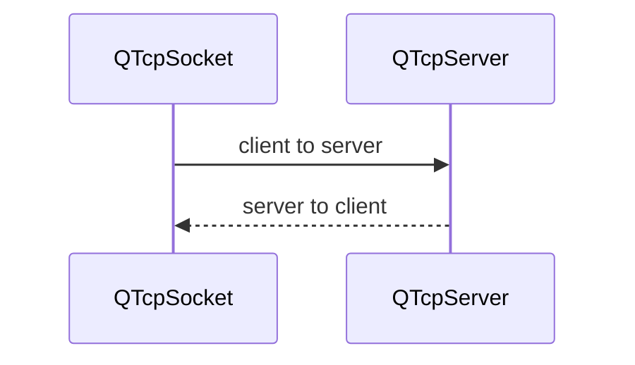

首先是服务器的程序**QTcpServer::listen开始服务器监听**（需要指定IP地址和端口），有新的客户端接入时，QTcpServer::incomingConnection就会也创建1个QTcpSocket对象并发生信号newConnection。

在newConnection的槽函数中，可**以使用nextPendingConnection()接受客户端的连接**，然后使用QTcpSocket与客户端通信，一旦建立连接，具体的数据通信都是QTcpSocket完成的。

客户端和服务器端建立通信，需要connectToHost连接到服务器（需要指定服务器IP地址和端口），如果是异步方式连接不会阻塞程序运行，连接后发射connected信号。connectToHost是异步方式连接服务器，不会阻塞程序运行，如果需要使用阻塞方式应当使用waitForConnected函数直到成功或者失败。

```c++
socket->connectToHost("192.168.1.100",1340);
if (socket->waitForConnected(1000))
    qDebug()<<"Connnected!";
```

由于QTcpSocket是从QIODevice继承的，所以也可以使用流数据读写功能。一个QTcpSocket实例既可以接收数据也可以发送数据，且接收和发送是异步的，有各自缓冲区。

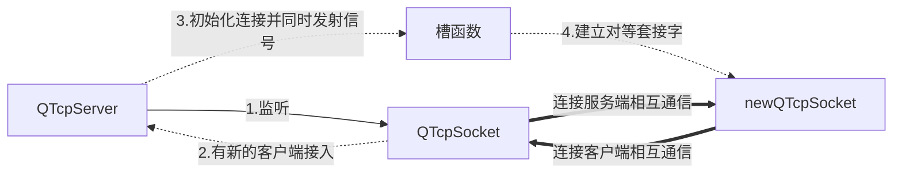

建立连接以后，如果缓冲区有数据，就会发射readyRead信号，此信号的槽函数里可以读取数据。一般来说,Socket之间通信有2种方式，基于行的或者基于数据块的，需要规定好服务器和客户端的通信协议。

基于行的数据协议一般用于纯文本数据的通信，每行数据以一个换行符结束，canReadLine函数继承自QIODevice可以使用，判定是否有新的一行数据可以读取，再用readLine函数读取。

基于块的数据协议一般用于二进制数据传输，需要自定义具体的格式。

这里给出了2个实例，可见[31-TestTcpServerClient](31-TestTcpServerClient)和[31-TestTcpServerClient/TCPServerClientOther](31-TestTcpServerClient/TCPServerClientOther)。

以第一个例子为例，服务器TCPServer的头文件如下。

```c++
#include <QMainWindow>
#include <QTcpServer>
#include <QTcpSocket>
#include <QLabel>
class TCPServer : public QMainWindow
{
  Q_OBJECT
public:
  explicit TCPServer(QWidget *parent = nullptr);
  ~TCPServer();
protected:
  void closeEvent(QCloseEvent *event);
private slots:
  void on_actStart_triggered();
  void on_actStop_triggered();
  void on_actHostInfo_triggered();
  void on_actClear_triggered();
  void on_btnSend_clicked();
private:
  Ui::TCPServer *ui;
  QLabel * LabListen;
  QLabel * LabSocketState;
  QTcpServer *tcpServer; //TCP服务器
  QTcpSocket *tcpSocket;//TCP通讯的Socket
  QString getLocalIP();//获取本机IP地址
private slots: // 自定义槽函数
  void onNewConnection(); // 响应QTcpServer的newConnection信号
  void onSocketStateChange(QAbstractSocket::SocketState socketState); // 响应stateChanged信号
  void onClientConnected(); // 响应客户端连接信号
  void onClientDisconnected();// 响应客户端断开连接信号
  void onSocketReadyRead();// 读取客户端传入的数据
  void on_comboIP_currentTextChanged(const QString &arg1);
  void on_spinPort_valueChanged(const QString &arg1);
};
```

源文件只给出核心的3个函数。重点在于这里定义的tcpSocket需要接收来自客户端的tcpSocket，如果没有连接，直接发送消息会有问题。

```c++
// 1.用于响应newConnection信号的槽函数
void TCPServer::onNewConnection()
{
    qDebug()<<"new connection...";
    // 在newConnection的槽函数中,应该使用nextPendingConnection()接受客户端的连接
    // nextPendingConnection()会返回下一个挂起的连接(因为可能连接处于排队状态)
    // ui->plainTextEdit->appendPlainText("有新连接");
    this->tcpSocket = this->tcpServer->nextPendingConnection(); //创建socket
	if (this->tcpSocket == nullptr) // 没有连接的时候
        return;
    // 有新的连接以后,tcpSocket会有已连接connected信号发出
    connect(this->tcpSocket, SIGNAL(connected()),this, SLOT(onClientConnected()));
    this->onClientConnected();// 调用响应槽函数

    // 断开连接信号disconnected先绑定好槽函数
    connect(tcpSocket, SIGNAL(disconnected()), this, SLOT(onClientDisconnected()));

    // 状态改变信号stateChanged绑定好槽函数,这里需要调用1次
    connect(tcpSocket,SIGNAL(stateChanged(QAbstractSocket::SocketState)),
            this,SLOT(onSocketStateChange(QAbstractSocket::SocketState)));
    this->onSocketStateChange(tcpSocket->state());// 调用响应槽函数

    // 如果socket有数据会发出readyRead信号,绑定好槽函数
    connect(tcpSocket,SIGNAL(readyRead()),this,SLOT(onSocketReadyRead()));
}
// 2.发送消息（这里是服务器端发给客户端）
void TCPServer::on_btnSend_clicked()
{
    // 发送1行字符串,以换行符结束
    // 一般来说,Socket之间通信有2种方式,基于行的或者基于数据块的
    QString msg=ui->editMsg->text();
    ui->plainTextEdit->appendPlainText("[发送给客户端的消息：] "+msg);
    ui->editMsg->clear();
    ui->editMsg->setFocus();
    QByteArray str=msg.toUtf8();
    str.append('\n');//添加一个换行符
    this->tcpSocket->write(str); // 写入获取的客户端套接字
}
// 3.接收消息(接收来自客户端的消息)
void TCPServer::onSocketReadyRead()
{
    while(tcpSocket->canReadLine())
    {
        ui->plainTextEdit->appendPlainText("[来自客户端的消息：] "+tcpSocket->readLine()); // 读取服务器端写入的数据
    }
}
```

客户端TCPClient的源文件如下，例子可见[31-TestTcpServerClient/TCPClient](31-TestTcpServerClient/TCPClient)。

```c++
#include <QMainWindow>
#include <QTcpSocket>
#include <QLabel>
class TCPClient : public QMainWindow
{
  Q_OBJECT
private:
    QTcpSocket  *tcpClient;  // 客户端套接字,会在服务器端的nextPendingConnection被服务器拿到
    QLabel  *LabSocketState;  //状态栏显示标签
    QString getLocalIP();//获取本机IP地址
protected:
    void closeEvent(QCloseEvent *event);
public:
  explicit TCPClient(QWidget *parent = nullptr);
  ~TCPClient();
private slots:
  void on_actConnect_triggered();
  void on_actDisconnect_triggered();
  void on_actClear_triggered();
  void on_btnSend_clicked();
private slots: // 自定义槽函数
  void onConnected();
  void onDisconnected();
  void onSocketStateChange(QAbstractSocket::SocketState socketState);
  void onSocketReadyRead();//读取服务端传入的数据
  void on_comboServer_currentIndexChanged(const QString &arg1);
  void on_spinPort_valueChanged(const QString &arg1);
private:
  Ui::TCPClient *ui;
};
```

TCPClient源文件如下，给出核心的3个函数代码。

```c++
// 1.连接服务器
void TCPClient::on_actConnect_triggered()
{
    QString  addr=ui->comboServer->currentText();
    quint16  port=ui->spinPort->value();
    tcpClient->connectToHost(addr,port);//连接本机,本机作为服务器,同时本机也作为客户端
}
// 2.客户端发送消息给服务器
void TCPClient::on_btnSend_clicked()
{
    QString msg=ui->editMsg->text();
    ui->plainTextEdit->appendPlainText("[发送给服务器的消息：] "+msg);
    ui->editMsg->clear();
    ui->editMsg->setFocus();
    QByteArray  str=msg.toUtf8();
    str.append('\n');
    tcpClient->write(str);
}
// 10.接收来自服务器的消息
void TCPClient::onSocketReadyRead()
{
    while(this->tcpClient->canReadLine())
        ui->plainTextEdit->appendPlainText("[来自服务器的消息：] "+tcpClient->readLine());
}
```

### 13.3 UDP通信

与TCP不同，无需预先建立持久的socket，UDP每次发送数据报都需要指定目标地址和端口。UDP以数据报传输数据，使用函数QUdpSocket::writeDatagram()，数据报的长度一般少于512字节，每个数据报包含发送者和接收者的IP地址和端口等信息。

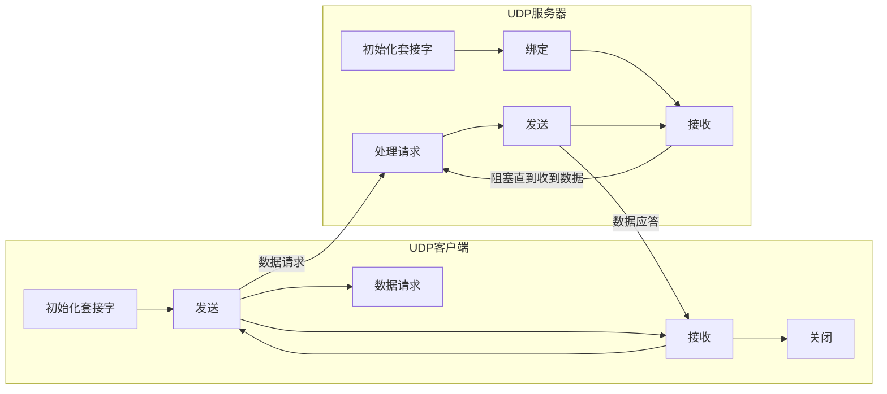

UDP传送有3种方式，单播、广播和组播模式。

单播模式：一对一的数据传输

广播模式：一个UDP客户端发出的数据报，同一网络范围内其他所有UDP客户端都可以收到。QUdpSocket支持IPV4广播，广播经常用于实现网络发现的协议，要获取广播数据只需要在数据报指定接收端地址为QHostAddress::Broadcast，一般的广播地址是255.255.255.255

组播模式：UDP客户端加入到另一个组播IP地址指定的多播组，成员向组播地址发送的数据报组内成员都可以接收到，类似于QQ群的功能。QUdpSocket::joinMulticastGroup函数实现加入多播组的功能，加入多播组后UDP数组的收发与正常的UDP数据收发一样。

这里给出UDP通信的2个例子，[32-TestUdpUnitMultiBroadCast/UdpUnitBroadCast](32-TestUdpUnitMultiBroadCast/UdpUnitBroadCast)和[32-TestUdpUnitMultiBroadCast/UdpUnitBroadCastOther](32-TestUdpUnitMultiBroadCast/UdpUnitBroadCastOther)，记得在工具-构建与运行这里设置stop applications before building为None，这样就可以多实例运行了，UDP的2+个例子之间是可以互相通信的，它们可以在同一台电脑也可以不在同一台电脑。

同一台电脑，因为IP地址都是相同的，在任意一个实例角度来看对方的IP地址都是当地地址，所以如果想要通信必须要绑定不同的端口，否则会造成冲突。绑定端口使用bind，解除绑定使用abort。


这里一共出现4个地址，但是都是本机的IP地址，也就是完全一样的。

```c++
本机IP地址：192.168.17.1
本机IP地址：192.168.157.1
本机IP地址：192.168.0.138
本机IP地址：127.0.0.1
```

不过一般的UDP通信程序都是不同的计算机上运行，所以约定一个固定的端口作为通信就可以，也即是端口可以一样，因为IP地址是不同的，不会造成冲突。

对于组播方式首先要了解的是：

224.0.0.0～224.0.0.255为预留的组播地址(永久地址),地址224.0.0.0保留不做分配,其它255个地址供路由协议使用;

224.0.1.0～224.0.1.255是公用组播地址,可用于Internet;

224.0.2.0～238.255.255.255为用户可用的组播地址(临时组地址),全网范围内有效;

239.0.0.0～239.255.255.255为本地管理组播地址范围,仅在特定的本地范围内有效。

故若是家庭或者办公室局域网内测试UDP组播功能,可以使用的地址范围是239.0.0.0~239.255.255.255。

使用joinMulticastGroup加入组播，使用leaveMulticastGroup离开一个组播，**组播地址是固定的，端口也是协议固定的，然后其它任何IP用户都可以加入这个组播地址发送和接收消息**，并且发送消息的时候自己也能接受到。

测试的时候，这里只能使用2台计算机分别运行实例进行测试，同一台的话如果一个实例已经加入多组播，另一个就无法加入了，因为本质上都是一个IP地址。具体的例子可见[32-TestUdpUnitMultiBroadCast/UdpMultiCast](32-TestUdpUnitMultiBroadCast/UdpMultiCast)。

### 13.4 基于HTTP协议

这里涉及到3个网络数据类型：QNetWorkRequest、QNetWorkReply和QNetWorkAccessManager，以及QUrl。

QNetWorkRequest可以通过一个URL发起网络协议请求，保存了网络请求的信息，目前支持HTTP、FTP和局部文件URLs的下载或者上传。这个URL地址可以是任何类型的文件，如html、pdf、doc和exe等。

QNetWorkAccessManager用于协调网络操作，在QNetWorkRequest发起一个网络请求后，负责发送这个网络请求，创建网络响应。

QNetWorkReply用于处理网络请求后的响应，提供了信号finshed、readyRead、downloadProgress等检测网络响应的执行情况。因为是QIODevice的子类，所以支持流读写功能，也支持同步或者异步工作模式。

例子可见[33-TestNetworkHttp](33-TestNetworkHttp)。

### 13.5 本章数据类型

#### 13.5.1 QHostInfo

QHostInfo 类是主机信息类，可以返回主机的IP地址列表，关联的数据类型是QHostAddress。查找主机 IP 地址或者通过IP地址查找主机名可以使用静态函数 **lookupHost()**，它将主机名或 IP 地址、接收器对象和插槽签名作为参数并返回一个 ID，此函数是异步的。还可以使用阻塞的方式查找，使用静态函数**QHostInfo::fromName()**。还可以通过使用查找 ID 调用 abortHostLookup() 来中止查找。要检索本地主机的名称，请使用静态函**localHostName() **。
例子：

```c++
// 异步查找指定主机名的IP地址
QHostInfo::lookupHost("qt-project.org",this, SLOT(lookedUp(QHostInfo)));
//异步查找指定IP地址的主机名
QHostInfo::lookupHost("4.2.2.1",this, SLOT(lookedUp(QHostInfo)));

// lookedUp函数的实现可以是这样的
void MyWidget::lookedUp(const QHostInfo &host)
{
    if (host.error() != QHostInfo::NoError) {
        return;
    }
    const auto addresses = host.addresses(); // IP地址列表
    for (const QHostAddress &address : addresses)
        qDebug() << "Found address:" << address.toString();
}
// 同步查找指定主机信息
QHostInfo info = QHostInfo::fromName("qt-project.org");
```


枚举类型。

此枚举描述了尝试解析主机名时可能发生的各种错误。

```c++
enum QHostInfo::HostInfoError{
    QHostInfo::NoError,
    QHostInfo::HostNotFound,
    QHostInfo::UnknownError
}
```

成员函数。

```c++
QHostInfo(int id = -1);//构造一个带有查找ID的空主机信息对象

void setAddresses(const QList<QHostAddress> &addresses);
QList<QHostAddress> addresses() const;//返回QHostInfo对象的IP地址列表

void setError(HostInfoError error);// 返回主机查找失败错误类型,否则返回NoError
HostInfoError error() const;
void setErrorString(const QString &str);// 返回主机查找失败返回错误描述字符串
QString errorString() const;

void setHostName(const QString &hostName);
QString hostName() const;// 返回通过IP查找的主机名称

void setLookupId(int id);
int lookupId() const;//返回本次查找的ID
```

静态成员函数。

```c++
void abortHostLookup(int id);// 中断由lookupHost()返回的ID主机查找

// 异步方式查找指定主机名IP地址，接收槽函数或函数指针或仿函数
int lookupHost(const QString &name, QObject *receiver, const char *member);
int lookupHost(const QString &name, const QObject *receiver, PointerToMemberFunction function);
int lookupHost(const QString &name, const QObject *context, Functor functor);
int lookupHost(const QString &name, Functor functor);

QHostInfo fromName(const QString &name);// 同步方式查找指定主机名的IP地址
QString localDomainName();// 获取本机DNS域名
QString localHostName();// 获取本机主机名
```

#### 13.5.2 QHostAddress

QHostAddress 类提供一个IP地址

枚举类型。

```c++
enum QHostAddress::ConversionModeFlag{
    QHostAddress::StrictConversion,// 严格比较,IPv6不同于IPv4
    QHostAddress::ConvertV4MappedToIPv4,//转换为IPv4映射的IPv6地址,"::ffff:192.168.1.1"映射为"192.168.1.1"
    QHostAddress::ConvertV4CompatToIPv4,//转换与IPv4兼容的IPv6地址,"::192.168.1.1"映射为"192.168.1.1"
    QHostAddress::ConvertLocalHost,//将IPv6环回地址转换为等效的IPv4。"::1"映射为"127.0.0.1"
    QHostAddress::ConvertUnspecifiedAddress,//所有未指定的地址将比较相等
    QHostAddress::TolerantConversion//设置所有三个前面的标志
}
```

```c++
enum QHostAddress::SpecialAddress{
    QHostAddress::Null,//空地址对象。等效于QHostAddress()
    QHostAddress::LocalHost,//IPv4 本地主机地址。等效于QHostAddress("127.0.0.1")
    QHostAddress::LocalHostIPv6,//IPv6 本地主机地址。等效于 QHostAddress("::1")
    QHostAddress::Broadcast,//IPv4 广播地址。等效于QHostAddress("255.255.255.255")
    QHostAddress::AnyIPv4,//IPv4 任意地址。等效于 QHostAddress("0.0.0.0")
    QHostAddress::AnyIPv6,//IPv6 任意地址。等效于 QHostAddress("::")
    QHostAddress::Any//双栈任意地址。与此地址绑定的套接字将侦听 IPv4 和 IPv6 接口
}
```

成员函数。

```c++
// 使用IPv4,IPV6构造一个主机地址对象使用
QHostAddress();
QHostAddress(quint32 ip4Addr);
QHostAddress(quint8 *ip6Addr);
QHostAddress(const quint8 *ip6Addr);
QHostAddress(const Q_IPV6ADDR &ip6Addr);
// 使用本机结构 sockaddr 指定的地址构造 IPv4 或 IPv6 地址
QHostAddress(const sockaddr *sockaddr);
// 根据字符串地址（例如，“127.0.0.1”）构造 IPv4 或 IPv6 地址
QHostAddress(const QString &address);
QHostAddress(const QHostAddress &address);
// 为地址构造一个 QHostAddress 对象
QHostAddress(SpecialAddress address);

void clear();//将主机地址设置为空
QString toString() const;// 转为字符串表示
quint32 toIPv4Address() const; // 以数字形式返回 IPv4 地址
quint32 toIPv4Address(bool *ok) const;
Q_IPV6ADDR toIPv6Address() const;// 以数字形式返回 IPv6 地址

//如果此主机地址与给定的其他地址相同，则返回 true；否则返回假
bool isEqual(const QHostAddress &other, ConversionMode mode = TolerantConversion) const;
// 如果此 IP 在由网络前缀子网和网络掩码网络掩码描述的子网中，则返回 true
bool isInSubnet(const QHostAddress &subnet, int netmask) const;
// 如果此 IP 在子网描述的子网中，则返回 true
bool isInSubnet(const QPair<QHostAddress, int> &subnet) const;
// 如果地址是 IPv6 环回地址或任何 IPv4 环回地址，则返回 true
bool isLoopback() const;
// 如果地址是 IPv4 或 IPv6 多播地址，则返回 true，否则返回 false
bool isMulticast() const;
// 如果此主机地址对任何主机或接口无效，则返回 true
bool isNull() const;
// 返回主机地址的网络层协议
QAbstractSocket::NetworkLayerProtocol protocol() const;
// 将地址的 IPv6 范围 ID 设置为 id。如果地址协议不是 IPv6，则此函数不执行任何操作
void setScopeId(const QString &id);
QString scopeId() const;

// 设置由 ip4Addr 指定的 IPv4 地址
void setAddress(quint32 ip4Addr);
// 设置 ip6Addr 指定的 IPv6 地址
void setAddress(quint8 *ip6Addr);
// 设置 ip6Addr 指定的 IPv6 地址
void setAddress(const quint8 *ip6Addr);
// 设置 ip6Addr 指定的 IPv6 地址
void setAddress(const Q_IPV6ADDR &ip6Addr);
// 设置本机结构sockaddr指定的IPv4或IPv6 地址。如果地址解析成功，则返回true并设置地址
void setAddress(const sockaddr *sockaddr);
// 设置由地址指定的字符串表示指定的 IPv4 或 IPv6 地址（例如“127.0.0.1”）。如地址解析成功，则返回 true 
bool setAddress(const QString &address);
// 设置由地址指定的特殊地址
void setAddress(SpecialAddress address);
```

静态成员函数。

```c++
QPair<QHostAddress, int> parseSubnet(const QString &subnet);
// 解析子网中包含的 IP 和子网信息，并返回该网络的网络前缀及其前缀长度
```

#### 13.5.3 QNetworkAddressEntry

QNetworkAddressEntry 类**存储一个网络接口支持的 IP 地址，以及与其关联的网络掩码和广播地址**。
每个网络接口可以包含零个或多个 IP 地址，而这些 IP 地址又可以与网络掩码和/或广播地址相关联（取决于操作系统的支持）。这个类代表一个这样的组。

成员函数。

```c++
// 将此 QNetworkAddressEntry 对象的广播 IP 地址设置为 newBroadcast
void setBroadcast(const QHostAddress &newBroadcast);
QHostAddress broadcast() const;
// 将 QNetworkAddressEntry 对象包含的 IP 地址设置为 newIp
void setIp(const QHostAddress &newIp);
QHostAddress ip() const;
// 将此 QNetworkAddressEntry 对象包含的网络掩码设置为 newNetmask。设置网络掩码还会设置前缀长度以匹配新的网络掩码
void setNetmask(const QHostAddress &newNetmask);
QHostAddress netmask() const;
// 将此 IP 地址的前缀长度设置为 length。对于这种类型的 IP 地址，length 的值必须有效：对于 IPv4 地址，介于 0 和 32 之间，对于 IPv6 地址，介于 0 和 128 之间。设置为任何无效值等同于设置为 -1，即“无前缀长度”
void setPrefixLength(int length);
int prefixLengt5555h() const;
```

#### 13.5.4 QNetworkInterface

QNetworkInterface 类提供**主机 IP 地址和网络接口的列表**。
addressEntries() 返回具有IP地址、网络掩码和广播地址3个字段的列表。或者不需要网络掩码或广播地址时，使用 静态函数allAddresses() 便利函数仅获取 IP 地址。hardwareAddress() 报告接口的硬件地址。

并非所有操作系统都支持报告所有功能。在所有平台中，此类仅保证列出 IPv4 地址。特别是，IPv6 地址列表仅在 Windows、Linux、macOS 和 BSD 上受支持。

成员函数。

```c++
//返回此接口拥有的IP地址、关联的网络掩码、广播地址字段列表
QList<QNetworkAddressEntry> addressEntries() const;
// 返回与此网络接口关联的标志
InterfaceFlags flags() const;
// 返回此接口的低级硬件地址。在以太网接口上，这将是一个以冒号分隔的字符串形式的 MAC 地址
QString hardwareAddress() const;
// 返回接口系统索引，与 IPv6 地址中的范围 ID字段匹配
int index() const;
// 如果包含有关网络接口的有效信息，则返回 true
bool isValid() const;
// 返回此网络接口名称。在Unix系统是一个包含接口类型和可选序列号的字符串，例如“eth0”、“lo”或“pcn0”。在 Windows 上它是用户无法更改的内部ID
QString name() const;
// 返回Windows上此网络接口的人类可读名称，例如“本地连接”
QString humanReadableName() const;
```

静态成员函数。

```c++
// 返回所有IP地址。这相当于QNetworkInterface::addressEntries().ip()
QList<QHostAddress> allAddresses();
// 返回所有网络接口
QList<QNetworkInterface> allInterfaces();
// 返回内部ID为index的网络接口对象
QNetworkInterface interfaceFromIndex(int index);
// 返回名为name的接口的网络接口对象
QNetworkInterface interfaceFromName(const QString &name);
// 返回名称为name的网络接口的索引
int interfaceIndexFromName(const QString &name);
// 返回索引为index的网络接口名称
QString interfaceNameFromIndex(int index);
```

#### 13.5.5 QAbstractSocket

QAbstractSocket 类提供所有套接字类型共有的基本功能。
**QAbstractSocket 是 QTcpSocket 和 QUdpSocket 的基类**，包含这两个类的所有通用功能。如果你需要一个套接字，你有两个选择：实例化 QTcpSocket 或 QUdpSocket。
创建原生套接字描述符，实例化 QAbstractSocket，调用 setSocketDescriptor() 封装原生套接字。TCP（传输控制协议）是一种可靠的、面向流的、面向连接的传输协议。 UDP（用户数据报协议）是一种不可靠的、面向数据报的、无连接的协议。在实践中，这意味着 TCP 更适合连续传输数据，而更轻量级的 UDP 可以在可靠性不重要时使用。QAbstractSocket 的 API 统一了两种协议之间的大部分差异。例如，虽然 UDP 是无连接的，但 **connectToHost() 为 UDP 套接字建立了一个虚拟连接**，使您能够以或多或少相同的方式使用 QAbstractSocket，而不管底层协议如何。在内部，QAbstractSocket 记住传递给 connectToHost() 的地址和端口，并且 **read() 和 write() 等函数使用这些值**。

继承关系如下。

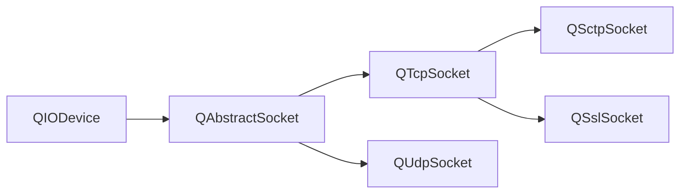

在任何时候，**QAbstractSocket 都有一个状态（由 state() 返回）**,**初始状态是 UnconnectedState**。调用connectToHost()后，socket**首先进入HostLookupState状态**。如果找到主机，QAbstractSocket 进入 **ConnectingState 状态并发出 hostFound() 信号**。建立连接后，它进入 **已连接ConnectedState 状态并发出 connected()**。如果在**任何阶段发生错误，则会发出 error()**。每当**状态发生变化时，都会发出 stateChanged()**。为方便起见，如果套接字已准备好进行读写，isValid() 将返回 true，但请注意，**套接字的状态必须为 ConnectedState，然后才能进行读写**。

**通过调用 read() 或 write() 读取或写入数据，或使用便捷函数 readLine() 和 readAll()**。 QAbstractSocket 还从 QIODevice 继承了 getChar()、putChar() 和 ungetChar()，它们适用于单个字节。当**数据写入套接字时，会发出 bytesWritten() 信号**。请注意，Qt 不限制写入缓冲区的大小。您可以通过收听此信号来监控其大小。
**每次新的数据块到达时都会发出 readyRead() 信号**。 **bytesAvailable() 然后返回可供读取的字节数**。通常，您会将 readyRead() 信号连接到一个插槽并在那里读取所有可用数据。如果您不一次读取所有数据，则剩余数据稍后仍然可用，并且任何**新传入的数据都将附加到 QAbstractSocket 的内部读取缓冲区**。要限制内部读取缓冲区的大小，请调用 setReadBufferSize()。

**要关闭套接字，请调用 disconnectFromHost()**。 **QAbstractSocket 进入 QAbstractSocket::ClosingState**。在所有挂起的数据都写入套接字之后，QAbstractSocket 实际上关闭了套接字，**进入 QAbstractSocket::UnconnectedState，并发出 disconnected()**。如果您想**立即中止连接，丢弃所有未决数据，请改为调用 abort()**。

如果远程主机关闭连接，QAbstractSocket 会发出错误(QAbstractSocket::RemoteHostClosedError)，期间socket 状态仍为ConnectedState，然后发出disconnected() 信号。
**通过调用 peerPort() 和 peerAddress() 获取连接的对等体的端口和地址**。 **peerName() 返回对等方的主机名，传递给 connectToHost()**。 **localPort() 和 localAddress() 返回本地套接字的端口和地址**。

QAbstractSocket 提供一组函数，这些函数可暂停调用线程直到发出某些信号。这些函数可用于实现阻塞套接字：

**waitForConnected() 阻塞，直到建立连接**。
waitForReadyRead() 阻塞，直到有新数据可供读取。
waitForBytesWritten() 阻塞，直到一个有效负载数据被写入套接字。
waitForDisconnected() 阻塞，直到连接关闭。

一个例子：

```c++
int numRead = 0, numReadTotal = 0;
char buffer[50];
forever {
    numRead  = socket.read(buffer, 50);
    // 处理读取的数据
    numReadTotal += numRead;
    if (numRead == 0 && !socket.waitForReadyRead()) // 如果读取的数据为0或没有新数据读取
        break;
}
```

**如果 waitForReadyRead() 返回 false，则连接已关闭或发生错误**。
使用阻塞套接字编程与使用非阻塞套接字编程完全不同。**阻塞套接字不需要事件循环**，通常会导致更简单的代码。但是，在 GUI 应用程序中，**阻塞套接字只能在非 GUI 线程中使用，以避免冻结用户界面**。有关这两种方法的概述，请参阅 fortuneclient 和 blockingfortuneclient 示例。

注意：我们**不鼓励将阻塞函数与信号一起使用**。应该使用两种可能性之一。
QAbstractSocket 可以与 QTextStream 和 QDataStream 的流操作符（operator&lt;&lt;() 和 operator&gt;&gt;()）一起使用。**但是，有一个问题需要注意：在尝试使用 operator>>() 读取数据之前，必须确保有足够的数据可用**。

##### 枚举类型

这个枚举描述了你可以传递的不同标志来修改 QAbstractSocket::bind() 的行为。

```c++
enum QAbstractSocket::BindFlag{
    QAbstractSocket::ShareAddress,//允许其他服务绑定到相同的地址和端口
    QAbstractSocket::DontShareAddress,//独占绑定地址和端口，不允许其他服务重新绑定
    QAbstractSocket::ReuseAddressHint,//提示地址和端口已经被另一个套接字绑定，它应重新绑定服务
    QAbstractSocket::DefaultForPlatform//当前平台的默认选项
}
```

这个枚举描述了 Qt 中使用的网络层协议值。

```c++
enum QAbstractSocket::NetworkLayerProtocol{
    QAbstractSocket::IPv4Protocol,
    QAbstractSocket::IPv6Protocol,
    QAbstractSocket::AnyIPProtocol,
    QAbstractSocket::UnknownNetworkLayerProtocol
}
```

这个枚举描述了当套接字应该阻止继续数据传输时的行为。当前支持的唯一通知是 QSslSocket::sslErrors()。

```c++
enum QAbstractSocket::PauseMode{
    QAbstractSocket::PauseNever,//不要暂停套接字上的数据传输
    QAbstractSocket::PauseOnSslErrors//收到SSL错误通知后暂停套接字上的数据传输
}
```

此枚举描述了可能发生的套接字错误。

```c++
enum QAbstractSocket::SocketError{
    QAbstractSocket::ConnectionRefusedError,//连接被对等方拒绝（或超时）
    QAbstractSocket::RemoteHostClosedError,//远程主机关闭了连接
    QAbstractSocket::HostNotFoundError,//找不到主机地址
    QAbstractSocket::SocketAccessError,//套接字操作失败，因为应用程序缺少所需的权限
    QAbstractSocket::SocketResourceError,//本地系统资源不足（例如，套接字过多）
    QAbstractSocket::SocketTimeoutError,//套接字操作超时
    QAbstractSocket::DatagramTooLargeError,//数据报大于操作系统的限制（可以低至 8192 字节）
    QAbstractSocket::NetworkError,//网络出现错误（例如，网络电缆被意外拔出）
    QAbstractSocket::AddressInUseError,//指定给bind()的地址已在使用且独占
    QAbstractSocket::SocketAddressNotAvailableError,//指定给bind()的地址不属于主机
    QAbstractSocket::UnsupportedSocketOperationError,//不支持请求的套接字操作例如缺乏IPv6支持
    QAbstractSocket::ProxyAuthenticationRequiredError,//套接字正在使用代理，并且代理需要身份验证
    QAbstractSocket::SslHandshakeFailedError,//SSL/TLS 握手失败所以连接被关闭
    QAbstractSocket::UnfinishedSocketOperationError,//尝试的最后一个操作尚未完成（仍在后台进行）
    QAbstractSocket::ProxyConnectionRefusedError,//无法联系代理服务器，因为与该服务器的连接被拒绝
    QAbstractSocket::ProxyConnectionClosedError,//与代理服务器的连接意外关闭
    QAbstractSocket::ProxyConnectionTimeoutError,//与代理服务器的连接超时或在身份验证阶段停止响应
    QAbstractSocket::ProxyNotFoundError,//未找到使用 setProxy()（或应用程序代理）设置的代理地址
    QAbstractSocket::ProxyProtocolError,//与代理服务器的连接失败，因为无法理解来自代理服务器的响应
    QAbstractSocket::OperationError,//在套接字处于不允许的状态时尝试了操作
    QAbstractSocket::SslInternalError,//正在使用的SSL库报告错误。这可能是库安装错误或配置错误
    QAbstractSocket::SslInvalidUserDataError,//提供了无效数据（证书、密钥、密码等）导致SSL库出错
    QAbstractSocket::TemporaryError,//发生了临时错误（例如，操作将阻塞并且套接字是非阻塞的）
    QAbstractSocket::UnknownSocketError//发生不明错误
}
```

此枚举表示可以在套接字上设置的选项。如果需要，可以在从套接字接收到 connected() 信号或从 QTcpServer 接收到新套接字之后设置它们。

```c++
enum QAbstractSocket::SocketOption{
    QAbstractSocket::LowDelayOption,//尝试优化套接字以实现低延迟
    QAbstractSocket::KeepAliveOption,//将此设置为 1 以启用 SO_KEEPALIVE 套接字选项
    QAbstractSocket::MulticastTtlOption,//将此设置为整数值以设置 IP_MULTICAST_TTL（多播数据报的 TTL）套接字选项
    QAbstractSocket::MulticastLoopbackOption,//将此设置为 1 以启用 IP_MULTICAST_LOOP（多播环回）套接字选项
    QAbstractSocket::TypeOfServiceOption,//Windows 不支持此选项
    QAbstractSocket::SendBufferSizeSocketOption,//在操作系统级别设置套接字发送缓冲区大小（以字节为单位）。这映射到 SO_SNDBUF 套接字选项。此选项不影响 QIODevice 或 QAbstractSocket 缓冲区
    QAbstractSocket::ReceiveBufferSizeSocketOption//在操作系统级别设置套接字接收缓冲区大小（以字节为单位）。这映射到 SO_RCVBUF 套接字选项。此选项不影响 QIODevice 或 QAbstractSocket 缓冲区（请参阅 setReadBufferSize()）
}
TypeOfServiceOption 的可能值为：
224 Network control
192 Internetwork control
160 CRITIC/ECP
128 Flash override
96 Flash
64 Immediate
32 Priority
0 Routine
```

此枚举描述了套接字可以处于的不同状态。

```c++
enum QAbstractSocket::SocketState{
    QAbstractSocket::UnconnectedState,//套接字未连接
    QAbstractSocket::HostLookupState,//套接字正在执行主机名查找
    QAbstractSocket::ConnectingState,//套接字已开始建立连接
    QAbstractSocket::ConnectedState,//建立连接
    QAbstractSocket::BoundState,//套接字绑定到地址和端口
    QAbstractSocket::ClosingState,//套接字即将关闭（数据可能仍在等待写入）
    QAbstractSocket::ListeningState//仅限内部使用
}
```

这个枚举描述了传输层协议。

```c++
enum QAbstractSocket::SocketType{
    QAbstractSocket::TcpSocket,
    QAbstractSocket::UdpSocket,
    QAbstractSocket::SctpSocket,
    QAbstractSocket::UnknownSocketType
}
```

##### 普通成员函数

```c++
QAbstractSocket(SocketType socketType, QObject *parent);

SocketType socketType() const;//返回套接字类型（TCP、UDP 或其他）
void abort();//与disconnectFromHost()不同，此函数立即关闭套接字，丢弃写入缓冲区中的任何未决数据
bool flush();// 尽可能多从内部写入缓冲区，而不阻塞如果写入了任何数据，则此函数返回 true
bool isValid() const;// 如果套接字有效并且可以使用，则返回 true
virtual void resume();// 继续在套接字上传输数据

// 将连接本地端的地址设置为地址
void QAbstractSocket::setLocalAddress(const QHostAddress &address);
QHostAddress localAddress() const;
// 将连接本地端的端口设置为port
 void QAbstractSocket::setLocalPort(quint16 port);
quint16 localPort() const;
// 控制是否在收到通知时暂停
void QAbstractSocket::setPauseMode(PauseModes pauseMode);
PauseModes pauseMode() const;
// 将连接的远程端的地址设置为address
void QAbstractSocket::setPeerAddress(const QHostAddress &address);
QHostAddress peerAddress() const;
//将远程对等方的主机名设置为 name
void QAbstractSocket::setPeerName(const QString &name);
QString peerName() const;
//将连接的远程端的端口设置为port
void QAbstractSocket::setPeerPort(quint16 port);
quint16 peerPort() const;

// 使用 BindMode 模式绑定到端口端口上的地址。将此套接字绑定到地址地址和端口端口。
bool bind(const QHostAddress &address, quint16 port = 0, BindMode mode = DefaultForPlatform);
bool bind(quint16 port = 0, BindMode mode = DefaultForPlatform);

// 尝试在给定端口上建立与 hostName 的连接。协议参数可用于指定要使用的网络协议（例如 IPv4 或 IPv6）
virtual void connectToHost(const QString &hostName, quint16 port, OpenMode openMode = ReadWrite, NetworkLayerProtocol protocol = AnyIPProtocol);
virtual void connectToHost(const QHostAddress &address, quint16 port, OpenMode openMode = ReadWrite);
// 尝试关闭套接字。如果有等待写入的未决数据，QAbstractSocket 将进入 ClosingState 并等待直到所有数据都已写入。最终，它将进入 UnconnectedState 并发出 disconnected() 信号
virtual void disconnectFromHost();

// 设置和返回错误类型
void QAbstractSocket::setSocketError(SocketError socketError)；
SocketError error() const;

// 设置和返回套接字的状态
void setSocketState(SocketState state)
SocketState state() const;

// 将此套接字的显式网络代理设置为 networkProxy，要禁用此套接字代理，请使用 QNetworkProxy::NoProxy
void setProxy(const QNetworkProxy &networkProxy);
QNetworkProxy proxy() const;

// 将 QAbstractSocket 的内部读取缓冲区的大小设置为 size 字节
virtual void setReadBufferSize(qint64 size);
qint64 readBufferSize() const;

//设置和返回 QAbstractSocket对象的本机套接字描述符，不可用返回-1。如果套接字正在使用QNetworkProxy，则返回的描述符可能无法与本机套接字函数一起使用
virtual bool setSocketDescriptor(qintptr socketDescriptor, SocketState socketState = ConnectedState, OpenMode openMode = ReadWrite);
virtual qintptr socketDescriptor() const;

// 设置和返回套接字选项
virtual void setSocketOption(QAbstractSocket::SocketOption option, const QVariant &value)
virtual QVariant socketOption(QAbstractSocket::SocketOption option);

// 等待套接字连接和断开，最多 mssecs 毫秒。如果连接已经建立，这个函数返回true；否则返回false
// 如果 msecs 为 -1，则此函数不会超时， 在它返回false的情况下，您可以调用error()来确定错误的原因
virtual bool waitForConnected(int msecs = 3000);
virtual bool waitForDisconnected(int msecs = 30000);
socket->connectToHost("imap", 143);
if (socket->waitForConnected(1000))
    qDebug("Connected!");
socket->disconnectFromHost();
if (socket->state() == QAbstractSocket::UnconnectedState ||
    socket->waitForDisconnected(1000))
    qDebug("Disconnected!");
```

##### 继承函数

这些函数从QIODevice继承而来，也是可以使用的函数，其含义可见[6.1.1 QIODevice](#6.1.1 QIODevice)。

```c++
virtual bool atEnd() const;
virtual qint64 bytesAvailable() const;
virtual qint64 bytesToWrite() const;
virtual bool canReadLine() const;
virtual void close();
virtual bool isSequential() const;
virtual bool waitForBytesWritten(int msecs = 30000);
virtual bool waitForReadyRead(int msecs = 30000);
```

##### 信号函数

```c++
void connected();
void disconnected();
void error(QAbstractSocket::SocketError socketError);
void hostFound();
void proxyAuthenticationRequired(const QNetworkProxy &proxy, QAuthenticator *authenticator);
void stateChanged(QAbstractSocket::SocketState socketState);
```

#### 13.5.6 QTcpSocket

QTcpSocket 类提供了一个 TCP 套接字。有关详细信息，请参阅 QAbstractSocket 文档。
注意：不能在 QIODevice::Unbuffered 模式下打开 TCP 套接字。

一般是先启动服务器，一段时间再启动客户端，和服务器三次握手建立连接后，客户端会给服务器发送请求，然后服务器处理这个请求并回应。此过程持续下去直到客户端给服务器发一个文件结束符自行断开和服务器的连接，然后服务器也关闭和客户端的连接并阻塞监听，直到新的客户端连接进来。

经典TCP编码模型如下。

```mermaid
graph RL
	subgraph TCP客户端
		A1[初始化套接字]-->A2[连接]
		A2-->A3[发送]
		A3-->A4[接收]
		A4.->A3
		A4-->A5[关闭]
	end
	subgraph TCP服务端
		B1[初始化套接字]-->B2[绑定]
		B2-->B3[绑定]
		B3-->B4[监听]
		B4-->B5[接收连接]
		B5-->B6((阻塞直到客户连接服务端))
		B6-->B7[接收]
		B7-->|处理请求|B8[发送]
		B8.->B7
		B8-->B9[接收]
		B9-->B10[关闭]
		
	end
	A2-->|三次握手|B6
	B6-->A2
	A3-->|请求|B7
	A5-->|文件结束通知|B9
	B8-->|应答|A4
```

#### 13.5.8 QUdpSocket

QUdpSocket 类提供了一个 UDP 套接字。
使用该类最**常见的方法是使用 bind() 绑定到地址和端口，然后调用 writeDatagram() 和 readDatagram() / receiveDatagram() 来传输数据。如果要使用标准 QIODevice 函数 read()、readLine()、write() 等，必须首先通过调用 connectToHost() 将套接字直接连接到对等方**。
每次将数据报写入网络时，套接字都会发出 bytesWritten() 信号。如果你只是想发送数据报，你不需要调用bind()。每当数据报到达时，就会发出 readyRead() 信号。在这种情况下，hasPendingDatagrams() 返回 true。调用pendingDatagramSize() 获取第一个未决数据报的大小，调用readDatagram() 或receiveDatagram() 来读取它。注意：当您收到 readyRead() 信号时，应读取传入的数据报，否则将不会为下一个数据报发出此信号。

```c++
void Server::initSocket()
{
    udpSocket = new QUdpSocket(this);
    udpSocket->bind(QHostAddress::LocalHost, 7755);

    connect(udpSocket, SIGNAL(readyRead()),
            this, SLOT(readPendingDatagrams()));
}

void Server::readPendingDatagrams()
{
    while (udpSocket->hasPendingDatagrams()) {
        QNetworkDatagram datagram = udpSocket->receiveDatagram();
        processTheDatagram(datagram);
    }
}
```

QUdpSocket 还支持 UDP 多播。使用 joinMulticastGroup() 和 leaveMulticastGroup() 控制组成员，使用 QAbstractSocket::MulticastTtlOption 和 QAbstractSocket::MulticastLoopbackOption 设置 TTL 和环回套接字选项。使用 setMulticastInterface() 控制多播数据报的传出接口，并使用 multicastInterface() 查询它。
使用 QUdpSocket，您还可以使用 connectToHost() 建立到 UDP 服务器的虚拟连接，然后使用 read() 和 write() 来交换数据报，而无需为每个数据报指定接收者。

成员函数如下。

```c++
// 如果至少有一个数据报正在等待读取，则返回 true；否则返回假
bool hasPendingDatagrams() const;
// 返回第一个挂起的 UDP 数据报的大小。如果没有可用的数据报，此函数返回 -1
qint64 pendingDatagramSize() const;

// 在操作系统选择的默认接口上加入由 groupAddress 指定的多播组。套接字必须处于BoundState，否则会出错
bool joinMulticastGroup(const QHostAddress &groupAddress);
bool joinMulticastGroup(const QHostAddress &groupAddress, const QNetworkInterface &iface);
// 将由 groupAddress 指定的多播组留在操作系统选择的默认接口上。套接字必须处于BoundState，否则会出错
bool leaveMulticastGroup(const QHostAddress &groupAddress);
bool leaveMulticastGroup(const QHostAddress &groupAddress, const QNetworkInterface &iface);

//返回多播数据报的传出接口的接口。这对应于 IPv4 套接字的 IP_MULTICAST_IF 套接字选项和 IPv6 套接字的 IPV6_MULTICAST_IF 套接字选项。如果之前没有设置接口，这个函数返回一个无效的 QNetworkInterface。套接字必须处于 BoundState，否则返回无效的 QNetworkInterface
void setMulticastInterface(const QNetworkInterface &iface);
QNetworkInterface multicastInterface() const;

//接收不大于 maxSize 字节的数据报并将其存储在数据中。发送者的主机地址和端口存储在 *address 和 *port
qint64 readDatagram(char *data, qint64 maxSize, QHostAddress *address = Q_NULLPTR, quint16 *port = Q_NULLPTR);
// 接收不大于 maxSize 字节的数据报，并在 QNetworkDatagram 对象中返回它，以及发送者的主机地址和端口。
QNetworkDatagram receiveDatagram(qint64 maxSize = -1);
// 将数据大小大小的数据报发送到端口端口的主机地址地址。返回成功发送的字节数；否则返回 -1
qint64 writeDatagram(const char *data, qint64 size, const QHostAddress &address, quint16 port);
qint64 writeDatagram(const QNetworkDatagram &datagram);
qint64 writeDatagram(const QByteArray &datagram, const QHostAddress &host, quint16 port);
```

#### 13.5.9 QTcpServer

QTcpServer 类提供了一个基于 TCP 的服务器。这个类使得接受传入的 TCP 连接成为可能。您可以指定端口或让 QTcpServer 自动选择一个。您可以监听特定地址或所有机器的地址。
**调用listen() 让服务器监听传入的连接。然后每次客户端连接到服务器时都会发出 newConnection() 信号**。
**调用 nextPendingConnection() 以接受挂起的连接作为已连接的 QTcpSocket。该函数返回指向 QAbstractSocket::ConnectedState 中的 QTcpSocket 的指针**，您可以使用该指针与客户端进行通信。
如果发生错误，serverError() 返回错误的类型，并且可以调用 errorString() 来获得对所发生事件的可读描述。
在侦听连接时，**服务器正在侦听的地址和端口可用作 serverAddress() 和 serverPort(**)。
调用 close() 使 QTcpServer 停止侦听传入连接。
尽管 QTcpServer 主要是为与事件循环一起使用而设计的，**但也可以在没有事件循环的情况下使用它。在这种情况下，您必须使用 waitForNewConnection()**，它会阻塞直到连接可用或超时到期。

成员函数。

```c++
QTcpServer(QObject *parent = Q_NULLPTR);
// 关闭服务器。服务器将不再侦听传入连接
void close();
// 返回发生的最后一个错误的人类可读描述
QString errorString() const;

// 此函数由 QTcpServer::incomingConnection() 调用以将套接字添加到待处理的传入连接列表中
void addPendingConnection(QTcpSocket *socket);
// 当有新连接可用时，QTcpServer 会调用此虚拟函数。 socketDescriptor 参数是接受连接的本机套接字描述符
virtual void incomingConnection(qintptr socketDescriptor);
// 如果服务器有挂起的连接，则返回 true；否则返回假
virtual bool hasPendingConnections() const;
// 将下一个挂起的连接作为已连接的 QTcpSocket 对象返回
virtual QTcpSocket *nextPendingConnection();
// 将挂起的已接受连接的最大数量设置为 numConnections。在调用 nextPendingConnection() 之前，QTcpServer 将接受不超过 numConnections 的传入连接。默认情况下，限制为 30 个挂起的连接
void setMaxPendingConnections(int numConnections);
int maxPendingConnections() const;

// 如果服务器当前正在侦听传入连接，则返回 true；否则返回假
bool isListening() const;
// 告诉服务器侦听地址地址和端口端口上的传入连接。如果端口为 0，则自动选择一个端口。如果地址是 QHostAddress::Any，服务器将侦听所有网络接口
bool listen(const QHostAddress &address = QHostAddress::Any, quint16 port = 0);

// 暂停接受新连接。排队的连接将保留在队列中
void pauseAccepting();
// 恢复接受新连接
void resumeAccepting();

// 返回发生的最后一个错误的错误代码
QAbstractSocket::SocketError serverError() const;
// 如果服务器正在侦听连接，则返回服务器的地址；否则返回 QHostAddress::Null
QHostAddress serverAddress() const;
// 如果服务器正在侦听连接，则返回服务器的端口；否则返回 0
quint16 serverPort() const;

// 将此套接字的显式网络代理设置为 networkProxy
void setProxy(const QNetworkProxy &networkProxy);
QNetworkProxy proxy() const;

// 设置此服务器在侦听到 socketDescriptor 的传入连接时应使用的套接字描述符。如果套接字设置成功，则返回 true；否则返回假
bool setSocketDescriptor(qintptr socketDescriptor);
qintptr socketDescriptor() const;

// 最多等待 msec 毫秒或直到传入连接可用。如果连接可用，则返回 true；否则返回假。如果操作超时且 timedOut 不为 0，*timedOut 将设置为 true
bool waitForNewConnection(int msec = 0, bool *timedOut = Q_NULLPTR);
```

信号函数。

```c++
// 当接受新连接导致错误时发出此信号。 socketError 参数描述了发生的错误类型
void acceptError(QAbstractSocket::SocketError socketError);
// 当有新连接可用时，QTcpServer 会调用此虚拟函数。 socketDescriptor 参数是接受连接的本机套接字描述符
void newConnection();
```

#### 13.5.10 QNetworkAccessManager

QNetworkAccessManager 类允许应用程序发送网络请求和接收回复 网络访问 API 是围绕一个 QNetworkAccessManager 对象构建的，该对象包含它发送的请求的通用配置和设置。它包含代理和缓存配置，以及与此类问题相关的信号，以及可用于监控网络操作进度的回复信号。**一个 QNetworkAccessManager 对于整个 Qt 应用程序应该足够了**。一旦创建了 QNetworkAccessManager 对象，应用程序就可以使用它通过网络发送请求。提供了一组标准函数，它们接受请求和可选数据，**每个函数都返回一个 QNetworkReply 对象**。返回的对象用于获取响应相应请求而返回的任何数据。
可以通过以下方式完成简单的网络下载：

```c++
QNetworkAccessManager *manager = new QNetworkAccessManager(this);
connect(manager, SIGNAL(finished(QNetworkReply*)),
        this, SLOT(replyFinished(QNetworkReply*)));
manager->get(QNetworkRequest(QUrl("http://qt-project.org")));
```

QNetworkAccessManager 有一个异步 API。当上面的replyFinished slot被调用时，它接受的参数是包含下载数据以及元数据（headers等）的QNetworkReply对象。
注意：请求完成后，用户有责任在适当的时候删除 QNetworkReply 对象。不要在连接到finished()的槽内直接删除它。您可以使用 deleteLater() 函数。
注意：QNetworkAccessManager 将它收到的请求排队。并行执行的请求数取决于协议。目前，对于桌面平台上的 HTTP 协议，一个主机/端口组合并行执行 6 个请求。
一个更复杂的例子，假设管理网络已经存在，可以是：

```c++
QNetworkRequest request;
request.setUrl(QUrl("http://qt-project.org"));
request.setRawHeader("User-Agent", "MyOwnBrowser 1.0");

QNetworkReply *reply = manager->get(request);
connect(reply, SIGNAL(readyRead()), this, SLOT(slotReadyRead()));
connect(reply, SIGNAL(error(QNetworkReply::NetworkError)),
        this, SLOT(slotError(QNetworkReply::NetworkError)));
connect(reply, SIGNAL(sslErrors(QList<QSslError>)),
        this, SLOT(slotSslErrors(QList<QSslError>)));
```

网络和漫游支持。通过在 Qt 4.7 中添加承载管理 API，QNetworkAccessManager 获得了管理网络连接的能力。 QNetworkAccessManager 可以在设备离线时启动网络接口，如果当前进程是最后一个使用上行链路的进程，则终止接口。请注意，某些平台使用从最后一个应用程序停止使用上行链路到系统实际终止连接链路的宽限期。漫游同样透明。任何排队/待处理的网络请求都会自动传输到新的接入点。
希望使用此功能的客户不需要任何更改。事实上，现有平台特定的连接代码很可能可以简单地从应用程序中删除。
注意：QNetworkAccessManager 中的网络和漫游支持取决于支持连接管理的平台。 QNetworkConfigurationManager::NetworkSessionRequired 可以用来检测 QNetworkAccessManager 是否利用了这个特性。

##### 枚举类型

此枚举类型指示网络是否可通过此网络访问管理器访问。

```c++
enum QNetworkAccessManager::NetworkAccessibility{
    QNetworkAccessManager::UnknownAccessibility,//无法确定网络可访问性
	QNetworkAccessManager::NotAccessible,//网络当前不可访问，要么是因为当前没有网络覆盖，要么网络访问已通过调用 setNetworkAccessible() 显式禁用
	QNetworkAccessManager::Accessible//网络是可访问的
}
```

此枚举类型指示此回复正在处理的操作。

```c++
enum QNetworkAccessManager::Operation{
    QNetworkAccessManager::HeadOperation,//检索标头操作（使用 head() 创建
    QNetworkAccessManager::GetOperation,//检索标头并下载内容（使用 get() 创建）
    QNetworkAccessManager::PutOperation,//上传内容操作（使用 put() 创建）
    QNetworkAccessManager::PostOperation,//通过 HTTP POST（使用 post() 创建）发送 HTML 表单的内容以进行处理
    QNetworkAccessManager::DeleteOperation,//删除内容操作（使用 deleteResource() 创建）
    QNetworkAccessManager::CustomOperation//自定义操作（使用 sendCustomRequest() 创建）
}
```

##### 成员函数

```c++
QNetworkAccessManager(QObject *parent = Q_NULLPTR);
// 在端口端口启动与 hostName 给定的主机的连接
void connectToHost(const QString &hostName, quint16 port = 80);
// 使用 sslConfiguration 在端口端口发起与 hostName 给定的主机的连接
void connectToHostEncrypted(const QString &hostName, quint16 port = 443, const QSslConfiguration &sslConfiguration = QSslConfiguration::defaultConfiguration());

// 发送删除请求的 URL 标识的资源的请求
QNetworkReply *deleteResource(const QNetworkRequest &request);
// 发布请求获取一个新的 QNetworkReply 对象，该对每当新数据到达时，该对象就会发出 readyRead() 信号
QNetworkReply *get(const QNetworkRequest &request);
// 发布请求以获取请求的网络标头并返回一个新的 QNetworkReply 对象，该对象将包含此类标头
QNetworkReply *head(const QNetworkRequest &request);
QStringList supportedSchemes() const;//列出访问管理器支持的所有 URL 方案

// 向 request 指定的目的地发送一个 HTTP POST 请求，并返回一个新的 QNetworkReply 对象
QNetworkReply *post(const QNetworkRequest &request, QIODevice *data);
QNetworkReply *post(const QNetworkRequest &request, const QByteArray &data);
QNetworkReply *post(const QNetworkRequest &request, QHttpMultiPart *multiPart);

// 将数据内容上传到目标请求并返回一个新的 QNetworkReply 对象，该对象将打开以进行回复
QNetworkReply *put(const QNetworkRequest &request, QIODevice *data);
QNetworkReply *put(const QNetworkRequest &request, const QByteArray &data);
QNetworkReply *put(const QNetworkRequest &request, QHttpMultiPart *multiPart);

// 向请求的 URL 标识的服务器发送自定义请求
QNetworkReply *sendCustomRequest(const QNetworkRequest &request, const QByteArray &verb, QIODevice *data = Q_NULLPTR);
QNetworkReply *sendCustomRequest(const QNetworkRequest &request, const QByteArray &verb, const QByteArray &data);
QNetworkReply *sendCustomRequest(const QNetworkRequest &request, const QByteArray &verb, QHttpMultiPart *multiPart);

// 将管理器的网络缓存设置为指定的缓存。缓存用于管理器分派的所有请求
void setCache(QAbstractNetworkCache *cache);
QAbstractNetworkCache *cache() const;
// 刷新身份验证数据和网络连接的内部缓存
void clearAccessCache();
// 刷新网络连接的内部缓存。与 clearAccessCache() 相比，保留了身份验证数据
void clearConnectionCache();

// 将创建网络会话时使用的网络配置设置为 config
void setConfiguration(const QNetworkConfiguration &config);
// 返回当前活动的网络配置
QNetworkConfiguration activeConfiguration() const;
QNetworkConfiguration configuration() const;

// 将经理的 cookie jar设置为指定的 cookieJar。 cookie jar被管理器发送的所有请求使用
void setCookieJar(QNetworkCookieJar *cookieJar);
QNetworkCookieJar *cookieJar() const;

// 覆盖报告的网络可访问性。如果可访问是 NotAccessible，则报告的网络可访问性将始终为 NotAccessible
void setNetworkAccessible(NetworkAccessibility accessible);
NetworkAccessibility networkAccessible() const;

// 将将来请求中使用的代理设置为代理。如果代理请求身份验证，将发出 proxyAuthenticationRequired() 信号
void setProxy(const QNetworkProxy &proxy);
QNetworkProxy proxy() const;
// 设置此类的代理工厂。代理工厂用于给定请求的更具体的代理列表，而不是尝试对所有请求使用相同的代理值
void setProxyFactory(QNetworkProxyFactory *factory);
QNetworkProxyFactory *proxyFactory() const;

// 将管理器的重定向策略设置为指定的策略。此策略将影响管理器创建的所有后续请求
void setRedirectPolicy(QNetworkRequest::RedirectPolicy policy);
QNetworkRequest::RedirectPolicy redirectPolicy() const;

// 如果启用为真，QNetworkAccessManager 遵循 HTTP 严格传输安全策略，自动将“http”方案替换为“https”
void setStrictTransportSecurityEnabled(bool enabled);
bool isStrictTransportSecurityEnabled() const;
// 将 HTTP 严格传输安全策略添加到 HSTS 缓存中
void addStrictTransportSecurityHosts(const QVector<QHstsPolicy> &knownHosts);
QVector<QHstsPolicy> strictTransportSecurityHosts() const;
```

##### 信号函数

```c++
void authenticationRequired(QNetworkReply *reply, QAuthenticator *authenticator);
void encrypted(QNetworkReply *reply);
void finished(QNetworkReply *reply);
void networkAccessibleChanged(QNetworkAccessManager::NetworkAccessibility accessible);
void preSharedKeyAuthenticationRequired(QNetworkReply *reply, QSslPreSharedKeyAuthenticator *authenticator);
void proxyAuthenticationRequired(const QNetworkProxy &proxy, QAuthenticator *authenticator);
void sslErrors(QNetworkReply *reply, const QList<QSslError> &errors);
```

#### 13.5.11 QNetWorkRequest

QNetworkRequest 类保存一个请求，该请求将与 QNetworkAccessManager 一起发送。
QNetworkRequest 是网络访问 API 的一部分，是保存通过网络发送请求所需信息的类。它包含一个 URL 和一些可用于修改请求的辅助信息。

##### 枚举值

QNetworkRequest 和 QNetworkReply 的属性代码。属性是额外的元数据，用于控制请求的行为并将更多信息从回复传递回应用程序。属性也是可扩展的，允许自定义实现传递自定义值。下表解释了默认属性代码是什么、关联的 QVariant 类型、缺少所述属性时的默认值以及它是否用于请求或回复中。

```c++
enum QNetworkRequest::Attribute{
    QNetworkRequest::HttpStatusCodeAttribute,//仅回复，类型：QMetaType::Int（无默认值）表示从 HTTP 服务器接收到的 HTTP 状态码（如 200、304、404、401 等）。如果连接不是基于HTTP的，则该属性将不存在
    QNetworkRequest::HttpReasonPhraseAttribute,//仅回复，类型：QMetaType::QByteArray（无默认值）指示从 HTTP 服务器接收到的 HTTP 原因短语（如“Ok”、“Found”、“Not Found”、“Access Denied”等）
    QNetworkRequest::RedirectionTargetAttribute,//仅回复，类型：QMetaType::QUrl（无默认值）如果存在，则表明服务器正在将请求重定向到不同的 URL。默认情况下，网络访问 API 不遵循重定向
    QNetworkRequest::ConnectionEncryptedAttribute,//仅回复，类型：QMetaType::Bool（默认值：false） 指示数据是否通过加密（安全）连接获得
    QNetworkRequest::CacheLoadControlAttribute,//仅限请求，类型：QMetaType::Int（默认值：QNetworkRequest::PreferNetwork）控制应该如何访问缓存
    QNetworkRequest::CacheSaveControlAttribute,//仅限请求，类型：QMetaType::Bool（默认值：true）控制是否应将获得的数据保存到缓存以供将来使用。如果值为false，则获取的数据不会被自动缓存
    QNetworkRequest::SourceIsFromCacheAttribute,//仅回复，类型：QMetaType::Bool （默认：false） 指示数据是否从缓存中获取
    QNetworkRequest::DoNotBufferUploadDataAttribute,//仅限请求，类型：QMetaType::Bool（默认：false） 表示是否允许 QNetworkAccessManager 代码缓冲上传数据
    QNetworkRequest::HttpPipeliningAllowedAttribute,//仅限请求，类型：QMetaType::Bool （默认值：false） 指示是否允许 QNetworkAccessManager 代码对这个请求使用 HTTP 流水线
    QNetworkRequest::HttpPipeliningWasUsedAttribute,//仅回复，类型：QMetaType::Bool 指示是否使用 HTTP 管道来接收此回复
    QNetworkRequest::CustomVerbAttribute,//仅限请求，类型：QMetaType::QByteArray 保存要发送的自定义 HTTP 动词的值（用于使用 GET、POST、PUT 和 DELETE 之外的其他动词）
    QNetworkRequest::CookieLoadControlAttribute,//仅限请求，类型：QMetaType::Int（默认值：QNetworkRequest::Automatic）指示是否在请求中发送“Cookie”标头
    QNetworkRequest::CookieSaveControlAttribute,//仅限请求，类型：QMetaType::Int（默认值：QNetworkRequest::Automatic） 指示是否保存从服务器接收到的“Cookie”标头以响应请求
    QNetworkRequest::AuthenticationReuseAttribute，//仅限请求，类型：QMetaType::Int（默认值：QNetworkRequest::Automatic）指示是否在请求中使用缓存的授权凭证（如果可用）
    QNetworkRequest::BackgroundRequestAttribute,//类型：QMetaType::Bool（默认值：false）表示这是一个后台传输，而不是用户发起的传输。根据平台的不同，后台传输可能会受制于不同的政策
    QNetworkRequest::SpdyAllowedAttribute,//仅限请求，类型：QMetaType::Bool（默认值：false）指示是否允许 QNetworkAccessManager代码在此请求中使用 SPDY。这仅适用于SSL请求，并取决于支持SPDY的服务器
    QNetworkRequest::SpdyWasUsedAttribute,//仅回复，类型QMetaType::Bool指示SPDY是否接收此回复
    QNetworkRequest::HTTP2AllowedAttribute,//仅限请求，类型：QMetaType::Bool（默认值：false）指示是否允许 QNetworkAccessManager 代码使用 HTTP/2 处理此请求。这适用于 SSL 请求或“明文”HTTP/2
    QNetworkRequest::HTTP2WasUsedAttribute,//仅回复，类型：QMetaType::Bool（默认值：false）指示是否使用 HTTP/2 来接收此回复
    QNetworkRequest::EmitAllUploadProgressSignalsAttribute,//仅限请求，类型：QMetaType::Bool（默认false）指示是否应发出所有上传信号。默认uploadProgress信号以100ms间隔发出
    QNetworkRequest::FollowRedirectsAttribute,//仅限请求，类型：QMetaType::Bool（默认false）指示网络访问 API 是否应自动遵循 HTTP 重定向响应。目前不允许不安全的重定向，即从“https”重定向到“http”协议
    QNetworkRequest::OriginalContentLengthAttribute,//仅回复，类型 QMetaType::Int 在数据被压缩并且请求被标记为自动解压缩时，保留原始内容长度属性，然后使其失效并从标头中删除。
    QNetworkRequest::RedirectPolicyAttribute,//仅限请求，类型：QMetaType::Int，应该是 QNetworkRequest::RedirectPolicy 值之一（默认值：ManualRedirectPolicy）
    QNetworkRequest::User,//特种。附加信息可以在 QVariants 中传递，类型从 User 到 UserMax。网络访问的默认实现将忽略此范围内的任何请求属性，并且不会在回复中生成此范围内的任何属性
    QNetworkRequest::UserMax//特种。请参阅用户
}
```

控制 QNetworkAccessManager 的缓存机制。

```c++
enum QNetworkRequest::CacheLoadControl
{
    QNetworkRequest::AlwaysNetwork,//始终从网络加载，不检查缓存是否有有效条目，强制中间缓存重新验证
    QNetworkRequest::PreferNetwork,//永远不会从缓存中返回陈旧的数据，而是重新验证已经陈旧的资源
    QNetworkRequest::PreferCache,//如果可用，从缓存加载，否则从网络加载
    QNetworkRequest::AlwaysCache//仅从缓存加载，如果项目未缓存（即离线模式）则指示错误
}
```

QNetworkRequest 解析的已知标头类型列表。每个已知的标头也以其完整的 HTTP 名称以原始形式表示。

```c++
enum QNetworkRequest::KnownHeaders{
    QNetworkRequest::ContentDispositionHeader,//对应于 HTTP Content-Disposition 标头，并包含一个字符串，其中包含处置类型（例如，附件）和一个参数（例如，文件名）
    QNetworkRequest::ContentTypeHeader,//对应于 HTTP Content-Type 标头，包含一个包含媒体 (MIME) 类型和任何辅助数据（例如，字符集）的字符串
    QNetworkRequest::ContentLengthHeader,//对应于 HTTP Content-Length 标头，包含传输数据的字节长度
    QNetworkRequest::LocationHeader,//对应于 HTTP Location 标头，包含一个表示数据实际位置的 URL，包括重定向时的目标 URL
    QNetworkRequest::LastModifiedHeader,//对应于 HTTP Last-Modified 标头并包含一个 QDateTime 表示内容的最后修改日期
    QNetworkRequest::CookieHeader,//对应于 HTTP Cookie 标头并包含一个 QList&lt;QNetworkCookie&gt; 表示要发送回服务器的 cookie
    QNetworkRequest::SetCookieHeader,//对应于 HTTP Set-Cookie 标头，包含一个 QList&lt;QNetworkCookie&gt; 表示服务器发送的要存储在本地的 cookie
    QNetworkRequest::UserAgentHeader,//HTTP 客户端发送的 User-Agent 标头
    QNetworkRequest::ServerHeader//HTTP 客户端收到的 Server 标头
}
```

指示请求的加载机制的某个方面是否已被手动覆盖，例如由 Qt WebKit 提供。

```c++
enum QNetworkRequest::LoadControl{
    QNetworkRequest::Automatic,//默认值：表示默认行为
    QNetworkRequest::Manual//表示行为已被手动覆盖
}
```

这个枚举列出了可能的网络请求优先级。

```c++
enum QNetworkRequest::Priority{
    QNetworkRequest::HighPriority,//高
    QNetworkRequest::NormalPriority,//正常
    QNetworkRequest::LowPriority//低
}
```

指示网络访问 API 是否应自动遵循 HTTP 重定向响应。

```c++
enum QNetworkRequest::RedirectPolicy{
    QNetworkRequest::ManualRedirectPolicy,//默认值：不遵循任何重定向
    QNetworkRequest::NoLessSafeRedirectPolicy,//只允许“http”->“http”、“http”->“https”或“https”->“https”重定向。相当于将旧的 FollowRedirectsAttribute 设置为 true
    QNetworkRequest::SameOriginRedirectPolicy,//需要相同的协议、主机和端口
    QNetworkRequest::UserVerifiedRedirectPolicy//通过处理redirected()信号决定是否遵循每个重定向
}
```

##### 成员函数

```c++
QNetworkRequest(const QUrl &url = QUrl());
// 返回标头headerName的原始形式。如果不存在这样的标头，则返回一个空的 QByteArray
QByteArray rawHeader(const QByteArray &headerName) const;
// 返回此网络请求中设置的所有原始标头的列表。该列表按照设置标题的顺序排列
QList<QByteArray> rawHeaderList() const;

// 将与代码代码关联的属性设置为value。如该属性已设置，则丢弃先前的值
void setAttribute(Attribute code, const QVariant &value);
QVariant attribute(Attribute code, const QVariant &defaultValue = QVariant()) const;

// 将已知标头标头的值设置为值，覆盖任何先前设置的标头。此操作还设置等效的原始 HTTP 标头
void setHeader(KnownHeaders header, const QVariant &value);
QVariant header(KnownHeaders header) const;

// 将此请求允许遵循的最大重定向数设置为 maxRedirectsAllowed
void setMaximumRedirectsAllowed(int maxRedirectsAllowed);
int maximumRedirectsAllowed() const;

//允许设置对发起请求的对象的引用
void setOriginatingObject(QObject *object);
QObject *originatingObject() const;

// 将此请求的优先级设置为优先级
void setPriority(Priority priority);
Priority priority() const;

// 将标头 headerName 设置为值 headerValue。如果 headerName 对应于一个已知的标头（参见 QNetworkRequest::KnownHeaders），原始格式将被解析并且相应的“cooked”标头也将被设置
void setRawHeader(const QByteArray &headerName, const QByteArray &headerValue);
bool hasRawHeader(const QByteArray &headerName) const;

// 将此网络请求的SSL配置设置为 config。适用的设置是私钥、本地证书、SSL协议（适用时为SSLv2、SSLv3、TLSv1.0）、CA 证书和允许 SSL 后端使用的密码
void setSslConfiguration(const QSslConfiguration &config);
QSslConfiguration sslConfiguration() const;

// 设置此网络请求引用的URL为url
void setUrl(const QUrl &url);
QUrl url() const;
```

#### 13.5.12 QNetworkReply

QNetworkReply 类包含使用 QNetworkAccessManager 发送的请求的数据和标头 QNetworkReply 类包含与使用 QNetworkAccessManager 发布的请求相关的数据和元数据。与 QNetworkRequest 一样，它包含一个 URL 和标头（解析和原始形式）、有关回复状态的一些信息以及回复本身的内容。
QNetworkReply 是一个顺序访问的 QIODevice，这意味着一旦从对象中读取数据，它就不再由设备保存。因此，如果需要，应用程序有责任保留这些数据。**每当从网络接收到更多数据并进行处理时，就会发出 readyRead() 信号。接收到数据时也会发出 downloadProgress() 信号**，但如果对内容进行任何转换（例如，解压缩和删除协议开销），则其中包含的字节数可能不代表实际接收到的字节数。
尽管 QNetworkReply 是一个连接到回复内容的 QIODevice，它也会发出 **uploadProgress() 信号，该信号指示具有此类内容的操作的上传进度**。
注意：不要删除连接到 error() 或 finished() 信号的槽中的对象。使用 deleteLater()。

##### 枚举值

指示在处理请求期间发现的所有可能的错误情况。

```c++
enum QNetworkReply::NetworkError{
	QNetworkReply::NoError,
    QNetworkReply::ConnectionRefusedError,
    QNetworkReply::RemoteHostClosedError,
    QNetworkReply::HostNotFoundError,
    QNetworkReply::TimeoutError,
    QNetworkReply::OperationCanceledError,
    QNetworkReply::SslHandshakeFailedError,
    QNetworkReply::TemporaryNetworkFailureError,
    QNetworkReply::NetworkSessionFailedError,
    QNetworkReply::BackgroundRequestNotAllowedError,
    QNetworkReply::TooManyRedirectsError,
    QNetworkReply::InsecureRedirectError,
    QNetworkReply::ProxyConnectionRefusedError,
    QNetworkReply::ProxyConnectionClosedError,
    QNetworkReply::ProxyNotFoundError,
    QNetworkReply::ProxyTimeoutError,
    QNetworkReply::ProxyAuthenticationRequiredError,
    QNetworkReply::ContentAccessDenied,
    QNetworkReply::ContentOperationNotPermittedError,
    QNetworkReply::ContentNotFoundError,
    QNetworkReply::AuthenticationRequiredError,
    QNetworkReply::ContentReSendError,
    QNetworkReply::ContentConflictError,
    QNetworkReply::ContentGoneError,
    QNetworkReply::InternalServerError,
    QNetworkReply::OperationNotImplementedError,
    QNetworkReply::ServiceUnavailableError,
    QNetworkReply::ProtocolUnknownError,
    QNetworkReply::ProtocolInvalidOperationError,
    QNetworkReply::UnknownNetworkError,
    QNetworkReply::UnknownProxyError,
    QNetworkReply::UnknownContentError,
    QNetworkReply::ProtocolFailure,
    QNetworkReply::UnknownServerError
}
```

##### 成员函数

```c++
QVariant attribute(QNetworkRequest::Attribute code) const;
NetworkError error() const;
bool hasRawHeader(const QByteArray &headerName) const;
QVariant header(QNetworkRequest::KnownHeaders header) const;
void ignoreSslErrors(const QList<QSslError> &errors);
bool isFinished() const;
bool isRunning() const;
QNetworkAccessManager *manager() const;
QNetworkAccessManager::Operation operation() const;
QByteArray rawHeader(const QByteArray &headerName) const;
QList<QByteArray> rawHeaderList() const;
const QList<RawHeaderPair> &rawHeaderPairs() const;
qint64 readBufferSize() const;
QNetworkRequest request() const;
virtual void setReadBufferSize(qint64 size);
void setSslConfiguration(const QSslConfiguration &config);
QSslConfiguration sslConfiguration() const;
QUrl url() const;

// 继承而来的函数
virtual void ignoreSslErrorsImplementation(const QList<QSslError> &errors);
void setAttribute(QNetworkRequest::Attribute code, const QVariant &value);
void setError(NetworkError errorCode, const QString &errorString);
void setFinished(bool finished);
void setHeader(QNetworkRequest::KnownHeaders header, const QVariant &value);
void setOperation(QNetworkAccessManager::Operation operation);
void setRawHeader(const QByteArray &headerName, const QByteArray &value);
void setRequest(const QNetworkRequest &request);
virtual void setSslConfigurationImplementation(const QSslConfiguration &configuration);
void setUrl(const QUrl &url);
virtual void sslConfigurationImplementation(QSslConfiguration &configuration) const;
```

##### 信号函数

```c++
void downloadProgress(qint64 bytesReceived, qint64 bytesTotal);
void encrypted();
void error(QNetworkReply::NetworkError code);
void finished();
void metaDataChanged();
void preSharedKeyAuthenticationRequired(QSslPreSharedKeyAuthenticator *authenticator)
void redirectAllowed();
void redirected(const QUrl &url);
void sslErrors(const QList<QSslError> &errors);
void uploadProgress(qint64 bytesSent, qint64 bytesTotal);
```

#### 13.5.13 QUrl

QUrl 类为处理 URL 提供了一个方便的接口。
它可以解析和构造编码和未编码形式的 URL。 QUrl 还支持国际化域名 (IDN)。
使用 QUrl 最常见的方法是通过构造函数通过传递一个 **QString 来初始化它**。否则，**也可以使用 setUrl()**。
URL 可以用两种形式表示：编码的或未编码的。未编码的表示适合向用户展示，但编码的表示通常是您将发送到 Web 服务器的内容。也可以通过调用 **setScheme()、setUserName()、setPassword()、setHost()、setPort()、setPath()、setQuery() 和 setFragment() 逐个构建 URL**。还提供了一些便利功能：**setAuthority() 设置用户名、密码、主机和端口。 setUserInfo() 一次设置用户名和密码**。
调用 isValid() 检查 URL 是否有效。这可以在构建 URL 期间的任何时候完成。如果 isValid() 返回 false，您应该在继续之前清除（） URL，或者通过使用 setUrl() 解析新 URL 重新开始。
通过使用 QUrlQuery 类及其方法 QUrlQuery::setQueryItems()、QUrlQuery::addQueryItem() 和 QUrlQuery::removeQueryItem() 构造查询特别方便。使用 QUrlQuery::setQueryDelimiters() 自定义用于生成查询字符串的分隔符。
为了方便生成编码的 URL 字符串或查询字符串，有两个静态函数 fromPercentEncoding() 和 toPercentEncoding() 处理 QString 对象的百分比编码和解码。
**fromLocalFile() 通过解析本地文件路径构造一个 QUrl。 toLocalFile() 将 URL 转换为本地文件路径**。
**使用 toString() 获取 URL 的人类可读表示**。此表示适用于以未编码的形式向用户显示 URL。然而，由 toEncoded() 返回的编码形式供内部使用，传递给 Web 服务器、邮件客户端等。这两种形式在技术上都是正确的，并且明确地表示相同的 URL —— 事实上，将任何一种形式传递给 QUrl 的构造函数或 setUrl() 都会产生相同的 QUrl 对象。

##### 枚举值

组件格式化选项定义了 URL 的组件在写成文本时如何格式化。在 toString() 和 toEncoded() 中使用时，它们可以与来自 QUrl::FormattingOptions 的选项结合使用。

```c++
enum QUrl::ComponentFormattingOption{
    QUrl::PrettyDecoded,
    QUrl::EncodeSpaces,
    QUrl::EncodeUnicode,
    QUrl::EncodeDelimiters,
    QUrl::EncodeReserved,
    QUrl::DecodeReserved,
    QUrl::FullyEncoded,
    QUrl::FullyDecoded
}
```

解析模式控制 QUrl 解析字符串的方式。

```c++
enum QUrl::ParsingMode{
    QUrl::TolerantMode,//QUrl将尝试纠正一些常见错误
    QUrl::StrictMode,//只接受有效的URL
    QUrl::DecodedMode//QUrl将以完全解码的形式解释URL组件，其中百分比字符代表自己，而不是百分比编码序列的开头。此模式仅对URL的setter设置组件有效；在QUrl构造函数、fromEncoded()或setUrl()中是不允许的。
}
```

格式化选项定义了 URL 在写成文本时的格式。请注意，QUrl 遵循的 Nameprep 中的大小写折叠规则要求主机名始终转换为小写，而不管使用的 Qt::FormattingOptions 是什么。

```c++
enum QUrl::UrlFormattingOption{
    QUrl::None,
    QUrl::RemoveScheme,
    QUrl::RemovePassword,
    QUrl::RemoveUserInfo,
    QUrl::RemovePort,
    QUrl::RemoveAuthority,
    QUrl::RemovePath,
    QUrl::RemoveQuery,
    QUrl::RemoveFragment,
    QUrl::RemoveFilename,
    QUrl::PreferLocalFile,
    QUrl::StripTrailingSlash,
    QUrl::NormalizePathSegments
}
```

用户输入解析选项定义 fromUserInput() 应该如何解释可能是相对路径或 HTTP URL 的短格式的字符串。例如 file.pl 可以是本地文件或 URL http://file.pl。

```c++
enum QUrl::UserInputResolutionOption{
    QUrl::DefaultResolution,//默认的解析机制是检查本地文件是否存在，在给 fromUserInput 的工作目录中，在这种情况下只返回本地路径。否则假定一个 URL
	QUrl::AssumeLocalFile//此选项使 fromUserInput() 始终返回本地路径，除非输入包含方案，例如 http://file.pl。这对于诸如文本编辑器之类的应用程序很有用，它们能够在文件不存在时创建文件
}
```

##### 成员函数

```c++
QUrl adjusted(FormattingOptions options) const;
QString authority(ComponentFormattingOptions options = PrettyDecoded) const;
void clear();
QString errorString() const;
QString fileName(ComponentFormattingOptions options = FullyDecoded) const;
QString fragment(ComponentFormattingOptions options = PrettyDecoded) const;
bool hasFragment() const;
bool hasQuery() const;
QString host(ComponentFormattingOptions options = FullyDecoded) const
bool isEmpty() const;
bool isLocalFile() const;
bool isParentOf(const QUrl &childUrl) const;
bool isRelative() const;
bool isValid() const;
bool matches(const QUrl &url, FormattingOptions options) const;
void setAuthority(const QString &authority, ParsingMode mode = TolerantMode);
void setFragment(const QString &fragment, ParsingMode mode = TolerantMode);
void setHost(const QString &host, ParsingMode mode = DecodedMode);
void setPassword(const QString &password, ParsingMode mode = DecodedMode);
void setPath(const QString &path, ParsingMode mode = DecodedMode);
void setPort(int port);
void setQuery(const QString &query, ParsingMode mode = TolerantMode);
void setQuery(const QUrlQuery &query);
void setScheme(const QString &scheme);
void setUrl(const QString &url, ParsingMode parsingMode = TolerantMode);
void setUserInfo(const QString &userInfo, ParsingMode mode = TolerantMode);
void setUserName(const QString &userName, ParsingMode mode = DecodedMode);
void swap(QUrl &other);
QString password(ComponentFormattingOptions options = FullyDecoded) const;
QString path(ComponentFormattingOptions options = FullyDecoded) const;
int port(int defaultPort = -1) const;
QString query(ComponentFormattingOptions options = PrettyDecoded) const;
QUrl resolved(const QUrl &relative) const;
CFURLRef toCFURL() const;
QString toDisplayString(FormattingOptions options = FormattingOptions( PrettyDecoded )) const;
QByteArray toEncoded(FormattingOptions options = FullyEncoded) const;
QString toLocalFile() const;
NSURL *toNSURL() const;
QString toString(FormattingOptions options = FormattingOptions( PrettyDecoded )) const;
QString topLevelDomain(ComponentFormattingOptions options = FullyDecoded) const;
QString url(FormattingOptions options = FormattingOptions( PrettyDecoded )) const;
QString userInfo(ComponentFormattingOptions options = PrettyDecoded) const;
QString userName(ComponentFormattingOptions options = FullyDecoded) const;
```

##### 静态成员函数

```c++
QString fromAce(const QByteArray &domain);
QUrl fromCFURL(CFURLRef url);
QUrl fromEncoded(const QByteArray &input, ParsingMode parsingMode = TolerantMode);
QUrl fromLocalFile(const QString &localFile);
QUrl fromNSURL(const NSURL *url);
QString fromPercentEncoding(const QByteArray &input);
QList<QUrl> fromStringList(const QStringList &urls, ParsingMode mode = TolerantMode)
QUrl fromUserInput(const QString &userInput);
QUrl fromUserInput(const QString &userInput, const QString &workingDirectory, UserInputResolutionOptions options = DefaultResolution);
QStringList idnWhitelist();
void setIdnWhitelist(const QStringList &list);
QByteArray toAce(const QString &domain);
QByteArray toPercentEncoding(const QString &input, const QByteArray &exclude = QByteArray(), const QByteArray &include = QByteArray());
QStringList toStringList(const QList<QUrl> &urls, FormattingOptions options = FormattingOptions( PrettyDecoded ));
```

## 14. 多媒体

多媒体功能指计算机的音视频输入输出、显示和播放功能，如果需要使用需要在pro文件加入Qt+=multimedia。

多媒体涉及的类如下。

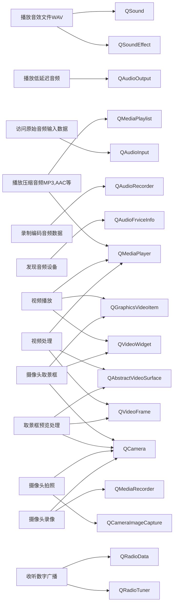

### 14.1 音频播放

#### 14.1.1 QMediaPlayer

这个类可以进行视频播放和视频处理，还可以播放MP3、AAC等压缩音频。这个例子可见[34-TestQMediaPlayer](34-TestQMediaPlayer)。

播放可以单个文件，也可以和QMediaPlaylist结合，对一个播放列表进行播放。

QMediaPlayer 类允许播放媒体源。
QMediaPlayer 类是高级媒体播放类。它可用于播放歌曲、电影和网络广播等内容。要播放的内容被指定为 QMediaContent 对象，可以将其视为带有附加信息的主要或规范 URL。当提供 QMediaContent 时，播放可能能够开始。

```c++
player = new QMediaPlayer;
connect(player, SIGNAL(positionChanged(qint64)), this, SLOT(positionChanged(qint64)));
player->setMedia(QUrl::fromLocalFile("/Users/me/Music/coolsong.mp3"));
player->setVolume(50);
player->play();
```

QVideoWidget 可以与 QMediaPlayer 一起用于视频渲染和 QMediaPlaylist 用于访问播放列表功能。

```c++
playlist = new QMediaPlaylist;
playlist->addMedia(QUrl("http://example.com/movie1.mp4"));
playlist->addMedia(QUrl("http://example.com/movie2.mp4"));
playlist->addMedia(QUrl("http://example.com/movie3.mp4"));
playlist->setCurrentIndex(1);

player = new QMediaPlayer;
player->setPlaylist(playlist);

videoWidget = new QVideoWidget;
player->setVideoOutput(videoWidget);
videoWidget->show();

player->play();
```

由于 QMediaPlayer 是一个 QMediaObject，你可以使用几个 QMediaObject 函数来做以下事情： 访问当前正在播放的媒体的元数据（QMediaObject::metaData() 和预定义的元数据键）；检查媒体播放服务当前是否可用（ QMediaObject::availability())。

枚举类型。

定义媒体播放器的当前状态。

```c++
enum QMediaPlayer::State{
    QMediaPlayer::StoppedState,
    QMediaPlayer::PlayingState,
    QMediaPlayer::PausedState
}
```

定义媒体播放器错误条件。

```c++
enum QMediaPlayer::Error{
    QMediaPlayer::NoError,
    QMediaPlayer::ResourceError,
    QMediaPlayer::FormatError,
    QMediaPlayer::NetworkError,
    QMediaPlayer::AccessDeniedError,
    QMediaPlayer::ServiceMissingError
}
```

定义媒体播放器的标记。

```c++
enum QMediaPlayer::Flag{
    QMediaPlayer::LowLatency,//该播放器应与简单的音频格式一起使用，但播放开始时应该没有明显的延迟。这种播放服务可用于哔哔声、铃声等
    QMediaPlayer::StreamPlayback,//该播放器应播放基于 QIODevice 的流。如果传递给 QMediaPlayer 构造函数，将选择支持流播放的服务
    QMediaPlayer::VideoSurface//播放器应该能够渲染到 QAbstractVideoSurface 输出
}
```

定义媒体播放器当前媒体的状态。

```c++
enum QMediaPlayer::MediaStatus{   
    QMediaPlayer::UnknownMediaStatus,//无法确定媒体的状态
    QMediaPlayer::NoMedia,//不是当前的媒体。播放器处于 StoppedState
    QMediaPlayer::LoadingMedia,//正在加载当前媒体。玩家可以处于任何状态
    QMediaPlayer::LoadedMedia,//当前媒体已加载。播放器处于 StoppedState
    QMediaPlayer::StalledMedia,//由于缓冲不足或其他一些临时中断，当前媒体的播放已停止。播放器处于 PlayingState 或 PausedState
    QMediaPlayer::BufferingMedia,//播放器正在缓冲数据，但缓冲了足够的数据以供播放以在不久的将来继续播放。播放器处于 PlayingState 或 PausedState
    QMediaPlayer::BufferedMedia,//播放器已完全缓冲当前媒体。播放器处于 PlayingState 或 PausedState
    QMediaPlayer::EndOfMedia,//播放已到达当前媒体的结尾。播放器处于 StoppedState
    QMediaPlayer::InvalidMedia//无法播放当前媒体。播放器处于 StoppedState
}
```

成员函数。

```c++
QMediaPlayer(QObject *parent = Q_NULLPTR, Flags flags = Flags());
// 此属性保存在播放开始或恢复之前填充的临时缓冲区的百分比，从 0（空）到 100（满）
int bufferStatus() const;
// 此属性保存当前播放音量
int volume() const;
// 该属性保存当前媒体的播放位置
qint64 position() const;
// 此属性保存当前媒体的持续时间
qint64 duration() const;
// 此属性保存当前媒体的播放速率
qreal playbackRate() const;
// 此属性包含一个描述最后一个错误条件的字符串
Error error() const;
QString errorString() const;
// 此属性保存媒体播放器的播放状态
State state() const;
// 此属性保存当前媒体的音频可用性状态
bool isAudioAvailable() const;
// 此属性保存当前媒体的视频可用性状态
bool isVideoAvailable() const;
// 此属性保存当前媒体的静音状态
bool isMuted() const;
// 该属性保存当前媒体的可搜索状态
bool isSeekable() const;
// 该属性保存当前媒体流的状态
MediaStatus mediaStatus() const;
const QIODevice *mediaStream() const;
// 此属性保存播放器对象正在使用的媒体播放列表
QMediaPlaylist *playlist() const;
// 此属性保存播放器对象正在播放的当前活动媒体内容。如果使用播放列表，此值可能与 QMediaPlayer::media 属性不同。在这种情况下，currentMedia 表示播放器正在处理的当前媒体内容，而 QMediaPlayer::media 属性包含原始播放列表
QMediaContent currentMedia() const;
// 此属性保存播放器对象正在使用的活动媒体源
QMediaContent media() const;
// 此属性持有媒体播放器播放的音频流的角色
void setAudioRole(QAudio::Role audioRole);
QAudio::Role audioRole() const;
// 返回支持的音频角色列表
QList<QAudio::Role> supportedAudioRoles() const;
// 返回当前使用的网络接入点。如果返回默认构造的 QNetworkConfiguration，则此功能不可用或当前提供的配置均未使用
QNetworkConfiguration currentNetworkConfiguration() const;
//设置QVideoWidget类型输出设备
void setVideoOutput(QVideoWidget *output);
// 设置QGraphicsVideoItem类型输出设备
void setVideoOutput(QGraphicsVideoItem *output);
// 一个抽象输出设备
void setVideoOutput(QAbstractVideoSurface *surface);
```

槽函数。

```c++
void pause();
void play();
void setMedia(const QMediaContent &media, QIODevice *stream = Q_NULLPTR);
void setMuted(bool muted);
void setNetworkConfigurations(const QList<QNetworkConfiguration> &configurations);
void setPlaybackRate(qreal rate);
void setPlaylist(QMediaPlaylist *playlist);
void setPosition(qint64 position);
void setVolume(int volume);
void stop();
```

信号函数。

```c++
void audioAvailableChanged(bool available);
void audioRoleChanged(QAudio::Role role);
void bufferStatusChanged(int percentFilled);
void currentMediaChanged(const QMediaContent &media);//当前播放文件切换时发射
void durationChanged(qint64 duration);//文件总播放时长变化,切换文件时发射
void error(QMediaPlayer::Error error);
void mediaChanged(const QMediaContent &media);
void mediaStatusChanged(QMediaPlayer::MediaStatus status);
void mutedChanged(bool muted);//静音状态改变时发射
void networkConfigurationChanged(const QNetworkConfiguration &configuration);
void playbackRateChanged(qreal rate);//播放速率变化时发射
void positionChanged(qint64 position);// 反应播放进度
void seekableChanged(bool seekable);
void stateChanged(QMediaPlayer::State state);//播放开始、暂停和停止都会发射
void videoAvailableChanged(bool videoAvailable);
void volumeChanged(int volume);//音量改变时发射
```

静态成员函数。

```c++
QMultimedia::SupportEstimate 
hasSupport(const QString &mimeType, const QStringList &codecs = QStringList(), Flags flags = Flags());// 返回媒体播放器对 mimeType 和一组编解码器的支持级别
```

#### 14.1.2 QMediaPlaylist

QMediaPlaylist 类提供要播放的媒体内容列表。
QMediaPlaylist 旨在与其他媒体对象一起使用，例如 QMediaPlayer。
QMediaPlaylist 允许访问服务内部播放列表功能（如果可用），否则它提供本地内存播放列表实现。

```c++
playlist = new QMediaPlaylist;
playlist->addMedia(QUrl("http://example.com/movie1.mp4"));
playlist->addMedia(QUrl("http://example.com/movie2.mp4"));
playlist->addMedia(QUrl("http://example.com/movie3.mp4"));
playlist->setCurrentIndex(1);

player = new QMediaPlayer;
player->setPlaylist(playlist);

videoWidget = new QVideoWidget;
player->setVideoOutput(videoWidget);
videoWidget->show();

player->play();
```

枚举类型。

此枚举描述 QMediaPlaylist 错误代码。

```c++
enum QMediaPlaylist::Error{
    QMediaPlaylist::NoError,
    QMediaPlaylist::FormatError,
    QMediaPlaylist::FormatNotSupportedError,
    QMediaPlaylist::NetworkError,
    QMediaPlaylist::AccessDeniedError,
}
```

QMediaPlaylist::PlaybackMode 描述了播放列表中的播放顺序。

```c++
enum QMediaPlaylist::PlaybackMode{
    QMediaPlaylist::CurrentItemOnce,// 播放1次
    QMediaPlaylist::CurrentItemInLoop,//单曲循环
    QMediaPlaylist::Sequential, // 顺序播放
    QMediaPlaylist::Loop,//循环播放
    QMediaPlaylist::Random// 随机播放
}
```

成员函数。

```c++
// 将媒体内容附加到播放列表
bool addMedia(const QMediaContent &content);
bool addMedia(const QList<QMediaContent> &items);

// 从头到尾删除播放列表中的项目
bool removeMedia(int pos);
bool removeMedia(int start, int end);
// 将媒体内容插入播放列表的位置 pos
bool insertMedia(int pos, const QMediaContent &content);
bool insertMedia(int pos, const QList<QMediaContent> &items);
// 将项目从位置移动到位置
bool moveMedia(int from, int to);

// 从播放列表中删除所有项目
bool clear();

// 返回当前媒体内容在播放列表中的位置
int currentIndex() const;
// 返回项目的索引，在调用 previous() 步骤后该索引将是当前的
int previousIndex(int steps = 1) const;
// 返回项目的索引，在调用 next() 步骤后将是当前的
int nextIndex(int steps = 1) const;

// 返回最后一个错误条件
Error error() const;
// 返回描述最后一个错误条件的字符串
QString errorString() const;

// 如果播放列表不包含任何项目，则返回 true，否则返回 false
bool isEmpty() const;
// 如果可以修改播放列表，则返回 true，否则返回 false
bool isReadOnly() const;

// 使用网络请求加载播放列表。如果指定了格式，则使用它，否则从播放列表名称和数据中猜测格式
void load(const QNetworkRequest &request, const char *format = Q_NULLPTR);
// 从位置加载播放列表。如果指定了格式，则使用它，否则从位置名称和数据中猜测格式
void load(const QUrl &location, const char *format = Q_NULLPTR);
// 从 QIODevice 设备加载播放列表。如果指定了格式，则使用它，否则从设备数据中猜测格式
void load(QIODevice *device, const char *format = Q_NULLPTR);

QMediaContent media(int index) const;
QMediaContent currentMedia() const;
int mediaCount() const;

// 此属性定义播放列表中项目的播放顺序
void setPlaybackMode(PlaybackMode mode);
PlaybackMode playbackMode() const;

// 将播放列表保存到位置。如果指定了格式，则使用它，否则从位置名称中猜测格式
bool save(const QUrl &location, const char *format = Q_NULLPTR);
// 使用 format 格式将播放列表保存到 QIODevice 设备
bool save(QIODevice *device, const char *format);
```

槽函数如下。

```c++
// 前进到播放列表中的下一个媒体内容
void next();
// 返回播放列表中的上一个媒体内容
void previous();
// 在 playlistPosition 位置激活播放列表中的媒体内容
void setCurrentIndex(int playlistPosition);
// 随机播放播放列表中的项目
void shuffle();
```

信号函数。

```c++
void currentIndexChanged(int position);
void currentMediaChanged(const QMediaContent &content);
void loadFailed();
void loaded();
void mediaAboutToBeInserted(int start, int end);
void mediaAboutToBeRemoved(int start, int end);
void mediaChanged(int start, int end);
void mediaInserted(int start, int end);
void mediaRemoved(int start, int end);
void playbackModeChanged(QMediaPlaylist::PlaybackMode mode);
```

#### 14.1.3 QSoundEffect

QSoundEffect 类提供了一种播放低延迟音效的方法。
此类允许您以通常较低延迟的方式播放未压缩的音频文件（通常是 WAV 文件），并且适用于响应用户操作的“反馈”类型声音（例如，虚拟键盘声音、弹出对话框的正面或负面反馈，或游戏声音）。如果低延迟不重要，请考虑改用 QMediaPlayer 类，因为它支持更广泛的媒体格式并且资源占用较少。
这个例子展示了如何播放一个循环的、有点安静的声音效果：

```c++
QSoundEffect effect;
effect.setSource(QUrl::fromLocalFile("engine.wav"));
effect.setLoopCount(QSoundEffect::Infinite);
effect.setVolume(0.25f);
effect.play();
```

通常应该重用音效，这样可以提前完成所有解析和准备工作，并且只在必要时触发。这有助于降低延迟音频播放。由于 QSoundEffect 需要稍多的资源来实现更低延迟的播放，因此平台可能会限制同时播放音效的数量。

```c++
MyGame(): m_explosion(this)
{
    m_explosion.setSource(QUrl::fromLocalFile("explosion.wav"));
    m_explosion.setVolume(0.25f);
    // Set up click handling etc.
    connect(clickSource, SIGNAL(clicked()), &m_explosion, SLOT(play()));
}
private:
QSoundEffect m_explosion;
```

枚举类型。

```c++
enum QSoundEffect::Loop{
	QSoundEffect::Infinite//用作 setLoopCount() 的参数以进行无限循环
}
```

```c++
enum QSoundEffect::Status{
    QSoundEffect::Null,//未设置源或源为空
    QSoundEffect::Loading,//SoundEffect 正在尝试加载源
    QSoundEffect::Ready,//源已加载并准备好播放
    QSoundEffect::Error//运行过程中出现错误，例如加载源失败
}
```

成员函数。

```c++
bool isLoaded() const;//返回音效是否已完成加载 source()
bool isPlaying() const;//如果当前正在播放音效，则返回 true，否则返回 false
int loopsRemaining() const;//此属性包含在音效自行停止之前剩余的循环数，或者 QSoundEffect::Infinite 如果这是在循环中设置的
Status status() const;//返回此音效的当前状态

void setCategory(const QString &category);//设置音效的类别,分组功能
QString category() const;

void setLoopCount(int loopCount);//播放次数
int loopCount() const;

void setMuted(bool muted);//静音
bool isMuted() const;

void setSource(const QUrl &url);//播放文件
QUrl source() const;

void setVolume(qreal volume);//音量
qreal volume() const;
```

信号与槽与静态函数。

```c++
// 槽函数
void play();
void stop();
//信号函数
void categoryChanged();
void loadedChanged();
void loopCountChanged();
void loopsRemainingChanged();
void mutedChanged();
void playingChanged();
void sourceChanged();
void statusChanged();
void volumeChanged();
// 静态函数
static QStringList supportedMimeTypes();//返回此平台支持的 mime 类型列表
```

#### 14.1.4 QSound

QSound 类提供了一种播放 .wav 声音文件的方法。
Qt 提供了 GUI 应用程序中最常用的音频操作：异步播放声音文件。使用静态 play() 函数最容易做到这一点：

```c++
 QSound::play("mysounds/bells.wav");
```

或者，首先从声音文件创建一个 QSound 对象，然后调用 play() 槽：

```c++
QSound bells("mysounds/bells.wav");
bells.play();
```

一旦创建了 QSound 对象，就可以查询它的 fileName() 和 loops() 总数（即声音播放的次数）。可以使用 setLoops() 函数更改重复次数。播放声音时，loopsRemaining() 函数返回剩余的重复次数。使用 isFinished() 函数来确定声音是否播放完毕。
使用 QSound 对象播放的声音可能会比静态 play() 函数使用更多的内存，但它也可能播放得更快（取决于底层平台的音频设施）。如果您需要更好地控制播放声音，请考虑 QSoundEffect 或 QAudioOutput 类。

枚举类型。

```c++
enum Loop { Infinite }//可用作 setLoops() 的参数以无限循环
```

成员函数。

```c++
// 从给定文件名和给定父级指定的文件构造一个 QSound 对象
QSound(const QString &filename, QObject *parent = Q_NULLPTR);
QString fileName() const;// 返回与此 QSound 对象关联的文件名
bool isFinished() const;// 如果声音已播放完毕，则返回 true；否则返回false
int loops() const;// 返回声音播放的次数。 QSound::Infinite 的返回值表示无限循环
void setLoops（int number);
int loopsRemaining() const;// 返回声音循环的剩余次数（对于所有正值，每次播放声音时该值都会减小）。 QSound::Infinite 的返回值表示无限循环

// 槽函数
void play();
void stop();

// 静态函数
static void play(const QString& filename);
```

### 14.2 音频输入

例子可见[35-TestQAudioRecorder](35-TestQAudioRecorder)。

#### 14.2.1 QMediaRecorder

QMediaRecorder 类用于记录媒体内容。
QMediaRecorder 类是高级媒体记录类。它不能单独使用，而是用于访问其他媒体对象的媒体录制功能，如 QRadioTuner 或 QCamera。

```c++
recorder = new QMediaRecorder(camera);
QAudioEncoderSettings audioSettings;
audioSettings.setCodec("audio/amr");
audioSettings.setQuality(QMultimedia::HighQuality);
recorder->setAudioSettings(audioSettings);
recorder->setOutputLocation(QUrl::fromLocalFile(fileName));
recorder->record();
```

枚举类型。

```c++
enum QMediaRecorder::Error{
    QMediaRecorder::NoError,
    QMediaRecorder::ResourceError,
    QMediaRecorder::FormatError,
    QMediaRecorder::OutOfSpaceError,
}
```

```c++
enum QMediaRecorder::State{
    QMediaRecorder::StoppedState,
    QMediaRecorder::RecordingState,
    QMediaRecorder::PausedState
}
```

```c++
enum QMediaRecorder::Status{
    QMediaRecorder::UnavailableStatus,
    QMediaRecorder::UnloadedStatus,
    QMediaRecorder::LoadingStatus,
    QMediaRecorder::LoadedStatus,
    QMediaRecorder::StartingStatus,
    QMediaRecorder::RecordingStatus,
    QMediaRecorder::PausedStatus,
    QMediaRecorder::FinalizingStatus
}
```

成员函数。

```c++
QString audioCodecDescription(const QString &codec) const;//返回音频编解码器的描述
QString videoCodecDescription(const QString &codec) const;// 返回视频可以编码的分辨率列表
QString containerDescription(const QString &format) const;//返回容器格式的描述

State state() const;
Status status() const;
qint64 duration() const;
Error error() const;
QString errorString() const;
qreal volume() const;
bool isAvailable() const;//如果媒体记录器服务准备好使用，则返回 true
bool isMetaDataAvailable() const;//此属性保存对媒体对象的元数据的访问是否可用
bool isMetaDataWritable() const;//该属性保存媒体对象的元数据是否可写
bool isMuted() const;

// 返回此功能的可用性
QMultimedia::AvailabilityStatus availability() const;
// 返回有可用元数据的键列表
QStringList availableMetaData() const;

// 返回正在使用的音频编码器设置
void setAudioSettings(const QAudioEncoderSettings &settings);
QAudioEncoderSettings audioSettings() const;

// 返回选定的容器格式
void setContainerFormat(const QString &container);
QString containerFormat() const;

// 设置音频编码器设置
void setEncodingSettings(const QAudioEncoderSettings &audio, const QVideoEncoderSettings &video = QVideoEncoderSettings(), const QString &container = QString());

// 返回与元数据键关联的值
void setMetaData(const QString &key, const QVariant &value);
QVariant metaData(const QString &key) const;

// 此属性保存最后一个媒体内容的实际位置
QUrl actualLocation() const;
// 此属性保存媒体内容的目标位置
bool setOutputLocation(const QUrl &location);
QUrl outputLocation() const;

// 设置视频编码器设置
void setVideoSettings(const QVideoEncoderSettings &settings);
QVideoEncoderSettings videoSettings() const;

// 获取支持的编码格式、采样率、容器格式、帧率、分辨率、解码器列表
QStringList supportedAudioCodecs() const;
QList<int> supportedAudioSampleRates(const QAudioEncoderSettings &settings = QAudioEncoderSettings(), bool *continuous = Q_NULLPTR) const;
QStringList supportedContainers() const;
QList<qreal> supportedFrameRates(const QVideoEncoderSettings &settings = QVideoEncoderSettings(), bool *continuous = Q_NULLPTR) const;
QList<QSize> supportedResolutions(const QVideoEncoderSettings &settings = QVideoEncoderSettings(), bool *continuous = Q_NULLPTR) const;
QStringList supportedVideoCodecs() const
```

信号与槽函数。

```c++
// 槽函数
void pause();
void record();
void setMuted(bool muted);
void setVolume(qreal volume);
void stop();

// 信号函数
void actualLocationChanged(const QUrl &location);
void availabilityChanged(bool available);
void availabilityChanged(QMultimedia::AvailabilityStatus availability);
void durationChanged(qint64 duration);//常用
void error(QMediaRecorder::Error error);
void metaDataAvailableChanged(bool available);
void metaDataChanged();
void metaDataChanged(const QString &key, const QVariant &value);
void metaDataWritableChanged(bool writable);
void mutedChanged(bool muted);//常用
void stateChanged(QMediaRecorder::State state);//常用
void statusChanged(QMediaRecorder::Status status);//常用
void volumeChanged(qreal volume);//常用
```

#### 14.2.2 QAudioRecorder

高层次实现，输入的音频数据直接保存文件。

需要使用QAudioEncoderSettings来进行输入音频设置，**主要是编码格式、采样率、通道数、音频质量等高级设置**。设置好输出保存的文件就可以一开始录制文件，音频输入设备自动确定底层的采样参数，使用QQAudioProbe可以访问原始的音频数据和输入缓冲区的参数，这些参数包括缓冲字节数、帧数、采样数、采样字长和采样率等，这样就可以从缓冲区读取原始的音频数据。

```c++
audioRecorder = new QAudioRecorder;
QAudioEncoderSettings audioSettings;
audioSettings.setCodec("audio/amr");
audioSettings.setQuality(QMultimedia::HighQuality);

audioRecorder->setEncodingSettings(audioSettings);
audioRecorder->setOutputLocation(QUrl::fromLocalFile("test.amr"));
audioRecorder->record();
//-----------------------------------------------
QStringList inputs = audioRecorder->audioInputs();
QString selectedInput = audioRecorder->defaultAudioInput();
foreach (QString input, inputs) {
    QString description = audioRecorder->audioInputDescription(input);
    selectedInput = input;// 向用户显示描述并允许选择
}
audioRecorder->setAudioInput(selectedInput);
```

成员函数。

```c++
QAudioRecorder(QObject *parent = Q_NULLPTR);

void setAudioInput(const QString &name);
QString audioInput() const;//返回活动音频输入名称
QString audioInputDescription(const QString &name) const;//返回带有名称的音频输入设备的可读翻译描述
QStringList audioInputs() const;//返回可用音频输入的列表
QString defaultAudioInput() const;//返回默认的音频输入名设备称
```

信号函数。

```c++
void audioInputChanged(const QString &name);//当活动音频输入更改为名称时发出的信号
void availableAudioInputsChanged();//当可用的音频输入改变时发出信号
```

#### 14.2.3 QAudioProbe

QAudioProbe 类允许您监视正在播放或录制的音频。

```c++
QAudioRecorder *recorder = new QAudioRecorder();
QAudioProbe *probe = new QAudioProbe;
// ... configure the audio recorder (skipped)
connect(probe, SIGNAL(audioBufferProbed(QAudioBuffer)), this, SLOT(processBuffer(QAudioBuffer)));
probe->setSource(recorder); 
recorder->record(); //现在我们可以做一些事情，比如计算水平或执行FFT
```

成员函数。

```c++
QAudioProbe(QObject *parent = Q_NULLPTR);
bool isActive() const;//如果此探测器正在监视某些内容，则返回 true，否则返回 false
bool setSource(QMediaObject *source);
bool setSource(QMediaRecorder *mediaRecorder);
```

信号函数。

```c++
void audioBufferProbed(const QAudioBuffer &buffer);//当在媒体服务中处理音频缓冲区时，应发出此信号
void flush();//当需要释放所有缓冲区时，应发出此信号。应用程序必须释放对音频缓冲区的所有未完成的引用
```

#### 14.2.4 QAudioInput

低层次的实现，直接控制音频输入设备的参数，并将音频录制数据写入一个流设备。

QAudioInput 类提供用于从音频输入设备接收音频数据的接口。**您可以使用系统默认的音频输入设备构建音频输入。也可以使用特定的 QAudioDeviceInfo 创建 QAudioInput**。当您创建音频输入时，您还应该发送 QAudioFormat 以用于录制。启动 QAudioInput 只需调用 start() 并打开 QIODevice 进行写入。

例如，要录制到文件中，您可以：

```c++
QFile destinationFile;   // Class member
QAudioInput* audio; // Class member
{
    // 设置保存文件并打开
    destinationFile.setFileName("/tmp/test.raw");
    destinationFile.open( QIODevice::WriteOnly | QIODevice::Truncate );

    // 设置格式
    QAudioFormat format;
    format.setSampleRate(8000);
    format.setChannelCount(1);
    format.setSampleSize(8);
    format.setCodec("audio/pcm");
    format.setByteOrder(QAudioFormat::LittleEndian);
    format.setSampleType(QAudioFormat::UnSignedInt);

    // 获取录制设备信息是否支持此格式
    QAudioDeviceInfo info = QAudioDeviceInfo::defaultInputDevice();
    if (!info.isFormatSupported(format)) {
        qWarning() << "Default format not supported, trying to use the nearest.";
        format = info.nearestFormat(format);
    }
	
    // 以该格式创建录制对象
    audio = new QAudioInput(format, this);
    connect(audio, SIGNAL(stateChanged(QAudio::State)), this, SLOT(handleStateChanged(QAudio::State))); // 录制状态可以传递出去
    QTimer::singleShot(3000, this, SLOT(stopRecording())); // 单步运行.3000ms后停止录制
    audio->start(&destinationFile); // 开始录制
}
```

如果输入设备支持指定的格式，这将开始录制（您可以使用 QAudioDeviceInfo::isFormatSupported() 进行检查。如果有任何障碍，请使用 error() 函数检查出了什么问题。我们停止录制stopRecording() 插槽。

```c++
void AudioInputExample::stopRecording()
{
    audio->stop();
    destinationFile.close();
    delete audio;
}
void AudioInputExample::handleStateChanged(QAudio::State newState)
{
    switch (newState) {
        case QAudio::StoppedState:
            if (audio->error() != QAudio::NoError) { //因为有错误处于停止状态
          		// 处理错误
            } else {
                // 没错误结束录制
            }
            break;
        case QAudio::ActiveState: // 处于激活状态
            // 开始录制
            break;
        default:
            // 其它状态
            break;
    }
}
```

在任何时间点，QAudioInput 都将处于以下四种状态之一：**活动、暂停、停止或空闲**。这些状态由 QAudio::State 枚举指定。您可以**通过suspend()、resume()、stop()、reset() 和start() 直接请求状态更改**。当前状态由 state() 报告。 QAudioOutput 也会在状态改变时向您发出信号（stateChanged()）。
QAudioInput 提供了几种方法来测量从开始（）开始录制的时间。 **processesUSecs() 函数返回写入流的长度（以微秒为单位）**，即，它**忽略了音频输入暂停或空闲的时间**。 **elapsedUSecs() 函数返回自调用 start() 以来经过的时间，无论 QAudioInput 处于哪种状态**。

成员函数。

```c++
// 构造一个新的音频输入并将其附加到父级。默认音频输入设备与输出格式参数一起使用
QAudioInput(const QAudioFormat &format = QAudioFormat(), QObject *parent = Q_NULLPTR);
QAudioInput(const QAudioDeviceInfo &audioDevice, const QAudioFormat &format = QAudioFormat(), QObject *parent = Q_NULLPTR);

// 返回可读取的音频数据量（以字节为单位）
int bytesReady() const;
// 返回自调用 start() 以来的微秒数，包括空闲和挂起状态的时间
qint64 elapsedUSecs() const;
QAudio::Error error() const;
QAudioFormat format() const;
// 返回周期大小（以字节为单位）
int periodSize() const;
// 返回自调用 start() 以来处理的音频数据量（以微秒为单位）
qint64 processedUSecs() const;

void reset();//删除缓冲区中的所有音频数据，将缓冲区重置为零
void resume();//在suspend() 之后恢复处理音频数据
void stop();
void suspend();//停止处理音频数据，保留缓冲的音频数据
QAudio::State state() const;//返回音频处理的状态

// 返回音频缓冲区大小（以字节为单位）
void setBufferSize(int value);
int bufferSize() const;

// 设置要发出的 notify() 信号的间隔。这是基于处理的音频数据的毫秒数，而不是实际实时。计时器的最小分辨率是特定于平台的，应使用 notifyInterval() 检查值以确认正在使用的实际值
void setNotifyInterval(int ms);
int notifyInterval() const;

// 将输入音量设置为音量
void setVolume(qreal volume);
qreal volume() const;

// 开始将音频数据从系统的音频输入传输到设备。设备必须以 WriteOnly、Append 或 ReadWrite 模式打开
void start(QIODevice *device);
// 返回指向用于从系统音频输入传输数据的内部 QIODevice 的指针。设备已经打开并且 read() 可以直接从中读取数据
QIODevice *start();
```

信号函数。

```c++
void notify();//在 setNotifyInterval(x) 设置的时间间隔处理 x ms 的音频数据时发出此信号
void stateChanged(QAudio::State state);
```

#### 14.2.5 QAudioDeviceInfo

QAudioDeviceInfo 类提供了一个接口来查询音频设备及其功能。
**QAudioDeviceInfo 可以查询系统上当前可用的音频设备**，例如声卡和 USB 耳机。可用的音频设备取决于安装的平台或音频插件。Qt 使用 QAudioDeviceInfo 来构造与设备通信的类，**例如 QAudioInput 和 QAudioOutput**。
您还可以**查询每个设备支持的格式**。此上下文中的格式是由**特定字节顺序、通道、编解码器、频率、采样率和采样类型组成的集合**。格式由 QAudioFormat 类表示。
可以使用supportedByteOrders()、supportedChannelCounts()、supportedCodecs()、supportedSampleRates()、supportedSampleSizes() 和supportedSampleTypes() 获取设备支持的每个参数的值。支持的组合取决于平台、安装的音频插件和音频设备功能。如果您需要特定格式，您可以使用 isFormatSupported() 检查设备是否支持它，或者使用nearestFormat() 获取尽可能接近格式的支持格式。例如：

```c++
QAudioFormat format;
format.setSampleRate(44100);
// ... other format parameters
format.setSampleType(QAudioFormat::SignedInt);

QAudioDeviceInfo info(QAudioDeviceInfo::defaultOutputDevice());

if (!info.isFormatSupported(format))
    format = info.nearestFormat(format);
```

静态函数 defaultInputDevice()、defaultOutputDevice() 和 availableDevices() 可让您获得所有可用设备的列表。根据 QAudio::Mode 枚举指定的 mode 值获取设备。返回的 QAudioDeviceInfo 仅对 QAudio::Mode 有效。在此代码示例中，我们遍历所有能够输出声音的设备，即以支持的格式播放音频流。对于我们找到的每个设备，我们只需打印 deviceName()。例如：

```c++
foreach (const QAudioDeviceInfo &deviceInfo, QAudioDeviceInfo::availableDevices(QAudio::AudioOutput))
      qDebug() << "Device name: " << deviceInfo.deviceName();
```

成员函数。

```c++
QString deviceName() const；
// 如果此 QAudioDeviceInfo 描述的音频设备支持提供的设置，则返回 true
bool isFormatSupported(const QAudioFormat &settings) const；
bool isNull() const；
// 返回最接近系统支持的提供设置的 QAudioFormat
QAudioFormat nearestFormat(const QAudioFormat &settings) const；
// 返回此设备的默认音频格式设置
QAudioFormat preferredFormat() const；
// 返回设备支持的字节序、通道数、编码格式、采样率、采样大小和采样类型
QList<QAudioFormat::Endian> supportedByteOrders() const；
QList<int> supportedChannelCounts() const；
QStringList supportedCodecs() const；
QList<int> supportedSampleRates() const；
QList<int> supportedSampleSizes() const；
QList<QAudioFormat::SampleType> supportedSampleTypes() const；
```

静态成员函数。

```c++
// 返回有效的设备,默认的输入和输出设备
QList<QAudioDeviceInfo> availableDevices(QAudio::Mode mode);
QAudioDeviceInfo defaultInputDevice();
QAudioDeviceInfo defaultOutputDevice();
```

#### 14.2.6 QAudioOuput

QAudioOutput 类提供了一个将音频数据发送到音频输出设备的接口。
您可以使用系统的默认音频输出设备构建音频输出。也可以使用特定的 QAudioDeviceInfo 创建 QAudioOutput。创建音频输出时应设置QAudioFormat 以用于播放。播放文件：开始播放音频流只需使用 QIODevice 调用 start()。 QAudioOutput 然后将从 io 设备获取它需要的数据。

```c++
QFile sourceFile;   // class member.
QAudioOutput* audio; // class member.
{
    // 输出文件
    sourceFile.setFileName("/tmp/test.raw");
    sourceFile.open(QIODevice::ReadOnly);

    // 设置好格式
    QAudioFormat format;
    format.setSampleRate(8000);
    format.setChannelCount(1);
    format.setSampleSize(8);
    format.setCodec("audio/pcm");
    format.setByteOrder(QAudioFormat::LittleEndian);
    format.setSampleType(QAudioFormat::UnSignedInt);

    //格式是否支持
    QAudioDeviceInfo info(QAudioDeviceInfo::defaultOutputDevice());
    if (!info.isFormatSupported(format)) {
        qWarning() << "Raw audio format not supported by backend, cannot play audio.";
        return;
    }

    audio = new QAudioOutput(format, this);
    connect(audio, SIGNAL(stateChanged(QAudio::State)), this, SLOT(handleStateChanged(QAudio::State)));
    audio->start(&sourceFile);//开始输出
}

void AudioOutputExample::handleStateChanged(QAudio::State newState)
{
    switch (newState) {
        case QAudio::IdleState:
            // 结束输出
            audio->stop();
            sourceFile.close();
            delete audio;
            break;

        case QAudio::StoppedState:
            // 因为其他原因导致的停止
            if (audio->error() != QAudio::NoError) {
                // 错误处理
            }
            break;

        default:
            break;
    }
}
```

成员函数，含义类似于QAudioOuput的成员函数，不再赘述。

```c++
QAudioOutput(const QAudioFormat &format = QAudioFormat(), QObject *parent = Q_NULLPTR);
QAudioOutput(const QAudioDeviceInfo &audioDevice, const QAudioFormat &format = QAudioFormat(), QObject *parent = Q_NULLPTR);
int bufferSize() const;
int bytesFree() const;
QString category() const;
qint64 elapsedUSecs() const;
QAudio::Error error() const;
QAudioFormat format() const;
int notifyInterval() const;
int periodSize() const;
qint64 processedUSecs() const;
void reset();
void resume();
void setBufferSize(int value);
void setCategory(const QString &category);
void setNotifyInterval(int ms);
void setVolume(qreal volume);
void start(QIODevice *device);
QIODevice *start();
QAudio::State state() const;
void stop();
void suspend();
qreal volume() const;
```

信号函数。

```c++
void notify();
void stateChanged(QAudio::State state);
```

### 14.3 视频播放

视频播放有2个用于播放视频的组件可以使用，即QVideoWidget和QGraphicsVideoItem。

例子可见[37-TestVideoPlayBack](37-TestVideoPlayBack)。

#### 14.3.1 QVideoWidget

QVideoWidget 类提供了一个展示由媒体对象生成的视频的小部件。
将 QVideoWidget 附加到 QMediaObject 允许它显示该媒体对象的视频或图像输出。 QVideoWidget 通过在其构造函数中传递指向 QMediaObject 的指针附加到媒体对象，并通过销毁 QVideoWidget 来分离。

```c++
player = new QMediaPlayer;

playlist = new QMediaPlaylist(player);
playlist->addMedia(QUrl("http://example.com/myclip1.mp4"));
playlist->addMedia(QUrl("http://example.com/myclip2.mp4"));

videoWidget = new QVideoWidget;
player->setVideoOutput(videoWidget);

videoWidget->show();
playlist->setCurrentIndex(1);
player->play();
```

成员函数。

```c++
QVideoWidget(QWidget *parent = Q_NULLPTR);
Qt::AspectRatioMode aspectRatioMode() const;//视频如何根据其纵横比进行缩放
int brightness() const;//此属性用于调整显示视频的亮度
int contrast() const;//此属性用于调整显示视频的对比度
int hue() const;//此属性用于调整显示视频的色调
bool isFullScreen() const;//是Widget部件也可以全屏显示
int saturation() const;//饱和度
```

槽函数。

```c++
void setAspectRatioMode(Qt::AspectRatioMode mode);
void setBrightness(int brightness);
void setContrast(int contrast);
void setFullScreen(bool fullScreen);
void setHue(int hue);
void setSaturation(int saturation);
```

信号函数。

```c++
void brightnessChanged(int brightness);
void contrastChanged(int contrast);
void fullScreenChanged(bool fullScreen);
void hueChanged(int hue);
void saturationChanged(int saturation);
```

可以重载事件实现自己想要的效果，例如单击可以视频暂停或继续播放，ESC来控制全屏退出等。

```c++
virtual void hideEvent(QHideEvent *event) override;
virtual void moveEvent(QMoveEvent *event) override;
virtual void paintEvent(QPaintEvent *event) override;
virtual void resizeEvent(QResizeEvent *event) override;
virtual void showEvent(QShowEvent *event) override;
```

例子。

```c++
// 按键事件,按下ESC可以退出全屏状态
void myVideoWidget::keyPressEvent(QKeyEvent *event)
{
    if ((event->key() == Qt::Key_Escape)&&(this->isFullScreen()))
    {
        this->setFullScreen(false);
        event->accept();
        QVideoWidget::keyPressEvent(event);
    }
}

// 鼠标单击可以控制暂停和继续播放
void myVideoWidget::mousePressEvent(QMouseEvent *event)
{
    if (event->button()==Qt::LeftButton)
    {
        if (thePlayer->state()==QMediaPlayer::PlayingState) //如果是播放状态,视频暂停
          thePlayer->pause();
        else
          thePlayer->play();
    }
    QVideoWidget::mousePressEvent(event); // 事件传递给父对象
}
```

#### 14.3.2 QGraphicsVideoItem

也是图形项的一种，继承自QGraphicsObject。

QGraphicsVideoItem 类提供了一个显示由 QMediaObject 生成的视频的图形项。
将 QGraphicsVideoItem 附加到 QMediaObject 允许它显示该媒体对象的视频或图像输出。通过将指向 QMediaObject 的指针传递给 setMediaObject() 函数，将 QGraphicsVideoItem 附加到媒体对象。

```c++
player = new QMediaPlayer(this);
QGraphicsVideoItem *item = new QGraphicsVideoItem;
player->setVideoOutput(item);
graphicsView->scene()->addItem(item);
graphicsView->show();
player->setMedia(QUrl("http://example.com/myclip4.ogv"));
player->play();
```

成员函数。

```c++
QGraphicsVideoItem(QGraphicsItem *parent = Q_NULLPTR);
Qt::AspectRatioMode aspectRatioMode() const;//如何缩放视频以适应图形项的大小
QSizeF nativeSize() const;//此属性保存视频的原始大小
QPointF offset() const;//此属性保存视频项的偏移量
void setAspectRatioMode(Qt::AspectRatioMode mode);
void setOffset(const QPointF &offset);
void setSize(const QSizeF &size);
QSizeF size() const;//此属性保存视频项的大小
```

可利用的重载函数。

```c++
virtual QRectF boundingRect() const override;
virtual QMediaObject *mediaObject() const override;
virtual void paint(QPainter *painter, const QStyleOptionGraphicsItem *option, QWidget *widget = Q_NULLPTR) override;
```

唯一的信号函数。

```c++
void nativeSizeChanged(const QSizeF &size);
```

#### 14.3.3 QCameraViewfinder

QCameraViewfinder 类提供了一个相机取景器小部件，也可以作为视频播放使用。

```c++
camera = new QCamera;
viewfinder = new QCameraViewfinder();
viewfinder->show();

camera->setViewfinder(viewfinder);

imageCapture = new QCameraImageCapture(camera);

camera->setCaptureMode(QCamera::CaptureStillImage);
camera->start();
```

### 14.4 摄像头使用

例子可见[37-TestVideoPlayBack](37-TestVideoPlayBack)。

#### 14.4.1 QCameraInfo

QCameraInfo 类提供有关相机设备的一般信息。QCameraInfo 允许您查询系统上当前可用的相机设备。
静态函数 defaultCamera() 和 availableCameras() 为您提供所有可用相机的列表。
此示例打印所有可用相机的名称：

```c++
QList<QCameraInfo> cameras = QCameraInfo::availableCameras();
foreach (const QCameraInfo &cameraInfo, cameras)
    qDebug() << cameraInfo.deviceName();
```

QCameraInfo 可用于构造 QCamera。以下示例实例化了一个相机设备名为“mycamera”的 QCamera：

```c++
QList<QCameraInfo> cameras = QCameraInfo::availableCameras();
foreach (const QCameraInfo &cameraInfo, cameras) {
    if (cameraInfo.deviceName() == "mycamera")
        camera = new QCamera(cameraInfo);
}
```

您还可以使用 QCameraInfo 获取有关相机设备的一般信息，例如描述、系统上的物理位置或相机传感器方向。

```c++
QCamera myCamera;
QCameraInfo cameraInfo(myCamera);
if (cameraInfo.position() == QCamera::FrontFace)
    qDebug() << "摄像头位于硬件系统的正面";
else if (cameraInfo.position() == QCamera::BackFace)
    qDebug() << "摄像头位于硬件系统的背面";
qDebug() << "相机传感器方向是" << cameraInfo.orientation() << " 度";
```

成员函数。

```c++
QCameraInfo(const QByteArray &name = QByteArray());
QString description() const;
QString deviceName() const;
bool isNull() const;
int orientation() const;
QCamera::Position position() const;
```

静态成员函数。

```c++
QList<QCameraInfo> availableCameras(QCamera::Position position = QCamera::UnspecifiedPosition);
QCameraInfo defaultCamera();
```

#### 14.4.2 QCamera

QCamera 类为系统相机设备提供接口。QCamera 可以与 QCameraViewfinder 一起用于取景器显示，QMediaRecorder 用于视频录制和 QCameraImageCapture 用于图像拍摄。
您可以使用 QCameraInfo 列出可用的相机并选择要使用的相机。

```c++
QList<QCameraInfo> cameras = QCameraInfo::availableCameras();
foreach (const QCameraInfo &cameraInfo, cameras) {
    if (cameraInfo.deviceName() == "mycamera")
        camera = new QCamera(cameraInfo);
}
```

##### 嵌套类FrameRateRange

FrameRateRange 将帧速率范围表示为最小和最大速率。如果最小帧速率等于最大帧速率，则帧速率是固定的。如果不是，则实际帧速率在最小值和最大值之间波动。

成员函数。

```c++
FrameRateRange();//构造一个空帧率范围，其中 minimumFrameRate 和 maximumFrameRate 都等于 0.0
FrameRateRange(qreal minimum, qreal maximum);
```

##### 枚举类型

捕获类型。

```c++
enum QCamera::CaptureMode{
    QCamera::CaptureViewfinder//相机仅配置为显示取景器
    QCamera::CaptureStillImage//相机配置为静态帧捕获
    QCamera::CaptureVideo//相机配置为视频捕获
}
```

摄像机的错误。

```c++
enum QCamera::Error{
    QCamera::NoError//没有发生错误
    QCamera::CameraError//发生了错误
    QCamera::InvalidRequestError//系统资源不支持请求的功能
    QCamera::ServiceMissingError//没有可用的相机服务
    QCamera::NotSupportedFeatureError//不支持该功能
}
```

摄像机锁定改变原因。

```c++
enum QCamera::LockChangeReason{
    QCamera::UserRequest//锁定状态因用户请求而改变，通常是为了解锁相机设置
    QCamera::LockAcquired//锁定状态成功更改为 QCamera::Locked
    QCamera::LockFailed//由于自动对焦失败、曝光超出支持范围等，相机未能获得请求的锁定
    QCamera::LockLost//相机无法再维持请求的锁定。锁定状态更改为 QCamera::Unlocked
    QCamera::LockTemporaryLost//锁丢失了，但相机正在努力重新获取它。该值可能用于连续对焦模式，当相机失去焦点时，对焦锁定状态变为Qcamera::Searching with LockTemporaryLost reason
}
```

摄像机锁状态。

```c++
enum QCamera::LockStatus{
    QCamera::Unlocked//应用程序对相机设置值不感兴趣。相机可以保持这个参数不变，这在相机对焦时很常见，或者不断调整曝光和白平衡以保持取景器图像良好
    QCamera::Searching//应用程序已请求使用 QCamera::searchAndLock() 锁定相机焦点、曝光或白平衡。此状态表示相机正在对焦或计算曝光和白平衡
    QCamera::Locked//相机对焦、曝光或白平衡被锁定。相机已准备好捕捉，应用程序可能会检查曝光参数
}
```

摄像机锁定类型。

```c++
enum QCamera::LockType{
    QCamera::NoLock//没锁定
    QCamera::LockExposure//锁定相机曝光
    QCamera::LockWhiteBalance//锁定白平衡
    QCamera::LockFocus//锁定相机焦点
}
```

此枚举指定相机在系统硬件上的物理位置。

```c++
enum QCamera::Position{
    QCamera::UnspecifiedPosition//摄像机位置未指定或未知
    QCamera::BackFace//摄像头位于系统硬件的背面。例如在移动设备上，这意味着它位于屏幕的另一侧
    QCamera::FrontFace//摄像头位于系统硬件的正面。例如在移动设备上，这意味着它与屏幕在同一侧。前置摄像头的取景器框架是水平镜像的，因此用户可以看到自己在照镜子。捕获的图像或视频不会被镜像
}
```

摄像机状态。

```c++
enum QCamera::State{
	QCamera::UnloadedState//初始相机状态，未加载相机，除了支持的捕获模式之外的相机功能是未知的
    QCamera::LoadedState//相机已加载并准备好进行配置
	QCamera::ActiveState//在激活状态下，一旦相机启动，取景器就会显示视频帧，并且相机已准备好捕捉
}
```

根据后端，在 ActiveState 中更改某些相机设置（如捕获模式、编解码器或分辨率）可能会导致在应用设置时将相机状态更改为 LoadedStatus 和 StartingStatus，并在相机准备就绪时更改为 ActiveStatus。

```c++
enum QCamera::Status{
	QCamera::ActiveStatus//摄像头已经启动，可以产生数据了。取景器显示处于活动状态的视频帧
    QCamera::StartingStatus//由于状态转换到 QCamera::ActiveState，相机正在启动。相机服务尚未准备好捕捉
    QCamera::StoppingStatus//由于从 QCamera::ActiveState 到 QCamera::LoadedState 或 QCamera::UnloadedState 的状态转换，相机正在停止
    QCamera::StandbyStatus//相机处于省电待机模式。在 QCamera::LoadedState 状态下不活动一段时间后，相机可能会进入待机模式
    QCamera::LoadedStatus//相机已加载并准备好进行配置。此状态表示相机设备已打开，并且可以查询支持的图像和视频捕获设置，例如分辨率、帧速率和编解码器
    QCamera::LoadingStatus//从 QCamera::UnloadedState 到 QCamera::LoadedState 或 QCamera::ActiveState 的状态转换结果中加载的相机设备
    QCamera::UnloadingStatus//由于从 QCamera::LoadedState 或 QCamera::ActiveState 到 QCamera::UnloadedState 的状态转换，相机设备正在卸载
    QCamera::UnloadedStatus//初始相机状态，未加载相机。包括支持的捕捉设置在内的相机功能可能未知
    QCamera::UnavailableStatus//相机或相机后端不可用
}
```

##### 成员函数

```c++
QCamera(QObject *parent = Q_NULLPTR);
QCamera(const QByteArray &deviceName, QObject *parent = Q_NULLPTR);
QCamera(const QCameraInfo &cameraInfo, QObject *parent = Q_NULLPTR);
QCamera(QCamera::Position position, QObject *parent = Q_NULLPTR);

State state() const;
Status status() const;
CaptureModes captureMode() const;
bool isCaptureModeSupported(CaptureModes mode) const;
Error error() const;
QString errorString() const;
QCameraExposure *exposure() const;
QCameraFocus *focus() const;
QCameraImageProcessing *imageProcessing() const;//返回相机图像处理控制对象
QCamera::LockStatus lockStatus() const;
QCamera::LockStatus lockStatus(QCamera::LockType lockType) const;//返回给定 lockType 的锁定状态
QCamera::LockTypes requestedLocks() const;//返回请求的锁类型
// 设置取景器，也就是相机输出的设备组件或者QCameraViewfinder
void setViewfinder(QVideoWidget *viewfinder);
void setViewfinder(QGraphicsVideoItem *viewfinder);
void setViewfinder(QAbstractVideoSurface *surface);
// 用于设置相机参数
void setViewfinderSettings(const QCameraViewfinderSettings &settings);
QCameraViewfinderSettings viewfinderSettings() const;
// 返回相机支持的：锁类型、取景器帧速率范围列表、取景器像素格式列表、取景器分辨率列表、取景器设置列表
QCamera::LockTypes supportedLocks() const;
QList<FrameRateRange> supportedViewfinderFrameRateRanges(const QCameraViewfinderSettings &settings = QCameraViewfinderSettings()) const;
QList<QVideoFrame::PixelFormat> supportedViewfinderPixelFormats(const QCameraViewfinderSettings &settings = QCameraViewfinderSettings()) const;
QList<QSize> supportedViewfinderResolutions(const QCameraViewfinderSettings &settings = QCameraViewfinderSettings()) const;
QList<QCameraViewfinderSettings> supportedViewfinderSettings(const QCameraViewfinderSettings &settings = QCameraViewfinderSettings()) const;
```

##### 信号与槽函数

信号函数。

```c++
void load();
void searchAndLock();
void searchAndLock(QCamera::LockTypes locks);
void setCaptureMode(QCamera::CaptureModes mode);
void start();
void stop();
void unload();
void unlock();
void unlock(QCamera::LockTypes locks);
```

槽函数。

```c++
void captureModeChanged(QCamera::CaptureModes mode);
void error(QCamera::Error value);
void lockFailed();
void lockStatusChanged(QCamera::LockStatus status, QCamera::LockChangeReason reason);
void lockStatusChanged(QCamera::LockType lock, QCamera::LockStatus status, QCamera::LockChangeReason reason);
void locked();
void stateChanged(QCamera::State state);
void statusChanged(QCamera::Status status);
```

#### 14.4.3 QCameraViewfinderSettings

QCameraViewfinderSettings 类提供了一组取景器设置。
取景器设置对象用于指定 QCamera 使用的取景器设置。通过构造 QCameraViewfinderSettings 对象来选择取景器设置，设置所需的属性，然后使用 QCamera::setViewfinderSettings() 函数将其传递给 QCamera 实例。不同的相机可能具有不同的功能。应用程序应在设置参数之前查询相机功能。例如，应用程序应该在调用 setResolution() 之前调用 QCamera::supportedViewfinderResolutions()。

```c++
QCameraViewfinderSettings viewfinderSettings;
viewfinderSettings.setResolution(640, 480);
viewfinderSettings.setMinimumFrameRate(15.0);
viewfinderSettings.setMaximumFrameRate(30.0);

camera->setViewfinderSettings(viewfinderSettings);
```

成员函数。

```c++
bool isNull() const;
qreal maximumFrameRate() const;
qreal minimumFrameRate() const;
QSize pixelAspectRatio() const;
QVideoFrame::PixelFormat pixelFormat() const;
QSize resolution() const;
void setMaximumFrameRate(qreal rate);
void setMinimumFrameRate(qreal rate);
void setPixelAspectRatio(const QSize &ratio);
void setPixelAspectRatio(int horizontal, int vertical);
void setPixelFormat(QVideoFrame::PixelFormat format);
void setResolution(const QSize &resolution);
void setResolution(int width, int height);
```

#### 14.4.4 QCameraImageCapture

QCameraImageCapture 类用于记录媒体内容。
QCameraImageCapture 类是高级图像记录类。它不打算单独使用，而是用于访问其他媒体对象的媒体记录功能，如 QCamera。

```c++
camera = new QCamera;
viewfinder = new QCameraViewfinder();
viewfinder->show();
camera->setViewfinder(viewfinder);
imageCapture = new QCameraImageCapture(camera);
camera->setCaptureMode(QCamera::CaptureStillImage);
camera->start();
camera->searchAndLock();
imageCapture->capture();
camera->unlock();
```

枚举类型。

```c++
enum QCameraImageCapture::CaptureDestination{
    QCameraImageCapture::CaptureToFile//将图像捕获到文件中
    QCameraImageCapture::CaptureToBuffer//将图像捕获到缓冲区以进行进一步处理
}
```

```c++
enum QCameraImageCapture::DriveMode{
	QCameraImageCapture::SingleImageCapture//驱动模式是拍摄单张照片
}
```

```c++
enum QCameraImageCapture::Error{
    QCameraImageCapture::NoError//没有错误
    QCameraImageCapture::NotReadyError//该服务尚未准备好捕获
    QCameraImageCapture::ResourceError//设备未准备好或不可用
    QCameraImageCapture::OutOfSpaceError//设备上没有剩余空间
    QCameraImageCapture::NotSupportedFeatureError//设备不支持静止图像捕获
    QCameraImageCapture::FormatError//不支持当前格式
}
```

成员函数。

```c++
QCameraImageCapture(QMediaObject *mediaObject, QObject *parent = Q_NULLPTR);
QMultimedia::AvailabilityStatus availability() const;//返回此功能的可用性
Error error() const;
QString errorString() const;

bool isAvailable() const;//如果图像捕获服务准备好使用，则返回 true
// 如果支持图像捕获目标，则返回 true；否则返回假
bool isCaptureDestinationSupported(CaptureDestinations destination) const;
// 此属性保存服务是否准备好立即捕获图像
bool isReadyForCapture() const;

//返回正在使用的缓冲区图像捕获格式
void setBufferFormat(const QVideoFrame::PixelFormat format);
QVideoFrame::PixelFormat bufferFormat() const;

//返回正在使用的图像捕获目标
void setCaptureDestination(CaptureDestinations destination);
CaptureDestinations captureDestination() const;

//返回正在使用的图像编码器设置
void setEncodingSettings(const QImageEncoderSettings &settings);
QImageEncoderSettings encodingSettings() const;

// 支持的缓冲区格式、图像编码格式和图像可以编码的分辨率列表
QList<QVideoFrame::PixelFormat> supportedBufferFormats() const;
QStringList supportedImageCodecs() const;//返回图像编解码器的描述
QString imageCodecDescription(const QString &codec) const;
QList<QSize> supportedResolutions(const QImageEncoderSettings &settings = QImageEncoderSettings(), bool *continuous = Q_NULLPTR) const;
```

#### 14.4.6 QVideoFrame

QVideoFrame 类代表一帧视频数据。QVideoFrame 封装了视频帧的像素数据，以及有关该帧的信息。
视频帧可以来自多个地方 - 解码媒体、相机或以编程方式生成。在这些帧中描述像素的方式可能会有很大差异，并且某些像素格式以牺牲易用性为代价提供了更大的压缩机会。
可以使用 map() 函数将视频帧的像素内容映射到内存。映射时，可以使用 bits() 函数访问视频数据，该函数返回指向缓冲区的指针。此缓冲区的总大小由 mappedBytes() 函数给出，每行的大小由 bytesPerLine() 给出。 handle() 函数的返回值也可用于使用内部缓冲区的本机 API（例如 OpenGL 纹理句柄）访问帧数据。
一个视频帧也可以有与之相关的时间戳信息。 QAbstractVideoSurface 的实现可以使用这些时间戳来确定何时开始和停止显示帧，但并非所有表面都可能遵守此设置。
QVideoFrame 中的视频像素数据封装在 QAbstractVideoBuffer 中。通过继承 QAbstractVideoBuffer 类，可以从任何缓冲区类型构造 QVideoFrame。

枚举类型。

指定隔行扫描视频帧所属的场。

```c++
enum QVideoFrame::FieldType{  
    QVideoFrame::ProgressiveFrame//帧不是隔行扫描的
    QVideoFrame::TopField//该帧包含一个顶部字段
    QVideoFrame::BottomField//该帧包含一个底部字段
    QVideoFrame::InterlacedFrame//该帧包含合并的顶部和底部字段
}
```

枚举视频数据类型。

```c++
enum QVideoFrame::PixelFormat{
    QVideoFrame::Format_Invalid
    QVideoFrame::Format_ARGB32
    QVideoFrame::Format_ARGB32_Premultiplied
    QVideoFrame::Format_RGB32
    QVideoFrame::Format_RGB24
    QVideoFrame::Format_RGB565
    QVideoFrame::Format_RGB555
    QVideoFrame::Format_ARGB8565_Premultiplied
    QVideoFrame::Format_BGRA32
    QVideoFrame::Format_BGRA32_Premultiplied
    QVideoFrame::Format_BGR32
    QVideoFrame::Format_BGR24
    QVideoFrame::Format_BGR565
    QVideoFrame::Format_BGR555
    QVideoFrame::Format_BGRA5658_Premultiplied
    QVideoFrame::Format_AYUV444
    QVideoFrame::Format_AYUV444_Premultiplied
    QVideoFrame::Format_YUV444
    QVideoFrame::Format_YUV420P
    QVideoFrame::Format_YV12
    QVideoFrame::Format_UYVY
    QVideoFrame::Format_YUYV
    QVideoFrame::Format_NV12
    QVideoFrame::Format_NV21
    QVideoFrame::Format_IMC1
    QVideoFrame::Format_IMC2
    QVideoFrame::Format_IMC3
    QVideoFrame::Format_IMC4
    QVideoFrame::Format_Y8
    QVideoFrame::Format_Y16
    QVideoFrame::Format_Jpeg
    QVideoFrame::Format_CameraRaw
    QVideoFrame::Format_AdobeDng
    QVideoFrame::Format_User
}
```

成员函数。

```c++
QVideoFrame();
QVideoFrame(QAbstractVideoBuffer *buffer, const QSize &size, PixelFormat format);
QVideoFrame(int bytes, const QSize &size, int bytesPerLine, PixelFormat format);
QVideoFrame(const QImage &image);
QVideoFrame(const QVideoFrame &other);
QVariantMap availableMetaData() const
uchar *bits();
uchar *bits(int plane);
const uchar *bits() const;
const uchar *bits(int plane) const;
int bytesPerLine() const;
int bytesPerLine(int plane) const;
qint64 endTime() const;
FieldType fieldType() const;
QVariant handle() const;
QAbstractVideoBuffer::HandleType handleType() const;
int height() const;
bool isMapped() const;
bool isReadable() const;
bool isValid() const;
bool isWritable() const;
bool map(QAbstractVideoBuffer::MapMode mode);
QAbstractVideoBuffer::MapMode mapMode() const;
int mappedBytes() const;
QVariant metaData(const QString &key) const;
PixelFormat pixelFormat() const;
int planeCount() const;
void setEndTime(qint64 time);
void setFieldType(FieldType field);
void setMetaData(const QString &key, const QVariant &value);
void setStartTime(qint64 time);
QSize size() const;
qint64 startTime() const;
void unmap();
int width() const;
```

静态成员函数。

```c++
QImage::Format imageFormatFromPixelFormat(PixelFormat format);
PixelFormat pixelFormatFromImageFormat(QImage::Format format);
```

### 14.5 本章其它数据类型

#### 14.5.1 QMediaObject 

QMediaObject 类为多媒体对象提供了一个公共基础。
它提供了其他高级类（如 QMediaPlayer、QAudioDecoder 和 QCamera）共有的一些基本功能，包括可用性和元数据功能，以及将媒体对象与 QMediaPlaylist 等支持类连接的功能。
更高级别的 QMediaObject 派生类通过在内部使用 QMediaService 来提供实际的多媒体功能。每个媒体对象承载一个 QMediaService 并使用该服务实现的 QMediaControl 接口来实现其 API。如有必要，可以从媒体对象访问这些控件，但通常可以从更高级别的类访问有用的功能。
大多数媒体对象在构造时会请求一个新的 QMediaService 实例，但有些像 QMediaRecorder 和 QAudioRecorder 会与另一个对象共享一个服务。

成员函数。

```c++
//返回此对象提供的功能的可用性
virtual QMultimedia::AvailabilityStatus availability() const;
//如果服务可用，则返回 true
virtual bool isAvailable() const;
//如果存在与此媒体对象关联的元数据，则返回 true，否则返回 false
bool isMetaDataAvailable() const;
//返回有可用元数据的键列表
QStringList availableMetaData() const;
//返回与元数据键关联的值
QVariant metaData(const QString &key) const;
//返回提供此多媒体对象功能的媒体服务
virtual QMediaService *service() const;
//通知属性更新的时间间隔,间隔以毫秒表示，默认值为1000
void setNotifyInterval(int milliSeconds);
int notifyInterval() const;
//将对象绑定到此 QMediaObject 实例,此方法在此媒体对象和辅助对象之间建立关系。关系的性质取决于双方。如果帮助程序成功绑定，此方法返回 true，否则返回 false
virtual bool bind(QObject *object);
virtual void unbind(QObject *object);
```

信号函数。

```c++
void availabilityChanged(bool available)
void availabilityChanged(QMultimedia::AvailabilityStatus availability)
void metaDataAvailableChanged(bool available)
void metaDataChanged()
void metaDataChanged(const QString &key, const QVariant &value)
void notifyIntervalChanged(int milliseconds);
```

#### 14.5.2 QMediaService

QMediaService 类为媒体服务实现提供了一个通用基类。
媒体服务提供媒体对象承诺的功能的实现，并允许多个提供者实现一个 QMediaObject。
为了提供 QMediaObject 媒体服务的功能，实现 QMediaControl 接口。服务通常实现一个提供媒体对象的核心特征的核心媒体控件，以及提供媒体对象的可选特征或辅助媒体对象或外围对象的特征的一些附加控件。
通过将控件的接口名称传递给 requestControl() 函数，可以获得指向媒体服务的 QMediaControl 实现的指针。

```c++
QMediaPlayerControl *control = qobject_cast<QMediaPlayerControl *>(
          mediaService->requestControl("org.qt-project.qt.mediaplayercontrol/5.0"));
```

媒体对象可以使用从插件动态加载或在应用程序中静态实现的服务。基于插件的服务也应该实现 QMediaServiceProviderPlugin 接口。静态服务应该实现 QMediaServiceProvider 接口。一般来说，实现 QMediaService 超出了本文档的范围，应寻求相关邮件列表或 IRC 频道的支持。

成员函数。

```c++
virtual void releaseControl(QMediaControl *control) = 0;//将控件释放回服务
virtual QMediaControl *requestControl(const char *interface) = 0;//返回指向媒体控制实现接口的指针
T requestControl();//返回指向由媒体服务实现的类型 T 的媒体控件的指针
```

#### 14.5.3 QMediaControl

QMediaControl 类为媒体服务控件提供了一个基本接口。
媒体控件为媒体服务提供的各个功能提供接口。大多数服务实现了一个暴露服务核心功能的主体控件和一些暴露任何附加功能的可选控件。
可以使用 QMediaService 的 QMediaService::requestControl() 成员获得指向由媒体服务实现的控件的指针。如果服务没有实现控件，它将返回一个空指针。

```c++
QMediaPlayerControl *control = qobject_cast<QMediaPlayerControl *>(
    mediaService->requestControl("org.qt-project.qt.mediaplayercontrol/5.0"));
```

或者，如果控件的 IId 已使用 Q_MEDIA_DECLARE_CONTROL 声明，则可以使用 QMediaService::requestControl() 的模板版本来请求服务，而无需显式传递 IId 或使用 qobject_cast()。

```c++
QMediaPlayerControl *control = mediaService->requestControl<QMediaPlayerControl *>();
```

大多数应用程序代码不会直接与媒体服务的控件交互，而是拥有该服务的 QMediaObject 充当一个或多个控件与应用程序之间的中介。

宏定义。

```c++
Q_MEDIA_DECLARE_CONTROL(Class, IId)
    
QMediaPlayerControl *control = mediaService->requestControl<QMediaPlayerControl *>();
```

Q_MEDIA_DECLARE_CONTROL 宏为继承自 QMediaControl 的类声明 IId。
为 QMediaControl 声明 IId 允许从 QMediaService::requestControl() 请求该控件的实例，而无需显式传递 IId。

#### 14.5.4 QMultimedia

QMultimedia 命名空间包含在整个 Qt Multimedia 库中使用的各种标识符。

枚举服务状态错误。

```c++
enum QMultimedia::AvailabilityStatus{
    QMultimedia::Available,//运行正常
    QMultimedia::ServiceMissing,//没有可用的服务来提供请求的功能
    QMultimedia::ResourceError,//服务无法分配正常运行所需的资源
    QMultimedia::Busy//该服务必须等待对必要资源的访问
}
```

枚举编码模式

```c++
enum QMultimedia::EncodingMode{
    QMultimedia::ConstantQualityEncoding,//编码的目标是具有恒定的质量，调整比特率以适应服务
    QMultimedia::ConstantBitRateEncoding,//编码将使用恒定的比特率，调整质量以适应
    QMultimedia::AverageBitRateEncoding,//编码将尝试保持平均比特率设置，但会根据需要或多或少地使用
    QMultimedia::TwoPassEncoding//媒体将首先被处理以确定特征，然后进行第二次处理，将更多位分配给需要它的区域
}
```

枚举质量编码级别。

```c++
enum QMultimedia::EncodingQuality{ 
    QMultimedia::VeryLowQuality,//
    QMultimedia::LowQuality,//
    QMultimedia::NormalQuality,//
    QMultimedia::HighQuality,//
    QMultimedia::VeryHighQuality//
}
```

枚举媒体服务提供商可能对某个功能具有的支持级别。

```c++
enum QMultimedia::SupportEstimate{
    QMultimedia::NotSupported,//不支持该功能
    QMultimedia::MaybeSupported,//可能支持该功能
    QMultimedia::ProbablySupported,//该功能可能受支持
    QMultimedia::PreferredService//服务是服务的首选提供者
}
```

#### 14.5.5 QAudioEncoderSettings

QAudioEncoderSettings 类提供了一组音频编码器设置。
音频编码器设置对象用于指定 QMediaRecorder 使用的音频编码器设置。通过构造 QAudioEncoderSettings 对象，设置所需的属性，然后使用 QMediaRecorder::setEncodingSettings() 函数将其传递给 QMediaRecorder 实例来选择音频编码器设置。

成员函数。

```c++
bool isNull() const;//是否为空

void setBitRate(int rate);//压缩音频流比特率
int bitRate() const;

void setChannelCount(int channels);//通道数
int channelCount() const;

void setCodec(const QString &codec);//音频编解码器
QString codec() const;

void setEncodingMode(QMultimedia::EncodingMode mode);//编码模式
QMultimedia::EncodingMode encodingMode() const;

// 设置编码选项值
void setEncodingOption(const QString &option, const QVariant &value);
void setEncodingOptions(const QVariantMap &options);
QVariant encodingOption(const QString &option) const;
QVariantMap encodingOptions() const;

void setQuality(QMultimedia::EncodingQuality quality);//音频编码质量
QMultimedia::EncodingQuality quality() const;

void setSampleRate(int rate);//采样率
int sampleRate() const;
```

#### 14.5.6 QAudioBuffer

QAudioBuffer 类表示具有特定格式和采样率的音频样本集合。

成员函数。

```c++
QAudioBuffer();
QAudioBuffer(const QAudioBuffer &other);
// 从提供的数据以给定的格式创建一个新的音频缓冲区。该格式将确定如何从数据中解释样本的数量和大小
QAudioBuffer(const QByteArray &data, const QAudioFormat &format, qint64 startTime = -1);
// 为给定格式的 numFrames 帧创建一个新的音频缓冲区。单个样本将被初始化为格式的默认值
QAudioBuffer(int numFrames, const QAudioFormat &format, qint64 startTime = -1);

int byteCount() const;//返回此缓冲区的大小，以字节为单位

// 获取缓冲区数据
const void *constData() const;
const T *constData() const;
const void *data() const;
void *data();
const T *data() const;
T *data();

qint64 duration() const;//返回此缓冲区中音频的持续时间，以微秒为单位
QAudioFormat format() const;//返回此缓冲区的格式
int frameCount() const;//返回此缓冲区中完整音频帧的数量
bool isValid() const;//如果这是一个有效的缓冲区，则返回 true。有效缓冲区中的帧数超过零且格式有效
int sampleCount() const;//返回此缓冲区中的样本数
qint64 startTime() const;//返回此缓冲区开始的流中的时间（以微秒为单位）
```

#### 14.5.7 QAudioFormat

QAudioFormat 类存储音频流参数信息。
音频格式指定如何排列音频流中的数据，即如何解释流。编码本身由用于流的 codec() 指定。
除了编码之外，QAudioFormat 还包含其他参数，这些参数进一步指定了音频样本数据的排列方式。这些是频率、通道数、样本大小、样本类型和字节顺序。下表更详细地描述了这些。

| Sample Rate        | 以赫兹为单位的每秒音频数据样本数                       |
| ------------------ | ------------------------------------------------------ |
| Number of channels | 音频通道的数量（通常一个用于单声道或两个用于立体声     |
| Sample size        | 每个样本中存储了多少数据（通常为 8 或 16 位）          |
| Sample type        | 样本的数值表示（通常是有符号整数、无符号整数或浮点数） |
| Byte order         | 样本的字节顺序（通常是小端、大端）                     |

此类通常与 QAudioInput 或 QAudioOutput 一起使用，以允许您指定正在读取或写入的音频流的参数，或者在处理内存中的样本时与 QAudioBuffer 一起使用。您可以通过 QAudioDeviceInfo 中的函数获取与使用的音频设备兼容的音频格式。该类还允许您查询设备的可用参数值，以便您可以自己设置参数。有关详细信息，请参阅 QAudioDeviceInfo 类描述。您需要知道要播放或录制的音频流的格式。在交错线性 PCM 数据的常见情况下，编解码器将是“audio/pcm”，所有通道的样本都将被交错。在 Qt Multimedia（和其他地方）中，同一时刻每个通道的一个样本被称为一帧。

枚举类型。

```c++
enum QAudioFormat::Endian{
    QAudioFormat::BigEndian//样本是大端字节序
    QAudioFormat::LittleEndian//样本是小端字节序
}
```

```c++
enum QAudioFormat::SampleType{
    QAudioFormat::Unknown//没有设置
    QAudioFormat::SignedInt//样本是有符号整数
    QAudioFormat::UnSignedInt//样本是无符号整数
    QAudioFormat::Float//样本是浮点数
}
```

成员函数。

```c++
QAudioFormat();
QAudioFormat(const QAudioFormat &other);
QAudioFormat::Endian byteOrder() const;;
qint32 bytesForDuration(qint64 duration) const;
qint32 bytesForFrames(qint32 frameCount) const;
int bytesPerFrame() const;
int channelCount() const;
QString codec() const;
qint64 durationForBytes(qint32 bytes) const;
qint64 durationForFrames(qint32 frameCount) const;
qint32 framesForBytes(qint32 byteCount) const;
qint32 framesForDuration(qint64 duration) const;
bool isValid() const;
int sampleRate() const;
int sampleSize() const;
QAudioFormat::SampleType sampleType() const;
void setByteOrder(QAudioFormat::Endian byteOrder);
void setChannelCount(int channels);
void setCodec(const QString &codec);
void setSampleRate(int samplerate);
void setSampleSize(int sampleSize);
void setSampleType(QAudioFormat::SampleType sampleType);
```

## 15. 应用程序设计辅助功能

### 15.1 多语言界面

开发的时候注意每一个用户可见的字符串都用tr()封装，然后再UI设计器可视化窗体也要统一为一种语言，以便Qt提取界面字符串用于生成翻译资源文件。

之后在项目配置文件中设需要导出的翻译文件(.ts)文件，使用lupdate工具扫描项目文件中需要反应的字符串，并生成翻译文件。

然后使用Qt的Linguist程序打开生成的翻译文件，翻译后使用lrelease工具编译翻译好的文件，生成的是.qm文件。在应用程序中调用不同的qm文件就会实现不同的语言界面。

tr函数是个静态函数，使用了Q_OBJECT宏定义的类都可使用或者使用Q_DECLARE_TR_FUNCTIONS宏把tr函数添加到类中后直接使用。其函数原型为：

```c++
QString QObject::tr(const char *sourceText, const char *disambiguation = Q_NULLPTR, int n = -1)；
```

返回 sourceText 的翻译版本，可选地基于消歧字符串和包含复数的字符串的 n 值；如果没有合适的翻译字符串可用，则返回 QString::fromUtf8(sourceText)。

使用tr函数的一些注意事项：

（1）传递常量字符串而不是变量字符串，否则无法提取出来。

```c++
QString str = tr("age","年龄");// √
QString str1 =tr(str);// × 无法提取
```

（2）若一定要使用字符串变量，则在定义的时候需要使用Qt_TR_NOOP宏进行标记。

```c++
const char*cities[3]={
	Qt_TR_NOOP("Beijing"),
    Qt_TR_NOOP("ShangHai"),
    Qt_TR_NOOP("TianJin")
};
for (int i = 0; i < 4; ++i ) {
    comboBox->addItem(tr(cities[i]));
}
```

（3）不能使用拼接的字符串，应该使用arg占位符。

```c++
this->statusbar->showMessage(tr("第"+QString::number(row()))+"行"); // ×
this->statusbar->showMessage(tr("第 %1 行").arg(row()));// √
```

为了防止某个字符串遗漏，可以在项目文件中使用DEFINES+=Qt_NO_CAST_FROM_ASCII，就可以禁止const char * 到QString的隐式转换，必须使用tr()或者QLatinString封装。

最后还需要使用TRANSLATIONS对翻译文件.ts进行配置，例如一个项目文件夹名称为Project，那么.pr0文件夹就可以这样写，表示中文和英文，文件名称可以任意设计有区分就行。

```c++
TRANSLATIONS = Project_cn.ts \
	Project_en.ts
```

使用**工具-外部-Qt语言家-更新ts文件**就可以生成，没有的话会自动创建。之后ts文件要用linguist工具打开，然后逐个翻译好保存即可，最后同样**工具-外部-Qt语言家-发布ts文件生成qm文件**。**注意qm文件必须创建资源文件引入，然后调用，否则尝试过不能切换多语言**！！！具体的例子见[38-TestTRTranslation](38-TestTRTranslation)。

核心函数示例。

```c++
//中文界面
void TestTRTranslation::on_actLang_CN_triggered()
{
    qApp->removeTranslator(trans);
    delete trans;
    trans=new QTranslator; // 创建新的
    trans->load(":/TestTRTranslation_cn.qm"); // TestTRTranslation
    qApp->installTranslator(trans); // 安装
    ui->retranslateUi(this);
    QSettings settings("WWB-Qt",QCoreApplication::applicationName()); //注册表键组
    settings.setValue("Language","CN"); //界面语言，汉语
}
//英文界面
void TestTRTranslation::on_actLang_EN_triggered()
{
    qApp->removeTranslator(trans);
    delete trans;
    trans=new QTranslator; // 创建新的
    trans->load(":/TestTRTranslation_en.qm"); // TestTRTranslation
    qApp->installTranslator(trans); // 安装
    ui->retranslateUi(this);
    QSettings settings("WWB-Qt",QCoreApplication::applicationName()); //注册表键组
    settings.setValue("Language","EN"); //界面语言，英语
}
```

### 15.2 自定义样式表

可以右击窗体，选择改变样式表，就可以进行编辑，语法上和HTML的CSS完全一样。例如

```css
QWidget{
	background-color: rgb(0,0,0);
	color:rgb(255,255,0);
	font: 12pt "楷体";
}
QLineEdit{
	border: 2px groove gray;
	border-radius: 5px;
	padding : 2px 4px;
	border-color: rgb(12,45,68);
}
```

效果是这样的。


选择器类型有以下几种，所谓选择器就是花括号之前的总起名称，以QPushButton为例。

|     选择器     |           示例            |                      含义                      |
| :------------: | :-----------------------: | :--------------------------------------------: |
|   通用选择器   |             *             |                    所有组件                    |
|   类型选择器   |        QPushButton        |        所有QPushButton类及其子类的组件         |
|   属性选择器   | QPushButton[flat="false"] | 所有flat属性为false的QPushButton类及其子类组件 |
|  非子类选择器  |       .QPushButton        |        所有QPushButton组件但不包括子类         |
|    ID选择器    |     QPushButton#btnOk     |       只用于名称为btnOk的QPushButton实例       |
| 从属对象选择器 |    QDialog QPushButton    |        QDialog对话框里的所有QPushButton        |
|  子对象选择器  |   QDialog > QPushButton   |   所有直接从属于QDialog的QPushButton类的实例   |

（1）选择器可以组合使用，这样一个声明可用于多个选择器，例如这些选择器具有的共同属性设置。

```CSS
QPlainTextEdit,QLineEdit,QPushButton,QCheckBox{
	color: rgb(255,255,0);
    background-color: rgb(0,0,0);
}

QLineEdit[readOnly="ture"],QCheckBox[checked="true"]{ // 只有满足2个条件的实例才设置颜色为红色
    background-color: rgb(255,0,0)
}
```

（2）可以设置动态属性，然后把动态属性满足的进行设置，例如有些字段是必须填的，就可以关联一个属性required，并设定为true，之后，只有为true的才会设置为亮绿色提示需要填。

```CSS
editName->setProperty("required","true");
comboxAge->setProperty("required","true");
checkSex->setProperty("required","true");
*[required="true"]{
    background-color: lime
}
```

（3）有些组件是组合型的，例如QComboBox的下拉按钮，QSpinBox的上、下按钮，通过选择器的子控件就可以对这些界面元素进行显示效果控制。例如：

```css
QComboBox::drop-down{
	image: url(:images/down.bmp); // 给下拉按钮设置资源文件中的down.bmp图片
}
QSpinBox::up-button{
    image: url(:images/up.bmp);
}
QSPinBox::down-button{
    image: url(:images/down.bmp);
}
```

（4）选择器可以有很多伪状态，例如激活状态（active）、关闭状态（closed）、选中状态（checked）、只读状态（read-only）、鼠标悬停状态（hover）等，要接在选择器的后边，用冒号隔开。伪状态可以取反，可以组合使用，也可以对子控件使用伪状态。

```CSS
QLineEdit: hover{
	background-color: black;
    color: yellow; //悬停时背景颜色黑色,控件颜色黄色
}
QLineEdit:!read-only{
    background-color: rgb(235,255,251); // 对非只读实例设置
}
QCheckBox:hover:checked{ 
    color: red; // 对悬停且选中状态的实例设置为红色
}
QCheckBox::indicator:checked{image: url(:images/checked.bmp);}
QCheckBox::indicator:unchecked{ image: url(:images/unchecked.bmp); }
```

（5）组件有各种各样的属性，例如背景（background）可设置颜色yellow、背景颜色（background-color）设置rgb(255,0,0)、边界（border）、间隔（margin）、延展（padding）、最大最小宽度和高度（max-height、min-width）、组件背景图片（border-image）。

这就需要提及组件的盒子模型（可见Qt文档的**Qt Style Sheets Reference ** 查看）。


(5.1) CONTENT是显示内容的矩形区域，关联的属性是min-width,max-width,min-height,max-height可以定义。

```CSS
QLineEdit{
	min-width : 50px;
	max-height: 40px;
}
```

(5.2) PADDING是包围CONTENT的矩形区域，关联的属性为padding-top,padding-bottom,padding-left和padding-right定义padding的上下左右宽度。

```CSS
QLineEdit{
	padding-top:0px;
    padding-bottm:10px;
    padding-left:0px;
    padding-right:10px;
}
// 等价于
QLineEdit{padding: 0px 10px 0px 10px}
```

(5.3)Border是边框，关联属性有

border-width：线宽

border-top-width,border-right-width,border-bottom-width,border-left-width

border-color（red,#FF0000,rgba(255, 0, 0, 75%),rgb(255, 0, 0),hsv(60, 255, 255),hsva(240, 255, 255, 75%)）：颜色

border-top-color,border-right-color,border-bottom-color,border-left-color

border-style（dashed,dot-dash,dot-dot-dash,dotted,double,groove,inset ,outset,ridge,solid,none）：线型

border-top-style,border-bottom-style,border-right-style,border-left-style

border-radius：定义边框转角的圆弧半径

border-top-left-radius,border-top-right-radius,border-bottm-right-radius,border-bottom-left-radius

border-image（none,url,repeat）：定义边框的图像

```css
QLineEdit{
	border-width: 1px 2px 3px 4px;
    border-style: solid; 
    border-color: gray red blue green;
    border-radius: 10px;
    padding: 0px 10px
}
QPushButton{// 边长60的正方形圆角半径是30时就成了圆形
    border: 2px groove red;
    border-radius: 30px;
    min-width: 60px;
    min-height: 60px;
    border-image: url(:images/border.jpg)
}
```

(5.4) margin时border之外和父组件之间的空白边距，可以分别定义上下左右的边距大小。关联属性margin,margin-top,margin-bottom,margin-left,margin-right。

缺省时margin、border-width和padding均为0，这样盒子模型就变成了重合的矩形。有关子控件的内容、伪状态的内容、属性的内容可见Qt文档，搜索Qt Style Sheets Reference即可，相关的例子的可见Qt Style Sheets Examples 。

（6）使用样式表的方法。

第一种方法是在窗体设计中设计，但是样式会保存在UI文件中也就是固定的无法重新利用取得换肤的效果，而且需要为每个窗体都设计样式表，重复工作量太大；

第二种方法是使用setStyleSheet函数，这个函数qApp中使用可以为应用程序设置全局样式，或者QWidget::setStyleSheet为一个窗口、对话框或者界面组件进行设置。不过这种方法也不能达到换肤效果。

```c++
qApp->setStyleSheet("QLineEdit{background:gray}");
mainWindow->setStyleSheet("QLineEdit{background:gray}");
lineEdit->setStyleSheet("color:blue;"
                        "background-color:yellow;"
                       "selection-color:yellow;"
                       "selection-background-color:blue;");

```

第三种方法是把样式定义表保存在qss后缀的纯文本文件，然后程序中调用读取文本内容，再调用setStyleSheet函数应用样式。

```c++
QFile file(":/qss/mystyle.qss");//资源文件
file.open(QFile::ReadOnly);
QString stylesheet = QString::fromLatin1(file.readAll());
qApp->setStyleSheet(stylesheet);
```

（7）样式的明确性作为优先级的考量。

(7.1) 指定实例的设置比一类实例的设置更明确。

例如这里特定实例btnSave的灰色颜色设置就会覆盖掉统一的红色颜色设置。

```css
QPushButton#btnSave{color:gray}
QPushButton{color:red}
```

(7.2) 具有伪状态的选择器明确性更强。

例如这里，悬停状态时设置为白色，其他时候是红色被覆盖掉。

```css
QPushButton:hover{color:white}
QPushButton{color:red}
```

(7.3) 相同明确性时，按照先后顺序，后边的覆盖前边的。

例如悬停在一个使能的按钮上时，出现的颜色是红色而不是白色，因为使能和悬停明确性相同，就只能按照顺序。

可以更加具体的指出来避免冲突。

```css
QPushButton:hover{color:white}
QPushButton:enabled{color:red} // 冲突

QPushButton:hover:enable{color:white} // 不冲突,悬停使能的时候是白色
QPushButton:enabled{color:red}//其它使能都是红色
```

父子关系的类也就具有相同的明确性，这种情况尽量避免。

```css
QPushButton{color:white}
QAbstractButton{color:red}
```

(7.4) 样式优先级从组件、父组件、窗口、应用程序依次融合。如果应用程序定义按钮都是红色，窗口定义为蓝色，但是具体的一个按钮是绿色，那么就会按照绿色的情况执行，即选择离自己最近的样式。

### 15.3 设置界面外观

相同的界面组件在不同的操作系统效果是不同的，可以通过QApplication::style()查看。

QStyle定义了一些子类用于不同的操作系统，例如QWindowStyle和QMacStyle等。

QStyleFactory管理着Qt的内置样式，它有2个静态函数，keys()和create()。keys()返回一个字符串列表，是所在平台支持的QStyle的名称列表；create()根据样式名称字符串创建一个QStyle对象。

```c++
qDebug()<<a.style(); // 0x196a85d0
qDebug()<<QStyleFactory::keys(); // ("Windows", "WindowsXP", "WindowsVista", "Fusion")
```

样式可以使用QApplication的setStyle()函数进行设置。缺省样式的名称也可以获得。

```c++
QApplication::style()->metaObject()->className();
```

关于QStyle的使用可见[39-TestQStyle](39-TestQStyle)。

### 15.4 Qt应用程序发布

一般使用共享库的方式发布程序，这样有利于应用程序文件小型化，且更新时不会都需要重新编译发布，如果更新插件就只需要更新插件程序，也可以单独更新共享库。

Qt自带的发布工具是windeployqt.exe，在各编译器版本的bin文件夹下。在终端使用此工具的语法是：

```powershell
windeployqt [options] [files]
```

options是一些选项设置，一般使用缺省即可，files则是需要发布文件的应用程序文件名。

使用此工具之前，先把该bin文件夹路径添加到系统的环境变量中，否则无法全局使用。

然后记得使用Qt自带的终端，和编译项目使用的编译器一致，这里是Mingw32bit终端，不要使用win+r+cmd的方式打开终端，否则发布的程序去掉依赖路径后，程序无法正常启动。你可以新建一个文件夹，例如叫videoPlayerSetUp（这里用的是例子是[37-TestVideoPlayBack/TestVideoPlayBack](37-TestVideoPlayBack/TestVideoPlayBack)）,其编译后（这里用的release版本），把exe文件直接复制到新建的文件夹下，改名为videoPlayer.exe。

然后终端cd到这个文件夹下，就可以使用发布工具了。

```powershell
windeployqt videoPlayer.exe
```


 然后就会生成必须的依赖程序，为了验证没有依赖路径也能运行，需要去掉之前环境变量加的bin路径，再次验证，发现可以运行。

如果想要查看videoPlayer.exe的依赖情况，可以在官网[Dependency Walker (depends.exe) Home Page](http://www.dependencywalker.com/)下载最新版本，然后直接把exe文件拖进去就可以看。

还可以制作安装文件，目前来说，一些常用的制作工具如[针对Windows平台的安装包制作工具汇总](https://www.bilibili.com/read/cv13340689)所说。

这里也提到了可以使用Qt的工具installer framework进行打包，[下载链接](https://download.qt.io/official_releases/qt-installer-framework/)，使用参考链接（我尝试了一下感觉有些复杂暂时放弃，这些链接以后有机会再看）

[1. 使用Qt installer framework制作安装包 ](http://www.manongjc.com/detail/50-ueuqzxnkjqslkic.html)

[2. Qt Installer Framework实战](https://www.cnblogs.com/dyllove98/archive/2013/06/17/3141316.html)

[3. 官方Tutorial: Creating an Installer | Qt Installer Framework Manual](https://doc.qt.io/qtinstallerframework/ifw-tutorial.html)

[4. Configuration File | Qt Installer Framework Manual](https://doc.qt.io/qtinstallerframework/ifw-globalconfig.html)

[5. Package Directory | Qt Installer Framework Manual](https://doc.qt.io/qtinstallerframework/ifw-component-description.html#package-information-file-syntax)

也可以使用setUpFactory打包，[下载地址](http://windows.dailydownloaded.com/zh/developer-tools/software-installation-tools/52686-setup-factory-download-install)，[使用教程](https://blog.csdn.net/it1988888/article/details/108859642)。

Qt程序发布的例子可见[40-ApplicationRelease](40-ApplicationRelease)。

### 15.5 本章数据类型

#### 15.5.1 QTranslator

QTranslator 类为文本输出提供国际化支持。
此类的对象包含一组从源语言到目标语言的翻译。 QTranslator 提供了在翻译文件中查找翻译的功能。翻译文件是使用 Qt Linguist 创建的。
QTranslator 最常见的用途是：加载翻译文件，使用 QCoreApplication::installTranslator() 安装它，并通过 QObject::tr() 使用它。下面是一个使用 QTranslator 的 main() 函数示例：

```c++
QTranslator *trans=Q_NULLPTR;
QString readSetting();
int main(int argc, char *argv[])
{
    QApplication a(argc, argv);
    trans=new QTranslator;
    QString curLang=readSetting(); //读取语言设置
    qDebug()<<curLang;
    if (curLang=="EN")
          trans->load(":/TestTRTranslation_en.qm");
    else
         trans->load(":/TestTRTranslation_cn.qm");
     if (!trans) qDebug()<<"load failed";
    a.installTranslator(trans);
    TestTRTranslation w;
    w.show();
    return a.exec();
}

QString readSetting()
{//从注册表读取上次设置的语言
    QString organization="WWB-Qt";//用于注册表，
    QString appName= QCoreApplication::applicationName(); //HKEY_CURRENT_USER/WWB-Qt/appName
    QSettings settings(organization,appName);//创建
    QString Language=settings.value("Language","EN").toString();//读取 saved键的值
    return  Language;
}
```

 在UI中可以控制切换语言，例如两个动作，它们的代码如下。

```c++
extern QTranslator * trans;
//中文界面
void TestTRTranslation::on_actLang_CN_triggered()
{
    qApp->removeTranslator(trans);
    delete trans;
    trans=new QTranslator; // 创建新的
    trans->load(":/TestTRTranslation_cn.qm"); // TestTRTranslation
    qApp->installTranslator(trans); // 安装
    ui->retranslateUi(this);
    QSettings settings("WWB-Qt",QCoreApplication::applicationName()); //注册表键组
    settings.setValue("Language","CN"); //界面语言，汉语
}
//英文界面
void TestTRTranslation::on_actLang_EN_triggered()
{
    qApp->removeTranslator(trans);
    delete trans;
    trans=new QTranslator; // 创建新的
    trans->load(":/TestTRTranslation_en.qm"); // TestTRTranslation
    qApp->installTranslator(trans); // 安装
    ui->retranslateUi(this);
    QSettings settings("WWB-Qt",QCoreApplication::applicationName()); //注册表键组
    settings.setValue("Language","EN"); //界面语言，英语
}
```

 成员函数。

```c++
QTranslator(QObject *parent = Q_NULLPTR);
virtual bool isEmpty() const;
// 加载文件名 + 后缀（如果未指定后缀，则为“.qm”），它可以是绝对文件名或相对于目录。如果翻译成功加载，则返回 true；否则返回假
bool load(const QString &filename, const QString &directory = QString(), const QString &search_delimiters = QString(), const QString &suffix = QString());
// 加载文件名 + 前缀 + ui 语言名 + 后缀（如果没有指定后缀，则为“.qm”），可以是绝对文件名，也可以是相对于目录的相对文件名。如果翻译成功加载，则返回 true；否则返回假
bool load(const QLocale &locale, const QString &filename, const QString &prefix = QString(), const QString &directory = QString(), const QString &suffix = QString());
// 将长度为 len 的 QM 文件数据数据加载到转换器中
bool load(const uchar *data, int len, const QString &directory = QString());
// 返回键的翻译（上下文、源文本、消歧）。如果没有找到，也尝试 (context, sourceText, "")。如果仍然失败，则返回一个空字符串
virtual QString translate(const char *context, const char *sourceText, const char *disambiguation = Q_NULLPTR, int n = -1) const;
```

#### 15.5.2 QSettings

QSettings 类提供了与平台无关的持久应用程序设置。
用户通常希望应用程序在会话中记住其设置（窗口大小和位置、选项等）。此信息通常存储在 Windows 的系统注册表中，以及 macOS 和 iOS 的属性列表文件中。在 Unix 系统上，在没有标准的情况下，许多应用程序（包括 KDE 应用程序）使用 INI 文本文件。
QSettings 是围绕这些技术的抽象，使您能够以可移植的方式保存和恢复应用程序设置。它还支持自定义存储格式。QSettings 的 API 基于 QVariant，允许您以最少的工作量保存大多数基于值的类型，例如 QString、QRect 和 QImage。如果您只需要一个基于内存的非持久结构，请考虑改用 QMap&lt;QString, QVariant&gt;。

基本用法：创建 QSettings 对象时，您必须传递公司或组织的名称以及应用程序的名称。例如，如果您的产品名为 Star Runner，而您的公司名为 MySoft，您将按如下方式构造 QSettings 对象：

```c++
QSettings settings("MySoft", "Star Runner");
```

QSettings 对象可以在堆栈或堆上创建（即使用 new）。构造和销毁 QSettings 对象非常快。
如果您在应用程序的许多地方使用 QSettings，您可能希望使用 QCoreApplication::setOrganizationName() 和 QCoreApplication::setApplicationName() 指定组织名称和应用程序名称，然后使用默认的 QSettings 构造函数：

```c++
QCoreApplication::setOrganizationName("MySoft");
QCoreApplication::setOrganizationDomain("mysoft.com");
QCoreApplication::setApplicationName("Star Runner");
...
QSettings settings;
```

（这里，我们还指定了组织的 Internet 域。设置 Internet 域时，在 macOS 和 iOS 上使用它而不是组织名称，因为 macOS 和 iOS 应用程序通常使用 Internet 域来标识自己。如果没有设置域，一个假域是从组织名称派生的。有关详细信息，请参阅下面的平台特定说明。） QSettings 存储设置。每个设置都由一个指定设置名称（键）的 QString 和一个存储与键关联的数据的 QVariant 组成。要编写设置，请使用 setValue()。例如：

```c++
settings.setValue("editor/wrapMargin", 68);
```

如果已经存在具有相同键的设置，则现有值将被新值覆盖。为了提高效率，更改可能不会立即保存到永久存储中。 （您可以随时调用 sync() 来提交您的更改。）您可以使用 value() 取回设置的值：

```c++
int margin = settings.value("editor/wrapMargin").toInt();
```

如果没有指定名称的设置，QSettings 返回一个空的 QVariant（可以转换为整数 0）。您可以通过将第二个参数传递给 value() 来指定另一个默认值：

```c++
int margin = settings.value("editor/wrapMargin", 80).toInt();
```

要测试给定键是否存在，请调用 contains()。要删除与键关联的设置，请调用 remove()。要获取所有键的列表，请调用 allKeys()。要删除所有键，请调用 clear()。

QVariant 和 GUI 类型：因为 QVariant 是 Qt Core 模块的一部分，所以它不能提供对 QColor、QImage 和 QPixmap 等数据类型的转换功能，这些数据类型是 Qt GUI 的一部分。换句话说，QVariant 中没有 toColor()、toImage() 或 toPixmap() 函数。相反，您可以使用 QVariant::value() 或 qVariantValue() 模板函数。例如：

```c++
QSettings settings("MySoft", "Star Runner");
QColor color = settings.value("DataPump/bgcolor").value<QColor>();
```

对于 QVariant 支持的所有数据类型，包括与 GUI 相关的类型，反向转换（例如，从 QColor 到 QVariant）是自动的：

```c++
QSettings settings("MySoft", "Star Runner");
QColor color = palette().background().color();
settings.setValue("DataPump/bgcolor", color);
```

使用 qRegisterMetaType() 和 qRegisterMetaTypeStreamOperators() 注册的自定义类型可以使用 QSettings 存储。部分和键语法设置键可以包含任何 Unicode 字符。 Windows 注册表和 INI 文件使用不区分大小写的键，而 macOS 和 iOS 上的 CFPreferences API 使用区分大小写的键。为避免可移植性问题，请遵循以下简单规则： 始终使用相同的大小写引用相同的密钥。例如，如果您在代码中的某个地方将某个键称为“文本字体”，则不要在其他地方将其称为“文本字体”。除了大小写外，避免使用相同的键名。例如，如果您有一个名为“MainWindow”的键，请不要尝试将另一个键保存为“mainwindow”。不要在节或键名中使用斜杠（&#39;/&#39; 和 &#39;\&#39;）；反斜杠字符用于分隔子键（见下文）。在 Windows 上，&#39;\&#39; 由 QSettings 转换为 &#39;/&#39;，这使得它们相同。
您可以使用“/”字符作为分隔符来形成分层键，类似于 Unix 文件路径。例如：

```C++
settings.setValue("mainwindow/size", win->size());
settings.setValue("mainwindow/fullScreen", win->isFullScreen());
settings.setValue("outputpanel/visible", panel->isVisible());
```

如果要保存或恢复许多具有相同前缀的设置，可以使用 beginGroup() 指定前缀并在末尾调用 endGroup()。这里还是同样的例子，但这次使用了组机制：

```c++
settings.beginGroup("mainwindow");
settings.setValue("size", win->size());
settings.setValue("fullScreen", win->isFullScreen());
settings.endGroup();

settings.beginGroup("outputpanel");
settings.setValue("visible", panel->isVisible());
settings.endGroup();
```

如果使用 beginGroup() 设置组，则大多数函数的行为都会随之改变。组可以递归设置。
除了组，QSettings 还支持“数组”概念。有关详细信息，请参阅 beginReadArray() 和 beginWriteArray()。

##### 枚举类型

此枚举类型指定 QSettings 使用的存储格式。

```c++
enum QSettings::Format{
    QSettings::NativeFormat//使用最适合平台的存储格式存储设置。在 Windows 上，这意味着系统注册表；在 macOS 和 iOS 上，这意味着 CFPreferences API；在 Unix 上，这意味着 INI 格式的文本配置文件
    QSettings::Registry32Format//仅限 Windows：从在 64 位 Windows 上运行的 64 位应用程序显式访问 32 位系统注册表。在 32 位 Windows 上或从 64 位 Windows 上的 32 位应用程序中，这与指定 NativeFormat 相同。这个枚举值是在 Qt 5.7 中添加的
    QSettings::Registry64Format//仅限 Windows：从 64 位 Windows 上运行的 32 位应用程序显式访问 64 位系统注册表。在 32 位 Windows 上或从 64 位 Windows 上的 64 位应用程序中，这与指定 NativeFormat 相同。这个枚举值是在 Qt 5.7 中添加的
    QSettings::IniFormat//将设置存储在 INI 文件中
    QSettings::InvalidFormat//registerFormat() 返回的特殊值
}
```

此枚举指定设置是特定于用户还是由同一系统的所有用户共享。

```c++
enum QSettings::Scope{
    QSettings::UserScope//将设置存储在特定于当前用户的位置（例如，在用户的主目录中）
    QSettings::SystemScope//将设置存储在全局位置，以便同一台计算机上的所有用户访问同一组设置
}
```

以下状态值是可能的：

```c++
enum QSettings::Status{
    QSettings::NoError//
    QSettings::AccessError//发生访问错误（例如，试图写入只读文件）
    QSettings::FormatError//出现格式错误（例如，加载格式错误的 INI 文件）
}
```

##### 成员函数

```c++
//构造一个QSettings对象，用于从称为organization的组织和父级访问名为application的应用程序的设置
QSettings(const QString &organization, const QString &application = QString(), QObject *parent = Q_NULLPTR);
//构造一个QSettings对象，用于从称为organization的组织和父级访问名为application的应用程序的设置
QSettings(Scope scope, const QString &organization, const QString &application = QString(), QObject *parent = Q_NULLPTR);
// 构造一个QSettings对象，用于从称为organization的组织和父级访问名为application的应用程序的设置
QSettings(Format format, Scope scope, const QString &organization, const QString &application = QString(), QObject *parent = Q_NULLPTR);
// 构造一个QSettings对象，用于访问存储名为fileName文件中的设置，以及父级。如果文件不存在，则创建该文件
QSettings(const QString &fileName, Format format, QObject *parent = Q_NULLPTR);
// 构造一个QSettings对象，用于通过调用QCoreApplication:：setOrganizationName()、QCoreApplication:：setOrganizationDomain()和QCoreApplication::setApplicationName()访问以前设置的应用程序和组织的设置
QSettings(QObject *parent = Q_NULLPTR);

QStringList allKeys() const; //返回可以使用QSettings对象读取的所有键（包括子键）的列表
QStringList childGroups() const;//返回包含可使用QSettings对象读取的密钥的所有密钥顶级组的列表
QStringList childKeys() const;//返回可以使用QSettings对象读取的所有顶级键的列表
/*
  QSettings settings;
  settings.setValue("fridge/color", QColor(Qt::white));
  settings.setValue("fridge/size", QSize(32, 96));
  settings.setValue("sofa", true);
  settings.setValue("tv", false);

  QStringList keys = settings.allKeys();//["fridge/color", "fridge/size", "sofa", "tv"]
  settings.beginGroup("fridge");
  keys = settings.allKeys();// ["color", "size"]
*/

QString applicationName() const;//返回用于存储设置的应用程序名称
QString organizationName() const;//返回用于存储设置的组织名称
void clear(); // 删除主位置中与此QSettings对象关联的所有条目
void remove(const QString &key); // 删除设置键和键的任何子设置
void sync();// 将任何未保存的更改写入永久存储，并重新加载同时被其他应用程序更改的所有设置
QString fileName() const; // 返回存储使用此QSettings对象写入的设置的路径
bool isWritable() const;//如果可以使用此QSettings对象写入设置，则返回true；否则返回false
Scope scope() const; // 返回用于存储设置的范围
Format format() const;//返回用于存储设置的格式
Status status() const;//返回一个状态代码，指示遇到的第一个错误，默认返回QSettings:：NoError
void beginGroup(const QString &prefix);// 将前缀附加到当前组,例如man/a,man/b,man是前缀
void endGroup();// 结束组
QString group() const;//返回当前组
bool contains(const QString &key) const;//如果存在名为key的设置，则返回true；否则返回false
/*
  settings.beginGroup("mainwindow");
  settings.setValue("size", win->size());
  settings.setValue("fullScreen", win->isFullScreen());
  settings.endGroup();

  settings.beginGroup("outputpanel");
  settings.setValue("visible", panel->isVisible());
  settings.endGroup();
*/

int beginReadArray(const QString &prefix);//将前缀添加到当前组并开始从数组读取。返回数组的大小
void beginWriteArray(const QString &prefix, int size = -1);
void endArray();
void setArrayIndex(int i); // settings切换到数组的指定位置
/*
struct Login {
      QString userName;
      QString password;
  };
  QList<Login> logins;
  ...

  QSettings settings;
  int size = settings.beginReadArray("logins");
  for (int i = 0; i < size; ++i) {
      settings.setArrayIndex(i);
      Login login;
      login.userName = settings.value("userName").toString();
      login.password = settings.value("password").toString();
      logins.append(login);
  }
  settings.endArray();
生成的键:
logins/size
logins/1/userName
logins/1/password
logins/2/userName
logins/2/password
logins/3/userName
logins/3/password
*/

void setFallbacksEnabled(bool b);
bool fallbacksEnabled() const;//如果启用了回退，则返回true；否则返回false

void setIniCodec(QTextCodec *codec);//默认不使用编解码器，使用标准INI转义序列对非ASCII字符进行编码
void setIniCodec(const char *codecName);
QTextCodec *iniCodec() const;//返回用于访问INI文件的编解码器。默认不使用编解码器，返回空指针

// 将设置键的值设置为value。如果键已经存在，则会覆盖以前的值
void setValue(const QString &key, const QVariant &value);
QVariant value(const QString &key, const QVariant &defaultValue = QVariant()) const;
```

##### 静态成员函数

```c++
// 返回用于存储QSettings（QObject*）构造函数设置的默认文件格式。如果未设置默认格式，则使用QSettings:：NativeFormat
static Format defaultFormat();

// 注册自定义存储格式。成功时，返回一个特殊的Format值，然后可以将该值传递给QSettings构造函数。失败时，返回InvalidFormat
Format registerFormat(const QString &extension, ReadFunc readFunc, WriteFunc writeFunc, Qt::CaseSensitivity caseSensitivity = Qt::CaseSensitive);

// 将默认文件格式设置为给定格式，用于存储QSettings（QObject*）构造函数的设置
void setDefaultFormat(Format format);

// 将用于存储给定格式和范围的设置的路径设置为path。格式可以是自定义格式
void setPath(Format format, Scope scope, const QString &path);
```

#### 15.5.3 QStyle

##### 成员函数

```c++
QStyle();
virtual ~QStyle();
int combinedLayoutSpacing(QSizePolicy::ControlTypes controls1, QSizePolicy::ControlTypes controls2, Qt::Orientation orientation, QStyleOption *option = Q_NULLPTR, QWidget *widget = Q_NULLPTR) const;
virtual void drawComplexControl(ComplexControl control, const QStyleOptionComplex *option, QPainter *painter, const QWidget *widget = Q_NULLPTR) const = 0;
virtual void drawControl(ControlElement element, const QStyleOption *option, QPainter *painter, const QWidget *widget = Q_NULLPTR) const = 0;
virtual void drawItemPixmap(QPainter *painter, const QRect &rectangle, int alignment, const QPixmap &pixmap) const;
virtual void drawItemText(QPainter *painter, const QRect &rectangle, int alignment, const QPalette &palette, bool enabled, const QString &text, QPalette::ColorRole textRole = QPalette::NoRole) const;
virtual void drawPrimitive(PrimitiveElement element, const QStyleOption *option, QPainter *painter, const QWidget *widget = Q_NULLPTR) const = 0;
virtual QPixmap generatedIconPixmap(QIcon::Mode iconMode, const QPixmap &pixmap, const QStyleOption *option) const = 0;
virtual SubControl hitTestComplexControl(ComplexControl control, const QStyleOptionComplex *option, const QPoint &position, const QWidget *widget = Q_NULLPTR) const = 0;
virtual QRect itemPixmapRect(const QRect &rectangle, int alignment, const QPixmap &pixmap) const;
virtual QRect itemTextRect(const QFontMetrics &metrics, const QRect &rectangle, int alignment, bool enabled, const QString &text) const;
virtual int layoutSpacing(QSizePolicy::ControlType control1, QSizePolicy::ControlType control2, Qt::Orientation orientation, const QStyleOption *option = Q_NULLPTR, const QWidget *widget = Q_NULLPTR) const = 0;
virtual int pixelMetric(PixelMetric metric, const QStyleOption *option = Q_NULLPTR, const QWidget *widget = Q_NULLPTR) const = 0;
virtual void polish(QWidget *widget);
virtual void polish(QApplication *application);
virtual void polish(QPalette &palette);
const QStyle *proxy() const;
virtual QSize sizeFromContents(ContentsType type, const QStyleOption *option, const QSize &contentsSize, const QWidget *widget = Q_NULLPTR) const = 0;
virtual QIcon standardIcon(StandardPixmap standardIcon, const QStyleOption *option = Q_NULLPTR, const QWidget *widget = Q_NULLPTR) const = 0;
virtual QPalette standardPalette() const;
virtual int styleHint(StyleHint hint, const QStyleOption *option = Q_NULLPTR, const QWidget *widget = Q_NULLPTR, QStyleHintReturn *returnData = Q_NULLPTR) const = 0;
virtual QRect subControlRect(ComplexControl control, const QStyleOptionComplex *option, SubControl subControl, const QWidget *widget = Q_NULLPTR) const = 0;
virtual QRect subElementRect(SubElement element, const QStyleOption *option, const; QWidget *widget = Q_NULLPTR) const = 0;
virtual void unpolish(QWidget *widget);
virtual void unpolish(QApplication *application);
```

##### 静态成员函数

```c++
QRect alignedRect(Qt::LayoutDirection direction, Qt::Alignment alignment, const QSize &size, const QRect &rectangle);
int sliderPositionFromValue(int min, int max, int logicalValue, int span, bool upsideDown = false);
int sliderValueFromPosition(int min, int max, int position, int span, bool upsideDown = false);
Qt::Alignment visualAlignment(Qt::LayoutDirection direction, Qt::Alignment alignment);
QPoint visualPos(Qt::LayoutDirection direction, const QRect &boundingRectangle, const QPoint &logicalPosition);
QRect visualRect(Qt::LayoutDirection direction, const QRect &boundingRectangle, const QRect &logicalRectangle);
```

#### 15.5.4 QStyleFactory

QStyleFactory 类创建 QStyle 对象。
QStyle 类是一个抽象基类，它封装了 GUI 的外观。 QStyleFactory 使用 create() 函数和一个标识样式的键创建一个 QStyle 对象。样式要么是内置的，要么是从样式插件动态加载的（参见 QStylePlugin）。
可以使用 keys() 函数检索有效密钥。通常它们包括“windows”和“fusion”。根据平台，“windowsxp”、“windowsvista”和“macintosh”可能可用。请注意，键不区分大小写。

```c++
static QStyle *create(const QString &key);//创建并返回一个匹配给定键的 QStyle 对象，如果没有找到匹配的样式则返回 0。内置样式和样式插件中的样式都被查询匹配样式
static QStringList keys();//返回有效键的列表，即该工厂可以为其创建样式的键
```

## end