## 1. 认识Qt和GUI应用程序基础

1-2章关于Qt的安装和简单复习可见[01-hello_world](01-hello_world)的内容，其运行结果图片可见[01-hello_world/app.png](01-hello_world/app.png)。

主要的笔记如下。

一、槽函数命名规则是on开头，然后跟上的字符串要与控件名称一致，然后是槽信号的简称。

例如 on_btnclose_clicked，或者其他信号valueChanged、currentIndexChanged等等。这个控件可以是UI设计界面添加的也可以是动态添加的，如果是动态添加的，自定义变量名就是这个控件名称。

例如自定义的SpinBox控件，在private定义的,QSpinBox * fontSizeBox；那么槽函数一定要一致，命名为void on_fontSizeBox_valueChanged(int fontsize)。

二、整个工程结构其实就是1个.ui文件,它背后其实是"ui_helloworld.h"。
不过在QtCreator默认找不到这个文件，可以点击工程上方的工具栏点击过滤器树形视图,取消隐藏文件就可以看到了VS如果配置过Qt，就可以直接找到的,内部其实就定义了一个Ui_helloWorld类，设了一些Gui的控件参数。Ui_helloWorld类有2个函数setupUi和retranslateUi函数，这个类被命名空间下Ui的helloworld所继承。

```c++
namespace Ui {
    class helloWorld: public Ui_helloWorld {};
} // namespace Ui
```

同时1个同名的helloworld类的声明在helloworld.h中，但不属于Ui空间，它将Ui::helloworld作为私有属性组合
之所以这样做就是为了将Gui和业务分离开，符合严格封装的思想。

三、Q_OBEJECT需要在helloworld中声明，这是引入信号与槽机制需要声明的宏。
SIGNAL和SLOT也是Qt的宏，可以将信号和槽函数的参数转为字符串，主要用在connect函数。
例如：

```C++
QObject::connect(this->ui>rbt_red,&QRadioButton::clicked,this,&helloWorld::setTextColor);
```

如果是带参数的：

```C++
connect(this>fontSizeBox,SIGNAL(valueChanged(int)),
        this,SLOT(on_fontSizeBox_valueChanged(int)));
```

注意：带参数的因为可能出现函数重载的情况，第1种函数指针的写法不符合语法；但是不带参数的呢，用宏好像又不起作用，例如下方的写法不起作用。

```C++
QObject::connect(this->ui->rbt_blue,SIGNAL(clicked()),this,SLOT(setTextColor()));
```

四、关于connect其他的说明

connect是QObject的一个静态函数，常见的形式是: 

```c++
QObject::connect(发送对象,SIGNAL(signal())，接收对象，SLOT(slot()));
```

信号和槽函数的参数类型和个数必须一致，信号的参数不能少于槽函数，且不能有返回值。

一个信号也可以连接多个槽函数，也就是说可以同时做2件事以上，按照先func1，再func2的定义顺序执行。

```c++
connect(ui->combox,SIGBAL(valueChanged(int)),this,SLOT(func1(int)));
connect(ui->combox,SIGBAL(valueChanged(int)),this,SLOT(func2(int)));
```

多个信号可以链接到同1个槽函数，也就是多个事件导致的结果相同。

```c++
connect(this->ui->rbt_red,&QRadioButton::clicked,this,&helloWorld::setTextColor);
connect(this->ui->rbt_green,&QRadioButton::clicked,this,&helloWorld::setTextColor);
connect(this->ui->rbt_blue,&QRadioButton::clicked,this,&helloWorld::setTextColor);
```

1个信号连接到另1个信号也是可以的，也就是发射1个信号也会发送另1个信号。

```C++
connect(发送者,SIGNAL(valueChanged(int)),this,SIGNAL(refreshInfo(int)));
```

五、关于QColor,QBrush,QPen等

QColor可以设置颜色,可以作为画刷QBrush的构造函数参数；
QBrush是画刷，可以用于填充封闭图形；QPen是画笔，一般是描绘轮廓线；
两个都可以被QPainter画家使用，用于填充画布QPaintDevice；
可以充当画布类QPaintDevice的有**QWiget、QImage、QPixmap、QPicture**、QPaintDeviceWindow、QPagedPaintDevice、QOpenGLPaintDevice等
最常用的是前4个。

六、UI静态设计和代码动态设计结合

有时候不能直接借助可视化ui来设计，所以必须借助写代码的方式动态添加。
例如状态栏和工具栏不能直接拖动控件，需要借助写代码，如工具栏可以添加SpinBox来调整字体大小、
状态栏可以添加Label显示文字或者添加进度条显示进度，这些控件都是不能直接拖动的。菜单栏是可以直接添加选项和菜单的,需要设计动作，动作可以ui设计也可以写代码设计，但是纯写代码实现界面工作量较大，可以在创建项目时不勾选[generate forum],两者结合快速快发是最好的,可以提高工作效率。

七、关于QAction

QAction类在ui的Action Editor进行编辑，或者转到槽写代码实现分隔符也是QAction类。

八、关于QPalette

QPalette存在一些枚举值，ColorRole和ColorGroup。

```C++
enum ColorGroup { Active, Disabled, Inactive, NColorGroups, 
                 Current, All, Normal = Active };
enum ColorRole { WindowText, Button, Light, Midlight, Dark, Mid,
                Text, BrightText, ButtonText, Base, Window, Shadow,
                Highlight, HighlightedText,
                Link, LinkVisited,
                AlternateBase,
                NoRole,
                ToolTipBase, ToolTipText,
                NColorRoles = ToolTipText + 1,
                Foreground = WindowText, Background = Window
};
```

九、关于工具栏

工具栏事先需要使用QToolBar来构建，构建需要制定名称，然后通过addWidget来添加进各种动作或者控件
工具栏需要指定在什么位置构建，利用枚举值说明ToolBarArea。

```C++
enum ToolBarArea {
    LeftToolBarArea = 0x1,
    RightToolBarArea = 0x2,
    TopToolBarArea = 0x4,
    BottomToolBarArea = 0x8,

    ToolBarArea_Mask = 0xf,
    AllToolBarAreas = ToolBarArea_Mask,
    NoToolBarArea = 0
};
```

十、状态栏

```c++
this->statusBar()->addWidget(progressbar); // 添加进状态栏
this->ui->statusbar->showMessage("你终于承认我最帅了!"); // 打印消息
```

十一、菜单栏

addAction和addMenu是这样用的，他们会返回指向新建的项地址。

```C++
privare: QAction * startProgressbar; // helloWorld.h的一个私有属性声明
QMenu * qm = this->menuBar()->addMenu("执行");
QAction * qac = qm->addAction("进度条");
this->startProgressbar = qac; // 让这个私有属性等于qac
connect(this>startProgressbar,&QAction::triggered,this,&helloWorld::on_startProgressbar_triggered); // 再连接这个同名槽函数
```

十二、其他

线程阻塞问题可以添加这句代码解决。

```c++
QCoreApplication::processEvents(QEventLoop::AllEvents, 100);
```

以上各个Q类只是笼统的介绍，后边的每个章节都会具体介绍某一个类。

## 2. Qt类概述

### 2.1 Qt核心特点

涉及的头文件和宏定义主要是：

```c++
#include  <QObject>
#include    <QMetaProperty>
Q_OBJECT
Q_CLASSINFO
Q_PROPERT
Q_UNUSED
SIGNAL
SLOT
```

#### 2.1.1 元对象系统和编译器

##### 2.1.1.1 Q_OBJECT

Qt本身其实是用C++开发的库，但是它具备Qt自己的属性，也就是信号与槽机制、对象属性等，这些并不属于C++的范畴，所以需要一个预处理过程。**Qt元对象编译器也就是MOC是一个预处理器，在源程序编译前先转换为标准C++兼容的形式**，即对信号和槽的代码进行宏替换，这也是为何必须添加Q_OBJECT宏的原因。

##### 2.1.1.2 QObject

QtCore是Qt的核心，Qt为c++语言增加的特性就是在此模块实现，扩展特性主要有信号与槽机制、属性系统、动态类型转换等，它们共同作为Qt的**元对象系统**。

元对象系统的主要构成如下：

1、QObject类，是所有使用元对象系统的类的基类

2、类的private部分声明Q_OBJECT宏，使类可以使用元对象的特性，如动态属性、信号与槽

3、MOC元对象编译器，为每个QObject的子类提供必要代码实现元对象系统的特性

MOC工具读取C++源文件时发现类的定义有Q_OBJECT时就会为这个类生成另外1个包含元对象支持代码的C++源文件(其实就是那个UI_XXX.h文件)

4、OObject的一些成员函数功能

metaObject可以返回其控件的类型。

```c++
QObject * obj = new QPushButton;
obg->metaObject()->className(); // 返回"QPushButton"
```

inherits(const char*className)可以判断一个对象实例是否是名称为ClassName的类或者QObject的子类的实例。

```c++
std::cout<<std::boolalpha<<this->toolbar->inherits("QToolBar")<<std::endl; //true
std::cout<<std::boolalpha<<this->toolbar->inherits("QObject ")<<std::endl; // false
std::cout<<std::boolalpha<<this->toolbar->inherits("QRadioButton")<<std::endl; // false
```

QObejct指针可以指向任何子类对象，但是本质上还是QObject指针，可以通过qobejct_cast进行转换，就像static_cast和dynamic_cast那样做一样。

```c++
QObject * obj  = new QMyWidget; // 不区分Qt内建和自定义类型,QMyWidget继承于QWidget
QWidget * widget = qobject_cast<QMyWidget *>(obj); // ok
QLabel * label = qobject_cast<QLabel *>(obj); // error，因为QLabel不是QMyWidget子类
```

setProperty()函数可以设置属性的名称和数据，property()函数可以获取属性值。

这个函数主要是为了定义为类定义动态属性。

```c++
bool setProperty(const char *name, const QVariant &value);
QVariant property(const char *name) const;
```

关于属性，在下一小节说明，即[属性系统](#属性系统)。

#### 2.1.2 属性系统

##### 2.1.2.1 Q_PROPERTY

什么是属性？Qt提供了Q_PROPERTY()宏定义属性，基于元对象系统实现与C++编译器无关。

定义了一个返回值type，名称name的属性，它由于有一些关键字分别定义不同的机制。

```c++
Q_PROPERTY
(
	type // 返回类型
	name // 属性名称
	READ // 指定1个读取属性值的函数,没有MEMBER关键字时必须设置READ
	WRITE // 指定1个设定属性值的函数,,只读属性没有WRITE设置
	MEMBER // 指定1个成员变量与属性关联,成为可读可写的属性,无需再设置READ和WRITE
	RESET // 可选,指定1个设置属性缺省值的函数
	Notify // 可选,设置1个信号,属性值变化时发射此信号
	DESIGNABLE // 属性是否在Qt Designed可见,缺省为True
	CONSTANT  // 表示属性值是常数,但只是针对具体的1个实例而言,不同实例可以有不同的常数
	FINAL // 表示定义的属性不能被子类重载
)
```

这个属性和名称其实就是ui文件里右下角的那些可视化展示，例如QWidget有属性focus、enabled和cursor，分别表示焦点策略、启用或禁用widget、鼠标悬浮时的样式等等。

关于焦点策略有

```c++
NoFocus 无法通过点击和键盘获得焦点
TabFocus 鼠标无法获得焦点，Tab可以获得
ClickFocus 鼠标点击可以获得焦点，Tab不可
StrongFocus 鼠标和Tab都可以获得
WheelFocus 滚轮获得
Q_PROPERTY(bool focus READ hasFocus);// 定义了名称为focus的只读属性返回值bool,读取联系的函数是hasFocus
```

enabled设置只有2种，开启或者未开启状态，读写联系2个函数。

```c++
Q_PROPERTY(bool enabled READ isEnabled WRITE setEnabled);
```

鼠标设置的样式有很多，这里不列举，也有2个函数去读取和设置样式，还可以RESET设置默认参数

```c++
Q_PROPERTY(QCursor cursor READ cursor WRITE setCursor RESET unsetCursor)
```

只要知道属性的名称，无论是否使用READ和WRITE定义了接口函数，就可以通过QObject::property获取属性值，例如

```c++
QObject * obj  = new QPushButton;
obj->setProperty("flat",QVariant(false)); // 设置属性名称为flat,值为true
obj->setProperty("age",QVariant(18.5));
QVariant isFlat = obj->property("flat");
float age = obj->property("age").value<double>();
std::cout<<std::boolalpha<<isFlat.value<bool>()<<"\n"; // false
std::cout<<age<<"\n"; // 18.5
```

总之，属性是动态的被添加进类，更多的用法在以后会讲解。

##### 2.1.2.2 Q_CLASSINFO

属性信息还包括类的信息，级通过宏Q_CLASSINFO()来为类的元对象定义"名称--值"信息，例如

```c++
class QMyClass : public QObject
{
    Q_OBJECT
    Q_CLASSINFO("author","wang")
    Q_CLASSINFO("comapny","huawei")
    Q_CLASSINFO("Version","3.0.1")
    public:
    ...
};
```

#### 2.1.3 信号与槽

信号与槽是对象进行通信的机制，也需要由Qt的元对象系统支持才能实现。

##### 2.1.3.1 connect

connect函数是其中的关键，它最常见的几个定义如下。

```c++
// 借助宏指定自定义的信号和槽
static QMetaObject::Connection connect(const QObject *sender, const char *signal,const QObject *receiver, const char *member, Qt::ConnectionType = Qt::AutoConnection); 
connect(sender,SIGNAL(signal()),receiver,SLOT(slot()));//可以这样使用
connect(spinNum,SIGNAL(valueChanged(int)),this,SLOT(updateState(int))); // 带参数时这样使用

// 借助元方法,也就是Qt内建的那些信号和UI控件转到的槽函数
static QMetaObject::Connection connect(const QObject *sender, const QMetaMethod &signal,const QObject *receiver, const QMetaMethod &method,
Qt::ConnectionType type = Qt::AutoConnection); 

// 这种形式只有发送者和信号以及成员,没有接受者,用的比较少
inline QMetaObject::Connection connect(const QObject *sender, const char *signal,const char *member, Qt::ConnectionType type = Qt::AutoConnection) const;

// 借助函数指针,也就是具有默认参数的信号与槽且唯一的槽函数,槽函数重载时此形式不能使用
template <typename Func1, typename Func2>
static inline QMetaObject::Connection connect(
    const typename QtPrivate::FunctionPointer<Func1>::Object *sender, Func1 signal,
    const typename QtPrivate::FunctionPointer<Func2>::Object *receiver, Func2 slot,
    Qt::ConnectionType type = Qt::AutoConnection)
typedef QtPrivate::FunctionPointer<Func1> SignalType;
typedef QtPrivate::FunctionPointer<Func2> SlotType;

connect(lineEdit,&QLineEdit::textChanged,ths,&widget::on_textChanged); // 可以这样用,因为lineEdit只有1个信号textChanged(QString)
// 对于QSpinBox的valueChanged就有2种版本,所以不能使用函数指针的方式
void QSpinBox::valueChanged(int i);
void QSpinBox::valueChanged(const QString &text);
// 此时定义自己的槽函数
void onValueChanged(int i);
connect(spinNum,&QSpinBox::valueChanged,this,&widget::onValueChanged);//会报错
```

以上无论哪种形式，最后1个参数都是默认的Qt::AutoConnection，Qt::ConnectionType表示了信号与槽的关联方式，由枚举值定义。

```C++
enum ConnectionType {
    AutoConnection, // 信号接收和发射都是同一线程需要使用Qt::DirectConnection方式;否则使用Qt::QueuedConnection方式,信号发射时自动确定关联方式
    DirectConnection, // 同一线程使用
    QueuedConnection, // 多线程使用,槽函数在事件回到接收者线程后执行
    BlockingQueuedConnection, // 和QueuedConnection类似,但是信号线程会阻塞直到槽函数执行完毕,但是信号和槽函数同一线程时不能使用此方式会造成死锁
    UniqueConnection =  0x80 // 独占连接,其他信号不能连接槽函数
};
```

##### 2.1.3.2 sender

还可以使用QObject::sender()获得信号发射者。例如槽函数里得到指向发射者的指针后，如果已知类型，再用之前提到的qobject_cast投射为确定的类型，就可以使用这个类的接口函数了。

```c++
void on_valueChanged(int) // QSpinBox的某个槽函数
{
    QSpinBox * spinbox = qobject_cast<QSpinBox *>(sender()); // 获取发射信号的指针对象
    spinbox->func();// ...可以使用spinbox操作信号发射者,访问它的一些属性等
}
```

##### 2.1.3.2 signals&slots

自定义信号类，需要3个部分组成。第一个是声明Q_OBJECT具备信号与槽的机制；其次使用signals声明为信号函数，信号函数可以带参数，但是不能有返回值；然后其他函数可以依据条件emit信号函数。至于信号是否绑定了槽函数与信号类无关。

```c++
class QPerson: public QObject
{
    Q_OBJECT
    private:
    	int q_age = 10;
    public:
    	void increaseAge();
    signals:
    	void ageChanged(int value);
};
void QPerson::increaseAge()
{
    ++q_age; // 年龄发生变化就发射信号
    emit ageChanged(q_age); // 发射信号
}
```

完整的QPerson头文件声明如下。

其实就是继承了QObject引入信号槽函数机制，这个类还定义了自己的元类信息，之后声明了3个私有属性作为元类属性进行绑定。定义了3个私有函数，1个公有信号函数(只有定义，没有实现，因为仅仅是个信号用于传递)。

```c++
#ifndef Q_PERSON_H
#define Q_PERSON_H
#include  <QObject>
#include  <QString>
class QPerson :  public QObject
{
  Q_OBJECT // 宏声明
  Q_CLASSINFO("author","chenbei")
  Q_CLASSINFO("Email","chenbei_electric@163.com")
  Q_CLASSINFO("version","1.0.0")
  // 定义属性age,返回类型int,声明读写函数getAge和setAge,定义了关联信号ageChanged
  Q_PROPERTY(int  age READ getAge WRITE setAge NOTIFY ageChanged)
  // 定义属性name,返回类型QString,绑定成员myname
  Q_PROPERTY(QString name MEMBER myname)
  // 定义属性score,返回类型int,绑定成员 myscore
  Q_PROPERTY(int score MEMBER myscore)
private: // 3个私有属性,年龄、名字和分数
  int myage = 18;
  QString myname;
  int myscore = 79;
public:
  explicit QPerson(QString Name,QObject* parent = nullptr); // 禁止隐式转换
  int getAge();
  void setAge(int age_value);
  void  increaseAge();
signals:
   void ageChanged(int age_value);// 不需要给出定义,因为只是1个信号,它会绑定到槽函数QMetaObjectTest::on_ageChanged上
   // QPerson的ageChanged信号会绑定到QMetaObjectTest定义的on_ageChanged槽函数
   // 这里无需自定义实现，只是传递1个类似Flag的提示,实现不重要
   // 另一个类需要包含此类的头文件,并使用connect把信号绑定到该槽函数
 public slots: // 此类无与该信号绑定的槽函数
};
#endif // Q_PERSON_H

```

而QPerson的实现，主要关注的就是2个设定函数，**设定年龄或者增加年龄的时候同时发出信号**。

QPerson的完整头文件定义如下。

```c++
#include "q_person.h"

QPerson::QPerson(QString Name,QObject *parent) : QObject(parent) // 用QObject初始化parent
{ //构造函数
    myname=Name;
}

int QPerson::getAge() // 可以被QMetaObjectTest::on_ageChanged槽函数调用反馈给QPlainTextEdit组件
{ //返回age
    return  myage;
}

void QPerson::setAge(int age_value) // 被界面的SpinBox组件调用,spinBoy和spinGril
{//设置age
    myage=age_value;
    emit ageChanged(myage); //发射信号
}

void QPerson::increaseAge() // 被界面的QPushButton组件调用,btnGirlInc和btnboyInc
{
    myage++;
    emit ageChanged(myage);//发射信号
}
```

setAge和increaseAge这2个函数会被一些界面组件的槽函数进行调用(**调用的时候就自动发射信号又会反过来影响一些东西**)，也就是一些组件(如spinbox,pushbutton)感知到了某种变化，也就是组件自身具备的一些信号，例如下拉索引的变化、spinbox值(valueChanged(int))的变化或者clicked，将这些变化通过**connect联系到槽函数**，这些槽函数**可以是依据on命名规则自动索引到组件**，**也可以内部直接编程做出一些行为**。

完整的UI头文件声明如下。

```c++
#ifndef QMETAOBJECTTEST_H
#define QMETAOBJECTTEST_H

#include <QWidget>
#include <QSpinBox>
#include  <q_person.h>

QT_BEGIN_NAMESPACE
namespace Ui { class QMetaObjectTest; }
QT_END_NAMESPACE

class QMetaObjectTest : public QWidget
{
  Q_OBJECT

public:
  explicit QMetaObjectTest(QWidget *parent = nullptr);
  ~QMetaObjectTest();

private:
  Ui::QMetaObjectTest *ui;

private:
    QPerson * boy , * girl; // 定义男孩和女孩

    // 2个初始化函数在构造函数中被调用
    void initProperty(); // 初始化一些属性
    void initConnect();// 初始化信号连接
    void printClassInfo(const QMetaObject *,const QString& sex);

private slots: // 自定义私有槽函数
    // 自定义信号要连接的自定义槽函数,需要手动connect
    void ageChanged(int age_value);
    void ageChanged_girl(int age_value);  // 此槽函数内部反馈给QPlainTextEdit组件
     void ageChanged_boy(int age_value);

    QSpinBox * spin_valueChanged(int arg); // 内部会会获取发射者是哪个QSpinBox组件
    void spinBoy_valueChanged(int arg);
    void spinGirl_valueChanged(int arg);

     // 界面4个QPushButton组件对应的槽函数,因为命名规则对应所以组件点击时会自动找到这4个函数
    void on_btnClear_clicked();
    void on_btnBoyInc_clicked();
    void on_btnGirlInc_clicked();
    void on_btnClassInfo_clicked();

    //
};
#endif // QMETAOBJECTTEST_H
```

完整的UI头文件定义如下。

```c++
#include "qmetaobjecttest.h"
#include "ui_qmetaobjecttest.h"
#include <iostream>
#include  <string>
#include    <QMetaProperty>
QMetaObjectTest::QMetaObjectTest(QWidget *parent)// 构造函数
  : QWidget(parent)
  , ui(new Ui::QMetaObjectTest)
{
    ui->setupUi(this);
    this->initProperty();
    this->initConnect();
}
QMetaObjectTest::~QMetaObjectTest()
{
  delete ui;
}
void QMetaObjectTest :: initProperty() // 初始化一些属性
{
  this->boy = new QPerson("chenbei");
  this->boy->setAge(20); // 方式1使用成员函数设置属性
  this->boy->setProperty("age",10);// 方式2使用Qt函数设置属性,因为age声明为READ和WRITE兼具
  this->boy->setProperty("score",95);// score同理
  this->boy->setProperty("sex","Boy"); // 设置宏定义没出现过的是动态属性
  this->boy->setProperty("isBoy",true);
  this->girl = new QPerson("baby");
  this->girl->setProperty("score",81);
  this->girl->setProperty("age",20);
  this->girl->setProperty("sex","Girl");
  this->girl->setProperty("isBoy",false);
}
void QMetaObjectTest:: initConnect()// 初始化信号连接
{
  // 1.连接boy,girl自定义过的信号和this的自定义槽函数,也就是信号和槽函数可以不在一起定义
   connect(this->boy,&QPerson::ageChanged,this,&QMetaObjectTest::ageChanged_boy);
   connect(this->girl,&QPerson::ageChanged,this,&QMetaObjectTest::ageChanged_girl);
    // 2. 连接spinbox组件的自带信号和自定义的槽函数
       connect(this->ui->spinGirl,SIGNAL(valueChanged(int)),
               this,SLOT(spinGirl_valueChanged(int)));
       connect(this->ui->spinBoy,SIGNAL(valueChanged(int)),
               this,SLOT(spinBoy_valueChanged(int)));
    // 3. 4个QPushButton组件的信号和槽函数都是原生的所以无需手动connect
}


// 自定义槽函数,接收来自QPerson类定义的信号,用于反馈影响QPlainTextEdit组件
// 内部使用sender()技术和qobejct_cast<T>类型投射,就可以获取发射信号指针对象的信息了
void QMetaObjectTest::ageChanged(int age_value)
{
    Q_UNUSED(age_value); // 声明此变量不被使用
    QPerson *aPerson = qobject_cast<QPerson *>(sender()); //获取指向发射信号的指针
    QString hisName=aPerson->property("name").toString(); // 获取姓名
    QString hisSex=aPerson->property("sex").toString(); //动态属性获取
    // int hisAge=aPerson->getAge();//通过接口函数也可以获取年龄
    int hisAge=aPerson->property("age").toInt();//通过属性获得年龄
    int hisScore = aPerson->property("score").toInt();
    bool isBoy = aPerson->property("isBoy").toBool();
    this->ui->textEdit->appendPlainText
        ("姓名="+hisName+","+"性别="+hisSex
         +QString::asprintf(",年龄=%d,分数=%d,isBoy=%d",hisAge,hisScore,isBoy));
}
void QMetaObjectTest::ageChanged_girl( int age_value) // 用于girl和boy调用,减少重复代码
{
   this->ageChanged(age_value);
}
void QMetaObjectTest::ageChanged_boy( int age_value)
{
   this->ageChanged(age_value);
}

// 连接spinbox组件的自带信号和自定义的槽函数
// 减少重复代码的函数,被下边2个实际的槽函数调用
QSpinBox * QMetaObjectTest::spin_valueChanged(int arg)
{
    Q_UNUSED(arg);
    QSpinBox *spinBox = qobject_cast<QSpinBox *>(sender()); // 获取发射的对象,girl或boy
    return spinBox;
}
void QMetaObjectTest::spinBoy_valueChanged(int arg) 
{
   // spinbox的value改变后被读取,然后影响this->boy和this->girl
   QSpinBox * spinBox = spin_valueChanged(arg);
   this->boy->setAge(spinBox->value());
}
void QMetaObjectTest::spinGirl_valueChanged(int arg)
{
   QSpinBox * spinBox = spin_valueChanged(arg);
   this->girl->setAge(spinBox->value());
}

// 4个QPushButton的槽函数
void QMetaObjectTest::on_btnClear_clicked()//"清空文本框"按钮
{
    this->ui->textEdit->clear();
}
void QMetaObjectTest::on_btnBoyInc_clicked()//"boy长大一岁"按钮
{
    this->boy->increaseAge(); // 调用成员函数
}
void QMetaObjectTest::on_btnGirlInc_clicked()//"girl长大一岁"按钮
{
    this->girl->increaseAge(); /// 调用成员函数
}
void QMetaObjectTest::on_btnClassInfo_clicked()
{//"类的元对象信息"按钮
      const QMetaObject *meta1=boy->metaObject();
      const QMetaObject *meta2=girl->metaObject();
      ui->textEdit->clear();
      this->printClassInfo(meta1,"Boy");
      this->printClassInfo(meta2,"Girl");
}
void QMetaObjectTest::printClassInfo(const QMetaObject * meta,const QString&  sex)
{ // "显示元对象信息"按钮槽函数去调用的,节省重复代码
  ui->textEdit->appendPlainText("=="+sex+"元对象信息==");
  for (int i=meta->classInfoOffset();i<meta->classInfoCount();++i)
  {
     QMetaClassInfo classInfo=meta->classInfo(i);
      ui->textEdit->appendPlainText(
         QString("classInfo=%1 <=> value=%2").arg(classInfo.name()).arg(classInfo.value()));
  }
  ui->textEdit->appendPlainText(QString("className <=> %1").arg(meta->className())); // 打印元类
  ui->textEdit->appendPlainText(sex+" classProperty =>");// 打印属性
    // 1.propertyOffset()返回类的第1个属性的序号,不一定是0;
  //  2.propertyCount();属性的个数,这里是age,name,score 3个
  for (int i=meta->propertyOffset();i<meta->propertyCount();i++) //
  {
      const char* propName=meta->property(i).name(); // 获取姓名
      ui->textEdit->appendPlainText(
      QString("propertyName=%1，value=%2").arg(propName).arg(boy->property(propName).toString()));
  }
}
```

### 2.2 Qt全局定义

#### 2.2.1 QtGlobal

涉及的头文件和宏定义主要是：

```c++
#include <QtGlobal>
#include <QFloat16>
#include <QtMath>
QT_VERSION、QT_VERSION_CHECK、QT_VERSION_STR // 版本号
Q_BYTE_ORDER、Q_BIG_ENDIAN、Q_LITTLE_ENDIAN // 字节序
Q_DECL_IMPORT、Q_DECL_EXPORT // 导入导出
Q_DECL_OVERRIDE // 重载虚函数使用
Q_DECL_OVERRIDE、Q_DECL_FINAL   // override,final
Q_UNUSED(name) // 定义不在函数体使用的参数
foreach(variable,containter) // 容器遍历
forever // 构造无限循环
qDebug // 在debugger窗体显示信息
qWaring,qCritical,qFatal,qInfo // 其他debugger窗体显示信息
```

<QtGlobal>定义了许多的数据类型，为了确保各个平台的数据长度相同，例如qint8。

qfloat16是Qt5.9以后新增的类，表示16位的浮点数。

```c++
typedef signed char qint8;
typedef signed short qint16;
typedef signed int qint32;
typedef signed long long int qint64;
typedef signed long long int qlonglong;

typedef unsigned char quint8;
typedef unsigned char uchar;

typedef unsigned short quint16;
typedef unsigned short ushort;

typedef unsigned int quint32;
typedef unsigned int uint;

typedef unsigned long ulong;

typedef unsigned long long int quint64;
typedef unsigned long long int qulonglong;

typedef double ureal;
qfloat16; // 需要包含<QFloat16>头文件
```

<QtGlobal>还定义了常用的全局函数，有些函数是模板参数，参数同时支持float或者double。

```c++
T qAbs(const T&value); // 绝对值
const T& qBound(const T&min,const T&value,const T&max);//裁剪数值在[min,max]
bool qFuzzyCompare(double p1,double p2);// p1约等于p2时返回true
bool qFuzzyIsNULL(double d); // 参数约等于0返回true
double qInf(); // 返回inf
bool qIsFinite(double d);// d是有限数返回true
bool qIsInf(double d); // 是无限大数返回true
bool qIsNaN(double d); // 不是1个数返回true
const T& qMax(const T&value1,const T&value2); // max
const T& qMin(const T&value1,const T&value2); // min
qint64 qRound64(double value); //取整最接近的qint64整数
int qRound(double value);// 取整int
int qrand();//标准C++的rand()线程安全型版本,[0,RAND_MAX]
void qsrand(uint seed);//随机种子
```

到目前为止，涉及的宏定义如下。

##### 2.2.1.1 Q_OBJECT

Q_OBJECT 宏必须出现在声明自己的信号和槽或使用 Qt 元对象系统提供的其他服务的类定义的私有部分中。

```c++
#include <QObject>
class Counter : public QObject
{
      Q_OBJECT
  public:
      Counter() { m_value = 0; }
      int value() const { return m_value; }
  public slots:
      void setValue(int value);
  signals:
      void valueChanged(int newValue);
  private:
      int m_value;
};
```

##### 2.2.1.2 Q_DECL_OVERRIDE

这个宏可以用来声明一个覆盖的虚函数。如果覆盖的虚函数实际上没有覆盖任何东西，则使用此标记将允许编译器生成错误。如果您的编译器支持该 C++11 上下文关键字，则它扩展为“覆盖”，否则不支持。
宏出现在函数的末尾，通常在 const 之后，如果有的话：

```c++
virtual void MyWidget::paintEvent(QPaintEvent*) Q_DECL_OVERRIDE;
```

##### 2.2.1.3 QT_TRANSLATE_NOOP(*context*, *sourceText*)

QT_TRANSLATE_NOOP(*context*, *sourceText*)，**标记字符串字面量 sourceText 以在给定上下文中进行动态翻译**；即，存储的 sourceText 不会被更改。上下文通常是一个类，也需要指定为字符串文字。
宏扩展为 sourceText。

```c++
static const char *greeting_strings[] = {
      QT_TRANSLATE_NOOP("FriendlyConversation", "Hello"), // 上下文是FriendlyConversation
      QT_TRANSLATE_NOOP("FriendlyConversation", "Goodbye")
  };

QString FriendlyConversation::greeting(int type)
{
    return tr(greeting_strings[type]);//此上下文环境可以根据type取值翻译
}

QString global_greeting(int type)
{
    return qApp->translate("FriendlyConversation", //没有上下文环境必须使用translate显示指定了
                           greeting_strings[type]);
}
```

##### 2.2.1.4 Q_UNUSED(*name*)

向编译器指示具有指定名称的参数未在函数体中使用。这可用于抑制编译器警告，同时允许在其签名中使用有意义的参数名称定义函数。

```c++
void mainWindow::on_imagedSaved(int id, const QString &filenname)
{
    Q_UNUSED(id);
    LabInfo->setText("file is saved in "+filename);
}
```


##### 2.2.1.5 foreach(*variable*, *container*)

该宏用于实现 Qt 的 foreach 循环。变量参数是变量名或变量定义； container 参数是一个 Qt 容器，其值类型对应于变量的类型。有关详细信息，请参阅 foreach 关键字。
如果您担心命名空间污染，可以通过在 .pro 文件中添加以下行来禁用此宏：

```c++
CONFIG += no_keywords
```

```c++
QLinkedList<QString> list;
QString str;
foreach (str, list)
    qDebug() << str;

QMap<QString, int> map;
foreach (const QString &str, map.keys())
    qDebug() << str << ':' << map.value(str);


QMultiMap<QString, int> map;
foreach (const QString &str, map.uniqueKeys()) {
    foreach (int i, map.values(str))
        qDebug() << str << ':' << i;
}
```

##### 2.2.1.6 forever

提供此宏是为了方便编写无限循环。它等价于 for (;;)。
如果您担心命名空间污染，可以通过在 .pro 文件中添加以下行来禁用此宏：

```c++
CONFIG += no_keywords
```

```
forever{
    ...
}
```

##### 2.2.1.7 qDebug

qDebug 用于在debugger窗体显示信息，其他的类似的还有qWaring,qCritical,qFatal,qInfo。

但是如果编译器设置了Qt_NO_DEBUG_OUTPUT，则不作任何输出。

```c++
qDebug("item is in list: %d",mylist.size());
```

##### 2.2.1.8 Q_OS_WIN

在所有受支持的 Windows 版本上定义。

也就是如果宏Q_OS_WIN32, Q_OS_WIN64, or Q_OS_WINRT被定义过。

#### 2.2.2 QtMath

其他的就是在<QtMath>定义的基础数学运算函数，如三角运算、弧度与角度转换等。

宏定义，如Qt版本是Qt5.9.1，则QT_VERSION=0x050901，这个宏就是用于控制条件编译使用的，根据版本的不同编译不同的代码段，例如

```c++
#if QT_VERSION >= 0x040100
	QIcon icon = style()->standardIcon(QStyle::SP_TrashIcon);
#else
	QPixmap pixmap = style()->standardPixmap(QStyle::SP_TrashIcon);
	QIcon icon(pixmap);
#endif
```

QT_VERSION_CHECK则是展开为版本号的整数表示。

```c++
#if (QT_VERSION >=QT_VERSION_CHECK(5,0,0))
#include <QtWidgets>
#else
#include <QtGui>
#endif
```

QT_VERSION_STR则是版本号的字符串表示，如"5.9.0"。

Q_BYTE_ORDER、Q_BIG_ENDIAN、Q_LITTLE_ENDIAN分别表述内存中数据的字节序、大端字节序和小端字节序，在判断系统字节序时可以到。例如

```c++
#if Q_BYTE_ORDER == Q_LITTLE_ENDIAN
...
#endif
```

Q_DECL_IMPORT和Q_DECL_EXPORT用于使用和设计共享库时用于导入或导出库的内容。

#### 2.2.3 foreach&forever

foreach(variable,containter) 用于容器遍历。

```c++
foreach(const QString& codeName,recorder->supportedAudioCodes())
    ui->comboCode->addItem(codeName);
```

forever 用于构造无限循环。

```c++

```


### 2.3 Qt容器类

Qt提供了多个基于模板的容器类，比STL的容器类更加轻巧、安全，这些容器类是隐式共享和可重入的，进行了速度和存储优化，可减少可执行文件的大小。此外它是线程安全的，即作为只读容器时可被多个线程访问。

Qt容器类分为顺序容器类和关联容器类，包含了Java类型和STL类型的迭代类，Java类型易于使用，提供高级功能，STL则是迭代效率高。foreach宏也可以用于遍历容器内的所有数据项。

#### 2.3.1 顺序容器类

主要包括QList、QLinkedList、QVector、QStack和QQueue。

##### 2.3.1.1 QList

**QList：**最常用的容器类，但是以数组列表实现的线性列表，而不是链表，**常作为指针数组使用**，可以使用下标索引访问数据项，但是头插和尾插数据非常快。此类被QItemSelection、QQueue、QSignalSpy、QStringList和QTestEventList继承。

常用函数。

```c++
insert(); // 插入
replace(); // 替换
removeAt(); // 移除
removeAll();
removeFirst();
removeLast();
reomveOne();
erase();// 删除
move(); // 移动
swap(); // 交换
append(); // 尾插
prepend(); // 头插
removeFirst(); // 头删
removeLast(); // 尾删
isEmpty(); // 是否为空
clear();// 清空
count();// 元素个数
length();// 长度
size(); // 容量
pop_front();// 头删
pop_back();// 尾删
replace();//替换
takeAt();//取出指定位置元素
takeFirst();//取出首元素
takeLast();//取出尾元素

// 访问元素
at();
value(); 
front();
first();constFirst();
last();constLast();
begin();cbegin();constBegin();crbegin();rbegin();
end();cend();rend();constEnd();crend;rend();

startsWith();//是否以xx开始
endsWith();//是否以xx结束
indexOf();//某个值首次出现的位置
lastIndexOf();//某个值最后出现的位置

// 一些转换函数
QSet<T> toSet() const;
std::list<T> toStdList() const;
QVector<T> toVector() const;
static QList<T> fromSet(const QSet<T> &set);
static QList<T> fromStdList(const std::list<T> &list);
static QList<T> fromVector(const QVector<T> &vector);
```

##### 2.3.1.2 QLinkedList

**QLinkedList：**是链表，**基于迭代器访问数据项，不能使用下标索引**，插入和删除数据项的操作时间相同。

其它的接口函数和QList很像，基本一致。

##### 2.3.1.3 QVector

**QVector：**提供动态数组的功能，可以以下标索引访问数据，函数接口也与QList基本相同。区别是QVector访问效率更高，因为数据项是连续存储的，所以前插和中间插入的效率很低，因为所有元素都要被移动。风格就是STL的vector，QList则更像Java。

| 容器类      | 查找 | 插入 | 头插  | 尾插  |
| ----------- | ---- | ---- | ----- | ----- |
| QList       | O(1) | O(n) | ≈O(1) | ≈O(1) |
| QLinkedList | O(n) | O(1) | O(1)  | O(1)  |
| QVector     | O(1) | O(n) | O(n)  | ≈O(1) |


##### 2.3.1.4 QStack

**QStack：**堆栈的后入先出LIFO数据类型，push()和pop()是主要的接口函数。

```c++
QStack<int> stack;
stack.push(10);
stack.push(20);
stack.push(30);
while(!stack.isEmpty())
	cout<<stack.pop()<<endl;
```

##### 2.3.1.5 QQueue

**QQueue：**先入先出FIFO的数据类型，enqueue()和dequeue()是主要的接口函数，用于入列和出列。

```c++
QQueue<int> q;
q.enqueue(10);
q.enqueue(20);
q.enqueue(30);
while (!q.isEmpty())
    cout<<q.dequeue()<<endl;
```

#### 2.3.2 关联容器类

Qt提供QMap、QMultiMap、QHash、QMultiHash和QSet。

QMultiMap和QMultiHash支持1个键关联多个值。

QSet、QHash、QMultiHash底层是哈希散列函数进行查找，速度比较快，类似于STL的unordered_map和unordered_set。

##### 2.3.2.1 QSet

**QSet：**基于散列表的集合模板类，存储数据顺序不固定查找值的速度很快，内部使用QHash实现。

具备Java的风格，例如contains函数，其实STL的set不包含。

```C++
QSet<QString> set;
set<<"dog"<<"cat"<<"tiger"; // 通过<<重载可以自动插入值
if (!set.contains("cat")){
    ... // do something
}
```

##### 2.3.2.2 QMap

QMap：**<Key，T>，提供关联数组(字典)，一个键映射到一个值，**内部是有序的按照键的顺序**，如果不在乎存储顺序，使用QHash更快。如果查找没找到指定的键会返回一个缺省构造值，例如键是字符串类型，就会返回空字符串。所以可以用**value()函数查找键值时可以指定1个缺省的返回值**。

```c++
QMap<QString,int> map;
map["one"] = 1;
map["two"] = 2;
map["three"] = 3;
map.insert("four",4);
map.remove("two");
int num1 = map["one"];
int num2 = map.value("two");
int timeout = map.value("TIMEOUT",-1); // 表示如果找到TIMEOUT就返回关联的值否则返回-1
```

##### 2.3.2.3 QMultiMap

QMultiMap：**多值映射，是QMap的子类，继承了QMap的大部分函数接口，有些函数略有区别，例如**QMultiMap::insert()等价于QMap::insertMulti()，QMultiMap::replace()等价于QMap::insert()**。QMap一般不允许多值映射，除非使用了函数QMap::insertMulti()添加键值对。

另外QMultiMap不像QMap提供[]操作符，只能使用value()函数来获取值，如果希望获取1个键对应的所有值可以使用values()函数，返回值是QList<T>类型。

```c++
QList<int> values = map.values("plenty");
for (int i = 0; i < values.size(); ++i)
    cout << values.at(i) << endl;
```

##### 2.3.2.4 QHash

**QHash：**基于散列表实现字典功能的模板类<Key，T>，和QMap用法类似。

区别是QHash的查找速度更快，数据项是无序的，不像QMap数据项安装键排序。QMap的键必须提供"<"运算符，QHash则是提供"=="运算符和一个名称为qHash()的全局散列函数。

##### 2.3.2.5 QMultiHash

**QMultiHash**：是QHash的子类，支持多值映射，用法类似于QMultiMap。

#### 2.3.3 容器类的迭代

分为Java类型的迭代器和STL类型的迭代器。**Java类型迭代器的指针不是指向一个数据项，而是数据项之间**，例如，起始时刻指针不指向第1个数据项，而是在它之前，需要使用next()获取第1个数据项。

另外**Java类型的迭代器并不是嵌套类，而是独立类，而且具备模板参数，实例化需要相同类型的容器对象作为构造参数**。

**Java类型的迭代器汇总如下。**

|             容器类              |       只读迭代器       |         读写迭代器          |
| :-----------------------------: | :--------------------: | :-------------------------: |
|       QList<T>,QQueue<T>        |   QListIterator<<T>    |   QMutableListIterator<T>   |
|         QLinkedList<T>          | QLinkedListIterator<T> |   QMutableListIterator<T>   |
|      QVector<T>,QStack<T>       |   QVectorIterator<T>   |  QMutableVectorIterator<T>  |
|             QSet<T>             |    QSetIterator<T>     |   QMutableSetIterator<T>    |
|  QMap<Key,T>,QMultiMap<Key,T>   |  QMapIterator<Key,T>   | QMutableMapIterator<Key,T>  |
| QHash<Key,T>,,QMultiHash<Key,T> |  QHashIterator<Key,T>  | QMutableHashIterator<Key,T> |

QList、QLinkedList和QSet的迭代器用法相同，QMap和QHash用法相同，这里以QList和QMap进行说明。

##### 2.3.3.1 Java型迭代器

QList的Java型迭代器：**

```c++
// 只读迭代器QListIterator<<T>
QList<QString> list; // 容器
list << "A" << "B" << "C" << "D" ;// 容器构造
QListIterator<QString> iter(list); // 容器迭代器构造,以容器作为参数
while (iter.hasNext())
    qDebug() << iter.next(); // iter总是指向实际数据项的前边,初始iter指向第1个元素的前边
// 反向遍历也可以
iter.toBack(); // 指向尾部元素的后面
while (iter.hasPrevious())
    qDebug() << i.previous();
// 读写迭代器QMutableListIterator<T>
QList<int> ql;
ql << 1 << 2 << 3 << 4 << 5;
QMutableListIterator<int> miter(ql);
while (miter.hasNext()){
    if (miter.next() % 2 != 0) // 如果不是偶数
        miter.remove();  // 移除这个刚next()跳过的数据项不影响迭代器
        // miter.setValue(0); 设置刚跳过数据项的值为0
}
```

只读迭代器QListIterator<<T>常用的函数如下。

```c++
void toFront(); void toBack(); // 迭代器移动到首元素前边或尾元素后面
bool hasPrevious(); bool hasNext(); // 如果迭代器不是处于开头/最后位置返回true
const T& previous(); const T& next(); // 获取前/后一个数据项,迭代器也前/后移
const T& peekPrevious(); const T& peekNext(); // 获取前/后一个数据项,迭代器不移动
```

**QMap的Java型迭代器：**

迭代器具备了QListIterator<<T>所有的常用函数，并新增key()和value()获取刚跳过的数据项的键值。

```c++
QMap<QString,QString> map;
map.insert("one","1");
map.insert("two","2");
map.insert("two1","2");
map.insert("three","3");
QMutableMapIterator<QString,QString> iter(map);
while (iter.hasNext())
    if (iter.next().key().endsWith("o")) // 删除以字母"o"结尾的键的数据项，即"two"
        iter.remove();

// 如果是多值容器可以这样遍历
QMutableMapIterator<QString,QString> iter(map);
while (iter.findNext("2")) // 还有findPrevious,查找下1个或上1个值,删除值为2的所有数据项
    iter.remove(); // "two"和"two1"2个会被删除
```

##### 2.3.3.2 c++型迭代器

**STL类型的迭代器汇总如下。**

cionst_iterator定义只读迭代器，iterator读写迭代器，还有反向的只读和读写迭代器，const_reverse_iterator和reverse_iterator。

|        容器类        |           只读迭代器           |        读写迭代器        |
| :------------------: | :----------------------------: | :----------------------: |
|  QList<T>,QQueue<T>  |    QList<T>::const_iterator    |    QList<T>::iterator    |
|    QLinkedList<T>    | QLinkedList<T>::const_iterator | QLinkedList<T>::iterator |
| QVector<T>,QStack<T> |   QVector<T>::const_iterator   |   QVector<T>::iterator   |
|       QSet<T>        |    QSet<T>::const_iterator     |    QSet<T>::iterator     |
|     QMap<Key,T>      |    QMap<T>::const_iterator     |    QMap<T>::iterator     |
|   QMultiMap<Key,T>   |    QMap<T>::const_iterator     |    QMap<T>::iterator     |
|     QHash<Key,T>     |    QHash<T>::const_iterator    |    QHash<T>::iterator    |
|  QMultiHash<Key,T>   |    QHash<T>::const_iterator    |    QHash<T>::iterator    |

类似的QList和QMap的示例用法如下。

```c++
 // QList只读迭代器
QList<QString> ql;
ql << "A" << "B" << "C";
QList<QString>::const_iterator i;
for (i = ql.constBegin(); i!= ql.constEnd(); ++i)
    qDebug << *i;
// QList反向迭代器
QList<QString>::reverse_iterator r;
for (r = ql.rbegin(); r != ql.rend();++r)
    *r = r->toLower();// 改为小写
// QMap只读迭代器
QMap<int,int> m;
QMap<int,int> ::const_iterator mi;
for(mi = m.constBegin(); mi != m.constEnd(); ++mi)
    qDebug() << mi.key() <<","<< mi.value(); // 输出key,value,使用*mi也可以得到value
```

**隐式共享的概念。**

很多返回值是QList或者QStringList，遍历返回的这些容器，必须先复制，但是Qt使用了隐式共享，这样的复制没有多大开销，猜测内部是使用了移动语义避免拷贝构造，或者只是传递了1个指针，只有发生数据修改时才会复制数据。

```c++
// 这样的写法正确
const QList<int> sizes = splitter->sizes(); // 隐式共享
QList<int> :: const_iterator i;
for (i = sizes.begin(); i != sizes.end(); ++i)
    ...

// 这样的写法错误
QList<int> :: const_iterator i;
for (i = splitter->sizes().begin(); i != splitter->sizes().end(); ++i)
    ...
```

**foreach宏的使用。**

定义于<QtGlobal>，其语法如下。

```c++
foreach(variable,containter);
```

示例如下。

```c++
QLinkedList<int> list;
int val;//定义用于迭代的变量
for each(list,val)
    qDebug()<<val;

// 或者这样也可以
foreach(const int &val,list){ // 迭代变量定义在foreach语句内
    if (val == 0) break;
    qDebug() << val;
}

// 如果是QMap和QHash,foreach会自动访问键值对的值,无需调用values(),键可以用keys()
QMap<QString,int> m;
foreach(const QString&str,m.keys())
    qDebug()<< str<<" = "<< m.value(str);
// 多值映射可以这样
QMultiMap<QString,int> m;
foreach(const QString&str,m.uniqueKeys())
    foreach(int i ,m.values(str)) 
    	qDebug()<< str<<" = "<< i ;
```

### 2.4 Qt模块

Qt模块分为几大类。

Qt基本模块提供了Qt在所有平台的基本功能；

Qt附加模块：实现特定功能的提供附加价值的模块；

Qt增值模块：单独发布的提供额外价值的模块或工具；

Qt技术预览模块：处于开发阶段尚未发布的模块；

Qt工具：帮助应用程序开发的一些工具。

#### 2.4.1 Qt基本模块

QtCore是Qt类库的核心，其他模块都依赖次模块，如果使用qmake构建项目，QtCore会自动加入项目；

QtGui提供了用于开发GUI应用程序必要的类，如果使用qmake构建项目，QtGui会自动加入项目。如果不使用，可以在.pro文件加入命令。

```c++
QT -= gui
```

其他模块一般不会自动加入到项目，可以自己加入，例如加入2个media模块和sql模块。

```c++
QT += multimedia multimediawidgets
QT += sql
```

Qt基本模块的表一览。

|         模块          |                       描述                       |
| :-------------------: | :----------------------------------------------: |
|        Qt Core        |                   核心非图形类                   |
|        Qt GUI         |          设计GUI界面基础类，包括OpenGL           |
|     Qt Multimedia     |           音频、视频、摄像头和广播功能           |
| Qt Multimedia Widgets |               多媒体功能的界面组件               |
|      Qt Network       |                     网络编程                     |
|        Qt QML         |              用于QML和JavaScipt语言              |
|       Qt Quick        |     创建定制用户界面的动态应用程序的声明框架     |
|   Qt Quick Controls   | 创建桌面样式用户界面，基于Qt Quick的用户界面控件 |
|   Qt Quick Dialogs    |           用于Qt Quick的系统对话框类型           |
|   Qt Quick Layouts    |          用于Qt Quick界面元素的布局项目          |
|        Qt SQL         |                    数据库操作                    |
|        Qt Test        |              应用程序和库的单元测试              |
|      Qt Widgets       |            构建GUI界面的C++图形组件类            |

#### 2.4.2 Qt其他模块

Qt的附加、增值、技术预览模块这些模块不再单独列出，可见Qt官网的"All Modules"界面查看这些模块的信息。Qt的工具可以说明一下，即Qt Designer用于设计UI界面，Qt Help用于在线文档查找、Qt UI Tools用于操作Qt Designer生成的窗体类。

特别的，如果你用的是Python开发，还会有pyuic和pyrcc等编译工具。

## 3. 常用界面设计组件

### 3.1 常见数据类型

#### 3.1.1 QString

输入输出的一些组件都有读取文本的函数，例如QLabel和QLineEdit有以下2个函数，它们涉及的都是QString。

```c++
QString text() const;
void setText(const QString&);
```

##### 3.1.1.1 字符串转换为数据类型

QString可以从**字符串转换为其它数据类型**，常用的转换函数如下。

```c++
// 默认10进制把字符串转换为整数
int toInt(bool * ok = Q_NULLPTR, int base = 10) const;
long toLong(bool * ok = Q_NULLPTR, int base = 10) const;
short toShort(bool * ok = Q_NULLPTR, int base = 10) const;
uint toUInt(bool * ok = Q_NULLPTR, int base = 10) const;
ulong toULong(bool * ok = Q_NULLPTR, int base = 10) const;
// 转为浮点数
double ToDouble(bool * ok = Q_NULLPTR) const;
float ToFloat(bool * ok = Q_NULLPTR) const;
```

##### 3.1.1.2 数据类型转换为字符串

如果是**其他数据类型转为字符串，可以使用4个方法**，其中2个是静态函数，2个是公共成员函数。

静态函数：**QString::number()、QString::asprintf()**

公共成员函数：QString.sprintf()、QString.setNum()

```c++
// 指定float的数字n,格式f,精度prec
static QString number(double, char f='g', int prec=6);
inline QString &QString::setNum(float n, char f, int prec);
// 同C语言的sprintf()格式,只是跟随了声明宏
QString &sprintf(const char *format, ...) Q_ATTRIBUTE_FORMAT_PRINTF(2, 3);
static QString asprintf(const char *format, ...) Q_ATTRIBUTE_FORMAT_PRINTF(1, 2);

// 其他的setNum重载版本
inline QString &QString::setNum(short n, int base);
inline QString &QString::setNum(ushort n, int base);
inline QString &QString::setNum(int n, int base);
inline QString &QString::setNum(uint n, int base);
inline QString &QString::setNum(long n, int base);
inline QString &QString::setNum(ulong n, int base);
QString &setNum(short, int base=10);
QString &setNum(ushort, int base=10);
QString &setNum(int, int base=10);
QString &setNum(uint, int base=10);
QString &setNum(long, int base=10);
QString &setNum(ulong, int base=10);
QString &setNum(qlonglong, int base=10);
QString &setNum(qulonglong, int base=10);
QString &setNum(float, char f='g', int prec=6);
QString &setNum(double, char f='g', int prec=6);
static QString number(int, int base=10);
static QString number(uint, int base=10);
static QString number(long, int base=10);
static QString number(ulong, int base=10);
static QString number(qlonglong, int base=10);
static QString number(qulonglong, int base=10);
static QString number(double, char f='g', int prec=6);
```

示例代码：

```c++
QString str1("120.1456");
float r = str1.toFloat(); // string->float
qDebug()<<"r = "<<r;
// float -> string 的 4种方法
QString s1 = str1.sprintf("%.2f",r); // inline QString &QString::setNum(float n, char f, int prec)
QString s2 = str1.setNum(r,'f',2);
QString s3 = QString::number(r,'f',2); // static QString number(double, char f='g', int prec=6);
QString s4 = QString::asprintf("%.2f",r);
qDebug()<<"s1 = "<<s1<<" s2 = "<<s2<<" s3 = "<<s3<<" s4 = "<<s4;
QString str2("120");
int i = str2.toInt();
qDebug()<<"i = "<<i;
// int -> string 的 4种方法
QString i1 = str2.sprintf("%d",i);
QString i2 = str2.setNum(i,10); // inline QString &QString::setNum(int n, int base)
QString i3 = QString::number(i,10); //  static QString number(int, int base=10);
QString i4 = QString::asprintf("%d",i);
qDebug()<<"i1 = "<<i1<<" i2 = "<<i2<<" i3 = "<<i3<<" i4 = "<<i4;

// 输出结果
r =  120.146
s1 =  "120.15"  s2 =  "120.15"  s3 =  "120.15"  s4 =  "120.15"
i =  120
i1 =  "120"  i2 =  "120"  i3 =  "120"  i4 =  "120"
```

##### 3.1.1.3 字符串到字符串

这里涉及常用Local8Bit、Latin1、StdString、Utf8等。

```c++
//将字符串的 Latin-1 表示形式返回为 QByteArray,如果字符串包含非拉丁语字符，则返回的字节数组未定义。这些字符可能会被隐藏或替换为问号
QByteArray QString::toLatin1() const;

// 将字符串的本地8位表示形式返回为 QByteArray。如果字符串包含本地8位编码不支持的字符，则返回的字节数组未定义。QTextCodec::codecForLocale() 用于执行从Unicode的转换。如果无法确定语言环境编码，则此函数的作用与 toLatin1() 相同。如果此字符串包含任何无法在语言环境中编码的字符，则返回的字节数组是未定义的。这些字符可能会被其他字符隐藏或替换
QByteArray QString::toLocal8Bit() const;

// 返回包含在此QString中的数据的std::string 对象。使用toUtf8()函数将Unicode数据转换为8位字符
std::string QString::toStdString() const;

// 将字符串的UTF-8表示形式返回为QByteArray,UTF-8是一种Unicod 编解码器，可以表示Unicode字符串（如 QString）中的所有字符
QByteArray QString::toUtf8() const;
```

一些静态函数。

例如，返回使用 Latin-1 字符串 str 的第一个大小字符初始化的 QString。如果 size 为 -1（默认值），则采用 strlen(str)，其它含义类似。

```c++
QString fromLatin1(const char *str, int size = -1);
QString fromLatin1(const QByteArray &str);
QString fromLocal8Bit(const char *str, int size = -1);
QString fromLocal8Bit(const QByteArray &str);
QString fromStdString(const std::string &str);
QString fromUtf8(const char *str, int size = -1);
QString fromUtf8(const QByteArray &str);
```

##### 3.1.1.5 arg占位符函数

返回此字符串的副本，其中编号最小的位置标记替换为字符串 a，即 %1、%2、...、%99。示例用法如下。

```c++
QString i;           // current file's number
QString total;       // number of files to process
QString fileName;    // current file's name
QString status = QString("Processing file %1 of %2: %3")
    .arg(i).arg(total).arg(fileName);
```

```c++
QString arg(const QString &a, int fieldWidth = 0, QChar fillChar = QLatin1Char( ' ' )) const;
QString arg(qulonglong a, int fieldWidth = 0, int base = 10, QChar fillChar = QLatin1Char( ' ' )) const;
QString arg(long a, int fieldWidth = 0, int base = 10, QChar fillChar = QLatin1Char( ' ' )) const;
QString arg(ulong a, int fieldWidth = 0, int base = 10, QChar fillChar = QLatin1Char( ' ' )) const;
QString arg(int a, int fieldWidth = 0, int base = 10, QChar fillChar = QLatin1Char( ' ' )) const;
QString arg(uint a, int fieldWidth = 0, int base = 10, QChar fillChar = QLatin1Char( ' ' )) const;
QString arg(short a, int fieldWidth = 0, int base = 10, QChar fillChar = QLatin1Char( ' ' )) const;
QString arg(ushort a, int fieldWidth = 0, int base = 10, QChar fillChar = QLatin1Char( ' ' )) const;
QString arg(double a, int fieldWidth = 0, char format = 'g', int precision = -1, QChar fillChar = QLatin1Char( ' ' )) const;
QString arg(char a, int fieldWidth = 0, QChar fillChar = QLatin1Char( ' ' )) const;
QString arg(QChar a, int fieldWidth = 0, QChar fillChar = QLatin1Char( ' ' )) const;
QString arg(qlonglong a, int fieldWidth = 0, int base = 10, QChar fillChar = QLatin1Char( ' ' )) const;

QString arg(const QString &a1, const QString &a2) const
QString arg(const QString &a1, const QString &a2, const QString &a3) const
QString arg(const QString &a1, const QString &a2, const QString &a3, const QString &a4) const;
QString arg(const QString &a1, const QString &a2, const QString &a3, const QString &a4, const QString &a5) const;
QString arg(const QString &a1, const QString &a2, const QString &a3, const QString &a4, const QString &a5, const QString &a6) const;
QString arg(const QString &a1, const QString &a2, const QString &a3, const QString &a4, const QString &a5, const QString &a6, const QString &a7) const;
QString arg(const QString &a1, const QString &a2, const QString &a3, const QString &a4, const QString &a5, const QString &a6, const QString &a7, const QString &a8) const;
QString arg(const QString &a1, const QString &a2, const QString &a3, const QString &a4, const QString &a5, const QString &a6, const QString &a7, const QString &a8, const QString &a9) const;
```

##### 3.1.1.6 进制转换

还有**进制转换**，进制转换也是通过number和setNum函数实现。例如下方3个都是进制转换函数。

```c++
int i = str.toInt(); // 缺省转换为10进制
str1 = QString::number(i,16); // 转为16进制的字符串
str2 = str.setNum(i,2); // 转为2进制的字符串

// 其实用到的函数原型就是
int toInt(bool *ok=Q_NULLPTR, int base=10) const;
static QString number(int, int base=10);
QString &setNum(int, int base=10);
```

##### 3.1.1.7 常用成员函数

QString存储字符串使用Unicode，每个字符是16位的QChar，所以可以春初中文字符，且1个汉字算作1个字符

**追加字符串的append和prepend方法**。

```c++
QString s1 = "a", s2 = "b";
QString s3 = s1.append(s2); // "ab"
QString s4 = s2.append(s1); // "ba"
```

**大小写转换toUpper和toLower方法。**

```c++
QString s1 = "a", s2 = "B";
QString s3 = s1.toUpper; // "A"
QString s4 = s2.toLower(); // "b"
```

**返回字符串字符个数，count、size和length**，要注意一个汉字算1个字符。

```c++
QString s = "NI 好";
int n1 = s.count(); // 3
int n2 = s.size(); // 3
int n3 = s.length(); // 3
```

**去除空格trimmed、simplified方法**。

```c++
QString s = "   Are   you    Ok?   ", r1, r2;
r1 = s.trimmed(); // "Are   you    Ok?" 只去除首尾的空格
r2 = s.simplified(); // "Are you Ok?" 中间空格也去除,保留单空格
```

**indexOf查找字符串内参数字符串str首次出现的位置**，可以指定起始查找位置from。

**lastIndexOf()则是查找字符串最后出现的位置**。

```c++
// 函数原型
int indexOf(const QString&str,int from=0,Qt::CaseSensitivity cs = Qt::CaseSensitive) const;
QString s = "G:\Qt5Book\QT5.9Study\qw.cpp";
int n1 = s.indexOf("5.9"); // n1=13
int n2 = s.lastIndexOf("\\"); // n2=21,"\"是转义字符,如果查找"\"要输入"\\"
```

**字符串是否为空isNull和isEmpty**，区别是isNULL会考虑"\0"结束符。

```c++
QString s1,s2="";
bool n1 = s1.isNull(); // true
bool n2 = s2.isNull(); // false "\0"不为空
bool n3 = s1.isEmpty(); // true
bool n4 = s2.isEmpty(); // true
```

**是否包含某个字符串contains。**

```c++
QString s = "   Are   You    Ok?   ";
bool n1 = s.contains("you",Qt::CaseInsensitive); // true,不区分大小写
bool n2 = s.contains("you",Qt::CaseSensitive); // false,区分大小写
```

**是否以某个字符开始或者结束endsWith和startsWith。**

```c++
QString s = "Are   You    OK?  Baby";
bool n1 = s.endsWith("baby",Qt::CaseInsensitive); // true,不区分大小写
bool n2 = s.startsWith("Are",Qt::CaseSensitive); // true,区分大小写
```

**取字符串left和right。**

```c++
QString s = "Are   You    OK?  Baby";
QString s1 = s.left(3);
QString s2 = s.right(4);
```

**提取以sep作为分隔符的，从start到end端到端的字符串**。

```c++
// 函数原型
QString section(const QString& sep,int start,int end=-1,
                SectionFlags flags = SectionDefault) const;
QString s1,s2 = "学生姓名，男，1984-3-4，汉族，山东";
s1 = s2.section("，",0,0); // "学生姓名",第1段编号为0 [0,0]
s1 = s2.section("，",1,1); // "男",第2段编号为1 [1,1]
s1 = s2.section("，",0,1); // "学生姓名，男",第1-2段编号为0，1 [0,1]
s1 = s2.section("，",4,4); // "山东",第5段编号为4，[4,4]
```

**以某种分隔符对字符串进行分割**。

```c++
QStringList split(const QString &sep, SplitBehavior behavior = KeepEmptyParts, Qt::CaseSensitivity cs = Qt::CaseSensitive) const;
QStringList split(QChar sep, SplitBehavior behavior = KeepEmptyParts, Qt::CaseSensitivity cs = Qt::CaseSensitive) const;
QStringList split(const QRegExp &rx, SplitBehavior behavior = KeepEmptyParts) const;
QStringList split(const QRegularExpression &re, SplitBehavior behavior = KeepEmptyParts) const;
```

##### 3.1.8 宏定义

**（1）QStringLiteral**

该宏在编译时从字符串文字 str 生成 QString 的数据。在这种情况下，从中创建一个 QString 是免费的，并且生成的字符串数据存储在已编译目标文件的只读段中。

如果您的代码如下所示：

```c++
if (node.hasAttribute("http-contents-length"))
```

然后将创建一个**临时 QString 以作为 hasAttribute 函数参数传递**。这可能非常昂贵，因为它涉及内存分配和将数据复制/转换为 QString 的内部编码。这个成本可以通过使用 QStringLiteral 来避免：

```c++
if (node.hasAttribute(QStringLiteral(u"http-contents-length"))) 
```

这种情况下，QString的内部数据会在编译时生成；运行时不会发生转换或分配。**使用 QStringLiteral 代替双引号的纯 C++ 字符串文字可以显着加快从编译时已知的数据创建 QString 实例的速度**。

**（2）QT_NO_CAST_FROM_ASCII**

可以使用此宏**禁止const char * 到QString的隐式构造函数**。

如果需要多语言界面也就是使用QObejct::tr()函数处理的字符串，就可以定义此宏。

被传递的const char * 字符串会被QString:fromAscii函数转换为Unicode编码，也就是自动将超过128的字符作为Latin-1进行处理（可以通过QTextCodec::setCodecForCString()函数来改变默认设置）。

**（3）QT_NO_CAST_TO_ASCII**

正好相反，禁止从QString转换为const char * 。

**（4）QT_RESTRICTED_CAST_FROM_ASCII**

定义此宏会禁用从const char *  到QStrings 的大多数自动转换，但允许使用 QChar(char) 和 QString(const char (&amp;ch)[N] 构造函数，以及 QString::operator=( const char (&amp;ch)[N]) 赋值运算符提供了 QT_NO_CAST_FROM_ASCII 的大部分类型安全优势，但不需要用户代码用 QLatin1Char、QLatin1String 或类似内容包装字符和字符串文字。

#### 3.1.2 QVariant

QVariant类就像最常见的Qt数据类型的Union。**QVariant对象一次保存一个单一类型的单一值**，允许某些类型的多值，例如字符串列表。可以找出变量的类型T，**使用convert()函数将其转换为其他类型**，使用其中一个toT()函数例如toSize()获取其值，并**检查是否可以使用canConvert()将该类型转换为特定类型**。

头文件需要包含<QVariant>。

```c++
#include <QVariant>
```

qmake的包含，在.pro文件加上QT += core即可。

```c++
QT += core
```

##### 3.1.2.1 常见成员函数

它可以转换为任意数据类型，常见的公共成员和静态函数有。

```c++
void clear();// 转换为QMetaType::UnknownType,释放已使用的资源
bool isNull() const; // 如果是空的varinat返回true
bool isValid() const;// 不是QMetaType::UnknownType类型就返回true
bool canConvert(int targetTypeId) const; // 是否可以转换为QMetaType的枚举值类型
bool convert(int targetTypeId); // 进行转换
void setValue(const T &value); // 可以设定QMetaType支持的类型
T value() const;   
bool toBool() const;
int toInt(bool *ok = Q_NULLPTR) const;
double toDouble(bool *ok = Q_NULLPTR) const;
float toFloat(bool *ok = Q_NULLPTR) const;
QString toString() const;
Type type() const;
const char *typeName() const;
// 返回包含值副本的QVariant。否则，其行为与setValue()完全相同
static QVariant fromValue(const T &value); 

// setValue、value和fromValue例子
QVariant v;
struct MyCustomStruct{
    int id;
    char * name;
};
```

##### 3.1.2.2 枚举类型

这个枚举类型定义了 QVariant 可以包含的变量类型。

```c++
Constant	Value	Description
QVariant::Invalid	QMetaType::UnknownType	no type
QVariant::BitArray	QMetaType::QBitArray	a QBitArray
QVariant::Bitmap	QMetaType::QBitmap	a QBitmap
QVariant::Bool	QMetaType::Bool	a bool
QVariant::Brush	QMetaType::QBrush	a QBrush
QVariant::ByteArray	QMetaType::QByteArray	a QByteArray
QVariant::Char	QMetaType::QChar	a QChar
QVariant::Color	QMetaType::QColor	a QColor
QVariant::Cursor	QMetaType::QCursor	a QCursor
QVariant::Date	QMetaType::QDate	a QDate
QVariant::DateTime	QMetaType::QDateTime	a QDateTime
QVariant::Double	QMetaType::Double	a double
QVariant::EasingCurve	QMetaType::QEasingCurve	a QEasingCurve
QVariant::Uuid	QMetaType::QUuid	a QUuid
QVariant::ModelIndex	QMetaType::QModelIndex	a QModelIndex
QVariant::PersistentModelIndex	QMetaType::QPersistentModelIndex	a QPersistentModelIndex (since 5.5)
QVariant::Font	QMetaType::QFont	a QFont
QVariant::Hash	QMetaType::QVariantHash	a QVariantHash
QVariant::Icon	QMetaType::QIcon	a QIcon
QVariant::Image	QMetaType::QImage	a QImage
QVariant::Int	QMetaType::Int	an int
QVariant::KeySequence	QMetaType::QKeySequence	a QKeySequence
QVariant::Line	QMetaType::QLine	a QLine
QVariant::LineF	QMetaType::QLineF	a QLineF
QVariant::List	QMetaType::QVariantList	a QVariantList
QVariant::Locale	QMetaType::QLocale	a QLocale
QVariant::LongLong	QMetaType::LongLong	a qlonglong
QVariant::Map	QMetaType::QVariantMap	a QVariantMap
QVariant::Matrix	QMetaType::QMatrix	a QMatrix
QVariant::Transform	QMetaType::QTransform	a QTransform
QVariant::Matrix4x4	QMetaType::QMatrix4x4	a QMatrix4x4
QVariant::Palette	QMetaType::QPalette	a QPalette
QVariant::Pen	QMetaType::QPen	a QPen
QVariant::Pixmap	QMetaType::QPixmap	a QPixmap
QVariant::Point	QMetaType::QPoint	a QPoint
QVariant::PointF	QMetaType::QPointF	a QPointF
QVariant::Polygon	QMetaType::QPolygon	a QPolygon
QVariant::PolygonF	QMetaType::QPolygonF	a QPolygonF
QVariant::Quaternion	QMetaType::QQuaternion	a QQuaternion
QVariant::Rect	QMetaType::QRect	a QRect
QVariant::RectF	QMetaType::QRectF	a QRectF
QVariant::RegExp	QMetaType::QRegExp	a QRegExp
QVariant::RegularExpression	QMetaType::QRegularExpression	a QRegularExpression
QVariant::Region	QMetaType::QRegion	a QRegion
QVariant::Size	QMetaType::QSize	a QSize
QVariant::SizeF	QMetaType::QSizeF	a QSizeF
QVariant::SizePolicy	QMetaType::QSizePolicy	a QSizePolicy
QVariant::String	QMetaType::QString	a QString
QVariant::StringList	QMetaType::QStringList	a QStringList
QVariant::TextFormat	QMetaType::QTextFormat	a QTextFormat
QVariant::TextLength	QMetaType::QTextLength	a QTextLength
QVariant::Time	QMetaType::QTime	a QTime
QVariant::UInt	QMetaType::UInt	a uint
QVariant::ULongLong	QMetaType::ULongLong	a qulonglong
QVariant::Url	QMetaType::QUrl	a QUrl
QVariant::Vector2D	QMetaType::QVector2D	a QVector2D
QVariant::Vector3D	QMetaType::QVector3D	a QVector3D
QVariant::Vector4D	QMetaType::QVector4D	a QVector4D
QVariant::UserType	QMetaType::User	Base value for user-defined types.
```

##### 3.1.2.3 2个示例

这里给出2个例子，说明如何使用QVariant。

第1个例子。

```c++
// 使用setValue设定值
v.setValue(5);
int i1 = v.toInt();         // i1 is now 5
QString s1 = v.toString()；   // s1 is now "5"
MyCustomStruct c11; // 自定义类型的对象
v.setValue(c11);// 设定为该自定义类型对象
MyCustomStruct c12 = v.value<MyCustomStruct>();// converson successful 可以转换
//使用value<T>()来获取值
MyCustomStruct c21;
if (v.canConvert<MyCustomStruct>()) // 如果可以转换该自定义类型
	c21 = v.value<MyCustomStruct>();
v = 7;
int i2 = v.value<int>();                        // same as v.toInt(), i2 is now 7
QString s2 = v.value<QString>();                // same as v.toString(), s2 is now "7"
MyCustomStruct c22 = v.value<MyCustomStruct>(); // conversion failed,v=7不是自定义类型
// 使用fromValue()获取值
MyCustomStruct c31;
QVariant c32 = QVariant::fromValue(吃1);  // 无需setValue,直接从自定义类型创建1个variant类型
```

第2个例子。

```c++
QVariant v(123);                // 以int构造的QVariant
int x = v.toInt();              // 可通过toInt()获取其值
qDebug() << v;                       // QVariant(int, 123)
v = QVariant("hello");          // 可以以字符数组构造赋值
v = QVariant(tr("hello"));      // 以QString构造也是ok的,tr()是翻译的意思
int y = v.toInt();              // y = 0 因为v不能转换为int
QString s = v.toString();       // s = tr("hello")  (see QObject::tr())
qDebug() << v;                       // QVariant(QString, "hello")
qDebug("Type is %s", v.typeName()); // Type is QString
qDebug()<<v.canConvert(QMetaType::QChar); // false
qDebug()<<v.canConvert(QMetaType::Int); // true
x = v.convert(QMetaType::Int);
QChar y1 = v.convert(QMetaType::QChar);
qDebug()<<"x = "<<x<<" y1 = "<<y1; // x = 0 y1 =  '\x0'
```

甚至可以在变量中存储QList<QVariant>和QMap<QString，QVariant>值，因此可以轻松构建任意类型的任意复杂数据结构。这是非常强大和通用的，但与在标准数据结构中存储特定类型相比，内存和速度效率可能会更低。QVariant还支持空值的概念，在空值中可以定义一个没有值集的类型。但是，请注意，QVariant类型只有在具有值集时才能强制转换。例如

```c++
QVariant x, y(QString()), z(QString("")); // x,y是空集,z不是
x.convert(QVariant::Int);
// x.isNull() == true y.isNull() == true, z.isNull() == false
```

#### 3.1.3 QTime

QTime类提供时钟时间函数。
QTime对象包含时钟时间，即从午夜开始的小时、分钟、秒和毫秒数。它可以从系统时钟读取当前时间，并测量经过的时间范围。它提供了用于比较时间和通过添加毫秒数来操纵时间的函数。
QTime使用24小时时钟格式；它没有上午/下午的概念。与QDateTime不同，QTime对时区或夏令时（DST）一无所知。
QTime对象通常是通过明确给出小时、分钟、秒和毫秒数来创建的，或者通过使用静态函数currentTime()来创建包含系统本地时间的QTime对象。请注意，精度取决于底层操作系统的精度；并非所有系统都提供1毫秒的精度。
hour()、minute()、second()和msec()函数提供对时间的小时数、分钟数、秒数和毫秒数的访问。toString()函数以文本格式提供相同的信息。
QTime提供了一整套操作符来比较两个QTime对象。如果A早于B，则认为QTime A小于QTime B。
addSecs()和addMSecs()函数提供比给定时间晚于给定秒数或毫秒数的时间。相应地，可以使用secsTo()或msecsTo()找到两次之间的秒数或毫秒数。
QTime可以使用start()、restart()和appeased()函数来测量经过的时间跨度。

常见的成员函数。

```c++
QTime();
QTime(int h, int m, int s = 0, int ms = 0);
QTime addMSecs(int ms) const; // 返回从当前时间延迟后的1个时间点
QTime addSecs(int s) const;
// 例子
QTime n(14, 0, 0);                // n == 14:00:00
QTime t;
t = n.addSecs(70);                // t == 14:01:10 70s
t = n.addSecs(-70);               // t == 13:58:50 -70s
t = n.addSecs(10 * 60 * 60 + 5);  // t == 00:00:05 
t = n.addSecs(-15 * 60 * 60);     // t == 23:00:00

int elapsed() const; // 流逝时间,返回上次调用start()或restart()以来经过的毫秒数
int hour() const; // 返回时分秒毫秒
int minute() const;
int msec() const;
int second() const;
bool isNull() const; // QTimer()默认构造时为NULL
bool isValid() const; // 是否有效
QTime::isValid(21, 10, 30); // returns true
QTime::isValid(22, 5,  62); // returns false

int msecsSinceStartOfDay() const; // 返回从00:00:00开始的毫秒数
int msecsTo(const QTime &t) const; // 将从当前时间到t的毫秒数返回,如果t早于该时间，则返回的毫秒数为负
int secsTo(const QTime &t) const; // 将从该时间到t的秒数返回。如果t早于该时间，则返回的秒数为负
bool setHMS(int h, int m, int s, int ms = 0); // 设置时间格式hms-ms
void start(); // 设置该时间为当前时间
int restart(); // 将此时间设置为当前时间，并返回自上次调用start()或restart()以来经过的毫秒
// 例子
QTime t;
t.start(); // 开始
some_lengthy_task(); // 做一些事情
qDebug("Time elapsed: %d ms", t.elapsed()); // 返回流逝的时间

QString toString(const QString &format) const;
QString toString(Qt::DateFormat format = Qt::TextDate) const;
// Qt::TextDate,表示设置格式为HH:mm:ss,例如"23:59:59"
// Qt::ISODate,设置格式为HH:mm:ss,ISO 8601规范
// Qt::ISODateWithMs,HH:mm:ss.zzz
// Qt::SystemLocaleShortDate或Qt::SystemLocaleLongDate,取决于系统,会调用QLocale::system().toString(time, QLocale::ShortFormat)函数或者QLocale::system().toString(time, QLocale::LongFormat).函数
// 其他更多的参数可见枚举值enum Qt::DateFormat
enum Qt::DateFormat = {
Qt::TextDate=0,
Qt::ISODate=1,
Qt::ISODateWithMs=?,
Qt::SystemLocaleShortDate=?,
Qt::SystemLocaleLongDate=?,
Qt::DefaultLocaleShortDate=?,
Qt::DefaultLocaleLongDate=?,
Qt::SystemLocaleDate=2,  
Qt::LocaleDate=?,
Qt::LocalDate=SystemLocaleDate,
Qt::RFC2822Date=?
}
```

静态成员函数。

```c++
QTime currentTime(); // 返回系统时间
bool isValid(int h, int m, int s, int ms = 0); // 判断时间是否有效
QTime fromMSecsSinceStartOfDay(int msecs);// 返回一个新的QTime实例，时间设置为从一天开始（即从00:00:00开始）起的毫秒数。如果毫秒超出有效范围，将返回无效的QTime。
QTime fromString(const QString &string, Qt::DateFormat format = Qt::TextDate);
// 使用给定的格式返回字符串中表示为QTime的时间，如果不可能，则返回无效时间。
QTime fromString(const QString &string, const QString &format);
// 格式控制符主要有以下
h; // 小时0-23
hh; // 小时00-23
m; // 分钟0-59
mm; // 分钟00-59
s; // 秒0-59
ss; // 秒00-59
z; // 秒的小数部分,在小数点后,不带尾随的零(0到999)也就是毫秒精度
zzz; // 带尾随0,更高的精度
AP; // 告知上午或下午时间,AP则是AM或者PM
ap; // am或pm
hh:mm:ss.zzz; // 14:13:09.042
H:m:s a; // 14:13:9 pm
h:m:s ap; // 2:13:9 pm
// 例子
QTime time=QTime::fromString("1mm12car00", "m'mm'hcarss");// time is 12:01.00
QTime time = QTime::fromString("00:710", "hh:ms"); // invalid
QTime time = QTime::fromString("1.30", "m.s");// time is 00:01:30.000
```

#### 3.1.5 QTimer

QTimer是从QObject继承而来的，不是界面组件，是一个定时器类。例如，可以设置定时器对象周期为1000ms，那么每1000ms这个对象就会自动发射定时器的timeout()信号，然后这个信号可以关联槽函数，进行响应的处理。

常见的性质如下。

```c++
active: const bool; // 定时器是否已启动,是返回true
bool is Active() const;//关联函数
interval : int ; // 定时器的周期
void setInterval(int mesec); // ms
void setInterval(std::chrono::milliseconds value);
remaining Time:const int; // 超时剩余时间
int remainingTime() const; // 超时返回0,非激活状态返回-1
singleShot : bool ; // 是否为单次触发计时器，单次触发计时器仅触发一次，非单次触发计时器每隔毫秒触发一次，此属性的默认值为false
bool isSingleShot() const ;
void setSingleShot(bool singleShot);
timerType : Qt::TimerType ; // 控制定时器的精度,默认类型是Qt::CoarseTimer
Qt::TimerType timerType() const;
void setTimerType(Qt::TimerType atype);
```

需要了解的枚举值类型如下。

```c++
enum Qt::TimerType = {Qt::PreciseTimer=0,Qt::CoarseTimer=1,
                      Qt::VeryCoarseTimer=2};//毫秒精度、精度为间隔的5%以内、秒精度
```

常见的公共成员函数如下，很多已经介绍过。

```c++
int interval() const;
std::chrono::milliseconds intervalAsDuration() const;
bool isActive() const;
bool isSingleShot() const;
int remainingTime() const;
std::chrono::milliseconds remainingTimeAsDuration() const;
void setInterval(int msec);
void setInterval(std::chrono::milliseconds value);
void setSingleShot(bool singleShot);
void setTimerType(Qt::TimerType atype);
void start(std::chrono::milliseconds msec);
int timerId() const;
Qt::TimerType timerType() const;
```

公共的槽函数如下。

```c++
void start(int msec); // 以毫秒的超时间隔启动或重新启动计时器.如果计时器已经在运行，它将停止并重新启动。如果singleShot为true，则计时器将仅激活一次。
void start(); // 以间隔中指定的超时值启动或重新启动计时器。如果计时器已经在运行，它将停止并重新启动。如果singleShot为true，则计时器将仅激活一次。
void QTimer::start(std::chrono::milliseconds msec);
void stop(); // 停止定时器
```

唯一的信号。

```c++
void QTimer::timeout();// 私有信号
2 signals inherited from QObject 
```

静态成员函数都是关于singleShot的，有些比较少用，不再列举。

```c++
static void QTimer::singleShot(int msec, const QObject *receiver, const char *member);
static void singleShot(int msec, Qt::TimerType timerType, const QObject *receiver, const char *member);
static void singleShot(int msec, const QObject *receiver, PointerToMemberFunction method);
static void singleShot(int msec, Qt::TimerType timerType, const QObject *receiver, PointerToMemberFunction method);
static void singleShot(int msec, Functor functor);
```

典型的例子。

```c++
QTimer *timer = new QTimer(this);
connect(timer, SIGNAL(timeout()), this, SLOT(update()));
timer->start(1000); // 每1s都会调用update函数
// 通过调用setSingleShot（true），可以将计时器设置为仅超时一次。还可以使用静态QTimer：：singleShot()函数在指定的间隔后调用槽函数：
QTimer::singleShot(200, this, SLOT(updateCaption())); // 静态成员函数200ms触发1次

#include <QApplication>
#include <QTimer>
int main(int argc, char *argv[])
{
    QApplication app(argc, argv);
    QTimer::singleShot(600000, &app, SLOT(quit())); // 600后停止程序
    ...
    return app.exec();
}
```

```c++
class Dialog: public QDialog
{
	private:
		QTimer * fTimer; // 定时器
		QTime fTimeCounter; // 计时器
	private solots:
		void on_timer_timeout(); // 超时响应槽函数
};
Dialog::Dialog(QWidget * parent) : QDialog(parent),ui(new Ui::Dialog)
{
    ui->setupUi(this);
    fTimer = new QTimer(this);
    fTimer->stop();
    fTimer->setInterval(1000);// 设置周期为1000ms
    connect(fTimer,SIGNAL(timeout()),this,SLOT(on_timer_timeout())); // 连接
}
void Dialog::on_timer_timeout()
{
    // 定时器中断响应槽函数
    QTime curTime = QTime::currentTime();//调用静态函数获取当前时间
    ui->LCDHour->display(curTime.hour()); // ui界面的LCD组件显示小时
    ui->LCDMin->display(curTime.minute()); // ui界面的LCD组件显示分钟
    ui->LCDSec->display(curTime.second()); // ui界面的LCD组件显示秒
    int val = ui->progressBar->value() ;; // 获取进度条值
    val++; // 进度+1
    if (val > 100)
        val = 0;
    ui->progressBar->setValue(val); // 更新进度条
}
void Dialog:: on_btnStart_clicked() // 是QPushButton按钮的槽函数
{
    fTimer->start();//定时器开始工作
    fTimerCounter->start();//计时器开始工作
    ui->btnStart->setEnabled(false);// 开始按钮的点击使能失效
    ui->btnSetInv->setEnabled(false);// 初始化按钮的点击使能失效
    ui->btnStop->setEnabled(true);// 结束按钮的点击使能有效
}
void Dialog:: on_btnStop_clicked() // 是QPushButton按钮的槽函数
{
    fTimer->stop();//定时器停止工作
    int msecs = fTimeCounter.elapsed();// 计时器获取上次start()以来流逝的时间,毫秒数
    int sec = msecs / 1000; // 整数秒
    int msec = msecs % 1000 ; // 取余,即不到1s的毫秒数
    QString str = QString::asprintf("elapsed time = %d s, %d ms",sec,msec);
    ui->LabElapsTime->setText(str);// 1个输出组件显示流过的时间
    ui->btnStart->setEnabled(true);// 开始按钮的点击使能有效
    ui->btnSetInv->setEnabled(true);// 初始化按钮的点击使能有效
    ui->btnStop->setEnabled(false);// 结束按钮的点击使能失效
}
```

#### 3.1.6 QDate

QDate类提供日期函数。
QDate对象包含公历中的日历日期，即年、月和日数。它可以从系统时钟读取当前日期。它提供了比较日期和操纵日期的功能。例如，可以对日期的天数、月份和年份进行加减。
QDate对象通常是通过明确给出年、月和日的数字来创建的。请注意，QDate按原样解释两位数年份，即0-99年。还可以使用静态函数currentDate()构造QDate，该函数创建一个包含系统时钟日期的QDate对象。还可以使用setDate()设置显式日期。函数的作用是：返回给定字符串的QDate和用于解释字符串中日期的日期格式。
year()、month()和day()函数提供对年、月和日数字的访问。此外，还提供了dayOfWeek()和dayOfYear()函数。toString()、shortDayName()、longDayName()、shortMonthName()和longMonthName()函数以文本格式提供相同的信息。
QDate提供了一整套操作符来比较两个QDate对象，其中较小的表示较早，较大的表示较晚。
您可以使用addDays()将日期增加（或减少）给定的天数。类似地，您可以使用addMonths()和addYears()。daysTo()函数的作用是：返回两个日期之间的天数。
daysInMonth()和daysInYear()函数分别返回该日期的月份和年份中有多少天。isLeapYear()函数的作用是：指示日期是否在闰年。

常见的成员函数。

```c++
QDate::QDate(int y, int m, int d);
bool isNull() const;
bool isValid() const;
QDate addDays(qint64 ndays) const; // 增加年月日
QDate addMonths(int nmonths) const;
QDate addYears(int nyears) const;
int day() const; // 返回日期参数
int month() const;
int year() const;
void getDate(int *year, int *month, int *day) const;
bool setDate(int year, int month, int day);
int dayOfWeek() const; // 返回星期几,1 = Monday to 7 = Sunday
int dayOfYear() const; // 返回一年的第几天 1-365 || 1-366
int daysInMonth() const; // 每月多少天
int daysInYear() const; // 每年多少天

qint64 daysTo(const QDate &d) const; // 返回指定时间点到现在的天数之差
// 例子
QDate d1(1995, 5, 17);  // May 17, 1995
QDate d2(1995, 5, 20);  // May 20, 1995
d1.daysTo(d2);          // returns 3
d2.daysTo(d1);          // returns -3

// 返回字符串表示的日期，可参考枚举值Qt::DateFormat
QString toString(const QString &format) const;
QString toString(Qt::DateFormat format = Qt::TextDate) const;
d; // 1-31
dd; // 01-31
ddd; // Mon to Sun 用字符串表示
dddd; // Monday to Sunday
M; // 1-12
MM; // 01-12
MMM; // Jan to Dec 用字符串表示
MMMM; // January to December
yy; // 00-99
yyyy; // 年份为四位数。如果年份为负数，则在前面加上负号
QDate date = QDate::fromString("1MM12car2003", "d'MM'MMcaryyyy");// date is 1 December 2003
QDate date = QDate::fromString("130", "Md"); // invalid
QDate::fromString("1.30", "M.d");           // January 30 1900
QDate::fromString("20000110", "yyyyMMdd");  // January 10, 2000
QDate::fromString("20000110", "yyyyMd");    // January 10, 2000
int weekNumber(int *yearNumber = Q_NULLPTR) const;
```

静态成员函数。

```c++
QDate currentDate();
bool isValid(int year, int month, int day);
QDate fromJulianDay(qint64 jd);
QDate fromString(const QString &string, Qt::DateFormat format = Qt::TextDate);
QDate fromString(const QString &string, const QString &format);
// 例子
dd.MM.yyyy; // 20.07.1969
ddd MMMM d yy; // Sun July 20 69
'The day is' dddd; // The day is Sunday
curDateTime.toString("yyyy年MM月dd日");

bool isLeapYear(int year);
QString longDayName(int weekday, MonthNameType type = DateFormat); 
1 = "Monday"
2 = "Tuesday"
3 = "Wednesday"
4 = "Thursday"
5 = "Friday"
6 = "Saturday"
7 = "Sunday"
QString longMonthName(int month, MonthNameType type = DateFormat);
1 = "January"
2 = "February"
3 = "March"
4 = "April"
5 = "May"
6 = "June"
7 = "July"
8 = "August"
9 = "September"
10 = "October"
11 = "November"
12 = "December"
QString shortDayName(int weekday, MonthNameType type = DateFormat);
1 = "Mon"
2 = "Tue"
3 = "Wed"
4 = "Thu"
5 = "Fri"
6 = "Sat"
7 = "Sun"
QString shortMonthName(int month, MonthNameType type = DateFormat);
1 = "Jan"
2 = "Feb"
3 = "Mar"
4 = "Apr"
5 = "May"
6 = "Jun"
7 = "Jul"
8 = "Aug"
9 = "Sep"
10 = "Oct"
11 = "Nov"
12 = "Dec"
```

枚举值对象，此枚举描述用于**月份名称的字符串表示形式**的类型。

```c++
enum QDate::MonthNameType = {   
QDate::DateFormat = 0, // 此类型的名称可用于日期到字符串格式
QDate::StandaloneFormat = 1 // 需要枚举月份或工作日时，使用此类型。通常独立名称以单数形式表示，首字母大写
}
```

#### 3.1.7 QDateTime

是QDate和QTime的组合类，常见的构造函数如下。

```c++
QDateTime();
QDateTime(const QDate &date);
QDateTime(const QDate &date, const QTime &time, Qt::TimeSpec spec = Qt::LocalTime);
QDateTime(const QDate &date, const QTime &time, Qt::TimeSpec spec, int offsetSeconds);
QDateTime(const QDate &date, const QTime &time, const QTimeZone &timeZone);
QDateTime(const QDateTime &other);
QDateTime(QDateTime &&other);
```

常见的成员函数如下，很多和QTime、QDate的含义类似。

```c++
 // 类似的函数
QDateTime addDays(qint64 ndays) const;
QDateTime addMSecs(qint64 msecs) const;
QDateTime addMonths(int nmonths) const;
QDateTime addSecs(qint64 s) const;
QDateTime addYears(int nyears) const;
QDate date() const;
QTime time() const;
void setTime(const QTime &time);
void setDate(const QDate &date);
qint64 daysTo(const QDateTime &other) const;
qint64 msecsTo(const QDateTime &other) const;
qint64 secsTo(const QDateTime &other) const;
bool isNull() const;
bool isValid() const;
// 其他函数
Qt::TimeSpec timeSpec() const;
QTimeZone timeZone() const;
int offsetFromUtc() const;
void setTimeSpec(Qt::TimeSpec spec);
void setTimeZone(const QTimeZone &toZone);
QString toString(const QString &format) const;
QString toString(Qt::DateFormat format = Qt::TextDate) const;
QDateTime toTimeSpec(Qt::TimeSpec spec) const;
QDateTime toTimeZone(const QTimeZone &timeZone) const;
...
```

常用的静态成员函数。

```c++
QDateTime currentDateTime();
QDateTime fromString(const QString &string, Qt::DateFormat format = Qt::TextDate);
QDateTime fromString(const QString &string, const QString &format);
```

#### 3.1.7 QIcon

这是一个图标设置的数据类型，它总是和QPixmap打交道，具体可见[3.1.10 QPixmap](#3.1.10 QPixmap)。

QPixmap是屏幕的图像表示类，它可以是任何图像格式，png、jpg或者ico等，但是不同于QPicture和QImage。

有关他们的区别可以查看[3.1.10 QPixmap](#3.1.10 QPixmap)。

QIcon需要了解的枚举类型如下。

```c++
// 此枚举类型描述要如何使用pixmap
enum Mode { Normal, Disabled, Active, Selected };
// 当用户未与图标交互，但图标所代表的功能可用时，显示pixmap
// 当图标表示的功能不可用时，显示pixmap。
// 当图标所代表的功能可用且用户正在与图标交互时（例如，将鼠标移到图标上或单击图标），显示pixmap。
// 选择图标表示的项目时，显示pixmap

// 此枚举描述打算使用pixmap的状态
enum State { Off, On };
// 当小部件处于“关闭”状态时显示pixmap
// 当小部件处于“打开”状态时显示pixmap
```

关于这2组枚举类型的组合，图标状态如下所示。

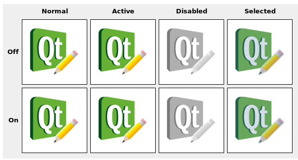

​																		图1 QIcon各枚举类型和状态的组合

常见的成员函数如下，静态成员函数不太常用不再列举。

```c++
QIcon(const QPixmap &pixmap);// 以图像构造
QIcon(const QIcon &other); // 以图标构造
QIcon(const QString &fileName); // 从文件来源构造
QIcon(QIconEngine *engine); // 图标引擎构造(少见)
// 返回在指定的模式和状态的图标时请求的实际大小。结果可能比要求的小，但永远不会大
QSize actualSize(const QSize &size, Mode mode = Normal, State state = Off) const;
QSize actualSize(QWindow *window, const QSize &size, Mode mode = Normal, State state = Off) const;
// 将具有给定文件名的文件中的图像添加到图标，作为大小、模式和状态的专用化。文件将按需加载
void addFile(const QString &fileName, const QSize &size = QSize(), Mode mode = Normal, State state = Off);
// 将pixmap添加到图标，作为模式和状态的专用化
void addPixmap(const QPixmap &pixmap, Mode mode = Normal, State state = Off);
bool isMask() const;// 是否为掩码图像
bool isNull() const;// 是否为空
QString name() const;// 返回用于创建图标的名称
// 使用画师将具有指定对齐方式、所需模式和状态的图标绘制到矩形矩形中
void paint(QPainter *painter, const QRect &rect, Qt::Alignment alignment = Qt::AlignCenter, Mode mode = Normal, State state = Off) const;
void paint(QPainter *painter, int x, int y, int w, int h, Qt::Alignment alignment = Qt::AlignCenter, Mode mode = Normal, State state = Off) const;
// 返回具有请求的大小、模式和状态的pixmap，必要时生成一个。pixmap可能比请求的要小，但永远不会大
QPixmap pixmap(const QSize &size, Mode mode = Normal, State state = Off) const;
QPixmap pixmap(int w, int h, Mode mode = Normal, State state = Off) const;
QPixmap pixmap(int extent, Mode mode = Normal, State state = Off) const;
QPixmap pixmap(QWindow *window, const QSize &size, Mode mode = Normal, State state = Off) const;
```

示例代码。

```c++
QToolButton *button = new QToolButton;
button->setIcon(QIcon("open.xpm"));

void MyWidget::drawIcon(QPainter *painter, QPoint pos)
{
    QPixmap pixmap = icon.pixmap(QSize(22, 22),
                                 isEnabled() ? QIcon::Normal
                                 : QIcon::Disabled,
                                 isChecked() ? QIcon::On
                                 : QIcon::Off);
    painter->drawPixmap(pos, pixmap);
}
```

#### 3.1.8 QStringList

QStringList类提供字符串列表。
QStringList继承自QList。与QList一样，QStringList也是隐式共享的。它提供了基于索引的快速访问以及快速插入和删除。将字符串列表作为值参数传递既快速又安全。QList的所有功能也适用于QStringList。例如，可以使用isEmpty()测试列表是否为空，还可以调用append()、prepend()、insert()、replace()、removeAll()、removeAt()、removeFirst()、removeast()和removeOne()等函数来修改QStringList。此外，QStringList还提供了一些方便的函数，使字符串列表的处理更加容易。

split函数可以指定按照指定分隔符将QString分割成QStringList

```c++
QString str = "a,,b,c";
QStringList list1 = str.split(',');
// list1: [ "a", "", "b", "c" ]
QStringList list2 = str.split(',', QString::SkipEmptyParts);
// list2: [ "a", "b", "c" ]
```

常见的成员函数如下。

```c++
// 构造函数
QStringList(const QString &str);
QStringList(const QList<QString> &other);
QStringList(QList<QString> &&other);
QStringList(std::initializer_list<QString> args); // QStringList list = {"123","456","readme.txt"}
bool contains(const QString &str, Qt::CaseSensitivity cs = Qt::CaseSensitive) const;//lst.contains("str",Qt::CaseInsensitive);设置大小写不敏感
QStringList filter(const QString &str, Qt::CaseSensitivity cs = Qt::CaseSensitive) const;
QStringListfilter(const QRegExp &rx) const;
QStringList filter(const QRegularExpression &re) const; // 找到含有指定的字符串的字符串
int indexOf(const QRegExp &rx, int from = 0) const; // 
int indexOf(QRegExp &rx, int from = 0) const; // 找到第1个满足条件的字符串
int indexOf(const QRegularExpression &re, int from = 0) const;
QString join(const QString &separator) const;
//QStringList lst = {"python","C++"} ;QString h = lst.join(",");
QString join(QLatin1String separator) const;
QString join(QChar separator) const;
int lastIndexOf(const QRegExp &rx, int from = -1) const;
int lastIndexOf(QRegExp &rx, int from = -1) const;//找到最后1个满足条件的字符串
int lastIndexOf(const QRegularExpression &re, int from = -1) cons
int removeDuplicates(); // 移除重复项
QStringList &replaceInStrings(const QString &before, const QString &after, Qt::CaseSensitivity cs = Qt::CaseSensitive);
QStringList &replaceInStrings(const QRegExp &rx, const QString &after); // 用字符替换指定字符
QStringList &replaceInStrings(const QRegularExpression &re, const QString &after
void sort(Qt::CaseSensitivity cs = Qt::CaseSensitive);
                              
QStringList &operator<<(const QString &str); // 注意这个重载版本,使得可以直接用<<拼接字符串
QStringList &operator<<(const QStringList &other);
QStringList &operator<<(const QList<QString> &other);
// 例子
QStringList fonts;
fonts << "Arial" << "Helvetica" << "Times" << "Courier";
// 使用索引
for (int i = 0; i < fonts.size(); ++i) // 迭代字符串
     cout << fonts.at(i).toLocal8Bit().constData() << endl;
// 使用Java风格
QStringListIterator javaStyleIterator(fonts);
while (javaStyleIterator.hasNext())
     cout << javaStyleIterator.next().toLocal8Bit().constData() << endl;
// 使用STL风格
QStringList::const_iterator constIterator;
for (constIterator = fonts.constBegin(); constIterator != fonts.constEnd();
             ++constIterator)
    cout << (*constIterator).toLocal8Bit().constData() << endl;
```

### 3.2 常见输入组件类

#### 3.2.1 QSpinBox

一般用于整数的显示和输入，一般显示十进制数，也可以显示二、十六进制数，类似的类是QDoubleSpinBox，用于显示浮点数，也就是说有小数位数。使用QSpinBox和QDoubleSpinBox的优点是，**读取和设置数值时无需做字符串和数值的转换**，也无需作进制的转换，**其显示效果（前缀、后缀、进制和小数位数）已经在spin组件属性就设置好了**，所以十分方便。

常见的属性表如下，可以设置数字显示前缀和后缀，数值范围，数值调整的步长、当前显示的值。

以及QSpinBox特有的属性，即显示整数使用的进制，例如2表示二进制；QDoubleSpinBox的特有属性，显示数值的小数位数。

|        属性        |                 描述                 |
| :----------------: | :----------------------------------: |
|       prefix       |          数字前缀，例如"$"           |
|       suffix       |          数字后缀，例如"kg"          |
|      minimum       |          数值范围下限，如0           |
|      maximum       |         数值范围上限，如255          |
|     singlestep     |        数值调整步长，如1，0.1        |
|       value        |              当前显示值              |
| displayIntegerBase |      QSpinBox特有属性，设置进制      |
|      decimals      | QDoubleSpinBox特有属性，设置小数位数 |

另外，要说明的每个属性都一般会有2个函数，即只读函数和设置函数。例如decimals属性的2个函数为

```c++
int decimals();
void setDecimals(int prec);
```

常见的公共成员函数如下。

```c++
QString cleanText() const;
int displayIntegerBase() const; // 设置获取进制
void setDisplayIntegerBase(int base);
int maximum() const;// 设置获取范围
int minimum() const; 
void setMaximum(int max);
void setMinimum(int min);
void setRange(int minimum, int maximum);
QString prefix() const; // 设置获取前后缀
QString suffix() const;
void setPrefix(const QString &prefix);
void setSuffix(const QString &suffix);
void setSingleStep(int val);//设置获取调整步长
void setButtonSymbols(QAbstractSpinBox::NoButtons);//设置倒立三角的风格为没有
int singleStep() const
int value() const;// 获取当前值
// 其他的函数还有继承而来的
30 public functions inherited from QAbstractSpinBox;
214 public functions inherited from QWidget;
32 public functions inherited from QObject;
14 public functions inherited from QPaintDevice ;
```

公共的槽函数主要是

```c++
void setValue(int val); // 设定当前值
4 public slots inherited from QAbstractSpinBox;
19 public slots inherited from QWidget;
1 public slot inherited from QObject ;
```

常用的发射信号为

```c++
void valueChanged(int i);
void valueChanged(const QString &text);
1 signal inherited from QAbstractSpinBox;
3 signals inherited from QWidget;
2 signals inherited from QObject;
```

可能的示例代码。

```c++
void Widget::on_btnCal_clicked() // 一个QPushButton的槽函数
{
    ui->spinNum->setSuffix(" kg");
	int num = ui->spinNum->value();//获取spinNum当前显示的数量
    float price = ui->spinPrice->value();//获取spinPrice当前显示的价格
    ui->spinPrice->setPrefix("$");
    float total = num * price;
    ui->spinTotal->setValue(total); // 显示到总价spinTotal上
}
```

#### 3.2.3 QLineEdit

这是1个可以进行文本编辑的输入组件。

常见的属性。

```c++
acceptableInput : const bool
alignment : Qt::Alignment
clearButtonEnabled : bool
cursorMoveStyle : Qt::CursorMoveStyle
cursorPosition : int
displayText : const QString
dragEnabled : bool
echoMode : EchoMode
frame : bool
hasSelectedText : const bool
inputMask : QString
maxLength : int
modified : bool
placeholderText : QString
readOnly : bool
redoAvailable : const bool
selectedText : const QString
text : QString
undoAvailable : const bool
```

常见的成员函数。

```c++
QLineEdit(QWidget *parent = Q_NULLPTR);
QLineEdit(const QString &contents, QWidget *parent = Q_NULLPTR);
void addAction(QAction *action, ActionPosition position);
QAction *addAction(const QIcon &icon, ActionPosition position);
Qt::Alignment alignment() const;
void backspace();
void del();
QString displayText() const;
EchoMode echoMode() const;
void insert(const QString &newText);
bool isClearButtonEnabled() const;
bool isModified() const;
bool isReadOnly() const;
bool isRedoAvailable() const;
bool isUndoAvailable() const;
int maxLength() const;
void setAlignment(Qt::Alignment flag);
void setEchoMode(EchoMode);
void setReadOnly(bool);
QString text() const;
```

常用的公共槽函数。

```c++
void clear();
void copy() const;
void cut();
void paste();
void redo();
void selectAll();
void setText(const QString &);
void undo();
```

主要的信号如下。

```c++
void cursorPositionChanged(int old, int new);
void editingFinished();
void returnPressed();
void selectionChanged();
void textChanged(const QString &text); // 常用
void textEdited(const QString &text); // 常用
3 signals inherited from QWidget
2 signals inherited from QObject 
```

定义了2个枚举类型。

```c++
enum ActionPosition { QLineEdit::LeadingPosition, QLineEdit::TrailingPosition }; 
// LeadingPosition：Qt::LeftToRight时,部件在左侧;Qt::RightToLeft时在右侧
// TrailingPosition：正好反过来,Qt::LeftToRight时,部件在右侧
enum EchoMode { QLineEdit::Normal, QLineEdit::NoEcho, QLineEdit::Password, QLineEdit::PasswordEchoOnEdit };
// 输入时显示字符、不要显示任何内容、显示与平台相关的密码掩码字符、编辑时按输入显示字符，否则按密码显示字符，就是文本可以直接显示、不显示或者*****这样显示或者输入时***但是不输入时显示
```

#### 3.2.4 QComboBox

QComboBox是下拉列表框组件，提供1个下拉列表供用户选择，也可以直接当成一个QLineEdit用作输入。

QComboBox的每个列表项还可以关联一个QVariant类型的变量，用于存储一些不可见数据，这些项也可以各自设置一些属性，例如图标、文字等。例如，下方程序就显示UI上的QCombobox组件添加20个项，可以带图标也可以不带。如果只是添加字符串列表项，还可以使用QStringList数据结构，它具备<<的重载函数。也可以借助宏foreach来初始化。

关于QIcon和QStringList数据类型可见[3.1.7 QIcon](#3.1.7 QIcon)和[3.1.8 QStringList](#3.1.8 QStringList)。

```c++
void Widget::on_btnIniItems_clicked()
{
    QIcon icon;
    icon.addFile(":/images/icons/aim.ico"); // 资源文件
    ui->comboBox->clear();
    for(int i = 0; i < 20 ; i++)
    {
        ui->comboBox->addItem(icon,QString::asprintf("Item %d",i)); // 带图标
        // ui->comboBox->addItem(QString::asprintf("Item %d",i)); // 不带图标
    }
    
    // QStringList
    QStringList strList;
    strList<<"beijing"<<"shanghai"<<"tianjin"<<"hebei"<<"shandong";
    ui->comboBox->addItems(strList);
    
    // foreach
    QMap(QString,int)citys;
    citys.insert("北京",10);
    citys.insert("上海",21);
    citys.insert("添加",22);
    foreach(const QString&key,citys.keys())
        ui->comboBox->addItem(key,citys.value(key));
}
```

需要了解的2个枚举类型如下。

```c++
 // 下拉项插入新字符串的方式
enum InsertPolicy { 
    NoInsert, 
    InsertAtTop, // 总是从顶部插入
    InsertAtCurrent,   //当前位置插入
    InsertAtBottom, // 底部
    ..., 
    InsertAlphabetically };
// 指定在添加新内容或内容更改时QComboBox的大小提示应如何调整
enum SizeAdjustPolicy { 
    AdjustToContents,  // 适应文本
    AdjustToContentsOnFirstShow, // 第一次显示时根据内容调整
    AdjustToMinimumContentsLength, // 改用AdjustToContents或AdjustToContentsOnFirstShow
    AdjustToMinimumContentsLengthWithIcon // 调整为图标的最小内容长度加上空间
};
```

下拉列表框具备的属性。

```c++
count : const int // 项个数
currentData : const QVariant // 当前项数据
currentIndex : int // 当前项索引
currentText : QString // 当前项文本
duplicatesEnabled : bool // 是否可复制
editable : bool // 可编辑
frame : bool // 有框架
iconSize : QSize // 图标大小
insertPolicy : InsertPolicy // 项插入策略
maxCount : int // 最大项数
maxVisibleItems : int // 最大可见项数
minimumContentsLength : int // 最小文本长度
modelColumn : int // 项列数
sizeAdjustPolicy : SizeAdjustPolicy // 调整策略
59 properties inherited from QWidget
1 property inherited from QObject 
```

常见的成员函数，这里主要分为两类，一类是项处理，一类是其他属性。

```c++
void addItem(const QString &text, const QVariant &userData = QVariant());// 添加项
void addItem(const QIcon &icon, const QString &text, 
             const QVariant &userData = QVariant());
void addItems(const QStringList &texts); 
void insertItem(int index, const QString &text, const QVariant &userData = QVariant());
void insertItem(int index, const QIcon &icon, const QString &text, // 插入项
                const QVariant ;&userData = QVariant());
void insertItems(int index, const QStringList &list);
void removeItem(int index);// 移除项
// 查找文本和数据
int findData(const QVariant &data, int role = Qt::UserRole, Qt::MatchFlags flags = static_cast<Qt::MatchFlags> ( Qt::MatchExactly | Qt::MatchCaseSensitive )) const；
int findText(const QString &text, Qt::MatchFlags flags = static_cast<Qt::MatchFlags> ( Qt::MatchExactly | Qt::MatchCaseSensitive )) const；

// 其他属性
slot void clear();
slot void clearEditText();
slot void setEditText(const QString &text);
QCompleter *completer() const;
int count() const；
QVariant currentData(int role = Qt::UserRole) const；
void setItemDelegate(QAbstractItemDelegate *delegate);

slot void setCurrentIndex(int index);
int currentIndex() const；

slot void setCurrentText(const QString &text);
QString currentText() const；

void setDuplicatesEnabled(bool enable);
bool duplicatesEnabled() const；

void setEditable(bool editable);
bool isEditable() const;

void setFrame(bool);
bool hasFrame() const;

void setIconSize(const QSize &size);
QSize iconSize() const;

void setInsertPolicy(InsertPolicy policy);
InsertPolicy insertPolicy() const;

void setItemData(int index, const QVariant &value, int role = Qt::UserRole);
QVariant itemData(int index, int role = Qt::UserRole) const;

void setItemIcon(int index, const QIcon &icon);
QIcon itemIcon(int index) const;

void setItemText(int index, const QString &text);
QString itemText(int index) const;

void setLineEdit(QLineEdit *edit);
QLineEdit *lineEdit() const;

void setMaxCount(int max);
int maxCount() const;

void setMaxVisibleItems(int maxItems);
int maxVisibleItems() const;

void setMinimumContentsLength(int characters);
int minimumContentsLength() const;

void setSizeAdjustPolicy(SizeAdjustPolicy policy);
SizeAdjustPolicy sizeAdjustPolicy() const;
```

主要的信号函数如下。

```c++
void activated(int index);
void activated(const QString &text)
void currentIndexChanged(int index); // 常用
void currentIndexChanged(const QString &text); // 常用
void currentTextChanged(const QString &text); // 常用
void editTextChanged(const QString &text);
void highlighted(int index);
void highlighted(const QString &text);
```

#### 3.4.5 QDoubleSpinBox

成员函数。

```c++
QString cleanText() const;

slot void setValue(double val);
double value() const;

int decimals() const;
void setDecimals(int prec);

void setRange(double minimum, double maximum);
void setMaximum(double max);
void setMinimum(double min);
double maximum() const;
double minimum() const;

QString prefix() const;
QString suffix() const;
void setSuffix(const QString &suffix);
void setPrefix(const QString &prefix);

void setSingleStep(double val);
double singleStep() const;

virtual QString textFromValue(double value) const;
virtual double valueFromText(const QString &text) const;
```

信号函数。

```c++
void valueChanged(double d);
void valueChanged(const QString &text);
```

#### 3.4.6 QPlainTextEdit

QPlainTextEdit是一个多行文本编辑器，相比于QLineEdit可以编辑和显示多行文本。
**QPlainTextEdit 上鼠标光标形状默认为Qt::IBeamCursor(I)。可以通过 viewport()的cursor 属性进行更改**。

涉及的枚举类型。

```c++
enum LineWrapMode { NoWrap, WidgetWidth };
// NoWrap,不做任何处理，此时每加入一行就按一行显示，超出窗口边界会自动显示水平滑条
// WidgetWidth,默认设置，一行超出窗口时会自动换行显示，不显示水平滑条
```

具备的主要性质如下。

```c++
backgroundVisible : bool; //设置调色板背景在文档区域之外是否可见,默认false
void setBackgroundVisible(bool visible);
bool backgroundVisible() const;

blockCount : const int; // 设置文档中文本块的数量。默认情况下在空文档中此值为1
int blockCount() const;

centerOnScroll : bool;//设置光标是否在屏幕上居中,默认false
bool centerOnScroll() const;
void setCenterOnScroll(bool enabled);

cursorWidth : int;//设置光标宽度(以像素为单位)默认值1
void setCursorWidth(int width);
int cursorWidth() const;

documentTitle : QString;//设置文档标题默认是空字符串
QString documentTitle() const;
void setDocumentTitle(const QString &title);
void setDocument(QTextDocument *document);
QTextDocument *document() const; // QPlainTextEdit存储的文本以QTextDocument指向

maximumBlockCount : int;//设置文档可能具有的最大块数;若文档中块数超过限制,则从文档的开头删除块;负值或零值指定文档可能包含无限数量的块;默认值为0
void setMaximumBlockCount(int maximum);
int maximumBlockCount() const;

overwriteMode : bool;//是否覆盖,默认false(追加文本而不是覆盖)
bool overwriteMode() const;
void setOverwriteMode(bool overwrite);

placeholderText : QString;//如果document()为空,设置此属性会显示灰色的占位符文本,默认是空字符串
void setPlaceholderText(const QString &placeholderText);
QString placeholderText() const;

plainText : QString;//获取文本内容,默认对于没有内容的返回空字符串
void setPlainText(const QString &text);
QString toPlainText() const;

readOnly : bool;//设置是否为只读默认false
bool isReadOnly() const;
void setReadOnly(bool ro);

tabChangesFocus : bool;//设置Tab键是否更改焦点或被接受为输入。某些情况下不允许用户输入\t或用Tab键更改缩进,因为这会破坏焦点链。默认false
bool tabChangesFocus() const;
void setTabChangesFocus(bool b);

tabStopWidth : int; //设置像素为单位的制表位宽度,默认值80
void setTabStopWidth(int width);
int tabStopWidth() const;

textInteractionFlags : Qt::TextInteractionFlags;//设置显示文本时如何与用户输入交互。默认值取决于 QPlainTextEdit是只读还是可编辑的
void setTextInteractionFlags(Qt::TextInteractionFlags flags);
Qt::TextInteractionFlags textInteractionFlags() const;

undoRedoEnabled : bool; //是否启用撤消和重做,默认true
bool isUndoRedoEnabled() const;
void setUndoRedoEnabled(bool enable);

lineWrapMode : LineWrapMode;//设置换行模式,默认模式是WidgetWidth,在文本右边缘换行.换行发生在空白处,保持整个单词完整,若希望在单词中进行换行使用setWordWrapMode()
LineWrapMode lineWrapMode() const;
void setLineWrapMode(LineWrapMode mode);

wordWrapMode : QTextOption::WrapMode; //设置单词换行时使用的模式
void setWordWrapMode(QTextOption::WrapMode policy);
QTextOption::WrapMode wordWrapMode() const;
```

其它成员函数。

```c++
QPlainTextEdit(const QString &text, QWidget *parent = Q_NULLPTR);//构造一个带有 parent parent 的 QPlainTextEdit。文本编辑将显示纯文本文本

// 返回插入新文本时使用的字符格式
QTextCharFormat currentCharFormat() const;
void setCurrentCharFormat(const QTextCharFormat &format);

QString anchorAt(const QPoint &pos) const;//返回位置pos的锚点引用,如该点不存在锚点则返回空字符串
bool canPaste() const; //返回文本是否可以从剪贴板粘贴到文本编辑中

// 创建标准上下文菜单,当用户用鼠标右键单击文本编辑时显示该菜单
QMenu *createStandardContextMenu();
QMenu *createStandardContextMenu(const QPoint &position);

//通过执行给定的操作移动光标。如果 mode 是 QTextCursor::KeepAnchor，光标选择它移动的文本。这与用户在按住 Shift 键并使用光标键移动光标时达到的效果相同
void moveCursor(QTextCursor::MoveOperation operation, QTextCursor::MoveMode mode = QTextCursor::MoveAnchor)；
QTextCursor textCursor() const;//设置可见光标
void setTextCursor(const QTextCursor &cursor);
QTextCursor cursorForPosition(const QPoint &pos) const;//在位置pos返回一个QTextCursor
QRect cursorRect(const QTextCursor &cursor) const;//返回一个包含光标的矩形（在视口坐标中）
QRect cursorRect() const;//返回一个包含文本编辑光标的矩形（在视口坐标中）
void ensureCursorVisible();//如有必要，通过滚动文本编辑确保光标可见

//此功能允许用给定的颜色临时标记文档中的某些区域，指定为选择。例如，这在编程编辑器中很有用，可以用给定的背景颜色标记整行文本以指示断点的存在
void setExtraSelections(const QList<QTextEdit::ExtraSelection> &selections;
QList<QTextEdit::ExtraSelection> extraSelections() const;//返回先前设置的额外选择
// 使用给定选项查找字符串exp的下一个匹配项。如果找到返回 true
bool find(const QString &exp, QTextDocument::FindFlags options = QTextDocument::FindFlags());
bool find(const QRegExp &exp, QTextDocument::FindFlags options = QTextDocument::FindFlags());
//加载由给定类型和名称指定的资源
virtual QVariant loadResource(int type, const QUrl &name)
//通过在编辑器光标上调用 QTextCursor::mergeCharFormat 将修饰符中指定的属性合并为当前字符格式。如果编辑器有选择，那么修饰符的属性将直接应用于选择。
void mergeCurrentCharFormat(const QTextCharFormat &modifier)
//将文本编辑的文档打印到给定打印机的便捷功能。这相当于直接在文档上调用 print 方法，只是该函数还支持 QPrinter::Selection 作为打印范围
void print(QPagedPaintDevice *printer) const;
```

可能的示例代码。

```c++
void Widget::on_btnToCombobox_clicked()
{
    QTextDocument* doc = ui->plainTextEdit->document(); // 文本对象
    int cnt = doc->blockCount();//内部是按块存储文本的,块的数量
    QIcon icon(":/images/aim.ico");
    ui->combobox->clear();
    for(int i = 0; i < vny ; i++)
    {
        QTextBlock text = doc->findBlockByNumber(i);//获取某块文字对象
        QString str = text.text(); // 转为string对象
        ui->combobox->addItem(icon,str); // 添加项
    }
}
```

常见的槽函数如下。

```c++
void appendHtml(const QString &html);
void appendPlainText(const QString &text);
void centerCursor();
void clear();
void copy();
void cut();
void insertPlainText(const QString &text);
void paste();
void redo();
void selectAll();
void setPlainText(const QString &text);
void undo();
void zoomIn(int range = 1);
void zoomOut(int range = 1);
```

自带的主要信号函数如下。

```c++
void blockCountChanged(int newBlockCount);
void copyAvailable(bool yes);
void cursorPositionChanged();
void modificationChanged(bool changed);
void redoAvailable(bool available);
void selectionChanged();
void textChanged();
void undoAvailable(bool available);
void updateRequest(const QRect &rect, int dy);
```

QPlainTextEdit还自带右键快捷菜单，可以实现常见的编辑功能。

如果是以只读方式使用QPlainTextEdit时，以下的操作是可行的。

```c++
Qt::UpArrow // Moves one line up.
Qt::DownArrow // Moves one line down.
Qt::LeftArrow // Moves one character to the left.
Qt::RightArrow // Moves one character to the right.
PageUp // Moves one (viewport) page up.
PageDown // Moves one (viewport) page down.
Home // Moves to the beginning of the text.
End // Moves to the end of the text.
Alt+Wheel // Scrolls the page horizontally (the Wheel is the mouse wheel).
Ctrl+Wheel // Zooms the text.
Ctrl+A // Selects all text.
```

如果是可写的方式，那么以下绑定的键盘和鼠标快捷键有效。

```c++
Backspace // Deletes the character to the left of the cursor.
Delete // Deletes the character to the right of the cursor.
Ctrl+C // Copy the selected text to the clipboard.
Ctrl+Insert // Copy the selected text to the clipboard.
Ctrl+K // Deletes to the end of the line.
Ctrl+V // Pastes the clipboard text into text edit.
Shift+Insert // Pastes the clipboard text into text edit.
Ctrl+X // Deletes the selected text and copies it to the clipboard.
Shift+Delete // Deletes the selected text and copies it to the clipboard.
Ctrl+Z // Undoes the last operation.
Ctrl+Y // Redoes the last operation.
LeftArrow // Moves the cursor one character to the left.
Ctrl+LeftArrow // Moves the cursor one word to the left.
RightArrow // Moves the cursor one character to the right.
Ctrl+RightArrow // Moves the cursor one word to the right.
UpArrow // Moves the cursor one line up.
Ctrl+UpArrow // Moves the cursor one word up.
DownArrow // Moves the cursor one line down.
Ctrl+Down Arrow // Moves the cursor one word down.
PageUp // Moves the cursor one page up.
PageDown // Moves the cursor one page down.
Home // Moves the cursor to the beginning of the line.
Ctrl+Home // Moves the cursor to the beginning of the text.
End // Moves the cursor to the end of the line.
Ctrl+End // Moves the cursor to the end of the text.
Alt+Wheel // Scrolls the page horizontally (the Wheel is the mouse wheel).
Ctrl+Wheel // Zooms the text.
```

#### 3.4.6 QTextEdit

枚举类型。

```c++
enum QTextEdit::AutoFormattingFlag{
    QTextEdit::AutoNone//不要进行任何自动格式化
    QTextEdit::AutoBulletList//自动创建项目符号列表（例如，当用户在最左侧的列中输入星号'*'或在现有列表项中按Enter时
    QTextEdit::AutoAll//应用所有自动格式。目前仅支持自动项目符号列表
}
```

```c++
enum QTextEdit::LineWrapMode{
    QTextEdit::NoWrap
    QTextEdit::WidgetWidth
    QTextEdit::FixedPixelWidth
    QTextEdit::FixedColumnWidth
}
```

成员函数。

```c++
QTextEdit(const QString &text, QWidget *parent = Q_NULLPTR);

Qt::Alignment alignment() const;
slot void setAlignment(Qt::Alignment a);

QString anchorAt(const QPoint &pos) const;

QMenu *createStandardContextMenu();
QMenu *createStandardContextMenu(const QPoint &position);

QRect cursorRect(const QTextCursor &cursor) const;
QRect cursorRect() const;
void moveCursor(QTextCursor::MoveOperation operation, QTextCursor::MoveMode mode = QTextCursor::MoveAnchor);
QTextCursor cursorForPosition(const QPoint &pos) const;
void ensureCursorVisible();

bool find(const QString &exp, QTextDocument::FindFlags options = QTextDocument::FindFlags());
bool find(const QRegExp &exp, QTextDocument::FindFlags options = QTextDocument::FindFlags());

QFont currentFont() const;
slot void setFontFamily(const QString &fontFamily);
QString fontFamily() const;
slot void setFontItalic(bool italic);
bool fontItalic() const;
slot void setFontPointSize(qreal s);
qreal fontPointSize() const;
slot void setFontUnderline(bool underline);
bool fontUnderline() const;
slot void setFontWeight(int weight);
int fontWeight() const;
slot void setCurrentFont(const QFont &f);

bool canPaste() const;
slot void paste();

void print(QPagedPaintDevice *printer) const;

virtual QVariant loadResource(int type, const QUrl &name);

void setCurrentCharFormat(const QTextCharFormat &format);
QTextCharFormat currentCharFormat() const;
void mergeCurrentCharFormat(const QTextCharFormat &modifier);

void setAcceptRichText(bool accept);
bool acceptRichText() const;

void setAutoFormatting(AutoFormatting features);
AutoFormatting autoFormatting() const;

void setCursorWidth(int width);
int cursorWidth() const;

void setDocument(QTextDocument *document);
QTextDocument *document() const;
void setDocumentTitle(const QString &title);
QString documentTitle() const;

void setExtraSelections(const QList<ExtraSelection> &selections);
QList<ExtraSelection> extraSelections() const;

void setLineWrapColumnOrWidth(int w);
int lineWrapColumnOrWidth() const;

void setLineWrapMode(LineWrapMode mode);
LineWrapMode lineWrapMode() const;

void setOverwriteMode(bool overwrite);
bool overwriteMode() const;

void setPlaceholderText(const QString &placeholderText);
QString placeholderText() const;

void setReadOnly(bool ro);
bool isReadOnly() const;

void setTabChangesFocus(bool b);
bool tabChangesFocus() const;

void setTabStopWidth(int width);
int tabStopWidth() const;

void setTextCursor(const QTextCursor &cursor);
QTextCursor textCursor() const;

void setTextInteractionFlags(Qt::TextInteractionFlags flags);
Qt::TextInteractionFlags textInteractionFlags() const;

void setUndoRedoEnabled(bool enable);
bool isUndoRedoEnabled() const;

void setWordWrapMode(QTextOption::WrapMode policy);
QTextOption::WrapMode wordWrapMode() const;

QColor textBackgroundColor() const;
slot void setTextBackgroundColor(const QColor &c);

slot void setTextColor(const QColor &c);
QColor textColor() const;

slot void setHtml(const QString &text);
slot void insertHtml(const QString &text);
QString toHtml() const;

QString toPlainText() const;
void insertPlainText(const QString &text);
void setPlainText(const QString &text);
```

其它槽函数。

```c++
void append(const QString &text);
void clear();
void copy();
void cut();
void redo();
void undo();
void selectAll();
void paset();
void scrollToAnchor(const QString &name);
void setText(const QString &text);
void zoomIn(int range = 1);
void zoomOut(int range = 1);
```

信号函数。

```c++
void copyAvailable(bool yes);
void currentCharFormatChanged(const QTextCharFormat &f);
void cursorPositionChanged();
void redoAvailable(bool available);
void selectionChanged();
void textChanged();
void undoAvailable(bool available);
```

### 3.3 常见输出组件类

#### 3.3.1 QLabel

QLabel用于显示文本或图像，未提供用户交互功能。

常见的公共成员函数如下。

```c++
slot void clear(); // 清除文本

// 设置动画
slot void setMovie(QMovie *movie);
QMovie *movie() const;

// 设置图片
slot void setPicture(const QPicture &picture);
const QPicture *picture() const;

// 设置像素图,如果没有返回0
slot void setPixmap(const QPixmap &);
const QPixmap *pixmap() const;

// 设置文本,默认返回空字符串,注意QLabel非常适合显示小型富文本文档,对于大型文档请改为在只读模式下使用 QTextEdit,因为QTextEdit可以在必要时提供滚动条
slot setText(const QString& text);
QString text() const;

// 将标签内容设置为包含整数num的纯文本
slot void setNum(int num);
slot void setNum(double num);

// 设置选定的文本,默认空字符串
QString selectedText() const;
bool hasSelectedText() const;

// 设置对齐方式
void setAlignment(Qt::Alignment);
Qt::Alignment alignment() const;

QWidget *buddy() const;
void setBuddy(QWidget *buddy);

// 以像素为单位保存文本缩进,缩进为-1
void setIndent(int);
int indent() const;

// 设置边距的宽度,默认边距为0
void setMargin(int);
int margin() const;

// 指定是否使用QDesktopServices::openUrl()自动打开链接，而不是发出linkActivated()信号,默认为false
void setOpenExternalLinks(bool open);
bool openExternalLinks() const;

// 设置是否将缩放其内容以填充所有可用空间,默认为false
void setScaledContents(bool);
bool hasScaledContents() const;

// 从位置开始和长度字符选择文本
void setSelection(int start, int length);
// selectionStart() 返回标签中第一个选定字符的索引，如果没有选择文本，则返回-1
int selectionStart() const;

// 设置文本格式,默认格式是Qt::AutoText
void setTextFormat(Qt::TextFormat);
Qt::TextFormat textFormat() const;

// 设定如何与用户输入交互,默认值为Qt::LinksAccessibleByMouse
void setTextInteractionFlags(Qt::TextInteractionFlags flags);
Qt::TextInteractionFlags textInteractionFlags() const;

// 设置自动换行策略,如果此属性为真则标签文本在必要时在断词处换行,默认自动换行被禁用
void setWordWrap(bool on);
bool wordWrap() const;
```

对于QLabel特别说明的函数是setBuddy，只有QLabel对象才有这个功能，定义的时候可以在文字前边加上符号"&"，UI界面直接输入或者动态创建如下。

```c++
QLineEdit*nameEdit  = new QLineEdit(this);
QLabel*nameLabel = new QLabel("&Name:", this); // Alt+N是快捷键会将鼠标或键盘的焦点聚焦在伙伴窗口部件上
nameLabel->setBuddy(nameEdit);

QLineEdit *phoneEdit  = new QLineEdit(this);
QLabel    *phoneLabel = new QLabel("&Phone:", this); // Alt+P
phoneLabel->setBuddy(phoneEdit);
```

QLabel的信号不常见，但是可以提一句。

```c++
void linkActivated(const QString &link);//当用户单击链接时会发出此信号
void linkHovered(const QString &link);//当用户将鼠标悬停在链接上时会发出此信号
```

#### 3.3.2 QProgressBar

 QProgressBar的父类是QWidget，一般用于进度显示。有2种方式使用，模态和非模态。如果以模态方式使用，必须调用**QApplication::processEvents()**使事件循环保持正常进行状态而不会导致应用被阻塞。非模态方式一般通过**QTime实现定时设置进度条**的值。除了可以使用QProgressBar还可以使用进度对话框的方式，这种方式针对慢速过程，对话框会包含一个进度条，一个取消按钮和一个消息标签，具体可见[5.1.6 QProgressDialog](#5.1.6 QProgressDialog)。

一个例子如下。

```c++
if (comboBox->currentIndex == 0 )//进度条方式
{
    progressBar->setRange(0,10000);
    for(int i = 1; i < 10001; ++i)
        progressBar->setValue(i);
}
else{ // 进度对话框方式
    QProgressDialog * dlg = new QProgressDialog(this);
    QFont font("Times New Roman",12);
    dlg->setFont(font);
    dlg->setWindowModality(Qt::WindowModal);//模态方式运行
    dlg->setMinimumDuration(5);//进度对话框出现之前等待的时间,默认4s,系统根据完成的工作量估算预计花费的时间
    dlg->setWindowTitle("进度");
    dlg->setLabelText("正在复制...");
    dlg->setCancelButtonText("Cancel");
    dlg->setRange(0,10000);
    for(int i = 1; i < 10001; ++i)
        dlg->setValue(i);
    if (dlg->wasCanceled())
        return;
}
```

常见的属性值如下。

```c++
alignment : Qt::Alignment
format : QString // 文字格式,"%p%"显示百分比(默认),"%v"显示当前值,"%m"显示总步数
invertedAppearance : bool // 是否反转
maximum : int // 进度条最小值
minimum : int // 进度条最大值
orientation : Qt::Orientation // 水平垂直方向
text : const QString // 文字
textDirection : Direction  // 文字方向
textVisible : bool // 是否显示文字,一般是百分比进度
value : int // 当前显示值
```

常见的公共成员函数如下。

```c++
Qt::Alignment alignment() const; // 对齐方式
void setAlignment(Qt::Alignment alignment);

QString format() const;// 格式
void resetFormat();
void setFormat(const QString &format);

bool invertedAppearance() const;// 反相器,也就是从大到小
void setInvertedAppearance(bool invert);

bool isTextVisible() const;// 文本可见性
void setTextVisible(bool visible);

int maximum() const; // 进度条范围
int minimum() const;

Qt::Orientation orientation() const; // 方向
void setTextDirection(QProgressBar::Direction textDirection);
QProgressBar::Direction textDirection() const;

virtual QString text() const; // 文本
int value() const;//当前值
```

常见的公有槽函数。

```c++
void reset(); // 重置
void setMaximum(int maximum); // 设置范围
void setMinimum(int minimum);
void setRange(int minimum, int maximum);
void setOrientation(Qt::Orientation); // 设置方向
void setValue(int value); // 设置当前值
```

最常用的信号。

```c++
void valueChanged(int value);
```


### 3.4 常见时间日期类

#### 3.4.1 QTimeEdit

对应的时间数据类型是QTime，仅表示时间，如15:23:13。

关于QTime的内容可见[3.1.4 QTime](#3.1.4 QTime)。

专门用于处理时间的一个类是定时器，即QTimer，可见[3.1.5 QTimer](#3.1.5 QTimer)。

QTimeEdit本身没有太多东西，大多数都是继承性质，主要来源于QWidget和QDateTimeEdit。

```c++
QTimeEdit(QWidget *parent = Q_NULLPTR);
QTimeEdit(const QTime &time, QWidget *parent = Q_NULLPTR);
45 public functions inherited from QDateTimeEdit
30 public functions inherited from QAbstractSpinBox
214 public functions inherited from QWidget
32 public functions inherited from QObject
14 public functions inherited from QPaintDevice
```

#### 3.4.2 QDateEdit

对应的日期数据类型是QDate，仅表示日期，如2017-03-24。

关于QDate的内容可见[3.1.6 QDate](#3.1.6 QDate)。

类似的，日期类组件也是继承性质为主。

```c++
QDateEdit(QWidget *parent = Q_NULLPTR);
QDateEdit(const QDate &date, QWidget *parent = Q_NULLPTR);
45 public functions inherited from QDateTimeEdit
30 public functions inherited from QAbstractSpinBox
214 public functions inherited from QWidget
32 public functions inherited from QObject
14 public functions inherited from QPaintDevice
```

#### 3.4.3 QDateTimeEdit

对应的数据类型是QDateTime，可以表示日期时间，如2017-4-5 08:12:44等。

关于QDateTime的内容可见[3.1.7 QDateTime](#3.1.7 QDateTime)。

常见的性质如下。

```c++
calendarPopup : bool // 是否允许弹出1个日历选择框,对QTimeEdit无效
currentSection : Section // 当前的输入光标所在日期时间段,参考枚举类型QDateTimeEdit::Section
currentSectionIndex : int // 序号表示的输入光标所在的段
sectionCount : const int // 段的数量
displayedSections : const Sections // 显示的段
date : QDate // 日期
time : QTime // 时间
dateTime : QDateTime  // 日期时间
maximumDate : QDate // 设置范围
minimumDate : QDate
maximumTime : QTime
minimumTime : QTime
maximumDateTime : QDateTime
minimumDateTime : QDateTime
displayFormat : QString // 显示格式,例如"yyyy-MM-dd HH:mm:ss"
timeSpec : Qt::TimeSpec // 时间规范
12 properties inherited from QAbstractSpinBox
59 properties inherited from QWidget
1 property inherited from QObject 
```

常见的成员函数如下。

```c++
QDateTimeEdit(QWidget *parent = Q_NULLPTR);
QDateTimeEdit(const QDateTime &datetime, QWidget *parent = Q_NULLPTR);
QDateTimeEdit(const QDate &date, QWidget *parent = Q_NULLPTR);
QDateTimeEdit(const QTime &time, QWidget *parent = Q_NULLPTR);
QTime time() const;
Qt::TimeSpec timeSpec() const;
QCalendarWidget *calendarWidget() const;
bool calendarPopup() const;
int currentSectionIndex() const;
QDate date() const;
QDateTime dateTime() const;
QString displayFormat() const;
QString sectionText(Section section) const;
Sections displayedSections() const;
QDate maximumDate() const;
QDateTime maximumDateTime() const;
QTime maximumTime() const;
QDate minimumDate() const;
QDateTime minimumDateTime() const;
QTime minimumTime() const;
Section sectionAt(int index) const;
Section currentSection() const;
int sectionCount() const;

void clearMaximumDate();
void clearMaximumDateTime();
void clearMaximumTime();
void clearMinimumDate();
void clearMinimumDateTime();
void clearMinimumTime();
void setCalendarPopup(bool enable)
void setCalendarWidget(QCalendarWidget *calendarWidget)
void setCurrentSection(Section section)
void setCurrentSectionIndex(int index)
void setDateRange(const QDate &min, const QDate &max)
void setDateTimeRange(const QDateTime &min, const QDateTime &max)
void setDisplayFormat(const QString &format)
void setMaximumDate(const QDate &max)
void setMaximumDateTime(const QDateTime &dt)
void setMaximumTime(const QTime &max)
void setMinimumDate(const QDate &min)
void setMinimumDateTime(const QDateTime &dt)
void setMinimumTime(const QTime &min)
void setSelectedSection(Section section)
void setTimeRange(const QTime &min, const QTime &max)
void setTimeSpec(Qt::TimeSpec spec)
```

常用的公共槽函数如下。

```c++
void setDate(const QDate &date);
void setDateTime(const QDateTime &dateTime);
void setTime(const QTime &time);
4 public slots inherited from QAbstractSpinBox
19 public slots inherited from QWidget
1 public slot inherited from QObject
```

常见的信号如下。

```c++
void dateChanged(const QDate &date);
void dateTimeChanged(const QDateTime &datetime);
void timeChanged(const QTime &time);
1 signal inherited from QAbstractSpinBox
3 signals inherited from QWidget
2 signals inherited from QObject 
```

一个可能的示例。

```c++
QDateTimeEdit *dateEdit = new QDateTimeEdit(QDate::currentDate()); // 以当前时间日期创建
dateEdit->setMinimumDate(QDate::currentDate().addDays(-365)); // 设置最小日期为去年同天
dateEdit->setMaximumDate(QDate::currentDate().addDays(365)); // 最大明年同年
dateEdit->setDisplayFormat("yyyy.MM.dd"); // 应用格式20220501
```

需要知道的枚举类型。

```c++
// 时间段部分
enum QDateTimeEdit::Section = {
    QDateTimeEdit::NoSection 0x0000
    QDateTimeEdit::AmPmSection 0x0001
    QDateTimeEdit::MSecSection 0x0002
    QDateTimeEdit::SecondSection 0x0004
    QDateTimeEdit::MinuteSection 0x0008
    QDateTimeEdit::HourSection 0x0010
    QDateTimeEdit::DaySection 0x0100
    QDateTimeEdit::MonthSectio 0x0200
    QDateTimeEdit::YearSection 0x0400
}
// 时间规范
enum Qt::TimeSpec{
    Qt::LocalTime = 0,// 取决于语言环境的时间（时区和夏令时）
    Qt::UTC = 1, // 格林威治标准时间
    Qt::OffsetFromUTC = 2,//以秒为单位的与协调世界时的偏移量。
	Qt::TimeZone = 3 // 使用一组特定的夏令时规则的指定时区
}；
```

#### 3.4.4 QLCDNumber

数码管显示。它可以显示几乎任何大小的数字。它可以显示十进制、十六进制、八进制或二进制数。使用 display() 插槽很容易连接到数据源，该插槽被重载以采用五种参数类型中的任何一种。
还有一些槽可以用 setMode() 改变基数，用 setSmallDecimalPoint() 改变小数点。
当 QLCDNumber 被要求显示超出其范围的内容时，它会发出 overflow() 信号。范围由 setDigitCount() 设置，但 setSmallDecimalPoint() 也会影响它。如果显示设置为十六进制、八进制或二进制，则显示与该值等效的整数。
可以显示这些数字和其他符号：0/O、1、2、3、4、5/S、6、7、8、9/g、减号、小数点、A、B、C、D、E、 F、h、H、L、o、P、r、u、U、Y、冒号、度数符号（在字符串中指定为单引号）和空格。 QLCDNumber 用空格代替非法字符。尽管可以使用 value() 检索数值，但无法检索 QLCDNumber 对象的内容。如果您确实需要文本，我们建议您将 display() 插槽的信号也连接到另一个插槽并将值存储在那里。

枚举类型。

此类型确定数字的显示方式。如果显示设置为十六进制、八进制或二进制，则显示与该值等效的整数。

```c++
enum QLCDNumber::Mode{
    QLCDNumber::Hex
    QLCDNumber::Dec
    QLCDNumber::Oct
    QLCDNumber::Bin
}
```

此类型确定 QLCDNumber 小部件的视觉外观。

```c++
enum QLCDNumber::SegmentStyle{
    QLCDNumber::Outline//给出用背景颜色填充的凸起段
    QLCDNumber::Filled//给出用 windowText 颜色填充的凸起段
    QLCDNumber::Flat//给出用 windowText 颜色填充的平面段
}
```

成员函数。

```c++
QLCDNumber(QWidget *parent = Q_NULLPTR);
QLCDNumber(uint numDigits, QWidget *parent = Q_NULLPTR);

signal void overflow();
bool checkOverflow(double num) const;//如果 num 太大而无法完整显示，则返回 true；否则返回false
bool checkOverflow(int num) const;//如果 num 太大而无法完整显示，则返回 true；否则返回false

int intValue() const;//对应LCDNumber显示的当前值,如果显示的值不是数字，则该属性的值为0
double value() const;

void setDigitCount(int numDigits);//返回当前位数
int digitCount() const;

void setMode(Mode);//设置LCDNumber的样式
Mode mode() const;

void setSegmentStyle(SegmentStyle);
SegmentStyle segmentStyle() const;

slot void setSmallDecimalPoint(bool);
bool smallDecimalPoint() const;//小数点的样式如果为 true，则在两位数位置之间绘制小数点。否则，它会占据自己的一个数字位置，即绘制在一个数字位置。默认值为false

slot void display(const QString &s);
slot void display(int num);
slot void display(double num);
slot void setBinMode();
slot void setDecMode();
slot void setHexMode();
slot void setOctMode();
```


### 3.5 常见表格文字类

#### 3.5.1 QListWidget

QListWidget 是一个方便的类，它提供类似于 QListView 提供的列表视图，但具有用于添加和删除项目的经典基于项目的界面。 QListWidget 使用内部模型来管理列表中的每个 QListWidgetItem。
要获得更灵活的列表视图小部件，请将 QListView 类与标准模型一起使用。

需要知道的属性值有3个。

```c++
count : const int // 此属性表示列表中的项目数，包括任何隐藏项目。
currentRow : int // 此属性表示当前项目的所在行。根据当前的选择模式，也可以选择行。
sortingEnabled : bool // 该属性表示是否启用排序。如果该属性为true，则为列表启用排序；如果该属性为 false，则不启用排序。默认值为假。
```

常见的公共成员函数如下，也就是对项的处理函数。

```c++
void addItem(const QString &label);
void addItem(QListWidgetItem *item);
void addItems(const QStringList &labels);
int count() const;
QListWidgetItem *currentItem() const;
int currentRow() const;
void editItem(QListWidgetItem *item);
QList<QListWidgetItem *> findItems(const QString &text, Qt::MatchFlags flags) const;
void insertItem(int row, QListWidgetItem *item);
void insertItem(int row, const QString &label);
void insertItems(int row, const QStringList &labels);
bool isSortingEnabled() const;
QListWidgetItem *item(int row) const;
QListWidgetItem *itemAt(const QPoint &p) const;
QListWidgetItem *itemAt(int x, int y) const;
QWidget *itemWidget(QListWidgetItem *item) const;
void openPersistentEditor(QListWidgetItem *item);
void removeItemWidget(QListWidgetItem *item);
int row(const QListWidgetItem *item) const;
QList<QListWidgetItem *> selectedItems() const;
void setCurrentItem(QListWidgetItem *item);
void setCurrentItem(QListWidgetItem *item,
                    QItemSelectionModel::SelectionFlags command);
void setCurrentRow(int row);
void setCurrentRow(int row, QItemSelectionModel::SelectionFlags command);
void setItemWidget(QListWidgetItem *item, QWidget *widget);
void setSortingEnabled(bool enable);
void sortItems(Qt::SortOrder order = Qt::AscendingOrder);
QListWidgetItem *takeItem(int row);
QRect visualItemRect(const QListWidgetItem *item) const;
```

主要的槽函数有2个。

```c++
void clear();
void scrollToItem(const QListWidgetItem *item, QAbstractItemView::ScrollHint hint = EnsureVisible);// 必要时滚动视图以确保项目可见,提示指定操作后项目应位于的位置。
```

主要的信号如下。

```c++
void currentItemChanged(QListWidgetItem *current, QListWidgetItem *previous);// 常用
void currentRowChanged(int currentRow);// 常用
void currentTextChanged(const QString &currentText);// 常用
void itemActivated(QListWidgetItem *item);
void itemChanged(QListWidgetItem *item);// 常用
void itemClicked(QListWidgetItem *item);// 常用
void itemDoubleClicked(QListWidgetItem *item); // 常用
void itemEntered(QListWidgetItem *item);
void itemPressed(QListWidgetItem *item);
void itemSelectionChanged();// 常用
```

示例代码。

```c++
QListWidgetItem *newItem = new QListWidgetItem;
newItem->setText(itemText);
listWidget->insertItem(row, newItem);
```

#### 3.5.2 QTreeWidget

QTreeWidget 类是一个方便的类，它提供了一个标准的树小部件，它具有类似于 Qt 3 中 QListView 类所使用的基于项目的经典界面。这个类基于 Qt 的模型/视图架构，并使用默认模型来保存项目，每一个都是一个QTreeWidgetItem。不需要模型/视图框架的灵活性的开发人员可以使用这个类非常容易地创建简单的分层列表。一种更灵活的方法是将 QTreeView 与标准项目模型结合起来。这允许数据的存储与其表示分离。

示例代码。

```c++
QTreeWidget *treeWidget = new QTreeWidget();
treeWidget->setColumnCount(1);
QList<QTreeWidgetItem *> items;
for (int i = 0; i < 10; ++i)
    items.append(new QTreeWidgetItem((QTreeWidget*)0, QStringList(QString("item: %1").arg(i))));
treeWidget->insertTopLevelItems(0, items);
```

2个主要性质。

```c++
columnCount : int // 此属性保存树小部件中显示的列数,默认情况下，此属性的值为1
topLevelItemCount : const int // 此属性保存顶级项目的数量,默认情况下，此属性的值为0
```

常见的成员函数如下。

```c++
void addTopLevelItem(QTreeWidgetItem *item);
void addTopLevelItems(const QList<QTreeWidgetItem *> &items);
void closePersistentEditor(QTreeWidgetItem *item, int column = 0);
int columnCount() const;
int currentColumn() const;
QTreeWidgetItem *currentItem() const;
void editItem(QTreeWidgetItem *item, int column = 0);
QList<QTreeWidgetItem *> findItems(const QString &text, Qt::MatchFlags flags, int column = 0) const;
QTreeWidgetItem *headerItem() const;
int indexOfTopLevelItem(QTreeWidgetItem *item) const;
void insertTopLevelItem(int index, QTreeWidgetItem *item);
void insertTopLevelItems(int index, const QList<QTreeWidgetItem *> &items);
QTreeWidgetItem *invisibleRootItem() const;
bool isFirstItemColumnSpanned(const QTreeWidgetItem *item) const;
QTreeWidgetItem *itemAbove(const QTreeWidgetItem *item) const;
QTreeWidgetItem *itemAt(const QPoint &p) const;
QTreeWidgetItem *itemAt(int x, int y) const;
QTreeWidgetItem *itemBelow(const QTreeWidgetItem *item) const;
QWidget *itemWidget(QTreeWidgetItem *item, int column) const;
void openPersistentEditor(QTreeWidgetItem *item, int column = 0);
void removeItemWidget(QTreeWidgetItem *item, int column);
QList<QTreeWidgetItem *> selectedItems() const;
void setColumnCount(int columns);
void setCurrentItem(QTreeWidgetItem *item);
void setCurrentItem(QTreeWidgetItem *item, int column);
void setCurrentItem(QTreeWidgetItem *item, int column, QItemSelectionModel::SelectionFlags command);
void setFirstItemColumnSpanned(const QTreeWidgetItem *item, bool span;)
void setHeaderItem(QTreeWidgetItem *item);
void setHeaderLabel(const QString &label);
void setHeaderLabels(const QStringList &labels);
void setItemWidget(QTreeWidgetItem *item, int column, QWidget *widget);
int sortColumn() const;
void sortItems(int column, Qt::SortOrder order);
QTreeWidgetItem *takeTopLevelItem(int index);
QTreeWidgetItem *topLevelItem(int index) const;
int topLevelItemCount() const;
QRect visualItemRect(const QTreeWidgetItem *item) const;
```

主要的槽函数。

```c++
void clear(); // 清除项目
void collapseItem(const QTreeWidgetItem *item);// 关闭项目,该项目的子项的树被折叠
void expandItem(const QTreeWidgetItem *item); // 展开项目,项目的子项的树被扩展。
void scrollToItem(const QTreeWidgetItem *item, QAbstractItemView::ScrollHint hint = EnsureVisible); // 确保项目可见，必要时使用指定的提示滚动视图
```

主要的信号如下。

```c++
void currentItemChanged(QTreeWidgetItem *current, QTreeWidgetItem *previous); // 常用
void itemActivated(QTreeWidgetItem *item, int column);
void itemChanged(QTreeWidgetItem *item, int column);// 常用
void itemClicked(QTreeWidgetItem *item, int column);// 常用
void itemCollapsed(QTreeWidgetItem *item);
void itemDoubleClicked(QTreeWidgetItem *item, int column);// 常用
void itemEntered(QTreeWidgetItem *item, int column);
void itemExpanded(QTreeWidgetItem *item);
void itemPressed(QTreeWidgetItem *item, int column);
void itemSelectionChanged();// 常用
```

#### 3.5.3 QTableWidget

表格小部件为应用程序提供标准表格显示设施。 QTableWidget 中的项目由 QTableWidgetItem 提供。
如果你想要一个使用你自己的数据模型的表，你应该使用 QTableView 而不是这个类。
可以使用所需的行数和列数构建表格小部件。

```c++
tableWidget = new QTableWidget(12, 3, this);

tableWidget = new QTableWidget(this);
tableWidget->setRowCount(10);
tableWidget->setColumnCount(5);

QTableWidgetItem *newItem = new QTableWidgetItem(tr("%1").arg(
    (row+1)*(column+1)));
tableWidget->setItem(row, column, newItem);

QTableWidgetItem *cubesHeaderItem = new QTableWidgetItem(tr("Cubes"));
cubesHeaderItem->setIcon(QIcon(QPixmap(":/Images/cubed.png")));
cubesHeaderItem->setTextAlignment(Qt::AlignVCenter);
```

2个性质。

```c++
columnCount : int
rowCount : int
```

常见的成员函数。

```c++
int column(const QTableWidgetItem *item) const;
int columnCount() const;
int currentColumn() const;
QTableWidgetItem *currentItem() cons
int currentRow() const;
void editItem(QTableWidgetItem *item);
QList<QTableWidgetItem *> findItems(const QString &text, Qt::MatchFlags flags) const;
QTableWidgetItem *item(int row, int column) const;
QTableWidgetItem *itemAt(const QPoint &point) const;
QTableWidgetItem *itemAt(int ax, int ay) const;
int row(const QTableWidgetItem *item) const;
int rowCount() const;
void setColumnCount(int columns);
void setCurrentItem(QTableWidgetItem *item);
void setItem(int row, int column, QTableWidgetItem *item);
void setRowCount(int rows);
void sortItems(int column, Qt::SortOrder order = Qt::AscendingOrder);
QTableWidgetItem *takeItem(int row, int column);
```

常见的槽函数。

```c++
void clear();
void clearContents();
void insertColumn(int column);
void insertRow(int row);
void removeColumn(int column);
void removeRow(int row);
void scrollToItem(const QTableWidgetItem *item, QAbstractItemView::ScrollHint hint = EnsureVisible);
```

常见的信号。

```c++

void cellActivated(int row, int column); // 常用
void cellChanged(int row, int column); // 常用 
void cellClicked(int row, int column); // 常用
void cellDoubleClicked(int row, int column); // 常用
void cellEntered(int row, int column);
void cellPressed(int row, int column);
void currentCellChanged(int currentRow, int currentColumn, int previousRow, int previousColumn); // 常用
void currentItemChanged(QTableWidgetItem *current, QTableWidgetItem *previous);// 常用
void itemActivated(QTableWidgetItem *item);// 常用
void itemChanged(QTableWidgetItem *item);// 常用
void itemClicked(QTableWidgetItem *item);// 常用
void itemDoubleClicked(QTableWidgetItem *item);// 常用
void itemEntered(QTableWidgetItem *item);
void itemPressed(QTableWidgetItem *item);
void itemSelectionChanged();// 常用
```

### 3.6 常见按钮类

#### 3.6.1 QPushButton

QPushButton 小部件提供了一个命令按钮。按钮或命令按钮可能是任何图形用户界面中最常用的小部件。按下（单击）按钮以命令计算机执行某些操作或回答问题。典型的按钮是确定、应用、取消、关闭、是、否和帮助。命令按钮是矩形的，通常显示一个描述其操作的文本标签。

常见的性质如下。

```c++
autoDefault : bool // 此属性保存按钮是否为自动默认按钮。如果此属性设置为 true，则按钮为自动默认按钮。在某些 GUI 样式中，默认按钮的绘制周围有一个额外的框架，最多 3 个像素或更多。 Qt 会自动在自动默认按钮周围保留此空间，即自动默认按钮可能有稍大的尺寸提示。
default : bool // 此属性保存按钮是否为默认按钮 默认和自动默认按钮决定当用户在对话框中按下回车时会发生什么。将此属性设置为 true 的按钮（即对话框的默认按钮）将在用户按下 Enter 时自动按下，但有一个例外：如果 autoDefault 按钮当前具有焦点，则按下 autoDefault 按钮。当对话框有 autoDefault 按钮但没有默认按钮时，按 enter 将按下当前具有焦点的 autoDefault 按钮，或者如果没有按钮具有焦点，则按下焦点链中的下一个 autoDefault 按钮。
flat : bool // 此属性保存按钮边框是否凸起此属性的默认值为 false。如果设置了这个属性，大多数样式不会绘制按钮背景，除非按钮被按下。 setAutoFillBackground() 可用于确保使用 QPalette::Button 画笔填充背景。
```

常见的公共成员函数如下。

```c++
QPushButton(QWidget *parent = Q_NULLPTR);
QPushButton(const QString &text, QWidget *parent = Q_NULLPTR);
QPushButton(const QIcon &icon, const QString &text, QWidget *parent = Q_NULLPTR);
bool autoDefault() const;
boolisDefault() const;
bool isFlat() const;
QMenu *menu() const;
void setAutoDefault(bool);
void setDefault(bool);
void setFlat(bool);
void setMenu(QMenu *menu);
```

常见的槽函数如下。

```c++
void showMenu();
```

示例代码。

```c++
QPushButton *button = new QPushButton("&Download", this);
```

#### 3.6.2 QRadioButton

QRadioButton 小部件提供带有文本标签的单选按钮。
 QRadioButton 是一个选项按钮，可以打开（选中）或关闭（未选中）。单选按钮通常为用户提供“多选一”的选择。在一组单选按钮中，一次只能选中一个单选按钮；如果用户选择另一个按钮，则先前选择的按钮将关闭。
默认情况下，单选按钮是自动排他的。如果启用了自动排他，则属于同一父窗口小部件的单选按钮的行为就像它们是同一排他按钮组的一部分一样。如果您需要属于同一个父窗口小部件的单选按钮的多个独占按钮组，请将它们放入 QButtonGroup。
每当打开或关闭按钮时，它都会发出 toggled() 信号。如果您想在每次按钮更改状态时触发操作，请连接到此信号。使用 isChecked() 查看是否选择了特定按钮。

常见的公共成员函数如下。

```c++
QRadioButton(QWidget *parent = Q_NULLPTR);
QRadioButton(const QString &text, QWidget *parent = Q_NULLPTR);
```

就像 QPushButton 一样，单选按钮显示文本，以及可选的小图标。使用 setIcon() 设置图标。文本可以在构造函数中设置，也可以使用 setText() 设置。可以通过在文本中在首选字符前加上 &amp; 符号来指定快捷键。例如。

```c++
QRadioButton *button = new QRadioButton("Search from the &cursor", this);
```

#### 3.6.3 QToolButton

QToolButton 类为命令或选项提供了一个快速访问按钮，**通常在 QToolBar 中使用**。
工具按钮是一种特殊按钮，可提供对特定命令或选项的快速访问。与普通命令按钮不同，**工具按钮通常不显示文本标签，而是显示图标**。
当使用 QToolBar::addAction() 创建新的 QAction 实例或使用 QToolBar::addAction() 将现有操作添加到工具栏时，通常会创建工具按钮。也可以以与任何其他小部件相同的方式构建工具按钮，并将它们与布局中的其他小部件一起排列。
工具按钮的一个经典用途是选择工具。例如，绘图程序中的“钢笔”工具。这将通过使用 QToolButton 作为切换按钮来实现（参见 setCheckable()）。
QToolButton 支持自动升起。在自动升起模式下，仅当鼠标指向按钮时，按钮才会绘制 3D 帧。当在 QToolBar 中使用按钮时，该功能会自动打开。用 setAutoRaise() 改变它。
工具按钮的图标设置为 QIcon。这使得为禁用和活动状态指定不同的像素图成为可能。当按钮的功能不可用时，使用禁用的像素图。当鼠标指针悬停在按钮上时，将显示活动像素图。
**按钮的外观和尺寸可通过 setToolButtonStyle() 和 setIconSize() 进行调整**。当在 QMainWindow 的 QToolBar 中使用时，按钮会自动调整为 QMainWindow 的设置（参见 QMainWindow::setToolButtonStyle() 和 QMainWindow::setIconSize()）。除了图标，**工具按钮还可以显示箭头符号，由 arrowType 指定**。
工具按钮可以在弹出菜单中提供额外的选择。可以使用 setMenu() 设置弹出菜单。**使用 setPopupMode() 为带有菜单集的工具按钮配置可用的不同模式。默认模式是 DelayedPopupMode**，有时与 Web 浏览器中的“返回”按钮一起使用。按住按钮一会儿后，会弹出一个菜单，显示可能跳转到的页面列表。超时取决于样式，请参阅 QStyle::SH_ToolButton_PopupDelay。此类型常与[16.5.3 QToolBox](#16.5.3 QToolBox)配合使用。

一个例子。

```c++
QToolButton * btn1 = new QToolButton;
QToolButton * btn2 = new QToolButton;
QToolButton * btn3 = new QToolButton;
QGroupBox * groupBox = new QGroupBox;
QVBoxLayout * layout = new QVBoxLayout(groupBox);//父对象是容器
layout->addWidget(btn1);
layout->addWidget(btn2);
layout->addWidget(btn3);

QToolBox * toolBox = new QToolBox(this);
toolBox->addItem((QWidget*)groupBox,"工具箱");
```

需要了解的枚举类型如下。

```c++
enum ToolButtonPopupMode { 
    DelayedPopup, // 按住工具按钮一段时间后将显示菜单
    MenuButtonPopup, // 在这种模式下，工具按钮会显示一个特殊的箭头，表示存在菜单
    InstantPopup // 当按下工具按钮时，菜单会立即显示。在这种模式下，按钮自身的动作不会被触发
};
```

公共成员函数如下。

```c++
Qt::ArrowType arrowType() const; //箭头类型,莫热门Qt::NoArrow
void setArrowType(Qt::ArrowType type);

void setMenu(QMenu *menu);
QMenu *menu() const;
slot void showMenu();

void setAutoRaise(bool enable);//鼠标离开按时恢复为弹起状态
bool autoRaise() const;

void setPopupMode(ToolButtonPopupMode mode);//菜单与按钮一起使用的方式,默认DelayedPopup
ToolButtonPopupMode popupMode() const;

slot void setDefaultAction(QAction *action);
QAction *defaultAction() const;

slot void setToolButtonStyle(Qt::ToolButtonStyle style);//只显示图标,只显示文字,图标在旁边或下方以及遵循Style标准
Qt::ToolButtonStyle toolButtonStyle() const;
```

常见的信号如下。

```c++
void triggered(QAction *action);
```

#### 3.6.4 QCheckBox

QCheckBox 小部件提供了一个带有文本标签的复选框。
QCheckBox 是一个选项按钮，可以打开（选中）或关闭（未选中）。复选框通常用于表示应用程序中可以启用或禁用而不影响其他功能的功能。可以实现不同类型的行为。例如，QButtonGroup 可用于对复选按钮进行逻辑分组，允许独占复选框。但是，QButtonGroup 不提供任何可视化表示。
每当检查或清除复选框时，它都会发出信号statechanged()。如果您想在每次复选框更改状态时触发操作，请连接到此信号。您可以使用 isChecked() 来查询是否选中了复选框。
除了通常的选中和未选中状态之外，QCheckBox 还可以选择提供第三种状态来指示“没有变化”。当您需要为用户提供既不选中也不取消选中复选框的选项时，这很有用。如果您需要这第三种状态，请使用 setTristate() 启用它，并使用 checkState() 查询当前切换状态。

常见的性质如下。

```c++
tristate : bool // 该属性保存复选框是否为三态复选框，默认为 false，即复选框只有两种状态。
```

常见的公共成员函数如下。

```c++
QCheckBox(const QString &text, QWidget *parent = Q_NULLPTR)；
Qt::CheckState checkState() const；
bool isTristate() const；
void setCheckState(Qt::CheckState state)；
void setTristate(bool y = true)；
```

常见的槽函数如下。

```c++
void stateChanged(int state)；
```

就像 QPushButton 一样，复选框显示文本，以及可选的小图标。使用 setIcon() 设置图标。文本可以在构造函数中设置，也可以使用 setText() 设置。可以通过在首选字符前加上 &amp; 符号来指定快捷键。例如。

```c++
QCheckBox *checkbox = new QCheckBox("C&ase sensitive", this);
```

### 3.7 其他类

这些类可在第16章查看。部分类型不再赘述，自行查看Qt文档。

**Layouts类：**布局管理；

**Spacers类：**空格间距；

**Buttons类：**Command Link Button、Dialog Button box，按钮;

**ItemViews类：**：Column View、Undo View；

**Containers类：**容器类；

**InputWidgets类：**Font Combo Box、Key Sequence Edit，输入组件类；

**Display Widgets类：**QLCDNumber、Text Browser、OpenGL Widget和QQuickWidget。

**QLCDNumber是模拟LCD显示数字的组件**，可以显示整数或小数。

**Times类：**QCalendarWidget，一个用日历形式选择日期的组件。

## 4. Model/View结构

View是视图，视图组件有QListView、QTreeView和QTableView，而之前的QListWidget、QTreeWidget和QTableWidget是这3个类的遍历类，它们**不使用数据模型**，而是直接**把数据存储到组件的每个项中**。而View只是借助模型类关联数据，能够将**界面组件和编辑的数据隔离开**。

Model是模型，它是**视图与原始数据之间的接口**，常用的模型类有QStringListModel、QStandardItemModel，QSqlTableModel等，后边会分别介绍。

数据是实际的数据，例如数据库的数据表或者SQL查询结果，内存中的一个StringList、磁盘文件结构等。视图组件可以从数据模型获取每个数据项的索引，数据项的索引可以找到数据。数据模型可以在不同的视图中展示，也可以不修改数据模型下设计特殊的视图组件。

Model/View还提供了代理功能，可以让用户定制数据的界面显示和编辑方式。代理功能可以显示一个数据，数据被编辑时，代理通过模型索引与数据模型通信，并为编辑数据提供一个编辑器，一般是个QLineEdit。QAbstractItemDelegate是所有代理类的基类，它的一个子类是**QStyledItemDelegate，是Qt的视图组件缺省使用的代理类**。对于特殊的数据编辑要求，例如只允许输入整数，可能使用QSpinBox而不是QLineEdit更合适，如果是下拉选择则是使用QComboBox，这时可以继承QStyledItemDelegate创建自定义代理类。

模型、视图、代理之间使用信号和槽通信。源数据发生变化时，数据模型发射信号通知视图组件；用户界面在视图上操作数据时，视图组件会发送信号显示操作信息，数据模型的槽函数进行响应。编辑数据时，代理发射信号告知数据模型和视图组件编辑器的状态。

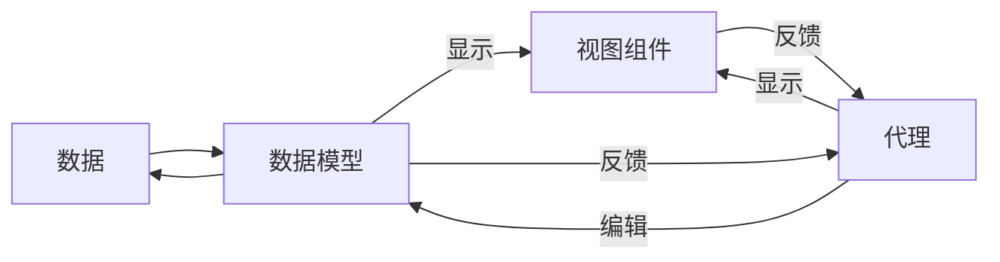
```mermaid
graph LR
数据 --> 数据模型
数据模型 --> 数据
数据模型 -->|显示| 视图组件
数据模型 -->|反馈| 代理
代理 -->|编辑| 数据模型
代理 -->|显示| 视图组件
视图组件 -->|反馈| 代理
```


常见的数据模型表现形式如下，它们都会一个顶层项，List只有1列，Table有多列且对齐，Tree则是自由定义。


​																		图2 常见数据模型的表现形式

数据模型虽然基本形式是用行和列定义的表格数据，但**不意味着底层是用二维数据存储的**，使用行列只是一种为了交互方便的规定，使用模型索引的行号和列号就可以获取数据。

提到了数据模型，就必须提到模型索引，这是访问数据的媒介，**模型索引专门定义了一个类QModelIndex**，模型索引可以提供给数据存储的一个临时指针，用于通过数据模型修改和提取数据，由于模型内部组织数据的结构随时可能更改，所以模型索引是临时的。**如果需要持久性的模型索引，需要使用QPersistentModelIndex类**。

**数据模型的每个项也是一个对应的类**，例如标准项模型**QStandardItemModel的数据类是QStandardItem**，它有个静态函数setdata可以设置数据，对应的获取数据也要先指定角色role。value可以是任何数据类型的数据，一个项可以存在不同角色的数据用于不同场合。

```c++
void QStandardItem::setData(const QVariant &value, int role = Qt::UserRole+1);
Qvariant QStandardItem::data(int role = Qt::UserRole+1) const;
```

role使用枚举值Qt::ItemDataRole来定义。

```c++
Qt::UserRole = 0x0100 // 第一个可用于特定于应用程序的角色
enum Qt::ItemDataRole {
    // 通用型角色
    Qt::DisplayRole = 0, // 以文本形式呈现的关键数据(默认),QString
    Qt::DecorationRole = 1, // 以图标形式呈现的数据,QColor,QIcon,QPixmap
    Qt::EditRolec = 2, // 以适合在编辑器中编辑的形式显示的数据,QString
    Qt::ToolTipRole = 3, // 项目工具提示中显示的数据,QString
    Qt::StatusTipRole = 4, // 状态栏中显示的数据,QString
    Qt::WhatsThisRole = 5, // "What's This?"中显示的项目数据模式,QString
    Qt::SizeHintRole = 13, // 将提供给视图的项目的大小提示,QSize
    // 描述外观和元数据的角色(具有关联类型)
    Qt::FontRole = 6, // 使用默认委托呈现的项目的字体,QFont
	Qt::TextAlignmentRole = 7, // 使用默认委托呈现的项目的文本对齐方式,Qt::Alignment
	Qt::BackgroundRole = 8, // 使用默认代理渲染的项目的背景笔刷QBrush
	Qt::BackgroundColorRole = 8, // 此角色已过时,改用BackgroundRole
	Qt::ForegroundRole = 9, //使用默认代理渲染的项目的前景笔刷(文本颜色),QBrush
	Qt::TextColorRole = 9,// 此角色已过时,改用ForegroundRol。
	Qt::CheckStateRole = 10,//此角色用于获取项目的已检查状态,Qt::CheckState
	Qt::InitialSortOrderRole = 14, // 此角色用于获取标题视图节的初始排序顺序,Qt::SortOrder,Qt4.8中引入
    // 辅助功能角色(具有关联类型)
    Qt::AccessibleTextRole = 11,// 可访问性扩展和插件(如屏幕阅读器)使用的文本,QString
    Qt::AccessibleDescriptionRole = 12 // 用于辅助功能的项目描述,QString
}
```

### 4.1 基础类

#### 4.1.1 QModelIndex

要获得一个模型索引，必须提供3个参数：行号、列号和顶层项的模型索引。例如针对图2中Table Model的3个数据A、B、C，获取它们的索引代码如下。对于**List和Table模式的数据模型顶层节点总是用QModelIndex()表示**。

```c++
QModelIndex idxA = model->index(0,0,QModelIndex());
QModelIndex idxB = model->index(1,1,QModelIndex());
QModelIndex idxC = model->index(2,1,QModelIndex());
```

如果是在Tree模式的顶层节点可能就比较复杂，因为这个顶层节点也可以是其它节点的子节点。

对于A、C的父节点都是顶层节点QModelIndex()，而B的顶层节点是idxA，故代码如下所示。

```c++
QModelIndex idxA = model->index(0,0,QModelIndex());
QModelIndex idxA = model->index(1,0,idxA);
QModelIndex idxC = model->index(2,1,QModelIndex());
```

对于QModelIndex的公共成员函数有以下几个。

```c++
// 返回索引的行、列、顶层节点、数据、标志位
int column() const;
int row() const;
QModelIndex parent() const;
QVariant data(int role = Qt::DisplayRole) const;
Qt::ItemFlags flags() const;
quintptr internalId() const; // 返回模型用于将索引与内部数据结构关联的quintptr
void *internalPointer() const; // 返回模型用于将索引与内部数据结构关联的void*指针
bool isValid() const; // 如果此模型索引有效，则返回true；否则返回false
const QAbstractItemModel *model() const; // 返回指向包含此索引引用的项的模型的指针
```

#### 4.1.2 QPersistentModelIndex

QPersistentModelIndex 类用于定位数据模型中的数据。QPersistentModelIndex 是一个模型索引，可以由应用程序存储，然后用于访问模型中的信息。**与 QModelIndex 类不同，存储 QPersistentModelIndex 是安全的**，因为模型将确保对项目的引用将继续有效，只要它们可以被模型访问。在使用持久模型索引之前检查它们是否有效是一种很好的做法。

主要的成员函数如下。

```c++
int column() const; // 行号
int row() const; // 列号
QModelIndex parent() const; // 父索引
bool isValid() const;// 索引是否有效
QVariant data(int role = Qt::DisplayRole) const;// 返回索引引用的项目的给定角色的数据

Qt::ItemFlags flags() const;// 返回索引引用的项目的标志
const QAbstractItemModel *model() const; // 返回该索引指向的底层模型
QModelIndex sibling(int row, int column) const;// 如果此位置没有相邻位置，则返回行和列的兄弟或无效的 QModelIndex
void swap(QPersistentModelIndex &other); // 交换2个索引
```

#### 4.1.3 QItemSelectionModel 

**用于监控鼠标是否指向表格项或者改变指向。**

##### 枚举类型

1个枚举类型需要知道，这个枚举描述了**选择模型的更新方式**。

```c++
enum QItemSelectionModel::SelectionFlag = {  
    QItemSelectionModel::NoUpdate,//不会进行任何选择
    QItemSelectionModel::Clear,// 完整的选择将被清除
    QItemSelectionModel::Select,// 将选择所有指定的索引
    QItemSelectionModel::Deselect,// 所有指定的索引将被取消选择
    QItemSelectionModel::Toggle,// 将根据当前状态选择或取消选择所有指定的索引
    QItemSelectionModel::Current,// 当前选择将被更新
    QItemSelectionModel::Rows,// 所有索引都将扩展为跨行
    QItemSelectionModel::Columns,// 所有索引都将扩展为跨列
    QItemSelectionModel::SelectCurrent,// 为方便起见，结合了 Select 和 Current
    QItemSelectionModel::ToggleCurrent,// 为方便起见，结合了 Toggle 和 Current
    QItemSelectionModel::ClearAndSelect// 为方便起见，结合了清除和选择
}
```

##### 子类函数

主要的成员函数如下，其它继承自QObject。

```c++
// 1.设置模型,从抽象项模型派生的各类Model都可以设置
void setModel(QAbstractItemModel *model);
// 2.获取当前鼠标指向的单元格索引
QModelIndex currentIndex() const;

// 3.如果在具有给定父项的列中选择了任何项目，则返回 true
bool columnIntersectsSelection(int column, const QModelIndex &parent) const;
// 4.如果选择模型包含任何选择范围，则返回 true；否则返回 false
bool hasSelection() const;
// 5.如果在具有给定父项的列中选择了所有项目，则返回 true
bool isColumnSelected(int column, const QModelIndex &parent) const;
// 6.如果在具有给定父项的行中选择了所有项目，则返回 true
bool isRowSelected(int row, const QModelIndex &parent) const;
// 7.如果选择了给定的模型项索引，则返回 true
bool isSelected(const QModelIndex &index) const;
// 8.如果在具有给定父项的行中选择了任何项目，则返回 true
bool rowIntersectsSelection(int row, const QModelIndex &parent) const;

// 9.返回存储在选择模型中的选择范围
const QItemSelection selection() const;

// 10.返回选择模型所操作的项目模型
const QAbstractItemModel *model() const;
QAbstractItemModel *model();

// 11.返回给定行中所有行都被选中的列的索引
QModelIndexList selectedColumns(int row = 0) const;
// 12.返回给定列中所有列都被选中的行的索引
QModelIndexList selectedRows(int column = 0) const;
// 13.返回所有选定模型项索引的列表。该列表不包含重复项，并且未排序
QModelIndexList selectedIndexes() const;
```

##### 槽函数

具备的槽函数如下。

```c++
// 1.清除选择模型,发出 selectionChanged() 和 currentChanged()
virtual void clear();
// 2.清除当前索引,发出 currentChanged()
virtual void clearCurrentIndex();
// 3.清除选择模型中的选择,发出 selectionChanged()
void clearSelection();
// 4.清除选择模型,不发出任何信号
virtual void reset();
// 5.使用指定的命令选择模型项索引,并发出 selectionChanged()
virtual void select(const QModelIndex &index, QItemSelectionModel::SelectionFlags command);
// 6.使用指定的命令选择项目选择,并发出 selectionChanged()
virtual void select(const QItemSelection &selection, QItemSelectionModel::SelectionFlags command);
// 7.将模型项索引设置为当前项，并发出 currentChanged()
virtual void setCurrentIndex(const QModelIndex &index, QItemSelectionModel::SelectionFlags command);
```

##### 信号函数

具备的信号函数如下。

```c++
// 1.每当当前项目更改时，都会发出此信号。之前的模型项索引被当前索引替换为选择的当前项
void currentChanged(const QModelIndex &current, const QModelIndex &previous);
// 2.如果当前项目发生变化并且其列与前一个当前项目的列不同，则发出此信号
void currentColumnChanged(const QModelIndex &current, const QModelIndex &previous);
// 3.如果当前项目发生变化并且其行与前一个当前项目的行不同，则发出此信号
void currentRowChanged(const QModelIndex &current, const QModelIndex &previous);
// 4.使用 setModel() 成功设置模型时发出此信号
void modelChanged(QAbstractItemModel *model);
// 5.每当选择改变时，就会发出该信号,选择的变化表示为取消选择的项目的项目选择和选定项目的项目选择
void selectionChanged(const QItemSelection &selected, const QItemSelection &deselected);
```

##### QItemSelection

QItemSelection 类管理QItemSelectionModel模型中**选定项目的信息**。
下面的示例可以选择一个区域以包含选择的项，从 topLeft 开始，到 bottomRight 结束。

```c++
QItemSelection *selection = new QItemSelection(topLeft, bottomRight);
// 等价于
QItemSelection *selection = new QItemSelection();
selection->select(topLeft, bottomRight);

const QItemSelection selection() const; //与QItemSelectionModel关联的函数
```

成员函数主要有5个，其他全部继承自QList。

```c++
QItemSelection::QItemSelection(const QModelIndex &topLeft, const QModelIndex &bottomRight);//构造一个从左上角模型项（由 topLeft 索引指定）延伸到右下角项（由 bottomRight 指定）的项选择
bool contains(const QModelIndex &index) const;//是否包含指定索引
QModelIndexList indexes() const;//返回区域包含的所有项索引
void merge(const QItemSelection &other, QItemSelectionModel::SelectionFlags command);//使用给定的命令将其他选择与此 QItemSelection 合并，此方法保证没有范围重叠
void select(const QModelIndex &topLeft, const QModelIndex &bottomRight);//将范围内的项目添加到列表中，该范围从由 topLeft 索引指定的左上角模型项到由 bottomRight 指定的右下角项
```


### 4.2 Model类

所有基于项的数据模型都是基于共同抽象类**QAbstractItemModel**衍生，主要的类层次结构如下所示。注意：带有Abstract的类都是抽象类不能直接使用，所以实际能够使用的只有**7个**，在流程图中已经加粗显示。如果已定义的无法满足需求，可以自行继承3个子抽象类定义自己的数据模型类。

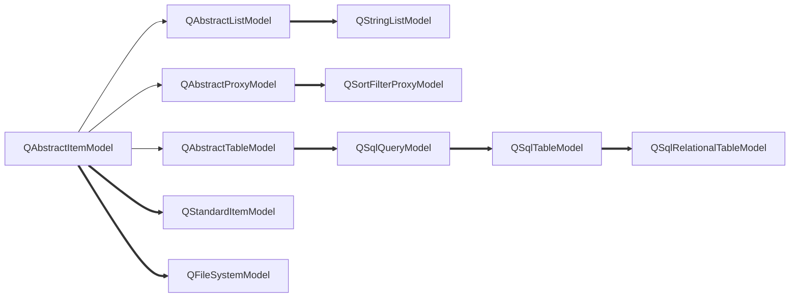
```mermaid
graph LR
QAbstractItemModel-->QAbstractListModel
QAbstractItemModel-->QAbstractProxyModel
QAbstractItemModel-->QAbstractTableModel
QAbstractItemModel==>QStandardItemModel
QAbstractItemModel==>QFileSystemModel

QAbstractListModel==>QStringListModel
QAbstractProxyModel==>QSortFilterProxyModel
QAbstractTableModel==>QSqlQueryModel
QSqlQueryModel==>QSqlTableModel
QSqlTableModel==>QSqlRelationalTableModel
```

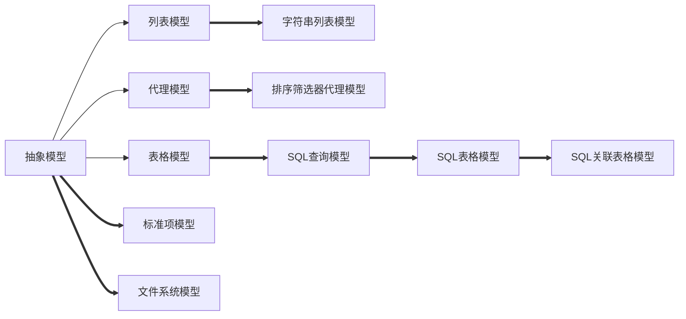
```mermaid
graph LR
抽象模型-->列表模型
抽象模型-->代理模型
抽象模型-->表格模型
抽象模型==>标准项模型
抽象模型==>文件系统模型

列表模型==>字符串列表模型
代理模型==>排序筛选器代理模型
表格模型==>SQL查询模型
SQL查询模型==>SQL表格模型
SQL表格模型==>SQL关联表格模型
```

#### 4.2.1 QAbstractItemModel

QAbstractItemModel 类为项目模型类提供抽象接口。
QAbstractItemModel 类定义了项目模型必须使用的标准接口，以便能够与模型/视图架构中的其他组件进行互操作。它不应该被直接实例化。相反，您应该将其子类化以创建新模型。
QAbstractItemModel 类是模型/视图类之一，是 Qt 模型/视图框架的一部分。它可以用作 QML 中的项目视图元素或 Qt Widgets 模块中的项目视图类的底层数据模型。
如果您需要一个模型与项目视图一起使用，例如 QML 的 List View 元素或 C++ 小部件 QListView 或 QTableView，您应该考虑将 QAbstractListModel 或 QAbstractTableModel 子类化而不是此类。
底层数据模型作为表的层次结构暴露给视图和委托。如果不使用层次结构，则模型是一个简单的行和列表。每个项目都有一个由 QModelIndex 指定的唯一索引。可以通过模型访问的每一项数据都有一个关联的模型索引。您可以使用 index() 函数获取此模型索引。每个索引可能有一个兄弟（）索引；子项有一个 parent() 索引。

每个项目都有与之关联的数据元素，可以通过为模型的 data() 函数指定一个角色（参见 Qt::ItemDataRole）来检索它们。可以使用 itemData() 函数同时获取所有可用角色的数据。每个角色的数据使用特定的 Qt::ItemDataRole 设置。单个角色的数据使用 setData() 单独设置，或者可以使用 setItemData() 为所有角色设置。
可以使用 flags() 查询项目（参见 Qt::ItemFlag）以查看它们是否可以被选择、拖动或以其他方式操作。
如果一个项目有子对象，hasChildren() 为相应的索引返回 true。
该模型对于层次结构的每个级别都有一个 rowCount() 和一个 columnCount()。可以使用 insertRows()、insertColumns()、removeRows() 和 removeColumns() 插入和删除行和列。
该模型发出信号以指示变化。例如，只要模型提供的数据项发生更改，就会发出 dataChanged() 。更改模型提供的标头会导致发出 headerDataChanged()。如果底层数据的结构发生变化，模型可以发出 layoutChanged() 以向任何附加视图指示它们应该重新显示显示的任何项目，同时考虑到新结构。可以使用 match() 函数搜索模型中可用的项目以查找特定数据。
要对模型进行排序，可以使用 sort()。

这个抽象类定义的信号函数可以了解一下。

```c++
void columnsAboutToBeInserted(const QModelIndex &parent, int first, int last);
void columnsAboutToBeMoved(const QModelIndex &sourceParent, int sourceStart, int sourceEnd, const QModelIndex &destinationParent, int destinationColumn);
void columnsAboutToBeRemoved(const QModelIndex &parent, int first, int last);
void columnsInserted(const QModelIndex &parent, int first, int last);
void columnsMoved(const QModelIndex &parent, int start, int end, const QModelIndex &destination, int column);
void columnsRemoved(const QModelIndex &parent, int first, int last);
void dataChanged(const QModelIndex &topLeft, const QModelIndex &bottomRight, const QVector<int> &roles = QVector<int> ());
void headerDataChanged(Qt::Orientation orientation, int first, int last);
void layoutAboutToBeChanged(const QList<QPersistentModelIndex> &parents = QList<QPersistentModelIndex> (), QAbstractItemModel::LayoutChangeHint hint = QAbstractItemModel::NoLayoutChangeHint);
void layoutChanged(const QList<QPersistentModelIndex> &parents = QList<QPersistentModelIndex> (), QAbstractItemModel::LayoutChangeHint hint = QAbstractItemModel::NoLayoutChangeHint);
void modelAboutToBeReset();
void modelReset();
void rowsAboutToBeInserted(const QModelIndex &parent, int start, int end);
void rowsAboutToBeMoved(const QModelIndex &sourceParent, int sourceStart, int sourceEnd, const QModelIndex &destinationParent, int destinationRow);
void rowsAboutToBeRemoved(const QModelIndex &parent, int first, int last);
void rowsInserted(const QModelIndex &parent, int first, int last);
void rowsMoved(const QModelIndex &parent, int start, int end, const QModelIndex &destination, int row);
void rowsRemoved(const QModelIndex &parent, int first, int last);
```

#### 4.2.2 QFileSystemModel

计算机上文件系统的数据模型类，是个可以访问本机文件系统的数据模型。

QFileSystemModel和**QTreeView结合使用**就可以使用目录树的形式显示本机上的文件系统，如同Windows的资源管理器一样。

获取本机文件系统需要使用setRootPath()函数设置根目录；

可以使用静态函数QDir::currentPath()获取应用程序的当前路径；

用于获取磁盘文件目录的数据模型类还有QDirModel，功能和QFileSystemModel类似，但是QFileSystemModel采用单独的线程获取，不会阻碍主线程，所以推荐使用QFileSystemModel。

一个简单的例子。

```c++
QFileSystemModel *model = new QFileSystemModel;
model->setRootPath(QDir::currentPath()); // 文件系统模型的根目录
QTreeView *tree = new QTreeView(splitter);
tree->setModel(model); // 树状展示
tree->setRootIndex(model->index(QDir::currentPath()));// 用返回的给定路径和列的模型项索引去设置树结构的根目录索引
```

##### 枚举类型

此类需要了解的枚举值类型如下。

```c++
enum Roles { 
    FileIconRole, // Qt::DecorationRole
    FilePathRole, // Qt::UserRole + 1
    FileNameRole, // Qt::UserRole + 2
    FilePermissions // Qt::UserRole + 3
}
```

主要具备3个属性。

```c++
nameFilterDisables : bool // 此属性用于保存是否隐藏或禁用未通过名称筛选器的文件,默认情况下，此属性为true
readOnly : bool // 此属性保存目录模型是否允许写入文件系统,如果此属性设置为false，则目录模型将允许重命名、复制和删除文件和目录。默认情况下，此属性为true
resolveSymlinks : bool // 此属性保存目录模型是否应解析符号链接,这仅与Windows相关,默认情况下，此属性为true
```

##### 子类函数

常见的公共成员函数如下。

```c++
// 获取模型索引指向文件的图标、信息、名称、路径
QIcon fileIcon(const QModelIndex &index) const;
QFileInfo fileInfo(const QModelIndex &index) const;
QString fileName(const QModelIndex &index) const;
QString filePath(const QModelIndex &index) const;
QDir rootDirectory() const; // 当前设置的目录
QString rootPath() const; // 当前设置的路径

QDir::Filters filter() const; // 返回为目录模型指定的筛选器。
QFileIconProvider *iconProvider() const; // 返回此目录模型的文件图标提供程序
QStringList nameFilters() const; // 返回应用于模型中名称的筛选器列表
// 这是一个重载函数，返回给定路径和列的模型项索引
QModelIndex index(const QString &path, int column = 0) const;
// 返回上次修改索引的日期和时间
QDateTime lastModified(const QModelIndex &index) const;
// 使用父模型索引中的名称创建目录
QModelIndex mkdir(const QModelIndex &parent, const QString &name);
// 返回项目“我的电脑”在给定角色下存储的数据
QVariant myComputer(int role = Qt::DisplayRole) const;
//返回 QFile::Permission的组合
QFile::Permissions permissions(const QModelIndex &index) const;

bool isDir(const QModelIndex &index) const;// 判断模型索引指向的文件是否为目录
bool isReadOnly() const; // 此属性保存目录模型是否允许写入文件系统
bool resolveSymlinks() const; // 此属性保存目录模型是否应解析符号链接，仅与Windows相关
bool nameFilterDisables() const;// 此属性用于保存是否隐藏或禁用未通过名称筛选器的文件
// 删除与文件系统模型中的模型项索引相对应的目录，并从文件系统中删除相应的目录，如果成功，则返回true。如果无法删除目录，则返回false
bool remove(const QModelIndex &index);
bool rmdir(const QModelIndex &index); 

void setFilter(QDir::Filters filters);// 将目录模型的筛选器设置为筛选器指定的筛选器
void setIconProvider(QFileIconProvider *provider);// 设置文件图标的提供程序
void setNameFilterDisables(bool enable);
void setNameFilters(const QStringList &filters);// 设置要对现有文件应用的名称过滤器
void setReadOnly(bool enable); // 设置只读
void setResolveSymlinks(bool enable);// 此属性保存目录模型是否应解析符号链接
qint64 size(const QModelIndex &index) const; // 如果节点是文件，返回文件大小(字节)，文件不存在返回0
QString type(const QModelIndex &index) const;// 返回文件索引的类型，目录"Directory"、硬盘符"Drive"，文件夹"File Folder"，文件"txt File"、"exe File"、"pdf File"、"JPEG file"等
// 通过在模型上安装文件系统监视程序，将其监视的目录设置为newPath。对此目录中的文件和目录所做的任何更改都将反映在模型中
QModelIndex setRootPath(const QString &newPath);
```

##### 信号函数

信号函数。

```c++
// gatherer线程完成加载路径时，会发出此信号
void directoryLoaded(const QString &path);
// 每当使用旧名称的文件成功重命名为新名称时，就会发出此信号  
static void QFileSystemModel::fileRenamed(const QString &path, 
                                   const QString &oldName, 
                                   const QString &newName);
// 只要根路径更改为新路径，就会发出此信号
void rootPathChanged(const QString &newPath);
```

#### 4.2.3 QStandardItemModel

标准的基于项数据的数据模型类，每个项可以是任何数据类型。

这个模型**一般是和QTableView结合的，适合处理二维数组**。
QStandardItemModel 实现了 QAbstractItemModel 接口，这意味着该模型可用于在任何支持该接口的视图中提供数据（例如 QListView、QTableView 和 QTreeView，以及您自己的自定义视图）。为了性能和灵活性，您可能希望继承 QAbstractItemModel 以支持不同类型的数据存储库。例如，QDirModel 为底层文件系统提供模型接口。当您想要一个列表或树时，通常创建一个空的 QStandardItemModel 并使用 appendRow() 将项目添加到模型中，并使用 item() 访问项目。如果您的模型表示一个表格，您通常会将表格的维度传递给 QStandardItemModel 构造函数并使用 setItem() 将项目定位到表格中。您还可以使用 setRowCount() 和 setColumnCount() 来更改模型的尺寸。要插入项目，请使用 insertRow() 或 insertColumn()，要删除项目，请使用 removeRow() 或 removeColumn()。
您可以使用 setHorizontalHeaderLabels() 和 setVerticalHeaderLabels() 设置模型的标题标签。
您可以使用 findItems() 在模型中搜索项目，并通过调用 sort() 对模型进行排序。
调用 clear() 从模型中删除所有项目。
使用 QStandardItemModel 创建表的示例：

```c++
QStandardItemModel model(4, 4);
for (int row = 0; row < 4; ++row) {
    for (int column = 0; column < 4; ++column) {
        QStandardItem *item = new QStandardItem(QString("row %0, column %1").arg(row).arg(column));
        model.setItem(row, column, item);
    }
}

QStandardItemModel model;
QStandardItem *parentItem = model.invisibleRootItem();
for (int i = 0; i < 4; ++i) {
    QStandardItem *item = new QStandardItem(QString("item %0").arg(i));
    parentItem->appendRow(item);
    parentItem = item;
}
```

##### 子类函数

```c++
// 单元格的属性设置操作
void appendColumn(const QList<QStandardItem *> &items);
void appendRow(const QList<QStandardItem *> &items);
void appendRow(QStandardItem *item);
void clear();
void insertColumn(int column, const QList<QStandardItem *> &items);
bool insertColumn(int column, const QModelIndex &parent = QModelIndex());
void insertRow(int row, const QList<QStandardItem *> &items);
void insertRow(int row, QStandardItem *item);
bool insertRow(int row, const QModelIndex &parent = QModelIndex());
void setColumnCount(int columns);
void setHorizontalHeaderItem(int column, QStandardItem *item);
void setHorizontalHeaderLabels(const QStringList &labels);
void setItem(int row, int column, QStandardItem *item);
void setItem(int row, QStandardItem *item);
void setItemPrototype(const QStandardItem *item);
void setItemRoleNames(const QHash<int, QByteArray> &roleNames);
void setRowCount(int rows);
void setSortRole(int role);
void setVerticalHeaderItem(int row, QStandardItem *item);
void setVerticalHeaderLabels(const QStringList &labels);
int sortRole() const;

// 单元格的访问操作
QModelIndex indexFromItem(const QStandardItem *item) const;
QList<QStandardItem *> findItems(const QString &text, Qt::MatchFlags flags = Qt::MatchExactly, int column = 0) const;
QList<QStandardItem *> takeColumn(int column);
QList<QStandardItem *> takeRow(int row);
QStandardItem *horizontalHeaderItem(int column) const;
QStandardItem *invisibleRootItem() const;
QStandardItem *item(int row, int column = 0) const;
QStandardItem *itemFromIndex(const QModelIndex &index) const;
const QStandardItem *itemPrototype() const;
QStandardItem *takeHorizontalHeaderItem(int column)
QStandardItem *takeItem(int row, int column = 0)
QStandardItem *takeVerticalHeaderItem(int row)
QStandardItem *verticalHeaderItem(int row) const
```

自定义的信号函数如下，其它从抽象模型继承而来。

```c++
void itemChanged(QStandardItem *item);
```

其它继承的函数不再赘述。

#### 4.2.4 QStringListModel

用于处理字符串列表数据的数据模型类，它可以作为**QListView的数据模型**，在界面上显示和编辑字符串列表。它关联的数据结构是[3.1.8 QStringList](#3.1.8 QStringList)。

QListView的任何操作都会反馈至QStringListModel，前提是后台程序中，这个视图组件使用setModel设定为该模型。

```c++
Widget :: Widget(QWidget * parent): QWidget(parent),ui(new Ui::Widget)
{
    ui->setupUi(this);
    QStringList strlist;//数据模型
    strlist<<"北京"<<"上海"<<"河北";
    this->model = new QStringListModel(this);
    this->model->setStringList(strlist);//字符串模型把字符串加进来
    ui->listview->setModel(this->model);//设置模型
    ui->listview->setEditTriggers(QAbstractItemView::DoubleClicked |QAbstractItemView::SelectedClicked );
    //视图组件通过双击或者选中单击进行触发,可以把数据传递给this->model
}
```

自定义的成员函数只有2个，也就是设置字符串列表和读取字符串列表。

```c++
QStringListModel(const QStringList &strings, QObject *parent = Q_NULLPTR);
void setStringList(const QStringList &strings);
QStringList stringList() const;
```

继承而来的有6个函数是需要关注的，其它函数不需要再单独列出。

```c++
// 将计数行插入模型,从给定行开始
virtual bool insertRows(int row, int count, const QModelIndex &parent = QModelIndex());
// 移除给定行,从给定行开始
virtual bool removeRows(int row, int count, const QModelIndex &parent = QModelIndex());
// 返回模型中的行数,此值对应于模型内部字符串列表中的项目数
virtual int rowCount(const QModelIndex &parent = QModelIndex()) const;
// 将模型中具有给定索引的项目中指定角色的数据设置为提供的值
virtual bool setData(const QModelIndex &index, const QVariant &value, int role = Qt::EditRole);
// 继承自QAbstractItemModel::sort(),按给定顺序按列对模型进行排序
virtual void sort(int column, Qt::SortOrder order = Qt::AscendingOrder);
// 返回由给定行、列和父索引指定的模型中项目的索引
virtual QModelIndex index(int row, int column = 0, const QModelIndex &parent = QModelIndex()) const;
```

#### 4.2.5 QSortFilterProxyModel

与其他数据模型结合，提供排序和过滤功能的数据模型类。

#### 4.2.6 QSqlQuieryModel

用于数据库SQL查询结果的数据模型类。

#### 4.2.7 QSqlTableModel

用于数据库的一个数据表的数据模型类。

#### 4.2.8 QSqlRelationalTableModel

用于关系型数据表的数据模型类。

### 4.3 View类

QColumnView、QHeaderView、QListView、QTableView和QTreeView的共同基类是**QAbstractItemView**。

视图组件统一存在一个函数setModel()，即可设置一个数据模型，视图组件上的修改将自动保存到关联的数据模型，一个数据模型可以同时在多个视图组件显示数据。

视图组件类的关联关系表示如下，可以看出之前提到的3种类只是个派生类，它们的项可以用来存储部分小型数据。

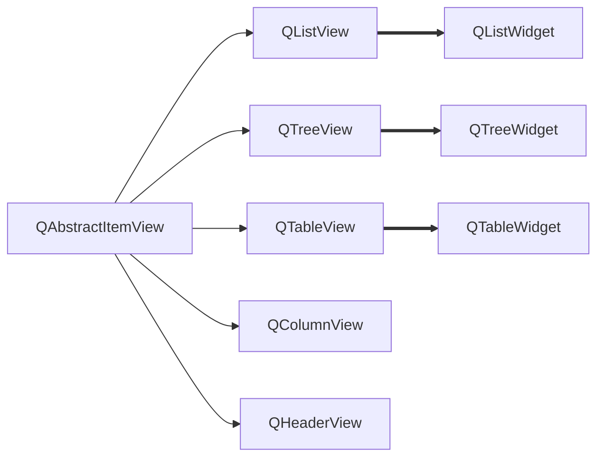
```mermaid
graph LR
QAbstractItemView-->QListView
QAbstractItemView-->QTreeView
QAbstractItemView-->QTableView
QAbstractItemView-->QColumnView
QAbstractItemView-->QHeaderView

QListView==>QListWidget
QTableView==>QTableWidget
QTreeView==>QTreeWidget
```

#### 4.3.1 QAbstractItemView

QAbstractItemView 类为项目视图类提供了基本功能。
QAbstractItemView 类是每个使用 QAbstractItemModel 的标准视图的基类，**是QColumnView、QHeaderView、QListView、QTableView和QTreeView的共同基类**。 QAbstractItemView 是一个抽象类，本身不能被实例化。它提供了一个标准接口，用于通过信号和槽机制与模型进行互操作，使子类能够随着模型的更改而保持最新。

##### 枚举类型

**描述视图可以操作的各种拖放事件**。默认情况下视图不支持拖放NoDragDrop。

```c++
enum QAbstractItemView::DragDropMode = { 
    QAbstractItemView::NoDragDrop,//不支持拖拽
    QAbstractItemView::DragOnly,//视图支持拖动自己的项目
    QAbstractItemView::DropOnly,//视图接受drop
    QAbstractItemView::DragDrop//视图支持拖放
    QAbstractItemView::InternalMove//视图仅接受来自其自身的移动而非复制操作
}
```

**此枚举描述将启动项目编辑的操作**。

```c++
enum QAbstractItemView::EditTrigger = {
    QAbstractItemView::NoEditTriggers,//无法编辑
    QAbstractItemView::CurrentChanged,//当前项目更改时开始编辑
    QAbstractItemView::DoubleClicked,//双击项目时开始编辑
    QAbstractItemView::SelectedClicked,//单击已选择的项目时开始编辑
    QAbstractItemView::EditKeyPressed,//在项目上按下平台编辑键时开始编辑
    QAbstractItemView::AnyKeyPressed,//在项目上按下任意键时开始编辑
    QAbstractItemView::AllEditTriggers//以上所有操作都可以开启
}
```

**滚动提示的枚举值**。

```c++
enum QAbstractItemView::ScrollHint{   
    QAbstractItemView::EnsureVisible,//滚动以确保项目可见
    QAbstractItemView::PositionAtTop,//滚动以将项目定位在视口的顶部
    QAbstractItemView::PositionAtBottom,//滚动以将项目定位在视口的底部
    QAbstractItemView::PositionAtCenter//滚动以将项目定位在视口的中心
}
```

**描述滚动条的行为方式**。将滚动模式设置为 ScrollPerPixel 时，单步大小将自动调整，除非使用 setSingleStep() 显式设置，可以通过将单步长设置为-1来恢复自动调整。

```c++
enum QAbstractItemView::ScrollMode = {  
    QAbstractItemView::ScrollPerItem,//视图将一次滚动一项内容
    QAbstractItemView::ScrollPerPixel//视图将一次滚动一个像素的内容
}
```

这个枚举类型决定了**鼠标点击单元格时是只选中单元格，还是这一行单元格还是这一列**。

```c++
enum QAbstractItemView::SelectionBehavior{ 
    QAbstractItemView::SelectItems,//选择单个项目
    QAbstractItemView::SelectRows,//仅选择行
    QAbstractItemView::SelectColumns//仅选择列
}
```

此枚举**指示视图如何响应用户选择**，最常用的模式是 SingleSelection 和 ExtendedSelection。

```c++
enum QAbstractItemView::SelectionMode = {
QAbstractItemView::SingleSelection,//只能选中1个项,单击别的就会取消选择
QAbstractItemView::ContiguousSelection,//可以使用shift选择连续区域
QAbstractItemView::ExtendedSelection,//可以使用ctrl选中多个分开的项,使用shift的区别是不能选择非连续的项,会自动包含
QAbstractItemView::MultiSelection,// 不用使用ctrl或者shift才能选择多个区域,鼠标点击别的区域不会取消已有的区域,只能通过鼠标移动取消
QAbstractItemView::NoSelection // 无法选择项目
}
```

##### 子类函数

给出常见的成员函数。

```c++
QModelIndex currentIndex() const; //获取选中项的索引
void setDragDropMode(DragDropMode behavior);//设置拖放模式
void setEditTriggers(EditTriggers triggers);//设置启动编辑的触发模式
virtual void setModel(QAbstractItemModel *model); // 设置模型
void setSelectionBehavior(QAbstractItemView::
SelectionBehavior behavior);// 设置选中单元格的行为
void setSelectionMode(QAbstractItemView::SelectionMode mode);//设置选中模式
virtual void setSelectionModel(QItemSelectionModel *selectionModel);// 将当前选择模型设置为给定的 selectionModel
```

##### 槽函数

给出常见槽函数。

```c++
void clearSelection();//取消选择所有选定的项目。当前索引不会改变
void edit(const QModelIndex &index);//如果它是可编辑的，则开始编辑与给定索引对应的项目
virtual void reset();//重置视图的内部状态
void scrollToBottom();//将视图滚动到底部
void scrollToTop();//将视图滚动到顶部
virtual void selectAll();//选择视图中的所有项目。此功能将在选择时使用视图上设置的选择行为
void setCurrentIndex(const QModelIndex &index);//将当前项目设置为索引处的项目
virtual void setRootIndex(const QModelIndex &index);//将根项设置为给定索引处的项
void update(const QModelIndex &index);//更新给定索引占用的区域

// 继承的槽函数
// 当新项目成为当前项目时，将调用此插槽。上一个当前项由上一个索引指定，新项由当前索引指定
virtual void currentChanged(const QModelIndex &current, const QModelIndex &previous);
//插入行时调用此插槽。新行是从头到尾包含在给定父级下的行。基类实现在模型上调用 fetchMore() 以检查更多数据
virtual void rowsInserted(const QModelIndex &parent, int start, int end);
// 更改选择时调用此插槽。先前的选择（可能为空）由取消选择指定，新选择由选择指定
virtual void selectionChanged(const QItemSelection &selected, const QItemSelection &deselected;
```

##### 信号函数

```c++
void activated(const QModelIndex &index);//当用户激活 index 指定的项目时，会发出此信号。如何激活取决于平台,例通过单击或双击项目，或在项目为当前时按 Return 或 Enter 键。
void clicked(const QModelIndex &index);//当鼠标左键单击时发出此信号。鼠标点击的项目由索引指定。该信号仅在索引有效时发出
void doubleClicked(const QModelIndex &index);//双击鼠标按钮时会发出此信号。鼠标双击的项目由索引指定。仅在索引有效时发出信号
void entered(const QModelIndex &index);//当鼠标光标进入 index 指定的项目时发出此信号。需要启用鼠标跟踪才能使用此功能
void iconSizeChanged(const QSize &size);//此属性保存项目图标的大小,当视图可见时设置此属性将导致项目重新布局
void pressed(const QModelIndex &index);//按下鼠标按钮时会发出此信号。鼠标按下的项目由索引指定。仅在索引有效时发出信号
void viewportEntered();//当鼠标光标进入视口时发出此信号。需要启用鼠标跟踪才能使用此功能
```

#### 4.3.2 QListView

用于显示单列的列表数据，适用于一维数据的操作。参见Qt文档，不赘述。

#### 4.3.3 QTreeView

用于显示树状结构数据，适用于树状结构数据的操作。参见Qt文档，不赘述。

#### 4.3.4 QTableView

用于显示表格状数据，适用于二维表格型数据的操作。参见Qt文档，不赘述。

#### 4.3.5 QColumnView

用多个QListView显示树状层次结构，树状结构的一层用一个QListView显示。参见Qt文档，不赘述。

#### 4.3.6 QHeaderView

提供行表头或列表头的视图组件，如QTable的行表头和列表头。参见Qt文档，不赘述。

### 4.4 Delegate类

代理的功能是在视图组件上为编辑数据提供编辑器，例如在单元格项编辑的时候默认使用的是QLineEdit进行编辑。不过有的单元格数据比较特殊，例如它是个浮点数，可能使用QDoubleSpinBox更好；如果是整数，使用QSpinBox；单元格内容只能是枚举值之一，就可以使用QComboBox。

一个子类是QStyledItemDelegate，是Qt的视图组件缺省使用的代理类。QStyledItemDelegate相比于QItemDelegate可以使用当前的样式表设置来绘制组件，因此建议使用QStyledItemDelegate来作为自定义代理组件的基类。

无论怎么定义设计代理组件，都需要实现以下4个功能函数的重载。

```C++
createEditor(); // 创建用于编辑模型数据的widget组件，如1个spinbox组件或者combobox组件
setEditorData();// 从数据模型获取数据,供widget组件进行编辑
setModelData(); // 将widget的数据更新到数据模型
updateEditorGeometry(); // 给widget组件设置一个合适的大小
```

例如，spinbox的自定义代理类。这些代理类可以用于**view模型的setItemDelegateForColumn函数**去给每列设置代理，使用**setItemDelegateForRow**给每行设置代理，**setItemDelegate**整体设置代理。

```c++
// .h
#include    <QStyledItemDelegate>
class spinBoxDelegate: public QStyledItemDelegate
{
Q_OBJECT
public:
  spinBoxDelegate(QObject *parent=0);

    //自定义代理组件必须继承以下4个函数
    //创建编辑组件
    QWidget *createEditor(QWidget *parent, const QStyleOptionViewItem &option,
                          const QModelIndex &index) const Q_DECL_OVERRIDE;

    void setEditorData(QWidget *editor, const QModelIndex &index) const Q_DECL_OVERRIDE;
    void setModelData(QWidget *editor, QAbstractItemModel *model,
                      const QModelIndex &index) const Q_DECL_OVERRIDE;
    void updateEditorGeometry(QWidget *editor, const QStyleOptionViewItem &option,
                              const QModelIndex &index) const Q_DECL_OVERRIDE;
};
// .cpp
#include "spinBoxDelegate.h"
#include <QSpinBox>
spinBoxDelegate::spinBoxDelegate(QObject *parent):QStyledItemDelegate(parent)
{

}
QWidget *spinBoxDelegate::createEditor(QWidget *parent,
   const QStyleOptionViewItem &option, const QModelIndex &index) const
{ //创建代理编辑组件
    Q_UNUSED(option);
    Q_UNUSED(index);

    QSpinBox *editor = new QSpinBox(parent); //创建一个QSpinBox
    editor->setFrame(false); //设置为无边框
    editor->setMinimum(0);
    editor->setMaximum(10000);

    return editor;  //返回此编辑器
}
//从数据模型获取数据，显示到代理组件中
void spinBoxDelegate::setEditorData(QWidget *editor,
                      const QModelIndex &index) const
{
	//获取数据模型的模型索引指向的单元的数据
    int value = index.model()->data(index, Qt::EditRole).toInt();

    QSpinBox *spinBox = static_cast<QSpinBox*>(editor);  //强制类型转换
    spinBox->setValue(value); //设置编辑器的数值
}
//将代理组件的数据，保存到数据模型中
void spinBoxDelegate::setModelData(QWidget *editor, QAbstractItemModel *model, const QModelIndex &index) const
{ 
    QSpinBox *spinBox = static_cast<QSpinBox*>(editor); //强制类型转换
    spinBox->interpretText(); //解释数据，如果数据被修改后，就触发信号
    
    int value = spinBox->value(); //获取spinBox的值
    model->setData(index, value, Qt::EditRole); //更新到数据模型
}
// 设置代理组件大小
void spinBoxDelegate::updateEditorGeometry(QWidget *editor, const QStyleOptionViewItem &option, const QModelIndex &index) const
{
    Q_UNUSED(index);
    editor->setGeometry(option.rect);
}
```

其它的子类继承结构如下。

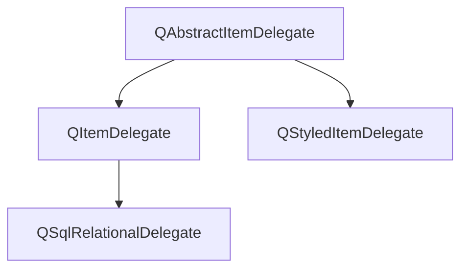
```mermaid
graph TD
QAbstractItemDelegate --> QItemDelegate
QAbstractItemDelegate --> QStyledItemDelegate
QItemDelegate --> QSqlRelationalDelegate
```

#### 4.4.1 QAbstractItemDelegate

QAbstractItemDelegate 类用于显示和编辑模型中的数据项。
QAbstractItemDelegate 为模型/视图架构中的委托提供接口和通用功能。代表在视图中显示单个项目，并处理模型数据的编辑。QAbstractItemDelegate 类是模型/视图类之一，是 Qt 模型/视图框架的一部分。
要以自定义方式呈现项目，您必须实现 paint() 和 sizeHint()。 QItemDelegate 类为这些函数提供了默认实现；如果您不需要自定义渲染，请改为子类化该类。
我们举一个在items中绘制进度条的例子；在我们的例子中是一个包管理程序。

我们创建了继承自 QStyledItemDelegate 的 WidgetDelegate 类。我们在 paint() 函数中进行绘图：

```c++
void WidgetDelegate::paint(QPainter *painter, const QStyleOptionViewItem &option,
                             const QModelIndex &index) const
{
    if (index.column() == 1) {
        int progress = index.data().toInt();

        QStyleOptionProgressBar progressBarOption;
        progressBarOption.rect = option.rect;
        progressBarOption.minimum = 0;
        progressBarOption.maximum = 100;
        progressBarOption.progress = progress;
        progressBarOption.text = QString::number(progress) + "%";
        progressBarOption.textVisible = true;

        QApplication::style()->drawControl(QStyle::CE_ProgressBar,
                                           &progressBarOption, painter);
    } 
    else
        QStyledItemDelegate::paint(painter, option, index);
```

请注意，我们使用 QStyleOptionProgressBar 并初始化其成员。然后我们可以使用当前的 QStyle 来绘制它。
要提供自定义编辑，可以使用两种方法。第一种方法是创建一个编辑器小部件并将其直接显示在项目的顶部。为此，您必须重新实现 createEditor() 以提供编辑器小部件， setEditorData() 以使用模型中的数据填充编辑器，以及 setModelData() 以便委托可以使用来自编辑器的数据更新模型。
第二种方法是通过重新实现 editorEvent() 直接处理用户事件。

##### 枚举类型

这个枚举描述了委托可以给模型和视图组件的不同提示，以使在模型中编辑数据对用户来说是一种舒适的体验。请注意，自定义视图可能会以不同的方式解释下一个和上一个的概念。以下提示在使用缓存数据的模型时最有用，例如那些在本地操作数据以提高性能或节省网络带宽的模型。尽管模型和视图应该以适当的方式响应这些提示，但如果它们不相关，自定义组件可能会忽略它们中的任何一个或全部。

```c++
enum QAbstractItemDelegate::EndEditHint = {
    QAbstractItemDelegate::NoHint,//没有建议执行的操作
    QAbstractItemDelegate::EditNextItem,//视图应使用委托打开视图中下一项的编辑器
    QAbstractItemDelegate::EditPreviousItem,//视图应使用委托打开视图中上一项的编辑器
    QAbstractItemDelegate::SubmitModelCache,//如果模型缓存数据，它应该将缓存数据写入底层数据存储
    QAbstractItemDelegate::RevertModelCache//如果模型缓存了数据，它应该丢弃缓存的数据，并将其替换为来自底层数据存储的数据
}
```

##### 子类函数

```c++
QAbstractItemDelegate(QObject *parent = Q_NULLPTR);
virtual ~QAbstractItemDelegate();
virtual void destroyEditor(QWidget *editor, const QModelIndex &index) const;
virtual bool editorEvent(QEvent *event, QAbstractItemModel *model, const QStyleOptionViewItem &option, const QModelIndex &index);
virtual QSize sizeHint(const QStyleOptionViewItem &option, const QModelIndex &index) const = 0;
virtual bool helpEvent(QHelpEvent *event, QAbstractItemView *view, const QStyleOptionViewItem &option, const QModelIndex &index);
virtual void paint(QPainter *painter, const QStyleOptionViewItem &option, const QModelIndex &index) const = 0;
// 自定义代理类必须重定义的4个函数
virtual QWidget *createEditor(QWidget *parent, const QStyleOptionViewItem &option, const QModelIndex &index) const;
virtual void setEditorData(QWidget *editor, const QModelIndex &index) const;
virtual void setModelData(QWidget *editor, QAbstractItemModel *model, const QModelIndex &index) const;
virtual void updateEditorGeometry(QWidget *editor, const QStyleOptionViewItem &option, const QModelIndex &index) const;
```

##### 信号函数

```c++
void closeEditor(QWidget *editor, QAbstractItemDelegate::EndEditHint hint = NoHint);
void commitData(QWidget *editor);
void sizeHintChanged(const QModelIndex &index);
```

#### 4.4.2 QStyledItemDelegate

QStyledItemDelegate 类为**模型中的数据项提供显示和编辑工具**。
模型中项目的数据被分配一个ItemDataRole；每个项目都可以为每个角色存储一个 QVariant。 QStyledItemDelegate 实现了用户期望的最常见数据类型的显示和编辑，包括布尔值、整数和字符串。
数据的绘制方式将根据它们在模型中的角色而有所不同。

编辑器是使用 QItemEditorFactory 创建的； QItemEditorFactory 提供的默认静态实例安装在所有项目委托上。您可以使用 setItemEditorFactory() 设置自定义工厂或使用 QItemEditorFactory::setDefaultFactory() 设置新的默认工厂。编辑的是带有 EditRole 的项目模型中存储的数据。有关项目编辑器工厂的更高级介绍，请参阅 QItemEditorFactory 类。颜色编辑器工厂示例展示了如何使用工厂创建自定义编辑器。

其它的函数主要是继承为主，详见Qt文档。

#### 4.4.3 QItemDelegate

QItemDelegate 类为模型中的数据项提供显示和编辑工具。
QItemDelegate 可用于为基于 QAbstractItemView 子类的项目视图提供自定义显示功能和编辑器小部件。为此目的使用委托允许独立于模型和视图自定义和开发显示和编辑机制。
QItemDelegate 类是模型/视图类之一，是 Qt 模型/视图框架的一部分。请注意，QStyledItemDelegate 已经接管了绘制 Qt 项目视图的工作。我们建议在创建新委托时使用 QStyledItemDelegate。
在标准视图中显示来自自定义模型的项目时，通常只需确保模型为确定项目在视图中的外观的每个角色返回适当的数据就足够了。 Qt 标准视图使用的默认委托使用此角色信息以用户期望的大多数常见形式显示项目。但是，有时需要对项目的外观进行比默认委托所能提供的更多的控制。
此类提供用于在视图中绘制项目数据和从项目模型编辑数据的函数的默认实现。提供了在 QAbstractItemDelegate 中定义的 paint() 和 sizeHint() 虚函数的默认实现，以确保委托实现视图期望的正确基本行为。您可以在子类中重新实现这些函数以自定义项目的外观。
在项目视图中编辑数据时，QItemDelegate 提供了一个编辑器小部件，这是一个在进行编辑时放置在视图顶部的小部件。编辑器是使用 QItemEditorFactory 创建的； QItemEditorFactory 提供的默认静态实例安装在所有项目委托上。您可以使用 setItemEditorFactory() 设置自定义工厂或使用 QItemEditorFactory::setDefaultFactory() 设置新的默认工厂。被编辑的是存储在带有 Qt::EditRole 的项目模型中的数据。

其它的函数主要是继承为主，详见Qt文档。

#### 4.4.4 QSqlRelationalDelegate

详见Qt文档。

## 5. 对话框与多窗体设计

### 5.1 常见的对话框

#### 5.1.1 QFileDialog

QFileDialog 类是一个文件对话框。
QFileDialog 类使用户能够遍历文件系统以选择一个或多个文件或目录。
创建 QFileDialog 最简单的方法是使用静态函数。

```c++
fileName = QFileDialog::getOpenFileName(this,
      tr("Open Image"), "/home/jana", tr("Image Files (*.png *.jpg *.bmp)"));

QString curPath=QDir::currentPath();//获取系统当前目录
//  QString  curPath=QCoreApplication::applicationDirPath(); //获取应用程序的路径
QString dlgTitle="选择一个文件"; //对话框标题
QString filter="文本文件(*.txt);;图片文件(*.jpg *.gif *.png);;所有文件(*.*)"; //文件过滤器

QString aFileName=QFileDialog::getOpenFileName(this,dlgTitle,curPath,filter);
```

在上面的示例中，模态 QFileDialog 是使用静态函数创建的。**该对话框最初显示"/home/jana"目录的内容**，并显示与字符串"Image Files (*.png *.jpg *.bmp)"中给出的模式匹配的文件。文件对话框的父级设置为此，窗口标题设置为"打开图像"。
如果要使用多个过滤器，请用两个分号分隔每个过滤器。例如：

```c++
 "Images (*.png *.xpm *.jpg);;Text files (*.txt);;XML files (*.xml)"
```

您可以在不使用静态函数的情况下创建自己的 QFileDialog。通过调用 setFileMode()，您可以指定用户必须在对话框中选择的内容：

```c++
QFileDialog dialog(this);
```

文件对话框的模式可以设置为 **AnyFile**，这意味着用户可以选择任何文件，甚至可以指定一个不存在的文件。此模式对于创建"另存为"文件对话框很有用。如果用户必须选择现有文件，请使用 **ExistingFile**；如果只能选择目录，请使用 **Directory**。有关模式的完整列表，请参阅 **QFileDialog::FileMode 枚举**。fileMode 属性包含对话框的操作模式；这表明用户应该选择什么类型的对象。使用 setNameFilter() 设置对话框的文件过滤器。例如

```c++
dialog.setFileMode(QFileDialog::AnyFile); 
dialog.setNameFilter(tr("Images (*.png *.xpm *.jpg)"));
```

在上面的示例中，过滤器设置为"Images (*.png *.xpm *.jpg)"，这意味着只有扩展名为 png、xpm 或 jpg 的文件才会显示在 QFileDialog 中。您可以使用 setNameFilters() 应用多个过滤器。使用 selectNameFilter() 选择您提供的过滤器之一作为文件对话框的默认过滤器。

文件对话框有两种查看模式：列表和详细信息。 List 将当前目录的内容显示为**文件和目录名称的列表**。详细信息还显示文件和目录名称列表，但在每个名称旁边**提供附加信息**，例如文件大小和修改日期。

```c++
dialog.setViewMode(QFileDialog::Detail);
```

创建自己的文件对话框时需要使用的最后一个重要函数是 selectedFiles()。

```c++
QStringList fileNames;
if (dialog.exec())
    fileNames = dialog.selectedFiles();
```

在上面的示例中，创建并显示了一个模态文件对话框。如果用户单击确定，他们选择的文件将放入 fileName。可以使用 setDirectory() 设置对话框的工作目录。可以使用 selectFile() 函数选择当前目录中的每个文件。标准对话框示例展示了如何使用 QFileDialog 以及其他内置 Qt 对话框。默认情况下，如果平台有一个平台原生文件对话框，则将使用它。在这种情况下，用于构造对话框的小部件将不会被实例化，因此相关的访问器（例如 layout() 和 itemDelegate() 将返回 null。您可以设置 DontUseNativeDialog 选项以确保将使用基于小部件的实现而不是本机对话框。

##### 枚举类型

常见的枚举类型如下。

```c++
enum QFileDialog::AcceptMode = { 
    QFileDialog::AcceptOpen,//接受打开
    QFileDialog::AcceptSave//接受保存
}
```

```c++
enum QFileDialog::DialogLabel = {
    QFileDialog::LookIn，//查看
    QFileDialog::FileName，//文件名
    QFileDialog::FileType，//文件类型
    QFileDialog::Accept，//接受
    QFileDialog::Reject//拒绝
}
```

此枚举用于指示用户可以在文件对话框中选择什么；即如果用户单击确定，对话框将返回什么。

```c++
enum QFileDialog::FileMode = {  
    QFileDialog::AnyFile,//文件的名称，无论它是否存在
    QFileDialog::ExistingFile,//单个现有文件的名称
    QFileDialog::Directory,//目录的名称。显示文件和目录。但是，本机 Windows 文件对话框不支持在目录选择器中显示文件
    QFileDialog::ExistingFiles,//零个或多个现有文件的名称
	QFileDialog::DirectoryOnly//改用 Directory 和 setOption(ShowDirsOnly, true)
}
```

文件对话框展示的一些属性设置。

```c++
enum QFileDialog::Option = {   
    QFileDialog::ShowDirsOnly,//仅在文件对话框中显示目录。默认情况下，文件和目录都会显示。（仅在目录文件模式下有效）
    QFileDialog::DontResolveSymlinks,//不要在文件对话框中解析符号链接。默认情况下，符号链接已解析
    QFileDialog::DontConfirmOverwrite,//如果选择了现有文件，请不要要求确认。默认情况下要求确认
    QFileDialog::DontUseNativeDialog,//不要使用本机文件对话框。默认情况下，使用本地文件对话框，除非您使用包含 Q_OBJECT 宏的 QFileDialog 的子类，或者平台没有您需要的类型的本地对话框。
    QFileDialog::ReadOnly,//表示模型是只读的
    QFileDialog::HideNameFilterDetails,//指示文件名过滤器详细信息是否隐藏。
    QFileDialog::DontUseSheet,//在以前的 Qt 版本中，如果静态函数被赋予父级，则静态函数将默认创建一个工作表。这在 Qt 4.5 中不再受支持并且不执行任何操作，静态函数将始终是应用程序模式对话框。如果要使用工作表，请改用 QFileDialog::open() 
    QFileDialog::DontUseCustomDirectoryIcons//始终使用默认目录图标。一些平台允许用户设置不同的图标。自定义图标查找会对网络或可移动驱动器造成很大的性能影响。设置此项将启用
}
```

这个枚举描述了文件对话框的视图模式；即将显示有关每个文件的哪些信息。

```c++
enum QFileDialog::ViewMode = {
    QFileDialog::Detail，//显示目录中每个项目的图标、名称和详细信息
    QFileDialog::List//仅显示目录中每个项目的图标和名称
}
```

##### 子类函数

常见的成员函数。

```c++
void setAcceptMode(AcceptMode mode);
void setDefaultSuffix(const QString &suffix);
void setDirectory(const QString &directory);
void setDirectory(const QDir &directory);
void setDirectoryUrl(const QUrl &directory);
void setFileMode(FileMode mode);;
void setFilter(QDir::Filters filters);
void open(QObject *receiver, const char *member);
AcceptMode acceptMode() const;
QString defaultSuffix() const;
QDir directory() const;
```

##### 信号函数

信号函数。

```c++
void currentChanged(const QString &path);
void currentUrlChanged(const QUrl &url);
void directoryEntered(const QString &directory);
void directoryUrlEntered(const QUrl &directory);
void fileSelected(const QString &file)
void filesSelected(const QStringList &selected);
void filterSelected(const QString &filter);
void urlSelected(const QUrl &url);
void urlsSelected(const QList<QUrl> &urls);
```

##### 静态函数

静态成员函数。

```c++
QString getExistingDirectory();// 选择1个已有的目录
QUrl getExistingDirectoryUrl();// 选择1个已有的目录,用户按下取消会返回一个空的url
QString getOpenFileName();// 选择打开1个文件，用户按下取消会返回一个空字符串
QStringList getOpenFileNames();// 选择打开多个文件
QUrl getOpenFileUrl();// 选择打开1个文件,可选择远程网络文件,用户按下取消会返回一个空的url
QList<QUrl> getOpenFileUrls();//  选择打开多个文件,可选择远程网络文件,用户按下取消会返回一个空列表
QString getSaveFileName();// 选择保存1个文件,它将返回用户选择的文件名,该文件不必存在
QUrl getSaveFileUrl();// 选择保存1个文件,如果用户按下取消，它会返回一个空的url
```

#### 5.1.2 QColorDialog

颜色对话框。

例子如下。

```c++
QPalette pal=ui->plainTextEdit->palette(); //获取现有 palette
QColor  iniColor=pal.color(QPalette::Text); //现有的文字颜色

// 以现有的颜色打开颜色对话框
QColor color=QColorDialog::getColor(iniColor,this,"选择颜色");
if (color.isValid()) //选择有效
{
    pal.setColor(QPalette::Text,color); //palette 设置选择的颜色
    ui->plainTextEdit->setPalette(pal); //设置 palette
}
```

枚举类型。

```c++
enum ColorDialogOption { 
    ShowAlphaChannel, //允许用户选择颜色的 alpha 分量
    NoButtons, //不要显示确定和取消按钮（对于“实时对话”很有用）
    DontUseNativeDialog //使用 Qt 的标准颜色对话框代替操作系统原生颜色对话框
};
```

成员函数。

```c++
QColor currentColor() const;
void open(QObject *receiver, const char *member);
ColorDialogOptions options() const;
QColor selectedColor() const;
void setCurrentColor(const QColor &color);
void setOption(ColorDialogOption option, bool on = true);
void setOptions(ColorDialogOptions options);
bool testOption(ColorDialogOption option) const;
```

信号函数。

```c++
void colorSelected(const QColor &color);
void currentColorChanged(const QColor &color);
```

静态函数。

```c++
QColor customColor(int index);
int customCount();
void setCustomColor(int index, QColor color);
void setStandardColor(int index, QColor color);
QColor standardColor(int index);

// 最常用
QColor getColor(const QColor &initial = Qt::white, QWidget *parent = Q_NULLPTR, const QString &title = QString(), ColorDialogOptions options = ColorDialogOptions());
```

#### 5.1.3 QFontDialog

字体对话框。

例子如下。

```c++
QFont iniFont=ui->plainTextEdit->font(); //获取文本框的字体
bool   ok = false;
QFont font=QFontDialog::getFont(&ok,iniFont); //选择字体
if (ok) //选择有效
    ui->plainTextEdit->setFont(font);
else
    ui->plainTextEdit->appendPlainText("设置字体失败!");
```

枚举类型如下。此枚举指定影响字体对话框外观的各种选项。

```c++
enum FontDialogOption { 
    NoButtons, //不要显示确定和取消按钮（对于“实时对话”很有用）
    DontUseNativeDialog, //在 Mac 上使用 Qt 的标准字体对话框而不是 Apple 的原生字体面板
    ScalableFonts, //显示可缩放字体
    NonScalableFonts, //显示不可缩放的字体
    MonospacedFonts, //显示等宽字体
    ProportionalFonts //显示比例字体
};
```

成员函数。

```c++
QFont currentFont() const;
void open(QObject *receiver, const char *member);
FontDialogOptions options() const;
QFont selectedFont() const;
void setCurrentFont(const QFont &font);
void setOption(FontDialogOption option, bool on = true);
void setOptions(FontDialogOptions options);
bool testOption(FontDialogOption option) const;
```

信号函数。

```c++
void currentFontChanged(const QFont &font);
void fontSelected(const QFont &font);
```

静态函数。

```c++
QFont getFont(bool *ok, const QFont &initial, QWidget *parent = Q_NULLPTR, const QString &title = QString(), FontDialogOptions options = FontDialogOptions());
QFont getFont(bool *ok, QWidget *parent = Q_NULLPTR);
```

#### 5.1.4 QInputDialog

输入对话框。

枚举类型，此枚举指定影响输入对话框外观的各种选项。

```c++
enum InputDialogOption { 
    NoButtons, //不显示确定和取消按钮（对“实时对话框”有用）
    UseListViewForComboBoxItems, //使用 QListView 而不是不可编辑的 QComboBox 来显示使用 setComboBoxItems() 设置的项目
    UsePlainTextEditForTextInput //使用 QPlainTextEdit 进行多行文本输入
};
```

这个枚举描述了可以为对话框选择的不同输入模式。

```c++
enum QInputDialog::InputMode = {
    QInputDialog::TextInput, // 用于输入文本字符串
    QInputDialog::IntInput, // 用于输入整数
    QInputDialog::DoubleInput //用于输入具有双精度精度的浮点数
}
```

成员函数。

```c++
// 获取属性值
QString cancelButtonText() const;
QStringList comboBoxItems() const;
int doubleDecimals() const;
double doubleMaximum() const;
double doubleMinimum() const;
double doubleValue() const;
InputMode inputMode() const;
int intMaximum() const;
int intMinimum() const;
int intStep() const;
int intValue() const;
bool isComboBoxEditable() const;
QString labelText() const;
QString okButtonText() const;
bool testOption(InputDialogOption option) const;
QLineEdit::EchoMode textEchoMode() const;
QString textValue() const;
// 设置属性值
void open(QObject *receiver, const char *member);
InputDialogOptions options() const;
void setCancelButtonText(const QString &text);
void setComboBoxEditable(bool editable);
void setComboBoxItems(const QStringList &items);
void setDoubleDecimals(int decimals);
void setDoubleMaximum(double max);
void setDoubleMinimum(double min);
void setDoubleRange(double min, double max);
void setDoubleValue(double value);
void setInputMode(InputMode mode);
void setIntMaximum(int max);
void setIntMinimum(int min);
void setIntRange(int min, int max);
void setIntStep(int step);
void setIntValue(int value);
void setLabelText(const QString &text);
void setOkButtonText(const QString &text);
void setOption(InputDialogOption option, bool on = true)
void setOptions(InputDialogOptions options);
void setTextEchoMode(QLineEdit::EchoMode mode);
void setTextValue(const QString &text);
```

信号函数。

```c++
void doubleValueChanged(double value);
void doubleValueSelected(double value);
void intValueChanged(int value);
void intValueSelected(int value);
void textValueChanged(const QString &text);
void textValueSelected(const QString &text);
```

静态函数需要关注，支持5种输入对话框。

```c++
double getDouble();
int getInt();
QString getItem();
QString getMultiLineText();
QString getText();
```

例子如下。

```c++
QString dlgTitle="输入文字对话框";
QString txtLabel="请输入文件名";
QString defaultInput="hello qt!"; // 弹出窗口默认显示的文字
QLineEdit::EchoMode echoMode=QLineEdit::Normal;//正常文字输入
//    QLineEdit::EchoMode echoMode=QLineEdit::Password;//密码输入

bool ok=false;
QString text = QInputDialog::getText(this, dlgTitle,txtLabel, echoMode,defaultInput, &ok);
if (ok && !text.isEmpty())
ui->plainTextEdit->appendPlainText(text);
else
ui->plainTextEdit->appendPlainText("输入字符串失败!");
/**************************************************************************/
QString dlgTitle="输入整数对话框";
QString txtLabel="设置字体大小";
int defaultValue=ui->plainTextEdit->font().pointSize(); //现有字体大小
int minValue=6, maxValue=50,stepValue=1; //规定可以输入的范围，步长
bool ok=false;
int inputValue = QInputDialog::getInt(this, dlgTitle,txtLabel,
                                      defaultValue, minValue,maxValue,stepValue,&ok);
if (ok) //是否确认输入
{
    QFont   font=ui->plainTextEdit->font();
    font.setPointSize(inputValue);
    ui->plainTextEdit->setFont(font);
}
else
    ui->plainTextEdit->appendPlainText("输入整型数字失败!");
/**************************************************************************/
QString dlgTitle="输入浮点数对话框";
QString txtLabel="输入一个浮点数";
float defaultValue=3.13;

float minValue=0, maxValue=10000;  //范围
int decimals=2;//小数点位数

bool ok=false;
float inputValue = QInputDialog::getDouble(this, dlgTitle,txtLabel,
                                           defaultValue, minValue,maxValue,decimals,&ok);
if (ok) //确认选择
{
    QString str=QString::asprintf("输入了一个浮点数:%.2f",inputValue);
    ui->plainTextEdit->appendPlainText(str);
}
else
    ui->plainTextEdit->appendPlainText("输入浮点数字失败!");
/**************************************************************************/
QStringList items; //ComboBox 列表的内容
items <<"优秀"<<"良好"<<"合格"<<"不合格";

QString dlgTitle="条目选择对话框";
QString txtLabel="请选择级别";
int     curIndex=0; //初始选择项
bool    editable=false; //ComboBox是否可编辑
bool    ok=false;
QString text = QInputDialog::getItem(this, dlgTitle,txtLabel,items,curIndex,editable,&ok);

if (ok && !text.isEmpty())
    ui->plainTextEdit->appendPlainText(text);
else
    ui->plainTextEdit->appendPlainText("选择下拉条目失败!");
```

#### 5.1.5 QMessageBox

消息对话框，有6种类型：question、information、warning、critical、about、aboutQt对话框。

例子如下。

```c++
QString dlgTitle="Question消息框";
QString strInfo="文件已被修改，是否保存修改?";

QMessageBox::StandardButton  defaultBtn=QMessageBox::NoButton; //缺省按钮

QMessageBox::StandardButton result;//返回选择的按钮
result=QMessageBox::question(this, dlgTitle, strInfo,
                             QMessageBox::Yes|QMessageBox::No |QMessageBox::Cancel,
                             defaultBtn);

if (result==QMessageBox::Yes)
    ui->plainTextEdit->appendPlainText("Question消息框: Yes 被选择");
else if(result==QMessageBox::No)
    ui->plainTextEdit->appendPlainText("Question消息框: No 被选择");
else if(result==QMessageBox::Cancel)
    ui->plainTextEdit->appendPlainText("Question消息框: Cancel 被选择");
else
    ui->plainTextEdit->appendPlainText("Question消息框: 无选择");
```

枚举类型。

该枚举描述了可用于描述按钮框中的按钮的角色。这些角色的组合作为用于描述其行为的不同方面的标志。

```c++
enum QMessageBox::ButtonRole {
    QMessageBox::InvalidRole,//按钮无效
    QMessageBox::AcceptRole,//单击按钮会导致对话框被接受（例如确定）
    QMessageBox::RejectRole,//单击按钮会导致对话框被拒绝（例如取消）
    QMessageBox::DestructiveRole,//单击按钮会导致破坏性更改（例如丢弃更改）并关闭对话框
    QMessageBox::ActionRole,//单击按钮会导致对话框中的元素发生变化
    QMessageBox::HelpRole,//可以单击该按钮以请求帮助
    QMessageBox::YesRole,//该按钮是一个类似“是”的按钮
    QMessageBox::NoRole,//该按钮是一个类似“否”的按钮
    QMessageBox::ApplyRole,//该按钮应用当前更改
    QMessageBox::ResetRole//该按钮将对话框的字段重置为默认值
}
```

此枚举具有以下值。

```c++
enum QMessageBox::Icon = {
    QMessageBox::NoIcon,//消息框没有任何图标
    QMessageBox::Question,//指示消息正在提问的图标
    QMessageBox::Information,//一个图标，表示该消息没有异常
    QMessageBox::Warning,//一个图标，表示消息是警告，但可以处理
    QMessageBox::Critical//指示消息代表严重问题的图标
}
```

这些枚举描述标准按钮的标志。每个按钮都有一个已定义的 ButtonRole。

```c++
enum QMessageBox::StandardButton = {
    QMessageBox::Ok,//使用 AcceptRole 定义的“确定”按钮
    QMessageBox::Open,//使用 AcceptRole 定义的“打开”按钮
    QMessageBox::Save,//使用 AcceptRole 定义的“保存”按钮
    QMessageBox::Cancel,//使用 RejectRole 定义的“取消”按钮
    QMessageBox::Close,//使用 RejectRole 定义的“关闭”按钮
    QMessageBox::Discard,//一个“放弃”或“不保存”按钮，取决于平台，使用 DestructiveRole 定义
    QMessageBox::Apply,//使用 ApplyRole 定义的“应用”按钮
    QMessageBox::Reset,//使用 ResetRole 定义的“重置”按钮
    QMessageBox::RestoreDefaults,//使用 ResetRole 定义的“恢复默认值”按钮
    QMessageBox::Help,//使用 HelpRole 定义的“帮助”按钮
    QMessageBox::SaveAll,//使用 AcceptRole 定义的“全部保存”按钮
    QMessageBox::Yes,//使用 YesRole 定义的“是”按钮
    QMessageBox: :YesToAll,//使用 YesRole 定义的“全部同意”按钮
    QMessageBox::No,//使用 NoRole 定义的“否”按钮
    QMessageBox::NoToAll,//使用 NoRole 定义的“拒绝所有人”按钮
    QMessageBox::Abort,//使用 RejectRole 定义的“中止”按钮
    QMessageBox::Retry,//使用 AcceptRole 定义的“重试”按钮
    QMessageBox::Ignore,//使用 AcceptRole 定义的“忽略”按钮
    QMessageBox::NoButton//无效的按钮
}
```

成员函数，这些函数一般是自定义消息框的时候可用。

```c++
void addButton(QAbstractButton *button, ButtonRole role);
void open(QObject *receiver, const char *member);
void removeButton(QAbstractButton *button);
void setCheckBox(QCheckBox *cb);
void setDefaultButton(QPushButton *button);
void setDefaultButton(StandardButton button);
void setDetailedText(const QString &text);
void setEscapeButton(QAbstractButton *button);
void setEscapeButton(StandardButton button);
void setIcon(Icon);
void setIconPixmap(const QPixmap &pixmap);//设置图标位图

void setInformativeText(const QString &text);
void setStandardButtons(StandardButtons buttons);
void setText(const QString &text);
void setTextFormat(Qt::TextFormat format);
void setTextInteractionFlags(Qt::TextInteractionFlags flags);
void setWindowModality(Qt::WindowModality windowModality);
void setWindowTitle(const QString &title);//对话框标题

QPushButton *addButton(const QString &text, ButtonRole role);
QPushButton *addButton(StandardButton button);
QAbstractButton *button(StandardButton which) const;
ButtonRole buttonRole(QAbstractButton *button) const;
QList<QAbstractButton *> buttons() const;
QCheckBox *checkBox() const;
QAbstractButton *clickedButton() const; // 返回用户点击的按钮
QPushButton *defaultButton() const;
QString detailedText() const;
QAbstractButton *escapeButton() const;
Icon icon() const;
QPixmap iconPixmap() const;
QString informativeText() const;
StandardButton standardButton(QAbstractButton *button) const;
StandardButtons standardButtons() const;
QString text() const;
Qt::TextFormat textFormat() const;
Qt::TextInteractionFlags textInteractionFlags() const;
```

静态函数，最常用的函数。

```c++
void about();
void aboutQt();
StandardButton critical();
StandardButton information();
StandardButton question();
StandardButton warning();
```

如果希望自定义消息框也是可以的，一个例子如下。

```c++
QLabel * label = new QLabel;
QMessageBox customMsgBox;
customMsgBox.setWindowTitle("用户自定义消息框");//标题
QPushButton * yesBtn = customMsgBox.addButton("Yes",QMessageBox::ActionRole);
QPushButton * noBtn = customMsgBox.addButton("No",QMessageBox::ActionRole);
QPushButton * cancelBtn = customMsgBox.addButton(QMessageBox::Cancel);
customMsgBox.setText("这是一个自定义的消息框");//消息
customMsgBox.setIconPixmap(QPixmap("Qt.png"));//图标
customMsgBox.exec();//进入事件循环
if (customMsgBox..clickedButton() == yesBtn)
    label->setText("yes");
if (customMsgBox..clickedButton() == noBtn)
    label->setText("no");
if (customMsgBox..clickedButton() == cancelBtn)
    label->setText("cancel");
```

#### 5.1.6 QProgressDialog

进度对话框，包含一个进度条，消息标签和取消按钮。

成员函数。

```c++
QProgressDialog(QWidget *parent = Q_NULLPTR, Qt::WindowFlags f = Qt::WindowFlags());
QProgressDialog(const QString &labelText, const QString &cancelButtonText, int minimum, int maximum, QWidget *parent = Q_NULLPTR, Qt::WindowFlags f = Qt::WindowFlags());
void setAutoClose(bool close);
void setAutoReset(bool reset);
bool autoClose() const;//是否被 reset() 隐藏。默认值为 true。
bool autoReset() const;//是否在value()等于 maximum()时立即调用reset() 默认为 true

QString labelText() const;
int maximum() const;
int minimum() const;
int minimumDuration() const;
int value() const;
bool wasCanceled() const;

// 打开对话框并将其cancelled()信号连接到接收者和成员指定的插槽。当对话框关闭时，信号将与插槽断开连接。
void open(QObject *receiver, const char *member);
void setBar(QProgressBar *bar);
void setCancelButton(QPushButton *cancelButton);
void setLabel(QLabel *label);
```

槽函数。

```c++
void cancel();
void reset();
void setCancelButtonText(const QString &cancelButtonText);
void setLabelText(const QString &text);
void setMaximum(int maximum);
void setMinimum(int minimum);
void setMinimumDuration(int ms);
void setRange(int minimum, int maximum);
void setValue(int progress);
```

信号。

```c++
void canceled();
```

一个例子如下。

```c++
Operation::Operation(QObject *parent)
    : QObject(parent), steps(0)
    {
        pd = new QProgressDialog("Operation in progress.", "Cancel", 0, 100);
        connect(pd, SIGNAL(canceled()), this, SLOT(cancel()));//点击取消时的操作
        t = new QTimer(this);
        connect(t, SIGNAL(timeout()), this, SLOT(perform()));
        t->start(0);
    }

void Operation::perform()
{
    pd->setValue(steps);//定时设置进度
    steps++;
    if (steps > pd->maximum())
        t->stop();
}

void Operation::cancel()
{
    t->stop(); // 定时取消
    //... 其它清理操作
}
```

### 5.2 自定义对话框

对话框分为模态和非模态对话框，模态对话框是必须执行完当前操作关闭后才能操作主窗口，非模态对话框则是可以同时操作，常用于需要交互的情况。

对话框可以关闭后删除释放内存，也可以只是隐藏不释放内存。前者需要每次初始化调用速度慢但是不占据内存，后者调用速度快，但是占用内存。

QWidget有4个函数，**setVisible、show、hide和setHidden()**。show会调用closeEvent事件函数，如果关闭实际上调用的是hide函数不会删除，如果不关闭则返回什么也不做。如果为closeEvent设置标志位Qt::WA_DeleteOnClose，就会关闭时删除，除了调用hide以外还会调用deleteLater，设置这个标志位可以借助setAttribute函数设定。
show = setVisible(true)、hide = setVisible(false)、setHidden = setVisible(false)
**也就是说只有setVisible函数是独立的,其它只是一层封装**。

QDialog相比QWidget多了5个函数： **exec()、open()、done()、reject ()和 accept ()**。
QDialog::show()：非模态窗口显示，但如果在窗口中设置为模态对话框setModal (true)，则显示半模态对话框。
QDailog::open()：模态(窗口级)窗口显示
QDialog::exec()：模态(应用程序级)窗口显示，exec() 先设置modal属性，而后调用 show() 显示对话框，最后启用事件循环等待响应结果，在用户关闭这个对话框之前，不能和同一应用程序中的其它窗口交互。
QDialog::done(int)：和close比较类似，因为它调用了close所调用的 close_helper 函数。只不过不同于close函数，它始终会先让Widget不可见，然后close操作，最后根据参数发射信号
QDialog::reject()：调用done()函数，源码为done(Rejected)，隐藏模式对话框并将结果代码设置为 Rejected
QDialog::accept()：调用done()函数，源码为done(Accepted)，隐藏模式对话框并将结果代码设置为 Accepted

**主窗口的对话框进行交互的方法有2种：**
**第一种是对话框可以实现定义一些公共函数提供给主窗口操作对话框时使用。**
**第二种是借助信号与槽机制，对话框可以进行一些操作时发射出信号传出信息，主窗口定义和此信号连接的槽函数获取信息，然后执行一些操作。**

**对话框操作主窗口也是可以的，也是2种方法：**
**第一种，对话框类需要具备主窗口的指针，所以需要引入主窗口的头文件**
**然后主窗口需要提供一些公共函数能够设置UI或者一些私有属性，因为对话框无法直接访问**
**第二种，主窗口可以定义信号，传递出信息被对话框使用，同样借助信号槽机制。**

连接信号必须至少有一方的指针，才能连接2个窗口，在哪里连接都是ok的。

关于自定义对话框的例子，这里不赘述，可以参见[TestMultiDialog](11-TestMultiDialog)。

### 5.3 多窗体

窗体的继承关系如下，QWidget直接继承于QObject，是QDialog和QMainWindow的父类，其它的还有一些类也继承于QWidget。QWindow也直接继承于QObejct，同时继承于QSurface。

QWidget：没有指定父容器时可作为独立窗口，指定后可以作为父容器的内部组件；

QDialog：用于设计对话框，以独立窗口显示；

QMainWindow：用于设计带有菜单栏、工具栏和状态栏的主窗口，一般以独立窗口显示；

QSplashScreen：用作应用程序启动的窗口，没有边框；

QMdiSubWindow：用于为QMdiArea提供子窗体，用于MDI多文档应用程序的设计；

QDesktopWidget：具有多显卡和多显示器的系统具有多个界面，这个类可以提供用户信息如屏幕个数和大小等；

QWindow：通过底层窗口系统表示1个窗口的类，一般作为父容器的嵌入式窗体，不作为独立窗体。

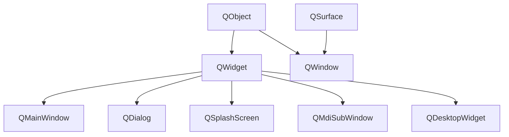
```mermaid
graph TD
QObject --> QWidget
QObject --> QWindow
QSurface --> QWindow
QWidget --> QMainWindow
QWidget --> QDialog
QWidget --> QSplashScreen
QWidget --> QMdiSubWindow
QWidget --> QDesktopWidget
```

#### 5.3.1 窗体特性设置

窗体的显示特性可以由setAttribute设置，窗体的运行特性由setWindowFlags设置，窗体状态由setWindowState控制，它们也分别关联了一个枚举类型。

##### 5.3.1.1 setAttribute

这个函数隶属于QWidget类，其函数原型为：

```c++
void QWidget::setAttribute(Qt::WidgetAttribute attribute, bool on = true);
```

如果 on 为真，则设置此小部件的属性，否则清除属性。

此函数关联的枚举类型是Qt::WidgetAttribute，此枚举类型用于指定各种小部件属性。属性使用 QWidget::setAttribute() 设置和清除，使用 QWidget::testAttribute() 进行查询，尽管有些具有下面提到的特殊便利功能，定义如下所示。

```c++
enum Qt::WidgetAttribute {  
    Qt::WA_AcceptDrops,//允许将来自拖放操作的数据拖放到小部件上
    Qt::WA_AlwaysShowToolTips,//为非活动窗口启用工具提示
    Qt::WA_ContentsPropagated,//此枚举值过时,它不再有任何效果
    Qt::WA_CustomWhatsThis,//在“这是什么？”中表示小部件想要继续正常运行
    Qt::WA_DeleteOnClose,//当小部件接受关闭事件时，使 Qt 删除此小部件 √
    Qt::WA_Disabled,//表示小部件已禁用，即它不接收任何鼠标或键盘事件
    Qt::WA_DontShowOnScreen,//表示小部件已隐藏或不是可视桌面的一部分
    Qt::WA_ForceDisabled,//表示小部件已显式禁用，即即使其所有祖先都设置为启用状态，它仍将保持禁用状态
    Qt::WA_ForceUpdatesDisabled,//表示小部件显式禁用更新；即使它的所有祖先设置更新启用，它也保持禁用
    Qt::WA_GroupLeader,//这个属性已被弃用
    Qt::WA_Hover,//当鼠标进入或离开小部件时，强制 Qt 生成绘制事件。此功能通常在实现自定义样式时使用
    Qt::WA_InputMethodEnabled,//启用亚洲语言的输入法。创建自定义文本编辑小部件时必须设置
    Qt::WA_KeyboardFocusChange,//当用户使用（tab,backyap,shortcut）更改焦点时，在顶层窗口上设置
    Qt::WA_KeyCompression,//如果设置则启用键事件压缩，如果未设置则禁用它。默认情况下，按键压缩是关闭的，因此小部件每次按键都会收到一个按键事件（或更多，因为自动重复通常是打开的）
    Qt::WA_LayoutOnEntireRect,//表示widget希望QLayout对整个QWidget::rect()进行操作，而不仅仅是QWidget::contentsRect()
    Qt::WA_LayoutUsesWidgetRect,//使用 QLayout 布局此小部件时，忽略样式中的布局项 rect
    Qt::WA_MacNoClickThrough,//当单击具有此属性集的小部件并且其窗口处于非活动状态时，单击将使窗口处于活动状态但小部件不会看到
    Qt::WA_MacOpaqueSizeGrip,//表示原生 Carbon 大小的夹点应该是不透明的而不是透明的（默认）
    Qt::WA_MacShowFocusRect,//表示这个小部件应该有一个 QFocusFrame 围绕它。一些小部件绘制自己的焦点晕圈，而不管此属性如何
    Qt::WA_MacNormalSize,//指示小部件应具有 macOS 中小部件的正常大小
    Qt::WA_MacSmallSize,//指示小部件应具有 macOS 中小部件的小尺寸
    Qt::WA_MacMiniSize,//指示小部件应具有 macOS 中小部件的迷你尺寸
    Qt::WA_MacVariableSize,//指示小部件可以在小部件的替代尺寸之间进行选择以避免剪裁
    Qt::WA_MacBrushedMetal,//指示小部件应以窗口系统支持的拉丝金属样式绘制
    Qt::WA_Mapped,//表示小部件已映射到屏幕上。这是由 Qt 内核设置/清除的
    Qt::WA_MouseNoMask,//使小部件接收整个小部件的鼠标事件，而不管当前设置的掩码如何
    Qt::WA_MouseTracking,//表示小部件启用了鼠标跟踪
    Qt::WA_Moved,//指示小部件具有明确的位置
    Qt::WA_MSWindowsUseDirect3D,//此值已过时且无效
    Qt::WA_NoBackground,//此值已过时且无效
    Qt::WA_NoChildEventsForParent,//指示小部件不希望将 ChildAdded 或 ChildRemoved 事件发送到其父级
    Qt::WA_NoChildEventsFromChildren,//指示小部件不想接收从其子级发送的 ChildAdded 或 ChildRemoved 事件
    Qt::WA_NoMouseReplay,//用于弹出小部件。指示在弹出窗口小部件关闭时不应重播最近的鼠标按下事件
    Qt::WA_NoMousePropagation,//禁止将鼠标事件传播到小部件的父级。该属性默认禁用
    Qt::WA_TransparentForMouseEvents,//启用后，此属性会禁用将鼠标事件传递给小部件及其子级
    Qt::WA_NoSystemBackground,//表示widget没有背景，即widget收到paint事件时，背景不会自动重绘
    Qt::WA_OpaquePaintEvent,//指示小部件在接收到绘制事件时绘制其所有像素
    Qt::WA_OutsideWSRange,//表示小部件超出了窗口系统坐标系的有效范围
    Qt::WA_PaintOnScreen,//表示小部件想要直接在屏幕上绘制
    Qt::WA_PaintUnclipped,//使在此小部件上操作的所有画家都未剪辑。此小部件或它前面的其他小部件的子级不会剪切画家可以在其上绘制的区域
    Qt::WA_PendingMoveEvent,//表示移动事件处于待处理状态，例如，当隐藏的小部件被移动时
    Qt::WA_PendingResizeEvent,//表示调整大小事件未决，例如，当隐藏小部件调整大小时
    Qt::WA_QuitOnClose,//当具有属性集的最后一个小部件接受 closeEvent() 时，使 Qt 退出应用程序
    Qt::WA_Resized,//指示小部件具有明确的大小
    Qt::WA_RightToLeft,//表示小部件的布局方向是从右到左
    Qt::WA_SetCursor,//表示小部件有自己的光标
    Qt::WA_SetFont,//表示小部件有自己的字体
    Qt::WA_SetPalette,//表示小部件有自己的调色板
    Qt::WA_SetStyle,//表示小部件有自己的样式
    Qt::WA_ShowModal,//该属性已被弃用
    Qt::WA_StaticContents,//表示小部件内容是西北对齐且静态的
    Qt::WA_StyleSheet,//指示小部件使用样式表设置样式
    Qt::WA_TabletTracking,//表示小部件已启用平板电脑跟踪
    Qt::WA_TranslucentBackground,//指示小部件应具有半透明背景
    Qt::WA_UnderMouse,//表示小部件在鼠标光标下
    Qt::WA_UpdatesDisabled,//表示更新被阻止，包括系统后台
    Qt::WA_WindowModified,//表示窗口被标记为已修改
    Qt::WA_WindowPropagation,//使顶层窗口从其父窗口继承字体、调色板和语言环境
    Qt::WA_MacAlwaysShowToolWindow,//在 macOS 上，即使应用程序未处于活动状态，也显示工具窗口
    Qt::WA_SetLocale,//指示应在小部件中考虑区域设置
    Qt::WA_StyledBackground,//指示应使用样式背景绘制小部件
    Qt::WA_ShowWithoutActivating,//显示小部件而不使其处于活动状态
    Qt::WA_NativeWindow,//表示为小部件创建了本机窗口。除非设置了 Qt::WA_DontCreateNativeAncestors ，否则启用此标志还将强制小部件的祖先使用本机窗口
    Qt::WA_DontCreateNativeAncestors,//表示即使小部件本身是原生的，小部件的祖先也会保持非原生
    Qt::WA_X11NetWmWindowTypeDesktop,//win11特性
    Qt::WA_X11NetWmWindowTypeDock,//
    Qt::WA_X11NetWmWindowTypeToolBar,//
    Qt::WA_X11NetWmWindowTypeMenu,//
    Qt::WA_X11NetWmWindowTypeUtility,//
    Qt::WA_X11NetWmWindowTypeSplash,//
    Qt::WA_X11NetWmWindowTypeDialog,//
    Qt::WA_X11NetWmWindowTypeDropDownMenu,//
    Qt::WA_X11NetWmWindowTypePopupMenu,//
    Qt::WA_X11NetWmWindowTypeToolTip,//
    Qt::WA_X11NetWmWindowTypeNotification,//
    Qt::WA_X11NetWmWindowTypeCombo,//
    Qt::WA_X11NetWmWindowTypeDND,//
    Qt::WA_MacFrameworkScaled,//使用 Carbon 时在 Mac 上启用分辨率独立感知模式
    Qt::WA_AcceptTouchEvents,//允许将触摸事件（参见 QTouchEvent）发送到小部件
    Qt::WA_TouchPadAcceptSingleTouchEvents,//允许将触摸板单点触摸事件发送到小部件
    Qt::WA_X11DoNotAcceptFocus,//要求窗口管理器不要将焦点放在这个顶级窗口上
    Qt::WA_AlwaysStackOnTop//此值强制 QOpenGLWidget 和 QQuickWidget 最后绘制，在其他小部件之上
};
```

testAttribute() 函数原型如下，如果在此小部件上设置了属性属性，则返回 true；否则返回 false。

```c++
bool QWidget::testAttribute(Qt::WidgetAttribute attribute) const;
```

##### 5.3.1.2 setWindowFlag

窗口标志是一个类型（例如 Qt::Dialog）和零个或多个窗口系统提示（例如 Qt::FramelessWindowHint）的组合。如果小部件具有 Qt::Widget 或 Qt::SubWindow 类型并成为一个窗口（Qt::Window、Qt::Dialog 等），则它被放置在桌面上的位置 (0, 0)。如果窗口小部件是一个窗口并且变成一个 Qt::Widget 或 Qt::SubWindow，它被放置在相对于它的父窗口小部件的位置 (0, 0)。注意：此函数在更改窗口的标志时调用 setParent()，导致窗口小部件被隐藏。您必须调用 show() 使小部件再次可见。

函数原型如下。

```c++
void QWidget::setWindowFlag(Qt::WindowType flag, bool on = true);
```

与之关联的枚举类型和标记如下。

```c++
enum Qt::WindowType
flags Qt::WindowFlags = {
    Qt::Widget,//这是 QWidget 的默认类型。这种类型的小部件如果有父小部件则为子小部件，如果它们没有父小部件则为独立窗口。另见 Qt::Window 和 Qt::SubWindow
    Qt::Window,//表示该小部件是一个窗口，通常带有一个窗口系统框架和一个标题栏，而不管该小部件是否有父级。请注意，如果小部件没有父级，则无法取消设置此标志
    Qt::Dialog,//指示该小部件是一个应装饰为对话框的窗口（即，通常在标题栏中没有最大化或最小化按钮）。这是 QDialog 的默认类型
    Qt::Sheet,//表示窗口是 macOS 上的工作表。由于使用工作表意味着窗口模式，因此推荐的方法是使用 QWidget::setWindowModality() 或 QDialog::open()
    Qt::Drawer,//表示小部件是 macOS 上的抽屉
    Qt::Popup,//表示该小部件是一个弹出式顶级窗口，即它是模态的，但具有适合弹出式菜单的窗口系统框架
    Qt::Tool,//表示小部件是一个工具窗口。工具窗口通常是一个小窗口，具有比通常小的标题栏和装饰，通常用于工具按钮的集合
    Qt::ToolTip,//指示小部件是工具提示。这在内部用于实现工具提示
    Qt::SplashScreen,//指示窗口是闪屏。这是 QSplashScreen 的默认类型
    Qt::Desktop,//表示此小部件是桌面。这是 QDesktopWidget 的类型
    Qt::SubWindow,//指示此小部件是子窗口，例如 QMdiSubWindow 小部件
    Qt::ForeignWindow,//指示此窗口对象是一个句柄，表示由另一个进程或手动使用本机代码创建的本机平台窗口
    Qt::CoverWindow,//表示该窗口代表一个覆盖窗口，在某些平台上最小化应用程序时显示

    // 还有许多标志可用于自定义顶级窗口的外观,这些对其他窗口没有影响
    Qt::MSWindowsFixedSizeDialogHint,//在 Windows 上为窗口提供一个细对话框边框。这种风格传统上用于固定大小的对话框
    Qt::MSWindowsOwnDC,//在 Windows 上为窗口提供自己的显示上下文
    Qt::BypassWindowManagerHint,//此标志可用于向平台插件指示应禁用“所有”窗口管理器协议。根据应用程序运行的操作系统和窗口管理器运行的情况，该标志的行为会有所不同。该标志可用于获取未设置配置的本机窗口
    Qt::X11BypassWindowManagerHint,//完全绕过窗口管理器。这会导致一个完全不受管理的无边框窗口（即，除非您手动调用 QWidget::activateWindow()，否则没有键盘输入）
    Qt::FramelessWindowHint,//生成无边框窗口。用户不能通过窗口系统移动或调整无边框窗口的大小。在 X11 上，标志的结果取决于窗口管理器及其理解 Motif 和/或 NETWM 提示的能力。大多数现有的现代窗口管理器都可以处理这个问题
    Qt::NoDropShadowWindowHint//禁用支持平台上的窗口投影
}
```

##### 5.3.1.3 setWindowState

函数原型如下。

```c++
void QWidget::setWindowState(Qt::WindowStates windowState);
```

将窗口状态设置为 windowState。窗口状态是 Qt::WindowState 的 OR&#39;ed 组合：Qt::WindowMinimized、Qt::WindowMaximized、Qt::WindowFullScreen 和 Qt::WindowActive。
如果窗口不可见（即 isVisible() 返回 false），则窗口状态将在调用 show() 时生效。对于可见窗口，变化是立竿见影的。例如，要在全屏模式和普通模式之间切换，请使用以下代码：

```c++
w->setWindowState(w->windowState() ^ Qt::WindowFullScreen);
```

为了恢复和激活最小化窗口（同时保留其最大化和/或全屏状态），请使用以下命令：

```c++
w-&gt;setWindowState((w-&gt;windowState() &amp; ~Qt::WindowMinimized) | Qt::WindowActive);
```

调用此函数将隐藏小部件。您必须调用 show() 使小部件再次可见。
注意：在某些窗口系统上，Qt::WindowActive 不是立即的，在某些情况下可能会被忽略。
当窗口状态改变时，小部件会收到一个 QEvent::WindowStateChange 类型的 changeEvent()。

关联的枚举类型如下，WindowStates 类型是 QFlags&lt;WindowState&gt; 的 typedef。它存储 WindowState 值的 OR 组合。

```c++
enum Qt::WindowState
flags Qt::WindowStates = {
    Qt::WindowNoState,//窗口没有设置状态（正常状态）
    Qt::WindowMinimized,//窗口最小化（即图标化）
    Qt::WindowMaximized,//窗口最大化，周围有一个框架
    Qt::WindowFullScreen,//窗口填满整个屏幕，周围没有任何框架
    Qt::WindowActive,//该窗口是活动窗口，即它具有键盘焦点
}
```

##### 5.1.4 setWindowModality

设置窗口的模态，只对窗口类型有用。此属性保存模态小部件阻止哪些窗口此属性仅对窗口有意义。模态小部件可防止其他窗口中的小部件获得输入。此属性的值控制在小部件可见时阻止哪些窗口。在窗口可见时更改此属性无效；您必须先隐藏小部件，然后再显示。默认情况下，该属性是 Qt::NonModal。

函数原型如下。

```c++
void setWindowModality(Qt::WindowModality windowModality);
```

关联的枚举类型，此枚举指定模式窗口的行为。模态窗口是阻止输入到其他窗口的窗口。请注意，模式窗口的子窗口不会被阻止。

```c++
enum Qt::WindowModality {
    Qt::NonModal,//该窗口不是模态的，不会阻止对其他窗口的输入
    Qt::WindowModal,//该窗口对单个窗口层次结构是模态的，并阻止对其父窗口、所有祖父窗口及其父窗口和祖父窗口的所有兄弟窗口的输入
    Qt::ApplicationModal//该窗口对应用程序是模态的，并阻止对所有窗口的输入
}
```

##### 5.1.5 setWindowOpacity

用于设置窗口的透明度，函数原型如下。

```c++
void setWindowOpacity(qreal level);
```

此属性保存窗口的不透明度级别。不透明度的有效范围是从 1.0（完全不透明）到 0.0（完全透明）。
默认情况下，此属性的值为 1.0。此功能在支持 Composite 扩展的嵌入式 Linux、macOS、Windows 和 X11 平台上可用。

注意：在 X11 上，您需要运行复合管理器，并且您正在使用的窗口管理器需要支持 X11 特定的 _NET_WM_WINDOW_OPACITY 原子。

警告：将此属性从不透明更改为透明可能会发出一个绘制事件，该事件需要在窗口正确显示之前进行处理。这主要影响 QPixmap::grabWindow() 的使用。另请注意，半透明窗口的更新和调整大小明显慢于不透明窗口。

#### 5.3.2 多窗口设计

多窗口和多对话框的设计是类似的，只是继承自QWidget和QMainWindow而不是QDialog，例子可见[12-TestMultiWindow](12-TestMultiWindow)。

这里只介绍多窗口设计用到的一个组件类型QTabWidget。

##### 5.3.2.1 QTabWidget

选项卡小部件提供了一个选项卡栏（参见 QTabBar）和一个"页面区域"，用于显示与每个选项卡相关的页面。

默认情况下，标签栏显示在页面区域上方，但可以使用不同的配置（请参阅 TabPosition）。
调用 addTab() 或 insertTab() 将页面小部件放入选项卡小部件中，选项卡的位置由 tabPosition 定义，它们的形状由 tabShape 定义。当用户选择页面时，会发出信号 currentChanged()。当前页面索引可用作 currentIndex()，当前页面小部件与 currentWidget()。可以使用 widget() 检索具有给定索引的页面小部件的指针，并且可以使用 indexOf() 找到小部件的索引位置。使用 setCurrentWidget() 或 setCurrentIndex() 显示特定页面。
可以使用 setTabText() 或 setTabIcon() 更改选项卡的文本和图标。可以使用 removeTab() 删除选项卡及其关联的页面。每个选项卡都在任何给定时间启用或禁用（请参阅 setTabEnabled()）。如果启用了选项卡，则会正常绘制选项卡文本，并且用户可以选择该选项卡。如果它被禁用，选项卡将以不同的方式绘制，用户无法选择该选项卡。请注意，即使某个选项卡被禁用，该页面仍然可见，例如，如果所有选项卡碰巧都被禁用。
选项卡小部件是拆分复杂对话框的好方法。另一种方法是使用 QStackedWidget，您可以为它提供一些在页面之间导航的方法，例如 QToolBar 或 QListWidget。
QTabWidget 中的大部分功能由 QTabBar（在顶部，提供选项卡）和 QStackedWidget（大部分区域，组织各个页面）提供。

涉及的枚举类型如下。

这个枚举类型定义了 QTabWidget 在哪里绘制标签行。

```c++
enum QTabWidget::TabPosition {
    QTabWidget::North,//选项卡绘制在页面上方
    QTabWidget::South,//选项卡绘制在页面下方
    QTabWidget::West,//选项卡绘制在页面的左侧
    QTabWidget::East//选项卡绘制在页面的右侧
}
```

此枚举类型定义选项卡的形状。

```c++
enum QTabWidget::TabShape {  
    QTabWidget::Rounded,//选项卡以圆形外观绘制。这是默认形状
    QTabWidget::Triangular//选项卡以三角形外观绘制
}
```

主要的公共成员函数如下。

```c++
int addTab(QWidget *page, const QString &label);
int addTab(QWidget *page, const QIcon &icon, const QString &label);
void clear();
QWidget *cornerWidget(Qt::Corner corner = Qt::TopRightCorner) const;
int count() const;
int currentIndex() const;
QWidget *currentWidget() const;
bool documentMode() const; // 设置为文档模式
Qt::TextElideMode elideMode() const;
QSize iconSize() const;
int indexOf(QWidget *w) const;
int insertTab(int index, QWidget *page, const QString &label);
int insertTab(int index, QWidget *page, const QIcon &icon, const QString &label);
bool isMovable() const;
bool isTabEnabled(int index) const;
void removeTab(int index);
void setCornerWidget(QWidget *widget, Qt::Corner corner = Qt::TopRightCorner);
void setDocumentMode(bool set);
void setElideMode(Qt::TextElideMode);
void setIconSize(const QSize &size);
void setMovable(bool movable);
void setTabBarAutoHide(bool enabled);
void setTabEnabled(int index, bool enable);
void setTabIcon(int index, const QIcon &icon);
void setTabPosition(TabPosition);
void setTabShape(TabShape s);
void setTabText(int index, const QString &label);
void setTabToolTip(int index, const QString &tip);
void setTabWhatsThis(int index, const QString &text);
void setTabsClosable(bool closeable);// 设置单页可关闭
void setUsesScrollButtons(bool useButtons);
QTabBar *tabBar() const;
bool tabBarAutoHide() const;
QIcon tabIcon(int index) const;
TabPosition tabPosition() const;
TabShape tabShape() const;
QString tabText(int index) const;
QString tabToolTip(int index) const;
QString tabWhatsThis(int index) const;
bool tabsClosable() const;
bool usesScrollButtons() const;
QWidget *widget(int index) const;
```

公共槽函数。

```c++
void setCurrentIndex(int index);
void setCurrentWidget(QWidget *widget);
```

公共信号函数。

```c++
void currentChanged(int index);
void tabBarClicked(int index);
void tabBarDoubleClicked(int index);
void tabClos​​eRequested(int index);
```

涉及的事件函数如下。

```c++
virtual void changeEvent(QEvent *ev);
virtual bool event(QEvent *ev);
virtual void keyPressEvent(QKeyEvent *e);
virtual void paintEvent(QPaintEvent *event);
virtual void resizeEvent(QResizeEvent *e);
virtual void showEvent(QShowEvent *);
```

### 5.4 MDI多文档

多文档界面在多窗口设计中利用了tabWidget，就可以实现窗口嵌入式的效果，每个窗口都是一页，而且窗口只有一个QPlainText和一些工具栏。

MDI的区别在于不需要在子窗口定义工具栏，主窗口定义工具栏即可，然后可以对子窗口进行操作（内部应当是自动绑定了信号与槽的机制，所以主窗口可以和子窗口交互）。另外设计MDI要求在主窗口放置一个QMdiArea作为子窗体的容器，也就是代替了tabWidget的效果，只是提供了更加完备的效果，更改MDI的显示模式就可以得到类似的多页组件管理的MDI界面效果。

例子实例可见。

涉及的QMdiArea组件类型和QMdiSubWindow数据类型如下所示。

#### 5.4.1 QMdiArea

QMdiArea 小部件提供了一个显示 MDI 窗口的区域。
QMdiArea 的功能本质上类似于 MDI 窗口的窗口管理器。例如，它绘制自己管理的窗口，并以层叠或平铺的方式排列它们。 QMdiArea 通常用作 QMainWindow 中的中心小部件来创建 MDI 应用程序，但也可以放置在任何布局中。以下代码将一个区域添加到主窗口：

```c++
QMainWindow *mainWindow = new QMainWindow;
mainWindow->setCentralWidget(mdiArea);
```

与顶级窗口的窗口管理器不同，QMdiArea 支持所有窗口标志（Qt::WindowFlags），只要当前窗口小部件样式支持这些标志。如果样式不支持特定标志（例如，WindowShadeButtonHint），您仍然可以使用 showShaded() 为窗口着色。QMdiArea 中的子窗口是 QMdiSubWindow 的实例。使用 addSubWindow() 将它们添加到 MDI 区域。给这个函数传递一个设置为内部小部件的QWidget是很常见的，但也可以直接传递一个QMdiSubWindow。该类继承了QWidget，您可以使用与普通顶级相同的API编程时的窗口。子窗口在获得键盘焦点或调用 setFocus() 时变为活动状态。用户通过以通常方式移动焦点来激活窗口。当活动窗口发生变化时，MDI 区域发出 subWindowActivated() 信号，activeSubWindow() 函数返回活动子窗口。函数 subWindowList() 返回所有子窗口的列表。例如，此信息可用于包含窗口列表的弹出菜单中。子窗口按当前 WindowOrder 排序。这用于 subWindowList() 以及 activateNextSubWindow() 和 activatePreviousSubWindow()。此外，它在使用 cascadeSubWindows() 和 tileSubWindows() 层叠或平铺窗口时使用。

QMdiArea 为子窗口提供了两种内置的布局策略：cascadeSubWindows() 和 tileSubWindows()。两者都是插槽，很容易连接到菜单条目。

需要了解的枚举类型如下。

此枚举描述了自定义 QMdiArea 行为的选项。

```c++
enum QMdiArea::AreaOption{
    QMdiArea::DontMaximizeSubWindowOnActivation//当活动子窗口最大化时，默认行为是最大化下一个激活的子窗口。如果您不希望出现这种行为，请设置此选项
}
```

这个枚举描述了区域的视图模式；即如何显示子窗口。

```c++
enum QMdiArea::ViewMode{
    QMdiArea::SubWindowView,//显示带有窗口框架的子窗口（默认）
    QMdiArea::TabbedView//在标签栏中显示带有标签的子窗口
}
```

指定用于对 subWindowList() 返回的子窗口列表进行排序的条件。函数 cascadeSubWindows() 和 tileSubWindows() 在排列窗口时遵循此顺序。

```c++
enum QMdiArea::WindowOrder {
    QMdiArea::CreationOrder,//窗口按其创建顺序返回
    QMdiArea::StackingOrder,//窗口按照它们的堆叠顺序返回，最顶部的窗口在列表中的最后一个
    QMdiArea::ActivationHistoryOrder//窗口按照它们被激活的顺序返回
}
```

常见的成员函数如下。

```c++
WindowOrder activationOrder() const;
QMdiSubWindow *activeSubWindow() const;
QMdiSubWindow *addSubWindow(QWidget *widget, Qt::WindowFlags windowFlags = Qt::WindowFlags());
QBrush background() const;
QMdiSubWindow *currentSubWindow() const;
bool documentMode() const;
void removeSubWindow(QWidget *widget);
void setActivationOrder(WindowOrder order);
void setBackground(const QBrush &background);
void setDocumentMode(bool enabled);
void setOption(AreaOption option, bool on = true);
void setTabPosition(QTabWidget::TabPosition position);
void setTabShape(QTabWidget::TabShape shape);
void setTabsClosable(bool closable);
void setTabsMovable(bool movable);
void setViewMode(ViewMode mode);
QList<QMdiSubWindow *> subWindowList(WindowOrder order = CreationOrder) const;
QTabWidget::TabPosition tabPosition() const;
QTabWidget::TabShape tabShape() const;
bool tabsClosable() const;
bool tabsMovable() const;
bool testOption(AreaOption option) const;
ViewMode viewMode() const;
```

公共信号和槽函数如下。

```c++
// 槽函数
void activateNextSubWindow();
void activatePreviousSubWindow();
void cascadeSubWindows();
void closeActiveSubWindow();
void closeAllSubWindows();
void setActiveSubWindow(QMdiSubWindow *window);
void tileSubWindows();
// 信号
void subWindowActivated(QMdiSubWindow *window);
```

#### 5.4.2 QMdiSubWindow

QMdiSubWindow 类为 QMdiArea 提供了一个子窗口类。
QMdiSubWindow 表示 QMdiArea 中的顶级窗口，由带有窗口装饰的标题栏、内部小部件和（取决于当前样式）窗口框架和大小夹点组成。 QMdiSubWindow 有自己的布局，它由标题栏和内部小部件的中心区域组成。

构造 QMdiSubWindow 的最常见方法是调用 QMdiArea::addSubWindow() 并使用内部小部件作为参数。您也可以自己创建一个子窗口，并通过调用 setWidget() 设置一个内部小部件。在子窗口编程时，您使用与常规顶级窗口相同的 API（例如，您可以调用诸如 show()、hide()、showMaximized() 和 setWindowTitle() 等函数）。

QMdiSubWindow 还支持特定于 MDI 区域中子窗口的行为。
默认情况下，每个 QMdiSubWindow 在移动时在 MDI 区域视口内可见，但也可以指定透明窗口移动和调整大小行为，在这些操作期间仅更新子窗口的轮廓。 setOption() 函数用于启用此行为。
isShaded() 函数检测子窗口当前是否被着色（即，窗口被折叠以便只有标题栏可见）。要进入着色模式，请调用 showShaded()。只要窗口状态发生变化（例如，当窗口最小化或恢复时），QMdiSubWindow 就会发出 windowStateChanged() 信号。它还在激活之前发出 aboutToActivate()。
在键盘交互模式下，窗口通过键盘移动和调整大小。您可以通过窗口的系统菜单进入该模式。 keyboardSingleStep 和keyboardPageStep 属性控制小部件为每个按键事件移动或调整大小的距离。当按下 shift 时，使用 page step；否则使用单步。
您还可以使用键盘更改活动窗口。通过同时按下 control 和 tab 键，下一个（使用当前的 WindowOrder）子窗口将被激活。通过按 control、shift 和 tab，您将激活上一个窗口。这相当于调用 activateNextSubWindow() 和 activatePreviousSubWindow()。请注意，这些快捷方式会覆盖全局快捷方式，但不会覆盖 QMdiAreas 快捷方式。

需要知道的枚举类型。

```c++
enum QMdiSubWindow::SubWindowOption{
    QMdiSubWindow::RubberBandResize,//如果启用此选项，则使用橡皮筋控件来表示子窗口的轮廓，并且用户调整其大小而不是子窗口本身。结果，子窗口保持其原始位置和大小，直到调整大小操作完成，此时它将接收单个 QResizeEvent。默认情况下，此选项被禁用。
	QMdiSubWindow::RubberBandMove//如果启用此选项，则使用橡皮筋控件表示子窗口的轮廓，并且用户移动它而不是子窗口本身。结果，子窗口保持在其原始位置，直到移动操作完成，此时 QMoveEvent 被发送到窗口。默认情况下，此选项被禁用。
}
```

主要的成员函数类型。

```c++
bool isShaded() const;
int keyboardPageStep() const;
int keyboardSingleStep() const;
QMdiArea *mdiArea() const;
void setKeyboardPageStep(int step);
void setKeyboardSingleStep(int step);
void setOption(SubWindowOption option, bool on = true);
void setSystemMenu(QMenu *systemMenu);
void setWidget(QWidget *widget);
QMenu *systemMenu() const;
bool testOption(SubWindowOption option) const;
QWidget *widget() const;
```

公共槽函数。

```c++
void showShaded();//调用此函数使子窗口进入阴影模式。当子窗口带有阴影时，只有标题栏可见。
void showSystemMenu();//在标题栏中的系统菜单图标下方显示系统菜单
```

公共信号。

```c++
void aboutToActivate(); // 窗口处于激活
void windowStateChanged(Qt::WindowStates oldState, Qt::WindowStates newState);//窗口状态改变
```

### 5.5 Splash与登录窗口

如果需要设置SPlash类型，借助枚举值Qt::SplashScreen和setWindowFlags函数即可设置。

```c++
this->setWindowFlags(Qt::SplashScreen); 
```

SPlash没有窗口不能像普通窗口那样拖动标题栏实现拖动，所以必须定义自己的鼠标拖动事件。

```c++
void mousePressEvent(QMouseEvent *event);
void mouseMoveEvent(QMouseEvent *event);
void mouseReleaseEvent(QMouseEvent *event);
```

使用的时候，在主程序中使用。详情可见[14-TestQSplash](14-TestQSplash)。

```c++
#include "TestQSplash.h"
#include "LoginDialog.h"
#include <QApplication>

int main(int argc, char *argv[])
{
    QApplication a(argc, argv);
    LoginDialog * login = new LoginDialog;
    if (login->exec() == QDialog::Accepted) // 模态方式运行对话框,如果返回了Accepted说明用户名和密码均正确
    {
        TestQSplash w;
        w.show();
        return a.exec();
    }
    else return 0;
}
```

其它涉及到的数据类型和组件类型下方说明。

#### QSettings

QSettings 类提供与平台无关的持久应用程序设置。
用户通常希望应用程序在会话中记住其设置（窗口大小和位置、选项等）。此信息通常存储在 Windows 的系统注册表中，以及 macOS 和 iOS 的属性列表文件中。在 Unix 系统上，在没有标准的情况下，许多应用程序（包括 KDE 应用程序）使用 INI 文本文件。
QSettings 是围绕这些技术的抽象，使您能够以可移植的方式保存和恢复应用程序设置。它还支持自定义存储格式。QSettings 的 API 基于 QVariant，允许您以最少的工作量保存大多数基于值的类型，例如 QString、QRect 和 QImage。如果您只需要一个基于内存的非持久结构，请考虑改用 QMap&lt;QString, QVariant&gt;。

创建 QSettings 对象时，您必须传递公司或组织的名称以及应用程序的名称。例如，如果您的产品名为 Star Runner，而您的公司名为 MySoft，您将按如下方式构造 QSettings 对象：

```c++
QSettings settings("MySoft", "Star Runner");
```

QSettings 对象可以在堆栈或堆上创建（即使用 new）。构造和销毁 QSettings 对象非常快。
如果您在应用程序的许多地方使用 QSettings，您可能希望使用 QCoreApplication::setOrganizationName() 和 QCoreApplication::setApplicationName() 指定组织名称和应用程序名称，然后使用默认的 QSettings 构造函数：

```c++
QCoreApplication::setOrganizationName("MySoft");
QCoreApplication::setOrganizationDomain("mysoft.com");
QCoreApplication::setApplicationName("Star Runner");
...
QSettings settings;
```

（这里，我们还指定了组织的 Internet 域。设置 Internet 域时，在 macOS 和 iOS 上使用它而不是组织名称，因为 macOS 和 iOS 应用程序通常使用 Internet 域来标识自己。如果没有设置域，一个假域是从组织名称派生的。有关详细信息，请参阅下面的平台特定说明。） QSettings 存储设置。每个设置都由一个指定设置名称（键）的 QString 和一个存储与键关联的数据的 QVariant 组成。要编写设置，请使用 setValue()。例如：

```c++
settings.setValue("editor/wrapMargin", 68);
```

如果已经存在具有相同键的设置，则现有值将被新值覆盖。为了提高效率，更改可能不会立即保存到永久存储中。 （您可以随时调用 sync() 来提交您的更改。）您可以使用 value() 取回设置的值：

```c++
int margin = settings.value(&quot;editor/wrapMargin&quot;).toInt();
```

如果没有指定名称的设置，QSettings 返回一个空的 QVariant（可以转换为整数 0）。您可以通过将第二个参数传递给 value() 来指定另一个默认值：

```c++
int margin = settings.value("editor/wrapMargin", 80).toInt();
```

要测试给定键是否存在，请调用 contains()。要删除与键关联的设置，请调用 remove()。要获取所有键的列表，请调用 allKeys()。要删除所有键，请调用 clear()。

因为 QVariant 是 Qt Core 模块的一部分，所以它不能提供对 QColor、QImage 和 QPixmap 等数据类型的转换功能，这些数据类型是 Qt GUI 的一部分。换句话说，QVariant 中没有 toColor()、toImage() 或 toPixmap() 函数。
相反，您可以使用 QVariant::value() 或 qVariantValue() 模板函数。例如：

```c++
QSettings settings("MySoft", "Star Runner");
QColor color = settings.value("DataPump/bgcolor").value<QColor>();
```

对于 QVariant 支持的所有数据类型，包括 GUI 相关的类型，反向转换（例如从 QColor 到 QVariant是自动的：

```c++
QSettings settings("MySoft", "Star Runner");
QColor color = palette().background().color();
settings.setValue("DataPump/bgcolor", color);
```

使用 qRegisterMetaType() 和 qRegisterMetaTypeStreamOperators() 注册的自定义类型可使用QSettings 存储。

设置键可以包含任何 Unicode 字符。 Windows 注册表和 INI 文件使用不区分大小写的键，而 macOS 和 iOS 上的 CFPreferences API 使用区分大小写的键。为避免可移植性问题，请遵循以下简单规则： 始终使用相同的大小写引用相同的密钥。例如，如果您在代码中的某个地方将某个键称为“文本字体”，则不要在其他地方将其称为“文本字体”。除了大小写外，避免使用相同的键名。例如，如果您有一个名为“MainWindow”的键，请不要尝试将另一个键保存为“mainwindow”。不要在节或键名中使用斜杠（&#39;/&#39; 和 &#39;\&#39;）；反斜杠字符用于分隔子键（见下文）。在 Windows 上，&#39;\&#39; 由 QSettings 转换为 &#39;/&#39;，这使得它们相同。
您可以使用“/”字符作为分隔符来形成分层键，类似于 Unix 文件路径。例如：

```c++
settings.setValue("mainwindow/size", win->size());
settings.setValue("mainwindow/fullScreen", win->isFullScreen());
settings.setValue("outputpanel/visible", panel->isVisible());
```

如果要保存或恢复许多具有相同前缀的设置，可以使用 beginGroup() 指定前缀并在末尾调用 endGroup()。这里还是同样的例子，但这次使用了组机制：

```c++
settings.beginGroup("mainwindow");
settings.setValue("size", win->size());
settings.setValue("fullScreen", win->isFullScreen());
settings.endGroup();

settings.beginGroup("outputpanel");
settings.setValue("visible", panel->isVisible());
settings.endGroup();
```

如果使用 beginGroup() 设置组，则大多数函数的行为都会随之改变。组可以递归设置。
除了组，QSettings 还支持“数组”概念。有关详细信息，请参阅 beginReadArray() 和 beginWriteArray()。

其他更多描述信息参见Qt文档。

##### 枚举类型

此枚举类型指定 QSettings 使用的存储格式。

```c++
enum QSettings::Format {   
    QSettings::NativeFormat,
    QSettings::Registry32Format,
    QSettings::Registry64Format,
    QSettings::IniFormat,
    QSettings::InvalidFormat
}
```

此枚举指定设置是特定于用户还是由同一系统的所有用户共享。

```c++
enum QSettings::Scope { 
    QSettings::UserScope,
    QSettings::SystemScope
}
```

以下状态值是可能的：

```c++
enum QSettings::Status  {
    QSettings::NoError,
    QSettings::AccessError,
    QSettings::FormatError
}
```

##### 成员函数

```c++
QStringList allKeys() const;
QString applicationName() const;
void beginGroup(const QString &prefix);
int beginReadArray(const QString &prefix);
void beginWriteArray(const QString &prefix, int size = -1);
QStringList childGroups() const;
QStringList childKeys() const;
void clear();
bool contains(const QString &key) const;
void endArray();
void endGroup();
bool fallbacksEnabled() const;
QString fileName() const;
Format format() const;
QString group() const;
QTextCodec *iniCodec() const;
bool isWritable() const;
QString organizationName() const;
void remove(const QString &key);
Scope scope() const;
void setArrayIndex(int i);
void setFallbacksEnabled(bool b);
void setIniCodec(QTextCodec *codec);
void setIniCodec(const char *codecName);
void setValue(const QString &key, const QVariant &value);
Status status() const;
void sync();
QVariant value(const QString &key, const QVariant &defaultValue = QVariant()) const;

static Format defaultFormat();
static Format registerFormat(const QString &extension, ReadFunc readFunc, WriteFunc writeFunc, Qt::CaseSensitivity caseSensitivity = Qt::CaseSensitive);
static void setDefaultFormat(Format format);
static void setPath(Format format, Scope scope, const QString &path);
```

#### QCryptographicHash

QCryptographicHash 类提供了一种生成加密哈希的方法。
QCryptographicHash 可用于生成二进制或文本数据的加密哈希。
请参阅 QCryptographicHash::Algorithm 枚举的文档以获取支持的算法列表。

算法枚举值定义如下。

```c++
enum QCryptographicHash::Algorithm {
    QCryptographicHash::Md4,
    QCryptographicHash::Md5,
    QCryptographicHash::Sha1,
    QCryptographicHash::Sha224,
    QCryptographicHash::Sha256,
    QCryptographicHash::Sha384,
    QCryptographicHash::Sha512,
    QCryptographicHash::Sha3_224,
    QCryptographicHash::Sha3_256,
    QCryptographicHash::Sha3_384,
    QCryptographicHash::Sha3_512,
    QCryptographicHash::Keccak_224,
    QCryptographicHash::Keccak_256,
    QCryptographicHash::Keccak_384,
    QCryptographicHash::Keccak_512,
}
```

基本的成员函数。

```c++
void addData(const char *data, int length);
void addData(const QByteArray &data);
bool addData(QIODevice *device);
void reset();
QByteArray result() const;
static QByteArray hash(const QByteArray &data, Algorithm method);
```

## 6. 文件系统和文件读写

文本文件的读取方法有2种，一种是借助QFile的QIODevice功能直接进行读取，一种是和QTextStream配合使用用流的方法进行读取。

二进制文件的读取方法是QFile+QDataStream，但是这里QFile只是提供和IO设备交互的接口，本身不能直接读取二进制文件，只能借助QDataStream来读取。按照保存的文件类型可以分为stm文件和dat文件。stm文件是Qt预定义的编码类型，不仅可以使用qint16、qreal还可以使用QBrush、QColor等，流写入这些数据时用户不知道文件的每个字节怎么存储的，但是知道写入的顺序，就可以按照顺序读取文本，缺点是其它软件例如Matlab不能读取。dat格式是标准编码文件，知道每个字节的含义，通用型格式，别的软件读取也可以使用。

### 6.1 文本文件读取

#### 6.1.1 QIODevice

QIODevice 类是 Qt 中所有 I/O 设备的基接口类。
QIODevice 为支持读写数据块的设备提供通用实现和抽象接口，例如 **QFile、QBuffer 和 QTcpSocket**。 QIODevice 是抽象的，**不能被实例化**，但是通常使用它定义的接口来提供与设备无关的 I/O 特性。例如，Qt 的 XML 类对 QIODevice 指针进行操作，允许它们与各种设备（如文件和缓冲区）一起使用。

在访问设备之前，**必须调用 open() 来设置正确的 OpenMode（例如 ReadOnly 或 ReadWrite）**。然后，您可以使用 **write() 或 putChar() 写入设备，并通过调用 read()、readLine() 或 readAll() 进行读取**。完成设备后调用 close()。
QIODevice 区分两种类型的设备：随机访问设备和顺序设备。
随机访问设备支持使用 seek() 搜索任意位置。文件中的当前位置可通过调用 pos() 获得。 **QFile 和 QBuffer 是随机访问设备的示例**。顺序设备不支持寻找任意位置。必须一次性读取数据。函数 pos() 和 size() 不适用于顺序设备。 您可以使用 isSequential() 来确定设备的类型。

**当有新数据可供读取时，QIODevice 会发出 readyRead()**；例如，如果新数据已到达网络，或者是否将其他数据附加到您正在读取的文件中。**您可以调用 bytesAvailable() 来确定当前可供读取的字节数**。在使用诸如 QTcpSocket 之类的异步设备进行编程时，通常将 bytesAvailable() 与 readyRead() 信号一起使用，其中数据片段可以到达任意时间点。**每次将数据的有效负载写入设备时，QIODevice 都会发出 bytesWritten() 信号**。使用 **bytesToWrite() 确定当前等待写入的数据量**。

QIODevice 的某些子类，例如 QTcpSocket 和 QProcess，是异步的。这意味着诸如 write() 或 read() 之类的 I/O 函数总是立即返回，而当控制返回事件循环时，可能会发生与设备本身的通信。 QIODevice 提供的功能允许您强制立即执行这些操作，同时阻塞调用线程并且不进入事件循环。**这允许在没有事件循环的情况下使用 QIODevice 子类，或者在单独的线程中使用**：

**waitForReadyRead() - 此函数暂停调用线程中的操作，直到有新数据可供读取**。
**waitForBytesWritten() - 此函数暂停调用线程中的操作，直到一个有效负载数据已写入设备**。
waitFor....() - QIODevice 的子类为特定于设备的操作**实现阻塞功能**。例如，QProcess 有一个名为 waitForStarted() 的函数，它暂停调用线程中的操作，直到进程启动。

从主 GUI 线程调用这些函数可能会导致您的用户界面冻结。例子：

```c++
QProcess gzip;
gzip.start("gzip", QStringList() << "-c");
if (!gzip.waitForStarted())
    return false;

gzip.write("uncompressed data");

QByteArray compressed;
while (gzip.waitForReadyRead())
    compressed += gzip.readAll();
```

通过继承 QIODevice，您可以为您自己的 I/O 设备提供相同的接口。 **QIODevice 的子类只需要实现受保护的 readData() 和 writeData() 函数**。 QIODevice 使用这些函数来实现它所有的便利函数，**例如 getChar()、readLine() 和 write()**。 QIODevice 还为您处理访问控制，因此如果**调用 writeData()，您可以放心地假设设备以写入模式打开**。

一些子类，例如 QFile 和 QTcpSocket，是使用内存缓冲区实现的，用于中间存储数据。这减少了所需的设备访问调用的数量，这些调用通常非常慢。缓冲使 getChar() 和 putChar() 之类的函数变得更快，因为它们可以在内存缓冲区上操作，而不是直接在设备本身上操作。但是，某些 I/O 操作不适用于缓冲区。例如，如果几个用户打开同一个设备并逐个字符地读取它，当他们打算分别读取一个单独的块时，他们最终可能会读取相同的数据。因此，QIODevice 允许您通过将 Unbuffered 标志传递给 open() 来绕过任何缓冲。子类化 QIODevice 时，请记住绕过设备在无缓冲模式下打开时可能使用的任何缓冲区。

通常，来自异步设备的传入数据流是分段的，并且数据块可以到达任意时间点。要处理数据结构的不完整读取，请使用 QIODevice 实现的事务机制。有关详细信息，请参阅 startTransaction() 和相关函数。
一些顺序设备支持通过多个通道进行通信。这些通道代表具有独立排序传递特性的独立数据流。打开设备后，您可以通过调用 readChannelCount() 和 writeChannelCount() 函数来确定通道数。要在频道之间切换，请分别调用 setCurrentReadChannel() 和 setCurrentWriteChannel()。 QIODevice 还提供额外的信号来处理基于每个通道的异步通信。

目前为止2022/6/30，对于串口通信需要了解的东西。

##### 枚举类型

**定义的唯一枚举类型。**

```c++
flags QIODevice::OpenMode;
enum QIODevice::OpenModeFlag{
    QIODevice::NotOpen = 0x0000, // 设备没打开
    QIODevice::ReadOnly = 0x0001, // 只读
    QIODevice::WriteOnly = 0x0002，// 只写
    QIODevice::ReadWrite = ReadOnly | WriteOnly， // 可读可写
    QIODevice::Append = 0x0004，// 设备以追加模式打开，以便将所有数据写入文件末尾
    QIODevice::Truncate = 0x0008，// 如果可能，设备会在打开之前被截断。设备的所有早期内容都将丢失
    QIODevice::Text = 0x0010，// 读取时，行尾终止符被转换为'\n'。写入时，行尾终止符被转换为本地编码，例如Win32的'\r\n';
    QIODevice::Unbuffered = 0x0020 // 绕过设备中的任何缓冲区
};
```

##### 继承函数

**成员函数，被串口通信类继承使用的一些函数。**

```c++
virtual bool atEnd() const; // 是否为数据的结尾
virtual qint64 bytesAvailable() const; // 返回等待读取的传入字节数
virtual qint64 bytesToWrite() const; // 返回等待写入的字节数
virtual bool canReadLine() const; // 能否读取一行
virtual void close();// 关闭设备
virtual bool open(OpenMode mode);//打开设备
virtual bool isSequential() const;// 是否顺序设备

qint64 read(char *data, qint64 maxSize); // 读取指定字节数据并依据情况返回整数
QByteArray read(qint64 maxSize); // 读取指定字节数据返回字节数组,无法报错
QByteArray readAll(); //读取全部数据,无法报错
qint64 write(const char *data, qint64 maxSize);// 最多将数据中的 maxSize 字节数据写入设备。返回实际写入的字节数，如果发生错误，则返回 -1
qint64 write(const char *data); // 这是一个过载功能,将数据从 8 位字符的零终止字符串写入设备。返回实际写入的字节数，如果发生错误，则返回 -1。这相当于QIODevice::write(data, qstrlen(data));
qint64 write(const QByteArray &byteArray);// 这是一个过载功能,将 byteArray 的内容写入设备。返回实际写入的字节数，如果发生错误，则返回 -1
pure virtual protected qint64 QIODevice::writeData(const char *data, qint64 maxSize);//内部调用,最多将数据中的 maxSize 字节写入设备。返回写入的字节数，如果发生错误，则返回 -1。

qint64 readLine(char *data, qint64 maxSize); // 读取一行数据返回整数
QByteArray readLine(qint64 maxSize = 0); // 读取一行数据返回字节数组,无法报错
virtual protected qint64 QIODevice::readLineData(char *data, qint64 maxSize);//内部调用的

virtual bool reset();
virtual bool seek(qint64 pos);
virtual qint64 size() const;
virtual qint64 pos() const;

virtual bool waitForBytesWritten(int msecs); // 
virtual bool waitForReadyRead(int msecs);
```

**readLine函数**；从设备中读取一行 ASCII 字符，**最大为 maxSize - 1 个字节**，将字符存储在数据中，并返回读取的字节数。**如果无法读取一行但没有发生错误，则此函数返回 0**。如果发生错误，**此函数返回可读取内容的长度**，如果**未读取任何内容，则返回 -1**。**终止的 &#39;\0&#39; 字节总是附加到数据中，因此 maxSize 必须大于 1**。读取数据直到满足以下任一条件： 读取第一个 &#39;\n&#39; 字符。maxSize - 读取 1 个字节。检测到设备数据的结束。

换行符 (&#39;\n&#39;) 包含在缓冲区中。如果在读取 maxSize - 1 个字节之前没有遇到换行符，则不会将换行符插入缓冲区。在 Windows 上，换行符被替换为 &#39;\n&#39;。此函数调用 readLineData()，它是通过重复调用 getChar() 来实现的。您可以通过在自己的子类中重新实现 readLineData() 来提供更有效的实现。

重载版本也是从设备读取一行，但不超过 maxSize 个字符，并将结果作为字节数组返回。该功能无法报错；返回一个空的 QByteArray 可能意味着当前没有数据可供读取，或者发生了错误。

一个使用的案例代码。

```c++
QFile file("box.txt");
if (file.open(QFile::ReadOnly)) {
    char buf[1024];
    qint64 lineLength = file.readLine(buf, sizeof(buf));
    if (lineLength != -1) {
        // the line is available in buf
    }
}
```

**reset函数**：寻找随机存取设备的输入开始。成功返回true；否则返回 false（例如，如果设备未打开）。请注意，当在 QFile 上使用 QTextStream 时，在 QFile 上调用 reset() 不会得到预期的结果，因为 QTextStream 会缓冲文件。请改用 QTextStream::seek() 函数。

**seek函数**：对于随机访问设备，此函数将当前位置设置为 pos，成功时返回 true，如果发生错误则返回 false。对于顺序设备，默认行为是产生警告并返回 false。当子类化 QIODevice 时，您必须在函数开始时调用QIODevice::seek() 以确保与 QIODevice 的内置缓冲区的完整性。

**size函数**：对于开放式随机访问设备，此函数返回设备的大小。对于打开的顺序设备，返回 bytesAvailable()。
如果设备关闭，返回的尺寸将不会反映设备的实际尺寸。

**pos函数：**对于随机访问设备，此函数返回数据写入或读取的位置。对于没有“当前位置”概念的顺序设备或封闭设备，返回 0。

**waitForBytesWritten函数：**对于缓冲设备，此函数会等待，直到缓冲写入数据的有效负载已写入设备并且已发出 **bytesWritten()** 信号，或者直到 msecs 毫秒过去。如果 msecs 为 -1，则此函数不会超时。对于无缓冲的设备，它会立即返回。如果数据的有效负载已写入设备，则返回 true；否则返回 false（即，如果操作超时，或者如果发生错误）。此函数可以在没有事件循环的情况下运行。它在编写非 GUI 应用程序和在非 GUI 线程中执行 I/O 操作时很有用。如果从连接到 bytesWritten() 信号的槽中调用，则不会重新发送 bytesWritten()。重新实现此函数以为自定义设备提供阻塞 API。默认实现什么都不做，并返回 false。警告：从主 (GUI) 线程调用此函数可能会导致您的用户界面冻结。

**waitForReadyRead函数**：阻塞，直到有新数据可供读取并且发出了 **readyRead()** 信号，或者直到 msecs 毫秒过去。如果 msecs 为 -1，则此函数不会超时。如果有新数据可供读取，则返回 true；否则返回 false（如果操作超时或发生错误）。此函数可以在没有事件循环的情况下运行。它在编写非 GUI 应用程序和在非 GUI 线程中执行 I/O 操作时很有用。如果从连接到 readyRead() 信号的插槽中调用，则不会重新发送 readyRead()。重新实现此函数以为自定义设备提供阻塞 API。默认实现什么都不做，并返回 false。警告：从主 (GUI) 线程调用此函数可能会导致您的用户界面冻结。

##### 子类函数

**成员函数，可能暂时不怎么使用的函数。**

```c++
int currentReadChannel() const;
int currentWriteChannel() const;
int readChannelCount() const;
int writeChannelCount() const;
void setCurrentReadChannel(int channel);
void setCurrentWriteChannel(int channel);

QString errorString() const;

bool getChar(char *c);
void ungetChar(char c);
bool putChar(char c);

bool isTextModeEnabled() const;
void setTextModeEnabled(bool enabled);

bool isTransactionStarted() const;
void commitTransaction();
void rollbackTransaction();
void startTransaction();

qint64 peek(char *data, qint64 maxSize);
QByteArray peek(qint64 maxSize);

OpenMode openMode() const;//打开模式
bool isOpen() const;//是打开状态
bool isReadable() const;//可读？
bool isWritable() const;//可写？
```

##### 信号函数

最常用的是**bytesWritten和readyRead**信号，也是串口通信类继承的信号。

```c++
// 当设备即将关闭时发出此信号。如果您有需要在设备关闭之前执行的操作（例如，如果您在单独的缓冲区中有数据需要写入设备），请连接此信号
void aboutToClose();

// 每次将数据的有效负载写入设备的当前写入通道时，都会发出此信号。 bytes 参数设置为写入此有效负载的字节数。bytesWritten() 不是递归发出的；如果您重新进入事件循环或在连接到 bytesWritten() 信号的插槽内调用 waitForBytesWritten()，则不会重新发送该信号（尽管 waitForBytesWritten() 仍可能返回 true）。
void bytesWritten(qint64 bytes);

// 每次将数据的有效负载写入设备时都会发出此信号。 bytes 参数设置为此有效负载中写入的字节数，而 channel 是它们写入的通道。与 bytesWritten() 不同，无论当前写入通道如何，都会发出它。channelBytesWritten() 可以递归地发出 - 即使对于同一个通道。
void channelBytesWritten(int channel, qint64 bytes);

// 当新数据可用于从设备读取时，会发出此信号。通道参数设置为数据到达的读取通道的索引。与 readyRead() 不同的是，无论当前读取通道如何，都会发出它。channelReadyRead() 可以递归地发出 - 即使对于同一个通道。
void channelReadyRead(int channel);

// 此信号在此设备中关闭输入（读取）流时发出。一旦检测到关闭就会发出它，这意味着可能仍有数据可用于使用 read() 读取。
void readChannelFinished();

// 每次有新数据可用于从设备的当前读取通道读取时，都会发出一次此信号。它只会在新数据可用时再次发出，例如当新的网络数据有效负载到达您的网络套接字时，或者当新的数据块已附加到您的设备时。readyRead() 不会递归发出；如果您重新进入事件循环或在连接到 readyRead() 信号的插槽内调用 waitForReadyRead()，则不会重新发送该信号（尽管 waitForReadyRead() 仍可能返回 true）。实现从 QIODevice 派生的类的开发人员注意：当新数据到达时，您应该始终发出 readyRead() （不要仅仅因为缓冲区中还有数据要读取而发出它）。不要在其他条件下发出 readyRead()。
void readyRead();
```

#### 6.1.2 QFile

QFile 类提供了一个读取和写入文件的接口。
QFile 是一种用于读写文本和二进制文件和资源的 I/O 设备。 QFile 可以单独使用，或者更方便地与 QTextStream 或 QDataStream 一起使用。
文件名通常在构造函数中传递，但可以随时使用 setFileName() 设置。无论操作系统如何，QFile 都希望文件分隔符为“/”。不支持使用其他分隔符（例如，' \ '）。
您可以使用exists() 检查文件是否存在，并使用remove() 删除文件。 （更高级的文件系统相关操作由 QFileInfo 和 QDir 提供。）文件用 open() 打开，用 close() 关闭，用 flush() 刷新。通常使用 QDataStream 或 QTextStream 读取和写入数据，但您也可以调用 QIODevice 继承的函数 read()、readLine()、readAll()、write()。 QFile 还继承了 getChar()、putChar() 和 ungetChar()，它们一次只处理一个字符。
文件的大小由 size() 返回。您可以使用 pos() 获取当前文件位置，或使用 seek() 移动到新文件位置。如果您已到达文件末尾，atEnd() 将返回 true。

成员函数如下。

```c++
// 将当前文件复制到名为newName的文件中。成功则返回真，否则返回假。
bool copy(const QString &newName);
// 如果指定的文件存在，则返回 true，否则返回假。
bool exists() const;
// 创建一个名为 linkName 的链接，该链接指向当前由 fileName() 指定的文件。链接是什么取决于底层文件系统（无论是 Windows 上的快捷方式还是 Unix 上的符号链接）。成功则返回真，否则返回假。
bool link(const QString &linkName);
// 以给定模式打开现有文件句柄 fh。 handleFlags可用于指定其他选项。成功则返回真；否则返回假。
bool open(FILE *fh, OpenMode mode, FileHandleFlags handleFlags = DontCloseHandle);
// 以给定模式打开现有文件描述符fd。 handleFlags 可用于指定其他选项。成功则返回真；否则返回假。
bool open(int fd, OpenMode mode, FileHandleFlags handleFlags = DontCloseHandle);
// 删除由 fileName() 指定的文件。成功则返回真，否则返回假。
bool remove();
// 将当前由 fileName() 指定的文件重命名为 newName。成功则返回真，否则返回假。
bool rename(const QString &newName);
// 将文件 oldName 重命名为 newName。成功则返回真，否则返回假。
void setFileName(const QString &name);
// 返回由 fileName 指定的符号链接（或 Windows 上的快捷方式）引用的文件或目录的绝对路径，如果 fileName 不对应于符号链接，则返回空字符串。
QString symLinkTarget() const;
```

静态函数。

```c++
// 复制文件
bool copy(const QString &fileName, const QString &newName);
// 这与使用 localFileName 的 QFile::encodeName() 相反
QString decodeName(const QByteArray &localFileName);
// 返回给定 localFileName 的 Unicode 版本。有关详细信息，请参见 encodeName()
QString decodeName(const char *localFileName);
// 将 fileName 转换为由用户区域设置确定的本地 8 位编码。这对于用户选择的文件名来说已经足够了。硬编码到应用程序中的文件名只能使用 7 位 ASCII 文件名字符。
QByteArray encodeName(const QString &fileName);
// 指定文件是否存在
bool exists(const QString &fileName);
// 返回文件名的 QFile::Permission 的完整 OR-ed 组合
Permissions permissions(const QString &fileName);
// 将文件的权限设置为指定的权限。如果成功，则返回 true，如果无法修改权限，则返回 false
bool setPermissions(const QString &fileName, Permissions permissions);
// 移除文件
bool remove(const QString &fileName);
// 重命名文件
bool rename(const QString &oldName, const QString &newName);
// 将文件名设置为大小（以字节为单位）sz。如果调整大小成功，则返回 true；否则为假。如果 sz 大于 fileName 当前是新的字节将被设置为 0，如果 sz 更小文件被简单地截断。
bool resize(const QString &fileName, qint64 sz);
// 创建一个名为 linkName 的链接，该链接指向文件 fileName。链接是什么取决于底层文件系统（无论是 Windows 上的快捷方式还是 Unix 上的符号链接）。成功则返回真；否则返回假。
bool link(const QString &amp;fileName, const QString &amp;linkName);
// 返回由 fileName 指定的符号链接（或 Windows 上的快捷方式）引用的文件或目录的绝对路径，如果 fileName 不对应于符号链接，则返回空字符串。
QString symLinkTarget(const QString &fileName);
```

使用的例子参考如下。

使用流读取。

```c++
QFile aFile("file.txt");  //以文件方式读出
if (aFile.open(QIODevice::ReadOnly | QIODevice::Text)) //以只读文本方式打开文件
{
    QTextStream aStream(&aFile); //用文本流读取文件
    auto text = aStream.readAll(); // 使用readAll读取文本文件,这里还可以使用readLine等
    aFile.close();//关闭文件

    QFileInfo   fileInfo(aFileName); //文件信息
    QString str=fileInfo.fileName(); //去除路径后的文件名
    // ...dosomething
}

// 或
QTextStream in(&aFile);
QString line = in.readLine(); // 也可以先读取1行
while (!line.isNull()) { // 不为空就继续处理
    process_line(line);
    line = in.readLine();// 使用readLine函数
}
```

直接使用IO方式读取。

```c++
QFile file("in.txt");
if (!file.open(QIODevice::ReadOnly | QIODevice::Text))
    return;
while (!file.atEnd()) { // 使用继承的atEnd函数
    QByteArray line = file.readLine(); // 使用继承的readLine函数
    process_line(line);
}

// 或
QFile file("box.txt");
if (file.open(QFile::ReadOnly)) {
    char buf[1024];
    qint64 lineLength = file.readLine(buf, sizeof(buf));
    if (lineLength != -1) {
        // the line is available in buf
    }
}
```

#### 6.1.3 QTextStream

用于文本文件读取。

QTextStream 类为读写文本提供了一个方便的接口。
QTextStream 可以对 QIODevice、QByteArray 或 QString 进行操作。使用 QTextStream 的流式操作符，您可以方便地读写单词、行和数字。对于生成文本，QTextStream 支持字段填充和对齐的格式选项，以及数字的格式。例子：

```c++
QFile data("output.txt");
if (data.open(QFile::WriteOnly | QFile::Truncate)) {
    QTextStream out(&data);
    out << "Result: " << qSetFieldWidth(10) << left << 3.14 << 2.7;
    // writes "Result: 3.14      2.7       "
}
```

使用 QTextStream 读取控制台输入和写入控制台输出也很常见。 QTextStream 是区域感知的，并且会使用正确的编解码器自动解码标准输入。例子：

```c++
QTextStream stream(stdin);
QString line;
while (stream.readLineInto(&line)) {
    ...
}
```

除了使用 QTextStream 的构造函数外，您还可以通过调用 setDevice() 或 setString() 来设置 QTextStream 操作的设备或字符串。你可以通过调用 seek() 来寻找一个位置，当没有数据要读取时，atEnd() 将返回 true。如果调用flush()，QTextStream 会将其写入缓冲区中的所有数据清空到设备中，并在设备上调用flush()。在内部，QTextStream 使用基于 Unicode 的缓冲区，QTextStream 使用 QTextCodec 来自动支持不同的字符集。默认情况下，QTextCodec::codecForLocale() 用于读写，但您也可以通过调用 setCodec() 来设置编解码器。还支持自动 Unicode 检测。启用此功能时（默认行为），QTextStream 将检测 UTF-16 或 UTF-32 BOM（字节顺序标记）并在读取时切换到适当的 UTF 编解码器。 QTextStream 默认不写入 BOM，但您可以通过调用 setGenerateByteOrderMark(true) 来启用它。当 QTextStream 直接对 QString 进行操作时，编解码器被禁用。

读取文本文件时使用 QTextStream 的一般方法有 3 种：**逐块**，调用 readLine() 或 readAll()；**逐词地**， QTextStream 支持流式传输到 QStrings、QByteArrays 和 char* 缓冲区。单词由空格分隔，并且自动跳过前导空格。
逐个字符，通过流式传输到 QChar 或 char 类型。这种方法通常用于在解析文件时方便的输入处理，独立于字符编码和行尾语义。要跳过空白，请调用 skipWhiteSpace()。由于文本流使用缓冲区，因此不应使用超类的实现从流中读取。

例如，如果您有一个 QFile 并直接使用 QFile::readLine() 从它读取而不是使用流，则文本流的内部位置将与文件的位置不同步。默认情况下，当从文本流中读取数字时，QTextStream 会自动检测数字的基本表示。例如，如果数字以"Ox"开头，则假定为十六进制形式。如果它以数字 1-9 开头，则假定为十进制形式，依此类推。您可以通过调用 setIntegerBase() 设置整数基数，从而禁用自动检测。例子：

```c++
QTextStream in("0x50 0x20");
int firstNumber, secondNumber;

in >> firstNumber;             // firstNumber == 80
in >> dec >> secondNumber;     // secondNumber == 0

char ch;
in >> ch;                      // ch == 'x'
```

QTextStream 支持许多用于生成文本的格式化选项。您可以通过调用 setFieldWidth() 和 setPadChar() 来设置字段宽度和填充字符。使用 setFieldAlignment() 设置每个字段内的对齐方式。对于实数，调用 setRealNumberNotation() 和 setRealNumberPrecision() 来设置生成数字的表示法（SmartNotation、ScientificNotation、FixedNotation）和精度。一些额外的数字格式选项也可以通过 setNumberFlags() 获得。

此外，Qt 提供了三个带参数的全局操纵器：qSetFieldWidth()、qSetPadChar() 和 qSetRealNumberPrecision()。

##### 枚举类型

常用的枚举类型。

此枚举指定当字段比占据它的文本更宽时如何对齐字段中的文本。

```c++
enum QTextStream::FieldAlignment = { 
    QTextStream::AlignLeft,
    QTextStream::AlignRight,
    QTextStream::AlignCenter,
    QTextStream::AlignAccountingStyle//与 AlignRight 相同，只是数字的符号向左对齐
}
```

此枚举指定可以设置以影响整数、浮点数和双精度数的输出的各种标志。

```c++
// enum QTextStream::NumberFlag = {
    QTextStream::ShowBase，// 此枚举指定可以设置以影响整数、浮点数和双精度数的输出的各种标志
    QTextStream::ForcePoint，//始终将小数分隔符放在数字中，即使没有小数
    QTextStream::ForceSign，//始终将符号输入数字，即使是正数
    QTextStream::UppercaseBase，//使用大写版本的基本前缀（“0X”、“0B”）。
    QTextStream::UppercaseDigits//使用大写字母代替小写字母来表示 10 到 35 的数字
}
```

此枚举指定用于将浮点数和双精度数表示为字符串的符号。

```c++
enum QTextStream::RealNumberNotation = { 
    QTextStream::ScientificNotation,//科学记数法（printf() 的 %e 标志）
    QTextStream::FixedNotation,//定点表示法（printf() 的 %f 标志
    QTextStream::SmartNotation// 科学或定点表示法，取决于哪个最有意义（printf() 的 %g 标志）
}
```

这个枚举描述了文本流的当前状态。

```c++
enum QTextStream::Status = {   
    QTextStream::Ok,//文本流运行正常
    QTextStream::ReadPastEnd,//文本流已读取到底层设备中数据的末尾
    QTextStream::ReadCorruptData,//文本流已读取损坏的数据
    QTextStream::WriteFailed//文本流无法写入底层设备
}
```

##### 子类函数

常用的成员函数如下。

```c++
bool atEnd() const;
void flush();

qint64 pos() const;//返回与流的当前位置对应的设备位置，如果发生错误，则返回 -1（例如，如果没有设备或字符串，或者如果存在设备错误）
QString read(qint64 maxlen);
QString readAll();
QString readLine(qint64 maxlen = 0);

void reset();// 重置 QTextStream 的格式化选项，使其恢复到原来的构造状态。设备、字符串和任何缓冲数据保持不变。
void resetStatus();//重置状态

void setStatus(Status status);//将文本流的状态设置为给定的状态
void setString(QString *string, QIODevice::OpenMode openMode = QIODevice::ReadWrite);// 使用给定的 openMode 将当前字符串设置为字符串。如果一个设备已经被分配，QTextStream 将在替换它之前调用flush()
void skipWhiteSpace();// 从流中读取并丢弃空格，直到检测到非空格字符，或者直到 atEnd() 返回 true。此函数在逐字符读取流时很有用。
Status status() const;// 返回文本流的状态
QString *string() const;//返回分配给 QTextStream 的当前字符串，如果没有分配字符串，则返回 0

// 如果启用了自动 Unicode 检测，则返回 true，否则返回 false。默认情况下启用自动 Unicode 检测
// 如果文本有汉字必须要启用
bool QTextStream::autoDetectUnicode() const;
```

### 6.2 二进制文件读取

#### 6.2.1 QDataStream

QDataStream 类为 QIODevice 提供二进制数据的序列化，可以用于二进制文本读取。
数据流是编码信息的二进制流，它 100% 独立于主机的操作系统、CPU 或字节顺序。例如，在 Windows 下由 PC 写入的数据流可以由运行 Solaris 的 Sun SPARC 读取。
您还可以使用数据流来读取/写入原始未编码的二进制数据。如果您想要“解析”输入流，请参阅 QTextStream。
QDataStream 类实现了 C++ 基本数据类型的序列化，如 char、short、int、char * 等。更复杂数据的序列化是通过将数据分解为原始单元来完成的。数据流与 QIODevice 密切合作。 QIODevice 代表一种可以读取数据和写入数据的输入/输出介质。 QFile 类是 I/O 设备的一个示例。
写入流的每个项目都以预定义的二进制格式写入，该格式因项目的类型而异。支持的 Qt 类型包括 QBrush、QColor、QDateTime、QFont、QPixmap、QString、QVariant 等等。有关支持数据流的所有 Qt 类型的完整列表，请参阅序列化 Qt 数据类型。
对于整数，最好始终转换为 Qt 整数类型以进行写入，并读回相同的 Qt 整数类型。这可确保您获得所需大小的整数，并使您免受编译器和平台差异的影响。
举个例子，一个 char * 字符串被写成一个 32 位整数，等于字符串的长度，包括 &#39;\0&#39; 字节，后跟字符串的所有字符，包括 &#39;\0&#39; 字节。读取 char * 字符串时，读取 4 个字节以创建 32 位长度值，然后读取 char * 字符串的许多字符，包括 &#39;\0&#39; 终止符。
初始 I/O 设备通常在构造函数中设置，但可以使用 setDevice() 更改。如果您已经到达数据的末尾（或者如果没有设置 I/O 设备） atEnd() 将返回 true。

您可能希望直接从数据流中读取/写入您自己的原始二进制数据。可以使用 readRawData() 将数据从流中读取到预先分配的 char * 中。类似地，可以使用 writeRawData() 将数据写入流。请注意，数据的任何编码/解码都必须由您完成。一对类似的函数是 readBytes() 和 writeBytes()。它们与原始对应物的不同之处如下：readBytes() 读取一个 quint32，它被视为要读取的数据的长度，然后将该字节数读入预分配的 char *； writeBytes() 写入一个包含数据长度的 quint32，后跟数据。请注意，数据的任何编码/解码（除了长度 quint32）都必须由您完成。

2个写入文本的例子如下。

使用writeRawData函数写入非字符串类型数据。

```c++
// 将 s 中的 len 个字节写入流。返回实际写入的字节数，错误时返回 -1
int QDataStream::writeRawData(const char *s, int len);

QFile aFile(aFileName);
QDataStream aStream(&aFile);
aStream.setByteOrder(QDataStream::LittleEndian);// 设置字节序为最低有效字节优先(windows平台)
aStream.writeRawData((char *)&rowCount,sizeof(qint16)); //写入文件流
```

writeBytes函数，写入字符串必须要使用这个函数。会先写入长度值，然后再写入字符串，也就是保存2个数。

```c++
// 将长度len的字符串s写入流并返回对流的引用。len被序列化为quint32，后跟来自s的len个字节
QDataStream &QDataStream::writeBytes(const char *s, uint len);

QByteArray  btArray;
QStandardItem   *aItem;
for (int i=0;i<theModel->columnCount();i++) // 遍历表头标题(列数)
{
    aItem=theModel->horizontalHeaderItem(i); //获取表头的每个列item
    QString str=aItem->text(); //获取表头文字
    btArray=str.toUtf8(); //转换为UTF-8的字符数组
    // btArray = str.toLocal8Bit(); // 转换为字符串的本地 8 位表示形式
    aStream.writeBytes(btArray,btArray.length()); //写入文件流,长度quint32型,然后是字符串内容
    // aStream.writeRawData(btArray,btArray.length());//对于字符串,应使用writeBytes()函数
}
```

具体的例子可见[15-TestQDataStream](15-TestQDataStream)。

##### 枚举类型

用于读取/写入数据的字节顺序。

```c++
enum QDataStream::ByteOrder {
    QDataStream::BigEndian，//最高有效字节在前（默认）
    QDataStream::LittleEndian//最低有效字节优先
}
```

用于读取/写入数据的浮点数的精度。这只有在数据流的版本是 Qt_4_6 或更高版本时才会生效。警告：在写入数据流的对象和读取数据流的对象上，浮点精度必须设置为相同的值。

```c++
enum QDataStream::FloatingPointPrecision {
    QDataStream::SinglePrecision,//数据流中的所有浮点数都具有 32 位精度
    QDataStream::DoublePrecision//数据流中的所有浮点数都具有 64 位精度
}
```

这个枚举描述了数据流的当前状态。

```c++
enum QDataStream::Status {
    QDataStream::Ok,//数据流运行正常
    QDataStream::ReadPastEnd,//数据流已读取超过底层设备中数据的末尾
    QDataStream::ReadCorruptData,//数据流已读取损坏数据
    QDataStream::WriteFailed// 数据流无法写入底层设备
}
```

此枚举为数据序列化格式版本号提供符号同义词，预定义的Qt写入stm格式支持的版本。

```c++
enum QDataStream::Version { 
    QDataStream::Qt_1_0,
    QDataStream::Qt_2_0,
    QDataStream::Qt_2_1,
    QDataStream::Qt_3_0,
    QDataStream::Qt_3_1,
    QDataStream::Qt_3_3,
    QDataStream::Qt_4_0,
    QDataStream::Qt_4_1,
    QDataStream::Qt_4_2,
    QDataStream::Qt_4_3,
    QDataStream::Qt_4_4,
    QDataStream::Qt_4_5,
    QDataStream::Qt_4_6,
    QDataStream::Qt_4_7,
    QDataStream::Qt_4_8,
    QDataStream::Qt_4_9,
    QDataStream::Qt_5_0,
    QDataStream::Qt_5_1,
    QDataStream::Qt_5_2,
    QDataStream::Qt_5_3,
    QDataStream::Qt_5_4,
    QDataStream::Qt_5_5,
    QDataStream::Qt_5_6,
    QDataStream::Qt_5_7,
    QDataStream::Qt_5_8,
    QDataStream::Qt_5_9
}
```

##### 成员函数

```c++
void abortTransaction();//中止读取事务，此函数通常用于在更高级别的协议错误或流同步丢失后丢弃事务
bool commitTransaction();//完成一个读事务，如果在事务期间没有发生读取错误，则返回 true，否则返回假
void rollbackTransaction();//恢复读取事务，此函数通常用于在提交事务之前检测到不完整读取时回滚事务
void startTransaction();//在流上启动新的读取事务

bool atEnd() const;//如果I/O设备已到达结束位置或没有设置I/O设备，则返回true，否则返回假

QDataStream &readBytes(char *&s, uint &l);//从流中读取缓冲区s并返回对流的引用。缓冲区s是使用new[] 分配的。使用delete[]操作符将其销毁。l参数设置为缓冲区的长度。如果读取的字符串为空，则将l设置为0，并将s设置为空指针。序列化格式首先是一个quint32长度说明符，然后是l个字节的数据，如果读取的是字符串必须使用此函数
QDataStream &writeBytes(const char *s, uint len);//同理,写入缓冲区返回流的引用

int readRawData(char *s, int len);//从流中最多读取len个字节到s中，并返回读取的字节数。如果发生错误，此函数返回-1。缓冲区s必须预先分配，数据未编码，读取非字符串的普通类型qint8,qint16等使用
int skipRawData(int len);//从设备跳过len个字节。返回实际跳过的字节数或-1错误。这相当于在长度为len的缓冲区上调用readRawData()并忽略缓冲区
int writeRawData(const char *s, int len);//写入len个字节的s到流中

void resetStatus();// 重置数据流的状态
void setStatus(Status status);//设置数据流状态
Status status() const;//返回数据量状态
void setDevice(QIODevice *d);//设置I/O设备
ByteOrder byteOrder() const;//返回当前字节顺序设置——BigEndian 或 LittleEndian
void setByteOrder(ByteOrder bo);//设置字节序
QIODevice *device() const;//返回当前设置的 I/O 设备，如果当前未设置任何设备，则返回0
void setDevice(QIODevice *d);//设置I/O设备
void setFloatingPointPrecision(FloatingPointPrecision precision);//设置浮点精度
FloatingPointPrecision QDataStream::floatingPointPrecision() const;//返回浮点精度
int version() const;// 返回数据序列化的版本号
void QDataStream::setVersion(int v);// 将数据序列化格式的版本号设置为 v，Version 枚举的值

QDataStream &operator<<(qint8 i); // 读入,其它还支持quint8,qint16,...double
QDataStream &operator>>(qint8 i); // 读出,其它还支持quint8,qint16,...double
```

### 6.3 文件和目录操作

#### 6.3.1 QCoreApplication

成员函数3个。

```c++
void installNativeEventFilter(QAbstractNativeEventFilter *filterObj);//为应用程序在主线程中接收到的所有本机事件安装事件过滤器 filterObj
virtual bool notify(QObject *receiver, QEvent *event);//向接收者发送事件：receiver-&gt;event(event)。返回从接收者的事件处理程序返回的值。请注意，对于发送到任何线程中的任何对象的所有事件，都会调用此函数。
void removeNativeEventFilter(QAbstractNativeEventFilter *filterObject);//从此对象中移除事件 filterObject。如果尚未安装此类事件过滤器，则忽略该请求
```

一对信号和槽函数。

```c++
static slot void QCoreApplication::quit();//告诉应用程序退出并返回代码0(成功)。相当于调用 QCoreApplication::exit(0)
void aboutToQuit();//当应用程序即将退出主事件循环时发出此信号，例如当事件循环级别降至零时。这可能发生在从应用程序内部调用 quit()之后或当用户关闭整个桌面会话时
```

常用的静态函数。

```c++
static QString applicationDirPath();//返回包含应用程序可执行文件的目录
static QString applicationFilePath();//返回应用程序可执行文件的文件路径
static QString applicationName();//此属性包含此应用程序的名称
static qint64 applicationPid();//返回应用程序的当前进程 ID
static QString applicationVersion();//此属性保存此应用程序的版本
static StringList libraryPaths();//返回应用程序在动态加载库时将搜索的路径列表
static QString organizationName();// 此属性包含编写此应用程序的组织的名称
static void exit(int returnCode = 0);// 告诉应用程序退出并返回代码
static int exec();//进入主事件循环并等待直到调用exit()
void setApplicationName(const QString &application);//此属性包含编写此应用程序的组织的名称
void setApplicationVersion(const QString &version);//此属性保存此应用程序的版本
void addLibraryPath(const QString &path);//将路径添加到库路径列表的开头，确保首先搜索库。如果 path 为空或已在路径列表中，则路径列表不会更改
void setLibraryPaths(const QStringList &paths);//设置将库加载到路径时要搜索的目录列表。所有现有路径都将被删除，路径列表将包含路径中给出的路径
void removeLibraryPath(const QString &path);//从库路径列表中删除路径。如果 path 为空或不在路径列表中，则列表不会更改
void setOrganizationName(const QString &orgName);//此属性包含编写此应用程序的组织的名称
```

其它静态成员函数。

```c++
bool startingUp();//如果尚未创建应用程序对象，则返回 true；否则返回假
static QStringList arguments(); // 返回命令行参数列表
static bool closingDown();//如果应用程序对象正在被销毁，则返回 true；否则返回假
QCoreApplication *instance();//返回指向应用程序的 QCoreApplication实例的指针

bool installTranslator(QTranslator *translationFile);//将翻译文件 translationFile 添加到要用于翻译的翻译文件列表中
bool removeTranslator(QTranslator *translationFile);//从该应用程序使用的翻译文件列表中删除翻译文件 translationFile,但它不会从文件系统中删除翻译文件
QString translate(const char *context, const char *sourceText, const char *disambiguation = Q_NULLPTR, int n = -1);//通过查询已安装的翻译文件，返回 sourceText 的翻译文本。翻译文件从最近安装的文件搜索回第一个安装的文件

bool isQuitLockEnabled();//此属性保存使用 QEventLoopLocker 功能是否会导致应用程序退出
void setQuitLockEnabled(bool enabled);

void setSetuidAllowed(bool allow);//如果 allow 为真，则允许应用程序在 UNIX 平台上运行 setuid
bool isSetuidAllowed();//如果允许应用程序在 UNIX 平台上运行 setuid，则返回 true

QString organizationDomain();//此属性包含编写此应用程序的组织的 Internet域
void setOrganizationDomain(const QString &orgDomain);

bool sendEvent(QObject *receiver, QEvent *event);//使用 notify() 函数将事件事件直接发送到接收者接收者。返回从事件处理程序返回的值
//将事件事件以对象接收者作为事件的接收者，添加到事件队列并立即返回
void postEvent(QObject *receiver, QEvent *event, int priority = Qt::NormalEventPriority);
// 根据指定的标志处理调用线程的所有挂起事件，直到没有更多事件要处理
void processEvents(QEventLoop::ProcessEventsFlags flags = QEventLoop::AllEvents);
void processEvents(QEventLoop::ProcessEventsFlags flags, int maxtime);

void removePostedEvents(QObject *receiver, int eventType = 0);//删除使用postEvent()作为接收者发布的给定eventType的所有事件
void sendPostedEvents(QObject *receiver = Q_NULLPTR, int event_type = 0);//立即分派先前已使用 QCoreApplication::postEvent() 排队的所有事件，这些事件用于对象接收器并具有事件类型 event_type

void setAttribute(Qt::ApplicationAttribute attribute, bool on = true);//如果 on 为真，则设置属性属性；否则清除该属性
bool testAttribute(Qt::ApplicationAttribute attribute);//如果设置了属性属性，则返回 true；否则返回假

// 将主线程的事件分派器设置为 eventDispatcher。这只有在尚未安装事件分派器的情况下才有可能。也就是说，在 QCoreApplication 被实例化之前。此方法获取对象的所有权
void setEventDispatcher(QAbstractEventDispatcher *eventDispatcher);
// 返回指向主线程的事件分派器对象的指针。如果线程不存在事件分派器，则此函数返回 0
QAbstractEventDispatcher *eventDispatcher();
```

#### 6.3.2 QDir

QDir 类提供对目录结构及其内容的访问。
QDir 用于操作路径名、访问有关路径和文件的信息以及操作底层文件系统。它也可以用来访问Qt的资源系统。
Qt 使用"/"作为通用目录分隔符，就像在 URL 中使用"/"作为路径分隔符一样。如果您总是使用"/"作为目录分隔符，Qt 将转换您的路径以符合底层操作系统。
QDir 可以使用相对路径或绝对路径指向文件。绝对路径以目录分隔符开头（在 Windows 下可选地以驱动器规范开头）。相对文件名以目录名或文件名开头，并指定相对于当前目录的路径。

绝对和相对路径的用法。

```c++
QDir("/home/user/Documents");
QDir("C:/Documents and Settings");
QDir("images/landscape.png");
```

可以使用 path() 函数获取目录的路径，并使用 setPath() 函数设置新路径。通过调用 absolutePath() 可以找到目录的绝对路径。使用 dirName() 函数可以找到目录的名称。这通常返回指定目录位置的绝对路径中的最后一个元素。但是，它也可以返回"."。

```c++
QDir("Documents/Letters/Applications").dirName(); // "Applications"
QDir().dirName();
```

也可以使用 cd() 和 cdUp() 函数更改目录的路径，这两个函数都像熟悉的 shell 命令一样运行。当使用现有目录的名称调用 cd() 时，QDir 对象会更改目录，以便它表示该目录。 cdUp() 函数改变 QDir 对象的目录，使其引用其父目录；即 cd(&quot;..&quot;) 等价于 cdUp()。
目录可以用 mkdir() 创建，用 rename() 重命名，用 rmdir() 删除。
您可以使用exists() 测试具有给定名称的目录是否存在，并且可以使用isReadable()、isAbsolute()、isRelative() 和isRoot() 测试目录的属性。
refresh() 函数从磁盘重新读取目录的数据。

需要了解的枚举类型如下。

这个枚举描述了 QDir 可用的过滤选项；例如用于 entryList() 和 entryInfoList()。过滤器值是通过使用按位 OR 运算符组合以下列表中的值来指定的：

```c++
enum QDir::Filter {
    	QDir::Dirs,//列出与过滤器匹配的目录
        QDir::AllDirs,//列出所有目录；即不要将过滤器应用于目录名称。
        QDir::Files,//列出文件
        QDir::Drives,//列出磁盘
        QDir::NoSymLinks,//不要列出符号链接（被不支持符号链接的操作系统忽略）
        QDir::NoDotAndDotDot,//不要列出特殊符号 "."和 ".."
        QDir::NoDot,// 不要列出"."
        QDir::NoDotDot,//不要列出".."
        QDir::AllEntries,//列出目录、文件、驱动器和符号链接
        QDir::Readable,//列出应用程序对其具有读取权限的文件。 Readable 值需要与 Dirs 或 Files 结合
        QDir::Writable,//列出应用程序对其具有写入权限的文件。 Writable 值需要与 Dirs 或 Files 结合
        QDir::Executable,//列出应用程序对其具有执行权限的文件。 Executable 值需要与 Dirs 或 Files 
        QDir::Modified,//仅列出已修改的文件（在 Unix 上忽略）
        QDir::Hidden,//列出隐藏文件（在 Unix 上，文件以“.”开头）
        QDir::System,//列出系统文件（在Unix上包括FIFO、套接字和设备文件；在Windows包括.lnk文件）
        QDir::CaseSensitive//过滤器应该区分大小写
}
```

这个枚举描述了 QDir 可用的排序选项，例如用于 entryList() 和 entryInfoList()。排序值通过对以下列表中的值进行 OR 运算来指定：

```c++
enum QDir::SortFlag {
    QDir::Name,//按名称
    QDir::Time,//按事件
    QDir::Size,//按大小
    QDir::Type,//按类型
    QDir::Unsorted,//默认不排序
    QDir::NoSort,//默认不排序
    QDir::DirsFirst,//先放目录，再放文件
    QDir::DirsLast,//先放文件，再放目录
    QDir::Reversed,//反转排序顺序
    QDir::IgnoreCase,//不区分大小写排序
    QDir::LocaleAware,//使用当前区域设置对项目进行适当排序
}
```

常用的成员函数。

```c++
QString QDir::absoluteFilePath(const QString &fileName) const;// 返回目录中文件的绝对路径名
QString QDir::absolutePath() const;//返回绝对路径（以“/”或驱动器规范开头的路径），它可能包含符号链接，但绝不包含多余的“.”、“..”或多个分隔符
uint QDir::count() const;//返回目录中目录和文件的总数
QString QDir::dirName() const;//返回目录的名称；这与路径不同，例如名称为“mail”的目录可能具有路径“/var/spool/mail”。如果目录没有名称（例如它是根目录），则返回一个空字符串

bool exists(const QString &name) const;//如果名为 name 的文件存在，则返回 true；否则返回 false
bool exists() const;//如果目录存在则返回真；否则返回假。 （如果找到同名文件，此函数将返回 false）
QString QDir::filePath(const QString &fileName) const;//返回目录中文件的路径名。不检查文件是否确实存在于目录中

bool mkdir(const QString &dirName) const;//创建一个名为 dirName 的子目录

QString path() const;//返回路径。这可能包含符号链接，但绝不包含多余的“.”、“..”或多个分隔符

bool QDir::cdUp(); //返回到上一级目录
bool QDir::cd(const QString &dirName);//下级目录
bool rename(const QString &oldName, const QString &newName);//重命名
```

常用的静态函数。

```c++
void addSearchPath(const QString &prefix, const QString &path);// 将路径添加到前缀的搜索路径
void setSearchPaths(const QString &prefix, const QStringList &searchPaths);//设置前缀搜索路径
QStringList searchPaths(const QString &prefix);//返回前缀的搜索路径

QString cleanPath(const QString &path);//返回目录分隔符归一化（转换为“/”）并删除冗余的路径，并解析“.”和“..”（尽可能）

QDir root(); // 返回根目录
QString rootPath(); // 返回根目录的绝对路径
QDir home();//返回用户的主目录
QString homePath();//返回用户主目录的绝对路径
QDir current();//返回应用程序的当前目录
bool setCurrent(const QString &path);//将应用程序的当前工作目录设置为路径。如果目录更改成功，则返回 true；否则返回假。
QString currentPath();//返回应用程序当前目录的绝对路径。当前目录是使用 QDir::setCurrent() 设置的最后一个目录，或者，如果从未调用过，则为父进程启动此应用程序的目录

QFileInfoList drives();//返回此系统上的根目录列表

bool isAbsolutePath(const QString &path);//是绝对路径？
bool isRelativePath(const QString &path);//是相对路径？

// 如果文件名与通配符（glob）模式过滤器匹配，则返回 true；否则返回 false
bool match(const QString &filter, const QString &fileName);
bool match(const QStringList &filters, const QString &fileName)
    
QDir temp();//返回系统的临时目录
QString tempPath();// 返回系统临时目录的绝对路径
```

关于各种路径的对比如下。

```c++
QCoreApplication::applicationDirPath(); //返回包含应用程序可执行文件的目录
QCoreApplication::applicationFilePath();返回应用程序可执行文件的文件路径
QCoreApplication::applicationName();、、此属性包含此应用程序的名称
QDir::home();//返回用户的主目录
QDir::homePath();//返回用户主目录的绝对路径
QDir:::current();//返回应用程序的当前目录
QDir::currentPath();//返回应用程序当前目录的绝对路径
QDir::root();//返回根目录 
QDir::rootPath();//返回根目录的绝对路径
QDir::temp();//返回系统的临时目录
QDir::tempPath();//返回系统临时目录的绝对路径

qDebug()<<QCoreApplication::applicationDirPath();
 "C:/Users/chenbei/Documents/build-TestQStandardItemModel-Desktop_Qt_5_9_9_MSVC2017_64bit-Debug/debug"
qDebug()<<QCoreApplication::applicationFilePath();
"C:/Users/chenbei/Documents/build-TestQStandardItemModel-Desktop_Qt_5_9_9_MSVC2017_64bit-Debug/debug/TestQStandardItemModel.exe"
qDebug()<<QCoreApplication::applicationName();
"TestQStandardItemModel"
qDebug()<<QDir::currentPath();
"C:/Users/chenbei/Documents/build-TestQStandardItemModel-Desktop_Qt_5_9_9_MSVC2017_64bit-Debug"
qDebug()<<QDir::homePath();
"C:/Users/chenbei"
qDebug()<<QDir::rootPath();
"C:/"
qDebug()<<QDir::tempPath();
"C:/Users/chenbei/AppData/Local/Temp" 
```

#### 6.3.3 QFileInfo  

QFileInfo 类提供与系统无关的文件信息。
QFileInfo 提供有关文件名和文件系统中的位置（路径）、其访问权限以及它是目录还是符号链接等信息。文件的大小和最后修改/读取时间也可用。 QFileInfo 也可用于获取有关 Qt 资源的信息。
QFileInfo 可以指向具有相对或绝对文件路径的文件。绝对文件路径以目录分隔符“/”开头（或在 Windows 上以驱动器规范开头）。相对文件名以目录名或文件名开头，并指定相对于当前工作目录的路径。绝对路径的一个示例是字符串“/tmp/quartz”。相对路径可能看起来像“src/fatlib”。您可以使用函数 isRelative() 来检查 QFileInfo 是使用相对文件路径还是绝对文件路径。您可以调用函数 makeAbsolute() 将 QFileInfo 的相对路径转换为绝对路径。
QFileInfo 处理的文件在构造函数中设置或稍后使用 setFile() 设置。使用 exists() 查看文件是否存在，使用 size() 获取其大小。
文件的类型通过 isFile()、isDir() 和 isSymLink() 获得。 symLinkTarget() 函数提供符号链接指向的文件的名称。
在 Unix（包括 macOS 和 iOS）上，符号链接与它指向的文件具有相同的 size()，因为 Unix 透明地处理符号链接；同样，使用 QFile 打开符号链接可以有效地打开链接的目标。例如：  

```c++
// unix
QFileInfo info1("/home/bob/bin/untabify");
info1.isSymLink();          // returns true
info1.absoluteFilePath();   // returns "/home/bob/bin/untabify"
info1.size();               // returns 56201
info1.symLinkTarget();      // returns "/opt/pretty++/bin/untabify"

QFileInfo info2(info1.symLinkTarget());
info2.isSymLink();          // returns false
info2.absoluteFilePath();   // returns "/opt/pretty++/bin/untabify"
info2.size();               // returns 56201

// win
QFileInfo info1("C:\\Documents and Settings\\Bob\\untabify.lnk");
info1.isSymLink();          // returns true
info1.absoluteFilePath();   // returns "C:/Documents and Settings/Bob/untabify.lnk"
info1.size();               // returns 743
info1.symLinkTarget();      // returns "C:/Pretty++/untabify"

QFileInfo info2(info1.symLinkTarget());
info2.isSymLink();          // returns false
info2.absoluteFilePath();   // returns "C:/Pretty++/untabify"
info2.size();               // returns 63942
```

可以使用 path() 和 fileName() 提取文件名的元素。 fileName() 的部分可以用 baseName()、suffix() 或 completeSuffix() 提取。由 Qt 类创建的目录的 QFileInfo 对象将没有尾随文件分隔符。如果您希望在自己的文件信息对象中使用尾随分隔符，只需将一个附加到给构造函数或 setFile() 的文件名。
文件的日期由 created()、lastModified() 和 lastRead() 返回。有关文件访问权限的信息是通过 isReadable()、isWritable() 和 isExecutable() 获得的。文件的所有权可从 owner()、ownerId()、group() 和 groupId() 获得。您可以使用 permission() 函数在单个语句中检查文件的权限和所有权。

QFileInfo 的一些函数查询文件系统，但出于性能原因，一些函数只对文件名本身进行操作。例如：要返回相对文件名的绝对路径，absolutePath() 必须查询文件系统。但是 path() 函数可以直接处理文件名，因此速度更快。注意：为了提高性能，QFileInfo 缓存有关文件的信息。
因为文件可以被其他用户或程序更改，甚至可以被同一程序的其他部分更改，所以有一个刷新文件信息的函数：refresh()。如果您想关闭 QFileInfo 的缓存并在每次向它请求信息时强制它访问文件系统，请调用 setCaching(false)。另见 QDir 和 QFile。

一些常用的成员函数。

```c++
QString QFileInfo::absoluteFilePath() const;//返回包含文件名的绝对路径
QString QFileInfo::absolutePath() const;//返回文件的路径绝对路径。这不包括文件名
bool QFileInfo::exists() const;// 如果文件存在则返回真；否则返回假
static bool QFileInfo::exists(const QString &file); // 如果文件存在则返回真；否则返回假
QDateTime QFileInfo::lastRead() const;
QDateTime QFileInfo::lastModified() const;
QDateTime QFileInfo::created() const;
bool QFileInfo::isExecutable() const;
bool QFileInfo::isFile() const;
bool QFileInfo::isDir() const;
QString QFileInfo::completeSuffix() const;//完整后缀
QString QFileInfo::suffix() const；
QString QFileInfo::completeBaseName() const；//返回不带路径的文件的完整基本名称
QString QFileInfo::baseName() const；//返回不带路径的文件的基本名称
QString QFileInfo::path() const；//返回文件的路径。这不包括文件名
qint64 QFileInfo::size() const；
QString QFileInfo::filePath() const；//返回文件名，包括路径
QString QFileInfo::fileName() const；//返回文件名，不包括路径
QString QFileInfo::absolutePath() const；//返回文件的路径绝对路径
QString QFileInfo::absoluteFilePath() const；//返回包含文件名的绝对路径
QStringList QDir::entryList(const QStringList &nameFilters, Filters filters = NoFilter, SortFlags sort = NoSort) const;//列出所有子文件或者子目录
```

#### 6.3.4 QTemporaryDir

QTemporaryDir 类创建一个唯一的目录供临时使用。
QTemporaryDir 用于安全地创建唯一的临时目录。目录本身是由构造函数创建的。临时目录的名称保证是唯一的（即，您保证不会覆盖现有目录），并且该目录随后将在 QTemporaryDir 对象销毁时被删除。目录名称要么是自动生成的，要么是基于模板创建的，模板被传递给 QTemporaryDir 的构造函数。
例子：

```c++
QTemporaryDir dir;
if (dir.isValid()) {
    // dir.path() returns the unique directory path
}

// The QTemporaryDir destructor removes the temporary directory
// as it goes out of scope.
```

使用 isValid() 测试是否可以创建临时目录非常重要。不要使用 exists()，因为默认构造的 QDir 代表当前目录，它存在。可以通过调用 path() 找到临时目录的路径。临时目录将具有名称的某些静态部分和计算为唯一的某些部分。默认路径将由 QCoreApplication::applicationName() 确定（否则为 qt_temp），并将放置在 QDir::tempPath() 返回的临时路径中。如果您指定自己的路径，则默认情况下不会将相对路径放置在临时目录中，而是相对于当前工作目录。在所有情况下，都会将随机字符串附加到路径以使其唯一。

主要的成员函数如下。

```c++
bool autoRemove() const;//如果 QTemporaryDir 处于自动删除模式，则返回 true。自动删除模式将在销毁时自动从磁盘中删除目录。
QString errorString() const;//如果 isValid() 返回 false，则此函数返回解释临时目录创建失败原因的错误字符串。否则，此函数返回一个空字符串
QString filePath(const QString &fileName) const;//
bool isValid() const;//返回临时目录中文件的路径名。不检查文件是否实际存在于目录中。冗余的多个分隔符或“.”文件名中的“..”和“..”目录不会被删除（参见 QDir::cleanPath()）。不允许使用绝对路径
QString path() const;//如果成功创建 QTemporaryDir，则返回 true
bool remove();//删除临时目录，包括其所有内容。如果删除成功，则返回 true。
void setAutoRemove(bool b); // 设置是否自动删除
```


#### 6.3.5 QTemporaryFile

QTemporaryFile 类是对临时文件进行操作的 I/O 设备。
QTemporaryFile 用于安全地创建唯一的临时文件。文件本身是通过调用 open() 创建的。临时文件的名称保证是唯一的（即，您保证不会覆盖现有文件），并且该文件随后将在 QTemporaryFile 对象销毁时被删除。这是一项重要的技术，可以避免将数据存储在临时文件中的应用程序的数据损坏。文件名要么是自动生成的，要么是基于模板创建的，模板被传递给 QTemporaryFile 的构造函数。
例子：

```c++
QTemporaryFile file;
if (file.open()) {
    // file.fileName() returns the unique file name
}

// The QTemporaryFile destructor removes the temporary file
// as it goes out of scope.
```

调用 close() 后重新打开 QTemporaryFile 是安全的。只要 QTemporaryFile 对象本身没有被破坏，唯一的临时文件就会存在并在 QTemporaryFile 内部保持打开状态。
通过调用fileName()可以找到临时文件的文件名。请注意，这仅在文件首次打开后定义；该函数在此之前返回一个空字符串。临时文件将具有名称的某些静态部分和计算为唯一的某些部分。默认文件名将由 QCoreApplication::applicationName() 确定（否则为 qt_temp），并将放置在 QDir::tempPath() 返回的临时路径中。如果您指定自己的文件名，则默认情况下不会将相对文件路径放置在临时目录中，而是相对于当前工作目录。指定的文件名可以包含以下模板 XXXXXX（六个大写“X”字符），它将被文件名的自动生成部分替换。请注意，模板区分大小写。如果文件名中不存在模板，QTemporaryFile 将生成的部分附加到给定的文件名中。

主要的成员函数如下。

```c++
void setAutoRemove(bool b);//设置是否自动删除
bool autoRemove() const;
QString fileTemplate() const;
void setFileTemplate(const QString &name);//将文件名的静态部分设置为 name。如果文件模板包含将自动替换为文件名的唯一部分的 XXXXXX，否则将根据指定的静态部分自动确定文件名。如果 name 包含相对文件路径，则该路径将相对于当前工作目录。如果要使用系统的临时目录，可以使用 QDir::tempPath() 来构造名称。
bool open();//QTemporaryFile 将始终以 QIODevice::ReadWrite 模式打开，这允许轻松访问文件中的数据。此函数将在成功时返回 true，并将 fileName() 设置为使用的唯一文件名
```

2个静态成员函数。

```c++
QTemporaryFile *createNativeFile(QFile &file);//如果 file 还不是本地文件，则在 QDir::tempPath() 中创建一个 QTemporaryFile，将 file 的内容复制到其中，并返回指向临时文件的指针。如果文件已经是本机文件，则不执行任何操作并返回 0。

QFile f(":/resources/file.txt");
QTemporaryFile::createNativeFile(f); // Returns a pointer to a temporary file
QFile f("/users/qt/file.txt");
QTemporaryFile::createNativeFile(f); // Returns 0

QTemporaryFile *createNativeFile(const QString &fileName);//适用于给定的文件名而不是现有的 QFile 对象
```

#### 6.3.6 QFileSystemWatcher

QFileSystemWatcher 类为监视文件和目录的修改提供了一个接口。
QFileSystemWatcher 通过监视指定路径的列表来监视文件系统对文件和目录的更改。
调用 addPath() 来查看特定的文件或目录。可以使用 addPaths() 函数添加多个路径。可以使用 removePath() 和 removePaths() 函数删除现有路径。
QFileSystemWatcher 检查添加到它的每个路径。可以使用 files() 函数访问已添加到 QFileSystemWatcher 的文件，并使用目录() 函数访问目录。
当文件被修改、重命名或从磁盘中删除时，会发出 fileChanged() 信号。类似地，当目录或其内容被修改或删除时，会发出 directoryChanged() 信号。请注意，一旦文件被重命名或从磁盘中删除，QFileSystemWatcher 将停止监视文件，一旦从磁盘中删除目录，它们就会停止监视。
注意：在运行不支持 inotify 的 Linux 内核的系统上，无法卸载包含监视路径的文件系统。
监视文件和目录以进行修改的行为会消耗系统资源。这意味着您的进程可以同时监控的文件和目录的数量是有限的。例如，在所有 BSD 变体上，每个受监视文件都需要一个打开的文件描述符。某些系统默认将打开文件描述符的数量限制为 256。这意味着如果您的进程尝试向文件系统监视器添加超过 256 个文件或目录，则 addPath() 和 addPaths() 将失败。另请注意，除了被监视文件的文件描述符之外，您的进程可能还打开了其他文件描述符，并且这些其他打开的描述符也计入总数。 macOS 使用不同的后端，不会遇到此问题。

主要的成员函数如下。

```c++
bool addPath(const QString &path);//添加监听路径
QStringList addPaths(const QStringList &paths);
QStringList directories() const; // 返回监听目录
QStringList files() const;// 返回监听文件
bool removePath(const QString &path); // 移除监听路径
QStringList removePaths(const QStringList &paths);
```

拥有2个信号函数，在监听的文件和目录变化时发射。

```c++
void directoryChanged(const QString &path);
void fileChanged(const QString &path);
```


### 6.4 本章其它数据类型

#### 6.4.1 QByteArray

QByteArray 类提供了一个字节数组。
QByteArray 可用于存储原始字节（包括“\0”）和传统的 8 位“\0”结尾的字符串。使用 QByteArray 比使用 const char * 方便得多。在幕后，**它始终确保数据后跟一个 &#39;\0&#39; 终止符，并使用隐式共享（写时复制）来减少内存使用并避免不必要的数据复制**。
除了 QByteArray，Qt 还提供了 QString 类来存储字符串数据。对于大多数用途，**QString 是您要使用的类，它存储 16 位 Unicode 字符**，从而可以轻松地在您的应用程序中存储非 ASCII/非拉丁 1 字符。此外，QString 贯穿于 Qt API 中。 

QByteArray 适用的两种主要情况是，当您**需要存储原始二进制数据**时，以及当内存保护至关重要时（例如，使用 Qt for Embedded Linux）。初始化 QByteArray 的一种方法是简单地将 const char * 传递给它的构造函数。例如，以下代码创建一个大小为 5 的字节数组，其中包含数据“Hello”：

```c++
QByteArray ba("Hello");
```

尽管 size() 为 5，但字节数组还在末尾保留了一个额外的 &#39;\0&#39; 字符，因此如果使用请求指向基础数据的指针的函数（例如对 data() 的调用），则指向的数据保证以&#39;\0&#39;结尾。QByteArray 对 const char * 数据进行了深层复制，因此您可以稍后对其进行修改而不会遇到副作用。 （如果出于性能原因您不想获取字符数据的深层副本，请**改用 QByteArray::fromRawData()**）另一种方法是使用 resize() 设置数组的大小并初始化数据字节每个字节。 QByteArray 使用从 0 开始的索引，就像 C++ 数组一样。要访问特定索引位置的字节，可以使用 operator[]()。在非常量字节数组上，operator[]() 返回对可以在赋值左侧使用的字节的引用。at() 可以比 operator[]() 更快，因为它永远不会导致发生深拷贝。要一次提取多个字节，请使用 left()、right() 或 mid()。例如：

```c++
QByteArray ba;
ba.resize(5);
ba[0] = 0x3c;
ba[1] = 0xb8;
ba[2] = 0x64;
ba[3] = 0x18;
ba[4] = 0xca;

for (int i = 0; i < ba.size(); ++i) {
    if (ba.at(i) >= 'a' && ba.at(i) <= 'f')
        cout << "Found character in range [a-f]" << endl;
}
```

需要了解的枚举类型如下。

此枚举包含可用于编码和解码 Base64 的选项。 Base64 由 RFC 4648 定义，具有以下选项。

```c++
enum QByteArray::Base64Option {
    QByteArray::Base64Encoding,//（默认）常规 Base64 字母表，简称为“base64”
    QByteArray::Base64UrlEncoding,//一种替代字母表，称为“base64url”，它替换字母表中的两个字符以对 URL 更友好
    QByteArray::KeepTrailingEquals,//（默认）在编码数据的末尾保留尾随填充等号，因此数据的大小始终是四的倍数
    QByteArray::OmitTrailingEquals//省略在编码数据末尾添加填充等号
}
```

成员函数，这里剔除掉过载版本，具备类似于STL容器的方法。

```c++
QByteArray &append(const QByteArray &ba);
char at(int i) const;
iterator begin();
iterator end();
int capacity() const;
void chop(int n);// 从字节数组的末尾删除 n 个字节
void clear();
bool contains(const QByteArray &ba) const;
int count(const char *str) const;
char *data();
bool endsWith(const QByteArray &ba) const;
QByteArray &fill(char ch, int size = -1);
int indexOf(char ch, int from = 0) const;
QByteArray &insert(int i, const QByteArray &ba);
bool isEmpty() const;
bool isNull() const;
int lastIndexOf(char ch, int from = -1) const;
QByteArray left(int len) const;
int length() const;
QByteArray mid(int pos, int len = -1) const;
QByteArray &prepend(const QByteArray &ba);
void push_back(const QByteArray &other);
void push_front(const QByteArray &other);
QByteArray &remove(int pos, int len);
QByteArray repeated(int times) const;
QByteArray &replace(int pos, int len, const QByteArray &after);//将索引位置 pos 的 len 个字节替换为之后的字节数组，并返回对该字节数组的引用
void reserve(int size);// 尝试为至少 size 个字节分配内存
void resize(int size);//将字节数组的大小设置为 size 个字节
QByteArray right(int len) const;
QByteArray &setNum(int n, int base = 10)
QByteArray &setNum(double n, char f = 'g', int prec = 6);
QByteArray &setRawData(const char *data, uint size);//重置 QByteArray 以使用数据数组的第一个 size 字节,不复制字节, QByteArray 将包含数据指针
QByteArray simplified() const;// 返回一个字节数组，该数组的开头和结尾都删除了空格，并且每个内部空格序列都替换为单个空格
int size() const;
QList<QByteArray> split(char sep) const;
void squeeze();//释放存储阵列数据不需要的任何内存
bool startsWith(const QByteArray &ba) const;
void swap(QByteArray &other);
double toDouble(bool *ok = Q_NULLPTR) const;
float toFloat(bool *ok = Q_NULLPTR) const;
QByteArray toHex() const;
int toInt(bool *ok = Q_NULLPTR, int base = 10) const;
QByteArray toLower() const;
std::string toStdString() const;
QByteArray trimmed() const;// 返回从开头和结尾删除空格的字节数组
void truncate(int pos);//截断索引位置 pos 处的字节数组
QByteArray &operator+=(const QString &str);
QByteRef operator[](int i);

static QByteArray fromStdString(const std::string &str);
static QByteArray number(int n, int base = 10);
static QByteArray number(double n, char f = 'g', int prec = 6);
```

一些关联的非成员函数很有用，可以关注一下。

```c++
int qsnprintf(char *str, size_t n, const char *fmt, ...);//一个可移植的 snprintf() 函数，调用 qvsnprintf。fmt 是 printf() 格式字符串。结果被放入 str，它是一个至少 n 字节的缓冲区。
int qstrcmp(const char *str1, const char *str2);//一个安全的 strcmp() 函数。比较 str1 和 str2。如果 str1 小于 str2，则返回负值；如果 str1 等于 str2，则返回 0；如果 str1 大于 str2，则返回正值。特殊情况 1：如果 str1 和 str2 都为 0，则返回 0。特殊情况 2：如果 str1 为 0 或 str2 为 0（但不是两者），则返回任意非零值。
char *qstrcpy(char *dst, const char *src);//将 src 中直到 &#39;\0&#39; 的所有字符复制到 dst 中，并返回一个指向 dst 的指针。如果 src 为 0，则立即返回 0。此函数假定 dst 足够大以容纳 src 的内容。
char *qstrdup(const char *src);//返回一个重复的字符串。为 src 的副本分配空间，复制它，并返回指向该副本的指针。如果 src 为 0，则立即返回 0。所有权传递给调用者，因此必须使用 delete[] 删除返回的字符串
int qstricmp(const char *str1, const char *str2);//一个安全的 stricmp() 函数。比较 str1 和 str2 忽略字符的大小写。字符串的编码假定为 Latin-1。如果 str1 小于 str2，则返回负值；如果 str1 等于 str2，则返回 0；如果 str1 大于 str2，则返回正值。特殊情况 1：如果 str1 和 str2 都为 0，则返回 0。特殊情况 2：如果 str1 为 0 或 str2 为 0（但不是两者），则返回一个随机的非零值。
uint qstrlen(const char *str);//一个安全的 strlen() 函数。返回终止'\0'之前的字符数，如果 str 为 0，则返回 0
int qstrncmp(const char *str1, const char *str2, uint len);//一个安全的 strncmp() 函数。最多比较 str1 和 str2 的 len 个字节。如果 str1 小于 str2，则返回负值；如果 str1 等于 str2，则返回 0；如果 str1 大于 str2，则返回正值。特殊情况 1：如果 str1 和 str2 都为 0，则返回 0。特殊情况 2：如果 str1 为 0 或 str2 为 0（但不是两者），则返回一个随机的非零值。
char *qstrncpy(char *dst, const char *src, uint len);//一个安全的 strncpy() 函数。最多从 src 复制 len 个字节（停止在 len 或终止的 &#39;\0&#39; 以先到者为准）到 dst 并返回指向 dst 的指针。保证 dst 以'\0'; 结尾。如果 src 或 dst 为 0，则立即返回 0。此函数假定 dst 至少有 len 个字符长。
int qstrnicmp(const char *str1, const char *str2, uint len);//一个安全的 strnicmp() 函数。最多比较 str1 和 str2 的 len 个字节，忽略字符的大小写。字符串的编码假定为 Latin-1。如果 str1 小于 str2，则返回负值；如果 str1 等于 str2，则返回 0；如果 str1 大于 str2，则返回正值。特殊情况 1：如果 str1 和 str2 都为 0，则返回 0。特殊情况 2：如果 str1 为 0 或 str2 为 0（但不是两者），则返回一个随机的非零值
uint qstrnlen(const char *str, uint maxlen);//一个安全的 strnlen() 函数。返回'\0'之前的字符数，但最多为 maxlen。如果 str 为 0，则返回 0
int qvsnprintf(char *str, size_t n, const char *fmt, va_list ap);//一个可移植的 vsnprintf() 函数。将根据系统调用 ::vsnprintf()、::_vsnprintf() 或 ::vsnprintf_s，或者回退到内部版本。fmt 是 printf() 格式字符串。结果被放入 str，它是一个至少 n 字节的缓冲区。调用者负责在 ap 上调用 va_end()。警告：由于 vsnprintf() 在某些平台上表现出不同的行为，你不应该依赖返回值或者你总是会得到一个以 0 结尾的字符串的事实。理想情况下，你不应该调用这个函数，而是使用 QString::asprintf() 
```

#### 6.4.2 QTextBlock


#### 6.4.3 QTextDocument


#### 6.4.4 QTextCodec

QTextCodec 类提供文本编码之间的转换。
Qt 使用 Unicode 来存储、绘制和操作字符串。在许多情况下，您可能希望处理使用不同编码的数据。例如，大多数日语文档仍然存储在 Shift-JIS 或 ISO 2022-JP 中，而俄罗斯用户通常将其文档存储在 KOI8-R 或 Windows-1251 中。Qt 提供了一组 QTextCodec 类来帮助将非 Unicode 格式转换为 Unicode。您还可以创建自己的编解码器类。

支持的编码类型如下。

```c++
Big5
Big5-HKSCS
CP949
EUC-JP
EUC-KR
GB18030
HP-ROMAN8
IBM 850
IBM 866
IBM 874
ISO 2022-JP
ISO 8859-1 to 10
ISO 8859-13 to 16
Iscii-Bng, Dev, Gjr, Knd, Mlm, Ori, Pnj, Tlg, and Tml
KOI8-R
KOI8-U
Macintosh
Shift-JIS
TIS-620
TSCII
UTF-8
UTF-16
UTF-16BE
UTF-16LE
UTF-32
UTF-32BE
UTF-32LE
Windows-1250 to 1258
```

这个类可以解决中文乱码的问题，一种方式是使用QTextStream的时候设置流自动检测UniCode。

```c++
QTextStream stream(file); 
stream.setAutoDetectUnicode(true); // 但是这种方法不是全局的
```

全局解决中文乱码的方法是。

```c++
int main()
{
    QTextCodec * code = QTextCodec::codecForName("UTF-8");
    QTextCodec::setCodecForLocale(code);

    QApplication a(argc,argv);
    MainWindow w;
    w.show();
    return a.exec();
}
```

QTextCodecs 可用于将一些本地编码的字符串转换为 Unicode。假设您有一些以俄语 KOI8-R 编码的字符串，并且想要将其转换为 Unicode。简单的方法是这样的：

```c++
QByteArray encodedString = "...";
QTextCodec *codec = QTextCodec::codecForName("KOI8-R");
QString string = codec->toUnicode(encodedString);
```

在此之后，字符串保存转换为 Unicode 的文本。将字符串从 Unicode 转换为本地编码同样简单。

```c++
QString string = "...";
QTextCodec *codec = QTextCodec::codecForName("KOI8-R");
QByteArray encodedString = codec->fromUnicode(string);
```

还可以创建一个解码器，逐块的进行解码而不是一整个，这样更安全。

```c++
QTextCodec *codec = QTextCodec::codecForName("Shift-JIS");
QTextDecoder *decoder = codec->makeDecoder(); // 获取解码器

QString string;
while (new_data_available()) {
    QByteArray chunk = get_new_data();
    string += decoder->toUnicode(chunk); // 逐个解码为unicode传递给string
}
delete decoder;
```

需要了解的枚举类型如下。

```c++
enum QTextCodec::ConversionFlag {
    QTextCodec::DefaultConversion,//没有设置标志
    QTextCodec::ConvertInvalidToNull,//如果设置了此标志，则每个无效输入字符都将作为空字符输出
    QTextCodec::IgnoreHeader//忽略任何 Unicode 字节顺序标记并且不生成任何
}
```

成员函数如下。

```c++
bool canEncode(QChar ch) const;// 字符ch可以使用此编解码器完全编码，则返回 true；否则返回 false
bool canEncode(const QString &s) const; // 字符串是否可以编码
QByteArray fromUnicode(const QString &str) const;// 从编码字符串解码
QByteArray fromUnicode(const QChar *input, int number, ConverterState *state = Q_NULLPTR) const;// 将输入数组中的第一个字符数从 Unicode 转换为此编解码器的编码，并在 QByteArray 中返回结果
QTextDecoder *makeDecoder(ConversionFlags flags = DefaultConversion) const;// 解码器
QTextEncoder *makeEncoder(ConversionFlags flags = DefaultConversion) const;// 编码器
QString toUnicode(const QByteArray &a) const;//转换为 Unicode，并以 QString 形式返回结果
QString toUnicode(const char *chars) const; // 转换为 Unicode，并以 QString 形式返回结果
// 将输入中的第一个size大小字符编码转换为 Unicode，返回QString，使用的转换器的状态被更新
QString toUnicode(const char *input, int size, ConverterState *state = Q_NULLPTR) const;
```

静态函数。

```c++
// 按名称返回所有可用编解码器的列表
QList<QByteArray> availableCodecs();
// 返回所有可用编解码器的 MIB 列表
QList<int> availableMibs();
// 尝试通过检查 BOM（字节顺序标记）和内容类型元标头来检测给定字节数组 ba 中提供的 HTML 片段的编码，并返回能够将 html 解码为 unicode 的 QTextCodec 实例。如果无法从提供的内容中检测到编解码器，则返回 defaultCodec。
QTextCodec *codecForHtml(const QByteArray &ba, QTextCodec *defaultCodec);
QTextCodec *codecForHtml(const QByteArray &ba);
// 返回指向最适合此语言环境的编解码器的指针。在 Windows 上，编解码器将基于系统区域设置。在 Unix 系统上，如果找不到该语言环境的内置编解码器，编解码器可能会回退到使用 iconv 库。
QTextCodec *codecForLocale();
// 返回与 MIBenum mib 匹配的 QTextCodec
QTextCodec *codecForMib(int mib);
// 搜索所有已安装的 QTextCodec 对象并返回与名称最匹配的对象；匹配不区分大小写。如果找不到与名称 name 匹配的编解码器，则返回 0
QTextCodec *codecForName(const QByteArray &name);
QTextCodec *codecForName(const char *name);
// 尝试使用 BOM（字节顺序标记）检测提供的片段 ba 的编码，并返回能够将文本解码为 unicode 的 QTextCodec 实例。如果无法从提供的内容中检测到编解码器，则返回 defaultCodec。
QTextCodec *codecForUtfText(const QByteArray &ba, QTextCodec *defaultCodec);
QTextCodec *codecForUtfText(const QByteArray &ba);
// 将编解码器设置为c；这将由 codecForLocale() 返回。如果 c 是空指针，则编解码器重置为默认值。对于一些想要使用自己的机制来设置语言环境的应用程序，这可能是必需的。
void setCodecForLocale(QTextCodec *c);
```

## 7. 绘图

### 7.1 QPainter绘图系统

常见的绘图设备有QWidget、QPixmap、QImage等。

对于QWidget，绘图依赖于绘图事件paintEvent，只要是继承了QWidget的都可以重载此函数定义自己的绘图，例如设置背景。

```c++
void TestQSplash::paintEvent(QPaintEvent *event)
{
    Q_UNUSED(event);
    QPainter painter(this);
    int x = 0, y = ui->toolBar->height();
    int width = this->width(), height = this->height()-ui->toolBar->height()-ui->statusbar->height();
    // 坐标系统从左上角作为(0,0)开始,向下Y轴,向右X轴
    // 故图片的位置x是从0开始的,而y因为图片是在工具栏下方绘制的所以y就是工具栏的高度
    // 图片的宽度width就是窗口的宽度,高度的话因为图片绘制在工具栏和状态栏之间,所以主窗口高度减去工具栏和状态栏宽度是实际高度
    painter.drawPixmap(x,y,width,height,QPixmap(":/images/back.jpg"));
}
```

QPainter可以看成是一个画家，他拿着画笔QPen控制线条属性（例如线条颜色、宽度和线型），拿着颜料桶QBrush控制填充属性（填充颜色、填充方式和渐变特性），辅助工具QFont控制文字格式，QColor控制颜色。

#### 7.1.1 QPainter

**QPainter 可以对任何继承 QPaintDevice 类的对象进行操作**。
QPainter 的常见用途是在小部件的绘制事件中：构造和自定义（例如设置钢笔或画笔）画家。然后画。记得在绘制后销毁 QPainter 对象。例如：

```c++
void SimpleExampleWidget::paintEvent(QPaintEvent *)
{
    QPainter painter(this);
    painter.setPen(Qt::blue);
    painter.setFont(QFont("Arial", 30));
    painter.drawText(rect(), Qt::AlignCenter, "Qt");
}
```

isActive() 函数指示Painter是否处于活动状态。画家由 begin() 函数和接受 QPaintDevice 参数的构造函数激活。 end() 函数和析构函数将其停用。与 QPaintDevice 和 QPaintEngine 类一起，QPainter 构成了 Qt 绘画系统的基础。 **QPainter 是用于执行绘图操作的类**， **QPaintDevice 表示可以使用 QPainter 绘制的设备**，**QPaintEngine 提供了画家用来在不同类型的设备上绘制的接口**。如果painter 处于活动状态，device() 返回painter 在其上绘制的绘制设备，paintEngine() 返回painter 当前正在操作的绘制引擎。

##### 枚举类型

这个枚举类型定义数字图像合成支持的模式。

```c++
enum QPainter::CompositionMode {
    QPainter::CompositionMode_SourceOver,//这是默认模式。源的 alpha 用于混合目标顶部的像素。
    QPainter::CompositionMode_DestinationOver,//目标的 alpha 用于将其混合到源像素的顶部。此模式是 CompositionMode_SourceOver 的逆模式
    QPainter::CompositionMode_Clear,//目标中的像素被清除（设置为完全透明），与源无关
    QPainter::CompositionMode_Source,//输出是源像素（这意味着基本的复制操作，当源像素不透明时与 SourceOver 相同）
    QPainter::CompositionMode_Destination,//输出是目标像素。这意味着混合没有效果。此模式是 CompositionMode_Source 的逆模式
    QPainter::CompositionMode_SourceIn,//输出是源，其中 alpha 通过目标的 alpha 减少
    QPainter::CompositionMode_DestinationIn,//输出是目标，其中 alpha 会被源的 alpha 减少。此模式是 CompositionMode_SourceIn 的逆模式
    QPainter::CompositionMode_SourceOut,//输出是源，其中 alpha 通过目标的倒数减少
    QPainter::CompositionMode_DestinationOut,//输出是目标，其中 alpha 通过源的倒数减少。此模式是 CompositionMode_SourceOut 的逆模式
    QPainter::CompositionMode_SourceAtop,//源像素混合在目标之上，源像素的 alpha 减少了目标像素的 alpha
    QPainter::CompositionMode_DestinationAtop,//目标像素混合在源的顶部，目标像素的 alpha 减少了目标像素的 alpha。此模式是 CompositionMode_SourceAtop 的逆模式
    QPainter::CompositionMode_Xor,//源，其 alpha 与目标 alpha 的倒数减少，与目标合并，其 alpha 与源 alpha 的倒数减少。 CompositionMode_Xor 与按位 Xor 不同
    QPainter::CompositionMode_Plus,//源像素和目标像素的 alpha 和颜色都加在一起
    QPainter::CompositionMode_Multiply,//输出是源颜色乘以目标颜色。将一种颜色与白色相乘，颜色不变，而将一种颜色与黑色相乘，则为黑色
    QPainter::CompositionMode_Screen,//源颜色和目标颜色被反转然后相乘。用白色筛选颜色会产生白色，而用黑色筛选颜色会保持颜色不变
    QPainter::CompositionMode_Overlay,//根据目标颜色对颜色进行倍增或筛选。目标颜色与源颜色混合以反映目标的明暗
    QPainter::CompositionMode_Darken,//选择源颜色和目标颜色中较深的颜色
    QPainter::CompositionMode_Lighten,//选择源颜色和目标颜色中较浅的颜色
    QPainter::CompositionMode_ColorDodge,//目标颜色变亮以反映源颜色。黑色源颜色使目标颜色保持不变
    QPainter::CompositionMode_ColorBurn,//目标颜色变暗以反映源颜色。白色源颜色使目标颜色保持不变
    QPainter::CompositionMode_HardLight,//根据源颜色对颜色进行倍增或筛选。光源颜色会使目标颜色变亮，而深色源颜色会使目标颜色变暗
    QPainter::CompositionMode_SoftLight,//根据源颜色使颜色变暗或变亮。类似于 CompositionMode_HardLight
    QPainter::CompositionMode_Difference,//从较浅的颜色中减去较深的颜色。用白色绘画会反转目标颜色，而用黑色绘画会保持目标颜色不变
    QPainter::CompositionMode_Exclusion,//类似于 CompositionMode_Difference，但对比度较低。用白色绘画会反转目标颜色，而用黑色绘画会保持目标颜色不变
    QPainter::RasterOp_SourceOrDestination,//对源像素和目标像素进行按位或运算（src OR dst）
    QPainter::RasterOp_SourceAndDestination,//对源像素和目标像素进行按位与运算（src AND dst）
    QPainter::RasterOp_SourceXorDestination,//对源像素和目标像素进行按位异或运算 (src XOR dst)
    QPainter::RasterOp_NotSourceAndNotDestination,//对源像素和目标像素（（NOT src）AND（NOT dst））进行按位或非运算
    QPainter::RasterOp_NotSourceOrNotDestination,//对源像素和目标像素（（NOT src）OR（NOT dst））进行按位与非操作
    QPainter::RasterOp_NotSourceXorDestination,//执行按位运算，其中源像素被反转，然后与目标进行异或（（NOT src）XOR dst）
    QPainter::RasterOp_NotSource,//在源像素被反转的情况下进行按位运算（NOT src）
    QPainter::RasterOp_NotSourceAndDestination,//执行按位运算，其中源被反转，然后与目标（（NOT src）AND dst）
    QPainter::RasterOp_SourceAndNotDestination,//执行按位运算，其中源与反转的目标像素（src AND (NOT dst)）进行与运算
    QPainter::RasterOp_NotSourceOrDestination,//执行按位运算，其中源被反转，然后与目标进行 OR&#39;ed ((NOT src) OR dst)
    QPainter::RasterOp_ClearDestination,//目标中的像素被清除（设置为 0），与源无关
    QPainter::RasterOp_SetDestination,//目标中的像素被设置（设置为 1）独立于源
    QPainter::RasterOp_NotDestination,//执行目标像素反转的按位运算（不是 dst）
    QPainter::RasterOp_SourceOrNotDestinatio算，将源与反转的目标像素进行或运算（src OR (NOT dst)）
}
```

QPainter 提供了 CompositionMode 枚举，它定义了数字图像合成的 Porter-Duff 规则；它描述了一个模型，用于将一个图像（源）中的像素与另一图像（目标）中的像素组合起来。两种最常见的合成形式是 Source 和 SourceOver。源用于将不透明对象绘制到绘图设备上。在这种模式下，源中的每个像素都会替换目标中的相应像素。在 SourceOver 合成模式下，源对象是透明的并绘制在目标之上。
请注意，合成变换是按像素进行的。出于这个原因，使用图形基元本身及其边界矩形之间存在差异：边界矩形包含 alpha == 0 的像素（即基元周围的像素）。这些像素将覆盖其他图像的像素，有效地清除这些像素，而图元仅覆盖其自己的区域。

```c++
enum QPainter::PixmapFragmentHint {
	QPainter::OpaqueHint// 表示要绘制的像素图片段是不透明的。不透明片段的绘制速度可能更快
}
```

这个枚举类型用于QPainter 指定控制渲染的质量。

```c++
enum QPainter::RenderHint {
    QPainter::Antialiasing,//指示引擎应尽可能消除图元边缘的锯齿
    QPainter::TextAntialiasing,//指示引擎应尽可能消除文本锯齿。要强制禁用文本的抗锯齿，请不要使用此提示。相反，在字体的样式策略上设置 QFont::NoAntialias
    QPainter::SmoothPixmapTransform,//表示引擎应该使用平滑的像素图变换算法（例如双线性）而不是最近邻
    QPainter::HighQualityAntialiasing,//此值已过时并将被忽略，请改用抗锯齿渲染提示
    QPainter::NonCosmeticDefaultPen,//此值已过时，QPen 的默认值现在是非修饰的
    QPainter::Qt4CompatiblePainting//兼容性提示告诉引擎使用与 Qt 4 中相同的基于 X11 的填充规则，其中锯齿渲染的偏移量略小于半个像素。还将默认构造的笔视为化妆品。在将 Qt 4 应用程序移植到 Qt 5 时可能很有用
}
```

使用 QPainter 获得最佳渲染效果，应使用平台无关的 QImage 作为绘图设备；即使用 QImage 将确保结果在任何平台上都具有相同的像素表示。 RenderHint 枚举和对浮点精度的支持提供了一种控制渲染质量的方法：所有用于绘制图元的函数都有一个浮点版本。这些通常与 QPainter::Antialiasing 渲染提示结合使用。

QPainter::Antialiasing 表明引擎应该尽可能对图元边缘进行抗锯齿，QPainter::TextAntialiasing 表明引擎应该尽可能对文本进行抗锯齿，QPainter::SmoothPixmapTransform 表明引擎应该使用平滑像素图变换算法。
renderHints() 函数返回一个标志，该标志指定为此画家设置的呈现提示。使用 setRenderHint() 函数设置或清除当前设置的 RenderHints。

##### 绘图函数

因为成员函数非常的多，这里只列举至今接触过的函数，后边遇到新的就会补充进去。

```c++
QPaintDevice * device() const; // 返回绘图设备

//指定区域绘图
void drawPixmap(int x, int y, const QPixmap &pixmap);
void drawPixmap(const QRect &rectangle, const QPixmap &pixmap);
void drawPixmap(int x, int y, int width, int height, const QPixmap &pixmap);

```

列出最常见的画图函数。

```c++
// 画弧线
void drawArc(const QRectF &rectangle, int startAngle, int spanAngle);
// 画一段弦
void drawChord(const QRectF &rectangle, int startAngle, int spanAngle);
// 画凸多边形
void drawConvexPolygon(const QPointF *points, int pointCount);
// 画椭圆
void drawEllipse(const QRectF &rectangle);
// 画由字形表示的字形
void drawGlyphRun(const QPointF &position, const QGlyphRun &glyphs);
// 指定矩形区域绘制图片
void drawImage(const QRectF &target, const QImage &image, const QRectF &source, Qt::ImageConversionFlags flags = Qt::AutoColor);
// 画直线
void drawLine(const QLineF &line);
// 画一批直线
void drawLines(const QLineF *lines, int lineCount);
// 画QPainterPath定义的路线
void drawPath(const QPainterPath &path);
// 绘制给定的图片
void drawPicture(const QPointF &point, const QPicture &picture);
// 画扇形
void drawPie(const QRectF &rectangle, int startAngle, int spanAngle);
// 画Pixmap图片
void drawPixmap(const QRectF &target, const QPixmap &pixmap, const QRectF &source);
// 画点
void drawPoint(const QPointF &position);
// 画一批点
void drawPoints(const QPointF *points, int pointCount);
// 画闭合多边形
void drawPolygon(const QPointF *points, int pointCount, Qt::FillRule fillRule = Qt::OddEvenFill);
// 画非闭合多线
void drawPolyline(const QPointF *points, int pointCount);
// 画矩形
void drawRect(const QRectF &rectangle);
// 绘制staticText
void drawStaticText(const QPointF &topLeftPosition, const QStaticText &staticText);
// 绘制单行文本
void drawText(const QPointF &position, const QString &text);
// 擦除矩形区域
void eraseRect(const QRectF &rectangle);
// 填充矩形区域
void fillRect(const QRectF &rectangle, const QBrush &brush);
// 填充QPainterPath定义的路径
void QPainter::fillPath(const QPainterPath &path, const QBrush &brush)；
```

关于drawPicture、drawPixmap和drawImage的不同要说明一下。

绘制像素图/图像的函数，即drawPixmap()、drawImage()和drawTiledPixmap()。 **drawPixmap() 和 drawImage() 产生相同的结果，区别是drawPixmap() 在屏幕上更快，而 drawImage() 在 QPrinter 或其他设备上可能更快**。**drawPicture() 函数则可以绘制整个 QPicture 的内容。 drawPicture() 函数是唯一一个忽略所有画家设置的函数，因为 QPicture 有自己的设置**。

##### 变换函数

除了绘图成员函数，还有一些变换函数。

最常用的变换是缩放、旋转、平移和剪切。使用 scale() 函数将坐标系缩放给定的偏移量，使用 rotate() 函数顺时针旋转它，并使用 translate() 平移它（即向点添加给定的偏移量）。可以使用shear() 函数围绕原点扭转坐标系。

还有仿射变换，所有的转换操作都在转换 worldTransform() 上进行。矩阵将平面中的一个点转换为另一个点。
setWorldTransform() 函数可以替换或添加到当前设置的 worldTransform()。 resetTransform() 函数重置使用 translate()、scale()、shear()、rotate()、setWorldTransform()、setViewport() 和 setWindow() 函数进行的任何转换。 deviceTransform() 返回从逻辑坐标转换为平台相关绘图设备的设备坐标的矩阵。仅当在依赖平台的句柄上使用平台绘制命令时才需要后一个功能，并且平台本身不会进行转换。
使用 QPainter 绘图时，我们使用逻辑坐标指定点，然后将其转换为绘图设备的物理坐标。逻辑坐标到物理坐标的映射由 QPainter 的 combineTransform() 处理，它是 viewport() 和 window() 以及 worldTransform() 的组合。 viewport() 表示指定任意矩形的物理坐标，window() 在逻辑坐标中描述相同的矩形，worldTransform() 与变换矩阵相同。

```c++
void QPainter::rotate(qreal angle);// 坐标系统顺时针旋转
void QPainter::translate(qreal dx,qreal dy);//坐标系统水平、垂直移动dx和dy个单位
void QPainter::translate(const QPointF &offset);
void QPainter::scale(qreal sx, qreal sy);// 坐标系统缩放，大于1是放大,小于1是缩小
void QPainter::shear(qreal sh, qreal sv);// 坐标系统扭转变换
void QPainter::save();//保存painter当前的状态,压入堆栈
void QPainter::restore();//恢复上一次状态,弹出堆栈,必须和save配对使用
void resetTransform();//复位所有坐标变化

const QTransform &QPainter::worldTransform() const;
void QPainter::setWorldTransform(const QTransform &matrix, bool combine = false);
void QPainter::resetTransform();
void QPainter::setViewport(const QRect &rectangle);
void QPainter::setWindow(const QRect &rectangle);
const QTransform &QPainter::deviceTransform() const;
bool QPainter::viewTransformEnabled() const;
QRect QPainter::viewport() const;
void QPainter::setViewTransformEnabled(bool enable);
```

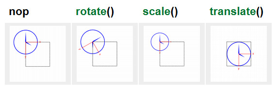

#### 7.1.2 QPaintDevice

常见的绘图设备有QWidget、QPixmap、QImage等。

#### 7.1.3 QPaintEngine 

此类一般是QPainter和QPainterDevice内部使用的，应用程序不需要和此类打交道，除非要创建自己的设备类型。这个类的有关信息参见文档，这里不赘述。

#### 7.1.4 QPainterPath

QPainterPath 类为绘画操作提供了一个容器，使图形形状能够被构造和重用。
画家路径是由许多图形构建块组成的对象，例如矩形、椭圆、直线和曲线。构建块可以连接到封闭的子路径中，例如矩形或椭圆形。封闭路径具有重合的起点和终点。或者它们可以作为未闭合的子路径独立存在，例如直线和曲线。QPainterPath 对象可用于填充、勾画和裁剪。要为给定的画家路径生成可填充的轮廓，请使用 QPainterPathStroker 类。与普通绘图操作相比，painter path 的主要优点是复杂的形状只需要创建一次；那么它们可以通过调用 QPainter::drawPath() 函数多次绘制。
QPainterPath 提供了一组函数，可用于获取有关路径及其元素的信息。此外，可以使用 toReversed() 函数反转元素的顺序。还有几个函数可以将此画家路径对象转换为多边形表示。


QPainterPath 对象可以构造为空路径，具有给定的起点，或作为另一个 QPainterPath 对象的副本。创建后，可以使用 lineTo()、arcTo()、cubicTo() 和 quadTo() 函数将直线和曲线添加到路径中。直线和曲线从 currentPosition() 延伸到作为参数传递的位置。
QPainterPath 对象的 currentPosition() 始终是添加的最后一个子路径的结束位置（或初始起点）。使用 moveTo() 函数移动 currentPosition() 而不添加组件。 moveTo() 函数隐式启动一个新的子路径，并关闭前一个。启动新子路径的另一种方法是调用 closeSubpath() 函数，该函数通过将 currentPosition() 中的一条线添加回路径的起始位置来关闭当前路径。请注意，新路径将 (0, 0) 作为其初始 currentPosition()。
QPainterPath 类还提供了几个方便的函数来将封闭的子路径添加到画家路径：addEllipse()、addPath()、addRect()、addRegion() 和 addText()。 addPolygon() 函数添加一个未闭合的子路径。实际上，这些函数都是moveTo()、lineTo()和cubicTo()操作的集合。
此外，可以使用 connectPath() 函数将路径添加到当前路径。但请注意，此函数将通过添加一条线将当前路径的最后一个元素连接到给定路径的第一个元素。

一个示例如下。

```c++
QPainterPath path;
path.addRect(20, 20, 60, 60);

path.moveTo(0, 0);
path.cubicTo(99, 0,  50, 50,  99, 99);
path.cubicTo(0, 99,  50, 50,  0, 0);

QPainter painter(this);
painter.fillRect(0, 0, 100, 100, Qt::white);
painter.setPen(QPen(QColor(79, 106, 25), 1, Qt::SolidLine,
                    Qt::FlatCap, Qt::MiterJoin));
painter.setBrush(QColor(122, 163, 39));

painter.drawPath(path);
```

绘制结果如图所示。


需要了解的枚举类型如下。

此枚举描述了用于连接子路径中的顶点的元素类型。请注意，使用 addEllipse()、addPath()、addPolygon()、addRect()、addRegion() 和 addText() 便利函数作为封闭子路径添加的元素实际上是使用 moveTo 作为单独元素的集合添加到路径中的()、lineTo() 和cubicTo() 函数。

```c++
enum QPainterPath::ElementType {
    QPainterPath::MoveToElement,//一个新的子路径。另请参阅 moveTo()
    QPainterPath::LineToElement,//一条线。另请参阅 lineTo()
    QPainterPath::CurveToElement,//一条曲线。另请参见cubicTo() 和 quadTo()
    QPainterPath::CurveToDataElement//在 CurveToElement 元素中描述曲线所需的额外数据
}
```

此枚举类型指定应该使用哪种方法来填充路径和多边形。

```c++
enum Qt::FillRule{
    Qt::OddEvenFill,//指定使用奇偶填充规则填充区域。有了这个规则，我们通过下面的方法来判断一个点是否在形状内。从该点到形状外的位置画一条水平线，并计算交叉点的数量。如果交叉点的数量为奇数，则该点位于形状内部。此模式为默认模式
    Qt::WindingFill//指定使用非零缠绕规则填充区域。有了这个规则，我们通过下面的方法来判断一个点是否在形状内。从该点到形状外部的位置绘制一条水平线。确定每个交点处的线的方向是向上还是向下。绕组数是通过对每个交叉点的方向求和来确定的。如果数字不为零，则该点位于形状内部。这种填充模式在大多数情况下也可以被认为是闭合形状的交集。
}
```

#### 7.1.5 QPen

主要的成员函数如下。

```c++
// 从构造函数来看可以设置画笔风格、颜色、画刷、画笔宽度
QPen(Qt::PenStyle style);
QPen(const QColor &color);
QPen(const QBrush &brush, qreal width, Qt::PenStyle style = Qt::SolidLine, Qt::PenCapStyle cap = Qt::SquareCap, Qt::PenJoinStyle join = Qt::BevelJoin);
QPen(const QPen &pen);

Qt::PenCapStyle capStyle() const; // 返回笔的笔帽样式
void setCapStyle(Qt::PenCapStyle style);

Qt::PenJoinStyle joinStyle() const; // 返回画笔的连接样式
void setJoinStyle(Qt::PenJoinStyle style);

Qt::PenStyle style() const;// 返回画笔样式
void setStyle(Qt::PenStyle style);

QColor color() const; // 返回此笔刷的颜色
void setColor(const QColor &color);

qreal dashOffset() const; // 返回画笔的虚线偏移量,自定义线条样式用
void setDashOffset(qreal offset);

QVector<qreal> dashPattern() const;// 返回此笔的虚线图案,自定义线条样式用
void setDashPattern(const QVector<qreal> &pattern);

qreal miterLimit() const;// 返回画笔的斜接限制。斜接限制仅在连接样式设置为 Qt::MiterJoin 时才相关
void setMiterLimit(qreal limit);

bool isCosmetic() const;// 如果笔是装饰性的，则返回 true；否则返回 false
void setCosmetic(bool cosmetic);
bool isSolid() const; // 如果笔具有实心填充，则返回 true，否则返回 false

int width() const;// 以整数精度返回画笔宽度
qreal widthF() const;// 以浮点数返回画笔精度
void setWidth(int width);
void setWidthF(qreal width);

void setBrush(const QBrush &brush);// 设置画刷
```

关于miterLimit和width的定义如图所示。

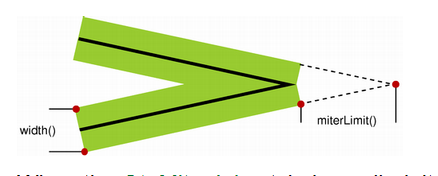

从成员函数的参数来看，显然需要了解三个枚举类型，不过这三个枚举类型不是在QPen定义的，而是在Qt头文件定义的。

**第一个是画笔的线型。**

```c++
Qt::PenStyle {
    Qt::NoPen,//根本没有线。例如，QPainter::drawRect() 填充但不绘制任何边界线
    Qt::SolidLine,//一条普通的线
    Qt::DashLine,//由几个像素分隔的破折号
    Qt::DotLine,//由几个像素分隔的点
    Qt::DashDotLine,//交替的点和破折号
    Qt::DashDotDotLine,//一个破折号，两个点，一个破折号，两个点
    Qt::CustomDashLine,//使用 QPainterPathStroker::setDashPattern() 定义的自定义模式
}
```

直观的图如下。

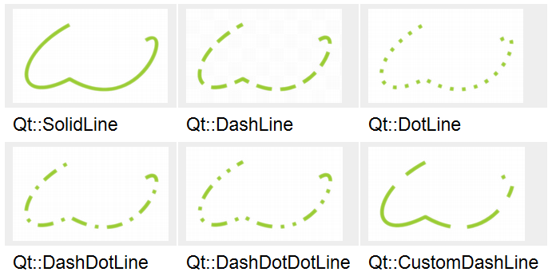

如果想要自定义线可以这样做，使用 setDashPattern() 函数指定自定义破折号图案，该函数将笔的样式隐式转换为 Qt::CustomDashLine。模式参数 QVector 必须指定为偶数个 qreal 条目，其中条目 1、3、5... 是破折号，而 2、4、6... 是空格。例如，上面显示的自定义模式是使用以下代码创建的：

请注意，虚线图案以笔宽为单位指定，例如一条长 5 宽 10 的破折号是 50 像素长。可以使用 dashPattern() 函数检索当前设置的破折号模式。使用 isSolid() 函数来确定笔是否有实心填充。

```c++
QPen pen;
QVector<qreal> dashes;
qreal space = 4;
dashes << 1 << space << 3 << space << 9 << space
       << 27 << space << 9 << space; // 偶数个,破折号长度1,空格4,破折号长度3,空格4,以此类推
pen.setDashPattern(dashes); // 隐式转换为Qt::CustomDashLine
```

**第二个是画笔端点样式**。cap 样式定义了如何使用 QPainter 绘制线条的端点。 cap 样式仅适用于宽线，即当宽度为 1 或更大时。 Qt::PenCapStyle 枚举提供以下样式

```c++
enum PenCupStyle{
    Qt::FlatCap,//不覆盖线端点的方形线端
    Qt::SquareCap,//覆盖端点并超出端点线宽一半的方形线端
    Qt::RoundCap//圆形线端
}
```

如图所示。


**第三个定义了画笔的连接样式**。

此枚举类型定义了 Qt 支持的笔连接样式，即可以使用 QPainte 绘制两条连接线之间的连接。

```c++
enum Qt::PenJoinStyle{
    Qt::MiterJoin,//线条的外边缘延伸成一个角度相交，并填充该区域
    Qt::BevelJoin,//填充两条线之间的三角形缺口
    Qt::RoundJoin,//填充两条线之间的圆弧
    Qt::SvgMiterJoin//与 SVG 1.2 Tiny 规范中的斜接定义相对应的斜接
}
```

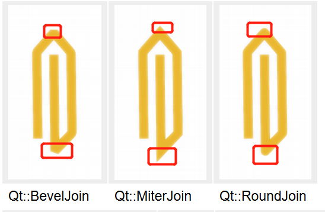

#### 7.1.6 QBrush

画刷最主要的功能是设置**画刷颜色和画刷样式**，下方构造函数的QPixmap、QImage和QGradient都是一类样式，可以隐式转换为Qt::BrushStyle的风格。如果是QPixmap、QImage，就默认指定为Qt::BrushStyle::TexturePattern的风格，即使用材质填充。而QGradien可以是线性渐变、辐射渐变或圆锥形渐变的一种。

成员函数如下。

```c++
// 构造函数
QBrush(const QColor &color, Qt::BrushStyle style = Qt::SolidPattern);
QBrush(Qt::GlobalColor color, Qt::BrushStyle style = Qt::SolidPattern);
QBrush(const QColor &color, const QPixmap &pixmap);
QBrush(Qt::GlobalColor color, const QPixmap &pixmap);
QBrush(const QPixmap &pixmap);
QBrush(const QImage &image);
QBrush(const QGradient &gradient)
    
// 返回和设置颜色
const QColor &color() const;
void setColor(const QColor &color);
void setColor(Qt::GlobalColor color);

// 返回渐变风格
const QGradient *gradient() const;

// 返回和设置填充样式
Qt::BrushStyle style() const;
void setStyle(Qt::BrushStyle style);

// 设置和返回当前画笔上的显式变换矩阵
const QMatrix &matrix() const;
void setMatrix(const QMatrix &matrix);

// 返回自定义画笔图案，如果没有设置自定义画笔图案，则返回空像素图
QPixmap texture() const;
void setTexture(const QPixmap &pixmap);
QImage textureImage() const;
void setTextureImage(const QImage &image);

void swap(QBrush &other); // 互换

// 如果画笔完全不透明，则返回true，否则返回false。在以下情况下，画笔被认为是不透明的：color()的alpha 分量是255。texture()没有alpha通道，也不是QBitmap。gradient()中的颜色都有一个255的alpha分量，它是一个扩展的径向梯度。
bool isOpaque() const;

// 返回和设置当前画笔上的显式变换矩阵。画笔变换矩阵与 QPainter 变换矩阵合并产生最终结果
void setTransform(const QTransform &matrix);
QTransform transform() const;
```

**第一个要关注的枚举类型是画刷风格**，此枚举类型定义了 Qt 支持的画笔样式，即使用 QPainter 绘制的形状的填充模式。

```c++
enum Qt::BrushStyle { 
    Qt::NoBrush,//没有画笔图案
    Qt::SolidPattern,//统一的颜色
    Qt::Dense1Pattern,//极其密集的画笔图案
    Qt::Dense2Pattern,//非常密集的画笔图案
    Qt::Dense3Pattern,//有点密集的画笔图案
    Qt::Dense4Pattern,//半密刷纹
    Qt::Dense5Pattern,//有点稀疏的画笔图案
    Qt::Dense6Pattern,//非常稀疏的画笔图案
    Qt::Dense7Pattern,//极稀疏的画笔图案
    Qt::HorPattern,//水平线
    Qt::VerPattern,//垂直线
    Qt::CrossPattern,//跨越水平线和垂直线
    Qt::BDiagPattern,//后向对角线
    Qt::FDiagPattern,//前向对角线
    Qt::DiagCrossPattern,//穿过对角线
    Qt::LinearGradientPattern,//线性渐变，使用QLinearGradient设置
    Qt::ConicalGradientPattern,//圆锥形渐变，使用QConicalGradient设置
    Qt::RadialGradientPattern,//辐射渐变，使用QRadialGradent设置
    Qt::TexturePattern//自定义图案，材质填充
}
```

**第二个是设置画刷颜色**，画笔color()定义填充图案的颜色。颜色可以是 Qt 的预定义颜色之一，Qt::GlobalColor 或任何其他自定义 QColor。可以分别使用 color() 和 setColor() 函数检索和更改当前设置的颜色。关于QColor的内容可见后续小节[7.1.8 QColor](#7.1.8 QColor)。

**第三个是渐变风格。**gradient() 定义当当前样式为 Qt::LinearGradientPattern、Qt::RadialGradientPattern 或 Qt::ConicalGradientPattern 时使用的渐变填充。在创建 QBrush 时，通过将 QGradient 作为构造函数参数来创建渐变画笔。 Qt 提供了三种不同的渐变：QLinearGradient、QConicalGradient 和 QRadialGradient——它们都继承了 QGradient，可见下一小节[7.1.7 QGradient](#7.1.7 QGradient)。

```c++
QRadialGradient gradient(50, 50, 50, 50, 50);
gradient.setColorAt(0, QColor::fromRgbF(0, 1, 0, 1));
gradient.setColorAt(1, QColor::fromRgbF(0, 0, 0, 0));
QBrush brush(gradient);
```

渐变风格还可以使用自己的图片定义，texture() 定义了当前样式为 Qt::TexturePattern 时使用的像素图。您可以通过在创建画笔时提供像素图或使用 setTexture() 来创建具有纹理的画笔。请注意，无论以前的样式设置如何，应用 setTexture() 都会使 style() == Qt::TexturePattern。此外，如果样式是渐变，调用 setColor() 也不会产生影响。如果样式是 Qt::TexturePattern 样式，情况也是如此，除非当前纹理是 QBitmap。

#### 7.1.7 QGradient

QConicalGradient、QLinearGradient、和QRadialGradient都是它的子类。

需要了解的枚举类型如下。

此枚举类型指定渐变坐标如何映射到使用渐变的绘制设备。

```c++
enum QGradient::CoordinateMode{
    QGradient::LogicalMode,//这是默认模式。梯度坐标是指定的逻辑空间，就像对象坐标一样
    QGradient::StretchToDeviceMode,//在这种模式下，渐变坐标是相对于绘图设备的边界矩形，（0,0）在左上角，（1,1）在绘图设备的右下角
    QGradient::ObjectBoundingMode//在此模式下，渐变坐标相对于正在绘制的对象的边界矩形，(0,0) 在左上角，(1,1) 在对象边界矩形的右下角
}
```

此枚举类型指定应如何填充渐变区域之外的区域。辐射填充和线性填充有展布模式，圆锥形没有展布模式。

```c++
enum QGradient::Spread {
    QGradient::PadSpread,//该区域用最接近的停止颜色填充。这是默认设置
    QGradient::RepeatSpread,//在渐变区域外重复渐变
    QGradient::ReflectSpread//渐变在渐变区域外反射,展布模式
}
```

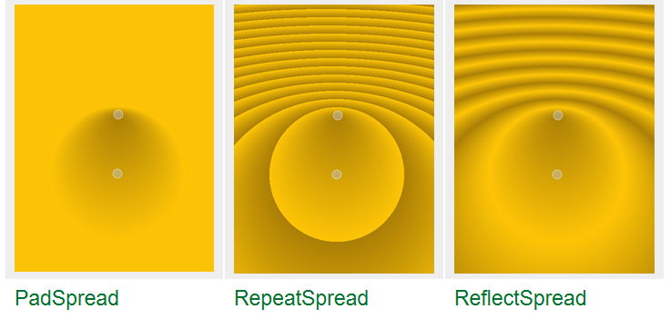

此枚举类型指定渐变的类型。

```c++
enum QGradient::Type {
    QGradient::LinearGradient,
    QGradient::RadialGradient,
    QGradient::ConicalGradient,
    QGradient::NoGradient
}

QLinearGradient linearGrad(QPointF(100, 100), QPointF(200, 200));
linearGrad.setColorAt(0, Qt::black);
linearGrad.setColorAt(1, Qt::white);

QRadialGradient radialGrad(QPointF(100, 100), 100);
radialGrad.setColorAt(0, Qt::red);
radialGrad.setColorAt(0.5, Qt::blue);
radialGrad.setColorAt(1, Qt::green);
```

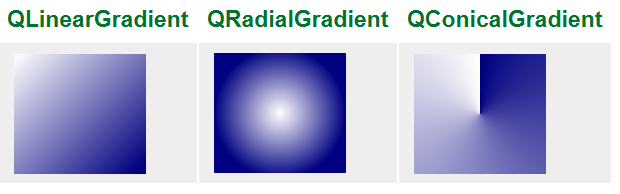

公共成员函数。

```c++
CoordinateMode coordinateMode() const;//返回此渐变的坐标模式。默认模式是逻辑模式
void setCoordinateMode(CoordinateMode mode);

void setColorAt(qreal position, const QColor &color);//使用给定颜色在给定位置创建一个停止点。给定的位置必须在 0 到 1 的范围内

void setSpread(Spread method);//指定应用于此渐变的扩展方法
SPread spread() const;

void setStops(const QGradientStops &stopPoints);// 用给定的 stopPoints 替换当前的停止点集。点的位置必须在 0 到 1 的范围内，并且必须从最低点优先排序
QGradientStops stops() const;

Type type() const;// 返回渐变的类型
```

#### 7.1.8 QColor

常见的公共成员函数如下。

```c++
QColor(Qt::GlobalColor color);
QColor(int r, int g, int b, int a = 255);
QColor(QRgb color);
QColor(const QColor &color);
QString QColor::name() const;//返回形如"#RRGGBB"格式的颜色表示
int QColor::value() const; // 返回颜色的组成部分
QColor convertTo(Spec colorSpec) const; // 详见枚举值QColor:Spec
QColor toHsv() const;
QColor toRgb() const;
// 获取和设置RGB值和透明度
int saturation() const;
int hue() const;
int lightness() const;
void setHsv(int h, int s, int v, int a = 255);
QRgb rgb() const;
void setRgb(int r, int g, int b, int a = 255);
void setRgb(QRgb rgb);
QRgb rgba() const;
void setRgba(QRgb rgba);
int alpha() const;
void setAlpha(int alpha);
int red() const;
void setRed(int red);
int blue() const;
void setBlue(int blue);
int green() const;
void setGreen(int green);
int black() const;
int cyan() const;
int yellow() const;
...
```

其他的不怎么常用的静态成员函数和关联函数可以了解一下。

```c++
static QStringList colorNames();//可以获取所有有效的颜色
static QColor fromCmyk(int c, int m, int y, int k, int a = 255);
static QColor fromCmykF(qreal c, qreal m, qreal y, qreal k, qreal a = 1.0);
static QColor fromHsl(int h, int s, int l, int a = 255);
static QColor fromHslF(qreal h, qreal s, qreal l, qreal a = 1.0);
static QColor fromHsv(int h, int s, int v, int a = 255);
static QColor fromHsvF(qreal h, qreal s, qreal v, qreal a = 1.0);
static QColor fromRgb(QRgb rgb);
static QColor fromRgb(int r, int g, int b, int a = 255);
static QColor fromRgba64(ushort r, ushort g, ushort b, ushort a = USHRT_MAX);
static QColor fromRgba64(QRgba64 rgba64);
static QColor fromRgbF(qreal r, qreal g, qreal b, qreal a = 1.0);
static QColor fromRgba(QRgb rgba);
static bool isValidColor(const QString &name);
static bool isValidColor(QLatin1String name);

typedef QRgb;
int qAlpha(QRgb rgba);
uint qAlpha(QRgba64 rgba64);
int qBlue(QRgb rgb);
uint qBlue(QRgba64 rgba64);
int qGray(int r, int g, int b);
int qGray(QRgb rgb);
int qGreen(QRgb rgb);
uint qGreen(QRgba64 rgba64);
QRgb qPremultiply(QRgb rgb);
QRgba64 qPremultiply(QRgba64 rgba64);
int qRed(QRgb rgb);
uint qRed(QRgba64 rgba64);
QRgb qRgb(int r, int g, int b);
QRgba64 qRgba64(quint16 r, quint16 g, quint16 b, quint16 a);
QRgba64 qRgba64(quint64 c);
QRgb qRgba(int r, int g, int b, int a);
QRgb qUnpremultiply(QRgb rgb);
QRgba64 qUnpremultiply(QRgba64 rgba64);
```

需要知道的枚举值定义如下。

```c++
enum QColor::NameFormatQColor={QColor:HexRgb=0,QColor:HexArgb=1};
enum QColor::Spec = {QColor::Rgb=1,QColor::Hsv=2,QColor::Cmyk=3,
                     QColor::Hsl=4,QColor::Invalid=0};
```

#### 7.1.9 QPicture

QPicture类是记录和重放**QPaint命令**的绘制设备，总是与QPainter结合使用。
图片以独立于平台的格式将painter命令序列化到IO设备。它们有时被称为元文件。
Qt图片使用专有的二进制格式。与许多窗口系统上的本机图片（元文件）格式不同，Qt图片对其内容没有限制。可以在小部件或pixmap上绘制的所有内容（例如字体、pixmap、区域、转换的图形等）也可以存储在图片中。
QPicture与分辨率无关，即QPicture可以显示在外观相同的不同设备（例如svg、pdf、ps、打印机和屏幕）上。例如，这是所见即所得打印预览所必需的。QPicture在默认系统dpi中运行，并根据窗口系统缩放画师以匹配分辨率差异。

常见成员函数如下。

```c++
QPicture(int formatVersion = -1);
QPicture(const QPicture &pic);
QRect boundingRect() const;
const char *data() const;
bool isNull() const;
bool load(const QString &fileName, const char *format = Q_NULLPTR);
bool load(QIODevice *dev, const char *format = Q_NULLPTR);
bool play(QPainter *painter);
bool save(const QString &fileName, const char *format = Q_NULLPTR);
bool save(QIODevice *dev, const char *format = Q_NULLPTR);
void setBoundingRect(const QRect &r);
virtual void setData(const char *data, uint size);
uint size() const;
void swap(QPicture &other);
```

可能的示例代码。

```c++
QPicture picture;
QPainter painter;
painter.begin(&picture);           // paint in picture
painter.drawEllipse(10,20, 80,70); // draw an ellipse
painter.end();                     // painting done
picture.save("drawing.pic");       // save picture

QPicture picture;
picture.load("drawing.pic");           // load picture
QPainter painter;
painter.begin(&myImage);               // paint in myImage
painter.drawPicture(0, 0, picture);    // draw the picture at (0,0)
painter.end();                         // painting done
```

#### 7.1.10 QPixmap

QPixmap类是一种屏幕外图像表示，可以用作绘制设备。
Qt提供了四个用于处理图像数据的类：**QImage、QPixmap、QBitmap和QPicture**。QImage针对I/O、直接像素访问和操作进行了设计和优化，而QPixmap针对在屏幕上显示图像进行了设计和优化。QBitmap只是一个继承QPixmap的方便类，确保深度为1。如果QPixmap对象实际上是位图，则isQBitmap()函数返回true，否则返回false。最后，QPicture类是一个绘制设备，用于记录和重放QPaint命令。
使用**QLabel或QAbstractButton的子类之一（如QPushButton和QToolButton）**，可以很容易地在屏幕上显示QPixmap。QLabel有一个pixmap属性，而QAbstractButton有一个icon属性。**因为QPixmap是QPaintDevice子类，所以QPainter可以用于直接绘制到Pixmap上**。只**能通过QPaint功能或通过将QPixmap转换为QImage来访问像素**。但是，fill()函数可用于初始化具有给定颜色的整个pixmap。
有一些函数可以在QImage和QPixmap之间进行转换。通常，在将QImage对象转换为要在屏幕上显示的QPixmap之前，**QImage类用于加载图像文件，可以选择操作图像数据**。或者，如果不需要操作，则可以将图像文件直接加载到QPixmap中。

可以使用**toImage()函数将QPixmap对象转换为QImage**。同样，可以使用**fromImage()将QImage转换为QPixmap**。如果这是一个过于昂贵的操作，那么可以使用QBitmap::fromImage()。

QPixmap支持的加载文件格式以及支持的操作类型如下。

```c++
BMP Read/write
GIF Read
JPG Joint Photographic Experts Group Read/write
JPEG Read/write
PNG Read/write
PBM Read
PGM Read
PPM Read/write
XBM Read/write
XPM Read/write
```

常见的公共成员函数如下。

```c++
QPixmap(int width, int height);
QPixmap(const QSize &size);
QPixmap(const QString &fileName, const char *format = Q_NULLPTR,
        Qt::ImageConversionFlags flags = Qt::AutoColor);
QPixmap(const char * const[] xpm);
QPixmap(const QPixmap &pixmap);

bool convertFromImage(const QImage &image, 
                      Qt::ImageConversionFlags flags = Qt::AutoColor);
QPixmap copy(const QRect &rectangle = QRect()) const;
QPixmap copy(int x, int y, int width, int height) const;
int depth() const;
void fill(const QColor &color = Qt::white);
bool hasAlpha() const;
bool hasAlphaChannel() const;
int width() const;
int height() const;
bool isNull() const;
bool isQBitmap() const;
bool load(const QString &fileName, const char *format = Q_NULLPTR,
          Qt::ImageConversionFlags flags = Qt::AutoColor);
QRect rect() const;
bool save(const QString &fileName, const char *format = Q_NULLPTR, int quality = -1) const;
bool save(QIODevice *device, const char *format = Q_NULLPTR, int quality = -1) const;
QPixmap scaled(const QSize &size, 
               Qt::AspectRatioMode aspectRatioMode = Qt::IgnoreAspectRatio, 
               Qt::TransformationMode transformMode = Qt::FastTransformation) const;
QPixmap scaled(int width, int height, 
               Qt::AspectRatioMode aspectRatioMode = Qt::IgnoreAspectRatio, 
               Qt::TransformationMode transformMode = Qt::FastTransformation) const;
QPixmap scaledToHeight(int height, 
                       Qt::TransformationMode mode = Qt::FastTransformation) const;
QPixmap scaledToWidth(int width, 
                      Qt::TransformationMode mode = Qt::FastTransformation) const;
QSize size() const;
void swap(QPixmap &other);
QImage toImage() const;
```

常用的静态成员函数如下，涉及了2个数据类型QMatrix和QTransform，可见[3.1.14 QMatrix](#3.1.14 QMatrix)和[3.1.15 QTransform](#3.1.15 QTransform)。

```c++
static int defaultDepth();
static QPixmap fromImage(const QImage &image,
                         Qt::ImageConversionFlags flags = Qt::AutoColor);
static QPixmap fromImage(QImage &&image, 
                         Qt::ImageConversionFlags flags = Qt::AutoColor);
static QPixmap fromImageReader(QImageReader *imageReader, 
                               Qt::ImageConversionFlags flags = Qt::AutoColor);
static QTransform trueMatrix(const QTransform &matrix, int width, int height);
static QMatrix trueMatrix(const QMatrix &m, int w, int h);
```

#### 7.1.11 QImage

处理图像的数据类型。

需要了解的枚举类型如下。

```c++
// 定义了一些图像格式
enum Format { Format_Invalid, Format_Mono, Format_MonoLSB, Format_Indexed8, ..., Format_Grayscale8 };
// 此枚举类型用于描述在invertPixels()函数中应如何反转像素值
enum InvertMode { InvertRgb, InvertRgba };
```

常见的构造函数如下。

```c++
QImage(const QSize &size, Format format);
QImage(int width, int height, Format format);
QImage(uchar *data, int width, int height, Format format, 
       QImageCleanupFunction cleanupFunction = Q_NULLPTR, void *cleanupInfo = Q_NULLPTR);
QImage(const uchar *data, int width, int height, Format format, 
       QImageCleanupFunction cleanupFunction = Q_NULLPTR, void *cleanupInfo = Q_NULLPTR);
QImage(uchar *data, int width, int height, int bytesPerLine, Format format,
       QImageCleanupFunction cleanupFunction = Q_NULLPTR, void *cleanupInfo = Q_NULLPTR);
QImage(const uchar *data, int width, int height, int bytesPerLine, Format format,
       QImageCleanupFunction cleanupFunction = Q_NULLPTR, void *cleanupInfo = Q_NULLPTR);
QImage(const char * const[] xpm);
QImage(const QString &fileName, const char *format = Q_NULLPTR);
QImage(const QImage &image);
```

常见的公共成员函数如下。

```c++
QImage convertToFormat(Format format, 
                       Qt::ImageConversionFlags flags = Qt::AutoColor) const;
QImage convertToFormat(Format format, const QVector<QRgb> &colorTable, 
                       Qt::ImageConversionFlags flags = Qt::AutoColor) const;
int depth() const;
void fill(uint pixelValue);
void fill(const QColor &color);
void fill(Qt::GlobalColor color);
Format format() const;
bool hasAlphaChannel() const;
int height() const;
void invertPixels(InvertMode mode = InvertRgb);
bool isGrayscale() const;
bool isNull() const;
bool load(const QString &fileName, const char *format = Q_NULLPTR);
bool load(QIODevice *device, const char *format);
bool loadFromData(const uchar *data, int len, const char *format = Q_NULLPTR);
bool loadFromData(const QByteArray &data, const char *format = Q_NULLPTR);
QImage mirrored(bool horizontal = false, bool vertical = true) const;
QRgb pixel(const QPoint &position) const;
QRgb pixel(int x, int y) const;
QColor pixelColor(const QPoint &position) const;
QColor pixelColor(int x, int y) const;
QPixelFormat pixelFormat() const;
QRect rect() const;
bool save(const QString &fileName, 
          const char *format = Q_NULLPTR, int quality = -1) const;
bool save(QIODevice *device, const char *format = Q_NULLPTR, int quality = -1) const;
QImage scaled(const QSize &size, 
              Qt::AspectRatioMode aspectRatioMode = Qt::IgnoreAspectRatio, 
              Qt::TransformationMode transformMode = Qt::FastTransformation) const;
QImage scaled(int width, int height, 
       Qt::AspectRatioMode aspectRatioMode = Qt::IgnoreAspectRatio,
       Qt::TransformationMode transformMode = Qt::FastTransformation) const;
QImage scaledToHeight(int height, 
               Qt::TransformationMode mode = Qt::FastTransformation) const;
QImage scaledToWidth(int width, 
                     Qt::TransformationMode mode = Qt::FastTransformation) const;
void setColor(int index, QRgb colorValue);
setOffset(const QPoint &offset)
void setPixel(const QPoint &position, uint index_or_rgb);
void setPixel(int x, int y, uint index_or_rgb);
void setPixelColor(const QPoint &position, const QColor &color);
void setPixelColor(int x, int y, const QColor &color);
void setText(const QString &key, const QString &text);
QSize size() const;
QString text(const QString &key = QString()) const;
bool valid(const QPoint &pos) const;
bool valid(int x, int y) const;
int width() const;
```

静态成员函数如下。

```c++
QImage fromData(const uchar *data, int size, const char *format = Q_NULLPTR);
QImage fromData(const QByteArray &data, const char *format = Q_NULLPTR);
QImage::Format toImageFormat(QPixelFormat format);
QPixelFormat toPixelFormat(QImage::Format format);
QMatrix trueMatrix(const QMatrix &matrix, int width, int height);
QTransform trueMatrix(const QTransform &matrix, int width, int height);
```

示例代码。

```c++
QImage image(3, 3, QImage::Format_Indexed8);
QRgb value;
value = qRgb(122, 163, 39); // 0xff7aa327
image.setColor(0, value);
value = qRgb(237, 187, 51); // 0xffedba31
image.setColor(1, value);
value = qRgb(189, 149, 39); // 0xffbd9527
image.setColor(2, value);
image.setPixel(0, 1, 0);
image.setPixel(1, 0, 0);
image.setPixel(1, 1, 2);
image.setPixel(2, 1, 1);

QImage image(3, 3, QImage::Format_RGB32);
QRgb value;
value = qRgb(189, 149, 39); // 0xffbd9527
image.setPixel(1, 1, value);
value = qRgb(122, 163, 39); // 0xff7aa327
image.setPixel(0, 1, value);
image.setPixel(1, 0, value);
value = qRgb(237, 187, 51); // 0xffedba31
image.setPixel(2, 1, value);
```

#### 7.1.12 QBitmap

QBitmap类提供单色（1位深度）像素贴图。
QBitmap类是一种单色屏幕外绘制设备，主要用于创建自定义QCursor和QBrush对象，构建QRegion对象，以及设置pixmap和widget的掩码。**QBitmap是一个QPixmap子类**，确保深度为1，但深度为0的空对象除外。如果为位图指定了深度大于1的像素贴图，则位图将自动抖动。
在QBitmap对象（或深度为1的QPixmap对象）上绘制时，请使用QColor对象Qt::color0和Qt::color1。
使用Qt::color0绘制将位图位设置为0，使用Qt::color1绘制将位设置为1。对于位图，0位表示背景（或透明像素），1位表示前景（或不透明像素）。使用clear()函数将所有位设置为Qt::color0。请注意，使用Qt::black和Qt::white没有任何意义，因为QColor::pixel()值对于黑色不一定是0，对于白色不一定是1。
QBitmap类提供transformed()函数，返回位图的转换副本；使用QTransform参数可以平移、缩放、剪切和旋转位图。此外，QBitmap还提供了静态fromData()函数，该函数返回由给定uchar数据构造的位图，以及静态fromdimage()函数，该函数返回QImage对象的转换副本。

常见的成员函数和静态成员函数如下。

```c++
QBitmap(const QPixmap &pixmap);
QBitmap(int width, int height);
QBitmap(const QSize &size);
QBitmap(const QString &fileName, const char *format = Q_NULLPTR);
QBitmap(const QBitmap &other);
void clear();
void swap(QBitmap &other);
QBitmap transformed(const QTransform &matrix) const;

static QBitmap fromData(const QSize &size, const uchar *bits, QImage::Format monoFormat = QImage::Format_MonoLSB);
static QBitmap fromImage(const QImage &image, Qt::ImageConversionFlags flags = Qt::AutoColor);
```

### 7.2 坐标系统与坐标变换

关于坐标变换的一些函数其实在QPainter的变换函数提到过，常用的就是平移、旋转和缩放，使用世界坐标变换矩阵也可以实现这些功能，但是需要定义自己的QTransform类，可见[7.2.1 QTransform](#7.2.1 QTransform)。坐标矩阵的定义一般和QMatrix也离不开，可见[7.2.2 QMatrix](#7.2.2 QMatrix)。


#### 7.2.1 QTransform

QTransform 类指定坐标系的二维变换。转换指定如何平移、缩放、剪切、旋转或投影坐标系，通常在渲染图形时使用。**QTransform 与 QMatrix 的不同之处在于它是一个真正的 3x3 矩阵，允许透视变换。** QTransform 的 **toAffine() 方法允许将 QTransform 转换为 QMatrix**。如果在矩阵上指定了透视变换，则该变换将导致数据丢失。QTransform 是 Qt 中推荐的转换类。可以使用 setMatrix()、scale()、rotate()、translate() 和 Shear() 函数**构建 QTransform 对象**。或者，它可以通过应用基本的矩阵运算来构建。

矩阵也可以在构造时定义，并且可以使用 reset() 函数将其重置为单位矩阵（默认）。QTransform 类支持图形基元的映射：给定的点、线、多边形、区域或画家路径可以使用 map() 函数映射到此矩阵定义的坐标系。如果是矩形，可以使用 mapRect() 函数转换其坐标。也可以使用 mapToPolygon() 函数将矩形转换为多边形（映射到此矩阵定义的坐标系）。QTransform 提供了 isIdentity() 函数，如果矩阵是单位矩阵，则返回 true；如果矩阵是非奇异矩阵（即 AB = BA = I），则返回 true 的 isInvertible() 函数。如果它是可逆的，则inverted() 函数返回该矩阵的反转副本（否则它返回单位矩阵），并且 adjoint() 返回矩阵的经典伴随矩阵。此外，QTransform 提供了返回矩阵行列式的determinant()函数。最后，QTransform 类支持矩阵乘法、加法和减法，并且该类的对象可以流式传输和比较。

需要知道的枚举类型如下。

```c++
enum TransformationType { TxNone，TxTranslate，TxScale，TxRotate，TxShear，TxProject };
```

```c++
QTransform(); // 构造函数系列
QTransform(qreal m11, qreal m12, qreal m13, qreal m21, qreal m22, qreal m23, qreal m31, qreal m32, qreal m33 = 1.0);
QTransform(qreal m11, qreal m12, qreal m21, qreal m22, qreal dx, qreal dy);
QTransform(const QMatrix &matrix);
QTransform(QTransform &&other);
QTransform(const QTransform &other);

qreal m11() const
qreal m12() const
qreal m13() const
qreal m21() const
qreal m22() const
qreal m23() const
qreal m31() const
qreal m32() const
qreal m33() const
QTransform adjoint() const
qreal determinant() const
qreal dx() const
qreal dy() const
QTransform inverted(bool *invertible = Q_NULLPTR) const
bool isAffine() const
bool isIdentity() const
bool isInvertible() const
bool isRotating() const
bool isScaling() const
bool isTranslating() const
void map(qreal x, qreal y, qreal *tx, qreal *ty) const
QPointF map(const QPointF &p) const
QLine map(const QLine &l) const
QLineF map(const QLineF &line) const
QPolygonF map(const QPolygonF &polygon) const
QPolygon map(const QPolygon &polygon) const
QRegion map(const QRegion &region) const
QPainterPath map(const QPainterPath &path) const
void map(int x, int y, int *tx, int *ty) const
QPoint map(const QPoint &point) const
QRectF mapRect(const QRectF &rectangle) const
QRect mapRect(const QRect &rectangle) const
QPolygon mapToPolygon(const QRect &rectangle) const
void reset()
QTransform &rotate(qreal angle, Qt::Axis axis = Qt::ZAxis)
QTransform &rotateRadians(qreal angle, Qt::Axis axis = Qt::ZAxis)
QTransform &scale(qreal sx, qreal sy)
void setMatrix(qreal m11, qreal m12, qreal m13, qreal m21, qreal m22, qreal m23, qreal m31, qreal m32, qreal m33)QTransform &shear(qreal sh, qreal sv)
const QMatrix &toAffine() const
QTransform &translate(qreal dx, qreal dy)
QTransform transposed() const
TransformationType type() constoperator QVariant() const
bool operator!=(const QTransform &matrix) const
QTransform operator*(const QTransform &matrix) const
QTransform &operator*=(const QTransform &matrix)
QTransform &operator*=(qreal scalar)
QTransform &operator+=(qreal scalar)
QTransform &operator-=(qreal scalar)
QTransform &operator/=(qreal scalar)
QTransform &operator=(QTransform &&other)
QTransform &operator=(const QTransform &matrix)
bool operator==(const QTransform &matrix) const
```

5个静态函数如下。

```c++
QTransform fromScale(qreal sx, qreal sy);
QTransform fromTranslate(qreal dx, qreal dy);
bool quadToQuad(const QPolygonF &one, const QPolygonF &two, QTransform &trans);
bool quadToSquare(const QPolygonF &quad, QTransform &trans);
bool squareToQuad(const QPolygonF &quad, QTransform &trans);
```

示例代码。

```c++
void SimpleTransformation::paintEvent(QPaintEvent *)
{
    QPainter painter(this);
    painter.setPen(QPen(Qt::blue, 1, Qt::DashLine));
    painter.drawRect(0, 0, 100, 100);

    painter.rotate(45);

    painter.setFont(QFont("Helvetica", 24));
    painter.setPen(QPen(Qt::black, 1));
    painter.drawText(20, 10, "QTransform");
}

void CombinedTransformation::paintEvent(QPaintEvent *)
{
    QPainter painter(this);
    painter.setPen(QPen(Qt::blue, 1, Qt::DashLine));
    painter.drawRect(0, 0, 100, 100);

    QTransform transform;
    transform.translate(50, 50);
    transform.rotate(45);
    transform.scale(0.5, 1.0);
    painter.setTransform(transform);

    painter.setFont(QFont("Helvetica", 24));
    painter.setPen(QPen(Qt::black, 1));
    painter.drawText(20, 10, "QTransform");
}

void BasicOperations::paintEvent(QPaintEvent *)
{
    double pi = 3.14;

    double a    = pi/180 * 45.0;
    double sina = sin(a);
    double cosa = cos(a);

    QTransform translationTransform(1, 0, 0, 1, 50.0, 50.0);
    QTransform rotationTransform(cosa, sina, -sina, cosa, 0, 0);
    QTransform scalingTransform(0.5, 0, 0, 1.0, 0, 0);

    QTransform transform;
    transform = scalingTransform * rotationTransform * translationTransform;

    QPainter painter(this);
    painter.setPen(QPen(Qt::blue, 1, Qt::DashLine));
    painter.drawRect(0, 0, 100, 100);

    painter.setTransform(transform);

    painter.setFont(QFont("Helvetica", 24));
    painter.setPen(QPen(Qt::black, 1));
    painter.drawText(20, 10, "QTransform");
}
```

#### 7.2.2 QMatrix

QMatrix类指定坐标系的二维变换。
矩阵指定如何平移、缩放、剪切或旋转坐标系，通常在渲染图形时使用。QMatrix与QTransform不同，它不允许透视变换。QTransform是Qt中推荐的转换类。
可以使用**setMatrix()、scale()、rotate()、translate()和shear()函数构建QMatrix对象**。或者，可以通过应用基本矩阵运算来构建它。矩阵也可以在构造时定义，并且可以使用**reset()函数将其重置为单位矩阵**（默认值）。
QMatrix类支持图形原语的映射：可以使用**map()函数将给定的点、线、多边形、区域或绘制路径映射到此矩阵定义的坐标系**。对于矩形，可以使用mapRect()函数转换其坐标。还可以使用mapToPolygon（）函数将矩形转换为多边形（映射到此矩阵定义的坐标系）。
QMatrix提供**isIdentity()函数，如果矩阵是单位矩阵，则返回true**；如果矩阵是**非奇异矩阵（即AB=BA=i），则提供isInvertible()**，则返回true。inverted()函数的作用是：如果该矩阵是可逆的，则返回该矩阵的反向副本（否则返回单位矩阵）。此外，QMatrix提供了返**回矩阵行列式的determinate()函数**。
最后，QMatrix类支持矩阵乘法，该类的对象可以进行流式处理和比较。

常见的成员函数如下。

```c++
qreal m11() const; // 返回水平比例因子
qreal m12() const; // 返回垂直剪切因子
qreal m21() const; // 返回水平剪切因子
qreal m22() const; // 返回垂直比例因子
qreal QMatrix::determinant() const ;// 返回矩阵的行列式
qreal dx() const; // 返回水平平移因子返回垂直平移因子。
qreal dy() const; // 返回垂直平移因子
QMatrix inverted(bool *invertible = Q_NULLPTR) const; // 返回此矩阵的反转副本
bool isIdentity() const; // 如果矩阵是单位矩阵，则返回 true，否则返回 false
bool isInvertible() const;// 如果矩阵可逆则返回真，否则返回假
void map(qreal x, qreal y, qreal *tx, qreal *ty) const; // 将给定的坐标 x 和 y 映射到此矩阵定义的坐标系中。结果值分别放在 *tx 和 *ty 中将给定的坐标 x 和 y 映射到此矩阵定义的坐标系中
void map(int x, int y, int *tx, int *ty) const;// 将给定的坐标 x 和 y 映射到此矩阵定义的坐标系中。结果值分别放在 *tx 和 *ty 中。请注意，转换后的坐标四舍五入到最接近的整数。
QPoint map(const QPoint &point) const;// 创建并返回一个 QPoint 对象，该对象是给定点的副本，映射到此矩阵定义的坐标系中。请注意，转换后的坐标四舍五入到最接近的整数
QPointF map(const QPointF &point) const;// 创建并返回一个 QPointF 对象，该对象是给定点的副本，映射到此矩阵定义的坐标系中
QLine map(const QLine &line) const;// 创建并返回一个 QLine 对象，该对象是给定线的副本，映射到此矩阵定义的坐标系中。请注意，转换后的坐标四舍五入到最接近的整数
QLineF map(const QLineF &line) const;// 创建并返回一个 QLineF 对象，它是给定线的副本，映射到此矩阵定义的坐标系中
QPolygonF map(const QPolygonF &polygon) const;// 创建并返回一个 QPolygonF 对象，该对象是给定多边形的副本，映射到此矩阵定义的坐标系中
QPolygon map(const QPolygon &polygon) const;// 创建并返回一个 QPolygon 对象，该对象是给定多边形的副本，映射到此矩阵定义的坐标系中。请注意，转换后的坐标四舍五入到最接近的整数
QRegion map(const QRegion &region) const;// 创建并返回一个 QRegion 对象，该对象是给定区域的副本，映射到此矩阵定义的坐标系中。如果使用旋转或剪切，调用此方法可能会相当昂贵
QPainterPath map(const QPainterPath &path) const;// 创建并返回一个 QPainterPath 对象，它是给定路径的副本，映射到此矩阵定义的坐标系中
QRectF mapRect(const QRectF &rectangle) const;// 创建并返回一个 QRectF 对象，该对象是给定矩形的副本，映射到此矩阵定义的坐标系中
QRect mapRect(const QRect &rectangle) const; // 创建并返回一个 QRect 对象，该对象是给定矩形的副本，映射到此矩阵定义的坐标系中。请注意，转换后的坐标四舍五入到最接近的整数
QPolygon mapToPolygon(const QRect &rectangle) const;// 创建并返回给定矩形的 QPolygon 表示，映射到此矩阵定义的坐标系
void reset();// 将矩阵重置为单位矩阵，即所有元素都设置为零，除了设置为 1 的 m11 和 m22（指定比例）
QMatrix &rotate(qreal degrees);// 将坐标系逆时针旋转给定度数。返回对矩阵的引用
QMatrix &scale(qreal sx, qreal sy);// 通过 sx 水平和 sy 垂直缩放坐标系，并返回对矩阵的引用
void setMatrix(qreal m11, qreal m12, qreal m21, qreal m22, qreal dx, qreal dy);// 请注意，此函数将替换以前的值。 QMatrix 提供 translate()、rotate()、scale() 和shear() 方便的函数来根据当前定义的坐标系来操作各种矩阵元素
QMatrix &shear(qreal sh, qreal sv);// 通过 sh 水平和 sv 垂直剪切坐标系，并返回对矩阵的引用
QMatrix &translate(qreal dx, qreal dy);// 沿 x 轴移动坐标系 dx，沿 y 轴移动 dy，并返回对矩阵的引用
```

可能的示例代码。

```c++
void SimpleTransformation::paintEvent(QPaintEvent *)
{
    QPainter painter(this);
    painter.setPen(QPen(Qt::blue, 1, Qt::DashLine));
    painter.drawRect(0, 0, 100, 100);

    painter.rotate(45);

    painter.setFont(QFont("Helvetica", 24));
    painter.setPen(QPen(Qt::black, 1));
    painter.drawText(20, 10, "QMatrix");
}

void CombinedTransformation::paintEvent(QPaintEvent *)
{
    QPainter painter(this);
    painter.setPen(QPen(Qt::blue, 1, Qt::DashLine));
    painter.drawRect(0, 0, 100, 100);

    QMatrix matrix;
    matrix.translate(50, 50);
    matrix.rotate(45);
    matrix.scale(0.5, 1.0);
    painter.setMatrix(matrix); // 利用QPainter具有的QMatrix属性

    painter.setFont(QFont("Helvetica", 24));
    painter.setPen(QPen(Qt::black, 1));
    painter.drawText(20, 10, "QMatrix");
}

void BasicOperations::paintEvent(QPaintEvent *)
{
    double pi = 3.14;

    double a    = pi/180 * 45.0;
    double sina = sin(a);
    double cosa = cos(a);
 
    QMatrix translationMatrix(1, 0, 0, 1, 50.0, 50.0);
    QMatrix rotationMatrix(cosa, sina, -sina, cosa, 0, 0);
    QMatrix scalingMatrix(0.5, 0, 0, 1.0, 0, 0);

    QMatrix matrix; // 矩阵变换
    matrix =  scalingMatrix * rotationMatrix * translationMatrix;

    QPainter painter(this);
    painter.setPen(QPen(Qt::blue, 1, Qt::DashLine));
    painter.drawRect(0, 0, 100, 100);

    painter.setMatrix(matrix);

    painter.setFont(QFont("Helvetica", 24));
    painter.setPen(QPen(Qt::black, 1));
    painter.drawText(20, 10, "QMatrix");
}
```

#### 7.3.3 QRect

构造函数可以以QPoint和QSize构造，也可以直接使用整型数。

```c++
QRect(const QPoint &topLeft, const QPoint &bottomRight);
QRect(const QPoint &topLeft, const QSize &size);
QRect(int x, int y, int width, int height);
```

获取4个顶点的坐标，或者矩形的长度宽度，或者设置它们的一些函数。

```c++
QPoint bottomLeft() const;
QPoint bottomRight() const;
QPoint topLeft() const;
QPoint topRight() const;
QPoint center() const;
QSize size() const;
int top() const
int height() const;
int bottom() const;
int width() const;
int x() const;
int y() const;
void getCoords(int *x1, int *y1, int *x2, int *y2) const;//将矩形左上角的位置提取到 *x1 和 *y1，将右下角的位置提取到 *x2 和 *y2
void getRect(int *x, int *y, int *width, int *height) const;//将矩形左上角的位置提取到 *x 和 *y，并将其尺寸提取到 *width 和 *height

void setBottom(int y);
void setCoords(int x1, int y1, int x2, int y2);//将矩形左上角的坐标设置为 (x1, y1)，将其右下角的坐标设置为 (x2, y2)
void setHeight(int height);
void setLeft(int x);
void setRect(int x, int y, int width, int height);
void setRight(int x);
void setSize(const QSize &size);;
void setTop(int y);
int left() const;
int right() const;
void setTopLeft(const QPoint &position);
void setTopRight(const QPoint &position);
void setBottomLeft(const QPoint &position);
void setBottomRight(const QPoint &position);
void setWidth(int width);
void setX(int x);
void setY(int y);
```

移动到某个位置的相关函数。

```c++
void moveBottom(int y);//垂直移动矩形，将矩形的底边留在给定的 y 坐标处。矩形的大小不变
void moveBottomLeft(const QPoint &position);
void moveBottomRight(const QPoint &position);
void moveCenter(const QPoint &position);
void moveLeft(int x);
void moveRight(int x);
void moveTo(int x, int y);
void moveTo(const QPoint &position);
void moveTop(int y);
void moveTopLeft(const QPoint &position);
void moveTopRight(const QPoint &position);
```

是否包含某个区域、点

```c++
bool contains(const QPoint &point, bool proper = false) const;
bool contains(const QRect &rectangle, bool proper = false) const;
bool contains(int x, int y) const;
bool contains(int x, int y, bool proper) const;
```

调整区域。

```c++
void adjust(int dx1, int dy1, int dx2, int dy2);
QRect adjusted(int dx1, int dy1, int dx2, int dy2) const;
```

其他函数。

```c++
QRect intersected(const QRect &rectangle) const;//返回此矩形与给定矩形的交集。请注意，r.intersected(s) 等价于 r&s
bool intersects(const QRect &rectangle) const;//如果此矩形与给定矩形相交（即两个矩形内至少有一个像素），则返回 true，否则返回 false
bool isEmpty() const;//如果矩形为空，则返回 true，否则返回 false
bool isNull() const;//如果矩形是空矩形，则返回 true，否则返回 false
bool isValid() const;//如果矩形有效，则返回 true，否则返回 false
QRect marginsAdded(const QMargins &margins) const;//返回由边距增长的矩形
QRect marginsRemoved(const QMargins &margins) const;//从矩形中删除边距，将其缩小
QRect normalized() const;//返回一个标准化的矩形；即，具有非负宽度和高度的矩形
CGRect toCGRect() const;//从 QRect 创建一个 CGRect
void translate(int dx, int dy); // 平移
void translate(const QPoint &offset);//平移
QRect translated(int dx, int dy) const;// 返回相对于当前位置沿 x 轴平移 dx 和沿 y 轴平移 dy 的矩形副本。正值将矩形向右和向下移动
QRect translated(const QPoint &offset) const;
QRect transposed() const;// 返回交换了宽度和高度的矩形的副本
QRect united(const QRect &rectangle) const;//返回此矩形和给定矩形的边界矩形
```

#### 7.3.4 QLine

成员函数如下。只要知道P1对应(x1,y1)第一个点，P2是第2个点对应(x2,y2)就可以。

```c++
QLine(const QPoint &p1, const QPoint &p2);
QLine(int x1, int y1, int x2, int y2);
QPoint p1() const;
QPoint p2() const;
int x1() const;
int x2() const;
int y1() const;
int y2() const;
QPoint center() const;
int dx() const; // 两点之间的水平平移量
int dy() const; // 垂直平移量
bool isNull() const;
void setP1(const QPoint &p1);
void setP2(const QPoint &p2);
void setLine(int x1, int y1, int x2, int y2);
void setPoints(const QPoint &p1, const QPoint &p2);
void translate(const QPoint &offset);
void translate(int dx, int dy);
QLine translated(const QPoint &offset) const; //返回平移后的直线
QLine translated(int dx, int dy) const;
```

#### 7.3.5 QPoint

成员函数如下。

```c++
QPoint(int xpos, int ypos);
bool isNull() const;
int manhattanLength() const;//返回 x() 和 y() 的绝对值之和，传统上称为从原点到该点的向量的“曼哈顿长度”。
int &rx();// 返回对该点 x 坐标的引用
int &ry();
void setX(int x);
void setY(int y);
CGPoint toCGPoint() const;// 从 QPoint 生成 CGPoint
int x() const;//返回此点的 x 坐标
int y() const;
```

#### 7.3.6 QSize

**QSize类使用整数点精度定义二维对象的大小**。
大小由**width()和height()指定**。它可以在构造函数中设置，并使用setWidth()、setHeight()或scale()函数或使用算术运算符进行更改。通过使用rwidth()和rheight()函数检索对宽度和高度的引用，也可以直接操纵大小。最后，可以使用transpose()函数交换宽度和高度。
isValid()函数的作用是：确定大小是否有效（有效大小的宽度和高度均大于或等于零）。如果宽度和高度都小于或等于零，isEmpty()函数将返回true，而isNull()函数仅当宽度和高度都为零时才返回true。
使用expandedTo()函数检索一个大小，该大小包含此大小和给定大小的最大高度和宽度。类似地，boundedTo()函数返回一个大小，该大小保持此大小和给定大小的最小高度和宽度。

常见的成员函数如下。

```c++
QSize(int width, int height);
QSize boundedTo(const QSize &otherSize) const;//返回一个包含此尺寸的最小宽度和高度以及给定的 otherSize 的尺寸
QSize expandedTo(const QSize &otherSize) const;//返回一个包含此尺寸的最大宽度和高度以及给定的 otherSize 的尺寸
int height() const;
bool isEmpty() const;
bool isNull() const;
bool isValid() const;
int &rheight();
int &rwidth();
void scale(int width, int height, Qt::AspectRatioMode mode);//根据指定的模式将大小缩放为具有给定宽度和高度的矩形
void scale(const QSize &size, Qt::AspectRatioMode mode);
QSize scaled(int width, int height, Qt::AspectRatioMode mode) const;//根据指定的模式，返回缩放为具有给定宽度和高度的矩形的大小
QSize scaled(const QSize &s, Qt::AspectRatioMode mode) const;
void setHeight(int height);
void setWidth(int width);
CGSize toCGSize() const;// 从 QSize 创建 CGSize
void transpose();//交换宽度和高度值
QSize transposed() const;//返回宽度和高度交换的 QSize
int width() const;
```

对于缩放需要了解的枚举类型如下。此枚举类型定义了缩放矩形时长宽比发生的变化。

```c++
enum Qt::AspectRatioMode {
    Qt::IgnoreAspectRatio,//大小可自由缩放。不保留纵横比
    Qt::KeepAspectRatio,//大小在给定矩形内缩放为尽可能大的矩形，保持纵横比
    Qt::KeepAspectRatioByExpanding//大小在给定矩形之外缩放到尽可能小的矩形，保持纵横比
}
```

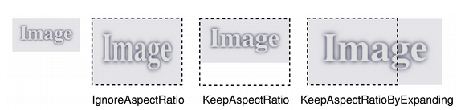

### 7.3 GraphicsView绘图架构

paintEvent事件进行的绘图是位图，只适合绘制复杂度不高的固定图形，不能实现图件的选择、编辑、拖放和修改功能，而GraphicsView绘图架构可以提供可交互的绘图方式。GraphicsView绘图架构也是一种model/view架构，每个图形元件都是可选择拖放和修改的。

GraphicsView绘图架构由3个部分组成，**场景、视图和图形项**。

**场景**，关联的类是QGraphicsScene，场景是不可见的，是一个抽象的管理图形项的容器，可以往场景添加图形项，获取场景的某个图形项等。除了图形项之外，场景还有背景层和前景层，通常由QBrush指定，也可以重新实现drawBackground()和drawForeground()函数来实现自定义的前景和背景，实现特殊效果。

**视图**，关联的类是QGraphicsView，提供绘图的视图组件，用于显示场景的内容，可以为一个场景设置多个视图。视图可以比场景大，这样场景默认会在视图的中间部分显示，也可以设置视图的Alignment属性来控制场景在视图中的位置；视图也可以比场景小，这样视图只显示一部分内容，但是会提供卷滚条在整个场景内移动。视图接受键盘和鼠标输入并转换为场景事件，进行坐标转换后可以传送给可视场景。

**图形项**，一些基本的图形原件，图形项基类是QGraphicsItem，Qt提供了一些基本图形项，例如绘制椭圆的QGraphicsEllipseItem、绘制矩形的QGraphicsRectItem、绘制文字的QGraphicsTextItem。图形项可以包含子图形项，支持碰撞检测，即是否和其他图形项碰撞。

坐标系统有3个。场**景坐标默认是逻辑坐标，以场景的中心为原点；图形项也是逻辑坐标，不过是局部的，它以自己的中心作为原点；视图是物理坐标，缺省为左上角为原点**。

**关于图形项坐标要进行强调：**

如果图形项没有父图形项，它的父容器就是场景，图形项的位置是图形项中心在场景的位置。

如果图形项有父图形项，那么父图形项坐标变换时它也会同步变换。

大多数图形项的函数都是在局部坐标完成的，返回的也是局部坐标，也就是图形项自己作为原点的坐标。个别的函数例如QGraphicsItem::pos()，就会返回它在父图形项中（有的话）的坐标或者场景中的坐标。

**关于视图坐标要进行强调：**

它是物理坐标，单位是像素。视图坐标只与widget或者视口有关，视口就是物理坐标，而与观察的场景（窗口）无关，QGraphicsView视口的左上角坐标总是(0,0)。

 **关于场景坐标要进行强调：**

场景坐标是所有图形项的基础坐标，描述了每个顶层图形项的位置，创建场景时可以定义场景矩形区的坐标范围。例如scene  = new QGraphicsScene(-400,-300,800,600)。告知左上角坐标为(-400,-300)，宽度800高度600，这样原点就在场景的中心位置了。这样每个图形项的坐标都可以给出，由函数QGraphicsItem::scenePos()给出或者图形项边界矩形QGraphicsItem::ssceneBoundingRect()函数给出。场景发生变化时会发射changed信号，参数时一个场景的矩形列表，表示哪些矩形区域发生了变化。

最后要说明的是坐标映射问题，例如在QGraphicsView的视口上单击鼠标会通过函数QGraphicsView::mapToScene()将视图坐标转为场景坐标，然后用QGraphicsScene::itemAt()获取场景中鼠标光标处的图形项。

#### 7.3.1 QGraphicsScene

场景具备的主要功能如下。

1.提供管理大量图形项的快速接口；

2.将事件传播给每个图形项；

3.管理每个图形项的状态，如选择状态、焦点状态等；

4.管理未经变换的渲染功能，主要用于打印。

要将项目添加到场景中，首先要构造一个 QGraphicsScene 对象。然后，您有两个选择：通过调用 addItem() 添加现有的 QGraphicsItem 对象，或者您可以调用便利函数之一 addEllipse()、addLine()、addPath()、addPixmap()、addPolygon()、addRect( ) 或 addText()，它们都返回一个指向新添加项的指针。使用这些函数添加的项目的尺寸是相对于项目的坐标系的，项目的位置在场景中被初始化为 (0, 0)。
然后，您可以使用 QGraphicsView 可视化场景。当场景改变时（例如，当一个项目移动或变形时）QGraphicsScene 发出 changed() 信号。要删除项目，请调用 removeItem()。
QGraphicsScene 使用索引算法来有效地管理项目的位置。默认情况下，使用 BSP（Binary Space Partitioning）树；适用于大多数项目保持静态（即不移动）的大型场景的算法。您可以通过调用 setItemIndexMethod() 来选择禁用此索引。有关可用索引算法的更多信息，请参阅 itemIndexMethod 属性。
通过调用 setSceneRect() 设置场景的边界矩形。物品可以放置在场景的任意位置，场景的大小默认无限制。场景矩形仅用于内部簿记，维护场景的项目索引。如果未设置场景矩形，QGraphicsScene 将使用由 itemsBoundingRect() 返回的所有项目的边界区域作为场景矩形。但是，itemsBoundingRect() 是一个相对耗时的函数，因为它通过收集场景中每个项目的位置信息来进行操作。因此，在大型场景上操作时，您应该始终设置场景矩形。
QGraphicsScene 的最大优势之一是它能够有效地确定项目的位置。即使场景中有数百万个项目，items() 函数也可以在几毫秒内确定项目的位置。 items() 有几个重载：一个在特定位置查找项目，一个在多边形或矩形内部或与多边形或矩形相交中查找项目，等等。返回的项目列表按堆叠顺序排序，最上面的项目是列表中的第一项。为方便起见，还有一个 itemAt() 函数返回给定位置的最上面的项目。
QGraphicsScene 维护场景的选择信息。要选择项目，请调用 setSelectionArea()，要清除当前选择，请调用 clearSelection()。调用 selectedItems() 以获取所有选定项目的列表。

QGraphicsScene 的另一个职责是从 QGraphicsView 传播事件。要将事件发送到场景，请构造一个继承 QEvent 的事件，然后使用例如 QApplication::sendEvent() 发送它。 event() 负责将事件分派给各个项目。一些常见事件由便利事件处理程序处理。例如按键事件由 keyPressEvent() 处理，鼠标按下事件由 mousePressEvent() 处理。
关键事件被传递到焦点项目。要设置焦点项目，您可以调用 setFocusItem()，传递一个接受焦点的项目，或者项目本身可以调用 QGraphicsItem::setFocus()。调用 focusItem() 获取当前焦点项。为了与小部件兼容，场景还维护自己的焦点信息。默认情况下，场景没有焦点，所有关键事件都被丢弃。如果调用 setFocus()，或者如果场景中的某个项目获得焦点，则场景会自动获得焦点。如果场景有焦点，hasFocus() 将返回 true，并且键事件将被转发到焦点项（如果有）。如果场景失去焦点（即有人调用 clearFocus()），而某个项目有焦点，场景将保持其项目焦点信息，一旦场景重新获得焦点，它将确保最后一个焦点项目重新获得焦点。
对于鼠标悬停效果，QGraphicsScene 调度悬停事件。如果一个项目接受悬停事件（见 QGraphicsItem::acceptHoverEvents()），当鼠标进入它的区域时它会收到一个 GraphicsSceneHoverEnter 事件。随着鼠标在项目区域内继续移动，QGraphicsScene 将向它发送 GraphicsSceneHoverMove 事件。当鼠标离开项目的区域时，项目将收到一个 GraphicsSceneHoverLeave 事件。
所有鼠标事件都传递给当前的鼠标抓取器项。如果一个项目接受鼠标事件（参见 QGraphicsItem::acceptedMouseButtons()）并且它接收到鼠标按下，它就会成为场景的鼠标抓取器。在没有按下其他鼠标按钮时，它会一直保持鼠标抓取器的状态，直到它接收到鼠标释放。您可以调用 mouseGrabberItem() 来确定当前正在抓取鼠标的项目。

##### 枚举类型

这个枚举描述了 QGraphicsScene 提供的用于管理场景中项目的位置信息的索引算法。

```c++
enum QGraphicsScene::ItemIndexMethod{
    QGraphicsScene::BspTreeIndex,//应用二进制空间分区树。通过使用二分搜索，QGraphicsScene 的所有项目定位算法的顺序都接近对数复杂度。添加、移动和删除项目是对数的。这种方法最适合静态场景（即大多数项目不移动的场景）
    QGraphicsScene::NoIndex//没有应用索引。项目位置具有线性复杂性，因为搜索了场景中的所有项目。然而，添加、移动和删除项目是在恒定时间内完成的。这种方法非常适合动态场景，其中许多项目被连续添加、移动或删除
}
```

这个枚举描述了 QGraphicsScene 中的渲染层。当 QGraphicsScene 绘制场景内容时，它会按顺序分别渲染每一层。每个层代表一个标志，当调用诸如 invalidate() 或 QGraphicsView::invalidateScene() 之类的函数时，可以将其 OR&#39;ed 在一起。

```c++
enum QGraphicsScene::SceneLayer{
    QGraphicsScene::ItemLayer,//项目层。 QGraphicsScene 通过调用虚函数drawItems() 来渲染该层中的所有项目。项目层绘制在背景层之后，前景层之前
    QGraphicsScene::BackgroundLayer,//背景层。 QGraphicsScene 通过调用虚函数drawBackground() 在这一层渲染场景的背景。在所有图层中首先绘制背景图层
    QGraphicsScene::ForegroundLayer,//前景层。 QGraphicsScene 通过调用虚函数drawForeground() 在这一层渲染场景的前景。前景层在所有层中最后绘制
    QGraphicsScene::AllLayers//所有层；该值表示所有三层的组合
}
```

##### 成员函数

构造函数。

```c++
QGraphicsScene(QObject *parent = Q_NULLPTR);
QGraphicsScene(const QRectF &sceneRect, QObject *parent = Q_NULLPTR);
QGraphicsScene(qreal x, qreal y, qreal width, qreal height, QObject *parent = Q_NULLPTR);
```

和场景属性、性质有关的函数。

```c++
QGraphicsItem *activePanel() const;//返回当前活动面板，如果当前没有活动面板，则返回 0
void setActivePanel(QGraphicsItem *item);

QGraphicsWidget *activeWindow() const;//返回当前活动窗口，如果当前没有活动窗口，则返回 0
void setActiveWindow(QGraphicsWidget *widget);

QFont font() const;//该属性保存场景的默认字体
void setFont(const QFont &font);

QBrush foregroundBrush() const;//该属性持有场景的前景画笔
void setForegroundBrush(const QBrush &brush);
QBrush backgroundBrush() const;//该属性持有场景的背景画笔
void setBackgroundBrush(const QBrush &brush);

void setFocus(Qt::FocusReason focusReason = Qt::OtherFocusReason);
bool hasFocus() const;//如果场景有焦点，则返回 true；否则返回 false
void clearFocus();//从场景中清除焦点,并在场景重新获得焦点后重新获得焦点

QGraphicsItem *focusItem() const;//当场景处于活动状态时，此函数返回场景的当前焦点项目，如果当前没有项目具有焦点，则返回 0
void setFocusItem(QGraphicsItem *item, Qt::FocusReason focusReason = Qt::OtherFocusReason);

bool isActive() const;//如果场景处于活动状态（例如，它被至少一个处于活动状态的 QGraphicsView 查看），则返回 true；否则返回 false

qreal height() const;//这个便利函数相当于调用sceneRect().height()
qreal width() const;

QRectF itemsBoundingRect() const;//计算并返回场景中所有项目的边界矩形
qreal minimumRenderSize() const;//此属性保存必须绘制的项目的最小视图转换大小
QGraphicsItem *mouseGrabberItem() const;//返回当前鼠标抓取项，如当前没有任何项正在抓取鼠标则返回0

int bspTreeDepth() const;//这个属性保存了 QGraphicsScene 的 BSP 索引树的深度
void setBspTreeDepth(int depth);

ItemIndexMethod itemIndexMethod() const;//此属性保存项目索引方法
void setItemIndexMethod(ItemIndexMethod method);

QPalette palette() const;//该属性保存场景的默认调色板
void setPalette(const QPalette &palette);

QRectF sceneRect() const;//该属性保存场景矩形；场景的边界矩形
void setSceneRect(const QRectF &rect);
void setSceneRect(qreal x, qreal y, qreal w, qreal h);

void QGraphicsScene::clearSelection();//清除当前选择的项目
QList<QGraphicsItem *> selectedItems() const;//返回所有当前选定项目的列表。物品按无特定顺序退回

QPainterPath selectionArea() const;//返回之前使用 setSelectionArea() 设置的选择区域，如果没有设置选择区域，则返回一个空的 QPainterPath
void setSelectionArea(const QPainterPath &path, const QTransform &deviceTransform);
void setSelectionArea(const QPainterPath &path, Qt::ItemSelectionMode mode = Qt::IntersectsItemShape, const QTransform &deviceTransform = QTransform());
void setSelectionArea(const QPainterPath &path, Qt::ItemSelectionOperation selectionOperation, Qt::ItemSelectionMode mode = Qt::IntersectsItemShape, const QTransform &deviceTransform = QTransform());

qreal minimumRenderSize() const;//此属性保存必须绘制的项目的最小视图转换大小
void setMinimumRenderSize(qreal minSize);

bool stickyFocus() const;//该属性保存点击进入场景背景是否会清除焦点
void setStickyFocus(bool enabled);

void setStyle(QStyle *style);//将场景的样式设置或替换为样式，并将样式重新设置为该场景
QStyle *style() const;
```

和图形项有关的函数如下。

```c++
QList<QGraphicsItem *> collidingItems(const QGraphicsItem *item, Qt::ItemSelectionMode mode = Qt::IntersectsItemShape) const;//返回与项目冲突的所有项目的列表
QGraphicsItemGroup *createItemGroup(const QList<QGraphicsItem *> &items);//将 items 中的所有项目分组到一个新的 QGraphicsItemGroup 中，并返回一个指向该组的指针
void destroyItemGroup(QGraphicsItemGroup *group);//将 group 中的所有 item 重新设置为 group 的 parent item，然后从场景中删除 group，最后将其删除
void removeItem(QGraphicsItem *item);//从场景中移除项目项及其所有子项。项目的所有权被传递给调用者（即，QGraphicsScene 在销毁时将不再删除项目）

// 返回指定位置的最顶部可见项，如果此位置没有项，则返回 0
QGraphicsItem *itemAt(const QPointF &position, const QTransform &deviceTransform) const;
QGraphicsItem *itemAt(qreal x, qreal y, const QTransform &deviceTransform) const;
// 返回场景中所有项目的有序列表。 order 决定堆叠顺序
QList<QGraphicsItem *> items(Qt::SortOrder order = Qt::DescendingOrder) const;
// 根据模式返回所有可见项目，这些项目位于使用 order 排序的列表中的指定位置
QList<QGraphicsItem *> items(const QPointF &pos, Qt::ItemSelectionMode mode = Qt::IntersectsItemShape, Qt::SortOrder order = Qt::DescendingOrder, const QTransform &deviceTransform = QTransform()) const;
QList<QGraphicsItem *> items(const QRectF &rect, Qt::ItemSelectionMode mode = Qt::IntersectsItemShape, Qt::SortOrder order = Qt::DescendingOrder, const QTransform &deviceTransform = QTransform()) const;
QList<QGraphicsItem *> items(const QPolygonF &polygon, Qt::ItemSelectionMode mode = Qt::IntersectsItemShape, Qt::SortOrder order = Qt::DescendingOrder, const QTransform &deviceTransform = QTransform()) const;
QList<QGraphicsItem *> items(const QPainterPath &path, Qt::ItemSelectionMode mode = Qt::IntersectsItemShape, Qt::SortOrder order = Qt::DescendingOrder, const QTransform &deviceTransform = QTransform()) const;
QList<QGraphicsItem *> items(qreal x, qreal y, qreal w, qreal h, Qt::ItemSelectionMode mode, Qt::SortOrder order, const QTransform &deviceTransform = QTransform()) const;
```

用于添加图形项的便利函数如下，它们的返回值都是QGraphicsItem的派生类。

```c++
QGraphicsEllipseItem *addEllipse(const QRectF &rect, const QPen &pen = QPen(), const QBrush &brush = QBrush());
QGraphicsEllipseItem *addEllipse(qreal x, qreal y, qreal w, qreal h, const QPen &pen = QPen(), const QBrush &brush = QBrush());
void addItem(QGraphicsItem *item);
QGraphicsLineItem *addLine(const QLineF &line, const QPen &pen = QPen());
QGraphicsLineItem *addLine(qreal x1, qreal y1, qreal x2, qreal y2, const QPen &pen = QPen());
QGraphicsPathItem *addPath(const QPainterPath &path, const QPen &pen = QPen(), const QBrush &brush = QBrush());
QGraphicsPixmapItem *addPixmap(const QPixmap &pixmap);
QGraphicsPolygonItem *addPolygon(const QPolygonF &polygon, const QPen &pen = QPen(), const QBrush &brush = QBrush());
QGraphicsRectItem *addRect(const QRectF &rect, const QPen &pen = QPen(), const QBrush &brush = QBrush());
QGraphicsRectItem *addRect(qreal x, qreal y, qreal w, qreal h, const QPen &pen = QPen(), const QBrush &brush = QBrush());
QGraphicsSimpleTextItem *addSimpleText(const QString &text, const QFont &font = QFont())
QGraphicsTextItem *addText(const QString &text, const QFont &font = QFont());
QGraphicsProxyWidget *addWidget(QWidget *widget, Qt::WindowFlags wFlags = Qt::WindowFlags());
```

其它函数。

```c++
QRectF itemsBoundingRect() const;//计算并返回场景中所有项目的边界矩形
QGraphicsItem *mouseGrabberItem() const;//返回当前的鼠标抓取项，如果当前没有任何项正在抓取鼠标，则返回 0
virtual QVariant inputMethodQuery(Qt::InputMethodQuery query) const;//该方法用于输入法查询场景的一组属性，以支持复杂的输入法操作作为对周围文本和重新转换的支持
void invalidate(qreal x, qreal y, qreal w, qreal h, SceneLayers layers = AllLayers);//使场景中的矩形图层无效并安排重绘。图层中的任何缓存内容都会无条件失效并重绘
void render(QPainter *painter, const QRectF &target = QRectF(), const QRectF &source = QRectF(), Qt::AspectRatioMode aspectRatioMode = Qt::KeepAspectRatio);//使用painter将源矩形从场景渲染到目标
bool sendEvent(QGraphicsItem *item, QEvent *event);//通过可能的事件过滤器将事件事件发送到项目项
void update(qreal x, qreal y, qreal w, qreal h);//安排在场景中重绘区域矩形
QList<QGraphicsView *> views() const;//返回显示此场景的所有视图的列表
```

##### 信号与槽函数

```c++
// 槽函数
void advance();//此插槽通过为场景中的所有项目调用 QGraphicsItem::advance() 将场景推进一步
void clear();//Removes and deletes all items from the scene, but otherwise leaves the state of the scene unchanged
void clearSelection();//清除当前选择
void invalidate(const QRectF &rect = QRectF(), SceneLayers layers = AllLayers);//使场景中的矩形图层无效并安排重绘。图层中的任何缓存内容都会无条件失效并重绘
void update(const QRectF &rect = QRectF());//安排在场景中重绘区域矩形

// 信号函数
void changed(const QList<QRectF> &region);//此信号由 QGraphicsScene 在控制到达事件循环时发出，如果场景内容发生变化
void focusItemChanged(QGraphicsItem *newFocusItem, QGraphicsItem *oldFocusItem, Qt::FocusReason reason);//每当场景中的焦点发生变化时，此信号由 QGraphicsScene 发出
void sceneRectChanged(const QRectF &rect);//每当场景矩形发生变化时此信号由QGraphicsScene发出
void selectionChanged();//每当选择改变时，QGraphicscene就会发出该信号。您可以调用selectedItems（）来获取所选项目的新列表。
```

#### 7.3.2 QGraphicsView

QGraphicsView 类提供了一个用于显示 QGraphicsScene 内容的小部件。
要可视化场景，首先要构造一个 QGraphicsView 对象，将要可视化的场景的地址传递给 QGraphicsView 的构造函数。或者，您可以稍后调用 setScene() 来设置场景。调用 show() 后，默认情况下视图将滚动到场景中心并显示此时可见的所有项目。例如：

```c++
QGraphicsScene scene;
scene.addText("Hello, world!");

QGraphicsView view(&scene);
view.show();
```

您可以使用滚动条或调用 centerOn() 显式滚动到场景中的任何位置。通过将一个点传递给 centerOn()，QGraphicsView 将滚动其视口以确保该点在视图中居中。为滚动到 QGraphicsItem 提供了重载，在这种情况下，QGraphicsView 将看到项目的中心位于视图的中心。如果您只想确保某个区域可见（但不一定居中），您可以调用 ensureVisible()。

QGraphicsView 可用于可视化整个场景或仅部分场景。默认情况下，第一次显示视图时会自动检测到可视化区域（通过调用 QGraphicsScene::itemsBoundingRect()）。要自己设置可视化区域矩形，可以调用 setSceneRect()。这将适当地调整滚动条的范围。请注意，尽管场景支持几乎无限大小，但滚动条的范围永远不会超过整数（INT_MIN，INT_MAX）的范围。

QGraphicsView 通过调用 render() 来可视化场景。默认情况下，通过使用常规 QPainter 并使用默认渲染提示将项目绘制到视口上。要更改 QGraphicsView 在绘制项目时传递给 QPainter 的默认渲染提示，您可以调用 setRenderHints()。

默认情况下，QGraphicsView 为视口小部件提供了一个常规的 QWidget。您可以通过调用 viewport() 访问此小部件，也可以通过调用 setViewport() 来替换它。要使用 OpenGL 进行渲染，只需调用 setViewport(new QGLWidget)。 QGraphicsView 拥有视口小部件的所有权。

QGraphicsView 支持仿射变换，使用 QTransform。您可以将矩阵传递给 setTransform()，也可以调用便利函数之一 rotate()、scale()、translate() 或 slice()。最常见的两种转换是用于实现缩放的缩放和旋转。 QGraphicsView 在转换过程中保持视图的中心固定。由于场景对齐 (setAligment())，平移视图不会产生视觉影响。

您可以使用鼠标和键盘与场景中的项目进行交互。 QGraphicsView 将鼠标和按键事件转化为场景事件，（继承QGraphicsSceneEvent的事件），并转发到可视化场景。最后，处理事件并对其做出反应的是单个项目。例如，如果您单击一个可选项目，该项目通常会让场景知道它已被选中，并且它还会重新绘制自身以显示一个选择矩形。类似地，如果您单击并拖动鼠标来移动一个可移动的项目，它是处理鼠标移动和自身移动的项目。默认情况下启用项目交互，您可以通过调用 setInteractive() 来切换它。

您还可以通过创建 QGraphicsView 的子类并重新实现鼠标和按键事件处理程序来提供您自己的自定义场景交互。为了简化您以编程方式与视图中的项目交互的方式，QGraphicsView 提供了映射函数 mapToScene() 和 mapFromScene()，以及项目访问器 items() 和 itemAt()。这些函数允许您在视图坐标和场景坐标之间映射点、矩形、多边形和路径，并使用视图坐标在场景中查找项目。

##### 枚举类型

这个枚举描述了你可以为 QGraphicsView 的缓存模式设置的标志。

```c++
enum QGraphicsView::CacheModeFlag{
    QGraphicsView::CacheNone,//所有绘画都直接在视口上完成
    QGraphicsView::CacheBackground//背景被缓存。这会影响自定义背景和基于 backgroundBrush 属性的背景。启用此标志后，QGraphicsView 将分配一个具有视口全尺寸的像素图
}
```

此枚举描述了在视口上按下并拖动鼠标时视图的默认操作。

```c++
enum QGraphicsView::DragMode{
    QGraphicsView::NoDrag,//什么都没发生;鼠标事件被忽略
    QGraphicsView::ScrollHandDrag,//光标变为指向手，拖动鼠标将滚动滚动条。此模式适用于交互式和非交互式模式
    QGraphicsView::RubberBandDrag//将出现一条橡皮筋。拖动鼠标将设置橡皮筋几何图形，并选中所有被橡皮筋覆盖的项目。非交互式视图禁用此模式
}
```

此枚举描述了您可以启用以提高 QGraphicsView 中的呈现性能的标志。默认情况下，没有设置这些标志。请注意，设置标志通常会产生副作用，并且此效果可能因绘图设备和平台而异。

```c++
enum QGraphicsView::OptimizationFlag{
    QGraphicsView::DontClipPainter,//此值已过时且无效
    QGraphicsView::DontSavePainterState,//渲染时，QGraphicsView 在渲染背景或前景以及渲染每个项目时保护画家状态（参见 QPainter::save()）。这允许您让画家处于改变状态（即，您可以调用 QPainter::setPen() 或 QPainter::setBrush() 而不在绘画后恢复状态）。但是，如果项目始终恢复状态，则应启用此标志以防止 QGraphicsView 执行相同操作
    QGraphicsView::DontAdjustForAntialiasing,//禁用 QGraphicsView 对暴露区域的抗锯齿自动调整。在其 QGraphicsItem::boundingRect() 边界上呈现抗锯齿线的项目最终可能会在外部呈现线的一部分。为了防止渲染伪影，QGraphicsView 在所有方向上将所有暴露区域扩展 2 个像素。如果启用此标志，QGraphicsView 将不再执行这些调整，从而最大限度地减少需要重绘的区域，从而提高性能。一个常见的副作用是使用抗锯齿绘制的项目在移动时会在场景中留下绘画痕迹
    QGraphicsView::IndirectPainting//自 Qt 4.6 起，恢复调用 QGraphicsView::drawItems() 和 QGraphicsScene::drawItems() 的旧绘画算法。仅用于与旧代码兼容
}
```

此枚举描述了当用户调整视图大小或转换视图时 QGraphicsView 可以使用的可能锚点。

```c++
enum QGraphicsView::ViewportAnchor{
    QGraphicsView::NoAnchor,//无锚点，即视图保持场景位置不变
    QGraphicsView::AnchorViewCenter,//视图中心的场景点用作锚点
    QGraphicsView::AnchorUnderMouse//鼠标下方的点用作锚点
}
```

这个枚举描述了当场景内容改变或暴露时 QGraphicsView 如何更新它的视口。

```c++
enum QGraphicsView::ViewportUpdateMode{
    QGraphicsView::FullViewportUpdate,//当场景的任何可见部分发生变化或重新曝光时，QGraphicsView 将更新整个视口。当 QGraphicsView 花费更多时间来确定要绘制的内容而不是绘制时（例如，当重复更新非常多的小项目时），这种方法是最快的。这是不支持部分更新的视口（例如 QGLWidget）和需要禁用滚动优化的视口的首选更新模式
    QGraphicsView::MinimalViewportUpdate,//QGraphicsView 将确定需要重绘的最小视口区域，通过避免重绘未更改的区域来最大限度地减少绘制时间。这是 QGraphicsView 的默认模式。虽然这种方法总体上提供了最佳性能，但如果场景中有许多可见的小变化，QGraphicsView 最终可能会花费更多时间来寻找最小方法，而不是花费在绘图上
    QGraphicsView::SmartViewportUpdate,//QGraphicsView 将尝试通过分析需要重绘的区域来找到最佳更新模式
    QGraphicsView::BoundingRectViewportUpdate,//将重绘视口中所有更改的边界矩形。这种模式的优点是 QGraphicsView 只搜索一个区域的变化，最大限度地减少确定需要重绘的时间。缺点是没有改变的区域也需要重新绘制
    QGraphicsView::NoViewportUpdate//当场景改变时，QGraphicsView 永远不会更新它的视口；用户应控制所有更新。此模式禁用 QGraphicsView 中的所有（可能很慢）项目可见性测试，适用于需要固定帧速率或视口在外部更新的场景
}
```

##### 成员函数

```c++
QGraphicsView(QGraphicsScene *scene, QWidget *parent = Q_NULLPTR);
void scale(qreal sx, qreal sy);//缩放、旋转、扭曲、平移
void rotate(qreal angle);
void shear(qreal sh, qreal sv);
void translate(qreal dx, qreal dy);

Qt::Alignment alignment() const;//整个场景可见时，此属性保存视图中场景的对齐方式
void setAlignment(Qt::Alignment alignment);

QBrush backgroundBrush() const;//该属性保存场景的背景画笔
void setBackgroundBrush(const QBrush &brush);

CacheMode cacheMode() const;//此属性保存视图的哪些部分被缓存
void setCacheMode(CacheMode mode);

DragMode dragMode() const;//此属性保存按下鼠标左键时在场景上拖动鼠标的行为
void setDragMode(DragMode mode);

QBrush foregroundBrush() const;//该属性持有场景的前景画笔
void setForegroundBrush(const QBrush &brush);

void setViewportUpdateMode(ViewportUpdateMode mode);//视口应如何更新其内容
ViewportUpdateMode viewportUpdateMode() const;

bool isInteractive() const;//该属性保存视图是否允许场景交互
void setInteractive(bool allowed);

bool isTransformed() const;//如果视图被转换（即，已分配非身份转换或调整滚动条），则返回 true
void setTransform(const QTransform &matrix, bool combine = false);
void resetTransform();
QTransform transform() const;

QMatrix matrix() const;//返回视图的当前变换矩阵。如果没有设置当前变换，则返回单位矩阵
void setMatrix(const QMatrix &matrix, bool combine = false);
void resetMatrix();

OptimizationFlags optimizationFlags() const;//可用于调整 QGraphicsView 性能的标志。QGraphicsView 使用裁剪、额外的边界矩形调整和某些其他辅助工具来提高常见情况图形场景的渲染质量和性能。但是，根据目标平台、场景和使用的视口，其中一些操作可能会降低性能。
void setOptimizationFlag(OptimizationFlag flag, bool enabled = true);
void setOptimizationFlags(OptimizationFlags flags);

void setScene(QGraphicsScene *scene);//返回指向当前在视图中可视化的场景的指针。如果当前没有可视化场景，则返回 0
QGraphicsScene *scene() const;

QRectF sceneRect() const;//此属性保存此视图可视化的场景区域
void setSceneRect(const QRectF &rect);
void setSceneRect(qreal x, qreal y, qreal w, qreal h);

ViewportAnchor transformationAnchor() const;//视图在变换期间应如何定位场景
void setTransformationAnchor(ViewportAnchor anchor);

QPainter::RenderHints renderHints() const;//该属性保存视图的默认渲染提示
void setRenderHint(QPainter::RenderHint hint, bool enabled = true);
void setRenderHints(QPainter::RenderHints hints);

QRect rubberBandRect() const;//选择模式，返回选择矩形框
Qt::ItemSelectionMode rubberBandSelectionMode() const;
void setRubberBandSelectionMode(Qt::ItemSelectionMode mode);

ViewportAnchor resizeAnchor() const;//调整视图大小时视图应如何定位场景
void setResizeAnchor(ViewportAnchor anchor);

void render(QPainter *painter, const QRectF &target = QRectF(), const QRect &source = QRect(), Qt::AspectRatioMode aspectRatioMode = Qt::KeepAspectRatio);//使用painter将位于视图坐标中的源矩形从场景渲染到位于绘制设备坐标中的目标中。此函数对于将视图的内容捕获到绘图设备（例如 QImage）（例如，截取屏幕截图）或打印到 QPrinter 很有用
void resetCachedContent();//重置任何缓存的内容。调用此函数将清除 QGraphicsView 的缓存。如果当前缓存模式为 CacheNone，则此函数不执行任何操作
QTransform viewportTransform() const;//返回将场景坐标映射到视口坐标的矩阵。

void centerOn(const QPointF &pos);//滚动视口的内容以确保场景坐标 pos, 在视图中居中。因为 pos 是一个浮点坐标，并且滚动条在整数坐标上运行，所以居中只是一个近似值
void centerOn(qreal x, qreal y);
void centerOn(const QGraphicsItem *item);

void ensureVisible(const QRectF &rect, int xmargin = 50, int ymargin = 50);//滚动视口的内容，使场景矩形矩形可见，其边距由 xmargin 和 ymargin 以像素为单位指定。如果无法到达指定的矩形，则将内容滚动到最近的有效位置。两个边距的默认值为 50 像素
void ensureVisible(qreal x, qreal y, qreal w, qreal h, int xmargin = 50, int ymargin = 50);
void ensureVisible(const QGraphicsItem *item, int xmargin = 50, int ymargin = 50);

void fitInView(const QRectF &rect, Qt::AspectRatioMode aspectRatioMode = Qt::IgnoreAspectRatio);//缩放视图矩阵并滚动滚动条以确保场景矩形矩形适合视口。 rect 必须在场景 rect 内；否则， fitInView() 不能保证整个矩形都是可见的
void fitInView(qreal x, qreal y, qreal w, qreal h, Qt::AspectRatioMode aspectRatioMode = Qt::IgnoreAspectRatio);
void fitInView(const QGraphicsItem *item, Qt::AspectRatioMode aspectRatioMode = Qt::IgnoreAspectRatio);

QGraphicsItem *itemAt(const QPoint &pos) const;//返回位置 pos 处的项目，该位置位于视口坐标中。如果此位置有多个项目，则此函数返回最顶部的项目
QGraphicsItem *itemAt(int x, int y) const;

QList<QGraphicsItem *> items() const;//返回关联场景中所有项目的列表，以降序堆叠顺序（即，返回列表中的第一项是最上面的项目）。
QList<QGraphicsItem *> items(const QPoint &pos) const;
QList<QGraphicsItem *> items(int x, int y) const;
QList<QGraphicsItem *> items(const QRect &rect, Qt::ItemSelectionMode mode = Qt::IntersectsItemShape) const;
QList<QGraphicsItem *> items(int x, int y, int w, int h, Qt::ItemSelectionMode mode = Qt::IntersectsItemShape) const;
QList<QGraphicsItem *> items(const QPolygon &polygon, Qt::ItemSelectionMode mode = Qt::IntersectsItemShape) const;
QList<QGraphicsItem *> items(const QPainterPath &path, Qt::ItemSelectionMode mode = Qt::IntersectsItemShape) const;

QPoint mapFromScene(const QPointF &point) const;//将场景坐标点返回到视口坐标
QPolygon mapFromScene(const QRectF &rect) const;
QPolygon mapFromScene(const QPolygonF &polygon) const;
QPainterPath mapFromScene(const QPainterPath &path) const;
QPoint mapFromScene(qreal x, qreal y) const;
QPolygon mapFromScene(qreal x, qreal y, qreal w, qreal h) const;

QPointF mapToScene(const QPoint &point) const;//返回映射到场景坐标的视口坐标点
QPolygonF mapToScene(const QRect &rect) const;
QPolygonF mapToScene(const QPolygon &polygon) const;
QPainterPath mapToScene(const QPainterPath &path) const;
QPointF mapToScene(int x, int y) const;
QPolygonF mapToScene(int x, int y, int w, int h) const;
```

##### 信号和槽函数

```c++
slots void invalidateScene(const QRectF &rect = QRectF(), QGraphicsScene::SceneLayers layers = QGraphicsScene::AllLayers);// 使矩形内的图层无效并安排重绘。 rect 在场景坐标中。矩形内层的任何缓存内容都将无条件失效并重绘
slots void updateScene(const QList<QRectF> &rects);//安排场景矩形矩形的更新
slots void updateSceneRect(const QRectF &rect);//通知 QGraphicsView 场景的场景矩形已更改。 rect 是新的场景矩形。如果视图已经有一个明确设置的场景矩形，这个函数什么都不做

signals void rubberBandChanged(QRect rubberBandRect, QPointF fromScenePoint, QPointF toScenePoint);//该信号在橡皮筋矩形改变时发出。视口 Rect 由 RubberBandRect 指定。使用 fromScenePoint 和 toScenePoint 在场景点中提供拖动开始位置和拖动结束位置
```

#### 7.3.3 QGraphicsItem

图形项基类。

支持如下操作：

支持鼠标响应事件，包括鼠标按下、移动、释放、双击，还包括鼠标停留、滚轮、快捷菜单等事件；

支持键盘输入，按键事件；

支持拖放操作；

支持组合，可以是父子项关系组合，也可以通过QGraphicsItemGroup类进行组合。

它和派生类的继承关系如下所示。

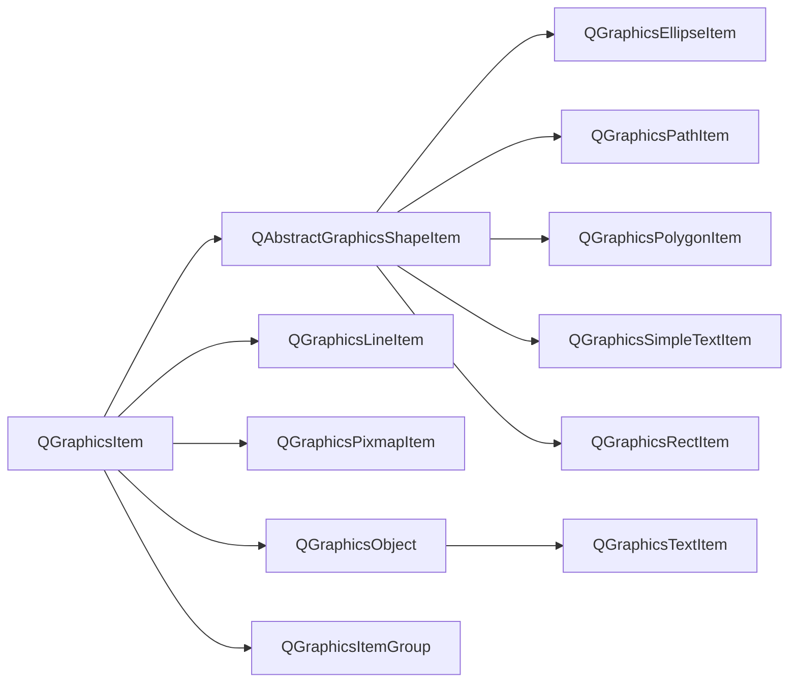
```mermaid
graph LR
QGraphicsItem-->QAbstractGraphicsShapeItem
QGraphicsItem-->QGraphicsLineItem
QGraphicsItem-->QGraphicsPixmapItem
QGraphicsItem-->QGraphicsObject
QGraphicsObject-->QGraphicsTextItem
QGraphicsItem-->QGraphicsItemGroup
QAbstractGraphicsShapeItem-->QGraphicsEllipseItem
QAbstractGraphicsShapeItem-->QGraphicsPathItem
QAbstractGraphicsShapeItem-->QGraphicsPolygonItem
QAbstractGraphicsShapeItem-->QGraphicsSimpleTextItem
QAbstractGraphicsShapeItem-->QGraphicsRectItem
```

要强调的是，如果自定义图形项，必须重载type()函数并给出Type信息，且Type必须比UserType大。

```c++
class customItem: public QGraphicsItem
{
	public:
		enum {Type = UserType + 1};
		int type() const{ 
			return Type; // 使qgraphicsitem_cast函数可以强转为此类型
		}
}
```

##### 枚举类型

这个枚举描述了 QGraphicsItem 的缓存模式。缓存用于通过分配和渲染到屏幕外像素缓冲区来加速渲染，当项目需要重绘时可以重用该缓冲区。对于某些绘图设备，缓存直接存储在图形内存中，这使得渲染非常快速。

```c++
enum QGraphicsItem::CacheMode {
    QGraphicsItem::NoCache，//
    QGraphicsItem::ItemCoordinateCache，//
    QGraphicsItem::DeviceCoordinateCache//
}
```

这个枚举描述了由 QGraphicsItem::itemChange() 通知的状态变化。通知在状态更改时发送，在某些情况下，可以进行调整（有关详细信息，请参阅每个更改的文档）。
注意：在 itemChange() 中调用 QGraphicsItem 本身的函数时要小心，因为某些函数调用会导致不必要的递归。例如，您不能在 ItemPositionChange 通知上调用 itemChange() 中的 setPos()，因为 setPos() 函数将再次调用 itemChange(ItemPositionChange)。相反，您可以从 itemChange() 返回调整后的新位置。

```c++
enum QGraphicsItem::GraphicsItemChange{
    QGraphicsItem::ItemEnabledChange,//项目的启用状态更改。如果该项目当前已启用，它将被禁用，反之亦然。 value 参数是新的启用状态（即，真或假）。不要在 itemChange() 中调用 setEnabled()，因为此通知已传递。相反，您可以从 itemChange() 返回新状态
    QGraphicsItem::ItemEnabledHasChanged,//该项目的启用状态已更改。 value 参数是新的启用状态（即，真或假）。不要在 itemChange() 中调用 setEnabled()，因为此通知已传递。返回值被忽略
    QGraphicsItem::ItemMatrixChange,//项目的仿射变换矩阵正在发生变化。该值已过时；您可以改用 ItemTransformChange
    QGraphicsItem::ItemPositionChange,//项目的位置发生变化。如果启用了 ItemSendsGeometryChanges 标志，并且项目的本地位置相对于其父项发生更改（即，作为调用 setPos() 或 moveBy() 的结果），则会发送此通知。 value 参数是新位置（即 QPointF）。您可以调用 pos() 来获取原始位置。在传递此通知时，请勿在 itemChange() 中调用 setPos() 或 moveBy()；相反，您可以从 itemChange() 返回调整后的新位置。在这个通知之后，如果位置发生变化，QGraphicsItem 会立即发送 ItemPositionHasChanged 通知
    QGraphicsItem::ItemPositionHasChanged,//项目的位置已更改。如果启用了 ItemSendsGeometryChanges 标志，并且在项目的本地位置（相对于其父项）发生更改后，则会发送此通知。 value 参数是新位置（与 pos() 相同），QGraphicsItem 忽略此通知的返回值（即只读通知）
    QGraphicsItem::ItemTransformChange,//项目的变换矩阵发生变化。如果启用了 ItemSendsGeometryChanges 标志，并且当项目的本地变换矩阵发生更改（即，作为调用 setTransform() 的结果）时发送此通知。值参数是新矩阵（即 QTransform）；获取旧矩阵, 调用 transform()。不要调用 setTransform() 或在 itemChange() 中设置任何转换属性，因为此通知已传递；相反，您可以从 itemChange() 返回新矩阵。如果您更改，则不会发送此通知变换属性
    QGraphicsItem::ItemTransformHasChanged,//由于调用了 setTransform，或者更改了其中一个转换属性，因此项的转换矩阵已更改。如果启用了 ItemSendsGeometryChanges 标志，并且在项目的本地转换矩阵发生更改后，将发送此通知。 value 参数是新矩阵（与 transform() 相同），QGraphicsItem 忽略此通知的返回值（即只读通知）
    QGraphicsItem::ItemRotationChange,//项目的旋转属性发生变化。如果启用了 ItemSendsGeometryChanges 标志，并且项目的旋转属性发生更改（即，作为调用 setRotation() 的结果），则会发送此通知。 value 参数是新的旋转（即双精度）；要获得旧的旋转，请调用 rotation()。不要在 itemChange() 中调用 setRotation()，因为此通知已传递；相反，您可以从 itemChange() 返回新的旋转
    QGraphicsItem::ItemRotationHasChanged,//项目的旋转属性已更改。如果启用了 ItemSendsGeometryChanges 标志，并且项目的旋转属性已更改，则会发送此通知。 value 参数是新的旋转（即双精度），QGraphicsItem 忽略此通知的返回值（即只读通知）。不要在 itemChange() 中调用 setRotation()，因为此通知已传递
    QGraphicsItem::ItemScaleChange,//项目的比例属性发生变化。如果启用了 ItemSendsGeometryChanges 标志，并且项目的 scale 属性发生更改（即，作为调用 setScale() 的结果），则会发送此通知。 value 参数是新的比例（即双精度）；要获得旧比例，请调用 scale()。在传递此通知时不要在 itemChange() 中调用 setScale()；相反，您可以从 itemChange() 返回新的比例
    QGraphicsItem::ItemScaleHasChanged,//项目的比例属性已更改。如果启用了 ItemSendsGeometryChanges 标志，并且在项目的 scale 属性发生更改后，将发送此通知。 value 参数是新的比例（即双精度），QGraphicsItem 忽略此通知的返回值（即只读通知）。不要在 itemChange() 中调用 setScale()，因为此通知已传递
    QGraphicsItem::ItemTransformOriginPointChange,//项目的变换原点属性发生变化。如果启用了 ItemSendsGeometryChanges 标志，并且项目的变换原点属性发生更改（即，作为调用 setTransformOriginPoint() 的结果），则会发送此通知。 value 参数是新的原点（即 QPointF）；要获取旧的原点，请调用 transformOriginPoint()。不要在 itemChange() 中调用 setTransformOriginPoint()，因为此通知已传递；相反，您可以从 itemChange() 返回新的变换原点
    QGraphicsItem::ItemTransformOriginPointHasChanged,//项目的变换原点属性已更改。如果启用了 ItemSendsGeometryChanges 标志，并且在项目的变换原点属性发生更改后，将发送此通知。 value 参数是新的原点（即 QPointF），QGraphicsItem 忽略此通知的返回值（即只读通知）。不要在 itemChange() 中调用 setTransformOriginPoint()，因为此通知已传递
    QGraphicsItem::ItemSelectedChange,//项目的选定状态发生变化。如果该项目当前被选中，它将变为未选中，反之亦然。 value 参数是新的选定状态（即，真或假）。在传递此通知时不要在 itemChange() 中调用 setSelected()；相反，您可以从 itemChange() 返回新的选定状态
    QGraphicsItem::ItemSelectedHasChanged,//项目的选定状态已更改。 value 参数是新的选定状态（即，真或假）。在传递此通知时，请勿在 itemChange() 中调用 setSelected()。返回值被忽略
    QGraphicsItem::ItemVisibleChange,//项目的可见状态发生变化。如果该项目当前可见，它将变为不可见，反之亦然。 value 参数是新的可见状态（即，真或假）。不要在 itemChange() 中调用 setVisible()，因为此通知已传递；相反，您可以从 itemChange() 返回新的可见状态
    QGraphicsItem::ItemVisibleHasChanged,//该项目的可见状态已更改。 value 参数是新的可见状态（即，真或假）。不要在 itemChange() 中调用 setVisible()，因为此通知已传递。返回值被忽略
    QGraphicsItem::ItemParentChange,//项目的父项更改。 value 参数是新的父项（即 QGraphicsItem 指针）。不要在 itemChange() 中调用 setParentItem()，因为此通知已发送；相反，您可以从 itemChange() 返回新的父级
    QGraphicsItem::ItemParentHasChanged,//项目的父项已更改。 value 参数是新的父级（即，指向 QGraphicsItem 的指针）。不要在 itemChange() 中调用 setParentItem()，因为此通知已传递。返回值被忽略
    QGraphicsItem::ItemChildAddedChange,//一个孩子被添加到这个项目。 value 参数是新的子项（即 QGraphicsItem 指针）。在传递此通知时，请勿将此项目传递给任何项目的 setParentItem() 函数。返回值未使用；您无法调整此通知中的任何内容。请注意，发送此通知时，新子代可能未完全构建；在子节点上调用纯虚函数可能会导致崩溃
    QGraphicsItem::ItemChildRemovedChange,//从该项目中删除了一个孩子。 value 参数是即将被删除的子项（即 QGraphicsItem 指针）。返回值未使用；您无法调整此通知中的任何内容
    QGraphicsItem::ItemSceneChange,//该项目被移动到一个新场景。当项目被添加到其初始场景以及被移除时，也会发送此通知。项目的 scene() 是旧场景（如果项目尚未添加到场景中，则为 0）。 value 参数是新场景（即 QGraphicsScene 指针），如果项目从场景中移除，则为空指针。在传递此通知时，不要通过将此项目传递给 QGraphicsScene::addItem() 来覆盖此更改；相反，您可以从 itemChange() 返回新场景。谨慎使用此功能；反对场景变化会很快导致不必要的递归
    QGraphicsItem::ItemSceneHasChanged,//物品的场景发生了变化。该项目的场景（）是新场景。当项目被添加到其初始场景以及被移除时，也会发送此通知。值参数是新场景（即，指向 QGraphicsScene 的指针）。不要在 itemChange() 中调用 setScene()，因为此通知已传递。返回值被忽略
    QGraphicsItem::ItemCursorChange,//项目的光标发生变化。 value 参数是新的游标（即 QCursor）。不要在 itemChange() 中调用 setCursor()，因为此通知已传递。相反，您可以从 itemChange() 返回一个新光标
    QGraphicsItem::ItemCursorHasChanged,//该项目的光标已更改。 value 参数是新的游标（即 QCursor）。不要在传递此通知时调用 setCursor()。返回值被忽略
    QGraphicsItem::ItemToolTipChange,//该项目的工具提示更改。 value 参数是新的工具提示（即 QToolTip）。不要在 itemChange() 中调用 setToolTip()，因为此通知已发送。相反，您可以从 itemChange() 返回一个新的工具提示
    QGraphicsItem::ItemToolTipHasChanged,//该项目的工具提示已更改。 value 参数是新的工具提示（即 QToolTip）。不要调用 setToolTip()，因为此通知已传递。返回值被忽略
    QGraphicsItem::ItemFlagsChange,//该项目的标志改变。 value 参数是新标志（即 quint32）。不要在 itemChange() 中调用 setFlags()，因为此通知已传递。相反，您可以从 itemChange() 返回新标志
    QGraphicsItem::ItemFlagsHaveChanged,//该项目的标志已更改。 value 参数是新标志（即 quint32）。不要在 itemChange() 中调用 setFlags()，因为此通知已传递。返回值被忽略
    QGraphicsItem::ItemZValueChange,//项目的 Z 值发生变化。 value 参数是新的 Z 值（即双精度值）。不要在 itemChange() 中调用 setZValue()，因为此通知已传递。相反，您可以从 itemChange() 返回一个新的 Z 值
    QGraphicsItem::ItemZValueHasChanged,//项目的 Z 值已更改。 value 参数是新的 Z 值（即双精度值）。不要调用 setZValue()，因为此通知已传递。返回值被忽略
    QGraphicsItem::ItemOpacityChange,//项目的不透明度发生变化。 value 参数是新的不透明度（即双精度）。不要在 itemChange() 中调用 setOpacity()，因为此通知已传递。相反，您可以从 itemChange() 返回一个新的不透明度
    QGraphicsItem::ItemOpacityHasChanged,//项目的不透明度已更改。 value 参数是新的不透明度（即双精度）。不要调用 setOpacity() ，因为此通知已传递。返回值被忽略
    QGraphicsItem::ItemScenePositionHasChanged//项目的场景位置已更改。如果启用了 ItemSendsScenePositionChanges 标志，并且在项目的场景位置已更改（即项目本身的位置或变换或任何祖先的位置或变换已更改），则会发送此通知。 value 参数是新的场景位置（与 scenePos() 相同），QGraphicsItem 忽略此通知的返回值（即只读通知）
}
```

此枚举描述了您可以在项目上设置的不同标志，以切换项目行为中的不同功能。
默认情况下禁用所有标志。

```c++
enum QGraphicsItem::GraphicsItemFlag{
    QGraphicsItem::ItemIsMovable,//该项目支持使用鼠标进行交互式移动。通过单击该项目然后拖动，该项目将与鼠标光标一起移动。如果项目有子项，则所有子项也会被移动。如果该项目是选择的一部分，则所有选定的项目也会被移动。通过 QGraphicsItem 的鼠标事件处理程序的基本实现提供此功能是为了方便
    QGraphicsItem::ItemIsSelectable,//该项目支持选择。启用此功能将启用 setSelected() 来切换项目的选择。它还会通过调用 QGraphicsScene::setSelectionArea()、单击一个项目或在 QGraphicsView 中使用橡皮筋选择来自动选择项目
    QGraphicsItem::ItemIsFocusable,//该项目支持键盘输入焦点（即，它是一个输入项目）。启用此标志将允许项目接受焦点，这再次允许将关键事件传递给 QGraphicsItem::keyPressEvent() 和 QGraphicsItem::keyReleaseEvent()
    QGraphicsItem::ItemClipsToShape,//项目剪辑成自己的形状。该项目无法在其形状之外绘制或接收鼠标、平板电脑、拖放或悬停事件。默认情况下禁用。此行为由 QGraphicsView::drawItems() 或 QGraphicsScene::drawItems() 强制执行
    QGraphicsItem::ItemClipsChildrenToShape,//该项目将其所有后代的绘画剪辑成自己的形状。作为该项的直接或间接子项的项不能在该项的形状之外绘制。默认情况下，此标志是禁用的；孩子们可以在任何地方画画。此行为由 QGraphicsView::drawItems() 或 QGraphicsScene::drawItems() 强制执行
    QGraphicsItem::ItemIgnoresTransformations,//该项目忽略继承的转换（即，它的位置仍然锚定到其父级，但忽略父级或视图旋转、缩放或剪切转换）。这个标志对于保持文本标签项水平和未缩放很有用，因此如果视图被转换，它们仍然是可读的。设置后，项目的视图几何和场景几何将分别维护。您必须调用 deviceTransform() 来映射坐标并检测视图中的碰撞。默认情况下，此标志被禁用
    QGraphicsItem::ItemIgnoresParentOpacity,//该项目忽略其父项的不透明度。该项目的有效不透明度与它自己的相同；它不与父母的不透明度结合。即使父项是半透明的，此标志也允许您的项目保持其绝对不透明度
    QGraphicsItem::ItemDoesntPropagateOpacityToChildren,//该项目不会将其不透明度传播给其子项。此标志允许您创建不影响其子项不透明度的半透明项
    QGraphicsItem::ItemStacksBehindParent,//该项目堆叠在其父项后面。默认情况下，子项堆叠在父项之上。但是设置这个标志，孩子将被堆叠在它后面。此标志对于投影效果和遵循父项的几何形状而不在其上绘制的装饰对象很有用
    QGraphicsItem::ItemUsesExtendedStyleOption,//该项目使用 QStyleOptionGraphicsItem 中的暴露矩形或矩阵。默认情况下，exposedRect 被初始化为项目的 boundingRect() 并且矩阵是未转换的。您可以启用此标志，以便使用更细粒度的值设置样式选项。请注意，QStyleOptionGraphicsItem::levelOfDetail 不受此标志的影响，并且始终初始化为 1。如果您需要更高的值，请使用 QStyleOptionGraphicsItem::levelOfDetailFromTransform()
    QGraphicsItem::ItemHasNoContents,//该项目不绘制任何东西（即，在该项目上调用 paint() 无效）。您应该在不需要绘制的项目上设置此标志，以确保 Graphics View 避免不必要的绘制准备
    QGraphicsItem::ItemSendsGeometryChanges,//该项为ItemPositionChange、ItemPositionHasChanged、ItemMatrixChange、ItemTransformChange、ItemTransformHasChanged、ItemRotationChange、ItemRotationHasChanged、ItemScaleChange、ItemScaleHasChanged、ItemTransformOriginPointChange和ItemTransformOriginPointHasChanged启用itemChange（）通知。出于性能原因，默认情况下禁用这些通知。必须启用此标志才能接收位置和变换更改的通知
    QGraphicsItem::ItemAcceptsInputMethod,//该项目支持通常用于亚洲语言的输入法
    QGraphicsItem::ItemNegativeZStacksBehindParent,//如果项目的 z 值为负数，项目会自动堆叠在其父项目后面。此标志使 setZValue() 能够切换 ItemStacksBehindParent
    QGraphicsItem::ItemIsPanel,//该项目是一个面板。面板提供激活和包含的焦点处理。一次只能激活一个面板（参见 QGraphicsItem::isActive()）。当没有面板处于活动状态时，QGraphicsScene 会激活所有非面板项。窗口项（即 QGraphicsItem::isWindow() 返回 true）是面板
    QGraphicsItem::ItemSendsScenePositionChanges,//该项目为 ItemScenePositionHasChanged 启用 itemChange() 通知
    QGraphicsItem::ItemContainsChildrenInShape//此标志表示项目的所有直接或间接子项仅在项目的形状内绘制。与 ItemClipsChildrenToShape 不同，不强制执行此限制。当您手动确保绘图绑定到项目的形状并希望避免与强制执行剪辑相关的成本时，请设置 ItemContainsChildrenInShape。设置此标志可实现更有效的绘图和碰撞检测。默认情况下禁用该标志
}
```

此枚举指定模式面板的行为。模态面板是阻止输入到其他面板的面板。请注意，模式面板的子项不会被阻止。

```c++
enum QGraphicsItem::PanelModality{
    QGraphicsItem::NonModal,//该面板不是模态的，不会阻止对其他面板的输入。这是面板的默认值
    QGraphicsItem::PanelModal,//该面板对于单个项目层次结构是模态的，并阻止对其父面板、所有祖父面板以及其父面板和祖父面板的所有兄弟姐妹的输入
    QGraphicsItem::SceneModal//该窗口对整个场景是模态的，并阻止对所有面板的输入
}
```

##### 成员函数

需要关注的常用的函数。

```c++
QPainterPath clipPath() const;
QTransform itemTransform(const QGraphicsItem *other, bool *ok = Q_NULLPTR) const;
GraphicsItemFlagsflags() const;
QGraphicsScene *scene() const;
QRectF sceneBoundingRect() const;
QPointF scenePos() const;
QTransform sceneTransform() const;
QGraphicsItem *focusItem() const;
QGraphicsItem *focusProxy() const;
QGraphicsItemGroup *group() const;
QPointF pos() const;
qreal rotation() const;
qreal scale() const;
qreal x() const;
qreal y() const;
qreal zValue() const;
qreal opacity() const;
virtual QPainterPath opaqueArea() const;
QGraphicsItem *panel() const;
PanelModality panelModality() const;

bool hasCursor() const;
bool hasFocus() const;
bool isActive() const;
bool isClipped() const;
bool isEnabled() const;
bool isObscured(const QRectF &rect = QRectF()) const;
bool isObscured(qreal x, qreal y, qreal w, qreal h) const;
bool isPanel() const;
bool isSelected() const;
bool isUnderMouse() const;
bool isVisible() const;
bool isVisibleTo(const QGraphicsItem *parent) const;
bool isWidget() const;
bool isWindow() const;
bool isAncestorOf(const QGraphicsItem *child) const;
bool isBlockedByModalPanel(QGraphicsItem **blockingPanel = Q_NULLPTR) const;
bool acceptDrops() const;
bool acceptHoverEvents() const;
bool acceptTouchEvents() const;

void setAcceptHoverEvents(bool enabled);//如果 enabled 为 true，则此项将接受悬停事件；否则，它将忽略它们。默认情况下，项目不接受悬停事件
void setAcceptTouchEvents(bool enabled);//如果 enabled 为 true，则此项将接受触摸事件；否则，它将忽略它们。默认情况下，项目不接受触摸事件
void setFiltersChildEvents(bool enabled);//如果 enabled 为 true，则此项设置为过滤其所有子项的所有事件

void moveBy(qreal dx, qreal dy);//将项目水平移动 dx 点，垂直移动 dy 点
void setPos(const QPointF &pos);//设置位置
void setPos(qreal x, qreal y);
void setX(qreal x); // 图形的x坐标
void setY(qreal y);//图形的y坐标
void setZValue(qreal z);//Z值越大叠放越靠前
void hide();//隐藏图形
void show();//显示图形
void clearFocus();//清除焦点
void resetTransform();//将此项的变换矩阵重置为单位矩阵或将所有变换属性重置为其默认值
void scroll(qreal dx, qreal dy, const QRectF &rect = QRectF());//将 rect 的内容滚动 dx, dy。如果 rect 是空矩形（默认值），则滚动项目的边界矩形
void setAcceptDrops(bool on);//接受拖动
void setAcceptedMouseButtons(Qt::MouseButtons buttons);
void setActive(bool active);//设置为活动
void setBoundingRegionGranularity(qreal granularity);//将边界区域粒度设置为粒度；介于 0 和 1 之间的值。默认值为 0
void setCacheMode(CacheMode mode, const QSize &logicalCacheSize = QSize());//将项目的缓存模式设置为模式
void setCursor(const QCursor &cursor);//设置鼠标
void setData(int key, const QVariant &value);//设置数据
void setEnabled(bool enabled);//设置使能
void setFlag(GraphicsItemFlag flag, bool enabled = true);//设置图形操作属性，如可选择和可移动
void setFlags(GraphicsItemFlags flags);
void setFocus(Qt::FocusReason focusReason = Qt::OtherFocusReason);//设置焦点
void setFocusProxy(QGraphicsItem *item);//设置焦点代理
void setGraphicsEffect(QGraphicsEffect *effect);
void setGroup(QGraphicsItemGroup *group);//设置容器
void setInputMethodHints(Qt::InputMethodHints hints);//设置此项的当前输入法提示为提示
void setOpacity(qreal opacity);//设置透明度
void setPanelModality(PanelModality panelModality);//将此项目的模态设置为 panelModality
void setParentItem(QGraphicsItem *newParent);//设置父项
void setRotation(qreal angle);//设置绕 Z 轴的顺时针旋转角度，以度为单位
void setScale(qreal factor);//设置项目的比例因子
void setSelected(bool selected);//如果 selected 为 true 且该项可选，则该项被选中；否则，它被取消选中
void setToolTip(const QString &toolTip);//将项目的工具提示设置为 toolTip。如果 toolTip 为空，则该项目的工具提示被清除
void setTransform(const QTransform &matrix, bool combine = false);//将项目的当前变换矩阵设置为矩阵
void setTransformOriginPoint(const QPointF &origin);//在项目坐标中设置转换的原点
void setTransformOriginPoint(qreal x, qreal y);
void setTransformations(const QList<QGraphicsTransform *> &transformations);//设置当前应用到此项的图形变换列表（QGraphicsTransform）
void setVisible(bool visible);//设置可见
```

 映射系列函数。

```c++
// 将另一个图形项的一个点映射到本图形项的坐标系
QPointF mapFromItem(const QGraphicsItem *item, const QPointF &point) const;
QPolygonF mapFromItem(const QGraphicsItem *item, const QRectF &rect) const;
QPolygonF mapFromItem(const QGraphicsItem *item, const QPolygonF &polygon) const;
QPainterPath mapFromItem(const QGraphicsItem *item, const QPainterPath &path) const;
QPointF mapFromItem(const QGraphicsItem *item, qreal x, qreal y) const;
QPolygonF mapFromItem(const QGraphicsItem *item, qreal x, qreal y, qreal w, qreal h) const;
// 将父项的一个点映射到本图形项的坐标系
QPointF mapFromParent(const QPointF &point) const;
QPolygonF mapFromParent(const QRectF &rect) const;
QPolygonF mapFromParent(const QPolygonF &polygon) const;
QPainterPath mapFromParent(const QPainterPath &path) const;
QPointF mapFromParent(qreal x, qreal y) const;
QPolygonF mapFromParent(qreal x, qreal y, qreal w, qreal h) const;
// 将场景中的一个点映射到本图形项的坐标系
QPointF mapFromScene(const QPointF &point) const;
QPolygonF mapFromScene(const QRectF &rect) const;
QPolygonF mapFromScene(const QPolygonF &polygon) const;
QPainterPath mapFromScene(const QPainterPath &path) const;
QPointF mapFromScene(qreal x, qreal y) const;
QPolygonF mapFromScene(qreal x, qreal y, qreal w, qreal h) const;
// 将 item 坐标系中的矩形 rect 映射到 item 的坐标系，并将映射的矩形作为新矩形（即生成的多边形的边界矩形）返回
QRectF mapRectFromItem(const QGraphicsItem *item, const QRectF &rect) const;
QRectF mapRectFromItem(const QGraphicsItem *item, qreal x, qreal y, qreal w, qreal h) const;
// 将位于此项的父坐标系中的矩形 rect 映射到此项的坐标系，并将映射的矩形作为新矩形（即生成的多边形的边界矩形）返回
QRectF mapRectFromParent(const QRectF &rect) const;
QRectF mapRectFromParent(qreal x, qreal y, qreal w, qreal h) const;
// 将场景坐标中的矩形 rect 映射到此项的坐标系，并将映射的矩形作为新矩形（即生成的多边形的边界矩形）返回
QRectF mapRectFromScene(const QRectF &rect) const;
QRectF mapRectFromScene(qreal x, qreal y, qreal w, qreal h) const;
// 将位于此项坐标系中的矩形 rect 映射到项的坐标系，并将映射的矩形作为新矩形（即生成的多边形的边界矩形）返回。
QRectF mapRectToItem(const QGraphicsItem *item, const QRectF &rect) const;
QRectF mapRectToItem(const QGraphicsItem *item, qreal x, qreal y, qreal w, qreal h) const;
// 将位于此项坐标系中的矩形 rect 映射到其父坐标系，并将映射的矩形作为新矩形返回（即，生成的多边形的边界矩形）
QRectF mapRectToParent(const QRectF &rect) const;
QRectF mapRectToParent(qreal x, qreal y, qreal w, qreal h) const;
//将该项坐标系中的矩形rect映射到场景坐标系，并将映射的矩形作为新矩形返回
QRectF mapRectToScene(const QRectF &rect) const;
QRectF mapRectToScene(qreal x, qreal y, qreal w, qreal h) const;
// 将本图形项内的一个点映射到另一个图形项的坐标系
QPointF mapToItem(const QGraphicsItem *item, const QPointF &point) const;
QPolygonF mapToItem(const QGraphicsItem *item, const QRectF &rect) const;
QPolygonF mapToItem(const QGraphicsItem *item, const QPolygonF &polygon) const;
QPainterPath mapToItem(const QGraphicsItem *item, const QPainterPath &path) const;
QPointF mapToItem(const QGraphicsItem *item, qreal x, qreal y) const;
QPolygonF mapToItem(const QGraphicsItem *item, qreal x, qreal y, qreal w, qreal h) const;
// 将本图形项内的一个点映射到父项坐标系
QPointF mapToParent(const QPointF &point) const;
QPolygonF mapToParent(const QRectF &rect) const;
QPolygonF mapToParent(const QPolygonF &polygon) const;
QPainterPath mapToParent(const QPainterPath &path) const;
QPointF mapToParent(qreal x, qreal y) const;
QPolygonF mapToParent(qreal x, qreal y, qreal w, qreal h) const;
// 将本图形项内的一个点映射到场景坐标系
QPointF mapToScene(const QPointF &point) const;
QPolygonF mapToScene(const QRectF &rect) const;
QPolygonF mapToScene(const QPolygonF &polygon) const;
QPainterPath mapToScene(const QPainterPath &path) const;
QPointF mapToScene(qreal x, qreal y) const;
QPolygonF mapToScene(qreal x, qreal y, qreal w, qreal h) const;
```

其它不常用的函数。

```c++
Qt::MouseButtons acceptedMouseButtons() const;
void grabKeyboard();
void grabMouse();
QGraphicsEffect *graphicsEffect() const;
Qt::InputMethodHints inputMethodHints() const;
void installSceneEventFilter(QGraphicsItem *filterItem);
QRegion boundingRegion(const QTransform &itemToDeviceTransform) const;
qreal boundingRegionGranularity() const;
CacheMode cacheMode() const;
QList<QGraphicsItem *> childItems() const;
QRectF childrenBoundingRect() const;
QGraphicsItem *parentItem() const;
QGraphicsObject *parentObject() const;
QGraphicsWidget *parentWidget() const;
void removeSceneEventFilter(QGraphicsItem *filterItem);
virtual bool collidesWithItem(const QGraphicsItem *other, Qt::ItemSelectionMode mode = Qt::IntersectsItemShape) const;
virtual bool collidesWithPath(const QPainterPath &path, Qt::ItemSelectionMode mode = Qt::IntersectsItemShape) const;
QList<QGraphicsItem *> collidingItems(Qt::ItemSelectionMode mode = Qt::IntersectsItemShape) const;
QGraphicsItem *commonAncestorItem(const QGraphicsItem *other) const
virtual bool contains(const QPointF &point) const;
QCursor cursor() const;
QVariant data(int key) const;
QTransform deviceTransform(const QTransform &viewportTransform) const;
qreal effectiveOpacity() const;
void ensureVisible(const QRectF &rect = QRectF(), int xmargin = 50, int ymargin = 50);
void ensureVisible(qreal x, qreal y, qreal w, qreal h, int xmargin = 50, int ymargin = 50);
bool filtersChildEvents() const;
virtual QPainterPath shape() const;
void stackBefore(const QGraphicsItem *sibling);
QGraphicsObject *toGraphicsObject();
const QGraphicsObject *toGraphicsObject() const;
QString toolTip() const;
QGraphicsItem *topLevelItem() const;
QGraphicsWidget *topLevelWidget() const;
QTransform transform() const;
QPointF transformOriginPoint() const;
QList<QGraphicsTransform *> transformations() const;
virtual int type() const;
void ungrabKeyboard();
void ungrabMouse();
void unsetCursor();
void update(const QRectF &rect = QRectF());
void update(qreal x, qreal y, qreal width, qreal height);
QGraphicsWidget *window() const;
```

#### 7.3.4 QGraphicsEllipseItem

椭圆图形项。

成员函数如下。

```c++
QGraphicsEllipseItem(const QRectF &rect, QGraphicsItem *parent = Q_NULLPTR);
QGraphicsEllipseItem(qreal x, qreal y, qreal width, qreal height, QGraphicsItem *parent = Q_NULLPTR);
QRectF rect() const;
void setRect(const QRectF &rect);//将项目的椭圆几何设置为矩形。矩形的左边缘定义椭圆的左边缘，矩形的上边缘描述椭圆的顶部。矩形的高度和宽度描述了椭圆的高度和宽度
void setRect(qreal x, qreal y, qreal width, qreal height);
void setSpanAngle(int angle);
void setStartAngle(int angle);
int spanAngle() const;//返回椭圆段的跨度角，以 16 度为单位。该角度与 startAngle() 一起用于表示椭圆段（饼图）。默认情况下，此函数返回 5760（360 * 16，一个完整的椭圆）。
int startAngle() const;//返回以 16 度为单位的椭圆段的起始角度。该角度与 spanAngle() 一起用于表示椭圆段（饼图）。默认情况下，起始角度为 0
```

#### 7.3.5 QGraphicsRectItem

矩形图形项。

成员函数如下。

```c++
QGraphicsRectItem(QGraphicsItem *parent = Q_NULLPTR);
QGraphicsRectItem(const QRectF &rect, QGraphicsItem *parent = Q_NULLPTR);
QGraphicsRectItem(qreal x, qreal y, qreal width, qreal height, QGraphicsItem *parent = Q_NULLPTR);
QRectF rect() const; // 返回项目的矩形位置
void setRect(const QRectF &rectangle);
void setRect(qreal x, qreal y, qreal width, qreal height);
```

#### 7.3.6 QGraphicsTextItem

文字图形项。

成员函数如下。

```c++
QGraphicsTextItem(QGraphicsItem *parent = Q_NULLPTR);
QGraphicsTextItem(const QString &text, QGraphicsItem *parent = Q_NULLPTR);
void adjustSize();//将文本项调整到合理的大小
void setDefaultTextColor(const QColor &col);
QColor defaultTextColor() const;//返回用于无格式文本的默认文本颜色
QTextDocument *document() const;//返回项目的文本文档
void setDocument(QTextDocument *document);
QFont font() const;//f返回字体格式
void setFont(const QFont &font);
bool openExternalLinks() const;//指定 QGraphicsTextItem 是否应该使用 QDesktopServices::openUrl() 自动打开链接，而不是发出 linkActivated 信号。默认值为假。
void setOpenExternalLinks(bool open);
void setHtml(const QString &text);//设置Html
QString toHtml() const;
void setPlainText(const QString &text);//设置多行文本
QString toPlainText() const;
void setTabChangesFocus(bool b);//如果 b 为真，Tab 键将导致小部件改变焦点；否则，tab 键将在文档中插入一个选项卡。在某些情况下，文本编辑不应允许用户输入制表符或使用 Tab 键更改缩进，因为这会破坏焦点链。默认值为假
bool tabChangesFocus() const;
void setTextCursor(const QTextCursor &cursor);//此属性表示可编辑文本项中的可见文本光标。默认情况下，如果未设置项目的文本，则该属性包含空文本光标；否则它包含放置在项目文档开头的文本光标。
QTextCursor textCursor() const;
void setTextInteractionFlags(Qt::TextInteractionFlags flags);//设置 flags 标志以指定文本项应如何响应用户输入
Qt::TextInteractionFlags textInteractionFlags() const;
void setTextWidth(qreal width); // 设置文本宽度
qreal textWidth() const;
```

#### 7.3.7 QGraphicsSimpleTextItem

简单文字图形项。

成员函数如下。

```c++
QGraphicsSimpleTextItem(QGraphicsItem *parent = Q_NULLPTR);
QGraphicsSimpleTextItem(const QString &text, QGraphicsItem *parent = Q_NULLPTR);
QFont font() const;
void setFont(const QFont &font);
void setText(const QString &text);
QString text() const;
```

#### 7.3.8 QGraphicsPathItem

路径图形项。

成员函数如下。

```c++
QGraphicsPathItem(QGraphicsItem *parent = Q_NULLPTR);
QGraphicsPathItem(const QPainterPath &path, QGraphicsItem *parent = Q_NULLPTR);
QPainterPath path() const;
void setPath(const QPainterPath &path);
```

#### 7.3.9 QGraphicsPolygonItem

多边形图形项。

成员函数如下。

```c++
QGraphicsPolygonItem(QGraphicsItem *parent = Q_NULLPTR);
QGraphicsPolygonItem(const QPolygonF &polygon, QGraphicsItem *parent = Q_NULLPTR);
Qt::FillRule fillRule() const;
QPolygonF polygon() const;
void setFillRule(Qt::FillRule rule);
void setPolygon(const QPolygonF &polygon);
```

#### 7.3.10 QGraphicsLineItem

直线图形项。

成员函数如下。

```c++
QGraphicsLineItem(QGraphicsItem *parent = Q_NULLPTR);
QGraphicsLineItem(const QLineF &line, QGraphicsItem *parent = Q_NULLPTR);
QGraphicsLineItem(qreal x1, qreal y1, qreal x2, qreal y2, QGraphicsItem *parent = Q_NULLPTR);
QLineF line() const;
QPen pen() const;
void setLine(const QLineF &line);
void setLine(qreal x1, qreal y1, qreal x2, qreal y2);
void setPen(const QPen &pen);
```

#### 7.3.11 QGraphicsPixmapItem

图像图形项。

这个枚举描述了 QGraphicsPixmapItem 如何计算它的形状和不透明区域。
默认值为 MaskShape。

```c++
enum QGraphicsPixmapItem::ShapeMode{
    QGraphicsPixmapItem::MaskShape,//形状是通过调用 QPixmap::mask() 来确定的。此形状仅包括像素图的不透明像素。然而，由于形状更复杂，它可能比其他模式更慢，并且使用更多内存
    QGraphicsPixmapItem::BoundingRectShape,//形状是通过跟踪像素图的轮廓来确定的。这是最快的形状模式，但它不考虑像素图上的任何透明区域
    QGraphicsPixmapItem::HeuristicMaskShape//形状是通过调用 QPixmap::createHeuristicMask() 来确定的。性能和内存消耗与 MaskShape 类似
}
```

成员函数如下。

```c++
QGraphicsPixmapItem(QGraphicsItem *parent = Q_NULLPTR);
QGraphicsPixmapItem(const QPixmap &pixmap, QGraphicsItem *parent = Q_NULLPTR);
QPointF offset() const;//返回像素图项的偏移量，它定义了像素图左上角的点，以本地坐标表示
QPixmap pixmap() const;//返回项目的像素图，如果没有设置像素图，则返回无效的 QPixmap
void setOffset(const QPointF &offset);
void setOffset(qreal x, qreal y);
void setPixmap(const QPixmap &pixmap);
void setShapeMode(ShapeMode mode);//将项目的形状模式设置为模式。形状模式描述了 QGraphicsPixmapItem 如何计算其形状。默认模式是 MaskShape
void setTransformationMode(Qt::TransformationMode mode);//将像素图项目的转换模式设置为模式，并切换项目的更新。默认模式是 Qt::FastTransformation，它提供了没有平滑的快速转换
ShapeMode shapeMode() const;//返回项目的形状模式。形状模式描述了 QGraphicsPixmapItem 如何计算其形状。默认模式是 MaskShape
Qt::TransformationMode transformationMode() const;//返回像素图的转换模式。默认模式是 Qt::FastTransformation，它提供了没有平滑的快速转换
```

#### 7.3.12 QGraphicsItemGroup

管理项的容器，例如组合各种图形项时就是放在一个Group里。

成员函数如下。

```c++
QGraphicsItemGroup(QGraphicsItem *parent = Q_NULLPTR);
void addToGroup(QGraphicsItem *item);
void removeFromGroup(QGraphicsItem *item);
```

## 8. 二维图表

QtCharts就是基于QGraphicsView开发的，核心组件是QChartView和QChart。

使用QChart必须使用命名空间或者宏定义，且在pro文件加上Qt += charts。

```c++
#include <QtCharts>
using namespace QtCharts;
// 
Qt_CHARTS_USE_NAMESPACE
```

继承关系如图。

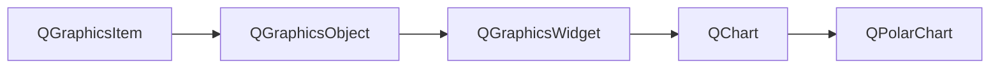
```mermaid
graph LR
QGraphicsItem-->QGraphicsObject
QGraphicsObject-->QGraphicsWidget
QGraphicsWidget-->QChart
QChart-->QPolarChart
```

可以看到，QChart继承自QGraphicsItem，所以它也是图形项的一种。而ChartView则是继承自QGraphicsView，所以是一种视图组件，用于存放QChart类型的图形项罢了。

### 8.1 图表与视图类

#### 8.1.1 QChartView

图表视图类。

枚举类型一个，用于设置选择框的类型。

```c++
enum QChartView::RubberBand{
    QChartView::NoRubberBand,//无选择框
    QChartView::VerticalRubberBand,//垂直选择
    QChartView::HorizontalRubberBand,//水平选择
    QChartView::RectangleRubberBand//矩形框选择
}
```

成员函数，最最核心的函数就是setChart，一般来讲，使用的方式是这样的。

```c++
QChartView * chartView = new QChartView(this);
QChart * chart = new QChart();
chartView->setChart(chart);
this->setCentralWidget(chartView);
// 对chart进行一些设置...

QChartView(QChart *chart, QWidget *parent = Q_NULLPTR);
QChart *chart() const;
void setChart(QChart *chart); 
RubberBands rubberBand() const;
void setRubberBand(const RubberBands &rubberBand);
```

#### 8.1.2 QChart

图表类。

##### 枚举类型

此枚举描述图表中启用的动画。

```c++
enum QChart::AnimationOption {
    QChart::NoAnimation,//动画在图表中被禁用。这是默认值
    QChart::GridAxisAnimations,//图表中启用了网格轴动画
    QChart::SeriesAnimations,//图表中启用了系列动画
    QChart::AllAnimations//图表中启用了所有动画类型
}
```

此枚举描述图表使用的主题。
主题是应用于图表所有视觉元素的 UI 样式相关设置的内置集合，例如颜色、钢笔、画笔和系列字体，以及轴、标题和图例。图表主题示例说明了如何使用主题。
注意：更改主题将覆盖以前应用于该系列的所有自定义。

```c++
enum QChart::ChartTheme{
    QChart::ChartThemeLight,//浅色主题，这是默认主题
    QChart::ChartThemeBlueCerulean,//天蓝色主题
    QChart::ChartThemeDark,//黑暗的主题
    QChart::ChartThemeBrownSand,//沙褐色主题
    QChart::ChartThemeBlueNcs,//自然色系 (NCS) 蓝色主题
    QChart::ChartThemeHighContrast,//高对比度主题
    QChart::ChartThemeBlueIcy,//冰蓝色主题
    QChart::ChartThemeQt//Qt 主题
}
```

此枚举描述图表类型。

```c++
enum QChart::ChartType{
    QChart::ChartTypeUndefined,//图表类型未定义
    QChart::ChartTypeCartesian,//笛卡尔图
    QChart::ChartTypePolar//极坐标图
}
```

##### 成员函数

从成员函数可以看到，与图表相关的类有QAbstractAxis(常用的是QValueAxis)、QAbstractSeries（QLineSeries）、QEasingCurve、QLegend、QLocale、AnimationOptions。关于这些抽象类和具体类的介绍后边会继续给出

```c++
void addSeries(QAbstractSeries *series);//添加序列
void removeAllSeries();//移除序列
void removeSeries(QAbstractSeries *series);//从图表中删除系列系列。图表释放指定系列对象的所有权
QList<QAbstractSeries *> series() const;//返回添加到图表的所有系列

int animationDuration() const;//此属性保存图表动画的持续时间
void setAnimationDuration(int msecs);
QEasingCurve animationEasingCurve() const;//此属性保存图表动画的缓动曲线
void setAnimationEasingCurve(const QEasingCurve &curve);
AnimationOptions animationOptions() const;//此属性保存图表的动画选项
void setAnimationOptions(AnimationOptions options);

void addAxis(QAbstractAxis *axis, Qt::Alignment alignment);//添加轴
QList<QAbstractAxis *> axes(Qt::Orientations orientation = Qt::Horizontal | Qt::Vertical, QAbstractSeries *series = Q_NULLPTR) const;// 默认返回所有轴
QAbstractAxis *axisX(QAbstractSeries *series = Q_NULLPTR) const;//返回X轴
QAbstractAxis *axisY(QAbstractSeries *series = Q_NULLPTR) const;//返回Y轴
void removeAxis(QAbstractAxis *axis);// 移除所有坐标轴
void setAxisX(QAbstractAxis *axis, QAbstractSeries *series = Q_NULLPTR);
void setAxisY(QAbstractAxis *axis, QAbstractSeries *series = Q_NULLPTR);
void createDefaultAxes();//根据已添加到图表的系列为图表创建轴。之前添加到图表中的任何轴都将被删除

ChartType chartType() const；//此属性保存图表是笛卡尔图还是极坐标图
QLegend *legend() const;//返回图表的图例对象。所有权保留在图表中
void scroll(qreal dx, qreal dy);//按 dx 和 dy 指定的距离滚动图表的可见区域。对于极坐标图，dx 表示沿角轴的角度，而不是距离。

QLocale locale() const;//此属性保存用于格式化各种图表标签的语言环境
void setLocale(const QLocale &locale);
bool localizeNumbers() const;//此属性保存数字是否已本地化
void setLocalizeNumbers(bool localize);

QPointF mapToPosition(const QPointF &value, QAbstractSeries *series = Q_NULLPTR);//返回与 series 指定的系列中的值对应的图表上的位置
QPointF mapToValue(const QPointF &position, QAbstractSeries *series = Q_NULLPTR);//在图表中位置指定的位置处返回由系列指定的系列中的值

QMargins margins() const;//此属性保存图表矩形边缘和绘图区域之间允许的最小边距
void setMargins(const QMargins &margins);

void setBackgroundRoundness(qreal diameter);//此属性保存图表背景角处圆角的直径
qreal backgroundRoundness() const;
void setBackgroundVisible(bool visible = true);//此属性保存图表背景是否可见
bool isBackgroundVisible() const;
void setDropShadowEnabled(bool enabled = true);//该属性保存是否启用背景阴影效果
bool isDropShadowEnabled() const;

QRectF plotArea() const;//此属性保存绘制图表的矩形
void setPlotAreaBackgroundBrush(const QBrush &brush);//将用于填充图表绘图区域背景的画笔设置为画笔
QBrush plotAreaBackgroundBrush() const;
void setPlotAreaBackgroundPen(const QPen &pen);//将用于绘制图表绘图区域背景的笔设置为笔
QPen plotAreaBackgroundPen() const;
void setPlotAreaBackgroundVisible(bool visible = true);
bool isPlotAreaBackgroundVisible() const;
void setBackgroundBrush(const QBrush &brush);//将用于绘制图表区域背景的画笔设置为画笔
QBrush backgroundBrush() const;
void setBackgroundPen(const QPen &pen);//将用于绘制图表区域背景的笔设置为笔
QPen backgroundPen() const;

void setTheme(QChart::ChartTheme theme);//设置图表主题
QChart::ChartTheme theme() const;

void setTitle(const QString &title);//设置图标标题及其颜色与字体
void setTitleBrush(const QBrush &brush);
void setTitleFont(const QFont &font);
QString title() const;
QBrush titleBrush() const;
QFont titleFont() const;

void zoom(qreal factor);//按自定义因子放大视图
void zoomIn();//将视图放大两倍
void zoomIn(const QRectF &rect);//将视图放大到矩形矩形仍然完全可见的最大级别
void zoomOut();//将视图缩小两倍
void zoomReset();//将系列域重置为调用任何缩放方法之前的值
bool isZoomed();//是否处于缩放状态

signal void plotAreaChanged(const QRectF &plotArea); //信号,绘图区域改变时发射
```

#### 8.1.3 QPolarChart

QPolarChart 以极坐标图显示数据。极坐标图以圆形图表的形式显示数据，其中数据的放置基于与图表中心（极点）的角度和距离。

极坐标图是 QChart 的一种特殊形式，它支持线、样条、面积和散点系列，以及它们支持的所有轴类型。每个轴都可以用作径向轴或角轴。
角度 QValueAxis 上的第一个和最后一个刻度线位于 0/360 度角处。
如果一个序列中两个连续点之间的角距离超过 180 度，那么任何连接这两个点的直线都变得毫无意义，并且不会被绘制。相反，将在图表中心之间绘制一条线。因此，在显示线、样条或面积系列时，必须相应地选择轴范围。
极坐标图在同一位置绘制相同方向的所有轴，因此使用多个相同方向的轴可能会造成混淆，除非额外的轴仅用于自定义网格。例如，您可以使用辅助阴影 QCategoryAxis 显示突出显示的范围，或提供具有隐藏标签的辅助 QValueAxis 的未标记子标记。

此枚举类型指定轴的极轴方向。

```c++
enum QPolarChart::PolarOrientation{
    QPolarChart::PolarOrientationRadial,//径向轴，其中值沿图表的半径放置，从极点开始
    QPolarChart::PolarOrientationAngular//一个角轴，其中值放置在图表周围
}
```

成员函数。

```c++
QPolarChart(QGraphicsItem *parent = Q_NULLPTR, Qt::WindowFlags wFlags = Qt::WindowFlags());//构造一个极坐标图作为父级的子级。 wFlags 指定的属性被传递给 QChart 构造函数
void addAxis(QAbstractAxis *axis, PolarOrientation polarOrientation);//这种方便的方法将轴轴添加到具有极坐标polarOrientation 的极坐标图中。图表拥有轴的所有权。
QList<QAbstractAxis *> axes(PolarOrientations polarOrientation = PolarOrientations( PolarOrientationRadial | PolarOrientationAngular ), QAbstractSeries *series = Q_NULLPTR) const;//返回为具有极轴方向polarOrientation 的系列系列添加的轴。如果未提供系列，则返回具有指定极轴方向的任何轴

static PolarOrientation axisPolarOrientation(QAbstractAxis *axis);//极坐标图的角轴报告水平方向，径向轴报告垂直方向。该函数是一个方便的函数，用于将轴轴的方向转换为对应的极轴方向。如果轴为空或未添加到极坐标图，则返回值无意义
```

#### 8.1.4 QEasingCurve

缓动曲线的类型。

QEasingCurve 类提供用于控制动画的缓动曲线。
缓动曲线描述了一个函数，该函数控制 0 和 1 之间的插值速度应该如何。缓动曲线允许从一个值到另一个值的过渡看起来比简单的恒定速度所允许的更自然。 QEasingCurve 类通常与 QVariantAnimation 和 QPropertyAnimation 类一起使用，但也可以单独使用。它通常用于将插值从零速度加速（缓入）或减速到零速度（缓出）。缓入和缓出也可以组合在同一个缓动曲线中。
为了计算插值的速度，缓动曲线提供了函数 valueForProgress()，其中的 progress 参数指定了插值的进度：0 是插值的开始值，1 是插值的结束值。返回值为插值的有效进度。如果返回值与所有输入值的输入值相同，则缓动曲线为线性曲线。这是默认行为。
例如，

```c++
QEasingCurve easing(QEasingCurve::InOutQuad);

for(qreal t = 0.0; t < 1.0; t+=0.1)
    qWarning() << "Effective progress" << t << " is
    << easing.valueForProgress(t);
```

将打印 0 到 1 之间插值的有效进度。
当使用 QPropertyAnimation 时，关联的缓动曲线将用于控制 startValue 和 endValue 之间插值的进度：

```c++
QPropertyAnimation animation;
animation.setStartValue(0);
animation.setEndValue(1000);
animation.setDuration(1000);
animation.setEasingCurve(QEasingCurve::InOutQuad);
```

设置幅度、过冲或周期的能力取决于 QEasingCurve 类型。振幅访问可用于作为弹簧的曲线，例如弹性曲线和反弹曲线。改变幅度会改变曲线的高度。周期访问仅适用于弹性曲线，设置更高的周期会减慢反弹速度。只有具有“回旋镖”行为的曲线（例如 InBack、OutBack、InOutBack 和 OutInBack）才具有过冲设置。这些曲线将插值超出端点并返回到端点，其作用类似于回旋镖。
Easing Curves Example 包含 QEasingCurve 类型的示例，并允许您更改曲线设置。

```c++
enum QEasingCurve::Type{ 
    Linear,//线性 (t) 函数的缓动曲线：速度是恒定的
    InQuad,//二次 (t^2) 函数的缓动曲线：从零速度加速
    OutQuad,//二次 (t^2) 函数的缓动曲线：减速到零速度
    InOutQuad,//二次 (t^2) 函数的缓动曲线：加速到一半，然后减速
    OutInOuad,//二次 (t^2) 函数的缓动曲线：减速到一半，然后加速
    InCubic,//三次 (t^3) 函数的缓动曲线：从零速度加速
    OutCubic,//三次 (t^3) 函数的缓动曲线：减速到零速度
    InOutCubic,//三次 (t^3) 函数的缓动曲线：加速到一半，然后减速
    OutInCubic,//三次 (t^3) 函数的缓动曲线：减速到一半，然后加速
    InQuart,//四次 (t^4) 函数的缓动曲线：从零速度加速
    OutQuart,//四次 (t^4) 函数的缓动曲线：从零速度加速
    InOutQuart,//四次 (t^4) 函数的缓动曲线：加速到一半，然后减速
    OutInQuart,//四次 (t^4) 函数的缓动曲线：减速到一半，然后加速
    InQuint,//五次 (t^5) 缓动的缓动曲线：从零速度加速
    OutQuint,//五次 (t^5) 函数的缓动曲线：减速到零速度
    InOutQuint,//五次 (t^5) 函数的缓动曲线：加速到一半，然后减速
    OutInQuint,//五次 (t^5) 函数的缓动曲线：减速到一半，然后加速
    InSine,//正弦 (sin(t)) 函数的缓动曲线：从零速度加速
    OutSine,//正弦 (sin(t)) 函数的缓动曲线：减速到零速度
    InOutSine,//正弦 (sin(t)) 函数的缓动曲线：加速到一半，然后减速
    OutInSine,//正弦 (sin(t)) 函数的缓动曲线：减速到一半，然后加速
    InExpo,//指数 (2^t) 函数的缓动曲线：从零速度加速
    OutExpo,//指数 (2^t) 函数的缓动曲线：减速到零速度
    InOutExpo,//指数 (2^t) 函数的缓动曲线：加速到一半，然后减速
    OutInExpo,//指数 (2^t) 函数的缓动曲线：减速到一半，然后加速
    InCirc,//圆形 (sqrt(1-t^2)) 函数的缓动曲线：从零速度加速。
    OutCirc,//圆形 (sqrt(1-t^2)) 函数的缓动曲线：减速到零速度。
    InOutCirc,//圆形 (sqrt(1-t^2)) 函数的缓动曲线：加速到一半，然后减速。
    OutInCirc,//圆形 (sqrt(1-t^2)) 函数的缓动曲线：减速到一半，然后加速。
    InElastic,//弹性（指数衰减正弦波）函数的缓动曲线：从零速度加速。峰值幅度可以通过幅度参数设置，衰减周期可以通过周期参数设置
    OutElastic,//弹性（指数衰减正弦波）函数的缓动曲线：减速到零速度。峰值幅度可以通过幅度参数设置，衰减周期可以通过周期参数设置
    InOutElastic,//弹性（指数衰减正弦波）函数的缓动曲线：加速到一半，然后减速
    OutInElastic,//弹性（指数衰减正弦波）函数的缓动曲线：减速到一半，然后加速
    InBack,//背部缓动曲线（超调三次函数：(s+1)*t^3 - s*t^2）缓动：从零速度加速
    OutBack,//背部缓动曲线（超调三次函数：(s+1)*t^3 - s*t^2）缓动：减速到零速度
    InOutBack,//背部缓动曲线（超调三次函数：(s+1)*t^3 - s*t^2）缓入/缓出：加速到中途，然后减速
    OutInBack,//背部缓动曲线（超过三次缓动：(s+1)*t^3 - s*t^2）缓出/入：减速到一半，然后加速
    InBounce,//反弹（指数衰减抛物线反弹）函数的缓动曲线：从零速度加速
    OutBounce,//反弹（指数衰减抛物线反弹）函数的缓动曲线：从零速度减速
    InOutBounce,//反弹的缓动曲线（指数衰减抛物线反弹）函数缓入/缓出：加速到一半，然后减速
    OutInBounce,//弹跳缓动曲线（指数衰减抛物线弹跳）函数缓动/缓动：减速到一半，然后加速
    BezierSpline,//允许使用三次贝塞尔样条定义自定义缓动曲线
    TCBSpline,//允许使用 TCB 样条定义自定义缓动曲线
    Custom//如果用户使用 setCustomType() 指定了自定义曲线类型，则返回此值。请注意，您不能使用此值调用 setType()，但 type() 可以返回它
}
```

成员函数。

```c++
QEasingCurve(Type type = Linear);

QVector<QPointF> toCubicSpline() const;//返回定义自定义缓动曲线的cubicBezierSpline。如果缓动曲线没有自定义贝塞尔缓动曲线，则列表为空
qreal valueForProgress(qreal progress) const;//返回进度处缓动曲线的有效进度。虽然进度必须在 0 和 1 之间，但返回的有效进度可以超出这些范围。例如，QEasingCurve::InBack 将在函数的开头返回负值。

//添加一段三次贝塞尔样条曲线以定义自定义缓动曲线。仅当 type() 为 QEasingCurve::BezierSpline 时才适用。请注意，样条曲线隐式地从 (0.0, 0.0) 开始，并且必须在 (1.0, 1.0) 结束才能成为有效的缓动曲线。 c1 和 c2 是用于绘制曲线的控制点。 endPoint 是曲线的端点。
void addCubicBezierSegment(const QPointF &c1, const QPointF &c2, const QPointF &endPoint);

//添加一段 TCB 贝塞尔样条曲线以定义自定义缓动曲线。仅当 type() 为 QEasingCurve::TCBSpline 时才适用。样条曲线必须明确地从 (0.0, 0.0) 开始，并且必须在 (1.0, 1.0) 结束才能成为有效的缓动曲线。张力 t 改变了切向量的长度。连续性 c 改变了切线之间变化的锐度。偏差 b 改变切向量的方向。 nextPoint 是样本位置。所有三个参数都在 -1 和 1 之间有效，并定义控制点的切线。如果所有三个参数都为 0，则生成的样条是 Catmull-Rom 样条。起点和终点的偏差始终为 -1 和 1，因为未定义外切线。
void addTCBSegment(const QPointF &nextPoint, qreal t, qreal c, qreal b);

void setAmplitude(qreal amplitude);//将幅度设置为幅度。这将设置反弹的幅度或弹性“弹簧”效果的幅度。数字越大，幅度越高
qreal amplitude() const;

void setCustomType(EasingFunction func);//设置用户在函数 func 中定义的自定义缓动曲线。该函数的签名是qreal myEasingFunction(qreal progress)，其中progress和返回值被认为是在0和1之间归一化的。（在某些情况下，返回值可能超出该范围）调用此函数后type()将返回 QEasingCurve::Custom。 func 不能为零。
EasingFunction customType() const;

void setOvershoot(qreal overshoot);//将过冲设置为过冲。0 不会产生过冲，默认值 1.70158 会产生 10% 的过冲
qreal overshoot() const；

void setPeriod(qreal period);//将期间设置为期间。设置较小的周期值将给出较高的曲线频率。一个大的周期会给它一个小的频率
qreal period() const;

void setType(Type type);//将缓动曲线的类型设置为 type
Type type() const;
```


### 8.2 基础类

#### 8.2.1 QAbstactSeries

抽象序列类。其继承关系如下所示。

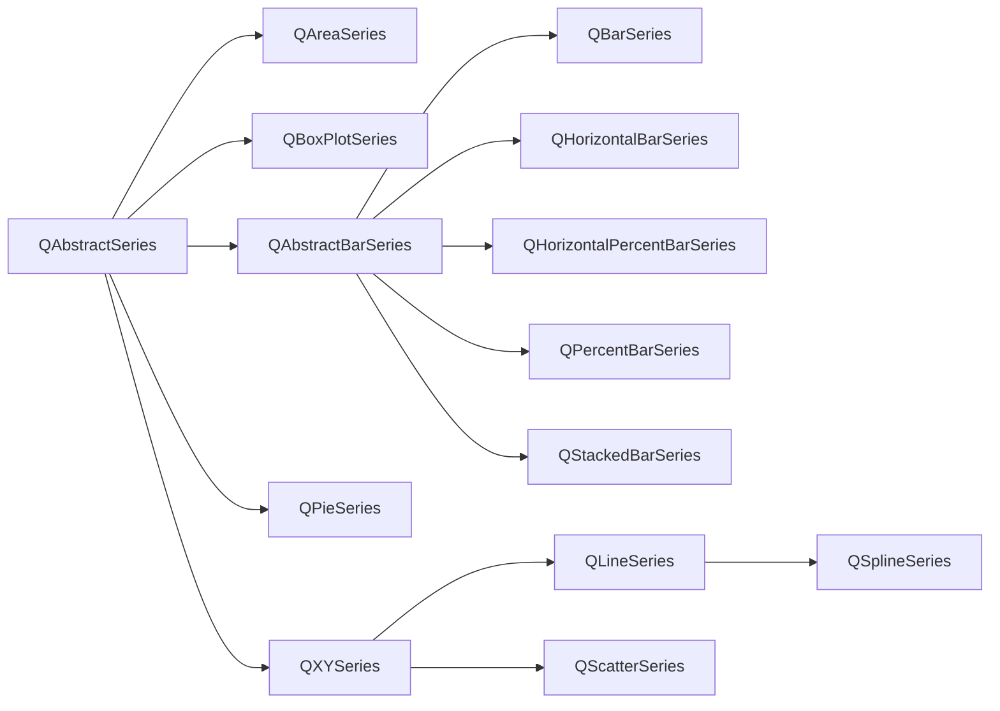
```mermaid
graph LR
QAbstractSeries-->QAreaSeries
QAbstractSeries-->QBoxPlotSeries
QAbstractSeries-->QAbstractBarSeries
QAbstractSeries-->QPieSeries
QAbstractSeries-->QXYSeries
QAbstractBarSeries-->QBarSeries
QAbstractBarSeries-->QHorizontalBarSeries
QAbstractBarSeries-->QHorizontalPercentBarSeries
QAbstractBarSeries-->QPercentBarSeries
QAbstractBarSeries-->QStackedBarSeries
QXYSeries-->QLineSeries
QXYSeries-->QScatterSeries
QLineSeries-->QSplineSeries
```

中文对照含义如下。

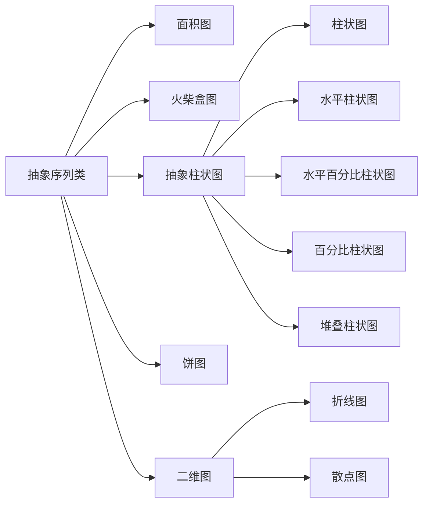
```mermaid
graph LR
抽象序列类-->面积图
抽象序列类-->火柴盒图
抽象序列类-->抽象柱状图
抽象序列类-->饼图
抽象序列类-->二维图
抽象柱状图-->柱状图
抽象柱状图-->水平柱状图
抽象柱状图-->水平百分比柱状图
抽象柱状图-->百分比柱状图
抽象柱状图-->堆叠柱状图
二维图-->折线图
二维图-->散点图
```

这个枚举描述了系列的类型。

```c++
enum QAbstractSeries::SeriesType{  
    QAbstractSeries::SeriesTypeLine,
    QAbstractSeries::SeriesTypeArea,
    QAbstractSeries::SeriesTypeBar,
    QAbstractSeries::SeriesTypeStackedBar,
    QAbstractSeries::SeriesTypePercentBar,
    QAbstractSeries::SeriesTypePie,
    QAbstractSeries::SeriesTypeScatter,
    QAbstractSeries::SeriesTypeSpline,
    QAbstractSeries::SeriesTypeHorizontalBar,
    QAbstractSeries::SeriesTypeHorizontalStackedBar,
    QAbstractSeries::SeriesTypeHorizontalPercentBar,
    QAbstractSeries::SeriesTypeBoxPlot,
    QAbstractSeries::SeriesTypeCandlestick
}
```

成员函数如下。

```c++
bool attachAxis(QAbstractAxis *axis);//将由axis指定的轴附加到序列。如果轴连接成功，则返回 true，否则返回 false。
bool detachAxis(QAbstractAxis *axis);//从序列中分离由轴指定的轴。如果轴分离成功，则返回 true，否则返回 false
QList<QAbstractAxis *> attachedAxes();//返回附加到系列的轴列表。通常，一个 x 轴和一个 y 轴附加到一个系列，除了 QPieSeries，它没有附加任何轴。
QChart *chart() const;//获取序列依附的图表
void hide();//隐藏
void show();//显示
void setName(const QString &name);//序列名称
QString name() const;
void setOpacity(qreal opacity);//透明度
qreal opacity() const;
void setUseOpenGL(bool enable = true);//指定是否使用 OpenGL 加速绘制系列，仅 QLineSeries 和 QScatterSeries 支持使用 OpenGL 进行加速
bool useOpenGL() const;
void setVisible(bool visible = true);//可见性
bool isVisible() const;
virtual SeriesType type() const = 0;//自定义新序列必须重载此函数
```

信号函数。

```c++
void nameChanged();
void opacityChanged();
void useOpenGLChanged();
void visibleChanged();
```

#### 8.2.2 QXYSeries

##### 成员函数

成员函数如下。

```c++
void append(qreal x, qreal y);//给序列添加点
void append(const QPointF &point);
void append(const QList<QPointF> &points);
QXYSeries &operator<<(const QPointF &point);
QXYSeries &operator<<(const QList<QPointF> &points);

void clear();//清空所有点
int count() const;//返回系列中的数据点数
void insert(int index, const QPointF &point);//插入点

const QPointF &at(int index) const;//访问点
QList<QPointF> points() const;//返回所有点
QVector<QPointF> pointsVector() const;//以Vector形式返回所有点

void remove(qreal x, qreal y);// 移除点
void remove(const QPointF &point);
void remove(int index);
void removePoints(int index, int count);

void replace(qreal oldX, qreal oldY, qreal newX, qreal newY);//替换点
void replace(const QPointF &oldPoint, const QPointF &newPoint);
void replace(int index, qreal newX, qreal newY);
void replace(int index, const QPointF &newPoint);
void replace(QList<QPointF> points);
void replace(QVector<QPointF> points);

virtual void setBrush(const QBrush &brush);//设置画刷
QBrush brush() const;
virtual void setColor(const QColor &color);//设置颜色
virtual QColor color() const;
virtual void setPen(const QPen &pen);//设置画笔(width+brush+color)
QPen pen() const;

void setPointLabelsClipping(bool enabled = true);//此属性保存数据点标签的剪辑。此属性默认为 true。启用剪切时，绘图区域边缘的标签会被剪切。
bool pointLabelsClipping() const;
void setPointLabelsColor(const QColor &color);//此属性保存用于数据点标签的颜色。默认情况下，颜色是标签主题中定义的画笔颜色。
QColor pointLabelsColor() const;
void setPointLabelsFont(const QFont &font);//此属性保存用于数据点标签的字体。
QFont pointLabelsFont() const;
void setPointLabelsFormat(const QString &format);//此属性保存用于显示带有数据点的标签的格式。（@xPoint，@yPoint）或（@yPoint）
QString pointLabelsFormat() const;
void setPointLabelsVisible(bool visible = true);//此属性保存数据点标签的可见性。
bool pointLabelsVisible() const;
void setPointsVisible(bool visible = true);//该属性保存数据点是否可见并且应该被绘制。
bool pointsVisible() const;
```

##### 信号函数

```c++
// 某个序列点被鼠标单击、双击、按压和释放时的信号
void clicked(const QPointF &point);
void doubleClicked(const QPointF &point);
void pressed(const QPointF &point);
void released(const QPointF &point);
void colorChanged(QColor color);//序列颜色改变发射信号
void penChanged(const QPen &pen);// 序列画笔画笔改变发射信号
void hovered(const QPointF &point, bool state);//当鼠标悬停在图表中的点上时会发出此信号。当鼠标移到该点上时，状态变为真，当鼠标再次移开时，变为假（常用于饼图的分块爆炸效果）
// 数据点和数据点标签的一些信号
void pointLabelsClippingChanged(bool clipping);
void pointLabelsColorChanged(const QColor &color);
void pointLabelsFontChanged(const QFont &font);
void pointLabelsFormatChanged(const QString &format);
void pointLabelsVisibilityChanged(bool visible);
void pointAdded(int index);
void pointRemoved(int index);
void pointReplaced(int index);
void pointsRemoved(int index, int count);
void pointsReplaced();
```

#### 8.2.3 QAbstractBarSeries

QAbstractBarSeries 类是所有条形系列类的抽象父类。
在条形图中，条形定义为包含每个类别的一个数据值的条形集。条形的位置由类别指定，其高度由数据值指定。包含多个条形集的条形系列将属于同一类别的条形组合在一起。条形图的显示方式由选择用于创建条形图的此类的子类确定。
如果使用 QValueAxis 而不是 QBarCategoryAxis 作为主条轴，则条将围绕类别的索引值进行分组。

这个枚举值描述了数据值标签的位置：

```c++
enum QAbstractBarSeries::LabelsPosition{
    QAbstractBarSeries::LabelsCenter,//标签位于栏的中心
    QAbstractBarSeries::LabelsInsideEnd,//标签位于顶部的栏内
    QAbstractBarSeries::LabelsInsideBase,//标签位于底部的栏内
    QAbstractBarSeries::LabelsOutsideEnd//标签位于顶部栏外
}
```

成员函数，含义类似，不再赘述。

```c++
bool append(QBarSet *set);
bool append(QList<QBarSet *> sets);
bool insert(int index, QBarSet *set);
bool remove(QBarSet *set);
bool take(QBarSet *set);
QList<QBarSet *> barSets() const;

void clear();
int count() const;

void setBarWidth(qreal width);
qreal barWidth() const;
void setLabelsAngle(qreal angle);
qreal labelsAngle() const;
void setLabelsFormat(const QString &format);
QString labelsFormat() const;
void setLabelsPosition(QAbstractBarSeries::LabelsPosition position);
QAbstractBarSeries::LabelsPosition labelsPosition() const;
void setLabelsVisible(bool visible = true);
bool isLabelsVisible() const;
```

信号函数。

```c++
void barsetsAdded(QList<QBarSet *> sets);
void barsetsRemoved(QList<QBarSet *> sets);
void countChanged();
void hovered(bool status, int index, QBarSet *barset);
void labelsAngleChanged(qreal angle);
void labelsFormatChanged(const QString &format);
void labelsPositionChanged(QAbstractBarSeries::LabelsPosition position);
void labelsVisibleChanged();
void clicked(int index, QBarSet *barset);
void doubleClicked(int index, QBarSet *barset);
void pressed(int index, QBarSet *barset);
void released(int index, QBarSet *barset);
```

#### 8.2.4 QAbstractAxis

QAbstractAxis 类是用于专用轴类的基类。
每个系列可以绑定一个或多个水平和垂直轴，但不支持混合轴类型会导致不同的域，例如在同一方向上指定 QValueAxis 和 QLogValueAxis。
可以单独控制各种轴元素的属性和可见性，例如轴线、标题、标签、网格线和阴影。

坐标轴分为数值、对数、类别、时间日期坐标轴，也有分组数值最标轴。

一般来讲，常规的二维平面图或者柱状图都使用数值或者对数坐标，部分柱状图以及饼图使用类别、时间日期坐标轴。

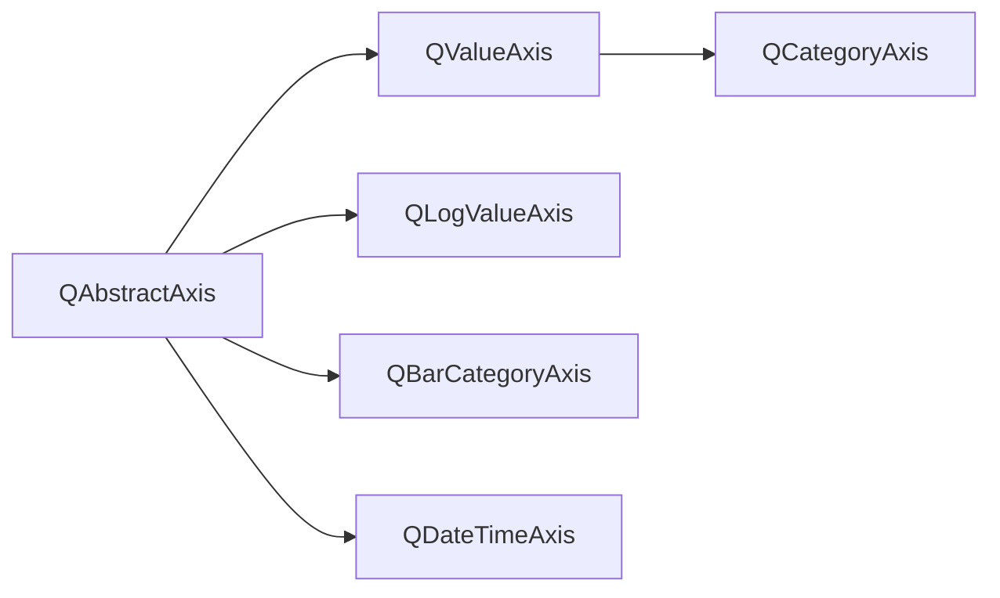
```mermaid
graph LR
QAbstractAxis-->QValueAxis
QAbstractAxis-->QLogValueAxis
QAbstractAxis-->QBarCategoryAxis
QAbstractAxis-->QDateTimeAxis
QValueAxis-->QCategoryAxis
```

中文对照。

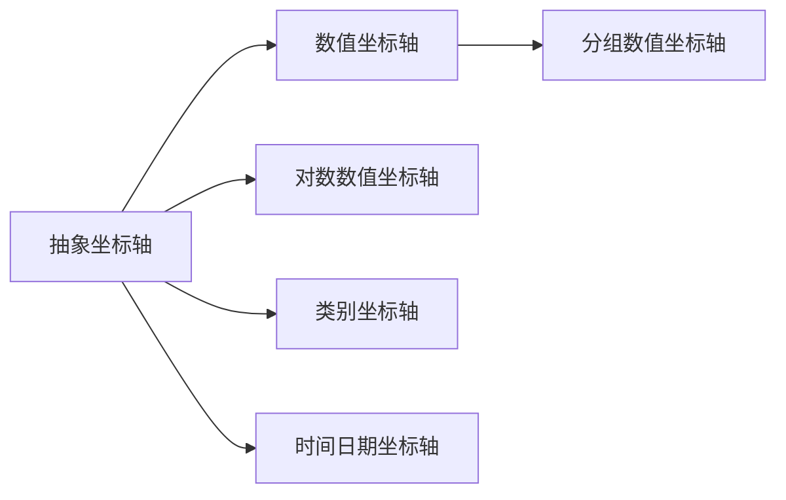
```mermaid
graph LR
抽象坐标轴-->数值坐标轴
数值坐标轴-->分组数值坐标轴
抽象坐标轴-->对数数值坐标轴
抽象坐标轴-->类别坐标轴
抽象坐标轴-->时间日期坐标轴
```

此枚举类型指定轴对象的类型。

```c++
enum QAbstractAxis::AxisType}
    QAbstractAxis::AxisTypeNoAxis,
    QAbstractAxis::AxisTypeValue,
    QAbstractAxis::AxisTypeBarCategory,
    QAbstractAxis::AxisTypeCategory,
    QAbstractAxis::AxisTypeDateTime,
    QAbstractAxis::AxisTypeLogValue
}
```

成员函数。

```c++
Qt::Alignment alignment() const;//此属性保存轴的对齐方式
Qt::Orientation orientation() const;//返回轴的方向（垂直或水平）
//坐标轴隐藏、显示、是否反转、范围
void hide();
void show();
void setVisible(bool visible = true);
bool isVisible() const;
void setMax(const QVariant &max);
void setMin(const QVariant &min);
void setRange(const QVariant &min, const QVariant &max);
void setReverse(bool reverse = true);
bool isReverse() const;
// 设置轴线画笔、颜色、可见性
void setLinePen(const QPen &pen);
void setLinePenColor(QColor color);
void setLineVisible(bool visible = true);
QPen linePen() const;
QColor linePenColor() const;
bool isLineVisible() const;
// 设置次网格线颜色、画笔和可见性
void setMinorGridLineColor(const QColor &color);
void setMinorGridLinePen(const QPen &pen);
void setMinorGridLineVisible(bool visible = true);
QColor minorGridLineColor();
QPen minorGridLinePen() const;
bool isMinorGridLineVisible() const;
// 设置主网格线颜色、画笔、可见性
void setGridLineColor(const QColor &color);
void setGridLinePen(const QPen &pen);
void setGridLineVisible(bool visible = true);
QColor gridLineColor();
QPen gridLinePen() const;
bool isGridLineVisible() const;
// 设置标签角度、颜色、画刷、字体、可见性
void setLabelsAngle(int angle);
void setLabelsBrush(const QBrush &brush);
void setLabelsColor(QColor color);
void setLabelsFont(const QFont &font);
void setLabelsVisible(bool visible = true);
int labelsAngle() const;
QBrush labelsBrush() const;
QColor labelsColor() const;
QFont labelsFont() const;
bool labelsVisible() const;
// 设置阴影画刷、画笔、颜色、可见性
void setShadesBorderColor(QColor color);
void setShadesBrush(const QBrush &brush);
void setShadesColor(QColor color);
void setShadesPen(const QPen &pen);
void setShadesVisible(bool visible = true);
QColor shadesBorderColor() const;
QBrush shadesBrush() const;
QColor shadesColor() const;
QPen shadesPen() const;
bool shadesVisible() const;
// 设置轴标题颜色、字体、文字和可见性
void setTitleBrush(const QBrush &brush);
void setTitleFont(const QFont &font);
void setTitleText(const QString &title);
void setTitleVisible(bool visible = true);
QBrush titleBrush() const;
QFont titleFont() const;
QString titleText() const;
bool isTitleVisible() const;
// 轴类型
virtual AxisType type() const = 0;
```

信号函数。

```c++
void reverseChanged(bool reverse);
void colorChanged(QColor color);
void visibleChanged(bool visible);
void gridLineColorChanged(const QColor &color);
void gridLinePenChanged(const QPen &pen);
void gridVisibleChanged(bool visible);
void labelsAngleChanged(int angle);
void labelsBrushChanged(const QBrush &brush);
void labelsColorChanged(QColor color);
void labelsFontChanged(const QFont &font);
void labelsVisibleChanged(bool visible);
void linePenChanged(const QPen &pen);
void lineVisibleChanged(bool visible);
void minorGridLineColorChanged(const QColor &color);
void minorGridLinePenChanged(const QPen &pen);
void minorGridVisibleChanged(bool visible);
void shadesBorderColorChanged(QColor color);
void shadesBrushChanged(const QBrush &brush);
void shadesColorChanged(QColor color);
void shadesPenChanged(const QPen &pen);
void shadesVisibleChanged(bool visible);
void titleBrushChanged(const QBrush &brush);
void titleFontChanged(const QFont &font);
void titleTextChanged(const QString &text);
void titleVisibleChanged(bool visible);
```

#### 8.2.5 QLegend

图例类。

QLegend 类显示图表的图例。
图例是显示图表图例的图形对象。当系列更改时，图例状态由 QChart 更新。默认情况下，图例附加到图表，但可以将其分离以使其独立于图表布局。图例对象无法创建或删除，但可以通过 QChart 类引用。

此枚举描述了渲染图例标记项时使用的形状。

```c++
enum QLegend::MarkerShape{
    QLegend::MarkerShapeDefault,//由 QLegend 确定的默认形状用于标记。仅单个 QLegendMarker 项目支持此值
    QLegend::MarkerShapeRectangle,//使用矩形标记。标记大小由字体大小决定
    QLegend::MarkerShapeCircle,//使用圆形标记。标记大小由字体大小决定
    QLegend::MarkerShapeFromSeries//标记形状由系列决定。在散点系列的情况下，图例标记看起来像一个散点，并且与该点的大小相同。对于直线或样条系列，图例标记看起来像直线的一小段。对于其他系列类型，显示矩形标记
}
```

成员函数。

```c++
void setAlignment(Qt::Alignment alignment);//图例如何与图表对齐，Qt::AlignTop, Qt::AlignBottom, Qt::AlignLeft, Qt::AlignRight
Qt::Alignment alignment() const;
void attachToChart();//将图例附加到图表。图表可能会调整图例的布局。
void detachFromChart();//从图表中分离图例。图表将不再调整图例的布局
bool isAttachedToChart();// 如果图例附加到图表，则返回 true
// 返回图例中的标记列表，可以通过指定为其返回标记的系列来过滤列表
QList<QLegendMarker *> markers(QAbstractSeries *series = Q_NULLPTR) const;
// 设置背景是否可见、边界颜色、画刷、字体、画笔、颜色
void setBackgroundVisible(bool visible = true);
void setBorderColor(QColor color);
void setBrush(const QBrush &brush);
void setColor(QColor color);
void setFont(const QFont &font);
void setPen(const QPen &pen);
bool isBackgroundVisible() const;
QColor borderColor();
QBrush brush() const;
QColor color();
QFont font() const;
QPen pen() const;
// 设置标签的画刷、颜色、形状、标志位、提示，标志是否反转
void setLabelBrush(const QBrush &brush);
void setLabelColor(QColor color);
void setMarkerShape(MarkerShape shape);
void setReverseMarkers(bool reverseMarkers = true);
void setShowToolTips(bool show);
QBrush labelBrush() const;
QColor labelColor() const;
MarkerShape markerShape() const;
bool reverseMarkers();
bool showToolTips() const;
```

信号函数。

```c++
void backgroundVisibleChanged(bool visible);
void borderColorChanged(QColor color);
void colorChanged(QColor color);
void fontChanged(QFont font);
void labelColorChanged(QColor color);
void markerShapeChanged(MarkerShape shape);
void reverseMarkersChanged(bool reverseMarkers);
void showToolTipsChanged(bool showToolTips);
```

#### 8.2.6 QLegendMarker

可生成类似于QCheckBox的组件，在图例上点击序列标记就可以控制序列是否显示。

QLegendMarker 类是一个抽象对象，可用于访问图例中的标记。**图例标记由图标和标签组成**。图标颜色对应于用于绘制系列的颜色，标签显示系列的名称（或饼系列的切片标签或条形系列的条形集的标签）。图例标记始终与一个系列、切片或条形集相关。

图例标记对象的类型。

```c++
enum QLegendMarker::LegendMarkerType{
    QLegendMarker::LegendMarkerTypeArea,//区域系列的图例标记
    QLegendMarker::LegendMarkerTypeBar,//条形集的图例标记
    QLegendMarker::LegendMarkerTypePie,//饼图的图例标记
    QLegendMarker::LegendMarkerTypeXY,//线、样条线或散点系列的图例标记
    QLegendMarker::LegendMarkerTypeBoxPlot,//箱线图系列的图例标记
    QLegendMarker::LegendMarkerTypeCandlestick//烛台系列的图例标记
}
```

成员函数。

```c++
virtual QAbstractSeries *series() = 0;//返回指向与此图例标记相关的曲线指针。图例标记始终与系列相关
virtual LegendMarkerType type() = 0;

void setBrush(const QBrush &brush);
void setFont(const QFont &font);
void setLabel(const QString &label);
void setLabelBrush(const QBrush &brush);
void setPen(const QPen &pen);
void setShape(QLegend::MarkerShape shape);
void setVisible(bool visible);
QBrush brush() const;
QFont font() const;
bool isVisible() const;
QString label() const;
QBrush labelBrush() const;
QPen pen() const;
QLegend::MarkerShape shape() const;
```

### 8.3 序列类

#### 8.3.1 QLineSeries

折线图类。

```c++
QLineSeries(QObject *parent = Q_NULLPTR);
```

如果定义自己的折线图类，就必须重定义type()函数。

```c++
QAbstractSeries::SeriesType QLineSeries::type() const;
```

QLineSeries 类以折线图的形式呈现数据。
折线图用于将信息显示为由直线连接的一系列数据点。一个使用的例子如下。

```c++
QLineSeries* series = new QLineSeries();
series->append(0, 6);
series->append(2, 4);
...
chart->addSeries(series);
```

#### 8.3.2 QScatterSeries

散点图类。

此枚举值描述了渲染标记项时使用的形状。（就是散点的样式）

```c++
enum QScatterSeries::MarkerShape{
    QScatterSeries::MarkerShapeCircle,//圆形
    QScatterSeries::MarkerShapeRectangle//矩形
}
```

成员函数。

```c++
QScatterSeries(QObject *parent = Q_NULLPTR);
QBrush brush() const;
// 设置边界颜色、标记形状和大小
void setBorderColor(const QColor &color);
QColor borderColor() const;
void setMarkerShape(MarkerShape shape);
MarkerShape markerShape() const;
void setMarkerSize(qreal size);
qreal markerSize() const;
```

自定义类需要重定义的函数。

```c++
virtual QColor color() const;
virtual void setBrush(const QBrush &brush);
virtual void setColor(const QColor &color);
virtual void setPen(const QPen &pen);
virtual QAbstractSeries::SeriesType type() const;
```

#### 8.3.3 QSplineSeries

光滑曲线图类。

```c++
QSplineSeries(QObject *parent = Q_NULLPTR);
virtual QAbstractSeries::SeriesType type() const;
```

QSplineSeries 类将数据显示为样条图。
样条系列存储 QPainterPath 绘制样条所需的数据点和线段控制点。数据变化时会自动计算控制点。该算法计算点，以便可以绘制法线样条。

使用例子。

```c++
QSplineSeries* series = new QSplineSeries();
series->append(0, 6);
series->append(2, 4);
...
chart->addSeries(series);
```

#### 8.3.4 QBoxPlotSeries

火柴盒图。

QBoxPlotSeries 类以盒须图的形式呈现数据。
箱线图系列充当盒须项目的容器。来自多个系列的项目根据其索引值分组。
QBarCategoryAxis 类用于将类别添加到图表的轴。类别标签必须是唯一的。如果为多个盒须项定义了相同的类别标签，则仅绘制第一个。

成员函数。

```c++
bool append(QBoxSet *set);
bool append(QList<QBoxSet *> sets);
bool insert(int index, QBoxSet *set);
bool take(QBoxSet *set);//从系列中获取由 set 指定的盒须项目。不删除项目
bool remove(QBoxSet *set);
QList<QBoxSet *> boxSets() const;

void setBoxOutlineVisible(bool visible);//此属性保存框轮廓的可见性
bool boxOutlineVisible();
void setBoxWidth(qreal width);
qreal boxWidth();
void setBrush(const QBrush &brush);
QBrush brush() const;
void setPen(const QPen &pen);
QPen pen() const;
void clear();
int count() const;//返回箱线图系列中盒须项的数量
```

信号函数。

```c++
void clicked(QBoxSet *boxset);
void pressed(QBoxSet *boxset);
void released(QBoxSet *boxset);
void doubleClicked(QBoxSet *boxset);

void boxOutlineVisibilityChanged();
void boxWidthChanged();
void boxsetsAdded(QList<QBoxSet *> sets);
void boxsetsRemoved(QList<QBoxSet *> sets);

void brushChanged();
void countChanged();
void penChanged();

void hovered(bool status, QBoxSet *boxset);
```

#### 8.3.5 QBarSeries

柱状图类。

QBarSeries 类将一系列数据显示为按类别分组的垂直条。
此类将数据绘制为一系列按类别分组的垂直条，每个类别中每个类别都有一个条来自添加到该系列的每个条集。

成员函数和信号函数基本都继承自QAbstractBarSeries。

#### 8.3.6 QHorizontalBarSeries

水平柱状图类。

QHorizontalBarSeries 类将一系列数据显示为按类别分组的水平条。
此类将数据绘制为一系列按类别分组的水平条，每个类别中每个类别一个条来自添加到该系列的每个条集。

成员函数和信号函数基本都继承自QAbstractBarSeries。

#### 8.3.7 QHorizontalPercentBarSeries

水平百分比柱状图类。

QHorizontalPercentBarSeries 类将一系列分类数据显示为每个类别的百分比。
此类将数据绘制为一系列大小均匀的水平堆叠条，每个类别一个条。添加到系列中的每个条形集都会为每个堆叠条形贡献一个段。段大小对应于段值与堆栈中所有段的总值相比的百分比。不绘制零值条。

成员函数和信号函数基本都继承自QAbstractBarSeries。

#### 8.3.8 QHorizontalStackedBarSeries

水平堆叠柱状图类。

QHorizontalStackedBarSeries 类将一系列数据显示为水平堆叠的条形，每个类别一个条形。添加到系列中的每个条形集都会为每个堆叠条形贡献一个段。

成员函数和信号函数基本都继承自QAbstractBarSeries。

#### 8.3.9 QPercentBarSeries

百分比柱状图。

QPercentBarSeries 类将一系列分类数据表示为每个类别的百分比。
此类将数据绘制为一系列大小一致的垂直堆叠条形图，每个类别一个条形图。添加到系列中的每个条形集都会为每个堆叠条形贡献一个段。段大小对应于段值与堆栈中所有段的总值相比的百分比。不绘制零值条。

成员函数和信号函数基本都继承自QAbstractBarSeries。

#### 8.3.10 QStackedBarSeries

堆叠柱状图。

QStackedBarSeries 类将一系列数据显示为垂直堆叠的条形，每个类别一个条形。
添加到系列中的每个条形集都会为每个堆叠条形贡献一个段。

成员函数和信号函数基本都继承自QAbstractBarSeries。

#### 8.3.11 QPieSeries

饼图类。

QPieSeries 类以饼图的形式呈现数据。
饼系列由定义为 QPieSlice 对象的切片组成。切片可以具有任何值，因为 QPieSeries 对象计算切片与系列中所有切片的总和的百分比，以确定图表中切片的实际大小。
图表上的饼图大小和位置通过使用范围从 0.0 到 1.0 的相对值来控制。这些与实际的图表矩形有关。默认情况下，饼图被定义为一个完整的饼图。可以通过为系列设置起始角度和角度跨度来创建部分饼图。一个完整的派是 360 度，其中 0 是在 12 点。

成员函数。

```c++
bool append(QPieSlice *slice);
bool append(QList<QPieSlice *> slices);
QPieSlice *append(QString label, qreal value);
QPieSeries &operator<<(QPieSlice *slice);
bool remove(QPieSlice *slice);
bool insert(int index, QPieSlice *slice);
bool take(QPieSlice *slice);
QList<QPieSlice *> slices() const;

void clear();
int count() const;//返回此系列中的切片数
bool isEmpty() const;
qreal sum() const;//该属性保存所有切片的总和

void setHoleSize(qreal holeSize);//此属性保存甜甜圈孔的大小
qreal holeSize() const;

void setHorizontalPosition(qreal relativePosition);//此属性保存饼图水平位置
qreal horizontalPosition() const;

void setLabelsPosition(QPieSlice::LabelPosition position);//将所有切片标签的位置设置为位置
void setLabelsVisible(bool visible = true);//将所有切片标签的可见性设置为可见

void setPieEndAngle(qreal angle);//此属性保存饼图的起始和终止角度
qreal pieEndAngle() const;
void setPieStartAngle(qreal startAngle);
qreal pieStartAngle() const;

void setPieSize(qreal relativeSize);//此属性保存饼图大小
qreal pieSize() const;

void setVerticalPosition(qreal relativePosition);//此属性保存饼图的垂直位置
qreal verticalPosition() const;
```

信号函数。

```c++
void hovered(QPieSlice *slice, bool state);
void clicked(QPieSlice *slice);
void doubleClicked(QPieSlice *slice);
void pressed(QPieSlice *slice);
void released(QPieSlice *slice);
void removed(QList<QPieSlice *> slices);
void added(QList<QPieSlice *> slices);
void countChanged();
void sumChanged();
```

#### 8.3.12 QAreaSeries

面积图类。

成员函数。

```c++
QAreaSeries(QLineSeries *upperSeries, QLineSeries *lowerSeries = Q_NULLPTR);

void setBorderColor(const QColor &color);
QColor borderColor() const;
void setPen(const QPen &pen);
void setBrush(const QBrush &brush);
void setColor(const QColor &color);
QBrush brush() const;
QColor color() const;
QPen pen() const;

void setLowerSeries(QLineSeries *series);//设置要用作面积图下/上序列。如果上系列为空，则不绘制面积图，即使它有下系列
QLineSeries *lowerSeries() const;
void setUpperSeries(QLineSeries *series)
QLineSeries *upperSeries() const;

void setPointLabelsClipping(bool enabled = true);
bool pointLabelsClipping() const;
void setPointLabelsColor(const QColor &color);
QColor pointLabelsColor() const;
void setPointLabelsFont(const QFont &font);
QFont pointLabelsFont() const;
void setPointLabelsFormat(const QString &format);
QString pointLabelsFormat() const;
void setPointLabelsVisible(bool visible = true);
bool pointLabelsVisible() const;
void setPointsVisible(bool visible = true);
bool pointsVisible() const;
```

信号函数。

```c++
void clicked(const QPointF &point);
void doubleClicked(const QPointF &point);
void pressed(const QPointF &point);
void released(const QPointF &point);
void hovered(const QPointF &point, bool state);
void colorChanged(QColor color);
void borderColorChanged(QColor color);
void pointLabelsClippingChanged(bool clipping);
void pointLabelsColorChanged(const QColor &color);
void pointLabelsFontChanged(const QFont &font);
void pointLabelsFormatChanged(const QString &format);
void pointLabelsVisibilityChanged(bool visible);
```

### 8.4 坐标轴类

#### 8.4.1 QValueAxis

数值坐标轴类。

QValueAxis 类将值添加到图表的轴。
可以设置值轴以显示带有刻度线、网格线和阴影的轴线。轴上的值绘制在刻度线的位置。
以下示例代码说明了如何使用 QValueAxis 类：

```c++
QChartView *chartView = new QChartView;
QLineSeries *series = new QLineSeries;
// ...
chartView->chart()->addSeries(series);

QValueAxis *axisX = new QValueAxis;
axisX->setRange(10, 20.5);
axisX->setTickCount(10);
axisX->setLabelFormat("%.2f");
chartView->chart()->setAxisX(axisX, series);
```

成员函数。

```c++
void setMax(qreal max);
void setMin(qreal min);
void setRange(qreal min, qreal max);
qreal max() const;
qreal min() const;
void setLabelFormat(const QString &format);
QString labelFormat() const;
void setMinorTickCount(int count);
int minorTickCount() const;
void setTickCount(int count);
int tickCount() const;
```

槽函数。

```c++
void QValueAxis::applyNiceNumbers();//修改轴上刻度线的当前范围和数量，使其看起来不错。该算法认为可以表示为 1*10^n、2*10^n 或 5*10^n 形式的数字是不错的数字。这些数字用于设置刻度线的间距。
```

信号函数。

```c++
void labelFormatChanged(const QString &format);
void maxChanged(qreal max);
void minChanged(qreal min);
void minorTickCountChanged(int minorTickCount);
void rangeChanged(qreal min, qreal max);
void tickCountChanged(int tickCount);
```

#### 8.4.2 QCategoryAxis

分组数值坐标轴类。

QCategoryAxis 类将命名范围放在轴上。
此类可用于通过添加标记类别来解释基础数据。与 QBarCategoryAxis 不同，QCategoryAxis 允许自由指定类别范围的宽度。
关于如何使用 QCategoryAxis 的示例代码：

```c++
QChartView *chartView = new QChartView;
QLineSeries *series = new QLineSeries;
// ...
chartView->chart()->addSeries(series);

QCategoryAxis *axisY = new QCategoryAxis;
axisY->setMin(0);
axisY->setMax(52);
axisY->setStartValue(15);
axisY->append("First", 20);
axisY->append("Second", 37);
axisY->append("Third", 52);
chartView->chart()->setAxisY(axisY, series);
```

这个枚举描述了类别标签的位置。

```c++
enum QCategoryAxis::AxisLabelsPosition{
    QCategoryAxis::AxisLabelsPositionCenter,//标签以类别为中心
    QCategoryAxis::AxisLabelsPositionOnValue//标签位于类别的上限
}
```

成员函数。

```c++
int count() const;//返回类别数
void append(const QString &categoryLabel, qreal categoryEndValue);//使用标签 categoryLabel 将新类别附加到轴。类别标签必须是唯一的。 categoryEndValue 指定类别的上限。它必须大于上一个类别的高端限制。否则，该方法返回而不添加新类别。
void remove(const QString &categoryLabel);//从轴中删除由标签 categoryLabel 指定的类别
void replaceLabel(const QString &oldLabel, const QString &newLabel);//将 oldLabel 指定的现有类别标签替换为 newLabel。如果旧标签不存在，则该方法返回而不进行任何更改
QStringList categoriesLabels();//返回类别标签的列表

void setLabelsPosition(QCategoryAxis::AxisLabelsPosition position);//此属性保存类别标签的位置。当定位在值上时，轴开头和结尾的标签可能会与其他轴的标签重叠
QCategoryAxis::AxisLabelsPosition labelsPosition() const;

void setStartValue(qreal min);
qreal startValue(const QString &categoryLabel = QString()) const;//返回由 categoryLabel 指定的类别的下限
qreal endValue(const QString &categoryLabel) const;//返回由 categoryLabel 指定的类别的上限
```

信号函数。

```c++
void categoriesChanged();
void labelsPositionChanged(QCategoryAxis::AxisLabelsPosition position);
```

#### 8.4.3 QLogValueAxis

对数坐标轴类。

QLogValueAxis 类向图表的轴添加对数刻度。
对数刻度是基于数量级的非线性刻度，因此轴上的每个刻度线都是前一个刻度线乘以一个值。
注意：如果 QLogValueAxis 附加到具有一个或多个在相关维度上具有负值或零值的点的系列，则根本不会绘制该系列。这在使用 XYModelMappers 时尤其重要，因为模型中的空单元格通常包含零值。

成员函数。

```c++
void setBase(qreal base);//此属性保存对数的底。该值必须大于 0 且不能等于 1。
qreal base() const;

void setRange(qreal min, qreal max);
void setMax(qreal max);
void setMin(qreal min);
qreal max() const;
qreal min() const;

void setLabelFormat(const QString &format);
QString labelFormat() const;
void setMinorTickCount(int minorTickCount);
int minorTickCount() const;
int tickCount() const;
```

信号函数。

```c++
void baseChanged(qreal base);
void labelFormatChanged(const QString &format);
void maxChanged(qreal max);
void minChanged(qreal min);
void minorTickCountChanged(int minorTickCount);
void rangeChanged(qreal min, qreal max);
void tickCountChanged(int tickCount);
```

#### 8.4.4 QBarCategoryAxis

类别坐标轴类。

QBarCategoryAxis 类将类别添加到图表的轴。
QBarCategoryAxis 可以设置为显示带有刻度线、网格线和阴影的轴线。类别在刻度之间绘制。它也可以与线条系列一起使用，如线条和条形图示例所示。
以下代码说明了如何使用 QBarCategoryAxis：

```c++
QChartView *chartView = new QChartView;
QBarSeries *series = new QBarSeries;
// ...
chartView->chart()->addSeries(series);
chartView->chart()->createDefaultAxes();

QBarCategoryAxis *axisX = new QBarCategoryAxis;
QStringList categories;
categories << "Jan" << "Feb" << "Mar" << "Apr" << "May" << "Jun";
axisX->append(categories);
axisX->setRange("Feb", "May");
chartView->chart()->setAxisX(axisX, series);
```

成员函数。

```c++
void append(const QStringList &categories);
void append(const QString &category);
void insert(int index, const QString &category);
void remove(const QString &category);
void replace(const QString &oldCategory, const QString &newCategory);
QString at(int index) const;
void setCategories(const QStringList &categories);
QStringList categories();
void clear();
int count() const;
void setMax(const QString &max);
void setMin(const QString &min);
void setRange(const QString &minCategory, const QString &maxCategory);
QString max() const;
QString min() const;
```

信号函数。

```c++
void categoriesChanged();
void countChanged();
void maxChanged(const QString &max);
void minChanged(const QString &min);
void rangeChanged(const QString &min, const QString &max);
```

#### 8.4.5 QDateTimeAxis

时间日期轴类。

QDateTimeAxis 类将日期和时间添加到图表的轴。
QDateTimeAxis 可以设置为显示带有刻度线、网格线和阴影的轴线。可以通过设置适当的 DateTime 格式来配置标签。 QDateTimeAxis 适用于从公元前 4714 年到公元 287396 年的日期。有关与 QDateTime 相关的其他限制，请参阅 QDateTime 文档。
注意：QDateTimeAxis 在将 qreal 定义为浮点数的平台上被禁用。

QDateTimeAxis 可以与任何 QXYSeries 一起使用。要将数据点添加到系列中，请使用 QDateTime::toMSecsSinceEpoch()：

```c++
QLineSeries *series = new QLineSeries;

QDateTime xValue;
xValue.setDate(QDate(2012, 1 , 18));
xValue.setTime(QTime(9, 34));
qreal yValue = 12;
series->append(xValue.toMSecsSinceEpoch(), yValue);

xValue.setDate(QDate(2013, 5 , 11));
xValue.setTime(QTime(11, 14));
qreal yValue = 22;
series->append(xValue.toMSecsSinceEpoch(), yValue);
```

以下代码片段说明了将系列添加到图表并设置 QDateTimeAxis：

```c++
QChartView *chartView = new QChartView;
chartView->chart()->addSeries(series);

// ...
QDateTimeAxis *axisX = new QDateTimeAxis;
axisX->setFormat("dd-MM-yyyy h:mm");
chartView->chart()->setAxisX(axisX, series);
```

成员函数。

```c++
QDateTime max() const;
QDateTime min() const;
void setMax(QDateTime max);
void setMin(QDateTime min);
void setRange(QDateTime min, QDateTime max);
void setTickCount(int count);
int tickCount() const;
void setFormat(QString format);
QString format() const;
```

信号函数。

```c++
void formatChanged(QString format);
void maxChanged(QDateTime max);
void minChanged(QDateTime min);
void rangeChanged(QDateTime min, QDateTime max);
void tickCountChanged(int tickCount);
```

### 8.5 本章其它数据类型

#### 8.5.1 QMargins

常用于设置图表的边距。

QMargins 类定义了一个矩形的四个边距。
QMargin 定义了一组四个边距； left、top、right 和 bottom，它们描述了矩形周围边框的大小。
仅当所有边距都设置为零时，isNull() 函数才返回 true。
QMargin 对象可以进行流式传输和比较。

成员函数。

```c++
QMargins(int left, int top, int right, int bottom);
bool isNull() const;
int bottom() const;
int left() const;
int right() const;
int top() const;
void setBottom(int bottom);
void setLeft(int left);
void setRight(int right);
void setTop(int Top);
```

#### 8.5.2 QBoxSet

QBoxSet 类表示盒须图中的一项。
盒须项是由**五个不同值构成的范围和三个中值的图形表示**。有两种方法可以指定值。第一个是使用构造函数或流运算符 (&lt;&lt;)。这些值必须按以下顺序指定：**下限、下四分位数、中位数、上四分位数和上限。**第二种方法是创建一个空的 QBoxSet 实例并使用 setValue() 方法指定值。

此枚举类型定义盒须项的值。

```c++
enum QBoxSet::ValuePositions{
    QBoxSet::LowerExtreme,//下限
    QBoxSet::LowerQuartile,//下四分位数
    QBoxSet::Median,//中位数
    QBoxSet::UpperQuartile,//上四分位数
    QBoxSet::UpperExtreme//上限
}
```

成员函数。

```c++
QBoxSet(const QString label = QString(), QObject *parent = Q_NULLPTR);
QBoxSet(const qreal le, const qreal lq, const qreal m, const qreal uq, const qreal ue, const QString label = QString(), QObject *parent = Q_NULLPTR);
void append(const qreal value);
void append(const QList<qreal> &values);
QBoxSet &operator<<(const qreal &value);
void setValue(const int index, const qreal value);
qreal operator[](const int index) const;
qreal at(const int index) const;

void clear();
int count() const;
void setBrush(const QBrush &brush);
void setLabel(const QString label);
void setPen(const QPen &pen);
QBrush brush() const;
QString label() const;
QPen pen() const;
```

#### 8.5.3 QBarSet

QBarSet 类表示条形图中的一组条形。
**条形集包含每个类别的一个数据值**。假设集合的第一个值属于第一个类别，第二个属于第二个类别，依此类推。如果**集合中的值少于类别，则假定缺失值位于集合的末尾**。对于集合中间的缺失值，使用零的数值。不显示零值集的标签。

成员函数。

```c++
QBarSet(const QString label, QObject *parent = Q_NULLPTR);
void append(const qreal value);
void append(const QList<qreal> &values);
QBarSet &operator<<(const qreal &value);
qreal operator[](const int index) const;
void insert(const int index, const qreal value);
void remove(const int index, const int count = 1);
void replace(const int index, const qreal value);
qreal at(const int index) const;
qreal sum() const;
int count() const;

void setBorderColor(QColor color);
void setBrush(const QBrush &brush);
void setColor(QColor color);
void setPen(const QPen &pen);
QColor borderColor();
QBrush brush() const;
QColor color();
QPen pen() const;
void setLabel(const QString label);
void setLabelBrush(const QBrush &brush);
void setLabelColor(QColor color);
void setLabelFont(const QFont &font);
QString label() const;
QBrush labelBrush() const;
QColor labelColor();
QFont labelFont() const;
```

信号函数。

```c++
void clicked(int index);
void doubleClicked(int index);
void pressed(int index);
void released(int index);
void penChanged();
void borderColorChanged(QColor color)
void brushChanged();
void colorChanged(QColor color);
void hovered(bool status, int index);
void labelBrushChanged();
void labelChanged();
void labelColorChanged(QColor color);
void labelFontChanged();
void valueChanged(int index);
void valuesAdded(int index, int count);
void valuesRemoved(int index, int count);
```

#### 8.5.4 QPieSlice

QPieSlice 类表示饼系列中的单个切片。
**饼图有一个值和一个标签**。当切片添加到饼图系列时，QPieSeries 对象计算切片与该系列中所有切片之和的百分比，以确定图表中切片的实际大小。
**默认情况下，标签是隐藏的**。如果它是可见的，它可以位于切片外部并通过臂连接到切片或水平或平行于切片弧的切线或法线在切片内居中。
**默认情况下，切片的视觉外观由主题设置，但可以通过指定切片属性来覆盖主题**。但是，如果在**自定义切片后更改主题，则所有自定义都将丢失**。
为了使用户能够与饼图交互，当用户单击饼图或将鼠标悬停在饼图上时会发出一些基本信号。

这个枚举描述了切片标签的位置。

```c++
enum QPieSlice::LabelPosition{
    QPieSlice::LabelOutside,//标签位于用臂连接到它的切片之外。这是默认值
    QPieSlice::LabelInsideHorizontal,//标签在切片中居中并水平布局
    QPieSlice::LabelInsideTangential,//标签在切片内居中并旋转为与切片弧的切线平行
    QPieSlice::LabelInsideNormal//标签在切片中居中并旋转为与切片弧的法线平行
}
```

成员函数。

```c++
QPieSlice(QObject *parent = Q_NULLPTR);
QPieSlice(QString label, qreal value, QObject *parent = Q_NULLPTR);
QPieSeries *series() const;//返回所有切片
qreal percentage() const;//百分比
// 开始角度和横跨角度
qreal startAngle() const;
qreal angleSpan() const;
// 设置边界颜色、宽度、画刷、颜色、画笔
void setBorderColor(QColor color);
void setBorderWidth(int width);
void setBrush(const QBrush &brush);
void setColor(QColor color);
void setPen(const QPen &pen);
QColor borderColor();
int borderWidth();
QBrush brush() const;
QColor color();
QPen pen() const;
// 分开弹出爆照效果因子
void setExplodeDistanceFactor(qreal factor);
void setExploded(bool exploded = true);
qreal explodeDistanceFactor() const;
bool isExploded() const;
// 设置标签，标签值，及其颜色、画刷、字体、位置、颜色和可见性
void setLabel(QString label);
void setValue(qreal value);
void setLabelArmLengthFactor(qreal factor);
void setLabelBrush(const QBrush &brush);
void setLabelColor(QColor color);
void setLabelFont(const QFont &font);
void setLabelPosition(LabelPosition position);
void setLabelVisible(bool visible = true);
QString label() const;
qreal value() const;
qreal labelArmLengthFactor() const;
QBrush labelBrush() const;
QColor labelColor();
QFont labelFont() const;
LabelPosition labelPosition();
bool isLabelVisible() const;
```

信号函数。

```c++
void clicked();
void doubleClicked();
void pressed();
void released();
void hovered(bool state);
void penChanged();
void valueChanged();
void percentageChanged();
void startAngleChanged();
void angleSpanChanged();
void borderColorChanged();
void borderWidthChanged();
void brushChanged();
void colorChanged();
void labelBrushChanged();
void labelChanged();
void labelColorChanged();
void labelFontChanged();
void labelVisibleChanged();
```

## 9. 三维图表

本章只介绍三维图表，需要有相应的三维视图类、三维图表类和三维坐标轴类，最后还有三维代理类。

三维视图类等价于二维的QChartView，三维柱状图、三维散点图和三维曲面图都各自有自己的视图类。

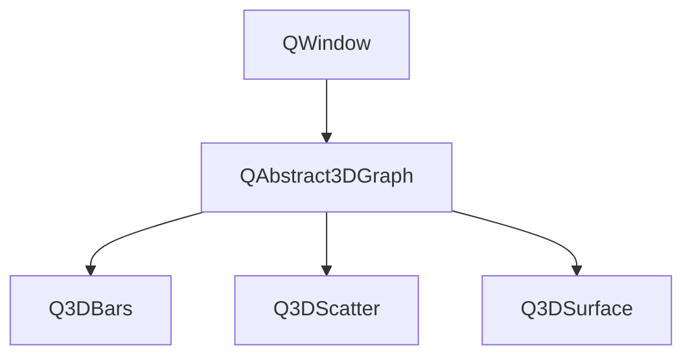
```mermaid
graph TD
QWindow-->QAbstract3DGraph
QAbstract3DGraph-->Q3DBars
QAbstract3DGraph-->Q3DScatter
QAbstract3DGraph-->Q3DSurface
```

每个视图类都对应一个三维序列类，不能交叉使用，例如QBar3DSeries只能用作Q3DBars的序列，而不能作为Q3DScatter的序列。不过同一个视图类可以加多个序列类，例如一个Q3DSurface可以有多个QSurface3DSeries。

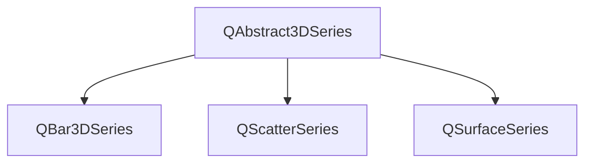
```mermaid
graph TD
QAbstract3DSeries-->QBar3DSeries
QAbstract3DSeries-->QScatterSeries
QAbstract3DSeries-->QSurfaceSeries
```

三维坐标轴只分为数值和文字型坐标轴。

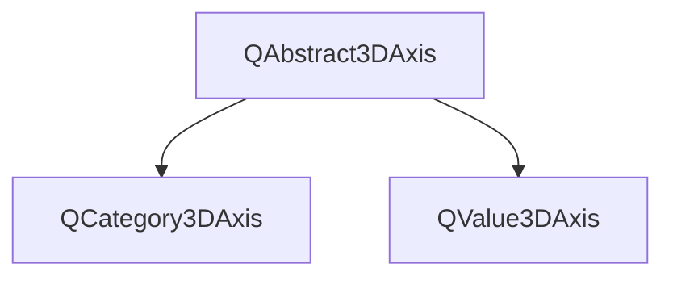
```mermaid
graph TD
QAbstract3DAxis-->QCategory3DAxis
QAbstract3DAxis-->QValue3DAxis
```

数据代理类也有，也要和序列对应，用于存储序列数据的类。例如三维散点序列QScatterSeries存储的是一些三维数据点的坐标；QSurface3DSeries存储的数据点是在水平面上均匀网格分布的，就需要二维数组才能存储。这些三维代理类还有基于项数据模型的数据代理子类。特别的QHeightMapSurfaceDataProxy是专门用于显示地图高程数据的数据代理类，可以将一个图片表示的高程数据显示为三维曲面。

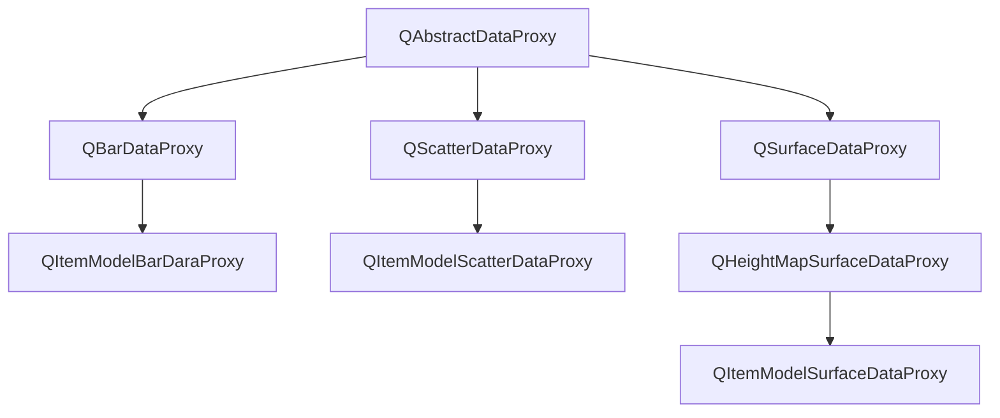
```mermaid
graph TD
QAbstractDataProxy-->QBarDataProxy
QAbstractDataProxy-->QScatterDataProxy
QAbstractDataProxy-->QSurfaceDataProxy
QBarDataProxy-->QItemModelBarDaraProxy
QScatterDataProxy-->QItemModelScatterDataProxy
QSurfaceDataProxy-->QHeightMapSurfaceDataProxy
QHeightMapSurfaceDataProxy-->QItemModelSurfaceDataProxy
```

如果要在项目中使用三维图表模块，必须在pro文件加上

```c++
Qt += datavisualization
```

同样也有自己的命名空间。

```c++
#include <QtDataVisualization>
using namespace QtDataVisualization;
```

因为三维图形类都是从QWindow继承而来不能简单使用QWidget部件作为Q3DBars组件的容器，也就是不能主窗口放置一个QWidget组件然后作为Q3DBars组件的容器，必须使用QWidget::createWindowContainer动态创建QWidget作为容器。

```c++
this->graph3D = new Q3DBars();
this->graphContainer = QWidget::createWindowContainer(this->graph3D); 
this->graph3D->scene()->activeCamera()>setCameraPreset(Q3DCamera::CameraPresetFrontHigh);
```

无需任何编程设置，程序运行时就可以在图表中单击左键选择图表中的某个项，按住鼠标右键就可以对观察图表的视角进行调整。关于视角的关联数据类型是Q3DCamera和CameraPreset。

### 9.1 三维视图类

#### 9.1.1 QAbstract3DGraph

QAbstract3DGraph 类为图形提供了一个窗口和渲染循环。
此类继承 QWindow 并为继承它的图形提供渲染循环。
您不需要直接使用此类，而是使用其子类之一。
抗锯齿在 C++ 上默认打开，除了在 OpenGL ES2 环境中，Qt 数据可视化不支持抗锯齿。要为图形指定非默认抗锯齿，请提供自定义表面格式作为构造函数参数。您可以使用便捷函数 QtDataVisualization::qDefaultSurfaceFormat() 来创建表面格式对象。注意：QAbstract3DGraph 默认设置窗口标志 Qt::FramelessWindowHint。如果要将**图形窗口显示为具有常规窗口框架的独立窗口**，请在构建图形后清除此标志。例如：

```c++
 Q3DBars *graphWindow = new Q3DBars;
 graphWindow->setFlags(graphWindow->flags() ^ Qt::FramelessWindowHint);
```

##### 枚举类型

图表中元素的类型。

```c++
enum QAbstract3DGraph::ElementType{
    QAbstract3DGraph::ElementNone,//没有定义的元素
    QAbstract3DGraph::ElementSeries,//一个系列（即系列中的一个项目）
    QAbstract3DGraph::ElementAxisXLabel,//x轴标签
    QAbstract3DGraph::ElementAxisYLabel,//Y轴标签
    QAbstract3DGraph::ElementAxisZLabel,//Z轴标签
    QAbstract3DGraph::ElementCustomItem//自定义项目
}
```

渲染的优化提示。

```c++
enum QAbstract3DGraph::OptimizationHint{
    QAbstract3DGraph::OptimizationDefault,//以合理的性能提供完整的功能集
    QAbstract3DGraph::OptimizationStatic//以牺牲某些功能为代价优化静态数据集的渲染
}
```

项目选择模式。此枚举的值可以与 OR 运算符组合。

```c++
enum QAbstract3DGraph::SelectionFlag{
    QAbstract3DGraph::SelectionNone,//选择模式已禁用
    QAbstract3DGraph::SelectionItem,//选择突出显示单个项目
    QAbstract3DGraph::SelectionRow,//选择突出显示单行
    QAbstract3DGraph::SelectionItemAndRow,//用不同颜色突出显示项目和行的组合标志
    QAbstract3DGraph::SelectionColumn,//选择突出显示单个列
    QAbstract3DGraph::SelectionItemAndColumn,//用不同颜色突出显示项目和列的组合标志
    QAbstract3DGraph::SelectionRowAndColumn,//用于突出显示行和列的组合标志
    QAbstract3DGraph::SelectionItemRowAndColumn,//用于突出显示项目、行和列的组合标志
    QAbstract3DGraph::SelectionSlice,//设置此模式标志表示图形应该自动处理切片视图处理。如果您希望通过 Q3DScene 自己控制切片视图，请不要设置此标志。设置此模式标志时，必须同时设置 SelectionRow 或 SelectionColumn，但不能同时设置。只有 Q3DBars 和 Q3DSurface 支持切片。1.当选择通过系列API显式更改为可见项时；2.当选择模式更改且选定项可见时；3.通过单击图形更改选择时
    QAbstract3DGraph::SelectionMultiSeries//设置此模式意味着突出显示同一位置的所有系列的项目，而不仅仅是选定的项目。其他系列中的实际选择没有改变。 Q3DScatter 不支持多系列选择
}
```

阴影质量。

```c++
enum QAbstract3DGraph::ShadowQuality{
    QAbstract3DGraph::ShadowQualityNone,//阴影被禁用
    QAbstract3DGraph::ShadowQualityLow,//阴影以低质量渲染
    QAbstract3DGraph::ShadowQualityMedium,//阴影以中等质量渲染
    QAbstract3DGraph::ShadowQualityHigh,///阴影以高质量渲染
    QAbstract3DGraph::ShadowQualitySoftLow,//阴影以低质量渲染，边缘柔和
    QAbstract3DGraph::ShadowQualitySoftMedium,//阴影以中等质量渲染，边缘柔和
    QAbstract3DGraph::ShadowQualitySoftHigh//阴影以高质量渲染，边缘柔和
}
```

##### 成员函数

```c++
virtual bool shadowsSupported() const;//如果当前配置支持阴影，则返回 true。 OpenGL ES2 配置不支持阴影
Q3DScene *scene() const;//此属性保存 Q3DScene 指针，可用于操作场景和访问场景元素，例如活动摄像机
QAbstract3DAxis *selectedAxis() const;//可用于在接收到任意标签类型的 selectedElementChanged 信号后获取选中的轴。选择在下一个 selectedElementChanged 信号之前有效
ElementType selectedElement() const;//此属性保存图表中选定的元素
QImage renderToImage(int msaaSamples = 0, const QSize &imageSize = QSize());//将当前帧渲染为 imageSize 的图像。默认大小是窗口大小。使用 msaaSamples 中给出的抗锯齿级别渲染图像。默认级别为 0
QVector3D queriedGraphPosition() const;//此属性保存沿每个轴的最新查询的图形位置值
void clearSelection();//清除所有附加系列的选择
qreal currentFps() const;
bool hasContext() const;//如果图形的 OpenGL 上下文已成功初始化，则返回 true。在上下文初始化失败时尝试使用图表通常会导致崩溃。上下文初始化失败的一个常见原因是缺乏对 OpenGL 的足够平台支持

void setActiveInputHandler(QAbstract3DInputHandler *inputHandler);//此属性保存图表中使用的活动输入处理程序
QAbstract3DInputHandler *activeInputHandler() const;
void addInputHandler(QAbstract3DInputHandler *inputHandler);//将给定的 inputHandler 添加到图中。通过 addInputHandler 添加的输入处理程序不会直接使用。仅将 inputHandler 的所有权赋予图。 inputHandler 不得为 null 或已添加到另一个图中。
void releaseInputHandler(QAbstract3DInputHandler *inputHandler);//如果 inputHandler 已添加到此图中，则将其所有权释放回调用者。如果释放的 inputHandler 正在使用中，则在此调用之后将没有活动的输入处理程序
QList<QAbstract3DInputHandler *> inputHandlers() const;//返回所有添加的输入处理程序的列表

QCustom3DItem *selectedCustomItem() const;//可用于在接收到 QAbstract3DGraph::ElementCustomItem 类型的 selectedElementChanged 信号后获取选中的自定义项。项目的所有权保留在图表中。选择在下一个 selectedElementChanged 信号之前有效
int addCustomItem(QCustom3DItem *item);//将 QCustom3DItem 项添加到图形中。 Graph 拥有所添加项目的所有权。如果添加操作成功，则返回添加项的索引，如果尝试添加空项，则返回 -1，如果尝试添加已添加的项，则返回该项的索引。
void releaseCustomItem(QCustom3DItem *item);//获取给定项目的所有权并从图表中删除该项目
void removeCustomItem(QCustom3DItem *item);//删除自定义项。删除分配给它的资源
void removeCustomItemAt(const QVector3D &position);//删除位置的所有自定义项目。删除分配给它们的资源
void removeCustomItems(); //删除所有自定义项目。删除分配给它们的资源
QList<QCustom3DItem *> customItems() const;//返回所有添加的自定义项的列表

int selectedCustomItemIndex() const;//可用于在接收到 QAbstract3DGraph::ElementCustomItem 类型的 selectedElementChanged 信号后查询所选自定义项的索引。选择在下一个 selectedElementChanged 信号之前有效
int selectedLabelIndex() const;//可用于在接收到任意标签类型的 selectedElementChanged 信号后查询选中标签的索引。选择在下一个 selectedElementChanged 信号之前有效

void setActiveTheme(Q3DTheme *theme);//此属性包含图形的活动主题
Q3DTheme *activeTheme() const;
void addTheme(Q3DTheme *theme);//将给定的主题添加到图表中。通过 addTheme 添加的主题不直接使用。只有主题的所有权被赋予图表。主题不得为空或已添加到另一个图表
QList<Q3DTheme *> themes() const;//返回所有添加主题的列表
void releaseTheme(Q3DTheme *theme);//如果主题已添加到此图中，则将主题的所有权释放回调用者。如果发布的主题正在使用中，将创建一个新的默认主题并将其设置为活动的

void setAspectRatio(qreal ratio);//此属性保存水平面上最长轴与 y 轴之间的图形缩放比例
qreal aspectRatio() const;

void setHorizontalAspectRatio(qreal ratio);//此属性保存 x 轴和 z 轴之间的图形缩放比例
qreal horizontalAspectRatio() const;

void setLocale(const QLocale &locale);//此属性保存用于格式化各种数字标签的语言环境。默认“C”语言环境
QLocale locale() const;

void setMargin(qreal margin);//此属性保存用于可绘制图形区域边缘和图形背景边缘之间的空间的绝对值
qreal margin() const；

void setMeasureFps(bool enable);//该属性决定渲染是否连续进行而不是按需进行
bool measureFps() const;

void setOptimizationHints(OptimizationHints hints);//该属性保存默认或静态模式是否用于渲染优化
OptimizationHints optimizationHints() const;

void setOrthoProjection(bool enable);//此属性保存是否使用正交投影来显示图形
bool isOrthoProjection() const;

void setPolar(bool enable);//此属性保存水平轴是否更改为极轴
bool isPolar() const;

void setRadialLabelOffset(float offset);//此属性保存径向极轴的轴标签的标准化水平偏移
float radialLabelOffset() const;

void setReflection(bool enable);//这个属性决定了地板反射是打开还是关闭
bool isReflection() const;

void setReflectivity(qreal reflectivity);//较大的数字使地板更具反射性。有效范围是 [0...1]。默认为 0.5
qreal reflectivity() const;

void setSelectionMode(SelectionFlags mode);//项目选择模式
SelectionFlags selectionMode() const;

void setShadowQuality(ShadowQuality quality);//这个属性保存了阴影的质量
ShadowQuality shadowQuality() const;
```

##### 信号函数

```c++
void activeInputHandlerChanged(QAbstract3DInputHandler *inputHandler);
void activeThemeChanged(Q3DTheme *theme);
void aspectRatioChanged(qreal ratio);
void currentFpsChanged(qreal fps);
void horizontalAspectRatioChanged(qreal ratio);
void localeChanged(const QLocale &locale);
void marginChanged(qreal margin);
void measureFpsChanged(bool enabled);
void optimizationHintsChanged(QAbstract3DGraph::OptimizationHints hints);
void orthoProjectionChanged(bool enabled);
void polarChanged(bool enabled);
void queriedGraphPositionChanged(const QVector3D &data);
void radialLabelOffsetChanged(float offset);
void reflectionChanged(bool enabled);
void reflectivityChanged(qreal reflectivity);
void selectedElementChanged(QAbstract3DGraph::ElementType type);
void selectionModeChanged(QAbstract3DGraph::SelectionFlags mode);
void shadowQualityChanged(QAbstract3DGraph::ShadowQuality quality);
```

#### 9.1.2 Q3DBars

Q3DBars 类提供了用于渲染 3D 条形图的方法。
此类使开发人员能够以 3D 形式呈现条形图并通过自由旋转场景来查看它们。旋转是通过按住鼠标右键并移动鼠标来完成的。缩放是通过鼠标滚轮完成的。选择（如果启用）是通过鼠标左键完成的。可以通过单击鼠标滚轮将场景重置为默认摄像机视图。在触摸设备中，旋转是通过点击和移动来完成的，通过点击和按住进行选择并通过捏合进行缩放。
如果没有明确地将轴设置为 Q3DBars，则会创建没有标签的临时默认轴。这些默认轴可以通过轴访问器进行修改，但是一旦为方向明确设置了任何轴，该方向的默认轴就会被破坏。
Q3DBars 支持同时显示多个系列。并非所有系列都必须具有相同数量的行和列。行和列标签取自第一个添加的系列，除非明确定义为行和列轴。

如何构造一个最小的 Q3DBars 图首先，构造一个 Q3DBars 的实例。由于我们在本例中将图形作为顶级窗口运行，我们需要清除默认设置的 Qt::FramelessWindowHint 标志：

```c++
Q3DBars bars;
bars.setFlags(bars.flags() ^ Qt::FramelessWindowHint);
```

构建 Q3DBars 后，您可以通过更改行轴和列轴上的范围来设置数据窗口。这不是强制性的，因为数据窗口将默认显示系列中的所有数据。如果数据量很大，通常最好只显示其中的一部分。例如，让我们将数据窗口设置为显示前五行和前五列：

```c++
bars.rowAxis()->setRange(0, 4);
bars.columnAxis()->setRange(0, 4);
```

现在 Q3DBars 已准备好接收要渲染的数据。创建一个包含一行 5 个值的系列：

```c++
QBar3DSeries *series = new QBar3DSeries;
QBarDataRow *data = new QBarDataRow;
*data << 1.0f << 3.0f << 7.5f << 5.0f << 2.2f;
series->dataProxy()->addRow(data);
bars.addSeries(series);
```

注意：我们将数据窗口设置为 5 x 5，但我们只添加了一行数据。没关系，其余的行将是空白的。
最后，您需要将其设置为可见

```c++
bars.show();
```

创建和显示此图所需的完整代码是：

```c++
#include <QtDataVisualization>

using namespace QtDataVisualization;

int main(int argc, char **argv)
{
    QGuiApplication app(argc, argv);

    Q3DBars bars;
    bars.setFlags(bars.flags() ^ Qt::FramelessWindowHint);
    bars.rowAxis()->setRange(0, 4);
    bars.columnAxis()->setRange(0, 4);
    QBar3DSeries *series = new QBar3DSeries;
    QBarDataRow *data = new QBarDataRow;
    *data << 1.0f << 3.0f << 7.5f << 5.0f << 2.2f;
    series->dataProxy()->addRow(data);
    bars.addSeries(series);
    bars.show();

    return app.exec();
}
```

场景可以旋转、放大，并且可以选择一个条形来查看其值，但是这个最小的代码示例中不包含其他交互。

成员函数。

```c++
Q3DBars(const QSurfaceFormat *format = Q_NULLPTR, QWindow *parent = Q_NULLPTR);
void addAxis(QAbstract3DAxis *axis);//将轴添加到图表。通过 addAxis 添加的轴尚未使用，addAxis 仅用于将轴的所有权授予图形。轴不得为空或添加到另一个图表。
QList<QAbstract3DAxis *> axes() const;//返回所有添加轴的列表
void releaseAxis(QAbstract3DAxis *axis);//如果将轴添加到此图中，则将轴的所有权释放回调用者。如果释放的轴正在使用中，将创建一个新的默认轴并将其设置为活动轴

void addSeries(QBar3DSeries *series);//将系列添加到图表中。一个图表可以包含多个系列，但只有一组轴，因此所有系列的行和列必须匹配，可视化数据才有意义
void insertSeries(int index, QBar3DSeries *series);//将系列插入系列列表中的位置索引。如果该系列已添加到列表中，则将其移至新索引
void removeSeries(QBar3DSeries *series);//从图中删除系列。
QBar3DSeries *selectedSeries() const;//此属性保存选定的系列或空值
QList<QBar3DSeries *> seriesList() const;//返回添加到此图表的系列列表

QSizeF barSpacing() const;//X 和 Z 尺寸中的条间距
void setBarSpacing(const QSizeF &spacing);

bool isBarSpacingRelative() const;//这个属性决定了间距是绝对的还是相对于钢筋厚度的
void setBarSpacingRelative(bool relative);

void setBarThickness(float thicknessRatio);
float barThickness() const;//此属性保存 X 和 Z 尺寸之间的钢筋厚度比

QCategory3DAxis *columnAxis() const;//此属性保存附加到活动列的轴
void setColumnAxis(QCategory3DAxis *axis);

float floorLevel() const;//此属性在 Y 轴数据坐标中保存条形图的楼层
void setFloorLevel(float level);

bool isMultiSeriesUniform() const;//即使显示了多个系列，此属性也保存是否要使用设置为单个系列栏的比例来缩放条
void setMultiSeriesUniform(bool uniform);

QBar3DSeries *primarySeries() const;//此属性保存图形的主要系列
void setPrimarySeries(QBar3DSeries *series);

QCategory3DAxis *rowAxis() const;//此属性保存附加到活动行的轴
void setRowAxis(QCategory3DAxis *axis);

QValue3DAxis *valueAxis() const；//将活动值轴（Y 轴）设置为轴。隐式调用 addAxis() 将轴的所有权转移到此图
void setValueAxis(QValue3DAxis *axis);
```

信号函数。

```c++
void barSpacingChanged(const QSizeF &spacing);
void barSpacingRelativeChanged(bool relative);
void barThicknessChanged(float thicknessRatio);
void columnAxisChanged(QCategory3DAxis *axis);
void floorLevelChanged(float level);
void multiSeriesUniformChanged(bool uniform);
void primarySeriesChanged(QBar3DSeries *series);
void rowAxisChanged(QCategory3DAxis *axis);
void selectedSeriesChanged(QBar3DSeries *series);
void valueAxisChanged(QValue3DAxis *axis);
```

从上述成员函数来看，一些需要关注的关联数据模型有2个。

第一个是QBarDataArray，它用来保存bar类型的数据，它可以按行添加QBarDataRow这样的数据，并被QBar3DSeries添加，而QBar3DSeries又被Q3DBars添加。

第二个就是QBarDataRow，用于添加列数据，可以被QBarDataArray添加。

```c++
QBarDataArray *dataSet = new QBarDataArray; //数据代理
dataSet->reserve(3);// 预留指定的行数
QBarDataRow *dataRow = new QBarDataRow;
*dataRow << 1 << 2<< 3<< 4<<5; //第1行数据，有5列
dataSet->append(dataRow);
QBarDataRow *dataRow2 = new QBarDataRow;
*dataRow2 << 5<< 5<< 5<< 5<<5; //第2行数据，有5列
dataSet->append(dataRow2);
QBarDataRow *dataRow3 = new QBarDataRow;
*dataRow3 << 1<< 5<< 9<< 5<<1; //第3行数据，有5列
dataSet->append(dataRow3);
this->series->dataProxy()->resetArray(dataSet);
this->graph3D->addSeries(series);
```

#### 9.1.3 Q3DScatter

Q3DScatter 类提供了渲染 3D 散点图的方法。
此类使开发人员能够在 3D 中渲染散点图并通过自由旋转场景来查看它们。旋转是通过按住鼠标右键并移动鼠标来完成的。缩放是通过鼠标滚轮完成的。选择（如果启用）是通过鼠标左键完成的。可以通过单击鼠标滚轮将场景重置为默认摄像机视图。在触摸设备中，旋转是通过点击和移动来完成的，通过点击和按住进行选择并通过捏合进行缩放。
如果没有明确地将轴设置为 Q3DScatter，则会创建没有标签的临时默认轴。这些默认轴可以通过轴访问器进行修改，但是一旦为方向明确设置了任何轴，该方向的默认轴就会被破坏。
Q3DScatter 支持同时显示多个系列。

如何构造一个最小的 Q3DScatter 图首先，构造 Q3DScatter。由于我们在本例中将图形作为顶级窗口运行，我们需要清除默认设置的 Qt::FramelessWindowHint 标志：

```c++
Q3DScatter scatter;
scatter.setFlags(scatter.flags() ^ Qt::FramelessWindowHint);
QScatter3DSeries *series = new QScatter3DSeries;
QScatterDataArray data;
data << QVector3D(0.5f, 0.5f, 0.5f) << QVector3D(-0.3f, -0.5f, -0.4f) << QVector3D(0.0f, -0.3f, 0.2f);
series->dataProxy()->addItems(data);
scatter.addSeries(series);
scatter.show();
```

成员函数。

```c++
Q3DScatter(const QSurfaceFormat *format = Q_NULLPTR, QWindow *parent = Q_NULLPTR);
void addAxis(QValue3DAxis *axis)
void addSeries(QScatter3DSeries *series)
QList<QValue3DAxis *> axes() const
QValue3DAxis *axisX() const
QValue3DAxis *axisY() const
QValue3DAxis *axisZ() const
void releaseAxis(QValue3DAxis *axis)
void removeSeries(QScatter3DSeries *series)
QScatter3DSeries *selectedSeries() const
QList<QScatter3DSeries *> seriesList() const
void setAxisX(QValue3DAxis *axis)
void setAxisY(QValue3DAxis *axis)
void setAxisZ(QValue3DAxis *axis);
```

信号函数。

```c++
void axisXChanged(QValue3DAxis *axis);
void axisYChanged(QValue3DAxis *axis);
void axisZChanged(QValue3DAxis *axis);
void selectedSeriesChanged(QScatter3DSeries *series);
```

#### 9.1.4 Q3DSurface

Q3DSurface 类提供了渲染 3D 曲面图的方法。
此类使开发人员能够渲染 3D 曲面图并通过自由旋转场景来查看它们。可以通过 QSurface3DSeries 控制表面的视觉属性，例如绘制模式和阴影。
Q3DSurface 通过在数据点上显示一个突出显示的球来支持选择，在该数据点上用户使用鼠标左键单击（使用默认输入处理程序时）或通过 QSurface3DSeries 选择。选择指针带有一个标签，默认情况下显示数据点的值和点的坐标。
轴上显示的数值范围和标签格式可以通过QValue3DAxis来控制。要旋转图形，请按住鼠标右键并移动鼠标。缩放是使用鼠标滚轮完成的。两者都假定默认输入处理程序正在使用中。
如果没有明确地将轴设置为 Q3DSurface，则会创建没有标签的临时默认轴。这些默认轴可以通过轴访问器进行修改，但是一旦为方向明确设置了任何轴，该方向的默认轴就会被破坏。

一个例子如下。

```c++
#include <QtDataVisualization>
using namespace QtDataVisualization;
int main(int argc, char **argv)
{
    QGuiApplication app(argc, argv);

    Q3DSurface surface;
    surface.setFlags(surface.flags() ^ Qt::FramelessWindowHint);
    QSurfaceDataArray *data = new QSurfaceDataArray;
    QSurfaceDataRow *dataRow1 = new QSurfaceDataRow;
    QSurfaceDataRow *dataRow2 = new QSurfaceDataRow;

    *dataRow1 << QVector3D(0.0f, 0.1f, 0.5f) << QVector3D(1.0f, 0.5f, 0.5f);
    *dataRow2 << QVector3D(0.0f, 1.8f, 1.0f) << QVector3D(1.0f, 1.2f, 1.0f);
    *data << dataRow1 << dataRow2;

    QSurface3DSeries *series = new QSurface3DSeries;
    series->dataProxy()->resetArray(data);
    surface.addSeries(series);
    surface.show();

    return app.exec();
}
```

成员函数。

```c++
Q3DSurface(const QSurfaceFormat *format = Q_NULLPTR, QWindow *parent = Q_NULLPTR);
void addAxis(QValue3DAxis *axis);//将轴添加到图表。通过 addAxis 添加的轴尚未使用，addAxis 仅用于将轴的所有权授予图形。轴不得为空或添加到另一个图表
void addSeries(QSurface3DSeries *series);//将系列添加到图表中。一个图可以包含多个系列，但只有一组轴。如果新添加的系列指定了一个选定的项目，它将被突出显示并且任何现有的选择都将被清除。只有一个添加的系列可以具有活动选择
QList<QValue3DAxis *> axes() const;//返回所有添加轴的列表
QValue3DAxis *axisX() const;
QValue3DAxis *axisY() const;
QValue3DAxis *axisZ() const;
void releaseAxis(QValue3DAxis *axis);//如果将轴添加到此图中，则将轴的所有权释放回调用者。如果释放的轴正在使用中，将创建一个新的默认轴并将其设置为活动轴
void removeSeries(QSurface3DSeries *series);//从图中删除系列
QSurface3DSeries *selectedSeries() const;
QList<QSurface3DSeries *> seriesList() const;//返回添加到此图表的系列列表
void setAxisX(QValue3DAxis *axis);
void setAxisY(QValue3DAxis *axis);
void setAxisZ(QValue3DAxis *axis);
void setFlipHorizontalGrid(bool flip);
bool flipHorizontalGrid() const;//此属性保存水平轴网格是否显示在图形顶部而不是底部
```

信号函数。

```c++
void axisXChanged(QValue3DAxis *axis);
void axisYChanged(QValue3DAxis *axis);
void axisZChanged(QValue3DAxis *axis);
void flipHorizontalGridChanged(bool flip);
void selectedSeriesChanged(QSurface3DSeries *series);
```

### 9.2 三维图表类

#### 9.2.1 QAbstract3DSeries

预定义的网格类型。并非所有样式都可用于所有可视化类型。

```c++
enum QAbstract3DSeries::Mesh{
    QAbstract3DSeries::MeshUserDefined,//用户定义的网格，通过 QAbstract3DSeries::userDefinedMesh 属性设置
    QAbstract3DSeries::MeshBar,//基本矩形条
    QAbstract3DSeries::MeshCube,//基本立方体
    QAbstract3DSeries::MeshPyramid,//四面金字塔
    QAbstract3DSeries::MeshCone,//基本锥
    QAbstract3DSeries::MeshCylinder,//基本气缸
    QAbstract3DSeries::MeshBevelBar,//略微斜切（圆形）的矩形条
    QAbstract3DSeries::MeshBevelCube,//略微倾斜（圆形）的立方体
    QAbstract3DSeries::MeshSphere,//领域
    QAbstract3DSeries::MeshMinimal,//最小的 3D 网格：三角锥。仅可用于 Q3DScatter
    QAbstract3DSeries::MeshArrow,//向上的箭头
    QAbstract3DSeries::MeshPoint//二维点。仅可用于 Q3DScatter。阴影不影响这种风格。此样式不支持颜色样式 Q3DTheme::ColorStyleObjectGradient
}
```

系列的类型。

```c++
enum QAbstract3DSeries::SeriesType{
    QAbstract3DSeries::SeriesTypeNone,//无系列类型
    QAbstract3DSeries::SeriesTypeBar,//Q3DBars 的系列类型
    QAbstract3DSeries::SeriesTypeScatter,//Q3DScatter 的系列类型
    QAbstract3DSeries::SeriesTypeSurface//Q3DSurface 的系列类型
}
```

成员函数。

```c++
SeriesType type() const;//该属性保存系列的类型
QString itemLabel() const;//

void setBaseColor(const QColor &color);//此属性保存系列的基色
QColor baseColor() const;

void setBaseGradient(const QLinearGradient &gradient);//此属性保存系列的基本渐变
QLinearGradient baseGradient() const;

void setColorStyle(Q3DTheme::ColorStyle style);//此属性保存系列的颜色样式
Q3DTheme::ColorStyle colorStyle() const;

void setItemLabelFormat(const QString &format);//此属性保存此系列中数据项的标签格式
QString itemLabelFormat() const;// @rowTitle,@colTitle,@valueTitle,@rowIdx,@colIdx,@rowLabel,@colLabel,@valueLabel,@seriesName,%<format spec>

void setItemLabelVisible(bool visible);//此属性保存图表中项目标签的可见性
bool isItemLabelVisible() const;

void setMesh(Mesh mesh);//此属性保存系列中项目的网格
Mesh mesh() const;

void setMeshAxisAndAngle(const QVector3D &axis, float angle);//从轴和角度构造网格旋转四元数的便捷函数

void setMeshRotation(const QQuaternion &rotation);//此属性保存应用于该系列的所有项目的网格旋转
QQuaternion meshRotation() const;

void setMeshSmooth(bool enable);//该属性决定是否使用预定义网格的平滑版本。
bool isMeshSmooth() const;

void setMultiHighlightColor(const QColor &color);//此属性保存系列的多项目突出显示颜色
QColor multiHighlightColor() const;

void setMultiHighlightGradient(const QLinearGradient &gradient);//此属性保存系列的多项高亮渐变
QLinearGradient multiHighlightGradient() const;

void setName(const QString &name);//此属性保存系列名称
QString name() const;

void setSingleHighlightColor(const QColor &color);//此属性保存系列的单个项目突出显示颜色
QColor singleHighlightColor() const;

void setUserDefinedMesh(const QString &fileName);//此属性保存用户定义的对象自定义网格的文件名
QString userDefinedMesh() const;

void setVisible(bool visible);//此属性保存系列的可见性
bool isVisible() const;

void setSingleHighlightGradient(const QLinearGradient &gradient);//此属性保存系列的单项高亮渐变
QLinearGradient singleHighlightGradient() const;
```


#### 9.2.2 QBar3DSeries

QBar3DSeries 类表示 3D 条形图中的数据系列。
此类管理特定于系列的视觉元素以及系列数据（通过数据代理）。
如果没有为该系列明确设置数据代理，则该系列会创建一个默认代理。设置另一个代理将破坏现有代理以及添加到其中的所有数据。
QBar3DSeries 支持 QAbstract3DSeries::setItemLabelFormat() 的以下格式标记：

```c++
@rowTitle 行轴的标题
@colTitle 列轴的标题
@valueTitle 值轴的标题
@rowIdx 可见行索引。使用图形语言环境进行本地化。
@colIdx 可见列索引。使用图形语言环境进行本地化。
@rowLabel 行轴标签
@colLabel 列轴的标签
@valueLabel 使用附加到图表的值轴的格式格式化的项目值。有关详细信息，请参阅 QValue3DAxis::labelFormat
@seriesName 系列名称
%<format spec> 指定格式的项目值。使用与 QValue3DAxis::labelFormat 相同的规则进行格式化。

pxy->setItemLabelFormat(QStringLiteral("@valueTitle for (@rowLabel, @colLabel): %.1f"))；
```

成员函数。

```c++
QBar3DSeries(QObject *parent = Q_NULLPTR);
QBar3DSeries(QBarDataProxy *dataProxy, QObject *parent = Q_NULLPTR);
QBarDataProxy *dataProxy() const;//此属性保存活动数据代理
void setDataProxy(QBarDataProxy *proxy);
float meshAngle() const;//此属性以度为单位保存系列旋转角度
void setMeshAngle(float angle);
QPoint selectedBar() const;//此属性保存所选系列中的栏
void setSelectedBar(const QPoint &position);
```

信号函数。

```c++
void dataProxyChanged(QBarDataProxy *proxy);
void meshAngleChanged(float angle);
void selectedBarChanged(const QPoint &position);
```

静态函数。

```c++
QPoint invalidSelectionPosition();//返回一个无效的选择位置。此位置设置为 selectedBar 属性以清除此系列中的选择
```

#### 9.2.3 QScatter3DSeries

成员函数。

```c++
QScatter3DSeries(QObject *parent = Q_NULLPTR);
QScatter3DSeries(QScatterDataProxy *dataProxy, QObject *parent = Q_NULLPTR);
QScatterDataProxy *dataProxy() const;//此属性保存活动数据代理
void setDataProxy(QScatterDataProxy *proxy);
int selectedItem() const;//此属性保存在系列中选择的项目
void setSelectedItem(int index);
float itemSize() const;//该系列的项目大小
void setItemSize(float size);
```

信号函数。

```c++
void dataProxyChanged(QScatterDataProxy *proxy);
void itemSizeChanged(float size);
void selectedItemChanged(int index);
```

静态函数。

```c++
int invalidSelectionIndex();//返回用于选择的无效索引。此索引设置为 selectedItem 属性以清除该系列的选择
```

#### 9.2.4 QSurface3DSeries

QSurface3DSeries 类表示 3D 曲面图中的数据系列。
此类管理特定于系列的视觉元素以及系列数据（通过数据代理）。
如果没有为该系列明确设置数据代理，则该系列会创建一个默认代理。设置另一个代理将破坏现有代理以及添加到其中的所有数据。
通过 QAbstract3DSeries::mesh 属性设置的对象网格定义了表面系列中的选择指针形状。
QSurface3DSeries 支持 QAbstract3DSeries::setItemLabelFormat() 的以下格式标记：

```c++
@xTitle 来自 x 轴的标题 
@yTitle 来自 y 轴的标题 
@zTitle 来自 z 轴的标题 
@xLabel 使用 x 轴格式格式化的项目值。有关详细信息，请参阅 QValue3DAxis::setLabelFormat()。
@yLabel 使用 y 轴格式格式化的项目值。有关详细信息，请参阅 QValue3DAxis::setLabelFormat()。
@zLabel 使用 z 轴格式格式化的项目值。有关详细信息，请参阅 QValue3DAxis::setLabelFormat()。
@seriesName 系列名称
proxy->setItemLabelFormat(QStringLiteral("@valueTitle for (@rowLabel, @colLabel): %.1f"));
```

曲面的绘制模式。此枚举的值可以与 OR 运算符组合。

```c++
enum QSurface3DSeries::DrawFlag{   
    QSurface3DSeries::DrawWireframe,//只绘制线网
    QSurface3DSeries::DrawSurface,//只绘制曲面
    QSurface3DSeries::DrawSurfaceAndWireframe//都绘制
}
```

成员函数。

```c++
QSurface3DSeries(QObject *parent = Q_NULLPTR);
QSurface3DSeries(QSurfaceDataProxy *dataProxy, QObject *parent = Q_NULLPTR);
QSurfaceDataProxy *dataProxy() const;//此属性保存活动数据代理
void setDataProxy(QSurfaceDataProxy *proxy);
QSurface3DSeries::DrawFlags drawMode() const;//绘图模式。可能值是DrawFlag。不允许清除所有标志。
void setDrawMode(DrawFlags mode);
bool isFlatShadingEnabled() const;//此属性保存是否启用表面平面着色
void setFlatShadingEnabled(bool enabled);
bool isFlatShadingSupported() const;//此属性保存当前系统是否支持表面平面着色
QPoint selectedPoint() const;//此属性保存在系列中选择的表面网格点
void setSelectedPoint(const QPoint &position);
QImage texture() const;//此属性将表面的纹理保存为 QImage
void setTexture(const QImage &texture);
void setTextureFile(const QString &filename);//此属性将表面的纹理保存为文件
QString textureFile() const;
```

信号函数。

```c++
void dataProxyChanged(QSurfaceDataProxy *proxy);
void drawModeChanged(QSurface3DSeries::DrawFlags mode);
void flatShadingEnabledChanged(bool enable);
void flatShadingSupportedChanged(bool enable);
void selectedPointChanged(const QPoint &position);
void textureChanged(const QImage &image);
void textureFileChanged(const QString &filename);
```

静态函数。

```c++
QPoint invalidSelectionPosition();
```

### 9.3 三维坐标轴类

#### 9.3.1 QAbstract3DAxis

QAbstract3DAxis 类是图形轴的基类。
此类指定图轴共享的枚举、属性和函数。它不应直接使用，而应使用其子类之一。

轴对象的方向。

```c++
enum QAbstract3DAxis::AxisOrientation{
    QAbstract3DAxis::AxisOrientationNone,
    QAbstract3DAxis::AxisOrientationX,
    QAbstract3DAxis::AxisOrientationY,
    QAbstract3DAxis::AxisOrientationZ
}
```

轴对象的类型。

```c++
enum QAbstract3DAxis::AxisType{
    QAbstract3DAxis::AxisTypeNone,
    QAbstract3DAxis::AxisTypeCategory,
    QAbstract3DAxis::AxisTypeValue
}
```

成员函数。

```c++
AxisType type() const;
AxisOrientation orientation() const;

void setAutoAdjustRange(bool autoAdjust);//此属性保存轴是否会自动调整范围以使所有数据都适合它
bool isAutoAdjustRange() const;

void setLabelAutoRotation(float angle);//此属性保存当相机角度发生变化时标签可以自动旋转的最大角度
float labelAutoRotation() const;

void setLabels(const QStringList &labels);//此属性保存轴的标签
QStringList labels() const;

void setMax(float max);
void setMin(float min);
void setRange(float min, float max);
float max() const;
float min() const;

void setTitle(const QString &title);//此属性保存轴的标题
QString title() const;
void setTitleFixed(bool fixed);//此属性保存轴标题的旋转
void setTitleVisible(bool visible);
bool isTitleFixed() const;//此属性保存轴标题是否在主图表视图中可见
bool isTitleVisible() const;
```

信号函数。

```c++
void autoAdjustRangeChanged(bool autoAdjust);
void labelAutoRotationChanged(float angle);
void labelsChanged();
void maxChanged(float value);
void minChanged(float value);
void orientationChanged(QAbstract3DAxis::AxisOrientation orientation);
void rangeChanged(float min, float max);
void titleChanged(const QString &newTitle);
void titleFixedChanged(bool fixed);
void titleVisibilityChanged(bool visible);
```

#### 9.3.2 QCategory3DAxis

QCategory3DAxis 类操作图形的轴。
QCategory3DAxis 提供了一个可以给定标签的轴。根据设置轴范围定义的数据窗口大小，将轴分为大小相等的类别。如果可见，则在类别之间绘制网格线。如果提供，标签将绘制到类别的位置。

成员和信号函数。

```c++
QCategory3DAxis(QObject *parent = Q_NULLPTR);
QStringList labels() const;
void setLabels(const QStringList &labels);

signal void labelsChanged();
```

#### 9.3.3 QValue3DAxis

QValue3DAxis 类操作图形的轴。
可以为值轴指定一个值范围以及分段和子分段计数以将范围划分为。
在每个段之间绘制标签。在每个段和每个子段之间绘制网格线。
注意：如果可见，总会有至少两条网格线和标签指示范围的最小值和最大值，因为总是至少有一个段。

成员和信号函数。

```c++
QValue3DAxis(QObject *parent = Q_NULLPTR);
void setFormatter(QValue3DAxisFormatter *formatter);//此属性保存要使用的轴格式化程序
QValue3DAxisFormatter *formatter() const;

void setLabelFormat(const QString &format);//此属性保存要用于此轴上的标签的标签格式
QString labelFormat() const;

void setReversed(bool enable);//此属性保存轴是否反向渲染
bool reversed() const;

void setSegmentCount(int count);//此属性保存轴上的段数
int segmentCount() const;

void setSubSegmentCount(int count);//此属性保存轴上每个段内的子段数
int subSegmentCount() const;

signal void formatterChanged(QValue3DAxisFormatter *formatter)
signal void labelFormatChanged(const QString &format);
signal void reversedChanged(bool enable);
signal void segmentCountChanged(int count);
signal void subSegmentCountChanged(int count);
```

### 9.4 三维数据代理类

#### 9.4.1 QAbstractDataProxy

QAbstractDataProxy 类是所有数据可视化数据代理的基类。
使用以下可视化类型特定继承类代替基类：QBarDataProxy、QScatterDataProxy 和 QSurfaceDataProxy。

此枚举类型指定代理的数据类型。

```c++
enum QAbstractDataProxy::DataType{ 
    QAbstractDataProxy::DataTypeNone,
    QAbstractDataProxy::DataTypeBar,
    QAbstractDataProxy::DataTypeScatter,
    QAbstractDataProxy::DataTypeSurface
}
// 关联函数
DataType type() const;
```

#### 9.4.2 QBarDataProxy

QBarDataProxy 类是 3D 条形图的数据代理。
条形数据代理处理添加、插入、更改和删除数据行。
数据数组是 QBarDataItem 实例的向量（行）列表。每行可以包含不同数量的项目，甚至可以为空。
QBarDataProxy 拥有所有传递给它的 QtDataVisualization::QBarDataRow 对象的所有权，无论是直接还是在 QtDataVisualization::QBarDataArray 容器中。如果在将数组添加到代理后使用条形数据行指针直接修改数据，则必须发出适当的信号来更新图形。QBarDataProxy 可以选择跟踪行和列标签，QCategory3DAxis 可以利用这些标签来显示轴标签。行和列标签存储在与数据不同的数组中，行操作方法提供不影响行标签的替代版本。这使得可以选择与数组中数据的位置相关的行标签，而不是与数据本身相关的行标签。

成员函数。

```c++
QBarDataProxy(QObject *parent = Q_NULLPTR);
// 一个柱状图的点就一个Item
void setItem(int rowIndex, int columnIndex, const QBarDataItem &item);
void setItem(const QPoint &position, const QBarDataItem &item);
const QBarDataItem *itemAt(int rowIndex, int columnIndex) const;
const QBarDataItem *itemAt(const QPoint &position) const;
QBar3DSeries *series() const;
// 1行数据由数据和标签组成,可以被QBarDataArray添加
int addRow(QBarDataRow *row);
int addRow(QBarDataRow *row, const QString &label);
int addRows(const QBarDataArray &rows);
int addRows(const QBarDataArray &rows, const QStringList &labels);
void setRow(int rowIndex, QBarDataRow *row);
void setRow(int rowIndex, QBarDataRow *row, const QString &label);
void setRows(int rowIndex, const QBarDataArray &rows);
void setRows(int rowIndex, const QBarDataArray &rows, const QStringList &labels);
void insertRow(int rowIndex, QBarDataRow *row);
void insertRow(int rowIndex, QBarDataRow *row, const QString &label);
void insertRows(int rowIndex, const QBarDataArray &rows);
void insertRows(int rowIndex, const QBarDataArray &rows, const QStringList &labels);
void removeRows(int rowIndex, int removeCount, bool removeLabels = true);
const QBarDataRow *rowAt(int rowIndex) const;
int rowCount() const;
void setColumnLabels(const QStringList &labels);
void setRowLabels(const QStringList &labels);
QStringList columnLabels() const;
QStringList rowLabels() const;
// 多个QBarDataRow*构成的QList
const QBarDataArray *array() const;
void resetArray();
void resetArray(QBarDataArray *newArray);
void resetArray(QBarDataArray *newArray, const QStringList &rowLabels, const QStringList &columnLabels);
```

信号函数。

```c++
void arrayReset();
void columnLabelsChanged();
void itemChanged(int rowIndex, int columnIndex);
void rowCountChanged(int count);
void rowLabelsChanged();
void rowsAdded(int startIndex, int count);
void rowsChanged(int startIndex, int count);
void rowsInserted(int startIndex, int count);
void rowsRemoved(int startIndex, int count);
void seriesChanged(QBar3DSeries *series);
```

#### 9.4.3 QScatterDataProxy

根据空间点的三维坐标绘制三维散点图。

QScatterDataProxy 类是 3D 散点图的数据代理。
分散数据代理处理添加、插入、更改和删除数据项。
QScatterDataProxy 拥有所有传递给它的 QtDataVisualization::QScatterDataArray 和 QScatterDataItem 对象。

成员函数。

```c++
int addItem(const QScatterDataItem &item);
int addItems(const QScatterDataArray &items);
void setItem(int index, const QScatterDataItem &item);
void setItems(int index, const QScatterDataArray &items);
void insertItem(int index, const QScatterDataItem &item);
void insertItems(int index, const QScatterDataArray &items);
const QScatterDataItem *itemAt(int index) const;
void removeItems(int index, int removeCount);
int itemCount() const;
const QScatterDataArray *array() const;
void resetArray(QScatterDataArray *newArray);
QScatter3DSeries *series() const;
```

信号函数。

```c++
void arrayReset();
void itemCountChanged(int count);
void itemsAdded(int startIndex, int count);
void itemsChanged(int startIndex, int count);
void itemsInserted(int startIndex, int count);
void itemsRemoved(int startIndex, int count);
void seriesChanged(QScatter3DSeries *series);
```

#### 9.4.4 QSurfaceDataProxy

根据空间点的三维坐标绘制曲面，如一般的三维函数曲面。

QSurfaceDataProxy 类是 3D 表面图的数据代理。
表面数据代理按行处理表面相关数据。为此它提供了两个辅助类型定义：QtDataVisualization::QSurfaceDataArray 和 QtDataVisualization::QSurfaceDataRow。 QSurfaceDataArray 是一个控制行的 QList。 QSurfaceDataRow 是一个包含 QSurfaceDataItem 对象的 QVector。有关如何将数据提供给代理的更多信息，请参阅 Q3DSurface 文档中的示例代码。
所有行必须具有相同数量的项目。
QSurfaceDataProxy 拥有传递给它的所有 QSurfaceDataRow 对象的所有权，无论是直接传递还是在 QSurfaceDataArray 容器中。在将数组添加到代理后，要使用表面数据行指针直接修改数据，必须发出适当的信号来更新图形。
为了制作一个合理的表面，所有行中每个连续项目的 x 值必须在整个行中升序或降序。同样，所有列中每个连续项目的 z 值必须在整个列中升序或降序。
注意：目前仅完全支持具有直行和直列的曲面。如果整个表面不完全适合可见的 x 轴或 z- 值，则包含不具有完全相同 z 值的项目的任何行或包含不具有完全相同 x 值的项目的任何列都可能会被错误地剪裁轴范围。

成员函数。

```c++
void setItem(int rowIndex, int columnIndex, const QSurfaceDataItem &item);
void setItem(const QPoint &position, const QSurfaceDataItem &item);
const QSurfaceDataItem *itemAt(int rowIndex, int columnIndex) const;
const QSurfaceDataItem *itemAt(const QPoint &position) const;

int addRow(QSurfaceDataRow *row);
int addRows(const QSurfaceDataArray &rows);
void setRow(int rowIndex, QSurfaceDataRow *row);
void setRows(int rowIndex, const QSurfaceDataArray &rows);
void insertRow(int rowIndex, QSurfaceDataRow *row);
void insertRows(int rowIndex, const QSurfaceDataArray &rows);
void removeRows(int rowIndex, int removeCount);
int columnCount() const;
int rowCount() const;

const QSurfaceDataArray *array() const;
void resetArray(QSurfaceDataArray *newArray);
QSurface3DSeries *series() const;
```

信号函数。

```c++
void arrayReset();
void columnCountChanged(int count);
void itemChanged(int rowIndex, int columnIndex);
void rowCountChanged(int count);
void rowsAdded(int startIndex, int count);
void rowsChanged(int startIndex, int count);
void rowsInserted(int startIndex, int count);
void rowsRemoved(int startIndex, int count);
void seriesChanged(QSurface3DSeries *series);
```

#### 9.4.5 QItemModelBarDataProxy

用于在带有 Q3DBars 的项目模型中呈现数据的代理类。
QItemModelBarDataProxy 允许您使用 QAbstractItemModel 派生模型作为 Q3DBars 的数据源。它使用定义的映射将数据从模型映射到 Q3DBars 图的行、列和值。
每当映射或模型更改时，数据都会异步解析。 QBarDataProxy::arrayReset() 在数据被解析时发出。但是，当 useModelCategories 属性设置为 true 时，会同步解析单个项目的更改，除非同一帧还包含导致解析整个模型的更改。
可以通过以下方式使用映射： 如果 useModelCategories 属性设置为 true，则此代理会将 QAbstractItemModel 的行和列直接映射到 Q3DBars 的行和列，并默认使用为 Qt::DisplayRole 返回的值作为条形值。如果 Qt::DisplayRole 不合适，可以重新定义要使用的值角色。
对于尚未将数据整齐地分类为行和列的模型，例如基于 QAbstractListModel 的模型，您可以从模型中定义一个角色以映射每个行、列和值。
如果您不想包含模型中包含的所有数据，或者自动生成的行和列未按您希望的顺序排列，您可以通过定义明确的类别列表来指定应包含哪些行和列以及以何种顺序或行和列。例如，假设您有一个自定义 QAbstractItemModel 用于存储与业务相关的各种月度值。模型中的每个项目都有“年”、“月”、“收入”和“费用”的角色。您可以执行以下操作以在条形图中显示数据：

```c++
QStringList years;
QStringList months;
years << "2006" << "2007" << "2008" << "2009" << "2010" << "2011" << "2012";
months << "jan" << "feb" << "mar" << "apr" << "may" << "jun" << "jul" << "aug" << "sep" << "oct" << "nov" << "dec";
QItemModelBarDataProxy *proxy = new QItemModelBarDataProxy(customModel,
                                               QStringLiteral("year"), // Row role
                                               QStringLiteral("month"), // Column role
                                               QStringLiteral("income"), // Value role
                                                       years, // Row categories
                                                       months); // Column categories
```

如果模型的字段不包含您需要的确切格式的数据，您可以为每个角色指定搜索模式正则表达式和替换规则，以获取所需格式的值。有关使用正则表达式的替换如何工作的更多信息，请参阅 QString::replace(const QRegExp &amp;rx, const QString &amp;after) 函数文档。请注意，使用正则表达式会对性能产生影响，因此在不需要进行搜索和替换以获得所需值的情况下，使用项目模型会更有效。

QItemModelBarDataProxy::multiMatchBehavior 属性的行为类型。

```c++
enum QItemModelBarDataProxy::MultiMatchBehavior{
    QItemModelBarDataProxy::MMBFirst,//该值取自与每个行/列组合匹配的项目模型中的第一个项目
    QItemModelBarDataProxy::MMBLast,//该值取自项模型中与每个行/列组合匹配的最后一项。
    QItemModelBarDataProxy::MMBAverage,//与每行/列组合匹配的所有项目值一起平均，将平均值用作条形值
    QItemModelBarDataProxy::MMBCumulative//与每行/列组合匹配的所有项目的值相加，总和用作条形值。
}
```

成员函数。

```c++
bool autoColumnCategories() const;
bool autoRowCategories() const;
QStringList columnCategories() const;
int columnCategoryIndex(const QString &category);
QString columnRole() const;
QRegExp columnRolePattern() const;
QString columnRoleReplace() const;
QAbstractItemModel *itemModel() const;
MultiMatchBehavior multiMatchBehavior() const;
void remap(const QString &rowRole, const QString &columnRole, const QString &valueRole, const QString &rotationRole, const QStringList &rowCategories, const QStringList &columnCategories);
QString rotationRole() const;
QRegExp rotationRolePattern() const;
QString rotationRoleReplace() const;
QStringList rowCategories() const;
int rowCategoryIndex(const QString &category);
QString rowRole() const;
QRegExp rowRolePattern() const;
QString rowRoleReplace() const;
void setAutoColumnCategories(bool enable);
void setAutoRowCategories(bool enable);
void setColumnCategories(const QStringList &categories);
void setColumnRole(const QString &role);
void setColumnRolePattern(const QRegExp &pattern);
void setColumnRoleReplace(const QString &replace);
void setItemModel(QAbstractItemModel *itemModel);
void setMultiMatchBehavior(MultiMatchBehavior behavior);
void setRotationRole(const QString &role);
void setRotationRolePattern(const QRegExp &pattern);
void setRotationRoleReplace(const QString &replace);
void setRowCategories(const QStringList &categories);
void setRowRole(const QString &role);
void setRowRolePattern(const QRegExp &pattern);
void setRowRoleReplace(const QString &replace);
void setUseModelCategories(bool enable);
void setValueRole(const QString &role);
void setValueRolePattern(const QRegExp &pattern);
void setValueRoleReplace(const QString &replace);
bool useModelCategories() const;
QString valueRole() const;
QRegExp valueRolePattern() const;
QString valueRoleReplace() const;
```

信号函数。

```c++
void autoColumnCategoriesChanged(bool enable);
void autoRowCategoriesChanged(bool enable);
void columnCategoriesChanged();
void columnRoleChanged(const QString &role);
void columnRolePatternChanged(const QRegExp &pattern);
void columnRoleReplaceChanged(const QString &replace);
void itemModelChanged(const QAbstractItemModel *itemModel);
void multiMatchBehaviorChanged(MultiMatchBehavior behavior);
void rotationRoleChanged(const QString &role);
void rotationRolePatternChanged(const QRegExp &pattern);
void rotationRoleReplaceChanged(const QString &replace);
void rowCategoriesChanged();
void rowRoleChanged(const QString &role);
void rowRolePatternChanged(const QRegExp &pattern);
void rowRoleReplaceChanged(const QString &replace);
void useModelCategoriesChanged(bool enable);
void valueRoleChanged(const QString &role);
void valueRolePatternChanged(const QRegExp &pattern);
void valueRoleReplaceChanged(const QString &replace);
```

#### 9.4.6 QItemModelScatterDataProxy

使用 Q3DScatter 在项目模型中呈现数据的代理类。
QItemModelScatterDataProxy 允许您使用 QAbstractItemModel 派生模型作为 Q3DScatter 的数据源。它将 QAbstractItemModel 的角色映射到 Q3DScatter 点的 XYZ 值。
每当映射或模型更改时，数据都会异步解析。 QScatterDataProxy::arrayReset() 在数据被解析时发出。但是，模型初始化后的插入、删除和单个数据项更改会同步解析，除非同一帧还包含导致整个模型解析的更改。
映射忽略 QAbstractItemModel 的行和列，并平等对待所有项目。它要求模型为可以映射到散点的 X、Y 和 Z 值的数据项提供角色。
例如，假设您有一个自定义 QAbstractItemModel 用于存储对材料样本进行的各种测量，为“密度”、“硬度”和“电导率”等角色提供数据。您可以使用此代理在散点图上可视化这些属性：

```c++
QItemModelScatterDataProxy *proxy = new QItemModelScatterDataProxy(customModel,
                                             QStringLiteral("density"),
                                             QStringLiteral("hardness"),
                                             QStringLiteral("conductivity"));
```

如果模型的字段不包含您需要的确切格式的数据，您可以为每个角色指定搜索模式正则表达式和替换规则，以获取所需格式的值。有关使用正则表达式的替换如何工作的更多信息，请参阅 QString::replace(const QRegExp &amp;rx, const QString &amp;after) 函数文档。请注意，使用正则表达式会对性能产生影响，因此在不需要进行搜索和替换以获得所需值的情况下，使用项目模型会更有效。

成员函数。

```c++
QItemModelScatterDataProxy(QObject *parent = Q_NULLPTR);
QItemModelScatterDataProxy(QAbstractItemModel *itemModel, QObject *parent = Q_NULLPTR);
QItemModelScatterDataProxy(QAbstractItemModel *itemModel, const QString &xPosRole, const QString &yPosRole, const QString &zPosRole, QObject *parent = Q_NULLPTR);
QItemModelScatterDataProxy(QAbstractItemModel *itemModel, const QString &xPosRole, const QString &yPosRole, const QString &zPosRole, const QString &rotationRole, QObject *parent = Q_NULLPTR);
QAbstractItemModel *itemModel() const;
void remap(const QString &xPosRole, const QString &yPosRole, const QString &zPosRole, const QString &rotationRole);
QString rotationRole() const;
QRegExp rotationRolePattern() const;
QString rotationRoleReplace() const;
void setItemModel(QAbstractItemModel *itemModel);
void setRotationRole(const QString &role);
void setRotationRolePattern(const QRegExp &pattern);
void setRotationRoleReplace(const QString &replace);
void setXPosRole(const QString &role);
void setXPosRolePattern(const QRegExp &pattern);
void setXPosRoleReplace(const QString &replace);
void setYPosRole(const QString &role);
void setYPosRolePattern(const QRegExp &pattern);
void setYPosRoleReplace(const QString &replace);
void setZPosRole(const QString &role);
void setZPosRolePattern(const QRegExp &pattern);
void setZPosRoleReplace(const QString &replace);
QString xPosRole() const;
QRegExp xPosRolePattern() const;
QString xPosRoleReplace() const;
QString yPosRole() const;
QRegExp yPosRolePattern() const;
QString yPosRoleReplace() const;
QString zPosRole() const;
QRegExp zPosRolePattern() const;
QString zPosRoleReplace() const;
```

信号函数。

```c++
void itemModelChanged(const QAbstractItemModel *itemModel);
void rotationRoleChanged(const QString &role);
void rotationRolePatternChanged(const QRegExp &pattern);
void rotationRoleReplaceChanged(const QString &replace);
void xPosRoleChanged(const QString &role);
void xPosRolePatternChanged(const QRegExp &pattern);
void xPosRoleReplaceChanged(const QString &replace);
void yPosRoleChanged(const QString &role);
void yPosRolePatternChanged(const QRegExp &pattern);
void yPosRoleReplaceChanged(const QString &replace);
void zPosRoleChanged(const QString &role);
void zPosRolePatternChanged(const QRegExp &pattern);
void zPosRoleReplaceChanged(const QString &replace);
```

#### 9.4.7 QHeightMapSurfaceDataProxy

Q3DSurface 的基本代理类。
QHeightMapSurfaceDataProxy 负责表面相关的高度图数据处理。它提供了一种将高度图可视化为曲面图的方法。由于高度图不包含 X 或 Z 轴的值，因此需要使用 minXValue、maxXValue、minZValue 和 maxZValue 属性分别给出这些值。 X 值对应图像水平方向，Z 值对应垂直方向。设置这些属性中的任何一个都会触发任何现有高度图的异步重新解析。

一个例子。

```c++
QHeightMapSurfaceDataProxy *proxy = new QHeightMapSurfaceDataProxy;
QString filename = "xxx";
QImage heightMapImage(filename);
this->proxy->setValueRanges(-5000, 5000, -5000, 5000);
auto series = new QSurface3DSeries(this->proxy);
series->setItemLabelFormat("(@xLabel, @zLabel): @yLabel");
series->setFlatShadingEnabled(false);
series->setMeshSmooth(true);
series->setDrawMode(QSurface3DSeries::DrawSurface);
auto graph3D = new Q3DSurface;
graph3D->addSeries(this->series);
```

根据一个图片的数据绘制三维曲面，典型的如三维地形图。

成员函数。

```c++
QHeightMapSurfaceDataProxy(QObject *parent = Q_NULLPTR);
QHeightMapSurfaceDataProxy(const QImage &image, QObject *parent = Q_NULLPTR);
QHeightMapSurfaceDataProxy(const QString &filename, QObject *parent = Q_NULLPTR);
QImage heightMap() const;
QString heightMapFile() const;
void setHeightMap(const QImage &image);// 设置地形图图片
void setHeightMapFile(const QString &filename);//指定文件路径
float maxXValue() const;
float maxZValue() const;
float minXValue() const;
float minZValue() const;
void setMaxXValue(float max);
void setMaxZValue(float max);
void setMinXValue(float min);
void setMinZValue(float min);
void setValueRanges(float minX, float maxX, float minZ, float maxZ);//同时设置所有最小值（minX 和 minZ）和最大值（maxX 和 maxZ）值的便捷功能。最小值必须小于相应的最大值。否则，这些值会被调整以使其有效
```

信号函数。

```c++
void heightMapChanged(const QImage &image);
void heightMapFileChanged(const QString &filename);
void maxXValueChanged(float value);
void maxZValueChanged(float value);
void minXValueChanged(float value);
void minZValueChanged(float value);
```

#### 9.4.8 QItemModelSurfaceDataProxy

用于在带有 Q3DSurface 的项目模型中呈现数据的代理类。
QItemModelSurfaceDataProxy 允许您使用 QAbstractItemModel 派生模型作为 Q3DSurface 的数据源。它使用定义的映射将数据从模型映射到 Q3DSurface 图形的行、列和表面点。
每当映射或模型更改时，数据都会异步解析。 QSurfaceDataProxy::arrayReset() 在数据被解析时发出。但是，当 useModelCategories 属性设置为 true 时，会同步解析单个项目的更改，除非同一帧还包含导致解析整个模型的更改。
可以通过以下方式使用映射： 如果 useModelCategories 属性设置为 true，则此代理会将 QAbstractItemModel 的行和列映射到 Q3DSurface 的行和列，并默认使用 Qt::DisplayRole 返回的值作为 Y 位置。默认情况下，行和列标题用于 Z 位置和 X 位置，如果它们可以转换为浮点数。否则使用行和列索引。如果 Qt::DisplayRole 不合适，可以重新定义要使用的 Y 位置角色。如果标题或索引不合适，可以重新定义要使用的 Z 位置和 X 位置角色。
对于尚未将数据整齐地分类为行和列的模型，例如基于 QAbstractListModel 的模型，您可以从模型中定义一个角色以映射每个行、列和 Y 位置。
如果您不想包含模型中包含的所有数据，或者自动生成的行和列未按您希望的顺序排列，您可以通过定义明确的类别列表来指定应包含哪些行和列以及以何种顺序或行和列。
例如，假设您有一个存储表面地形数据的自定义 QAbstractItemModel。模型中的每个项目都有“经度”、“纬度”和“高度”的角色。项目模型已经包含正确排序的数据，以便首先以正确的顺序遇到经度和纬度，这使我们能够利用行和列类别自动生成。您可以执行以下操作以在曲面图中显示数据：

```c++
QItemModelSurfaceDataProxy *proxy = new QItemModelSurfaceDataProxy(customModel,
                                            QStringLiteral("longitude"), // Row role
                                            QStringLiteral("latitude"),// Column role
                                            QStringLiteral("height")); // Y-position role
```

如果模型的字段不包含您需要的确切格式的数据，您可以为每个角色指定搜索模式正则表达式和替换规则，以获取所需格式的值。有关使用正则表达式的替换如何工作的更多信息，请参阅 QString::replace(const QRegExp &amp;rx, const QString &amp;after) 函数文档。请注意，使用正则表达式会对性能产生影响，因此在不需要进行搜索和替换以获得所需值的情况下，使用项目模型会更有效。

QItemModelSurfaceDataProxy::multiMatchBehavior 属性的行为类型。

```c++
enum QItemModelSurfaceDataProxy::MultiMatchBehavior{
    QItemModelSurfaceDataProxy::MMBFirst,//位置值取自项目模型中与每个行/列组合匹配的第一个项目
    QItemModelSurfaceDataProxy::MMBLast,//位置值取自项模型中与每个行/列组合匹配的最后一项
    QItemModelSurfaceDataProxy::MMBAverage,//将匹配每个行/列组合的所有项目的位置值一起平均，并将平均值用作表面点位置
    QItemModelSurfaceDataProxy::MMBCumulativeY//对于 X 和 Z 值，这就像 MMBAverage 一样，但 Y 值被加在一起而不是平均，并且总和用作表面点 Y 位置
}
```

成员函数。

```c++
QItemModelSurfaceDataProxy(QObject *parent = Q_NULLPTR);
QItemModelSurfaceDataProxy(QAbstractItemModel *itemModel, QObject *parent = Q_NULLPTR);
QItemModelSurfaceDataProxy(QAbstractItemModel *itemModel, const QString &yPosRole, QObject *parent = Q_NULLPTR);
QItemModelSurfaceDataProxy(QAbstractItemModel *itemModel, const QString &rowRole, const QString &columnRole, const QString &yPosRole, QObject *parent = Q_NULLPTR);
QItemModelSurfaceDataProxy(QAbstractItemModel *itemModel, const QString &rowRole, const QString &columnRole, const QString &xPosRole, const QString &yPosRole, const QString &zPosRole, QObject *parent = Q_NULLPTR);
QItemModelSurfaceDataProxy(QAbstractItemModel *itemModel, const QString &rowRole, const QString &columnRole, const QString &yPosRole, const QStringList &rowCategories, const QStringList &columnCategories, QObject *parent = Q_NULLPTR);
QItemModelSurfaceDataProxy(QAbstractItemModel *itemModel, const QString &rowRole, const QString &columnRole, const QString &xPosRole, const QString &yPosRole, const QString &zPosRole, const QStringList &rowCategories, const QStringList &columnCategories, QObject *parent = Q_NULLPTR);

void remap(const QString &rowRole, const QString &columnRole, const QString &xPosRole, const QString &yPosRole, const QString &zPosRole, const QStringList &rowCategories, const QStringList &columnCategories);//将 rowRole、columnRole、xPosRole、yPosRole、zPosRole、rowCategories 和 columnCategories 更改为指定映射

void setAutoColumnCategories(bool enable);//设置是否自动生成列类别
bool autoColumnCategories() const;
void setAutoRowCategories(bool enable);//同理，只是变成行
bool autoRowCategories() const;
void setColumnCategories(const QStringList &categories);//设置映射的列类别
QStringList columnCategories() const;
void setRowCategories(const QStringList &categories);//同理，只是变成行
QStringList rowCategories() const;

void setColumnRole(const QString &role);//设置项目模型角色映射到列类别
QString columnRole() const;
void setRowRole(const QString &role);//同理，只是变成行
QString rowRole() const;
void setColumnRolePattern(const QRegExp &pattern);//在用作列类别之前，是否对列角色映射的值进行搜索和替换
QRegExp columnRolePattern() const;
void setRowRolePattern(const QRegExp &pattern);//同理，只是变成行
QRegExp rowRolePattern() const;
void setColumnRoleReplace(const QString &replace);//设置与列角色模式结合使用的替换内容
QString columnRoleReplace() const;
void setRowRoleReplace(const QString &replace);//同理，只是变成行
QString rowRoleReplace() const;

void setItemModel(QAbstractItemModel *itemModel);//设置用作 3D 表面数据源的项目模型
QAbstractItemModel *itemModel() const;
void setMultiMatchBehavior(MultiMatchBehavior behavior);//如何处理每个行/列组合的多个匹配项
MultiMatchBehavior multiMatchBehavior() const;

int columnCategoryIndex(const QString &category);//返回列类别列表中指定类别的索引。如果未找到该类别，则返回 -1
int rowCategoryIndex(const QString &category); // 同理变成行
void setUseModelCategories(bool enable);// 设置是否使用行列角色和类别进行映射
bool useModelCategories() const;

// 设置要映射到X/Y/Z位置的项目模型角色
void setXPosRole(const QString &role);
QString xPosRole() const;
void setYPosRole(const QString &role);
QString yPosRole() const;
void setZPosRole(const QString &role);
QString zPosRole() const;
// 设置将X/Y/Z位置角色映射的值用作项目位置值之前对其进行搜索和替换
void setXPosRolePattern(const QRegExp &pattern);
QRegExp xPosRolePattern() const;
void setYPosRolePattern(const QRegExp &pattern);
QRegExp yPosRolePattern() const;
void setZPosRolePattern(const QRegExp &pattern);
QRegExp zPosRolePattern() const;
// 设置要与X/Y/Z位置角色模式结合使用的替换内容
void setXPosRoleReplace(const QString &replace);
QString xPosRoleReplace() const;
void setYPosRoleReplace(const QString &replace);
QString yPosRoleReplace() const;
void setZPosRoleReplace(const QString &replace);
QString zPosRoleReplace() const;
```

信号函数。

```c++
void autoColumnCategoriesChanged(bool enable);
void autoRowCategoriesChanged(bool enable);
void columnCategoriesChanged();
void columnRoleChanged(const QString &role);
void columnRolePatternChanged(const QRegExp &pattern);
void columnRoleReplaceChanged(const QString &replace);
void itemModelChanged(const QAbstractItemModel *itemModel);
void multiMatchBehaviorChanged(MultiMatchBehavior behavior);
void rowCategoriesChanged();
void rowRoleChanged(const QString &role);
void rowRolePatternChanged(const QRegExp &pattern);
void rowRoleReplaceChanged(const QString &replace);
void useModelCategoriesChanged(bool enable);
void xPosRoleChanged(const QString &role);
void xPosRolePatternChanged(const QRegExp &pattern);
void xPosRoleReplaceChanged(const QString &replace);
void yPosRoleChanged(const QString &role);
void yPosRolePatternChanged(const QRegExp &pattern);
void yPosRoleReplaceChanged(const QString &replace);
void zPosRoleChanged(const QString &role);
void zPosRolePatternChanged(const QRegExp &pattern);
void zPosRoleReplaceChanged(const QString &replace);
```


### 9.5 本章其它数据类型

#### 9.5.1 QBarDataItem

QBarDataItem 类存储了一个条形的值和角度。

成员函数。

```c++
QBarDataItem();
QBarDataItem(float value);
QBarDataItem(float value, float angle);

float rotation() const;//
void setRotation(float angle);
void setValue(float val//
float value() const;
QBarDataItem &operator=(const QBarDataItem &other);
```

#### 9.5.2 QBarDataArray

指向 QBarDataRow 对象的指针列表。

```c++
typedef QList<QBarDataRow*> QBarDataArray;
```

#### 9.5.3 QBarDataRow

QBarDataItem 对象的向量。

```c++
typedef QVector<QBarDatatItem> QBarDataRow;
```

#### 9.5.4 QScatterDataItem

散点序列的每一个点都是一个QScatterDataItem类，存储一个散点的三维坐标和旋转角度信息。

成员函数。

```c++
QScatterDataItem(const QVector3D &position);
QScatterDataItem(const QVector3D &position, const QQuaternion &rotation);
QVector3D position() const;
void setPosition(const QVector3D &pos);
void setRotation(const QQuaternion &rot);
QQuaternion rotation() const;
void setX(float value);
void setY(float value);
void setZ(float value);
float x() const;
float y() const;
float z() const;
```

#### 9.5.5 QScatterDataArray

QScatterDataArray是QScatterDataItem类的向量的类型定义，定义如下：

```c++
typedef QVector<QScatterDatatItem> QScatterDataArray;
```

#### 9.5.6 QVector3D

QVector3D 类表示 3D 空间中的向量或顶点。
矢量是 3D 表示和绘图的主要构建块之一。它们由三个坐标组成，传统上称为 x、y 和 z。
QVector3D 类也可用于表示 3D 空间中的顶点。因此，我们不需要提供单独的顶点类。

成员函数如下。

```c++
QVector3D(float xpos, float ypos, float zpos);
QVector3D(const QPoint &point);
QVector3D(const QPointF &point);
QVector3D(const QVector2D &vector);
QVector3D(const QVector2D &vector, float zpos);
QVector3D(const QVector4D &vector);
QPoint toPoint() const;//返回此 3D 向量的 QPoint 形式。 z 坐标被删除
QPointF toPointF() const;//返回此 3D 向量的 QPointF 形式。 z 坐标被删除
QVector2D toVector2D() const;//返回此 3D 向量的 2D 向量形式，删除 z 坐标
QVector4D toVector4D() const;//返回此 3D 向量的 4D 形式，其中 w 坐标设置为零

float distanceToLine(const QVector3D &point, const QVector3D &direction) const;//返回此顶点与由点和单位矢量方向定义的线的距离
float distanceToPlane(const QVector3D &plane, const QVector3D &normal) const;//返回此顶点到由顶点平面和法线单位向量定义的平面的距离。假定法线参数已归一化为单位向量
float distanceToPlane(const QVector3D &plane1, const QVector3D &plane2, const QVector3D &plane3) const;
float distanceToPoint(const QVector3D &point) const;//返回从该顶点到该顶点定义的点的距离

bool isNull() const;//如果 x、y 和 z 坐标设置为 0.0，则返回 true，否则返回 false
float length() const;//如果 x、y 和 z 坐标设置为 0.0，则返回 true，否则返回 false
float lengthSquared() const;//从原点返回向量的平方长度。这相当于向量与自身的点积
void normalize();//将当前向量归一化。如果此向量是空向量或向量的长度非常接近 1，则不会发生任何事情
QVector3D normalized() const;//返回此向量的归一化单位向量形式
QVector3D project(const QMatrix4x4 &modelView, const QMatrix4x4 &projection, const QRect &viewport) const;//使用模型视图矩阵 modelView、投影矩阵投影和视口尺寸视口，以对象/模型坐标的形式返回此向量的窗口坐标
QVector3D unproject(const QMatrix4x4 &modelView, const QMatrix4x4 &projection, const QRect &viewport) const;//使用模型视图矩阵 modelView、投影矩阵投影和视口尺寸视口，在窗口坐标中返回此向量的对象/模型坐标

void setX(float x);
void setY(float y);
void setZ(float z);
float x() const;
float y() const;
float z() const;

operator QVariant() const;//将 3D 矢量作为 QVariant 返回
QVector3D &operator*=(float factor);
QVector3D &operator*=(const QVector3D &vector);
QVector3D &operator+=(const QVector3D &vector);
QVector3D &operator-=(const QVector3D &vector);
QVector3D &operator/=(float divisor);
QVector3D &operator/=(const QVector3D &vector);
float &operator[](int i);
float operator[](int i) const;
```

静态函数。

```c++
QVector3D crossProduct(const QVector3D &v1, const QVector3D &v2);//返回向量 v1 和 v2 的叉积，它对应于由 v1 和 v2 定义的平面的法线向量
float dotProduct(const QVector3D &v1, const QVector3D &v2);//返回 v1 和 v2 的点积
QVector3D normal(const QVector3D &v1, const QVector3D &v2);//返回由向量 v1 和 v2 定义的平面的法线向量，归一化为单位向量
QVector3D normal(const QVector3D &v1, const QVector3D &v2, const QVector3D &v3);//返回由向量 v2 - v1 和 v3 - v1 定义的平面的法线向量，归一化为单位向量
```

#### 9.5.7 QSurfaceDataItem

QSurfaceDataItem 类为要添加到曲面图的解析数据提供了一个容器。
曲面数据项保存曲面图中单个顶点的数据。表面数据代理将数据解析为 QSurfaceDataItem 实例以进行可视化。

成员函数。

```c++
QSurfaceDataItem();
QSurfaceDataItem(const QVector3D &position);
QVector3D position() const;//返回此数据项的位置
void setPosition(const QVector3D &pos);
void setX(float value);
void setY(float value);
void setZ(float value);
float x() const;
float y() const;
float z() const;
QSurfaceDataItem &operator=(const QSurfaceDataItem &other);
```

#### 9.5.8 QSurfaceDataArray

指向 QSurfaceDataRow 对象的指针列表。

```c++
typedef QList<QSurfaceDataRow*> QSurfaceDataArray;
```

#### 9.5.9 QSurfaceDataRow

QSurfaceDataItem 对象的向量。

```c++
typedef QVector<QSurfaceDataItem> QSurfaceDataRow;
```

#### 9.5.10 Q3DTheme

Q3DTheme 类为图形提供了一种视觉风格。
指定影响整个图形的视觉属性。有几个内置主题可以按原样使用或自由修改。
可以通过使用 QAbstract3DSeries 属性在系列中明确设置它们来覆盖以下属性：baseColors、baseGradients 和 colorStyle。可以使用 ThemeUserDefined 枚举值从头开始创建主题。使用默认构造函数创建主题会生成一个新的用户定义主题。

下表列出了主题控制的属性和 ThemeUserDefined 的默认值。

```c++
ambientLightStrength 0.25
backgroundColor Qt::black
backgroundEnabled true
baseColors Qt::black
baseGradients QLinearGradient. Essentially fully black.
colorStyle ColorStyleUniform
font QFont
gridEnabled true
gridLineColor Qt::white
highlightLightStrength 7.5
labelBackgroundColor Qt::gray
labelBackgroundEnabled true
labelBorderEnabled true
labelTextColor Qt::white
lightColor Qt::white
lightStrength 5.0
multiHighlightColor Qt::blue
multiHighlightGradient QLinearGradient. Essentially fully black.
singleHighlightColor Qt::red
singleHighlightGradient QLinearGradient. Essentially fully black.
windowColor Qt::black
```

使用的例子如下。

创建一个没有任何修改的内置主题：

```c++
Q3DTheme *theme = new Q3DTheme(Q3DTheme::ThemeQt);
```

创建内置主题并修改一些属性：

```c++
Q3DTheme *theme = new Q3DTheme(Q3DTheme::ThemeQt);
theme->setBackgroundEnabled(false);
theme->setLabelBackgroundEnabled(false);
```

创建自定义主题。

```c++
Q3DTheme *theme = new Q3DTheme();
theme->setAmbientLightStrength(0.3f);
theme->setBackgroundColor(QColor(QRgb(0x99ca53)));
theme->setBackgroundEnabled(true);
theme->setBaseColor(QColor(QRgb(0x209fdf)));
theme->setColorStyle(Q3DTheme::ColorStyleUniform);
theme->setFont(QFont(QStringLiteral("Impact"), 35));
theme->setGridEnabled(true);
theme->setGridLineColor(QColor(QRgb(0x99ca53)));
theme->setHighlightLightStrength(7.0f);
theme->setLabelBackgroundColor(QColor(0xf6, 0xa6, 0x25, 0xa0));
theme->setLabelBackgroundEnabled(true);
theme->setLabelBorderEnabled(true);
theme->setLabelTextColor(QColor(QRgb(0x404044)));
theme->setLightColor(Qt::white);
theme->setLightStrength(6.0f);
theme->setMultiHighlightColor(QColor(QRgb(0x6d5fd5)));
theme->setSingleHighlightColor(QColor(QRgb(0xf6a625)));
theme->setWindowColor(QColor(QRgb(0xffffff)));
```

创建内置主题并在设置后修改一些属性：

```c++
Q3DBars *graph = new Q3DBars();
graph->activeTheme()->setType(Q3DTheme::ThemePrimaryColors);
graph->activeTheme()->setBaseColor(Qt::red);
graph->activeTheme()->setSingleHighlightColor(Qt::yellow);
```

颜色风格。

```c++
enum Q3DTheme::ColorStyle{
    Q3DTheme::ColorStyleUniform,//单一颜色
    Q3DTheme::ColorStyleObjectGradient,//不考虑对象高度只根据对象渐变
    Q3DTheme::ColorStyleRangeGradient//根据对象高度渐变
}
```

内置的主题。

```c++
enum Q3DTheme::Theme{
    Q3DTheme::ThemeQt,
    Q3DTheme::ThemePrimaryColors,
    Q3DTheme::ThemeDigia,
    Q3DTheme::ThemeStoneMoss,
    Q3DTheme::ThemeArmyBlue,
    Q3DTheme::ThemeRetro,
    Q3DTheme::ThemeEbony,
    Q3DTheme::ThemeIsabelle,
    Q3DTheme::ThemeUserDefined
}
```

成员函数。

```c++
float ambientLightStrength() const;
QColor backgroundColor() const;
QList<QColor> baseColors() const;
QList<QLinearGradient> baseGradients() const;
ColorStyle colorStyle() const;
QFont font() const;
QColor gridLineColor() const;
float highlightLightStrength() const;
bool isBackgroundEnabled() const;
bool isGridEnabled() const;
bool isLabelBackgroundEnabled() const;
bool isLabelBorderEnabled() const;
QColor labelBackgroundColor() const;
QColor labelTextColor() const;
QColor lightColor() const;
float lightStrength() const;
QColor multiHighlightColor() const;
QLinearGradient multiHighlightGradient() const;
QColor singleHighlightColor() const;
QLinearGradient singleHighlightGradient() const;
Theme type() const;
QColor windowColor() const;

void setAmbientLightStrength(float strength);
void setBackgroundColor(const QColor &color);
void setBackgroundEnabled(bool enabled);
void setBaseColors(const QList<QColor> &colors);
void setBaseGradients(const QList<QLinearGradient> &gradients);
void setColorStyle(ColorStyle style);
void setFont(const QFont &font);
void setGridEnabled(bool enabled);
void setGridLineColor(const QColor &color);
void setHighlightLightStrength(float strength);
void setLabelBackgroundColor(const QColor &color);
void setLabelBackgroundEnabled(bool enabled);
void setLabelBorderEnabled(bool enabled);
void setLabelTextColor(const QColor &color);
void setLightColor(const QColor &color);
void setLightStrength(float strength);
void setMultiHighlightColor(const QColor &color);
void setMultiHighlightGradient(const QLinearGradient &gradient);
void setSingleHighlightColor(const QColor &color);
void setSingleHighlightGradient(const QLinearGradient &gradient);
void setType(Theme themeType);
void setWindowColor(const QColor &color);
```

信号函数。

```c++
void ambientLightStrengthChanged(float strength);
void backgroundColorChanged(const QColor &color);
void backgroundEnabledChanged(bool enabled);
void baseColorsChanged(const QList<QColor> &colors);
void baseGradientsChanged(const QList<QLinearGradient> &gradients);
void colorStyleChanged(Q3DTheme::ColorStyle style);
void fontChanged(const QFont &font);
void gridEnabledChanged(bool enabled);
void gridLineColorChanged(const QColor &color);
void highlightLightStrengthChanged(float strength);
void labelBackgroundColorChanged(const QColor &color);
void labelBackgroundEnabledChanged(bool enabled);
void labelBorderEnabledChanged(bool enabled);
void labelTextColorChanged(const QColor &color);
void lightColorChanged(const QColor &color);
void lightStrengthChanged(float strength);
void multiHighlightColorChanged(const QColor &color);
void multiHighlightGradientChanged(const QLinearGradient &gradient);
void singleHighlightColorChanged(const QColor &color);
void singleHighlightGradientChanged(const QLinearGradient &gradient);
void typeChanged(Q3DTheme::Theme themeType);
void windowColorChanged(const QColor &color);
```

## 10 数据库

此部分内容跳过，未来学过数据库后再进行补充。（2022/07/26/8:43）

### 10.1 QSqlTableModel


### 10.2 QSqlQueryModel


### 10.3 QSqlQuery


#### 10.4 QSqlRelationalTableModel


## 11 自定义插件和库

UI设计器提供的界面组件不满足需求时可以从QWidget继承自定义界面组件。一种是提升法(promotion)，例如之前讲过的将1个QGraphicsView提升为自定义的视图，不过提升法不够直观不能立即在界面显示自定义组件的效果；另一种是为UI设计器设计自定义界面组件的Widget插件，直接安装到UI设计器的组件面板里，但是编译额运行时需要使用到插件的动态链接库(Windows下)。

### 11.1 自定义Widget组件

具体做法就是继承QWidget之后重定义paintEvent()事件，利用Qt绘图功能绘制组件外观，然后实现需要的其他功能。这里以设计一个电池来说明如何自定义Widget组件。

自定义电池组件的头文件如下。

一般而言定义自己的组件都会使用**Q_PROPERTY声明组件具备的属性，属性名称，绑定的读写函数名称，以及通知的信号函数**，如果有槽函数的话也可以设置。

```c++
class customBattery : public QWidget
{
    Q_OBJECT
    //自定义属性: 类型 属性名称 READ 读取函数名称 WRITE 设置函数名称 属性改变的信号函数
    Q_PROPERTY(int  powerLevel READ powerLevel WRITE setPowerLevel NOTIFY powerLevelChanged)
private:
    QColor  mColorBack=Qt::white;//背景颜色
    QColor  mColorBorder=Qt::black;//电池边框颜色
    QColor  mColorPower=Qt::green;//电量柱颜色
    QColor  mColorWarning=Qt::red;//电量短缺时的颜色
    int mPowerLevel=60;//电量0-100
    int mWarnLevel=20;//电量低警示阈值
protected:
    void paintEvent(QPaintEvent *event) Q_DECL_OVERRIDE; // 重载绘图事件
public:
    explicit customBattery(QWidget * parent);
    void setPowerLevel(int pow);//设置当前电量
    int powerLevel(); // 读取当前电量
    void setWarnLevel(int warn);//设置电量低阈值
    int warnLevel();// 读取阈电量低值
    QSize sizeHint();//报告缺省大小
signals:
    void   powerLevelChanged(int powerlevel); // 属性值变化以后信号发射
};
```

源文件如下，关键就是重定义paintEvent事件。

```c++
// 1. 自定义电池外观
void customBattery::paintEvent(QPaintEvent *event)
{
    Q_UNUSED(event);

    QPainter    painter(this);
    QRect rect(0,0,this->width(),this->height()); //viewport矩形区
    painter.setViewport(rect);//设置Viewport
    painter.setWindow(0,0,120,50); // 设置窗口大小，逻辑坐标
    painter.setRenderHint(QPainter::Antialiasing); // 设置渲染提示
    painter.setRenderHint(QPainter::TextAntialiasing);

    // 绘制电池边框
    QPen pen;//设置画笔
    pen.setWidth(2); //线宽
    pen.setColor(this->mColorBorder); //用于绘制边界的颜色
    pen.setStyle(Qt::SolidLine);//线的类型，实线、虚线等
    pen.setCapStyle(Qt::FlatCap);//线端点样式
    pen.setJoinStyle(Qt::BevelJoin);//线的连接点样式
    painter.setPen(pen);

    QBrush  brush;//设置画刷
    brush.setColor(this->mColorBack); // 背景的画刷颜色
    brush.setStyle(Qt::SolidPattern); // 画刷填充样式
    painter.setBrush(brush);

    // 绘制1个矩形作为背景,到上下左边界距离1,到右边界距离0
    // 背景颜色就是mColorBack,边框颜色mColorBorder
    rect.setRect(1,1,109,48);// 所以起点变成(1,1),宽度是109,高度48
    painter.drawRect(rect);//绘制电池边框

    // 现在是绘制电池的正极头,背景和边框都是相同颜色均为mColorBorder
    rect.setRect(110,15,10,20); // 这个位置和宽度长度需要事先自己设计好
    brush.setColor(this->mColorBorder); // 重设画刷颜色
    painter.setBrush(brush);
    painter.drawRect(rect); //画电池正极头

    //画电池柱
    if (this->mPowerLevel>this->mWarnLevel)
    {  //正常颜色电量柱
        brush.setColor(this->mColorPower); //画刷颜色设为绿色
        pen.setColor(this->mColorPower); //划线颜色设为绿色
    }
    else
    { //电量低电量柱
        brush.setColor(this->mColorWarning); //画刷颜色设为红色
        pen.setColor(this->mColorWarning); //划线颜色设为红色
    }
    painter.setBrush(brush);
    painter.setPen(pen);

    if (this->mPowerLevel>0)
    {
        rect.setRect(5,5,this->mPowerLevel,40);
        painter.drawRect(rect);//画电池柱
    }

    // 绘制电量百分比文字
    QFontMetrics textSize(this->font()); // 这个类可以将字符串的字体格式进行像素级量化
    QString powStr=QString::asprintf("%d%%",this->mPowerLevel);
    QRect textRect=textSize.boundingRect(powStr);//得到字符串的rect范围

    painter.setFont(this->font());
    pen.setColor(this->mColorBorder); //划线颜色
    painter.setPen(pen);

    painter.drawText(55-textRect.width()/2, // 把字体格式占据的像素宽度和长度考虑进去
               23+textRect.height()/2,
               powStr);
}
```

其它的就是一些读写函数，用于使用访问组件属性。

```c++
// 2. 设置组件缺省大小调整比例
QSize customBattery::sizeHint()
{
    // 此属性保存小部件的推荐大小 如果此属性的值是无效大小，则不推荐大小
    // 如果此小部件没有布局，则 sizeHint() 的默认实现返回无效大小，否则返回布局的首选大小
    int H=this->height(); // 获取主窗口的高度(总是保持一致)
    int W=H * 1000 / 618; // 黄金比例
    QSize   size(W,H);
    return size;
}

// 3.设置当前电量值
void customBattery::setPowerLevel(int pow)
{
    this->mPowerLevel=pow;
    emit powerLevelChanged(pow); //触发信号
    this->repaint(); // 重新绘制外观
}

// 4. 读取当前电量值
int customBattery::powerLevel()
{
    return this->mPowerLevel;
}

// 5. 设置电量低阈值
void customBattery::setWarnLevel(int warn)
{
    this->mWarnLevel = warn;
    this->repaint();
}

// 6. 读取电量低阈值
int customBattery::warnLevel()
{
    return this->mWarnLevel;
}
```

不过这个组件并没有安装到UI的组件面板里，这就需要借助自定义QtDesigner插件来实现。

### 11.2 自定义QtDesigner插件

Qt提供2种设计插件的API，可以拓展Qt功能。一种是高级API用于拓展Qt功能，如定制数据库驱动、图像格式、文本编码和定制样式等，这类插件可以在help-about plugins看到；低级API则是为了拓展自己编写应用程序的功能，最常见的就是将自定义的Widget组件安装到UI设计器里，可以直观的进行调用。

这里创建一个同样的Battery类。

在文件-新建项目-其它项目中选择自定义，会出现对话框如下，进行设置。

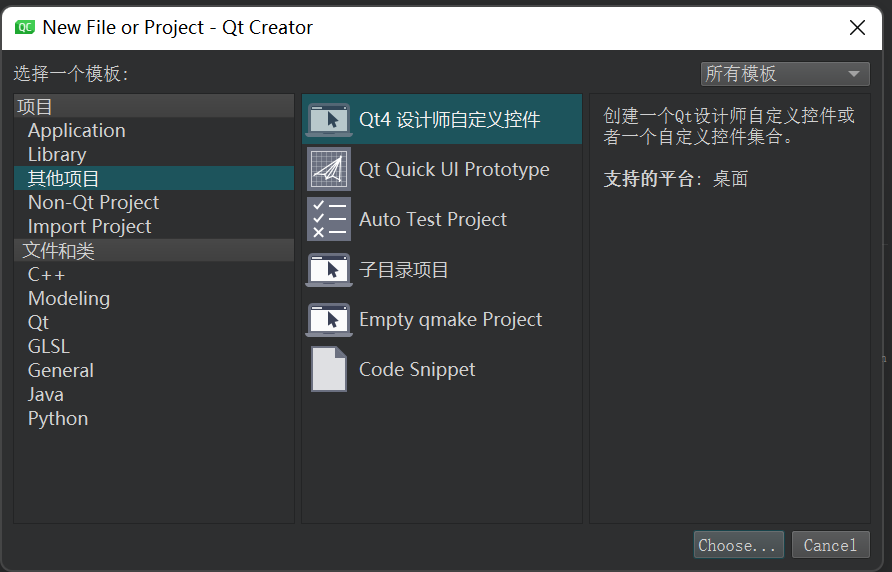

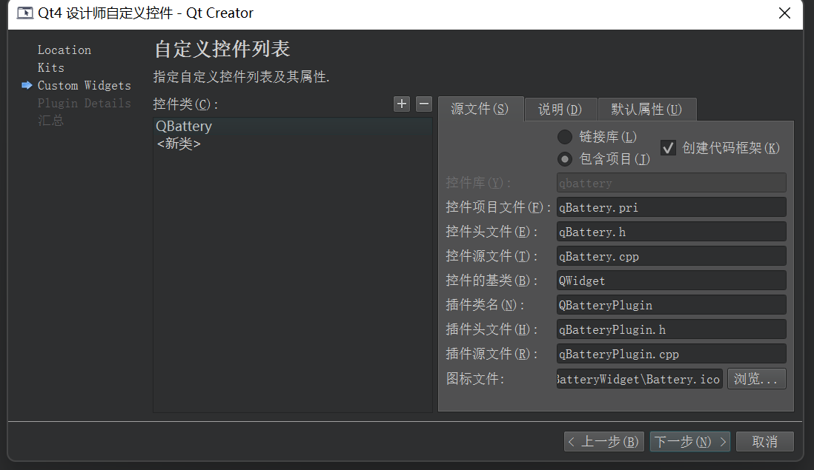

自定义插件，一定一定要首先使用和QtCreator对应的编译器。
因为QtCreator用的是MSVC2017 32bit，而Qt5.9.9版本没有这个版本的，只有MSVC2017 64bit那么就会出问题

但是Qt5.14.2版本有MSVC2017 32bit，且这个编译器能够使用的前提是必须安装的是VS2017(社区版也可以)，无论是VS2019还是VS2022均不行。
有了VS2017+MSVC2017_32bit编译好插件后，把插件生成的2个dll文件(debug+release)都放在Qt的指定路径下(下文提到)，这样UI面板就能够直接看到自己设计的组件了，否则是看不到的。

后边的问题就是使用这个插件，需要添加外部库，外部库就是include目录，这个目录把dll、lib和自定义组件的头文件都放进去，之后就可以正常编译运行了。

以release方式编译生成dll文件名称为qbatteryplugin.dll（也可以以debug模式，生成的是qbatteryplugind.dll）
将其复制到2个路径下（1个是编译器下的插件目录，一个是工具下的插件目录）
E:\Qt5.1.4\Tools\QtCreator\bin\plugins\designer
E:\Qt5.1.4\5.14.2\msvc2017\plugins\designer

此时重启QtCreator再打开任何一个项目，UI设计器面板就可以存在这个组件了
现在想要使用这个插件的话，新建一个项目之后要做三件事：
1、项目下新建include文件夹，把dll、lib（debug和release版本都放进去2个文件
2、把插件内置项目也就是电池五头文件qbattery.h也放在include文件夹下

3、对应的dll文件也放在include文件夹下
书上说把dll文件放在可执行目录下，就是exe所在的目录下，但是我试过不行，之后我把dll文件只有放在include文件夹下，也就是和lib放在一起，且项目文件必须把这dll文件加进来才能编译运行成功
4、项目文件右击添加外部库，按照向导执行

具体的例子可见[25-TestTestCustomBatteryPlugin](25-TestTestCustomBatteryPlugin)。

### 11.3 编译静态库和动态库

关于静态库的编译可见这个例子，[26-TestCreateStaticLib](26-TestCreateStaticLib)，这里使用了MSVC-2017-64下的编译器进行编译，使用debug-release版本都进行了编译，但是2个模式编译的名字是相同的，所以debug模式下需要手动改名26-TestCreateStaticLibd.lib，使用库的项目新建include文件，把26-TestCreateStaticLib.libd、26-TestCreateStaticLib.lib和setPenDialog.h都放进去。一方面新建外部库，使用windows-static，添加d作为尾缀区分，此外还需要把include文件包含进来作为项目一部分，不然可能识别不出来。

关于动态库的编译可见这个例子，[27-TestCreateShareLib](27-TestCreateShareLib)，这里和上个例子创建静态库的区别是没有使用MSVC，使用Mingw编译，这是为了说明2个编译器都是可以的，区别只是生成的.a文件而不是.lib文件。

因为是动态库，所以除了.a文件还额外生成.dll文件，因为有debug和release模式，所以是4个文件，这里注意改名，在debug模式下改名多加个d，共享库调用有2种方式，一种是隐式链接库调用，一种是显示链接调用。

**隐式链接库调用：**
编译程序时有动态库的lib文件(或.a文件)+h头文件，知道dll有哪些接口函数，编译时就可以生成必要的链接信息
使用DLL中的类或函数时根据头文件中的定义使用即可，这种方式主要用于同一种编程软件(如Qt)生成的代码之间的共享。使用动态库的项目下的include文件夹需要放入6个文件，debug和release模式的2个.a文件和2个.dll文件以及创建共享库时用到的2个头文件。但是会发现总是release版本成功，但是debug版本不成功，会提示QWidget: Must construct a QApplication before a QWidget猜测是2个dll文件不同名字的原因，虽然.a文件进行了区分，但是.dll并没有区分。**所以按照书上的解决方式，我把2个dll文件（注意名字改回来去掉d，2个dll是T同名的），然后各自放在exe的目录下**，发现就能运行成功了，所以现在include只有4个文件。

还要提到一点，使用共享库的文件编译时也最好和共享库的版本一致，也就是都使用mingw32，否则可能要考虑二进制兼容问题

**显示链接调用：**

第一种方式，应用程序编译时将自动加载DLL文件，本方式应用程序运行时才加载共享库文件，所以本方式编译时无需共享库的任何文件，只需要知道函数名称和原型即可。所以本方式可以调用其他语言编写的DLL文件，本方式需要借助QLibrary实现，QLibrary与平台无关，用于运行时加入共享库，一个QLibrary对象只对一个共享库进行操作一般QLibrary的构造函数中传递一个文件名，可以带绝对路径的文件名，也可以是不带后缀的单独文件名。

QLibrary会根据运行的平台自动查找不同后缀的共享库文件，例如UNIX的.so文件，MAC的.dylib文件，Windows的.dll文件按照书上的示例，在书的配套资源中可以找到Delphi写的DLL文件，只有1个函数，函数原型为

```Delphi
function triple(N:integer):integer; // 用于计算N的3倍值
```

这个函数生成的DLL库在DelphiDLL文件夹下。调用此DLL库的核心代码是：

```c++
QLibrary myLib("DelphiDLL"); // 绑定当前路径下的文件夹DelphiDLL
if (myLib.isLoaded())
    QMessageBox::information(this,"信息","DelphiDLL.DLL已经被载入,第1处");
typedef int (*FunDef)(int); //函数原型定义
FunDef myTriple = (FunDef) myLib.resolve("triple"); //解析DLL中的函数
int V=myTriple(ui->spinInput->value()); //调用函数
ui->spinOutput->setValue(V);
if (myLib.isLoaded())
    QMessageBox::information(this,"信息","DelphiDLL.DLL已经被载入,第2处");
```

但是直接执行还是会错误，必须把DelphiDLL文件夹下的DelphiDLL.dll文件放在debug和release可执行目录下就不会再出错了。

### 11.4 本章数据类型

#### 11.4.1 QFontMetrics

QFontMetrics 类提供字体度量信息。
QFontMetrics 函数计算给定字体的字符和字符串的大小。您可以通过三种方式创建 QFontMetrics 对象： 使用 QFont 调用 QFontMetrics 构造函数为屏幕兼容字体创建字体度量对象，即字体不能是打印机字体。如果稍后更改字体，则不会更新字体度量对象。
（注意：如果您使用打印机字体，则返回的值可能不准确。打印机字体并不总是可访问的，因此如果提供了打印机字体，则使用最近的屏幕字体。） QWidget::fontMetrics() 返回小部件的字体度量字体。这相当于 QFontMetrics(widget-&gt;font())。如果稍后更改小部件的字体，则不会更新字体度量对象。
QPainter::fontMetrics() 返回画家当前字体的字体度量。如果后来更改了画家的字体，则不会更新字体度量对象。

创建后，该对象提供了访问字体、其字符以及在字体中呈现的字符串的各个度量的函数。
有几个函数对字体进行操作：ascent()、descent()、height()、leading() 和 lineSpacing() 返回字体的基本大小属性。 underlinePos()、overlinePos()、strikeOutPos() 和 lineWidth() 函数返回下划线、上划线或删除字符的线的属性。这些功能都很快。
还有一些函数对字体中的字形集进行操作：minLeftBearing()、minRightBearing() 和 maxWidth()。这些必然很慢，我们建议尽可能避免使用它们。
对于每个字符，您可以获取它的宽度（）、leftBearing（）和rightBearing（），并使用inFont（）找出它是否在字体中。您还可以将字符视为字符串，并在其上使用字符串函数。
字符串函数包括 width()，返回以像素为单位的字符串的宽度（或点，对于打印机），boundingRect()，返回一个足够大的矩形来包含渲染的字符串，和 size()，返回该矩形的大小。
例子：

```c++
QFont font("times", 24);
QFontMetrics fm(font);
int pixelsWide = fm.width("What's the width of this text?");
int pixelsHigh = fm.height();
```

成员函数。

```c++
QFontMetrics(const QFont &font);
QFontMetrics(const QFont &font, QPaintDevice *paintdevice);
QFontMetrics(const QFontMetrics &fm);

int ascent() const;//返回字体的上升
int descent() const;//返回字体的下降

// 得到字符串的矩形范围
QRect boundingRect(QChar ch) const;
QRect boundingRect(const QString &text) const;
QRect boundingRect(const QRect &rect, int flags, const QString &text, int tabStops = 0, int *tabArray = Q_NULLPTR) const;
QRect boundingRect(int x, int y, int width, int height, int flags, const QString &text, int tabStops = 0, int *tabArray = Q_NULLPTR) const;
QRect tightBoundingRect(const QString &text) const;//返回由 text 指定的字符串中的字符周围的紧密边界矩形。如果在 (0, 0) 处绘制，边界矩形始终至少覆盖文本将覆盖的像素集

QString elidedText(const QString &text, Qt::TextElideMode mode, int width, int flags = 0) const;//如果字符串文本比宽度宽，则返回字符串的省略版本（即，其中包含“...”的字符串）。否则，返回原始字符串

bool inFont(QChar ch) const;//如果字符 ch 是字体中的有效字符，则返回 true；否则返回假
bool inFontUcs4(uint ucs4) const;//如果以 UCS-4/UTF-32 编码的字符 ucs4 是字体中的有效字符，则返回 true；否则返回假

int leading() const;//返回字体的前导
int lineSpacing() const;//返回从一条基线到另一条基线的距离

int minLeftBearing() const;//返回字体的最小左方位角
int minRightBearing() const;//返回字体的最小右方位角
int leftBearing(QChar ch) const;//返回字体中字符 ch 的左方位角
int rightBearing(QChar ch) const;//返回字体中字符 ch 的右方位

QSize size(int flags, const QString &text, int tabStops = 0, int *tabArray = Q_NULLPTR) const;//返回文本的大小（以像素为单位）
int overlinePos() const;//返回从基线到应绘制上划线的距离
int strikeOutPos() const;//返回从基线到应绘制三振线的位置的距离
int underlinePos() const;//返回从基线到应绘制下划线的位置的距离

int width(const QString &text, int len = -1) const;//返回文本前 len 个字符的宽度（以像素为单位）。如果 len 为负数（默认值），则使用整个字符串
int width(QChar ch) const;//返回字符 ch 的逻辑宽度（以像素为单位）。这是适合在 ch 之后绘制后续字符的距离
int maxWidth() const;//返回字体中最宽字符的宽度
int lineWidth() const;//返回下划线和删除线的宽度，根据字体的磅值进行调整
int averageCharWidth() const;//返回字体中字形的平均宽度
int height() const;//返回字体的高度
int capHeight() const;//返回字体的大写高度
int xHeight() const;//返回字体的“x”高度。这通常但并不总是与字符“x”的高度相同
```

#### 11.4.2 QLibrary

QLibrary 类在运行时加载共享库。
QLibrary 对象的实例对单个共享对象文件（我们称之为“库”，但也称为“DLL”）进行操作。 QLibrary 以独立于平台的方式提供对库中功能的访问。**您可以在构造函数中传递文件名，也可以使用 setFileName() 显式设置它**。加载库时，QLibrary 会搜索所有系统特定的库位置（例如 Unix 上的 LD_LIBRARY_PATH），除非文件名具有绝对路径。如果文件名是绝对路径，则首先尝试加载此路径。如果找不到文件，QLibrary 会尝试使用不同平台特定文件前缀的名称，如 Unix 和 Mac 上的“lib”，以及后缀，如 Unix 上的“.so”、Mac 上的“.dylib”或“. dll”在 Windows 上。如果文件路径不是绝对的，那么 QLibrary 会修改搜索顺序以首先尝试系统特定的前缀和后缀，然后是指定的文件路径。这使得指定仅由其基本名称（即没有后缀）标识的共享库成为可能，因此相同的代码将在不同的操作系统上工作，但仍将尝试查找库的次数降至最低。
**最重要的函数是 load() 动态加载库文件，isLoaded() 检查加载是否成功，resolve() 解析库中的符号**。**如果尚未加载，则 resolve() 函数会隐式尝试加载库**。 **QLibrary 的多个实例可用于访问同一个物理库。加载后，库将保留在内存中，直到应用程序终止**。您可以尝试**使用 unload() 卸载库，但如果 QLibrary 的其他实例正在使用同一个库，则调用将失败，并且只有在每个实例都调用了 unload() 时才会发生卸载**。
QLibrary 的一个典型用途是解析库中的导出符号，并调用该符号表示的 C 函数。与“隐式链接”相比，这称为“显式链接”，后者是在将可执行文件链接到库时通过构建过程中的链接步骤完成的。
以下代码片段加载一个库，解析符号“mysymbol”，并在一切成功时调用该函数。如果出现问题，例如库文件不存在或符号未定义，函数指针将为0，不会被调用。

```c++
QLibrary myLib("mylib");
typedef void (*MyPrototype)(); // 一个输入输出为空的函数指针
MyPrototype myFunction = (MyPrototype) myLib.resolve("mysymbol");
if (myFunction)
    myFunction();
```

**符号必须作为 C 函数从库中导出，resolve() 才能工作。这意味着如果库是使用 C++ 编译器编译的，则该函数必须包装在 extern &quot;C&quot; 块中**。在 Windows 上，这也需要使用 dllexport 宏；有关如何完成此操作的详细信息，请参见 resolve()。为方便起见，如果您**只想调用库中的函数而不首先显式加载库，则可以使用静态 resolve() 函数**：

```c++
typedef void (*MyPrototype)();
MyPrototype myFunction =
    (MyPrototype) QLibrary::resolve("mylib", "mysymbol");
if (myFunction)
    myFunction();
```

##### 枚举值

此枚举描述了可用于更改加载库时处理库的方式的可能提示。这些值指示加载库时符号的解析方式，并使用 setLoadHints() 函数指定。

```c++
enum QLibrary::LoadHint{
    QLibrary::ResolveAllSymbolsHint,//导致库中的所有符号在加载时被解析，而不仅仅是在调用 resolve() 时
    QLibrary::ExportExternalSymbolsHint,//导出库中未解析的和外部符号，以便它们可以在稍后加载的其他动态加载的库中解析
    QLibrary::LoadArchiveMemberHint,//允许库的文件名指定归档文件中的特定对象文件。如果给出此提示，则库的文件名由路径组成，路径是对归档文件的引用，后跟对归档成员的引用
    QLibrary::PreventUnloadHint,//如果调用 close()，则防止库从地址空间中卸载。如果稍后调用 open()，则不会重新初始化库的静态变量
    QLibrary::DeepBindHint//指示链接器在解析加载库中的外部符号时，优先选择加载库中的定义而不是加载应用程序中导出的定义。此选项仅在 Linux 上受支持
}
```

##### 成员函数

```c++
QLibrary(QObject *parent = Q_NULLPTR);
QLibrary(const QString &fileName, QObject *parent = Q_NULLPTR);
//使用给定的父对象构造一个库对象，该对象将加载由 fileName 指定的库
QLibrary(const QString &fileName, QObject *parent = Q_NULLPTR);
//使用给定的父对象构造一个库对象，该对象将加载由 fileName 和主要版本号 verNum 指定的库。目前，版本号在 Windows 上被忽略
QLibrary(const QString &fileName, int verNum, QObject *parent = Q_NULLPTR);
//使用给定的父对象构造一个库对象，该对象将加载由 fileName 和完整版本号 version 指定的库。目前，版本号在 Windows 上被忽略
QLibrary(const QString &fileName, const QString &version, QObject *parent = Q_NULLPTR);
QString errorString() const;//返回一个文本字符串，其中包含对发生的最后一个错误的描述。目前，只有在 load()、unload() 或 resolve() 出于某种原因失败时才会设置 errorString
QString fileName() const;//该属性保存库的文件名
bool isLoaded() const;//如果库已加载，则返回 true；否则返回假
bool load();//加载库，如果库加载成功则返回true；否则返回假。由于 resolve() 总是在解析任何符号之前调用此函数，因此无需显式调用它。在某些情况下，您可能希望提前加载库，在这种情况下，您将使用此函数
LoadHints loadHints() const;//
QFunctionPointer resolve(const char *symbol);//返回导出符号符号的地址。如有必要，将加载库。如果无法解析符号或无法加载库，则该函数返回 0
void setFileName(const QString &fileName);//设置保存库的文件名
void setFileNameAndVersion(const QString &fileName, int versionNumber);//将 fileName 属性和主要版本号分别设置为 fileName 和 versionNumber。在 Windows 上忽略 versionNumber
void setFileNameAndVersion(const QString &fileName, const QString &version);//将 fileName 属性和完整版本号分别设置为 fileName 和 version。在 Windows 上忽略 version 参数
void setLoadHints(LoadHints hints);//给 load() 函数一些关于它应该如何表现的提示
bool unload();//如果可以卸载库，则卸载库并返回 true；否则返回假
```

##### 静态函数

```c++
bool isLibrary(const QString &fileName);//如果 fileName 具有可加载库的有效后缀，则返回 true；否则返回假
//加载库文件名并返回导出符号符号的地址。请注意，fileName 不应包含特定于平台的文件后缀； （见文件名）。该库保持加载状态，直到应用程序退出。如果无法解析符号或无法加载库，则该函数返回 0
QFunctionPointer resolve(const QString &fileName, const char *symbol);
//加载主版本号为 verNum 的库文件名，并返回导出符号符号的地址。请注意，fileName 不应包含特定于平台的文件后缀； （见文件名）。该库保持加载状态，直到应用程序退出。 verNum 在 Windows 上被忽略。如果无法解析符号或无法加载库，则该函数返回 0
QFunctionPointer resolve(const QString &fileName, int verNum, const char *symbol);
//加载具有完整版本号版本的库文件名并返回导出符号符号的地址。请注意，fileName 不应包含特定于平台的文件后缀； （见文件名）。该库保持加载状态，直到应用程序退出。版本在 Windows 上被忽略。如果无法解析符号或无法加载库，则该函数返回 0
QFunctionPointer resolve(const QString &fileName, const QString &version, const char *symbol);
```

## 12. 多线程

### 12.1 线程同步的概念

由于多个线程的存在，可能线程之间需要同时访问同一个变量，或者一个线程需要等待另外一个线程完成某个操作之后才产生相应的动作。例如下方的实例，工作线程需要产生一个随机点数发射出去，然后主线程的槽函数去获取它，因为使用了信号与槽机制，所以这种反馈是非常及时的，不会出现问题。可见[08-TestQThread](08-TestQThread)。

```c++
void rollDice::run() // 工作线程
{
    this->dstop = false; // 开启状态
    qsrand(QTime::currentTime().msec()); // 以返回的毫秒时间作为随机种子

    while (!dstop)  // 只要外部没有停止它就执行
    {
        if (!dpause) // 只要外部没点暂停就执行
        {
            this->diceValue = qrand()% 6 +1; // 随机数,转换到数字[1,6]之间

            ++ this->diceFrequency; // 次数+1

            emit this->transmit_dice_val_fre(diceValue,diceFrequency); // 把数据传递出去
        }
        msleep(500); // 工作线程不要太快,500ms掷骰子1次
    }
    quit(); // 等价于exit(0),表示成功退出线程
}

// 主线程的槽函数
// 4.骰子点数、次数和图片显示，回应thread自定义的信号transmit_dice_val_fre
void TestQThread::dice_show(int val,int fre)
{
    QString str = QString::asprintf("第 %d 次掷骰子，点数为 %d",fre,val);
    ui->plainTextEdit->appendPlainText(str);
    QPixmap pix; // 图片显示
    QString filename = QString::asprintf(":/images/d%d.jpg",val);
    pix.load(filename);
    ui->LabPic->setPixmap(pix);
}
```

如果不借助信号与槽机制，那么工作线程必须定义2个用于读取diceValue和diceFrequency的公共函数，然后主线程能够调用这2个公共函数去获取2个数据。不过主线程调用2个函数的获取的是this->diceValue和this->diceFrequency，这2个值在工作线程中可能被修改，**即一个线程在读取，一个线程在写入就会造成问题**，可能读取的数值是个错误的值，所以这样的代码是必须保护起来的，在执行过程中不能被其他线程打断，这就是线程同步的概念。

```c++
int rollDice::getDiceValue(){return this->diceValue}
int rollDice::getDiceFrequency(){return this->diceFrequency}
```

### 12.2 基于QMutex的线程同步

QMutex和QMutexLocker是基于互斥量的线程同步类，QMutex的实例就是一个互斥量。

QMutex主要提供3个函数。

lock()：锁定互斥量，如果另外一个线程锁定了此互斥量，它将阻塞执行直到其它线程解锁这个互斥量；

unlock()：解锁1个互斥量，需要与lock配对使用

tryLock()：**试图锁定一个互斥量，成功返回true；如果其它线程已经锁定了，则返回false，但不阻塞程序执行**。

现在为了演示如何基于QMutex的线程同步，不采用信号槽机制，而是提供1个函数用于主线程读取。

例子具体可见[29-TestThreadSynchronization/TestQMutexBase](29-TestThreadSynchronization/TestQMutexBase)。

工作线程的代码主要改动。

```c++
void rollDice::run() // 工作线程
{
    this->dstop = false; // 开启状态
    qsrand(QTime::currentTime().msec()); // 以返回的毫秒时间作为随机种子

    while (!dstop)  // 只要外部没有停止它就执行
    {
        if (!dpause) // 只要外部没点暂停就执行
        {
            // 第3个区别,使用互斥量保护关键代码
            // QMutexLocker Locker(&this->mutex); // 只用这句简化代码也可以
            this->mutex.lock(); // 第1个区别:关键代码处锁定互斥量
            this->diceValue = qrand()% 6 +1; // 随机数,转换到数字[1,6]之间
            ++ this->diceFrequency; // 次数+1
            // emit this->transmit_dice_val_fre(diceValue,diceFrequency); // 把数据传递出去
            this->mutex.unlock(); // 第2个区别:配对使用解锁互斥量
        }
        msleep(500); // 工作线程不要太快,500ms掷骰子1次
    }
    quit(); // 等价于exit(0),表示成功退出线程
}

// 第4个区别,不使用信号槽机制就需要提供公共函数访问
bool rollDice::transmit_dice_val_fre(int *val, int *fre)
{
    if (this->mutex.tryLock()) // 读取的时候尝试锁定互斥量,如果锁定成功说明可以读取,不会发生读取的时候工作线程修改这2个值
    {
        *val = this->diceValue;
        *fre = this->diceFrequency;
        mutex.unlock();
        return true;
    }
    return false;
}
```

主线程代码的主要改动，新增了定时器，定时器初始化连接时绑定到了onTimeOut函数，定时器的启动和关断是在掷骰子和暂停掷骰子这里控制。

```c++
// 第5个区别,onTimeOut()代替dice_show(int val,int fre)的功能
void TestQMutexBased::onTimeOut()
{
    int val = 0 , fre = 0;
    bool valid = this->rolldice->transmit_dice_val_fre(&val,&fre); //定时读取返回的值,但是不保证每次读取的就是新的数据,很可能工作线程来不及修改
    if (valid && (this->diceFrequency != fre)) // 数据有效,而且是新数据
    {
        this->diceFrequency = fre;
        this->diceValue = val; // 保存2个值用于下次比较
        QString str = QString::asprintf("第 %d 次掷骰子，点数为 %d",this->diceFrequency,this->diceValue);
        ui->plainTextEdit->appendPlainText(str);
        QPixmap pix; // 图片显示
        QString filename = QString::asprintf(":/images/d%d.jpg",this->diceValue);
        pix.load(filename);
        ui->LabPic->setPixmap(pix);
    }
}

// 7. 开始掷骰子=>pushbutton的槽函数
void TestQMutexBased::on_btnDiceBegin_clicked()
{
        this->rolldice->startDice(); // 开始掷骰子,内部设置dpause=false,run()就会执行
        this->mTimer.start(100);// 第6个区别,定时器设置定时,在开始掷骰子而不是开启线程设置,因为此时才会有新数据准备读取它
        ui->btnDiceBegin->setEnabled(false); // 开始掷骰子
        ui->btnDicePause->setEnabled(true); // 暂停掷骰子
}

// 8.暂停掷骰子=>pushbutton的槽函数
void TestQMutexBased::on_btnDicePause_clicked()
{
        this->rolldice->pauseDice(); // 开始掷骰子,内部设置dpause=false,run()就会执行
        this->mTimer.stop(); // 第7个区别,不掷骰子了没有数据没必要再定时读取
        ui->btnDiceBegin->setEnabled(true); // 开始掷骰子
        ui->btnDicePause->setEnabled(false); // 暂停掷骰子
}
```

### 12.3 基于QReadWriteLock的线程同步

假设有1个数据采集程序，一个线程专门用于写入缓冲区，一个线程用于读取数据显示，一个线程用于读取缓冲数据保存到文件。实际上，2个读取线程是不会冲突的，但是使用互斥量会导致3个线程任何时候都只能有1个持有互斥量，所以会降低程序的性能。

```c++
int buffer[100]; // 全局缓存
QMutex mutex; //全局互斥量
void writeThread::run()
{
    //...
    mutex.lock();
    writeData();
    mutex.unlock();
    //...
}
void readThread::run()
{
    //...
    mutex.lock();
    readData();
    mutex.unlock();
    //...
}
void saveThread::run()
{
    //...
    mutex.lock();
    saveData();
    mutex.unlock();
    //...
}
```

改进的方法就是使用基于读写的锁。

```c++
int buffer[100]; // 全局缓存
QReadWriteLock Lock; // 全局读写锁
void writeThread::run()
{
    //...
    Lock.lockForWrite();
    writeData();
    Lock.unlock();
    //...
}
void readThread::run()
{
    //...
    Lock.lockForRead();
    readData();
    Lock.unlock();
    //...
}
void saveThread::run()
{
    //...
    Lock.lockForRead();
    saveData();
    Lock.unlock();
    //...
}
```

如果不想手动unlock，使用以下方法也是可以的，和QMutexLocker的用法相同。

```c++
int buffer[100]; // 全局缓存
QReadWriteLock Lock; // 全局读写锁
void writeThread::run()
{
    //...
    QWriteLocker Locker(&Lock);
    writeData();
    //...
}
void readThread::run()
{
    //...
    QReadLocker Locker(&Lock);
    readData();
    //...
}
void saveThread::run()
{
    //...
    QReadLocker Locker(&Lock);
    saveData();
    //...
}
```

原书的代码只是1个伪代码示例，不能运行，下方是模拟这种代码编写的例子。

具体的实例可见[29-TestThreadSynchronization/TestQReadWriteLockBase](29-TestThreadSynchronization/TestQReadWriteLockBase)。

在[29-TestThreadSynchronization/TestQReadWriteLockBase](29-TestThreadSynchronization/TestQReadWriteLockBase)的例子中，运行界面就是6个按钮（开始写入数据、停止写入数据、开始读取数据、停止读取数据、开始保存数据、停止保存数据）和一个QPlainText组件。

运行测试效果是这样的：

① 点击开始写入数据，就会往全局buffer写数据，使用的随机数往里写，为了避免过快导致内存炸，工作线程会100ms执行一次写数据。如果先点的写入数据，这个时候点击读取数据和保存数据之后，是阻塞状态，只有停止了写数据，读取和保存数据才会执行，而且是交替的，2个都可执行。

② 停止写数据，会暂停往里写数据。

③ 开始读取数据，会在plaintext组件显示，读取了多少条数据，经实际测试，写入的数据是多少，读出来的也是多少，没有偏差。如果读取完了，在plaintext会有提示。如果先点的读取数据，没有数据的话会提示；如果有数据没读完，点击读取数据后再点击写入数据，同样会阻塞写线程，除非暂停读线程才会继续写。

④ 暂停读取数据，暂停后内部会保存读取的进度，此时再开始读取数据，会接着之前的进度继续读取直到读取的数据全部完成。

⑤ 开始保存数据，和开始读取数据一样，也会显示已经保存了多少条数据，不会有偏差，如果保存完了也会提示保存完毕。

⑥ 暂停保存数据，和暂停读取一样，会存档保存进度，再次保存会继续之前的进度。

简单来说，这个读写锁相比QMutex能够提高互斥量的效率，多个读操作可以持有一把锁，不会冲突阻塞。

写操作会阻塞任何读操作，读操作也会阻塞写操作，但是只有读和写会阻塞，多个读不会阻塞，但是多个写依然会阻塞，这是相对于QMutex提升效率的一点。

### 12.4 基于QWaitCondition的线程同步

基于上方的例子，假设必须写满缓冲区后才能读取和保存数据。前边基于QMutex和QReadWriteLock的方法都是对资源的锁定和解锁来避免同时访问资源发生冲突，但是缺点在于一个线程解锁资源之后不能及时通知其他线程。

上方的6个按钮，是需要手动的，点击读取数据以后，如果读取完毕或者暂停读取，会有人为的提示，才能继续点击写入数据。 如果希望没有人为的提示，一旦读取完毕或暂停读取数据就自动通知可以写入数据，而不是事先需要人点击按钮。

现在希望缓冲区一旦满了就通知2个读线程及时读取数据，就需要使用QWaitCondition机制。

第一个具体的示例可见[29-TestThreadSynchronization/TestOneQWaitConditionBase](29-TestThreadSynchronization/TestOneQWaitConditionBase)。

使用生产者模型，专门生产掷骰子的总次数和骰子值；消费者模型专门用于取出2个数据，关键代码如下。

定义2个模型的头文件。

```c++
// 专门用于生成骰子点数的线程
class QThreadProducer : public QThread
{
    Q_OBJECT
private:
    bool    stopdice=false; //停止线程
protected:
    void    run() Q_DECL_OVERRIDE;
public:
    QThreadProducer();
    void    stopDice();
};

// 专门用于读取骰子点数的线程
class QThreadConsumer : public QThread
{
    Q_OBJECT
private:
    bool    stopread=false; //停止线程
protected:
    void    run() Q_DECL_OVERRIDE;
public:
    QThreadConsumer();
    void    stopRead();
signals:
    void    readDiceValue(int frequency,int diceValue);
};
```

定义2个模型的源文件。

```c++
#include "rollDiceThread.h"
#include <QWaitCondition>
#include <QTime>
#include <QMutex>
#include <QDebug>

QMutex  mutex; // 全局互斥量
QWaitCondition  newdataAvailable; // 全局等待条件变量(读取的数据是否有效)
// 生产者模型中,有了新数据后要唤醒其他所有线程(发布条件满足通知)
// 消费者模型中,要等待条件满足通知,接收到信号后就可以读取数据了

int     frequency;//掷骰子的次数累计
int     diceValue; // 骰子点数

// （1）生产者模型
QThreadProducer::QThreadProducer()
{

}

void QThreadProducer::run()
{
    this->stopdice=false;//启动线程时令m_stop=false
    frequency=-1; // 启动线程时就初始化全局掷骰子总次数为-1
    // (不知道为啥初始化为0的话frequency第1次传播出去的时候变成了2)
    // 从测试结果来看now fre =  -1; now fre =  0连续执行了2次,也就是now fre =  -1;时消费者模型没有读取到这个数据
    qsrand(QTime::currentTime().msec());//随机数初始化，qsrand是线程安全的

    while(!stopdice)//循环主体
    {
        mutex.lock();
        diceValue=qrand(); //获取随机数
        diceValue=(diceValue % 6)+1;
        qDebug()<<"now fre = "<<frequency;
        frequency++; // 掷骰子次数增加
        mutex.unlock();

        newdataAvailable.wakeAll();// 唤醒所有线程,有新数据了,给所有线程发布通知
        msleep(100); //线程休眠100ms
    }
}

void QThreadProducer::stopDice()
{
    // 停止掷骰子
    QMutexLocker  locker(&mutex);
    this->stopdice=true;
}

// （2）消费者模型
QThreadConsumer::QThreadConsumer()
{

}

void QThreadConsumer::run()
{
    this->stopread=false;// 读取数据的线程
    while(!stopread)//循环主体
    {
        mutex.lock(); // 先锁定
        // 然后wait内部会先解锁使其可被生产者模型使用,然后等待通知,处于阻塞状态
        newdataAvailable.wait(&mutex);// 当生产者模型有了数据就会发布通知,wait内部就会锁定这个互斥量先执行后续语句读取这个数据
        qDebug()<<frequency<<" "<<diceValue;
        emit    readDiceValue(frequency,diceValue); // 把此时的数据传播出去
        mutex.unlock(); // 然后再次解锁,这样生产者模型就能再次使用互斥量,再次发布新数据,如此反复
        // msleep(100); //线程休眠100ms
    }
}

void QThreadConsumer::stopRead()
{
    QMutexLocker  locker(&mutex);
    this->stopread=true;
}
```

UI界面的头文件代码。

```c++
#include <QMainWindow>
#include <QTimer>
#include "rollDiceThread.h"

QT_BEGIN_NAMESPACE
namespace Ui { class TestOneQWaitConditionBase; }
QT_END_NAMESPACE

class TestOneQWaitConditionBase : public QMainWindow
{
    Q_OBJECT
private:
    QThreadProducer   threadProducer;
    QThreadConsumer   threadConsumer;
    void initSignalSlotConnection();
protected:
    void    closeEvent(QCloseEvent *event);
public:
    explicit TestOneQWaitConditionBase(QWidget *parent = nullptr);
    ~TestOneQWaitConditionBase();
private slots:
    // 3个按钮的槽函数
    void on_btnStartThread_clicked();
    void on_btnStopThread_clicked();
    void on_btnClear_clicked();
    // 绑定到生产者和消费者线程的started/finshed信号通知状态栏
    void on_producerThread_started();
    void on_consumerThread_started();
    void on_producerThread_finshed();
    void on_consumerThread_finshed();
    // 绑定到消费者模型线程的readDiceValue信号
    void on_producerThread_readDiceValue(int frequency,int diceValue);
private:
    Ui::TestOneQWaitConditionBase *ui;
};
```

UI界面的源文件实现代码。

```c++
#include "TestOneQWaitConditionBase.h"
#include "ui_TestOneQWaitConditionBase.h"

TestOneQWaitConditionBase::TestOneQWaitConditionBase(QWidget *parent)
    : QMainWindow(parent)
    , ui(new Ui::TestOneQWaitConditionBase)
{
        ui->setupUi(this);
        this->initSignalSlotConnection();
        ui->btnStartThread->setEnabled(true);
        ui->btnStopThread->setEnabled(false);
}

TestOneQWaitConditionBase::~TestOneQWaitConditionBase()
{
    delete ui;
}

// 1. 关闭窗口事件,防止线程还在运行
void TestOneQWaitConditionBase::closeEvent(QCloseEvent *event)
{
    if (threadProducer.isRunning())
    {
        threadProducer.stopDice(); // 生产者模型直接停止生产即可
        threadProducer.wait();
    }

    if (threadConsumer.isRunning())
    {
        threadConsumer.terminate(); //消费者模型可能处于等待生产的状态,所以用terminate强制结束
        threadConsumer.wait();
    }
    event->accept();
}

// 2. 初始化信号绑定
void TestOneQWaitConditionBase::initSignalSlotConnection()
{
    // 1. 生产者和消费者模型启动,就通知状态栏
    connect(&threadProducer,SIGNAL(started()),this,SLOT(on_producerThread_started()));
    connect(&threadConsumer,SIGNAL(started()),this,SLOT(on_consumerThread_started()));
    // 2. 生产者和消费者模型结束,就通知状态栏
    connect(&threadProducer,SIGNAL(finished()),this,SLOT(on_producerThread_finshed()));
    connect(&threadConsumer,SIGNAL(finished()),this,SLOT(on_consumerThread_finshed()));
    // 3. 消费者模型读取的骰子数和掷骰子总次数
    connect(&threadConsumer,SIGNAL(readDiceValue(int,int)),this,SLOT(on_producerThread_readDiceValue(int,int)));
}

// 3. 生产者和消费者模型启动通知状态栏
void TestOneQWaitConditionBase::on_producerThread_started()
{
    ui->LabA->setText("生产者模型线程已经启动");
}
void TestOneQWaitConditionBase::on_consumerThread_started()
{
    ui->LabB->setText("消费者模型线程已经启动");
}

// 4. 生产者和消费者模型结束通知状态栏
void TestOneQWaitConditionBase::on_producerThread_finshed()
{
    ui->LabA->setText("生产者模型线程已经结束");
}
void TestOneQWaitConditionBase::on_consumerThread_finshed()
{
    ui->LabB->setText("消费者模型线程已经结束");
}

// 5. 消费者模型读取数据
void TestOneQWaitConditionBase::on_producerThread_readDiceValue(int frequency,int diceValue)
{
    QString  str=QString::asprintf("第 %d 次掷骰子，点数为：%d",
                                   frequency,diceValue);
    ui->plainTextEdit->appendPlainText(str);
    QPixmap pic;
    QString filename=QString::asprintf(":/images/d%d.jpg",diceValue);
    pic.load(filename);
    ui->LabPic->setPixmap(pic);
}

// 6. 启动线程
void TestOneQWaitConditionBase::on_btnStartThread_clicked()
{
    threadConsumer.start();
    threadProducer.start();
    ui->btnStartThread->setEnabled(false);
    ui->btnStopThread->setEnabled(true);
}

// 7. 结束线程
void TestOneQWaitConditionBase::on_btnStopThread_clicked()
{
    threadProducer.stopDice();// 结束生产者模型线程的run()函数执行
    threadProducer.wait();// 让其无限期等待

    // threadConsumer.stopRead();//结束消费者模型线程的run()函数执行,可能结束不了
    threadConsumer.terminate(); //因为消费者模型线程可能处于等待状态,所以用terminate强制结束
    threadConsumer.wait();//让其无限期等待

    ui->btnStartThread->setEnabled(true);
    ui->btnStopThread->setEnabled(false);
}

// 8. 清空文本
void TestOneQWaitConditionBase::on_btnClear_clicked()
{
    ui->plainTextEdit->clear();
}
```

第二个具体的示例可见[29-TestThreadSynchronization/TestTwoQWaitConditionBase](29-TestThreadSynchronization/TestTwoQWaitConditionBase)，这个例子来源于Qt文档。

生产者将数据写入缓冲区，直到到达缓冲区的末尾，此时它从头开始重新启动，覆盖现有数据。消费者线程在生成数据时读取数据并将其写入标准错误。与单独使用互斥锁相比，等待条件可以实现更高级别的并发性。

如果对缓冲区的访问仅由 QMutex 保护，则消费者线程无法与生产者线程同时访问缓冲区。然而，让两个线程同时在缓冲区的不同部分工作并没有什么坏处。

该示例包含两个类：生产者和消费者，两者都继承自 QThread。用于这两个类之间通信的循环缓冲区和保护它的同步工具是全局变量。使用 QWaitCondition 和 QMutex 解决生产者-消费者问题的替代方法是使用 QSemaphore

这就是信号量示例所做的，这个示例不在这里说明。

这里给出核心代码，可以通过调整缓冲区大小，读取的速度和存取的速度来观察UI界面的情况。

例如这里缓存大小为900，读取速率为200ms，写入速率100ms时会发现最后生产的都完毕了，但是还在读取第600个数据，这是因为缓冲区很大的原因。

如果写入速率没有延迟，一有新数据就立刻被读取，总会提示"缓冲区已空,等待数据生产!"，如果适当的减少缓存大小会减轻这种情况，不过从实际测试来看，即使缓冲大小是1，也没有满的情况发生，这说明如果没有限制的话，读取的速度非常的快，进来一个读一个，所以缓存大小1也够用。但是如果提高写的速度那就不一定了，因为写的速度100ms一次，如果写的很快，就可能发生缓存满的情况。但是数据读取的暂时还是会正确，因为写入的位置正在追读取的位置，一旦追上这时候数据就会真正的被覆盖丢失了。

```c++
// DataSize 是生产者将生成的数据量
const int DataSize = 1000; // 最大数据大小
// BufferSize 是循环缓冲区的大小,它小于 DataSize
const int BufferSize = 900; // 缓冲大小
// 生产者到达缓冲区的末尾时会从头开始重新启动
char buffer[BufferSize]; // 全局缓存

//为了同步生产者和消费者,我们需要两个等待条件和一个互斥锁
QMutex mutex;
// 当生产者生成一些数据时,会发出bufferNotEmpty条件,告诉消费者它可以开始读取它
QWaitCondition bufferNotEmpty; // 全局条件变量：缓存不为空（生产者负责发布，消费者负责等待）
// 当消费者读取了一些数据时，会发出 bufferNotFull 条件，告诉生产者它可以生成更多数据
QWaitCondition bufferNotFull;// 全局条件变量：缓存不为满（消费者负责发布，生产者负责等待）
// numUsedBytes 是缓冲区中当前包含数据的字节数
int numUsedBytes = 0;

// 等待条件、互斥体和 numUsedBytes 计数器一起确保生产者永远不会在缓存区满时还继续生产数据
// 并且消费者永远不会读取生产者尚未生成的数据

void Producer::run()
{
    qsrand(QTime(0,0,0).secsTo(QTime::currentTime()));
    for (int i = 0; i < DataSize; ++i) {
        mutex.lock();
        if (numUsedBytes == BufferSize) // 如果缓存满了不能再写入数据必须先等待读取
        {
            qDebug()<<"缓冲区已满,新的一轮开始!";
            bufferNotFull.wait(&mutex); // 这里阻塞,等待消费者读取后通知的bufferNotFull信号
        }

        mutex.unlock();// 生产者接收到才会解锁执行后边的代码继续生产数据

        // i % BufferSize可以保证没存满之前都会按照顺序依次存取,一旦i=BufferSize就会从头覆盖数据
        buffer[i % BufferSize] = "ACGT"[(int)qrand() % 4]; // "ACGT"随机选择1个字母存进去
        emit stringProduced(QString(buffer[i % BufferSize]));
        mutex.lock();
        ++numUsedBytes; // 写入数据,计数器++
        bufferNotEmpty.wakeAll(); // 生产者需要发布buffer不为空通知以便于消费者接收到才会读取有效的数据
        mutex.unlock();

        msleep(100);
    }
}

void Consumer::run()
{
    for (int i = 0; i < DataSize; ++i) {
        mutex.lock();
        if (numUsedBytes == 0) // 如果缓存区没有数据就不要继续读取
        {
            qDebug()<<"缓冲区已空,等待数据生产!";
            bufferNotEmpty.wait(&mutex); // 这里阻塞线程,等待生产者发布缓冲区不为空的信号
        }
        mutex.unlock(); // 接收到信号以后消费者才会继续读取数据
        fprintf(stderr, "%c", buffer[i % BufferSize]);
        emit stringConsumed(QString(buffer[i % BufferSize]));
        mutex.lock();
        --numUsedBytes; // 读取数据,计数器--
        bufferNotFull.wakeAll();  // 消费者需要发布buffer不为满通知以便于生产者接收到才会继续生产数据
        mutex.unlock();
        msleep(200);
    }
    fprintf(stderr, "\n");
}
```

### 12.5 基于QSemaphore的线程同步

互斥量可看成是火车上的卫生间，每次最多进去一个人，外边的人想进去必须等待，或者不等待直接离开。

信号量则是多人卫生间，比如有5个位置，有3个人用了以后，信号量锁定3个，还剩余2个可用。如果都被使用了，外边的人可以等待也可以不等待，但是进不去。

信号量通常用来保护一定数量的相同资源，如数据采集时的双缓冲区，适用于生产-消费模型。

基于QSemaphore的线程同步的第一个例子可见[29-TestThreadSynchronization/TestOneQSemaphoreBase](29-TestThreadSynchronization/TestOneQSemaphoreBase)。

生产-消费者模式头文件代码。

```c++
#include <QThread>
// （1）生产者模型
class Producer : public QThread
{
    Q_OBJECT
protected:
    void    run() Q_DECL_OVERRIDE;
public:
    void stopProduce();
private:
    bool isProduce;
};
// （2）消费者模型
class Consumer : public QThread
{
    Q_OBJECT
protected:
    void    run() Q_DECL_OVERRIDE;
public:
    void stopConsume();
private:
    bool isConsumed;
signals:
    void  newValue(int *data,int count, int bufId);
};
```

生产-消费者模型源文件代码。

```c++
const int BufferSize = 8;
int buffer1[BufferSize]; // 双缓冲区
int buffer2[BufferSize];
int curBuf; //当前正在写入的Buffer
int bufCount; // 表示累计的缓冲区个数编号
quint8   counter;// 数据生成器(模拟采集数据)
QSemaphore emptyBufs(2);//初始空缓冲区资源数量为2
QSemaphore fullBufs; // 初始满缓冲区资源数量为0

// （1）生产者模型
void Producer::stopProduce()
{
    isProduce = false;
}
void Producer::run()
{
    bufCount=0;// 累计缓冲区数量从0开始计算
    curBuf=1; //当前写入使用的缓冲区
    counter=0;// 初始化写入的数据为0
    this->isProduce = true;
    // 因为首次读取数据的时候,必然是2个空的缓冲资源
    // 但是为了避免可能的意外导致并不是2个非空缓冲区,可以先初始化为2
    // 不过一般不会出现这种意外,注释掉也没什么
    int n=emptyBufs.available(); // 空缓冲资源个数
    if (n<2)  //初始化
        emptyBufs.release(2-n); // 如果不是2个先释放掉,以便写入数据可以使用

    while (isProduce)
    {
        emptyBufs.acquire(1);//尝试获取1个空缓冲区用于写入数据,如果没有会在这里阻塞
        for(int i=0;i<BufferSize;i++) //产生一个缓冲区的数据
        {
            if (curBuf==1) buffer1[i]=counter; // 向1号缓冲区写入数据
            else buffer2[i]=counter; // 向1号缓冲区写入数据
            counter++; // 模拟数据采集卡产生数据
            msleep(20); //每20ms产生一个数
        }

        // 这里for循环结束后,表示一个缓冲数组满了
        bufCount++; // 累积缓冲区个数++(为了后边传递数据用)

        if (curBuf==1) curBuf=2; // 切换当前写入缓冲区用于下次使用
        else curBuf=1;

        // 对于release,如果资源已全部可以用(因为初始化为0)就会增加可用资源个数
        fullBufs.release(); // 一个满缓冲区资源被释放,就会从变成1,可以被消费者acquire
        msleep(50);
    }
    quit();
}

// （2）消费者模型
void Consumer::stopConsume()
{
    isConsumed = false;
}
void Consumer::run()
{
    this->isConsumed = true;
    // 下方3行代码可以注释掉,仅仅是为了第1次读取数据时初始化满缓冲区资源为0
    // 避免意外读取了并非生产者提供的满缓冲区资源,因为读取的前提必须先写入
    // 所以最初最初的时候,fullBufs.acquire(1);是一定会阻塞并等待通知的
    // 不过一般不会出现这种意外,所以注释掉也没什么影响
    int n=fullBufs.available();
    if (n>0)
        fullBufs.acquire(n); // 如果n>0就先锁定,这样满缓冲区资源数初始化为0
    while (isConsumed)
    {
        fullBufs.acquire(1); // 尝试获取1个可用的满缓冲区,如果没有会阻塞
        int bufferData[BufferSize]; // 用于传递数据的临时数组
        int id=bufCount;
        if(curBuf==1) //当前在写入的缓冲区是1，那么满的缓冲区是2
            for (int i=0;i<BufferSize;i++)
                bufferData[i]=buffer2[i]; //快速拷贝缓冲区数据
        else
            for (int i=0;i<BufferSize;i++)
                bufferData[i]=buffer1[i];
        emptyBufs.release();// 读取完毕,缓冲区空闲,还回去给生产者使用
        emit  newValue(bufferData,BufferSize,id);//给主线程传递数据(一维数组,数组长度,缓冲区编号)
        msleep(10);
    }
    quit();
}
```

界面UI的主要代码。

```c++
TestOneQSemaphoreBase::TestOneQSemaphoreBase(QWidget *parent)
    : QMainWindow(parent)
    , ui(new Ui::TestOneQSemaphoreBase)
{
        ui->setupUi(this);
        // 生产和消费者线程的开始和结束反馈到状态栏
        connect(&producer,SIGNAL(started()),this,SLOT(on_producer_started()));
        connect(&producer,SIGNAL(finished()),this,SLOT(on_producer_finished()));
        connect(&consumer,SIGNAL(started()),this,SLOT(on_consumer_started()));
        connect(&consumer,SIGNAL(finished()),this,SLOT(on_consumer_finished()));
        // 消费者拿到的数据用于文本显示
        connect(&consumer,SIGNAL(newValue(int*,int,int)),this,SLOT(on_consumer_newValue(int*,int,int)));
}

// 1. 生产和消费者线程的开始和结束反馈到状态栏
void TestOneQSemaphoreBase::on_producer_started()
{
    ui->LabA->setText("生产者模型线程开始运行!");
}
void TestOneQSemaphoreBase::on_producer_finished()
{
    ui->LabA->setText("生产者模型线程已经结束!");
}
void TestOneQSemaphoreBase::on_consumer_started()
{
    ui->LabB->setText("消费者模型线程开始运行!");
}
void TestOneQSemaphoreBase::on_consumer_finished()
{
    ui->LabB->setText("消费者模型线程已经结束!");
}

// 2. 处理消费者拿到的数据
void TestOneQSemaphoreBase::on_consumer_newValue(int *data,int count, int bufId)
{
    QString  str=QString::asprintf("第 %d 个缓冲区：",bufId);
    for (int i=0;i<count;i++)
    {
        str=str+QString::asprintf("%d, ",*data);
        data++;
    }
    str=str+'\n';
    ui->plainTextEdit->appendPlainText(str);
}

void TestOneQSemaphoreBase::on_btnStartThread_clicked()
{
    consumer.start(); // 启动线程时必须先启动消费者,否则可能会丢失数据
    producer.start();
    ui->btnStartThread->setEnabled(false);
    ui->btnStopThread->setEnabled(true);
}

void TestOneQSemaphoreBase::on_btnStopThread_clicked()
{
    // consumer.stopProduce();//结束线程的run()函数执行
    consumer.terminate(); //可能处于等待状态,所以用terminate强制结束
    consumer.wait();

    producer.terminate();//结束线程的run()函数执行
    producer.wait();

    ui->btnStartThread->setEnabled(true);
    ui->btnStopThread->setEnabled(false);
}

void TestOneQSemaphoreBase::on_btnClear_clicked()
{
        ui->plainTextEdit->clear();
}

```


第2个例子是Qt文档给出的例子，可见[29-TestThreadSynchronization/TestTwoQSemaphoreBase](29-TestThreadSynchronization/TestTwoQSemaphoreBase)。

生产者将数据写入缓冲区，直到到达缓冲区的末尾，此时它从头开始重新启动，覆盖现有数据。消费者线程在生成数据时读取数据并将其写入标准错误。信号量可以实现比互斥锁更高级别的并发性。如果对缓冲区的访问由 QMutex 保护，则消费者线程无法与生产者线程同时访问缓冲区。然而，让两个线程同时在缓冲区的不同部分工作并没有什么坏处。该示例包含两个类：生产者和消费者。两者都继承自 QThread。用于这两个类之间通信的循环缓冲区和保护它的信号量是全局变量。使用 QSemaphore 解决生产者-消费者问题的替代方法是使用 QWaitCondition 和 QMutex。这就是上一节的第2个示例所做的。

生产-消费模型的头文件代码如下，比较简单。

```c++
#include <QThread>
class Producer : public QThread
{
    Q_OBJECT
public:
    void run() override;
signals:
    void stringProduced(const QString &text);
};

class Consumer : public QThread
 {
     Q_OBJECT
 public:
     void run() override;
 signals:
     void stringConsumed(const QString &text);
 protected:
     bool finish;
 };
```

DataSize 是生产者将生成的数据量。为了使示例尽可能简单，我们将其设为常量。 BufferSize 是循环缓冲区的大小。它小于 DataSize，这意味着在某些时候生产者将到达缓冲区的末尾并从头开始重新启动。
为了同步生产者和消费者，我们需要两个信号量。 **freeBytes 信号量控制缓冲区的“空闲”区域（生产者尚未填充数据或消费者已读取的区域）**。 **usedBytes 信号量控制缓冲区的“已使用”区域（生产者已填充但消费者尚未读取的区域）**。2个信号量确保生产者永远不会超过消费者的 BufferSize 字节，并且消费者永远不会读取生产者尚未生成的数据。freeBytes 信号量是用 BufferSize 初始化的，因为最初整个缓冲区是空的。 usedBytes 信号量初始化为 0（如果未指定，则为默认值）。

生产消费模型的主要代码。

```c++
// DataSize 是生产者将生成的数据量,为了尽可能简单,将其设为常量
 const int DataSize = 1000;
// BufferSize是循环缓冲区的大小,小于 DataSize,生产者到达缓冲区末尾时重新启动
const int BufferSize = 200;
char buffer[BufferSize];

// 为了同步生产者和消费者需要两个信号量
// freeBytes信号量控制缓冲区的"空闲"区域(生产者尚未填充数据或消费者已读取的区域)
QSemaphore freeBytes(BufferSize); //用 BufferSize初始化的,因为最初整个缓冲区是空的
// usedBytes信号量控制缓冲区的"已使用"区域(生产者已填充但消费者尚未读取的区域)
QSemaphore usedBytes; // 初始已使用字节为0
// 2个信号量确保生产者永远不会超过消费者的 BufferSize 字节
// 且消费者永远不会读取生产者尚未生成的数据

// 生产者生成 DataSize字节的数据,在向循环缓冲区写入一个字节之前
// 它必须使用 freeBytes 信号量获取一个"空闲"字节
// usedBytes信号量释放一个字节,"空闲"字节转换为"已使用"字节供消费者读取
void Producer::run()
{
    qsrand(QTime(0,0,0).secsTo(QTime::currentTime()));
    for (int i = 0; i < DataSize; ++i) {
        freeBytes.acquire(); // 获取一个空闲的字节来写入数据,如果不空闲会阻塞
        buffer[i % BufferSize] = "ACGT"[(int)qrand() % 4];
        emit stringProduced(QString(buffer[i%BufferSize]));
        usedBytes.release(); // 同时释放1个已使用字节可供消费者acquire读取
    }
}
// 代码与生产者非常相似,只是这次获取一个"已使用"字节,并释放一个"空闲"字节
void Consumer::run()
{
    for (int i = 0; i < DataSize; ++i) {
        usedBytes.acquire(); // 如果有已经使用字节说明可以读取了,否则可能阻塞
        fprintf(stderr, "%c", buffer[i % BufferSize]);
        emit stringConsumed(QString(buffer[i%BufferSize]));
        freeBytes.release(); // 读取完毕之后,字节空闲要释放掉供生产者使用
    }
    fprintf(stderr, "\n");
}
```

UI界面的代码，也很简单。

```c++
TestTwoQSemaphoreBase::TestTwoQSemaphoreBase(QWidget *parent)
    : QMainWindow(parent)
    , ui(new Ui::TestTwoQSemaphoreBase)
{
    ui->setupUi(this);
    connect(&producer,SIGNAL(stringProduced(const QString)),this,SLOT(on_stringProduced(const QString)));
    connect(&consumer,SIGNAL(stringConsumed(const QString)),this,SLOT(on_stringConsumed(const QString)));
}

void TestTwoQSemaphoreBase::on_stringProduced(const QString&text)
{
    ui->plainTextEdit->appendPlainText(QString::asprintf("正在生产第%d个数据：",++count1)+text);
}

void TestTwoQSemaphoreBase::on_stringConsumed(const QString& text)
{
    ui->plainTextEdit->appendPlainText(QString::asprintf("正在读取生产的第%d个数据：",++count2)+text);
}

TestTwoQSemaphoreBase::~TestTwoQSemaphoreBase()
{
    delete ui;
}

void TestTwoQSemaphoreBase::on_pushButton_clicked()
{
    producer.start();
    consumer.start();
}
```

### 12.6 本章其它数据类型

#### 12.6.1 QThread

QThread 类提供了一种独立于平台的方式来管理线程。
QThread 对象管理程序中的一个控制线程。 QThreads 在 run() 中开始执行。默认情况下，run() 通过调用 exec() 启动事件循环，并在线程内运行 Qt 事件循环。
您可以通过使用 QObject::moveToThread() 将工作对象移动到线程来使用它们。

**第一种使用方法是QThread作为私有属性来使用**。

Worker 槽函数doWork内的代码将在单独的线程中执行，**doWork可以连接到来自任何对象、任何线程中的任何信号**。由于一种称为队列连接的机制，跨不同线程连接信号和槽是安全的。

```c++
 class Worker : public QObject // 一个独立的工作类
  {
      Q_OBJECT

  public slots:
      void doWork(const QString &parameter) { // doWork可以被任何线程/对象的信号所连接
          QString result;
          //...
          emit resultReady(result); // 执行doWork就会发射此信号
      }

  signals:
      void resultReady(const QString &result); // 把doWork获得信息传播出去
  };

  class Controller : public QObject // 一个管理Worker的类
  {
      Q_OBJECT
      QThread workerThread;// 线程对象作为私有属性使用
  public:
      Controller() {
          Worker *worker = new Worker; // 新建1个工作对象
          worker->moveToThread(&workerThread);//工作对象要做的事情都会在独立线程完成
          // 这个线程工作是否完成是由工作对象的析构函数进行控制，但是线程本身的停止是当前析构函数控制
          connect(&workerThread, &QThread::finished, worker, &QObject::deleteLater);
          // operate是个信号,任何信号都可以连接到doWork,只要以某种方式触发operate就会执行doWork
          connect(this, &Controller::operate, worker, &Worker::doWork);
          // 同时wdoWork反馈的信息想要被拿到,resultReady连接到这个槽函数就可以进行处理
          connect(worker, &Worker::resultReady, this, &Controller::handleResults);
          workerThread.start(); // 一经构造就开启了独立线程
      }
      ~Controller() {
          workerThread.quit(); // 当前的析构函数来控制线程的停止和无限期等待
          workerThread.wait();
      }
  public slots:
      void handleResults(const QString &); // 处理doWork得到的结果
  signals:
      void operate(const QString &); // 能够执行doWork需要触发的信号
  };
```

**第二种方法是继承QThread，定义自己的线程类重载run函数**。

在该示例中，线程将在 run 函数返回后退出。除非您调用 exec()，否则线程中不会运行任何事件循环。**重要的是要记住 QThread 实例存在于实例化它的主线程中，而不是调用 run() 的新线程中**。这意味着 QThread 的所有槽函数将在主线程中执行。因此，希望在新线程中调用槽函数的开发人员必须使用工作对象方法；不应将新插槽直接实现到子类 QThread 中。
子类化 QThread 时，**请记住构造函数在主线程中执行，而 run() 在新线程中执行**。如果两个函数都访问一个成员变量，则该变量是从两个不同的线程访问的。检查这样做是否安全。

```c++
class WorkerThread : public QThread
  {
      Q_OBJECT
      void run() override {
          QString result;
          //...
          emit resultReady(result);
      }
  signals:
      void resultReady(const QString &s);
  };

// 直接使用工作线程,而不是作为私有属性
void MainWindow::startWorkInAThread()
{
    WorkerThread *workerThread = new WorkerThread(this);// 实例在主线程中
    // 检测到resultReady信号后就会调用handleResults处理(),handleResults在主线程执行
    connect(workerThread, &WorkerThread::resultReady, this, &MainWindow::handleResults);
    // 检测到线程结束后,就释放掉,注意这里是workerThread的信号和workerThread的槽函数(主线程中调用)
    connect(workerThread, &WorkerThread::finished, workerThread, &QObject::deleteLater);
    workerThread->start(); // run()函数执行,是子线程
}
```

枚举类型如下。

此枚举类型指示操作系统应如何调度新创建的线程。

```c++
enum QThread::Priority = {
    QThread::IdlePriority,// 仅在没有其他线程运行时调度
    QThread::LowestPriority,// 安排的频率低于 LowPriority
    QThread::LowPriority,//安排的频率低于 NormalPriority
    QThread::NormalPriority,//操作系统的默认优先级
    QThread::HighPriority,//比 NormalPriority 更频繁地安排
    QThread::HighestPriority,//比 HighPriority 更频繁地安排
    QThread::TimeCriticalPriority,//尽可能经常安排
    QThread::InheritPriority//使用与创建线程相同的优先级。这是默认设置
}
```

成员函数如下。

```c++
// 信号函数(都是私人信号,不能通过用户发射)
void finished();// 线程结束之前发射，可连接QObject::deleteLater()以释放该线程中的对象
void started();// 调用run函数时发射

// 槽函数
void quit();// 等价于QThread::exit(0)
void start(Priority priority = InheritPriority);// start()内部会调用run(),进入工作现场
void terminate();//主线程中可以调用终止工作线程,使用之后应使用wait()

// 保护函数
int exec();//run()函数会调用exec(),进入工作线程等待exit()退出
virtual void run();// start()调用此函数执行线程任务,线程离开事件循环调用exec()返回
static void setTerminationEnabled(bool enabled = true);//决定未来使用terminate()函数终止线程是否起作用,所以此函数使用前提是线程已经启动

// 静态函数
QThread *currentThread();//返回指向当前执行线程的QThread的指针
Qt::HANDLE currentThreadId();//返回当前执行线程的线程句柄
int idealThreadCount();//返回可以在系统上运行的理想线程数
void msleep(unsigned long msecs);//强制当前线程休眠 msecs 毫秒
void sleep(unsigned long secs);//强制当前线程休眠 secs 秒
void usleep(unsigned long usecs);//强制当前线程休眠 usecs 微秒
void yieldCurrentThread();//将当前线程的执行交给另一个可运行线程（如果有）

// 普通成员函数
void exit(int returnCode = 0);// 退出事件循环,0表示成功退出,exit(0)等价于quit()
bool isFinished() const; // 线程完成返回true
bool isRunning() const;//线程正在运行返回true
void setPriority(Priority priority);// 设置和返回线程优先级
Priority priority() const;
bool wait(unsigned long time = ULONG_MAX);//阻塞线程直到线程结束从run函数返回,返回true;或者等待超时(默认永远不会超时),超时返回false

void setStackSize(uint stackSize);// 设置和返回线程最大堆栈大小
uint stackSize() const;
int loopLevel() const;//返回线程的当前事件循环级别
bool isInterruptionRequested() const;//能够该停止在此线程上运行的任务则返回 true
void requestInterruption();//请求中断线程,该请求是建议性的
//返回指向线程的事件分派器对象的指针，如果线程不存在事件分派器，则此函数返回0
QAbstractEventDispatcher *eventDispatcher() const;
void setEventDispatcher(QAbstactEventDispatcher *eventDispatcher);
```

#### 12.6.2 QMutex

QMutex 类提供线程之间的访问序列化。
QMutex 的目的是保护对象、数据结构或代码段，以便一次只有一个线程可以访问它（这类似于 Java 的同步关键字）。通常最好将互斥锁与 QMutexLocker 一起使用，因为这样可以轻松确保一致地执行锁定和解锁。
例如，假设有一种方法可以在两行上向用户打印一条消息：

```c++
int number = 6;
void method1()
{
    number *= 5;
    number /= 4;
}

void method2()
{
    number *= 3;
    number /= 2;
}
```

如果连续调用这两个方法，会发生以下情况：

```c++
// method1()
number *= 5;        // number is now 30
number /= 4;        // number is now 7

// method2()
number *= 3;        // number is now 21
number /= 2;        // number is now 10
```

如果从两个线程同时调用这两个方法，则可能产生以下序列：

```c++
// Thread 1 calls method1()
number *= 5;        // 执行线程1的第1个乘法操作变成了30

// Thread 2 calls method2().
// 线程1很可能已被操作,系统允许线程2运行
number *= 3;        // 3*30=90
number /= 2;        // 90/2=45

// 线程1完成执行
number /= 4;        // 现在才执行线程1的第2个除法操作45/4=11,而不是一开始的6*5/4*3/2=10
```

如果添加一个互斥体，就保证不会出现上述情况。

```c++
QMutex mutex;
int number = 6;
void method1()
{
    mutex.lock();
    number *= 5;
    number /= 4;
    mutex.unlock();
}

void method2()
{
    mutex.lock();
    number *= 3;
    number /= 2;
    mutex.unlock();
}
```

那么在任何给定时间只有一个线程可以修改数字并且结果是正确的。当然，这是一个简单的例子，但适用于需要以特定顺序发生的任何其他情况。当您在**一个线程中调用 lock() 时，其他尝试在同一位置调用 lock() 的线程将阻塞**，直到获得锁的线程调用 unlock()。 **lock() 的非阻塞替代方法是 tryLock()**。QMutex 经过优化以在非竞争情况下快速运行。如果该互斥体上没有争用，则非递归 QMutex 将不会分配内存。它的构建和销毁几乎没有开销，这意味着可以将许多互斥锁作为其他类的一部分。

枚举类型。

```c++
enum QMutex::RecursionMode{
    QMutex::Recursive,//在这种模式下，一个线程可以多次锁定同一个互斥体，并且在进行相应数量的 unlock() 调用之前，互斥体不会被解锁
    QMutex::NonRecursive//在这种模式下，一个线程只能锁定一个互斥锁一次(默认)
}
```

成员函数。

```c++
QMutex(RecursionMode mode = NonRecursive);//构造一个新的互斥体。互斥锁是在解锁状态下创建的
bool isRecursive() const;//如果互斥体是递归的，则返回 true
void lock();//锁定互斥体。如果另一个线程已锁定互斥锁，则此调用将阻塞，直到该线程将其解锁
bool tryLock(int timeout = 0);//尝试锁定互斥锁。如果获得了锁，这个函数返回true；否则返回false。如果另一个线程锁定了互斥锁，此函数将最多等待超时毫秒，以使互斥锁可用
bool try_lock();//尝试锁定互斥锁。如果获得了锁，这个函数返回true；否则返回false
bool try_lock_for(std::chrono::duration<Rep, Period> duration);//尝试锁定互斥锁。如果获得了锁，这个函数返回true；否则返回false。如果另一个线程已锁定互斥锁，此函数将等待至少一段时间，以使互斥锁可用
bool try_lock_until(std::chrono::time_point<Clock, Duration> timePoint);//尝试锁定互斥锁。如果获得了锁，这个函数返回true；否则返回false。如果另一个线程已锁定互斥锁，此函数将至少等待到 timePoint 以使互斥锁可用
void unlock();//解锁互斥锁。尝试在与锁定它的线程不同的线程中解锁互斥锁会导致错误。解锁未锁定的互斥锁会导致未定义的行为
```

#### 12.6.3 QMutexLocker

QMutexLocker 类是简化锁定和解锁互斥锁的便利类。
在复杂的函数和语句或异常处理代码中锁定和解锁 QMutex 容易出错且难以调试。在这种情况下可以使用 QMutexLocker 来确保互斥锁的状态始终是明确定义的。
QMutexLocker 应该在需要锁定 QMutex 的函数中创建。在**创建 QMutexLocker 时，互斥锁被锁定**。**可以使用 unlock() 和 relock() 解锁和重新锁定互斥锁**。如果被锁定，则当 QMutexLocker 被销毁时，互斥锁将被解锁。
例如，这个复杂的函数在进入函数时锁定一个 QMutex 并在所有退出点解锁互斥锁：

```c++
int complexFunction(int flag)
{
    mutex.lock(); // 手动锁定

    int retVal = 0;
    switch (flag) {
        case 0:
        case 1:
            retVal = moreComplexFunction(flag);
            break;
        case 2:
            {
                int status = anotherFunction();
                if (status < 0) {
                    mutex.unlock();
                    return -2;
                }
                retVal = status + flag;
            }
            break;
        default:
            if (flag > 10) {
                mutex.unlock();
                return -1;
            }
            break;
    }

    mutex.unlock();// 手动解锁
    return retVal;
}
```

这个示例函数在开发过程中会变得更加复杂，这会增加发生错误的可能性。使用 QMutexLocker 极大地简化了代码，并使其更具可读性：

```c++
int complexFunction(int flag)
{
    QMutexLocker locker(&mutex); //创建时已经锁定

    int retVal = 0;

    switch (flag) {
        case 0:
        case 1:
            return moreComplexFunction(flag);
        case 2:
            {
                int status = anotherFunction();
                if (status < 0)
                    return -2;
                retVal = status + flag;
            }
            break;
        default:
            if (flag > 10)
                return -1;
            break;
    }

    return retVal;
    // 离开作用域时会自动解锁
}
```

现在，当 QMutexLocker 对象被销毁时，互斥锁总是会被解锁（当函数返回时，因为 locker 是一个自动变量）。
同样的原则也适用于抛出和捕获异常的代码。未在已锁定互斥锁的函数中捕获的异常在异常向上传递到调用函数的堆栈之前无法解锁互斥锁。
QMutexLocker 还提供了一个 **mutex() 成员函数，该函数返回 QMutexLocker 正在操作的互斥锁**。这对于需要访问互斥锁的代码很有用，例如 QWaitCondition::wait()。例如：

```c++
class SignalWaiter
{
private:
    QMutexLocker locker;
public:
    SignalWaiter(QMutex *mutex): locker(mutex){}//构造函数绑定了传进来的互斥量
    void waitForSignal()
    {
        ...
            while (!signalled)
                waitCondition.wait(locker.mutex());//等待这个互斥量
        ...
    }
};
```

成员函数。

```c++
QMutexLocker(QMutex *mutex);
QMutex *mutex() const;
void relock();//重新锁定未锁定的互斥锁
void unlock();
```

#### 12.6.4 QReadWriteLock

QReadWriteLock 类提供读写锁定。
读写锁是一种同步工具，用于保护可读写的资源。如果您想允许多个线程同时进行只读访问，这种类型的锁很有用，但是一旦一个线程想要写入资源，所有其他线程都必须被阻塞，直到写入完成。
在许多情况下，QReadWriteLock 是 QMutex 的直接竞争对手。 QReadWriteLock 是一个不错的选择，如果有很多并发读取和写入不频繁发生。
例子：

```c++
QReadWriteLock lock;
void ReaderThread::run()
{
    ...
        lock.lockForRead(); // 读取线程
    read_file();
    lock.unlock();
    ...
}
void WriterThread::run()
{
    ...
        lock.lockForWrite();//写入线程
    write_file();
    lock.unlock();
    ...
}
```

为了确保写入线程永远不会被读取线程阻塞，如果有阻塞的写入线程等待访问，即使当前只有其他读取线程访问锁，尝试获取锁的读取线程也不会成功。此外，如果一个写线程访问了锁，而另一个写线程进入，则该写线程将优先于任何可能也在等待的读线程。与 QMutex 一样，当使用 QReadWriteLock::Recursive 构造为 QReadWriteLock::RecursionMode 时，QReadWriteLock 可以被同一线程递归锁定。在这种情况下，unlock() 的调用次数必须与 lockForWrite() 或 lockForRead() 的调用次数相同。请注意，尝试递归锁定时无法更改锁定类型，即无法在已经锁定写入的线程中锁定读取（反之亦然）。

枚举类型，含义和QMutex的相同。

```c++
enum RecursionMode { Recursive, NonRecursive }
```

成员函数。

```c++
QReadWriteLock(RecursionMode recursionMode = NonRecursive);
void lockForRead(); // 只用于读操作,多个线程都使用lockForRead不会阻塞,写操作会阻塞所有线程的lockForRead
void lockForWrite();// 只用于本线程的写操作,其它线程的写和读都会阻塞当前线程的lockForWrite
bool tryLockForRead();// 是lockForRead非阻塞版本
bool tryLockForRead(int timeout);
bool tryLockForWrite();// lockForWrite非阻塞版本
bool tryLockForWrite(int timeout);
void unlock();
```

#### 12.6.5 QReadLocker

类似于QMutexLocker，是一种简便的无需手动unlock的锁定器，例子如下。

```c++
QReadWriteLock lock; // 读写的lock
QByteArray readData()
{
    QReadLocker locker(&lock);//读绑定
    ...
        return data;
}
// 等价于
QReadWriteLock lock;
QByteArray readData()
{
    lock.lockForRead();//直接使用lockForRead()+unlock()
    ...
        lock.unlock();
    return data;
}
```

成员函数。

```c++
QReadLocker(QReadWriteLock *lock);
QReadWriteLock *readWriteLock() const;
void relock();
void unlock();
```

#### 12.6.6 QWriteLocker

类似于QMutexLocker，是一种简便的无需手动unlock的锁定器，例子如下。

```c++
QReadWriteLock lock;// 读写的lock
void writeData(const QByteArray &data)
{
    QWriteLocker locker(&lock);//写绑定
    ...
}
// 等价于
QReadWriteLock lock;
void writeData(const QByteArray &data)
{
    lock.lockForWrite();
    ...
        lock.unlock();
}
```

成员函数。

```c++
QWriteLocker(QReadWriteLock *lock);
QReadWriteLock *readWriteLock() const;
void relock();
void unlock();
```

#### 12.6.7 QWaitCondition

QWaitCondition 类为同步线程提供了一个条件变量。
QWaitCondition 允许一个线程告诉其他线程某种条件已经满足。一个或多个线程可以阻塞等待 QWaitCondition 使用 wakeOne() 或 wakeAll() 设置条件。使用 wakeOne() 随机唤醒一个线程或使用 wakeAll() 唤醒所有线程。
例如，假设我们有三个任务，只要用户按下一个键就应该执行。每个任务都可以拆分为一个线程，每个线程都有一个 run() 主体，如下所示：

```c++
forever {
    mutex.lock();
    keyPressed.wait(&mutex);
    do_something();
    mutex.unlock();
}
```

这里，keyPressed 变量是一个 QWaitCondition 类型的全局变量。
第四个线程会读取按键并在每次接收到按键时唤醒其他三个线程，如下所示：

```c++
forever {
    getchar();
    keyPressed.wakeAll();
}
```

三个线程被唤醒的顺序是未定义的。此外，如果**某些线程在按下键时仍在 do_something() 中，则它们不会被唤醒（因为它们没有等待条件变量）**，因此不会为该键执行任务.可以**使用计数器和 QMutex 来保护它**来解决这个问题。例如，这里是工作线程的新代码：

```c++
forever {
    mutex.lock();
    keyPressed.wait(&mutex);
    ++count;
    mutex.unlock();

    do_something();

    mutex.lock();
    --count;
    mutex.unlock();
}
```

这是第四个线程的代码：

```c++
forever {
    getchar();

    mutex.lock();
    // 只有count=0时才会跳过while,count=0意味着线程的do_something已经执行完了处于等待条件变量状态
    while (count > 0) {
        mutex.unlock();
        sleep(1);
        mutex.lock();
    }
    keyPressed.wakeAll();
    mutex.unlock();
}
```

互斥锁是必要的，因为尝试同时更改同一变量的值的两个线程的结果是不可预测的。
等待条件是一个强大的线程同步原语。**等待条件示例示例展示了如何使用 QWaitCondition 作为 QSemaphore 的替代方法来控制对生产者线程和消费者线程共享的循环缓冲区的访问**。

成员函数。

```c++
QWaitCondition();

void notify_all();
void notify_one();
bool wait(QMutex *lockedMutex, unsigned long time = ULONG_MAX);
bool wait(QReadWriteLock *lockedReadWriteLock, unsigned long time = ULONG_MAX);
void wakeAll();
void wakeOne();
```

#### 12.6.8 QSemaphore

QSemaphore 类提供了一个通用的计数信号量。
信号量是互斥体的泛化。虽然互斥锁只能锁定一次，但可以多次获取信号量。信号量通常用于保护一定数量的相同资源。信号量支持两个基本操作，acquire() 和 release()：acquire(n) 尝试获取 n 个资源。如果没有那么多可用资源，调用将阻塞，直到出现这种情况。release(n) 释放 n 个资源。
还有一个 tryAcquire() 函数可以在无法获取资源时立即返回，还有一个 available() 函数可以随时返回可用资源的数量。例子：

```c++
QSemaphore sem(5);      // sem.available() == 5

sem.acquire(3);         // sem.available() == 2
sem.acquire(2);         // sem.available() == 0
sem.release(5);         // sem.available() == 5
sem.release(5);         // sem.available() == 10

sem.tryAcquire(1);      // sem.available() == 9, returns true
sem.tryAcquire(250);    // sem.available() == 9, returns false
```

信号量的一个典型应用是控制对生产者线程和消费者线程共享的循环缓冲区的访问。信号量示例展示了如何使用 QSemaphore 来解决该问题。信号量的一个非计算示例是在餐厅用餐。使用餐厅中椅子的数量初始化信号量。当人们到达时，他们想要一个座位。随着座位被填满，available() 递减。当人们离开时，available() 会增加，允许更多人进入。如果 10 人的聚会想要入座，但只有 9 个座位，那 10 人会等待，但 4 人的聚会会坐下（将可用座位增加到 5 个，让 10 人的聚会等待更长的时间） 。

成员函数。

```c++
QSemaphore(int n = 0);//创建一个新的信号量并将其保护的资源数初始化为 n（默认为 0）
void acquire(int n = 1);//尝试获取由信号量保护的n个资源。如果n>available()，此调用将阻塞，直到有足够的资源可用
int available() const;//返回信号量当前可用的资源数量。这个数字永远不会是负数
void release(int n = 1);//释放由信号量保护的 n 个资源
bool tryAcquire(int n = 1);//尝试获取由信号量保护的 n 个资源，并在成功时返回 true。如果available() &lt; n，此调用立即返回false，不获取任何资源
bool tryAcquire(int n, int timeout);//尝试获取由信号量保护的 n 个资源，并在成功时返回 true。如果available()<n，此调用将最多等待超时毫秒以使资源可用

QSemaphore sem(5);  // sem.available() == 5
sem.tryAcquire(250, 1000); // sem.available() == 5, 等待 1000 毫秒并返回 false
sem.tryAcquire(3, 30000);// sem.available() == 2,无需等待即可返回 true
```

## 13.网络编程

Qt模块提供了用于编写TCP/IP客户端和服务器端程序的各种类。如用于TCP的QTcpSocket和QTcpServer，用于UDP通信的QUdpSocket，还有用于HTTP、FTP等普通网络协议的高级类QNetworkRequest、QNetworkReply和QNetworkAccessManager，以及提供用于网络代理、网络承载的类，提供基于安全套接字层（SSL）协议的安全网络通信类。使用Qt的网络模块需要在pro文件加入Qt += network。

### 13.1 主机信息查询

使用QHostInfo获取主机信息的代码。

```c++
void TestHostInformationQuery::on_btnGetHostInfo_clicked()
{
    QString hostName=QHostInfo::localHostName();// 静态函数,本地主机名
    ui->plainTextEdit->appendPlainText("本机主机名为："+hostName);

    QHostInfo hostInfo=QHostInfo::fromName(hostName); // 从主机名获取本机IP地址(非异步方式)
    QList<QHostAddress> addList=hostInfo.addresses();// IP地址列表

    if (!addList.isEmpty())
    {
        ui->plainTextEdit->appendPlainText("IP地址个数为："+QString::asprintf("%d",addList.count()));
        for (int i=0;i<addList.count();i++)
        {
            QHostAddress aHost=addList.at(i); //每一项是一个QHostAddress
            bool show=ui->chkOnlyIPv4->isChecked();// 是否只显示IPv4协议类型
            if (show) // 如果只想显示IPV4,当前的协议类型是IPV4的时候再显示
                show=(QAbstractSocket::IPv4Protocol==aHost.protocol()); // 判断IP地址的协议类型,是IPV4为true否则false
            else
                show=true; // 不只显示IPV4(都显示)就为true
            if (show) { // 如果确实为IPV4的协议类型,想要显示的话可以显示; 或者不想显示IPV4
                ui->plainTextEdit->appendPlainText(QString::asprintf("第%d个协议类型为：",i+1)+this->protocolName(aHost.protocol()));//协议类型
                ui->plainTextEdit->appendPlainText("其IP地址为："+aHost.toString()); // IP地址转为字符串显示
                ui->plainTextEdit->appendPlainText("----------------------------------------");
            }
        }
    }
}
```

使用QNetworkInterface异步获取本机所有IP地址。功能和QHostInfo::addresses()类似，只是会返回更多地址，例如返回本机的127.0.0.1，但是QHostInfo::addresses()是不会返回这个地址的。

```c++
void TestHostInformationQuery::on_btnDetail_clicked()
{
    QList<QHostAddress> addList=QNetworkInterface::allAddresses();
    if (!addList.isEmpty())
    for (int i=0;i<addList.count();i++)
    {
        QHostAddress aHost=addList.at(i);
        bool show=ui->chkOnlyIPv4->isChecked();//只显示IPv4
        if (show)
            show=QAbstractSocket::IPv4Protocol==aHost.protocol();
        else
            show=true;

        if (show)
        {
            ui->plainTextEdit->appendPlainText(QString::asprintf("第%d个协议类型为：",i+1)+this->protocolName(aHost.protocol()));//协议类型
            ui->plainTextEdit->appendPlainText("其IP地址为："+aHost.toString()); // IP地址转为字符串显示
            ui->plainTextEdit->appendPlainText("----------------------------------------");
        }
    }
}
```

使用QNetworkInterface异步获取本机所有网络接口列表。

```c++
void TestHostInformationQuery::on_btnALLInterface_clicked()
{

    QList<QNetworkInterface>    list=QNetworkInterface::allInterfaces();
    for(int i=0;i<list.count();i++)
    {
        QNetworkInterface aInterface=list.at(i);
        if (!aInterface.isValid()) // 如果无效跳过
           continue;

        ui->plainTextEdit->appendPlainText("设备名称："+aInterface.humanReadableName());
        ui->plainTextEdit->appendPlainText("硬件地址："+aInterface.hardwareAddress());
        QList<QNetworkAddressEntry> entryList=aInterface.addressEntries(); // 某个网络接口的所有关联的网络掩码和广播地址
        for(int j=0;j<entryList.count();j++)
        {
            QNetworkAddressEntry aEntry=entryList.at(j);
            ui->plainTextEdit->appendPlainText("   其IP 地址："+aEntry.ip().toString());
            ui->plainTextEdit->appendPlainText("   其子网掩码："+aEntry.netmask().toString());
            ui->plainTextEdit->appendPlainText("   其广播地址："+aEntry.broadcast().toString()+"\n");
        }
        ui->plainTextEdit->appendPlainText("\n");
    }
}
```

以上是查找本地主机IP的有关信息，如果还希望查找指定域名的IP地址信息，例如www.baidu.com也是可以的。

```c++
void TestHostInformationQuery::on_btnLookup_clicked()
{
    QString hostname=ui->editHost->text(); // 要查找的域名
    ui->plainTextEdit->appendPlainText("正在查找指定的域名IP地址信息："+hostname);
    QHostInfo::lookupHost(hostname,this,SLOT(lookedUpHostInfo(QHostInfo)));
}
// 是lookupHost的槽函数,查找域名的IP地址
void TestHostInformationQuery::lookedUpHostInfo(const QHostInfo &host)
{
    QList<QHostAddress> addList=host.addresses();//拿到查询到的所有IP地址
    if (!addList.isEmpty()) // 和on_btnGetHostInfo_clicked()代码类似
        for (int i=0;i<addList.count();i++)
        {
            QHostAddress aHost=addList.at(i);
            bool show=ui->chkOnlyIPv4->isChecked();//只显示IPv4
            if (show)
                show=QAbstractSocket::IPv4Protocol==aHost.protocol();
            else
                show=true;

            if (show) {
                ui->plainTextEdit->appendPlainText(QString::asprintf("第%d个协议类型为：",i+1)+this->protocolName(aHost.protocol()));
                ui->plainTextEdit->appendPlainText("其IP地址为："+aHost.toString());
                ui->plainTextEdit->appendPlainText("----------------------------------------");
            }
        }
}
```

### 13.2 TCP通信

TCP通信需要客户端和服务器端。客户端是QTcpSocket负责建立TCP通信程序；服务器端是QTcpServer建立网络监听并创建网络Socket连接，内部也会使用QTcpSocket对象和客户端匹配。

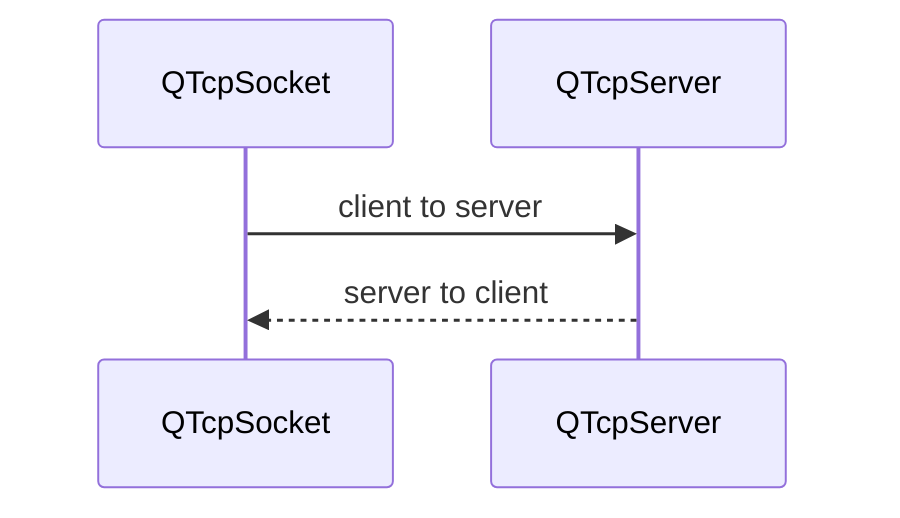
```mermaid
sequenceDiagram
	participant QTcpSocket
    participant QTcpServer
	QTcpSocket ->> QTcpServer: client to server
	QTcpServer -->> QTcpSocket: server to client
```

首先是服务器的程序QTcpServer::listen开始服务器监听（需要指定IP地址和端口），有新的客户端接入时，QTcpServer::incomingConnection就会也创建1个QTcpSocket对象并发生信号newConnection。

在newConnection的槽函数中，可以使用nextPendingConnection()接受客户端的连接，然后使用QTcpSocket与客户端通信，一旦建立连接，具体的数据通信都是QTcpSocket完成的。

客户端和服务器端建立通信，需要connectToHost连接到服务器（需要指定服务器IP地址和端口），如果是异步方式连接不会阻塞程序运行，连接后发射connected信号。connectToHost是异步方式连接服务器，不会阻塞程序运行，如果需要使用阻塞方式应当使用waitForConnected函数直到成功或者失败。

```c++
socket->connectToHost("192.168.1.100",1340);
if (socket->waitForConnected(1000))
    qDebug()<<"Connnected!";
```

由于QTcpSocket是从QIODevice继承的，所以也可以使用流数据读写功能。一个QTcpSocket实例既可以接收数据也可以发送数据，且接收和发送是异步的，有各自缓冲区。

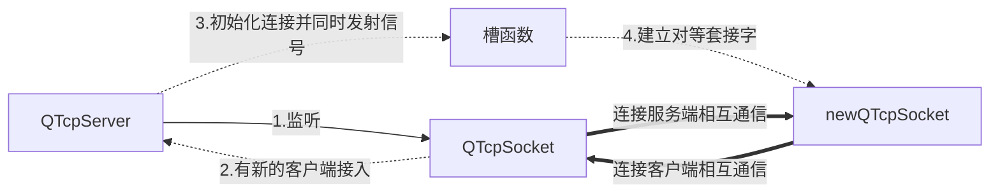
```mermaid
graph LR
QTcpServer-->|1.监听|QTcpSocket
QTcpSocket-.->|2.有新的客户端接入|QTcpServer
QTcpServer-.->|3.初始化连接并同时发射信号|槽函数
槽函数-.->|4.建立对等套接字|newQTcpSocket
newQTcpSocket==>|连接客户端相互通信|QTcpSocket
QTcpSocket==>|连接服务端相互通信|newQTcpSocket
```

建立连接以后，如果缓冲区有数据，就会发射readyRead信号，此信号的槽函数里可以读取数据。一般来说,Socket之间通信有2种方式，基于行的或者基于数据块的，需要规定好服务器和客户端的通信协议。

基于行的数据协议一般用于纯文本数据的通信，每行数据以一个换行符结束，canReadLine函数继承自QIODevice可以使用，判定是否有新的一行数据可以读取，再用readLine函数读取。

基于块的数据协议一般用于二进制数据传输，需要自定义具体的格式。

这里给出了一个实例，可见[31-TestTcpServerClient/TCPServer](31-TestTcpServerClient/TCPServer)。

服务器TCPServer的头文件如下。

```c++
#include <QMainWindow>
#include <QTcpServer>
#include <QTcpSocket>
#include <QLabel>
class TCPServer : public QMainWindow
{
  Q_OBJECT
public:
  explicit TCPServer(QWidget *parent = nullptr);
  ~TCPServer();
protected:
  void closeEvent(QCloseEvent *event);
private slots:
  void on_actStart_triggered();
  void on_actStop_triggered();
  void on_actHostInfo_triggered();
  void on_actClear_triggered();
  void on_btnSend_clicked();
private:
  Ui::TCPServer *ui;
  QLabel * LabListen;
  QLabel * LabSocketState;
  QTcpServer *tcpServer; //TCP服务器
  QTcpSocket *tcpSocket;//TCP通讯的Socket
  QString getLocalIP();//获取本机IP地址
private slots: // 自定义槽函数
  void onNewConnection(); // 响应QTcpServer的newConnection信号
  void onSocketStateChange(QAbstractSocket::SocketState socketState); // 响应stateChanged信号
  void onClientConnected(); // 响应客户端连接信号
  void onClientDisconnected();// 响应客户端断开连接信号
  void onSocketReadyRead();// 读取客户端传入的数据
  void on_comboIP_currentTextChanged(const QString &arg1);
  void on_spinPort_valueChanged(const QString &arg1);
};
```

源文件只给出核心的3个函数。重点在于这里定义的tcpSocket需要接收来自客户端的tcpSocket，如果没有连接，直接发送消息会有问题。

```c++
// 1.用于响应newConnection信号的槽函数
void TCPServer::onNewConnection()
{
    qDebug()<<"new connection...";
    // 在newConnection的槽函数中,应该使用nextPendingConnection()接受客户端的连接
    // nextPendingConnection()会返回下一个挂起的连接(因为可能连接处于排队状态)
    // ui->plainTextEdit->appendPlainText("有新连接");
    this->tcpSocket = this->tcpServer->nextPendingConnection(); //创建socket
	if (this->tcpSocket == nullptr) // 没有连接的时候
        return;
    // 有新的连接以后,tcpSocket会有已连接connected信号发出
    connect(this->tcpSocket, SIGNAL(connected()),this, SLOT(onClientConnected()));
    this->onClientConnected();// 调用响应槽函数

    // 断开连接信号disconnected先绑定好槽函数
    connect(tcpSocket, SIGNAL(disconnected()), this, SLOT(onClientDisconnected()));

    // 状态改变信号stateChanged绑定好槽函数,这里需要调用1次
    connect(tcpSocket,SIGNAL(stateChanged(QAbstractSocket::SocketState)),
            this,SLOT(onSocketStateChange(QAbstractSocket::SocketState)));
    this->onSocketStateChange(tcpSocket->state());// 调用响应槽函数

    // 如果socket有数据会发出readyRead信号,绑定好槽函数
    connect(tcpSocket,SIGNAL(readyRead()),this,SLOT(onSocketReadyRead()));
}
// 2.发送消息（这里是服务器端发给客户端）
void TCPServer::on_btnSend_clicked()
{
    // 发送1行字符串,以换行符结束
    // 一般来说,Socket之间通信有2种方式,基于行的或者基于数据块的
    QString msg=ui->editMsg->text();
    ui->plainTextEdit->appendPlainText("[发送给客户端的消息：] "+msg);
    ui->editMsg->clear();
    ui->editMsg->setFocus();
    QByteArray str=msg.toUtf8();
    str.append('\n');//添加一个换行符
    this->tcpSocket->write(str); // 写入获取的客户端套接字
}
// 3.接收消息(接收来自客户端的消息)
void TCPServer::onSocketReadyRead()
{
    while(tcpSocket->canReadLine())
    {
        ui->plainTextEdit->appendPlainText("[来自客户端的消息：] "+tcpSocket->readLine()); // 读取服务器端写入的数据
    }
}
```

客户端TCPClient的源文件如下，例子可见[31-TestTcpServerClient/TCPClient](31-TestTcpServerClient/TCPClient)。

```c++
#include <QMainWindow>
#include <QTcpSocket>
#include <QLabel>
class TCPClient : public QMainWindow
{
  Q_OBJECT
private:
    QTcpSocket  *tcpClient;  // 客户端套接字,会在服务器端的nextPendingConnection被服务器拿到
    QLabel  *LabSocketState;  //状态栏显示标签
    QString getLocalIP();//获取本机IP地址
protected:
    void closeEvent(QCloseEvent *event);
public:
  explicit TCPClient(QWidget *parent = nullptr);
  ~TCPClient();
private slots:
  void on_actConnect_triggered();
  void on_actDisconnect_triggered();
  void on_actClear_triggered();
  void on_btnSend_clicked();
private slots: // 自定义槽函数
  void onConnected();
  void onDisconnected();
  void onSocketStateChange(QAbstractSocket::SocketState socketState);
  void onSocketReadyRead();//读取服务端传入的数据
  void on_comboServer_currentIndexChanged(const QString &arg1);
  void on_spinPort_valueChanged(const QString &arg1);
private:
  Ui::TCPClient *ui;
};
```

TCPClient源文件如下，给出核心的3个函数代码。

```c++
// 1.连接服务器
void TCPClient::on_actConnect_triggered()
{
    QString  addr=ui->comboServer->currentText();
    quint16  port=ui->spinPort->value();
    tcpClient->connectToHost(addr,port);//连接本机,本机作为服务器,同时本机也作为客户端
}
// 2.客户端发送消息给服务器
void TCPClient::on_btnSend_clicked()
{
    QString msg=ui->editMsg->text();
    ui->plainTextEdit->appendPlainText("[发送给服务器的消息：] "+msg);
    ui->editMsg->clear();
    ui->editMsg->setFocus();
    QByteArray  str=msg.toUtf8();
    str.append('\n');
    tcpClient->write(str);
}
// 10.接收来自服务器的消息
void TCPClient::onSocketReadyRead()
{
    while(this->tcpClient->canReadLine())
        ui->plainTextEdit->appendPlainText("[来自服务器的消息：] "+tcpClient->readLine());
}
```

### 13.3 UDP通信

与TCP不同，无需预先建立持久的socket，UDP每次发送数据报都需要指定目标地址和端口。

UDP以数据报传输数据，而不是以连续的数据流，发送数据报需要使用函数QUdpSocket::writeDatagram()，数据报的长度一般少于512字节，每个数据报包含发送者和接收者的IP地址和端口等信息。

UDP传送有3种方式，单播、广播和组播模式。

单播模式：一对一的数据传输

广播模式：一个UDP客户端发出的数据报，同一网络范围内其他所有UDP客户端都可以收到。QUdpSocket支持IPV4广播，广播经常用于实现网络发现的协议，要获取广播数据只需要在数据报指定接收端地址为QHostAddress::Broadcast，一般的广播地址是255.255.255.255

组播模式：UDP客户端加入到另一个组播IP地址指定的多播组，成员向组播地址发送的数据报组内成员都可以接收到，类似于QQ群的功能。QUdpSocket::joinMulticastGroup函数实现加入多播组的功能，加入多播组后UDP数组的收发与正常的UDP数据收发一样。

这里给出UDP通信的例子，[32-TestUdpUnitMultiBroadCast/UdpUnitBroadCast](32-TestUdpUnitMultiBroadCast/UdpUnitBroadCast)，记得在工具-构建与运行这里设置stop applications before building为None，这样就可以多实例运行了，UDP的2个例子之间是可以互相通信的，它们可以在同一台电脑也可以不在同一台电脑。

同一台电脑，因为IP地址都是相同的，在任意一个实例角度来看对方的IP地址都是当地地址，所以如果想要通信必须要绑定不同的端口，否则会造成冲突。绑定端口使用bind，解除绑定使用abort。

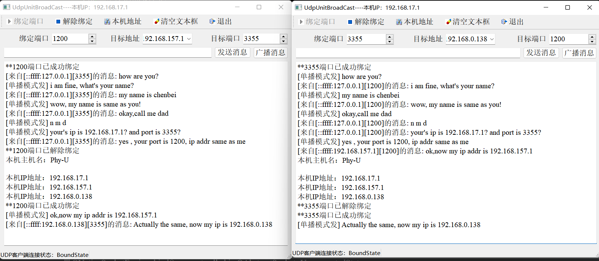

这里一共出现4个地址，但是都是本机的IP地址，也就是完全一样的。

```c++
本机IP地址：192.168.17.1
本机IP地址：192.168.157.1
本机IP地址：192.168.0.138
本机IP地址：127.0.0.1
```

不过一般的UDP通信程序都是不同的计算机上运行，所以约定一个固定的端口作为通信就可以，也即是端口可以一样，因为IP地址是不同的，不会造成冲突。

对于组播方式首先要了解的是：

224.0.0.0～224.0.0.255为预留的组播地址(永久地址),地址224.0.0.0保留不做分配,其它255个地址供路由协议使用;

224.0.1.0～224.0.1.255是公用组播地址,可用于Internet;

224.0.2.0～238.255.255.255为用户可用的组播地址(临时组地址),全网范围内有效;

239.0.0.0～239.255.255.255为本地管理组播地址范围,仅在特定的本地范围内有效。

故若是家庭或者办公室局域网内测试UDP组播功能,可以使用的地址范围是239.0.0.0~239.255.255.255。

使用joinMulticastGroup加入组播，使用leaveMulticastGroup离开一个组播，**组播地址是固定的，端口也是协议固定的，然后其它任何IP用户都可以加入这个组播地址发送和接收消息**，并且发送消息的时候自己也能接受到。

测试的时候，这里只能使用2台计算机分别运行实例进行测试，同一台的话如果一个实例已经加入多组播，另一个就无法加入了，因为本质上都是一个IP地址。具体的例子可见[32-TestUdpUnitMultiBroadCast/UdpMultiCast](32-TestUdpUnitMultiBroadCast/UdpMultiCast)。

### 13.4 基于HTTP协议

这里涉及到3个网络数据类型：QNetWorkRequest、QNetWorkReply和QNetWorkAccessManager，以及QUrl。

QNetWorkRequest可以通过一个URL发起网络协议请求，保存了网络请求的信息，目前支持HTTP、FTP和局部文件URLs的下载或者上传。这个URL地址可以是任何类型的文件，如html、pdf、doc和exe等。

QNetWorkAccessManager用于协调网络操作，在QNetWorkRequest发起一个网络请求后，负责发送这个网络请求，创建网络响应。

QNetWorkReply用于处理网络请求后的响应，提供了信号finshed、readyRead、downloadProgress等检测网络响应的执行情况。因为是QIODevice的子类，所以支持流读写功能，也支持同步或者异步工作模式。

例子可见[33-TestNetworkHttp](33-TestNetworkHttp)。

### 13.5 本章数据类型

#### 13.5.1 QHostInfo

QHostInfo 类为主机名查找提供静态函数。**QHostInfo 使用操作系统提供的查找机制来查找与主机名关联的 IP 地址，或与 IP 地址关联的主机名。**该类提供了两个静态便利函数：一个异步工作并在找到主机后发出信号，另一个阻止并返回 QHostInfo 对象。要异步查找主机的 IP 地址，请调用 **lookupHost()**，它将主机名或 IP 地址、接收器对象和插槽签名作为参数并返回一个 ID。您可以通过使用查找 ID 调用 abortHostLookup() 来中止查找。
例子：

```c++
// 查找 qt-project.org 的IP地址(给定主机名查询IP地址)
QHostInfo::lookupHost("qt-project.org",this, SLOT(lookedUp(QHostInfo)));
//查找 4.2.2.1 的主机名(也可以给IP地址查询I主机名)
QHostInfo::lookupHost("4.2.2.1",this, SLOT(lookedUp(QHostInfo)));

// lookedUp函数的实现可以是这样的
 void MyWidget::lookedUp(const QHostInfo &host)
  {
      if (host.error() != QHostInfo::NoError) {
          qDebug() << "Lookup failed:" << host.errorString();
          return;
      }

      const auto addresses = host.addresses(); // 地址列表
      for (const QHostAddress &address : addresses)
          qDebug() << "Found address:" << address.toString();
  }
```

当结果准备好时调用该槽。结果存储在 QHostInfo 对象中。**调用addresses() 获取主机的IP 地址列表，调用hostName() 获取查找的主机名**。如果查找失败，error() 返回发生的错误类型。 errorString() 给出了查找错误的可读描述。如果要**阻塞查找，请使用 QHostInfo::fromName()** 函数：

```c++
QHostInfo info = QHostInfo::fromName("qt-project.org");
```

QHostInfo 通过 IDNA 和 Punycode 标准支持国际化域名 (IDN)。
**要检索本地主机的名称，请使用静态 QHostInfo::localHostName() 函数**。
注意：由于 Qt 4.6.1 QHostInfo 使用多个线程进行 DNS 查找，而不是一个专用的 DNS 线程。与以前的 Qt 版本相比，这提高了性能，但也改变了使用 lookupHost() 时的信号发射顺序。
注意：由于 Qt 4.6.3 QHostInfo 使用小型内部 60 秒 DNS 缓存来提高性能。

枚举类型，此枚举描述了尝试解析主机名时可能发生的各种错误。

```c++
enum QHostInfo::HostInfoError{
    QHostInfo::NoError,
    QHostInfo::HostNotFound,
    QHostInfo::UnknownError
}
```

成员函数。

```c++
QHostInfo(int id = -1);//构造一个带有查找ID的空主机信息对象

// 返回与hostName()主机关联的IP地址列表
void setAddresses(const QList<QHostAddress> &addresses);
QList<QHostAddress> addresses() const;
/*
  QHostInfo info;
  ...
  if (!info.addresses().isEmpty()) {
      QHostAddress address = info.addresses().first();
      // use the first IP address
  }
*/

// 返回主机查找失败错误类型,否则返回NoError
void setError(HostInfoError error);
HostInfoError error() const;

// 返回主机查找失败返回错误描述字符串
void setErrorString(const QString &str);
QString errorString() const;

// 返回通过IP查找的主机名称
void setHostName(const QString &hostName);
QString hostName() const;

//返回本次查找的ID
void setLookupId(int id);
int lookupId() const;
```

静态成员函数。

```c++
// 中断由lookupHost()返回的ID主机查找
void abortHostLookup(int id);

// 以异步方式根据主机名查找主机的IP地址,并返回一个ID用于查找,member是用于接收信息的槽函数名称
//  QHostInfo::lookupHost("www.kde.org",this, SLOT(lookedUp(QHostInfo)));
int lookupHost(const QString &name, QObject *receiver, const char *member);
// 也可以传递函数指针而不是槽函数
int lookupHost(const QString &name, const QObject *receiver, PointerToMemberFunction function);
// 如果context在查找完成之前被销毁，则不会调用仿函数。仿函数将在上下文线程中运行,上下文的线程必须有一个正在运行的Qt事件循环
int lookupHost(const QString &name, const QObject *context, Functor functor);
// 这个版本没有context上下文
int lookupHost(const QString &name, Functor functor);

// 返回指定主机名的IP地址,不过不是异步方式
QHostInfo fromName(const QString &name);
// 获取本机DNS域名
QString localDomainName();
// 获取本机主机名
QString localHostName();
```

#### 13.5.2 QHostAddress

QHostAddress 类提供一个 IP 地址。此类以独立于平台和协议的方式保存 IPv4 或 IPv6 地址。
QHostAddress 通常与 QTcpSocket、QTcpServer 和 QUdpSocket 一起使用以连接到主机或设置服务器。
主机地址使用 setAddress() 设置，并使用 toIPv4Address()、toIPv6Address() 或 toString() 检索。您可以使用协议（）检查类型。
注意：请注意 QHostAddress 不进行 DNS 查找。为此需要 QHostInfo。
该类还支持常见的预定义地址：Null、LocalHost、LocalHostIPv6、Broadcast 和 Any。

枚举类型。

```c++
enum QHostAddress::ConversionModeFlag{
    QHostAddress::StrictConversion,//在比较不同协议的两个 QHostAddress 对象时，不要将 IPv6 地址转换为 IPv4，因此它们将始终被认为是不同的
    QHostAddress::ConvertV4MappedToIPv4,//比较时转换IPv4映射的IPv6地址（RFC 4291 sect. 2.5.5.2）。因此QHostAddress("::ffff:192.168.1.1") 将等于 QHostAddress("192.168.1.1")
    QHostAddress::ConvertV4CompatToIPv4,//比较时转换与IPv4兼容的IPv6地址（RFC 4291 sect. 2.5.5.1）。因此QHostAddress("::192.168.1.1") 将等于QHostAddress("192.168.1.1")
    QHostAddress::ConvertLocalHost,//比较时将IPv6环回地址转换为其等效的IPv4。因此，例如QHostAddress("::1") 将等于QHostAddress("127.0.0.1)
    QHostAddress::ConvertUnspecifiedAddress,//所有未指定的地址将比较相等，即 AnyIPv4、AnyIPv6 和 Any
    QHostAddress::TolerantConversion//设置所有三个前面的标志
}
```

```c++
enum QHostAddress::SpecialAddress{
    QHostAddress::Null,//空地址对象。等效于 QHostAddress()。另请参见 QHostAddress::isNull()
    QHostAddress::LocalHost,//IPv4 本地主机地址。等效于 QHostAddress("127.0.0.1")
    QHostAddress::LocalHostIPv6,//IPv6 本地主机地址。等效于 QHostAddress("::1")
    QHostAddress::Broadcast,//IPv4 广播地址。等效于 QHostAddress("255.255.255.255")
    QHostAddress::AnyIPv4,//IPv4 任意地址。等效于 QHostAddress("0.0.0.0")。与此地址绑定的套接字将仅侦听 IPv4 接口
    QHostAddress::AnyIPv6,//IPv6 任意地址。等效于 QHostAddress("::")。与此地址绑定的套接字将仅侦听 IPv6 接口
    QHostAddress::Any//双栈任意地址。与此地址绑定的套接字将侦听 IPv4 和 IPv6 接口
}
```

成员函数。

```c++
// 使用IPv4,IPV6构造一个主机地址对象使用
QHostAddress();
QHostAddress(quint32 ip4Addr);
QHostAddress(quint8 *ip6Addr);
QHostAddress(const quint8 *ip6Addr);
QHostAddress(const Q_IPV6ADDR &ip6Addr);
// 使用本机结构 sockaddr 指定的地址构造 IPv4 或 IPv6 地址
QHostAddress(const sockaddr *sockaddr);
// 根据字符串地址（例如，“127.0.0.1”）构造 IPv4 或 IPv6 地址
QHostAddress(const QString &address);
QHostAddress(const QHostAddress &address);
// 为地址构造一个 QHostAddress 对象
QHostAddress(SpecialAddress address);

void clear();//将主机地址设置为空
QString toString() const;// 转为字符串表示
quint32 toIPv4Address() const; // 以数字形式返回 IPv4 地址
quint32 toIPv4Address(bool *ok) const;
Q_IPV6ADDR toIPv6Address() const;// 以数字形式返回 IPv6 地址

//如果此主机地址与给定的其他地址相同，则返回 true；否则返回假
bool isEqual(const QHostAddress &other, ConversionMode mode = TolerantConversion) const;
// 如果此 IP 在由网络前缀子网和网络掩码网络掩码描述的子网中，则返回 true
bool isInSubnet(const QHostAddress &subnet, int netmask) const;
// 如果此 IP 在子网描述的子网中，则返回 true。子网的 QHostAddress 成员包含网络前缀，而 int（第二个）成员包含网络掩码（前缀长度）
bool isInSubnet(const QPair<QHostAddress, int> &subnet) const;
// 如果地址是 IPv6 环回地址或任何 IPv4 环回地址，则返回 true
bool isLoopback() const;
// 如果地址是 IPv4 或 IPv6 多播地址，则返回 true，否则返回 false
bool isMulticast() const;
// 如果此主机地址对任何主机或接口无效，则返回 true
bool isNull() const;
// 返回主机地址的网络层协议
QAbstractSocket::NetworkLayerProtocol protocol() const;
// 将地址的 IPv6 范围 ID 设置为 id。如果地址协议不是 IPv6，则此函数不执行任何操作。范围 ID 可以设置为接口名称（例如“eth0”或“en1”）或表示接口索引的整数。如果 id 是接口名称，QtNetwork 将在调用操作系统网络函数之前使用 QNetworkInterface::interfaceIndexFromName() 转换为接口索引
void setScopeId(const QString &id);
QString scopeId() const;

// 设置由 ip4Addr 指定的 IPv4 地址
void setAddress(quint32 ip4Addr);
// 设置 ip6Addr 指定的 IPv6 地址
void setAddress(quint8 *ip6Addr);
// 设置 ip6Addr 指定的 IPv6 地址
void setAddress(const quint8 *ip6Addr);
// 设置 ip6Addr 指定的 IPv6 地址
void setAddress(const Q_IPV6ADDR &ip6Addr);
// 设置本机结构sockaddr指定的IPv4或IPv6 地址。如果地址解析成功，则返回 true 并设置地址；否则返回假
void setAddress(const sockaddr *sockaddr);
// 设置由地址指定的字符串表示指定的 IPv4 或 IPv6 地址（例如“127.0.0.1”）。如果地址解析成功，则返回 true 并设置地址；否则返回假
bool setAddress(const QString &address);
// 设置由地址指定的特殊地址
void setAddress(SpecialAddress address);
```

静态成员函数。

```c++
QPair<QHostAddress, int> parseSubnet(const QString &subnet);
// 解析子网中包含的 IP 和子网信息，并返回该网络的网络前缀及其前缀长度。IP 地址和网络掩码必须用斜杠 (/) 分隔。此函数支持以下形式的参数： 123.123.123.123/n 其中 n 是 0 到 32 之间的任意值 123.123.123.123/255.255.255.255 &lt;ipv6-address&gt;/n 其中 n 是 0 到 128 之间的任意值 对于 IP 版本 4，此函数也接受缺少的尾随组件（即，少于 4 个八位字节，例如“192.168.1”），后跟或不跟点。如果在这种情况下也缺少网络掩码，则将其设置为实际传递的八位字节数（在上面的示例中，对于 3 个八位字节，它将是 24）。
```

#### 13.5.3 QNetworkInterface

QNetworkInterface 类提供主机 IP 地址和网络接口的列表。
QNetworkInterface 表示连接到正在运行程序的主机的一个网络接口。每个网络接口可以包含零个或多个 IP 地址，每个 IP 地址可选地与网络掩码和/或广播地址相关联。可以使用 addressEntries() 获取此类三重奏的列表。或者，当不需要网络掩码或广播地址时，使用 allAddresses() 便利函数仅获取 IP 地址。
QNetworkInterface 还使用hardwareAddress() 报告接口的硬件地址。
并非所有操作系统都支持报告所有功能。在所有平台中，此类仅保证列出 IPv4 地址。特别是，IPv6 地址列表仅在 Windows、Linux、macOS 和 BSD 上受支持。

成员函数。

```c++
QNetworkInterface();

//返回此接口拥有的 IP 地址列表及其关联的网络掩码和广播地址
QList<QNetworkAddressEntry> addressEntries() const;
// 返回与此网络接口关联的标志
InterfaceFlags flags() const;
// 返回此接口的低级硬件地址。在以太网接口上，这将是一个以冒号分隔的字符串形式的 MAC 地址
QString hardwareAddress() const;
// 如果可以确定名称，则返回 Windows 上此网络接口的人类可读名称，例如“本地连接”。如果不能，则此函数返回与 name() 相同的值。人类可读的名称是用户可以在 Windows 控制面板中修改的名称，因此它可能会在程序执行过程中发生变化
QString humanReadableName() const;
// 如果已知，则返回接口系统索引。这是操作系统分配的一个整数来标识这个接口，它通常不会改变。它与 IPv6 地址中的范围 ID 字段匹配
int index() const;
// 如果此 QNetworkInterface 对象包含有关网络接口的有效信息，则返回 true
bool isValid() const;
// 返回此网络接口的名称。在 Unix 系统上，这是一个包含接口类型和可选序列号的字符串，例如“eth0”、“lo”或“pcn0”。在 Windows 上，它是用户无法更改的内部 ID
QString name() const;
```

静态成员函数。

```c++
// 此便捷函数返回在主机上找到的所有 IP 地址。这相当于对 allInterfaces() 返回的所有对象调用 addressEntries() 以获取 QHostAddress 对象的列表，然后对每个对象调用 QHostAddress::ip()
QList<QHostAddress> allAddresses();
// 返回主机上找到的所有网络接口的列表。如果失败，它会返回一个包含零元素的列表
QList<QNetworkInterface> allInterfaces();
// 返回内部 ID 为 index 的接口的 QNetworkInterface 对象。网络接口有一个称为“接口索引”的唯一标识符，以将其与系统上的其他接口区分开来。通常，此值是逐步分配的，并且每次删除然后再次添加的接口都会获得不同的值
QNetworkInterface interfaceFromIndex(int index);
// 返回名为 name 的接口的 QNetworkInterface 对象。如果不存在这样的接口，则此函数返回一个无效的 QNetworkInterface 对象
QNetworkInterface interfaceFromName(const QString &name);
// 返回名称为 name 的接口的索引，如果没有该名称的接口，则返回 0。此函数应产生与以下代码相同的结果，但可能会执行得更快
int interfaceIndexFromName(const QString &name);
// 返回索引为 index 的接口的名称，如果没有具有该索引的接口，则返回空字符串。此函数应产生与以下代码相同的结果，但可能会执行得更快
QString interfaceNameFromIndex(int index);
```

#### 13.5.4 QAbstractSocket

QAbstractSocket 类提供所有套接字类型共有的基本功能。
**QAbstractSocket 是 QTcpSocket 和 QUdpSocket 的基类**，包含这两个类的所有通用功能。如果你需要一个套接字，你有两个选择：实例化 QTcpSocket 或 QUdpSocket。
创建原生套接字描述符，实例化 QAbstractSocket，调用 setSocketDescriptor() 封装原生套接字。TCP（传输控制协议）是一种可靠的、面向流的、面向连接的传输协议。 UDP（用户数据报协议）是一种不可靠的、面向数据报的、无连接的协议。在实践中，这意味着 TCP 更适合连续传输数据，而更轻量级的 UDP 可以在可靠性不重要时使用。QAbstractSocket 的 API 统一了两种协议之间的大部分差异。例如，虽然 UDP 是无连接的，但 **connectToHost() 为 UDP 套接字建立了一个虚拟连接**，使您能够以或多或少相同的方式使用 QAbstractSocket，而不管底层协议如何。在内部，QAbstractSocket 记住传递给 connectToHost() 的地址和端口，并且 **read() 和 write() 等函数使用这些值**。

继承关系如下。

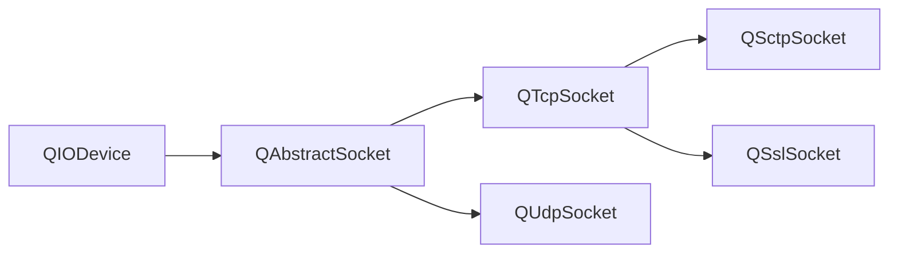
```mermaid
graph LR
QIODevice-->QAbstractSocket
QAbstractSocket-->QTcpSocket
QAbstractSocket-->QUdpSocket
QTcpSocket-->QSctpSocket
QTcpSocket-->QSslSocket
```

在任何时候，**QAbstractSocket 都有一个状态（由 state() 返回）**,**初始状态是 UnconnectedState**。调用connectToHost()后，socket**首先进入HostLookupState状态**。如果找到主机，QAbstractSocket 进入 **ConnectingState 状态并发出 hostFound() 信号**。建立连接后，它进入 **已连接ConnectedState 状态并发出 connected()**。如果在**任何阶段发生错误，则会发出 error()**。每当**状态发生变化时，都会发出 stateChanged()**。为方便起见，如果套接字已准备好进行读写，isValid() 将返回 true，但请注意，**套接字的状态必须为 ConnectedState，然后才能进行读写**。

**通过调用 read() 或 write() 读取或写入数据，或使用便捷函数 readLine() 和 readAll()**。 QAbstractSocket 还从 QIODevice 继承了 getChar()、putChar() 和 ungetChar()，它们适用于单个字节。当**数据写入套接字时，会发出 bytesWritten() 信号**。请注意，Qt 不限制写入缓冲区的大小。您可以通过收听此信号来监控其大小。
**每次新的数据块到达时都会发出 readyRead() 信号**。 **bytesAvailable() 然后返回可供读取的字节数**。通常，您会将 readyRead() 信号连接到一个插槽并在那里读取所有可用数据。如果您不一次读取所有数据，则剩余数据稍后仍然可用，并且任何**新传入的数据都将附加到 QAbstractSocket 的内部读取缓冲区**。要限制内部读取缓冲区的大小，请调用 setReadBufferSize()。

**要关闭套接字，请调用 disconnectFromHost()**。 **QAbstractSocket 进入 QAbstractSocket::ClosingState**。在所有挂起的数据都写入套接字之后，QAbstractSocket 实际上关闭了套接字，**进入 QAbstractSocket::UnconnectedState，并发出 disconnected()**。如果您想**立即中止连接，丢弃所有未决数据，请改为调用 abort()**。

如果远程主机关闭连接，QAbstractSocket 会发出错误(QAbstractSocket::RemoteHostClosedError)，期间socket 状态仍为ConnectedState，然后发出disconnected() 信号。
**通过调用 peerPort() 和 peerAddress() 获取连接的对等体的端口和地址**。 **peerName() 返回对等方的主机名，传递给 connectToHost()**。 **localPort() 和 localAddress() 返回本地套接字的端口和地址**。

QAbstractSocket 提供一组函数，这些函数可暂停调用线程直到发出某些信号。这些函数可用于实现阻塞套接字：

**waitForConnected() 阻塞，直到建立连接**。
waitForReadyRead() 阻塞，直到有新数据可供读取。
waitForBytesWritten() 阻塞，直到一个有效负载数据被写入套接字。
waitForDisconnected() 阻塞，直到连接关闭。

一个例子：

```c++
int numRead = 0, numReadTotal = 0;
char buffer[50];
forever {
    numRead  = socket.read(buffer, 50);
    // 处理读取的数据
    numReadTotal += numRead;
    if (numRead == 0 && !socket.waitForReadyRead()) // 如果读取的数据为0或没有新数据读取
        break;
}
```

**如果 waitForReadyRead() 返回 false，则连接已关闭或发生错误**。
使用阻塞套接字编程与使用非阻塞套接字编程完全不同。**阻塞套接字不需要事件循环**，通常会导致更简单的代码。但是，在 GUI 应用程序中，**阻塞套接字只能在非 GUI 线程中使用，以避免冻结用户界面**。有关这两种方法的概述，请参阅 fortuneclient 和 blockingfortuneclient 示例。

注意：我们**不鼓励将阻塞函数与信号一起使用**。应该使用两种可能性之一。
QAbstractSocket 可以与 QTextStream 和 QDataStream 的流操作符（operator&lt;&lt;() 和 operator&gt;&gt;()）一起使用。**但是，有一个问题需要注意：在尝试使用 operator>>() 读取数据之前，必须确保有足够的数据可用**。

##### 枚举类型

这个枚举描述了你可以传递的不同标志来修改 QAbstractSocket::bind() 的行为。

```c++
enum QAbstractSocket::BindFlag{
    QAbstractSocket::ShareAddress,//允许其他服务绑定到相同的地址和端口。当多个进程通过侦听相同的地址和端口来共享单个服务的负载时，这很有用（例如，具有多个预分叉侦听器的 Web 服务器可以大大提高响应时间）。但是，由于允许重新绑定任何服务，因此此选项受制于某些安全考虑。请注意，通过将此选项与 ReuseAddressHint 结合使用，您还将允许您的服务重新绑定现有的共享地址。在 Unix 上，这等效于 SO_REUSEADDR 套接字选项。在 Windows 上，此选项被忽略。
    QAbstractSocket::DontShareAddress,//独占绑定地址和端口，不允许其他服务重新绑定。通过将此选项传递给 QAbstractSocket::bind()，您可以保证在成功时，您的服务是唯一侦听地址和端口的服务。任何服务都不允许重新绑定，即使它们通过了 ReuseAddressHint。此选项提供比 ShareAddress 更高的安全性，但在某些操作系统上，它要求您以管理员权限运行服务器。在 Unix 和 macOS 上，不共享是绑定地址和端口的默认行为，因此忽略此选项。在 Windows 上，此选项使用 SO_EXCLUSIVEADDRUSE 套接字选项。
    QAbstractSocket::ReuseAddressHint,//向 QAbstractSocket 提供提示，即使地址和端口已经被另一个套接字绑定，它也应该尝试重新绑定服务。在 Windows 和 Unix 上，这相当于 SO_REUSEADDR 套接字选项
    QAbstractSocket::DefaultForPlatform//当前平台的默认选项。在 Unix 和 macOS 上，这相当于 (DontShareAddress + ReuseAddressHint)，在 Windows 上，它相当于 ShareAddress
}
```

这个枚举描述了 Qt 中使用的网络层协议值。

```c++
enum QAbstractSocket::NetworkLayerProtocol{
    QAbstractSocket::IPv4Protocol,
    QAbstractSocket::IPv6Protocol,
    QAbstractSocket::AnyIPProtocol,
    QAbstractSocket::UnknownNetworkLayerProtocol
}
```

这个枚举描述了当套接字应该阻止继续数据传输时的行为。当前支持的唯一通知是 QSslSocket::sslErrors()。

```c++
enum QAbstractSocket::PauseMode{
    QAbstractSocket::PauseNever,//不要暂停套接字上的数据传输
    QAbstractSocket::PauseOnSslErrors//收到SSL错误通知后暂停套接字上的数据传输
}
```

此枚举描述了可能发生的套接字错误。

```c++
enum QAbstractSocket::SocketError{
    QAbstractSocket::ConnectionRefusedError,//连接被对等方拒绝（或超时）
    QAbstractSocket::RemoteHostClosedError,//远程主机关闭了连接
    QAbstractSocket::HostNotFoundError,//找不到主机地址
    QAbstractSocket::SocketAccessError,//套接字操作失败，因为应用程序缺少所需的权限
    QAbstractSocket::SocketResourceError,//本地系统资源不足（例如，套接字过多）
    QAbstractSocket::SocketTimeoutError,//套接字操作超时
    QAbstractSocket::DatagramTooLargeError,//数据报大于操作系统的限制（可以低至 8192 字节）
    QAbstractSocket::NetworkError,//网络出现错误（例如，网络电缆被意外拔出）
    QAbstractSocket::AddressInUseError,//指定给 QAbstractSocket::bind() 的地址已经在使用中并且被设置为独占
    QAbstractSocket::SocketAddressNotAvailableError,//指定给 QAbstractSocket::bind() 的地址不属于主机
    QAbstractSocket::UnsupportedSocketOperationError,//本地操作系统不支持请求的套接字操作（例如，缺乏 IPv6 支持）
    QAbstractSocket::ProxyAuthenticationRequiredError,//套接字正在使用代理，并且代理需要身份验证
    QAbstractSocket::SslHandshakeFailedError,//SSL/TLS 握手失败所以连接被关闭
    QAbstractSocket::UnfinishedSocketOperationError,//仅由 QAbstractSocketEngine 使用，尝试的最后一个操作尚未完成（仍在后台进行）
    QAbstractSocket::ProxyConnectionRefusedError,//无法联系代理服务器，因为与该服务器的连接被拒绝
    QAbstractSocket::ProxyConnectionClosedError,//与代理服务器的连接意外关闭（在与最终对等方建立连接之前）
    QAbstractSocket::ProxyConnectionTimeoutError,//与代理服务器的连接超时或代理服务器在身份验证阶段停止响应
    QAbstractSocket::ProxyNotFoundError,//未找到使用 setProxy()（或应用程序代理）设置的代理地址
    QAbstractSocket::ProxyProtocolError,//与代理服务器的连接失败，因为无法理解来自代理服务器的响应
    QAbstractSocket::OperationError,//在套接字处于不允许的状态时尝试了操作
    QAbstractSocket::SslInternalError,//正在使用的SSL库报告了一个内部错误。这可能是库安装错误或配置错误的结果
    QAbstractSocket::SslInvalidUserDataError,//提供了无效数据（证书、密钥、密码等），其使用导致 SSL 库出错
    QAbstractSocket::TemporaryError,//发生了临时错误（例如，操作将阻塞并且套接字是非阻塞的）
    QAbstractSocket::UnknownSocketError//发生不明错误
}
```

此枚举表示可以在套接字上设置的选项。如果需要，可以在从套接字接收到 connected() 信号或从 QTcpServer 接收到新套接字之后设置它们。

```c++
enum QAbstractSocket::SocketOption{
    QAbstractSocket::LowDelayOption,//尝试优化套接字以实现低延迟。对于 QTcpSocket，这将设置 TCP_NODELAY 选项并禁用 Nagle 算法。将此设置为 1 以启用
    QAbstractSocket::KeepAliveOption,//将此设置为 1 以启用 SO_KEEPALIVE 套接字选项
    QAbstractSocket::MulticastTtlOption,//将此设置为整数值以设置 IP_MULTICAST_TTL（多播数据报的 TTL）套接字选项
    QAbstractSocket::MulticastLoopbackOption,//将此设置为 1 以启用 IP_MULTICAST_LOOP（多播环回）套接字选项
    QAbstractSocket::TypeOfServiceOption,//Windows 不支持此选项。这映射到 IP_TOS 套接字选项。有关可能的值，请参见下表
    QAbstractSocket::SendBufferSizeSocketOption,//在操作系统级别设置套接字发送缓冲区大小（以字节为单位）。这映射到 SO_SNDBUF 套接字选项。此选项不影响 QIODevice 或 QAbstractSocket 缓冲区
    QAbstractSocket::ReceiveBufferSizeSocketOption//在操作系统级别设置套接字接收缓冲区大小（以字节为单位）。这映射到 SO_RCVBUF 套接字选项。此选项不影响 QIODevice 或 QAbstractSocket 缓冲区（请参阅 setReadBufferSize()）
}
TypeOfServiceOption 的可能值为：
224 Network control
192 Internetwork control
160 CRITIC/ECP
128 Flash override
96 Flash
64 Immediate
32 Priority
0 Routine
```

此枚举描述了套接字可以处于的不同状态。

```c++
enum QAbstractSocket::SocketState{
    QAbstractSocket::UnconnectedState,//套接字未连接
    QAbstractSocket::HostLookupState,//套接字正在执行主机名查找
    QAbstractSocket::ConnectingState,//套接字已开始建立连接
    QAbstractSocket::ConnectedState,//建立连接
    QAbstractSocket::BoundState,//套接字绑定到地址和端口
    QAbstractSocket::ClosingState,//套接字即将关闭（数据可能仍在等待写入）
    QAbstractSocket::ListeningState//仅限内部使用
}
```

这个枚举描述了传输层协议。

```c++
enum QAbstractSocket::SocketType{
    QAbstractSocket::TcpSocket,
    QAbstractSocket::UdpSocket,
    QAbstractSocket::SctpSocket,
    QAbstractSocket::UnknownSocketType
}
```

##### 普通成员函数

```c++
QAbstractSocket(SocketType socketType, QObject *parent);

SocketType socketType() const;//返回套接字类型（TCP、UDP 或其他）

// 中止当前连接并重置套接字。与 disconnectFromHost() 不同，此函数立即关闭套接字，丢弃写入缓冲区中的任何未决数据
void abort();
// 该函数尽可能多地从内部写入缓冲区写入底层网络套接字，而不阻塞。如果写入了任何数据，则此函数返回 true；否则返回 false
bool flush();
// 如果套接字有效并且可以使用，则返回 true；否则返回假
bool isValid() const;
// 继续在套接字上传输数据。此方法仅应在套接字设置为暂停通知并收到通知后使用。当前支持的唯一通知是 QSslSocket::sslErrors()。如果套接字未暂停，则调用此方法会导致未定义的行为
virtual void resume();

// 将连接本地端的地址设置为地址
void QAbstractSocket::setLocalAddress(const QHostAddress &address);
QHostAddress localAddress() const;
// 将连接本地端的端口设置为port
 void QAbstractSocket::setLocalPort(quint16 port);
quint16 localPort() const;

// 控制是否在收到通知时暂停。 pauseMode 参数指定应该暂停套接字的条件。当前支持的唯一通知是 QSslSocket::sslErrors()。如果设置为 PauseOnSslErrors，则套接字上的数据传输将暂停，需要通过调用 resume() 再次显式启用。默认情况下，此选项设置为 PauseNever。该选项必须在连接到服务器之前调用，否则会导致未定义的行为
void QAbstractSocket::setPauseMode(PauseModes pauseMode);
PauseModes pauseMode() const;
// 将连接的远程端的地址设置为address
void QAbstractSocket::setPeerAddress(const QHostAddress &address);
QHostAddress peerAddress() const;
//将远程对等方的主机名设置为 name
void QAbstractSocket::setPeerName(const QString &name);
QString peerName() const;
//将连接的远程端的端口设置为port
void QAbstractSocket::setPeerPort(quint16 port);
quint16 peerPort() const;

// 使用 BindMode 模式绑定到端口端口上的地址。将此套接字绑定到地址地址和端口端口。
// 对于 UDP 套接字，绑定后，只要 UDP 数据报到达指定的地址和端口，就会发出信号 QUdpSocket::readyRead()。因此，此函数对于编写 UDP 服务器很有用。
// 对于 TCP 套接字，此函数可用于指定用于传出连接的接口，这在多个网络接口的情况下很有用。
// 默认情况下，使用 DefaultForPlatform BindMode 绑定套接字。如果未指定端口，则选择随机端口。成功时，函数返回 true，套接字进入 BoundState；否则返回false。
bool bind(const QHostAddress &address, quint16 port = 0, BindMode mode = DefaultForPlatform);
bool bind(quint16 port = 0, BindMode mode = DefaultForPlatform);

// 尝试在给定端口上建立与 hostName 的连接。协议参数可用于指定要使用的网络协议（例如 IPv4 或 IPv6）
virtual void connectToHost(const QString &hostName, quint16 port, OpenMode openMode = ReadWrite, NetworkLayerProtocol protocol = AnyIPProtocol);
virtual void connectToHost(const QHostAddress &address, quint16 port, OpenMode openMode = ReadWrite);
// 尝试关闭套接字。如果有等待写入的未决数据，QAbstractSocket 将进入 ClosingState 并等待直到所有数据都已写入。最终，它将进入 UnconnectedState 并发出 disconnected() 信号
virtual void disconnectFromHost();

// 设置和返回错误类型
void QAbstractSocket::setSocketError(SocketError socketError)；
SocketError error() const;

// 设置和返回套接字的状态
void setSocketState(SocketState state)
SocketState state() const;

// 将此套接字的显式网络代理设置为 networkProxy，要禁用此套接字的代理，请使用 QNetworkProxy::NoProxy 代理类型
void setProxy(const QNetworkProxy &networkProxy);
QNetworkProxy proxy() const;

// 将 QAbstractSocket 的内部读取缓冲区的大小设置为 size 字节
virtual void setReadBufferSize(qint64 size);
qint64 readBufferSize() const;

//设置和返回 QAbstractSocket对象的本机套接字描述符，不可用返回-1。如果套接字正在使用QNetworkProxy，则返回的描述符可能无法与本机套接字函数一起使用
virtual bool setSocketDescriptor(qintptr socketDescriptor, SocketState socketState = ConnectedState, OpenMode openMode = ReadWrite);
virtual qintptr socketDescriptor() const;

// 设置和返回套接字选项
virtual void setSocketOption(QAbstractSocket::SocketOption option, const QVariant &value)
virtual QVariant socketOption(QAbstractSocket::SocketOption option);

// 等待套接字连接和断开，最多 mssecs 毫秒。如果连接已经建立，这个函数返回true；否则返回false
// 如果 msecs 为 -1，则此函数不会超时， 在它返回false的情况下，您可以调用error()来确定错误的原因
virtual bool waitForConnected(int msecs = 3000);
virtual bool waitForDisconnected(int msecs = 30000);
socket->connectToHost("imap", 143);
if (socket->waitForConnected(1000))
    qDebug("Connected!");
socket->disconnectFromHost();
if (socket->state() == QAbstractSocket::UnconnectedState ||
    socket->waitForDisconnected(1000))
    qDebug("Disconnected!");
```

##### 继承函数

这些函数从QIODevice继承而来，也是可以使用的函数，其含义可见[6.1.1 QIODevice](#6.1.1 QIODevice)。

```c++
virtual bool atEnd() const;
virtual qint64 bytesAvailable() const;
virtual qint64 bytesToWrite() const;
virtual bool canReadLine() const;
virtual void close();
virtual bool isSequential() const;
virtual bool waitForBytesWritten(int msecs = 30000);
virtual bool waitForReadyRead(int msecs = 30000);
```

##### 信号函数

```c++
void connected();
void disconnected();
void error(QAbstractSocket::SocketError socketError);
void hostFound();
void proxyAuthenticationRequired(const QNetworkProxy &proxy, QAuthenticator *authenticator);
void stateChanged(QAbstractSocket::SocketState socketState);
```

#### 13.5.5 QTcpSocket

QTcpSocket 类提供了一个 TCP 套接字。
TCP（传输控制协议）是一种可靠的、面向流的、面向连接的传输协议。它特别适用于数据的连续传输。
QTcpSocket 是 QAbstractSocket 的一个便利子类，它允许您建立 TCP 连接并传输数据流。有关详细信息，请参阅 QAbstractSocket 文档。
注意：不能在 QIODevice::Unbuffered 模式下打开 TCP 套接字。

```c++
QTcpSocket(QObject *parent = Q_NULLPTR)
virtual ~QTcpSocket();
```

#### 13.5.6 QUdpSocket

QUdpSocket 类提供了一个 UDP 套接字。
UDP（用户数据报协议）是一种轻量级的、不可靠的、面向数据报的、无连接的协议。当可靠性不重要时可以使用它。 QUdpSocket 是 QAbstractSocket 的子类，允许您发送和接收 UDP 数据报。
使用该类最**常见的方法是使用 bind() 绑定到地址和端口，然后调用 writeDatagram() 和 readDatagram() / receiveDatagram() 来传输数据。如果要使用标准 QIODevice 函数 read()、readLine()、write() 等，必须首先通过调用 connectToHost() 将套接字直接连接到对等方**。
每次将数据报写入网络时，套接字都会发出 bytesWritten() 信号。如果你只是想发送数据报，你不需要调用bind()。每当数据报到达时，就会发出 readyRead() 信号。在这种情况下，hasPendingDatagrams() 返回 true。调用pendingDatagramSize() 获取第一个未决数据报的大小，调用readDatagram() 或receiveDatagram() 来读取它。注意：当您收到 readyRead() 信号时，应读取传入的数据报，否则将不会为下一个数据报发出此信号。

```c++
void Server::initSocket()
{
    udpSocket = new QUdpSocket(this);
    udpSocket->bind(QHostAddress::LocalHost, 7755);

    connect(udpSocket, SIGNAL(readyRead()),
            this, SLOT(readPendingDatagrams()));
}

void Server::readPendingDatagrams()
{
    while (udpSocket->hasPendingDatagrams()) {
        QNetworkDatagram datagram = udpSocket->receiveDatagram();
        processTheDatagram(datagram);
    }
}
```

QUdpSocket 还支持 UDP 多播。使用 joinMulticastGroup() 和 leaveMulticastGroup() 控制组成员，使用 QAbstractSocket::MulticastTtlOption 和 QAbstractSocket::MulticastLoopbackOption 设置 TTL 和环回套接字选项。使用 setMulticastInterface() 控制多播数据报的传出接口，并使用 multicastInterface() 查询它。
使用 QUdpSocket，您还可以使用 connectToHost() 建立到 UDP 服务器的虚拟连接，然后使用 read() 和 write() 来交换数据报，而无需为每个数据报指定接收者。

成员函数如下。

```c++
QUdpSocket(QObject *parent = Q_NULLPTR);
virtual ~QUdpSocket();

// 如果至少有一个数据报正在等待读取，则返回 true；否则返回假
bool hasPendingDatagrams() const;
// 返回第一个挂起的 UDP 数据报的大小。如果没有可用的数据报，此函数返回 -1
qint64 pendingDatagramSize() const;

// 在操作系统选择的默认接口上加入由 groupAddress 指定的多播组。套接字必须处于BoundState，否则会出错
bool joinMulticastGroup(const QHostAddress &groupAddress);
bool joinMulticastGroup(const QHostAddress &groupAddress, const QNetworkInterface &iface);
// 将由 groupAddress 指定的多播组留在操作系统选择的默认接口上。套接字必须处于BoundState，否则会出错
bool leaveMulticastGroup(const QHostAddress &groupAddress);
bool leaveMulticastGroup(const QHostAddress &groupAddress, const QNetworkInterface &iface);

//返回多播数据报的传出接口的接口。这对应于 IPv4 套接字的 IP_MULTICAST_IF 套接字选项和 IPv6 套接字的 IPV6_MULTICAST_IF 套接字选项。如果之前没有设置接口，这个函数返回一个无效的 QNetworkInterface。套接字必须处于 BoundState，否则返回无效的 QNetworkInterface
void setMulticastInterface(const QNetworkInterface &iface);
QNetworkInterface multicastInterface() const;

//接收不大于 maxSize 字节的数据报并将其存储在数据中。发送者的主机地址和端口存储在 *address 和 *port 中（除非指针为 0）
qint64 readDatagram(char *data, qint64 maxSize, QHostAddress *address = Q_NULLPTR, quint16 *port = Q_NULLPTR);
// 接收不大于 maxSize 字节的数据报，并在 QNetworkDatagram 对象中返回它，以及发送者的主机地址和端口。如果可能，此函数还将尝试确定数据报的目标地址、端口和接收时的跳数
QNetworkDatagram receiveDatagram(qint64 maxSize = -1);
// 将数据大小大小的数据报发送到端口端口的主机地址地址。返回成功发送的字节数；否则返回 -1
qint64 writeDatagram(const char *data, qint64 size, const QHostAddress &address, quint16 port);
// 将数据报数据报发送到数据报中包含的主机地址和端口号，使用也设置在那里的网络接口和跳数限制。如果未设置目标地址和端口号，此函数将发送到传递给 connectToHost() 的地址
qint64 writeDatagram(const QNetworkDatagram &datagram);
// 将数据报数据报发送到主机地址主机和端口端口
qint64 writeDatagram(const QByteArray &datagram, const QHostAddress &host, quint16 port);
```

#### 13.5.7 QTcpServer

QTcpServer 类提供了一个基于 TCP 的服务器。这个类使得接受传入的 TCP 连接成为可能。您可以指定端口或让 QTcpServer 自动选择一个。您可以监听特定地址或所有机器的地址。
**调用listen() 让服务器监听传入的连接。然后每次客户端连接到服务器时都会发出 newConnection() 信号**。
**调用 nextPendingConnection() 以接受挂起的连接作为已连接的 QTcpSocket。该函数返回指向 QAbstractSocket::ConnectedState 中的 QTcpSocket 的指针**，您可以使用该指针与客户端进行通信。
如果发生错误，serverError() 返回错误的类型，并且可以调用 errorString() 来获得对所发生事件的可读描述。
在侦听连接时，**服务器正在侦听的地址和端口可用作 serverAddress() 和 serverPort(**)。
调用 close() 使 QTcpServer 停止侦听传入连接。
尽管 QTcpServer 主要是为与事件循环一起使用而设计的，**但也可以在没有事件循环的情况下使用它。在这种情况下，您必须使用 waitForNewConnection()**，它会阻塞直到连接可用或超时到期。

成员函数。

```c++
QTcpServer(QObject *parent = Q_NULLPTR);
// 关闭服务器。服务器将不再侦听传入连接
void close();
// 返回发生的最后一个错误的人类可读描述
QString errorString() const;

// 此函数由 QTcpServer::incomingConnection() 调用以将套接字添加到待处理的传入连接列表中
void addPendingConnection(QTcpSocket *socket);
// 当有新连接可用时，QTcpServer 会调用此虚拟函数。 socketDescriptor 参数是接受连接的本机套接字描述符
virtual void incomingConnection(qintptr socketDescriptor);
// 如果服务器有挂起的连接，则返回 true；否则返回假
virtual bool hasPendingConnections() const;
// 将下一个挂起的连接作为已连接的 QTcpSocket 对象返回
virtual QTcpSocket *nextPendingConnection();
// 将挂起的已接受连接的最大数量设置为 numConnections。在调用 nextPendingConnection() 之前，QTcpServer 将接受不超过 numConnections 的传入连接。默认情况下，限制为 30 个挂起的连接
void setMaxPendingConnections(int numConnections);
int maxPendingConnections() const;

// 如果服务器当前正在侦听传入连接，则返回 true；否则返回假
bool isListening() const;
// 告诉服务器侦听地址地址和端口端口上的传入连接。如果端口为 0，则自动选择一个端口。如果地址是 QHostAddress::Any，服务器将侦听所有网络接口
bool listen(const QHostAddress &address = QHostAddress::Any, quint16 port = 0);

// 暂停接受新连接。排队的连接将保留在队列中
void pauseAccepting();
// 恢复接受新连接
void resumeAccepting();

// 返回发生的最后一个错误的错误代码
QAbstractSocket::SocketError serverError() const;
// 如果服务器正在侦听连接，则返回服务器的地址；否则返回 QHostAddress::Null
QHostAddress serverAddress() const;
// 如果服务器正在侦听连接，则返回服务器的端口；否则返回 0
quint16 serverPort() const;

// 将此套接字的显式网络代理设置为 networkProxy
void setProxy(const QNetworkProxy &networkProxy);
QNetworkProxy proxy() const;

// 设置此服务器在侦听到 socketDescriptor 的传入连接时应使用的套接字描述符。如果套接字设置成功，则返回 true；否则返回假
bool setSocketDescriptor(qintptr socketDescriptor);
qintptr socketDescriptor() const;

// 最多等待 msec 毫秒或直到传入连接可用。如果连接可用，则返回 true；否则返回假。如果操作超时且 timedOut 不为 0，*timedOut 将设置为 true
bool waitForNewConnection(int msec = 0, bool *timedOut = Q_NULLPTR);
```

信号函数。

```c++
// 当接受新连接导致错误时发出此信号。 socketError 参数描述了发生的错误类型
void acceptError(QAbstractSocket::SocketError socketError);
// 当有新连接可用时，QTcpServer 会调用此虚拟函数。 socketDescriptor 参数是接受连接的本机套接字描述符
void newConnection();
```

#### 13.5.8 QNetworkAccessManager

QNetworkAccessManager 类允许应用程序发送网络请求和接收回复 网络访问 API 是围绕一个 QNetworkAccessManager 对象构建的，该对象包含它发送的请求的通用配置和设置。它包含代理和缓存配置，以及与此类问题相关的信号，以及可用于监控网络操作进度的回复信号。**一个 QNetworkAccessManager 对于整个 Qt 应用程序应该足够了**。一旦创建了 QNetworkAccessManager 对象，应用程序就可以使用它通过网络发送请求。提供了一组标准函数，它们接受请求和可选数据，**每个函数都返回一个 QNetworkReply 对象**。返回的对象用于获取响应相应请求而返回的任何数据。
可以通过以下方式完成简单的网络下载：

```c++
QNetworkAccessManager *manager = new QNetworkAccessManager(this);
connect(manager, SIGNAL(finished(QNetworkReply*)),
        this, SLOT(replyFinished(QNetworkReply*)));
manager->get(QNetworkRequest(QUrl("http://qt-project.org")));
```

QNetworkAccessManager 有一个异步 API。当上面的replyFinished slot被调用时，它接受的参数是包含下载数据以及元数据（headers等）的QNetworkReply对象。
注意：请求完成后，用户有责任在适当的时候删除 QNetworkReply 对象。不要在连接到finished()的槽内直接删除它。您可以使用 deleteLater() 函数。
注意：QNetworkAccessManager 将它收到的请求排队。并行执行的请求数取决于协议。目前，对于桌面平台上的 HTTP 协议，一个主机/端口组合并行执行 6 个请求。
一个更复杂的例子，假设管理网络已经存在，可以是：

```c++
QNetworkRequest request;
request.setUrl(QUrl("http://qt-project.org"));
request.setRawHeader("User-Agent", "MyOwnBrowser 1.0");

QNetworkReply *reply = manager->get(request);
connect(reply, SIGNAL(readyRead()), this, SLOT(slotReadyRead()));
connect(reply, SIGNAL(error(QNetworkReply::NetworkError)),
        this, SLOT(slotError(QNetworkReply::NetworkError)));
connect(reply, SIGNAL(sslErrors(QList<QSslError>)),
        this, SLOT(slotSslErrors(QList<QSslError>)));
```

网络和漫游支持。通过在 Qt 4.7 中添加承载管理 API，QNetworkAccessManager 获得了管理网络连接的能力。 QNetworkAccessManager 可以在设备离线时启动网络接口，如果当前进程是最后一个使用上行链路的进程，则终止接口。请注意，某些平台使用从最后一个应用程序停止使用上行链路到系统实际终止连接链路的宽限期。漫游同样透明。任何排队/待处理的网络请求都会自动传输到新的接入点。
希望使用此功能的客户不需要任何更改。事实上，现有平台特定的连接代码很可能可以简单地从应用程序中删除。
注意：QNetworkAccessManager 中的网络和漫游支持取决于支持连接管理的平台。 QNetworkConfigurationManager::NetworkSessionRequired 可以用来检测 QNetworkAccessManager 是否利用了这个特性。

##### 枚举类型

此枚举类型指示网络是否可通过此网络访问管理器访问。

```c++
enum QNetworkAccessManager::NetworkAccessibility{
    QNetworkAccessManager::UnknownAccessibility,//无法确定网络可访问性
	QNetworkAccessManager::NotAccessible,//网络当前不可访问，要么是因为当前没有网络覆盖，要么网络访问已通过调用 setNetworkAccessible() 显式禁用
	QNetworkAccessManager::Accessible//网络是可访问的
}
```

此枚举类型指示此回复正在处理的操作。

```c++
enum QNetworkAccessManager::Operation{
    QNetworkAccessManager::HeadOperation,//检索标头操作（使用 head() 创建
    QNetworkAccessManager::GetOperation,//检索标头并下载内容（使用 get() 创建）
    QNetworkAccessManager::PutOperation,//上传内容操作（使用 put() 创建）
    QNetworkAccessManager::PostOperation,//通过 HTTP POST（使用 post() 创建）发送 HTML 表单的内容以进行处理
    QNetworkAccessManager::DeleteOperation,//删除内容操作（使用 deleteResource() 创建）
    QNetworkAccessManager::CustomOperation//自定义操作（使用 sendCustomRequest() 创建）
}
```

##### 成员函数

```c++
QNetworkAccessManager(QObject *parent = Q_NULLPTR);
// 在端口端口启动与 hostName 给定的主机的连接。此功能有助于在发出 HTTP 请求之前完成与主机的 TCP 握手，从而降低网络延迟
void connectToHost(const QString &hostName, quint16 port = 80);
// 使用 sslConfiguration 在端口端口发起与 hostName 给定的主机的连接。此功能有助于在发出 HTTPS 请求之前完成与主机的 TCP 和 SSL 握手，从而降低网络延迟
void connectToHostEncrypted(const QString &hostName, quint16 port = 443, const QSslConfiguration &sslConfiguration = QSslConfiguration::defaultConfiguration());

// 发送删除请求的 URL 标识的资源的请求
QNetworkReply *deleteResource(const QNetworkRequest &request);
// 发布请求以获取目标请求的内容并返回一个新的 QNetworkReply 对象，该对象打开以供读取，每当新数据到达时，该对象就会发出 readyRead() 信号
QNetworkReply *get(const QNetworkRequest &request);
// 发布请求以获取请求的网络标头并返回一个新的 QNetworkReply 对象，该对象将包含此类标头
QNetworkReply *head(const QNetworkRequest &request);
QStringList supportedSchemes() const;//列出访问管理器支持的所有 URL 方案

// 向 request 指定的目的地发送一个 HTTP POST 请求，并返回一个新的 QNetworkReply 对象，该对象打开以供读取，其中包含服务器发送的回复。数据设备的内容将被上传到服务器
QNetworkReply *post(const QNetworkRequest &request, QIODevice *data);
QNetworkReply *post(const QNetworkRequest &request, const QByteArray &data);
QNetworkReply *post(const QNetworkRequest &request, QHttpMultiPart *multiPart);

// 将数据内容上传到目标请求并返回一个新的 QNetworkReply 对象，该对象将打开以进行回复
QNetworkReply *put(const QNetworkRequest &request, QIODevice *data);
QNetworkReply *put(const QNetworkRequest &request, const QByteArray &data);
QNetworkReply *put(const QNetworkRequest &request, QHttpMultiPart *multiPart);

// 向请求的 URL 标识的服务器发送自定义请求
QNetworkReply *sendCustomRequest(const QNetworkRequest &request, const QByteArray &verb, QIODevice *data = Q_NULLPTR);
QNetworkReply *sendCustomRequest(const QNetworkRequest &request, const QByteArray &verb, const QByteArray &data);
QNetworkReply *sendCustomRequest(const QNetworkRequest &request, const QByteArray &verb, QHttpMultiPart *multiPart);

// 将管理器的网络缓存设置为指定的缓存。缓存用于管理器分派的所有请求
void setCache(QAbstractNetworkCache *cache);
QAbstractNetworkCache *cache() const;
// 刷新身份验证数据和网络连接的内部缓存
void clearAccessCache();
// 刷新网络连接的内部缓存。与 clearAccessCache() 相比，保留了身份验证数据
void clearConnectionCache();

// 将创建网络会话时使用的网络配置设置为 config
void setConfiguration(const QNetworkConfiguration &config);
// 返回当前活动的网络配置
QNetworkConfiguration activeConfiguration() const;
QNetworkConfiguration configuration() const;

// 将经理的 cookie jar 设置为指定的 cookieJar。 cookie jar 被管理器发送的所有请求使用
void setCookieJar(QNetworkCookieJar *cookieJar);
QNetworkCookieJar *cookieJar() const;

// 覆盖报告的网络可访问性。如果可访问是 NotAccessible，则报告的网络可访问性将始终为 NotAccessible。否则，报告的网络可访问性将反映实际的设备状态
void setNetworkAccessible(NetworkAccessibility accessible);
NetworkAccessibility networkAccessible() const;

// 将将来请求中使用的代理设置为代理。这不会影响已经发送的请求。如果代理请求身份验证，将发出 proxyAuthenticationRequired() 信号
void setProxy(const QNetworkProxy &proxy);
QNetworkProxy proxy() const;
// 将此类的代理工厂设置为工厂。代理工厂用于确定要用于给定请求的更具体的代理列表，而不是尝试对所有请求使用相同的代理值
void setProxyFactory(QNetworkProxyFactory *factory);
QNetworkProxyFactory *proxyFactory() const;

// 将管理器的重定向策略设置为指定的策略。此策略将影响管理器创建的所有后续请求
void setRedirectPolicy(QNetworkRequest::RedirectPolicy policy);
QNetworkRequest::RedirectPolicy redirectPolicy() const;

// 如果启用为真，QNetworkAccessManager 遵循 HTTP 严格传输安全策略（HSTS，RFC6797）。处理请求时，QNetworkAccessManager 自动将“http”方案替换为“https”，并为 HSTS 主机使用安全传输。如果明确设置，则端口 80 将替换为端口 443。
void setStrictTransportSecurityEnabled(bool enabled);
bool isStrictTransportSecurityEnabled() const;
// 将 HTTP 严格传输安全策略添加到 HSTS 缓存中
void addStrictTransportSecurityHosts(const QVector<QHstsPolicy> &knownHosts);
QVector<QHstsPolicy> strictTransportSecurityHosts() const;
```

##### 信号函数

```c++
void authenticationRequired(QNetworkReply *reply, QAuthenticator *authenticator);
void encrypted(QNetworkReply *reply);
void finished(QNetworkReply *reply);
void networkAccessibleChanged(QNetworkAccessManager::NetworkAccessibility accessible);
void preSharedKeyAuthenticationRequired(QNetworkReply *reply, QSslPreSharedKeyAuthenticator *authenticator);
void proxyAuthenticationRequired(const QNetworkProxy &proxy, QAuthenticator *authenticator);
void sslErrors(QNetworkReply *reply, const QList<QSslError> &errors);
```

#### 13.5.9 QNetWorkRequest

QNetworkRequest 类保存一个请求，该请求将与 QNetworkAccessManager 一起发送。
QNetworkRequest 是网络访问 API 的一部分，是保存通过网络发送请求所需信息的类。它包含一个 URL 和一些可用于修改请求的辅助信息。

##### 枚举值

QNetworkRequest 和 QNetworkReply 的属性代码。属性是额外的元数据，用于控制请求的行为并将更多信息从回复传递回应用程序。属性也是可扩展的，允许自定义实现传递自定义值。下表解释了默认属性代码是什么、关联的 QVariant 类型、缺少所述属性时的默认值以及它是否用于请求或回复中。

```c++
enum QNetworkRequest::Attribute{
    QNetworkRequest::HttpStatusCodeAttribute,//仅回复，类型：QMetaType::Int（无默认值）表示从 HTTP 服务器接收到的 HTTP 状态码（如 200、304、404、401 等）。如果连接不是基于HTTP的，则该属性将不存在
    QNetworkRequest::HttpReasonPhraseAttribute,//仅回复，类型：QMetaType::QByteArray（无默认值）指示从 HTTP 服务器接收到的 HTTP 原因短语（如“Ok”、“Found”、“Not Found”、“Access Denied”等）这是状态代码的人类可读表示（见上文）。如果连接不是基于 HTTP 的，则该属性将不存在
    QNetworkRequest::RedirectionTargetAttribute,//仅回复，类型：QMetaType::QUrl（无默认值）如果存在，则表明服务器正在将请求重定向到不同的 URL。默认情况下，网络访问 API 不遵循重定向：应用程序可以根据其安全策略确定是否应允许请求的重定向，或者可以将 QNetworkRequest::FollowRedirectsAttribute 设置为 true（在这种情况下，将遵循重定向，并且此属性不会出现在回复中）。返回的 URL 可能是相对的。使用 QUrl::resolved() 从中创建一个绝对 URL
    QNetworkRequest::ConnectionEncryptedAttribute,//仅回复，类型：QMetaType::Bool（默认值：false） 指示数据是否通过加密（安全）连接获得
    QNetworkRequest::CacheLoadControlAttribute,//仅限请求，类型：QMetaType::Int（默认值：QNetworkRequest::PreferNetwork）控制应该如何访问缓存。可能的值是 QNetworkRequest::CacheLoadControl 的值。请注意，默认的 QNetworkAccessManager 实现不支持缓存。但是，某些后端可以使用此属性来修改其请求（例如，用于缓存代理）
    QNetworkRequest::CacheSaveControlAttribute,//仅限请求，类型：QMetaType::Bool（默认值：true）控制是否应将获得的数据保存到缓存以供将来使用。如果值为false，则获取的数据不会被自动缓存。如果为 true，则数据可能会被缓存，前提是它是可缓存的（可缓存的内容取决于所使用的协议）
    QNetworkRequest::SourceIsFromCacheAttribute,//仅回复，类型：QMetaType::Bool （默认：false） 指示数据是否从缓存中获取
    QNetworkRequest::DoNotBufferUploadDataAttribute,//仅限请求，类型：QMetaType::Bool（默认：false） 表示是否允许 QNetworkAccessManager 代码缓冲上传数据，例如在进行 HTTP POST 时。当将此标志用于顺序上传数据时，必须设置 ContentLengthHeader 标头
    QNetworkRequest::HttpPipeliningAllowedAttribute,//仅限请求，类型：QMetaType::Bool （默认值：false） 指示是否允许 QNetworkAccessManager 代码对这个请求使用 HTTP 流水线
    QNetworkRequest::HttpPipeliningWasUsedAttribute,//仅回复，类型：QMetaType::Bool 指示是否使用 HTTP 管道来接收此回复
    QNetworkRequest::CustomVerbAttribute,//仅限请求，类型：QMetaType::QByteArray 保存要发送的自定义 HTTP 动词的值（用于使用 GET、POST、PUT 和 DELETE 之外的其他动词）。这个动词在调用 QNetworkAccessManager::sendCustomRequest() 时设置
    QNetworkRequest::CookieLoadControlAttribute,//仅限请求，类型：QMetaType::Int（默认值：QNetworkRequest::Automatic）指示是否在请求中发送“Cookie”标头。在创建跨域 XMLHttpRequest 时，Qt WebKit 将此属性设置为 false，其中创建请求的 Javascript 未将 withCredentials 显式设置为 true。浏览此处获取更多信息
    QNetworkRequest::CookieSaveControlAttribute,//仅限请求，类型：QMetaType::Int（默认值：QNetworkRequest::Automatic） 指示是否保存从服务器接收到的“Cookie”标头以响应请求。在创建跨域 XMLHttpRequest 时，Qt WebKit 将此属性设置为 false，其中创建请求的 Javascript 未将 withCredentials 显式设置为 true
    QNetworkRequest::AuthenticationReuseAttribute，//仅限请求，类型：QMetaType::Int（默认值：QNetworkRequest::Automatic）指示是否在请求中使用缓存的授权凭证（如果可用）。如果将其设置为 QNetworkRequest::Manual 并且身份验证机制是“基本”或“摘要”，Qt 将不会发送一个“授权”HTTP 标头以及它可能对请求的 URL 具有的任何缓存凭据。在创建跨域 XMLHttpRequest 时，此属性由 Qt WebKit 设置为 QNetworkRequest::Manual，其中创建请求的 Javascript 未将 withCredentials 显式设置为 true。浏览此处获取更多信息
    QNetworkRequest::BackgroundRequestAttribute,//类型：QMetaType::Bool（默认值：false）表示这是一个后台传输，而不是用户发起的传输。根据平台的不同，后台传输可能会受制于不同的政策。 QNetworkSession ConnectInBackground 属性将根据该属性进行设置
    QNetworkRequest::SpdyAllowedAttribute,//仅限请求，类型：QMetaType::Bool（默认值：false）指示是否允许 QNetworkAccessManager 代码在此请求中使用 SPDY。这仅适用于 SSL 请求，并且取决于支持 SPDY 的服务器
    QNetworkRequest::SpdyWasUsedAttribute,//仅回复，类型：QMetaType::Bool 指示 SPDY 是否用于接收此回复
    QNetworkRequest::HTTP2AllowedAttribute,//仅限请求，类型：QMetaType::Bool（默认值：false）指示是否允许 QNetworkAccessManager 代码使用 HTTP/2 处理此请求。这适用于 SSL 请求或“明文”HTTP/2
    QNetworkRequest::HTTP2WasUsedAttribute,//仅回复，类型：QMetaType::Bool（默认值：false）指示是否使用 HTTP/2 来接收此回复
    QNetworkRequest::EmitAllUploadProgressSignalsAttribute,//仅限请求，类型：QMetaType::Bool（默认值：false）指示是否应发出所有上传信号。默认情况下，uploadProgress 信号仅以 100 毫秒的间隔发出
    QNetworkRequest::FollowRedirectsAttribute,//仅限请求，类型：QMetaType::Bool（默认值：false）指示网络访问 API 是否应自动遵循 HTTP 重定向响应。目前不允许不安全的重定向，即从“https”重定向到“http”协议
    QNetworkRequest::OriginalContentLengthAttribute,//仅回复，类型 QMetaType::Int 在数据被压缩并且请求被标记为自动解压缩时，保留原始内容长度属性，然后使其失效并从标头中删除。
    QNetworkRequest::RedirectPolicyAttribute,//仅限请求，类型：QMetaType::Int，应该是 QNetworkRequest::RedirectPolicy 值之一（默认值：ManualRedirectPolicy）。此属性已废弃 FollowRedirectsAttribute。
    QNetworkRequest::User,//特种。附加信息可以在 QVariants 中传递，类型从 User 到 UserMax。网络访问的默认实现将忽略此范围内的任何请求属性，并且不会在回复中生成此范围内的任何属性。该范围是为 QNetworkAccessManager 的扩展保留的
    QNetworkRequest::UserMax//特种。请参阅用户
}
```

控制 QNetworkAccessManager 的缓存机制。

```c++
enum QNetworkRequest::CacheLoadControl
{
    QNetworkRequest::AlwaysNetwork,//始终从网络加载，不检查缓存是否有有效条目（类似于浏览器中的“重新加载”功能）；此外，强制中间缓存重新验证
    QNetworkRequest::PreferNetwork,//默认值;如果缓存的条目早于网络条目，则从网络加载。这永远不会从缓存中返回陈旧的数据，而是重新验证已经陈旧的资源
    QNetworkRequest::PreferCache,//如果可用，从缓存加载，否则从网络加载。请注意，这可能会从缓存中返回可能陈旧（但未过期）的项目
    QNetworkRequest::AlwaysCache//仅从缓存加载，如果项目未缓存（即离线模式）则指示错误
}
```

QNetworkRequest 解析的已知标头类型列表。每个已知的标头也以其完整的 HTTP 名称以原始形式表示。

```c++
enum QNetworkRequest::KnownHeaders{
    QNetworkRequest::ContentDispositionHeader,//对应于 HTTP Content-Disposition 标头，并包含一个字符串，其中包含处置类型（例如，附件）和一个参数（例如，文件名）
    QNetworkRequest::ContentTypeHeader,//对应于 HTTP Content-Type 标头，包含一个包含媒体 (MIME) 类型和任何辅助数据（例如，字符集）的字符串
    QNetworkRequest::ContentLengthHeader,//对应于 HTTP Content-Length 标头，包含传输数据的字节长度
    QNetworkRequest::LocationHeader,//对应于 HTTP Location 标头，包含一个表示数据实际位置的 URL，包括重定向时的目标 URL
    QNetworkRequest::LastModifiedHeader,//对应于 HTTP Last-Modified 标头并包含一个 QDateTime 表示内容的最后修改日期
    QNetworkRequest::CookieHeader,//对应于 HTTP Cookie 标头并包含一个 QList&lt;QNetworkCookie&gt; 表示要发送回服务器的 cookie
    QNetworkRequest::SetCookieHeader,//对应于 HTTP Set-Cookie 标头，包含一个 QList&lt;QNetworkCookie&gt; 表示服务器发送的要存储在本地的 cookie
    QNetworkRequest::UserAgentHeader,//HTTP 客户端发送的 User-Agent 标头
    QNetworkRequest::ServerHeader//HTTP 客户端收到的 Server 标头
}
```

指示请求的加载机制的某个方面是否已被手动覆盖，例如由 Qt WebKit 提供。

```c++
enum QNetworkRequest::LoadControl{
    QNetworkRequest::Automatic,//默认值：表示默认行为
    QNetworkRequest::Manual//表示行为已被手动覆盖
}
```

这个枚举列出了可能的网络请求优先级。

```c++
enum QNetworkRequest::Priority{
    QNetworkRequest::HighPriority,//高
    QNetworkRequest::NormalPriority,//正常
    QNetworkRequest::LowPriority//低
}
```

指示网络访问 API 是否应自动遵循 HTTP 重定向响应。

```c++
enum QNetworkRequest::RedirectPolicy{
    QNetworkRequest::ManualRedirectPolicy,//默认值：不遵循任何重定向
    QNetworkRequest::NoLessSafeRedirectPolicy,//只允许“http”->“http”、“http”->“https”或“https”->“https”重定向。相当于将旧的 FollowRedirectsAttribute 设置为 true
    QNetworkRequest::SameOriginRedirectPolicy,//需要相同的协议、主机和端口。请注意，http://example.com 和 http://example.com:80 将在此策略下失败（隐式/显式端口被视为不匹配）
    QNetworkRequest::UserVerifiedRedirectPolicy//客户端通过处理 redirected() 信号来决定是否遵循每个重定向，在 QNetworkReply 对象上发出 redirectAllowed() 以允许重定向或中止/完成它以拒绝重定向。例如，这可以用来询问用户是否接受重定向，或者根据某些特定于应用程序的配置来决定
}
```

##### 成员函数

```c++
QNetworkRequest(const QUrl &url = QUrl());
// 返回标头 headerName 的原始形式。如果不存在这样的标头，则返回一个空的 QByteArray，这可能与存在但没有内容的标头无法区分（使用 hasRawHeader() 来确定标头是否存在）
QByteArray rawHeader(const QByteArray &headerName) const;
// 返回此网络请求中设置的所有原始标头的列表。该列表按照设置标题的顺序排列
QList<QByteArray> rawHeaderList() const;

// 将与代码代码关联的属性设置为值值。如果该属性已设置，则丢弃先前的值。特别是，如果 value 是无效的 QVariant，则该属性未设置
void setAttribute(Attribute code, const QVariant &value);
QVariant attribute(Attribute code, const QVariant &defaultValue = QVariant()) const;

// 将已知标头标头的值设置为值，覆盖任何先前设置的标头。此操作还设置等效的原始 HTTP 标头
void setHeader(KnownHeaders header, const QVariant &value);
QVariant header(KnownHeaders header) const;

// 将此请求允许遵循的最大重定向数设置为 maxRedirectsAllowed
void setMaximumRedirectsAllowed(int maxRedirectsAllowed);
int maximumRedirectsAllowed() const;

//允许设置对发起请求的对象的引用
void setOriginatingObject(QObject *object);
QObject *originatingObject() const;

// 将此请求的优先级设置为优先级
void setPriority(Priority priority);
Priority priority() const;

// 将标头 headerName 设置为值 headerValue。如果 headerName 对应于一个已知的标头（参见 QNetworkRequest::KnownHeaders），原始格式将被解析并且相应的“cooked”标头也将被设置
void setRawHeader(const QByteArray &headerName, const QByteArray &headerValue);
bool hasRawHeader(const QByteArray &headerName) const;

// 将此网络请求的 SSL 配置设置为 config。适用的设置是私钥、本地证书、SSL 协议（适用时为 SSLv2、SSLv3、TLSv1.0）、CA 证书和允许 SSL 后端使用的密码
void setSslConfiguration(const QSslConfiguration &config);
QSslConfiguration sslConfiguration() const;

// 设置此网络请求引用的 URL 为 url
void setUrl(const QUrl &url);
QUrl url() const;
```

#### 13.5.10 QNetworkReply

QNetworkReply 类包含使用 QNetworkAccessManager 发送的请求的数据和标头 QNetworkReply 类包含与使用 QNetworkAccessManager 发布的请求相关的数据和元数据。与 QNetworkRequest 一样，它包含一个 URL 和标头（解析和原始形式）、有关回复状态的一些信息以及回复本身的内容。
QNetworkReply 是一个顺序访问的 QIODevice，这意味着一旦从对象中读取数据，它就不再由设备保存。因此，如果需要，应用程序有责任保留这些数据。每当从网络接收到更多数据并进行处理时，就会发出 readyRead() 信号。接收到数据时也会发出 downloadProgress() 信号，但如果对内容进行任何转换（例如，解压缩和删除协议开销），则其中包含的字节数可能不代表实际接收到的字节数。
尽管 QNetworkReply 是一个连接到回复内容的 QIODevice，它也会发出 uploadProgress() 信号，该信号指示具有此类内容的操作的上传进度。
注意：不要删除连接到 error() 或 finished() 信号的槽中的对象。使用 deleteLater()。

##### 枚举值

指示在处理请求期间发现的所有可能的错误情况。

```c++
enum QNetworkReply::NetworkError{
	QNetworkReply::NoError,
    QNetworkReply::ConnectionRefusedError,
    QNetworkReply::RemoteHostClosedError,
    QNetworkReply::HostNotFoundError,
    QNetworkReply::TimeoutError,
    QNetworkReply::OperationCanceledError,
    QNetworkReply::SslHandshakeFailedError,
    QNetworkReply::TemporaryNetworkFailureError,
    QNetworkReply::NetworkSessionFailedError,
    QNetworkReply::BackgroundRequestNotAllowedError,
    QNetworkReply::TooManyRedirectsError,
    QNetworkReply::InsecureRedirectError,
    QNetworkReply::ProxyConnectionRefusedError,
    QNetworkReply::ProxyConnectionClosedError,
    QNetworkReply::ProxyNotFoundError,
    QNetworkReply::ProxyTimeoutError,
    QNetworkReply::ProxyAuthenticationRequiredError,
    QNetworkReply::ContentAccessDenied,
    QNetworkReply::ContentOperationNotPermittedError,
    QNetworkReply::ContentNotFoundError,
    QNetworkReply::AuthenticationRequiredError,
    QNetworkReply::ContentReSendError,
    QNetworkReply::ContentConflictError,
    QNetworkReply::ContentGoneError,
    QNetworkReply::InternalServerError,
    QNetworkReply::OperationNotImplementedError,
    QNetworkReply::ServiceUnavailableError,
    QNetworkReply::ProtocolUnknownError,
    QNetworkReply::ProtocolInvalidOperationError,
    QNetworkReply::UnknownNetworkError,
    QNetworkReply::UnknownProxyError,
    QNetworkReply::UnknownContentError,
    QNetworkReply::ProtocolFailure,
    QNetworkReply::UnknownServerError
}
```

##### 成员函数

```c++
QVariant attribute(QNetworkRequest::Attribute code) const;
NetworkError error() const;
bool hasRawHeader(const QByteArray &headerName) const;
QVariant header(QNetworkRequest::KnownHeaders header) const;
void ignoreSslErrors(const QList<QSslError> &errors);
bool isFinished() const;
bool isRunning() const;
QNetworkAccessManager *manager() const;
QNetworkAccessManager::Operation operation() const;
QByteArray rawHeader(const QByteArray &headerName) const;
QList<QByteArray> rawHeaderList() const;
const QList<RawHeaderPair> &rawHeaderPairs() const;
qint64 readBufferSize() const;
QNetworkRequest request() const;
virtual void setReadBufferSize(qint64 size);
void setSslConfiguration(const QSslConfiguration &config);
QSslConfiguration sslConfiguration() const;
QUrl url() const;

// 继承而来的函数
virtual void ignoreSslErrorsImplementation(const QList<QSslError> &errors);
void setAttribute(QNetworkRequest::Attribute code, const QVariant &value);
void setError(NetworkError errorCode, const QString &errorString);
void setFinished(bool finished);
void setHeader(QNetworkRequest::KnownHeaders header, const QVariant &value);
void setOperation(QNetworkAccessManager::Operation operation);
void setRawHeader(const QByteArray &headerName, const QByteArray &value);
void setRequest(const QNetworkRequest &request);
virtual void setSslConfigurationImplementation(const QSslConfiguration &configuration);
void setUrl(const QUrl &url);
virtual void sslConfigurationImplementation(QSslConfiguration &configuration) const;
```

##### 信号函数

```c++
void downloadProgress(qint64 bytesReceived, qint64 bytesTotal);
void encrypted();
void error(QNetworkReply::NetworkError code);
void finished()
void metaDataChanged();
void preSharedKeyAuthenticationRequired(QSslPreSharedKeyAuthenticator *authenticator)
void redirectAllowed();
void redirected(const QUrl &url);
void sslErrors(const QList<QSslError> &errors);
void uploadProgress(qint64 bytesSent, qint64 bytesTotal);
```

#### 13.5.11 QUrl

QUrl 类为处理 URL 提供了一个方便的接口。
它可以解析和构造编码和未编码形式的 URL。 QUrl 还支持国际化域名 (IDN)。
使用 QUrl 最常见的方法是通过构造函数通过传递一个 **QString 来初始化它**。否则，**也可以使用 setUrl()**。
URL 可以用两种形式表示：编码的或未编码的。未编码的表示适合向用户展示，但编码的表示通常是您将发送到 Web 服务器的内容。也可以通过调用 **setScheme()、setUserName()、setPassword()、setHost()、setPort()、setPath()、setQuery() 和 setFragment() 逐个构建 URL**。还提供了一些便利功能：**setAuthority() 设置用户名、密码、主机和端口。 setUserInfo() 一次设置用户名和密码**。
调用 isValid() 检查 URL 是否有效。这可以在构建 URL 期间的任何时候完成。如果 isValid() 返回 false，您应该在继续之前清除（） URL，或者通过使用 setUrl() 解析新 URL 重新开始。
通过使用 QUrlQuery 类及其方法 QUrlQuery::setQueryItems()、QUrlQuery::addQueryItem() 和 QUrlQuery::removeQueryItem() 构造查询特别方便。使用 QUrlQuery::setQueryDelimiters() 自定义用于生成查询字符串的分隔符。
为了方便生成编码的 URL 字符串或查询字符串，有两个静态函数 fromPercentEncoding() 和 toPercentEncoding() 处理 QString 对象的百分比编码和解码。
**fromLocalFile() 通过解析本地文件路径构造一个 QUrl。 toLocalFile() 将 URL 转换为本地文件路径**。
**使用 toString() 获取 URL 的人类可读表示**。此表示适用于以未编码的形式向用户显示 URL。然而，由 toEncoded() 返回的编码形式供内部使用，传递给 Web 服务器、邮件客户端等。这两种形式在技术上都是正确的，并且明确地表示相同的 URL —— 事实上，将任何一种形式传递给 QUrl 的构造函数或 setUrl() 都会产生相同的 QUrl 对象。

##### 枚举值

组件格式化选项定义了 URL 的组件在写成文本时如何格式化。在 toString() 和 toEncoded() 中使用时，它们可以与来自 QUrl::FormattingOptions 的选项结合使用。

```c++
enum QUrl::ComponentFormattingOption{
    QUrl::PrettyDecoded,
    QUrl::EncodeSpaces,
    QUrl::EncodeUnicode,
    QUrl::EncodeDelimiters,
    QUrl::EncodeReserved,
    QUrl::DecodeReserved,
    QUrl::FullyEncoded,
    QUrl::FullyDecoded
}
```

解析模式控制 QUrl 解析字符串的方式。

```c++
enum QUrl::ParsingMode{
    QUrl::TolerantMode,//QUrl 将尝试纠正 URL 中的一些常见错误。此模式对于解析来自未知严格符合标准的来源的 URL 很有用
    QUrl::StrictMode,//只接受有效的 URL。此模式对于常规 URL 验证很有用
    QUrl::DecodedMode//QUrl 将以完全解码的形式解释 URL 组件，其中百分比字符代表自己，而不是百分比编码序列的开头。此模式仅对 URL 的 setter 设置组件有效；在 QUrl 构造函数、fromEncoded() 或 setUrl() 中是不允许的。
}
```

格式化选项定义了 URL 在写成文本时的格式。请注意，QUrl 遵循的 Nameprep 中的大小写折叠规则要求主机名始终转换为小写，而不管使用的 Qt::FormattingOptions 是什么。

```c++
enum QUrl::UrlFormattingOption{
    QUrl::None,
    QUrl::RemoveScheme,
    QUrl::RemovePassword,
    QUrl::RemoveUserInfo,
    QUrl::RemovePort,
    QUrl::RemoveAuthority,
    QUrl::RemovePath,
    QUrl::RemoveQuery,
    QUrl::RemoveFragment,
    QUrl::RemoveFilename,
    QUrl::PreferLocalFile,
    QUrl::StripTrailingSlash,
    QUrl::NormalizePathSegments
}
```

用户输入解析选项定义 fromUserInput() 应该如何解释可能是相对路径或 HTTP URL 的短格式的字符串。例如 file.pl 可以是本地文件或 URL http://file.pl。

```c++
enum QUrl::UserInputResolutionOption{
    QUrl::DefaultResolution,//默认的解析机制是检查本地文件是否存在，在给 fromUserInput 的工作目录中，在这种情况下只返回本地路径。否则假定一个 URL
	QUrl::AssumeLocalFile//此选项使 fromUserInput() 始终返回本地路径，除非输入包含方案，例如 http://file.pl。这对于诸如文本编辑器之类的应用程序很有用，它们能够在文件不存在时创建文件
}
```

##### 成员函数

```c++
QUrl adjusted(FormattingOptions options) const;
QString authority(ComponentFormattingOptions options = PrettyDecoded) const;
void clear();
QString errorString() const;
QString fileName(ComponentFormattingOptions options = FullyDecoded) const;
QString fragment(ComponentFormattingOptions options = PrettyDecoded) const;
bool hasFragment() const;
bool hasQuery() const;
QString host(ComponentFormattingOptions options = FullyDecoded) const
bool isEmpty() const;
bool isLocalFile() const;
bool isParentOf(const QUrl &childUrl) const;
bool isRelative() const;
bool isValid() const;
bool matches(const QUrl &url, FormattingOptions options) const;
void setAuthority(const QString &authority, ParsingMode mode = TolerantMode);
void setFragment(const QString &fragment, ParsingMode mode = TolerantMode);
void setHost(const QString &host, ParsingMode mode = DecodedMode);
void setPassword(const QString &password, ParsingMode mode = DecodedMode);
void setPath(const QString &path, ParsingMode mode = DecodedMode);
void setPort(int port);
void setQuery(const QString &query, ParsingMode mode = TolerantMode);
void setQuery(const QUrlQuery &query);
void setScheme(const QString &scheme);
void setUrl(const QString &url, ParsingMode parsingMode = TolerantMode);
void setUserInfo(const QString &userInfo, ParsingMode mode = TolerantMode);
void setUserName(const QString &userName, ParsingMode mode = DecodedMode);
void swap(QUrl &other);
QString password(ComponentFormattingOptions options = FullyDecoded) const;
QString path(ComponentFormattingOptions options = FullyDecoded) const;
int port(int defaultPort = -1) const;
QString query(ComponentFormattingOptions options = PrettyDecoded) const;
QUrl resolved(const QUrl &relative) const;
CFURLRef toCFURL() const;
QString toDisplayString(FormattingOptions options = FormattingOptions( PrettyDecoded )) const;
QByteArray toEncoded(FormattingOptions options = FullyEncoded) const;
QString toLocalFile() const;
NSURL *toNSURL() const;
QString toString(FormattingOptions options = FormattingOptions( PrettyDecoded )) const;
QString topLevelDomain(ComponentFormattingOptions options = FullyDecoded) const;
QString url(FormattingOptions options = FormattingOptions( PrettyDecoded )) const;
QString userInfo(ComponentFormattingOptions options = PrettyDecoded) const;
QString userName(ComponentFormattingOptions options = FullyDecoded) const;
```

##### 静态成员函数

```c++
QString fromAce(const QByteArray &domain);
QUrl fromCFURL(CFURLRef url);
QUrl fromEncoded(const QByteArray &input, ParsingMode parsingMode = TolerantMode);
QUrl fromLocalFile(const QString &localFile);
QUrl fromNSURL(const NSURL *url);
QString fromPercentEncoding(const QByteArray &input);
QList<QUrl> fromStringList(const QStringList &urls, ParsingMode mode = TolerantMode)
QUrl fromUserInput(const QString &userInput);
QUrl fromUserInput(const QString &userInput, const QString &workingDirectory, UserInputResolutionOptions options = DefaultResolution);
QStringList idnWhitelist();
void setIdnWhitelist(const QStringList &list);
QByteArray toAce(const QString &domain);
QByteArray toPercentEncoding(const QString &input, const QByteArray &exclude = QByteArray(), const QByteArray &include = QByteArray());
QStringList toStringList(const QList<QUrl> &urls, FormattingOptions options = FormattingOptions( PrettyDecoded ));
```

## 14. 多媒体

多媒体功能指计算机的音视频输入输出、显示和播放功能，如果需要使用需要在pro文件加入Qt+=multimedia。

多媒体涉及的类如下。

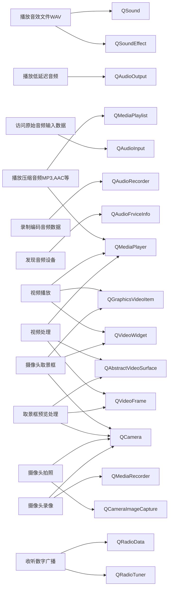
```mermaid
graph LR
播放压缩音频MP3,AAC等-->QMediaPlayer
播放压缩音频MP3,AAC等-->QMediaPlaylist
播放音效文件WAV-->QSoundEffect
播放音效文件WAV-->QSound
播放低延迟音频-->QAudioOutput
访问原始音频输入数据-->QAudioInput
录制编码音频数据-->QAudioRecorder
发现音频设备-->QAudioFrviceInfo
视频播放-->QMediaPlayer
视频播放-->QVideoWidget
视频播放-->QGraphicsVideoItem
视频处理-->QMediaPlayer
视频处理-->QVideoFrame
视频处理-->QAbstractVideoSurface
摄像头取景框-->QCamera
摄像头取景框-->QVideoWidget
摄像头取景框-->QGraphicsVideoItem
取景框预览处理-->QCamera
取景框预览处理-->QAbstractVideoSurface
取景框预览处理-->QVideoFrame
摄像头拍照-->QCamera
摄像头拍照-->QCameraImageCapture
摄像头录像-->QCamera
摄像头录像-->QMediaRecorder
收听数字广播-->QRadioTuner
收听数字广播-->QRadioData
```

### 14.1 音频播放

#### 14.1.1 QMediaPlayer

这个类可以进行视频播放和视频处理，还可以播放MP3、AAC等压缩音频。这个例子可见[34-TestQMediaPlayer](34-TestQMediaPlayer)。

播放可以单个文件，也可以和QMediaPlaylist结合，对一个播放列表进行播放。

QMediaPlayer 类允许播放媒体源。
QMediaPlayer 类是高级媒体播放类。它可用于播放歌曲、电影和网络广播等内容。要播放的内容被指定为 QMediaContent 对象，可以将其视为带有附加信息的主要或规范 URL。当提供 QMediaContent 时，播放可能能够开始。

```c++
player = new QMediaPlayer;
connect(player, SIGNAL(positionChanged(qint64)), this, SLOT(positionChanged(qint64)));
player->setMedia(QUrl::fromLocalFile("/Users/me/Music/coolsong.mp3"));
player->setVolume(50);
player->play();
```

QVideoWidget 可以与 QMediaPlayer 一起用于视频渲染和 QMediaPlaylist 用于访问播放列表功能。

```c++
playlist = new QMediaPlaylist;
playlist->addMedia(QUrl("http://example.com/movie1.mp4"));
playlist->addMedia(QUrl("http://example.com/movie2.mp4"));
playlist->addMedia(QUrl("http://example.com/movie3.mp4"));
playlist->setCurrentIndex(1);

player = new QMediaPlayer;
player->setPlaylist(playlist);

videoWidget = new QVideoWidget;
player->setVideoOutput(videoWidget);
videoWidget->show();

player->play();
```

由于 QMediaPlayer 是一个 QMediaObject，你可以使用几个 QMediaObject 函数来做以下事情： 访问当前正在播放的媒体的元数据（QMediaObject::metaData() 和预定义的元数据键）；检查媒体播放服务当前是否可用（ QMediaObject::availability())。

枚举类型。

定义媒体播放器的当前状态。

```c++
enum QMediaPlayer::State{
    QMediaPlayer::StoppedState,
    QMediaPlayer::PlayingState,
    QMediaPlayer::PausedState
}
```

定义媒体播放器错误条件。

```c++
enum QMediaPlayer::Error{
    QMediaPlayer::NoError,
    QMediaPlayer::ResourceError,
    QMediaPlayer::FormatError,
    QMediaPlayer::NetworkError,
    QMediaPlayer::AccessDeniedError,
    QMediaPlayer::ServiceMissingError
}
```

定义媒体播放器的标记。

```c++
enum QMediaPlayer::Flag{
    QMediaPlayer::LowLatency,//该播放器应与简单的音频格式一起使用，但播放开始时应该没有明显的延迟。这种播放服务可用于哔哔声、铃声等
    QMediaPlayer::StreamPlayback,//该播放器应播放基于 QIODevice 的流。如果传递给 QMediaPlayer 构造函数，将选择支持流播放的服务
    QMediaPlayer::VideoSurface//播放器应该能够渲染到 QAbstractVideoSurface 输出
}
```

定义媒体播放器当前媒体的状态。

```c++
enum QMediaPlayer::MediaStatus{   
    QMediaPlayer::UnknownMediaStatus,//无法确定媒体的状态
    QMediaPlayer::NoMedia,//不是当前的媒体。播放器处于 StoppedState
    QMediaPlayer::LoadingMedia,//正在加载当前媒体。玩家可以处于任何状态
    QMediaPlayer::LoadedMedia,//当前媒体已加载。播放器处于 StoppedState
    QMediaPlayer::StalledMedia,//由于缓冲不足或其他一些临时中断，当前媒体的播放已停止。播放器处于 PlayingState 或 PausedState
    QMediaPlayer::BufferingMedia,//播放器正在缓冲数据，但缓冲了足够的数据以供播放以在不久的将来继续播放。播放器处于 PlayingState 或 PausedState
    QMediaPlayer::BufferedMedia,//播放器已完全缓冲当前媒体。播放器处于 PlayingState 或 PausedState
    QMediaPlayer::EndOfMedia,//播放已到达当前媒体的结尾。播放器处于 StoppedState
    QMediaPlayer::InvalidMedia//无法播放当前媒体。播放器处于 StoppedState
}
```

成员函数。

```c++
QMediaPlayer(QObject *parent = Q_NULLPTR, Flags flags = Flags());
// 此属性保存在播放开始或恢复之前填充的临时缓冲区的百分比，从 0（空）到 100（满）
int bufferStatus() const;
// 此属性保存当前播放音量
int volume() const;
// 该属性保存当前媒体的播放位置
qint64 position() const;
// 此属性保存当前媒体的持续时间
qint64 duration() const;
// 此属性保存当前媒体的播放速率
qreal playbackRate() const;
// 此属性包含一个描述最后一个错误条件的字符串
Error error() const;
QString errorString() const;
// 此属性保存媒体播放器的播放状态
State state() const;
// 此属性保存当前媒体的音频可用性状态
bool isAudioAvailable() const;
// 此属性保存当前媒体的视频可用性状态
bool isVideoAvailable() const;
// 此属性保存当前媒体的静音状态
bool isMuted() const;
// 该属性保存当前媒体的可搜索状态
bool isSeekable() const;
// 该属性保存当前媒体流的状态
MediaStatus mediaStatus() const;
const QIODevice *mediaStream() const;
// 此属性保存播放器对象正在使用的媒体播放列表
QMediaPlaylist *playlist() const;
// 此属性保存播放器对象正在播放的当前活动媒体内容。如果使用播放列表，此值可能与 QMediaPlayer::media 属性不同。在这种情况下，currentMedia 表示播放器正在处理的当前媒体内容，而 QMediaPlayer::media 属性包含原始播放列表
QMediaContent currentMedia() const;
// 此属性保存播放器对象正在使用的活动媒体源
QMediaContent media() const;
// 此属性持有媒体播放器播放的音频流的角色
void setAudioRole(QAudio::Role audioRole);
QAudio::Role audioRole() const;
// 返回支持的音频角色列表
QList<QAudio::Role> supportedAudioRoles() const;
// 返回当前使用的网络接入点。如果返回默认构造的 QNetworkConfiguration，则此功能不可用或当前提供的配置均未使用
QNetworkConfiguration currentNetworkConfiguration() const;
//设置QVideoWidget类型输出设备
void setVideoOutput(QVideoWidget *output);
// 设置QGraphicsVideoItem类型输出设备
void setVideoOutput(QGraphicsVideoItem *output);
// 一个抽象输出设备
void setVideoOutput(QAbstractVideoSurface *surface);
```

槽函数。

```c++
void pause();
void play();
void setMedia(const QMediaContent &media, QIODevice *stream = Q_NULLPTR);
void setMuted(bool muted);
void setNetworkConfigurations(const QList<QNetworkConfiguration> &configurations);
void setPlaybackRate(qreal rate);
void setPlaylist(QMediaPlaylist *playlist);
void setPosition(qint64 position);
void setVolume(int volume);
void stop();
```

信号函数。

```c++
void audioAvailableChanged(bool available);
void audioRoleChanged(QAudio::Role role);
void bufferStatusChanged(int percentFilled);
void currentMediaChanged(const QMediaContent &media);//当前播放文件切换时发射
void durationChanged(qint64 duration);//文件总播放时长变化,切换文件时发射
void error(QMediaPlayer::Error error);
void mediaChanged(const QMediaContent &media);
void mediaStatusChanged(QMediaPlayer::MediaStatus status);
void mutedChanged(bool muted);//静音状态改变时发射
void networkConfigurationChanged(const QNetworkConfiguration &configuration);
void playbackRateChanged(qreal rate);//播放速率变化时发射
void positionChanged(qint64 position);// 反应播放进度
void seekableChanged(bool seekable);
void stateChanged(QMediaPlayer::State state);//播放开始、暂停和停止都会发射
void videoAvailableChanged(bool videoAvailable);
void volumeChanged(int volume);//音量改变时发射
```

静态成员函数。

```c++
QMultimedia::SupportEstimate 
hasSupport(const QString &mimeType, const QStringList &codecs = QStringList(), Flags flags = Flags());// 返回媒体播放器对 mimeType 和一组编解码器的支持级别
```

#### 14.1.2 QMediaPlaylist

QMediaPlaylist 类提供要播放的媒体内容列表。
QMediaPlaylist 旨在与其他媒体对象一起使用，例如 QMediaPlayer。
QMediaPlaylist 允许访问服务内部播放列表功能（如果可用），否则它提供本地内存播放列表实现。

```c++
playlist = new QMediaPlaylist;
playlist->addMedia(QUrl("http://example.com/movie1.mp4"));
playlist->addMedia(QUrl("http://example.com/movie2.mp4"));
playlist->addMedia(QUrl("http://example.com/movie3.mp4"));
playlist->setCurrentIndex(1);

player = new QMediaPlayer;
player->setPlaylist(playlist);

videoWidget = new QVideoWidget;
player->setVideoOutput(videoWidget);
videoWidget->show();

player->play();
```

枚举类型。

此枚举描述 QMediaPlaylist 错误代码。

```c++
enum QMediaPlaylist::Error{
    QMediaPlaylist::NoError,
    QMediaPlaylist::FormatError,
    QMediaPlaylist::FormatNotSupportedError,
    QMediaPlaylist::NetworkError,
    QMediaPlaylist::AccessDeniedError,
}
```

QMediaPlaylist::PlaybackMode 描述了播放列表中的播放顺序。

```c++
enum QMediaPlaylist::PlaybackMode{
    QMediaPlaylist::CurrentItemOnce,// 播放1次
    QMediaPlaylist::CurrentItemInLoop,//单曲循环
    QMediaPlaylist::Sequential, // 顺序播放
    QMediaPlaylist::Loop,//循环播放
    QMediaPlaylist::Random// 随机播放
}
```

成员函数。

```c++
// 将媒体内容附加到播放列表
bool addMedia(const QMediaContent &content);
bool addMedia(const QList<QMediaContent> &items);

// 从头到尾删除播放列表中的项目
bool removeMedia(int pos);
bool removeMedia(int start, int end);
// 将媒体内容插入播放列表的位置 pos
bool insertMedia(int pos, const QMediaContent &content);
bool insertMedia(int pos, const QList<QMediaContent> &items);
// 将项目从位置移动到位置
bool moveMedia(int from, int to);

// 从播放列表中删除所有项目
bool clear();

// 返回当前媒体内容在播放列表中的位置
int currentIndex() const;
// 返回项目的索引，在调用 previous() 步骤后该索引将是当前的
int previousIndex(int steps = 1) const;
// 返回项目的索引，在调用 next() 步骤后将是当前的
int nextIndex(int steps = 1) const;

// 返回最后一个错误条件
Error error() const;
// 返回描述最后一个错误条件的字符串
QString errorString() const;

// 如果播放列表不包含任何项目，则返回 true，否则返回 false
bool isEmpty() const;
// 如果可以修改播放列表，则返回 true，否则返回 false
bool isReadOnly() const;

// 使用网络请求加载播放列表。如果指定了格式，则使用它，否则从播放列表名称和数据中猜测格式
void load(const QNetworkRequest &request, const char *format = Q_NULLPTR);
// 从位置加载播放列表。如果指定了格式，则使用它，否则从位置名称和数据中猜测格式
void load(const QUrl &location, const char *format = Q_NULLPTR);
// 从 QIODevice 设备加载播放列表。如果指定了格式，则使用它，否则从设备数据中猜测格式
void load(QIODevice *device, const char *format = Q_NULLPTR);

QMediaContent media(int index) const;
QMediaContent currentMedia() const;
int mediaCount() const;

// 此属性定义播放列表中项目的播放顺序
void setPlaybackMode(PlaybackMode mode);
PlaybackMode playbackMode() const;

// 将播放列表保存到位置。如果指定了格式，则使用它，否则从位置名称中猜测格式
bool save(const QUrl &location, const char *format = Q_NULLPTR);
// 使用 format 格式将播放列表保存到 QIODevice 设备
bool save(QIODevice *device, const char *format);
```

槽函数如下。

```c++
// 前进到播放列表中的下一个媒体内容
void next();
// 返回播放列表中的上一个媒体内容
void previous();
// 在 playlistPosition 位置激活播放列表中的媒体内容
void setCurrentIndex(int playlistPosition);
// 随机播放播放列表中的项目
void shuffle();
```

信号函数。

```c++
void currentIndexChanged(int position);
void currentMediaChanged(const QMediaContent &content);
void loadFailed();
void loaded();
void mediaAboutToBeInserted(int start, int end);
void mediaAboutToBeRemoved(int start, int end);
void mediaChanged(int start, int end);
void mediaInserted(int start, int end);
void mediaRemoved(int start, int end);
void playbackModeChanged(QMediaPlaylist::PlaybackMode mode);
```

#### 14.1.3 QSoundEffect

QSoundEffect 类提供了一种播放低延迟音效的方法。
此类允许您以通常较低延迟的方式播放未压缩的音频文件（通常是 WAV 文件），并且适用于响应用户操作的“反馈”类型声音（例如，虚拟键盘声音、弹出对话框的正面或负面反馈，或游戏声音）。如果低延迟不重要，请考虑改用 QMediaPlayer 类，因为它支持更广泛的媒体格式并且资源占用较少。
这个例子展示了如何播放一个循环的、有点安静的声音效果：

```c++
QSoundEffect effect;
effect.setSource(QUrl::fromLocalFile("engine.wav"));
effect.setLoopCount(QSoundEffect::Infinite);
effect.setVolume(0.25f);
effect.play();
```

通常应该重用音效，这样可以提前完成所有解析和准备工作，并且只在必要时触发。这有助于降低延迟音频播放。由于 QSoundEffect 需要稍多的资源来实现更低延迟的播放，因此平台可能会限制同时播放音效的数量。

```c++
MyGame(): m_explosion(this)
{
    m_explosion.setSource(QUrl::fromLocalFile("explosion.wav"));
    m_explosion.setVolume(0.25f);
    // Set up click handling etc.
    connect(clickSource, SIGNAL(clicked()), &m_explosion, SLOT(play()));
}
private:
QSoundEffect m_explosion;
```

枚举类型。

```c++
enum QSoundEffect::Loop{
	QSoundEffect::Infinite//用作 setLoopCount() 的参数以进行无限循环
}
```

```c++
enum QSoundEffect::Status{
    QSoundEffect::Null,//未设置源或源为空
    QSoundEffect::Loading,//SoundEffect 正在尝试加载源
    QSoundEffect::Ready,//源已加载并准备好播放
    QSoundEffect::Error//运行过程中出现错误，例如加载源失败
}
```

成员函数。

```c++
bool isLoaded() const;//返回音效是否已完成加载 source()
bool isPlaying() const;//如果当前正在播放音效，则返回 true，否则返回 false
int loopsRemaining() const;//此属性包含在音效自行停止之前剩余的循环数，或者 QSoundEffect::Infinite 如果这是在循环中设置的
Status status() const;//返回此音效的当前状态

void setCategory(const QString &category);//设置音效的类别,分组功能
QString category() const;

void setLoopCount(int loopCount);//播放次数
int loopCount() const;

void setMuted(bool muted);//静音
bool isMuted() const;

void setSource(const QUrl &url);//播放文件
QUrl source() const;

void setVolume(qreal volume);//音量
qreal volume() const;
```

信号与槽与静态函数。

```c++
// 槽函数
void play();
void stop();
//信号函数
void categoryChanged();
void loadedChanged();
void loopCountChanged();
void loopsRemainingChanged();
void mutedChanged();
void playingChanged();
void sourceChanged();
void statusChanged();
void volumeChanged();
// 静态函数
static QStringList supportedMimeTypes();//返回此平台支持的 mime 类型列表
```

#### 14.1.4 QSound

QSound 类提供了一种播放 .wav 声音文件的方法。
Qt 提供了 GUI 应用程序中最常用的音频操作：异步播放声音文件。使用静态 play() 函数最容易做到这一点：

```c++
 QSound::play("mysounds/bells.wav");
```

或者，首先从声音文件创建一个 QSound 对象，然后调用 play() 槽：

```c++
QSound bells("mysounds/bells.wav");
bells.play();
```

一旦创建了 QSound 对象，就可以查询它的 fileName() 和 loops() 总数（即声音播放的次数）。可以使用 setLoops() 函数更改重复次数。播放声音时，loopsRemaining() 函数返回剩余的重复次数。使用 isFinished() 函数来确定声音是否播放完毕。
使用 QSound 对象播放的声音可能会比静态 play() 函数使用更多的内存，但它也可能播放得更快（取决于底层平台的音频设施）。如果您需要更好地控制播放声音，请考虑 QSoundEffect 或 QAudioOutput 类。

枚举类型。

```c++
enum Loop { Infinite }//可用作 setLoops() 的参数以无限循环
```

成员函数。

```c++
// 从给定文件名和给定父级指定的文件构造一个 QSound 对象
QSound(const QString &filename, QObject *parent = Q_NULLPTR);
QString fileName() const;// 返回与此 QSound 对象关联的文件名
bool isFinished() const;// 如果声音已播放完毕，则返回 true；否则返回false
int loops() const;// 返回声音播放的次数。 QSound::Infinite 的返回值表示无限循环
void setLoops（int number);
int loopsRemaining() const;// 返回声音循环的剩余次数（对于所有正值，每次播放声音时该值都会减小）。 QSound::Infinite 的返回值表示无限循环

// 槽函数
void play();
void stop();

// 静态函数
static void play(const QString& filename);
```

### 14.2 音频输入

例子可见[35-TestQAudioRecorder](35-TestQAudioRecorder)。

#### 14.2.1 QMediaRecorder

QMediaRecorder 类用于记录媒体内容。
QMediaRecorder 类是高级媒体记录类。它不能单独使用，而是用于访问其他媒体对象的媒体录制功能，如 QRadioTuner 或 QCamera。

```c++
recorder = new QMediaRecorder(camera);
QAudioEncoderSettings audioSettings;
audioSettings.setCodec("audio/amr");
audioSettings.setQuality(QMultimedia::HighQuality);
recorder->setAudioSettings(audioSettings);
recorder->setOutputLocation(QUrl::fromLocalFile(fileName));
recorder->record();
```

枚举类型。

```c++
enum QMediaRecorder::Error{
    QMediaRecorder::NoError,
    QMediaRecorder::ResourceError,
    QMediaRecorder::FormatError,
    QMediaRecorder::OutOfSpaceError,
}
```

```c++
enum QMediaRecorder::State{
    QMediaRecorder::StoppedState,
    QMediaRecorder::RecordingState,
    QMediaRecorder::PausedState
}
```

```c++
enum QMediaRecorder::Status{
    QMediaRecorder::UnavailableStatus,
    QMediaRecorder::UnloadedStatus,
    QMediaRecorder::LoadingStatus,
    QMediaRecorder::LoadedStatus,
    QMediaRecorder::StartingStatus,
    QMediaRecorder::RecordingStatus,
    QMediaRecorder::PausedStatus,
    QMediaRecorder::FinalizingStatus
}
```

成员函数。

```c++
QString audioCodecDescription(const QString &codec) const;//返回音频编解码器的描述
QString videoCodecDescription(const QString &codec) const;// 返回视频可以编码的分辨率列表
QString containerDescription(const QString &format) const;//返回容器格式的描述

State state() const;
Status status() const;
qint64 duration() const;
Error error() const;
QString errorString() const;
qreal volume() const;
bool isAvailable() const;//如果媒体记录器服务准备好使用，则返回 true
bool isMetaDataAvailable() const;//此属性保存对媒体对象的元数据的访问是否可用
bool isMetaDataWritable() const;//该属性保存媒体对象的元数据是否可写
bool isMuted() const;

// 返回此功能的可用性
QMultimedia::AvailabilityStatus availability() const;
// 返回有可用元数据的键列表
QStringList availableMetaData() const;

// 返回正在使用的音频编码器设置
void setAudioSettings(const QAudioEncoderSettings &settings);
QAudioEncoderSettings audioSettings() const;

// 返回选定的容器格式
void setContainerFormat(const QString &container);
QString containerFormat() const;

// 设置音频编码器设置
void setEncodingSettings(const QAudioEncoderSettings &audio, const QVideoEncoderSettings &video = QVideoEncoderSettings(), const QString &container = QString());

// 返回与元数据键关联的值
void setMetaData(const QString &key, const QVariant &value);
QVariant metaData(const QString &key) const;

// 此属性保存最后一个媒体内容的实际位置
QUrl actualLocation() const;
// 此属性保存媒体内容的目标位置
bool setOutputLocation(const QUrl &location);
QUrl outputLocation() const;

// 设置视频编码器设置
void setVideoSettings(const QVideoEncoderSettings &settings);
QVideoEncoderSettings videoSettings() const;

// 获取支持的编码格式、采样率、容器格式、帧率、分辨率、解码器列表
QStringList supportedAudioCodecs() const;
QList<int> supportedAudioSampleRates(const QAudioEncoderSettings &settings = QAudioEncoderSettings(), bool *continuous = Q_NULLPTR) const;
QStringList supportedContainers() const;
QList<qreal> supportedFrameRates(const QVideoEncoderSettings &settings = QVideoEncoderSettings(), bool *continuous = Q_NULLPTR) const;
QList<QSize> supportedResolutions(const QVideoEncoderSettings &settings = QVideoEncoderSettings(), bool *continuous = Q_NULLPTR) const;
QStringList supportedVideoCodecs() const
```

信号与槽函数。

```c++
// 槽函数
void pause();
void record();
void setMuted(bool muted);
void setVolume(qreal volume);
void stop();

// 信号函数
void actualLocationChanged(const QUrl &location);
void availabilityChanged(bool available);
void availabilityChanged(QMultimedia::AvailabilityStatus availability);
void durationChanged(qint64 duration);//常用
void error(QMediaRecorder::Error error);
void metaDataAvailableChanged(bool available);
void metaDataChanged();
void metaDataChanged(const QString &key, const QVariant &value);
void metaDataWritableChanged(bool writable);
void mutedChanged(bool muted);//常用
void stateChanged(QMediaRecorder::State state);//常用
void statusChanged(QMediaRecorder::Status status);//常用
void volumeChanged(qreal volume);//常用
```

#### 14.2.2 QAudioRecorder

高层次实现，输入的音频数据直接保存文件。

需要使用QAudioEncoderSettings来进行输入音频设置，**主要是编码格式、采样率、通道数、音频质量等高级设置**。设置好输出保存的文件就可以一开始录制文件，音频输入设备自动确定底层的采样参数，使用QQAudioProbe可以访问原始的音频数据和输入缓冲区的参数，这些参数包括缓冲字节数、帧数、采样数、采样字长和采样率等，这样就可以从缓冲区读取原始的音频数据。

```c++
audioRecorder = new QAudioRecorder;
QAudioEncoderSettings audioSettings;
audioSettings.setCodec("audio/amr");
audioSettings.setQuality(QMultimedia::HighQuality);

audioRecorder->setEncodingSettings(audioSettings);
audioRecorder->setOutputLocation(QUrl::fromLocalFile("test.amr"));
audioRecorder->record();
//-----------------------------------------------
QStringList inputs = audioRecorder->audioInputs();
QString selectedInput = audioRecorder->defaultAudioInput();
foreach (QString input, inputs) {
    QString description = audioRecorder->audioInputDescription(input);
    selectedInput = input;// 向用户显示描述并允许选择
}
audioRecorder->setAudioInput(selectedInput);
```

成员函数。

```c++
QAudioRecorder(QObject *parent = Q_NULLPTR);

void setAudioInput(const QString &name);
QString audioInput() const;//返回活动音频输入名称
QString audioInputDescription(const QString &name) const;//返回带有名称的音频输入设备的可读翻译描述
QStringList audioInputs() const;//返回可用音频输入的列表
QString defaultAudioInput() const;//返回默认的音频输入名设备称
```

信号函数。

```c++
void audioInputChanged(const QString &name);//当活动音频输入更改为名称时发出的信号
void availableAudioInputsChanged();//当可用的音频输入改变时发出信号
```

#### 14.2.3 QAudioProbe

QAudioProbe 类允许您监视正在播放或录制的音频。

```c++
QAudioRecorder *recorder = new QAudioRecorder();
QAudioProbe *probe = new QAudioProbe;
// ... configure the audio recorder (skipped)
connect(probe, SIGNAL(audioBufferProbed(QAudioBuffer)), this, SLOT(processBuffer(QAudioBuffer)));
probe->setSource(recorder); 
recorder->record(); //现在我们可以做一些事情，比如计算水平或执行FFT
```

成员函数。

```c++
QAudioProbe(QObject *parent = Q_NULLPTR);
bool isActive() const;//如果此探测器正在监视某些内容，则返回 true，否则返回 false
bool setSource(QMediaObject *source);
bool setSource(QMediaRecorder *mediaRecorder);
```

信号函数。

```c++
void audioBufferProbed(const QAudioBuffer &buffer);//当在媒体服务中处理音频缓冲区时，应发出此信号
void flush();//当需要释放所有缓冲区时，应发出此信号。应用程序必须释放对音频缓冲区的所有未完成的引用
```

#### 14.2.4 QAudioInput

低层次的实现，直接控制音频输入设备的参数，并将音频录制数据写入一个流设备。

QAudioInput 类提供用于从音频输入设备接收音频数据的接口。**您可以使用系统默认的音频输入设备构建音频输入。也可以使用特定的 QAudioDeviceInfo 创建 QAudioInput**。当您创建音频输入时，您还应该发送 QAudioFormat 以用于录制。启动 QAudioInput 只需调用 start() 并打开 QIODevice 进行写入。

例如，要录制到文件中，您可以：

```c++
QFile destinationFile;   // Class member
QAudioInput* audio; // Class member
{
    // 设置保存文件并打开
    destinationFile.setFileName("/tmp/test.raw");
    destinationFile.open( QIODevice::WriteOnly | QIODevice::Truncate );

    // 设置格式
    QAudioFormat format;
    format.setSampleRate(8000);
    format.setChannelCount(1);
    format.setSampleSize(8);
    format.setCodec("audio/pcm");
    format.setByteOrder(QAudioFormat::LittleEndian);
    format.setSampleType(QAudioFormat::UnSignedInt);

    // 获取录制设备信息是否支持此格式
    QAudioDeviceInfo info = QAudioDeviceInfo::defaultInputDevice();
    if (!info.isFormatSupported(format)) {
        qWarning() << "Default format not supported, trying to use the nearest.";
        format = info.nearestFormat(format);
    }
	
    // 以该格式创建录制对象
    audio = new QAudioInput(format, this);
    connect(audio, SIGNAL(stateChanged(QAudio::State)), this, SLOT(handleStateChanged(QAudio::State))); // 录制状态可以传递出去
    QTimer::singleShot(3000, this, SLOT(stopRecording())); // 单步运行.3000ms后停止录制
    audio->start(&destinationFile); // 开始录制
}
```

如果输入设备支持指定的格式，这将开始录制（您可以使用 QAudioDeviceInfo::isFormatSupported() 进行检查。如果有任何障碍，请使用 error() 函数检查出了什么问题。我们停止录制stopRecording() 插槽。

```c++
void AudioInputExample::stopRecording()
{
    audio->stop();
    destinationFile.close();
    delete audio;
}
void AudioInputExample::handleStateChanged(QAudio::State newState)
{
    switch (newState) {
        case QAudio::StoppedState:
            if (audio->error() != QAudio::NoError) { //因为有错误处于停止状态
          		// 处理错误
            } else {
                // 没错误结束录制
            }
            break;
        case QAudio::ActiveState: // 处于激活状态
            // 开始录制
            break;
        default:
            // 其它状态
            break;
    }
}
```

在任何时间点，QAudioInput 都将处于以下四种状态之一：**活动、暂停、停止或空闲**。这些状态由 QAudio::State 枚举指定。您可以**通过suspend()、resume()、stop()、reset() 和start() 直接请求状态更改**。当前状态由 state() 报告。 QAudioOutput 也会在状态改变时向您发出信号（stateChanged()）。
QAudioInput 提供了几种方法来测量从开始（）开始录制的时间。 **processesUSecs() 函数返回写入流的长度（以微秒为单位）**，即，它**忽略了音频输入暂停或空闲的时间**。 **elapsedUSecs() 函数返回自调用 start() 以来经过的时间，无论 QAudioInput 处于哪种状态**。

成员函数。

```c++
// 构造一个新的音频输入并将其附加到父级。默认音频输入设备与输出格式参数一起使用
QAudioInput(const QAudioFormat &format = QAudioFormat(), QObject *parent = Q_NULLPTR);
QAudioInput(const QAudioDeviceInfo &audioDevice, const QAudioFormat &format = QAudioFormat(), QObject *parent = Q_NULLPTR);

// 返回可读取的音频数据量（以字节为单位）
int bytesReady() const;
// 返回自调用 start() 以来的微秒数，包括空闲和挂起状态的时间
qint64 elapsedUSecs() const;
QAudio::Error error() const;
QAudioFormat format() const;
// 返回周期大小（以字节为单位）
int periodSize() const;
// 返回自调用 start() 以来处理的音频数据量（以微秒为单位）
qint64 processedUSecs() const;

void reset();//删除缓冲区中的所有音频数据，将缓冲区重置为零
void resume();//在suspend() 之后恢复处理音频数据
void stop();
void suspend();//停止处理音频数据，保留缓冲的音频数据
QAudio::State state() const;//返回音频处理的状态

// 返回音频缓冲区大小（以字节为单位）
void setBufferSize(int value);
int bufferSize() const;

// 设置要发出的 notify() 信号的间隔。这是基于处理的音频数据的毫秒数，而不是实际实时。计时器的最小分辨率是特定于平台的，应使用 notifyInterval() 检查值以确认正在使用的实际值
void setNotifyInterval(int ms);
int notifyInterval() const;

// 将输入音量设置为音量
void setVolume(qreal volume);
qreal volume() const;

// 开始将音频数据从系统的音频输入传输到设备。设备必须以 WriteOnly、Append 或 ReadWrite 模式打开
void start(QIODevice *device);
// 返回指向用于从系统音频输入传输数据的内部 QIODevice 的指针。设备已经打开并且 read() 可以直接从中读取数据
QIODevice *start();
```

信号函数。

```c++
void notify();//在 setNotifyInterval(x) 设置的时间间隔处理 x ms 的音频数据时发出此信号
void stateChanged(QAudio::State state);
```

#### 14.2.5 QAudioDeviceInfo

QAudioDeviceInfo 类提供了一个接口来查询音频设备及其功能。
**QAudioDeviceInfo 可以查询系统上当前可用的音频设备**，例如声卡和 USB 耳机。可用的音频设备取决于安装的平台或音频插件。Qt 使用 QAudioDeviceInfo 来构造与设备通信的类，**例如 QAudioInput 和 QAudioOutput**。
您还可以**查询每个设备支持的格式**。此上下文中的格式是由**特定字节顺序、通道、编解码器、频率、采样率和采样类型组成的集合**。格式由 QAudioFormat 类表示。
可以使用supportedByteOrders()、supportedChannelCounts()、supportedCodecs()、supportedSampleRates()、supportedSampleSizes() 和supportedSampleTypes() 获取设备支持的每个参数的值。支持的组合取决于平台、安装的音频插件和音频设备功能。如果您需要特定格式，您可以使用 isFormatSupported() 检查设备是否支持它，或者使用nearestFormat() 获取尽可能接近格式的支持格式。例如：

```c++
QAudioFormat format;
format.setSampleRate(44100);
// ... other format parameters
format.setSampleType(QAudioFormat::SignedInt);

QAudioDeviceInfo info(QAudioDeviceInfo::defaultOutputDevice());

if (!info.isFormatSupported(format))
    format = info.nearestFormat(format);
```

静态函数 defaultInputDevice()、defaultOutputDevice() 和 availableDevices() 可让您获得所有可用设备的列表。根据 QAudio::Mode 枚举指定的 mode 值获取设备。返回的 QAudioDeviceInfo 仅对 QAudio::Mode 有效。在此代码示例中，我们遍历所有能够输出声音的设备，即以支持的格式播放音频流。对于我们找到的每个设备，我们只需打印 deviceName()。例如：

```c++
foreach (const QAudioDeviceInfo &deviceInfo, QAudioDeviceInfo::availableDevices(QAudio::AudioOutput))
      qDebug() << "Device name: " << deviceInfo.deviceName();
```

成员函数。

```c++
QString deviceName() const；
// 如果此 QAudioDeviceInfo 描述的音频设备支持提供的设置，则返回 true
bool isFormatSupported(const QAudioFormat &settings) const；
bool isNull() const；
// 返回最接近系统支持的提供设置的 QAudioFormat
QAudioFormat nearestFormat(const QAudioFormat &settings) const；
// 返回此设备的默认音频格式设置
QAudioFormat preferredFormat() const；
// 返回设备支持的字节序、通道数、编码格式、采样率、采样大小和采样类型
QList<QAudioFormat::Endian> supportedByteOrders() const；
QList<int> supportedChannelCounts() const；
QStringList supportedCodecs() const；
QList<int> supportedSampleRates() const；
QList<int> supportedSampleSizes() const；
QList<QAudioFormat::SampleType> supportedSampleTypes() const；
```

静态成员函数。

```c++
// 返回有效的设备,默认的输入和输出设备
QList<QAudioDeviceInfo> availableDevices(QAudio::Mode mode);
QAudioDeviceInfo defaultInputDevice();
QAudioDeviceInfo defaultOutputDevice();
```

#### 14.2.6 QAudioOuput

QAudioOutput 类提供了一个将音频数据发送到音频输出设备的接口。
您可以使用系统的默认音频输出设备构建音频输出。也可以使用特定的 QAudioDeviceInfo 创建 QAudioOutput。创建音频输出时应设置QAudioFormat 以用于播放。播放文件：开始播放音频流只需使用 QIODevice 调用 start()。 QAudioOutput 然后将从 io 设备获取它需要的数据。

```c++
QFile sourceFile;   // class member.
QAudioOutput* audio; // class member.
{
    // 输出文件
    sourceFile.setFileName("/tmp/test.raw");
    sourceFile.open(QIODevice::ReadOnly);

    // 设置好格式
    QAudioFormat format;
    format.setSampleRate(8000);
    format.setChannelCount(1);
    format.setSampleSize(8);
    format.setCodec("audio/pcm");
    format.setByteOrder(QAudioFormat::LittleEndian);
    format.setSampleType(QAudioFormat::UnSignedInt);

    //格式是否支持
    QAudioDeviceInfo info(QAudioDeviceInfo::defaultOutputDevice());
    if (!info.isFormatSupported(format)) {
        qWarning() << "Raw audio format not supported by backend, cannot play audio.";
        return;
    }

    audio = new QAudioOutput(format, this);
    connect(audio, SIGNAL(stateChanged(QAudio::State)), this, SLOT(handleStateChanged(QAudio::State)));
    audio->start(&sourceFile);//开始输出
}

void AudioOutputExample::handleStateChanged(QAudio::State newState)
{
    switch (newState) {
        case QAudio::IdleState:
            // 结束输出
            audio->stop();
            sourceFile.close();
            delete audio;
            break;

        case QAudio::StoppedState:
            // 因为其他原因导致的停止
            if (audio->error() != QAudio::NoError) {
                // 错误处理
            }
            break;

        default:
            break;
    }
}
```

成员函数，含义类似于QAudioOuput的成员函数，不再赘述。

```c++
QAudioOutput(const QAudioFormat &format = QAudioFormat(), QObject *parent = Q_NULLPTR);
QAudioOutput(const QAudioDeviceInfo &audioDevice, const QAudioFormat &format = QAudioFormat(), QObject *parent = Q_NULLPTR);
int bufferSize() const;
int bytesFree() const;
QString category() const;
qint64 elapsedUSecs() const;
QAudio::Error error() const;
QAudioFormat format() const;
int notifyInterval() const;
int periodSize() const;
qint64 processedUSecs() const;
void reset();
void resume();
void setBufferSize(int value);
void setCategory(const QString &category);
void setNotifyInterval(int ms);
void setVolume(qreal volume);
void start(QIODevice *device);
QIODevice *start();
QAudio::State state() const;
void stop();
void suspend();
qreal volume() const;
```

信号函数。

```c++
void notify();
void stateChanged(QAudio::State state);
```

### 14.3 视频播放

视频播放有2个用于播放视频的组件可以使用，即QVideoWidget和QGraphicsVideoItem。

例子可见[37-TestVideoPlayBack](37-TestVideoPlayBack)。

#### 14.3.1 QVideoWidget

QVideoWidget 类提供了一个展示由媒体对象生成的视频的小部件。
将 QVideoWidget 附加到 QMediaObject 允许它显示该媒体对象的视频或图像输出。 QVideoWidget 通过在其构造函数中传递指向 QMediaObject 的指针附加到媒体对象，并通过销毁 QVideoWidget 来分离。

```c++
player = new QMediaPlayer;

playlist = new QMediaPlaylist(player);
playlist->addMedia(QUrl("http://example.com/myclip1.mp4"));
playlist->addMedia(QUrl("http://example.com/myclip2.mp4"));

videoWidget = new QVideoWidget;
player->setVideoOutput(videoWidget);

videoWidget->show();
playlist->setCurrentIndex(1);
player->play();
```

成员函数。

```c++
QVideoWidget(QWidget *parent = Q_NULLPTR);
Qt::AspectRatioMode aspectRatioMode() const;//视频如何根据其纵横比进行缩放
int brightness() const;//此属性用于调整显示视频的亮度
int contrast() const;//此属性用于调整显示视频的对比度
int hue() const;//此属性用于调整显示视频的色调
bool isFullScreen() const;//是Widget部件也可以全屏显示
int saturation() const;//饱和度
```

槽函数。

```c++
void setAspectRatioMode(Qt::AspectRatioMode mode);
void setBrightness(int brightness);
void setContrast(int contrast);
void setFullScreen(bool fullScreen);
void setHue(int hue);
void setSaturation(int saturation);
```

信号函数。

```c++
void brightnessChanged(int brightness);
void contrastChanged(int contrast);
void fullScreenChanged(bool fullScreen);
void hueChanged(int hue);
void saturationChanged(int saturation);
```

可以重载事件实现自己想要的效果，例如单击可以视频暂停或继续播放，ESC来控制全屏退出等。

```c++
virtual void hideEvent(QHideEvent *event) override;
virtual void moveEvent(QMoveEvent *event) override;
virtual void paintEvent(QPaintEvent *event) override;
virtual void resizeEvent(QResizeEvent *event) override;
virtual void showEvent(QShowEvent *event) override;
```

例子。

```c++
// 按键事件,按下ESC可以退出全屏状态
void myVideoWidget::keyPressEvent(QKeyEvent *event)
{
    if ((event->key() == Qt::Key_Escape)&&(this->isFullScreen()))
    {
        this->setFullScreen(false);
        event->accept();
        QVideoWidget::keyPressEvent(event);
    }
}

// 鼠标单击可以控制暂停和继续播放
void myVideoWidget::mousePressEvent(QMouseEvent *event)
{
    if (event->button()==Qt::LeftButton)
    {
        if (thePlayer->state()==QMediaPlayer::PlayingState) //如果是播放状态,视频暂停
          thePlayer->pause();
        else
          thePlayer->play();
    }
    QVideoWidget::mousePressEvent(event); // 事件传递给父对象
}
```

#### 14.3.2 QGraphicsVideoItem

也是图形项的一种，继承自QGraphicsObject。

QGraphicsVideoItem 类提供了一个显示由 QMediaObject 生成的视频的图形项。
将 QGraphicsVideoItem 附加到 QMediaObject 允许它显示该媒体对象的视频或图像输出。通过将指向 QMediaObject 的指针传递给 setMediaObject() 函数，将 QGraphicsVideoItem 附加到媒体对象。

```c++
player = new QMediaPlayer(this);
QGraphicsVideoItem *item = new QGraphicsVideoItem;
player->setVideoOutput(item);
graphicsView->scene()->addItem(item);
graphicsView->show();
player->setMedia(QUrl("http://example.com/myclip4.ogv"));
player->play();
```

成员函数。

```c++
QGraphicsVideoItem(QGraphicsItem *parent = Q_NULLPTR);
Qt::AspectRatioMode aspectRatioMode() const;//如何缩放视频以适应图形项的大小
QSizeF nativeSize() const;//此属性保存视频的原始大小
QPointF offset() const;//此属性保存视频项的偏移量
void setAspectRatioMode(Qt::AspectRatioMode mode);
void setOffset(const QPointF &offset);
void setSize(const QSizeF &size);
QSizeF size() const;//此属性保存视频项的大小
```

可利用的重载函数。

```c++
virtual QRectF boundingRect() const override;
virtual QMediaObject *mediaObject() const override;
virtual void paint(QPainter *painter, const QStyleOptionGraphicsItem *option, QWidget *widget = Q_NULLPTR) override;
```

唯一的信号函数。

```c++
void nativeSizeChanged(const QSizeF &size);
```

#### 14.3.3 QCameraViewfinder

QCameraViewfinder 类提供了一个相机取景器小部件，也可以作为视频播放使用。

```c++
camera = new QCamera;
viewfinder = new QCameraViewfinder();
viewfinder->show();

camera->setViewfinder(viewfinder);

imageCapture = new QCameraImageCapture(camera);

camera->setCaptureMode(QCamera::CaptureStillImage);
camera->start();
```

### 14.4 摄像头使用

例子可见[37-TestVideoPlayBack](37-TestVideoPlayBack)。

#### 14.4.1 QCameraInfo

QCameraInfo 类提供有关相机设备的一般信息。QCameraInfo 允许您查询系统上当前可用的相机设备。
静态函数 defaultCamera() 和 availableCameras() 为您提供所有可用相机的列表。
此示例打印所有可用相机的名称：

```c++
QList<QCameraInfo> cameras = QCameraInfo::availableCameras();
foreach (const QCameraInfo &cameraInfo, cameras)
    qDebug() << cameraInfo.deviceName();
```

QCameraInfo 可用于构造 QCamera。以下示例实例化了一个相机设备名为“mycamera”的 QCamera：

```c++
QList<QCameraInfo> cameras = QCameraInfo::availableCameras();
foreach (const QCameraInfo &cameraInfo, cameras) {
    if (cameraInfo.deviceName() == "mycamera")
        camera = new QCamera(cameraInfo);
}
```

您还可以使用 QCameraInfo 获取有关相机设备的一般信息，例如描述、系统上的物理位置或相机传感器方向。

```c++
QCamera myCamera;
QCameraInfo cameraInfo(myCamera);
if (cameraInfo.position() == QCamera::FrontFace)
    qDebug() << "摄像头位于硬件系统的正面";
else if (cameraInfo.position() == QCamera::BackFace)
    qDebug() << "摄像头位于硬件系统的背面";
qDebug() << "相机传感器方向是" << cameraInfo.orientation() << " 度";
```

成员函数。

```c++
QCameraInfo(const QByteArray &name = QByteArray());
QString description() const;
QString deviceName() const;
bool isNull() const;
int orientation() const;
QCamera::Position position() const;
```

静态成员函数。

```c++
QList<QCameraInfo> availableCameras(QCamera::Position position = QCamera::UnspecifiedPosition);
QCameraInfo defaultCamera();
```

#### 14.4.2 QCamera

QCamera 类为系统相机设备提供接口。QCamera 可以与 QCameraViewfinder 一起用于取景器显示，QMediaRecorder 用于视频录制和 QCameraImageCapture 用于图像拍摄。
您可以使用 QCameraInfo 列出可用的相机并选择要使用的相机。

```c++
QList<QCameraInfo> cameras = QCameraInfo::availableCameras();
foreach (const QCameraInfo &cameraInfo, cameras) {
    if (cameraInfo.deviceName() == "mycamera")
        camera = new QCamera(cameraInfo);
}
```

##### 嵌套类FrameRateRange

FrameRateRange 将帧速率范围表示为最小和最大速率。如果最小帧速率等于最大帧速率，则帧速率是固定的。如果不是，则实际帧速率在最小值和最大值之间波动。

成员函数。

```c++
FrameRateRange();//构造一个空帧率范围，其中 minimumFrameRate 和 maximumFrameRate 都等于 0.0
FrameRateRange(qreal minimum, qreal maximum);
```

##### 枚举类型

捕获类型。

```c++
enum QCamera::CaptureMode{
    QCamera::CaptureViewfinder//相机仅配置为显示取景器
    QCamera::CaptureStillImage//相机配置为静态帧捕获
    QCamera::CaptureVideo//相机配置为视频捕获
}
```

摄像机的错误。

```c++
enum QCamera::Error{
    QCamera::NoError//没有发生错误
    QCamera::CameraError//发生了错误
    QCamera::InvalidRequestError//系统资源不支持请求的功能
    QCamera::ServiceMissingError//没有可用的相机服务
    QCamera::NotSupportedFeatureError//不支持该功能
}
```

摄像机锁定改变原因。

```c++
enum QCamera::LockChangeReason{
    QCamera::UserRequest//锁定状态因用户请求而改变，通常是为了解锁相机设置
    QCamera::LockAcquired//锁定状态成功更改为 QCamera::Locked
    QCamera::LockFailed//由于自动对焦失败、曝光超出支持范围等，相机未能获得请求的锁定
    QCamera::LockLost//相机无法再维持请求的锁定。锁定状态更改为 QCamera::Unlocked
    QCamera::LockTemporaryLost//锁丢失了，但相机正在努力重新获取它。该值可能用于连续对焦模式，当相机失去焦点时，对焦锁定状态变为Qcamera::Searching with LockTemporaryLost reason
}
```

摄像机锁状态。

```c++
enum QCamera::LockStatus{
    QCamera::Unlocked//应用程序对相机设置值不感兴趣。相机可以保持这个参数不变，这在相机对焦时很常见，或者不断调整曝光和白平衡以保持取景器图像良好
    QCamera::Searching//应用程序已请求使用 QCamera::searchAndLock() 锁定相机焦点、曝光或白平衡。此状态表示相机正在对焦或计算曝光和白平衡
    QCamera::Locked//相机对焦、曝光或白平衡被锁定。相机已准备好捕捉，应用程序可能会检查曝光参数
}
```

摄像机锁定类型。

```c++
enum QCamera::LockType{
    QCamera::NoLock//没锁定
    QCamera::LockExposure//锁定相机曝光
    QCamera::LockWhiteBalance//锁定白平衡
    QCamera::LockFocus//锁定相机焦点
}
```

此枚举指定相机在系统硬件上的物理位置。

```c++
enum QCamera::Position{
    QCamera::UnspecifiedPosition//摄像机位置未指定或未知
    QCamera::BackFace//摄像头位于系统硬件的背面。例如在移动设备上，这意味着它位于屏幕的另一侧
    QCamera::FrontFace//摄像头位于系统硬件的正面。例如在移动设备上，这意味着它与屏幕在同一侧。前置摄像头的取景器框架是水平镜像的，因此用户可以看到自己在照镜子。捕获的图像或视频不会被镜像
}
```

摄像机状态。

```c++
enum QCamera::State{
	QCamera::UnloadedState//初始相机状态，未加载相机，除了支持的捕获模式之外的相机功能是未知的
    QCamera::LoadedState//相机已加载并准备好进行配置
	QCamera::ActiveState//在激活状态下，一旦相机启动，取景器就会显示视频帧，并且相机已准备好捕捉
}
```

根据后端，在 ActiveState 中更改某些相机设置（如捕获模式、编解码器或分辨率）可能会导致在应用设置时将相机状态更改为 LoadedStatus 和 StartingStatus，并在相机准备就绪时更改为 ActiveStatus。

```c++
enum QCamera::Status{
	QCamera::ActiveStatus//摄像头已经启动，可以产生数据了。取景器显示处于活动状态的视频帧
    QCamera::StartingStatus//由于状态转换到 QCamera::ActiveState，相机正在启动。相机服务尚未准备好捕捉
    QCamera::StoppingStatus//由于从 QCamera::ActiveState 到 QCamera::LoadedState 或 QCamera::UnloadedState 的状态转换，相机正在停止
    QCamera::StandbyStatus//相机处于省电待机模式。在 QCamera::LoadedState 状态下不活动一段时间后，相机可能会进入待机模式
    QCamera::LoadedStatus//相机已加载并准备好进行配置。此状态表示相机设备已打开，并且可以查询支持的图像和视频捕获设置，例如分辨率、帧速率和编解码器
    QCamera::LoadingStatus//从 QCamera::UnloadedState 到 QCamera::LoadedState 或 QCamera::ActiveState 的状态转换结果中加载的相机设备
    QCamera::UnloadingStatus//由于从 QCamera::LoadedState 或 QCamera::ActiveState 到 QCamera::UnloadedState 的状态转换，相机设备正在卸载
    QCamera::UnloadedStatus//初始相机状态，未加载相机。包括支持的捕捉设置在内的相机功能可能未知
    QCamera::UnavailableStatus//相机或相机后端不可用
}
```

##### 成员函数

```c++
QCamera(QObject *parent = Q_NULLPTR);
QCamera(const QByteArray &deviceName, QObject *parent = Q_NULLPTR);
QCamera(const QCameraInfo &cameraInfo, QObject *parent = Q_NULLPTR);
QCamera(QCamera::Position position, QObject *parent = Q_NULLPTR);

State state() const;
Status status() const;
CaptureModes captureMode() const;
bool isCaptureModeSupported(CaptureModes mode) const;
Error error() const;
QString errorString() const;
QCameraExposure *exposure() const;
QCameraFocus *focus() const;
QCameraImageProcessing *imageProcessing() const;//返回相机图像处理控制对象
QCamera::LockStatus lockStatus() const;
QCamera::LockStatus lockStatus(QCamera::LockType lockType) const;//返回给定 lockType 的锁定状态
QCamera::LockTypes requestedLocks() const;//返回请求的锁类型
// 设置取景器，也就是相机输出的设备组件或者QCameraViewfinder
void setViewfinder(QVideoWidget *viewfinder);
void setViewfinder(QGraphicsVideoItem *viewfinder);
void setViewfinder(QAbstractVideoSurface *surface);
// 用于设置相机参数
void setViewfinderSettings(const QCameraViewfinderSettings &settings);
QCameraViewfinderSettings viewfinderSettings() const;
// 返回相机支持的：锁类型、取景器帧速率范围列表、取景器像素格式列表、取景器分辨率列表、取景器设置列表
QCamera::LockTypes supportedLocks() const;
QList<FrameRateRange> supportedViewfinderFrameRateRanges(const QCameraViewfinderSettings &settings = QCameraViewfinderSettings()) const;
QList<QVideoFrame::PixelFormat> supportedViewfinderPixelFormats(const QCameraViewfinderSettings &settings = QCameraViewfinderSettings()) const;
QList<QSize> supportedViewfinderResolutions(const QCameraViewfinderSettings &settings = QCameraViewfinderSettings()) const;
QList<QCameraViewfinderSettings> supportedViewfinderSettings(const QCameraViewfinderSettings &settings = QCameraViewfinderSettings()) const;
```

##### 信号与槽函数

信号函数。

```c++
void load();
void searchAndLock();
void searchAndLock(QCamera::LockTypes locks);
void setCaptureMode(QCamera::CaptureModes mode);
void start();
void stop();
void unload();
void unlock();
void unlock(QCamera::LockTypes locks);
```

槽函数。

```c++
void captureModeChanged(QCamera::CaptureModes mode);
void error(QCamera::Error value);
void lockFailed();
void lockStatusChanged(QCamera::LockStatus status, QCamera::LockChangeReason reason);
void lockStatusChanged(QCamera::LockType lock, QCamera::LockStatus status, QCamera::LockChangeReason reason);
void locked();
void stateChanged(QCamera::State state);
void statusChanged(QCamera::Status status);
```

#### 14.4.3 QCameraViewfinderSettings

QCameraViewfinderSettings 类提供了一组取景器设置。
取景器设置对象用于指定 QCamera 使用的取景器设置。通过构造 QCameraViewfinderSettings 对象来选择取景器设置，设置所需的属性，然后使用 QCamera::setViewfinderSettings() 函数将其传递给 QCamera 实例。不同的相机可能具有不同的功能。应用程序应在设置参数之前查询相机功能。例如，应用程序应该在调用 setResolution() 之前调用 QCamera::supportedViewfinderResolutions()。

```c++
QCameraViewfinderSettings viewfinderSettings;
viewfinderSettings.setResolution(640, 480);
viewfinderSettings.setMinimumFrameRate(15.0);
viewfinderSettings.setMaximumFrameRate(30.0);

camera->setViewfinderSettings(viewfinderSettings);
```

成员函数。

```c++
bool isNull() const;
qreal maximumFrameRate() const;
qreal minimumFrameRate() const;
QSize pixelAspectRatio() const;
QVideoFrame::PixelFormat pixelFormat() const;
QSize resolution() const;
void setMaximumFrameRate(qreal rate);
void setMinimumFrameRate(qreal rate);
void setPixelAspectRatio(const QSize &ratio);
void setPixelAspectRatio(int horizontal, int vertical);
void setPixelFormat(QVideoFrame::PixelFormat format);
void setResolution(const QSize &resolution);
void setResolution(int width, int height);
```

#### 14.4.4 QCameraImageCapture

QCameraImageCapture 类用于记录媒体内容。
QCameraImageCapture 类是高级图像记录类。它不打算单独使用，而是用于访问其他媒体对象的媒体记录功能，如 QCamera。

```c++
camera = new QCamera;
viewfinder = new QCameraViewfinder();
viewfinder->show();
camera->setViewfinder(viewfinder);
imageCapture = new QCameraImageCapture(camera);
camera->setCaptureMode(QCamera::CaptureStillImage);
camera->start();
camera->searchAndLock();
imageCapture->capture();
camera->unlock();
```

枚举类型。

```c++
enum QCameraImageCapture::CaptureDestination{
    QCameraImageCapture::CaptureToFile//将图像捕获到文件中
    QCameraImageCapture::CaptureToBuffer//将图像捕获到缓冲区以进行进一步处理
}
```

```c++
enum QCameraImageCapture::DriveMode{
	QCameraImageCapture::SingleImageCapture//驱动模式是拍摄单张照片
}
```

```c++
enum QCameraImageCapture::Error{
    QCameraImageCapture::NoError//没有错误
    QCameraImageCapture::NotReadyError//该服务尚未准备好捕获
    QCameraImageCapture::ResourceError//设备未准备好或不可用
    QCameraImageCapture::OutOfSpaceError//设备上没有剩余空间
    QCameraImageCapture::NotSupportedFeatureError//设备不支持静止图像捕获
    QCameraImageCapture::FormatError//不支持当前格式
}
```

成员函数。

```c++
QCameraImageCapture(QMediaObject *mediaObject, QObject *parent = Q_NULLPTR);
QMultimedia::AvailabilityStatus availability() const;//返回此功能的可用性
Error error() const;
QString errorString() const;

bool isAvailable() const;//如果图像捕获服务准备好使用，则返回 true
// 如果支持图像捕获目标，则返回 true；否则返回假
bool isCaptureDestinationSupported(CaptureDestinations destination) const;
// 此属性保存服务是否准备好立即捕获图像
bool isReadyForCapture() const;

//返回正在使用的缓冲区图像捕获格式
void setBufferFormat(const QVideoFrame::PixelFormat format);
QVideoFrame::PixelFormat bufferFormat() const;

//返回正在使用的图像捕获目标
void setCaptureDestination(CaptureDestinations destination);
CaptureDestinations captureDestination() const;

//返回正在使用的图像编码器设置
void setEncodingSettings(const QImageEncoderSettings &settings);
QImageEncoderSettings encodingSettings() const;

// 支持的缓冲区格式、图像编码格式和图像可以编码的分辨率列表
QList<QVideoFrame::PixelFormat> supportedBufferFormats() const;
QStringList supportedImageCodecs() const;//返回图像编解码器的描述
QString imageCodecDescription(const QString &codec) const;
QList<QSize> supportedResolutions(const QImageEncoderSettings &settings = QImageEncoderSettings(), bool *continuous = Q_NULLPTR) const;
```

#### 14.4.6 QVideoFrame

QVideoFrame 类代表一帧视频数据。QVideoFrame 封装了视频帧的像素数据，以及有关该帧的信息。
视频帧可以来自多个地方 - 解码媒体、相机或以编程方式生成。在这些帧中描述像素的方式可能会有很大差异，并且某些像素格式以牺牲易用性为代价提供了更大的压缩机会。
可以使用 map() 函数将视频帧的像素内容映射到内存。映射时，可以使用 bits() 函数访问视频数据，该函数返回指向缓冲区的指针。此缓冲区的总大小由 mappedBytes() 函数给出，每行的大小由 bytesPerLine() 给出。 handle() 函数的返回值也可用于使用内部缓冲区的本机 API（例如 OpenGL 纹理句柄）访问帧数据。
一个视频帧也可以有与之相关的时间戳信息。 QAbstractVideoSurface 的实现可以使用这些时间戳来确定何时开始和停止显示帧，但并非所有表面都可能遵守此设置。
QVideoFrame 中的视频像素数据封装在 QAbstractVideoBuffer 中。通过继承 QAbstractVideoBuffer 类，可以从任何缓冲区类型构造 QVideoFrame。

枚举类型。

指定隔行扫描视频帧所属的场。

```c++
enum QVideoFrame::FieldType{  
    QVideoFrame::ProgressiveFrame//帧不是隔行扫描的
    QVideoFrame::TopField//该帧包含一个顶部字段
    QVideoFrame::BottomField//该帧包含一个底部字段
    QVideoFrame::InterlacedFrame//该帧包含合并的顶部和底部字段
}
```

枚举视频数据类型。

```c++
enum QVideoFrame::PixelFormat{
    QVideoFrame::Format_Invalid
    QVideoFrame::Format_ARGB32
    QVideoFrame::Format_ARGB32_Premultiplied
    QVideoFrame::Format_RGB32
    QVideoFrame::Format_RGB24
    QVideoFrame::Format_RGB565
    QVideoFrame::Format_RGB555
    QVideoFrame::Format_ARGB8565_Premultiplied
    QVideoFrame::Format_BGRA32
    QVideoFrame::Format_BGRA32_Premultiplied
    QVideoFrame::Format_BGR32
    QVideoFrame::Format_BGR24
    QVideoFrame::Format_BGR565
    QVideoFrame::Format_BGR555
    QVideoFrame::Format_BGRA5658_Premultiplied
    QVideoFrame::Format_AYUV444
    QVideoFrame::Format_AYUV444_Premultiplied
    QVideoFrame::Format_YUV444
    QVideoFrame::Format_YUV420P
    QVideoFrame::Format_YV12
    QVideoFrame::Format_UYVY
    QVideoFrame::Format_YUYV
    QVideoFrame::Format_NV12
    QVideoFrame::Format_NV21
    QVideoFrame::Format_IMC1
    QVideoFrame::Format_IMC2
    QVideoFrame::Format_IMC3
    QVideoFrame::Format_IMC4
    QVideoFrame::Format_Y8
    QVideoFrame::Format_Y16
    QVideoFrame::Format_Jpeg
    QVideoFrame::Format_CameraRaw
    QVideoFrame::Format_AdobeDng
    QVideoFrame::Format_User
}
```

成员函数。

```c++
QVideoFrame();
QVideoFrame(QAbstractVideoBuffer *buffer, const QSize &size, PixelFormat format);
QVideoFrame(int bytes, const QSize &size, int bytesPerLine, PixelFormat format);
QVideoFrame(const QImage &image);
QVideoFrame(const QVideoFrame &other);
QVariantMap availableMetaData() const
uchar *bits();
uchar *bits(int plane);
const uchar *bits() const;
const uchar *bits(int plane) const;
int bytesPerLine() const;
int bytesPerLine(int plane) const;
qint64 endTime() const;
FieldType fieldType() const;
QVariant handle() const;
QAbstractVideoBuffer::HandleType handleType() const;
int height() const;
bool isMapped() const;
bool isReadable() const;
bool isValid() const;
bool isWritable() const;
bool map(QAbstractVideoBuffer::MapMode mode);
QAbstractVideoBuffer::MapMode mapMode() const;
int mappedBytes() const;
QVariant metaData(const QString &key) const;
PixelFormat pixelFormat() const;
int planeCount() const;
void setEndTime(qint64 time);
void setFieldType(FieldType field);
void setMetaData(const QString &key, const QVariant &value);
void setStartTime(qint64 time);
QSize size() const;
qint64 startTime() const;
void unmap();
int width() const;
```

静态成员函数。

```c++
QImage::Format imageFormatFromPixelFormat(PixelFormat format);
PixelFormat pixelFormatFromImageFormat(QImage::Format format);
```

### 14.5 本章其它数据类型

#### 14.5.1 QMediaObject 

QMediaObject 类为多媒体对象提供了一个公共基础。
它提供了其他高级类（如 QMediaPlayer、QAudioDecoder 和 QCamera）共有的一些基本功能，包括可用性和元数据功能，以及将媒体对象与 QMediaPlaylist 等支持类连接的功能。
更高级别的 QMediaObject 派生类通过在内部使用 QMediaService 来提供实际的多媒体功能。每个媒体对象承载一个 QMediaService 并使用该服务实现的 QMediaControl 接口来实现其 API。如有必要，可以从媒体对象访问这些控件，但通常可以从更高级别的类访问有用的功能。
大多数媒体对象在构造时会请求一个新的 QMediaService 实例，但有些像 QMediaRecorder 和 QAudioRecorder 会与另一个对象共享一个服务。

成员函数。

```c++
//返回此对象提供的功能的可用性
virtual QMultimedia::AvailabilityStatus availability() const;
//如果服务可用，则返回 true
virtual bool isAvailable() const;
//如果存在与此媒体对象关联的元数据，则返回 true，否则返回 false
bool isMetaDataAvailable() const;
//返回有可用元数据的键列表
QStringList availableMetaData() const;
//返回与元数据键关联的值
QVariant metaData(const QString &key) const;
//返回提供此多媒体对象功能的媒体服务
virtual QMediaService *service() const;
//通知属性更新的时间间隔,间隔以毫秒表示，默认值为1000
void setNotifyInterval(int milliSeconds);
int notifyInterval() const;
//将对象绑定到此 QMediaObject 实例,此方法在此媒体对象和辅助对象之间建立关系。关系的性质取决于双方。如果帮助程序成功绑定，此方法返回 true，否则返回 false
virtual bool bind(QObject *object);
virtual void unbind(QObject *object);
```

信号函数。

```c++
void availabilityChanged(bool available)
void availabilityChanged(QMultimedia::AvailabilityStatus availability)
void metaDataAvailableChanged(bool available)
void metaDataChanged()
void metaDataChanged(const QString &key, const QVariant &value)
void notifyIntervalChanged(int milliseconds);
```

#### 14.5.2 QMediaService

QMediaService 类为媒体服务实现提供了一个通用基类。
媒体服务提供媒体对象承诺的功能的实现，并允许多个提供者实现一个 QMediaObject。
为了提供 QMediaObject 媒体服务的功能，实现 QMediaControl 接口。服务通常实现一个提供媒体对象的核心特征的核心媒体控件，以及提供媒体对象的可选特征或辅助媒体对象或外围对象的特征的一些附加控件。
通过将控件的接口名称传递给 requestControl() 函数，可以获得指向媒体服务的 QMediaControl 实现的指针。

```c++
QMediaPlayerControl *control = qobject_cast<QMediaPlayerControl *>(
          mediaService->requestControl("org.qt-project.qt.mediaplayercontrol/5.0"));
```

媒体对象可以使用从插件动态加载或在应用程序中静态实现的服务。基于插件的服务也应该实现 QMediaServiceProviderPlugin 接口。静态服务应该实现 QMediaServiceProvider 接口。一般来说，实现 QMediaService 超出了本文档的范围，应寻求相关邮件列表或 IRC 频道的支持。

成员函数。

```c++
virtual void releaseControl(QMediaControl *control) = 0;//将控件释放回服务
virtual QMediaControl *requestControl(const char *interface) = 0;//返回指向媒体控制实现接口的指针
T requestControl();//返回指向由媒体服务实现的类型 T 的媒体控件的指针
```

#### 14.5.3 QMediaControl

QMediaControl 类为媒体服务控件提供了一个基本接口。
媒体控件为媒体服务提供的各个功能提供接口。大多数服务实现了一个暴露服务核心功能的主体控件和一些暴露任何附加功能的可选控件。
可以使用 QMediaService 的 QMediaService::requestControl() 成员获得指向由媒体服务实现的控件的指针。如果服务没有实现控件，它将返回一个空指针。

```c++
QMediaPlayerControl *control = qobject_cast<QMediaPlayerControl *>(
    mediaService->requestControl("org.qt-project.qt.mediaplayercontrol/5.0"));
```

或者，如果控件的 IId 已使用 Q_MEDIA_DECLARE_CONTROL 声明，则可以使用 QMediaService::requestControl() 的模板版本来请求服务，而无需显式传递 IId 或使用 qobject_cast()。

```c++
QMediaPlayerControl *control = mediaService->requestControl<QMediaPlayerControl *>();
```

大多数应用程序代码不会直接与媒体服务的控件交互，而是拥有该服务的 QMediaObject 充当一个或多个控件与应用程序之间的中介。

宏定义。

```c++
Q_MEDIA_DECLARE_CONTROL(Class, IId)
    
QMediaPlayerControl *control = mediaService->requestControl<QMediaPlayerControl *>();
```

Q_MEDIA_DECLARE_CONTROL 宏为继承自 QMediaControl 的类声明 IId。
为 QMediaControl 声明 IId 允许从 QMediaService::requestControl() 请求该控件的实例，而无需显式传递 IId。

#### 14.5.4 QMultimedia

QMultimedia 命名空间包含在整个 Qt Multimedia 库中使用的各种标识符。

枚举服务状态错误。

```c++
enum QMultimedia::AvailabilityStatus{
    QMultimedia::Available,//运行正常
    QMultimedia::ServiceMissing,//没有可用的服务来提供请求的功能
    QMultimedia::ResourceError,//服务无法分配正常运行所需的资源
    QMultimedia::Busy//该服务必须等待对必要资源的访问
}
```

枚举编码模式

```c++
enum QMultimedia::EncodingMode{
    QMultimedia::ConstantQualityEncoding,//编码的目标是具有恒定的质量，调整比特率以适应服务
    QMultimedia::ConstantBitRateEncoding,//编码将使用恒定的比特率，调整质量以适应
    QMultimedia::AverageBitRateEncoding,//编码将尝试保持平均比特率设置，但会根据需要或多或少地使用
    QMultimedia::TwoPassEncoding//媒体将首先被处理以确定特征，然后进行第二次处理，将更多位分配给需要它的区域
}
```

枚举质量编码级别。

```c++
enum QMultimedia::EncodingQuality{ 
    QMultimedia::VeryLowQuality,//
    QMultimedia::LowQuality,//
    QMultimedia::NormalQuality,//
    QMultimedia::HighQuality,//
    QMultimedia::VeryHighQuality//
}
```

枚举媒体服务提供商可能对某个功能具有的支持级别。

```c++
enum QMultimedia::SupportEstimate{
    QMultimedia::NotSupported,//不支持该功能
    QMultimedia::MaybeSupported,//可能支持该功能
    QMultimedia::ProbablySupported,//该功能可能受支持
    QMultimedia::PreferredService//服务是服务的首选提供者
}
```

#### 14.5.5 QAudioEncoderSettings

QAudioEncoderSettings 类提供了一组音频编码器设置。
音频编码器设置对象用于指定 QMediaRecorder 使用的音频编码器设置。通过构造 QAudioEncoderSettings 对象，设置所需的属性，然后使用 QMediaRecorder::setEncodingSettings() 函数将其传递给 QMediaRecorder 实例来选择音频编码器设置。

成员函数。

```c++
bool isNull() const;//是否为空

void setBitRate(int rate);//压缩音频流比特率
int bitRate() const;

void setChannelCount(int channels);//通道数
int channelCount() const;

void setCodec(const QString &codec);//音频编解码器
QString codec() const;

void setEncodingMode(QMultimedia::EncodingMode mode);//编码模式
QMultimedia::EncodingMode encodingMode() const;

// 设置编码选项值
void setEncodingOption(const QString &option, const QVariant &value);
void setEncodingOptions(const QVariantMap &options);
QVariant encodingOption(const QString &option) const;
QVariantMap encodingOptions() const;

void setQuality(QMultimedia::EncodingQuality quality);//音频编码质量
QMultimedia::EncodingQuality quality() const;

void setSampleRate(int rate);//采样率
int sampleRate() const;
```

#### 14.5.6 QAudioBuffer

QAudioBuffer 类表示具有特定格式和采样率的音频样本集合。

成员函数。

```c++
QAudioBuffer();
QAudioBuffer(const QAudioBuffer &other);
// 从提供的数据以给定的格式创建一个新的音频缓冲区。该格式将确定如何从数据中解释样本的数量和大小
QAudioBuffer(const QByteArray &data, const QAudioFormat &format, qint64 startTime = -1);
// 为给定格式的 numFrames 帧创建一个新的音频缓冲区。单个样本将被初始化为格式的默认值
QAudioBuffer(int numFrames, const QAudioFormat &format, qint64 startTime = -1);

int byteCount() const;//返回此缓冲区的大小，以字节为单位

// 获取缓冲区数据
const void *constData() const;
const T *constData() const;
const void *data() const;
void *data();
const T *data() const;
T *data();

qint64 duration() const;//返回此缓冲区中音频的持续时间，以微秒为单位
QAudioFormat format() const;//返回此缓冲区的格式
int frameCount() const;//返回此缓冲区中完整音频帧的数量
bool isValid() const;//如果这是一个有效的缓冲区，则返回 true。有效缓冲区中的帧数超过零且格式有效
int sampleCount() const;//返回此缓冲区中的样本数
qint64 startTime() const;//返回此缓冲区开始的流中的时间（以微秒为单位）
```

#### 14.5.7 QAudioFormat

QAudioFormat 类存储音频流参数信息。
音频格式指定如何排列音频流中的数据，即如何解释流。编码本身由用于流的 codec() 指定。
除了编码之外，QAudioFormat 还包含其他参数，这些参数进一步指定了音频样本数据的排列方式。这些是频率、通道数、样本大小、样本类型和字节顺序。下表更详细地描述了这些。

| Sample Rate        | 以赫兹为单位的每秒音频数据样本数                       |
| ------------------ | ------------------------------------------------------ |
| Number of channels | 音频通道的数量（通常一个用于单声道或两个用于立体声     |
| Sample size        | 每个样本中存储了多少数据（通常为 8 或 16 位）          |
| Sample type        | 样本的数值表示（通常是有符号整数、无符号整数或浮点数） |
| Byte order         | 样本的字节顺序（通常是小端、大端）                     |

此类通常与 QAudioInput 或 QAudioOutput 一起使用，以允许您指定正在读取或写入的音频流的参数，或者在处理内存中的样本时与 QAudioBuffer 一起使用。您可以通过 QAudioDeviceInfo 中的函数获取与使用的音频设备兼容的音频格式。该类还允许您查询设备的可用参数值，以便您可以自己设置参数。有关详细信息，请参阅 QAudioDeviceInfo 类描述。您需要知道要播放或录制的音频流的格式。在交错线性 PCM 数据的常见情况下，编解码器将是“audio/pcm”，所有通道的样本都将被交错。在 Qt Multimedia（和其他地方）中，同一时刻每个通道的一个样本被称为一帧。

枚举类型。

```c++
enum QAudioFormat::Endian{
    QAudioFormat::BigEndian//样本是大端字节序
    QAudioFormat::LittleEndian//样本是小端字节序
}
```

```c++
enum QAudioFormat::SampleType{
    QAudioFormat::Unknown//没有设置
    QAudioFormat::SignedInt//样本是有符号整数
    QAudioFormat::UnSignedInt//样本是无符号整数
    QAudioFormat::Float//样本是浮点数
}
```

成员函数。

```c++
QAudioFormat();
QAudioFormat(const QAudioFormat &other);
QAudioFormat::Endian byteOrder() const;;
qint32 bytesForDuration(qint64 duration) const;
qint32 bytesForFrames(qint32 frameCount) const;
int bytesPerFrame() const;
int channelCount() const;
QString codec() const;
qint64 durationForBytes(qint32 bytes) const;
qint64 durationForFrames(qint32 frameCount) const;
qint32 framesForBytes(qint32 byteCount) const;
qint32 framesForDuration(qint64 duration) const;
bool isValid() const;
int sampleRate() const;
int sampleSize() const;
QAudioFormat::SampleType sampleType() const;
void setByteOrder(QAudioFormat::Endian byteOrder);
void setChannelCount(int channels);
void setCodec(const QString &codec);
void setSampleRate(int samplerate);
void setSampleSize(int sampleSize);
void setSampleType(QAudioFormat::SampleType sampleType);
```

## 15. 应用程序设计辅助功能

### 15.1 多语言界面

开发的时候注意每一个用户可见的字符串都用tr()封装，然后再UI设计器可视化窗体也要统一为一种语言，以便Qt提取界面字符串用于生成翻译资源文件。

之后在项目配置文件中设需要导出的翻译文件(.ts)文件，使用lupdate工具扫描项目文件中需要反应的字符串，并生成翻译文件。

然后使用Qt的Linguist程序打开生成的翻译文件，翻译后使用lrelease工具编译翻译好的文件，生成的是.qm文件。在应用程序中调用不同的qm文件就会实现不同的语言界面。

tr函数是个静态函数，使用了Q_OBJECT宏定义的类都可使用或者使用Q_DECLARE_TR_FUNCTIONS宏把tr函数添加到类中后直接使用。其函数原型为：

```c++
QString QObject::tr(const char *sourceText, const char *disambiguation = Q_NULLPTR, int n = -1)；
```

返回 sourceText 的翻译版本，可选地基于消歧字符串和包含复数的字符串的 n 值；如果没有合适的翻译字符串可用，则返回 QString::fromUtf8(sourceText)。

使用tr函数的一些注意事项：

（1）传递常量字符串而不是变量字符串，否则无法提取出来。

```c++
QString str = tr("age","年龄");// √
QString str1 =tr(str);// × 无法提取
```

（2）若一定要使用字符串变量，则在定义的时候需要使用Qt_TR_NOOP宏进行标记。

```c++
const char*cities[3]={
	Qt_TR_NOOP("Beijing"),
    Qt_TR_NOOP("ShangHai"),
    Qt_TR_NOOP("TianJin")
};
for (int i = 0; i < 4; ++i ) {
    comboBox->addItem(tr(cities[i]));
}
```

（3）不能使用拼接的字符串，应该使用arg占位符。

```c++
this->statusbar->showMessage(tr("第"+QString::number(row()))+"行"); // ×
this->statusbar->showMessage(tr("第 %1 行").arg(row()));// √
```

为了防止某个字符串遗漏，可以在项目文件中使用DEFINES+=Qt_NO_CAST_FROM_ASCII，就可以禁止const char * 到QString的隐式转换，必须使用tr()或者QLatinString封装。

最后还需要使用TRANSLATIONS对翻译文件.ts进行配置，例如一个项目文件夹名称为Project，那么.pr0文件夹就可以这样写，表示中文和英文，文件名称可以任意设计有区分就行。

```c++
TRANSLATIONS = Project_cn.ts \
	Project_en.ts
```

使用**工具-外部-Qt语言家-更新ts文件**就可以生成，没有的话会自动创建。之后ts文件要用linguist工具打开，然后逐个翻译好保存即可，最后同样**工具-外部-Qt语言家-发布ts文件生成qm文件**。**注意qm文件必须创建资源文件引入，然后调用，否则尝试过不能切换多语言**！！！具体的例子见[38-TestTRTranslation](38-TestTRTranslation)。

核心函数示例。

```c++
//中文界面
void TestTRTranslation::on_actLang_CN_triggered()
{
    qApp->removeTranslator(trans);
    delete trans;
    trans=new QTranslator; // 创建新的
    trans->load(":/TestTRTranslation_cn.qm"); // TestTRTranslation
    qApp->installTranslator(trans); // 安装
    ui->retranslateUi(this);
    QSettings settings("WWB-Qt",QCoreApplication::applicationName()); //注册表键组
    settings.setValue("Language","CN"); //界面语言，汉语
}
//英文界面
void TestTRTranslation::on_actLang_EN_triggered()
{
    qApp->removeTranslator(trans);
    delete trans;
    trans=new QTranslator; // 创建新的
    trans->load(":/TestTRTranslation_en.qm"); // TestTRTranslation
    qApp->installTranslator(trans); // 安装
    ui->retranslateUi(this);
    QSettings settings("WWB-Qt",QCoreApplication::applicationName()); //注册表键组
    settings.setValue("Language","EN"); //界面语言，英语
}
```

### 15.2 自定义样式表

可以右击窗体，选择改变样式表，就可以进行编辑，语法上和HTML的CSS完全一样。例如

```css
QWidget{
	background-color: rgb(0,0,0);
	color:rgb(255,255,0);
	font: 12pt "楷体";
}
QLineEdit{
	border: 2px groove gray;
	border-radius: 5px;
	padding : 2px 4px;
	border-color: rgb(12,45,68);
}
```

效果是这样的。

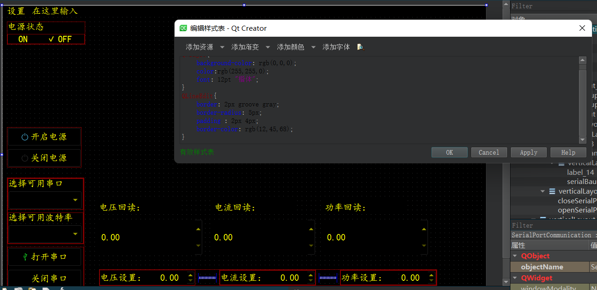

选择器类型有以下几种，所谓选择器就是花括号之前的总起名称，以QPushButton为例。

|     选择器     |           示例            |                      含义                      |
| :------------: | :-----------------------: | :--------------------------------------------: |
|   通用选择器   |             *             |                    所有组件                    |
|   类型选择器   |        QPushButton        |        所有QPushButton类及其子类的组件         |
|   属性选择器   | QPushButton[flat="false"] | 所有flat属性为false的QPushButton类及其子类组件 |
|  非子类选择器  |       .QPushButton        |        所有QPushButton组件但不包括子类         |
|    ID选择器    |     QPushButton#btnOk     |       只用于名称为btnOk的QPushButton实例       |
| 从属对象选择器 |    QDialog QPushButton    |        QDialog对话框里的所有QPushButton        |
|  子对象选择器  |   QDialog > QPushButton   |   所有直接从属于QDialog的QPushButton类的实例   |

（1）选择器可以组合使用，这样一个声明可用于多个选择器，例如这些选择器具有的共同属性设置。

```CSS
QPlainTextEdit,QLineEdit,QPushButton,QCheckBox{
	color: rgb(255,255,0);
    background-color: rgb(0,0,0);
}

QLineEdit[readOnly="ture"],QCheckBox[checked="true"]{ // 只有满足2个条件的实例才设置颜色为红色
    background-color: rgb(255,0,0)
}
```

（2）可以设置动态属性，然后把动态属性满足的进行设置，例如有些字段是必须填的，就可以关联一个属性required，并设定为true，之后，只有为true的才会设置为亮绿色提示需要填。

```CSS
editName->setProperty("required","true");
comboxAge->setProperty("required","true");
checkSex->setProperty("required","true");
*[required="true"]{
    background-color: lime
}
```

（3）有些组件是组合型的，例如QComboBox的下拉按钮，QSpinBox的上、下按钮，通过选择器的子控件就可以对这些界面元素进行显示效果控制。例如：

```css
QComboBox::drop-down{
	image: url(:images/down.bmp); // 给下拉按钮设置资源文件中的down.bmp图片
}
QSpinBox::up-button{
    image: url(:images/up.bmp);
}
QSPinBox::down-button{
    image: url(:images/down.bmp);
}
```

（4）选择器可以有很多伪状态，例如激活状态（active）、关闭状态（closed）、选中状态（checked）、只读状态（read-only）、鼠标悬停状态（hover）等，要接在选择器的后边，用冒号隔开。伪状态可以取反，可以组合使用，也可以对子控件使用伪状态。

```CSS
QLineEdit: hover{
	background-color: black;
    color: yellow; //悬停时背景颜色黑色,控件颜色黄色
}
QLineEdit:!read-only{
    background-color: rgb(235,255,251); // 对非只读实例设置
}
QCheckBox:hover:checked{ 
    color: red; // 对悬停且选中状态的实例设置为红色
}
QCheckBox::indicator:checked{image: url(:images/checked.bmp);}
QCheckBox::indicator:unchecked{ image: url(:images/unchecked.bmp); }
```

（5）组件有各种各样的属性，例如背景（background）可设置颜色yellow、背景颜色（background-color）设置rgb(255,0,0)、边界（border）、间隔（margin）、延展（padding）、最大最小宽度和高度（max-height、min-width）、组件背景图片（border-image）。

这就需要提及组件的盒子模型（可见Qt文档的Customizing Qt Widgets Using Style Sheets 查看）。

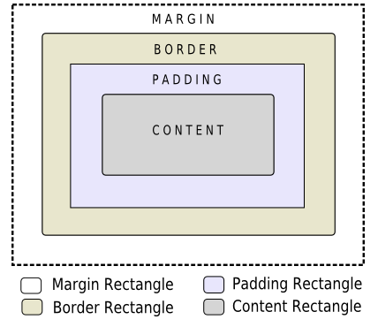

(5.1) CONTENT是显示内容的矩形区域，关联的属性是min-width,max-width,min-height,max-height可以定义。

```CSS
QLineEdit{
	min-width : 50px;
	max-height: 40px;
}
```

(5.2) PADDING是包围CONTENT的矩形区域，关联的属性为padding-top,padding-bottom,padding-left和padding-right定义padding的上下左右宽度。

```CSS
QLineEdit{
	padding-top:0px;
    padding-bottm:10px;
    padding-left:0px;
    padding-right:10px;
}
// 等价于
QLineEdit{padding: 0px 10px 0px 10px}
```

(5.3)Border是边框，关联属性有

border-width：线宽

border-top-width,border-right-width,border-bottom-width,border-left-width

border-color（red,#FF0000,rgba(255, 0, 0, 75%),rgb(255, 0, 0),hsv(60, 255, 255),hsva(240, 255, 255, 75%)）：颜色

border-top-color,border-right-color,border-bottom-color,border-left-color

border-style（dashed,dot-dash,dot-dot-dash,dotted,double,groove,inset ,outset,ridge,solid,none）：线型

border-top-style,border-bottom-style,border-right-style,border-left-style

border-radius：定义边框转角的圆弧半径

border-top-left-radius,border-top-right-radius,border-bottm-right-radius,border-bottom-left-radius

border-image（none,url,repeat）：定义边框的图像

```css
QLineEdit{
	border-width: 1px 2px 3px 4px;
    border-style: solid; 
    border-color: gray red blue green;
    border-radius: 10px;
    padding: 0px 10px
}
QPushButton{// 边长60的正方形圆角半径是30时就成了圆形
    border: 2px groove red;
    border-radius: 30px;
    min-width: 60px;
    min-height: 60px;
    border-image: url(:images/border.jpg)
}
```

(5.4) margin时border之外和父组件之间的空白边距，可以分别定义上下左右的边距大小。关联属性margin,margin-top,margin-bottom,margin-left,margin-right。

缺省时margin、border-width和padding均为0，这样盒子模型就变成了重合的矩形。有关子控件的内容、伪状态的内容、属性的内容可见Qt文档，搜索Qt Style Sheets Reference即可，相关的例子的可见Qt Style Sheets Examples 。

（6）使用样式表的方法。

第一种方法是在窗体设计中设计，但是样式会保存在UI文件中也就是固定的无法重新利用取得换肤的效果，而且需要为每个窗体都设计样式表，重复工作量太大；

第二种方法是使用setStyleSheet函数，这个函数qApp中使用可以为应用程序设置全局样式，或者QWidget::setStyleSheet为一个窗口、对话框或者界面组件进行设置。不过这种方法也不能达到换肤效果。

```c++
qApp->setStyleSheet("QLineEdit{background:gray}");
mainWindow->setStyleSheet("QLineEdit{background:gray}");
lineEdit->setStyleSheet("color:blue;"
                        "background-color:yellow;"
                       "selection-color:yellow;"
                       "selection-background-color:blue;");

```

第三种方法是把样式定义表保存在qss后缀的纯文本文件，然后程序中调用读取文本内容，再调用setStyleSheet函数应用样式。

```c++
QFile file(":/qss/mystyle.qss");//资源文件
file.open(QFile::ReadOnly);
QString stylesheet = QString::fromLatin1(file.readAll());
qApp->setStyleSheet(stylesheet);
```

（7）样式的明确性作为优先级的考量。

(7.1) 指定实例的设置比一类实例的设置更明确。

例如这里特定实例btnSave的灰色颜色设置就会覆盖掉统一的红色颜色设置。

```css
QPushButton#btnSave{color:gray}
QPushButton{color:red}
```

(7.2) 具有伪状态的选择器明确性更强。

例如这里，悬停状态时设置为白色，其他时候是红色被覆盖掉。

```css
QPushButton:hover{color:white}
QPushButton{color:red}
```

(7.3) 相同明确性时，按照先后顺序，后边的覆盖前边的。

例如悬停在一个使能的按钮上时，出现的颜色是红色而不是白色，因为使能和悬停明确性相同，就只能按照顺序。

可以更加具体的指出来避免冲突。

```css
QPushButton:hover{color:white}
QPushButton:enabled{color:red} // 冲突

QPushButton:hover:enable{color:white} // 不冲突,悬停使能的时候是白色
QPushButton:enabled{color:red}//其它使能都是红色
```

父子关系的类也就具有相同的明确性，这种情况尽量避免。

```css
QPushButton{color:white}
QAbstractButton{color:red}
```

(7.4) 样式优先级从组件、父组件、窗口、应用程序依次融合。如果应用程序定义按钮都是红色，窗口定义为蓝色，但是具体的一个按钮是绿色，那么就会按照绿色的情况执行，即选择离自己最近的样式。

### 15.3 设置界面外观

相同的界面组件在不同的操作系统效果是不同的，可以通过QApplication::style()查看。

QStyle定义了一些子类用于不同的操作系统，例如QWindowStyle和QMacStyle等。

QStyleFactory管理着Qt的内置样式，它有2个静态函数，keys()和create()。keys()返回一个字符串列表，是所在平台支持的QStyle的名称列表；create()根据样式名称字符串创建一个QStyle对象。

```c++
qDebug()<<a.style(); // 0x196a85d0
qDebug()<<QStyleFactory::keys(); // ("Windows", "WindowsXP", "WindowsVista", "Fusion")
```

样式可以使用QApplication的setStyle()函数进行设置。缺省样式的名称也可以获得。

```c++
QApplication::style()->metaObject()->className();
```

关于QStyle的使用可见[39-TestQStyle](39-TestQStyle)。

### 15.4 Qt应用程序发布

一般使用共享库的方式发布程序，这样有利于应用程序文件小型化，且更新时不会都需要重新编译发布，如果更新插件就只需要更新插件程序，也可以单独更新共享库。

Qt自带的发布工具是windeployqt.exe，在各编译器版本的bin文件夹下。在终端使用此工具的语法是：

```powershell
windeployqt [options] [files]
```

options是一些选项设置，一般使用缺省即可，files则是需要发布文件的应用程序文件名。

使用此工具之前，先把该bin文件夹路径添加到系统的环境变量中，否则无法全局使用。

然后记得使用Qt自带的终端，和编译项目使用的编译器一致，这里是Mingw32bit终端，不要使用win+r+cmd的方式打开终端，否则发布的程序去掉依赖路径后，程序无法正常启动。你可以新建一个文件夹，例如叫videoPlayerSetUp（这里用的是例子是[37-TestVideoPlayBack/TestVideoPlayBack](37-TestVideoPlayBack/TestVideoPlayBack)）,其编译后（这里用的release版本），把exe文件直接复制到新建的文件夹下，改名为videoPlayer.exe。

然后终端cd到这个文件夹下，就可以使用发布工具了。

```powershell
windeployqt videoPlayer.exe
```

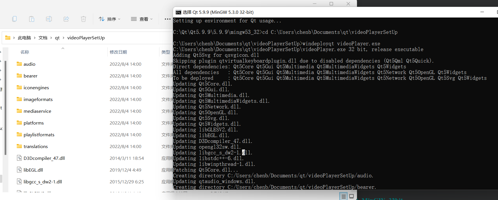

 然后就会生成必须的依赖程序，为了验证没有依赖路径也能运行，需要去掉之前环境变量加的bin路径，再次验证，发现可以运行。

如果想要查看videoPlayer.exe的依赖情况，可以在官网[Dependency Walker (depends.exe) Home Page](http://www.dependencywalker.com/)下载最新版本，然后直接把exe文件拖进去就可以看。

还可以制作安装文件，目前来说，一些常用的制作工具如[针对Windows平台的安装包制作工具汇总](https://www.bilibili.com/read/cv13340689)所说。

这里也提到了可以使用Qt的工具installer framework进行打包，[下载链接](https://download.qt.io/official_releases/qt-installer-framework/)，使用参考链接（我尝试了一下感觉有些复杂暂时放弃，这些链接以后有机会再看）

[1. 使用Qt installer framework制作安装包 ](http://www.manongjc.com/detail/50-ueuqzxnkjqslkic.html)

[2. Qt Installer Framework实战](https://www.cnblogs.com/dyllove98/archive/2013/06/17/3141316.html)

[3. 官方Tutorial: Creating an Installer | Qt Installer Framework Manual](https://doc.qt.io/qtinstallerframework/ifw-tutorial.html)

[4. Configuration File | Qt Installer Framework Manual](https://doc.qt.io/qtinstallerframework/ifw-globalconfig.html)

[5. Package Directory | Qt Installer Framework Manual](https://doc.qt.io/qtinstallerframework/ifw-component-description.html#package-information-file-syntax)

也可以使用setUpFactory打包，[下载地址](http://windows.dailydownloaded.com/zh/developer-tools/software-installation-tools/52686-setup-factory-download-install)，[使用教程](https://blog.csdn.net/it1988888/article/details/108859642)。

Qt程序发布的例子可见[40-ApplicationRelease](40-ApplicationRelease)。

### 15.5 本章数据类型

#### 15.5.1 QTranslator

QTranslator 类为文本输出提供国际化支持。
此类的对象包含一组从源语言到目标语言的翻译。 QTranslator 提供了在翻译文件中查找翻译的功能。翻译文件是使用 Qt Linguist 创建的。
QTranslator 最常见的用途是：加载翻译文件，使用 QCoreApplication::installTranslator() 安装它，并通过 QObject::tr() 使用它。下面是一个使用 QTranslator 的 main() 函数示例：

```c++
QTranslator *trans=Q_NULLPTR;
QString readSetting();
int main(int argc, char *argv[])
{
    QApplication a(argc, argv);
    trans=new QTranslator;
    QString curLang=readSetting(); //读取语言设置
    qDebug()<<curLang;
    if (curLang=="EN")
          trans->load(":/TestTRTranslation_en.qm");
    else
         trans->load(":/TestTRTranslation_cn.qm");
     if (!trans) qDebug()<<"load failed";
    a.installTranslator(trans);
    TestTRTranslation w;
    w.show();
    return a.exec();
}

QString readSetting()
{//从注册表读取上次设置的语言
    QString organization="WWB-Qt";//用于注册表，
    QString appName= QCoreApplication::applicationName(); //HKEY_CURRENT_USER/WWB-Qt/appName
    QSettings settings(organization,appName);//创建
    QString Language=settings.value("Language","EN").toString();//读取 saved键的值
    return  Language;
}
```

 在UI中可以控制切换语言，例如两个动作，它们的代码如下。

```c++
//中文界面
void TestTRTranslation::on_actLang_CN_triggered()
{
    qApp->removeTranslator(trans);
    delete trans;
    trans=new QTranslator; // 创建新的
    trans->load(":/TestTRTranslation_cn.qm"); // TestTRTranslation
    qApp->installTranslator(trans); // 安装
    ui->retranslateUi(this);
    QSettings settings("WWB-Qt",QCoreApplication::applicationName()); //注册表键组
    settings.setValue("Language","CN"); //界面语言，汉语
}
//英文界面
void TestTRTranslation::on_actLang_EN_triggered()
{
    qApp->removeTranslator(trans);
    delete trans;
    trans=new QTranslator; // 创建新的
    trans->load(":/TestTRTranslation_en.qm"); // TestTRTranslation
    qApp->installTranslator(trans); // 安装
    ui->retranslateUi(this);
    QSettings settings("WWB-Qt",QCoreApplication::applicationName()); //注册表键组
    settings.setValue("Language","EN"); //界面语言，英语
}
```

 成员函数。

```c++
QTranslator(QObject *parent = Q_NULLPTR);
virtual bool isEmpty() const;
// 加载文件名 + 后缀（如果未指定后缀，则为“.qm”），它可以是绝对文件名或相对于目录。如果翻译成功加载，则返回 true；否则返回假
bool load(const QString &filename, const QString &directory = QString(), const QString &search_delimiters = QString(), const QString &suffix = QString());
// 加载文件名 + 前缀 + ui 语言名 + 后缀（如果没有指定后缀，则为“.qm”），可以是绝对文件名，也可以是相对于目录的相对文件名。如果翻译成功加载，则返回 true；否则返回假
bool load(const QLocale &locale, const QString &filename, const QString &prefix = QString(), const QString &directory = QString(), const QString &suffix = QString());
// 将长度为 len 的 QM 文件数据数据加载到转换器中
bool load(const uchar *data, int len, const QString &directory = QString());
// 返回键的翻译（上下文、源文本、消歧）。如果没有找到，也尝试 (context, sourceText, "")。如果仍然失败，则返回一个空字符串
virtual QString translate(const char *context, const char *sourceText, const char *disambiguation = Q_NULLPTR, int n = -1) const;
```

#### 15.5.2 QSettings

QSettings 类提供了与平台无关的持久应用程序设置。
用户通常希望应用程序在会话中记住其设置（窗口大小和位置、选项等）。此信息通常存储在 Windows 的系统注册表中，以及 macOS 和 iOS 的属性列表文件中。在 Unix 系统上，在没有标准的情况下，许多应用程序（包括 KDE 应用程序）使用 INI 文本文件。
QSettings 是围绕这些技术的抽象，使您能够以可移植的方式保存和恢复应用程序设置。它还支持自定义存储格式。QSettings 的 API 基于 QVariant，允许您以最少的工作量保存大多数基于值的类型，例如 QString、QRect 和 QImage。如果您只需要一个基于内存的非持久结构，请考虑改用 QMap&lt;QString, QVariant&gt;。

基本用法：创建 QSettings 对象时，您必须传递公司或组织的名称以及应用程序的名称。例如，如果您的产品名为 Star Runner，而您的公司名为 MySoft，您将按如下方式构造 QSettings 对象：

```c++
QSettings settings("MySoft", "Star Runner");
```

QSettings 对象可以在堆栈或堆上创建（即使用 new）。构造和销毁 QSettings 对象非常快。
如果您在应用程序的许多地方使用 QSettings，您可能希望使用 QCoreApplication::setOrganizationName() 和 QCoreApplication::setApplicationName() 指定组织名称和应用程序名称，然后使用默认的 QSettings 构造函数：

```c++
QCoreApplication::setOrganizationName("MySoft");
QCoreApplication::setOrganizationDomain("mysoft.com");
QCoreApplication::setApplicationName("Star Runner");
...
QSettings settings;
```

（这里，我们还指定了组织的 Internet 域。设置 Internet 域时，在 macOS 和 iOS 上使用它而不是组织名称，因为 macOS 和 iOS 应用程序通常使用 Internet 域来标识自己。如果没有设置域，一个假域是从组织名称派生的。有关详细信息，请参阅下面的平台特定说明。） QSettings 存储设置。每个设置都由一个指定设置名称（键）的 QString 和一个存储与键关联的数据的 QVariant 组成。要编写设置，请使用 setValue()。例如：

```c++
settings.setValue("editor/wrapMargin", 68);
```

如果已经存在具有相同键的设置，则现有值将被新值覆盖。为了提高效率，更改可能不会立即保存到永久存储中。 （您可以随时调用 sync() 来提交您的更改。）您可以使用 value() 取回设置的值：

```c++
int margin = settings.value(&quot;editor/wrapMargin&quot;).toInt();
```

如果没有指定名称的设置，QSettings 返回一个空的 QVariant（可以转换为整数 0）。您可以通过将第二个参数传递给 value() 来指定另一个默认值：

```c++
int margin = settings.value(&quot;editor/wrapMargin&quot;, 80).toInt();
```

要测试给定键是否存在，请调用 contains()。要删除与键关联的设置，请调用 remove()。要获取所有键的列表，请调用 allKeys()。要删除所有键，请调用 clear()。

QVariant 和 GUI 类型：因为 QVariant 是 Qt Core 模块的一部分，所以它不能提供对 QColor、QImage 和 QPixmap 等数据类型的转换功能，这些数据类型是 Qt GUI 的一部分。换句话说，QVariant 中没有 toColor()、toImage() 或 toPixmap() 函数。相反，您可以使用 QVariant::value() 或 qVariantValue() 模板函数。例如：

```c++
QSettings settings("MySoft", "Star Runner");
QColor color = settings.value("DataPump/bgcolor").value<QColor>();
```

对于 QVariant 支持的所有数据类型，包括与 GUI 相关的类型，反向转换（例如，从 QColor 到 QVariant）是自动的：

```c++
QSettings settings("MySoft", "Star Runner");
QColor color = palette().background().color();
settings.setValue("DataPump/bgcolor", color);
```

使用 qRegisterMetaType() 和 qRegisterMetaTypeStreamOperators() 注册的自定义类型可以使用 QSettings 存储。部分和键语法设置键可以包含任何 Unicode 字符。 Windows 注册表和 INI 文件使用不区分大小写的键，而 macOS 和 iOS 上的 CFPreferences API 使用区分大小写的键。为避免可移植性问题，请遵循以下简单规则： 始终使用相同的大小写引用相同的密钥。例如，如果您在代码中的某个地方将某个键称为“文本字体”，则不要在其他地方将其称为“文本字体”。除了大小写外，避免使用相同的键名。例如，如果您有一个名为“MainWindow”的键，请不要尝试将另一个键保存为“mainwindow”。不要在节或键名中使用斜杠（&#39;/&#39; 和 &#39;\&#39;）；反斜杠字符用于分隔子键（见下文）。在 Windows 上，&#39;\&#39; 由 QSettings 转换为 &#39;/&#39;，这使得它们相同。
您可以使用“/”字符作为分隔符来形成分层键，类似于 Unix 文件路径。例如：

```C++
settings.setValue("mainwindow/size", win->size());
settings.setValue("mainwindow/fullScreen", win->isFullScreen());
settings.setValue("outputpanel/visible", panel->isVisible());
```

如果要保存或恢复许多具有相同前缀的设置，可以使用 beginGroup() 指定前缀并在末尾调用 endGroup()。这里还是同样的例子，但这次使用了组机制：

```c++
settings.beginGroup("mainwindow");
settings.setValue("size", win->size());
settings.setValue("fullScreen", win->isFullScreen());
settings.endGroup();

settings.beginGroup("outputpanel");
settings.setValue("visible", panel->isVisible());
settings.endGroup();
```

如果使用 beginGroup() 设置组，则大多数函数的行为都会随之改变。组可以递归设置。
除了组，QSettings 还支持“数组”概念。有关详细信息，请参阅 beginReadArray() 和 beginWriteArray()。

##### 枚举类型

此枚举类型指定 QSettings 使用的存储格式。

```c++
enum QSettings::Format{
    QSettings::NativeFormat//使用最适合平台的存储格式存储设置。在 Windows 上，这意味着系统注册表；在 macOS 和 iOS 上，这意味着 CFPreferences API；在 Unix 上，这意味着 INI 格式的文本配置文件
    QSettings::Registry32Format//仅限 Windows：从在 64 位 Windows 上运行的 64 位应用程序显式访问 32 位系统注册表。在 32 位 Windows 上或从 64 位 Windows 上的 32 位应用程序中，这与指定 NativeFormat 相同。这个枚举值是在 Qt 5.7 中添加的
    QSettings::Registry64Format//仅限 Windows：从 64 位 Windows 上运行的 32 位应用程序显式访问 64 位系统注册表。在 32 位 Windows 上或从 64 位 Windows 上的 64 位应用程序中，这与指定 NativeFormat 相同。这个枚举值是在 Qt 5.7 中添加的
    QSettings::IniFormat//将设置存储在 INI 文件中
    QSettings::InvalidFormat//registerFormat() 返回的特殊值
}
```

此枚举指定设置是特定于用户还是由同一系统的所有用户共享。

```c++
enum QSettings::Scope{
    QSettings::UserScope//将设置存储在特定于当前用户的位置（例如，在用户的主目录中）
    QSettings::SystemScope//将设置存储在全局位置，以便同一台计算机上的所有用户访问同一组设置
}
```

以下状态值是可能的：

```c++
enum QSettings::Status{
    QSettings::NoError//
    QSettings::AccessError//发生访问错误（例如，试图写入只读文件）
    QSettings::FormatError//出现格式错误（例如，加载格式错误的 INI 文件）
}
```

##### 成员函数

```c++
QSettings(const QString &organization, const QString &application = QString(), QObject *parent = Q_NULLPTR);
QSettings(Scope scope, const QString &organization, const QString &application = QString(), QObject *parent = Q_NULLPTR);
QSettings(Format format, Scope scope, const QString &organization, const QString &application = QString(), QObject *parent = Q_NULLPTR);
QSettings(const QString &fileName, Format format, QObject *parent = Q_NULLPTR);
QSettings(QObject *parent = Q_NULLPTR);
QStringList allKeys() const;
QString applicationName() const;
void beginGroup(const QString &prefix);
int beginReadArray(const QString &prefix);
void beginWriteArray(const QString &prefix, int size = -1);
QStringList childGroups() const;
QStringList childKeys() const;
void clear();
bool contains(const QString &key) const;
void endArray();
void endGroup();
bool fallbacksEnabled() const;
QString fileName() const;
Format format() const;
QString group() const;
QTextCodec *iniCodec() const;
bool isWritable() const;
QString organizationName() const;
void remove(const QString &key);
Scope scope() const;
void setArrayIndex(int i);
void setFallbacksEnabled(bool b);
void setIniCodec(QTextCodec *codec);
void setIniCodec(const char *codecName);
void setValue(const QString &key, const QVariant &value);
Status status() const;
void sync();
QVariant value(const QString &key, const QVariant &defaultValue = QVariant()) const;
```

##### 静态成员函数

```c++
Format defaultFormat();
Format registerFormat(const QString &extension, ReadFunc readFunc, WriteFunc writeFunc, Qt::CaseSensitivity caseSensitivity = Qt::CaseSensitive);
void setDefaultFormat(Format format);
void setPath(Format format, Scope scope, const QString &path);
```

#### 15.5.3 QStyle

##### 成员函数

```c++
QStyle();
virtual ~QStyle();
int combinedLayoutSpacing(QSizePolicy::ControlTypes controls1, QSizePolicy::ControlTypes controls2, Qt::Orientation orientation, QStyleOption *option = Q_NULLPTR, QWidget *widget = Q_NULLPTR) const;
virtual void drawComplexControl(ComplexControl control, const QStyleOptionComplex *option, QPainter *painter, const QWidget *widget = Q_NULLPTR) const = 0;
virtual void drawControl(ControlElement element, const QStyleOption *option, QPainter *painter, const QWidget *widget = Q_NULLPTR) const = 0;
virtual void drawItemPixmap(QPainter *painter, const QRect &rectangle, int alignment, const QPixmap &pixmap) const;
virtual void drawItemText(QPainter *painter, const QRect &rectangle, int alignment, const QPalette &palette, bool enabled, const QString &text, QPalette::ColorRole textRole = QPalette::NoRole) const;
virtual void drawPrimitive(PrimitiveElement element, const QStyleOption *option, QPainter *painter, const QWidget *widget = Q_NULLPTR) const = 0;
virtual QPixmap generatedIconPixmap(QIcon::Mode iconMode, const QPixmap &pixmap, const QStyleOption *option) const = 0;
virtual SubControl hitTestComplexControl(ComplexControl control, const QStyleOptionComplex *option, const QPoint &position, const QWidget *widget = Q_NULLPTR) const = 0;
virtual QRect itemPixmapRect(const QRect &rectangle, int alignment, const QPixmap &pixmap) const;
virtual QRect itemTextRect(const QFontMetrics &metrics, const QRect &rectangle, int alignment, bool enabled, const QString &text) const;
virtual int layoutSpacing(QSizePolicy::ControlType control1, QSizePolicy::ControlType control2, Qt::Orientation orientation, const QStyleOption *option = Q_NULLPTR, const QWidget *widget = Q_NULLPTR) const = 0;
virtual int pixelMetric(PixelMetric metric, const QStyleOption *option = Q_NULLPTR, const QWidget *widget = Q_NULLPTR) const = 0;
virtual void polish(QWidget *widget);
virtual void polish(QApplication *application);
virtual void polish(QPalette &palette);
const QStyle *proxy() const;
virtual QSize sizeFromContents(ContentsType type, const QStyleOption *option, const QSize &contentsSize, const QWidget *widget = Q_NULLPTR) const = 0;
virtual QIcon standardIcon(StandardPixmap standardIcon, const QStyleOption *option = Q_NULLPTR, const QWidget *widget = Q_NULLPTR) const = 0;
virtual QPalette standardPalette() const;
virtual int styleHint(StyleHint hint, const QStyleOption *option = Q_NULLPTR, const QWidget *widget = Q_NULLPTR, QStyleHintReturn *returnData = Q_NULLPTR) const = 0;
virtual QRect subControlRect(ComplexControl control, const QStyleOptionComplex *option, SubControl subControl, const QWidget *widget = Q_NULLPTR) const = 0;
virtual QRect subElementRect(SubElement element, const QStyleOption *option, const; QWidget *widget = Q_NULLPTR) const = 0;
virtual void unpolish(QWidget *widget);
virtual void unpolish(QApplication *application);
```

##### 静态成员函数

```c++
QRect alignedRect(Qt::LayoutDirection direction, Qt::Alignment alignment, const QSize &size, const QRect &rectangle);
int sliderPositionFromValue(int min, int max, int logicalValue, int span, bool upsideDown = false);
int sliderValueFromPosition(int min, int max, int position, int span, bool upsideDown = false);
Qt::Alignment visualAlignment(Qt::LayoutDirection direction, Qt::Alignment alignment);
QPoint visualPos(Qt::LayoutDirection direction, const QRect &boundingRectangle, const QPoint &logicalPosition);
QRect visualRect(Qt::LayoutDirection direction, const QRect &boundingRectangle, const QRect &logicalRectangle);
```

#### 15.5.4 QStyleFactory

QStyleFactory 类创建 QStyle 对象。
QStyle 类是一个抽象基类，它封装了 GUI 的外观。 QStyleFactory 使用 create() 函数和一个标识样式的键创建一个 QStyle 对象。样式要么是内置的，要么是从样式插件动态加载的（参见 QStylePlugin）。
可以使用 keys() 函数检索有效密钥。通常它们包括“windows”和“fusion”。根据平台，“windowsxp”、“windowsvista”和“macintosh”可能可用。请注意，键不区分大小写。

```c++
static QStyle *create(const QString &key);//创建并返回一个匹配给定键的 QStyle 对象，如果没有找到匹配的样式则返回 0。内置样式和样式插件中的样式都被查询匹配样式
static QStringList keys();//返回有效键的列表，即该工厂可以为其创建样式的键
```

## 16. 其它

### 16.1 布局管理

#### 16.1.1 QLayout

QLayout 类是几何管理器的基类。
这是由具体类 **QBoxLayout、QGridLayout、QFormLayout 和 QStackedLayout 继承**的抽象基类。
对于 QLayout 子类或 QMainWindow 的用户，很少需要使用 QLayout 提供的基本函数，例如 setSizeConstraint() 或 setMenuBar()。有关详细信息，请参阅布局管理。要制作自己的布局管理器，请实现函数 addItem()、sizeHint()、setGeometry()、itemAt() 和 takeAt()。您还应该实现 minimumSize() 以确保如果空间太少，您的布局不会调整为零大小。要支持高度取决于宽度的孩子，请实现 hasHeightForWidth() 和 heightForWidth()。

```mermaid
graph TB
QLayout-->QBoxLayout
QLayout-->QGridLayout
QLayout-->QFormLayout
QLayout-->QStackedLayout
QBoxLayout-->QHBoxLayout
QBoxLayout-->QVBoxLayout
```

枚举类型。

这个枚举类型说明了范围如何限制。

```c++
enum QLayout::SizeConstraint{
    QLayout::SetDefaultConstraint//最小尺寸默认设置为minimumSize()，除非小部件已经具有最小尺寸
    QLayout::SetFixedSize//尺寸设置为sizeHint();它根本无法调整大小。
    QLayout::SetMinimumSize//最小尺寸设置为 minimumSize();它不能更小
    QLayout::SetMaximumSize//最大尺寸设置为maximumSize();它不能更大
    QLayout::SetMinAndMaxSize//最小尺寸设置为minimumSize()，最大尺寸设置为maximumSize()
    QLayout::SetNoConstraint//尺寸不受约束
}
```

成员函数。

```c++
QLayout(QWidget *parent);
QLayout();

bool activate();//如有必要，重做 parentWidget() 的布局
void update();//更新 parentWidget() 的布局
virtual int count() const = 0;//必须在子类中实现以返回布局中的项目数
virtual int indexOf(QWidget *widget) const;//在此布局中搜索小部件小部件（不包括子布局）
QRect contentsRect() const;//返回布局周围使用的边距

// 以特定于布局的方式将小部件 w 添加到此布局。此函数使用 addItem()
void addWidget(QWidget *w);
// 从布局中删除小部件小部件
void removeWidget(QWidget *widget);
// 搜索小部件 from 并将其替换为小部件 to 如果找到。从成功返回包含小部件的布局项。否则返回 0
QLayoutItem *replaceWidget(QWidget *from, QWidget *to, Qt::FindChildOptions options = Qt::FindChildrenRecursively);
// 返回此布局的父小部件，如果此布局未安装在任何小部件上，则返回 0
QWidget *parentWidget() const;

// 在子类中实现以添加项目。如何添加它是特定于每个子类的
virtual void addItem(QLayoutItem *item) = 0;
// 从布局中移除布局项目项。调用者有责任删除该项目
void removeItem(QLayoutItem *item);
// 必须在子类中实现以从布局中删除索引处的布局项目，并返回该项目。如果没有这样的项目，该函数必须什么都不做并返回0。项目从0开始连续编号。如果一个项目被删除，其他项目将重新编号
virtual QLayoutItem *takeAt(int index) = 0;
// 必须在子类中实现以返回索引处的布局项。如果没有这个项目，该函数必须返回0。项目从0开始连续编号。如果一个项目被删除，其他项目将重新编号
virtual QLayoutItem *itemAt(int index) const = 0;

// 设置对齐方式
bool setAlignment(QWidget *w, Qt::Alignment alignment);
bool setAlignment(QLayout *l, Qt::Alignment alignment);

// 设置要在布局周围使用的边距
void setContentsMargins(int left, int top, int right, int bottom);
void setContentsMargins(const QMargins &margins);
QMargins contentsMargins() const;
void getContentsMargins(int *left, int *top, int *right, int *bottom) const;

// 如果 enable 为 true，则启用此布局，否则将其禁用
void setEnabled(bool enable);
bool isEnabled() const;

//告诉几何管理器将菜单栏小部件放置在 parentWidget() 的顶部，在 QWidget::contentsMargins() 之外。所有子小部件都放置在菜单栏的底部边缘下方
void setMenuBar(QWidget *widget);
QWidget *menuBar() const;

void setSizeConstraint(SizeConstraint);
SizeConstraint sizeConstraint() const;

void setSpacing(int);
int spacing() const;
```

静态成员函数：返回满足小部件所有尺寸约束的尺寸，包括 heightForWidth() 并且尽可能接近尺寸。

```c++
static QSize QLayout::closestAcceptableSize(const QWidget *widget, const QSize &size);
```

#### 16.1.2 QGridLayout

QGridLayout 是个网格布局管理器对象，它的使用方式非常简单，例子如下。

```c++
QGridLayout * layout = new QGridLayout(this);
layout->addWidget(label1,0,0);//添加1个标签到0行0列
layout->addWidget(lineEdit,0,1);//添加1个文本编辑器到0行1列
layout->addWidget(label2,1,0);//添加1个标签到1行0列
layout->addWidget(button,1,1);//添加1个按钮到1行1列
this->setLayout(layout); // 添加进主界面
```

列和行的行为相同，这里以列为例说明属性。
每列都有一个**最小宽度和一个拉伸因子**。最小宽度是使用 setColumnMinimumWidth() 设置，拉伸因子是使用 setColumnStretch() 设置，确定列宽度最多可超过最小值多少倍。

使用addWidget() 将部件放入单元格中，removeWidget()移除部件，或者小部件调用 QWidget::hide() 也可以删除直到调用QWidget::show()。使用 addItem() 
下图显示了一个带有五列三行网格的对话框片段（网格以洋红色显示）：

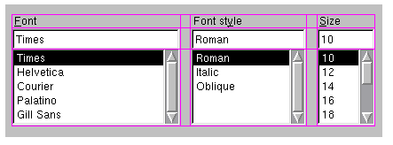

添加布局的常规方法是在父布局上调用 addLayout()。添加布局后，您可以开始使用 addWidget()、addItem() 和 addLayout() 将小部件和其他布局放入网格布局的单元格中。

成员函数。

```c++
// 在位置row、column、spanning rowSpan rows和columnSpan列处添加item，并根据alignment对齐。如果 rowSpan 和/或 columnSpan 为 -1，则项目将分别延伸到底部和/或右侧边缘。布局获取项目的所有权
void addItem(QLayoutItem *item, int row, int column, int rowSpan = 1, int columnSpan = 1, Qt::Alignment alignment = Qt::Alignment());
// 将布局放置在网格中的位置（行、列）左上角的位置是 (0, 0)
void addLayout(QLayout *layout, int row, int column, Qt::Alignment alignment = Qt::Alignment());
// 此版本将布局布局添加到单元格网格，跨越多行/列。单元格将从行开始，列跨越 rowSpan行和columnSpan列
void addLayout(QLayout *layout, int row, int column, int rowSpan, int columnSpan, Qt::Alignment alignment = Qt::Alignment());
// 将给定的小部件添加到行、列的单元格网格中。默认情况下，左上角的位置是 (0, 0)
void addWidget(QWidget *widget, int row, int column, Qt::Alignment alignment = Qt::Alignment());
// 此版本将给定的小部件添加到单元格网格中，跨越多行/列。单元格将从 fromRow 开始，fromColumn 跨越 rowSpan 行和 columnSpan 列。小部件将具有给定的对齐方式
void addWidget(QWidget *widget, int fromRow, int fromColumn, int rowSpan, int columnSpan, Qt::Alignment alignment = Qt::Alignment());

// 返回网格中具有行行和列的单元格的几何形状。如果行或列在网格之外，则返回无效矩形
QRect cellRect(int row, int column) const;

// 返回具有给定索引的项目的位置信息
void getItemPosition(int index, int *row, int *column, int *rowSpan, int *columnSpan) const;
// 返回占据单元格（行、列）的布局项，如果单元格为空，则返回 0
QLayoutItem *itemAtPosition(int row, int column) const;

// 返回此网格中的行列数
int columnCount() const;
int rowCount() const;

// 设置和返回行列的拉伸因子
void setColumnStretch(int column, int stretch);
void setRowStretch(int row, int stretch);
int rowStretch(int row) const;
int columnStretch(int column) const;

// 设置和返回最小行列间距
void setRowMinimumHeight(int row, int minSize);
int rowMinimumHeight(int row) const;
void setColumnMinimumWidth(int column, int minSize);
int columnMinimumWidth(int column) const;

// 此属性保存并排布局的小部件之间的间距
void setHorizontalSpacing(int spacing);
int horizontalSpacing() const;
// 此属性保存在彼此顶部布局的小部件之间的间距
void setVerticalSpacing(int spacing);
int verticalSpacing() const;

// 设置和返回用于网格原点的角，即位置 (0, 0)
void setOriginCorner(Qt::Corner corner);
Qt::Corner originCorner() const;

// 设置垂直和水平间距都为spacing
void setSpacing(int spacing);
int spacing() const;
```

#### 16.1.3 QFormLayout

QFormLayout 类管理输入小部件的形式及其相关标签。
QFormLayout 是一个方便的布局类，它以两列形式布置其子项。左列由标签组成，右列由“字段”小部件（行编辑器、旋转框等）组成。传统上，这种两列表单布局是使用 QGridLayout 实现的。 QFormLayout 是一种更高级别的替代方案，
采用 QString 和 QWidget * 的 addRow() 重载在幕后创建一个 QLabel 并自动设置它的伙伴。然后我们可以这样写代码：

```c++
QFormLayout *formLayout = new QFormLayout;
formLayout->addRow(tr("&Name:"), nameLineEdit);
formLayout->addRow(tr("&Email:"), emailLineEdit);
formLayout->addRow(tr("&Age:"), ageSpinBox);
setLayout(formLayout);
```

将此与使用 QGridLayout 编写的以下代码进行比较：

```c++
nameLabel = new QLabel(tr("&Name:"));
nameLabel->setBuddy(nameLineEdit);//需要设置伙伴关系

emailLabel = new QLabel(tr("&Name:"));
emailLabel->setBuddy(emailLineEdit);

ageLabel = new QLabel(tr("&Name:"));
ageLabel->setBuddy(ageSpinBox);

QGridLayout *gridLayout = new QGridLayout;
gridLayout->addWidget(nameLabel, 0, 0);
gridLayout->addWidget(nameLineEdit, 0, 1);
gridLayout->addWidget(emailLabel, 1, 0);
gridLayout->addWidget(emailLineEdit, 1, 1);
gridLayout->addWidget(ageLabel, 2, 0);
gridLayout->addWidget(ageSpinBox, 2, 1);
setLayout(gridLayout);
```

下图显示了不同样式的默认外观。

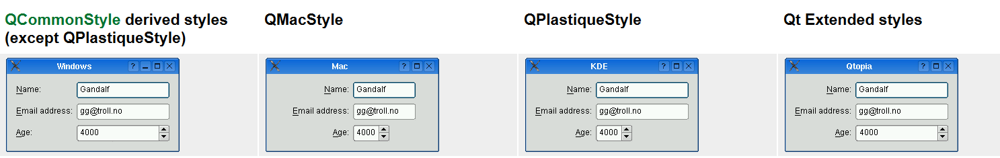

也可以通过调用 setLabelAlignment()、setFormAlignment()、setFieldGrowthPolicy() 和 setRowWrapPolicy() 单独覆盖表单样式。例如，要在所有平台上模拟 QMacStyle 的表单布局外观，但带有左对齐标签，您可以编写：

```c++
formLayout->setRowWrapPolicy(QFormLayout::DontWrapRows);
formLayout->setFieldGrowthPolicy(QFormLayout::FieldsStayAtSizeHint);
formLayout->setFormAlignment(Qt::AlignHCenter | Qt::AlignTop);
formLayout->setLabelAlignment(Qt::AlignLeft);
```

此枚举指定可用于控制表单字段增长方式的不同策略。

```c++
enum QFormLayout::FieldGrowthPolicy{
    QFormLayout::FieldsStayAtSizeHint//这些字段永远不会超出其有效大小提示。这是QMacStyle默认设置
    QFormLayout::ExpandingFieldsGrow//水平大小策略为 Expanding 或 MinimumExpanding 的字段将增长以填满可用空间。其他字段不会超出其有效大小提示。这是 Plastique 的默认策略
    QFormLayout::AllNonFixedFieldsGrow//具有允许它们增长的大小策略的所有字段都将增长以填充可用空间。这是大多数样式的默认策略
}
```

此枚举指定可能连续出现的小部件（或其他布局项）的类型。

```c++
enum QFormLayout::ItemRole{ 
    QFormLayout::LabelRole//标签小部件
    QFormLayout::FieldRole//字段小部件
    QFormLayout::SpanningRole//跨越标签和字段列的小部件
}
```

此枚举指定可用于控制表单行换行方式的不同策略。

```c++
enum QFormLayout::RowWrapPolicy{
    QFormLayout::DontWrapRows//字段总是布置在其标签旁边。这是除QtExtended样式之外的默认策略
    QFormLayout::WrapLongRows//标签有足够的水平空间来容纳最宽的标签，其余的空间给字段。如果字段对的最小大小大于可用空间，则该字段将换行到下一行。这是 Qt 扩展样式的默认策略
    QFormLayout::WrapAllRows//字段始终位于其标签下方
}
```

成员函数。

```c++
QFormLayout(QWidget *parent = Q_NULLPTR);
void addRow(QWidget *label, QWidget *field);//使用给定的标签和字段在此表单布局的底部添加一个新行
void addRow(QWidget *label, QLayout *field);
void addRow(const QString &labelText, QWidget *field);
void addRow(const QString &labelText, QLayout *field);
void addRow(QWidget *widget);
void addRow(QLayout *layout);
void insertRow(int row, QWidget *label, QWidget *field);
void insertRow(int row, QWidget *label, QLayout *field);
void insertRow(int row, const QString &labelText, QWidget *field);
void insertRow(int row, const QString &labelText, QLayout *field);
void insertRow(int row, QWidget *widget);
void insertRow(int row, QLayout *layout);
void removeRow(int row);
void removeRow(QWidget *widget);
void removeRow(QLayout *layout);
TakeRowResult takeRow(int row);
TakeRowResult takeRow(QWidget *widget);
TakeRowResult takeRow(QLayout *layout);
int rowCount() const;
// 此属性保存表单行换行的方式
void setRowWrapPolicy(RowWrapPolicy policy);
RowWrapPolicy rowWrapPolicy() const;

void setItem(int row, ItemRole role, QLayoutItem *item);
void setLabelAlignment(Qt::Alignment alignment);
void setLayout(int row, ItemRole role, QLayout *layout);
void setWidget(int row, ItemRole role, QWidget *widget);
// 在指定索引处检索项目的行和角色（列）。如果索引超出范围，*rowPtr 设置为 -1；否则，该行存储在 *rowPtr 中，而角色存储在 *rolePtr 中
void getItemPosition(int index, int *rowPtr, ItemRole *rolePtr) const;
// 检索指定子布局的行和角色（列）。如果布局不在表单布局中，*rowPtr 设置为 -1；否则，该行存储在 *rowPtr 中，而角色存储在 *rolePtr 中
void getLayoutPosition(QLayout *layout, int *rowPtr, ItemRole *rolePtr) const;
// 检索布局中指定小部件的行和角色（列）。如果小部件不在布局中，*rowPtr 设置为 -1；否则，该行存储在 *rowPtr 中，而角色存储在 *rolePtr 中
void getWidgetPosition(QWidget *widget, int *rowPtr, ItemRole *rolePtr) const;
// 此属性保存标签的水平对齐方式
Qt::Alignment labelAlignment() const;
// 返回给定行中具有指定角色（列）的布局项。如果没有这样的项目，则返回 0
QLayoutItem *itemAt(int row, ItemRole role) const;
// 返回与给定字段关联的标签
QWidget *labelForField(QWidget *field) const;
QWidget *labelForField(QLayout *field) const;

// 此属性保存表单字段增长的方式
void setFieldGrowthPolicy(FieldGrowthPolicy policy);
FieldGrowthPolicy fieldGrowthPolicy() const;
// 此属性保存表单布局内容在布局几何中的对齐方式
void setFormAlignment(Qt::Alignment alignment);
Qt::Alignment formAlignment() const;
// 设置垂直水平间距
void setSpacing(int spacing);
int spacing() const;
void setVerticalSpacing(int spacing);
int verticalSpacing() const;
void setHorizontalSpacing(int spacing);
int horizontalSpacing() const;
```

#### 16.1.4 QStackedLayout

QStackedLayout 类提供了一堆小部件，其中一次只有一个小部件可见。
QStackedLayout 可用于创建类似于 QTabWidget 提供的用户界面。还有一个方便的 QStackedWidget 类构建在 QStackedLayout 之上。
一个 QStackedLayout 可以填充许多子小部件（“页面”）。例如：

```c++
QWidget *firstPageWidget = new QWidget;
QWidget *secondPageWidget = new QWidget;
QWidget *thirdPageWidget = new QWidget;

QStackedLayout *stackedLayout = new QStackedLayout;
stackedLayout->addWidget(firstPageWidget);
stackedLayout->addWidget(secondPageWidget);
stackedLayout->addWidget(thirdPageWidget);

QVBoxLayout *mainLayout = new QVBoxLayout;
mainLayout->addLayout(stackedLayout);
setLayout(mainLayout);
```

QStackedLayout 没有为用户提供切换页面的内在方法。这通常通过存储 QStackedLayout 页面标题的 QComboBox 或 QListWidget 来完成。例如：

```c++
QComboBox *pageComboBox = new QComboBox;
pageComboBox->addItem(tr("Page 1"));
pageComboBox->addItem(tr("Page 2"));
pageComboBox->addItem(tr("Page 3"));
connect(pageComboBox, SIGNAL(activated(int)),
        stackedLayout, SLOT(setCurrentIndex(int)));
```

填充布局时，小部件被添加到内部列表中。 indexOf() 函数返回该列表中小部件的索引。小部件可以使用 addWidget() 函数添加到列表的末尾，也可以使用 insertWidget() 函数插入到给定索引处。 removeWidget() 函数从布局中删除给定索引处的小部件。布局中包含的小部件数量，可以使用 count() 函数获得。
widget() 函数返回给定索引位置的小部件。屏幕上显示的小部件的索引由 currentIndex() 给出，并且可以使用 setCurrentIndex() 进行更改。以类似的方式，可以使用 currentWidget() 函数检索当前显示的小部件，并使用 setCurrentWidget() 函数进行更改。每当布局中的当前小部件更改或从布局中删除小部件时，都会分别发出 currentChanged() 和 widgetRemoved() 信号。

成员函数。

```c++
QStackedLayout();
QStackedLayout(QWidget *parent);
QStackedLayout(QLayout *parentLayout);
int currentIndex() const;//此属性保存可见的小部件的索引位置
QWidget *currentWidget() const;//返回当前小部件，如果此布局中没有小部件，则返回 0
QWidget *widget(int index) const;//返回给定索引处的小部件，如果给定位置没有小部件，则返回 0
int addWidget(QWidget *widget);//将给定的小部件添加到此布局的末尾并返回小部件的索引位置
int insertWidget(int index, QWidget *widget);//在此 QStackedLayout 中的给定索引处插入给定的小部件。如果 index 超出范围，则附加小部件（在这种情况下，它是返回的小部件的实际索引）
void setStackingMode(StackingMode stackingMode);//确定处理子小部件的可见性的方式
StackingMode stackingMode() const;
```

信号和槽函数。

```c++
slot void setCurrentIndex(int index);
slot void setCurrentWidget(QWidget *widget);

signal void currentChanged(int index);
signal void widgetRemoved(int index);
```

#### 16.1.5 QBoxLayout

QBoxLayout 类水平或垂直排列子小部件。QBoxLayout 占用它获得的空间（来自其父布局或来自 parentWidget()），将其分成一排框，并使每个托管小部件填充一个框。

如果 QBoxLayout 的方向是 Qt::Horizontal，那么这些框将被放置在一行中，并具有合适的大小。每个小部件（或其他框）将至少获得其最小尺寸，至多获得其最大尺寸。如果 QBoxLayout 的方向是 Qt::Vertical，那么这些框被放置在一列中，同样大小合适。创建 QBoxLayout 的最简单方法是使用便利类之一，例如QHBoxLayout（用于 Qt::Horizontal 框）或 QVBoxLayout（用于 Qt::Vertical 框）。您也可以直接使用 QBoxLayout 构造函数，将其方向指定为 LeftToRight、RightToLeft、TopToBottom 或 BottomToTop。
如果 QBoxLayout 不是顶级布局（即它没有管理所有小部件的区域和子项），则必须先将其添加到其父布局中，然后才能对其进行任何操作。添加布局的常规方法是调用 parentLayout-&gt;addLayout()。

完成此操作后，您可以使用以下四个函数之一将框添加到 QBoxLayout： addWidget() 将小部件添加到 QBoxLayout 并设置小部件的拉伸因子。 （拉伸因子沿着盒子行。） addSpacing() 创建一个空盒子；这是您用来创建漂亮而宽敞的对话框的功能之一。有关设置边距的方法，请参见下文。addStretch() 创建一个空的、可拉伸的盒子。
addLayout() 将包含另一个 QLayout 的框添加到行并设置该布局的拉伸因子。
使用 insertWidget()、insertSpacing()、insertStretch() 或 insertLayout() 在布局中的指定位置插入一个框。
QBoxLayout 还包括两个边距宽度： setContentsMargins() 设置小部件每一侧的外边框的宽度。这是沿 QBoxLayout 的四个边的每个保留空间的宽度。setSpacing() 设置相邻框之间的宽度。 （您可以使用 addSpacing() 在特定位置获得更多空间。）边距默认值由样式提供。大多数 Qt 样式指定的默认边距是 9 用于子窗口小部件和 11 用于窗口。间距默认与顶级布局的边距宽度相同，或与父布局相同。
要从布局中删除小部件，请调用 removeWidget()。在小部件上调用 QWidget::hide() 也有效地从布局中删除小部件，直到调用 QWidget::show()。
但是最常用的是 QVBoxLayout 和 QHBoxLayout 而不是 QBoxLayout ，因为它们方便的构造函数。

此枚举类型用于确定框布局的方向。

```c++
enum QBoxLayout::Direction{
    QBoxLayout::LeftToRight //从左到右水平
    QBoxLayout::RightToLeft //从右到左水平
    QBoxLayout::TopToBottom //从上到下垂直
    QBoxLayout::BottomToTop//从下到上垂直
}
```

成员函数。

```c++
QBoxLayout(Direction dir, QWidget *parent = Q_NULLPTR);
//将布局添加到框的末尾，并带有串行拉伸因子拉伸
void addLayout(QLayout *layout, int stretch = 0);
void insertLayout(int index, QLayout *layout, int stretch = 0);
//将 spacerItem 添加到此框布局的末尾
void addSpacerItem(QSpacerItem *spacerItem);
void insertSpacerItem(int index, QSpacerItem *spacerItem);
void insertItem(int index, QLayoutItem *item);
// 在此框布局的末尾添加一个大小为 size 的不可拉伸空间（QSpacerItem）。 QBoxLayout 提供默认的边距和间距。此功能增加了额外的空间
void addSpacing(int size);
void setSpacing(int spacing);
void insertSpacing(int index, int size);
int spacing() const;
// 将最小尺寸为零且拉伸因子拉伸的可拉伸空间（QSpacerItem）添加到此框布局的末尾
void addStretch(int stretch = 0);
void setStretch(int index, int stretch);
void insertStretch(int index, int stretch = 0);
int stretch(int index) const;
bool setStretchFactor(QWidget *widget, int stretch);
bool setStretchFactor(QLayout *layout, int stretch);
// 将框的垂直尺寸（例如，如果框是 LeftToRight，则将高度）限制为最小尺寸。其他约束可能会增加限制
void addStrut(int size);
// 将小部件添加到此框布局的末尾，具有拉伸和对齐对齐的拉伸因子
void addWidget(QWidget *widget, int stretch = 0, Qt::Alignment alignment = Qt::Alignment());
void insertWidget(int index, QWidget *widget, int stretch = 0, Qt::Alignment alignment = Qt::Alignment());
// 将此布局的方向设置为方向
void setDirection(Direction direction);
Direction direction() const;
```

#### 16.1.6 QVBoxLayout

QVBoxLayout 类垂直排列小部件。
此类用于构造垂直框布局对象。有关详细信息，请参阅 QBoxLayout。
该类的最简单用法是这样的：首先，我们在布局中创建我们想要的小部件。然后，我们创建 QVBoxLayout 对象并将小部件添加到布局中。最后，我们调用 QWidget::setLayout() 将 QVBoxLayout 对象安装到小部件上。此时，布局中的小部件被重新设置为将窗口作为其父级。

```c++
QWidget *window = new QWidget;
QPushButton *button1 = new QPushButton("One");
QPushButton *button2 = new QPushButton("Two");
QPushButton *button3 = new QPushButton("Three");
QPushButton *button4 = new QPushButton("Four");
QPushButton *button5 = new QPushButton("Five");

QVBoxLayout *layout = new QVBoxLayout;
layout->addWidget(button1);
layout->addWidget(button2);
layout->addWidget(button3);
layout->addWidget(button4);
layout->addWidget(button5);

window->setLayout(layout);
window->show();
```

#### 16.1.7 QHBoxLayout

QHBoxLayout 类水平排列小部件。
此类用于构造水平框布局对象。有关详细信息，请参阅 QBoxLayout。
该类的最简单用法是这样，首先，我们在布局中创建我们想要的小部件。然后，我们创建 QHBoxLayout 对象并将小部件添加到布局中。最后，我们调用 QWidget::setLayout() 将 QHBoxLayout 对象安装到小部件上。此时，布局中的小部件被重新设置为将窗口作为其父级。

```c++
QWidget *window = new QWidget;
QPushButton *button1 = new QPushButton("One");
QPushButton *button2 = new QPushButton("Two");
QPushButton *button3 = new QPushButton("Three");
QPushButton *button4 = new QPushButton("Four");
QPushButton *button5 = new QPushButton("Five");

QHBoxLayout *layout = new QHBoxLayout;
layout->addWidget(button1);
layout->addWidget(button2);
layout->addWidget(button3);
layout->addWidget(button4);
layout->addWidget(button5);

window->setLayout(layout);
window->show();
```

#### 16.1.8 QSplitter

分裂器，可以动态的调整小组件的大小，一个例子如下，具体可见[42-TestLayOut/TestSplitter](42-TestLayOut/TestSplitter)。

```c++
QSplitter *splitter = new QSplitter(Qt::Horizontal,this);
QListView *listview = new QListView;
QTreeView *treeview = new QTreeView;
splitter->addWidget(listview);
splitter->addWidget(treeview);
splitter->setChildrenCollapsible(false); // 禁止小部件被压缩到0
splitter->setOpaqueResize(false);

QSplitter * rightSplitter = new QSplitter(Qt::Horizontal,splitter);
rightSplitter->setOrientation(Qt::Vertical);
QTextEdit * textdedit1= new QTextEdit("top text",rightSplitter);
textdedit1->setAlignment(Qt::AlignCenter);
QTextEdit * textdedit2= new QTextEdit("bottom text",rightSplitter);
textdedit2->setAlignment(Qt::AlignCenter);
this->setCentralWidget(splitter);

qDebug()<<splitter->count(); // 3
qDebug()<<splitter->indexOf(listview); // 0
qDebug()<<splitter->indexOf(treeview); // 1
qDebug()<<splitter->handleWidth(); // 6
int max  = 0 ,min = 0;
splitter->getRange(0,&min,&max);
qDebug()<<min<<"  "<<max;// 0,0
splitter->getRange(1,&min,&max);
qDebug()<<min<<"  "<<max;// 89,-86
```

效果如下。

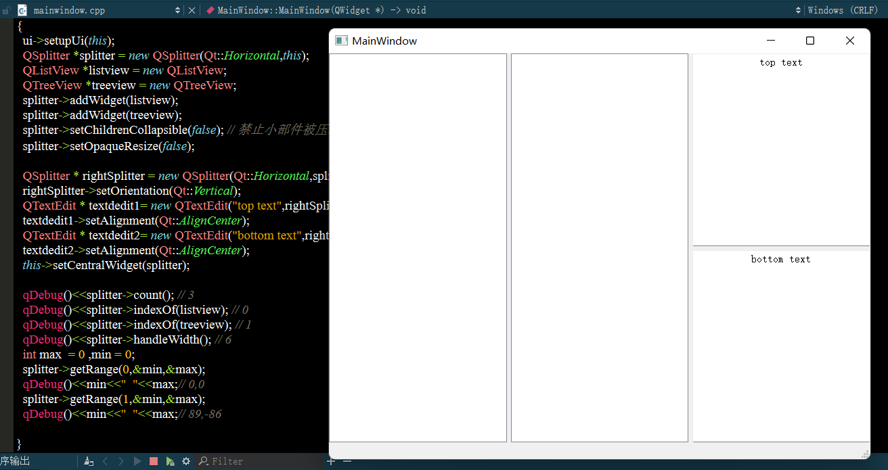

默认的 QSplitter **水平**布置其子级，可以使用 setOrientation(Qt::Vertical) 将其子项垂直放置。
默认情况下，所有小部件都可以根据用户的意愿介于小部件的 minimumSizeHint()或 minimumSize()和 maximumSize() 之间。默认情况下，QSplitter 会动态调整其子项的大小。如果您希望QSplitter**仅在调整大小操作结束时调整子项的大小，请调用 setOpaqueResize(false)**。
小部件之间的初始大小分布是通过将初始大小乘以拉伸因子来确定的。您还可以使用 setSizes() 设置所有小部件的大小。函数sizes() 返回用户设置的尺寸。或者分别使用 saveState() 和 restoreState() 从 QByteArray 保存和恢复小部件的大小。当 hide() 一个小部件时，它的空间将分配给其他小部件，调用show()时自动恢复。
注意：**不支持将 QLayout 添加到 QSplitter**(通过 setLayout() 或使 QSplitter 成为 QLayout 的父级)，使用 addWidget() 代替（见上面的例子）。

成员函数。

```c++
void addWidget(QWidget *widget);
void insertWidget(int index, QWidget *widget);
QWidget *replaceWidget(int index, QWidget *widget);
QWidget *widget(int index) const;
int count() const;//返回拆分器布局中包含的小部件数量
int indexOf(QWidget *widget) const;// 返回位置

void getRange(int index, int *min, int *max) const;//如果min和max不为0，则返回 *min 和 *max 索引处的拆分器的有效范围
QSplitterHandle *handle(int index) const;//返回给定索引处拆分器布局中项目左侧（或上方）的句柄。索引 0 处的句柄始终隐藏
void refresh();//更新拆分器的状态。您不需要调用此函数
//更新位置索引处小部件的大小策略以具有拉伸因子。拉伸不是有效的拉伸因子；有效拉伸因子是通过获取小部件的初始大小并将其与拉伸相乘来计算的
void setStretchFactor(int index, int stretch);

// 将拆分器的布局恢复到指定的状态。如果状态恢复，则返回 true；否则返回假
bool restoreState(const QByteArray &state);
QByteArray saveState() const;//保存拆分器布局的状态

// 设置是否可以将子小部件的大小调整为0,默认情况下子小部件是可折叠的
void setChildrenCollapsible(bool);
bool childrenCollapsible() const;

// 如果 index 处的小部件是可折叠的，则返回 true，否则返回 false
bool isCollapsible(int index) const;
void setCollapsible(int index, bool collapse);

// 设置拆分器宽度,默认情况下取决于用户平台和样式偏好的值,如果设置为1或0，实际抓取区域将增长到与其各自小部件的几个像素重叠
void setHandleWidth(int);
int handleWidth() const;

// 会出现一个阴影框显示拆分器的位置,结束拖动后才移动到新位置
void setOpaqueResize(bool opaque = true);
bool opaqueResize() const;

// 设置方向
void setOrientation(Qt::Orientation);
Qt::Orientation orientation() const;

// 将子小部件的各自大小设置为列表中给定的值。如果拆分器是水平的，则这些值设置每个小部件的宽度（以像素为单位），从左到右。如果拆分器是垂直的，则设置每个小部件的高度，从上到下。
void setSizes(const QList<int> &list);
QList<int> sizes() const;
```

信号函数。

```c++
void splitterMoved(int pos, int index);
```

#### 16.1.9 QDockWidget

停靠窗口类，常与QTextEdit配合使用，例子可见[42-TestLayOut/TestDockWidget](42-TestLayOut/TestDockWidget)。

枚举值。

第一个枚举类型：设置停靠窗体的特性，这个枚举类型属于QDockWidget作用域下。

```c++
enum DockWidgetFeature { 
    DockWidgetClosable, // 可关闭
    DockWidgetMovable, // 可移动
    DockWidgetFloatable, // 可漂浮
    DockWidgetVerticalTitleBar, //标题栏显示在左侧而不是顶部
    AllDockWidgetFeatures,// 拥有所有特点
    NoDockWidgetFeatures // 不可移动.关闭和浮动
}
```

第二个枚举类型：设置窗体可停靠的区域，作用域在Qt下，需要了解。

```c++
enum Qt::DockWidgetArea
{
    Qt::LeftDockWidgetArea,
    Qt::RightDockWidgetArea,
    Qt::TopDockWidgetArea,
    Qt::BottomDockWidgetArea,
    Qt::AllDockWidgetAreas,
    Qt::NoDockWidgetArea,//只可停靠在插入处
}
```

成员函数。

```c++
QDockWidget(const QString &title, QWidget *parent = Q_NULLPTR, Qt::WindowFlags flags = Qt::WindowFlags());
QDockWidget(QWidget *parent = Q_NULLPTR, Qt::WindowFlags flags = Qt::WindowFlags());

void setAllowedAreas(Qt::DockWidgetAreas areas);
bool isAreaAllowed(Qt::DockWidgetArea area) const;
Qt::DockWidgetAreas allowedAreas() const;

void setFeatures(DockWidgetFeatures features);
DockWidgetFeatures features() const;

void setFloating(bool floating);
bool isFloating() const;

void setTitleBarWidget(QWidget *widget); // 这个是用于设置自定义标题栏的,标题栏部件必须有一个有效的 QWidget::sizeHint() 和 QWidget::minimumSizeHint()。这些功能应该考虑到标题栏的当前方向。
QWidget *titleBarWidget() const;

void setWidget(QWidget *widget);
QWidget *widget() const;

QAction *toggleViewAction() const;//返回可用于显示或关闭此停靠小部件的可检查操作。操作的文本设置为停靠小部件的窗口标题
```

信号函数。

```c++
void allowedAreasChanged(Qt::DockWidgetAreas allowedAreas);
void dockLocationChanged(Qt::DockWidgetArea area);
void featuresChanged(QDockWidget::DockWidgetFeatures features);
void topLevelChanged(bool topLevel);//当浮动属性发生变化时会发出此信号
void visibilityChanged(bool visible);
```

一个例子如下。

```c++
// (1) 主窗口
QTextEdit * textedit = new QTextEdit(this); // this为父窗口
textedit->setText("main window");
textedit->setAlignment(Qt::AlignCenter);
this->setCentralWidget(textedit);
// (2) 停靠窗口1
QDockWidget * dock1 = new QDockWidget(tr("DockWindow1"),this);
dock1->setFeatures(QDockWidget::DockWidgetMovable); // 可移动
dock1->setAllowedAreas(Qt::LeftDockWidgetArea| Qt::RightDockWidgetArea);// 可停靠区域左边和右边
dock1->setFloating(false);
QTextEdit * edit1 = new QTextEdit();
edit1->setText(tr("可被移动的停靠窗口,但不可以悬浮和关闭"));
dock1->setWidget(edit1);
this->addDockWidget(Qt::LeftDockWidgetArea,dock1);
// (3) 停靠窗口2
QDockWidget * dock2  = new QDockWidget("DockWindow2",this);
dock2->setFeatures(QDockWidget::DockWidgetClosable | QDockWidget::DockWidgetFloatable);
QTextEdit * edit2 = new QTextEdit();
edit2->setText(tr("可悬浮和关闭的窗口,但不可以移动只能双击来实现悬浮"));
dock2->setWidget(edit2);
this->addDockWidget(Qt::RightDockWidgetArea,dock2);
// (4) 停靠窗口3
QDockWidget * dock3 = new QDockWidget("DockWindow3",this);
dock3->setFeatures(QDockWidget::AllDockWidgetFeatures);
QTextEdit * edit3 = new QTextEdit();
edit3->setText(tr("具有所有特点的窗口"));
dock3->setWidget(edit3);
this->addDockWidget(Qt::BottomDockWidgetArea,dock3);

this->resize(800,600);
this->setWindowTitle(tr("DockWindow"));
```

#### 16.1.10 QStackedWidget

堆栈窗体类，常与QListWidget、QComboBox配合使用。例子可见[42-TestLayOut/TestStackedWidget](42-TestLayOut/TestStackedWidget)。

成员函数。

```c++
int addWidget(QWidget *widget);
QWidget *currentWidget() const;
int insertWidget(int index, QWidget *widget);
void removeWidget(QWidget *widget);
QWidget *widget(int index) const;
int count() const;
int currentIndex() const;
int indexOf(QWidget *widget) const;
```

信号和槽函数。

```c++
slot void setCurrentIndex(int index);
slot void setCurrentWidget(QWidget *widget);
signal void currentChanged(int index);
signal void widgetRemoved(int index);
```

#### 16.1.1 QFrame

QFrame 类是可以具有框架的小部件的基类。
QMenu 使用它来“提升”周围屏幕上方的菜单。 QProgressBar 有一个“下沉”的外观。 QLabel 外观扁平。像这样的小部件的框架可以更改。

```c++
QLabel label(...);
label.setFrameStyle(QFrame::Panel | QFrame::Raised);
label.setLineWidth(2);

QProgressBar pbar(...);
label.setFrameStyle(QFrame::NoFrame);
```

QFrame 类也可以**直接用于创建没有任何内容的简单占位符框架**。
框架样式由框架形状和阴影样式指定，用于在视觉上将框架与周围的小部件分开。这些属性可以使用 setFrameStyle() 函数一起设置，并使用 frameStyle() 读取。
**框架形状有 NoFrame、Box、Panel、StyledPanel、HLine 和 VLine**；**阴影样式是平原，凸起和沉没**。
框架部件具有描述边框粗细的三个属性：lineWidth、midLineWidth 和 frameWidth。**线宽**是框架边框的宽度。可以对其进行修改以自定义框架的外观。**中线宽度**指定框架中间多出一条线的宽度，它使用第三种颜色来获得特殊的 3D 效果。请注意，仅针对凸起或凹陷的 Box、HLine 和 VLine 框架绘制中线。**框架宽度**由框架样式确定，frameWidth() 函数用于获取为使用的样式定义的值。
可以使用 QWidget::setContentsMargins() 函数自定义框架和框架内容之间的边距。
下图显示了一些样式和线宽的组合效果：

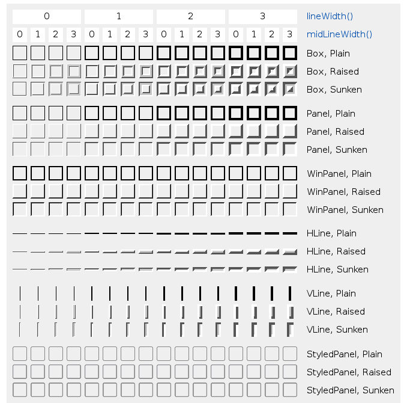

枚举类型。

此枚举类型定义了用于为帧提供 3D 效果的阴影类型。

```c++
enum QFrame::Shadow{
    QFrame::Plain//框架和内容与周围环境；保持水平没有任何3D效果
    QFrame::Raised//框架和内容出现凸起；使用当前颜色组的浅色和深色绘制3D凸起线
    QFrame::Sunken//框架和内容出现凹陷；使用当前颜色组的明暗颜色绘制3D凹陷线
}
```

此枚举类型定义了可用框架的形状。

```c++
enum QFrame::Shape{
    QFrame::NoFrame//QFrame什么都不画
    QFrame::Box//QFrame在其内容周围绘制一个框
    QFrame::Panel//QFrame绘制一个面板使内容看起来凸起或凹陷
    QFrame::StyledPanel//绘制一个矩形面板，其外观取决于当前的 GUI 样式。它可以升起或下沉
    QFrame::HLine//QFrame 绘制一条不包含任何内容的水平线（用作分隔符）
    QFrame::VLine//QFrame 绘制一条不包含任何内容的垂直线（用作分隔符）
    QFrame::WinPanel//绘制一个可以像 Windows 2000 中那样凸起或凹陷的矩形面板。指定此形状会将线宽设置为 2 像素。提供 WinPanel 是为了兼容。对于 GUI 样式独立性，我们建议改用 StyledPanel
}
```

此枚举定义了两个常量，可用于提取 frameStyle() 的两个组件。

```c++
enum QFrame::StyleMask{
    QFrame::Shadow_Mask//frameStyle()的阴影部分
    QFrame::Shape_Mask//frameStyle()的形状部分
}
```

成员函数。

```c++
int frameWidth() const;

void setFrameRect(const QRect &);
QRect frameRect() const;

void setFrameShadow(Shadow);
Shadow frameShadow() const;

void setFrameShape(Shape);
Shape frameShape() const;

void setFrameStyle(int style);
int frameStyle() const;

void setLineWidth(int);
int lineWidth() const;

void setMidLineWidth(int);
int midLineWidth() const;
```

#### 16.1.12 QSpacerItem

QSpacerItem 类在布局中提供空白空间。
通常，您不需要直接使用此类。 Qt 的内置布局管理器提供以下功能来操作布局中的空白空间：

QHBoxLayout：addSpacing(), addStretch(), insertSpacing(), insertStretch()
QGridLayout：setRowMinimumHeight(), setRowStretch(), setColumnMinimumWidth(), setColumnStretch()

成员函数。

```c++
//构造一个具有首选宽度 w、首选高度 h、水平尺寸策略 hPolicy 和垂直尺寸策略 vPolicy 的间隔项。默认值提供了一个可以拉伸的间隙，如果没有其他需要空间。
QSpacerItem(int w, int h, QSizePolicy::Policy hPolicy = QSizePolicy::Minimum, QSizePolicy::Policy vPolicy = QSizePolicy::Minimum);
//请注意，如果在将分隔项添加到布局后调用 changeSize()，则必须使布局无效才能使分隔项的新大小生效
void changeSize(int w, int h, QSizePolicy::Policy hPolicy = QSizePolicy::Minimum, QSizePolicy::Policy vPolicy = QSizePolicy::Minimum);
//返回此项的尺寸政策
QSizePolicy sizePolicy() const;
```

涉及的枚举类型。该枚举描述了在构造 QSizePolicy 时使用的各种每个维度的大小调整类型。

```c++
enum QSizePolicy::Policy{
    QSizePolicy::Fixed//QWidget::sizeHint() 是唯一可接受的替代方法，因此小部件永远不会增长或缩小
    QSizePolicy::Minimum//sizeHint() 最小且足够
    QSizePolicy::Maximum
    QSizePolicy::Preferred//sizeHint() 是最好的，但小部件可以缩小并且仍然有用
    QSizePolicy::Expanding//sizeHint() 是一个合理的大小，但小部件可以缩小并且仍然有用
    QSizePolicy::MinimumExpanding//sizeHint() 最小且足够。小部件可以利用额外的空间
    QSizePolicy::Ignored//sizeHint() 被忽略。小部件将获得尽可能多的空间
}
```


### 16.2 事件

#### 16.2.1 QEvent

QEvent 类是所有事件类的基类。事件对象包含事件参数。
**Qt 的主事件循环 (QCoreApplication::exec()) 从事件队列中获取本地窗口系统事件，将它们转换为 QEvents，并将转换后的事件发送给 QObjects**。
通常，事件来自底层窗口系统（spontaneous() 返回 true），但也**可以使用 QCoreApplication::sendEvent() 和 QCoreApplication::postEvent() 手动发送事件（spontaneous() 返回 false）**。QObjects 通过**调用它们的 QObject::event() 函数来接收事件**。该功能可以在子类中重新实现，以自定义事件处理并添加额外的事件类型； QWidget::event() 是一个值得注意的例子。**默认情况下，事件被分派给像 QObject::timerEvent() 和 QWidget::mouseMoveEvent() 这样的事件处理程序**。 QObject::installEventFilter() 允许一个对象拦截发往另一个对象的事件。基本的 QEvent 只包含一个事件类型参数和一个“接受”标志。**接受标志用accept()设置，用ignore()清除**。它是默认设置的，但不要依赖它，因为子类可能会选择在其构造函数中清除它。
QEvent 的子类包含描述特定事件的附加参数。

##### 枚举类型

这个枚举类型定义了 Qt 中的有效事件类型。常用的事件类型和对应的类如下。

```c++
enum QEvent::Type{
    QEvent::WindowActivate,//窗口被激活
    QEvent::WindowBlocked,//该窗口被模式对话框阻止
    QEvent::WindowDeactivate,//窗口已停用
    QEvent::WindowIconChange,//窗口的图标已更改
    QEvent::WindowStateChange,//窗口的状态（最小化、最大化或全屏）已经改变（QWindowStateChangeEvent）
    QEvent::WindowTitleChange,//窗口标题已更改
    QEvent::WindowUnblocked,//模态对话框退出后，窗口被解除阻塞
    QEvent::WinIdChange //此本机小部件的窗口系统标识符已更改
}
```

```c++
enum QEvent::Type{
    // 动作的新增、改变和移除
    QEvent::ActionAdded, //QActionEvent
    QEvent::ActionChanged,//QActionEvent
    QEvent::ActionRemoved,//QActionEvent
}
```

```c++
enum QEvent::Type{
    // 光标进入/离开/移动一个部件   
    QEvent::DragEnter,//QDragEnterEvent
    QEvent::DragLeave,//QDragLeaveEvent
    QEvent::DragMove,//QDragMoveEvent
	QEvent::Drop//一个拖放操作QDropEvent
}
```

```c++
enum QEvent::Type{
    // 鼠标光标进入/离开/移动一个悬停小部件QHoverEvent
    QEvent::HoverEnter,
    QEvent::HoverLeave,
    QEvent::HoverMove,
}
```

```c++
enum QEvent::Type{
    // 键盘按下和释放 QKeyEvent
    QEvent::KeyPress,
    QEvent::KeyRelease
}
```

```c++
enum QEvent::Type{
    //客户端外鼠标双击、按下、释放和移动 QMouseEvent
    QEvent::NonClientAreaMouseButtonDblClick,
    QEvent::NonClientAreaMouseButtonPress,
    QEvent::NonClientAreaMouseButtonRelease,
    QEvent::NonClientAreaMouseMove,
    // 客户端内发生
    QEvent::MouseButtonDblClick,
    QEvent::MouseButtonPress,
    QEvent::MouseButtonRelease,
    QEvent::MouseMove,
    QEvent::MouseTrackingChange//鼠标跟踪状态已更改
}
```

比较常用的单列事件。

```c++
enum QEvent::Type{
    QEvent::ActivationChange,//小部件的顶级窗口激活状态已更改
    QEvent::Clipboard,//剪贴板内容已更改
    QEvent::Close,//小部件已关闭QCloseEvent
    QEvent::DynamicPropertyChange,// 从对象中添加、更改或删除了动态属性
    QEvent::EnabledChange,//小部件的启用状态已更改
    QEvent::Hide,//小部件被隐藏（QHideEvent）
    QEvent::HideToParent,//一个子小部件已被隐藏
    QEvent::Move,//小部件的位置已更改（QMoveEvent）
    QEvent::Paint,//绘图事件（QPaintEvent）
    QEvent::ReadOnlyChange,//Widget 的只读状态已经改变
    QEvent::Resize,//小部件的大小已更改 (QResizeEvent)
    QEvent::Show,//小部件显示在屏幕上（QShowEvent）
    QEvent::StyleChange,//小部件的样式已更改
    QEvent::ThreadChange,//对象被移动到另一个线程。这是在前一个线程中发送给该对象的最后一个事件。参见 QObject::moveToThread()
    QEvent::Timer//常规定时器事件（QTimerEvent）
}
```

不常用的事件。

```c++
enum QEvent::Type{
    // QTabletEvent
    QEvent::TabletMove,
    QEvent::TabletPress,
    QEvent::TabletRelease,
    QEvent::TabletEnterProximity,
    QEvent::TabletLeaveProximity,
    QEvent::TabletTrackingChange
}
```

```c++
enum QEvent::Type{
    // 关于视图场景的事件
    QEvent::GraphicsSceneContextMenu,
    QEvent::GraphicsSceneDragEnter,
    QEvent::GraphicsSceneDragLeave,
    QEvent::GraphicsSceneDragMove,
    QEvent::GraphicsSceneDrop,
    QEvent::GraphicsSceneHelp,
    QEvent::GraphicsSceneHoverEnter,
    QEvent::GraphicsSceneHoverLeave,
    QEvent::GraphicsSceneHoverMove,
    QEvent::GraphicsSceneMouseDoubleClick,
    QEvent::GraphicsSceneMouseMove,
    QEvent::GraphicsSceneMousePress,
    QEvent::GraphicsSceneMouseRelease,
    QEvent::GraphicsSceneMove,
    QEvent::GraphicsSceneResize,
    QEvent::GraphicsSceneWheel
}
```

```c++
enum QEvent::Type{
    // 对象获得/更新/移除了子部件
    QEvent::ChildAdded, //QChildEvent（不算常用）
    QEvent::ChildPolished,
    QEvent::ChildRemoved,
}
```

```c++
enum QEvent::Type{
    // 应用程序的字体、布局方向、调色板、状态和图标改变（不算常用）
    QEvent::ApplicationFontChange,
    QEvent::ApplicationLayoutDirectionChange,
    QEvent::ApplicationPaletteChange,
    QEvent::ApplicationStateChange,
    QEvent::ApplicationWindowIconChange,
}
```

```c++
enum QEvent::Type{
 	QEvent::Enter,//鼠标进入小部件的边界（QEnterEvent）
    QEvent::EnterEditFocus,//编辑器小部件获得编辑焦点。必须定义 QT_KEYPAD_NAVIGATION
    QEvent::EnterWhatsThisMode//当应用程序输入“这是什么？”时发送到顶层小部件模式
}
```

不常用的杂类事件。

```c++
enum QEvent::Type{
    QEvent::None,
    QEvent::CloseSoftwareInputPanel,
    QEvent::ContentsRectChange,
    QEvent::ContextMenu,
    QEvent::CursorChange,
    QEvent::DeferredDelete,
    QEvent::Expose,
    QEvent::FileOpen,
    QEvent::Gesture,
    QEvent::GestureOverride,
    QEvent::GrabKeyboard,
    QEvent::GrabMouse,
    QEvent::FocusIn,
    QEvent::FocusOut,
    QEvent::FocusAboutToChange,
    QEvent::FontChange,
    QEvent::IconDrag,
    QEvent::IconTextChange,
    QEvent::InputMethod,
    QEvent::InputMethodQuery,
    QEvent::KeyboardLayoutChange,
    QEvent::LanguageChange,
    QEvent::LayoutDirectionChange,
    QEvent::LayoutRequest,
    QEvent::Leave,
    QEvent::LeaveEditFocus,
    QEvent::LeaveWhatsThisMode,
    QEvent::LocaleChange,
    QEvent::MacSizeChange,
    QEvent::MetaCall,
    QEvent::ModifiedChange,
    QEvent::NativeGesture,
    QEvent::OrientationChange,
    QEvent::PaletteChange,
    QEvent::ParentAboutToChange,
    QEvent::ParentChange,
    QEvent::PlatformPanel,
    QEvent::PlatformSurface,
    QEvent::Polish,
    QEvent::PolishRequest,
    QEvent::QueryWhatsThis,
    QEvent::ScrollPrepare,
    QEvent::Scroll,
    QEvent::Shortcut,
    QEvent::RequestSoftwareInputPanel,
    QEvent::ShortcutOverride,
    QEvent::ShowToParent,
    QEvent::SockAct,
    QEvent::StateMachineSignal,
    QEvent::StateMachineWrapped,
    QEvent::StatusTip,
    QEvent::ToolBarChange,
    QEvent::ToolTip,
    QEvent::ToolTipChange,
    QEvent::TouchBegin,
    QEvent::TouchCancel,
    QEvent::TouchEnd,
    QEvent::TouchUpdate,
    QEvent::UngrabKeyboard,
    QEvent::UngrabMouse,
    QEvent::UpdateLater,
    QEvent::UpdateRequest,
    QEvent::WhatsThis,
    QEvent::WhatsThisClicked,
    QEvent::Wheel,
    QEvent::WinEventAct,
    QEvent::ZOrderChange
}
```

##### 成员函数

```c++
QEvent(Type type);
void accept();//设置事件对象的接受标志，相当于调用 setAccepted(true)
void ignore();//清除事件对象的接受标志参数，相当于调用 setAccepted(false)
bool isAccepted() const;//事件对象的接受标志
void setAccepted(bool accepted);
bool spontaneous() const;//如果事件源自应用程序外部（系统事件），则返回 true；否则返回false
Type type() const;//返回事件类型
static int registerEventType(int hint = -1);//注册并返回自定义事件类型。如果提供的提示可用，将使用它，否则它将返回尚未注册的 QEvent::User 和 QEvent::MaxUser 之间的值。如果它的值不在 QEvent::User 和 QEvent::MaxUser 之间，则忽略该提示
```

#### 16.2.2 QCloseEvent

QCloseEvent 类包含描述关闭事件的参数。
关闭事件被发送到用户想要关闭的小部件，通常通过从窗口菜单中选择“关闭”，或者通过单击 X 标题栏按钮。当您调用 QWidget::close() 以编程方式关闭小部件时，它们也会发送。
关闭事件包含一个标志，指示接收者是否希望小部件关闭。当一个小部件接受关闭事件时，它会被隐藏（如果它是使用 Qt::WA_DeleteOnClose 标志创建的，则会被销毁）。如果它拒绝接受关闭事件，则不会发生任何事情。 （在 X11 下，窗口管理器可能会强制关闭窗口；但在撰写本文时，我们还不知道有任何窗口管理器会这样做。）事件处理程序 **QWidget::closeEvent() 接收关闭事件**。此事件处理程序的默认实现接受关闭事件。如果您不希望您的小部件被隐藏，或者想要一些特殊处理，您应该重新实现事件处理程序并忽略（）事件。
Application 示例中的 closeEvent() 显示了一个关闭事件处理程序，该处理程序询问是否在关闭之前保存文档。
如果您**希望在关闭时删除小部件，请使用 Qt::WA_DeleteOnClose 标志创建它**。这对于多窗口应用程序中的独立顶级窗口非常有用。**当 QObjects 被删除时，它们会发出 destroy() 信号**。**如果最后一个顶级窗口关闭，则发出 QGuiApplication::lastWindowClosed() 信号**。如果事件的接收者同意关闭小部件，isAccepted() 函数将返回 true；调用accept() 同意关闭小部件，如果此事件的接收者不希望小部件关闭，则调用ignore()。
另见 QWidget::close()、QWidget::hide()、QObject::destroyed()、QCoreApplication::exec()、QCoreApplication::quit() 和 QGuiApplication::lastWindowClosed()。

##### closeEvent

#### 16.2.3 QHideEvent

QHideEvent 类提供了一个在隐藏小部件后发送的事件。
**此事件在 QWidget::hide() 返回之前发送**，并且在用户隐藏（图标化）顶级窗口时发送。
如果自发() 为真，则事件源自应用程序外部。在这种情况下，用户使用窗口管理器控件隐藏窗口，方法是图标化窗口或切换到窗口不可见的另一个虚拟桌面。窗口将被隐藏但不会被撤回。如果窗口被图标化，QWidget::isMinimized() 返回真。

##### hideEvent

#### 16.2.4 QShowEvent

QShowEvent 类提供了一个在显示小部件时发送的事件。
有两种显示事件：由窗口系统引起的显示事件（自发）和内部显示事件。 Spontaneous (QEvent::spontaneous()) 显示事件在窗口系统显示窗口之后发送；当顶层窗口在被图标化后重新显示时，它们也会被发送。内部显示事件在小部件变得可见之前交付。

##### showEvent

#### 16.2.5 QMouseEvent

QMouseEvent 类包含描述鼠标事件的参数。
当在**小部件内按下或释放鼠标按钮或移动鼠标光标时，会发生鼠标事件**。
**鼠标移动事件只会在按下鼠标按钮时发生，除非使用 QWidget::setMouseTracking() 启用了鼠标跟踪**。
当在小部件内按下鼠标按钮时，Qt 会自动抓取鼠标；小部件将继续接收鼠标事件，直到最后一个鼠标按钮被释放。如果小部件未处理鼠标事件应该调用 ignore()。**函数 pos()、x() 和 y() 给出了相对于接收鼠标事件的小部件的光标位置**。如果您因鼠标事件而移动小部件，请使用 globalPos() 返回的全局位置来避免晃动。**QWidget::setEnabled() 函数可用于启用或禁用小部件的鼠标和键盘事件**。重新实现 QWidget 事件处理程序，**QWidget::mousePressEvent()、QWidget::mouseReleaseEvent()、QWidget::mouseDoubleClickEvent() 和 QWidget::mouseMoveEvent()** 以在您自己的小部件中接收鼠标事件。

成员函数。

```c++
Qt::MouseButton button() const;//返回导致事件的按钮,请注意鼠标移动事件的返回值始终是 Qt::NoButton
Qt::MouseButtons buttons() const;//返回事件生成时的按钮状态。按钮状态是使用 OR 运算符的 Qt::LeftButton、Qt::RightButton、Qt::MidButton 的组合。对于鼠标移动事件，这是所有按下的按钮。对于鼠标按下和双击事件，这包括导致事件的按钮。对于鼠标释放事件，这不包括导致事件的按钮
Qt::MouseEventFlags flags() const;//返回鼠标事件标志。鼠标事件标志提供有关鼠标事件的附加信息。
QPoint globalPos() const;//返回事件发生时鼠标光标的全局位置
int globalX() const;//返回事件发生时鼠标光标的全局 x 位置
int globalY() const;//返回事件发生时鼠标光标的全局 y 位置
const QPointF &localPos() const;//以 QPointF 形式返回鼠标光标的位置，相对于接收事件的小部件或项目。如果您因鼠标事件而移动小部件，请使用 screenPos() 返回的屏幕位置来避免晃动
QPoint pos() const;;//返回鼠标光标的位置，相对于接收事件的小部件。如果您因鼠标事件而移动小部件，请使用 globalPos() 返回的全局位置来避免晃动。
const QPointF &screenPos() const;//以 PointF 形式返回鼠标光标相对于接收事件的屏幕的位置
Qt::MouseEventSource source() const;//返回有关鼠标事件源的信息。鼠标事件源可用于区分真实鼠标事件和人工鼠标事件。后者是由操作系统或 Qt 本身从触摸事件合成的事件
const QPointF &windowPos() const;//以 QPointF 形式返回鼠标光标相对于接收事件的窗口的位置
int x() const;// 返回鼠标光标的 x 位置，相对于接收事件的小部件
int y() const;// 返回鼠标光标的 y 位置，相对于接收事件的小部件
```

4个鼠标的主要事件函数如下，很多组件都有这样的函数可以重载使用，不一一列举，见Qt文档。

##### mouseDoubleClickEvent

##### mouseMoveEvent

##### mouseReleaseEvent

##### mousePressEvent

#### 16.2.6 QKeyEvent

QKeyEvent 类描述了一个按键事件。
当按键被按下或释放时，按键事件被发送到具有键盘输入焦点的小部件。按键事件包含一个特殊的接受标志，指示接收器是否将处理按键事件。该标志默认为 QEvent::KeyPress 和 QEvent::KeyRelease 设置，因此在对按键事件进行操作时无需调用 accept()。对于 QEvent::ShortcutOverride，接收者需要明确接受事件以触发覆盖。在关键事件上调用 ignore() 会将其传播到父小部件。事件沿父窗口小部件链向上传播，直到窗口小部件接受它或事件过滤器使用它。QWidget::setEnabled() 函数可用于启用或禁用小部件的鼠标和键盘事件。
事件处理程序 **QWidget::keyPressEvent()、QWidget::keyReleaseEvent()、QGraphicsItem::keyPressEvent() 和 QGraphicsItem::keyReleaseEvent()** 接收键事件。

成员函数。

```c++
int count() const;//返回此事件中涉及的键数。如果 text() 不为空，则这只是字符串的长度
bool isAutoRepeat() const;//如果此事件来自自动重复键，则返回 true；如果它来自初始按键，则返回 false
int key() const;//返回被按下或释放的键的代码,键盘代码列表见 Qt::Key。这些代码独立于底层的窗口系统。请注意，此函数不区分大写字母和非大写字母，为此使用 text() 函数（返回生成的密钥的 Unicode 文本）
bool matches(QKeySequence::StandardKey key) const;//如果键事件与给定的标准键匹配，则返回 true；否则返回假
Qt::KeyboardModifiers modifiers() const;//返回事件发生后立即存在的键盘修饰符标志
quint32 nativeModifiers() const;//返回键事件的本机修饰符。如果键事件不包含此数据，则返回 0
quint32 nativeScanCode() const;//返回按键事件的原生扫描码。如果键事件不包含此数据，则返回 0
quint32 nativeVirtualKey() const;//返回键事件的本机虚拟键或键符号。如果键事件不包含此数据，则返回 0
QString text() const;//返回此键生成的 Unicode 文本
```

2个键盘的主要事件函数如下，很多组件都有这样的函数可以重载使用，不一一列举，见Qt文档。

##### keyPressEvent

##### keyReleaseEvent

#### 16.2.7 QPaintEvent

QPaintEvent 类包含绘制事件的事件参数。
绘制事件被发送到需要自我更新的小部件，例如当一个小部件的一部分因为覆盖小部件被移动而暴露时。
**该事件包含一个需要更新的 region() 和一个 rect()**，它是该区域的边界矩形。**两者都提供是因为许多小部件无法充分利用 region()**，而 rect() 可以比 region().boundingRect() 快得多。

在处理绘制事件期间，绘制被剪辑到 region()。这种剪裁由 Qt 的绘图系统执行，并且独立于任何可能应用于用于在绘图设备上绘图的 QPainter 的剪裁。因此，QPainter::clipRegion() 在新构造的 QPainter 上返回的值不会反映绘图系统使用的剪辑区域。

成员函数。

```c++
QPaintEvent(const QRegion &paintRegion);//使用需要更新的区域构造一个绘制事件对象。该区域由paintRegion 指定
QPaintEvent(const QRect &paintRect);//用需要更新的矩形构造一个绘制事件对象。该区域由paintRect 指定
const QRect &rect() const;//返回需要更新的矩形
const QRegion &region() const;//返回需要更新的区域
```

涉及的相关函数：QWidget::update、QWidget::repaint

##### paintEvent

#### 16.2.8 QResizeEvent

QResizeEvent 类包含调整大小事件的事件参数。
调整大小事件被发送到已调整大小的小部件。
事件处理程序 QWidget::resizeEvent() 接收调整大小事件。相关函数：QWidget::resize() 和 QWidget::setGeometry()。

成员函数。

```c++
QResizeEvent(const QSize &size, const QSize &oldSize);
const QSize &oldSize() const;
const QSize &size() const;
```

##### resizeEvent

#### 16.2.9 QHoverEvent

QHoverEvent 类包含描述鼠标事件的参数。
**当鼠标光标移入、移出或移入小部件时，如果小部件具有 Qt::WA_Hover 属性，则会发生鼠标事件**。
**函数 pos() 给出当前光标位置，而 oldPos() 给出旧鼠标位置**。
事件 QEvent::HoverEnter 和 QEvent::HoverLeave 与事件 QEvent::Enter 和 QEvent::Leave 之间有一些相似之处。但是，它们略有不同，因为我们在 **HoverEnter 和 HoverLeave 的事件处理程序中执行了 update()**。
QEvent::HoverMove 也与 QEvent::MouseMove 略有不同。

悬停事件只用在图形项上和QQuick项。

```c++
bool QGraphicsItem::acceptHoverEvents() const;
bool QQuickItem::acceptHoverEvents() const;
```

成员函数。

```c++
QHoverEvent(Type type, const QPointF &pos, const QPointF &oldPos, Qt::KeyboardModifiers modifiers = Qt::NoModifier);
// 返回鼠标光标相对于接收事件的小部件的先前位置。如果没有oldPos()将返回与pos()相同的位置
QPoint oldPos() const;
const QPointF &oldPosF() const;
QPoint pos() const;
const QPointF &posF() const;
```

##### acceptHoverEvents

#### 16.2.10 QTimerEvent

QTimerEvent 类包含描述定时器事件的参数。
定时器事件会定期发送到已启动一个或多个定时器的对象。**每个计时器都有一个唯一的标识符**。定时器由 **QObject::startTimer()** 启动，**QObject::killTimer()**关闭。
QTimer 类提供了一个使用信号而不是事件的高级编程接口。它还提供单次计时器。
事件处理程序 QObject::timerEvent() 接收定时器事件。

```c++
int timerId() const; // 计时器标识符
```

##### timerEvent

#### 16.2.11 QActionEvent

QActionEvent 类提供了在添加、删除或更改 QAction 时生成的事件。
可以使用 QWidget::addAction() 将操作添加到小部件。这会生成一个 ActionAdded 事件，您可以处理该事件以提供自定义行为。例如，QToolBar 重新实现 QWidget::actionEvent() 来为动作创建 QToolButtons。另见 QAction、QWidget::addAction()、QWidget::removeAction() 和 QWidget::actions()。

```c++
QActionEvent(int type, QAction *action, QAction *before = Q_NULLPTR)
QAction *action() const
QAction *before() const;
```

##### actionEvent

#### 16.2.12 QWheelEvent

QWheelEvent 类包含描述滚轮事件的参数。
滚轮事件被发送到鼠标光标下的小部件，但如果该小部件不处理事件，它们将被发送到焦点小部件。为鼠标滚轮和触控板滚动手势生成滚轮事件。有两种方法可以读取车轮事件增量：**angleDelta() 返回以车轮度数为单位的增量**。始终提供此值。 **pixelDelta() 以屏幕像素为单位返回增量**，可用于具有高分辨率触控板的平台，例如 macOS。如果是这样，**source() 将返回 Qt::MouseEventSynthesizedBySystem**。**函数 pos() 和 globalPos() 返回事件发生时鼠标光标的位置**。轮子事件包含一个特殊的接受标志，指示接收者是否想要该事件。如果您**不处理车轮事件，则应调用 ignore()**；这确保它将被发送到父窗口小部件。QWidget::setEnabled() 函数可用于启用或禁用小部件的鼠标和键盘事件。事件处理程序 QWidget::wheelEvent() 接收车轮事件。

```c++
 void MyWidget::wheelEvent(QWheelEvent *event)
  {
     //返回车轮旋转的距离，以八分之一度为单位。正值表示滚轮向前旋转远离用户；负值表示滚轮朝用户向后旋转。大多数鼠标类型以 15 度为步长工作，在这种情况下，增量值是 120 的倍数；即 120 个单位 * 1/8 = 15 度。但是，有些鼠标的轮子分辨率更高，发送的增量值小于 120 个单位（小于 15 度）。为了支持这种可能性，您可以累积添加事件中的增量值，直到达到 120 的值，然后滚动小部件，或者您可以部分滚动小部件以响应每个滚轮事件
      QPoint numPixels = event->pixelDelta();
      QPoint numDegrees = event->angleDelta() / 8;

      if (!numPixels.isNull()) {
          scrollWithPixels(numPixels);
      } else if (!numDegrees.isNull()) {
          QPoint numSteps = numDegrees / 15;
          scrollWithDegrees(numSteps);
      }

      event->accept();
  }
```

成员函数。

```c++
// 构造一个车轮事件对象。
// pos 提供了鼠标光标在窗口内的位置。全局坐标中的位置由 globalPos 指定。
// pixelDelta 包含屏幕上以像素为单位的滚动距离，而 angleDelta 包含滚轮旋转距离。 pixelDelta 是可选的，可以为空。该事件还可以保存单向车轮事件数据：qt4Delta 指定旋转，qt4Orientation 指定方向
QWheelEvent(const QPointF &pos, const QPointF &globalPos, QPoint pixelDelta, QPoint angleDelta, int qt4Delta, Qt::Orientation qt4Orientation, Qt::MouseButtons buttons, Qt::KeyboardModifiers modifiers)
// 事件的滚动阶段由phase指定。
QWheelEvent(const QPointF &pos, const QPointF &globalPos, QPoint pixelDelta, QPoint angleDelta, int qt4Delta, Qt::Orientation qt4Orientation, Qt::MouseButtons buttons, Qt::KeyboardModifiers modifiers, Qt::ScrollPhase phase)
// 如滚轮事件来自物理鼠标滚轮，则source设置为Qt::MouseEventNotSynthesized。如它来自操作系统检测到的手势，或者来自非鼠标硬件设备，则source设置为Qt::MouseEventSynthesizedBySystem。果它来自Qt，source 将被设置为Qt::MouseEventSynthesizedByQt
QWheelEvent(const QPointF &pos, const QPointF &globalPos, QPoint pixelDelta, QPoint angleDelta, int qt4Delta, Qt::Orientation qt4Orientation, Qt::MouseButtons buttons, Qt::KeyboardModifiers modifiers, Qt::ScrollPhase phase, Qt::MouseEventSource source)
// 如果系统配置为反转事件传递的增量值（例如 OS X 上触摸板的自然滚动），则反转应该为真。否则，倒置为假
QWheelEvent(const QPointF &pos, const QPointF &globalPos, QPoint pixelDelta, QPoint angleDelta, int qt4Delta, Qt::Orientation qt4Orientation, Qt::MouseButtons buttons, Qt::KeyboardModifiers modifiers, Qt::ScrollPhase phase, Qt::MouseEventSource source, bool inverted);

// 鼠标在电脑屏幕的位置
QPoint globalPos() const;
const QPointF &globalPosF() const;
int globalX() const;
int globalY() const;
// 鼠标在窗口的位置
QPoint pos() const;
const QPointF &posF() const;
int x() const;
int y() const;

Qt::ScrollPhase phase() const;//返回此滚轮事件的滚动阶段
QPoint pixelDelta() const;//返回屏幕上的滚动距离（以像素为单位）。此值在支持高分辨率基于像素的增量值的平台上提供，例如 macOS。该值应直接用于滚动屏幕上的内容
QPoint angleDelta() const;//返回车轮旋转的距离，以八分之一度为单位。正值表示滚轮向前旋转远离用户；负值表示滚轮朝用户向后旋转
Qt::MouseButtons buttons() const;//返回事件发生时的鼠标状态
Qt::MouseEventSource source() const;//返回有关车轮事件源的信息
bool inverted() const;//返回随事件传递的增量值是否反转
```

##### weelEvent

#### 16.2.13 QContextMenuEvent

**QContextMenuEvent 类包含描述上下文菜单事件的参数**。在QPlainText组件中常用,自动创建了该事件。关联的函数void contextMenuEvent(QContextMenuEvent *event);

枚举值。这个枚举描述了发送事件的原因。

```c++
enum QContextMenuEvent::Reason{
    QContextMenuEvent::Mouse//鼠标导致事件被发送。通常这意味着单击了鼠标右键，但这取决于平台
    QContextMenuEvent::Keyboard//键盘导致发送此事件。在 Windows 上，这意味着按下了菜单按钮
    QContextMenuEvent::Other//该事件是通过其他方式发送的（即不是通过鼠标或键盘）
}
```

成员函数。

```c++
// 构造一个上下文菜单事件对象，其中接受参数标志设置为 false,原因参数必须是QContextMenuEvent::Mouse 或QContextMenuEvent::Keyboard。pos参数指定相对位置,globalPos是全局位置

// 需要指定2个鼠标位置和修饰符参数
QContextMenuEvent(Reason reason, const QPoint &pos, const QPoint &globalPos, Qt::KeyboardModifiers modifiers);
// 需要指定2个鼠标位置
QContextMenuEvent(Reason reason, const QPoint &pos, const QPoint &globalPos);
// globalPos被初始化为pos
QContextMenuEvent(Reason reason, const QPoint &pos);

// 返回此上下文事件的原因
Reason reason() const;
const QPoint &globalPos() const;//返回事件发生时鼠标指针的全局位置
int globalX() const;//返回事件发生时鼠标指针的全局 x 位置
int globalY() const;//返回事件发生时鼠标指针的全局 y 位置
const QPoint &pos() const;//返回鼠标指针相对于接收事件的小部件的位置
int x() const;
int y() const;
```

##### contextMenuEvent

### 16.3 文本验证器

#### 16.3.1 QValidator

QValidator 类提供输入文本的验证。类本身是抽象的。**两个子类 QIntValidator 和 QDoubleValidator 提供基本的数值范围检查**，QRegExpValidator 使用自定义正则表达式提供一般检查。
如果内置验证器不够用，您可以继承 QValidator。**该类有两个虚函数：validate() 和 fixup()。**
**validate() 必须由每个子类实现。它返回 Invalid、Intermediate 或 Acceptable**，具体取决于其参数是否有效（对于子类的有效定义）。
这三种状态需要一些解释。 Invalid 字符串显然是无效的。中间不太明显：当字符串不完整（仍在编辑）时，有效性的概念很难应用。 **QValidator 将 Intermediate 定义为既不明显无效也不可接受作为最终结果的字符串的属性**。可接受意味着该字符串作为最终结果是可接受的。有人可能会说，在输入可接受字符串期间任何可能的中间状态的字符串都是中间状态。

以下是一些示例：

对于接受[10,1000]整数的**LineEdit**，42 和 123 是可接受的，空字符串 5是中间值，asdf和1114是无效的；
对于接受 URL 的可编辑**comboBox**，任何格式正确的 URL 都是可接受的；“http://example.com/,”是中间的(它可能是一个剪切和粘贴操作,意外地在末尾使用了逗号)；空字符串是中级；(用户可能会选择并删除所有文本以准备输入新 URL)，但是“http:///./”是无效的；
对于接受长度的**SpinBox**，"11cm"和"1in"是可接受的,"11"和空字符是中间状态,“http://example.com”和“hour”是无效的。

**fixup() 是为可以修复一些用户错误的验证器提供的。默认实现什么都不做**。例如，如果用户按下 Enter（或 Return）并且内容当前无效，QLineEdit 将调用 fixup()。这使 fixup() 函数有机会执行一些魔术来使无效字符串可接受。**验证器具有使用 setLocale() 设置的语言环境**。它通常用于解析本地化数据。例如，QIntValidator 和 QDoubleValidator 使用它来解析整数和双精度的本地化表示。
QValidator 通常与 QLineEdit、QSpinBox 和 QComboBox 一起使用。

枚举类型，表示验证状态。

```c++
enum State { Invalid, Intermediate, Acceptable }
```

```c++
virtual void fixup(QString &input) const;//可以继承缺省实现
QLocale locale() const;//返回验证器的语言环境。语言环境默认初始化为与 QLocale() 相同
void setLocale(const QLocale &locale);
virtual State validate(QString &input, int &pos) const = 0;//必须重实现
```

信号函数。

```c++
void QValidator::changed();
```

#### 16.3.2 QDoubleValidator

QDoubleValidator 类提供浮点数的范围检查。**QDoubleValidator 提供了上界、下界和小数点后位数的限制**。它不提供 fixup() 函数。您可以**使用 setRange() 或 setBottom() 和 setTop() 在一次调用中设置可接受的范围**。使用 **setDecimals() 设置小数位数**。 validate() 函数返回验证状态。
QDoubleValidator使用它的 locale() 来解释数字。例如，在德语语言环境中，“1,234”将被接受为小数 1.234。在阿拉伯语语言环境中，QDoubleValidator 将接受阿拉伯数字。
注意：在 locale() 上设置的 QLocale::NumberOptions也会影响数字的解释方式。

例如，默认情况下未设置 QLocale::RejectGroupSeparator，因此验证器将接受组分隔符。**因此建议使用 QLocale::toDouble() 来获取数值**。

枚举类型。这个枚举定义了允许输入双精度的符号。

```c++
enum Notation { StandardNotation,// 该字符串被写为标准数字（即 0.015）
               ScientificNotation //该字符串以科学形式编写。它可能有一个指数部分（即 1.5E-2）
};
```

成员函数。

```c++
QDoubleValidator(QObject *parent = Q_NULLPTR);
QDoubleValidator(double bottom, double top, int decimals, QObject *parent = Q_NULLPTR);
double bottom() const;
double top() const;
int decimals() const;
Notation notation() const;
void setBottom(double); // 设置接收的浮点数范围
void setTop(double);
void setDecimals(int);// 精度
virtual void setRange(double minimum, double maximum, int decimals = 0);
void setNotation(Notation);// 计数模式,默认科学计数法
```

#### 16.3.3 QIntValidator

QIntValidator 类提供了一个验证器，可确保字符串包含指定范围内的有效整数。
使用示例：

```c++
QValidator *validator = new QIntValidator(100, 999, this);
QLineEdit *edit = new QLineEdit(this);
edit->setValidator(validator);

QString str;
int pos = 0;
QIntValidator v(100, 900, this);

str = "1";
v.validate(str, pos);     // returns Intermediate
str = "012";
v.validate(str, pos);     // returns Intermediate
str = "999";
v.validate(str, pos);    // returns Intermediate

str = "123";
v.validate(str, pos);     // returns Acceptable
str = "678";
v.validate(str, pos);     // returns Acceptable

str = "1234";
v.validate(str, pos);     // returns Invalid
str = "-123";
v.validate(str, pos);     // returns Invalid
str = "abc";
v.validate(str, pos);     // returns Invalid
str = "12cm";
v.validate(str, pos);     // returns Invalid
```

成员函数。

```c++
QIntValidator(int minimum, int maximum, QObject *parent = Q_NULLPTR);
int bottom() const;
void setBottom(int);
virtual void setRange(int bottom, int top);
void setTop(int);
int top() const;
```


#### 16.3.4 QRegExpValidator

**QRegExpValidator 类用于根据正则表达式检查字符串**。
QRegExpValidator 使用正则表达式 (regexp) 来确定输入字符串是 Acceptable、Intermediate 还是 Invalid。正则表达式可以在构造 QRegExpValidator 时提供，也可以在以后提供。当 QRegExpValidator 确定一个字符串是否可接受时，正则表达式被视为以字符串断言的开头 (^) 开始并以字符串断言的结尾 ($) 结束；匹配是针对整个输入字符串的，或者如果给出大于零的起始位置，则从给定位置开始。
如果字符串是可接受字符串的前缀，则认为它是中间字符串。例如，“”和“A”是正则表达式 [A-Z][0-9] 的中间值（而“_”是无效的）。有关 Qt 的正则表达式引擎的简要介绍，请参阅 QRegExp。

成员函数。

```c++
QRegExpValidator(QObject *parent = Q_NULLPTR);
QRegExpValidator(const QRegExp &rx, QObject *parent = Q_NULLPTR);
const QRegExp &regExp() const;
void setRegExp(const QRegExp &rx);
```

#### 16.3.5 QRegularExpressionValidator

QRegularExpressionValidator 类用于根据正则表达式检查字符串。
QRegularExpressionValidator 使用正则表达式 (regexp) 来确定输入字符串是 Acceptable、Intermediate 还是 Invalid。正则表达式可以在构造 QRegularExpressionValidator 时提供，也可以在稍后提供。
如果正则表达式与字符串部分匹配，则结果被认为是中间的。例如，“”和“A”是正则表达式 [A-Z][0-9] 的中间值（而“_”是无效的）。QRegularExpressionValidator 自动将正则表达式包装在 \\A 和 \\z 锚点中；换句话说，它总是尝试进行完全匹配。

成员函数。

```c++
QRegularExpressionValidator(QObject *parent = Q_NULLPTR);
QRegularExpressionValidator(const QRegularExpression &re, QObject *parent = Q_NULLPTR);
~QRegularExpressionValidator();
QRegularExpression ;
regularExpression() const;
```

信号与槽函数。

```c++
slot void setRegularExpression(const QRegularExpression &re);
signal void regularExpressionChanged(const QRegularExpression &re);
```

### 16.4 滑动条

#### 16.4.1 QAbstractSlider

QAbstractSlider 类提供一个范围内的整数值。
该类被设计为 QScrollBar、QSlider 和 QDial 等小部件的通用超类。
以下是该类的主要属性：

1. value：QAbstractSlider 维护的有界整数。
2.  最小值：可能的最低值。
3. 最大值：可能的最大值。
4. singleStep：抽象滑块提供的两个自然步骤中较小的一个，通常对应于用户按下箭头键。
5. pageStep：抽象滑块提供的两个自然步骤中较大的一个，通常对应于用户按下 PageUp 或 PageDown
6. tracking：是否启用滑块跟踪。
7. sliderPosition：滑块的当前位置。如果启用了跟踪（默认），这与 value 相同。

信号。

```c++
void actionTriggered(int action);//触发了滑块动作
void rangeChanged(int min, int max);//滑块范围已更改
void sliderMoved(int value);//用户拖动滑块
void sliderPressed();//用户开始拖动滑块
void sliderReleased();//用户释放滑块
void valueChanged(int value);//值已更改。跟踪确定在用户交互期间是否发出此信号
```

QAbstractSlider 提供了**一个虚拟的 sliderChange() 函数，非常适合更新滑块的屏幕表示**。通过调用 triggerAction()，子类触发滑块动作。两个辅助函数 QStyle::sliderPositionFromValue() 和 QStyle::sliderValueFromPosition() 帮助子类和样式将屏幕坐标映射到逻辑范围值。

枚举类型。

```c++
enum QAbstractSlider::SliderAction{
    QAbstractSlider::SliderNoAction
    QAbstractSlider::SliderSingleStepAdd
    QAbstractSlider::SliderSingleStepSub
    QAbstractSlider::SliderPageStepAdd
    QAbstractSlider::SliderPageStepSub
    QAbstractSlider::SliderToMinimum
    QAbstractSlider::SliderToMaximum
    QAbstractSlider::SliderMove
}
enum QAbstractSlider::SliderChange{ 
    QAbstractSlider::SliderRangeChange
    QAbstractSlider::SliderOrientationChange
    QAbstractSlider::SliderStepsChange
    QAbstractSlider::SliderValueChange
}
```

成员函数。

```c++
Qt::Orientation orientation() const;//此属性保存滑块的方向
void setOrientation(Qt::Orientation);//槽函数

void triggerAction(SliderAction action);

int sliderPosition() const;
void setSliderPosition(int);//此属性保存当前滑块位置

void setValue(int value); // 槽函数
int value() const;//此属性保存滑块的当前值

bool hasTracking() const;//此属性保存是否启用滑块跟踪
void setTracking(bool enable);

void setInvertedAppearance(bool);//此属性保存滑块是否显示其值倒置
bool invertedAppearance() const;

bool invertedControls() const;//此属性保存滑块是否反转其滚轮和按键事件
void setInvertedControls(bool);

void setSliderDown(bool);//该属性保存滑块是否被按下
bool isSliderDown() const;


void setRange(int min, int max);// 槽函数
void setMaximum(int);
void setMinimum(int);
int maximum() const;
int minimum() const;

int pageStep() const;//此属性保存页面步骤
void setPageStep(int);

void setSingleStep(int);//此属性包含单步
int singleStep() const;
```

#### 16.4.2 QScrollBar

**QScrollBar 小部件提供垂直或水平滚动条**。
滚动条是一种控件，它使用户能够访问大于用于显示它的小部件的文档部分。它提供了用户在文档中的当前位置和可见文档数量的视觉指示。滚动条通常配备其他控件，可以实现更准确的导航。 Qt 以适合每个平台的方式显示滚动条。如果**您需要在另一个小部件上提供滚动视图，使用 QScrollArea 类可能更方便，因为它提供了视口小部件和滚动条**。如果您需要使用 QAbstractScrollArea 为专门的小部件实现类似的功能，QScrollBar 很有用；例如，如果您决定继承 QAbstractItemView。对于使用滑块控件获取给定范围内的值的大多数其他情况，QSlider 类可能更适合您的需要。

```c++
QScrollBar(QWidget *parent = Q_NULLPTR);
QScrollBar(Qt::Orientation orientation, QWidget *parent = Q_NULLPTR);
~QScrollBar();
```

#### 16.4.3 QSlider

QSlider 小部件提供垂直或水平滑块。
 滑块是控制有界值的经典小部件。它允许用户沿水平或垂直凹槽移动滑块手柄，并将手柄的位置转换为合法范围内的整数值。QSlider 自己的功能很少；大多数功能都在 QAbstractSlider 中。最有用的函数是 setValue() 直接将滑块设置为某个值； triggerAction() 模拟点击的效果（对快捷键有用）； setSingleStep(), setPageStep() 设置步数；和 setMinimum() 和 setMaximum() 来定义滚动条的范围。
QSlider 提供了控制刻度线的方法。您可以使用 **setTickPosition() 来指示您想要刻度线的位置**，使用 setTickInterval() 来指示您想要多少个刻度线。**当前设置的刻度位置和间隔可以分别使用tickPosition() 和tickInterval() 函数进行查询**。

成员函数。

```c++
QSlider(QWidget *parent = Q_NULLPTR);
QSlider(Qt::Orientation orientation, QWidget *parent = Q_NULLPTR);
~QSlider();
void setTickInterval(int ti);
void setTickPosition(TickPosition position);
int tickInterval() const;
TickPosition tickPosition() const;
```

#### 16.4.4 QDial

**QDial 类提供了一个圆形范围控制（如速度计或电位计）**。
 QDial 用于当用户需要控制一个程序可定义范围内的值时，该范围要么环绕（例如，测量角度从 0 到 359 度），要么对话框布局需要一个方形小部件。
由于 QDial 继承自 QAbstractSlider，所以表盘的行为类似于滑块。当 wrapping() 为 false（默认设置）时，滑块和表盘之间没有真正的区别。它们都共享相同的信号、槽和成员函数。您使用哪一种取决于您的用户的期望和应用程序的类型。当滑块移动时，表盘最初会连续发出 valueChanged() 信号；您可以通过禁用跟踪属性来减少它发出信号的频率。即使禁用跟踪，sliderMoved() 信号也会连续发出。
当鼠标按钮被按下和释放时，表盘还会发出sliderPressed() 和sliderReleased() 信号。请注意，表盘的值可以在不发出这些信号的情况下更改，因为键盘和滚轮也可用于更改值。
与滑块不同的是，QDial 尝试绘制“不错”数量的凹口，而不是每行一步一个。如果可能，每行一步绘制一个槽口，但如果没有足够的像素来绘制每一个槽口，QDial 将跳过槽口来尝试绘制一个统一集（例如，每隔第二个或第三个槽口绘制一次）。

与滑块一样，表盘使 QAbstractSlider 函数 setValue() 可用作插槽。
表盘的键盘界面相当简单：左/上和右/下箭头键通过定义的singleStep调整表盘的值，Page Up和Page Down通过定义的pageStep调整值，Home和End键将值设置为定义的最小值和最大值。
如果您使用鼠标滚轮调整表盘，则增量值由 wheelScrollLines 乘以 singleStep 和 pageStep 的较小值确定。

成员函数。

```c++
QDial(QWidget *parent = Q_NULLPTR);
~QDial();
int notchSize() const;
qreal notchTarget() const;
bool notchesVisible() const;
void setNotchTarget(double target);
bool wrapping() const;

slot void setNotchesVisible(bool visible);
slot void setWrapping(bool on);
```

### 16.5 容器

#### 16.5.1 QWidget


#### 16.5.2 QGroupBox


#### 16.5.3 QToolBox

工具箱，常与工具按钮[3.6.3 QToolButton](#3.6.3 QToolButton)配合使用。工具箱可以看成类似堆叠窗口或者分页效果的窗口，可以使用addItem添加部件。

成员函数。

```c++
QToolBox(QWidget *parent = Q_NULLPTR, Qt::WindowFlags f = Qt::WindowFlags());
int addItem(QWidget *widget, const QIcon &iconSet, const QString &text);
int addItem(QWidget *w, const QString &text);
int insertItem(int index, QWidget *widget, const QIcon &icon, const QString &text);
int insertItem(int index, QWidget *widget, const QString &text);
void removeItem(int index);

int count() const;
int currentIndex() const;
int indexOf(QWidget *widget) const;
QWidget *currentWidget() const;
QWidget *widget(int index) const;

bool isItemEnabled(int index) const;
QIcon itemIcon(int index) const;
QString itemText(int index) const;
QString itemToolTip(int index) const;
void setItemEnabled(int index, bool enabled);
void setItemIcon(int index, const QIcon &icon);
void setItemText(int index, const QString &text);
void setItemToolTip(int index, const QString &toolTip);
```

信号和槽函数。

```c++
slot void setCurrentIndex(int index);
slot void setCurrentWidget(QWidget *widget);
signal void currentChanged(int index);
```

#### 16.5.4 QAxWidget


#### 16.5.5 QScrollArea


### 16.6 窗口外观

#### 16.6.1 QPalette

改变某个控件的颜色外观，如背景、文字颜色等，这个类专门用于管理这些颜色信息，因为每个窗口或者控件都会有这个对象。这个类有2个概念，一个是ColorRole，一个是ColorGroup，故用的最多的函数是setColor。

其中ColorRole是颜色主题，对窗体不同角色的组件进行分类，例如QPalette::Window表示背景色，而QPalette::WindowText是前景色等等。

ColorGroup表示3种状态，QPalette::Active获得焦点激活状态，QPalette::Inactive未激活状态，QPalette::Disable不可用状态。

最重要的3个函数如下。

setColor表示对某个状态的某个角色进行设置，或者不区分状态。

setColorGroup原型对指定的状态一次性设置前景色、按钮、高亮、黑暗等一系列的brush。

setBrush设置指定状态下组件的brush。

 setColor() 和 setBrush()的区别具体取决于**想要纯色还是像素图图案**。

```c++
void setColor(ColorGroup group, ColorRole role, const QColor &color);
void setColor(ColorRole role, const QColor &color);
const QColor &color(ColorGroup group, ColorRole role) const;
const QColor &color(ColorRole role) const;

void setColorGroup(ColorGroup cg, const QBrush &windowText, const QBrush &button, const QBrush &light, const QBrush &dark, const QBrush &mid, const QBrush &text, const QBrush &bright_text, const QBrush &base, const QBrush &window);
void setCurrentColorGroup(ColorGroup cg);
ColorGroup currentColorGroup() const;

void setBrush(ColorRole role, const QBrush &brush);
void setBrush(ColorGroup group, ColorRole role, const QBrush &brush);
```

最好使用当前样式的默认调色板（由 **QGuiApplication::palette()** 返回）并根据需要进行修改。

枚举类型。

```c++
enum QPalette::ColorGroup{
    QPalette::Disabled
    QPalette::Active
    QPalette::Inactive
    QPalette::Normal // Active同义词
}
```

```c++
enum QPalette::ColorRole{
    QPalette::Window // 背景颜色
    QPalette::Background // Window同义词
    QPalette::WindowText // 前景色
    QPalette::Foreground// WindowText同义词
    QPalette::Base//文本框背景色,通常是白色或其他浅色
    QPalette::AlternateBase//在具有交替行颜色的视图中用作备用背景颜色
    QPalette::ToolTipBase//用作 QToolTip 和 QWhatsThis 的背景颜色
    QPalette::ToolTipText//用作 QToolTip 和 QWhatsThis 的前景色
    QPalette::Text//Base 使用的前景色
    QPalette::Button//常规按钮背景颜色
    QPalette::ButtonText//与 Button 颜色一起使用的前景色
    QPalette::BrightText//一种与WindowText非常不同的文本颜色，并形成鲜明对比
    
    // 还有一些3D效果的角色
    QPalette::Light//比Button颜色浅
    QPalette::Midlight//在Button和Light之间
    QPalette::Dark//比Button暗
    QPalette::Mid//在Button和Dark之间
    QPalette::Shadow//很深的颜色,默认是 Qt::black
    
    QPalette::Highlight//用于指示选定项或当前项。默认情况下高亮颜色是Qt::darkBlue
    QPalette::HighlightedText//与突出显示形成对比的文本颜色。默认情况Qt::white
    QPalette::Link//用于未访问的超链接的文本颜色。默认情况下，链接颜色是 Qt::blue
    QPalette::LinkVisited//用于已访问超链接的文本颜色。默认情况下，链接访问的颜色是 Qt::magenta
	QPalette::NoRole//没有角色；此特殊角色通常用于指示尚未分配角色
}
```

```c++
// 注意在Qt中呈现富文本时不使用Link和LinkVisited 角色，并建议使用CSS和QTextDocument::setDefaultStyleSheet()函数来改变链接的外观。例如：
QTextBrowser browser;
QColor linkColor(Qt::red);
QString sheet = QString::fromLatin1("a { text-decoration: underline; color: %1 }").arg(linkColor.name());
browser.document()->setDefaultStyleSheet(sheet);
```

关于颜色角色下图展示了区别。


成员函数。

```c++
//从按钮颜色构造一个调色板。其他颜色会根据此颜色自动计算。窗口也将是按钮颜色
QPalette(const QColor &button);
//从按钮颜色构造一个调色板。其他颜色会根据此颜色自动计算。窗口也将是按钮颜色
QPalette(Qt::GlobalColor button);
// 从按钮颜色和窗口构造调色板。根据这些颜色自动计算其他颜色
QPalette(const QColor &button, const QColor &window);
//构造一个调色板。您可以为 windowText、button、light、dark、mid、text、bright_text、base 和 window 传递画笔、像素图或纯色
QPalette(const QBrush &windowText, const QBrush &button, const QBrush &light, const QBrush &dark, const QBrush &mid, const QBrush &text, const QBrush &bright_text, const QBrush &base, const QBrush &window);

const QBrush &alternateBase() const;//返回当前颜色组的备用基础笔刷
const QBrush &base() const;//返回当前颜色组的基础画笔
const QBrush &brightText() const;//返回当前颜色组的明亮文本前景画笔
const QBrush &brush(ColorGroup group, ColorRole role) const;//返回指定颜色组中的画笔
const QBrush &brush(ColorRole role) const;//返回为当前 ColorGroup 中的给定颜色角色设置的画笔
const QBrush &button() const;//返回当前颜色组的按钮画笔
const QBrush &buttonText() const;//返回当前颜色组的按钮文本前景画笔
const QBrush &light() const;//返回当前颜色组的光刷
const QBrush &link() const;//返回当前颜色组的未访问链接文本画笔
const QBrush &linkVisited() const;//返回当前颜色组的已访问链接文本画笔
const QBrush &mid() const;//返回当前颜色组的中间画笔
const QBrush &midlight() const;//返回当前颜色组的中光笔刷
const QBrush &dark() const;//返回当前颜色组的深色画笔
const QBrush &highlight() const;//返回当前颜色组的高光画笔
const QBrush &highlightedText() const;//返回当前颜色组的高亮文本画笔
const QBrush &shadow() const;//返回当前颜色组的阴影画笔
const QBrush &text() const;//返回当前颜色组的文本前景画笔
const QBrush &toolTipBase() const;//返回当前颜色组的工具提示基础画笔
const QBrush &toolTipText() const;//返回当前颜色组的工具提示文本画笔
const QBrush &window() const;//返回当前颜色组的窗口（一般背景）画笔
const QBrush &windowText() const;//返回当前颜色组的窗口文本（一般前景）画笔

qint64 cacheKey() const;//返回一个数字，该数字标识此 QPalette 对象的内容。如果不同的 QPalette 对象引用相同的内容，则它们可以具有相同的键
bool isBrushSet(ColorGroup cg, ColorRole cr) const;//先前已设置了cg和则返回true
bool isCopyOf(const QPalette &p) const;//使用复制构造函数复制调色板可以测试两个调色板是否相同
bool isEqual(ColorGroup cg1, ColorGroup cg2) const;//cg1等于cg2则返回 true
QPalette resolve(const QPalette &other) const;//返回具有从其他复制的属性的新 QPalette
```


### 16.10 全局枚举类型

#### 16.10.1 Qt::WindowFlags

此枚举类型用于为**小部件指定各种窗口系统属性**。

低位的11个字节定义窗口部件的窗口类型，范围是0x00000000~0x00000012一共定义了13个窗口类型。

高位字节定义了窗口外观，可以进行位或操作使得只具有某个标志。

```c++
enum Qt::WindowType
flags Qt::WindowFlags
{
    Qt::Widget,//QWidget的默认类型。这种类型的小部件如果有父小部件则为子小部件，如果它们没有父小部件则为独立窗口。参见 Qt::Window 和 Qt::SubWindow
    Qt::Window,//表示该小部件是一个窗口，通常带有一个窗口系统框架和一个标题栏
    Qt::Dialog,//指示该小部件是一个为对话框窗口（在标题栏中没有最大化或最小化按钮）。这是QDialog的默认类型。如果你想将它用作模式对话框，它应该从另一个窗口启动，或者有一个父窗口并与 QWidget::windowModality 属性一起使用。如果将其设为模态，对话框将阻止应用程序中的其他顶级窗口获得任何输入。
    Qt::Sheet,//表示窗口是 macOS 上的工作表
    Qt::Drawer,//指示小部件是 macOS 上的抽屉
    Qt::Popup,//表示该小部件是一个弹出式顶级窗口，即它是模态的，但具有适合弹出式菜单的窗口系统框架
    Qt::Tool,//表示小部件是一个工具窗口。工具窗口通常是一个小窗口，具有比通常的标题栏和装饰更小的窗口，通常用于工具按钮的集合
    Qt::ToolTip,//指示小部件是工具提示。这在内部用于实现工具提示
    Qt::SplashScreen,//指示窗口是闪屏。这是QSplashScreen的默认类型
    Qt::Desktop,//表示此小部件是桌面。这是QDesktopWidget的类型
    Qt::SubWindow,//指示此小部件是子窗口，例如 QMdiSubWindow小部件
    Qt::ForeignWindow,//指示此窗口对象是一个句柄，表示由另一个进程或手动使用本机代码创建的本机平台窗口
    Qt::CoverWindow,//表示该窗口代表一个覆盖窗口，在某些平台上最小化应用程序时显示
    
    // 高位字节定义窗口外观,可以进行位或操作来启用对应的标志
    Qt::MSWindowsFixedSizeDialogHint,//在Windows上为窗口提供一个细对话框边框
    Qt::MSWindowsOwnDC,//在Windows上为窗口提供自己的显示上下文
    Qt::BypassWindowManagerHint,//此标志可用于向平台插件指示应禁用“所有”窗口管理器协议
    Qt::X11BypassWindowManagerHint,//完全绕过窗口管理器。这会导致一个完全不受管理的无边框窗口
    Qt::FramelessWindowHint/,//生成无边框窗口。用户不能通过窗口系统移动或调整无边框窗口的大小
    Qt::NoDropShadowWindowHint,//禁用支持平台上的窗口投影
    Qt::CustomizeWindowHint,//关闭默认窗口标题提示
    Qt::WindowTitleHint,//给窗口一个标题栏
    Qt::WindowSystemMenuHint,//添加一个窗口系统菜单，可能还有一个关闭按钮（例如在Mac上）
    Qt::WindowMinimizeButtonHint,//添加一个最小化按钮
    Qt::WindowMaximizeButtonHint,//添加最大化按钮
    Qt::WindowMinMaxButtonsHint,//添加最小化和最大化按钮
    Qt::WindowCloseButtonHint,//添加关闭按钮
    Qt::WindowContextHelpButtonHint,//向对话框添加上下文帮助按钮
    Qt::MacWindowToolBarButtonHint,//在macOS上添加了一个工具栏按钮
    Qt::WindowFullscreenButtonHint,//在macOS上添加了一个全屏按钮
    Qt::BypassGraphicsProxyWidget,//如果希望小部件始终是桌面上顶级小部件，则可以设置此标志
    Qt::WindowShadeButtonHint,//如果底层窗口管理器支持，则添加一个阴影按钮来代替最小化按钮
    Qt: :WindowStaysOnTopHint,//通知窗口位于所有其他窗口的顶部。请注意在X11上的某些窗口管理器上，还必须传递Qt::X11BypassWindowManagerHint才能使此标志正常工作
    Qt::WindowStaysOnBottomHint,//通知窗口系统该窗口应位于所有其他窗口的底部。请注意在X11上此提示仅适用于支持_NET_WM_STATE_BELOW atom的窗口管理器
    Qt::WindowTransparentForInput,//通知窗口系统该窗口仅用于输出（显示某些内容），不接受输入
    Qt::WindowOverridesSystemGestures,//窗口实现了自己的一组系统级手势，例如三指桌面切换
    Qt::WindowDoesNotAcceptFocus,//通知窗口系统该窗口不应接收输入焦点
    Qt::MaximizeUsingFullscreenGeometryHint,//窗口在最大化时尽可能多使用可用的屏幕几何图形
    Qt::WindowType_Mask//用于提取窗口标志的窗口类型部分的掩码
}
```

#### 16.10.2 Qt::Orientation

此类型用于表示对象的方向。

```c++
enum Qt::Orientation
flags Qt::Orientations
{
    Qt::Horizontal
    Qt::Vertical
}
```

#### 16.10.3 Qt::Alignment

此枚举类型用于描述对齐方式。它包含可以组合以产生所需效果的水平和垂直标志。

```c++
enum Qt::AlignmentFlag
flags Qt::Alignment
{
	// 水平方向对齐
    Qt::AlignLeft,
    Qt::AlignRight,
    Qt::AlignHCenter,
    Qt::AlignJustify, // 在可用空间中使用文本
	// 垂直方向对齐  
	Qt::AlignTop,
    Qt::AlignBottom,
    Qt::AlignVCenter,
    Qt::AlignBaseline,// 在可用空间中垂直居中
    Qt::AlignCenter, // 中心对齐
    Qt::AlignAbsolute,//如果小部件的布局方向是Qt::RightToLeft（而不是 Qt::LeftToRight，默认），Qt::AlignLeft 指的是右边缘，Qt::AlignRight 指的是左边缘。这通常是所需的行为。如果您希望 Qt::AlignLeft 始终表示“左”而 Qt::AlignRight 始终表示“右”，请将标志与 Qt::AlignAbsolute 结合起来。
    Qt::AlignLeading,//Qt::AlignLeft 的同义词
    Qt::AlignTrailing,//Qt::AlignRight 的同义词
    Qt::AlignHorizontal_Mask,//AlignLeft | AlignRight | AlignHCenter | AlignJustify | AlignAbsolute
    Qt::AlignVertical_Mask,//AlignTop | AlignBottom | AlignVCenter | AlignBaseline
}
```

#### 16.10.4 Qt::DockWidgetArea

停靠窗口的可停靠区域，可以使用组合。

```c++
enum Qt::DockWidgetArea
{
    Qt::LeftDockWidgetArea,
    Qt::RightDockWidgetArea,
    Qt::TopDockWidgetArea,
    Qt::BottomDockWidgetArea,
    Qt::AllDockWidgetAreas,
    Qt::NoDockWidgetArea,//只可停靠在插入处
}
```

#### 16.10.5 Qt::ToolButtonStyle

工具按钮的风格。

```c++
enum Qt::ToolButtonStyle{  
    Qt::ToolButtonIconOnly,
    Qt::ToolButtonTextOnly,
    Qt::ToolButtonTextBesideIcon,
    Qt::ToolButtonTextUnderIcon,
    Qt::ToolButtonFollowStyle
}
```


## 串口通信

### 数据类型

#### QtSerialPort/QSerialPort

需要包含2个头文件，并在.pro工程文件配置。

```c++
QT       += serialport
#include  <QtSerialPort/QSerialPort>
#include  <QtSerialPort/QSerialPortInfo>
```

QtSerialPort/QSerialPort类提供访问串行端口的功能，QtSerialPort/QSerialPortInfo可以获取有关可用串行端口的信息，该类允许枚举系统中的所有串行端口，你可以通过获取串口的名称来使用这个串口。

将QSerialPortInfo类的对象作为参数传递给setPort()或setPortName()方法，以分配所需的串行设备。设置端口后，可以使用**open()方法以只读（r/o）、只读（w/o）或读写（r/w）模式打开端口**。注意：串行端口始终以独占访问方式打开（即，其他进程或线程都无法访问已打开的串行端口）。然后可以使用close()方法关闭端口并取消I/O操作。成功打开后，QSerialPort尝试确定端口的当前配置并初始化自身。可以使用**setBaudRate()、setDataBits()、setParity()、SetTopBits()和setFlowControl()方法将端口重新配置为所需的设置**。
有两个属性可用于引脚输出信号，即：QSerialPort::dataTerminalReady、QSerialPort::requestToSend。也可以使用pinoutSignals()方法查询当前的pinout信号集。
一旦知道端口已准备好读或写，就可以**使用read()或write()方法。或者，也可以调用readLine()和readAll()**便利方法。如果不是一次读取所有数据，那么当新的传入数据附加到QSerialPort的内部读取缓冲区时，剩余的数据将可供以后使用。您可以使用setReadBufferSize()限制读取缓冲区的大小。QSerialPort提供了一组函数，这些函数在发出特定信号之前挂起调用线程。

这些功能可用于实现阻塞串行端口：

waitForReadyRead()会阻止调用，直到有新数据可读取为止。
waitForBytesWrite()会阻止调用，直到一个有效负载的数据写入串行端口。

如果waitForReadyRead()返回false，则表示连接已关闭或发生错误。在任何时间点发生错误，QSerialPort将发出errorOccurred()信号。您还可以调用**error()来查找上次发生的错误类型**。使用**阻塞串行端口编程与使用非阻塞串行端口编程完全不同**。**阻塞串行端口不需要事件循环**，通常会导致代码更简单。然而，在GUI应用程序中，阻塞串行端口只能在非GUI线程中使用，以避免冻结用户界面。

一个例子如下。

```c++
int numRead = 0, numReadTotal = 0;
char buffer[50];

for (;;) {
    numRead  = serial.read(buffer, 50);

    // Do whatever with the array

    numReadTotal += numRead;
    if (numRead == 0 && !serial.waitForReadyRead())
        break; // 如果读取的数据为0或者串口没有准备好读取
}
```

有关这些方法的更多详细信息，请参阅示例应用程序。QSerialPort类还可以与QTextStream和QDataStream的流操作符（操作符<<（）和操作符>>（））一起使用。不过，有一个问题需要注意：在尝试使用操作符>>（）重载操作符读取之前，请确保有足够的数据可用。

##### 枚举类型

需要了解的枚举类型有8个。

**第一个是波特率**，波特率关联一个性质QSerialPort::baudRate。

要设置波特率，请使用枚举QSerialPort::BaudRate或任何正qint32值。

如果设置成功或在打开端口之前设置，则返回true；否则，返回false并设置一个错误代码，该错误代码可以通过访问QSerialPort::error属性的值获得。注意：如果在打开端口之前设置了该设置，则在成功打开端口之后，实际的串行端口设置将在QSerialPort::open()方法中自动完成。
警告：所有平台都支持设置AllDirections标志，Windows仅支持此模式。
警告：在Windows上，在任何方向返回相等的波特率。
默认值为Baud9600，即每秒9600位。

```c++
// 波特率枚举值
enum QSerialPort::BaudRate {
    QSerialPort::Baud1200 = 1200,
    QSerialPort::Baud2400 = 2400,
    QSerialPort::Baud4800 = 4800,
    QSerialPort::Baud9600 = 9600,
    QSerialPort::Baud19200 = 19200,
    QSerialPort::Baud38400 = 38400,
    QSerialPort::Baud57600 = 57600,
    QSerialPort::Baud115200 = 115200,
    QSerialPort::UnknownBaud = -1,
};
// 关联的性质是
QSerialPort::baudRate;
// 关联的2个函数为获取和设置波特率
qint32 baudRate(QSerialPort::Directions directions = AllDirections) const;
bool setBaudRate(qint32 baudRate, QSerialPort::Directions directions = AllDirections);
// 信号函数,波特率改变时自动发射
void baudRateChanged(qint32 baudRate, QSerialPort::Directions directions);
```

**第2个是使用方向枚举值**，表明串口是输入和输出还是连个都存在，因为有组合值还涉及flags。

```c++
enum QSerialPort::Direction{
    QSerialPort::Input = 1,
    QSerialPort::Output = 2,
    QSerialPort::AllDirections = Input | Output
};
flags QSerialPort::Directions{
    QSerialPort::Input = 1,
    QSerialPort::Output = 2,
    QSerialPort::AllDirections = Input | Output
};
```

**第3个是数据位**，此枚举值描述使用的数据位数。

```c++
enum QSerialPort::DataBits {
    QSerialPort::Data5 = 5, // 每个字符中的数据位数为5,用于Baudot代码,通常只用于旧设备如打字机
    QSerialPort::Data6 = 6, // 每个字符中的数据位数为6,它很少使用
    QSerialPort::Data7 = 7, // 每个字符中的数据位数为7,用于真正的ASCII,通常只用于旧设备如打字机
    QSerialPort::Data8 = 8, // 每个字符中的数据位数为8,它用于大多数类型的数据，因为此大小与字节大小匹配。它几乎普遍用于较新的应用程序中
    QSerialPort::UnknownDataBits = -1 // 位数未知,此值已过时。提供它是为了保持旧的源代码正常工作,强烈建议不要在新代码中使用它
};
```

**第4个是停止位**，此枚举描述使用的停止位数。

```c++
enum QSerialPort::StopBits{
    QSerialPort::OneStop=1, // 1个停止位
    QSerialPort::OneAndHalfStop=3, // 1.5个停止位,只支持windows
    QSerialPort::TwoStop=2, // 2个停止位
    QSerialPort::UnknownStopBits=-1 // 未知数量的停止位,同样已经过时不要在新代码中使用
};
```

**第5个是流控制**，这个枚举描述了使用的流控制。

```c++
enum QSerialPort::FlowControl {	
    QSerialPort::NoFlowControl = 0,// 没有流控制
    QSerialPort::HardwareControl = 1,// 硬件流控制 (RTS/CTS)
    QSerialPort::SoftwareControl = 2,// 软件流控制 (XON/XOFF)
    QSerialPort::UnknownFlowControl=-1// 不知道的流控制,已过时尽量不要使用
}
// 关联的函数是
FlowControl flowControl() const;
bool setFlowControl(FlowControl flowControl);
// 信号函数
void flowControlChanged(QSerialPort::FlowControl flow);
```

**第6个是奇偶性校验**，这个枚举描述了使用的奇偶校验方案。

```c++
enum QSerialPort::Parity {
    QSerialPort::NoParity = 0, //没有发送奇偶校验位,是最常见的奇偶校验设置,错误检测由通信协议处理
    QSerialPort::EvenParity = 2,//每个字符中1的位数(包括奇偶校验位)始终为偶数
    QSerialPort::OddParity = 3,//每个字符中1的位数,包括奇偶校验位,总是奇数.它确保在每个字符中至少发生一个状态转换
    QSerialPort::SpaceParity = 4,//空间平价,奇偶校验位在空间信号条件下发送,它不提供错误检测信息
    QSerialPort::MarkParity = 5,//标记平价,奇偶校验位始终设置为标记信号条件(逻辑1),它不提供错误检测信息。
    QSerialPort::UnknownParity = -1// 不知道的奇偶性验证,已过时尽量不要使用
}
```

**第7个是引脚信号**，此枚举值描述了可能的 RS-232 引脚分配信号。

```c++
flags QSerialPort::PinoutSignals;
enum QSerialPort::PinoutSignal {
    QSerialPort::NoSignal = 0x00,//没有线路活动
    QSerialPort::TransmittedDataSignal = 0x01,//TxD（传输数据),此值已过时
    QSerialPort::ReceivedDataSignal = 0x02,//RxD(接收数据),此值已过时
    QSerialPort::DataTerminalReadySignal = 0x04,//DTR(数据终端就绪)
    QSerialPort::DataCarrierDetectSignal = 0x08,//DCD(数据载波检测）
    QSerialPort::DataSetReadySignal = 0x10,//DSR(数据集就绪)
    QSerialPort::RingIndicatorSignal = 0x20,//RNG(环形指示器)
    QSerialPort::RequestToSendSignal = 0x40,//RTS(请求发送)
    QSerialPort::ClearToSendSignal = 0x80,//CTS(清除发送)
    QSerialPort::SecondaryTransmittedDataSignal = 0x100,//STD(二次传输数据)
    QSerialPort::SecondaryReceivedDataSignal = 0x200//SRD(二次接收数据)
}
// 涉及的关联函数和属性如下
PinoutSignals pinoutSignals(); // 以位图格式返回线路信号的状态
QSerialPort::dataTerminalReady;
bool isDataTerminalReady();
bool setDataTerminalReady(bool set);
void dataTerminalReadyChanged(bool set);//信号函数
QSerialPort::requestToSend;
```

**第8个是串口错误类型**，此枚举描述了 QSerialPort::error 属性可能包含的错误。

```c++
enum QSerialPort::SerialPortErro{  
    QSerialPort::NoError = 0,//没有发生错误
    QSerialPort::DeviceNotFoundError = 1，// 尝试打开不存在的设备时出错
    QSerialPort::PermissionError = 2，//用户尝试通过另一个进程或没有权限打开已打开的设备时发生错误
    QSerialPort::OpenError = 3,//尝试打开此对象中已打开的设备时出错
    QSerialPort::NotOpenError = 13,//只有设备打开的情况下才能成功执行的操作会出现此错误
    QSerialPort::ParityError = 4,//硬件在读取数据时检测到奇偶校验错误,此值已过时
    QSerialPort::FramingError = 5,//读取数据时硬件检测到帧错误,此值已过时。
    QSerialPort::BreakConditionError = 6,//输入线上的硬件检测到的中断条件,此值已过时
    QSerialPort::WriteError = 7,//写入数据时发生 I/O 错误
    QSerialPort::ReadError = 8,//读取数据时发生 I/O 错误
    QSerialPort::ResourceError = 9,//当资源不可用时发生 I/O 错误，例如当设备意外从系统中移除时
    QSerialPort::UnsupportedOperationError = 10,//正在运行的操作系统不支持或禁止请求的设备操作
    QSerialPort::TimeoutError = 12,//发生超时错误
    QSerialPort::UnknownError = 11 //发生不明错误
}；
// 关联的属性和函数
QSerialPort::error;
SerialPortError error() const;
void clearError();
```

根据枚举类型，串口类还定义了需要属性。

一共9个属性，其中8个属性在枚举类型已经提到过，不再赘述。

breakEnabled属性值，返回传输线在 break 时的状态 成功时返回 true，否则返回 false。

如果标志为真，**则传输线处于中断状态；否则处于非中断状态**。
注意：在尝试设置或获取此属性之前，必须打开串口；否则返回 false 并设置 **NotOpenError 错误代码**。

与类的常规 Qt 属性设置相比，这有点不寻常。但是，这是一个特殊的用例，因为该属性是通过与内核和硬件的交互来设置的。因此，这两种情况不能完全相互比较。这个属性是在 Qt 5.5 中引入的。

```c++
baudRate : qint32
dataBits : DataBits
dataTerminalReady : bool
error : SerialPortError
flowControl : FlowControl
parity : Parity
requestToSend : bool
stopBits : StopBits

breakEnabled : bool
```

##### 子类函数

基本的成员函数，不赘述其含义。

```c++
QSerialPort(QObject *parent = nullptr);
QSerialPort(const QString &name, QObject *parent = nullptr);
QSerialPort(const QSerialPortInfo &serialPortInfo, QObject *parent = nullptr);
virtual ~QSerialPort();
```

属性值相关的成员函数，这一类函数不再赘述其含义。

```c++
qint32 baudRate(Directions directions = AllDirections) const;
bool setBaudRate(qint32 baudRate, Directions directions = AllDirections);

void clearError()DataBits ;
SerialPortError error() const;

dataBits() const;
bool setDataBits(DataBits dataBits);
FlowControl flowControl() const;

bool setFlowControl(FlowControl flowControl);

bool isDataTerminalReady();
bool setDataTerminalReady(bool set);

bool isRequestToSend();
bool setRequestToSend(bool set);

Parity parity() const;
bool setParity(Parity parity);

bool setStopBits(StopBits stopBits);
StopBits stopBits() const;

bool isBreakEnabled() const;
bool setBreakEnabled(bool set = true);

PinoutSignals pinoutSignals();
```

类其它自定义的函数，需要说明其含义。

**clear**函数：**根据给定的方向，丢弃输出或输入缓冲区中的所有字符**。这包括清除内部类缓冲区和 UART（驱动程序）缓冲区。同时终止挂起的读取或写入操作。**如果成功，则返回 true；否则返回false**。在尝试清除任何缓冲数据之前，**必须打开串行端口**；**否则返回 false 并设置 NotOpenError 错误代码**。

**flush**函数：该函数**尽可能多地从内部写缓冲区写入底层串口而不阻塞**。如果**写入了任何数据，则此函数返回 true；否则返回false**。**调用此函数将缓冲的数据立即发送到串口**。成功写入的字节数取决于操作系统。在大多数情况下，不需要调用此函数，因为一旦控制权返回到事件循环，QSerialPort 类将自动开始发送数据。在没有事件循环的情况下，请改为调用 **waitForBytesWritten()**。注意：在尝试刷新任何缓冲数据之前，**必须打开串口**；否则**返回 false 并设置 NotOpenError 错误代码**。

**setReadBufferSize**和**readBufferSize**函数：**setReadBufferSize函数将QSerialPort 的内部读取缓冲区的大小设置为 size 字节**。如果缓冲区大小被限制在某个大小，QSerialPort 将不会缓冲超过这个大小的数据。缓冲区大小为 0 的特殊情况意味着读取缓冲区是无限的，并且所有传入的数据都被缓冲。这是默认设置。如果仅在特定时间点读取数据（例如在实时流应用程序中），或者如果串行端口应防止接收过多数据，则此选项很有用，这可能最终导致应用程序用尽内存。**readBufferSize返回内部读取缓冲区的大小**。这限制了客户端在调用 **read()或readAll()**方法之前可以接收的数据量。读取缓冲区大小为 0（默认值）意味着缓冲区没有大小限制，确保不会丢失数据。

**handle**函数：如果平台支持且串口打开，则返回本机串口句柄，否则返回 -1。警告：此功能仅供专家使用；需要您自担风险使用它。此外，此函数在次要 Qt 版本之间没有兼容性承诺。

**sendBreak**函数：**此功能已弃用**。如果终端正在使用异步串行数据，则在以毫秒为单位的指定时间段内发送连续的零位流。如果成功，则返回 true；否则返回假。如果持续时间为零，则传输零位至少 0.25 秒，但不超过 0.5 秒。如果持续时间不为零，则根据实现在特定时间段内传输零位。注意：在尝试发送中断持续时间之前，必须打开串口；否则返回 false 并设置 NotOpenError 错误代码。另请参见 setBreakEnabled()。

```c++
bool clear(Directions directions = AllDirections);
bool flush();
void setReadBufferSize(qint64 size);
qint64 readBufferSize() const;

QString portName() const; // 获取串口名
void setPort(const QSerialPortInfo &serialPortInfo);//通过串口信息对象设置串口
void setPortName(const QString &name);//通过名称设置串口

// 不常用的函数
(deprecated) bool sendBreak(int duration = 0);
Handle handle() const;
```

##### 继承函数

**atEnd函数**：如果当前没有更多数据可读取，则返回true,否则返回假。该函数在循环从串口读取数据时最常用。

```c++
// This slot is connected to QSerialPort::readyRead()
void QSerialPortClass::readyReadSlot()
{
    while (!port.atEnd()) { // 如果还有可以读的即继续读
        QByteArray data = port.read(100);
        ....
    }
}
```

**waitForBytesWritten**函数：此**函数会一直阻塞，直到至少一个字节已写入串行端口**并且已发出 **bytesWritten() 信号**。该函数将在 msecs 毫秒后超时；默认超时为 30000 毫秒。如果 msecs 为 -1，则此函数不会超时。
**如果发出 bytesWritten() 信号，则该函数返回 true；否则返回 false**(如果发生错误或操作超时)。

**waitForReadyRead**函数：此函数会阻塞，直到有新数据可供读取并且已发出 **readyRead()** 信号。该函数将在 msecs 毫秒后超时；默认超时为 30000 毫秒。如果 msecs 为 -1，则此函数不会超时。**如果发出了 readyRead() 信号并且有新数据可供读取，则该函数返回 true；否则返回 false**（如果发生错误或操作超时）。

```c++
// 3个最常用的函数
virtual void close(); // 串行端口必须在尝试关闭之前打开；否则设置 NotOpenError 错误代码
virtual bool open(OpenMode mode);
virtual bool atEnd() const;


virtual qint64 bytesAvailable() const; // 返回等待读取的传入字节数
virtual qint64 bytesToWrite() const; // 返回等待写入的字节数。当控制返回事件循环或调用 flush()时写入字节
virtual bool canReadLine() const; // 如果可以从串口读取一行数据，则返回 true；否则返回 false
virtual bool isSequential() const;// 总是返回true，串口是顺序设备

virtual bool waitForBytesWritten(int msecs = 30000);
signal void QIODevice::bytesWritten(qint64 bytes); // 信号函数
virtual bool waitForReadyRead(int msecs = 30000);
signal void QIODevice::readyRead();// 信号函数
```

继承自QIODevice可以直接使用的函数。

**read**函数：从设备读取最多 maxSize 个字节，并将读取的数据作为 QByteArray 返回。该功能无法报错；返回一个空的 QByteArray 可能意味着当前没有数据可供读取，或者发生了错误。

重载版本，最多从设备读取 maxSize 个字节到数据中，并返回读取的字节数。如果发生错误，例如尝试从以 WriteOnly 模式打开的设备进行读取时，此函数将返回 -1。当没有更多数据可供读取时，返回 0。但是，超过流末尾的读取被认为是错误的，因此在这些情况下（即在关闭的套接字上读取或在进程终止后读取）此函数返回 -1。

**readAll**函数：从设备中读取所有剩余数据，并将其作为字节数组返回。该功能无法报错；返回一个空的 QByteArray 可能意味着当前没有数据可供读取，或者发生了错误。

```c++
QByteArray QIODevice::read(qint64 maxSize);
qint64 QIODevice::read(char *data, qint64 maxSize);
QByteArray QIODevice::readAll();
```

还有一些是继承**QIODevice**的保护虚函数，用户不能使用。

```c++
virtual protected qint64 QSerialPort::readData(char *data, qint64 maxSize);
virtual protected qint64 QSerialPort::readLineData(char *data, qint64 maxSize);
virtual protected qint64 QSerialPort::writeData(const char *data, qint64 maxSize);
```

##### 信号函数

分为自定义的信号和继承而来的信号。

```c++
void baudRateChanged(qint32 baudRate, QSerialPort::Directions directions);
void breakEnabledChanged(bool set);
void dataBitsChanged(QSerialPort::DataBits dataBits);
void dataTerminalReadyChanged(bool set);
void errorOccurred(QSerialPort::SerialPortError error);
void flowControlChanged(QSerialPort::FlowControl flow);
void parityChanged(QSerialPort::Parity parity);
void requestToSendChanged(bool set);
void stopBitsChanged(QSerialPort::StopBits stopBits);

// 还有2个主要用到的继承自QIODevice信号
void bytesWritten(qint64 bytes);
void readyRead();
```

使用信号的例子。

```c++
// https://www.bbsmax.com/A/B0zqvnmQJv/
QSerialPort *serial = new QSerialPort();
QObject::connect(serial, SIGNAL(readyRead()), this, SLOT(recSerialData())); // 连接串口收到数据事件与读取数据函数
// 串口的初始化
serial->setPortName("COM3");
serial->setBaudRate(QSerialPort::Baud9600);
serial->setParity(QSerialPort::NoParity);
serial->setDataBits(QSerialPort::Data8);
serial->setStopBits(QSerialPort::OneStop);
serial->setFlowControl(QSerialPort::NoFlowControl);
if (serial->open(QIODevice::ReadWrite)) {
    qDebug()<<"open success";
} else {
    qDebug()<<"open failed";
}
// 写入数据
serial->write("test");
// 接收数据
void MySerial::recSerialData()
{
    QByteArray ba;
    ba = serial->readAll();
    display(ba);
}
```

#### QtSerialPort/QSerialPortInfo

此类提供有关现有串行端口的信息。可以使用静态函数生成QSerialPortInfo对象的列表。列表中的每个QSerialPortInfo对象表示一个串行端口，可以查询端口名称、系统位置、描述和制造商。QSerialPortInfo类还可以用作QSerialPort类的setPort()方法的输入参数。

常见的成员函数和静态函数如下。

```c++
// 构造函数和析构函数
QSerialPortInfo()
QSerialPortInfo(const QSerialPort &port);
QSerialPortInfo(const QString &name);
QSerialPortInfo(const QSerialPortInfo &other);
QSerialPortInfo &operator=(const QSerialPortInfo &other);
void swap(QSerialPortInfo &other);
~QSerialPortInfo();
QString description() const; // 串口描述信息
QString systemLocation() const; // 返回串行端口的系统位置
bool hasProductIdentifier() const; // 如果存在有效的16位产品编号，则返回true；否则返回false。
bool hasVendorIdentifier() const;// 如果存在有效的16位供应商编号，则返回true；否则返回false。
quint16 productIdentifier() const; // 返回16位产品编号
quint16 vendorIdentifier() const; // 返回16位供应商编号
bool isBusy() const; // 如果串行端口忙，则返回true；否则返回false。
bool isNull() const; // 此QSerialPortInfo对象是否保存串行端口定义
QString manufacturer() const;// 返回串行端口的制造商字符串（如果可用）；否则返回空字符串

QString portName() const; // 返回串口名称
QString serialNumber() const; // 返回串口编号
static QList<qint32> QSerialPortInfo::standardBaudRates();// 返回平台支持的可用标准波特率列表
static QList<QSerialPortInfo> QSerialPortInfo::availablePorts();// 返回系统可用串行端口列表
```

### 案例

#### 案例1

使用阻塞型代码编写，展示如何在工作线程和非GUI线程中使用同步型API，2个案例正好可以作为串口的客户端和服务端，分别用于发起请求并读取回复以及处理请求并回复，涉及的API就是waitForBytesWritten和waitForReadyRead，不涉及readyRead和bytesWritten(异步API)。要注意的是，调用write写数据后要立刻调用waitForBytesWritten。如果没有写入没有超时意味着可以读取数据，此时可以调用read/readLine/readAll等函数，同样调用读取的函数之前必须先调用waitForReadyRead。

具体可见[41-SerialPortExamples/BlockingSynchronousSerialCommunication](41-SerialPortExamples/BlockingSynchronousSerialCommunication)。

客户端核心代码如下，

```c++
void clientThread::startClientThread(const QString &portName, int waitTimeout, const QString &request)
{
    QMutexLocker locker(&mutex);
    this->portName = portName; // 把UI传过来的串口名、超时时间和要发送的消息保存
    this->waitTimeout = waitTimeout;
    this->request = request;

    if (!isRunning())
        {start();qDebug()<<QTime::currentTime().toString()+" [1] 客户端线程首次开启";}
    else // 线程启动过就唤醒这个线程,这个线程应该在上次的while循环内cond.wait(&mutex)阻塞
        {cond.wakeOne();qDebug()<<QTime::currentTime().toString()+" [2] 客户端线程已连接,唤醒线程并更新服务端信息";} // 唤醒之后立刻会继续上次冻结的状态向下执行
}

void clientThread::run()
{
     qDebug()<<QTime::currentTime().toString()+" [3] 进入客户端线程";
    // （1）UI传递进来的3个信息来初始化局部变量,因为这3个值是随时可能被修改的,而本函数又在使用这3个变量
    // 所以下边这段对临时数据的改变代码段需要使用mutex保护起来
    bool currentPortNameChanged = false;
    bool currentWaitTimeoutChanged= false;
    bool currentRequestChanged  = false;
    qDebug()<<QTime::currentTime().toString()+" [4] 检查客户端的串口信息";

    mutex.lock();
    QString currentPortName;
    if (currentPortName != this->portName) {
        currentPortName = this->portName;
        currentPortNameChanged = true;
        qDebug()<<QTime::currentTime().toString()+" [4.1.1] 连接串口发生更改,更新设置";
    }
    else {qDebug()<<QTime::currentTime().toString()+" [4.1.2] 连接串口未发生更改";}

     if (currentPortName.isEmpty()) {
          qDebug()<<QTime::currentTime().toString()+" [4.1.3] 没有可用串口";
          emit error(tr("没有可用串口"));
          return;
    }

    int currentWaitTimeout = -1;
    if (currentWaitTimeout != this->waitTimeout)
    {
        currentWaitTimeout = this->waitTimeout;
        currentWaitTimeoutChanged = true;
        qDebug()<<QTime::currentTime().toString()+" [4.2.1] 允许等待超时时间发生更改,更新设置";
    }
    else {qDebug()<<QTime::currentTime().toString()+" [4.2.2] 允许等待超时时间未发生更改";}

    QString currentRequest;
    currentRequest= this->request;
    if (currentRequest != this->request)
    {
        currentRequest = this->request;
        currentRequestChanged  = true;
        qDebug()<<QTime::currentTime().toString()+" [4.3.1] 发送服务端的请求发生更改,更新设置";
    }
    else {qDebug()<<QTime::currentTime().toString()+" [4.3.2] 发送服务端的请求未发生更改";}

    mutex.unlock();
    QSerialPort serial;

    // （2）对于阻塞型代码需要自行构建事件循环
    qDebug()<<QTime::currentTime().toString()+" [5] 准备首次进入while循环";
    while (!this->quit) // quit在构造函数初始化为false,故这是1个死循环
    {
        qDebug()<<QTime::currentTime().toString()+" [6] 再次进入while循环";
        if (currentPortNameChanged) // 检查是否更改了串口,因为可能上次while线程冻结时外部可能通过clicked把3个私有信息已经改变
        {
            qDebug()<<QTime::currentTime().toString()+" [7] 之前的连接串口发生更改,更新设置";
            serial.close();
            serial.setPortName(currentPortName);
            if (!serial.open(QIODevice::ReadWrite)) // 把打开串口的错误发送出去
            {
                qDebug()<<QTime::currentTime().toString()+" [8] 新的串口打开失败";
                emit error(tr("不能打开串口%1, 错误码为%2").arg(portName).arg(serial.error()));
                return;
            }
        }

        qDebug()<<QTime::currentTime().toString()+" [9] 准备向串口写入发给服务端的请求";
        // 客户端先写入数据发送请求,如果发送请求成功,服务端会收到之后回复,此时客户端就能够读取服务的回复
        // 如果客户端发送请求超时.或者服务端的原因回复超时亦或者客户端读取数据超时,都会发送超时错误
        // 无论客户端有没有发送请求成功,有没有读取回复成功处理完一次事件后都会阻塞
        QByteArray requestData = currentRequest.toLocal8Bit();// 将发送的请求转为当前语言环境下的本地8bit字符形式的QByteArray
        serial.write(requestData);

        // （3）【注意阻塞型方式每次调用write都要紧跟着waitForBytesWritten确保是否写入成功】
        if (serial.waitForBytesWritten(this->waitTimeout)) // 写入没有超时再读取回复
        {
            qDebug()<<QTime::currentTime().toString()+" [10.1] 请求未超时,客户端正在向服务端发送请求";
            if (serial.waitForReadyRead(currentWaitTimeout))   // 每次调用read/readLine/readAll之前必须调用waitForReadyRead
            {
                qDebug()<<QTime::currentTime().toString()+" [11] 客户端正在读取来自服务端的回复";
                QByteArray responseData = serial.readAll(); // 读取回复的数据
                while (serial.waitForReadyRead(10))// 继续读取剩下的可能没读取完的数据,10s是自定义的安全阈值
                    responseData += serial.readAll(); // 如果之前读取的比较慢没读完,可以把10s适当延长
                    // 注意如果延长至超过回复消息的速度,例如回复消息固定300ms1次,而这里设置等待>300ms
                    // 那么waitForReadyRead状态永远是true,因为等待期间内总是有新数据进来,总是处于准备读取的状态
                    // 那么永远不会退出这个while循环直到外部不再发送消息,responseData就会累计成很大的字符串
                    // 如果设置的是10s,这么短的时间内不会有新数据进来,那么就不处于准备读取的状态,while退出循环
                QString info = QString::fromLocal8Bit(responseData);
                qDebug()<<QTime::currentTime().toString()+" [12.1 ] 客户端收到服务端的回复成功,回复的信息为<"+info+">";
                emit response(info); // 把收到的回复发出去
            }
            else // 读取超时
            {
                qDebug()<<QTime::currentTime().toString()+" [12.2] 客户端读取来自服务端的回复失败";
                emit timeout(tr("客户端读取来自服务端的回复超时 %1").arg(QTime::currentTime().toString()));
            }
        }
        else  // 写入超时
        {
            qDebug()<<QTime::currentTime().toString()+" [10.2] 发送超时,客户端不能向服务端发送请求";
            emit timeout(tr("客户端发送给服务端的请求超时 %1").arg(QTime::currentTime().toString()));
        }

        // （4）无论有没有新数据,读取有没有超时,在这之后线程都会进入阻塞直到出现下一个事件
        mutex.lock(); // 使用条件变量的wait之前mutex必须处于lock状态,因为wait内部会对mutex解锁
        cond.wait(&mutex);//这里开始阻塞下一个事件,死循环并不是真正的死循环是通过阻塞可以控制的

        // （5）下一个事件就是clicked的触发,重新调用startClientThread函数,使用wakeOne唤醒了当前线程,同时把最新的3个变量信息更新
        // 并直接跳转至这里继续执行,然后又回到while循环的开头处理下一次事件(因为这是个循环),然后再到这里等待,如此往复
        // 注意（4）处冻结的时候在等待下一次clicked,也就是说用户需要手动点击按钮接收服务端的回复
        // 如果数据一直在发送,但是用户迟迟不点击接收,就会导致一次性接收的回复巨大
        // 可能的做法是在UI界面的设计中不需要人去点击,定时器的timeout信号绑定到按钮的clicked信号,clicked信号绑定好槽函数
        // 就可以实现定时的读取数据了,不过这个会造成一些其它问题需要完善,考虑到会比较复杂所以把关于定时器的代码已经注释掉

        // 冻结的时候外部UI的信息可能通过clicked信号传递给了this,局部变量需要进行一个判断来更新
        qDebug()<<QTime::currentTime().toString()+" [13] 监测是否有来自用户界面的信息更新：";
        if (currentPortName != this->portName)
        {
            currentPortName = this->portName;
            currentPortNameChanged = true;
            qDebug()<<QTime::currentTime().toString()+" [14.1.1] 反馈：连接串口发生更改,更新设置";
        }
        else{ currentPortNameChanged = false; qDebug()<<QTime::currentTime().toString()+" [14.1.2] 反馈：连接串口未发生更改";}

        if (currentRequest != this->request)
        {
            currentRequest = this->request;
            currentRequestChanged = true;
             qDebug()<<QTime::currentTime().toString()+" [14.2.1]反馈：发送服务端的请求发生更改,更新设置";
        }
        else{currentRequestChanged = false; qDebug()<<QTime::currentTime().toString()+" [14.2.2] 反馈：回复服务端的请求未发生更改";}

        if (currentWaitTimeout != this->waitTimeout)
        {
              currentWaitTimeout = this->waitTimeout;
              currentWaitTimeoutChanged = true;
              qDebug()<<QTime::currentTime().toString()+" [14.3.1]反馈：允许等待超时时间发生更改,更新设置";
        }
        else{currentWaitTimeoutChanged = false; qDebug()<<QTime::currentTime().toString()+" [14.3.2] 反馈：允许等待超时时间未发生更改";}
        mutex.unlock();
        qDebug()<<QTime::currentTime().toString()+" [15] 客户端处理完本次服务端的回复";
    }
}
```

服务端核心代码如下。

```c++
void serverThread::startServerThread(const QString &portName, int waitTimeout, const QString &response)
{
    QMutexLocker locker(&mutex);
    this->portName = portName;
    this->waitTimeout = waitTimeout;
    this->response = response;
    if (!isRunning())
        {this->start(); qDebug()<<QTime::currentTime().toString()+" [1] 服务端线程首次开启";}
    else {qDebug()<<QTime::currentTime().toString()+" [2] 服务端线程已连接,更新服务端信息";}
    // 没有了条件变量的wakeOne()调用,其它和客户端的代码完全一样
}

void serverThread::run()
{
    qDebug()<<QTime::currentTime().toString()+" [3] 进入服务端线程";
    bool currentPortNameChanged = false;
    bool currentWaitTimeoutChanged= false;
    bool currentResponeChanged  = false;
    qDebug()<<QTime::currentTime().toString()+" [4] 检查服务端的串口信息";
    mutex.lock();
    QString currentPortName;
    if (currentPortName != this->portName) {
        currentPortName = this->portName;
        currentPortNameChanged = true;
        qDebug()<<QTime::currentTime().toString()+" [4.1.1] 连接串口发生更改,更新设置";
    }
    else {qDebug()<<QTime::currentTime().toString()+" [4.1.2] 连接串口未发生更改";}

    int currentWaitTimeout = -1;
    if (currentWaitTimeout != this->waitTimeout)
    {
        currentWaitTimeout = this->waitTimeout;
        currentWaitTimeoutChanged = true;
        qDebug()<<QTime::currentTime().toString()+" [4.2.1] 允许等待超时时间发生更改,更新设置";
    }
    else {qDebug()<<QTime::currentTime().toString()+" [4.2.2] 允许等待超时时间未发生更改";}

    QString currentRespone;
    currentRespone= this->response;
    if (currentRespone != this->response)
    {
        currentRespone = this->response;
        currentResponeChanged  = true;
        qDebug()<<QTime::currentTime().toString()+" [4.3.1] 回复客户端的消息发生更改,更新设置";
    }
    else {qDebug()<<QTime::currentTime().toString()+" [4.3.2] 回复客户端的消息未发生更改";}

    mutex.unlock();
    QSerialPort serial;

    qDebug()<<QTime::currentTime().toString()+" [5] 准备首次进入while循环";
    while (!quit)
    {
         qDebug()<<QTime::currentTime().toString()+" [6] 再次进入while循环";
        if (currentPortNameChanged)
        {
             qDebug()<<QTime::currentTime().toString()+" [7] 之前的连接串口发生更改,更新设置";
            serial.close();
            serial.setPortName(currentPortName);
            if (!serial.open(QIODevice::ReadWrite))
            {
                qDebug()<<QTime::currentTime().toString()+" [8] 新的串口打开失败";
                emit error(tr("不能打开串口%1, 错误码为%2").arg(portName).arg(serial.error()));
                return;
            }
        }
        // while内部在这之前的代码和客户端的代码也完全一样,下方的代码开始不同

        // 客户端是先写入数据发送请求,然后判断写入有没有超时,没有超时再判断是否可以读取,读取没有超时再读取数据
        // 读到了回复的数据会把数据发送出去,写入或者读取超时没有读到数据则都会发送超时错误,处理完一次事件后都会阻塞
        // 这里作为服务器的角色被动接收来自客户端的请求,只要客户端发送过请求,这里waitForReadyRead就会准备好开始读取
         qDebug()<<QTime::currentTime().toString()+" [9] 准备读取来自客户端写入串口的请求";
        if (serial.waitForReadyRead(currentWaitTimeout)) // 每次调用read/readLine/readAll之前必须调用waitForReadyRead
        {
            // 读取请求
             qDebug()<<QTime::currentTime().toString()+" [10.1] 读取未超时,服务端正在读取来自客户端的请求";
            QByteArray requestData = serial.readAll();
            while (serial.waitForReadyRead(10)) // 同样的手法,如果此时还有新数据进来就读取它
                requestData += serial.readAll();

            // 回复请求
            QByteArray responseData = currentRespone.toLocal8Bit();
            serial.write(responseData);
             qDebug()<<QTime::currentTime().toString()+" [11] 服务端正在回复来自客户端的请求,回复的信息为<"+currentRespone+">";
            if (serial.waitForBytesWritten(waitTimeout)) // 调用write后要立即调用waitForBytesWritten
            {
                qDebug()<<QTime::currentTime().toString()+" [12.1 ] 服务端回复客户端的请求成功";
                emit request(QString::fromLocal8Bit(requestData)); // 把收到的请求发出去
            }
            else
            {
                qDebug()<<QTime::currentTime().toString()+" [12.2] 服务器端回复客户端的请求失败";
                emit timeout(tr("服务端回复客户端的请求超时 %1").arg(QTime::currentTime().toString()));
            }
        }
        else
        {
            qDebug()<<QTime::currentTime().toString()+" [10.2] 读取超时,服务端不能读取来自客户端的请求";
            emit timeout(tr("服务端等待客户端的请求超时 %1").arg(QTime::currentTime().toString()));
        }

        mutex.lock(); // 唯一的区别是这里没有条件变量的wait,不会在这里阻塞,下方的客户端代码完全一样
        qDebug()<<QTime::currentTime().toString()+" [13] 监测是否有来自用户界面的信息更新：";
        if (currentPortName != this->portName)
        {
            currentPortName = this->portName;
            currentPortNameChanged = true;
            qDebug()<<QTime::currentTime().toString()+" [14.1.1] 反馈：连接串口发生更改,更新设置";
        }
        else{ currentPortNameChanged = false; qDebug()<<QTime::currentTime().toString()+" [14.1.2] 反馈：连接串口未发生更改";}
        if (currentRespone != this->response)
        {
            currentRespone = this->response;
            currentResponeChanged = true;
             qDebug()<<QTime::currentTime().toString()+" [14.2.1]反馈：回复客户端的消息发生更改,更新设置";
        }
        else{currentResponeChanged = false; qDebug()<<QTime::currentTime().toString()+" [14.2.2] 反馈：回复客户端的消息未发生更改";}
        if (currentWaitTimeout != this->waitTimeout)
        {
              currentWaitTimeout = this->waitTimeout;
              currentWaitTimeoutChanged = true;
              qDebug()<<QTime::currentTime().toString()+" [14.3.1]反馈：允许等待超时时间发生更改,更新设置";
        }
        else{currentWaitTimeoutChanged = false; qDebug()<<QTime::currentTime().toString()+" [14.3.2] 反馈：允许等待超时时间未发生更改";}
        mutex.unlock();
        qDebug()<<QTime::currentTime().toString()+" [15] 服务端处理完本次客户端的请求";
    }
}
```

#### 案例2

案例为[41-SerialPortExamples\AsynchronousSerialCommunication](41-SerialPortExamples\AsynchronousSerialCommunication)。

这个案例展示了如何使用异步方式也就是readyRead信号来读取串口数据，不过这个案例在readyRead的使用上意义不大，比较简单，只是简单的使用readAll来读取数据，如果读的速度比发的速度慢就会读出来以前的数据需要做一定处理。不过这个案例在UI界面的设计上很有参考意义，portConfig.h和portConfig.cpp以及portConfig.ui以后可以拿来使用做一个参考。

关于串口参数配置的核心代码可以参考思路。**尤其头文件使用结构体的这个思路是很好的**。

```c++
class portConfig : public QDialog
{
    Q_OBJECT
public:
        struct Configs //串口配置参数
        {
            QString name;
            qint32 baudRate;
            QString stringBaudRate;
            QSerialPort::DataBits dataBits;
            QString stringDataBits;
            QSerialPort::Parity parity;
            QString stringParity;
            QSerialPort::StopBits stopBits;
            QString stringStopBits;
            QSerialPort::FlowControl flowControl;
            QString stringFlowControl;
        };
        Configs configs() const; // 返回设置的串口参数
        explicit portConfig(QWidget *parent = nullptr);
        ~portConfig();
private slots:
        void on_btnConfigSure_clicked();// 应用配置,点击确定
        void on_availPortsComboBox_currentIndexChanged(int index);
        void on_portBaudRateCombo_currentIndexChanged(int index);
private:
        void initAvailPorts();
        void showPortInfo(int idx);
        void initConfigs();
        void updateConfigs(); // 用户点击确定后会更新设置
private:
        Ui::portConfig *ui;
        Configs currentConfigs; // 当前的串口配置参数
        QIntValidator * intValidator; // 用于限制lineEdit(comboBox)的输入必须是指定的整数
};
```

源文件，核心是3个函数。

```c++
// 初始化可用串口并存储它们的信息到对应下拉项
void portConfig::initAvailPorts()
{
        ui->availPortsComboBox->clear();
        QString name; // 串口名称
        QString serialNumber; // 串口编号
        QString location; // 串口位置
        QString description; // 描述信息
        QString manufacturer; // 制造商
        quint16 vendor; // 供应商编号
        quint16 productIdentifier; // 产品编号
        const auto infos = QSerialPortInfo::availablePorts(); // 可用串口

        for (const QSerialPortInfo &info : infos)
        {
                QStringList list;
                name = info.portName();
                serialNumber = info.serialNumber();
                location = info.systemLocation();
                description = info.description();
                manufacturer = info.manufacturer();
                vendor = info.vendorIdentifier();
                productIdentifier = info.productIdentifier();

                // 信息为空时就打印N/A表示空白
                list << name
                     << location
                     << (!serialNumber.isEmpty() ? serialNumber : blankString)
                     << (!description.isEmpty() ? description : blankString)
                     << (!manufacturer.isEmpty() ? manufacturer : blankString)
                     << (vendor ? QString::number(info.vendorIdentifier(), 16) : blankString)
                     << (productIdentifier ? QString::number(info.productIdentifier(), 16) : blankString);
                ui->availPortsComboBox->addItem(info.portName(),list); // 注意这里,list也存进去了,每个项存储对应的信息
        }
}

void portConfig::initConfigs()
{
    // 波特率
    QList<qint32> baudrates = QSerialPortInfo::standardBaudRates();
    QStringList stringBaudrates;
    foreach (const quint32& rate, baudrates)
                stringBaudrates << QString::number(rate,10);
    ui->portBaudRateCombo->addItems(stringBaudrates);
    ui->portBaudRateCombo->addItem(tr("Custom"));
    ui->portBaudRateCombo->setEditable(false);
    ui->portBaudRateCombo->setCurrentIndex(12); // 对应115200的位置

    // 数据位,QStringLiteral可以避免QString临时变量的复制
    ui->portDataBitsCombo->addItem(QStringLiteral("5"), QSerialPort::Data5); // 存储到指定userData下
    ui->portDataBitsCombo->addItem(QStringLiteral("6"), QSerialPort::Data6);
    ui->portDataBitsCombo->addItem(QStringLiteral("7"), QSerialPort::Data7);
    ui->portDataBitsCombo->addItem(QStringLiteral("8"), QSerialPort::Data8);
    ui->portDataBitsCombo->setCurrentIndex(3); // 默认是Data8

    // 校验位
    ui->portParityCombo->addItem(tr("None"), QSerialPort::NoParity);// 存储到指定userData下
    ui->portParityCombo->addItem(tr("Even"), QSerialPort::EvenParity);
    ui->portParityCombo->addItem(tr("Odd"), QSerialPort::OddParity);
    ui->portParityCombo->addItem(tr("Mark"), QSerialPort::MarkParity);
    ui->portParityCombo->addItem(tr("Space"), QSerialPort::SpaceParity);

    // 停止位
    ui->portStopBitCombo->addItem(QStringLiteral("1"), QSerialPort::OneStop);// // 存储到指定userData下
    #ifdef Q_OS_WIN // 此类型的停止位只支持window平台
    ui->portStopBitCombo->addItem(tr("1.5"), QSerialPort::OneAndHalfStop);
    #endif
    ui->portStopBitCombo->addItem(QStringLiteral("2"), QSerialPort::TwoStop);

    // 流控制
    ui->portFlowControlCombo->addItem(tr("None"), QSerialPort::NoFlowControl);
    ui->portFlowControlCombo->addItem(tr("RTS/CTS"), QSerialPort::HardwareControl);
    ui->portFlowControlCombo->addItem(tr("XON/XOFF"), QSerialPort::SoftwareControl);
}

void portConfig::updateConfigs()
{
        // 串口名
        this->currentConfigs.name = ui->availPortsComboBox->currentText();

        // 波特率
         // 这里在initConfig.cpp中没有给波特率的每个项加用户数据,所以这里是不能使用itemData获取对应的波特率的
        // this->currentConfigs.baudRate = static_cast<qint32>( ui->portBaudRateCombo->itemData( // 传入索引参数,返回值是QVariant,所以必须强制转换为qint32类型
        //        ui->portBaudRateCombo->currentIndex()).toInt());  // 因为currentIndex()是字符串,需要转为int传入
        this->currentConfigs.baudRate = ui->portBaudRateCombo->currentText().toInt(); // 直接获取当前的索引即可
        this->currentConfigs.stringBaudRate = QString::number(this->currentConfigs.baudRate); // 字符串表示

        // 数据位
        this->currentConfigs.dataBits = static_cast<QSerialPort::DataBits>(
                    ui->portDataBitsCombo->itemData(ui->portDataBitsCombo->currentIndex()).toInt());
        this->currentConfigs.stringDataBits = ui->portDataBitsCombo->currentText();// 字符串表示

        // 校验位
        this->currentConfigs.parity = static_cast<QSerialPort::Parity>(
                    ui->portParityCombo->itemData(ui->portParityCombo->currentIndex()).toInt());
        this->currentConfigs.stringParity = ui->portParityCombo->currentText();// 字符串表示

        // 停止位
        this->currentConfigs.stopBits = static_cast<QSerialPort::StopBits>(
                    ui->portStopBitCombo->itemData(ui->portStopBitCombo->currentIndex()).toInt());
        this->currentConfigs.stringStopBits = ui->portStopBitCombo->currentText();// 字符串表示

        // 流控制
        this->currentConfigs.flowControl = static_cast<QSerialPort::FlowControl>(
                    ui->portFlowControlCombo->itemData(ui->portFlowControlCombo->currentIndex()).toInt());
        this->currentConfigs.stringFlowControl = ui->portFlowControlCombo->currentText();// 字符串表示
}
```

