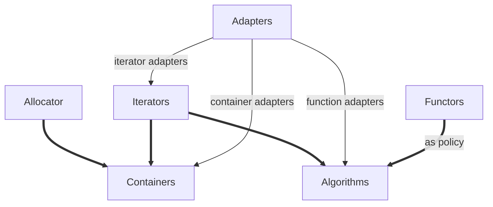

<!--
 * @Author: chenbei
 * @Date: 2022-03-30 08:35:39
 * @LastEditTime: 2022-03-30 08:37:01
 * @Description: STL_Source_Code_Analysis
 * @FilePath: \myLeetCode\STLSourceCodeAnalysis.md
 * A boy without dreams
  -->

## 一、STL概论

STL是一个以抽象概念为主体而非以实际类为主体的结构，形成了一个严谨的接口标准。在此接口下，任何组件都有最大的独立性，并以迭代器iterator胶合起来，或者使用配接器adapter配接，或者以仿函数functor动态选择某种策略。  

STL的组件分为

容器containers：vector、list、deque、set和map等，是一种class template

算法algorithms：sort、search、copy和erase等，可以看出function template

迭代器iterators：扮演容器和算法之间的胶合剂，即泛型指针，可以看成是对operator * ,operator->,operator++,operator--重载的class template，每个STL容器有自己专属的迭代器

仿函数functors：行为类似函数，可作为某种算法的莫种策略，看成是重载operator()的class或class template

适配器adapters：一种修饰容器或仿函数或迭代器接口的东西，可以叫containers adapters、function adapter、iterator adapter。分例如queue和stack看似是容器其实是配接器，真正的容器是deque

配置器：负责空间配置和管理，实现的角度来看是一个实现了动态空间配置、空间管理和空间释放的class template

## 二、空间配置器

