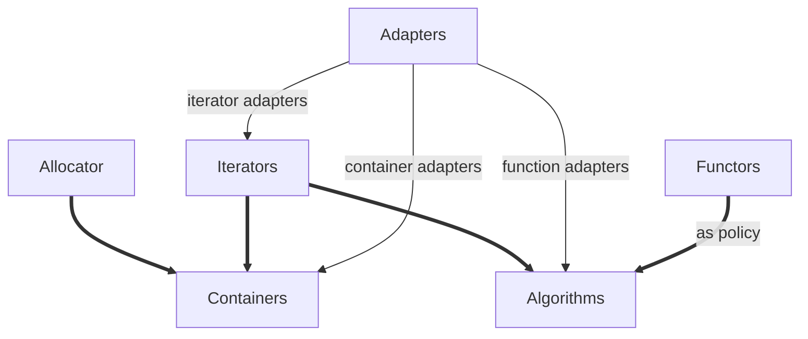

<!--
 * @Author: chenbei
 * @Date: 2022-03-30 08:35:39
 * @LastEditTime: 2022-03-30 08:37:01
 * @Description: STL_Source_Code_Analysis
 * @FilePath: \myLeetCode\STLSourceCodeAnalysis.md
 * A boy without dreams
    -->

## 一、STL概论

STL是一个以抽象概念为主体而非以实际类为主体的结构，形成了一个严谨的接口标准。在此接口下，任何组件都有最大的独立性，并以迭代器iterator胶合起来，或者使用配接器adapter配接，或者以仿函数functor动态选择某种策略。  

STL的组件分为

容器containers：vector、list、deque、set和map等，是一种class template

算法algorithms：sort、search、copy和erase等，可以看出function template

迭代器iterators：扮演容器和算法之间的胶合剂，即泛型指针，可以看成是对operator * ,operator->,operator++,operator--重载的class template，每个STL容器有自己专属的迭代器

仿函数functors：行为类似函数，可作为某种算法的莫种策略，看成是重载operator()的class或class template

适配器adapters：一种修饰容器或仿函数或迭代器接口的东西，可以叫containers adapters、function adapter、iterator adapter。分例如queue和stack看似是容器其实是配接器，真正的容器是deque

配置器：负责空间配置和管理，实现的角度来看是一个实现了动态空间配置、空间管理和空间释放的class template



## 二、空间配置器

allocator提供的标准接口。

```c++
allocator::value_type;
allocator::pointer;
allocator::const_pointer;
allocator::reference;
allocator::const_reference;
allocator::size_type;
allocator::difference_type;
allocator::rebind; // 拥有唯一成员other
allocator::allocator();// 默认构造
allocator::allocator(const allocator&); // 复制构造
template<class U> allocator::allocator(const allocator<U>&);//泛化的复制构造函数
~allocator(); // 析构
pointer allocator::address(reference x)const; // 返回地址.&x
const_pointer allocator::address(const_reference x)const ;// 返回const对象地址
pointer allocator::allocate(size_type n,const void*=0);//配置n个T对象所需空间,第2参数是个提示可以用来增进区域性
void allocator::deallocate(pointer p,const T& x); // 归还空间
size_type allocator::construct(pointer p,const T&x); // 返回可成功配置的最大量
void allocator::destroy(pointer p);//等同于p->~T()
```

一个简单的空间配置器设计如下，可见代码文件JJAlloc.h。

```c++
#ifndef _JJALLOC_
#define _JJALLOC_
#include <new> // 用于placement new重载
#include <cstddef> // 使用ptrdiff_t,size_t类型
#include <cstdlib> // 使用exit
#include <climits> //使用UINT_MAX
#include <iostream> // 使用cerr
#include <vector> // for test
using namespace std;
namespace JJ
{
    // 用于分配内存的内联函数,inline有利于版本更迭且提高执行速度
    // 此函数在后面的allocator类调用
    template<class T>
    inline T*_allocate(ptrdiff_t size, T*){
        set_new_handler(0);//初始化内存分配函数
        T* tmp = (T*)(::operator new((size_t)(size* sizeof(T))));
        if (tmp == 0){
            cerr <<"out of memory"<<endl;
            exit(1);
        }
        return tmp; // 返回指向分配的内存的指针
    }

    // 释放内存的inline函数,频繁调用同样inline
    template<class T>
    inline void _deallocate(T*buffer){
        ::operator delete(buffer);
    }

    // 以p指向的内存构造类型为value的函数
    template<class T1,class T2>
    inline void _construct(T1 *p,const T2& value){
        new(p) T1(value);//value转为T1类型被new构造
    }

    // 析构T类型的内存
    template<class T>
    inline void _destroy(T*ptr){
        ptr->~T();
    }

    template<class T>
    class allocator{ // 分配内存的类
        public:
            // 起一些别名方便
            typedef T value_type;
            typedef T* pointer;
            typedef const T* const_pointer;
            typedef T& reference;
            typedef const T& const_reference;
            typedef size_t size_type;
            typedef ptrdiff_t difference_type;

            template<class U> //允许模板成员函数
            struct rebind{
                typedef allocator<U> other;//绑定其他类型的内存分配器
            };

            pointer allocate(size_type n,const void* hint = 0){
                return _allocate((difference_type)n,(pointer)0); // _allocate函数的参数
            }

            void deallocate(pointer p,size_type n){
                _deallocate(p);} // 调用_deallocate函数

            void construct(pointer p,const T& value){
                _construct(p,value);
            }

            void destory(pointer p){
                _destroy(p);
            }

            pointer address(reference x){
                return (pointer)&x;//取地址转为指针返回
            }

            const_pointer const_address(const_reference x){
                return (const_pointer)x;
            }

            size_type max_size() const{
                return size_type(UINT_MAX/sizeof(T));
            }
    };

} // namespace JJ
void _jj_allocate_testcode(){
    int ia[5]={1,2,3,4,5};
    unsigned int i ;
    vector<int,JJ::allocator<int>> iv(ia,ia+5);
    for(i = 0;i<iv.size();++i){
        cout<<iv[i]<<" ";
    }
    cout<<"\n";
}
#endif // !_JJALLOC_
```

std::allocator是SGI标准的空间配置器，但是效率不高，只是把C++的new和delete函数做一层薄薄的封装，一般使用std::alloc。默认的情况下，容器指定的缺省空间配置器就是alloc。

```c++
template<class T,class Alloc = alloc>
class vector{...};
```

std::alloc把空间配置拆成了4个过程，即分配内存、构造、析构、释放内存。配置器定义于< memory >，内部包含3个头文件。

```c++
#include <stl_alloc.h>
#include <stl_construct.h>
#include <stl_uninitialized.h>
```

<stl_construct.h> 定义了全局函数construct()和destroy()用于构造和析构函数。

<stl_alloc.h> 定义了一、二级配置器，彼此合作

<stl_uninitialized.h>是用于填充和复制大块内存数据，一些全局函数被定义，un_initialized_copy()、un_initialized_fill()、un_initialized_fill_n()等


