<!--
 * @Author: chenbei
 * @Date: 2022-04-07 18:47:33
 * @LastEditTime: 2022-04-08 22:29:14
 * @FilePath: \myLeetCode\C++设计模式.md
 * @Description: C++设计模式.md
 * @Signature: A boy without dreams
-->
## 一、简单工厂模式

1、业务类和界面类分开。

以计算器为例，可以直接根据客户输入的代码然后写一堆代码进行计算，直接得到结果；也可以将计算的代码封装为一个类，客户输入和获取结果的代码作为一个类，这样提高复用性。因为计算的操作还可以提供给别的场景进行使用。

```C#
public class Operation{
    public static doublr getResult(double num1,double num2,string operate){
        double res = 0d;
        switch(operate){
            case "+":
                res = num1+nums2;
                break;
            case "-":
                res = num1 - num2;
                break;
            case "*":
                res = num1*nums2;
                break;
            case "/":
                res = num1 / num2;
                break;
        }
        return res;
    }
}

static void Main(string[] args){
    try{
        Console.Write("please input num1: ");
        string num1Str = Console.ReadLine();
        Console.Write("please input operation(+,-,*,/): ");
        string optStr = Console.ReadLine();
        Console.Write("please input num2: ");
        string num2Str = Console.ReadLine();
        string res = "";
        res = Convert.ToString(Operation.getResult(Convert.ToDouble(num1Str),Convert.ToDouble(num2Str),optStr));
        Console.Write("output = "+res);
        Console.ReadLine();
    }
    catch(Exception ex){
        Console.WriteLine("input is invalid "+ex.Message());
    }
}
```

2、使用多态和继承来实现松耦合

抽象基类只提供2个私有成员代表2个数，一个虚方法getResult，各类操作具体类的实现通过继承抽象基类的接口函数来实现。这样即使增加一个新操作，例如开根、求幂计算等，并不会影响其它类。

```c#
public class Operation{//抽象基类
    private double num1 = 0;
    private double num2 = 0;
    public double getAndSetNum1(){
        get{return num1;}
        set{num1 = value;}
    }
    public double getAndSetNum2(){
        get{return num2;}
        set{num2 = value;}
    }
    public virtual double getResult(){
        double res = 0;
        return res;
    }
}
// 4个具体类
class OperationAdd:Operation{
    public override double getResult(){
        double res = 0;
        res = num1 + num2;
        return res;
    }
}
class OperationSub:Operation{
    public override double getResult(){
        double res = 0;
        res = num1 - num2;
        return res;
    }
}
class OperationMul:Operation{
    public override double getResult(){
        double res = 0;
        res = num1 * num2;
        return res;
    }
}
class OperationDiv:Operation{
    public override double getResult(){
        double res = 0;
        if (num2 == 0)
            throw new DivsionZeroException;
        res = num1 / num2;
        return res;
    }
}
```

3、简单工厂模式。提供一个类来决定实例化的对象是何种运算(用户提供这个参数)，这个类来负责做这个实例的构造过程，也就是工厂的实现类，上边的Operation是接口类。

```c#
public class OperationFactory{
    public static Operation createOperate(string operate){
        Operation oper = null; //基类对象动态绑定为指定的子类对象
        switch{
            case "+":
                oper = new OperationAdd();
                break;
            case "-":
                oper = new OperationSub();
                break;
            case "*":
                oper = new OperationMul();
                break;
            case "/":
                oper = new OperationDiv();
                break;
        }
        return oper;
    }
}
// 客户端的使用方式
Operation oper;
oper = OperationFactory.createOperate("+");
oper.num1 = 1;
oper.num2 = 2;
double res = oper.getResult();
```

4、如何看UML类图

① 矩形框代表1个类。第一行文字表示类的名称，如果是斜体就表示我抽象类；第二行文字表示类的特性，即字段和属性；第三行文字为类的操作，即提供的方法。文字最前边会有三个符号，"+"代表public，"-"表示private，"#"表示protected。

矩形框第一行文字顶端如果带有"<<interface>>"就表示一个接口图，第一行文字依然表示接口名称；第二行文字是接口方法。

矩形框第一行文字和棒棒糖符号相连，也表示一个接口，第一行、第二行文字的含义相同。

② 继承关系使用空心三角+实现来表示，从派生类指向基类。

③ 实现接口使用空心三角+虚线来表示。

④ 关联关系使用实线箭头来表示，例如大雁飞翔与气候有关。

⑤ 聚合关系使用空心菱形+实线箭头来表示，从小概念指向更大的概念，例如大雁和雁群。

⑥ 组合关系用实心菱形+实线箭头来表示，被组合的指向组合，例如鸟与翅膀的关系。

依赖关系使用虚线箭头表示，倚赖者指向依赖物，例如大雁依赖氧气和水。

## 二、策略模式

1、**具有相同属性和功能的对象的抽象集合才是类**。

打折问题中，打一折打两折本质都是打折问题，所以不要单纯的使用简单工厂模式，反复添加各种折数的子类，而应都统一成打折类，提供打折参数；如果有满返的活动也相同，返利多少本质上都是返利，提供返利的参数即可。

现在无论添加什么样的活动，只需要修改抽象类的工厂函数即可(所以这也是简单工厂模式的问题)。

```c#
abstract class cashSuper{ // 超市收钱的抽象类
    public abstract double acceptCash(double money);//抽象方法,类似虚函数
}
class cashNormal : cashSuper{ // 正常收费子类
    public override double acceptCash(double money){
        return money;//原价返回
    }
}
class cashFactory{ // 现金收费工厂类
    public static cashSuper createCashAccept(string type){
        cashSuper cs = null;
        switch (type){
            case "正常收费":
                cs = new cashNormal();
                break;
            case "满300返100":
                CashReturn cr1 = new cashReturn("300","100");
                cs = cr1;
                break;
            case "打八折":
                cashRebate cr2 = new cashRebate("0.8");
                cs = cr2;
                break;
        }
        return cs;
    }
}
class cashRebate : cashSuper{ // 打折收费子类
    private double moneyRebate = 1d;//打折率
    public cashRebate(string moneyRebate){
        this.moneyRebate = double.Parse(moneyRebate);//初始化折扣率
    }
    public override double acceptCash(double money){
        return money * moneyRebate;//打折返回
    }
}
class cashReturn : cashSuper{ // 满返收费子类
    private double moneyCondition = 0.0d;//满多少
    private double moneyReturn = 1d;//返多少
    public cashReturn(string moneyCondition,string moneyReturn){
        this.moneyCondition = double.Parse(moneyCondition);
        this.moneyReturn = double.Parse(moneyReturn);//初始化
    }
    public override double acceptCash(double money){
        double res = money;
        if (money >= moneyCondition)
            res = money - Math.Floor(money / moneyCondition) * moneyReturn;
        return res;//满减返回
    }
}
```

2、使用策略模式，即定义算法家族分别封装起来，让它们可以相互替换。

如果商场打折活动的方式经常需要改变，如更改打折额度，满返的额度发生变化，亦或者添加了新类型的活动，例如买东西可以积累积分，满多少可以换取奖品，这就可能需要经常性的更改工厂类。

策略模式的好处可以在算法发生变化时，不会影响客户的使用。**与简单工厂模式的不同在于，工厂模式直接生成算法对象，策略模式则是提供，所有支持的算法的公共接口**，具体策略类则是继承接口类封装具体的算法。

```c#
abstract class Strategy{ // 提供支持的算法的公共接口,抽象基类
    public abstract void algorithmInterface();// 算法函数
}
class concreteStrategyA:Strategy{ // A类方法
    public override void algorithmInterface(){
        ...
    }
}
class concreteStrategyB:Strategy{ // B类方法
    public override void algorithmInterface(){
        ...
    }
}
class concreteStrategyC:Strategy{ // C类方法
    public override void algorithmInterface(){
        ...
    }
}
```

Strategy类的实例化取决于派生类，这个实例最好单独使用一个类去管理，即该实例作为类的属性。

```c#
class Context{
    Strategy strategy;
    public Context(Strategy strategy){ //构造函数传入具体的策略对象,A,B,C类实例
        this.strategy = strategy;
    }
    public void contextInterface(){
        strategy.algorithmInterface();//调用策略的算法方法
    }
}
// 客户端的使用方式
static void Main(string[] args){
    Context context;
    context = new Context(new concreteStrategyB());//使用B类的方法
    context.contextInterface();//调用方法
    
    context = new Context(new concreteStrategyC());//使用C类的方法
    context.contextInterface();//调用方法
    
    Console.Read();
}
```

3、策略模式的实现。

现在回看打折问题，cashSuper超市收钱的抽象类其实就可以看成一种抽象策略，而不是简单的工厂。正常收费、打折收费和满返收费的模式都看成是一种具体的策略，不要看成是工厂出来的算法具体对象。如果能够让具体的算法和工厂分开，也就是工厂不直接和这些算法进行耦合打交道，就不会因为算法的变化来让工厂发生变化。

具体的实现是让现金收费工厂具体类cashFactory的功能移动到界面上，例如界面的某个按钮点击回调函数，并取缔cashFactory类。同时**使用一个类直接管理cashSuper抽象策略类对象，而不是借助工厂具体类去直接实现抽象类的接口函数，本质上就是对抽象类再加一层抽象**。

cashSuper、cashNormal、cashRebate、cashReturn都不需要修改，cashFactory被取缔，其功能由一个客户端的回调函数完成，增加一个管理cashSuper的类cashContext。

现在如果增加新的策略，只需要更改客户端的回调函数，其它策略具体类、管理策略的类都无需改变

```c#
class cashContext{
    private cashSuper cs;//管理的抽象基类对象
    public cashContext(cashSuper cs){
        this.cs = cs;//构造函数
    }
    public double getResult(double money){
        return cs.acceptCash(money);//cs是策略
    }
}
// 客户端代码
private void btnOk_Click(object sender,EventArgs e){ 
    // 一个界面的回调函数,点击按钮ok就执行本函数
    cashContext cc = null;//管理对象
    switch (Bar.SelectedItem.ToString()){ // 下拉项对应不同的策略
        case "正常收费":
            cc = new cashContext(new cashNormal());
            break;
        case "满300返100":
            cc = new cashContext(new cashReturn("300","100"));
            break;
        case "打8折":
            cc = new cashContext(new CashRebate("0.8"));
            break;
    }
}
double totalPrices = 0d; // cc在点击按钮的回调函数中创建
totalPrices = cc.getResult(Convert.ToDouble(txtPrice.Text)
                           *Convert.ToDouble(txtNum.Text)); // 得到该策略要支付的金额  
```

4、策略与简单工厂的结合

上述方法虽然在添加新策略时无需重新编译其它策略类和管理策略的类，但是要重新编译客户端代码。现在希望把switch判断语句转移走，让客户端也是一种抽象逻辑，所以可以考虑把这段代码放到管理策略对象的类cashContext中。

客户真正需要了解的从原来简单工厂模式的2个类cashSuper和cashFactory，只需要认识1个类cashContext，客户不会知道cashSuper以及各类具体策略的实现和接口。

```c#
// 改进的cashContext
class cashContext{
    cashSuper cs = null;
    public cashContext(string type){ // 收费类型而不是具体的收费策略
        switch (type){
        	case "正常收费":
            	cashNormal cn = new cashNormal();
                cs = cn;
            	break;
        	case "满300返100":
            	cashReturn cr1 = new cashReturn("300","100");
                cs = cr1;
            	break;
        	case "打8折":
            	CashRebate cr2 = new CashRebate("0.8");
                cs = cr2;
            	break;      
        }
    }
    public double getResult(double money){
        return cs.acceptCash(money);
    }
}
// 客户端代码更抽象的改进
private void btnOk_Click(object sender,EventArgs e){ 
    cashContext cs = new cashContext(Bar.SelectedItem.ToString());
	double totalPrices = 0d;
    totalPrices = cs.getResult(Convert.ToDouble(txtPrice.Text)
                               *Convert.ToDouble(txtNum.Text));
}
```

**策略模式可以以相同的模式调用所有的算法，减少各种算法类与使用算法类之间的耦合。**

**同时策略模式的优点是简化了单元测试，每个算法都有自己的类，可以通过自己的接口单独测试。**

**策略模式可以在客户端去除条件判断语句，将其转嫁给管理策略类的对象去实现。**

但是管理策略类的对象实现switch语句更改比较容易，代价也小，它的改动不会影响具体的策略类

如果能够继续消除管理策略类的类的条件判断，可以使用反射技术，这在抽象工厂模式章节提到。

## 三、单一职责原则

1、**单一职责原则是指，一个类应当只有一个原因会引起它改变**。

2、开发一个产品，需要先构思类承担的职责，如果多于1个动机去改变它，就要考虑拆分这个类。

如果一个类有各种各样的功能，它是无法复用的，可维护性也差，任何变化都要去修改它。

## 四、开放封闭原则

1、**开放封闭原则是指，对软件实体(模块、类和函数)的拓展是开放的，对更改是封闭的**。

举例，弹性工作制就是对工作时间的修改关闭(早来早下班,晚到晚下班)，对时间制度扩展的开放。

2、尽可能的设计好一个类使之满足修改封闭，但是也要对可能发生的变化创造抽象来隔离。

例如第二章的策略模式中，使用了cashContext类管理策略类对象来应对可能发生的具体策略变化，并将这种变化封装在cashContext类的内部，与其它现有的策略类进行了隔离。

3、开发工作不久之后出现了变化，就及时采取措施进行抽象。

例如第一章的运算类对于加减乘除只在一个函数内条件判断完成功能就提示了这种变化，我们要及时的把各类运算都定义自己的类，而不是等到平方、开根、取余等运算都来了才去抽象。不过，**过早的抽象也没有意义，拒绝不成熟的抽象和抽象本身一样重要**。

## 五、依赖倒转原则

1、**依赖倒转原则是指：抽象不应倚赖细节，细节应该依赖抽象，或者说针对接口编程而不是实现**。

例如，无论是主板、CPU、内存还是硬盘都是针对接口设计的，如果是针对实现设计的，内存就是针对具体的某个品牌的主板去设计了，这样如果更换内存可能也要更换主板，这就涉及行业标准的问题。再如，充电器的电线常用的3种类型，苹果的Lighting接口，华为的Type-C接口，以及安卓系列的Micro USB接口，更换任何厂家制造的都可以使用，这就是针对充电器的接口进行设计。

2、**高层模块不应依赖低层模块，两个都应该依赖抽象，各自都不互相依赖**。

一般的设计场景是自顶向下，高层模块被拆分为多个低层模块去实现，然后使用高层模块时需要调用低层模块去执行功能，这就造成了高层模块对底层模块的依赖。

3、**里氏代换原则是指：软件实体使用的是父类的话，那么它一定使用于子类**。换句话说子类有自己的行为之前先是父类，其实就是继承的概念。

这样第2条依据第3条就可以实现，因为**子对象可以被替代为任何其它类型，所以允许高层模块在无需修改时进行扩展**。

## 六、装饰模式

1、**装饰模式是指：动态的给一个对象添加额外的职责，就增加功能而言比生成子类更灵活**。

装饰类也是继承自抽象类，但是和抽象类的具体类实现不同，装饰类不需要被抽象类知道。

现在以Component、ConcreteComponent、Decorator、ConcreteDecorator四个类的例子来说明装饰模式。

```c#
abstract class Component{ // 业务基类
    public abstract void Operation();//抽象函数
}
class ConcreteComponent : Component{// 业务具体类
    public override void Operation(){
        Console.WriteLine("concrete component");
    }
}
abstract class Decorator : Component{ // 装饰器抽象基类也继承于业务基类
    protected Component component;//更像是has-a,用某物实现的组合关系
    public void setComponent(Component component){
        this.component = component;
    }
    public override void Operation(){
        if (component != null){
            component.Operation();//装饰器的操作就是Component的操作,转交
        }
    }
}
class ConcreteDecoratorA:Decorator{
    private string addedState;//A类独有属性
    public override void Operation(){
        base.Operation();//原有功能,base.opt=>Decorator=>Component.opt
    	addedState = "New State";//新功能
 		...
    }
}
class ConcreteDecoratorB:Decorator{
    public override void Operation(){
        base.Operation();//原有功能
    	AddedBehavior();// 新方法
 		...
    }
    private void AddedBehavior(){ // B类独有方法
        ...
    }
}
// 客户端代码
static void Main(string[] args){
    ConcreteComponent c = new ConcreteComponent();//业务具体类对象
    ConcreteDecoratorA d1 = new ConcreteDecoratorA();
    ConcreteDecoratorB d2 = new ConcreteDecoratorB();//装饰具体类对象
    
    d1.setComponent(c);//装饰了c的功能
    d2.setComponent(d1);// 装饰了d1,c的功能
    d2.Operation();
}
```

从上述代码可以看出，**装饰模式的核心就是装饰器类不仅继承业务类，还将业务类对象作为私有进行管理，然后提供和业务对象同样的方法，只是内部直接调用业务对象的方法(这也是为何还要继承业务类)，同样装饰器类的派生类进行复写时只需要先调用基类的方法再执行自己的方法即可**。

小结：总结一下工厂模式、策略模式和装饰器模式。

**工厂模式**：模式成员有基类接口类、基类工厂类和派生具体类。

基类接口类定义接口，派生具体类继承基类的接口类并复写方法；

基类工厂类的构造函数会提供参数，内部判断语句会知道返回哪个派生类的具体对象；

优点是构建新的派生类不会影响其它派生类和基类接口，但是需要修改基类工厂类的构造函数。在客户端来看客户只使用了基类工厂类，它看不到派生类，知道基类接口，因为**基类工厂类没有继承基类接口类**，只在**构造函数中使用了基类对象来初始化为不同的派生类对象**。


**策略模式**：模式成员有基类接口类、管理基类接口对象的类和派生具体类。

**管理基类接口对象的类也没有继承基类接口类**，**只是将其对象作为私有属性(和简单工厂的区别,没有作为私有属性进行管理)**，构造函数负责将该属性初始化；

管理基类接口对象的类可以以基类接口类，也可以使用派生具体类来构造自己，其私有属性相应就可以变成不同类型的对象(简单工厂则是直接实例化成了一个具体的算法对象)；

管理基类接口对象的类可以提供方法，**方法内部调用的实际上是私有属性的方**法，因为私有属性的泛型，所以让这个方法也显得泛型，达到了复用的目的；

客户只用到了管理基类接口对象的类，看不到派生类也看不到基类接口。


**装饰器模式**：模式成员有基类具体类(基类接口类可以没有也可以有)、装饰器具体类(装饰器接口类可以有也可以没有)。

装饰器模式有点像策略模式的提升，因为**装饰器类也将基类对象作为私有属性进行管理(就像策略模式管理基类接口对象)，但是还继承了基类，这就使得装饰器能够覆盖基类的方法**；

**装饰器类要继承基类的原因是因为要提供基类对象的同名方法，内部先调用了基类的同名方法，再添加自己的功能**，就达到了装饰的效果；

装饰器类将基类对象作为私有属性进行管理，即作为被包装的对象，继承了策略模式中可以将私有属性随意构造成任何派生类对象的优点，达到复用目的；

如果只有基类具体类，则装饰具体类可以直接继承基类具体类并将其作为私有属性管理即可，无需装饰接口类，即将装饰具体类和装饰接口类的责任合并为一个类；

## 七、代理模式

1、代理模式是指：**代理类和被代理类都继承自一个基类，同时被代理类作为代理类的私有属性**。代理模式看起来和装饰器模式非常相似，因为装饰器模式本质上也是一个派生类和装饰器类都继承了基类。区别在于，**装饰器类继承了基类且管理基类的对象，代理类继承了基类但是管理的是另一个继承基类的类对象**。

```c#
abstract class Subject{ // 基类
    public abstract void Request(); // 基类方法
}
class RealSubject:Subject{ // 被代理类,实体类
    public override void Request(){
        Console.WriteLine("真实的请求");
    }
}
class Proxy:Subject{ // 代理类继承基类
    RealSubject realSubject;//管理被代理类的对象
    public override void Request(){
        if (realSubject == null){
            realSubject = new RealSubject();
        }
        realSubject.Request();//实质代替调用实体的方法,但不是装饰
    }
}
// 如果代理类还想修饰被代理类,应当继承被代理类,调用被代理类的方法后再追加自己方法

// 客户端代码
static void Main(String[] args){
    Proxy proxy = new Proxy();
    proxy.Request();//内部执行的是被代理类的方法
}
```

2、代理类的应用有远程代理、虚拟代理、安全代理和智能指引。

远程代理：让对象在不同的地址空间也可以使用。例如客户端程序可以调用代理文件就可以解决远程访问的问题；

虚拟代理：创建一个存放很大实体对象的代理对象，达到性能优化的目的。例如打开一个很大的网页，里边有很多的文字和图片但是不影响打开速度，因为这些实体需要下载以后才能看到，它们在代理内的存在是虚拟的，代理只是存储了真实图片的路径和尺寸，不是真正的图片。

安全代理：用来控制访问真实对象的权限，不同的代理拥有不同的访问权限。

智能指引：调用真实的对象时，代理处理另外一些事。例如计算真实对象的引用次数，在该对象没有引用时释放它；或者访问真实对象时检查是否被锁定，以确保其他对象不能改变它。

## 八、工厂方法模式

1、工厂方法模式是指**工厂也有抽象工厂，然后工厂具体类继承抽象工厂去制造某个派生类的对象**。

和简单工厂模式一样，工厂类没有继承基类接口类，也没有管理基类接口类的对象作为私有属性，而是直接使用基类接口。但是不用一个工厂建造各种类型的派生类对象，而是**不同的工厂建造不同的派生类对象**，这样更灵活，也更符合单一权责原则。因为简单工厂模式意味着这个工厂可能因为任何派生类的对象增加(多因素)而对工厂的构造函数进行修改，同时还违反了开放闭合原则。

以第一章的计算器实现为例。

```c#
interface IFactory{//抽象工厂接口
    Operation CreateOperation();//返回任何可能的抽象运算,只是使用了Operation
}
class AddFactory:IFactory{ // 加法类工厂
    public Operation CreateOperation(){
        return OperationAdd();//返回加法类操作对象
    }
}
class SubFactory:IFactory{ // 减法类工厂
    public Operation CreateOperation(){
        return OperationSub();//返回减法类操作对象
    }
}
class MulFactory:IFactory{ // 乘法类工厂
    public Operation CreateOperation(){
        return OperationMul();//返回乘法类操作对象
    }
}
class DivFactory:IFactory{ // 除法类工厂
    public Operation CreateOperation(){
        return OperationDiv();//返回除法类操作对象
    }
}
// 客户端代码
IFactory F = new AddFactory();//得到加法工厂
Operation opt = F.CreateOperation();//加法工厂创建了加法操作
opt.num1 = 1;
opt.num2 = 2;
double res = opt.getResult();
```

工厂方法模式不需要再对抽象工厂进行修改了，也不会对其他派生的工厂产生影响，真正实现了开放-闭合原则，支持拓展，不支持已有的代码修改。

但是工厂模式还是存在问题，选择何种模式其实是从工厂内部的选择转交给了客户端，另外如果增加一种计算功能就要加一个对应的工厂，开发量比较大，解决这个问题的方法依然是反射技术。

## 九、原型模式

1、原型模式是指，用原型实例指向创建对象的种类，并且通过拷贝这些原型创建新的对象。

可以创建原型类，声明一个克隆自身的接口，原型类的派生类可以继承它实现自己的克隆方式。

```c#
abstract class Prototype{
    public abstract Prototype Clone();//返回Prototype的方法
}
class ConcreteProtype:Prototype{
    public override Prototype Clone(){
        return (Prototype)this.MemberwiseClone();
    }
}
```

MemberwiseClone()方法对值类型的字段会进行复制，但是引用类型的字段只会复制引用而不是引用背后的数据，所以这属于浅拷贝。

2、克隆的方法不需要重新初始化对象，而是基于已初始化的对象。动态的获得该对象运行时的状态，既隐藏了对象创建的细节又提高性能，因为调用new初始化对象需要执行构造函数。

3、深拷贝与浅拷贝，这个概念无需多说，深拷贝是复制真正的数据对象，浅拷贝只复制引用或者指针本身，所以释放内存时特别要注意堆区申请的内存管理。

## 十、模板方法模式

**模板方法是指，把不变的行为搬移到基类，可以去除子类中重复的代码达到复用的目的**。

需要变化的行为由子类自己去覆写重定义，其实这里和C++抽象基类的非虚函数要求不被重定义是相同的。例如STL容器类有一些固定的方法，empty、size、capacity等，这些都定义成非虚函数，因为派生类依然可以使用这些函数进行复用。

```c#
abstract class AbstractClass{
    public abstract void f1(); // f1,f2是可以被覆写体现多态的
    public abstract void f2();
    public void templateMethod(){ // 固定会执行的逻辑不声明为abstract
        f1();
        f2();
    }
}
class ConcreteClassA:AbstractClass{
    public override void f1(){
        Console.WriteLine("A->f1()");
    }
    public override void f2(){
        Console.WriteLine("A->f2()");
    }
}
class ConcreteClassB:AbstractClass{
    public override void f1(){
        Console.WriteLine("B->f1()");
    }
    public override void f2(){
        Console.WriteLine("B->f2()");
    }
}
// 客户端代码
AbstractClass c;
c = new ConcreteClassA(); //templateMethod实现复用
c.templateMethod();
c = new ConcreteClassB();
c.templateMethod();
```

## 十一、迪米特法则

迪米特法则是指，如果两个类不必彼此直接通信，那么这两个类不应发生直接的相互作用。若其中一个类需要调用另外一个类的某个方法时可以借助第三者转发这个调用。

**迪米特法则强调了类之间的松耦合，耦合越弱，越有利于被复用**，且若耦合的类被修改也不会对有关系的类造成波及。

## 十二、外观模式

1、外观模式是指，为子系统的一组接口提供一个一致的界面，此模式定义了一个高层接口，接口使子系统更容易被使用。

容易理解的例子是基金与股票的关系，基金是由众多股票、国债、房地产构成的，对于普通人可能无法同时关注到这些东西的买入卖出信息，但是只需要关心基金即可，真正的风险操作都是基金经理负责搞定的。基金其实就是股票的门面，降低了入门难度。

2、对于外观类，它需要了解所有子系统类的方法或属性，然后将其组合，以便外界调用。

外观类常常用于遗留的大型项目，屎山往往是无法拓展和更改的，但是可以开发一个外观类去和屎山进行交互，然后拓展新功能可以基于外观类，很显然前者非常的狗屎。

## 十三、建造者模式

1、建造者模式是指，**将一个复杂对象的构建过程与它的表示分离，使得同样的构建过程可以创建不同的表示**。

例如，创建各种各样的人，最基本的人都有手有脚有头，可以把这个过程固定下来，作为抽象基类，提供各种各样的抽象方法。然后所有的派生类使用它都必须覆盖这些抽象方法。

```c#
abstract class PersonBuilder{
    public abstract void buildHead();
    public abstract void buildArm();
    public abstract void buildLeg();
    public abstract void buildBody();
}
class PersonThinBuilder{ // 瘦子类
    public override void buildHead(); //必须覆写这些方法
    public override void buildArm();
    public override void buildLeg();
    public override void buildBody();
}
class PersonFatBuilder{ // 胖子类同理
    public override void buildHead(); //必须覆写这些方法
    public override void buildArm();
    public override void buildLeg();
    public override void buildBody();
}
```

2、为了避免客户端忘记调用这些方法去创建人，还可以借助简单工厂模式实现一个指挥建造的类。

简单工厂模式回顾一下，它没有继承业务基类，只是把它作为私有属性进行管理，然后创造基类及其派生类各种各样的对象。指挥者一样，把PersonBuilder作为私有属性管理，但是有一点点区别，就是不直接生成具体的人类，而是固定创建人的过程，这就**结合了策略模式的思想(固定的是如何提供算法的行为而不是算法本身)以及模板方法(派生类都要重复这一人的构建过程，可复用的代码应作为基类的非抽象方法)**。

```c#
class PersonBuilderDirector{
    private PersonBuilder pb;
    public PersonBuilderDirector(PersonBuilder pb){
        this.pb = pb;
    }
    public void CreatePerson(){//注意提供的不是抽象方法而是模板方法
        pb.buildHead();
        pb.buildBody();
        pb.buildArm();
        pb.buildLeg();
    }
}
// 客户端代码
PersonThinBuilder ptb = new PersonThinBuilder();
PersonBuilderDirector pbd = new PersonBuilderDirector(ptb);
pbd.CreatePerson();
```

3、建造者模式是用于创建复杂对象的算法应独立于该对象的组成部分以及它们的装配方式时所使用的模式。换句话说，如果某个产品有固定的流程，就不需要关心它需要什么东西组成以及产品是如何被组装的。

## 十四、观察者模式

1、观察者模式是指：**多个观察者对象可以同时监听一个主题对象(通知者对象)**。这个主题变化时可以通知到所有观察者对象，使观察者自动更新自己的状态。

例如老板可以作为一个通知者的具体类对象，老板类继承了通知者类。同时各个员工都可以看成观察者的具体类对象，它们都继承于观察者类**。关键点在于，抽象观察者类的构造函数需要用到抽象通知者，注意不是继承，也不是作为私有属性管理，而是直接拿来使用(就像简单工厂模式直接把要建造的基类对象直接拿过来用)**。既然如此，观察者的具体类也必须使用通知者的对象来构造，那么所有的员工都可以将老板作为通知者对象，老板一来就停止摸鱼。

2、观察者模式适用于，想要维持维护对象的一致性且要避免紧耦合时的设计场景。**当一个对象的改变需要同时改变其它对象且不知道要改变多少其它对象时考虑使用观察者模式**。

3、更新状态的函数可能名称不相同，可以去除抽象观察者类，每个观察者具体类有自己的方法名，它们的构造函数使用抽象通知类即可。但是这样如何做到观察者具体类可以监视老板呢？在C#中答案是使用委托技术，关键字是delegate。

```c#
delegate void EventHandler();//声明1个委托
class Boss : Subject{//继承抽象通知者
    //声明1个事件Update,类型为委托EventHandler
    public event EventHandler Update;
    public void Notify(){
        Update();
    }
}
// 客户端
Boss boss = new Boss();//具体的通知者老板
StockObserver p1 = new StockObserver("p1",boss);//看股票的同事p1监视老板
NBAObserver p2 = new NBAObserver("p2",boss);//看NBA的同事p2监视老板

boss.Update += new EventHandler(p1,CloseStockMarket);//p1关闭股票市场
boss.Update += new EventHandler(p2,CloseNBAGame);//p2关闭NBA比赛

// 将boss的更新动作(例如出现在办公室)通过授权绑定到2个同事对应的反应函数
```

## 十五、抽象工厂模式

1、抽象工厂模式是对简单工厂模式、工厂方法模式的继续提升，即提供一个创建一系列相关或者相互依赖对象的接口而无需指定它们具体的类。

简单工厂模式只有1个工厂，它可以根据条件判断制造不同的某一类产品，这类产品都属于一个抽象基类。例如工厂棚可以制造葡萄、桃、苹果等产品，它们都属于水果。

工厂方法模式就是有多个工厂，它的定位是做某个类型的产品，但是具体的类型有分厂。例如总部厂是做水果的，它有一堆分厂专门制造某一种水果。

抽象工厂模式加了更深一层的抽象，它可以理解为总厂现在不做水果，做的是水果饮料和水果沙拉。那么这些分厂继承了它也是这种模式，要做饮料和沙拉，但是对应的是苹果沙拉和苹果汁，香蕉沙拉和香蕉汁。。当然抽象可以反复堆叠，但已经尽可能降低了大型项目的耦合性。

2、抽象工厂的好处是，在客户看来它只是知道一个抽象的水果工厂类，这工厂可以制造各种水果沙拉和饮料，但是这些东西创建的过程不会被客户所知，他们只是用了这个抽象接口去操纵实例。产品的具体类名也和具体工厂的实现分离，不会出现在客户代码中。

3、本章提到了依赖注入的反射技术，不过这是C#的内容，所以不予说明，因为我没学过C#。

## 十六、状态模式

1、状态模式是指，**一个对象的内在状态改变时允许改变其行为，这个对象看起来像是改变了其类**。

主要解决的是对象状态转换的条件表达式过于复杂时，把状态的判断逻辑转移到表示不同状态的一系列类当中，就可以把复杂的判断逻辑简化。

2、操作上和策略模式完全一样，使用一个类管理状态的抽象基类对象作为私有属性。各类状态的具体类都继承自抽象状态类，每个具体类来完成那一部分判断分支，然后进入下一轮状态，那么管理类可以依据私有属性的变化而使用不同的状态。这里有2个区别是，**第一是状态类会以管理状态的类进行构造，这是为了可以获知目前管理的状态是什么；第二每个状态都可以转换成下一状态**。

```c#
public abstract class State{
    public abstract void writeProgram(Work w);//以管理State的类Work构造
}
public class ForenoonState:State{
    public override void writeProgram(Work w){
        if (w.hour < 12){ // 上午工作
            ...
        }
        else{
            w.setState(new NoonState());
            w.writeProgram（）；//转入中午工作
        }
    }
}
public class NoonState:State{
    public override void writeProgram(Work w){
        if (w.hour < 13){ // 中午工作
            ...
        }
        else{
            w.setState(new AfternoonState());
            w.writeProgram（）；//转入下午工作
        }
    }
}
public class AfternoonState:State{
    public override void writeProgram(Work w){
        if (w.hour < 17){ // 下午工作
            ...
        }
        else{
            w.setState(new EveningState());
            w.writeProgram（）；//转入晚上工作
        }
    }
}
// ...
public class Work{
    // 减少了连续的分支判断,将各个判断分支置于具体的状态类中实现。
    private State current;//管理抽象状态对象,作为私有属性
    public Work(){
        current = new ForenoonState();//当前工作状态
    }
    private double hour;
    public void setState(State s){
        current = s;
    }
    public void writeProgram(){
        current.writeProgram(this);
    }
}
```

## 十七、适配器模式

1、适配器模式是指，**将一个类的接口转换成客户希望的另外一个接口**，可以解决原本因为接口不兼容而不能一起工作的那些类可以一起工作。

两个类所做的事情相同或相似但是具有不同的接口，适配器模式可以应用。

2、具体操作是一些派生类继承于抽象类，如前锋、后卫、中锋和球员的关系，然后外籍中锋和球员类没有关系，这时需要一个翻译的适配器。翻译者继承了球员类，然后它管理了外籍中锋的对象作为私有属性，那么翻译者使用球员的方法时可以在内部调用的是私有属性的对应方法。例如将球员的attack方法继承下来后内部调用的却是外籍中锋类的"进攻"方法，达到了一种翻译适配的效果。

## 十八、备忘录模式

1、备忘录模式是指，**不破坏封装性的前提下，捕获一个对象的内部状态，并在该对象之外保存这个状态，这样可将对象恢复到之前的状态**。

业务类内部有2个备忘录方法，一个是创建备忘录(决定备忘哪些成分)，一个是设置备忘录(恢复之前的备忘录)。备忘录类是独立的类，它可以被另一个类管理作为该类的私有属性，所以最终就是用这个类的私有属性来保存业务类创建备忘录返回的备忘录，然后业务类状态变化后，再取出私有属性重置即可。

**所以关键就是要从业务类内部返回备忘录，同时用一个管理备忘录的类去接收**。

```c#
class Originator{
    private string state;//保存的数据状态
    public string State{
        get{return state;}
        set{state = value;}
    }
    public Memento CreateMemento(){
        return (new Memenyo(state));
        // 外部使用Originator.CreateMemento()
        // 即保存了Originator的信息
    }
    public void SetMemento(Memento mem){
        state = mem.State;//可以访问备忘录类的State接口(宽),Originator的state可以被重置恢复到以前的状态
    }
}
class Memento{ //完全独立的类,不继承也不使用别的类属性
    private string state;
    public Memento(string state){
        this.state = state;
    }
    public string State{
        get{return state;}//提供给Originator的宽接口
    }
}
class ManagerMemento{ // 管理备忘录的类
    private Memento mem;//作为私有属性
    public Memento getAndSetMemento{
        get{return mem;}
        set{mem = value;}
    }
}
// 客户端程序
Originator o = new Originator();//业务类
o.State = "on";//设置state="on"

ManagerMemento c= new ManagerMemento();//管理备忘录
c.Memento = o.CreateMemento();//o内部的状态备忘于c

o.State = "off";//改变状态
o.SetMemento(c.Memento);//恢复备忘录
```

2、备忘录模式缺点是可能要保存很多的数据，比较消耗内存。

## 十九、组合模式

1、组合模式是指将对象组合成树形结构以表示"部分-整体"的层次结构。**组合模式使用户对单个对象和组合对象的使用具有一致性**。

例如树具有3个方法，添加节点，移除节点和展示节点值。对于叶子节点没有子节点，所以移除和添加操作是没有意义的。而其它非叶子节点，3个方法都有意义，此时希望对两类节点都可以使用同样的方式去处理，就可以采用组合模式。叶子节点类和非叶子节点类继承同一个类即可。

```c#
abstract class Component{
    protected string name;//声明为保护可被继承
    public Component(string name){
        this.name = name;
    }
    public abstract void Add(Component c);
    public abstract void Remove(Component c);
    public abstract void Display(Component c);
}
class Leaf:Component{
    public Leaf(string name):base(name){}
    public override void Add(Component c){
        Console.WriteLine("canno add to a leaf node"); //透明模式但不安全
    }
    public override void Remove(Component c){
        Console.WriteLine("canno remove from  a leaf node"); //透明模式但不安全
    }
    public override void Display{
        Console.WriteLine("name is ",name);
    }
}
class Composite:Component{
    private List<Component>children = new List<Component>();//存储子节点的列表
    public Composite(string name):base(name){}
    public override void Add(Component c){
		children.Add(c);
    }
    public override void Remove(Component c){
        children.Remove(c);
    }
    public override void Display{
        Console.Display();
    }
}
// 客户端代码
Composite root = new Composite("root");
root.Add(new Leaf("Leaf A"));
root.Add(new Leaf("Leaf B"));

Composite comp = new Composite("composite x");
comp.Add(new Leaf("Leaf XA"));
comp.Add(new Leaf("Leaf XB"));

Composite comp2 = new Composite("composite xy");
comp2.Add(new Leaf("Leaf XYA"));
comp2.Add(new Leaf("Leaf XYB"));

comp.Add(comp2);
root.Add(comp);
Leaf leaf = new Leaf("Leaf C");
root.Add(leaf)
root.Remove(leaf);
root.Display();
```

2、透明模式是基类提供了所有方法，某个子类不能使用某些方法时可以抛出异常或提示信息，这样可以保证接口一致，但是不安全。如果基类只提供子类完全共有的那些函数，可能会导致子类之间有不同的接口。

3、**组合模式是要提供添加、移除方法，函数的参数是抽象基类对象，这样传入派生类对象也正确**

## 二十、迭代器模式

1、迭代器模式是指，**提供一种方法顺序访问一个聚合对象中各个元素，而又不暴露该对象的内部表示**。

类似STL容器的迭代器类，既然是迭代，最好把迭代器类嵌套声明在容器类中。如果不嵌套，**容器类可以提供创建迭代器的方法**，类似于备忘录模式内部负责创建备忘录，但是迭代器怎么访问容器类呢，只能是将容器类对象作为私有属性，这样对传入的容器类对象进行迭代即可。容器类也可以有派生类，那么派生类也会继承这个返回迭代器的方法，那么迭代器的派生类去对应容器的派生类即可实现多态且松耦合，因为迭代器可以前向访问也可以反向访问，这个其实是工厂方法模式的体现。

```c#
abstract class Iterator{
    public abstract object First();
    public abstract object Next();
    public abstract boolIsDone();
    public abstract object CurrentItem();
}
abstract class Containter{
    public abstract Iterator CreateIterator();//抽象类返回抽象类,只提供接口
}
class concreteContainter:Containter{
    private IList<object> items=new List<object>();
    public override Iterator CreateIterator(){ //继承的创建迭代器的方法
        return new ConcreteIterator(this);//创建子类迭代器
    }
    public int count{ //返回元素个数
        get{returrn items.Count;}
    }
    public object this(int index){
        get{return items[index];}//返回和设置指定索引元素
        set{items.Insert(index,value);}
    }
}
class ConcreteIterator:Iterator{
    private concreteContainter containter;//迭代器类可直接操作容器类
    prrivate int currrent = 0;
    public ConcreteIterator(concreteContainter con){
        this.containter = con;
    }
    public override object First(){
        return containter[0];
    }
    public override object Next(){
        object ret = null;
        current++;
        if (current < containter.Count){
            ret = containter[current];
        }
        return ret;
    }
    public override bool IsDone(){
        return current>=containte.Count?true:false;
    }
    public override object CurrentItem(){
        return containter[currrent];
    }
}
```

2、迭代器类就是分离了集合对象的遍历行为，可以不暴露集合的内部结构还可以让外部代码透明的访问集合内的数据。

## 二十一、单例模式

1、单例模式是指，保证一个类只有1个实例，并提供一个访问它的全局访问点。

阻止new的使用在C++中就是利用一个类，声明构造函数为私有，然后单例模式的那个子类继承这个类，那么子类就不能进行构造了。对于C#而言可以这样做。

```c#
class Singleton{
    private static Signleton instance;//唯一实例
    private Signleton(){}//阻止new创建新实例
    public static Signleton getInstance(){
        // 静态函数,唯一全局访问点,static函数只存在1份内存
        if (instance == null){
            instance = new Signleton();
        }
        return instance;
    }
}
// 客户端代码
Signleton s1 = Signleton.getInstance();
Signleton s2 = Signleton.getInstance();
if (s1 == s2){ // s1和s2相同
    ...
}
```

2、单例模式可以严格控制客户怎样访问以及何时访问，即对唯一实例的受控访问。

## 二十二、桥接模式

1、**优先使用对象合成/聚合，而不是类继承，即用某物实现(has a to implement**)。

类继承会导致子类强烈依赖父类，所以如果可以利用已有的类进行复合完成一个功能的设计更好。

2、**聚合表示一种弱的拥有关系，即A对象可以包含B对象，但B对象不是A对象的一部分；合成则是一种强的拥有关系，体现的是部分与整体的关系**。

例如大雁和翅膀是合成关系，大雁和雁群则是聚合关系。再如手机品牌和手机软件，如果手机品牌作为抽象类，下边子类是各个手机品牌，每个手机品牌还要有不同的手机软件子类，这样随着品牌和软件类型的增长会成为庞然大物。但是如果考虑使用聚合关系，因为手机软件不是手机品牌的一部分，但是手机品牌可以包含手机软件，所以这是一种聚合关系，聚合关系用空心菱形+实线由被聚合物指向聚合物。

```c#
abstract class HandSoft{
    //抽象手机软件类
    public abstract void Run();
}
class HandSoftGame:HandSoft{ // 游戏软件
    public override void Run(){
        Console.WriteLine("run phone game");
    }
}
class HandSoftAddress:HandSoft{ // 通讯录软件
    public override void Run(){
        Console.WriteLine("run address list");
    }
}
abstract class Brand{//抽象手机品牌类
    protected HandSoft soft;//用手机软件实现,聚合关系
    public void setHandSoft(HandSoft soft){
        this.soft = soft;
    }
    public abstract void Run();
}
class Vivo:Brand{ // vivo
    public override void Run(){
        soft.Run();
    }
}
class Oppo:Brand{ // oppo
    public override void Run(){
        soft.Run();
    }
}
// 客户端代码
Brand br = new Brand();
br.setHandSoft(new HandSoftGame());//安装游戏软件
br.Run();

br = new Vivo();
br.setHandSoft(new HandSoftaddress());//安装通讯录软件
br.Run();
```

3、桥接模式是指，将抽象部分与它的实现部分分离，使它们都可以独立的变化。

例如手机品牌能分为多个具体品牌，每个具体的品牌可以设计软件类。

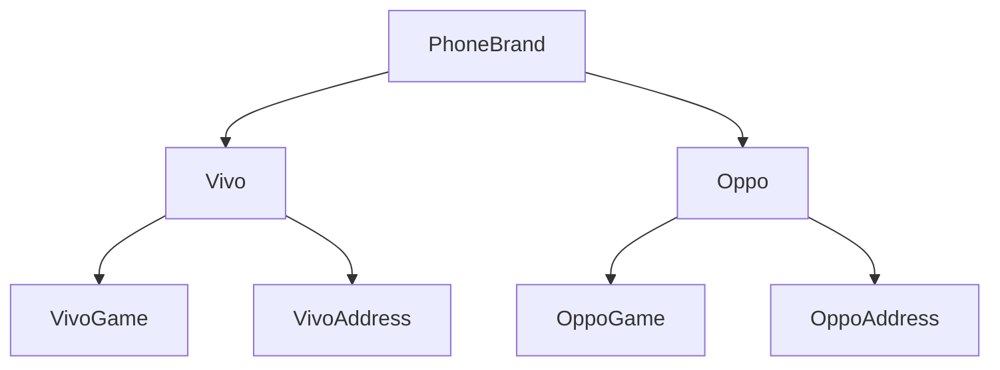
```mermaid
graph TB
    PB[PhoneBrand]-->V
    PB[PhoneBrand]-->O
    V[Vivo]-->VG
    V[Vivo]-->VD
    O[Oppo]-->OG
    O[Oppo]-->OD
    VG[VivoGame]
    VD[VivoAddress]
    OG[OppoGame]
    OD[OppoAddress]
```

也可以手机软件分为多个具体软件，每个具体的软件可以设计具体品牌。

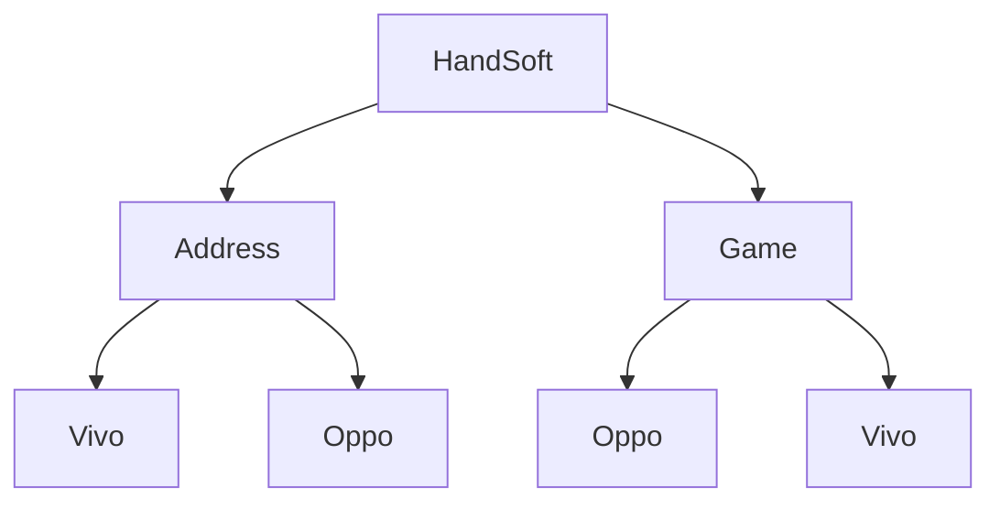
```mermaid
graph TB
    PB[HandSoft]-->V
    PB[HandSoft]-->O
    V[Address]-->VG
    V[Address]-->VD
    O[Game]-->OG
    O[Game]-->OD
    VG[Vivo]
    VD[Oppo]
    OG[Oppo]
    OD[Vivo]
```

但是采用桥接模式，就可以把手机品牌和手机软件独立出来，成为聚合关系。

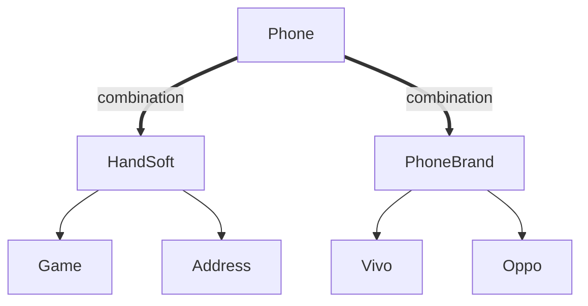
```mermaid
graph TB
    P[Phone]==>|combination|HS
    P[Phone]==>|combination|PB
    HS[HandSoft]-->hs1
    HS[HandSoft]-->hs2
    PB[PhoneBrand]-->pb1
    PB[PhoneBrand]-->pb2
	hs1[Game]
	hs2[Address]
	pb1[Vivo]
	pb2[Oppo]
```

## 二十三、命令模式

1、将一个请求封装为一个抽象类，类内部管理了客户类对象，并带有执行方法，具体的命令类可以继承这个请求类。同时把记录请求、撤销请求和通知请求的功能独立成一个通知类，内部管理了请求类对象，提供了设置、取消和执行请求等方法。至于客户类因为要告知通知类自己的请求，所以客户类提供1个请求方法，它会被请求类内部调用执行。 

简单来说是**层层包含的聚合关系，通知类包含了命令类，命令类包含了客户类，后者依次作为前者的私有属性被管理**。所以客户类的请求被层层封装，通知类执行->命令类执行->客户类执行向下调用。这种聚合关系看起来很像继承，但是可以独立出3个类互不相关。

```c#
class Client{ //愿意的话可以有不同的客户,设置客户抽象类,这里没设置
    public void Ask(){
        Console.WriteLine("发出请求");
    }
}
class Command{ // 命令设置抽象类,可以有不同的命令
    protected Client client;//命令类聚合了客户类对象
    public Command(Client client){
        this.cilent = client;
    }
    abstract public void Execute();
}
class ConcreteCommand:Command{ // 命令具体类
    public ConcreteCommand(Client client):base(client){}
    public override void Execute(){
        client.Ask();//封装1层命令
    }
}
class Invoker{//通知类
    private Command command;//通知类聚合了命令类对象
    public void setCommand(Command command){
        this.command = command; //灵活度,可以通知不同的命令
    }
    public void Execute(){
        command.Execute();//封装2层命令
    }
}
//客户端
Client r = new Client();
Command c = new Command(r); // 命令类绑定具体客户
Invoker i = new Invoker();//通知类
i.setCommand(c);//通知类绑定具体命令
i.Execute();//执行客户的请求命令
```

2、命令模式比较容易设计命令队列，在需要的时候可以将命令记入日志延后执行，并决定是否接收命令或者取消命令。增加新的命令也不会影响原有的命令，有利于拓展。

## 二十四、职责链模式

1、**使多个对象都有权处理请求，可以避免请求的发送者和接收者的耦合关系，将这些对象连成一条链，并沿着链传递该请求，直到有一个对象处理它为止**。

这种情况很像是基层的请求层层上报机制，直到高层有权拍板为止。

2、如果是相似的但不同层级的一些对象可以轮流处理请求，那么每个对象可以设置一个继任者，如果处理不了请求交给它。

所以**定义一个抽象处理者类，内部有私有属性，私有属性是抽象处理者类自身的对象**，只不过这个对象由于泛型的原因除了可以是同级的处理者还可以是不同级的处理者。

```c#
abstract class Request{}
abstract class Handler{
    protected Handler successor;
    public void setSuccessor(Handler successor){
        this.successor = successor;
    }
    public abstract void handleRequest(Request request);
}
class concreteHandler1:Handler{
    public override void handleRequest(Request request){
        if (request能被处理){...}
        else{
            if (successor ! null){
                successor.handleRequest();//交给下一位处理
            }
        }
    }
}
class concreteHandler2:Handler{
    public override void handleRequest(Request request){
        if (request能被处理){...}
        else{
            if (successor ! null){
                successor.handleRequest();//交给下一位处理
            }
        }
    }
}
class concreteHandler3:Handler{
    public override void handleRequest(Request request){
        if (request能被处理){...}
        else{
            if (successor ! null){
                successor.handleRequest();//交给下一位处理
            }
        }
    }
}
//客户端代码
Handler h1 = new concreteHandler1();
Handler h2 = new concreteHandler2();
Handler h3 = new concreteHandler3();
h1.setSuccessor(h2);
h2.setSuccessor(h3);
h1.handleRequest(new Request());//处理请求
```

## 二十五、中介者模式

1、将一个系统分割成许多对象虽然可以降低耦合性，但是大量的连接使得系统看起来像不可分割的整体，每个对象都要依赖和其它对象的直接连接。

基于迪米特法则，如果两个类不必直接通信，但是其中一个类需要另一个类的方法，可以利用第三者来转发这个调用。就像联合国的作用一样，各个国家之间都互相有一套连接，其实整体看来还是比较复杂的，一个国家和另一个国家的关系变化就可能导致需要更改和很多国家的关系。联合国可以起到调停的作用，它可以处理任何国家之间的关系。

2、中介者模式，用一个中介对象来封装一系列的对象交互，中介者使对象之间不需要显式的相互引用，从而使耦合松散，可以独立的改变它们之间的交互。

**中介者类对象被分别聚合于双方类的内部，在中介者类中也聚合了双方的类对象，然后在中介者类的内部进行通信即可**。

假如有国家抽象类，国家可以发消息也可以得到消息。然后2个具体的国家类中国和美国继承国家抽象类，它们内部都带有中介者抽象类的对象，这样中介者可以是处理任何2个国家的事物。

```c#
abstract class Mediator{
    //发送和获取消息
    public abstract void send(string message,Nation nation);
    public abstract string get(Nation nation);
}
class concreteMediator : Mediator{
    // 认识要调停哪2个国家
    private Nation n1;
    private Nation n2;
    public setN1N2(Nation n1,Nation n2){
        this.n1 = n1;
        this.n2 = n2;
    }
	public void send(string message,Nation n){
		//... 一些逻辑,我觉得是c#的原因看不太明白
    }
    
}
abstract Nation{
    protected Mediator mediator;//带有中介者对象
    public Nation(Mediator mediator){
        this.mediator = mediator; //提供弹性,国家可以拥有任何类型的中介人
    }
}
class Chinese{
    public Chinese(Mediator mediator):base(mediator){}
    public void send(string message){
        mediator.send(message,this);//其实是让中间人发自己this的消息
    }
    public string get(){
        return mediator.get()//让中间人接收对方的消息
    }
}
class USA{
    public USA(Mediator mediator):base(mediator){}
    public void send(string message){
        mediator.send(message,this);//其实是让中间人发自己this的消息
    }
    public string get(){
        return mediator.get();//让中间人接收对方的消息
    }
}
concreteMediator cm = new concreteMediator();
Chinese c = new Chinese(cm);
USA u = new USA(cm);//都认识中间人cm

cm.setN1N2(c,u);//中间人也知道要调停哪两个国家

c1.send("八嘎!"); //等于中介者发
string s1 = c2.get();
c2.send("尼玛！");
string s2 = c1.get();
```

## 二十六、享元模式

1、享元模式是指，利用共享技术有效地支持大量细粒度的对象，享元模式不强制共享。

其实**还是一个享元工厂类去管理和创建业务基**类，业务基类可以被派生类继承，派生类可以是共享模式也可以不共享。**享元工厂内部使用哈希表的"key"来标记创建的实例，业务基类可以要求必须指定用户对象才能使用**。

```c#
public class User{
    private string name;
    public User(string name){// 用户有自己的名称
        this.name = name;
    }
    public string Name{
        get{return name;}
    }
}
abstract class Website{
    public abstract vois Use(User user);//指定对象来使用网站
}
class ConcreteWebsite{
    private string name="";
    public ConcreteWebsite(string name){
        this.name = name;
    }
    public override void Use(User user){
        Console.WriteLine("网站名称为: "+name+" 使用者为: ",user.name);
    }
}
class WebsiteFactory{
    private HashTable websites = new HashTable();
    public Website getWebsite(string key){
        if (!websites.ContainsKey(key))
            websites.Add(key,new ConcreteWebsite(key));
        return (Website)websites[key];
    }
    public int getWebsiteCount(){
        return websites.Count;//获取网站的实例个数
    }
}
// 客户端
WebsiteFactory f = new WebsiteFactory();

// 对客户来看好像是3个实例,实际上内部使用的都是1个实例
Website fx = f.getWebsite("产品展示");
fx.Use(new User("小陈"));
Website fx = f.getWebsite("产品展示");
fx.Use(new User("小王"));
Website fx = f.getWebsite("产品展示");
fx.Use(new User("小李"));
```

2、如果应用程序使用了大量的对象，且这些对象的行为是相似的，那么可以考虑使用享元模式。

## 二十七、解释器模式

1、解释器模式是指，**如果一种行为出现的频率非常高，那么可以将这组行为作为简单语言的某些句子，解释器遇见这些句子就翻译成原本的行为是什么，这种约定是自己定义的**。

2、解释器模式使用类来表示文法规则，可以使用继承来改变和拓展该文法。但这也带来一个问题，解释器模式为文法的每条规则都定义了至少1个类，可能难以维护。

解释器的典型应用就是编写音乐程序，如约定O表示音阶,O1表示低音阶，O2为中音阶，O3为搞音阶；P表示休止符，"C D E F G A B"表示"Do-Re-Mi-Fa-So-La-Ti"；音符长度1表示1拍，2表示2拍，0.5表示半拍，0.25为四分之一拍，以此类推。例如上海滩的第一句"浪奔"，可以写成"O 2 E 0.5 G 0.5 A 3"表示中音阶开始，演奏的是"mi so la"(其实我也不懂音乐，九那意思照着抄下)。

## 二十八、访问者模式

1、访问者模式是指，**将数据结构和作用于结构上的操作分开，使操作可以自由的演化和拓展**。

前提是**数据结构是稳定的**，例如人作为一种数据结构其性别只有男和女。然后很多的行为，或者说针对人的一些操作，例如抽烟、谈恋爱、跑步等，对于男和女有不同的反应，那么**行为类可以同时给出基于数据结构类男和女的反应**，然后男和女只需调用对应的方法即可。**为了行为可以拓展，就必须把作用在数据结构的行为和数据结构分开**。

```c#
// 抽象数据结构类
abstract class Person{
    public abstract void accept(Behavior behavior);
}
class Man:Person{
    public override void accpet(Behavior behavior){
        behavior.getManBehavior(this);//调用男性结论
    }
}
class Woman:Person{
    public override void accpet(Behavior behavior){
        behavior.getWomanBehavior(this);//调用女性结论
    }
}

// 抽象行为类
abstract class Action{
    // 给出针对稳定数据结构的人类男和女的2类反应,这也是访问者模式适合的场景
    public abstract void getManBehavior(Man m);
    public abstract void getWomanBehavior(Woman w);
}

// 各式各样的行为
class Running:Action{
    public override void getManBehavior(Man m){
        Console.WriteLine("跑步有利于不肾虚");
    }
    public override void getWomanBehavior(Man m){
        Console.WriteLine("跑步有利于美容");
    }
}

class makeLove:Action{
    public override void getManBehavior(Man m){
        Console.WriteLine("谈恋爱又得花不少钱呢");
    }
    public override void getWomanBehavior(Man m){
        Console.WriteLine("嗬,男人就是想跟我睡觉");
    }
}
//...
```

2、访问者模式有利于观察稳定的数据结构的具象对一列行为产生的反应，需要定义高层接口。

具体是要定义一个对象结构类，内含列表可以存储数据结构对象。这个类还提供添加数据结构和移除数据结构的方法，以及展示功能。

```c#
class ObejectStructure{//高层接口
    private IList<Person> elements = new List<Person>();
    
    public void Attach(Person element){
        elements.Add(element);
    }
    public void Remove(Person element){
        elements.Remove(element);
    }
    public void Display(Action action){
        foreach(Person e in elements){
            e.accept(action);//内部会调用action内分别针对男和女的方法,取决于e是男是女
        }
    }
}
// 客户端
ObjectStructure o = new ObjectStructure();
o.Attach(new Man());
0.Attach(new Woman());
Running r = new Running();//跑步的反应
o.Display(r);
//...其它任何行为的反应类似代码
```

## 二十九、模式总结

先看图，书上给的总结如下。


```mermaid
graph TD
SimpleFactoryMode[简单工厂模式]
SingleMode[单例模式]
FactoryMethodMode[工厂方法模式]
AbstractFactoryMode[抽象工厂模式]
BuliderMode[建造者模式]
PrototypeMode[原型模式]
FactoryMode[工厂模式]-->SimpleFactoryMode
FactoryMode[工厂模式]-->SingleMode
FactoryMode[工厂模式]-->FactoryMethodMode
FactoryMode[工厂模式]-->BuliderMode
FactoryMode[工厂模式]-->PrototypeMode
FactoryMode[工厂模式]-->AbstractFactoryMode

ObserverMode[观察模式]
TemplateMethodMode[模板方法模式]
CommandMode[命令模式]
StateMode[状态模式]
DutyChainMode[职责链模式]
ObservationMode[观察者模式]-->ObserverMode
ObservationMode[观察者模式]-->TemplateMethodMode
ObservationMode[观察者模式]-->CommandMode
ObservationMode[观察者模式]-->StateMode
ObservationMode[观察者模式]-->DutyChainMode

AdapterMode[适配器模式]

DecorateMode[装饰模式]
AppearanceMode[外观模式]
CombinationMode[组合模式]
ShareMode[享元模式]
AgentMode[代理模式]
BridgeMode[桥接模式]
FacadeMode[外观模式]-->DecorateMode
FacadeMode[外观模式]-->AppearanceMode
FacadeMode[外观模式]-->CombinationMode
FacadeMode[外观模式]-->ShareMode
FacadeMode[外观模式]-->AgentMode
FacadeMode[外观模式]-->BridgeMode

ExplainMode[解释器模式]
IntermediaryMode[中介者模式]
VisitorMode[访问者模式]
MemoryMode[备忘录模式]
IteratorMode[迭代器模式]
StrategyMode[策略模式]
TacticMode[策略模式]-->ExplainMode
TacticMode[策略模式]-->IntermediaryMode
TacticMode[策略模式]-->VisitorMode
TacticMode[策略模式]-->MemoryMode
TacticMode[策略模式]-->IteratorMode
TacticMode[策略模式]-->StrategyMode
Mode[模式]-->FactoryMode
Mode[模式]-->ObservationMode
Mode[模式]-->FacadeMode
Mode[模式]-->TacticMode
Mode[模式]-->AdapterMode
```

现在使用自己的理解。

### 工厂模式概览(6种)

首先是工厂模式，它有6个子模式。

1、简单工厂模式

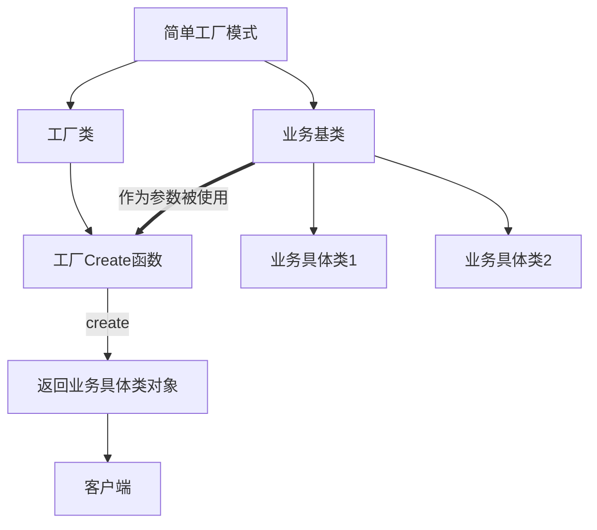
```mermaid
graph TD
m[简单工厂模式]
s1[工厂类]
s2[工厂Create函数]
s3[返回业务具体类对象]
y1[业务基类]
y2[业务具体类1]
y3[业务具体类2]
y1-->y2
y1-->y3
m-->s1-->s2-->|create|s3
m-->y1
y1==>|作为参数被使用|s2
e[客户端]
s3-->e
```

2、工厂方法模式

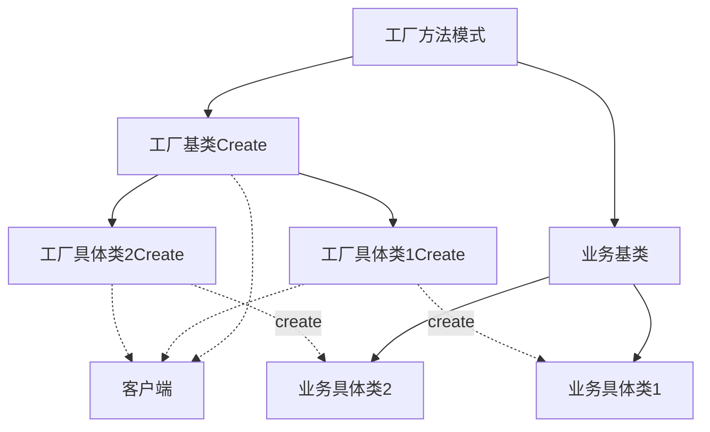
```mermaid
graph TD
m[工厂方法模式]
s1[工厂基类Create]
y1[业务基类]
y2[业务具体类1]
y3[业务具体类2]
s2[工厂具体类1Create]
s3[工厂具体类2Create]
m-->s1-->s3
s1-->s2
m-->y1
y1-->y2
y1-->y3
s2-.->|create|y2
s3-.->|create|y3
e[客户端]
s1-.->e
s2-.->e
s3-.->e
```

3、抽象工厂模式

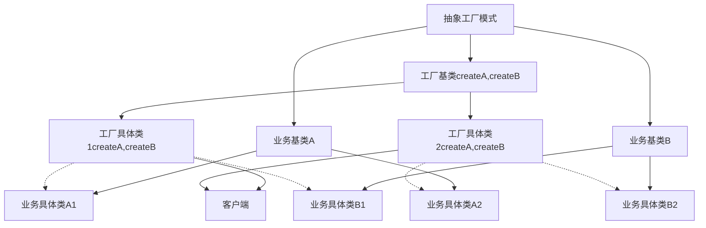
```mermaid
graph TD
m[抽象工厂模式]
s1[工厂基类createA,createB]
s2[工厂具体类1createA,createB]
s3[工厂具体类2createA,createB]
m-->s1
s1-->s2
s1-->s3
y1[业务基类A]
y2[业务具体类A1]
y3[业务具体类A2]
m-->y1
y1-->y2
y1-->y3
x1[业务基类B]
x2[业务具体类B1]
x3[业务具体类B2]
m-->x1
x1-->x2
x1-->x3
s2-.->y2
s2-.->x2
s3-.->y3
s3-.->x3
e[客户端]
s2-->e
s3-->e
```

4、原型模式

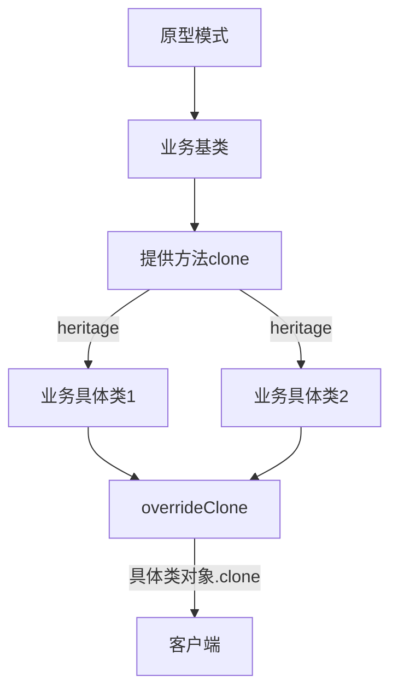
```mermaid
graph TD
m[原型模式]
s1[业务基类]
s2[提供方法clone]
s3[业务具体类1]
s4[业务具体类2]
m-->s1-->s2-->|heritage|s3
s2-->|heritage|s4
s3-->overrideClone
s4-->overrideClone
e[客户端]
overrideClone-->|具体类对象.clone|e
```

5、单例模式

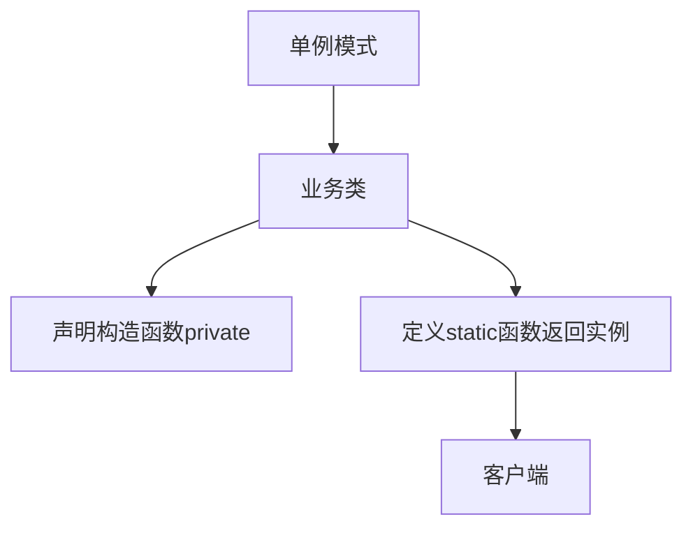
```mermaid
graph TD
m[单例模式]
s1[业务类]
s2[声明构造函数private]
s3[定义static函数返回实例]
m-->s1-->s2
s1-->s3
e[客户端]
s3-->e
```

6、建造者模式

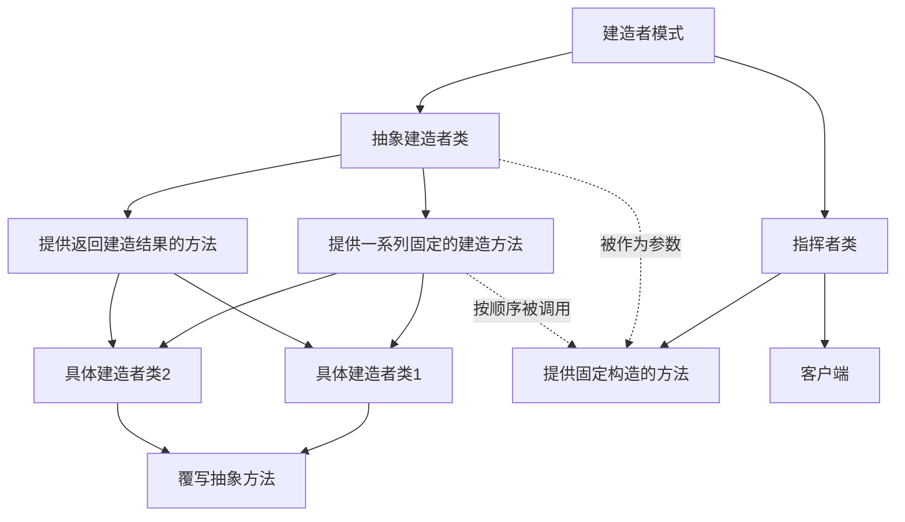
```mermaid
graph TD
m[建造者模式]
s1[抽象建造者类]
s2[提供一系列固定的建造方法]
s3[提供返回建造结果的方法]
m-->s1
s1-->s2
s1-->s3
c1[具体建造者类1]
c2[具体建造者类2]
c3[覆写抽象方法]
s2-->c1
s2-->c2
s3-->c1
s3-->c2
c1-->c3
c2-->c3
k[指挥者类]
m-->k
k1[提供固定构造的方法]
k-->k1
s1-.->|被作为参数|k1
s2-.->|按顺序被调用|k1
e[客户端]
k-->e
```

### 外观模式概览(6种)

然后是外观模式，它有6个子模式。

1、外观模式

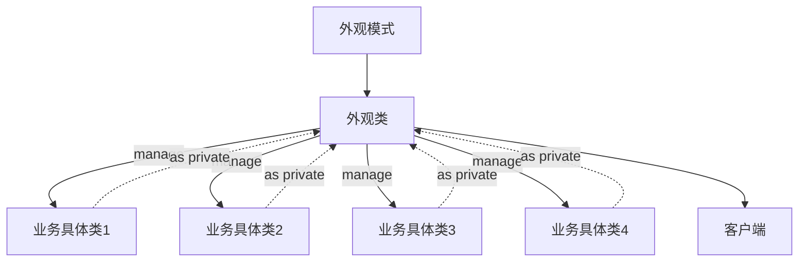
```mermaid
graph TD
m[外观模式]
f[外观类]
s1[业务具体类1]
s2[业务具体类2]
s3[业务具体类3]
s4[业务具体类4]
m-->f-->|manage|s1
f-->|manage|s2
f-->|manage|s3
f-->|manage|s4
s1-.->|as private|f
s2-.->|as private|f
s3-.->|as private|f
s4-.->|as private|f
e[客户端]
f-->e
```

2、代理模式

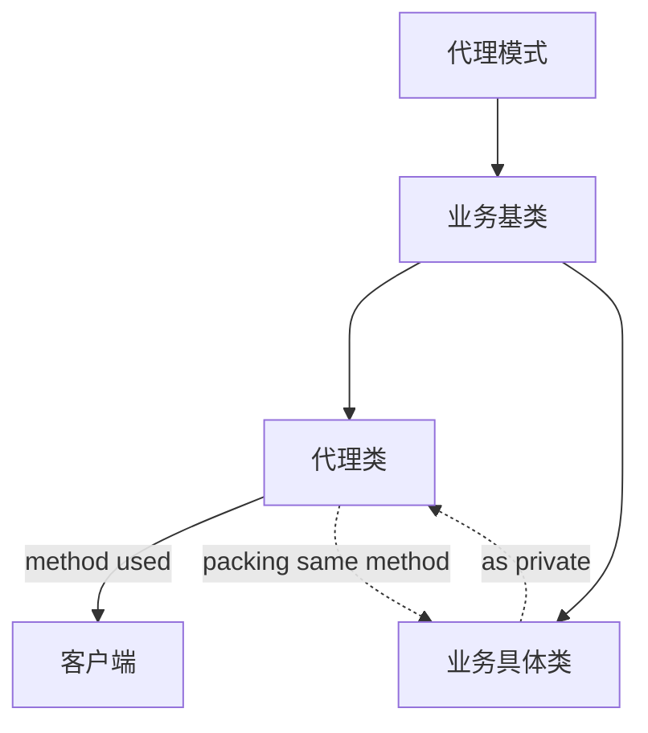
```mermaid
graph TD
m[代理模式]
s0[业务基类]
s1[代理类]
s2[业务具体类]
m-->s0--->s1
s0-->s2
s2-.->|as private|s1
e[客户端]
s1-->|method used|e
s1-.->|packing same method|s2
```

3、装饰模式

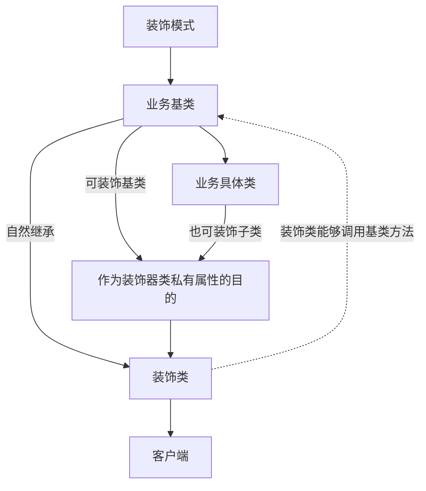
```mermaid
graph TD
m[装饰模式]
e[客户端]
s0[业务基类]
s1[装饰类]
s2[业务具体类]
m-->s0-->s2
s0-->|自然继承|s1
s1-.->|装饰类能够调用基类方法|s0
k[作为装饰器类私有属性的目的]
s0-->|可装饰基类|k
k-->s1
s2-->|也可装饰子类|k
s1-->e
```

4、享元模式

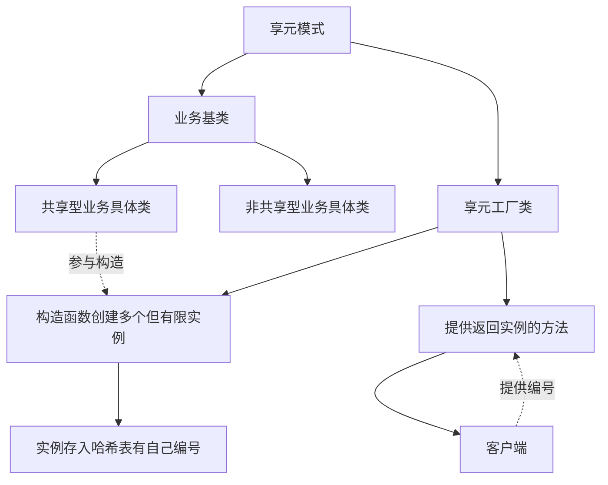
```mermaid
graph TD
m[享元模式]
e[客户端]
s0[业务基类]
s1[共享型业务具体类]
s2[非共享型业务具体类]
s3[享元工厂类]
k1[构造函数创建多个但有限实例]
k2[实例存入哈希表有自己编号]
k3[提供返回实例的方法]
k3-->e
e-.->|提供编号|k3
m-->s0
m-->s3
s0-->s1
s0-->s2
s3-->k1-->k2
s3-->k3
s1-.->|参与构造|k1
```

5、桥接模式

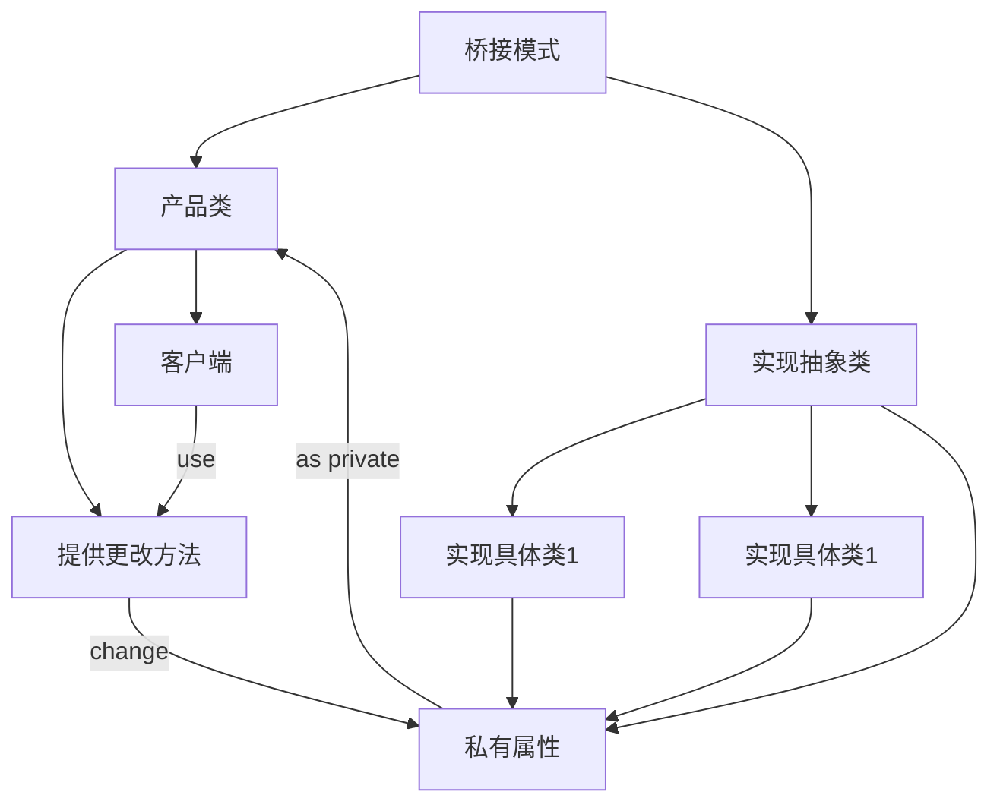
```mermaid
graph TD
m[桥接模式]
e[客户端]
s0[实现抽象类]
s1[实现具体类1]
s2[实现具体类1]
k[产品类]
m-->k
m-->s0
s0-->s1
s0-->s2
k1[私有属性]
k2[提供更改方法]
k-->k2-->|change|k1
s0-->k1
s1-->k1
s2-->k1
k1-->|as private|k
k-->e
e-->|use|k2
```

6、组合模式

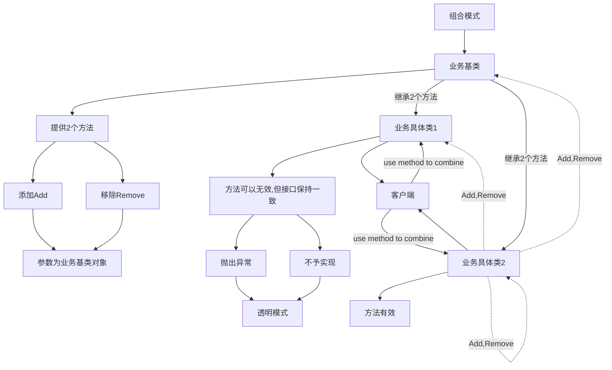
```mermaid
graph TD
m[组合模式]
e[客户端]
s0[业务基类]
s1[提供2个方法]
m1[添加Add]
m2[移除Remove]
m-->s0
m3[参数为业务基类对象]
s0-->s1-->m1-->m3
s1-->m2-->m3
s2[业务具体类1]
s3[业务具体类2]
s0-->|继承2个方法|s2
s0-->|继承2个方法|s3
k0[方法可以无效,但接口保持一致]
k1[抛出异常]
k2[不予实现]
L[透明模式]
k0-->k1-->L
k0-->k2-->L
s2-->k0
n1[方法有效]
s3-->n1
s3-.->|Add,Remove|s2
s3-.->|Add,Remove|s0
s3-.->|Add,Remove|s3
s2-->e
s3-->e
e-->|use method to combine|s2
e-->|use method to combine|s3
```

### 观察模式概概览(5种)

第三类是观察模式，它有5个子模式。

1、观察者模式

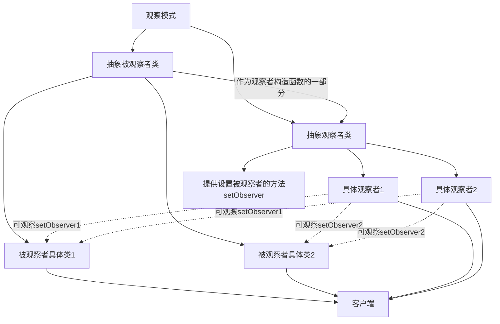
```mermaid
graph TD
m[观察模式]
e[客户端]
s0[抽象观察者类]
s1[具体观察者1]
s2[具体观察者2]
k0[抽象被观察者类]
k1[被观察者具体类1]
k2[被观察者具体类2]
m-->s0
m-->k0
s0-->s1
s0-->s2
k0-->k1
k0-->k2
s1-.->|可观察setObserver1|k1
s1-.->|可观察setObserver2|k2
s2-.->|可观察setObserver1|k1
s2-.->|可观察setObserver2|k2
k0-->|作为观察者构造函数的一部分|s0
n1[提供设置被观察者的方法setObserver]
s0-->n1
k1-->e
k2-->e
s1-->e
s2-->e
```

2、模板方法模式

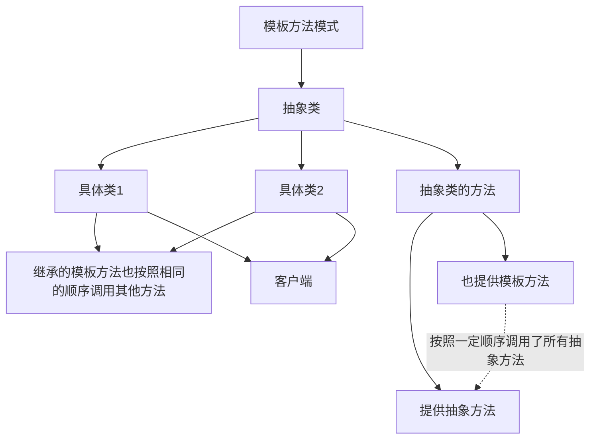
```mermaid
graph TD
m[模板方法模式]
e[客户端]
s1[抽象类]
k[抽象类的方法]
k1[提供抽象方法]
k2[也提供模板方法]
s2[具体类1]
s3[具体类2]
m-->s1
s1-->s2
s1-->s3
s1-->k-->k1
k-->k2
k2-.->|按照一定顺序调用了所有抽象方法|k1
s2-->继承的模板方法也按照相同的顺序调用其他方法
s3-->继承的模板方法也按照相同的顺序调用其他方法
s2-->e
s3-->e
```

3、命令模式

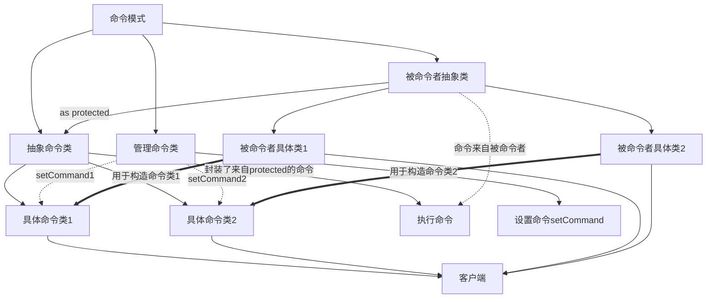
```mermaid
graph TD
m[命令模式]
s0[抽象命令类]
s1[具体命令类1]
s2[具体命令类2]
m-->s0
s0-->s1
s0-->s2
e[客户端]
s1-->e
s2-->e
k0[被命令者抽象类]
k1[被命令者具体类1]
k2[被命令者具体类2]
k1-->e
k2-->e
m-->k0
k0-->k1
k0-->k2
k0-->|as protected|s0
x[执行命令]
s0-->|封装了来自protected的命令|x
k0-.->|命令来自被命令者|x
n0[管理命令类]
m-->n0
x1[设置命令setCommand]
n0-->x1
n0-.->|setCommand1|s1
n0-.->|setCommand2|s2
k1==>|用于构造命令类1|s1
k2==>|用于构造命令类2|s2
```

4、状态模式

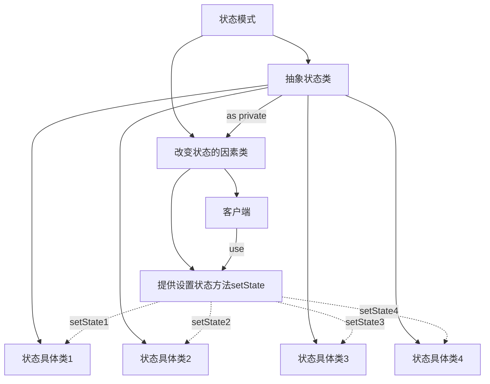
```mermaid
graph TD
m[状态模式]
e[客户端]
s0[抽象状态类]
s1[状态具体类1]
s2[状态具体类2]
s3[状态具体类3]
s4[状态具体类4]
k0[改变状态的因素类]
m-->k0
m-->s0
s0-->s1
s0-->s2
s0-->s3
s0-->s4
s0-->|as private|k0
n0[提供设置状态方法setState]
k0-->n0
n0-.->|setState1|s1
n0-.->|setState2|s2
n0-.->|setState3|s3
n0-.->|setState4|s4
e-->|use|n0
k0-->e
```

5、职责链模式

```mermaid
graph TD
m[职责链模式]
e[客户端]
s0[抽象处理类]
s1[处理具体类1]
s2[处理具体类2]
s11[处理具体类11]
s12[处理具体类12]
s3[处理具体类3]
m-->s0
s0-->s1
s1-->s11
s1-->s12
s0-->s2
s0-->s3
k[提供设置继任者setSuccessor方法]
s0-->k
s1-.->|setSuccessor11|s11
s1-.->|setSuccessor12|s12
s1-.->|setSuccessor2|s2
s1-.->|setSuccessor3|s3
e-->|use|k
```

### 策略模式概览(6种)

第四类是策略模式，它有6个子模式。

1、解释器模式

无需演示。

2、策略模式

```mermaid
graph TD
m[策略模式]
e[客户端]
s0[抽象策略类]
s1[策略具体类1]
s2[策略具体类2]
s3[策略具体类3]
m-->s0
s0-->s1
s0-->s2
s0-->s3
k0[管理策略类]
m-->k0
s0-->|as private|k0
k0-->e
```


3、访问者模式

```mermaid
graph TD
m[访问者模式]
s0[稳定数据结构抽象类]
s1[稳定具体类A]
s2[稳定具体类B]
s3[稳定具体类C]
h[提供面对行为的反应方法get]
s0-->h
s1-.->|继承|h
s2-.->|继承|h
s3-.->|继承|h
e[客户端]
m-->s0
s0-->s1
s0-->s2
s0-->s3
k0[抽象行为类]
k1[具体行为1]
k2[具体行为2]
k3[具体行为3]
m-->k0
k0-->k1
k0-->k2
k0-->k3
p0[提供getA,getB,getC3个方法]
k0-->p0
k1-.->|继承|p0
k2-.->|继承|p0
k3-.->|继承|p0
h-.->|getA->A.get|p0
h-.->|getB->B.get|p0
h-.->|getC->C.get|p0
D[高层接口]
s0-->|as private list|D
m-->D
D-.->|add A|s1
D-.->|add B|s2
D-.->|add C|s3
d1[遍历方法for each]
D-->d1
k1-.->|某个具体行为1|d1
k2-.->|某个具体行为2|d1
k3-.->|某个具体行为3|d1
d2[得到该行为下不同具体类的反应]
d1==>d2
D-->e
```

4、备忘录模式

```mermaid
graph TD
m[备忘录模式]
s0[业务类]
k0[备忘录]
n0[管理备忘录]
m-->s0
m-->k0
m-->n0
k0-->|as private|n0
p1[提供创建备忘录方法create]
p2[提供设置备忘录方法set]
s0-->p1
s0-->p2
p1-.->|保存备忘录|n0
n0-.->|恢复备忘录|p2
e[客户端]
s0-->e
n0-->e
```

5、迭代器模式

```mermaid
graph TD
m[迭代器模式]
e[客户端]
s0[抽象迭代器类]
s1[具体迭代器类]
m-->s0-->s1
k0[集合抽象类]
p2[基类提供createIterator方法]
k0-->p2
k1[集合具体类]
m-->k0-->k1
h1[提供begin方法]
h2[提供end方法]
h3[提供next方法]
h[提供方法]
s0-->h-->h1
h-->h2
h-->h3
p1[以集合具体类构造迭代器]
s1-->p1
k1-.->p1
k1-->|as private|s1
p3[调用了迭代器具体类的构造函数]
p2-->p3
p3-->p1
s1-->e
k1-->e
```

6、中介者模式

```mermaid
graph TD
m[中介者模式]
e[客户端]
s1[甲类]
s2[乙类]
k[中介者类]
s1-->|认识|k
s2-->|认识|k
m-->s1
m-->s2
m-->k
p[提供方法]
p1[带有2个双方属性n1,n2]
p2[设置n1=甲类,n2=乙类]
p3[内部传话通信]
k-->p
p-->|认识甲乙|p2
p-->p1
p-->p3
p2-.->p3
k-->e
```

### 适配器模式概览(1种)

最后1类是适配器模式。

```mermaid
graph TD
m[适配器模式]
s0[业务基类]
s1[业务具体类1]
s2[业务具体类2]
s3[业务3]
s4[适配器类]
m-->s0
s0-->s1
s0-->s2
s0-->|继承同名函数|s4
m-->s3
s4-->|调用的是业务3的同名函数|s3
s3-->|as private|s4
e[客户端]
s3-->e
s4-->e
```

### 原则概览(5种)

1、单一职责原则

[三、单一职责原则](#三、单一职责原则)

2、开放封闭原则

[四、开放封闭原则](#四、开放封闭原则)

3、依赖倒转原则

[五、依赖倒转原则](#五、依赖倒转原则)

4、里氏代换原则

[五、依赖倒转原则](#五、依赖倒转原则)

5、迪米特法则

[十一、迪米特法则](#十一、迪米特法则)

2022年4月8日22.28分结束本书~
