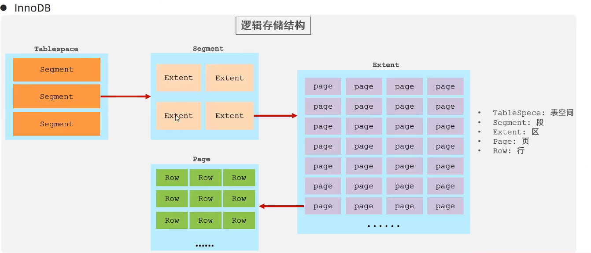
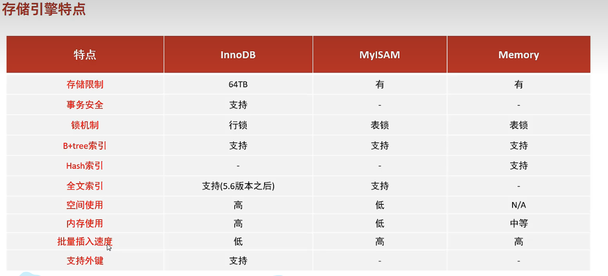

## 介绍

参见学习链接：[MySQL哔哩哔哩](https://www.bilibili.com/video/BV1Kr4y1i7ru?p=3&vd_source=38010d445b9070a07a0579329536e2f7)。

DB：数据库DataBase

DBMS：数据库管理系统 Data Base Management System

SQL：结构化查询语言 Structure Quiery Language

DB由表组成，每个表由多个字段(列)组成，数据放在表里。

常见的DBMS有MySQL，Oracle、Server、Access等，这里MySQL使用的最多。其中MySQL，Oracle、Server是基于客户机-服务器的，Access是基于共享文件系统的。

SQL则是通用的语言，不依赖于软件提供商。

注意先配置环境，默认情况下地址在。

```powershell
C:\Program Files\MySQL\MySQL Server 8.0\bin
```

如果找不到可以使用win+r，输入services.msc，双击MYSQL80即可找到这个路径。此时输入下方命令进行测试。

```powershell
mysql -u root -p 
```

## 基础篇

### 基本语法

SQL分类：

DDL，数据定义语言，用来定义数据库对象（数据库、表、字段）

DML，数据操作语言，用来对数据库表中的数据增删改查

DQL，数据查询语言，查询数据库表中的记录

DCL，数据控制语言，用来创建数据库用户、控制数据库访问权限

#### 数据定义语言DDL

```mysql
SHOW DATABASES; # 查询所有数据库
SELECT DATABASE(); # 查询当前数据库
CREATE DATABASE [IF NOT EXISTS] 数据库名 [DEFAULT CHARSET 字符集] [COLLATE 排序规则];
# CREATE DATABASE CB DEFAULT CHARSET UTF8;
DROP DATABASE [IF EXISTS] 数据库名;
USE 数据库名;

SHOW TABLES; # 查询当前数据库所有表
DESC 表名; # 查询表结构
SHOW CREATE TABLE 表名; # 查询指定表的建表语句
CREATE TABLE 表名( # 创建表
    字段1 字段1类型 [COMMENT 字段1注释],
    ...
    字段n 字段n类型 [COMMENT 字段n注释]
)[COMMENT 表注释]

ALTER TABLE 表名 ADD 字段名 类型(长度) [COMMENT 注释] [约束]; # 添加字段
ALTER TABLE 表名 CHANGE 旧字段名 新字段名 类型(长度) [COMMENT 注释] [约束]; # 修改字段名和类型
ALTER TABLE 表名 DROP 字段名; # 删除字段
ALTER TABLE 表名 RENAME TO 新表名; # 修改表名
DROP TABLE [IF EXISTs] 表名; # 删除表
TRUNCATE TABLE 表名; # 删除指定表并重新创建该表
```

一个完整的例子：

```mysql
create table emp(
	id int comment '编号,纯数字',
    number varchar(10) comment '员工工号,字符串类型长度不超过10位',
    name varchar(10) comment '员工姓名,字符串类型长度不超过10位',
    gender char(1) comment '男/女,存储1个汉字',
    age tinyint unsigned comment '年龄,不能是负数',
    idcard char(18) comment '身份证号18位',
    entrydate date comment '入职时间'
) comment '员工表';
alter table emp add nickname varchar(20) comment '昵称';
alter table emp change nickname username varchar(10) comment '昵称';
alter table emp rename to employee; 
```

#### 数据操作语言DML

添加数据：INSERT

修改数据：UPDATE

删除数据：DELETE

更改表以后，可以使用select查询。

```mysql
select  * from user;
```

**添加数据的常见命令格式：**

```mysql
# 插入的数据是字符串和日期类型数据要包含在引号内
INSERT INTO 表名(字段1,字段2,...) VALUES(值1,值2,...); # 给指定字段添加数据
INSERT INTO 表名 VALUES(值1,值2...); # 给全部字段添加数据
INSERT INTO 表名(字段1,...) VALUES(值1,...),(值1,...),(值1,...);#批量添加数据指定字段
INSERT INTO 表名 VALUES(值1,值2,...),(值;1,值2,...),(值1,值2,...);# 不指定字段批量添加数据
```

例子。

```mysql
INSERT INTO user(id,name) VALUES(1,'chen');
INSERT INTO  user VALUES (2,'cb',18); # 批量添加,那就必须对齐
INSERT INTO user (age) values (19),(20),(32);# age批量添加3个,注意小括号+逗号隔开
INSERT INTO  user VALUES (5,'c1b',18),(15,'c2b',118);#批量添加
```

**修改数据的命令格式：**

```mysql
UPDATE 表名 SET 字段名1 = 值1, 字段名2 = 值2,...[WHERE 条件];
```

例子。

```mysql
UPDATE user set id = 10, name = 'abc' , age = 60; # 会所有行都统一
UPDATE user set id = 1, name = 'ab' , age = 6 where age  <70; # 年龄小于60的修改
```

**删除数据的命令格式：**

```mysql
DELETE FROM 表名 [where 条件];
```

例子。

```mysql
DELETE from user where id <= 2;
```

#### 数据查询语言DQL

关键字如下所示。

```mysql
SELECT; # 字段列表
FROM; # 表名列表
WHERE; # 条件列表
count,max,min,avg,sum; # 聚合函数
GROUP BY; # 分组字段列表
HAVING ; # 分组后条件列表
ORDER BY; # 排序字段列表
LIMIT; # 分页参数
```

执行顺序如下。

from->where->group by，聚合函数->having->select->orderby->limit

SELECT关键字：**

```mysql
SELECT 字段1,字段2,... FROM 表名; # 查询多个字段
SELECT * from 表名; # 查询所有字段
SELECT 字段1[AS 别名1],字段2[AS 别名2] FROM 表名; # 设置别名,要加引号，也可以省略as
SELECT DISTINCT 字段列表 FROM 表名; # 去除重复记录
```

例子。

```mysql
SELECT  id as 'name' from user;
SELECT  id 'name' from user; 
select name from user;

SELECT  DISTINCT id FROM user;
```

**条件查询：**

```mysql
SELECT 字段列表 FROM 表名 WHERE 条件列表;
# 常用的条件如下
>,>=,<,<=,=; # 大于小于等于
<>,!=; # 不等于
BETWEEN AND; # 在某个范围内,闭区间
IN(...); # in之后的列表值其中之一即可
LIKE ; #占位符,模糊匹配，下划线_匹配单个字符,而百分号%匹配任意个字符
IS NULL ;# 是NULL
AND , && ; # 与
OR , || ; # 或
NOT, ! # 非
```

例子：

```mysql
select * from user where age = 88; # 年龄88的
select * from user where age <> 22; # 年龄不等于22岁的
select * from user where age >=10 and age <= 20; # 范围
select * from user where age between 10 and 20 ;
select * from user where age >=10 && age <=20 ;
select * from user where idcard is not null; # idcard不是null的
select  age from user where name is null; # 选择name是空的但是只查看age
select * from user where age in (20,25,27); # 满足其一即可
select * from user where age like '___'; # 年龄是3位数的
```

**聚合函数：**

聚合函数都是针对某一列的数据，null值不参与计算。

```mysql
SELECT 聚合函数(字段列表) FROM 表名 [where 条件];
```

例子。

```mysql
SELECT  count(*) from user; # 整张表
SELECT  count(id) from user; # 某列总数
SELECT  avg(age) from user;
SELECT max(id) from user where age=118; # 条件下的项找到最大的id
```

**分组查询：**

where是分组前进行过滤，不满足where条件并不参与分组，而having是分组后对结果进行过滤。

where不能对聚合函数进行判断，而having可以。例如年龄字段的平均数不能用where判断，having可以继续判断平均数是否超过某个值。

执行顺序 where > 聚合函数 > having，分组之后查询的字段一般为聚合函数和分组字段，查询其他字段没有任何意义。

```mysql
select 字段列表 FROM [where 条件] group by 分组字段名 [having 分组后过滤条件];
```

例子：

```mysql
select count(*) from group by gender; # 根据性别分组统计男和女的数量，但不知道对应关系
select gender,count(*) from group by gender; # 根据性别分组统计男和女的数量,count(*)数量不需要指定字段
select gender,avg(age) from group by gender; # 根据性别分组统计男和女的平均年龄
# 查询年龄小于45的员工,并根据工作地址分组，要求分组后员工数量大于3的工作地址
select count(*) from user where age < 45 group by address;#能查到所有工作地址的员工数,但是不知道工作地址和数量的对应关系
select address,count(*) from user where age < 45 group by address;#进一步知道对应关系,例如北京5人,上海7人,南京1人
select address,count(*) from user where age < 45 group by address having count(*) >=3; # 进一步筛选只剩下北京5,上海7
select address,count(*) address_count from user where age < 45 group by address having count(*) >=3; # 再取个别名address_count,下次直接能用
```

**排序查询：**

ASC：升序(默认)

DESC：降序

如果是多字段排序，只有第1个字段相同时才会对第2个字段进行排序。

```mysql
select 字段列表 from 表名 order by 字段1 排序方式1, 字段2 排序方式2;
```

例子：

```mysql
select * from user order by age desc; # 年龄降序
select * from user order by age asc, id desc; # age升序,id降序
```

**分页查询：**

分页查询是数据库的方言，不同数据库可能不一样，mysql使用limit。如果查询的第一页数据，那么起始索引可以省略，直接写为 limit 10(查询10条记录)。

**起始索引从0开始，起始索引 = (查询页码-1) * 每页显示记录数。**例如每页有10条记录，第一页的起始索引是0，第二页是(2-1)*10也就是10，因为第一页的结束记录编号为9，也就是[0-9]。

```mysql
select 字段列表 from 表名 limit 起始索引,查询记录数;
```

例子：

```mysql
select * from user limit 0,10; # 查询第1页10条记录
select * from user limit 10,10; # 查询第2页,从10开始
```

总结案例：

```mysql
# 查询年龄20,21,22,23的女性员工信息
select * from user where gender = '女' and age in(20,21,22,23);
# 查询性别男，且年龄在20-40岁以内的姓名为3个字的员工
select * from user where gender = '男' and (age between20 and 40) and name like '___';
# 统计年龄小于60，男性和女性员工的人数
select gender,count(*) from user where age < 60 group by gender;# 注意where在分组前使用,用这个条件分组
# 查询所有年龄<=35岁员工的姓名和年龄，并对查询结果按年龄升序排序，如果年龄相同按照入职时间排序
select name,age from user where age<=35 order by age asc,time desc;
# 查询(性别男，年龄在[20,40]区间,条件)的前5个员工信息(排完序后再挑前5个不是先挑)，并对查询结果按年龄升序，若年龄相同按入职时间
select * from user where gender = '男' and (age between 20 and 40) order by age asc, time desc limit  0,5 ;
# 查询年龄大于15的员工姓名、年龄，并根据年龄进行升序
select name,age from user where age>15 order by age asc;
# 注意先执行from->where->groupby->having->select->orderby->limit
select u.name uname,u.age uage from user u where u.age>15 order by uage asc; # limit后可以使用select定义的别名uage，而select则可以使用from定义的别名u
```

#### 数据控制语言DCL

**用户管理：**

主机名可以使用%通配，开发人员使用较少。

```mysql
# 查询用户
use mysql;  # 查询数据库mysql
select * from user; # 查询数据库的表user

# 创建用户
create user '用户名'@ '主机名' identified by '密码';

# 修改用户密码
alter user '用户名'@ '主机名' identified with oldpwd by 'newpwd';

# 删除用户
drop user '用户名'@ '主机名';
```

例子。

```mysql
# 只能在当前主机访问
create user 'abc'@'localhost' identified by '123456';
# 然后命令行输入mysql -u abc -p，就可以以该用户名启动客户端

# 可以在任意主机访问该数据库
create user 'dd'@'%' identified by '123456';

# 修改密码
alter user'dd'@'%' identified  with mysql_native_password by '123';

drop user'abc'@'localhost' ;
```

**权限控制：**

ALL，ALL PRIVILEGES ：所有权限

SELECT：查询数据

INSERT：插入数据

UPDATE：修改数据

DELETE：删除数据

ALTER：修改表

DROP：删除数据库/表/视图

CREATE：创建数据库/表

多个权限之间，使用逗号分割，授权时数据库名和表名可以使用 * 来通配表示所有。

```mysql
show grants for '用户名' @ '主机名'; # 查询权限
grant 权限列表 on 数据库名.表名 to '用户名' @ '主机名';# 授予权限
revoke 权限列表 on 数据库名.表名 from '用户名' @ '主机名'; # 撤销权限
```

例子。

```mysql
show grants for 'root'@'localhost';
grant  all on dd.* to 'root'@'localhost'; # root有权操作dd的所有表
revoke all on dd.* from 'root'@'localhost'; # 撤销
```

### 函数

**字符串函数：**

```mysql
concat(s1,s2,..,sn); # 字符串拼接
lower(str); # 转小写
upper(str); # 转大写
lpad(str,n,pad); # 左填充,字符串pad对str的左边进行填充达到n个字符串长度
rpad(str,n,pad); # 右填充
trim(str); # 去除首尾的空格
substring(str,start,len); # 返回从start开始的len长度子串
```

例子：

```mysql
select concat('hello','mysql');
select lower('HELLO');
select upper('hello');
select lpad('B',5,'CA');
select substring('hello',1,2); # he,索引从1开始
# 工号统一为5位数,不足的补0
update user set id lpad(id,5,'0'); # 修改表的字段使用update
```

**数值函数：**

```mysql
ceil(x); # 向上取整
floor(x);# 向下取整
mod(x,y); # 返回模
rand(); # 返回0-1随机数
round(x,y); # 四舍五入保留y位小数
```

例子：

```mysql
select ceil(1.1);
select floor(1.9);
select mod(7,4);
select rand();
select round(2.345,2);
# 生成6位数随机验证码
select lpad(round(rand()*1000000,0),6,'0');#生成的可能是5位数,不足的话补0
```

**日期函数：**

```mysql
curdate();# 返回当前日期
curtime(); # 当前时间
now(); # 当前时间日期
year(date); # 获取指定日期的年份
month(date); # 获取月份
day(date); # 获取天数
date_add(date,INTERVAL expr type); # 返回一个日期/时间值加上1个时间间隔expr后的时间
datediff(date1,date2); # 返回起始时间date1和date2之间的天数
```

例子：

```mysql
select curdate();
select month('2022-10-12');
select day('2022/11/12');
select year('2021.9.12');
select date_add(now(),INTERVAL 70 day);
select datediff(now(),'2015-9-1');
# 查询所有员工入职天数，并根据天数倒序
select name, datediff(curdate(),workdate) as 'workdays' from user order by desc;
```

**流程函数：**

常用于条件筛选。

```mysql
if(value,t,f); # 如果value=true,返回t否则返回f
ifnull(v1,v2); # 如果v1不为空返回v1,否则返回v2
case when [v1] then [r1] ... else [def] end; # 如果v1为true,返回r1,否则返回def
case [expr] when [v1] then [r1] ... else [def] end; # 如expr=v1,返回r1,否则def
```

例子：

```mysql
select if(false,'ok','err');
select ifnull(null,'def');
# 如果是北京上海返回一线城市否则二线城市
select name,
	(case workaddress when '北京' then '一线城市' when '上海' then '一线城市'
	else '二线城市' end) as '城市级别'; 
	from user;
# 分数>=85优秀,>=60及格,否则不及格
select id,name,
	   (case when cn >= 85 then '优秀' when cn >= 60 '及格' else '不及格' end),
	   (case when ma >= 85 then '优秀' when ma >= 60 '及格' else '不及格' end),
	   (case when en >= 85 then '优秀' when en >= 60 '及格' else '不及格' end),
	   from score;
```

### 约束

概念：约束是作用于表中字段上的规则，用于限制存储在表中的数据。在创建表和修改表时添加约束。

目的：保证数据库中数据的正确、有效性和完整性。

分类：

| 约束     | 描述                                        | 关键字      |
| -------- | ------------------------------------------- | ----------- |
| 非空约束 | 限制数据不能为null                          | not null    |
| 唯一约束 | 数据是唯一的不重复                          | unique      |
| 主键约束 | 主键是一行数据的唯一标识，非空且唯一        | primary key |
| 默认约束 | 保存数据未指定字段值则使用默认值            | default     |
| 检查约束 | 保证字段值满足某一个条件                    | check       |
| 外键约束 | 用来让2张表建立连接，保证数据一致性和完整性 | foreign key |

例子：现在要求创建下方的表格，要求如下。

| 字段名 | 字段含义   | 字段类型    | 约束条件              | 约束关键字                |
| ------ | ---------- | ----------- | --------------------- | ------------------------- |
| id     | ID唯一标识 | int         | 主键并自动增长        | primarykey,auto_increment |
| name   | 姓名       | varchar(10) | 不为空且唯一          | unique, not null          |
| age    | 年龄       | int         | 大于0且小于等于120    | check                     |
| status | 状态       | char(1)     | 如果没有指定该值默认1 | default                   |
| gender | 性别       | char(1)     | 无                    |                           |

代码如下。

```mysql
create table info(
	id int primary key auto_increment comment '主键自动增长',
    name varchar(10) not null unique comment '姓名不为空且唯一',
    age int check(age > 0 and age <= 120) comment '年龄在(0,120]',
    status char(1) default '1' comment '状态默认1',
    gender char(1) comment '性别'
) comment '用户信息';
insert into info
	(name,age,status,gender) values
	('cb',25,'1','男'),
	('chenbei',30,'0','男'),
	('guxiaoting',25,'1','女');
```

**外键约束：**

例如存在2个表，第一个表是员工信息，倒数第二列表示上级属于的部门编号，最后1列表示属于的部门编号，第2个表则是部门编号对应的部门。

| id   | name | age  | job      | salary | entrydate  | manager_id | depart_id |
| ---- | ---- | ---- | -------- | ------ | ---------- | ---------- | --------- |
| 1    | A    | 66   | 总裁     | 2.5    | 2000-01-01 | null       | 5         |
| 2    | B    | 28   | 项目经理 | 1.8    | 2005-12-29 | 1          | 1         |
| 3    | C    | 33   | 开发     | 1.3    | 2008-06-05 | 2          | 1         |
| 4    | D    | 45   | 开发     | 1.2    | 2009-03-16 | 2          | 1         |
| 5    | E    | 24   | 开发     | 1.1    | 2022-10-21 | 3          | 1         |

| id   | name   |
| ---- | ------ |
| 1    | 研发部 |
| 2    | 市场部 |
| 3    | 财务部 |
| 4    | 销售部 |
| 5    | 总经办 |

代码如下。

```mysql
create table dept(
	id int auto_increment comment 'ID' primary key,
    name varchar(50) not null comment '部门名称'
) comment '部门表';
insert into dept (name) values
	('研发部'),('市场部'),('财务部'),('销售部'),('总经办');

create table emp(
    id int auto_increment comment 'ID' primary key,
    name varchar(50) not null comment '姓名',
    age int comment '年龄',
    job varchar(20) comment  '职位',
    salary float comment '薪资',
    entrydate date comment '入职时间',
    manager_id int comment '直属领导部门',
    depart_id int comment '所属部门'
) comment '员工表';

insert into emp(name,age,job,salary,entrydate,manager_id,depart_id) values
	('A',66,'总裁',2.5,'2000-01-01',null,5),
	('B',28,'项目经理',1.8,'2005-12-29',1,1),
	('C',33,'开发',1.3,'2008-06-05',2,1),
	('D',45,'开发',1.2,'2009-03-16',2,1),
	('E',24,'开发',1.1,'2022-10-21',3,1);
```

现在希望让2张表建立关联，添加外键的语法如下。

```mysql
create table 表名(
	字段名 数据类型,
    ...
    [constraint] [外键名称] foreign key(外键字段名) references 主表(外表列名)
);
alter table 表名 add constraint 外键名称 foreign key(外键字段名) references 外表(外表列名);
```

```mysql
# 给员工表(主表)添加外键,此时dept表不能随便删除字段值,因为关联了emp表,保证安全
alter table emp add constraint emp_depart foreign key (depart_id) references dept(id); 
alter table emp drop foreign key emp_depart; # 删除外键
```

**外键约束的删除/更新行为：**

| 行为        | 说明                                                         |
| ----------- | ------------------------------------------------------------ |
| no_action   | 父表删除/更新记录时,首先检查该记录是否有外键,有的话不允许删除/更新 |
| restrict    | 父表删除/更新记录时,首先检查该记录是否有外键,有的话不允许删除/更新 |
| cascade     | 父表删除/更新记录时,首先检查该记录是否有外键,有的子表也删除/更新 |
| set null    | 父表删除/更新记录时,首先检查该记录是否有外键,有的话子表设置外键值为null |
| set default | 父表有变更时,子表外键设置成默认值                            |

语法。

```mysql
alter table 表名 add constraint 外键名称 foreign key (外键字段) references 外表名(外表字段名) on update cascade on delete cascade;
```

例子：

```mysql
alter table emp add constraint emp_dept foreign key (depart_id) references dept(id) on update cascade on delete cascade;
```

### 多表查询

#### 多表关系

多表关系：表和表之间的关系有一对多或多对一、多对多以及一对一。

**一对多（多对一）的关系：**

例如部门和员工的关系：一个部门多个员工，一个员工对应一个部门。因为员工数量是比部门数量多的，要在多的一方建立外键，映射到部另一方的主键。

**多对多的关系：**

一个学生可以选择多门课程，一门课程也可以被多个学生选择。这种情况下一般是建立第三张表，中间表至少包含2个外键，关联两方的主键。

学生表：

| id   | name |
| ---- | ---- |
| 1    | A    |
| 2    | B    |

课程表：

| id   | class  |
| ---- | ------ |
| 1    | matlab |
| 2    | sql    |
| 3    | python |
| 4    | c++    |
| 5    | java   |

中间表：含义是学生A选了matlab、sql和python课程，学生B选了c++和java。

| id   | student | class |
| ---- | ------- | ----- |
| 1    | 1       | 1     |
| 2    | 1       | 2     |
| 3    | 1       | 3     |
| 4    | 2       | 4     |
| 5    | 2       | 5     |

代码如下。

```mysql
create table student(
    id int auto_increment primary key comment 'ID',
    name varchar(20) comment '姓名'
)comment '学生表';
insert into student values (null,'A'),(null,'B');

create table department(
	id int auto_increment primary key comment 'ID',
    name varchar(10) comment '姓名'
)comment '课程表';
insert into department values (null,'matlab'),(null,'sql'),(null,'python'),
                              (null,'c++'),(null,'java');

create table student_department(
	id int auto_increment primary key comment 'ID',
    studentid int not null comment '学生ID',
    classid int not null comment '课程ID',
    constraint fk_studentid foreign key (studentid) references student(id),
    constraint fk_classid foreign key (classid) references department(id)
) comment '学生课程表';
insert into student_department values (null,1,1),(null,1,2),(null,1,3),(null,2,4),(null,2,5);
```

**一对一的关系：**

一般常用于单表拆分，将一张表的基础字段放在一张表，其它详细字段放在另一张表来提升操作效率。例如基础信息可能是姓名、年龄、性别和手机号，详细信息可能是学历、小初高的学校等。

然后在任意一方加入外键，关联另一方的主键即可，并且要设置外键是唯一的。

```mysql
create table user_basic(
   id int auto_increment primary key comment 'ID',
   name varchar(10) comment '姓名',
   age int comment '年龄',
   gender char(1) comment '1: 男, 2: 女',
   phone char(11) comment '手机号'
)comment '用户基本信息';
insert into user_basic values (null,'A',18,'男','19801279790'),
                           (null,'B',19,'男','19801279791'),
                           (null,'C',82,'女','19801279792'),
                           (null,'D',28,'女','19801279793');

create table user_more(
    id int auto_increment primary key comment 'ID',
    degree varchar(20) comment '学历',
    major varchar(20) comment '专业',
    primarySchool varchar(50) comment '小学',
    university varchar(50) comment '大学',
    address varchar(50) comment '住址',
    userid int unique comment '用户ID',
    constraint fk_userid foreign key (userid) references user_basic(id) # 设置外键
) comment '用户详细信息';

insert into user_more values (null,'本科','电气','七小','北交','北京',1),
                             (null,'博士','电气','六小','上交','上海',2),
                             (null,'大专','电气','八小','西交','西安',3),
                             (null,'硕士','电气','九小','西南交','成都',4);
```

#### 多表查询概述

从多张表查询数据，笛卡尔积会生成重复的数据，所以我们的任务在于消除不必要的重复项。

```mysql
select * from user , dept; # 无效的笛卡尔积
select * from user ,dept where emp.deptid = dept.id ; # 加上条件可以消除一些重复项
```

多表查询分为以下几类：

内连接：相当于查询A、B的交集数据

外连接：左外连接，查询左表所有数据，以及两张表的交集；右外连接同理

自连接：当前表与自身的连接查询，**自连接必须使用表别名**

子查询：SQL语句嵌套SELECT语句，嵌套查询

**内连接：**

内连接分为隐式内连接和显式内连接，语法如下。

```mysql
select 字段列表 from 表1,表2 where 条件;
select 字段列表 from 表1 [inner] join 表2 on 连接条件;
```

例子：

```mysql
# 查询每一个员工的姓名以及关联的部门名称
select emp.name,dept.name  from emp, dept where emp.deptid = dept.id;# 隐式法
select e.name, d.name from emp e. depy d where e.deptid = d.id; # 使用别名也可以

select e.name, d.name from emp e inner join dept d on e.deptid = d.id; # 显示法
```

**外连接：**

```mysql
select 字段列表 from 表1 left [outer] join 表2 on 条件;
select 字段列表 from 表1 right [outer] join 表2 on 条件;
```

例子：

```mysql
# 查询员工表所有信息且包含对应的部门信息(左连接)
select e.*,d.name from emp e left outer join dept d on e.deptid = d.id;
# 查询所有部门的信息且包含对应的员工信息(右连接)
select e.*,d.* from emp e right outer join dept d on e.deptid = d.id;
```

**自连接：**

可以是内连接查询也可以是外连接查询。

```mysql
select 字段列表 from 表A 别名A join 表A 别名 B on 条件;
```

例子：

```mysql
# 查询员工及其所属领导的名字
select * from emp a, emp b where a.managerid = b.id;# 内连接
# 假设有2张表,一般来说a表的mangerid作为外键关联b表的id,那么b表对应id的名字就是领导信息
# 但是现在是一张表，每个员工有个id也有个managerid，而且这些id是独一无二的,那么就可以自查询
# 例如id=10的员工，它的领导id=8，故managerid也是8,所以使用别名当成2个表更好理解
select a.name, b.name from emp a, emp b where a.managerid = b.id;

# 查询所有员工及其领导的名字，如果员工没有领导，也要查询出来(左外连接)
select a.name '员工' , b.name '领导' from emp a left join emp b on a.managerid = b.id; # 如果员工没有领导,不用左外连接就会丢失没有领导的员工信息
```

**联合查询：**

对于union查询，就是多次查询的结果合并起来形成新的查询结果集。要求多张表的列数必须保持一致，字段类型也要保持一致。union all会将所有数据直接合并，如果没有all则会多一步去重处理。

```mysql
select 字段列表 from 表A...
union [all]
select 字段列表 form 表B ...;
```

例子：

```mysql
# 查询薪资低于5000且年龄大于50的员工信息
select * from emp where salary < 5000
union all
select * from emp where age > 50;
```

**子查询：**

子查询外部的语句可以是insert/update/delete/select的任何一个。

子查询结果的不同，分为：标量子查询（查询结果单个值）、列子查询（查询结果1列）行子查询（查询结果1行）、表子查询（查询结果多行多列）

根据子查询位置，分为：where之后、from之后和select之后。

**标量子查询例子：**

常用>,<,>=,<=,=等操作符。

```mysql
# 查询销售部的所有员工信息
# 第一步查询销售部ID select id from dept where name = '销售部';
# 第二步根据销售部ID，查询员工信息 select * from emp where deptid = ?;
# 合起来就是
select * from emp where deptid = (select id from dept where name = '销售部');

# 查询在A入职时间之后入职的员工信息
# 第一步查询A的入职时间
select entrydate from emp where name ='A';
# 第二步查询该事件之后入职的员工 select * from where entrydate > ?;
# 合起来是
select * from where entrydate > (select entrydate from emp where name ='A');
```

**列子查询例子：**

常用in、not in、any、some和all操作符。in表示在范围内即可，any和some相同子查询结果有满足的即可，all则要求返回的必须全部满足。

```mysql
# 查询销售部和市场部所有员工信息
# 1.查询2个部门的id select id from dept where name = '销售部' or name = '市场部';
# 2.根据id查询员工 select * from emp where deptid in (?,?);
select * from emp where deptid in (id select id from dept where name = '销售部' or name = '市场部');

# 查询比财务部所有人工资都高的员工信息
# 1.查询财务部所有人工资
# select id from dept where name = '财务部'; # 拿到财务部id
# select salary from emp where deptid = ?; # 拿到财务部工资
# select salary from emp where deptid = (select id from dept where name = '财务部');
# 2. 比这些人都高的员工信息 select * from emp where salary > all (?);
select * from emp where salary > all(select salary from emp where deptid = (select id from dept where name = '财务部'));

# 查询比研发部任意一人工资高的员工信息
# 1.找到研发部id和根据id拿到工资
# select salary from emp where deptid = (select id from dept where name = '研发部');
# 2. 有比这些工资高的就可以
select * from emp where salary > any(select salary from emp where deptid = (select id from dept where name = '研发部'));
```

**行子查询：**

常用操作符=、<>、in、not in。

```mysql
# 查询与A的薪资且直属领导相同的员工信息
# 1. 拿到A的薪资和领导 select salary,managerid from emp where name = 'A';
# 2. 拿到和这个薪资和领导相同的员工信息 select * from emp where salary = ? and managerid = ?;
select * from emp where (salary,managerid)=(select salary,managerid from emp where name = 'A');
```

**表子查询：**

常用操作符in。

```mysql
# 查询和A或B职位和薪资均相同的员工信息
# 1. 查询A ,B的职位和薪资select job,salary from emp where name ='A' or name = 'B';
# 2. 查询信息
select * from emp where (job,salary) in (select job,salary from emp where name ='A' or name = 'B');

# 查询入职日期是2006-01-01之后的员工信息，及其部门信息
# 1.找这个日期之后的员工
select * from emp where entrydate > '2006-01-01';
# 2. 这部分员工对应的部门
select * from (select * from emp where entrydate > '2006-01-01') workers left join dept d on workers.dept_id = dept.id;
# 因为要拿到员工也要拿到部门所以是左外连接,而且去除无效的笛卡尔积要求员工的部门id是部门表的id
```

**案例：**

```mysql
create table salgrade(
	grade int ,
    low int ,
    high int
); # 薪资等级表
insert into salgrade values (1,0,3000),(2,3001,5000),(3,5001,8000),(5,8001,10000),(6,15001,20000),(7,20001,25000),(8,25001,30000);

# 查询员工姓名、年龄、职位和部门信息（隐式内连接）
select e.name,e.age,e.job,d.name from emp e, dept d where e.deptid = d.id; 

# 查询年龄小于30的员工姓名、年龄、职位、部门信息 （显式内连接）
select e.name,e.age,e.job ,d.name from emp e inner join dept d on e.deptid = d.id where d.age < 30;

# 查询拥有员工的部门id和名称（内连接）distinct去重
select distinct d.id,d.name from emp e, dept d where e.deptid = d.id;

# 查询所有年龄大于40的员工，以及归属的部门名称，如果员工没有领导也展示出来 （外连接）
select e.*,d.name from emp e left join dept d on e.deptid = d.id where e.age > 40;

# 查询所有员工的工资等级 emp.salary >= salgrade.low and emp.salary <= salgrade.high
select e.*, s.grade, s.low, s.high from emp e, salgrade s where e.salary >=s.low and e.salary <= s.high; # between s.low and s.high

# 查询研发部所有员工信息和工资等级
# 连接条件,工资在low和high之间，且员工deptid等于部门表id
# 查询条件是 dept.name = '研发部'
select e.*,s.grade from emp e. dept d ,salgrade s where e.deptid = d.id and (e.salary between s.low and s.high) and d.name = '研发部';

# 查询研发部员工平均工资
select avg(e.salary) from emp e, dept d where e.deptid = d.id and d.name = '研发部';

# 查询工资比A高的员工信息 （标量子查询）
select * from emp where salary (select salary from emp where name = 'A');

# 查询比平均工资高的员工
select * from emp where salary > (select avg(salary) from emp);

# 查询低于本部门平均工资的员工信息
select * from emp e2 where salary < (select avg(e1.salary) from emp e1 where e1.deptid = e2.dept_id);

# 查询所有部门信息并统计部门员工人数
select d.id, d.name, (select count(*) from emp e where e.deptid = d.id) as '人数' from dept d; # 从dept查询id、name和部门人数,部门人数本身是一个统计取别名'人数'

# 查询所有学生选课情况、展示学生名称、学号、课程名称
# 连接条件是 stu.id = stu_class.stuid, classid = stu_clsss.classid
select s.name, s.num, c.name from student s, student_claaa sc, class c where sc.stuid = s.id and sc.classid = c.id;
```

### 事务

事务是一组操作的集合，它是一个不可分割的工作单位，事务会把所有操作一起提交给系统，或者同时撤销，所以这些工作要么同时成功，要么同时失败。如果有异常就回滚事务，成功的话就提交事务。默认MySQL的事务是自动提交的，也就是执行一条DML语句就会隐式的提交事务。

```mysql
## 事务
create table account(
    id int auto_increment primary key comment '主键ID',
    name varchar(10) comment '姓名',
    money int comment  '余额'
) comment '账户表';

insert into account(id,name,money) values (null,'张三',2000),(null,'李四',2000);

## 恢复数据
update account set money = 2000 where name ='张三' or name = '李四';

## 转账操作 张三给李四转账1000
# 1. 查询张三余额
select money from account where name = '张三';
# 2. 张三余额-1000
update account set money = money - 1000 where name = '张三';
# 这里如果发生异常，那么张三的钱-1000，但是李四的钱没有增加
# 3. 李四+1000
update account set money = money + 1000 where name = '李四';
```

**事务操作：**

```mysql
# 查看/设置事务提交方式
select @@autocommit;
set @@autocommit = 0; # 手动

# 开启事务
start transaction ;
begin;

# 提交事务
commit;

# 回滚事务
rollback;
```

**事务四大特性：**

原子性：事务是不可分割的最小操作单元，要么都成功要么都失败；

一致性：事务完成时必须使所有数据都保持一致状态；

隔离性：数据库系统提供的隔离机制，保证事务在不受外部并发操作影响的独立环境下运行；

持久性：事务一旦提交或回滚，它对数据库中的数据的改变是永久的。

**并发事务问题：**

脏读：一个事务读到另外一个事务还没有提交的数据，也就是说2个cmd同时开启事务，A事务查询1次后，B事务做了一些操作，但是没提交，A事务再次查询就会读到没提交的改变，这种情况发生在Read uncommitted级别。如果是Read committed不会出现，B必须提交以后A查询才会更新。

不可重复读：一个事务先后读取同一条记录，但两次读取的数据不同，称之为不可重复读；这种情况是，B没提交事务之前A的查询和B提交事务后A的查询是不一样的，这虽然解决了脏读问题，但是一个独立事务也不应当连续两次查询出现不同的结果，这种情况发生在Read committed级别，但是Repeated Read级别不会出现，2次查询都是一样的，只有A也提交事务之后才会更新结果。

幻读：一个事务按照条件查询数据时，没有对应的数据行，但是插入数据时又发现这行数据已存在。2个事务都开启后，A事务先查询id=3是否存在，显示不存在，然后B事务插入了一行数据有了id=3，此时A事务再次插入id=3的数据就会提示已被占用。这种出现在Repeated Read级别，如果希望不出现幻读，只能选择串行化serializable。

**事务隔离级别：**

下表展示了不同级别会出现的并发事务问题。事务隔离级别越高，数据越安全，但是性能越低。

| 隔离级别            | 脏读 | 不可重复读 | 幻读 |
| ------------------- | ---- | ---------- | ---- |
| Read uncommitted    | √    | √          | √    |
| Read committed      | ×    | √          | √    |
| Repeated Read(默认) | ×    | ×          | √    |
| Serializable        | ×    | ×          | ×    |

```mysql
# 查看事务隔离级别
select @@transaction_isolation;
# 设置事务隔离级别 session是当前会话,或者全局
set [session|global] transaction isolation {read uncommitted| read committed | repeatable read | serializable };

set session transaction isolation level read committed ;
```


### 数据类型

数值类型：

| 类型         | 大小                                     | 范围（有符号）                                               | 范围（无符号）                                               | 用途            |
| :----------- | :--------------------------------------- | :----------------------------------------------------------- | :----------------------------------------------------------- | :-------------- |
| TINYINT      | 1 Bytes                                  | (-128，127)                                                  | (0，255)                                                     | 小整数值        |
| SMALLINT     | 2 Bytes                                  | (-32 768，32 767)                                            | (0，65 535)                                                  | 大整数值        |
| MEDIUMINT    | 3 Bytes                                  | (-8 388 608，8 388 607)                                      | (0，16 777 215)                                              | 大整数值        |
| INT或INTEGER | 4 Bytes                                  | (-2 147 483 648，2 147 483 647)                              | (0，4 294 967 295)                                           | 大整数值        |
| BIGINT       | 8 Bytes                                  | (-9,223,372,036,854,775,808，9 223 372 036 854 775 807)      | (0，18 446 744 073 709 551 615)                              | 极大整数值      |
| FLOAT        | 4 Bytes                                  | (-3.402 823 466 E+38，-1.175 494 351 E-38)，0，(1.175 494 351 E-38，3.402 823 466 351 E+38) | 0，(1.175 494 351 E-38，3.402 823 466 E+38)                  | 单精度 浮点数值 |
| DOUBLE       | 8 Bytes                                  | (-1.797 693 134 862 315 7 E+308，-2.225 073 858 507 201 4 E-308)，0，(2.225 073 858 507 201 4 E-308，1.797 693 134 862 315 7 E+308) | 0，(2.225 073 858 507 201 4 E-308，1.797 693 134 862 315 7 E+308) | 双精度 浮点数值 |
| DECIMAL      | 对DECIMAL(M,D) ，如果M>D，为M+2否则为D+2 | 依赖于M和D的值                                               | 依赖于M和D的值                                               | 小数值          |

使用的时候可以结合UNSIGNED或SIGNED关键字。

```mysql
age TINYINT UNSIGNED;
score DOUBLE(4,1);#表示四位长度和1位标度
```

日期和事件类型：

| 类型      | 大小 ( bytes) | 范围                                                         | 格式                | 用途                     |
| :-------- | :------------ | :----------------------------------------------------------- | :------------------ | :----------------------- |
| DATE      | 3             | 1000-01-01/9999-12-31                                        | YYYY-MM-DD          | 日期值                   |
| TIME      | 3             | '-838:59:59'/'838:59:59'                                     | HH:MM:SS            | 时间值或持续时间         |
| YEAR      | 1             | 1901/2155                                                    | YYYY                | 年份值                   |
| DATETIME  | 8             | '1000-01-01 00:00:00' 到 '9999-12-31 23:59:59'               | YYYY-MM-DD hh:mm:ss | 混合日期和时间值         |
| TIMESTAMP | 4             | '1970-01-01 00:00:01' UTC 到 '2038-01-19 03:14:07' UTC结束时间是第 **2147483647** 秒，北京时间 **2038-1-19 11:14:07**，格林尼治时间 2038年1月19日 凌晨 03:14:07 | YYYY-MM-DD hh:mm:ss | 混合日期和时间值，时间戳 |

字符串类型：

| 类型       | 大小                  | 用途                            |
| :--------- | :-------------------- | :------------------------------ |
| CHAR       | 0-255 bytes           | 定长字符串                      |
| VARCHAR    | 0-65535 bytes         | 变长字符串                      |
| TINYBLOB   | 0-255 bytes           | 不超过 255 个字符的二进制字符串 |
| TINYTEXT   | 0-255 bytes           | 短文本字符串                    |
| BLOB       | 0-65 535 bytes        | 二进制形式的长文本数据          |
| TEXT       | 0-65 535 bytes        | 长文本数据                      |
| MEDIUMBLOB | 0-16 777 215 bytes    | 二进制形式的中等长度文本数据    |
| MEDIUMTEXT | 0-16 777 215 bytes    | 中等长度文本数据                |
| LONGBLOB   | 0-4 294 967 295 bytes | 二进制形式的极大文本数据        |
| LONGTEXT   | 0-4 294 967 295 bytes | 极大文本数据                    |

**注意：**char(n) 和 varchar(n) 中括号中 n 代表字符的个数，并不代表字节个数，比如 CHAR(30) 就可以存储 30 个字符。CHAR 和 VARCHAR 类型类似，但它们保存和检索的方式不同，一般CHAR的性能更好。BINARY 和 VARBINARY 类似于 CHAR 和 VARCHAR，不同的是它们包含二进制字符串而不要非二进制字符串。BLOB 是一个二进制大对象，可以容纳可变数量的数据。有 4 种 BLOB 类型：TINYBLOB、BLOB、MEDIUMBLOB 和 LONGBLOB。它们区别在于可容纳存储范围不同。有 4 种 TEXT 类型：TINYTEXT、TEXT、MEDIUMTEXT 和 LONGTEXT。对应的这 4 种 BLOB 类型，可存储的最大长度不同，可根据实际情况选择。


## 进阶篇

### 存储引擎

**INNODB：**

存储引擎是基于表的，而不是库，默认存储引擎是InnoDB。例如一张xxx.ibd的表，都会对应一个表空间文件，存储该表的表结构（frm、sdi）、数据和索引。参数是innodb_file_per_table。

innoDB是兼顾看高可靠性和高性能的通用存储引擎。特点是DML操作遵循ACID模型，支持事务；行级锁，提高并发访问性能；支持外键foreign key约束，保证数据的完整性和正确性。

```mysql
show create table account; # 查看创建表时的引擎

create table 表名(
    id int comment 'id',
    name varchar(10) comment 'name'
) engine = innodb, comment '表注释'; # 指定引擎

show engines ; # 支持的引擎
```

INNODB逻辑存储结构：



**MyISAM：**

是MySql早期的默认存储引擎，不支持事务和外键，支持表锁但不支持行锁，访问速度快。相关文件是xxx.sdi存储表结构信息、xxx.myd存储数据、xxx.myi存储索引。

**Memory：**

该引擎的表数据存在内存中，由于硬件问题可能受到断电影响，这些表只能作为临时表和缓存用。

使用了hash索引，xxx.sdi存储了表结构信息。



### 索引

索引是帮助mysql高效获取数据的数据结构，这些数据结构以某种方式执行数据，这样就可以在这些数据结构上实现高级查找算法。

索引的常用结构：

| 索引结构          | 描述                                                         |
| ----------------- | ------------------------------------------------------------ |
| B+Tree索引        | 最常见的索引类型，大部分引擎都支持B+Tree                     |
| Hash索引          | 底层数据结构使用哈希表实现，只有精确匹配索引列的查询才有效，不支持范围查询 |
| R-Tree空间索引    | 空间索引是MyISAM引擎的一个特殊索引类型，主要用于地理空间数据类型，使用较少 |
| Full-text全文索引 | 是一种通过建立倒排索引，快速匹配文档的方式                   |

索引的分类：

| 分类     | 含义                                         | 特点                    | 关键字   |
| -------- | -------------------------------------------- | ----------------------- | -------- |
| 主键索引 | 针对表中主键创建的索引                       | 默认自动创建，只能有1个 | primary  |
| 唯一索引 | 避免同一个表某数据列的值重复                 | 可以有多个              | unique   |
| 常规索引 | 快速定位特定数据                             | 可以有多个              |          |
| 全文索引 | 全文索引查找的是文本关键词，不是比较索引的值 | 可以有多个              | fulltext |

根据索引的存储形式，还可以分为两类：

如果存在主键，主键索引就是聚集索引；如果不存在主键，就会使用第一个唯一的索引作为聚集索引；如果上述两种情况都没有，那么innoDB会自动生成一个rowid作为隐藏的聚集索引。

| 分裂     | 含义                                                       | 特点               |
| -------- | ---------------------------------------------------------- | ------------------ |
| 聚集索引 | 数据存储和索引放在一起，索引结构叶子节点保存行数据         | 必须有，且只有一个 |
| 二级索引 | 数据存储和索引分开存储，索引结构叶子节点关联的是对应的主键 | 可以多个           |

**索引的有关操作：**

```mysql
create [unique | fulltext] index 索引名称 on 表名(索引列名,...); # 创建索引
show index from 表名; # 查看索引
drop index 索引名 on 表名;
```

例子：

```mysql
# name字段为姓名字段,字段值可能重复,为该字段创建索引
create index idx_user_name on tb_user(name);
show index from tb_user; # 查看
# phone手机号字段的值非空且唯一，为该字段创建唯一索引
create unique index idx_user_phone on tb_user(phone);
# 为profession、age和status创建联合索引
create index idx_user_pro_age_sta on tb_user(profession,age,status);
# 为Email建立合适的索引提高查询效率
create index idx_user_email on tb_user(email);
drop index idx_user_email on tb_user; # 删除
```

**SQL性能分析：**

```mysql
show [session|global] status; # 查看服务器状态信息,insert/update/delete/select的访问频次
show global status like 'com_'; 
```

**慢查询日志**记录了所有执行时间超过指定参数(long_query_time，默认10s)的所有日志记录，默认没有开启，需要在mysql的配置文件my.cnf进行配置。

```mysql
show variable like 'show_query_log'; # 查询慢查询日志的状态
```

show_query_log = 1：开启慢日志查询开关

show_query_log = 2：设置慢日志时间为2s，sql语句执行时间超过2s，就会视为慢查询并记录。

**profile操作：**

```mysql
show profiles; # sql优化时展示时间耗费处 
select @@have_profiling; # 查看是否支持profile
set profiling = 1;
show profile for query query_id; # 查看query_id的sql语句各个阶段耗时情况
show profile cpu for query query_id; # 查看指定query_id的sql语句cpu使用情况
```

**explain执行计划:**

```mysql
explain select * from department where name = 'c++';
```

### SQL优化

**insert优化：**

```mysql
# 批量插入
insert into user values(1,'a'),(2,'b'),(3,'c');

# 手动提交事务
start transaction;
insert into user values(1,'a'),(2,'b'),(3,'c');
commit;

# 主键顺序插入
```

使用load来一次性插入大批量数据。

```mysql
# 客户端连接服务端时加上参数 --local_infile
mysql --local-infile -u root -p;
# 设置全局参数local_infile为1,开启从本地加载文件导入数据的开关
set global local_infile = 1;
# 执行load指令将准备好的数据加载到表结构
load data local infile '/root/sql.log' into table 'tb_user' fields terminated by ',' lines terminated by '\n';
```

后边的内容弃了，应该以后不需要用到~~ 2022/10/14/ 15:16

### 视图/存储过程/触发器

### 锁

### InnoDB引擎

### MySQL管理
