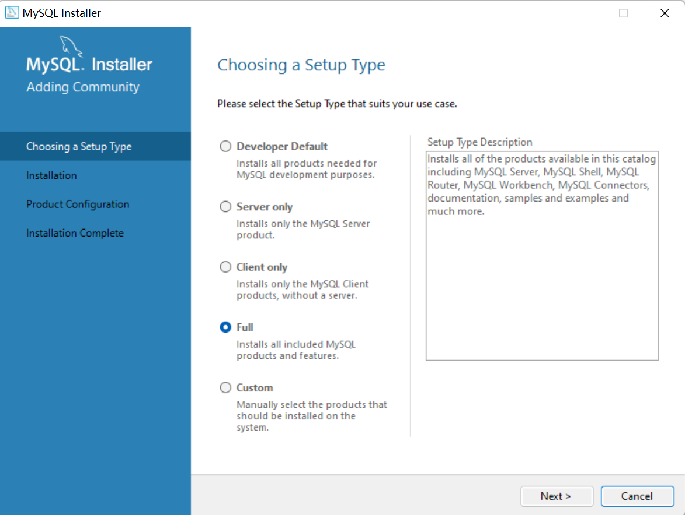
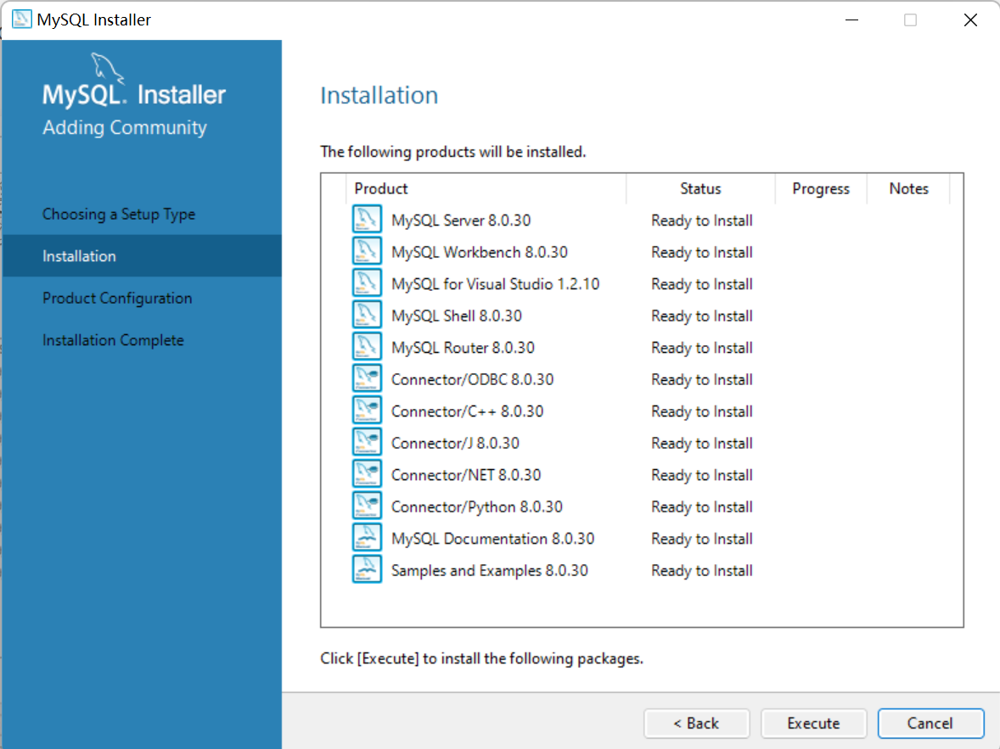
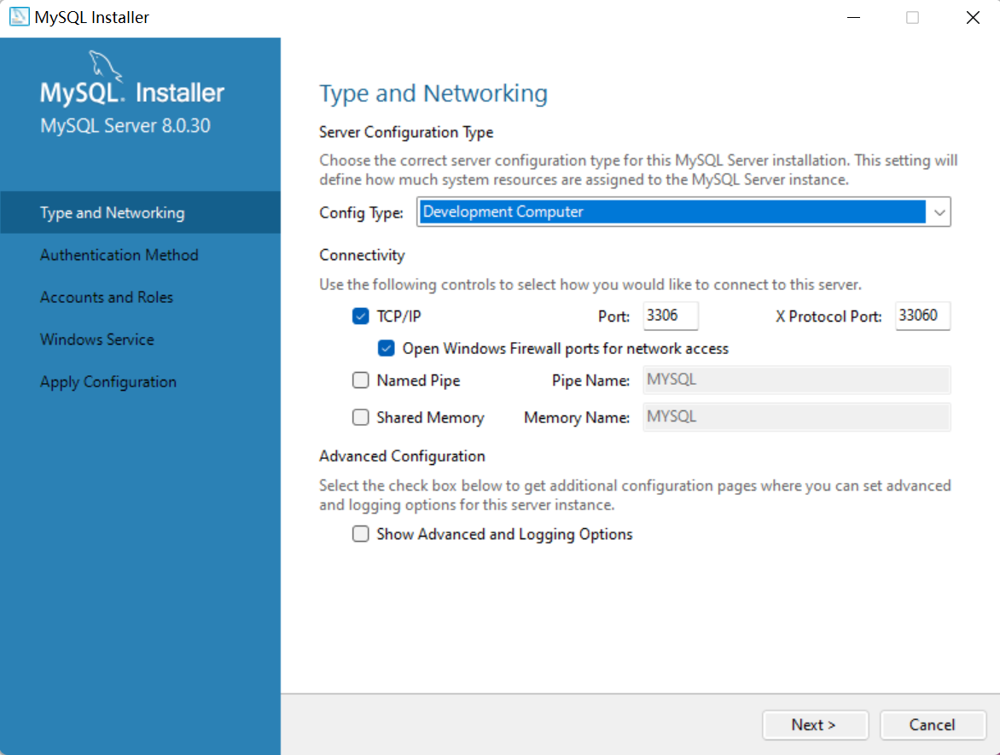
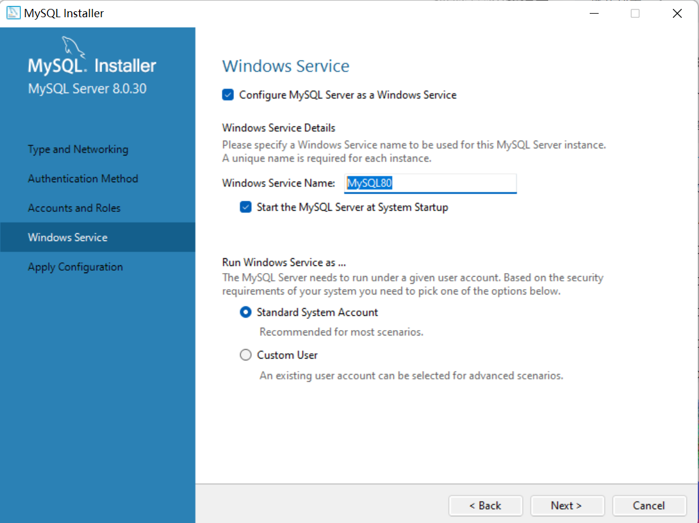
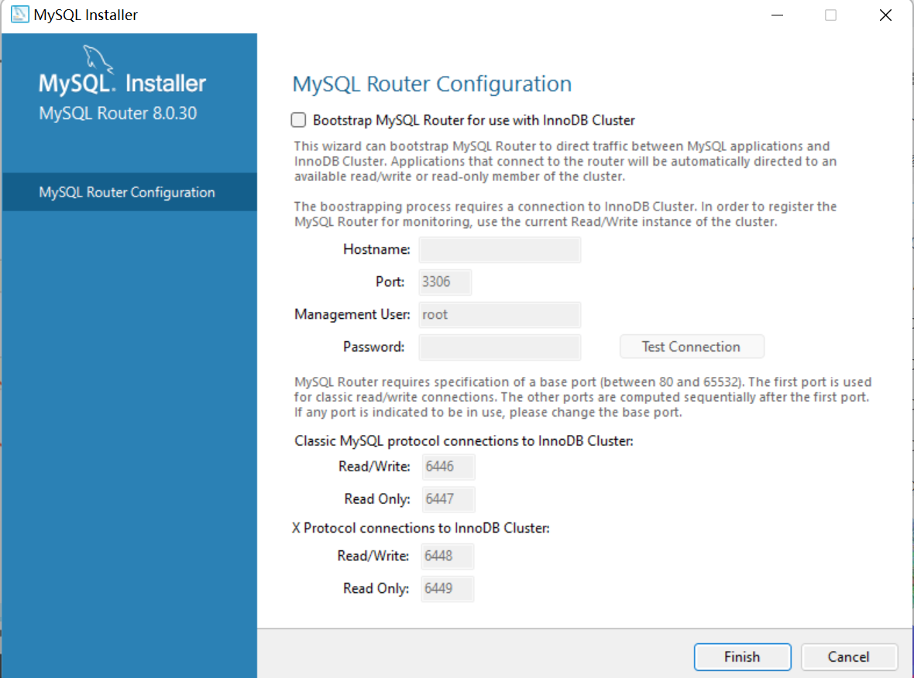

## 介绍

参见学习链接：[MySQL哔哩哔哩](https://www.bilibili.com/video/BV1Kr4y1i7ru?p=3&vd_source=38010d445b9070a07a0579329536e2f7)。

DB：数据库DataBase

DBMS：数据库管理系统 Data Base Management System

SQL：结构化查询语言 Structure Quiery Language

DB由表组成，每个表由多个字段(列)组成，数据放在表里。

常见的DBMS有MySQL，Oracle、Server、Access等，这里MySQL使用的最多。其中MySQL，Oracle、Server是基于客户机-服务器的，Access是基于共享文件系统的。

SQL则是通用的语言，不依赖于软件提供商。

社区版下载地址：[MySQL :: Download MySQL Installer](https://dev.mysql.com/downloads/installer/)

安装：



点击安装全部。





端口号3306自动分配的。

然后设置密码，这里是199791。


设置完密码下一步，要记得这个Windows Service Details的名称是**MySQL80**，以后命令行启动的时候需要使用。



然后下一步，点击配置然后完成即可。



输入密码，然后核对下一步。


输入密码，下一步。


结束即可启动界面。

如果命令行启动数据库，可以使用cmd+ctrl+shift+enter，这样有权访问。

```powershell
net start mysql80
net stop mysql80
```


## 基本语法

SQL分类：

DDL，数据定义语言，用来定义数据库对象（数据库、表、字段）

DML，数据操作语言，用来对数据库表中的数据增删改查

DQL，数据查询语言，查询数据库表中的记录

DCL，数据控制语言，用来创建数据库用户、控制数据库访问权限


DDL：

```mysql
SHOW DATABASES; # 查询所有数据库
SELECT DATABASE(); # 查询当前数据库
CREATE DATABASE [IF NOT EXISTS] 数据库名 [DEFAULT CHARSET 字符集] [COLLATE 排序规则];
# CREATE DATABASE CB DEFAULT CHARSET UTF8;
DROP DATABASE [IF EXISTS] 数据库名;
USE 数据库名;

SHOW TABLES; # 查询当前数据库所有表
DESC 表名; # 查询表结构
SHOW CREATE TABLE 表名; # 查询指定表的建表语句
CREATE TABLE 表名( # 创建表
    字段1 字段1类型 [COMMENT 字段1注释],
    ...
    字段n 字段n类型 [COMMENT 字段n注释]
)[COMMENT 表注释]

ALTER TABLE 表名 ADD 字段名 类型(长度) [COMMENT 注释] [约束]; # 添加字段
ALTER TABLE 表名 CHANGE 旧字段名 新字段名 类型(长度) [COMMENT 注释] [约束]; # 修改字段名和类型
ALTER TABLE 表名 DROP 字段名; # 删除字段
ALTER TABLE 表名 RENAME TO 新表名; # 修改表名
DROP TABLE [IF EXISTs] 表名; # 删除表
TRUNCATE TABLE 表名; # 删除指定表并重新创建该表
```

一个完整的例子：

```mysql
create table emp(
	id int comment '编号,纯数字',
    number varchar(10) comment '员工工号,字符串类型长度不超过10位',
    name varchar(10) comment '员工姓名,字符串类型长度不超过10位',
    gender char(1) comment '男/女,存储1个汉字',
    age tinyint unsigned comment '年龄,不能是负数',
    idcard char(18) comment '身份证号18位',
    entrydate date comment '入职时间'
) comment '员工表';
alter table emp add nickname varchar(20) comment '昵称';
alter table emp change nickname username varchar(10) comment '昵称';
alter table emp rename to employee; 
```


## 数据类型

数值类型：

| 类型         | 大小                                     | 范围（有符号）                                               | 范围（无符号）                                               | 用途            |
| :----------- | :--------------------------------------- | :----------------------------------------------------------- | :----------------------------------------------------------- | :-------------- |
| TINYINT      | 1 Bytes                                  | (-128，127)                                                  | (0，255)                                                     | 小整数值        |
| SMALLINT     | 2 Bytes                                  | (-32 768，32 767)                                            | (0，65 535)                                                  | 大整数值        |
| MEDIUMINT    | 3 Bytes                                  | (-8 388 608，8 388 607)                                      | (0，16 777 215)                                              | 大整数值        |
| INT或INTEGER | 4 Bytes                                  | (-2 147 483 648，2 147 483 647)                              | (0，4 294 967 295)                                           | 大整数值        |
| BIGINT       | 8 Bytes                                  | (-9,223,372,036,854,775,808，9 223 372 036 854 775 807)      | (0，18 446 744 073 709 551 615)                              | 极大整数值      |
| FLOAT        | 4 Bytes                                  | (-3.402 823 466 E+38，-1.175 494 351 E-38)，0，(1.175 494 351 E-38，3.402 823 466 351 E+38) | 0，(1.175 494 351 E-38，3.402 823 466 E+38)                  | 单精度 浮点数值 |
| DOUBLE       | 8 Bytes                                  | (-1.797 693 134 862 315 7 E+308，-2.225 073 858 507 201 4 E-308)，0，(2.225 073 858 507 201 4 E-308，1.797 693 134 862 315 7 E+308) | 0，(2.225 073 858 507 201 4 E-308，1.797 693 134 862 315 7 E+308) | 双精度 浮点数值 |
| DECIMAL      | 对DECIMAL(M,D) ，如果M>D，为M+2否则为D+2 | 依赖于M和D的值                                               | 依赖于M和D的值                                               | 小数值          |

使用的时候可以结合UNSIGNED或SIGNED关键字。

```mysql
age TINYINT UNSIGNED;
score DOUBLE(4,1);#表示四位长度和1位标度
```

日期和事件类型：

| 类型      | 大小 ( bytes) | 范围                                                         | 格式                | 用途                     |
| :-------- | :------------ | :----------------------------------------------------------- | :------------------ | :----------------------- |
| DATE      | 3             | 1000-01-01/9999-12-31                                        | YYYY-MM-DD          | 日期值                   |
| TIME      | 3             | '-838:59:59'/'838:59:59'                                     | HH:MM:SS            | 时间值或持续时间         |
| YEAR      | 1             | 1901/2155                                                    | YYYY                | 年份值                   |
| DATETIME  | 8             | '1000-01-01 00:00:00' 到 '9999-12-31 23:59:59'               | YYYY-MM-DD hh:mm:ss | 混合日期和时间值         |
| TIMESTAMP | 4             | '1970-01-01 00:00:01' UTC 到 '2038-01-19 03:14:07' UTC结束时间是第 **2147483647** 秒，北京时间 **2038-1-19 11:14:07**，格林尼治时间 2038年1月19日 凌晨 03:14:07 | YYYY-MM-DD hh:mm:ss | 混合日期和时间值，时间戳 |

字符串类型：

| 类型       | 大小                  | 用途                            |
| :--------- | :-------------------- | :------------------------------ |
| CHAR       | 0-255 bytes           | 定长字符串                      |
| VARCHAR    | 0-65535 bytes         | 变长字符串                      |
| TINYBLOB   | 0-255 bytes           | 不超过 255 个字符的二进制字符串 |
| TINYTEXT   | 0-255 bytes           | 短文本字符串                    |
| BLOB       | 0-65 535 bytes        | 二进制形式的长文本数据          |
| TEXT       | 0-65 535 bytes        | 长文本数据                      |
| MEDIUMBLOB | 0-16 777 215 bytes    | 二进制形式的中等长度文本数据    |
| MEDIUMTEXT | 0-16 777 215 bytes    | 中等长度文本数据                |
| LONGBLOB   | 0-4 294 967 295 bytes | 二进制形式的极大文本数据        |
| LONGTEXT   | 0-4 294 967 295 bytes | 极大文本数据                    |

**注意：**char(n) 和 varchar(n) 中括号中 n 代表字符的个数，并不代表字节个数，比如 CHAR(30) 就可以存储 30 个字符。CHAR 和 VARCHAR 类型类似，但它们保存和检索的方式不同，一般CHAR的性能更好。BINARY 和 VARBINARY 类似于 CHAR 和 VARCHAR，不同的是它们包含二进制字符串而不要非二进制字符串。BLOB 是一个二进制大对象，可以容纳可变数量的数据。有 4 种 BLOB 类型：TINYBLOB、BLOB、MEDIUMBLOB 和 LONGBLOB。它们区别在于可容纳存储范围不同。有 4 种 TEXT 类型：TINYTEXT、TEXT、MEDIUMTEXT 和 LONGTEXT。对应的这 4 种 BLOB 类型，可存储的最大长度不同，可根据实际情况选择。


