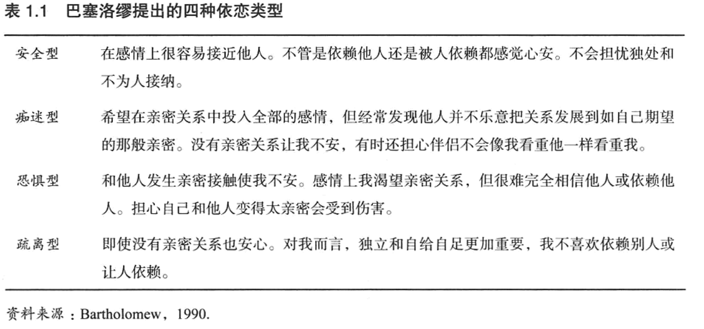
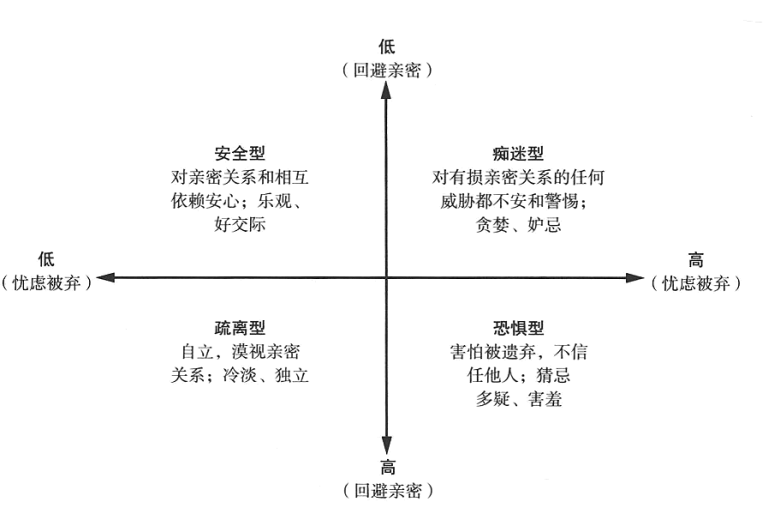
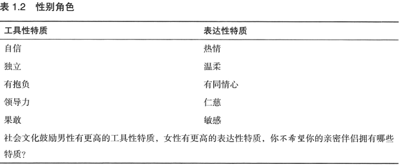
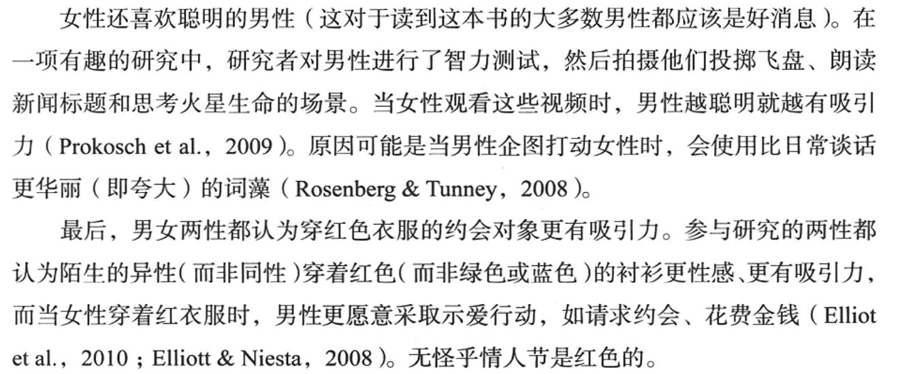
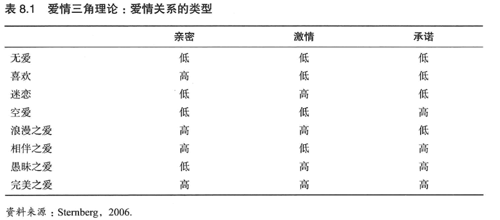
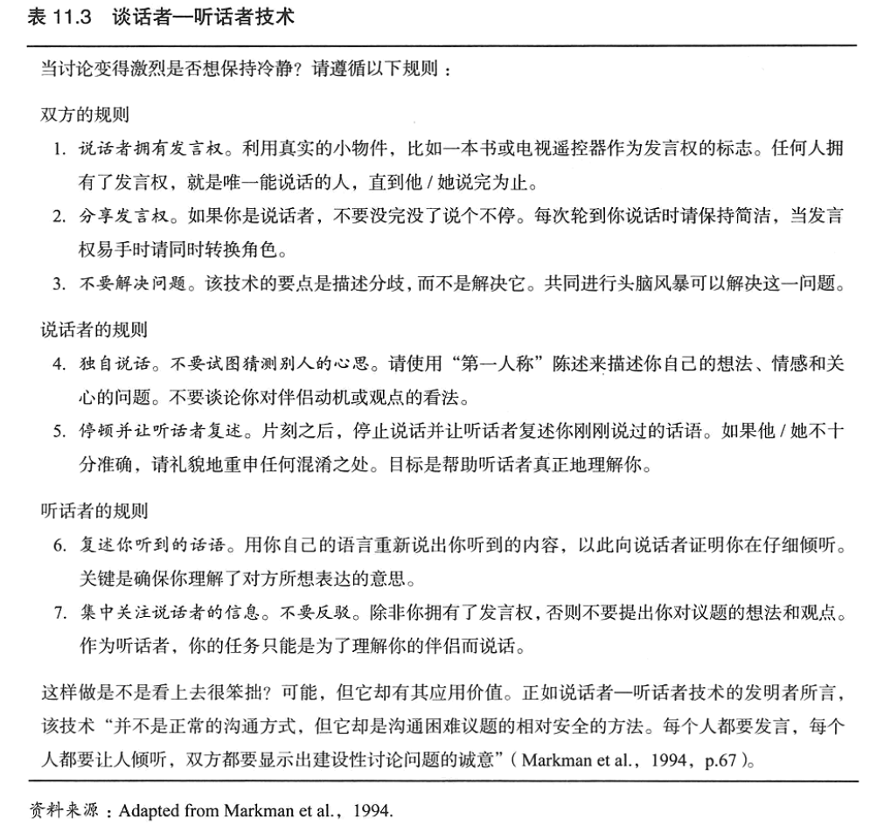
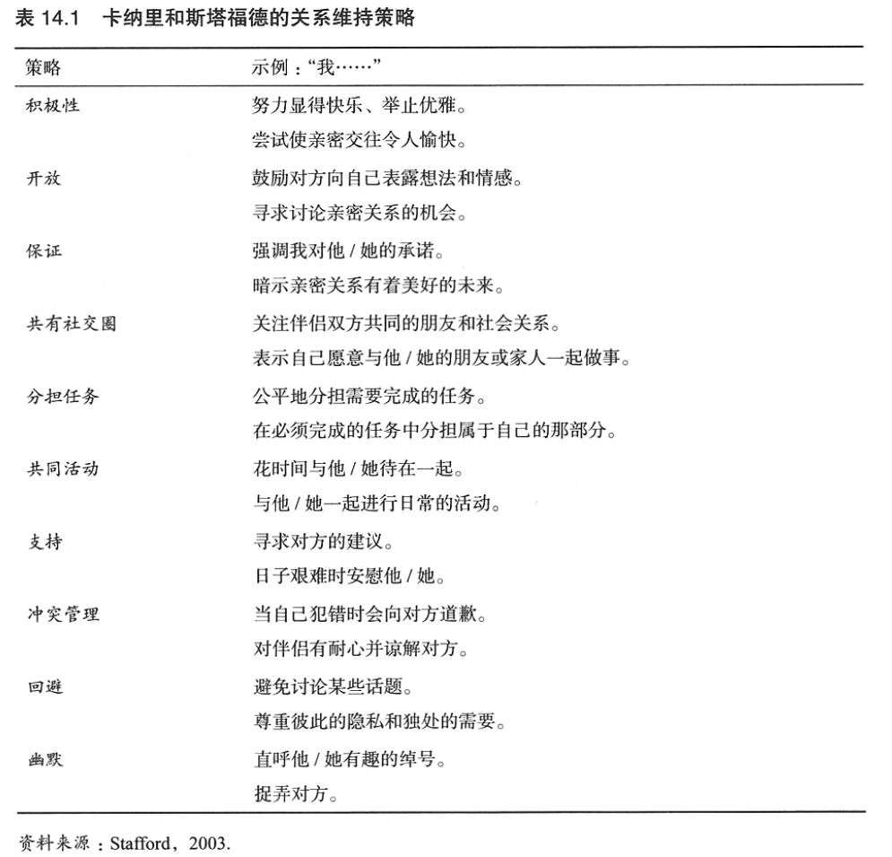

## 亲密关系的构成

亲密关系应当具备6个特征：**了解、关心、相互依赖性、相互一致性、信任以及承诺**。

如果只是具备其中一个或几个方面也可以建立亲密关系，但是亲密的程度有所不同。

**了解：**亲密的伴侣对对方的经历、爱好、心愿、缺点都很清楚；

**关心：**伴侣应当关心对方；

**相互依赖性：**一方的行为会影响到另一方的行为目标和行动能力，而且是频繁的、持久的；

**相互一致性：**情侣常常更认同"我们"，而不是"我"或者"他/她"，情侣重合的程度能够评价伴侣关系的亲密程度；

**信任：**期望对方善待和尊重自己，满足自己的要求和关注自己的幸福；

**承诺：**伴侣总是会承诺亲密关系。（P25）


了解**归属需要**！（P28）

**归属需要**是期望对方能够给予自己持续的关爱和包容，这与伴侣是谁没有关系，一段关系终结也不影响寻找下一段关系。

影响归属需要的因素有以下几个：

**1、文化的影响：**这是亲密关系的**社会标准**。

未婚同居不能确保随后的婚姻一定幸福美满，相反同居增加了夫妻离婚的危险，原因若干：

① 同居情侣的承诺一般不如已婚夫妻，因为同居情侣还有选择的机会！

② 同居时间越长，对结婚的期望越来越低，但是分手的可能性不会下降；但是结婚时间越长，离婚的可能性越低。

西方文化的主要特征：**个人主义**（支持自我表现，重视个人成就）的影响。东方文化则更倡导**集体主义**，人们与家庭、社会团体的联系更紧密。（P33）

**2、个人经历的影响：**

① 从小得到悉心照顾的人会发展出**安全型依恋**，他们更容易和别人发展出轻松信任的关系；相反从小没有被关心，则可能是**焦虑-矛盾型**，这样与他人的关系会变的紧张或者过分依赖；还有一种受到的照顾并不是真心的，而是带着拒绝或者敌意勉强为之的，这种时候会觉得他人是靠不住的，所以与他人的关系畏缩不前，是**回避型依恋**，经常容易怀疑和迁怒他人。（P40）

② 巴塞洛缪认为有4种类型，**安全型**、**痴迷型**（过分依赖他人赞许追求认同）、**恐惧型回避**（因为害怕而拒绝发生亲密关系）、**疏离型**（自给自足和独立自主更重要，不喜欢依赖别人或者被人依赖）。



如果划分为4个维度，下图可能更加清晰。



**3、个体差异的影响：**

① **性别差异：**性别差异不应只强调差异性，而忽略相似性，需要慎重的合乎理性的解释性别差异。个体差异才是影响人际交往的更重要力量。

② **性认同差异：**性别差异和性认同是不同的，性别差异是生物性差异，而性认同差异是文化、教育引起的两性在社会性和心理上的差异，也就是**社会性别**。我们可以不以"男子气"和"女人味"来区分不同的特质，这容易产生误解，可以把与任务有关的"男子气"的才能称为**工具性特质**，而与社交、情感有关的"女人味"的技能称为**表达性特质**。这样一个人同时具备这两种特质是不奇怪的，所以存在**"双特质"**的人，而不是容易引起误解的**"双性人"**。（P47）




**③ 人格差异：**人格差异是稳定的，缓慢持久的发生变化。人格对人际关系的影响程度远大于人际关系对人格的影响程度。

**开放性人格：**富有想象力、不墨守成规、艺术气质，相对应的是拘泥、僵化和教条；

**外倾性人格：**开朗、合群、热情、喜欢社交，相对应的是谨慎、内敛和害羞；

**尽责性：**勤劳、可依赖、有序，相对应的是不可靠、粗心大意；**（这应该是我！）**

**宜人性：**同情心、合作性、对人信任，相对应的是易怒、暴躁和充满敌意；

**神经质：**善变、容易担忧、焦虑和愤怒的程度。

这5种人格依次对亲密关系的作用越来越大。

**④ 自尊：**本质上是人际交往的**自我评价**。如果对自己的能力和特质存在正面评价，自尊水平就高。

低自尊的人有时低估伴侣对他们的爱，以致损害亲密关系。自我评价低的人很难相信伴侣会真正深深地爱着自己**（哎，这就是你把）**，所以他们对持续的爱情不乐观。

当亲密关系出现挫折时，自我评价高的人能够拉近和伴侣的距离，努力的修复亲密关系，低自尊的人则防御性的把自己隔离起来，生闷气，乱搞一通，还觉得自己更加糟糕。

低自尊者的自我怀疑和敏感脆弱总是使他们从无数的琐事中制造出堆积如山的问日，对爱情之路上的磕磕碰碰认为是伴侣拒绝承诺的不祥之兆，但高自尊这却对同样的小磕绊不以为意，信心十足的期待伴侣对自己的接纳和正面评价。（P55）

## 吸引力

吸引力本质上是一种奖赏。影响吸引力的要素如下。

**① 空间的临近：**大学宿舍越近的越容易认识，越远越可能不熟悉。这是因为远距离的伙伴交往消耗的金钱和付出的时间更多，所以**远距的人际关系奖赏价值越低**。

**② 曝光效应：**更愿意和熟面孔打交道。

**③ 外貌的影响**：这无需多说。（P104）



**④ 对方对自己的喜好：**对未来伴侣的期望值 = 伴侣的长相吸引力 × 伴侣接纳自己的可能性

**⑤ 相似性：**包括在年龄、性别、种族、教育程度、宗教信仰、社会地位等在人口统计学上的相像；其次是态度和价值观的相像；最后是相似的性格，两位爱好交际的人和两位害羞内向的人首次相遇都是比外向和内向碰到一起相处的更愉快。

绝大部分人都期望伴侣有以下的特点：

① 热情和忠诚，值得信赖、亲切友善、给予支持、善解人意

② 吸引力和活力，长相俊美、性感、外向

③ 社会地位和资源，经济宽裕、生活安心（P126）

## 社会认知

社会认知影响和伴侣的关系，决定了人们的感受和行动。**人们很可能在相遇的第一次就发生了认知错误**，第一印象会在数个月之后还影响着人们的判断。

在认识的瞬间，每个人就能判断出陌生人的长相是否有吸引力，是否值得信赖，能够确定他的外向程度、良知水平和智力高低。**即时印象和刻板印象**一起，塑造出他人的整体印象。

如果要检查对别人形成的第一印象是否真实，人们总是寻找可以证实自己信念的信息，而不是查找证明自己错误的资料，也就是人们常常会表现出**验证性偏差**（P133）。


人们持有的观点往往时通过**选择**而采纳的，这种选择可能会促进或者妨碍亲密关系的满足。（P136）

对伴侣的理想化可能是积极的，积极的眼光评价自己的爱人不代表忽视伴侣的真实缺点，而是认为这些缺点并没有那么重要。但是人们硬要自欺欺人，在伴侣身上凭空虚构令人期待的品质，注定要幻想破灭。我们应该做的是，**随着时间的推移，我们对伴侣了解程度增加，要不断调整自己对理想伴侣的期望**。

**归因**影响人们解释伴侣行为。例如成绩好的总是归结为内因，能力强准备充分等；但成绩不好的可能归结于试题很难。**行动者和观察者效应**出现，也就是说人们对自己行为的解释总是和对观察到的伴侣类似行为的解释不同，人们常常能感觉到自己行为的外部压力而倾向于解释为外因，但是不知道同样的环境也会影响他人，所以对他人类似行为的解释总是归结为内因。

我们应当在心中了解，**即使你最亲密的伴侣也很少能真正理解你所有行为的原因**。（P139）

类似的，还存在**自我服务偏差**，即欣然的把成功归功于自己，但是极力摆脱自己在失败中的罪责。


警惕亲密关系的6个观点：

**① 争吵具有破坏性：**争吵就意味着伴侣爱自己不够深，如果彼此深深相爱，就不会发生任何争执。（忽略了建设性）

**② 读心术很重要：**真正彼此关爱的伴侣仅凭直觉就能知道对方的需要和偏好，无需自己告知对方所思所想，如果需要自己告诉就说明伴侣爱自己不够深（显然细腻的男人很少见）

**③ 伴侣是不会改变的**：一旦亲密关系变得糟糕，就无法得到改善。如果爱人曾伤害过你，毫无疑问会再次伤害你（这里我持中立意见）

**④ 每一次的性生活都应该是完美的：**只要爱情是忠贞的，那么每次性生活就应该神奇每秒、令人满足的，伴侣应当经常渴望并为性生活做好准备（这个emm，身体因素比较多）

**⑤ 男人和女人就是不一样：**男人和女人需要非常不同，很难真正理解对方。（工具性和表达性可以都具备，而不是区分为男人或女人的性格）

**⑥ 美好姻缘天注定：**无需努力维护美满的夫妻关系，夫妻要么彼此脾性相投、快乐到老，要么格格不入、争执一生（很显然不是）（P143）

## 沟通

**非言语沟通：**

① 面部表情：试图控制自己的表情，仍然会泄露真实的情绪。（P170）

② 注视行为：关注对方的眼睛，注视可以提供给对方更多的信息。

③ 身体语言：它比面部表情更难控制，更加容易暴露我们真实的感受。

④ 身体接触：不同的身体接触传递着不同的含义，接吻具有保健作用，能够传递亲密和关爱。

⑤ 人际距离：分为亲密区、人际区、事务区和公共区。面试属于事务区，师生课堂属于公共区。

## 相互依赖

从经济学的观点来看待我们与其他人交往的过程。

**1）人际交往的奖赏、代价和结果**

相互依赖理论认为，我们都在寻求以**最小代价获取能够提供最大奖赏价值的人际交往**，我们只会与那些能提供足够利益的伴侣维持亲密关系，所以亲密关系中的伴侣双方都必须满足自己的利益，否则亲密关系不可能持续下去。那么，我们**与他人相互交换理想的奖赏**是社会生活所必须的，这一过程就是**社会交换**。

**人际交往的奖赏**是指，我们**与他人接触时获得的令人高兴的经验和物品**，可以是和个人感情无关的好处，也可以是带个人色彩的亲密感，这里泛指能够给接收者带来愉悦感和成就感的事物。

而**代价**更多的是**具有惩罚性的、令人不悦的经验**，例如为约会的饭局买单、对亲密关系发展不确定性的心理负担、迁就伴侣而放弃某些东西的遗憾等等。

把所有的奖赏和所有的代价相减就得到了**人际交往的结果**，但是这个结果是正是负其实不重要，重要的是我们评价结果的2个标准。**第1个标准是我们的期望，第2个标准是假如没有现在的伴侣，我们认为自己会过得怎样。**

```
人际交往结果 = 奖赏 - 代价
```

**2）人际关系的期望、替代收益**

相互依赖理论假定每个人都一个与众不同的**比较水平CL**，即**我们认为自己在与他人交往中应当得到的结果值**。如果人们曾有过奖赏价值很高的伴侣关系，就可能具有较高的CL，表明他们觉得自己理应得到非常好的交往结果。相反，如果过去经历过困难重重的亲密关系，那么他们的CL会很低。

所以亲密关系的满意度并不取决于交往结果绝对意义上的好坏，实际上取决于人际交往结果和比较水平之差。这就是我们的**第1个标准**。

```
满意度 = 人际交往结果 - CL
```

第2个标准**人际关系的替代收益**，它实际上比第1个标准更重要。这需要引入一个概念，**替代的比较水平CLalt**，这个含义是我们**抛弃目前的亲密关系并选择更好的伴侣所能得到的交往结果，也就是我们可以容忍目前伴侣的最差结果**。这是因为，我们总是在追求可能的最好结果，如果其他亲密关系有可能获得比目前关系更好的收益，即使我们对现状满意，也可能离开现在的伴侣去追求更大的收益。另一方面，即使我们对目前的亲密关系不满意，在没有更好的选择之前也不可能脱离现在的关系。**这可以用来解释人们仍会呆在使他们痛苦悲惨的亲密关系而不离去，这是因为他们觉得一旦离开可能更糟**。

CLalt更通俗一些就是我们对现状的满意度，如果非常低，那么人际关系的依赖度就会提升。

```
依赖度 = 人际交往的结果 - CLalt
```

总而言之，**社会交换的三个重要因素是人际关系的结果、比较水平CL和替代的比较水平CLalt**。

如果CL低，即期望高，他们就可能不容易满意现在的关系。同时如果CLalt比较高，则更容易寻求新的关系。

**3）人际关系的4种类型**

根据CL和CLalt的高低，就会产生4种类型的人际关系。

CL低、CLalt低：满意度和依赖度都高。

CL低、CLalt高：满意度高，但是依赖度低。

CL高、CLalt高：满意度和依赖度都低。

CL高、CLalt低：满意度低，但是依赖度高。（P206）

## 友谊

让我们获得他人的喜欢，**卡耐基的6个建议**：（P248）

① 真正地对他人感兴趣

② 保持微笑

③ 记住别人的名字

④ 耐心倾听，鼓励别人谈论他们自己

⑤ 谈论别人感兴趣的话题

⑥ 让别人感到自己重要

这些行动有助于表达出关注和支持，即形成应答型。

**女性朋友的特点**：

① 女性朋友之间电话交谈的时间更多

② 两性朋友谈论的话题不同，女性更可能探讨人际关系和私人问题，而男性更可能探讨客观事件，例如体育比赛等

③ 女性进行的自我表露多于男性

④ 女性给予朋友的感情支持多于男性

⑤ 女性在友谊中比男性表达出更多的爱意和温情

## 爱情

如果某个人具有你所期待的所有品质，但你还没有爱上他，那么你会和这个人结婚吗？

爱情能够持续吗？

爱情的态度取决于以下4个问题，不同的社会文化可能回答的不相同。

**① 文化价值：**爱情是值得拥有的还是可有可无的情感体验？

**② 性欲：**爱情是有性行为还是与性无关？

**③ 性取向：**异性之间和同性之间都能相爱吗？

**④ 婚姻状况：**爱情只属于婚姻，还是可以保留给第三者？

古希腊认为痴恋某个人会被视为疯狂，他们更崇尚柏拉图式的爱情，即不带任何性欲色彩；

古埃及则是具有王室血统的人总和他们的同族结婚；

古罗马认为婚姻的目的是为了生养小孩、结交盟友和建立血缘纽带，丈夫和妻子应该成为朋友，幸福和肉体享乐不是婚姻生活的内容。（P274）

**1）爱情三角理论：**

爱情总是由3个成分构成。第一个是**亲密**，包括热情、理解、沟通、支持和分享等，是情感性的；第二个是**激情**，主要特征是性的唤醒和欲望，是一种动机或者驱力；第三个是**承诺**，指投身于爱情和努力维护爱情的决心，本质上是认知性的，是与情感或性无关的决策。

**无爱：**三个成分都不具备

**喜欢：**亲密程度高，但是激情和承诺很低时出现，多表现在友谊上

**迷恋：**缺乏亲密或承诺却有着强烈的激情即是迷恋，例如被几乎不认识的人激起欲望

**空爱：**没有亲密或激情的承诺就是空虚的爱，常见于激情燃尽的爱情关系，没有温情也没有激情，只是一起过日子，包办婚姻的社会常见（P278）

爱情可能不符合上述的任何一种类型，这是因为爱情是复杂的体验，我们可以把三个组成部分结合起来形成更复杂的爱情形态。

**浪漫之爱：**有着强烈的亲密感和激情，可以视为喜欢和迷恋的结合。至于承诺，并非浪漫之爱的典型特征，例如夏日之恋会在夏季结束之后走到尽头。

**相伴之爱：**亲密和承诺结合在一起，双方会努力维持深刻、长期的友谊，形成长久而幸福的婚姻，虽然年轻时的激情已经消失。

**愚昧之爱：**缺失亲密的激情和承诺会产生愚蠢的爱情体验，会发生在旋风般的求爱中，在压倒一切的激情基础上双方会闪婚，但彼此并不十分了解或者喜欢对方。

**完美之爱：**三个成分都具备，但是这种爱情短时间可以做到，长期很难坚持。



最后，**享受激情，但不要把它作为维持爱情关系的基础**，培养与爱人之间的友谊努力保持新鲜感，**把握住每一个与配偶共同进行新奇探索的机会**。如果对爱人急迫的欲望渐渐演变为平静而深厚的情感，不要觉得奇怪或失望，这种幸福的结果可能会让你成为幸运的爱人。

## 性爱

跳过。

## 压力与紧张

想象下，你深深眷恋的伴侣对别人产生了兴趣，以下哪种情形最令你苦恼或者不安，只能选择一项。

① 想象伴侣正在和别人建立深厚的感情依恋

② 想象伴侣正在与别人享受充满激情的性爱

大多数男性(60%)选择了②，而绝大部分女性(83%)选择了①。

这是因为女性通常认为，男性的不贞是先和别人发生了性关系，并且爱上了她，所以女性认为感情不贞更具威胁；而男性认为女性常常会爱上别人但是不发生关系，如果发生了关系说明女性爱上了这个人，故性事不贞对男性更重要。（P349）

## 冲突

**个体的自主性和他人的联系性**之间的紧张，一方面人们常常喜欢按照自己的意愿行事，所以他们珍视自己的独立和自主；另一方面他们还寻求与他人温暖而又亲密的联系，能让他们依赖特定的伴侣。

**开放与封闭**之间的紧张，亲密的伴侣们期望能够相互分享他们的思想和情感，但是人们也希望有自己的隐私，谨慎的伴侣会保守以西只有自己才知道的秘密。**一方面是坦率和推心置腹的真诚，一方面是慎重和克制**。

**稳定和变化**之间的矛盾，有着快乐伴侣关系的人希望能够维持和保护亲密关系，一切维持原样，但人们也喜好新奇和兴奋，过分的呆板僵化会使得爱情变得平庸而单调。

个**体社交圈的聚合和分离**的紧张，今晚是愿意和朋友一起参加聚会还是想在家里和爱人在一起？去亲戚家过感恩节还是在自己的家中庆祝？（P371）

之前提到的**行动者-观察者效应**也是导致冲突的原因，同样的行为两个人之间的解释有些差异。

不要在愤怒的时候与人交往，冷静一下，出去走走平静下来，停止默想头脑里的不公平，最后寻找幽默就可以有效的减少愤怒。

**恶毒的言论有两类表达手段：**（P379）

**直接手段：**明确的挑战自己的伴侣，表现在当事人的脸上。

① 批评伴侣的指责和负面性质的归因

② 要求服从的带有敌意的命令，有时候涉及伤害身体或感情的威胁

③ 剔除对抗性的问题

④ 粗暴或嘲讽的贬抑之词，传递出厌恶或者不赞成，例如好争辩的打断伴侣和大声何止伴侣的说话。

**间接手段：**指以不太坦率的方式处理冲突，个体的不悦被掩盖起来，意图不太外显明确。

① 故作高贵、屈尊或者暗示敌意或傲慢等负面特征

② 烦躁不安的情感，诸如忧郁、沮丧或哀嚎

③ 先发制人的企图改变话题

④ 不承认冲突的闪烁或推脱言辞。

**谈话者-听话者的艺术：**（P392）

1）双方的规则：

① 说话者拥有发言权，等一个人说完。

② 分享发言权，如果是发言者不要没完没了的说个不停，要有重点。

③ 不要解决问题，**注意谈话的目的是为了描述分歧，解决它的事放在后面。**

2）说话者的规则：

① 是用第一人称来陈述自己的想法、情感和关心的问题，不要试图猜测别人的心思，不要谈论你对伴侣动机或观点的看法。

② 停顿让听话者复述，这是为了帮助她真正理解你说话的含义，指出混淆之处。

3）听话者的规则：

① 复述你听到的话，用自己的语言说出你听到的内容，以证明你在仔细倾听。

② 集中关注说话者的信息，不要反驳，除非你有了发言权，否则不要提出你对议题的想法和观点。



## 权利和暴力

没有暴力行为，下一章。。

## 亲密关系的解体与消亡

略。

## 亲密关系的维持与修复

卡纳里和斯塔福德的关系维持策略。



**亲密关系满足的秘诀：**

① 欣赏你的伴侣

② 表达你的感激

要有义务的去注意伴侣为你付出的关爱、仁慈和慷慨，然后每周都要和你的伴侣分享你最欣赏的三个友善之举，无论巨细。当我们像伴侣表达我们的感激时，我们就能为他们提供巨大的价值认可和关爱。我们明确的欣赏心态减少了他们帮助我们时感到的代价——结果是他们在继续为我们的利益努力时能够得到更多的快乐。（P467）

**预防和关系提升的项目：**

① 能改变伴侣观点和行为的承诺所具有的力量，鼓励伴侣以长期的眼光来看待他们一起努力创造的未来。

② 一起快乐生活的重要性，说服伴侣在日常生活的基础上一起重视玩乐。

③ 关于性的坦诚沟通所带来的价值，建议伴侣清楚而坦诚的表达他们的性欲望，并不时尝试新事物。

④ 考虑不恰当期望的后果，鼓励伴侣认识他们的期望，对自己的期望保持理性并清楚的沟通他们的期望。

