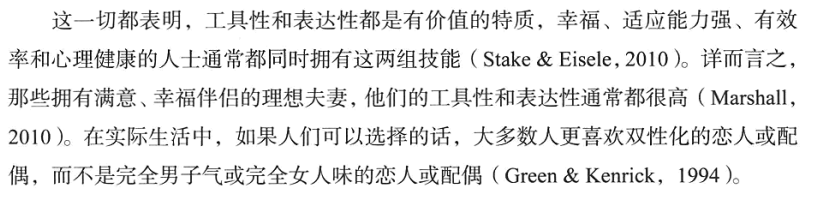

## 亲密关系的构成

亲密关系应当具备6个特征：**了解、关心、相互依赖性、相互一致性、信任以及承诺**。

如果只是具备其中一个或几个方面也可以建立亲密关系，但是亲密的程度有所不同。

**了解：**亲密的伴侣对对方的经历、爱好、心愿、缺点都很清楚；

**关心：**伴侣应当关心对方；

**相互依赖性：**一方的行为会影响到另一方的行为目标和行动能力，而且是频繁的、持久的；

**相互一致性：**情侣常常更认同"我们"，而不是"我"或者"他/她"，情侣重合的程度能够评价伴侣关系的亲密程度；

**信任：**期望对方善待和尊重自己，满足自己的要求和关注自己的幸福；

**承诺：**伴侣总是会承诺亲密关系。（P25）

了解**归属需要**！（P28）

**归属需要**是期望对方能够给予自己持续的关爱和包容，这与伴侣是谁没有关系，一段关系终结也不影响寻找下一段关系。

影响归属需要的因素有以下几个：

**1、文化的影响：**这是亲密关系的**社会标准**。

未婚同居不能确保随后的婚姻一定幸福美满，相反同居增加了夫妻离婚的危险，原因若干：

① 同居情侣的承诺一般不如已婚夫妻，因为同居情侣还有选择的机会！

② 同居时间越长，对结婚的期望越来越低，但是分手的可能性不会下降；但是结婚时间越长，离婚的可能性越低。

西方文化的主要特征：**个人主义**（支持自我表现，重视个人成就）的影响。东方文化则更倡导**集体主义**，人们与家庭、社会团体的联系更紧密。（P33）

**2、个人经历的影响：**

① 从小得到悉心照顾的人会发展出**安全型依恋**，他们更容易和别人发展出轻松信任的关系；相反从小没有被关心，则可能是**焦虑-矛盾型**，这样与他人的关系会变的紧张或者过分依赖；还有一种受到的照顾并不是真心的，而是带着拒绝或者敌意勉强为之的，这种时候会觉得他人是靠不住的，所以与他人的关系畏缩不前，是**回避型依恋**，经常容易怀疑和迁怒他人。（P40）

② 巴塞洛缪认为有4种类型，**安全型**、**痴迷型**（过分依赖他人赞许追求认同）、**恐惧型回避**（因为害怕而拒绝发生亲密关系）、**疏离型**（自给自足和独立自主更重要，不喜欢依赖别人或者被人依赖）。

如果划分为4个维度，下图可能更加清晰。

**3、个体差异的影响：**

① **性别差异：**性别差异不应只强调差异性，而忽略相似性，需要慎重的合乎理性的解释性别差异。个体差异才是影响人际交往的更重要力量。

② **性认同差异：**性别差异和性认同是不同的，性别差异是生物性差异，而性认同差异是文化、教育引起的两性在社会性和心理上的差异，也就是**社会性别**。我们可以不以"男子气"和"女人味"来区分不同的特质，这容易产生误解，可以把与任务有关的"男子气"的才能称为**工具性特质**，而与社交、情感有关的"女人味"的技能称为**表达性特质**。这样一个人同时具备这两种特质是不奇怪的，所以存在**"双特质"**的人，而不是容易引起误解的**"双性人"**。（P47）

**③ 人格差异：**人格差异是稳定的，缓慢持久的发生变化。人格对人际关系的影响程度远大于人际关系对人格的影响程度。

**开放性人格：**富有想象力、不墨守成规、艺术气质，相对应的是拘泥、僵化和教条；

**外倾性人格：**开朗、合群、热情、喜欢社交，相对应的是谨慎、内敛和害羞；

**尽责性：**勤劳、可依赖、有序，相对应的是不可靠、粗心大意；**（这应该是我！）**

**宜人性：**同情心、合作性、对人信任，相对应的是易怒、暴躁和充满敌意；

**神经质：**善变、容易担忧、焦虑和愤怒的程度。

这5种人格依次对亲密关系的作用越来越大。

**④ 自尊：**本质上是人际交往的**自我评价**。如果对自己的能力和特质存在正面评价，自尊水平就高。

低自尊的人有时低估伴侣对他们的爱，以致损害亲密关系。自我评价低的人很难相信伴侣会真正深深地爱着自己**（哎，这就是你把）**，所以他们对持续的爱情不乐观。

当亲密关系出现挫折时，自我评价高的人能够拉近和伴侣的距离，努力的修复亲密关系，低自尊的人则防御性的把自己隔离起来，生闷气，乱搞一通，还觉得自己更加糟糕。

低自尊者的自我怀疑和敏感脆弱总是使他们从无数的琐事中制造出堆积如山的问日，对爱情之路上的磕磕碰碰认为是伴侣拒绝承诺的不祥之兆，但高自尊这却对同样的小磕绊不以为意，信心十足的期待伴侣对自己的接纳和正面评价。（P55）

## 吸引力

吸引力本质上是一种奖赏。影响吸引力的要素如下。

**① 空间的临近：**大学宿舍越近的越容易认识，越远越可能不熟悉。这是因为远距离的伙伴交往消耗的金钱和付出的时间更多，所以**远距的人际关系奖赏价值越低**。

**② 曝光效应：**更愿意和熟面孔打交道。

**③ 外貌的影响**：这无需多说。（P104）

**④ 对方对自己的喜好：**对未来伴侣的期望值 = 伴侣的长相吸引力 × 伴侣接纳自己的可能性

**⑤ 相似性：**包括在年龄、性别、种族、教育程度、宗教信仰、社会地位等在人口统计学上的相像；其次是态度和价值观的相像；最后是相似的性格，两位爱好交际的人和两位害羞内向的人首次相遇都是比外向和内向碰到一起相处的更愉快。

绝大部分人都期望伴侣有以下的特点：

① 热情和忠诚，值得信赖、亲切友善、给予支持、善解人意

② 吸引力和活力，长相俊美、性感、外向

③ 社会地位和资源，经济宽裕、生活安心（P126）

## 社会认知

## 沟通

## 相互依赖

## 友谊

## 爱情

## 性爱

## 压力与紧张

## 冲突

## 权利和暴力

## 亲密关系的解体与消亡

## 亲密关系的维持与修复

