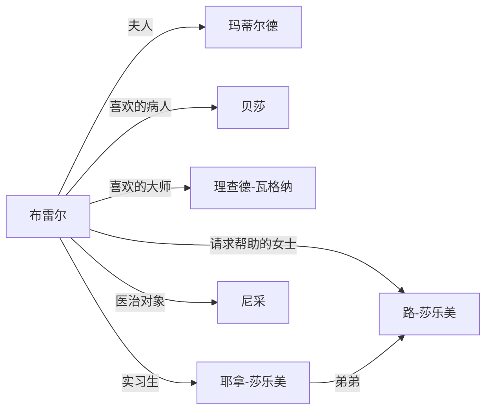

## 第一章

第一章有7个人物出场。主角约瑟夫·布雷尔，他的夫人玛蒂尔德；布雷尔早餐的对话之人路·莎乐美，以及路·莎乐美的弟弟耶拿·莎乐美是布雷尔的实习生；布雷尔喜欢的大师理查德·瓦格纳，喜欢的病人贝莎，一个要治疗绝望的哲学家尼采。

## 第二章

关于尼采：他醉心于前苏格拉底时期的希腊哲学，尤其是阿哥尼斯观念——关于一个人只能透过竞争来启发天赋的信念。对于任何放弃竞争并声称自己是个利他主义者的人，他会彻底地怀疑他们的动机。他的观念启蒙于叔本华。他相信**没有人会有帮助他人的欲望，帮助他人仅仅是为了支配他人，并借此来增加他们自身的权力。**（P36）

这一章主要是讲了保罗-雷、尼采和路-莎乐美的三角关系。。

## 第三章

西格-弗洛伊德是布雷尔的年轻友人，玛莎是弗洛伊德的女朋友，贝莎是玛莎的好友。

## 第四章

布雷尔和尼采首次碰面。（P90）

## 第五章

布雷尔和尼采深入交流，获知尼采遭遇的三次背叛经历可能是治疗他的出口。（P109）

## 第六章

尼采直言提出的三个问题：

第一，我会失明吗？

第二，这样突然发病，会一直持续下去吗？ 

还有最后一个，最困难的一个，我会像我父亲一样吗？我有一种正在恶化的脑部疾病吗？它会在我还年轻的时候就夺走我的生命，迫使我变成瘫痪，或更糟，变成疯癫或痴呆吗？

布雷尔和尼采的对话是关于医生有没有责任让病人知道真相，以及死亡的含义——譬如自杀的的意义是不再死一次。之后他们谈论到了尼采的2本书，解决了布雷尔如何不透露出路-莎乐美的存在而提及这2本书。

## 第七章

还有，尼采大胆论事的方式！想想看！会说希望是最大的灾祸！会说上帝已死！说真理是我们生存不可或缺的一种错误！真理的敌人不是谎言，而是深信不疑！死亡的最终报酬是不会再死一次！医生无权剥夺一个人本身的死亡！都是些邪恶的思想！他跟尼采就每一点进行激辩。然而，那是一场虚伪的辩论：在他的心田深处，他知道尼采是对的。（P130）

## 第八章

关于孤独，布雷尔的话：老实说，尼采教授，作为你的医生，我对你所描述的日常作息感到关切。谁能够忍受这样的孤独呢？稍早，你列举了你没有太太、孩子与同 僚，以此作为你已经将压力从你生活中消除的证据。不过，我对它的看法不一样，极端的孤立不会消除压力，它本身反而就是压力，寂寞是疾病的温床。

尼采用力地摇着头，容我表示异议，布雷尔医生。伟大的思想家总是选择遗世独立以思考本身的意念，不愿受众人的打扰。想想梭罗、斯宾诺莎，或者是宗教上的禁欲主义，像圣杰罗姆、圣弗朗西斯或佛陀。（P171）

## 第九章

尼采怀疑布雷尔的动机，布雷尔的防守对话造成了两人的不欢而散。尼采太过于骄傲而无法接受帮助。他的这种骄傲是他疾病的一部分，就像是一个病情严重的身体器官一样。我这样对他大吼大叫实在愚蠢极了！一定有一种接近他的方法，以某种治疗计划来吸引他与他的骄傲。

## 第十章

布雷尔和麦克斯的对话，谈论布雷尔和贝莎，前任护士伊娃·伯格，以及妻子玛蒂尔德之间的问题。

## 第十一章

尼采吃了过多的水合三氯乙醛，非常致命，但是偏头痛引起的呕吐救了他。

## 第十二章

布雷尔和尼采达成了相互治疗的协议，布雷尔治疗尼采的身体，尼采治疗布雷尔的哲学精神。

## 第十三章

布雷尔和弗洛伊德商量对策，打算以诚实的话来设置陷阱：首先，以揭露你自己来吸引他。其次，调换角色。最后，帮助他把自己完全暴露出来，而且，我们有一个最根本的原则，保持他的信任，避免任何一丁点的背叛。现在，下一步是什么？假设他真的分享了你的绝望，然后怎么办？

## 第十四章

尼采对布雷尔问题的总结：一、普遍的不快乐；二、被外来的念头所纠缠；三、自我憎恨；四、恐惧衰老；五、恐惧死亡；六、自杀的冲动。然经过谈话，又增加了5项：7.被困住的感觉——被婚姻、被生活 8.对太太感到疏远 9.后悔拒绝了伊娃的性“奉献” 10.对其他医生对他的意见过度关切 11.嫉妒贝莎与另一个男人。

## 第十五章

他说了太多吗？他的坦白让尼采反感吗？他着了什么魔呢，让他脱口说出一切，抖出他对贝莎与伊娃一切秘密又不体面的情感？在当时，分享一切事情似乎是对的，甚至是在赎罪。但现在想到尼采对他的评价时，他感到畏缩。虽然知道尼采对于性有清教徒般的感受，他却用跟性有关的谈话来侵犯他。或许，他是蓄意的；或许，隐藏在病人身份的外衣下，他有意要让尼采震惊与愤怒。但，为什么呢？

如何让微不足道的痛苦，脱离它所栖息的横木呢？再经历一次痛苦的诚实吗？

## 第十六章

新的评价：

无知但机敏 

善于把所知用得淋漓尽致 

没有品位，但在这个缺点上很纯真 

只对小事诚实，往往是出于倔强在较大的尺度上，面对生活的整个态度——不诚实 

对施与受一点都不敏锐 

没有灵魂亦没有去爱的能力 

实际上永远不健全，而且几近疯癫 

对恩人不怀感激、不知羞愧 

尤其是 

靠不住 

行为不检 

对荣誉的事情无知 

大脑具有灵魂的初步迹象 

猫的性格——披上家居宠物外衣的掠食者 

高尚是指回想起熟悉的高尚人们 

意志坚强，但心胸不广 

既不勤勉又不贞洁残酷地驱逐官能 

孩子气的自我中心，作为性欲萎缩与滞后的结果 

没有对人的爱，却有对上帝的爱 

需要扩充 

诡计多端，充满对涉及男人性欲的自我克制

## 第十七章

布雷尔终于对路·莎乐美的强求感到不耐，他必须采取的立场越来越清楚了。“你在给一位医生对他的病人的责任提出难题。你强迫我在尚未思考清楚的问题上表明立场。但是我现在相信，我什么都无法告诉你——他住在哪里，或者他的健康状态，甚至他是不是我的病人。而说 到病人，莎乐美小姐，”他说，从椅子上站了起来，“我必须照顾那些正 在等候我的病人。”

## 第十八章

奇怪的是，他跟尼采分享了同样的谎言，彼此都跟对方隐瞒了路·莎乐美。虚骄，难道以对他的相同方式影响了尼采吗？尼采会感到不诚实吗？罪恶感？基于尼采的利益，可以有某种方法来利用这种罪恶感吗？

“所有认真的思考者都考虑过自杀，”尼采指出说，“它是帮助我们度过夜晚的慰藉。”

## 第十九章

我深深懊悔于这种双重生活、秘密生活的复杂。然而我珍惜它。资产阶级生活的表面是一潭死水，太明显了，人可以太清楚地看到终点，而所有行动都直接导向那尽头处。这听起来很疯狂，我知道，但是，双重生活是一种额外的生活，它支撑着一个延长寿命的承诺。（P373）

当我自己是一种关系的一部分时，去观察它并不容易。然而，我察觉到令人印象深刻的趋势。（P378）

我们对欲望比对欲望的对象要爱得更多。（P380）

## 第二十章

布雷尔指着许多放有新鲜花束的坟，“在这块死者之地，这些是死 者，而那些，”他指向墓地中古老的一段，未受照顾而一片荒芜，“那些是真正的逝者。现在没有人会照顾他们的坟墓，因为没有任何活着的人认识他们，他们知道死亡真正的滋味。” （P386）

我是指一个人无法在爱上一个女人的同时，不让自己对那层洁白皮肤之下的东西视而不见：血液、静脉、脂肪、黏液、排泄物——那种生理学上的恐怖之物。情人必须拿掉自身的眼睛，必须背弃真理。而对我来说，不真实的生活就是一具生不如死的行尸走肉！（P398）

## 第二十一章

## 第二十二章

我只是打算说，要完全与另一个人发生关联，人必须先跟自己发生关联。如果我们不能拥抱我们自身的孤独，我们只是利用他人作为对抗孤立的一面挡箭牌而已。只有当人可以活得像只老鹰——不需要任何观众——才可能爱慕地转向另一个人；只有在那个时候，一个人才能够去关心另一个存在的增长。因此，如果人不能放弃一桩婚姻，那么这桩婚姻就注定要失败。（P459）

噢，我有我的伪装，约瑟夫，我容忍孤独的秘密方法甚至是去美化它。我说，我必须与他人隔离以思考我本身的思想，我说，过往的伟大心灵是我的同伴，说他们爬出他们躲藏的所在，来进入我的光照之下。我嘲笑着对遗世独立的恐惧，我宣称卓越的人必须忍受卓越的痛苦，宣称我已经飞进太过遥远的未来，并且没有人能够跟得上我。我自 鸣得意地说，如果我受到了误解或惧怕或排斥，那么就越多越好——那意味着我就是目标！我说到我的勇气，面对不在羊群之中的孤独，面对没有上帝的世界，它是我之所以卓越的证明。（P488）