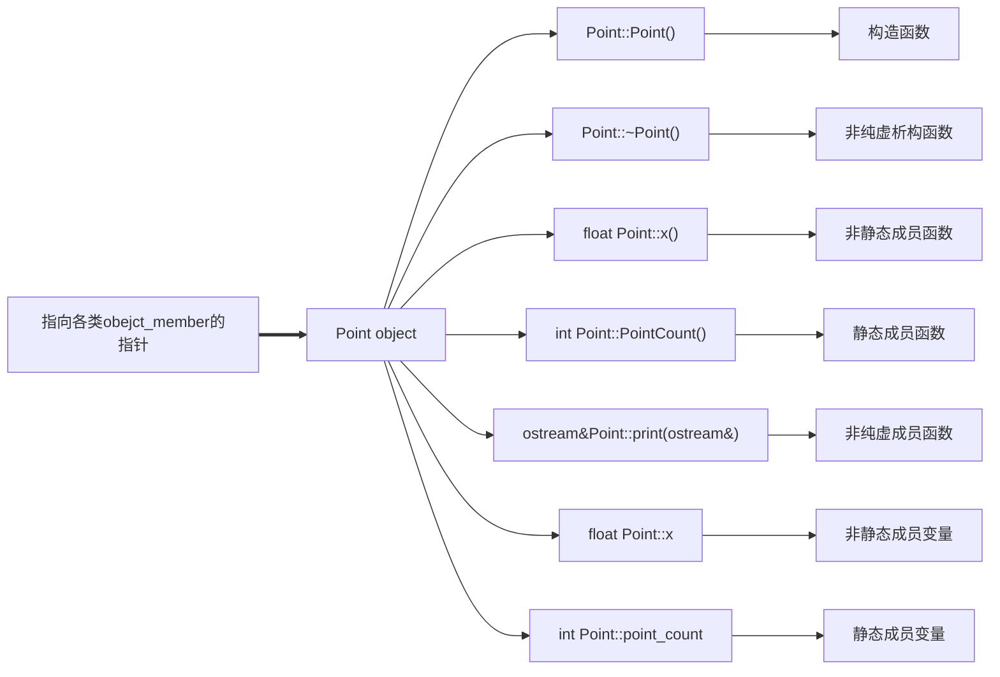
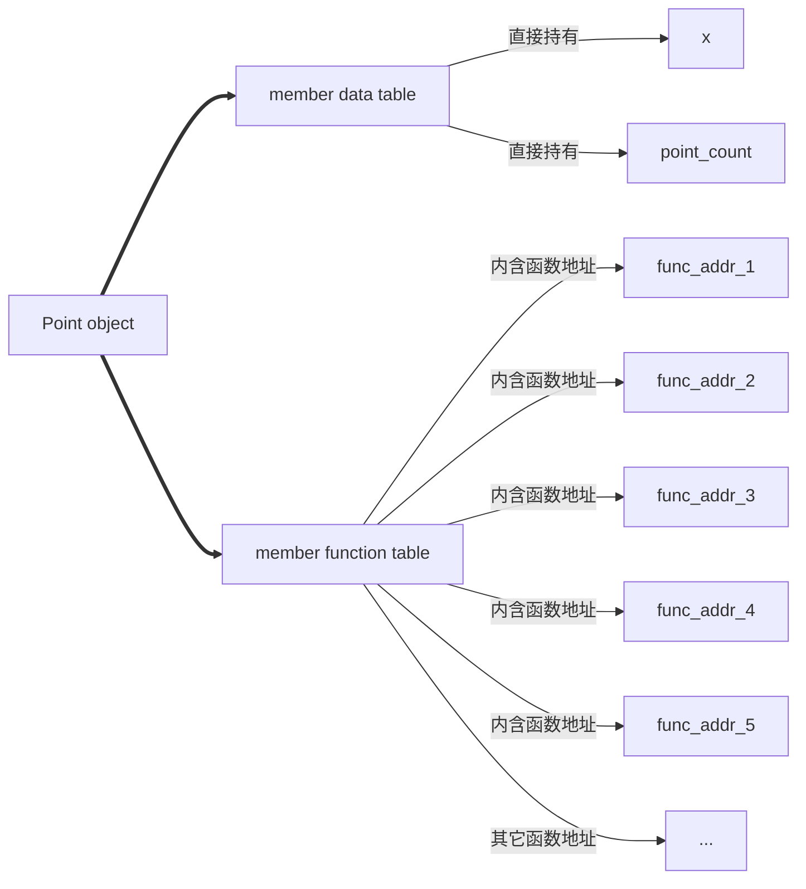
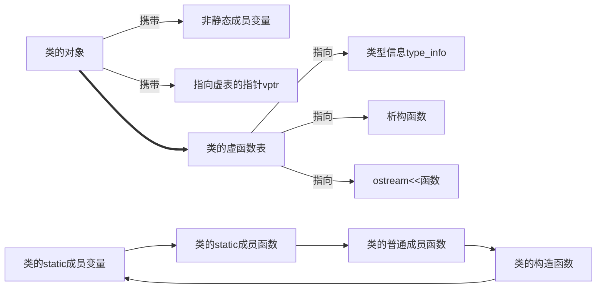
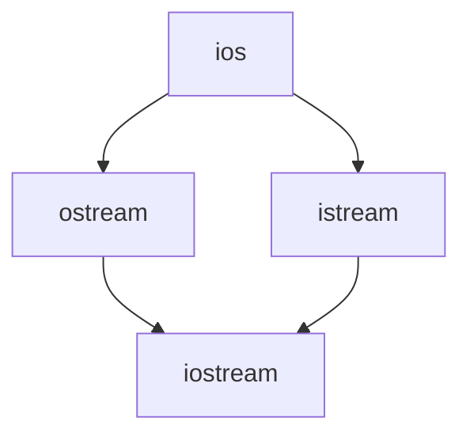
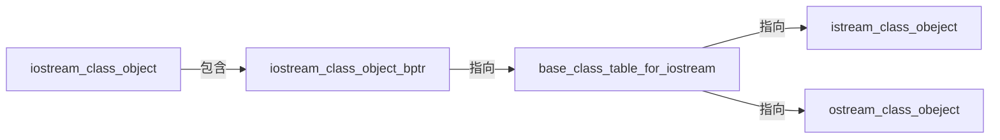
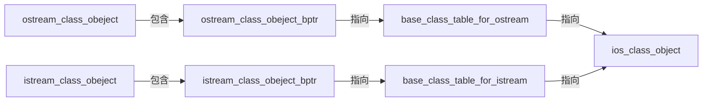

<!--
 * @Author: chenbei
 * @Date: 2022-04-16 18:43:24
 * @LastEditTime: 2022-04-16 19:25:48
 * @FilePath: \myLeetCode\深度探索C++对象模型.md
 * @Description: 深度探索C++对象模型.md
 * @Signature: A boy without dreams
-->

## 一、关于对象

C语言的顺序编程，在于数据和处理数据的操作是分开声明的，也就是没有支持数据和函数的关联性。也就是说所有函数都处理的是外部数据，例如结构体定义的聚合对象。除了函数意外，还可以定义宏函数，在预处理阶段即展开替换。

```c
#include <cstdio>
#define Point3DPrint( pd ) printf("(%g, %g, %g )",pd->x,pd->y,pd->z);
typedef struct point3d{
        float x;
        float y;
        float z;
}Point3D; // 别名
void print_pd(const Point3D* pd);
int main(){
    // for c
    Point3D * pd = new Point3D();
    pd->x = 1.0;
    pd->y = 2.0;
    pd->z = 3.0;

    // 使用函数,也可以使用宏
    printf("by function =>\n");
    print_pd(pd);
    printf("by define =>\n");
    Point3DPrint(pd);
    return 0;
}
void print_pd(const Point3D* pd){
    printf("%f %f %f\n", pd->x, pd->y, pd->z);
}
```

如果是C++，则属于OOP编程，它可以定义一个类将函数与函数联系起来，而非简单的聚合对象，可以看成是组合对象或者继承关系，即建立了一个抽象数据类型ADT=abstract data type。

```c++
#include <iostream>
using namespace std;
class Point3D{
    public:
        Point3D(float x = 0.0, float y = 0.0, float z = 0.0)
            :x(x),y(y),z(z){}
        float getX() const { return this->x; }
        float getY() const { return this->y; }
        float getZ() const { return this->z; }
        void setX(float x) { this->x = x; }
        void setY(float y) { this->y = y; }
        void setZ(float z) { this->z = z; }

    private:
        float x;
        float y;
        float z;
};
inline ostream& operator<<(ostream& os, const Point3D &pd) {
    cout<<"x = "<<pd.getX()<<" y = "<<pd.getY()<<" z = "<<pd.getZ()<<endl;
    return os;
}
int main()
{
    Point3D pd(1.0,2.0,3.0);
    cout<<pd<<endl;
    return 0;
}
```

抽象数据类型支持继承，派生类可以调用基类的构造函数来初始化。

```c++
#include <iostream>
using namespace std;
class Point{
    public:
        Point(float x = 0.0):x(x){}
        void setX(float x){
            this->x = x;
        }
        float getX(){
            return x;
        }
    protected:// 声明保护可被继承
        float x;
};
class Point2D:public Point{
    public:
        // 可以使用基类初始化基类成员,派生类初始化派生类成员
        Point2D(float x = 0.0,float y = 0.0):Point(x),y(y){}
        void setY(float y){
            this->y = y;
        }
        float getY(){
            return y;
        }
    protected: // 声明保护可被继承
        float y;
};
class Point3D:public Point2D{
    public:
        // 可以使用基类初始化基类成员,派生类初始化派生类成员
        Point3D(float x = 0.0,float y = 0.0,float z = 0.0):Point2D(x,y),z(z){}
        void setZ(float z){
            this->z = z;
        }
        float getZ(){
            return z;
        }
    protected:// 声明保护可被继承
        float z;
};
int main()
{
    Point3D p(1.0,2.0,3.0);
    cout << p.getX() << " " << p.getY() << " " << p.getZ() << endl;
    return 0;
}
```

还支持模板以及模板参数。

```c++
#include <iostream>
#include <vector>
#include <assert.h>
using namespace std;
template<class valueType,int dim> // 允许模板参数化
class Point{
    public:
        Point(){}
        Point(valueType coords[dim]){ // 传入的也是数组
            for(int idx = 0;idx < dim;idx++){
                this->coords[idx] = coords[idx];
            }
        }

        // 此版本允许外部对实例化对象赋值
        valueType& operator[](int idx){ // 重载[]运算符 non_const版本
            // 不要使用static_assert,因为idx步数常量表达式
            assert(idx >= 0 && idx < dim); // 不能超过坐标范围
            return coords[idx];
        }

        // 此版本是为了得到属性值
        valueType operator[](int idx)const{ // 重载[]运算符 const版本
            assert(idx >= 0 && idx < dim); // 不能超过坐标范围
            return coords[idx];
        }

    private:
        valueType coords[dim]; // 一个d维数组用来存储valueType类型的数据
};
template<class ValueType,int dim>
inline ostream& operator<<(ostream& os,const Point<ValueType,dim>& p){
    for(int idx = 0;idx < dim;idx++){
        os << p[idx] << " ";
    }
    return os;
}
int main()
{
    Point<int,5> p1;
    p1[0] = 1;
    p1[1] = 2;
    p1[2] = 3;
    p1[3] = 4;
    p1[4] = 5;
    cout << p1 << endl;
    int *p = new int[5];
    p[0] = 1;
    p[1] = 2;
    p[2] = 3;
    p[3] = 4;
    p[4] = 5;
    const Point<int,5> p2(p);
    cout << p2 << endl;
    return 0;
}
```

现在比较C与C++。对于数据成员来说，使用class相比struct并没有增加成本，每个对象实例都会有这些成员变量；对于成员函数，如果是非inline函数，那么只会有一个函数实例，只是对象去调用了这个函数；如果是inline函数，每个对象都会产生函数实例。

实际上，class带来的额外成本主要是2个。

第一、虚函数机制，virtual function，这是为了实现动态绑定，即指向的实际对象类型为准；

第二、虚基类，virtual base class，用来实现虚基类在被派生类继承时只存在一个单一且共享的实例；

第三、可能在多重继承时出现一些类型转换成本。

### 1.1 C++对象模式

成员变量分为static和non-static类型，以及三种成员函数，virtual(纯虚与非纯虚,对应接口和缺省实现)、non-virtual函数(分为static和non-static函数,要求派生类不能覆写非虚函数)，static函数只有共享的1份实例。对于下边的类，可以使用简单对象模型进行考虑。

```c++
class Point{
    public:
    	Point(float x);
    	virtual ~Point();
    	float x() const;
    	static int PointCount();
    protected:
    	virtual ostream& print(ostream &os) const;
    	float x;
    	static int point_count;
}
```

简单对象模型可以使用下方流程图表示。

在这个简单模型下，成员(包括变量和函数)本身不在对象内，只是指向各类成员的指针才在对象内，这样可以避免不同成员需要不同的存储空间所导致的问题，也就是类尽量不存直接放数据和函数。事实上对象依靠slot的索引值进行寻址，例如这里的成员变量x和point_count索引值是6和7。整个类的大小就是指针大小乘类中声明的members个数。



另一种模型是表格驱动对象模型，也就是把members区分出data member table和member function table，类对象只是包含指向这2个表格的指针。成员函数表有一系列的slot表格，每个slot都指向一个成员函数，而成员变量表直接持有数据本身。这个方案也没有用到真正的C++编译器上，但是这个成员函数表的观念成为一个指出虚函数表virtual functions table的有效方案。



2022/4/17/11:27

### 1.2 C++ 对象模型

2022/4/25/21:24,隔了些日子没看,最近没回家公司也一直在忙没时间看。

目前的C++对象模型基于上述设计，对简单对象模型和表格驱动模型进行了优化。

对于非静态成员变量，都会分配在每个类的对象中携带；

对于静态成员变量、静态与非静态成员函数、构造函数都在类对象之外的地方存放；

虚函数则是每个类产生出一堆指向虚函数的指针放在表格中，也就是虚函数表vtbl。之后类的对象被安插一个指针，指向相关的虚函数表，即vptr。vptr的设定和重置都由类的构造、析构和复制构造与等式赋值自动完成。每个类关联的Type_info 类型信息也都由虚表指出来，通常放在表格的第一个slot。

以上可以表示流程图如下。



C++对象还有继承关系，因为支持多重继承和虚继承，对于虚继承而言表示不管基类被派生多少次，永远只会存在一个实例，例如iostream只有一个虚基类实例virtual ios base。



在简单对象模型中，认为每一个基类都可以被派生类对象的一个slot指出，这个slot含有基类唯一实例的地址。缺点是因为间接性导致的空间和存取时间上的额外负担，优点是类对象的大小不会因为基类的改变而改变，因为只是包含一个指向的地址。

也可以设想有个虚表，但不是虚函数表，这里是虚基类表，每个slot存放一个基类的地址，就像虚函数表的slot存放的是虚函数的地址一样。每个类对象都内含有一个bptr类似于vptr，会被初始化，指向其虚基类表。缺点是由于间接性导致的空间和存取时间上的额外负担，优点是每个类对象对于继承都有一致的表现方式：每一个类对象都应该在某个固定位置上安放一个bptr，与虚基类的大小和个数无关，此外无需改变类对象本身就可以放大和缩小或者更改虚基类表。





但是不管上述哪种模型都因为多重继承的间接性导致存取到继承自基类的成员的时间成本提高。

C++最初不考虑任何间接性，基类实例的成员直接放在了派生类对象中，也就是基类不存放数据。但是这样做就是基类任何成员的改变都会影响到派生类导致重新编译。

2022/4/30/21:35

### 1.3 对象的差异

C++支持三种模型，程序模型(procedural)、抽象数据类型模型ADT(abstract data type,也称为OB)、面向对象模型OO(obejct-oriented)。

String类就是一个OB设计，它不支持拓展，可以展示封装的非多态性形式，提供一个public接口和private实现品，包括数据和算法。OB设计比OO设计速度更快且更紧凑，因为编译期就可以解析完成，没有虚函数机制引入的负担和内存对齐问题，但是也失去了弹性。

支持多态的方式有以下方法：

1、经过一组隐式的转化操作，如将一个派生类指针转换为一个指向基类的指针。

```c++
shape * ps = new circle(); // shape是基类
```

2、经过虚函数机制。

```c++
ps->rotate(); // 基类指针可以指向子类对象,调用子类方法
```

3、经过向下转换，即dynamic_cast和typeid运算符号。基类对象指针（或引用）转换到派生类指针，并具有类型检查的功能，如果不能转换会返回空指针。

```c++
if (circle * pc = dynamic_cast<circle*>(ps)).. //如果ps可以转化为circle指针则返回值不为空
```

多态可以体现在一个共同的接口被定义在基类，子类无需再写出对继承体系中所有类型共同的行为。

```c++
// 假定Z是X的子类型
void rotate(X data,const X* pointer,const X & ref){
    (*pointer).rotate(); // 依据传入的实际类型决定
    ref.rotate();// 依据传入的实际类型决定
    data.rotate();// 总是调用X的函数
}
Z z;
rotate(z,&z,z);
```

指针本身的大小是固定的，只是指向的地址解释的方式不同。例如一个指向位置1000的int指针，其在32位机器上地址空间为1000-1003(4字节)；String则是传统的8字节(4字节字符指针和表示字符串长度的整数)，那么地址为1000-1015；而一个指向地址1000的void * 指针只能持有1个地址，但是不能操作所指对象。

转换(cast)大部分情况不会改变指针真正的地址，只是改变了所指内存大小和内容的解释方式。

一个基类对象被直接初始化一个派生类对象时，派生类对象会被切割以塞入较小的基类字节内存中。

## 二、构造函数语义学

implicit：暗中的、隐式的

explicit：显式的

trival：没有用的

nontrival：有用的

memberwise：对每一个member施以

bitwise：对每一个bit施以

semantics：语义

隐式转换的问题，如果希望禁止隐式转换可以引入explicit。

```c++
// 对cin事先重载了operator int()函数
cin << intVal; // 本应该是cout << intVal
// 等价于
int temp = cin.operator int ();
temp << int Val;//所以实际上做的是移位运算
```

### 2.1 默认构造函数的实现

编译期会默认构造函数、默认拷贝构造函数，默认赋值运算函数、析构函数，C++11之后还会提供默认移动函数和赋值移动函数。

如果是带有虚函数的类，无论是继承而来的还是自己声明的，如果它有子类，那么子类在构造时编译期会采取2个行动。

第一是将虚函数表生成，存放了类的虚函数地址；

第二是每一个类的对象中，一个额外的指针成员会被编译期合成出来，内涵相关的类虚函数表的地址。

为了让虚函数发生效用，编译器会给每个Widget或派生类的object的vptr设定初值，放置适当的virtual table地址。对于class定义的每个constructor都会安插一些代码做这些事。对于那些没有声明任何constructor的classes，编译器会合成一个default constructor，以正确初始化每一个class object的vptr。

```c++
class Widget{
	public:
    	virtual void flip() = 0;
    //...
};
void flip(const Widget & widget){widget.flip()}

// 假设2个子类A、B都继承自Widget
A a;
B b;
flip(a);
flip(b);
// 编译期实际扩张时可能是这样
(*widget.vptr[1])(&widget);
// [1]表示flip在virtual table的固定索引
// &widget是代表要交给被调用的某个flip函数实例的this指针
```

合成的default  constructor只有基类的子对象成分以及成员类对象会被初始化，其它非静态成员变量不会被初始化，需要程序员自己提供。

### 2.2  复制构造函数的实现

调用复制构造函数的3种情况。

第一、显示的赋值运算和构造。

```c++
class X;
X x1;
X x2 = x1;
X x3(x2);
```

第二、把对象当成参数进行值传递。

```c++
void foo(X x);
foo(x3);
```

第三、发生在值传递返回值。

```c++
X ren_foo(){
	X x;
	// ...
	return x;
}
```

一个类不展现出bitwise copy semantics的3种情况。

1、class含有一个class obejct member，且后者class声明有一个copy constructor，无论是否有显示声明，例如String，就不会展现出按位复制的语义。

2、class继承自一个基类，且基类带有copy constructor，无论是不是explict，同样不会按位复制。

3、class声明了虚函数或者继承了带有虚函数的类，也不会按位复制。

### 2.3 程序转换语义学

1、显示的初始化操作。

```c++
X x0;
X x1(x0);
X x2 = x0;
X x3 = X(x0);
// 实际编译期可能替换为
X x1;
X x2;
X x3;
x1.X::X(x0); // 等价于X::X(const X& xx);
X2.x::X(x0);
X3.x::X(x0);
```

2、参数的初始化。

```c++
void foo(X x0);
X xx;
f00(xx); 

// 实际可能替换为
X _temp;
_temp.X::X(xx);//临时对象
foo(_temp);
```

3、返回值初始化。

```c++
X bar(){
    X xx; 
    //...
	return xx;
}

// 编译器可能的行为
void bar(X& _res)
{
    X xx;
    xx.X::X(); // 等同于 default constructor
    
    //...
    
    _res .X::XX(xx);//等同于copy constructor
    return;
}

// 外部调用bar时
X xx  bar();

// 实际转换为
X xx;
bar(xx); //bar因为是引用传递,所以xx的值可以被改变
```

4、使用者层面做优化

```c++
X bar(const T&y,const T&z){
    X xx;
    // ...以y和z处理xx
    return xx;
}
 // 转换如下
X bar(const T&y,const T&z)
{
    return X(y,z);//效率更高
}
// 等同于
void bar(X&_res){
    _res.X::X(y,z);
    return;
}
```

5、编译器层面做优化。

如果是聚合对象，例如3个点类，默认提供的已经是最好的选择，不要显示提供构造函数。

```c++
class Point3d
{
	public:
    	Point3d(float x, float y, float z);//无需显示提供，默认会按位复制
    	Point3d(const Point3d&rhs){
            // _x = rhs._x;
            // _y = rhs._y;
            // _z = rhs._Z;
            memcpy(this,&rhs,sizeof(Point3d));//更有效率
        }
    private:
    	float _x,_y,_z;
}
```

6、成员列表初始化

1、当初始化1个引用成员；

2、初始化一个const 成员；

3、调用一个基类的构造函数，而它拥有一组参数；

4、调用一个成员的类构造函数，而它拥有一组参数；

可以使用列表初始化，虽然按位但是效率不高，因为并不是初始化操作而是复制操作。

```c++
class W{
    String name;
    int val;
    public:
    	Word(){
            name = 0; // name实际是赋值操作而不是初始化操作
            val = 0;
        }
    
    	// 列表初始化更好
    	Word():name(0){
            val = 0;
        }
}
```

2022/7/2/10:13，下次不知道啥时候接着看了，隔了快三个月。

## 三、Data语义学


## 四、Function语义学


## 五、构造、析构、拷贝语义学


## 六、执行期语义学


## 七、站在对象模型的尖端

