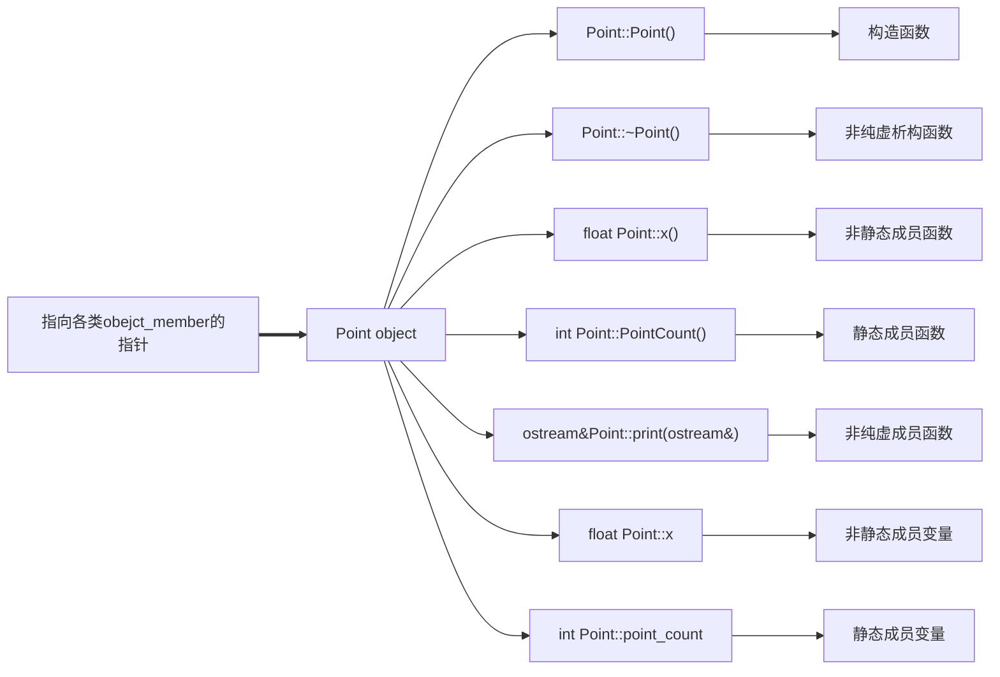
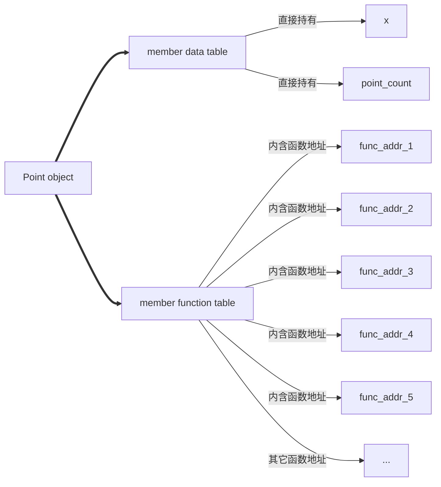
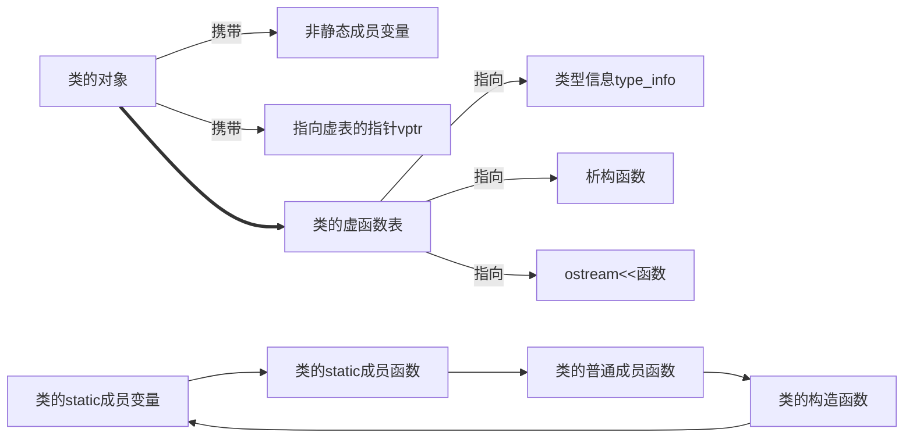

<!--
 * @Author: chenbei
 * @Date: 2022-04-16 18:43:24
 * @LastEditTime: 2022-04-16 19:25:48
 * @FilePath: \myLeetCode\深度探索C++对象模型.md
 * @Description: 深度探索C++对象模型.md
 * @Signature: A boy without dreams
-->

## 一、关于对象

C语言的顺序编程，在于数据和处理数据的操作是分开声明的，也就是没有支持数据和函数的关联性。也就是说所有函数都处理的是外部数据，例如结构体定义的聚合对象。除了函数意外，还可以定义宏函数，在预处理阶段即展开替换。

```c
#include <cstdio>
#define Point3DPrint( pd ) printf("(%g, %g, %g )",pd->x,pd->y,pd->z);
typedef struct point3d{
        float x;
        float y;
        float z;
}Point3D; // 别名
void print_pd(const Point3D* pd);
int main(){
    // for c
    Point3D * pd = new Point3D();
    pd->x = 1.0;
    pd->y = 2.0;
    pd->z = 3.0;

    // 使用函数,也可以使用宏
    printf("by function =>\n");
    print_pd(pd);
    printf("by define =>\n");
    Point3DPrint(pd);
    return 0;
}
void print_pd(const Point3D* pd){
    printf("%f %f %f\n", pd->x, pd->y, pd->z);
}
```

如果是C++，则属于OOP编程，它可以定义一个类将函数与函数联系起来，而非简单的聚合对象，可以看成是组合对象或者继承关系，即建立了一个抽象数据类型ADT=abstract data type。

```c++
#include <iostream>
using namespace std;
class Point3D{
    public:
        Point3D(float x = 0.0, float y = 0.0, float z = 0.0)
            :x(x),y(y),z(z){}
        float getX() const { return this->x; }
        float getY() const { return this->y; }
        float getZ() const { return this->z; }
        void setX(float x) { this->x = x; }
        void setY(float y) { this->y = y; }
        void setZ(float z) { this->z = z; }

    private:
        float x;
        float y;
        float z;
};
inline ostream& operator<<(ostream& os, const Point3D &pd) {
    cout<<"x = "<<pd.getX()<<" y = "<<pd.getY()<<" z = "<<pd.getZ()<<endl;
    return os;
}
int main()
{
    Point3D pd(1.0,2.0,3.0);
    cout<<pd<<endl;
    return 0;
}
```

抽象数据类型支持继承，派生类可以调用基类的构造函数来初始化。

```c++
#include <iostream>
using namespace std;
class Point{
    public:
        Point(float x = 0.0):x(x){}
        void setX(float x){
            this->x = x;
        }
        float getX(){
            return x;
        }
    protected:// 声明保护可被继承
        float x;
};
class Point2D:public Point{
    public:
        // 可以使用基类初始化基类成员,派生类初始化派生类成员
        Point2D(float x = 0.0,float y = 0.0):Point(x),y(y){}
        void setY(float y){
            this->y = y;
        }
        float getY(){
            return y;
        }
    protected: // 声明保护可被继承
        float y;
};
class Point3D:public Point2D{
    public:
        // 可以使用基类初始化基类成员,派生类初始化派生类成员
        Point3D(float x = 0.0,float y = 0.0,float z = 0.0):Point2D(x,y),z(z){}
        void setZ(float z){
            this->z = z;
        }
        float getZ(){
            return z;
        }
    protected:// 声明保护可被继承
        float z;
};
int main()
{
    Point3D p(1.0,2.0,3.0);
    cout << p.getX() << " " << p.getY() << " " << p.getZ() << endl;
    return 0;
}
```

还支持模板以及模板参数。

```c++
#include <iostream>
#include <vector>
#include <assert.h>
using namespace std;
template<class valueType,int dim> // 允许模板参数化
class Point{
    public:
        Point(){}
        Point(valueType coords[dim]){ // 传入的也是数组
            for(int idx = 0;idx < dim;idx++){
                this->coords[idx] = coords[idx];
            }
        }

        // 此版本允许外部对实例化对象赋值
        valueType& operator[](int idx){ // 重载[]运算符 non_const版本
            // 不要使用static_assert,因为idx步数常量表达式
            assert(idx >= 0 && idx < dim); // 不能超过坐标范围
            return coords[idx];
        }

        // 此版本是为了得到属性值
        valueType operator[](int idx)const{ // 重载[]运算符 const版本
            assert(idx >= 0 && idx < dim); // 不能超过坐标范围
            return coords[idx];
        }

    private:
        valueType coords[dim]; // 一个d维数组用来存储valueType类型的数据
};
template<class ValueType,int dim>
inline ostream& operator<<(ostream& os,const Point<ValueType,dim>& p){
    for(int idx = 0;idx < dim;idx++){
        os << p[idx] << " ";
    }
    return os;
}
int main()
{
    Point<int,5> p1;
    p1[0] = 1;
    p1[1] = 2;
    p1[2] = 3;
    p1[3] = 4;
    p1[4] = 5;
    cout << p1 << endl;
    int *p = new int[5];
    p[0] = 1;
    p[1] = 2;
    p[2] = 3;
    p[3] = 4;
    p[4] = 5;
    const Point<int,5> p2(p);
    cout << p2 << endl;
    return 0;
}
```

现在比较C与C++。对于数据成员来说，使用class相比struct并没有增加成本，每个对象实例都会有这些成员变量；对于成员函数，如果是非inline函数，那么只会有一个函数实例，只是对象去调用了这个函数；如果是inline函数，每个对象都会产生函数实例。

实际上，class带来的额外成本主要是2个。

第一、虚函数机制，virtual function，这是为了实现动态绑定，即指向的实际对象类型为准；

第二、虚基类，virtual base class，用来实现虚基类在被派生类继承时只存在一个单一且共享的实例；

第三、可能在多重继承时出现一些类型转换成本。

### 1.1 C++对象模式

成员变量分为static和non-static类型，以及三种成员函数，virtual(纯虚与非纯虚,对应接口和缺省实现)、non-virtual函数(分为static和non-static函数,要求派生类不能覆写非虚函数)，static函数只有共享的1份实例。对于下边的类，可以使用简单对象模型进行考虑。

```c++
class Point{
    public:
    	Point(float x);
    	virtual ~Point();
    	float x() const;
    	static int PointCount();
    protected:
    	virtual ostream& print(ostream &os) const;
    	float x;
    	static int point_count;
}
```

简单对象模型可以使用下方流程图表示。

在这个简单模型下，成员(包括变量和函数)本身不在对象内，只是指向各类成员的指针才在对象内，这样可以避免不同成员需要不同的存储空间所导致的问题，也就是类尽量不存直接放数据和函数。事实上对象依靠slot的索引值进行寻址，例如这里的成员变量x和point_count索引值是6和7。整个类的大小就是指针大小乘类中声明的members个数。



另一种模型是表格驱动对象模型，也就是把members区分出data member table和member function table，类对象只是包含指向这2个表格的指针。成员函数表有一系列的slot表格，每个slot都指向一个成员函数，而成员变量表直接持有数据本身。这个方案也没有用到真正的C++编译器上，但是这个成员函数表的观念成为一个指出虚函数表virtual functions table的有效方案。



2022/4/17/11:27

### 1.2 C++ 对象模型

2022/4/25/21:24,隔了些日子没看,最近没回家公司也一直在忙没时间看。

目前的C++对象模型基于上述设计，对简单对象模型和表格驱动模型进行了优化。

对于非静态成员变量，都会分配在每个类的对象中携带；

对于静态成员变量、静态与非静态成员函数、构造函数都在类对象之外的地方存放；

虚函数则是每个类产生出一堆指向虚函数的指针放在表格中，也就是虚函数表vtbl。之后类的对象被安插一个指针，指向相关的虚函数表，即vptr。vptr的设定和重置都由类的构造、析构和复制构造与等式赋值自动完成。每个类关联的Type_info 类型信息也都由虚表指出来，通常放在表格的第一个slot。

以上可以表示流程图如下。




## 二、构造函数语义学


## 三、Data语义学


## 四、Function语义学


## 五、构造、析构、拷贝语义学


## 六、执行期语义学


## 七、站在对象模型的尖端

